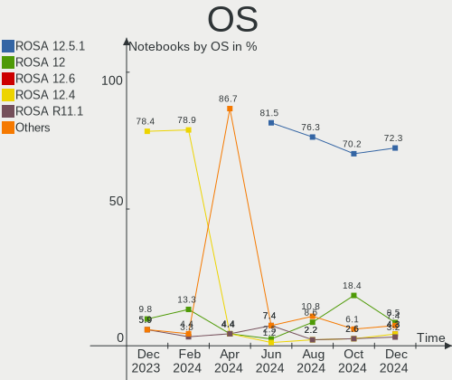
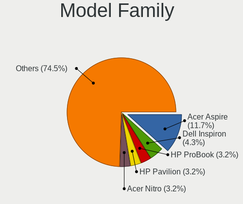
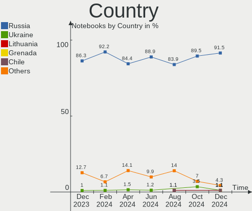
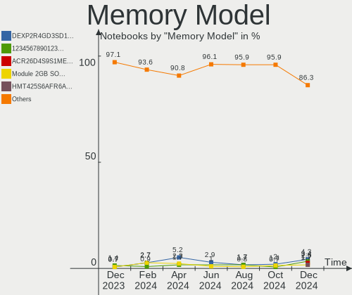

ROSA - Hardware Trends (Notebooks)
----------------------------------

A project to identify most popular hardware characteristics and track their change
over time based on data collected by Linux users at https://Linux-Hardware.org.

Anyone can contribute to this report by the [hw-probe](https://github.com/linuxhw/hw-probe) tool:

    sudo -E hw-probe -all -upload

This report is for one last month. Overall report since the beginning of time: [TestCoverage](https://github.com/linuxhw/TestCoverage)

Period: Jul, 2022.

Contents
--------

* [ System ](#system)
  - [ OS                       ](#os)
  - [ OS Family                ](#os-family)
  - [ Kernel                   ](#kernel)
  - [ Kernel Family            ](#kernel-family)
  - [ Kernel Major Ver.        ](#kernel-major-ver)
  - [ Arch                     ](#arch)
  - [ DE                       ](#de)
  - [ Display Server           ](#display-server)
  - [ Display Manager          ](#display-manager)
  - [ OS Lang                  ](#os-lang)
  - [ Boot Mode                ](#boot-mode)
  - [ Filesystem               ](#filesystem)
  - [ Part. scheme             ](#part-scheme)
  - [ Dual Boot with Linux/BSD ](#dual-boot-with-linuxbsd)
  - [ Dual Boot (Win)          ](#dual-boot-win)

* [ Board ](#board)
  - [ Vendor                   ](#vendor)
  - [ Model                    ](#model)
  - [ Model Family             ](#model-family)
  - [ MFG Year                 ](#mfg-year)
  - [ Form Factor              ](#form-factor)
  - [ Secure Boot              ](#secure-boot)
  - [ Coreboot                 ](#coreboot)
  - [ RAM Size                 ](#ram-size)
  - [ RAM Used                 ](#ram-used)
  - [ Total Drives             ](#total-drives)
  - [ Has CD-ROM               ](#has-cd-rom)
  - [ Has Ethernet             ](#has-ethernet)
  - [ Has WiFi                 ](#has-wifi)
  - [ Has Bluetooth            ](#has-bluetooth)

* [ Location ](#location)
  - [ Country                  ](#country)
  - [ City                     ](#city)

* [ Drives ](#drives)
  - [ Drive Vendor             ](#drive-vendor)
  - [ Drive Model              ](#drive-model)
  - [ HDD Vendor               ](#hdd-vendor)
  - [ SSD Vendor               ](#ssd-vendor)
  - [ Drive Kind               ](#drive-kind)
  - [ Drive Connector          ](#drive-connector)
  - [ Drive Size               ](#drive-size)
  - [ Space Total              ](#space-total)
  - [ Space Used               ](#space-used)
  - [ Malfunc. Drives          ](#malfunc-drives)
  - [ Malfunc. Drive Vendor    ](#malfunc-drive-vendor)
  - [ Malfunc. HDD Vendor      ](#malfunc-hdd-vendor)
  - [ Malfunc. Drive Kind      ](#malfunc-drive-kind)
  - [ Failed Drives            ](#failed-drives)
  - [ Failed Drive Vendor      ](#failed-drive-vendor)
  - [ Drive Status             ](#drive-status)

* [ Storage controller ](#storage-controller)
  - [ Storage Vendor           ](#storage-vendor)
  - [ Storage Model            ](#storage-model)
  - [ Storage Kind             ](#storage-kind)

* [ Processor ](#processor)
  - [ CPU Vendor               ](#cpu-vendor)
  - [ CPU Model                ](#cpu-model)
  - [ CPU Model Family         ](#cpu-model-family)
  - [ CPU Cores                ](#cpu-cores)
  - [ CPU Sockets              ](#cpu-sockets)
  - [ CPU Threads              ](#cpu-threads)
  - [ CPU Op-Modes             ](#cpu-op-modes)
  - [ CPU Microcode            ](#cpu-microcode)
  - [ CPU Microarch            ](#cpu-microarch)

* [ Graphics ](#graphics)
  - [ GPU Vendor               ](#gpu-vendor)
  - [ GPU Model                ](#gpu-model)
  - [ GPU Combo                ](#gpu-combo)
  - [ GPU Driver               ](#gpu-driver)
  - [ GPU Memory               ](#gpu-memory)

* [ Monitor ](#monitor)
  - [ Monitor Vendor           ](#monitor-vendor)
  - [ Monitor Model            ](#monitor-model)
  - [ Monitor Resolution       ](#monitor-resolution)
  - [ Monitor Diagonal         ](#monitor-diagonal)
  - [ Monitor Width            ](#monitor-width)
  - [ Aspect Ratio             ](#aspect-ratio)
  - [ Monitor Area             ](#monitor-area)
  - [ Pixel Density            ](#pixel-density)
  - [ Multiple Monitors        ](#multiple-monitors)

* [ Network ](#network)
  - [ Net Controller Vendor    ](#net-controller-vendor)
  - [ Net Controller Model     ](#net-controller-model)
  - [ Wireless Vendor          ](#wireless-vendor)
  - [ Wireless Model           ](#wireless-model)
  - [ Ethernet Vendor          ](#ethernet-vendor)
  - [ Ethernet Model           ](#ethernet-model)
  - [ Net Controller Kind      ](#net-controller-kind)
  - [ Used Controller          ](#used-controller)
  - [ NICs                     ](#nics)
  - [ IPv6                     ](#ipv6)

* [ Bluetooth ](#bluetooth)
  - [ Bluetooth Vendor         ](#bluetooth-vendor)
  - [ Bluetooth Model          ](#bluetooth-model)

* [ Sound ](#sound)
  - [ Sound Vendor             ](#sound-vendor)
  - [ Sound Model              ](#sound-model)

* [ Memory ](#memory)
  - [ Memory Vendor            ](#memory-vendor)
  - [ Memory Model             ](#memory-model)
  - [ Memory Kind              ](#memory-kind)
  - [ Memory Form Factor       ](#memory-form-factor)
  - [ Memory Size              ](#memory-size)
  - [ Memory Speed             ](#memory-speed)

* [ Printers & scanners ](#printers--scanners)
  - [ Printer Vendor           ](#printer-vendor)
  - [ Printer Model            ](#printer-model)
  - [ Scanner Vendor           ](#scanner-vendor)
  - [ Scanner Model            ](#scanner-model)

* [ Camera ](#camera)
  - [ Camera Vendor            ](#camera-vendor)
  - [ Camera Model             ](#camera-model)

* [ Security ](#security)
  - [ Fingerprint Vendor       ](#fingerprint-vendor)
  - [ Fingerprint Model        ](#fingerprint-model)
  - [ Chipcard Vendor          ](#chipcard-vendor)
  - [ Chipcard Model           ](#chipcard-model)

* [ Unsupported ](#unsupported)
  - [ Unsupported Devices      ](#unsupported-devices)
  - [ Unsupported Device Types ](#unsupported-device-types)

System
------

OS
--

Installed operating systems

| Name       | Notebooks | Percent |
|------------|-----------|---------|
| ROSA 12.2  | 130       | 89.04%  |
| ROSA R11.1 | 13        | 8.9%    |
| ROSA 12.1  | 2         | 1.37%   |
| ROSA R11   | 1         | 0.68%   |

OS Family
---------

OS without a version

| Name | Notebooks | Percent |
|------|-----------|---------|
| ROSA | 146       | 100%    |

Kernel
------

Version of the Linux kernel

| Version                                    | Notebooks | Percent |
|--------------------------------------------|-----------|---------|
| 5.10.74-generic-2rosa2021.1-x86_64         | 63        | 43.15%  |
| 5.10.118-generic-2rosa2021.1-x86_64        | 50        | 34.25%  |
| 5.4.83-generic-2rosa-i586                  | 6         | 4.11%   |
| 5.17.11-generic-2rosa2021.1-x86_64         | 4         | 2.74%   |
| 5.15.43-generic-2rosa2021.1-x86_64         | 3         | 2.05%   |
| 5.4.83-generic-2rosa-x86_64                | 2         | 1.37%   |
| 5.4.32-generic-2rosa-x86_64                | 2         | 1.37%   |
| 5.15.32-generic-6rosa2021.1-x86_64         | 2         | 1.37%   |
| 5.10.74-generic-2rosa2021.1-i586           | 2         | 1.37%   |
| 5.4.32-generic-2rosa-i586                  | 1         | 0.68%   |
| 5.4.150-generic-1rosa2021.1-x86_64         | 1         | 0.68%   |
| 5.18.8.xm1-1.klp-xanmod-rosa2021.1-x86_64  | 1         | 0.68%   |
| 5.18.3.xm1-1.klp-xanmod-rosa2021.1-x86_64  | 1         | 0.68%   |
| 5.18.13-generic-1rosa2021.1-x86_64         | 1         | 0.68%   |
| 5.18.11.xm1-1.klp-xanmod-rosa2021.1-x86_64 | 1         | 0.68%   |
| 5.18.10.xm1-1.klp-xanmod-rosa2021.1-x86_64 | 1         | 0.68%   |
| 5.16.19-generic-2rosa2021.1-x86_64         | 1         | 0.68%   |
| 5.10.118-generic-2rosa2021.1-i586          | 1         | 0.68%   |
| 4.9.155-nrj-desktop-1rosa-x86_64           | 1         | 0.68%   |
| 4.15.0-desktop-45.1rosa-i586               | 1         | 0.68%   |
| 4.15.0-desktop-122.124.1rosa-x86_64        | 1         | 0.68%   |

Kernel Family
-------------

Linux kernel without a distro release

| Version  | Notebooks | Percent |
|----------|-----------|---------|
| 5.10.74  | 65        | 44.52%  |
| 5.10.118 | 51        | 34.93%  |
| 5.4.83   | 8         | 5.48%   |
| 5.17.11  | 4         | 2.74%   |
| 5.4.32   | 3         | 2.05%   |
| 5.15.43  | 3         | 2.05%   |
| 5.15.32  | 2         | 1.37%   |
| 4.15.0   | 2         | 1.37%   |
| 5.4.150  | 1         | 0.68%   |
| 5.18.8   | 1         | 0.68%   |
| 5.18.3   | 1         | 0.68%   |
| 5.18.13  | 1         | 0.68%   |
| 5.18.11  | 1         | 0.68%   |
| 5.18.10  | 1         | 0.68%   |
| 5.16.19  | 1         | 0.68%   |
| 4.9.155  | 1         | 0.68%   |

Kernel Major Ver.
-----------------

Linux kernel major version

| Version | Notebooks | Percent |
|---------|-----------|---------|
| 5.10    | 116       | 79.45%  |
| 5.4     | 12        | 8.22%   |
| 5.18    | 5         | 3.42%   |
| 5.15    | 5         | 3.42%   |
| 5.17    | 4         | 2.74%   |
| 4.15    | 2         | 1.37%   |
| 5.16    | 1         | 0.68%   |
| 4.9     | 1         | 0.68%   |

Arch
----

OS architecture (x86_64, i586, etc.)

| Name   | Notebooks | Percent |
|--------|-----------|---------|
| x86_64 | 135       | 92.47%  |
| i686   | 11        | 7.53%   |

DE
--

Desktop Environment

| Name  | Notebooks | Percent |
|-------|-----------|---------|
| KDE5  | 66        | 45.21%  |
| GNOME | 56        | 38.36%  |
| KDE4  | 12        | 8.22%   |
| LXQt  | 11        | 7.53%   |
| MATE  | 1         | 0.68%   |

Display Server
--------------

X11 or Wayland

| Name    | Notebooks | Percent |
|---------|-----------|---------|
| Wayland | 118       | 80.82%  |
| X11     | 28        | 19.18%  |

Display Manager
---------------

SDDM, LightDM, etc.

| Name    | Notebooks | Percent |
|---------|-----------|---------|
| GDM     | 67        | 45.89%  |
| SDDM    | 64        | 43.84%  |
| KDM     | 12        | 8.22%   |
| LightDM | 3         | 2.05%   |

OS Lang
-------

Language

| Lang    | Notebooks | Percent |
|---------|-----------|---------|
| ru_RU   | 136       | 93.15%  |
| en_US   | 4         | 2.74%   |
| es_ES   | 3         | 2.05%   |
| pt_BR   | 1         | 0.68%   |
| pl_PL   | 1         | 0.68%   |
| Unknown | 1         | 0.68%   |

Boot Mode
---------

EFI or BIOS

| Mode | Notebooks | Percent |
|------|-----------|---------|
| EFI  | 76        | 52.05%  |
| BIOS | 70        | 47.95%  |

Filesystem
----------

Type of filesystem

| Type  | Notebooks | Percent |
|-------|-----------|---------|
| Ext4  | 140       | 95.89%  |
| Btrfs | 6         | 4.11%   |

Part. scheme
------------

Scheme of partitioning

| Type | Notebooks | Percent |
|------|-----------|---------|
| GPT  | 90        | 61.64%  |
| MBR  | 56        | 38.36%  |

Dual Boot with Linux/BSD
------------------------

Hosting more than one Linux/BSD

| Dual boot | Notebooks | Percent |
|-----------|-----------|---------|
| No        | 113       | 77.4%   |
| Yes       | 33        | 22.6%   |

Dual Boot (Win)
---------------

Hosting Linux and Windows

| Dual boot | Notebooks | Percent |
|-----------|-----------|---------|
| No        | 86        | 58.9%   |
| Yes       | 60        | 41.1%   |

Board
-----

Vendor
------

Motherboard manufacturer

| Name                | Notebooks | Percent |
|---------------------|-----------|---------|
| ASUSTek Computer    | 28        | 19.18%  |
| Lenovo              | 27        | 18.49%  |
| Acer                | 26        | 17.81%  |
| Hewlett-Packard     | 18        | 12.33%  |
| Dell                | 7         | 4.79%   |
| Sony                | 6         | 4.11%   |
| Toshiba             | 5         | 3.42%   |
| Samsung Electronics | 4         | 2.74%   |
| Aquarius            | 4         | 2.74%   |
| Packard Bell        | 3         | 2.05%   |
| Timi                | 2         | 1.37%   |
| MSI                 | 2         | 1.37%   |
| Irbis               | 2         | 1.37%   |
| Insyde              | 2         | 1.37%   |
| THD                 | 1         | 0.68%   |
| Notebook            | 1         | 0.68%   |
| Maibenben           | 1         | 0.68%   |
| Kraftway            | 1         | 0.68%   |
| HONOR               | 1         | 0.68%   |
| Fujitsu             | 1         | 0.68%   |
| eMachines           | 1         | 0.68%   |
| Chuwi               | 1         | 0.68%   |
| 3Logic Group        | 1         | 0.68%   |
| Unknown             | 1         | 0.68%   |

Model
-----

Motherboard model

| Name                                        | Notebooks | Percent |
|---------------------------------------------|-----------|---------|
| HP Pavilion g6                              | 3         | 2.05%   |
| Aquarius NS685U R11                         | 3         | 2.05%   |
| Acer Aspire A315-51                         | 3         | 2.05%   |
| Lenovo G580 20157                           | 2         | 1.37%   |
| Insyde CherryTrail                          | 2         | 1.37%   |
| HP Notebook                                 | 2         | 1.37%   |
| HP Laptop 15-db1xxx                         | 2         | 1.37%   |
| Acer Aspire E5-573G                         | 2         | 1.37%   |
| Acer Aspire 5741G                           | 2         | 1.37%   |
| Acer Aspire 5730                            | 2         | 1.37%   |
| Unknown                                     | 2         | 1.37%   |
| Toshiba Satellite L750D                     | 1         | 0.68%   |
| Toshiba Satellite C660                      | 1         | 0.68%   |
| Toshiba Satellite C55-B                     | 1         | 0.68%   |
| Toshiba Satellite A300                      | 1         | 0.68%   |
| Toshiba Satellite A200                      | 1         | 0.68%   |
| Timi TM1701                                 | 1         | 0.68%   |
| Timi Mi Laptop Pro 15 2020                  | 1         | 0.68%   |
| THD PX1                                     | 1         | 0.68%   |
| Sony VPCEL3S1R                              | 1         | 0.68%   |
| Sony VPCEH2E1R                              | 1         | 0.68%   |
| Sony VGN-TT31MR_N                           | 1         | 0.68%   |
| Sony VGN-FS515BR                            | 1         | 0.68%   |
| Sony SVE1512H1RW                            | 1         | 0.68%   |
| Sony SVE1511B1RW                            | 1         | 0.68%   |
| Samsung R530/R730/R540                      | 1         | 0.68%   |
| Samsung QX310/QX410/QX510/SF310/SF410/SF510 | 1         | 0.68%   |
| Samsung 350V5C/351V5C/3540VC/3440VC         | 1         | 0.68%   |
| Samsung 300E4C/300E5C/300E7C                | 1         | 0.68%   |
| Packard Bell EasyNote TJ71                  | 1         | 0.68%   |
| Packard Bell EasyNote TE11HC                | 1         | 0.68%   |
| Packard Bell EasyNote LJ75                  | 1         | 0.68%   |
| Notebook W250EGQ / W270EGQ                  | 1         | 0.68%   |
| MSI GL65 Leopard 10SCSR                     | 1         | 0.68%   |
| MSI FX610                                   | 1         | 0.68%   |
| Maibenben ZiMai Z5                          | 1         | 0.68%   |
| Lenovo Y520-15IKBN 80WK                     | 1         | 0.68%   |
| Lenovo Y50-70 Touch 20349                   | 1         | 0.68%   |
| Lenovo V14-IIL 82C4                         | 1         | 0.68%   |
| Lenovo ThinkPad T60 1953D9U                 | 1         | 0.68%   |
| Lenovo ThinkPad T480s 20L7001PAD            | 1         | 0.68%   |
| Lenovo ThinkPad L390 20NR0013RK             | 1         | 0.68%   |
| Lenovo ThinkBook 15 G3 ACL 21A4             | 1         | 0.68%   |
| Lenovo LegionY540-17IRH-PG0 81T3            | 1         | 0.68%   |
| Lenovo Legion 5 15IMH05H 81Y6               | 1         | 0.68%   |
| Lenovo IdeaPad Yoga 13 20175                | 1         | 0.68%   |
| Lenovo IdeaPad S340-15IML 81NA              | 1         | 0.68%   |
| Lenovo IdeaPad S340-14API 81NB              | 1         | 0.68%   |
| Lenovo IdeaPad S145-15IGM 81MX              | 1         | 0.68%   |
| Lenovo IdeaPad Gaming 3 15ARH05 82EY        | 1         | 0.68%   |
| Lenovo IdeaPad 330S-14IKB 81F4              | 1         | 0.68%   |
| Lenovo IdeaPad 3 15IML05 81WB               | 1         | 0.68%   |
| Lenovo IdeaPad 3 15ADA6 82KR                | 1         | 0.68%   |
| Lenovo G710 20252                           | 1         | 0.68%   |
| Lenovo E31-70 80KX                          | 1         | 0.68%   |
| Lenovo B590 20208                           | 1         | 0.68%   |
| Lenovo B590 20206                           | 1         | 0.68%   |
| Lenovo B50-45 20388                         | 1         | 0.68%   |
| Lenovo B50-10 80QR                          | 1         | 0.68%   |
| Lenovo ACLUAB                               | 1         | 0.68%   |

Model Family
------------

Motherboard model prefix

| Name                        | Notebooks | Percent |
|-----------------------------|-----------|---------|
| Acer Aspire                 | 19        | 13.01%  |
| Lenovo IdeaPad              | 8         | 5.48%   |
| HP Pavilion                 | 6         | 4.11%   |
| Toshiba Satellite           | 5         | 3.42%   |
| HP Laptop                   | 4         | 2.74%   |
| ASUS VivoBook               | 4         | 2.74%   |
| Packard Bell EasyNote       | 3         | 2.05%   |
| Lenovo ThinkPad             | 3         | 2.05%   |
| Aquarius NS685U             | 3         | 2.05%   |
| Lenovo G580                 | 2         | 1.37%   |
| Lenovo B590                 | 2         | 1.37%   |
| Insyde CherryTrail          | 2         | 1.37%   |
| HP ProBook                  | 2         | 1.37%   |
| HP Notebook                 | 2         | 1.37%   |
| Dell Vostro                 | 2         | 1.37%   |
| ASUS TUF                    | 2         | 1.37%   |
| Acer Swift                  | 2         | 1.37%   |
| Acer Extensa                | 2         | 1.37%   |
| Unknown                     | 2         | 1.37%   |
| Timi TM1701                 | 1         | 0.68%   |
| Timi Mi                     | 1         | 0.68%   |
| THD PX1                     | 1         | 0.68%   |
| Sony VPCEL3S1R              | 1         | 0.68%   |
| Sony VPCEH2E1R              | 1         | 0.68%   |
| Sony VGN-TT31MR             | 1         | 0.68%   |
| Sony VGN-FS515BR            | 1         | 0.68%   |
| Sony SVE1512H1RW            | 1         | 0.68%   |
| Sony SVE1511B1RW            | 1         | 0.68%   |
| Samsung R530                | 1         | 0.68%   |
| Samsung QX310               | 1         | 0.68%   |
| Samsung 350V5C              | 1         | 0.68%   |
| Samsung 300E4C              | 1         | 0.68%   |
| Notebook W250EGQ            | 1         | 0.68%   |
| MSI GL65                    | 1         | 0.68%   |
| MSI FX610                   | 1         | 0.68%   |
| Maibenben ZiMai             | 1         | 0.68%   |
| Lenovo Y520-15IKBN          | 1         | 0.68%   |
| Lenovo Y50-70               | 1         | 0.68%   |
| Lenovo V14-IIL              | 1         | 0.68%   |
| Lenovo ThinkBook            | 1         | 0.68%   |
| Lenovo LegionY540-17IRH-PG0 | 1         | 0.68%   |
| Lenovo Legion               | 1         | 0.68%   |
| Lenovo G710                 | 1         | 0.68%   |
| Lenovo E31-70               | 1         | 0.68%   |
| Lenovo B50-45               | 1         | 0.68%   |
| Lenovo B50-10               | 1         | 0.68%   |
| Lenovo ACLUAB               | 1         | 0.68%   |
| Lenovo 3000                 | 1         | 0.68%   |
| Kraftway ACCORD             | 1         | 0.68%   |
| Irbis NB660                 | 1         | 0.68%   |
| Irbis NB20                  | 1         | 0.68%   |
| HONOR NBR-WAX9              | 1         | 0.68%   |
| HP OMEN                     | 1         | 0.68%   |
| HP ENVY                     | 1         | 0.68%   |
| HP Compaq                   | 1         | 0.68%   |
| HP 250                      | 1         | 0.68%   |
| Fujitsu AMILO               | 1         | 0.68%   |
| eMachines E525              | 1         | 0.68%   |
| Dell XPS                    | 1         | 0.68%   |
| Dell Precision              | 1         | 0.68%   |

MFG Year
--------

Motherboard manufacture year

| Year | Notebooks | Percent |
|------|-----------|---------|
| 2012 | 20        | 13.7%   |
| 2011 | 13        | 8.9%    |
| 2020 | 12        | 8.22%   |
| 2010 | 10        | 6.85%   |
| 2021 | 9         | 6.16%   |
| 2015 | 9         | 6.16%   |
| 2014 | 9         | 6.16%   |
| 2019 | 8         | 5.48%   |
| 2018 | 7         | 4.79%   |
| 2017 | 7         | 4.79%   |
| 2009 | 7         | 4.79%   |
| 2008 | 7         | 4.79%   |
| 2007 | 7         | 4.79%   |
| 2022 | 6         | 4.11%   |
| 2016 | 6         | 4.11%   |
| 2013 | 6         | 4.11%   |
| 2006 | 2         | 1.37%   |
| 2005 | 1         | 0.68%   |

Form Factor
-----------

Physical design of the computer

| Name     | Notebooks | Percent |
|----------|-----------|---------|
| Notebook | 146       | 100%    |

Secure Boot
-----------

Enabled or disabled

| State    | Notebooks | Percent |
|----------|-----------|---------|
| Disabled | 146       | 100%    |

Coreboot
--------

Have coreboot on board

| Used | Notebooks | Percent |
|------|-----------|---------|
| No   | 146       | 100%    |

RAM Size
--------

Total RAM memory

| Size in GB | Notebooks | Percent |
|------------|-----------|---------|
| 4.01-8.0   | 60        | 41.1%   |
| 3.01-4.0   | 39        | 26.71%  |
| 1.01-2.0   | 21        | 14.38%  |
| 8.01-16.0  | 13        | 8.9%    |
| 16.01-24.0 | 7         | 4.79%   |
| 2.01-3.0   | 4         | 2.74%   |
| 32.01-64.0 | 1         | 0.68%   |
| 24.01-32.0 | 1         | 0.68%   |

RAM Used
--------

Used RAM memory

| Used GB   | Notebooks | Percent |
|-----------|-----------|---------|
| 1.01-2.0  | 82        | 56.16%  |
| 0.51-1.0  | 43        | 29.45%  |
| 2.01-3.0  | 14        | 9.59%   |
| 4.01-8.0  | 4         | 2.74%   |
| 3.01-4.0  | 1         | 0.68%   |
| 8.01-16.0 | 1         | 0.68%   |
| 0.01-0.5  | 1         | 0.68%   |

Total Drives
------------

Number of drives on board

| Drives | Notebooks | Percent |
|--------|-----------|---------|
| 1      | 104       | 71.23%  |
| 2      | 38        | 26.03%  |
| 3      | 2         | 1.37%   |
| 5      | 1         | 0.68%   |
| 4      | 1         | 0.68%   |

Has CD-ROM
----------

Has CD-ROM on board

| Presented | Notebooks | Percent |
|-----------|-----------|---------|
| No        | 92        | 63.01%  |
| Yes       | 54        | 36.99%  |

Has Ethernet
------------

Has Ethernet on board

| Presented | Notebooks | Percent |
|-----------|-----------|---------|
| Yes       | 121       | 82.88%  |
| No        | 25        | 17.12%  |

Has WiFi
--------

Has WiFi module

| Presented | Notebooks | Percent |
|-----------|-----------|---------|
| Yes       | 141       | 96.58%  |
| No        | 5         | 3.42%   |

Has Bluetooth
-------------

Has Bluetooth module

| Presented | Notebooks | Percent |
|-----------|-----------|---------|
| Yes       | 101       | 69.18%  |
| No        | 45        | 30.82%  |

Location
--------

Country
-------

Geographic location (country)

| Country   | Notebooks | Percent |
|-----------|-----------|---------|
| Russia    | 122       | 83.56%  |
| Ukraine   | 8         | 5.48%   |
| Belarus   | 6         | 4.11%   |
| Poland    | 2         | 1.37%   |
| UAE       | 1         | 0.68%   |
| Spain     | 1         | 0.68%   |
| Serbia    | 1         | 0.68%   |
| Peru      | 1         | 0.68%   |
| India     | 1         | 0.68%   |
| Germany   | 1         | 0.68%   |
| Brazil    | 1         | 0.68%   |
| Argentina | 1         | 0.68%   |

City
----

Geographic location (city)

| City                       | Notebooks | Percent |
|----------------------------|-----------|---------|
| Moscow                     | 17        | 11.64%  |
| Yekaterinburg              | 7         | 4.79%   |
| St Petersburg              | 7         | 4.79%   |
| Voronezh                   | 4         | 2.74%   |
| Simferopol                 | 4         | 2.74%   |
| Saratov                    | 4         | 2.74%   |
| Novosibirsk                | 4         | 2.74%   |
| Nizhniy Novgorod           | 4         | 2.74%   |
| Perm                       | 3         | 2.05%   |
| Barnaul                    | 3         | 2.05%   |
| Warsaw                     | 2         | 1.37%   |
| Volgograd                  | 2         | 1.37%   |
| Tomsk                      | 2         | 1.37%   |
| Surgut                     | 2         | 1.37%   |
| Samara                     | 2         | 1.37%   |
| Rostov-on-Don              | 2         | 1.37%   |
| Penza                      | 2         | 1.37%   |
| Krasnoyarsk                | 2         | 1.37%   |
| Krasnodar                  | 2         | 1.37%   |
| Kirov                      | 2         | 1.37%   |
| Kazan’                   | 2         | 1.37%   |
| Kaluga                     | 2         | 1.37%   |
| Gomel                      | 2         | 1.37%   |
| Blagoveshchensk            | 2         | 1.37%   |
| Belgorod                   | 2         | 1.37%   |
| Zvenigorod                 | 1         | 0.68%   |
| Zhodzina                   | 1         | 0.68%   |
| Yalta                      | 1         | 0.68%   |
| Yablonovsky                | 1         | 0.68%   |
| Volzhskiy                  | 1         | 0.68%   |
| Vladivostok                | 1         | 0.68%   |
| Vladimir                   | 1         | 0.68%   |
| Vitebsk                    | 1         | 0.68%   |
| Villanueva del Rio y Minas | 1         | 0.68%   |
| Velikiye Luki              | 1         | 0.68%   |
| Ulan-Ude                   | 1         | 0.68%   |
| Ufa                        | 1         | 0.68%   |
| Tyumen                     | 1         | 0.68%   |
| Tver                       | 1         | 0.68%   |
| Tula                       | 1         | 0.68%   |
| Tatsinskiy                 | 1         | 0.68%   |
| Sumino                     | 1         | 0.68%   |
| Solikamsk                  | 1         | 0.68%   |
| Smolensk                   | 1         | 0.68%   |
| Shchelkovo                 | 1         | 0.68%   |
| Sharypovo                  | 1         | 0.68%   |
| Sharjah                    | 1         | 0.68%   |
| Severodvinsk               | 1         | 0.68%   |
| Sertolovo                  | 1         | 0.68%   |
| Sergiyev Posad             | 1         | 0.68%   |
| Saransk                    | 1         | 0.68%   |
| Ryazan                     | 1         | 0.68%   |
| Rio de Janeiro             | 1         | 0.68%   |
| Reutov                     | 1         | 0.68%   |
| Podolsk                    | 1         | 0.68%   |
| Petrozavodsk               | 1         | 0.68%   |
| Petropavlovsk-Kamchatsky   | 1         | 0.68%   |
| Orenburg                   | 1         | 0.68%   |
| Odintsovo                  | 1         | 0.68%   |
| Obernburg am Main          | 1         | 0.68%   |

Drives
------

Drive Vendor
------------

Hard drive vendors

| Vendor              | Notebooks | Drives | Percent |
|---------------------|-----------|--------|---------|
| WDC                 | 40        | 41     | 21.39%  |
| Seagate             | 20        | 21     | 10.7%   |
| Samsung Electronics | 15        | 17     | 8.02%   |
| Toshiba             | 13        | 13     | 6.95%   |
| Hitachi             | 13        | 13     | 6.95%   |
| Kingston            | 9         | 9      | 4.81%   |
| Unknown             | 7         | 9      | 3.74%   |
| SK hynix            | 7         | 7      | 3.74%   |
| A-DATA Technology   | 7         | 7      | 3.74%   |
| China               | 6         | 6      | 3.21%   |
| Intel               | 5         | 5      | 2.67%   |
| SPCC                | 4         | 4      | 2.14%   |
| Smartbuy            | 4         | 4      | 2.14%   |
| Netac               | 4         | 4      | 2.14%   |
| HGST                | 4         | 4      | 2.14%   |
| SanDisk             | 3         | 3      | 1.6%    |
| Gigabyte Technology | 3         | 3      | 1.6%    |
| UMIS                | 2         | 2      | 1.07%   |
| Transcend           | 2         | 2      | 1.07%   |
| Corsair             | 2         | 2      | 1.07%   |
| Apacer              | 2         | 2      | 1.07%   |
| XrayDisk            | 1         | 1      | 0.53%   |
| walram              | 1         | 1      | 0.53%   |
| TO Exter            | 1         | 1      | 0.53%   |
| Realtek             | 1         | 1      | 0.53%   |
| Plextor             | 1         | 1      | 0.53%   |
| Phison              | 1         | 1      | 0.53%   |
| MTFDDAK1            | 1         | 1      | 0.53%   |
| Micron Technology   | 1         | 1      | 0.53%   |
| Londisk             | 1         | 1      | 0.53%   |
| KingSpec            | 1         | 1      | 0.53%   |
| Kingmax             | 1         | 1      | 0.53%   |
| GOODRAM             | 1         | 1      | 0.53%   |
| BR                  | 1         | 1      | 0.53%   |
| BAITITON            | 1         | 1      | 0.53%   |
| Unknown             | 1         | 1      | 0.53%   |

Drive Model
-----------

Hard drive models

| Model                                | Notebooks | Percent |
|--------------------------------------|-----------|---------|
| WDC WDS240G2G0A-00JH30 240GB SSD     | 3         | 1.57%   |
| WDC WD5000LPCX-21VHAT0 500GB         | 3         | 1.57%   |
| Samsung SSD 860 EVO 250GB            | 3         | 1.57%   |
| Kingston SA400S37240G 240GB SSD      | 3         | 1.57%   |
| Hitachi HTS545032B9A300 320GB        | 3         | 1.57%   |
| Gigabyte GP-GSM2NE3256GNTD 256GB     | 3         | 1.57%   |
| A-DATA SU800NS38 256GB SSD           | 3         | 1.57%   |
| WDC WD5000LPCX-60VHAT0 500GB         | 2         | 1.05%   |
| WDC WD5000BEVT-22A0RT0 500GB         | 2         | 1.05%   |
| WDC PC SN730 SDBQNTY-512G-1001 512GB | 2         | 1.05%   |
| Unknown NCard  64GB                  | 2         | 1.05%   |
| UMIS RPJTJ256MEE1OWX 256GB           | 2         | 1.05%   |
| Toshiba MQ04ABF100 1TB               | 2         | 1.05%   |
| SPCC Solid State Disk 256GB          | 2         | 1.05%   |
| Seagate ST500LT012-1DG142 500GB      | 2         | 1.05%   |
| Seagate ST320LT020-9YG142 320GB      | 2         | 1.05%   |
| Seagate ST1000LM048-2E7172 1TB       | 2         | 1.05%   |
| Seagate ST1000LM024 HN-M101MBB 1TB   | 2         | 1.05%   |
| Netac SSD 256GB                      | 2         | 1.05%   |
| Hitachi HTS547575A9E384 752GB        | 2         | 1.05%   |
| China SSD 512GB                      | 2         | 1.05%   |
| XrayDisk SSD 256GB                   | 1         | 0.52%   |
| WDC WDS480G2G0A-00JH30 480GB SSD     | 1         | 0.52%   |
| WDC WDS250G2B0C-00PXH0 250GB         | 1         | 0.52%   |
| WDC WDS120G2G0A-00JH30 120GB SSD     | 1         | 0.52%   |
| WDC WDS100T3X0C-00SJG0 1TB           | 1         | 0.52%   |
| WDC WD7500BPVT-60HXZT3 752GB         | 1         | 0.52%   |
| WDC WD7500BPVT-08A1YT2 752GB         | 1         | 0.52%   |
| WDC WD7500BPVT-00HXZT3 752GB         | 1         | 0.52%   |
| WDC WD7500BPKT-75PK4T0 752GB         | 1         | 0.52%   |
| WDC WD5000LPVX-80V0TT0 500GB         | 1         | 0.52%   |
| WDC WD5000LPVX-22V0TT0 500GB         | 1         | 0.52%   |
| WDC WD5000LPCX-24VHAT0 500GB         | 1         | 0.52%   |
| WDC WD5000LPCX-00VHAT0 500GB         | 1         | 0.52%   |
| WDC WD5000BPVT-55HXZT3 500GB         | 1         | 0.52%   |
| WDC WD5000BEVT-24A0RT0 500GB         | 1         | 0.52%   |
| WDC WD2500BEVT-22A23T0 250GB         | 1         | 0.52%   |
| WDC WD2500BEKT-60A25T1 250GB         | 1         | 0.52%   |
| WDC WD1600BEVT-60ZCT1 160GB          | 1         | 0.52%   |
| WDC WD10SPZX-75Z10T2 1TB             | 1         | 0.52%   |
| WDC WD10SPZX-60Z10T0 1TB             | 1         | 0.52%   |
| WDC WD10SPZX-35Z10T0 1TB             | 1         | 0.52%   |
| WDC WD10SPZX-00Z10T0 1TB             | 1         | 0.52%   |
| WDC WD10SPCX-24HWST1 1TB             | 1         | 0.52%   |
| WDC WD10JPVX-22JC3T0 1TB             | 1         | 0.52%   |
| WDC WD10JPVT-60A1YT0 1TB             | 1         | 0.52%   |
| WDC PC SN730 SDBPNTY-512G-1006 512GB | 1         | 0.52%   |
| WDC PC SN530 SDBPNPZ-512G-1002 512GB | 1         | 0.52%   |
| WDC PC SN530 SDBPNPZ-256G-1006 256GB | 1         | 0.52%   |
| WDC PC SN520 SDAPMUW-512G-1101 512GB | 1         | 0.52%   |
| walram SSD 120G                      | 1         | 0.52%   |
| Unknown USD  8GB                     | 1         | 0.52%   |
| Unknown SD64G  64GB                  | 1         | 0.52%   |
| Unknown NCard  32GB                  | 1         | 0.52%   |
| Unknown EC2QT  64GB                  | 1         | 0.52%   |
| Unknown DA4128  128GB                | 1         | 0.52%   |
| Unknown DA4064  64GB                 | 1         | 0.52%   |
| Unknown 58K722  128GB                | 1         | 0.52%   |
| Transcend TS256GSSD230S 256GB        | 1         | 0.52%   |
| Transcend TS120GMTS820S 120GB SSD    | 1         | 0.52%   |

HDD Vendor
----------

Hard disk drive vendors

| Vendor              | Notebooks | Drives | Percent |
|---------------------|-----------|--------|---------|
| WDC                 | 27        | 28     | 36%     |
| Seagate             | 20        | 21     | 26.67%  |
| Hitachi             | 13        | 13     | 17.33%  |
| Toshiba             | 10        | 10     | 13.33%  |
| HGST                | 4         | 4      | 5.33%   |
| Samsung Electronics | 1         | 1      | 1.33%   |

SSD Vendor
----------

Solid state drive vendors

| Vendor              | Notebooks | Drives | Percent |
|---------------------|-----------|--------|---------|
| Samsung Electronics | 7         | 8      | 10.94%  |
| Kingston            | 7         | 7      | 10.94%  |
| China               | 6         | 6      | 9.38%   |
| WDC                 | 5         | 5      | 7.81%   |
| A-DATA Technology   | 5         | 5      | 7.81%   |
| SPCC                | 4         | 4      | 6.25%   |
| Smartbuy            | 4         | 4      | 6.25%   |
| Netac               | 4         | 4      | 6.25%   |
| SanDisk             | 3         | 3      | 4.69%   |
| Transcend           | 2         | 2      | 3.13%   |
| Corsair             | 2         | 2      | 3.13%   |
| Apacer              | 2         | 2      | 3.13%   |
| XrayDisk            | 1         | 1      | 1.56%   |
| walram              | 1         | 1      | 1.56%   |
| TO Exter            | 1         | 1      | 1.56%   |
| SK hynix            | 1         | 1      | 1.56%   |
| Plextor             | 1         | 1      | 1.56%   |
| Londisk             | 1         | 1      | 1.56%   |
| KingSpec            | 1         | 1      | 1.56%   |
| Kingmax             | 1         | 1      | 1.56%   |
| Intel               | 1         | 1      | 1.56%   |
| GOODRAM             | 1         | 1      | 1.56%   |
| BR                  | 1         | 1      | 1.56%   |
| BAITITON            | 1         | 1      | 1.56%   |
| Unknown             | 1         | 1      | 1.56%   |

Drive Kind
----------

HDD or SSD

| Kind    | Notebooks | Drives | Percent |
|---------|-----------|--------|---------|
| HDD     | 73        | 77     | 41.24%  |
| SSD     | 58        | 65     | 32.77%  |
| NVMe    | 36        | 39     | 20.34%  |
| MMC     | 9         | 11     | 5.08%   |
| Unknown | 1         | 1      | 0.56%   |

Drive Connector
---------------

SATA, SAS, NVMe, etc.

| Type | Notebooks | Drives | Percent |
|------|-----------|--------|---------|
| SATA | 115       | 138    | 70.12%  |
| NVMe | 35        | 38     | 21.34%  |
| MMC  | 9         | 11     | 5.49%   |
| SAS  | 5         | 6      | 3.05%   |

Drive Size
----------

Size of hard drive

| Size in TB | Notebooks | Drives | Percent |
|------------|-----------|--------|---------|
| 0.01-0.5   | 92        | 105    | 72.44%  |
| 0.51-1.0   | 33        | 35     | 25.98%  |
| 3.01-4.0   | 1         | 1      | 0.79%   |
| 1.01-2.0   | 1         | 1      | 0.79%   |

Space Total
-----------

Amount of disk space available on the file system

| Size in GB     | Notebooks | Percent |
|----------------|-----------|---------|
| 101-250        | 52        | 35.62%  |
| 251-500        | 33        | 22.6%   |
| 501-1000       | 17        | 11.64%  |
| 1-20           | 16        | 10.96%  |
| 21-50          | 11        | 7.53%   |
| 51-100         | 10        | 6.85%   |
| 1001-2000      | 4         | 2.74%   |
| More than 3000 | 2         | 1.37%   |
| 2001-3000      | 1         | 0.68%   |

Space Used
----------

Amount of used disk space

| Used GB   | Notebooks | Percent |
|-----------|-----------|---------|
| 1-20      | 111       | 76.03%  |
| 101-250   | 11        | 7.53%   |
| 21-50     | 9         | 6.16%   |
| 51-100    | 9         | 6.16%   |
| 1001-2000 | 3         | 2.05%   |
| 251-500   | 2         | 1.37%   |
| 501-1000  | 1         | 0.68%   |

Malfunc. Drives
---------------

Drive models with a malfunction

| Model                               | Notebooks | Drives | Percent |
|-------------------------------------|-----------|--------|---------|
| WDC WD5000BEVT-22A0RT0 500GB        | 2         | 2      | 5.88%   |
| Hitachi HTS545032B9A300 320GB       | 2         | 2      | 5.88%   |
| WDC WDS240G2G0A-00JH30 240GB SSD    | 1         | 1      | 2.94%   |
| WDC WD7500BPVT-60HXZT3 752GB        | 1         | 1      | 2.94%   |
| WDC WD5000LPCX-60VHAT0 500GB        | 1         | 1      | 2.94%   |
| WDC WD2500BEVT-22A23T0 250GB        | 1         | 1      | 2.94%   |
| WDC WD2500BEKT-60A25T1 250GB        | 1         | 1      | 2.94%   |
| WDC WD10JPVT-60A1YT0 1TB            | 1         | 2      | 2.94%   |
| Toshiba MQ01ABD050 500GB            | 1         | 1      | 2.94%   |
| Toshiba MK8025GAS 80GB              | 1         | 1      | 2.94%   |
| Toshiba MK3259GSXP 320GB            | 1         | 1      | 2.94%   |
| Seagate ST9320325AS 320GB           | 1         | 1      | 2.94%   |
| Seagate ST9120822AS 120GB           | 1         | 1      | 2.94%   |
| Seagate ST500LM021-1KJ152 500GB     | 1         | 1      | 2.94%   |
| Seagate ST320LT020-9YG142 320GB     | 1         | 1      | 2.94%   |
| Seagate ST320LM001 HN-M320MBB 320GB | 1         | 1      | 2.94%   |
| Seagate ST1000LM048-2E7172 1TB      | 1         | 1      | 2.94%   |
| Seagate ST1000LM024 HN-M101MBB 1TB  | 1         | 1      | 2.94%   |
| Seagate ST1000LM014-SSHD-8GB        | 1         | 1      | 2.94%   |
| Netac SSD 720GB                     | 1         | 1      | 2.94%   |
| Kingston SV200S364G 64GB SSD        | 1         | 1      | 2.94%   |
| Hitachi HTS547550A9E384 500GB       | 1         | 1      | 2.94%   |
| Hitachi HTS545050B9A300 500GB       | 1         | 1      | 2.94%   |
| Hitachi HTS542525K9SA00 250GB       | 1         | 1      | 2.94%   |
| Hitachi HTS542516K9SA00 160GB       | 1         | 1      | 2.94%   |
| Hitachi HTS542512K9SA00 120GB       | 1         | 1      | 2.94%   |
| Corsair CSSD-F240GB2                | 1         | 1      | 2.94%   |
| China SSD 512GB                     | 1         | 1      | 2.94%   |
| China SSD 360GB                     | 1         | 1      | 2.94%   |
| China SSD 128GB                     | 1         | 1      | 2.94%   |
| A-DATA Technology SU650 240GB SSD   | 1         | 1      | 2.94%   |
| Unknown                             | 1         | 1      | 2.94%   |

Malfunc. Drive Vendor
---------------------

Vendors of faulty drives

| Vendor            | Notebooks | Drives | Percent |
|-------------------|-----------|--------|---------|
| WDC               | 8         | 9      | 23.53%  |
| Seagate           | 8         | 8      | 23.53%  |
| Hitachi           | 7         | 7      | 20.59%  |
| Toshiba           | 3         | 3      | 8.82%   |
| China             | 3         | 3      | 8.82%   |
| Netac             | 1         | 1      | 2.94%   |
| Kingston          | 1         | 1      | 2.94%   |
| Corsair           | 1         | 1      | 2.94%   |
| A-DATA Technology | 1         | 1      | 2.94%   |
| Unknown           | 1         | 1      | 2.94%   |

Malfunc. HDD Vendor
-------------------

Vendors of faulty HDD drives

| Vendor  | Notebooks | Drives | Percent |
|---------|-----------|--------|---------|
| Seagate | 8         | 8      | 32%     |
| WDC     | 7         | 8      | 28%     |
| Hitachi | 7         | 7      | 28%     |
| Toshiba | 3         | 3      | 12%     |

Malfunc. Drive Kind
-------------------

Kinds of faulty drives

| Kind | Notebooks | Drives | Percent |
|------|-----------|--------|---------|
| HDD  | 24        | 26     | 72.73%  |
| SSD  | 9         | 9      | 27.27%  |

Failed Drives
-------------

Failed drive models

| Model                        | Notebooks | Drives | Percent |
|------------------------------|-----------|--------|---------|
| WDC WD5000LPCX-24VHAT0 500GB | 1         | 1      | 100%    |

Failed Drive Vendor
-------------------

Failed drive vendors

| Vendor | Notebooks | Drives | Percent |
|--------|-----------|--------|---------|
| WDC    | 1         | 1      | 100%    |

Drive Status
------------

Number of failed and malfunc. drives

| Status   | Notebooks | Drives | Percent |
|----------|-----------|--------|---------|
| Works    | 115       | 141    | 71.88%  |
| Malfunc  | 32        | 35     | 20%     |
| Detected | 12        | 16     | 7.5%    |
| Failed   | 1         | 1      | 0.63%   |

Storage controller
------------------

Storage Vendor
--------------

Storage controller vendors

| Vendor                       | Notebooks | Percent |
|------------------------------|-----------|---------|
| Intel                        | 112       | 67.88%  |
| AMD                          | 19        | 11.52%  |
| SanDisk                      | 7         | 4.24%   |
| Samsung Electronics          | 7         | 4.24%   |
| SK hynix                     | 5         | 3.03%   |
| Phison Electronics           | 4         | 2.42%   |
| Union Memory (Shenzhen)      | 2         | 1.21%   |
| Toshiba America Info Systems | 2         | 1.21%   |
| Kingston Technology Company  | 2         | 1.21%   |
| Realtek Semiconductor        | 1         | 0.61%   |
| Nvidia                       | 1         | 0.61%   |
| Micron Technology            | 1         | 0.61%   |
| KIOXIA                       | 1         | 0.61%   |
| ADATA Technology             | 1         | 0.61%   |

Storage Model
-------------

Storage controller models

| Model                                                                            | Notebooks | Percent |
|----------------------------------------------------------------------------------|-----------|---------|
| Intel 7 Series Chipset Family 6-port SATA Controller [AHCI mode]                 | 21        | 11.86%  |
| AMD FCH SATA Controller [AHCI mode]                                              | 13        | 7.34%   |
| Intel 82801IBM/IEM (ICH9M/ICH9M-E) 4 port SATA Controller [AHCI mode]            | 9         | 5.08%   |
| Intel Comet Lake SATA AHCI Controller                                            | 8         | 4.52%   |
| Intel 5 Series/3400 Series Chipset 4 port SATA AHCI Controller                   | 7         | 3.95%   |
| Intel 6 Series/C200 Series Chipset Family 6 port Mobile SATA AHCI Controller     | 6         | 3.39%   |
| Intel Sunrise Point-LP SATA Controller [AHCI mode]                               | 5         | 2.82%   |
| Intel 82801HM/HEM (ICH8M/ICH8M-E) IDE Controller                                 | 5         | 2.82%   |
| Intel 8 Series SATA Controller 1 [AHCI mode]                                     | 5         | 2.82%   |
| Samsung NVMe SSD Controller SM981/PM981/PM983                                    | 4         | 2.26%   |
| Intel Wildcat Point-LP SATA Controller [AHCI Mode]                               | 4         | 2.26%   |
| Intel 82801HM/HEM (ICH8M/ICH8M-E) SATA Controller [AHCI mode]                    | 4         | 2.26%   |
| Intel 8 Series/C220 Series Chipset Family 6-port SATA Controller 1 [AHCI mode]   | 4         | 2.26%   |
| AMD SB7x0/SB8x0/SB9x0 SATA Controller [AHCI mode]                                | 4         | 2.26%   |
| SanDisk WD Black SN750 / PC SN730 NVMe SSD                                       | 3         | 1.69%   |
| Phison PS5013 E13 NVMe Controller                                                | 3         | 1.69%   |
| Intel Cannon Point-LP SATA Controller [AHCI Mode]                                | 3         | 1.69%   |
| Intel Cannon Lake Mobile PCH SATA AHCI Controller                                | 3         | 1.69%   |
| Intel Atom Processor E3800 Series SATA AHCI Controller                           | 3         | 1.69%   |
| Intel 82801GBM/GHM (ICH7-M Family) SATA Controller [IDE mode]                    | 3         | 1.69%   |
| Union Memory (Shenzhen) Non-Volatile memory controller                           | 2         | 1.13%   |
| SK hynix BC511                                                                   | 2         | 1.13%   |
| SK hynix BC501 NVMe Solid State Drive                                            | 2         | 1.13%   |
| SanDisk WD Blue SN550 NVMe SSD                                                   | 2         | 1.13%   |
| Samsung NVMe SSD Controller 980                                                  | 2         | 1.13%   |
| Intel Volume Management Device NVMe RAID Controller                              | 2         | 1.13%   |
| Intel Tiger Lake-LP SATA Controller                                              | 2         | 1.13%   |
| Intel SSD 660P Series                                                            | 2         | 1.13%   |
| Intel NM10/ICH7 Family SATA Controller [AHCI mode]                               | 2         | 1.13%   |
| Intel HM170/QM170 Chipset SATA Controller [AHCI Mode]                            | 2         | 1.13%   |
| Intel Celeron/Pentium Silver Processor SATA Controller                           | 2         | 1.13%   |
| Intel Atom/Celeron/Pentium Processor x5-E8000/J3xxx/N3xxx Series SATA Controller | 2         | 1.13%   |
| Intel 82801GBM/GHM (ICH7-M Family) SATA Controller [AHCI mode]                   | 2         | 1.13%   |
| Intel 82801G (ICH7 Family) IDE Controller                                        | 2         | 1.13%   |
| Intel 82801FB/FBM/FR/FW/FRW (ICH6 Family) IDE Controller                         | 2         | 1.13%   |
| Intel 82801 Mobile SATA Controller [RAID mode]                                   | 2         | 1.13%   |
| Intel 400 Series Chipset Family SATA AHCI Controller                             | 2         | 1.13%   |
| Toshiba America Info Systems XG6 NVMe SSD Controller                             | 1         | 0.56%   |
| Toshiba America Info Systems XG4 NVMe SSD Controller                             | 1         | 0.56%   |
| SK hynix Non-Volatile memory controller                                          | 1         | 0.56%   |
| SanDisk PC SN520 NVMe SSD                                                        | 1         | 0.56%   |
| SanDisk Non-Volatile memory controller                                           | 1         | 0.56%   |
| Samsung NVMe SSD Controller SM961/PM961/SM963                                    | 1         | 0.56%   |
| Realtek Realtek Non-Volatile memory controller                                   | 1         | 0.56%   |
| Phison NVMe Storage Controller                                                   | 1         | 0.56%   |
| Nvidia MCP67 IDE Controller                                                      | 1         | 0.56%   |
| Nvidia MCP67 AHCI Controller                                                     | 1         | 0.56%   |
| Micron Non-Volatile memory controller                                            | 1         | 0.56%   |
| KIOXIA NVMe SSD Controller BG4                                                   | 1         | 0.56%   |
| Kingston Company U-SNS8154P3 NVMe SSD                                            | 1         | 0.56%   |
| Kingston Company OM3PDP3 NVMe SSD                                                | 1         | 0.56%   |
| Intel SSD 600P Series                                                            | 1         | 0.56%   |
| Intel Non-Volatile memory controller                                             | 1         | 0.56%   |
| Intel NM10/ICH7 Family SATA Controller [IDE mode]                                | 1         | 0.56%   |
| Intel Jasper Lake SATA AHCI Controller                                           | 1         | 0.56%   |
| Intel Ice Lake-LP SATA Controller [AHCI mode]                                    | 1         | 0.56%   |
| Intel Celeron N3350/Pentium N4200/Atom E3900 Series SATA AHCI Controller         | 1         | 0.56%   |
| Intel 82801HM/HEM (ICH8M/ICH8M-E) SATA Controller [IDE mode]                     | 1         | 0.56%   |
| AMD SB7x0/SB8x0/SB9x0 SATA Controller [IDE mode]                                 | 1         | 0.56%   |
| AMD SB7x0/SB8x0/SB9x0 IDE Controller                                             | 1         | 0.56%   |

Storage Kind
------------

Kind of storage controller (IDE, SATA, NVMe, SAS, ...)

| Kind | Notebooks | Percent |
|------|-----------|---------|
| SATA | 118       | 68.6%   |
| NVMe | 34        | 19.77%  |
| IDE  | 16        | 9.3%    |
| RAID | 4         | 2.33%   |

Processor
---------

CPU Vendor
----------

Processor vendors

| Vendor | Notebooks | Percent |
|--------|-----------|---------|
| Intel  | 121       | 82.88%  |
| AMD    | 25        | 17.12%  |

CPU Model
---------

Processor models

| Model                                         | Notebooks | Percent |
|-----------------------------------------------|-----------|---------|
| Intel Core i5-7200U CPU @ 2.50GHz             | 4         | 2.74%   |
| Intel Core i5-4210U CPU @ 1.70GHz             | 4         | 2.74%   |
| Intel Core i5-10210U CPU @ 1.60GHz            | 4         | 2.74%   |
| Intel Core i3-10110U CPU @ 2.10GHz            | 4         | 2.74%   |
| Intel Core i7-8550U CPU @ 1.80GHz             | 2         | 1.37%   |
| Intel Core i7-3630QM CPU @ 2.40GHz            | 2         | 1.37%   |
| Intel Core i7-3610QM CPU @ 2.30GHz            | 2         | 1.37%   |
| Intel Core i5-8300H CPU @ 2.30GHz             | 2         | 1.37%   |
| Intel Core i5-8265U CPU @ 1.60GHz             | 2         | 1.37%   |
| Intel Core i5-8259U CPU @ 2.30GHz             | 2         | 1.37%   |
| Intel Core i5-8250U CPU @ 1.60GHz             | 2         | 1.37%   |
| Intel Core i5-5200U CPU @ 2.20GHz             | 2         | 1.37%   |
| Intel Core i5-3230M CPU @ 2.60GHz             | 2         | 1.37%   |
| Intel Core i5-3210M CPU @ 2.50GHz             | 2         | 1.37%   |
| Intel Core i5-2410M CPU @ 2.30GHz             | 2         | 1.37%   |
| Intel Core i5 CPU M 430 @ 2.27GHz             | 2         | 1.37%   |
| Intel Core i3-2310M CPU @ 2.10GHz             | 2         | 1.37%   |
| Intel Core 2 Duo CPU T5800 @ 2.00GHz          | 2         | 1.37%   |
| Intel Atom x5-Z8300 CPU @ 1.44GHz             | 2         | 1.37%   |
| Intel 11th Gen Core i5-1135G7 @ 2.40GHz       | 2         | 1.37%   |
| AMD Ryzen 5 3500U with Radeon Vega Mobile Gfx | 2         | 1.37%   |
| AMD Ryzen 3 5300U with Radeon Graphics        | 2         | 1.37%   |
| AMD E-450 APU with Radeon HD Graphics         | 2         | 1.37%   |
| AMD A8-3500M APU with Radeon HD Graphics      | 2         | 1.37%   |
| Intel Pentium Silver N6000 @ 1.10GHz          | 1         | 0.68%   |
| Intel Pentium Silver N5000 CPU @ 1.10GHz      | 1         | 0.68%   |
| Intel Pentium M processor 1.73GHz             | 1         | 0.68%   |
| Intel Pentium Gold 7505 @ 2.00GHz             | 1         | 0.68%   |
| Intel Pentium Dual-Core CPU T4500 @ 2.30GHz   | 1         | 0.68%   |
| Intel Pentium Dual-Core CPU T4300 @ 2.10GHz   | 1         | 0.68%   |
| Intel Pentium Dual CPU T3200 @ 2.00GHz        | 1         | 0.68%   |
| Intel Pentium Dual CPU T2390 @ 1.86GHz        | 1         | 0.68%   |
| Intel Pentium Dual CPU T2310 @ 1.46GHz        | 1         | 0.68%   |
| Intel Pentium CPU P6200 @ 2.13GHz             | 1         | 0.68%   |
| Intel Pentium CPU P6100 @ 2.00GHz             | 1         | 0.68%   |
| Intel Pentium CPU N3710 @ 1.60GHz             | 1         | 0.68%   |
| Intel Pentium CPU N3530 @ 2.16GHz             | 1         | 0.68%   |
| Intel Pentium CPU J3710 @ 1.60GHz             | 1         | 0.68%   |
| Intel Pentium CPU B980 @ 2.40GHz              | 1         | 0.68%   |
| Intel Pentium CPU B970 @ 2.30GHz              | 1         | 0.68%   |
| Intel Pentium CPU B960 @ 2.20GHz              | 1         | 0.68%   |
| Intel Pentium CPU 2117U @ 1.80GHz             | 1         | 0.68%   |
| Intel Pentium CPU 2020M @ 2.40GHz             | 1         | 0.68%   |
| Intel Genuine CPU T2300 @ 1.66GHz             | 1         | 0.68%   |
| Intel Genuine CPU T2130 @ 1.86GHz             | 1         | 0.68%   |
| Intel Genuine CPU T1400 @ 1.73GHz             | 1         | 0.68%   |
| Intel Core i7-9750H CPU @ 2.60GHz             | 1         | 0.68%   |
| Intel Core i7-6700HQ CPU @ 2.60GHz            | 1         | 0.68%   |
| Intel Core i7-4800MQ CPU @ 2.70GHz            | 1         | 0.68%   |
| Intel Core i7-4710HQ CPU @ 2.50GHz            | 1         | 0.68%   |
| Intel Core i7-4702MQ CPU @ 2.20GHz            | 1         | 0.68%   |
| Intel Core i7-4700HQ CPU @ 2.40GHz            | 1         | 0.68%   |
| Intel Core i7-3632QM CPU @ 2.20GHz            | 1         | 0.68%   |
| Intel Core i7-2630QM CPU @ 2.00GHz            | 1         | 0.68%   |
| Intel Core i7-10750H CPU @ 2.60GHz            | 1         | 0.68%   |
| Intel Core i7-10510U CPU @ 1.80GHz            | 1         | 0.68%   |
| Intel Core i5-7300HQ CPU @ 2.50GHz            | 1         | 0.68%   |
| Intel Core i5-4200U CPU @ 1.60GHz             | 1         | 0.68%   |
| Intel Core i5-3337U CPU @ 1.80GHz             | 1         | 0.68%   |
| Intel Core i5-3317U CPU @ 1.70GHz             | 1         | 0.68%   |

CPU Model Family
----------------

Processor model prefix

| Model                   | Notebooks | Percent |
|-------------------------|-----------|---------|
| Intel Core i5           | 38        | 26.03%  |
| Intel Core i7           | 16        | 10.96%  |
| Intel Core i3           | 15        | 10.27%  |
| Intel Celeron           | 11        | 7.53%   |
| Intel Pentium           | 10        | 6.85%   |
| Intel Atom              | 8         | 5.48%   |
| Intel Core 2 Duo        | 6         | 4.11%   |
| AMD Ryzen 5             | 4         | 2.74%   |
| AMD Ryzen 3             | 4         | 2.74%   |
| AMD A8                  | 4         | 2.74%   |
| Other                   | 3         | 2.05%   |
| Intel Pentium Dual      | 3         | 2.05%   |
| Intel Genuine           | 3         | 2.05%   |
| Intel Pentium Silver    | 2         | 1.37%   |
| Intel Pentium Dual-Core | 2         | 1.37%   |
| AMD Ryzen 7             | 2         | 1.37%   |
| AMD Phenom II           | 2         | 1.37%   |
| AMD E                   | 2         | 1.37%   |
| AMD A6                  | 2         | 1.37%   |
| Intel Pentium M         | 1         | 0.68%   |
| Intel Pentium Gold      | 1         | 0.68%   |
| Intel Core 2            | 1         | 0.68%   |
| Intel Celeron M         | 1         | 0.68%   |
| AMD Turion II Dual-Core | 1         | 0.68%   |
| AMD Turion 64 X2 Mobile | 1         | 0.68%   |
| AMD FX                  | 1         | 0.68%   |
| AMD E2                  | 1         | 0.68%   |
| AMD Athlon              | 1         | 0.68%   |

CPU Cores
---------

Number of processor cores

| Number | Notebooks | Percent |
|--------|-----------|---------|
| 2      | 79        | 54.11%  |
| 4      | 52        | 35.62%  |
| 1      | 7         | 4.79%   |
| 6      | 4         | 2.74%   |
| 8      | 2         | 1.37%   |
| 3      | 2         | 1.37%   |

CPU Sockets
-----------

Number of sockets

| Number | Notebooks | Percent |
|--------|-----------|---------|
| 1      | 146       | 100%    |

CPU Threads
-----------

Threads per core (Hyper-Threading)

| Number | Notebooks | Percent |
|--------|-----------|---------|
| 2      | 89        | 60.96%  |
| 1      | 57        | 39.04%  |

CPU Op-Modes
------------

CPU Operation Modes (32-bit, 64-bit)

| Op mode        | Notebooks | Percent |
|----------------|-----------|---------|
| 32-bit, 64-bit | 141       | 96.58%  |
| 32-bit         | 5         | 3.42%   |

CPU Microcode
-------------

Microcode number

| Number     | Notebooks | Percent |
|------------|-----------|---------|
| 0x306a9    | 16        | 10.96%  |
| 0x206a7    | 13        | 8.9%    |
| 0x806ec    | 11        | 7.53%   |
| 0x6fd      | 7         | 4.79%   |
| 0x806ea    | 6         | 4.11%   |
| 0x1067a    | 6         | 4.11%   |
| 0x40651    | 5         | 3.42%   |
| 0x30678    | 5         | 3.42%   |
| 0x806e9    | 4         | 2.74%   |
| 0x306d4    | 4         | 2.74%   |
| 0x306c3    | 4         | 2.74%   |
| 0x20655    | 4         | 2.74%   |
| 0x08108102 | 4         | 2.74%   |
| 0x906ea    | 3         | 2.05%   |
| 0x806c1    | 3         | 2.05%   |
| 0x406c3    | 3         | 2.05%   |
| 0x20652    | 3         | 2.05%   |
| 0x106ca    | 3         | 2.05%   |
| 0xa0652    | 2         | 1.37%   |
| 0x906c0    | 2         | 1.37%   |
| 0x6d8      | 2         | 1.37%   |
| 0x406c4    | 2         | 1.37%   |
| 0x08600104 | 2         | 1.37%   |
| 0x08108109 | 2         | 1.37%   |
| 0x07030105 | 2         | 1.37%   |
| 0x03000027 | 2         | 1.37%   |
| 0x010000c8 | 2         | 1.37%   |
| Unknown    | 2         | 1.37%   |
| 0x906e9    | 1         | 0.68%   |
| 0x806d1    | 1         | 0.68%   |
| 0x706e5    | 1         | 0.68%   |
| 0x706a8    | 1         | 0.68%   |
| 0x706a1    | 1         | 0.68%   |
| 0x6fb      | 1         | 0.68%   |
| 0x6f2      | 1         | 0.68%   |
| 0x6ec      | 1         | 0.68%   |
| 0x6e8      | 1         | 0.68%   |
| 0x506e3    | 1         | 0.68%   |
| 0x506c9    | 1         | 0.68%   |
| 0x106c2    | 1         | 0.68%   |
| 0x10661    | 1         | 0.68%   |
| 0x0a50000c | 1         | 0.68%   |
| 0x08608103 | 1         | 0.68%   |
| 0x08608102 | 1         | 0.68%   |
| 0x06006705 | 1         | 0.68%   |
| 0x06006704 | 1         | 0.68%   |
| 0x06003106 | 1         | 0.68%   |
| 0x06001119 | 1         | 0.68%   |
| 0x05000119 | 1         | 0.68%   |
| 0x05000101 | 1         | 0.68%   |

CPU Microarch
-------------

Microarchitecture

| Name          | Notebooks | Percent |
|---------------|-----------|---------|
| KabyLake      | 25        | 17.12%  |
| IvyBridge     | 16        | 10.96%  |
| SandyBridge   | 13        | 8.9%    |
| Silvermont    | 10        | 6.85%   |
| Core          | 10        | 6.85%   |
| Haswell       | 9         | 6.16%   |
| Westmere      | 7         | 4.79%   |
| Zen+          | 6         | 4.11%   |
| Penryn        | 6         | 4.11%   |
| P6            | 4         | 2.74%   |
| Broadwell     | 4         | 2.74%   |
| Bonnell       | 4         | 2.74%   |
| TigerLake     | 3         | 2.05%   |
| K10           | 3         | 2.05%   |
| Zen 2         | 2         | 1.37%   |
| Tremont       | 2         | 1.37%   |
| Puma          | 2         | 1.37%   |
| K10 Llano     | 2         | 1.37%   |
| IceLake       | 2         | 1.37%   |
| Goldmont plus | 2         | 1.37%   |
| Excavator     | 2         | 1.37%   |
| CometLake     | 2         | 1.37%   |
| Bobcat        | 2         | 1.37%   |
| Unknown       | 2         | 1.37%   |
| Zen 3         | 1         | 0.68%   |
| Steamroller   | 1         | 0.68%   |
| Skylake       | 1         | 0.68%   |
| Piledriver    | 1         | 0.68%   |
| K8 Hammer     | 1         | 0.68%   |
| Goldmont      | 1         | 0.68%   |

Graphics
--------

GPU Vendor
----------

Vendors of graphics cards

| Vendor | Notebooks | Percent |
|--------|-----------|---------|
| Intel  | 108       | 56.84%  |
| Nvidia | 47        | 24.74%  |
| AMD    | 35        | 18.42%  |

GPU Model
---------

Graphics card models

| Model                                                                                    | Notebooks | Percent |
|------------------------------------------------------------------------------------------|-----------|---------|
| Intel 3rd Gen Core processor Graphics Controller                                         | 16        | 7.92%   |
| Intel 2nd Generation Core Processor Family Integrated Graphics Controller                | 12        | 5.94%   |
| Intel CometLake-U GT2 [UHD Graphics]                                                     | 9         | 4.46%   |
| AMD Picasso/Raven 2 [Radeon Vega Series / Radeon Vega Mobile Series]                     | 6         | 2.97%   |
| Intel Haswell-ULT Integrated Graphics Controller                                         | 5         | 2.48%   |
| Intel Atom/Celeron/Pentium Processor x5-E8000/J3xxx/N3xxx Integrated Graphics Controller | 5         | 2.48%   |
| Intel Atom Processor Z36xxx/Z37xxx Series Graphics & Display                             | 5         | 2.48%   |
| Nvidia GF117M [GeForce 610M/710M/810M/820M / GT 620M/625M/630M/720M]                     | 4         | 1.98%   |
| Intel UHD Graphics 620                                                                   | 4         | 1.98%   |
| Intel Mobile GM965/GL960 Integrated Graphics Controller (secondary)                      | 4         | 1.98%   |
| Intel Mobile GM965/GL960 Integrated Graphics Controller (primary)                        | 4         | 1.98%   |
| Intel Mobile 4 Series Chipset Integrated Graphics Controller                             | 4         | 1.98%   |
| Intel HD Graphics 620                                                                    | 4         | 1.98%   |
| Intel HD Graphics 5500                                                                   | 4         | 1.98%   |
| Intel Core Processor Integrated Graphics Controller                                      | 4         | 1.98%   |
| Intel 4th Gen Core Processor Integrated Graphics Controller                              | 4         | 1.98%   |
| Nvidia G98M [GeForce 9300M GS]                                                           | 3         | 1.49%   |
| Intel CoffeeLake-H GT2 [UHD Graphics 630]                                                | 3         | 1.49%   |
| Intel Atom Processor D4xx/D5xx/N4xx/N5xx Integrated Graphics Controller                  | 3         | 1.49%   |
| AMD Park [Mobility Radeon HD 5430/5450/5470]                                             | 3         | 1.49%   |
| Nvidia TU117M [GeForce GTX 1650 Ti Mobile]                                               | 2         | 0.99%   |
| Nvidia TU117M [GeForce GTX 1650 Mobile / Max-Q]                                          | 2         | 0.99%   |
| Nvidia TU106M [GeForce RTX 2060 Mobile]                                                  | 2         | 0.99%   |
| Nvidia GP107M [GeForce GTX 1050 Ti Mobile]                                               | 2         | 0.99%   |
| Nvidia GM108M [GeForce 840M]                                                             | 2         | 0.99%   |
| Nvidia GK208BM [GeForce 920M]                                                            | 2         | 0.99%   |
| Nvidia GF119M [GeForce GT 520M]                                                          | 2         | 0.99%   |
| Nvidia GF119M [GeForce 610M]                                                             | 2         | 0.99%   |
| Nvidia GF108M [GeForce GT 620M/630M/635M/640M LE]                                        | 2         | 0.99%   |
| Intel WhiskeyLake-U GT2 [UHD Graphics 620]                                               | 2         | 0.99%   |
| Intel TigerLake-LP GT2 [Iris Xe Graphics]                                                | 2         | 0.99%   |
| Intel Mobile 945GM/GMS/GME, 943/940GML Express Integrated Graphics Controller            | 2         | 0.99%   |
| Intel Mobile 915GM/GMS/910GML Express Graphics Controller                                | 2         | 0.99%   |
| Intel JasperLake [UHD Graphics]                                                          | 2         | 0.99%   |
| Intel CoffeeLake-U GT3e [Iris Plus Graphics 655]                                         | 2         | 0.99%   |
| AMD Wrestler [Radeon HD 6320]                                                            | 2         | 0.99%   |
| AMD Thames [Radeon HD 7500M/7600M Series]                                                | 2         | 0.99%   |
| AMD Sun XT [Radeon HD 8670A/8670M/8690M / R5 M330 / M430 / Radeon 520 Mobile]            | 2         | 0.99%   |
| AMD Sumo [Radeon HD 6620G]                                                               | 2         | 0.99%   |
| AMD Stoney [Radeon R2/R3/R4/R5 Graphics]                                                 | 2         | 0.99%   |
| AMD RS880M [Mobility Radeon HD 4225/4250]                                                | 2         | 0.99%   |
| AMD Renoir                                                                               | 2         | 0.99%   |
| AMD Mullins [Radeon R4/R5 Graphics]                                                      | 2         | 0.99%   |
| AMD Lucienne                                                                             | 2         | 0.99%   |
| Nvidia GT218M [ION 2]                                                                    | 1         | 0.5%    |
| Nvidia GT218M [GeForce 310M]                                                             | 1         | 0.5%    |
| Nvidia GT216M [GeForce GT 320M]                                                          | 1         | 0.5%    |
| Nvidia GT216M [GeForce GT 240M]                                                          | 1         | 0.5%    |
| Nvidia GP108M [GeForce MX250]                                                            | 1         | 0.5%    |
| Nvidia GP108BM [GeForce MX250]                                                           | 1         | 0.5%    |
| Nvidia GP107M [GeForce MX350]                                                            | 1         | 0.5%    |
| Nvidia GP107M [GeForce GTX 1050 Mobile]                                                  | 1         | 0.5%    |
| Nvidia GM108M [GeForce MX130]                                                            | 1         | 0.5%    |
| Nvidia GM107M [GeForce GTX 960M]                                                         | 1         | 0.5%    |
| Nvidia GM107M [GeForce GTX 860M]                                                         | 1         | 0.5%    |
| Nvidia GM107M [GeForce GTX 850M]                                                         | 1         | 0.5%    |
| Nvidia GM107M [GeForce 940M]                                                             | 1         | 0.5%    |
| Nvidia GK107M [GeForce GT 650M]                                                          | 1         | 0.5%    |
| Nvidia GK107M [GeForce GT 645M]                                                          | 1         | 0.5%    |
| Nvidia GK107GLM [Quadro K1100M]                                                          | 1         | 0.5%    |

GPU Combo
---------

Combinations of graphics cards

| Name           | Notebooks | Percent |
|----------------|-----------|---------|
| 1 x Intel      | 68        | 46.58%  |
| Intel + Nvidia | 35        | 23.97%  |
| 1 x AMD        | 20        | 13.7%   |
| 1 x Nvidia     | 9         | 6.16%   |
| 2 x AMD        | 6         | 4.11%   |
| Intel + AMD    | 5         | 3.42%   |
| AMD + Nvidia   | 3         | 2.05%   |

GPU Driver
----------

Free vs proprietary

| Driver      | Notebooks | Percent |
|-------------|-----------|---------|
| Free        | 134       | 91.78%  |
| Proprietary | 8         | 5.48%   |
| Unknown     | 4         | 2.74%   |

GPU Memory
----------

Total video memory

| Size in GB | Notebooks | Percent |
|------------|-----------|---------|
| Unknown    | 76        | 52.05%  |
| 0.01-0.5   | 25        | 17.12%  |
| 1.01-2.0   | 20        | 13.7%   |
| 0.51-1.0   | 17        | 11.64%  |
| 3.01-4.0   | 5         | 3.42%   |
| 5.01-6.0   | 2         | 1.37%   |
| 7.01-8.0   | 1         | 0.68%   |

Monitor
-------

Monitor Vendor
--------------

Monitor vendors

| Vendor                  | Notebooks | Percent |
|-------------------------|-----------|---------|
| AU Optronics            | 32        | 22.86%  |
| BOE                     | 24        | 17.14%  |
| Samsung Electronics     | 23        | 16.43%  |
| LG Display              | 20        | 14.29%  |
| Chimei Innolux          | 11        | 7.86%   |
| Chi Mei Optoelectronics | 8         | 5.71%   |
| LG Philips              | 6         | 4.29%   |
| PANDA                   | 3         | 2.14%   |
| Sharp                   | 2         | 1.43%   |
| NEC Computers           | 1         | 0.71%   |
| Lenovo                  | 1         | 0.71%   |
| InfoVision              | 1         | 0.71%   |
| Hitachi                 | 1         | 0.71%   |
| HannStar                | 1         | 0.71%   |
| Goldstar                | 1         | 0.71%   |
| Fujitsu Siemens         | 1         | 0.71%   |
| Dell                    | 1         | 0.71%   |
| CPT                     | 1         | 0.71%   |
| BenQ                    | 1         | 0.71%   |
| ADI                     | 1         | 0.71%   |

Monitor Model
-------------

Monitor models

| Model                                                                    | Notebooks | Percent |
|--------------------------------------------------------------------------|-----------|---------|
| BOE LCD Monitor BOE09C5 1920x1080 341x192mm 15.4-inch                    | 5         | 3.57%   |
| AU Optronics LCD Monitor AUO22EC 1366x768 344x193mm 15.5-inch            | 3         | 2.14%   |
| Samsung Electronics LCD Monitor SEC5541 1366x768 344x193mm 15.5-inch     | 2         | 1.43%   |
| Samsung Electronics LCD Monitor SEC4252 1366x768 344x194mm 15.5-inch     | 2         | 1.43%   |
| Samsung Electronics LCD Monitor SEC3651 1366x768 344x194mm 15.5-inch     | 2         | 1.43%   |
| Samsung Electronics LCD Monitor SEC3253 1366x768 344x194mm 15.5-inch     | 2         | 1.43%   |
| LG Philips LCD Monitor LPLE800 1280x800 304x190mm 14.1-inch              | 2         | 1.43%   |
| LG Philips LCD Monitor LPL3B01 1280x800 331x207mm 15.4-inch              | 2         | 1.43%   |
| LG Display LCD Monitor LGD03DE 1600x900 382x215mm 17.3-inch              | 2         | 1.43%   |
| LG Display LCD Monitor LGD033B 1366x768 344x194mm 15.5-inch              | 2         | 1.43%   |
| LG Display LCD Monitor LGD02DC 1366x768 344x194mm 15.5-inch              | 2         | 1.43%   |
| Chimei Innolux LCD Monitor CMN15C9 1366x768 344x193mm 15.5-inch          | 2         | 1.43%   |
| Chimei Innolux LCD Monitor CMN15C4 1920x1080 344x193mm 15.5-inch         | 2         | 1.43%   |
| Chi Mei Optoelectronics LCD Monitor CMO1592 1366x768 344x193mm 15.5-inch | 2         | 1.43%   |
| BOE LCD Monitor BOE0675 1366x768 344x194mm 15.5-inch                     | 2         | 1.43%   |
| AU Optronics LCD Monitor AUO21ED 1920x1080 344x194mm 15.5-inch           | 2         | 1.43%   |
| AU Optronics LCD Monitor AUO21EC 1366x768 344x193mm 15.5-inch            | 2         | 1.43%   |
| Sharp LQ156M1JW01 SHP14C3 1920x1080 344x194mm 15.5-inch                  | 1         | 0.71%   |
| Sharp LCD Monitor SHP143E 3840x2160 346x194mm 15.6-inch                  | 1         | 0.71%   |
| Samsung Electronics SyncMaster SAM022B 1280x1024 340x270mm 17.1-inch     | 1         | 0.71%   |
| Samsung Electronics SyncMaster SAM01E1 1280x1024 376x301mm 19.0-inch     | 1         | 0.71%   |
| Samsung Electronics SyncMaster SAM011E 1280x1024 338x270mm 17.0-inch     | 1         | 0.71%   |
| Samsung Electronics LCD Monitor SEC4945 1280x800 331x207mm 15.4-inch     | 1         | 0.71%   |
| Samsung Electronics LCD Monitor SEC4542 1366x768 309x174mm 14.0-inch     | 1         | 0.71%   |
| Samsung Electronics LCD Monitor SEC4256 1600x900 382x215mm 17.3-inch     | 1         | 0.71%   |
| Samsung Electronics LCD Monitor SEC4251 1366x768 344x194mm 15.5-inch     | 1         | 0.71%   |
| Samsung Electronics LCD Monitor SEC3959 1366x768 344x194mm 15.5-inch     | 1         | 0.71%   |
| Samsung Electronics LCD Monitor SEC3945 1280x800 331x207mm 15.4-inch     | 1         | 0.71%   |
| Samsung Electronics LCD Monitor SEC3633 1280x800 331x207mm 15.4-inch     | 1         | 0.71%   |
| Samsung Electronics LCD Monitor SEC3355 1366x768 293x165mm 13.2-inch     | 1         | 0.71%   |
| Samsung Electronics LCD Monitor SEC324A 1366x768 344x194mm 15.5-inch     | 1         | 0.71%   |
| Samsung Electronics LCD Monitor SEC3245 1280x800 331x207mm 15.4-inch     | 1         | 0.71%   |
| Samsung Electronics LCD Monitor SEC314C 1920x1080 344x194mm 15.5-inch    | 1         | 0.71%   |
| Samsung Electronics LCD Monitor SDC4347 1366x768 344x193mm 15.5-inch     | 1         | 0.71%   |
| PANDA LM156LF9L01 NCP0028 1920x1080 344x194mm 15.5-inch                  | 1         | 0.71%   |
| PANDA LCD Monitor NCP004D 1920x1080 344x194mm 15.5-inch                  | 1         | 0.71%   |
| PANDA LCD Monitor NCP0040 1920x1080 344x194mm 15.5-inch                  | 1         | 0.71%   |
| NEC Computers EA243WM NEC6863 1920x1200 519x324mm 24.1-inch              | 1         | 0.71%   |
| LG Philips LP154WX4-TLC8 LPL0120 1280x800 331x207mm 15.4-inch            | 1         | 0.71%   |
| LG Philips LCD Monitor LPLE300 1280x800 331x207mm 15.4-inch              | 1         | 0.71%   |
| LG Display LP156WH2-TLQ1 LGD021B 1366x768 344x194mm 15.5-inch            | 1         | 0.71%   |
| LG Display LCD Monitor LGD069A 1920x1080 344x194mm 15.5-inch             | 1         | 0.71%   |
| LG Display LCD Monitor LGD0657 1920x1080 344x194mm 15.5-inch             | 1         | 0.71%   |
| LG Display LCD Monitor LGD053B 1920x1080 294x165mm 13.3-inch             | 1         | 0.71%   |
| LG Display LCD Monitor LGD0533 1920x1080 344x194mm 15.5-inch             | 1         | 0.71%   |
| LG Display LCD Monitor LGD039F 1366x768 345x194mm 15.6-inch              | 1         | 0.71%   |
| LG Display LCD Monitor LGD0395 1366x768 344x194mm 15.5-inch              | 1         | 0.71%   |
| LG Display LCD Monitor LGD038E 1366x768 344x194mm 15.5-inch              | 1         | 0.71%   |
| LG Display LCD Monitor LGD0384 1366x768 344x194mm 15.5-inch              | 1         | 0.71%   |
| LG Display LCD Monitor LGD0360 1600x900 294x166mm 13.3-inch              | 1         | 0.71%   |
| LG Display LCD Monitor LGD032C 1920x1080 344x194mm 15.5-inch             | 1         | 0.71%   |
| LG Display LCD Monitor LGD02F2 1366x768 344x194mm 15.5-inch              | 1         | 0.71%   |
| LG Display LCD Monitor LGD02AD 1366x768 344x194mm 15.5-inch              | 1         | 0.71%   |
| LG Display LCD Monitor LGD027A 1600x900 382x215mm 17.3-inch              | 1         | 0.71%   |
| Lenovo LCD Monitor LEN4020 1024x768 287x215mm 14.1-inch                  | 1         | 0.71%   |
| InfoVision LCD Monitor IVO03F4 1024x600 223x125mm 10.1-inch              | 1         | 0.71%   |
| Hitachi HISENSE HEC0030 3840x2160 1210x680mm 54.6-inch                   | 1         | 0.71%   |
| HannStar HSD121PHW1 HSD04B6 1366x768 270x150mm 12.2-inch                 | 1         | 0.71%   |
| Goldstar E2240 GSM57A3 1920x1080 477x268mm 21.5-inch                     | 1         | 0.71%   |
| Fujitsu Siemens L20T-2 LED FUS07E3 1600x900 442x249mm 20.0-inch          | 1         | 0.71%   |

Monitor Resolution
------------------

Monitor screen resolution

| Resolution         | Notebooks | Percent |
|--------------------|-----------|---------|
| 1366x768 (WXGA)    | 60        | 43.17%  |
| 1920x1080 (FHD)    | 47        | 33.81%  |
| 1280x800 (WXGA)    | 11        | 7.91%   |
| 1600x900 (HD+)     | 8         | 5.76%   |
| 1280x1024 (SXGA)   | 4         | 2.88%   |
| 3840x2160 (4K)     | 2         | 1.44%   |
| 2288x1287          | 2         | 1.44%   |
| 1920x1200 (WUXGA)  | 2         | 1.44%   |
| 2560x1600          | 1         | 0.72%   |
| 1680x1050 (WSXGA+) | 1         | 0.72%   |
| 1024x768 (XGA)     | 1         | 0.72%   |

Monitor Diagonal
----------------

Diagonal size in inches

| Inches | Notebooks | Percent |
|--------|-----------|---------|
| 15     | 98        | 70%     |
| 17     | 10        | 7.14%   |
| 14     | 10        | 7.14%   |
| 13     | 8         | 5.71%   |
| 16     | 3         | 2.14%   |
| 11     | 3         | 2.14%   |
| 24     | 2         | 1.43%   |
| 20     | 2         | 1.43%   |
| 84     | 1         | 0.71%   |
| 21     | 1         | 0.71%   |
| 19     | 1         | 0.71%   |
| 12     | 1         | 0.71%   |

Monitor Width
-------------

Physical width

| Width in mm | Notebooks | Percent |
|-------------|-----------|---------|
| 301-350     | 112       | 81.16%  |
| 351-400     | 11        | 7.97%   |
| 201-300     | 9         | 6.52%   |
| 401-500     | 3         | 2.17%   |
| 501-600     | 2         | 1.45%   |
| 1501-2000   | 1         | 0.72%   |

Aspect Ratio
------------

Proportional relationship between the width and the height

| Ratio | Notebooks | Percent |
|-------|-----------|---------|
| 16/9  | 116       | 84.06%  |
| 16/10 | 17        | 12.32%  |
| 5/4   | 3         | 2.17%   |
| 6/5   | 1         | 0.72%   |
| 4/3   | 1         | 0.72%   |

Monitor Area
------------

Area in inch²

| Area in inch² | Notebooks | Percent |
|----------------|-----------|---------|
| 101-110        | 99        | 70.71%  |
| 81-90          | 13        | 9.29%   |
| 121-130        | 7         | 5%      |
| 71-80          | 4         | 2.86%   |
| 51-60          | 3         | 2.14%   |
| 151-200        | 3         | 2.14%   |
| 201-250        | 2         | 1.43%   |
| 141-150        | 2         | 1.43%   |
| 131-140        | 2         | 1.43%   |
| More than 1000 | 1         | 0.71%   |
| 61-70          | 1         | 0.71%   |
| 251-300        | 1         | 0.71%   |
| 111-120        | 1         | 0.71%   |
| 91-100         | 1         | 0.71%   |

Pixel Density
-------------

Pixels per inch

| Density       | Notebooks | Percent |
|---------------|-----------|---------|
| 101-120       | 64        | 46.04%  |
| 121-160       | 46        | 33.09%  |
| 51-100        | 25        | 17.99%  |
| 161-240       | 3         | 2.16%   |
| More than 240 | 1         | 0.72%   |

Multiple Monitors
-----------------

Total monitors connected

| Total | Notebooks | Percent |
|-------|-----------|---------|
| 1     | 130       | 89.04%  |
| 0     | 10        | 6.85%   |
| 2     | 6         | 4.11%   |

Network
-------

Net Controller Vendor
---------------------

Controller vendors

| Vendor                   | Notebooks | Percent |
|--------------------------|-----------|---------|
| Realtek Semiconductor    | 88        | 37.13%  |
| Qualcomm Atheros         | 60        | 25.32%  |
| Intel                    | 36        | 15.19%  |
| Broadcom                 | 26        | 10.97%  |
| Broadcom Limited         | 8         | 3.38%   |
| Ralink                   | 6         | 2.53%   |
| Marvell Technology Group | 6         | 2.53%   |
| MediaTek                 | 2         | 0.84%   |
| Ralink Technology        | 1         | 0.42%   |
| Nvidia                   | 1         | 0.42%   |
| Huawei Technologies      | 1         | 0.42%   |
| Attansic Technology      | 1         | 0.42%   |
| ASIX Electronics         | 1         | 0.42%   |

Net Controller Model
--------------------

Controller models

| Model                                                                   | Notebooks | Percent |
|-------------------------------------------------------------------------|-----------|---------|
| Realtek RTL8111/8168/8411 PCI Express Gigabit Ethernet Controller       | 61        | 22.85%  |
| Qualcomm Atheros AR9285 Wireless Network Adapter (PCI-Express)          | 15        | 5.62%   |
| Realtek RTL810xE PCI Express Fast Ethernet controller                   | 12        | 4.49%   |
| Qualcomm Atheros AR9485 Wireless Network Adapter                        | 11        | 4.12%   |
| Qualcomm Atheros QCA9377 802.11ac Wireless Network Adapter              | 10        | 3.75%   |
| Broadcom BCM43142 802.11b/g/n                                           | 7         | 2.62%   |
| Broadcom BCM4313 802.11bgn Wireless Network Adapter                     | 7         | 2.62%   |
| Qualcomm Atheros QCA9565 / AR9565 Wireless Network Adapter              | 6         | 2.25%   |
| Realtek RTL8822CE 802.11ac PCIe Wireless Network Adapter                | 5         | 1.87%   |
| Qualcomm Atheros AR242x / AR542x Wireless Network Adapter (PCI-Express) | 5         | 1.87%   |
| Intel Wireless 7265                                                     | 5         | 1.87%   |
| Realtek RTL8821CE 802.11ac PCIe Wireless Network Adapter                | 4         | 1.5%    |
| Qualcomm Atheros AR8161 Gigabit Ethernet                                | 4         | 1.5%    |
| Intel Comet Lake PCH-LP CNVi WiFi                                       | 4         | 1.5%    |
| Realtek RTL8723BE PCIe Wireless Network Adapter                         | 3         | 1.12%   |
| Ralink RT3290 Wireless 802.11n 1T/1R PCIe                               | 3         | 1.12%   |
| Qualcomm Atheros QCA6174 802.11ac Wireless Network Adapter              | 3         | 1.12%   |
| Qualcomm Atheros AR9462 Wireless Network Adapter                        | 3         | 1.12%   |
| Qualcomm Atheros AR8162 Fast Ethernet                                   | 3         | 1.12%   |
| Intel PRO/Wireless 3945ABG [Golan] Network Connection                   | 3         | 1.12%   |
| Intel Cannon Point-LP CNVi [Wireless-AC]                                | 3         | 1.12%   |
| Broadcom NetLink BCM5906M Fast Ethernet PCI Express                     | 3         | 1.12%   |
| Broadcom Limited NetLink BCM57780 Gigabit Ethernet PCIe                 | 3         | 1.12%   |
| Realtek RTL8852AE 802.11ax PCIe Wireless Network Adapter                | 2         | 0.75%   |
| Realtek RTL8723DE Wireless Network Adapter                              | 2         | 0.75%   |
| Realtek RTL-8100/8101L/8139 PCI Fast Ethernet Adapter                   | 2         | 0.75%   |
| Ralink RT5390 Wireless 802.11n 1T/1R PCIe                               | 2         | 0.75%   |
| Qualcomm Atheros AR8151 v2.0 Gigabit Ethernet                           | 2         | 0.75%   |
| Qualcomm Atheros AR8132 Fast Ethernet                                   | 2         | 0.75%   |
| Marvell Group 88E8071 PCI-E Gigabit Ethernet Controller                 | 2         | 0.75%   |
| Marvell Group 88E8040 PCI-E Fast Ethernet Controller                    | 2         | 0.75%   |
| Intel Wireless 8265 / 8275                                              | 2         | 0.75%   |
| Intel Wireless 7260                                                     | 2         | 0.75%   |
| Intel WiFi Link 5100                                                    | 2         | 0.75%   |
| Intel Wi-Fi 6 AX201 160MHz                                              | 2         | 0.75%   |
| Intel Ethernet Connection (6) I219-V                                    | 2         | 0.75%   |
| Intel Dual Band Wireless-AC 3168NGW [Stone Peak]                        | 2         | 0.75%   |
| Intel Comet Lake PCH CNVi WiFi                                          | 2         | 0.75%   |
| Intel Cannon Lake PCH CNVi WiFi                                         | 2         | 0.75%   |
| Broadcom NetLink BCM57785 Gigabit Ethernet PCIe                         | 2         | 0.75%   |
| Broadcom NetLink BCM57780 Gigabit Ethernet PCIe                         | 2         | 0.75%   |
| Broadcom BCM4312 802.11b/g LP-PHY                                       | 2         | 0.75%   |
| Realtek RTL88x2bu [AC1200 Techkey]                                      | 1         | 0.37%   |
| Realtek RTL8821AE 802.11ac PCIe Wireless Network Adapter                | 1         | 0.37%   |
| Realtek RTL8723BU 802.11b/g/n WLAN Adapter                              | 1         | 0.37%   |
| Realtek RTL8723AU 802.11n WLAN Adapter                                  | 1         | 0.37%   |
| Realtek RTL8723AE PCIe Wireless Network Adapter                         | 1         | 0.37%   |
| Realtek RTL8191SEvB Wireless LAN Controller                             | 1         | 0.37%   |
| Realtek RTL8188EUS 802.11n Wireless Network Adapter                     | 1         | 0.37%   |
| Realtek RTL8188CE 802.11b/g/n WiFi Adapter                              | 1         | 0.37%   |
| Realtek RTL8152 Fast Ethernet Adapter                                   | 1         | 0.37%   |
| Realtek Realtek Ethernet controller                                     | 1         | 0.37%   |
| Ralink MT7601U Wireless Adapter                                         | 1         | 0.37%   |
| Ralink RT3090 Wireless 802.11n 1T/1R PCIe                               | 1         | 0.37%   |
| Qualcomm Atheros QCA8172 Fast Ethernet                                  | 1         | 0.37%   |
| Qualcomm Atheros AR928X Wireless Network Adapter (PCI-Express)          | 1         | 0.37%   |
| Qualcomm Atheros AR9287 Wireless Network Adapter (PCI-Express)          | 1         | 0.37%   |
| Qualcomm Atheros AR8152 v2.0 Fast Ethernet                              | 1         | 0.37%   |
| Qualcomm Atheros AR8121/AR8113/AR8114 Gigabit or Fast Ethernet          | 1         | 0.37%   |
| Nvidia MCP67 Ethernet                                                   | 1         | 0.37%   |

Wireless Vendor
---------------

Wireless vendors

| Vendor                | Notebooks | Percent |
|-----------------------|-----------|---------|
| Qualcomm Atheros      | 55        | 38.46%  |
| Intel                 | 33        | 23.08%  |
| Realtek Semiconductor | 24        | 16.78%  |
| Broadcom              | 19        | 13.29%  |
| Ralink                | 6         | 4.2%    |
| Broadcom Limited      | 4         | 2.8%    |
| Ralink Technology     | 1         | 0.7%    |
| MediaTek              | 1         | 0.7%    |

Wireless Model
--------------

Wireless models

| Model                                                                   | Notebooks | Percent |
|-------------------------------------------------------------------------|-----------|---------|
| Qualcomm Atheros AR9285 Wireless Network Adapter (PCI-Express)          | 15        | 10.49%  |
| Qualcomm Atheros AR9485 Wireless Network Adapter                        | 11        | 7.69%   |
| Qualcomm Atheros QCA9377 802.11ac Wireless Network Adapter              | 10        | 6.99%   |
| Broadcom BCM43142 802.11b/g/n                                           | 7         | 4.9%    |
| Broadcom BCM4313 802.11bgn Wireless Network Adapter                     | 7         | 4.9%    |
| Qualcomm Atheros QCA9565 / AR9565 Wireless Network Adapter              | 6         | 4.2%    |
| Realtek RTL8822CE 802.11ac PCIe Wireless Network Adapter                | 5         | 3.5%    |
| Qualcomm Atheros AR242x / AR542x Wireless Network Adapter (PCI-Express) | 5         | 3.5%    |
| Intel Wireless 7265                                                     | 5         | 3.5%    |
| Realtek RTL8821CE 802.11ac PCIe Wireless Network Adapter                | 4         | 2.8%    |
| Intel Comet Lake PCH-LP CNVi WiFi                                       | 4         | 2.8%    |
| Realtek RTL8723BE PCIe Wireless Network Adapter                         | 3         | 2.1%    |
| Ralink RT3290 Wireless 802.11n 1T/1R PCIe                               | 3         | 2.1%    |
| Qualcomm Atheros QCA6174 802.11ac Wireless Network Adapter              | 3         | 2.1%    |
| Qualcomm Atheros AR9462 Wireless Network Adapter                        | 3         | 2.1%    |
| Intel PRO/Wireless 3945ABG [Golan] Network Connection                   | 3         | 2.1%    |
| Intel Cannon Point-LP CNVi [Wireless-AC]                                | 3         | 2.1%    |
| Realtek RTL8852AE 802.11ax PCIe Wireless Network Adapter                | 2         | 1.4%    |
| Realtek RTL8723DE Wireless Network Adapter                              | 2         | 1.4%    |
| Ralink RT5390 Wireless 802.11n 1T/1R PCIe                               | 2         | 1.4%    |
| Intel Wireless 8265 / 8275                                              | 2         | 1.4%    |
| Intel Wireless 7260                                                     | 2         | 1.4%    |
| Intel WiFi Link 5100                                                    | 2         | 1.4%    |
| Intel Wi-Fi 6 AX201 160MHz                                              | 2         | 1.4%    |
| Intel Dual Band Wireless-AC 3168NGW [Stone Peak]                        | 2         | 1.4%    |
| Intel Comet Lake PCH CNVi WiFi                                          | 2         | 1.4%    |
| Intel Cannon Lake PCH CNVi WiFi                                         | 2         | 1.4%    |
| Broadcom BCM4312 802.11b/g LP-PHY                                       | 2         | 1.4%    |
| Realtek RTL88x2bu [AC1200 Techkey]                                      | 1         | 0.7%    |
| Realtek RTL8821AE 802.11ac PCIe Wireless Network Adapter                | 1         | 0.7%    |
| Realtek RTL8723BU 802.11b/g/n WLAN Adapter                              | 1         | 0.7%    |
| Realtek RTL8723AU 802.11n WLAN Adapter                                  | 1         | 0.7%    |
| Realtek RTL8723AE PCIe Wireless Network Adapter                         | 1         | 0.7%    |
| Realtek RTL8191SEvB Wireless LAN Controller                             | 1         | 0.7%    |
| Realtek RTL8188EUS 802.11n Wireless Network Adapter                     | 1         | 0.7%    |
| Realtek RTL8188CE 802.11b/g/n WiFi Adapter                              | 1         | 0.7%    |
| Ralink MT7601U Wireless Adapter                                         | 1         | 0.7%    |
| Ralink RT3090 Wireless 802.11n 1T/1R PCIe                               | 1         | 0.7%    |
| Qualcomm Atheros AR928X Wireless Network Adapter (PCI-Express)          | 1         | 0.7%    |
| Qualcomm Atheros AR9287 Wireless Network Adapter (PCI-Express)          | 1         | 0.7%    |
| MediaTek MT7921 802.11ax PCI Express Wireless Network Adapter           | 1         | 0.7%    |
| Intel Wireless 3165                                                     | 1         | 0.7%    |
| Intel PRO/Wireless 4965 AG or AGN [Kedron] Network Connection           | 1         | 0.7%    |
| Intel PRO/Wireless 2200BG [Calexico2] Network Connection                | 1         | 0.7%    |
| Intel Centrino Wireless-N 2230                                          | 1         | 0.7%    |
| Broadcom Limited BCM4352 802.11ac Wireless Network Adapter              | 1         | 0.7%    |
| Broadcom Limited BCM43228 802.11a/b/g/n                                 | 1         | 0.7%    |
| Broadcom Limited BCM4313 802.11bgn Wireless Network Adapter             | 1         | 0.7%    |
| Broadcom Limited BCM4312 802.11b/g LP-PHY                               | 1         | 0.7%    |
| Broadcom BCM43602 802.11ac Wireless LAN SoC                             | 1         | 0.7%    |
| Broadcom BCM43228 802.11a/b/g/n                                         | 1         | 0.7%    |
| Broadcom BCM43225 802.11b/g/n                                           | 1         | 0.7%    |

Ethernet Vendor
---------------

Ethernet vendors

| Vendor                   | Notebooks | Percent |
|--------------------------|-----------|---------|
| Realtek Semiconductor    | 77        | 62.6%   |
| Qualcomm Atheros         | 14        | 11.38%  |
| Broadcom                 | 9         | 7.32%   |
| Intel                    | 8         | 6.5%    |
| Marvell Technology Group | 6         | 4.88%   |
| Broadcom Limited         | 4         | 3.25%   |
| Nvidia                   | 1         | 0.81%   |
| MediaTek                 | 1         | 0.81%   |
| Huawei Technologies      | 1         | 0.81%   |
| Attansic Technology      | 1         | 0.81%   |
| ASIX Electronics         | 1         | 0.81%   |

Ethernet Model
--------------

Ethernet models

| Model                                                                          | Notebooks | Percent |
|--------------------------------------------------------------------------------|-----------|---------|
| Realtek RTL8111/8168/8411 PCI Express Gigabit Ethernet Controller              | 61        | 49.59%  |
| Realtek RTL810xE PCI Express Fast Ethernet controller                          | 12        | 9.76%   |
| Qualcomm Atheros AR8161 Gigabit Ethernet                                       | 4         | 3.25%   |
| Qualcomm Atheros AR8162 Fast Ethernet                                          | 3         | 2.44%   |
| Broadcom NetLink BCM5906M Fast Ethernet PCI Express                            | 3         | 2.44%   |
| Broadcom Limited NetLink BCM57780 Gigabit Ethernet PCIe                        | 3         | 2.44%   |
| Realtek RTL-8100/8101L/8139 PCI Fast Ethernet Adapter                          | 2         | 1.63%   |
| Qualcomm Atheros AR8151 v2.0 Gigabit Ethernet                                  | 2         | 1.63%   |
| Qualcomm Atheros AR8132 Fast Ethernet                                          | 2         | 1.63%   |
| Marvell Group 88E8071 PCI-E Gigabit Ethernet Controller                        | 2         | 1.63%   |
| Marvell Group 88E8040 PCI-E Fast Ethernet Controller                           | 2         | 1.63%   |
| Intel Ethernet Connection (6) I219-V                                           | 2         | 1.63%   |
| Broadcom NetLink BCM57785 Gigabit Ethernet PCIe                                | 2         | 1.63%   |
| Broadcom NetLink BCM57780 Gigabit Ethernet PCIe                                | 2         | 1.63%   |
| Realtek RTL8152 Fast Ethernet Adapter                                          | 1         | 0.81%   |
| Realtek Realtek Ethernet controller                                            | 1         | 0.81%   |
| Qualcomm Atheros QCA8172 Fast Ethernet                                         | 1         | 0.81%   |
| Qualcomm Atheros AR8152 v2.0 Fast Ethernet                                     | 1         | 0.81%   |
| Qualcomm Atheros AR8121/AR8113/AR8114 Gigabit or Fast Ethernet                 | 1         | 0.81%   |
| Nvidia MCP67 Ethernet                                                          | 1         | 0.81%   |
| MediaTek moto e(6) plus                                                        | 1         | 0.81%   |
| Marvell Group Yukon Optima 88E8059 [PCIe Gigabit Ethernet Controller with AVB] | 1         | 0.81%   |
| Marvell Group 88E8042 PCI-E Fast Ethernet Controller                           | 1         | 0.81%   |
| Intel Ethernet Connection I217-LM                                              | 1         | 0.81%   |
| Intel Ethernet Connection (4) I219-V                                           | 1         | 0.81%   |
| Intel 82579V Gigabit Network Connection                                        | 1         | 0.81%   |
| Intel 82573L Gigabit Ethernet Controller                                       | 1         | 0.81%   |
| Intel 82567LM Gigabit Network Connection                                       | 1         | 0.81%   |
| Intel 82562ET/EZ/GT/GZ - PRO/100 VE (LOM) Ethernet Controller Mobile           | 1         | 0.81%   |
| Huawei E353/E3131                                                              | 1         | 0.81%   |
| Broadcom NetLink BCM5784M Gigabit Ethernet PCIe                                | 1         | 0.81%   |
| Broadcom Limited NetLink BCM5787M Gigabit Ethernet PCI Express                 | 1         | 0.81%   |
| Broadcom BCM4401-B0 100Base-TX                                                 | 1         | 0.81%   |
| Attansic AR8152 v2.0 Fast Ethernet                                             | 1         | 0.81%   |
| ASIX AX88179 Gigabit Ethernet                                                  | 1         | 0.81%   |

Net Controller Kind
-------------------

Ethernet, WiFi or modem

| Kind     | Notebooks | Percent |
|----------|-----------|---------|
| WiFi     | 142       | 53.58%  |
| Ethernet | 122       | 46.04%  |
| Modem    | 1         | 0.38%   |

Used Controller
---------------

Currently used network controller

| Kind     | Notebooks | Percent |
|----------|-----------|---------|
| WiFi     | 120       | 82.76%  |
| Ethernet | 25        | 17.24%  |

NICs
----

Total network controllers on board

| Total | Notebooks | Percent |
|-------|-----------|---------|
| 2     | 115       | 78.77%  |
| 1     | 25        | 17.12%  |
| 0     | 6         | 4.11%   |

IPv6
----

IPv6 vs IPv4

| Used | Notebooks | Percent |
|------|-----------|---------|
| No   | 143       | 97.95%  |
| Yes  | 3         | 2.05%   |

Bluetooth
---------

Bluetooth Vendor
----------------

Controller vendors

| Vendor                          | Notebooks | Percent |
|---------------------------------|-----------|---------|
| Intel                           | 24        | 23.76%  |
| Qualcomm Atheros Communications | 19        | 18.81%  |
| Realtek Semiconductor           | 12        | 11.88%  |
| Lite-On Technology              | 9         | 8.91%   |
| IMC Networks                    | 8         | 7.92%   |
| Broadcom                        | 8         | 7.92%   |
| Foxconn / Hon Hai               | 5         | 4.95%   |
| Toshiba                         | 3         | 2.97%   |
| Ralink                          | 3         | 2.97%   |
| Cambridge Silicon Radio         | 3         | 2.97%   |
| Foxconn International           | 2         | 1.98%   |
| Dell                            | 2         | 1.98%   |
| Fujitsu                         | 1         | 0.99%   |
| Chicony Electronics             | 1         | 0.99%   |
| Alps Electric                   | 1         | 0.99%   |

Bluetooth Model
---------------

Controller models

| Model                                               | Notebooks | Percent |
|-----------------------------------------------------|-----------|---------|
| Intel Bluetooth wireless interface                  | 9         | 8.91%   |
| Intel Bluetooth 9460/9560 Jefferson Peak (JfP)      | 9         | 8.91%   |
| Realtek Bluetooth Radio                             | 8         | 7.92%   |
| Qualcomm Atheros  Bluetooth Device                  | 8         | 7.92%   |
| Qualcomm Atheros AR3011 Bluetooth                   | 4         | 3.96%   |
| Intel AX201 Bluetooth                               | 4         | 3.96%   |
| Ralink RT3290 Bluetooth                             | 3         | 2.97%   |
| Qualcomm Atheros AR3012 Bluetooth 4.0               | 3         | 2.97%   |
| Lite-On Qualcomm Atheros QCA9377 Bluetooth          | 3         | 2.97%   |
| IMC Networks Bluetooth Radio                        | 3         | 2.97%   |
| Cambridge Silicon Radio Bluetooth Dongle (HCI mode) | 3         | 2.97%   |
| Realtek  Bluetooth 4.2 Adapter                      | 2         | 1.98%   |
| Qualcomm Atheros Bluetooth                          | 2         | 1.98%   |
| Lite-On Bluetooth Device                            | 2         | 1.98%   |
| Intel Wireless-AC 3168 Bluetooth                    | 2         | 1.98%   |
| Foxconn International BCM43142A0 Bluetooth module   | 2         | 1.98%   |
| Foxconn / Hon Hai Bluetooth USB Host Controller     | 2         | 1.98%   |
| Foxconn / Hon Hai Bluetooth Device                  | 2         | 1.98%   |
| Broadcom BCM43142A0 Bluetooth 4.0                   | 2         | 1.98%   |
| Broadcom BCM2070 Bluetooth 2.1 + EDR                | 2         | 1.98%   |
| Toshiba Integrated Bluetooth HCI                    | 1         | 0.99%   |
| Toshiba Integrated Bluetooth (Taiyo Yuden)          | 1         | 0.99%   |
| Toshiba Askey Bluetooth Module                      | 1         | 0.99%   |
| Realtek RTL8821A Bluetooth                          | 1         | 0.99%   |
| Realtek RTL8723B Bluetooth                          | 1         | 0.99%   |
| Qualcomm Atheros Bluetooth USB Host Controller      | 1         | 0.99%   |
| Qualcomm Atheros AR3012 Bluetooth                   | 1         | 0.99%   |
| Lite-On Broadcom BCM43142A0 Bluetooth Device        | 1         | 0.99%   |
| Lite-On Bluetooth Radio                             | 1         | 0.99%   |
| Lite-On BCM43142A0                                  | 1         | 0.99%   |
| Lite-On Atheros AR3012 Bluetooth                    | 1         | 0.99%   |
| IMC Networks Wireless_Device                        | 1         | 0.99%   |
| IMC Networks Bluetooth USB Host Controller          | 1         | 0.99%   |
| IMC Networks Bluetooth Device                       | 1         | 0.99%   |
| IMC Networks Atheros AR3012 Bluetooth 4.0 Adapter   | 1         | 0.99%   |
| IMC Networks Atheros AR3012 Bluetooth               | 1         | 0.99%   |
| Fujitsu Bluetooth Device                            | 1         | 0.99%   |
| Foxconn / Hon Hai Acer Bluetooth module             | 1         | 0.99%   |
| Dell Wireless 355 Bluetooth                         | 1         | 0.99%   |
| Dell Broadcom BCM20702A0 Bluetooth                  | 1         | 0.99%   |
| Chicony Bluetooth (RTL8723BE)                       | 1         | 0.99%   |
| Broadcom HP Portable Valentine                      | 1         | 0.99%   |
| Broadcom Bluetooth 2.1 Device                       | 1         | 0.99%   |
| Broadcom BCM20703A1 Bluetooth 4.1 + LE              | 1         | 0.99%   |
| Broadcom BCM2070 Bluetooth Device                   | 1         | 0.99%   |
| Alps Electric BCM2046 Bluetooth Device              | 1         | 0.99%   |

Sound
-----

Sound Vendor
------------

Sound card vendors

| Vendor              | Notebooks | Percent |
|---------------------|-----------|---------|
| Intel               | 117       | 68.02%  |
| AMD                 | 29        | 16.86%  |
| Nvidia              | 24        | 13.95%  |
| Native Instruments  | 1         | 0.58%   |
| C-Media Electronics | 1         | 0.58%   |

Sound Model
-----------

Sound card models

| Model                                                                                             | Notebooks | Percent |
|---------------------------------------------------------------------------------------------------|-----------|---------|
| Intel 7 Series/C216 Chipset Family High Definition Audio Controller                               | 23        | 11.11%  |
| AMD Family 17h/19h HD Audio Controller                                                            | 11        | 5.31%   |
| Intel Comet Lake PCH-LP cAVS                                                                      | 9         | 4.35%   |
| Intel 82801I (ICH9 Family) HD Audio Controller                                                    | 9         | 4.35%   |
| Intel Sunrise Point-LP HD Audio                                                                   | 8         | 3.86%   |
| Intel NM10/ICH7 Family High Definition Audio Controller                                           | 8         | 3.86%   |
| Intel 5 Series/3400 Series Chipset High Definition Audio                                          | 7         | 3.38%   |
| Intel 6 Series/C200 Series Chipset Family High Definition Audio Controller                        | 6         | 2.9%    |
| AMD SBx00 Azalia (Intel HDA)                                                                      | 6         | 2.9%    |
| AMD FCH Azalia Controller                                                                         | 6         | 2.9%    |
| Nvidia GF108 High Definition Audio Controller                                                     | 5         | 2.42%   |
| Intel Haswell-ULT HD Audio Controller                                                             | 5         | 2.42%   |
| Intel 82801H (ICH8 Family) HD Audio Controller                                                    | 5         | 2.42%   |
| Intel 8 Series HD Audio Controller                                                                | 5         | 2.42%   |
| AMD Raven/Raven2/Fenghuang HDMI/DP Audio Controller                                               | 5         | 2.42%   |
| Intel Xeon E3-1200 v3/4th Gen Core Processor HD Audio Controller                                  | 4         | 1.93%   |
| Intel Wildcat Point-LP High Definition Audio Controller                                           | 4         | 1.93%   |
| Intel Cannon Point-LP High Definition Audio Controller                                            | 4         | 1.93%   |
| Intel Broadwell-U Audio Controller                                                                | 4         | 1.93%   |
| Intel 8 Series/C220 Series Chipset High Definition Audio Controller                               | 4         | 1.93%   |
| AMD Renoir Radeon High Definition Audio Controller                                                | 4         | 1.93%   |
| Nvidia TU107 GeForce GTX 1650 High Definition Audio Controller                                    | 3         | 1.45%   |
| Intel Tiger Lake-LP Smart Sound Technology Audio Controller                                       | 3         | 1.45%   |
| Intel Cannon Lake PCH cAVS                                                                        | 3         | 1.45%   |
| Intel Atom/Celeron/Pentium Processor x5-E8000/J3xxx/N3xxx Series High Definition Audio Controller | 3         | 1.45%   |
| Intel Atom Processor Z36xxx/Z37xxx Series High Definition Audio Controller                        | 3         | 1.45%   |
| Nvidia TU106 High Definition Audio Controller                                                     | 2         | 0.97%   |
| Nvidia High Definition Audio Controller                                                           | 2         | 0.97%   |
| Nvidia GT216 HDMI Audio Controller                                                                | 2         | 0.97%   |
| Nvidia GM107 High Definition Audio Controller [GeForce 940MX]                                     | 2         | 0.97%   |
| Nvidia GK208 HDMI/DP Audio Controller                                                             | 2         | 0.97%   |
| Nvidia GK107 HDMI Audio Controller                                                                | 2         | 0.97%   |
| Intel Jasper Lake HD Audio                                                                        | 2         | 0.97%   |
| Intel Comet Lake PCH cAVS                                                                         | 2         | 0.97%   |
| Intel Celeron/Pentium Silver Processor High Definition Audio                                      | 2         | 0.97%   |
| AMD Wrestler HDMI Audio                                                                           | 2         | 0.97%   |
| AMD Kabini HDMI/DP Audio                                                                          | 2         | 0.97%   |
| AMD High Definition Audio Controller                                                              | 2         | 0.97%   |
| AMD Family 15h (Models 60h-6fh) Audio Controller                                                  | 2         | 0.97%   |
| AMD Cedar HDMI Audio [Radeon HD 5400/6300/7300 Series]                                            | 2         | 0.97%   |
| AMD BeaverCreek HDMI Audio [Radeon HD 6500D and 6400G-6600G series]                               | 2         | 0.97%   |
| Nvidia MCP67 High Definition Audio                                                                | 1         | 0.48%   |
| Nvidia GP107GL High Definition Audio Controller                                                   | 1         | 0.48%   |
| Nvidia GF119 HDMI Audio Controller                                                                | 1         | 0.48%   |
| Nvidia Audio device                                                                               | 1         | 0.48%   |
| Native Instruments Komplete Audio 1                                                               | 1         | 0.48%   |
| Intel Tiger Lake-H HD Audio Controller                                                            | 1         | 0.48%   |
| Intel Ice Lake-LP Smart Sound Technology Audio Controller                                         | 1         | 0.48%   |
| Intel CM238 HD Audio Controller                                                                   | 1         | 0.48%   |
| Intel Celeron N3350/Pentium N4200/Atom E3900 Series Audio Cluster                                 | 1         | 0.48%   |
| Intel 82801FB/FBM/FR/FW/FRW (ICH6 Family) High Definition Audio Controller                        | 1         | 0.48%   |
| Intel 82801FB/FBM/FR/FW/FRW (ICH6 Family) AC'97 Audio Controller                                  | 1         | 0.48%   |
| Intel 100 Series/C230 Series Chipset Family HD Audio Controller                                   | 1         | 0.48%   |
| C-Media Electronics Audio Adapter (Unitek Y-247A)                                                 | 1         | 0.48%   |
| AMD Trinity HDMI Audio Controller                                                                 | 1         | 0.48%   |
| AMD RV710/730 HDMI Audio [Radeon HD 4000 series]                                                  | 1         | 0.48%   |
| AMD RV620 HDMI Audio [Radeon HD 3450/3470/3550/3570]                                              | 1         | 0.48%   |
| AMD RS880 HDMI Audio [Radeon HD 4200 Series]                                                      | 1         | 0.48%   |
| AMD Redwood HDMI Audio [Radeon HD 5000 Series]                                                    | 1         | 0.48%   |
| AMD Navi 21/23 HDMI/DP Audio Controller                                                           | 1         | 0.48%   |

Memory
------

Memory Vendor
-------------

Memory module vendors

| Vendor              | Notebooks | Percent |
|---------------------|-----------|---------|
| Samsung Electronics | 45        | 25.57%  |
| Unknown             | 33        | 18.75%  |
| Kingston            | 20        | 11.36%  |
| SK hynix            | 19        | 10.8%   |
| Micron Technology   | 17        | 9.66%   |
| Elpida              | 9         | 5.11%   |
| AMD                 | 6         | 3.41%   |
| A-DATA Technology   | 6         | 3.41%   |
| Nanya Technology    | 5         | 2.84%   |
| Foxline             | 4         | 2.27%   |
| Crucial             | 3         | 1.7%    |
| Kingmax             | 2         | 1.14%   |
| Unknown (ABCD)      | 1         | 0.57%   |
| Toshiba             | 1         | 0.57%   |
| SHARETRONIC         | 1         | 0.57%   |
| Ramaxel Technology  | 1         | 0.57%   |
| Patriot             | 1         | 0.57%   |
| Goldkey             | 1         | 0.57%   |
| ASint Technology    | 1         | 0.57%   |

Memory Model
------------

Memory module models

| Model                                                            | Notebooks | Percent |
|------------------------------------------------------------------|-----------|---------|
| Samsung RAM M471B5173QH0-YK0 4GB SODIMM DDR3 1600MT/s            | 5         | 2.6%    |
| Samsung RAM M471B5173EB0-YK0 4GB SODIMM DDR3 1600MT/s            | 5         | 2.6%    |
| Samsung RAM M471A5244CB0-CTD 4096MB SODIMM DDR4 3266MT/s         | 5         | 2.6%    |
| Unknown RAM Module 2GB SODIMM DDR2 667MT/s                       | 4         | 2.08%   |
| Unknown RAM Module 4GB SODIMM DDR4 2133MT/s                      | 3         | 1.56%   |
| Unknown RAM Module 4GB SODIMM DDR3                               | 3         | 1.56%   |
| Unknown RAM Module 2GB SODIMM DDR3 1066MT/s                      | 3         | 1.56%   |
| SK hynix RAM HMA851S6DJR6N-XN 4GB SODIMM DDR4 3200MT/s           | 3         | 1.56%   |
| Samsung RAM M471B5273DH0-CK0 4GB SODIMM DDR3 1600MT/s            | 3         | 1.56%   |
| Samsung RAM M471B5273DH0-CH9 4GB SODIMM DDR3 1334MT/s            | 3         | 1.56%   |
| Foxline RAM FL2666D4S19-8G 8GB SODIMM DDR4 2667MT/s              | 3         | 1.56%   |
| Unknown RAM Module 512MB SODIMM DDR2                             | 2         | 1.04%   |
| Unknown RAM Module 2GB SODIMM DDR3 1333MT/s                      | 2         | 1.04%   |
| Unknown RAM Module 1GB SODIMM DDR                                | 2         | 1.04%   |
| SK hynix RAM HYMP125S64CP8-S6 2GB SODIMM DDR 800MT/s             | 2         | 1.04%   |
| SK hynix RAM HMT451S6BFR8A-PB 4GB SODIMM DDR3 1600MT/s           | 2         | 1.04%   |
| SK hynix RAM HMA851S6CJR6N-VK 4GB SODIMM DDR4 2667MT/s           | 2         | 1.04%   |
| Samsung RAM M471B5773CHS-CH9 2GB SODIMM DDR3 4199MT/s            | 2         | 1.04%   |
| Samsung RAM M471B5273CH0-CH9 4GB SODIMM DDR3 1334MT/s            | 2         | 1.04%   |
| Samsung RAM M471B5173DB0-YK0 4GB SODIMM DDR3 1600MT/s            | 2         | 1.04%   |
| Samsung RAM M471A5244CB0-CWE 4096MB Row Of Chips DDR4 3200MT/s   | 2         | 1.04%   |
| Samsung RAM M471A5244BB0-CWE 4GB SODIMM DDR4 3200MT/s            | 2         | 1.04%   |
| Samsung RAM M471A1K43CB1-CRC 8GB SODIMM DDR4 2667MT/s            | 2         | 1.04%   |
| Samsung RAM M471A1K43BB1-CRC 8GB SODIMM DDR4 2667MT/s            | 2         | 1.04%   |
| Micron RAM 4ATF51264HZ-3G2J1 4GB SODIMM DDR4 3200MT/s            | 2         | 1.04%   |
| Micron RAM 4ATF51264HZ-2G3B1 4GB SODIMM DDR4 2400MT/s            | 2         | 1.04%   |
| Micron RAM 4ATF1G64HZ-3G2E1 8GB SODIMM DDR4 3200MT/s             | 2         | 1.04%   |
| Kingston RAM LV32D4S2S8HD-8 8GB SODIMM DDR4 3200MT/s             | 2         | 1.04%   |
| Kingston RAM ACR16D3LFS1KBG/2G 2GB SODIMM DDR3 1600MT/s          | 2         | 1.04%   |
| Kingston RAM 99U5469-041.A00LF 4GB SODIMM DDR3 1600MT/s          | 2         | 1.04%   |
| Elpida RAM EBJ21UE8BDS0-AE-F 2GB SODIMM DDR3 1067MT/s            | 2         | 1.04%   |
| AMD RAM R538G1601S2S-U 8GB SODIMM DDR3 1600MT/s                  | 2         | 1.04%   |
| A-DATA RAM AM1U16BC4P2-B19C 4GB SODIMM DDR3 1600MT/s             | 2         | 1.04%   |
| A-DATA RAM AD73I1C1674EV 4GB SODIMM DDR3 1334MT/s                | 2         | 1.04%   |
| Unknown RAM Module 8GB SODIMM DDR3 1333MT/s                      | 1         | 0.52%   |
| Unknown RAM Module 512MB SODIMM DDR                              | 1         | 0.52%   |
| Unknown RAM Module 4GB SODIMM DDR4 2400MT/s                      | 1         | 0.52%   |
| Unknown RAM Module 2GB SODIMM DDR2 800MT/s                       | 1         | 0.52%   |
| Unknown RAM Module 2GB SODIMM DDR2 333MT/s                       | 1         | 0.52%   |
| Unknown RAM Module 2GB SODIMM DDR2                               | 1         | 0.52%   |
| Unknown RAM Module 2GB SODIMM 800MT/s                            | 1         | 0.52%   |
| Unknown RAM Module 2GB SODIMM 667MT/s                            | 1         | 0.52%   |
| Unknown RAM Module 2GB DIMM DDR3 1066MT/s                        | 1         | 0.52%   |
| Unknown RAM Module 2048MB SODIMM SDRAM                           | 1         | 0.52%   |
| Unknown RAM Module 2048MB SODIMM DDR2 667MT/s                    | 1         | 0.52%   |
| Unknown RAM Module 2048MB SODIMM DDR2                            | 1         | 0.52%   |
| Unknown RAM Module 1GB SODIMM DDR3                               | 1         | 0.52%   |
| Unknown RAM Module 1GB SODIMM DDR2 667MT/s                       | 1         | 0.52%   |
| Unknown RAM Module 1024MB SODIMM SDRAM                           | 1         | 0.52%   |
| Unknown RAM Module 1024MB SODIMM DDR3 800MT/s                    | 1         | 0.52%   |
| Unknown RAM Module 1024MB SODIMM DDR2 533MT/s                    | 1         | 0.52%   |
| Unknown RAM Module 1024MB SODIMM DDR 533MT/s                     | 1         | 0.52%   |
| Unknown (ABCD) RAM 123456789012345678 4GB SODIMM LPDDR4 2400MT/s | 1         | 0.52%   |
| Toshiba RAM 8HTF12864HDY-800G1 2GB SODIMM 1066MT/s               | 1         | 0.52%   |
| Toshiba RAM 64T128020EDL2.5C2 2GB SODIMM 1066MT/s                | 1         | 0.52%   |
| SK hynix RAM Module 1GB SODIMM DDR2 533MT/s                      | 1         | 0.52%   |
| SK hynix RAM HYMP112S64CP6-S6 1GB SODIMM DDR2 975MT/s            | 1         | 0.52%   |
| SK hynix RAM HMT351S6AFR8C-G7 4GB SODIMM DDR3 1067MT/s           | 1         | 0.52%   |
| SK hynix RAM HMT325S6CFR8C-PB 2048MB SODIMM DDR3 1600MT/s        | 1         | 0.52%   |
| SK hynix RAM HMT325S6CFR8C-H9 2GB SODIMM DDR3 1333MT/s           | 1         | 0.52%   |

Memory Kind
-----------

Memory module kinds

| Kind    | Notebooks | Percent |
|---------|-----------|---------|
| DDR3    | 69        | 46%     |
| DDR4    | 47        | 31.33%  |
| DDR2    | 19        | 12.67%  |
| SDRAM   | 6         | 4%      |
| LPDDR4  | 3         | 2%      |
| DDR     | 3         | 2%      |
| Unknown | 3         | 2%      |

Memory Form Factor
------------------

Physical design of the memory module

| Name         | Notebooks | Percent |
|--------------|-----------|---------|
| SODIMM       | 141       | 94%     |
| Row Of Chips | 6         | 4%      |
| DIMM         | 3         | 2%      |

Memory Size
-----------

Memory module size

| Size  | Notebooks | Percent |
|-------|-----------|---------|
| 4096  | 71        | 43.03%  |
| 2048  | 43        | 26.06%  |
| 8192  | 31        | 18.79%  |
| 1024  | 12        | 7.27%   |
| 16384 | 5         | 3.03%   |
| 512   | 3         | 1.82%   |

Memory Speed
------------

Memory module speed

| Speed   | Notebooks | Percent |
|---------|-----------|---------|
| 1600    | 42        | 25.3%   |
| 2667    | 22        | 13.25%  |
| 3200    | 15        | 9.04%   |
| 1334    | 12        | 7.23%   |
| 1333    | 10        | 6.02%   |
| 2400    | 9         | 5.42%   |
| Unknown | 9         | 5.42%   |
| 800     | 7         | 4.22%   |
| 667     | 7         | 4.22%   |
| 3266    | 5         | 3.01%   |
| 2133    | 5         | 3.01%   |
| 1066    | 5         | 3.01%   |
| 533     | 5         | 3.01%   |
| 1067    | 4         | 2.41%   |
| 4199    | 3         | 1.81%   |
| 975     | 2         | 1.2%    |
| 4267    | 1         | 0.6%    |
| 2933    | 1         | 0.6%    |
| 2048    | 1         | 0.6%    |
| 333     | 1         | 0.6%    |

Printers & scanners
-------------------

Printer Vendor
--------------

Printer device vendors

| Vendor          | Notebooks | Percent |
|-----------------|-----------|---------|
| Xiaomi          | 1         | 50%     |
| Hewlett-Packard | 1         | 50%     |

Printer Model
-------------

Printer device models

| Model                  | Notebooks | Percent |
|------------------------|-----------|---------|
| Xiaomi MiMouse 2       | 1         | 50%     |
| HP DeskJet 2700 series | 1         | 50%     |

Scanner Vendor
--------------

Scanner device vendors

Zero info for selected period =(

Scanner Model
-------------

Scanner device models

Zero info for selected period =(

Camera
------

Camera Vendor
-------------

Camera device vendors

| Vendor                                 | Notebooks | Percent |
|----------------------------------------|-----------|---------|
| Chicony Electronics                    | 31        | 25.62%  |
| Acer                                   | 15        | 12.4%   |
| IMC Networks                           | 13        | 10.74%  |
| Suyin                                  | 9         | 7.44%   |
| Sunplus Innovation Technology          | 7         | 5.79%   |
| Quanta                                 | 6         | 4.96%   |
| Microdia                               | 6         | 4.96%   |
| Cheng Uei Precision Industry (Foxlink) | 5         | 4.13%   |
| Silicon Motion                         | 4         | 3.31%   |
| Realtek Semiconductor                  | 4         | 3.31%   |
| Ricoh                                  | 3         | 2.48%   |
| ALi                                    | 3         | 2.48%   |
| Alcor Micro                            | 3         | 2.48%   |
| Unknown                                | 3         | 2.48%   |
| Syntek                                 | 2         | 1.65%   |
| Sonix Technology                       | 2         | 1.65%   |
| Primax Electronics                     | 1         | 0.83%   |
| Luxvisions Innotech Limited            | 1         | 0.83%   |
| Lite-On Technology                     | 1         | 0.83%   |
| DigiTech                               | 1         | 0.83%   |
| Cubeternet                             | 1         | 0.83%   |

Camera Model
------------

Camera device models

| Model                                                       | Notebooks | Percent |
|-------------------------------------------------------------|-----------|---------|
| Chicony HD WebCam                                           | 6         | 4.96%   |
| IMC Networks USB2.0 HD UVC WebCam                           | 5         | 4.13%   |
| Acer Lenovo Integrated Webcam                               | 4         | 3.31%   |
| Suyin Acer/HP Integrated Webcam [CN0314]                    | 3         | 2.48%   |
| Quanta VGA WebCam                                           | 3         | 2.48%   |
| IMC Networks USB2.0 VGA UVC WebCam                          | 3         | 2.48%   |
| Chicony Integrated Camera                                   | 3         | 2.48%   |
| Acer Lenovo EasyCamera                                      | 3         | 2.48%   |
| Acer Integrated Camera                                      | 3         | 2.48%   |
| Unknown                                                     | 3         | 2.48%   |
| Syntek Integrated Camera                                    | 2         | 1.65%   |
| Sunplus Laptop Integrated WebCam HD                         | 2         | 1.65%   |
| Sunplus ASUS USB2.0 Webcam                                  | 2         | 1.65%   |
| Ricoh USB2.0 Camera                                         | 2         | 1.65%   |
| IMC Networks Integrated Camera                              | 2         | 1.65%   |
| Chicony XiaoMi USB 2.0 Webcam                               | 2         | 1.65%   |
| Chicony VGA Webcam                                          | 2         | 1.65%   |
| Chicony USB2.0 VGA UVC WebCam                               | 2         | 1.65%   |
| Chicony USB2.0 HD UVC WebCam                                | 2         | 1.65%   |
| Chicony USB 2.0 Camera                                      | 2         | 1.65%   |
| Cheng Uei Precision Industry (Foxlink) HP Webcam-101        | 2         | 1.65%   |
| ALi Gateway Webcam                                          | 2         | 1.65%   |
| Alcor Micro Asus Integrated Webcam                          | 2         | 1.65%   |
| Suyin UVC 1.3MPixel WebCam                                  | 1         | 0.83%   |
| Suyin USB 2.0 Camera                                        | 1         | 0.83%   |
| Suyin Sony Visual Communication Camera                      | 1         | 0.83%   |
| Suyin HP TrueVision HD Integrated Webcam                    | 1         | 0.83%   |
| Suyin HP Truevision HD                                      | 1         | 0.83%   |
| Suyin 1.3M WebCam (notebook emachines E730, Acer sub-brand) | 1         | 0.83%   |
| Sunplus Integrated_Webcam_HD                                | 1         | 0.83%   |
| Sunplus HP HD Webcam [Fixed]                                | 1         | 0.83%   |
| Sunplus HD WebCam                                           | 1         | 0.83%   |
| Sonix USB2.0 HD UVC WebCam                                  | 1         | 0.83%   |
| Sonix USB 2.0 Camera                                        | 1         | 0.83%   |
| Silicon Motion WebCam SCB-0370N                             | 1         | 0.83%   |
| Silicon Motion WebCam SC-13HDL11939N                        | 1         | 0.83%   |
| Silicon Motion WebCam SC-03FFL11939N                        | 1         | 0.83%   |
| Silicon Motion 300k Pixel Camera                            | 1         | 0.83%   |
| Ricoh Sony Vaio Integrated Webcam                           | 1         | 0.83%   |
| Realtek USB Camera                                          | 1         | 0.83%   |
| Realtek Integrated_Webcam_HD                                | 1         | 0.83%   |
| Realtek HP Webcam                                           | 1         | 0.83%   |
| Realtek Acer 640 x 480 laptop camera                        | 1         | 0.83%   |
| Quanta HP Wide Vision HD Camera                             | 1         | 0.83%   |
| Quanta HP Webcam                                            | 1         | 0.83%   |
| Quanta HD User Facing                                       | 1         | 0.83%   |
| Primax HP HD Webcam [Fixed]                                 | 1         | 0.83%   |
| Microdia Sony Visual Communication Camera                   | 1         | 0.83%   |
| Microdia Laptop_Integrated_Webcam_HD                        | 1         | 0.83%   |
| Microdia Integrated_Webcam_HD                               | 1         | 0.83%   |
| Microdia Integrated Webcam                                  | 1         | 0.83%   |
| Microdia HP Webcam                                          | 1         | 0.83%   |
| Microdia Amcrest AWC2198 USB Webcam                         | 1         | 0.83%   |
| Luxvisions Innotech Limited HP TrueVision HD Camera         | 1         | 0.83%   |
| Lite-On Integrated Camera                                   | 1         | 0.83%   |
| IMC Networks UVC VGA Webcam                                 | 1         | 0.83%   |
| IMC Networks USB 2.0 Camera                                 | 1         | 0.83%   |
| IMC Networks HD Camera                                      | 1         | 0.83%   |
| DigiTech USB 2.0 PC Camera                                  | 1         | 0.83%   |
| Cubeternet WebCam                                           | 1         | 0.83%   |

Security
--------

Fingerprint Vendor
------------------

Fingerprint sensor vendors

| Vendor                     | Notebooks | Percent |
|----------------------------|-----------|---------|
| Validity Sensors           | 5         | 38.46%  |
| Synaptics                  | 2         | 15.38%  |
| Elan Microelectronics      | 2         | 15.38%  |
| Upek                       | 1         | 7.69%   |
| STMicroelectronics         | 1         | 7.69%   |
| Shenzhen Goodix Technology | 1         | 7.69%   |
| LighTuning Technology      | 1         | 7.69%   |

Fingerprint Model
-----------------

Fingerprint sensor models

| Model                                            | Notebooks | Percent |
|--------------------------------------------------|-----------|---------|
| Validity Sensors VFS5011 Fingerprint Reader      | 2         | 15.38%  |
| Validity Sensors Fingerprint scanner             | 2         | 15.38%  |
| Elan ELAN:Fingerprint                            | 2         | 15.38%  |
| Validity Sensors VFS491                          | 1         | 7.69%   |
| Upek TCS5B Fingerprint sensor                    | 1         | 7.69%   |
| Synaptics Metallica MOH Touch Fingerprint Reader | 1         | 7.69%   |
| Synaptics Metallica MIS Touch Fingerprint Reader | 1         | 7.69%   |
| STMicroelectronics Fingerprint Reader            | 1         | 7.69%   |
| Shenzhen Goodix  FingerPrint Device              | 1         | 7.69%   |
| LighTuning EgisTec Touch Fingerprint Sensor      | 1         | 7.69%   |

Chipcard Vendor
---------------

Chipcard module vendors

| Vendor      | Notebooks | Percent |
|-------------|-----------|---------|
| Broadcom    | 1         | 50%     |
| Alcor Micro | 1         | 50%     |

Chipcard Model
--------------

Chipcard module models

| Model                                          | Notebooks | Percent |
|------------------------------------------------|-----------|---------|
| Broadcom BCM5880 Secure Applications Processor | 1         | 50%     |
| Alcor Micro AU9540 Smartcard Reader            | 1         | 50%     |

Unsupported
-----------

Unsupported Devices
-------------------

Total unsupported devices on board

| Total | Notebooks | Percent |
|-------|-----------|---------|
| 0     | 109       | 74.66%  |
| 1     | 31        | 21.23%  |
| 2     | 6         | 4.11%   |

Unsupported Device Types
------------------------

Types of unsupported devices

| Type                  | Notebooks | Percent |
|-----------------------|-----------|---------|
| Graphics card         | 21        | 50%     |
| Fingerprint reader    | 13        | 30.95%  |
| Bluetooth             | 3         | 7.14%   |
| Net/wireless          | 2         | 4.76%   |
| Chipcard              | 2         | 4.76%   |
| Multimedia controller | 1         | 2.38%   |

