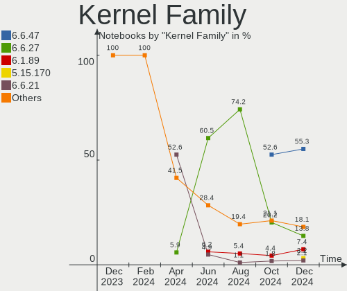
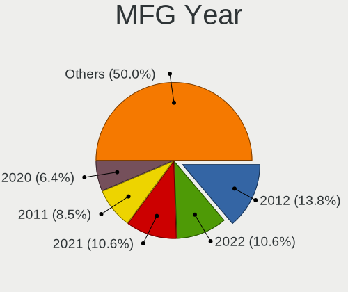
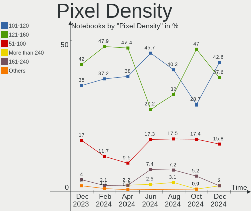
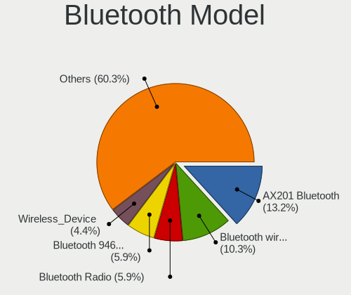
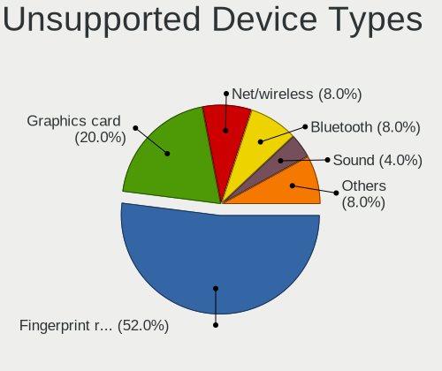

ROSA - Hardware Trends (Notebooks)
----------------------------------

A project to identify most popular hardware characteristics and track their change
over time based on data collected by Linux users at https://Linux-Hardware.org.

Anyone can contribute to this report by the [hw-probe](https://github.com/linuxhw/hw-probe) tool:

    sudo -E hw-probe -all -upload

This report is for one last month. Overall report since the beginning of time: [TestDays](https://github.com/linuxhw/TestDays)

Period: Jun, 2023.

Contents
--------

* [ System ](#system)
  - [ OS                       ](#os)
  - [ OS Family                ](#os-family)
  - [ Kernel                   ](#kernel)
  - [ Kernel Family            ](#kernel-family)
  - [ Kernel Major Ver.        ](#kernel-major-ver)
  - [ Arch                     ](#arch)
  - [ DE                       ](#de)
  - [ Display Server           ](#display-server)
  - [ Display Manager          ](#display-manager)
  - [ OS Lang                  ](#os-lang)
  - [ Boot Mode                ](#boot-mode)
  - [ Filesystem               ](#filesystem)
  - [ Part. scheme             ](#part-scheme)
  - [ Dual Boot with Linux/BSD ](#dual-boot-with-linuxbsd)
  - [ Dual Boot (Win)          ](#dual-boot-win)

* [ Board ](#board)
  - [ Vendor                   ](#vendor)
  - [ Model                    ](#model)
  - [ Model Family             ](#model-family)
  - [ MFG Year                 ](#mfg-year)
  - [ Form Factor              ](#form-factor)
  - [ Secure Boot              ](#secure-boot)
  - [ Coreboot                 ](#coreboot)
  - [ RAM Size                 ](#ram-size)
  - [ RAM Used                 ](#ram-used)
  - [ Total Drives             ](#total-drives)
  - [ Has CD-ROM               ](#has-cd-rom)
  - [ Has Ethernet             ](#has-ethernet)
  - [ Has WiFi                 ](#has-wifi)
  - [ Has Bluetooth            ](#has-bluetooth)

* [ Location ](#location)
  - [ Country                  ](#country)
  - [ City                     ](#city)

* [ Drives ](#drives)
  - [ Drive Vendor             ](#drive-vendor)
  - [ Drive Model              ](#drive-model)
  - [ HDD Vendor               ](#hdd-vendor)
  - [ SSD Vendor               ](#ssd-vendor)
  - [ Drive Kind               ](#drive-kind)
  - [ Drive Connector          ](#drive-connector)
  - [ Drive Size               ](#drive-size)
  - [ Space Total              ](#space-total)
  - [ Space Used               ](#space-used)
  - [ Malfunc. Drives          ](#malfunc-drives)
  - [ Malfunc. Drive Vendor    ](#malfunc-drive-vendor)
  - [ Malfunc. HDD Vendor      ](#malfunc-hdd-vendor)
  - [ Malfunc. Drive Kind      ](#malfunc-drive-kind)
  - [ Failed Drives            ](#failed-drives)
  - [ Failed Drive Vendor      ](#failed-drive-vendor)
  - [ Drive Status             ](#drive-status)

* [ Storage controller ](#storage-controller)
  - [ Storage Vendor           ](#storage-vendor)
  - [ Storage Model            ](#storage-model)
  - [ Storage Kind             ](#storage-kind)

* [ Processor ](#processor)
  - [ CPU Vendor               ](#cpu-vendor)
  - [ CPU Model                ](#cpu-model)
  - [ CPU Model Family         ](#cpu-model-family)
  - [ CPU Cores                ](#cpu-cores)
  - [ CPU Sockets              ](#cpu-sockets)
  - [ CPU Threads              ](#cpu-threads)
  - [ CPU Op-Modes             ](#cpu-op-modes)
  - [ CPU Microcode            ](#cpu-microcode)
  - [ CPU Microarch            ](#cpu-microarch)

* [ Graphics ](#graphics)
  - [ GPU Vendor               ](#gpu-vendor)
  - [ GPU Model                ](#gpu-model)
  - [ GPU Combo                ](#gpu-combo)
  - [ GPU Driver               ](#gpu-driver)
  - [ GPU Memory               ](#gpu-memory)

* [ Monitor ](#monitor)
  - [ Monitor Vendor           ](#monitor-vendor)
  - [ Monitor Model            ](#monitor-model)
  - [ Monitor Resolution       ](#monitor-resolution)
  - [ Monitor Diagonal         ](#monitor-diagonal)
  - [ Monitor Width            ](#monitor-width)
  - [ Aspect Ratio             ](#aspect-ratio)
  - [ Monitor Area             ](#monitor-area)
  - [ Pixel Density            ](#pixel-density)
  - [ Multiple Monitors        ](#multiple-monitors)

* [ Network ](#network)
  - [ Net Controller Vendor    ](#net-controller-vendor)
  - [ Net Controller Model     ](#net-controller-model)
  - [ Wireless Vendor          ](#wireless-vendor)
  - [ Wireless Model           ](#wireless-model)
  - [ Ethernet Vendor          ](#ethernet-vendor)
  - [ Ethernet Model           ](#ethernet-model)
  - [ Net Controller Kind      ](#net-controller-kind)
  - [ Used Controller          ](#used-controller)
  - [ NICs                     ](#nics)
  - [ IPv6                     ](#ipv6)

* [ Bluetooth ](#bluetooth)
  - [ Bluetooth Vendor         ](#bluetooth-vendor)
  - [ Bluetooth Model          ](#bluetooth-model)

* [ Sound ](#sound)
  - [ Sound Vendor             ](#sound-vendor)
  - [ Sound Model              ](#sound-model)

* [ Memory ](#memory)
  - [ Memory Vendor            ](#memory-vendor)
  - [ Memory Model             ](#memory-model)
  - [ Memory Kind              ](#memory-kind)
  - [ Memory Form Factor       ](#memory-form-factor)
  - [ Memory Size              ](#memory-size)
  - [ Memory Speed             ](#memory-speed)

* [ Printers & scanners ](#printers--scanners)
  - [ Printer Vendor           ](#printer-vendor)
  - [ Printer Model            ](#printer-model)
  - [ Scanner Vendor           ](#scanner-vendor)
  - [ Scanner Model            ](#scanner-model)

* [ Camera ](#camera)
  - [ Camera Vendor            ](#camera-vendor)
  - [ Camera Model             ](#camera-model)

* [ Security ](#security)
  - [ Fingerprint Vendor       ](#fingerprint-vendor)
  - [ Fingerprint Model        ](#fingerprint-model)
  - [ Chipcard Vendor          ](#chipcard-vendor)
  - [ Chipcard Model           ](#chipcard-model)

* [ Unsupported ](#unsupported)
  - [ Unsupported Devices      ](#unsupported-devices)
  - [ Unsupported Device Types ](#unsupported-device-types)

System
------

OS
--

Installed operating systems

| Name       | Notebooks | Percent |
|------------|-----------|---------|
| ROSA 12.4  | 70        | 81.4%   |
| ROSA R11.1 | 5         | 5.81%   |
| ROSA 12.3  | 5         | 5.81%   |
| ROSA 12    | 3         | 3.49%   |
| ROSA 13.0  | 1         | 1.16%   |
| ROSA 12.2  | 1         | 1.16%   |
| ROSA 12.1  | 1         | 1.16%   |

OS Family
---------

OS without a version

| Name | Notebooks | Percent |
|------|-----------|---------|
| ROSA | 86        | 100%    |

Kernel
------

Version of the Linux kernel

| Version                                  | Notebooks | Percent |
|------------------------------------------|-----------|---------|
| 6.1.20-generic-2rosa2021.1-x86_64        | 64        | 74.42%  |
| 5.15.103-generic-1rosa2021.1-i686        | 5         | 5.81%   |
| 6.1.34-generic-1rosa2021.1-x86_64        | 2         | 2.33%   |
| 5.4.83-generic-2rosa-i586                | 2         | 2.33%   |
| 5.15.75-generic-1rosa2021.1-x86_64       | 2         | 2.33%   |
| 5.10.74-generic-2rosa2021.1-x86_64       | 2         | 2.33%   |
| 6.3.9.xm1-1.klp-xanmod-rosa2021.1-x86_64 | 1         | 1.16%   |
| 6.1.34-generic-1rosa2023.1-x86_64        | 1         | 1.16%   |
| 5.4.83-generic-2rosa-x86_64              | 1         | 1.16%   |
| 5.4.32-generic-2rosa-x86_64              | 1         | 1.16%   |
| 5.15.79-generic-1rosa2021.1-x86_64       | 1         | 1.16%   |
| 5.15.75-generic-1rosa2021.1-i686         | 1         | 1.16%   |
| 5.10.176-generic-1rosa2021.1-x86_64      | 1         | 1.16%   |
| 5.10.155-generic-1rosa2021.1-x86_64      | 1         | 1.16%   |
| 4.15.0-desktop-122.124.1rosa-i586        | 1         | 1.16%   |

Kernel Family
-------------

Linux kernel without a distro release

| Version  | Notebooks | Percent |
|----------|-----------|---------|
| 6.1.20   | 64        | 74.42%  |
| 5.15.103 | 5         | 5.81%   |
| 6.1.34   | 3         | 3.49%   |
| 5.4.83   | 3         | 3.49%   |
| 5.15.75  | 3         | 3.49%   |
| 5.10.74  | 2         | 2.33%   |
| 6.3.9    | 1         | 1.16%   |
| 5.4.32   | 1         | 1.16%   |
| 5.15.79  | 1         | 1.16%   |
| 5.10.176 | 1         | 1.16%   |
| 5.10.155 | 1         | 1.16%   |
| 4.15.0   | 1         | 1.16%   |

Kernel Major Ver.
-----------------

Linux kernel major version

| Version | Notebooks | Percent |
|---------|-----------|---------|
| 6.1     | 67        | 77.91%  |
| 5.15    | 9         | 10.47%  |
| 5.4     | 4         | 4.65%   |
| 5.10    | 4         | 4.65%   |
| 6.3     | 1         | 1.16%   |
| 4.15    | 1         | 1.16%   |

Arch
----

OS architecture (x86_64, i586, etc.)

| Name   | Notebooks | Percent |
|--------|-----------|---------|
| x86_64 | 77        | 89.53%  |
| i686   | 9         | 10.47%  |

DE
--

Desktop Environment

| Name  | Notebooks | Percent |
|-------|-----------|---------|
| KDE5  | 48        | 55.81%  |
| GNOME | 23        | 26.74%  |
| LXQt  | 9         | 10.47%  |
| KDE4  | 5         | 5.81%   |
| i3    | 1         | 1.16%   |

Display Server
--------------

X11 or Wayland

| Name    | Notebooks | Percent |
|---------|-----------|---------|
| Wayland | 65        | 75.58%  |
| X11     | 21        | 24.42%  |

Display Manager
---------------

SDDM, LightDM, etc.

| Name    | Notebooks | Percent |
|---------|-----------|---------|
| SDDM    | 47        | 54.65%  |
| GDM     | 27        | 31.4%   |
| LightDM | 7         | 8.14%   |
| KDM     | 5         | 5.81%   |

OS Lang
-------

Language

| Lang  | Notebooks | Percent |
|-------|-----------|---------|
| ru_RU | 81        | 94.19%  |
| ro_RO | 1         | 1.16%   |
| es_ES | 1         | 1.16%   |
| en_GB | 1         | 1.16%   |
| de_DE | 1         | 1.16%   |
| de_CH | 1         | 1.16%   |

Boot Mode
---------

EFI or BIOS

| Mode | Notebooks | Percent |
|------|-----------|---------|
| EFI  | 54        | 62.79%  |
| BIOS | 32        | 37.21%  |

Filesystem
----------

Type of filesystem

| Type  | Notebooks | Percent |
|-------|-----------|---------|
| Ext4  | 80        | 93.02%  |
| Btrfs | 5         | 5.81%   |
| Aufs  | 1         | 1.16%   |

Part. scheme
------------

Scheme of partitioning

| Type | Notebooks | Percent |
|------|-----------|---------|
| GPT  | 59        | 68.6%   |
| MBR  | 27        | 31.4%   |

Dual Boot with Linux/BSD
------------------------

Hosting more than one Linux/BSD

| Dual boot | Notebooks | Percent |
|-----------|-----------|---------|
| No        | 69        | 80.23%  |
| Yes       | 17        | 19.77%  |

Dual Boot (Win)
---------------

Hosting Linux and Windows

| Dual boot | Notebooks | Percent |
|-----------|-----------|---------|
| No        | 50        | 58.14%  |
| Yes       | 36        | 41.86%  |

Board
-----

Vendor
------

Motherboard manufacturer

| Name                     | Notebooks | Percent |
|--------------------------|-----------|---------|
| Lenovo                   | 16        | 18.6%   |
| ASUSTek Computer         | 14        | 16.28%  |
| Hewlett-Packard          | 13        | 15.12%  |
| Acer                     | 13        | 15.12%  |
| Samsung Electronics      | 5         | 5.81%   |
| MSI                      | 4         | 4.65%   |
| Dell                     | 4         | 4.65%   |
| Toshiba                  | 2         | 2.33%   |
| Apple                    | 2         | 2.33%   |
| WeiBu                    | 1         | 1.16%   |
| Timi                     | 1         | 1.16%   |
| Sony                     | 1         | 1.16%   |
| Quanta                   | 1         | 1.16%   |
| Packard Bell             | 1         | 1.16%   |
| Maibenben                | 1         | 1.16%   |
| INFERIT                  | 1         | 1.16%   |
| HIPER Technology Limited | 1         | 1.16%   |
| eMachines                | 1         | 1.16%   |
| DEXP                     | 1         | 1.16%   |
| Clevo                    | 1         | 1.16%   |
| 3Logic Group             | 1         | 1.16%   |
| Unknown                  | 1         | 1.16%   |

Model
-----

Motherboard model

| Name                                  | Notebooks | Percent |
|---------------------------------------|-----------|---------|
| Unknown                               | 3         | 3.49%   |
| Acer AOD257                           | 2         | 2.33%   |
| WeiBu OEM                             | 1         | 1.16%   |
| Toshiba Satellite U300                | 1         | 1.16%   |
| Toshiba Satellite L30                 | 1         | 1.16%   |
| Timi RedmiBook Pro 14S                | 1         | 1.16%   |
| Sony SVF1521L1RB                      | 1         | 1.16%   |
| Samsung P29/28/26                     | 1         | 1.16%   |
| Samsung N102                          | 1         | 1.16%   |
| Samsung 355V4C/356V4C/3445VC/3545VC   | 1         | 1.16%   |
| Samsung 350V5C/351V5C/3540VC/3440VC   | 1         | 1.16%   |
| Samsung 305V4A/305V5A/3415VA          | 1         | 1.16%   |
| Quanta TWH                            | 1         | 1.16%   |
| Packard Bell EasyNote TE69CX          | 1         | 1.16%   |
| MSI Katana GF66 12UE                  | 1         | 1.16%   |
| MSI GX60 1AC                          | 1         | 1.16%   |
| MSI GL65 Leopard 10SCSR               | 1         | 1.16%   |
| MSI Delta 15 A5EFK                    | 1         | 1.16%   |
| Maibenben MaiBook M                   | 1         | 1.16%   |
| Lenovo ThinkPad X61 7674GS3           | 1         | 1.16%   |
| Lenovo ThinkPad SL410 2842RN9         | 1         | 1.16%   |
| Lenovo ThinkPad P17 Gen 1 20SN003YUS  | 1         | 1.16%   |
| Lenovo ThinkPad P16s Gen 1 21CKCTO1WW | 1         | 1.16%   |
| Lenovo Legion Y540-15IRH Laptop 81SX  | 1         | 1.16%   |
| Lenovo Legion 5 15ARH05 82B5          | 1         | 1.16%   |
| Lenovo K14 Gen 1 21CSS16E00           | 1         | 1.16%   |
| Lenovo IdeaPad S145-15IWL 81MV        | 1         | 1.16%   |
| Lenovo IdeaPad S10-2 20027            | 1         | 1.16%   |
| Lenovo IdeaPad 520-15IKB 81BF         | 1         | 1.16%   |
| Lenovo G780 20138                     | 1         | 1.16%   |
| Lenovo G580                           | 1         | 1.16%   |
| Lenovo B590 20208                     | 1         | 1.16%   |
| Lenovo B590 20206                     | 1         | 1.16%   |
| Lenovo B50-70 20384                   | 1         | 1.16%   |
| INFERIT Silver                        | 1         | 1.16%   |
| HIPER Limited HIPER WORKBOOK          | 1         | 1.16%   |
| HP Pavilion Notebook                  | 1         | 1.16%   |
| HP Pavilion Gaming Laptop 17-cd2xxx   | 1         | 1.16%   |
| HP Pavilion Gaming Laptop 16-a0xxx    | 1         | 1.16%   |
| HP Pavilion g6                        | 1         | 1.16%   |

Model Family
------------

Motherboard model prefix

| Name                  | Notebooks | Percent |
|-----------------------|-----------|---------|
| Acer Aspire           | 8         | 9.3%    |
| HP Pavilion           | 6         | 6.98%   |
| Lenovo ThinkPad       | 4         | 4.65%   |
| Dell Inspiron         | 4         | 4.65%   |
| ASUS VivoBook         | 4         | 4.65%   |
| Lenovo IdeaPad        | 3         | 3.49%   |
| Unknown               | 3         | 3.49%   |
| Toshiba Satellite     | 2         | 2.33%   |
| Lenovo Legion         | 2         | 2.33%   |
| Lenovo B590           | 2         | 2.33%   |
| ASUS ROG              | 2         | 2.33%   |
| Acer Extensa          | 2         | 2.33%   |
| Acer AOD257           | 2         | 2.33%   |
| WeiBu OEM             | 1         | 1.16%   |
| Timi RedmiBook        | 1         | 1.16%   |
| Sony SVF1521L1RB      | 1         | 1.16%   |
| Samsung P29           | 1         | 1.16%   |
| Samsung N102          | 1         | 1.16%   |
| Samsung 355V4C        | 1         | 1.16%   |
| Samsung 350V5C        | 1         | 1.16%   |
| Samsung 305V4A        | 1         | 1.16%   |
| Quanta TWH            | 1         | 1.16%   |
| Packard Bell EasyNote | 1         | 1.16%   |
| MSI Katana            | 1         | 1.16%   |
| MSI GX60              | 1         | 1.16%   |
| MSI GL65              | 1         | 1.16%   |
| MSI Delta             | 1         | 1.16%   |
| Maibenben MaiBook     | 1         | 1.16%   |
| Lenovo K14            | 1         | 1.16%   |
| Lenovo G780           | 1         | 1.16%   |
| Lenovo G580           | 1         | 1.16%   |
| Lenovo B50-70         | 1         | 1.16%   |
| INFERIT Silver        | 1         | 1.16%   |
| HIPER Limited HIPER   | 1         | 1.16%   |
| HP Notebook           | 1         | 1.16%   |
| HP Laptop             | 1         | 1.16%   |
| HP ENVY               | 1         | 1.16%   |
| HP EliteBook          | 1         | 1.16%   |
| HP 530                | 1         | 1.16%   |
| HP 255                | 1         | 1.16%   |

MFG Year
--------

Motherboard manufacture year

| Year | Notebooks | Percent |
|------|-----------|---------|
| 2021 | 13        | 15.12%  |
| 2011 | 10        | 11.63%  |
| 2022 | 9         | 10.47%  |
| 2012 | 9         | 10.47%  |
| 2013 | 7         | 8.14%   |
| 2018 | 6         | 6.98%   |
| 2020 | 5         | 5.81%   |
| 2017 | 4         | 4.65%   |
| 2007 | 4         | 4.65%   |
| 2019 | 3         | 3.49%   |
| 2014 | 3         | 3.49%   |
| 2008 | 3         | 3.49%   |
| 2016 | 2         | 2.33%   |
| 2010 | 2         | 2.33%   |
| 2009 | 2         | 2.33%   |
| 2023 | 1         | 1.16%   |
| 2015 | 1         | 1.16%   |
| 2006 | 1         | 1.16%   |
| 2005 | 1         | 1.16%   |

Form Factor
-----------

Physical design of the computer

| Name     | Notebooks | Percent |
|----------|-----------|---------|
| Notebook | 86        | 100%    |

Secure Boot
-----------

Enabled or disabled

| State    | Notebooks | Percent |
|----------|-----------|---------|
| Disabled | 86        | 100%    |

Coreboot
--------

Have coreboot on board

| Used | Notebooks | Percent |
|------|-----------|---------|
| No   | 86        | 100%    |

RAM Size
--------

Total RAM memory

| Size in GB | Notebooks | Percent |
|------------|-----------|---------|
| 4.01-8.0   | 27        | 31.4%   |
| 3.01-4.0   | 18        | 20.93%  |
| 16.01-24.0 | 14        | 16.28%  |
| 8.01-16.0  | 8         | 9.3%    |
| 1.01-2.0   | 6         | 6.98%   |
| 2.01-3.0   | 5         | 5.81%   |
| 32.01-64.0 | 4         | 4.65%   |
| 24.01-32.0 | 2         | 2.33%   |
| 0.51-1.0   | 2         | 2.33%   |

RAM Used
--------

Used RAM memory

| Used GB  | Notebooks | Percent |
|----------|-----------|---------|
| 1.01-2.0 | 48        | 55.81%  |
| 0.51-1.0 | 19        | 22.09%  |
| 2.01-3.0 | 10        | 11.63%  |
| 4.01-8.0 | 7         | 8.14%   |
| 3.01-4.0 | 1         | 1.16%   |
| 0.01-0.5 | 1         | 1.16%   |

Total Drives
------------

Number of drives on board

| Drives | Notebooks | Percent |
|--------|-----------|---------|
| 1      | 61        | 70.93%  |
| 2      | 23        | 26.74%  |
| 3      | 2         | 2.33%   |

Has CD-ROM
----------

Has CD-ROM on board

| Presented | Notebooks | Percent |
|-----------|-----------|---------|
| No        | 60        | 69.77%  |
| Yes       | 26        | 30.23%  |

Has Ethernet
------------

Has Ethernet on board

| Presented | Notebooks | Percent |
|-----------|-----------|---------|
| Yes       | 71        | 82.56%  |
| No        | 15        | 17.44%  |

Has WiFi
--------

Has WiFi module

| Presented | Notebooks | Percent |
|-----------|-----------|---------|
| Yes       | 84        | 97.67%  |
| No        | 2         | 2.33%   |

Has Bluetooth
-------------

Has Bluetooth module

| Presented | Notebooks | Percent |
|-----------|-----------|---------|
| Yes       | 67        | 77.91%  |
| No        | 19        | 22.09%  |

Location
--------

Country
-------

Geographic location (country)

| Country     | Notebooks | Percent |
|-------------|-----------|---------|
| Russia      | 75        | 87.21%  |
| Belarus     | 3         | 3.49%   |
| Ukraine     | 1         | 1.16%   |
| UK          | 1         | 1.16%   |
| Switzerland | 1         | 1.16%   |
| Romania     | 1         | 1.16%   |
| Moldova     | 1         | 1.16%   |
| Kazakhstan  | 1         | 1.16%   |
| Germany     | 1         | 1.16%   |
| France      | 1         | 1.16%   |

City
----

Geographic location (city)

| City             | Notebooks | Percent |
|------------------|-----------|---------|
| Moscow           | 16        | 18.6%   |
| St Petersburg    | 4         | 4.65%   |
| Yekaterinburg    | 3         | 3.49%   |
| Saratov          | 3         | 3.49%   |
| Volgograd        | 2         | 2.33%   |
| Tyumen           | 2         | 2.33%   |
| Tambov           | 2         | 2.33%   |
| Surgut           | 2         | 2.33%   |
| Ryazan           | 2         | 2.33%   |
| Nizhniy Novgorod | 2         | 2.33%   |
| Minsk            | 2         | 2.33%   |
| Khabarovsk       | 2         | 2.33%   |
| Chelyabinsk      | 2         | 2.33%   |
| Yevpatoriya      | 1         | 1.16%   |
| Yelan'           | 1         | 1.16%   |
| Yakutsk          | 1         | 1.16%   |
| Worthing         | 1         | 1.16%   |
| Vyborg           | 1         | 1.16%   |
| Ustyuzhna        | 1         | 1.16%   |
| Tuttlingen       | 1         | 1.16%   |
| Tsarskoye Selo   | 1         | 1.16%   |
| Touget           | 1         | 1.16%   |
| Taman'           | 1         | 1.16%   |
| Strelitsa        | 1         | 1.16%   |
| Smolensk         | 1         | 1.16%   |
| Severodvinsk     | 1         | 1.16%   |
| Sergiyev Posad   | 1         | 1.16%   |
| Samara           | 1         | 1.16%   |
| Rostov-on-Don    | 1         | 1.16%   |
| Pevek            | 1         | 1.16%   |
| Omsk             | 1         | 1.16%   |
| Odesa            | 1         | 1.16%   |
| Novosibirsk      | 1         | 1.16%   |
| Noginsk          | 1         | 1.16%   |
| Mytishchi        | 1         | 1.16%   |
| Lipetsk          | 1         | 1.16%   |
| Kursk            | 1         | 1.16%   |
| Krasnyy Bor      | 1         | 1.16%   |
| Krasnodar        | 1         | 1.16%   |
| Kolonets         | 1         | 1.16%   |

Drives
------

Drive Vendor
------------

Hard drive vendors

| Vendor              | Notebooks | Drives | Percent |
|---------------------|-----------|--------|---------|
| Toshiba             | 15        | 15     | 13.89%  |
| Samsung Electronics | 11        | 11     | 10.19%  |
| WDC                 | 7         | 9      | 6.48%   |
| Seagate             | 7         | 8      | 6.48%   |
| Intel               | 6         | 6      | 5.56%   |
| Hitachi             | 6         | 6      | 5.56%   |
| Kingston            | 5         | 5      | 4.63%   |
| HGST                | 5         | 5      | 4.63%   |
| Unknown             | 3         | 3      | 2.78%   |
| SPCC                | 3         | 3      | 2.78%   |
| SK hynix            | 3         | 3      | 2.78%   |
| SanDisk             | 3         | 3      | 2.78%   |
| Micron Technology   | 3         | 3      | 2.78%   |
| Fujitsu             | 2         | 2      | 1.85%   |
| Crucial             | 2         | 2      | 1.85%   |
| China               | 2         | 2      | 1.85%   |
| AMD                 | 2         | 2      | 1.85%   |
| A-DATA Technology   | 2         | 2      | 1.85%   |
| Unknown             | 2         | 2      | 1.85%   |
| Transcend           | 1         | 1      | 0.93%   |
| SILICONMOTION       | 1         | 1      | 0.93%   |
| SCY                 | 1         | 1      | 0.93%   |
| Qumo                | 1         | 1      | 0.93%   |
| Plextor             | 1         | 1      | 0.93%   |
| Netac               | 1         | 1      | 0.93%   |
| KIOXIA              | 1         | 1      | 0.93%   |
| Kimtigo             | 1         | 1      | 0.93%   |
| Hewlett-Packard     | 1         | 1      | 0.93%   |
| HEORIADY            | 1         | 1      | 0.93%   |
| GOODRAM             | 1         | 1      | 0.93%   |
| Gigabyte Technology | 1         | 1      | 0.93%   |
| Fanxiang            | 1         | 1      | 0.93%   |
| ExeGate             | 1         | 1      | 0.93%   |
| BIWIN               | 1         | 1      | 0.93%   |
| BAITITON            | 1         | 1      | 0.93%   |
| Azerty              | 1         | 1      | 0.93%   |
| Apple               | 1         | 1      | 0.93%   |
| Apacer              | 1         | 1      | 0.93%   |

Drive Model
-----------

Hard drive models

| Model                                     | Notebooks | Percent |
|-------------------------------------------|-----------|---------|
| Toshiba MQ01ABF050 500GB                  | 7         | 6.31%   |
| HGST HTS545050A7E380 500GB                | 3         | 2.7%    |
| Toshiba MQ01ABD100 1TB                    | 2         | 1.8%    |
| SPCC Solid State Disk 256GB               | 2         | 1.8%    |
| Seagate ST1000LM048-2E7172 1TB            | 2         | 1.8%    |
| Samsung SSD 860 EVO 250GB                 | 2         | 1.8%    |
| Micron MTFDHBA512QFD-1AX1AABHA 512GB      | 2         | 1.8%    |
| Kingston SA400S37240G 240GB SSD           | 2         | 1.8%    |
| Intel SSDPEKNU512GZ 512GB                 | 2         | 1.8%    |
| Hitachi HTS547550A9E384 500GB             | 2         | 1.8%    |
| HGST HTS545050A7E680 500GB                | 2         | 1.8%    |
| Unknown                                   | 2         | 1.8%    |
| WDC WDS250G2B0A 250GB SSD                 | 1         | 0.9%    |
| WDC WDS240G2G0A-00JH30 240GB SSD          | 1         | 0.9%    |
| WDC WD6400BPVT-24HXZT1 640GB              | 1         | 0.9%    |
| WDC WD5000LPCX-21VHAT0 500GB              | 1         | 0.9%    |
| WDC WD3200BPVT-35ZEST0 320GB              | 1         | 0.9%    |
| WDC WD2500BEVT-08A23T1 250GB              | 1         | 0.9%    |
| WDC WD10SPZX-22Z10T1 1TB                  | 1         | 0.9%    |
| WDC PC SN530 SDBPNPZ-1T00-1114 1TB        | 1         | 0.9%    |
| WDC PC SN530 SDBPMPZ-512G-1001 512GB      | 1         | 0.9%    |
| Unknown SD8GB                             | 1         | 0.9%    |
| Unknown SD/MMC/MS PRO 250GB               | 1         | 0.9%    |
| Unknown NVMe SSD Drive 1TB                | 1         | 0.9%    |
| Transcend TS240GMTS820S 240GB SSD         | 1         | 0.9%    |
| Toshiba MQ04ABF100 1TB                    | 1         | 0.9%    |
| Toshiba MK8034GSX 80GB                    | 1         | 0.9%    |
| Toshiba MK6034GSX 64GB                    | 1         | 0.9%    |
| Toshiba MK1637GSX 160GB                   | 1         | 0.9%    |
| Toshiba HDWL120 2TB                       | 1         | 0.9%    |
| Toshiba HDWL110 1TB                       | 1         | 0.9%    |
| SPCC Solid State Disk 512GB               | 1         | 0.9%    |
| SK hynix SKHynix_HFS512GD9TNI-L2B0B 512GB | 1         | 0.9%    |
| SK hynix SKHynix_HFS256GDE9X081N 256GB    | 1         | 0.9%    |
| SK hynix HFM512GD3JX013N 512GB            | 1         | 0.9%    |
| SILICONMOTION SM2246XT 128GB SSD          | 1         | 0.9%    |
| Seagate ST9500325AS 500GB                 | 1         | 0.9%    |
| Seagate ST9320325AS 320GB                 | 1         | 0.9%    |
| Seagate ST500LT012-1DG142 500GB           | 1         | 0.9%    |
| Seagate ST380011A 80GB                    | 1         | 0.9%    |

HDD Vendor
----------

Hard disk drive vendors

| Vendor              | Notebooks | Drives | Percent |
|---------------------|-----------|--------|---------|
| Toshiba             | 15        | 15     | 35.71%  |
| Seagate             | 7         | 8      | 16.67%  |
| Hitachi             | 6         | 6      | 14.29%  |
| HGST                | 5         | 5      | 11.9%   |
| WDC                 | 4         | 5      | 9.52%   |
| Fujitsu             | 2         | 2      | 4.76%   |
| Unknown             | 1         | 1      | 2.38%   |
| Samsung Electronics | 1         | 1      | 2.38%   |
| Apple               | 1         | 1      | 2.38%   |

SSD Vendor
----------

Solid state drive vendors

| Vendor              | Notebooks | Drives | Percent |
|---------------------|-----------|--------|---------|
| Samsung Electronics | 4         | 4      | 11.76%  |
| Kingston            | 4         | 4      | 11.76%  |
| SPCC                | 3         | 3      | 8.82%   |
| WDC                 | 2         | 2      | 5.88%   |
| Crucial             | 2         | 2      | 5.88%   |
| China               | 2         | 2      | 5.88%   |
| AMD                 | 2         | 2      | 5.88%   |
| Transcend           | 1         | 1      | 2.94%   |
| SILICONMOTION       | 1         | 1      | 2.94%   |
| Plextor             | 1         | 1      | 2.94%   |
| Netac               | 1         | 1      | 2.94%   |
| Kimtigo             | 1         | 1      | 2.94%   |
| Hewlett-Packard     | 1         | 1      | 2.94%   |
| HEORIADY            | 1         | 1      | 2.94%   |
| GOODRAM             | 1         | 1      | 2.94%   |
| Fanxiang            | 1         | 1      | 2.94%   |
| ExeGate             | 1         | 1      | 2.94%   |
| BAITITON            | 1         | 1      | 2.94%   |
| Azerty              | 1         | 1      | 2.94%   |
| Apacer              | 1         | 1      | 2.94%   |
| A-DATA Technology   | 1         | 1      | 2.94%   |
| Unknown             | 1         | 1      | 2.94%   |

Drive Kind
----------

HDD or SSD

| Kind | Notebooks | Drives | Percent |
|------|-----------|--------|---------|
| HDD  | 41        | 44     | 41.41%  |
| SSD  | 31        | 34     | 31.31%  |
| NVMe | 25        | 31     | 25.25%  |
| MMC  | 2         | 2      | 2.02%   |

Drive Connector
---------------

SATA, SAS, NVMe, etc.

| Type | Notebooks | Drives | Percent |
|------|-----------|--------|---------|
| SATA | 65        | 77     | 69.89%  |
| NVMe | 25        | 31     | 26.88%  |
| MMC  | 2         | 2      | 2.15%   |
| SAS  | 1         | 1      | 1.08%   |

Drive Size
----------

Size of hard drive

| Size in TB | Notebooks | Drives | Percent |
|------------|-----------|--------|---------|
| 0.01-0.5   | 50        | 58     | 72.46%  |
| 0.51-1.0   | 18        | 19     | 26.09%  |
| 1.01-2.0   | 1         | 1      | 1.45%   |

Space Total
-----------

Amount of disk space available on the file system

| Size in GB | Notebooks | Percent |
|------------|-----------|---------|
| 251-500    | 31        | 36.05%  |
| 101-250    | 22        | 25.58%  |
| 501-1000   | 11        | 12.79%  |
| 1-20       | 8         | 9.3%    |
| 21-50      | 7         | 8.14%   |
| 51-100     | 4         | 4.65%   |
| 1001-2000  | 3         | 3.49%   |

Space Used
----------

Amount of used disk space

| Used GB  | Notebooks | Percent |
|----------|-----------|---------|
| 1-20     | 63        | 73.26%  |
| 21-50    | 10        | 11.63%  |
| 251-500  | 4         | 4.65%   |
| 101-250  | 3         | 3.49%   |
| 501-1000 | 3         | 3.49%   |
| 51-100   | 3         | 3.49%   |

Malfunc. Drives
---------------

Drive models with a malfunction

| Model                              | Notebooks | Drives | Percent |
|------------------------------------|-----------|--------|---------|
| Toshiba MQ01ABF050 500GB           | 3         | 3      | 12.5%   |
| WDC WDS240G2G0A-00JH30 240GB SSD   | 1         | 1      | 4.17%   |
| WDC WD5000LPCX-21VHAT0 500GB       | 1         | 1      | 4.17%   |
| WDC WD3200BPVT-35ZEST0 320GB       | 1         | 1      | 4.17%   |
| Toshiba MQ01ABD100 1TB             | 1         | 1      | 4.17%   |
| Toshiba MK6034GSX 64GB             | 1         | 1      | 4.17%   |
| Toshiba MK1637GSX 160GB            | 1         | 1      | 4.17%   |
| SPCC Solid State Disk 256GB        | 1         | 1      | 4.17%   |
| Seagate ST9500325AS 500GB          | 1         | 1      | 4.17%   |
| Seagate ST9320325AS 320GB          | 1         | 1      | 4.17%   |
| Seagate ST1000LM048-2E7172 1TB     | 1         | 1      | 4.17%   |
| Seagate ST1000LM024 HN-M101MBB 1TB | 1         | 1      | 4.17%   |
| Samsung Electronics HN-M101MBB 1TB | 1         | 1      | 4.17%   |
| Hitachi HTS545032B9A300 320GB      | 1         | 1      | 4.17%   |
| Hitachi HTS545025B9A300 250GB      | 1         | 1      | 4.17%   |
| Hitachi HTS542516K9SA00 160GB      | 1         | 1      | 4.17%   |
| HGST HTS545050A7E380 500GB         | 1         | 1      | 4.17%   |
| Fujitsu MHY2120BH 120GB            | 1         | 1      | 4.17%   |
| Fujitsu MHT2040AH 40GB             | 1         | 1      | 4.17%   |
| China SATA SSD 20GB                | 1         | 1      | 4.17%   |
| BAITITON BT58SSD10S 256GB          | 1         | 1      | 4.17%   |
| AMD R5SL120G 120GB SSD             | 1         | 1      | 4.17%   |

Malfunc. Drive Vendor
---------------------

Vendors of faulty drives

| Vendor              | Notebooks | Drives | Percent |
|---------------------|-----------|--------|---------|
| Toshiba             | 6         | 6      | 26.09%  |
| WDC                 | 3         | 3      | 13.04%  |
| Seagate             | 3         | 4      | 13.04%  |
| Hitachi             | 3         | 3      | 13.04%  |
| Fujitsu             | 2         | 2      | 8.7%    |
| SPCC                | 1         | 1      | 4.35%   |
| Samsung Electronics | 1         | 1      | 4.35%   |
| HGST                | 1         | 1      | 4.35%   |
| China               | 1         | 1      | 4.35%   |
| BAITITON            | 1         | 1      | 4.35%   |
| AMD                 | 1         | 1      | 4.35%   |

Malfunc. HDD Vendor
-------------------

Vendors of faulty HDD drives

| Vendor              | Notebooks | Drives | Percent |
|---------------------|-----------|--------|---------|
| Toshiba             | 6         | 6      | 33.33%  |
| Seagate             | 3         | 4      | 16.67%  |
| Hitachi             | 3         | 3      | 16.67%  |
| WDC                 | 2         | 2      | 11.11%  |
| Fujitsu             | 2         | 2      | 11.11%  |
| Samsung Electronics | 1         | 1      | 5.56%   |
| HGST                | 1         | 1      | 5.56%   |

Malfunc. Drive Kind
-------------------

Kinds of faulty drives

| Kind | Notebooks | Drives | Percent |
|------|-----------|--------|---------|
| HDD  | 18        | 19     | 78.26%  |
| SSD  | 5         | 5      | 21.74%  |

Failed Drives
-------------

Failed drive models

| Model                         | Notebooks | Drives | Percent |
|-------------------------------|-----------|--------|---------|
| Hitachi HTS547550A9E384 500GB | 1         | 1      | 100%    |

Failed Drive Vendor
-------------------

Failed drive vendors

| Vendor  | Notebooks | Drives | Percent |
|---------|-----------|--------|---------|
| Hitachi | 1         | 1      | 100%    |

Drive Status
------------

Number of failed and malfunc. drives

| Status   | Notebooks | Drives | Percent |
|----------|-----------|--------|---------|
| Works    | 67        | 80     | 69.79%  |
| Malfunc  | 23        | 24     | 23.96%  |
| Detected | 5         | 6      | 5.21%   |
| Failed   | 1         | 1      | 1.04%   |

Storage controller
------------------

Storage Vendor
--------------

Storage controller vendors

| Vendor                           | Notebooks | Percent |
|----------------------------------|-----------|---------|
| Intel                            | 67        | 63.81%  |
| AMD                              | 13        | 12.38%  |
| Samsung Electronics              | 6         | 5.71%   |
| SanDisk                          | 4         | 3.81%   |
| SK hynix                         | 3         | 2.86%   |
| Micron Technology                | 3         | 2.86%   |
| Phison Electronics               | 2         | 1.9%    |
| INNOGRIT                         | 2         | 1.9%    |
| Shenzhen Shichuangyi Electronics | 1         | 0.95%   |
| Nvidia                           | 1         | 0.95%   |
| KIOXIA                           | 1         | 0.95%   |
| Kingston Technology Company      | 1         | 0.95%   |
| ADATA Technology                 | 1         | 0.95%   |

Storage Model
-------------

Storage controller models

| Model                                                                        | Notebooks | Percent |
|------------------------------------------------------------------------------|-----------|---------|
| Intel 7 Series Chipset Family 6-port SATA Controller [AHCI mode]             | 11        | 9.24%   |
| AMD FCH SATA Controller [AHCI mode]                                          | 10        | 8.4%    |
| Intel Sunrise Point-LP SATA Controller [AHCI mode]                           | 7         | 5.88%   |
| Intel 6 Series/C200 Series Chipset Family 6 port Mobile SATA AHCI Controller | 7         | 5.88%   |
| Intel 8 Series SATA Controller 1 [AHCI mode]                                 | 6         | 5.04%   |
| Intel 82801HM/HEM (ICH8M/ICH8M-E) IDE Controller                             | 5         | 4.2%    |
| Intel 82801HM/HEM (ICH8M/ICH8M-E) SATA Controller [AHCI mode]                | 4         | 3.36%   |
| Intel Volume Management Device NVMe RAID Controller                          | 3         | 2.52%   |
| Intel Tiger Lake-LP SATA Controller                                          | 3         | 2.52%   |
| Intel SSD 660P Series                                                        | 3         | 2.52%   |
| Intel NM10/ICH7 Family SATA Controller [AHCI mode]                           | 3         | 2.52%   |
| Intel Celeron/Pentium Silver Processor SATA Controller                       | 3         | 2.52%   |
| SK hynix Gold P31/BC711/PC711 NVMe Solid State Drive                         | 2         | 1.68%   |
| Samsung NVMe SSD Controller SM981/PM981/PM983                                | 2         | 1.68%   |
| Samsung NVMe SSD Controller PM9A1/PM9A3/980PRO                               | 2         | 1.68%   |
| Samsung NVMe SSD Controller 980                                              | 2         | 1.68%   |
| Micron NVMe Storage Controller                                               | 2         | 1.68%   |
| Intel Non-Volatile memory controller                                         | 2         | 1.68%   |
| Intel Cannon Point-LP SATA Controller [AHCI Mode]                            | 2         | 1.68%   |
| Intel Cannon Lake Mobile PCH SATA AHCI Controller                            | 2         | 1.68%   |
| Intel 82801IBM/IEM (ICH9M/ICH9M-E) 4 port SATA Controller [AHCI mode]        | 2         | 1.68%   |
| Intel 82801GBM/GHM (ICH7-M Family) SATA Controller [AHCI mode]               | 2         | 1.68%   |
| Intel 82801G (ICH7 Family) IDE Controller                                    | 2         | 1.68%   |
| Intel 82801 Mobile SATA Controller [RAID mode]                               | 2         | 1.68%   |
| INNOGRIT Non-Volatile memory controller                                      | 2         | 1.68%   |
| SK hynix PC611 NVMe Solid State Drive                                        | 1         | 0.84%   |
| Shenzhen Shichuangyi MAP1202-Based NVMe SSD                                  | 1         | 0.84%   |
| SanDisk WD Blue SN570 NVMe SSD 1TB                                           | 1         | 0.84%   |
| SanDisk WD Blue SN550 NVMe SSD                                               | 1         | 0.84%   |
| SanDisk WD Black SN770 NVMe SSD                                              | 1         | 0.84%   |
| SanDisk WD Black 2018/SN750 / PC SN720 NVMe SSD                              | 1         | 0.84%   |
| SanDisk PC SN530 NVMe SSD                                                    | 1         | 0.84%   |
| Phison PS5019-E19 PCIe4 NVMe Controller (DRAM-less)                          | 1         | 0.84%   |
| Phison PS5013 E13 NVMe Controller                                            | 1         | 0.84%   |
| Nvidia MCP89 SATA Controller (AHCI mode)                                     | 1         | 0.84%   |
| Micron 2200S NVMe SSD                                                        | 1         | 0.84%   |
| KIOXIA NVMe SSD Controller BG4                                               | 1         | 0.84%   |
| Kingston Company U-SNS8154P3 NVMe SSD                                        | 1         | 0.84%   |
| Intel Wildcat Point-LP SATA Controller [AHCI Mode]                           | 1         | 0.84%   |
| Intel SSD 600P Series                                                        | 1         | 0.84%   |

Storage Kind
------------

Kind of storage controller (IDE, SATA, NVMe, SAS, ...)

| Kind | Notebooks | Percent |
|------|-----------|---------|
| SATA | 70        | 63.06%  |
| NVMe | 25        | 22.52%  |
| IDE  | 11        | 9.91%   |
| RAID | 5         | 4.5%    |

Processor
---------

CPU Vendor
----------

Processor vendors

| Vendor | Notebooks | Percent |
|--------|-----------|---------|
| Intel  | 72        | 83.72%  |
| AMD    | 14        | 16.28%  |

CPU Model
---------

Processor models

| Model                                       | Notebooks | Percent |
|---------------------------------------------|-----------|---------|
| Intel Core i5-7200U CPU @ 2.50GHz           | 3         | 3.49%   |
| Intel 11th Gen Core i5-1135G7 @ 2.40GHz     | 3         | 3.49%   |
| Intel Pentium CPU 2117U @ 1.80GHz           | 2         | 2.33%   |
| Intel Core i7-9750H CPU @ 2.60GHz           | 2         | 2.33%   |
| Intel Core i7-2670QM CPU @ 2.20GHz          | 2         | 2.33%   |
| Intel Core i7-10750H CPU @ 2.60GHz          | 2         | 2.33%   |
| Intel Core i5-3210M CPU @ 2.50GHz           | 2         | 2.33%   |
| Intel Core i3-4010U CPU @ 1.70GHz           | 2         | 2.33%   |
| Intel Pentium Silver N5000 CPU @ 1.10GHz    | 1         | 1.16%   |
| Intel Pentium Dual-Core CPU T4300 @ 2.10GHz | 1         | 1.16%   |
| Intel Pentium Dual CPU T3400 @ 2.16GHz      | 1         | 1.16%   |
| Intel Pentium CPU B960 @ 2.20GHz            | 1         | 1.16%   |
| Intel Pentium CPU 4417U @ 2.30GHz           | 1         | 1.16%   |
| Intel Pentium 3556U @ 1.70GHz               | 1         | 1.16%   |
| Intel Core i7-6700HQ CPU @ 2.60GHz          | 1         | 1.16%   |
| Intel Core i7-4650U CPU @ 1.70GHz           | 1         | 1.16%   |
| Intel Core i7-3520M CPU @ 2.90GHz           | 1         | 1.16%   |
| Intel Core i7-3517U CPU @ 1.90GHz           | 1         | 1.16%   |
| Intel Core i5-8300H CPU @ 2.30GHz           | 1         | 1.16%   |
| Intel Core i5-8259U CPU @ 2.30GHz           | 1         | 1.16%   |
| Intel Core i5-7267U CPU @ 3.10GHz           | 1         | 1.16%   |
| Intel Core i5-6200U CPU @ 2.30GHz           | 1         | 1.16%   |
| Intel Core i5-4200U CPU @ 1.60GHz           | 1         | 1.16%   |
| Intel Core i5-3230M CPU @ 2.60GHz           | 1         | 1.16%   |
| Intel Core i5-2520M CPU @ 2.50GHz           | 1         | 1.16%   |
| Intel Core i5-2467M CPU @ 1.60GHz           | 1         | 1.16%   |
| Intel Core i5-2450M CPU @ 2.50GHz           | 1         | 1.16%   |
| Intel Core i5-1035G1 CPU @ 1.00GHz          | 1         | 1.16%   |
| Intel Core i5-10300H CPU @ 2.50GHz          | 1         | 1.16%   |
| Intel Core i3-8145U CPU @ 2.10GHz           | 1         | 1.16%   |
| Intel Core i3-8130U CPU @ 2.20GHz           | 1         | 1.16%   |
| Intel Core i3-6100U CPU @ 2.30GHz           | 1         | 1.16%   |
| Intel Core i3-5005U CPU @ 2.00GHz           | 1         | 1.16%   |
| Intel Core i3-4005U CPU @ 1.70GHz           | 1         | 1.16%   |
| Intel Core i3-3217U CPU @ 1.80GHz           | 1         | 1.16%   |
| Intel Core i3-3120M CPU @ 2.50GHz           | 1         | 1.16%   |
| Intel Core i3-2350M CPU @ 2.30GHz           | 1         | 1.16%   |
| Intel Core i3-2328M CPU @ 2.20GHz           | 1         | 1.16%   |
| Intel Core i3-10110U CPU @ 2.10GHz          | 1         | 1.16%   |
| Intel Core Duo CPU T2600 @ 2.16GHz          | 1         | 1.16%   |

CPU Model Family
----------------

Processor model prefix

| Model                   | Notebooks | Percent |
|-------------------------|-----------|---------|
| Intel Core i5           | 16        | 18.6%   |
| Intel Core i3           | 12        | 13.95%  |
| Intel Core i7           | 10        | 11.63%  |
| Other                   | 8         | 9.3%    |
| Intel Core 2 Duo        | 6         | 6.98%   |
| Intel Pentium           | 5         | 5.81%   |
| Intel Celeron           | 5         | 5.81%   |
| Intel Atom              | 4         | 4.65%   |
| AMD Ryzen 5             | 3         | 3.49%   |
| Intel Celeron M         | 2         | 2.33%   |
| AMD Ryzen 7             | 2         | 2.33%   |
| Intel Pentium Silver    | 1         | 1.16%   |
| Intel Pentium Dual-Core | 1         | 1.16%   |
| Intel Pentium Dual      | 1         | 1.16%   |
| Intel Core Duo          | 1         | 1.16%   |
| AMD Ryzen 9             | 1         | 1.16%   |
| AMD Ryzen 5 PRO         | 1         | 1.16%   |
| AMD Ryzen 3             | 1         | 1.16%   |
| AMD E2                  | 1         | 1.16%   |
| AMD E1                  | 1         | 1.16%   |
| AMD A8                  | 1         | 1.16%   |
| AMD A6                  | 1         | 1.16%   |
| AMD A4                  | 1         | 1.16%   |
| AMD A10                 | 1         | 1.16%   |

CPU Cores
---------

Number of processor cores

| Number | Notebooks | Percent |
|--------|-----------|---------|
| 2      | 50        | 58.14%  |
| 4      | 13        | 15.12%  |
| 6      | 9         | 10.47%  |
| 1      | 8         | 9.3%    |
| 8      | 4         | 4.65%   |
| 14     | 1         | 1.16%   |
| 12     | 1         | 1.16%   |

CPU Sockets
-----------

Number of sockets

| Number | Notebooks | Percent |
|--------|-----------|---------|
| 1      | 86        | 100%    |

CPU Threads
-----------

Threads per core (Hyper-Threading)

| Number | Notebooks | Percent |
|--------|-----------|---------|
| 2      | 61        | 70.93%  |
| 1      | 25        | 29.07%  |

CPU Op-Modes
------------

CPU Operation Modes (32-bit, 64-bit)

| Op mode        | Notebooks | Percent |
|----------------|-----------|---------|
| 32-bit, 64-bit | 82        | 95.35%  |
| 32-bit         | 4         | 4.65%   |

CPU Microcode
-------------

Microcode number

| Number     | Notebooks | Percent |
|------------|-----------|---------|
| 0x306a9    | 10        | 11.63%  |
| 0x206a7    | 8         | 9.3%    |
| 0x40651    | 6         | 6.98%   |
| 0x806e9    | 4         | 4.65%   |
| 0x806c1    | 4         | 4.65%   |
| 0x906ea    | 3         | 3.49%   |
| 0x6fd      | 3         | 3.49%   |
| 0x106ca    | 3         | 3.49%   |
| 0x1067a    | 3         | 3.49%   |
| 0x0a50000c | 3         | 3.49%   |
| 0x06001116 | 3         | 3.49%   |
| Unknown    | 3         | 3.49%   |
| 0xa0652    | 2         | 2.33%   |
| 0x906a3    | 2         | 2.33%   |
| 0x806ea    | 2         | 2.33%   |
| 0x806d1    | 2         | 2.33%   |
| 0x706a1    | 2         | 2.33%   |
| 0x406e3    | 2         | 2.33%   |
| 0x806ec    | 1         | 1.16%   |
| 0x706e5    | 1         | 1.16%   |
| 0x706a8    | 1         | 1.16%   |
| 0x6fb      | 1         | 1.16%   |
| 0x6ec      | 1         | 1.16%   |
| 0x6e8      | 1         | 1.16%   |
| 0x6d8      | 1         | 1.16%   |
| 0x506e3    | 1         | 1.16%   |
| 0x406c4    | 1         | 1.16%   |
| 0x306d4    | 1         | 1.16%   |
| 0x106c2    | 1         | 1.16%   |
| 0x10676    | 1         | 1.16%   |
| 0x10661    | 1         | 1.16%   |
| 0x0a50000d | 1         | 1.16%   |
| 0x0a404102 | 1         | 1.16%   |
| 0x08608103 | 1         | 1.16%   |
| 0x08600106 | 1         | 1.16%   |
| 0x08600104 | 1         | 1.16%   |
| 0x06006704 | 1         | 1.16%   |
| 0x0500010d | 1         | 1.16%   |
| 0x03000025 | 1         | 1.16%   |

CPU Microarch
-------------

Microarchitecture

| Name             | Notebooks | Percent |
|------------------|-----------|---------|
| KabyLake         | 12        | 13.95%  |
| IvyBridge        | 10        | 11.63%  |
| SandyBridge      | 8         | 9.3%    |
| Haswell          | 6         | 6.98%   |
| Core             | 5         | 5.81%   |
| Zen 3            | 4         | 4.65%   |
| TigerLake        | 4         | 4.65%   |
| Penryn           | 4         | 4.65%   |
| Bonnell          | 4         | 4.65%   |
| Skylake          | 3         | 3.49%   |
| Piledriver       | 3         | 3.49%   |
| P6               | 3         | 3.49%   |
| IceLake          | 3         | 3.49%   |
| Goldmont plus    | 3         | 3.49%   |
| CometLake        | 3         | 3.49%   |
| Zen 2            | 2         | 2.33%   |
| Alderlake Hybrid | 2         | 2.33%   |
| Unknown          | 2         | 2.33%   |
| Silvermont       | 1         | 1.16%   |
| K10 Llano        | 1         | 1.16%   |
| Excavator        | 1         | 1.16%   |
| Broadwell        | 1         | 1.16%   |
| Bobcat           | 1         | 1.16%   |

Graphics
--------

GPU Vendor
----------

Vendors of graphics cards

| Vendor | Notebooks | Percent |
|--------|-----------|---------|
| Intel  | 65        | 58.04%  |
| Nvidia | 28        | 25%     |
| AMD    | 19        | 16.96%  |

GPU Model
---------

Graphics card models

| Model                                                                         | Notebooks | Percent |
|-------------------------------------------------------------------------------|-----------|---------|
| Intel 3rd Gen Core processor Graphics Controller                              | 10        | 8.2%    |
| Intel 2nd Generation Core Processor Family Integrated Graphics Controller     | 8         | 6.56%   |
| Intel Haswell-ULT Integrated Graphics Controller                              | 6         | 4.92%   |
| Intel TigerLake-LP GT2 [Iris Xe Graphics]                                     | 4         | 3.28%   |
| Intel Mobile GM965/GL960 Integrated Graphics Controller (secondary)           | 4         | 3.28%   |
| Intel Mobile GM965/GL960 Integrated Graphics Controller (primary)             | 4         | 3.28%   |
| AMD Cezanne [Radeon Vega Series / Radeon Vega Mobile Series]                  | 4         | 3.28%   |
| Nvidia GF117M [GeForce 610M/710M/810M/820M / GT 620M/625M/630M/720M]          | 3         | 2.46%   |
| Intel HD Graphics 620                                                         | 3         | 2.46%   |
| Intel Atom Processor D4xx/D5xx/N4xx/N5xx Integrated Graphics Controller       | 3         | 2.46%   |
| AMD Thames [Radeon HD 7500M/7600M Series]                                     | 3         | 2.46%   |
| Nvidia TU116M [GeForce GTX 1660 Ti Mobile]                                    | 2         | 1.64%   |
| Nvidia GA107M [GeForce RTX 3050 Ti Mobile]                                    | 2         | 1.64%   |
| Nvidia GA106M [GeForce RTX 3060 Mobile / Max-Q]                               | 2         | 1.64%   |
| Intel TigerLake-H GT1 [UHD Graphics]                                          | 2         | 1.64%   |
| Intel Skylake GT2 [HD Graphics 520]                                           | 2         | 1.64%   |
| Intel Mobile 945GSE Express Integrated Graphics Controller                    | 2         | 1.64%   |
| Intel Mobile 945GM/GMS/GME, 943/940GML Express Integrated Graphics Controller | 2         | 1.64%   |
| Intel Mobile 4 Series Chipset Integrated Graphics Controller                  | 2         | 1.64%   |
| Intel GeminiLake [UHD Graphics 600]                                           | 2         | 1.64%   |
| Intel CometLake-H GT2 [UHD Graphics]                                          | 2         | 1.64%   |
| Intel CoffeeLake-H GT2 [UHD Graphics 630]                                     | 2         | 1.64%   |
| Intel Alder Lake-P Integrated Graphics Controller                             | 2         | 1.64%   |
| Nvidia TU117M [GeForce MX450]                                                 | 1         | 0.82%   |
| Nvidia TU117M [GeForce GTX 1650 Ti Mobile]                                    | 1         | 0.82%   |
| Nvidia TU117M [GeForce GTX 1650 Mobile / Max-Q]                               | 1         | 0.82%   |
| Nvidia TU117M                                                                 | 1         | 0.82%   |
| Nvidia TU117GLM [Quadro T1000 Mobile]                                         | 1         | 0.82%   |
| Nvidia MCP89 [GeForce 320M]                                                   | 1         | 0.82%   |
| Nvidia GP108M [GeForce MX150]                                                 | 1         | 0.82%   |
| Nvidia GP107M [GeForce GTX 1050 Mobile]                                       | 1         | 0.82%   |
| Nvidia GM108M [GeForce MX110]                                                 | 1         | 0.82%   |
| Nvidia GM108M [GeForce 940MX]                                                 | 1         | 0.82%   |
| Nvidia GM108M [GeForce 920MX]                                                 | 1         | 0.82%   |
| Nvidia GM108M [GeForce 840M]                                                  | 1         | 0.82%   |
| Nvidia GF119M [GeForce GT 520MX]                                              | 1         | 0.82%   |
| Nvidia GF119M [GeForce 610M]                                                  | 1         | 0.82%   |
| Nvidia GF108M [GeForce GT 635M]                                               | 1         | 0.82%   |
| Nvidia GF108M [GeForce GT 525M]                                               | 1         | 0.82%   |
| Nvidia GF106M [GeForce GT 555M]                                               | 1         | 0.82%   |

GPU Combo
---------

Combinations of graphics cards

| Name           | Notebooks | Percent |
|----------------|-----------|---------|
| 1 x Intel      | 41        | 47.67%  |
| Intel + Nvidia | 21        | 24.42%  |
| 1 x AMD        | 11        | 12.79%  |
| 1 x Nvidia     | 5         | 5.81%   |
| 2 x AMD        | 4         | 4.65%   |
| Intel + AMD    | 3         | 3.49%   |
| AMD + Nvidia   | 1         | 1.16%   |

GPU Driver
----------

Free vs proprietary

| Driver      | Notebooks | Percent |
|-------------|-----------|---------|
| Free        | 79        | 91.86%  |
| Proprietary | 7         | 8.14%   |

GPU Memory
----------

Total video memory

| Size in GB | Notebooks | Percent |
|------------|-----------|---------|
| Unknown    | 46        | 53.49%  |
| 0.01-0.5   | 14        | 16.28%  |
| 1.01-2.0   | 12        | 13.95%  |
| 3.01-4.0   | 5         | 5.81%   |
| 0.51-1.0   | 5         | 5.81%   |
| 5.01-6.0   | 3         | 3.49%   |
| 8.01-16.0  | 1         | 1.16%   |

Monitor
-------

Monitor Vendor
--------------

Monitor vendors

| Vendor                  | Notebooks | Percent |
|-------------------------|-----------|---------|
| AU Optronics            | 18        | 20.22%  |
| BOE                     | 17        | 19.1%   |
| Samsung Electronics     | 11        | 12.36%  |
| Chimei Innolux          | 10        | 11.24%  |
| LG Display              | 7         | 7.87%   |
| Chi Mei Optoelectronics | 6         | 6.74%   |
| LG Philips              | 3         | 3.37%   |
| Lenovo                  | 3         | 3.37%   |
| Apple                   | 3         | 3.37%   |
| Sharp                   | 2         | 2.25%   |
| HKC                     | 2         | 2.25%   |
| Toshiba                 | 1         | 1.12%   |
| Philips                 | 1         | 1.12%   |
| KDC                     | 1         | 1.12%   |
| Hewlett-Packard         | 1         | 1.12%   |
| CPT                     | 1         | 1.12%   |
| BenQ                    | 1         | 1.12%   |
| Acer                    | 1         | 1.12%   |

Monitor Model
-------------

Monitor models

| Model                                                                 | Notebooks | Percent |
|-----------------------------------------------------------------------|-----------|---------|
| LG Display LCD Monitor LGD033A 1366x768 344x194mm 15.5-inch           | 3         | 3.37%   |
| AU Optronics LCD Monitor AUO38ED 1920x1080 344x193mm 15.5-inch        | 3         | 3.37%   |
| Chimei Innolux LCD Monitor CMN1738 1920x1080 381x214mm 17.2-inch      | 2         | 2.25%   |
| Chimei Innolux LCD Monitor CMN1521 1920x1080 344x193mm 15.5-inch      | 2         | 2.25%   |
| BOE LCD Monitor BOE0700 1920x1080 344x194mm 15.5-inch                 | 2         | 2.25%   |
| AU Optronics LCD Monitor AUO61D2 1024x600 222x125mm 10.0-inch         | 2         | 2.25%   |
| Toshiba ScreenXpert TSB8888 1080x2160                                 | 1         | 1.12%   |
| Sharp LQ156M1JW03 SHP155D 1920x1080 344x194mm 15.5-inch               | 1         | 1.12%   |
| Sharp LCD Monitor SHP1540 1920x1080 309x174mm 14.0-inch               | 1         | 1.12%   |
| Samsung Electronics SyncMaster SAM02AD 1440x900 410x257mm 19.1-inch   | 1         | 1.12%   |
| Samsung Electronics SyncMaster SAM011E 1280x1024 338x270mm 17.0-inch  | 1         | 1.12%   |
| Samsung Electronics LCD Monitor SEC5741 1280x800 261x163mm 12.1-inch  | 1         | 1.12%   |
| Samsung Electronics LCD Monitor SEC4C4E 1024x600 223x125mm 10.1-inch  | 1         | 1.12%   |
| Samsung Electronics LCD Monitor SEC4256 1600x900 382x215mm 17.3-inch  | 1         | 1.12%   |
| Samsung Electronics LCD Monitor SEC3945 1280x800 331x207mm 15.4-inch  | 1         | 1.12%   |
| Samsung Electronics LCD Monitor SEC324A 1366x768 344x194mm 15.5-inch  | 1         | 1.12%   |
| Samsung Electronics LCD Monitor SEC3152 1366x768 344x194mm 15.5-inch  | 1         | 1.12%   |
| Samsung Electronics LCD Monitor SEC3030 1024x600 223x125mm 10.1-inch  | 1         | 1.12%   |
| Samsung Electronics LCD Monitor SDC4951 1366x768 344x194mm 15.5-inch  | 1         | 1.12%   |
| Samsung Electronics LCD Monitor SDC4161 1920x1080 344x194mm 15.5-inch | 1         | 1.12%   |
| Philips PHL 325E1 PHLC20E 2560x1440 697x392mm 31.5-inch               | 1         | 1.12%   |
| LG Philips LCD Monitor LPLD700 1280x800 331x207mm 15.4-inch           | 1         | 1.12%   |
| LG Philips LCD Monitor LPLC800 1280x800 331x207mm 15.4-inch           | 1         | 1.12%   |
| LG Philips LCD Monitor LPL0301 1280x800 331x207mm 15.4-inch           | 1         | 1.12%   |
| LG Display LCD Monitor LGD06AD 2560x1600 286x179mm 13.3-inch          | 1         | 1.12%   |
| LG Display LCD Monitor LGD0611 1920x1080 382x215mm 17.3-inch          | 1         | 1.12%   |
| LG Display LCD Monitor LGD046E 1920x1080 382x215mm 17.3-inch          | 1         | 1.12%   |
| LG Display LCD Monitor LGD0465 1366x768 344x194mm 15.5-inch           | 1         | 1.12%   |
| Lenovo LEN T32h-20 LEN61F1 2560x1440 698x393mm 31.5-inch              | 1         | 1.12%   |
| Lenovo LCD Monitor LEN40A0 1366x768 309x174mm 14.0-inch               | 1         | 1.12%   |
| Lenovo LCD Monitor LEN4000 1024x768 246x184mm 12.1-inch               | 1         | 1.12%   |
| KDC LCD Monitor KDC0830 1920x1080 344x193mm 15.5-inch                 | 1         | 1.12%   |
| HKC LCD Monitor HKC3D00 1920x1080 344x194mm 15.5-inch                 | 1         | 1.12%   |
| HKC LCD Monitor HKC3CFB 1920x1080 344x194mm 15.5-inch                 | 1         | 1.12%   |
| Hewlett-Packard 24fw HPN3545 1920x1080 527x296mm 23.8-inch            | 1         | 1.12%   |
| CPT LCD Monitor CPT14C7 1366x768 344x194mm 15.5-inch                  | 1         | 1.12%   |
| Chimei Innolux LCD Monitor CMN1745 1600x900 382x214mm 17.2-inch       | 1         | 1.12%   |
| Chimei Innolux LCD Monitor CMN1614 1920x1200 344x215mm 16.0-inch      | 1         | 1.12%   |
| Chimei Innolux LCD Monitor CMN15E7 1920x1080 344x193mm 15.5-inch      | 1         | 1.12%   |
| Chimei Innolux LCD Monitor CMN15DB 1366x768 344x193mm 15.5-inch       | 1         | 1.12%   |

Monitor Resolution
------------------

Monitor screen resolution

| Resolution        | Notebooks | Percent |
|-------------------|-----------|---------|
| 1920x1080 (FHD)   | 33        | 37.93%  |
| 1366x768 (WXGA)   | 28        | 32.18%  |
| 1280x800 (WXGA)   | 10        | 11.49%  |
| 2560x1600         | 4         | 4.6%    |
| 1024x600          | 3         | 3.45%   |
| 2560x1440 (QHD)   | 2         | 2.3%    |
| 1600x900 (HD+)    | 2         | 2.3%    |
| 1440x900 (WXGA+)  | 2         | 2.3%    |
| 1280x1024 (SXGA)  | 2         | 2.3%    |
| 1920x1200 (WUXGA) | 1         | 1.15%   |

Monitor Diagonal
----------------

Diagonal size in inches

| Inches | Notebooks | Percent |
|--------|-----------|---------|
| 15     | 46        | 51.69%  |
| 17     | 10        | 11.24%  |
| 14     | 8         | 8.99%   |
| 13     | 8         | 8.99%   |
| 16     | 3         | 3.37%   |
| 10     | 3         | 3.37%   |
| 31     | 2         | 2.25%   |
| 19     | 2         | 2.25%   |
| 12     | 2         | 2.25%   |
| 26     | 1         | 1.12%   |
| 24     | 1         | 1.12%   |
| 23     | 1         | 1.12%   |
| 21     | 1         | 1.12%   |
| 11     | 1         | 1.12%   |

Monitor Width
-------------

Physical width

| Width in mm | Notebooks | Percent |
|-------------|-----------|---------|
| 301-350     | 58        | 65.91%  |
| 201-300     | 12        | 13.64%  |
| 351-400     | 10        | 11.36%  |
| 501-600     | 3         | 3.41%   |
| 401-500     | 3         | 3.41%   |
| 601-700     | 2         | 2.27%   |

Aspect Ratio
------------

Proportional relationship between the width and the height

| Ratio | Notebooks | Percent |
|-------|-----------|---------|
| 16/9  | 67        | 77.91%  |
| 16/10 | 16        | 18.6%   |
| 5/4   | 1         | 1.16%   |
| 4/3   | 1         | 1.16%   |
| 3/2   | 1         | 1.16%   |

Monitor Area
------------

Area in inch

| Area in inch | Notebooks | Percent |
|----------------|-----------|---------|
| 101-110        | 47        | 52.81%  |
| 81-90          | 12        | 13.48%  |
| 121-130        | 9         | 10.11%  |
| 71-80          | 4         | 4.49%   |
| 41-50          | 3         | 3.37%   |
| 201-250        | 3         | 3.37%   |
| 61-70          | 2         | 2.25%   |
| 351-500        | 2         | 2.25%   |
| 151-200        | 2         | 2.25%   |
| 111-120        | 2         | 2.25%   |
| 51-60          | 1         | 1.12%   |
| 301-350        | 1         | 1.12%   |
| 141-150        | 1         | 1.12%   |

Pixel Density
-------------

Pixels per inch

| Density | Notebooks | Percent |
|---------|-----------|---------|
| 121-160 | 36        | 40.91%  |
| 101-120 | 31        | 35.23%  |
| 51-100  | 17        | 19.32%  |
| 161-240 | 4         | 4.55%   |

Multiple Monitors
-----------------

Total monitors connected

| Total | Notebooks | Percent |
|-------|-----------|---------|
| 1     | 80        | 93.02%  |
| 2     | 6         | 6.98%   |

Network
-------

Net Controller Vendor
---------------------

Controller vendors

| Vendor                   | Notebooks | Percent |
|--------------------------|-----------|---------|
| Realtek Semiconductor    | 55        | 37.93%  |
| Intel                    | 33        | 22.76%  |
| Qualcomm Atheros         | 23        | 15.86%  |
| Broadcom                 | 15        | 10.34%  |
| MediaTek                 | 4         | 2.76%   |
| Broadcom Limited         | 4         | 2.76%   |
| Ralink                   | 3         | 2.07%   |
| Ralink Technology        | 2         | 1.38%   |
| Qualcomm                 | 1         | 0.69%   |
| Marvell Technology Group | 1         | 0.69%   |
| Huawei Technologies      | 1         | 0.69%   |
| Hewlett-Packard          | 1         | 0.69%   |
| ASIX Electronics         | 1         | 0.69%   |
| AMD                      | 1         | 0.69%   |

Net Controller Model
--------------------

Controller models

| Model                                                             | Notebooks | Percent |
|-------------------------------------------------------------------|-----------|---------|
| Realtek RTL8111/8168/8411 PCI Express Gigabit Ethernet Controller | 31        | 19.38%  |
| Realtek RTL810xE PCI Express Fast Ethernet controller             | 13        | 8.13%   |
| Qualcomm Atheros AR9485 Wireless Network Adapter                  | 8         | 5%      |
| Realtek RTL8821CE 802.11ac PCIe Wireless Network Adapter          | 3         | 1.88%   |
| Qualcomm Atheros QCA9565 / AR9565 Wireless Network Adapter        | 3         | 1.88%   |
| Qualcomm Atheros QCA9377 802.11ac Wireless Network Adapter        | 3         | 1.88%   |
| Qualcomm Atheros AR9285 Wireless Network Adapter (PCI-Express)    | 3         | 1.88%   |
| MediaTek MT7921 802.11ax PCI Express Wireless Network Adapter     | 3         | 1.88%   |
| Intel Comet Lake PCH CNVi WiFi                                    | 3         | 1.88%   |
| Intel Cannon Lake PCH CNVi WiFi                                   | 3         | 1.88%   |
| Broadcom BCM43142 802.11b/g/n                                     | 3         | 1.88%   |
| Realtek RTL8723BE PCIe Wireless Network Adapter                   | 2         | 1.25%   |
| Ralink RT3290 Wireless 802.11n 1T/1R PCIe                         | 2         | 1.25%   |
| Qualcomm Atheros AR8162 Fast Ethernet                             | 2         | 1.25%   |
| Qualcomm Atheros AR8151 v2.0 Gigabit Ethernet                     | 2         | 1.25%   |
| Intel Wireless 8265 / 8275                                        | 2         | 1.25%   |
| Intel Wireless 3165                                               | 2         | 1.25%   |
| Intel Wi-Fi 6 AX210/AX211/AX411 160MHz                            | 2         | 1.25%   |
| Intel Wi-Fi 6 AX201                                               | 2         | 1.25%   |
| Intel PRO/Wireless 3945ABG [Golan] Network Connection             | 2         | 1.25%   |
| Intel Dual Band Wireless-AC 3168NGW [Stone Peak]                  | 2         | 1.25%   |
| Intel Dual Band Wireless-AC 3165 Plus Bluetooth                   | 2         | 1.25%   |
| Intel Centrino Wireless-N 100                                     | 2         | 1.25%   |
| Intel Alder Lake-P PCH CNVi WiFi                                  | 2         | 1.25%   |
| Broadcom NetXtreme BCM5764M Gigabit Ethernet PCIe                 | 2         | 1.25%   |
| Broadcom NetLink BCM5787M Gigabit Ethernet PCI Express            | 2         | 1.25%   |
| Broadcom BCM4313 802.11bgn Wireless Network Adapter               | 2         | 1.25%   |
| Broadcom BCM4312 802.11b/g LP-PHY                                 | 2         | 1.25%   |
| Realtek RTL8852BE PCIe 802.11ax Wireless Network Controller       | 1         | 0.63%   |
| Realtek RTL8852AE WiFi 6 802.11ax PCIe Adapter                    | 1         | 0.63%   |
| Realtek RTL8852AE 802.11ax PCIe Wireless Network Adapter          | 1         | 0.63%   |
| Realtek RTL8822BE 802.11a/b/g/n/ac WiFi adapter                   | 1         | 0.63%   |
| Realtek RTL8723DE Wireless Network Adapter                        | 1         | 0.63%   |
| Realtek RTL8188EUS 802.11n Wireless Network Adapter               | 1         | 0.63%   |
| Realtek RTL8188CE 802.11b/g/n WiFi Adapter                        | 1         | 0.63%   |
| Realtek RTL8152 Fast Ethernet Adapter                             | 1         | 0.63%   |
| Realtek PCIe GbE Family Controller                                | 1         | 0.63%   |
| Realtek Killer E2600 Gigabit Ethernet Controller                  | 1         | 0.63%   |
| Realtek 802.11n WLAN Adapter                                      | 1         | 0.63%   |
| Ralink RT2870/RT3070 Wireless Adapter                             | 1         | 0.63%   |

Wireless Vendor
---------------

Wireless vendors

| Vendor                | Notebooks | Percent |
|-----------------------|-----------|---------|
| Intel                 | 31        | 36.05%  |
| Qualcomm Atheros      | 19        | 22.09%  |
| Realtek Semiconductor | 13        | 15.12%  |
| Broadcom              | 11        | 12.79%  |
| Ralink                | 3         | 3.49%   |
| MediaTek              | 3         | 3.49%   |
| Broadcom Limited      | 3         | 3.49%   |
| Ralink Technology     | 2         | 2.33%   |
| Qualcomm              | 1         | 1.16%   |

Wireless Model
--------------

Wireless models

| Model                                                                         | Notebooks | Percent |
|-------------------------------------------------------------------------------|-----------|---------|
| Qualcomm Atheros AR9485 Wireless Network Adapter                              | 8         | 9.3%    |
| Realtek RTL8821CE 802.11ac PCIe Wireless Network Adapter                      | 3         | 3.49%   |
| Qualcomm Atheros QCA9565 / AR9565 Wireless Network Adapter                    | 3         | 3.49%   |
| Qualcomm Atheros QCA9377 802.11ac Wireless Network Adapter                    | 3         | 3.49%   |
| Qualcomm Atheros AR9285 Wireless Network Adapter (PCI-Express)                | 3         | 3.49%   |
| MediaTek MT7921 802.11ax PCI Express Wireless Network Adapter                 | 3         | 3.49%   |
| Intel Comet Lake PCH CNVi WiFi                                                | 3         | 3.49%   |
| Intel Cannon Lake PCH CNVi WiFi                                               | 3         | 3.49%   |
| Broadcom BCM43142 802.11b/g/n                                                 | 3         | 3.49%   |
| Realtek RTL8723BE PCIe Wireless Network Adapter                               | 2         | 2.33%   |
| Ralink RT3290 Wireless 802.11n 1T/1R PCIe                                     | 2         | 2.33%   |
| Intel Wireless 8265 / 8275                                                    | 2         | 2.33%   |
| Intel Wireless 3165                                                           | 2         | 2.33%   |
| Intel Wi-Fi 6 AX210/AX211/AX411 160MHz                                        | 2         | 2.33%   |
| Intel Wi-Fi 6 AX201                                                           | 2         | 2.33%   |
| Intel PRO/Wireless 3945ABG [Golan] Network Connection                         | 2         | 2.33%   |
| Intel Dual Band Wireless-AC 3168NGW [Stone Peak]                              | 2         | 2.33%   |
| Intel Dual Band Wireless-AC 3165 Plus Bluetooth                               | 2         | 2.33%   |
| Intel Centrino Wireless-N 100                                                 | 2         | 2.33%   |
| Intel Alder Lake-P PCH CNVi WiFi                                              | 2         | 2.33%   |
| Broadcom BCM4313 802.11bgn Wireless Network Adapter                           | 2         | 2.33%   |
| Broadcom BCM4312 802.11b/g LP-PHY                                             | 2         | 2.33%   |
| Realtek RTL8852BE PCIe 802.11ax Wireless Network Controller                   | 1         | 1.16%   |
| Realtek RTL8852AE WiFi 6 802.11ax PCIe Adapter                                | 1         | 1.16%   |
| Realtek RTL8852AE 802.11ax PCIe Wireless Network Adapter                      | 1         | 1.16%   |
| Realtek RTL8822BE 802.11a/b/g/n/ac WiFi adapter                               | 1         | 1.16%   |
| Realtek RTL8723DE Wireless Network Adapter                                    | 1         | 1.16%   |
| Realtek RTL8188EUS 802.11n Wireless Network Adapter                           | 1         | 1.16%   |
| Realtek RTL8188CE 802.11b/g/n WiFi Adapter                                    | 1         | 1.16%   |
| Realtek 802.11n WLAN Adapter                                                  | 1         | 1.16%   |
| Ralink RT2870/RT3070 Wireless Adapter                                         | 1         | 1.16%   |
| Ralink MT7601U Wireless Adapter                                               | 1         | 1.16%   |
| Ralink RT5390 Wireless 802.11n 1T/1R PCIe                                     | 1         | 1.16%   |
| Qualcomm QCNFA765 Wireless Network Adapter                                    | 1         | 1.16%   |
| Qualcomm Atheros AR9462 Wireless Network Adapter                              | 1         | 1.16%   |
| Qualcomm Atheros AR2413/AR2414 Wireless Network Adapter [AR5005G(S) 802.11bg] | 1         | 1.16%   |
| Intel Wireless 7265                                                           | 1         | 1.16%   |
| Intel Wireless 3160                                                           | 1         | 1.16%   |
| Intel WiFi Link 5100                                                          | 1         | 1.16%   |
| Intel Wi-Fi 6 AX200                                                           | 1         | 1.16%   |

Ethernet Vendor
---------------

Ethernet vendors

| Vendor                   | Notebooks | Percent |
|--------------------------|-----------|---------|
| Realtek Semiconductor    | 47        | 64.38%  |
| Intel                    | 7         | 9.59%   |
| Broadcom                 | 7         | 9.59%   |
| Qualcomm Atheros         | 6         | 8.22%   |
| MediaTek                 | 1         | 1.37%   |
| Marvell Technology Group | 1         | 1.37%   |
| Huawei Technologies      | 1         | 1.37%   |
| Hewlett-Packard          | 1         | 1.37%   |
| Broadcom Limited         | 1         | 1.37%   |
| ASIX Electronics         | 1         | 1.37%   |

Ethernet Model
--------------

Ethernet models

| Model                                                                | Notebooks | Percent |
|----------------------------------------------------------------------|-----------|---------|
| Realtek RTL8111/8168/8411 PCI Express Gigabit Ethernet Controller    | 31        | 42.47%  |
| Realtek RTL810xE PCI Express Fast Ethernet controller                | 13        | 17.81%  |
| Qualcomm Atheros AR8162 Fast Ethernet                                | 2         | 2.74%   |
| Qualcomm Atheros AR8151 v2.0 Gigabit Ethernet                        | 2         | 2.74%   |
| Broadcom NetXtreme BCM5764M Gigabit Ethernet PCIe                    | 2         | 2.74%   |
| Broadcom NetLink BCM5787M Gigabit Ethernet PCI Express               | 2         | 2.74%   |
| Realtek RTL8152 Fast Ethernet Adapter                                | 1         | 1.37%   |
| Realtek PCIe GbE Family Controller                                   | 1         | 1.37%   |
| Realtek Killer E2600 Gigabit Ethernet Controller                     | 1         | 1.37%   |
| Qualcomm Atheros Killer E220x Gigabit Ethernet Controller            | 1         | 1.37%   |
| Qualcomm Atheros AR8132 Fast Ethernet                                | 1         | 1.37%   |
| MediaTek WP15                                                        | 1         | 1.37%   |
| Marvell Group 88E8040 PCI-E Fast Ethernet Controller                 | 1         | 1.37%   |
| Intel Ethernet Controller I225-V                                     | 1         | 1.37%   |
| Intel Ethernet Connection (6) I219-V                                 | 1         | 1.37%   |
| Intel Ethernet Connection (13) I219-V                                | 1         | 1.37%   |
| Intel Ethernet Connection (11) I219-V                                | 1         | 1.37%   |
| Intel 82579LM Gigabit Network Connection (Lewisville)                | 1         | 1.37%   |
| Intel 82566MM Gigabit Network Connection                             | 1         | 1.37%   |
| Intel 82562ET/EZ/GT/GZ - PRO/100 VE (LOM) Ethernet Controller Mobile | 1         | 1.37%   |
| Huawei E353/E3131                                                    | 1         | 1.37%   |
| HP lt4120 Snapdragon X5 LTE                                          | 1         | 1.37%   |
| Broadcom NetXtreme BCM57786 Gigabit Ethernet PCIe                    | 1         | 1.37%   |
| Broadcom NetXtreme BCM57765 Gigabit Ethernet PCIe                    | 1         | 1.37%   |
| Broadcom NetLink BCM57785 Gigabit Ethernet PCIe                      | 1         | 1.37%   |
| Broadcom Limited BCM4401-B0 100Base-TX                               | 1         | 1.37%   |
| ASIX AX88179 Gigabit Ethernet                                        | 1         | 1.37%   |

Net Controller Kind
-------------------

Ethernet, WiFi or modem

| Kind     | Notebooks | Percent |
|----------|-----------|---------|
| WiFi     | 84        | 53.85%  |
| Ethernet | 71        | 45.51%  |
| Modem    | 1         | 0.64%   |

Used Controller
---------------

Currently used network controller

| Kind     | Notebooks | Percent |
|----------|-----------|---------|
| WiFi     | 67        | 73.63%  |
| Ethernet | 24        | 26.37%  |

NICs
----

Total network controllers on board

| Total | Notebooks | Percent |
|-------|-----------|---------|
| 2     | 65        | 75.58%  |
| 1     | 20        | 23.26%  |
| 0     | 1         | 1.16%   |

IPv6
----

IPv6 vs IPv4

| Used | Notebooks | Percent |
|------|-----------|---------|
| No   | 80        | 93.02%  |
| Yes  | 6         | 6.98%   |

Bluetooth
---------

Bluetooth Vendor
----------------

Controller vendors

| Vendor                          | Notebooks | Percent |
|---------------------------------|-----------|---------|
| Intel                           | 23        | 34.33%  |
| Realtek Semiconductor           | 8         | 11.94%  |
| Qualcomm Atheros Communications | 7         | 10.45%  |
| IMC Networks                    | 6         | 8.96%   |
| Lite-On Technology              | 5         | 7.46%   |
| Foxconn / Hon Hai               | 3         | 4.48%   |
| Cambridge Silicon Radio         | 3         | 4.48%   |
| Ralink                          | 2         | 2.99%   |
| Foxconn International           | 2         | 2.99%   |
| Apple                           | 2         | 2.99%   |
| USI                             | 1         | 1.49%   |
| Toshiba                         | 1         | 1.49%   |
| Opticis                         | 1         | 1.49%   |
| Hewlett-Packard                 | 1         | 1.49%   |
| Fujitsu                         | 1         | 1.49%   |
| Dell                            | 1         | 1.49%   |

Bluetooth Model
---------------

Controller models

| Model                                               | Notebooks | Percent |
|-----------------------------------------------------|-----------|---------|
| Intel Bluetooth wireless interface                  | 8         | 11.94%  |
| Intel AX201 Bluetooth                               | 8         | 11.94%  |
| Realtek Bluetooth Radio                             | 6         | 8.96%   |
| Qualcomm Atheros AR3012 Bluetooth 4.0               | 4         | 5.97%   |
| Intel Bluetooth 9460/9560 Jefferson Peak (JfP)      | 3         | 4.48%   |
| Cambridge Silicon Radio Bluetooth Dongle (HCI mode) | 3         | 4.48%   |
| Ralink RT3290 Bluetooth                             | 2         | 2.99%   |
| Intel Wireless-AC 3168 Bluetooth                    | 2         | 2.99%   |
| IMC Networks Wireless_Device                        | 2         | 2.99%   |
| IMC Networks Atheros AR3012 Bluetooth 4.0 Adapter   | 2         | 2.99%   |
| Foxconn International BCM43142A0 Bluetooth module   | 2         | 2.99%   |
| USI Bluetooth Device                                | 1         | 1.49%   |
| Toshiba Integrated Bluetooth HCI                    | 1         | 1.49%   |
| Realtek RTL8723B Bluetooth                          | 1         | 1.49%   |
| Realtek  Bluetooth 4.2 Adapter                      | 1         | 1.49%   |
| Qualcomm Atheros  Bluetooth Device                  | 1         | 1.49%   |
| Qualcomm Atheros Bluetooth (AR3011)                 | 1         | 1.49%   |
| Qualcomm Atheros AR3011 Bluetooth                   | 1         | 1.49%   |
| Opticis Bluetooth Radio                             | 1         | 1.49%   |
| Lite-On Wireless_Device                             | 1         | 1.49%   |
| Lite-On Qualcomm Atheros QCA9377 Bluetooth          | 1         | 1.49%   |
| Lite-On Broadcom BCM43142A0 Bluetooth Device        | 1         | 1.49%   |
| Lite-On Bluetooth Device                            | 1         | 1.49%   |
| Lite-On Atheros AR3012 Bluetooth                    | 1         | 1.49%   |
| Intel AX210 Bluetooth                               | 1         | 1.49%   |
| Intel AX200 Bluetooth                               | 1         | 1.49%   |
| IMC Networks Bluetooth Radio                        | 1         | 1.49%   |
| IMC Networks Bluetooth Device                       | 1         | 1.49%   |
| HP Broadcom 2070 Bluetooth Combo                    | 1         | 1.49%   |
| Fujitsu Bluetooth Device                            | 1         | 1.49%   |
| Foxconn / Hon Hai Broadcom BCM20702 Bluetooth       | 1         | 1.49%   |
| Foxconn / Hon Hai Bluetooth Device                  | 1         | 1.49%   |
| Foxconn / Hon Hai BCM43142A0                        | 1         | 1.49%   |
| Dell Wireless 355 Bluetooth                         | 1         | 1.49%   |
| Apple Bluetooth USB Host Controller                 | 1         | 1.49%   |
| Apple Bluetooth Host Controller                     | 1         | 1.49%   |

Sound
-----

Sound Vendor
------------

Sound card vendors

| Vendor              | Notebooks | Percent |
|---------------------|-----------|---------|
| Intel               | 69        | 67.65%  |
| AMD                 | 17        | 16.67%  |
| Nvidia              | 14        | 13.73%  |
| Texas Instruments   | 1         | 0.98%   |
| C-Media Electronics | 1         | 0.98%   |

Sound Model
-----------

Sound card models

| Model                                                                                             | Notebooks | Percent |
|---------------------------------------------------------------------------------------------------|-----------|---------|
| Intel 7 Series/C216 Chipset Family High Definition Audio Controller                               | 11        | 9.02%   |
| Intel Sunrise Point-LP HD Audio                                                                   | 8         | 6.56%   |
| AMD Family 17h/19h HD Audio Controller                                                            | 8         | 6.56%   |
| Intel 6 Series/C200 Series Chipset Family High Definition Audio Controller                        | 7         | 5.74%   |
| Intel Haswell-ULT HD Audio Controller                                                             | 6         | 4.92%   |
| Intel 8 Series HD Audio Controller                                                                | 6         | 4.92%   |
| Intel NM10/ICH7 Family High Definition Audio Controller                                           | 5         | 4.1%    |
| Intel 82801H (ICH8 Family) HD Audio Controller                                                    | 5         | 4.1%    |
| AMD Renoir Radeon High Definition Audio Controller                                                | 5         | 4.1%    |
| AMD FCH Azalia Controller                                                                         | 5         | 4.1%    |
| Intel Tiger Lake-LP Smart Sound Technology Audio Controller                                       | 4         | 3.28%   |
| Nvidia TU107 GeForce GTX 1650 High Definition Audio Controller                                    | 3         | 2.46%   |
| Intel Comet Lake PCH cAVS                                                                         | 3         | 2.46%   |
| Intel Celeron/Pentium Silver Processor High Definition Audio                                      | 3         | 2.46%   |
| Intel Cannon Lake PCH cAVS                                                                        | 3         | 2.46%   |
| Intel 82801I (ICH9 Family) HD Audio Controller                                                    | 3         | 2.46%   |
| AMD Trinity HDMI Audio Controller                                                                 | 3         | 2.46%   |
| Nvidia TU116 High Definition Audio Controller                                                     | 2         | 1.64%   |
| Nvidia GF108 High Definition Audio Controller                                                     | 2         | 1.64%   |
| Nvidia GA106 High Definition Audio Controller                                                     | 2         | 1.64%   |
| Intel Tiger Lake-H HD Audio Controller                                                            | 2         | 1.64%   |
| Intel Cannon Point-LP High Definition Audio Controller                                            | 2         | 1.64%   |
| Intel Alder Lake PCH-P High Definition Audio Controller                                           | 2         | 1.64%   |
| Texas Instruments PCM2902 Audio Codec                                                             | 1         | 0.82%   |
| Nvidia MCP89 High Definition Audio                                                                | 1         | 0.82%   |
| Nvidia GP107GL High Definition Audio Controller                                                   | 1         | 0.82%   |
| Nvidia GF106 High Definition Audio Controller                                                     | 1         | 0.82%   |
| Nvidia GA104 High Definition Audio Controller                                                     | 1         | 0.82%   |
| Nvidia Audio device                                                                               | 1         | 0.82%   |
| Intel Wildcat Point-LP High Definition Audio Controller                                           | 1         | 0.82%   |
| Intel Ice Lake-LP Smart Sound Technology Audio Controller                                         | 1         | 0.82%   |
| Intel Comet Lake PCH-LP cAVS                                                                      | 1         | 0.82%   |
| Intel Broadwell-U Audio Controller                                                                | 1         | 0.82%   |
| Intel Atom/Celeron/Pentium Processor x5-E8000/J3xxx/N3xxx Series High Definition Audio Controller | 1         | 0.82%   |
| Intel 100 Series/C230 Series Chipset Family HD Audio Controller                                   | 1         | 0.82%   |
| C-Media Electronics USB Advanced Audio Device                                                     | 1         | 0.82%   |
| AMD Wrestler HDMI Audio                                                                           | 1         | 0.82%   |
| AMD SB200 AC97 Audio Controller                                                                   | 1         | 0.82%   |
| AMD RV635 HDMI Audio [Radeon HD 3650/3730/3750]                                                   | 1         | 0.82%   |
| AMD Rembrandt Radeon High Definition Audio Controller                                             | 1         | 0.82%   |

Memory
------

Memory Vendor
-------------

Memory module vendors

| Vendor              | Notebooks | Percent |
|---------------------|-----------|---------|
| Samsung Electronics | 26        | 24.3%   |
| SK hynix            | 17        | 15.89%  |
| Unknown             | 12        | 11.21%  |
| Micron Technology   | 11        | 10.28%  |
| Kingston            | 10        | 9.35%   |
| Elpida              | 5         | 4.67%   |
| A-DATA Technology   | 5         | 4.67%   |
| Crucial             | 3         | 2.8%    |
| Patriot             | 2         | 1.87%   |
| AMD                 | 2         | 1.87%   |
| Unknown             | 2         | 1.87%   |
| Unknown (ABCD)      | 1         | 0.93%   |
| Unknown (0x0100)    | 1         | 0.93%   |
| Transcend           | 1         | 0.93%   |
| SHARETRONIC         | 1         | 0.93%   |
| Ramaxel Technology  | 1         | 0.93%   |
| Nanya Technology    | 1         | 0.93%   |
| Kimtigo             | 1         | 0.93%   |
| Goldkey             | 1         | 0.93%   |
| Corsair             | 1         | 0.93%   |
| Ankowall            | 1         | 0.93%   |
| ACPI Digital        | 1         | 0.93%   |
| 48spaces            | 1         | 0.93%   |

Memory Model
------------

Memory module models

| Model                                                                         | Notebooks | Percent |
|-------------------------------------------------------------------------------|-----------|---------|
| Samsung RAM M471A5244CB0-CRC 4GB SODIMM DDR4 2667MT/s                         | 4         | 3.57%   |
| Samsung RAM M471A2K43EB1-CWE 16GB SODIMM DDR4 3200MT/s                        | 3         | 2.68%   |
| Unknown RAM Module 4GB SODIMM DDR3 1600MT/s                                   | 2         | 1.79%   |
| Unknown RAM Module 4GB SODIMM DDR3 1333MT/s                                   | 2         | 1.79%   |
| Unknown RAM Module 2GB SODIMM DDR2 667MT/s                                    | 2         | 1.79%   |
| Unknown RAM Module 1GB SODIMM DDR2 667MT/s                                    | 2         | 1.79%   |
| SK hynix RAM HMA81GS6JJR8N-VK 8GB SODIMM DDR4 2667MT/s                        | 2         | 1.79%   |
| Samsung RAM M471A5244CB0-CTD 4GB SODIMM DDR4 3266MT/s                         | 2         | 1.79%   |
| Samsung RAM M471A1G43DB0-CPB 8GB SODIMM DDR4 2667MT/s                         | 2         | 1.79%   |
| Elpida RAM EBJ41UF8BCS0-DJ-F 4GB SODIMM DDR3 1334MT/s                         | 2         | 1.79%   |
| Unknown                                                                       | 2         | 1.79%   |
| Unknown RAM Module 4GB SODIMM DDR4 2133MT/s                                   | 1         | 0.89%   |
| Unknown RAM Module 4GB SODIMM DDR3                                            | 1         | 0.89%   |
| Unknown RAM Module 2GB SODIMM DDR2 533MT/s                                    | 1         | 0.89%   |
| Unknown RAM Module 256MB SODIMM DDR                                           | 1         | 0.89%   |
| Unknown RAM Module 1GB SODIMM DRAM                                            | 1         | 0.89%   |
| Unknown RAM Module 1GB SODIMM DDR2 533MT/s                                    | 1         | 0.89%   |
| Unknown RAM Module 1GB SODIMM DDR                                             | 1         | 0.89%   |
| Unknown (ABCD) RAM 123456789012345678 3GB SODIMM LPDDR4 2400MT/s              | 1         | 0.89%   |
| Unknown (0x0100) RAM R748G2133S2S-U 8GB SODIMM DDR4 1866MT/s                  | 1         | 0.89%   |
| Transcend RAM A5A5A5A5A5A5A5A5A5A5A5A5A5A5A5A5A5A5 2048MB SODIMM DDR2 667MT/s | 1         | 0.89%   |
| SK hynix RAM Module 8GB SODIMM DDR3 1600MT/s                                  | 1         | 0.89%   |
| SK hynix RAM Module 4GB SODIMM DDR3 1600MT/s                                  | 1         | 0.89%   |
| SK hynix RAM Module 4GB Row Of Chips LPDDR4 2133MT/s                          | 1         | 0.89%   |
| SK hynix RAM Module 2GB SODIMM DDR2 533MT/s                                   | 1         | 0.89%   |
| SK hynix RAM Module 2GB Row Of Chips LPDDR4 4267MT/s                          | 1         | 0.89%   |
| SK hynix RAM HYMP125S64CP8-Y5 2048MB SODIMM DDR2 667MT/s                      | 1         | 0.89%   |
| SK hynix RAM HMT451S6AFR8C-PB 4GB SODIMM DDR3 800MT/s                         | 1         | 0.89%   |
| SK hynix RAM HMT41GS6BFR8A-PB 8GB SODIMM DDR3 1600MT/s                        | 1         | 0.89%   |
| SK hynix RAM HMT351S6EFR8C-PB 4GB SODIMM DDR3 1600MT/s                        | 1         | 0.89%   |
| SK hynix RAM HMT351S6CFR8C-PB 4GB SODIMM DDR3 1600MT/s                        | 1         | 0.89%   |
| SK hynix RAM HMT351S6CFR8C-H9 4GB SODIMM DDR3 1333MT/s                        | 1         | 0.89%   |
| SK hynix RAM HMT325S6EFR8A-PB 2GB SODIMM DDR3 1600MT/s                        | 1         | 0.89%   |
| SK hynix RAM HMAA1GS6CJR6N-XN 8GB SODIMM DDR4 3200MT/s                        | 1         | 0.89%   |
| SK hynix RAM HMA851S6DJR6N-XN 4GB SODIMM DDR4 3200MT/s                        | 1         | 0.89%   |
| SK hynix RAM HMA851S6AFR6N-UH 4GB SODIMM DDR4 2667MT/s                        | 1         | 0.89%   |
| SHARETRONIC RAM Module 4GB SODIMM DDR3 1333MT/s                               | 1         | 0.89%   |
| Samsung RAM Module 4GB SODIMM DDR4 2133MT/s                                   | 1         | 0.89%   |
| Samsung RAM M471B5773CHS-CH9 2GB SODIMM DDR3 4199MT/s                         | 1         | 0.89%   |
| Samsung RAM M471B5273EB0-CH9 4GB SODIMM DDR3 1333MT/s                         | 1         | 0.89%   |

Memory Kind
-----------

Memory module kinds

| Kind    | Notebooks | Percent |
|---------|-----------|---------|
| DDR3    | 34        | 39.08%  |
| DDR4    | 32        | 36.78%  |
| DDR2    | 9         | 10.34%  |
| LPDDR4  | 5         | 5.75%   |
| SDRAM   | 3         | 3.45%   |
| LPDDR5  | 1         | 1.15%   |
| DRAM    | 1         | 1.15%   |
| DDR     | 1         | 1.15%   |
| Unknown | 1         | 1.15%   |

Memory Form Factor
------------------

Physical design of the memory module

| Name         | Notebooks | Percent |
|--------------|-----------|---------|
| SODIMM       | 80        | 95.24%  |
| Row Of Chips | 4         | 4.76%   |

Memory Size
-----------

Memory module size

| Size  | Notebooks | Percent |
|-------|-----------|---------|
| 4096  | 39        | 41.05%  |
| 8192  | 25        | 26.32%  |
| 2048  | 15        | 15.79%  |
| 16384 | 7         | 7.37%   |
| 1024  | 7         | 7.37%   |
| 32768 | 1         | 1.05%   |
| 256   | 1         | 1.05%   |

Memory Speed
------------

Memory module speed

| Speed   | Notebooks | Percent |
|---------|-----------|---------|
| 1600    | 24        | 25.26%  |
| 3200    | 15        | 15.79%  |
| 2667    | 13        | 13.68%  |
| 667     | 8         | 8.42%   |
| 2133    | 5         | 5.26%   |
| 1333    | 4         | 4.21%   |
| 2400    | 3         | 3.16%   |
| 1334    | 3         | 3.16%   |
| 800     | 3         | 3.16%   |
| Unknown | 3         | 3.16%   |
| 4267    | 2         | 2.11%   |
| 3266    | 2         | 2.11%   |
| 533     | 2         | 2.11%   |
| 6400    | 1         | 1.05%   |
| 4199    | 1         | 1.05%   |
| 2048    | 1         | 1.05%   |
| 1866    | 1         | 1.05%   |
| 1639    | 1         | 1.05%   |
| 1596    | 1         | 1.05%   |
| 1067    | 1         | 1.05%   |
| 975     | 1         | 1.05%   |

Printers & scanners
-------------------

Printer Vendor
--------------

Printer device vendors

| Vendor          | Notebooks | Percent |
|-----------------|-----------|---------|
| Hewlett-Packard | 1         | 50%     |
| Canon           | 1         | 50%     |

Printer Model
-------------

Printer device models

| Model                    | Notebooks | Percent |
|--------------------------|-----------|---------|
| HP Smart Tank 500 series | 1         | 50%     |
| Canon LBP6020            | 1         | 50%     |

Scanner Vendor
--------------

Scanner device vendors

Zero info for selected period =(

Scanner Model
-------------

Scanner device models

Zero info for selected period =(

Camera
------

Camera Vendor
-------------

Camera device vendors

| Vendor                                 | Notebooks | Percent |
|----------------------------------------|-----------|---------|
| Chicony Electronics                    | 10        | 14.08%  |
| Acer                                   | 10        | 14.08%  |
| Realtek Semiconductor                  | 7         | 9.86%   |
| IMC Networks                           | 7         | 9.86%   |
| Suyin                                  | 6         | 8.45%   |
| Sunplus Innovation Technology          | 4         | 5.63%   |
| Silicon Motion                         | 3         | 4.23%   |
| Quanta                                 | 3         | 4.23%   |
| Syntek                                 | 2         | 2.82%   |
| Cheng Uei Precision Industry (Foxlink) | 2         | 2.82%   |
| Apple                                  | 2         | 2.82%   |
| Alcor Micro                            | 2         | 2.82%   |
| Z-Star Microelectronics                | 1         | 1.41%   |
| USB Camera CS                          | 1         | 1.41%   |
| Sonix Technology                       | 1         | 1.41%   |
| OmniVision Technologies                | 1         | 1.41%   |
| Microdia                               | 1         | 1.41%   |
| Luxvisions Innotech Limited            | 1         | 1.41%   |
| Logitech                               | 1         | 1.41%   |
| Lite-On Technology                     | 1         | 1.41%   |
| Lenovo                                 | 1         | 1.41%   |
| HYGD-220628-A                          | 1         | 1.41%   |
| GEMBIRD                                | 1         | 1.41%   |
| Bison Electronics                      | 1         | 1.41%   |
| ALi                                    | 1         | 1.41%   |

Camera Model
------------

Camera device models

| Model                                                   | Notebooks | Percent |
|---------------------------------------------------------|-----------|---------|
| IMC Networks USB2.0 HD UVC WebCam                       | 5         | 7.04%   |
| Acer Lenovo Integrated Webcam                           | 3         | 4.23%   |
| Syntek Integrated Camera                                | 2         | 2.82%   |
| Suyin 1.3M HD WebCam                                    | 2         | 2.82%   |
| Realtek USB2.0 HD UVC WebCam                            | 2         | 2.82%   |
| Chicony VGA WebCam                                      | 2         | 2.82%   |
| Chicony HP Truevision HD                                | 2         | 2.82%   |
| Cheng Uei Precision Industry (Foxlink) HP TrueVision HD | 2         | 2.82%   |
| Alcor Micro Asus Integrated Webcam                      | 2         | 2.82%   |
| Acer Integrated Camera                                  | 2         | 2.82%   |
| Acer HD Webcam                                          | 2         | 2.82%   |
| Z-Star A4 TECH USB2.0 PC Camera J                       | 1         | 1.41%   |
| USB Camera CS USB Camera CS                             | 1         | 1.41%   |
| Suyin WebCam                                            | 1         | 1.41%   |
| Suyin USB Webcam                                        | 1         | 1.41%   |
| Suyin Acer/HP Integrated Webcam [CN0314]                | 1         | 1.41%   |
| Suyin Acer CrystalEye Webcam                            | 1         | 1.41%   |
| Sunplus XiaoMi USB 2.0 Webcam                           | 1         | 1.41%   |
| Sunplus Integrated_Webcam_HD                            | 1         | 1.41%   |
| Sunplus FHD Camera Microphone                           | 1         | 1.41%   |
| Sunplus 1.3M HD WebCam                                  | 1         | 1.41%   |
| Sonix USB2.0 HD UVC WebCam                              | 1         | 1.41%   |
| Silicon Motion WebCam SCB-0355N                         | 1         | 1.41%   |
| Silicon Motion WebCam SC-13HDL11939N                    | 1         | 1.41%   |
| Silicon Motion WebCam SC-0311139N                       | 1         | 1.41%   |
| Realtek USB2.0 VGA UVC WebCam                           | 1         | 1.41%   |
| Realtek USB Camera                                      | 1         | 1.41%   |
| Realtek Integrated_Webcam_HD                            | 1         | 1.41%   |
| Realtek HP Truevision HD                                | 1         | 1.41%   |
| Realtek EasyCamera                                      | 1         | 1.41%   |
| Quanta USB HD Webcam                                    | 1         | 1.41%   |
| Quanta HP TrueVision HD Camera                          | 1         | 1.41%   |
| Quanta HD User Facing                                   | 1         | 1.41%   |
| OmniVision OV2640 Webcam                                | 1         | 1.41%   |
| Microdia USB 2.0 Camera                                 | 1         | 1.41%   |
| Luxvisions Innotech Limited HP Wide Vision HD Camera    | 1         | 1.41%   |
| Logitech HD Webcam C525                                 | 1         | 1.41%   |
| Lite-On HP Wide Vision HD Camera                        | 1         | 1.41%   |
| Lenovo Integrated Webcam                                | 1         | 1.41%   |
| IMC Networks USB2.0 VGA UVC WebCam                      | 1         | 1.41%   |

Security
--------

Fingerprint Vendor
------------------

Fingerprint sensor vendors

| Vendor                | Notebooks | Percent |
|-----------------------|-----------|---------|
| Validity Sensors      | 3         | 50%     |
| Synaptics             | 1         | 16.67%  |
| STMicroelectronics    | 1         | 16.67%  |
| Elan Microelectronics | 1         | 16.67%  |

Fingerprint Model
-----------------

Fingerprint sensor models

| Model                                                       | Notebooks | Percent |
|-------------------------------------------------------------|-----------|---------|
| Validity Sensors VFS5011 Fingerprint Reader                 | 1         | 16.67%  |
| Validity Sensors VFS471 Fingerprint Reader                  | 1         | 16.67%  |
| Validity Sensors Synaptics VFS7552 Touch Fingerprint Sensor | 1         | 16.67%  |
| Synaptics Prometheus MIS Touch Fingerprint Reader           | 1         | 16.67%  |
| STMicroelectronics Fingerprint Reader                       | 1         | 16.67%  |
| Elan ELAN:ARM-M4                                            | 1         | 16.67%  |

Chipcard Vendor
---------------

Chipcard module vendors

| Vendor      | Notebooks | Percent |
|-------------|-----------|---------|
| Alcor Micro | 1         | 100%    |

Chipcard Model
--------------

Chipcard module models

| Model                               | Notebooks | Percent |
|-------------------------------------|-----------|---------|
| Alcor Micro AU9540 Smartcard Reader | 1         | 100%    |

Unsupported
-----------

Unsupported Devices
-------------------

Total unsupported devices on board

| Total | Notebooks | Percent |
|-------|-----------|---------|
| 0     | 72        | 83.72%  |
| 1     | 14        | 16.28%  |

Unsupported Device Types
------------------------

Types of unsupported devices

| Type               | Notebooks | Percent |
|--------------------|-----------|---------|
| Fingerprint reader | 6         | 42.86%  |
| Graphics card      | 5         | 35.71%  |
| Bluetooth          | 2         | 14.29%  |
| Storage            | 1         | 7.14%   |

