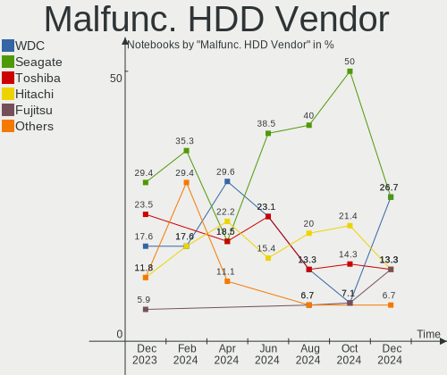
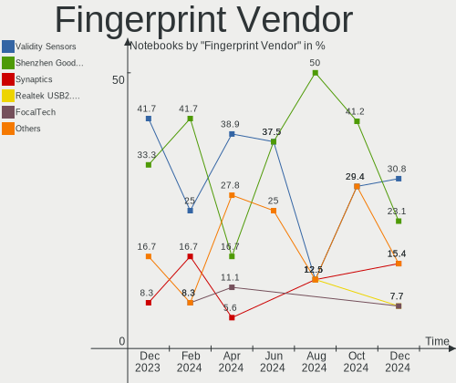

ROSA - Hardware Trends (Notebooks)
----------------------------------

A project to identify most popular hardware characteristics and track their change
over time based on data collected by Linux users at https://Linux-Hardware.org.

Anyone can contribute to this report by the [hw-probe](https://github.com/linuxhw/hw-probe) tool:

    sudo -E hw-probe -all -upload

This report is for one last month. Overall report since the beginning of time: [TestCoverage](https://github.com/linuxhw/TestCoverage)

Period: Jun, 2022.

Contents
--------

* [ System ](#system)
  - [ OS                       ](#os)
  - [ OS Family                ](#os-family)
  - [ Kernel                   ](#kernel)
  - [ Kernel Family            ](#kernel-family)
  - [ Kernel Major Ver.        ](#kernel-major-ver)
  - [ Arch                     ](#arch)
  - [ DE                       ](#de)
  - [ Display Server           ](#display-server)
  - [ Display Manager          ](#display-manager)
  - [ OS Lang                  ](#os-lang)
  - [ Boot Mode                ](#boot-mode)
  - [ Filesystem               ](#filesystem)
  - [ Part. scheme             ](#part-scheme)
  - [ Dual Boot with Linux/BSD ](#dual-boot-with-linuxbsd)
  - [ Dual Boot (Win)          ](#dual-boot-win)

* [ Board ](#board)
  - [ Vendor                   ](#vendor)
  - [ Model                    ](#model)
  - [ Model Family             ](#model-family)
  - [ MFG Year                 ](#mfg-year)
  - [ Form Factor              ](#form-factor)
  - [ Secure Boot              ](#secure-boot)
  - [ Coreboot                 ](#coreboot)
  - [ RAM Size                 ](#ram-size)
  - [ RAM Used                 ](#ram-used)
  - [ Total Drives             ](#total-drives)
  - [ Has CD-ROM               ](#has-cd-rom)
  - [ Has Ethernet             ](#has-ethernet)
  - [ Has WiFi                 ](#has-wifi)
  - [ Has Bluetooth            ](#has-bluetooth)

* [ Location ](#location)
  - [ Country                  ](#country)
  - [ City                     ](#city)

* [ Drives ](#drives)
  - [ Drive Vendor             ](#drive-vendor)
  - [ Drive Model              ](#drive-model)
  - [ HDD Vendor               ](#hdd-vendor)
  - [ SSD Vendor               ](#ssd-vendor)
  - [ Drive Kind               ](#drive-kind)
  - [ Drive Connector          ](#drive-connector)
  - [ Drive Size               ](#drive-size)
  - [ Space Total              ](#space-total)
  - [ Space Used               ](#space-used)
  - [ Malfunc. Drives          ](#malfunc-drives)
  - [ Malfunc. Drive Vendor    ](#malfunc-drive-vendor)
  - [ Malfunc. HDD Vendor      ](#malfunc-hdd-vendor)
  - [ Malfunc. Drive Kind      ](#malfunc-drive-kind)
  - [ Failed Drives            ](#failed-drives)
  - [ Failed Drive Vendor      ](#failed-drive-vendor)
  - [ Drive Status             ](#drive-status)

* [ Storage controller ](#storage-controller)
  - [ Storage Vendor           ](#storage-vendor)
  - [ Storage Model            ](#storage-model)
  - [ Storage Kind             ](#storage-kind)

* [ Processor ](#processor)
  - [ CPU Vendor               ](#cpu-vendor)
  - [ CPU Model                ](#cpu-model)
  - [ CPU Model Family         ](#cpu-model-family)
  - [ CPU Cores                ](#cpu-cores)
  - [ CPU Sockets              ](#cpu-sockets)
  - [ CPU Threads              ](#cpu-threads)
  - [ CPU Op-Modes             ](#cpu-op-modes)
  - [ CPU Microcode            ](#cpu-microcode)
  - [ CPU Microarch            ](#cpu-microarch)

* [ Graphics ](#graphics)
  - [ GPU Vendor               ](#gpu-vendor)
  - [ GPU Model                ](#gpu-model)
  - [ GPU Combo                ](#gpu-combo)
  - [ GPU Driver               ](#gpu-driver)
  - [ GPU Memory               ](#gpu-memory)

* [ Monitor ](#monitor)
  - [ Monitor Vendor           ](#monitor-vendor)
  - [ Monitor Model            ](#monitor-model)
  - [ Monitor Resolution       ](#monitor-resolution)
  - [ Monitor Diagonal         ](#monitor-diagonal)
  - [ Monitor Width            ](#monitor-width)
  - [ Aspect Ratio             ](#aspect-ratio)
  - [ Monitor Area             ](#monitor-area)
  - [ Pixel Density            ](#pixel-density)
  - [ Multiple Monitors        ](#multiple-monitors)

* [ Network ](#network)
  - [ Net Controller Vendor    ](#net-controller-vendor)
  - [ Net Controller Model     ](#net-controller-model)
  - [ Wireless Vendor          ](#wireless-vendor)
  - [ Wireless Model           ](#wireless-model)
  - [ Ethernet Vendor          ](#ethernet-vendor)
  - [ Ethernet Model           ](#ethernet-model)
  - [ Net Controller Kind      ](#net-controller-kind)
  - [ Used Controller          ](#used-controller)
  - [ NICs                     ](#nics)
  - [ IPv6                     ](#ipv6)

* [ Bluetooth ](#bluetooth)
  - [ Bluetooth Vendor         ](#bluetooth-vendor)
  - [ Bluetooth Model          ](#bluetooth-model)

* [ Sound ](#sound)
  - [ Sound Vendor             ](#sound-vendor)
  - [ Sound Model              ](#sound-model)

* [ Memory ](#memory)
  - [ Memory Vendor            ](#memory-vendor)
  - [ Memory Model             ](#memory-model)
  - [ Memory Kind              ](#memory-kind)
  - [ Memory Form Factor       ](#memory-form-factor)
  - [ Memory Size              ](#memory-size)
  - [ Memory Speed             ](#memory-speed)

* [ Printers & scanners ](#printers--scanners)
  - [ Printer Vendor           ](#printer-vendor)
  - [ Printer Model            ](#printer-model)
  - [ Scanner Vendor           ](#scanner-vendor)
  - [ Scanner Model            ](#scanner-model)

* [ Camera ](#camera)
  - [ Camera Vendor            ](#camera-vendor)
  - [ Camera Model             ](#camera-model)

* [ Security ](#security)
  - [ Fingerprint Vendor       ](#fingerprint-vendor)
  - [ Fingerprint Model        ](#fingerprint-model)
  - [ Chipcard Vendor          ](#chipcard-vendor)
  - [ Chipcard Model           ](#chipcard-model)

* [ Unsupported ](#unsupported)
  - [ Unsupported Devices      ](#unsupported-devices)
  - [ Unsupported Device Types ](#unsupported-device-types)

System
------

OS
--

Installed operating systems

| Name       | Notebooks | Percent |
|------------|-----------|---------|
| ROSA 12.2  | 118       | 86.13%  |
| ROSA R11.1 | 18        | 13.14%  |
| ROSA 12.1  | 1         | 0.73%   |

OS Family
---------

OS without a version

| Name | Notebooks | Percent |
|------|-----------|---------|
| ROSA | 137       | 100%    |

Kernel
------

Version of the Linux kernel

| Version                                   | Notebooks | Percent |
|-------------------------------------------|-----------|---------|
| 5.10.74-generic-2rosa2021.1-x86_64        | 80        | 58.39%  |
| 5.10.118-generic-2rosa2021.1-x86_64       | 22        | 16.06%  |
| 5.4.83-generic-2rosa-x86_64               | 7         | 5.11%   |
| 5.10.74-generic-2rosa2021.1-i586          | 4         | 2.92%   |
| 5.4.83-generic-2rosa-i586                 | 3         | 2.19%   |
| 5.15.32-generic-6rosa2021.1-x86_64        | 3         | 2.19%   |
| 4.15.0-desktop-122.124.1rosa-x86_64       | 3         | 2.19%   |
| 5.17.11-generic-1rosa2021.1-x86_64        | 2         | 1.46%   |
| 5.4.32-generic-2rosa-x86_64               | 1         | 0.73%   |
| 5.4.32-generic-2rosa-i586                 | 1         | 0.73%   |
| 5.18.4.xm1-1.klp-xanmod-rosa2021.1-x86_64 | 1         | 0.73%   |
| 5.18.3.xm1-1.klp-xanmod-rosa2021.1-x86_64 | 1         | 0.73%   |
| 5.18.2.xm1-3.klp-xanmod-rosa2021.1-x86_64 | 1         | 0.73%   |
| 5.18.1.xm1-3.klp-xanmod-rosa2021.1-x86_64 | 1         | 0.73%   |
| 5.18.1-generic-1rosa2021.1-x86_64         | 1         | 0.73%   |
| 5.15.43-generic-2rosa2021.1-x86_64        | 1         | 0.73%   |
| 5.10.118-generic-2rosa2021.1-i586         | 1         | 0.73%   |
| 5.10.118-generic-1rosa2021.1-x86_64       | 1         | 0.73%   |
| 4.9.60-nrj-desktop-1rosa-i586             | 1         | 0.73%   |
| 4.9.155-nrj-desktop-1rosa-x86_64          | 1         | 0.73%   |
| 4.15.0-desktop-122.124.1rosa-i586         | 1         | 0.73%   |

Kernel Family
-------------

Linux kernel without a distro release

| Version  | Notebooks | Percent |
|----------|-----------|---------|
| 5.10.74  | 84        | 61.31%  |
| 5.10.118 | 24        | 17.52%  |
| 5.4.83   | 10        | 7.3%    |
| 4.15.0   | 4         | 2.92%   |
| 5.15.32  | 3         | 2.19%   |
| 5.4.32   | 2         | 1.46%   |
| 5.18.1   | 2         | 1.46%   |
| 5.17.11  | 2         | 1.46%   |
| 5.18.4   | 1         | 0.73%   |
| 5.18.3   | 1         | 0.73%   |
| 5.18.2   | 1         | 0.73%   |
| 5.15.43  | 1         | 0.73%   |
| 4.9.60   | 1         | 0.73%   |
| 4.9.155  | 1         | 0.73%   |

Kernel Major Ver.
-----------------

Linux kernel major version

| Version | Notebooks | Percent |
|---------|-----------|---------|
| 5.10    | 108       | 78.83%  |
| 5.4     | 12        | 8.76%   |
| 5.18    | 5         | 3.65%   |
| 5.15    | 4         | 2.92%   |
| 4.15    | 4         | 2.92%   |
| 5.17    | 2         | 1.46%   |
| 4.9     | 2         | 1.46%   |

Arch
----

OS architecture (x86_64, i586, etc.)

| Name   | Notebooks | Percent |
|--------|-----------|---------|
| x86_64 | 126       | 91.97%  |
| i686   | 11        | 8.03%   |

DE
--

Desktop Environment

| Name  | Notebooks | Percent |
|-------|-----------|---------|
| KDE5  | 58        | 42.34%  |
| GNOME | 54        | 39.42%  |
| LXQt  | 15        | 10.95%  |
| KDE4  | 10        | 7.3%    |

Display Server
--------------

X11 or Wayland

| Name    | Notebooks | Percent |
|---------|-----------|---------|
| Wayland | 105       | 76.64%  |
| X11     | 32        | 23.36%  |

Display Manager
---------------

SDDM, LightDM, etc.

| Name    | Notebooks | Percent |
|---------|-----------|---------|
| GDM     | 62        | 45.26%  |
| SDDM    | 60        | 43.8%   |
| KDM     | 10        | 7.3%    |
| LightDM | 5         | 3.65%   |

OS Lang
-------

Language

| Lang  | Notebooks | Percent |
|-------|-----------|---------|
| ru_RU | 128       | 93.43%  |
| en_US | 2         | 1.46%   |
| sr_RS | 1         | 0.73%   |
| pt_BR | 1         | 0.73%   |
| pl_PL | 1         | 0.73%   |
| hu_HU | 1         | 0.73%   |
| es_ES | 1         | 0.73%   |
| es_CO | 1         | 0.73%   |
| de_DE | 1         | 0.73%   |

Boot Mode
---------

EFI or BIOS

| Mode | Notebooks | Percent |
|------|-----------|---------|
| EFI  | 72        | 52.55%  |
| BIOS | 65        | 47.45%  |

Filesystem
----------

Type of filesystem

| Type  | Notebooks | Percent |
|-------|-----------|---------|
| Ext4  | 130       | 94.89%  |
| Btrfs | 5         | 3.65%   |
| Xfs   | 1         | 0.73%   |
| Ext3  | 1         | 0.73%   |

Part. scheme
------------

Scheme of partitioning

| Type | Notebooks | Percent |
|------|-----------|---------|
| GPT  | 86        | 62.77%  |
| MBR  | 51        | 37.23%  |

Dual Boot with Linux/BSD
------------------------

Hosting more than one Linux/BSD

| Dual boot | Notebooks | Percent |
|-----------|-----------|---------|
| No        | 117       | 85.4%   |
| Yes       | 20        | 14.6%   |

Dual Boot (Win)
---------------

Hosting Linux and Windows

| Dual boot | Notebooks | Percent |
|-----------|-----------|---------|
| No        | 77        | 56.2%   |
| Yes       | 60        | 43.8%   |

Board
-----

Vendor
------

Motherboard manufacturer

| Name                | Notebooks | Percent |
|---------------------|-----------|---------|
| Acer                | 29        | 21.17%  |
| Lenovo              | 23        | 16.79%  |
| Hewlett-Packard     | 21        | 15.33%  |
| ASUSTek Computer    | 16        | 11.68%  |
| Samsung Electronics | 13        | 9.49%   |
| Dell                | 10        | 7.3%    |
| Toshiba             | 4         | 2.92%   |
| MSI                 | 3         | 2.19%   |
| Aquarius            | 3         | 2.19%   |
| Sony                | 2         | 1.46%   |
| Packard Bell        | 2         | 1.46%   |
| eMachines           | 2         | 1.46%   |
| TUXEDO              | 1         | 0.73%   |
| Notebook            | 1         | 0.73%   |
| mtech               | 1         | 0.73%   |
| Intel               | 1         | 0.73%   |
| ICL                 | 1         | 0.73%   |
| HUAWEI              | 1         | 0.73%   |
| HONOR               | 1         | 0.73%   |
| Haier               | 1         | 0.73%   |
| Fujitsu             | 1         | 0.73%   |

Model
-----

Motherboard model

| Name                                        | Notebooks | Percent |
|---------------------------------------------|-----------|---------|
| Acer Aspire V3-571G                         | 4         | 2.92%   |
| HP Pavilion g6                              | 3         | 2.19%   |
| Aquarius NS685U R11                         | 3         | 2.19%   |
| HP Pavilion dv6                             | 2         | 1.46%   |
| Acer Aspire A315-51                         | 2         | 1.46%   |
| TUXEDO Pulse 15 Gen1                        | 1         | 0.73%   |
| Toshiba Satellite R630                      | 1         | 0.73%   |
| Toshiba Satellite L850-B5K                  | 1         | 0.73%   |
| Toshiba Satellite L775D                     | 1         | 0.73%   |
| Toshiba Satellite C670D-11G                 | 1         | 0.73%   |
| Sony VPCF12Z1R                              | 1         | 0.73%   |
| Sony VGN-CS240T                             | 1         | 0.73%   |
| Samsung RV411/RV511/E3511/S3511/RV711/E3411 | 1         | 0.73%   |
| Samsung R710                                | 1         | 0.73%   |
| Samsung R59P/R60P/R61P                      | 1         | 0.73%   |
| Samsung R530/R730/R540                      | 1         | 0.73%   |
| Samsung R519/R719                           | 1         | 0.73%   |
| Samsung R430/P430/R480                      | 1         | 0.73%   |
| Samsung R40/R41                             | 1         | 0.73%   |
| Samsung QX310/QX410/QX510/SF310/SF410/SF510 | 1         | 0.73%   |
| Samsung N150P/N210P/N220P                   | 1         | 0.73%   |
| Samsung 530U3C/530U4C                       | 1         | 0.73%   |
| Samsung 355V4C/356V4C/3445VC/3545VC         | 1         | 0.73%   |
| Samsung 350V5C/351V5C/3540VC/3440VC         | 1         | 0.73%   |
| Samsung 305V4A/305V5A/3415VA                | 1         | 0.73%   |
| Packard Bell EasyNote TE11HC                | 1         | 0.73%   |
| Packard Bell EasyNote MH36                  | 1         | 0.73%   |
| Notebook W35xSS_370SS                       | 1         | 0.73%   |
| mtech MTL1578                               | 1         | 0.73%   |
| MSI GP72 2QE                                | 1         | 0.73%   |
| MSI GE70 2OC\2OD\2OE                        | 1         | 0.73%   |
| MSI Alpha 15 B5EEK                          | 1         | 0.73%   |
| Lenovo Z50-70 20354                         | 1         | 0.73%   |
| Lenovo Y720-15IKB 80VR                      | 1         | 0.73%   |
| Lenovo V580 20147                           | 1         | 0.73%   |
| Lenovo V14-IIL 82C4                         | 1         | 0.73%   |
| Lenovo ThinkBook 15 G3 ACL 21A4             | 1         | 0.73%   |
| Lenovo ThinkBook 15 G2 ARE 20VG             | 1         | 0.73%   |
| Lenovo Legion 5 15ARH05H 82B1               | 1         | 0.73%   |
| Lenovo IdeaPad Z570 HuronRiver Platform     | 1         | 0.73%   |
| Lenovo IdeaPad Z500 20202                   | 1         | 0.73%   |
| Lenovo IdeaPad S340-14API 81NB              | 1         | 0.73%   |
| Lenovo IdeaPad S145-15IWL 81MV              | 1         | 0.73%   |
| Lenovo IdeaPad 510S-13IKB 80V0              | 1         | 0.73%   |
| Lenovo IdeaPad 330-15IKB 81DE               | 1         | 0.73%   |
| Lenovo IdeaPad 120S-14IAP 81A5              | 1         | 0.73%   |
| Lenovo G700 20251                           | 1         | 0.73%   |
| Lenovo G560 20042                           | 1         | 0.73%   |
| Lenovo G505s 20255                          | 1         | 0.73%   |
| Lenovo G505 20240                           | 1         | 0.73%   |
| Lenovo E31-70 80KX                          | 1         | 0.73%   |
| Lenovo B590 20208                           | 1         | 0.73%   |
| Lenovo B590 20206                           | 1         | 0.73%   |
| Lenovo B50-70 20384                         | 1         | 0.73%   |
| Lenovo B50-30 20382                         | 1         | 0.73%   |
| ICL RAYbook Si1514                          | 1         | 0.73%   |
| HUAWEI NBLK-WAX9X                           | 1         | 0.73%   |
| HONOR NBR-WAX9                              | 1         | 0.73%   |
| HP x2 210                                   | 1         | 0.73%   |
| HP ProBook 6460b                            | 1         | 0.73%   |

Model Family
------------

Motherboard model prefix

| Name                  | Notebooks | Percent |
|-----------------------|-----------|---------|
| Acer Aspire           | 24        | 17.52%  |
| Lenovo IdeaPad        | 7         | 5.11%   |
| ASUS VivoBook         | 6         | 4.38%   |
| HP Pavilion           | 5         | 3.65%   |
| Toshiba Satellite     | 4         | 2.92%   |
| Dell Vostro           | 4         | 2.92%   |
| Dell Inspiron         | 4         | 2.92%   |
| Aquarius NS685U       | 3         | 2.19%   |
| Packard Bell EasyNote | 2         | 1.46%   |
| Lenovo ThinkBook      | 2         | 1.46%   |
| Lenovo B590           | 2         | 1.46%   |
| HP ProBook            | 2         | 1.46%   |
| HP Laptop             | 2         | 1.46%   |
| HP ENVY               | 2         | 1.46%   |
| HP EliteBook          | 2         | 1.46%   |
| HP 250                | 2         | 1.46%   |
| ASUS ROG              | 2         | 1.46%   |
| Acer TravelMate       | 2         | 1.46%   |
| TUXEDO Pulse          | 1         | 0.73%   |
| Sony VPCF12Z1R        | 1         | 0.73%   |
| Sony VGN-CS240T       | 1         | 0.73%   |
| Samsung RV411         | 1         | 0.73%   |
| Samsung R710          | 1         | 0.73%   |
| Samsung R59P          | 1         | 0.73%   |
| Samsung R530          | 1         | 0.73%   |
| Samsung R519          | 1         | 0.73%   |
| Samsung R430          | 1         | 0.73%   |
| Samsung R40           | 1         | 0.73%   |
| Samsung QX310         | 1         | 0.73%   |
| Samsung N150P         | 1         | 0.73%   |
| Samsung 530U3C        | 1         | 0.73%   |
| Samsung 355V4C        | 1         | 0.73%   |
| Samsung 350V5C        | 1         | 0.73%   |
| Samsung 305V4A        | 1         | 0.73%   |
| Notebook W35xSS       | 1         | 0.73%   |
| mtech MTL1578         | 1         | 0.73%   |
| MSI GP72              | 1         | 0.73%   |
| MSI GE70              | 1         | 0.73%   |
| MSI Alpha             | 1         | 0.73%   |
| Lenovo Z50-70         | 1         | 0.73%   |
| Lenovo Y720-15IKB     | 1         | 0.73%   |
| Lenovo V580           | 1         | 0.73%   |
| Lenovo V14-IIL        | 1         | 0.73%   |
| Lenovo Legion         | 1         | 0.73%   |
| Lenovo G700           | 1         | 0.73%   |
| Lenovo G560           | 1         | 0.73%   |
| Lenovo G505s          | 1         | 0.73%   |
| Lenovo G505           | 1         | 0.73%   |
| Lenovo E31-70         | 1         | 0.73%   |
| Lenovo B50-70         | 1         | 0.73%   |
| Lenovo B50-30         | 1         | 0.73%   |
| ICL RAYbook           | 1         | 0.73%   |
| HUAWEI NBLK-WAX9X     | 1         | 0.73%   |
| HONOR NBR-WAX9        | 1         | 0.73%   |
| HP x2                 | 1         | 0.73%   |
| HP OMEN               | 1         | 0.73%   |
| HP Mini               | 1         | 0.73%   |
| HP Compaq             | 1         | 0.73%   |
| HP 625                | 1         | 0.73%   |
| HP 255                | 1         | 0.73%   |

MFG Year
--------

Motherboard manufacture year

| Year | Notebooks | Percent |
|------|-----------|---------|
| 2012 | 23        | 16.79%  |
| 2011 | 14        | 10.22%  |
| 2013 | 12        | 8.76%   |
| 2010 | 12        | 8.76%   |
| 2017 | 10        | 7.3%    |
| 2019 | 9         | 6.57%   |
| 2021 | 8         | 5.84%   |
| 2020 | 8         | 5.84%   |
| 2014 | 6         | 4.38%   |
| 2008 | 6         | 4.38%   |
| 2022 | 5         | 3.65%   |
| 2018 | 5         | 3.65%   |
| 2009 | 5         | 3.65%   |
| 2007 | 5         | 3.65%   |
| 2006 | 4         | 2.92%   |
| 2015 | 3         | 2.19%   |
| 2016 | 2         | 1.46%   |

Form Factor
-----------

Physical design of the computer

| Name     | Notebooks | Percent |
|----------|-----------|---------|
| Notebook | 137       | 100%    |

Secure Boot
-----------

Enabled or disabled

| State    | Notebooks | Percent |
|----------|-----------|---------|
| Disabled | 137       | 100%    |

Coreboot
--------

Have coreboot on board

| Used | Notebooks | Percent |
|------|-----------|---------|
| No   | 137       | 100%    |

RAM Size
--------

Total RAM memory

| Size in GB | Notebooks | Percent |
|------------|-----------|---------|
| 4.01-8.0   | 54        | 39.42%  |
| 3.01-4.0   | 38        | 27.74%  |
| 8.01-16.0  | 18        | 13.14%  |
| 1.01-2.0   | 12        | 8.76%   |
| 16.01-24.0 | 8         | 5.84%   |
| 2.01-3.0   | 4         | 2.92%   |
| 0.51-1.0   | 2         | 1.46%   |
| 32.01-64.0 | 1         | 0.73%   |

RAM Used
--------

Used RAM memory

| Used GB  | Notebooks | Percent |
|----------|-----------|---------|
| 1.01-2.0 | 72        | 52.55%  |
| 0.51-1.0 | 41        | 29.93%  |
| 2.01-3.0 | 17        | 12.41%  |
| 4.01-8.0 | 4         | 2.92%   |
| 0.01-0.5 | 2         | 1.46%   |
| 3.01-4.0 | 1         | 0.73%   |

Total Drives
------------

Number of drives on board

| Drives | Notebooks | Percent |
|--------|-----------|---------|
| 1      | 96        | 70.07%  |
| 2      | 34        | 24.82%  |
| 3      | 4         | 2.92%   |
| 5      | 1         | 0.73%   |
| 4      | 1         | 0.73%   |
| 0      | 1         | 0.73%   |

Has CD-ROM
----------

Has CD-ROM on board

| Presented | Notebooks | Percent |
|-----------|-----------|---------|
| No        | 76        | 55.47%  |
| Yes       | 61        | 44.53%  |

Has Ethernet
------------

Has Ethernet on board

| Presented | Notebooks | Percent |
|-----------|-----------|---------|
| Yes       | 121       | 88.32%  |
| No        | 16        | 11.68%  |

Has WiFi
--------

Has WiFi module

| Presented | Notebooks | Percent |
|-----------|-----------|---------|
| Yes       | 136       | 99.27%  |
| No        | 1         | 0.73%   |

Has Bluetooth
-------------

Has Bluetooth module

| Presented | Notebooks | Percent |
|-----------|-----------|---------|
| Yes       | 109       | 79.56%  |
| No        | 28        | 20.44%  |

Location
--------

Country
-------

Geographic location (country)

| Country         | Notebooks | Percent |
|-----------------|-----------|---------|
| Russia          | 117       | 85.4%   |
| Belarus         | 4         | 2.92%   |
| Ukraine         | 2         | 1.46%   |
| Kazakhstan      | 2         | 1.46%   |
| Germany         | 2         | 1.46%   |
| Slovakia        | 1         | 0.73%   |
| Serbia          | 1         | 0.73%   |
| Poland          | 1         | 0.73%   |
| North Macedonia | 1         | 0.73%   |
| Italy           | 1         | 0.73%   |
| Hungary         | 1         | 0.73%   |
| France          | 1         | 0.73%   |
| Czechia         | 1         | 0.73%   |
| Colombia        | 1         | 0.73%   |
| Brazil          | 1         | 0.73%   |

City
----

Geographic location (city)

| City              | Notebooks | Percent |
|-------------------|-----------|---------|
| Moscow            | 27        | 19.71%  |
| St Petersburg     | 7         | 5.11%   |
| Novosibirsk       | 6         | 4.38%   |
| Yekaterinburg     | 4         | 2.92%   |
| Krasnoyarsk       | 4         | 2.92%   |
| Krasnodar         | 4         | 2.92%   |
| Voronezh          | 3         | 2.19%   |
| Tula              | 3         | 2.19%   |
| Saratov           | 3         | 2.19%   |
| Pskov             | 3         | 2.19%   |
| Chelyabinsk       | 3         | 2.19%   |
| Yaroslavl         | 2         | 1.46%   |
| Ufa               | 2         | 1.46%   |
| Tver              | 2         | 1.46%   |
| Samara            | 2         | 1.46%   |
| Murmansk          | 2         | 1.46%   |
| Kemerovo          | 2         | 1.46%   |
| Armavir           | 2         | 1.46%   |
| Aktobe            | 2         | 1.46%   |
| Zhodzina          | 1         | 0.73%   |
| Yuzhno-Sakhalinsk | 1         | 0.73%   |
| Yoshkar-Ola       | 1         | 0.73%   |
| Yessentuki        | 1         | 0.73%   |
| Yasinovataya      | 1         | 0.73%   |
| Yartsevo          | 1         | 0.73%   |
| Yablonovsky       | 1         | 0.73%   |
| Voskresensk       | 1         | 0.73%   |
| Vladimir          | 1         | 0.73%   |
| Vitebsk           | 1         | 0.73%   |
| Ulyanovsk         | 1         | 0.73%   |
| Tyumen            | 1         | 0.73%   |
| Touget            | 1         | 0.73%   |
| Tambov            | 1         | 0.73%   |
| Surgut            | 1         | 0.73%   |
| Soblahov          | 1         | 0.73%   |
| Snezhinsk         | 1         | 0.73%   |
| Smolensk          | 1         | 0.73%   |
| Siófok           | 1         | 0.73%   |
| Simferopol        | 1         | 0.73%   |
| Sharypovo         | 1         | 0.73%   |
| Severodvinsk      | 1         | 0.73%   |
| Serpukhov         | 1         | 0.73%   |
| Sakharovo         | 1         | 0.73%   |
| Rostov-on-Don     | 1         | 0.73%   |
| Rome              | 1         | 0.73%   |
| Rio de Janeiro    | 1         | 0.73%   |
| Radovis           | 1         | 0.73%   |
| Pyatigorsk        | 1         | 0.73%   |
| Prague            | 1         | 0.73%   |
| Petrozavodsk      | 1         | 0.73%   |
| Pervouralsk       | 1         | 0.73%   |
| Orenburg          | 1         | 0.73%   |
| Munich            | 1         | 0.73%   |
| Medellín         | 1         | 0.73%   |
| Maykop            | 1         | 0.73%   |
| Lesnoy            | 1         | 0.73%   |
| Leninsk-Kuznetsky | 1         | 0.73%   |
| Kursk             | 1         | 0.73%   |
| Kurgan            | 1         | 0.73%   |
| Krakow            | 1         | 0.73%   |

Drives
------

Drive Vendor
------------

Hard drive vendors

| Vendor              | Notebooks | Drives | Percent |
|---------------------|-----------|--------|---------|
| WDC                 | 33        | 34     | 18.97%  |
| Seagate             | 25        | 26     | 14.37%  |
| Toshiba             | 12        | 12     | 6.9%    |
| Samsung Electronics | 12        | 14     | 6.9%    |
| Kingston            | 12        | 12     | 6.9%    |
| Hitachi             | 10        | 10     | 5.75%   |
| Unknown             | 8         | 9      | 4.6%    |
| SanDisk             | 8         | 9      | 4.6%    |
| HGST                | 8         | 8      | 4.6%    |
| A-DATA Technology   | 7         | 7      | 4.02%   |
| China               | 6         | 6      | 3.45%   |
| SK hynix            | 3         | 3      | 1.72%   |
| KingSpec            | 3         | 3      | 1.72%   |
| Goodram             | 3         | 3      | 1.72%   |
| Crucial             | 3         | 3      | 1.72%   |
| Apacer              | 3         | 3      | 1.72%   |
| Intel               | 2         | 2      | 1.15%   |
| Fujitsu             | 2         | 2      | 1.15%   |
| XPG                 | 1         | 1      | 0.57%   |
| Union Memory        | 1         | 1      | 0.57%   |
| UMIS                | 1         | 1      | 0.57%   |
| Transcend           | 1         | 1      | 0.57%   |
| Smartbuy            | 1         | 1      | 0.57%   |
| Realtek             | 1         | 1      | 0.57%   |
| Londisk             | 1         | 1      | 0.57%   |
| KIOXIA              | 1         | 1      | 0.57%   |
| Hikvision           | 1         | 1      | 0.57%   |
| GS                  | 1         | 2      | 0.57%   |
| Gigabyte Technology | 1         | 1      | 0.57%   |
| BHT                 | 1         | 1      | 0.57%   |
| AMD                 | 1         | 1      | 0.57%   |
| Unknown             | 1         | 1      | 0.57%   |

Drive Model
-----------

Hard drive models

| Model                                | Notebooks | Percent |
|--------------------------------------|-----------|---------|
| WDC WDS240G2G0A-00JH30 240GB SSD     | 3         | 1.67%   |
| Seagate ST9320325AS 320GB            | 3         | 1.67%   |
| Seagate ST500LT012-9WS142 500GB      | 3         | 1.67%   |
| A-DATA SU800NS38 256GB SSD           | 3         | 1.67%   |
| WDC WDS500G2B0A-00SM50 500GB SSD     | 2         | 1.11%   |
| WDC WD5000LPCX-21VHAT0 500GB         | 2         | 1.11%   |
| WDC WD10SPZX-21Z10T0 1TB             | 2         | 1.11%   |
| Unknown SD/MMC/MS PRO 128GB          | 2         | 1.11%   |
| Toshiba MQ04ABF100 1TB               | 2         | 1.11%   |
| Seagate ST9500325AS 500GB            | 2         | 1.11%   |
| Seagate ST500LT012-1DG142 500GB      | 2         | 1.11%   |
| Seagate ST320LT012-9WS14C 320GB      | 2         | 1.11%   |
| Seagate ST1000LM035-1RK172 1TB       | 2         | 1.11%   |
| Seagate ST1000LM024 HN-M101MBB 1TB   | 2         | 1.11%   |
| SanDisk SSD PLUS 240GB               | 2         | 1.11%   |
| Samsung SSD 850 EVO 250GB            | 2         | 1.11%   |
| Kingston SA400S37240G 240GB SSD      | 2         | 1.11%   |
| Intel SSDPEKNU512GZ 512GB            | 2         | 1.11%   |
| Hitachi HTS542512K9SA00 120GB        | 2         | 1.11%   |
| HGST HTS545050A7E680 500GB           | 2         | 1.11%   |
| Crucial CT120BX500SSD1 120GB         | 2         | 1.11%   |
| A-DATA SU650 120GB SSD               | 2         | 1.11%   |
| XPG GAMMIX S11 Pro 1TB               | 1         | 0.56%   |
| WDC WDS480G2G0A-00JH30 480GB SSD     | 1         | 0.56%   |
| WDC WDS250G2B0C-00PXH0 250GB         | 1         | 0.56%   |
| WDC WDS120G2G0A-00JH30 120GB SSD     | 1         | 0.56%   |
| WDC WD5000LPVX-22V0TT0 500GB         | 1         | 0.56%   |
| WDC WD5000LPLX-75ZNTT0 500GB         | 1         | 0.56%   |
| WDC WD5000LPLX-00ZNTT0 500GB         | 1         | 0.56%   |
| WDC WD5000BPVT-22HXZT3 500GB         | 1         | 0.56%   |
| WDC WD5000BPKX-00HPJT0 500GB         | 1         | 0.56%   |
| WDC WD4000LPCX-24C6HT0 400GB         | 1         | 0.56%   |
| WDC WD3200LPCX-24C6HT0 320GB         | 1         | 0.56%   |
| WDC WD3200BEVT-22ZCT0 320GB          | 1         | 0.56%   |
| WDC WD3200BEKT-08PVMT1 320GB         | 1         | 0.56%   |
| WDC WD2500BUCT-63TWBY0 250GB         | 1         | 0.56%   |
| WDC WD2500BEVT-22ZCT0 250GB          | 1         | 0.56%   |
| WDC WD2500BEKT-60A25T1 250GB         | 1         | 0.56%   |
| WDC WD1600BEVS-22RST0 160GB          | 1         | 0.56%   |
| WDC WD1600BEKT-60A25T1 160GB         | 1         | 0.56%   |
| WDC WD10SPZX-08Z10 1TB               | 1         | 0.56%   |
| WDC WD10SPZX-00Z10T0 1TB             | 1         | 0.56%   |
| WDC WD10JPVT-08A1YT2 1TB             | 1         | 0.56%   |
| WDC WD10JPLX-00MBPT0 1TB             | 1         | 0.56%   |
| WDC PC SN730 SDBPNTY-512G-1027 512GB | 1         | 0.56%   |
| WDC PC SN530 SDBPMPZ-512G-1101 512GB | 1         | 0.56%   |
| WDC PC SN520 SDAPNUW-512G-1014 512GB | 1         | 0.56%   |
| WDC PC SN520 SDAPNUW-512G-1002 512GB | 1         | 0.56%   |
| Unknown USDU1  32GB                  | 1         | 0.56%   |
| Unknown USD  8GB                     | 1         | 0.56%   |
| Unknown SD4GB                        | 1         | 0.56%   |
| Unknown NCard  8GB                   | 1         | 0.56%   |
| Unknown MMC64G  64GB                 | 1         | 0.56%   |
| Unknown ISOCOM  64GB                 | 1         | 0.56%   |
| Unknown EB2MW  32GB                  | 1         | 0.56%   |
| Union Memory RTOTJ128VGD2EYX 128GB   | 1         | 0.56%   |
| UMIS RPFTJ128PDD2EWX 128GB           | 1         | 0.56%   |
| Transcend TS128GMTE110S 128GB        | 1         | 0.56%   |
| Toshiba TR200 240GB SSD              | 1         | 0.56%   |
| Toshiba MQ01ABF050 500GB             | 1         | 0.56%   |

HDD Vendor
----------

Hard disk drive vendors

| Vendor              | Notebooks | Drives | Percent |
|---------------------|-----------|--------|---------|
| Seagate             | 25        | 26     | 31.25%  |
| WDC                 | 22        | 22     | 27.5%   |
| Toshiba             | 10        | 10     | 12.5%   |
| Hitachi             | 10        | 10     | 12.5%   |
| HGST                | 8         | 8      | 10%     |
| Unknown             | 2         | 2      | 2.5%    |
| Fujitsu             | 2         | 2      | 2.5%    |
| Samsung Electronics | 1         | 1      | 1.25%   |

SSD Vendor
----------

Solid state drive vendors

| Vendor              | Notebooks | Drives | Percent |
|---------------------|-----------|--------|---------|
| Kingston            | 8         | 8      | 13.79%  |
| WDC                 | 7         | 7      | 12.07%  |
| SanDisk             | 6         | 7      | 10.34%  |
| China               | 6         | 6      | 10.34%  |
| A-DATA Technology   | 6         | 6      | 10.34%  |
| Samsung Electronics | 5         | 6      | 8.62%   |
| KingSpec            | 3         | 3      | 5.17%   |
| Goodram             | 3         | 3      | 5.17%   |
| Crucial             | 3         | 3      | 5.17%   |
| Apacer              | 3         | 3      | 5.17%   |
| Union Memory        | 1         | 1      | 1.72%   |
| Toshiba             | 1         | 1      | 1.72%   |
| Smartbuy            | 1         | 1      | 1.72%   |
| Londisk             | 1         | 1      | 1.72%   |
| GS                  | 1         | 2      | 1.72%   |
| Gigabyte Technology | 1         | 1      | 1.72%   |
| BHT                 | 1         | 1      | 1.72%   |
| AMD                 | 1         | 1      | 1.72%   |

Drive Kind
----------

HDD or SSD

| Kind | Notebooks | Drives | Percent |
|------|-----------|--------|---------|
| HDD  | 78        | 81     | 46.43%  |
| SSD  | 53        | 61     | 31.55%  |
| NVMe | 28        | 29     | 16.67%  |
| MMC  | 9         | 10     | 5.36%   |

Drive Connector
---------------

SATA, SAS, NVMe, etc.

| Type | Notebooks | Drives | Percent |
|------|-----------|--------|---------|
| SATA | 113       | 136    | 72.9%   |
| NVMe | 27        | 28     | 17.42%  |
| MMC  | 9         | 10     | 5.81%   |
| SAS  | 6         | 7      | 3.87%   |

Drive Size
----------

Size of hard drive

| Size in TB | Notebooks | Drives | Percent |
|------------|-----------|--------|---------|
| 0.01-0.5   | 98        | 114    | 78.4%   |
| 0.51-1.0   | 26        | 27     | 20.8%   |
| 1.01-2.0   | 1         | 1      | 0.8%    |

Space Total
-----------

Amount of disk space available on the file system

| Size in GB     | Notebooks | Percent |
|----------------|-----------|---------|
| 101-250        | 47        | 34.31%  |
| 251-500        | 43        | 31.39%  |
| 501-1000       | 18        | 13.14%  |
| 1-20           | 11        | 8.03%   |
| 21-50          | 7         | 5.11%   |
| 1001-2000      | 4         | 2.92%   |
| 51-100         | 4         | 2.92%   |
| More than 3000 | 1         | 0.73%   |
| 2001-3000      | 1         | 0.73%   |
| Unknown        | 1         | 0.73%   |

Space Used
----------

Amount of used disk space

| Used GB   | Notebooks | Percent |
|-----------|-----------|---------|
| 1-20      | 97        | 70.8%   |
| 21-50     | 11        | 8.03%   |
| 101-250   | 9         | 6.57%   |
| 251-500   | 8         | 5.84%   |
| 51-100    | 8         | 5.84%   |
| 1001-2000 | 2         | 1.46%   |
| 501-1000  | 1         | 0.73%   |
| Unknown   | 1         | 0.73%   |

Malfunc. Drives
---------------

Drive models with a malfunction

| Model                              | Notebooks | Drives | Percent |
|------------------------------------|-----------|--------|---------|
| Seagate ST9320325AS 320GB          | 3         | 3      | 7.69%   |
| Seagate ST500LT012-9WS142 500GB    | 3         | 3      | 7.69%   |
| Seagate ST320LT012-9WS14C 320GB    | 2         | 2      | 5.13%   |
| Seagate ST1000LM024 HN-M101MBB 1TB | 2         | 2      | 5.13%   |
| Hitachi HTS542512K9SA00 120GB      | 2         | 2      | 5.13%   |
| HGST HTS545050A7E680 500GB         | 2         | 2      | 5.13%   |
| WDC WDS240G2G0A-00JH30 240GB SSD   | 1         | 1      | 2.56%   |
| WDC WD5000LPLX-00ZNTT0 500GB       | 1         | 1      | 2.56%   |
| WDC WD5000BPVT-22HXZT3 500GB       | 1         | 1      | 2.56%   |
| WDC WD3200LPCX-24C6HT0 320GB       | 1         | 1      | 2.56%   |
| WDC WD2500BUCT-63TWBY0 250GB       | 1         | 1      | 2.56%   |
| WDC WD2500BEKT-60A25T1 250GB       | 1         | 1      | 2.56%   |
| WDC WD10SPZX-08Z10 1TB             | 1         | 1      | 2.56%   |
| WDC WD10JPVT-08A1YT2 1TB           | 1         | 1      | 2.56%   |
| Toshiba MK6476GSX 640GB            | 1         | 1      | 2.56%   |
| Toshiba MK2552GSX 250GB            | 1         | 1      | 2.56%   |
| Seagate ST9500420AS 500GB          | 1         | 1      | 2.56%   |
| Seagate ST9500325AS 500GB          | 1         | 1      | 2.56%   |
| Seagate ST9250315AS 250GB          | 1         | 1      | 2.56%   |
| Seagate ST500LM021-1KJ152 500GB    | 1         | 1      | 2.56%   |
| Seagate ST500LM000-SSHD-8GB        | 1         | 1      | 2.56%   |
| Seagate ST320LT020-9YG142 320GB    | 1         | 1      | 2.56%   |
| Samsung Electronics HM160HI 160GB  | 1         | 1      | 2.56%   |
| Hitachi HTS725050A9A364 500GB      | 1         | 1      | 2.56%   |
| Hitachi HTS547550A9E384 500GB      | 1         | 1      | 2.56%   |
| Hitachi HTS542525K9A300 250GB      | 1         | 1      | 2.56%   |
| Hitachi HTS542516K9SA00 160GB      | 1         | 1      | 2.56%   |
| Hitachi HTS541612J9SA00 120GB      | 1         | 1      | 2.56%   |
| HGST HTS545050A7E380 500GB         | 1         | 1      | 2.56%   |
| China SSD 256GB                    | 1         | 1      | 2.56%   |
| AMD R3SL120G 120GB SSD             | 1         | 1      | 2.56%   |

Malfunc. Drive Vendor
---------------------

Vendors of faulty drives

| Vendor              | Notebooks | Drives | Percent |
|---------------------|-----------|--------|---------|
| Seagate             | 16        | 16     | 41.03%  |
| WDC                 | 8         | 8      | 20.51%  |
| Hitachi             | 7         | 7      | 17.95%  |
| HGST                | 3         | 3      | 7.69%   |
| Toshiba             | 2         | 2      | 5.13%   |
| Samsung Electronics | 1         | 1      | 2.56%   |
| China               | 1         | 1      | 2.56%   |
| AMD                 | 1         | 1      | 2.56%   |

Malfunc. HDD Vendor
-------------------

Vendors of faulty HDD drives

| Vendor              | Notebooks | Drives | Percent |
|---------------------|-----------|--------|---------|
| Seagate             | 16        | 16     | 44.44%  |
| WDC                 | 7         | 7      | 19.44%  |
| Hitachi             | 7         | 7      | 19.44%  |
| HGST                | 3         | 3      | 8.33%   |
| Toshiba             | 2         | 2      | 5.56%   |
| Samsung Electronics | 1         | 1      | 2.78%   |

Malfunc. Drive Kind
-------------------

Kinds of faulty drives

| Kind | Notebooks | Drives | Percent |
|------|-----------|--------|---------|
| HDD  | 36        | 36     | 92.31%  |
| SSD  | 3         | 3      | 7.69%   |

Failed Drives
-------------

Failed drive models

Zero info for selected period =(

Failed Drive Vendor
-------------------

Failed drive vendors

Zero info for selected period =(

Drive Status
------------

Number of failed and malfunc. drives

| Status   | Notebooks | Drives | Percent |
|----------|-----------|--------|---------|
| Works    | 105       | 125    | 67.31%  |
| Malfunc  | 38        | 39     | 24.36%  |
| Detected | 13        | 17     | 8.33%   |

Storage controller
------------------

Storage Vendor
--------------

Storage controller vendors

| Vendor                       | Notebooks | Percent |
|------------------------------|-----------|---------|
| Intel                        | 104       | 65.41%  |
| AMD                          | 28        | 17.61%  |
| Samsung Electronics          | 6         | 3.77%   |
| SanDisk                      | 5         | 3.14%   |
| Kingston Technology Company  | 4         | 2.52%   |
| SK hynix                     | 3         | 1.89%   |
| Unknown                      | 1         | 0.63%   |
| Union Memory (Shenzhen)      | 1         | 0.63%   |
| Toshiba America Info Systems | 1         | 0.63%   |
| Silicon Motion               | 1         | 0.63%   |
| Realtek Semiconductor        | 1         | 0.63%   |
| Nvidia                       | 1         | 0.63%   |
| KIOXIA                       | 1         | 0.63%   |
| JMicron Technology           | 1         | 0.63%   |
| ADATA Technology             | 1         | 0.63%   |

Storage Model
-------------

Storage controller models

| Model                                                                          | Notebooks | Percent |
|--------------------------------------------------------------------------------|-----------|---------|
| Intel 7 Series Chipset Family 6-port SATA Controller [AHCI mode]               | 23        | 13.29%  |
| AMD FCH SATA Controller [AHCI mode]                                            | 21        | 12.14%  |
| Intel 82801IBM/IEM (ICH9M/ICH9M-E) 4 port SATA Controller [AHCI mode]          | 7         | 4.05%   |
| Intel Sunrise Point-LP SATA Controller [AHCI mode]                             | 6         | 3.47%   |
| Intel Comet Lake SATA AHCI Controller                                          | 6         | 3.47%   |
| Intel 82801 Mobile SATA Controller [RAID mode]                                 | 6         | 3.47%   |
| Intel 6 Series/C200 Series Chipset Family 6 port Mobile SATA AHCI Controller   | 6         | 3.47%   |
| Intel 5 Series/3400 Series Chipset 4 port SATA AHCI Controller                 | 6         | 3.47%   |
| Intel 8 Series/C220 Series Chipset Family 6-port SATA Controller 1 [AHCI mode] | 5         | 2.89%   |
| Samsung NVMe SSD Controller 980                                                | 4         | 2.31%   |
| Intel NM10/ICH7 Family SATA Controller [AHCI mode]                             | 4         | 2.31%   |
| Intel 82801HM/HEM (ICH8M/ICH8M-E) IDE Controller                               | 4         | 2.31%   |
| Intel 8 Series SATA Controller 1 [AHCI mode]                                   | 4         | 2.31%   |
| Intel Tiger Lake-LP SATA Controller [AHCI mode]                                | 3         | 1.73%   |
| Intel Atom Processor E3800 Series SATA AHCI Controller                         | 3         | 1.73%   |
| Intel 82801HM/HEM (ICH8M/ICH8M-E) SATA Controller [AHCI mode]                  | 3         | 1.73%   |
| AMD SB7x0/SB8x0/SB9x0 SATA Controller [AHCI mode]                              | 3         | 1.73%   |
| AMD SB600 Non-Raid-5 SATA                                                      | 3         | 1.73%   |
| AMD SB600 IDE                                                                  | 3         | 1.73%   |
| SK hynix BC511                                                                 | 2         | 1.16%   |
| SanDisk WD Blue SN500 / PC SN520 NVMe SSD                                      | 2         | 1.16%   |
| SanDisk Non-Volatile memory controller                                         | 2         | 1.16%   |
| Samsung NVMe SSD Controller SM981/PM981/PM983                                  | 2         | 1.16%   |
| Kingston Company Company Non-Volatile memory controller                        | 2         | 1.16%   |
| Kingston Company OM3PDP3 NVMe SSD                                              | 2         | 1.16%   |
| Intel Wildcat Point-LP SATA Controller [AHCI Mode]                             | 2         | 1.16%   |
| Intel Volume Management Device NVMe RAID Controller                            | 2         | 1.16%   |
| Intel Non-Volatile memory controller                                           | 2         | 1.16%   |
| Intel Ice Lake-LP SATA Controller [AHCI mode]                                  | 2         | 1.16%   |
| Intel Celeron/Pentium Silver Processor SATA Controller                         | 2         | 1.16%   |
| Intel Celeron N3350/Pentium N4200/Atom E3900 Series SATA AHCI Controller       | 2         | 1.16%   |
| Intel Cannon Point-LP SATA Controller [AHCI Mode]                              | 2         | 1.16%   |
| Intel 82801IBM/IEM (ICH9M/ICH9M-E) 2 port SATA Controller [IDE mode]           | 2         | 1.16%   |
| Intel 5 Series/3400 Series Chipset 6 port SATA AHCI Controller                 | 2         | 1.16%   |
| AMD FCH IDE Controller                                                         | 2         | 1.16%   |
| Unknown Non-Volatile memory controller                                         | 1         | 0.58%   |
| Union Memory (Shenzhen) Non-Volatile memory controller                         | 1         | 0.58%   |
| Toshiba America Info Systems XG6 NVMe SSD Controller                           | 1         | 0.58%   |
| SK hynix Gold P31 SSD                                                          | 1         | 0.58%   |
| Silicon Motion SM2263EN/SM2263XT SSD Controller                                | 1         | 0.58%   |
| SanDisk WD Black SN750 / PC SN730 NVMe SSD                                     | 1         | 0.58%   |
| Samsung NVMe SSD Controller SM961/PM961/SM963                                  | 1         | 0.58%   |
| Realtek Realtek Non-Volatile memory controller                                 | 1         | 0.58%   |
| Nvidia MCP67 IDE Controller                                                    | 1         | 0.58%   |
| Nvidia MCP67 AHCI Controller                                                   | 1         | 0.58%   |
| KIOXIA Non-Volatile memory controller                                          | 1         | 0.58%   |
| JMicron JMB360 AHCI Controller                                                 | 1         | 0.58%   |
| Intel HM170/QM170 Chipset SATA Controller [AHCI Mode]                          | 1         | 0.58%   |
| Intel Cannon Lake Mobile PCH SATA AHCI Controller                              | 1         | 0.58%   |
| Intel 82801HM/HEM (ICH8M/ICH8M-E) SATA Controller [IDE mode]                   | 1         | 0.58%   |
| Intel 82801GBM/GHM (ICH7-M Family) SATA Controller [IDE mode]                  | 1         | 0.58%   |
| Intel 7 Series Chipset Family 4-port SATA Controller [IDE mode]                | 1         | 0.58%   |
| Intel 7 Series Chipset Family 2-port SATA Controller [IDE mode]                | 1         | 0.58%   |
| AMD SB7x0/SB8x0/SB9x0 IDE Controller                                           | 1         | 0.58%   |
| AMD IXP SB4x0 IDE Controller                                                   | 1         | 0.58%   |
| ADATA XPG SX8200 Pro PCIe Gen3x4 M.2 2280 Solid State Drive                    | 1         | 0.58%   |

Storage Kind
------------

Kind of storage controller (IDE, SATA, NVMe, SAS, ...)

| Kind | Notebooks | Percent |
|------|-----------|---------|
| SATA | 117       | 69.64%  |
| NVMe | 27        | 16.07%  |
| IDE  | 16        | 9.52%   |
| RAID | 8         | 4.76%   |

Processor
---------

CPU Vendor
----------

Processor vendors

| Vendor | Notebooks | Percent |
|--------|-----------|---------|
| Intel  | 106       | 77.37%  |
| AMD    | 31        | 22.63%  |

CPU Model
---------

Processor models

| Model                                         | Notebooks | Percent |
|-----------------------------------------------|-----------|---------|
| Intel Core i5-10210U CPU @ 1.60GHz            | 5         | 3.65%   |
| Intel Pentium CPU 2020M @ 2.40GHz             | 4         | 2.92%   |
| Intel Core i5-7200U CPU @ 2.50GHz             | 4         | 2.92%   |
| Intel Core i5-3230M CPU @ 2.60GHz             | 3         | 2.19%   |
| Intel Core i3-3120M CPU @ 2.50GHz             | 3         | 2.19%   |
| AMD Ryzen 7 4800H with Radeon Graphics        | 3         | 2.19%   |
| Intel Pentium Dual-Core CPU T4500 @ 2.30GHz   | 2         | 1.46%   |
| Intel Pentium Dual-Core CPU T4300 @ 2.10GHz   | 2         | 1.46%   |
| Intel Pentium CPU P6200 @ 2.13GHz             | 2         | 1.46%   |
| Intel Core i5-8300H CPU @ 2.30GHz             | 2         | 1.46%   |
| Intel Core i5-5200U CPU @ 2.20GHz             | 2         | 1.46%   |
| Intel Core i5-4210U CPU @ 1.70GHz             | 2         | 1.46%   |
| Intel Core i5-3210M CPU @ 2.50GHz             | 2         | 1.46%   |
| Intel Core i5-2430M CPU @ 2.40GHz             | 2         | 1.46%   |
| Intel Core i3-7020U CPU @ 2.30GHz             | 2         | 1.46%   |
| Intel Core i3-3110M CPU @ 2.40GHz             | 2         | 1.46%   |
| Intel Core i3-2330M CPU @ 2.20GHz             | 2         | 1.46%   |
| Intel Core i3-10110U CPU @ 2.10GHz            | 2         | 1.46%   |
| Intel Core i3 CPU M 330 @ 2.13GHz             | 2         | 1.46%   |
| Intel Celeron CPU N3350 @ 1.10GHz             | 2         | 1.46%   |
| Intel Atom CPU N570 @ 1.66GHz                 | 2         | 1.46%   |
| AMD Ryzen 5 3500U with Radeon Vega Mobile Gfx | 2         | 1.46%   |
| AMD A8-4500M APU with Radeon HD Graphics      | 2         | 1.46%   |
| AMD A6-3410MX APU with Radeon HD Graphics     | 2         | 1.46%   |
| Intel Pentium Silver N5000 CPU @ 1.10GHz      | 1         | 0.73%   |
| Intel Pentium Gold 7505 @ 2.00GHz             | 1         | 0.73%   |
| Intel Pentium Dual CPU T3400 @ 2.16GHz        | 1         | 0.73%   |
| Intel Pentium CPU P6100 @ 2.00GHz             | 1         | 0.73%   |
| Intel Pentium CPU N3520 @ 2.16GHz             | 1         | 0.73%   |
| Intel Pentium CPU B960 @ 2.20GHz              | 1         | 0.73%   |
| Intel Pentium CPU 5405U @ 2.30GHz             | 1         | 0.73%   |
| Intel Genuine CPU T1400 @ 1.73GHz             | 1         | 0.73%   |
| Intel Core i7-9750H CPU @ 2.60GHz             | 1         | 0.73%   |
| Intel Core i7-7700HQ CPU @ 2.80GHz            | 1         | 0.73%   |
| Intel Core i7-4800MQ CPU @ 2.70GHz            | 1         | 0.73%   |
| Intel Core i7-4700MQ CPU @ 2.40GHz            | 1         | 0.73%   |
| Intel Core i7-4600U CPU @ 2.10GHz             | 1         | 0.73%   |
| Intel Core i7-3632QM CPU @ 2.20GHz            | 1         | 0.73%   |
| Intel Core i7-3612QM CPU @ 2.10GHz            | 1         | 0.73%   |
| Intel Core i7-3520M CPU @ 2.90GHz             | 1         | 0.73%   |
| Intel Core i7 CPU Q 740 @ 1.73GHz             | 1         | 0.73%   |
| Intel Core i5-8279U CPU @ 2.40GHz             | 1         | 0.73%   |
| Intel Core i5-8265U CPU @ 1.60GHz             | 1         | 0.73%   |
| Intel Core i5-6200U CPU @ 2.30GHz             | 1         | 0.73%   |
| Intel Core i5-4210H CPU @ 2.90GHz             | 1         | 0.73%   |
| Intel Core i5-4200U CPU @ 1.60GHz             | 1         | 0.73%   |
| Intel Core i5-4200M CPU @ 2.50GHz             | 1         | 0.73%   |
| Intel Core i5-2450M CPU @ 2.50GHz             | 1         | 0.73%   |
| Intel Core i5-1035G1 CPU @ 1.00GHz            | 1         | 0.73%   |
| Intel Core i3-4000M CPU @ 2.40GHz             | 1         | 0.73%   |
| Intel Core i3-3227U CPU @ 1.90GHz             | 1         | 0.73%   |
| Intel Core i3-2377M CPU @ 1.50GHz             | 1         | 0.73%   |
| Intel Core i3-2350M CPU @ 2.30GHz             | 1         | 0.73%   |
| Intel Core i3-2328M CPU @ 2.20GHz             | 1         | 0.73%   |
| Intel Core i3-2310M CPU @ 2.10GHz             | 1         | 0.73%   |
| Intel Core i3-1005G1 CPU @ 1.20GHz            | 1         | 0.73%   |
| Intel Core i3 CPU M 370 @ 2.40GHz             | 1         | 0.73%   |
| Intel Core i3 CPU M 350 @ 2.27GHz             | 1         | 0.73%   |
| Intel Core 2 Duo CPU T9300 @ 2.50GHz          | 1         | 0.73%   |
| Intel Core 2 Duo CPU T7250 @ 2.00GHz          | 1         | 0.73%   |

CPU Model Family
----------------

Processor model prefix

| Model                   | Notebooks | Percent |
|-------------------------|-----------|---------|
| Intel Core i5           | 30        | 21.9%   |
| Intel Core i3           | 22        | 16.06%  |
| Intel Pentium           | 10        | 7.3%    |
| Intel Core i7           | 9         | 6.57%   |
| Intel Celeron           | 9         | 6.57%   |
| Intel Core 2 Duo        | 6         | 4.38%   |
| Intel Atom              | 5         | 3.65%   |
| AMD Ryzen 5             | 5         | 3.65%   |
| AMD A6                  | 5         | 3.65%   |
| Other                   | 4         | 2.92%   |
| Intel Pentium Dual-Core | 4         | 2.92%   |
| AMD Ryzen 7             | 4         | 2.92%   |
| Intel Core 2            | 2         | 1.46%   |
| AMD Turion 64 X2 Mobile | 2         | 1.46%   |
| AMD Ryzen 3             | 2         | 1.46%   |
| AMD E2                  | 2         | 1.46%   |
| AMD A8                  | 2         | 1.46%   |
| AMD A10                 | 2         | 1.46%   |
| Intel Pentium Silver    | 1         | 0.73%   |
| Intel Pentium Gold      | 1         | 0.73%   |
| Intel Pentium Dual      | 1         | 0.73%   |
| Intel Genuine           | 1         | 0.73%   |
| Intel Celeron Dual-Core | 1         | 0.73%   |
| AMD V120                | 1         | 0.73%   |
| AMD Phenom II           | 1         | 0.73%   |
| AMD E1                  | 1         | 0.73%   |
| AMD E                   | 1         | 0.73%   |
| AMD Athlon 64 X2        | 1         | 0.73%   |
| AMD Athlon              | 1         | 0.73%   |
| AMD A4                  | 1         | 0.73%   |

CPU Cores
---------

Number of processor cores

| Number | Notebooks | Percent |
|--------|-----------|---------|
| 2      | 94        | 68.61%  |
| 4      | 31        | 22.63%  |
| 8      | 5         | 3.65%   |
| 1      | 4         | 2.92%   |
| 6      | 3         | 2.19%   |

CPU Sockets
-----------

Number of sockets

| Number | Notebooks | Percent |
|--------|-----------|---------|
| 1      | 137       | 100%    |

CPU Threads
-----------

Threads per core (Hyper-Threading)

| Number | Notebooks | Percent |
|--------|-----------|---------|
| 2      | 86        | 62.77%  |
| 1      | 51        | 37.23%  |

CPU Op-Modes
------------

CPU Operation Modes (32-bit, 64-bit)

| Op mode        | Notebooks | Percent |
|----------------|-----------|---------|
| 32-bit, 64-bit | 136       | 99.27%  |
| 32-bit         | 1         | 0.73%   |

CPU Microcode
-------------

Microcode number

| Number     | Notebooks | Percent |
|------------|-----------|---------|
| 0x306a9    | 19        | 13.87%  |
| 0x206a7    | 12        | 8.76%   |
| 0x806ec    | 8         | 5.84%   |
| 0x6fd      | 7         | 5.11%   |
| 0x1067a    | 6         | 4.38%   |
| 0x806e9    | 5         | 3.65%   |
| 0x306c3    | 5         | 3.65%   |
| 0x40651    | 4         | 2.92%   |
| 0x20655    | 4         | 2.92%   |
| 0x08108109 | 4         | 2.92%   |
| 0x06001119 | 4         | 2.92%   |
| Unknown    | 4         | 2.92%   |
| 0x906ea    | 3         | 2.19%   |
| 0x806c1    | 3         | 2.19%   |
| 0x20652    | 3         | 2.19%   |
| 0x106ca    | 3         | 2.19%   |
| 0x08600106 | 3         | 2.19%   |
| 0x03000027 | 3         | 2.19%   |
| 0x806ea    | 2         | 1.46%   |
| 0x706e5    | 2         | 1.46%   |
| 0x706a1    | 2         | 1.46%   |
| 0x506c9    | 2         | 1.46%   |
| 0x306d4    | 2         | 1.46%   |
| 0x30673    | 2         | 1.46%   |
| 0x0a50000c | 2         | 1.46%   |
| 0x06006705 | 2         | 1.46%   |
| 0x010000c8 | 2         | 1.46%   |
| 0x906e9    | 1         | 0.73%   |
| 0x806eb    | 1         | 0.73%   |
| 0x806d1    | 1         | 0.73%   |
| 0x6f6      | 1         | 0.73%   |
| 0x6f2      | 1         | 0.73%   |
| 0x406e3    | 1         | 0.73%   |
| 0x406c3    | 1         | 0.73%   |
| 0x30678    | 1         | 0.73%   |
| 0x30661    | 1         | 0.73%   |
| 0x106e5    | 1         | 0.73%   |
| 0x10676    | 1         | 0.73%   |
| 0x08608103 | 1         | 0.73%   |
| 0x08600103 | 1         | 0.73%   |
| 0x0810100b | 1         | 0.73%   |
| 0x07030106 | 1         | 0.73%   |
| 0x07030105 | 1         | 0.73%   |
| 0x0700010f | 1         | 0.73%   |
| 0x06001116 | 1         | 0.73%   |
| 0x05000119 | 1         | 0.73%   |

CPU Microarch
-------------

Microarchitecture

| Name          | Notebooks | Percent |
|---------------|-----------|---------|
| KabyLake      | 20        | 14.6%   |
| IvyBridge     | 19        | 13.87%  |
| SandyBridge   | 12        | 8.76%   |
| Haswell       | 9         | 6.57%   |
| Core          | 9         | 6.57%   |
| Westmere      | 7         | 5.11%   |
| Penryn        | 7         | 5.11%   |
| Piledriver    | 5         | 3.65%   |
| Zen+          | 4         | 2.92%   |
| Zen 2         | 4         | 2.92%   |
| TigerLake     | 4         | 2.92%   |
| Silvermont    | 4         | 2.92%   |
| Bonnell       | 4         | 2.92%   |
| K8 Hammer     | 3         | 2.19%   |
| K10 Llano     | 3         | 2.19%   |
| IceLake       | 3         | 2.19%   |
| Zen 3         | 2         | 1.46%   |
| Puma          | 2         | 1.46%   |
| K10           | 2         | 1.46%   |
| Goldmont plus | 2         | 1.46%   |
| Goldmont      | 2         | 1.46%   |
| Excavator     | 2         | 1.46%   |
| Broadwell     | 2         | 1.46%   |
| Zen           | 1         | 0.73%   |
| Skylake       | 1         | 0.73%   |
| Nehalem       | 1         | 0.73%   |
| Jaguar        | 1         | 0.73%   |
| Bobcat        | 1         | 0.73%   |
| Unknown       | 1         | 0.73%   |

Graphics
--------

GPU Vendor
----------

Vendors of graphics cards

| Vendor | Notebooks | Percent |
|--------|-----------|---------|
| Intel  | 94        | 52.22%  |
| Nvidia | 44        | 24.44%  |
| AMD    | 42        | 23.33%  |

GPU Model
---------

Graphics card models

| Model                                                                     | Notebooks | Percent |
|---------------------------------------------------------------------------|-----------|---------|
| Intel 3rd Gen Core processor Graphics Controller                          | 19        | 10.05%  |
| Intel 2nd Generation Core Processor Family Integrated Graphics Controller | 11        | 5.82%   |
| Intel Mobile 4 Series Chipset Integrated Graphics Controller              | 8         | 4.23%   |
| Nvidia GF117M [GeForce 610M/710M/810M/820M / GT 620M/625M/630M/720M]      | 7         | 3.7%    |
| Intel CometLake-U GT2 [UHD Graphics]                                      | 7         | 3.7%    |
| Intel HD Graphics 620                                                     | 6         | 3.17%   |
| AMD Thames [Radeon HD 7500M/7600M Series]                                 | 6         | 3.17%   |
| Intel Core Processor Integrated Graphics Controller                       | 5         | 2.65%   |
| Intel 4th Gen Core Processor Integrated Graphics Controller               | 5         | 2.65%   |
| Intel Haswell-ULT Integrated Graphics Controller                          | 4         | 2.12%   |
| AMD Renoir                                                                | 4         | 2.12%   |
| AMD Picasso/Raven 2 [Radeon Vega Series / Radeon Vega Mobile Series]      | 4         | 2.12%   |
| Nvidia GK107M [GeForce GT 730M]                                           | 3         | 1.59%   |
| Intel Atom Processor Z36xxx/Z37xxx Series Graphics & Display              | 3         | 1.59%   |
| Intel Atom Processor D4xx/D5xx/N4xx/N5xx Integrated Graphics Controller   | 3         | 1.59%   |
| AMD Sumo [Radeon HD 6520G]                                                | 3         | 1.59%   |
| Nvidia TU106M [GeForce RTX 2060 Mobile]                                   | 2         | 1.06%   |
| Nvidia GP107M [GeForce GTX 1050 Ti Mobile]                                | 2         | 1.06%   |
| Nvidia GM107M [GeForce GTX 950M]                                          | 2         | 1.06%   |
| Nvidia GF119M [GeForce 610M]                                              | 2         | 1.06%   |
| Nvidia GF108M [GeForce GT 620M/630M/635M/640M LE]                         | 2         | 1.06%   |
| Nvidia GF108M [GeForce GT 540M]                                           | 2         | 1.06%   |
| Nvidia GA107M [GeForce RTX 3050 Ti Mobile]                                | 2         | 1.06%   |
| Intel TigerLake-LP GT2 [Iris Xe Graphics]                                 | 2         | 1.06%   |
| Intel Tiger Lake UHD Graphics                                             | 2         | 1.06%   |
| Intel Iris Plus Graphics G1 (Ice Lake)                                    | 2         | 1.06%   |
| Intel HD Graphics 5500                                                    | 2         | 1.06%   |
| Intel HD Graphics 500                                                     | 2         | 1.06%   |
| Intel CoffeeLake-H GT2 [UHD Graphics 630]                                 | 2         | 1.06%   |
| AMD Trinity [Radeon HD 7640G]                                             | 2         | 1.06%   |
| AMD Stoney [Radeon R2/R3/R4/R5 Graphics]                                  | 2         | 1.06%   |
| AMD Seymour [Radeon HD 6400M/7400M Series]                                | 2         | 1.06%   |
| AMD RS880M [Mobility Radeon HD 4225/4250]                                 | 2         | 1.06%   |
| AMD Cezanne                                                               | 2         | 1.06%   |
| Nvidia GT218M [GeForce 315M]                                              | 1         | 0.53%   |
| Nvidia GT218M [GeForce 310M]                                              | 1         | 0.53%   |
| Nvidia GT216M [GeForce GT 330M]                                           | 1         | 0.53%   |
| Nvidia GP108M [GeForce MX150]                                             | 1         | 0.53%   |
| Nvidia GP106M [GeForce GTX 1060 Mobile]                                   | 1         | 0.53%   |
| Nvidia GM108M [GeForce MX130]                                             | 1         | 0.53%   |
| Nvidia GM108M [GeForce MX110]                                             | 1         | 0.53%   |
| Nvidia GM108M [GeForce 940MX]                                             | 1         | 0.53%   |
| Nvidia GM108M [GeForce 840M]                                              | 1         | 0.53%   |
| Nvidia GM107M [GeForce GTX 860M]                                          | 1         | 0.53%   |
| Nvidia GK208M [GeForce GT 740M]                                           | 1         | 0.53%   |
| Nvidia GK107M [GeForce GT 750M]                                           | 1         | 0.53%   |
| Nvidia GK107M [GeForce GT 645M]                                           | 1         | 0.53%   |
| Nvidia GK107GLM [Quadro K1100M]                                           | 1         | 0.53%   |
| Nvidia GA107M [GeForce RTX 3050 Mobile]                                   | 1         | 0.53%   |
| Nvidia G86M [GeForce 8600M GS]                                            | 1         | 0.53%   |
| Nvidia G84M [GeForce 9500M GS]                                            | 1         | 0.53%   |
| Nvidia G84M [GeForce 8600M GT]                                            | 1         | 0.53%   |
| Nvidia G73M [GeForce Go 7600]                                             | 1         | 0.53%   |
| Nvidia C67 [GeForce 7000M / nForce 610M]                                  | 1         | 0.53%   |
| Intel WhiskeyLake-U GT2 [UHD Graphics 620]                                | 1         | 0.53%   |
| Intel TigerLake-H GT1 [UHD Graphics]                                      | 1         | 0.53%   |
| Intel Skylake GT2 [HD Graphics 520]                                       | 1         | 0.53%   |
| Intel Mobile GM965/GL960 Integrated Graphics Controller (secondary)       | 1         | 0.53%   |
| Intel Mobile GM965/GL960 Integrated Graphics Controller (primary)         | 1         | 0.53%   |
| Intel HD Graphics 630                                                     | 1         | 0.53%   |

GPU Combo
---------

Combinations of graphics cards

| Name           | Notebooks | Percent |
|----------------|-----------|---------|
| 1 x Intel      | 54        | 39.42%  |
| Intel + Nvidia | 33        | 24.09%  |
| 1 x AMD        | 24        | 17.52%  |
| 2 x AMD        | 8         | 5.84%   |
| 1 x Nvidia     | 8         | 5.84%   |
| Intel + AMD    | 7         | 5.11%   |
| AMD + Nvidia   | 3         | 2.19%   |

GPU Driver
----------

Free vs proprietary

| Driver      | Notebooks | Percent |
|-------------|-----------|---------|
| Free        | 131       | 95.62%  |
| Proprietary | 4         | 2.92%   |
| Unknown     | 2         | 1.46%   |

GPU Memory
----------

Total video memory

| Size in GB | Notebooks | Percent |
|------------|-----------|---------|
| Unknown    | 59        | 43.07%  |
| 1.01-2.0   | 32        | 23.36%  |
| 0.01-0.5   | 29        | 21.17%  |
| 0.51-1.0   | 13        | 9.49%   |
| 3.01-4.0   | 3         | 2.19%   |
| 5.01-6.0   | 1         | 0.73%   |

Monitor
-------

Monitor Vendor
--------------

Monitor vendors

| Vendor                  | Notebooks | Percent |
|-------------------------|-----------|---------|
| AU Optronics            | 39        | 27.08%  |
| BOE                     | 21        | 14.58%  |
| LG Display              | 20        | 13.89%  |
| Chimei Innolux          | 18        | 12.5%   |
| Samsung Electronics     | 16        | 11.11%  |
| Chi Mei Optoelectronics | 6         | 4.17%   |
| LG Philips              | 4         | 2.78%   |
| BenQ                    | 3         | 2.08%   |
| PANDA                   | 2         | 1.39%   |
| Goldstar                | 2         | 1.39%   |
| Acer                    | 2         | 1.39%   |
| ViewSonic               | 1         | 0.69%   |
| Sony                    | 1         | 0.69%   |
| SLD                     | 1         | 0.69%   |
| Sharp                   | 1         | 0.69%   |
| Philips                 | 1         | 0.69%   |
| Packard Bell            | 1         | 0.69%   |
| Lenovo                  | 1         | 0.69%   |
| InnoLux Display         | 1         | 0.69%   |
| InfoVision              | 1         | 0.69%   |
| Iiyama                  | 1         | 0.69%   |
| HUAWEI                  | 1         | 0.69%   |

Monitor Model
-------------

Monitor models

| Model                                                                     | Notebooks | Percent |
|---------------------------------------------------------------------------|-----------|---------|
| AU Optronics LCD Monitor AUO22EC 1366x768 344x193mm 15.5-inch             | 4         | 2.78%   |
| AU Optronics LCD Monitor AUO21EC 1366x768 344x193mm 15.5-inch             | 4         | 2.78%   |
| LG Display LCD Monitor LGD02DC 1366x768 344x194mm 15.5-inch               | 3         | 2.08%   |
| BOE LCD Monitor BOE09C5 1920x1080 345x194mm 15.6-inch                     | 3         | 2.08%   |
| AU Optronics LCD Monitor AUO61ED 1920x1080 344x194mm 15.5-inch            | 3         | 2.08%   |
| Samsung Electronics LCD Monitor SEC3245 1280x800 261x163mm 12.1-inch      | 2         | 1.39%   |
| LG Philips LCD Monitor LPLA002 1440x900 367x230mm 17.1-inch               | 2         | 1.39%   |
| LG Display LCD Monitor LGD0395 1366x768 344x194mm 15.5-inch               | 2         | 1.39%   |
| LG Display LCD Monitor LGD038E 1366x768 344x194mm 15.5-inch               | 2         | 1.39%   |
| LG Display LCD Monitor LGD02F7 1600x900 382x215mm 17.3-inch               | 2         | 1.39%   |
| LG Display LCD Monitor LGD02F2 1366x768 344x194mm 15.5-inch               | 2         | 1.39%   |
| Chimei Innolux LCD Monitor CMN1728 1600x900 382x215mm 17.3-inch           | 2         | 1.39%   |
| Chimei Innolux LCD Monitor CMN15DB 1366x768 344x193mm 15.5-inch           | 2         | 1.39%   |
| Chimei Innolux LCD Monitor CMN15D5 1920x1080 344x193mm 15.5-inch          | 2         | 1.39%   |
| Chi Mei Optoelectronics LCD Monitor CMO1720 1920x1080 382x215mm 17.3-inch | 2         | 1.39%   |
| BOE LCD Monitor BOE06A5 1366x768 344x194mm 15.5-inch                      | 2         | 1.39%   |
| AU Optronics LCD Monitor AUO26EC 1366x768 344x193mm 15.5-inch             | 2         | 1.39%   |
| AU Optronics LCD Monitor AUO20EC 1366x768 344x193mm 15.5-inch             | 2         | 1.39%   |
| AU Optronics LCD Monitor AUO203D 1920x1080 309x174mm 14.0-inch            | 2         | 1.39%   |
| ViewSonic VA2231 Series VSCBB25 1920x1080 477x268mm 21.5-inch             | 1         | 0.69%   |
| Sony Nvidia Defaul t Flat Panel MS_0025 1920x1080 360x200mm 16.2-inch     | 1         | 0.69%   |
| SLD LCD Monitor SLD003C 1366x768 309x173mm 13.9-inch                      | 1         | 0.69%   |
| Sharp LQ156M1JW01 SHP14C3 1920x1080 344x194mm 15.5-inch                   | 1         | 0.69%   |
| Samsung Electronics SyncMaster SAM022B 1280x1024 338x270mm 17.0-inch      | 1         | 0.69%   |
| Samsung Electronics S24F350 SAM0D20 1920x1080 521x293mm 23.5-inch         | 1         | 0.69%   |
| Samsung Electronics LCD Monitor SEC5441 1366x768 344x194mm 15.5-inch      | 1         | 0.69%   |
| Samsung Electronics LCD Monitor SEC4742 1280x800 331x207mm 15.4-inch      | 1         | 0.69%   |
| Samsung Electronics LCD Monitor SEC4542 1366x768 309x174mm 14.0-inch      | 1         | 0.69%   |
| Samsung Electronics LCD Monitor SEC3945 1280x800 331x207mm 15.4-inch      | 1         | 0.69%   |
| Samsung Electronics LCD Monitor SEC354E 1366x768 344x193mm 15.5-inch      | 1         | 0.69%   |
| Samsung Electronics LCD Monitor SEC3355 1366x768 293x165mm 13.2-inch      | 1         | 0.69%   |
| Samsung Electronics LCD Monitor SEC315A 1366x768 344x194mm 15.5-inch      | 1         | 0.69%   |
| Samsung Electronics LCD Monitor SEC3152 1366x768 344x194mm 15.5-inch      | 1         | 0.69%   |
| Samsung Electronics LCD Monitor SEC3052 1024x600 223x125mm 10.1-inch      | 1         | 0.69%   |
| Samsung Electronics LCD Monitor SDC4652 1366x768 344x194mm 15.5-inch      | 1         | 0.69%   |
| Samsung Electronics LCD Monitor SDC4161 1920x1080 344x194mm 15.5-inch     | 1         | 0.69%   |
| Samsung Electronics LCD Monitor SDC3252 1366x768 344x194mm 15.5-inch      | 1         | 0.69%   |
| Philips PHL 221V8 PHLC211 1920x1080 477x268mm 21.5-inch                   | 1         | 0.69%   |
| PANDA LCD Monitor NCP004D 1920x1080 344x194mm 15.5-inch                   | 1         | 0.69%   |
| PANDA LCD Monitor NCP002B 1920x1080 309x174mm 14.0-inch                   | 1         | 0.69%   |
| Packard Bell Viseo193DX PKB0375 1366x768 410x230mm 18.5-inch              | 1         | 0.69%   |
| LG Philips LCD Monitor LPLDF00 1440x900 331x207mm 15.4-inch               | 1         | 0.69%   |
| LG Philips LCD Monitor LPLA104 1440x900 370x230mm 17.2-inch               | 1         | 0.69%   |
| LG Display LCD Monitor LGD05FE 1920x1080 344x194mm 15.5-inch              | 1         | 0.69%   |
| LG Display LCD Monitor LGD05EC 1920x1080 309x174mm 14.0-inch              | 1         | 0.69%   |
| LG Display LCD Monitor LGD048C 1920x1080 294x165mm 13.3-inch              | 1         | 0.69%   |
| LG Display LCD Monitor LGD0475 1920x1080 345x194mm 15.6-inch              | 1         | 0.69%   |
| LG Display LCD Monitor LGD0465 1366x768 344x194mm 15.5-inch               | 1         | 0.69%   |
| LG Display LCD Monitor LGD033A 1366x768 344x194mm 15.5-inch               | 1         | 0.69%   |
| LG Display LCD Monitor LGD032C 1920x1080 344x194mm 15.5-inch              | 1         | 0.69%   |
| LG Display LCD Monitor LGD02AC 1366x768 344x194mm 15.5-inch               | 1         | 0.69%   |
| LG Display LCD Monitor LGD01DA 1366x768 294x166mm 13.3-inch               | 1         | 0.69%   |
| Lenovo LCD Monitor LEN40B0 1366x768 344x194mm 15.5-inch                   | 1         | 0.69%   |
| InnoLux Display LCD Monitor INL0005 1366x768 344x194mm 15.5-inch          | 1         | 0.69%   |
| InfoVision LCD Monitor IVO03F4 1024x600 223x125mm 10.1-inch               | 1         | 0.69%   |
| Iiyama PL3270Q IVM7607 2560x1440 698x393mm 31.5-inch                      | 1         | 0.69%   |
| HUAWEI AD80HW HWV2402 1920x1080 527x296mm 23.8-inch                       | 1         | 0.69%   |
| Goldstar L192WS GSM4B32 1440x900 410x256mm 19.0-inch                      | 1         | 0.69%   |
| Goldstar E2250 GSM578C 1920x1080 477x268mm 21.5-inch                      | 1         | 0.69%   |
| Chimei Innolux LCD Monitor CMN1735 1920x1080 382x215mm 17.3-inch          | 1         | 0.69%   |

Monitor Resolution
------------------

Monitor screen resolution

| Resolution         | Notebooks | Percent |
|--------------------|-----------|---------|
| 1366x768 (WXGA)    | 62        | 43.97%  |
| 1920x1080 (FHD)    | 52        | 36.88%  |
| 1600x900 (HD+)     | 7         | 4.96%   |
| 1440x900 (WXGA+)   | 6         | 4.26%   |
| 1280x800 (WXGA)    | 6         | 4.26%   |
| 1680x1050 (WSXGA+) | 2         | 1.42%   |
| 1024x600           | 2         | 1.42%   |
| 2560x1600          | 1         | 0.71%   |
| 2560x1440 (QHD)    | 1         | 0.71%   |
| 1920x1200 (WUXGA)  | 1         | 0.71%   |
| 1280x1024 (SXGA)   | 1         | 0.71%   |

Monitor Diagonal
----------------

Diagonal size in inches

| Inches | Notebooks | Percent |
|--------|-----------|---------|
| 15     | 90        | 62.5%   |
| 13     | 13        | 9.03%   |
| 17     | 12        | 8.33%   |
| 14     | 9         | 6.25%   |
| 21     | 3         | 2.08%   |
| 10     | 3         | 2.08%   |
| 24     | 2         | 1.39%   |
| 23     | 2         | 1.39%   |
| 19     | 2         | 1.39%   |
| 18     | 2         | 1.39%   |
| 11     | 2         | 1.39%   |
| 31     | 1         | 0.69%   |
| 27     | 1         | 0.69%   |
| 20     | 1         | 0.69%   |
| 16     | 1         | 0.69%   |

Monitor Width
-------------

Physical width

| Width in mm | Notebooks | Percent |
|-------------|-----------|---------|
| 301-350     | 109       | 76.22%  |
| 351-400     | 12        | 8.39%   |
| 401-500     | 8         | 5.59%   |
| 201-300     | 8         | 5.59%   |
| 501-600     | 5         | 3.5%    |
| 601-700     | 1         | 0.7%    |

Aspect Ratio
------------

Proportional relationship between the width and the height

| Ratio | Notebooks | Percent |
|-------|-----------|---------|
| 16/9  | 119       | 87.5%   |
| 16/10 | 16        | 11.76%  |
| 5/4   | 1         | 0.74%   |

Monitor Area
------------

Area in inch²

| Area in inch² | Notebooks | Percent |
|----------------|-----------|---------|
| 101-110        | 90        | 62.5%   |
| 81-90          | 19        | 13.19%  |
| 201-250        | 7         | 4.86%   |
| 121-130        | 6         | 4.17%   |
| 131-140        | 5         | 3.47%   |
| 71-80          | 3         | 2.08%   |
| 41-50          | 3         | 2.08%   |
| 151-200        | 3         | 2.08%   |
| 141-150        | 3         | 2.08%   |
| 51-60          | 2         | 1.39%   |
| 351-500        | 1         | 0.69%   |
| 301-350        | 1         | 0.69%   |
| 111-120        | 1         | 0.69%   |

Pixel Density
-------------

Pixels per inch

| Density | Notebooks | Percent |
|---------|-----------|---------|
| 101-120 | 68        | 47.55%  |
| 121-160 | 48        | 33.57%  |
| 51-100  | 25        | 17.48%  |
| 161-240 | 2         | 1.4%    |

Multiple Monitors
-----------------

Total monitors connected

| Total | Notebooks | Percent |
|-------|-----------|---------|
| 1     | 121       | 88.32%  |
| 2     | 12        | 8.76%   |
| 0     | 4         | 2.92%   |

Network
-------

Net Controller Vendor
---------------------

Controller vendors

| Vendor                   | Notebooks | Percent |
|--------------------------|-----------|---------|
| Realtek Semiconductor    | 81        | 33.89%  |
| Qualcomm Atheros         | 57        | 23.85%  |
| Intel                    | 37        | 15.48%  |
| Broadcom                 | 29        | 12.13%  |
| Ralink                   | 9         | 3.77%   |
| Marvell Technology Group | 9         | 3.77%   |
| Broadcom Limited         | 6         | 2.51%   |
| MediaTek                 | 4         | 1.67%   |
| Samsung Electronics      | 3         | 1.26%   |
| Xiaomi                   | 1         | 0.42%   |
| Ralink Technology        | 1         | 0.42%   |
| Nvidia                   | 1         | 0.42%   |
| Huawei Technologies      | 1         | 0.42%   |

Net Controller Model
--------------------

Controller models

| Model                                                                          | Notebooks | Percent |
|--------------------------------------------------------------------------------|-----------|---------|
| Realtek RTL8111/8168/8411 PCI Express Gigabit Ethernet Controller              | 53        | 20.23%  |
| Realtek RTL810xE PCI Express Fast Ethernet controller                          | 18        | 6.87%   |
| Qualcomm Atheros AR9285 Wireless Network Adapter (PCI-Express)                 | 10        | 3.82%   |
| Qualcomm Atheros QCA9377 802.11ac Wireless Network Adapter                     | 9         | 3.44%   |
| Qualcomm Atheros AR9462 Wireless Network Adapter                               | 9         | 3.44%   |
| Broadcom NetLink BCM57785 Gigabit Ethernet PCIe                                | 9         | 3.44%   |
| Qualcomm Atheros AR9485 Wireless Network Adapter                               | 8         | 3.05%   |
| Broadcom BCM4313 802.11bgn Wireless Network Adapter                            | 8         | 3.05%   |
| Ralink RT3290 Wireless 802.11n 1T/1R PCIe                                      | 6         | 2.29%   |
| Broadcom BCM43142 802.11b/g/n                                                  | 6         | 2.29%   |
| Qualcomm Atheros QCA9565 / AR9565 Wireless Network Adapter                     | 5         | 1.91%   |
| Qualcomm Atheros QCA6174 802.11ac Wireless Network Adapter                     | 5         | 1.91%   |
| Intel Wireless 7265                                                            | 5         | 1.91%   |
| Realtek RTL8821CE 802.11ac PCIe Wireless Network Adapter                       | 4         | 1.53%   |
| Realtek RTL8723BE PCIe Wireless Network Adapter                                | 4         | 1.53%   |
| Marvell Group 88E8040 PCI-E Fast Ethernet Controller                           | 4         | 1.53%   |
| Samsung Galaxy series, misc. (tethering mode)                                  | 3         | 1.15%   |
| Qualcomm Atheros QCA8172 Fast Ethernet                                         | 3         | 1.15%   |
| MediaTek MT7921 802.11ax PCI Express Wireless Network Adapter                  | 3         | 1.15%   |
| Intel Wi-Fi 6 AX200                                                            | 3         | 1.15%   |
| Intel Comet Lake PCH-LP CNVi WiFi                                              | 3         | 1.15%   |
| Realtek RTL8822CE 802.11ac PCIe Wireless Network Adapter                       | 2         | 0.76%   |
| Ralink RT5390 [802.11 b/g/n 1T1R G-band PCI Express Single Chip]               | 2         | 0.76%   |
| Qualcomm Atheros Killer E220x Gigabit Ethernet Controller                      | 2         | 0.76%   |
| Qualcomm Atheros AR9287 Wireless Network Adapter (PCI-Express)                 | 2         | 0.76%   |
| Qualcomm Atheros AR8151 v2.0 Gigabit Ethernet                                  | 2         | 0.76%   |
| Qualcomm Atheros AR8132 Fast Ethernet                                          | 2         | 0.76%   |
| Qualcomm Atheros AR242x / AR542x Wireless Network Adapter (PCI-Express)        | 2         | 0.76%   |
| Intel Wireless 7260                                                            | 2         | 0.76%   |
| Intel Wi-Fi 6 AX201                                                            | 2         | 0.76%   |
| Intel PRO/Wireless 4965 AG or AGN [Kedron] Network Connection                  | 2         | 0.76%   |
| Intel PRO/Wireless 3945ABG [Golan] Network Connection                          | 2         | 0.76%   |
| Intel Ethernet Connection I217-LM                                              | 2         | 0.76%   |
| Intel Dual Band Wireless-AC 3168NGW [Stone Peak]                               | 2         | 0.76%   |
| Intel Centrino Wireless-N 2230                                                 | 2         | 0.76%   |
| Intel Cannon Lake PCH CNVi WiFi                                                | 2         | 0.76%   |
| Broadcom BCM4401-B0 100Base-TX                                                 | 2         | 0.76%   |
| Broadcom BCM4311 802.11b/g WLAN                                                | 2         | 0.76%   |
| Xiaomi Mi/Redmi series (RNDIS)                                                 | 1         | 0.38%   |
| Realtek RTL8821AE 802.11ac PCIe Wireless Network Adapter                       | 1         | 0.38%   |
| Realtek RTL8723DE Wireless Network Adapter                                     | 1         | 0.38%   |
| Realtek RTL8723BU 802.11b/g/n WLAN Adapter                                     | 1         | 0.38%   |
| Realtek RTL8188FTV 802.11b/g/n 1T1R 2.4G WLAN Adapter                          | 1         | 0.38%   |
| Realtek RTL8188CE 802.11b/g/n WiFi Adapter                                     | 1         | 0.38%   |
| Realtek RTL-8100/8101L/8139 PCI Fast Ethernet Adapter                          | 1         | 0.38%   |
| Realtek Realtek Ethernet controller                                            | 1         | 0.38%   |
| Realtek 802.11n WLAN Adapter                                                   | 1         | 0.38%   |
| Ralink MT7601U Wireless Adapter                                                | 1         | 0.38%   |
| Ralink RT2790 Wireless 802.11n 1T/2R PCIe                                      | 1         | 0.38%   |
| Qualcomm Atheros AR928X Wireless Network Adapter (PCI-Express)                 | 1         | 0.38%   |
| Qualcomm Atheros AR8162 Fast Ethernet                                          | 1         | 0.38%   |
| Qualcomm Atheros AR8152 v2.0 Fast Ethernet                                     | 1         | 0.38%   |
| Qualcomm Atheros AR8131 Gigabit Ethernet                                       | 1         | 0.38%   |
| Qualcomm Atheros AR2413/AR2414 Wireless Network Adapter [AR5005G(S) 802.11bg]  | 1         | 0.38%   |
| Nvidia MCP67 Ethernet                                                          | 1         | 0.38%   |
| MediaTek MT7921K (RZ608) Wi-Fi 6E 80MHz                                        | 1         | 0.38%   |
| Marvell Group Yukon Optima 88E8059 [PCIe Gigabit Ethernet Controller with AVB] | 1         | 0.38%   |
| Marvell Group 88E8072 PCI-E Gigabit Ethernet Controller                        | 1         | 0.38%   |
| Marvell Group 88E8057 PCI-E Gigabit Ethernet Controller                        | 1         | 0.38%   |
| Marvell Group 88E8055 PCI-E Gigabit Ethernet Controller                        | 1         | 0.38%   |

Wireless Vendor
---------------

Wireless vendors

| Vendor                | Notebooks | Percent |
|-----------------------|-----------|---------|
| Qualcomm Atheros      | 52        | 37.96%  |
| Intel                 | 33        | 24.09%  |
| Broadcom              | 18        | 13.14%  |
| Realtek Semiconductor | 16        | 11.68%  |
| Ralink                | 9         | 6.57%   |
| MediaTek              | 4         | 2.92%   |
| Broadcom Limited      | 4         | 2.92%   |
| Ralink Technology     | 1         | 0.73%   |

Wireless Model
--------------

Wireless models

| Model                                                                         | Notebooks | Percent |
|-------------------------------------------------------------------------------|-----------|---------|
| Qualcomm Atheros AR9285 Wireless Network Adapter (PCI-Express)                | 10        | 7.3%    |
| Qualcomm Atheros QCA9377 802.11ac Wireless Network Adapter                    | 9         | 6.57%   |
| Qualcomm Atheros AR9462 Wireless Network Adapter                              | 9         | 6.57%   |
| Qualcomm Atheros AR9485 Wireless Network Adapter                              | 8         | 5.84%   |
| Broadcom BCM4313 802.11bgn Wireless Network Adapter                           | 8         | 5.84%   |
| Ralink RT3290 Wireless 802.11n 1T/1R PCIe                                     | 6         | 4.38%   |
| Broadcom BCM43142 802.11b/g/n                                                 | 6         | 4.38%   |
| Qualcomm Atheros QCA9565 / AR9565 Wireless Network Adapter                    | 5         | 3.65%   |
| Qualcomm Atheros QCA6174 802.11ac Wireless Network Adapter                    | 5         | 3.65%   |
| Intel Wireless 7265                                                           | 5         | 3.65%   |
| Realtek RTL8821CE 802.11ac PCIe Wireless Network Adapter                      | 4         | 2.92%   |
| Realtek RTL8723BE PCIe Wireless Network Adapter                               | 4         | 2.92%   |
| MediaTek MT7921 802.11ax PCI Express Wireless Network Adapter                 | 3         | 2.19%   |
| Intel Wi-Fi 6 AX200                                                           | 3         | 2.19%   |
| Intel Comet Lake PCH-LP CNVi WiFi                                             | 3         | 2.19%   |
| Realtek RTL8822CE 802.11ac PCIe Wireless Network Adapter                      | 2         | 1.46%   |
| Ralink RT5390 [802.11 b/g/n 1T1R G-band PCI Express Single Chip]              | 2         | 1.46%   |
| Qualcomm Atheros AR9287 Wireless Network Adapter (PCI-Express)                | 2         | 1.46%   |
| Qualcomm Atheros AR242x / AR542x Wireless Network Adapter (PCI-Express)       | 2         | 1.46%   |
| Intel Wireless 7260                                                           | 2         | 1.46%   |
| Intel Wi-Fi 6 AX201                                                           | 2         | 1.46%   |
| Intel PRO/Wireless 4965 AG or AGN [Kedron] Network Connection                 | 2         | 1.46%   |
| Intel PRO/Wireless 3945ABG [Golan] Network Connection                         | 2         | 1.46%   |
| Intel Dual Band Wireless-AC 3168NGW [Stone Peak]                              | 2         | 1.46%   |
| Intel Centrino Wireless-N 2230                                                | 2         | 1.46%   |
| Intel Cannon Lake PCH CNVi WiFi                                               | 2         | 1.46%   |
| Broadcom BCM4311 802.11b/g WLAN                                               | 2         | 1.46%   |
| Realtek RTL8821AE 802.11ac PCIe Wireless Network Adapter                      | 1         | 0.73%   |
| Realtek RTL8723DE Wireless Network Adapter                                    | 1         | 0.73%   |
| Realtek RTL8723BU 802.11b/g/n WLAN Adapter                                    | 1         | 0.73%   |
| Realtek RTL8188FTV 802.11b/g/n 1T1R 2.4G WLAN Adapter                         | 1         | 0.73%   |
| Realtek RTL8188CE 802.11b/g/n WiFi Adapter                                    | 1         | 0.73%   |
| Realtek 802.11n WLAN Adapter                                                  | 1         | 0.73%   |
| Ralink MT7601U Wireless Adapter                                               | 1         | 0.73%   |
| Ralink RT2790 Wireless 802.11n 1T/2R PCIe                                     | 1         | 0.73%   |
| Qualcomm Atheros AR928X Wireless Network Adapter (PCI-Express)                | 1         | 0.73%   |
| Qualcomm Atheros AR2413/AR2414 Wireless Network Adapter [AR5005G(S) 802.11bg] | 1         | 0.73%   |
| MediaTek MT7921K (RZ608) Wi-Fi 6E 80MHz                                       | 1         | 0.73%   |
| Intel Wireless 8265 / 8275                                                    | 1         | 0.73%   |
| Intel Wireless 3165                                                           | 1         | 0.73%   |
| Intel WiFi Link 5100                                                          | 1         | 0.73%   |
| Intel Dual Band Wireless-AC 3165 Plus Bluetooth                               | 1         | 0.73%   |
| Intel Centrino Wireless-N 105                                                 | 1         | 0.73%   |
| Intel Centrino Wireless-N 1000 [Condor Peak]                                  | 1         | 0.73%   |
| Intel Centrino Advanced-N 6235                                                | 1         | 0.73%   |
| Intel Cannon Point-LP CNVi [Wireless-AC]                                      | 1         | 0.73%   |
| Broadcom Limited BCM4352 802.11ac Wireless Network Adapter                    | 1         | 0.73%   |
| Broadcom Limited BCM4313 802.11bgn Wireless Network Adapter                   | 1         | 0.73%   |
| Broadcom Limited BCM4312 802.11b/g LP-PHY                                     | 1         | 0.73%   |
| Broadcom Limited BCM4311 802.11a/b/g                                          | 1         | 0.73%   |
| Broadcom BCM43227 802.11b/g/n                                                 | 1         | 0.73%   |
| Broadcom BCM4312 802.11b/g LP-PHY                                             | 1         | 0.73%   |

Ethernet Vendor
---------------

Ethernet vendors

| Vendor                   | Notebooks | Percent |
|--------------------------|-----------|---------|
| Realtek Semiconductor    | 73        | 58.4%   |
| Broadcom                 | 14        | 11.2%   |
| Qualcomm Atheros         | 12        | 9.6%    |
| Marvell Technology Group | 9         | 7.2%    |
| Intel                    | 9         | 7.2%    |
| Samsung Electronics      | 3         | 2.4%    |
| Broadcom Limited         | 2         | 1.6%    |
| Xiaomi                   | 1         | 0.8%    |
| Nvidia                   | 1         | 0.8%    |
| Huawei Technologies      | 1         | 0.8%    |

Ethernet Model
--------------

Ethernet models

| Model                                                                          | Notebooks | Percent |
|--------------------------------------------------------------------------------|-----------|---------|
| Realtek RTL8111/8168/8411 PCI Express Gigabit Ethernet Controller              | 53        | 42.4%   |
| Realtek RTL810xE PCI Express Fast Ethernet controller                          | 18        | 14.4%   |
| Broadcom NetLink BCM57785 Gigabit Ethernet PCIe                                | 9         | 7.2%    |
| Marvell Group 88E8040 PCI-E Fast Ethernet Controller                           | 4         | 3.2%    |
| Samsung Galaxy series, misc. (tethering mode)                                  | 3         | 2.4%    |
| Qualcomm Atheros QCA8172 Fast Ethernet                                         | 3         | 2.4%    |
| Qualcomm Atheros Killer E220x Gigabit Ethernet Controller                      | 2         | 1.6%    |
| Qualcomm Atheros AR8151 v2.0 Gigabit Ethernet                                  | 2         | 1.6%    |
| Qualcomm Atheros AR8132 Fast Ethernet                                          | 2         | 1.6%    |
| Intel Ethernet Connection I217-LM                                              | 2         | 1.6%    |
| Broadcom BCM4401-B0 100Base-TX                                                 | 2         | 1.6%    |
| Xiaomi Mi/Redmi series (RNDIS)                                                 | 1         | 0.8%    |
| Realtek RTL-8100/8101L/8139 PCI Fast Ethernet Adapter                          | 1         | 0.8%    |
| Realtek Realtek Ethernet controller                                            | 1         | 0.8%    |
| Qualcomm Atheros AR8162 Fast Ethernet                                          | 1         | 0.8%    |
| Qualcomm Atheros AR8152 v2.0 Fast Ethernet                                     | 1         | 0.8%    |
| Qualcomm Atheros AR8131 Gigabit Ethernet                                       | 1         | 0.8%    |
| Nvidia MCP67 Ethernet                                                          | 1         | 0.8%    |
| Marvell Group Yukon Optima 88E8059 [PCIe Gigabit Ethernet Controller with AVB] | 1         | 0.8%    |
| Marvell Group 88E8072 PCI-E Gigabit Ethernet Controller                        | 1         | 0.8%    |
| Marvell Group 88E8057 PCI-E Gigabit Ethernet Controller                        | 1         | 0.8%    |
| Marvell Group 88E8055 PCI-E Gigabit Ethernet Controller                        | 1         | 0.8%    |
| Marvell Group 88E8039 PCI-E Fast Ethernet Controller                           | 1         | 0.8%    |
| Intel Ethernet Connection I218-LM                                              | 1         | 0.8%    |
| Intel Ethernet Connection (6) I219-V                                           | 1         | 0.8%    |
| Intel Ethernet Connection (4) I219-V                                           | 1         | 0.8%    |
| Intel Ethernet Connection (10) I219-V                                          | 1         | 0.8%    |
| Intel 82579V Gigabit Network Connection                                        | 1         | 0.8%    |
| Intel 82577LM Gigabit Network Connection                                       | 1         | 0.8%    |
| Intel 82577LC Gigabit Network Connection                                       | 1         | 0.8%    |
| Huawei E353/E3131                                                              | 1         | 0.8%    |
| Broadcom NetLink BCM5906M Fast Ethernet PCI Express                            | 1         | 0.8%    |
| Broadcom NetLink BCM5787M Gigabit Ethernet PCI Express                         | 1         | 0.8%    |
| Broadcom NetLink BCM57780 Gigabit Ethernet PCIe                                | 1         | 0.8%    |
| Broadcom Limited NetLink BCM5787M Gigabit Ethernet PCI Express                 | 1         | 0.8%    |
| Broadcom Limited BCM4401-B0 100Base-TX                                         | 1         | 0.8%    |

Net Controller Kind
-------------------

Ethernet, WiFi or modem

| Kind     | Notebooks | Percent |
|----------|-----------|---------|
| WiFi     | 136       | 52.92%  |
| Ethernet | 121       | 47.08%  |

Used Controller
---------------

Currently used network controller

| Kind     | Notebooks | Percent |
|----------|-----------|---------|
| WiFi     | 113       | 79.02%  |
| Ethernet | 30        | 20.98%  |

NICs
----

Total network controllers on board

| Total | Notebooks | Percent |
|-------|-----------|---------|
| 2     | 118       | 86.13%  |
| 1     | 17        | 12.41%  |
| 0     | 2         | 1.46%   |

IPv6
----

IPv6 vs IPv4

| Used | Notebooks | Percent |
|------|-----------|---------|
| No   | 134       | 97.81%  |
| Yes  | 3         | 2.19%   |

Bluetooth
---------

Bluetooth Vendor
----------------

Controller vendors

| Vendor                          | Notebooks | Percent |
|---------------------------------|-----------|---------|
| Intel                           | 26        | 23.64%  |
| Qualcomm Atheros Communications | 19        | 17.27%  |
| IMC Networks                    | 10        | 9.09%   |
| Broadcom                        | 10        | 9.09%   |
| Realtek Semiconductor           | 8         | 7.27%   |
| Foxconn / Hon Hai               | 8         | 7.27%   |
| Lite-On Technology              | 7         | 6.36%   |
| Ralink                          | 6         | 5.45%   |
| Foxconn International           | 5         | 4.55%   |
| Toshiba                         | 2         | 1.82%   |
| Ralink Technology               | 2         | 1.82%   |
| Dell                            | 2         | 1.82%   |
| Realtek                         | 1         | 0.91%   |
| MediaTek                        | 1         | 0.91%   |
| Hewlett-Packard                 | 1         | 0.91%   |
| ASUSTek Computer                | 1         | 0.91%   |
| Alps Electric                   | 1         | 0.91%   |

Bluetooth Model
---------------

Controller models

| Model                                             | Notebooks | Percent |
|---------------------------------------------------|-----------|---------|
| Intel Bluetooth wireless interface                | 10        | 9.09%   |
| Qualcomm Atheros  Bluetooth Device                | 7         | 6.36%   |
| Foxconn / Hon Hai Bluetooth Device                | 7         | 6.36%   |
| Ralink RT3290 Bluetooth                           | 6         | 5.45%   |
| Intel Bluetooth 9460/9560 Jefferson Peak (JfP)    | 6         | 5.45%   |
| Realtek Bluetooth Radio                           | 5         | 4.55%   |
| Foxconn International BCM43142A0 Bluetooth module | 5         | 4.55%   |
| Qualcomm Atheros QCA61x4 Bluetooth 4.0            | 4         | 3.64%   |
| Qualcomm Atheros AR3012 Bluetooth 4.0             | 4         | 3.64%   |
| Broadcom BCM2045 Bluetooth                        | 4         | 3.64%   |
| Lite-On Qualcomm Atheros QCA9377 Bluetooth        | 3         | 2.73%   |
| Intel Centrino Bluetooth Wireless Transceiver     | 3         | 2.73%   |
| Intel AX200 Bluetooth                             | 3         | 2.73%   |
| IMC Networks Wireless_Device                      | 3         | 2.73%   |
| IMC Networks Bluetooth Radio                      | 3         | 2.73%   |
| Realtek  Bluetooth 4.2 Adapter                    | 2         | 1.82%   |
| Ralink CSR BS8510                                 | 2         | 1.82%   |
| Qualcomm Atheros AR3011 Bluetooth                 | 2         | 1.82%   |
| Lite-On Bluetooth Device                          | 2         | 1.82%   |
| Intel Wireless-AC 3168 Bluetooth                  | 2         | 1.82%   |
| Intel Bluetooth Device                            | 2         | 1.82%   |
| Broadcom BCM2070 Bluetooth Device                 | 2         | 1.82%   |
| Broadcom BCM2070 Bluetooth 2.1 + EDR              | 2         | 1.82%   |
| Toshiba Bluetooth USB Host Controller             | 1         | 0.91%   |
| Toshiba Askey Bluetooth Module                    | 1         | 0.91%   |
| Realtek RTL8723B Bluetooth                        | 1         | 0.91%   |
| Realtek Bluetooth Radio                           | 1         | 0.91%   |
| Qualcomm Atheros Bluetooth USB Host Controller    | 1         | 0.91%   |
| Qualcomm Atheros Bluetooth                        | 1         | 0.91%   |
| MediaTek Wireless_Device                          | 1         | 0.91%   |
| Lite-On Broadcom BCM43142A0 Bluetooth Device      | 1         | 0.91%   |
| Lite-On Atheros AR3012 Bluetooth                  | 1         | 0.91%   |
| IMC Networks Bluetooth module                     | 1         | 0.91%   |
| IMC Networks Bluetooth Device                     | 1         | 0.91%   |
| IMC Networks Atheros AR3012 Bluetooth 4.0 Adapter | 1         | 0.91%   |
| IMC Networks Atheros AR3012 Bluetooth             | 1         | 0.91%   |
| HP Bluetooth 2.0 Interface [Broadcom BCM2045]     | 1         | 0.91%   |
| Foxconn / Hon Hai Acer Bluetooth module           | 1         | 0.91%   |
| Dell Wireless 355 Bluetooth                       | 1         | 0.91%   |
| Dell Broadcom BCM20702A0 Bluetooth                | 1         | 0.91%   |
| Broadcom Bluetooth 3.0 Dongle                     | 1         | 0.91%   |
| Broadcom BCM20702A0                               | 1         | 0.91%   |
| ASUS BT-183 Bluetooth 2.0+EDR adapter             | 1         | 0.91%   |
| Alps Electric BCM2046 Bluetooth Device            | 1         | 0.91%   |

Sound
-----

Sound Vendor
------------

Sound card vendors

| Vendor               | Notebooks | Percent |
|----------------------|-----------|---------|
| Intel                | 103       | 66.03%  |
| AMD                  | 35        | 22.44%  |
| Nvidia               | 15        | 9.62%   |
| JMTek                | 2         | 1.28%   |
| DEXP U700 microphone | 1         | 0.64%   |

Sound Model
-----------

Sound card models

| Model                                                                      | Notebooks | Percent |
|----------------------------------------------------------------------------|-----------|---------|
| Intel 7 Series/C216 Chipset Family High Definition Audio Controller        | 25        | 12.89%  |
| AMD Family 17h/19h HD Audio Controller                                     | 12        | 6.19%   |
| AMD FCH Azalia Controller                                                  | 11        | 5.67%   |
| Intel 82801I (ICH9 Family) HD Audio Controller                             | 9         | 4.64%   |
| Intel 5 Series/3400 Series Chipset High Definition Audio                   | 8         | 4.12%   |
| Intel Sunrise Point-LP HD Audio                                            | 7         | 3.61%   |
| Intel Comet Lake PCH-LP cAVS                                               | 7         | 3.61%   |
| Intel 6 Series/C200 Series Chipset Family High Definition Audio Controller | 6         | 3.09%   |
| AMD SBx00 Azalia (Intel HDA)                                               | 6         | 3.09%   |
| AMD Renoir Radeon High Definition Audio Controller                         | 6         | 3.09%   |
| Intel Xeon E3-1200 v3/4th Gen Core Processor HD Audio Controller           | 5         | 2.58%   |
| Intel NM10/ICH7 Family High Definition Audio Controller                    | 5         | 2.58%   |
| Intel 8 Series/C220 Series Chipset High Definition Audio Controller        | 5         | 2.58%   |
| AMD Trinity HDMI Audio Controller                                          | 5         | 2.58%   |
| AMD Raven/Raven2/Fenghuang HDMI/DP Audio Controller                        | 5         | 2.58%   |
| Nvidia GF108 High Definition Audio Controller                              | 4         | 2.06%   |
| Intel Tiger Lake-LP Smart Sound Technology Audio Controller                | 4         | 2.06%   |
| Intel Haswell-ULT HD Audio Controller                                      | 4         | 2.06%   |
| Intel 82801H (ICH8 Family) HD Audio Controller                             | 4         | 2.06%   |
| Intel 8 Series HD Audio Controller                                         | 4         | 2.06%   |
| Intel Cannon Point-LP High Definition Audio Controller                     | 3         | 1.55%   |
| Intel Cannon Lake PCH cAVS                                                 | 3         | 1.55%   |
| Intel Atom Processor Z36xxx/Z37xxx Series High Definition Audio Controller | 3         | 1.55%   |
| AMD Kabini HDMI/DP Audio                                                   | 3         | 1.55%   |
| AMD BeaverCreek HDMI Audio [Radeon HD 6500D and 6400G-6600G series]        | 3         | 1.55%   |
| Nvidia TU106 High Definition Audio Controller                              | 2         | 1.03%   |
| Nvidia High Definition Audio Controller                                    | 2         | 1.03%   |
| Nvidia Audio device                                                        | 2         | 1.03%   |
| JMTek USB PnP Audio Device                                                 | 2         | 1.03%   |
| Intel Wildcat Point-LP High Definition Audio Controller                    | 2         | 1.03%   |
| Intel Ice Lake-LP Smart Sound Technology Audio Controller                  | 2         | 1.03%   |
| Intel Celeron/Pentium Silver Processor High Definition Audio               | 2         | 1.03%   |
| Intel Celeron N3350/Pentium N4200/Atom E3900 Series Audio Cluster          | 2         | 1.03%   |
| Intel Broadwell-U Audio Controller                                         | 2         | 1.03%   |
| AMD RS880 HDMI Audio [Radeon HD 4200 Series]                               | 2         | 1.03%   |
| AMD High Definition Audio Controller                                       | 2         | 1.03%   |
| AMD Family 15h (Models 60h-6fh) Audio Controller                           | 2         | 1.03%   |
| Nvidia MCP67 High Definition Audio                                         | 1         | 0.52%   |
| Nvidia GT216 HDMI Audio Controller                                         | 1         | 0.52%   |
| Nvidia GP107GL High Definition Audio Controller                            | 1         | 0.52%   |
| Nvidia GP106 High Definition Audio Controller                              | 1         | 0.52%   |
| Nvidia GK107 HDMI Audio Controller                                         | 1         | 0.52%   |
| Intel Tiger Lake-H HD Audio Controller                                     | 1         | 0.52%   |
| Intel CM238 HD Audio Controller                                            | 1         | 0.52%   |
| DEXP U700 microphone DEXP U700 microphone                                  | 1         | 0.52%   |
| AMD Turks HDMI Audio [Radeon HD 6500/6600 / 6700M Series]                  | 1         | 0.52%   |
| AMD Oland/Hainan/Cape Verde/Pitcairn HDMI Audio [Radeon HD 7000 Series]    | 1         | 0.52%   |
| AMD Navi 21/23 HDMI/DP Audio Controller                                    | 1         | 0.52%   |
| AMD IXP SB4x0 High Definition Audio Controller                             | 1         | 0.52%   |
| AMD Cedar HDMI Audio [Radeon HD 5400/6300/7300 Series]                     | 1         | 0.52%   |

Memory
------

Memory Vendor
-------------

Memory module vendors

| Vendor              | Notebooks | Percent |
|---------------------|-----------|---------|
| Samsung Electronics | 42        | 24.85%  |
| SK hynix            | 28        | 16.57%  |
| Kingston            | 23        | 13.61%  |
| Unknown             | 21        | 12.43%  |
| Micron Technology   | 12        | 7.1%    |
| Ramaxel Technology  | 8         | 4.73%   |
| A-DATA Technology   | 5         | 2.96%   |
| Nanya Technology    | 4         | 2.37%   |
| Crucial             | 4         | 2.37%   |
| AMD                 | 4         | 2.37%   |
| Foxline             | 3         | 1.78%   |
| Elpida              | 3         | 1.78%   |
| Unknown (ABCD)      | 2         | 1.18%   |
| SHARETRONIC         | 1         | 0.59%   |
| Ramos Technology    | 1         | 0.59%   |
| Qumo                | 1         | 0.59%   |
| Patriot             | 1         | 0.59%   |
| Kllisre             | 1         | 0.59%   |
| Kembona             | 1         | 0.59%   |
| Goldkey             | 1         | 0.59%   |
| Corsair             | 1         | 0.59%   |
| Apacer              | 1         | 0.59%   |
| 48spaces            | 1         | 0.59%   |

Memory Model
------------

Memory module models

| Model                                                               | Notebooks | Percent |
|---------------------------------------------------------------------|-----------|---------|
| Samsung RAM M471B5773DH0-CH9 2GB SODIMM DDR3 1600MT/s               | 4         | 2.2%    |
| Samsung RAM M471B5273DH0-CH9 4GB SODIMM DDR3 1334MT/s               | 4         | 2.2%    |
| Micron RAM 4ATF51264HZ-2G6E1 4GB SODIMM DDR4 2667MT/s               | 4         | 2.2%    |
| Unknown RAM Module 1GB SODIMM DRAM                                  | 3         | 1.65%   |
| SK hynix RAM HMT351S6EFR8A-PB 4GB SODIMM DDR3 1600MT/s              | 3         | 1.65%   |
| Samsung RAM M471B5173QH0-YK0 4GB SODIMM DDR3 1600MT/s               | 3         | 1.65%   |
| Samsung RAM M471B5173EB0-YK0 4GB SODIMM DDR3 1600MT/s               | 3         | 1.65%   |
| Kingston RAM KHX1600C9S3L/8G 8GB SODIMM DDR3 1600MT/s               | 3         | 1.65%   |
| Foxline RAM FL2666D4S19-8G 8GB SODIMM DDR4 2667MT/s                 | 3         | 1.65%   |
| Unknown RAM Module 4GB SODIMM DDR4 2133MT/s                         | 2         | 1.1%    |
| Unknown RAM Module 2GB SODIMM DDR2 667MT/s                          | 2         | 1.1%    |
| Unknown RAM Module 2GB SODIMM 800MT/s                               | 2         | 1.1%    |
| Unknown RAM Module 2GB SODIMM 667MT/s                               | 2         | 1.1%    |
| Unknown (ABCD) RAM 123456789012345678 2048MB SODIMM LPDDR4 2400MT/s | 2         | 1.1%    |
| SK hynix RAM HMT451S6MFR8C-PB 4GB SODIMM DDR3 1600MT/s              | 2         | 1.1%    |
| SK hynix RAM HMT451S6MFR8C-PB 4096MB SODIMM DDR3 1600MT/s           | 2         | 1.1%    |
| SK hynix RAM HMT351S6CFR8C-H9 4GB SODIMM DDR3 1334MT/s              | 2         | 1.1%    |
| Samsung RAM M471B5673FH0-CF8 2GB SODIMM DDR3 1067MT/s               | 2         | 1.1%    |
| Samsung RAM M471B5273DH0-CK0 4GB SODIMM DDR3 1600MT/s               | 2         | 1.1%    |
| Samsung RAM M471B5273CM0-CH9 4GB SODIMM DDR3 1334MT/s               | 2         | 1.1%    |
| Samsung RAM M471B5273CH0-CF8 4GB SODIMM DDR3 1067MT/s               | 2         | 1.1%    |
| Samsung RAM M471A5244BB0-CWE 4GB SODIMM DDR4 3200MT/s               | 2         | 1.1%    |
| Samsung RAM M471A1K43CB1-CTD 8GB SODIMM DDR4 2667MT/s               | 2         | 1.1%    |
| Samsung RAM M471A1G44AB0-CWE 8192MB SODIMM DDR4 3200MT/s            | 2         | 1.1%    |
| Ramaxel RAM RMT3150ED58E8W1600 2GB SODIMM DDR3 1600MT/s             | 2         | 1.1%    |
| Micron RAM 4ATF51264HZ-3G2J1 4GB SODIMM DDR4 3200MT/s               | 2         | 1.1%    |
| Micron RAM 4ATF1G64HZ-3G2E2 8GB SODIMM DDR4 3200MT/s                | 2         | 1.1%    |
| Micron RAM 4ATF1G64HZ-3G2E1 8GB SODIMM DDR4 3200MT/s                | 2         | 1.1%    |
| Kingston RAM ACR256X64D3S13C9G 2GB SODIMM DDR3 1334MT/s             | 2         | 1.1%    |
| AMD RAM R534G1601S1SL 4GB SODIMM DDR3 1600MT/s                      | 2         | 1.1%    |
| A-DATA RAM AD73I1C1674EV 4GB SODIMM DDR3 1334MT/s                   | 2         | 1.1%    |
| Unknown RAM Module 8GB SODIMM DDR3                                  | 1         | 0.55%   |
| Unknown RAM Module 512MB SODIMM DRAM                                | 1         | 0.55%   |
| Unknown RAM Module 4GB SODIMM DDR2 800MT/s                          | 1         | 0.55%   |
| Unknown RAM Module 4096MB SODIMM DDR2 667MT/s                       | 1         | 0.55%   |
| Unknown RAM Module 2GB SODIMM LPDDR4 2400MT/s                       | 1         | 0.55%   |
| Unknown RAM Module 2GB SODIMM DRAM                                  | 1         | 0.55%   |
| Unknown RAM Module 2GB SODIMM DDR3 1333MT/s                         | 1         | 0.55%   |
| Unknown RAM Module 2GB SODIMM DDR3                                  | 1         | 0.55%   |
| Unknown RAM Module 2GB SODIMM DDR2 800MT/s                          | 1         | 0.55%   |
| Unknown RAM Module 2GB SODIMM DDR2                                  | 1         | 0.55%   |
| Unknown RAM Module 2048MB SODIMM DDR2 667MT/s                       | 1         | 0.55%   |
| Unknown RAM Module 2048MB SODIMM DDR2                               | 1         | 0.55%   |
| Unknown RAM Module 1GB SODIMM DDR2 667MT/s                          | 1         | 0.55%   |
| Unknown RAM Module 1GB SODIMM DDR2                                  | 1         | 0.55%   |
| SK hynix RAM HYMP512S64CP8-Y5 1GB SODIMM DDR 667MT/s                | 1         | 0.55%   |
| SK hynix RAM HMT451S6BMR8C-H9 4GB SODIMM DDR3 1333MT/s              | 1         | 0.55%   |
| SK hynix RAM HMT451S6AFR8C-PB 4GB SODIMM DDR3 1600MT/s              | 1         | 0.55%   |
| SK hynix RAM HMT425S6AFR6A-H9 2048MB SODIMM DDR3 1066MT/s           | 1         | 0.55%   |
| SK hynix RAM HMT351S6BFR8C-H9 4GB SODIMM DDR3 1333MT/s              | 1         | 0.55%   |
| SK hynix RAM HMT351S6AFR8C-G7 4GB SODIMM DDR3 1067MT/s              | 1         | 0.55%   |
| SK hynix RAM HMT325S6EFR8A-PB 2GB SODIMM DDR3 1600MT/s              | 1         | 0.55%   |
| SK hynix RAM HMT325S6CFR8C-PB 2GB SODIMM DDR3 1600MT/s              | 1         | 0.55%   |
| SK hynix RAM HMT325S6CFR8A-PB 2GB SODIMM DDR3 1600MT/s              | 1         | 0.55%   |
| SK hynix RAM HMT125S6AFP8C-G7 2GB SODIMM 1066MT/s                   | 1         | 0.55%   |
| SK hynix RAM HMA851S6DJR6N-XN 4GB SODIMM DDR4 3200MT/s              | 1         | 0.55%   |
| SK hynix RAM HMA851S6DJR6N-XN 4GB Row Of Chips DDR4 3200MT/s        | 1         | 0.55%   |
| SK hynix RAM HMA851S6DJR6N-XN 4096MB SODIMM DDR4 3200MT/s           | 1         | 0.55%   |
| SK hynix RAM HMA851S6CJR6N-VK 4GB SODIMM DDR4 2667MT/s              | 1         | 0.55%   |
| SK hynix RAM HMA851S6CJR6N-VK 4GB Row Of Chips DDR4 2667MT/s        | 1         | 0.55%   |

Memory Kind
-----------

Memory module kinds

| Kind    | Notebooks | Percent |
|---------|-----------|---------|
| DDR3    | 70        | 50.72%  |
| DDR4    | 39        | 28.26%  |
| DDR2    | 12        | 8.7%    |
| LPDDR4  | 5         | 3.62%   |
| DRAM    | 4         | 2.9%    |
| Unknown | 4         | 2.9%    |
| SDRAM   | 2         | 1.45%   |
| LPDDR3  | 1         | 0.72%   |
| DDR     | 1         | 0.72%   |

Memory Form Factor
------------------

Physical design of the memory module

| Name         | Notebooks | Percent |
|--------------|-----------|---------|
| SODIMM       | 131       | 95.62%  |
| Row Of Chips | 5         | 3.65%   |
| DIMM         | 1         | 0.73%   |

Memory Size
-----------

Memory module size

| Size  | Notebooks | Percent |
|-------|-----------|---------|
| 4096  | 76        | 48.1%   |
| 2048  | 37        | 23.42%  |
| 8192  | 33        | 20.89%  |
| 1024  | 8         | 5.06%   |
| 16384 | 3         | 1.9%    |
| 512   | 1         | 0.63%   |

Memory Speed
------------

Memory module speed

| Speed   | Notebooks | Percent |
|---------|-----------|---------|
| 1600    | 49        | 31.61%  |
| 2667    | 21        | 13.55%  |
| 1334    | 17        | 10.97%  |
| 3200    | 14        | 9.03%   |
| 2400    | 11        | 7.1%    |
| Unknown | 8         | 5.16%   |
| 667     | 7         | 4.52%   |
| 800     | 6         | 3.87%   |
| 1333    | 5         | 3.23%   |
| 1067    | 5         | 3.23%   |
| 2133    | 4         | 2.58%   |
| 1066    | 3         | 1.94%   |
| 4199    | 2         | 1.29%   |
| 4267    | 1         | 0.65%   |
| 3266    | 1         | 0.65%   |
| 533     | 1         | 0.65%   |

Printers & scanners
-------------------

Printer Vendor
--------------

Printer device vendors

| Vendor              | Notebooks | Percent |
|---------------------|-----------|---------|
| Samsung Electronics | 2         | 100%    |

Printer Model
-------------

Printer device models

| Model                               | Notebooks | Percent |
|-------------------------------------|-----------|---------|
| Samsung ML-2010P Mono Laser Printer | 1         | 50%     |
| Samsung ML-1210 Printer             | 1         | 50%     |

Scanner Vendor
--------------

Scanner device vendors

Zero info for selected period =(

Scanner Model
-------------

Scanner device models

Zero info for selected period =(

Camera
------

Camera Vendor
-------------

Camera device vendors

| Vendor                                 | Notebooks | Percent |
|----------------------------------------|-----------|---------|
| Chicony Electronics                    | 31        | 26.05%  |
| Acer                                   | 14        | 11.76%  |
| IMC Networks                           | 13        | 10.92%  |
| Suyin                                  | 8         | 6.72%   |
| Sunplus Innovation Technology          | 8         | 6.72%   |
| Quanta                                 | 8         | 6.72%   |
| Realtek Semiconductor                  | 7         | 5.88%   |
| Silicon Motion                         | 5         | 4.2%    |
| Microdia                               | 4         | 3.36%   |
| Z-Star Microelectronics                | 3         | 2.52%   |
| Syntek                                 | 3         | 2.52%   |
| Unknown                                | 3         | 2.52%   |
| Ricoh                                  | 2         | 1.68%   |
| Cheng Uei Precision Industry (Foxlink) | 2         | 1.68%   |
| Y Media                                | 1         | 0.84%   |
| Sonix Technology                       | 1         | 0.84%   |
| Primax Electronics                     | 1         | 0.84%   |
| OmniVision Technologies                | 1         | 0.84%   |
| Nebraska Furniture Mart                | 1         | 0.84%   |
| Logitech                               | 1         | 0.84%   |
| Lite-On Technology                     | 1         | 0.84%   |
| DigiTech                               | 1         | 0.84%   |

Camera Model
------------

Camera device models

| Model                                                       | Notebooks | Percent |
|-------------------------------------------------------------|-----------|---------|
| Sunplus HD WebCam                                           | 6         | 5%      |
| Quanta VGA WebCam                                           | 5         | 4.17%   |
| Chicony HD WebCam                                           | 5         | 4.17%   |
| IMC Networks USB2.0 HD UVC WebCam                           | 4         | 3.33%   |
| Acer Lenovo EasyCamera                                      | 4         | 3.33%   |
| Chicony Integrated Camera                                   | 3         | 2.5%    |
| Chicony HP Truevision HD                                    | 3         | 2.5%    |
| Acer EasyCamera                                             | 3         | 2.5%    |
| Unknown                                                     | 3         | 2.5%    |
| Z-Star Webcam                                               | 2         | 1.67%   |
| Syntek Integrated Camera                                    | 2         | 1.67%   |
| Suyin HP TrueVision HD Integrated Webcam                    | 2         | 1.67%   |
| Suyin Acer CrystalEye Webcam                                | 2         | 1.67%   |
| Sunplus Integrated_Webcam_HD                                | 2         | 1.67%   |
| Realtek Lenovo EasyCamera                                   | 2         | 1.67%   |
| Microdia Integrated Webcam                                  | 2         | 1.67%   |
| IMC Networks USB2.0 VGA UVC WebCam                          | 2         | 1.67%   |
| IMC Networks Integrated Camera                              | 2         | 1.67%   |
| Chicony VGA WebCam                                          | 2         | 1.67%   |
| Chicony USB2.0 HD UVC WebCam                                | 2         | 1.67%   |
| Acer Lenovo Integrated Webcam                               | 2         | 1.67%   |
| Z-Star Vega USB 2.0 Camera                                  | 1         | 0.83%   |
| Y Media USB Camera                                          | 1         | 0.83%   |
| Syntek Lenovo EasyCamera                                    | 1         | 0.83%   |
| Suyin HP Truevision HD                                      | 1         | 0.83%   |
| Suyin HD WebCam                                             | 1         | 0.83%   |
| Suyin HD Video WebCam                                       | 1         | 0.83%   |
| Suyin 1.3M WebCam (notebook emachines E730, Acer sub-brand) | 1         | 0.83%   |
| Sonix USB2.0 HD UVC WebCam                                  | 1         | 0.83%   |
| Silicon Motion WebCam SCB-1100N                             | 1         | 0.83%   |
| Silicon Motion WebCam SCB-0370N                             | 1         | 0.83%   |
| Silicon Motion WebCam SC-13HDL11939N                        | 1         | 0.83%   |
| Silicon Motion WebCam SC-03FFL11939N                        | 1         | 0.83%   |
| Silicon Motion Lenovo EasyCamera                            | 1         | 0.83%   |
| Ricoh Sony Visual Communication Camera Integrated Webcam    | 1         | 0.83%   |
| Ricoh Sony Visual Communication Camera                      | 1         | 0.83%   |
| Realtek USB2.0 HD UVC WebCam                                | 1         | 0.83%   |
| Realtek Integrated Webcam                                   | 1         | 0.83%   |
| Realtek HP Webcam                                           | 1         | 0.83%   |
| Realtek EasyCamera                                          | 1         | 0.83%   |
| Realtek 2SF001                                              | 1         | 0.83%   |
| Quanta HP Webcam                                            | 1         | 0.83%   |
| Quanta HD Webcam                                            | 1         | 0.83%   |
| Quanta HD User Facing                                       | 1         | 0.83%   |
| Primax HP HD Webcam [Fixed]                                 | 1         | 0.83%   |
| OmniVision OV2640 Webcam                                    | 1         | 0.83%   |
| Nebraska Furniture Mart USB 2.0 PC cam                      | 1         | 0.83%   |
| Microdia Laptop_Integrated_Webcam_HD                        | 1         | 0.83%   |
| Microdia Integrated_Webcam_HD                               | 1         | 0.83%   |
| Logitech HD Webcam B990                                     | 1         | 0.83%   |
| Lite-On HP HD Webcam                                        | 1         | 0.83%   |
| IMC Networks UVC VGA Webcam                                 | 1         | 0.83%   |
| IMC Networks ov9734_azurewave_camera                        | 1         | 0.83%   |
| IMC Networks Lenovo EasyCamera                              | 1         | 0.83%   |
| IMC Networks HP TrueVision HD Camera                        | 1         | 0.83%   |
| IMC Networks HD Camera                                      | 1         | 0.83%   |
| DigiTech USB 2.0 PC Camera                                  | 1         | 0.83%   |
| Chicony WebCam                                              | 1         | 0.83%   |
| Chicony UVC 1.00 device HD UVC WebCam                       | 1         | 0.83%   |
| Chicony USB2.0 VGA UVC WebCam                               | 1         | 0.83%   |

Security
--------

Fingerprint Vendor
------------------

Fingerprint sensor vendors

| Vendor                     | Notebooks | Percent |
|----------------------------|-----------|---------|
| Validity Sensors           | 8         | 66.67%  |
| Shenzhen Goodix Technology | 2         | 16.67%  |
| Upek                       | 1         | 8.33%   |
| Elan Microelectronics      | 1         | 8.33%   |

Fingerprint Model
-----------------

Fingerprint sensor models

| Model                                                  | Notebooks | Percent |
|--------------------------------------------------------|-----------|---------|
| Validity Sensors VFS5011 Fingerprint Reader            | 3         | 25%     |
| Validity Sensors Fingerprint scanner                   | 3         | 25%     |
| Shenzhen Goodix  Fingerprint Device                    | 2         | 16.67%  |
| Validity Sensors VFS495 Fingerprint Reader             | 1         | 8.33%   |
| Validity Sensors VFS491                                | 1         | 8.33%   |
| Upek Biometric Touchchip/Touchstrip Fingerprint Sensor | 1         | 8.33%   |
| Elan ELAN:Fingerprint                                  | 1         | 8.33%   |

Chipcard Vendor
---------------

Chipcard module vendors

| Vendor                | Notebooks | Percent |
|-----------------------|-----------|---------|
| Broadcom              | 2         | 66.67%  |
| Gemalto (was Gemplus) | 1         | 33.33%  |

Chipcard Model
--------------

Chipcard module models

| Model                                                  | Notebooks | Percent |
|--------------------------------------------------------|-----------|---------|
| Broadcom BCM5880 Secure Applications Processor         | 2         | 66.67%  |
| Gemalto (was Gemplus) Compact Smart Card Reader Writer | 1         | 33.33%  |

Unsupported
-----------

Unsupported Devices
-------------------

Total unsupported devices on board

| Total | Notebooks | Percent |
|-------|-----------|---------|
| 0     | 97        | 70.8%   |
| 1     | 33        | 24.09%  |
| 2     | 7         | 5.11%   |

Unsupported Device Types
------------------------

Types of unsupported devices

| Type               | Notebooks | Percent |
|--------------------|-----------|---------|
| Graphics card      | 18        | 40.91%  |
| Fingerprint reader | 12        | 27.27%  |
| Bluetooth          | 6         | 13.64%  |
| Net/wireless       | 4         | 9.09%   |
| Chipcard           | 3         | 6.82%   |
| Flash memory       | 1         | 2.27%   |

