ROSA - Hardware Trends
----------------------

A project to identify most popular hardware characteristics and track their change
over time based on data collected by Linux users at https://Linux-Hardware.org.

Anyone can contribute to this report by the [hw-probe](https://github.com/linuxhw/hw-probe) tool:

    sudo -E hw-probe -all -upload

This is a report for all computer types. See also reports for [desktops](/Dist/ROSA/Desktop/README.md) and [notebooks](/Dist/ROSA/Notebook/README.md).

This report is for one last month. Overall report since the beginning of time: [TestDays](https://github.com/linuxhw/TestDays)

Period: Dec, 2025.

Contents
--------

* [ System ](#system)
  - [ OS                       ](#os)
  - [ OS Family                ](#os-family)
  - [ Kernel                   ](#kernel)
  - [ Kernel Family            ](#kernel-family)
  - [ Kernel Major Ver.        ](#kernel-major-ver)
  - [ Arch                     ](#arch)
  - [ DE                       ](#de)
  - [ Display Server           ](#display-server)
  - [ Display Manager          ](#display-manager)
  - [ OS Lang                  ](#os-lang)
  - [ Boot Mode                ](#boot-mode)
  - [ Filesystem               ](#filesystem)
  - [ Part. scheme             ](#part-scheme)
  - [ Dual Boot with Linux/BSD ](#dual-boot-with-linuxbsd)
  - [ Dual Boot (Win)          ](#dual-boot-win)

* [ Board ](#board)
  - [ Vendor                   ](#vendor)
  - [ Model                    ](#model)
  - [ Model Family             ](#model-family)
  - [ MFG Year                 ](#mfg-year)
  - [ Form Factor              ](#form-factor)
  - [ Secure Boot              ](#secure-boot)
  - [ Coreboot                 ](#coreboot)
  - [ RAM Size                 ](#ram-size)
  - [ RAM Used                 ](#ram-used)
  - [ Total Drives             ](#total-drives)
  - [ Has CD-ROM               ](#has-cd-rom)
  - [ Has Ethernet             ](#has-ethernet)
  - [ Has WiFi                 ](#has-wifi)
  - [ Has Bluetooth            ](#has-bluetooth)

* [ Location ](#location)
  - [ Country                  ](#country)
  - [ City                     ](#city)

* [ Drives ](#drives)
  - [ Drive Vendor             ](#drive-vendor)
  - [ Drive Model              ](#drive-model)
  - [ HDD Vendor               ](#hdd-vendor)
  - [ SSD Vendor               ](#ssd-vendor)
  - [ Drive Kind               ](#drive-kind)
  - [ Drive Connector          ](#drive-connector)
  - [ Drive Size               ](#drive-size)
  - [ Space Total              ](#space-total)
  - [ Space Used               ](#space-used)
  - [ Malfunc. Drives          ](#malfunc-drives)
  - [ Malfunc. Drive Vendor    ](#malfunc-drive-vendor)
  - [ Malfunc. HDD Vendor      ](#malfunc-hdd-vendor)
  - [ Malfunc. Drive Kind      ](#malfunc-drive-kind)
  - [ Failed Drives            ](#failed-drives)
  - [ Failed Drive Vendor      ](#failed-drive-vendor)
  - [ Drive Status             ](#drive-status)

* [ Storage controller ](#storage-controller)
  - [ Storage Vendor           ](#storage-vendor)
  - [ Storage Model            ](#storage-model)
  - [ Storage Kind             ](#storage-kind)

* [ Processor ](#processor)
  - [ CPU Vendor               ](#cpu-vendor)
  - [ CPU Model                ](#cpu-model)
  - [ CPU Model Family         ](#cpu-model-family)
  - [ CPU Cores                ](#cpu-cores)
  - [ CPU Sockets              ](#cpu-sockets)
  - [ CPU Threads              ](#cpu-threads)
  - [ CPU Op-Modes             ](#cpu-op-modes)
  - [ CPU Microcode            ](#cpu-microcode)
  - [ CPU Microarch            ](#cpu-microarch)

* [ Graphics ](#graphics)
  - [ GPU Vendor               ](#gpu-vendor)
  - [ GPU Model                ](#gpu-model)
  - [ GPU Combo                ](#gpu-combo)
  - [ GPU Driver               ](#gpu-driver)
  - [ GPU Memory               ](#gpu-memory)

* [ Monitor ](#monitor)
  - [ Monitor Vendor           ](#monitor-vendor)
  - [ Monitor Model            ](#monitor-model)
  - [ Monitor Resolution       ](#monitor-resolution)
  - [ Monitor Diagonal         ](#monitor-diagonal)
  - [ Monitor Width            ](#monitor-width)
  - [ Aspect Ratio             ](#aspect-ratio)
  - [ Monitor Area             ](#monitor-area)
  - [ Pixel Density            ](#pixel-density)
  - [ Multiple Monitors        ](#multiple-monitors)

* [ Network ](#network)
  - [ Net Controller Vendor    ](#net-controller-vendor)
  - [ Net Controller Model     ](#net-controller-model)
  - [ Wireless Vendor          ](#wireless-vendor)
  - [ Wireless Model           ](#wireless-model)
  - [ Ethernet Vendor          ](#ethernet-vendor)
  - [ Ethernet Model           ](#ethernet-model)
  - [ Net Controller Kind      ](#net-controller-kind)
  - [ Used Controller          ](#used-controller)
  - [ NICs                     ](#nics)
  - [ IPv6                     ](#ipv6)

* [ Bluetooth ](#bluetooth)
  - [ Bluetooth Vendor         ](#bluetooth-vendor)
  - [ Bluetooth Model          ](#bluetooth-model)

* [ Sound ](#sound)
  - [ Sound Vendor             ](#sound-vendor)
  - [ Sound Model              ](#sound-model)

* [ Memory ](#memory)
  - [ Memory Vendor            ](#memory-vendor)
  - [ Memory Model             ](#memory-model)
  - [ Memory Kind              ](#memory-kind)
  - [ Memory Form Factor       ](#memory-form-factor)
  - [ Memory Size              ](#memory-size)
  - [ Memory Speed             ](#memory-speed)

* [ Printers & scanners ](#printers--scanners)
  - [ Printer Vendor           ](#printer-vendor)
  - [ Printer Model            ](#printer-model)
  - [ Scanner Vendor           ](#scanner-vendor)
  - [ Scanner Model            ](#scanner-model)

* [ Camera ](#camera)
  - [ Camera Vendor            ](#camera-vendor)
  - [ Camera Model             ](#camera-model)

* [ Security ](#security)
  - [ Fingerprint Vendor       ](#fingerprint-vendor)
  - [ Fingerprint Model        ](#fingerprint-model)
  - [ Chipcard Vendor          ](#chipcard-vendor)
  - [ Chipcard Model           ](#chipcard-model)

* [ Unsupported ](#unsupported)
  - [ Unsupported Devices      ](#unsupported-devices)
  - [ Unsupported Device Types ](#unsupported-device-types)

System
------

OS
--

Installed operating systems

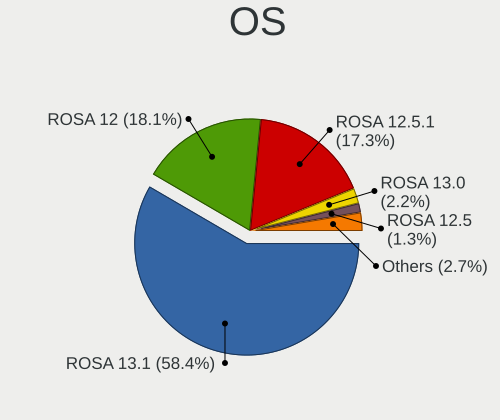

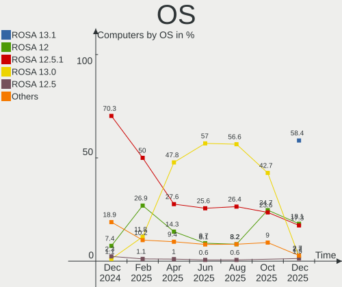

| Name        | Computers | Percent |
|-------------|-----------|---------|
| ROSA 13.1   | 132       | 58.41%  |
| ROSA 12     | 41        | 18.14%  |
| ROSA 12.5.1 | 39        | 17.26%  |
| ROSA 13.0   | 5         | 2.21%   |
| ROSA 12.5   | 3         | 1.33%   |
| ROSA R11.1  | 2         | 0.88%   |
| ROSA R11    | 2         | 0.88%   |
| ROSA 13     | 1         | 0.44%   |
| ROSA 12.4   | 1         | 0.44%   |

OS Family
---------

OS without a version

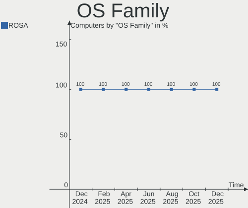

| Name | Computers | Percent |
|------|-----------|---------|
| ROSA | 226       | 100%    |

Kernel
------

Version of the Linux kernel

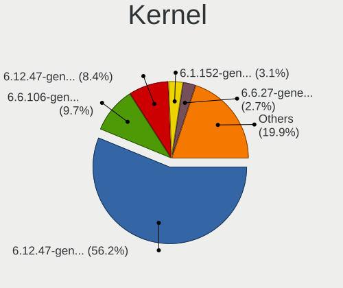

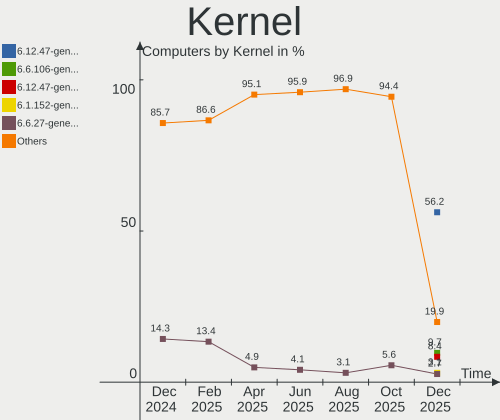

| Version                                  | Computers | Percent |
|------------------------------------------|-----------|---------|
| 6.12.47-generic-5rosa13-x86_64           | 127       | 56.19%  |
| 6.6.106-generic-3rosa2021.1-x86_64       | 22        | 9.73%   |
| 6.12.47-generic-5rosa2021.1-x86_64       | 19        | 8.41%   |
| 6.1.152-generic-2rosa2021.1-x86_64       | 7         | 3.1%    |
| 6.6.27-generic-3rosa2021.1-x86_64        | 6         | 2.65%   |
| 6.12.13-generic-4rosa13-x86_64           | 4         | 1.77%   |
| 6.6.47-generic-1rosa2021.1-x86_64        | 3         | 1.33%   |
| 6.6.106-generic-1rosa2021.1-x86_64       | 3         | 1.33%   |
| 6.12.47-generic-2rosa2021.1-x86_64       | 3         | 1.33%   |
| 5.15.127-generic-1rosa2021.1-i686        | 3         | 1.33%   |
| 6.6.94-generic-1rosa2021.1-x86_64        | 2         | 0.88%   |
| 6.6.78-generic-2rosa2021.1-x86_64        | 2         | 0.88%   |
| 6.6.21-generic-8rosa2021.1-x86_64        | 2         | 0.88%   |
| 6.12.47-generic-2rosa13-x86_64           | 2         | 0.88%   |
| 6.1.46-generic-2rosa2021.1-x86_64        | 2         | 0.88%   |
| 6.1.20-generic-2rosa2021.1-x86_64        | 2         | 0.88%   |
| 4.15.0-desktop-45.1rosa-x86_64           | 2         | 0.88%   |
| 4.15.0-desktop-122.124.1rosa-x86_64      | 2         | 0.88%   |
| 6.5.7.xm1-1.klp-xanmod-rosa2021.1-x86_64 | 1         | 0.44%   |
| 6.18.2-generic-2rosa13-x86_64            | 1         | 0.44%   |
| 6.17.9-generic-1rosa13-loongarch         | 1         | 0.44%   |
| 6.17.8-generic-4rosa13-x86_64            | 1         | 0.44%   |
| 6.12.47-generic-3rosa2021.1-x86_64       | 1         | 0.44%   |
| 6.12.34-generic-1rosa2021.1-x86_64       | 1         | 0.44%   |
| 6.12.34-generic-1rosa13-x86_64           | 1         | 0.44%   |
| 6.1.89-generic-2rosa2021.1-x86_64        | 1         | 0.44%   |
| 6.1.81-generic-2rosa2021.1-x86_64        | 1         | 0.44%   |
| 6.1.58-generic-1rosa2021.1-x86_64        | 1         | 0.44%   |
| 5.15.193-generic-2rosa2021.1-x86_64      | 1         | 0.44%   |
| 5.10.71-generic-1rosa2021.1-x86_64       | 1         | 0.44%   |
| 5.10.244-generic-1rosa2021.1-x86_64      | 1         | 0.44%   |

Kernel Family
-------------

Linux kernel without a distro release

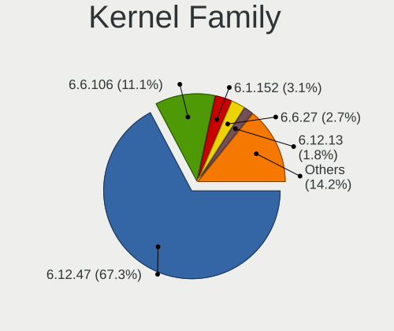

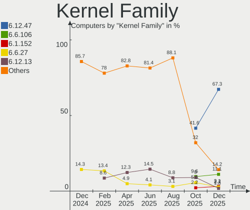

| Version  | Computers | Percent |
|----------|-----------|---------|
| 6.12.47  | 152       | 67.26%  |
| 6.6.106  | 25        | 11.06%  |
| 6.1.152  | 7         | 3.1%    |
| 6.6.27   | 6         | 2.65%   |
| 6.12.13  | 4         | 1.77%   |
| 4.15.0   | 4         | 1.77%   |
| 6.6.47   | 3         | 1.33%   |
| 5.15.127 | 3         | 1.33%   |
| 6.6.94   | 2         | 0.88%   |
| 6.6.78   | 2         | 0.88%   |
| 6.6.21   | 2         | 0.88%   |
| 6.12.34  | 2         | 0.88%   |
| 6.1.46   | 2         | 0.88%   |
| 6.1.20   | 2         | 0.88%   |
| 6.5.7    | 1         | 0.44%   |
| 6.18.2   | 1         | 0.44%   |
| 6.17.9   | 1         | 0.44%   |
| 6.17.8   | 1         | 0.44%   |
| 6.1.89   | 1         | 0.44%   |
| 6.1.81   | 1         | 0.44%   |
| 6.1.58   | 1         | 0.44%   |
| 5.15.193 | 1         | 0.44%   |
| 5.10.71  | 1         | 0.44%   |
| 5.10.244 | 1         | 0.44%   |

Kernel Major Ver.
-----------------

Linux kernel major version

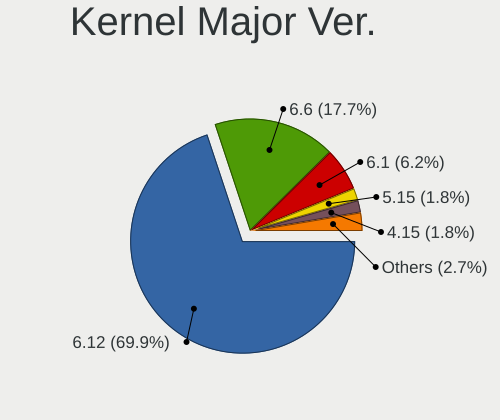

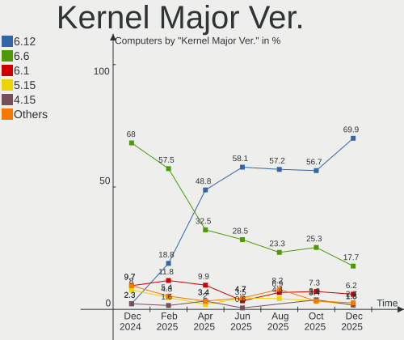

| Version | Computers | Percent |
|---------|-----------|---------|
| 6.12    | 158       | 69.91%  |
| 6.6     | 40        | 17.7%   |
| 6.1     | 14        | 6.19%   |
| 5.15    | 4         | 1.77%   |
| 4.15    | 4         | 1.77%   |
| 6.17    | 2         | 0.88%   |
| 5.10    | 2         | 0.88%   |
| 6.5     | 1         | 0.44%   |
| 6.18    | 1         | 0.44%   |

Arch
----

OS architecture (x86_64, i586, etc.)

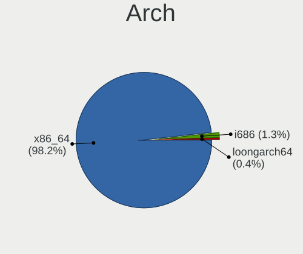

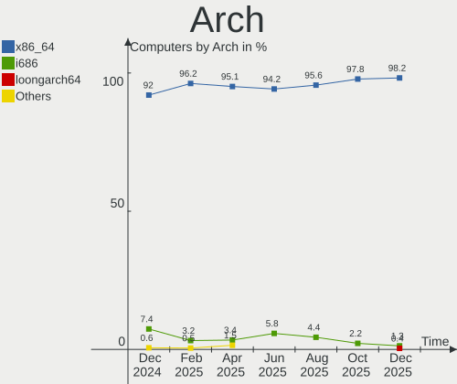

| Name        | Computers | Percent |
|-------------|-----------|---------|
| x86_64      | 222       | 98.23%  |
| i686        | 3         | 1.33%   |
| loongarch64 | 1         | 0.44%   |

DE
--

Desktop Environment

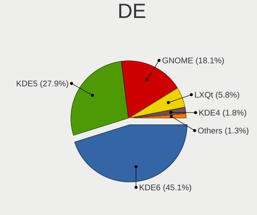

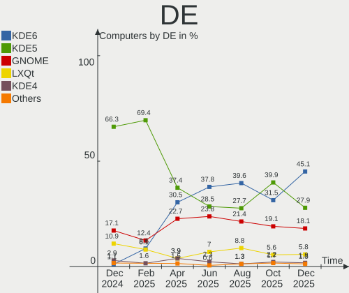

| Name    | Computers | Percent |
|---------|-----------|---------|
| KDE6    | 102       | 45.13%  |
| KDE5    | 63        | 27.88%  |
| GNOME   | 41        | 18.14%  |
| LXQt    | 13        | 5.75%   |
| KDE4    | 4         | 1.77%   |
| Unknown | 2         | 0.88%   |
| Budgie  | 1         | 0.44%   |

Display Server
--------------

X11 or Wayland

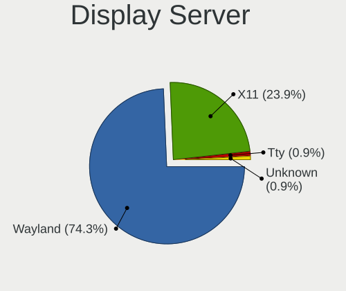

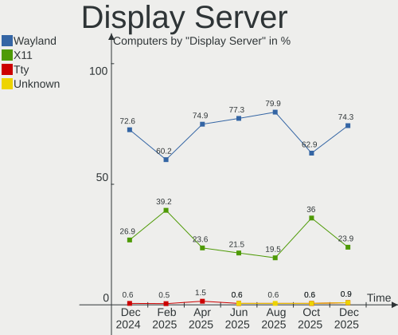

| Name    | Computers | Percent |
|---------|-----------|---------|
| Wayland | 168       | 74.34%  |
| X11     | 54        | 23.89%  |
| Tty     | 2         | 0.88%   |
| Unknown | 2         | 0.88%   |

Display Manager
---------------

SDDM, LightDM, etc.

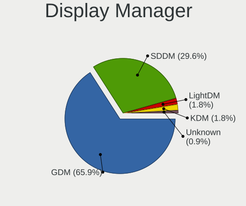

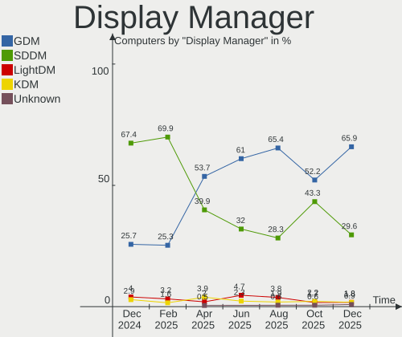

| Name    | Computers | Percent |
|---------|-----------|---------|
| GDM     | 149       | 65.93%  |
| SDDM    | 67        | 29.65%  |
| LightDM | 4         | 1.77%   |
| KDM     | 4         | 1.77%   |
| Unknown | 2         | 0.88%   |

OS Lang
-------

Language

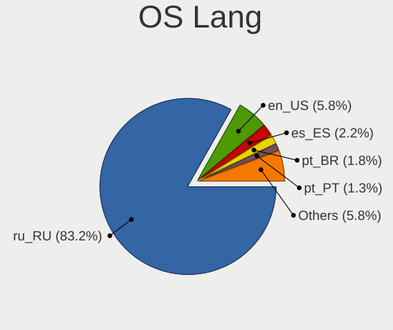

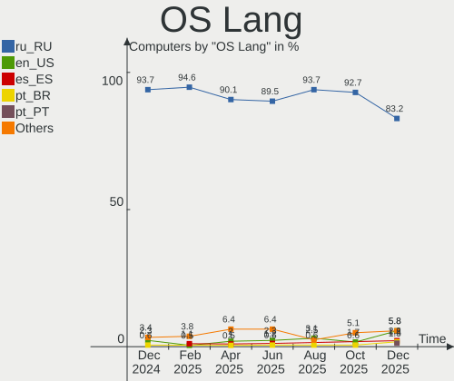

| Lang    | Computers | Percent |
|---------|-----------|---------|
| ru_RU   | 188       | 83.19%  |
| en_US   | 13        | 5.75%   |
| es_ES   | 5         | 2.21%   |
| pt_BR   | 4         | 1.77%   |
| pt_PT   | 3         | 1.33%   |
| es_CO   | 2         | 0.88%   |
| es_AR   | 2         | 0.88%   |
| Unknown | 2         | 0.88%   |
| it_IT   | 1         | 0.44%   |
| fr_CA   | 1         | 0.44%   |
| fr_BE   | 1         | 0.44%   |
| en_GB   | 1         | 0.44%   |
| de_DE   | 1         | 0.44%   |
| C       | 1         | 0.44%   |
| ar_SA   | 1         | 0.44%   |

Boot Mode
---------

EFI or BIOS

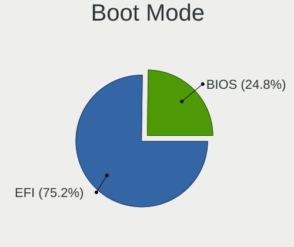

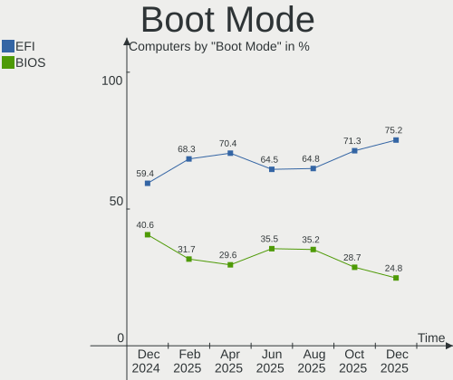

| Mode | Computers | Percent |
|------|-----------|---------|
| EFI  | 170       | 75.22%  |
| BIOS | 56        | 24.78%  |

Filesystem
----------

Type of filesystem

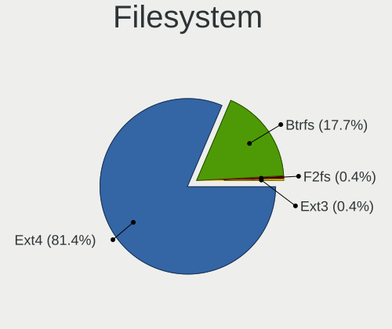

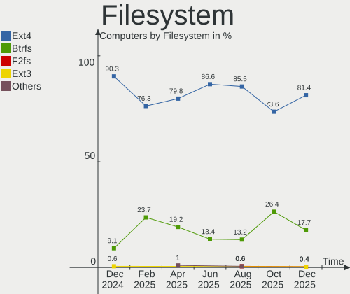

| Type  | Computers | Percent |
|-------|-----------|---------|
| Ext4  | 184       | 81.42%  |
| Btrfs | 40        | 17.7%   |
| F2fs  | 1         | 0.44%   |
| Ext3  | 1         | 0.44%   |

Part. scheme
------------

Scheme of partitioning

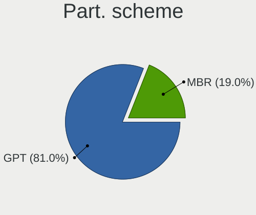

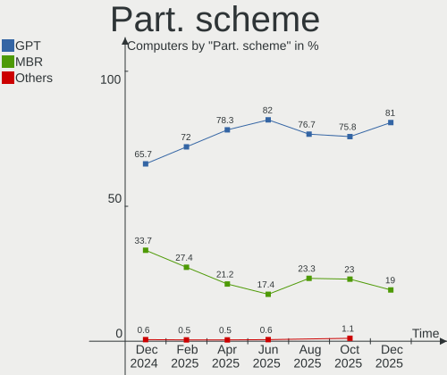

| Type | Computers | Percent |
|------|-----------|---------|
| GPT  | 183       | 80.97%  |
| MBR  | 43        | 19.03%  |

Dual Boot with Linux/BSD
------------------------

Hosting more than one Linux/BSD

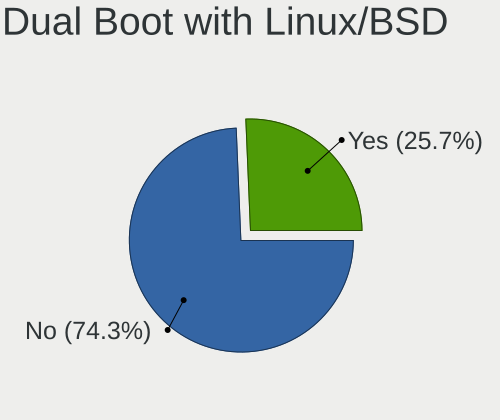

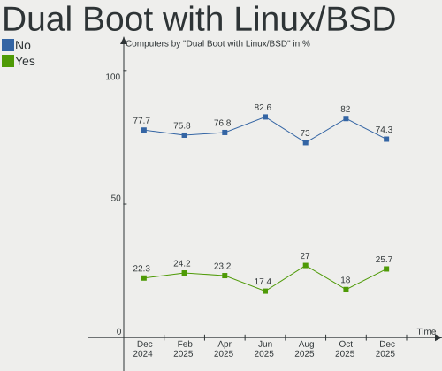

| Dual boot | Computers | Percent |
|-----------|-----------|---------|
| No        | 168       | 74.34%  |
| Yes       | 58        | 25.66%  |

Dual Boot (Win)
---------------

Hosting Linux and Windows

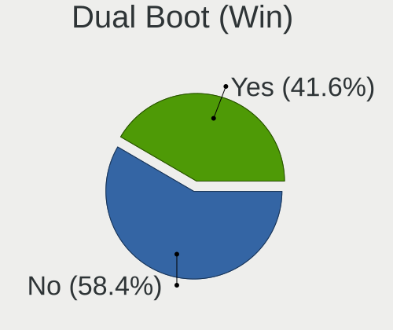

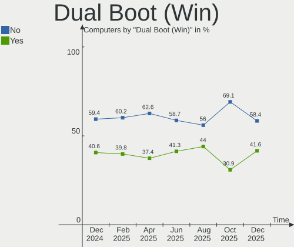

| Dual boot | Computers | Percent |
|-----------|-----------|---------|
| No        | 132       | 58.41%  |
| Yes       | 94        | 41.59%  |

Board
-----

Vendor
------

Motherboard manufacturer

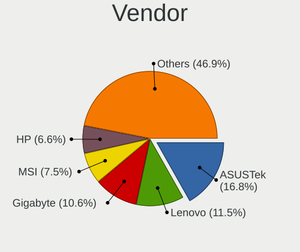

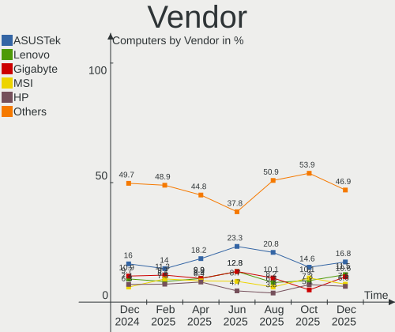

| Name                                 | Computers | Percent |
|--------------------------------------|-----------|---------|
| ASUSTek Computer                     | 38        | 16.81%  |
| Lenovo                               | 26        | 11.5%   |
| Gigabyte Technology                  | 24        | 10.62%  |
| MSI                                  | 17        | 7.52%   |
| Hewlett-Packard                      | 15        | 6.64%   |
| Intel                                | 12        | 5.31%   |
| Acer                                 | 10        | 4.42%   |
| ASRock                               | 8         | 3.54%   |
| Samsung Electronics                  | 7         | 3.1%    |
| Dell                                 | 7         | 3.1%    |
| Unknown                              | 6         | 2.65%   |
| KVADRA                               | 5         | 2.21%   |
| MocTex                               | 3         | 1.33%   |
| MAINBRD                              | 3         | 1.33%   |
| ICL Techno                           | 3         | 1.33%   |
| Huanan                               | 3         | 1.33%   |
| Apple                                | 3         | 1.33%   |
| Supermicro                           | 2         | 0.88%   |
| Maibenben                            | 2         | 0.88%   |
| ICL                                  | 2         | 0.88%   |
| Clevo                                | 2         | 0.88%   |
| Chuwi                                | 2         | 0.88%   |
| AZW                                  | 2         | 0.88%   |
| Aquarius                             | 2         | 0.88%   |
| Toshiba                              | 1         | 0.44%   |
| Sony                                 | 1         | 0.44%   |
| SHUANGWEI                            | 1         | 0.44%   |
| Shenzhen Meigao Electronic Equipment | 1         | 0.44%   |
| Semp Toshiba                         | 1         | 0.44%   |
| Positivo                             | 1         | 0.44%   |
| Pegatron                             | 1         | 0.44%   |
| Packard Bell                         | 1         | 0.44%   |
| OEM                                  | 1         | 0.44%   |
| Notebook                             | 1         | 0.44%   |
| Mini PC                              | 1         | 0.44%   |
| Machinist                            | 1         | 0.44%   |
| LTD Delovoy Office                   | 1         | 0.44%   |
| J&W                                  | 1         | 0.44%   |
| iRU                                  | 1         | 0.44%   |
| HUAWEI                               | 1         | 0.44%   |

Model
-----

Motherboard model

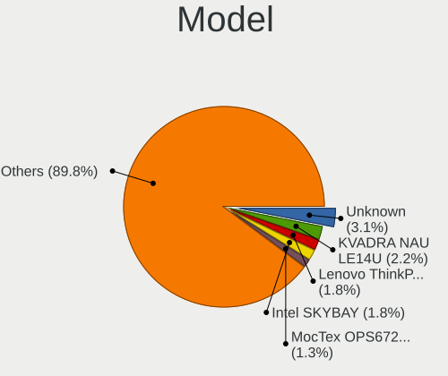

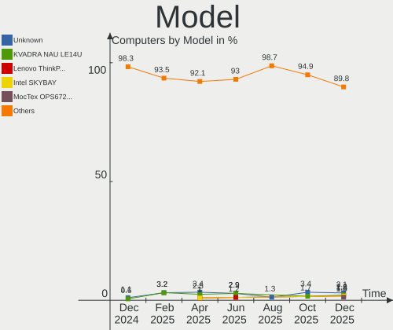

| Name                                              | Computers | Percent |
|---------------------------------------------------|-----------|---------|
| Unknown                                           | 7         | 3.1%    |
| KVADRA NAU LE14U                                  | 5         | 2.21%   |
| Lenovo ThinkPad E14 Gen 4 21E4S2JB00              | 4         | 1.77%   |
| Intel SKYBAY                                      | 4         | 1.77%   |
| MocTex OPS6725-SHA                                | 3         | 1.33%   |
| MAINBRD OPS72A-SHA                                | 3         | 1.33%   |
| Lenovo K14 Gen 1 21CSS16E00                       | 3         | 1.33%   |
| Intel X99                                         | 3         | 1.33%   |
| MSI MPG B560 Trident A (MS-B926)                  | 2         | 0.88%   |
| Lenovo G570 20079                                 | 2         | 0.88%   |
| ICL RAY Si105.Mi                                  | 2         | 0.88%   |
| HP Notebook                                       | 2         | 0.88%   |
| Gigabyte G31M-ES2L                                | 2         | 0.88%   |
| Dell Latitude E6440                               | 2         | 0.88%   |
| Clevo NL41MU2                                     | 2         | 0.88%   |
| ASUS PRIME A320M-K                                | 2         | 0.88%   |
| Aquarius CMP NS685U_4                             | 2         | 0.88%   |
| Toshiba Satellite C650                            | 1         | 0.44%   |
| Supermicro X9DRW                                  | 1         | 0.44%   |
| Supermicro Super Server                           | 1         | 0.44%   |
| Sony SVE14A2V1RWI                                 | 1         | 0.44%   |
| SHUANGWEI ST-X79M-2011 V2.0                       | 1         | 0.44%   |
| Shenzhen Meigao Electronic Equipment Venus series | 1         | 0.44%   |
| Semp Toshiba IS 1442                              | 1         | 0.44%   |
| Samsung R580/R590                                 | 1         | 0.44%   |
| Samsung R55S                                      | 1         | 0.44%   |
| Samsung 355V4C/356V4C/3445VC/3545VC               | 1         | 0.44%   |
| Samsung 350V5C/351V5C/3540VC/3440VC               | 1         | 0.44%   |
| Samsung 305V4A/305V5A                             | 1         | 0.44%   |
| Samsung 300E4A/300E5A/300E7A/3430EA/3530EA        | 1         | 0.44%   |
| Samsung 300E4A/300E5A/300E7A                      | 1         | 0.44%   |
| Positivo Q4128C-S                                 | 1         | 0.44%   |
| Pegatron Compaq dx2400 Microtower PC              | 1         | 0.44%   |
| Packard Bell EasyNote TX86                        | 1         | 0.44%   |
| OEM X79G                                          | 1         | 0.44%   |
| Notebook WA50SRQ                                  | 1         | 0.44%   |
| MSI U270 series                                   | 1         | 0.44%   |
| MSI PPPPP-CCC#MMMMMMMM                            | 1         | 0.44%   |
| MSI MS-7E56                                       | 1         | 0.44%   |
| MSI MS-7D51                                       | 1         | 0.44%   |

Model Family
------------

Motherboard model prefix

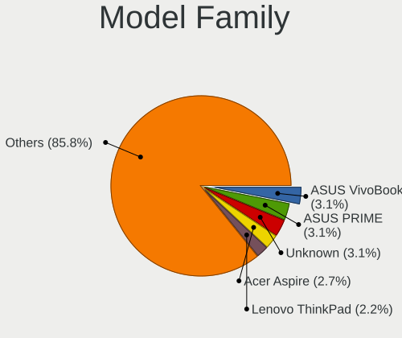

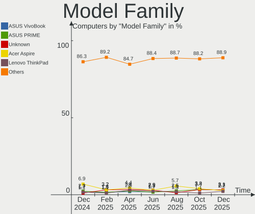

| Name                                       | Computers | Percent |
|--------------------------------------------|-----------|---------|
| ASUS VivoBook                              | 7         | 3.1%    |
| ASUS PRIME                                 | 7         | 3.1%    |
| Unknown                                    | 7         | 3.1%    |
| Acer Aspire                                | 6         | 2.65%   |
| Lenovo ThinkPad                            | 5         | 2.21%   |
| Lenovo IdeaPad                             | 5         | 2.21%   |
| KVADRA NAU                                 | 5         | 2.21%   |
| Intel SKYBAY                               | 4         | 1.77%   |
| Dell Latitude                              | 4         | 1.77%   |
| MocTex OPS6725-SHA                         | 3         | 1.33%   |
| MAINBRD OPS72A-SHA                         | 3         | 1.33%   |
| Lenovo K14                                 | 3         | 1.33%   |
| Intel X99                                  | 3         | 1.33%   |
| Gigabyte B450M                             | 3         | 1.33%   |
| ASUS ROG                                   | 3         | 1.33%   |
| Samsung 300E4A                             | 2         | 0.88%   |
| MSI MPG                                    | 2         | 0.88%   |
| Lenovo ThinkCentre                         | 2         | 0.88%   |
| Lenovo G570                                | 2         | 0.88%   |
| ICL RAY                                    | 2         | 0.88%   |
| HP Notebook                                | 2         | 0.88%   |
| HP EliteDesk                               | 2         | 0.88%   |
| HP Compaq                                  | 2         | 0.88%   |
| Gigabyte G31M-ES2L                         | 2         | 0.88%   |
| Dell Inspiron                              | 2         | 0.88%   |
| Clevo NL41MU2                              | 2         | 0.88%   |
| ASUS ASUS                                  | 2         | 0.88%   |
| ASRock H510M-HDV                           | 2         | 0.88%   |
| ASRock B450M                               | 2         | 0.88%   |
| Aquarius CMP                               | 2         | 0.88%   |
| Acer Extensa                               | 2         | 0.88%   |
| Toshiba Satellite                          | 1         | 0.44%   |
| Supermicro X9DRW                           | 1         | 0.44%   |
| Supermicro Super                           | 1         | 0.44%   |
| Sony SVE14A2V1RWI                          | 1         | 0.44%   |
| SHUANGWEI ST-X79M-2011                     | 1         | 0.44%   |
| Shenzhen Meigao Electronic Equipment Venus | 1         | 0.44%   |
| Semp Toshiba IS                            | 1         | 0.44%   |
| Samsung R580                               | 1         | 0.44%   |
| Samsung R55S                               | 1         | 0.44%   |

MFG Year
--------

Motherboard manufacture year

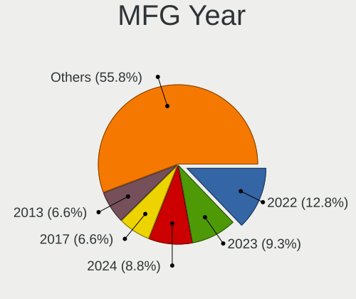

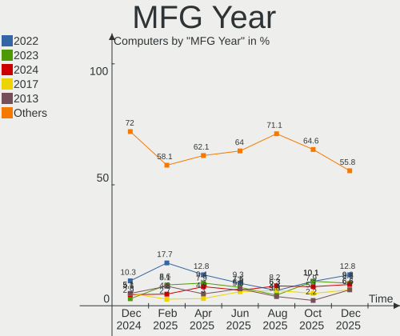

| Year    | Computers | Percent |
|---------|-----------|---------|
| 2022    | 29        | 12.83%  |
| 2023    | 21        | 9.29%   |
| 2024    | 20        | 8.85%   |
| 2017    | 15        | 6.64%   |
| 2013    | 15        | 6.64%   |
| 2012    | 15        | 6.64%   |
| 2011    | 13        | 5.75%   |
| 2018    | 12        | 5.31%   |
| 2021    | 11        | 4.87%   |
| 2020    | 10        | 4.42%   |
| 2019    | 9         | 3.98%   |
| 2025    | 8         | 3.54%   |
| 2016    | 8         | 3.54%   |
| 2015    | 8         | 3.54%   |
| 2010    | 7         | 3.1%    |
| 2009    | 7         | 3.1%    |
| 2007    | 5         | 2.21%   |
| 2014    | 4         | 1.77%   |
| 2008    | 4         | 1.77%   |
| 2006    | 3         | 1.33%   |
| 2004    | 1         | 0.44%   |
| Unknown | 1         | 0.44%   |

Form Factor
-----------

Physical design of the computer

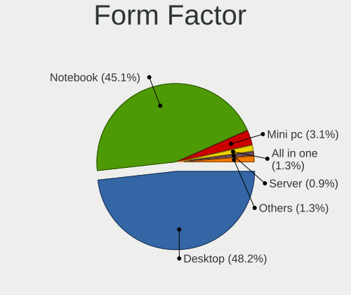

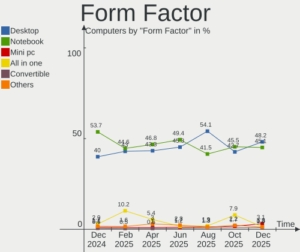

| Name        | Computers | Percent |
|-------------|-----------|---------|
| Desktop     | 109       | 48.23%  |
| Notebook    | 102       | 45.13%  |
| Mini pc     | 7         | 3.1%    |
| All in one  | 3         | 1.33%   |
| Convertible | 2         | 0.88%   |
| Server      | 2         | 0.88%   |
| Tablet      | 1         | 0.44%   |

Secure Boot
-----------

Enabled or disabled

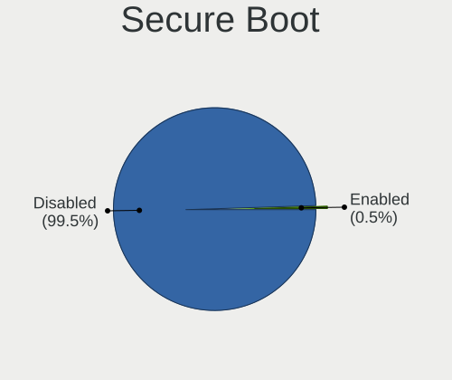

| State    | Computers | Percent |
|----------|-----------|---------|
| Disabled | 226       | 100%    |

Coreboot
--------

Have coreboot on board

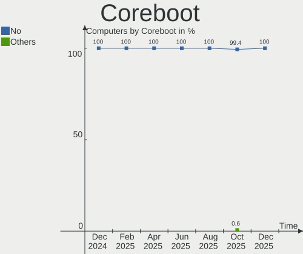

| Used | Computers | Percent |
|------|-----------|---------|
| No   | 226       | 100%    |

RAM Size
--------

Total RAM memory

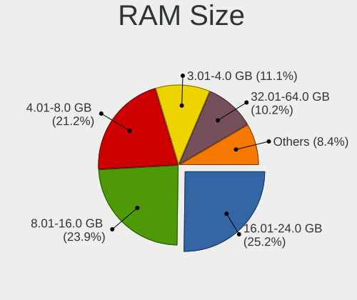

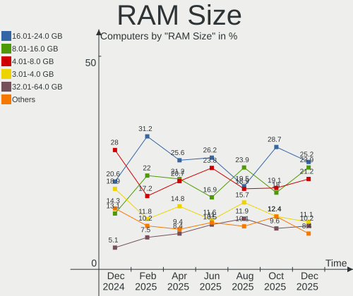

| Size in GB  | Computers | Percent |
|-------------|-----------|---------|
| 16.01-24.0  | 57        | 25.22%  |
| 8.01-16.0   | 54        | 23.89%  |
| 4.01-8.0    | 48        | 21.24%  |
| 3.01-4.0    | 25        | 11.06%  |
| 32.01-64.0  | 23        | 10.18%  |
| 2.01-3.0    | 5         | 2.21%   |
| 64.01-256.0 | 5         | 2.21%   |
| 1.01-2.0    | 5         | 2.21%   |
| 24.01-32.0  | 4         | 1.77%   |

RAM Used
--------

Used RAM memory

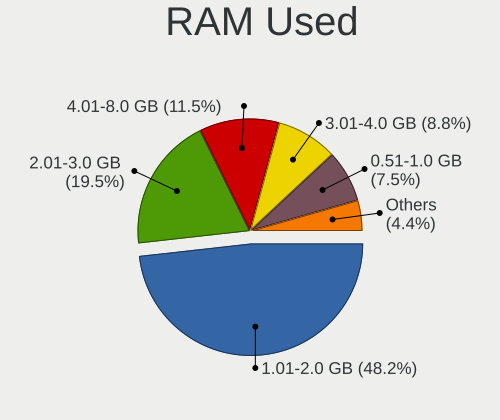

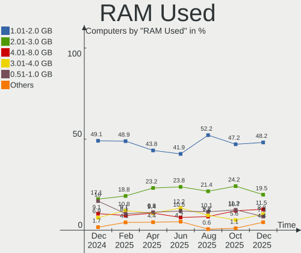

| Used GB    | Computers | Percent |
|------------|-----------|---------|
| 1.01-2.0   | 109       | 48.23%  |
| 2.01-3.0   | 44        | 19.47%  |
| 4.01-8.0   | 26        | 11.5%   |
| 3.01-4.0   | 20        | 8.85%   |
| 0.51-1.0   | 17        | 7.52%   |
| 8.01-16.0  | 6         | 2.65%   |
| 16.01-24.0 | 2         | 0.88%   |
| 0.01-0.5   | 2         | 0.88%   |

Total Drives
------------

Number of drives on board

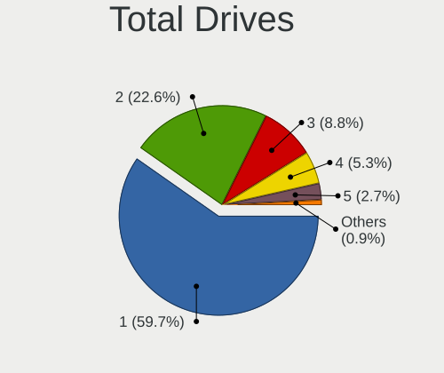

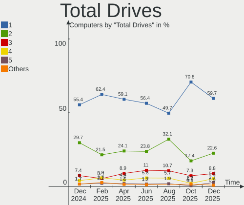

| Drives | Computers | Percent |
|--------|-----------|---------|
| 1      | 135       | 59.73%  |
| 2      | 51        | 22.57%  |
| 3      | 20        | 8.85%   |
| 4      | 12        | 5.31%   |
| 5      | 6         | 2.65%   |
| 8      | 1         | 0.44%   |
| 0      | 1         | 0.44%   |

Has CD-ROM
----------

Has CD-ROM on board

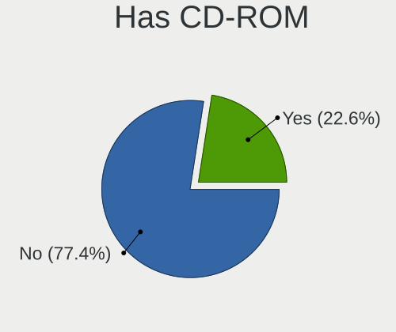

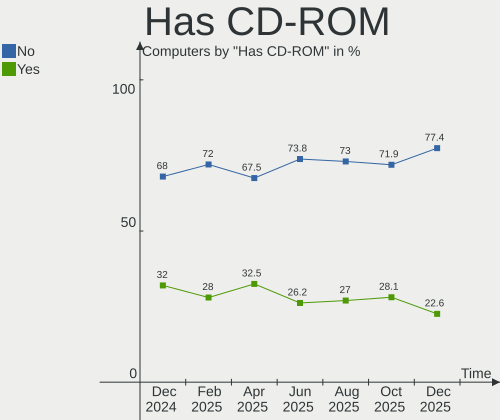

| Presented | Computers | Percent |
|-----------|-----------|---------|
| No        | 175       | 77.43%  |
| Yes       | 51        | 22.57%  |

Has Ethernet
------------

Has Ethernet on board

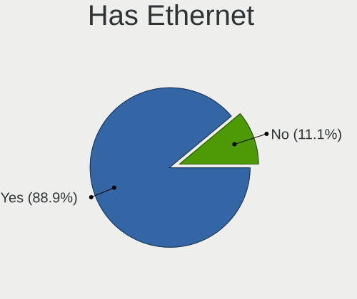

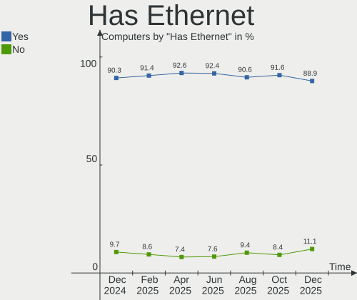

| Presented | Computers | Percent |
|-----------|-----------|---------|
| Yes       | 201       | 88.94%  |
| No        | 25        | 11.06%  |

Has WiFi
--------

Has WiFi module

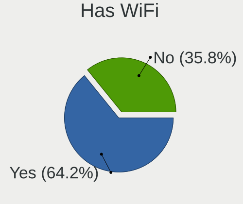

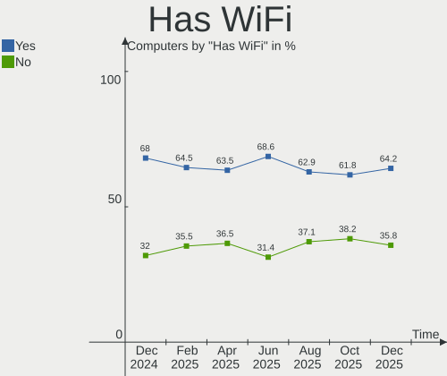

| Presented | Computers | Percent |
|-----------|-----------|---------|
| Yes       | 145       | 64.16%  |
| No        | 81        | 35.84%  |

Has Bluetooth
-------------

Has Bluetooth module

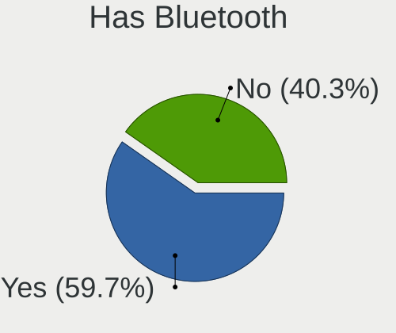

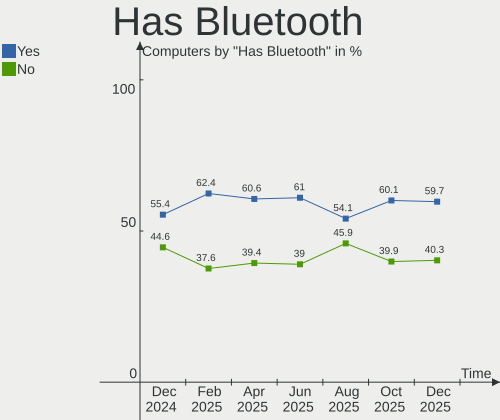

| Presented | Computers | Percent |
|-----------|-----------|---------|
| Yes       | 135       | 59.73%  |
| No        | 91        | 40.27%  |

Location
--------

Country
-------

Geographic location (country)

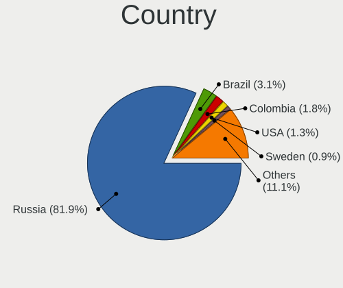

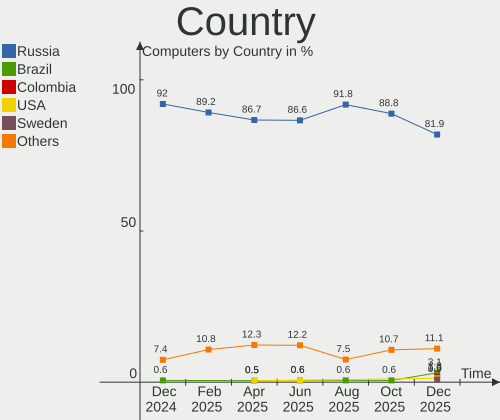

| Country      | Computers | Percent |
|--------------|-----------|---------|
| Russia       | 185       | 81.86%  |
| Brazil       | 7         | 3.1%    |
| Colombia     | 4         | 1.77%   |
| USA          | 3         | 1.33%   |
| Sweden       | 2         | 0.88%   |
| Spain        | 2         | 0.88%   |
| Israel       | 2         | 0.88%   |
| Czechia      | 2         | 0.88%   |
| Belarus      | 2         | 0.88%   |
| Argentina    | 2         | 0.88%   |
| Ukraine      | 1         | 0.44%   |
| Switzerland  | 1         | 0.44%   |
| Saudi Arabia | 1         | 0.44%   |
| Moldova      | 1         | 0.44%   |
| Mexico       | 1         | 0.44%   |
| Latvia       | 1         | 0.44%   |
| Kazakhstan   | 1         | 0.44%   |
| Italy        | 1         | 0.44%   |
| Iran         | 1         | 0.44%   |
| Germany      | 1         | 0.44%   |
| Ethiopia     | 1         | 0.44%   |
| Egypt        | 1         | 0.44%   |
| Croatia      | 1         | 0.44%   |
| Canada       | 1         | 0.44%   |
| Belgium      | 1         | 0.44%   |

City
----

Geographic location (city)

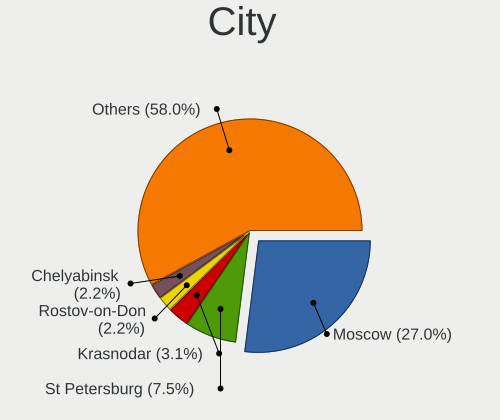

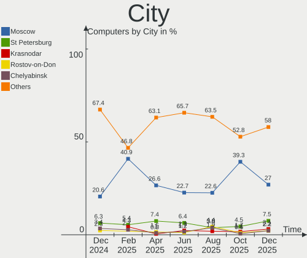

| City             | Computers | Percent |
|------------------|-----------|---------|
| Moscow           | 61        | 26.99%  |
| St Petersburg    | 17        | 7.52%   |
| Krasnodar        | 7         | 3.1%    |
| Rostov-on-Don    | 5         | 2.21%   |
| Chelyabinsk      | 5         | 2.21%   |
| Yekaterinburg    | 4         | 1.77%   |
| Krasnoyarsk      | 4         | 1.77%   |
| Kirov            | 4         | 1.77%   |
| Stavropol        | 3         | 1.33%   |
| Smolensk         | 3         | 1.33%   |
| Novosibirsk      | 3         | 1.33%   |
| Nizhniy Novgorod | 3         | 1.33%   |
| Bryansk          | 3         | 1.33%   |
| Bogotá          | 3         | 1.33%   |
| Voronezh         | 2         | 0.88%   |
| Vladivostok      | 2         | 0.88%   |
| Vladimir         | 2         | 0.88%   |
| Tula             | 2         | 0.88%   |
| Serpukhov        | 2         | 0.88%   |
| Novy Urengoy     | 2         | 0.88%   |
| Minsk            | 2         | 0.88%   |
| Kazan’         | 2         | 0.88%   |
| Kaluga           | 2         | 0.88%   |
| Gatchina         | 2         | 0.88%   |
| Boden            | 2         | 0.88%   |
| Barnaul          | 2         | 0.88%   |
| Balashikha       | 2         | 0.88%   |
| Angarsk          | 2         | 0.88%   |
| Zaural'skiy      | 1         | 0.44%   |
| Zagreb           | 1         | 0.44%   |
| Yoshkar-Ola      | 1         | 0.44%   |
| Winterthur       | 1         | 0.44%   |
| Volzhsky         | 1         | 0.44%   |
| Volokolamsk      | 1         | 0.44%   |
| Vologda          | 1         | 0.44%   |
| Volgograd        | 1         | 0.44%   |
| Volgodonsk       | 1         | 0.44%   |
| Velikiye Luki    | 1         | 0.44%   |
| Tver             | 1         | 0.44%   |
| Tsarskoye Selo   | 1         | 0.44%   |

Drives
------

Drive Vendor
------------

Hard drive vendors

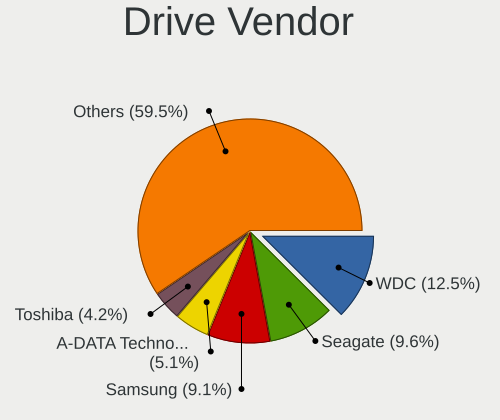

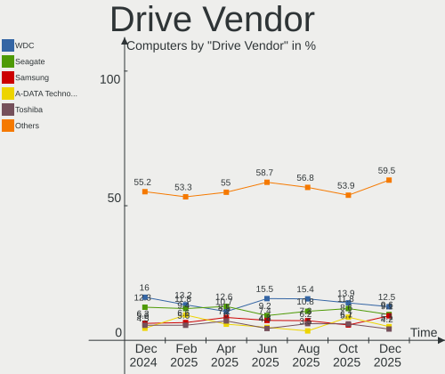

| Vendor                      | Computers | Drives | Percent |
|-----------------------------|-----------|--------|---------|
| WDC                         | 44        | 57     | 12.46%  |
| Seagate                     | 34        | 38     | 9.63%   |
| Samsung Electronics         | 32        | 36     | 9.07%   |
| A-DATA Technology           | 18        | 18     | 5.1%    |
| Toshiba                     | 15        | 16     | 4.25%   |
| Sandisk                     | 14        | 15     | 3.97%   |
| Kingston                    | 13        | 14     | 3.68%   |
| China                       | 11        | 11     | 3.12%   |
| MAXIO Technology (Hangzhou) | 9         | 10     | 2.55%   |
| Hitachi                     | 9         | 9      | 2.55%   |
| KingSpec                    | 7         | 7      | 1.98%   |
| FORESEE                     | 7         | 7      | 1.98%   |
| Apacer                      | 7         | 7      | 1.98%   |
| Silicon Motion              | 6         | 7      | 1.7%    |
| Netac                       | 6         | 6      | 1.7%    |
| Unknown                     | 5         | 5      | 1.42%   |
| SK hynix                    | 5         | 5      | 1.42%   |
| Realtek Semiconductor       | 5         | 5      | 1.42%   |
| QOPP                        | 5         | 5      | 1.42%   |
| Micron Technology           | 5         | 5      | 1.42%   |
| Kingston Technology Company | 5         | 5      | 1.42%   |
| AMD                         | 5         | 5      | 1.42%   |
| SPCC                        | 4         | 4      | 1.13%   |
| Phison Electronics          | 4         | 4      | 1.13%   |
| Fujitsu                     | 4         | 4      | 1.13%   |
| DEXP                        | 4         | 4      | 1.13%   |
| Crucial                     | 4         | 4      | 1.13%   |
| Wodposit                    | 3         | 3      | 0.85%   |
| Smartbuy                    | 3         | 3      | 0.85%   |
| Realtek                     | 3         | 3      | 0.85%   |
| HGST                        | 3         | 3      | 0.85%   |
| BIWIN                       | 3         | 3      | 0.85%   |
| Patriot                     | 2         | 2      | 0.57%   |
| OCZ                         | 2         | 2      | 0.57%   |
| KIOXIA-EXCERIA              | 2         | 4      | 0.57%   |
| KIOXIA                      | 2         | 2      | 0.57%   |
| KingFast                    | 2         | 2      | 0.57%   |
| Intel                       | 2         | 2      | 0.57%   |
| ExeGate                     | 2         | 2      | 0.57%   |
| ADATA Technology            | 2         | 2      | 0.57%   |

Drive Model
-----------

Hard drive models

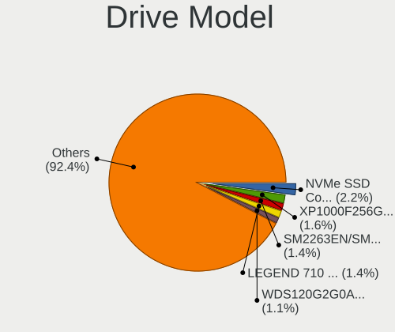

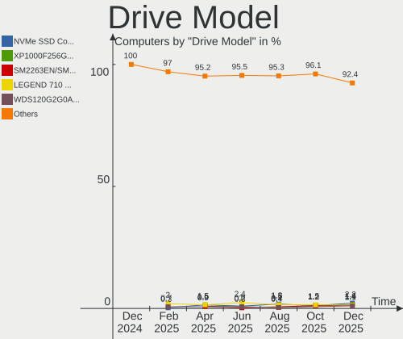

| Model                                                 | Computers | Percent |
|-------------------------------------------------------|-----------|---------|
| MAXIO (Hangzhou) NVMe SSD Controller MAP1202 2TB      | 8         | 2.16%   |
| FORESEE XP1000F256G 256GB                             | 6         | 1.62%   |
| Silicon Motion SM2263EN/SM2263XT SSD Controller 512GB | 5         | 1.35%   |
| A-DATA LEGEND 710 512GB                               | 5         | 1.35%   |
| WDC WDS120G2G0A-00JH30 120GB SSD                      | 4         | 1.08%   |
| Toshiba DT01ACA050 500GB                              | 4         | 1.08%   |
| SanDisk NVMe SSD Drive 512GB                          | 4         | 1.08%   |
| Samsung SSD 870 EVO 500GB                             | 4         | 1.08%   |
| A-DATA SU650 240GB SSD                                | 4         | 1.08%   |
| Wodposit NVMe SSD 1TB                                 | 3         | 0.81%   |
| WDC WD10EALS-00Z8A0 1TB                               | 3         | 0.81%   |
| Toshiba MQ01ABF050 500GB                              | 3         | 0.81%   |
| SPCC Solid State Disk 256GB                           | 3         | 0.81%   |
| Seagate ST1000DM010-2EP102 1TB                        | 3         | 0.81%   |
| Samsung NVMe SSD Controller SM981/PM981/PM983 1TB     | 3         | 0.81%   |
| Samsung MZVLW128HEGR-00000 128GB                      | 3         | 0.81%   |
| Samsung HM321HI 320GB                                 | 3         | 0.81%   |
| Kingston SA400S37240G 240GB SSD                       | 3         | 0.81%   |
| China SSD 512GB                                       | 3         | 0.81%   |
| WDC PC SN530 SDBPMPZ-512G-1001 512GB                  | 2         | 0.54%   |
| Toshiba HDWD110 1TB                                   | 2         | 0.54%   |
| Toshiba DT01ACA100 1TB                                | 2         | 0.54%   |
| Seagate ST500LT012-1DG142 500GB                       | 2         | 0.54%   |
| Seagate ST3500418AS 500GB                             | 2         | 0.54%   |
| Seagate ST3250310AS 250GB                             | 2         | 0.54%   |
| Seagate ST16000NM001G-2KK103 16TB                     | 2         | 0.54%   |
| Seagate ST1000LM049-2GH172 1TB                        | 2         | 0.54%   |
| Seagate ST1000LM035-1RK172 1TB                        | 2         | 0.54%   |
| Seagate ST1000DM003-1SB10C 1TB                        | 2         | 0.54%   |
| Seagate ST1000DM003-1CH162 1TB                        | 2         | 0.54%   |
| SanDisk SDSSDHP128G 128GB                             | 2         | 0.54%   |
| Samsung SSD 990 PRO 1TB                               | 2         | 0.54%   |
| Samsung NVMe SSD Controller PM9A1/PM9A3/980PRO 1TB    | 2         | 0.54%   |
| Realtek RTL9210B-CG 500GB                             | 2         | 0.54%   |
| QOPP Q600S 256G SSD                                   | 2         | 0.54%   |
| Phison Apacer AS2280P4 512GB                          | 2         | 0.54%   |
| OCZ VERTEX4 128GB SSD                                 | 2         | 0.54%   |
| Micron MTFDKCD512TFK 512GB                            | 2         | 0.54%   |
| KIOXIA-EXCERIA SATA SSD 240GB                         | 2         | 0.54%   |
| Kingston Company SNV3S2000G 2TB                       | 2         | 0.54%   |

HDD Vendor
----------

Hard disk drive vendors

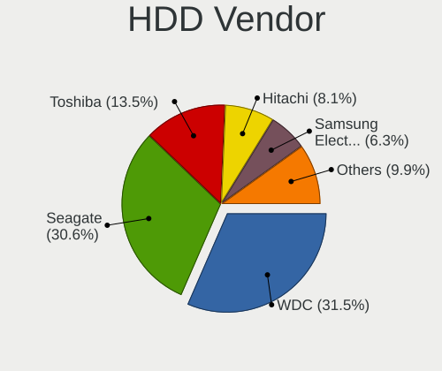

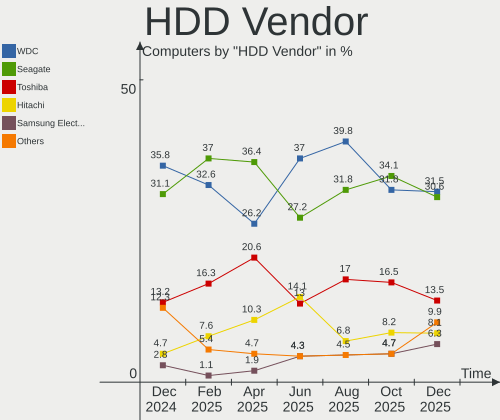

| Vendor              | Computers | Drives | Percent |
|---------------------|-----------|--------|---------|
| WDC                 | 35        | 47     | 31.53%  |
| Seagate             | 34        | 38     | 30.63%  |
| Toshiba             | 15        | 16     | 13.51%  |
| Hitachi             | 9         | 9      | 8.11%   |
| Samsung Electronics | 7         | 7      | 6.31%   |
| Fujitsu             | 4         | 4      | 3.6%    |
| HGST                | 3         | 3      | 2.7%    |
| Unknown             | 1         | 1      | 0.9%    |
| PRO Z               | 1         | 1      | 0.9%    |
| Maxtor              | 1         | 1      | 0.9%    |
| JMicron Technology  | 1         | 1      | 0.9%    |

SSD Vendor
----------

Solid state drive vendors

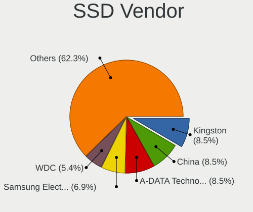

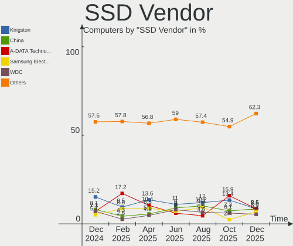

| Vendor              | Computers | Drives | Percent |
|---------------------|-----------|--------|---------|
| Kingston            | 11        | 12     | 8.46%   |
| China               | 11        | 11     | 8.46%   |
| A-DATA Technology   | 11        | 11     | 8.46%   |
| Samsung Electronics | 9         | 10     | 6.92%   |
| WDC                 | 7         | 7      | 5.38%   |
| Apacer              | 7         | 7      | 5.38%   |
| QOPP                | 5         | 5      | 3.85%   |
| Netac               | 5         | 5      | 3.85%   |
| KingSpec            | 5         | 5      | 3.85%   |
| AMD                 | 5         | 5      | 3.85%   |
| SPCC                | 4         | 4      | 3.08%   |
| DEXP                | 4         | 4      | 3.08%   |
| Crucial             | 4         | 4      | 3.08%   |
| Smartbuy            | 3         | 3      | 2.31%   |
| SanDisk             | 3         | 3      | 2.31%   |
| Patriot             | 2         | 2      | 1.54%   |
| OCZ                 | 2         | 2      | 1.54%   |
| KIOXIA-EXCERIA      | 2         | 4      | 1.54%   |
| KingFast            | 2         | 2      | 1.54%   |
| ExeGate             | 2         | 2      | 1.54%   |
| VIEW                | 1         | 1      | 0.77%   |
| UnionSine           | 1         | 1      | 0.77%   |
| TRIVENTA            | 1         | 1      | 0.77%   |
| Transcend           | 1         | 1      | 0.77%   |
| SK hynix            | 1         | 1      | 0.77%   |
| Qumo                | 1         | 1      | 0.77%   |
| Plextor             | 1         | 1      | 0.77%   |
| Neo                 | 1         | 1      | 0.77%   |
| MyDigitalSSD        | 1         | 1      | 0.77%   |
| MSI                 | 1         | 1      | 0.77%   |
| LITEON              | 1         | 1      | 0.77%   |
| Lite-On             | 1         | 1      | 0.77%   |
| KOOTION             | 1         | 1      | 0.77%   |
| HS-SSD-WAVE(S)      | 1         | 1      | 0.77%   |
| HS-SSD-E100         | 1         | 1      | 0.77%   |
| HJDK                | 1         | 1      | 0.77%   |
| GOODRAM             | 1         | 1      | 0.77%   |
| Gigabyte Technology | 1         | 1      | 0.77%   |
| EAGET               | 1         | 1      | 0.77%   |
| Digma               | 1         | 1      | 0.77%   |

Drive Kind
----------

HDD or SSD

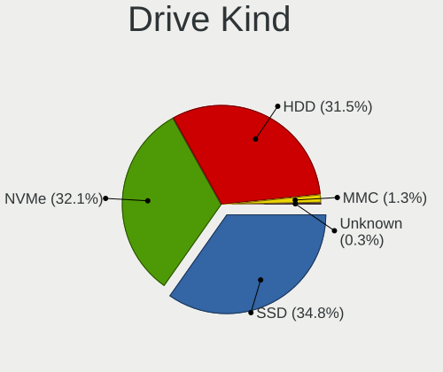

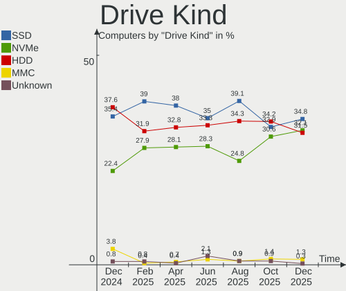

| Kind    | Computers | Drives | Percent |
|---------|-----------|--------|---------|
| SSD     | 106       | 134    | 34.75%  |
| NVMe    | 98        | 114    | 32.13%  |
| HDD     | 96        | 128    | 31.48%  |
| MMC     | 4         | 4      | 1.31%   |
| Unknown | 1         | 1      | 0.33%   |

Drive Connector
---------------

SATA, SAS, NVMe, etc.

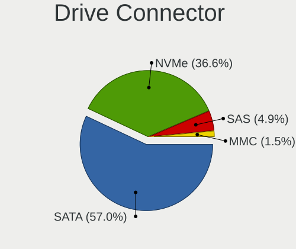

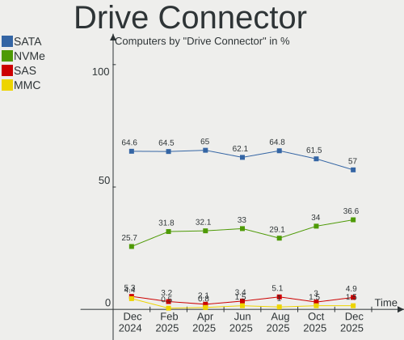

| Type | Computers | Drives | Percent |
|------|-----------|--------|---------|
| SATA | 151       | 253    | 56.98%  |
| NVMe | 97        | 110    | 36.6%   |
| SAS  | 13        | 14     | 4.91%   |
| MMC  | 4         | 4      | 1.51%   |

Drive Size
----------

Size of hard drive

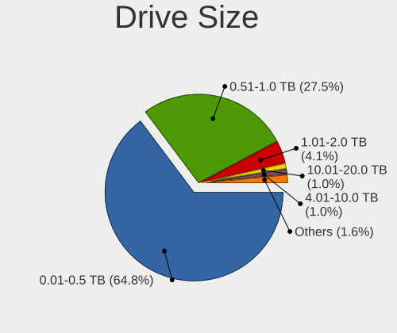

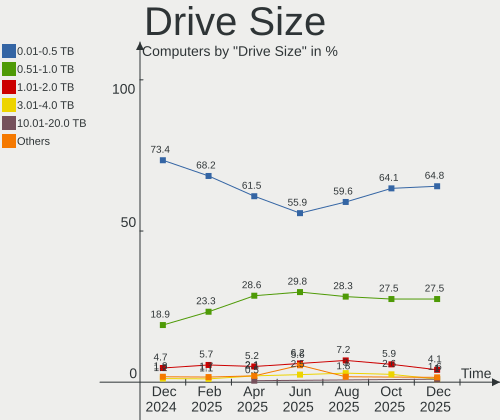

| Size in TB | Computers | Drives | Percent |
|------------|-----------|--------|---------|
| 0.01-0.5   | 125       | 173    | 64.77%  |
| 0.51-1.0   | 53        | 69     | 27.46%  |
| 1.01-2.0   | 8         | 11     | 4.15%   |
| 3.01-4.0   | 2         | 2      | 1.04%   |
| 10.01-20.0 | 2         | 4      | 1.04%   |
| 4.01-10.0  | 2         | 2      | 1.04%   |
| 2.01-3.0   | 1         | 1      | 0.52%   |

Space Total
-----------

Amount of disk space available on the file system

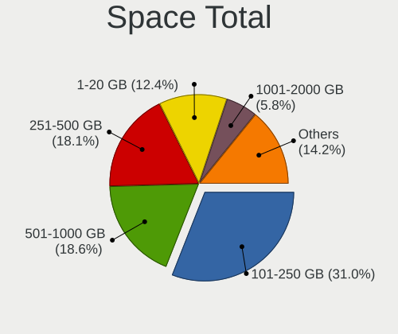

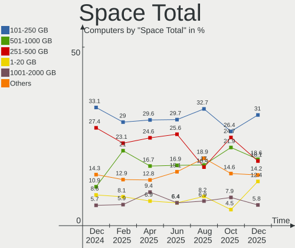

| Size in GB     | Computers | Percent |
|----------------|-----------|---------|
| 101-250        | 70        | 30.97%  |
| 501-1000       | 42        | 18.58%  |
| 251-500        | 41        | 18.14%  |
| 1-20           | 28        | 12.39%  |
| 1001-2000      | 13        | 5.75%   |
| 21-50          | 11        | 4.87%   |
| 2001-3000      | 8         | 3.54%   |
| 51-100         | 7         | 3.1%    |
| More than 3000 | 5         | 2.21%   |
| Unknown        | 1         | 0.44%   |

Space Used
----------

Amount of used disk space

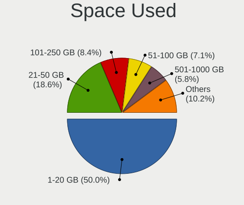

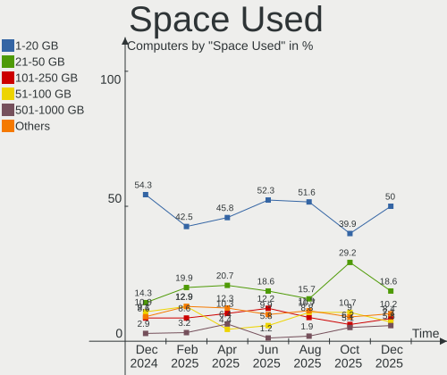

| Used GB        | Computers | Percent |
|----------------|-----------|---------|
| 1-20           | 113       | 50%     |
| 21-50          | 42        | 18.58%  |
| 101-250        | 19        | 8.41%   |
| 51-100         | 16        | 7.08%   |
| 501-1000       | 13        | 5.75%   |
| 251-500        | 11        | 4.87%   |
| 1001-2000      | 8         | 3.54%   |
| More than 3000 | 3         | 1.33%   |
| Unknown        | 1         | 0.44%   |

Malfunc. Drives
---------------

Drive models with a malfunction

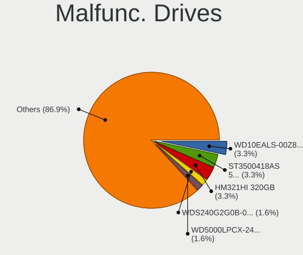

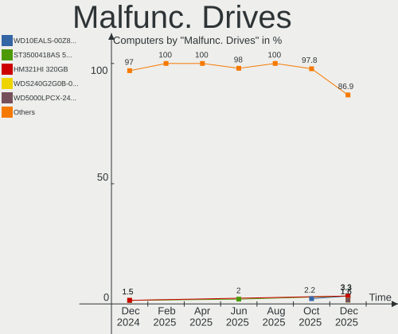

| Model                                 | Computers | Drives | Percent |
|---------------------------------------|-----------|--------|---------|
| WDC WD10EALS-00Z8A0 1TB               | 2         | 2      | 3.28%   |
| Seagate ST3500418AS 500GB             | 2         | 2      | 3.28%   |
| Samsung Electronics HM321HI 320GB     | 2         | 2      | 3.28%   |
| WDC WDS240G2G0B-00EPW0 240GB SSD      | 1         | 1      | 1.64%   |
| WDC WD5000LPCX-24C6HT0 500GB          | 1         | 1      | 1.64%   |
| WDC WD5000AAKX-00ERMA0 500GB          | 1         | 1      | 1.64%   |
| WDC WD5000AAKS-00V1A0 500GB           | 1         | 1      | 1.64%   |
| WDC WD5000AADS-00S9B0 500GB           | 1         | 1      | 1.64%   |
| WDC WD400BB-00JHA0 40GB               | 1         | 1      | 1.64%   |
| WDC WD3200AAJS-22L7A0 320GB           | 1         | 1      | 1.64%   |
| WDC WD3200AAJS-00L7A0 320GB           | 1         | 1      | 1.64%   |
| WDC WD3200AAJS-00B4A0 320GB           | 1         | 1      | 1.64%   |
| WDC WD2500BEVT-24A23T0 250GB          | 1         | 1      | 1.64%   |
| WDC WD2000FYYZ-01UL1B0 2TB            | 1         | 1      | 1.64%   |
| WDC WD10EARS-00Y5B1 1TB               | 1         | 1      | 1.64%   |
| WDC WD10EARS-003BB1 1TB               | 1         | 1      | 1.64%   |
| UnionSine SSD 128GB                   | 1         | 1      | 1.64%   |
| Toshiba MQ01ABF050 500GB              | 1         | 1      | 1.64%   |
| Toshiba MK2555GSX 250GB               | 1         | 1      | 1.64%   |
| Toshiba DT01ACA100 1TB                | 1         | 1      | 1.64%   |
| Seagate ST9500325AS 500GB             | 1         | 1      | 1.64%   |
| Seagate ST9320325AS 320GB             | 1         | 1      | 1.64%   |
| Seagate ST9250827AS 250GB             | 1         | 1      | 1.64%   |
| Seagate ST750LM022 HN-M750MBB 752GB   | 1         | 1      | 1.64%   |
| Seagate ST500LT012-1DG142 500GB       | 1         | 1      | 1.64%   |
| Seagate ST500LM021-1KJ152 500GB       | 1         | 1      | 1.64%   |
| Seagate ST380013AS 80GB               | 1         | 1      | 1.64%   |
| Seagate ST3320613AS 320GB             | 1         | 1      | 1.64%   |
| Seagate ST3250820AS 250GB             | 1         | 1      | 1.64%   |
| Seagate ST3250310AS 250GB             | 1         | 1      | 1.64%   |
| Seagate ST3160812AS 160GB             | 1         | 1      | 1.64%   |
| Seagate ST1000LM035-1RK172 1TB        | 1         | 1      | 1.64%   |
| Seagate ST1000DM010-2EP102 1TB        | 1         | 1      | 1.64%   |
| Seagate ST1000DM003-9YN162 1TB        | 1         | 1      | 1.64%   |
| Seagate ST1000DM003-1SB10C 1TB        | 1         | 1      | 1.64%   |
| SanDisk SSD i110 24GB                 | 1         | 1      | 1.64%   |
| Samsung Electronics SSD 870 EVO 500GB | 1         | 1      | 1.64%   |
| Samsung Electronics SSD 870 EVO 250GB | 1         | 1      | 1.64%   |
| Samsung Electronics HN-M500MBB 500GB  | 1         | 1      | 1.64%   |
| Samsung Electronics HD253GJ 250GB     | 1         | 1      | 1.64%   |

Malfunc. Drive Vendor
---------------------

Vendors of faulty drives

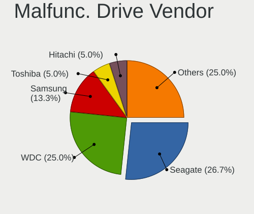

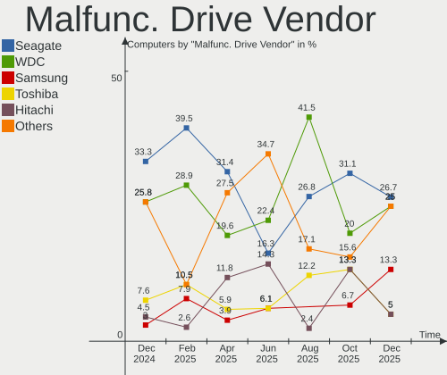

| Vendor                      | Computers | Drives | Percent |
|-----------------------------|-----------|--------|---------|
| Seagate                     | 16        | 17     | 26.67%  |
| WDC                         | 15        | 15     | 25%     |
| Samsung Electronics         | 8         | 8      | 13.33%  |
| Toshiba                     | 3         | 3      | 5%      |
| Hitachi                     | 3         | 3      | 5%      |
| Fujitsu                     | 3         | 3      | 5%      |
| UnionSine                   | 1         | 1      | 1.67%   |
| SanDisk                     | 1         | 1      | 1.67%   |
| Netac                       | 1         | 1      | 1.67%   |
| Neo                         | 1         | 1      | 1.67%   |
| MAXIO Technology (Hangzhou) | 1         | 1      | 1.67%   |
| Kingston                    | 1         | 1      | 1.67%   |
| KingSpec                    | 1         | 1      | 1.67%   |
| HGST                        | 1         | 1      | 1.67%   |
| ExeGate                     | 1         | 1      | 1.67%   |
| Crucial                     | 1         | 1      | 1.67%   |
| China                       | 1         | 1      | 1.67%   |
| AMD                         | 1         | 1      | 1.67%   |

Malfunc. HDD Vendor
-------------------

Vendors of faulty HDD drives

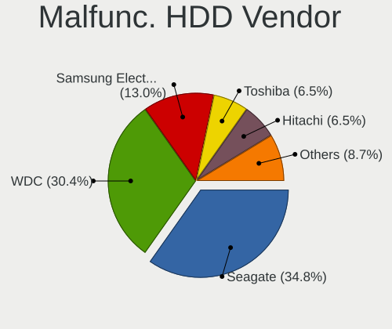

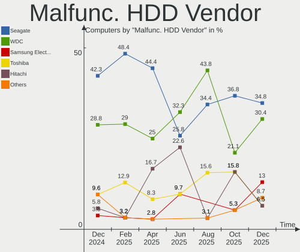

| Vendor              | Computers | Drives | Percent |
|---------------------|-----------|--------|---------|
| Seagate             | 16        | 17     | 34.78%  |
| WDC                 | 14        | 14     | 30.43%  |
| Samsung Electronics | 6         | 6      | 13.04%  |
| Toshiba             | 3         | 3      | 6.52%   |
| Hitachi             | 3         | 3      | 6.52%   |
| Fujitsu             | 3         | 3      | 6.52%   |
| HGST                | 1         | 1      | 2.17%   |

Malfunc. Drive Kind
-------------------

Kinds of faulty drives

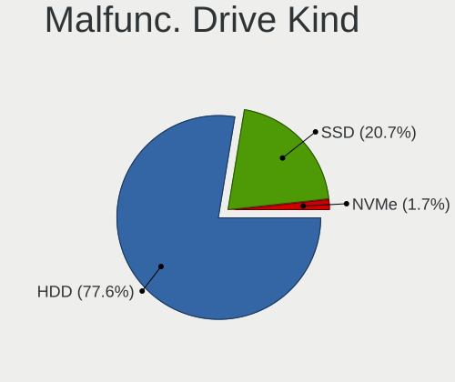

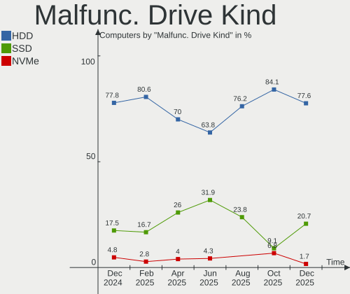

| Kind | Computers | Drives | Percent |
|------|-----------|--------|---------|
| HDD  | 45        | 47     | 77.59%  |
| SSD  | 12        | 13     | 20.69%  |
| NVMe | 1         | 1      | 1.72%   |

Failed Drives
-------------

Failed drive models

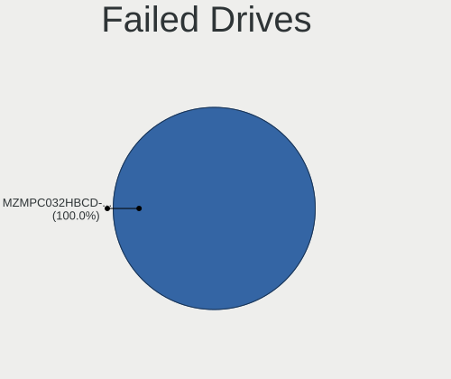

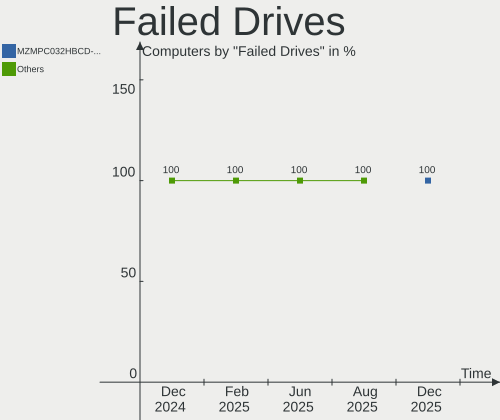

| Model                                           | Computers | Drives | Percent |
|-------------------------------------------------|-----------|--------|---------|
| Samsung Electronics MZMPC032HBCD-000H1 32GB SSD | 1         | 1      | 100%    |

Failed Drive Vendor
-------------------

Failed drive vendors

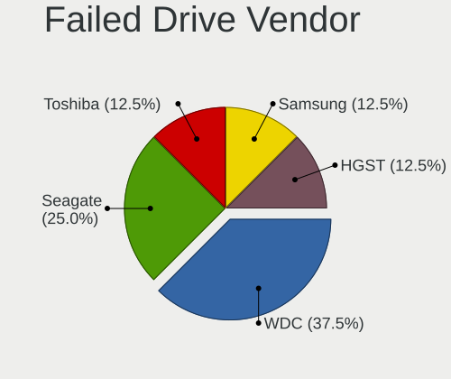

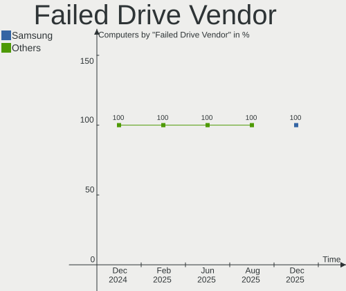

| Vendor              | Computers | Drives | Percent |
|---------------------|-----------|--------|---------|
| Samsung Electronics | 1         | 1      | 100%    |

Drive Status
------------

Number of failed and malfunc. drives

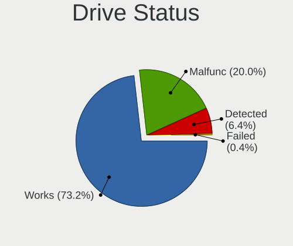

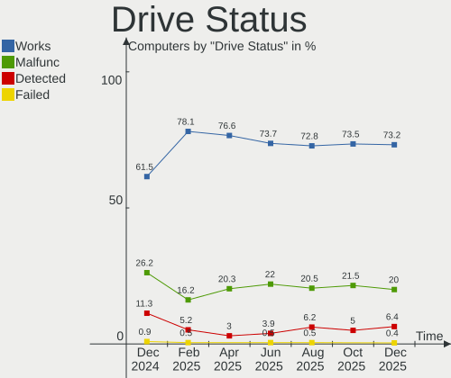

| Status   | Computers | Drives | Percent |
|----------|-----------|--------|---------|
| Works    | 194       | 302    | 73.21%  |
| Malfunc  | 53        | 61     | 20%     |
| Detected | 17        | 17     | 6.42%   |
| Failed   | 1         | 1      | 0.38%   |

Storage controller
------------------

Storage Vendor
--------------

Storage controller vendors

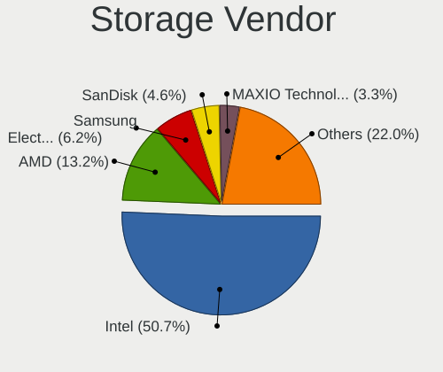

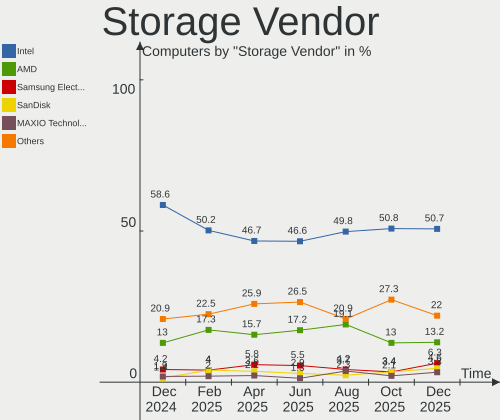

| Vendor                                  | Computers | Percent |
|-----------------------------------------|-----------|---------|
| Intel                                   | 154       | 50.66%  |
| AMD                                     | 40        | 13.16%  |
| Samsung Electronics                     | 19        | 6.25%   |
| SanDisk                                 | 14        | 4.61%   |
| MAXIO Technology (Hangzhou)             | 10        | 3.29%   |
| ADATA Technology                        | 9         | 2.96%   |
| Silicon Motion                          | 7         | 2.3%    |
| Shenzhen Longsys Electronics            | 7         | 2.3%    |
| Realtek Semiconductor                   | 6         | 1.97%   |
| Kingston Technology Company             | 6         | 1.97%   |
| Phison Electronics                      | 5         | 1.64%   |
| Micron Technology                       | 5         | 1.64%   |
| SK hynix                                | 4         | 1.32%   |
| Unknown                                 | 4         | 1.32%   |
| INNOGRIT                                | 3         | 0.99%   |
| KIOXIA                                  | 2         | 0.66%   |
| JMicron Technology                      | 2         | 0.66%   |
| Union Memory (Shenzhen)                 | 1         | 0.33%   |
| Shenzhen Unionmemory Information System | 1         | 0.33%   |
| Shenzhen Shichuangyi Electronics        | 1         | 0.33%   |
| Nvidia                                  | 1         | 0.33%   |
| Netac Technology                        | 1         | 0.33%   |
| Marvell Technology Group                | 1         | 0.33%   |
| Loongson Technology                     | 1         | 0.33%   |

Storage Model
-------------

Storage controller models

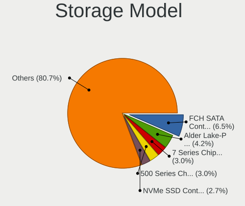

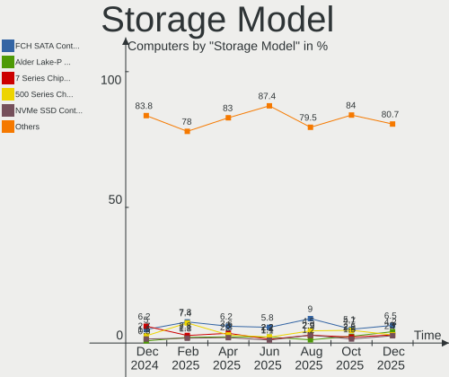

| Model                                                                                                              | Computers | Percent |
|--------------------------------------------------------------------------------------------------------------------|-----------|---------|
| AMD FCH SATA Controller [AHCI mode]                                                                                | 22        | 6.53%   |
| Intel Alder Lake-P SATA AHCI Controller                                                                            | 14        | 4.15%   |
| Intel 7 Series Chipset Family 6-port SATA Controller [AHCI mode]                                                   | 10        | 2.97%   |
| Intel 500 Series Chipset Family SATA AHCI Controller                                                               | 10        | 2.97%   |
| MAXIO (Hangzhou) NVMe SSD Controller MAP1202 (DRAM-less)                                                           | 9         | 2.67%   |
| Intel Tiger Lake-LP SATA Controller                                                                                | 9         | 2.67%   |
| Intel Q170/Q150/B150/H170/H110/Z170/CM236 Chipset SATA Controller [AHCI Mode]                                      | 9         | 2.67%   |
| Shenzhen Longsys FORESEE XP1000 / Lexar Professional CFexpress Type B Gold series, NM620 PCIe NVME SSD (DRAM-less) | 7         | 2.08%   |
| Intel NM10/ICH7 Family SATA Controller [IDE mode]                                                                  | 7         | 2.08%   |
| Silicon Motion SM2263EN/SM2263XT (DRAM-less) NVMe SSD Controllers                                                  | 6         | 1.78%   |
| Intel 82801G (ICH7 Family) IDE Controller                                                                          | 6         | 1.78%   |
| Intel 8 Series/C220 Series Chipset Family 6-port SATA Controller 1 [AHCI mode]                                     | 6         | 1.78%   |
| Intel 200 Series PCH SATA controller [AHCI mode]                                                                   | 6         | 1.78%   |
| AMD 400 Series Chipset SATA Controller                                                                             | 6         | 1.78%   |
| Intel Volume Management Device NVMe RAID Controller                                                                | 5         | 1.48%   |
| Intel 7 Series/C210 Series Chipset Family 6-port SATA Controller [AHCI mode]                                       | 5         | 1.48%   |
| Intel 6 Series/C200 Series Chipset Family 6 port Mobile SATA AHCI Controller                                       | 5         | 1.48%   |
| Intel 5 Series/3400 Series Chipset 4 port SATA AHCI Controller                                                     | 5         | 1.48%   |
| AMD SB7x0/SB8x0/SB9x0 IDE Controller                                                                               | 5         | 1.48%   |
| ADATA XPG GAMMIXS1 1L, XPG GAMMIX S5, LEGEND 710 / 740, SWORDFISH NVMe SSD (DRAM-less)                             | 5         | 1.48%   |
| Realtek RTS5765DL NVMe SSD Controller (DRAM-less)                                                                  | 4         | 1.19%   |
| Intel 82801 Mobile SATA Controller [RAID mode]                                                                     | 4         | 1.19%   |
| Intel 6 Series/C200 Series Chipset Family 6 port Desktop SATA AHCI Controller                                      | 4         | 1.19%   |
| AMD A320 Chipset SATA Controller [AHCI mode]                                                                       | 4         | 1.19%   |
| Unknown                                                                                                            | 4         | 1.19%   |
| Sandisk WD PC SN740 NVMe SSD 512GB (DRAM-less)                                                                     | 3         | 0.89%   |
| SanDisk PC SN530 NVMe SSD (DRAM-less)                                                                              | 3         | 0.89%   |
| Samsung NVMe SSD Controller SM981/PM981/PM983                                                                      | 3         | 0.89%   |
| Samsung NVMe SSD Controller SM961/PM961/SM963                                                                      | 3         | 0.89%   |
| Samsung NVMe SSD Controller S4LV008[Pascal]                                                                        | 3         | 0.89%   |
| Samsung NVMe SSD Controller 980 (DRAM-less)                                                                        | 3         | 0.89%   |
| Phison PS5015-E15 PCIe3 NVMe Controller (DRAM-less)                                                                | 3         | 0.89%   |
| Intel Sunrise Point-LP SATA Controller [AHCI mode]                                                                 | 3         | 0.89%   |
| Intel SATA controller                                                                                              | 3         | 0.89%   |
| Intel RST Volume Management Device Controller                                                                      | 3         | 0.89%   |
| Intel Ice Lake-LP SATA Controller [AHCI mode]                                                                      | 3         | 0.89%   |
| Intel C610/X99 series chipset 6-Port SATA Controller [AHCI mode]                                                   | 3         | 0.89%   |
| Intel C600/X79 series chipset 6-Port SATA AHCI Controller                                                          | 3         | 0.89%   |
| Intel Atom Processor E3800 Series SATA AHCI Controller                                                             | 3         | 0.89%   |
| Intel Alder Lake-S PCH SATA Controller [AHCI Mode]                                                                 | 3         | 0.89%   |

Storage Kind
------------

Kind of storage controller (IDE, SATA, NVMe, SAS, ...)

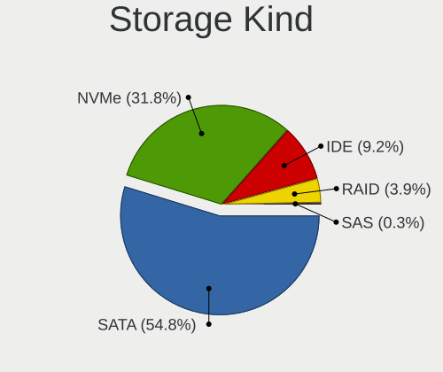

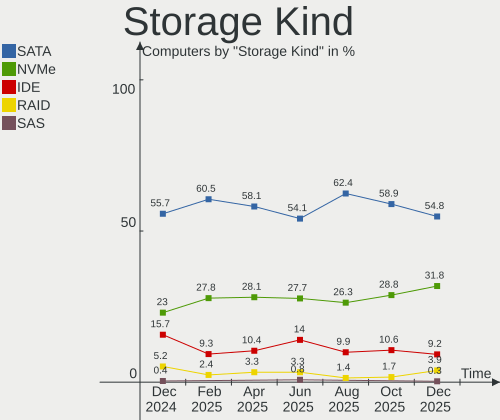

| Kind | Computers | Percent |
|------|-----------|---------|
| SATA | 167       | 54.75%  |
| NVMe | 97        | 31.8%   |
| IDE  | 28        | 9.18%   |
| RAID | 12        | 3.93%   |
| SAS  | 1         | 0.33%   |

Processor
---------

CPU Vendor
----------

Processor vendors

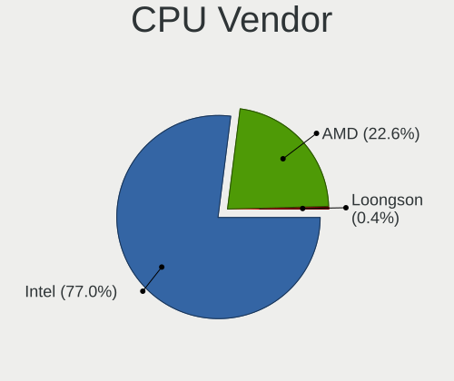

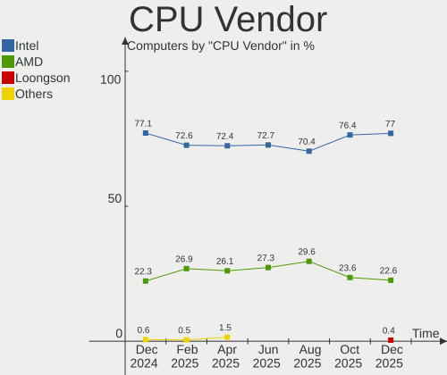

| Vendor   | Computers | Percent |
|----------|-----------|---------|
| Intel    | 174       | 76.99%  |
| AMD      | 51        | 22.57%  |
| Loongson | 1         | 0.44%   |

CPU Model
---------

Processor models

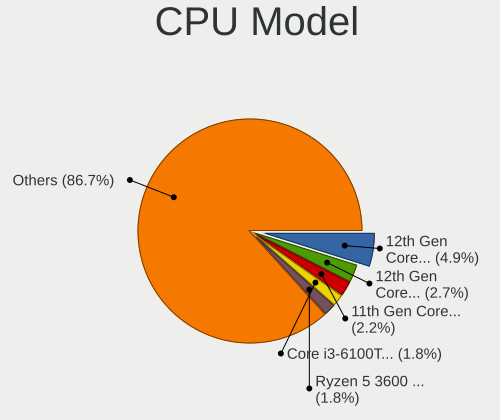

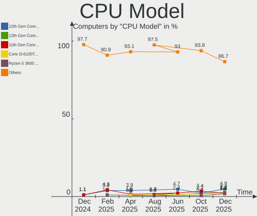

| Model                                        | Computers | Percent |
|----------------------------------------------|-----------|---------|
| Intel 12th Gen Core i5-1235U                 | 11        | 4.87%   |
| Intel 12th Gen Core i7-1280P                 | 6         | 2.65%   |
| Intel 11th Gen Core i5-1135G7 @ 2.40GHz      | 5         | 2.21%   |
| Intel Core i3-6100TE CPU @ 2.70GHz           | 4         | 1.77%   |
| AMD Ryzen 5 3600 6-Core Processor            | 4         | 1.77%   |
| Intel N100                                   | 3         | 1.33%   |
| Intel Core i5-3210M CPU @ 2.50GHz            | 3         | 1.33%   |
| Intel 11th Gen Core i3-1125G4 @ 2.00GHz      | 3         | 1.33%   |
| AMD Ryzen 5 5500U with Radeon Graphics       | 3         | 1.33%   |
| Intel Xeon CPU E5-2689 0 @ 2.60GHz           | 2         | 0.88%   |
| Intel Xeon CPU E5-2673 v3 @ 2.40GHz          | 2         | 0.88%   |
| Intel Pentium Gold G6405 CPU @ 4.10GHz       | 2         | 0.88%   |
| Intel Core i7-8700 CPU @ 3.20GHz             | 2         | 0.88%   |
| Intel Core i5-9400 CPU @ 2.90GHz             | 2         | 0.88%   |
| Intel Core i5-7400 CPU @ 3.00GHz             | 2         | 0.88%   |
| Intel Core i5-3470 CPU @ 3.20GHz             | 2         | 0.88%   |
| Intel Core i5-3230M CPU @ 2.60GHz            | 2         | 0.88%   |
| Intel Core i5-10400 CPU @ 2.90GHz            | 2         | 0.88%   |
| Intel Core i3-7100 CPU @ 3.90GHz             | 2         | 0.88%   |
| Intel Core 2 Duo CPU E7500 @ 2.93GHz         | 2         | 0.88%   |
| Intel 12th Gen Core i5-12400                 | 2         | 0.88%   |
| Intel 12th Gen Core i3-1215U                 | 2         | 0.88%   |
| Intel 11th Gen Core i7-11700 @ 2.50GHz       | 2         | 0.88%   |
| AMD Ryzen 5 7500F 6-Core Processor           | 2         | 0.88%   |
| AMD Ryzen 5 5600H with Radeon Graphics       | 2         | 0.88%   |
| AMD Ryzen 5 5600G with Radeon Graphics       | 2         | 0.88%   |
| AMD Ryzen 3 3200G with Radeon Vega Graphics  | 2         | 0.88%   |
| AMD A10 PRO-7800B R7, 12 Compute Cores 4C+8G | 2         | 0.88%   |
| Loongson Loongson 3A                         | 1         | 0.44%   |
| Intel Xeon Silver 4216 CPU @ 2.10GHz         | 1         | 0.44%   |
| Intel Xeon CPU X5690 @ 3.47GHz               | 1         | 0.44%   |
| Intel Xeon CPU X3210 @ 2.13GHz               | 1         | 0.44%   |
| Intel Xeon CPU E5450 @ 3.00GHz               | 1         | 0.44%   |
| Intel Xeon CPU E5-2697 v4 @ 2.30GHz          | 1         | 0.44%   |
| Intel Xeon CPU E5-2690 v3 @ 2.60GHz          | 1         | 0.44%   |
| Intel Xeon CPU E5-2680 v4 @ 2.40GHz          | 1         | 0.44%   |
| Intel Xeon CPU E5-2676 v3 @ 2.40GHz          | 1         | 0.44%   |
| Intel Xeon CPU E5-2670 0 @ 2.60GHz           | 1         | 0.44%   |
| Intel Xeon CPU E5-2667 v4 @ 3.20GHz          | 1         | 0.44%   |
| Intel Xeon CPU E5-2660 0 @ 2.20GHz           | 1         | 0.44%   |

CPU Model Family
----------------

Processor model prefix

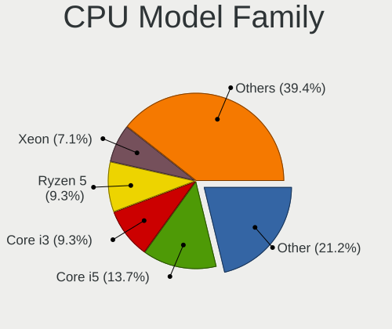

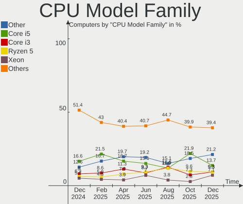

| Model                   | Computers | Percent |
|-------------------------|-----------|---------|
| Other                   | 48        | 21.24%  |
| Intel Core i5           | 31        | 13.72%  |
| Intel Core i3           | 21        | 9.29%   |
| AMD Ryzen 5             | 21        | 9.29%   |
| Intel Xeon              | 16        | 7.08%   |
| Intel Core i7           | 15        | 6.64%   |
| Intel Celeron           | 10        | 4.42%   |
| Intel Pentium           | 8         | 3.54%   |
| AMD Ryzen 7             | 8         | 3.54%   |
| AMD A10                 | 5         | 2.21%   |
| Intel Pentium Dual-Core | 4         | 1.77%   |
| Intel Core 2 Duo        | 4         | 1.77%   |
| AMD Ryzen 3             | 4         | 1.77%   |
| Intel Pentium Dual      | 3         | 1.33%   |
| Intel Core              | 3         | 1.33%   |
| AMD FX                  | 3         | 1.33%   |
| Intel Pentium Silver    | 2         | 0.88%   |
| Intel Pentium Gold      | 2         | 0.88%   |
| Intel Core 2            | 2         | 0.88%   |
| Intel Atom              | 2         | 0.88%   |
| AMD Ryzen 9             | 2         | 0.88%   |
| AMD A4                  | 2         | 0.88%   |
| Intel Xeon Silver       | 1         | 0.44%   |
| Intel Pentium M         | 1         | 0.44%   |
| Intel Core M            | 1         | 0.44%   |
| Intel Core 2 Quad       | 1         | 0.44%   |
| AMD PRO A10             | 1         | 0.44%   |
| AMD E2                  | 1         | 0.44%   |
| AMD C-60                | 1         | 0.44%   |
| AMD Athlon II X3        | 1         | 0.44%   |
| AMD Athlon II X2        | 1         | 0.44%   |
| AMD A8                  | 1         | 0.44%   |

CPU Cores
---------

Number of processor cores

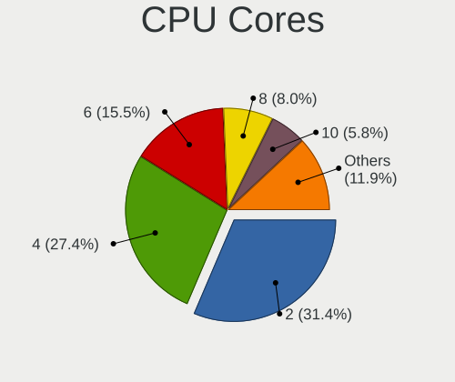

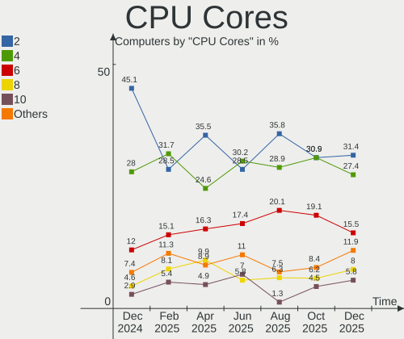

| Number | Computers | Percent |
|--------|-----------|---------|
| 2      | 71        | 31.42%  |
| 4      | 62        | 27.43%  |
| 6      | 35        | 15.49%  |
| 8      | 18        | 7.96%   |
| 10     | 13        | 5.75%   |
| 14     | 9         | 3.98%   |
| 12     | 5         | 2.21%   |
| 1      | 5         | 2.21%   |
| 24     | 3         | 1.33%   |
| 3      | 2         | 0.88%   |
| 36     | 1         | 0.44%   |
| 20     | 1         | 0.44%   |
| 16     | 1         | 0.44%   |

CPU Sockets
-----------

Number of sockets

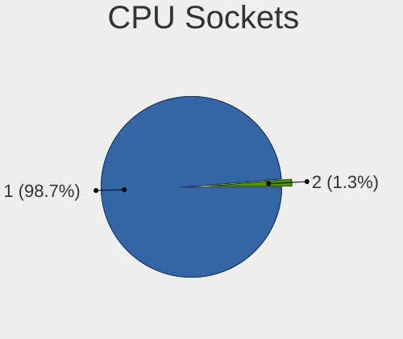

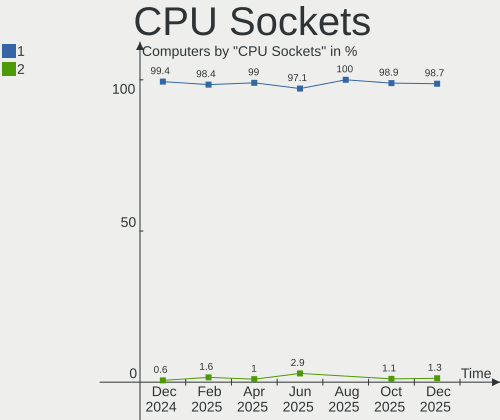

| Number | Computers | Percent |
|--------|-----------|---------|
| 1      | 223       | 98.67%  |
| 2      | 3         | 1.33%   |

CPU Threads
-----------

Threads per core (Hyper-Threading)

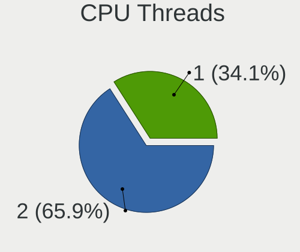

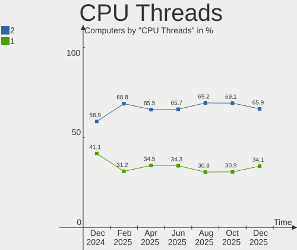

| Number | Computers | Percent |
|--------|-----------|---------|
| 2      | 149       | 65.93%  |
| 1      | 77        | 34.07%  |

CPU Op-Modes
------------

CPU Operation Modes (32-bit, 64-bit)

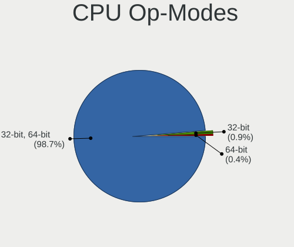

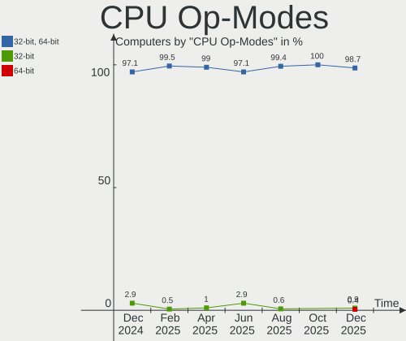

| Op mode        | Computers | Percent |
|----------------|-----------|---------|
| 32-bit, 64-bit | 223       | 98.67%  |
| 32-bit         | 2         | 0.88%   |
| 64-bit         | 1         | 0.44%   |

CPU Microcode
-------------

Microcode number

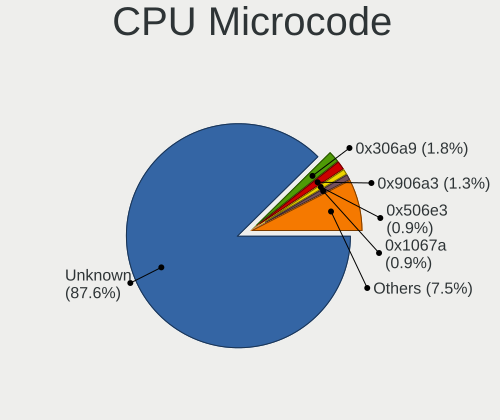

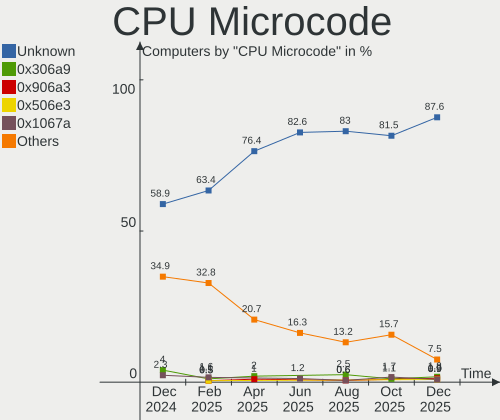

| Number     | Computers | Percent |
|------------|-----------|---------|
| Unknown    | 198       | 87.61%  |
| 0x306a9    | 4         | 1.77%   |
| 0x906a3    | 3         | 1.33%   |
| 0x506e3    | 2         | 0.88%   |
| 0x1067a    | 2         | 0.88%   |
| 0x0a50000c | 2         | 0.88%   |
| 0x906a4    | 1         | 0.44%   |
| 0x806c1    | 1         | 0.44%   |
| 0x6fd      | 1         | 0.44%   |
| 0x6fb      | 1         | 0.44%   |
| 0x6d8      | 1         | 0.44%   |
| 0x406c4    | 1         | 0.44%   |
| 0x206a7    | 1         | 0.44%   |
| 0x20652    | 1         | 0.44%   |
| 0x106c2    | 1         | 0.44%   |
| 0x08600102 | 1         | 0.44%   |
| 0x0810810e | 1         | 0.44%   |
| 0x06000822 | 1         | 0.44%   |
| 0x0500010d | 1         | 0.44%   |
| 0x03000025 | 1         | 0.44%   |
| 0x010000b7 | 1         | 0.44%   |

CPU Microarch
-------------

Microarchitecture

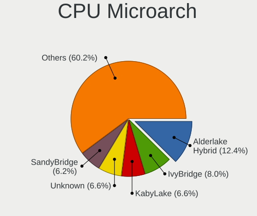

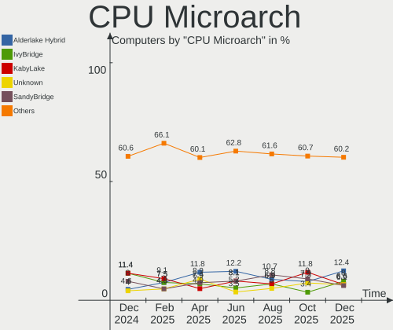

| Name              | Computers | Percent |
|-------------------|-----------|---------|
| Alderlake Hybrid  | 28        | 12.39%  |
| IvyBridge         | 18        | 7.96%   |
| KabyLake          | 15        | 6.64%   |
| Unknown           | 15        | 6.64%   |
| SandyBridge       | 14        | 6.19%   |
| Haswell           | 13        | 5.75%   |
| TigerLake         | 11        | 4.87%   |
| Skylake           | 10        | 4.42%   |
| Penryn            | 9         | 3.98%   |
| Core              | 9         | 3.98%   |
| Zen 3             | 8         | 3.54%   |
| Zen 2             | 7         | 3.1%    |
| Westmere          | 7         | 3.1%    |
| IceLake           | 7         | 3.1%    |
| Silvermont        | 6         | 2.65%   |
| CometLake         | 6         | 2.65%   |
| Broadwell         | 6         | 2.65%   |
| Zen+              | 5         | 2.21%   |
| Piledriver        | 4         | 1.77%   |
| Gracemont         | 4         | 1.77%   |
| Steamroller       | 3         | 1.33%   |
| Excavator         | 3         | 1.33%   |
| Zen               | 2         | 0.88%   |
| Tremont           | 2         | 0.88%   |
| Lunarlake Hybrid  | 2         | 0.88%   |
| K10               | 2         | 0.88%   |
| Goldmont plus     | 2         | 0.88%   |
| Puma              | 1         | 0.44%   |
| P6                | 1         | 0.44%   |
| Nehalem           | 1         | 0.44%   |
| Meteorlake Hybrid | 1         | 0.44%   |
| K10 Llano         | 1         | 0.44%   |
| Bulldozer         | 1         | 0.44%   |
| Bonnell           | 1         | 0.44%   |
| Bobcat            | 1         | 0.44%   |

Graphics
--------

GPU Vendor
----------

Vendors of graphics cards

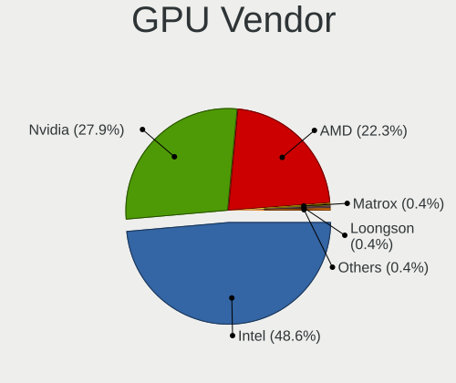

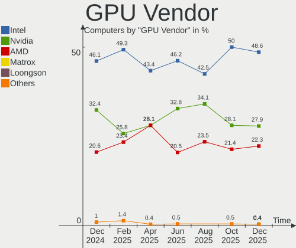

| Vendor                     | Computers | Percent |
|----------------------------|-----------|---------|
| Intel                      | 122       | 48.61%  |
| Nvidia                     | 70        | 27.89%  |
| AMD                        | 56        | 22.31%  |
| Matrox Electronics Systems | 1         | 0.4%    |
| Loongson Technology        | 1         | 0.4%    |
| ASPEED Technology          | 1         | 0.4%    |

GPU Model
---------

Graphics card models

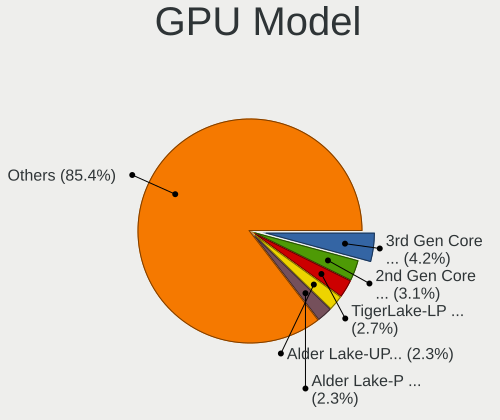

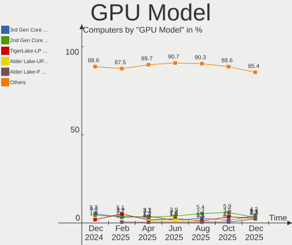

| Model                                                                                    | Computers | Percent |
|------------------------------------------------------------------------------------------|-----------|---------|
| Intel 3rd Gen Core processor Graphics Controller                                         | 11        | 4.21%   |
| Intel 2nd Generation Core Processor Family Integrated Graphics Controller                | 8         | 3.07%   |
| Intel TigerLake-LP GT2 [Iris Xe Graphics]                                                | 7         | 2.68%   |
| Intel Alder Lake-UP3 GT2 [Iris Xe Graphics]                                              | 6         | 2.3%    |
| Intel Alder Lake-P GT2 [Iris Xe Graphics]                                                | 6         | 2.3%    |
| Intel Skylake-S GT2 [HD Graphics 530]                                                    | 5         | 1.92%   |
| Intel Alder Lake-UP3 GT2 [UHD Graphics]                                                  | 5         | 1.92%   |
| AMD Lucienne                                                                             | 5         | 1.92%   |
| AMD Ellesmere [Radeon RX 470/480/570/570X/580/580X/590]                                  | 5         | 1.92%   |
| Nvidia GM107 [GeForce GTX 750 Ti]                                                        | 4         | 1.53%   |
| Intel Tiger Lake-LP GT2 [UHD Graphics G4]                                                | 4         | 1.53%   |
| Intel 4th Gen Core Processor Integrated Graphics Controller                              | 4         | 1.53%   |
| AMD Thames [Radeon HD 7500M/7600M Series]                                                | 4         | 1.53%   |
| AMD Cezanne [Radeon Vega Series / Radeon Vega Mobile Series]                             | 4         | 1.53%   |
| Nvidia TU117 [GeForce GTX 1650]                                                          | 3         | 1.15%   |
| Nvidia GT218 [GeForce 210]                                                               | 3         | 1.15%   |
| Nvidia GF108 [GeForce GT 440]                                                            | 3         | 1.15%   |
| Intel Mobile 4 Series Chipset Integrated Graphics Controller                             | 3         | 1.15%   |
| Intel Iris Plus Graphics G1 (Ice Lake)                                                   | 3         | 1.15%   |
| Intel CoffeeLake-S GT2 [UHD Graphics 630]                                                | 3         | 1.15%   |
| Intel Atom/Celeron/Pentium Processor x5-E8000/J3xxx/N3xxx Integrated Graphics Controller | 3         | 1.15%   |
| Intel Atom Processor Z36xxx/Z37xxx Series Graphics & Display                             | 3         | 1.15%   |
| Intel Alder Lake-UP3 GT1 [UHD Graphics]                                                  | 3         | 1.15%   |
| Intel Alder Lake-N [UHD Graphics]                                                        | 3         | 1.15%   |
| AMD Renoir [Radeon Vega Series / Radeon Vega Mobile Series]                              | 3         | 1.15%   |
| AMD Picasso/Raven 2 [Radeon Vega Series / Radeon Vega Mobile Series]                     | 3         | 1.15%   |
| AMD Kaveri [Radeon R7 Graphics]                                                          | 3         | 1.15%   |
| Nvidia TU106 [GeForce RTX 2060 SUPER]                                                    | 2         | 0.77%   |
| Nvidia GP107 [GeForce GTX 1050]                                                          | 2         | 0.77%   |
| Nvidia GP107 [GeForce GTX 1050 Ti]                                                       | 2         | 0.77%   |
| Nvidia GF119M [GeForce GT 520MX]                                                         | 2         | 0.77%   |
| Nvidia GA107M [GeForce RTX 3050 Mobile]                                                  | 2         | 0.77%   |
| Nvidia AD107M [GeForce RTX 4060 Max-Q / Mobile]                                          | 2         | 0.77%   |
| Nvidia AD104 [GeForce RTX 4070 SUPER]                                                    | 2         | 0.77%   |
| Intel Xeon E3-1200 v3/4th Gen Core Processor Integrated Graphics Controller              | 2         | 0.77%   |
| Intel Xeon E3-1200 v2/3rd Gen Core processor Graphics Controller                         | 2         | 0.77%   |
| Intel Raptor Lake-P [UHD Graphics]                                                       | 2         | 0.77%   |
| Intel Mobile GM965/GL960 Integrated Graphics Controller (secondary)                      | 2         | 0.77%   |
| Intel Mobile GM965/GL960 Integrated Graphics Controller (primary)                        | 2         | 0.77%   |
| Intel Kaby Lake-S GT2 [HD Graphics 630]                                                  | 2         | 0.77%   |

GPU Combo
---------

Combinations of graphics cards

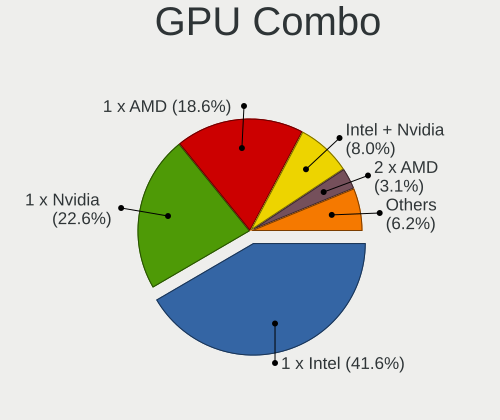

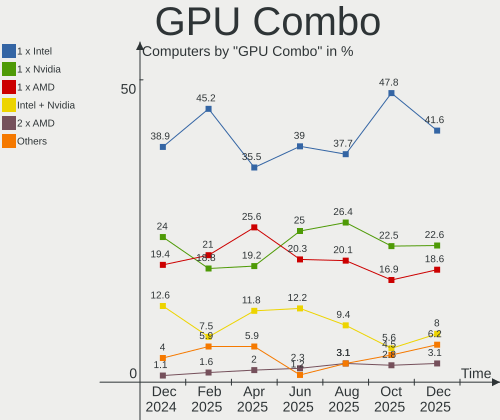

| Name                    | Computers | Percent |
|-------------------------|-----------|---------|
| 1 x Intel               | 94        | 41.59%  |
| 1 x Nvidia              | 51        | 22.57%  |
| 1 x AMD                 | 42        | 18.58%  |
| Intel + Nvidia          | 18        | 7.96%   |
| 2 x AMD                 | 7         | 3.1%    |
| 2 x Intel               | 5         | 2.21%   |
| Intel + AMD             | 5         | 2.21%   |
| 1 x Matrox              | 1         | 0.44%   |
| 1 x Loongson Technology | 1         | 0.44%   |
| 1 x ASPEED              | 1         | 0.44%   |
| AMD + Nvidia            | 1         | 0.44%   |

GPU Driver
----------

Free vs proprietary

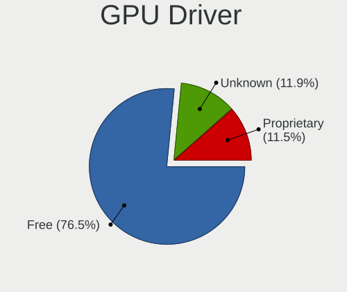

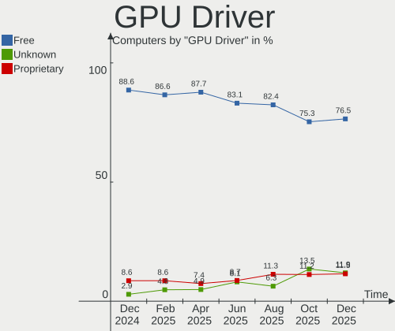

| Driver      | Computers | Percent |
|-------------|-----------|---------|
| Free        | 173       | 76.55%  |
| Unknown     | 27        | 11.95%  |
| Proprietary | 26        | 11.5%   |

GPU Memory
----------

Total video memory

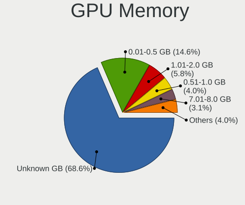

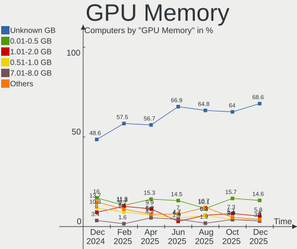

| Size in GB | Computers | Percent |
|------------|-----------|---------|
| Unknown    | 155       | 68.58%  |
| 0.01-0.5   | 33        | 14.6%   |
| 1.01-2.0   | 13        | 5.75%   |
| 0.51-1.0   | 9         | 3.98%   |
| 7.01-8.0   | 7         | 3.1%    |
| 3.01-4.0   | 5         | 2.21%   |
| 8.01-16.0  | 3         | 1.33%   |
| 16.01-24.0 | 1         | 0.44%   |

Monitor
-------

Monitor Vendor
--------------

Monitor vendors

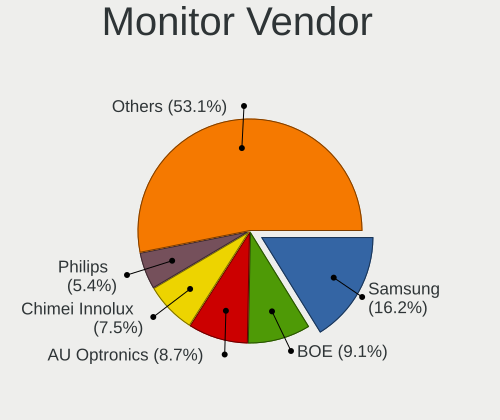

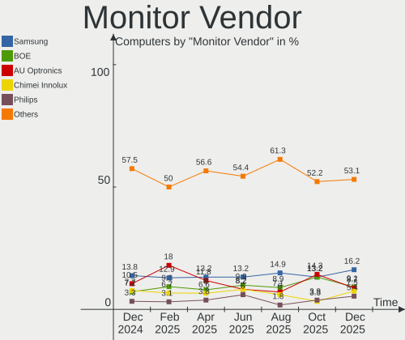

| Vendor                  | Computers | Percent |
|-------------------------|-----------|---------|
| Samsung Electronics     | 39        | 16.18%  |
| BOE                     | 22        | 9.13%   |
| AU Optronics            | 21        | 8.71%   |
| Chimei Innolux          | 18        | 7.47%   |
| Philips                 | 13        | 5.39%   |
| LG Display              | 12        | 4.98%   |
| Goldstar                | 11        | 4.56%   |
| Hewlett-Packard         | 10        | 4.15%   |
| Dell                    | 10        | 4.15%   |
| BenQ                    | 9         | 3.73%   |
| AOC                     | 8         | 3.32%   |
| SKG                     | 4         | 1.66%   |
| SAC                     | 4         | 1.66%   |
| Mi                      | 4         | 1.66%   |
| Lenovo                  | 4         | 1.66%   |
| HHT                     | 4         | 1.66%   |
| Acer                    | 4         | 1.66%   |
| ViewSonic               | 3         | 1.24%   |
| MSI                     | 3         | 1.24%   |
| InfoVision              | 3         | 1.24%   |
| CSOT                    | 3         | 1.24%   |
| TMX                     | 2         | 0.83%   |
| Sony                    | 2         | 0.83%   |
| Sharp                   | 2         | 0.83%   |
| Iiyama                  | 2         | 0.83%   |
| Chi Mei Optoelectronics | 2         | 0.83%   |
| Apple                   | 2         | 0.83%   |
| Ancor Communications    | 2         | 0.83%   |
| VIE                     | 1         | 0.41%   |
| STD                     | 1         | 0.41%   |
| SLD                     | 1         | 0.41%   |
| Skyworth                | 1         | 0.41%   |
| SGT                     | 1         | 0.41%   |
| RTK                     | 1         | 0.41%   |
| Pixio                   | 1         | 0.41%   |
| PANDA                   | 1         | 0.41%   |
| Novatek                 | 1         | 0.41%   |
| MTK                     | 1         | 0.41%   |
| MStar                   | 1         | 0.41%   |
| LED                     | 1         | 0.41%   |

Monitor Model
-------------

Monitor models

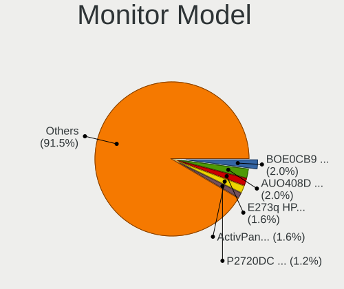

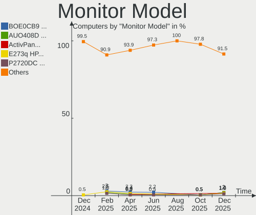

| Model                                                                | Computers | Percent |
|----------------------------------------------------------------------|-----------|---------|
| BOE LCD Monitor BOE0CB9 1920x1080 309x173mm 13.9-inch                | 5         | 2.02%   |
| AU Optronics LCD Monitor AUO408D 1920x1080 309x174mm 14.0-inch       | 5         | 2.02%   |
| HHT ActivPanel V6 HHT0030 3840x2160 944x398mm 40.3-inch              | 4         | 1.61%   |
| Hewlett-Packard E273q HPN3474 2560x1440 597x336mm 27.0-inch          | 4         | 1.61%   |
| Dell P2720DC DELD0FC 2560x1440 597x336mm 27.0-inch                   | 3         | 1.21%   |
| Chimei Innolux LCD Monitor CMN15E7 1920x1080 344x193mm 15.5-inch     | 3         | 1.21%   |
| Chimei Innolux LCD Monitor CMN140A 1920x1080 309x173mm 13.9-inch     | 3         | 1.21%   |
| Samsung Electronics SA300/SA350 SAM0788 1366x768 410x230mm 18.5-inch | 2         | 0.81%   |
| Samsung Electronics LCD Monitor SEC324A 1366x768 344x194mm 15.5-inch | 2         | 0.81%   |
| SAC SM-24FI221 SAC2453 1920x1080 530x290mm 23.8-inch                 | 2         | 0.81%   |
| Philips PHL24E1N5300 PHLC280 1920x1080 530x300mm 24.0-inch           | 2         | 0.81%   |
| Philips PHL 241V8 PHLC212 1920x1080 527x296mm 23.8-inch              | 2         | 0.81%   |
| Lenovo LCD Monitor LEN40B0 1366x768 344x194mm 15.5-inch              | 2         | 0.81%   |
| Iiyama PL2792UH IVM664E 3840x2160 600x340mm 27.2-inch                | 2         | 0.81%   |
| Goldstar ULTRAGEAR GSM776E 2560x1440 697x392mm 31.5-inch             | 2         | 0.81%   |
| Chimei Innolux LCD Monitor CMN160A 1920x1080 355x199mm 16.0-inch     | 2         | 0.81%   |
| BOE LCD Monitor BOE0747 1920x1080 344x194mm 15.5-inch                | 2         | 0.81%   |
| BenQ LCD BNQ801B 2560x1440 527x296mm 23.8-inch                       | 2         | 0.81%   |
| AU Optronics LCD Monitor AUO21EC 1366x768 344x193mm 15.5-inch        | 2         | 0.81%   |
| AU Optronics CH7511B CHR7511 1600x900 518x333mm 24.2-inch            | 2         | 0.81%   |
| AOC 24G2W1G3 AOC2402 1920x1080 527x296mm 23.8-inch                   | 2         | 0.81%   |
| ViewSonic VX2409 SERIES VSC6C2E 1920x1080 521x293mm 23.5-inch        | 1         | 0.4%    |
| ViewSonic VA2407 Series VSC8C31 1920x1080 521x293mm 23.5-inch        | 1         | 0.4%    |
| ViewSonic VA2342 SERIES VSCFA2B 1920x1080 509x286mm 23.0-inch        | 1         | 0.4%    |
| VIE ATHEN U2L 21 VIE2150 1920x1080 476x268mm 21.5-inch               | 1         | 0.4%    |
| TMX TL160ADMP03-0 TMX1603 2560x1600 345x215mm 16.0-inch              | 1         | 0.4%    |
| TMX TL142GDXP02-0 TMX1420 2520x1680 300x200mm 14.2-inch              | 1         | 0.4%    |
| STD HDMI STD2020 1920x1080 520x310mm 23.8-inch                       | 1         | 0.4%    |
| Sony SDM-HS75P SNY2300 1280x1024 338x270mm 17.0-inch                 | 1         | 0.4%    |
| Sony LCD Monitor MS_9005 1920x1080                                   | 1         | 0.4%    |
| SLD LCD Monitor SLD003C 1366x768 309x173mm 13.9-inch                 | 1         | 0.4%    |
| Skyworth TV MONITOR SKY0030 1920x1080 1430x800mm 64.5-inch           | 1         | 0.4%    |
| SKG H27T22 SKG2702 2560x1440 530x280mm 23.6-inch                     | 1         | 0.4%    |
| SKG DEXP DQ27N2 SKG2771 2560x1440 531x298mm 24.0-inch                | 1         | 0.4%    |
| SKG DEXP DF27N1 SKG2713 1920x1080 597x336mm 27.0-inch                | 1         | 0.4%    |
| SKG AQ27H1 SKG2722 2560x1440 620x370mm 28.4-inch                     | 1         | 0.4%    |
| Sharp LCD Monitor SHP1540 1920x1080 309x174mm 14.0-inch              | 1         | 0.4%    |
| Sharp LCD Monitor SHP141F 1920x1080 294x165mm 13.3-inch              | 1         | 0.4%    |
| SGT HDMI SGT3200 2560x1440 600x330mm 27.0-inch                       | 1         | 0.4%    |
| Samsung Electronics SyncMaster SAM0580 1280x1024 376x301mm 19.0-inch | 1         | 0.4%    |

Monitor Resolution
------------------

Monitor screen resolution

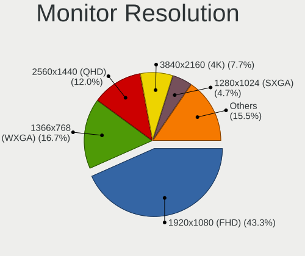

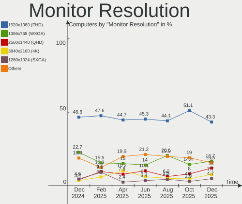

| Resolution         | Computers | Percent |
|--------------------|-----------|---------|
| 1920x1080 (FHD)    | 101       | 43.35%  |
| 1366x768 (WXGA)    | 39        | 16.74%  |
| 2560x1440 (QHD)    | 28        | 12.02%  |
| 3840x2160 (4K)     | 18        | 7.73%   |
| 1280x1024 (SXGA)   | 11        | 4.72%   |
| 1920x1200 (WUXGA)  | 7         | 3%      |
| 1600x900 (HD+)     | 7         | 3%      |
| 2560x1600          | 6         | 2.58%   |
| 1680x1050 (WSXGA+) | 4         | 1.72%   |
| 1280x800 (WXGA)    | 4         | 1.72%   |
| 1440x900 (WXGA+)   | 3         | 1.29%   |
| 2880x1920          | 1         | 0.43%   |
| 2520x1680          | 1         | 0.43%   |
| 1400x1050          | 1         | 0.43%   |
| 1024x768 (XGA)     | 1         | 0.43%   |
| 1024x600           | 1         | 0.43%   |

Monitor Diagonal
----------------

Diagonal size in inches

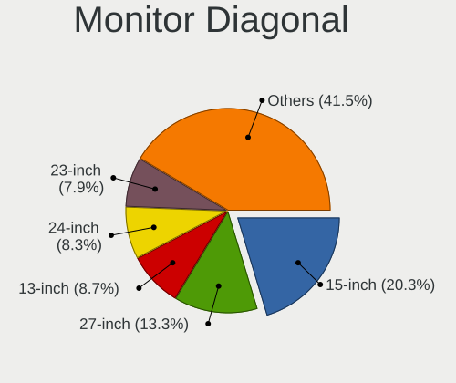

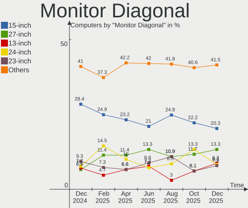

| Inches  | Computers | Percent |
|---------|-----------|---------|
| 15      | 49        | 20.33%  |
| 27      | 32        | 13.28%  |
| 13      | 21        | 8.71%   |
| 24      | 20        | 8.3%    |
| 23      | 19        | 7.88%   |
| 21      | 19        | 7.88%   |
| 14      | 19        | 7.88%   |
| 17      | 11        | 4.56%   |
| 19      | 7         | 2.9%    |
| 31      | 6         | 2.49%   |
| 18      | 6         | 2.49%   |
| 16      | 6         | 2.49%   |
| 40      | 5         | 2.07%   |
| 20      | 5         | 2.07%   |
| 84      | 2         | 0.83%   |
| 64      | 2         | 0.83%   |
| 22      | 2         | 0.83%   |
| 11      | 2         | 0.83%   |
| 72      | 1         | 0.41%   |
| 52      | 1         | 0.41%   |
| 32      | 1         | 0.41%   |
| 29      | 1         | 0.41%   |
| 28      | 1         | 0.41%   |
| 26      | 1         | 0.41%   |
| 12      | 1         | 0.41%   |
| Unknown | 1         | 0.41%   |

Monitor Width
-------------

Physical width

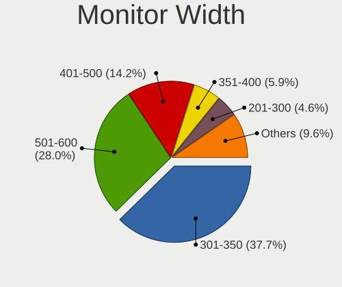

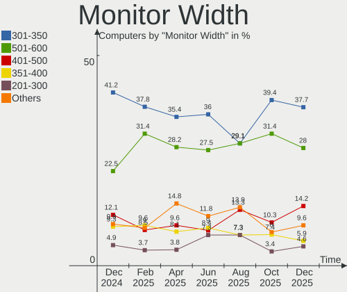

| Width in mm | Computers | Percent |
|-------------|-----------|---------|
| 301-350     | 90        | 37.66%  |
| 501-600     | 67        | 28.03%  |
| 401-500     | 34        | 14.23%  |
| 351-400     | 14        | 5.86%   |
| 201-300     | 11        | 4.6%    |
| 601-700     | 10        | 4.18%   |
| 901-1000    | 4         | 1.67%   |
| 1501-2000   | 3         | 1.26%   |
| 1001-1500   | 3         | 1.26%   |
| 801-900     | 1         | 0.42%   |
| 701-800     | 1         | 0.42%   |
| Unknown     | 1         | 0.42%   |

Aspect Ratio
------------

Proportional relationship between the width and the height

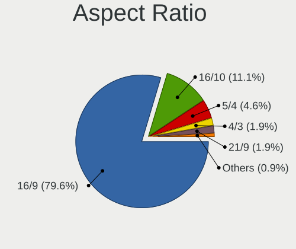

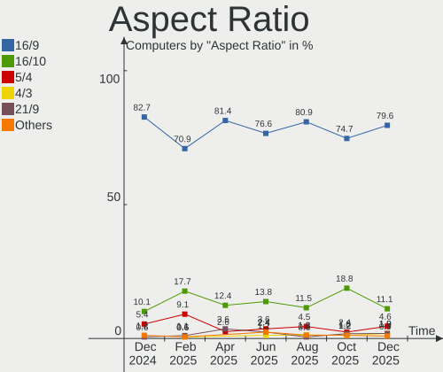

| Ratio | Computers | Percent |
|-------|-----------|---------|
| 16/9  | 172       | 79.63%  |
| 16/10 | 24        | 11.11%  |
| 5/4   | 10        | 4.63%   |
| 4/3   | 4         | 1.85%   |
| 21/9  | 4         | 1.85%   |
| 3/2   | 2         | 0.93%   |

Monitor Area
------------

Area in inch²

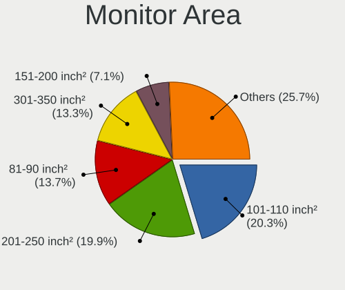

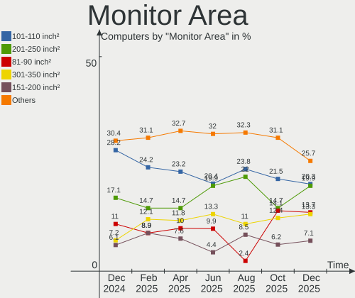

| Area in inch² | Computers | Percent |
|----------------|-----------|---------|
| 101-110        | 49        | 20.33%  |
| 201-250        | 48        | 19.92%  |
| 81-90          | 33        | 13.69%  |
| 301-350        | 32        | 13.28%  |
| 151-200        | 17        | 7.05%   |
| 141-150        | 11        | 4.56%   |
| 351-500        | 9         | 3.73%   |
| 251-300        | 8         | 3.32%   |
| More than 1000 | 6         | 2.49%   |
| 71-80          | 6         | 2.49%   |
| 121-130        | 5         | 2.07%   |
| 111-120        | 5         | 2.07%   |
| 501-1000       | 5         | 2.07%   |
| 51-60          | 2         | 0.83%   |
| 91-100         | 2         | 0.83%   |
| 61-70          | 1         | 0.41%   |
| 131-140        | 1         | 0.41%   |
| Unknown        | 1         | 0.41%   |

Pixel Density
-------------

Pixels per inch

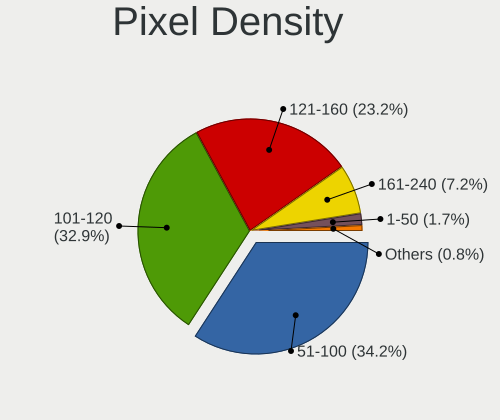

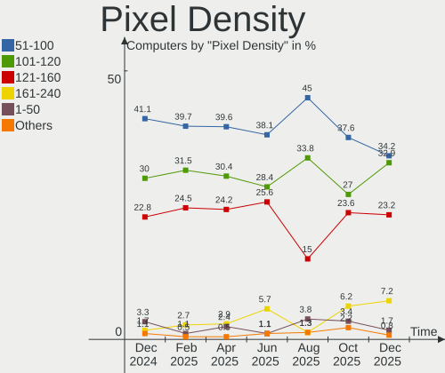

| Density       | Computers | Percent |
|---------------|-----------|---------|
| 51-100        | 81        | 34.18%  |
| 101-120       | 78        | 32.91%  |
| 121-160       | 55        | 23.21%  |
| 161-240       | 17        | 7.17%   |
| 1-50          | 4         | 1.69%   |
| More than 240 | 1         | 0.42%   |
| Unknown       | 1         | 0.42%   |

Multiple Monitors
-----------------

Total monitors connected

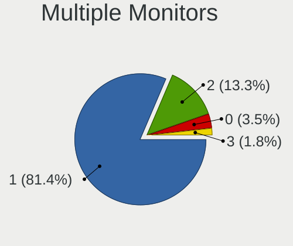

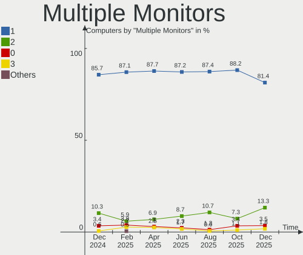

| Total | Computers | Percent |
|-------|-----------|---------|
| 1     | 184       | 81.42%  |
| 2     | 30        | 13.27%  |
| 0     | 8         | 3.54%   |
| 3     | 4         | 1.77%   |

Network
-------

Net Controller Vendor
---------------------

Controller vendors

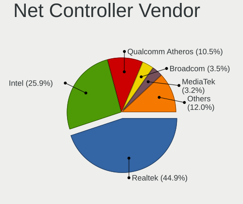

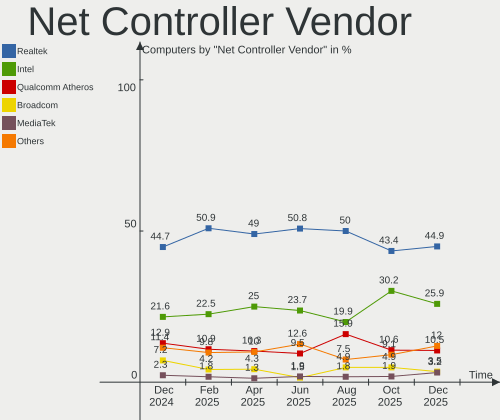

| Vendor                          | Computers | Percent |
|---------------------------------|-----------|---------|
| Realtek Semiconductor           | 154       | 44.9%   |
| Intel                           | 89        | 25.95%  |
| Qualcomm Atheros                | 36        | 10.5%   |
| Broadcom                        | 12        | 3.5%    |
| MediaTek                        | 11        | 3.21%   |
| Ralink Technology               | 7         | 2.04%   |
| ASIX Electronics                | 6         | 1.75%   |
| Broadcom Limited                | 5         | 1.46%   |
| Marvell Technology Group        | 4         | 1.17%   |
| TP-Link                         | 3         | 0.87%   |
| Ralink                          | 3         | 0.87%   |
| Xiaomi                          | 2         | 0.58%   |
| Dell                            | 2         | 0.58%   |
| ZTE WCDMA Technologies MSM      | 1         | 0.29%   |
| Samsung Electronics             | 1         | 0.29%   |
| Qualcomm Technologies           | 1         | 0.29%   |
| Qualcomm Atheros Communications | 1         | 0.29%   |
| NetGear                         | 1         | 0.29%   |
| Loongson Technology             | 1         | 0.29%   |
| JMicron Technology              | 1         | 0.29%   |
| Edimax Technology               | 1         | 0.29%   |
| aicsemi                         | 1         | 0.29%   |

Net Controller Model
--------------------

Controller models

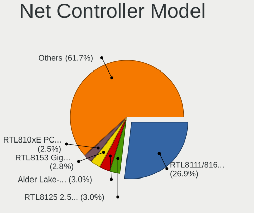

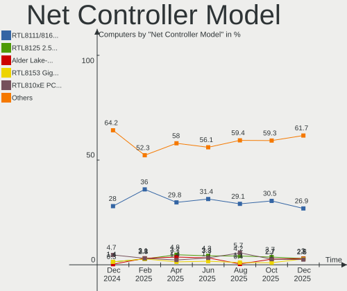

| Model                                                                  | Computers | Percent |
|------------------------------------------------------------------------|-----------|---------|
| Realtek RTL8111/8168/8211/8411 PCI Express Gigabit Ethernet Controller | 106       | 26.9%   |
| Realtek RTL8125 2.5GbE Controller                                      | 12        | 3.05%   |
| Intel Alder Lake-P PCH CNVi WiFi                                       | 12        | 3.05%   |
| Realtek RTL8153 Gigabit Ethernet Adapter                               | 11        | 2.79%   |
| Realtek RTL810xE PCI Express Fast Ethernet controller                  | 10        | 2.54%   |
| Intel Wi-Fi 6E(802.11ax) AX210/AX1675* 2x2 [Typhoon Peak]              | 9         | 2.28%   |
| Qualcomm Atheros AR9285 Wireless Network Adapter (PCI-Express)         | 7         | 1.78%   |
| Intel Wi-Fi 6 AX201                                                    | 7         | 1.78%   |
| Intel Wi-Fi 6 AX200                                                    | 7         | 1.78%   |
| Qualcomm Atheros AR9485 Wireless Network Adapter                       | 6         | 1.52%   |
| Qualcomm Atheros AR8131 Gigabit Ethernet                               | 6         | 1.52%   |
| ASIX AX88179 Gigabit Ethernet                                          | 6         | 1.52%   |
| Realtek RTL8821CE 802.11ac PCIe Wireless Network Adapter               | 5         | 1.27%   |
| Ralink MT7601U Wireless Adapter                                        | 5         | 1.27%   |
| Qualcomm Atheros QCA9377 802.11ac Wireless Network Adapter             | 5         | 1.27%   |
| Intel Wireless 7265                                                    | 5         | 1.27%   |
| Realtek RTL8822CE 802.11ac PCIe Wireless Network Adapter               | 4         | 1.02%   |
| Realtek RTL8723BE PCIe Wireless Network Adapter                        | 4         | 1.02%   |
| Realtek RTL8152 Fast Ethernet Adapter                                  | 4         | 1.02%   |
| Realtek 802.11ac NIC                                                   | 4         | 1.02%   |
| Intel Ethernet Connection (2) I219-LM                                  | 4         | 1.02%   |
| Intel Ethernet Connection (16) I219-V                                  | 4         | 1.02%   |
| Intel Ethernet Connection (13) I219-V                                  | 4         | 1.02%   |
| Realtek RTL8852BE PCIe 802.11ax Wireless Network Controller            | 3         | 0.76%   |
| MediaTek MT7921 802.11ax PCIe Wireless Network Adapter [Filogic 330]   | 3         | 0.76%   |
| MediaTek MT7902 802.11ax PCIe Wireless Network Adapter [Filogic 310]   | 3         | 0.76%   |
| Intel Wireless 3165                                                    | 3         | 0.76%   |
| Intel Ethernet Controller I226-V                                       | 3         | 0.76%   |
| Intel Ethernet Connection (2) I219-V                                   | 3         | 0.76%   |
| Intel Dual Band Wireless-AC 3168NGW [Stone Peak]                       | 3         | 0.76%   |
| Intel Alder Lake-N PCH CNVi WiFi                                       | 3         | 0.76%   |
| Xiaomi Mi/Redmi series (RNDIS + ADB)                                   | 2         | 0.51%   |
| Realtek RTL88x2bu [AC1200 Techkey]                                     | 2         | 0.51%   |
| Realtek RTL8126 5GbE Controller                                        | 2         | 0.51%   |
| Qualcomm Atheros QCA9565 / AR9565 Wireless Network Adapter             | 2         | 0.51%   |
| Qualcomm Atheros Attansic L1 Gigabit Ethernet                          | 2         | 0.51%   |
| Qualcomm Atheros AR8152 v2.0 Fast Ethernet                             | 2         | 0.51%   |
| Qualcomm Atheros AR8151 v2.0 Gigabit Ethernet                          | 2         | 0.51%   |
| MediaTek MT7922 802.11ax PCI Express Wireless Network Adapter          | 2         | 0.51%   |
| Intel Wireless 8265 / 8275                                             | 2         | 0.51%   |

Wireless Vendor
---------------

Wireless vendors

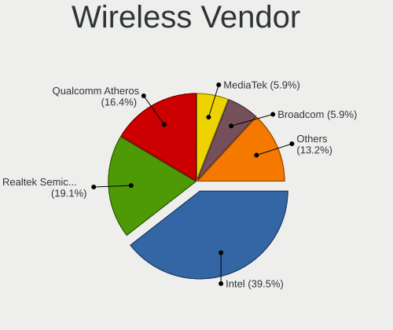

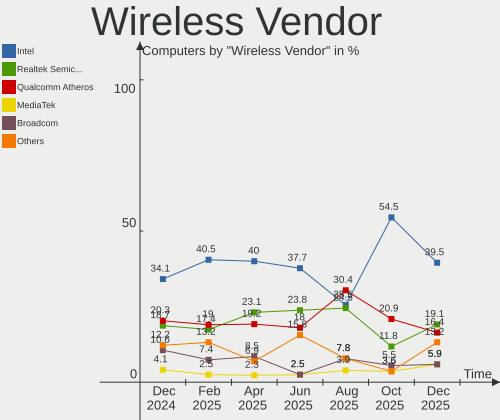

| Vendor                          | Computers | Percent |
|---------------------------------|-----------|---------|
| Intel                           | 60        | 39.47%  |
| Realtek Semiconductor           | 29        | 19.08%  |
| Qualcomm Atheros                | 25        | 16.45%  |
| MediaTek                        | 9         | 5.92%   |
| Broadcom                        | 9         | 5.92%   |
| Ralink Technology               | 7         | 4.61%   |
| TP-Link                         | 3         | 1.97%   |
| Ralink                          | 3         | 1.97%   |
| Dell                            | 2         | 1.32%   |
| Broadcom Limited                | 2         | 1.32%   |
| Qualcomm Atheros Communications | 1         | 0.66%   |
| NetGear                         | 1         | 0.66%   |
| Edimax Technology               | 1         | 0.66%   |

Wireless Model
--------------

Wireless models

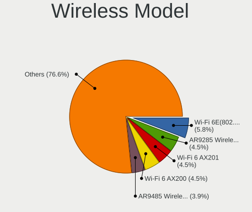

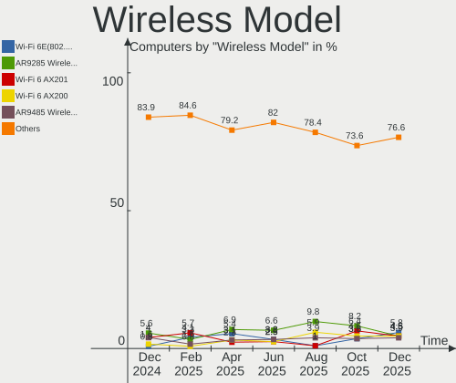

| Model                                                                | Computers | Percent |
|----------------------------------------------------------------------|-----------|---------|
| Intel Wi-Fi 6E(802.11ax) AX210/AX1675* 2x2 [Typhoon Peak]            | 9         | 5.84%   |
| Qualcomm Atheros AR9285 Wireless Network Adapter (PCI-Express)       | 7         | 4.55%   |
| Intel Wi-Fi 6 AX201                                                  | 7         | 4.55%   |
| Intel Wi-Fi 6 AX200                                                  | 7         | 4.55%   |
| Qualcomm Atheros AR9485 Wireless Network Adapter                     | 6         | 3.9%    |
| Realtek RTL8821CE 802.11ac PCIe Wireless Network Adapter             | 5         | 3.25%   |
| Ralink MT7601U Wireless Adapter                                      | 5         | 3.25%   |
| Qualcomm Atheros QCA9377 802.11ac Wireless Network Adapter           | 5         | 3.25%   |
| Intel Wireless 7265                                                  | 5         | 3.25%   |
| Intel Alder Lake-P PCH CNVi WiFi                                     | 5         | 3.25%   |
| Realtek RTL8822CE 802.11ac PCIe Wireless Network Adapter             | 4         | 2.6%    |
| Realtek RTL8723BE PCIe Wireless Network Adapter                      | 4         | 2.6%    |
| Realtek 802.11ac NIC                                                 | 4         | 2.6%    |
| MediaTek MT7921 802.11ax PCIe Wireless Network Adapter [Filogic 330] | 3         | 1.95%   |
| MediaTek MT7902 802.11ax PCIe Wireless Network Adapter [Filogic 310] | 3         | 1.95%   |
| Intel Wireless 3165                                                  | 3         | 1.95%   |
| Intel Dual Band Wireless-AC 3168NGW [Stone Peak]                     | 3         | 1.95%   |
| Realtek RTL88x2bu [AC1200 Techkey]                                   | 2         | 1.3%    |
| Realtek RTL8852BE PCIe 802.11ax Wireless Network Controller          | 2         | 1.3%    |
| Qualcomm Atheros QCA9565 / AR9565 Wireless Network Adapter           | 2         | 1.3%    |
| Intel Wireless 8265 / 8275                                           | 2         | 1.3%    |
| Intel Centrino Wireless-N 130                                        | 2         | 1.3%    |
| Intel Centrino Advanced-N 6235                                       | 2         | 1.3%    |
| Intel Alder Lake-N PCH CNVi WiFi                                     | 2         | 1.3%    |
| Broadcom BCM43142 802.11b/g/n                                        | 2         | 1.3%    |
| Broadcom BCM4313 802.11bgn Wireless Network Adapter                  | 2         | 1.3%    |
| TP-Link TL-WN823N v2/v3 [Realtek RTL8192EU]                          | 1         | 0.65%   |
| TP-Link 802.11n NIC                                                  | 1         | 0.65%   |
| TP-Link 802.11ac NIC                                                 | 1         | 0.65%   |
| Realtek RTL8822BE 802.11a/b/g/n/ac WiFi adapter                      | 1         | 0.65%   |
| Realtek RTL8811AU 802.11a/b/g/n/ac WLAN Adapter                      | 1         | 0.65%   |
| Realtek RTL8192EU 802.11b/g/n WLAN Adapter                           | 1         | 0.65%   |
| Realtek RTL8188GU 802.11n WLAN Adapter (After Modeswitch)            | 1         | 0.65%   |
| Realtek RTL8188ETV Wireless LAN 802.11n Network Adapter              | 1         | 0.65%   |
| Realtek RTL8188EE Wireless Network Adapter                           | 1         | 0.65%   |
| Realtek RTL8188CE 802.11b/g/n WiFi Adapter                           | 1         | 0.65%   |
| Realtek RTL8187SE Wireless LAN Controller                            | 1         | 0.65%   |
| Realtek RTL-8185 IEEE 802.11a/b/g Wireless LAN Controller            | 1         | 0.65%   |
| Realtek 802.11n WLAN Adapter                                         | 1         | 0.65%   |
| Ralink RT5370 Wireless Adapter                                       | 1         | 0.65%   |

Ethernet Vendor
---------------

Ethernet vendors

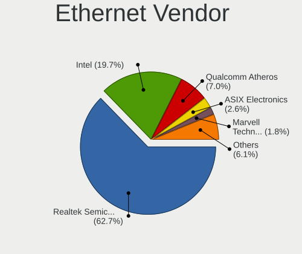

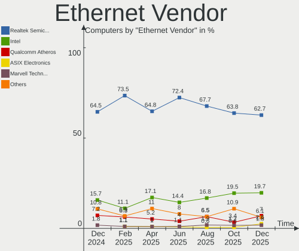

| Vendor                   | Computers | Percent |
|--------------------------|-----------|---------|
| Realtek Semiconductor    | 143       | 62.72%  |
| Intel                    | 45        | 19.74%  |
| Qualcomm Atheros         | 16        | 7.02%   |
| ASIX Electronics         | 6         | 2.63%   |
| Marvell Technology Group | 4         | 1.75%   |
| Broadcom                 | 4         | 1.75%   |
| Broadcom Limited         | 3         | 1.32%   |
| Xiaomi                   | 2         | 0.88%   |
| Samsung Electronics      | 1         | 0.44%   |
| Qualcomm Technologies    | 1         | 0.44%   |
| MediaTek                 | 1         | 0.44%   |
| Loongson Technology      | 1         | 0.44%   |
| JMicron Technology       | 1         | 0.44%   |

Ethernet Model
--------------

Ethernet models

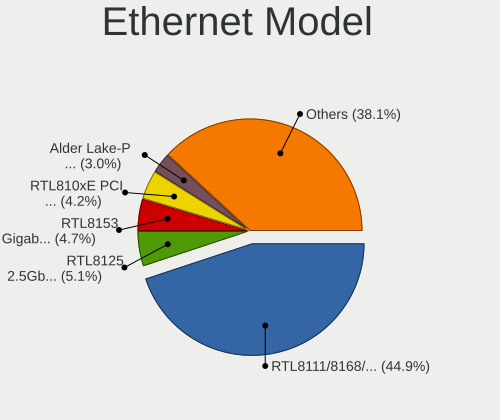

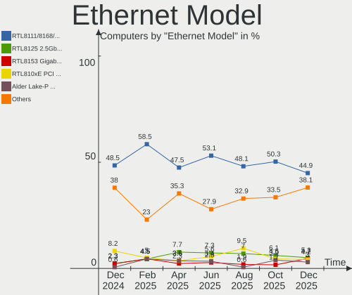

| Model                                                                          | Computers | Percent |
|--------------------------------------------------------------------------------|-----------|---------|
| Realtek RTL8111/8168/8211/8411 PCI Express Gigabit Ethernet Controller         | 106       | 44.92%  |
| Realtek RTL8125 2.5GbE Controller                                              | 12        | 5.08%   |
| Realtek RTL8153 Gigabit Ethernet Adapter                                       | 11        | 4.66%   |
| Realtek RTL810xE PCI Express Fast Ethernet controller                          | 10        | 4.24%   |
| Intel Alder Lake-P PCH CNVi WiFi                                               | 7         | 2.97%   |
| Qualcomm Atheros AR8131 Gigabit Ethernet                                       | 6         | 2.54%   |
| ASIX AX88179 Gigabit Ethernet                                                  | 6         | 2.54%   |
| Realtek RTL8152 Fast Ethernet Adapter                                          | 4         | 1.69%   |
| Intel Ethernet Connection (2) I219-LM                                          | 4         | 1.69%   |
| Intel Ethernet Connection (16) I219-V                                          | 4         | 1.69%   |
| Intel Ethernet Connection (13) I219-V                                          | 4         | 1.69%   |
| Intel Ethernet Controller I226-V                                               | 3         | 1.27%   |
| Intel Ethernet Connection (2) I219-V                                           | 3         | 1.27%   |
| Xiaomi Mi/Redmi series (RNDIS + ADB)                                           | 2         | 0.85%   |
| Realtek RTL8126 5GbE Controller                                                | 2         | 0.85%   |
| Qualcomm Atheros Attansic L1 Gigabit Ethernet                                  | 2         | 0.85%   |
| Qualcomm Atheros AR8152 v2.0 Fast Ethernet                                     | 2         | 0.85%   |
| Qualcomm Atheros AR8151 v2.0 Gigabit Ethernet                                  | 2         | 0.85%   |
| Intel WiMAX Connection 2400m                                                   | 2         | 0.85%   |
| Intel Ethernet Connection I217-LM                                              | 2         | 0.85%   |
| Samsung Galaxy series, misc. (tethering mode)                                  | 1         | 0.42%   |
| Realtek RTL8922AE 802.11be PCIe Wireless Network Adapter                       | 1         | 0.42%   |
| Realtek RTL8852CE PCIe 802.11ax Wireless Network Controller                    | 1         | 0.42%   |
| Realtek RTL8852BE PCIe 802.11ax Wireless Network Controller                    | 1         | 0.42%   |
| Realtek RTL-8100/8101L/8139 PCI Fast Ethernet Adapter                          | 1         | 0.42%   |
| Realtek Killer E3000 2.5GbE Controller                                         | 1         | 0.42%   |
| Realtek Killer E2600 GbE Controller                                            | 1         | 0.42%   |
| Qualcomm WCN785x Wi-Fi 7(802.11be) 320MHz 2x2 [FastConnect 7800]               | 1         | 0.42%   |
| Qualcomm Atheros Killer E220x Gigabit Ethernet Controller                      | 1         | 0.42%   |
| Qualcomm Atheros AR8162 Fast Ethernet                                          | 1         | 0.42%   |
| Qualcomm Atheros AR8161 Gigabit Ethernet                                       | 1         | 0.42%   |
| Qualcomm Atheros AR8152 v1.1 Fast Ethernet                                     | 1         | 0.42%   |
| MediaTek MT7922 802.11ax PCI Express Wireless Network Adapter                  | 1         | 0.42%   |
| Marvell Group Yukon Optima 88E8059 [PCIe Gigabit Ethernet Controller with AVB] | 1         | 0.42%   |
| Marvell Group 88E8058 PCI-E Gigabit Ethernet Controller                        | 1         | 0.42%   |
| Marvell Group 88E8056 PCI-E Gigabit Ethernet Controller                        | 1         | 0.42%   |
| Marvell Group 88E8001 Gigabit Ethernet Controller                              | 1         | 0.42%   |
| Loongson 2K2000 / 7A2000 Chipset Gigabit Ethernet Controller                   | 1         | 0.42%   |
| JMicron JMC250 PCI Express Gigabit Ethernet Controller                         | 1         | 0.42%   |
| Intel I350 Gigabit Network Connection                                          | 1         | 0.42%   |

Net Controller Kind
-------------------

Ethernet, WiFi or modem

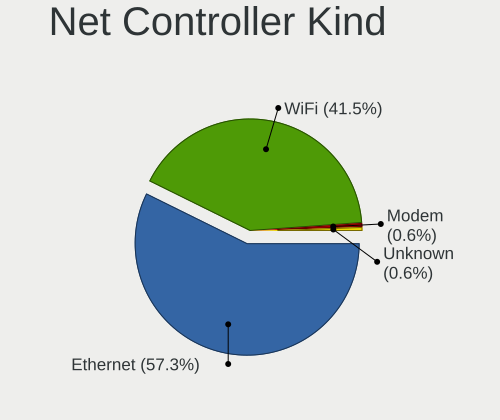

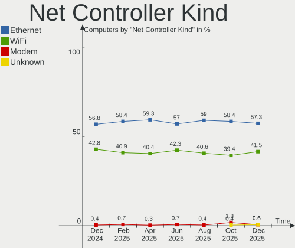

| Kind     | Computers | Percent |
|----------|-----------|---------|
| Ethernet | 200       | 57.31%  |
| WiFi     | 145       | 41.55%  |
| Modem    | 2         | 0.57%   |
| Unknown  | 2         | 0.57%   |

Used Controller
---------------

Currently used network controller

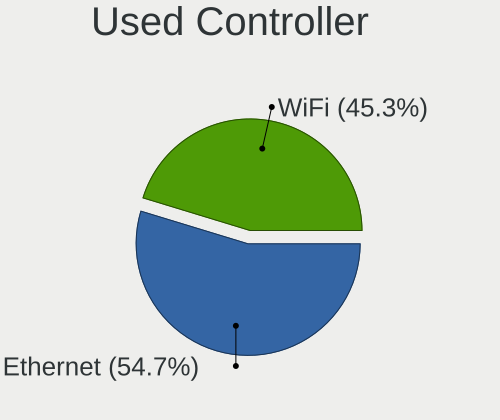

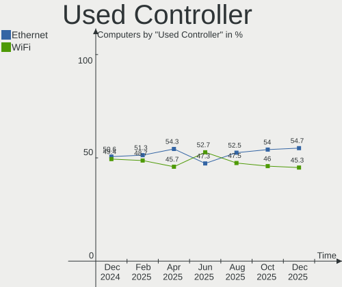

| Kind     | Computers | Percent |
|----------|-----------|---------|
| Ethernet | 122       | 54.71%  |
| WiFi     | 101       | 45.29%  |

NICs
----

Total network controllers on board

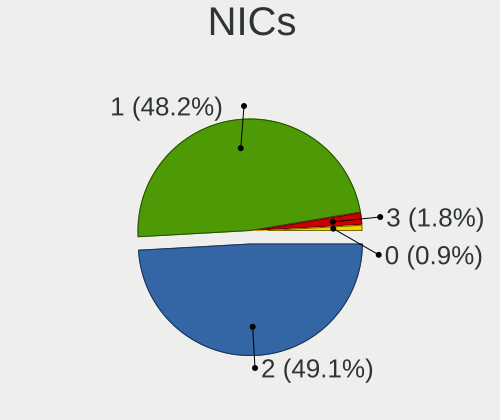

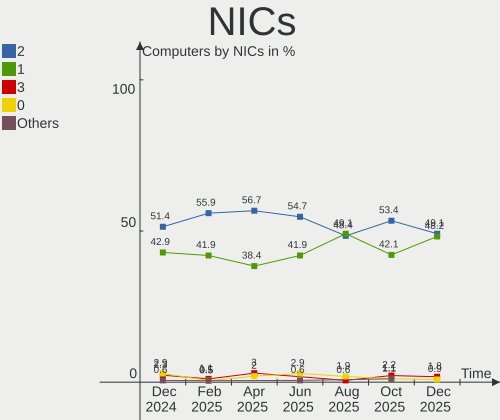

| Total | Computers | Percent |
|-------|-----------|---------|
| 2     | 111       | 49.12%  |
| 1     | 109       | 48.23%  |
| 3     | 4         | 1.77%   |
| 0     | 2         | 0.88%   |

IPv6
----

IPv6 vs IPv4

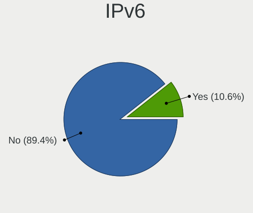

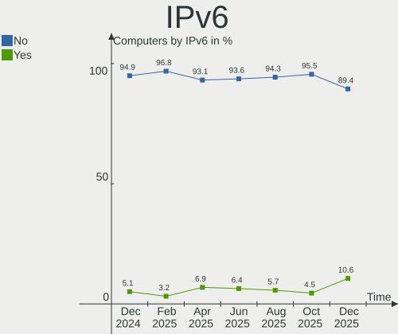

| Used | Computers | Percent |
|------|-----------|---------|
| No   | 202       | 89.38%  |
| Yes  | 24        | 10.62%  |

Bluetooth
---------

Bluetooth Vendor
----------------

Controller vendors

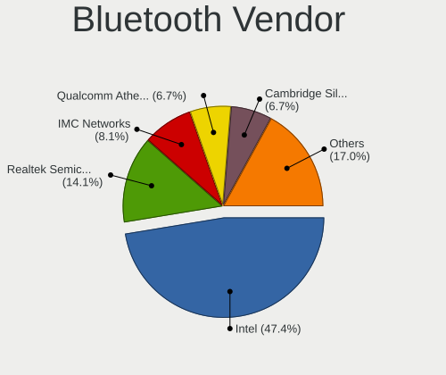

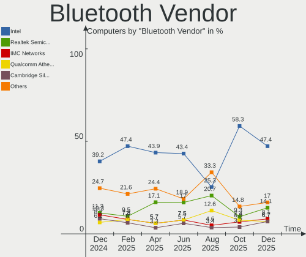

| Vendor                          | Computers | Percent |
|---------------------------------|-----------|---------|
| Intel                           | 64        | 47.41%  |
| Realtek Semiconductor           | 19        | 14.07%  |
| IMC Networks                    | 11        | 8.15%   |
| Qualcomm Atheros Communications | 9         | 6.67%   |
| Cambridge Silicon Radio         | 9         | 6.67%   |
| Foxconn / Hon Hai               | 7         | 5.19%   |
| MediaTek                        | 3         | 2.22%   |
| Apple                           | 3         | 2.22%   |
| TP-Link                         | 2         | 1.48%   |
| Lite-On Technology              | 2         | 1.48%   |
| Ralink                          | 1         | 0.74%   |
| Hewlett-Packard                 | 1         | 0.74%   |
| Broadcom                        | 1         | 0.74%   |
| ASUSTek Computer                | 1         | 0.74%   |
| Actions                         | 1         | 0.74%   |
| Unknown                         | 1         | 0.74%   |

Bluetooth Model
---------------

Controller models

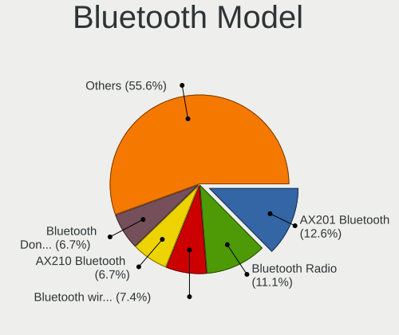

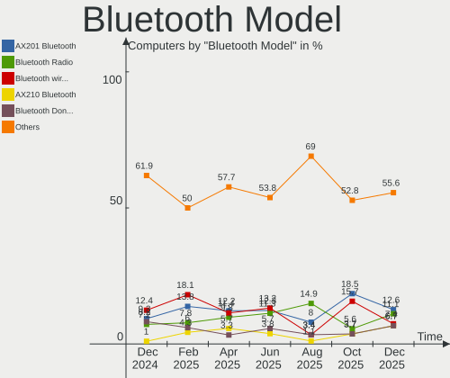

| Model                                               | Computers | Percent |
|-----------------------------------------------------|-----------|---------|
| Intel AX201 Bluetooth                               | 17        | 12.59%  |
| Realtek Bluetooth Radio                             | 15        | 11.11%  |
| Intel Bluetooth wireless interface                  | 10        | 7.41%   |
| Intel AX210 Bluetooth                               | 9         | 6.67%   |
| Cambridge Silicon Radio Bluetooth Dongle (HCI mode) | 9         | 6.67%   |
| Intel Bluetooth Device                              | 7         | 5.19%   |
| Intel Bluetooth 9460/9560 Jefferson Peak (JfP)      | 7         | 5.19%   |
| Intel AX200 Bluetooth                               | 7         | 5.19%   |
| IMC Networks Wireless_Device                        | 6         | 4.44%   |
| Qualcomm Atheros  Bluetooth Device                  | 3         | 2.22%   |
| Qualcomm Atheros AR3012 Bluetooth 4.0               | 3         | 2.22%   |
| MediaTek Wireless_Device                            | 3         | 2.22%   |
| Intel Wireless-AC 3168 Bluetooth                    | 3         | 2.22%   |
| IMC Networks Bluetooth Radio                        | 3         | 2.22%   |
| TP-Link TP-T@- UB500 Adapter                        | 2         | 1.48%   |
| Realtek 802.11ac WLAN Adapter                       | 2         | 1.48%   |
| Qualcomm Atheros AR3011 Bluetooth                   | 2         | 1.48%   |
| Lite-On Qualcomm Atheros QCA9377 Bluetooth          | 2         | 1.48%   |
| Intel Centrino Bluetooth Wireless Transceiver       | 2         | 1.48%   |
| Intel Centrino Advanced-N 6230 Bluetooth adapter    | 2         | 1.48%   |
| Foxconn / Hon Hai Bluetooth Radio                   | 2         | 1.48%   |
| Realtek  Bluetooth 4.2 Adapter                      | 1         | 0.74%   |
| Realtek Bluetooth 5.3 Radio                         | 1         | 0.74%   |
| Ralink RT3290 Bluetooth                             | 1         | 0.74%   |
| Qualcomm Atheros QCA61x4 Bluetooth 4.0              | 1         | 0.74%   |
| IMC Networks Bluetooth Device                       | 1         | 0.74%   |
| IMC Networks Atheros AR3012 Bluetooth 4.0 Adapter   | 1         | 0.74%   |
| HP Broadcom 2070 Bluetooth Combo                    | 1         | 0.74%   |
| Foxconn / Hon Hai MediaTek Bluetooth Adapter        | 1         | 0.74%   |
| Foxconn / Hon Hai Broadcom BCM20702A1 Bluetooth     | 1         | 0.74%   |
| Foxconn / Hon Hai Broadcom BCM20702 Bluetooth       | 1         | 0.74%   |
| Foxconn / Hon Hai Bluetooth Device                  | 1         | 0.74%   |
| Foxconn / Hon Hai BCM43142A0 broadcom bluetooth     | 1         | 0.74%   |
| Broadcom BCM2045 Bluetooth                          | 1         | 0.74%   |
| ASUS BT-270 Bluetooth Adapter                       | 1         | 0.74%   |
| Apple Bluetooth USB Host Controller                 | 1         | 0.74%   |
| Apple Bluetooth Host Controller                     | 1         | 0.74%   |
| Apple Bluetooth HCI                                 | 1         | 0.74%   |
| Actions general adapter                             | 1         | 0.74%   |
| Unknown                                             | 1         | 0.74%   |

Sound
-----

Sound Vendor
------------

Sound card vendors

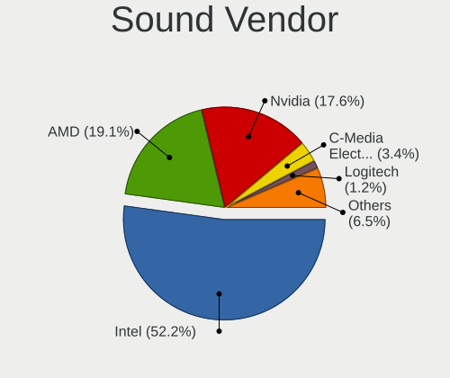

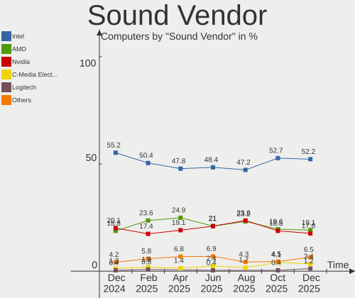

| Vendor                                       | Computers | Percent |
|----------------------------------------------|-----------|---------|
| Intel                                        | 169       | 52.16%  |
| AMD                                          | 62        | 19.14%  |
| Nvidia                                       | 57        | 17.59%  |
| C-Media Electronics                          | 11        | 3.4%    |
| Logitech                                     | 4         | 1.23%   |
| Lenovo                                       | 4         | 1.23%   |
| JMTek                                        | 2         | 0.62%   |
| ASUSTek Computer                             | 2         | 0.62%   |
| Zoran Co. Personal Media Division (Nogatech) | 1         | 0.31%   |
| Texas Instruments                            | 1         | 0.31%   |
| Samsung Electronics                          | 1         | 0.31%   |
| Roland                                       | 1         | 0.31%   |
| Plantronics                                  | 1         | 0.31%   |
| Micro Star International                     | 1         | 0.31%   |
| Loongson Technology                          | 1         | 0.31%   |
| KTMicro                                      | 1         | 0.31%   |
| Kingston Technology                          | 1         | 0.31%   |
| Jieli Technology                             | 1         | 0.31%   |
| Hewlett-Packard                              | 1         | 0.31%   |
| Elite Silicon                                | 1         | 0.31%   |
| Creative Labs                                | 1         | 0.31%   |

Sound Model
-----------

Sound card models

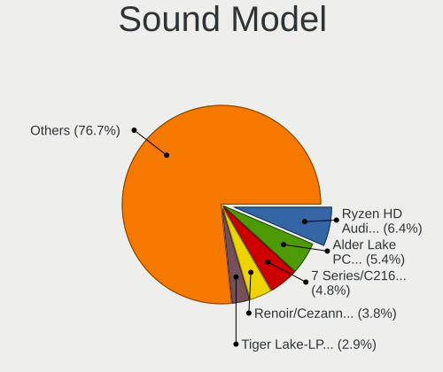

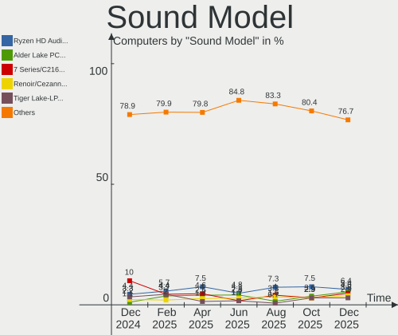

| Model                                                                      | Computers | Percent |
|----------------------------------------------------------------------------|-----------|---------|
| AMD Ryzen HD Audio Controller                                              | 24        | 6.43%   |
| Intel Alder Lake PCH-P High Definition Audio Controller                    | 20        | 5.36%   |
| Intel 7 Series/C216 Chipset Family High Definition Audio Controller        | 18        | 4.83%   |
| AMD Renoir/Cezanne HDMI/DP Audio Controller                                | 14        | 3.75%   |
| Intel Tiger Lake-LP Smart Sound Technology Audio Controller                | 11        | 2.95%   |
| Intel 6 Series/C200 Series Chipset Family High Definition Audio Controller | 11        | 2.95%   |
| Intel 8 Series/C220 Series Chipset High Definition Audio Controller        | 9         | 2.41%   |
| Intel 100 Series/C230 Series Chipset Family HD Audio Controller            | 9         | 2.41%   |
| Nvidia GF108 High Definition Audio Controller                              | 8         | 2.14%   |
| Intel NM10/ICH7 Family High Definition Audio Controller                    | 8         | 2.14%   |
| Intel 5 Series/3400 Series Chipset High Definition Audio                   | 7         | 1.88%   |
| C-Media Electronics Audio Adapter (Unitek Y-247A)                          | 7         | 1.88%   |
| AMD FCH Azalia Controller                                                  | 7         | 1.88%   |
| Nvidia High Definition Audio Controller                                    | 6         | 1.61%   |
| Intel Smart Sound Technology (SST) Audio Controller                        | 6         | 1.61%   |
| Intel 82801I (ICH9 Family) HD Audio Controller                             | 6         | 1.61%   |
| Intel 200 Series PCH HD Audio                                              | 6         | 1.61%   |
| AMD Starship/Matisse HD Audio Controller                                   | 6         | 1.61%   |
| AMD SBx00 Azalia (Intel HDA)                                               | 6         | 1.61%   |
| AMD Ellesmere HDMI Audio [Radeon RX 470/480 / 570/580/590]                 | 6         | 1.61%   |
| Nvidia GP107GL High Definition Audio Controller                            | 5         | 1.34%   |
| Nvidia GM107 High Definition Audio Controller [GeForce 940MX]              | 5         | 1.34%   |
| Intel Xeon E3-1200 v3/4th Gen Core Processor HD Audio Controller           | 5         | 1.34%   |
| Intel Sunrise Point-LP HD Audio                                            | 5         | 1.34%   |
| Intel C610/X99 series chipset HD Audio Controller                          | 5         | 1.34%   |
| AMD Radeon High Definition Audio Controller                                | 5         | 1.34%   |
| Lenovo ThinkPad USB-C Dock Audio                                           | 4         | 1.07%   |
| Intel Tiger Lake-H HD Audio Controller                                     | 4         | 1.07%   |
| Intel Alder Lake-N PCH High Definition Audio Controller                    | 4         | 1.07%   |
| AMD Family 17h (Models 00h-0fh) HD Audio Controller                        | 4         | 1.07%   |
| Nvidia TU107 GeForce GTX 1650 High Definition Audio Controller             | 3         | 0.8%    |
| Nvidia TU106 High Definition Audio Controller                              | 3         | 0.8%    |
| Nvidia GK208 HDMI/DP Audio Controller                                      | 3         | 0.8%    |
| Nvidia GA107 High Definition Audio Controller                              | 3         | 0.8%    |
| Nvidia AD107 High Definition Audio Controller                              | 3         | 0.8%    |
| Intel Raptor Lake-P/U/H cAVS                                               | 3         | 0.8%    |
| Intel Raptor Lake High Definition Audio Controller                         | 3         | 0.8%    |
| Intel Ice Lake-LP Smart Sound Technology Audio Controller                  | 3         | 0.8%    |
| Intel Broadwell-U Audio Controller                                         | 3         | 0.8%    |
| Intel Atom Processor Z36xxx/Z37xxx Series High Definition Audio Controller | 3         | 0.8%    |

Memory
------

Memory Vendor
-------------

Memory module vendors

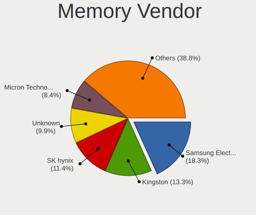

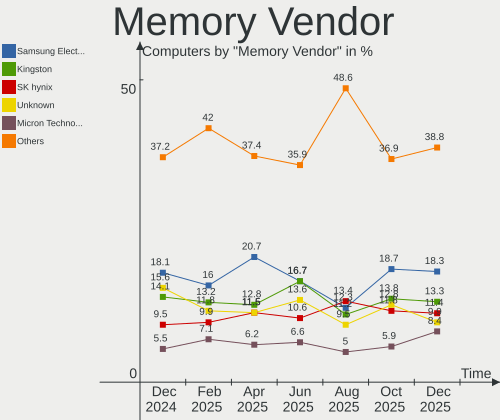

| Vendor                       | Computers | Percent |
|------------------------------|-----------|---------|
| Samsung Electronics          | 48        | 18.25%  |
| Kingston                     | 35        | 13.31%  |
| SK hynix                     | 30        | 11.41%  |
| Unknown                      | 26        | 9.89%   |
| Micron Technology            | 22        | 8.37%   |
| Crucial                      | 12        | 4.56%   |
| A-DATA Technology            | 11        | 4.18%   |
| Corsair                      | 9         | 3.42%   |
| Unknown                      | 9         | 3.42%   |
| Patriot                      | 7         | 2.66%   |
| AMD                          | 7         | 2.66%   |
| Ramaxel Technology           | 5         | 1.9%    |
| Shenzhen Longsys             | 3         | 1.14%   |
| Nanya Technology             | 3         | 1.14%   |
| Hikvision                    | 3         | 1.14%   |
| Gold Key                     | 3         | 1.14%   |
| G.Skill                      | 3         | 1.14%   |
| GOODRAM                      | 2         | 0.76%   |
| Foxline                      | 2         | 0.76%   |
| Apacer                       | 2         | 0.76%   |
| Wodposit                     | 1         | 0.38%   |
| Unknown (ABCD)               | 1         | 0.38%   |
| Unknown (0x0CAB)             | 1         | 0.38%   |
| Unknown (0x0BEC)             | 1         | 0.38%   |
| Unknown (0x0B45)             | 1         | 0.38%   |
| Team                         | 1         | 0.38%   |
| Smart                        | 1         | 0.38%   |
| Shenzhen Shi Bolunshuai      | 1         | 0.38%   |
| PUSKILL                      | 1         | 0.38%   |
| Patriot Memory (PDP Systems) | 1         | 0.38%   |
| Patriot Memory               | 1         | 0.38%   |
| Kllisre                      | 1         | 0.38%   |
| Kingmax                      | 1         | 0.38%   |
| Juhor                        | 1         | 0.38%   |
| Hikstorage                   | 1         | 0.38%   |
| Elpida                       | 1         | 0.38%   |
| ChangXin Memory              | 1         | 0.38%   |
| Avant                        | 1         | 0.38%   |
| Atermiter                    | 1         | 0.38%   |
| Ankowall                     | 1         | 0.38%   |

Memory Model
------------

Memory module models

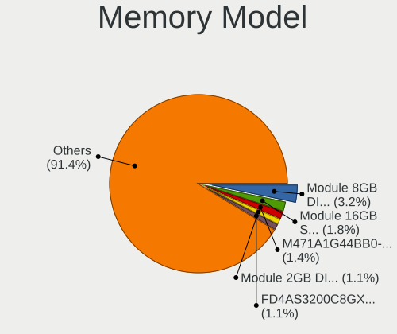

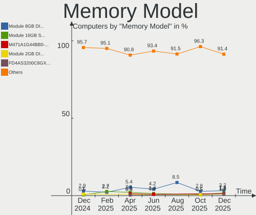

| Model                                                        | Computers | Percent |
|--------------------------------------------------------------|-----------|---------|
| Unknown                                                      | 9         | 3.24%   |
| SK hynix RAM Module 16GB SODIMM DDR4 3200MT/s                | 5         | 1.8%    |
| Samsung RAM M471A1G44BB0-CWE 8GB SODIMM DDR4 3200MT/s        | 4         | 1.44%   |
| Unknown RAM Module 2GB DIMM DDR2 800MT/s                     | 3         | 1.08%   |
| Shenzhen Longsys RAM FD4AS3200C8GXE 8GB SODIMM DDR4 3200MT/s | 3         | 1.08%   |
| Samsung RAM M471A1K43CB1-CTD 8GB SODIMM DDR4 3200MT/s        | 3         | 1.08%   |
| Ramaxel RAM RMSA3310MF96HAF-3200 8GB SODIMM DDR4 3200MT/s    | 3         | 1.08%   |
| Kingston RAM SW32D4S2S8HDH-8 8GB SODIMM DDR4 3200MT/s        | 3         | 1.08%   |
| Unknown RAM Module 4GB DIMM SDRAM                            | 2         | 0.72%   |
| Unknown RAM Module 4GB DIMM 1333MT/s                         | 2         | 0.72%   |
| Unknown RAM Module 2GB DIMM 800MT/s                          | 2         | 0.72%   |
| Unknown RAM Module 2GB DIMM 1333MT/s                         | 2         | 0.72%   |
| Unknown RAM Module 1GB SODIMM DDR2 533MT/s                   | 2         | 0.72%   |
| Samsung RAM Module 3GB Row Of Chips LPDDR5 6400MT/s          | 2         | 0.72%   |
| Samsung RAM M471B5773CHS-CH9 2GB SODIMM DDR3 4199MT/s        | 2         | 0.72%   |
| Samsung RAM M471B5173EB0-YK0 4GB SODIMM DDR3 1600MT/s        | 2         | 0.72%   |
| Samsung RAM M471B1G73DB0-YK0 8GB SODIMM DDR3 1600MT/s        | 2         | 0.72%   |
| Samsung RAM M471A5244CB0-CWE 4GB SODIMM DDR4 3200MT/s        | 2         | 0.72%   |
| Samsung RAM M471A2G43BB2-CWE 16GB SODIMM DDR4 3200MT/s       | 2         | 0.72%   |
| Samsung RAM M471A1K43EB1-CWE 8GB SODIMM DDR4 3200MT/s        | 2         | 0.72%   |
| Patriot RAM PSD48G266681S 8GB SODIMM DDR4 2933MT/s           | 2         | 0.72%   |
| Micron RAM 4ATF51264HZ-3G2J1 4GB Row Of Chips DDR4 3200MT/s  | 2         | 0.72%   |
| Micron RAM 4ATF1G64HZ-3G2F1 8GB SODIMM DDR4 3200MT/s         | 2         | 0.72%   |
| Kingston RAM HP5189-2180-ELC 2GB DIMM DDR2 800MT/s           | 2         | 0.72%   |
| Foxline RAM FL3200D4S22-8G 8GB SODIMM DDR4 3200MT/s          | 2         | 0.72%   |
| Crucial RAM CT8G4DFS824A.C8FE 8GB DIMM DDR4 3000MT/s         | 2         | 0.72%   |
| A-DATA RAM Module 16GB SODIMM DDR4 3200MT/s                  | 2         | 0.72%   |
| Wodposit RAM WPBH32D408SWD-8G 8GB SODIMM DDR4 3200MT/s       | 1         | 0.36%   |
| Unknown RAM Module 8GB SODIMM DDR3 1600MT/s                  | 1         | 0.36%   |
| Unknown RAM Module 8GB DIMM DDR4 2400MT/s                    | 1         | 0.36%   |
| Unknown RAM Module 8GB DIMM DDR3 800MT/s                     | 1         | 0.36%   |
| Unknown RAM Module 8GB DIMM 1333MT/s                         | 1         | 0.36%   |
| Unknown RAM Module 4GB SODIMM DDR3                           | 1         | 0.36%   |
| Unknown RAM Module 4GB DIMM DDR4 2133MT/s                    | 1         | 0.36%   |
| Unknown RAM Module 4GB DIMM DDR3 1067MT/s                    | 1         | 0.36%   |
| Unknown RAM Module 4GB DIMM 1600MT/s                         | 1         | 0.36%   |
| Unknown RAM Module 2GB SODIMM DDR2 533MT/s                   | 1         | 0.36%   |
| Unknown RAM Module 2GB SODIMM DDR                            | 1         | 0.36%   |
| Unknown RAM Module 2GB SODIMM 800MT/s                        | 1         | 0.36%   |
| Unknown RAM Module 2GB DIMM SDRAM                            | 1         | 0.36%   |

Memory Kind
-----------

Memory module kinds

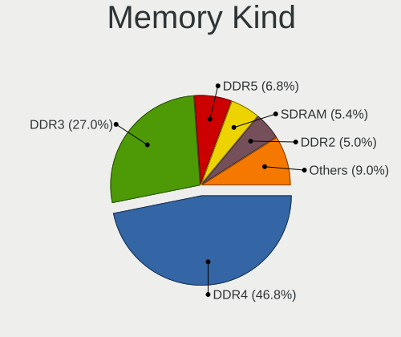

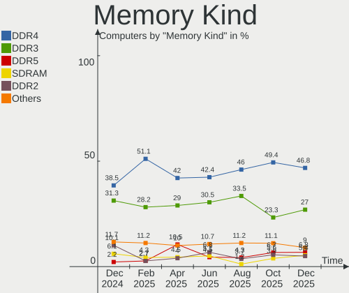

| Kind    | Computers | Percent |
|---------|-----------|---------|
| DDR4    | 104       | 46.85%  |
| DDR3    | 60        | 27.03%  |
| DDR5    | 15        | 6.76%   |
| SDRAM   | 12        | 5.41%   |
| DDR2    | 11        | 4.95%   |
| Unknown | 8         | 3.6%    |
| LPDDR5  | 5         | 2.25%   |
| LPDDR4  | 5         | 2.25%   |
| DRAM    | 1         | 0.45%   |
| DDR     | 1         | 0.45%   |

Memory Form Factor
------------------

Physical design of the memory module

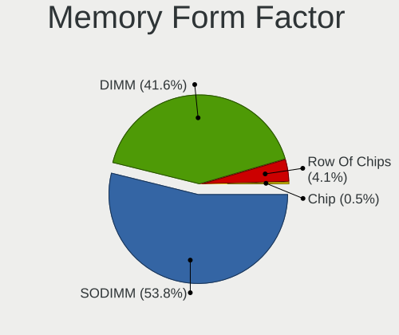

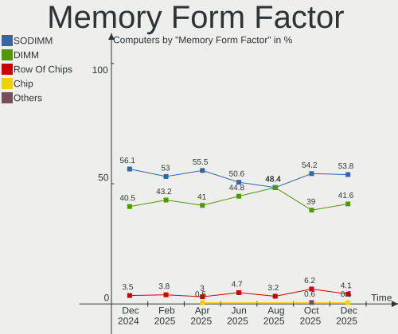

| Name         | Computers | Percent |
|--------------|-----------|---------|
| SODIMM       | 119       | 53.85%  |
| DIMM         | 92        | 41.63%  |
| Row Of Chips | 9         | 4.07%   |
| Chip         | 1         | 0.45%   |

Memory Size
-----------

Memory module size

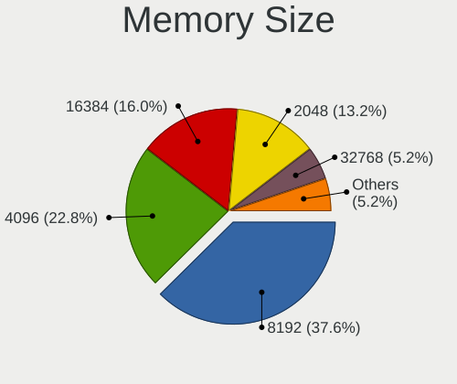

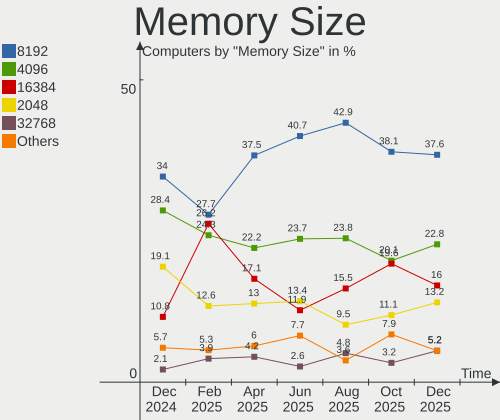

| Size  | Computers | Percent |
|-------|-----------|---------|
| 8192  | 94        | 37.6%   |
| 4096  | 57        | 22.8%   |
| 16384 | 40        | 16%     |
| 2048  | 33        | 13.2%   |
| 32768 | 13        | 5.2%    |
| 1024  | 10        | 4%      |
| 3072  | 2         | 0.8%    |
| 49152 | 1         | 0.4%    |

Memory Speed
------------

Memory module speed

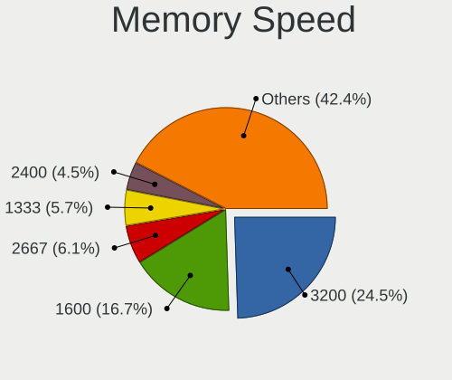

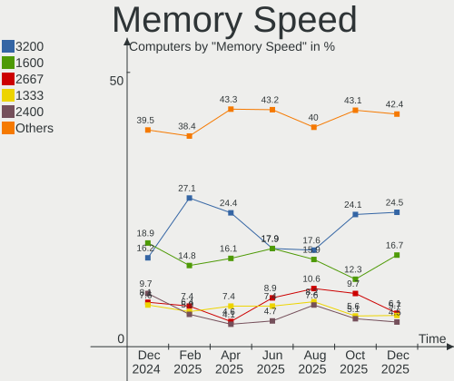

| Speed   | Computers | Percent |
|---------|-----------|---------|
| 3200    | 60        | 24.49%  |
| 1600    | 41        | 16.73%  |
| 2667    | 15        | 6.12%   |
| 1333    | 14        | 5.71%   |
| 2400    | 11        | 4.49%   |
| 800     | 10        | 4.08%   |
| 5600    | 8         | 3.27%   |
| 2133    | 6         | 2.45%   |
| Unknown | 6         | 2.45%   |
| 3400    | 5         | 2.04%   |
| 1334    | 5         | 2.04%   |
| 6400    | 4         | 1.63%   |
| 4800    | 4         | 1.63%   |
| 4199    | 4         | 1.63%   |
| 3600    | 4         | 1.63%   |
| 667     | 4         | 1.63%   |
| 6000    | 3         | 1.22%   |
| 3733    | 3         | 1.22%   |
| 2933    | 3         | 1.22%   |
| 1800    | 3         | 1.22%   |
| 533     | 3         | 1.22%   |
| 3800    | 2         | 0.82%   |
| 3000    | 2         | 0.82%   |
| 2800    | 2         | 0.82%   |
| 2666    | 2         | 0.82%   |
| 1867    | 2         | 0.82%   |
| 1648    | 2         | 0.82%   |
| 1067    | 2         | 0.82%   |
| 1066    | 2         | 0.82%   |
| 8400    | 1         | 0.41%   |
| 7000    | 1         | 0.41%   |
| 5500    | 1         | 0.41%   |
| 3500    | 1         | 0.41%   |
| 3467    | 1         | 0.41%   |
| 3466    | 1         | 0.41%   |
| 3333    | 1         | 0.41%   |
| 3066    | 1         | 0.41%   |
| 2934    | 1         | 0.41%   |
| 1866    | 1         | 0.41%   |
| 1639    | 1         | 0.41%   |

Printers & scanners
-------------------

Printer Vendor
--------------

Printer device vendors

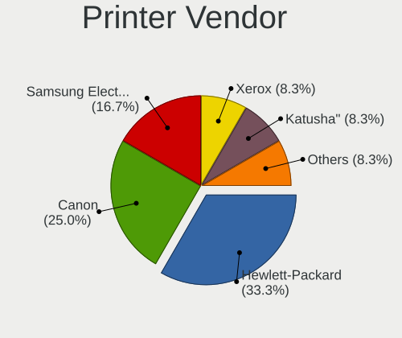

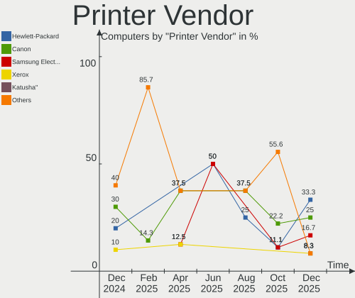

| Vendor              | Computers | Percent |
|---------------------|-----------|---------|
| Hewlett-Packard     | 4         | 33.33%  |
| Canon               | 3         | 25%     |
| Samsung Electronics | 2         | 16.67%  |
| Xerox               | 1         | 8.33%   |
| Katusha"            | 1         | 8.33%   |
| Brother Industries  | 1         | 8.33%   |

Printer Model
-------------

Printer device models

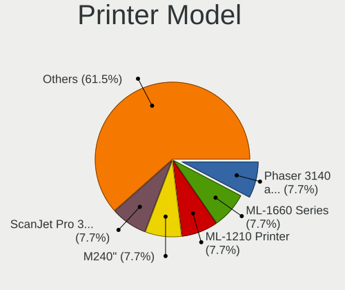

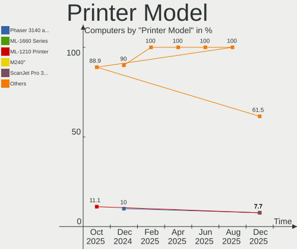

| Model                      | Computers | Percent |
|----------------------------|-----------|---------|
| Xerox Phaser 3140 and 3155 | 1         | 7.69%   |
| Samsung ML-1660 Series     | 1         | 7.69%   |
| Samsung ML-1210 Printer    | 1         | 7.69%   |
| Katusha" M240"             | 1         | 7.69%   |
| HP ScanJet Pro 3000 s3     | 1         | 7.69%   |
| HP LaserJet M507           | 1         | 7.69%   |
| HP LaserJet M406           | 1         | 7.69%   |
| HP LaserJet 400 M401dne    | 1         | 7.69%   |
| HP LaserJet 1200           | 1         | 7.69%   |
| Canon TS3600 series        | 1         | 7.69%   |
| Canon LBP7010C/7018C       | 1         | 7.69%   |
| Canon G2010 series         | 1         | 7.69%   |
| Brother HL-5250DN Printer  | 1         | 7.69%   |

Scanner Vendor
--------------

Scanner device vendors

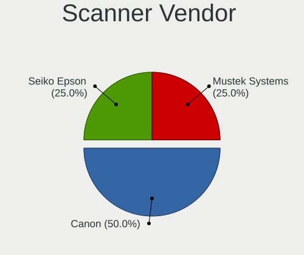

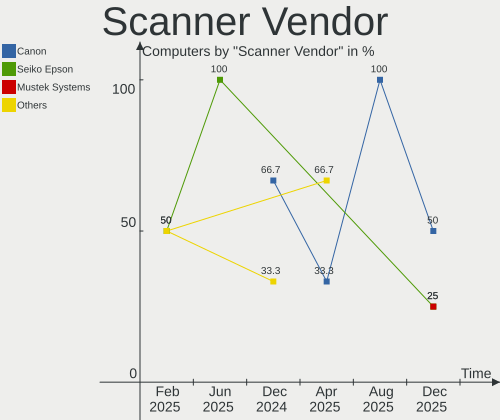

| Vendor         | Computers | Percent |
|----------------|-----------|---------|
| Canon          | 2         | 50%     |
| Seiko Epson    | 1         | 25%     |
| Mustek Systems | 1         | 25%     |

Scanner Model
-------------

Scanner device models

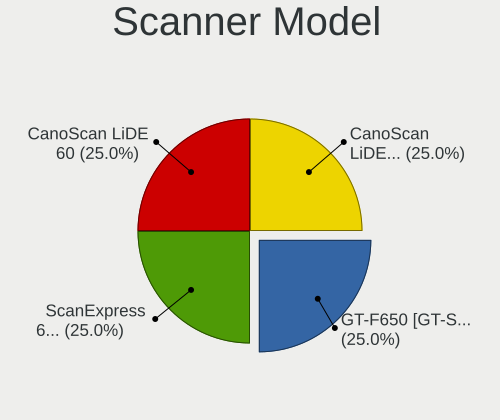

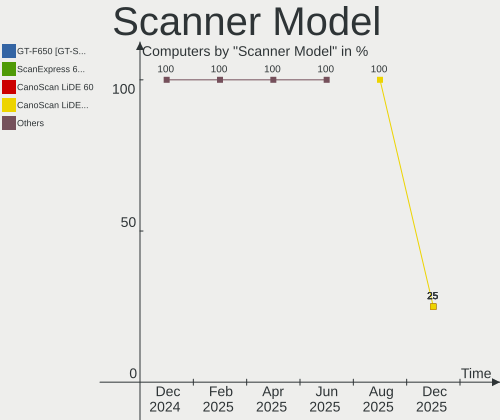

| Model                                             | Computers | Percent |
|---------------------------------------------------|-----------|---------|
| Seiko Epson GT-F650 [GT-S600/Perfection V10/V100] | 1         | 25%     |
| Mustek Systems ScanExpress 600 CU                 | 1         | 25%     |
| Canon CanoScan LiDE 60                            | 1         | 25%     |
| Canon CanoScan LiDE 220                           | 1         | 25%     |

Camera
------

Camera Vendor
-------------

Camera device vendors

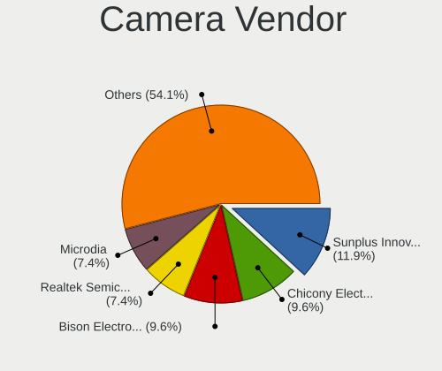

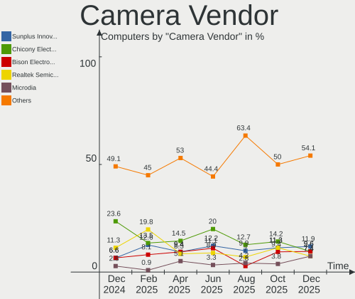

| Vendor                                 | Computers | Percent |
|----------------------------------------|-----------|---------|
| Sunplus Innovation Technology          | 16        | 11.85%  |
| Chicony Electronics                    | 13        | 9.63%   |
| Bison Electronics                      | 13        | 9.63%   |
| Realtek Semiconductor                  | 10        | 7.41%   |
| Microdia                               | 10        | 7.41%   |
| Logitech                               | 10        | 7.41%   |
| IMC Networks                           | 8         | 5.93%   |
| Syntek                                 | 6         | 4.44%   |
| CVT Electronics.Co.                    | 6         | 4.44%   |
| Sonix Technology                       | 4         | 2.96%   |
| Silicon Motion                         | 4         | 2.96%   |
| Quanta                                 | 4         | 2.96%   |
| Cheng Uei Precision Industry (Foxlink) | 4         | 2.96%   |
| Z-Star Microelectronics                | 3         | 2.22%   |
| Suyin                                  | 2         | 1.48%   |
| Samsung Electronics                    | 2         | 1.48%   |
| GEMBIRD                                | 2         | 1.48%   |
| YLX-241221-K                           | 1         | 0.74%   |
| XIFT                                   | 1         | 0.74%   |
| USB Camera CS                          | 1         | 0.74%   |
| Unknown (3730304231393831325530)       | 1         | 0.74%   |
| ShineTech                              | 1         | 0.74%   |
| Shine-optics                           | 1         | 0.74%   |
| OPPO Electronics                       | 1         | 0.74%   |
| Luxvisions Innotech Limited            | 1         | 0.74%   |
| KYE Systems (Mouse Systems)            | 1         | 0.74%   |
| Importek                               | 1         | 0.74%   |
| HYGD-220831-A                          | 1         | 0.74%   |
| Hewlett-Packard                        | 1         | 0.74%   |
| Generalplus Technology                 | 1         | 0.74%   |
| Creative Technology                    | 1         | 0.74%   |
| Aveo Technology                        | 1         | 0.74%   |
| Arkmicro Technologies                  | 1         | 0.74%   |
| Alcor Micro                            | 1         | 0.74%   |
| Acer                                   | 1         | 0.74%   |

Camera Model
------------

Camera device models

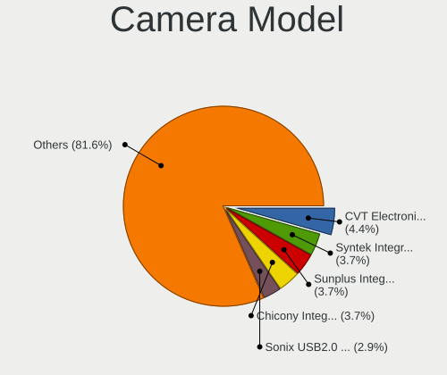

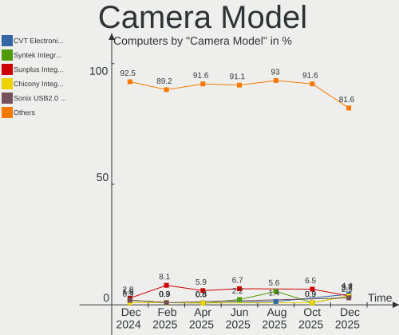

| Model                                       | Computers | Percent |
|---------------------------------------------|-----------|---------|
| CVT Electronics.Co. USB Camera              | 6         | 4.41%   |
| Syntek Integrated Camera                    | 5         | 3.68%   |
| Sunplus Integrated Camera                   | 5         | 3.68%   |
| Chicony Integrated Camera                   | 5         | 3.68%   |
| Sonix USB2.0 FHD UVC WebCam                 | 4         | 2.94%   |
| IMC Networks USB2.0 HD UVC WebCam           | 4         | 2.94%   |
| Bison Lenovo Integrated Webcam              | 4         | 2.94%   |
| Realtek USB Camera                          | 3         | 2.21%   |
| Microdia USB 2.0 Camera                     | 3         | 2.21%   |
| Logitech Webcam C270                        | 3         | 2.21%   |
| Bison Integrated Camera                     | 3         | 2.21%   |
| Sunplus USB 2.0 Camera                      | 2         | 1.47%   |
| Sunplus Hy-UXGA(B6CS)-Camera                | 2         | 1.47%   |
| Silicon Motion WebCam SC-13HDL11939N        | 2         | 1.47%   |
| Samsung Galaxy series, misc. (MTP mode)     | 2         | 1.47%   |
| Quanta ACER HD User Facing                  | 2         | 1.47%   |
| Microdia Integrated_Webcam_HD               | 2         | 1.47%   |
| Microdia Integrated Webcam                  | 2         | 1.47%   |
| Logitech Webcam C930e                       | 2         | 1.47%   |
| IMC Networks USB2.0 VGA UVC WebCam          | 2         | 1.47%   |
| GEMBIRD USB2.0 PC CAMERA                    | 2         | 1.47%   |
| Chicony HD Webcam                           | 2         | 1.47%   |
| Bison Lenovo EasyCamera                     | 2         | 1.47%   |
| Bison BisonCam,NB Pro                       | 2         | 1.47%   |
| Z-Star WebCam SCB-1900N                     | 1         | 0.74%   |
| Z-Star WebCam SC-03FFL11739P                | 1         | 0.74%   |
| Z-Star Venus USB2.0 Camera                  | 1         | 0.74%   |
| YLX-241221-K DEXP DWC-FHD04                 | 1         | 0.74%   |
| XIFT Web Camera                             | 1         | 0.74%   |
| USB Camera CS USB Camera CS                 | 1         | 0.74%   |
| Unknown (3730304231393831325530) USB Camera | 1         | 0.74%   |
| Syntek USB2.0 Camera                        | 1         | 0.74%   |
| Suyin Acer/Lenovo Webcam [CN0316]           | 1         | 0.74%   |
| Suyin Acer CrystalEye Webcam                | 1         | 0.74%   |
| Sunplus XiaoMi WebCam                       | 1         | 0.74%   |
| Sunplus MTD Camera                          | 1         | 0.74%   |
| Sunplus Hy FHD B200 Came                    | 1         | 0.74%   |
| Sunplus HP Truevision HD                    | 1         | 0.74%   |
| Sunplus HP HD Webcam [Fixed]                | 1         | 0.74%   |
| Sunplus Full HD webcam                      | 1         | 0.74%   |

Security
--------

Fingerprint Vendor
------------------

Fingerprint sensor vendors

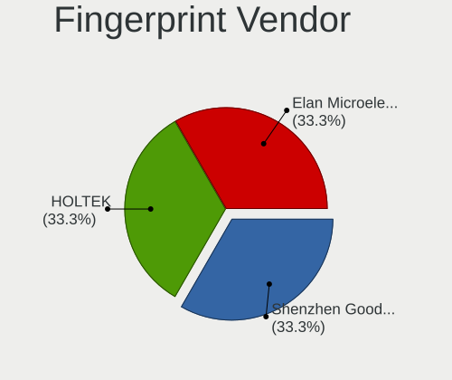

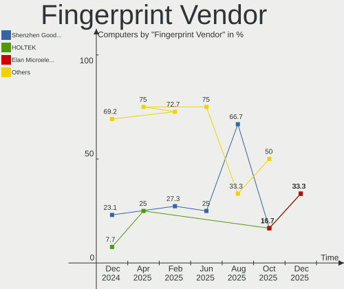

| Vendor                     | Computers | Percent |
|----------------------------|-----------|---------|
| Shenzhen Goodix Technology | 1         | 33.33%  |
| HOLTEK                     | 1         | 33.33%  |
| Elan Microelectronics      | 1         | 33.33%  |

Fingerprint Model
-----------------

Fingerprint sensor models

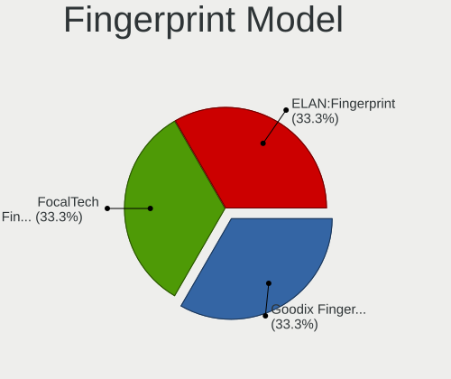

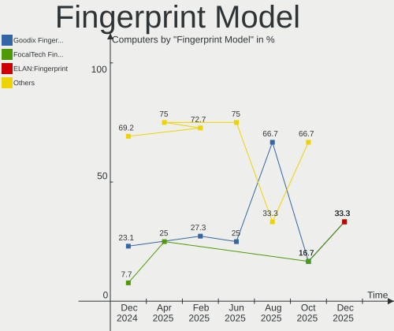

| Model                               | Computers | Percent |
|-------------------------------------|-----------|---------|
| Shenzhen Goodix  Fingerprint Device | 1         | 33.33%  |
| HOLTEK FocalTech Fingerprint Device | 1         | 33.33%  |
| Elan ELAN:Fingerprint               | 1         | 33.33%  |

Chipcard Vendor
---------------

Chipcard module vendors

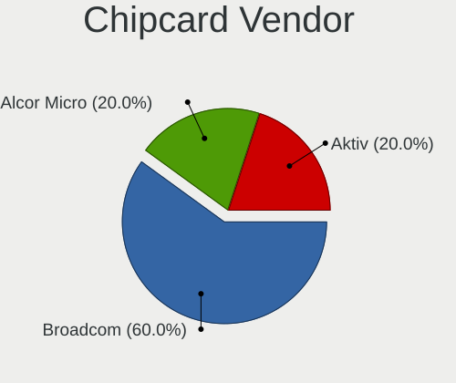

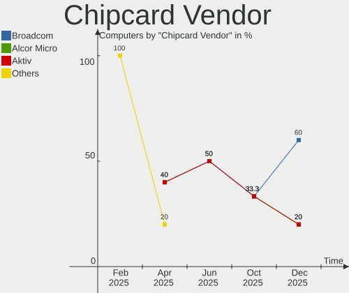

| Vendor      | Computers | Percent |
|-------------|-----------|---------|
| Broadcom    | 3         | 60%     |
| Alcor Micro | 1         | 20%     |
| Aktiv       | 1         | 20%     |

Chipcard Model
--------------

Chipcard module models

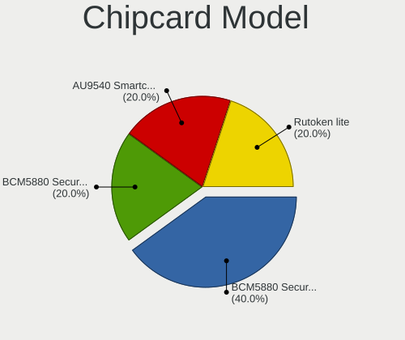

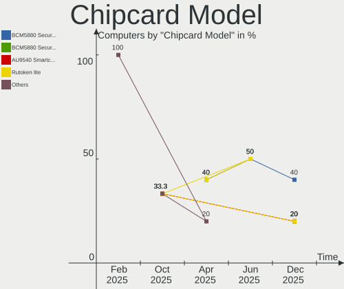

| Model                                                                        | Computers | Percent |
|------------------------------------------------------------------------------|-----------|---------|
| Broadcom BCM5880 Secure Applications Processor                               | 2         | 40%     |
| Broadcom BCM5880 Secure Applications Processor with fingerprint swipe sensor | 1         | 20%     |
| Alcor Micro AU9540 Smartcard Reader                                          | 1         | 20%     |
| Aktiv Rutoken lite                                                           | 1         | 20%     |

Unsupported
-----------

Unsupported Devices
-------------------

Total unsupported devices on board

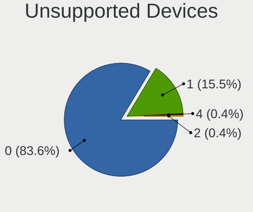

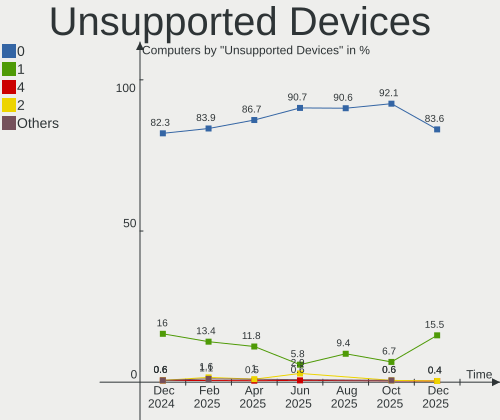

| Total | Computers | Percent |
|-------|-----------|---------|
| 0     | 189       | 83.63%  |
| 1     | 35        | 15.49%  |
| 4     | 1         | 0.44%   |
| 2     | 1         | 0.44%   |

Unsupported Device Types
------------------------

Types of unsupported devices

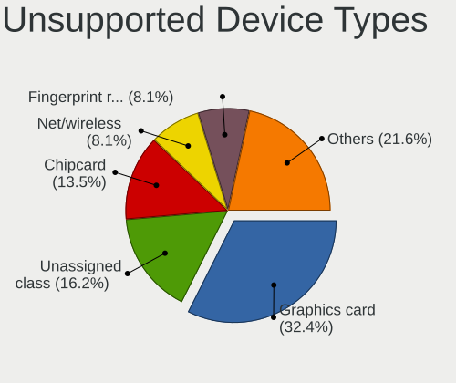

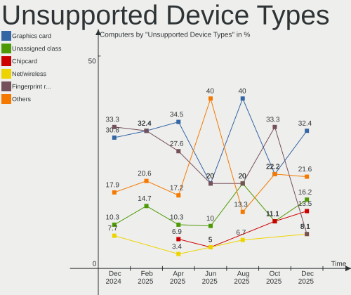

| Type                     | Computers | Percent |
|--------------------------|-----------|---------|
| Graphics card            | 12        | 32.43%  |
| Unassigned class         | 6         | 16.22%  |
| Chipcard                 | 5         | 13.51%  |
| Net/wireless             | 3         | 8.11%   |
| Fingerprint reader       | 3         | 8.11%   |
| Communication controller | 3         | 8.11%   |
| Network                  | 1         | 2.7%    |
| Net/ethernet             | 1         | 2.7%    |
| Multimedia controller    | 1         | 2.7%    |
| Camera                   | 1         | 2.7%    |
| Bluetooth                | 1         | 2.7%    |

