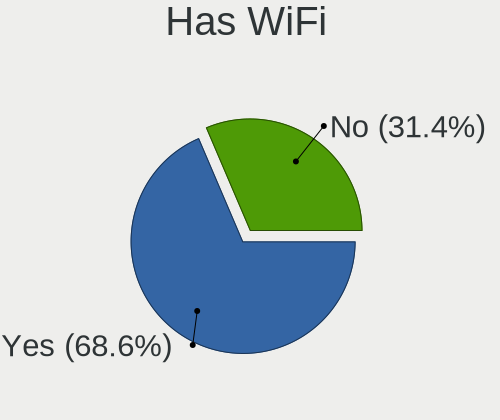
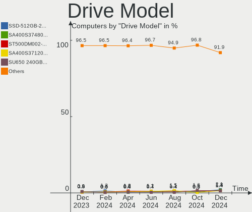
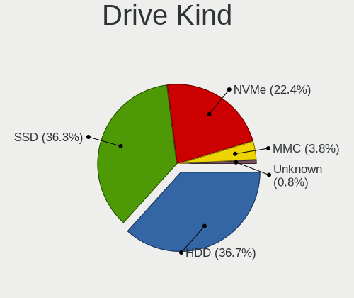

ROSA Hardware Trends
--------------------

A project to identify most popular hardware characteristics and track their change
over time based on data collected by ROSA users at https://Linux-Hardware.org.

Anyone can contribute to this report by the [hw-probe](https://github.com/linuxhw/hw-probe) tool:

    sudo -E hw-probe -all -upload

This is a report for all computer types. See also reports for [desktops](/Dist/ROSA/Desktop/README.md) and [notebooks](/Dist/ROSA/Notebook/README.md).

Full-feature report is available here: https://linux-hardware.org/?view=trends

Period: Feb, 2022.

Contents
--------

* [ System ](#system)
  - [ OS                       ](#os)
  - [ OS Family                ](#os-family)
  - [ Kernel                   ](#kernel)
  - [ Kernel Family            ](#kernel-family)
  - [ Kernel Major Ver.        ](#kernel-major-ver)
  - [ Arch                     ](#arch)
  - [ DE                       ](#de)
  - [ Display Server           ](#display-server)
  - [ Display Manager          ](#display-manager)
  - [ OS Lang                  ](#os-lang)
  - [ Boot Mode                ](#boot-mode)
  - [ Filesystem               ](#filesystem)
  - [ Part. scheme             ](#part-scheme)
  - [ Dual Boot with Linux/BSD ](#dual-boot-with-linuxbsd)
  - [ Dual Boot (Win)          ](#dual-boot-win)

* [ Board ](#board)
  - [ Vendor                   ](#vendor)
  - [ Model                    ](#model)
  - [ Model Family             ](#model-family)
  - [ MFG Year                 ](#mfg-year)
  - [ Form Factor              ](#form-factor)
  - [ Secure Boot              ](#secure-boot)
  - [ Coreboot                 ](#coreboot)
  - [ RAM Size                 ](#ram-size)
  - [ RAM Used                 ](#ram-used)
  - [ Total Drives             ](#total-drives)
  - [ Has CD-ROM               ](#has-cd-rom)
  - [ Has Ethernet             ](#has-ethernet)
  - [ Has WiFi                 ](#has-wifi)
  - [ Has Bluetooth            ](#has-bluetooth)

* [ Location ](#location)
  - [ Country                  ](#country)
  - [ City                     ](#city)

* [ Drives ](#drives)
  - [ Drive Vendor             ](#drive-vendor)
  - [ Drive Model              ](#drive-model)
  - [ HDD Vendor               ](#hdd-vendor)
  - [ SSD Vendor               ](#ssd-vendor)
  - [ Drive Kind               ](#drive-kind)
  - [ Drive Connector          ](#drive-connector)
  - [ Drive Size               ](#drive-size)
  - [ Space Total              ](#space-total)
  - [ Space Used               ](#space-used)
  - [ Malfunc. Drives          ](#malfunc-drives)
  - [ Malfunc. Drive Vendor    ](#malfunc-drive-vendor)
  - [ Malfunc. HDD Vendor      ](#malfunc-hdd-vendor)
  - [ Malfunc. Drive Kind      ](#malfunc-drive-kind)
  - [ Failed Drives            ](#failed-drives)
  - [ Failed Drive Vendor      ](#failed-drive-vendor)
  - [ Drive Status             ](#drive-status)

* [ Storage controller ](#storage-controller)
  - [ Storage Vendor           ](#storage-vendor)
  - [ Storage Model            ](#storage-model)
  - [ Storage Kind             ](#storage-kind)

* [ Processor ](#processor)
  - [ CPU Vendor               ](#cpu-vendor)
  - [ CPU Model                ](#cpu-model)
  - [ CPU Model Family         ](#cpu-model-family)
  - [ CPU Cores                ](#cpu-cores)
  - [ CPU Sockets              ](#cpu-sockets)
  - [ CPU Threads              ](#cpu-threads)
  - [ CPU Op-Modes             ](#cpu-op-modes)
  - [ CPU Microcode            ](#cpu-microcode)
  - [ CPU Microarch            ](#cpu-microarch)

* [ Graphics ](#graphics)
  - [ GPU Vendor               ](#gpu-vendor)
  - [ GPU Model                ](#gpu-model)
  - [ GPU Combo                ](#gpu-combo)
  - [ GPU Driver               ](#gpu-driver)
  - [ GPU Memory               ](#gpu-memory)

* [ Monitor ](#monitor)
  - [ Monitor Vendor           ](#monitor-vendor)
  - [ Monitor Model            ](#monitor-model)
  - [ Monitor Resolution       ](#monitor-resolution)
  - [ Monitor Diagonal         ](#monitor-diagonal)
  - [ Monitor Width            ](#monitor-width)
  - [ Aspect Ratio             ](#aspect-ratio)
  - [ Monitor Area             ](#monitor-area)
  - [ Pixel Density            ](#pixel-density)
  - [ Multiple Monitors        ](#multiple-monitors)

* [ Network ](#network)
  - [ Net Controller Vendor    ](#net-controller-vendor)
  - [ Net Controller Model     ](#net-controller-model)
  - [ Wireless Vendor          ](#wireless-vendor)
  - [ Wireless Model           ](#wireless-model)
  - [ Ethernet Vendor          ](#ethernet-vendor)
  - [ Ethernet Model           ](#ethernet-model)
  - [ Net Controller Kind      ](#net-controller-kind)
  - [ Used Controller          ](#used-controller)
  - [ NICs                     ](#nics)
  - [ IPv6                     ](#ipv6)

* [ Bluetooth ](#bluetooth)
  - [ Bluetooth Vendor         ](#bluetooth-vendor)
  - [ Bluetooth Model          ](#bluetooth-model)

* [ Sound ](#sound)
  - [ Sound Vendor             ](#sound-vendor)
  - [ Sound Model              ](#sound-model)

* [ Memory ](#memory)
  - [ Memory Vendor            ](#memory-vendor)
  - [ Memory Model             ](#memory-model)
  - [ Memory Kind              ](#memory-kind)
  - [ Memory Form Factor       ](#memory-form-factor)
  - [ Memory Size              ](#memory-size)
  - [ Memory Speed             ](#memory-speed)

* [ Printers & scanners ](#printers--scanners)
  - [ Printer Vendor           ](#printer-vendor)
  - [ Printer Model            ](#printer-model)
  - [ Scanner Vendor           ](#scanner-vendor)
  - [ Scanner Model            ](#scanner-model)

* [ Camera ](#camera)
  - [ Camera Vendor            ](#camera-vendor)
  - [ Camera Model             ](#camera-model)

* [ Security ](#security)
  - [ Fingerprint Vendor       ](#fingerprint-vendor)
  - [ Fingerprint Model        ](#fingerprint-model)
  - [ Chipcard Vendor          ](#chipcard-vendor)
  - [ Chipcard Model           ](#chipcard-model)

* [ Unsupported ](#unsupported)
  - [ Unsupported Devices      ](#unsupported-devices)
  - [ Unsupported Device Types ](#unsupported-device-types)

System
------

OS
--

Installed operating systems

| Name       | Computers | Percent |
|------------|-----------|---------|
| ROSA 12.2  | 78        | 42.16%  |
| ROSA 12.1  | 52        | 28.11%  |
| ROSA R11.1 | 47        | 25.41%  |
| ROSA 12    | 4         | 2.16%   |
| ROSA R11   | 2         | 1.08%   |
| ROSA R10   | 2         | 1.08%   |

OS Family
---------

OS without a version

| Name | Computers | Percent |
|------|-----------|---------|
| ROSA | 185       | 100%    |

Kernel
------

Version of the Linux kernel

| Version                                   | Computers | Percent |
|-------------------------------------------|-----------|---------|
| 5.10.74-generic-2rosa2021.1-x86_64        | 124       | 67.03%  |
| 5.4.83-generic-2rosa-x86_64               | 17        | 9.19%   |
| 4.15.0-desktop-122.124.1rosa-x86_64       | 7         | 3.78%   |
| 5.4.32-generic-2rosa-x86_64               | 5         | 2.7%    |
| 4.9.155-nrj-desktop-1rosa-x86_64          | 5         | 2.7%    |
| 5.4.32-generic-2rosa-i586                 | 4         | 2.16%   |
| 5.10.71-generic-1rosa2021.1-x86_64        | 4         | 2.16%   |
| 4.9.155-nrj-desktop-1rosa-i586            | 4         | 2.16%   |
| 5.16.8.xm1-1.klp-xanmod-rosa2021.1-x86_64 | 2         | 1.08%   |
| 5.10.74-generic-2rosa2021.1-i586          | 2         | 1.08%   |
| 4.15.0-desktop-45.1rosa-x86_64            | 2         | 1.08%   |
| 4.15.0-desktop-122.124.1rosa-i586         | 2         | 1.08%   |
| 5.5.19-generic-1rosa-x86_64               | 1         | 0.54%   |
| 5.4.83-generic-2rosa-i586                 | 1         | 0.54%   |
| 5.16.3.xm1-1.klp-xanmod-rosa2021.1-x86_64 | 1         | 0.54%   |
| 5.10.101-desktop-2rosa2021-x86_64         | 1         | 0.54%   |
| 4.9.95-nrj-desktop-2rosa-x86_64           | 1         | 0.54%   |
| 4.9.60-nrj-desktop-1rosa-x86_64           | 1         | 0.54%   |
| 4.15.0-desktop-94.1rosa-x86_64            | 1         | 0.54%   |

Kernel Family
-------------

Linux kernel without a distro release

| Version  | Computers | Percent |
|----------|-----------|---------|
| 5.10.74  | 126       | 68.11%  |
| 5.4.83   | 18        | 9.73%   |
| 4.15.0   | 12        | 6.49%   |
| 5.4.32   | 9         | 4.86%   |
| 4.9.155  | 9         | 4.86%   |
| 5.10.71  | 4         | 2.16%   |
| 5.16.8   | 2         | 1.08%   |
| 5.5.19   | 1         | 0.54%   |
| 5.16.3   | 1         | 0.54%   |
| 5.10.101 | 1         | 0.54%   |
| 4.9.95   | 1         | 0.54%   |
| 4.9.60   | 1         | 0.54%   |

Kernel Major Ver.
-----------------

Linux kernel major version

| Version | Computers | Percent |
|---------|-----------|---------|
| 5.10    | 131       | 70.81%  |
| 5.4     | 27        | 14.59%  |
| 4.15    | 12        | 6.49%   |
| 4.9     | 11        | 5.95%   |
| 5.16    | 3         | 1.62%   |
| 5.5     | 1         | 0.54%   |

Arch
----

OS architecture (x86_64, i586, etc.)

| Name   | Computers | Percent |
|--------|-----------|---------|
| x86_64 | 172       | 92.97%  |
| i686   | 13        | 7.03%   |

DE
--

Desktop Environment

| Name  | Computers | Percent |
|-------|-----------|---------|
| KDE5  | 99        | 53.51%  |
| GNOME | 38        | 20.54%  |
| KDE4  | 31        | 16.76%  |
| LXQt  | 14        | 7.57%   |
| XFCE  | 2         | 1.08%   |
| MATE  | 1         | 0.54%   |

Display Server
--------------

X11 or Wayland

| Name    | Computers | Percent |
|---------|-----------|---------|
| Wayland | 121       | 65.41%  |
| X11     | 64        | 34.59%  |

Display Manager
---------------

SDDM, LightDM, etc.

| Name    | Computers | Percent |
|---------|-----------|---------|
| SDDM    | 92        | 49.73%  |
| GDM     | 59        | 31.89%  |
| KDM     | 31        | 16.76%  |
| LightDM | 3         | 1.62%   |

OS Lang
-------

Language

| Lang    | Computers | Percent |
|---------|-----------|---------|
| ru_RU   | 149       | 80.54%  |
| de_DE   | 6         | 3.24%   |
| Unknown | 4         | 2.16%   |
| ru_UA   | 3         | 1.62%   |
| ro_RO   | 3         | 1.62%   |
| pl_PL   | 3         | 1.62%   |
| en_GB   | 3         | 1.62%   |
| pt_BR   | 2         | 1.08%   |
| it_IT   | 2         | 1.08%   |
| en_US   | 2         | 1.08%   |
| hu_HU   | 1         | 0.54%   |
| fr_BE   | 1         | 0.54%   |
| es_MX   | 1         | 0.54%   |
| es_ES   | 1         | 0.54%   |
| es_AR   | 1         | 0.54%   |
| en_IN   | 1         | 0.54%   |
| da_DK   | 1         | 0.54%   |
| cs_CZ   | 1         | 0.54%   |

Boot Mode
---------

EFI or BIOS

| Mode | Computers | Percent |
|------|-----------|---------|
| BIOS | 119       | 64.32%  |
| EFI  | 66        | 35.68%  |

Filesystem
----------

Type of filesystem

| Type  | Computers | Percent |
|-------|-----------|---------|
| Ext4  | 173       | 93.51%  |
| Btrfs | 10        | 5.41%   |
| F2fs  | 1         | 0.54%   |
| Aufs  | 1         | 0.54%   |

Part. scheme
------------

Scheme of partitioning

| Type    | Computers | Percent |
|---------|-----------|---------|
| MBR     | 96        | 51.89%  |
| GPT     | 88        | 47.57%  |
| Unknown | 1         | 0.54%   |

Dual Boot with Linux/BSD
------------------------

Hosting more than one Linux/BSD

| Dual boot | Computers | Percent |
|-----------|-----------|---------|
| No        | 148       | 80%     |
| Yes       | 37        | 20%     |

Dual Boot (Win)
---------------

Hosting Linux and Windows

| Dual boot | Computers | Percent |
|-----------|-----------|---------|
| No        | 107       | 57.84%  |
| Yes       | 78        | 42.16%  |

Board
-----

Vendor
------

Motherboard manufacturer

| Name                | Computers | Percent |
|---------------------|-----------|---------|
| ASUSTek Computer    | 43        | 23.24%  |
| Gigabyte Technology | 23        | 12.43%  |
| Lenovo              | 20        | 10.81%  |
| Hewlett-Packard     | 15        | 8.11%   |
| Acer                | 13        | 7.03%   |
| MSI                 | 11        | 5.95%   |
| ASRock              | 11        | 5.95%   |
| Samsung Electronics | 8         | 4.32%   |
| Dell                | 8         | 4.32%   |
| Toshiba             | 4         | 2.16%   |
| Pegatron            | 3         | 1.62%   |
| Packard Bell        | 3         | 1.62%   |
| Unknown             | 3         | 1.62%   |
| Notebook            | 2         | 1.08%   |
| Intel               | 2         | 1.08%   |
| Fujitsu Siemens     | 2         | 1.08%   |
| eMachines           | 2         | 1.08%   |
| ECS                 | 2         | 1.08%   |
| Apple               | 2         | 1.08%   |
| Sony                | 1         | 0.54%   |
| Medion              | 1         | 0.54%   |
| iRU                 | 1         | 0.54%   |
| Huanan              | 1         | 0.54%   |
| Fujitsu             | 1         | 0.54%   |
| Foxconn             | 1         | 0.54%   |
| Chuwi               | 1         | 0.54%   |
| Biostar             | 1         | 0.54%   |

Model
-----

Motherboard model

| Name                                                                                     | Computers | Percent |
|------------------------------------------------------------------------------------------|-----------|---------|
| ASUS All Series                                                                          | 4         | 2.16%   |
| Gigabyte H61M-S1                                                                         | 3         | 1.62%   |
| Unknown                                                                                  | 3         | 1.62%   |
| Lenovo IdeaPad S145-15AST 81N3                                                           | 2         | 1.08%   |
| HP Pavilion dv6                                                                          | 2         | 1.08%   |
| Gigabyte 970A-DS3P                                                                       | 2         | 1.08%   |
| ASUS P8H61-M LX3                                                                         | 2         | 1.08%   |
| ASUS P5P43TD                                                                             | 2         | 1.08%   |
| ASRock 970 Pro3 R2.0                                                                     | 2         | 1.08%   |
| Toshiba Satellite L775D                                                                  | 1         | 0.54%   |
| Toshiba Satellite C850-C3K                                                               | 1         | 0.54%   |
| Toshiba Satellite A300                                                                   | 1         | 0.54%   |
| Toshiba QOSMIO F60                                                                       | 1         | 0.54%   |
| Sony SVE1412E1RW                                                                         | 1         | 0.54%   |
| Samsung R40/R41                                                                          | 1         | 0.54%   |
| Samsung QX310/QX410/QX510/SF310/SF410/SF510                                              | 1         | 0.54%   |
| Samsung Q310                                                                             | 1         | 0.54%   |
| Samsung NC110P/NC108P/NC111P                                                             | 1         | 0.54%   |
| Samsung N150/N210/N220                                                                   | 1         | 0.54%   |
| Samsung 355V4C/355V4X/355V5C/355V5X/356V4C/356V4X/356V5C/356V5X/3445VC/3445VX/3545VC/354 | 1         | 0.54%   |
| Samsung 350V5C/351V5C/3540VC/3440VC                                                      | 1         | 0.54%   |
| Samsung 300E4Z/300E5Z/300E7Z                                                             | 1         | 0.54%   |
| Pegatron VS257AA-ACB 600-1040ru                                                          | 1         | 0.54%   |
| Pegatron G5210ru                                                                         | 1         | 0.54%   |
| Pegatron Compaq dx2400 Microtower                                                        | 1         | 0.54%   |
| Packard Bell IMEDIA S1800                                                                | 1         | 0.54%   |
| Packard Bell EasyNote TE69KB                                                             | 1         | 0.54%   |
| Packard Bell DOT S                                                                       | 1         | 0.54%   |
| Notebook WA50SRQ                                                                         | 1         | 0.54%   |
| Notebook W54_W94_W955TU,-T,-C                                                            | 1         | 0.54%   |
| MSI MS-7D18                                                                              | 1         | 0.54%   |
| MSI MS-7C52                                                                              | 1         | 0.54%   |
| MSI MS-7C02                                                                              | 1         | 0.54%   |
| MSI MS-7A40                                                                              | 1         | 0.54%   |
| MSI MS-7A33                                                                              | 1         | 0.54%   |
| MSI MS-7974                                                                              | 1         | 0.54%   |
| MSI MS-7732                                                                              | 1         | 0.54%   |
| MSI MS-7636                                                                              | 1         | 0.54%   |
| MSI MS-7346                                                                              | 1         | 0.54%   |
| MSI MPG B560 Trident A (MS-B926)                                                         | 1         | 0.54%   |
| MSI GP60 2OD                                                                             | 1         | 0.54%   |
| Medion P7612                                                                             | 1         | 0.54%   |
| Lenovo ThinkPad X240 20AL0067RT                                                          | 1         | 0.54%   |
| Lenovo ThinkPad X230 2330A17                                                             | 1         | 0.54%   |
| Lenovo ThinkPad T500 2056Y2Z                                                             | 1         | 0.54%   |
| Lenovo ThinkPad T420 42367A4                                                             | 1         | 0.54%   |
| Lenovo ThinkPad SL410 2842RN9                                                            | 1         | 0.54%   |
| Lenovo ThinkCentre M90p 5485AG8                                                          | 1         | 0.54%   |
| Lenovo ThinkCentre M715q 10VG001QRU                                                      | 1         | 0.54%   |
| Lenovo Legion 5 15ACH6A 82NW                                                             | 1         | 0.54%   |
| Lenovo IdeaPad Z580                                                                      | 1         | 0.54%   |
| Lenovo IdeaPad Z470                                                                      | 1         | 0.54%   |
| Lenovo IdeaPad S110 20126                                                                | 1         | 0.54%   |
| Lenovo IdeaPad S10-2 20027                                                               | 1         | 0.54%   |
| Lenovo IdeaPad 330-15IGM 81D1                                                            | 1         | 0.54%   |
| Lenovo IdeaPad 320-15IAP 80XR                                                            | 1         | 0.54%   |
| Lenovo IdeaPad 3 17ALC6 82KV                                                             | 1         | 0.54%   |
| Lenovo G50-70 20351                                                                      | 1         | 0.54%   |
| Lenovo E43                                                                               | 1         | 0.54%   |
| Lenovo B560                                                                              | 1         | 0.54%   |

Model Family
------------

Motherboard model prefix

| Name                  | Computers | Percent |
|-----------------------|-----------|---------|
| Lenovo IdeaPad        | 9         | 4.86%   |
| Acer Aspire           | 9         | 4.86%   |
| Lenovo ThinkPad       | 5         | 2.7%    |
| HP Pavilion           | 4         | 2.16%   |
| ASUS All              | 4         | 2.16%   |
| Toshiba Satellite     | 3         | 1.62%   |
| Gigabyte H61M-S1      | 3         | 1.62%   |
| Dell OptiPlex         | 3         | 1.62%   |
| Dell Latitude         | 3         | 1.62%   |
| ASUS VivoBook         | 3         | 1.62%   |
| Acer Extensa          | 3         | 1.62%   |
| Unknown               | 3         | 1.62%   |
| Lenovo ThinkCentre    | 2         | 1.08%   |
| HP Laptop             | 2         | 1.08%   |
| HP Compaq             | 2         | 1.08%   |
| Gigabyte 970A-DS3P    | 2         | 1.08%   |
| ASUS PRIME            | 2         | 1.08%   |
| ASUS P8H61-M          | 2         | 1.08%   |
| ASUS P5P43TD          | 2         | 1.08%   |
| ASRock 970            | 2         | 1.08%   |
| Toshiba QOSMIO        | 1         | 0.54%   |
| Sony SVE1412E1RW      | 1         | 0.54%   |
| Samsung R40           | 1         | 0.54%   |
| Samsung QX310         | 1         | 0.54%   |
| Samsung Q310          | 1         | 0.54%   |
| Samsung NC110P        | 1         | 0.54%   |
| Samsung N150          | 1         | 0.54%   |
| Samsung 355V4C        | 1         | 0.54%   |
| Samsung 350V5C        | 1         | 0.54%   |
| Samsung 300E4Z        | 1         | 0.54%   |
| Pegatron VS257AA-ACB  | 1         | 0.54%   |
| Pegatron G5210ru      | 1         | 0.54%   |
| Pegatron Compaq       | 1         | 0.54%   |
| Packard Bell IMEDIA   | 1         | 0.54%   |
| Packard Bell EasyNote | 1         | 0.54%   |
| Packard Bell DOT      | 1         | 0.54%   |
| Notebook WA50SRQ      | 1         | 0.54%   |
| Notebook W54          | 1         | 0.54%   |
| MSI MS-7D18           | 1         | 0.54%   |
| MSI MS-7C52           | 1         | 0.54%   |
| MSI MS-7C02           | 1         | 0.54%   |
| MSI MS-7A40           | 1         | 0.54%   |
| MSI MS-7A33           | 1         | 0.54%   |
| MSI MS-7974           | 1         | 0.54%   |
| MSI MS-7732           | 1         | 0.54%   |
| MSI MS-7636           | 1         | 0.54%   |
| MSI MS-7346           | 1         | 0.54%   |
| MSI MPG               | 1         | 0.54%   |
| MSI GP60              | 1         | 0.54%   |
| Medion P7612          | 1         | 0.54%   |
| Lenovo Legion         | 1         | 0.54%   |
| Lenovo G50-70         | 1         | 0.54%   |
| Lenovo E43            | 1         | 0.54%   |
| Lenovo B560           | 1         | 0.54%   |
| iRU J2335             | 1         | 0.54%   |
| Intel HuronRiver      | 1         | 0.54%   |
| Intel D945GCLF2       | 1         | 0.54%   |
| Huanan X99            | 1         | 0.54%   |
| HP ProBook            | 1         | 0.54%   |
| HP Mini               | 1         | 0.54%   |

MFG Year
--------

Motherboard manufacture year

| Year | Computers | Percent |
|------|-----------|---------|
| 2012 | 28        | 15.14%  |
| 2011 | 20        | 10.81%  |
| 2010 | 18        | 9.73%   |
| 2008 | 18        | 9.73%   |
| 2009 | 15        | 8.11%   |
| 2013 | 14        | 7.57%   |
| 2018 | 13        | 7.03%   |
| 2021 | 9         | 4.86%   |
| 2015 | 9         | 4.86%   |
| 2007 | 9         | 4.86%   |
| 2019 | 7         | 3.78%   |
| 2014 | 6         | 3.24%   |
| 2006 | 6         | 3.24%   |
| 2017 | 5         | 2.7%    |
| 2016 | 4         | 2.16%   |
| 2022 | 2         | 1.08%   |
| 2020 | 1         | 0.54%   |
| 2005 | 1         | 0.54%   |

Form Factor
-----------

Physical design of the computer

| Name        | Computers | Percent |
|-------------|-----------|---------|
| Desktop     | 90        | 48.65%  |
| Notebook    | 90        | 48.65%  |
| All in one  | 3         | 1.62%   |
| Convertible | 1         | 0.54%   |
| Mini pc     | 1         | 0.54%   |

Secure Boot
-----------

Enabled or disabled

| State    | Computers | Percent |
|----------|-----------|---------|
| Disabled | 185       | 100%    |

Coreboot
--------

Have coreboot on board

| Used | Computers | Percent |
|------|-----------|---------|
| No   | 185       | 100%    |

RAM Size
--------

Total RAM memory

| Size in GB  | Computers | Percent |
|-------------|-----------|---------|
| 3.01-4.0    | 62        | 33.51%  |
| 4.01-8.0    | 39        | 21.08%  |
| 8.01-16.0   | 32        | 17.3%   |
| 1.01-2.0    | 27        | 14.59%  |
| 16.01-24.0  | 16        | 8.65%   |
| 2.01-3.0    | 5         | 2.7%    |
| 24.01-32.0  | 2         | 1.08%   |
| 64.01-256.0 | 1         | 0.54%   |
| 0.51-1.0    | 1         | 0.54%   |

RAM Used
--------

Used RAM memory

| Used GB  | Computers | Percent |
|----------|-----------|---------|
| 1.01-2.0 | 80        | 43.24%  |
| 0.51-1.0 | 71        | 38.38%  |
| 2.01-3.0 | 19        | 10.27%  |
| 3.01-4.0 | 9         | 4.86%   |
| 4.01-8.0 | 4         | 2.16%   |
| 0.01-0.5 | 2         | 1.08%   |

Total Drives
------------

Number of drives on board

| Drives | Computers | Percent |
|--------|-----------|---------|
| 1      | 106       | 57.3%   |
| 2      | 52        | 28.11%  |
| 3      | 17        | 9.19%   |
| 4      | 9         | 4.86%   |
| 6      | 1         | 0.54%   |

Has CD-ROM
----------

Has CD-ROM on board

| Presented | Computers | Percent |
|-----------|-----------|---------|
| No        | 100       | 54.05%  |
| Yes       | 85        | 45.95%  |

Has Ethernet
------------

Has Ethernet on board

| Presented | Computers | Percent |
|-----------|-----------|---------|
| Yes       | 176       | 95.14%  |
| No        | 9         | 4.86%   |

Has WiFi
--------

Has WiFi module

| Presented | Computers | Percent |
|-----------|-----------|---------|
| Yes       | 120       | 64.86%  |
| No        | 65        | 35.14%  |

Has Bluetooth
-------------

Has Bluetooth module

| Presented | Computers | Percent |
|-----------|-----------|---------|
| No        | 113       | 61.08%  |
| Yes       | 72        | 38.92%  |

Location
--------

Country
-------

Geographic location (country)

| Country         | Computers | Percent |
|-----------------|-----------|---------|
| Russia          | 139       | 75.14%  |
| Ukraine         | 11        | 5.95%   |
| Germany         | 7         | 3.78%   |
| Poland          | 4         | 2.16%   |
| Romania         | 3         | 1.62%   |
| Spain           | 2         | 1.08%   |
| Kazakhstan      | 2         | 1.08%   |
| Italy           | 2         | 1.08%   |
| Finland         | 2         | 1.08%   |
| Czechia         | 2         | 1.08%   |
| Brazil          | 2         | 1.08%   |
| North Macedonia | 1         | 0.54%   |
| Moldova         | 1         | 0.54%   |
| Mexico          | 1         | 0.54%   |
| India           | 1         | 0.54%   |
| Hungary         | 1         | 0.54%   |
| Egypt           | 1         | 0.54%   |
| Denmark         | 1         | 0.54%   |
| Belgium         | 1         | 0.54%   |
| Argentina       | 1         | 0.54%   |

City
----

Geographic location (city)

| City             | Computers | Percent |
|------------------|-----------|---------|
| Moscow           | 20        | 10.81%  |
| St Petersburg    | 12        | 6.49%   |
| Krasnodar        | 8         | 4.32%   |
| Novosibirsk      | 7         | 3.78%   |
| Nizhniy Novgorod | 5         | 2.7%    |
| Yaroslavl        | 4         | 2.16%   |
| Voronezh         | 4         | 2.16%   |
| Saratov          | 3         | 1.62%   |
| Orenburg         | 3         | 1.62%   |
| Lipetsk          | 3         | 1.62%   |
| Krasnoyarsk      | 3         | 1.62%   |
| Yekaterinburg    | 2         | 1.08%   |
| Volgograd        | 2         | 1.08%   |
| Ufa              | 2         | 1.08%   |
| Tyumen           | 2         | 1.08%   |
| Tver             | 2         | 1.08%   |
| Samara           | 2         | 1.08%   |
| Petrozavodsk     | 2         | 1.08%   |
| Novokuznetsk     | 2         | 1.08%   |
| Munich           | 2         | 1.08%   |
| Makiivka         | 2         | 1.08%   |
| Kemerovo         | 2         | 1.08%   |
| Irkutsk          | 2         | 1.08%   |
| Brno             | 2         | 1.08%   |
| Blagoveshchensk  | 2         | 1.08%   |
| Zavitinsk        | 1         | 0.54%   |
| Zaporizhzhia     | 1         | 0.54%   |
| Yoshkar-Ola      | 1         | 0.54%   |
| Yefremov         | 1         | 0.54%   |
| Wiesbaden        | 1         | 0.54%   |
| Wegierska Gorka  | 1         | 0.54%   |
| Vladivostok      | 1         | 0.54%   |
| Vladikavkaz      | 1         | 0.54%   |
| Velikiye Luki    | 1         | 0.54%   |
| Vakhrushi        | 1         | 0.54%   |
| Tula             | 1         | 0.54%   |
| Tolyatti         | 1         | 0.54%   |
| Tashtagol        | 1         | 0.54%   |
| Tambov           | 1         | 0.54%   |
| Taldykorgan      | 1         | 0.54%   |
| Szombathely      | 1         | 0.54%   |
| Surgut           | 1         | 0.54%   |
| Studenok         | 1         | 0.54%   |
| Sterlitamak      | 1         | 0.54%   |
| Stavropol        | 1         | 0.54%   |
| Sochi            | 1         | 0.54%   |
| Smolensk         | 1         | 0.54%   |
| Simferopol       | 1         | 0.54%   |
| Severodvinsk     | 1         | 0.54%   |
| Sevastopol       | 1         | 0.54%   |
| Sehnde           | 1         | 0.54%   |
| Saransk          | 1         | 0.54%   |
| Salavat          | 1         | 0.54%   |
| Rybinsk          | 1         | 0.54%   |
| Ryazan           | 1         | 0.54%   |
| Rome             | 1         | 0.54%   |
| Radovis          | 1         | 0.54%   |
| Poznan           | 1         | 0.54%   |
| Pinneberg        | 1         | 0.54%   |
| Piatra Olt       | 1         | 0.54%   |

Drives
------

Drive Vendor
------------

Hard drive vendors

| Vendor              | Computers | Drives | Percent |
|---------------------|-----------|--------|---------|
| WDC                 | 64        | 71     | 23.27%  |
| Seagate             | 48        | 57     | 17.45%  |
| Samsung Electronics | 30        | 30     | 10.91%  |
| Hitachi             | 21        | 24     | 7.64%   |
| Toshiba             | 19        | 19     | 6.91%   |
| Kingston            | 15        | 17     | 5.45%   |
| SanDisk             | 8         | 8      | 2.91%   |
| Crucial             | 6         | 8      | 2.18%   |
| Apacer              | 6         | 6      | 2.18%   |
| China               | 5         | 5      | 1.82%   |
| SPCC                | 4         | 4      | 1.45%   |
| Smartbuy            | 4         | 4      | 1.45%   |
| SK Hynix            | 4         | 4      | 1.45%   |
| HGST                | 4         | 4      | 1.45%   |
| A-DATA Technology   | 4         | 4      | 1.45%   |
| Unknown             | 3         | 3      | 1.09%   |
| XrayDisk            | 2         | 2      | 0.73%   |
| Silicon Motion      | 2         | 2      | 0.73%   |
| Intenso             | 2         | 2      | 0.73%   |
| Intel               | 2         | 2      | 0.73%   |
| Gigabyte Technology | 2         | 2      | 0.73%   |
| AMD                 | 2         | 2      | 0.73%   |
| XPG                 | 1         | 1      | 0.36%   |
| Transcend           | 1         | 1      | 0.36%   |
| Phison              | 1         | 1      | 0.36%   |
| OCZ                 | 1         | 1      | 0.36%   |
| Netac               | 1         | 1      | 0.36%   |
| MAXTOR              | 1         | 1      | 0.36%   |
| LONDISK             | 1         | 1      | 0.36%   |
| LITEON              | 1         | 1      | 0.36%   |
| KingSpec            | 1         | 1      | 0.36%   |
| KingDian            | 1         | 1      | 0.36%   |
| JMicron             | 1         | 1      | 0.36%   |
| GOODRAM             | 1         | 1      | 0.36%   |
| Fujitsu             | 1         | 1      | 0.36%   |
| External            | 1         | 1      | 0.36%   |
| e2e4                | 1         | 1      | 0.36%   |
| CHN25SATAS1         | 1         | 2      | 0.36%   |
| ASMedia             | 1         | 1      | 0.36%   |
| APS-SL3N            | 1         | 1      | 0.36%   |

Drive Model
-----------

Hard drive models

| Model                                | Computers | Percent |
|--------------------------------------|-----------|---------|
| WDC WDS240G2G0A-00JH30 240GB SSD     | 5         | 1.68%   |
| Kingston SA400S37240G 240GB SSD      | 5         | 1.68%   |
| Kingston SA400S37120G 120GB SSD      | 5         | 1.68%   |
| Seagate ST500LT012-1DG142 500GB      | 4         | 1.35%   |
| Seagate ST250DM000-1BD141 250GB      | 4         | 1.35%   |
| Seagate ST1000DM010-2EP102 1TB       | 4         | 1.35%   |
| Hitachi HTS545050A7E380 500GB        | 4         | 1.35%   |
| WDC WD3200BPVT-22JJ5T0 320GB         | 3         | 1.01%   |
| Seagate ST9500325AS 500GB            | 3         | 1.01%   |
| Seagate ST1000LM024 HN-M101MBB 1TB   | 3         | 1.01%   |
| Seagate Expansion+ 2TB               | 3         | 1.01%   |
| Kingston SA2000M8250G 250GB          | 3         | 1.01%   |
| Crucial CT240BX500SSD1 240GB         | 3         | 1.01%   |
| WDC WD5000LPCX-00VHAT0 500GB         | 2         | 0.67%   |
| WDC WD5000AAKX-00ERMA0 500GB         | 2         | 0.67%   |
| WDC WD20EZAZ-00GGJB0 2TB             | 2         | 0.67%   |
| WDC WD1600AAJS-00L7A0 160GB          | 2         | 0.67%   |
| WDC WD10EZRZ-00HTKB0 1TB             | 2         | 0.67%   |
| Toshiba TR200 480GB SSD              | 2         | 0.67%   |
| Toshiba MQ01ABF050 500GB             | 2         | 0.67%   |
| Toshiba MQ01ABD100 1TB               | 2         | 0.67%   |
| Smartbuy SSD 120GB                   | 2         | 0.67%   |
| Seagate ST9320325AS 320GB            | 2         | 0.67%   |
| Seagate ST500DM002-1BD142 500GB      | 2         | 0.67%   |
| Seagate ST3500418AS 500GB            | 2         | 0.67%   |
| Seagate ST2000DM008-2FR102 2TB       | 2         | 0.67%   |
| SanDisk SSD PLUS 240GB               | 2         | 0.67%   |
| Samsung SSD 970 EVO Plus 250GB       | 2         | 0.67%   |
| Samsung MZ7LN128HAHQ-000L2 128GB SSD | 2         | 0.67%   |
| Samsung HM160HI 160GB                | 2         | 0.67%   |
| Samsung HD321KJ 320GB                | 2         | 0.67%   |
| Samsung HD154UI 1TB                  | 2         | 0.67%   |
| Hitachi HTS547575A9E384 752GB        | 2         | 0.67%   |
| Hitachi HTS547550A9E384 500GB        | 2         | 0.67%   |
| Hitachi HTS543232A7A384 320GB        | 2         | 0.67%   |
| Hitachi HDS721050CLA360 500GB        | 2         | 0.67%   |
| China SSD 120GB                      | 2         | 0.67%   |
| Apacer AS350 240GB SSD               | 2         | 0.67%   |
| Apacer AS350 128GB SSD               | 2         | 0.67%   |
| A-DATA SU650 240GB SSD               | 2         | 0.67%   |
| XrayDisk SSD 256GB                   | 1         | 0.34%   |
| XrayDisk SSD 120GB                   | 1         | 0.34%   |
| XPG GAMMIX S5 256GB                  | 1         | 0.34%   |
| WDC WDS250G2B0B 250GB SSD            | 1         | 0.34%   |
| WDC WDS120G2G0A-00JH30 120GB SSD     | 1         | 0.34%   |
| WDC WD800JD-60LSA0 80GB              | 1         | 0.34%   |
| WDC WD7500BPVX-22JC3T0 752GB         | 1         | 0.34%   |
| WDC WD7500AZEX-00RKKA0 752GB         | 1         | 0.34%   |
| WDC WD6400BPVT-80HXZT3 640GB         | 1         | 0.34%   |
| WDC WD6400BPVT-24HXZT1 640GB         | 1         | 0.34%   |
| WDC WD5000LPVX-22V0TT0 500GB         | 1         | 0.34%   |
| WDC WD5000LPVX-08V0TT5 500GB         | 1         | 0.34%   |
| WDC WD5000LPSX-00A6WT0 500GB         | 1         | 0.34%   |
| WDC WD5000LPCX-24C6HT0 500GB         | 1         | 0.34%   |
| WDC WD5000LPCX-21VHAT0 500GB         | 1         | 0.34%   |
| WDC WD5000BEVT-2 500GB               | 1         | 0.34%   |
| WDC WD5000AAKX-001CA0 500GB          | 1         | 0.34%   |
| WDC WD5000AAKS-22V1A0 500GB          | 1         | 0.34%   |
| WDC WD5000AAKS-00E4A0 500GB          | 1         | 0.34%   |
| WDC WD40EFRX-68WT0N0 4TB             | 1         | 0.34%   |

HDD Vendor
----------

Hard disk drive vendors

| Vendor              | Computers | Drives | Percent |
|---------------------|-----------|--------|---------|
| WDC                 | 56        | 62     | 34.36%  |
| Seagate             | 48        | 57     | 29.45%  |
| Hitachi             | 21        | 24     | 12.88%  |
| Toshiba             | 16        | 16     | 9.82%   |
| Samsung Electronics | 14        | 14     | 8.59%   |
| HGST                | 4         | 4      | 2.45%   |
| Unknown             | 1         | 1      | 0.61%   |
| MAXTOR              | 1         | 1      | 0.61%   |
| Fujitsu             | 1         | 1      | 0.61%   |
| ASMedia             | 1         | 1      | 0.61%   |

SSD Vendor
----------

Solid state drive vendors

| Vendor              | Computers | Drives | Percent |
|---------------------|-----------|--------|---------|
| Kingston            | 12        | 13     | 13.64%  |
| Samsung Electronics | 11        | 11     | 12.5%   |
| WDC                 | 7         | 7      | 7.95%   |
| SanDisk             | 6         | 6      | 6.82%   |
| Crucial             | 6         | 8      | 6.82%   |
| China               | 5         | 5      | 5.68%   |
| Apacer              | 5         | 5      | 5.68%   |
| SPCC                | 4         | 4      | 4.55%   |
| Smartbuy            | 4         | 4      | 4.55%   |
| A-DATA Technology   | 4         | 4      | 4.55%   |
| Toshiba             | 3         | 3      | 3.41%   |
| XrayDisk            | 2         | 2      | 2.27%   |
| Intenso             | 2         | 2      | 2.27%   |
| Intel               | 2         | 2      | 2.27%   |
| AMD                 | 2         | 2      | 2.27%   |
| Transcend           | 1         | 1      | 1.14%   |
| SK Hynix            | 1         | 1      | 1.14%   |
| Phison              | 1         | 1      | 1.14%   |
| OCZ                 | 1         | 1      | 1.14%   |
| Netac               | 1         | 1      | 1.14%   |
| LONDISK             | 1         | 1      | 1.14%   |
| LITEON              | 1         | 1      | 1.14%   |
| KingSpec            | 1         | 1      | 1.14%   |
| KingDian            | 1         | 1      | 1.14%   |
| GOODRAM             | 1         | 1      | 1.14%   |
| Gigabyte Technology | 1         | 1      | 1.14%   |
| CHN25SATAS1         | 1         | 2      | 1.14%   |
| APS-SL3N            | 1         | 1      | 1.14%   |

Drive Kind
----------

HDD or SSD

| Kind | Computers | Drives | Percent |
|------|-----------|--------|---------|
| HDD  | 143       | 181    | 59.09%  |
| SSD  | 77        | 92     | 31.82%  |
| NVMe | 19        | 22     | 7.85%   |
| MMC  | 3         | 4      | 1.24%   |

Drive Connector
---------------

SATA, SAS, NVMe, etc.

| Type | Computers | Drives | Percent |
|------|-----------|--------|---------|
| SATA | 176       | 267    | 85.85%  |
| NVMe | 18        | 20     | 8.78%   |
| SAS  | 8         | 8      | 3.9%    |
| MMC  | 3         | 4      | 1.46%   |

Drive Size
----------

Size of hard drive

| Size in TB | Computers | Drives | Percent |
|------------|-----------|--------|---------|
| 0.01-0.5   | 154       | 209    | 72.99%  |
| 0.51-1.0   | 41        | 44     | 19.43%  |
| 1.01-2.0   | 11        | 14     | 5.21%   |
| 3.01-4.0   | 2         | 2      | 0.95%   |
| 4.01-10.0  | 2         | 2      | 0.95%   |
| 2.01-3.0   | 1         | 2      | 0.47%   |

Space Total
-----------

Amount of disk space available on the file system

| Size in GB     | Computers | Percent |
|----------------|-----------|---------|
| 101-250        | 56        | 30.27%  |
| 251-500        | 50        | 27.03%  |
| 501-1000       | 22        | 11.89%  |
| 51-100         | 15        | 8.11%   |
| 21-50          | 13        | 7.03%   |
| 1001-2000      | 11        | 5.95%   |
| 1-20           | 9         | 4.86%   |
| 2001-3000      | 4         | 2.16%   |
| More than 3000 | 3         | 1.62%   |
| Unknown        | 2         | 1.08%   |

Space Used
----------

Amount of used disk space

| Used GB        | Computers | Percent |
|----------------|-----------|---------|
| 1-20           | 105       | 56.76%  |
| 21-50          | 23        | 12.43%  |
| 101-250        | 17        | 9.19%   |
| 51-100         | 16        | 8.65%   |
| 251-500        | 11        | 5.95%   |
| 501-1000       | 5         | 2.7%    |
| 1001-2000      | 3         | 1.62%   |
| 2001-3000      | 2         | 1.08%   |
| Unknown        | 2         | 1.08%   |
| More than 3000 | 1         | 0.54%   |

Malfunc. Drives
---------------

Drive models with a malfunction

| Model                              | Computers | Drives | Percent |
|------------------------------------|-----------|--------|---------|
| Seagate ST250DM000-1BD141 250GB    | 3         | 3      | 4.11%   |
| WDC WD1600AAJS-00L7A0 160GB        | 2         | 2      | 2.74%   |
| Seagate ST9500325AS 500GB          | 2         | 2      | 2.74%   |
| Seagate ST9320325AS 320GB          | 2         | 2      | 2.74%   |
| Samsung Electronics HM160HI 160GB  | 2         | 2      | 2.74%   |
| Samsung Electronics HD321KJ 320GB  | 2         | 2      | 2.74%   |
| WDC WD5000LPVX-22V0TT0 500GB       | 1         | 1      | 1.37%   |
| WDC WD5000AAKX-00ERMA0 500GB       | 1         | 1      | 1.37%   |
| WDC WD5000AAKX-001CA0 500GB        | 1         | 1      | 1.37%   |
| WDC WD5000AAKS-22V1A0 500GB        | 1         | 1      | 1.37%   |
| WDC WD5000AAKS-00E4A0 500GB        | 1         | 1      | 1.37%   |
| WDC WD3200BPVT-24JJ5T0 320GB       | 1         | 1      | 1.37%   |
| WDC WD3200BEKT-60F3T1 320GB        | 1         | 1      | 1.37%   |
| WDC WD2500BEVS-60UST0 250GB        | 1         | 1      | 1.37%   |
| WDC WD2500AAJS-60M0A0 250GB        | 1         | 1      | 1.37%   |
| WDC WD2500AAJS-00VTA0 250GB        | 1         | 1      | 1.37%   |
| WDC WD20PURX-64P6ZY0 2TB           | 1         | 1      | 1.37%   |
| WDC WD1600YD-01NVB1 165GB          | 1         | 1      | 1.37%   |
| WDC WD1600AAJS-08PSA0 160GB        | 1         | 1      | 1.37%   |
| WDC WD10JPVX-75JC3T0 1TB           | 1         | 1      | 1.37%   |
| WDC WD10JPVX-60JC3T0 1TB           | 1         | 1      | 1.37%   |
| Toshiba MQ01ABF050 500GB           | 1         | 1      | 1.37%   |
| Toshiba MK8052GSX 80GB             | 1         | 1      | 1.37%   |
| Toshiba MK6476GSX 640GB            | 1         | 1      | 1.37%   |
| Toshiba MK4058GSX 400GB            | 1         | 1      | 1.37%   |
| SPCC SSD110 120GB                  | 1         | 1      | 1.37%   |
| Seagate ST980811AS 80GB            | 1         | 1      | 1.37%   |
| Seagate ST9320423AS 320GB          | 1         | 1      | 1.37%   |
| Seagate ST9320328CS 320GB          | 1         | 1      | 1.37%   |
| Seagate ST9250315AS 250GB          | 1         | 1      | 1.37%   |
| Seagate ST500LT012-9WS142 500GB    | 1         | 1      | 1.37%   |
| Seagate ST500LT012-1DG142 500GB    | 1         | 1      | 1.37%   |
| Seagate ST3808110AS 80GB           | 1         | 1      | 1.37%   |
| Seagate ST380215AS 80GB            | 1         | 1      | 1.37%   |
| Seagate ST3500413AS 500GB          | 1         | 1      | 1.37%   |
| Seagate ST3500410AS 500GB          | 1         | 1      | 1.37%   |
| Seagate ST3500320AS 500GB          | 1         | 1      | 1.37%   |
| Seagate ST3250310AS 250GB          | 1         | 1      | 1.37%   |
| Seagate ST320LT007-9ZV142 320GB    | 1         | 1      | 1.37%   |
| Seagate ST31000524AS 1TB           | 1         | 1      | 1.37%   |
| Seagate ST1500DL003-9VT16L 1TB     | 1         | 1      | 1.37%   |
| Seagate ST1000LM024 HN-M101MBB 1TB | 1         | 1      | 1.37%   |
| Seagate ST1000DM010-2EP102 1TB     | 1         | 1      | 1.37%   |
| Seagate ST1000DM003-9YN162 1TB     | 1         | 1      | 1.37%   |
| Samsung Electronics SP2504C 250GB  | 1         | 1      | 1.37%   |
| Samsung Electronics SP0812C 80GB   | 1         | 1      | 1.37%   |
| Samsung Electronics HS12UHE 120GB  | 1         | 1      | 1.37%   |
| Samsung Electronics HD250HJ 250GB  | 1         | 1      | 1.37%   |
| Samsung Electronics HD154UI 1TB    | 1         | 1      | 1.37%   |
| Samsung Electronics HD080HJ/ 80GB  | 1         | 1      | 1.37%   |
| OCZ VERTEX3 120GB SSD              | 1         | 1      | 1.37%   |
| Kingston SV300S37A120G 120GB SSD   | 1         | 1      | 1.37%   |
| Kingston SA400S37240G 240GB SSD    | 1         | 1      | 1.37%   |
| Kingston SA400S37120G 120GB SSD    | 1         | 1      | 1.37%   |
| Hitachi HTS725032A9A364 320GB      | 1         | 1      | 1.37%   |
| Hitachi HTS547550A9E384 500GB      | 1         | 1      | 1.37%   |
| Hitachi HTS545050A7E380 500GB      | 1         | 1      | 1.37%   |
| Hitachi HTS545016B9A300 160GB      | 1         | 1      | 1.37%   |
| Hitachi HTS543232A7A384 320GB      | 1         | 1      | 1.37%   |
| Hitachi HTS541080G9AT00 72GB       | 1         | 1      | 1.37%   |

Malfunc. Drive Vendor
---------------------

Vendors of faulty drives

| Vendor              | Computers | Drives | Percent |
|---------------------|-----------|--------|---------|
| Seagate             | 23        | 25     | 33.33%  |
| WDC                 | 16        | 17     | 23.19%  |
| Samsung Electronics | 10        | 10     | 14.49%  |
| Hitachi             | 6         | 7      | 8.7%    |
| Toshiba             | 4         | 4      | 5.8%    |
| Kingston            | 3         | 3      | 4.35%   |
| HGST                | 2         | 2      | 2.9%    |
| SPCC                | 1         | 1      | 1.45%   |
| OCZ                 | 1         | 1      | 1.45%   |
| Fujitsu             | 1         | 1      | 1.45%   |
| External            | 1         | 1      | 1.45%   |
| Crucial             | 1         | 1      | 1.45%   |

Malfunc. HDD Vendor
-------------------

Vendors of faulty HDD drives

| Vendor              | Computers | Drives | Percent |
|---------------------|-----------|--------|---------|
| Seagate             | 23        | 25     | 37.1%   |
| WDC                 | 16        | 17     | 25.81%  |
| Samsung Electronics | 10        | 10     | 16.13%  |
| Hitachi             | 6         | 7      | 9.68%   |
| Toshiba             | 4         | 4      | 6.45%   |
| HGST                | 2         | 2      | 3.23%   |
| Fujitsu             | 1         | 1      | 1.61%   |

Malfunc. Drive Kind
-------------------

Kinds of faulty drives

| Kind | Computers | Drives | Percent |
|------|-----------|--------|---------|
| HDD  | 56        | 66     | 88.89%  |
| SSD  | 6         | 6      | 9.52%   |
| NVMe | 1         | 1      | 1.59%   |

Failed Drives
-------------

Failed drive models

| Model                            | Computers | Drives | Percent |
|----------------------------------|-----------|--------|---------|
| WDC WD3200AAJS-00L7A0 320GB      | 1         | 1      | 33.33%  |
| Seagate ST500LT012-1DG142 500GB  | 1         | 1      | 33.33%  |
| Seagate ST320DM001 HD322GJ 320GB | 1         | 1      | 33.33%  |

Failed Drive Vendor
-------------------

Failed drive vendors

| Vendor  | Computers | Drives | Percent |
|---------|-----------|--------|---------|
| Seagate | 2         | 2      | 66.67%  |
| WDC     | 1         | 1      | 33.33%  |

Drive Status
------------

Number of failed and malfunc. drives

| Status   | Computers | Drives | Percent |
|----------|-----------|--------|---------|
| Works    | 144       | 213    | 66.36%  |
| Malfunc  | 61        | 73     | 28.11%  |
| Detected | 9         | 10     | 4.15%   |
| Failed   | 3         | 3      | 1.38%   |

Storage controller
------------------

Storage Vendor
--------------

Storage controller vendors

| Vendor                           | Computers | Percent |
|----------------------------------|-----------|---------|
| Intel                            | 122       | 57.82%  |
| AMD                              | 49        | 23.22%  |
| Nvidia                           | 11        | 5.21%   |
| JMicron Technology               | 7         | 3.32%   |
| Samsung Electronics              | 4         | 1.9%    |
| Kingston Technology Company      | 4         | 1.9%    |
| SK Hynix                         | 3         | 1.42%   |
| Silicon Motion                   | 3         | 1.42%   |
| VIA Technologies                 | 2         | 0.95%   |
| Phison Electronics               | 2         | 0.95%   |
| Silicon Integrated Systems [SiS] | 1         | 0.47%   |
| Sandisk                          | 1         | 0.47%   |
| ASMedia Technology               | 1         | 0.47%   |
| ADATA Technology                 | 1         | 0.47%   |

Storage Model
-------------

Storage controller models

| Model                                                                                   | Computers | Percent |
|-----------------------------------------------------------------------------------------|-----------|---------|
| AMD FCH SATA Controller [AHCI mode]                                                     | 31        | 11.52%  |
| Intel 82801IBM/IEM (ICH9M/ICH9M-E) 4 port SATA Controller [AHCI mode]                   | 9         | 3.35%   |
| Intel 7 Series Chipset Family 6-port SATA Controller [AHCI mode]                        | 9         | 3.35%   |
| Intel 6 Series/C200 Series Chipset Family Desktop SATA Controller (IDE mode, ports 4-5) | 9         | 3.35%   |
| Intel 6 Series/C200 Series Chipset Family Desktop SATA Controller (IDE mode, ports 0-3) | 9         | 3.35%   |
| AMD SB7x0/SB8x0/SB9x0 SATA Controller [AHCI mode]                                       | 9         | 3.35%   |
| Intel NM10/ICH7 Family SATA Controller [IDE mode]                                       | 8         | 2.97%   |
| Intel NM10/ICH7 Family SATA Controller [AHCI mode]                                      | 8         | 2.97%   |
| Intel 6 Series/C200 Series Chipset Family 6 port Mobile SATA AHCI Controller            | 8         | 2.97%   |
| Intel 82801G (ICH7 Family) IDE Controller                                               | 7         | 2.6%    |
| Intel 8 Series/C220 Series Chipset Family 6-port SATA Controller 1 [AHCI mode]          | 7         | 2.6%    |
| AMD SB7x0/SB8x0/SB9x0 IDE Controller                                                    | 7         | 2.6%    |
| Nvidia MCP61 SATA Controller                                                            | 5         | 1.86%   |
| Intel 500 Series Chipset Family SATA AHCI Controller                                    | 5         | 1.86%   |
| Intel 5 Series/3400 Series Chipset 6 port SATA AHCI Controller                          | 5         | 1.86%   |
| Intel 5 Series/3400 Series Chipset 4 port SATA AHCI Controller                          | 5         | 1.86%   |
| AMD SB7x0/SB8x0/SB9x0 SATA Controller [IDE mode]                                        | 5         | 1.86%   |
| AMD 400 Series Chipset SATA Controller                                                  | 5         | 1.86%   |
| Nvidia MCP61 IDE                                                                        | 4         | 1.49%   |
| Intel 82801GBM/GHM (ICH7-M Family) SATA Controller [IDE mode]                           | 4         | 1.49%   |
| Intel 7 Series/C210 Series Chipset Family 6-port SATA Controller [AHCI mode]            | 4         | 1.49%   |
| Silicon Motion SM2263EN/SM2263XT SSD Controller                                         | 3         | 1.12%   |
| Samsung NVMe SSD Controller SM981/PM981/PM983                                           | 3         | 1.12%   |
| Kingston Company A2000 NVMe SSD                                                         | 3         | 1.12%   |
| JMicron JMB368 IDE controller                                                           | 3         | 1.12%   |
| Intel Wildcat Point-LP SATA Controller [AHCI Mode]                                      | 3         | 1.12%   |
| Intel Celeron N3350/Pentium N4200/Atom E3900 Series SATA AHCI Controller                | 3         | 1.12%   |
| Intel 82801I (ICH9 Family) 2 port SATA Controller [IDE mode]                            | 3         | 1.12%   |
| Intel 82801HM/HEM (ICH8M/ICH8M-E) SATA Controller [AHCI mode]                           | 3         | 1.12%   |
| Intel 82801HM/HEM (ICH8M/ICH8M-E) IDE Controller                                        | 3         | 1.12%   |
| Intel 8 Series SATA Controller 1 [AHCI mode]                                            | 3         | 1.12%   |
| VIA VT6415 PATA IDE Host Controller                                                     | 2         | 0.74%   |
| Phison PS5013 E13 NVMe Controller                                                       | 2         | 0.74%   |
| Nvidia MCP79 AHCI Controller                                                            | 2         | 0.74%   |
| Nvidia MCP51 Serial ATA Controller                                                      | 2         | 0.74%   |
| Nvidia MCP51 IDE                                                                        | 2         | 0.74%   |
| JMicron JMB363 SATA/IDE Controller                                                      | 2         | 0.74%   |
| Intel Comet Lake SATA AHCI Controller                                                   | 2         | 0.74%   |
| Intel Celeron/Pentium Silver Processor SATA Controller                                  | 2         | 0.74%   |
| Intel Atom/Celeron/Pentium Processor x5-E8000/J3xxx/N3xxx Series SATA Controller        | 2         | 0.74%   |
| Intel 82801JI (ICH10 Family) 4 port SATA IDE Controller #1                              | 2         | 0.74%   |
| Intel 82801JI (ICH10 Family) 2 port SATA IDE Controller #2                              | 2         | 0.74%   |
| Intel 82801IB (ICH9) 2 port SATA Controller [IDE mode]                                  | 2         | 0.74%   |
| Intel 82801EB/ER (ICH5/ICH5R) IDE Controller                                            | 2         | 0.74%   |
| Intel 82801EB (ICH5) SATA Controller                                                    | 2         | 0.74%   |
| Intel 82801 Mobile SATA Controller [RAID mode]                                          | 2         | 0.74%   |
| Intel 7 Series Chipset Family 4-port SATA Controller [IDE mode]                         | 2         | 0.74%   |
| Intel 7 Series Chipset Family 2-port SATA Controller [IDE mode]                         | 2         | 0.74%   |
| AMD X370 Series Chipset SATA Controller                                                 | 2         | 0.74%   |
| AMD IXP SB4x0 IDE Controller                                                            | 2         | 0.74%   |
| AMD FCH SATA Controller D                                                               | 2         | 0.74%   |
| AMD FCH IDE Controller                                                                  | 2         | 0.74%   |
| AMD 300 Series Chipset SATA Controller                                                  | 2         | 0.74%   |
| SK Hynix Gold P31 SSD                                                                   | 1         | 0.37%   |
| SK Hynix BC511                                                                          | 1         | 0.37%   |
| SK Hynix BC501 NVMe Solid State Drive                                                   | 1         | 0.37%   |
| Silicon Integrated Systems [SiS] SATA Controller / IDE mode                             | 1         | 0.37%   |
| Silicon Integrated Systems [SiS] 5513 IDE Controller                                    | 1         | 0.37%   |
| Sandisk WD Blue SN550 NVMe SSD                                                          | 1         | 0.37%   |
| Samsung NVMe SSD Controller 980                                                         | 1         | 0.37%   |

Storage Kind
------------

Kind of storage controller (IDE, SATA, NVMe, SAS, ...)

| Kind | Computers | Percent |
|------|-----------|---------|
| SATA | 138       | 63.89%  |
| IDE  | 58        | 26.85%  |
| NVMe | 17        | 7.87%   |
| RAID | 3         | 1.39%   |

Processor
---------

CPU Vendor
----------

Processor vendors

| Vendor | Computers | Percent |
|--------|-----------|---------|
| Intel  | 129       | 69.73%  |
| AMD    | 56        | 30.27%  |

CPU Model
---------

Processor models

| Model                                        | Computers | Percent |
|----------------------------------------------|-----------|---------|
| Intel Core i5-3210M CPU @ 2.50GHz            | 4         | 2.16%   |
| Intel Core 2 Duo CPU E8400 @ 3.00GHz         | 3         | 1.62%   |
| Intel Atom CPU N270 @ 1.60GHz                | 3         | 1.62%   |
| Intel Atom CPU N2600 @ 1.60GHz               | 3         | 1.62%   |
| Intel Pentium Dual-Core CPU E5700 @ 3.00GHz  | 2         | 1.08%   |
| Intel Pentium D CPU 2.80GHz                  | 2         | 1.08%   |
| Intel Pentium CPU G850 @ 2.90GHz             | 2         | 1.08%   |
| Intel Core i7 CPU Q 740 @ 1.73GHz            | 2         | 1.08%   |
| Intel Core i5-5200U CPU @ 2.20GHz            | 2         | 1.08%   |
| Intel Core i5-2520M CPU @ 2.50GHz            | 2         | 1.08%   |
| Intel Core i3-2350M CPU @ 2.30GHz            | 2         | 1.08%   |
| Intel Core i3-10100 CPU @ 3.60GHz            | 2         | 1.08%   |
| Intel Core i3 CPU M 370 @ 2.40GHz            | 2         | 1.08%   |
| Intel Core 2 Quad CPU Q8200 @ 2.33GHz        | 2         | 1.08%   |
| Intel Core 2 Duo CPU T8300 @ 2.40GHz         | 2         | 1.08%   |
| Intel Core 2 Duo CPU P7450 @ 2.13GHz         | 2         | 1.08%   |
| Intel Atom CPU N455 @ 1.66GHz                | 2         | 1.08%   |
| Intel 11th Gen Core i5-11500 @ 2.70GHz       | 2         | 1.08%   |
| AMD Ryzen 3 2200G with Radeon Vega Graphics  | 2         | 1.08%   |
| AMD FX-8350 Eight-Core Processor             | 2         | 1.08%   |
| AMD E1-2500 APU with Radeon HD Graphics      | 2         | 1.08%   |
| AMD A6-9225 RADEON R4, 5 COMPUTE CORES 2C+3G | 2         | 1.08%   |
| Intel Xeon CPU L5420 @ 2.50GHz               | 1         | 0.54%   |
| Intel Xeon CPU E5450 @ 3.00GHz               | 1         | 0.54%   |
| Intel Xeon CPU E5-2678 v3 @ 2.50GHz          | 1         | 0.54%   |
| Intel Xeon CPU E31230 @ 3.20GHz              | 1         | 0.54%   |
| Intel Pentium Silver N5000 CPU @ 1.10GHz     | 1         | 0.54%   |
| Intel Pentium Dual-Core CPU T4300 @ 2.10GHz  | 1         | 0.54%   |
| Intel Pentium Dual-Core CPU T4200 @ 2.00GHz  | 1         | 0.54%   |
| Intel Pentium Dual-Core CPU E6300 @ 2.80GHz  | 1         | 0.54%   |
| Intel Pentium CPU N4200 @ 1.10GHz            | 1         | 0.54%   |
| Intel Pentium CPU N3540 @ 2.16GHz            | 1         | 0.54%   |
| Intel Pentium CPU J4205 @ 1.50GHz            | 1         | 0.54%   |
| Intel Pentium CPU G620 @ 2.60GHz             | 1         | 0.54%   |
| Intel Pentium CPU G3240 @ 3.10GHz            | 1         | 0.54%   |
| Intel Pentium CPU G3220 @ 3.00GHz            | 1         | 0.54%   |
| Intel Pentium CPU G2030 @ 3.00GHz            | 1         | 0.54%   |
| Intel Pentium CPU G2010 @ 2.80GHz            | 1         | 0.54%   |
| Intel Pentium CPU B980 @ 2.40GHz             | 1         | 0.54%   |
| Intel Pentium CPU B960 @ 2.20GHz             | 1         | 0.54%   |
| Intel Pentium CPU B950 @ 2.10GHz             | 1         | 0.54%   |
| Intel Pentium 4 CPU 3.40GHz                  | 1         | 0.54%   |
| Intel Pentium 4 CPU 2.80GHz                  | 1         | 0.54%   |
| Intel Pentium 3558U @ 1.70GHz                | 1         | 0.54%   |
| Intel Genuine CPU T2500 @ 2.00GHz            | 1         | 0.54%   |
| Intel Genuine CPU T2300 @ 1.66GHz            | 1         | 0.54%   |
| Intel Core m3-7Y30 CPU @ 1.00GHz             | 1         | 0.54%   |
| Intel Core i7-4810MQ CPU @ 2.80GHz           | 1         | 0.54%   |
| Intel Core i7-4700MQ CPU @ 2.40GHz           | 1         | 0.54%   |
| Intel Core i7-3770S CPU @ 3.10GHz            | 1         | 0.54%   |
| Intel Core i7-3630QM CPU @ 2.40GHz           | 1         | 0.54%   |
| Intel Core i7-3610QM CPU @ 2.30GHz           | 1         | 0.54%   |
| Intel Core i7-3520M CPU @ 2.90GHz            | 1         | 0.54%   |
| Intel Core i7-2620M CPU @ 2.70GHz            | 1         | 0.54%   |
| Intel Core i7-10510U CPU @ 1.80GHz           | 1         | 0.54%   |
| Intel Core i7 CPU M 620 @ 2.67GHz            | 1         | 0.54%   |
| Intel Core i5-7600 CPU @ 3.50GHz             | 1         | 0.54%   |
| Intel Core i5-6600 CPU @ 3.30GHz             | 1         | 0.54%   |
| Intel Core i5-4690 CPU @ 3.50GHz             | 1         | 0.54%   |
| Intel Core i5-4590T CPU @ 2.00GHz            | 1         | 0.54%   |

CPU Model Family
----------------

Processor model prefix

| Model                   | Computers | Percent |
|-------------------------|-----------|---------|
| Intel Core i5           | 26        | 14.05%  |
| Intel Core 2 Duo        | 16        | 8.65%   |
| Intel Core i3           | 15        | 8.11%   |
| Intel Pentium           | 14        | 7.57%   |
| Intel Atom              | 12        | 6.49%   |
| Intel Core i7           | 11        | 5.95%   |
| Intel Celeron           | 8         | 4.32%   |
| AMD A6                  | 7         | 3.78%   |
| AMD Ryzen 3             | 6         | 3.24%   |
| AMD FX                  | 6         | 3.24%   |
| Intel Pentium Dual-Core | 5         | 2.7%    |
| AMD Ryzen 5             | 5         | 2.7%    |
| Intel Xeon              | 4         | 2.16%   |
| Intel Core 2 Quad       | 4         | 2.16%   |
| AMD E1                  | 4         | 2.16%   |
| AMD Athlon 64 X2        | 4         | 2.16%   |
| Other                   | 3         | 1.62%   |
| AMD A4                  | 3         | 1.62%   |
| Intel Pentium D         | 2         | 1.08%   |
| Intel Pentium 4         | 2         | 1.08%   |
| Intel Genuine           | 2         | 1.08%   |
| AMD Ryzen 7 PRO         | 2         | 1.08%   |
| AMD Ryzen 7             | 2         | 1.08%   |
| AMD Phenom              | 2         | 1.08%   |
| AMD Athlon II X4        | 2         | 1.08%   |
| AMD Athlon              | 2         | 1.08%   |
| Intel Pentium Silver    | 1         | 0.54%   |
| Intel Core m3           | 1         | 0.54%   |
| Intel Core 2            | 1         | 0.54%   |
| Intel Celeron M         | 1         | 0.54%   |
| Intel Celeron Dual-Core | 1         | 0.54%   |
| AMD Turion 64 Mobile    | 1         | 0.54%   |
| AMD Sempron             | 1         | 0.54%   |
| AMD Phenom II X6        | 1         | 0.54%   |
| AMD Phenom II X4        | 1         | 0.54%   |
| AMD Phenom II           | 1         | 0.54%   |
| AMD E2                  | 1         | 0.54%   |
| AMD E                   | 1         | 0.54%   |
| AMD C-70                | 1         | 0.54%   |
| AMD Athlon X4           | 1         | 0.54%   |
| AMD Athlon II X3        | 1         | 0.54%   |
| AMD Athlon II X2        | 1         | 0.54%   |

CPU Cores
---------

Number of processor cores

| Number | Computers | Percent |
|--------|-----------|---------|
| 2      | 100       | 54.05%  |
| 4      | 52        | 28.11%  |
| 1      | 17        | 9.19%   |
| 6      | 7         | 3.78%   |
| 8      | 4         | 2.16%   |
| 3      | 4         | 2.16%   |
| 24     | 1         | 0.54%   |

CPU Sockets
-----------

Number of sockets

| Number | Computers | Percent |
|--------|-----------|---------|
| 1      | 184       | 99.46%  |
| 2      | 1         | 0.54%   |

CPU Threads
-----------

Threads per core (Hyper-Threading)

| Number | Computers | Percent |
|--------|-----------|---------|
| 1      | 102       | 55.14%  |
| 2      | 83        | 44.86%  |

CPU Op-Modes
------------

CPU Operation Modes (32-bit, 64-bit)

| Op mode        | Computers | Percent |
|----------------|-----------|---------|
| 32-bit, 64-bit | 177       | 95.68%  |
| 32-bit         | 8         | 4.32%   |

CPU Microcode
-------------

Microcode number

| Number     | Computers | Percent |
|------------|-----------|---------|
| 0x1067a    | 21        | 11.35%  |
| 0x206a7    | 19        | 10.27%  |
| 0x306a9    | 15        | 8.11%   |
| 0x306c3    | 8         | 4.32%   |
| Unknown    | 8         | 4.32%   |
| 0x20655    | 7         | 3.78%   |
| 0x06000852 | 6         | 3.24%   |
| 0x0700010f | 5         | 2.7%    |
| 0x010000c8 | 5         | 2.7%    |
| 0xa0653    | 4         | 2.16%   |
| 0x106ca    | 4         | 2.16%   |
| 0x106c2    | 4         | 2.16%   |
| 0x10676    | 4         | 2.16%   |
| 0x08108109 | 4         | 2.16%   |
| 0x06006705 | 4         | 2.16%   |
| 0x06001119 | 4         | 2.16%   |
| 0xa0671    | 3         | 1.62%   |
| 0x6e8      | 3         | 1.62%   |
| 0x506c9    | 3         | 1.62%   |
| 0x306d4    | 3         | 1.62%   |
| 0x30661    | 3         | 1.62%   |
| 0x106e5    | 3         | 1.62%   |
| 0x08101016 | 3         | 1.62%   |
| 0xf64      | 2         | 1.08%   |
| 0x6fd      | 2         | 1.08%   |
| 0x406c4    | 2         | 1.08%   |
| 0x40651    | 2         | 1.08%   |
| 0x0a50000c | 2         | 1.08%   |
| 0x05000119 | 2         | 1.08%   |
| 0x03000027 | 2         | 1.08%   |
| 0xf43      | 1         | 0.54%   |
| 0xf33      | 1         | 0.54%   |
| 0x906e9    | 1         | 0.54%   |
| 0x806ec    | 1         | 0.54%   |
| 0x806ea    | 1         | 0.54%   |
| 0x806e9    | 1         | 0.54%   |
| 0x706a8    | 1         | 0.54%   |
| 0x706a1    | 1         | 0.54%   |
| 0x6fb      | 1         | 0.54%   |
| 0x6f6      | 1         | 0.54%   |
| 0x506e3    | 1         | 0.54%   |
| 0x306f2    | 1         | 0.54%   |
| 0x30678    | 1         | 0.54%   |
| 0x20652    | 1         | 0.54%   |
| 0x10677    | 1         | 0.54%   |
| 0x10661    | 1         | 0.54%   |
| 0x08701013 | 1         | 0.54%   |
| 0x08608103 | 1         | 0.54%   |
| 0x08108102 | 1         | 0.54%   |
| 0x0810100b | 1         | 0.54%   |
| 0x0800820d | 1         | 0.54%   |
| 0x08001138 | 1         | 0.54%   |
| 0x08001137 | 1         | 0.54%   |
| 0x07030105 | 1         | 0.54%   |
| 0x05000029 | 1         | 0.54%   |
| 0x010000dc | 1         | 0.54%   |
| 0x010000c7 | 1         | 0.54%   |
| 0x01000095 | 1         | 0.54%   |

CPU Microarch
-------------

Microarchitecture

| Name          | Computers | Percent |
|---------------|-----------|---------|
| Penryn        | 26        | 14.05%  |
| SandyBridge   | 19        | 10.27%  |
| IvyBridge     | 15        | 8.11%   |
| Haswell       | 12        | 6.49%   |
| Bonnell       | 11        | 5.95%   |
| Piledriver    | 10        | 5.41%   |
| K10           | 9         | 4.86%   |
| Westmere      | 8         | 4.32%   |
| Zen+          | 6         | 3.24%   |
| Zen           | 6         | 3.24%   |
| K8 Hammer     | 6         | 3.24%   |
| Jaguar        | 5         | 2.7%    |
| Core          | 5         | 2.7%    |
| NetBurst      | 4         | 2.16%   |
| KabyLake      | 4         | 2.16%   |
| Excavator     | 4         | 2.16%   |
| CometLake     | 4         | 2.16%   |
| Silvermont    | 3         | 1.62%   |
| P6            | 3         | 1.62%   |
| Nehalem       | 3         | 1.62%   |
| Goldmont      | 3         | 1.62%   |
| Broadwell     | 3         | 1.62%   |
| Bobcat        | 3         | 1.62%   |
| Unknown       | 3         | 1.62%   |
| Zen 3         | 2         | 1.08%   |
| K10 Llano     | 2         | 1.08%   |
| Goldmont plus | 2         | 1.08%   |
| Zen 2         | 1         | 0.54%   |
| Skylake       | 1         | 0.54%   |
| Puma          | 1         | 0.54%   |
| Icelake       | 1         | 0.54%   |

Graphics
--------

GPU Vendor
----------

Vendors of graphics cards

| Vendor | Computers | Percent |
|--------|-----------|---------|
| Intel  | 82        | 38.86%  |
| Nvidia | 71        | 33.65%  |
| AMD    | 58        | 27.49%  |

GPU Model
---------

Graphics card models

| Model                                                                                    | Computers | Percent |
|------------------------------------------------------------------------------------------|-----------|---------|
| Intel 2nd Generation Core Processor Family Integrated Graphics Controller                | 13        | 5.83%   |
| Intel 3rd Gen Core processor Graphics Controller                                         | 9         | 4.04%   |
| Intel Mobile 4 Series Chipset Integrated Graphics Controller                             | 6         | 2.69%   |
| Nvidia GP107 [GeForce GTX 1050 Ti]                                                       | 5         | 2.24%   |
| AMD Picasso/Raven 2 [Radeon Vega Series / Radeon Vega Mobile Series]                     | 5         | 2.24%   |
| Intel Mobile 945GM/GMS/GME, 943/940GML Express Integrated Graphics Controller            | 4         | 1.79%   |
| Intel Core Processor Integrated Graphics Controller                                      | 4         | 1.79%   |
| Intel Atom Processor D4xx/D5xx/N4xx/N5xx Integrated Graphics Controller                  | 4         | 1.79%   |
| AMD Stoney [Radeon R2/R3/R4/R5 Graphics]                                                 | 4         | 1.79%   |
| AMD Raven Ridge [Radeon Vega Series / Radeon Vega Mobile Series]                         | 4         | 1.79%   |
| Nvidia GP107 [GeForce GTX 1050]                                                          | 3         | 1.35%   |
| Nvidia G96C [GeForce 9500 GT]                                                            | 3         | 1.35%   |
| Intel Xeon E3-1200 v3/4th Gen Core Processor Integrated Graphics Controller              | 3         | 1.35%   |
| Intel Xeon E3-1200 v2/3rd Gen Core processor Graphics Controller                         | 3         | 1.35%   |
| Intel RocketLake-S GT1 [UHD Graphics 750]                                                | 3         | 1.35%   |
| Intel Mobile 945GSE Express Integrated Graphics Controller                               | 3         | 1.35%   |
| Intel HD Graphics 5500                                                                   | 3         | 1.35%   |
| Intel Haswell-ULT Integrated Graphics Controller                                         | 3         | 1.35%   |
| Intel CometLake-S GT2 [UHD Graphics 630]                                                 | 3         | 1.35%   |
| Intel Atom Processor D2xxx/N2xxx Integrated Graphics Controller                          | 3         | 1.35%   |
| Intel 4th Gen Core Processor Integrated Graphics Controller                              | 3         | 1.35%   |
| AMD Thames [Radeon HD 7500M/7600M Series]                                                | 3         | 1.35%   |
| AMD Kabini [Radeon HD 8240 / R3 Series]                                                  | 3         | 1.35%   |
| Nvidia GT218M [GeForce 310M]                                                             | 2         | 0.9%    |
| Nvidia GM206 [GeForce GTX 960]                                                           | 2         | 0.9%    |
| Nvidia GM107 [GeForce GTX 750]                                                           | 2         | 0.9%    |
| Nvidia GK208B [GeForce GT 710]                                                           | 2         | 0.9%    |
| Nvidia GF119 [GeForce GT 610]                                                            | 2         | 0.9%    |
| Nvidia GF108M [GeForce GT 620M/630M/635M/640M LE]                                        | 2         | 0.9%    |
| Nvidia GF108 [GeForce GT 730]                                                            | 2         | 0.9%    |
| Nvidia GF108 [GeForce GT 630]                                                            | 2         | 0.9%    |
| Intel Mobile GM965/GL960 Integrated Graphics Controller (secondary)                      | 2         | 0.9%    |
| Intel Mobile GM965/GL960 Integrated Graphics Controller (primary)                        | 2         | 0.9%    |
| Intel Celeron N3350/Pentium N4200/Atom E3900 Series Integrated Graphics Controller       | 2         | 0.9%    |
| Intel Atom/Celeron/Pentium Processor x5-E8000/J3xxx/N3xxx Integrated Graphics Controller | 2         | 0.9%    |
| Intel 82945G/GZ Integrated Graphics Controller                                           | 2         | 0.9%    |
| AMD RV635/M86 [Mobility Radeon HD 3650]                                                  | 2         | 0.9%    |
| AMD Madison [Mobility Radeon HD 5650/5750 / 6530M/6550M]                                 | 2         | 0.9%    |
| AMD Ellesmere [Radeon RX 470/480/570/570X/580/580X/590]                                  | 2         | 0.9%    |
| AMD Cezanne                                                                              | 2         | 0.9%    |
| Nvidia TU117 [GeForce GTX 1650]                                                          | 1         | 0.45%   |
| Nvidia TU116 [GeForce GTX 1660 SUPER]                                                    | 1         | 0.45%   |
| Nvidia NV43 [GeForce 6600]                                                               | 1         | 0.45%   |
| Nvidia NV34 [GeForce FX 5200]                                                            | 1         | 0.45%   |
| Nvidia GT218M [GeForce G210M]                                                            | 1         | 0.45%   |
| Nvidia GT218 [GeForce 8400 GS Rev. 3]                                                    | 1         | 0.45%   |
| Nvidia GT218 [GeForce 210]                                                               | 1         | 0.45%   |
| Nvidia GT216M [GeForce GT 330M]                                                          | 1         | 0.45%   |
| Nvidia GT216M [GeForce GT 240M]                                                          | 1         | 0.45%   |
| Nvidia GT216GLM [Quadro FX 880M]                                                         | 1         | 0.45%   |
| Nvidia GT216 [GeForce GT 220]                                                            | 1         | 0.45%   |
| Nvidia GT215 [GeForce GT 220]                                                            | 1         | 0.45%   |
| Nvidia GT200 [GeForce GTX 260]                                                           | 1         | 0.45%   |
| Nvidia GP108M [GeForce MX250]                                                            | 1         | 0.45%   |
| Nvidia GP108 [GeForce GT 1030]                                                           | 1         | 0.45%   |
| Nvidia GP106 [GeForce GTX 1060 6GB]                                                      | 1         | 0.45%   |
| Nvidia GM108M [GeForce 940M]                                                             | 1         | 0.45%   |
| Nvidia GM108M [GeForce 920MX]                                                            | 1         | 0.45%   |
| Nvidia GM108M [GeForce 840M]                                                             | 1         | 0.45%   |
| Nvidia GM107 [GeForce GTX 750 Ti]                                                        | 1         | 0.45%   |

GPU Combo
---------

Combinations of graphics cards

| Name           | Computers | Percent |
|----------------|-----------|---------|
| 1 x Intel      | 57        | 30.81%  |
| 1 x Nvidia     | 54        | 29.19%  |
| 1 x AMD        | 47        | 25.41%  |
| Intel + Nvidia | 16        | 8.65%   |
| 2 x AMD        | 6         | 3.24%   |
| Intel + AMD    | 5         | 2.7%    |

GPU Driver
----------

Free vs proprietary

| Driver      | Computers | Percent |
|-------------|-----------|---------|
| Free        | 170       | 91.89%  |
| Proprietary | 9         | 4.86%   |
| Unknown     | 6         | 3.24%   |

GPU Memory
----------

Total video memory

| Size in GB | Computers | Percent |
|------------|-----------|---------|
| Unknown    | 53        | 28.65%  |
| 1.01-2.0   | 49        | 26.49%  |
| 0.01-0.5   | 43        | 23.24%  |
| 0.51-1.0   | 29        | 15.68%  |
| 3.01-4.0   | 9         | 4.86%   |
| 5.01-6.0   | 2         | 1.08%   |

Monitor
-------

Monitor Vendor
--------------

Monitor vendors

| Vendor                  | Computers | Percent |
|-------------------------|-----------|---------|
| Samsung Electronics     | 36        | 20.45%  |
| AU Optronics            | 22        | 12.5%   |
| LG Display              | 13        | 7.39%   |
| Chimei Innolux          | 11        | 6.25%   |
| BOE                     | 10        | 5.68%   |
| Acer                    | 10        | 5.68%   |
| Philips                 | 9         | 5.11%   |
| Goldstar                | 9         | 5.11%   |
| Chi Mei Optoelectronics | 9         | 5.11%   |
| Hewlett-Packard         | 7         | 3.98%   |
| BenQ                    | 7         | 3.98%   |
| Lenovo                  | 4         | 2.27%   |
| Dell                    | 4         | 2.27%   |
| Ancor Communications    | 4         | 2.27%   |
| ViewSonic               | 2         | 1.14%   |
| LG Philips              | 2         | 1.14%   |
| InfoVision              | 2         | 1.14%   |
| Apple                   | 2         | 1.14%   |
| XXE                     | 1         | 0.57%   |
| Unknown                 | 1         | 0.57%   |
| Panasonic               | 1         | 0.57%   |
| NEC Computers           | 1         | 0.57%   |
| MiTAC                   | 1         | 0.57%   |
| KTC                     | 1         | 0.57%   |
| Iiyama                  | 1         | 0.57%   |
| HannStar                | 1         | 0.57%   |
| Fujitsu Siemens         | 1         | 0.57%   |
| CPT                     | 1         | 0.57%   |
| BBK                     | 1         | 0.57%   |
| ASUSTek Computer        | 1         | 0.57%   |
| AOC                     | 1         | 0.57%   |

Monitor Model
-------------

Monitor models

| Model                                                                  | Computers | Percent |
|------------------------------------------------------------------------|-----------|---------|
| Chimei Innolux LCD Monitor CMN15C9 1366x768 344x193mm 15.5-inch        | 3         | 1.69%   |
| Samsung Electronics SyncMaster SAM036F 1440x900 428x255mm 19.6-inch    | 2         | 1.13%   |
| Samsung Electronics LCD Monitor SEC5441 1366x768 344x194mm 15.5-inch   | 2         | 1.13%   |
| Philips PHL 237E7 PHLC101 1920x1080 509x286mm 23.0-inch                | 2         | 1.13%   |
| LG Display LCD Monitor LGD033A 1366x768 344x194mm 15.5-inch            | 2         | 1.13%   |
| Lenovo LCD Monitor LEN40A0 1366x768 309x174mm 14.0-inch                | 2         | 1.13%   |
| InfoVision LCD Monitor IVO03F4 1024x600 223x125mm 10.1-inch            | 2         | 1.13%   |
| Goldstar LG FULL HD GSM5B55 1920x1080 480x270mm 21.7-inch              | 2         | 1.13%   |
| Goldstar L1730S GSM438D 1280x1024 338x270mm 17.0-inch                  | 2         | 1.13%   |
| AU Optronics LCD Monitor AUO61ED 1920x1080 344x194mm 15.5-inch         | 2         | 1.13%   |
| AU Optronics LCD Monitor AUO38ED 1920x1080 344x193mm 15.5-inch         | 2         | 1.13%   |
| AU Optronics LCD Monitor AUO21EC 1366x768 344x193mm 15.5-inch          | 2         | 1.13%   |
| AU Optronics LCD Monitor AUO139E 1600x900 382x214mm 17.2-inch          | 2         | 1.13%   |
| XXE 17" TFT-LCD XXE700C 1280x1024 337x270mm 17.0-inch                  | 1         | 0.56%   |
| ViewSonic VA703-3Series VSC631E 1280x1024 338x270mm 17.0-inch          | 1         | 0.56%   |
| ViewSonic VA2231 Series VSC5C26 1920x1080 477x268mm 21.5-inch          | 1         | 0.56%   |
| Unknown LCD Monitor FFFF 2288x1287 2550x2550mm 142.0-inch              | 1         | 0.56%   |
| Samsung Electronics U32J59x SAM0F52 3840x2160 697x392mm 31.5-inch      | 1         | 0.56%   |
| Samsung Electronics SyncMaster SAM04DE 1920x1080 510x290mm 23.1-inch   | 1         | 0.56%   |
| Samsung Electronics SyncMaster SAM04D4 1920x1080 531x298mm 24.0-inch   | 1         | 0.56%   |
| Samsung Electronics SyncMaster SAM0286 1280x720 372x209mm 16.8-inch    | 1         | 0.56%   |
| Samsung Electronics SyncMaster SAM01E1 1280x1024 376x301mm 19.0-inch   | 1         | 0.56%   |
| Samsung Electronics SyncMaster SAM01B7 1280x1024 338x270mm 17.0-inch   | 1         | 0.56%   |
| Samsung Electronics SyncMaster SAM018F 1280x1024 338x270mm 17.0-inch   | 1         | 0.56%   |
| Samsung Electronics SyncMaster SAM0167 1280x1024 338x270mm 17.0-inch   | 1         | 0.56%   |
| Samsung Electronics SME1920NR SAM06A4 1280x1024 376x301mm 19.0-inch    | 1         | 0.56%   |
| Samsung Electronics SMBX2250 SAM071B 1920x1080 477x268mm 21.5-inch     | 1         | 0.56%   |
| Samsung Electronics SMB2220N SAM06A2 1920x1080 477x268mm 21.5-inch     | 1         | 0.56%   |
| Samsung Electronics S24R35x SAM100E 1920x1080 527x296mm 23.8-inch      | 1         | 0.56%   |
| Samsung Electronics S24D300 SAM0B43 1920x1080 531x299mm 24.0-inch      | 1         | 0.56%   |
| Samsung Electronics S22C200 SAM09AF 1920x1080 477x268mm 21.5-inch      | 1         | 0.56%   |
| Samsung Electronics S22B300 SAM08AC 1920x1080 477x268mm 21.5-inch      | 1         | 0.56%   |
| Samsung Electronics S22B300 SAM08AB 1920x1080 477x268mm 21.5-inch      | 1         | 0.56%   |
| Samsung Electronics LCD Monitor SEC524D 1366x768 353x198mm 15.9-inch   | 1         | 0.56%   |
| Samsung Electronics LCD Monitor SEC4D45 1280x800 331x207mm 15.4-inch   | 1         | 0.56%   |
| Samsung Electronics LCD Monitor SEC3845 1280x800 331x207mm 15.4-inch   | 1         | 0.56%   |
| Samsung Electronics LCD Monitor SEC3651 1366x768 344x194mm 15.5-inch   | 1         | 0.56%   |
| Samsung Electronics LCD Monitor SEC364D 1600x900 382x214mm 17.2-inch   | 1         | 0.56%   |
| Samsung Electronics LCD Monitor SEC3355 1366x768 293x165mm 13.2-inch   | 1         | 0.56%   |
| Samsung Electronics LCD Monitor SEC324A 1366x768 344x194mm 15.5-inch   | 1         | 0.56%   |
| Samsung Electronics LCD Monitor SEC304C 1366x768 353x198mm 15.9-inch   | 1         | 0.56%   |
| Samsung Electronics LCD Monitor SDC4C51 1366x768 344x194mm 15.5-inch   | 1         | 0.56%   |
| Samsung Electronics LCD Monitor SAM7103 3840x2160 700x390mm 31.5-inch  | 1         | 0.56%   |
| Samsung Electronics LCD Monitor SAM0E35 1920x1080 1210x680mm 54.6-inch | 1         | 0.56%   |
| Samsung Electronics LCD Monitor SAM0B32 1366x768 607x345mm 27.5-inch   | 1         | 0.56%   |
| Samsung Electronics LCD Monitor SAM0A7C 1366x768 698x393mm 31.5-inch   | 1         | 0.56%   |
| Samsung Electronics C49RG9x SAM0F9B 2560x1440 1193x336mm 48.8-inch     | 1         | 0.56%   |
| Samsung Electronics C27F390 SAM0D32 1920x1080 598x336mm 27.0-inch      | 1         | 0.56%   |
| Samsung Electronics C24F390 SAM0D2C 1920x1080 521x293mm 23.5-inch      | 1         | 0.56%   |
| Philips PHL 275B1 PHL0946 2560x1440 597x336mm 27.0-inch                | 1         | 0.56%   |
| Philips PHI22PFL5604 PHLD06E 1680x1050 480x270mm 21.7-inch             | 1         | 0.56%   |
| Philips 243E PHLC060 1920x1080 531x299mm 24.0-inch                     | 1         | 0.56%   |
| Philips 220WS PHL0851 1680x1050 474x296mm 22.0-inch                    | 1         | 0.56%   |
| Philips 196V4 PHLC0AF 1366x768 410x230mm 18.5-inch                     | 1         | 0.56%   |
| Philips 190B PHL081A 1280x1024 376x301mm 19.0-inch                     | 1         | 0.56%   |
| Philips 170X PHL084B 1280x1024 338x270mm 17.0-inch                     | 1         | 0.56%   |
| Panasonic TV MEIA296 1920x1080 698x392mm 31.5-inch                     | 1         | 0.56%   |
| NEC Computers LCD72VM NEC6659 1280x1024 338x270mm 17.0-inch            | 1         | 0.56%   |
| MiTAC KOGAN TV MTC03D7 1920x1080 410x256mm 19.0-inch                   | 1         | 0.56%   |
| LG Philips LP154WX4-TLC8 LPL0120 1280x800 331x207mm 15.4-inch          | 1         | 0.56%   |

Monitor Resolution
------------------

Monitor screen resolution

| Resolution         | Computers | Percent |
|--------------------|-----------|---------|
| 1920x1080 (FHD)    | 56        | 31.82%  |
| 1366x768 (WXGA)    | 45        | 25.57%  |
| 1280x1024 (SXGA)   | 21        | 11.93%  |
| 1600x900 (HD+)     | 11        | 6.25%   |
| 1280x800 (WXGA)    | 10        | 5.68%   |
| 1024x600           | 8         | 4.55%   |
| 3840x2160 (4K)     | 6         | 3.41%   |
| 1680x1050 (WSXGA+) | 6         | 3.41%   |
| 1440x900 (WXGA+)   | 4         | 2.27%   |
| 2560x1440 (QHD)    | 3         | 1.7%    |
| 1920x1200 (WUXGA)  | 3         | 1.7%    |
| 2288x1287          | 1         | 0.57%   |
| 1920x540           | 1         | 0.57%   |
| 1280x720 (HD)      | 1         | 0.57%   |

Monitor Diagonal
----------------

Diagonal size in inches

| Inches | Computers | Percent |
|--------|-----------|---------|
| 15     | 50        | 28.57%  |
| 17     | 24        | 13.71%  |
| 21     | 16        | 9.14%   |
| 19     | 13        | 7.43%   |
| 24     | 11        | 6.29%   |
| 23     | 10        | 5.71%   |
| 14     | 9         | 5.14%   |
| 10     | 7         | 4%      |
| 13     | 6         | 3.43%   |
| 27     | 5         | 2.86%   |
| 22     | 3         | 1.71%   |
| 20     | 3         | 1.71%   |
| 32     | 2         | 1.14%   |
| 31     | 2         | 1.14%   |
| 18     | 2         | 1.14%   |
| 12     | 2         | 1.14%   |
| 11     | 2         | 1.14%   |
| 142    | 1         | 0.57%   |
| 84     | 1         | 0.57%   |
| 54     | 1         | 0.57%   |
| 48     | 1         | 0.57%   |
| 43     | 1         | 0.57%   |
| 40     | 1         | 0.57%   |
| 16     | 1         | 0.57%   |
| 8      | 1         | 0.57%   |

Monitor Width
-------------

Physical width

| Width in mm    | Computers | Percent |
|----------------|-----------|---------|
| 301-350        | 71        | 40.57%  |
| 401-500        | 30        | 17.14%  |
| 501-600        | 26        | 14.86%  |
| 351-400        | 23        | 13.14%  |
| 201-300        | 14        | 8%      |
| 701-800        | 2         | 1.14%   |
| 601-700        | 2         | 1.14%   |
| 1001-1500      | 2         | 1.14%   |
| More than 2000 | 1         | 0.57%   |
| 801-900        | 1         | 0.57%   |
| 1501-2000      | 1         | 0.57%   |
| 101-200        | 1         | 0.57%   |
| 901-1000       | 1         | 0.57%   |

Aspect Ratio
------------

Proportional relationship between the width and the height

| Ratio | Computers | Percent |
|-------|-----------|---------|
| 16/9  | 132       | 75%     |
| 5/4   | 21        | 11.93%  |
| 16/10 | 20        | 11.36%  |
| 4/3   | 1         | 0.57%   |
| 32/9  | 1         | 0.57%   |
| 1.00  | 1         | 0.57%   |

Monitor Area
------------

Area in inch

| Area in inch | Computers | Percent |
|----------------|-----------|---------|
| 101-110        | 50        | 28.41%  |
| 201-250        | 36        | 20.45%  |
| 151-200        | 20        | 11.36%  |
| 141-150        | 16        | 9.09%   |
| 81-90          | 13        | 7.39%   |
| 121-130        | 10        | 5.68%   |
| 41-50          | 7         | 3.98%   |
| 301-350        | 5         | 2.84%   |
| 351-500        | 4         | 2.27%   |
| More than 1000 | 3         | 1.7%    |
| 501-1000       | 3         | 1.7%    |
| 71-80          | 2         | 1.14%   |
| 61-70          | 2         | 1.14%   |
| 51-60          | 2         | 1.14%   |
| 1-40           | 1         | 0.57%   |
| 251-300        | 1         | 0.57%   |
| 131-140        | 1         | 0.57%   |

Pixel Density
-------------

Pixels per inch

| Density | Computers | Percent |
|---------|-----------|---------|
| 51-100  | 77        | 44.51%  |
| 101-120 | 68        | 39.31%  |
| 121-160 | 23        | 13.29%  |
| 1-50    | 4         | 2.31%   |
| 161-240 | 1         | 0.58%   |

Multiple Monitors
-----------------

Total monitors connected

| Total | Computers | Percent |
|-------|-----------|---------|
| 1     | 172       | 92.97%  |
| 2     | 8         | 4.32%   |
| 0     | 5         | 2.7%    |

Network
-------

Net Controller Vendor
---------------------

Controller vendors

| Vendor                            | Computers | Percent |
|-----------------------------------|-----------|---------|
| Realtek Semiconductor             | 123       | 44.73%  |
| Qualcomm Atheros                  | 48        | 17.45%  |
| Intel                             | 35        | 12.73%  |
| Broadcom                          | 14        | 5.09%   |
| Nvidia                            | 9         | 3.27%   |
| Ralink                            | 7         | 2.55%   |
| Marvell Technology Group          | 7         | 2.55%   |
| Ralink Technology                 | 6         | 2.18%   |
| Broadcom Limited                  | 4         | 1.45%   |
| TP-Link                           | 3         | 1.09%   |
| Xiaomi                            | 2         | 0.73%   |
| Qualcomm Atheros Communications   | 2         | 0.73%   |
| Attansic Technology               | 2         | 0.73%   |
| ASUSTek Computer                  | 2         | 0.73%   |
| T & A Mobile Phones               | 1         | 0.36%   |
| Silicon Integrated Systems [SiS]  | 1         | 0.36%   |
| Qualcomm                          | 1         | 0.36%   |
| Philips (or NXP)                  | 1         | 0.36%   |
| MediaTek                          | 1         | 0.36%   |
| JMicron Technology                | 1         | 0.36%   |
| Huawei Technologies               | 1         | 0.36%   |
| GCT Semiconductor                 | 1         | 0.36%   |
| Ericsson Business Mobile Networks | 1         | 0.36%   |
| D-Link System                     | 1         | 0.36%   |
| 3Com                              | 1         | 0.36%   |

Net Controller Model
--------------------

Controller models

| Model                                                                         | Computers | Percent |
|-------------------------------------------------------------------------------|-----------|---------|
| Realtek RTL8111/8168/8411 PCI Express Gigabit Ethernet Controller             | 79        | 25.48%  |
| Realtek RTL810xE PCI Express Fast Ethernet controller                         | 22        | 7.1%    |
| Qualcomm Atheros AR9285 Wireless Network Adapter (PCI-Express)                | 11        | 3.55%   |
| Realtek RTL8821CE 802.11ac PCIe Wireless Network Adapter                      | 8         | 2.58%   |
| Realtek RTL-8100/8101L/8139 PCI Fast Ethernet Adapter                         | 8         | 2.58%   |
| Qualcomm Atheros AR9485 Wireless Network Adapter                              | 6         | 1.94%   |
| Qualcomm Atheros AR8161 Gigabit Ethernet                                      | 5         | 1.61%   |
| Qualcomm Atheros AR242x / AR542x Wireless Network Adapter (PCI-Express)       | 5         | 1.61%   |
| Nvidia MCP61 Ethernet                                                         | 5         | 1.61%   |
| Broadcom BCM4313 802.11bgn Wireless Network Adapter                           | 5         | 1.61%   |
| Realtek RTL8723BE PCIe Wireless Network Adapter                               | 4         | 1.29%   |
| Realtek RTL8188EUS 802.11n Wireless Network Adapter                           | 4         | 1.29%   |
| Ralink MT7601U Wireless Adapter                                               | 4         | 1.29%   |
| Qualcomm Atheros QCA9565 / AR9565 Wireless Network Adapter                    | 4         | 1.29%   |
| Qualcomm Atheros QCA9377 802.11ac Wireless Network Adapter                    | 4         | 1.29%   |
| Intel Centrino Advanced-N 6205 [Taylor Peak]                                  | 4         | 1.29%   |
| Qualcomm Atheros Attansic L1 Gigabit Ethernet                                 | 3         | 0.97%   |
| Qualcomm Atheros AR8121/AR8113/AR8114 Gigabit or Fast Ethernet                | 3         | 0.97%   |
| Intel 82579LM Gigabit Network Connection (Lewisville)                         | 3         | 0.97%   |
| Xiaomi Mi/Redmi series (RNDIS)                                                | 2         | 0.65%   |
| Realtek RTL8723AE PCIe Wireless Network Adapter                               | 2         | 0.65%   |
| Realtek RTL8125 2.5GbE Controller                                             | 2         | 0.65%   |
| Ralink RT3290 Wireless 802.11n 1T/1R PCIe                                     | 2         | 0.65%   |
| Qualcomm Atheros QCA8171 Gigabit Ethernet                                     | 2         | 0.65%   |
| Qualcomm Atheros AR9271 802.11n                                               | 2         | 0.65%   |
| Qualcomm Atheros AR9287 Wireless Network Adapter (PCI-Express)                | 2         | 0.65%   |
| Qualcomm Atheros AR8132 Fast Ethernet                                         | 2         | 0.65%   |
| Qualcomm Atheros AR8131 Gigabit Ethernet                                      | 2         | 0.65%   |
| Qualcomm Atheros AR2413/AR2414 Wireless Network Adapter [AR5005G(S) 802.11bg] | 2         | 0.65%   |
| Nvidia MCP51 Ethernet Controller                                              | 2         | 0.65%   |
| Marvell Group 88E8055 PCI-E Gigabit Ethernet Controller                       | 2         | 0.65%   |
| Intel Wireless 7260                                                           | 2         | 0.65%   |
| Intel WiMAX Connection 2400m                                                  | 2         | 0.65%   |
| Intel PRO/Wireless 3945ABG [Golan] Network Connection                         | 2         | 0.65%   |
| Intel Ethernet Connection I217-LM                                             | 2         | 0.65%   |
| Intel Dual Band Wireless-AC 3168NGW [Stone Peak]                              | 2         | 0.65%   |
| Intel Centrino Wireless-N 130                                                 | 2         | 0.65%   |
| Broadcom BCM4312 802.11b/g LP-PHY                                             | 2         | 0.65%   |
| Attansic AR8152 v2.0 Fast Ethernet                                            | 2         | 0.65%   |
| TP-Link TL-WN722N v2/v3 [Realtek RTL8188EUS]                                  | 1         | 0.32%   |
| TP-Link AC600 wireless Realtek RTL8811AU [Archer T2U Nano]                    | 1         | 0.32%   |
| TP-Link 802.11n NIC                                                           | 1         | 0.32%   |
| T & A Mobile Phones Alcatel 3X                                                | 1         | 0.32%   |
| Silicon Integrated Systems [SiS] 191 Gigabit Ethernet Adapter                 | 1         | 0.32%   |
| Realtek RTL8852AE 802.11ax PCIe Wireless Network Adapter                      | 1         | 0.32%   |
| Realtek RTL8822CE 802.11ac PCIe Wireless Network Adapter                      | 1         | 0.32%   |
| Realtek RTL8821AE 802.11ac PCIe Wireless Network Adapter                      | 1         | 0.32%   |
| Realtek RTL8812AE 802.11ac PCIe Wireless Network Adapter                      | 1         | 0.32%   |
| Realtek RTL8811AU 802.11a/b/g/n/ac WLAN Adapter                               | 1         | 0.32%   |
| Realtek RTL8723DE Wireless Network Adapter                                    | 1         | 0.32%   |
| Realtek RTL8723BU 802.11b/g/n WLAN Adapter                                    | 1         | 0.32%   |
| Realtek RTL8192EE PCIe Wireless Network Adapter                               | 1         | 0.32%   |
| Realtek RTL8192CE PCIe Wireless Network Adapter                               | 1         | 0.32%   |
| Realtek RTL8191SEvB Wireless LAN Controller                                   | 1         | 0.32%   |
| Realtek RTL8188CUS 802.11n WLAN Adapter                                       | 1         | 0.32%   |
| Realtek RTL8188CE 802.11b/g/n WiFi Adapter                                    | 1         | 0.32%   |
| Realtek RTL8169 PCI Gigabit Ethernet Controller                               | 1         | 0.32%   |
| Realtek RTL8153 Gigabit Ethernet Adapter                                      | 1         | 0.32%   |
| Ralink RT5370 Wireless Adapter                                                | 1         | 0.32%   |
| Ralink RT2870/RT3070 Wireless Adapter                                         | 1         | 0.32%   |

Wireless Vendor
---------------

Wireless vendors

| Vendor                          | Computers | Percent |
|---------------------------------|-----------|---------|
| Qualcomm Atheros                | 35        | 28.93%  |
| Realtek Semiconductor           | 29        | 23.97%  |
| Intel                           | 24        | 19.83%  |
| Broadcom                        | 9         | 7.44%   |
| Ralink                          | 7         | 5.79%   |
| Ralink Technology               | 6         | 4.96%   |
| TP-Link                         | 3         | 2.48%   |
| Qualcomm Atheros Communications | 2         | 1.65%   |
| Broadcom Limited                | 2         | 1.65%   |
| ASUSTek Computer                | 2         | 1.65%   |
| Philips (or NXP)                | 1         | 0.83%   |
| D-Link System                   | 1         | 0.83%   |

Wireless Model
--------------

Wireless models

| Model                                                                         | Computers | Percent |
|-------------------------------------------------------------------------------|-----------|---------|
| Qualcomm Atheros AR9285 Wireless Network Adapter (PCI-Express)                | 11        | 9.02%   |
| Realtek RTL8821CE 802.11ac PCIe Wireless Network Adapter                      | 8         | 6.56%   |
| Qualcomm Atheros AR9485 Wireless Network Adapter                              | 6         | 4.92%   |
| Qualcomm Atheros AR242x / AR542x Wireless Network Adapter (PCI-Express)       | 5         | 4.1%    |
| Broadcom BCM4313 802.11bgn Wireless Network Adapter                           | 5         | 4.1%    |
| Realtek RTL8723BE PCIe Wireless Network Adapter                               | 4         | 3.28%   |
| Realtek RTL8188EUS 802.11n Wireless Network Adapter                           | 4         | 3.28%   |
| Ralink MT7601U Wireless Adapter                                               | 4         | 3.28%   |
| Qualcomm Atheros QCA9565 / AR9565 Wireless Network Adapter                    | 4         | 3.28%   |
| Qualcomm Atheros QCA9377 802.11ac Wireless Network Adapter                    | 4         | 3.28%   |
| Intel Centrino Advanced-N 6205 [Taylor Peak]                                  | 4         | 3.28%   |
| Realtek RTL8723AE PCIe Wireless Network Adapter                               | 2         | 1.64%   |
| Ralink RT3290 Wireless 802.11n 1T/1R PCIe                                     | 2         | 1.64%   |
| Qualcomm Atheros AR9271 802.11n                                               | 2         | 1.64%   |
| Qualcomm Atheros AR9287 Wireless Network Adapter (PCI-Express)                | 2         | 1.64%   |
| Qualcomm Atheros AR2413/AR2414 Wireless Network Adapter [AR5005G(S) 802.11bg] | 2         | 1.64%   |
| Intel Wireless 7260                                                           | 2         | 1.64%   |
| Intel PRO/Wireless 3945ABG [Golan] Network Connection                         | 2         | 1.64%   |
| Intel Dual Band Wireless-AC 3168NGW [Stone Peak]                              | 2         | 1.64%   |
| Intel Centrino Wireless-N 130                                                 | 2         | 1.64%   |
| Broadcom BCM4312 802.11b/g LP-PHY                                             | 2         | 1.64%   |
| TP-Link TL-WN722N v2/v3 [Realtek RTL8188EUS]                                  | 1         | 0.82%   |
| TP-Link AC600 wireless Realtek RTL8811AU [Archer T2U Nano]                    | 1         | 0.82%   |
| TP-Link 802.11n NIC                                                           | 1         | 0.82%   |
| Realtek RTL8852AE 802.11ax PCIe Wireless Network Adapter                      | 1         | 0.82%   |
| Realtek RTL8822CE 802.11ac PCIe Wireless Network Adapter                      | 1         | 0.82%   |
| Realtek RTL8821AE 802.11ac PCIe Wireless Network Adapter                      | 1         | 0.82%   |
| Realtek RTL8812AE 802.11ac PCIe Wireless Network Adapter                      | 1         | 0.82%   |
| Realtek RTL8811AU 802.11a/b/g/n/ac WLAN Adapter                               | 1         | 0.82%   |
| Realtek RTL8723DE Wireless Network Adapter                                    | 1         | 0.82%   |
| Realtek RTL8723BU 802.11b/g/n WLAN Adapter                                    | 1         | 0.82%   |
| Realtek RTL8192EE PCIe Wireless Network Adapter                               | 1         | 0.82%   |
| Realtek RTL8192CE PCIe Wireless Network Adapter                               | 1         | 0.82%   |
| Realtek RTL8191SEvB Wireless LAN Controller                                   | 1         | 0.82%   |
| Realtek RTL8188CUS 802.11n WLAN Adapter                                       | 1         | 0.82%   |
| Realtek RTL8188CE 802.11b/g/n WiFi Adapter                                    | 1         | 0.82%   |
| Ralink RT5370 Wireless Adapter                                                | 1         | 0.82%   |
| Ralink RT2870/RT3070 Wireless Adapter                                         | 1         | 0.82%   |
| Ralink RT5390 Wireless 802.11n 1T/1R PCIe                                     | 1         | 0.82%   |
| Ralink RT3092 Wireless 802.11n 2T/2R PCIe                                     | 1         | 0.82%   |
| Ralink RT3090 Wireless 802.11n 1T/1R PCIe                                     | 1         | 0.82%   |
| Ralink RT3060 Wireless 802.11n 1T/1R                                          | 1         | 0.82%   |
| Ralink RT2760 Wireless 802.11n 1T/2R                                          | 1         | 0.82%   |
| Qualcomm Atheros AR9462 Wireless Network Adapter                              | 1         | 0.82%   |
| Philips (or NXP) PTA-128                                                      | 1         | 0.82%   |
| Intel Wireless 7265                                                           | 1         | 0.82%   |
| Intel Wireless 3160                                                           | 1         | 0.82%   |
| Intel WiMAX/WiFi Link 5150                                                    | 1         | 0.82%   |
| Intel WiFi Link 5100                                                          | 1         | 0.82%   |
| Intel Wi-Fi 6 AX210/AX211/AX411 160MHz                                        | 1         | 0.82%   |
| Intel Wi-Fi 6 AX200                                                           | 1         | 0.82%   |
| Intel PRO/Wireless 5100 AGN [Shiloh] Network Connection                       | 1         | 0.82%   |
| Intel Comet Lake PCH-LP CNVi WiFi                                             | 1         | 0.82%   |
| Intel Centrino Wireless-N 2230                                                | 1         | 0.82%   |
| Intel Centrino Wireless-N 2200                                                | 1         | 0.82%   |
| Intel Centrino Wireless-N 1000 [Condor Peak]                                  | 1         | 0.82%   |
| Intel Centrino Advanced-N 6235                                                | 1         | 0.82%   |
| D-Link System DWA-126 802.11n Wireless Adapter [Atheros AR9271]               | 1         | 0.82%   |
| Broadcom Limited BCM43228 802.11a/b/g/n                                       | 1         | 0.82%   |
| Broadcom Limited BCM4321 802.11a/b/g/n                                        | 1         | 0.82%   |

Ethernet Vendor
---------------

Ethernet vendors

| Vendor                           | Computers | Percent |
|----------------------------------|-----------|---------|
| Realtek Semiconductor            | 111       | 60%     |
| Qualcomm Atheros                 | 21        | 11.35%  |
| Intel                            | 17        | 9.19%   |
| Nvidia                           | 9         | 4.86%   |
| Marvell Technology Group         | 7         | 3.78%   |
| Broadcom                         | 6         | 3.24%   |
| Xiaomi                           | 2         | 1.08%   |
| Broadcom Limited                 | 2         | 1.08%   |
| Attansic Technology              | 2         | 1.08%   |
| T & A Mobile Phones              | 1         | 0.54%   |
| Silicon Integrated Systems [SiS] | 1         | 0.54%   |
| Qualcomm                         | 1         | 0.54%   |
| MediaTek                         | 1         | 0.54%   |
| JMicron Technology               | 1         | 0.54%   |
| Huawei Technologies              | 1         | 0.54%   |
| GCT Semiconductor                | 1         | 0.54%   |
| 3Com                             | 1         | 0.54%   |

Ethernet Model
--------------

Ethernet models

| Model                                                                          | Computers | Percent |
|--------------------------------------------------------------------------------|-----------|---------|
| Realtek RTL8111/8168/8411 PCI Express Gigabit Ethernet Controller              | 79        | 42.25%  |
| Realtek RTL810xE PCI Express Fast Ethernet controller                          | 22        | 11.76%  |
| Realtek RTL-8100/8101L/8139 PCI Fast Ethernet Adapter                          | 8         | 4.28%   |
| Qualcomm Atheros AR8161 Gigabit Ethernet                                       | 5         | 2.67%   |
| Nvidia MCP61 Ethernet                                                          | 5         | 2.67%   |
| Qualcomm Atheros Attansic L1 Gigabit Ethernet                                  | 3         | 1.6%    |
| Qualcomm Atheros AR8121/AR8113/AR8114 Gigabit or Fast Ethernet                 | 3         | 1.6%    |
| Intel 82579LM Gigabit Network Connection (Lewisville)                          | 3         | 1.6%    |
| Xiaomi Mi/Redmi series (RNDIS)                                                 | 2         | 1.07%   |
| Realtek RTL8125 2.5GbE Controller                                              | 2         | 1.07%   |
| Qualcomm Atheros QCA8171 Gigabit Ethernet                                      | 2         | 1.07%   |
| Qualcomm Atheros AR8132 Fast Ethernet                                          | 2         | 1.07%   |
| Qualcomm Atheros AR8131 Gigabit Ethernet                                       | 2         | 1.07%   |
| Nvidia MCP51 Ethernet Controller                                               | 2         | 1.07%   |
| Marvell Group 88E8055 PCI-E Gigabit Ethernet Controller                        | 2         | 1.07%   |
| Intel WiMAX Connection 2400m                                                   | 2         | 1.07%   |
| Intel Ethernet Connection I217-LM                                              | 2         | 1.07%   |
| Attansic AR8152 v2.0 Fast Ethernet                                             | 2         | 1.07%   |
| T & A Mobile Phones Alcatel 3X                                                 | 1         | 0.53%   |
| Silicon Integrated Systems [SiS] 191 Gigabit Ethernet Adapter                  | 1         | 0.53%   |
| Realtek RTL8169 PCI Gigabit Ethernet Controller                                | 1         | 0.53%   |
| Realtek RTL8153 Gigabit Ethernet Adapter                                       | 1         | 0.53%   |
| Qualcomm Atheros Attansic L2 Fast Ethernet                                     | 1         | 0.53%   |
| Qualcomm Atheros AR8152 v2.0 Fast Ethernet                                     | 1         | 0.53%   |
| Qualcomm Atheros AR8151 v2.0 Gigabit Ethernet                                  | 1         | 0.53%   |
| Qualcomm Atheros AR8151 v1.0 Gigabit Ethernet                                  | 1         | 0.53%   |
| Qualcomm 8920FT CD-ROM                                                         | 1         | 0.53%   |
| Nvidia MCP79 Ethernet                                                          | 1         | 0.53%   |
| Nvidia MCP73 Ethernet                                                          | 1         | 0.53%   |
| MediaTek Wiko U316AT                                                           | 1         | 0.53%   |
| Marvell Group Yukon Optima 88E8059 [PCIe Gigabit Ethernet Controller with AVB] | 1         | 0.53%   |
| Marvell Group 88E8058 PCI-E Gigabit Ethernet Controller                        | 1         | 0.53%   |
| Marvell Group 88E8057 PCI-E Gigabit Ethernet Controller                        | 1         | 0.53%   |
| Marvell Group 88E8056 PCI-E Gigabit Ethernet Controller                        | 1         | 0.53%   |
| Marvell Group 88E8040 PCI-E Fast Ethernet Controller                           | 1         | 0.53%   |
| JMicron JMC260 PCI Express Fast Ethernet Controller                            | 1         | 0.53%   |
| Intel NM10/ICH7 Family LAN Controller                                          | 1         | 0.53%   |
| Intel I211 Gigabit Network Connection                                          | 1         | 0.53%   |
| Intel Ethernet Connection I218-LM                                              | 1         | 0.53%   |
| Intel Ethernet Connection (2) I219-V                                           | 1         | 0.53%   |
| Intel Ethernet Connection (14) I219-LM                                         | 1         | 0.53%   |
| Intel Ethernet Connection (12) I219-V                                          | 1         | 0.53%   |
| Intel Ethernet Connection (11) I219-V                                          | 1         | 0.53%   |
| Intel 82578DM Gigabit Network Connection                                       | 1         | 0.53%   |
| Intel 82577LM Gigabit Network Connection                                       | 1         | 0.53%   |
| Intel 82567LM Gigabit Network Connection                                       | 1         | 0.53%   |
| Huawei INE-LX2                                                                 | 1         | 0.53%   |
| GCT LU150 LTE Modem [Yota LU150]                                               | 1         | 0.53%   |
| Broadcom NetXtreme BCM57760 Gigabit Ethernet PCIe                              | 1         | 0.53%   |
| Broadcom NetXtreme BCM5761 Gigabit Ethernet PCIe                               | 1         | 0.53%   |
| Broadcom NetLink BCM5906M Fast Ethernet PCI Express                            | 1         | 0.53%   |
| Broadcom NetLink BCM5787M Gigabit Ethernet PCI Express                         | 1         | 0.53%   |
| Broadcom NetLink BCM57785 Gigabit Ethernet PCIe                                | 1         | 0.53%   |
| Broadcom Limited NetXtreme BCM5761 Gigabit Ethernet PCIe                       | 1         | 0.53%   |
| Broadcom Limited NetXtreme BCM5752 Gigabit Ethernet PCI Express                | 1         | 0.53%   |
| Broadcom BCM4401-B0 100Base-TX                                                 | 1         | 0.53%   |
| 3Com 3c905C-TX/TX-M [Tornado]                                                  | 1         | 0.53%   |

Net Controller Kind
-------------------

Ethernet, WiFi or modem

| Kind     | Computers | Percent |
|----------|-----------|---------|
| Ethernet | 176       | 59.26%  |
| WiFi     | 120       | 40.4%   |
| Modem    | 1         | 0.34%   |

Used Controller
---------------

Currently used network controller

| Kind     | Computers | Percent |
|----------|-----------|---------|
| WiFi     | 92        | 51.11%  |
| Ethernet | 88        | 48.89%  |

NICs
----

Total network controllers on board

| Total | Computers | Percent |
|-------|-----------|---------|
| 2     | 94        | 50.81%  |
| 1     | 87        | 47.03%  |
| 3     | 2         | 1.08%   |
| 0     | 2         | 1.08%   |

IPv6
----

IPv6 vs IPv4

| Used | Computers | Percent |
|------|-----------|---------|
| No   | 173       | 93.51%  |
| Yes  | 12        | 6.49%   |

Bluetooth
---------

Bluetooth Vendor
----------------

Controller vendors

| Vendor                          | Computers | Percent |
|---------------------------------|-----------|---------|
| Realtek Semiconductor           | 14        | 19.44%  |
| Intel                           | 10        | 13.89%  |
| IMC Networks                    | 7         | 9.72%   |
| Cambridge Silicon Radio         | 7         | 9.72%   |
| Foxconn / Hon Hai               | 6         | 8.33%   |
| Broadcom                        | 6         | 8.33%   |
| Qualcomm Atheros Communications | 5         | 6.94%   |
| Lite-On Technology              | 3         | 4.17%   |
| Toshiba                         | 2         | 2.78%   |
| Ralink                          | 2         | 2.78%   |
| Qualcomm Atheros                | 2         | 2.78%   |
| Hewlett-Packard                 | 2         | 2.78%   |
| Dell                            | 2         | 2.78%   |
| Apple                           | 2         | 2.78%   |
| Ralink Technology               | 1         | 1.39%   |
| ASUSTek Computer                | 1         | 1.39%   |

Bluetooth Model
---------------

Controller models

| Model                                               | Computers | Percent |
|-----------------------------------------------------|-----------|---------|
| Realtek Bluetooth Radio                             | 11        | 15.28%  |
| Cambridge Silicon Radio Bluetooth Dongle (HCI mode) | 7         | 9.72%   |
| Qualcomm Atheros AR3011 Bluetooth                   | 4         | 5.56%   |
| Lite-On Atheros AR3012 Bluetooth                    | 3         | 4.17%   |
| Intel Bluetooth Device                              | 3         | 4.17%   |
| IMC Networks Bluetooth Radio                        | 3         | 4.17%   |
| Foxconn / Hon Hai Bluetooth Device                  | 3         | 4.17%   |
| Realtek  Bluetooth 4.2 Adapter                      | 2         | 2.78%   |
| Ralink RT3290 Bluetooth                             | 2         | 2.78%   |
| Qualcomm Atheros AR3012 Bluetooth 4.0               | 2         | 2.78%   |
| Intel Centrino Bluetooth Wireless Transceiver       | 2         | 2.78%   |
| Intel Bluetooth wireless interface                  | 2         | 2.78%   |
| IMC Networks Bluetooth Device                       | 2         | 2.78%   |
| HP Broadcom 2070 Bluetooth Combo                    | 2         | 2.78%   |
| Dell DW375 Bluetooth Module                         | 2         | 2.78%   |
| Toshiba RT Bluetooth Radio                          | 1         | 1.39%   |
| Toshiba Integrated Bluetooth HCI                    | 1         | 1.39%   |
| Realtek RTL8821A Bluetooth                          | 1         | 1.39%   |
| Ralink Motorola BC4 Bluetooth 3.0+HS Adapter        | 1         | 1.39%   |
| Qualcomm Atheros  Bluetooth Device                  | 1         | 1.39%   |
| Intel Wireless-AC 3168 Bluetooth                    | 1         | 1.39%   |
| Intel AX201 Bluetooth                               | 1         | 1.39%   |
| Intel AX200 Bluetooth                               | 1         | 1.39%   |
| IMC Networks Bluetooth                              | 1         | 1.39%   |
| IMC Networks Atheros AR3012 Bluetooth 4.0 Adapter   | 1         | 1.39%   |
| Foxconn / Hon Hai Broadcom Bluetooth 2.1 Device     | 1         | 1.39%   |
| Foxconn / Hon Hai Broadcom BCM20702 Bluetooth       | 1         | 1.39%   |
| Foxconn / Hon Hai Bluetooth USB Host Controller     | 1         | 1.39%   |
| Broadcom HP Portable Valentine                      | 1         | 1.39%   |
| Broadcom HP Bluetooth Module                        | 1         | 1.39%   |
| Broadcom Bluetooth 2.1 Device                       | 1         | 1.39%   |
| Broadcom BCM2070 Bluetooth 2.1 + EDR                | 1         | 1.39%   |
| Broadcom BCM2045B (BDC-2.1)                         | 1         | 1.39%   |
| Broadcom BCM2045 Bluetooth                          | 1         | 1.39%   |
| ASUS BT-253 Bluetooth Adapter                       | 1         | 1.39%   |
| Apple Bluetooth USB Host Controller                 | 1         | 1.39%   |
| Apple Bluetooth HCI                                 | 1         | 1.39%   |

Sound
-----

Sound Vendor
------------

Sound card vendors

| Vendor                           | Computers | Percent |
|----------------------------------|-----------|---------|
| Intel                            | 121       | 49.39%  |
| AMD                              | 59        | 24.08%  |
| Nvidia                           | 56        | 22.86%  |
| C-Media Electronics              | 4         | 1.63%   |
| Silicon Integrated Systems [SiS] | 1         | 0.41%   |
| Shenzhen Riitek Technology       | 1         | 0.41%   |
| Realtek Semiconductor            | 1         | 0.41%   |
| GYROCOM C&C                      | 1         | 0.41%   |
| Creative Labs                    | 1         | 0.41%   |

Sound Model
-----------

Sound card models

| Model                                                                                             | Computers | Percent |
|---------------------------------------------------------------------------------------------------|-----------|---------|
| Intel NM10/ICH7 Family High Definition Audio Controller                                           | 21        | 7.17%   |
| Intel 6 Series/C200 Series Chipset Family High Definition Audio Controller                        | 18        | 6.14%   |
| Intel 7 Series/C216 Chipset Family High Definition Audio Controller                               | 15        | 5.12%   |
| Intel 82801I (ICH9 Family) HD Audio Controller                                                    | 14        | 4.78%   |
| AMD FCH Azalia Controller                                                                         | 13        | 4.44%   |
| AMD SBx00 Azalia (Intel HDA)                                                                      | 12        | 4.1%    |
| AMD Family 17h/19h HD Audio Controller                                                            | 12        | 4.1%    |
| Nvidia GF108 High Definition Audio Controller                                                     | 10        | 3.41%   |
| Intel 5 Series/3400 Series Chipset High Definition Audio                                          | 10        | 3.41%   |
| AMD Raven/Raven2/Fenghuang HDMI/DP Audio Controller                                               | 9         | 3.07%   |
| Nvidia GP107GL High Definition Audio Controller                                                   | 8         | 2.73%   |
| Intel 8 Series/C220 Series Chipset High Definition Audio Controller                               | 8         | 2.73%   |
| Nvidia High Definition Audio Controller                                                           | 6         | 2.05%   |
| Intel Xeon E3-1200 v3/4th Gen Core Processor HD Audio Controller                                  | 6         | 2.05%   |
| AMD Kabini HDMI/DP Audio                                                                          | 6         | 2.05%   |
| Nvidia MCP61 High Definition Audio                                                                | 5         | 1.71%   |
| Nvidia GT216 HDMI Audio Controller                                                                | 4         | 1.37%   |
| Nvidia GK208 HDMI/DP Audio Controller                                                             | 4         | 1.37%   |
| AMD High Definition Audio Controller                                                              | 4         | 1.37%   |
| AMD Family 15h (Models 60h-6fh) Audio Controller                                                  | 4         | 1.37%   |
| Nvidia GM107 High Definition Audio Controller [GeForce 940MX]                                     | 3         | 1.02%   |
| Nvidia GK107 HDMI Audio Controller                                                                | 3         | 1.02%   |
| Intel Wildcat Point-LP High Definition Audio Controller                                           | 3         | 1.02%   |
| Intel Tiger Lake-H HD Audio Controller                                                            | 3         | 1.02%   |
| Intel Haswell-ULT HD Audio Controller                                                             | 3         | 1.02%   |
| Intel Celeron N3350/Pentium N4200/Atom E3900 Series Audio Cluster                                 | 3         | 1.02%   |
| Intel Broadwell-U Audio Controller                                                                | 3         | 1.02%   |
| Intel 82801JI (ICH10 Family) HD Audio Controller                                                  | 3         | 1.02%   |
| Intel 82801H (ICH8 Family) HD Audio Controller                                                    | 3         | 1.02%   |
| Intel 8 Series HD Audio Controller                                                                | 3         | 1.02%   |
| AMD Wrestler HDMI Audio                                                                           | 3         | 1.02%   |
| AMD Redwood HDMI Audio [Radeon HD 5000 Series]                                                    | 3         | 1.02%   |
| AMD Family 17h (Models 00h-0fh) HD Audio Controller                                               | 3         | 1.02%   |
| Nvidia MCP79 High Definition Audio                                                                | 2         | 0.68%   |
| Nvidia MCP51 High Definition Audio                                                                | 2         | 0.68%   |
| Nvidia GM206 High Definition Audio Controller                                                     | 2         | 0.68%   |
| Intel Sunrise Point-LP HD Audio                                                                   | 2         | 0.68%   |
| Intel Celeron/Pentium Silver Processor High Definition Audio                                      | 2         | 0.68%   |
| Intel Audio device                                                                                | 2         | 0.68%   |
| Intel Atom/Celeron/Pentium Processor x5-E8000/J3xxx/N3xxx Series High Definition Audio Controller | 2         | 0.68%   |
| Intel 82801EB/ER (ICH5/ICH5R) AC'97 Audio Controller                                              | 2         | 0.68%   |
| C-Media Electronics CMI8788 [Oxygen HD Audio]                                                     | 2         | 0.68%   |
| C-Media Electronics CMI8738/CMI8768 PCI Audio                                                     | 2         | 0.68%   |
| AMD RV710/730 HDMI Audio [Radeon HD 4000 series]                                                  | 2         | 0.68%   |
| AMD Renoir Radeon High Definition Audio Controller                                                | 2         | 0.68%   |
| AMD Oland/Hainan/Cape Verde/Pitcairn HDMI Audio [Radeon HD 7000 Series]                           | 2         | 0.68%   |
| AMD IXP SB4x0 High Definition Audio Controller                                                    | 2         | 0.68%   |
| AMD Ellesmere HDMI Audio [Radeon RX 470/480 / 570/580/590]                                        | 2         | 0.68%   |
| AMD BeaverCreek HDMI Audio [Radeon HD 6500D and 6400G-6600G series]                               | 2         | 0.68%   |
| AMD Baffin HDMI/DP Audio [Radeon RX 550 640SP / RX 560/560X]                                      | 2         | 0.68%   |
| Silicon Integrated Systems [SiS] Azalia Audio Controller                                          | 1         | 0.34%   |
| Shenzhen Riitek Technology Multimedia Air Mouse Keyboard                                          | 1         | 0.34%   |
| Realtek Semiconductor USB Audio                                                                   | 1         | 0.34%   |
| Nvidia TU116 High Definition Audio Controller                                                     | 1         | 0.34%   |
| Nvidia TU107 GeForce GTX 1650 High Definition Audio Controller                                    | 1         | 0.34%   |
| Nvidia MCP73 High Definition Audio                                                                | 1         | 0.34%   |
| Nvidia MCP65 High Definition Audio                                                                | 1         | 0.34%   |
| Nvidia GP108 High Definition Audio Controller                                                     | 1         | 0.34%   |
| Nvidia GP106 High Definition Audio Controller                                                     | 1         | 0.34%   |
| Nvidia GK104 HDMI Audio Controller                                                                | 1         | 0.34%   |

Memory
------

Memory Vendor
-------------

Memory module vendors

| Vendor                     | Computers | Percent |
|----------------------------|-----------|---------|
| Unknown                    | 51        | 24.64%  |
| Samsung Electronics        | 31        | 14.98%  |
| SK Hynix                   | 25        | 12.08%  |
| Kingston                   | 19        | 9.18%   |
| Crucial                    | 11        | 5.31%   |
| Micron Technology          | 10        | 4.83%   |
| AMD                        | 9         | 4.35%   |
| Ramaxel Technology         | 7         | 3.38%   |
| A-DATA Technology          | 6         | 2.9%    |
| Nanya Technology           | 5         | 2.42%   |
| Corsair                    | 5         | 2.42%   |
| Patriot                    | 3         | 1.45%   |
| Kllisre                    | 3         | 1.45%   |
| ELPIDA                     | 3         | 1.45%   |
| Qumo                       | 2         | 0.97%   |
| Kingmax                    | 2         | 0.97%   |
| Unknown                    | 2         | 0.97%   |
| Unknown (00FFFFFFFFFFFFFF) | 1         | 0.48%   |
| Unigen                     | 1         | 0.48%   |
| Unifosa                    | 1         | 0.48%   |
| Transcend                  | 1         | 0.48%   |
| Silicon Power              | 1         | 0.48%   |
| Reboto                     | 1         | 0.48%   |
| PKI/Kingston               | 1         | 0.48%   |
| Kingmax Semiconductor      | 1         | 0.48%   |
| GOODRAM                    | 1         | 0.48%   |
| Goldkey                    | 1         | 0.48%   |
| Avant                      | 1         | 0.48%   |
| ASint Technology           | 1         | 0.48%   |
| 48spaces                   | 1         | 0.48%   |

Memory Model
------------

Memory module models

| Model                                                    | Computers | Percent |
|----------------------------------------------------------|-----------|---------|
| Unknown RAM Module 2GB DIMM SDRAM                        | 4         | 1.75%   |
| Unknown RAM Module 4GB DIMM DDR3 1333MT/s                | 3         | 1.32%   |
| Unknown RAM Module 2GB SODIMM DDR2 667MT/s               | 3         | 1.32%   |
| Unknown RAM Module 2GB DIMM 1333MT/s                     | 3         | 1.32%   |
| Samsung RAM M471B5273DH0-CK0 4GB SODIMM DDR3 1600MT/s    | 3         | 1.32%   |
| Samsung RAM M471B5173EB0-YK0 4GB SODIMM DDR3 1600MT/s    | 3         | 1.32%   |
| Nanya RAM NT2GC64B8HC0NS-CG 2048MB SODIMM DDR3 1334MT/s  | 3         | 1.32%   |
| Unknown RAM Module 4GB DIMM DDR3 1600MT/s                | 2         | 0.88%   |
| Unknown RAM Module 2GB DIMM DDR2 800MT/s                 | 2         | 0.88%   |
| Unknown RAM Module 2048MB SODIMM DDR2 667MT/s            | 2         | 0.88%   |
| Unknown RAM Module 2048MB DIMM SDRAM                     | 2         | 0.88%   |
| SK Hynix RAM HMT451U6AFR8C-PB 4GB DIMM DDR3 1600MT/s     | 2         | 0.88%   |
| SK Hynix RAM HMT351S6CFR8C-PB 4GB SODIMM DDR3 1600MT/s   | 2         | 0.88%   |
| SK Hynix RAM HMT325S6CFR8C-H9 2GB SODIMM DDR3 1333MT/s   | 2         | 0.88%   |
| SK Hynix RAM HMA851S6CJR6N-VK 4GB SODIMM DDR4 2667MT/s   | 2         | 0.88%   |
| SK Hynix RAM DMT351E6CFR8C-H9 4096MB DIMM DDR3 1333MT/s  | 2         | 0.88%   |
| Samsung RAM M471B5773CHS-CH9 2GB SODIMM DDR3 4199MT/s    | 2         | 0.88%   |
| Samsung RAM M471B5673FH0-CF8 2GB SODIMM DDR3 1067MT/s    | 2         | 0.88%   |
| Samsung RAM M471B5173DB0-YK0 4GB SODIMM DDR3 1600MT/s    | 2         | 0.88%   |
| Samsung RAM M471A5244CB0-CTD 4096MB SODIMM DDR4 3266MT/s | 2         | 0.88%   |
| Samsung RAM M471A1K43DB1-CTD 8GB SODIMM DDR4 2667MT/s    | 2         | 0.88%   |
| Kingston RAM ACR256X64D3S1333C9 2GB SODIMM DDR3 1334MT/s | 2         | 0.88%   |
| Kingston RAM 99U5428-018.A00LF 8GB SODIMM DDR3 1600MT/s  | 2         | 0.88%   |
| AMD RAM R748G2606U2S 8GB DIMM DDR4 3200MT/s              | 2         | 0.88%   |
| AMD RAM R748G2400U2S 8GB DIMM DDR4 2400MT/s              | 2         | 0.88%   |
| AMD RAM R5S38G1601U2S 8GB DIMM DDR3 1600MT/s             | 2         | 0.88%   |
| Unknown                                                  | 2         | 0.88%   |
| Unknown RAM Module 512MB DIMM DDR                        | 1         | 0.44%   |
| Unknown RAM Module 512MB DIMM 667MT/s                    | 1         | 0.44%   |
| Unknown RAM Module 4GB SODIMM DDR3 1600MT/s              | 1         | 0.44%   |
| Unknown RAM Module 4GB SODIMM DDR3                       | 1         | 0.44%   |
| Unknown RAM Module 4GB SODIMM DDR2 667MT/s               | 1         | 0.44%   |
| Unknown RAM Module 4GB DIMM 667MT/s                      | 1         | 0.44%   |
| Unknown RAM Module 4GB DIMM 1333MT/s                     | 1         | 0.44%   |
| Unknown RAM Module 4096MB DIMM SDRAM 1333MT/s            | 1         | 0.44%   |
| Unknown RAM Module 4096MB DIMM DDR3 1866MT/s             | 1         | 0.44%   |
| Unknown RAM Module 4096MB DIMM DDR3 1333MT/s             | 1         | 0.44%   |
| Unknown RAM Module 4096MB DIMM 800MT/s                   | 1         | 0.44%   |
| Unknown RAM Module 2GB SODIMM DDR3 1333MT/s              | 1         | 0.44%   |
| Unknown RAM Module 2GB SODIMM DDR2                       | 1         | 0.44%   |
| Unknown RAM Module 2GB DIMM DDR3 667MT/s                 | 1         | 0.44%   |
| Unknown RAM Module 2GB DIMM DDR3 1067MT/s                | 1         | 0.44%   |
| Unknown RAM Module 2GB DIMM DDR2 533MT/s                 | 1         | 0.44%   |
| Unknown RAM Module 2GB DIMM 800MT/s                      | 1         | 0.44%   |
| Unknown RAM Module 2GB DIMM 400MT/s                      | 1         | 0.44%   |
| Unknown RAM Module 2GB DIMM 1066MT/s                     | 1         | 0.44%   |
| Unknown RAM Module 256MB DIMM DDR                        | 1         | 0.44%   |
| Unknown RAM Module 2048MB SODIMM DDR3 1066MT/s           | 1         | 0.44%   |
| Unknown RAM Module 2048MB SODIMM DDR2                    | 1         | 0.44%   |
| Unknown RAM Module 2048MB SODIMM 667MT/s                 | 1         | 0.44%   |
| Unknown RAM Module 2048MB DIMM DDR2 800MT/s              | 1         | 0.44%   |
| Unknown RAM Module 2048MB DIMM 800MT/s                   | 1         | 0.44%   |
| Unknown RAM Module 2048MB DIMM 1333MT/s                  | 1         | 0.44%   |
| Unknown RAM Module 1GB SODIMM SDRAM                      | 1         | 0.44%   |
| Unknown RAM Module 1GB SODIMM DDR2 333MT/s               | 1         | 0.44%   |
| Unknown RAM Module 1GB SODIMM DDR2                       | 1         | 0.44%   |
| Unknown RAM Module 1GB DIMM SDRAM                        | 1         | 0.44%   |
| Unknown RAM Module 1GB DIMM DDR3 1333MT/s                | 1         | 0.44%   |
| Unknown RAM Module 1GB DIMM DDR2 800MT/s                 | 1         | 0.44%   |
| Unknown RAM Module 1GB DIMM DDR2 400MT/s                 | 1         | 0.44%   |

Memory Kind
-----------

Memory module kinds

| Kind    | Computers | Percent |
|---------|-----------|---------|
| DDR3    | 88        | 48.35%  |
| DDR4    | 35        | 19.23%  |
| DDR2    | 28        | 15.38%  |
| SDRAM   | 14        | 7.69%   |
| Unknown | 14        | 7.69%   |
| LPDDR3  | 1         | 0.55%   |
| DRAM    | 1         | 0.55%   |
| DDR     | 1         | 0.55%   |

Memory Form Factor
------------------

Physical design of the memory module

| Name         | Computers | Percent |
|--------------|-----------|---------|
| SODIMM       | 91        | 50%     |
| DIMM         | 89        | 48.9%   |
| Row Of Chips | 2         | 1.1%    |

Memory Size
-----------

Memory module size

| Size  | Computers | Percent |
|-------|-----------|---------|
| 2048  | 70        | 33.98%  |
| 4096  | 68        | 33.01%  |
| 8192  | 39        | 18.93%  |
| 1024  | 21        | 10.19%  |
| 16384 | 4         | 1.94%   |
| 512   | 3         | 1.46%   |
| 256   | 1         | 0.49%   |

Memory Speed
------------

Memory module speed

| Speed   | Computers | Percent |
|---------|-----------|---------|
| 1600    | 50        | 25%     |
| 1333    | 29        | 14.5%   |
| 667     | 17        | 8.5%    |
| Unknown | 14        | 7%      |
| 2667    | 13        | 6.5%    |
| 3200    | 12        | 6%      |
| 800     | 11        | 5.5%    |
| 1334    | 10        | 5%      |
| 1067    | 7         | 3.5%    |
| 533     | 6         | 3%      |
| 2400    | 5         | 2.5%    |
| 1066    | 4         | 2%      |
| 4199    | 3         | 1.5%    |
| 2133    | 3         | 1.5%    |
| 3266    | 2         | 1%      |
| 2666    | 2         | 1%      |
| 400     | 2         | 1%      |
| 3466    | 1         | 0.5%    |
| 3400    | 1         | 0.5%    |
| 2933    | 1         | 0.5%    |
| 2866    | 1         | 0.5%    |
| 2800    | 1         | 0.5%    |
| 2048    | 1         | 0.5%    |
| 1867    | 1         | 0.5%    |
| 1866    | 1         | 0.5%    |
| 1639    | 1         | 0.5%    |
| 333     | 1         | 0.5%    |

Printers & scanners
-------------------

Printer Vendor
--------------

Printer device vendors

| Vendor                | Computers | Percent |
|-----------------------|-----------|---------|
| Samsung Electronics   | 3         | 30%     |
| Hewlett-Packard       | 3         | 30%     |
| Canon                 | 3         | 30%     |
| Lexmark International | 1         | 10%     |

Printer Model
-------------

Printer device models

| Model                            | Computers | Percent |
|----------------------------------|-----------|---------|
| Samsung SCX-4200 series          | 1         | 10%     |
| Samsung SCX-3400 Series          | 1         | 10%     |
| Samsung M332x 382x 402x Series   | 1         | 10%     |
| Lexmark International B2236dw    | 1         | 10%     |
| HP LaserJet 1020                 | 1         | 10%     |
| HP DeskJet 2700 series           | 1         | 10%     |
| HP Deskjet 2050 J510             | 1         | 10%     |
| Canon PIXMA MP230                | 1         | 10%     |
| Canon LBP2900                    | 1         | 10%     |
| Canon LaserShot LBP-1120 Printer | 1         | 10%     |

Scanner Vendor
--------------

Scanner device vendors

| Vendor         | Computers | Percent |
|----------------|-----------|---------|
| Mustek Systems | 1         | 100%    |

Scanner Model
-------------

Scanner device models

| Model                               | Computers | Percent |
|-------------------------------------|-----------|---------|
| Mustek Systems BearPaw 2448 TA Plus | 1         | 100%    |

Camera
------

Camera Vendor
-------------

Camera device vendors

| Vendor                                 | Computers | Percent |
|----------------------------------------|-----------|---------|
| Chicony Electronics                    | 21        | 23.08%  |
| Realtek Semiconductor                  | 8         | 8.79%   |
| IMC Networks                           | 8         | 8.79%   |
| Logitech                               | 6         | 6.59%   |
| Acer                                   | 6         | 6.59%   |
| Syntek                                 | 5         | 5.49%   |
| Suyin                                  | 5         | 5.49%   |
| Sunplus Innovation Technology          | 5         | 5.49%   |
| Silicon Motion                         | 5         | 5.49%   |
| Z-Star Microelectronics                | 4         | 4.4%    |
| Microdia                               | 4         | 4.4%    |
| Quanta                                 | 2         | 2.2%    |
| Alcor Micro                            | 2         | 2.2%    |
| Ricoh                                  | 1         | 1.1%    |
| Primax Electronics                     | 1         | 1.1%    |
| Microsoft                              | 1         | 1.1%    |
| Lite-On Technology                     | 1         | 1.1%    |
| Lenovo                                 | 1         | 1.1%    |
| KYE Systems (Mouse Systems)            | 1         | 1.1%    |
| Hewlett-Packard                        | 1         | 1.1%    |
| GEMBIRD                                | 1         | 1.1%    |
| Cheng Uei Precision Industry (Foxlink) | 1         | 1.1%    |
| Apple                                  | 1         | 1.1%    |

Camera Model
------------

Camera device models

| Model                                          | Computers | Percent |
|------------------------------------------------|-----------|---------|
| Logitech Webcam C270                           | 5         | 5.49%   |
| Chicony HD WebCam                              | 4         | 4.4%    |
| Syntek Integrated Camera                       | 3         | 3.3%    |
| IMC Networks USB2.0 VGA UVC WebCam             | 3         | 3.3%    |
| Chicony HP Webcam                              | 3         | 3.3%    |
| Z-Star Venus USB2.0 Camera                     | 2         | 2.2%    |
| Suyin WebCam                                   | 2         | 2.2%    |
| Sunplus Asus Webcam                            | 2         | 2.2%    |
| Silicon Motion WebCam SC-0311139N              | 2         | 2.2%    |
| Realtek USB Camera                             | 2         | 2.2%    |
| Realtek Integrated_Webcam_HD                   | 2         | 2.2%    |
| Microdia Sonix USB 2.0 Camera                  | 2         | 2.2%    |
| IMC Networks UVC VGA Webcam                    | 2         | 2.2%    |
| Chicony VGA Webcam                             | 2         | 2.2%    |
| Acer Lenovo Integrated Webcam                  | 2         | 2.2%    |
| Z-Star Webcam                                  | 1         | 1.1%    |
| Z-Star Lenovo EasyCamera                       | 1         | 1.1%    |
| Syntek USB2.0 UVC PC Camera                    | 1         | 1.1%    |
| Syntek USB 2.0 UVC PC Camera                   | 1         | 1.1%    |
| Suyin UVC 1.3MPixel WebCam                     | 1         | 1.1%    |
| Suyin HP Webcam-101                            | 1         | 1.1%    |
| Suyin Acer CrystalEye Webcam                   | 1         | 1.1%    |
| Sunplus Laptop_Integrated_Webcam_FHD           | 1         | 1.1%    |
| Sunplus HP Truevision HD                       | 1         | 1.1%    |
| Sunplus HD WebCam                              | 1         | 1.1%    |
| Silicon Motion WebCam SCB-0370N                | 1         | 1.1%    |
| Silicon Motion WebCam SC-13HDL11939N           | 1         | 1.1%    |
| Silicon Motion WebCam SC-03FFL11939N           | 1         | 1.1%    |
| Ricoh Laptop_Integrated_Webcam_FHD             | 1         | 1.1%    |
| Realtek USB2.0 HD UVC WebCam                   | 1         | 1.1%    |
| Realtek Lenovo EasyCamera                      | 1         | 1.1%    |
| Realtek HP Webcam                              | 1         | 1.1%    |
| Realtek HP "Truevision HD" laptop camera       | 1         | 1.1%    |
| Quanta USB2.0 VGA UVC WebCam                   | 1         | 1.1%    |
| Quanta HP Webcam                               | 1         | 1.1%    |
| Primax HP HD Webcam [Fixed]                    | 1         | 1.1%    |
| Microsoft LifeCam VX-2000                      | 1         | 1.1%    |
| Microdia Integrated Webcam                     | 1         | 1.1%    |
| Microdia Defender G-Lens 2577 HD720p Camera    | 1         | 1.1%    |
| Logitech HD Webcam C510                        | 1         | 1.1%    |
| Lite-On HP TrueVision HD Camera                | 1         | 1.1%    |
| Lenovo Integrated Webcam                       | 1         | 1.1%    |
| KYE Systems (Mouse Systems) Genius FaceCam 312 | 1         | 1.1%    |
| IMC Networks USB 2.0 UVC VGA WebCam            | 1         | 1.1%    |
| IMC Networks EasyCamera                        | 1         | 1.1%    |
| IMC Networks 2M Integrated Webcam              | 1         | 1.1%    |
| HP Webcam HD 4310                              | 1         | 1.1%    |
| GEMBIRD USB2.0 PC CAMERA                       | 1         | 1.1%    |
| Chicony USB2.0 UVC WebCam                      | 1         | 1.1%    |
| Chicony USB2.0 FHD UVC WebCam                  | 1         | 1.1%    |
| Chicony USB 2.0 Camera                         | 1         | 1.1%    |
| Chicony TOSHIBA Web Camera - MP                | 1         | 1.1%    |
| Chicony TOSHIBA Web Camera                     | 1         | 1.1%    |
| Chicony integrated camera                      | 1         | 1.1%    |
| Chicony HP Truevision HD                       | 1         | 1.1%    |
| Chicony HD WebCam (Acer)                       | 1         | 1.1%    |
| Chicony EasyCamera                             | 1         | 1.1%    |
| Chicony CNF8050 Webcam                         | 1         | 1.1%    |
| Chicony 2.0M UVC Webcam / CNF7129              | 1         | 1.1%    |
| Chicony 1.3 MPixel UVC Webcam                  | 1         | 1.1%    |

Security
--------

Fingerprint Vendor
------------------

Fingerprint sensor vendors

| Vendor                | Computers | Percent |
|-----------------------|-----------|---------|
| Validity Sensors      | 3         | 50%     |
| AuthenTec             | 2         | 33.33%  |
| LighTuning Technology | 1         | 16.67%  |

Fingerprint Model
-----------------

Fingerprint sensor models

| Model                                        | Computers | Percent |
|----------------------------------------------|-----------|---------|
| Validity Sensors VFS491                      | 1         | 16.67%  |
| Validity Sensors VFS 5011 fingerprint sensor | 1         | 16.67%  |
| Validity Sensors Fingerprint scanner         | 1         | 16.67%  |
| LighTuning Fingerprint Reader                | 1         | 16.67%  |
| AuthenTec AES2810                            | 1         | 16.67%  |
| AuthenTec AES2550 Fingerprint Sensor         | 1         | 16.67%  |

Chipcard Vendor
---------------

Chipcard module vendors

| Vendor | Computers | Percent |
|--------|-----------|---------|
| Lenovo | 2         | 100%    |

Chipcard Model
--------------

Chipcard module models

| Model                               | Computers | Percent |
|-------------------------------------|-----------|---------|
| Lenovo Integrated Smart Card Reader | 2         | 100%    |

Unsupported
-----------

Unsupported Devices
-------------------

Total unsupported devices on board

| Total | Computers | Percent |
|-------|-----------|---------|
| 0     | 157       | 84.86%  |
| 1     | 21        | 11.35%  |
| 2     | 7         | 3.78%   |

Unsupported Device Types
------------------------

Types of unsupported devices

| Type                     | Computers | Percent |
|--------------------------|-----------|---------|
| Graphics card            | 12        | 37.5%   |
| Fingerprint reader       | 6         | 18.75%  |
| Net/wireless             | 4         | 12.5%   |
| Storage                  | 3         | 9.38%   |
| Flash memory             | 2         | 6.25%   |
| Bluetooth                | 2         | 6.25%   |
| Unassigned class         | 1         | 3.13%   |
| Communication controller | 1         | 3.13%   |
| Chipcard                 | 1         | 3.13%   |

