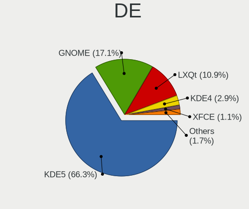
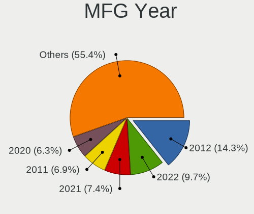
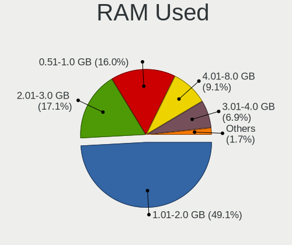

ROSA Hardware Trends
--------------------

A project to identify most popular hardware characteristics and track their change
over time based on data collected by ROSA users at https://Linux-Hardware.org.

Anyone can contribute to the study by uploading probes of their computers by
the [hw-probe](https://github.com/linuxhw/hw-probe) tool:

    sudo -E hw-probe -all -upload

This is a report for all computer types. See also reports for [desktops](/Dist/ROSA/Desktop/README.md) and [notebooks](/Dist/ROSA/Notebook/README.md).

Full-feature report is available here: https://linux-hardware.org/?view=trends

Period: May, 2020.

Contents
--------

- [ OS                       ](#os)
- [ OS Family                ](#os-family)
- [ Kernel                   ](#kernel)
- [ Kernel Family            ](#kernel-family)
- [ Kernel Major Ver.        ](#kernel-major-ver)
- [ Arch                     ](#arch)
- [ DE                       ](#de)
- [ Display Server           ](#display-server)
- [ Display Manager          ](#display-manager)
- [ OS Lang                  ](#os-lang)
- [ Boot Mode                ](#boot-mode)
- [ Filesystem               ](#filesystem)
- [ Part. scheme             ](#part-scheme)
- [ Dual Boot with Linux/BSD ](#dual-boot-with-linux/bsd)
- [ Dual Boot (Win)          ](#dual-boot-win)
- [ Country                  ](#country)
- [ City                     ](#city)
- [ Vendor                   ](#vendor)
- [ Model                    ](#model)
- [ Model Family             ](#model-family)
- [ MFG Year                 ](#mfg-year)
- [ Form Factor              ](#form-factor)
- [ Secure Boot              ](#secure-boot)
- [ Coreboot                 ](#coreboot)
- [ RAM Size                 ](#ram-size)
- [ RAM Used                 ](#ram-used)
- [ Drive Vendor             ](#drive-vendor)
- [ Drive Model              ](#drive-model)
- [ Drive Kind               ](#drive-kind)
- [ Drive Connector          ](#drive-connector)
- [ Drive Size               ](#drive-size)
- [ Space Total              ](#space-total)
- [ Space Used               ](#space-used)
- [ Malfunc. Drives          ](#malfunc-drives)
- [ Malfunc. Drive Vendor    ](#malfunc-drive-vendor)
- [ Malfunc. Drive Kind      ](#malfunc-drive-kind)
- [ Failed Drives            ](#failed-drives)
- [ Failed Drive Vendor      ](#failed-drive-vendor)
- [ Drive Status             ](#drive-status)
- [ Storage Vendor           ](#storage-vendor)
- [ Storage Model            ](#storage-model)
- [ Storage Kind             ](#storage-kind)
- [ CPU Vendor               ](#cpu-vendor)
- [ CPU Model                ](#cpu-model)
- [ CPU Model Family         ](#cpu-model-family)
- [ CPU Cores                ](#cpu-cores)
- [ CPU Sockets              ](#cpu-sockets)
- [ CPU Threads              ](#cpu-threads)
- [ CPU Op-Modes             ](#cpu-op-modes)
- [ CPU Microcode            ](#cpu-microcode)
- [ CPU Microarch            ](#cpu-microarch)
- [ GPU Vendor               ](#gpu-vendor)
- [ GPU Model                ](#gpu-model)
- [ GPU Combo                ](#gpu-combo)
- [ GPU Driver               ](#gpu-driver)
- [ GPU Memory               ](#gpu-memory)
- [ Monitor Vendor           ](#monitor-vendor)
- [ Monitor Model            ](#monitor-model)
- [ Monitor Resolution       ](#monitor-resolution)
- [ Monitor Diagonal         ](#monitor-diagonal)
- [ Monitor Width            ](#monitor-width)
- [ Aspect Ratio             ](#aspect-ratio)
- [ Monitor Area             ](#monitor-area)
- [ Pixel Density            ](#pixel-density)
- [ Multiple Monitors        ](#multiple-monitors)
- [ Net Controller Vendor    ](#net-controller-vendor)
- [ Net Controller Model     ](#net-controller-model)
- [ Net Controller Kind      ](#net-controller-kind)
- [ Used Controller          ](#used-controller)
- [ NICs                     ](#nics)
- [ Unsupported Devices      ](#unsupported-devices)
- [ Unsupported Device Types ](#unsupported-device-types)

OS
--

Installed operating systems

| Name        | Computers | Percent |
|-------------|-----------|---------|
| ROSA R11.1  | 155       | 61.02%  |
| ROSA R11    | 71        | 27.95%  |
| ROSA R8.1   | 14        | 5.51%   |
| ROSA R10    | 9         | 3.54%   |
| ROSA 2019.0 | 2         | 0.79%   |
| RED X3      | 2         | 0.79%   |
| ROSA R9     | 1         | 0.39%   |

OS Family
---------

OS without a version

| Name | Computers | Percent |
|------|-----------|---------|
| ROSA | 254       | 100%    |

Kernel
------

Version of the Linux kernel

| Version                                 | Computers | Percent |
|-----------------------------------------|-----------|---------|
| 4.15.0-desktop-45.1rosa-x86_64          | 68        | 26.77%  |
| 4.15.0-desktop-94.1rosa-x86_64          | 54        | 21.26%  |
| 5.4.32-generic-2rosa-x86_64             | 39        | 15.35%  |
| 4.15.0-desktop-45.1rosa-i586            | 16        | 6.3%    |
| 4.15.0-desktop-94.1rosa-i586            | 14        | 5.51%   |
| 4.9.155-nrj-desktop-1rosa-x86_64        | 11        | 4.33%   |
| 4.9.60-nrj-desktop-1rosa-x86_64         | 8         | 3.15%   |
| 4.9.155-nrj-desktop-1rosa-i586          | 4         | 1.57%   |
| 4.1.38-nrj-desktop-2rosa-x86_64         | 4         | 1.57%   |
| 5.4.32-generic-2rosa-i586               | 3         | 1.18%   |
| 4.15.0-desktop-68.5rosa-x86_64          | 3         | 1.18%   |
| 5.6.7-generic-1rosa-x86_64              | 2         | 0.79%   |
| 5.4.40-nickel-2rosa-x86_64              | 2         | 0.79%   |
| 5.4.40-generic-1rosa-x86_64             | 2         | 0.79%   |
| 5.4.35-nrj-desktop-1rosa-x86_64         | 2         | 0.79%   |
| 4.9.60-nrj-desktop-1rosa-i586           | 2         | 0.79%   |
| 4.9.20-nrj-desktop-1rosa-x86_64         | 2         | 0.79%   |
| 4.1.38-nrj-desktop-2rosa-i586           | 2         | 0.79%   |
| 5.6.14.xm1-1-generic-xanmod-rosa-x86_64 | 1         | 0.39%   |
| 5.4.40-generic-1rosa-i586               | 1         | 0.39%   |
| 5.4.38-nrj-desktop-1rosa-x86_64         | 1         | 0.39%   |
| 5.4.15-nrj-desktop-1rosa-x86_64         | 1         | 0.39%   |
| 5.3.0-desktop-52.1rosa-x86_64           | 1         | 0.39%   |
| 5.3.0-desktop-24.1rosa-x86_64           | 1         | 0.39%   |
| 4.9.9-nrj-desktop-1rosa-i586            | 1         | 0.39%   |
| 4.9.41-nrj-desktop-1rosa-x86_64         | 1         | 0.39%   |
| 4.9.155-nrj-laptop-1rosa-x86_64         | 1         | 0.39%   |
| 4.9.124-nrj-desktop-1rosa-x86_64        | 1         | 0.39%   |
| 4.19.120-nrj-desktop-1-rosa-x86_64      | 1         | 0.39%   |
| 4.18.0-desktop-20.1rosa-x86_64          | 1         | 0.39%   |
| 4.16.18-nrj-desktop-1rosa-x86_64        | 1         | 0.39%   |
| 4.15.0-desktop-68.5rosa-i586            | 1         | 0.39%   |
| 4.15.0-desktop-47.2rosa-x86_64          | 1         | 0.39%   |
| 4.13.0-tablet-16.2rosa-x86_64           | 1         | 0.39%   |

Kernel Family
-------------

Linux kernel without a distro release

| Version  | Computers | Percent |
|----------|-----------|---------|
| 4.15.0   | 157       | 61.81%  |
| 5.4.32   | 42        | 16.54%  |
| 4.9.155  | 16        | 6.3%    |
| 4.9.60   | 10        | 3.94%   |
| 4.1.38   | 6         | 2.36%   |
| 5.4.40   | 5         | 1.97%   |
| 5.6.7    | 2         | 0.79%   |
| 5.4.35   | 2         | 0.79%   |
| 5.3.0    | 2         | 0.79%   |
| 4.9.20   | 2         | 0.79%   |
| 5.6.14   | 1         | 0.39%   |
| 5.4.38   | 1         | 0.39%   |
| 5.4.15   | 1         | 0.39%   |
| 4.9.9    | 1         | 0.39%   |
| 4.9.41   | 1         | 0.39%   |
| 4.9.124  | 1         | 0.39%   |
| 4.19.120 | 1         | 0.39%   |
| 4.18.0   | 1         | 0.39%   |
| 4.16.18  | 1         | 0.39%   |
| 4.13.0   | 1         | 0.39%   |

Kernel Major Ver.
-----------------

Linux kernel major version

| Version | Computers | Percent |
|---------|-----------|---------|
| 4.15    | 157       | 61.81%  |
| 5.4     | 51        | 20.08%  |
| 4.9     | 31        | 12.2%   |
| 4.1     | 6         | 2.36%   |
| 5.6     | 3         | 1.18%   |
| 5.3     | 2         | 0.79%   |
| 4.19    | 1         | 0.39%   |
| 4.18    | 1         | 0.39%   |
| 4.16    | 1         | 0.39%   |
| 4.13    | 1         | 0.39%   |

Arch
----

OS architecture (x86_64, i586, etc.)

| Name   | Computers | Percent |
|--------|-----------|---------|
| x86_64 | 210       | 82.68%  |
| i686   | 44        | 17.32%  |

DE
--

Desktop Environment

| Name    | Computers | Percent |
|---------|-----------|---------|
| KDE4    | 147       | 57.87%  |
| KDE5    | 82        | 32.28%  |
| LXQt    | 17        | 6.69%   |
| XFCE    | 5         | 1.97%   |
| MATE    | 1         | 0.39%   |
| LXDE    | 1         | 0.39%   |
| Unknown | 1         | 0.39%   |

Display Server
--------------

X11 or Wayland

| Name | Computers | Percent |
|------|-----------|---------|
| X11  | 254       | 100%    |

Display Manager
---------------

SDDM, LightDM, etc.

| Name    | Computers | Percent |
|---------|-----------|---------|
| KDM     | 149       | 58.66%  |
| SDDM    | 103       | 40.55%  |
| LightDM | 2         | 0.79%   |

OS Lang
-------

Language

| Lang       | Computers | Percent |
|------------|-----------|---------|
| ru_RU      | 130       | 51.18%  |
| Unknown    | 98        | 38.58%  |
| de_DE      | 7         | 2.76%   |
| pl_PL      | 5         | 1.97%   |
| en_GB      | 5         | 1.97%   |
| it_IT      | 2         | 0.79%   |
| en_US      | 2         | 0.79%   |
| ru_UA      | 1         | 0.39%   |
| ru_RU.utf8 | 1         | 0.39%   |
| ro_RO      | 1         | 0.39%   |
| fr_FR      | 1         | 0.39%   |
| be_BY      | 1         | 0.39%   |

Boot Mode
---------

EFI or BIOS

| Mode | Computers | Percent |
|------|-----------|---------|
| BIOS | 196       | 77.17%  |
| EFI  | 58        | 22.83%  |

Filesystem
----------

Type of filesystem

| Type  | Computers | Percent |
|-------|-----------|---------|
| Ext4  | 244       | 96.06%  |
| Btrfs | 8         | 3.15%   |
| F2fs  | 1         | 0.39%   |
| Aufs  | 1         | 0.39%   |

Part. scheme
------------

Scheme of partitioning

| Type    | Computers | Percent |
|---------|-----------|---------|
| Unknown | 153       | 60.24%  |
| MBR     | 79        | 31.1%   |
| GPT     | 22        | 8.66%   |

Dual Boot with Linux/BSD
------------------------

Hosting more than one Linux/BSD

| Dual boot | Computers | Percent |
|-----------|-----------|---------|
| No        | 194       | 76.38%  |
| Yes       | 60        | 23.62%  |

Dual Boot (Win)
---------------

Hosting Linux and Windows

| Dual boot | Computers | Percent |
|-----------|-----------|---------|
| No        | 138       | 54.33%  |
| Yes       | 116       | 45.67%  |

Country
-------

Geographic location (country)

| Country     | Computers | Percent |
|-------------|-----------|---------|
| Russia      | 188       | 74.02%  |
| Ukraine     | 18        | 7.09%   |
| Germany     | 11        | 4.33%   |
| Italy       | 7         | 2.76%   |
| Poland      | 5         | 1.97%   |
| Belarus     | 5         | 1.97%   |
| Kazakhstan  | 4         | 1.57%   |
| Mexico      | 3         | 1.18%   |
| France      | 2         | 0.79%   |
| Belgium     | 2         | 0.79%   |
| Switzerland | 1         | 0.39%   |
| Sweden      | 1         | 0.39%   |
| Netherlands | 1         | 0.39%   |
| Latvia      | 1         | 0.39%   |
| Israel      | 1         | 0.39%   |
| Greece      | 1         | 0.39%   |
| Estonia     | 1         | 0.39%   |
| Denmark     | 1         | 0.39%   |
| Bulgaria    | 1         | 0.39%   |

City
----

Geographic location (city)

| City             | Computers | Percent |
|------------------|-----------|---------|
| Moscow           | 33        | 12.99%  |
| St Petersburg    | 14        | 5.51%   |
| Krasnodar        | 10        | 3.94%   |
| Ekaterinburg     | 9         | 3.54%   |
| Novosibirsk      | 7         | 2.76%   |
| Samara           | 6         | 2.36%   |
| Nizhniy Novgorod | 5         | 1.97%   |
| Kazan’         | 5         | 1.97%   |
| Volgograd        | 4         | 1.57%   |
| Montedinove      | 4         | 1.57%   |
| Kyiv             | 4         | 1.57%   |
| Kharkiv          | 4         | 1.57%   |
| Petrozavodsk     | 3         | 1.18%   |
| Nal'chik         | 3         | 1.18%   |
| Kurgan           | 3         | 1.18%   |
| Khabarovsk       | 3         | 1.18%   |
| Chelyabinsk      | 3         | 1.18%   |
| Astrakhan        | 3         | 1.18%   |
| Voronezh         | 2         | 0.79%   |
| Vladivostok      | 2         | 0.79%   |
| Tyumen           | 2         | 0.79%   |
| Stavropol        | 2         | 0.79%   |
| Saratov          | 2         | 0.79%   |
| Rostov-on-Don    | 2         | 0.79%   |
| Pushkino         | 2         | 0.79%   |
| Podolsk          | 2         | 0.79%   |
| Orenburg         | 2         | 0.79%   |
| Minsk            | 2         | 0.79%   |
| Kaliningrad      | 2         | 0.79%   |
| Izhevsk          | 2         | 0.79%   |
| Irkutsk          | 2         | 0.79%   |
| Gowarzewo        | 2         | 0.79%   |
| Belgorod         | 2         | 0.79%   |
| Balashikha       | 2         | 0.79%   |
| Almaty           | 2         | 0.79%   |
| Zurich           | 1         | 0.39%   |
| Zima             | 1         | 0.39%   |
| Zheleznogorsk    | 1         | 0.39%   |
| Ypres            | 1         | 0.39%   |
| Yelabuga         | 1         | 0.39%   |
| Vladimir         | 1         | 0.39%   |
| Vitebsk          | 1         | 0.39%   |
| Viimsi           | 1         | 0.39%   |
| Varna            | 1         | 0.39%   |
| Varberg          | 1         | 0.39%   |
| Tsarskoye Selo   | 1         | 0.39%   |
| Tomsk            | 1         | 0.39%   |
| Temirtau         | 1         | 0.39%   |
| Tel Aviv         | 1         | 0.39%   |
| Tapachula        | 1         | 0.39%   |
| Talalayivka      | 1         | 0.39%   |
| Taganrog         | 1         | 0.39%   |
| Słupsk          | 1         | 0.39%   |
| Surgut           | 1         | 0.39%   |
| Stuttgart        | 1         | 0.39%   |
| Sterlitamak      | 1         | 0.39%   |
| Simferopol       | 1         | 0.39%   |
| Sevastopol       | 1         | 0.39%   |
| Serpukhov        | 1         | 0.39%   |
| Sergiyev Posad   | 1         | 0.39%   |

Vendor
------

Motherboard manufacturer

| Name                | Computers | Percent |
|---------------------|-----------|---------|
| ASUSTek Computer    | 65        | 25.59%  |
| Hewlett-Packard     | 28        | 11.02%  |
| Acer                | 24        | 9.45%   |
| Gigabyte Technology | 23        | 9.06%   |
| Lenovo              | 22        | 8.66%   |
| MSI                 | 18        | 7.09%   |
| ASRock              | 13        | 5.12%   |
| Dell                | 11        | 4.33%   |
| Samsung Electronics | 7         | 2.76%   |
| Toshiba             | 5         | 1.97%   |
| Sony                | 4         | 1.57%   |
| Intel               | 4         | 1.57%   |
| Pegatron            | 3         | 1.18%   |
| Packard Bell        | 3         | 1.18%   |
| Foxconn             | 3         | 1.18%   |
| Apple               | 3         | 1.18%   |
| Notebook            | 2         | 0.79%   |
| Fujitsu Siemens     | 2         | 0.79%   |
| Fujitsu             | 2         | 0.79%   |
| ECS                 | 2         | 0.79%   |
| Supermicro          | 1         | 0.39%   |
| Quanta              | 1         | 0.39%   |
| Prestigio           | 1         | 0.39%   |
| eMachines           | 1         | 0.39%   |
| Digma               | 1         | 0.39%   |
| Clevo               | 1         | 0.39%   |
| Biostar             | 1         | 0.39%   |
| AZW                 | 1         | 0.39%   |
| Aquarius            | 1         | 0.39%   |
| ABIT                | 1         | 0.39%   |

Model
-----

Motherboard model

| Name                                                                                                 | Computers | Percent |
|------------------------------------------------------------------------------------------------------|-----------|---------|
| ASUS All Series                                                                                      | 3         | 1.18%   |
| Toshiba Satellite C660                                                                               | 2         | 0.79%   |
| Packard Bell EasyNote TJ71                                                                           | 2         | 0.79%   |
| MSI MS-7260                                                                                          | 2         | 0.79%   |
| Lenovo B590 20206                                                                                    | 2         | 0.79%   |
| HP Pavilion Notebook                                                                                 | 2         | 0.79%   |
| HP Pavilion g6                                                                                       | 2         | 0.79%   |
| HP 255 G6 Notebook PC                                                                                | 2         | 0.79%   |
| HP 255 G4                                                                                            | 2         | 0.79%   |
| HP 250 G4                                                                                            | 2         | 0.79%   |
| Gigabyte 945GCMX-S2                                                                                  | 2         | 0.79%   |
| ASUS 1011PX                                                                                          | 2         | 0.79%   |
| Apple MacBookPro8,1                                                                                  | 2         | 0.79%   |
| Toshiba TECRA A3                                                                                     | 1         | 0.39%   |
| Toshiba Satellite P300                                                                               | 1         | 0.39%   |
| Toshiba Satellite C850-B6W                                                                           | 1         | 0.39%   |
| Supermicro X10SLH-F/X10SLM+-F                                                                        | 1         | 0.39%   |
| Sony VPCL22S1R                                                                                       | 1         | 0.39%   |
| Sony VGN-NS31MR_S                                                                                    | 1         | 0.39%   |
| Sony VGN-CR21ZR_R                                                                                    | 1         | 0.39%   |
| Sony VGN-AW11ZR_B                                                                                    | 1         | 0.39%   |
| Samsung Electronics RV408/RV508                                                                      | 1         | 0.39%   |
| Samsung Electronics R470/R420                                                                        | 1         | 0.39%   |
| Samsung Electronics NC110P/NC108P/NC111P                                                             | 1         | 0.39%   |
| Samsung Electronics 355V4C/355V4X/355V5C/355V5X/356V4C/356V4X/356V5C/356V5X/3445VC/3445VX/3545VC/354 | 1         | 0.39%   |
| Samsung Electronics 350V5C/351V5C/3540VC/3440VC                                                      | 1         | 0.39%   |
| Samsung Electronics 305V4A/305V5A/3415VA                                                             | 1         | 0.39%   |
| Samsung Electronics 300E4A/300E5A/300E7A                                                             | 1         | 0.39%   |
| Quanta TWC                                                                                           | 1         | 0.39%   |
| Prestigio Visconte Quad 3GK                                                                          | 1         | 0.39%   |
| Pegatron IPMSB-H61                                                                                   | 1         | 0.39%   |
| Pegatron C17A                                                                                        | 1         | 0.39%   |
| Pegatron C15B                                                                                        | 1         | 0.39%   |
| Packard Bell EasyNote TE69HW                                                                         | 1         | 0.39%   |
| Notebook W65_67SF                                                                                    | 1         | 0.39%   |
| Notebook W54_55_94_95_97AU,AUQ                                                                       | 1         | 0.39%   |
| MSI VR630                                                                                            | 1         | 0.39%   |
| MSI VR610                                                                                            | 1         | 0.39%   |
| MSI OPTIMUS                                                                                          | 1         | 0.39%   |
| MSI MS-7B98                                                                                          | 1         | 0.39%   |
| MSI MS-7B93                                                                                          | 1         | 0.39%   |
| MSI MS-7A36                                                                                          | 1         | 0.39%   |
| MSI MS-7978                                                                                          | 1         | 0.39%   |
| MSI MS-7817                                                                                          | 1         | 0.39%   |
| MSI MS-7788                                                                                          | 1         | 0.39%   |
| MSI MS-7693                                                                                          | 1         | 0.39%   |
| MSI MS-7529                                                                                          | 1         | 0.39%   |
| MSI MS-7255                                                                                          | 1         | 0.39%   |
| MSI MS-7253                                                                                          | 1         | 0.39%   |
| MSI GL65 9SEK                                                                                        | 1         | 0.39%   |
| MSI GE60 2OC\2OD\2OE                                                                                 | 1         | 0.39%   |
| MSI Compaq dx7400 Microtower                                                                         | 1         | 0.39%   |
| Lenovo ThinkPad X61s 7667A95                                                                         | 1         | 0.39%   |
| Lenovo ThinkPad T450 20BUS4PT00                                                                      | 1         | 0.39%   |
| Lenovo ThinkPad T410 2522WPH                                                                         | 1         | 0.39%   |
| Lenovo ThinkPad R500 2732W11                                                                         | 1         | 0.39%   |
| Lenovo ThinkCentre M72z 35541P1                                                                      | 1         | 0.39%   |
| Lenovo IdeaPad Z510 20287                                                                            | 1         | 0.39%   |
| Lenovo IdeaPad Y560                                                                                  | 1         | 0.39%   |
| Lenovo IdeaPad S110 20126                                                                            | 1         | 0.39%   |

Model Family
------------

Motherboard model prefix

| Name                       | Computers | Percent |
|----------------------------|-----------|---------|
| Acer Aspire                | 16        | 6.3%    |
| Dell Inspiron              | 6         | 2.36%   |
| Lenovo IdeaPad             | 5         | 1.97%   |
| HP Pavilion                | 5         | 1.97%   |
| Toshiba Satellite          | 4         | 1.57%   |
| Lenovo ThinkPad            | 4         | 1.57%   |
| HP 255                     | 4         | 1.57%   |
| Acer TravelMate            | 4         | 1.57%   |
| Packard Bell EasyNote      | 3         | 1.18%   |
| Lenovo B590                | 3         | 1.18%   |
| HP ProBook                 | 3         | 1.18%   |
| HP ENVY                    | 3         | 1.18%   |
| Dell Latitude              | 3         | 1.18%   |
| ASUS M5A78L-M              | 3         | 1.18%   |
| ASUS All                   | 3         | 1.18%   |
| MSI MS-7260                | 2         | 0.79%   |
| Lenovo G580                | 2         | 0.79%   |
| HP Laptop                  | 2         | 0.79%   |
| HP Compaq                  | 2         | 0.79%   |
| HP 250                     | 2         | 0.79%   |
| Gigabyte GA-78LMT-S2       | 2         | 0.79%   |
| Gigabyte 945GCMX-S2        | 2         | 0.79%   |
| ASUS P5G41T-M              | 2         | 0.79%   |
| ASUS 1011PX                | 2         | 0.79%   |
| Apple MacBookPro8          | 2         | 0.79%   |
| Toshiba TECRA              | 1         | 0.39%   |
| Supermicro X10SLH-F        | 1         | 0.39%   |
| Sony VPCL22S1R             | 1         | 0.39%   |
| Sony VGN-NS31MR            | 1         | 0.39%   |
| Sony VGN-CR21ZR            | 1         | 0.39%   |
| Sony VGN-AW11ZR            | 1         | 0.39%   |
| Samsung Electronics RV408  | 1         | 0.39%   |
| Samsung Electronics R470   | 1         | 0.39%   |
| Samsung Electronics NC110P | 1         | 0.39%   |
| Samsung Electronics 355V4C | 1         | 0.39%   |
| Samsung Electronics 350V5C | 1         | 0.39%   |
| Samsung Electronics 305V4A | 1         | 0.39%   |
| Samsung Electronics 300E4A | 1         | 0.39%   |
| Quanta TWC                 | 1         | 0.39%   |
| Prestigio Visconte         | 1         | 0.39%   |
| Pegatron IPMSB-H61         | 1         | 0.39%   |
| Pegatron C17A              | 1         | 0.39%   |
| Pegatron C15B              | 1         | 0.39%   |
| Notebook W65               | 1         | 0.39%   |
| Notebook W54               | 1         | 0.39%   |
| MSI VR630                  | 1         | 0.39%   |
| MSI VR610                  | 1         | 0.39%   |
| MSI OPTIMUS                | 1         | 0.39%   |
| MSI MS-7B98                | 1         | 0.39%   |
| MSI MS-7B93                | 1         | 0.39%   |
| MSI MS-7A36                | 1         | 0.39%   |
| MSI MS-7978                | 1         | 0.39%   |
| MSI MS-7817                | 1         | 0.39%   |
| MSI MS-7788                | 1         | 0.39%   |
| MSI MS-7693                | 1         | 0.39%   |
| MSI MS-7529                | 1         | 0.39%   |
| MSI MS-7255                | 1         | 0.39%   |
| MSI MS-7253                | 1         | 0.39%   |
| MSI GL65                   | 1         | 0.39%   |
| MSI GE60                   | 1         | 0.39%   |

MFG Year
--------

Motherboard manufacture year

| Year | Computers | Percent |
|------|-----------|---------|
| 2011 | 34        | 13.39%  |
| 2012 | 28        | 11.02%  |
| 2010 | 26        | 10.24%  |
| 2013 | 25        | 9.84%   |
| 2019 | 19        | 7.48%   |
| 2009 | 19        | 7.48%   |
| 2015 | 15        | 5.91%   |
| 2008 | 15        | 5.91%   |
| 2016 | 14        | 5.51%   |
| 2007 | 14        | 5.51%   |
| 2018 | 13        | 5.12%   |
| 2014 | 11        | 4.33%   |
| 2017 | 9         | 3.54%   |
| 2006 | 7         | 2.76%   |
| 2005 | 3         | 1.18%   |
| 2020 | 1         | 0.39%   |
| 2004 | 1         | 0.39%   |

Form Factor
-----------

Physical design of the computer

| Name        | Computers | Percent |
|-------------|-----------|---------|
| Notebook    | 138       | 54.33%  |
| Desktop     | 109       | 42.91%  |
| All in one  | 3         | 1.18%   |
| Tablet      | 1         | 0.39%   |
| Convertible | 1         | 0.39%   |
| Mini pc     | 1         | 0.39%   |
| Server      | 1         | 0.39%   |

Secure Boot
-----------

Enabled or disabled

| State    | Computers | Percent |
|----------|-----------|---------|
| Disabled | 253       | 99.61%  |
| Enabled  | 1         | 0.39%   |

Coreboot
--------

Have coreboot on board

| Used | Computers | Percent |
|------|-----------|---------|
| No   | 254       | 100%    |

RAM Size
--------

Total RAM memory

| Size in GB | Computers | Percent |
|------------|-----------|---------|
| 3.01-4.0   | 88        | 34.65%  |
| 8.01-16.0  | 50        | 19.69%  |
| 4.01-8.0   | 42        | 16.54%  |
| 1.01-2.0   | 41        | 16.14%  |
| 16.01-24.0 | 16        | 6.3%    |
| 2.01-3.0   | 9         | 3.54%   |
| 0.01-1.0   | 5         | 1.97%   |
| 32.01-64.0 | 2         | 0.79%   |
| 24.01-32.0 | 1         | 0.39%   |

RAM Used
--------

Used RAM memory

| Used GB  | Computers | Percent |
|----------|-----------|---------|
| 0.01-1.0 | 133       | 52.36%  |
| 1.01-2.0 | 88        | 34.65%  |
| 2.01-3.0 | 26        | 10.24%  |
| 3.01-4.0 | 7         | 2.76%   |

Drive Vendor
------------

Hard drive vendors

| Vendor              | Computers | Drives | Percent |
|---------------------|-----------|--------|---------|
| Seagate             | 91        | 103    | 26.53%  |
| WDC                 | 73        | 82     | 21.28%  |
| Hitachi             | 30        | 30     | 8.75%   |
| Toshiba             | 28        | 28     | 8.16%   |
| Samsung Electronics | 28        | 28     | 8.16%   |
| Kingston            | 12        | 13     | 3.5%    |
| HGST                | 8         | 8      | 2.33%   |
| SanDisk             | 7         | 7      | 2.04%   |
| Unknown             | 6         | 7      | 1.75%   |
| Crucial             | 6         | 6      | 1.75%   |
| China               | 6         | 6      | 1.75%   |
| SPCC                | 4         | 5      | 1.17%   |
| PLEXTOR             | 4         | 5      | 1.17%   |
| MAXTOR              | 4         | 4      | 1.17%   |
| A-DATA Technology   | 4         | 4      | 1.17%   |
| KINGMAX             | 3         | 3      | 0.87%   |
| Transcend           | 2         | 2      | 0.58%   |
| Smartbuy            | 2         | 2      | 0.58%   |
| Silicon Motion      | 2         | 2      | 0.58%   |
| Patriot             | 2         | 2      | 0.58%   |
| LITEONIT            | 2         | 2      | 0.58%   |
| Intel               | 2         | 2      | 0.58%   |
| HUAWEI              | 2         | 2      | 0.58%   |
| AMD                 | 2         | 2      | 0.58%   |
| XPG                 | 1         | 1      | 0.29%   |
| OCZ-VERTEX3         | 1         | 1      | 0.29%   |
| OCZ                 | 1         | 1      | 0.29%   |
| LONDISK             | 1         | 1      | 0.29%   |
| LITEON              | 1         | 1      | 0.29%   |
| KingSpec            | 1         | 1      | 0.29%   |
| KingDian            | 1         | 1      | 0.29%   |
| GOODRAM             | 1         | 1      | 0.29%   |
| GALAX               | 1         | 1      | 0.29%   |
| Fujitsu             | 1         | 2      | 0.29%   |
| Apple               | 1         | 1      | 0.29%   |
| Apacer              | 1         | 1      | 0.29%   |
| AEGO                | 1         | 1      | 0.29%   |

Drive Model
-----------

Hard drive models

| Model                        | Computers | Percent |
|------------------------------|-----------|---------|
| ST320LT020-9YG142 320GB      | 7         | 1.9%    |
| SA400S37240G 240GB SSD       | 6         | 1.63%   |
| ST500DM002-1BD142 500GB      | 5         | 1.36%   |
| ST500LT012-1DG142 500GB      | 4         | 1.08%   |
| ST380815AS 80GB              | 4         | 1.08%   |
| ST3500418AS 500GB            | 4         | 1.08%   |
| ST3160815AS 160GB            | 4         | 1.08%   |
| ST1000LM024 HN-M101MBB 1TB   | 4         | 1.08%   |
| MQ01ABF050 500GB             | 4         | 1.08%   |
| HTS545050A7E680 500GB        | 4         | 1.08%   |
| ST9500325AS 500GB            | 3         | 0.81%   |
| ST1000LM035-1RK172 1TB       | 3         | 0.81%   |
| ST1000DM010-2EP102 1TB       | 3         | 0.81%   |
| SSD 850 EVO 250GB            | 3         | 0.81%   |
| SSD 120GB                    | 3         | 0.81%   |
| MQ01ABD100 1TB               | 3         | 0.81%   |
| HTS547575A9E384 752GB        | 3         | 0.81%   |
| HTS545050A7E380 500GB        | 3         | 0.81%   |
| HTS542516K9SA00 160GB        | 3         | 0.81%   |
| DT01ACA050 500GB             | 3         | 0.81%   |
| CT240BX500SSD1 240GB         | 3         | 0.81%   |
| WDS480G2G0A-00JH30 480GB SSD | 2         | 0.54%   |
| WDS240G2G0A-00JH30 240GB SSD | 2         | 0.54%   |
| WD5000LPCX-60VHAT1 500GB     | 2         | 0.54%   |
| WD5000BEVT-22A0RT0 500GB     | 2         | 0.54%   |
| WD5000AADS-00S9B0 500GB      | 2         | 0.54%   |
| WD5000AADS-00M2B0 500GB      | 2         | 0.54%   |
| WD3200BPVT-24JJ5T0 320GB     | 2         | 0.54%   |
| WD3200BEVT-22ZCT0 320GB      | 2         | 0.54%   |
| WD1200BEVS-22UST0 120GB      | 2         | 0.54%   |
| WD10EZEX-08WN4A0 1TB         | 2         | 0.54%   |
| WD10EZEX-00WN4A0 1TB         | 2         | 0.54%   |
| TF CARD Storage 32GB         | 2         | 0.54%   |
| STM3160815AS 160GB           | 2         | 0.54%   |
| ST9500420AS 500GB            | 2         | 0.54%   |
| ST9250315AS 250GB            | 2         | 0.54%   |
| ST500LM021-1KJ152 500GB      | 2         | 0.54%   |
| ST500DM002-1BC142 500GB      | 2         | 0.54%   |
| ST380011A 80GB               | 2         | 0.54%   |
| ST3250410AS 250GB            | 2         | 0.54%   |
| ST3160815A 160GB             | 2         | 0.54%   |
| ST31000528AS 1TB             | 2         | 0.54%   |
| ST2000DM001-1CH164 2TB       | 2         | 0.54%   |
| ST1000DM003-1SB102 1TB       | 2         | 0.54%   |
| ST1000DM003-1CH162 1TB       | 2         | 0.54%   |
| SSD PLUS 480GB               | 2         | 0.54%   |
| SSD 840 EVO 120GB            | 2         | 0.54%   |
| SSD 750 EVO 120GB            | 2         | 0.54%   |
| SSD 60GB                     | 2         | 0.54%   |
| SSD 240GB                    | 2         | 0.54%   |
| Solid State Disk 120GB       | 2         | 0.54%   |
| SATA SSD 20GB                | 2         | 0.54%   |
| MK5076GSX 500GB              | 2         | 0.54%   |
| HTS723232A7A364 320GB        | 2         | 0.54%   |
| HTS545050B9A300 500GB        | 2         | 0.54%   |
| HTS545025B9A300 250GB        | 2         | 0.54%   |
| HTS543232A7A384 320GB        | 2         | 0.54%   |
| HTS543225A7A384 250GB        | 2         | 0.54%   |
| HN-M500MBB 500GB             | 2         | 0.54%   |
| HDWD110 1TB                  | 2         | 0.54%   |

Drive Kind
----------

HDD or SSD

| Kind    | Computers | Drives | Percent |
|---------|-----------|--------|---------|
| HDD     | 217       | 259    | 70.45%  |
| SSD     | 77        | 94     | 25%     |
| MMC     | 6         | 8      | 1.95%   |
| NVMe    | 6         | 6      | 1.95%   |
| Unknown | 2         | 2      | 0.65%   |

Drive Connector
---------------

SATA, SAS, NVMe, etc.

| Type | Computers | Drives | Percent |
|------|-----------|--------|---------|
| SATA | 251       | 352    | 94.36%  |
| NVMe | 6         | 6      | 2.26%   |
| MMC  | 6         | 8      | 2.26%   |
| SAS  | 3         | 3      | 1.13%   |

Drive Size
----------

Size of hard drive

| Size in TB | Computers | Drives | Percent |
|------------|-----------|--------|---------|
| 0.01-0.5   | 219       | 291    | 76.04%  |
| 0.51-1.0   | 54        | 61     | 18.75%  |
| 1.01-2.0   | 13        | 15     | 4.51%   |
| 2.01-3.0   | 2         | 2      | 0.69%   |

Space Total
-----------

Amount of disk space available on the file system

| Size in GB     | Computers | Percent |
|----------------|-----------|---------|
| 101-250        | 70        | 27.56%  |
| 251-500        | 66        | 25.98%  |
| 1-20           | 36        | 14.17%  |
| 501-1000       | 28        | 11.02%  |
| 51-100         | 20        | 7.87%   |
| 21-50          | 15        | 5.91%   |
| 1001-2000      | 11        | 4.33%   |
| 2001-3000      | 5         | 1.97%   |
| More than 3000 | 2         | 0.79%   |
| Unknown        | 1         | 0.39%   |

Space Used
----------

Amount of used disk space

| Used GB   | Computers | Percent |
|-----------|-----------|---------|
| 1-20      | 174       | 68.5%   |
| 21-50     | 22        | 8.66%   |
| 101-250   | 18        | 7.09%   |
| 51-100    | 14        | 5.51%   |
| 251-500   | 11        | 4.33%   |
| 501-1000  | 8         | 3.15%   |
| 1001-2000 | 6         | 2.36%   |
| Unknown   | 1         | 0.39%   |

Malfunc. Drives
---------------

Drive models with a malfunction

| Model                      | Computers | Drives | Percent |
|----------------------------|-----------|--------|---------|
| ST320LT020-9YG142 320GB    | 5         | 5      | 4.59%   |
| ST500DM002-1BD142 500GB    | 4         | 4      | 3.67%   |
| ST3500418AS 500GB          | 4         | 4      | 3.67%   |
| ST380815AS 80GB            | 3         | 3      | 2.75%   |
| HTS545050A7E680 500GB      | 3         | 3      | 2.75%   |
| HTS545050A7E380 500GB      | 3         | 3      | 2.75%   |
| ST9500420AS 500GB          | 2         | 2      | 1.83%   |
| ST500LT012-1DG142 500GB    | 2         | 2      | 1.83%   |
| ST3250410AS 250GB          | 2         | 2      | 1.83%   |
| MQ01ABD100 1TB             | 2         | 2      | 1.83%   |
| HTS723232A7A364 320GB      | 2         | 2      | 1.83%   |
| HTS543232A7A384 320GB      | 2         | 2      | 1.83%   |
| HTS542516K9SA00 160GB      | 2         | 2      | 1.83%   |
| WD800UE-22HCT0 80GB        | 1         | 1      | 0.92%   |
| WD7500BPVT-60HXZT3 752GB   | 1         | 1      | 0.92%   |
| WD7500BPKT-80PK4T0 752GB   | 1         | 1      | 0.92%   |
| WD6402AAEX-00Y9A0 640GB    | 1         | 1      | 0.92%   |
| WD5001AALS-00L3B2 500GB    | 1         | 1      | 0.92%   |
| WD5000BEVT-35ZAT0 500GB    | 1         | 1      | 0.92%   |
| WD5000AAKX-083CA1 500GB    | 1         | 1      | 0.92%   |
| WD5000AAKS-00D2B0 500GB    | 1         | 1      | 0.92%   |
| WD5000AAKS-00A7B0 500GB    | 1         | 1      | 0.92%   |
| WD5000AADS-00S9B0 500GB    | 1         | 1      | 0.92%   |
| WD5000AADS-00M2B0 500GB    | 1         | 1      | 0.92%   |
| WD3200BPVT-80JJ5T0 320GB   | 1         | 1      | 0.92%   |
| WD3200AAJS-00L7A0 320GB    | 1         | 1      | 0.92%   |
| WD2500BPVT-22JJ5T0 250GB   | 1         | 1      | 0.92%   |
| WD20EARS-60MVWB0 2TB       | 1         | 1      | 0.92%   |
| WD1600AAJS-60Z0A0 160GB    | 1         | 1      | 0.92%   |
| WD15EVDS-63V9B1 1TB        | 1         | 1      | 0.92%   |
| WD1200BEVS-60RST0 120GB    | 1         | 1      | 0.92%   |
| WD10JPVX-08JC3T5 1TB       | 1         | 1      | 0.92%   |
| WD10EZEX-08WN4A0 1TB       | 1         | 1      | 0.92%   |
| SV0411N 40GB               | 1         | 1      | 0.92%   |
| STM3500320AS 500GB         | 1         | 1      | 0.92%   |
| STM3250310AS 250GB         | 1         | 1      | 0.92%   |
| STM3160815AS 160GB         | 1         | 1      | 0.92%   |
| ST9750423AS 752GB          | 1         | 1      | 0.92%   |
| ST9500325AS 500GB          | 1         | 1      | 0.92%   |
| ST9320310AS 320GB          | 1         | 1      | 0.92%   |
| ST9250410AS 250GB          | 1         | 1      | 0.92%   |
| ST9250315AS 250GB          | 1         | 1      | 0.92%   |
| ST9160821AS 160GB          | 1         | 1      | 0.92%   |
| ST9160314AS 160GB          | 1         | 1      | 0.92%   |
| ST500LM021-1KJ152 500GB    | 1         | 1      | 0.92%   |
| ST380013AS 80GB            | 1         | 1      | 0.92%   |
| ST380011A 80GB             | 1         | 1      | 0.92%   |
| ST340810A 40GB             | 1         | 1      | 0.92%   |
| ST3320620AS 320GB          | 1         | 1      | 0.92%   |
| ST3320613AS 320GB          | 1         | 1      | 0.92%   |
| ST320LT012-9WS14C 320GB    | 1         | 1      | 0.92%   |
| ST3200822AS 200GB          | 1         | 1      | 0.92%   |
| ST3200822A 200GB           | 1         | 1      | 0.92%   |
| ST3160815AS 160GB          | 1         | 1      | 0.92%   |
| ST3160215A 160GB           | 1         | 1      | 0.92%   |
| ST3160023A 160GB           | 1         | 1      | 0.92%   |
| ST3120813AS 120GB          | 1         | 1      | 0.92%   |
| ST31000528AS 1TB           | 1         | 1      | 0.92%   |
| ST2000DM001-1CH164 2TB     | 1         | 1      | 0.92%   |
| ST1000LM024 HN-M101MBB 1TB | 1         | 1      | 0.92%   |

Malfunc. Drive Vendor
---------------------

Vendors of faulty drives

| Vendor              | Computers | Drives | Percent |
|---------------------|-----------|--------|---------|
| Seagate             | 41        | 45     | 39.05%  |
| WDC                 | 20        | 20     | 19.05%  |
| Hitachi             | 15        | 15     | 14.29%  |
| Toshiba             | 8         | 8      | 7.62%   |
| HGST                | 5         | 5      | 4.76%   |
| Samsung Electronics | 4         | 4      | 3.81%   |
| MAXTOR              | 3         | 3      | 2.86%   |
| KINGMAX             | 2         | 2      | 1.9%    |
| SanDisk             | 1         | 1      | 0.95%   |
| OCZ-VERTEX3         | 1         | 1      | 0.95%   |
| LITEONIT            | 1         | 1      | 0.95%   |
| LITEON              | 1         | 1      | 0.95%   |
| Kingston            | 1         | 1      | 0.95%   |
| Fujitsu             | 1         | 1      | 0.95%   |
| AMD                 | 1         | 1      | 0.95%   |

Malfunc. Drive Kind
-------------------

Kinds of faulty drives

| Kind | Computers | Drives | Percent |
|------|-----------|--------|---------|
| HDD  | 93        | 101    | 92.08%  |
| SSD  | 8         | 8      | 7.92%   |

Failed Drives
-------------

Failed drive models

| Model                 | Computers | Drives | Percent |
|-----------------------|-----------|--------|---------|
| MK3265GSX 320GB       | 1         | 1      | 50%     |
| HTS543225A7A384 250GB | 1         | 1      | 50%     |

Failed Drive Vendor
-------------------

Failed drive vendors

| Vendor  | Computers | Drives | Percent |
|---------|-----------|--------|---------|
| Toshiba | 1         | 1      | 50%     |
| Hitachi | 1         | 1      | 50%     |

Drive Status
------------

Number of failed and malfunc. drives

| Status   | Computers | Drives | Percent |
|----------|-----------|--------|---------|
| Works    | 177       | 246    | 61.67%  |
| Malfunc  | 99        | 109    | 34.49%  |
| Detected | 9         | 12     | 3.14%   |
| Failed   | 2         | 2      | 0.7%    |

Storage Vendor
--------------

Storage controller vendors

| Vendor                           | Computers | Percent |
|----------------------------------|-----------|---------|
| Intel                            | 188       | 66.9%   |
| AMD                              | 49        | 17.44%  |
| JMicron Technology               | 13        | 4.63%   |
| Nvidia                           | 11        | 3.91%   |
| Marvell Technology Group         | 6         | 2.14%   |
| VIA Technologies                 | 4         | 1.42%   |
| Silicon Motion                   | 3         | 1.07%   |
| ULi Electronics                  | 1         | 0.36%   |
| Silicon Integrated Systems [SiS] | 1         | 0.36%   |
| Sandisk                          | 1         | 0.36%   |
| Lite-On Technology               | 1         | 0.36%   |
| Integrated Technology Express    | 1         | 0.36%   |
| ASMedia Technology               | 1         | 0.36%   |
| ADATA Technology                 | 1         | 0.36%   |

Storage Model
-------------

Storage controller models

| Model                                                                             | Computers | Percent |
|-----------------------------------------------------------------------------------|-----------|---------|
| FCH SATA Controller [AHCI mode]                                                   | 24        | 6.7%    |
| 7 Series Chipset Family 6-port SATA Controller [AHCI mode]                        | 23        | 6.42%   |
| 6 Series/C200 Series Chipset Family 6 port Mobile SATA AHCI Controller            | 17        | 4.75%   |
| NM10/ICH7 Family SATA Controller [IDE mode]                                       | 16        | 4.47%   |
| 82801G (ICH7 Family) IDE Controller                                               | 15        | 4.19%   |
| SB7x0/SB8x0/SB9x0 IDE Controller                                                  | 14        | 3.91%   |
| 8 Series/C220 Series Chipset Family 6-port SATA Controller 1 [AHCI mode]          | 12        | 3.35%   |
| SB7x0/SB8x0/SB9x0 SATA Controller [IDE mode]                                      | 11        | 3.07%   |
| SB7x0/SB8x0/SB9x0 SATA Controller [AHCI mode]                                     | 10        | 2.79%   |
| 82801IBM/IEM (ICH9M/ICH9M-E) 4 port SATA Controller [AHCI mode]                   | 9         | 2.51%   |
| Sunrise Point-LP SATA Controller [AHCI mode]                                      | 7         | 1.96%   |
| NM10/ICH7 Family SATA Controller [AHCI mode]                                      | 7         | 1.96%   |
| 5 Series/3400 Series Chipset 4 port SATA AHCI Controller                          | 7         | 1.96%   |
| JMB363 SATA/IDE Controller                                                        | 6         | 1.68%   |
| 82801HM/HEM (ICH8M/ICH8M-E) IDE Controller                                        | 6         | 1.68%   |
| 6 Series/C200 Series Chipset Family 6 port Desktop SATA AHCI Controller           | 6         | 1.68%   |
| Wildcat Point-LP SATA Controller [AHCI Mode]                                      | 5         | 1.4%    |
| MCP61 SATA Controller                                                             | 5         | 1.4%    |
| 82801HM/HEM (ICH8M/ICH8M-E) SATA Controller [AHCI mode]                           | 5         | 1.4%    |
| Q170/Q150/B150/H170/H110/Z170/CM236 Chipset SATA Controller [AHCI Mode]           | 4         | 1.12%   |
| MCP61 IDE                                                                         | 4         | 1.12%   |
| JMB368 IDE controller                                                             | 4         | 1.12%   |
| 82801I (ICH9 Family) 2 port SATA Controller [IDE mode]                            | 4         | 1.12%   |
| 82801GBM/GHM (ICH7-M Family) SATA Controller [IDE mode]                           | 4         | 1.12%   |
| 82801 Mobile SATA Controller [RAID mode]                                          | 4         | 1.12%   |
| 8 Series SATA Controller 1 [AHCI mode]                                            | 4         | 1.12%   |
| 7 Series/C210 Series Chipset Family 6-port SATA Controller [AHCI mode]            | 4         | 1.12%   |
| 6 Series/C200 Series Chipset Family Desktop SATA Controller (IDE mode, ports 4-5) | 4         | 1.12%   |
| 6 Series/C200 Series Chipset Family Desktop SATA Controller (IDE mode, ports 0-3) | 4         | 1.12%   |
| 5 Series/3400 Series Chipset 6 port SATA AHCI Controller                          | 4         | 1.12%   |
| 5 Series/3400 Series Chipset 4 port SATA IDE Controller                           | 4         | 1.12%   |
| 5 Series/3400 Series Chipset 2 port SATA IDE Controller                           | 4         | 1.12%   |
| SB600 Non-Raid-5 SATA                                                             | 3         | 0.84%   |
| SB600 IDE                                                                         | 3         | 0.84%   |
| Non-Volatile memory controller                                                    | 3         | 0.84%   |
| FCH SATA Controller D                                                             | 3         | 0.84%   |
| Celeron N3350/Pentium N4200/Atom E3900 Series SATA AHCI Controller                | 3         | 0.84%   |
| Atom/Celeron/Pentium Processor x5-E8000/J3xxx/N3xxx Series SATA Controller        | 3         | 0.84%   |
| 82801JI (ICH10 Family) 4 port SATA IDE Controller #1                              | 3         | 0.84%   |
| 82801JI (ICH10 Family) 2 port SATA IDE Controller #2                              | 3         | 0.84%   |
| 82801IB (ICH9) 2 port SATA Controller [IDE mode]                                  | 3         | 0.84%   |
| 82801HM/HEM (ICH8M/ICH8M-E) SATA Controller [IDE mode]                            | 3         | 0.84%   |
| VT82C586A/B/VT82C686/A/B/VT823x/A/C PIPC Bus Master IDE                           | 2         | 0.56%   |
| VT6415 PATA IDE Host Controller                                                   | 2         | 0.56%   |
| MCP78S [GeForce 8200] SATA Controller (non-AHCI mode)                             | 2         | 0.56%   |
| MCP78S [GeForce 8200] IDE                                                         | 2         | 0.56%   |
| MCP55 SATA Controller                                                             | 2         | 0.56%   |
| MCP55 IDE                                                                         | 2         | 0.56%   |
| JMB362 SATA Controller                                                            | 2         | 0.56%   |
| Cannon Lake PCH SATA AHCI Controller                                              | 2         | 0.56%   |
| Atom Processor E3800 Series SATA AHCI Controller                                  | 2         | 0.56%   |
| 9 Series Chipset Family SATA Controller [AHCI Mode]                               | 2         | 0.56%   |
| 88SE91A3 SATA-600 Controller                                                      | 2         | 0.56%   |
| 82801JI (ICH10 Family) SATA AHCI Controller                                       | 2         | 0.56%   |
| 82801IBM/IEM (ICH9M/ICH9M-E) 2 port SATA Controller [IDE mode]                    | 2         | 0.56%   |
| 82801HR/HO/HH (ICH8R/DO/DH) 2 port SATA Controller [IDE mode]                     | 2         | 0.56%   |
| 82801H (ICH8 Family) 4 port SATA Controller [IDE mode]                            | 2         | 0.56%   |
| 82801FB/FBM/FR/FW/FRW (ICH6 Family) IDE Controller                                | 2         | 0.56%   |
| XPG SX8200 Pro PCIe Gen3x4 M.2 2280 Solid State Drive                             | 1         | 0.28%   |
| X370 Series Chipset SATA Controller                                               | 1         | 0.28%   |

Storage Kind
------------

Kind of storage controller (IDE, SATA, NVMe, SAS, ...)

| Kind | Computers | Percent |
|------|-----------|---------|
| SATA | 187       | 64.26%  |
| IDE  | 94        | 32.3%   |
| NVMe | 6         | 2.06%   |
| RAID | 4         | 1.37%   |

CPU Vendor
----------

Processor vendors

| Vendor | Computers | Percent |
|--------|-----------|---------|
| Intel  | 195       | 76.77%  |
| AMD    | 59        | 23.23%  |

CPU Model
---------

Processor models

| Model                                        | Computers | Percent |
|----------------------------------------------|-----------|---------|
| Intel Pentium CPU B960 @ 2.20GHz             | 3         | 1.18%   |
| Intel Pentium 4 CPU 3.00GHz                  | 3         | 1.18%   |
| Intel Core i5-3230M CPU @ 2.60GHz            | 3         | 1.18%   |
| Intel Core i5-3210M CPU @ 2.50GHz            | 3         | 1.18%   |
| Intel Core i3-6006U CPU @ 2.00GHz            | 3         | 1.18%   |
| Intel Core 2 Quad CPU Q6600 @ 2.40GHz        | 3         | 1.18%   |
| Intel Celeron CPU 1005M @ 1.90GHz            | 3         | 1.18%   |
| Intel Pentium Dual CPU E2200 @ 2.20GHz       | 2         | 0.79%   |
| Intel Pentium Dual CPU E2160 @ 1.80GHz       | 2         | 0.79%   |
| Intel Pentium CPU P6200 @ 2.13GHz            | 2         | 0.79%   |
| Intel Pentium CPU 2020M @ 2.40GHz            | 2         | 0.79%   |
| Intel Core i7-2630QM CPU @ 2.00GHz           | 2         | 0.79%   |
| Intel Core i5-7200U CPU @ 2.50GHz            | 2         | 0.79%   |
| Intel Core i5-6200U CPU @ 2.30GHz            | 2         | 0.79%   |
| Intel Core i5-5200U CPU @ 2.20GHz            | 2         | 0.79%   |
| Intel Core i5-4200M CPU @ 2.50GHz            | 2         | 0.79%   |
| Intel Core i5-3470 CPU @ 3.20GHz             | 2         | 0.79%   |
| Intel Core i5-2430M CPU @ 2.40GHz            | 2         | 0.79%   |
| Intel Core i5-2410M CPU @ 2.30GHz            | 2         | 0.79%   |
| Intel Core i5 CPU M 520 @ 2.40GHz            | 2         | 0.79%   |
| Intel Core i3-3220 CPU @ 3.30GHz             | 2         | 0.79%   |
| Intel Core i3-3110M CPU @ 2.40GHz            | 2         | 0.79%   |
| Intel Core i3-2350M CPU @ 2.30GHz            | 2         | 0.79%   |
| Intel Core i3-2330M CPU @ 2.20GHz            | 2         | 0.79%   |
| Intel Core i3 CPU 550 @ 3.20GHz              | 2         | 0.79%   |
| Intel Core 2 Duo CPU T9600 @ 2.80GHz         | 2         | 0.79%   |
| Intel Core 2 Duo CPU T7250 @ 2.00GHz         | 2         | 0.79%   |
| Intel Core 2 Duo CPU P8400 @ 2.26GHz         | 2         | 0.79%   |
| Intel Core 2 Duo CPU E8500 @ 3.16GHz         | 2         | 0.79%   |
| Intel Core 2 Duo CPU E8400 @ 3.00GHz         | 2         | 0.79%   |
| Intel Core 2 Duo CPU E4500 @ 2.20GHz         | 2         | 0.79%   |
| Intel Core 2 CPU T5600 @ 1.83GHz             | 2         | 0.79%   |
| Intel Celeron Dual-Core CPU T3500 @ 2.10GHz  | 2         | 0.79%   |
| Intel Celeron CPU N3050 @ 1.60GHz            | 2         | 0.79%   |
| Intel Atom CPU N570 @ 1.66GHz                | 2         | 0.79%   |
| Intel Atom CPU N2600 @ 1.60GHz               | 2         | 0.79%   |
| AMD Turion II Dual-Core Mobile M500          | 2         | 0.79%   |
| AMD FX-4300 Quad-Core Processor              | 2         | 0.79%   |
| AMD E1-6015 APU with Radeon R2 Graphics      | 2         | 0.79%   |
| AMD Athlon II X4 640 Processor               | 2         | 0.79%   |
| AMD Athlon II X2 270 Processor               | 2         | 0.79%   |
| AMD Athlon II X2 245 Processor               | 2         | 0.79%   |
| AMD A6-9220 RADEON R4, 5 COMPUTE CORES 2C+3G | 2         | 0.79%   |
| Intel Xeon CPU X5670 @ 2.93GHz               | 1         | 0.39%   |
| Intel Xeon CPU E5450 @ 3.00GHz               | 1         | 0.39%   |
| Intel Xeon CPU E5-2640 v3 @ 2.60GHz          | 1         | 0.39%   |
| Intel Xeon CPU E3-1241 v3 @ 3.50GHz          | 1         | 0.39%   |
| Intel Xeon CPU E3-1240 v3 @ 3.40GHz          | 1         | 0.39%   |
| Intel Pentium Silver J5005 CPU @ 1.50GHz     | 1         | 0.39%   |
| Intel Pentium M processor 1.86GHz            | 1         | 0.39%   |
| Intel Pentium Dual-Core CPU T4200 @ 2.00GHz  | 1         | 0.39%   |
| Intel Pentium Dual-Core CPU E5700 @ 3.00GHz  | 1         | 0.39%   |
| Intel Pentium Dual-Core CPU E5300 @ 2.60GHz  | 1         | 0.39%   |
| Intel Pentium Dual CPU T3400 @ 2.16GHz       | 1         | 0.39%   |
| Intel Pentium D CPU 2.66GHz                  | 1         | 0.39%   |
| Intel Pentium CPU P6100 @ 2.00GHz            | 1         | 0.39%   |
| Intel Pentium CPU J4205 @ 1.50GHz            | 1         | 0.39%   |
| Intel Pentium CPU G870 @ 3.10GHz             | 1         | 0.39%   |
| Intel Pentium CPU G850 @ 2.90GHz             | 1         | 0.39%   |
| Intel Pentium CPU G645 @ 2.90GHz             | 1         | 0.39%   |

CPU Model Family
----------------

Processor model prefix

| Model                          | Computers | Percent |
|--------------------------------|-----------|---------|
| Intel Core i5                  | 45        | 17.72%  |
| Intel Core i3                  | 24        | 9.45%   |
| Intel Core 2 Duo               | 22        | 8.66%   |
| Intel Core i7                  | 19        | 7.48%   |
| Intel Celeron                  | 19        | 7.48%   |
| Intel Pentium                  | 17        | 6.69%   |
| Intel Atom                     | 13        | 5.12%   |
| AMD Athlon 64 X2               | 8         | 3.15%   |
| AMD FX                         | 7         | 2.76%   |
| AMD A6                         | 7         | 2.76%   |
| Intel Pentium 4                | 6         | 2.36%   |
| Intel Xeon                     | 5         | 1.97%   |
| Intel Pentium Dual             | 5         | 1.97%   |
| Intel Core 2 Quad              | 5         | 1.97%   |
| AMD Ryzen 7                    | 4         | 1.57%   |
| AMD E1                         | 4         | 1.57%   |
| AMD Athlon II X2               | 4         | 1.57%   |
| Intel Pentium Dual-Core        | 3         | 1.18%   |
| Intel Core 2                   | 3         | 1.18%   |
| Intel Celeron M                | 3         | 1.18%   |
| Intel Celeron Dual-Core        | 3         | 1.18%   |
| AMD Turion II Dual-Core        | 2         | 0.79%   |
| AMD Ryzen 3                    | 2         | 0.79%   |
| AMD Phenom II X4               | 2         | 0.79%   |
| AMD Athlon II X4               | 2         | 0.79%   |
| AMD A8                         | 2         | 0.79%   |
| AMD A4                         | 2         | 0.79%   |
| AMD A10                        | 2         | 0.79%   |
| Intel Pentium Silver           | 1         | 0.39%   |
| Intel Pentium M                | 1         | 0.39%   |
| Intel Pentium D                | 1         | 0.39%   |
| AMD Turion X2 Dual-Core Mobile | 1         | 0.39%   |
| AMD Sempron                    | 1         | 0.39%   |
| AMD Ryzen 9                    | 1         | 0.39%   |
| AMD Ryzen 5                    | 1         | 0.39%   |
| AMD Phenom II X3               | 1         | 0.39%   |
| AMD Phenom II                  | 1         | 0.39%   |
| AMD E                          | 1         | 0.39%   |
| AMD Athlon X2                  | 1         | 0.39%   |
| AMD Athlon II X3               | 1         | 0.39%   |
| AMD Athlon II                  | 1         | 0.39%   |
| AMD Athlon Dual Core           | 1         | 0.39%   |

CPU Cores
---------

Number of processor cores

| Number | Computers | Percent |
|--------|-----------|---------|
| 2      | 167       | 65.75%  |
| 4      | 55        | 21.65%  |
| 1      | 19        | 7.48%   |
| 6      | 5         | 1.97%   |
| 3      | 5         | 1.97%   |
| 8      | 2         | 0.79%   |
| 12     | 1         | 0.39%   |

CPU Sockets
-----------

Number of sockets

| Number | Computers | Percent |
|--------|-----------|---------|
| 1      | 254       | 100%    |

CPU Threads
-----------

Threads per core (Hyper-Threading)

| Number | Computers | Percent |
|--------|-----------|---------|
| 1      | 139       | 54.72%  |
| 2      | 115       | 45.28%  |

CPU Op-Modes
------------

CPU Operation Modes (32-bit, 64-bit)

| Op mode        | Computers | Percent |
|----------------|-----------|---------|
| 32-bit, 64-bit | 247       | 97.24%  |
| 32-bit         | 7         | 2.76%   |

CPU Microcode
-------------

Microcode number

| Number     | Computers | Percent |
|------------|-----------|---------|
| 0x206a7    | 29        | 11.42%  |
| 0x306a9    | 26        | 10.24%  |
| Unknown    | 17        | 6.69%   |
| 0x306c3    | 15        | 5.91%   |
| 0x1067a    | 14        | 5.51%   |
| 0x6fd      | 11        | 4.33%   |
| 0x20655    | 11        | 4.33%   |
| 0x010000c8 | 9         | 3.54%   |
| 0x10676    | 8         | 3.15%   |
| 0x06000852 | 6         | 2.36%   |
| 0x406e3    | 5         | 1.97%   |
| 0x106ca    | 5         | 1.97%   |
| 0x6fb      | 4         | 1.57%   |
| 0x306d4    | 4         | 1.57%   |
| 0x30661    | 4         | 1.57%   |
| 0xf43      | 3         | 1.18%   |
| 0x906ea    | 3         | 1.18%   |
| 0x906e9    | 3         | 1.18%   |
| 0x506c9    | 3         | 1.18%   |
| 0x40651    | 3         | 1.18%   |
| 0x30678    | 3         | 1.18%   |
| 0x10661    | 3         | 1.18%   |
| 0x07030105 | 3         | 1.18%   |
| 0x06001119 | 3         | 1.18%   |
| 0x03000027 | 3         | 1.18%   |
| 0x806e9    | 2         | 0.79%   |
| 0x6f6      | 2         | 0.79%   |
| 0x6f2      | 2         | 0.79%   |
| 0x6d8      | 2         | 0.79%   |
| 0x506e3    | 2         | 0.79%   |
| 0x406c4    | 2         | 0.79%   |
| 0x406c3    | 2         | 0.79%   |
| 0x206c2    | 2         | 0.79%   |
| 0x20652    | 2         | 0.79%   |
| 0x106e5    | 2         | 0.79%   |
| 0x106c2    | 2         | 0.79%   |
| 0x08108109 | 2         | 0.79%   |
| 0x08108102 | 2         | 0.79%   |
| 0x0810100b | 2         | 0.79%   |
| 0x0700010f | 2         | 0.79%   |
| 0x06006705 | 2         | 0.79%   |
| 0x02000057 | 2         | 0.79%   |
| 0xf65      | 1         | 0.39%   |
| 0xf4a      | 1         | 0.39%   |
| 0xf47      | 1         | 0.39%   |
| 0xf29      | 1         | 0.39%   |
| 0x906ed    | 1         | 0.39%   |
| 0x706a1    | 1         | 0.39%   |
| 0x6f7      | 1         | 0.39%   |
| 0x6e8      | 1         | 0.39%   |
| 0x306f2    | 1         | 0.39%   |
| 0x206d7    | 1         | 0.39%   |
| 0x10677    | 1         | 0.39%   |
| 0x08701013 | 1         | 0.39%   |
| 0x08001129 | 1         | 0.39%   |
| 0x07000110 | 1         | 0.39%   |
| 0x06006704 | 1         | 0.39%   |
| 0x0600611a | 1         | 0.39%   |
| 0x06003104 | 1         | 0.39%   |
| 0x0600063e | 1         | 0.39%   |

CPU Microarch
-------------

Microarchitecture

| Name            | Computers | Percent |
|-----------------|-----------|---------|
| Core            | 46        | 18.11%  |
| SandyBridge     | 31        | 12.2%   |
| IvyBridge       | 28        | 11.02%  |
| Haswell         | 20        | 7.87%   |
| Skylake         | 16        | 6.3%    |
| Westmere        | 15        | 5.91%   |
| K10             | 13        | 5.12%   |
| Bonnell         | 11        | 4.33%   |
| Piledriver      | 9         | 3.54%   |
| K8 Hammer       | 9         | 3.54%   |
| Silvermont      | 7         | 2.76%   |
| NetBurst        | 7         | 2.76%   |
| Broadwell       | 5         | 1.97%   |
| Zen+            | 4         | 1.57%   |
| Excavator       | 4         | 1.57%   |
| Zen             | 3         | 1.18%   |
| Puma            | 3         | 1.18%   |
| P6              | 3         | 1.18%   |
| K8 & K10 hybrid | 3         | 1.18%   |
| Jaguar          | 3         | 1.18%   |
| Goldmont        | 3         | 1.18%   |
| Nehalem         | 2         | 0.79%   |
| K10 Llano       | 2         | 0.79%   |
| Zen 2           | 1         | 0.39%   |
| Steamroller     | 1         | 0.39%   |
| K6              | 1         | 0.39%   |
| Goldmont plus   | 1         | 0.39%   |
| Bulldozer       | 1         | 0.39%   |
| Bobcat          | 1         | 0.39%   |
| Unknown         | 1         | 0.39%   |

GPU Vendor
----------

Vendors of graphics cards

| Vendor            | Computers | Percent |
|-------------------|-----------|---------|
| Intel             | 123       | 41.55%  |
| Nvidia            | 97        | 32.77%  |
| AMD               | 75        | 25.34%  |
| ASPEED Technology | 1         | 0.34%   |

GPU Model
---------

Graphics card models

| Model                                                                              | Computers | Percent |
|------------------------------------------------------------------------------------|-----------|---------|
| 2nd Generation Core Processor Family Integrated Graphics Controller                | 24        | 7.62%   |
| 3rd Gen Core processor Graphics Controller                                         | 21        | 6.67%   |
| Core Processor Integrated Graphics Controller                                      | 7         | 2.22%   |
| Mobile GM965/GL960 Integrated Graphics Controller (secondary)                      | 6         | 1.9%    |
| Mobile GM965/GL960 Integrated Graphics Controller (primary)                        | 6         | 1.9%    |
| Caicos [Radeon HD 6450/7450/8450 / R5 230 OEM]                                     | 6         | 1.9%    |
| Thames [Radeon HD 7500M/7600M Series]                                              | 5         | 1.59%   |
| Skylake GT2 [HD Graphics 520]                                                      | 5         | 1.59%   |
| HD Graphics 5500                                                                   | 5         | 1.59%   |
| GK208B [GeForce GT 710]                                                            | 5         | 1.59%   |
| Atom Processor D4xx/D5xx/N4xx/N5xx Integrated Graphics Controller                  | 5         | 1.59%   |
| Xeon E3-1200 v3/4th Gen Core Processor Integrated Graphics Controller              | 4         | 1.27%   |
| Picasso                                                                            | 4         | 1.27%   |
| Mobile 4 Series Chipset Integrated Graphics Controller                             | 4         | 1.27%   |
| Haswell-ULT Integrated Graphics Controller                                         | 4         | 1.27%   |
| GT218 [GeForce 210]                                                                | 4         | 1.27%   |
| GF108 [GeForce GT 440]                                                             | 4         | 1.27%   |
| Atom/Celeron/Pentium Processor x5-E8000/J3xxx/N3xxx Integrated Graphics Controller | 4         | 1.27%   |
| 4th Gen Core Processor Integrated Graphics Controller                              | 4         | 1.27%   |
| Xeon E3-1200 v2/3rd Gen Core processor Graphics Controller                         | 3         | 0.95%   |
| Stoney [Radeon R2/R3/R4/R5 Graphics]                                               | 3         | 0.95%   |
| Seymour [Radeon HD 6400M/7400M Series]                                             | 3         | 0.95%   |
| RV710/M92 [Mobility Radeon HD 4530/4570/545v]                                      | 3         | 0.95%   |
| Mobile 945GM/GMS/GME, 943/940GML Express Integrated Graphics Controller            | 3         | 0.95%   |
| Madison [Mobility Radeon HD 5650/5750 / 6530M/6550M]                               | 3         | 0.95%   |
| GM108M [GeForce 840M]                                                              | 3         | 0.95%   |
| GM107 [GeForce GTX 750 Ti]                                                         | 3         | 0.95%   |
| GK208M [GeForce GT 740M]                                                           | 3         | 0.95%   |
| GF119 [GeForce GT 610]                                                             | 3         | 0.95%   |
| GF117M [GeForce 610M/710M/810M/820M / GT 620M/625M/630M/720M]                      | 3         | 0.95%   |
| GF108M [GeForce GT 540M]                                                           | 3         | 0.95%   |
| G92 [GeForce 9800 GT]                                                              | 3         | 0.95%   |
| Atom Processor D2xxx/N2xxx Integrated Graphics Controller                          | 3         | 0.95%   |
| Whistler [Radeon HD 6630M/6650M/6750M/7670M/7690M]                                 | 2         | 0.63%   |
| UHD Graphics 630 (Mobile)                                                          | 2         | 0.63%   |
| Turks XT [Radeon HD 6670/7670]                                                     | 2         | 0.63%   |
| TU116 [GeForce GTX 1660 Ti]                                                        | 2         | 0.63%   |
| Topaz XT [Radeon R7 M260/M265 / M340/M360 / M440/M445 / 530/535 / 620/625 Mobile]  | 2         | 0.63%   |
| Sumo [Radeon HD 6520G]                                                             | 2         | 0.63%   |
| RV620/M82 [Mobility Radeon HD 3450/3470]                                           | 2         | 0.63%   |
| Raven Ridge [Radeon Vega Series / Radeon Vega Mobile Series]                       | 2         | 0.63%   |
| Pitcairn XT [Radeon HD 7870 GHz Edition]                                           | 2         | 0.63%   |
| Mobile 945GM/GMS, 943/940GML Express Integrated Graphics Controller                | 2         | 0.63%   |
| Mobile 915GM/GMS/910GML Express Graphics Controller                                | 2         | 0.63%   |
| Kabini [Radeon HD 8240 / R3 Series]                                                | 2         | 0.63%   |
| HD Graphics 620                                                                    | 2         | 0.63%   |
| HD Graphics 530                                                                    | 2         | 0.63%   |
| HD Graphics 500                                                                    | 2         | 0.63%   |
| GT215 [GeForce GT 240]                                                             | 2         | 0.63%   |
| GP107 [GeForce GTX 1050 Ti]                                                        | 2         | 0.63%   |
| GP104 [GeForce GTX 1070]                                                           | 2         | 0.63%   |
| GK106 [GeForce GTX 650 Ti]                                                         | 2         | 0.63%   |
| GF119M [GeForce GT 520MX]                                                          | 2         | 0.63%   |
| GF119M [GeForce 610M]                                                              | 2         | 0.63%   |
| GF119 [GeForce GT 520]                                                             | 2         | 0.63%   |
| GF108M [GeForce GT 620M/630M/635M/640M LE]                                         | 2         | 0.63%   |
| G84 [GeForce 8600 GT]                                                              | 2         | 0.63%   |
| G73 [GeForce 7600 GS]                                                              | 2         | 0.63%   |
| Atom Processor Z36xxx/Z37xxx Series Graphics & Display                             | 2         | 0.63%   |
| Wrestler [Radeon HD 6320]                                                          | 1         | 0.32%   |

GPU Combo
---------

Combinations of graphics cards

| Name           | Computers | Percent |
|----------------|-----------|---------|
| 1 x Intel      | 84        | 33.07%  |
| 1 x Nvidia     | 69        | 27.17%  |
| 1 x AMD        | 54        | 21.26%  |
| Intel + Nvidia | 24        | 9.45%   |
| Intel + AMD    | 12        | 4.72%   |
| 2 x AMD        | 7         | 2.76%   |
| 3 x AMD        | 1         | 0.39%   |
| 2 x Nvidia     | 1         | 0.39%   |
| AMD + Nvidia   | 1         | 0.39%   |
| AMD + ASPEED   | 1         | 0.39%   |

GPU Driver
----------

Free vs proprietary

| Driver      | Computers | Percent |
|-------------|-----------|---------|
| Free        | 218       | 85.83%  |
| Proprietary | 25        | 9.84%   |
| Unknown     | 11        | 4.33%   |

GPU Memory
----------

Total video memory

| Size in GB | Computers | Percent |
|------------|-----------|---------|
| 1.01-2.0   | 84        | 33.07%  |
| 0.01-0.5   | 76        | 29.92%  |
| Unknown    | 39        | 15.35%  |
| 0.51-1.0   | 34        | 13.39%  |
| 3.01-4.0   | 13        | 5.12%   |
| 7.01-8.0   | 4         | 1.57%   |
| 5.01-6.0   | 2         | 0.79%   |
| 2.01-3.0   | 2         | 0.79%   |

Monitor Vendor
--------------

Monitor vendors

| Vendor                  | Computers | Percent |
|-------------------------|-----------|---------|
| Samsung Electronics     | 36        | 14.29%  |
| AU Optronics            | 36        | 14.29%  |
| LG Display              | 27        | 10.71%  |
| Goldstar                | 23        | 9.13%   |
| BenQ                    | 17        | 6.75%   |
| Chi Mei Optoelectronics | 14        | 5.56%   |
| Acer                    | 14        | 5.56%   |
| Chimei Innolux          | 11        | 4.37%   |
| BOE                     | 10        | 3.97%   |
| Philips                 | 8         | 3.17%   |
| Lenovo                  | 6         | 2.38%   |
| AOC                     | 6         | 2.38%   |
| ViewSonic               | 5         | 1.98%   |
| Ancor Communications    | 5         | 1.98%   |
| Sony                    | 3         | 1.19%   |
| NEC Computers           | 3         | 1.19%   |
| LG Philips              | 3         | 1.19%   |
| Hewlett-Packard         | 3         | 1.19%   |
| HannStar                | 2         | 0.79%   |
| Dell                    | 2         | 0.79%   |
| Apple                   | 2         | 0.79%   |
| ___                     | 1         | 0.4%    |
| Xiaomi                  | 1         | 0.4%    |
| Vestel Elektronik       | 1         | 0.4%    |
| Unknown                 | 1         | 0.4%    |
| Quanta Display          | 1         | 0.4%    |
| Plain Tree Systems      | 1         | 0.4%    |
| PANDA                   | 1         | 0.4%    |
| Panasonic               | 1         | 0.4%    |
| Packard Bell            | 1         | 0.4%    |
| JVC                     | 1         | 0.4%    |
| InfoVision              | 1         | 0.4%    |
| Hitachi                 | 1         | 0.4%    |
| HIC                     | 1         | 0.4%    |
| CPT                     | 1         | 0.4%    |
| BBK                     | 1         | 0.4%    |
| AGO                     | 1         | 0.4%    |

Monitor Model
-------------

Monitor models

| Model                                               | Computers | Percent |
|-----------------------------------------------------|-----------|---------|
| LCD Monitor LGD02DC 1366x768 344x194mm 15.5-inch    | 5         | 1.97%   |
| LCD Monitor SEC324A 1366x768 344x194mm 15.5-inch    | 3         | 1.18%   |
| LCD Monitor AUO61D2 1024x600 220x130mm 10.1-inch    | 3         | 1.18%   |
| LCD Monitor AUO26EC 1366x768 344x193mm 15.5-inch    | 3         | 1.18%   |
| LCD Monitor AUO21EC 1366x768 340x190mm 15.3-inch    | 3         | 1.18%   |
| SyncMaster SAM0370 1680x1050 459x296mm 21.5-inch    | 2         | 0.79%   |
| LCD Monitor SEC5541 1366x768 344x193mm 15.5-inch    | 2         | 0.79%   |
| LCD Monitor SEC524D 1366x768 353x198mm 15.9-inch    | 2         | 0.79%   |
| LCD Monitor LGD033A 1366x768 340x190mm 15.3-inch    | 2         | 0.79%   |
| LCD Monitor LGD0289 1600x900 382x215mm 17.3-inch    | 2         | 0.79%   |
| LCD Monitor CMO1726 1920x1080 382x215mm 17.3-inch   | 2         | 0.79%   |
| LCD Monitor CMO15A3 1366x768 344x193mm 15.5-inch    | 2         | 0.79%   |
| LCD Monitor CMO15A2 1366x768 344x193mm 15.5-inch    | 2         | 0.79%   |
| LCD Monitor CMN15DB 1366x768 344x193mm 15.5-inch    | 2         | 0.79%   |
| LCD Monitor CMN15BE 1366x768 340x190mm 15.3-inch    | 2         | 0.79%   |
| LCD Monitor BOE06A5 1366x768 344x194mm 15.5-inch    | 2         | 0.79%   |
| LCD Monitor BOE0687 1920x1080 344x193mm 15.5-inch   | 2         | 0.79%   |
| LCD Monitor AUO8174 1280x800 331x207mm 15.4-inch    | 2         | 0.79%   |
| LCD Monitor AUO48EC 1366x768 344x193mm 15.5-inch    | 2         | 0.79%   |
| LCD Monitor AUO23EC 1366x768 344x193mm 15.5-inch    | 2         | 0.79%   |
| L1719S GSM4441 1280x1024 338x270mm 17.0-inch        | 2         | 0.79%   |
| GW2270 BNQ78DB 1920x1080 476x268mm 21.5-inch        | 2         | 0.79%   |
| 2D FHD LG TV GSM59C6 1920x1080 509x286mm 23.0-inch  | 2         | 0.79%   |
| 244E PHLC036 1920x1080 521x293mm 23.5-inch          | 2         | 0.79%   |
| ZOWIE XL LCD BNQ7F3F 1920x1080 530x300mm 24.0-inch  | 1         | 0.39%   |
| xl2420t BNQ7F22 1920x1080 530x300mm 24.0-inch       | 1         | 0.39%   |
| X90W D-sub HIT6008 1440x900 410x257mm 19.1-inch     | 1         | 0.39%   |
| W2243 GSM56FE 1920x1080 477x269mm 21.6-inch         | 1         | 0.39%   |
| W1942 GSM4B6F 1440x900 408x255mm 18.9-inch          | 1         | 0.39%   |
| VX3276-FHD VSCE735 1920x1080 698x393mm 31.5-inch    | 1         | 0.39%   |
| VG270 ACR06C0 1920x1080 598x336mm 27.0-inch         | 1         | 0.39%   |
| VE710 Series VSC431C 1280x1024 338x270mm 17.0-inch  | 1         | 0.39%   |
| VE247 ACI2493 1920x1080 531x299mm 24.0-inch         | 1         | 0.39%   |
| VA2231 Series VSCBB25 1920x1080 477x268mm 21.5-inch | 1         | 0.39%   |
| VA2016w-2 VSC2820 1680x1050 433x271mm 20.1-inch     | 1         | 0.39%   |
| VA2014 SERIES VSC6026 1600x900 443x249mm 20.0-inch  | 1         | 0.39%   |
| V226HQL ACR0335 1920x1080 477x268mm 21.5-inch       | 1         | 0.39%   |
| V193WL ACR010B 1440x900 410x260mm 19.1-inch         | 1         | 0.39%   |
| V193W ACR0025 1440x900 408x255mm 18.9-inch          | 1         | 0.39%   |
| ULTRAWIDE GSM76F9 2560x1080 531x298mm 24.0-inch     | 1         | 0.39%   |
| U2713HM DEL407E 2560x1440 597x336mm 27.0-inch       | 1         | 0.39%   |
| TV SNY7001 1920x1080 1600x900mm 72.3-inch           | 1         | 0.39%   |
| TV MEIA296 1920x1080 1280x720mm 57.8-inch           | 1         | 0.39%   |
| TV BBK191E 1920x1080 1150x650mm 52.0-inch           | 1         | 0.39%   |
| SyncMaster SAM1156 1280x1024 312x234mm 15.4-inch    | 1         | 0.39%   |
| SyncMaster SAM0351 1680x1050 459x296mm 21.5-inch    | 1         | 0.39%   |
| SyncMaster SAM026E 1280x1024 376x301mm 19.0-inch    | 1         | 0.39%   |
| SyncMaster SAM0234 1280x1024 376x301mm 19.0-inch    | 1         | 0.39%   |
| SyncMaster SAM022B 1280x1024 338x270mm 17.0-inch    | 1         | 0.39%   |
| SyncMaster SAM01AE 1600x1200 408x306mm 20.1-inch    | 1         | 0.39%   |
| SyncMaster SAM0107 1280x1024 312x234mm 15.4-inch    | 1         | 0.39%   |
| SyncMaster SAM0044 1792x1344 312x234mm 15.4-inch    | 1         | 0.39%   |
| SMS19A100 SAM0867 1366x768 410x230mm 18.5-inch      | 1         | 0.39%   |
| SME1920NR SAM06A4 1280x1024 376x301mm 19.0-inch     | 1         | 0.39%   |
| SMBX2235 SAM06FF 1920x1080 477x268mm 21.5-inch      | 1         | 0.39%   |
| SMB1940W SAM0694 1440x900 408x255mm 18.9-inch       | 1         | 0.39%   |
| SDM-HS75 SNY2400 1280x1024 338x270mm 17.0-inch      | 1         | 0.39%   |
| S273HL ACR00DB 1920x1080 600x340mm 27.2-inch        | 1         | 0.39%   |
| S24D300 SAM0B43 1920x1080 531x299mm 24.0-inch       | 1         | 0.39%   |
| S231HL ACR01A6 1920x1080 510x290mm 23.1-inch        | 1         | 0.39%   |

Monitor Resolution
------------------

Monitor screen resolution

| Resolution         | Computers | Percent |
|--------------------|-----------|---------|
| 1366x768 (WXGA)    | 78        | 31.58%  |
| 1920x1080 (FHD)    | 71        | 28.74%  |
| 1280x1024 (SXGA)   | 26        | 10.53%  |
| 1600x900 (HD+)     | 16        | 6.48%   |
| 1440x900 (WXGA+)   | 15        | 6.07%   |
| 1280x800 (WXGA)    | 13        | 5.26%   |
| 1024x600           | 7         | 2.83%   |
| 1680x1050 (WSXGA+) | 6         | 2.43%   |
| 3840x2160 (4K)     | 2         | 0.81%   |
| 2560x1440 (QHD)    | 2         | 0.81%   |
| 2560x1080          | 2         | 0.81%   |
| 1920x1200 (WUXGA)  | 2         | 0.81%   |
| 1360x768           | 2         | 0.81%   |
| 1024x768 (XGA)     | 2         | 0.81%   |
| 1920x540           | 1         | 0.4%    |
| 1600x1200          | 1         | 0.4%    |
| 1400x1050          | 1         | 0.4%    |

Monitor Diagonal
----------------

Diagonal size in inches

| Inches  | Computers | Percent |
|---------|-----------|---------|
| 15      | 85        | 33.86%  |
| 17      | 30        | 11.95%  |
| 21      | 26        | 10.36%  |
| 23      | 15        | 5.98%   |
| 19      | 15        | 5.98%   |
| 24      | 13        | 5.18%   |
| 18      | 12        | 4.78%   |
| 13      | 9         | 3.59%   |
| 27      | 8         | 3.19%   |
| 14      | 7         | 2.79%   |
| 12      | 7         | 2.79%   |
| 10      | 6         | 2.39%   |
| 31      | 3         | 1.2%    |
| 20      | 3         | 1.2%    |
| 11      | 2         | 0.8%    |
| Unknown | 2         | 0.8%    |
| 72      | 1         | 0.4%    |
| 52      | 1         | 0.4%    |
| 40      | 1         | 0.4%    |
| 39      | 1         | 0.4%    |
| 34      | 1         | 0.4%    |
| 32      | 1         | 0.4%    |
| 22      | 1         | 0.4%    |
| 8       | 1         | 0.4%    |

Monitor Width
-------------

Physical width

| Width in mm | Computers | Percent |
|-------------|-----------|---------|
| 301-350     | 107       | 42.97%  |
| 401-500     | 46        | 18.47%  |
| 501-600     | 35        | 14.06%  |
| 351-400     | 29        | 11.65%  |
| 201-300     | 20        | 8.03%   |
| 601-700     | 4         | 1.61%   |
| 701-800     | 2         | 0.8%    |
| Unknown     | 2         | 0.8%    |
| 801-900     | 1         | 0.4%    |
| 1501-2000   | 1         | 0.4%    |
| 101-200     | 1         | 0.4%    |
| 1001-1500   | 1         | 0.4%    |

Aspect Ratio
------------

Proportional relationship between the width and the height

| Ratio | Computers | Percent |
|-------|-----------|---------|
| 16/9  | 177       | 72.24%  |
| 16/10 | 34        | 13.88%  |
| 5/4   | 23        | 9.39%   |
| 4/3   | 9         | 3.67%   |
| 32/9  | 1         | 0.41%   |
| 21/9  | 1         | 0.41%   |

Monitor Area
------------

Area in inch²

| Area in inch² | Computers | Percent |
|----------------|-----------|---------|
| 101-110        | 82        | 32.8%   |
| 151-200        | 43        | 17.2%   |
| 201-250        | 34        | 13.6%   |
| 141-150        | 19        | 7.6%    |
| 121-130        | 15        | 6%      |
| 81-90          | 11        | 4.4%    |
| 71-80          | 9         | 3.6%    |
| 301-350        | 8         | 3.2%    |
| 41-50          | 6         | 2.4%    |
| 351-500        | 5         | 2%      |
| 61-70          | 3         | 1.2%    |
| More than 1000 | 2         | 0.8%    |
| 51-60          | 2         | 0.8%    |
| 251-300        | 2         | 0.8%    |
| 131-140        | 2         | 0.8%    |
| 111-120        | 2         | 0.8%    |
| Unknown        | 2         | 0.8%    |
| 1-40           | 1         | 0.4%    |
| 501-1000       | 1         | 0.4%    |
| 91-100         | 1         | 0.4%    |

Pixel Density
-------------

Pixels per inch

| Density | Computers | Percent |
|---------|-----------|---------|
| 101-120 | 118       | 47.97%  |
| 51-100  | 92        | 37.4%   |
| 121-160 | 28        | 11.38%  |
| 1-50    | 3         | 1.22%   |
| 161-240 | 3         | 1.22%   |
| Unknown | 2         | 0.81%   |

Multiple Monitors
-----------------

Total monitors connected

| Total | Computers | Percent |
|-------|-----------|---------|
| 1     | 239       | 94.09%  |
| 2     | 12        | 4.72%   |
| 0     | 2         | 0.79%   |
| 3     | 1         | 0.39%   |

Net Controller Vendor
---------------------

Controller vendors

| Vendor                         | Computers | Percent |
|--------------------------------|-----------|---------|
| Intel                          | 23        | 47.92%  |
| Nvidia                         | 7         | 14.58%  |
| Huawei Technologies            | 5         | 10.42%  |
| Realtek Semiconductor          | 3         | 6.25%   |
| Broadcom Inc. and subsidiaries | 3         | 6.25%   |
| ZTE WCDMA Technologies MSM     | 2         | 4.17%   |
| VIA Technologies               | 2         | 4.17%   |
| Xiaomi                         | 1         | 2.08%   |
| Samsung Electronics            | 1         | 2.08%   |
| Dell                           | 1         | 2.08%   |

Net Controller Model
--------------------

Controller models

| Model                                                      | Computers | Percent |
|------------------------------------------------------------|-----------|---------|
| 82579V Gigabit Network Connection                          | 6         | 11.11%  |
| MCP61 Ethernet                                             | 5         | 9.26%   |
| Modem/Networkcard                                          | 3         | 5.56%   |
| Centrino Advanced-N 6205 [Taylor Peak]                     | 3         | 5.56%   |
| 82579LM Gigabit Network Connection (Lewisville)            | 3         | 5.56%   |
| VT6102/VT6103 [Rhine-II]                                   | 2         | 3.7%    |
| RTL8723DE Wireless Network Adapter                         | 2         | 3.7%    |
| Mobile Boardband                                           | 2         | 3.7%    |
| MCP55 Ethernet                                             | 2         | 3.7%    |
| I211 Gigabit Network Connection                            | 2         | 3.7%    |
| BCM4331 802.11a/b/g/n                                      | 2         | 3.7%    |
| 82801FB/FBM/FR/FW/FRW (ICH6 Family) AC'97 Modem Controller | 2         | 3.7%    |
| 82577LM Gigabit Network Connection                         | 2         | 3.7%    |
| Wi-Fi 6 AX200                                              | 1         | 1.85%   |
| RTL8822CE 802.11ac PCIe Wireless Network Adapter           | 1         | 1.85%   |
| PRODUCT_MODEM                                              | 1         | 1.85%   |
| PRO/100 VE Network Connection                              | 1         | 1.85%   |
| Mi/Redmi series (RNDIS)                                    | 1         | 1.85%   |
| I210 Gigabit Network Connection                            | 1         | 1.85%   |
| Galaxy series, misc. (tethering mode)                      | 1         | 1.85%   |
| F3507g Mobile Broadband Module                             | 1         | 1.85%   |
| E353/E3131                                                 | 1         | 1.85%   |
| E180v                                                      | 1         | 1.85%   |
| Centrino Advanced-N 6235                                   | 1         | 1.85%   |
| Centrino Advanced-N 6200                                   | 1         | 1.85%   |
| BCM4401-B0 100Base-TX                                      | 1         | 1.85%   |
| 82583V Gigabit Network Connection                          | 1         | 1.85%   |
| 82567V-2 Gigabit Network Connection                        | 1         | 1.85%   |
| 82567LM-3 Gigabit Network Connection                       | 1         | 1.85%   |
| 82567LF Gigabit Network Connection                         | 1         | 1.85%   |
| 82566MM Gigabit Network Connection                         | 1         | 1.85%   |

Net Controller Kind
-------------------

Ethernet, WiFi or modem

| Kind     | Computers | Percent |
|----------|-----------|---------|
| Ethernet | 33        | 63.46%  |
| WiFi     | 13        | 25%     |
| Modem    | 6         | 11.54%  |

Used Controller
---------------

Currently used network controller

| Kind     | Computers | Percent |
|----------|-----------|---------|
| Ethernet | 20        | 76.92%  |
| WiFi     | 6         | 23.08%  |

NICs
----

Total network controllers on board

| Total | Computers | Percent |
|-------|-----------|---------|
| 2     | 154       | 60.63%  |
| 1     | 94        | 37.01%  |
| 0     | 5         | 1.97%   |
| 3     | 1         | 0.39%   |

Unsupported Devices
-------------------

Total unsupported devices on board

| Total | Computers | Percent |
|-------|-----------|---------|
| 0     | 201       | 79.13%  |
| 1     | 48        | 18.9%   |
| 2     | 5         | 1.97%   |

Unsupported Device Types
------------------------

Types of unsupported devices

| Type                     | Computers | Percent |
|--------------------------|-----------|---------|
| Graphics card            | 19        | 33.33%  |
| Fingerprint reader       | 17        | 29.82%  |
| Net/wireless             | 6         | 10.53%  |
| Multimedia controller    | 3         | 5.26%   |
| Chipcard                 | 3         | 5.26%   |
| Storage                  | 2         | 3.51%   |
| Network                  | 2         | 3.51%   |
| Unassigned class         | 1         | 1.75%   |
| Flash memory             | 1         | 1.75%   |
| Communication controller | 1         | 1.75%   |
| Camera                   | 1         | 1.75%   |
| Bluetooth                | 1         | 1.75%   |

