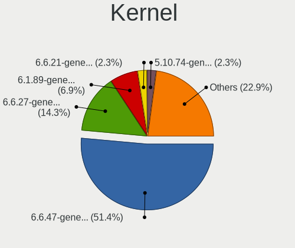
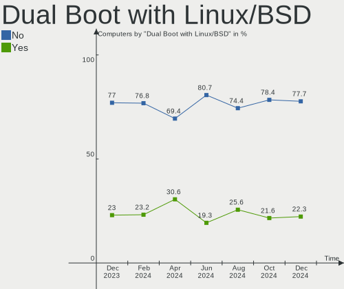
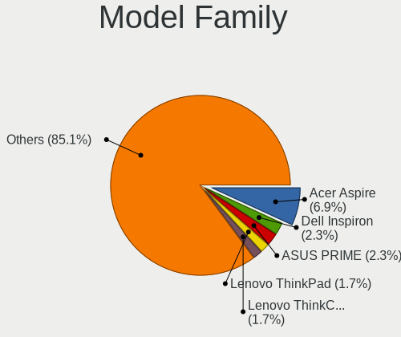
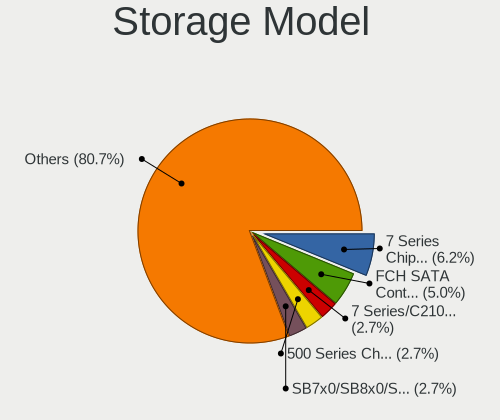
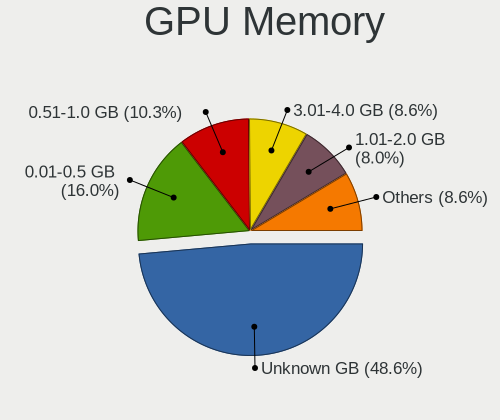
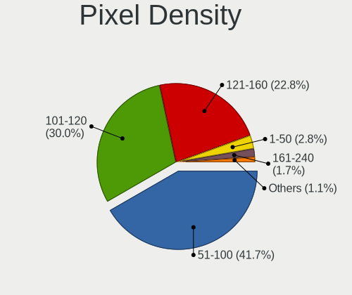

ROSA - Hardware Trends
----------------------

A project to identify most popular hardware characteristics and track their change
over time based on data collected by Linux users at https://Linux-Hardware.org.

Anyone can contribute to this report by the [hw-probe](https://github.com/linuxhw/hw-probe) tool:

    sudo -E hw-probe -all -upload

This is a report for all computer types. See also reports for [desktops](/Dist/ROSA/Desktop/README.md) and [notebooks](/Dist/ROSA/Notebook/README.md).

This report is for one last month. Overall report since the beginning of time: [TestDays](https://github.com/linuxhw/TestDays)

Period: Aug, 2023.

Contents
--------

* [ System ](#system)
  - [ OS                       ](#os)
  - [ OS Family                ](#os-family)
  - [ Kernel                   ](#kernel)
  - [ Kernel Family            ](#kernel-family)
  - [ Kernel Major Ver.        ](#kernel-major-ver)
  - [ Arch                     ](#arch)
  - [ DE                       ](#de)
  - [ Display Server           ](#display-server)
  - [ Display Manager          ](#display-manager)
  - [ OS Lang                  ](#os-lang)
  - [ Boot Mode                ](#boot-mode)
  - [ Filesystem               ](#filesystem)
  - [ Part. scheme             ](#part-scheme)
  - [ Dual Boot with Linux/BSD ](#dual-boot-with-linuxbsd)
  - [ Dual Boot (Win)          ](#dual-boot-win)

* [ Board ](#board)
  - [ Vendor                   ](#vendor)
  - [ Model                    ](#model)
  - [ Model Family             ](#model-family)
  - [ MFG Year                 ](#mfg-year)
  - [ Form Factor              ](#form-factor)
  - [ Secure Boot              ](#secure-boot)
  - [ Coreboot                 ](#coreboot)
  - [ RAM Size                 ](#ram-size)
  - [ RAM Used                 ](#ram-used)
  - [ Total Drives             ](#total-drives)
  - [ Has CD-ROM               ](#has-cd-rom)
  - [ Has Ethernet             ](#has-ethernet)
  - [ Has WiFi                 ](#has-wifi)
  - [ Has Bluetooth            ](#has-bluetooth)

* [ Location ](#location)
  - [ Country                  ](#country)
  - [ City                     ](#city)

* [ Drives ](#drives)
  - [ Drive Vendor             ](#drive-vendor)
  - [ Drive Model              ](#drive-model)
  - [ HDD Vendor               ](#hdd-vendor)
  - [ SSD Vendor               ](#ssd-vendor)
  - [ Drive Kind               ](#drive-kind)
  - [ Drive Connector          ](#drive-connector)
  - [ Drive Size               ](#drive-size)
  - [ Space Total              ](#space-total)
  - [ Space Used               ](#space-used)
  - [ Malfunc. Drives          ](#malfunc-drives)
  - [ Malfunc. Drive Vendor    ](#malfunc-drive-vendor)
  - [ Malfunc. HDD Vendor      ](#malfunc-hdd-vendor)
  - [ Malfunc. Drive Kind      ](#malfunc-drive-kind)
  - [ Failed Drives            ](#failed-drives)
  - [ Failed Drive Vendor      ](#failed-drive-vendor)
  - [ Drive Status             ](#drive-status)

* [ Storage controller ](#storage-controller)
  - [ Storage Vendor           ](#storage-vendor)
  - [ Storage Model            ](#storage-model)
  - [ Storage Kind             ](#storage-kind)

* [ Processor ](#processor)
  - [ CPU Vendor               ](#cpu-vendor)
  - [ CPU Model                ](#cpu-model)
  - [ CPU Model Family         ](#cpu-model-family)
  - [ CPU Cores                ](#cpu-cores)
  - [ CPU Sockets              ](#cpu-sockets)
  - [ CPU Threads              ](#cpu-threads)
  - [ CPU Op-Modes             ](#cpu-op-modes)
  - [ CPU Microcode            ](#cpu-microcode)
  - [ CPU Microarch            ](#cpu-microarch)

* [ Graphics ](#graphics)
  - [ GPU Vendor               ](#gpu-vendor)
  - [ GPU Model                ](#gpu-model)
  - [ GPU Combo                ](#gpu-combo)
  - [ GPU Driver               ](#gpu-driver)
  - [ GPU Memory               ](#gpu-memory)

* [ Monitor ](#monitor)
  - [ Monitor Vendor           ](#monitor-vendor)
  - [ Monitor Model            ](#monitor-model)
  - [ Monitor Resolution       ](#monitor-resolution)
  - [ Monitor Diagonal         ](#monitor-diagonal)
  - [ Monitor Width            ](#monitor-width)
  - [ Aspect Ratio             ](#aspect-ratio)
  - [ Monitor Area             ](#monitor-area)
  - [ Pixel Density            ](#pixel-density)
  - [ Multiple Monitors        ](#multiple-monitors)

* [ Network ](#network)
  - [ Net Controller Vendor    ](#net-controller-vendor)
  - [ Net Controller Model     ](#net-controller-model)
  - [ Wireless Vendor          ](#wireless-vendor)
  - [ Wireless Model           ](#wireless-model)
  - [ Ethernet Vendor          ](#ethernet-vendor)
  - [ Ethernet Model           ](#ethernet-model)
  - [ Net Controller Kind      ](#net-controller-kind)
  - [ Used Controller          ](#used-controller)
  - [ NICs                     ](#nics)
  - [ IPv6                     ](#ipv6)

* [ Bluetooth ](#bluetooth)
  - [ Bluetooth Vendor         ](#bluetooth-vendor)
  - [ Bluetooth Model          ](#bluetooth-model)

* [ Sound ](#sound)
  - [ Sound Vendor             ](#sound-vendor)
  - [ Sound Model              ](#sound-model)

* [ Memory ](#memory)
  - [ Memory Vendor            ](#memory-vendor)
  - [ Memory Model             ](#memory-model)
  - [ Memory Kind              ](#memory-kind)
  - [ Memory Form Factor       ](#memory-form-factor)
  - [ Memory Size              ](#memory-size)
  - [ Memory Speed             ](#memory-speed)

* [ Printers & scanners ](#printers--scanners)
  - [ Printer Vendor           ](#printer-vendor)
  - [ Printer Model            ](#printer-model)
  - [ Scanner Vendor           ](#scanner-vendor)
  - [ Scanner Model            ](#scanner-model)

* [ Camera ](#camera)
  - [ Camera Vendor            ](#camera-vendor)
  - [ Camera Model             ](#camera-model)

* [ Security ](#security)
  - [ Fingerprint Vendor       ](#fingerprint-vendor)
  - [ Fingerprint Model        ](#fingerprint-model)
  - [ Chipcard Vendor          ](#chipcard-vendor)
  - [ Chipcard Model           ](#chipcard-model)

* [ Unsupported ](#unsupported)
  - [ Unsupported Devices      ](#unsupported-devices)
  - [ Unsupported Device Types ](#unsupported-device-types)

System
------

OS
--

Installed operating systems

| Name       | Computers | Percent |
|------------|-----------|---------|
| ROSA 12.4  | 143       | 80.79%  |
| ROSA R11.1 | 10        | 5.65%   |
| ROSA 12    | 7         | 3.95%   |
| ROSA 12.3  | 5         | 2.82%   |
| ROSA 12.1  | 5         | 2.82%   |
| ROSA 13.0  | 3         | 1.69%   |
| ROSA 12.2  | 3         | 1.69%   |
| ROSA R10   | 1         | 0.56%   |

OS Family
---------

OS without a version

| Name | Computers | Percent |
|------|-----------|---------|
| ROSA | 177       | 100%    |

Kernel
------

Version of the Linux kernel

| Version                                   | Computers | Percent |
|-------------------------------------------|-----------|---------|
| 6.1.38-generic-1rosa2021.1-x86_64         | 80        | 45.2%   |
| 6.1.20-generic-2rosa2021.1-x86_64         | 42        | 23.73%  |
| 5.10.74-generic-2rosa2021.1-x86_64        | 8         | 4.52%   |
| 5.15.117-generic-1rosa2021.1-x86_64       | 6         | 3.39%   |
| 5.10.184-generic-1rosa2021.1-x86_64       | 4         | 2.26%   |
| 5.15.103-generic-1rosa2021.1-i686         | 3         | 1.69%   |
| 4.15.0-desktop-122.124.1rosa-x86_64       | 3         | 1.69%   |
| 6.4.5.xm1-1.klp-xanmod-rosa2021.1-x86_64  | 2         | 1.13%   |
| 6.1.38-generic-1rosa2021.1-arm64          | 2         | 1.13%   |
| 5.17.11-generic-2rosa2021.1-x86_64        | 2         | 1.13%   |
| 5.15.75-generic-1rosa2021.1-x86_64        | 2         | 1.13%   |
| 5.15.117-generic-1rosa2021.1-i686         | 2         | 1.13%   |
| 5.10.155-generic-1rosa2021.1-x86_64       | 2         | 1.13%   |
| 4.9.155-nrj-desktop-1rosa-x86_64          | 2         | 1.13%   |
| 4.15.0-desktop-122.124.1rosa-i586         | 2         | 1.13%   |
| 6.4.7.xm1-1.klp-xanmod-rosa2021.1-x86_64  | 1         | 0.56%   |
| 6.4.11.xm1-1.klp-xanmod-rosa2021.1-x86_64 | 1         | 0.56%   |
| 6.2.12.xm1-1.klp-xanmod-rosa2021.1-x86_64 | 1         | 0.56%   |
| 6.1.46-generic-1rosa2021.1-x86_64         | 1         | 0.56%   |
| 6.1.45.xm1-1.klp-xanmod-rosa2021.1-x86_64 | 1         | 0.56%   |
| 6.1.45-generic-1rosa2023.1-x86_64         | 1         | 0.56%   |
| 6.1.42-generic-1rosa2023.1-x86_64         | 1         | 0.56%   |
| 6.0.12.xm1-1.klp-xanmod-rosa2021.1-x86_64 | 1         | 0.56%   |
| 5.4.83-generic-2rosa-x86_64               | 1         | 0.56%   |
| 5.4.193-generic-4rosa2021.1-e2kv4         | 1         | 0.56%   |
| 5.15.79-generic-1rosa2021.1-x86_64        | 1         | 0.56%   |
| 5.15.77-generic-1rosa2021.1-x86_64        | 1         | 0.56%   |
| 5.13.9-generic-1rosa-x86_64               | 1         | 0.56%   |
| 4.9.60-nrj-desktop-1rosa-x86_64           | 1         | 0.56%   |
| 4.9.155-nrj-desktop-1rosa-i586            | 1         | 0.56%   |

Kernel Family
-------------

Linux kernel without a distro release

| Version  | Computers | Percent |
|----------|-----------|---------|
| 6.1.38   | 82        | 46.33%  |
| 6.1.20   | 42        | 23.73%  |
| 5.15.117 | 8         | 4.52%   |
| 5.10.74  | 8         | 4.52%   |
| 4.15.0   | 5         | 2.82%   |
| 5.10.184 | 4         | 2.26%   |
| 5.15.103 | 3         | 1.69%   |
| 4.9.155  | 3         | 1.69%   |
| 6.4.5    | 2         | 1.13%   |
| 6.1.45   | 2         | 1.13%   |
| 5.17.11  | 2         | 1.13%   |
| 5.15.75  | 2         | 1.13%   |
| 5.10.155 | 2         | 1.13%   |
| 6.4.7    | 1         | 0.56%   |
| 6.4.11   | 1         | 0.56%   |
| 6.2.12   | 1         | 0.56%   |
| 6.1.46   | 1         | 0.56%   |
| 6.1.42   | 1         | 0.56%   |
| 6.0.12   | 1         | 0.56%   |
| 5.4.83   | 1         | 0.56%   |
| 5.4.193  | 1         | 0.56%   |
| 5.15.79  | 1         | 0.56%   |
| 5.15.77  | 1         | 0.56%   |
| 5.13.9   | 1         | 0.56%   |
| 4.9.60   | 1         | 0.56%   |

Kernel Major Ver.
-----------------

Linux kernel major version

| Version | Computers | Percent |
|---------|-----------|---------|
| 6.1     | 128       | 72.32%  |
| 5.15    | 15        | 8.47%   |
| 5.10    | 14        | 7.91%   |
| 4.15    | 5         | 2.82%   |
| 6.4     | 4         | 2.26%   |
| 4.9     | 4         | 2.26%   |
| 5.4     | 2         | 1.13%   |
| 5.17    | 2         | 1.13%   |
| 6.2     | 1         | 0.56%   |
| 6.0     | 1         | 0.56%   |
| 5.13    | 1         | 0.56%   |

Arch
----

OS architecture (x86_64, i586, etc.)

| Name    | Computers | Percent |
|---------|-----------|---------|
| x86_64  | 166       | 93.79%  |
| i686    | 8         | 4.52%   |
| aarch64 | 2         | 1.13%   |
| e2k     | 1         | 0.56%   |

DE
--

Desktop Environment

| Name    | Computers | Percent |
|---------|-----------|---------|
| KDE5    | 110       | 62.15%  |
| GNOME   | 36        | 20.34%  |
| LXQt    | 14        | 7.91%   |
| KDE4    | 10        | 5.65%   |
| XFCE    | 5         | 2.82%   |
| i3      | 1         | 0.56%   |
| Unknown | 1         | 0.56%   |

Display Server
--------------

X11 or Wayland

| Name    | Computers | Percent |
|---------|-----------|---------|
| Wayland | 134       | 75.71%  |
| X11     | 43        | 24.29%  |

Display Manager
---------------

SDDM, LightDM, etc.

| Name    | Computers | Percent |
|---------|-----------|---------|
| SDDM    | 105       | 59.32%  |
| GDM     | 54        | 30.51%  |
| LightDM | 9         | 5.08%   |
| KDM     | 9         | 5.08%   |

OS Lang
-------

Language

| Lang    | Computers | Percent |
|---------|-----------|---------|
| ru_RU   | 157       | 88.7%   |
| en_US   | 12        | 6.78%   |
| pt_BR   | 1         | 0.56%   |
| pl_PL   | 1         | 0.56%   |
| it_IT   | 1         | 0.56%   |
| et_EE   | 1         | 0.56%   |
| es_ES   | 1         | 0.56%   |
| en_GB   | 1         | 0.56%   |
| de_DE   | 1         | 0.56%   |
| Unknown | 1         | 0.56%   |

Boot Mode
---------

EFI or BIOS

| Mode | Computers | Percent |
|------|-----------|---------|
| EFI  | 96        | 54.24%  |
| BIOS | 81        | 45.76%  |

Filesystem
----------

Type of filesystem

| Type    | Computers | Percent |
|---------|-----------|---------|
| Ext4    | 164       | 92.66%  |
| Btrfs   | 10        | 5.65%   |
| Overlay | 2         | 1.13%   |
| Aufs    | 1         | 0.56%   |

Part. scheme
------------

Scheme of partitioning

| Type    | Computers | Percent |
|---------|-----------|---------|
| GPT     | 112       | 63.28%  |
| MBR     | 64        | 36.16%  |
| Unknown | 1         | 0.56%   |

Dual Boot with Linux/BSD
------------------------

Hosting more than one Linux/BSD

| Dual boot | Computers | Percent |
|-----------|-----------|---------|
| No        | 133       | 75.14%  |
| Yes       | 44        | 24.86%  |

Dual Boot (Win)
---------------

Hosting Linux and Windows

| Dual boot | Computers | Percent |
|-----------|-----------|---------|
| No        | 99        | 55.93%  |
| Yes       | 78        | 44.07%  |

Board
-----

Vendor
------

Motherboard manufacturer

| Name                        | Computers | Percent |
|-----------------------------|-----------|---------|
| ASUSTek Computer            | 40        | 22.6%   |
| Gigabyte Technology         | 25        | 14.12%  |
| Hewlett-Packard             | 19        | 10.73%  |
| Lenovo                      | 12        | 6.78%   |
| Acer                        | 12        | 6.78%   |
| MSI                         | 10        | 5.65%   |
| ASRock                      | 8         | 4.52%   |
| Dell                        | 7         | 3.95%   |
| Intel                       | 4         | 2.26%   |
| Samsung Electronics         | 3         | 1.69%   |
| Notebook                    | 2         | 1.13%   |
| HUAWEI                      | 2         | 1.13%   |
| Huanan                      | 2         | 1.13%   |
| Fujitsu Siemens             | 2         | 1.13%   |
| Foxconn                     | 2         | 1.13%   |
| Apple                       | 2         | 1.13%   |
| Unknown                     | 2         | 1.13%   |
| WeiBu                       | 1         | 0.56%   |
| Toshiba                     | 1         | 0.56%   |
| Timi                        | 1         | 0.56%   |
| Soyo                        | 1         | 0.56%   |
| Sony                        | 1         | 0.56%   |
| RuggedPC                    | 1         | 0.56%   |
| ROMBICA                     | 1         | 0.56%   |
| Positivo                    | 1         | 0.56%   |
| Maibenben                   | 1         | 0.56%   |
| K-Systems                   | 1         | 0.56%   |
| iRU                         | 1         | 0.56%   |
| Irbis                       | 1         | 0.56%   |
| Infomash                    | 1         | 0.56%   |
| Gateway                     | 1         | 0.56%   |
| Edelweiss                   | 1         | 0.56%   |
| ECS                         | 1         | 0.56%   |
| Digma                       | 1         | 0.56%   |
| Clevo                       | 1         | 0.56%   |
| Biostar                     | 1         | 0.56%   |
| AZW                         | 1         | 0.56%   |
| Aquarius Production Company | 1         | 0.56%   |
| Aquarius                    | 1         | 0.56%   |
| ANCOMP                      | 1         | 0.56%   |

Model
-----

Motherboard model

| Name                                 | Computers | Percent |
|--------------------------------------|-----------|---------|
| Unknown                              | 3         | 1.69%   |
| ASUS PRIME B450M-K II                | 2         | 1.13%   |
| ASUS All Series                      | 2         | 1.13%   |
| Acer Aspire E5-573G                  | 2         | 1.13%   |
| WeiBu H310CX1B V1.0                  | 1         | 0.56%   |
| Toshiba Satellite L775D              | 1         | 0.56%   |
| Timi TM1701                          | 1         | 0.56%   |
| Soyo SY-Classic B450M                | 1         | 0.56%   |
| Sony VPCL22S1R                       | 1         | 0.56%   |
| Samsung R528/R728                    | 1         | 0.56%   |
| Samsung R518                         | 1         | 0.56%   |
| Samsung 350V5C/351V5C/3540VC/3440VC  | 1         | 0.56%   |
| RuggedPC T8S                         | 1         | 0.56%   |
| ROMBICA myBook Eclipse               | 1         | 0.56%   |
| Positivo N6440                       | 1         | 0.56%   |
| Notebook WA50SRQ                     | 1         | 0.56%   |
| Notebook W54_W94_W955TU,-T,-C        | 1         | 0.56%   |
| MSI X460/X460DX                      | 1         | 0.56%   |
| MSI MS-7C94                          | 1         | 0.56%   |
| MSI MS-7C51                          | 1         | 0.56%   |
| MSI MS-7924                          | 1         | 0.56%   |
| MSI MS-7918                          | 1         | 0.56%   |
| MSI MS-7895                          | 1         | 0.56%   |
| MSI MS-7788                          | 1         | 0.56%   |
| MSI MS-7599                          | 1         | 0.56%   |
| MSI MS-7592                          | 1         | 0.56%   |
| MSI Mars E192                        | 1         | 0.56%   |
| Maibenben MaiBook X series           | 1         | 0.56%   |
| Lenovo ThinkPad P50 20EN001CUS       | 1         | 0.56%   |
| Lenovo ThinkPad P1 Gen 4i 20Y3001LUK | 1         | 0.56%   |
| Lenovo ThinkPad Edge E120 3043A25    | 1         | 0.56%   |
| Lenovo ThinkBook 16 G4+ ARA 21D1     | 1         | 0.56%   |
| Lenovo IdeaPad 5 15IAL7 82SF         | 1         | 0.56%   |
| Lenovo IdeaPad 330-15IGM 81D1        | 1         | 0.56%   |
| Lenovo IdeaPad 3 15IML05 81WB        | 1         | 0.56%   |
| Lenovo IdeaPad 3 14ADA05 81W0        | 1         | 0.56%   |
| Lenovo H420                          | 1         | 0.56%   |
| Lenovo G580 20157                    | 1         | 0.56%   |
| Lenovo G50-45 80E3                   | 1         | 0.56%   |
| Lenovo 3000 G530 4151/200            | 1         | 0.56%   |

Model Family
------------

Motherboard model prefix

| Name                  | Computers | Percent |
|-----------------------|-----------|---------|
| ASUS PRIME            | 8         | 4.52%   |
| Acer Aspire           | 8         | 4.52%   |
| HP Pavilion           | 5         | 2.82%   |
| Dell Inspiron         | 5         | 2.82%   |
| Lenovo IdeaPad        | 4         | 2.26%   |
| Lenovo ThinkPad       | 3         | 1.69%   |
| HP ProBook            | 3         | 1.69%   |
| ASUS TUF              | 3         | 1.69%   |
| Unknown               | 3         | 1.69%   |
| HP Compaq             | 2         | 1.13%   |
| Fujitsu Siemens AMILO | 2         | 1.13%   |
| ASUS VivoBook         | 2         | 1.13%   |
| ASUS P8H61-M          | 2         | 1.13%   |
| ASUS M5A97            | 2         | 1.13%   |
| ASUS All              | 2         | 1.13%   |
| Acer Extensa          | 2         | 1.13%   |
| WeiBu H310CX1B        | 1         | 0.56%   |
| Toshiba Satellite     | 1         | 0.56%   |
| Timi TM1701           | 1         | 0.56%   |
| Soyo SY-Classic       | 1         | 0.56%   |
| Sony VPCL22S1R        | 1         | 0.56%   |
| Samsung R528          | 1         | 0.56%   |
| Samsung R518          | 1         | 0.56%   |
| Samsung 350V5C        | 1         | 0.56%   |
| RuggedPC T8S          | 1         | 0.56%   |
| ROMBICA myBook        | 1         | 0.56%   |
| Positivo N6440        | 1         | 0.56%   |
| Notebook WA50SRQ      | 1         | 0.56%   |
| Notebook W54          | 1         | 0.56%   |
| MSI X460              | 1         | 0.56%   |
| MSI MS-7C94           | 1         | 0.56%   |
| MSI MS-7C51           | 1         | 0.56%   |
| MSI MS-7924           | 1         | 0.56%   |
| MSI MS-7918           | 1         | 0.56%   |
| MSI MS-7895           | 1         | 0.56%   |
| MSI MS-7788           | 1         | 0.56%   |
| MSI MS-7599           | 1         | 0.56%   |
| MSI MS-7592           | 1         | 0.56%   |
| MSI Mars              | 1         | 0.56%   |
| Maibenben MaiBook     | 1         | 0.56%   |

MFG Year
--------

Motherboard manufacture year

| Year    | Computers | Percent |
|---------|-----------|---------|
| 2012    | 20        | 11.3%   |
| 2011    | 19        | 10.73%  |
| 2022    | 13        | 7.34%   |
| 2021    | 13        | 7.34%   |
| 2020    | 12        | 6.78%   |
| 2013    | 12        | 6.78%   |
| 2019    | 11        | 6.21%   |
| 2018    | 11        | 6.21%   |
| 2009    | 11        | 6.21%   |
| 2015    | 10        | 5.65%   |
| 2014    | 9         | 5.08%   |
| 2010    | 8         | 4.52%   |
| 2008    | 8         | 4.52%   |
| 2017    | 6         | 3.39%   |
| 2023    | 4         | 2.26%   |
| 2016    | 4         | 2.26%   |
| 2007    | 4         | 2.26%   |
| 2003    | 1         | 0.56%   |
| Unknown | 1         | 0.56%   |

Form Factor
-----------

Physical design of the computer

| Name           | Computers | Percent |
|----------------|-----------|---------|
| Desktop        | 86        | 48.59%  |
| Notebook       | 79        | 44.63%  |
| All in one     | 4         | 2.26%   |
| System on chip | 2         | 1.13%   |
| Convertible    | 2         | 1.13%   |
| Server         | 2         | 1.13%   |
| Tablet         | 1         | 0.56%   |
| Mini pc        | 1         | 0.56%   |

Secure Boot
-----------

Enabled or disabled

| State    | Computers | Percent |
|----------|-----------|---------|
| Disabled | 177       | 100%    |

Coreboot
--------

Have coreboot on board

| Used | Computers | Percent |
|------|-----------|---------|
| No   | 177       | 100%    |

RAM Size
--------

Total RAM memory

| Size in GB | Computers | Percent |
|------------|-----------|---------|
| 4.01-8.0   | 46        | 25.99%  |
| 8.01-16.0  | 40        | 22.6%   |
| 3.01-4.0   | 31        | 17.51%  |
| 16.01-24.0 | 27        | 15.25%  |
| 32.01-64.0 | 16        | 9.04%   |
| 1.01-2.0   | 8         | 4.52%   |
| 2.01-3.0   | 5         | 2.82%   |
| 24.01-32.0 | 4         | 2.26%   |

RAM Used
--------

Used RAM memory

| Used GB    | Computers | Percent |
|------------|-----------|---------|
| 1.01-2.0   | 92        | 51.98%  |
| 2.01-3.0   | 33        | 18.64%  |
| 0.51-1.0   | 29        | 16.38%  |
| 3.01-4.0   | 15        | 8.47%   |
| 4.01-8.0   | 5         | 2.82%   |
| 8.01-16.0  | 2         | 1.13%   |
| 16.01-24.0 | 1         | 0.56%   |

Total Drives
------------

Number of drives on board

| Drives | Computers | Percent |
|--------|-----------|---------|
| 1      | 93        | 52.54%  |
| 2      | 59        | 33.33%  |
| 3      | 13        | 7.34%   |
| 4      | 7         | 3.95%   |
| 5      | 3         | 1.69%   |
| 6      | 1         | 0.56%   |
| 0      | 1         | 0.56%   |

Has CD-ROM
----------

Has CD-ROM on board

| Presented | Computers | Percent |
|-----------|-----------|---------|
| No        | 106       | 59.89%  |
| Yes       | 71        | 40.11%  |

Has Ethernet
------------

Has Ethernet on board

| Presented | Computers | Percent |
|-----------|-----------|---------|
| Yes       | 161       | 90.96%  |
| No        | 16        | 9.04%   |

Has WiFi
--------

Has WiFi module

| Presented | Computers | Percent |
|-----------|-----------|---------|
| Yes       | 113       | 63.84%  |
| No        | 64        | 36.16%  |

Has Bluetooth
-------------

Has Bluetooth module

| Presented | Computers | Percent |
|-----------|-----------|---------|
| No        | 91        | 51.41%  |
| Yes       | 86        | 48.59%  |

Location
--------

Country
-------

Geographic location (country)

| Country         | Computers | Percent |
|-----------------|-----------|---------|
| Russia          | 150       | 84.75%  |
| Ukraine         | 5         | 2.82%   |
| USA             | 3         | 1.69%   |
| Peru            | 2         | 1.13%   |
| Germany         | 2         | 1.13%   |
| Brazil          | 2         | 1.13%   |
| Belarus         | 2         | 1.13%   |
| Poland          | 1         | 0.56%   |
| North Macedonia | 1         | 0.56%   |
| Malaysia        | 1         | 0.56%   |
| Kyrgyzstan      | 1         | 0.56%   |
| Kazakhstan      | 1         | 0.56%   |
| Italy           | 1         | 0.56%   |
| Ireland         | 1         | 0.56%   |
| India           | 1         | 0.56%   |
| Estonia         | 1         | 0.56%   |
| Czechia         | 1         | 0.56%   |
| Costa Rica      | 1         | 0.56%   |

City
----

Geographic location (city)

| City             | Computers | Percent |
|------------------|-----------|---------|
| Moscow           | 33        | 18.64%  |
| St Petersburg    | 8         | 4.52%   |
| Yekaterinburg    | 7         | 3.95%   |
| Voronezh         | 6         | 3.39%   |
| Orenburg         | 5         | 2.82%   |
| Novosibirsk      | 4         | 2.26%   |
| Krasnodar        | 4         | 2.26%   |
| Volgograd        | 3         | 1.69%   |
| Ufa              | 3         | 1.69%   |
| Rostov-on-Don    | 3         | 1.69%   |
| Chelyabinsk      | 3         | 1.69%   |
| Yoshkar-Ola      | 2         | 1.13%   |
| Tolyatti         | 2         | 1.13%   |
| Sochi            | 2         | 1.13%   |
| Smolensk         | 2         | 1.13%   |
| Shchelkovo       | 2         | 1.13%   |
| Samara           | 2         | 1.13%   |
| Pyatigorsk       | 2         | 1.13%   |
| Penza            | 2         | 1.13%   |
| Omsk             | 2         | 1.13%   |
| Odintsovo        | 2         | 1.13%   |
| Nizhniy Novgorod | 2         | 1.13%   |
| Mytishchi        | 2         | 1.13%   |
| Lima             | 2         | 1.13%   |
| Kostroma         | 2         | 1.13%   |
| Khabarovsk       | 2         | 1.13%   |
| Irkutsk          | 2         | 1.13%   |
| Cheboksary       | 2         | 1.13%   |
| Barnaul          | 2         | 1.13%   |
| Zalari           | 1         | 0.56%   |
| Yelizovo         | 1         | 0.56%   |
| Yasinovataya     | 1         | 0.56%   |
| Yalta            | 1         | 0.56%   |
| Vidnoye          | 1         | 0.56%   |
| Veliky Novgorod  | 1         | 0.56%   |
| Ulyanovsk        | 1         | 0.56%   |
| Tsarskoye Selo   | 1         | 0.56%   |
| Tallinn          | 1         | 0.56%   |
| Syktyvkar        | 1         | 0.56%   |
| Surgut           | 1         | 0.56%   |

Drives
------

Drive Vendor
------------

Hard drive vendors

| Vendor                      | Computers | Drives | Percent |
|-----------------------------|-----------|--------|---------|
| WDC                         | 49        | 57     | 17.38%  |
| Seagate                     | 33        | 35     | 11.7%   |
| Samsung Electronics         | 25        | 31     | 8.87%   |
| Toshiba                     | 19        | 19     | 6.74%   |
| Kingston                    | 17        | 19     | 6.03%   |
| China                       | 15        | 15     | 5.32%   |
| A-DATA Technology           | 13        | 13     | 4.61%   |
| Apacer                      | 9         | 10     | 3.19%   |
| SanDisk                     | 8         | 8      | 2.84%   |
| Crucial                     | 6         | 7      | 2.13%   |
| Unknown                     | 5         | 5      | 1.77%   |
| Hitachi                     | 5         | 5      | 1.77%   |
| Team                        | 4         | 4      | 1.42%   |
| SK hynix                    | 4         | 4      | 1.42%   |
| Intel                       | 4         | 4      | 1.42%   |
| HGST                        | 4         | 4      | 1.42%   |
| Transcend                   | 3         | 3      | 1.06%   |
| Silicon Motion              | 3         | 3      | 1.06%   |
| OCZ                         | 3         | 3      | 1.06%   |
| Netac                       | 3         | 3      | 1.06%   |
| Micron Technology           | 3         | 3      | 1.06%   |
| JMicron Technology          | 3         | 3      | 1.06%   |
| GOODRAM                     | 3         | 3      | 1.06%   |
| AMD                         | 3         | 3      | 1.06%   |
| XrayDisk                    | 2         | 2      | 0.71%   |
| SPCC                        | 2         | 2      | 0.71%   |
| Smartbuy                    | 2         | 2      | 0.71%   |
| Foxline                     | 2         | 2      | 0.71%   |
| Digma                       | 2         | 2      | 0.71%   |
| USB3.0                      | 1         | 1      | 0.35%   |
| TO Exter                    | 1         | 1      | 0.35%   |
| ShanDianZhe                 | 1         | 1      | 0.35%   |
| SCY                         | 1         | 1      | 0.35%   |
| Qumo                        | 1         | 1      | 0.35%   |
| PNY                         | 1         | 1      | 0.35%   |
| Phison                      | 1         | 1      | 0.35%   |
| Patriot                     | 1         | 1      | 0.35%   |
| Maxtor                      | 1         | 1      | 0.35%   |
| MAXIO Technology (Hangzhou) | 1         | 1      | 0.35%   |
| Lenovo                      | 1         | 1      | 0.35%   |

Drive Model
-----------

Hard drive models

| Model                            | Computers | Percent |
|----------------------------------|-----------|---------|
| Kingston SA400S37120G 120GB SSD  | 6         | 1.99%   |
| Toshiba DT01ACA050 500GB         | 4         | 1.33%   |
| Seagate ST1000LM035-1RK172 1TB   | 4         | 1.33%   |
| Seagate ST1000DM010-2EP102 1TB   | 4         | 1.33%   |
| Kingston SA400S37240G 240GB SSD  | 4         | 1.33%   |
| WDC WD10JPVX-22JC3T0 1TB         | 3         | 1%      |
| WDC WD10EZEX-00BBHA0 1TB         | 3         | 1%      |
| Unknown NVMe SSD Drive 512GB     | 3         | 1%      |
| Toshiba MQ01ABD100 1TB           | 3         | 1%      |
| Seagate ST1000DM003-1CH162 1TB   | 3         | 1%      |
| Samsung SSD 860 EVO 500GB        | 3         | 1%      |
| Apacer AS350 128GB SSD           | 3         | 1%      |
| A-DATA SU650 240GB SSD           | 3         | 1%      |
| WDC WDS240G2G0A-00JH30 240GB SSD | 2         | 0.66%   |
| WDC WD5000AZLX-00K2TA0 500GB     | 2         | 0.66%   |
| WDC WD2500AAKX-00ERMA0 250GB     | 2         | 0.66%   |
| WDC WD10EZEX-22MFCA0 1TB         | 2         | 0.66%   |
| WDC WD10EZEX-00RKKA0 1TB         | 2         | 0.66%   |
| Toshiba MK6475GSX 640GB          | 2         | 0.66%   |
| Toshiba HDWD110 1TB              | 2         | 0.66%   |
| Toshiba DT01ACA100 1TB           | 2         | 0.66%   |
| Team T253240GB SSD               | 2         | 0.66%   |
| Smartbuy SSD 256GB               | 2         | 0.66%   |
| Seagate ST500LT012-1DG142 500GB  | 2         | 0.66%   |
| Seagate ST31000528AS 1TB         | 2         | 0.66%   |
| Seagate ST2000DL003-9VT166 2TB   | 2         | 0.66%   |
| Samsung SSD 870 EVO 500GB        | 2         | 0.66%   |
| Samsung SSD 870 EVO 500G         | 2         | 0.66%   |
| JMicron Generic 1TB              | 2         | 0.66%   |
| Intel SSDPEKNU512GZ 512GB        | 2         | 0.66%   |
| China SSD 480GB                  | 2         | 0.66%   |
| China SSD 256GB                  | 2         | 0.66%   |
| China SSD 120GB                  | 2         | 0.66%   |
| China SATA SSD 120GB             | 2         | 0.66%   |
| Apacer AS350 512GB SSD           | 2         | 0.66%   |
| A-DATA SU650 120GB SSD           | 2         | 0.66%   |
| XrayDisk 512GB SSD               | 1         | 0.33%   |
| XrayDisk 240GB SSD               | 1         | 0.33%   |
| WDC WDS500G2B0A-00SM50 500GB SSD | 1         | 0.33%   |
| WDC WDS480G2G0A-00JH30 480GB SSD | 1         | 0.33%   |

HDD Vendor
----------

Hard disk drive vendors

| Vendor              | Computers | Drives | Percent |
|---------------------|-----------|--------|---------|
| WDC                 | 41        | 47     | 39.42%  |
| Seagate             | 33        | 35     | 31.73%  |
| Toshiba             | 17        | 17     | 16.35%  |
| Hitachi             | 5         | 5      | 4.81%   |
| HGST                | 4         | 4      | 3.85%   |
| USB3.0              | 1         | 1      | 0.96%   |
| Samsung Electronics | 1         | 1      | 0.96%   |
| Maxtor              | 1         | 1      | 0.96%   |
| Fujitsu             | 1         | 1      | 0.96%   |

SSD Vendor
----------

Solid state drive vendors

| Vendor              | Computers | Drives | Percent |
|---------------------|-----------|--------|---------|
| Samsung Electronics | 15        | 17     | 12.3%   |
| Kingston            | 15        | 17     | 12.3%   |
| China               | 15        | 15     | 12.3%   |
| A-DATA Technology   | 9         | 9      | 7.38%   |
| Apacer              | 8         | 9      | 6.56%   |
| WDC                 | 7         | 8      | 5.74%   |
| Team                | 4         | 4      | 3.28%   |
| SanDisk             | 4         | 4      | 3.28%   |
| OCZ                 | 3         | 3      | 2.46%   |
| GOODRAM             | 3         | 3      | 2.46%   |
| AMD                 | 3         | 3      | 2.46%   |
| Transcend           | 2         | 2      | 1.64%   |
| Smartbuy            | 2         | 2      | 1.64%   |
| Netac               | 2         | 2      | 1.64%   |
| JMicron Technology  | 2         | 2      | 1.64%   |
| Foxline             | 2         | 2      | 1.64%   |
| Digma               | 2         | 2      | 1.64%   |
| Crucial             | 2         | 3      | 1.64%   |
| XrayDisk            | 1         | 1      | 0.82%   |
| TO Exter            | 1         | 1      | 0.82%   |
| SPCC                | 1         | 1      | 0.82%   |
| SK hynix            | 1         | 1      | 0.82%   |
| ShanDianZhe         | 1         | 1      | 0.82%   |
| Qumo                | 1         | 1      | 0.82%   |
| PNY                 | 1         | 1      | 0.82%   |
| Patriot             | 1         | 1      | 0.82%   |
| Micron Technology   | 1         | 1      | 0.82%   |
| Lenovo              | 1         | 1      | 0.82%   |
| Kingmax             | 1         | 1      | 0.82%   |
| Intel               | 1         | 1      | 0.82%   |
| HYDRA               | 1         | 1      | 0.82%   |
| HS-SSD-E100         | 1         | 1      | 0.82%   |
| Gigabyte Technology | 1         | 1      | 0.82%   |
| DeTech              | 1         | 1      | 0.82%   |
| DATARAM             | 1         | 1      | 0.82%   |
| Corsair             | 1         | 1      | 0.82%   |
| BR                  | 1         | 1      | 0.82%   |
| Apple               | 1         | 1      | 0.82%   |
| AGI                 | 1         | 1      | 0.82%   |
| Unknown             | 1         | 1      | 0.82%   |

Drive Kind
----------

HDD or SSD

| Kind    | Computers | Drives | Percent |
|---------|-----------|--------|---------|
| SSD     | 100       | 129    | 40.82%  |
| HDD     | 93        | 112    | 37.96%  |
| NVMe    | 47        | 56     | 19.18%  |
| MMC     | 3         | 3      | 1.22%   |
| Unknown | 2         | 2      | 0.82%   |

Drive Connector
---------------

SATA, SAS, NVMe, etc.

| Type | Computers | Drives | Percent |
|------|-----------|--------|---------|
| SATA | 148       | 232    | 71.15%  |
| NVMe | 47        | 56     | 22.6%   |
| SAS  | 10        | 11     | 4.81%   |
| MMC  | 3         | 3      | 1.44%   |

Drive Size
----------

Size of hard drive

| Size in TB | Computers | Drives | Percent |
|------------|-----------|--------|---------|
| 0.01-0.5   | 115       | 158    | 62.84%  |
| 0.51-1.0   | 57        | 72     | 31.15%  |
| 1.01-2.0   | 10        | 10     | 5.46%   |
| 3.01-4.0   | 1         | 1      | 0.55%   |

Space Total
-----------

Amount of disk space available on the file system

| Size in GB     | Computers | Percent |
|----------------|-----------|---------|
| 101-250        | 56        | 31.64%  |
| 251-500        | 44        | 24.86%  |
| 501-1000       | 28        | 15.82%  |
| 1001-2000      | 14        | 7.91%   |
| 1-20           | 12        | 6.78%   |
| 51-100         | 12        | 6.78%   |
| 21-50          | 8         | 4.52%   |
| More than 3000 | 2         | 1.13%   |
| 2001-3000      | 1         | 0.56%   |

Space Used
----------

Amount of used disk space

| Used GB        | Computers | Percent |
|----------------|-----------|---------|
| 1-20           | 114       | 64.41%  |
| 101-250        | 19        | 10.73%  |
| 21-50          | 17        | 9.6%    |
| 51-100         | 11        | 6.21%   |
| 501-1000       | 7         | 3.95%   |
| 251-500        | 6         | 3.39%   |
| More than 3000 | 1         | 0.56%   |
| 2001-3000      | 1         | 0.56%   |
| 1001-2000      | 1         | 0.56%   |

Malfunc. Drives
---------------

Drive models with a malfunction

| Model                                 | Computers | Drives | Percent |
|---------------------------------------|-----------|--------|---------|
| Seagate ST500LT012-1DG142 500GB       | 2         | 2      | 4%      |
| Seagate ST2000DL003-9VT166 2TB        | 2         | 2      | 4%      |
| Seagate ST1000LM035-1RK172 1TB        | 2         | 2      | 4%      |
| Seagate ST1000DM003-1CH162 1TB        | 2         | 2      | 4%      |
| XrayDisk 512GB SSD                    | 1         | 1      | 2%      |
| WDC WDS240G2G0A-00JH30 240GB SSD      | 1         | 1      | 2%      |
| WDC WD5000LPVX-08V0TT5 500GB          | 1         | 1      | 2%      |
| WDC WD5000AAKX-60U6AA0 500GB          | 1         | 1      | 2%      |
| WDC WD5000AAKS-00E4A0 500GB           | 1         | 1      | 2%      |
| WDC WD4000AAKS-00TMA0 400GB           | 1         | 1      | 2%      |
| WDC WD3200BEKT-60F3T1 320GB           | 1         | 1      | 2%      |
| WDC WD1200BEVS-08RST2 120GB           | 1         | 1      | 2%      |
| WDC WD10PURZ-85U8XY0 1TB              | 1         | 1      | 2%      |
| WDC WD10EALX-009BA0 1TB               | 1         | 1      | 2%      |
| WDC WD1003FZEX-00MK2A0 1TB            | 1         | 1      | 2%      |
| Toshiba MQ01ABF032 320GB              | 1         | 1      | 2%      |
| Toshiba MQ01ABD100 1TB                | 1         | 1      | 2%      |
| Toshiba MK6475GSX 640GB               | 1         | 1      | 2%      |
| Toshiba MK3276GSX 320GB               | 1         | 1      | 2%      |
| Toshiba HDWD110 1TB                   | 1         | 1      | 2%      |
| Toshiba DT01ACA100 1TB                | 1         | 1      | 2%      |
| Team T253X1120G 120GB SSD             | 1         | 1      | 2%      |
| SK hynix BC711 HFM512GD3JX013N 512GB  | 1         | 1      | 2%      |
| Seagate ST9500423AS 500GB             | 1         | 1      | 2%      |
| Seagate ST3500410AS 500GB             | 1         | 1      | 2%      |
| Seagate ST3250410AS 250GB             | 1         | 1      | 2%      |
| Seagate ST3250318AS 250GB             | 1         | 1      | 2%      |
| Seagate ST320LT020-9YG142 320GB       | 1         | 1      | 2%      |
| Seagate ST31000528AS 1TB              | 1         | 1      | 2%      |
| Seagate ST1000LM048-2E7172 1TB        | 1         | 1      | 2%      |
| Seagate ST1000LM024 HN-M101MBB 1TB    | 1         | 1      | 2%      |
| Samsung Electronics SSD 960 EVO 250GB | 1         | 1      | 2%      |
| OCZ VERTEX3 120GB SSD                 | 1         | 1      | 2%      |
| OCZ VECTOR150 240GB SSD               | 1         | 1      | 2%      |
| Netac SSD 128GB                       | 1         | 1      | 2%      |
| Maxtor STM3320820AS 320GB             | 1         | 1      | 2%      |
| Kingston SH100S3240G 240GB SSD        | 1         | 1      | 2%      |
| Kingmax SSD 60GB                      | 1         | 1      | 2%      |
| Hitachi HTS541680J9SA00 80GB          | 1         | 1      | 2%      |
| Hitachi HDS721025CLA382 250GB         | 1         | 1      | 2%      |

Malfunc. Drive Vendor
---------------------

Vendors of faulty drives

| Vendor              | Computers | Drives | Percent |
|---------------------|-----------|--------|---------|
| Seagate             | 15        | 16     | 30.61%  |
| WDC                 | 10        | 10     | 20.41%  |
| Toshiba             | 6         | 6      | 12.24%  |
| Hitachi             | 3         | 3      | 6.12%   |
| OCZ                 | 2         | 2      | 4.08%   |
| HGST                | 2         | 2      | 4.08%   |
| XrayDisk            | 1         | 1      | 2.04%   |
| Team                | 1         | 1      | 2.04%   |
| SK hynix            | 1         | 1      | 2.04%   |
| Samsung Electronics | 1         | 1      | 2.04%   |
| Netac               | 1         | 1      | 2.04%   |
| Maxtor              | 1         | 1      | 2.04%   |
| Kingston            | 1         | 1      | 2.04%   |
| Kingmax             | 1         | 1      | 2.04%   |
| Fujitsu             | 1         | 1      | 2.04%   |
| DeTech              | 1         | 1      | 2.04%   |
| China               | 1         | 1      | 2.04%   |

Malfunc. HDD Vendor
-------------------

Vendors of faulty HDD drives

| Vendor  | Computers | Drives | Percent |
|---------|-----------|--------|---------|
| Seagate | 15        | 16     | 40.54%  |
| WDC     | 9         | 9      | 24.32%  |
| Toshiba | 6         | 6      | 16.22%  |
| Hitachi | 3         | 3      | 8.11%   |
| HGST    | 2         | 2      | 5.41%   |
| Maxtor  | 1         | 1      | 2.7%    |
| Fujitsu | 1         | 1      | 2.7%    |

Malfunc. Drive Kind
-------------------

Kinds of faulty drives

| Kind | Computers | Drives | Percent |
|------|-----------|--------|---------|
| HDD  | 33        | 38     | 73.33%  |
| SSD  | 9         | 9      | 20%     |
| NVMe | 3         | 3      | 6.67%   |

Failed Drives
-------------

Failed drive models

Zero info for selected period =(

Failed Drive Vendor
-------------------

Failed drive vendors

Zero info for selected period =(

Drive Status
------------

Number of failed and malfunc. drives

| Status   | Computers | Drives | Percent |
|----------|-----------|--------|---------|
| Works    | 148       | 233    | 71.15%  |
| Malfunc  | 43        | 50     | 20.67%  |
| Detected | 17        | 19     | 8.17%   |

Storage controller
------------------

Storage Vendor
--------------

Storage controller vendors

| Vendor                           | Computers | Percent |
|----------------------------------|-----------|---------|
| Intel                            | 121       | 53.78%  |
| AMD                              | 37        | 16.44%  |
| Samsung Electronics              | 12        | 5.33%   |
| Nvidia                           | 6         | 2.67%   |
| SanDisk                          | 5         | 2.22%   |
| Micron/Crucial Technology        | 4         | 1.78%   |
| INNOGRIT                         | 4         | 1.78%   |
| SK hynix                         | 3         | 1.33%   |
| Silicon Motion                   | 3         | 1.33%   |
| Phison Electronics               | 3         | 1.33%   |
| Marvell Technology Group         | 3         | 1.33%   |
| ASMedia Technology               | 3         | 1.33%   |
| ADATA Technology                 | 3         | 1.33%   |
| VIA Technologies                 | 2         | 0.89%   |
| Realtek Semiconductor            | 2         | 0.89%   |
| Micron Technology                | 2         | 0.89%   |
| KIOXIA                           | 2         | 0.89%   |
| Kingston Technology Company      | 2         | 0.89%   |
| JMicron Technology               | 2         | 0.89%   |
| Toshiba America Info Systems     | 1         | 0.44%   |
| Shenzhen Shichuangyi Electronics | 1         | 0.44%   |
| Netac Technology                 | 1         | 0.44%   |
| MCST                             | 1         | 0.44%   |
| MAXIO Technology (Hangzhou)      | 1         | 0.44%   |
| Jiangsu Huacun Elec.             | 1         | 0.44%   |

Storage Model
-------------

Storage controller models

| Model                                                                                   | Computers | Percent |
|-----------------------------------------------------------------------------------------|-----------|---------|
| AMD FCH SATA Controller [AHCI mode]                                                     | 21        | 7.81%   |
| Intel 7 Series Chipset Family 6-port SATA Controller [AHCI mode]                        | 9         | 3.35%   |
| AMD SB7x0/SB8x0/SB9x0 SATA Controller [AHCI mode]                                       | 9         | 3.35%   |
| Intel 82801G (ICH7 Family) IDE Controller                                               | 8         | 2.97%   |
| Intel NM10/ICH7 Family SATA Controller [IDE mode]                                       | 7         | 2.6%    |
| Intel 6 Series/C200 Series Chipset Family 6 port Desktop SATA AHCI Controller           | 7         | 2.6%    |
| AMD 400 Series Chipset SATA Controller                                                  | 7         | 2.6%    |
| Intel Wildcat Point-LP SATA Controller [AHCI Mode]                                      | 6         | 2.23%   |
| Intel 8 Series/C220 Series Chipset Family 6-port SATA Controller 1 [AHCI mode]          | 6         | 2.23%   |
| Intel 6 Series/C200 Series Chipset Family Desktop SATA Controller (IDE mode, ports 4-5) | 6         | 2.23%   |
| Intel 6 Series/C200 Series Chipset Family Desktop SATA Controller (IDE mode, ports 0-3) | 6         | 2.23%   |
| Intel Tiger Lake-LP SATA Controller                                                     | 5         | 1.86%   |
| Intel Q170/Q150/B150/H170/H110/Z170/CM236 Chipset SATA Controller [AHCI Mode]           | 5         | 1.86%   |
| Intel 6 Series/C200 Series Chipset Family 6 port Mobile SATA AHCI Controller            | 5         | 1.86%   |
| Intel 200 Series PCH SATA controller [AHCI mode]                                        | 5         | 1.86%   |
| Intel Sunrise Point-LP SATA Controller [AHCI mode]                                      | 4         | 1.49%   |
| Intel 9 Series Chipset Family SATA Controller [AHCI Mode]                               | 4         | 1.49%   |
| Intel 82801HM/HEM (ICH8M/ICH8M-E) SATA Controller [AHCI mode]                           | 4         | 1.49%   |
| Intel 82801HM/HEM (ICH8M/ICH8M-E) IDE Controller                                        | 4         | 1.49%   |
| Intel 500 Series Chipset Family SATA AHCI Controller                                    | 4         | 1.49%   |
| Samsung NVMe SSD Controller SM981/PM981/PM983                                           | 3         | 1.12%   |
| Samsung NVMe SSD Controller SM961/PM961/SM963                                           | 3         | 1.12%   |
| Samsung NVMe SSD Controller PM9A1/PM9A3/980PRO                                          | 3         | 1.12%   |
| Samsung NVMe SSD Controller 980                                                         | 3         | 1.12%   |
| Nvidia MCP78S [GeForce 8200] IDE                                                        | 3         | 1.12%   |
| Intel SSD 670p Series [Keystone Harbor]                                                 | 3         | 1.12%   |
| Intel Comet Lake SATA AHCI Controller                                                   | 3         | 1.12%   |
| Intel Celeron/Pentium Silver Processor SATA Controller                                  | 3         | 1.12%   |
| Intel 82801IBM/IEM (ICH9M/ICH9M-E) 4 port SATA Controller [AHCI mode]                   | 3         | 1.12%   |
| Intel 82801 Mobile SATA Controller [RAID mode]                                          | 3         | 1.12%   |
| Intel 5 Series/3400 Series Chipset 4 port SATA AHCI Controller                          | 3         | 1.12%   |
| ASMedia ASM1062 Serial ATA Controller                                                   | 3         | 1.12%   |
| AMD SB7x0/SB8x0/SB9x0 IDE Controller                                                    | 3         | 1.12%   |
| AMD FCH IDE Controller                                                                  | 3         | 1.12%   |
| VIA VT6415 PATA IDE Host Controller                                                     | 2         | 0.74%   |
| SK hynix Gold P31/BC711/PC711 NVMe Solid State Drive                                    | 2         | 0.74%   |
| Silicon Motion SM2263EN/SM2263XT (DRAM-less) NVMe SSD Controllers                       | 2         | 0.74%   |
| SanDisk WD Blue SN500 / PC SN520 NVMe SSD                                               | 2         | 0.74%   |
| Realtek RTS5763DL NVMe SSD Controller (DRAM-less)                                       | 2         | 0.74%   |
| Phison E12 NVMe Controller                                                              | 2         | 0.74%   |

Storage Kind
------------

Kind of storage controller (IDE, SATA, NVMe, SAS, ...)

| Kind | Computers | Percent |
|------|-----------|---------|
| SATA | 140       | 61.67%  |
| NVMe | 46        | 20.26%  |
| IDE  | 35        | 15.42%  |
| RAID | 6         | 2.64%   |

Processor
---------

CPU Vendor
----------

Processor vendors

| Vendor   | Computers | Percent |
|----------|-----------|---------|
| Intel    | 126       | 71.19%  |
| AMD      | 48        | 27.12%  |
| ARM      | 2         | 1.13%   |
| E8C-mITX | 1         | 0.56%   |

CPU Model
---------

Processor models

| Model                                       | Computers | Percent |
|---------------------------------------------|-----------|---------|
| Intel Core i3-5005U CPU @ 2.00GHz           | 4         | 2.26%   |
| Intel Core i7-3610QM CPU @ 2.30GHz          | 3         | 1.69%   |
| Intel 11th Gen Core i5-1135G7 @ 2.40GHz     | 3         | 1.69%   |
| AMD Ryzen 5 5600H with Radeon Graphics      | 3         | 1.69%   |
| Intel Pentium CPU G620 @ 2.60GHz            | 2         | 1.13%   |
| Intel Core i7-8550U CPU @ 1.80GHz           | 2         | 1.13%   |
| Intel Core i7-2600K CPU @ 3.40GHz           | 2         | 1.13%   |
| Intel Core i5-4670K CPU @ 3.40GHz           | 2         | 1.13%   |
| Intel Core i5-3210M CPU @ 2.50GHz           | 2         | 1.13%   |
| Intel Core i5-2320 CPU @ 3.00GHz            | 2         | 1.13%   |
| Intel Core i3-3110M CPU @ 2.40GHz           | 2         | 1.13%   |
| Intel Core i3-2120 CPU @ 3.30GHz            | 2         | 1.13%   |
| Intel Core 2 Quad CPU Q6600 @ 2.40GHz       | 2         | 1.13%   |
| Intel Celeron N4020 CPU @ 1.10GHz           | 2         | 1.13%   |
| Intel Celeron CPU N3050 @ 1.60GHz           | 2         | 1.13%   |
| Intel 12th Gen Core i5-1235U                | 2         | 1.13%   |
| Intel 11th Gen Core i3-1115G4 @ 3.00GHz     | 2         | 1.13%   |
| ARM Processor                               | 2         | 1.13%   |
| AMD Ryzen 7 5700X 8-Core Processor          | 2         | 1.13%   |
| AMD Ryzen 5 5600U with Radeon Graphics      | 2         | 1.13%   |
| AMD Ryzen 5 3600X 6-Core Processor          | 2         | 1.13%   |
| AMD FX-8350 Eight-Core Processor            | 2         | 1.13%   |
| Intel Xeon CPU X5470 @ 3.33GHz              | 1         | 0.56%   |
| Intel Xeon CPU X3440 @ 2.53GHz              | 1         | 0.56%   |
| Intel Xeon CPU E5420 @ 2.50GHz              | 1         | 0.56%   |
| Intel Xeon CPU E5-2697 v3 @ 2.60GHz         | 1         | 0.56%   |
| Intel Xeon CPU E5-2697 v2 @ 2.70GHz         | 1         | 0.56%   |
| Intel Xeon CPU E5-2666 v3 @ 2.90GHz         | 1         | 0.56%   |
| Intel Xeon CPU E3-1220 v5 @ 3.00GHz         | 1         | 0.56%   |
| Intel Pentium Silver N5000 CPU @ 1.10GHz    | 1         | 0.56%   |
| Intel Pentium Gold G5400 CPU @ 3.70GHz      | 1         | 0.56%   |
| Intel Pentium Dual-Core CPU T4300 @ 2.10GHz | 1         | 0.56%   |
| Intel Pentium CPU P6200 @ 2.13GHz           | 1         | 0.56%   |
| Intel Pentium CPU N4200 @ 1.10GHz           | 1         | 0.56%   |
| Intel Pentium CPU N3540 @ 2.16GHz           | 1         | 0.56%   |
| Intel Pentium CPU G640 @ 2.80GHz            | 1         | 0.56%   |
| Intel Pentium CPU G4620 @ 3.70GHz           | 1         | 0.56%   |
| Intel Pentium CPU G2030 @ 3.00GHz           | 1         | 0.56%   |
| Intel Pentium CPU B960 @ 2.20GHz            | 1         | 0.56%   |
| Intel Pentium CPU 3825U @ 1.90GHz           | 1         | 0.56%   |

CPU Model Family
----------------

Processor model prefix

| Model                   | Computers | Percent |
|-------------------------|-----------|---------|
| Intel Core i5           | 29        | 16.38%  |
| Intel Core i3           | 22        | 12.43%  |
| Other                   | 16        | 9.04%   |
| Intel Core i7           | 14        | 7.91%   |
| AMD Ryzen 5             | 11        | 6.21%   |
| Intel Pentium           | 10        | 5.65%   |
| Intel Core 2 Duo        | 10        | 5.65%   |
| Intel Celeron           | 8         | 4.52%   |
| Intel Xeon              | 7         | 3.95%   |
| AMD Ryzen 7             | 7         | 3.95%   |
| AMD FX                  | 4         | 2.26%   |
| Intel Core 2 Quad       | 3         | 1.69%   |
| Intel Pentium 4         | 2         | 1.13%   |
| AMD Ryzen 3             | 2         | 1.13%   |
| AMD Phenom II X4        | 2         | 1.13%   |
| AMD Athlon II X4        | 2         | 1.13%   |
| AMD Athlon 64 X2        | 2         | 1.13%   |
| AMD Athlon              | 2         | 1.13%   |
| AMD A6                  | 2         | 1.13%   |
| Intel Pentium Silver    | 1         | 0.56%   |
| Intel Pentium Gold      | 1         | 0.56%   |
| Intel Pentium Dual-Core | 1         | 0.56%   |
| Intel Genuine           | 1         | 0.56%   |
| Intel Core i9           | 1         | 0.56%   |
| Intel Core 2            | 1         | 0.56%   |
| Intel Celeron Dual-Core | 1         | 0.56%   |
| Intel Atom              | 1         | 0.56%   |
| AMD Ryzen 9             | 1         | 0.56%   |
| AMD Ryzen 5 PRO         | 1         | 0.56%   |
| AMD Ryzen 3 PRO         | 1         | 0.56%   |
| AMD PRO A10             | 1         | 0.56%   |
| AMD Phenom II X6        | 1         | 0.56%   |
| AMD Phenom II X3        | 1         | 0.56%   |
| AMD Phenom II           | 1         | 0.56%   |
| AMD E2                  | 1         | 0.56%   |
| AMD E                   | 1         | 0.56%   |
| AMD Athlon X4           | 1         | 0.56%   |
| AMD Athlon X2           | 1         | 0.56%   |
| AMD Athlon II           | 1         | 0.56%   |
| AMD A8                  | 1         | 0.56%   |

CPU Cores
---------

Number of processor cores

| Number  | Computers | Percent |
|---------|-----------|---------|
| 2       | 70        | 39.55%  |
| 4       | 62        | 35.03%  |
| 6       | 18        | 10.17%  |
| 8       | 12        | 6.78%   |
| 1       | 5         | 2.82%   |
| 10      | 4         | 2.26%   |
| 12      | 2         | 1.13%   |
| 3       | 2         | 1.13%   |
| 14      | 1         | 0.56%   |
| Unknown | 1         | 0.56%   |

CPU Sockets
-----------

Number of sockets

| Number | Computers | Percent |
|--------|-----------|---------|
| 1      | 177       | 100%    |

CPU Threads
-----------

Threads per core (Hyper-Threading)

| Number  | Computers | Percent |
|---------|-----------|---------|
| 2       | 103       | 58.19%  |
| 1       | 73        | 41.24%  |
| Unknown | 1         | 0.56%   |

CPU Op-Modes
------------

CPU Operation Modes (32-bit, 64-bit)

| Op mode        | Computers | Percent |
|----------------|-----------|---------|
| 32-bit, 64-bit | 174       | 98.31%  |
| 32-bit         | 2         | 1.13%   |
| Unknown        | 1         | 0.56%   |

CPU Microcode
-------------

Microcode number

| Number     | Computers | Percent |
|------------|-----------|---------|
| 0x206a7    | 19        | 10.73%  |
| 0x306a9    | 12        | 6.78%   |
| Unknown    | 11        | 6.21%   |
| 0x306c3    | 9         | 5.08%   |
| 0x1067a    | 9         | 5.08%   |
| 0x806c1    | 6         | 3.39%   |
| 0x306d4    | 6         | 3.39%   |
| 0x506e3    | 5         | 2.82%   |
| 0x0a50000c | 5         | 2.82%   |
| 0x906ea    | 4         | 2.26%   |
| 0x20655    | 4         | 2.26%   |
| 0x08108109 | 4         | 2.26%   |
| 0x06000822 | 4         | 2.26%   |
| 0x6fb      | 3         | 1.69%   |
| 0x06001119 | 3         | 1.69%   |
| 0x010000c8 | 3         | 1.69%   |
| 0xf29      | 2         | 1.13%   |
| 0xa0671    | 2         | 1.13%   |
| 0xa0653    | 2         | 1.13%   |
| 0x906e9    | 2         | 1.13%   |
| 0x906a4    | 2         | 1.13%   |
| 0x806ec    | 2         | 1.13%   |
| 0x806ea    | 2         | 1.13%   |
| 0x806e9    | 2         | 1.13%   |
| 0x706a8    | 2         | 1.13%   |
| 0x6fd      | 2         | 1.13%   |
| 0x406c3    | 2         | 1.13%   |
| 0x306f2    | 2         | 1.13%   |
| 0x10676    | 2         | 1.13%   |
| 0x0a20120a | 2         | 1.13%   |
| 0x08701021 | 2         | 1.13%   |
| 0x08001138 | 2         | 1.13%   |
| 0xa0660    | 1         | 0.56%   |
| 0xa0655    | 1         | 0.56%   |
| 0x906ec    | 1         | 0.56%   |
| 0x906eb    | 1         | 0.56%   |
| 0x906c0    | 1         | 0.56%   |
| 0x90675    | 1         | 0.56%   |
| 0x806d1    | 1         | 0.56%   |
| 0x706e5    | 1         | 0.56%   |

CPU Microarch
-------------

Microarchitecture

| Name             | Computers | Percent |
|------------------|-----------|---------|
| SandyBridge      | 19        | 10.73%  |
| KabyLake         | 17        | 9.6%    |
| IvyBridge        | 13        | 7.34%   |
| Haswell          | 12        | 6.78%   |
| Penryn           | 11        | 6.21%   |
| Zen 3            | 9         | 5.08%   |
| Core             | 8         | 4.52%   |
| Piledriver       | 7         | 3.95%   |
| K10              | 7         | 3.95%   |
| Zen+             | 6         | 3.39%   |
| TigerLake        | 6         | 3.39%   |
| Skylake          | 6         | 3.39%   |
| Broadwell        | 6         | 3.39%   |
| Unknown          | 6         | 3.39%   |
| Westmere         | 4         | 2.26%   |
| Icelake          | 4         | 2.26%   |
| CometLake        | 4         | 2.26%   |
| Alderlake Hybrid | 4         | 2.26%   |
| Zen 2            | 3         | 1.69%   |
| Zen              | 3         | 1.69%   |
| Silvermont       | 3         | 1.69%   |
| Goldmont plus    | 3         | 1.69%   |
| NetBurst         | 2         | 1.13%   |
| K8 Hammer        | 2         | 1.13%   |
| K10 Llano        | 2         | 1.13%   |
| Bobcat           | 2         | 1.13%   |
| Tremont          | 1         | 0.56%   |
| Steamroller      | 1         | 0.56%   |
| Puma             | 1         | 0.56%   |
| Nehalem          | 1         | 0.56%   |
| K8 & K10 hybrid  | 1         | 0.56%   |
| Goldmont         | 1         | 0.56%   |
| Excavator        | 1         | 0.56%   |
| Bonnell          | 1         | 0.56%   |

Graphics
--------

GPU Vendor
----------

Vendors of graphics cards

| Vendor                     | Computers | Percent |
|----------------------------|-----------|---------|
| Intel                      | 78        | 38.05%  |
| Nvidia                     | 77        | 37.56%  |
| AMD                        | 48        | 23.41%  |
| Matrox Electronics Systems | 1         | 0.49%   |
| ATI Technologies           | 1         | 0.49%   |

GPU Model
---------

Graphics card models

| Model                                                                                    | Computers | Percent |
|------------------------------------------------------------------------------------------|-----------|---------|
| Intel 2nd Generation Core Processor Family Integrated Graphics Controller                | 10        | 4.69%   |
| Intel 3rd Gen Core processor Graphics Controller                                         | 8         | 3.76%   |
| Intel HD Graphics 5500                                                                   | 5         | 2.35%   |
| AMD Picasso/Raven 2 [Radeon Vega Series / Radeon Vega Mobile Series]                     | 5         | 2.35%   |
| AMD Ellesmere [Radeon RX 470/480/570/570X/580/580X/590]                                  | 5         | 2.35%   |
| AMD Cezanne [Radeon Vega Series / Radeon Vega Mobile Series]                             | 5         | 2.35%   |
| Nvidia GF108M [GeForce GT 620M/630M/635M/640M LE]                                        | 4         | 1.88%   |
| Intel TigerLake-LP GT2 [Iris Xe Graphics]                                                | 4         | 1.88%   |
| Nvidia GP108 [GeForce GT 1030]                                                           | 3         | 1.41%   |
| Nvidia GP107M [GeForce GTX 1050 Mobile]                                                  | 3         | 1.41%   |
| Nvidia GP107 [GeForce GTX 1050 Ti]                                                       | 3         | 1.41%   |
| Nvidia GK208B [GeForce GT 710]                                                           | 3         | 1.41%   |
| Nvidia GK107 [GeForce GTX 650]                                                           | 3         | 1.41%   |
| Nvidia GF119 [GeForce GT 520]                                                            | 3         | 1.41%   |
| Intel Xeon E3-1200 v3/4th Gen Core Processor Integrated Graphics Controller              | 3         | 1.41%   |
| Intel UHD Graphics 620                                                                   | 3         | 1.41%   |
| Intel Mobile 4 Series Chipset Integrated Graphics Controller                             | 3         | 1.41%   |
| Nvidia GP107 [GeForce GTX 1050]                                                          | 2         | 0.94%   |
| Nvidia GP106 [GeForce GTX 1060 6GB]                                                      | 2         | 0.94%   |
| Nvidia GK208BM [GeForce 920M]                                                            | 2         | 0.94%   |
| Nvidia GF114 [GeForce GTX 560]                                                           | 2         | 0.94%   |
| Nvidia GF108M [GeForce GT 540M]                                                          | 2         | 0.94%   |
| Nvidia GA106 [GeForce RTX 3060 Lite Hash Rate]                                           | 2         | 0.94%   |
| Nvidia GA104 [GeForce RTX 3070 Ti]                                                       | 2         | 0.94%   |
| Intel Tiger Lake-LP GT2 [UHD Graphics G4]                                                | 2         | 0.94%   |
| Intel Mobile GM965/GL960 Integrated Graphics Controller (secondary)                      | 2         | 0.94%   |
| Intel Mobile GM965/GL960 Integrated Graphics Controller (primary)                        | 2         | 0.94%   |
| Intel HD Graphics 620                                                                    | 2         | 0.94%   |
| Intel HD Graphics 530                                                                    | 2         | 0.94%   |
| Intel GeminiLake [UHD Graphics 600]                                                      | 2         | 0.94%   |
| Intel Core Processor Integrated Graphics Controller                                      | 2         | 0.94%   |
| Intel CometLake-U GT2 [UHD Graphics]                                                     | 2         | 0.94%   |
| Intel CoffeeLake-S GT2 [UHD Graphics 630]                                                | 2         | 0.94%   |
| Intel CoffeeLake-H GT2 [UHD Graphics 630]                                                | 2         | 0.94%   |
| Intel Atom/Celeron/Pentium Processor x5-E8000/J3xxx/N3xxx Integrated Graphics Controller | 2         | 0.94%   |
| Intel 4th Gen Core Processor Integrated Graphics Controller                              | 2         | 0.94%   |
| AMD Sun XT [Radeon HD 8670A/8670M/8690M / R5 M330 / M430 / Radeon 520 Mobile]            | 2         | 0.94%   |
| AMD Seymour [Radeon HD 6400M/7400M Series]                                               | 2         | 0.94%   |
| AMD Lucienne                                                                             | 2         | 0.94%   |
| AMD Cape Verde XT [Radeon HD 7770/8760 / R7 250X]                                        | 2         | 0.94%   |

GPU Combo
---------

Combinations of graphics cards

| Name           | Computers | Percent |
|----------------|-----------|---------|
| 1 x Nvidia     | 51        | 28.81%  |
| 1 x Intel      | 50        | 28.25%  |
| 1 x AMD        | 40        | 22.6%   |
| Intel + Nvidia | 24        | 13.56%  |
| 2 x AMD        | 5         | 2.82%   |
| Intel + AMD    | 3         | 1.69%   |
| Other          | 2         | 1.13%   |
| 1 x Matrox     | 1         | 0.56%   |
| AMD + Nvidia   | 1         | 0.56%   |

GPU Driver
----------

Free vs proprietary

| Driver      | Computers | Percent |
|-------------|-----------|---------|
| Free        | 156       | 88.14%  |
| Proprietary | 19        | 10.73%  |
| Unknown     | 2         | 1.13%   |

GPU Memory
----------

Total video memory

| Size in GB | Computers | Percent |
|------------|-----------|---------|
| Unknown    | 66        | 37.29%  |
| 1.01-2.0   | 36        | 20.34%  |
| 0.01-0.5   | 27        | 15.25%  |
| 0.51-1.0   | 24        | 13.56%  |
| 3.01-4.0   | 9         | 5.08%   |
| 7.01-8.0   | 8         | 4.52%   |
| 8.01-16.0  | 4         | 2.26%   |
| 5.01-6.0   | 2         | 1.13%   |
| 2.01-3.0   | 1         | 0.56%   |

Monitor
-------

Monitor Vendor
--------------

Monitor vendors

| Vendor                  | Computers | Percent |
|-------------------------|-----------|---------|
| Samsung Electronics     | 29        | 16.29%  |
| Acer                    | 17        | 9.55%   |
| AU Optronics            | 16        | 8.99%   |
| BOE                     | 14        | 7.87%   |
| Goldstar                | 12        | 6.74%   |
| Chimei Innolux          | 12        | 6.74%   |
| LG Display              | 10        | 5.62%   |
| Philips                 | 7         | 3.93%   |
| Dell                    | 7         | 3.93%   |
| BenQ                    | 7         | 3.93%   |
| ViewSonic               | 4         | 2.25%   |
| PANDA                   | 3         | 1.69%   |
| Hewlett-Packard         | 3         | 1.69%   |
| Chi Mei Optoelectronics | 3         | 1.69%   |
| ASUSTek Computer        | 3         | 1.69%   |
| Apple                   | 3         | 1.69%   |
| Ancor Communications    | 3         | 1.69%   |
| LG Philips              | 2         | 1.12%   |
| InfoVision              | 2         | 1.12%   |
| CSO                     | 2         | 1.12%   |
| CPT                     | 2         | 1.12%   |
| AOC                     | 2         | 1.12%   |
| XUE                     | 1         | 0.56%   |
| Toshiba                 | 1         | 0.56%   |
| Sony                    | 1         | 0.56%   |
| SKG                     | 1         | 0.56%   |
| Quanta Display          | 1         | 0.56%   |
| Plain Tree Systems      | 1         | 0.56%   |
| Panasonic               | 1         | 0.56%   |
| OOO                     | 1         | 0.56%   |
| NEC Computers           | 1         | 0.56%   |
| NCS                     | 1         | 0.56%   |
| MStar                   | 1         | 0.56%   |
| Mi                      | 1         | 0.56%   |
| Lenovo                  | 1         | 0.56%   |
| KTC                     | 1         | 0.56%   |
| JDZ                     | 1         | 0.56%   |

Monitor Model
-------------

Monitor models

| Model                                                                 | Computers | Percent |
|-----------------------------------------------------------------------|-----------|---------|
| BOE LCD Monitor BOE0747 1920x1080 344x194mm 15.5-inch                 | 4         | 2.23%   |
| Samsung Electronics C24F390 SAM0D2C 1920x1080 521x293mm 23.5-inch     | 2         | 1.12%   |
| Philips PHL 243V7 PHLC155 1920x1080 527x296mm 23.8-inch               | 2         | 1.12%   |
| Goldstar FULL HD GSM5B55 1920x1080 480x270mm 21.7-inch                | 2         | 1.12%   |
| Chimei Innolux LCD Monitor CMN15C9 1366x768 344x193mm 15.5-inch       | 2         | 1.12%   |
| Chimei Innolux LCD Monitor CMN14D4 1920x1080 309x173mm 13.9-inch      | 2         | 1.12%   |
| BOE LCD Monitor BOE0872 1920x1080 344x194mm 15.5-inch                 | 2         | 1.12%   |
| BOE LCD Monitor BOE07CB 1920x1080 344x193mm 15.5-inch                 | 2         | 1.12%   |
| AU Optronics LCD Monitor AUO61ED 1920x1080 344x194mm 15.5-inch        | 2         | 1.12%   |
| AU Optronics LCD Monitor AUO22EC 1366x768 344x193mm 15.5-inch         | 2         | 1.12%   |
| ASUSTek Computer VA24E AUS24D1 1920x1080 527x296mm 23.8-inch          | 2         | 1.12%   |
| Acer K202HQL ACR040C 1600x900 432x240mm 19.5-inch                     | 2         | 1.12%   |
| XUE HDMI XUE1600 1920x1200 360x190mm 16.0-inch                        | 1         | 0.56%   |
| ViewSonic VX2235wm-EU VSC591E 1680x1050 474x296mm 22.0-inch           | 1         | 0.56%   |
| ViewSonic VG700b-2 VSCB50B 1280x1024 338x270mm 17.0-inch              | 1         | 0.56%   |
| ViewSonic VA2419 Series VSC7B32 1920x1080 527x296mm 23.8-inch         | 1         | 0.56%   |
| ViewSonic VA2046 SERIES VSC6D2E 1600x900 432x240mm 19.5-inch          | 1         | 0.56%   |
| Toshiba TV TSB0108 1360x768 698x393mm 31.5-inch                       | 1         | 0.56%   |
| Sony LCD Monitor MS_0025 1920x1080 380x210mm 17.1-inch                | 1         | 0.56%   |
| SKG 86 Monitor SKG8600 3840x2160 1895x1066mm 85.6-inch                | 1         | 0.56%   |
| Samsung Electronics U32H85x SAM0E3C 3840x2160 697x392mm 31.5-inch     | 1         | 0.56%   |
| Samsung Electronics SyncMaster SAM0482 1680x1050 433x271mm 20.1-inch  | 1         | 0.56%   |
| Samsung Electronics SyncMaster SAM03E5 1680x1050 474x296mm 22.0-inch  | 1         | 0.56%   |
| Samsung Electronics SyncMaster SAM036F 1440x900 428x255mm 19.6-inch   | 1         | 0.56%   |
| Samsung Electronics SyncMaster SAM0365 1280x1024 338x270mm 17.0-inch  | 1         | 0.56%   |
| Samsung Electronics SyncMaster SAM0248 1280x1024 376x301mm 19.0-inch  | 1         | 0.56%   |
| Samsung Electronics SyncMaster SAM01E3 1280x1024 338x270mm 17.0-inch  | 1         | 0.56%   |
| Samsung Electronics SyncMaster SAM010B 1280x1024 340x270mm 17.1-inch  | 1         | 0.56%   |
| Samsung Electronics SyncMaster SAM0088 1024x768 304x228mm 15.0-inch   | 1         | 0.56%   |
| Samsung Electronics SME2220NW SAM0697 1680x1050 474x296mm 22.0-inch   | 1         | 0.56%   |
| Samsung Electronics SMB2230 SAM063F 1920x1080 477x268mm 21.5-inch     | 1         | 0.56%   |
| Samsung Electronics SA300/SA350 SAM0791 1920x1080 510x287mm 23.0-inch | 1         | 0.56%   |
| Samsung Electronics S24F350 SAM0D20 1920x1080 521x293mm 23.5-inch     | 1         | 0.56%   |
| Samsung Electronics S24D332 SAM0F5E 1920x1080 531x299mm 24.0-inch     | 1         | 0.56%   |
| Samsung Electronics LU28R55 SAM1017 3840x2160 632x360mm 28.6-inch     | 1         | 0.56%   |
| Samsung Electronics LCD Monitor SEC5442 1440x900 303x190mm 14.1-inch  | 1         | 0.56%   |
| Samsung Electronics LCD Monitor SEC4545 1280x800 331x207mm 15.4-inch  | 1         | 0.56%   |
| Samsung Electronics LCD Monitor SEC4251 1366x768 344x194mm 15.5-inch  | 1         | 0.56%   |
| Samsung Electronics LCD Monitor SEC3245 1280x800 331x207mm 15.4-inch  | 1         | 0.56%   |
| Samsung Electronics LCD Monitor SEC3143 1366x768 256x144mm 11.6-inch  | 1         | 0.56%   |

Monitor Resolution
------------------

Monitor screen resolution

| Resolution         | Computers | Percent |
|--------------------|-----------|---------|
| 1920x1080 (FHD)    | 75        | 42.61%  |
| 1366x768 (WXGA)    | 34        | 19.32%  |
| 1600x900 (HD+)     | 11        | 6.25%   |
| 3840x2160 (4K)     | 10        | 5.68%   |
| 1440x900 (WXGA+)   | 8         | 4.55%   |
| 1280x1024 (SXGA)   | 8         | 4.55%   |
| 1280x800 (WXGA)    | 7         | 3.98%   |
| 2560x1440 (QHD)    | 6         | 3.41%   |
| 1680x1050 (WSXGA+) | 4         | 2.27%   |
| 2560x1600          | 3         | 1.7%    |
| 1920x1200 (WUXGA)  | 3         | 1.7%    |
| 1024x768 (XGA)     | 2         | 1.14%   |
| 3440x1440          | 1         | 0.57%   |
| 1920x540           | 1         | 0.57%   |
| 1600x1200          | 1         | 0.57%   |
| 1360x768           | 1         | 0.57%   |
| 1280x720 (HD)      | 1         | 0.57%   |

Monitor Diagonal
----------------

Diagonal size in inches

| Inches | Computers | Percent |
|--------|-----------|---------|
| 15     | 52        | 29.38%  |
| 24     | 18        | 10.17%  |
| 23     | 17        | 9.6%    |
| 17     | 14        | 7.91%   |
| 19     | 11        | 6.21%   |
| 21     | 10        | 5.65%   |
| 13     | 10        | 5.65%   |
| 31     | 7         | 3.95%   |
| 18     | 7         | 3.95%   |
| 27     | 4         | 2.26%   |
| 20     | 4         | 2.26%   |
| 14     | 4         | 2.26%   |
| 22     | 3         | 1.69%   |
| 16     | 3         | 1.69%   |
| 11     | 2         | 1.13%   |
| 85     | 1         | 0.56%   |
| 84     | 1         | 0.56%   |
| 72     | 1         | 0.56%   |
| 54     | 1         | 0.56%   |
| 52     | 1         | 0.56%   |
| 48     | 1         | 0.56%   |
| 43     | 1         | 0.56%   |
| 34     | 1         | 0.56%   |
| 32     | 1         | 0.56%   |
| 28     | 1         | 0.56%   |
| 12     | 1         | 0.56%   |

Monitor Width
-------------

Physical width

| Width in mm | Computers | Percent |
|-------------|-----------|---------|
| 301-350     | 69        | 38.98%  |
| 501-600     | 38        | 21.47%  |
| 401-500     | 32        | 18.08%  |
| 351-400     | 12        | 6.78%   |
| 601-700     | 9         | 5.08%   |
| 201-300     | 8         | 4.52%   |
| 1501-2000   | 3         | 1.69%   |
| 1001-1500   | 3         | 1.69%   |
| 701-800     | 2         | 1.13%   |
| 901-1000    | 1         | 0.56%   |

Aspect Ratio
------------

Proportional relationship between the width and the height

| Ratio | Computers | Percent |
|-------|-----------|---------|
| 16/9  | 136       | 79.53%  |
| 16/10 | 22        | 12.87%  |
| 5/4   | 8         | 4.68%   |
| 4/3   | 4         | 2.34%   |
| 21/9  | 1         | 0.58%   |

Monitor Area
------------

Area in inch

| Area in inch | Computers | Percent |
|----------------|-----------|---------|
| 101-110        | 53        | 29.94%  |
| 201-250        | 45        | 25.42%  |
| 151-200        | 18        | 10.17%  |
| 81-90          | 11        | 6.21%   |
| 141-150        | 11        | 6.21%   |
| 351-500        | 10        | 5.65%   |
| 121-130        | 7         | 3.95%   |
| More than 1000 | 6         | 3.39%   |
| 71-80          | 4         | 2.26%   |
| 301-350        | 4         | 2.26%   |
| 51-60          | 2         | 1.13%   |
| 251-300        | 2         | 1.13%   |
| 111-120        | 2         | 1.13%   |
| 131-140        | 1         | 0.56%   |
| 501-1000       | 1         | 0.56%   |

Pixel Density
-------------

Pixels per inch

| Density | Computers | Percent |
|---------|-----------|---------|
| 51-100  | 80        | 45.98%  |
| 101-120 | 45        | 25.86%  |
| 121-160 | 37        | 21.26%  |
| 1-50    | 6         | 3.45%   |
| 161-240 | 6         | 3.45%   |

Multiple Monitors
-----------------

Total monitors connected

| Total | Computers | Percent |
|-------|-----------|---------|
| 1     | 160       | 90.4%   |
| 2     | 11        | 6.21%   |
| 0     | 6         | 3.39%   |

Network
-------

Net Controller Vendor
---------------------

Controller vendors

| Vendor                          | Computers | Percent |
|---------------------------------|-----------|---------|
| Realtek Semiconductor           | 124       | 47.51%  |
| Intel                           | 43        | 16.48%  |
| Qualcomm Atheros                | 36        | 13.79%  |
| Broadcom                        | 10        | 3.83%   |
| Nvidia                          | 6         | 2.3%    |
| MediaTek                        | 5         | 1.92%   |
| Marvell Technology Group        | 5         | 1.92%   |
| TP-Link                         | 4         | 1.53%   |
| Broadcom Limited                | 4         | 1.53%   |
| Ralink                          | 3         | 1.15%   |
| ASIX Electronics                | 3         | 1.15%   |
| ZTE WCDMA Technologies MSM      | 2         | 0.77%   |
| Xiaomi                          | 2         | 0.77%   |
| Ralink Technology               | 2         | 0.77%   |
| JMicron Technology              | 2         | 0.77%   |
| Huawei Technologies             | 2         | 0.77%   |
| Xilinx                          | 1         | 0.38%   |
| U-Blox                          | 1         | 0.38%   |
| Qualcomm Atheros Communications | 1         | 0.38%   |
| Qualcomm                        | 1         | 0.38%   |
| Microsoft                       | 1         | 0.38%   |
| MCST                            | 1         | 0.38%   |
| Edimax Technology               | 1         | 0.38%   |
| D-Link                          | 1         | 0.38%   |

Net Controller Model
--------------------

Controller models

| Model                                                                   | Computers | Percent |
|-------------------------------------------------------------------------|-----------|---------|
| Realtek RTL8111/8168/8411 PCI Express Gigabit Ethernet Controller       | 91        | 31.16%  |
| Realtek RTL810xE PCI Express Fast Ethernet controller                   | 17        | 5.82%   |
| Qualcomm Atheros QCA9377 802.11ac Wireless Network Adapter              | 8         | 2.74%   |
| Qualcomm Atheros AR9285 Wireless Network Adapter (PCI-Express)          | 6         | 2.05%   |
| Intel Wi-Fi 6 AX201                                                     | 5         | 1.71%   |
| Realtek RTL8821CE 802.11ac PCIe Wireless Network Adapter                | 4         | 1.37%   |
| Realtek RTL8188EUS 802.11n Wireless Network Adapter                     | 4         | 1.37%   |
| Realtek RTL8125 2.5GbE Controller                                       | 4         | 1.37%   |
| Realtek 802.11ac NIC                                                    | 4         | 1.37%   |
| Qualcomm Atheros QCA9565 / AR9565 Wireless Network Adapter              | 4         | 1.37%   |
| Qualcomm Atheros AR9485 Wireless Network Adapter                        | 4         | 1.37%   |
| Qualcomm Atheros AR8151 v2.0 Gigabit Ethernet                           | 4         | 1.37%   |
| Intel Wireless 8265 / 8275                                              | 4         | 1.37%   |
| Broadcom BCM4313 802.11bgn Wireless Network Adapter                     | 4         | 1.37%   |
| Realtek RTL8188EE Wireless Network Adapter                              | 3         | 1.03%   |
| Qualcomm Atheros AR242x / AR542x Wireless Network Adapter (PCI-Express) | 3         | 1.03%   |
| Nvidia MCP77 Ethernet                                                   | 3         | 1.03%   |
| Intel PRO/Wireless 3945ABG [Golan] Network Connection                   | 3         | 1.03%   |
| Intel 82579V Gigabit Network Connection                                 | 3         | 1.03%   |
| ZTE WCDMA MSM Unisoc Phone                                              | 2         | 0.68%   |
| Xiaomi Mi/Redmi series (RNDIS)                                          | 2         | 0.68%   |
| TP-Link AC600 wireless Realtek RTL8811AU [Archer T2U Nano]              | 2         | 0.68%   |
| Realtek RTL8852BE PCIe 802.11ax Wireless Network Controller             | 2         | 0.68%   |
| Realtek RTL8822CE 802.11ac PCIe Wireless Network Adapter                | 2         | 0.68%   |
| Realtek RTL8723BE PCIe Wireless Network Adapter                         | 2         | 0.68%   |
| Realtek RTL8188FTV 802.11b/g/n 1T1R 2.4G WLAN Adapter                   | 2         | 0.68%   |
| Realtek RTL-8100/8101L/8139 PCI Fast Ethernet Adapter                   | 2         | 0.68%   |
| Ralink MT7601U Wireless Adapter                                         | 2         | 0.68%   |
| Ralink RT3290 Wireless 802.11n 1T/1R PCIe                               | 2         | 0.68%   |
| Qualcomm Atheros AR9462 Wireless Network Adapter                        | 2         | 0.68%   |
| MediaTek MT7921K (RZ608) Wi-Fi 6E 80MHz                                 | 2         | 0.68%   |
| MediaTek MT7921 802.11ax PCI Express Wireless Network Adapter           | 2         | 0.68%   |
| JMicron JMC250 PCI Express Gigabit Ethernet Controller                  | 2         | 0.68%   |
| Intel Wireless 7265                                                     | 2         | 0.68%   |
| Intel Wi-Fi 6 AX200                                                     | 2         | 0.68%   |
| Intel I211 Gigabit Network Connection                                   | 2         | 0.68%   |
| Intel Ethernet Connection (14) I219-V                                   | 2         | 0.68%   |
| Intel Comet Lake PCH-LP CNVi WiFi                                       | 2         | 0.68%   |
| Intel Alder Lake-P PCH CNVi WiFi                                        | 2         | 0.68%   |
| Intel 82574L Gigabit Network Connection                                 | 2         | 0.68%   |

Wireless Vendor
---------------

Wireless vendors

| Vendor                          | Computers | Percent |
|---------------------------------|-----------|---------|
| Intel                           | 31        | 26.72%  |
| Realtek Semiconductor           | 30        | 25.86%  |
| Qualcomm Atheros                | 28        | 24.14%  |
| Broadcom                        | 8         | 6.9%    |
| MediaTek                        | 4         | 3.45%   |
| TP-Link                         | 3         | 2.59%   |
| Ralink                          | 3         | 2.59%   |
| Broadcom Limited                | 3         | 2.59%   |
| Ralink Technology               | 2         | 1.72%   |
| Qualcomm Atheros Communications | 1         | 0.86%   |
| Microsoft                       | 1         | 0.86%   |
| Edimax Technology               | 1         | 0.86%   |
| D-Link                          | 1         | 0.86%   |

Wireless Model
--------------

Wireless models

| Model                                                                                | Computers | Percent |
|--------------------------------------------------------------------------------------|-----------|---------|
| Qualcomm Atheros QCA9377 802.11ac Wireless Network Adapter                           | 8         | 6.84%   |
| Qualcomm Atheros AR9285 Wireless Network Adapter (PCI-Express)                       | 6         | 5.13%   |
| Intel Wi-Fi 6 AX201                                                                  | 5         | 4.27%   |
| Realtek RTL8821CE 802.11ac PCIe Wireless Network Adapter                             | 4         | 3.42%   |
| Realtek RTL8188EUS 802.11n Wireless Network Adapter                                  | 4         | 3.42%   |
| Realtek 802.11ac NIC                                                                 | 4         | 3.42%   |
| Qualcomm Atheros QCA9565 / AR9565 Wireless Network Adapter                           | 4         | 3.42%   |
| Qualcomm Atheros AR9485 Wireless Network Adapter                                     | 4         | 3.42%   |
| Intel Wireless 8265 / 8275                                                           | 4         | 3.42%   |
| Broadcom BCM4313 802.11bgn Wireless Network Adapter                                  | 4         | 3.42%   |
| Realtek RTL8188EE Wireless Network Adapter                                           | 3         | 2.56%   |
| Qualcomm Atheros AR242x / AR542x Wireless Network Adapter (PCI-Express)              | 3         | 2.56%   |
| Intel PRO/Wireless 3945ABG [Golan] Network Connection                                | 3         | 2.56%   |
| TP-Link AC600 wireless Realtek RTL8811AU [Archer T2U Nano]                           | 2         | 1.71%   |
| Realtek RTL8852BE PCIe 802.11ax Wireless Network Controller                          | 2         | 1.71%   |
| Realtek RTL8822CE 802.11ac PCIe Wireless Network Adapter                             | 2         | 1.71%   |
| Realtek RTL8723BE PCIe Wireless Network Adapter                                      | 2         | 1.71%   |
| Realtek RTL8188FTV 802.11b/g/n 1T1R 2.4G WLAN Adapter                                | 2         | 1.71%   |
| Ralink MT7601U Wireless Adapter                                                      | 2         | 1.71%   |
| Ralink RT3290 Wireless 802.11n 1T/1R PCIe                                            | 2         | 1.71%   |
| Qualcomm Atheros AR9462 Wireless Network Adapter                                     | 2         | 1.71%   |
| MediaTek MT7921K (RZ608) Wi-Fi 6E 80MHz                                              | 2         | 1.71%   |
| MediaTek MT7921 802.11ax PCI Express Wireless Network Adapter                        | 2         | 1.71%   |
| Intel Wireless 7265                                                                  | 2         | 1.71%   |
| Intel Wi-Fi 6 AX200                                                                  | 2         | 1.71%   |
| Intel Comet Lake PCH-LP CNVi WiFi                                                    | 2         | 1.71%   |
| Intel Alder Lake-P PCH CNVi WiFi                                                     | 2         | 1.71%   |
| TP-Link TL-WN823N v2/v3 [Realtek RTL8192EU]                                          | 1         | 0.85%   |
| Realtek RTL8822BE 802.11a/b/g/n/ac WiFi adapter                                      | 1         | 0.85%   |
| Realtek RTL8811AU 802.11a/b/g/n/ac WLAN Adapter                                      | 1         | 0.85%   |
| Realtek RTL8723DE Wireless Network Adapter                                           | 1         | 0.85%   |
| Realtek RTL8723BU 802.11b/g/n WLAN Adapter                                           | 1         | 0.85%   |
| Realtek RTL8192CU 802.11n WLAN Adapter                                               | 1         | 0.85%   |
| Realtek RTL8191SU 802.11n WLAN Adapter                                               | 1         | 0.85%   |
| Realtek RTL8188CUS 802.11n WLAN Adapter                                              | 1         | 0.85%   |
| Realtek Realtek WLAN controller                                                      | 1         | 0.85%   |
| Ralink RT5360 Wireless 802.11n 1T/1R                                                 | 1         | 0.85%   |
| Qualcomm Atheros TP-Link TL-WN821N v3 / TL-WN822N v2 802.11n [Atheros AR7010+AR9287] | 1         | 0.85%   |
| Qualcomm Atheros AR9227 Wireless Network Adapter                                     | 1         | 0.85%   |
| Microsoft Xbox Wireless Adapter for Windows                                          | 1         | 0.85%   |

Ethernet Vendor
---------------

Ethernet vendors

| Vendor                     | Computers | Percent |
|----------------------------|-----------|---------|
| Realtek Semiconductor      | 114       | 67.06%  |
| Intel                      | 18        | 10.59%  |
| Qualcomm Atheros           | 8         | 4.71%   |
| Nvidia                     | 6         | 3.53%   |
| Marvell Technology Group   | 5         | 2.94%   |
| Broadcom                   | 3         | 1.76%   |
| ASIX Electronics           | 3         | 1.76%   |
| ZTE WCDMA Technologies MSM | 2         | 1.18%   |
| Xiaomi                     | 2         | 1.18%   |
| JMicron Technology         | 2         | 1.18%   |
| Huawei Technologies        | 2         | 1.18%   |
| TP-Link                    | 1         | 0.59%   |
| Qualcomm                   | 1         | 0.59%   |
| MediaTek                   | 1         | 0.59%   |
| MCST                       | 1         | 0.59%   |
| Broadcom Limited           | 1         | 0.59%   |

Ethernet Model
--------------

Ethernet models

| Model                                                             | Computers | Percent |
|-------------------------------------------------------------------|-----------|---------|
| Realtek RTL8111/8168/8411 PCI Express Gigabit Ethernet Controller | 91        | 52.6%   |
| Realtek RTL810xE PCI Express Fast Ethernet controller             | 17        | 9.83%   |
| Realtek RTL8125 2.5GbE Controller                                 | 4         | 2.31%   |
| Qualcomm Atheros AR8151 v2.0 Gigabit Ethernet                     | 4         | 2.31%   |
| Nvidia MCP77 Ethernet                                             | 3         | 1.73%   |
| Intel 82579V Gigabit Network Connection                           | 3         | 1.73%   |
| ZTE WCDMA MSM Unisoc Phone                                        | 2         | 1.16%   |
| Xiaomi Mi/Redmi series (RNDIS)                                    | 2         | 1.16%   |
| Realtek RTL-8100/8101L/8139 PCI Fast Ethernet Adapter             | 2         | 1.16%   |
| JMicron JMC250 PCI Express Gigabit Ethernet Controller            | 2         | 1.16%   |
| Intel I211 Gigabit Network Connection                             | 2         | 1.16%   |
| Intel Ethernet Connection (14) I219-V                             | 2         | 1.16%   |
| Intel 82574L Gigabit Network Connection                           | 2         | 1.16%   |
| Huawei E353/E3131                                                 | 2         | 1.16%   |
| ASIX AX88772B                                                     | 2         | 1.16%   |
| TP-Link USB 10/100 LAN                                            | 1         | 0.58%   |
| Realtek RTL8153 Gigabit Ethernet Adapter                          | 1         | 0.58%   |
| Realtek RTL8152 Fast Ethernet Adapter                             | 1         | 0.58%   |
| Qualcomm Redmi Note 8                                             | 1         | 0.58%   |
| Qualcomm Atheros Killer E220x Gigabit Ethernet Controller         | 1         | 0.58%   |
| Qualcomm Atheros AR8162 Fast Ethernet                             | 1         | 0.58%   |
| Qualcomm Atheros AR8161 Gigabit Ethernet                          | 1         | 0.58%   |
| Qualcomm Atheros AR8121/AR8113/AR8114 Gigabit or Fast Ethernet    | 1         | 0.58%   |
| Nvidia MCP89 Ethernet                                             | 1         | 0.58%   |
| Nvidia MCP67 Ethernet                                             | 1         | 0.58%   |
| Nvidia MCP61 Ethernet                                             | 1         | 0.58%   |
| MediaTek moto g22                                                 | 1         | 0.58%   |
| MCST Gigabit Ethernet Controller                                  | 1         | 0.58%   |
| Marvell Group 88E8058 PCI-E Gigabit Ethernet Controller           | 1         | 0.58%   |
| Marvell Group 88E8057 PCI-E Gigabit Ethernet Controller           | 1         | 0.58%   |
| Marvell Group 88E8056 PCI-E Gigabit Ethernet Controller           | 1         | 0.58%   |
| Marvell Group 88E8055 PCI-E Gigabit Ethernet Controller           | 1         | 0.58%   |
| Marvell Group 88E8040 PCI-E Fast Ethernet Controller              | 1         | 0.58%   |
| Intel I210 Gigabit Network Connection                             | 1         | 0.58%   |
| Intel Ethernet Connection I217-V                                  | 1         | 0.58%   |
| Intel Ethernet Connection (4) I219-V                              | 1         | 0.58%   |
| Intel Ethernet Connection (2) I219-V                              | 1         | 0.58%   |
| Intel Ethernet Connection (2) I219-LM                             | 1         | 0.58%   |
| Intel Ethernet Connection (2) I218-V                              | 1         | 0.58%   |
| Intel Ethernet Connection (16) I219-V                             | 1         | 0.58%   |

Net Controller Kind
-------------------

Ethernet, WiFi or modem

| Kind     | Computers | Percent |
|----------|-----------|---------|
| Ethernet | 161       | 58.12%  |
| WiFi     | 114       | 41.16%  |
| Modem    | 1         | 0.36%   |
| Unknown  | 1         | 0.36%   |

Used Controller
---------------

Currently used network controller

| Kind     | Computers | Percent |
|----------|-----------|---------|
| WiFi     | 89        | 50.28%  |
| Ethernet | 88        | 49.72%  |

NICs
----

Total network controllers on board

| Total | Computers | Percent |
|-------|-----------|---------|
| 1     | 88        | 49.72%  |
| 2     | 80        | 45.2%   |
| 0     | 6         | 3.39%   |
| 3     | 3         | 1.69%   |

IPv6
----

IPv6 vs IPv4

| Used | Computers | Percent |
|------|-----------|---------|
| No   | 160       | 90.4%   |
| Yes  | 17        | 9.6%    |

Bluetooth
---------

Bluetooth Vendor
----------------

Controller vendors

| Vendor                          | Computers | Percent |
|---------------------------------|-----------|---------|
| Intel                           | 26        | 29.89%  |
| Realtek Semiconductor           | 9         | 10.34%  |
| Cambridge Silicon Radio         | 9         | 10.34%  |
| Qualcomm Atheros Communications | 8         | 9.2%    |
| IMC Networks                    | 8         | 9.2%    |
| Lite-On Technology              | 6         | 6.9%    |
| Broadcom                        | 5         | 5.75%   |
| ASUSTek Computer                | 4         | 4.6%    |
| Apple                           | 3         | 3.45%   |
| Ralink                          | 2         | 2.3%    |
| MediaTek                        | 2         | 2.3%    |
| Foxconn / Hon Hai               | 2         | 2.3%    |
| TP-Link                         | 1         | 1.15%   |
| Realtek                         | 1         | 1.15%   |
| Conwise Technology              | 1         | 1.15%   |

Bluetooth Model
---------------

Controller models

| Model                                               | Computers | Percent |
|-----------------------------------------------------|-----------|---------|
| Intel Bluetooth wireless interface                  | 10        | 11.49%  |
| Cambridge Silicon Radio Bluetooth Dongle (HCI mode) | 9         | 10.34%  |
| Realtek Bluetooth Radio                             | 7         | 8.05%   |
| Intel Bluetooth 9460/9560 Jefferson Peak (JfP)      | 6         | 6.9%    |
| Intel AX201 Bluetooth                               | 5         | 5.75%   |
| Lite-On Qualcomm Atheros QCA9377 Bluetooth          | 4         | 4.6%    |
| Qualcomm Atheros AR3011 Bluetooth                   | 3         | 3.45%   |
| IMC Networks Bluetooth Radio                        | 3         | 3.45%   |
| Realtek  Bluetooth 4.2 Adapter                      | 2         | 2.3%    |
| Ralink RT3290 Bluetooth                             | 2         | 2.3%    |
| Qualcomm Atheros  Bluetooth Device                  | 2         | 2.3%    |
| Qualcomm Atheros AR3012 Bluetooth 4.0               | 2         | 2.3%    |
| MediaTek Wireless_Device                            | 2         | 2.3%    |
| Intel AX200 Bluetooth                               | 2         | 2.3%    |
| IMC Networks Bluetooth Device                       | 2         | 2.3%    |
| IMC Networks Atheros AR3012 Bluetooth 4.0 Adapter   | 2         | 2.3%    |
| Foxconn / Hon Hai Bluetooth Device                  | 2         | 2.3%    |
| Broadcom BCM2070 Bluetooth 2.1 + EDR                | 2         | 2.3%    |
| TP-Link UB5A Adapter                                | 1         | 1.15%   |
| Realtek 802.11ac WLAN Adapter                       | 1         | 1.15%   |
| Qualcomm Atheros Bluetooth                          | 1         | 1.15%   |
| Lite-On Wireless_Device                             | 1         | 1.15%   |
| Lite-On Bluetooth Device                            | 1         | 1.15%   |
| Intel Wireless-AC 9260 Bluetooth Adapter            | 1         | 1.15%   |
| Intel Centrino Bluetooth Wireless Transceiver       | 1         | 1.15%   |
| Intel AX210 Bluetooth                               | 1         | 1.15%   |
| IMC Networks Wireless_Device                        | 1         | 1.15%   |
| Conwise CW6622                                      | 1         | 1.15%   |
| Broadcom HP Portable Valentine                      | 1         | 1.15%   |
| Broadcom HP Portable Bumble Bee                     | 1         | 1.15%   |
| Broadcom Bluetooth                                  | 1         | 1.15%   |
| ASUS BT-270 Bluetooth Adapter                       | 1         | 1.15%   |
| ASUS BT-183 Bluetooth 2.0+EDR adapter               | 1         | 1.15%   |
| ASUS Broadcom BCM20702A0 Bluetooth                  | 1         | 1.15%   |
| ASUS ASUS USB-BT500                                 | 1         | 1.15%   |
| Apple Bluetooth USB Host Controller                 | 1         | 1.15%   |
| Apple Bluetooth Host Controller                     | 1         | 1.15%   |
| Apple Bluetooth HCI                                 | 1         | 1.15%   |

Sound
-----

Sound Vendor
------------

Sound card vendors

| Vendor                                       | Computers | Percent |
|----------------------------------------------|-----------|---------|
| Intel                                        | 123       | 47.31%  |
| Nvidia                                       | 65        | 25%     |
| AMD                                          | 55        | 21.15%  |
| C-Media Electronics                          | 5         | 1.92%   |
| Generalplus Technology                       | 3         | 1.15%   |
| Creative Technology                          | 2         | 0.77%   |
| Zoran Co. Personal Media Division (Nogatech) | 1         | 0.38%   |
| Realtek Semiconductor                        | 1         | 0.38%   |
| Razer USA                                    | 1         | 0.38%   |
| MCST                                         | 1         | 0.38%   |
| M-Audio                                      | 1         | 0.38%   |
| Logitech                                     | 1         | 0.38%   |
| Creative Labs                                | 1         | 0.38%   |

Sound Model
-----------

Sound card models

| Model                                                                      | Computers | Percent |
|----------------------------------------------------------------------------|-----------|---------|
| Intel 6 Series/C200 Series Chipset Family High Definition Audio Controller | 18        | 5.9%    |
| AMD Family 17h/19h HD Audio Controller                                     | 15        | 4.92%   |
| Intel 7 Series/C216 Chipset Family High Definition Audio Controller        | 13        | 4.26%   |
| AMD SBx00 Azalia (Intel HDA)                                               | 10        | 3.28%   |
| Intel NM10/ICH7 Family High Definition Audio Controller                    | 9         | 2.95%   |
| Nvidia GF108 High Definition Audio Controller                              | 8         | 2.62%   |
| AMD Renoir Radeon High Definition Audio Controller                         | 8         | 2.62%   |
| AMD FCH Azalia Controller                                                  | 8         | 2.62%   |
| Nvidia GP107GL High Definition Audio Controller                            | 7         | 2.3%    |
| Nvidia GK208 HDMI/DP Audio Controller                                      | 6         | 1.97%   |
| Intel Wildcat Point-LP High Definition Audio Controller                    | 6         | 1.97%   |
| Intel Tiger Lake-LP Smart Sound Technology Audio Controller                | 6         | 1.97%   |
| Intel Sunrise Point-LP HD Audio                                            | 6         | 1.97%   |
| Intel Broadwell-U Audio Controller                                         | 6         | 1.97%   |
| Intel 8 Series/C220 Series Chipset High Definition Audio Controller        | 6         | 1.97%   |
| AMD Ellesmere HDMI Audio [Radeon RX 470/480 / 570/580/590]                 | 6         | 1.97%   |
| Nvidia GK107 HDMI Audio Controller                                         | 5         | 1.64%   |
| Intel Xeon E3-1200 v3/4th Gen Core Processor HD Audio Controller           | 5         | 1.64%   |
| Intel 82801H (ICH8 Family) HD Audio Controller                             | 5         | 1.64%   |
| Intel 200 Series PCH HD Audio                                              | 5         | 1.64%   |
| Intel 100 Series/C230 Series Chipset Family HD Audio Controller            | 5         | 1.64%   |
| AMD Starship/Matisse HD Audio Controller                                   | 5         | 1.64%   |
| AMD Raven/Raven2/Fenghuang HDMI/DP Audio Controller                        | 5         | 1.64%   |
| Nvidia GM107 High Definition Audio Controller [GeForce 940MX]              | 4         | 1.31%   |
| Nvidia GF119 HDMI Audio Controller                                         | 4         | 1.31%   |
| Intel Cannon Lake PCH cAVS                                                 | 4         | 1.31%   |
| Intel 9 Series Chipset Family HD Audio Controller                          | 4         | 1.31%   |
| Intel 82801I (ICH9 Family) HD Audio Controller                             | 4         | 1.31%   |
| Intel 5 Series/3400 Series Chipset High Definition Audio                   | 4         | 1.31%   |
| AMD Oland/Hainan/Cape Verde/Pitcairn HDMI Audio [Radeon HD 7000 Series]    | 4         | 1.31%   |
| Nvidia TU116 High Definition Audio Controller                              | 3         | 0.98%   |
| Nvidia MCP72XE/MCP72P/MCP78U/MCP78S High Definition Audio                  | 3         | 0.98%   |
| Nvidia GP108 High Definition Audio Controller                              | 3         | 0.98%   |
| Nvidia GA106 High Definition Audio Controller                              | 3         | 0.98%   |
| Intel Tiger Lake-H HD Audio Controller                                     | 3         | 0.98%   |
| Intel Comet Lake PCH-LP cAVS                                               | 3         | 0.98%   |
| Intel Celeron/Pentium Silver Processor High Definition Audio               | 3         | 0.98%   |
| Generalplus Technology USB Audio Device                                    | 3         | 0.98%   |
| C-Media Electronics KLIM Mantis Audio 7.1                                  | 3         | 0.98%   |
| AMD Family 17h (Models 00h-0fh) HD Audio Controller                        | 3         | 0.98%   |

Memory
------

Memory Vendor
-------------

Memory module vendors

| Vendor                       | Computers | Percent |
|------------------------------|-----------|---------|
| Unknown                      | 38        | 18.27%  |
| Kingston                     | 36        | 17.31%  |
| SK hynix                     | 27        | 12.98%  |
| Samsung Electronics          | 27        | 12.98%  |
| Micron Technology            | 13        | 6.25%   |
| AMD                          | 11        | 5.29%   |
| Crucial                      | 9         | 4.33%   |
| A-DATA Technology            | 6         | 2.88%   |
| Nanya Technology             | 4         | 1.92%   |
| G.Skill                      | 4         | 1.92%   |
| Unknown                      | 4         | 1.92%   |
| Ramaxel Technology           | 3         | 1.44%   |
| Patriot                      | 3         | 1.44%   |
| Elpida                       | 3         | 1.44%   |
| Unifosa                      | 2         | 0.96%   |
| Patriot Memory               | 2         | 0.96%   |
| Corsair                      | 2         | 0.96%   |
| Unknown (ABCD)               | 1         | 0.48%   |
| Unknown (0x0BEC)             | 1         | 0.48%   |
| Unknown (0x05FF)             | 1         | 0.48%   |
| Smart                        | 1         | 0.48%   |
| Ramos Technology             | 1         | 0.48%   |
| Patriot Memory (PDP Systems) | 1         | 0.48%   |
| Neo Forza                    | 1         | 0.48%   |
| Hikvision                    | 1         | 0.48%   |
| Goldkey                      | 1         | 0.48%   |
| GeIL                         | 1         | 0.48%   |
| Foxline                      | 1         | 0.48%   |
| ASint Technology             | 1         | 0.48%   |
| Apacer                       | 1         | 0.48%   |
| ACPI Digital                 | 1         | 0.48%   |

Memory Model
------------

Memory module models

| Model                                                          | Computers | Percent |
|----------------------------------------------------------------|-----------|---------|
| Unknown RAM Module 2GB DIMM DDR2 800MT/s                       | 6         | 2.6%    |
| Kingston RAM KHX1600C9D3/4GX 4GB DIMM DDR3 1600MT/s            | 4         | 1.73%   |
| Unknown                                                        | 4         | 1.73%   |
| Unknown RAM Module 2GB SODIMM DDR2 667MT/s                     | 3         | 1.3%    |
| SK hynix RAM HMA851S6CJR6N-VK 4GB SODIMM DDR4 2667MT/s         | 3         | 1.3%    |
| Samsung RAM M471B5273DH0-CK0 4GB SODIMM DDR3 1600MT/s          | 3         | 1.3%    |
| Unknown RAM Module 4GB DIMM SDRAM                              | 2         | 0.87%   |
| Unknown RAM Module 4GB DIMM 1333MT/s                           | 2         | 0.87%   |
| Unknown RAM Module 1GB SODIMM DDR2 667MT/s                     | 2         | 0.87%   |
| SK hynix RAM HMT451S6BFR8A-PB 4GB SODIMM DDR3 1600MT/s         | 2         | 0.87%   |
| SK hynix RAM HMT351S6CFR8C-PB 4GB SODIMM DDR3 1600MT/s         | 2         | 0.87%   |
| SK hynix RAM HMAA1GS6CJR6N-XN 8GB SODIMM DDR4 3200MT/s         | 2         | 0.87%   |
| Samsung RAM M471A5244CB0-CTD 4GB SODIMM DDR4 3266MT/s          | 2         | 0.87%   |
| Samsung RAM M471A1G44AB0-CWE 8GB SODIMM DDR4 3200MT/s          | 2         | 0.87%   |
| Micron RAM 53E1G32D4NQ-046WTE 1GB Row Of Chips LPDDR4 3200MT/s | 2         | 0.87%   |
| Kingston RAM KHX1866C10D3/4G 4GB DIMM DDR3 1923MT/s            | 2         | 0.87%   |
| Kingston RAM KF3200C16D4/16GX 16GB DIMM DDR4 3200MT/s          | 2         | 0.87%   |
| Kingston RAM 99U5584-005.A00LF 4GB DIMM DDR3 1600MT/s          | 2         | 0.87%   |
| Kingston RAM 99U5471-054.A00LF 8GB DIMM DDR3 1600MT/s          | 2         | 0.87%   |
| Kingston RAM 99U5469-070.A00LF 4GB SODIMM DDR3 1600MT/s        | 2         | 0.87%   |
| Elpida RAM EBJ21UE8BFU0-DJ-F 2GB SODIMM DDR3 1334MT/s          | 2         | 0.87%   |
| AMD RAM R534G1601S1S 4GB SODIMM DDR3 1600MT/s                  | 2         | 0.87%   |
| Unknown RAM Module 8GB DIMM DDR4 3200MT/s                      | 1         | 0.43%   |
| Unknown RAM Module 8GB DIMM DDR3 1600MT/s                      | 1         | 0.43%   |
| Unknown RAM Module 8GB DIMM DDR3 1333MT/s                      | 1         | 0.43%   |
| Unknown RAM Module 512MB SODIMM DDR2 667MT/s                   | 1         | 0.43%   |
| Unknown RAM Module 512MB DIMM                                  | 1         | 0.43%   |
| Unknown RAM Module 4GB SODIMM DDR3 1600MT/s                    | 1         | 0.43%   |
| Unknown RAM Module 4GB SODIMM DDR3                             | 1         | 0.43%   |
| Unknown RAM Module 4GB DIMM SDRAM 1066MT/s                     | 1         | 0.43%   |
| Unknown RAM Module 4GB DIMM 667MT/s                            | 1         | 0.43%   |
| Unknown RAM Module 4GB DIMM 400MT/s                            | 1         | 0.43%   |
| Unknown RAM Module 4GB DIMM 1600MT/s                           | 1         | 0.43%   |
| Unknown RAM Module 4096MB DIMM 1066MT/s                        | 1         | 0.43%   |
| Unknown RAM Module 4096MB DIMM                                 | 1         | 0.43%   |
| Unknown RAM Module 2GB SODIMM DRAM 667MT/s                     | 1         | 0.43%   |
| Unknown RAM Module 2GB SODIMM DDR3 1333MT/s                    | 1         | 0.43%   |
| Unknown RAM Module 2GB SODIMM DDR2 800MT/s                     | 1         | 0.43%   |
| Unknown RAM Module 2GB SODIMM DDR2 533MT/s                     | 1         | 0.43%   |
| Unknown RAM Module 2GB DIMM SDRAM 667MT/s                      | 1         | 0.43%   |

Memory Kind
-----------

Memory module kinds

| Kind    | Computers | Percent |
|---------|-----------|---------|
| DDR3    | 70        | 39.11%  |
| DDR4    | 65        | 36.31%  |
| DDR2    | 17        | 9.5%    |
| Unknown | 11        | 6.15%   |
| SDRAM   | 7         | 3.91%   |
| LPDDR4  | 5         | 2.79%   |
| DRAM    | 2         | 1.12%   |
| LPDDR5  | 1         | 0.56%   |
| DDR     | 1         | 0.56%   |

Memory Form Factor
------------------

Physical design of the memory module

| Name         | Computers | Percent |
|--------------|-----------|---------|
| DIMM         | 87        | 48.88%  |
| SODIMM       | 84        | 47.19%  |
| Row Of Chips | 7         | 3.93%   |

Memory Size
-----------

Memory module size

| Size  | Computers | Percent |
|-------|-----------|---------|
| 4096  | 66        | 33%     |
| 8192  | 64        | 32%     |
| 2048  | 35        | 17.5%   |
| 16384 | 20        | 10%     |
| 1024  | 11        | 5.5%    |
| 32768 | 2         | 1%      |
| 512   | 2         | 1%      |

Memory Speed
------------

Memory module speed

| Speed   | Computers | Percent |
|---------|-----------|---------|
| 1600    | 50        | 24.88%  |
| 3200    | 29        | 14.43%  |
| 2400    | 17        | 8.46%   |
| 1333    | 17        | 8.46%   |
| 2667    | 16        | 7.96%   |
| 667     | 10        | 4.98%   |
| 2133    | 8         | 3.98%   |
| 800     | 8         | 3.98%   |
| 1334    | 7         | 3.48%   |
| Unknown | 6         | 2.99%   |
| 3600    | 4         | 1.99%   |
| 1067    | 4         | 1.99%   |
| 1867    | 3         | 1.49%   |
| 1066    | 3         | 1.49%   |
| 3400    | 2         | 1%      |
| 3266    | 2         | 1%      |
| 2933    | 2         | 1%      |
| 2666    | 2         | 1%      |
| 6400    | 1         | 0.5%    |
| 4800    | 1         | 0.5%    |
| 4266    | 1         | 0.5%    |
| 4199    | 1         | 0.5%    |
| 3800    | 1         | 0.5%    |
| 3333    | 1         | 0.5%    |
| 2134    | 1         | 0.5%    |
| 1866    | 1         | 0.5%    |
| 533     | 1         | 0.5%    |
| 400     | 1         | 0.5%    |
| 333     | 1         | 0.5%    |

Printers & scanners
-------------------

Printer Vendor
--------------

Printer device vendors

| Vendor              | Computers | Percent |
|---------------------|-----------|---------|
| Hewlett-Packard     | 4         | 40%     |
| Xerox               | 1         | 10%     |
| Samsung Electronics | 1         | 10%     |
| Ricoh               | 1         | 10%     |
| Kyocera             | 1         | 10%     |
| Canon               | 1         | 10%     |
| Brother Industries  | 1         | 10%     |

Printer Model
-------------

Printer device models

| Model                      | Computers | Percent |
|----------------------------|-----------|---------|
| HP LaserJet P1102          | 2         | 20%     |
| Xerox WorkCentre 5016/5020 | 1         | 10%     |
| Samsung SCX-3200 Series    | 1         | 10%     |
| Ricoh SP 311DN             | 1         | 10%     |
| Kyocera FS-1016MFP         | 1         | 10%     |
| HP LaserJet 1200           | 1         | 10%     |
| HP LaserJet 1010           | 1         | 10%     |
| Canon LBP810               | 1         | 10%     |
| Brother DCP-L2510D series  | 1         | 10%     |

Scanner Vendor
--------------

Scanner device vendors

| Vendor      | Computers | Percent |
|-------------|-----------|---------|
| Seiko Epson | 1         | 50%     |
| Canon       | 1         | 50%     |

Scanner Model
-------------

Scanner device models

| Model                                             | Computers | Percent |
|---------------------------------------------------|-----------|---------|
| Seiko Epson GT-F650 [GT-S600/Perfection V10/V100] | 1         | 50%     |
| Canon CanoScan LiDE 200                           | 1         | 50%     |

Camera
------

Camera Vendor
-------------

Camera device vendors

| Vendor                                 | Computers | Percent |
|----------------------------------------|-----------|---------|
| Chicony Electronics                    | 22        | 25.58%  |
| IMC Networks                           | 9         | 10.47%  |
| Cheng Uei Precision Industry (Foxlink) | 6         | 6.98%   |
| Acer                                   | 5         | 5.81%   |
| Suyin                                  | 4         | 4.65%   |
| Microdia                               | 4         | 4.65%   |
| Logitech                               | 4         | 4.65%   |
| Z-Star Microelectronics                | 3         | 3.49%   |
| Sunplus Innovation Technology          | 3         | 3.49%   |
| Realtek Semiconductor                  | 3         | 3.49%   |
| Bison Electronics                      | 3         | 3.49%   |
| Silicon Motion                         | 2         | 2.33%   |
| Ricoh                                  | 2         | 2.33%   |
| Quanta                                 | 2         | 2.33%   |
| Microsoft                              | 2         | 2.33%   |
| Luxvisions Innotech Limited            | 2         | 2.33%   |
| Apple                                  | 2         | 2.33%   |
| USB Camera CS                          | 1         | 1.16%   |
| Syntek                                 | 1         | 1.16%   |
| Lite-On Technology                     | 1         | 1.16%   |
| KYE Systems (Mouse Systems)            | 1         | 1.16%   |
| Generalplus Technology                 | 1         | 1.16%   |
| DigiTech                               | 1         | 1.16%   |
| Alcor Micro                            | 1         | 1.16%   |
| Unknown                                | 1         | 1.16%   |

Camera Model
------------

Camera device models

| Model                                             | Computers | Percent |
|---------------------------------------------------|-----------|---------|
| Chicony HD WebCam                                 | 5         | 5.75%   |
| IMC Networks USB2.0 HD UVC WebCam                 | 3         | 3.45%   |
| Z-Star Venus USB2.0 Camera                        | 2         | 2.3%    |
| Suyin HP Truevision HD                            | 2         | 2.3%    |
| Sunplus Integrated_Webcam_HD                      | 2         | 2.3%    |
| Chicony VGA WebCam                                | 2         | 2.3%    |
| Chicony USB 2.0 Camera                            | 2         | 2.3%    |
| Chicony HP HD Camera                              | 2         | 2.3%    |
| Apple Built-in iSight                             | 2         | 2.3%    |
| Acer BisonCam, NB Pro                             | 2         | 2.3%    |
| Z-Star Namuga 1.3M Webcam                         | 1         | 1.15%   |
| USB Camera CS USB Camera CS                       | 1         | 1.15%   |
| Syntek Integrated Camera                          | 1         | 1.15%   |
| Suyin USB 2.0 Camera                              | 1         | 1.15%   |
| Suyin 1.3M HD WebCam                              | 1         | 1.15%   |
| Sunplus SPCA2281 Web Camera                       | 1         | 1.15%   |
| Silicon Motion WebCam SC-03FFL11939N              | 1         | 1.15%   |
| Silicon Motion Lenovo EasyCamera                  | 1         | 1.15%   |
| Ricoh USB2.0 Camera                               | 1         | 1.15%   |
| Ricoh Integrated Webcam                           | 1         | 1.15%   |
| Realtek USB2.0 HD UVC WebCam                      | 1         | 1.15%   |
| Realtek Integrated_Webcam_HD                      | 1         | 1.15%   |
| Realtek HD WebCam                                 | 1         | 1.15%   |
| Quanta VGA WebCam                                 | 1         | 1.15%   |
| Quanta ov9734_techfront_camera                    | 1         | 1.15%   |
| Microsoft LifeCam VX-5000                         | 1         | 1.15%   |
| Microsoft LifeCam HD-3000                         | 1         | 1.15%   |
| Microdia USB Live camera                          | 1         | 1.15%   |
| Microdia Rear camera                              | 1         | 1.15%   |
| Microdia Laptop_Integrated_Webcam_HD              | 1         | 1.15%   |
| Microdia Integrated_Webcam_HD                     | 1         | 1.15%   |
| Microdia HP Webcam                                | 1         | 1.15%   |
| Luxvisions Innotech Limited Integrated RGB Camera | 1         | 1.15%   |
| Luxvisions Innotech Limited Integrated Camera     | 1         | 1.15%   |
| Logitech Webcam C270                              | 1         | 1.15%   |
| Logitech HD Webcam C615                           | 1         | 1.15%   |
| Logitech HD Webcam C525                           | 1         | 1.15%   |
| Logitech HD Webcam C510                           | 1         | 1.15%   |
| Lite-On HP Webcam                                 | 1         | 1.15%   |
| KYE Systems (Mouse Systems) Slim 1322AF           | 1         | 1.15%   |

Security
--------

Fingerprint Vendor
------------------

Fingerprint sensor vendors

| Vendor                     | Computers | Percent |
|----------------------------|-----------|---------|
| Validity Sensors           | 2         | 25%     |
| Shenzhen Goodix Technology | 2         | 25%     |
| Elan Microelectronics      | 2         | 25%     |
| Synaptics                  | 1         | 12.5%   |
| Focal-systems.Corp         | 1         | 12.5%   |

Fingerprint Model
-----------------

Fingerprint sensor models

| Model                                                                      | Computers | Percent |
|----------------------------------------------------------------------------|-----------|---------|
| Shenzhen Goodix  FingerPrint Device                                        | 2         | 25%     |
| Validity Sensors Synaptics VFS7552 Touch Fingerprint Sensor with PurePrint | 1         | 12.5%   |
| Validity Sensors Fingerprint scanner                                       | 1         | 12.5%   |
| Synaptics UWP WBDI Device                                                  | 1         | 12.5%   |
| Focal-systems.Corp FT9201Fingerprint.                                      | 1         | 12.5%   |
| Elan ELAN:Fingerprint                                                      | 1         | 12.5%   |
| Elan ELAN:ARM-M4                                                           | 1         | 12.5%   |

Chipcard Vendor
---------------

Chipcard module vendors

Zero info for selected period =(

Chipcard Model
--------------

Chipcard module models

Zero info for selected period =(

Unsupported
-----------

Unsupported Devices
-------------------

Total unsupported devices on board

| Total | Computers | Percent |
|-------|-----------|---------|
| 0     | 158       | 89.27%  |
| 1     | 17        | 9.6%    |
| 2     | 2         | 1.13%   |

Unsupported Device Types
------------------------

Types of unsupported devices

| Type                     | Computers | Percent |
|--------------------------|-----------|---------|
| Fingerprint reader       | 8         | 38.1%   |
| Net/wireless             | 4         | 19.05%  |
| Graphics card            | 4         | 19.05%  |
| Bluetooth                | 2         | 9.52%   |
| Unassigned class         | 1         | 4.76%   |
| Dvb card                 | 1         | 4.76%   |
| Communication controller | 1         | 4.76%   |

