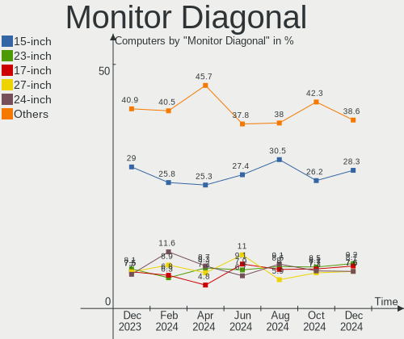
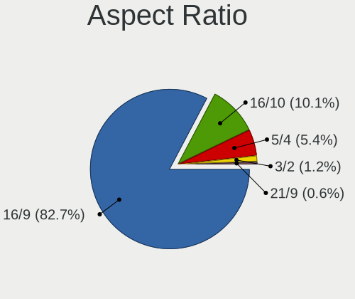

ROSA - Hardware Trends
----------------------

A project to identify most popular hardware characteristics and track their change
over time based on data collected by Linux users at https://Linux-Hardware.org.

Anyone can contribute to this report by the [hw-probe](https://github.com/linuxhw/hw-probe) tool:

    sudo -E hw-probe -all -upload

This is a report for all computer types. See also reports for [desktops](/Dist/ROSA/Desktop/README.md) and [notebooks](/Dist/ROSA/Notebook/README.md).

This report is for one last month. Overall report since the beginning of time: [TestDays](https://github.com/linuxhw/TestDays)

Period: Sep, 2023.

Contents
--------

* [ System ](#system)
  - [ OS                       ](#os)
  - [ OS Family                ](#os-family)
  - [ Kernel                   ](#kernel)
  - [ Kernel Family            ](#kernel-family)
  - [ Kernel Major Ver.        ](#kernel-major-ver)
  - [ Arch                     ](#arch)
  - [ DE                       ](#de)
  - [ Display Server           ](#display-server)
  - [ Display Manager          ](#display-manager)
  - [ OS Lang                  ](#os-lang)
  - [ Boot Mode                ](#boot-mode)
  - [ Filesystem               ](#filesystem)
  - [ Part. scheme             ](#part-scheme)
  - [ Dual Boot with Linux/BSD ](#dual-boot-with-linuxbsd)
  - [ Dual Boot (Win)          ](#dual-boot-win)

* [ Board ](#board)
  - [ Vendor                   ](#vendor)
  - [ Model                    ](#model)
  - [ Model Family             ](#model-family)
  - [ MFG Year                 ](#mfg-year)
  - [ Form Factor              ](#form-factor)
  - [ Secure Boot              ](#secure-boot)
  - [ Coreboot                 ](#coreboot)
  - [ RAM Size                 ](#ram-size)
  - [ RAM Used                 ](#ram-used)
  - [ Total Drives             ](#total-drives)
  - [ Has CD-ROM               ](#has-cd-rom)
  - [ Has Ethernet             ](#has-ethernet)
  - [ Has WiFi                 ](#has-wifi)
  - [ Has Bluetooth            ](#has-bluetooth)

* [ Location ](#location)
  - [ Country                  ](#country)
  - [ City                     ](#city)

* [ Drives ](#drives)
  - [ Drive Vendor             ](#drive-vendor)
  - [ Drive Model              ](#drive-model)
  - [ HDD Vendor               ](#hdd-vendor)
  - [ SSD Vendor               ](#ssd-vendor)
  - [ Drive Kind               ](#drive-kind)
  - [ Drive Connector          ](#drive-connector)
  - [ Drive Size               ](#drive-size)
  - [ Space Total              ](#space-total)
  - [ Space Used               ](#space-used)
  - [ Malfunc. Drives          ](#malfunc-drives)
  - [ Malfunc. Drive Vendor    ](#malfunc-drive-vendor)
  - [ Malfunc. HDD Vendor      ](#malfunc-hdd-vendor)
  - [ Malfunc. Drive Kind      ](#malfunc-drive-kind)
  - [ Failed Drives            ](#failed-drives)
  - [ Failed Drive Vendor      ](#failed-drive-vendor)
  - [ Drive Status             ](#drive-status)

* [ Storage controller ](#storage-controller)
  - [ Storage Vendor           ](#storage-vendor)
  - [ Storage Model            ](#storage-model)
  - [ Storage Kind             ](#storage-kind)

* [ Processor ](#processor)
  - [ CPU Vendor               ](#cpu-vendor)
  - [ CPU Model                ](#cpu-model)
  - [ CPU Model Family         ](#cpu-model-family)
  - [ CPU Cores                ](#cpu-cores)
  - [ CPU Sockets              ](#cpu-sockets)
  - [ CPU Threads              ](#cpu-threads)
  - [ CPU Op-Modes             ](#cpu-op-modes)
  - [ CPU Microcode            ](#cpu-microcode)
  - [ CPU Microarch            ](#cpu-microarch)

* [ Graphics ](#graphics)
  - [ GPU Vendor               ](#gpu-vendor)
  - [ GPU Model                ](#gpu-model)
  - [ GPU Combo                ](#gpu-combo)
  - [ GPU Driver               ](#gpu-driver)
  - [ GPU Memory               ](#gpu-memory)

* [ Monitor ](#monitor)
  - [ Monitor Vendor           ](#monitor-vendor)
  - [ Monitor Model            ](#monitor-model)
  - [ Monitor Resolution       ](#monitor-resolution)
  - [ Monitor Diagonal         ](#monitor-diagonal)
  - [ Monitor Width            ](#monitor-width)
  - [ Aspect Ratio             ](#aspect-ratio)
  - [ Monitor Area             ](#monitor-area)
  - [ Pixel Density            ](#pixel-density)
  - [ Multiple Monitors        ](#multiple-monitors)

* [ Network ](#network)
  - [ Net Controller Vendor    ](#net-controller-vendor)
  - [ Net Controller Model     ](#net-controller-model)
  - [ Wireless Vendor          ](#wireless-vendor)
  - [ Wireless Model           ](#wireless-model)
  - [ Ethernet Vendor          ](#ethernet-vendor)
  - [ Ethernet Model           ](#ethernet-model)
  - [ Net Controller Kind      ](#net-controller-kind)
  - [ Used Controller          ](#used-controller)
  - [ NICs                     ](#nics)
  - [ IPv6                     ](#ipv6)

* [ Bluetooth ](#bluetooth)
  - [ Bluetooth Vendor         ](#bluetooth-vendor)
  - [ Bluetooth Model          ](#bluetooth-model)

* [ Sound ](#sound)
  - [ Sound Vendor             ](#sound-vendor)
  - [ Sound Model              ](#sound-model)

* [ Memory ](#memory)
  - [ Memory Vendor            ](#memory-vendor)
  - [ Memory Model             ](#memory-model)
  - [ Memory Kind              ](#memory-kind)
  - [ Memory Form Factor       ](#memory-form-factor)
  - [ Memory Size              ](#memory-size)
  - [ Memory Speed             ](#memory-speed)

* [ Printers & scanners ](#printers--scanners)
  - [ Printer Vendor           ](#printer-vendor)
  - [ Printer Model            ](#printer-model)
  - [ Scanner Vendor           ](#scanner-vendor)
  - [ Scanner Model            ](#scanner-model)

* [ Camera ](#camera)
  - [ Camera Vendor            ](#camera-vendor)
  - [ Camera Model             ](#camera-model)

* [ Security ](#security)
  - [ Fingerprint Vendor       ](#fingerprint-vendor)
  - [ Fingerprint Model        ](#fingerprint-model)
  - [ Chipcard Vendor          ](#chipcard-vendor)
  - [ Chipcard Model           ](#chipcard-model)

* [ Unsupported ](#unsupported)
  - [ Unsupported Devices      ](#unsupported-devices)
  - [ Unsupported Device Types ](#unsupported-device-types)

System
------

OS
--

Installed operating systems

| Name       | Computers | Percent |
|------------|-----------|---------|
| ROSA 12.4  | 168       | 83.58%  |
| ROSA 12    | 14        | 6.97%   |
| ROSA R11.1 | 9         | 4.48%   |
| ROSA 12.2  | 3         | 1.49%   |
| ROSA 13.0  | 2         | 1%      |
| ROSA 12.1  | 2         | 1%      |
| ROSA R11   | 1         | 0.5%    |
| ROSA 12f.1 | 1         | 0.5%    |
| ROSA 12.3  | 1         | 0.5%    |

OS Family
---------

OS without a version

| Name | Computers | Percent |
|------|-----------|---------|
| ROSA | 201       | 100%    |

Kernel
------

Version of the Linux kernel

| Version                                   | Computers | Percent |
|-------------------------------------------|-----------|---------|
| 6.1.46-generic-2rosa2021.1-x86_64         | 69        | 34.33%  |
| 6.1.20-generic-2rosa2021.1-x86_64         | 46        | 22.89%  |
| 6.1.38-generic-1rosa2021.1-x86_64         | 31        | 15.42%  |
| 5.10.184-generic-1rosa2021.1-x86_64       | 9         | 4.48%   |
| 5.15.127-generic-1rosa2021.1-x86_64       | 8         | 3.98%   |
| 5.15.103-generic-1rosa2021.1-i686         | 5         | 2.49%   |
| 5.10.74-generic-2rosa2021.1-x86_64        | 5         | 2.49%   |
| 5.4.83-generic-2rosa-i586                 | 4         | 1.99%   |
| 4.15.0-desktop-122.124.1rosa-i586         | 3         | 1.49%   |
| 6.1.49-generic-1rosa2023.1-x86_64         | 2         | 1%      |
| 6.1.38-desktop-1rosa2021-x86_64           | 2         | 1%      |
| 5.17.11-generic-2rosa2021.1-x86_64        | 2         | 1%      |
| 5.15.117-generic-1rosa2021.1-x86_64       | 2         | 1%      |
| 6.5.0.xm1-1.klp-xanmod-rosa2021.1-x86_64  | 1         | 0.5%    |
| 6.4.15.xm1-1.klp-xanmod-rosa2021.1-x86_64 | 1         | 0.5%    |
| 6.3.12-generic-1rosa2021.1-x86_64         | 1         | 0.5%    |
| 6.1.46-generic-1rosa2021.15-x86_64        | 1         | 0.5%    |
| 6.1.46-generic-1rosa2021.1-x86_64         | 1         | 0.5%    |
| 5.4.32-generic-2rosa-x86_64               | 1         | 0.5%    |
| 5.15.79-generic-1rosa2021.1-x86_64        | 1         | 0.5%    |
| 5.15.75-generic-1rosa2021.1-i686          | 1         | 0.5%    |
| 5.10.74-generic-2rosa2021.1-i586          | 1         | 0.5%    |
| 5.10.176-generic-1rosa2021.1-i586         | 1         | 0.5%    |
| 5.10.118-generic-2rosa2021.1-x86_64       | 1         | 0.5%    |
| 4.15.0-desktop-45.1rosa-i586              | 1         | 0.5%    |
| 4.15.0-desktop-122.124.1rosa-x86_64       | 1         | 0.5%    |

Kernel Family
-------------

Linux kernel without a distro release

| Version  | Computers | Percent |
|----------|-----------|---------|
| 6.1.46   | 71        | 35.32%  |
| 6.1.20   | 46        | 22.89%  |
| 6.1.38   | 33        | 16.42%  |
| 5.10.184 | 9         | 4.48%   |
| 5.15.127 | 8         | 3.98%   |
| 5.10.74  | 6         | 2.99%   |
| 5.15.103 | 5         | 2.49%   |
| 4.15.0   | 5         | 2.49%   |
| 5.4.83   | 4         | 1.99%   |
| 6.1.49   | 2         | 1%      |
| 5.17.11  | 2         | 1%      |
| 5.15.117 | 2         | 1%      |
| 6.5.0    | 1         | 0.5%    |
| 6.4.15   | 1         | 0.5%    |
| 6.3.12   | 1         | 0.5%    |
| 5.4.32   | 1         | 0.5%    |
| 5.15.79  | 1         | 0.5%    |
| 5.15.75  | 1         | 0.5%    |
| 5.10.176 | 1         | 0.5%    |
| 5.10.118 | 1         | 0.5%    |

Kernel Major Ver.
-----------------

Linux kernel major version

| Version | Computers | Percent |
|---------|-----------|---------|
| 6.1     | 152       | 75.62%  |
| 5.15    | 17        | 8.46%   |
| 5.10    | 17        | 8.46%   |
| 5.4     | 5         | 2.49%   |
| 4.15    | 5         | 2.49%   |
| 5.17    | 2         | 1%      |
| 6.5     | 1         | 0.5%    |
| 6.4     | 1         | 0.5%    |
| 6.3     | 1         | 0.5%    |

Arch
----

OS architecture (x86_64, i586, etc.)

| Name   | Computers | Percent |
|--------|-----------|---------|
| x86_64 | 185       | 92.04%  |
| i686   | 16        | 7.96%   |

DE
--

Desktop Environment

| Name    | Computers | Percent |
|---------|-----------|---------|
| KDE5    | 116       | 57.71%  |
| GNOME   | 53        | 26.37%  |
| LXQt    | 23        | 11.44%  |
| KDE4    | 7         | 3.48%   |
| Unknown | 2         | 1%      |

Display Server
--------------

X11 or Wayland

| Name    | Computers | Percent |
|---------|-----------|---------|
| Wayland | 147       | 73.13%  |
| X11     | 53        | 26.37%  |
| Unknown | 1         | 0.5%    |

Display Manager
---------------

SDDM, LightDM, etc.

| Name    | Computers | Percent |
|---------|-----------|---------|
| SDDM    | 118       | 58.71%  |
| GDM     | 64        | 31.84%  |
| LightDM | 10        | 4.98%   |
| KDM     | 7         | 3.48%   |
| Unknown | 2         | 1%      |

OS Lang
-------

Language

| Lang    | Computers | Percent |
|---------|-----------|---------|
| ru_RU   | 185       | 92.04%  |
| en_US   | 5         | 2.49%   |
| es_ES   | 3         | 1.49%   |
| it_IT   | 2         | 1%      |
| tr_TR   | 1         | 0.5%    |
| es_PE   | 1         | 0.5%    |
| de_DE   | 1         | 0.5%    |
| be_BY   | 1         | 0.5%    |
| ar_SA   | 1         | 0.5%    |
| Unknown | 1         | 0.5%    |

Boot Mode
---------

EFI or BIOS

| Mode | Computers | Percent |
|------|-----------|---------|
| EFI  | 113       | 56.22%  |
| BIOS | 88        | 43.78%  |

Filesystem
----------

Type of filesystem

| Type  | Computers | Percent |
|-------|-----------|---------|
| Ext4  | 183       | 91.04%  |
| Btrfs | 16        | 7.96%   |
| Aufs  | 2         | 1%      |

Part. scheme
------------

Scheme of partitioning

| Type    | Computers | Percent |
|---------|-----------|---------|
| GPT     | 130       | 64.68%  |
| MBR     | 70        | 34.83%  |
| Unknown | 1         | 0.5%    |

Dual Boot with Linux/BSD
------------------------

Hosting more than one Linux/BSD

| Dual boot | Computers | Percent |
|-----------|-----------|---------|
| No        | 150       | 74.63%  |
| Yes       | 51        | 25.37%  |

Dual Boot (Win)
---------------

Hosting Linux and Windows

| Dual boot | Computers | Percent |
|-----------|-----------|---------|
| No        | 105       | 52.24%  |
| Yes       | 96        | 47.76%  |

Board
-----

Vendor
------

Motherboard manufacturer

| Name                                 | Computers | Percent |
|--------------------------------------|-----------|---------|
| ASUSTek Computer                     | 40        | 19.9%   |
| Gigabyte Technology                  | 24        | 11.94%  |
| Lenovo                               | 21        | 10.45%  |
| Hewlett-Packard                      | 18        | 8.96%   |
| ASRock                               | 15        | 7.46%   |
| MSI                                  | 13        | 6.47%   |
| Acer                                 | 12        | 5.97%   |
| Dell                                 | 8         | 3.98%   |
| Clevo                                | 6         | 2.99%   |
| Apple                                | 4         | 1.99%   |
| Unknown                              | 4         | 1.99%   |
| Toshiba                              | 3         | 1.49%   |
| Samsung Electronics                  | 3         | 1.49%   |
| Biostar                              | 3         | 1.49%   |
| Aquarius                             | 3         | 1.49%   |
| Sony                                 | 2         | 1%      |
| Intel                                | 2         | 1%      |
| Fujitsu Siemens                      | 2         | 1%      |
| Foxconn                              | 2         | 1%      |
| ECS                                  | 2         | 1%      |
| Shenzhen Meigao Electronic Equipment | 1         | 0.5%    |
| Pegatron                             | 1         | 0.5%    |
| Notebook                             | 1         | 0.5%    |
| Maibenben                            | 1         | 0.5%    |
| LTD Delovoy Office                   | 1         | 0.5%    |
| Irbis                                | 1         | 0.5%    |
| Insyde                               | 1         | 0.5%    |
| ICL                                  | 1         | 0.5%    |
| HUAWEI                               | 1         | 0.5%    |
| Huanan                               | 1         | 0.5%    |
| HONOR                                | 1         | 0.5%    |
| Fujitsu                              | 1         | 0.5%    |
| F-PLUS EQUIPMENT AND DEVELOPMENTS    | 1         | 0.5%    |
| eMachines                            | 1         | 0.5%    |

Model
-----

Motherboard model

| Name                                            | Computers | Percent |
|-------------------------------------------------|-----------|---------|
| Unknown                                         | 5         | 2.49%   |
| Clevo NL41MU2                                   | 4         | 1.99%   |
| ASUS All Series                                 | 3         | 1.49%   |
| HP Pavilion DV6                                 | 2         | 1%      |
| Clevo W240EL/W250ELQ/W270ELQ                    | 2         | 1%      |
| Aquarius Cmp NS483                              | 2         | 1%      |
| Acer Aspire ES1-520                             | 2         | 1%      |
| Toshiba Satellite A300                          | 1         | 0.5%    |
| Toshiba Satellite A200                          | 1         | 0.5%    |
| Toshiba QOSMIO X300                             | 1         | 0.5%    |
| Sony VPCEL1E1R                                  | 1         | 0.5%    |
| Sony VGN-FW11LR                                 | 1         | 0.5%    |
| Shenzhen Meigao Electronic Equipment UM773 Lite | 1         | 0.5%    |
| Samsung N250P                                   | 1         | 0.5%    |
| Samsung 350V5C/351V5C/3540VC/3440VC             | 1         | 0.5%    |
| Samsung 300E4Z/300E5Z/300E7Z                    | 1         | 0.5%    |
| Pegatron A35                                    | 1         | 0.5%    |
| Notebook W54_W94_W955TU,-T,-C                   | 1         | 0.5%    |
| MSI MS-7D54                                     | 1         | 0.5%    |
| MSI MS-7D46                                     | 1         | 0.5%    |
| MSI MS-7C96                                     | 1         | 0.5%    |
| MSI MS-7C91                                     | 1         | 0.5%    |
| MSI MS-7B93                                     | 1         | 0.5%    |
| MSI MS-7A15                                     | 1         | 0.5%    |
| MSI MS-7996                                     | 1         | 0.5%    |
| MSI MS-7721                                     | 1         | 0.5%    |
| MSI MS-7640                                     | 1         | 0.5%    |
| MSI MS-7599                                     | 1         | 0.5%    |
| MSI MS-7551                                     | 1         | 0.5%    |
| MSI MS-7529                                     | 1         | 0.5%    |
| MSI GT60 2QE                                    | 1         | 0.5%    |
| Maibenben MaiBook M                             | 1         | 0.5%    |
| LTD Delovoy Office 15CLG2                       | 1         | 0.5%    |
| Lenovo XiaoXinPro 16 APH8 83AR                  | 1         | 0.5%    |
| Lenovo V15-IGL 82C3                             | 1         | 0.5%    |
| Lenovo ThinkPad X250 20CMS0A200                 | 1         | 0.5%    |
| Lenovo ThinkPad L13 Yoga 20R5A000US             | 1         | 0.5%    |
| Lenovo ThinkCentre M820z 10SDS01600             | 1         | 0.5%    |
| Lenovo ThinkCentre M70q Gen 2 11MY003MRU        | 1         | 0.5%    |
| Lenovo ThinkCentre M600 10GB000URU              | 1         | 0.5%    |

Model Family
------------

Motherboard model prefix

| Name                                       | Computers | Percent |
|--------------------------------------------|-----------|---------|
| ASUS TUF                                   | 6         | 2.99%   |
| Lenovo IdeaPad                             | 5         | 2.49%   |
| HP Pavilion                                | 5         | 2.49%   |
| Dell Inspiron                              | 5         | 2.49%   |
| Acer Aspire                                | 5         | 2.49%   |
| Unknown                                    | 5         | 2.49%   |
| HP Laptop                                  | 4         | 1.99%   |
| Clevo NL41MU2                              | 4         | 1.99%   |
| ASUS PRIME                                 | 4         | 1.99%   |
| Lenovo ThinkCentre                         | 3         | 1.49%   |
| HP Compaq                                  | 3         | 1.49%   |
| ASUS All                                   | 3         | 1.49%   |
| Toshiba Satellite                          | 2         | 1%      |
| Lenovo ThinkPad                            | 2         | 1%      |
| HP ProBook                                 | 2         | 1%      |
| Gigabyte X570                              | 2         | 1%      |
| Fujitsu Siemens AMILO                      | 2         | 1%      |
| Clevo W240EL                               | 2         | 1%      |
| ASUS VivoBook                              | 2         | 1%      |
| ASUS P8H61-MX                              | 2         | 1%      |
| ASUS P8H61-M                               | 2         | 1%      |
| ASRock B450                                | 2         | 1%      |
| Aquarius Cmp                               | 2         | 1%      |
| Acer Veriton                               | 2         | 1%      |
| Acer TravelMate                            | 2         | 1%      |
| Toshiba QOSMIO                             | 1         | 0.5%    |
| Sony VPCEL1E1R                             | 1         | 0.5%    |
| Sony VGN-FW11LR                            | 1         | 0.5%    |
| Shenzhen Meigao Electronic Equipment UM773 | 1         | 0.5%    |
| Samsung N250P                              | 1         | 0.5%    |
| Samsung 350V5C                             | 1         | 0.5%    |
| Samsung 300E4Z                             | 1         | 0.5%    |
| Pegatron A35                               | 1         | 0.5%    |
| Notebook W54                               | 1         | 0.5%    |
| MSI MS-7D54                                | 1         | 0.5%    |
| MSI MS-7D46                                | 1         | 0.5%    |
| MSI MS-7C96                                | 1         | 0.5%    |
| MSI MS-7C91                                | 1         | 0.5%    |
| MSI MS-7B93                                | 1         | 0.5%    |
| MSI MS-7A15                                | 1         | 0.5%    |

MFG Year
--------

Motherboard manufacture year

| Year | Computers | Percent |
|------|-----------|---------|
| 2011 | 24        | 11.94%  |
| 2022 | 22        | 10.95%  |
| 2012 | 17        | 8.46%   |
| 2021 | 16        | 7.96%   |
| 2018 | 16        | 7.96%   |
| 2020 | 15        | 7.46%   |
| 2019 | 13        | 6.47%   |
| 2009 | 13        | 6.47%   |
| 2008 | 11        | 5.47%   |
| 2013 | 9         | 4.48%   |
| 2010 | 9         | 4.48%   |
| 2015 | 8         | 3.98%   |
| 2014 | 7         | 3.48%   |
| 2023 | 6         | 2.99%   |
| 2007 | 6         | 2.99%   |
| 2016 | 5         | 2.49%   |
| 2017 | 2         | 1%      |
| 2006 | 1         | 0.5%    |
| 2005 | 1         | 0.5%    |

Form Factor
-----------

Physical design of the computer

| Name        | Computers | Percent |
|-------------|-----------|---------|
| Desktop     | 101       | 50.25%  |
| Notebook    | 90        | 44.78%  |
| Convertible | 4         | 1.99%   |
| All in one  | 4         | 1.99%   |
| Mini pc     | 1         | 0.5%    |
| Server      | 1         | 0.5%    |

Secure Boot
-----------

Enabled or disabled

| State    | Computers | Percent |
|----------|-----------|---------|
| Disabled | 201       | 100%    |

Coreboot
--------

Have coreboot on board

| Used | Computers | Percent |
|------|-----------|---------|
| No   | 201       | 100%    |

RAM Size
--------

Total RAM memory

| Size in GB  | Computers | Percent |
|-------------|-----------|---------|
| 4.01-8.0    | 51        | 25.37%  |
| 16.01-24.0  | 40        | 19.9%   |
| 3.01-4.0    | 33        | 16.42%  |
| 8.01-16.0   | 32        | 15.92%  |
| 32.01-64.0  | 17        | 8.46%   |
| 1.01-2.0    | 10        | 4.98%   |
| 2.01-3.0    | 7         | 3.48%   |
| 24.01-32.0  | 5         | 2.49%   |
| 64.01-256.0 | 5         | 2.49%   |
| 0.51-1.0    | 1         | 0.5%    |

RAM Used
--------

Used RAM memory

| Used GB   | Computers | Percent |
|-----------|-----------|---------|
| 1.01-2.0  | 105       | 52.24%  |
| 2.01-3.0  | 45        | 22.39%  |
| 0.51-1.0  | 26        | 12.94%  |
| 3.01-4.0  | 12        | 5.97%   |
| 4.01-8.0  | 10        | 4.98%   |
| 0.01-0.5  | 2         | 1%      |
| 8.01-16.0 | 1         | 0.5%    |

Total Drives
------------

Number of drives on board

| Drives | Computers | Percent |
|--------|-----------|---------|
| 1      | 97        | 48.26%  |
| 2      | 63        | 31.34%  |
| 3      | 21        | 10.45%  |
| 4      | 11        | 5.47%   |
| 5      | 6         | 2.99%   |
| 8      | 1         | 0.5%    |
| 7      | 1         | 0.5%    |
| 6      | 1         | 0.5%    |

Has CD-ROM
----------

Has CD-ROM on board

| Presented | Computers | Percent |
|-----------|-----------|---------|
| No        | 136       | 67.66%  |
| Yes       | 65        | 32.34%  |

Has Ethernet
------------

Has Ethernet on board

| Presented | Computers | Percent |
|-----------|-----------|---------|
| Yes       | 185       | 92.04%  |
| No        | 16        | 7.96%   |

Has WiFi
--------

Has WiFi module

| Presented | Computers | Percent |
|-----------|-----------|---------|
| Yes       | 129       | 64.18%  |
| No        | 72        | 35.82%  |

Has Bluetooth
-------------

Has Bluetooth module

| Presented | Computers | Percent |
|-----------|-----------|---------|
| Yes       | 103       | 51.24%  |
| No        | 98        | 48.76%  |

Location
--------

Country
-------

Geographic location (country)

| Country      | Computers | Percent |
|--------------|-----------|---------|
| Russia       | 173       | 86.07%  |
| Ukraine      | 7         | 3.48%   |
| Belarus      | 4         | 1.99%   |
| Spain        | 2         | 1%      |
| Kazakhstan   | 2         | 1%      |
| Italy        | 2         | 1%      |
| Czechia      | 2         | 1%      |
| USA          | 1         | 0.5%    |
| Turkey       | 1         | 0.5%    |
| Saudi Arabia | 1         | 0.5%    |
| Peru         | 1         | 0.5%    |
| Netherlands  | 1         | 0.5%    |
| Germany      | 1         | 0.5%    |
| Bulgaria     | 1         | 0.5%    |
| Brazil       | 1         | 0.5%    |
| Armenia      | 1         | 0.5%    |

City
----

Geographic location (city)

| City              | Computers | Percent |
|-------------------|-----------|---------|
| Moscow            | 45        | 22.39%  |
| St Petersburg     | 12        | 5.97%   |
| Krasnodar         | 9         | 4.48%   |
| Chelyabinsk       | 6         | 2.99%   |
| Yekaterinburg     | 5         | 2.49%   |
| Volgograd         | 4         | 1.99%   |
| Novosibirsk       | 4         | 1.99%   |
| Samara            | 3         | 1.49%   |
| Krasnoyarsk       | 3         | 1.49%   |
| Zalari            | 2         | 1%      |
| Vladivostok       | 2         | 1%      |
| Ufa               | 2         | 1%      |
| Tolyatti          | 2         | 1%      |
| Smolensk          | 2         | 1%      |
| Sevastopol        | 2         | 1%      |
| Saratov           | 2         | 1%      |
| Rybinsk           | 2         | 1%      |
| Rostov-on-Don     | 2         | 1%      |
| Orenburg          | 2         | 1%      |
| Omsk              | 2         | 1%      |
| Mogilev           | 2         | 1%      |
| Magadan           | 2         | 1%      |
| Belgorod          | 2         | 1%      |
| Balashikha        | 2         | 1%      |
| Zernograd         | 1         | 0.5%    |
| Yuzhno-Sakhalinsk | 1         | 0.5%    |
| Yoshkar-Ola       | 1         | 0.5%    |
| Yerevan           | 1         | 0.5%    |
| Yelizovo          | 1         | 0.5%    |
| Yasinovataya      | 1         | 0.5%    |
| Yaroslavl         | 1         | 0.5%    |
| Yalta             | 1         | 0.5%    |
| Wuppertal         | 1         | 0.5%    |
| Voronezh          | 1         | 0.5%    |
| Volzhsky          | 1         | 0.5%    |
| Vologda           | 1         | 0.5%    |
| Volgodonsk        | 1         | 0.5%    |
| Veliky Novgorod   | 1         | 0.5%    |
| Ulyanovsk         | 1         | 0.5%    |
| Ulan-Ude          | 1         | 0.5%    |

Drives
------

Drive Vendor
------------

Hard drive vendors

| Vendor                      | Computers | Drives | Percent |
|-----------------------------|-----------|--------|---------|
| WDC                         | 60        | 78     | 17.8%   |
| Seagate                     | 53        | 61     | 15.73%  |
| Samsung Electronics         | 29        | 33     | 8.61%   |
| Kingston                    | 23        | 24     | 6.82%   |
| Toshiba                     | 13        | 14     | 3.86%   |
| Hitachi                     | 12        | 12     | 3.56%   |
| A-DATA Technology           | 10        | 11     | 2.97%   |
| AMD                         | 9         | 9      | 2.67%   |
| Apacer                      | 8         | 8      | 2.37%   |
| Crucial                     | 7         | 7      | 2.08%   |
| SK hynix                    | 6         | 6      | 1.78%   |
| Netac                       | 6         | 6      | 1.78%   |
| China                       | 6         | 6      | 1.78%   |
| Unknown                     | 4         | 5      | 1.19%   |
| SPCC                        | 4         | 5      | 1.19%   |
| SanDisk                     | 4         | 4      | 1.19%   |
| Plextor                     | 4         | 4      | 1.19%   |
| Patriot                     | 4         | 4      | 1.19%   |
| HGST                        | 4         | 4      | 1.19%   |
| Fujitsu                     | 4         | 5      | 1.19%   |
| BIWIN                       | 4         | 4      | 1.19%   |
| Micron Technology           | 3         | 3      | 0.89%   |
| Maxtor                      | 3         | 3      | 0.89%   |
| Kingston Technology Company | 3         | 3      | 0.89%   |
| Apple                       | 3         | 4      | 0.89%   |
| Unknown                     | 3         | 3      | 0.89%   |
| XrayDisk                    | 2         | 2      | 0.59%   |
| Smartbuy                    | 2         | 2      | 0.59%   |
| Phison                      | 2         | 2      | 0.59%   |
| OCZ                         | 2         | 2      | 0.59%   |
| MAXIO Technology (Hangzhou) | 2         | 2      | 0.59%   |
| GOODRAM                     | 2         | 2      | 0.59%   |
| Gigabyte Technology         | 2         | 2      | 0.59%   |
| DEXP                        | 2         | 2      | 0.59%   |
| XPG                         | 1         | 2      | 0.3%    |
| UMIS                        | 1         | 1      | 0.3%    |
| TO Exter                    | 1         | 1      | 0.3%    |
| Team                        | 1         | 1      | 0.3%    |
| Silicon Motion              | 1         | 1      | 0.3%    |
| Reeinno                     | 1         | 1      | 0.3%    |

Drive Model
-----------

Hard drive models

| Model                                | Computers | Percent |
|--------------------------------------|-----------|---------|
| WDC WD10EZEX-08WN4A0 1TB             | 7         | 1.9%    |
| Seagate ST1000LM035-1RK172 1TB       | 5         | 1.36%   |
| Kingston SA400S37120G 120GB SSD      | 5         | 1.36%   |
| Seagate ST1000DM010-2EP102 1TB       | 4         | 1.08%   |
| BIWIN CE480T5D101-256 256GB          | 4         | 1.08%   |
| WDC WDS120G2G0A-00JH30 120GB SSD     | 3         | 0.81%   |
| WDC WD20EZBX-00AYRA0 2TB             | 3         | 0.81%   |
| Toshiba DT01ACA050 500GB             | 3         | 0.81%   |
| SPCC Solid State Disk 256GB          | 3         | 0.81%   |
| Seagate ST500LT012-1DG142 500GB      | 3         | 0.81%   |
| Seagate ST1000LM024 HN-M101MBB 1TB   | 3         | 0.81%   |
| Seagate ST1000DM003-1CH162 1TB       | 3         | 0.81%   |
| Kingston SA400S37240G 240GB SSD      | 3         | 0.81%   |
| Apacer AS2280P4 256GB                | 3         | 0.81%   |
| Unknown                              | 3         | 0.81%   |
| WDC WD5000LPLX-08ZNTT0 500GB         | 2         | 0.54%   |
| WDC WD10JPVX-75JC3T0 1TB             | 2         | 0.54%   |
| WDC WD10EFRX-68JCSN0 1TB             | 2         | 0.54%   |
| Toshiba MQ04ABF100 1TB               | 2         | 0.54%   |
| Toshiba MQ01ABD100 1TB               | 2         | 0.54%   |
| Seagate ST9500325AS 500GB            | 2         | 0.54%   |
| Seagate ST380811AS 80GB              | 2         | 0.54%   |
| Seagate ST3500418AS 500GB            | 2         | 0.54%   |
| Seagate ST3320613AS 320GB            | 2         | 0.54%   |
| Seagate ST3160815AS 160GB            | 2         | 0.54%   |
| Seagate ST2000DM008-2UB102 2TB       | 2         | 0.54%   |
| Seagate ST1000LX015-1U7172 1TB       | 2         | 0.54%   |
| Seagate ST1000DM003-1ER162 1TB       | 2         | 0.54%   |
| Seagate Expansion 1TB                | 2         | 0.54%   |
| SanDisk SSD PLUS 240GB               | 2         | 0.54%   |
| Samsung SSD 980 250GB                | 2         | 0.54%   |
| Samsung SSD 970 EVO Plus 250GB       | 2         | 0.54%   |
| Samsung SSD 960 PRO 512GB            | 2         | 0.54%   |
| Samsung MZALQ256HAJD-000L2 256GB     | 2         | 0.54%   |
| Patriot Burst Elite 960GB SSD        | 2         | 0.54%   |
| Kingston SHFS37A120G 120GB SSD       | 2         | 0.54%   |
| Kingston SA400S37480G 480GB SSD      | 2         | 0.54%   |
| Hitachi HDS721050CLA362 500GB        | 2         | 0.54%   |
| Gigabyte GP-GSTFS31120GNTD 120GB SSD | 2         | 0.54%   |
| Crucial CT120BX500SSD1 120GB         | 2         | 0.54%   |

HDD Vendor
----------

Hard disk drive vendors

| Vendor              | Computers | Drives | Percent |
|---------------------|-----------|--------|---------|
| Seagate             | 53        | 61     | 36.55%  |
| WDC                 | 50        | 65     | 34.48%  |
| Toshiba             | 13        | 14     | 8.97%   |
| Hitachi             | 12        | 12     | 8.28%   |
| HGST                | 4         | 4      | 2.76%   |
| Fujitsu             | 4         | 5      | 2.76%   |
| Samsung Electronics | 3         | 3      | 2.07%   |
| Maxtor              | 3         | 3      | 2.07%   |
| External            | 1         | 1      | 0.69%   |
| Apple               | 1         | 1      | 0.69%   |
| Unknown             | 1         | 1      | 0.69%   |

SSD Vendor
----------

Solid state drive vendors

| Vendor              | Computers | Drives | Percent |
|---------------------|-----------|--------|---------|
| Kingston            | 16        | 16     | 13.79%  |
| Samsung Electronics | 10        | 12     | 8.62%   |
| AMD                 | 8         | 8      | 6.9%    |
| WDC                 | 7         | 7      | 6.03%   |
| A-DATA Technology   | 7         | 8      | 6.03%   |
| Crucial             | 6         | 6      | 5.17%   |
| China               | 6         | 6      | 5.17%   |
| Netac               | 5         | 5      | 4.31%   |
| Plextor             | 4         | 4      | 3.45%   |
| Apacer              | 4         | 4      | 3.45%   |
| SPCC                | 3         | 3      | 2.59%   |
| SanDisk             | 3         | 3      | 2.59%   |
| Patriot             | 3         | 3      | 2.59%   |
| XrayDisk            | 2         | 2      | 1.72%   |
| Smartbuy            | 2         | 2      | 1.72%   |
| OCZ                 | 2         | 2      | 1.72%   |
| Gigabyte Technology | 2         | 2      | 1.72%   |
| DEXP                | 2         | 2      | 1.72%   |
| Unknown             | 2         | 2      | 1.72%   |
| TO Exter            | 1         | 1      | 0.86%   |
| Team                | 1         | 1      | 0.86%   |
| SK hynix            | 1         | 1      | 0.86%   |
| Reeinno             | 1         | 1      | 0.86%   |
| Qumo                | 1         | 1      | 0.86%   |
| OCZ-VERTEX3         | 1         | 1      | 0.86%   |
| Micron Technology   | 1         | 1      | 0.86%   |
| Londisk             | 1         | 1      | 0.86%   |
| KingSpec            | 1         | 1      | 0.86%   |
| Kingmax             | 1         | 1      | 0.86%   |
| KingFast            | 1         | 1      | 0.86%   |
| Kingchuxing         | 1         | 1      | 0.86%   |
| Intenso             | 1         | 1      | 0.86%   |
| HS-SSD-E100         | 1         | 1      | 0.86%   |
| GS                  | 1         | 1      | 0.86%   |
| GOODRAM             | 1         | 1      | 0.86%   |
| Foxline             | 1         | 1      | 0.86%   |
| e2e4                | 1         | 1      | 0.86%   |
| Colorful            | 1         | 1      | 0.86%   |
| BR                  | 1         | 1      | 0.86%   |
| ASMT                | 1         | 1      | 0.86%   |

Drive Kind
----------

HDD or SSD

| Kind    | Computers | Drives | Percent |
|---------|-----------|--------|---------|
| HDD     | 126       | 170    | 42%     |
| SSD     | 100       | 119    | 33.33%  |
| NVMe    | 67        | 77     | 22.33%  |
| Unknown | 4         | 4      | 1.33%   |
| MMC     | 3         | 5      | 1%      |

Drive Connector
---------------

SATA, SAS, NVMe, etc.

| Type | Computers | Drives | Percent |
|------|-----------|--------|---------|
| SATA | 169       | 281    | 67.87%  |
| NVMe | 67        | 77     | 26.91%  |
| SAS  | 10        | 12     | 4.02%   |
| MMC  | 3         | 5      | 1.2%    |

Drive Size
----------

Size of hard drive

| Size in TB | Computers | Drives | Percent |
|------------|-----------|--------|---------|
| 0.01-0.5   | 139       | 178    | 59.4%   |
| 0.51-1.0   | 65        | 81     | 27.78%  |
| 1.01-2.0   | 19        | 19     | 8.12%   |
| 2.01-3.0   | 5         | 5      | 2.14%   |
| 3.01-4.0   | 3         | 3      | 1.28%   |
| 4.01-10.0  | 2         | 2      | 0.85%   |
| 10.01-20.0 | 1         | 1      | 0.43%   |

Space Total
-----------

Amount of disk space available on the file system

| Size in GB     | Computers | Percent |
|----------------|-----------|---------|
| 101-250        | 58        | 28.86%  |
| 251-500        | 47        | 23.38%  |
| 501-1000       | 26        | 12.94%  |
| 51-100         | 16        | 7.96%   |
| 1001-2000      | 15        | 7.46%   |
| 1-20           | 14        | 6.97%   |
| 21-50          | 11        | 5.47%   |
| 2001-3000      | 8         | 3.98%   |
| More than 3000 | 4         | 1.99%   |
| Unknown        | 2         | 1%      |

Space Used
----------

Amount of used disk space

| Used GB        | Computers | Percent |
|----------------|-----------|---------|
| 1-20           | 114       | 56.72%  |
| 21-50          | 29        | 14.43%  |
| 101-250        | 16        | 7.96%   |
| 51-100         | 13        | 6.47%   |
| 501-1000       | 11        | 5.47%   |
| 1001-2000      | 7         | 3.48%   |
| 251-500        | 6         | 2.99%   |
| More than 3000 | 3         | 1.49%   |
| Unknown        | 2         | 1%      |

Malfunc. Drives
---------------

Drive models with a malfunction

| Model                            | Computers | Drives | Percent |
|----------------------------------|-----------|--------|---------|
| Seagate ST9500325AS 500GB        | 2         | 2      | 2.78%   |
| Kingston SHFS37A120G 120GB SSD   | 2         | 2      | 2.78%   |
| WDC WDS120G2G0A-00JH30 120GB SSD | 1         | 1      | 1.39%   |
| WDC WD7500BPVT-75HXZT3 752GB     | 1         | 1      | 1.39%   |
| WDC WD6400AAKS-65A7B2 640GB      | 1         | 1      | 1.39%   |
| WDC WD6000HLHX-01JJPV0 600GB     | 1         | 1      | 1.39%   |
| WDC WD5000LPVX-55V0TT0 500GB     | 1         | 1      | 1.39%   |
| WDC WD5000LPLX-08ZNTT0 500GB     | 1         | 1      | 1.39%   |
| WDC WD5000AAKX-001CA0 500GB      | 1         | 1      | 1.39%   |
| WDC WD40EFRX-68N32N0 4TB         | 1         | 1      | 1.39%   |
| WDC WD3200AAJS-22L7A0 320GB      | 1         | 1      | 1.39%   |
| WDC WD2500YD-01NVB1 256GB        | 1         | 1      | 1.39%   |
| WDC WD20EARS-00MVWB0 2TB         | 1         | 1      | 1.39%   |
| WDC WD1600BEVT-60ZCT1 160GB      | 1         | 1      | 1.39%   |
| WDC WD1600AAJS-60B4A0 160GB      | 1         | 1      | 1.39%   |
| WDC WD1200BEVS-08RST2 120GB      | 1         | 1      | 1.39%   |
| WDC WD10PURZ-85U8XY0 1TB         | 1         | 1      | 1.39%   |
| WDC WD10EFRX-68JCSN0 1TB         | 1         | 1      | 1.39%   |
| WDC WD1003FBYX-01Y7B1 1TB        | 1         | 1      | 1.39%   |
| WDC WD1002FAEX-00Y9A0 1TB        | 1         | 1      | 1.39%   |
| WDC WD Green 2.5 480GB SSD       | 1         | 1      | 1.39%   |
| Toshiba MQ01ABD100 1TB           | 1         | 1      | 1.39%   |
| Toshiba MQ01ABD050 500GB         | 1         | 1      | 1.39%   |
| Toshiba MK2556GSY 250GB          | 1         | 1      | 1.39%   |
| Seagate ST9750420AS 752GB        | 1         | 1      | 1.39%   |
| Seagate ST9320325AS 320GB        | 1         | 1      | 1.39%   |
| Seagate ST9320320AS 320GB        | 1         | 1      | 1.39%   |
| Seagate ST500LT012-1DG142 500GB  | 1         | 1      | 1.39%   |
| Seagate ST500DM002-1BD142 500GB  | 1         | 1      | 1.39%   |
| Seagate ST4000DM000-1F2168 4TB   | 1         | 1      | 1.39%   |
| Seagate ST380811AS 80GB          | 1         | 1      | 1.39%   |
| Seagate ST3500418AS 500GB        | 1         | 1      | 1.39%   |
| Seagate ST3320613AS 320GB        | 1         | 1      | 1.39%   |
| Seagate ST3250410AS 250GB        | 1         | 1      | 1.39%   |
| Seagate ST3250310AS 250GB        | 1         | 1      | 1.39%   |
| Seagate ST320LT012-9WS14C 320GB  | 1         | 1      | 1.39%   |
| Seagate ST3160815AS 160GB        | 1         | 1      | 1.39%   |
| Seagate ST31000524AS 1TB         | 1         | 1      | 1.39%   |
| Seagate ST3000VX000-1CU166 3TB   | 1         | 1      | 1.39%   |
| Seagate ST1000LM049-2GH172 1TB   | 1         | 1      | 1.39%   |

Malfunc. Drive Vendor
---------------------

Vendors of faulty drives

| Vendor              | Computers | Drives | Percent |
|---------------------|-----------|--------|---------|
| Seagate             | 21        | 22     | 30%     |
| WDC                 | 18        | 19     | 25.71%  |
| Hitachi             | 6         | 6      | 8.57%   |
| Samsung Electronics | 4         | 4      | 5.71%   |
| Kingston            | 4         | 4      | 5.71%   |
| Toshiba             | 3         | 3      | 4.29%   |
| Plextor             | 2         | 2      | 2.86%   |
| Maxtor              | 2         | 2      | 2.86%   |
| SanDisk             | 1         | 1      | 1.43%   |
| Qumo                | 1         | 1      | 1.43%   |
| OCZ-VERTEX3         | 1         | 1      | 1.43%   |
| OCZ                 | 1         | 1      | 1.43%   |
| Kingmax             | 1         | 1      | 1.43%   |
| Kingchuxing         | 1         | 1      | 1.43%   |
| HGST                | 1         | 1      | 1.43%   |
| Fujitsu             | 1         | 1      | 1.43%   |
| China               | 1         | 1      | 1.43%   |
| AMD                 | 1         | 1      | 1.43%   |

Malfunc. HDD Vendor
-------------------

Vendors of faulty HDD drives

| Vendor              | Computers | Drives | Percent |
|---------------------|-----------|--------|---------|
| Seagate             | 21        | 22     | 39.62%  |
| WDC                 | 16        | 17     | 30.19%  |
| Hitachi             | 6         | 6      | 11.32%  |
| Toshiba             | 3         | 3      | 5.66%   |
| Samsung Electronics | 3         | 3      | 5.66%   |
| Maxtor              | 2         | 2      | 3.77%   |
| HGST                | 1         | 1      | 1.89%   |
| Fujitsu             | 1         | 1      | 1.89%   |

Malfunc. Drive Kind
-------------------

Kinds of faulty drives

| Kind | Computers | Drives | Percent |
|------|-----------|--------|---------|
| HDD  | 49        | 55     | 74.24%  |
| SSD  | 16        | 16     | 24.24%  |
| NVMe | 1         | 1      | 1.52%   |

Failed Drives
-------------

Failed drive models

| Model                     | Computers | Drives | Percent |
|---------------------------|-----------|--------|---------|
| Seagate ST3320613AS 320GB | 1         | 1      | 100%    |

Failed Drive Vendor
-------------------

Failed drive vendors

| Vendor  | Computers | Drives | Percent |
|---------|-----------|--------|---------|
| Seagate | 1         | 1      | 100%    |

Drive Status
------------

Number of failed and malfunc. drives

| Status   | Computers | Drives | Percent |
|----------|-----------|--------|---------|
| Works    | 164       | 282    | 66.94%  |
| Malfunc  | 65        | 72     | 26.53%  |
| Detected | 15        | 20     | 6.12%   |
| Failed   | 1         | 1      | 0.41%   |

Storage controller
------------------

Storage Vendor
--------------

Storage controller vendors

| Vendor                                  | Computers | Percent |
|-----------------------------------------|-----------|---------|
| Intel                                   | 132       | 48.71%  |
| AMD                                     | 53        | 19.56%  |
| Samsung Electronics                     | 16        | 5.9%    |
| Kingston Technology Company             | 10        | 3.69%   |
| SanDisk                                 | 7         | 2.58%   |
| Silicon Motion                          | 6         | 2.21%   |
| Phison Electronics                      | 6         | 2.21%   |
| MAXIO Technology (Hangzhou)             | 5         | 1.85%   |
| JMicron Technology                      | 5         | 1.85%   |
| SK hynix                                | 4         | 1.48%   |
| INNOGRIT                                | 4         | 1.48%   |
| ADATA Technology                        | 4         | 1.48%   |
| Marvell Technology Group                | 3         | 1.11%   |
| ASMedia Technology                      | 3         | 1.11%   |
| Shenzhen Longsys Electronics            | 2         | 0.74%   |
| Nvidia                                  | 2         | 0.74%   |
| Micron Technology                       | 2         | 0.74%   |
| VIA Technologies                        | 1         | 0.37%   |
| Shenzhen Unionmemory Information System | 1         | 0.37%   |
| Netac Technology                        | 1         | 0.37%   |
| Micron/Crucial Technology               | 1         | 0.37%   |
| KIOXIA                                  | 1         | 0.37%   |
| Apple                                   | 1         | 0.37%   |
| Adaptec                                 | 1         | 0.37%   |

Storage Model
-------------

Storage controller models

| Model                                                                                   | Computers | Percent |
|-----------------------------------------------------------------------------------------|-----------|---------|
| AMD FCH SATA Controller [AHCI mode]                                                     | 26        | 8.23%   |
| Intel 7 Series Chipset Family 6-port SATA Controller [AHCI mode]                        | 11        | 3.48%   |
| AMD 500 Series Chipset SATA Controller                                                  | 11        | 3.48%   |
| AMD SB7x0/SB8x0/SB9x0 SATA Controller [AHCI mode]                                       | 9         | 2.85%   |
| Intel Q170/Q150/B150/H170/H110/Z170/CM236 Chipset SATA Controller [AHCI Mode]           | 8         | 2.53%   |
| Intel NM10/ICH7 Family SATA Controller [IDE mode]                                       | 8         | 2.53%   |
| Intel 82801IBM/IEM (ICH9M/ICH9M-E) 4 port SATA Controller [AHCI mode]                   | 7         | 2.22%   |
| Intel 82801G (ICH7 Family) IDE Controller                                               | 7         | 2.22%   |
| Intel 8 Series/C220 Series Chipset Family 6-port SATA Controller 1 [AHCI mode]          | 7         | 2.22%   |
| AMD SB7x0/SB8x0/SB9x0 IDE Controller                                                    | 7         | 2.22%   |
| Silicon Motion SM2263EN/SM2263XT (DRAM-less) NVMe SSD Controllers                       | 6         | 1.9%    |
| Samsung NVMe SSD Controller SM981/PM981/PM983                                           | 6         | 1.9%    |
| Samsung NVMe SSD Controller 980                                                         | 6         | 1.9%    |
| Intel Tiger Lake-LP SATA Controller                                                     | 6         | 1.9%    |
| Intel 6 Series/C200 Series Chipset Family 6 port Mobile SATA AHCI Controller            | 6         | 1.9%    |
| Intel 6 Series/C200 Series Chipset Family 6 port Desktop SATA AHCI Controller           | 6         | 1.9%    |
| AMD 400 Series Chipset SATA Controller                                                  | 6         | 1.9%    |
| Intel 82801HM/HEM (ICH8M/ICH8M-E) SATA Controller [AHCI mode]                           | 5         | 1.58%   |
| Intel 82801HM/HEM (ICH8M/ICH8M-E) IDE Controller                                        | 5         | 1.58%   |
| Intel 500 Series Chipset Family SATA AHCI Controller                                    | 5         | 1.58%   |
| Phison PS5013 E13 NVMe Controller                                                       | 4         | 1.27%   |
| MAXIO (Hangzhou) NVMe SSD Controller MAP1202                                            | 4         | 1.27%   |
| Kingston Company Company Non-Volatile memory controller                                 | 4         | 1.27%   |
| JMicron JMB363 SATA/IDE Controller                                                      | 4         | 1.27%   |
| Intel NM10/ICH7 Family SATA Controller [AHCI mode]                                      | 4         | 1.27%   |
| Intel Cannon Lake Mobile PCH SATA AHCI Controller                                       | 4         | 1.27%   |
| Intel 82801 Mobile SATA Controller [RAID mode]                                          | 4         | 1.27%   |
| Intel 6 Series/C200 Series Chipset Family Desktop SATA Controller (IDE mode, ports 4-5) | 4         | 1.27%   |
| Intel 6 Series/C200 Series Chipset Family Desktop SATA Controller (IDE mode, ports 0-3) | 4         | 1.27%   |
| INNOGRIT NVMe SSD Controller IG5216 (DRAM-less)                                         | 4         | 1.27%   |
| SK hynix Gold P31/BC711/PC711 NVMe Solid State Drive                                    | 3         | 0.95%   |
| Samsung NVMe SSD Controller SM961/PM961/SM963                                           | 3         | 0.95%   |
| Kingston Company U-SNS8154P3 NVMe SSD                                                   | 3         | 0.95%   |
| Intel Volume Management Device NVMe RAID Controller                                     | 3         | 0.95%   |
| Intel Cannon Lake PCH SATA AHCI Controller                                              | 3         | 0.95%   |
| Intel Alder Lake-S PCH SATA Controller [AHCI Mode]                                      | 3         | 0.95%   |
| Intel 5 Series/3400 Series Chipset 4 port SATA AHCI Controller                          | 3         | 0.95%   |
| ASMedia ASM1062 Serial ATA Controller                                                   | 3         | 0.95%   |
| ADATA ADATA XPG GAMMIXS1 1L Media (256 GB SSD)                                          | 3         | 0.95%   |
| SanDisk WD Blue SN550 NVMe SSD                                                          | 2         | 0.63%   |

Storage Kind
------------

Kind of storage controller (IDE, SATA, NVMe, SAS, ...)

| Kind | Computers | Percent |
|------|-----------|---------|
| SATA | 159       | 57.4%   |
| NVMe | 67        | 24.19%  |
| IDE  | 40        | 14.44%  |
| RAID | 10        | 3.61%   |
| SCSI | 1         | 0.36%   |

Processor
---------

CPU Vendor
----------

Processor vendors

| Vendor | Computers | Percent |
|--------|-----------|---------|
| Intel  | 140       | 69.65%  |
| AMD    | 61        | 30.35%  |

CPU Model
---------

Processor models

| Model                                       | Computers | Percent |
|---------------------------------------------|-----------|---------|
| AMD Ryzen 5 3600 6-Core Processor           | 9         | 4.48%   |
| Intel 11th Gen Core i5-1135G7 @ 2.40GHz     | 5         | 2.49%   |
| Intel Core i7-3630QM CPU @ 2.40GHz          | 3         | 1.49%   |
| Intel Core i5-8300H CPU @ 2.30GHz           | 3         | 1.49%   |
| Intel Core i5-3210M CPU @ 2.50GHz           | 3         | 1.49%   |
| AMD E-350 Processor                         | 3         | 1.49%   |
| Intel Pentium CPU B960 @ 2.20GHz            | 2         | 1%      |
| Intel Core i5-6500 CPU @ 3.20GHz            | 2         | 1%      |
| Intel Core i5-10400F CPU @ 2.90GHz          | 2         | 1%      |
| Intel Core i5-10400 CPU @ 2.90GHz           | 2         | 1%      |
| Intel Core i5-10210U CPU @ 1.60GHz          | 2         | 1%      |
| Intel Core i3-2120 CPU @ 3.30GHz            | 2         | 1%      |
| Intel Core 2 Duo CPU E4500 @ 2.20GHz        | 2         | 1%      |
| Intel Celeron CPU B830 @ 1.80GHz            | 2         | 1%      |
| Intel Celeron CPU B800 @ 1.50GHz            | 2         | 1%      |
| Intel 11th Gen Core i3-1115G4 @ 3.00GHz     | 2         | 1%      |
| AMD Ryzen 9 5900X 12-Core Processor         | 2         | 1%      |
| AMD Ryzen 7 5700U with Radeon Graphics      | 2         | 1%      |
| AMD Ryzen 5 5500U with Radeon Graphics      | 2         | 1%      |
| AMD Phenom II X4 955 Processor              | 2         | 1%      |
| Intel Xeon Silver 4210R CPU @ 2.40GHz       | 1         | 0.5%    |
| Intel Xeon CPU W3680 @ 3.33GHz              | 1         | 0.5%    |
| Intel Xeon CPU L5420 @ 2.50GHz              | 1         | 0.5%    |
| Intel Xeon CPU E5472 @ 3.00GHz              | 1         | 0.5%    |
| Intel Xeon CPU E5-2696 v3 @ 2.30GHz         | 1         | 0.5%    |
| Intel Xeon CPU E5-2440 0 @ 2.40GHz          | 1         | 0.5%    |
| Intel Xeon CPU E3-1271 v3 @ 3.60GHz         | 1         | 0.5%    |
| Intel Xeon CPU E3-1270 V2 @ 3.50GHz         | 1         | 0.5%    |
| Intel Xeon CPU E3-1240 V2 @ 3.40GHz         | 1         | 0.5%    |
| Intel Pentium Gold G5400 CPU @ 3.70GHz      | 1         | 0.5%    |
| Intel Pentium Gold 7505 @ 2.00GHz           | 1         | 0.5%    |
| Intel Pentium Dual-Core CPU T4300 @ 2.10GHz | 1         | 0.5%    |
| Intel Pentium Dual-Core CPU E5800 @ 3.20GHz | 1         | 0.5%    |
| Intel Pentium Dual-Core CPU E5300 @ 2.60GHz | 1         | 0.5%    |
| Intel Pentium Dual-Core CPU E5200 @ 2.50GHz | 1         | 0.5%    |
| Intel Pentium Dual CPU T2390 @ 1.86GHz      | 1         | 0.5%    |
| Intel Pentium CPU P6200 @ 2.13GHz           | 1         | 0.5%    |
| Intel Pentium CPU N3540 @ 2.16GHz           | 1         | 0.5%    |
| Intel Pentium CPU G850 @ 2.90GHz            | 1         | 0.5%    |
| Intel Pentium CPU G620 @ 2.60GHz            | 1         | 0.5%    |

CPU Model Family
----------------

Processor model prefix

| Model                   | Computers | Percent |
|-------------------------|-----------|---------|
| Intel Core i5           | 37        | 18.41%  |
| AMD Ryzen 5             | 16        | 7.96%   |
| Intel Core i3           | 14        | 6.97%   |
| Other                   | 13        | 6.47%   |
| Intel Core i7           | 13        | 6.47%   |
| Intel Core 2 Duo        | 12        | 5.97%   |
| Intel Celeron           | 12        | 5.97%   |
| AMD Ryzen 7             | 9         | 4.48%   |
| Intel Xeon              | 8         | 3.98%   |
| Intel Pentium           | 8         | 3.98%   |
| AMD Ryzen 3             | 7         | 3.48%   |
| Intel Atom              | 6         | 2.99%   |
| AMD Ryzen 9             | 5         | 2.49%   |
| AMD FX                  | 5         | 2.49%   |
| Intel Pentium Dual-Core | 4         | 1.99%   |
| AMD A4                  | 4         | 1.99%   |
| AMD Phenom II X4        | 3         | 1.49%   |
| AMD E                   | 3         | 1.49%   |
| Intel Pentium Gold      | 2         | 1%      |
| Intel Genuine           | 2         | 1%      |
| Intel Celeron Dual-Core | 2         | 1%      |
| AMD A10                 | 2         | 1%      |
| Intel Xeon Silver       | 1         | 0.5%    |
| Intel Pentium Dual      | 1         | 0.5%    |
| Intel Pentium 4         | 1         | 0.5%    |
| Intel Core i9           | 1         | 0.5%    |
| Intel Core 2 Quad       | 1         | 0.5%    |
| Intel Core 2            | 1         | 0.5%    |
| Intel Celeron M         | 1         | 0.5%    |
| AMD Ryzen 7 PRO         | 1         | 0.5%    |
| AMD Phenom II           | 1         | 0.5%    |
| AMD Phenom              | 1         | 0.5%    |
| AMD E1                  | 1         | 0.5%    |
| AMD Athlon X4           | 1         | 0.5%    |
| AMD Athlon              | 1         | 0.5%    |
| AMD A8                  | 1         | 0.5%    |

CPU Cores
---------

Number of processor cores

| Number | Computers | Percent |
|--------|-----------|---------|
| 2      | 82        | 40.8%   |
| 4      | 65        | 32.34%  |
| 6      | 24        | 11.94%  |
| 8      | 10        | 4.98%   |
| 1      | 8         | 3.98%   |
| 12     | 5         | 2.49%   |
| 3      | 2         | 1%      |
| 20     | 1         | 0.5%    |
| 18     | 1         | 0.5%    |
| 16     | 1         | 0.5%    |
| 14     | 1         | 0.5%    |
| 10     | 1         | 0.5%    |

CPU Sockets
-----------

Number of sockets

| Number | Computers | Percent |
|--------|-----------|---------|
| 1      | 200       | 99.5%   |
| 2      | 1         | 0.5%    |

CPU Threads
-----------

Threads per core (Hyper-Threading)

| Number | Computers | Percent |
|--------|-----------|---------|
| 2      | 123       | 61.19%  |
| 1      | 78        | 38.81%  |

CPU Op-Modes
------------

CPU Operation Modes (32-bit, 64-bit)

| Op mode        | Computers | Percent |
|----------------|-----------|---------|
| 32-bit, 64-bit | 198       | 98.51%  |
| 32-bit         | 3         | 1.49%   |

CPU Microcode
-------------

Microcode number

| Number     | Computers | Percent |
|------------|-----------|---------|
| 0x206a7    | 16        | 7.96%   |
| 0x306a9    | 13        | 6.47%   |
| 0x1067a    | 10        | 4.98%   |
| 0x806c1    | 9         | 4.48%   |
| 0x08701030 | 9         | 4.48%   |
| 0x306c3    | 8         | 3.98%   |
| Unknown    | 8         | 3.98%   |
| 0xa0653    | 6         | 2.99%   |
| 0x906ea    | 6         | 2.99%   |
| 0x6fd      | 6         | 2.99%   |
| 0x10676    | 6         | 2.99%   |
| 0x906e9    | 5         | 2.49%   |
| 0x506e3    | 4         | 1.99%   |
| 0x20655    | 4         | 1.99%   |
| 0x106ca    | 4         | 1.99%   |
| 0x08701021 | 4         | 1.99%   |
| 0x40651    | 3         | 1.49%   |
| 0x0a50000c | 3         | 1.49%   |
| 0x05000028 | 3         | 1.49%   |
| 0x90672    | 2         | 1%      |
| 0x806ec    | 2         | 1%      |
| 0x806e9    | 2         | 1%      |
| 0x706e5    | 2         | 1%      |
| 0x306d4    | 2         | 1%      |
| 0x30678    | 2         | 1%      |
| 0x106e5    | 2         | 1%      |
| 0x0a50000d | 2         | 1%      |
| 0x0a20120a | 2         | 1%      |
| 0x08608103 | 2         | 1%      |
| 0x08608102 | 2         | 1%      |
| 0x08108109 | 2         | 1%      |
| 0x08108102 | 2         | 1%      |
| 0x07000106 | 2         | 1%      |
| 0x06003106 | 2         | 1%      |
| 0x06001119 | 2         | 1%      |
| 0x010000c8 | 2         | 1%      |
| 0xf33      | 1         | 0.5%    |
| 0xa0652    | 1         | 0.5%    |
| 0x906ed    | 1         | 0.5%    |
| 0x906eb    | 1         | 0.5%    |

CPU Microarch
-------------

Microarchitecture

| Name             | Computers | Percent |
|------------------|-----------|---------|
| KabyLake         | 19        | 9.45%   |
| SandyBridge      | 17        | 8.46%   |
| Penryn           | 17        | 8.46%   |
| Zen 2            | 15        | 7.46%   |
| IvyBridge        | 14        | 6.97%   |
| Haswell          | 12        | 5.97%   |
| Zen 3            | 9         | 4.48%   |
| TigerLake        | 9         | 4.48%   |
| Core             | 8         | 3.98%   |
| CometLake        | 8         | 3.98%   |
| Unknown          | 8         | 3.98%   |
| Skylake          | 6         | 2.99%   |
| Piledriver       | 6         | 2.99%   |
| Zen+             | 5         | 2.49%   |
| Westmere         | 5         | 2.49%   |
| K10              | 5         | 2.49%   |
| Bonnell          | 5         | 2.49%   |
| Alderlake Hybrid | 5         | 2.49%   |
| Silvermont       | 3         | 1.49%   |
| Bobcat           | 3         | 1.49%   |
| Zen              | 2         | 1%      |
| Steamroller      | 2         | 1%      |
| P6               | 2         | 1%      |
| Nehalem          | 2         | 1%      |
| Jaguar           | 2         | 1%      |
| IceLake          | 2         | 1%      |
| Goldmont plus    | 2         | 1%      |
| Excavator        | 2         | 1%      |
| Broadwell        | 2         | 1%      |
| NetBurst         | 1         | 0.5%    |
| K10 Llano        | 1         | 0.5%    |
| Goldmont         | 1         | 0.5%    |
| Bulldozer        | 1         | 0.5%    |

Graphics
--------

GPU Vendor
----------

Vendors of graphics cards

| Vendor            | Computers | Percent |
|-------------------|-----------|---------|
| Intel             | 94        | 40.69%  |
| Nvidia            | 77        | 33.33%  |
| AMD               | 59        | 25.54%  |
| ASPEED Technology | 1         | 0.43%   |

GPU Model
---------

Graphics card models

| Model                                                                         | Computers | Percent |
|-------------------------------------------------------------------------------|-----------|---------|
| Intel 2nd Generation Core Processor Family Integrated Graphics Controller     | 10        | 4.15%   |
| Intel 3rd Gen Core processor Graphics Controller                              | 8         | 3.32%   |
| Intel CoffeeLake-H GT2 [UHD Graphics 630]                                     | 6         | 2.49%   |
| AMD Ellesmere [Radeon RX 470/480/570/570X/580/580X/590]                       | 6         | 2.49%   |
| Intel TigerLake-LP GT2 [Iris Xe Graphics]                                     | 5         | 2.07%   |
| AMD Lucienne                                                                  | 5         | 2.07%   |
| Nvidia TU117 [GeForce GTX 1650]                                               | 4         | 1.66%   |
| Intel Tiger Lake-LP GT2 [UHD Graphics G4]                                     | 4         | 1.66%   |
| Intel Mobile 4 Series Chipset Integrated Graphics Controller                  | 4         | 1.66%   |
| Intel Atom Processor D4xx/D5xx/N4xx/N5xx Integrated Graphics Controller       | 4         | 1.66%   |
| Intel 4 Series Chipset Integrated Graphics Controller                         | 4         | 1.66%   |
| AMD Picasso/Raven 2 [Radeon Vega Series / Radeon Vega Mobile Series]          | 4         | 1.66%   |
| Nvidia GP108 [GeForce GT 1030]                                                | 3         | 1.24%   |
| Nvidia GP107M [GeForce GTX 1050 Mobile]                                       | 3         | 1.24%   |
| Nvidia GP107 [GeForce GTX 1050 Ti]                                            | 3         | 1.24%   |
| Nvidia GM107 [GeForce GTX 750 Ti]                                             | 3         | 1.24%   |
| Nvidia G96C [GeForce 9500 GT]                                                 | 3         | 1.24%   |
| Intel HD Graphics 530                                                         | 3         | 1.24%   |
| Intel Haswell-ULT Integrated Graphics Controller                              | 3         | 1.24%   |
| Intel CometLake-S GT2 [UHD Graphics 630]                                      | 3         | 1.24%   |
| AMD Wrestler [Radeon HD 6310]                                                 | 3         | 1.24%   |
| Nvidia TU117M [GeForce GTX 1650 Mobile / Max-Q]                               | 2         | 0.83%   |
| Nvidia TU116 [GeForce GTX 1660 SUPER]                                         | 2         | 0.83%   |
| Nvidia TU106 [GeForce RTX 2070 Rev. A]                                        | 2         | 0.83%   |
| Nvidia GT215 [GeForce GT 240]                                                 | 2         | 0.83%   |
| Nvidia GP107 [GeForce GTX 1050]                                               | 2         | 0.83%   |
| Nvidia GP104 [GeForce GTX 1070]                                               | 2         | 0.83%   |
| Nvidia GK107 [GeForce GTX 650]                                                | 2         | 0.83%   |
| Nvidia GF108M [GeForce GT 635M]                                               | 2         | 0.83%   |
| Nvidia GF108 [GeForce GT 730]                                                 | 2         | 0.83%   |
| Nvidia GA104 [GeForce RTX 3060]                                               | 2         | 0.83%   |
| Intel Xeon E3-1200 v3/4th Gen Core Processor Integrated Graphics Controller   | 2         | 0.83%   |
| Intel Xeon E3-1200 v2/3rd Gen Core processor Graphics Controller              | 2         | 0.83%   |
| Intel Mobile GM965/GL960 Integrated Graphics Controller (secondary)           | 2         | 0.83%   |
| Intel Mobile GM965/GL960 Integrated Graphics Controller (primary)             | 2         | 0.83%   |
| Intel Mobile 945GM/GMS/GME, 943/940GML Express Integrated Graphics Controller | 2         | 0.83%   |
| Intel Mobile 945GM/GMS, 943/940GML Express Integrated Graphics Controller     | 2         | 0.83%   |
| Intel HD Graphics 630                                                         | 2         | 0.83%   |
| Intel HD Graphics 5500                                                        | 2         | 0.83%   |
| Intel GeminiLake [UHD Graphics 600]                                           | 2         | 0.83%   |

GPU Combo
---------

Combinations of graphics cards

| Name           | Computers | Percent |
|----------------|-----------|---------|
| 1 x Intel      | 69        | 34.33%  |
| 1 x Nvidia     | 53        | 26.37%  |
| 1 x AMD        | 45        | 22.39%  |
| Intel + Nvidia | 19        | 9.45%   |
| 2 x AMD        | 6         | 2.99%   |
| AMD + Nvidia   | 5         | 2.49%   |
| Intel + AMD    | 3         | 1.49%   |
| 1 x ASPEED     | 1         | 0.5%    |

GPU Driver
----------

Free vs proprietary

| Driver      | Computers | Percent |
|-------------|-----------|---------|
| Free        | 165       | 82.09%  |
| Proprietary | 32        | 15.92%  |
| Unknown     | 4         | 1.99%   |

GPU Memory
----------

Total video memory

| Size in GB | Computers | Percent |
|------------|-----------|---------|
| Unknown    | 95        | 47.26%  |
| 0.01-0.5   | 32        | 15.92%  |
| 1.01-2.0   | 23        | 11.44%  |
| 0.51-1.0   | 19        | 9.45%   |
| 3.01-4.0   | 17        | 8.46%   |
| 7.01-8.0   | 10        | 4.98%   |
| 8.01-16.0  | 3         | 1.49%   |
| 5.01-6.0   | 2         | 1%      |

Monitor
-------

Monitor Vendor
--------------

Monitor vendors

| Vendor                  | Computers | Percent |
|-------------------------|-----------|---------|
| Samsung Electronics     | 33        | 16.58%  |
| Chimei Innolux          | 18        | 9.05%   |
| Goldstar                | 13        | 6.53%   |
| AU Optronics            | 13        | 6.53%   |
| LG Display              | 12        | 6.03%   |
| BOE                     | 12        | 6.03%   |
| Acer                    | 11        | 5.53%   |
| Philips                 | 9         | 4.52%   |
| BenQ                    | 8         | 4.02%   |
| Chi Mei Optoelectronics | 7         | 3.52%   |
| Dell                    | 6         | 3.02%   |
| ViewSonic               | 5         | 2.51%   |
| Apple                   | 4         | 2.01%   |
| AOC                     | 4         | 2.01%   |
| PANDA                   | 3         | 1.51%   |
| LG Philips              | 3         | 1.51%   |
| Hewlett-Packard         | 3         | 1.51%   |
| ASUSTek Computer        | 3         | 1.51%   |
| ___                     | 2         | 1.01%   |
| Unknown                 | 2         | 1.01%   |
| Quanta Display          | 2         | 1.01%   |
| MStar                   | 2         | 1.01%   |
| MSI                     | 2         | 1.01%   |
| Mi                      | 2         | 1.01%   |
| JDZ                     | 2         | 1.01%   |
| STA                     | 1         | 0.5%    |
| SAC                     | 1         | 0.5%    |
| PRM                     | 1         | 0.5%    |
| Panasonic               | 1         | 0.5%    |
| MiTAC                   | 1         | 0.5%    |
| Lenovo                  | 1         | 0.5%    |
| JRY                     | 1         | 0.5%    |
| InnoLux Display         | 1         | 0.5%    |
| Iiyama                  | 1         | 0.5%    |
| HKC                     | 1         | 0.5%    |
| Hitachi                 | 1         | 0.5%    |
| HHT                     | 1         | 0.5%    |
| HannStar                | 1         | 0.5%    |
| DOF                     | 1         | 0.5%    |
| CSO                     | 1         | 0.5%    |

Monitor Model
-------------

Monitor models

| Model                                                                     | Computers | Percent |
|---------------------------------------------------------------------------|-----------|---------|
| LG Display LCD Monitor LGD02DC 1366x768 344x194mm 15.5-inch               | 3         | 1.49%   |
| ___ LCDTV16 ___9000 1360x768                                              | 2         | 1%      |
| Unknown LCDTV16 9000 1360x768 1600x900mm 72.3-inch                        | 2         | 1%      |
| Samsung Electronics LCD Monitor SDC4161 1920x1080 344x194mm 15.5-inch     | 2         | 1%      |
| Samsung Electronics C32JG5x SAM0F54 2560x1440 697x392mm 31.5-inch         | 2         | 1%      |
| MStar Demo MST0030 1360x765 1150x650mm 52.0-inch                          | 2         | 1%      |
| LG Display LCD Monitor LGD038E 1366x768 344x194mm 15.5-inch               | 2         | 1%      |
| JDZ LCD Monitor JDZE03D 1920x1080 344x194mm 15.5-inch                     | 2         | 1%      |
| Chimei Innolux LCD Monitor CMN1738 1920x1080 381x214mm 17.2-inch          | 2         | 1%      |
| Chimei Innolux LCD Monitor CMN15C9 1366x768 344x193mm 15.5-inch           | 2         | 1%      |
| Chimei Innolux LCD Monitor CMN14FF 1920x1080 309x173mm 13.9-inch          | 2         | 1%      |
| Chimei Innolux LCD Monitor CMN14D4 1920x1080 309x173mm 13.9-inch          | 2         | 1%      |
| Chi Mei Optoelectronics LCD Monitor CMO1720 1920x1080 380x210mm 17.1-inch | 2         | 1%      |
| BOE LCD Monitor BOE0687 1920x1080 344x193mm 15.5-inch                     | 2         | 1%      |
| BenQ T90X BNQ76AF 1280x1024 376x301mm 19.0-inch                           | 2         | 1%      |
| AU Optronics LCD Monitor AUO23EC 1366x768 344x193mm 15.5-inch             | 2         | 1%      |
| AU Optronics LCD Monitor AUO21EC 1366x768 344x193mm 15.5-inch             | 2         | 1%      |
| ASUSTek Computer VZ279HE AUS27C0 1920x1080 598x336mm 27.0-inch            | 2         | 1%      |
| ViewSonic VX2776 Series VSC3E32 1920x1080 600x340mm 27.2-inch             | 1         | 0.5%    |
| ViewSonic VA2419 Series VSC7B32 1920x1080 527x296mm 23.8-inch             | 1         | 0.5%    |
| ViewSonic VA2223-FHD VSC9239 1920x1080 477x268mm 21.5-inch                | 1         | 0.5%    |
| ViewSonic VA2216w-2 VSC2920 1680x1050 495x291mm 22.6-inch                 | 1         | 0.5%    |
| ViewSonic VA2046 SERIES VSC6D2E 1600x900 430x240mm 19.4-inch              | 1         | 0.5%    |
| STA LCD Monitor STAAFC9 1920x1080 344x194mm 15.5-inch                     | 1         | 0.5%    |
| Samsung Electronics SyncMaster SAM06A3 1360x768 410x230mm 18.5-inch       | 1         | 0.5%    |
| Samsung Electronics SyncMaster SAM05F8 1920x1080 510x287mm 23.0-inch      | 1         | 0.5%    |
| Samsung Electronics SyncMaster SAM0593 1920x1080 477x268mm 21.5-inch      | 1         | 0.5%    |
| Samsung Electronics SyncMaster SAM0564 1360x768 410x230mm 18.5-inch       | 1         | 0.5%    |
| Samsung Electronics SyncMaster SAM03C2 1680x1050 459x296mm 21.5-inch      | 1         | 0.5%    |
| Samsung Electronics SyncMaster SAM0248 1280x1024 376x301mm 19.0-inch      | 1         | 0.5%    |
| Samsung Electronics SyncMaster SAM018F 1280x1024 338x270mm 17.0-inch      | 1         | 0.5%    |
| Samsung Electronics SyncMaster SAM011E 1280x1024 338x270mm 17.0-inch      | 1         | 0.5%    |
| Samsung Electronics SyncMaster SAM0057 1024x768 304x228mm 15.0-inch       | 1         | 0.5%    |
| Samsung Electronics SMB1930NW SAM0633 1440x900 408x255mm 18.9-inch        | 1         | 0.5%    |
| Samsung Electronics SA300/SA350 SAM084A 1920x1080 510x287mm 23.0-inch     | 1         | 0.5%    |
| Samsung Electronics S24R35x SAM100E 1920x1080 527x296mm 23.8-inch         | 1         | 0.5%    |
| Samsung Electronics S24C650 SAM0B15 1920x1200 518x324mm 24.1-inch         | 1         | 0.5%    |
| Samsung Electronics S24B370 SAM08DE 1920x1080 531x299mm 24.0-inch         | 1         | 0.5%    |
| Samsung Electronics S24B150 SAM0983 1920x1080 521x293mm 23.5-inch         | 1         | 0.5%    |
| Samsung Electronics S22D391 SAM0B85 1920x1080 477x268mm 21.5-inch         | 1         | 0.5%    |

Monitor Resolution
------------------

Monitor screen resolution

| Resolution         | Computers | Percent |
|--------------------|-----------|---------|
| 1920x1080 (FHD)    | 87        | 45.08%  |
| 1366x768 (WXGA)    | 35        | 18.13%  |
| 2560x1440 (QHD)    | 12        | 6.22%   |
| 1280x1024 (SXGA)   | 11        | 5.7%    |
| 1440x900 (WXGA+)   | 8         | 4.15%   |
| 3840x2160 (4K)     | 6         | 3.11%   |
| 1600x900 (HD+)     | 5         | 2.59%   |
| 1680x1050 (WSXGA+) | 4         | 2.07%   |
| 1360x768           | 4         | 2.07%   |
| 1280x800 (WXGA)    | 4         | 2.07%   |
| 2560x1600          | 3         | 1.55%   |
| 1920x1200 (WUXGA)  | 3         | 1.55%   |
| 1024x768 (XGA)     | 3         | 1.55%   |
| 1024x600           | 3         | 1.55%   |
| 3440x1440          | 1         | 0.52%   |
| 2560x1080          | 1         | 0.52%   |
| 2304x1440          | 1         | 0.52%   |
| 2160x1440          | 1         | 0.52%   |
| 1920x540           | 1         | 0.52%   |

Monitor Diagonal
----------------

Diagonal size in inches

| Inches  | Computers | Percent |
|---------|-----------|---------|
| 15      | 56        | 28.43%  |
| 21      | 19        | 9.64%   |
| 24      | 15        | 7.61%   |
| 27      | 13        | 6.6%    |
| 23      | 13        | 6.6%    |
| 17      | 13        | 6.6%    |
| 19      | 10        | 5.08%   |
| 13      | 10        | 5.08%   |
| 18      | 7         | 3.55%   |
| 14      | 7         | 3.55%   |
| 31      | 6         | 3.05%   |
| Unknown | 5         | 2.54%   |
| 40      | 3         | 1.52%   |
| 12      | 3         | 1.52%   |
| 10      | 3         | 1.52%   |
| 72      | 2         | 1.02%   |
| 52      | 2         | 1.02%   |
| 34      | 2         | 1.02%   |
| 22      | 2         | 1.02%   |
| 16      | 2         | 1.02%   |
| 84      | 1         | 0.51%   |
| 32      | 1         | 0.51%   |
| 29      | 1         | 0.51%   |
| 20      | 1         | 0.51%   |

Monitor Width
-------------

Physical width

| Width in mm | Computers | Percent |
|-------------|-----------|---------|
| 301-350     | 71        | 36.04%  |
| 501-600     | 41        | 20.81%  |
| 401-500     | 33        | 16.75%  |
| 351-400     | 19        | 9.64%   |
| 201-300     | 10        | 5.08%   |
| 601-700     | 7         | 3.55%   |
| Unknown     | 5         | 2.54%   |
| 701-800     | 3         | 1.52%   |
| 1501-2000   | 3         | 1.52%   |
| 801-900     | 2         | 1.02%   |
| 1001-1500   | 2         | 1.02%   |
| 901-1000    | 1         | 0.51%   |

Aspect Ratio
------------

Proportional relationship between the width and the height

| Ratio | Computers | Percent |
|-------|-----------|---------|
| 16/9  | 149       | 79.26%  |
| 16/10 | 21        | 11.17%  |
| 5/4   | 11        | 5.85%   |
| 4/3   | 3         | 1.6%    |
| 21/9  | 3         | 1.6%    |
| 3/2   | 1         | 0.53%   |

Monitor Area
------------

Area in inch

| Area in inch | Computers | Percent |
|----------------|-----------|---------|
| 101-110        | 57        | 28.79%  |
| 201-250        | 39        | 19.7%   |
| 151-200        | 20        | 10.1%   |
| 81-90          | 14        | 7.07%   |
| 301-350        | 13        | 6.57%   |
| 351-500        | 10        | 5.05%   |
| 121-130        | 9         | 4.55%   |
| 141-150        | 7         | 3.54%   |
| More than 1000 | 5         | 2.53%   |
| 251-300        | 5         | 2.53%   |
| Unknown        | 5         | 2.53%   |
| 71-80          | 3         | 1.52%   |
| 61-70          | 3         | 1.52%   |
| 41-50          | 3         | 1.52%   |
| 501-1000       | 3         | 1.52%   |
| 131-140        | 1         | 0.51%   |
| 111-120        | 1         | 0.51%   |

Pixel Density
-------------

Pixels per inch

| Density       | Computers | Percent |
|---------------|-----------|---------|
| 51-100        | 78        | 39.59%  |
| 101-120       | 61        | 30.96%  |
| 121-160       | 40        | 20.3%   |
| 1-50          | 6         | 3.05%   |
| 161-240       | 6         | 3.05%   |
| Unknown       | 5         | 2.54%   |
| More than 240 | 1         | 0.51%   |

Multiple Monitors
-----------------

Total monitors connected

| Total | Computers | Percent |
|-------|-----------|---------|
| 1     | 175       | 87.06%  |
| 2     | 17        | 8.46%   |
| 0     | 9         | 4.48%   |

Network
-------

Net Controller Vendor
---------------------

Controller vendors

| Vendor                          | Computers | Percent |
|---------------------------------|-----------|---------|
| Realtek Semiconductor           | 135       | 46.88%  |
| Intel                           | 66        | 22.92%  |
| Qualcomm Atheros                | 38        | 13.19%  |
| Broadcom                        | 14        | 4.86%   |
| MediaTek                        | 9         | 3.13%   |
| Marvell Technology Group        | 5         | 1.74%   |
| Broadcom Limited                | 5         | 1.74%   |
| Huawei Technologies             | 3         | 1.04%   |
| Ralink                          | 2         | 0.69%   |
| Xilinx                          | 1         | 0.35%   |
| TP-Link                         | 1         | 0.35%   |
| T & A Mobile Phones             | 1         | 0.35%   |
| Ralink Technology               | 1         | 0.35%   |
| Qualcomm Atheros Communications | 1         | 0.35%   |
| Qualcomm                        | 1         | 0.35%   |
| Nvidia                          | 1         | 0.35%   |
| D-Link                          | 1         | 0.35%   |
| Attansic Technology             | 1         | 0.35%   |
| ASUSTek Computer                | 1         | 0.35%   |
| Aquantia                        | 1         | 0.35%   |

Net Controller Model
--------------------

Controller models

| Model                                                                   | Computers | Percent |
|-------------------------------------------------------------------------|-----------|---------|
| Realtek RTL8111/8168/8411 PCI Express Gigabit Ethernet Controller       | 99        | 30.18%  |
| Realtek RTL810xE PCI Express Fast Ethernet controller                   | 15        | 4.57%   |
| Qualcomm Atheros AR9285 Wireless Network Adapter (PCI-Express)          | 9         | 2.74%   |
| Intel Wi-Fi 6 AX201                                                     | 8         | 2.44%   |
| Realtek RTL8821CE 802.11ac PCIe Wireless Network Adapter                | 6         | 1.83%   |
| Realtek RTL8125 2.5GbE Controller                                       | 6         | 1.83%   |
| Realtek RTL-8100/8101L/8139 PCI Fast Ethernet Adapter                   | 5         | 1.52%   |
| Qualcomm Atheros AR9485 Wireless Network Adapter                        | 5         | 1.52%   |
| MediaTek MT7921 802.11ax PCI Express Wireless Network Adapter           | 5         | 1.52%   |
| Intel Wi-Fi 6 AX200                                                     | 5         | 1.52%   |
| Intel I211 Gigabit Network Connection                                   | 5         | 1.52%   |
| Realtek RTL8822CE 802.11ac PCIe Wireless Network Adapter                | 4         | 1.22%   |
| Intel Wireless 3165                                                     | 4         | 1.22%   |
| Intel Ethernet Controller I225-V                                        | 4         | 1.22%   |
| Intel Ethernet Connection (13) I219-V                                   | 4         | 1.22%   |
| Intel Centrino Wireless-N 2230                                          | 4         | 1.22%   |
| Broadcom BCM43142 802.11b/g/n                                           | 4         | 1.22%   |
| Qualcomm Atheros QCA9377 802.11ac Wireless Network Adapter              | 3         | 0.91%   |
| Qualcomm Atheros AR8161 Gigabit Ethernet                                | 3         | 0.91%   |
| Qualcomm Atheros AR242x / AR542x Wireless Network Adapter (PCI-Express) | 3         | 0.91%   |
| MediaTek MT7921K (RZ608) Wi-Fi 6E 80MHz                                 | 3         | 0.91%   |
| Intel Wi-Fi 6 AX210/AX211/AX411 160MHz                                  | 3         | 0.91%   |
| Intel Ethernet Connection (14) I219-V                                   | 3         | 0.91%   |
| Intel Cannon Lake PCH CNVi WiFi                                         | 3         | 0.91%   |
| Broadcom BCM4313 802.11bgn Wireless Network Adapter                     | 3         | 0.91%   |
| Realtek RTL8723AE PCIe Wireless Network Adapter                         | 2         | 0.61%   |
| Realtek RTL8152 Fast Ethernet Adapter                                   | 2         | 0.61%   |
| Realtek 802.11ac NIC                                                    | 2         | 0.61%   |
| Qualcomm Atheros QCA8171 Gigabit Ethernet                               | 2         | 0.61%   |
| Qualcomm Atheros Attansic L2 Fast Ethernet                              | 2         | 0.61%   |
| Qualcomm Atheros AR8151 v2.0 Gigabit Ethernet                           | 2         | 0.61%   |
| Qualcomm Atheros AR8121/AR8113/AR8114 Gigabit or Fast Ethernet          | 2         | 0.61%   |
| Marvell Group 88E8055 PCI-E Gigabit Ethernet Controller                 | 2         | 0.61%   |
| Intel Wireless 8265 / 8275                                              | 2         | 0.61%   |
| Intel Wireless 7260                                                     | 2         | 0.61%   |
| Intel WiFi Link 5100                                                    | 2         | 0.61%   |
| Intel PRO/Wireless 3945ABG [Golan] Network Connection                   | 2         | 0.61%   |
| Intel Ethernet Connection (2) I219-V                                    | 2         | 0.61%   |
| Intel Ethernet Connection (10) I219-V                                   | 2         | 0.61%   |
| Intel Dual Band Wireless-AC 3168NGW [Stone Peak]                        | 2         | 0.61%   |

Wireless Vendor
---------------

Wireless vendors

| Vendor                          | Computers | Percent |
|---------------------------------|-----------|---------|
| Intel                           | 49        | 37.98%  |
| Qualcomm Atheros                | 27        | 20.93%  |
| Realtek Semiconductor           | 25        | 19.38%  |
| Broadcom                        | 11        | 8.53%   |
| MediaTek                        | 8         | 6.2%    |
| Ralink                          | 2         | 1.55%   |
| TP-Link                         | 1         | 0.78%   |
| Ralink Technology               | 1         | 0.78%   |
| Qualcomm Atheros Communications | 1         | 0.78%   |
| Qualcomm                        | 1         | 0.78%   |
| D-Link                          | 1         | 0.78%   |
| Broadcom Limited                | 1         | 0.78%   |
| ASUSTek Computer                | 1         | 0.78%   |

Wireless Model
--------------

Wireless models

| Model                                                                   | Computers | Percent |
|-------------------------------------------------------------------------|-----------|---------|
| Qualcomm Atheros AR9285 Wireless Network Adapter (PCI-Express)          | 9         | 6.98%   |
| Intel Wi-Fi 6 AX201                                                     | 8         | 6.2%    |
| Realtek RTL8821CE 802.11ac PCIe Wireless Network Adapter                | 6         | 4.65%   |
| Qualcomm Atheros AR9485 Wireless Network Adapter                        | 5         | 3.88%   |
| MediaTek MT7921 802.11ax PCI Express Wireless Network Adapter           | 5         | 3.88%   |
| Intel Wi-Fi 6 AX200                                                     | 5         | 3.88%   |
| Realtek RTL8822CE 802.11ac PCIe Wireless Network Adapter                | 4         | 3.1%    |
| Intel Wireless 3165                                                     | 4         | 3.1%    |
| Intel Centrino Wireless-N 2230                                          | 4         | 3.1%    |
| Broadcom BCM43142 802.11b/g/n                                           | 4         | 3.1%    |
| Qualcomm Atheros QCA9377 802.11ac Wireless Network Adapter              | 3         | 2.33%   |
| Qualcomm Atheros AR242x / AR542x Wireless Network Adapter (PCI-Express) | 3         | 2.33%   |
| MediaTek MT7921K (RZ608) Wi-Fi 6E 80MHz                                 | 3         | 2.33%   |
| Intel Wi-Fi 6 AX210/AX211/AX411 160MHz                                  | 3         | 2.33%   |
| Intel Cannon Lake PCH CNVi WiFi                                         | 3         | 2.33%   |
| Broadcom BCM4313 802.11bgn Wireless Network Adapter                     | 3         | 2.33%   |
| Realtek RTL8723AE PCIe Wireless Network Adapter                         | 2         | 1.55%   |
| Realtek 802.11ac NIC                                                    | 2         | 1.55%   |
| Intel Wireless 8265 / 8275                                              | 2         | 1.55%   |
| Intel Wireless 7260                                                     | 2         | 1.55%   |
| Intel WiFi Link 5100                                                    | 2         | 1.55%   |
| Intel PRO/Wireless 3945ABG [Golan] Network Connection                   | 2         | 1.55%   |
| Intel Dual Band Wireless-AC 3168NGW [Stone Peak]                        | 2         | 1.55%   |
| Intel Dual Band Wireless-AC 3165 Plus Bluetooth                         | 2         | 1.55%   |
| Broadcom BCM4312 802.11b/g LP-PHY                                       | 2         | 1.55%   |
| TP-Link 802.11n NIC                                                     | 1         | 0.78%   |
| Realtek RTL8852BE PCIe 802.11ax Wireless Network Controller             | 1         | 0.78%   |
| Realtek RTL8822BE 802.11a/b/g/n/ac WiFi adapter                         | 1         | 0.78%   |
| Realtek RTL8812AU 802.11a/b/g/n/ac 2T2R DB WLAN Adapter                 | 1         | 0.78%   |
| Realtek RTL8723DE Wireless Network Adapter                              | 1         | 0.78%   |
| Realtek RTL8723BE PCIe Wireless Network Adapter                         | 1         | 0.78%   |
| Realtek RTL8192CU 802.11n WLAN Adapter                                  | 1         | 0.78%   |
| Realtek RTL8192CE PCIe Wireless Network Adapter                         | 1         | 0.78%   |
| Realtek RTL8188FTV 802.11b/g/n 1T1R 2.4G WLAN Adapter                   | 1         | 0.78%   |
| Realtek RTL8188EUS 802.11n Wireless Network Adapter                     | 1         | 0.78%   |
| Realtek RTL8188EE Wireless Network Adapter                              | 1         | 0.78%   |
| Realtek 802.11n WLAN Adapter                                            | 1         | 0.78%   |
| Ralink MT7601U Wireless Adapter                                         | 1         | 0.78%   |
| Ralink RT3290 Wireless 802.11n 1T/1R PCIe                               | 1         | 0.78%   |
| Ralink RT3090 Wireless 802.11n 1T/1R PCIe                               | 1         | 0.78%   |

Ethernet Vendor
---------------

Ethernet vendors

| Vendor                   | Computers | Percent |
|--------------------------|-----------|---------|
| Realtek Semiconductor    | 126       | 65.63%  |
| Intel                    | 31        | 16.15%  |
| Qualcomm Atheros         | 16        | 8.33%   |
| Marvell Technology Group | 5         | 2.6%    |
| Broadcom Limited         | 4         | 2.08%   |
| Broadcom                 | 4         | 2.08%   |
| T & A Mobile Phones      | 1         | 0.52%   |
| Nvidia                   | 1         | 0.52%   |
| MediaTek                 | 1         | 0.52%   |
| Huawei Technologies      | 1         | 0.52%   |
| Attansic Technology      | 1         | 0.52%   |
| Aquantia                 | 1         | 0.52%   |

Ethernet Model
--------------

Ethernet models

| Model                                                             | Computers | Percent |
|-------------------------------------------------------------------|-----------|---------|
| Realtek RTL8111/8168/8411 PCI Express Gigabit Ethernet Controller | 99        | 50.77%  |
| Realtek RTL810xE PCI Express Fast Ethernet controller             | 15        | 7.69%   |
| Realtek RTL8125 2.5GbE Controller                                 | 6         | 3.08%   |
| Realtek RTL-8100/8101L/8139 PCI Fast Ethernet Adapter             | 5         | 2.56%   |
| Intel I211 Gigabit Network Connection                             | 5         | 2.56%   |
| Intel Ethernet Controller I225-V                                  | 4         | 2.05%   |
| Intel Ethernet Connection (13) I219-V                             | 4         | 2.05%   |
| Qualcomm Atheros AR8161 Gigabit Ethernet                          | 3         | 1.54%   |
| Intel Ethernet Connection (14) I219-V                             | 3         | 1.54%   |
| Realtek RTL8152 Fast Ethernet Adapter                             | 2         | 1.03%   |
| Qualcomm Atheros QCA8171 Gigabit Ethernet                         | 2         | 1.03%   |
| Qualcomm Atheros Attansic L2 Fast Ethernet                        | 2         | 1.03%   |
| Qualcomm Atheros AR8151 v2.0 Gigabit Ethernet                     | 2         | 1.03%   |
| Qualcomm Atheros AR8121/AR8113/AR8114 Gigabit or Fast Ethernet    | 2         | 1.03%   |
| Marvell Group 88E8055 PCI-E Gigabit Ethernet Controller           | 2         | 1.03%   |
| Intel Ethernet Connection (2) I219-V                              | 2         | 1.03%   |
| Intel Ethernet Connection (10) I219-V                             | 2         | 1.03%   |
| Broadcom Limited NetLink BCM5906M Fast Ethernet PCI Express       | 2         | 1.03%   |
| Broadcom Limited NetLink BCM57780 Gigabit Ethernet PCIe           | 2         | 1.03%   |
| T & A Mobile Phones Alcatel 1                                     | 1         | 0.51%   |
| Qualcomm Atheros Killer E220x Gigabit Ethernet Controller         | 1         | 0.51%   |
| Qualcomm Atheros AR8162 Fast Ethernet                             | 1         | 0.51%   |
| Qualcomm Atheros AR8152 v2.0 Fast Ethernet                        | 1         | 0.51%   |
| Qualcomm Atheros AR8132 Fast Ethernet                             | 1         | 0.51%   |
| Qualcomm Atheros AR8131 Gigabit Ethernet                          | 1         | 0.51%   |
| Nvidia MCP61 Ethernet                                             | 1         | 0.51%   |
| MediaTek Infinix SMART 6 HD                                       | 1         | 0.51%   |
| Marvell Group 88E8072 PCI-E Gigabit Ethernet Controller           | 1         | 0.51%   |
| Marvell Group 88E8042 PCI-E Fast Ethernet Controller              | 1         | 0.51%   |
| Marvell Group 88E8040 PCI-E Fast Ethernet Controller              | 1         | 0.51%   |
| Intel WiMAX Connection 2400m                                      | 1         | 0.51%   |
| Intel NM10/ICH7 Family LAN Controller                             | 1         | 0.51%   |
| Intel Ethernet Connection I217-V                                  | 1         | 0.51%   |
| Intel Ethernet Connection (4) I219-V                              | 1         | 0.51%   |
| Intel Ethernet Connection (3) I219-LM                             | 1         | 0.51%   |
| Intel Ethernet Connection (3) I218-LM                             | 1         | 0.51%   |
| Intel Ethernet Connection (2) I219-LM                             | 1         | 0.51%   |
| Intel Ethernet Connection (17) I219-V                             | 1         | 0.51%   |
| Intel 82599ES 10-Gigabit SFI/SFP+ Network Connection              | 1         | 0.51%   |
| Intel 82579V Gigabit Network Connection                           | 1         | 0.51%   |

Net Controller Kind
-------------------

Ethernet, WiFi or modem

| Kind     | Computers | Percent |
|----------|-----------|---------|
| Ethernet | 185       | 58.18%  |
| WiFi     | 129       | 40.57%  |
| Modem    | 3         | 0.94%   |
| Unknown  | 1         | 0.31%   |

Used Controller
---------------

Currently used network controller

| Kind     | Computers | Percent |
|----------|-----------|---------|
| Ethernet | 101       | 50.75%  |
| WiFi     | 98        | 49.25%  |

NICs
----

Total network controllers on board

| Total | Computers | Percent |
|-------|-----------|---------|
| 2     | 103       | 51.24%  |
| 1     | 90        | 44.78%  |
| 3     | 4         | 1.99%   |
| 0     | 3         | 1.49%   |
| 6     | 1         | 0.5%    |

IPv6
----

IPv6 vs IPv4

| Used | Computers | Percent |
|------|-----------|---------|
| No   | 189       | 94.03%  |
| Yes  | 12        | 5.97%   |

Bluetooth
---------

Bluetooth Vendor
----------------

Controller vendors

| Vendor                          | Computers | Percent |
|---------------------------------|-----------|---------|
| Intel                           | 41        | 39.42%  |
| Realtek Semiconductor           | 13        | 12.5%   |
| Qualcomm Atheros Communications | 10        | 9.62%   |
| Cambridge Silicon Radio         | 10        | 9.62%   |
| IMC Networks                    | 6         | 5.77%   |
| Lite-On Technology              | 4         | 3.85%   |
| Foxconn / Hon Hai               | 4         | 3.85%   |
| MediaTek                        | 3         | 2.88%   |
| Apple                           | 3         | 2.88%   |
| Toshiba                         | 2         | 1.92%   |
| Hewlett-Packard                 | 2         | 1.92%   |
| Foxconn International           | 2         | 1.92%   |
| Realtek                         | 1         | 0.96%   |
| Ralink                          | 1         | 0.96%   |
| ASUSTek Computer                | 1         | 0.96%   |
| Alps Electric                   | 1         | 0.96%   |

Bluetooth Model
---------------

Controller models

| Model                                               | Computers | Percent |
|-----------------------------------------------------|-----------|---------|
| Intel Bluetooth wireless interface                  | 11        | 10.58%  |
| Cambridge Silicon Radio Bluetooth Dongle (HCI mode) | 10        | 9.62%   |
| Intel AX201 Bluetooth                               | 9         | 8.65%   |
| Realtek Bluetooth Radio                             | 7         | 6.73%   |
| Intel Bluetooth 9460/9560 Jefferson Peak (JfP)      | 6         | 5.77%   |
| Qualcomm Atheros AR3011 Bluetooth                   | 5         | 4.81%   |
| Intel AX200 Bluetooth                               | 5         | 4.81%   |
| Realtek  Bluetooth 4.2 Adapter                      | 4         | 3.85%   |
| Intel Centrino Bluetooth Wireless Transceiver       | 4         | 3.85%   |
| MediaTek Wireless_Device                            | 3         | 2.88%   |
| Intel AX210 Bluetooth                               | 3         | 2.88%   |
| Foxconn / Hon Hai MediaTek Bluetooth Adapter        | 3         | 2.88%   |
| Toshiba Integrated Bluetooth HCI                    | 2         | 1.92%   |
| Realtek RTL8723A Bluetooth                          | 2         | 1.92%   |
| Qualcomm Atheros  Bluetooth Device                  | 2         | 1.92%   |
| Qualcomm Atheros AR3012 Bluetooth 4.0               | 2         | 1.92%   |
| Lite-On BCM43142A0                                  | 2         | 1.92%   |
| Intel Wireless-AC 3168 Bluetooth                    | 2         | 1.92%   |
| IMC Networks Bluetooth Radio                        | 2         | 1.92%   |
| IMC Networks Atheros AR3012 Bluetooth 4.0 Adapter   | 2         | 1.92%   |
| HP Broadcom 2070 Bluetooth Combo                    | 2         | 1.92%   |
| Foxconn International BCM43142A0 Bluetooth module   | 2         | 1.92%   |
| Apple Bluetooth Host Controller                     | 2         | 1.92%   |
| Realtek Bluetooth Radio                             | 1         | 0.96%   |
| Ralink RT3290 Bluetooth                             | 1         | 0.96%   |
| Qualcomm Atheros QCA61x4 Bluetooth 4.0              | 1         | 0.96%   |
| Lite-On Wireless_Device                             | 1         | 0.96%   |
| Lite-On Qualcomm Atheros QCA9377 Bluetooth          | 1         | 0.96%   |
| Intel Centrino Advanced-N 6230 Bluetooth adapter    | 1         | 0.96%   |
| IMC Networks Wireless_Device                        | 1         | 0.96%   |
| IMC Networks Bluetooth Device                       | 1         | 0.96%   |
| Foxconn / Hon Hai Bluetooth Device                  | 1         | 0.96%   |
| ASUS Broadcom BCM20702A0 Bluetooth                  | 1         | 0.96%   |
| Apple Built-in Bluetooth 2.0+EDR HCI                | 1         | 0.96%   |
| Alps Electric BCM2046 Bluetooth Device              | 1         | 0.96%   |

Sound
-----

Sound Vendor
------------

Sound card vendors

| Vendor                                       | Computers | Percent |
|----------------------------------------------|-----------|---------|
| Intel                                        | 137       | 45.82%  |
| AMD                                          | 72        | 24.08%  |
| Nvidia                                       | 65        | 21.74%  |
| C-Media Electronics                          | 8         | 2.68%   |
| Creative Labs                                | 6         | 2.01%   |
| Zoran Co. Personal Media Division (Nogatech) | 1         | 0.33%   |
| Texas Instruments                            | 1         | 0.33%   |
| Promethean Limited                           | 1         | 0.33%   |
| Plantronics                                  | 1         | 0.33%   |
| Micro Star International                     | 1         | 0.33%   |
| Logitech                                     | 1         | 0.33%   |
| JMTek                                        | 1         | 0.33%   |
| flydaymicrophone.com                         | 1         | 0.33%   |
| BR23                                         | 1         | 0.33%   |
| BEHRINGER International                      | 1         | 0.33%   |
| Anlya.cn                                     | 1         | 0.33%   |

Sound Model
-----------

Sound card models

| Model                                                                      | Computers | Percent |
|----------------------------------------------------------------------------|-----------|---------|
| AMD Family 17h/19h HD Audio Controller                                     | 19        | 5.59%   |
| Intel 6 Series/C200 Series Chipset Family High Definition Audio Controller | 16        | 4.71%   |
| AMD Starship/Matisse HD Audio Controller                                   | 16        | 4.71%   |
| Intel NM10/ICH7 Family High Definition Audio Controller                    | 15        | 4.41%   |
| Intel 7 Series/C216 Chipset Family High Definition Audio Controller        | 15        | 4.41%   |
| AMD SBx00 Azalia (Intel HDA)                                               | 11        | 3.24%   |
| AMD Renoir Radeon High Definition Audio Controller                         | 10        | 2.94%   |
| Intel Tiger Lake-LP Smart Sound Technology Audio Controller                | 9         | 2.65%   |
| Intel Cannon Lake PCH cAVS                                                 | 9         | 2.65%   |
| Intel 100 Series/C230 Series Chipset Family HD Audio Controller            | 9         | 2.65%   |
| Intel 82801I (ICH9 Family) HD Audio Controller                             | 8         | 2.35%   |
| Nvidia TU107 GeForce GTX 1650 High Definition Audio Controller             | 7         | 2.06%   |
| Nvidia GP107GL High Definition Audio Controller                            | 7         | 2.06%   |
| Intel 8 Series/C220 Series Chipset High Definition Audio Controller        | 7         | 2.06%   |
| Nvidia GF108 High Definition Audio Controller                              | 6         | 1.76%   |
| Intel 5 Series/3400 Series Chipset High Definition Audio                   | 6         | 1.76%   |
| AMD FCH Azalia Controller                                                  | 6         | 1.76%   |
| AMD Ellesmere HDMI Audio [Radeon RX 470/480 / 570/580/590]                 | 6         | 1.76%   |
| Nvidia Audio device                                                        | 5         | 1.47%   |
| Intel Smart Sound Technology (SST) Audio Controller                        | 5         | 1.47%   |
| Intel 82801H (ICH8 Family) HD Audio Controller                             | 5         | 1.47%   |
| AMD Raven/Raven2/Fenghuang HDMI/DP Audio Controller                        | 5         | 1.47%   |
| AMD Navi 21/23 HDMI/DP Audio Controller                                    | 5         | 1.47%   |
| Nvidia GM107 High Definition Audio Controller [GeForce 940MX]              | 4         | 1.18%   |
| Nvidia GK107 HDMI Audio Controller                                         | 4         | 1.18%   |
| C-Media Electronics USB Audio Device                                       | 4         | 1.18%   |
| C-Media Electronics USB Advanced Audio Device                              | 4         | 1.18%   |
| Nvidia TU116 High Definition Audio Controller                              | 3         | 0.88%   |
| Nvidia High Definition Audio Controller                                    | 3         | 0.88%   |
| Nvidia GP108 High Definition Audio Controller                              | 3         | 0.88%   |
| Nvidia GP104 High Definition Audio Controller                              | 3         | 0.88%   |
| Nvidia GM204 High Definition Audio Controller                              | 3         | 0.88%   |
| Intel Haswell-ULT HD Audio Controller                                      | 3         | 0.88%   |
| Intel Alder Lake-S HD Audio Controller                                     | 3         | 0.88%   |
| Intel 8 Series HD Audio Controller                                         | 3         | 0.88%   |
| AMD Wrestler HDMI Audio                                                    | 3         | 0.88%   |
| AMD Rembrandt Radeon High Definition Audio Controller                      | 3         | 0.88%   |
| AMD Kabini HDMI/DP Audio                                                   | 3         | 0.88%   |
| Nvidia TU106 High Definition Audio Controller                              | 2         | 0.59%   |
| Nvidia MCP61 High Definition Audio                                         | 2         | 0.59%   |

Memory
------

Memory Vendor
-------------

Memory module vendors

| Vendor                       | Computers | Percent |
|------------------------------|-----------|---------|
| Unknown                      | 38        | 16.31%  |
| Samsung Electronics          | 37        | 15.88%  |
| SK hynix                     | 33        | 14.16%  |
| Kingston                     | 26        | 11.16%  |
| Micron Technology            | 16        | 6.87%   |
| Crucial                      | 9         | 3.86%   |
| AMD                          | 9         | 3.86%   |
| A-DATA Technology            | 7         | 3%      |
| Unknown                      | 6         | 2.58%   |
| Nanya Technology             | 5         | 2.15%   |
| G.Skill                      | 5         | 2.15%   |
| Corsair                      | 5         | 2.15%   |
| ACPI Digital                 | 5         | 2.15%   |
| Patriot                      | 3         | 1.29%   |
| Foxline                      | 3         | 1.29%   |
| Apacer                       | 3         | 1.29%   |
| Ramaxel Technology           | 2         | 0.86%   |
| Goldkey                      | 2         | 0.86%   |
| Elpida                       | 2         | 0.86%   |
| Wilk Elektronik              | 1         | 0.43%   |
| Unknown (ABCD)               | 1         | 0.43%   |
| Unknown (88BC)               | 1         | 0.43%   |
| TakeMS                       | 1         | 0.43%   |
| Qumo                         | 1         | 0.43%   |
| Qimonda                      | 1         | 0.43%   |
| Patriot Memory (PDP Systems) | 1         | 0.43%   |
| Patriot Memory               | 1         | 0.43%   |
| Lexar Co Limited             | 1         | 0.43%   |
| Kllisre                      | 1         | 0.43%   |
| Juhor                        | 1         | 0.43%   |
| Hikvision                    | 1         | 0.43%   |
| GOODRAM                      | 1         | 0.43%   |
| GeIL                         | 1         | 0.43%   |
| DeTech                       | 1         | 0.43%   |
| Ankowall                     | 1         | 0.43%   |
| 48spaces                     | 1         | 0.43%   |

Memory Model
------------

Memory module models

| Model                                                           | Computers | Percent |
|-----------------------------------------------------------------|-----------|---------|
| Unknown                                                         | 6         | 2.38%   |
| ACPI Digital RAM CMB6-DHDA1BAR08D00 16GB SODIMM DDR4 3200MT/s   | 5         | 1.98%   |
| Kingston RAM KHX3200C16D4/16GX 16GB DIMM DDR4 3600MT/s          | 4         | 1.59%   |
| Unknown RAM Module 8GB DIMM DDR3 1600MT/s                       | 3         | 1.19%   |
| Unknown RAM Module 2GB SODIMM DDR2 667MT/s                      | 3         | 1.19%   |
| Unknown RAM Module 2GB DIMM SDRAM                               | 3         | 1.19%   |
| Unknown RAM Module 2GB DIMM 800MT/s                             | 3         | 1.19%   |
| Samsung RAM M471B5273DH0-CH9 4GB SODIMM DDR3 1334MT/s           | 3         | 1.19%   |
| Samsung RAM M471A1G44AB0-CWE 8GB SODIMM DDR4 3200MT/s           | 3         | 1.19%   |
| Unknown RAM Module 8GB DIMM 1333MT/s                            | 2         | 0.79%   |
| Unknown RAM Module 4GB DIMM 1333MT/s                            | 2         | 0.79%   |
| SK hynix RAM HMT351S6CFR8C-PB 4GB SODIMM DDR3 1600MT/s          | 2         | 0.79%   |
| SK hynix RAM HMA81GS6JJR8N-VK 8GB SODIMM DDR4 2667MT/s          | 2         | 0.79%   |
| SK hynix RAM HMA81GS6CJR8N-VK 8GB SODIMM DDR4 2667MT/s          | 2         | 0.79%   |
| Samsung RAM M471B5273DH0-CK0 4GB SODIMM DDR3 1600MT/s           | 2         | 0.79%   |
| Samsung RAM M471B5173DB0-YK0 4GB SODIMM DDR3 1600MT/s           | 2         | 0.79%   |
| Samsung RAM M471B5173BH0-CK0 4GB SODIMM DDR3 1600MT/s           | 2         | 0.79%   |
| Samsung RAM M471A1G44AB0-CWE 8GB Row Of Chips DDR4 3200MT/s     | 2         | 0.79%   |
| Samsung RAM M378B5673GB0-CH9 2048MB DIMM DDR3 1333MT/s          | 2         | 0.79%   |
| Micron RAM 8ATF1G64HZ-3G2J1 8GB SODIMM DDR4 3200MT/s            | 2         | 0.79%   |
| G.Skill RAM F4-3200C16-16GTZR 16GB DIMM DDR4 3600MT/s           | 2         | 0.79%   |
| AMD RAM R9S48G3206U2S 8GB DIMM DDR4 3333MT/s                    | 2         | 0.79%   |
| AMD RAM R538G1601S2SL 8GB SODIMM DDR3 1600MT/s                  | 2         | 0.79%   |
| Wilk Elektronik RAM IRP3600D4V64L17/16G 16GB DIMM DDR4 3600MT/s | 1         | 0.4%    |
| Unknown RAM Module 8GB DIMM 1066MT/s                            | 1         | 0.4%    |
| Unknown RAM Module 4GB SODIMM DDR3 1333MT/s                     | 1         | 0.4%    |
| Unknown RAM Module 4GB DIMM 1600MT/s                            | 1         | 0.4%    |
| Unknown RAM Module 2GB SODIMM DDR2 400MT/s                      | 1         | 0.4%    |
| Unknown RAM Module 2GB SODIMM DDR2                              | 1         | 0.4%    |
| Unknown RAM Module 2GB SODIMM DDR                               | 1         | 0.4%    |
| Unknown RAM Module 2GB SODIMM 800MT/s                           | 1         | 0.4%    |
| Unknown RAM Module 2GB DIMM SDRAM 667MT/s                       | 1         | 0.4%    |
| Unknown RAM Module 2GB DIMM DDR2 800MT/s                        | 1         | 0.4%    |
| Unknown RAM Module 2GB DIMM DDR2 400MT/s                        | 1         | 0.4%    |
| Unknown RAM Module 2GB DIMM DDR 1333MT/s                        | 1         | 0.4%    |
| Unknown RAM Module 2GB DIMM 400MT/s                             | 1         | 0.4%    |
| Unknown RAM Module 2GB DIMM 1600MT/s                            | 1         | 0.4%    |
| Unknown RAM Module 2GB DIMM 1333MT/s                            | 1         | 0.4%    |
| Unknown RAM Module 2048MB SODIMM DDR2 333MT/s                   | 1         | 0.4%    |
| Unknown RAM Module 2048MB SODIMM DDR2                           | 1         | 0.4%    |

Memory Kind
-----------

Memory module kinds

| Kind    | Computers | Percent |
|---------|-----------|---------|
| DDR4    | 82        | 41.41%  |
| DDR3    | 63        | 31.82%  |
| DDR2    | 16        | 8.08%   |
| Unknown | 16        | 8.08%   |
| SDRAM   | 8         | 4.04%   |
| LPDDR4  | 5         | 2.53%   |
| DDR5    | 3         | 1.52%   |
| DDR     | 3         | 1.52%   |
| LPDDR5  | 1         | 0.51%   |
| LPDDR3  | 1         | 0.51%   |

Memory Form Factor
------------------

Physical design of the memory module

| Name         | Computers | Percent |
|--------------|-----------|---------|
| DIMM         | 96        | 48.48%  |
| SODIMM       | 92        | 46.46%  |
| Row Of Chips | 10        | 5.05%   |

Memory Size
-----------

Memory module size

| Size  | Computers | Percent |
|-------|-----------|---------|
| 8192  | 79        | 34.96%  |
| 2048  | 57        | 25.22%  |
| 4096  | 47        | 20.8%   |
| 16384 | 26        | 11.5%   |
| 1024  | 12        | 5.31%   |
| 32768 | 5         | 2.21%   |

Memory Speed
------------

Memory module speed

| Speed   | Computers | Percent |
|---------|-----------|---------|
| 1600    | 41        | 18.47%  |
| 3200    | 32        | 14.41%  |
| 1333    | 25        | 11.26%  |
| 2667    | 20        | 9.01%   |
| 3600    | 10        | 4.5%    |
| 2400    | 10        | 4.5%    |
| 800     | 10        | 4.5%    |
| 1334    | 9         | 4.05%   |
| 667     | 9         | 4.05%   |
| Unknown | 8         | 3.6%    |
| 2133    | 4         | 1.8%    |
| 3400    | 3         | 1.35%   |
| 3333    | 3         | 1.35%   |
| 1867    | 3         | 1.35%   |
| 1066    | 3         | 1.35%   |
| 533     | 3         | 1.35%   |
| 400     | 3         | 1.35%   |
| 3533    | 2         | 0.9%    |
| 2933    | 2         | 0.9%    |
| 2048    | 2         | 0.9%    |
| 1866    | 2         | 0.9%    |
| 49926   | 1         | 0.45%   |
| 6800    | 1         | 0.45%   |
| 6400    | 1         | 0.45%   |
| 6000    | 1         | 0.45%   |
| 4800    | 1         | 0.45%   |
| 4267    | 1         | 0.45%   |
| 4266    | 1         | 0.45%   |
| 3800    | 1         | 0.45%   |
| 3733    | 1         | 0.45%   |
| 3466    | 1         | 0.45%   |
| 3266    | 1         | 0.45%   |
| 3000    | 1         | 0.45%   |
| 2934    | 1         | 0.45%   |
| 2465    | 1         | 0.45%   |
| 2000    | 1         | 0.45%   |
| 1800    | 1         | 0.45%   |
| 1648    | 1         | 0.45%   |
| 333     | 1         | 0.45%   |

Printers & scanners
-------------------

Printer Vendor
--------------

Printer device vendors

| Vendor          | Computers | Percent |
|-----------------|-----------|---------|
| Hewlett-Packard | 6         | 50%     |
| Seiko Epson     | 2         | 16.67%  |
| Pantum          | 2         | 16.67%  |
| Xerox           | 1         | 8.33%   |
| HIPER           | 1         | 8.33%   |

Printer Model
-------------

Printer device models

| Model                      | Computers | Percent |
|----------------------------|-----------|---------|
| Xerox Phaser 3020          | 1         | 8.33%   |
| Seiko Epson L210 Series    | 1         | 8.33%   |
| Seiko Epson ET-2710 Series | 1         | 8.33%   |
| Pantum M7100DW series      | 1         | 8.33%   |
| Pantum M6500 series        | 1         | 8.33%   |
| HIPER P-1120               | 1         | 8.33%   |
| HP LaserJet P2055 series   | 1         | 8.33%   |
| HP LaserJet M14-M17        | 1         | 8.33%   |
| HP LaserJet 1320           | 1         | 8.33%   |
| HP Laser 107a              | 1         | 8.33%   |
| HP DeskJet 2300 series     | 1         | 8.33%   |
| HP DeskJet 2130 series     | 1         | 8.33%   |

Scanner Vendor
--------------

Scanner device vendors

| Vendor          | Computers | Percent |
|-----------------|-----------|---------|
| Hewlett-Packard | 1         | 100%    |

Scanner Model
-------------

Scanner device models

| Model              | Computers | Percent |
|--------------------|-----------|---------|
| HP ScanJet 3400cse | 1         | 100%    |

Camera
------

Camera Vendor
-------------

Camera device vendors

| Vendor                                 | Computers | Percent |
|----------------------------------------|-----------|---------|
| Chicony Electronics                    | 19        | 17.76%  |
| IMC Networks                           | 12        | 11.21%  |
| Acer                                   | 11        | 10.28%  |
| Logitech                               | 8         | 7.48%   |
| Sunplus Innovation Technology          | 6         | 5.61%   |
| Microdia                               | 6         | 5.61%   |
| Suyin                                  | 5         | 4.67%   |
| Realtek Semiconductor                  | 5         | 4.67%   |
| Z-Star Microelectronics                | 4         | 3.74%   |
| Quanta                                 | 4         | 3.74%   |
| Lite-On Technology                     | 4         | 3.74%   |
| Silicon Motion                         | 3         | 2.8%    |
| Cheng Uei Precision Industry (Foxlink) | 3         | 2.8%    |
| Bison Electronics                      | 3         | 2.8%    |
| Apple                                  | 3         | 2.8%    |
| GEMBIRD                                | 2         | 1.87%   |
| SunplusIT                              | 1         | 0.93%   |
| Sonix Technology                       | 1         | 0.93%   |
| Ricoh                                  | 1         | 0.93%   |
| Microsoft                              | 1         | 0.93%   |
| Hewlett-Packard                        | 1         | 0.93%   |
| Generalplus Technology                 | 1         | 0.93%   |
| Cubeternet                             | 1         | 0.93%   |
| Creative Technology                    | 1         | 0.93%   |
| Alcor Micro                            | 1         | 0.93%   |

Camera Model
------------

Camera device models

| Model                                    | Computers | Percent |
|------------------------------------------|-----------|---------|
| Logitech Webcam C270                     | 4         | 3.74%   |
| IMC Networks USB2.0 HD UVC WebCam        | 4         | 3.74%   |
| Acer BisonCam,NB Pro                     | 4         | 3.74%   |
| Chicony Integrated Camera                | 3         | 2.8%    |
| Acer Integrated Camera                   | 3         | 2.8%    |
| Acer BisonCam, NB Pro                    | 3         | 2.8%    |
| Z-Star A4 tech USB2.0 Camera             | 2         | 1.87%   |
| Sunplus Asus Webcam                      | 2         | 1.87%   |
| Microdia Integrated_Webcam_HD            | 2         | 1.87%   |
| Microdia Camera                          | 2         | 1.87%   |
| Lite-On HP Webcam                        | 2         | 1.87%   |
| IMC Networks XHC Camera                  | 2         | 1.87%   |
| IMC Networks UVC VGA Webcam              | 2         | 1.87%   |
| GEMBIRD USB2.0 PC CAMERA                 | 2         | 1.87%   |
| Chicony VGA Webcam                       | 2         | 1.87%   |
| Chicony Lenovo EasyCamera                | 2         | 1.87%   |
| Apple FaceTime HD Camera (Built-in)      | 2         | 1.87%   |
| Z-Star WebCam SC-03FFL11739P             | 1         | 0.93%   |
| Z-Star A4 TECH USB2.0 PC Camera J        | 1         | 0.93%   |
| Suyin WebCam                             | 1         | 0.93%   |
| Suyin UVC HD Webcam                      | 1         | 0.93%   |
| Suyin HP Webcam                          | 1         | 0.93%   |
| Suyin Acer/HP Integrated Webcam [CN0314] | 1         | 0.93%   |
| Suyin 1.3M HD WebCam                     | 1         | 0.93%   |
| SunplusIT HD Camera                      | 1         | 0.93%   |
| Sunplus Integrated_Webcam_HD             | 1         | 0.93%   |
| Sunplus Hy HD Camera                     | 1         | 0.93%   |
| Sunplus HD720P Webcam                    | 1         | 0.93%   |
| Sunplus Dell HD Webcam                   | 1         | 0.93%   |
| Sonix USB2.0 HD UVC WebCam               | 1         | 0.93%   |
| Silicon Motion WebCam SCB-0355N          | 1         | 0.93%   |
| Silicon Motion WebCam SC-13HDL11939N     | 1         | 0.93%   |
| Silicon Motion Lenovo EasyCamera         | 1         | 0.93%   |
| Ricoh Sony Vaio Integrated Webcam        | 1         | 0.93%   |
| Realtek USB2.0 camera                    | 1         | 0.93%   |
| Realtek USB Camera                       | 1         | 0.93%   |
| Realtek Lenovo EasyCamera                | 1         | 0.93%   |
| Realtek Integrated_Webcam_HD             | 1         | 0.93%   |
| Realtek Acer 640 x 480 laptop camera     | 1         | 0.93%   |
| Quanta USB2.0 HD UVC WebCam              | 1         | 0.93%   |

Security
--------

Fingerprint Vendor
------------------

Fingerprint sensor vendors

| Vendor                     | Computers | Percent |
|----------------------------|-----------|---------|
| Shenzhen Goodix Technology | 3         | 30%     |
| AuthenTec                  | 3         | 30%     |
| Validity Sensors           | 2         | 20%     |
| Synaptics                  | 1         | 10%     |
| Focal-systems.Corp         | 1         | 10%     |

Fingerprint Model
-----------------

Fingerprint sensor models

| Model                                        | Computers | Percent |
|----------------------------------------------|-----------|---------|
| Shenzhen Goodix  FingerPrint Device          | 3         | 30%     |
| Validity Sensors VFS301 Fingerprint Reader   | 1         | 10%     |
| Validity Sensors VFS 5011 fingerprint sensor | 1         | 10%     |
| Synaptics WBDI                               | 1         | 10%     |
| Focal-systems.Corp FT9201Fingerprint.        | 1         | 10%     |
| AuthenTec AES2810                            | 1         | 10%     |
| AuthenTec AES2501 Fingerprint Sensor         | 1         | 10%     |
| AuthenTec AES1600                            | 1         | 10%     |

Chipcard Vendor
---------------

Chipcard module vendors

Zero info for selected period =(

Chipcard Model
--------------

Chipcard module models

Zero info for selected period =(

Unsupported
-----------

Unsupported Devices
-------------------

Total unsupported devices on board

| Total | Computers | Percent |
|-------|-----------|---------|
| 0     | 175       | 87.06%  |
| 1     | 23        | 11.44%  |
| 4     | 1         | 0.5%    |
| 3     | 1         | 0.5%    |
| 2     | 1         | 0.5%    |

Unsupported Device Types
------------------------

Types of unsupported devices

| Type                     | Computers | Percent |
|--------------------------|-----------|---------|
| Graphics card            | 12        | 41.38%  |
| Fingerprint reader       | 10        | 34.48%  |
| Storage                  | 2         | 6.9%    |
| Multimedia controller    | 2         | 6.9%    |
| Unassigned class         | 1         | 3.45%   |
| Communication controller | 1         | 3.45%   |
| Bluetooth                | 1         | 3.45%   |

