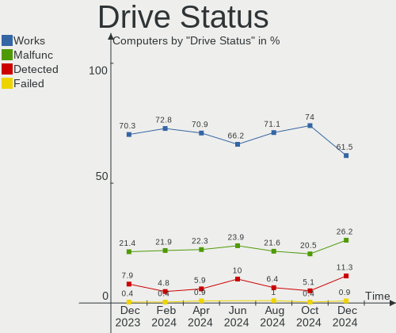
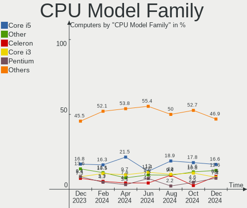
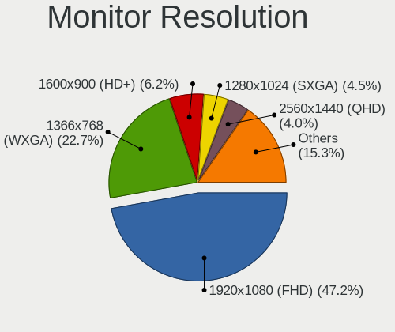
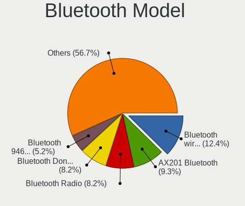

ROSA Hardware Trends
--------------------

A project to identify most popular hardware characteristics and track their change
over time based on data collected by ROSA users at https://Linux-Hardware.org.

Anyone can contribute to the study by uploading probes of their computers by
the [hw-probe](https://github.com/linuxhw/hw-probe) tool:

    sudo -E hw-probe -all -upload

This is a report for all computer types. See also reports for [desktops](/Dist/ROSA/Desktop/README.md) and [notebooks](/Dist/ROSA/Notebook/README.md).

Full-feature report is available here: https://linux-hardware.org/?view=trends

Period: Oct, 2020.

Contents
--------

- [ OS                       ](#os)
- [ OS Family                ](#os-family)
- [ Kernel                   ](#kernel)
- [ Kernel Family            ](#kernel-family)
- [ Kernel Major Ver.        ](#kernel-major-ver)
- [ Arch                     ](#arch)
- [ DE                       ](#de)
- [ Display Server           ](#display-server)
- [ Display Manager          ](#display-manager)
- [ OS Lang                  ](#os-lang)
- [ Boot Mode                ](#boot-mode)
- [ Filesystem               ](#filesystem)
- [ Part. scheme             ](#part-scheme)
- [ Dual Boot with Linux/BSD ](#dual-boot-with-linux/bsd)
- [ Dual Boot (Win)          ](#dual-boot-win)
- [ Country                  ](#country)
- [ City                     ](#city)
- [ Vendor                   ](#vendor)
- [ Model                    ](#model)
- [ Model Family             ](#model-family)
- [ MFG Year                 ](#mfg-year)
- [ Form Factor              ](#form-factor)
- [ Secure Boot              ](#secure-boot)
- [ Coreboot                 ](#coreboot)
- [ RAM Size                 ](#ram-size)
- [ RAM Used                 ](#ram-used)
- [ Has CD-ROM               ](#has-cd-rom)
- [ Total Drives             ](#total-drives)
- [ Has Ethernet             ](#has-ethernet)
- [ Drive Vendor             ](#drive-vendor)
- [ HDD Vendor               ](#hdd-vendor)
- [ SSD Vendor               ](#ssd-vendor)
- [ Drive Model              ](#drive-model)
- [ Drive Kind               ](#drive-kind)
- [ Drive Connector          ](#drive-connector)
- [ Drive Size               ](#drive-size)
- [ Space Total              ](#space-total)
- [ Space Used               ](#space-used)
- [ Malfunc. Drives          ](#malfunc-drives)
- [ Malfunc. Drive Vendor    ](#malfunc-drive-vendor)
- [ Malfunc. HDD Vendor      ](#malfunc-hdd-vendor)
- [ Malfunc. Drive Kind      ](#malfunc-drive-kind)
- [ Failed Drives            ](#failed-drives)
- [ Failed Drive Vendor      ](#failed-drive-vendor)
- [ Drive Status             ](#drive-status)
- [ Storage Vendor           ](#storage-vendor)
- [ Storage Model            ](#storage-model)
- [ Storage Kind             ](#storage-kind)
- [ CPU Vendor               ](#cpu-vendor)
- [ CPU Model                ](#cpu-model)
- [ CPU Model Family         ](#cpu-model-family)
- [ CPU Cores                ](#cpu-cores)
- [ CPU Sockets              ](#cpu-sockets)
- [ CPU Threads              ](#cpu-threads)
- [ CPU Op-Modes             ](#cpu-op-modes)
- [ CPU Microcode            ](#cpu-microcode)
- [ CPU Microarch            ](#cpu-microarch)
- [ GPU Vendor               ](#gpu-vendor)
- [ GPU Model                ](#gpu-model)
- [ GPU Combo                ](#gpu-combo)
- [ GPU Driver               ](#gpu-driver)
- [ GPU Memory               ](#gpu-memory)
- [ Monitor Vendor           ](#monitor-vendor)
- [ Monitor Model            ](#monitor-model)
- [ Monitor Resolution       ](#monitor-resolution)
- [ Monitor Diagonal         ](#monitor-diagonal)
- [ Monitor Width            ](#monitor-width)
- [ Aspect Ratio             ](#aspect-ratio)
- [ Monitor Area             ](#monitor-area)
- [ Pixel Density            ](#pixel-density)
- [ Multiple Monitors        ](#multiple-monitors)
- [ Net Controller Vendor    ](#net-controller-vendor)
- [ Net Controller Model     ](#net-controller-model)
- [ Wireless Vendor          ](#wireless-vendor)
- [ Wireless Model           ](#wireless-model)
- [ Ethernet Vendor          ](#ethernet-vendor)
- [ Ethernet Model           ](#ethernet-model)
- [ Net Controller Kind      ](#net-controller-kind)
- [ Used Controller          ](#used-controller)
- [ NICs                     ](#nics)
- [ Memory Vendor            ](#memory-vendor)
- [ Memory Model             ](#memory-model)
- [ Memory Kind              ](#memory-kind)
- [ Memory Form Factor       ](#memory-form-factor)
- [ Memory Size              ](#memory-size)
- [ Memory Speed             ](#memory-speed)
- [ Sound Vendor             ](#sound-vendor)
- [ Sound Model              ](#sound-model)
- [ Camera Vendor            ](#camera-vendor)
- [ Camera Model             ](#camera-model)
- [ Fingerprint Vendor       ](#fingerprint-vendor)
- [ Fingerprint Model        ](#fingerprint-model)
- [ Chipcard Vendor          ](#chipcard-vendor)
- [ Chipcard Model           ](#chipcard-model)
- [ Printer Vendor           ](#printer-vendor)
- [ Printer Model            ](#printer-model)
- [ Scanner Vendor           ](#scanner-vendor)
- [ Scanner Model            ](#scanner-model)
- [ Bluetooth Vendor         ](#bluetooth-vendor)
- [ Bluetooth Model          ](#bluetooth-model)
- [ Unsupported Devices      ](#unsupported-devices)
- [ Unsupported Device Types ](#unsupported-device-types)

OS
--

Installed operating systems

| Name         | Computers | Percent |
|--------------|-----------|---------|
| ROSA R11.1   | 138       | 57.74%  |
| ROSA R11     | 73        | 30.54%  |
| ROSA R8.1    | 13        | 5.44%   |
| ROSA R10     | 8         | 3.35%   |
| ROSA 2019.05 | 4         | 1.67%   |
| ROSA R9      | 2         | 0.84%   |
| ROSA R9-R11  | 1         | 0.42%   |

OS Family
---------

OS without a version

| Name | Computers | Percent |
|------|-----------|---------|
| ROSA | 239       | 100%    |

Kernel
------

Version of the Linux kernel

| Version                           | Computers | Percent |
|-----------------------------------|-----------|---------|
| 4.15.0-desktop-94.1rosa-x86_64    | 62        | 25.94%  |
| 4.15.0-desktop-45.1rosa-x86_64    | 56        | 23.43%  |
| 5.4.40-generic-1rosa-x86_64       | 23        | 9.62%   |
| 4.9.155-nrj-desktop-1rosa-x86_64  | 13        | 5.44%   |
| 5.4.32-generic-2rosa-x86_64       | 11        | 4.6%    |
| 4.15.0-desktop-45.1rosa-i586      | 11        | 4.6%    |
| 4.15.0-desktop-94.1rosa-i586      | 9         | 3.77%   |
| 5.4.40-generic-1rosa-i586         | 5         | 2.09%   |
| 4.9.60-nrj-desktop-1rosa-x86_64   | 5         | 2.09%   |
| 4.9.155-nrj-desktop-1rosa-i586    | 5         | 2.09%   |
| 4.1.38-nrj-desktop-2rosa-x86_64   | 5         | 2.09%   |
| 5.4.60-nickel-2rosa2019.05-x86_64 | 4         | 1.67%   |
| 4.15.0-desktop-68.5rosa-x86_64    | 4         | 1.67%   |
| 5.8.16-generic-1rosa-x86_64       | 2         | 0.84%   |
| 5.4.32-generic-2rosa-i586         | 2         | 0.84%   |
| 4.9.9-nrj-desktop-1rosa-x86_64    | 2         | 0.84%   |
| 4.9.60-nrj-desktop-1rosa-i586     | 2         | 0.84%   |
| 4.9.20-nrj-desktop-1rosa-x86_64   | 2         | 0.84%   |
| 4.15.0-desktop-91.3rosa-x86_64    | 2         | 0.84%   |
| 4.15.0-desktop-68.5rosa-i586      | 2         | 0.84%   |
| 5.8.9-generic-1rosa-x86_64        | 1         | 0.42%   |
| 5.8.0-desktop-21.22.1rosa-x86_64  | 1         | 0.42%   |
| 5.4.72-generic-1rosa-x86_64       | 1         | 0.42%   |
| 5.4.28-generic-1rosa-x86_64       | 1         | 0.42%   |
| 5.4.0-desktop-9.1rosa-x86_64      | 1         | 0.42%   |
| 5.0.0-desktop-38.1rosa-x86_64     | 1         | 0.42%   |
| 4.9.95-nrj-desktop-2rosa-i586     | 1         | 0.42%   |
| 4.9.20-nrj-desktop-1rosa-i586     | 1         | 0.42%   |
| 4.4.16-nrj-desktop-1rosa-i586     | 1         | 0.42%   |
| 4.15.0-desktop-91.1rosa-x86_64    | 1         | 0.42%   |
| 4.1.38-nrj-desktop-2rosa-i586     | 1         | 0.42%   |
| 3.14.15-nrj-desktop-pae-1rosa     | 1         | 0.42%   |

Kernel Family
-------------

Linux kernel without a distro release

| Version | Computers | Percent |
|---------|-----------|---------|
| 4.15.0  | 147       | 61.51%  |
| 5.4.40  | 28        | 11.72%  |
| 4.9.155 | 18        | 7.53%   |
| 5.4.32  | 13        | 5.44%   |
| 4.9.60  | 7         | 2.93%   |
| 4.1.38  | 6         | 2.51%   |
| 5.4.60  | 4         | 1.67%   |
| 4.9.20  | 3         | 1.26%   |
| 5.8.16  | 2         | 0.84%   |
| 4.9.9   | 2         | 0.84%   |
| 5.8.9   | 1         | 0.42%   |
| 5.8.0   | 1         | 0.42%   |
| 5.4.72  | 1         | 0.42%   |
| 5.4.28  | 1         | 0.42%   |
| 5.4.0   | 1         | 0.42%   |
| 5.0.0   | 1         | 0.42%   |
| 4.9.95  | 1         | 0.42%   |
| 4.4.16  | 1         | 0.42%   |
| 3.14.15 | 1         | 0.42%   |

Kernel Major Ver.
-----------------

Linux kernel major version

| Version | Computers | Percent |
|---------|-----------|---------|
| 4.15    | 147       | 61.51%  |
| 5.4     | 48        | 20.08%  |
| 4.9     | 31        | 12.97%  |
| 4.1     | 6         | 2.51%   |
| 5.8     | 4         | 1.67%   |
| 5.0     | 1         | 0.42%   |
| 4.4     | 1         | 0.42%   |
| 3.14    | 1         | 0.42%   |

Arch
----

OS architecture (x86_64, i586, etc.)

| Name   | Computers | Percent |
|--------|-----------|---------|
| x86_64 | 198       | 82.85%  |
| i686   | 41        | 17.15%  |

DE
--

Desktop Environment

| Name  | Computers | Percent |
|-------|-----------|---------|
| KDE4  | 152       | 63.6%   |
| KDE5  | 62        | 25.94%  |
| LXQt  | 17        | 7.11%   |
| XFCE  | 4         | 1.67%   |
| MATE  | 3         | 1.26%   |
| GNOME | 1         | 0.42%   |

Display Server
--------------

X11 or Wayland

| Name | Computers | Percent |
|------|-----------|---------|
| X11  | 239       | 100%    |

Display Manager
---------------

SDDM, LightDM, etc.

| Name | Computers | Percent |
|------|-----------|---------|
| KDM  | 153       | 64.02%  |
| SDDM | 85        | 35.56%  |
| GDM  | 1         | 0.42%   |

OS Lang
-------

Language

| Lang    | Computers | Percent |
|---------|-----------|---------|
| ru_RU   | 120       | 50.21%  |
| Unknown | 89        | 37.24%  |
| pl_PL   | 9         | 3.77%   |
| en_US   | 8         | 3.35%   |
| es_ES   | 3         | 1.26%   |
| de_DE   | 3         | 1.26%   |
| tt_RU   | 1         | 0.42%   |
| pt_PT   | 1         | 0.42%   |
| pt_BR   | 1         | 0.42%   |
| it_IT   | 1         | 0.42%   |
| es_AR   | 1         | 0.42%   |
| en_GB   | 1         | 0.42%   |
| bg_BG   | 1         | 0.42%   |

Boot Mode
---------

EFI or BIOS

| Mode | Computers | Percent |
|------|-----------|---------|
| BIOS | 189       | 79.08%  |
| EFI  | 50        | 20.92%  |

Filesystem
----------

Type of filesystem

| Type  | Computers | Percent |
|-------|-----------|---------|
| Ext4  | 229       | 95.82%  |
| Btrfs | 8         | 3.35%   |
| Xfs   | 1         | 0.42%   |
| Ext2  | 1         | 0.42%   |

Part. scheme
------------

Scheme of partitioning

| Type    | Computers | Percent |
|---------|-----------|---------|
| MBR     | 167       | 69.87%  |
| GPT     | 66        | 27.62%  |
| Unknown | 6         | 2.51%   |

Dual Boot with Linux/BSD
------------------------

Hosting more than one Linux/BSD

| Dual boot | Computers | Percent |
|-----------|-----------|---------|
| No        | 200       | 83.68%  |
| Yes       | 39        | 16.32%  |

Dual Boot (Win)
---------------

Hosting Linux and Windows

| Dual boot | Computers | Percent |
|-----------|-----------|---------|
| No        | 132       | 55.23%  |
| Yes       | 107       | 44.77%  |

Country
-------

Geographic location (country)

| Country    | Computers | Percent |
|------------|-----------|---------|
| Russia     | 176       | 73.64%  |
| Poland     | 10        | 4.18%   |
| Ukraine    | 9         | 3.77%   |
| USA        | 4         | 1.67%   |
| Kazakhstan | 4         | 1.67%   |
| Italy      | 4         | 1.67%   |
| Germany    | 4         | 1.67%   |
| Bulgaria   | 4         | 1.67%   |
| France     | 3         | 1.26%   |
| Portugal   | 2         | 0.84%   |
| Estonia    | 2         | 0.84%   |
| Canada     | 2         | 0.84%   |
| Belarus    | 2         | 0.84%   |
| Uzbekistan | 1         | 0.42%   |
| UK         | 1         | 0.42%   |
| Spain      | 1         | 0.42%   |
| Seychelles | 1         | 0.42%   |
| Norway     | 1         | 0.42%   |
| Moldova    | 1         | 0.42%   |
| Mexico     | 1         | 0.42%   |
| Latvia     | 1         | 0.42%   |
| Egypt      | 1         | 0.42%   |
| Chile      | 1         | 0.42%   |
| Brazil     | 1         | 0.42%   |
| Australia  | 1         | 0.42%   |
| Argentina  | 1         | 0.42%   |

City
----

Geographic location (city)

| City               | Computers | Percent |
|--------------------|-----------|---------|
| Moscow             | 27        | 11.3%   |
| Novosibirsk        | 12        | 5.02%   |
| St Petersburg      | 8         | 3.35%   |
| Perm               | 5         | 2.09%   |
| Nizhniy Novgorod   | 5         | 2.09%   |
| Lipetsk            | 4         | 1.67%   |
| Kaliningrad        | 4         | 1.67%   |
| Izhevsk            | 4         | 1.67%   |
| Barnaul            | 4         | 1.67%   |
| Warsaw             | 3         | 1.26%   |
| Voronezh           | 3         | 1.26%   |
| Usinsk             | 3         | 1.26%   |
| Sofia              | 3         | 1.26%   |
| Saratov            | 3         | 1.26%   |
| Rostov-on-Don      | 3         | 1.26%   |
| Omsk               | 3         | 1.26%   |
| Kyiv               | 3         | 1.26%   |
| Krasnodar          | 3         | 1.26%   |
| Kazan’           | 3         | 1.26%   |
| Gatchina           | 3         | 1.26%   |
| Tyumen             | 2         | 0.84%   |
| Tomsk              | 2         | 0.84%   |
| Syktyvkar          | 2         | 0.84%   |
| Simferopol         | 2         | 0.84%   |
| Samara             | 2         | 0.84%   |
| Kingisepp          | 2         | 0.84%   |
| Irkutsk            | 2         | 0.84%   |
| Łódź            | 1         | 0.42%   |
| Zelenogorsk        | 1         | 0.42%   |
| Zaraysk            | 1         | 0.42%   |
| Yaroslavl          | 1         | 0.42%   |
| Vyksa              | 1         | 0.42%   |
| Vsevolozhsk        | 1         | 0.42%   |
| Volzhskiy          | 1         | 0.42%   |
| Volgograd          | 1         | 0.42%   |
| Vogue              | 1         | 0.42%   |
| Victoria           | 1         | 0.42%   |
| Varna              | 1         | 0.42%   |
| Uren'              | 1         | 0.42%   |
| Ufa                | 1         | 0.42%   |
| Tver               | 1         | 0.42%   |
| Tula               | 1         | 0.42%   |
| Tuapse             | 1         | 0.42%   |
| Tromsø            | 1         | 0.42%   |
| Trier              | 1         | 0.42%   |
| Torres Vedras      | 1         | 0.42%   |
| Tokarnia           | 1         | 0.42%   |
| Temta              | 1         | 0.42%   |
| Tallinn            | 1         | 0.42%   |
| Strezhevoy         | 1         | 0.42%   |
| Stavropol          | 1         | 0.42%   |
| Staraya Yurga      | 1         | 0.42%   |
| Sochi              | 1         | 0.42%   |
| Snezhinsk          | 1         | 0.42%   |
| Smolensk           | 1         | 0.42%   |
| Shebekino          | 1         | 0.42%   |
| Sevastopol’      | 1         | 0.42%   |
| Serpukhov          | 1         | 0.42%   |
| Sergiyev Posad     | 1         | 0.42%   |
| Schwäbisch Gmünd | 1         | 0.42%   |

Vendor
------

Motherboard manufacturer

| Name                | Computers | Percent |
|---------------------|-----------|---------|
| ASUSTek Computer    | 68        | 28.45%  |
| Gigabyte Technology | 27        | 11.3%   |
| Lenovo              | 24        | 10.04%  |
| Hewlett-Packard     | 23        | 9.62%   |
| Acer                | 22        | 9.21%   |
| MSI                 | 15        | 6.28%   |
| Dell                | 14        | 5.86%   |
| Samsung Electronics | 11        | 4.6%    |
| ASRock              | 11        | 4.6%    |
| Sony                | 5         | 2.09%   |
| Toshiba             | 3         | 1.26%   |
| Pegatron            | 2         | 0.84%   |
| Biostar             | 2         | 0.84%   |
| Unknown             | 2         | 0.84%   |
| Supermicro          | 1         | 0.42%   |
| Packard Bell        | 1         | 0.42%   |
| Olidata             | 1         | 0.42%   |
| LORD ELECTRONICS    | 1         | 0.42%   |
| Kraftway            | 1         | 0.42%   |
| Intel               | 1         | 0.42%   |
| Foxconn             | 1         | 0.42%   |
| ECS                 | 1         | 0.42%   |
| Aquarius            | 1         | 0.42%   |
| Apple               | 1         | 0.42%   |

Model
-----

Motherboard model

| Name                                              | Computers | Percent |
|---------------------------------------------------|-----------|---------|
| Unknown                                           | 6         | 2.51%   |
| ASUS PRIME H310M-R R2.0                           | 3         | 1.26%   |
| Acer Extensa 5620                                 | 3         | 1.26%   |
| MSI GX60 1AC                                      | 2         | 0.84%   |
| Lenovo IdeaPad 100-15IBY 80MJ                     | 2         | 0.84%   |
| Lenovo G580 20150                                 | 2         | 0.84%   |
| Lenovo G50-45 80E3                                | 2         | 0.84%   |
| HP Pavilion dv6                                   | 2         | 0.84%   |
| Gigabyte H61M-S1                                  | 2         | 0.84%   |
| Gigabyte 970A-DS3P                                | 2         | 0.84%   |
| Dell Inspiron 3521                                | 2         | 0.84%   |
| ASUS X540YA                                       | 2         | 0.84%   |
| ASUS P8H61-M LX3 R2.0                             | 2         | 0.84%   |
| ASUS P5QPL-AM                                     | 2         | 0.84%   |
| Toshiba Satellite P300                            | 1         | 0.42%   |
| Toshiba Satellite L655                            | 1         | 0.42%   |
| Toshiba Satellite A200                            | 1         | 0.42%   |
| Supermicro H8DGU                                  | 1         | 0.42%   |
| Sony VPCSA2V9R                                    | 1         | 0.42%   |
| Sony VGN-NR21MR_S                                 | 1         | 0.42%   |
| Sony VGN-FZ11MR                                   | 1         | 0.42%   |
| Sony VGN-FE31ZR                                   | 1         | 0.42%   |
| Sony VGN-AR41MR                                   | 1         | 0.42%   |
| Samsung Electronics SX22S                         | 1         | 0.42%   |
| Samsung Electronics RV413/RV513                   | 1         | 0.42%   |
| Samsung Electronics RV408/RV508                   | 1         | 0.42%   |
| Samsung Electronics RC410/RC510/RC710             | 1         | 0.42%   |
| Samsung Electronics R560                          | 1         | 0.42%   |
| Samsung Electronics R540/R580/R780/SA41/E452/E852 | 1         | 0.42%   |
| Samsung Electronics R530/R730                     | 1         | 0.42%   |
| Samsung Electronics R528/R728                     | 1         | 0.42%   |
| Samsung Electronics N102SP/N100SP/N101SP          | 1         | 0.42%   |
| Samsung Electronics 350V5C/351V5C/3540VC/3440VC   | 1         | 0.42%   |
| Samsung Electronics 300E4C/300E5C/300E7C          | 1         | 0.42%   |
| Pegatron VN432AA-ABF CQ5202FR                     | 1         | 0.42%   |
| Pegatron IPPCR-DB                                 | 1         | 0.42%   |
| Packard Bell imedia S2185                         | 1         | 0.42%   |
| Olidata Olidata T7700                             | 1         | 0.42%   |
| MSI VR630                                         | 1         | 0.42%   |
| MSI OPTIMUS                                       | 1         | 0.42%   |
| MSI MS-N014                                       | 1         | 0.42%   |
| MSI MS-7C52                                       | 1         | 0.42%   |
| MSI MS-7B86                                       | 1         | 0.42%   |
| MSI MS-7A38                                       | 1         | 0.42%   |
| MSI MS-7A15                                       | 1         | 0.42%   |
| MSI MS-7996                                       | 1         | 0.42%   |
| MSI MS-7721                                       | 1         | 0.42%   |
| MSI MS-7369                                       | 1         | 0.42%   |
| MSI MS-7367                                       | 1         | 0.42%   |
| MSI MS-7346                                       | 1         | 0.42%   |
| MSI MS-7267                                       | 1         | 0.42%   |
| LORD ELECTRONICS INTEL G41 V1.0                   | 1         | 0.42%   |
| Lenovo ThinkPad X220 429137G                      | 1         | 0.42%   |
| Lenovo ThinkPad W510 4391B49                      | 1         | 0.42%   |
| Lenovo IdeaPad Z570 HuronRiver Platform           | 1         | 0.42%   |
| Lenovo IdeaPad Z370                               | 1         | 0.42%   |
| Lenovo IdeaPad S145-15IIL 81W8                    | 1         | 0.42%   |
| Lenovo IdeaPad S12 20021,2959                     | 1         | 0.42%   |
| Lenovo IdeaPad 320-15AST 80XV                     | 1         | 0.42%   |
| Lenovo IdeaPad 110-15ACL 80TJ                     | 1         | 0.42%   |

Model Family
------------

Motherboard model prefix

| Name                       | Computers | Percent |
|----------------------------|-----------|---------|
| Lenovo IdeaPad             | 9         | 3.77%   |
| HP Pavilion                | 9         | 3.77%   |
| Acer Aspire                | 9         | 3.77%   |
| Unknown                    | 6         | 2.51%   |
| Dell Inspiron              | 5         | 2.09%   |
| HP ProBook                 | 4         | 1.67%   |
| ASUS P8H61-M               | 4         | 1.67%   |
| Acer Extensa               | 4         | 1.67%   |
| Toshiba Satellite          | 3         | 1.26%   |
| Dell OptiPlex              | 3         | 1.26%   |
| Dell Latitude              | 3         | 1.26%   |
| ASUS PRIME                 | 3         | 1.26%   |
| ASUS M5A78L-M              | 3         | 1.26%   |
| MSI GX60                   | 2         | 0.84%   |
| Lenovo ThinkPad            | 2         | 0.84%   |
| Lenovo G580                | 2         | 0.84%   |
| Lenovo G50-45              | 2         | 0.84%   |
| Lenovo B590                | 2         | 0.84%   |
| HP Laptop                  | 2         | 0.84%   |
| HP Compaq                  | 2         | 0.84%   |
| Gigabyte H61M-S1           | 2         | 0.84%   |
| Gigabyte 970A-DS3P         | 2         | 0.84%   |
| ASUS X540YA                | 2         | 0.84%   |
| ASUS P5QPL-AM              | 2         | 0.84%   |
| ASUS P5Q                   | 2         | 0.84%   |
| ASUS M5A97                 | 2         | 0.84%   |
| Acer Veriton               | 2         | 0.84%   |
| Acer TravelMate            | 2         | 0.84%   |
| Supermicro H8DGU           | 1         | 0.42%   |
| Sony VPCSA2V9R             | 1         | 0.42%   |
| Sony VGN-NR21MR            | 1         | 0.42%   |
| Sony VGN-FZ11MR            | 1         | 0.42%   |
| Sony VGN-FE31ZR            | 1         | 0.42%   |
| Sony VGN-AR41MR            | 1         | 0.42%   |
| Samsung Electronics SX22S  | 1         | 0.42%   |
| Samsung Electronics RV413  | 1         | 0.42%   |
| Samsung Electronics RV408  | 1         | 0.42%   |
| Samsung Electronics RC410  | 1         | 0.42%   |
| Samsung Electronics R560   | 1         | 0.42%   |
| Samsung Electronics R540   | 1         | 0.42%   |
| Samsung Electronics R530   | 1         | 0.42%   |
| Samsung Electronics R528   | 1         | 0.42%   |
| Samsung Electronics N102SP | 1         | 0.42%   |
| Samsung Electronics 350V5C | 1         | 0.42%   |
| Samsung Electronics 300E4C | 1         | 0.42%   |
| Pegatron VN432AA-ABF       | 1         | 0.42%   |
| Pegatron IPPCR-DB          | 1         | 0.42%   |
| Packard Bell imedia        | 1         | 0.42%   |
| Olidata Olidata            | 1         | 0.42%   |
| MSI VR630                  | 1         | 0.42%   |
| MSI OPTIMUS                | 1         | 0.42%   |
| MSI MS-N014                | 1         | 0.42%   |
| MSI MS-7C52                | 1         | 0.42%   |
| MSI MS-7B86                | 1         | 0.42%   |
| MSI MS-7A38                | 1         | 0.42%   |
| MSI MS-7A15                | 1         | 0.42%   |
| MSI MS-7996                | 1         | 0.42%   |
| MSI MS-7721                | 1         | 0.42%   |
| MSI MS-7369                | 1         | 0.42%   |
| MSI MS-7367                | 1         | 0.42%   |

MFG Year
--------

Motherboard manufacture year

| Year | Computers | Percent |
|------|-----------|---------|
| 2010 | 32        | 13.39%  |
| 2012 | 29        | 12.13%  |
| 2011 | 28        | 11.72%  |
| 2018 | 17        | 7.11%   |
| 2013 | 17        | 7.11%   |
| 2007 | 17        | 7.11%   |
| 2016 | 16        | 6.69%   |
| 2008 | 16        | 6.69%   |
| 2009 | 14        | 5.86%   |
| 2019 | 12        | 5.02%   |
| 2015 | 11        | 4.6%    |
| 2014 | 9         | 3.77%   |
| 2020 | 8         | 3.35%   |
| 2017 | 6         | 2.51%   |
| 2006 | 4         | 1.67%   |
| 2005 | 2         | 0.84%   |
| 2004 | 1         | 0.42%   |

Form Factor
-----------

Physical design of the computer

| Name        | Computers | Percent |
|-------------|-----------|---------|
| Desktop     | 118       | 49.37%  |
| Notebook    | 116       | 48.54%  |
| All in one  | 2         | 0.84%   |
| Convertible | 1         | 0.42%   |
| Mini pc     | 1         | 0.42%   |
| Server      | 1         | 0.42%   |

Secure Boot
-----------

Enabled or disabled

| State    | Computers | Percent |
|----------|-----------|---------|
| Disabled | 239       | 100%    |

Coreboot
--------

Have coreboot on board

| Used | Computers | Percent |
|------|-----------|---------|
| No   | 239       | 100%    |

RAM Size
--------

Total RAM memory

| Size in GB      | Computers | Percent |
|-----------------|-----------|---------|
| 3.01-4.0        | 85        | 35.56%  |
| 8.01-16.0       | 45        | 18.83%  |
| 4.01-8.0        | 41        | 17.15%  |
| 1.01-2.0        | 35        | 14.64%  |
| 2.01-3.0        | 16        | 6.69%   |
| 16.01-24.0      | 13        | 5.44%   |
| 0.01-1.0        | 3         | 1.26%   |
| More than 256.0 | 1         | 0.42%   |

RAM Used
--------

Used RAM memory

| Used GB  | Computers | Percent |
|----------|-----------|---------|
| 0.01-1.0 | 112       | 46.86%  |
| 1.01-2.0 | 97        | 40.59%  |
| 2.01-3.0 | 22        | 9.21%   |
| 3.01-4.0 | 6         | 2.51%   |
| 4.01-8.0 | 2         | 0.84%   |

Has CD-ROM
----------

Has CD-ROM on board

| Presented | Computers | Percent |
|-----------|-----------|---------|
| Yes       | 161       | 67.36%  |
| No        | 78        | 32.64%  |

Total Drives
------------

Number of drives on board

| Drives | Computers | Percent |
|--------|-----------|---------|
| 1      | 167       | 69.87%  |
| 2      | 51        | 21.34%  |
| 3      | 7         | 2.93%   |
| 0      | 6         | 2.51%   |
| 4      | 5         | 2.09%   |
| 7      | 2         | 0.84%   |
| 5      | 1         | 0.42%   |

Has Ethernet
------------

Has Ethernet on board

| Presented | Computers | Percent |
|-----------|-----------|---------|
| Yes       | 233       | 97.49%  |
| No        | 6         | 2.51%   |

Drive Vendor
------------

Hard drive vendors

| Vendor              | Computers | Drives | Percent |
|---------------------|-----------|--------|---------|
| Seagate             | 77        | 85     | 25%     |
| WDC                 | 74        | 85     | 24.03%  |
| Toshiba             | 25        | 25     | 8.12%   |
| Samsung Electronics | 24        | 26     | 7.79%   |
| Hitachi             | 24        | 24     | 7.79%   |
| Kingston            | 12        | 12     | 3.9%    |
| Maxtor              | 7         | 8      | 2.27%   |
| HGST                | 6         | 6      | 1.95%   |
| China               | 5         | 5      | 1.62%   |
| Unknown             | 4         | 5      | 1.3%    |
| SPCC                | 4         | 4      | 1.3%    |
| Patriot             | 4         | 4      | 1.3%    |
| FOXLINE             | 4         | 4      | 1.3%    |
| Crucial             | 4         | 5      | 1.3%    |
| KingSpec            | 3         | 3      | 0.97%   |
| Intel               | 3         | 4      | 0.97%   |
| GOODRAM             | 3         | 3      | 0.97%   |
| Fujitsu             | 3         | 3      | 0.97%   |
| PNY                 | 2         | 2      | 0.65%   |
| HUAWEI              | 2         | 2      | 0.65%   |
| Corsair             | 2         | 2      | 0.65%   |
| Apacer              | 2         | 2      | 0.65%   |
| A-DATA Technology   | 2         | 2      | 0.65%   |
| Zheino              | 1         | 1      | 0.32%   |
| Wicgtyp             | 1         | 1      | 0.32%   |
| WD MediaMax         | 1         | 1      | 0.32%   |
| SK Hynix            | 1         | 1      | 0.32%   |
| SanDisk             | 1         | 1      | 0.32%   |
| PLEXTOR             | 1         | 1      | 0.32%   |
| OCZ-VERTEX          | 1         | 1      | 0.32%   |
| MIXZA               | 1         | 1      | 0.32%   |
| Kingmax             | 1         | 1      | 0.32%   |
| Gigabyte Technology | 1         | 1      | 0.32%   |
| e2e4                | 1         | 1      | 0.32%   |
| AEGO                | 1         | 1      | 0.32%   |

HDD Vendor
----------

Hard disk drive vendors

| Vendor              | Computers | Drives | Percent |
|---------------------|-----------|--------|---------|
| Seagate             | 77        | 85     | 34.07%  |
| WDC                 | 68        | 78     | 30.09%  |
| Hitachi             | 24        | 24     | 10.62%  |
| Toshiba             | 22        | 22     | 9.73%   |
| Samsung Electronics | 18        | 18     | 7.96%   |
| MAXTOR              | 7         | 8      | 3.1%    |
| HGST                | 6         | 6      | 2.65%   |
| Fujitsu             | 3         | 3      | 1.33%   |
| WD MediaMax         | 1         | 1      | 0.44%   |

SSD Vendor
----------

Solid state drive vendors

| Vendor              | Computers | Drives | Percent |
|---------------------|-----------|--------|---------|
| Kingston            | 12        | 12     | 16.9%   |
| WDC                 | 5         | 5      | 7.04%   |
| Samsung Electronics | 5         | 6      | 7.04%   |
| China               | 5         | 5      | 7.04%   |
| SPCC                | 4         | 4      | 5.63%   |
| Patriot             | 4         | 4      | 5.63%   |
| FOXLINE             | 4         | 4      | 5.63%   |
| Crucial             | 4         | 4      | 5.63%   |
| KingSpec            | 3         | 3      | 4.23%   |
| Intel               | 3         | 4      | 4.23%   |
| GOODRAM             | 3         | 3      | 4.23%   |
| PNY                 | 2         | 2      | 2.82%   |
| Corsair             | 2         | 2      | 2.82%   |
| Apacer              | 2         | 2      | 2.82%   |
| A-DATA Technology   | 2         | 2      | 2.82%   |
| Zheino              | 1         | 1      | 1.41%   |
| Wicgtyp             | 1         | 1      | 1.41%   |
| Toshiba             | 1         | 1      | 1.41%   |
| SanDisk             | 1         | 1      | 1.41%   |
| PLEXTOR             | 1         | 1      | 1.41%   |
| OCZ-VERTEX          | 1         | 1      | 1.41%   |
| MIXZA               | 1         | 1      | 1.41%   |
| Kingmax             | 1         | 1      | 1.41%   |
| Gigabyte Technology | 1         | 1      | 1.41%   |
| e2e4                | 1         | 1      | 1.41%   |
| AEGO                | 1         | 1      | 1.41%   |

Drive Model
-----------

Hard drive models

| Model                          | Computers | Percent |
|--------------------------------|-----------|---------|
| ST500LT012-1DG142 500GB        | 9         | 2.75%   |
| ST9500325AS 500GB              | 7         | 2.14%   |
| ST1000DM010-2EP102 1TB         | 5         | 1.53%   |
| SA400S37120G 120GB SSD         | 4         | 1.22%   |
| HTS541612J9SA00 120GB          | 4         | 1.22%   |
| WD5000LPCX-24VHAT0 500GB       | 3         | 0.92%   |
| WD3200BPVT-22ZEST0 320GB       | 3         | 0.92%   |
| ST9320328CS 320GB              | 3         | 0.92%   |
| ST9320325AS 320GB              | 3         | 0.92%   |
| ST3500418AS 500GB              | 3         | 0.92%   |
| WDS120G2G0A-00JH30 120GB SSD   | 2         | 0.61%   |
| WD800JD-22MSA1 80GB            | 2         | 0.61%   |
| WD5000LPVX-22V0TT0 500GB       | 2         | 0.61%   |
| WD20EARX-00PASB0 2TB           | 2         | 0.61%   |
| WD20EARS-00MVWB0 2TB           | 2         | 0.61%   |
| WD15EARS-00MVWB0 1TB           | 2         | 0.61%   |
| WD10EZEX-00MFCA0 1TB           | 2         | 0.61%   |
| SV300S37A120G 120GB SSD        | 2         | 0.61%   |
| STM3250820AS 250GB             | 2         | 0.61%   |
| ST9750420AS 752GB              | 2         | 0.61%   |
| ST500DM002-1BD142 500GB        | 2         | 0.61%   |
| ST380011A 80GB                 | 2         | 0.61%   |
| ST3250310AS 250GB              | 2         | 0.61%   |
| ST31000524AS 1TB               | 2         | 0.61%   |
| ST1000LM024 HN-M101MBB 1TB     | 2         | 0.61%   |
| ST1000DM003-1CH162 1TB         | 2         | 0.61%   |
| SSD2SC240G1LC709B121-443 240GB | 2         | 0.61%   |
| SSD 860 EVO 250GB              | 2         | 0.61%   |
| SSD 120GB                      | 2         | 0.61%   |
| Solid State Disk 120GB         | 2         | 0.61%   |
| SA400S37240G 240GB SSD         | 2         | 0.61%   |
| MQ04ABF100 1TB                 | 2         | 0.61%   |
| MQ01ABD100 1TB                 | 2         | 0.61%   |
| HTS547575A9E384 752GB          | 2         | 0.61%   |
| HTS547550A9E384 500GB          | 2         | 0.61%   |
| HTS545050A7E680 500GB          | 2         | 0.61%   |
| HTS543216L9A300 160GB          | 2         | 0.61%   |
| HTS541010A9E680 1TB            | 2         | 0.61%   |
| HM250HI 250GB                  | 2         | 0.61%   |
| HDWD110 1TB                    | 2         | 0.61%   |
| HDWD105 500GB                  | 2         | 0.61%   |
| HD160JJ 160GB                  | 2         | 0.61%   |
| FLSSD512X5 512GB               | 2         | 0.61%   |
| DT01ACA100 1TB                 | 2         | 0.61%   |
| DT01ACA050 500GB               | 2         | 0.61%   |
| 120GB SSD                      | 2         | 0.61%   |
| WL250GSA872 250GB              | 1         | 0.31%   |
| WDS250G2B0A-00SM50 250GB SSD   | 1         | 0.31%   |
| WDS250G1B0C-00S6U0 250GB       | 1         | 0.31%   |
| WDS240G2G0A-00JH30 240GB SSD   | 1         | 0.31%   |
| WDS100T2B0A-00SM50 1TB SSD     | 1         | 0.31%   |
| WD800JD-60LSA0 80GB            | 1         | 0.31%   |
| WD7500BPKT-75PK4T0 752GB       | 1         | 0.31%   |
| WD7500AADS-00M2B0 752GB        | 1         | 0.31%   |
| WD6400BPVT-75HXZT1 640GB       | 1         | 0.31%   |
| WD6400AAKS-65Z7B0 640GB        | 1         | 0.31%   |
| WD5002AALX-00J37A0 500GB       | 1         | 0.31%   |
| WD5000LPVX-60V0TT0 500GB       | 1         | 0.31%   |
| WD5000LPLX-00ZNTT0 500GB       | 1         | 0.31%   |
| WD5000LPCX-60VHAT1 500GB       | 1         | 0.31%   |

Drive Kind
----------

HDD or SSD

| Kind    | Computers | Drives | Percent |
|---------|-----------|--------|---------|
| HDD     | 199       | 245    | 72.1%   |
| SSD     | 64        | 73     | 23.19%  |
| NVMe    | 6         | 7      | 2.17%   |
| MMC     | 4         | 5      | 1.45%   |
| Unknown | 3         | 3      | 1.09%   |

Drive Connector
---------------

SATA, SAS, NVMe, etc.

| Type | Computers | Drives | Percent |
|------|-----------|--------|---------|
| SATA | 228       | 315    | 93.44%  |
| SAS  | 6         | 6      | 2.46%   |
| NVMe | 6         | 7      | 2.46%   |
| MMC  | 4         | 5      | 1.64%   |

Drive Size
----------

Size of hard drive

| Size in TB | Computers | Drives | Percent |
|------------|-----------|--------|---------|
| 0.01-0.5   | 189       | 233    | 71.59%  |
| 0.51-1.0   | 63        | 69     | 23.86%  |
| 1.01-2.0   | 7         | 9      | 2.65%   |
| 3.01-4.0   | 3         | 4      | 1.14%   |
| 2.01-3.0   | 2         | 3      | 0.76%   |

Space Total
-----------

Amount of disk space available on the file system

| Size in GB     | Computers | Percent |
|----------------|-----------|---------|
| 251-500        | 64        | 26.78%  |
| 101-250        | 60        | 25.1%   |
| 1-20           | 37        | 15.48%  |
| 501-1000       | 27        | 11.3%   |
| 51-100         | 24        | 10.04%  |
| 21-50          | 17        | 7.11%   |
| 1001-2000      | 6         | 2.51%   |
| 2001-3000      | 3         | 1.26%   |
| More than 3000 | 1         | 0.42%   |

Space Used
----------

Amount of used disk space

| Used GB        | Computers | Percent |
|----------------|-----------|---------|
| 1-20           | 166       | 69.46%  |
| 21-50          | 22        | 9.21%   |
| 51-100         | 17        | 7.11%   |
| 101-250        | 13        | 5.44%   |
| 501-1000       | 11        | 4.6%    |
| 251-500        | 8         | 3.35%   |
| More than 3000 | 1         | 0.42%   |
| 1001-2000      | 1         | 0.42%   |

Malfunc. Drives
---------------

Drive models with a malfunction

| Model                    | Computers | Drives | Percent |
|--------------------------|-----------|--------|---------|
| ST9500325AS 500GB        | 6         | 6      | 5.26%   |
| WD3200BPVT-22ZEST0 320GB | 3         | 3      | 2.63%   |
| WD15EARS-00MVWB0 1TB     | 2         | 2      | 1.75%   |
| ST9320328CS 320GB        | 2         | 2      | 1.75%   |
| ST500LT012-1DG142 500GB  | 2         | 2      | 1.75%   |
| ST3500418AS 500GB        | 2         | 3      | 1.75%   |
| ST3250310AS 250GB        | 2         | 2      | 1.75%   |
| HTS541612J9SA00 120GB    | 2         | 2      | 1.75%   |
| HD160JJ 160GB            | 2         | 2      | 1.75%   |
| WD800JD-22MSA1 80GB      | 1         | 1      | 0.88%   |
| WD7500BPKT-75PK4T0 752GB | 1         | 1      | 0.88%   |
| WD7500AADS-00M2B0 752GB  | 1         | 1      | 0.88%   |
| WD5000LPVX-60V0TT0 500GB | 1         | 1      | 0.88%   |
| WD5000BPVT-24HXZT3 500GB | 1         | 1      | 0.88%   |
| WD5000AAKX-75U6AA0 500GB | 1         | 1      | 0.88%   |
| WD5000AADS-00S9B0 500GB  | 1         | 1      | 0.88%   |
| WD40PURZ-85TTDY0 4TB     | 1         | 1      | 0.88%   |
| WD3200BPVT-80ZEST0 320GB | 1         | 1      | 0.88%   |
| WD3200AAKS-00V1A0 320GB  | 1         | 1      | 0.88%   |
| WD3200AAJS-22B4A0 320GB  | 1         | 1      | 0.88%   |
| WD2500BEVT-22A23T0 250GB | 1         | 1      | 0.88%   |
| WD2500BEVT-00A23T0 250GB | 1         | 1      | 0.88%   |
| WD2500BEVS-00UST0 250GB  | 1         | 1      | 0.88%   |
| WD2500AAKX-001CA0 250GB  | 1         | 1      | 0.88%   |
| WD2500AAJS-22RYA0 250GB  | 1         | 1      | 0.88%   |
| WD20EARX-00PASB0 2TB     | 1         | 1      | 0.88%   |
| WD20EARS-00MVWB0 2TB     | 1         | 1      | 0.88%   |
| WD1600JS-00NCB1 160GB    | 1         | 1      | 0.88%   |
| WD1600BEVT-22A23T0 160GB | 1         | 1      | 0.88%   |
| WD1600AAJS-75M0A0 160GB  | 1         | 1      | 0.88%   |
| WD1600AAJS-08PSA0 160GB  | 1         | 1      | 0.88%   |
| WD10JPVT-08A1YT2 1TB     | 1         | 1      | 0.88%   |
| WD10JPCX-24UE4T0 1TB     | 1         | 1      | 0.88%   |
| WD10EADS-22M2B0 1TB      | 1         | 1      | 0.88%   |
| WD10EADS-00M2B0 1TB      | 1         | 1      | 0.88%   |
| STM3320613AS 320GB       | 1         | 1      | 0.88%   |
| STM3250820AS 250GB       | 1         | 2      | 0.88%   |
| STM3250310AS 250GB       | 1         | 1      | 0.88%   |
| ST9750420AS 752GB        | 1         | 1      | 0.88%   |
| ST9320423AS 320GB        | 1         | 1      | 0.88%   |
| ST9320325AS 320GB        | 1         | 1      | 0.88%   |
| ST9250315AS 250GB        | 1         | 1      | 0.88%   |
| ST500LT012-9WS142 500GB  | 1         | 1      | 0.88%   |
| ST500DM002-1BD142 500GB  | 1         | 1      | 0.88%   |
| ST380215A 80GB           | 1         | 1      | 0.88%   |
| ST380011A 80GB           | 1         | 1      | 0.88%   |
| ST3750525AS 752GB        | 1         | 1      | 0.88%   |
| ST3500412AS 500GB        | 1         | 1      | 0.88%   |
| ST3320613AS 320GB        | 1         | 1      | 0.88%   |
| ST3320418AS 320GB        | 1         | 1      | 0.88%   |
| ST3320413CS 320GB        | 1         | 1      | 0.88%   |
| ST3250410AS 250GB        | 1         | 1      | 0.88%   |
| ST320LT012-9WS14C 320GB  | 1         | 1      | 0.88%   |
| ST3160812AS 160GB        | 1         | 1      | 0.88%   |
| ST3160212A 160GB         | 1         | 1      | 0.88%   |
| ST3120813AS 120GB        | 1         | 1      | 0.88%   |
| ST31000524AS 1TB         | 1         | 1      | 0.88%   |
| ST1500DL003-9VT16L 1TB   | 1         | 1      | 0.88%   |
| ST1000LM048-2E7172 1TB   | 1         | 1      | 0.88%   |
| ST1000DL002-9TT153 1TB   | 1         | 1      | 0.88%   |

Malfunc. Drive Vendor
---------------------

Vendors of faulty drives

| Vendor              | Computers | Drives | Percent |
|---------------------|-----------|--------|---------|
| Seagate             | 35        | 37     | 31.25%  |
| WDC                 | 30        | 31     | 26.79%  |
| Hitachi             | 14        | 14     | 12.5%   |
| Samsung Electronics | 9         | 9      | 8.04%   |
| Toshiba             | 6         | 6      | 5.36%   |
| MAXTOR              | 5         | 6      | 4.46%   |
| HGST                | 3         | 3      | 2.68%   |
| Fujitsu             | 2         | 2      | 1.79%   |
| SPCC                | 1         | 1      | 0.89%   |
| PNY                 | 1         | 1      | 0.89%   |
| Kingston            | 1         | 1      | 0.89%   |
| KingSpec            | 1         | 1      | 0.89%   |
| Kingmax             | 1         | 1      | 0.89%   |
| Crucial             | 1         | 1      | 0.89%   |
| Corsair             | 1         | 1      | 0.89%   |
| AEGO                | 1         | 1      | 0.89%   |

Malfunc. HDD Vendor
-------------------

Vendors of faulty HDD drives

| Vendor              | Computers | Drives | Percent |
|---------------------|-----------|--------|---------|
| Seagate             | 35        | 37     | 33.65%  |
| WDC                 | 30        | 31     | 28.85%  |
| Hitachi             | 14        | 14     | 13.46%  |
| Samsung Electronics | 9         | 9      | 8.65%   |
| Toshiba             | 6         | 6      | 5.77%   |
| Maxtor              | 5         | 6      | 4.81%   |
| HGST                | 3         | 3      | 2.88%   |
| Fujitsu             | 2         | 2      | 1.92%   |

Malfunc. Drive Kind
-------------------

Kinds of faulty drives

| Kind | Computers | Drives | Percent |
|------|-----------|--------|---------|
| HDD  | 97        | 108    | 92.38%  |
| SSD  | 8         | 8      | 7.62%   |

Failed Drives
-------------

Failed drive models

| Model                 | Computers | Drives | Percent |
|-----------------------|-----------|--------|---------|
| ST31000524AS 1TB      | 1         | 1      | 33.33%  |
| HTS545050A7E380 500GB | 1         | 1      | 33.33%  |
| HM160HI 160GB         | 1         | 1      | 33.33%  |

Failed Drive Vendor
-------------------

Failed drive vendors

| Vendor              | Computers | Drives | Percent |
|---------------------|-----------|--------|---------|
| Seagate             | 1         | 1      | 33.33%  |
| Samsung Electronics | 1         | 1      | 33.33%  |
| HGST                | 1         | 1      | 33.33%  |

Drive Status
------------

Number of failed and malfunc. drives

| Status   | Computers | Drives | Percent |
|----------|-----------|--------|---------|
| Works    | 155       | 201    | 56.57%  |
| Malfunc  | 104       | 116    | 37.96%  |
| Detected | 12        | 13     | 4.38%   |
| Failed   | 3         | 3      | 1.09%   |

Storage Vendor
--------------

Storage controller vendors

| Vendor                           | Computers | Percent |
|----------------------------------|-----------|---------|
| Intel                            | 156       | 59.32%  |
| AMD                              | 64        | 24.33%  |
| JMicron Technology               | 15        | 5.7%    |
| Nvidia                           | 14        | 5.32%   |
| Marvell Technology Group         | 3         | 1.14%   |
| VIA Technologies                 | 2         | 0.76%   |
| Silicon Integrated Systems [SiS] | 2         | 0.76%   |
| Sandisk                          | 2         | 0.76%   |
| Toshiba America Info Systems     | 1         | 0.38%   |
| SK Hynix                         | 1         | 0.38%   |
| Samsung Electronics              | 1         | 0.38%   |
| Micron/Crucial Technology        | 1         | 0.38%   |
| ASMedia Technology               | 1         | 0.38%   |

Storage Model
-------------

Storage controller models

| Model                                                                             | Computers | Percent |
|-----------------------------------------------------------------------------------|-----------|---------|
| FCH SATA Controller [AHCI mode]                                                   | 29        | 8.24%   |
| NM10/ICH7 Family SATA Controller [IDE mode]                                       | 19        | 5.4%    |
| SB7x0/SB8x0/SB9x0 IDE Controller                                                  | 16        | 4.55%   |
| 6 Series/C200 Series Chipset Family 6 port Mobile SATA AHCI Controller            | 15        | 4.26%   |
| SB7x0/SB8x0/SB9x0 SATA Controller [AHCI mode]                                     | 14        | 3.98%   |
| 82801G (ICH7 Family) IDE Controller                                               | 14        | 3.98%   |
| 7 Series Chipset Family 6-port SATA Controller [AHCI mode]                        | 13        | 3.69%   |
| SB7x0/SB8x0/SB9x0 SATA Controller [IDE mode]                                      | 12        | 3.41%   |
| 82801HM/HEM (ICH8M/ICH8M-E) IDE Controller                                        | 9         | 2.56%   |
| 6 Series/C200 Series Chipset Family Desktop SATA Controller (IDE mode, ports 4-5) | 9         | 2.56%   |
| 6 Series/C200 Series Chipset Family Desktop SATA Controller (IDE mode, ports 0-3) | 9         | 2.56%   |
| 82801IBM/IEM (ICH9M/ICH9M-E) 4 port SATA Controller [AHCI mode]                   | 8         | 2.27%   |
| NM10/ICH7 Family SATA Controller [AHCI mode]                                      | 7         | 1.99%   |
| MCP61 SATA Controller                                                             | 7         | 1.99%   |
| JMB363 SATA/IDE Controller                                                        | 7         | 1.99%   |
| 5 Series/3400 Series Chipset 4 port SATA AHCI Controller                          | 7         | 1.99%   |
| MCP61 IDE                                                                         | 6         | 1.7%    |
| 6 Series/C200 Series Chipset Family 6 port Desktop SATA AHCI Controller           | 6         | 1.7%    |
| 200 Series PCH SATA controller [AHCI mode]                                        | 6         | 1.7%    |
| Wildcat Point-LP SATA Controller [AHCI Mode]                                      | 5         | 1.42%   |
| SB600 IDE                                                                         | 5         | 1.42%   |
| 82801HM/HEM (ICH8M/ICH8M-E) SATA Controller [IDE mode]                            | 5         | 1.42%   |
| 82801HM/HEM (ICH8M/ICH8M-E) SATA Controller [AHCI mode]                           | 5         | 1.42%   |
| SB600 Non-Raid-5 SATA                                                             | 4         | 1.14%   |
| JMB368 IDE controller                                                             | 4         | 1.14%   |
| FCH IDE Controller                                                                | 4         | 1.14%   |
| 82801HR/HO/HH (ICH8R/DO/DH) 2 port SATA Controller [IDE mode]                     | 4         | 1.14%   |
| 82801H (ICH8 Family) 4 port SATA Controller [IDE mode]                            | 4         | 1.14%   |
| 82801GBM/GHM (ICH7-M Family) SATA Controller [IDE mode]                           | 4         | 1.14%   |
| 400 Series Chipset SATA Controller                                                | 4         | 1.14%   |
| FCH SATA Controller [IDE mode]                                                    | 3         | 0.85%   |
| 82801 Mobile SATA Controller [RAID mode]                                          | 3         | 0.85%   |
| 8 Series/C220 Series Chipset Family 6-port SATA Controller 1 [AHCI mode]          | 3         | 0.85%   |
| 8 Series SATA Controller 1 [AHCI mode]                                            | 3         | 0.85%   |
| 5 Series/3400 Series Chipset 6 port SATA AHCI Controller                          | 3         | 0.85%   |
| WD Black 2018 / PC SN520 NVMe SSD                                                 | 2         | 0.57%   |
| Sunrise Point-LP SATA Controller [AHCI mode]                                      | 2         | 0.57%   |
| SATA controller                                                                   | 2         | 0.57%   |
| Q170/Q150/B150/H170/H110/Z170/CM236 Chipset SATA Controller [AHCI Mode]           | 2         | 0.57%   |
| JMB362 SATA Controller                                                            | 2         | 0.57%   |
| Cannon Lake PCH SATA AHCI Controller                                              | 2         | 0.57%   |
| Atom Processor E3800 Series SATA AHCI Controller                                  | 2         | 0.57%   |
| 82801JI (ICH10 Family) SATA AHCI Controller                                       | 2         | 0.57%   |
| 82801JI (ICH10 Family) 4 port SATA IDE Controller #1                              | 2         | 0.57%   |
| 82801JI (ICH10 Family) 2 port SATA IDE Controller #2                              | 2         | 0.57%   |
| 82801IB (ICH9) 2 port SATA Controller [IDE mode]                                  | 2         | 0.57%   |
| 82801I (ICH9 Family) 2 port SATA Controller [IDE mode]                            | 2         | 0.57%   |
| 6 Series/C200 Series Chipset Family Mobile SATA Controller (IDE mode, ports 4-5)  | 2         | 0.57%   |
| 6 Series/C200 Series Chipset Family Mobile SATA Controller (IDE mode, ports 0-3)  | 2         | 0.57%   |
| 5 Series/3400 Series Chipset 4 port SATA IDE Controller                           | 2         | 0.57%   |
| 5 Series/3400 Series Chipset 2 port SATA IDE Controller                           | 2         | 0.57%   |
| X370 Series Chipset SATA Controller                                               | 1         | 0.28%   |
| VX800 Serial ATA and EIDE Controller                                              | 1         | 0.28%   |
| VT6415 PATA IDE Host Controller                                                   | 1         | 0.28%   |
| SATA Controller [RAID mode]                                                       | 1         | 0.28%   |
| SATA Controller / IDE mode                                                        | 1         | 0.28%   |
| RAID bus controller 180 SATA/PATA  [SiS]                                          | 1         | 0.28%   |
| P1 NVMe PCIe SSD                                                                  | 1         | 0.28%   |
| NVMe SSD Controller SM981/PM981/PM983                                             | 1         | 0.28%   |
| Non-Volatile memory controller                                                    | 1         | 0.28%   |

Storage Kind
------------

Kind of storage controller (IDE, SATA, NVMe, SAS, ...)

| Kind | Computers | Percent |
|------|-----------|---------|
| SATA | 163       | 58.84%  |
| IDE  | 104       | 37.55%  |
| NVMe | 6         | 2.17%   |
| RAID | 4         | 1.44%   |

CPU Vendor
----------

Processor vendors

| Vendor       | Computers | Percent |
|--------------|-----------|---------|
| Intel        | 162       | 67.78%  |
| AMD          | 76        | 31.8%   |
| CentaurHauls | 1         | 0.42%   |

CPU Model
---------

Processor models

| Model                                        | Computers | Percent |
|----------------------------------------------|-----------|---------|
| Intel Core i3-5005U CPU @ 2.00GHz            | 4         | 1.67%   |
| Intel Core i5-2450M CPU @ 2.50GHz            | 3         | 1.26%   |
| Intel Core i5-2410M CPU @ 2.30GHz            | 3         | 1.26%   |
| Intel Core i3-2310M CPU @ 2.10GHz            | 3         | 1.26%   |
| Intel Core 2 Duo CPU E7500 @ 2.93GHz         | 3         | 1.26%   |
| Intel Celeron G4920 CPU @ 3.20GHz            | 3         | 1.26%   |
| Intel Pentium Dual-Core CPU E5300 @ 2.60GHz  | 2         | 0.84%   |
| Intel Pentium CPU B940 @ 2.00GHz             | 2         | 0.84%   |
| Intel Core i7-3770 CPU @ 3.40GHz             | 2         | 0.84%   |
| Intel Core i7-2670QM CPU @ 2.20GHz           | 2         | 0.84%   |
| Intel Core i7-2600 CPU @ 3.40GHz             | 2         | 0.84%   |
| Intel Core i5-3210M CPU @ 2.50GHz            | 2         | 0.84%   |
| Intel Core i5-2300 CPU @ 2.80GHz             | 2         | 0.84%   |
| Intel Core i3-2120 CPU @ 3.30GHz             | 2         | 0.84%   |
| Intel Core i3 CPU M 380 @ 2.53GHz            | 2         | 0.84%   |
| Intel Core 2 Quad CPU Q9650 @ 3.00GHz        | 2         | 0.84%   |
| Intel Core 2 Duo CPU T9300 @ 2.50GHz         | 2         | 0.84%   |
| Intel Core 2 Duo CPU T7100 @ 1.80GHz         | 2         | 0.84%   |
| Intel Core 2 Duo CPU T5550 @ 1.83GHz         | 2         | 0.84%   |
| Intel Core 2 Duo CPU P8400 @ 2.26GHz         | 2         | 0.84%   |
| Intel Core 2 Duo CPU E8400 @ 3.00GHz         | 2         | 0.84%   |
| Intel Core 2 Duo CPU E4500 @ 2.20GHz         | 2         | 0.84%   |
| Intel Core 2 CPU T5600 @ 1.83GHz             | 2         | 0.84%   |
| Intel Atom CPU N455 @ 1.66GHz                | 2         | 0.84%   |
| Intel Atom CPU N450 @ 1.66GHz                | 2         | 0.84%   |
| AMD Phenom II X6 1075T Processor             | 2         | 0.84%   |
| AMD FX-6300 Six-Core Processor               | 2         | 0.84%   |
| AMD E2-9000 RADEON R2, 4 COMPUTE CORES 2C+2G | 2         | 0.84%   |
| AMD E1-6010 APU with AMD Radeon R2 Graphics  | 2         | 0.84%   |
| AMD C-50 Processor                           | 2         | 0.84%   |
| AMD Athlon II X2 250 Processor               | 2         | 0.84%   |
| AMD Athlon II X2 240 Processor               | 2         | 0.84%   |
| AMD Athlon II X2 215 Processor               | 2         | 0.84%   |
| AMD Athlon 64 X2 Dual Core Processor 5000+   | 2         | 0.84%   |
| AMD Athlon 64 X2 Dual Core Processor 4400+   | 2         | 0.84%   |
| Intel Xeon CPU L5410 @ 2.33GHz               | 1         | 0.42%   |
| Intel Xeon CPU E3-1265L v3 @ 2.50GHz         | 1         | 0.42%   |
| Intel Pentium Silver N5000 CPU @ 1.10GHz     | 1         | 0.42%   |
| Intel Pentium M processor 2.13GHz            | 1         | 0.42%   |
| Intel Pentium Gold G5420 CPU @ 3.80GHz       | 1         | 0.42%   |
| Intel Pentium Dual-Core CPU T4300 @ 2.10GHz  | 1         | 0.42%   |
| Intel Pentium Dual-Core CPU E6500 @ 2.93GHz  | 1         | 0.42%   |
| Intel Pentium Dual-Core CPU E5700 @ 3.00GHz  | 1         | 0.42%   |
| Intel Pentium Dual-Core CPU E5500 @ 2.80GHz  | 1         | 0.42%   |
| Intel Pentium Dual CPU T3200 @ 2.00GHz       | 1         | 0.42%   |
| Intel Pentium Dual CPU E2200 @ 2.20GHz       | 1         | 0.42%   |
| Intel Pentium D CPU 3.40GHz                  | 1         | 0.42%   |
| Intel Pentium CPU P6200 @ 2.13GHz            | 1         | 0.42%   |
| Intel Pentium CPU N3700 @ 1.60GHz            | 1         | 0.42%   |
| Intel Pentium CPU N3540 @ 2.16GHz            | 1         | 0.42%   |
| Intel Pentium CPU G620 @ 2.60GHz             | 1         | 0.42%   |
| Intel Pentium CPU G2120 @ 3.10GHz            | 1         | 0.42%   |
| Intel Pentium CPU G2030 @ 3.00GHz            | 1         | 0.42%   |
| Intel Pentium CPU B970 @ 2.30GHz             | 1         | 0.42%   |
| Intel Pentium CPU 2020M @ 2.40GHz            | 1         | 0.42%   |
| Intel Pentium 4 CPU 3.00GHz                  | 1         | 0.42%   |
| Intel Pentium 3558U @ 1.70GHz                | 1         | 0.42%   |
| Intel Genuine CPU T2130 @ 1.86GHz            | 1         | 0.42%   |
| Intel Genuine CPU 2160 @ 1.80GHz             | 1         | 0.42%   |
| Intel Genuine CPU 2140 @ 1.60GHz             | 1         | 0.42%   |

CPU Model Family
----------------

Processor model prefix

| Model                   | Computers | Percent |
|-------------------------|-----------|---------|
| Intel Core i3           | 29        | 12.13%  |
| Intel Core 2 Duo        | 28        | 11.72%  |
| Intel Core i5           | 27        | 11.3%   |
| Intel Core i7           | 13        | 5.44%   |
| Intel Celeron           | 13        | 5.44%   |
| Intel Pentium           | 11        | 4.6%    |
| Intel Atom              | 9         | 3.77%   |
| AMD Athlon II X2        | 9         | 3.77%   |
| AMD FX                  | 7         | 2.93%   |
| AMD Athlon 64 X2        | 7         | 2.93%   |
| Intel Pentium Dual-Core | 6         | 2.51%   |
| Intel Core 2 Quad       | 5         | 2.09%   |
| AMD E2                  | 5         | 2.09%   |
| Intel Genuine           | 4         | 1.67%   |
| AMD Ryzen 3             | 4         | 1.67%   |
| AMD E1                  | 4         | 1.67%   |
| AMD A6                  | 4         | 1.67%   |
| AMD A4                  | 4         | 1.67%   |
| Intel Core 2            | 3         | 1.26%   |
| AMD Ryzen 5             | 3         | 1.26%   |
| AMD Phenom II X6        | 3         | 1.26%   |
| AMD Phenom II X4        | 3         | 1.26%   |
| AMD A8                  | 3         | 1.26%   |
| AMD A10                 | 3         | 1.26%   |
| Intel Xeon              | 2         | 0.84%   |
| Intel Pentium Dual      | 2         | 0.84%   |
| Intel Celeron Dual-Core | 2         | 0.84%   |
| AMD E                   | 2         | 0.84%   |
| AMD C-50                | 2         | 0.84%   |
| AMD Athlon 64           | 2         | 0.84%   |
| AMD Athlon              | 2         | 0.84%   |
| Other                   | 1         | 0.42%   |
| Intel Pentium Silver    | 1         | 0.42%   |
| Intel Pentium M         | 1         | 0.42%   |
| Intel Pentium Gold      | 1         | 0.42%   |
| Intel Pentium D         | 1         | 0.42%   |
| Intel Pentium 4         | 1         | 0.42%   |
| Intel Core 2 Solo       | 1         | 0.42%   |
| Intel Celeron M         | 1         | 0.42%   |
| Intel Celeron D         | 1         | 0.42%   |
| CentaurHauls VIA Nano   | 1         | 0.42%   |
| AMD Turion II Dual-Core | 1         | 0.42%   |
| AMD Turion II           | 1         | 0.42%   |
| AMD Ryzen 7             | 1         | 0.42%   |
| AMD Phenom II           | 1         | 0.42%   |
| AMD Opteron             | 1         | 0.42%   |
| AMD Athlon X4           | 1         | 0.42%   |
| AMD Athlon X2           | 1         | 0.42%   |
| AMD Athlon II X4        | 1         | 0.42%   |

CPU Cores
---------

Number of processor cores

| Number | Computers | Percent |
|--------|-----------|---------|
| 2      | 151       | 63.18%  |
| 4      | 49        | 20.5%   |
| 1      | 25        | 10.46%  |
| 6      | 9         | 3.77%   |
| 3      | 3         | 1.26%   |
| 24     | 1         | 0.42%   |
| 8      | 1         | 0.42%   |

CPU Sockets
-----------

Number of sockets

| Number | Computers | Percent |
|--------|-----------|---------|
| 1      | 238       | 99.58%  |
| 2      | 1         | 0.42%   |

CPU Threads
-----------

Threads per core (Hyper-Threading)

| Number | Computers | Percent |
|--------|-----------|---------|
| 1      | 145       | 60.67%  |
| 2      | 94        | 39.33%  |

CPU Op-Modes
------------

CPU Operation Modes (32-bit, 64-bit)

| Op mode        | Computers | Percent |
|----------------|-----------|---------|
| 32-bit, 64-bit | 236       | 98.74%  |
| 32-bit         | 3         | 1.26%   |

CPU Microcode
-------------

Microcode number

| Number     | Computers | Percent |
|------------|-----------|---------|
| 0x206a7    | 28        | 11.72%  |
| 0x1067a    | 19        | 7.95%   |
| 0x306a9    | 17        | 7.11%   |
| Unknown    | 17        | 7.11%   |
| 0x6fd      | 14        | 5.86%   |
| 0x010000c8 | 11        | 4.6%    |
| 0x20655    | 8         | 3.35%   |
| 0x106ca    | 8         | 3.35%   |
| 0x10676    | 8         | 3.35%   |
| 0x06001119 | 7         | 2.93%   |
| 0x906ea    | 5         | 2.09%   |
| 0x306d4    | 5         | 2.09%   |
| 0x06000852 | 5         | 2.09%   |
| 0x906eb    | 4         | 1.67%   |
| 0x306c3    | 4         | 1.67%   |
| 0x07030106 | 4         | 1.67%   |
| 0x0700010f | 4         | 1.67%   |
| 0x6f6      | 3         | 1.26%   |
| 0x40651    | 3         | 1.26%   |
| 0x106e5    | 3         | 1.26%   |
| 0x10661    | 3         | 1.26%   |
| 0x08108109 | 3         | 1.26%   |
| 0x010000dc | 3         | 1.26%   |
| 0x906e9    | 2         | 0.84%   |
| 0x6f2      | 2         | 0.84%   |
| 0x406c3    | 2         | 0.84%   |
| 0x30678    | 2         | 0.84%   |
| 0x0800820d | 2         | 0.84%   |
| 0x08001138 | 2         | 0.84%   |
| 0x07030105 | 2         | 0.84%   |
| 0x06006705 | 2         | 0.84%   |
| 0x0600063e | 2         | 0.84%   |
| 0x05000119 | 2         | 0.84%   |
| 0x05000029 | 2         | 0.84%   |
| 0x010000db | 2         | 0.84%   |
| 0xf65      | 1         | 0.42%   |
| 0xf64      | 1         | 0.42%   |
| 0xf41      | 1         | 0.42%   |
| 0xf34      | 1         | 0.42%   |
| 0x806eb    | 1         | 0.42%   |
| 0x806e9    | 1         | 0.42%   |
| 0x706e5    | 1         | 0.42%   |
| 0x706a1    | 1         | 0.42%   |
| 0x6fb      | 1         | 0.42%   |
| 0x6fa      | 1         | 0.42%   |
| 0x6ec      | 1         | 0.42%   |
| 0x6d8      | 1         | 0.42%   |
| 0x506e3    | 1         | 0.42%   |
| 0x406e3    | 1         | 0.42%   |
| 0x30661    | 1         | 0.42%   |
| 0x20652    | 1         | 0.42%   |
| 0x106a5    | 1         | 0.42%   |
| 0x10677    | 1         | 0.42%   |
| 0x08701021 | 1         | 0.42%   |
| 0x0800111c | 1         | 0.42%   |
| 0x07030104 | 1         | 0.42%   |
| 0x06006704 | 1         | 0.42%   |
| 0x0600611a | 1         | 0.42%   |
| 0x06006113 | 1         | 0.42%   |
| 0x06003106 | 1         | 0.42%   |

CPU Microarch
-------------

Microarchitecture

| Name            | Computers | Percent |
|-----------------|-----------|---------|
| SandyBridge     | 30        | 12.55%  |
| Penryn          | 29        | 12.13%  |
| Core            | 24        | 10.04%  |
| K10             | 19        | 7.95%   |
| IvyBridge       | 18        | 7.53%   |
| Piledriver      | 13        | 5.44%   |
| KabyLake        | 13        | 5.44%   |
| K8 Hammer       | 10        | 4.18%   |
| Westmere        | 9         | 3.77%   |
| Bonnell         | 9         | 3.77%   |
| Puma            | 7         | 2.93%   |
| Haswell         | 7         | 2.93%   |
| Zen+            | 5         | 2.09%   |
| Excavator       | 5         | 2.09%   |
| Broadwell       | 5         | 2.09%   |
| Silvermont      | 4         | 1.67%   |
| NetBurst        | 4         | 1.67%   |
| Nehalem         | 4         | 1.67%   |
| Jaguar          | 4         | 1.67%   |
| Bobcat          | 4         | 1.67%   |
| Zen             | 3         | 1.26%   |
| Skylake         | 2         | 0.84%   |
| P6              | 2         | 0.84%   |
| Bulldozer       | 2         | 0.84%   |
| Zen 2           | 1         | 0.42%   |
| Steamroller     | 1         | 0.42%   |
| K8 & K10 hybrid | 1         | 0.42%   |
| K6              | 1         | 0.42%   |
| IceLake         | 1         | 0.42%   |
| Goldmont plus   | 1         | 0.42%   |
| Unknown         | 1         | 0.42%   |

GPU Vendor
----------

Vendors of graphics cards

| Vendor                           | Computers | Percent |
|----------------------------------|-----------|---------|
| Intel                            | 103       | 37.87%  |
| Nvidia                           | 94        | 34.56%  |
| AMD                              | 72        | 26.47%  |
| VIA Technologies                 | 1         | 0.37%   |
| Silicon Integrated Systems [SiS] | 1         | 0.37%   |
| Matrox Electronics Systems       | 1         | 0.37%   |

GPU Model
---------

Graphics card models

| Model                                                                              | Computers | Percent |
|------------------------------------------------------------------------------------|-----------|---------|
| 2nd Generation Core Processor Family Integrated Graphics Controller                | 26        | 9.09%   |
| 3rd Gen Core processor Graphics Controller                                         | 10        | 3.5%    |
| GF117M [GeForce 610M/710M/810M/820M / GT 620M/625M/630M/720M]                      | 7         | 2.45%   |
| Atom Processor D4xx/D5xx/N4xx/N5xx Integrated Graphics Controller                  | 7         | 2.45%   |
| Core Processor Integrated Graphics Controller                                      | 6         | 2.1%    |
| Mobile 4 Series Chipset Integrated Graphics Controller                             | 5         | 1.75%   |
| HD Graphics 5500                                                                   | 5         | 1.75%   |
| Mobile GM965/GL960 Integrated Graphics Controller (secondary)                      | 4         | 1.4%    |
| Mobile GM965/GL960 Integrated Graphics Controller (primary)                        | 4         | 1.4%    |
| GP108 [GeForce GT 1030]                                                            | 4         | 1.4%    |
| GK208B [GeForce GT 710]                                                            | 4         | 1.4%    |
| GF119 [GeForce GT 610]                                                             | 4         | 1.4%    |
| G94 [GeForce 9600 GT]                                                              | 4         | 1.4%    |
| 4 Series Chipset Integrated Graphics Controller                                    | 4         | 1.4%    |
| Xeon E3-1200 v2/3rd Gen Core processor Graphics Controller                         | 3         | 1.05%   |
| UHD Graphics 610                                                                   | 3         | 1.05%   |
| Thames [Radeon HD 7500M/7600M Series]                                              | 3         | 1.05%   |
| Stoney [Radeon R2/R3/R4/R5 Graphics]                                               | 3         | 1.05%   |
| RS780L [Radeon 3000]                                                               | 3         | 1.05%   |
| Redwood XT [Radeon HD 5670/5690/5730]                                              | 3         | 1.05%   |
| Picasso                                                                            | 3         | 1.05%   |
| Mullins [Radeon R4/R5 Graphics]                                                    | 3         | 1.05%   |
| Mullins [Radeon R2 Graphics]                                                       | 3         | 1.05%   |
| Mobile 945GM/GMS/GME, 943/940GML Express Integrated Graphics Controller            | 3         | 1.05%   |
| Mobile 945GM/GMS, 943/940GML Express Integrated Graphics Controller                | 3         | 1.05%   |
| Haswell-ULT Integrated Graphics Controller                                         | 3         | 1.05%   |
| GT215 [GeForce GT 240]                                                             | 3         | 1.05%   |
| GP107 [GeForce GTX 1050 Ti]                                                        | 3         | 1.05%   |
| GK208B [GeForce GT 730]                                                            | 3         | 1.05%   |
| GF108 [GeForce GT 430]                                                             | 3         | 1.05%   |
| 82945G/GZ Integrated Graphics Controller                                           | 3         | 1.05%   |
| Wrestler [Radeon HD 6250]                                                          | 2         | 0.7%    |
| Wimbledon XT [Radeon HD 7970M]                                                     | 2         | 0.7%    |
| TU116 [GeForce GTX 1660]                                                           | 2         | 0.7%    |
| Sun XT [Radeon HD 8670A/8670M/8690M / R5 M330 / M430 / Radeon 520 Mobile]          | 2         | 0.7%    |
| Park [Mobility Radeon HD 5430/5450/5470]                                           | 2         | 0.7%    |
| Oland PRO [Radeon R7 240/340]                                                      | 2         | 0.7%    |
| Madison [Mobility Radeon HD 5650/5750 / 6530M/6550M]                               | 2         | 0.7%    |
| Lexa PRO [Radeon 540/540X/550/550X / RX 540X/550/550X]                             | 2         | 0.7%    |
| Kabini [Radeon HD 8280 / R3 Series]                                                | 2         | 0.7%    |
| GT218 [GeForce 210]                                                                | 2         | 0.7%    |
| GM107 [GeForce GTX 750 Ti]                                                         | 2         | 0.7%    |
| GK208BM [GeForce 920M]                                                             | 2         | 0.7%    |
| GK107 [GeForce GTX 650]                                                            | 2         | 0.7%    |
| GF108M [GeForce GT 525M]                                                           | 2         | 0.7%    |
| GF104 [GeForce GTX 460]                                                            | 2         | 0.7%    |
| G86M [GeForce 8400M GT]                                                            | 2         | 0.7%    |
| C61 [GeForce 7025 / nForce 630a]                                                   | 2         | 0.7%    |
| Atom/Celeron/Pentium Processor x5-E8000/J3xxx/N3xxx Integrated Graphics Controller | 2         | 0.7%    |
| Atom Processor Z36xxx/Z37xxx Series Graphics & Display                             | 2         | 0.7%    |
| Wrestler [Radeon HD 6320]                                                          | 1         | 0.35%   |
| Wrestler [Radeon HD 6310]                                                          | 1         | 0.35%   |
| Whistler [Radeon HD 6730M/6770M/7690M XT]                                          | 1         | 0.35%   |
| Whistler [Radeon HD 6630M/6650M/6750M/7670M/7690M]                                 | 1         | 0.35%   |
| Wani [Radeon R5/R6/R7 Graphics]                                                    | 1         | 0.35%   |
| VX800/VX820 Chrome 9 HC3 Integrated Graphics                                       | 1         | 0.35%   |
| UHD Graphics 630 (Mobile)                                                          | 1         | 0.35%   |
| UHD Graphics 630 (Desktop)                                                         | 1         | 0.35%   |
| UHD Graphics 620 (Whiskey Lake)                                                    | 1         | 0.35%   |
| UHD Graphics 605                                                                   | 1         | 0.35%   |

GPU Combo
---------

Combinations of graphics cards

| Name           | Computers | Percent |
|----------------|-----------|---------|
| 1 x Intel      | 72        | 30.13%  |
| 1 x Nvidia     | 71        | 29.71%  |
| 1 x AMD        | 56        | 23.43%  |
| Intel + Nvidia | 23        | 9.62%   |
| 2 x AMD        | 7         | 2.93%   |
| Intel + AMD    | 7         | 2.93%   |
| 1 x VIA        | 1         | 0.42%   |
| 1 x SiS        | 1         | 0.42%   |
| 1 x Matrox     | 1         | 0.42%   |

GPU Driver
----------

Free vs proprietary

| Driver      | Computers | Percent |
|-------------|-----------|---------|
| Free        | 203       | 84.94%  |
| Proprietary | 20        | 8.37%   |
| Unknown     | 16        | 6.69%   |

GPU Memory
----------

Total video memory

| Size in GB | Computers | Percent |
|------------|-----------|---------|
| 1.01-2.0   | 73        | 30.54%  |
| 0.01-0.5   | 69        | 28.87%  |
| Unknown    | 42        | 17.57%  |
| 0.51-1.0   | 34        | 14.23%  |
| 3.01-4.0   | 17        | 7.11%   |
| 5.01-6.0   | 2         | 0.84%   |
| 2.01-3.0   | 2         | 0.84%   |

Monitor Vendor
--------------

Monitor vendors

| Vendor                  | Computers | Percent |
|-------------------------|-----------|---------|
| Samsung Electronics     | 51        | 21.34%  |
| AU Optronics            | 33        | 13.81%  |
| LG Display              | 23        | 9.62%   |
| BenQ                    | 15        | 6.28%   |
| Goldstar                | 14        | 5.86%   |
| Chi Mei Optoelectronics | 11        | 4.6%    |
| ViewSonic               | 10        | 4.18%   |
| Acer                    | 10        | 4.18%   |
| Hewlett-Packard         | 6         | 2.51%   |
| Dell                    | 6         | 2.51%   |
| BOE                     | 6         | 2.51%   |
| AOC                     | 6         | 2.51%   |
| Philips                 | 5         | 2.09%   |
| Ancor Communications    | 5         | 2.09%   |
| NEC Computers           | 4         | 1.67%   |
| LG Philips              | 4         | 1.67%   |
| Chimei Innolux          | 3         | 1.26%   |
| Sony                    | 2         | 0.84%   |
| Lenovo                  | 2         | 0.84%   |
| Iiyama                  | 2         | 0.84%   |
| Fujitsu Siemens         | 2         | 0.84%   |
| ___                     | 1         | 0.42%   |
| Unknown                 | 1         | 0.42%   |
| TEO                     | 1         | 0.42%   |
| SKY                     | 1         | 0.42%   |
| RHT                     | 1         | 0.42%   |
| Panasonic               | 1         | 0.42%   |
| Nvidia                  | 1         | 0.42%   |
| MiTAC                   | 1         | 0.42%   |
| LSC                     | 1         | 0.42%   |
| Lacie                   | 1         | 0.42%   |
| InfoVision              | 1         | 0.42%   |
| IBM                     | 1         | 0.42%   |
| Hyundai ImageQuest      | 1         | 0.42%   |
| HIB                     | 1         | 0.42%   |
| HannStar                | 1         | 0.42%   |
| Haier                   | 1         | 0.42%   |
| Compaq Computer         | 1         | 0.42%   |
| Apple                   | 1         | 0.42%   |
| AGO                     | 1         | 0.42%   |

Monitor Model
-------------

Monitor models

| Model                                               | Computers | Percent |
|-----------------------------------------------------|-----------|---------|
| VA2419 Series VSC7B32 1920x1080 527x296mm 23.8-inch | 4         | 1.67%   |
| LCD Monitor AUO21EC 1366x768 340x190mm 15.3-inch    | 4         | 1.67%   |
| LCD Monitor LGD0468 1366x768 340x190mm 15.3-inch    | 3         | 1.26%   |
| LCD Monitor SEC5441 1366x768 344x194mm 15.5-inch    | 2         | 0.84%   |
| LCD Monitor SEC4252 1366x768 344x194mm 15.5-inch    | 2         | 0.84%   |
| LCD Monitor SEC4251 1366x768 344x194mm 15.5-inch    | 2         | 0.84%   |
| LCD Monitor SEC364A 1366x768 344x194mm 15.5-inch    | 2         | 0.84%   |
| LCD Monitor SEC3245 1366x768 344x194mm 15.5-inch    | 2         | 0.84%   |
| LCD Monitor LGD03AB 1366x768 344x194mm 15.5-inch    | 2         | 0.84%   |
| LCD Monitor LGD02DC 1366x768 344x194mm 15.5-inch    | 2         | 0.84%   |
| LCD Monitor LGD0259 1920x1080 350x190mm 15.7-inch   | 2         | 0.84%   |
| LCD Monitor AUO8174 1280x800 331x207mm 15.4-inch    | 2         | 0.84%   |
| LCD Monitor AUO61D2 1024x600 220x130mm 10.1-inch    | 2         | 0.84%   |
| LCD Monitor AUO46EC 1366x768 344x193mm 15.5-inch    | 2         | 0.84%   |
| LCD Monitor AUO38ED 1920x1080 340x190mm 15.3-inch   | 2         | 0.84%   |
| LCD Monitor AUO26EC 1366x768 344x193mm 15.5-inch    | 2         | 0.84%   |
| LCD Monitor AUO22EC 1366x768 344x193mm 15.5-inch    | 2         | 0.84%   |
| LCD Monitor AUO21ED 1920x1080 344x194mm 15.5-inch   | 2         | 0.84%   |
| GL2450 BNQ78A5 1920x1080 531x298mm 24.0-inch        | 2         | 0.84%   |
| G2420HD BNQ7840 1920x1080 530x300mm 24.0-inch       | 2         | 0.84%   |
| E910 BNQ791A 1280x1024 376x301mm 19.0-inch          | 2         | 0.84%   |
| AL1717 A ACRAD46 1280x1024 338x270mm 17.0-inch      | 2         | 0.84%   |
| W2246 GSM5783 1920x1080 477x268mm 21.5-inch         | 1         | 0.42%   |
| W2242 GSM5677 1680x1050 474x296mm 22.0-inch         | 1         | 0.42%   |
| W1942 GSM4B6F 1440x900 408x255mm 18.9-inch          | 1         | 0.42%   |
| VX2778 Series VSC8432 2560x1440 597x336mm 27.0-inch | 1         | 0.42%   |
| VX2450 SERIES VSCE226 1920x1080 525x297mm 23.7-inch | 1         | 0.42%   |
| VW222 ACI22A2 1680x1050 473x296mm 22.0-inch         | 1         | 0.42%   |
| VP171s-2 VSC4B1B 1280x1024 338x270mm 17.0-inch      | 1         | 0.42%   |
| VH240a HPN3499 1920x1080 527x296mm 23.8-inch        | 1         | 0.42%   |
| VA2261 VSC0F30 1920x1080 477x268mm 21.5-inch        | 1         | 0.42%   |
| V2200Eco BNQ7D04 1920x1080 477x268mm 21.5-inch      | 1         | 0.42%   |
| V2200Eco BNQ7D03 1920x1080 477x268mm 21.5-inch      | 1         | 0.42%   |
| V203H ACR00C7 1600x900 443x249mm 20.0-inch          | 1         | 0.42%   |
| U2515H DELD06F 2560x1440 553x311mm 25.0-inch        | 1         | 0.42%   |
| TV-monitor SKY0401 1920x1080 885x498mm 40.0-inch    | 1         | 0.42%   |
| TV SNYC901 1920x1080 1600x900mm 72.3-inch           | 1         | 0.42%   |
| TV MEIC122 1280x720 697x392mm 31.5-inch             | 1         | 0.42%   |
| TL565 TEO5550 1024x768 304x228mm 15.0-inch          | 1         | 0.42%   |
| T17-1 FUS0542 1280x1024 334x270mm 16.9-inch         | 1         | 0.42%   |
| T-PLATFORMS LSC282B 1920x1080 479x269mm 21.6-inch   | 1         | 0.42%   |
| SyncMaster SAM04D3 1920x1080 531x298mm 24.0-inch    | 1         | 0.42%   |
| SyncMaster SAM03E4 1680x1050 474x296mm 22.0-inch    | 1         | 0.42%   |
| SyncMaster SAM03C2 1680x1050 459x296mm 21.5-inch    | 1         | 0.42%   |
| SyncMaster SAM037C 1680x1050 474x296mm 22.0-inch    | 1         | 0.42%   |
| SyncMaster SAM036F 1440x900 428x255mm 19.6-inch     | 1         | 0.42%   |
| SyncMaster SAM02AD 1440x900 410x257mm 19.1-inch     | 1         | 0.42%   |
| SyncMaster SAM02A1 1280x1024 376x301mm 19.0-inch    | 1         | 0.42%   |
| SyncMaster SAM01B7 1280x1024 338x270mm 17.0-inch    | 1         | 0.42%   |
| SyncMaster SAM01AC 1280x1024 312x234mm 15.4-inch    | 1         | 0.42%   |
| SyncMaster SAM011E 1280x1024 338x270mm 17.0-inch    | 1         | 0.42%   |
| SyncMaster SAM010B 1280x1024 338x270mm 17.0-inch    | 1         | 0.42%   |
| SyncMaster SAM00D3 1280x1024 338x270mm 17.0-inch    | 1         | 0.42%   |
| SyncMaster SAM0022 1280x1024 312x234mm 15.4-inch    | 1         | 0.42%   |
| SMS19A100 SAM0867 1366x768 410x230mm 18.5-inch      | 1         | 0.42%   |
| SMB1930N SAM0632 1366x768 410x230mm 18.5-inch       | 1         | 0.42%   |
| SL3230T FUS07C9 1920x1080 509x286mm 23.0-inch       | 1         | 0.42%   |
| SDM-S75A/E SNY3400 1280x1024 338x270mm 17.0-inch    | 1         | 0.42%   |
| S24D300 SAM0B43 1920x1080 531x299mm 24.0-inch       | 1         | 0.42%   |
| S22E390 SAM0C18 1920x1080 480x270mm 21.7-inch       | 1         | 0.42%   |

Monitor Resolution
------------------

Monitor screen resolution

| Resolution         | Computers | Percent |
|--------------------|-----------|---------|
| 1366x768 (WXGA)    | 71        | 29.96%  |
| 1920x1080 (FHD)    | 67        | 28.27%  |
| 1280x1024 (SXGA)   | 33        | 13.92%  |
| 1600x900 (HD+)     | 14        | 5.91%   |
| 1280x800 (WXGA)    | 14        | 5.91%   |
| 1680x1050 (WSXGA+) | 10        | 4.22%   |
| 1440x900 (WXGA+)   | 6         | 2.53%   |
| 2560x1440 (QHD)    | 4         | 1.69%   |
| 1920x1200 (WUXGA)  | 3         | 1.27%   |
| 1360x768           | 3         | 1.27%   |
| 1280x720 (HD)      | 3         | 1.27%   |
| 1024x600           | 3         | 1.27%   |
| 1600x1200          | 2         | 0.84%   |
| 1024x768 (XGA)     | 2         | 0.84%   |
| 3840x2160 (4K)     | 1         | 0.42%   |
| 2048x1152          | 1         | 0.42%   |

Monitor Diagonal
----------------

Diagonal size in inches

| Inches  | Computers | Percent |
|---------|-----------|---------|
| 15      | 79        | 33.33%  |
| 17      | 30        | 12.66%  |
| 24      | 16        | 6.75%   |
| 21      | 16        | 6.75%   |
| 19      | 16        | 6.75%   |
| 23      | 13        | 5.49%   |
| 18      | 9         | 3.8%    |
| 14      | 9         | 3.8%    |
| 13      | 8         | 3.38%   |
| 20      | 6         | 2.53%   |
| 27      | 5         | 2.11%   |
| 22      | 5         | 2.11%   |
| 12      | 4         | 1.69%   |
| 10      | 4         | 1.69%   |
| 72      | 2         | 0.84%   |
| 52      | 2         | 0.84%   |
| 40      | 2         | 0.84%   |
| 31      | 2         | 0.84%   |
| 11      | 2         | 0.84%   |
| Unknown | 2         | 0.84%   |
| 54      | 1         | 0.42%   |
| 46      | 1         | 0.42%   |
| 43      | 1         | 0.42%   |
| 25      | 1         | 0.42%   |
| 16      | 1         | 0.42%   |

Monitor Width
-------------

Physical width

| Width in mm | Computers | Percent |
|-------------|-----------|---------|
| 301-350     | 109       | 45.8%   |
| 401-500     | 41        | 17.23%  |
| 501-600     | 34        | 14.29%  |
| 351-400     | 26        | 10.92%  |
| 201-300     | 15        | 6.3%    |
| 1001-1500   | 4         | 1.68%   |
| 801-900     | 2         | 0.84%   |
| 601-700     | 2         | 0.84%   |
| 1501-2000   | 2         | 0.84%   |
| Unknown     | 2         | 0.84%   |
| 901-1000    | 1         | 0.42%   |

Aspect Ratio
------------

Proportional relationship between the width and the height

| Ratio | Computers | Percent |
|-------|-----------|---------|
| 16/9  | 161       | 69.1%   |
| 5/4   | 31        | 13.3%   |
| 16/10 | 31        | 13.3%   |
| 4/3   | 7         | 3%      |
| 3/2   | 2         | 0.86%   |
| 6/5   | 1         | 0.43%   |

Monitor Area
------------

Area in inch²

| Area in inch² | Computers | Percent |
|----------------|-----------|---------|
| 101-110        | 77        | 32.35%  |
| 201-250        | 42        | 17.65%  |
| 151-200        | 29        | 12.18%  |
| 141-150        | 28        | 11.76%  |
| 81-90          | 12        | 5.04%   |
| 121-130        | 8         | 3.36%   |
| 71-80          | 6         | 2.52%   |
| More than 1000 | 5         | 2.1%    |
| 301-350        | 5         | 2.1%    |
| 41-50          | 4         | 1.68%   |
| 131-140        | 4         | 1.68%   |
| 501-1000       | 4         | 1.68%   |
| 251-300        | 3         | 1.26%   |
| 61-70          | 2         | 0.84%   |
| 51-60          | 2         | 0.84%   |
| 351-500        | 2         | 0.84%   |
| 111-120        | 2         | 0.84%   |
| Unknown        | 2         | 0.84%   |
| 91-100         | 1         | 0.42%   |

Pixel Density
-------------

Pixels per inch

| Density | Computers | Percent |
|---------|-----------|---------|
| 51-100  | 110       | 46.81%  |
| 101-120 | 88        | 37.45%  |
| 121-160 | 23        | 9.79%   |
| 1-50    | 10        | 4.26%   |
| 161-240 | 2         | 0.85%   |
| Unknown | 2         | 0.85%   |

Multiple Monitors
-----------------

Total monitors connected

| Total | Computers | Percent |
|-------|-----------|---------|
| 1     | 220       | 92.05%  |
| 2     | 17        | 7.11%   |
| 0     | 2         | 0.84%   |

Net Controller Vendor
---------------------

Controller vendors

| Vendor                            | Computers | Percent |
|-----------------------------------|-----------|---------|
| Realtek Semiconductor             | 151       | 40.59%  |
| Qualcomm Atheros                  | 64        | 17.2%   |
| Intel                             | 47        | 12.63%  |
| Broadcom Inc. and subsidiaries    | 25        | 6.72%   |
| Marvell Technology Group          | 14        | 3.76%   |
| Ralink                            | 10        | 2.69%   |
| Nvidia                            | 10        | 2.69%   |
| Broadcom Limited                  | 10        | 2.69%   |
| Ralink Technology                 | 9         | 2.42%   |
| Huawei Technologies               | 5         | 1.34%   |
| Xilinx                            | 4         | 1.08%   |
| TP-Link                           | 4         | 1.08%   |
| JMicron Technology                | 3         | 0.81%   |
| Silicon Integrated Systems [SiS]  | 2         | 0.54%   |
| Qualcomm Atheros Communications   | 2         | 0.54%   |
| D-Link                            | 2         | 0.54%   |
| Broadcom                          | 2         | 0.54%   |
| ASUSTek Computer                  | 2         | 0.54%   |
| ZTE WCDMA Technologies MSM        | 1         | 0.27%   |
| Samsung Electronics               | 1         | 0.27%   |
| NetGear                           | 1         | 0.27%   |
| Ericsson Business Mobile Networks | 1         | 0.27%   |
| Digitech Systems                  | 1         | 0.27%   |
| D-Link System                     | 1         | 0.27%   |

Net Controller Model
--------------------

Controller models

| Model                                                         | Computers | Percent |
|---------------------------------------------------------------|-----------|---------|
| RTL8111/8168/8411 PCI Express Gigabit Ethernet Controller     | 113       | 27.43%  |
| RTL810xE PCI Express Fast Ethernet controller                 | 30        | 7.28%   |
| AR9285 Wireless Network Adapter (PCI-Express)                 | 19        | 4.61%   |
| BCM4313 802.11bgn Wireless Network Adapter                    | 11        | 2.67%   |
| AR9485 Wireless Network Adapter                               | 11        | 2.67%   |
| RTL-8100/8101L/8139 PCI Fast Ethernet Adapter                 | 8         | 1.94%   |
| MCP61 Ethernet                                                | 7         | 1.7%    |
| RT3290 Wireless 802.11n 1T/1R PCIe                            | 6         | 1.46%   |
| PRO/Wireless 3945ABG [Golan] Network Connection               | 6         | 1.46%   |
| BCM43142 802.11b/g/n                                          | 6         | 1.46%   |
| RTL8723BE PCIe Wireless Network Adapter                       | 5         | 1.21%   |
| QCA9565 / AR9565 Wireless Network Adapter                     | 5         | 1.21%   |
| AR8151 v2.0 Gigabit Ethernet                                  | 5         | 1.21%   |
| RTL8821CE 802.11ac PCIe Wireless Network Adapter              | 4         | 0.97%   |
| RTL8188EE Wireless Network Adapter                            | 4         | 0.97%   |
| PRO/Wireless 4965 AG or AGN [Kedron] Network Connection       | 4         | 0.97%   |
| Network controller                                            | 4         | 0.97%   |
| MT7601U Wireless Adapter                                      | 4         | 0.97%   |
| Attansic L1 Gigabit Ethernet                                  | 4         | 0.97%   |
| AR8121/AR8113/AR8114 Gigabit or Fast Ethernet                 | 4         | 0.97%   |
| 88E8040 PCI-E Fast Ethernet Controller                        | 4         | 0.97%   |
| RTL8188EUS 802.11n Wireless Network Adapter                   | 3         | 0.73%   |
| RT5370 Wireless Adapter                                       | 3         | 0.73%   |
| RT3090 Wireless 802.11n 1T/1R PCIe                            | 3         | 0.73%   |
| QCA9377 802.11ac Wireless Network Adapter                     | 3         | 0.73%   |
| NetLink BCM5787M Gigabit Ethernet PCI Express                 | 3         | 0.73%   |
| NetLink BCM57780 Gigabit Ethernet PCIe                        | 3         | 0.73%   |
| Killer E220x Gigabit Ethernet Controller                      | 3         | 0.73%   |
| JMC250 PCI Express Gigabit Ethernet Controller                | 3         | 0.73%   |
| BCM4312 802.11b/g LP-PHY                                      | 3         | 0.73%   |
| AR8132 Fast Ethernet                                          | 3         | 0.73%   |
| AR242x / AR542x Wireless Network Adapter (PCI-Express)        | 3         | 0.73%   |
| 88E8055 PCI-E Gigabit Ethernet Controller                     | 3         | 0.73%   |
| 82579V Gigabit Network Connection                             | 3         | 0.73%   |
| Wireless 7265                                                 | 2         | 0.49%   |
| Wireless 7260                                                 | 2         | 0.49%   |
| WiFi Link 5100                                                | 2         | 0.49%   |
| QCA8171 Gigabit Ethernet                                      | 2         | 0.49%   |
| Modem/Networkcard                                             | 2         | 0.49%   |
| E161/E169/E620/E800 HSDPA Modem                               | 2         | 0.49%   |
| DWA-125 11n Adapter                                           | 2         | 0.49%   |
| Centrino Wireless-N 1030 [Rainbow Peak]                       | 2         | 0.49%   |
| Centrino Wireless-N 1000 [Condor Peak]                        | 2         | 0.49%   |
| Centrino Wireless-N 100                                       | 2         | 0.49%   |
| BCM4321 802.11a/b/g/n                                         | 2         | 0.49%   |
| AR9271 802.11n                                                | 2         | 0.49%   |
| AR9227 Wireless Network Adapter                               | 2         | 0.49%   |
| AR8162 Fast Ethernet                                          | 2         | 0.49%   |
| AR5212/5213/2414 Wireless Network Adapter                     | 2         | 0.49%   |
| 88E8056 PCI-E Gigabit Ethernet Controller                     | 2         | 0.49%   |
| 82579LM Gigabit Network Connection (Lewisville)               | 2         | 0.49%   |
| 82577LC Gigabit Network Connection                            | 2         | 0.49%   |
| 802.11ac WLAN Adapter                                         | 2         | 0.49%   |
| Wireless-AC 9560 [Jefferson Peak]                             | 1         | 0.24%   |
| Wireless 8265 / 8275                                          | 1         | 0.24%   |
| Wireless 3165                                                 | 1         | 0.24%   |
| Wireless 3160                                                 | 1         | 0.24%   |
| WiMAX Connection 2400m                                        | 1         | 0.24%   |
| WG111v3 54 Mbps Wireless [realtek RTL8187B]                   | 1         | 0.24%   |
| USB-N13 802.11n Network Adapter (rev. B1) [Realtek RTL8192CU] | 1         | 0.24%   |

Wireless Vendor
---------------

Wireless vendors

| Vendor                          | Computers | Percent |
|---------------------------------|-----------|---------|
| Qualcomm Atheros                | 46        | 29.3%   |
| Intel                           | 33        | 21.02%  |
| Realtek Semiconductor           | 21        | 13.38%  |
| Broadcom Inc. and subsidiaries  | 21        | 13.38%  |
| Ralink                          | 10        | 6.37%   |
| Ralink Technology               | 9         | 5.73%   |
| Broadcom Limited                | 6         | 3.82%   |
| TP-Link                         | 3         | 1.91%   |
| Qualcomm Atheros Communications | 2         | 1.27%   |
| D-Link                          | 2         | 1.27%   |
| ASUSTek Computer                | 2         | 1.27%   |
| NetGear                         | 1         | 0.64%   |
| D-Link System                   | 1         | 0.64%   |

Wireless Model
--------------

Wireless models

| Model                                                           | Computers | Percent |
|-----------------------------------------------------------------|-----------|---------|
| AR9285 Wireless Network Adapter (PCI-Express)                   | 19        | 12.1%   |
| BCM4313 802.11bgn Wireless Network Adapter                      | 11        | 7.01%   |
| AR9485 Wireless Network Adapter                                 | 11        | 7.01%   |
| RT3290 Wireless 802.11n 1T/1R PCIe                              | 6         | 3.82%   |
| PRO/Wireless 3945ABG [Golan] Network Connection                 | 6         | 3.82%   |
| BCM43142 802.11b/g/n                                            | 6         | 3.82%   |
| RTL8723BE PCIe Wireless Network Adapter                         | 5         | 3.18%   |
| QCA9565 / AR9565 Wireless Network Adapter                       | 5         | 3.18%   |
| RTL8821CE 802.11ac PCIe Wireless Network Adapter                | 4         | 2.55%   |
| RTL8188EE Wireless Network Adapter                              | 4         | 2.55%   |
| PRO/Wireless 4965 AG or AGN [Kedron] Network Connection         | 4         | 2.55%   |
| MT7601U Wireless Adapter                                        | 4         | 2.55%   |
| RTL8188EUS 802.11n Wireless Network Adapter                     | 3         | 1.91%   |
| RT5370 Wireless Adapter                                         | 3         | 1.91%   |
| RT3090 Wireless 802.11n 1T/1R PCIe                              | 3         | 1.91%   |
| QCA9377 802.11ac Wireless Network Adapter                       | 3         | 1.91%   |
| BCM4312 802.11b/g LP-PHY                                        | 3         | 1.91%   |
| AR242x / AR542x Wireless Network Adapter (PCI-Express)          | 3         | 1.91%   |
| Wireless 7265                                                   | 2         | 1.27%   |
| Wireless 7260                                                   | 2         | 1.27%   |
| WiFi Link 5100                                                  | 2         | 1.27%   |
| DWA-125 11n Adapter                                             | 2         | 1.27%   |
| Centrino Wireless-N 1030 [Rainbow Peak]                         | 2         | 1.27%   |
| Centrino Wireless-N 1000 [Condor Peak]                          | 2         | 1.27%   |
| Centrino Wireless-N 100                                         | 2         | 1.27%   |
| BCM4321 802.11a/b/g/n                                           | 2         | 1.27%   |
| AR9271 802.11n                                                  | 2         | 1.27%   |
| AR9227 Wireless Network Adapter                                 | 2         | 1.27%   |
| AR5212/5213/2414 Wireless Network Adapter                       | 2         | 1.27%   |
| 802.11ac WLAN Adapter                                           | 2         | 1.27%   |
| Wireless-AC 9560 [Jefferson Peak]                               | 1         | 0.64%   |
| Wireless 8265 / 8275                                            | 1         | 0.64%   |
| Wireless 3165                                                   | 1         | 0.64%   |
| Wireless 3160                                                   | 1         | 0.64%   |
| WG111v3 54 Mbps Wireless [realtek RTL8187B]                     | 1         | 0.64%   |
| USB-N13 802.11n Network Adapter (rev. B1) [Realtek RTL8192CU]   | 1         | 0.64%   |
| USB-AC56 802.11a/b/g/n/ac Wireless Adapter [Realtek RTL8812AU]  | 1         | 0.64%   |
| RTL8822BE 802.11a/b/g/n/ac WiFi adapter                         | 1         | 0.64%   |
| RTL8723DE Wireless Network Adapter                              | 1         | 0.64%   |
| RTL8723AE PCIe Wireless Network Adapter                         | 1         | 0.64%   |
| RTL8188CE 802.11b/g/n WiFi Adapter                              | 1         | 0.64%   |
| RTL-8185 IEEE 802.11a/b/g Wireless LAN Controller               | 1         | 0.64%   |
| RT2870/RT3070 Wireless Adapter                                  | 1         | 0.64%   |
| RT2561/RT61 802.11g PCI                                         | 1         | 0.64%   |
| RT2070 Wireless Adapter                                         | 1         | 0.64%   |
| PRO/Wireless 5100 AGN [Shiloh] Network Connection               | 1         | 0.64%   |
| Killer Wi-Fi 6 AX1650i 160MHz Wireless Network Adapter (201NGW) | 1         | 0.64%   |
| Dual Band Wireless-AC 3168NGW [Stone Peak]                      | 1         | 0.64%   |
| Centrino Ultimate-N 6300                                        | 1         | 0.64%   |
| Centrino Advanced-N 6205 [Taylor Peak]                          | 1         | 0.64%   |
| Centrino Advanced-N + WiMAX 6250 [Kilmer Peak]                  | 1         | 0.64%   |
| Cannon Point-LP CNVi [Wireless-AC]                              | 1         | 0.64%   |
| BCM43228 802.11a/b/g/n                                          | 1         | 0.64%   |
| BCM43227 802.11b/g/n                                            | 1         | 0.64%   |
| BCM43224 802.11a/b/g/n                                          | 1         | 0.64%   |
| BCM4318 [AirForce One 54g] 802.11g Wireless LAN Controller      | 1         | 0.64%   |
| BCM4311 802.11b/g WLAN                                          | 1         | 0.64%   |
| Archer T3U [Realtek RTL8812BU]                                  | 1         | 0.64%   |
| AR9287 Wireless Network Adapter (PCI-Express)                   | 1         | 0.64%   |
| AirPlus G DWL-G122 Wireless Adapter(rev.C1) [Ralink RT2571W]    | 1         | 0.64%   |

Ethernet Vendor
---------------

Ethernet vendors

| Vendor                           | Computers | Percent |
|----------------------------------|-----------|---------|
| Realtek Semiconductor            | 145       | 61.18%  |
| Qualcomm Atheros                 | 28        | 11.81%  |
| Intel                            | 20        | 8.44%   |
| Marvell Technology Group         | 14        | 5.91%   |
| Nvidia                           | 10        | 4.22%   |
| Broadcom Inc. and subsidiaries   | 6         | 2.53%   |
| Broadcom Limited                 | 4         | 1.69%   |
| JMicron Technology               | 3         | 1.27%   |
| Silicon Integrated Systems [SiS] | 2         | 0.84%   |
| Broadcom                         | 2         | 0.84%   |
| ZTE WCDMA Technologies MSM       | 1         | 0.42%   |
| TP-Link                          | 1         | 0.42%   |
| Samsung Electronics              | 1         | 0.42%   |

Ethernet Model
--------------

Ethernet models

| Model                                                     | Computers | Percent |
|-----------------------------------------------------------|-----------|---------|
| RTL8111/8168/8411 PCI Express Gigabit Ethernet Controller | 113       | 46.31%  |
| RTL810xE PCI Express Fast Ethernet controller             | 30        | 12.3%   |
| RTL-8100/8101L/8139 PCI Fast Ethernet Adapter             | 8         | 3.28%   |
| MCP61 Ethernet                                            | 7         | 2.87%   |
| AR8151 v2.0 Gigabit Ethernet                              | 5         | 2.05%   |
| Attansic L1 Gigabit Ethernet                              | 4         | 1.64%   |
| AR8121/AR8113/AR8114 Gigabit or Fast Ethernet             | 4         | 1.64%   |
| 88E8040 PCI-E Fast Ethernet Controller                    | 4         | 1.64%   |
| NetLink BCM5787M Gigabit Ethernet PCI Express             | 3         | 1.23%   |
| NetLink BCM57780 Gigabit Ethernet PCIe                    | 3         | 1.23%   |
| Killer E220x Gigabit Ethernet Controller                  | 3         | 1.23%   |
| JMC250 PCI Express Gigabit Ethernet Controller            | 3         | 1.23%   |
| AR8132 Fast Ethernet                                      | 3         | 1.23%   |
| 88E8055 PCI-E Gigabit Ethernet Controller                 | 3         | 1.23%   |
| 82579V Gigabit Network Connection                         | 3         | 1.23%   |
| QCA8171 Gigabit Ethernet                                  | 2         | 0.82%   |
| AR8162 Fast Ethernet                                      | 2         | 0.82%   |
| 88E8056 PCI-E Gigabit Ethernet Controller                 | 2         | 0.82%   |
| 82579LM Gigabit Network Connection (Lewisville)           | 2         | 0.82%   |
| 82577LC Gigabit Network Connection                        | 2         | 0.82%   |
| WiMAX Connection 2400m                                    | 1         | 0.41%   |
| USB SCSI CD-ROM                                           | 1         | 0.41%   |
| USB 10/100 LAN                                            | 1         | 0.41%   |
| SiS900 PCI Fast Ethernet                                  | 1         | 0.41%   |
| RTL8169 PCI Gigabit Ethernet Controller                   | 1         | 0.41%   |
| QCA8172 Fast Ethernet                                     | 1         | 0.41%   |
| PRO/100 VE Network Connection                             | 1         | 0.41%   |
| NM10/ICH7 Family LAN Controller                           | 1         | 0.41%   |
| NetXtreme BCM5761e Gigabit Ethernet PCIe                  | 1         | 0.41%   |
| NetXtreme BCM5756ME Gigabit Ethernet PCI Express          | 1         | 0.41%   |
| NetXtreme BCM5752 Gigabit Ethernet PCI Express            | 1         | 0.41%   |
| NetLink BCM5906M Fast Ethernet PCI Express                | 1         | 0.41%   |
| NetLink BCM57790 Gigabit Ethernet PCIe                    | 1         | 0.41%   |
| MCP77 Ethernet                                            | 1         | 0.41%   |
| MCP51 Ethernet Controller                                 | 1         | 0.41%   |
| I211 Gigabit Network Connection                           | 1         | 0.41%   |
| Galaxy series, misc. (tethering mode)                     | 1         | 0.41%   |
| Ethernet Connection (2) I219-V                            | 1         | 0.41%   |
| Ethernet Connection (2) I219-LM                           | 1         | 0.41%   |
| CK804 Ethernet Controller                                 | 1         | 0.41%   |
| BCM4401-B0 100Base-TX                                     | 1         | 0.41%   |
| Attansic L2 Fast Ethernet                                 | 1         | 0.41%   |
| AR8161 Gigabit Ethernet                                   | 1         | 0.41%   |
| AR8152 v2.0 Fast Ethernet                                 | 1         | 0.41%   |
| AR8152 v1.1 Fast Ethernet                                 | 1         | 0.41%   |
| 88E8053 PCI-E Gigabit Ethernet Controller                 | 1         | 0.41%   |
| 88E8040T PCI-E Fast Ethernet Controller                   | 1         | 0.41%   |
| 88E8039 PCI-E Fast Ethernet Controller                    | 1         | 0.41%   |
| 88E8036 PCI-E Fast Ethernet Controller                    | 1         | 0.41%   |
| 88E8001 Gigabit Ethernet Controller                       | 1         | 0.41%   |
| 82583V Gigabit Network Connection                         | 1         | 0.41%   |
| 82577LM Gigabit Network Connection                        | 1         | 0.41%   |
| 82576 Gigabit Network Connection                          | 1         | 0.41%   |
| 82567LM-3 Gigabit Network Connection                      | 1         | 0.41%   |
| 82566MM Gigabit Network Connection                        | 1         | 0.41%   |
| 82566DM-2 Gigabit Network Connection                      | 1         | 0.41%   |
| 82557/8/9/0/1 Ethernet Pro 100                            | 1         | 0.41%   |
| 191 Gigabit Ethernet Adapter                              | 1         | 0.41%   |

Net Controller Kind
-------------------

Ethernet, WiFi or modem

| Kind     | Computers | Percent |
|----------|-----------|---------|
| Ethernet | 233       | 59.14%  |
| WiFi     | 150       | 38.07%  |
| Modem    | 6         | 1.52%   |
| Unknown  | 5         | 1.27%   |

Used Controller
---------------

Currently used network controller

| Kind     | Computers | Percent |
|----------|-----------|---------|
| WiFi     | 122       | 50.21%  |
| Ethernet | 121       | 49.79%  |

NICs
----

Total network controllers on board

| Total | Computers | Percent |
|-------|-----------|---------|
| 2     | 138       | 57.74%  |
| 1     | 98        | 41%     |
| 3     | 3         | 1.26%   |

Memory Vendor
-------------

Memory module vendors

| Vendor              | Computers | Percent |
|---------------------|-----------|---------|
| Unknown             | 91        | 32.73%  |
| Samsung Electronics | 48        | 17.27%  |
| SK Hynix            | 36        | 12.95%  |
| Kingston            | 34        | 12.23%  |
| Micron Technology   | 14        | 5.04%   |
| Crucial             | 9         | 3.24%   |
| Nanya Technology    | 8         | 2.88%   |
| Ramaxel Technology  | 7         | 2.52%   |
| Corsair             | 7         | 2.52%   |
| Elpida              | 6         | 2.16%   |
| Foxline             | 4         | 1.44%   |
| A-DATA Technology   | 4         | 1.44%   |
| GOODRAM             | 2         | 0.72%   |
| G.Skill             | 2         | 0.72%   |
| ASint Technology    | 2         | 0.72%   |
| AMD                 | 2         | 0.72%   |
| Patriot             | 1         | 0.36%   |
| MLLSE               | 1         | 0.36%   |

Memory Model
------------

Memory module models

| Model                                              | Computers | Percent |
|----------------------------------------------------|-----------|---------|
| RAM NT2GC64B88B0NS-CG 2048MB SODIMM DDR3 1334MT/s  | 5         | 1.62%   |
| RAM Module 2048MB DIMM 800MT/s                     | 5         | 1.62%   |
| SODIMM 2048MB SODIMM DDR2 667MT/s                  | 4         | 1.29%   |
| SODIMM 1024MB SODIMM DDR2 667MT/s                  | 4         | 1.29%   |
| RAM Module 2048MB DIMM DDR3 1333MT/s               | 4         | 1.29%   |
| RAM Module 2048MB DIMM 1333MT/s                    | 4         | 1.29%   |
| RAM Module 1024MB SODIMM DDR2                      | 4         | 1.29%   |
| RAM M471B5773DH0-CH9 2048MB SODIMM DDR3 1600MT/s   | 4         | 1.29%   |
| RAM M471B5173DB0-YK0 4096MB SODIMM DDR3 1600MT/s   | 4         | 1.29%   |
| RAM M471A5244CB0-CTD 4096MB SODIMM DDR4 2667MT/s   | 4         | 1.29%   |
| RAM Module 2048MB DIMM SDRAM                       | 3         | 0.97%   |
| RAM Module 2048MB DIMM DDR2 800MT/s                | 3         | 0.97%   |
| RAM Module 2048MB DIMM DDR2 667MT/s                | 3         | 0.97%   |
| RAM Module 2048MB DIMM 400MT/s                     | 3         | 0.97%   |
| RAM Module 1024MB DIMM DDR2 800MT/s                | 3         | 0.97%   |
| RAM M471B5273DH0-CH9 4GB SODIMM DDR3 1334MT/s      | 3         | 0.97%   |
| RAM M471B5173EB0-YK0 4GB SODIMM DDR3 1600MT/s      | 3         | 0.97%   |
| RAM HMT451S6BFR8A-PB 4GB SODIMM DDR3 1600MT/s      | 3         | 0.97%   |
| RAM HMT351S6CFR8C-PB 4096MB SODIMM DDR3 1600MT/s   | 3         | 0.97%   |
| RAM FL2400D4U17-8G 8192MB DIMM DDR4 2400MT/s       | 3         | 0.97%   |
| SODIMM 2048MB SODIMM DDR2 800MT/s                  | 2         | 0.65%   |
| RAM RMT3170EB68F9W1600 4096MB SODIMM DDR3 1600MT/s | 2         | 0.65%   |
| RAM R334G1339S1S 4096MB SODIMM DDR3 1333MT/s       | 2         | 0.65%   |
| RAM Module 8192MB DIMM DDR3 1600MT/s               | 2         | 0.65%   |
| RAM Module 8192MB DIMM DDR3 1333MT/s               | 2         | 0.65%   |
| RAM Module 4096MB DIMM 1333MT/s                    | 2         | 0.65%   |
| RAM Module 4096MB DIMM 1066MT/s                    | 2         | 0.65%   |
| RAM Module 2048MB SODIMM SDRAM                     | 2         | 0.65%   |
| RAM Module 2048MB SODIMM DDR2 667MT/s              | 2         | 0.65%   |
| RAM Module 2048MB DIMM DDR2                        | 2         | 0.65%   |
| RAM Module 2048MB DIMM DDR 1333MT/s                | 2         | 0.65%   |
| RAM Module 1024MB SODIMM DDR2 667MT/s              | 2         | 0.65%   |
| RAM Module 1024MB DIMM SDRAM                       | 2         | 0.65%   |
| RAM Module 1024MB DIMM DDR2 266MT/s                | 2         | 0.65%   |
| RAM Module 1024MB DIMM 800MT/s                     | 2         | 0.65%   |
| RAM M471B5773CHS-CH9 2048MB SODIMM DDR3 4199MT/s   | 2         | 0.65%   |
| RAM M471B5773CHS-CF8 2048MB SODIMM DDR3 1067MT/s   | 2         | 0.65%   |
| RAM M471B5673FH0-CF8 2GB SODIMM DDR3 1067MT/s      | 2         | 0.65%   |
| RAM M471B5273CH0-CH9 4096MB SODIMM DDR3 1334MT/s   | 2         | 0.65%   |
| RAM M471B5173BH0-CK0 4096MB SODIMM DDR3 1600MT/s   | 2         | 0.65%   |
| RAM M471B2873FHS-CF8 1024MB SODIMM DDR3 1067MT/s   | 2         | 0.65%   |
| RAM M471A5244CB0-CRC 4GB SODIMM DDR4 2667MT/s      | 2         | 0.65%   |
| RAM M378B5773CH0-CH9 2048MB DIMM DDR3 1867MT/s     | 2         | 0.65%   |
| RAM M378A1K43CB2-CTD 8192MB DIMM DDR4 3200MT/s     | 2         | 0.65%   |
| RAM HMT451S6MFR8C-PB 4096MB SODIMM DDR3 1600MT/s   | 2         | 0.65%   |
| RAM HMT451S6CFR6A-PB 4096MB SODIMM DDR3 1600MT/s   | 2         | 0.65%   |
| RAM HMT451S6AFR8A-PB 4GB SODIMM DDR3 1600MT/s      | 2         | 0.65%   |
| RAM HMT351S6CFR8C-PB 4GB SODIMM DDR3 1600MT/s      | 2         | 0.65%   |
| RAM HMT351S6BFR8C-H9 4GB SODIMM DDR3 1333MT/s      | 2         | 0.65%   |
| RAM HMT325S6EFR8C-PB 2048MB SODIMM DDR3 1600MT/s   | 2         | 0.65%   |
| RAM EBJ41UF8BCS0-DJ-F 4GB SODIMM DDR3 1334MT/s     | 2         | 0.65%   |
| RAM EBJ21UE8BDF0-DJ-F 2048MB DIMM DDR3 1333MT/s    | 2         | 0.65%   |
| RAM CMZ4GX3M1A1600C9 4096MB DIMM 1600MT/s          | 2         | 0.65%   |
| RAM CMSO4GX3M1A1333C9 4096MB SODIMM DDR3 1333MT/s  | 2         | 0.65%   |
| RAM CMSA8GX3M2A1333C9 4096MB SODIMM SDRAM 4199MT/s | 2         | 0.65%   |
| RAM 99U5584-005.A00LF 4GB DIMM DDR3 1600MT/s       | 2         | 0.65%   |
| RAM 8JSF25664HZ-1G4D1 2048MB SODIMM DDR3 1334MT/s  | 2         | 0.65%   |
| RAM 16JTF51264HZ-1G6M1 4096MB SODIMM DDR3 1600MT/s | 2         | 0.65%   |
| SODIMM 4096MB SODIMM DDR2 800MT/s                  | 1         | 0.32%   |
| SODIMM 4096MB SODIMM DDR2 667MT/s                  | 1         | 0.32%   |

Memory Kind
-----------

Memory module kinds

| Kind    | Computers | Percent |
|---------|-----------|---------|
| DDR3    | 118       | 49.58%  |
| DDR2    | 40        | 16.81%  |
| DDR4    | 29        | 12.18%  |
| Unknown | 26        | 10.92%  |
| SDRAM   | 17        | 7.14%   |
| DDR     | 7         | 2.94%   |
| DRAM    | 1         | 0.42%   |

Memory Form Factor
------------------

Physical design of the memory module

| Name   | Computers | Percent |
|--------|-----------|---------|
| SODIMM | 120       | 50.85%  |
| DIMM   | 116       | 49.15%  |

Memory Size
-----------

Memory module size

| Size  | Computers | Percent |
|-------|-----------|---------|
| 4096  | 102       | 37.23%  |
| 2048  | 89        | 32.48%  |
| 1024  | 44        | 16.06%  |
| 8192  | 34        | 12.41%  |
| 512   | 2         | 0.73%   |
| 256   | 2         | 0.73%   |
| 16384 | 1         | 0.36%   |

Memory Speed
------------

Memory module speed

| Speed   | Computers | Percent |
|---------|-----------|---------|
| 1600    | 68        | 25.56%  |
| 1333    | 38        | 14.29%  |
| 667     | 26        | 9.77%   |
| 800     | 24        | 9.02%   |
| 1334    | 20        | 7.52%   |
| Unknown | 20        | 7.52%   |
| 2667    | 10        | 3.76%   |
| 2400    | 10        | 3.76%   |
| 1067    | 8         | 3.01%   |
| 1066    | 6         | 2.26%   |
| 4199    | 5         | 1.88%   |
| 3200    | 5         | 1.88%   |
| 2133    | 5         | 1.88%   |
| 400     | 5         | 1.88%   |
| 1867    | 3         | 1.13%   |
| 49926   | 2         | 0.75%   |
| 3000    | 2         | 0.75%   |
| 266     | 2         | 0.75%   |
| 2800    | 1         | 0.38%   |
| 2666    | 1         | 0.38%   |
| 2048    | 1         | 0.38%   |
| 1866    | 1         | 0.38%   |
| 1648    | 1         | 0.38%   |
| 533     | 1         | 0.38%   |
| 333     | 1         | 0.38%   |

Sound Vendor
------------

Sound card vendors

| Vendor                           | Computers | Percent |
|----------------------------------|-----------|---------|
| Intel                            | 157       | 50.48%  |
| AMD                              | 80        | 25.72%  |
| Nvidia                           | 64        | 20.58%  |
| Silicon Integrated Systems [SiS] | 2         | 0.64%   |
| C-Media Electronics              | 2         | 0.64%   |
| VIA Technologies                 | 1         | 0.32%   |
| Texas Instruments                | 1         | 0.32%   |
| Logitech                         | 1         | 0.32%   |
| JMTek                            | 1         | 0.32%   |
| Creative Technology              | 1         | 0.32%   |
| Creative Labs                    | 1         | 0.32%   |

Sound Model
-----------

Sound card models

| Model                                                                                       | Computers | Percent |
|---------------------------------------------------------------------------------------------|-----------|---------|
| 6 Series/C200 Series Chipset Family High Definition Audio Controller                        | 32        | 8.63%   |
| SBx00 Azalia (Intel HDA)                                                                    | 29        | 7.82%   |
| NM10/ICH7 Family High Definition Audio Controller                                           | 29        | 7.82%   |
| FCH Azalia Controller                                                                       | 22        | 5.93%   |
| 7 Series/C216 Chipset Family High Definition Audio Controller                               | 15        | 4.04%   |
| 82801H (ICH8 Family) HD Audio Controller                                                    | 14        | 3.77%   |
| Kabini HDMI/DP Audio                                                                        | 12        | 3.23%   |
| High Definition Audio Controller                                                            | 12        | 3.23%   |
| 82801I (ICH9 Family) HD Audio Controller                                                    | 12        | 3.23%   |
| 5 Series/3400 Series Chipset High Definition Audio                                          | 12        | 3.23%   |
| GK208 HDMI/DP Audio Controller                                                              | 8         | 2.16%   |
| GF108 High Definition Audio Controller                                                      | 8         | 2.16%   |
| Trinity HDMI Audio Controller                                                               | 7         | 1.89%   |
| MCP61 High Definition Audio                                                                 | 7         | 1.89%   |
| 200 Series PCH HD Audio                                                                     | 6         | 1.62%   |
| Wildcat Point-LP High Definition Audio Controller                                           | 5         | 1.35%   |
| Redwood HDMI Audio [Radeon HD 5000 Series]                                                  | 5         | 1.35%   |
| Oland/Hainan/Cape Verde/Pitcairn HDMI Audio [Radeon HD 7000 Series]                         | 5         | 1.35%   |
| GP107GL High Definition Audio Controller                                                    | 5         | 1.35%   |
| GF119 HDMI Audio Controller                                                                 | 5         | 1.35%   |
| Family 17h (Models 00h-0fh) HD Audio Controller                                             | 5         | 1.35%   |
| Broadwell-U Audio Controller                                                                | 5         | 1.35%   |
| Wrestler HDMI Audio                                                                         | 4         | 1.08%   |
| GP108 High Definition Audio Controller                                                      | 4         | 1.08%   |
| GM107 High Definition Audio Controller [GeForce 940MX]                                      | 4         | 1.08%   |
| 82801JI (ICH10 Family) HD Audio Controller                                                  | 4         | 1.08%   |
| 8 Series/C220 Series Chipset High Definition Audio Controller                               | 4         | 1.08%   |
| Raven/Raven2/Fenghuang HDMI/DP Audio Controller                                             | 3         | 0.81%   |
| Haswell-ULT HD Audio Controller                                                             | 3         | 0.81%   |
| GF116 High Definition Audio Controller                                                      | 3         | 0.81%   |
| Family 17h (Models 10h-1fh) HD Audio Controller                                             | 3         | 0.81%   |
| Family 15h (Models 60h-6fh) Audio Controller                                                | 3         | 0.81%   |
| Cannon Lake PCH cAVS                                                                        | 3         | 0.81%   |
| 8 Series HD Audio Controller                                                                | 3         | 0.81%   |
| 100 Series/C230 Series Chipset Family HD Audio Controller                                   | 3         | 0.81%   |
| Turks HDMI Audio [Radeon HD 6500/6600 / 6700M Series]                                       | 2         | 0.54%   |
| TU116 High Definition Audio Controller                                                      | 2         | 0.54%   |
| Sunrise Point-LP HD Audio                                                                   | 2         | 0.54%   |
| RV710/730 HDMI Audio [Radeon HD 4000 series]                                                | 2         | 0.54%   |
| RV610 HDMI Audio [Radeon HD 2350 PRO / 2400 PRO/XT / HD 3410]                               | 2         | 0.54%   |
| RS880 HDMI Audio [Radeon HD 4200 Series]                                                    | 2         | 0.54%   |
| RS780 HDMI Audio [Radeon 3000/3100 / HD 3200/3300]                                          | 2         | 0.54%   |
| MCP79 High Definition Audio                                                                 | 2         | 0.54%   |
| MCP72XE/MCP72P/MCP78U/MCP78S High Definition Audio                                          | 2         | 0.54%   |
| GT216 HDMI Audio Controller                                                                 | 2         | 0.54%   |
| GF104 High Definition Audio Controller                                                      | 2         | 0.54%   |
| Cedar HDMI Audio [Radeon HD 5400/6300/7300 Series]                                          | 2         | 0.54%   |
| Caicos HDMI Audio [Radeon HD 6450 / 7450/8450/8490 OEM / R5 230/235/235X OEM]               | 2         | 0.54%   |
| Baffin HDMI/DP Audio [Radeon RX 550 640SP / RX 560/560X]                                    | 2         | 0.54%   |
| Atom/Celeron/Pentium Processor x5-E8000/J3xxx/N3xxx Series High Definition Audio Controller | 2         | 0.54%   |
| Atom Processor Z36xxx/Z37xxx Series High Definition Audio Controller                        | 2         | 0.54%   |
| 82801FB/FBM/FR/FW/FRW (ICH6 Family) High Definition Audio Controller                        | 2         | 0.54%   |
| Xeon E3-1200 v3/4th Gen Core Processor HD Audio Controller                                  | 1         | 0.27%   |
| VT8237A/VT8251 HDA Controller                                                               | 1         | 0.27%   |
| USB PnP Sound Device                                                                        | 1         | 0.27%   |
| USB PnP Audio Device                                                                        | 1         | 0.27%   |
| USB Audio Device                                                                            | 1         | 0.27%   |
| Tahiti HDMI Audio [Radeon HD 7870 XT / 7950/7970]                                           | 1         | 0.27%   |
| stereo controller                                                                           | 1         | 0.27%   |
| Starship/Matisse HD Audio Controller                                                        | 1         | 0.27%   |

Camera Vendor
-------------

Camera device vendors

| Vendor                                 | Computers | Percent |
|----------------------------------------|-----------|---------|
| Chicony Electronics                    | 21        | 18.1%   |
| Acer                                   | 11        | 9.48%   |
| IMC Networks                           | 8         | 6.9%    |
| Sunplus Innovation Technology          | 6         | 5.17%   |
| Microdia                               | 6         | 5.17%   |
| Alcor Micro                            | 6         | 5.17%   |
| Silicon Motion                         | 5         | 4.31%   |
| Realtek Semiconductor                  | 5         | 4.31%   |
| Logitech                               | 5         | 4.31%   |
| Z-Star Microelectronics                | 4         | 3.45%   |
| Syntek                                 | 4         | 3.45%   |
| Suyin                                  | 4         | 3.45%   |
| Ricoh                                  | 4         | 3.45%   |
| Quanta                                 | 4         | 3.45%   |
| DigiTech                               | 4         | 3.45%   |
| Cheng Uei Precision Industry (Foxlink) | 3         | 2.59%   |
| Arkmicro Technologies                  | 3         | 2.59%   |
| Lite-On Technology                     | 2         | 1.72%   |
| ALi                                    | 2         | 1.72%   |
| Tobii Technology AB                    | 1         | 0.86%   |
| Microsoft                              | 1         | 0.86%   |
| Lenovo                                 | 1         | 0.86%   |
| KYE Systems (Mouse Systems)            | 1         | 0.86%   |
| Importek                               | 1         | 0.86%   |
| Genesys Logic                          | 1         | 0.86%   |
| GEMBIRD                                | 1         | 0.86%   |
| Cubeternet                             | 1         | 0.86%   |
| Apple                                  | 1         | 0.86%   |

Camera Model
------------

Camera device models

| Model                                         | Computers | Percent |
|-----------------------------------------------|-----------|---------|
| Lenovo EasyCamera                             | 12        | 10.34%  |
| USB2.0 VGA UVC WebCam                         | 5         | 4.31%   |
| USB 2.0 PC Camera                             | 4         | 3.45%   |
| Lenovo Integrated Webcam                      | 4         | 3.45%   |
| HP TrueVision HD                              | 4         | 3.45%   |
| HD Webcam                                     | 4         | 3.45%   |
| Webcam C310                                   | 3         | 2.59%   |
| WebCam                                        | 3         | 2.59%   |
| HP Webcam                                     | 3         | 2.59%   |
| Asus Integrated Webcam                        | 3         | 2.59%   |
| WebCam SC-13HDL11939N                         | 2         | 1.72%   |
| Webcam C270                                   | 2         | 1.72%   |
| USB2.0 PC CAMERA                              | 2         | 1.72%   |
| Integrated Webcam                             | 2         | 1.72%   |
| Integrated HP HD Webcam                       | 2         | 1.72%   |
| HP TrueVision HD Webcam                       | 2         | 1.72%   |
| HP TrueVision HD Camera                       | 2         | 1.72%   |
| EasyCamera                                    | 2         | 1.72%   |
| BisonCam, NB Pro                              | 2         | 1.72%   |
| WebCam SCB-1110M                              | 1         | 0.86%   |
| WebCam SCB-0385N                              | 1         | 0.86%   |
| WebCam SCB-0355N                              | 1         | 0.86%   |
| WebCam SC-03FFL11939N                         | 1         | 0.86%   |
| Webcam Carrefour                              | 1         | 0.86%   |
| Web Cam - Asus A8J, F3S, F5R, VX2S, V1S       | 1         | 0.86%   |
| Visual Communication Camera VGP-VCC6 [R5U870] | 1         | 0.86%   |
| Visual Communication Camera VGP-VCC4 [R5U870] | 1         | 0.86%   |
| Vimicro USB Camera (Altair)                   | 1         | 0.86%   |
| VGA Webcam                                    | 1         | 0.86%   |
| VGA UVC WebCam                                | 1         | 0.86%   |
| Vega USB 2.0 Camera                           | 1         | 0.86%   |
| UVC VGA Webcam                                | 1         | 0.86%   |
| USB2.0 UVC PC Camera                          | 1         | 0.86%   |
| USB2.0 HD UVC WebCam                          | 1         | 0.86%   |
| USB2.0 Camera                                 | 1         | 0.86%   |
| USB 2.0 Camera                                | 1         | 0.86%   |
| Sonix USB 2.0 Camera                          | 1         | 0.86%   |
| LifeCam HD-3000                               | 1         | 0.86%   |
| Lenovo Integrated Camera (0.3MP)              | 1         | 0.86%   |
| Lenovo IdeaCentre Web Camera                  | 1         | 0.86%   |
| Laptop_Integrated_Webcam_HD                   | 1         | 0.86%   |
| Laptop_Integrated_Webcam_FHD                  | 1         | 0.86%   |
| Laptop_Integrated_Webcam_E4HD                 | 1         | 0.86%   |
| Laptop_Integrated_Webcam_2HDM                 | 1         | 0.86%   |
| Laptop Integrated WebCam HD                   | 1         | 0.86%   |
| Laptop Integrated Webcam                      | 1         | 0.86%   |
| Integrated Webcam [R5U877]                    | 1         | 0.86%   |
| Integrated Webcam HD                          | 1         | 0.86%   |
| Integrated Camera                             | 1         | 0.86%   |
| HP Wide Vision FHD Camera                     | 1         | 0.86%   |
| HP Webcam-50                                  | 1         | 0.86%   |
| HP Integrated Webcam                          | 1         | 0.86%   |
| HP HD Webcam                                  | 1         | 0.86%   |
| HP "Truevision HD" laptop camera              | 1         | 0.86%   |
| HD User Facing                                | 1         | 0.86%   |
| GL-UPC822 UVC WebCam                          | 1         | 0.86%   |
| Generic UVC 1.00 camera [AppoTech AX2311]     | 1         | 0.86%   |
| Gateway USB 2.0 Webcam                        | 1         | 0.86%   |
| FULL HD 1080P Webcam                          | 1         | 0.86%   |
| FaceCam 1000X                                 | 1         | 0.86%   |

Fingerprint Vendor
------------------

Fingerprint sensor vendors

| Vendor             | Computers | Percent |
|--------------------|-----------|---------|
| Validity Sensors   | 5         | 55.56%  |
| AuthenTec          | 2         | 22.22%  |
| Upek               | 1         | 11.11%  |
| STMicroelectronics | 1         | 11.11%  |

Fingerprint Model
-----------------

Fingerprint sensor models

| Model                      | Computers | Percent |
|----------------------------|-----------|---------|
| VFS471 Fingerprint Reader  | 2         | 22.22%  |
| VFS495 Fingerprint Reader  | 1         | 11.11%  |
| VFS451 Fingerprint Reader  | 1         | 11.11%  |
| TCS5B Fingerprint sensor   | 1         | 11.11%  |
| Fingerprint scanner        | 1         | 11.11%  |
| Fingerprint Reader         | 1         | 11.11%  |
| AES2501 Fingerprint Sensor | 1         | 11.11%  |
| AES1660 Fingerprint Sensor | 1         | 11.11%  |

Chipcard Vendor
---------------

Chipcard module vendors

| Vendor                | Computers | Percent |
|-----------------------|-----------|---------|
| O2 Micro              | 1         | 50%     |
| Gemalto (was Gemplus) | 1         | 50%     |

Chipcard Model
--------------

Chipcard module models

| Model                            | Computers | Percent |
|----------------------------------|-----------|---------|
| Oz776 SmartCard Reader           | 1         | 50%     |
| Compact Smart Card Reader Writer | 1         | 50%     |

Printer Vendor
--------------

Printer device vendors

| Vendor              | Computers | Percent |
|---------------------|-----------|---------|
| Hewlett-Packard     | 6         | 42.86%  |
| Canon               | 4         | 28.57%  |
| Seiko Epson         | 2         | 14.29%  |
| Samsung Electronics | 1         | 7.14%   |
| Kyocera             | 1         | 7.14%   |

Printer Model
-------------

Printer device models

| Model                        | Computers | Percent |
|------------------------------|-----------|---------|
| TASKalfa 2201                | 1         | 7.14%   |
| Smart Tank 500 series        | 1         | 7.14%   |
| Printer                      | 1         | 7.14%   |
| ML-1640 Series Laser Printer | 1         | 7.14%   |
| MF3010                       | 1         | 7.14%   |
| LBP3010B printer             | 1         | 7.14%   |
| LaserJet P1102               | 1         | 7.14%   |
| LaserJet 1320                | 1         | 7.14%   |
| LaserJet 1020                | 1         | 7.14%   |
| LaserJet 1010                | 1         | 7.14%   |
| L395 Series                  | 1         | 7.14%   |
| iP4900 series                | 1         | 7.14%   |
| G1010 series                 | 1         | 7.14%   |
| EWS UPD                      | 1         | 7.14%   |

Scanner Vendor
--------------

Scanner device vendors

| Vendor | Computers | Percent |
|--------|-----------|---------|
| Canon  | 1         | 100%    |

Scanner Model
-------------

Scanner device models

| Model             | Computers | Percent |
|-------------------|-----------|---------|
| CanoScan LiDE 120 | 1         | 100%    |

Bluetooth Vendor
----------------

Controller vendors

| Vendor                          | Computers | Percent |
|---------------------------------|-----------|---------|
| Qualcomm Atheros Communications | 14        | 15.22%  |
| Intel                           | 11        | 11.96%  |
| Broadcom                        | 9         | 9.78%   |
| Realtek Semiconductor           | 8         | 8.7%    |
| Cambridge Silicon Radio         | 8         | 8.7%    |
| Foxconn / Hon Hai               | 7         | 7.61%   |
| Ralink                          | 6         | 6.52%   |
| ASUSTek Computer                | 6         | 6.52%   |
| IMC Networks                    | 5         | 5.43%   |
| Hewlett-Packard                 | 4         | 4.35%   |
| Toshiba                         | 3         | 3.26%   |
| Foxconn International           | 3         | 3.26%   |
| Lite-On Technology              | 2         | 2.17%   |
| Alps Electric                   | 2         | 2.17%   |
| Integrated System Solution      | 1         | 1.09%   |
| Chicony Electronics             | 1         | 1.09%   |
| Belkin Components               | 1         | 1.09%   |
| Apple                           | 1         | 1.09%   |

Bluetooth Model
---------------

Controller models

| Model                                                             | Computers | Percent |
|-------------------------------------------------------------------|-----------|---------|
| Bluetooth Dongle (HCI mode)                                       | 8         | 8.7%    |
| RT3290 Bluetooth                                                  | 6         | 6.52%   |
| Bluetooth Radio                                                   | 6         | 6.52%   |
| AR3012 Bluetooth 4.0                                              | 6         | 6.52%   |
| Bluetooth wireless interface                                      | 5         | 5.43%   |
| Bluetooth Device                                                  | 4         | 4.35%   |
| AR3011 Bluetooth                                                  | 4         | 4.35%   |
| Realtek Bluetooth 4.2 Adapter                                     | 3         | 3.26%   |
| Broadcom 2070 Bluetooth Combo                                     | 3         | 3.26%   |
| Bluetooth USB Host Controller                                     | 3         | 3.26%   |
| BCM43142A0 Bluetooth module                                       | 3         | 3.26%   |
| Qualcomm Atheros Bluetooth Device                                 | 2         | 2.17%   |
| Integrated Bluetooth HCI                                          | 2         | 2.17%   |
| Centrino Advanced-N 6230 Bluetooth adapter                        | 2         | 2.17%   |
| BT-183 Bluetooth 2.0+EDR adapter                                  | 2         | 2.17%   |
| Broadcom Bluetooth 2.1 Device                                     | 2         | 2.17%   |
| Bluetooth Controller (ALPS/UGPZ6)                                 | 2         | 2.17%   |
| Bluetooth 9460/9560 Jefferson Peak (JfP)                          | 2         | 2.17%   |
| BCM43142A0                                                        | 2         | 2.17%   |
| BCM2070 Bluetooth Device                                          | 2         | 2.17%   |
| BCM2045B (BDC-2.1)                                                | 2         | 2.17%   |
| BCM2045 Bluetooth                                                 | 2         | 2.17%   |
| Atheros AR3012 Bluetooth 4.0 Adapter                              | 2         | 2.17%   |
| Wireless-AC 3168 Bluetooth                                        | 1         | 1.09%   |
| RTL8723B Bluetooth                                                | 1         | 1.09%   |
| RTL8723A Bluetooth                                                | 1         | 1.09%   |
| Qualcomm Atheros QCA9377 Bluetooth                                | 1         | 1.09%   |
| HP Portable Valentine                                             | 1         | 1.09%   |
| Foxconn T77H114 BCM2070 [Single-Chip Bluetooth 2.1 + EDR Adapter] | 1         | 1.09%   |
| BT-270 Bluetooth Adapter                                          | 1         | 1.09%   |
| Broadcom BCM20702A0 Bluetooth                                     | 1         | 1.09%   |
| Broadcom BCM20702 Bluetooth                                       | 1         | 1.09%   |
| Bluetooth Mini Dongle                                             | 1         | 1.09%   |
| Bluetooth Adapter                                                 | 1         | 1.09%   |
| Bluetooth 2.0 Interface [Broadcom BCM2045]                        | 1         | 1.09%   |
| Bluetooth (RTL8723BE)                                             | 1         | 1.09%   |
| BCM43142 Bluetooth 4.0                                            | 1         | 1.09%   |
| BCM20702A0                                                        | 1         | 1.09%   |
| BCM2070 Bluetooth 2.1 + EDR                                       | 1         | 1.09%   |
| Askey Bluetooth Module                                            | 1         | 1.09%   |

Unsupported Devices
-------------------

Total unsupported devices on board

| Total | Computers | Percent |
|-------|-----------|---------|
| 0     | 177       | 74.06%  |
| 1     | 56        | 23.43%  |
| 2     | 6         | 2.51%   |

Unsupported Device Types
------------------------

Types of unsupported devices

| Type                     | Computers | Percent |
|--------------------------|-----------|---------|
| Graphics card            | 28        | 43.08%  |
| Net/wireless             | 11        | 16.92%  |
| Fingerprint reader       | 9         | 13.85%  |
| Bluetooth                | 6         | 9.23%   |
| Network                  | 4         | 6.15%   |
| Storage                  | 2         | 3.08%   |
| Multimedia controller    | 2         | 3.08%   |
| Chipcard                 | 2         | 3.08%   |
| Communication controller | 1         | 1.54%   |

