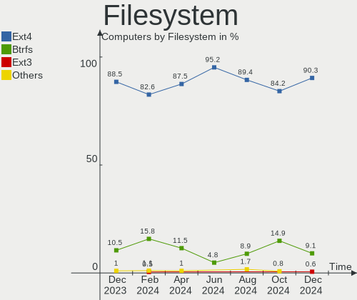
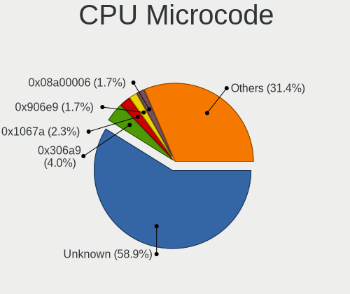
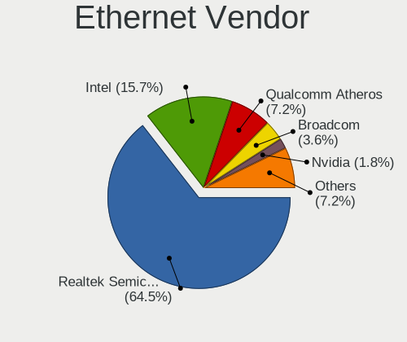
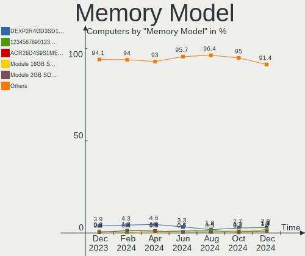

ROSA Hardware Trends
--------------------

A project to identify most popular hardware characteristics and track their change
over time based on data collected by ROSA users at https://Linux-Hardware.org.

Anyone can contribute to the study by uploading probes of their computers by
the [hw-probe](https://github.com/linuxhw/hw-probe) tool:

    sudo -E hw-probe -all -upload

This is a report for all computer types. See also reports for [desktops](/Dist/ROSA/Desktop/README.md) and [notebooks](/Dist/ROSA/Notebook/README.md).

Full-feature report is available here: https://linux-hardware.org/?view=trends

Period: Jan, 2021.

Contents
--------

- [ OS                       ](#os)
- [ OS Family                ](#os-family)
- [ Kernel                   ](#kernel)
- [ Kernel Family            ](#kernel-family)
- [ Kernel Major Ver.        ](#kernel-major-ver)
- [ Arch                     ](#arch)
- [ DE                       ](#de)
- [ Display Server           ](#display-server)
- [ Display Manager          ](#display-manager)
- [ OS Lang                  ](#os-lang)
- [ Boot Mode                ](#boot-mode)
- [ Filesystem               ](#filesystem)
- [ Part. scheme             ](#part-scheme)
- [ Dual Boot with Linux/BSD ](#dual-boot-with-linux/bsd)
- [ Dual Boot (Win)          ](#dual-boot-win)
- [ Country                  ](#country)
- [ City                     ](#city)
- [ Vendor                   ](#vendor)
- [ Model                    ](#model)
- [ Model Family             ](#model-family)
- [ MFG Year                 ](#mfg-year)
- [ Form Factor              ](#form-factor)
- [ Secure Boot              ](#secure-boot)
- [ Coreboot                 ](#coreboot)
- [ RAM Size                 ](#ram-size)
- [ RAM Used                 ](#ram-used)
- [ Has CD-ROM               ](#has-cd-rom)
- [ Total Drives             ](#total-drives)
- [ Has Ethernet             ](#has-ethernet)
- [ Drive Vendor             ](#drive-vendor)
- [ Drive Model              ](#drive-model)
- [ HDD Vendor               ](#hdd-vendor)
- [ SSD Vendor               ](#ssd-vendor)
- [ Drive Kind               ](#drive-kind)
- [ Drive Connector          ](#drive-connector)
- [ Drive Size               ](#drive-size)
- [ Space Total              ](#space-total)
- [ Space Used               ](#space-used)
- [ Malfunc. Drives          ](#malfunc-drives)
- [ Malfunc. Drive Vendor    ](#malfunc-drive-vendor)
- [ Malfunc. HDD Vendor      ](#malfunc-hdd-vendor)
- [ Malfunc. Drive Kind      ](#malfunc-drive-kind)
- [ Failed Drives            ](#failed-drives)
- [ Failed Drive Vendor      ](#failed-drive-vendor)
- [ Drive Status             ](#drive-status)
- [ Storage Vendor           ](#storage-vendor)
- [ Storage Model            ](#storage-model)
- [ Storage Kind             ](#storage-kind)
- [ CPU Vendor               ](#cpu-vendor)
- [ CPU Model                ](#cpu-model)
- [ CPU Model Family         ](#cpu-model-family)
- [ CPU Cores                ](#cpu-cores)
- [ CPU Sockets              ](#cpu-sockets)
- [ CPU Threads              ](#cpu-threads)
- [ CPU Op-Modes             ](#cpu-op-modes)
- [ CPU Microcode            ](#cpu-microcode)
- [ CPU Microarch            ](#cpu-microarch)
- [ GPU Vendor               ](#gpu-vendor)
- [ GPU Model                ](#gpu-model)
- [ GPU Combo                ](#gpu-combo)
- [ GPU Driver               ](#gpu-driver)
- [ GPU Memory               ](#gpu-memory)
- [ Monitor Vendor           ](#monitor-vendor)
- [ Monitor Model            ](#monitor-model)
- [ Monitor Resolution       ](#monitor-resolution)
- [ Monitor Diagonal         ](#monitor-diagonal)
- [ Monitor Width            ](#monitor-width)
- [ Aspect Ratio             ](#aspect-ratio)
- [ Monitor Area             ](#monitor-area)
- [ Pixel Density            ](#pixel-density)
- [ Multiple Monitors        ](#multiple-monitors)
- [ Net Controller Vendor    ](#net-controller-vendor)
- [ Net Controller Model     ](#net-controller-model)
- [ Wireless Vendor          ](#wireless-vendor)
- [ Wireless Model           ](#wireless-model)
- [ Ethernet Vendor          ](#ethernet-vendor)
- [ Ethernet Model           ](#ethernet-model)
- [ Net Controller Kind      ](#net-controller-kind)
- [ Used Controller          ](#used-controller)
- [ NICs                     ](#nics)
- [ Memory Vendor            ](#memory-vendor)
- [ Memory Model             ](#memory-model)
- [ Memory Kind              ](#memory-kind)
- [ Memory Form Factor       ](#memory-form-factor)
- [ Memory Size              ](#memory-size)
- [ Memory Speed             ](#memory-speed)
- [ Sound Vendor             ](#sound-vendor)
- [ Sound Model              ](#sound-model)
- [ Camera Vendor            ](#camera-vendor)
- [ Camera Model             ](#camera-model)
- [ Fingerprint Vendor       ](#fingerprint-vendor)
- [ Fingerprint Model        ](#fingerprint-model)
- [ Chipcard Vendor          ](#chipcard-vendor)
- [ Chipcard Model           ](#chipcard-model)
- [ Printer Vendor           ](#printer-vendor)
- [ Printer Model            ](#printer-model)
- [ Scanner Vendor           ](#scanner-vendor)
- [ Scanner Model            ](#scanner-model)
- [ Bluetooth Vendor         ](#bluetooth-vendor)
- [ Bluetooth Model          ](#bluetooth-model)
- [ Unsupported Devices      ](#unsupported-devices)
- [ Unsupported Device Types ](#unsupported-device-types)

OS
--

Installed operating systems

| Name       | Computers | Percent |
|------------|-----------|---------|
| ROSA R11.1 | 126       | 63%     |
| ROSA R11   | 53        | 26.5%   |
| ROSA R10   | 9         | 4.5%    |
| ROSA R12   | 7         | 3.5%    |
| ROSA R8.1  | 4         | 2%      |
| ROSA R9    | 1         | 0.5%    |

OS Family
---------

OS without a version

| Name | Computers | Percent |
|------|-----------|---------|
| ROSA | 200       | 100%    |

Kernel
------

Version of the Linux kernel

| Version                             | Computers | Percent |
|-------------------------------------|-----------|---------|
| 4.15.0-desktop-122.124.1rosa-x86_64 | 56        | 28%     |
| 4.15.0-desktop-45.1rosa-x86_64      | 40        | 20%     |
| 5.4.83-generic-2rosa-x86_64         | 25        | 12.5%   |
| 4.15.0-desktop-45.1rosa-i586        | 12        | 6%      |
| 4.9.155-nrj-desktop-1rosa-x86_64    | 9         | 4.5%    |
| 5.4.32-generic-2rosa-x86_64         | 8         | 4%      |
| 4.15.0-desktop-122.124.1rosa-i586   | 7         | 3.5%    |
| 4.9.60-nrj-desktop-1rosa-x86_64     | 6         | 3%      |
| 5.4.83-generic-2rosa-i586           | 5         | 2.5%    |
| 4.9.155-nrj-desktop-1rosa-i586      | 4         | 2%      |
| 4.9.60-nrj-desktop-1rosa-i586       | 3         | 1.5%    |
| 5.4.83-generic-2rosa2019.1-x86_64   | 2         | 1%      |
| 5.10.4-generic-3rosa2019.1-x86_64   | 2         | 1%      |
| 5.10.4-generic-2rosa2019.1-x86_64   | 2         | 1%      |
| 5.0.0-desktop-38.1rosa-x86_64       | 2         | 1%      |
| 4.9.20-nrj-desktop-1rosa-i586       | 2         | 1%      |
| 4.15.0-desktop-94.1rosa-x86_64      | 2         | 1%      |
| 5.9.14.xm1-1-xanmod-rosa-x86_64     | 1         | 0.5%    |
| 5.9.14-generic-1rosa-x86_64         | 1         | 0.5%    |
| 5.5.19-generic-1rosa-x86_64         | 1         | 0.5%    |
| 5.4.49-nrj-desktop-1rosa-x86_64     | 1         | 0.5%    |
| 5.4.32-generic-2rosa-i586           | 1         | 0.5%    |
| 5.10.4-generic-5rosa2019.1-x86_64   | 1         | 0.5%    |
| 5.10.0-desktop-12.13.2rosa-x86_64   | 1         | 0.5%    |
| 4.9.9-nrj-desktop-1rosa-x86_64      | 1         | 0.5%    |
| 4.9.155-nrj-laptop-1rosa-i586       | 1         | 0.5%    |
| 4.19.104-nrj-desktop-1rosa-x86_64   | 1         | 0.5%    |
| 4.15.0-desktop-68.5rosa-x86_64      | 1         | 0.5%    |
| 4.13.0-tablet-16.2rosa-x86_64       | 1         | 0.5%    |
| 4.1.38-nrj-desktop-2rosa-x86_64     | 1         | 0.5%    |

Kernel Family
-------------

Linux kernel without a distro release

| Version  | Computers | Percent |
|----------|-----------|---------|
| 4.15.0   | 118       | 59%     |
| 5.4.83   | 32        | 16%     |
| 4.9.155  | 14        | 7%      |
| 5.4.32   | 9         | 4.5%    |
| 4.9.60   | 9         | 4.5%    |
| 5.10.4   | 5         | 2.5%    |
| 5.9.14   | 2         | 1%      |
| 5.0.0    | 2         | 1%      |
| 4.9.20   | 2         | 1%      |
| 5.5.19   | 1         | 0.5%    |
| 5.4.49   | 1         | 0.5%    |
| 5.10.0   | 1         | 0.5%    |
| 4.9.9    | 1         | 0.5%    |
| 4.19.104 | 1         | 0.5%    |
| 4.13.0   | 1         | 0.5%    |
| 4.1.38   | 1         | 0.5%    |

Kernel Major Ver.
-----------------

Linux kernel major version

| Version | Computers | Percent |
|---------|-----------|---------|
| 4.15    | 118       | 59%     |
| 5.4     | 42        | 21%     |
| 4.9     | 26        | 13%     |
| 5.10    | 6         | 3%      |
| 5.9     | 2         | 1%      |
| 5.0     | 2         | 1%      |
| 5.5     | 1         | 0.5%    |
| 4.19    | 1         | 0.5%    |
| 4.13    | 1         | 0.5%    |
| 4.1     | 1         | 0.5%    |

Arch
----

OS architecture (x86_64, i586, etc.)

| Name   | Computers | Percent |
|--------|-----------|---------|
| x86_64 | 165       | 82.5%   |
| i686   | 35        | 17.5%   |

DE
--

Desktop Environment

| Name    | Computers | Percent |
|---------|-----------|---------|
| KDE4    | 120       | 60%     |
| KDE5    | 57        | 28.5%   |
| LXQt    | 12        | 6%      |
| XFCE    | 7         | 3.5%    |
| GNOME   | 2         | 1%      |
| KDE     | 1         | 0.5%    |
| Unknown | 1         | 0.5%    |

Display Server
--------------

X11 or Wayland

| Name    | Computers | Percent |
|---------|-----------|---------|
| X11     | 199       | 99.5%   |
| Wayland | 1         | 0.5%    |

Display Manager
---------------

SDDM, LightDM, etc.

| Name | Computers | Percent |
|------|-----------|---------|
| KDM  | 121       | 60.5%   |
| SDDM | 75        | 37.5%   |
| TDM  | 3         | 1.5%    |
| GDM  | 1         | 0.5%    |

OS Lang
-------

Language

| Lang    | Computers | Percent |
|---------|-----------|---------|
| ru_RU   | 107       | 53.5%   |
| Unknown | 67        | 33.5%   |
| en_US   | 7         | 3.5%    |
| es_ES   | 5         | 2.5%    |
| fr_FR   | 3         | 1.5%    |
| pt_BR   | 2         | 1%      |
| pl_PL   | 2         | 1%      |
| it_IT   | 2         | 1%      |
| de_DE   | 2         | 1%      |
| ru_UA   | 1         | 0.5%    |
| ja_JP   | 1         | 0.5%    |
| en_GB   | 1         | 0.5%    |

Boot Mode
---------

EFI or BIOS

| Mode | Computers | Percent |
|------|-----------|---------|
| BIOS | 143       | 71.5%   |
| EFI  | 57        | 28.5%   |

Filesystem
----------

Type of filesystem

| Type  | Computers | Percent |
|-------|-----------|---------|
| Ext4  | 193       | 96.5%   |
| Btrfs | 4         | 2%      |
| Xfs   | 1         | 0.5%    |
| Ext3  | 1         | 0.5%    |
| Aufs  | 1         | 0.5%    |

Part. scheme
------------

Scheme of partitioning

| Type    | Computers | Percent |
|---------|-----------|---------|
| MBR     | 130       | 65%     |
| GPT     | 63        | 31.5%   |
| Unknown | 7         | 3.5%    |

Dual Boot with Linux/BSD
------------------------

Hosting more than one Linux/BSD

| Dual boot | Computers | Percent |
|-----------|-----------|---------|
| No        | 156       | 78%     |
| Yes       | 44        | 22%     |

Dual Boot (Win)
---------------

Hosting Linux and Windows

| Dual boot | Computers | Percent |
|-----------|-----------|---------|
| Yes       | 103       | 51.5%   |
| No        | 97        | 48.5%   |

Country
-------

Geographic location (country)

| Country    | Computers | Percent |
|------------|-----------|---------|
| Russia     | 147       | 73.5%   |
| Ukraine    | 9         | 4.5%    |
| USA        | 4         | 2%      |
| Italy      | 4         | 2%      |
| Germany    | 4         | 2%      |
| France     | 4         | 2%      |
| Canada     | 4         | 2%      |
| Spain      | 3         | 1.5%    |
| Kazakhstan | 3         | 1.5%    |
| Belarus    | 3         | 1.5%    |
| Poland     | 2         | 1%      |
| Israel     | 2         | 1%      |
| Brazil     | 2         | 1%      |
| Sweden     | 1         | 0.5%    |
| Serbia     | 1         | 0.5%    |
| Norway     | 1         | 0.5%    |
| Mexico     | 1         | 0.5%    |
| Lithuania  | 1         | 0.5%    |
| Latvia     | 1         | 0.5%    |
| Japan      | 1         | 0.5%    |
| Finland    | 1         | 0.5%    |
| Austria    | 1         | 0.5%    |

City
----

Geographic location (city)

| City                     | Computers | Percent |
|--------------------------|-----------|---------|
| Moscow                   | 23        | 11.5%   |
| Krasnodar                | 10        | 5%      |
| St Petersburg            | 7         | 3.5%    |
| Ekaterinburg             | 7         | 3.5%    |
| Rostov-on-Don            | 6         | 3%      |
| Novosibirsk              | 6         | 3%      |
| Voronezh                 | 4         | 2%      |
| Volgograd                | 4         | 2%      |
| Tyumen                   | 3         | 1.5%    |
| Pittsburgh               | 3         | 1.5%    |
| Nizhniy Novgorod         | 3         | 1.5%    |
| Yaroslavl                | 2         | 1%      |
| Vladivostok              | 2         | 1%      |
| Ufa                      | 2         | 1%      |
| Stavropol                | 2         | 1%      |
| Schio                    | 2         | 1%      |
| Kyiv                     | 2         | 1%      |
| Kazan’                 | 2         | 1%      |
| Kaluga                   | 2         | 1%      |
| Bowmanville              | 2         | 1%      |
| Almaty                   | 2         | 1%      |
| Zvenyhorodka             | 1         | 0.5%    |
| Zheleznogorsk            | 1         | 0.5%    |
| Zaragoza                 | 1         | 0.5%    |
| Yoshkar-Ola              | 1         | 0.5%    |
| Yekaterinburg            | 1         | 0.5%    |
| Vyborg                   | 1         | 0.5%    |
| Vilnius                  | 1         | 0.5%    |
| Vicenza                  | 1         | 0.5%    |
| Velikiye Luki            | 1         | 0.5%    |
| Usinsk                   | 1         | 0.5%    |
| Ulyanovsk                | 1         | 0.5%    |
| Tver                     | 1         | 0.5%    |
| Tula                     | 1         | 0.5%    |
| Tsarskoye Selo           | 1         | 0.5%    |
| Tomsk                    | 1         | 0.5%    |
| Tiberias                 | 1         | 0.5%    |
| Tel Aviv                 | 1         | 0.5%    |
| Tambov                   | 1         | 0.5%    |
| Taganrog                 | 1         | 0.5%    |
| Słupsk                  | 1         | 0.5%    |
| Steinkjer                | 1         | 0.5%    |
| Stary Oskol              | 1         | 0.5%    |
| Sochi                    | 1         | 0.5%    |
| Smolensk                 | 1         | 0.5%    |
| Schwanewede              | 1         | 0.5%    |
| Saransk                  | 1         | 0.5%    |
| Samara                   | 1         | 0.5%    |
| Salvador                 | 1         | 0.5%    |
| Saint-Romain-le-Puy      | 1         | 0.5%    |
| Saint-Georges            | 1         | 0.5%    |
| Ryazan                   | 1         | 0.5%    |
| Riga                     | 1         | 0.5%    |
| Rechytsa                 | 1         | 0.5%    |
| Rechitsa                 | 1         | 0.5%    |
| Ramenskoye               | 1         | 0.5%    |
| Pushkino                 | 1         | 0.5%    |
| Poltava                  | 1         | 0.5%    |
| Pogeez                   | 1         | 0.5%    |
| Petropavlovsk-Kamchatsky | 1         | 0.5%    |

Vendor
------

Motherboard manufacturer

| Name                | Computers | Percent |
|---------------------|-----------|---------|
| ASUSTek Computer    | 51        | 25.5%   |
| Gigabyte Technology | 26        | 13%     |
| Lenovo              | 18        | 9%      |
| Acer                | 16        | 8%      |
| MSI                 | 15        | 7.5%    |
| ASRock              | 12        | 6%      |
| Hewlett-Packard     | 11        | 5.5%    |
| Dell                | 10        | 5%      |
| Sony                | 6         | 3%      |
| ECS                 | 5         | 2.5%    |
| Intel               | 4         | 2%      |
| Toshiba             | 3         | 1.5%    |
| Samsung Electronics | 3         | 1.5%    |
| Apple               | 3         | 1.5%    |
| Packard Bell        | 2         | 1%      |
| Semp Toshiba        | 1         | 0.5%    |
| Pegatron            | 1         | 0.5%    |
| Medion              | 1         | 0.5%    |
| LG Electronics      | 1         | 0.5%    |
| Huanan              | 1         | 0.5%    |
| Hampoo              | 1         | 0.5%    |
| Fujitsu             | 1         | 0.5%    |
| Foxconn             | 1         | 0.5%    |
| eMachines           | 1         | 0.5%    |
| DNS                 | 1         | 0.5%    |
| Digma               | 1         | 0.5%    |
| Clevo               | 1         | 0.5%    |
| Biostar             | 1         | 0.5%    |
| Alienware           | 1         | 0.5%    |
| Unknown             | 1         | 0.5%    |

Model
-----

Motherboard model

| Name                                     | Computers | Percent |
|------------------------------------------|-----------|---------|
| MSI MS-7025                              | 3         | 1.5%    |
| ASUS All Series                          | 3         | 1.5%    |
| MSI MS-7A36                              | 2         | 1%      |
| Gigabyte B75M-D3V                        | 2         | 1%      |
| Gigabyte 970A-DS3P                       | 2         | 1%      |
| ASUS X51RL                               | 2         | 1%      |
| ASUS PRIME H310M-R R2.0                  | 2         | 1%      |
| Unknown                                  | 2         | 1%      |
| Toshiba Satellite L655                   | 1         | 0.5%    |
| Toshiba Satellite C850-B7K               | 1         | 0.5%    |
| Toshiba Satellite A350D                  | 1         | 0.5%    |
| Sony VPCSA2S9R                           | 1         | 0.5%    |
| Sony VPCL22S1R                           | 1         | 0.5%    |
| Sony VPCEJ2L1E                           | 1         | 0.5%    |
| Sony VPCEB3E1R                           | 1         | 0.5%    |
| Sony VGN-FZ11MR                          | 1         | 0.5%    |
| Sony SVE1511V1RW                         | 1         | 0.5%    |
| Semp Toshiba STI                         | 1         | 0.5%    |
| Samsung R540/R580/R780/SA41/E452/E852    | 1         | 0.5%    |
| Samsung R530/R730                        | 1         | 0.5%    |
| Samsung N150/N210/N220                   | 1         | 0.5%    |
| Pegatron IPXCR_VN1                       | 1         | 0.5%    |
| Packard Bell EasyNote TS11SB             | 1         | 0.5%    |
| Packard Bell EasyNote ENTG81BA           | 1         | 0.5%    |
| MSI X370                                 | 1         | 0.5%    |
| MSI MS-7974                              | 1         | 0.5%    |
| MSI MS-7693                              | 1         | 0.5%    |
| MSI MS-7529                              | 1         | 0.5%    |
| MSI MS-7345                              | 1         | 0.5%    |
| MSI MS-7309                              | 1         | 0.5%    |
| MSI MS-7181                              | 1         | 0.5%    |
| MSI GL63 8RC                             | 1         | 0.5%    |
| MSI GF75 Thin 9SCSR                      | 1         | 0.5%    |
| MSI CX61 2QC                             | 1         | 0.5%    |
| Medion Erazer X7841 MD99556              | 1         | 0.5%    |
| LG HUNTER                                | 1         | 0.5%    |
| Lenovo V130-15IKB 81HN                   | 1         | 0.5%    |
| Lenovo ThinkPad X230 2325I63             | 1         | 0.5%    |
| Lenovo ThinkPad X1C 5th W10DG 20K3S01A00 | 1         | 0.5%    |
| Lenovo ThinkPad T60p 200793G             | 1         | 0.5%    |
| Lenovo ThinkCentre M90p 5485AG8          | 1         | 0.5%    |
| Lenovo ThinkCentre M57 6075G4G           | 1         | 0.5%    |
| Lenovo IdeaPad Z565 20066                | 1         | 0.5%    |
| Lenovo IdeaPad S340-14API 81NB           | 1         | 0.5%    |
| Lenovo IdeaPad S110 20126                | 1         | 0.5%    |
| Lenovo G770 1037                         | 1         | 0.5%    |
| Lenovo G570 20079                        | 1         | 0.5%    |
| Lenovo G560 20042                        | 1         | 0.5%    |
| Lenovo G500 20236                        | 1         | 0.5%    |
| Lenovo G50-30 80G0                       | 1         | 0.5%    |
| Lenovo B590 20206                        | 1         | 0.5%    |
| Lenovo B450 1S1680033610187              | 1         | 0.5%    |
| Lenovo AILZx                             | 1         | 0.5%    |
| Intel NUC7PJYH                           | 1         | 0.5%    |
| Intel NUC7i3DNHE                         | 1         | 0.5%    |
| Intel NUC5PPYB H76558-107                | 1         | 0.5%    |
| Intel DG965SS AAD41678-304               | 1         | 0.5%    |
| Huanan X79 V13                           | 1         | 0.5%    |
| HP Pavilion m6                           | 1         | 0.5%    |
| HP Pavilion 15-af138ur                   | 1         | 0.5%    |

Model Family
------------

Motherboard model prefix

| Name                  | Computers | Percent |
|-----------------------|-----------|---------|
| Acer Aspire           | 13        | 6.5%    |
| Dell Inspiron         | 6         | 3%      |
| Toshiba Satellite     | 3         | 1.5%    |
| MSI MS-7025           | 3         | 1.5%    |
| Lenovo ThinkPad       | 3         | 1.5%    |
| Lenovo IdeaPad        | 3         | 1.5%    |
| ASUS PRIME            | 3         | 1.5%    |
| ASUS M5A97            | 3         | 1.5%    |
| ASUS All              | 3         | 1.5%    |
| Packard Bell EasyNote | 2         | 1%      |
| MSI MS-7A36           | 2         | 1%      |
| Lenovo ThinkCentre    | 2         | 1%      |
| HP Pavilion           | 2         | 1%      |
| HP Compaq             | 2         | 1%      |
| HP 250                | 2         | 1%      |
| Gigabyte B75M-D3V     | 2         | 1%      |
| Gigabyte 970A-DS3P    | 2         | 1%      |
| ASUS X51RL            | 2         | 1%      |
| ASUS P8H61-M          | 2         | 1%      |
| ASUS P7H55-M          | 2         | 1%      |
| ASUS P5G41T-M         | 2         | 1%      |
| Unknown               | 2         | 1%      |
| Sony VPCSA2S9R        | 1         | 0.5%    |
| Sony VPCL22S1R        | 1         | 0.5%    |
| Sony VPCEJ2L1E        | 1         | 0.5%    |
| Sony VPCEB3E1R        | 1         | 0.5%    |
| Sony VGN-FZ11MR       | 1         | 0.5%    |
| Sony SVE1511V1RW      | 1         | 0.5%    |
| Semp Toshiba STI      | 1         | 0.5%    |
| Samsung R540          | 1         | 0.5%    |
| Samsung R530          | 1         | 0.5%    |
| Samsung N150          | 1         | 0.5%    |
| Pegatron IPXCR        | 1         | 0.5%    |
| MSI X370              | 1         | 0.5%    |
| MSI MS-7974           | 1         | 0.5%    |
| MSI MS-7693           | 1         | 0.5%    |
| MSI MS-7529           | 1         | 0.5%    |
| MSI MS-7345           | 1         | 0.5%    |
| MSI MS-7309           | 1         | 0.5%    |
| MSI MS-7181           | 1         | 0.5%    |
| MSI GL63              | 1         | 0.5%    |
| MSI GF75              | 1         | 0.5%    |
| MSI CX61              | 1         | 0.5%    |
| Medion Erazer         | 1         | 0.5%    |
| LG HUNTER             | 1         | 0.5%    |
| Lenovo V130-15IKB     | 1         | 0.5%    |
| Lenovo G770           | 1         | 0.5%    |
| Lenovo G570           | 1         | 0.5%    |
| Lenovo G560           | 1         | 0.5%    |
| Lenovo G500           | 1         | 0.5%    |
| Lenovo G50-30         | 1         | 0.5%    |
| Lenovo B590           | 1         | 0.5%    |
| Lenovo B450           | 1         | 0.5%    |
| Lenovo AILZx          | 1         | 0.5%    |
| Intel NUC7PJYH        | 1         | 0.5%    |
| Intel NUC7i3DNHE      | 1         | 0.5%    |
| Intel NUC5PPYB        | 1         | 0.5%    |
| Intel DG965SS         | 1         | 0.5%    |
| Huanan X79            | 1         | 0.5%    |
| HP Notebook           | 1         | 0.5%    |

MFG Year
--------

Motherboard manufacture year

| Year | Computers | Percent |
|------|-----------|---------|
| 2010 | 24        | 12%     |
| 2011 | 23        | 11.5%   |
| 2012 | 21        | 10.5%   |
| 2013 | 18        | 9%      |
| 2019 | 15        | 7.5%    |
| 2018 | 15        | 7.5%    |
| 2015 | 12        | 6%      |
| 2008 | 12        | 6%      |
| 2007 | 12        | 6%      |
| 2016 | 11        | 5.5%    |
| 2014 | 9         | 4.5%    |
| 2009 | 9         | 4.5%    |
| 2020 | 8         | 4%      |
| 2006 | 5         | 2.5%    |
| 2017 | 3         | 1.5%    |
| 2005 | 3         | 1.5%    |

Form Factor
-----------

Physical design of the computer

| Name       | Computers | Percent |
|------------|-----------|---------|
| Desktop    | 106       | 53%     |
| Notebook   | 85        | 42.5%   |
| All in one | 5         | 2.5%    |
| Mini pc    | 3         | 1.5%    |
| Tablet     | 1         | 0.5%    |

Secure Boot
-----------

Enabled or disabled

| State    | Computers | Percent |
|----------|-----------|---------|
| Disabled | 199       | 99.5%   |
| Enabled  | 1         | 0.5%    |

Coreboot
--------

Have coreboot on board

| Used | Computers | Percent |
|------|-----------|---------|
| No   | 200       | 100%    |

RAM Size
--------

Total RAM memory

| Size in GB | Computers | Percent |
|------------|-----------|---------|
| 3.01-4.0   | 48        | 24%     |
| 8.01-16.0  | 41        | 20.5%   |
| 4.01-8.0   | 39        | 19.5%   |
| 1.01-2.0   | 28        | 14%     |
| 16.01-24.0 | 24        | 12%     |
| 2.01-3.0   | 14        | 7%      |
| 32.01-64.0 | 2         | 1%      |
| 24.01-32.0 | 2         | 1%      |
| 0.51-1.0   | 2         | 1%      |

RAM Used
--------

Used RAM memory

| Used GB    | Computers | Percent |
|------------|-----------|---------|
| 1.01-2.0   | 95        | 47.5%   |
| 0.51-1.0   | 76        | 38%     |
| 2.01-3.0   | 17        | 8.5%    |
| 4.01-8.0   | 6         | 3%      |
| 0.01-0.5   | 3         | 1.5%    |
| 3.01-4.0   | 1         | 0.5%    |
| 16.01-24.0 | 1         | 0.5%    |
| 8.01-16.0  | 1         | 0.5%    |

Has CD-ROM
----------

Has CD-ROM on board

| Presented | Computers | Percent |
|-----------|-----------|---------|
| Yes       | 112       | 56%     |
| No        | 88        | 44%     |

Total Drives
------------

Number of drives on board

| Drives | Computers | Percent |
|--------|-----------|---------|
| 1      | 126       | 63%     |
| 2      | 52        | 26%     |
| 3      | 14        | 7%      |
| 4      | 5         | 2.5%    |
| 5      | 2         | 1%      |
| 6      | 1         | 0.5%    |

Has Ethernet
------------

Has Ethernet on board

| Presented | Computers | Percent |
|-----------|-----------|---------|
| Yes       | 195       | 97.5%   |
| No        | 5         | 2.5%    |

Drive Vendor
------------

Hard drive vendors

| Vendor              | Computers | Drives | Percent |
|---------------------|-----------|--------|---------|
| WDC                 | 68        | 87     | 24.64%  |
| Seagate             | 63        | 66     | 22.83%  |
| Hitachi             | 25        | 25     | 9.06%   |
| Samsung Electronics | 20        | 22     | 7.25%   |
| Toshiba             | 18        | 19     | 6.52%   |
| Kingston            | 18        | 19     | 6.52%   |
| A-DATA Technology   | 6         | 6      | 2.17%   |
| SPCC                | 5         | 7      | 1.81%   |
| SanDisk             | 5         | 5      | 1.81%   |
| Unknown             | 4         | 4      | 1.45%   |
| Maxtor              | 4         | 5      | 1.45%   |
| HGST                | 4         | 4      | 1.45%   |
| Fujitsu             | 4         | 4      | 1.45%   |
| China               | 4         | 4      | 1.45%   |
| Intel               | 3         | 3      | 1.09%   |
| Crucial             | 3         | 3      | 1.09%   |
| Apacer              | 3         | 3      | 1.09%   |
| PLEXTOR             | 2         | 2      | 0.72%   |
| Kingmax             | 2         | 2      | 0.72%   |
| Hewlett-Packard     | 2         | 2      | 0.72%   |
| Verbatim            | 1         | 1      | 0.36%   |
| USB3.0              | 1         | 1      | 0.36%   |
| Union Memory        | 1         | 1      | 0.36%   |
| Transcend           | 1         | 1      | 0.36%   |
| QUMO                | 1         | 1      | 0.36%   |
| Patriot             | 1         | 1      | 0.36%   |
| LITEONIT            | 1         | 1      | 0.36%   |
| Lexar               | 1         | 1      | 0.36%   |
| KingSpec            | 1         | 1      | 0.36%   |
| KingDian            | 1         | 1      | 0.36%   |
| GOODRAM             | 1         | 1      | 0.36%   |
| Gigabyte Technology | 1         | 1      | 0.36%   |
| e2e4                | 1         | 1      | 0.36%   |

Drive Model
-----------

Hard drive models

| Model                            | Computers | Percent |
|----------------------------------|-----------|---------|
| Kingston SA400S37120G 120GB SSD  | 5         | 1.66%   |
| Seagate ST3320613AS 320GB        | 4         | 1.32%   |
| Kingston SA400S37240G 240GB SSD  | 4         | 1.32%   |
| WDC WDS120G2G0A-00JH30 120GB SSD | 3         | 0.99%   |
| WDC WD10EZEX-00RKKA0 1TB         | 3         | 0.99%   |
| Toshiba HDWD110 1TB              | 3         | 0.99%   |
| Seagate ST500DM002-1BD142 500GB  | 3         | 0.99%   |
| Seagate ST3160815AS 160GB        | 3         | 0.99%   |
| Seagate ST1000DM010-2EP102 1TB   | 3         | 0.99%   |
| Hitachi HTS543232A7A384 320GB    | 3         | 0.99%   |
| WDC WDS480G2G0A-00JH30 480GB SSD | 2         | 0.66%   |
| WDC WDS250G2B0A-00SM50 250GB SSD | 2         | 0.66%   |
| WDC WD5000LPVX-22V0TT0 500GB     | 2         | 0.66%   |
| WDC WD5000AAKX-001CA0 500GB      | 2         | 0.66%   |
| WDC WD3200AAKS-00L9A0 320GB      | 2         | 0.66%   |
| WDC WD3200AAJS-22B4A0 320GB      | 2         | 0.66%   |
| WDC WD3200AAJS-08L7A0 320GB      | 2         | 0.66%   |
| WDC WD20EZAZ-00GGJB0 2TB         | 2         | 0.66%   |
| WDC WD10EZRX-00L4HB0 1TB         | 2         | 0.66%   |
| WDC WD10EZEX-08WN4A0 1TB         | 2         | 0.66%   |
| WDC WD10EALX-009BA0 1TB          | 2         | 0.66%   |
| Toshiba TR200 240GB SSD          | 2         | 0.66%   |
| Toshiba MQ01ABF050 500GB         | 2         | 0.66%   |
| SPCC Solid State Disk 240GB      | 2         | 0.66%   |
| SPCC Solid State Disk 120GB      | 2         | 0.66%   |
| Seagate ST3500418AS 500GB        | 2         | 0.66%   |
| Seagate ST3400620AS 400GB        | 2         | 0.66%   |
| Seagate ST3250410AS 250GB        | 2         | 0.66%   |
| Seagate ST320LT020-9YG142 320GB  | 2         | 0.66%   |
| Seagate ST2000DM001-1ER164 2TB   | 2         | 0.66%   |
| Seagate ST1000LM035-1RK172 1TB   | 2         | 0.66%   |
| Seagate Expansion 1TB            | 2         | 0.66%   |
| Samsung SSD 860 EVO 250GB        | 2         | 0.66%   |
| Samsung HD161HJ 160GB            | 2         | 0.66%   |
| Samsung HD154UI 1TB              | 2         | 0.66%   |
| Kingston SV300S37A120G 120GB SSD | 2         | 0.66%   |
| Kingston SHFS37A120G 120GB SSD   | 2         | 0.66%   |
| Kingston SH103S3120G 120GB SSD   | 2         | 0.66%   |
| Hitachi HTS545032B9A300 320GB    | 2         | 0.66%   |
| Hitachi HTS541616J9SA00 160GB    | 2         | 0.66%   |
| HGST HTS545050A7E680 500GB       | 2         | 0.66%   |
| China 128GB SSD                  | 2         | 0.66%   |
| Apacer AS350 240GB SSD           | 2         | 0.66%   |
| A-DATA SU650 240GB SSD           | 2         | 0.66%   |
| WDC WDS500G2B0A-00SM50 500GB SSD | 1         | 0.33%   |
| WDC WDS250G2B0A 250GB SSD        | 1         | 0.33%   |
| WDC WDS120G2G0B-00EPW0 120GB SSD | 1         | 0.33%   |
| WDC WDS100T2B0A-00SM50 1TB SSD   | 1         | 0.33%   |
| WDC WD800JD-55MSA1 80GB          | 1         | 0.33%   |
| WDC WD800BB-00JHC0 80GB          | 1         | 0.33%   |
| WDC WD800BB-00FRA0 80GB          | 1         | 0.33%   |
| WDC WD7500BPVT-24HXZT1 752GB     | 1         | 0.33%   |
| WDC WD7500BPKX-75HPJT0 752GB     | 1         | 0.33%   |
| WDC WD6402AAEX-00Y9A0 640GB      | 1         | 0.33%   |
| WDC WD6400BEVT-22A0RT0 640GB     | 1         | 0.33%   |
| WDC WD6400AARS-00Y5B1 640GB      | 1         | 0.33%   |
| WDC WD5000LPZX-60Z10T0 500GB     | 1         | 0.33%   |
| WDC WD5000LPVX-80V0TT0 500GB     | 1         | 0.33%   |
| WDC WD5000LPVX-60V0TT0 500GB     | 1         | 0.33%   |
| WDC WD5000LPLX-00ZNTT0 500GB     | 1         | 0.33%   |

HDD Vendor
----------

Hard disk drive vendors

| Vendor              | Computers | Drives | Percent |
|---------------------|-----------|--------|---------|
| WDC                 | 64        | 75     | 34.04%  |
| Seagate             | 62        | 65     | 32.98%  |
| Hitachi             | 25        | 25     | 13.3%   |
| Toshiba             | 12        | 13     | 6.38%   |
| Samsung Electronics | 11        | 12     | 5.85%   |
| Maxtor              | 4         | 5      | 2.13%   |
| HGST                | 4         | 4      | 2.13%   |
| Fujitsu             | 4         | 4      | 2.13%   |
| USB3.0              | 1         | 1      | 0.53%   |
| Hewlett-Packard     | 1         | 1      | 0.53%   |

SSD Vendor
----------

Solid state drive vendors

| Vendor              | Computers | Drives | Percent |
|---------------------|-----------|--------|---------|
| Kingston            | 17        | 18     | 20.99%  |
| WDC                 | 10        | 11     | 12.35%  |
| Samsung Electronics | 7         | 7      | 8.64%   |
| SPCC                | 5         | 6      | 6.17%   |
| A-DATA Technology   | 5         | 5      | 6.17%   |
| Toshiba             | 4         | 4      | 4.94%   |
| China               | 4         | 4      | 4.94%   |
| SanDisk             | 3         | 3      | 3.7%    |
| Intel               | 3         | 3      | 3.7%    |
| Crucial             | 3         | 3      | 3.7%    |
| Apacer              | 3         | 3      | 3.7%    |
| PLEXTOR             | 2         | 2      | 2.47%   |
| Kingmax             | 2         | 2      | 2.47%   |
| Verbatim            | 1         | 1      | 1.23%   |
| Transcend           | 1         | 1      | 1.23%   |
| Seagate             | 1         | 1      | 1.23%   |
| QUMO                | 1         | 1      | 1.23%   |
| Patriot             | 1         | 1      | 1.23%   |
| LITEONIT            | 1         | 1      | 1.23%   |
| Lexar               | 1         | 1      | 1.23%   |
| KingSpec            | 1         | 1      | 1.23%   |
| KingDian            | 1         | 1      | 1.23%   |
| Hewlett-Packard     | 1         | 1      | 1.23%   |
| GOODRAM             | 1         | 1      | 1.23%   |
| Gigabyte Technology | 1         | 1      | 1.23%   |
| e2e4                | 1         | 1      | 1.23%   |

Drive Kind
----------

HDD or SSD

| Kind    | Computers | Drives | Percent |
|---------|-----------|--------|---------|
| HDD     | 158       | 205    | 63.2%   |
| SSD     | 77        | 84     | 30.8%   |
| NVMe    | 9         | 10     | 3.6%    |
| MMC     | 5         | 5      | 2%      |
| Unknown | 1         | 1      | 0.4%    |

Drive Connector
---------------

SATA, SAS, NVMe, etc.

| Type | Computers | Drives | Percent |
|------|-----------|--------|---------|
| SATA | 195       | 284    | 90.7%   |
| NVMe | 9         | 10     | 4.19%   |
| SAS  | 6         | 6      | 2.79%   |
| MMC  | 5         | 5      | 2.33%   |

Drive Size
----------

Size of hard drive

| Size in TB | Computers | Drives | Percent |
|------------|-----------|--------|---------|
| 0.01-0.5   | 167       | 214    | 71.06%  |
| 0.51-1.0   | 54        | 60     | 22.98%  |
| 1.01-2.0   | 12        | 12     | 5.11%   |
| 3.01-4.0   | 1         | 1      | 0.43%   |
| 2.01-3.0   | 1         | 2      | 0.43%   |

Space Total
-----------

Amount of disk space available on the file system

| Size in GB     | Computers | Percent |
|----------------|-----------|---------|
| 101-250        | 53        | 26.5%   |
| 251-500        | 48        | 24%     |
| 51-100         | 27        | 13.5%   |
| 1-20           | 23        | 11.5%   |
| 501-1000       | 19        | 9.5%    |
| 21-50          | 13        | 6.5%    |
| 1001-2000      | 8         | 4%      |
| 2001-3000      | 6         | 3%      |
| More than 3000 | 2         | 1%      |
| Unknown        | 1         | 0.5%    |

Space Used
----------

Amount of used disk space

| Used GB        | Computers | Percent |
|----------------|-----------|---------|
| 1-20           | 133       | 66.5%   |
| 21-50          | 18        | 9%      |
| 51-100         | 15        | 7.5%    |
| 501-1000       | 12        | 6%      |
| 251-500        | 8         | 4%      |
| 101-250        | 8         | 4%      |
| 1001-2000      | 4         | 2%      |
| More than 3000 | 1         | 0.5%    |
| Unknown        | 1         | 0.5%    |

Malfunc. Drives
---------------

Drive models with a malfunction

| Model                             | Computers | Drives | Percent |
|-----------------------------------|-----------|--------|---------|
| Seagate ST3320613AS 320GB         | 3         | 3      | 3%      |
| Hitachi HTS543232A7A384 320GB     | 3         | 3      | 3%      |
| WDC WD3200AAJS-22B4A0 320GB       | 2         | 2      | 2%      |
| SPCC Solid State Disk 240GB       | 2         | 2      | 2%      |
| Seagate ST500DM002-1BD142 500GB   | 2         | 2      | 2%      |
| Seagate ST3500418AS 500GB         | 2         | 3      | 2%      |
| Seagate ST3250410AS 250GB         | 2         | 2      | 2%      |
| Seagate ST320LT020-9YG142 320GB   | 2         | 2      | 2%      |
| Seagate ST3160815AS 160GB         | 2         | 2      | 2%      |
| Samsung Electronics HD161HJ 160GB | 2         | 2      | 2%      |
| Hitachi HTS545032B9A300 320GB     | 2         | 2      | 2%      |
| HGST HTS545050A7E680 500GB        | 2         | 2      | 2%      |
| WDC WDS120G2G0B-00EPW0 120GB SSD  | 1         | 1      | 1%      |
| WDC WD800BB-00JHC0 80GB           | 1         | 1      | 1%      |
| WDC WD800BB-00FRA0 80GB           | 1         | 1      | 1%      |
| WDC WD6400BEVT-22A0RT0 640GB      | 1         | 1      | 1%      |
| WDC WD5000LPVX-60V0TT0 500GB      | 1         | 1      | 1%      |
| WDC WD5000AAKX-001CA0 500GB       | 1         | 1      | 1%      |
| WDC WD5000AAKS-00V1A0 500GB       | 1         | 1      | 1%      |
| WDC WD5000AADS-00M2B0 500GB       | 1         | 1      | 1%      |
| WDC WD3200BEVT-08A23T1 320GB      | 1         | 1      | 1%      |
| WDC WD3200AAJS-08L7A0 320GB       | 1         | 1      | 1%      |
| WDC WD30PURX-64P6ZY0 3TB          | 1         | 1      | 1%      |
| WDC WD1600AAJS-60B4A0 160GB       | 1         | 1      | 1%      |
| WDC WD15EVDS-63V9B1 1TB           | 1         | 1      | 1%      |
| WDC WD15EARS-00MVWB0 1TB          | 1         | 1      | 1%      |
| WDC WD10PURX-64E5EY0 1TB          | 1         | 1      | 1%      |
| WDC WD10EZEX-00RKKA0 1TB          | 1         | 1      | 1%      |
| WDC WD10EALX-009BA0 1TB           | 1         | 1      | 1%      |
| Toshiba MQ01ABF050 500GB          | 1         | 1      | 1%      |
| Toshiba MK7575GSX 752GB           | 1         | 1      | 1%      |
| Toshiba MK5075GSX 500GB           | 1         | 1      | 1%      |
| Toshiba MK3259GSXP 320GB          | 1         | 1      | 1%      |
| Toshiba DT01ACA100 1TB            | 1         | 1      | 1%      |
| Seagate ST96812AS 64GB            | 1         | 1      | 1%      |
| Seagate ST9640320AS 640GB         | 1         | 1      | 1%      |
| Seagate ST9500325AS 500GB         | 1         | 1      | 1%      |
| Seagate ST9320423AS 320GB         | 1         | 1      | 1%      |
| Seagate ST9320328CS 320GB         | 1         | 1      | 1%      |
| Seagate ST9320325AS 320GB         | 1         | 1      | 1%      |
| Seagate ST9250827AS 250GB         | 1         | 1      | 1%      |
| Seagate ST9160827AS 160GB         | 1         | 1      | 1%      |
| Seagate ST9160310AS 160GB         | 1         | 1      | 1%      |
| Seagate ST500LT012-9WS142 500GB   | 1         | 1      | 1%      |
| Seagate ST500LM021-1KJ152 500GB   | 1         | 1      | 1%      |
| Seagate ST320014A 20GB            | 1         | 1      | 1%      |
| Seagate ST320011A 20GB            | 1         | 1      | 1%      |
| Seagate ST32000641AS 2TB          | 1         | 1      | 1%      |
| Seagate ST3160815SV 160GB         | 1         | 1      | 1%      |
| Seagate ST3160813AS 160GB         | 1         | 1      | 1%      |
| Seagate ST31000528AS 1TB          | 1         | 1      | 1%      |
| Seagate ST31000524AS 1TB          | 1         | 1      | 1%      |
| Seagate ST1000LM048-2E7172 1TB    | 1         | 1      | 1%      |
| Samsung Electronics SP2504C 250GB | 1         | 1      | 1%      |
| Samsung Electronics SP2014N 200GB | 1         | 1      | 1%      |
| Samsung Electronics HD160HJ 160GB | 1         | 1      | 1%      |
| Samsung Electronics HD154UI 1TB   | 1         | 1      | 1%      |
| Samsung Electronics HD120IJ 120GB | 1         | 1      | 1%      |
| PLEXTOR PX-128M3 128GB SSD        | 1         | 1      | 1%      |
| Maxtor 6Y080L0 82GB               | 1         | 1      | 1%      |

Malfunc. Drive Vendor
---------------------

Vendors of faulty drives

| Vendor              | Computers | Drives | Percent |
|---------------------|-----------|--------|---------|
| Seagate             | 32        | 33     | 32.65%  |
| Hitachi             | 19        | 19     | 19.39%  |
| WDC                 | 17        | 19     | 17.35%  |
| Samsung Electronics | 7         | 7      | 7.14%   |
| Toshiba             | 5         | 5      | 5.1%    |
| HGST                | 4         | 4      | 4.08%   |
| Maxtor              | 3         | 3      | 3.06%   |
| SPCC                | 2         | 2      | 2.04%   |
| Kingston            | 2         | 2      | 2.04%   |
| Kingmax             | 2         | 2      | 2.04%   |
| PLEXTOR             | 1         | 1      | 1.02%   |
| LITEONIT            | 1         | 1      | 1.02%   |
| Hewlett-Packard     | 1         | 1      | 1.02%   |
| Fujitsu             | 1         | 1      | 1.02%   |
| A-DATA Technology   | 1         | 1      | 1.02%   |

Malfunc. HDD Vendor
-------------------

Vendors of faulty HDD drives

| Vendor              | Computers | Drives | Percent |
|---------------------|-----------|--------|---------|
| Seagate             | 32        | 33     | 36.36%  |
| Hitachi             | 19        | 19     | 21.59%  |
| WDC                 | 16        | 18     | 18.18%  |
| Samsung Electronics | 7         | 7      | 7.95%   |
| Toshiba             | 5         | 5      | 5.68%   |
| HGST                | 4         | 4      | 4.55%   |
| Maxtor              | 3         | 3      | 3.41%   |
| Hewlett-Packard     | 1         | 1      | 1.14%   |
| Fujitsu             | 1         | 1      | 1.14%   |

Malfunc. Drive Kind
-------------------

Kinds of faulty drives

| Kind | Computers | Drives | Percent |
|------|-----------|--------|---------|
| HDD  | 81        | 91     | 89.01%  |
| SSD  | 10        | 10     | 10.99%  |

Failed Drives
-------------

Failed drive models

| Model                       | Computers | Drives | Percent |
|-----------------------------|-----------|--------|---------|
| WDC WD1200BEVS-07LAT0 120GB | 1         | 1      | 33.33%  |
| Seagate ST3320613AS 320GB   | 1         | 1      | 33.33%  |
| Seagate ST3250620AS 250GB   | 1         | 1      | 33.33%  |

Failed Drive Vendor
-------------------

Failed drive vendors

| Vendor  | Computers | Drives | Percent |
|---------|-----------|--------|---------|
| Seagate | 2         | 2      | 66.67%  |
| WDC     | 1         | 1      | 33.33%  |

Drive Status
------------

Number of failed and malfunc. drives

| Status   | Computers | Drives | Percent |
|----------|-----------|--------|---------|
| Works    | 141       | 189    | 57.55%  |
| Malfunc  | 89        | 101    | 36.33%  |
| Detected | 12        | 12     | 4.9%    |
| Failed   | 3         | 3      | 1.22%   |

Storage Vendor
--------------

Storage controller vendors

| Vendor                           | Computers | Percent |
|----------------------------------|-----------|---------|
| Intel                            | 145       | 65.91%  |
| AMD                              | 43        | 19.55%  |
| Nvidia                           | 6         | 2.73%   |
| JMicron Technology               | 5         | 2.27%   |
| ASMedia Technology               | 4         | 1.82%   |
| VIA Technologies                 | 3         | 1.36%   |
| Samsung Electronics              | 3         | 1.36%   |
| Toshiba America Info Systems     | 2         | 0.91%   |
| Silicon Integrated Systems [SiS] | 2         | 0.91%   |
| Marvell Technology Group         | 2         | 0.91%   |
| Union Memory (Shenzhen)          | 1         | 0.45%   |
| Silicon Motion                   | 1         | 0.45%   |
| Sandisk                          | 1         | 0.45%   |
| Kingston Technology Company      | 1         | 0.45%   |
| ADATA Technology                 | 1         | 0.45%   |

Storage Model
-------------

Storage controller models

| Model                                                                                   | Computers | Percent |
|-----------------------------------------------------------------------------------------|-----------|---------|
| Intel NM10/ICH7 Family SATA Controller [IDE mode]                                       | 19        | 6.42%   |
| AMD FCH SATA Controller [AHCI mode]                                                     | 17        | 5.74%   |
| Intel 82801G (ICH7 Family) IDE Controller                                               | 15        | 5.07%   |
| AMD SB7x0/SB8x0/SB9x0 SATA Controller [AHCI mode]                                       | 14        | 4.73%   |
| Intel 6 Series/C200 Series Chipset Family 6 port Mobile SATA AHCI Controller            | 11        | 3.72%   |
| Intel 7 Series Chipset Family 6-port SATA Controller [AHCI mode]                        | 10        | 3.38%   |
| AMD SB7x0/SB8x0/SB9x0 IDE Controller                                                    | 9         | 3.04%   |
| Intel 5 Series/3400 Series Chipset 4 port SATA AHCI Controller                          | 7         | 2.36%   |
| Intel NM10/ICH7 Family SATA Controller [AHCI mode]                                      | 6         | 2.03%   |
| Intel Atom Processor E3800 Series SATA AHCI Controller                                  | 6         | 2.03%   |
| Intel 82801HM/HEM (ICH8M/ICH8M-E) SATA Controller [AHCI mode]                           | 6         | 2.03%   |
| Intel 82801HM/HEM (ICH8M/ICH8M-E) IDE Controller                                        | 6         | 2.03%   |
| Intel 6 Series/C200 Series Chipset Family 6 port Desktop SATA AHCI Controller           | 6         | 2.03%   |
| Intel Sunrise Point-LP SATA Controller [AHCI mode]                                      | 5         | 1.69%   |
| Intel Q170/Q150/B150/H170/H110/Z170/CM236 Chipset SATA Controller [AHCI Mode]           | 5         | 1.69%   |
| Intel 8 Series/C220 Series Chipset Family 6-port SATA Controller 1 [AHCI mode]          | 5         | 1.69%   |
| Intel 6 Series/C200 Series Chipset Family Desktop SATA Controller (IDE mode, ports 4-5) | 5         | 1.69%   |
| Intel 6 Series/C200 Series Chipset Family Desktop SATA Controller (IDE mode, ports 0-3) | 5         | 1.69%   |
| AMD SB7x0/SB8x0/SB9x0 SATA Controller [IDE mode]                                        | 5         | 1.69%   |
| AMD SB600 Non-Raid-5 SATA                                                               | 5         | 1.69%   |
| AMD SB600 IDE                                                                           | 5         | 1.69%   |
| JMicron JMB368 IDE controller                                                           | 4         | 1.35%   |
| Intel Atom/Celeron/Pentium Processor x5-E8000/J3xxx/N3xxx Series SATA Controller        | 4         | 1.35%   |
| Intel 7 Series/C210 Series Chipset Family 6-port SATA Controller [AHCI mode]            | 4         | 1.35%   |
| Intel 200 Series PCH SATA controller [AHCI mode]                                        | 4         | 1.35%   |
| AMD 400 Series Chipset SATA Controller                                                  | 4         | 1.35%   |
| Samsung NVMe SSD Controller SM981/PM981/PM983                                           | 3         | 1.01%   |
| Nvidia nForce3 Serial ATA Controller 2                                                  | 3         | 1.01%   |
| Nvidia nForce3 Serial ATA Controller                                                    | 3         | 1.01%   |
| Nvidia MCP61 SATA Controller                                                            | 3         | 1.01%   |
| Nvidia MCP61 IDE                                                                        | 3         | 1.01%   |
| Nvidia CK8S Parallel ATA Controller (v2.5)                                              | 3         | 1.01%   |
| Intel Celeron/Pentium Silver Processor SATA Controller                                  | 3         | 1.01%   |
| Intel 82801I (ICH9 Family) 2 port SATA Controller [IDE mode]                            | 3         | 1.01%   |
| Intel 82801 Mobile SATA Controller [RAID mode]                                          | 3         | 1.01%   |
| Intel 5 Series/3400 Series Chipset 6 port SATA AHCI Controller                          | 3         | 1.01%   |
| Intel 5 Series/3400 Series Chipset 4 port SATA IDE Controller                           | 3         | 1.01%   |
| ASMedia ASM1062 Serial ATA Controller                                                   | 3         | 1.01%   |
| AMD FCH SATA Controller D                                                               | 3         | 1.01%   |
| VIA VT82C586A/B/VT82C686/A/B/VT823x/A/C PIPC Bus Master IDE                             | 2         | 0.68%   |
| Silicon Integrated Systems [SiS] 5513 IDE Controller                                    | 2         | 0.68%   |
| Intel Cannon Lake Mobile PCH SATA AHCI Controller                                       | 2         | 0.68%   |
| Intel 82Q35 Express PT IDER Controller                                                  | 2         | 0.68%   |
| Intel 82801JI (ICH10 Family) 4 port SATA IDE Controller #1                              | 2         | 0.68%   |
| Intel 82801JI (ICH10 Family) 2 port SATA IDE Controller #2                              | 2         | 0.68%   |
| Intel 82801IR/IO/IH (ICH9R/DO/DH) 4 port SATA Controller [IDE mode]                     | 2         | 0.68%   |
| Intel 82801IBM/IEM (ICH9M/ICH9M-E) 4 port SATA Controller [AHCI mode]                   | 2         | 0.68%   |
| Intel 82801IBM/IEM (ICH9M/ICH9M-E) 2 port SATA Controller [IDE mode]                    | 2         | 0.68%   |
| Intel 82801GBM/GHM (ICH7-M Family) SATA Controller [AHCI mode]                          | 2         | 0.68%   |
| Intel 82801FB/FBM/FR/FW/FRW (ICH6 Family) IDE Controller                                | 2         | 0.68%   |
| Intel 8 Series/C220 Series Chipset Family 4-port SATA Controller 1 [IDE mode]           | 2         | 0.68%   |
| Intel 8 Series/C220 Series Chipset Family 2-port SATA Controller 2 [IDE mode]           | 2         | 0.68%   |
| Intel 7 Series/C210 Series Chipset Family 4-port SATA Controller [IDE mode]             | 2         | 0.68%   |
| Intel 7 Series/C210 Series Chipset Family 2-port SATA Controller [IDE mode]             | 2         | 0.68%   |
| Intel 5 Series/3400 Series Chipset 2 port SATA IDE Controller                           | 2         | 0.68%   |
| VIA VT8237A SATA 2-Port Controller                                                      | 1         | 0.34%   |
| VIA VT6415 PATA IDE Host Controller                                                     | 1         | 0.34%   |
| VIA VIA VT6420 SATA RAID Controller                                                     | 1         | 0.34%   |
| Union Memory (Shenzhen) Non-Volatile memory controller                                  | 1         | 0.34%   |
| Toshiba America Info Systems Toshiba America Info Non-Volatile memory controller        | 1         | 0.34%   |

Storage Kind
------------

Kind of storage controller (IDE, SATA, NVMe, SAS, ...)

| Kind | Computers | Percent |
|------|-----------|---------|
| SATA | 144       | 60.76%  |
| IDE  | 80        | 33.76%  |
| NVMe | 9         | 3.8%    |
| RAID | 4         | 1.69%   |

CPU Vendor
----------

Processor vendors

| Vendor | Computers | Percent |
|--------|-----------|---------|
| Intel  | 153       | 76.5%   |
| AMD    | 47        | 23.5%   |

CPU Model
---------

Processor models

| Model                                       | Computers | Percent |
|---------------------------------------------|-----------|---------|
| Intel Pentium CPU N3700 @ 1.60GHz           | 3         | 1.5%    |
| Intel Core i5-2430M CPU @ 2.40GHz           | 3         | 1.5%    |
| Intel Celeron CPU G530 @ 2.40GHz            | 3         | 1.5%    |
| Intel Atom CPU N450 @ 1.66GHz               | 3         | 1.5%    |
| AMD Ryzen 3 2200G with Radeon Vega Graphics | 3         | 1.5%    |
| AMD Athlon 64 Processor 3000+               | 3         | 1.5%    |
| Intel Pentium Dual-Core CPU T4400 @ 2.20GHz | 2         | 1%      |
| Intel Pentium Dual-Core CPU E5300 @ 2.60GHz | 2         | 1%      |
| Intel Pentium D CPU 3.00GHz                 | 2         | 1%      |
| Intel Pentium CPU G630 @ 2.70GHz            | 2         | 1%      |
| Intel Core i7-2620M CPU @ 2.70GHz           | 2         | 1%      |
| Intel Core i5-2410M CPU @ 2.30GHz           | 2         | 1%      |
| Intel Core i3-8100 CPU @ 3.60GHz            | 2         | 1%      |
| Intel Core i3-3220 CPU @ 3.30GHz            | 2         | 1%      |
| Intel Core i3 CPU 530 @ 2.93GHz             | 2         | 1%      |
| Intel Core 2 Duo CPU T8300 @ 2.40GHz        | 2         | 1%      |
| Intel Core 2 Duo CPU E7500 @ 2.93GHz        | 2         | 1%      |
| Intel Core 2 CPU 4300 @ 1.80GHz             | 2         | 1%      |
| Intel Celeron CPU J1900 @ 1.99GHz           | 2         | 1%      |
| Intel Celeron CPU J1800 @ 2.41GHz           | 2         | 1%      |
| Intel Atom x5-Z8350 CPU @ 1.44GHz           | 2         | 1%      |
| AMD FX-8350 Eight-Core Processor            | 2         | 1%      |
| AMD FX-8300 Eight-Core Processor            | 2         | 1%      |
| AMD FX-6300 Six-Core Processor              | 2         | 1%      |
| AMD Athlon II X2 240 Processor              | 2         | 1%      |
| Intel Xeon CPU L5420 @ 2.50GHz              | 1         | 0.5%    |
| Intel Xeon CPU E5440 @ 2.83GHz              | 1         | 0.5%    |
| Intel Xeon CPU E5-2678 v3 @ 2.50GHz         | 1         | 0.5%    |
| Intel Xeon CPU E5-1650 v2 @ 3.50GHz         | 1         | 0.5%    |
| Intel Pentium Silver N5000 CPU @ 1.10GHz    | 1         | 0.5%    |
| Intel Pentium Silver J5005 CPU @ 1.50GHz    | 1         | 0.5%    |
| Intel Pentium M processor 2.00GHz           | 1         | 0.5%    |
| Intel Pentium Dual-Core CPU T4500 @ 2.30GHz | 1         | 0.5%    |
| Intel Pentium Dual-Core CPU T4300 @ 2.10GHz | 1         | 0.5%    |
| Intel Pentium Dual-Core CPU E5500 @ 2.80GHz | 1         | 0.5%    |
| Intel Pentium Dual CPU T2390 @ 1.86GHz      | 1         | 0.5%    |
| Intel Pentium Dual CPU T2330 @ 1.60GHz      | 1         | 0.5%    |
| Intel Pentium Dual CPU T2310 @ 1.46GHz      | 1         | 0.5%    |
| Intel Pentium Dual CPU E2220 @ 2.40GHz      | 1         | 0.5%    |
| Intel Pentium Dual CPU E2200 @ 2.20GHz      | 1         | 0.5%    |
| Intel Pentium D CPU 2.66GHz                 | 1         | 0.5%    |
| Intel Pentium CPU P6200 @ 2.13GHz           | 1         | 0.5%    |
| Intel Pentium CPU P6100 @ 2.00GHz           | 1         | 0.5%    |
| Intel Pentium CPU N3540 @ 2.16GHz           | 1         | 0.5%    |
| Intel Pentium CPU G850 @ 2.90GHz            | 1         | 0.5%    |
| Intel Pentium CPU G620 @ 2.60GHz            | 1         | 0.5%    |
| Intel Pentium CPU G4500 @ 3.50GHz           | 1         | 0.5%    |
| Intel Pentium CPU G3220 @ 3.00GHz           | 1         | 0.5%    |
| Intel Pentium CPU B950 @ 2.10GHz            | 1         | 0.5%    |
| Intel Pentium CPU 2020M @ 2.40GHz           | 1         | 0.5%    |
| Intel Pentium 4 CPU 3.80GHz                 | 1         | 0.5%    |
| Intel Genuine CPU T2600 @ 2.16GHz           | 1         | 0.5%    |
| Intel Genuine CPU 2160 @ 1.80GHz            | 1         | 0.5%    |
| Intel Genuine CPU 2140 @ 1.60GHz            | 1         | 0.5%    |
| Intel Core i7-8750H CPU @ 2.20GHz           | 1         | 0.5%    |
| Intel Core i7-8550U CPU @ 1.80GHz           | 1         | 0.5%    |
| Intel Core i7-6700HQ CPU @ 2.60GHz          | 1         | 0.5%    |
| Intel Core i7-6700 CPU @ 3.40GHz            | 1         | 0.5%    |
| Intel Core i7-4800MQ CPU @ 2.70GHz          | 1         | 0.5%    |
| Intel Core i7-4790K CPU @ 4.00GHz           | 1         | 0.5%    |

CPU Model Family
----------------

Processor model prefix

| Model                          | Computers | Percent |
|--------------------------------|-----------|---------|
| Intel Core i3                  | 26        | 13%     |
| Intel Core i5                  | 24        | 12%     |
| Intel Celeron                  | 18        | 9%      |
| Intel Core i7                  | 15        | 7.5%    |
| Intel Pentium                  | 14        | 7%      |
| Intel Core 2 Duo               | 14        | 7%      |
| Intel Atom                     | 9         | 4.5%    |
| AMD FX                         | 8         | 4%      |
| Intel Pentium Dual-Core        | 7         | 3.5%    |
| Intel Pentium Dual             | 5         | 2.5%    |
| Intel Core 2                   | 5         | 2.5%    |
| AMD Ryzen 3                    | 5         | 2.5%    |
| Intel Xeon                     | 4         | 2%      |
| Intel Pentium D                | 3         | 1.5%    |
| Intel Genuine                  | 3         | 1.5%    |
| AMD Ryzen 5                    | 3         | 1.5%    |
| AMD E1                         | 3         | 1.5%    |
| AMD Athlon II X2               | 3         | 1.5%    |
| AMD Athlon 64                  | 3         | 1.5%    |
| Intel Pentium Silver           | 2         | 1%      |
| Intel Core 2 Quad              | 2         | 1%      |
| AMD Turion X2 Dual-Core Mobile | 2         | 1%      |
| AMD Phenom II X6               | 2         | 1%      |
| AMD Phenom II X4               | 2         | 1%      |
| AMD Athlon II X4               | 2         | 1%      |
| AMD Athlon                     | 2         | 1%      |
| AMD A8                         | 2         | 1%      |
| Intel Pentium M                | 1         | 0.5%    |
| Intel Pentium 4                | 1         | 0.5%    |
| AMD Turion II                  | 1         | 0.5%    |
| AMD Turion 64 X2 Mobile        | 1         | 0.5%    |
| AMD Sempron                    | 1         | 0.5%    |
| AMD Ryzen 7                    | 1         | 0.5%    |
| AMD Phenom II                  | 1         | 0.5%    |
| AMD E                          | 1         | 0.5%    |
| AMD Athlon X4                  | 1         | 0.5%    |
| AMD Athlon 64 X2               | 1         | 0.5%    |
| AMD A6                         | 1         | 0.5%    |
| AMD A10                        | 1         | 0.5%    |

CPU Cores
---------

Number of processor cores

| Number | Computers | Percent |
|--------|-----------|---------|
| 2      | 120       | 60%     |
| 4      | 55        | 27.5%   |
| 1      | 13        | 6.5%    |
| 6      | 7         | 3.5%    |
| 3      | 3         | 1.5%    |
| 12     | 1         | 0.5%    |
| 8      | 1         | 0.5%    |

CPU Sockets
-----------

Number of sockets

| Number | Computers | Percent |
|--------|-----------|---------|
| 1      | 200       | 100%    |

CPU Threads
-----------

Threads per core (Hyper-Threading)

| Number | Computers | Percent |
|--------|-----------|---------|
| 1      | 123       | 61.5%   |
| 2      | 77        | 38.5%   |

CPU Op-Modes
------------

CPU Operation Modes (32-bit, 64-bit)

| Op mode        | Computers | Percent |
|----------------|-----------|---------|
| 32-bit, 64-bit | 195       | 97.5%   |
| 32-bit         | 5         | 2.5%    |

CPU Microcode
-------------

Microcode number

| Number     | Computers | Percent |
|------------|-----------|---------|
| 0x206a7    | 27        | 13.5%   |
| 0x306a9    | 12        | 6%      |
| Unknown    | 12        | 6%      |
| 0x1067a    | 11        | 5.5%    |
| 0x306c3    | 9         | 4.5%    |
| 0x20655    | 8         | 4%      |
| 0x6fd      | 7         | 3.5%    |
| 0x10676    | 7         | 3.5%    |
| 0x06000852 | 7         | 3.5%    |
| 0x010000c8 | 6         | 3%      |
| 0x106ca    | 5         | 2.5%    |
| 0x906eb    | 4         | 2%      |
| 0x6fb      | 4         | 2%      |
| 0x6f2      | 4         | 2%      |
| 0x506e3    | 4         | 2%      |
| 0x20652    | 4         | 2%      |
| 0x906ea    | 3         | 1.5%    |
| 0x6f6      | 3         | 1.5%    |
| 0x406c3    | 3         | 1.5%    |
| 0x30678    | 3         | 1.5%    |
| 0x30673    | 3         | 1.5%    |
| 0x0700010f | 3         | 1.5%    |
| 0x806ea    | 2         | 1%      |
| 0x806e9    | 2         | 1%      |
| 0x706a1    | 2         | 1%      |
| 0x406e3    | 2         | 1%      |
| 0x406c4    | 2         | 1%      |
| 0x30661    | 2         | 1%      |
| 0x10661    | 2         | 1%      |
| 0x08108109 | 2         | 1%      |
| 0x08101016 | 2         | 1%      |
| 0x07030105 | 2         | 1%      |
| 0x06001119 | 2         | 1%      |
| 0x010000db | 2         | 1%      |
| 0xf65      | 1         | 0.5%    |
| 0xf64      | 1         | 0.5%    |
| 0xf4a      | 1         | 0.5%    |
| 0xf47      | 1         | 0.5%    |
| 0xf34      | 1         | 0.5%    |
| 0x906e9    | 1         | 0.5%    |
| 0x706a8    | 1         | 0.5%    |
| 0x6e8      | 1         | 0.5%    |
| 0x6d8      | 1         | 0.5%    |
| 0x40651    | 1         | 0.5%    |
| 0x306f2    | 1         | 0.5%    |
| 0x306e4    | 1         | 0.5%    |
| 0x106e5    | 1         | 0.5%    |
| 0x08701021 | 1         | 0.5%    |
| 0x08600104 | 1         | 0.5%    |
| 0x08101007 | 1         | 0.5%    |
| 0x0800820d | 1         | 0.5%    |
| 0x08001138 | 1         | 0.5%    |
| 0x07030106 | 1         | 0.5%    |
| 0x0600063e | 1         | 0.5%    |
| 0x05000119 | 1         | 0.5%    |
| 0x03000027 | 1         | 0.5%    |
| 0x02000057 | 1         | 0.5%    |
| 0x02000032 | 1         | 0.5%    |
| 0x010000dc | 1         | 0.5%    |
| 0x010000bf | 1         | 0.5%    |

CPU Microarch
-------------

Microarchitecture

| Name            | Computers | Percent |
|-----------------|-----------|---------|
| SandyBridge     | 27        | 13.5%   |
| Penryn          | 20        | 10%     |
| Core            | 20        | 10%     |
| KabyLake        | 14        | 7%      |
| IvyBridge       | 13        | 6.5%    |
| Westmere        | 12        | 6%      |
| Silvermont      | 12        | 6%      |
| K10             | 11        | 5.5%    |
| Haswell         | 11        | 5.5%    |
| Piledriver      | 9         | 4.5%    |
| Bonnell         | 7         | 3.5%    |
| Skylake         | 6         | 3%      |
| NetBurst        | 5         | 2.5%    |
| K8 Hammer       | 5         | 2.5%    |
| Zen+            | 4         | 2%      |
| Zen             | 4         | 2%      |
| Puma            | 3         | 1.5%    |
| Jaguar          | 3         | 1.5%    |
| Goldmont plus   | 3         | 1.5%    |
| Zen 2           | 2         | 1%      |
| P6              | 2         | 1%      |
| K8 & K10 hybrid | 2         | 1%      |
| Nehalem         | 1         | 0.5%    |
| K10 Llano       | 1         | 0.5%    |
| Bulldozer       | 1         | 0.5%    |
| Bobcat          | 1         | 0.5%    |
| Unknown         | 1         | 0.5%    |

GPU Vendor
----------

Vendors of graphics cards

| Vendor | Computers | Percent |
|--------|-----------|---------|
| Nvidia | 89        | 39.73%  |
| Intel  | 79        | 35.27%  |
| AMD    | 56        | 25%     |

GPU Model
---------

Graphics card models

| Model                                                                                    | Computers | Percent |
|------------------------------------------------------------------------------------------|-----------|---------|
| Intel 2nd Generation Core Processor Family Integrated Graphics Controller                | 16        | 6.67%   |
| Nvidia GK208B [GeForce GT 710]                                                           | 7         | 2.92%   |
| Intel 3rd Gen Core processor Graphics Controller                                         | 7         | 2.92%   |
| Intel Atom/Celeron/Pentium Processor x5-E8000/J3xxx/N3xxx Integrated Graphics Controller | 6         | 2.5%    |
| Intel Atom Processor Z36xxx/Z37xxx Series Graphics & Display                             | 6         | 2.5%    |
| Intel Core Processor Integrated Graphics Controller                                      | 5         | 2.08%   |
| Intel Atom Processor D4xx/D5xx/N4xx/N5xx Integrated Graphics Controller                  | 5         | 2.08%   |
| Nvidia GP108 [GeForce GT 1030]                                                           | 4         | 1.67%   |
| Nvidia GF117M [GeForce 610M/710M/810M/820M / GT 620M/625M/630M/720M]                     | 4         | 1.67%   |
| Intel 4 Series Chipset Integrated Graphics Controller                                    | 4         | 1.67%   |
| AMD Park [Mobility Radeon HD 5430/5450/5470]                                             | 4         | 1.67%   |
| Nvidia GT218 [GeForce 210]                                                               | 3         | 1.25%   |
| Nvidia GF108M [GeForce GT 540M]                                                          | 3         | 1.25%   |
| Nvidia G96C [GeForce 9500 GT]                                                            | 3         | 1.25%   |
| Nvidia G94 [GeForce 9600 GT]                                                             | 3         | 1.25%   |
| Intel UHD Graphics 605                                                                   | 3         | 1.25%   |
| Intel Mobile GM965/GL960 Integrated Graphics Controller (secondary)                      | 3         | 1.25%   |
| Intel Mobile GM965/GL960 Integrated Graphics Controller (primary)                        | 3         | 1.25%   |
| Intel HD Graphics 620                                                                    | 3         | 1.25%   |
| AMD RC410M [Mobility Radeon Xpress 200M]                                                 | 3         | 1.25%   |
| AMD Raven Ridge [Radeon Vega Series / Radeon Vega Mobile Series]                         | 3         | 1.25%   |
| AMD Picasso                                                                              | 3         | 1.25%   |
| AMD Ellesmere [Radeon RX 470/480/570/570X/580/580X/590]                                  | 3         | 1.25%   |
| Nvidia TU116 [GeForce GTX 1650]                                                          | 2         | 0.83%   |
| Nvidia GT218M [GeForce 310M]                                                             | 2         | 0.83%   |
| Nvidia GM107 [GeForce GTX 750 Ti]                                                        | 2         | 0.83%   |
| Nvidia GK208BM [GeForce 920M]                                                            | 2         | 0.83%   |
| Nvidia GK104 [GeForce GTX 760]                                                           | 2         | 0.83%   |
| Nvidia GF108 [GeForce GT 440]                                                            | 2         | 0.83%   |
| Nvidia GF108 [GeForce GT 430]                                                            | 2         | 0.83%   |
| Intel UHD Graphics 630 (Mobile)                                                          | 2         | 0.83%   |
| Intel UHD Graphics 630                                                                   | 2         | 0.83%   |
| Intel UHD Graphics 620                                                                   | 2         | 0.83%   |
| Intel Skylake GT2 [HD Graphics 520]                                                      | 2         | 0.83%   |
| Intel Atom Processor D2xxx/N2xxx Integrated Graphics Controller                          | 2         | 0.83%   |
| Intel 82G33/G31 Express Integrated Graphics Controller                                   | 2         | 0.83%   |
| Intel 82945G/GZ Integrated Graphics Controller                                           | 2         | 0.83%   |
| Intel 4th Gen Core Processor Integrated Graphics Controller                              | 2         | 0.83%   |
| AMD Turks XT [Radeon HD 6670/7670]                                                       | 2         | 0.83%   |
| AMD Topaz XT [Radeon R7 M260/M265 / M340/M360 / M440/M445 / 530/535 / 620/625 Mobile]    | 2         | 0.83%   |
| AMD Sun XT [Radeon HD 8670A/8670M/8690M / R5 M330 / M430 / Radeon 520 Mobile]            | 2         | 0.83%   |
| AMD RV620/M82 [Mobility Radeon HD 3450/3470]                                             | 2         | 0.83%   |
| AMD RV280 [Radeon 9200 PRO] (Secondary)                                                  | 2         | 0.83%   |
| AMD RV280 [Radeon 9200 PRO / 9250]                                                       | 2         | 0.83%   |
| AMD RS780M [Mobility Radeon HD 3200]                                                     | 2         | 0.83%   |
| AMD Mullins [Radeon R4/R5 Graphics]                                                      | 2         | 0.83%   |
| Nvidia TU117M [GeForce GTX 1650 Ti Mobile]                                               | 1         | 0.42%   |
| Nvidia TU117 [GeForce GTX 1650]                                                          | 1         | 0.42%   |
| Nvidia TU116 [GeForce GTX 1660]                                                          | 1         | 0.42%   |
| Nvidia TU106M [GeForce RTX 2060 Mobile]                                                  | 1         | 0.42%   |
| Nvidia TU106 [GeForce RTX 2070]                                                          | 1         | 0.42%   |
| Nvidia NV43M [GeForce Go 6600]                                                           | 1         | 0.42%   |
| Nvidia NV43 [GeForce 6600 GT]                                                            | 1         | 0.42%   |
| Nvidia NV18 [GeForce4 MX 440 AGP 8x]                                                     | 1         | 0.42%   |
| Nvidia GT218M [GeForce G 105M]                                                           | 1         | 0.42%   |
| Nvidia GT216M [GeForce GT 330M]                                                          | 1         | 0.42%   |
| Nvidia GT216 [GeForce GT 220]                                                            | 1         | 0.42%   |
| Nvidia GT215 [GeForce GT 240]                                                            | 1         | 0.42%   |
| Nvidia GP107M [GeForce GTX 1050 Mobile]                                                  | 1         | 0.42%   |
| Nvidia GP107 [GeForce GTX 1050 Ti]                                                       | 1         | 0.42%   |

GPU Combo
---------

Combinations of graphics cards

| Name             | Computers | Percent |
|------------------|-----------|---------|
| 1 x Nvidia       | 69        | 34.5%   |
| 1 x Intel        | 59        | 29.5%   |
| 1 x AMD          | 40        | 20%     |
| Intel + Nvidia   | 16        | 8%      |
| 2 x AMD          | 11        | 5.5%    |
| Intel + AMD      | 3         | 1.5%    |
| AMD + 2 x Nvidia | 1         | 0.5%    |
| AMD + Nvidia     | 1         | 0.5%    |

GPU Driver
----------

Free vs proprietary

| Driver      | Computers | Percent |
|-------------|-----------|---------|
| Free        | 160       | 80%     |
| Proprietary | 22        | 11%     |
| Unknown     | 18        | 9%      |

GPU Memory
----------

Total video memory

| Size in GB | Computers | Percent |
|------------|-----------|---------|
| 1.01-2.0   | 59        | 29.5%   |
| 0.01-0.5   | 49        | 24.5%   |
| Unknown    | 43        | 21.5%   |
| 0.51-1.0   | 28        | 14%     |
| 3.01-4.0   | 14        | 7%      |
| 2.01-3.0   | 3         | 1.5%    |
| 7.01-8.0   | 2         | 1%      |
| 5.01-6.0   | 2         | 1%      |

Monitor Vendor
--------------

Monitor vendors

| Vendor                  | Computers | Percent |
|-------------------------|-----------|---------|
| Samsung Electronics     | 34        | 17.44%  |
| LG Display              | 20        | 10.26%  |
| AU Optronics            | 19        | 9.74%   |
| Goldstar                | 16        | 8.21%   |
| Philips                 | 11        | 5.64%   |
| Acer                    | 11        | 5.64%   |
| Hewlett-Packard         | 7         | 3.59%   |
| Chimei Innolux          | 7         | 3.59%   |
| BenQ                    | 7         | 3.59%   |
| LG Philips              | 5         | 2.56%   |
| Lenovo                  | 5         | 2.56%   |
| Dell                    | 5         | 2.56%   |
| ViewSonic               | 4         | 2.05%   |
| BOE                     | 4         | 2.05%   |
| AOC                     | 4         | 2.05%   |
| Sony                    | 3         | 1.54%   |
| Iiyama                  | 3         | 1.54%   |
| HannStar                | 3         | 1.54%   |
| Chi Mei Optoelectronics | 3         | 1.54%   |
| Apple                   | 3         | 1.54%   |
| InfoVision              | 2         | 1.03%   |
| CPT                     | 2         | 1.03%   |
| Ancor Communications    | 2         | 1.03%   |
| ___                     | 1         | 0.51%   |
| Unknown                 | 1         | 0.51%   |
| Toshiba                 | 1         | 0.51%   |
| Sceptre Tech            | 1         | 0.51%   |
| Plain Tree Systems      | 1         | 0.51%   |
| Panasonic               | 1         | 0.51%   |
| NEC Computers           | 1         | 0.51%   |
| MiTAC                   | 1         | 0.51%   |
| IOD                     | 1         | 0.51%   |
| IBM                     | 1         | 0.51%   |
| Haier                   | 1         | 0.51%   |
| Fujitsu Siemens         | 1         | 0.51%   |
| CVT                     | 1         | 0.51%   |
| CHR                     | 1         | 0.51%   |
| ASUSTek Computer        | 1         | 0.51%   |

Monitor Model
-------------

Monitor models

| Model                                                                   | Computers | Percent |
|-------------------------------------------------------------------------|-----------|---------|
| LG Philips LCD Monitor LPLE300 1280x800 331x207mm 15.4-inch             | 3         | 1.54%   |
| LG Display LCD Monitor LGD02DC 1366x768 344x194mm 15.5-inch             | 3         | 1.54%   |
| Samsung Electronics SyncMaster SAM021C 1400x1050 408x300mm 19.9-inch    | 2         | 1.03%   |
| Samsung Electronics SyncMaster SAM011E 1280x1024 338x270mm 17.0-inch    | 2         | 1.03%   |
| Samsung Electronics SAMTRON STN0021 1280x1024 338x270mm 17.0-inch       | 2         | 1.03%   |
| Samsung Electronics LCD Monitor SEC3245 1366x768 344x194mm 15.5-inch    | 2         | 1.03%   |
| LG Philips LCD Monitor LPLE800 1280x800 304x190mm 14.1-inch             | 2         | 1.03%   |
| LG Display LCD Monitor LGD02D1 1600x900 382x215mm 17.3-inch             | 2         | 1.03%   |
| Hewlett-Packard 2311gt HWP2981 1920x1080 510x287mm 23.0-inch            | 2         | 1.03%   |
| Goldstar L1952S GSM4AE0 1280x1024 376x301mm 19.0-inch                   | 2         | 1.03%   |
| Chimei Innolux LCD Monitor CMN15C9 1366x768 344x193mm 15.5-inch         | 2         | 1.03%   |
| BOE LCD Monitor BOE06A9 1920x1080 344x193mm 15.5-inch                   | 2         | 1.03%   |
| AU Optronics LCD Monitor AUO26EC 1366x768 344x193mm 15.5-inch           | 2         | 1.03%   |
| AU Optronics LCD Monitor AUO139E 1600x900 382x214mm 17.2-inch           | 2         | 1.03%   |
| ___ LCDTV16 ___0101 1600x1200 1600x900mm 72.3-inch                      | 1         | 0.51%   |
| ViewSonic VX2450 SERIES VSCE226 1920x1080 525x297mm 23.7-inch           | 1         | 0.51%   |
| ViewSonic VX2263 Series VSC692F 1920x1080 476x268mm 21.5-inch           | 1         | 0.51%   |
| ViewSonic VA2248 SERIES VSC0E28 1920x1080 477x268mm 21.5-inch           | 1         | 0.51%   |
| ViewSonic VA2212 Series VSCBD2B 1920x1080 477x268mm 21.5-inch           | 1         | 0.51%   |
| Unknown LCD TV 0101 1920x1080 1600x900mm 72.3-inch                      | 1         | 0.51%   |
| Toshiba TV TSB010B 1920x1080 1600x900mm 72.3-inch                       | 1         | 0.51%   |
| Sony TV SNY5104 1920x1080 1600x900mm 72.3-inch                          | 1         | 0.51%   |
| Sony Nvidia Defaul t Flat Panel MS_0025 1920x1080 531x299mm 24.0-inch   | 1         | 0.51%   |
| Sony Nvidia Defaul SNY05FA 1366x768 290x170mm 13.2-inch                 | 1         | 0.51%   |
| Sceptre Tech E22 SPT08D5 1920x1080 521x293mm 23.5-inch                  | 1         | 0.51%   |
| Samsung Electronics T24D390 SAM0B6E 1920x1080 520x290mm 23.4-inch       | 1         | 0.51%   |
| Samsung Electronics SyncMaster SAM0285 1440x900 410x257mm 19.1-inch     | 1         | 0.51%   |
| Samsung Electronics SyncMaster SAM0254 1680x1050 474x296mm 22.0-inch    | 1         | 0.51%   |
| Samsung Electronics SyncMaster SAM01F9 1280x1024 376x301mm 19.0-inch    | 1         | 0.51%   |
| Samsung Electronics SyncMaster SAM01E9 1280x1024 376x301mm 19.0-inch    | 1         | 0.51%   |
| Samsung Electronics SyncMaster SAM0194 1280x1024 376x301mm 19.0-inch    | 1         | 0.51%   |
| Samsung Electronics SyncMaster SAM018F 1280x1024 338x270mm 17.0-inch    | 1         | 0.51%   |
| Samsung Electronics SyncMaster SAM0107 1280x1024 312x234mm 15.4-inch    | 1         | 0.51%   |
| Samsung Electronics SME1720NR SAM0696 1280x1024 338x270mm 17.0-inch     | 1         | 0.51%   |
| Samsung Electronics SMB1920NW SAM06A5 1920x1080 410x260mm 19.1-inch     | 1         | 0.51%   |
| Samsung Electronics S24F350 SAM0D21 1680x1050 520x290mm 23.4-inch       | 1         | 0.51%   |
| Samsung Electronics S24D390 SAM0B65 1920x1080 520x290mm 23.4-inch       | 1         | 0.51%   |
| Samsung Electronics S24D300 SAM0B42 1920x1080 531x299mm 24.0-inch       | 1         | 0.51%   |
| Samsung Electronics LCD Monitor SEC544B 1600x900 382x214mm 17.2-inch    | 1         | 0.51%   |
| Samsung Electronics LCD Monitor SEC5341 1366x768 340x190mm 15.3-inch    | 1         | 0.51%   |
| Samsung Electronics LCD Monitor SEC3845 1280x800 331x207mm 15.4-inch    | 1         | 0.51%   |
| Samsung Electronics LCD Monitor SEC3358 1280x800 331x207mm 15.4-inch    | 1         | 0.51%   |
| Samsung Electronics LCD Monitor SEC3150 1366x768 344x193mm 15.5-inch    | 1         | 0.51%   |
| Samsung Electronics LCD Monitor SEC3041 1366x768 353x198mm 15.9-inch    | 1         | 0.51%   |
| Samsung Electronics LCD Monitor SDC4852 3840x2160 340x190mm 15.3-inch   | 1         | 0.51%   |
| Samsung Electronics LCD Monitor SAM0FEF 3840x2160 1872x1053mm 84.6-inch | 1         | 0.51%   |
| Samsung Electronics LCD Monitor SAM0D3A 3840x2160 1020x570mm 46.0-inch  | 1         | 0.51%   |
| Samsung Electronics LCD Monitor SAM090B 1920x1080 1020x570mm 46.0-inch  | 1         | 0.51%   |
| Samsung Electronics LCD Monitor SAM0678 1920x1080                       | 1         | 0.51%   |
| Samsung Electronics LCD Monitor SAM00B1 1280x1024 338x270mm 17.0-inch   | 1         | 0.51%   |
| Samsung Electronics 173HT02-T01 SEC5044 1920x1080 380x210mm 17.1-inch   | 1         | 0.51%   |
| Plain Tree Systems Monitor PTS06A5 1280x1024 337x270mm 17.0-inch        | 1         | 0.51%   |
| Philips PHL 325E1 PHLC20E 2560x1440 697x392mm 31.5-inch                 | 1         | 0.51%   |
| Philips PHL 273V7 PHLC156 1920x1080 598x336mm 27.0-inch                 | 1         | 0.51%   |
| Philips PHL 272E1 PHLC210 1920x1080 598x336mm 27.0-inch                 | 1         | 0.51%   |
| Philips PHL 243V7 PHLC155 1920x1080 530x300mm 24.0-inch                 | 1         | 0.51%   |
| Philips PHL 237E7 PHLC101 1920x1080 509x286mm 23.0-inch                 | 1         | 0.51%   |
| Philips 247EL PHLC084 1920x1080 521x293mm 23.5-inch                     | 1         | 0.51%   |
| Philips 229CQ PHLC09E 1920x1080 480x268mm 21.6-inch                     | 1         | 0.51%   |
| Philips 19SL PHL08B6 1280x1024 376x301mm 19.0-inch                      | 1         | 0.51%   |

Monitor Resolution
------------------

Monitor screen resolution

| Resolution         | Computers | Percent |
|--------------------|-----------|---------|
| 1920x1080 (FHD)    | 68        | 35.23%  |
| 1366x768 (WXGA)    | 36        | 18.65%  |
| 1280x1024 (SXGA)   | 28        | 14.51%  |
| 1600x900 (HD+)     | 18        | 9.33%   |
| 1280x800 (WXGA)    | 9         | 4.66%   |
| 1440x900 (WXGA+)   | 8         | 4.15%   |
| 3840x2160 (4K)     | 4         | 2.07%   |
| 1024x600           | 4         | 2.07%   |
| 2560x1440 (QHD)    | 3         | 1.55%   |
| 1680x1050 (WSXGA+) | 3         | 1.55%   |
| 1360x768           | 3         | 1.55%   |
| 1920x1200 (WUXGA)  | 2         | 1.04%   |
| 1400x1050          | 2         | 1.04%   |
| 1024x768 (XGA)     | 2         | 1.04%   |
| 1920x540           | 1         | 0.52%   |
| 1600x1200          | 1         | 0.52%   |
| 1280x960           | 1         | 0.52%   |

Monitor Diagonal
----------------

Diagonal size in inches

| Inches  | Computers | Percent |
|---------|-----------|---------|
| 15      | 50        | 25.64%  |
| 17      | 26        | 13.33%  |
| 19      | 24        | 12.31%  |
| 23      | 16        | 8.21%   |
| 21      | 16        | 8.21%   |
| 24      | 15        | 7.69%   |
| 14      | 7         | 3.59%   |
| 27      | 6         | 3.08%   |
| 20      | 6         | 3.08%   |
| 10      | 5         | 2.56%   |
| 84      | 3         | 1.54%   |
| 72      | 3         | 1.54%   |
| 22      | 3         | 1.54%   |
| 18      | 3         | 1.54%   |
| 31      | 2         | 1.03%   |
| 13      | 2         | 1.03%   |
| 12      | 2         | 1.03%   |
| 11      | 2         | 1.03%   |
| 54      | 1         | 0.51%   |
| 52      | 1         | 0.51%   |
| 32      | 1         | 0.51%   |
| Unknown | 1         | 0.51%   |

Monitor Width
-------------

Physical width

| Width in mm | Computers | Percent |
|-------------|-----------|---------|
| 301-350     | 69        | 35.75%  |
| 501-600     | 37        | 19.17%  |
| 401-500     | 35        | 18.13%  |
| 351-400     | 29        | 15.03%  |
| 201-300     | 11        | 5.7%    |
| 1501-2000   | 6         | 3.11%   |
| 601-700     | 2         | 1.04%   |
| 1001-1500   | 2         | 1.04%   |
| 701-800     | 1         | 0.52%   |
| Unknown     | 1         | 0.52%   |

Aspect Ratio
------------

Proportional relationship between the width and the height

| Ratio | Computers | Percent |
|-------|-----------|---------|
| 16/9  | 134       | 69.79%  |
| 5/4   | 28        | 14.58%  |
| 16/10 | 24        | 12.5%   |
| 4/3   | 6         | 3.13%   |

Monitor Area
------------

Area in inch²

| Area in inch² | Computers | Percent |
|----------------|-----------|---------|
| 101-110        | 47        | 24.35%  |
| 201-250        | 42        | 21.76%  |
| 151-200        | 32        | 16.58%  |
| 141-150        | 16        | 8.29%   |
| 121-130        | 12        | 6.22%   |
| More than 1000 | 8         | 4.15%   |
| 81-90          | 7         | 3.63%   |
| 301-350        | 6         | 3.11%   |
| 41-50          | 5         | 2.59%   |
| 251-300        | 4         | 2.07%   |
| 351-500        | 3         | 1.55%   |
| 71-80          | 2         | 1.04%   |
| 61-70          | 2         | 1.04%   |
| 51-60          | 2         | 1.04%   |
| 111-120        | 2         | 1.04%   |
| 131-140        | 1         | 0.52%   |
| 91-100         | 1         | 0.52%   |
| Unknown        | 1         | 0.52%   |

Pixel Density
-------------

Pixels per inch

| Density | Computers | Percent |
|---------|-----------|---------|
| 51-100  | 98        | 51.04%  |
| 101-120 | 65        | 33.85%  |
| 121-160 | 21        | 10.94%  |
| 1-50    | 6         | 3.13%   |
| 161-240 | 1         | 0.52%   |
| Unknown | 1         | 0.52%   |

Multiple Monitors
-----------------

Total monitors connected

| Total | Computers | Percent |
|-------|-----------|---------|
| 1     | 186       | 93%     |
| 2     | 8         | 4%      |
| 0     | 6         | 3%      |

Net Controller Vendor
---------------------

Controller vendors

| Vendor                           | Computers | Percent |
|----------------------------------|-----------|---------|
| Realtek Semiconductor            | 126       | 41.18%  |
| Qualcomm Atheros                 | 59        | 19.28%  |
| Intel                            | 37        | 12.09%  |
| Broadcom Inc. and subsidiaries   | 23        | 7.52%   |
| Ralink Technology                | 9         | 2.94%   |
| Marvell Technology Group         | 9         | 2.94%   |
| Broadcom Limited                 | 6         | 1.96%   |
| Ralink                           | 5         | 1.63%   |
| Nvidia                           | 5         | 1.63%   |
| Vimtron Electronics              | 3         | 0.98%   |
| VIA Technologies                 | 3         | 0.98%   |
| Silicon Integrated Systems [SiS] | 2         | 0.65%   |
| Qualcomm Atheros Communications  | 2         | 0.65%   |
| Qualcomm                         | 2         | 0.65%   |
| Huawei Technologies              | 2         | 0.65%   |
| Attansic Technology              | 2         | 0.65%   |
| ZTE WCDMA Technologies MSM       | 1         | 0.33%   |
| Xiaomi                           | 1         | 0.33%   |
| Sierra Wireless                  | 1         | 0.33%   |
| Samsung Electronics              | 1         | 0.33%   |
| MediaTek                         | 1         | 0.33%   |
| LG Electronics                   | 1         | 0.33%   |
| JMicron Technology               | 1         | 0.33%   |
| D-Link System                    | 1         | 0.33%   |
| D-Link                           | 1         | 0.33%   |
| Broadcom                         | 1         | 0.33%   |
| ASUSTek Computer                 | 1         | 0.33%   |

Net Controller Model
--------------------

Controller models

| Model                                                                          | Computers | Percent |
|--------------------------------------------------------------------------------|-----------|---------|
| Realtek RTL8111/8168/8411 PCI Express Gigabit Ethernet Controller              | 95        | 28.11%  |
| Realtek RTL810xE PCI Express Fast Ethernet controller                          | 18        | 5.33%   |
| Qualcomm Atheros AR9285 Wireless Network Adapter (PCI-Express)                 | 14        | 4.14%   |
| Qualcomm Atheros AR242x / AR542x Wireless Network Adapter (PCI-Express)        | 7         | 2.07%   |
| Realtek RTL-8100/8101L/8139 PCI Fast Ethernet Adapter                          | 6         | 1.78%   |
| Ralink MT7601U Wireless Adapter                                                | 6         | 1.78%   |
| Qualcomm Atheros QCA9565 / AR9565 Wireless Network Adapter                     | 5         | 1.48%   |
| Intel PRO/Wireless 3945ABG [Golan] Network Connection                          | 5         | 1.48%   |
| Broadcom Inc. and subsidiaries BCM43142 802.11b/g/n                            | 5         | 1.48%   |
| Realtek RTL8169 PCI Gigabit Ethernet Controller                                | 4         | 1.18%   |
| Qualcomm Atheros AR9485 Wireless Network Adapter                               | 4         | 1.18%   |
| Qualcomm Atheros AR9287 Wireless Network Adapter (PCI-Express)                 | 4         | 1.18%   |
| Qualcomm Atheros AR8152 v2.0 Fast Ethernet                                     | 4         | 1.18%   |
| Qualcomm Atheros AR8151 v2.0 Gigabit Ethernet                                  | 4         | 1.18%   |
| Broadcom Inc. and subsidiaries BCM4313 802.11bgn Wireless Network Adapter      | 4         | 1.18%   |
| Vimtron Mobile Composite Device Bus                                            | 3         | 0.89%   |
| Ralink RT2870/RT3070 Wireless Adapter                                          | 3         | 0.89%   |
| Qualcomm Atheros QCA9377 802.11ac Wireless Network Adapter                     | 3         | 0.89%   |
| Qualcomm Atheros Attansic L2 Fast Ethernet                                     | 3         | 0.89%   |
| Qualcomm Atheros AR8131 Gigabit Ethernet                                       | 3         | 0.89%   |
| Nvidia MCP61 Ethernet                                                          | 3         | 0.89%   |
| Marvell Group 88E8040 PCI-E Fast Ethernet Controller                           | 3         | 0.89%   |
| Intel Ethernet Connection (2) I219-V                                           | 3         | 0.89%   |
| Intel 82579LM Gigabit Network Connection (Lewisville)                          | 3         | 0.89%   |
| Broadcom Inc. and subsidiaries NetLink BCM57785 Gigabit Ethernet PCIe          | 3         | 0.89%   |
| VIA VT6102/VT6103 [Rhine-II]                                                   | 2         | 0.59%   |
| Realtek RTL8723BE PCIe Wireless Network Adapter                                | 2         | 0.59%   |
| Realtek RTL8723AE PCIe Wireless Network Adapter                                | 2         | 0.59%   |
| Realtek RTL8192CU 802.11n WLAN Adapter                                         | 2         | 0.59%   |
| Realtek RTL8188CE 802.11b/g/n WiFi Adapter                                     | 2         | 0.59%   |
| Ralink RT3290 Wireless 802.11n 1T/1R PCIe                                      | 2         | 0.59%   |
| Ralink RT3090 Wireless 802.11n 1T/1R PCIe                                      | 2         | 0.59%   |
| Qualcomm Atheros AR9271 802.11n                                                | 2         | 0.59%   |
| Qualcomm Atheros AR9462 Wireless Network Adapter                               | 2         | 0.59%   |
| Qualcomm Atheros AR93xx Wireless Network Adapter                               | 2         | 0.59%   |
| Qualcomm Atheros AR8161 Gigabit Ethernet                                       | 2         | 0.59%   |
| Qualcomm 8920FT CD-ROM                                                         | 2         | 0.59%   |
| Nvidia CK8S Ethernet Controller                                                | 2         | 0.59%   |
| Marvell Group Yukon Optima 88E8059 [PCIe Gigabit Ethernet Controller with AVB] | 2         | 0.59%   |
| Marvell Group 88E8036 PCI-E Fast Ethernet Controller                           | 2         | 0.59%   |
| Intel Wireless-AC 9560 [Jefferson Peak]                                        | 2         | 0.59%   |
| Intel Wireless 7265                                                            | 2         | 0.59%   |
| Intel Wireless 7260                                                            | 2         | 0.59%   |
| Intel Wireless 3165                                                            | 2         | 0.59%   |
| Intel Ethernet Connection I219-LM                                              | 2         | 0.59%   |
| Intel 82573L Gigabit Ethernet Controller                                       | 2         | 0.59%   |
| Intel 82566DM-2 Gigabit Network Connection                                     | 2         | 0.59%   |
| Broadcom Limited NetLink BCM57780 Gigabit Ethernet PCIe                        | 2         | 0.59%   |
| Attansic AR8152 v2.0 Fast Ethernet                                             | 2         | 0.59%   |
| ZTE WCDMA MSM USB SCSI CD-ROM                                                  | 1         | 0.3%    |
| Xiaomi Mi/Redmi series (RNDIS)                                                 | 1         | 0.3%    |
| VIA VT6105/VT6106S [Rhine-III]                                                 | 1         | 0.3%    |
| Silicon Integrated Systems [SiS] SiS900 PCI Fast Ethernet                      | 1         | 0.3%    |
| Silicon Integrated Systems [SiS] 191 Gigabit Ethernet Adapter                  | 1         | 0.3%    |
| Sierra Wireless EM7455                                                         | 1         | 0.3%    |
| Samsung Galaxy series, misc. (tethering mode)                                  | 1         | 0.3%    |
| Realtek RTL8822CE 802.11ac PCIe Wireless Network Adapter                       | 1         | 0.3%    |
| Realtek RTL8821CE 802.11ac PCIe Wireless Network Adapter                       | 1         | 0.3%    |
| Realtek RTL8188EUS 802.11n Wireless Network Adapter                            | 1         | 0.3%    |
| Realtek RTL8188EE Wireless Network Adapter                                     | 1         | 0.3%    |

Wireless Vendor
---------------

Wireless vendors

| Vendor                          | Computers | Percent |
|---------------------------------|-----------|---------|
| Qualcomm Atheros                | 42        | 35.9%   |
| Intel                           | 24        | 20.51%  |
| Broadcom Inc. and subsidiaries  | 15        | 12.82%  |
| Realtek Semiconductor           | 14        | 11.97%  |
| Ralink Technology               | 9         | 7.69%   |
| Ralink                          | 5         | 4.27%   |
| Qualcomm Atheros Communications | 2         | 1.71%   |
| Sierra Wireless                 | 1         | 0.85%   |
| D-Link System                   | 1         | 0.85%   |
| D-Link                          | 1         | 0.85%   |
| Broadcom Limited                | 1         | 0.85%   |
| Broadcom                        | 1         | 0.85%   |
| ASUSTek Computer                | 1         | 0.85%   |

Wireless Model
--------------

Wireless models

| Model                                                                             | Computers | Percent |
|-----------------------------------------------------------------------------------|-----------|---------|
| Qualcomm Atheros AR9285 Wireless Network Adapter (PCI-Express)                    | 14        | 11.86%  |
| Qualcomm Atheros AR242x / AR542x Wireless Network Adapter (PCI-Express)           | 7         | 5.93%   |
| Ralink MT7601U Wireless Adapter                                                   | 6         | 5.08%   |
| Qualcomm Atheros QCA9565 / AR9565 Wireless Network Adapter                        | 5         | 4.24%   |
| Intel PRO/Wireless 3945ABG [Golan] Network Connection                             | 5         | 4.24%   |
| Broadcom Inc. and subsidiaries BCM43142 802.11b/g/n                               | 5         | 4.24%   |
| Qualcomm Atheros AR9485 Wireless Network Adapter                                  | 4         | 3.39%   |
| Qualcomm Atheros AR9287 Wireless Network Adapter (PCI-Express)                    | 4         | 3.39%   |
| Broadcom Inc. and subsidiaries BCM4313 802.11bgn Wireless Network Adapter         | 4         | 3.39%   |
| Ralink RT2870/RT3070 Wireless Adapter                                             | 3         | 2.54%   |
| Qualcomm Atheros QCA9377 802.11ac Wireless Network Adapter                        | 3         | 2.54%   |
| Realtek RTL8723BE PCIe Wireless Network Adapter                                   | 2         | 1.69%   |
| Realtek RTL8723AE PCIe Wireless Network Adapter                                   | 2         | 1.69%   |
| Realtek RTL8192CU 802.11n WLAN Adapter                                            | 2         | 1.69%   |
| Realtek RTL8188CE 802.11b/g/n WiFi Adapter                                        | 2         | 1.69%   |
| Ralink RT3290 Wireless 802.11n 1T/1R PCIe                                         | 2         | 1.69%   |
| Ralink RT3090 Wireless 802.11n 1T/1R PCIe                                         | 2         | 1.69%   |
| Qualcomm Atheros AR9271 802.11n                                                   | 2         | 1.69%   |
| Qualcomm Atheros AR9462 Wireless Network Adapter                                  | 2         | 1.69%   |
| Qualcomm Atheros AR93xx Wireless Network Adapter                                  | 2         | 1.69%   |
| Intel Wireless-AC 9560 [Jefferson Peak]                                           | 2         | 1.69%   |
| Intel Wireless 7265                                                               | 2         | 1.69%   |
| Intel Wireless 7260                                                               | 2         | 1.69%   |
| Intel Wireless 3165                                                               | 2         | 1.69%   |
| Sierra Wireless EM7455                                                            | 1         | 0.85%   |
| Realtek RTL8822CE 802.11ac PCIe Wireless Network Adapter                          | 1         | 0.85%   |
| Realtek RTL8821CE 802.11ac PCIe Wireless Network Adapter                          | 1         | 0.85%   |
| Realtek RTL8188EUS 802.11n Wireless Network Adapter                               | 1         | 0.85%   |
| Realtek RTL8188EE Wireless Network Adapter                                        | 1         | 0.85%   |
| Realtek RTL-8185 IEEE 802.11a/b/g Wireless LAN Controller                         | 1         | 0.85%   |
| Realtek 802.11ac NIC                                                              | 1         | 0.85%   |
| Ralink MT7610U ("Archer T2U" 2.4G+5G WLAN Adapter                                 | 1         | 0.85%   |
| Ralink RT3060 Wireless 802.11n 1T/1R                                              | 1         | 0.85%   |
| Qualcomm Atheros AR5212/5213/2414 Wireless Network Adapter                        | 1         | 0.85%   |
| Intel Wireless 8265 / 8275                                                        | 1         | 0.85%   |
| Intel Wireless 8260                                                               | 1         | 0.85%   |
| Intel WiFi Link 5100                                                              | 1         | 0.85%   |
| Intel Wi-Fi 6 AX200                                                               | 1         | 0.85%   |
| Intel PRO/Wireless 2200BG [Calexico2] Network Connection                          | 1         | 0.85%   |
| Intel Dual Band Wireless-AC 3165 Plus Bluetooth                                   | 1         | 0.85%   |
| Intel Centrino Wireless-N 1030 [Rainbow Peak]                                     | 1         | 0.85%   |
| Intel Centrino Wireless-N 100                                                     | 1         | 0.85%   |
| Intel Centrino Advanced-N 6205 [Taylor Peak]                                      | 1         | 0.85%   |
| Intel Centrino Advanced-N + WiMAX 6250 [Kilmer Peak]                              | 1         | 0.85%   |
| Intel AC 1550i Wireless                                                           | 1         | 0.85%   |
| D-Link System DWA-131 802.11n Wireless N Nano Adapter(rev.A1) [Realtek RTL8192SU] | 1         | 0.85%   |
| D-Link 802.11 n WLAN                                                              | 1         | 0.85%   |
| Broadcom Limited BCM4313 802.11bgn Wireless Network Adapter                       | 1         | 0.85%   |
| Broadcom Inc. and subsidiaries BCM4352 802.11ac Wireless Network Adapter          | 1         | 0.85%   |
| Broadcom Inc. and subsidiaries BCM43227 802.11b/g/n                               | 1         | 0.85%   |
| Broadcom Inc. and subsidiaries BCM43224 802.11a/b/g/n                             | 1         | 0.85%   |
| Broadcom Inc. and subsidiaries BCM4321 802.11a/b/g/n                              | 1         | 0.85%   |
| Broadcom Inc. and subsidiaries BCM4312 802.11b/g LP-PHY                           | 1         | 0.85%   |
| Broadcom Inc. and subsidiaries BCM4311 802.11b/g WLAN                             | 1         | 0.85%   |
| Broadcom BCM43228 802.11a/b/g/n                                                   | 1         | 0.85%   |
| ASUS N10 Nano 802.11n Network Adapter [Realtek RTL8192CU]                         | 1         | 0.85%   |

Ethernet Vendor
---------------

Ethernet vendors

| Vendor                           | Computers | Percent |
|----------------------------------|-----------|---------|
| Realtek Semiconductor            | 121       | 56.54%  |
| Qualcomm Atheros                 | 24        | 11.21%  |
| Intel                            | 19        | 8.88%   |
| Broadcom Inc. and subsidiaries   | 10        | 4.67%   |
| Marvell Technology Group         | 9         | 4.21%   |
| Broadcom Limited                 | 6         | 2.8%    |
| Nvidia                           | 5         | 2.34%   |
| Vimtron Electronics              | 3         | 1.4%    |
| VIA Technologies                 | 3         | 1.4%    |
| Silicon Integrated Systems [SiS] | 2         | 0.93%   |
| Qualcomm                         | 2         | 0.93%   |
| Huawei Technologies              | 2         | 0.93%   |
| Attansic Technology              | 2         | 0.93%   |
| ZTE WCDMA Technologies MSM       | 1         | 0.47%   |
| Xiaomi                           | 1         | 0.47%   |
| Samsung Electronics              | 1         | 0.47%   |
| MediaTek                         | 1         | 0.47%   |
| LG Electronics                   | 1         | 0.47%   |
| JMicron Technology               | 1         | 0.47%   |

Ethernet Model
--------------

Ethernet models

| Model                                                                          | Computers | Percent |
|--------------------------------------------------------------------------------|-----------|---------|
| Realtek RTL8111/8168/8411 PCI Express Gigabit Ethernet Controller              | 95        | 43.18%  |
| Realtek RTL810xE PCI Express Fast Ethernet controller                          | 18        | 8.18%   |
| Realtek RTL-8100/8101L/8139 PCI Fast Ethernet Adapter                          | 6         | 2.73%   |
| Realtek RTL8169 PCI Gigabit Ethernet Controller                                | 4         | 1.82%   |
| Qualcomm Atheros AR8152 v2.0 Fast Ethernet                                     | 4         | 1.82%   |
| Qualcomm Atheros AR8151 v2.0 Gigabit Ethernet                                  | 4         | 1.82%   |
| Vimtron Mobile Composite Device Bus                                            | 3         | 1.36%   |
| Qualcomm Atheros Attansic L2 Fast Ethernet                                     | 3         | 1.36%   |
| Qualcomm Atheros AR8131 Gigabit Ethernet                                       | 3         | 1.36%   |
| Nvidia MCP61 Ethernet                                                          | 3         | 1.36%   |
| Marvell Group 88E8040 PCI-E Fast Ethernet Controller                           | 3         | 1.36%   |
| Intel Ethernet Connection (2) I219-V                                           | 3         | 1.36%   |
| Intel 82579LM Gigabit Network Connection (Lewisville)                          | 3         | 1.36%   |
| Broadcom Inc. and subsidiaries NetLink BCM57785 Gigabit Ethernet PCIe          | 3         | 1.36%   |
| VIA VT6102/VT6103 [Rhine-II]                                                   | 2         | 0.91%   |
| Qualcomm Atheros AR8161 Gigabit Ethernet                                       | 2         | 0.91%   |
| Qualcomm 8920FT CD-ROM                                                         | 2         | 0.91%   |
| Nvidia CK8S Ethernet Controller                                                | 2         | 0.91%   |
| Marvell Group Yukon Optima 88E8059 [PCIe Gigabit Ethernet Controller with AVB] | 2         | 0.91%   |
| Marvell Group 88E8036 PCI-E Fast Ethernet Controller                           | 2         | 0.91%   |
| Intel Ethernet Connection I219-LM                                              | 2         | 0.91%   |
| Intel 82573L Gigabit Ethernet Controller                                       | 2         | 0.91%   |
| Intel 82566DM-2 Gigabit Network Connection                                     | 2         | 0.91%   |
| Broadcom Limited NetLink BCM57780 Gigabit Ethernet PCIe                        | 2         | 0.91%   |
| Attansic AR8152 v2.0 Fast Ethernet                                             | 2         | 0.91%   |
| ZTE WCDMA MSM USB SCSI CD-ROM                                                  | 1         | 0.45%   |
| Xiaomi Mi/Redmi series (RNDIS)                                                 | 1         | 0.45%   |
| VIA VT6105/VT6106S [Rhine-III]                                                 | 1         | 0.45%   |
| Silicon Integrated Systems [SiS] SiS900 PCI Fast Ethernet                      | 1         | 0.45%   |
| Silicon Integrated Systems [SiS] 191 Gigabit Ethernet Adapter                  | 1         | 0.45%   |
| Samsung Galaxy series, misc. (tethering mode)                                  | 1         | 0.45%   |
| Realtek RTL8153 Gigabit Ethernet Adapter                                       | 1         | 0.45%   |
| Realtek RTL8152 Fast Ethernet Adapter                                          | 1         | 0.45%   |
| Realtek RTL-8110SC/8169SC Gigabit Ethernet                                     | 1         | 0.45%   |
| Qualcomm Atheros QCA8172 Fast Ethernet                                         | 1         | 0.45%   |
| Qualcomm Atheros QCA8171 Gigabit Ethernet                                      | 1         | 0.45%   |
| Qualcomm Atheros Killer E2500 Gigabit Ethernet Controller                      | 1         | 0.45%   |
| Qualcomm Atheros Killer E220x Gigabit Ethernet Controller                      | 1         | 0.45%   |
| Qualcomm Atheros AR8152 v1.1 Fast Ethernet                                     | 1         | 0.45%   |
| Qualcomm Atheros AR8151 v1.0 Gigabit Ethernet                                  | 1         | 0.45%   |
| Qualcomm Atheros AR8132 Fast Ethernet                                          | 1         | 0.45%   |
| Qualcomm Atheros AR8121/AR8113/AR8114 Gigabit or Fast Ethernet                 | 1         | 0.45%   |
| MediaTek BV6000S                                                               | 1         | 0.45%   |
| Marvell Group 88E8058 PCI-E Gigabit Ethernet Controller                        | 1         | 0.45%   |
| Marvell Group 88E8053 PCI-E Gigabit Ethernet Controller                        | 1         | 0.45%   |
| LG LM-X420xxx/G2 Android Phone (USB tethering mode)                            | 1         | 0.45%   |
| JMicron JMC250 PCI Express Gigabit Ethernet Controller                         | 1         | 0.45%   |
| Intel WiMAX Connection 2400m                                                   | 1         | 0.45%   |
| Intel Ethernet Connection (4) I219-V                                           | 1         | 0.45%   |
| Intel Ethernet Connection (2) I218-V                                           | 1         | 0.45%   |
| Intel 82579V Gigabit Network Connection                                        | 1         | 0.45%   |
| Intel 82578DM Gigabit Network Connection                                       | 1         | 0.45%   |
| Intel 82574L Gigabit Network Connection                                        | 1         | 0.45%   |
| Intel 82566MM Gigabit Network Connection                                       | 1         | 0.45%   |
| Intel 82566DC Gigabit Network Connection                                       | 1         | 0.45%   |
| Huawei SNE-LX1                                                                 | 1         | 0.45%   |
| Huawei E353/E3131                                                              | 1         | 0.45%   |
| Broadcom Limited NetXtreme BCM5753M Gigabit Ethernet PCI Express               | 1         | 0.45%   |
| Broadcom Limited NetLink BCM5787M Gigabit Ethernet PCI Express                 | 1         | 0.45%   |
| Broadcom Limited NetLink BCM57785 Gigabit Ethernet PCIe                        | 1         | 0.45%   |

Net Controller Kind
-------------------

Ethernet, WiFi or modem

| Kind     | Computers | Percent |
|----------|-----------|---------|
| Ethernet | 195       | 63.31%  |
| WiFi     | 113       | 36.69%  |

Used Controller
---------------

Currently used network controller

| Kind     | Computers | Percent |
|----------|-----------|---------|
| Ethernet | 110       | 55.84%  |
| WiFi     | 87        | 44.16%  |

NICs
----

Total network controllers on board

| Total | Computers | Percent |
|-------|-----------|---------|
| 2     | 106       | 53%     |
| 1     | 91        | 45.5%   |
| 0     | 3         | 1.5%    |

Memory Vendor
-------------

Memory module vendors

| Vendor                | Computers | Percent |
|-----------------------|-----------|---------|
| Unknown               | 77        | 34.22%  |
| Kingston              | 33        | 14.67%  |
| Samsung Electronics   | 20        | 8.89%   |
| SK Hynix              | 18        | 8%      |
| Micron Technology     | 14        | 6.22%   |
| Ramaxel Technology    | 7         | 3.11%   |
| Nanya Technology      | 7         | 3.11%   |
| Corsair               | 7         | 3.11%   |
| Crucial               | 6         | 2.67%   |
| AMD                   | 5         | 2.22%   |
| Patriot               | 4         | 1.78%   |
| GOODRAM               | 3         | 1.33%   |
| Elpida                | 3         | 1.33%   |
| ASint Technology      | 3         | 1.33%   |
| Transcend             | 2         | 0.89%   |
| OCZ                   | 2         | 0.89%   |
| Goldkey               | 2         | 0.89%   |
| Unifosa               | 1         | 0.44%   |
| TOP MEDIA             | 1         | 0.44%   |
| Team                  | 1         | 0.44%   |
| Reboto                | 1         | 0.44%   |
| Qimonda               | 1         | 0.44%   |
| Kllisre               | 1         | 0.44%   |
| Kingmax Semiconductor | 1         | 0.44%   |
| GeIL                  | 1         | 0.44%   |
| Avant                 | 1         | 0.44%   |
| Apacer                | 1         | 0.44%   |
| A-DATA Technology     | 1         | 0.44%   |
| 48spaces              | 1         | 0.44%   |

Memory Model
------------

Memory module models

| Model                                                      | Computers | Percent |
|------------------------------------------------------------|-----------|---------|
| Unknown RAM Module 2048MB DIMM SDRAM                       | 5         | 2.03%   |
| Unknown RAM Module 2048MB DIMM 800MT/s                     | 5         | 2.03%   |
| Unknown RAM Module 1024MB DIMM SDRAM                       | 5         | 2.03%   |
| Unknown RAM Module 4096MB SODIMM DDR3                      | 4         | 1.63%   |
| Unknown RAM Module 2048MB DIMM DDR2 800MT/s                | 4         | 1.63%   |
| Unknown RAM Module 2048MB SODIMM DDR2 667MT/s              | 3         | 1.22%   |
| Unknown RAM Module 2048MB DIMM DDR 1333MT/s                | 3         | 1.22%   |
| Unknown RAM Module 2048MB DIMM 1333MT/s                    | 3         | 1.22%   |
| Unknown RAM Module 1024MB SODIMM DDR2                      | 3         | 1.22%   |
| Unknown RAM Module 1024MB SODIMM DDR                       | 3         | 1.22%   |
| Unknown RAM Module 1024MB DIMM 800MT/s                     | 3         | 1.22%   |
| Unknown RAM Module 8192MB DIMM                             | 2         | 0.81%   |
| Unknown RAM Module 512MB DIMM SDRAM                        | 2         | 0.81%   |
| Unknown RAM Module 4096MB DIMM DDR3 1333MT/s               | 2         | 0.81%   |
| Unknown RAM Module 4096MB DIMM 800MT/s                     | 2         | 0.81%   |
| Unknown RAM Module 4096MB DIMM 1333MT/s                    | 2         | 0.81%   |
| Unknown RAM Module 2048MB DIMM DDR3 667MT/s                | 2         | 0.81%   |
| Unknown RAM Module 2048MB DIMM DDR3 1333MT/s               | 2         | 0.81%   |
| Unknown RAM Module 2048MB DIMM 400MT/s                     | 2         | 0.81%   |
| Unknown RAM Module 1024MB DIMM                             | 2         | 0.81%   |
| Transcend RAM JM1600KLN-4G 4096MB DIMM DDR3 1600MT/s       | 2         | 0.81%   |
| SK Hynix RAM HMT351S6CFR8C-PB 4096MB SODIMM DDR3 1600MT/s  | 2         | 0.81%   |
| SK Hynix RAM HMA81GS6AFR8N-UH 8GB SODIMM DDR4 2667MT/s     | 2         | 0.81%   |
| Samsung RAM M471B5773CHS-CF8 2048MB SODIMM DDR3 1067MT/s   | 2         | 0.81%   |
| Samsung RAM M471B5173DB0-YK0 4GB SODIMM DDR3 1600MT/s      | 2         | 0.81%   |
| Ramaxel RAM RMT3010EC58E8F1333 2048MB SODIMM DDR3 1600MT/s | 2         | 0.81%   |
| Nanya RAM NT4GC64B8HB0NS-CG 4096MB SODIMM DDR3 1334MT/s    | 2         | 0.81%   |
| Kingston RAM 99U5471-012.A00LF 4096MB DIMM DDR3 1600MT/s   | 2         | 0.81%   |
| Kingston RAM 99U5469-045.A00LF 4096MB SODIMM DDR3 1600MT/s | 2         | 0.81%   |
| Elpida RAM EBJ41UF8BCS0-DJ-F 4GB SODIMM DDR3 1334MT/s      | 2         | 0.81%   |
| Unknown SODIMM 2048MB SODIMM DDR2 800MT/s                  | 1         | 0.41%   |
| Unknown SODIMM 2048MB SODIMM 800MT/s                       | 1         | 0.41%   |
| Unknown SODIMM 1024MB SODIMM DDR2 800MT/s                  | 1         | 0.41%   |
| Unknown SODIMM 1024MB SODIMM DDR2 667MT/s                  | 1         | 0.41%   |
| Unknown RAM Module 8192MB SODIMM DDR3                      | 1         | 0.41%   |
| Unknown RAM Module 8192MB DIMM DDR4 2400MT/s               | 1         | 0.41%   |
| Unknown RAM Module 8192MB DIMM DDR3 1067MT/s               | 1         | 0.41%   |
| Unknown RAM Module 4096MB SODIMM DDR2 667MT/s              | 1         | 0.41%   |
| Unknown RAM Module 4096MB DIMM SDRAM                       | 1         | 0.41%   |
| Unknown RAM Module 4096MB DIMM DDR3 1600MT/s               | 1         | 0.41%   |
| Unknown RAM Module 4096MB DIMM DDR 1333MT/s                | 1         | 0.41%   |
| Unknown RAM Module 4096MB DIMM 400MT/s                     | 1         | 0.41%   |
| Unknown RAM Module 4096MB DIMM 1600MT/s                    | 1         | 0.41%   |
| Unknown RAM Module 2048MB SODIMM SDRAM                     | 1         | 0.41%   |
| Unknown RAM Module 2048MB SODIMM DDR3                      | 1         | 0.41%   |
| Unknown RAM Module 2048MB SODIMM DDR2 800MT/s              | 1         | 0.41%   |
| Unknown RAM Module 2048MB SODIMM DDR2 533MT/s              | 1         | 0.41%   |
| Unknown RAM Module 2048MB SODIMM DDR2                      | 1         | 0.41%   |
| Unknown RAM Module 2048MB SODIMM DDR                       | 1         | 0.41%   |
| Unknown RAM Module 2048MB SODIMM 800MT/s                   | 1         | 0.41%   |
| Unknown RAM Module 2048MB DIMM DDR3 1067MT/s               | 1         | 0.41%   |
| Unknown RAM Module 2048MB DIMM DDR2 333MT/s                | 1         | 0.41%   |
| Unknown RAM Module 2048MB DIMM 667MT/s                     | 1         | 0.41%   |
| Unknown RAM Module 2048MB DIMM 1066MT/s                    | 1         | 0.41%   |
| Unknown RAM Module 1024MB SODIMM DDR2 667MT/s              | 1         | 0.41%   |
| Unknown RAM Module 1024MB SODIMM 800MT/s                   | 1         | 0.41%   |
| Unknown RAM Module 1024MB DIMM DDR2 800MT/s                | 1         | 0.41%   |
| Unknown RAM Module 1024MB DIMM DDR2 333MT/s                | 1         | 0.41%   |
| Unknown RAM Module 1024MB DIMM DDR2 266MT/s                | 1         | 0.41%   |
| Unknown RAM Module 1024MB DIMM 667MT/s                     | 1         | 0.41%   |

Memory Kind
-----------

Memory module kinds

| Kind    | Computers | Percent |
|---------|-----------|---------|
| DDR3    | 92        | 46.94%  |
| DDR4    | 29        | 14.8%   |
| DDR2    | 26        | 13.27%  |
| Unknown | 24        | 12.24%  |
| SDRAM   | 16        | 8.16%   |
| DDR     | 8         | 4.08%   |
| LPDDR3  | 1         | 0.51%   |

Memory Form Factor
------------------

Physical design of the memory module

| Name         | Computers | Percent |
|--------------|-----------|---------|
| DIMM         | 101       | 52.06%  |
| SODIMM       | 92        | 47.42%  |
| Row Of Chips | 1         | 0.52%   |

Memory Size
-----------

Memory module size

| Size  | Computers | Percent |
|-------|-----------|---------|
| 2048  | 77        | 34.53%  |
| 4096  | 74        | 33.18%  |
| 8192  | 35        | 15.7%   |
| 1024  | 29        | 13%     |
| 16384 | 5         | 2.24%   |
| 512   | 3         | 1.35%   |

Memory Speed
------------

Memory module speed

| Speed   | Computers | Percent |
|---------|-----------|---------|
| 1600    | 44        | 20.47%  |
| 1333    | 38        | 17.67%  |
| Unknown | 29        | 13.49%  |
| 800     | 22        | 10.23%  |
| 667     | 16        | 7.44%   |
| 2667    | 12        | 5.58%   |
| 2400    | 11        | 5.12%   |
| 1334    | 10        | 4.65%   |
| 1067    | 8         | 3.72%   |
| 3200    | 4         | 1.86%   |
| 1066    | 4         | 1.86%   |
| 400     | 3         | 1.4%    |
| 2133    | 2         | 0.93%   |
| 533     | 2         | 0.93%   |
| 3400    | 1         | 0.47%   |
| 3066    | 1         | 0.47%   |
| 2800    | 1         | 0.47%   |
| 2048    | 1         | 0.47%   |
| 1867    | 1         | 0.47%   |
| 1866    | 1         | 0.47%   |
| 1648    | 1         | 0.47%   |
| 975     | 1         | 0.47%   |
| 333     | 1         | 0.47%   |
| 266     | 1         | 0.47%   |

Sound Vendor
------------

Sound card vendors

| Vendor                           | Computers | Percent |
|----------------------------------|-----------|---------|
| Intel                            | 144       | 51.61%  |
| Nvidia                           | 64        | 22.94%  |
| AMD                              | 57        | 20.43%  |
| C-Media Electronics              | 3         | 1.08%   |
| VIA Technologies                 | 2         | 0.72%   |
| Silicon Integrated Systems [SiS] | 2         | 0.72%   |
| Creative Labs                    | 2         | 0.72%   |
| GN Netcom                        | 1         | 0.36%   |
| FIFINE Microphones               | 1         | 0.36%   |
| Emotiva TA-100                   | 1         | 0.36%   |
| Corsair                          | 1         | 0.36%   |
| BEHRINGER International          | 1         | 0.36%   |

Sound Model
-----------

Sound card models

| Model                                                                                             | Computers | Percent |
|---------------------------------------------------------------------------------------------------|-----------|---------|
| Intel NM10/ICH7 Family High Definition Audio Controller                                           | 28        | 8.97%   |
| AMD SBx00 Azalia (Intel HDA)                                                                      | 24        | 7.69%   |
| Intel 6 Series/C200 Series Chipset Family High Definition Audio Controller                        | 22        | 7.05%   |
| Intel 7 Series/C216 Chipset Family High Definition Audio Controller                               | 16        | 5.13%   |
| Intel 5 Series/3400 Series Chipset High Definition Audio                                          | 13        | 4.17%   |
| Nvidia GK208 HDMI/DP Audio Controller                                                             | 10        | 3.21%   |
| Nvidia GF108 High Definition Audio Controller                                                     | 10        | 3.21%   |
| AMD FCH Azalia Controller                                                                         | 9         | 2.88%   |
| Intel 82801I (ICH9 Family) HD Audio Controller                                                    | 8         | 2.56%   |
| Intel 8 Series/C220 Series Chipset High Definition Audio Controller                               | 8         | 2.56%   |
| Intel Sunrise Point-LP HD Audio                                                                   | 7         | 2.24%   |
| Intel 82801H (ICH8 Family) HD Audio Controller                                                    | 7         | 2.24%   |
| AMD Family 17h (Models 10h-1fh) HD Audio Controller                                               | 7         | 2.24%   |
| Nvidia High Definition Audio Controller                                                           | 6         | 1.92%   |
| Intel Atom Processor Z36xxx/Z37xxx Series High Definition Audio Controller                        | 6         | 1.92%   |
| Intel 100 Series/C230 Series Chipset Family HD Audio Controller                                   | 6         | 1.92%   |
| AMD Raven/Raven2/Fenghuang HDMI/DP Audio Controller                                               | 6         | 1.92%   |
| AMD Kabini HDMI/DP Audio                                                                          | 6         | 1.92%   |
| AMD Turks HDMI Audio [Radeon HD 6500/6600 / 6700M Series]                                         | 5         | 1.6%    |
| AMD Cedar HDMI Audio [Radeon HD 5400/6300/7300 Series]                                            | 5         | 1.6%    |
| Nvidia GP108 High Definition Audio Controller                                                     | 4         | 1.28%   |
| Nvidia GK104 HDMI Audio Controller                                                                | 4         | 1.28%   |
| Intel Atom/Celeron/Pentium Processor x5-E8000/J3xxx/N3xxx Series High Definition Audio Controller | 4         | 1.28%   |
| Intel 200 Series PCH HD Audio                                                                     | 4         | 1.28%   |
| Nvidia TU116 High Definition Audio Controller                                                     | 3         | 0.96%   |
| Nvidia nForce3 250Gb AC'97 Audio Controller                                                       | 3         | 0.96%   |
| Nvidia MCP61 High Definition Audio                                                                | 3         | 0.96%   |
| Nvidia GM107 High Definition Audio Controller [GeForce 940MX]                                     | 3         | 0.96%   |
| Nvidia GK106 HDMI Audio Controller                                                                | 3         | 0.96%   |
| Intel Xeon E3-1200 v3/4th Gen Core Processor HD Audio Controller                                  | 3         | 0.96%   |
| Intel Celeron/Pentium Silver Processor High Definition Audio                                      | 3         | 0.96%   |
| Intel Cannon Lake PCH cAVS                                                                        | 3         | 0.96%   |
| AMD Oland/Hainan/Cape Verde/Pitcairn HDMI Audio [Radeon HD 7000 Series]                           | 3         | 0.96%   |
| AMD Ellesmere HDMI Audio [Radeon RX 470/480 / 570/580/590]                                        | 3         | 0.96%   |
| Nvidia TU106 High Definition Audio Controller                                                     | 2         | 0.64%   |
| Nvidia GT216 HDMI Audio Controller                                                                | 2         | 0.64%   |
| Nvidia GP107GL High Definition Audio Controller                                                   | 2         | 0.64%   |
| Nvidia GP106 High Definition Audio Controller                                                     | 2         | 0.64%   |
| Nvidia GK107 HDMI Audio Controller                                                                | 2         | 0.64%   |
| Nvidia GF119 HDMI Audio Controller                                                                | 2         | 0.64%   |
| Intel 82801JI (ICH10 Family) HD Audio Controller                                                  | 2         | 0.64%   |
| C-Media Electronics CMI8738/CMI8768 PCI Audio                                                     | 2         | 0.64%   |
| AMD Family 17h (Models 00h-0fh) HD Audio Controller                                               | 2         | 0.64%   |
| AMD Caicos HDMI Audio [Radeon HD 6450 / 7450/8450/8490 OEM / R5 230/235/235X OEM]                 | 2         | 0.64%   |
| VIA Technologies VT8237A/VT8251 HDA Controller                                                    | 1         | 0.32%   |
| VIA Technologies VT8233/A/8235/8237 AC97 Audio Controller                                         | 1         | 0.32%   |
| Silicon Integrated Systems [SiS] SiS7012 AC'97 Sound Controller                                   | 1         | 0.32%   |
| Silicon Integrated Systems [SiS] Azalia Audio Controller                                          | 1         | 0.32%   |
| Nvidia TU107 GeForce GTX 1650 High Definition Audio Controller                                    | 1         | 0.32%   |
| Nvidia stereo controller                                                                          | 1         | 0.32%   |
| Nvidia GM206 High Definition Audio Controller                                                     | 1         | 0.32%   |
| Nvidia GM204 High Definition Audio Controller                                                     | 1         | 0.32%   |
| Nvidia GF116 High Definition Audio Controller                                                     | 1         | 0.32%   |
| Nvidia GA102 High Definition Audio Controller                                                     | 1         | 0.32%   |
| Intel Haswell-ULT HD Audio Controller                                                             | 1         | 0.32%   |
| Intel C610/X99 series chipset HD Audio Controller                                                 | 1         | 0.32%   |
| Intel C600/X79 series chipset High Definition Audio Controller                                    | 1         | 0.32%   |
| Intel 9 Series Chipset Family HD Audio Controller                                                 | 1         | 0.32%   |
| Intel 82801FB/FBM/FR/FW/FRW (ICH6 Family) High Definition Audio Controller                        | 1         | 0.32%   |
| Intel 82801FB/FBM/FR/FW/FRW (ICH6 Family) AC'97 Audio Controller                                  | 1         | 0.32%   |

Camera Vendor
-------------

Camera device vendors

| Vendor                                            | Computers | Percent |
|---------------------------------------------------|-----------|---------|
| Chicony Electronics                               | 16        | 17.58%  |
| Suyin                                             | 9         | 9.89%   |
| Microdia                                          | 8         | 8.79%   |
| Acer                                              | 8         | 8.79%   |
| IMC Networks                                      | 6         | 6.59%   |
| Alcor Micro                                       | 5         | 5.49%   |
| Z-Star Microelectronics                           | 3         | 3.3%    |
| Sunplus Innovation Technology                     | 3         | 3.3%    |
| Ricoh                                             | 3         | 3.3%    |
| Realtek Semiconductor                             | 3         | 3.3%    |
| Apple                                             | 3         | 3.3%    |
| Silicon Motion                                    | 2         | 2.2%    |
| Logitech                                          | 2         | 2.2%    |
| Generalplus Technology                            | 2         | 2.2%    |
| DigiTech                                          | 2         | 2.2%    |
| Cubeternet                                        | 2         | 2.2%    |
| Creative Technology                               | 2         | 2.2%    |
| Syntek                                            | 1         | 1.1%    |
| STMicroelectronics Imaging Division (VLSI Vision) | 1         | 1.1%    |
| Quanta                                            | 1         | 1.1%    |
| Pixart Imaging                                    | 1         | 1.1%    |
| OmniVision Technologies                           | 1         | 1.1%    |
| Microsoft                                         | 1         | 1.1%    |
| KYE Systems (Mouse Systems)                       | 1         | 1.1%    |
| Importek                                          | 1         | 1.1%    |
| Cheng Uei Precision Industry (Foxlink)            | 1         | 1.1%    |
| Aveo Technology                                   | 1         | 1.1%    |
| Arkmicro Technologies                             | 1         | 1.1%    |
| ALi                                               | 1         | 1.1%    |

Camera Model
------------

Camera device models

| Model                                                            | Computers | Percent |
|------------------------------------------------------------------|-----------|---------|
| Suyin HP Truevision HD                                           | 3         | 3.3%    |
| Suyin 1.3M HD WebCam                                             | 3         | 3.3%    |
| Ricoh USB2.0 Camera                                              | 3         | 3.3%    |
| Suyin Acer/HP Integrated Webcam [CN0314]                         | 2         | 2.2%    |
| Sunplus Integrated_Webcam_HD                                     | 2         | 2.2%    |
| Silicon Motion Lenovo EasyCamera                                 | 2         | 2.2%    |
| Microdia Laptop_Integrated_Webcam_FHD                            | 2         | 2.2%    |
| IMC Networks USB 2.0 UVC VGA WebCam                              | 2         | 2.2%    |
| DigiTech USB 2.0 PC Camera                                       | 2         | 2.2%    |
| Chicony VGA Webcam                                               | 2         | 2.2%    |
| Chicony USB 2.0 Camera                                           | 2         | 2.2%    |
| Apple Built-in iSight                                            | 2         | 2.2%    |
| Alcor Micro Asus Integrated Webcam                               | 2         | 2.2%    |
| Acer Lenovo EasyCamera                                           | 2         | 2.2%    |
| Acer BisonCam, NB Pro                                            | 2         | 2.2%    |
| Z-Star Webcam                                                    | 1         | 1.1%    |
| Z-Star Lenovo EasyCamera                                         | 1         | 1.1%    |
| Z-Star A4 TECH USB2.0 PC Camera J                                | 1         | 1.1%    |
| Syntek Web Cam - Asus A8J, F3S, F5R, VX2S, V1S                   | 1         | 1.1%    |
| Suyin Asus Integrated Webcam [CN031B]                            | 1         | 1.1%    |
| Sunplus Laptop_Integrated_Webcam_FHD                             | 1         | 1.1%    |
| STMicroelectronics Imaging Division (VLSI Vision) STV0680 Camera | 1         | 1.1%    |
| Realtek Lenovo EasyCamera                                        | 1         | 1.1%    |
| Realtek Integrated_Webcam_HD                                     | 1         | 1.1%    |
| Realtek HD Webcam - Realtek                                      | 1         | 1.1%    |
| Quanta Laptop_Integrated_Webcam_2HDM                             | 1         | 1.1%    |
| Pixart Imaging USB2.0_Camera                                     | 1         | 1.1%    |
| OmniVision OV2640 Webcam                                         | 1         | 1.1%    |
| Microsoft LifeCam VX-700                                         | 1         | 1.1%    |
| Microdia USB 2.0 Camera                                          | 1         | 1.1%    |
| Microdia Sony Visual Communication Camera                        | 1         | 1.1%    |
| Microdia Sonix USB 2.0 Camera                                    | 1         | 1.1%    |
| Microdia Laptop_Integrated_Webcam_E4HD                           | 1         | 1.1%    |
| Microdia Integrated_Webcam_HD                                    | 1         | 1.1%    |
| Microdia HP Webcam                                               | 1         | 1.1%    |
| Logitech Webcam C270                                             | 1         | 1.1%    |
| Logitech HD Webcam B910                                          | 1         | 1.1%    |
| KYE Systems (Mouse Systems) eFace 1300                           | 1         | 1.1%    |
| Importek Laptop Integrated Webcam                                | 1         | 1.1%    |
| IMC Networks USB2.0 VGA UVC WebCam                               | 1         | 1.1%    |
| IMC Networks USB2.0 HD UVC WebCam                                | 1         | 1.1%    |
| IMC Networks SunplusIT Integrated Camera                         | 1         | 1.1%    |
| IMC Networks Lenovo EasyCamera                                   | 1         | 1.1%    |
| Generalplus WEB CAM                                              | 1         | 1.1%    |
| Generalplus 808 Camera #9 (web-cam mode)                         | 1         | 1.1%    |
| Cubeternet WebCam                                                | 1         | 1.1%    |
| Cubeternet GL-UPC822 UVC WebCam                                  | 1         | 1.1%    |
| Creative VF0690 Live! Cam Socialize HD AF                        | 1         | 1.1%    |
| Creative VF0610 Live! Cam Socialize HD                           | 1         | 1.1%    |
| Chicony UVC 1.00 device HD UVC WebCam                            | 1         | 1.1%    |
| Chicony USB2.0 0.3M UVC WebCam                                   | 1         | 1.1%    |
| Chicony TOSHIBA Web Camera                                       | 1         | 1.1%    |
| Chicony Integrated Camera (1280x720@30)                          | 1         | 1.1%    |
| Chicony Integrated Camera                                        | 1         | 1.1%    |
| Chicony HP Webcam                                                | 1         | 1.1%    |
| Chicony HP Integrated Webcam                                     | 1         | 1.1%    |
| Chicony HP HD Camera                                             | 1         | 1.1%    |
| Chicony HD WebCam                                                | 1         | 1.1%    |
| Chicony CNF8243 Webcam                                           | 1         | 1.1%    |
| Chicony 1.3M Webcam                                              | 1         | 1.1%    |

Fingerprint Vendor
------------------

Fingerprint sensor vendors

| Vendor             | Computers | Percent |
|--------------------|-----------|---------|
| Validity Sensors   | 3         | 42.86%  |
| STMicroelectronics | 2         | 28.57%  |
| AuthenTec          | 2         | 28.57%  |

Fingerprint Model
-----------------

Fingerprint sensor models

| Model                                                                      | Computers | Percent |
|----------------------------------------------------------------------------|-----------|---------|
| STMicroelectronics Fingerprint Reader                                      | 2         | 28.57%  |
| Validity Sensors Synaptics WBDI                                            | 1         | 14.29%  |
| Validity Sensors Synaptics VFS7552 Touch Fingerprint Sensor with PurePrint | 1         | 14.29%  |
| Validity Sensors Fingerprint scanner                                       | 1         | 14.29%  |
| AuthenTec AES2501 Fingerprint Sensor                                       | 1         | 14.29%  |
| AuthenTec AES1660 Fingerprint Sensor                                       | 1         | 14.29%  |

Chipcard Vendor
---------------

Chipcard module vendors

| Vendor   | Computers | Percent |
|----------|-----------|---------|
| Broadcom | 1         | 100%    |

Chipcard Model
--------------

Chipcard module models

| Model                                                                        | Computers | Percent |
|------------------------------------------------------------------------------|-----------|---------|
| Broadcom BCM5880 Secure Applications Processor with fingerprint swipe sensor | 1         | 100%    |

Printer Vendor
--------------

Printer device vendors

| Vendor                 | Computers | Percent |
|------------------------|-----------|---------|
| Hewlett-Packard        | 3         | 33.33%  |
| Samsung Electronics    | 2         | 22.22%  |
| Panasonic (Matsushita) | 2         | 22.22%  |
| Canon                  | 1         | 11.11%  |
| Brother Industries     | 1         | 11.11%  |

Printer Model
-------------

Printer device models

| Model                                                        | Computers | Percent |
|--------------------------------------------------------------|-----------|---------|
| Samsung SCX-4200 series                                      | 1         | 11.11%  |
| Samsung SCX-3400 Series                                      | 1         | 11.11%  |
| Panasonic (Matsushita) KX-MB2030 Multifunction Laser Printer | 1         | 11.11%  |
| Panasonic (Matsushita) KX-MB1500RU                           | 1         | 11.11%  |
| HP LaserJet P1102                                            | 1         | 11.11%  |
| HP LaserJet 1320                                             | 1         | 11.11%  |
| HP LaserJet 1010                                             | 1         | 11.11%  |
| Canon PIXMA MG2500 Series                                    | 1         | 11.11%  |
| Brother DCP-7010                                             | 1         | 11.11%  |

Scanner Vendor
--------------

Scanner device vendors

| Vendor      | Computers | Percent |
|-------------|-----------|---------|
| Seiko Epson | 2         | 100%    |

Scanner Model
-------------

Scanner device models

| Model                                                   | Computers | Percent |
|---------------------------------------------------------|-----------|---------|
| Seiko Epson GT-F730 [GT-S630/Perfection V33/V330 Photo] | 1         | 50%     |
| Seiko Epson GT-7400U [Perfection 1270]                  | 1         | 50%     |

Bluetooth Vendor
----------------

Controller vendors

| Vendor                          | Computers | Percent |
|---------------------------------|-----------|---------|
| Intel                           | 11        | 17.46%  |
| Qualcomm Atheros Communications | 10        | 15.87%  |
| Foxconn / Hon Hai               | 7         | 11.11%  |
| Broadcom                        | 7         | 11.11%  |
| Realtek Semiconductor           | 4         | 6.35%   |
| IMC Networks                    | 4         | 6.35%   |
| Cambridge Silicon Radio         | 4         | 6.35%   |
| Lite-On Technology              | 3         | 4.76%   |
| Apple                           | 3         | 4.76%   |
| Ralink                          | 2         | 3.17%   |
| Hewlett-Packard                 | 2         | 3.17%   |
| Dell                            | 2         | 3.17%   |
| Toshiba                         | 1         | 1.59%   |
| Foxconn International           | 1         | 1.59%   |
| ASUSTek Computer                | 1         | 1.59%   |
| Alps Electric                   | 1         | 1.59%   |

Bluetooth Model
---------------

Controller models

| Model                                                                               | Computers | Percent |
|-------------------------------------------------------------------------------------|-----------|---------|
| Intel Bluetooth wireless interface                                                  | 7         | 11.11%  |
| Qualcomm Atheros AR3011 Bluetooth                                                   | 5         | 7.94%   |
| Cambridge Silicon Radio Bluetooth Dongle (HCI mode)                                 | 4         | 6.35%   |
| Qualcomm Atheros  Bluetooth Device                                                  | 3         | 4.76%   |
| Intel Bluetooth 9460/9560 Jefferson Peak (JfP)                                      | 3         | 4.76%   |
| Realtek Bluetooth Radio                                                             | 2         | 3.17%   |
| Ralink RT3290 Bluetooth                                                             | 2         | 3.17%   |
| Foxconn / Hon Hai Foxconn T77H114 BCM2070 [Single-Chip Bluetooth 2.1 + EDR Adapter] | 2         | 3.17%   |
| Foxconn / Hon Hai Bluetooth Device                                                  | 2         | 3.17%   |
| Broadcom BCM43142A0 Bluetooth 4.0                                                   | 2         | 3.17%   |
| Toshiba Askey Bluetooth Module                                                      | 1         | 1.59%   |
| Realtek RT Bluetooth Radio                                                          | 1         | 1.59%   |
| Realtek  Bluetooth 4.2 Adapter                                                      | 1         | 1.59%   |
| Qualcomm Atheros AR9462 Bluetooth                                                   | 1         | 1.59%   |
| Qualcomm Atheros AR3012 Bluetooth 4.0                                               | 1         | 1.59%   |
| Lite-On Bluetooth Radio                                                             | 1         | 1.59%   |
| Lite-On Bluetooth Device                                                            | 1         | 1.59%   |
| Lite-On Atheros AR3012 Bluetooth                                                    | 1         | 1.59%   |
| Intel AX200 Bluetooth                                                               | 1         | 1.59%   |
| IMC Networks Bluetooth module                                                       | 1         | 1.59%   |
| IMC Networks Bluetooth Device                                                       | 1         | 1.59%   |
| IMC Networks Bluetooth                                                              | 1         | 1.59%   |
| IMC Networks BCM20702A0                                                             | 1         | 1.59%   |
| HP Broadcom 2070 Bluetooth Combo                                                    | 1         | 1.59%   |
| HP Bluetooth 2.0 Interface [Broadcom BCM2045]                                       | 1         | 1.59%   |
| Foxconn International BCM43142A0 Bluetooth module                                   | 1         | 1.59%   |
| Foxconn / Hon Hai Broadcom Bluetooth 2.1 Device                                     | 1         | 1.59%   |
| Foxconn / Hon Hai Bluetooth USB Host Controller                                     | 1         | 1.59%   |
| Foxconn / Hon Hai Acer Bluetooth module                                             | 1         | 1.59%   |
| Dell Wireless 355 Bluetooth                                                         | 1         | 1.59%   |
| Dell DW375 Bluetooth Module                                                         | 1         | 1.59%   |
| Broadcom HP Portable Valentine                                                      | 1         | 1.59%   |
| Broadcom Bluetooth 2.1 Device                                                       | 1         | 1.59%   |
| Broadcom BCM43142 Bluetooth 4.0                                                     | 1         | 1.59%   |
| Broadcom BCM2070 Bluetooth Device                                                   | 1         | 1.59%   |
| Broadcom BCM2045 Bluetooth                                                          | 1         | 1.59%   |
| ASUS BT-270 Bluetooth Adapter                                                       | 1         | 1.59%   |
| Apple Built-in Bluetooth 2.0+EDR HCI                                                | 1         | 1.59%   |
| Apple Bluetooth Host Controller                                                     | 1         | 1.59%   |
| Apple Bluetooth HCI                                                                 | 1         | 1.59%   |
| Alps Electric Bluetooth Controller (ALPS/UGPZ6)                                     | 1         | 1.59%   |

Unsupported Devices
-------------------

Total unsupported devices on board

| Total | Computers | Percent |
|-------|-----------|---------|
| 0     | 154       | 77%     |
| 1     | 38        | 19%     |
| 2     | 6         | 3%      |
| 3     | 2         | 1%      |

Unsupported Device Types
------------------------

Types of unsupported devices

| Type                     | Computers | Percent |
|--------------------------|-----------|---------|
| Graphics card            | 29        | 56.86%  |
| Fingerprint reader       | 7         | 13.73%  |
| Net/wireless             | 5         | 9.8%    |
| Multimedia controller    | 3         | 5.88%   |
| Bluetooth                | 2         | 3.92%   |
| Unassigned class         | 1         | 1.96%   |
| Storage                  | 1         | 1.96%   |
| Flash memory             | 1         | 1.96%   |
| Communication controller | 1         | 1.96%   |
| Chipcard                 | 1         | 1.96%   |

