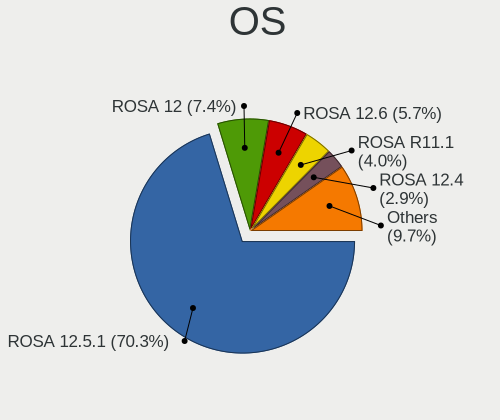
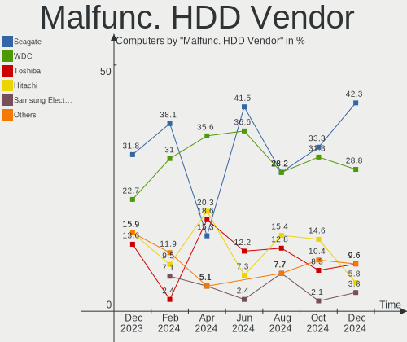
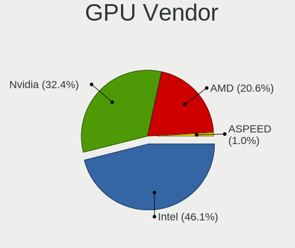
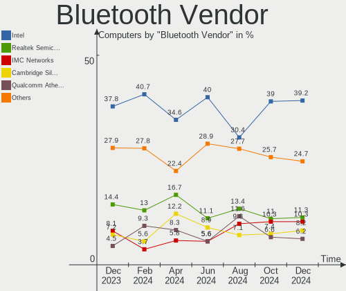

ROSA - Hardware Trends
----------------------

A project to identify most popular hardware characteristics and track their change
over time based on data collected by Linux users at https://Linux-Hardware.org.

Anyone can contribute to this report by the [hw-probe](https://github.com/linuxhw/hw-probe) tool:

    sudo -E hw-probe -all -upload

This is a report for all computer types. See also reports for [desktops](/Dist/ROSA/Desktop/README.md) and [notebooks](/Dist/ROSA/Notebook/README.md).

This report is for one last month. Overall report since the beginning of time: [TestCoverage](https://github.com/linuxhw/TestCoverage)

Period: Nov, 2022.

Contents
--------

* [ System ](#system)
  - [ OS                       ](#os)
  - [ OS Family                ](#os-family)
  - [ Kernel                   ](#kernel)
  - [ Kernel Family            ](#kernel-family)
  - [ Kernel Major Ver.        ](#kernel-major-ver)
  - [ Arch                     ](#arch)
  - [ DE                       ](#de)
  - [ Display Server           ](#display-server)
  - [ Display Manager          ](#display-manager)
  - [ OS Lang                  ](#os-lang)
  - [ Boot Mode                ](#boot-mode)
  - [ Filesystem               ](#filesystem)
  - [ Part. scheme             ](#part-scheme)
  - [ Dual Boot with Linux/BSD ](#dual-boot-with-linuxbsd)
  - [ Dual Boot (Win)          ](#dual-boot-win)

* [ Board ](#board)
  - [ Vendor                   ](#vendor)
  - [ Model                    ](#model)
  - [ Model Family             ](#model-family)
  - [ MFG Year                 ](#mfg-year)
  - [ Form Factor              ](#form-factor)
  - [ Secure Boot              ](#secure-boot)
  - [ Coreboot                 ](#coreboot)
  - [ RAM Size                 ](#ram-size)
  - [ RAM Used                 ](#ram-used)
  - [ Total Drives             ](#total-drives)
  - [ Has CD-ROM               ](#has-cd-rom)
  - [ Has Ethernet             ](#has-ethernet)
  - [ Has WiFi                 ](#has-wifi)
  - [ Has Bluetooth            ](#has-bluetooth)

* [ Location ](#location)
  - [ Country                  ](#country)
  - [ City                     ](#city)

* [ Drives ](#drives)
  - [ Drive Vendor             ](#drive-vendor)
  - [ Drive Model              ](#drive-model)
  - [ HDD Vendor               ](#hdd-vendor)
  - [ SSD Vendor               ](#ssd-vendor)
  - [ Drive Kind               ](#drive-kind)
  - [ Drive Connector          ](#drive-connector)
  - [ Drive Size               ](#drive-size)
  - [ Space Total              ](#space-total)
  - [ Space Used               ](#space-used)
  - [ Malfunc. Drives          ](#malfunc-drives)
  - [ Malfunc. Drive Vendor    ](#malfunc-drive-vendor)
  - [ Malfunc. HDD Vendor      ](#malfunc-hdd-vendor)
  - [ Malfunc. Drive Kind      ](#malfunc-drive-kind)
  - [ Failed Drives            ](#failed-drives)
  - [ Failed Drive Vendor      ](#failed-drive-vendor)
  - [ Drive Status             ](#drive-status)

* [ Storage controller ](#storage-controller)
  - [ Storage Vendor           ](#storage-vendor)
  - [ Storage Model            ](#storage-model)
  - [ Storage Kind             ](#storage-kind)

* [ Processor ](#processor)
  - [ CPU Vendor               ](#cpu-vendor)
  - [ CPU Model                ](#cpu-model)
  - [ CPU Model Family         ](#cpu-model-family)
  - [ CPU Cores                ](#cpu-cores)
  - [ CPU Sockets              ](#cpu-sockets)
  - [ CPU Threads              ](#cpu-threads)
  - [ CPU Op-Modes             ](#cpu-op-modes)
  - [ CPU Microcode            ](#cpu-microcode)
  - [ CPU Microarch            ](#cpu-microarch)

* [ Graphics ](#graphics)
  - [ GPU Vendor               ](#gpu-vendor)
  - [ GPU Model                ](#gpu-model)
  - [ GPU Combo                ](#gpu-combo)
  - [ GPU Driver               ](#gpu-driver)
  - [ GPU Memory               ](#gpu-memory)

* [ Monitor ](#monitor)
  - [ Monitor Vendor           ](#monitor-vendor)
  - [ Monitor Model            ](#monitor-model)
  - [ Monitor Resolution       ](#monitor-resolution)
  - [ Monitor Diagonal         ](#monitor-diagonal)
  - [ Monitor Width            ](#monitor-width)
  - [ Aspect Ratio             ](#aspect-ratio)
  - [ Monitor Area             ](#monitor-area)
  - [ Pixel Density            ](#pixel-density)
  - [ Multiple Monitors        ](#multiple-monitors)

* [ Network ](#network)
  - [ Net Controller Vendor    ](#net-controller-vendor)
  - [ Net Controller Model     ](#net-controller-model)
  - [ Wireless Vendor          ](#wireless-vendor)
  - [ Wireless Model           ](#wireless-model)
  - [ Ethernet Vendor          ](#ethernet-vendor)
  - [ Ethernet Model           ](#ethernet-model)
  - [ Net Controller Kind      ](#net-controller-kind)
  - [ Used Controller          ](#used-controller)
  - [ NICs                     ](#nics)
  - [ IPv6                     ](#ipv6)

* [ Bluetooth ](#bluetooth)
  - [ Bluetooth Vendor         ](#bluetooth-vendor)
  - [ Bluetooth Model          ](#bluetooth-model)

* [ Sound ](#sound)
  - [ Sound Vendor             ](#sound-vendor)
  - [ Sound Model              ](#sound-model)

* [ Memory ](#memory)
  - [ Memory Vendor            ](#memory-vendor)
  - [ Memory Model             ](#memory-model)
  - [ Memory Kind              ](#memory-kind)
  - [ Memory Form Factor       ](#memory-form-factor)
  - [ Memory Size              ](#memory-size)
  - [ Memory Speed             ](#memory-speed)

* [ Printers & scanners ](#printers--scanners)
  - [ Printer Vendor           ](#printer-vendor)
  - [ Printer Model            ](#printer-model)
  - [ Scanner Vendor           ](#scanner-vendor)
  - [ Scanner Model            ](#scanner-model)

* [ Camera ](#camera)
  - [ Camera Vendor            ](#camera-vendor)
  - [ Camera Model             ](#camera-model)

* [ Security ](#security)
  - [ Fingerprint Vendor       ](#fingerprint-vendor)
  - [ Fingerprint Model        ](#fingerprint-model)
  - [ Chipcard Vendor          ](#chipcard-vendor)
  - [ Chipcard Model           ](#chipcard-model)

* [ Unsupported ](#unsupported)
  - [ Unsupported Devices      ](#unsupported-devices)
  - [ Unsupported Device Types ](#unsupported-device-types)

System
------

OS
--

Installed operating systems

| Name        | Computers | Percent |
|-------------|-----------|---------|
| ROSA 12.3   | 232       | 77.33%  |
| ROSA 12.2   | 45        | 15%     |
| ROSA R11.1  | 14        | 4.67%   |
| ROSA 12.1   | 4         | 1.33%   |
| ROSA R11    | 2         | 0.67%   |
| ROSA R10    | 1         | 0.33%   |
| ROSA 2021.1 | 1         | 0.33%   |
| ROSA 12     | 1         | 0.33%   |

OS Family
---------

OS without a version

| Name | Computers | Percent |
|------|-----------|---------|
| ROSA | 300       | 100%    |

Kernel
------

Version of the Linux kernel

| Version                                    | Computers | Percent |
|--------------------------------------------|-----------|---------|
| 5.15.75-generic-1rosa2021.1-x86_64         | 81        | 27%     |
| 5.15.77-generic-1rosa2021.1-x86_64         | 56        | 18.67%  |
| 5.10.150-generic-1rosa2021.1-x86_64        | 48        | 16%     |
| 5.10.74-generic-2rosa2021.1-x86_64         | 34        | 11.33%  |
| 5.17.11-generic-2rosa2021.1-x86_64         | 14        | 4.67%   |
| 5.15.75-generic-1rosa2021.1-i686           | 8         | 2.67%   |
| 5.10.118-generic-2rosa2021.1-x86_64        | 8         | 2.67%   |
| 6.0.6.xm1-2.klp-xanmod-rosa2021.1-x86_64   | 5         | 1.67%   |
| 5.4.83-generic-2rosa-x86_64                | 4         | 1.33%   |
| 6.1.0-generic-0.rc5.1rosa2021.1-x86_64     | 3         | 1%      |
| 6.0.7.xm1-1.klp-xanmod-rosa2021.1-x86_64   | 3         | 1%      |
| 6.0.6.xm1-1.klp-xanmod-rosa2021.1-x86_64   | 3         | 1%      |
| 5.18.18.xm1-1-xanmod-rosa2021.1-x86_64     | 3         | 1%      |
| 4.15.0-desktop-122.124.1rosa-x86_64        | 3         | 1%      |
| 4.15.0-desktop-122.124.1rosa-i586          | 3         | 1%      |
| 6.1.0-generic-0.rc4.1rosa2021.1-x86_64     | 2         | 0.67%   |
| 5.4.83-generic-2rosa-i586                  | 2         | 0.67%   |
| 5.10.71-generic-1rosa2021.1-x86_64         | 2         | 0.67%   |
| 5.10.150-generic-1rosa2021.1-i586          | 2         | 0.67%   |
| 4.15.0-desktop-45.1rosa-i586               | 2         | 0.67%   |
| 6.1.0-generic-0.rc6.1rosa2021.1-x86_64     | 1         | 0.33%   |
| 6.0.9.xm1-1.klp-xanmod-rosa2021.1-x86_64   | 1         | 0.33%   |
| 6.0.3.xm1-1.klp-xanmod-rosa2021.1-x86_64   | 1         | 0.33%   |
| 6.0.10.xm1-1.klp-xanmod-rosa2021.1-x86_64  | 1         | 0.33%   |
| 5.4.32-generic-2rosa-x86_64                | 1         | 0.33%   |
| 5.19.15.xm1-1.klp-xanmod-rosa2021.1-x86_64 | 1         | 0.33%   |
| 5.18.19-generic-3rosa2021.1-x86_64         | 1         | 0.33%   |
| 5.15.73-generic-2rosa2021.1-x86_64         | 1         | 0.33%   |
| 5.15.67-generic-1rosa2021.1-x86_64         | 1         | 0.33%   |
| 5.15.43-generic-2rosa2021.1-x86_64         | 1         | 0.33%   |
| 5.10.74-generic-2rosa2021.1-i586           | 1         | 0.33%   |
| 5.10.118-generic-2rosa2021.1-i586          | 1         | 0.33%   |
| 4.9.155-nrj-desktop-1rosa-i586             | 1         | 0.33%   |
| 4.9.124-nrj-desktop-1rosa-i586             | 1         | 0.33%   |

Kernel Family
-------------

Linux kernel without a distro release

| Version  | Computers | Percent |
|----------|-----------|---------|
| 5.15.75  | 89        | 29.67%  |
| 5.15.77  | 56        | 18.67%  |
| 5.10.150 | 50        | 16.67%  |
| 5.10.74  | 35        | 11.67%  |
| 5.17.11  | 14        | 4.67%   |
| 5.10.118 | 9         | 3%      |
| 6.0.6    | 8         | 2.67%   |
| 4.15.0   | 8         | 2.67%   |
| 6.1.0    | 6         | 2%      |
| 5.4.83   | 6         | 2%      |
| 6.0.7    | 3         | 1%      |
| 5.18.18  | 3         | 1%      |
| 5.10.71  | 2         | 0.67%   |
| 6.0.9    | 1         | 0.33%   |
| 6.0.3    | 1         | 0.33%   |
| 6.0.10   | 1         | 0.33%   |
| 5.4.32   | 1         | 0.33%   |
| 5.19.15  | 1         | 0.33%   |
| 5.18.19  | 1         | 0.33%   |
| 5.15.73  | 1         | 0.33%   |
| 5.15.67  | 1         | 0.33%   |
| 5.15.43  | 1         | 0.33%   |
| 4.9.155  | 1         | 0.33%   |
| 4.9.124  | 1         | 0.33%   |

Kernel Major Ver.
-----------------

Linux kernel major version

| Version | Computers | Percent |
|---------|-----------|---------|
| 5.15    | 148       | 49.33%  |
| 5.10    | 96        | 32%     |
| 6.0     | 14        | 4.67%   |
| 5.17    | 14        | 4.67%   |
| 4.15    | 8         | 2.67%   |
| 5.4     | 7         | 2.33%   |
| 6.1     | 6         | 2%      |
| 5.18    | 4         | 1.33%   |
| 4.9     | 2         | 0.67%   |
| 5.19    | 1         | 0.33%   |

Arch
----

OS architecture (x86_64, i586, etc.)

| Name   | Computers | Percent |
|--------|-----------|---------|
| x86_64 | 279       | 93%     |
| i686   | 21        | 7%      |

DE
--

Desktop Environment

| Name    | Computers | Percent |
|---------|-----------|---------|
| KDE5    | 166       | 55.33%  |
| GNOME   | 94        | 31.33%  |
| LXQt    | 24        | 8%      |
| KDE4    | 11        | 3.67%   |
| MATE    | 2         | 0.67%   |
| Unknown | 2         | 0.67%   |
| XFCE    | 1         | 0.33%   |

Display Server
--------------

X11 or Wayland

| Name    | Computers | Percent |
|---------|-----------|---------|
| Wayland | 232       | 77.33%  |
| X11     | 68        | 22.67%  |

Display Manager
---------------

SDDM, LightDM, etc.

| Name    | Computers | Percent |
|---------|-----------|---------|
| SDDM    | 161       | 53.67%  |
| GDM     | 113       | 37.67%  |
| LightDM | 12        | 4%      |
| KDM     | 11        | 3.67%   |
| Unknown | 3         | 1%      |

OS Lang
-------

Language

| Lang    | Computers | Percent |
|---------|-----------|---------|
| ru_RU   | 272       | 90.67%  |
| en_US   | 7         | 2.33%   |
| de_DE   | 3         | 1%      |
| Unknown | 3         | 1%      |
| pl_PL   | 2         | 0.67%   |
| es_ES   | 2         | 0.67%   |
| sr_ME   | 1         | 0.33%   |
| sk_SK   | 1         | 0.33%   |
| ru_UA   | 1         | 0.33%   |
| ro_RO   | 1         | 0.33%   |
| pt_PT   | 1         | 0.33%   |
| pt_BR   | 1         | 0.33%   |
| lt_LT   | 1         | 0.33%   |
| it_IT   | 1         | 0.33%   |
| fr_FR   | 1         | 0.33%   |
| es_MX   | 1         | 0.33%   |
| da_DK   | 1         | 0.33%   |

Boot Mode
---------

EFI or BIOS

| Mode | Computers | Percent |
|------|-----------|---------|
| EFI  | 154       | 51.33%  |
| BIOS | 146       | 48.67%  |

Filesystem
----------

Type of filesystem

| Type  | Computers | Percent |
|-------|-----------|---------|
| Ext4  | 285       | 95%     |
| Btrfs | 12        | 4%      |
| F2fs  | 2         | 0.67%   |
| Ext2  | 1         | 0.33%   |

Part. scheme
------------

Scheme of partitioning

| Type    | Computers | Percent |
|---------|-----------|---------|
| GPT     | 187       | 62.33%  |
| MBR     | 112       | 37.33%  |
| Unknown | 1         | 0.33%   |

Dual Boot with Linux/BSD
------------------------

Hosting more than one Linux/BSD

| Dual boot | Computers | Percent |
|-----------|-----------|---------|
| No        | 208       | 69.33%  |
| Yes       | 92        | 30.67%  |

Dual Boot (Win)
---------------

Hosting Linux and Windows

| Dual boot | Computers | Percent |
|-----------|-----------|---------|
| Yes       | 151       | 50.33%  |
| No        | 149       | 49.67%  |

Board
-----

Vendor
------

Motherboard manufacturer

| Name                | Computers | Percent |
|---------------------|-----------|---------|
| ASUSTek Computer    | 79        | 26.33%  |
| Acer                | 31        | 10.33%  |
| Gigabyte Technology | 28        | 9.33%   |
| Lenovo              | 27        | 9%      |
| MSI                 | 25        | 8.33%   |
| Hewlett-Packard     | 20        | 6.67%   |
| ASRock              | 14        | 4.67%   |
| Samsung Electronics | 10        | 3.33%   |
| Toshiba             | 6         | 2%      |
| Intel               | 6         | 2%      |
| Dell                | 6         | 2%      |
| Unknown             | 6         | 2%      |
| Sony                | 5         | 1.67%   |
| Pegatron            | 4         | 1.33%   |
| ECS                 | 3         | 1%      |
| Biostar             | 3         | 1%      |
| Huanan              | 2         | 0.67%   |
| Fujitsu             | 2         | 0.67%   |
| eMachines           | 2         | 0.67%   |
| Apple               | 2         | 0.67%   |
| TUXEDO              | 1         | 0.33%   |
| Sapphire            | 1         | 0.33%   |
| RuggedPC            | 1         | 0.33%   |
| Quanta              | 1         | 0.33%   |
| Packard Bell        | 1         | 0.33%   |
| Notebook            | 1         | 0.33%   |
| MACHINIST           | 1         | 0.33%   |
| JGINYUE             | 1         | 0.33%   |
| iRU                 | 1         | 0.33%   |
| Irbis               | 1         | 0.33%   |
| Insyde              | 1         | 0.33%   |
| HUAWEI              | 1         | 0.33%   |
| Haier               | 1         | 0.33%   |
| Fujitsu Siemens     | 1         | 0.33%   |
| Foxconn             | 1         | 0.33%   |
| Digma               | 1         | 0.33%   |
| DEPO Computers      | 1         | 0.33%   |
| AZW                 | 1         | 0.33%   |
| Aquarius            | 1         | 0.33%   |

Model
-----

Motherboard model

| Name                                | Computers | Percent |
|-------------------------------------|-----------|---------|
| Unknown                             | 6         | 2%      |
| HP Notebook                         | 5         | 1.67%   |
| ASUS All Series                     | 5         | 1.67%   |
| Gigabyte B450 AORUS ELITE           | 3         | 1%      |
| Lenovo G500 20236                   | 2         | 0.67%   |
| Lenovo B590 20208                   | 2         | 0.67%   |
| Lenovo B590 20206                   | 2         | 0.67%   |
| Intel H81                           | 2         | 0.67%   |
| HP Pavilion g6                      | 2         | 0.67%   |
| Gigabyte A320M-H                    | 2         | 0.67%   |
| ASUS X550CC                         | 2         | 0.67%   |
| ASUS PRIME H510M-K                  | 2         | 0.67%   |
| ASUS PRIME B450M-A                  | 2         | 0.67%   |
| ASUS P5KPL-AM EPU                   | 2         | 0.67%   |
| ASUS P5K                            | 2         | 0.67%   |
| ASRock H55M-LE                      | 2         | 0.67%   |
| Acer Extensa 2519                   | 2         | 0.67%   |
| Acer Aspire 5750G                   | 2         | 0.67%   |
| Acer Aspire 5315                    | 2         | 0.67%   |
| TUXEDO Pulse 15 Gen1                | 1         | 0.33%   |
| Toshiba Satellite U300              | 1         | 0.33%   |
| Toshiba Satellite P300              | 1         | 0.33%   |
| Toshiba Satellite L550              | 1         | 0.33%   |
| Toshiba Satellite L45Dt-B           | 1         | 0.33%   |
| Toshiba Satellite C660              | 1         | 0.33%   |
| Toshiba Satellite A300D             | 1         | 0.33%   |
| Sony VPCZ13S9R                      | 1         | 0.33%   |
| Sony VPCS11V9R                      | 1         | 0.33%   |
| Sony VPCEH3J1R                      | 1         | 0.33%   |
| Sony VGN-P31ZRK_G                   | 1         | 0.33%   |
| Sony SVE1512H1RW                    | 1         | 0.33%   |
| Sapphire IPC-E350M1                 | 1         | 0.33%   |
| Samsung R528/R728                   | 1         | 0.33%   |
| Samsung R519/R719                   | 1         | 0.33%   |
| Samsung R510/P510                   | 1         | 0.33%   |
| Samsung NC210/NC110                 | 1         | 0.33%   |
| Samsung 700Z3A/700Z4A/700Z5A/700Z5B | 1         | 0.33%   |
| Samsung 530U3BI/530U4BI/530U4BH     | 1         | 0.33%   |
| Samsung 355V4C/356V4C/3445VC/3545VC | 1         | 0.33%   |
| Samsung 350V5C/351V5C/3540VC/3440VC | 1         | 0.33%   |

Model Family
------------

Motherboard model prefix

| Name                | Computers | Percent |
|---------------------|-----------|---------|
| Acer Aspire         | 23        | 7.67%   |
| ASUS PRIME          | 12        | 4%      |
| Toshiba Satellite   | 6         | 2%      |
| Lenovo IdeaPad      | 6         | 2%      |
| HP Pavilion         | 6         | 2%      |
| Unknown             | 6         | 2%      |
| HP Notebook         | 5         | 1.67%   |
| Dell Inspiron       | 5         | 1.67%   |
| ASUS All            | 5         | 1.67%   |
| Lenovo B590         | 4         | 1.33%   |
| Gigabyte B450       | 4         | 1.33%   |
| ASUS VivoBook       | 4         | 1.33%   |
| HP Compaq           | 3         | 1%      |
| ASUS TUF            | 3         | 1%      |
| ASUS ROG            | 3         | 1%      |
| ASUS P5KPL-AM       | 3         | 1%      |
| ASUS P5K            | 3         | 1%      |
| ASUS M5A78L-M       | 3         | 1%      |
| Acer Nitro          | 3         | 1%      |
| Acer Extensa        | 3         | 1%      |
| Lenovo ThinkPad     | 2         | 0.67%   |
| Lenovo G500         | 2         | 0.67%   |
| Intel X79           | 2         | 0.67%   |
| Intel H81           | 2         | 0.67%   |
| HP Laptop           | 2         | 0.67%   |
| Gigabyte B550       | 2         | 0.67%   |
| Gigabyte A320M-H    | 2         | 0.67%   |
| ASUS X550CC         | 2         | 0.67%   |
| ASUS M5A78L         | 2         | 0.67%   |
| ASRock H55M-LE      | 2         | 0.67%   |
| TUXEDO Pulse        | 1         | 0.33%   |
| Sony VPCZ13S9R      | 1         | 0.33%   |
| Sony VPCS11V9R      | 1         | 0.33%   |
| Sony VPCEH3J1R      | 1         | 0.33%   |
| Sony VGN-P31ZRK     | 1         | 0.33%   |
| Sony SVE1512H1RW    | 1         | 0.33%   |
| Sapphire IPC-E350M1 | 1         | 0.33%   |
| Samsung R528        | 1         | 0.33%   |
| Samsung R519        | 1         | 0.33%   |
| Samsung R510        | 1         | 0.33%   |

MFG Year
--------

Motherboard manufacture year

| Year | Computers | Percent |
|------|-----------|---------|
| 2012 | 37        | 12.33%  |
| 2011 | 33        | 11%     |
| 2020 | 25        | 8.33%   |
| 2013 | 23        | 7.67%   |
| 2021 | 21        | 7%      |
| 2019 | 21        | 7%      |
| 2018 | 21        | 7%      |
| 2009 | 20        | 6.67%   |
| 2015 | 16        | 5.33%   |
| 2010 | 15        | 5%      |
| 2008 | 13        | 4.33%   |
| 2017 | 12        | 4%      |
| 2016 | 12        | 4%      |
| 2014 | 11        | 3.67%   |
| 2007 | 11        | 3.67%   |
| 2022 | 5         | 1.67%   |
| 2005 | 3         | 1%      |
| 2006 | 1         | 0.33%   |

Form Factor
-----------

Physical design of the computer

| Name       | Computers | Percent |
|------------|-----------|---------|
| Desktop    | 154       | 51.33%  |
| Notebook   | 134       | 44.67%  |
| All in one | 6         | 2%      |
| Tablet     | 3         | 1%      |
| Mini pc    | 2         | 0.67%   |
| Other      | 1         | 0.33%   |

Secure Boot
-----------

Enabled or disabled

| State    | Computers | Percent |
|----------|-----------|---------|
| Disabled | 300       | 100%    |

Coreboot
--------

Have coreboot on board

| Used | Computers | Percent |
|------|-----------|---------|
| No   | 300       | 100%    |

RAM Size
--------

Total RAM memory

| Size in GB  | Computers | Percent |
|-------------|-----------|---------|
| 3.01-4.0    | 73        | 24.33%  |
| 4.01-8.0    | 72        | 24%     |
| 8.01-16.0   | 56        | 18.67%  |
| 16.01-24.0  | 53        | 17.67%  |
| 32.01-64.0  | 19        | 6.33%   |
| 1.01-2.0    | 12        | 4%      |
| 2.01-3.0    | 7         | 2.33%   |
| 0.51-1.0    | 4         | 1.33%   |
| 24.01-32.0  | 2         | 0.67%   |
| 64.01-256.0 | 2         | 0.67%   |

RAM Used
--------

Used RAM memory

| Used GB   | Computers | Percent |
|-----------|-----------|---------|
| 1.01-2.0  | 161       | 53.67%  |
| 0.51-1.0  | 62        | 20.67%  |
| 2.01-3.0  | 53        | 17.67%  |
| 4.01-8.0  | 10        | 3.33%   |
| 3.01-4.0  | 10        | 3.33%   |
| 0.01-0.5  | 3         | 1%      |
| 8.01-16.0 | 1         | 0.33%   |

Total Drives
------------

Number of drives on board

| Drives | Computers | Percent |
|--------|-----------|---------|
| 1      | 149       | 49.67%  |
| 2      | 93        | 31%     |
| 3      | 33        | 11%     |
| 4      | 17        | 5.67%   |
| 5      | 5         | 1.67%   |
| 6      | 3         | 1%      |

Has CD-ROM
----------

Has CD-ROM on board

| Presented | Computers | Percent |
|-----------|-----------|---------|
| No        | 183       | 61%     |
| Yes       | 117       | 39%     |

Has Ethernet
------------

Has Ethernet on board

| Presented | Computers | Percent |
|-----------|-----------|---------|
| Yes       | 278       | 92.67%  |
| No        | 22        | 7.33%   |

Has WiFi
--------

Has WiFi module

| Presented | Computers | Percent |
|-----------|-----------|---------|
| Yes       | 199       | 66.33%  |
| No        | 101       | 33.67%  |

Has Bluetooth
-------------

Has Bluetooth module

| Presented | Computers | Percent |
|-----------|-----------|---------|
| No        | 151       | 50.33%  |
| Yes       | 149       | 49.67%  |

Location
--------

Country
-------

Geographic location (country)

| Country    | Computers | Percent |
|------------|-----------|---------|
| Russia     | 259       | 86.33%  |
| Ukraine    | 7         | 2.33%   |
| Germany    | 6         | 2%      |
| Poland     | 4         | 1.33%   |
| Kazakhstan | 4         | 1.33%   |
| France     | 3         | 1%      |
| Belarus    | 3         | 1%      |
| Tunisia    | 2         | 0.67%   |
| Slovakia   | 2         | 0.67%   |
| Brazil     | 2         | 0.67%   |
| Montenegro | 1         | 0.33%   |
| Moldova    | 1         | 0.33%   |
| Mexico     | 1         | 0.33%   |
| Lithuania  | 1         | 0.33%   |
| Italy      | 1         | 0.33%   |
| Finland    | 1         | 0.33%   |
| Denmark    | 1         | 0.33%   |
| Czechia    | 1         | 0.33%   |

City
----

Geographic location (city)

| City              | Computers | Percent |
|-------------------|-----------|---------|
| Moscow            | 43        | 14.33%  |
| St Petersburg     | 23        | 7.67%   |
| Rostov-on-Don     | 9         | 3%      |
| Krasnodar         | 9         | 3%      |
| Yekaterinburg     | 8         | 2.67%   |
| Novosibirsk       | 8         | 2.67%   |
| Voronezh          | 6         | 2%      |
| Ufa               | 6         | 2%      |
| Samara            | 6         | 2%      |
| Krasnoyarsk       | 5         | 1.67%   |
| Chelyabinsk       | 5         | 1.67%   |
| Smolensk          | 4         | 1.33%   |
| Petrozavodsk      | 4         | 1.33%   |
| Novokuznetsk      | 4         | 1.33%   |
| Nizhniy Novgorod  | 4         | 1.33%   |
| Kazan’          | 4         | 1.33%   |
| Volgograd         | 3         | 1%      |
| Tolyatti          | 3         | 1%      |
| Stavropol         | 3         | 1%      |
| Irkutsk           | 3         | 1%      |
| Belgorod          | 3         | 1%      |
| Yakutsk           | 2         | 0.67%   |
| Warsaw            | 2         | 0.67%   |
| Vladivostok       | 2         | 0.67%   |
| Tyumen            | 2         | 0.67%   |
| Tunis             | 2         | 0.67%   |
| Tambov            | 2         | 0.67%   |
| Sterlitamak       | 2         | 0.67%   |
| Sevastopol        | 2         | 0.67%   |
| Saratov           | 2         | 0.67%   |
| Saransk           | 2         | 0.67%   |
| Pouydraguin       | 2         | 0.67%   |
| Perm              | 2         | 0.67%   |
| Omsk              | 2         | 0.67%   |
| Odintsovo         | 2         | 0.67%   |
| Cheboksary        | 2         | 0.67%   |
| Bryansk           | 2         | 0.67%   |
| Brest             | 2         | 0.67%   |
| Zima              | 1         | 0.33%   |
| Yuzhno-Sakhalinsk | 1         | 0.33%   |

Drives
------

Drive Vendor
------------

Hard drive vendors

| Vendor                      | Computers | Drives | Percent |
|-----------------------------|-----------|--------|---------|
| WDC                         | 89        | 116    | 18.62%  |
| Seagate                     | 79        | 89     | 16.53%  |
| Samsung Electronics         | 46        | 54     | 9.62%   |
| Toshiba                     | 36        | 38     | 7.53%   |
| Kingston                    | 31        | 32     | 6.49%   |
| Hitachi                     | 31        | 32     | 6.49%   |
| Unknown                     | 11        | 12     | 2.3%    |
| SanDisk                     | 11        | 11     | 2.3%    |
| HGST                        | 11        | 11     | 2.3%    |
| China                       | 11        | 12     | 2.3%    |
| Apacer                      | 10        | 10     | 2.09%   |
| SPCC                        | 9         | 9      | 1.88%   |
| A-DATA Technology           | 9         | 9      | 1.88%   |
| Intel                       | 6         | 6      | 1.26%   |
| Crucial                     | 6         | 7      | 1.26%   |
| AMD                         | 6         | 6      | 1.26%   |
| SK hynix                    | 5         | 5      | 1.05%   |
| Patriot                     | 5         | 5      | 1.05%   |
| Silicon Motion              | 4         | 4      | 0.84%   |
| KingSpec                    | 4         | 4      | 0.84%   |
| Gigabyte Technology         | 4         | 4      | 0.84%   |
| Transcend                   | 3         | 3      | 0.63%   |
| Kingmax                     | 3         | 3      | 0.63%   |
| XrayDisk                    | 2         | 2      | 0.42%   |
| XPG                         | 2         | 2      | 0.42%   |
| Team                        | 2         | 2      | 0.42%   |
| Plextor                     | 2         | 3      | 0.42%   |
| OCZ                         | 2         | 3      | 0.42%   |
| Netac                       | 2         | 2      | 0.42%   |
| Micron Technology           | 2         | 2      | 0.42%   |
| Maxtor                      | 2         | 2      | 0.42%   |
| MAXIO Technology (Hangzhou) | 2         | 2      | 0.42%   |
| Kllisre                     | 2         | 2      | 0.42%   |
| KingDian                    | 2         | 2      | 0.42%   |
| HS-SSD-C100                 | 2         | 2      | 0.42%   |
| Hewlett-Packard             | 2         | 2      | 0.42%   |
| GOODRAM                     | 2         | 2      | 0.42%   |
| ASMT                        | 2         | 3      | 0.42%   |
| Zheino                      | 1         | 1      | 0.21%   |
| WALRAM                      | 1         | 1      | 0.21%   |

Drive Model
-----------

Hard drive models

| Model                            | Computers | Percent |
|----------------------------------|-----------|---------|
| Seagate ST1000DM010-2EP102 1TB   | 9         | 1.72%   |
| Samsung SSD 860 EVO 250GB        | 9         | 1.72%   |
| Kingston SA400S37240G 240GB SSD  | 7         | 1.34%   |
| WDC WDS240G2G0A-00JH30 240GB SSD | 5         | 0.96%   |
| Kingston SA400S37480G 480GB SSD  | 5         | 0.96%   |
| WDC WDS500G2B0A-00SM50 500GB SSD | 4         | 0.77%   |
| WDC WD10EZEX-08M2NA0 1TB         | 4         | 0.77%   |
| Toshiba DT01ACA100 1TB           | 4         | 0.77%   |
| SPCC Solid State Disk 128GB      | 4         | 0.77%   |
| Seagate ST500LT012-1DG142 500GB  | 4         | 0.77%   |
| Seagate ST3160815AS 160GB        | 4         | 0.77%   |
| Seagate ST2000DM008-2FR102 2TB   | 4         | 0.77%   |
| Hitachi HTS547575A9E384 752GB    | 4         | 0.77%   |
| WDC WD5000LPCX-21VHAT0 500GB     | 3         | 0.57%   |
| WDC WD10EZEX-08WN4A0 1TB         | 3         | 0.57%   |
| Toshiba MQ01ABD100 1TB           | 3         | 0.57%   |
| Toshiba HDWD120 2TB              | 3         | 0.57%   |
| Toshiba DT01ACA050 500GB         | 3         | 0.57%   |
| Seagate ST500DM002-1SB10A 500GB  | 3         | 0.57%   |
| Seagate ST3500418AS 500GB        | 3         | 0.57%   |
| Seagate ST3250410AS 250GB        | 3         | 0.57%   |
| Seagate ST2000DM008-2UB102 2TB   | 3         | 0.57%   |
| SanDisk SDSSDA120G 120GB         | 3         | 0.57%   |
| Samsung SSD 980 250GB            | 3         | 0.57%   |
| Samsung SSD 860 EVO 500GB        | 3         | 0.57%   |
| Hitachi HTS543232A7A384 320GB    | 3         | 0.57%   |
| Hitachi HTS541680J9SA00 80GB     | 3         | 0.57%   |
| Hitachi HDS5C1050CLA382 500GB    | 3         | 0.57%   |
| Crucial CT120BX500SSD1 120GB     | 3         | 0.57%   |
| China 120GB SSD                  | 3         | 0.57%   |
| Apacer AS350 128GB SSD           | 3         | 0.57%   |
| XPG GAMMIX S5 512GB              | 2         | 0.38%   |
| WDC WDS500G2B0C-00PXH0 500GB     | 2         | 0.38%   |
| WDC WDS120G2G0A-00JH30 120GB SSD | 2         | 0.38%   |
| WDC WD5000LPVX-55V0TT0 500GB     | 2         | 0.38%   |
| WDC WD5000AAKS-00V1A0 500GB      | 2         | 0.38%   |
| WDC WD20EZAZ-00L9GB0 2TB         | 2         | 0.38%   |
| WDC WD20EARS-00S8B1 2TB          | 2         | 0.38%   |
| WDC WD10SPZX-21Z10T0 1TB         | 2         | 0.38%   |
| WDC WD10JPVX-22JC3T0 1TB         | 2         | 0.38%   |

HDD Vendor
----------

Hard disk drive vendors

| Vendor              | Computers | Drives | Percent |
|---------------------|-----------|--------|---------|
| Seagate             | 77        | 87     | 31.56%  |
| WDC                 | 74        | 92     | 30.33%  |
| Toshiba             | 35        | 36     | 14.34%  |
| Hitachi             | 31        | 32     | 12.7%   |
| HGST                | 11        | 11     | 4.51%   |
| Samsung Electronics | 8         | 8      | 3.28%   |
| Unknown             | 2         | 2      | 0.82%   |
| Maxtor              | 2         | 2      | 0.82%   |
| ASMT                | 2         | 3      | 0.82%   |
| Fujitsu             | 1         | 1      | 0.41%   |
| Unknown             | 1         | 1      | 0.41%   |

SSD Vendor
----------

Solid state drive vendors

| Vendor              | Computers | Drives | Percent |
|---------------------|-----------|--------|---------|
| Kingston            | 26        | 26     | 15.48%  |
| Samsung Electronics | 23        | 25     | 13.69%  |
| WDC                 | 14        | 14     | 8.33%   |
| SanDisk             | 11        | 11     | 6.55%   |
| China               | 11        | 12     | 6.55%   |
| SPCC                | 9         | 9      | 5.36%   |
| Apacer              | 8         | 8      | 4.76%   |
| A-DATA Technology   | 7         | 7      | 4.17%   |
| Patriot             | 5         | 5      | 2.98%   |
| Crucial             | 5         | 6      | 2.98%   |
| KingSpec            | 4         | 4      | 2.38%   |
| AMD                 | 4         | 4      | 2.38%   |
| Kingmax             | 3         | 3      | 1.79%   |
| Gigabyte Technology | 3         | 3      | 1.79%   |
| Team                | 2         | 2      | 1.19%   |
| Plextor             | 2         | 2      | 1.19%   |
| OCZ                 | 2         | 3      | 1.19%   |
| KingDian            | 2         | 2      | 1.19%   |
| Intel               | 2         | 2      | 1.19%   |
| HS-SSD-C100         | 2         | 2      | 1.19%   |
| Hewlett-Packard     | 2         | 2      | 1.19%   |
| GOODRAM             | 2         | 2      | 1.19%   |
| Zheino              | 1         | 1      | 0.6%    |
| XrayDisk            | 1         | 1      | 0.6%    |
| WALRAM              | 1         | 1      | 0.6%    |
| Verbatim            | 1         | 1      | 0.6%    |
| Unknown             | 1         | 1      | 0.6%    |
| Transcend           | 1         | 1      | 0.6%    |
| Toshiba             | 1         | 2      | 0.6%    |
| Smartbuy            | 1         | 1      | 0.6%    |
| SK hynix            | 1         | 1      | 0.6%    |
| SATAFIRM            | 1         | 1      | 0.6%    |
| Qumo                | 1         | 1      | 0.6%    |
| Pioneer             | 1         | 1      | 0.6%    |
| Netac               | 1         | 1      | 0.6%    |
| Neo Forza           | 1         | 1      | 0.6%    |
| LITEONIT            | 1         | 1      | 0.6%    |
| Kllisre             | 1         | 1      | 0.6%    |
| Kimtigo             | 1         | 1      | 0.6%    |
| HS-SSD-E100         | 1         | 1      | 0.6%    |

Drive Kind
----------

HDD or SSD

| Kind    | Computers | Drives | Percent |
|---------|-----------|--------|---------|
| HDD     | 208       | 275    | 48.26%  |
| SSD     | 146       | 174    | 33.87%  |
| NVMe    | 67        | 73     | 15.55%  |
| MMC     | 8         | 9      | 1.86%   |
| Unknown | 2         | 2      | 0.46%   |

Drive Connector
---------------

SATA, SAS, NVMe, etc.

| Type | Computers | Drives | Percent |
|------|-----------|--------|---------|
| SATA | 273       | 444    | 77.12%  |
| NVMe | 67        | 73     | 18.93%  |
| MMC  | 8         | 9      | 2.26%   |
| SAS  | 6         | 7      | 1.69%   |

Drive Size
----------

Size of hard drive

| Size in TB | Computers | Drives | Percent |
|------------|-----------|--------|---------|
| 0.01-0.5   | 233       | 324    | 67.34%  |
| 0.51-1.0   | 83        | 93     | 23.99%  |
| 1.01-2.0   | 25        | 27     | 7.23%   |
| 2.01-3.0   | 4         | 4      | 1.16%   |
| 3.01-4.0   | 1         | 1      | 0.29%   |

Space Total
-----------

Amount of disk space available on the file system

| Size in GB     | Computers | Percent |
|----------------|-----------|---------|
| 101-250        | 87        | 29%     |
| 251-500        | 65        | 21.67%  |
| 501-1000       | 42        | 14%     |
| 1-20           | 38        | 12.67%  |
| 51-100         | 25        | 8.33%   |
| 1001-2000      | 20        | 6.67%   |
| 21-50          | 9         | 3%      |
| More than 3000 | 7         | 2.33%   |
| 2001-3000      | 7         | 2.33%   |

Space Used
----------

Amount of used disk space

| Used GB        | Computers | Percent |
|----------------|-----------|---------|
| 1-20           | 185       | 61.67%  |
| 21-50          | 30        | 10%     |
| 51-100         | 20        | 6.67%   |
| 251-500        | 19        | 6.33%   |
| 101-250        | 18        | 6%      |
| 501-1000       | 14        | 4.67%   |
| 1001-2000      | 11        | 3.67%   |
| More than 3000 | 2         | 0.67%   |
| 2001-3000      | 1         | 0.33%   |

Malfunc. Drives
---------------

Drive models with a malfunction

| Model                              | Computers | Drives | Percent |
|------------------------------------|-----------|--------|---------|
| Hitachi HTS541680J9SA00 80GB       | 3         | 3      | 2.54%   |
| WDC WDS240G2G0A-00JH30 240GB SSD   | 2         | 2      | 1.69%   |
| WDC WD5000LPCX-21VHAT0 500GB       | 2         | 2      | 1.69%   |
| WDC WD5000AAKS-00V1A0 500GB        | 2         | 3      | 1.69%   |
| WDC WD20EARS-00S8B1 2TB            | 2         | 2      | 1.69%   |
| Seagate ST500LT012-9WS142 500GB    | 2         | 2      | 1.69%   |
| Seagate ST500DM002-1BD142 500GB    | 2         | 2      | 1.69%   |
| Seagate ST3500418AS 500GB          | 2         | 2      | 1.69%   |
| Seagate ST3320418AS 320GB          | 2         | 2      | 1.69%   |
| Seagate ST3250410AS 250GB          | 2         | 2      | 1.69%   |
| Seagate ST320LT012-9WS14C 320GB    | 2         | 2      | 1.69%   |
| Seagate ST1000LM024 HN-M101MBB 1TB | 2         | 2      | 1.69%   |
| Hitachi HTS547575A9E384 752GB      | 2         | 2      | 1.69%   |
| Hitachi HDS5C1050CLA382 500GB      | 2         | 2      | 1.69%   |
| HGST HTS545050A7E680 500GB         | 2         | 2      | 1.69%   |
| XPG GAMMIX S5 512GB                | 1         | 1      | 0.85%   |
| WDC WDS480G2G0A-00JH30 480GB SSD   | 1         | 1      | 0.85%   |
| WDC WD800BB-56JKC0 80GB            | 1         | 1      | 0.85%   |
| WDC WD6400BPVT-22HXZT1 640GB       | 1         | 1      | 0.85%   |
| WDC WD5000LPVX-55V0TT0 500GB       | 1         | 1      | 0.85%   |
| WDC WD5000LPCX-60VHAT0 500GB       | 1         | 1      | 0.85%   |
| WDC WD5000BEVT-22A0RT0 500GB       | 1         | 1      | 0.85%   |
| WDC WD5000AAKX-001CA0 500GB        | 1         | 1      | 0.85%   |
| WDC WD5000AAKS-75A7B2 500GB        | 1         | 1      | 0.85%   |
| WDC WD5000AAKS-00UU3A0 500GB       | 1         | 1      | 0.85%   |
| WDC WD3200AAJS-22B4A0 320GB        | 1         | 1      | 0.85%   |
| WDC WD20EARX-00PASB0 2TB           | 1         | 1      | 0.85%   |
| WDC WD20EARS-00MVWB0 2TB           | 1         | 1      | 0.85%   |
| WDC WD1600JS-00NCB1 160GB          | 1         | 1      | 0.85%   |
| WDC WD15EARS-00Z5B1 1TB            | 1         | 1      | 0.85%   |
| WDC WD10JPVX-60JC3T0 1TB           | 1         | 1      | 0.85%   |
| WDC WD10EZRX-00A8LB0 1TB           | 1         | 1      | 0.85%   |
| WDC WD10EZEX-75WN4A0 1TB           | 1         | 1      | 0.85%   |
| WDC WD10EZEX-60WN4A0 1TB           | 1         | 1      | 0.85%   |
| WDC WD10EZEX-22MFCA0 1TB           | 1         | 1      | 0.85%   |
| WDC WD10EZEX-08WN4A0 1TB           | 1         | 2      | 0.85%   |
| WDC WD10EALX-009BA0 1TB            | 1         | 1      | 0.85%   |
| WDC WD1002FAEX-00Z3A0 1TB          | 1         | 1      | 0.85%   |
| Toshiba MQ01ABF032 320GB           | 1         | 1      | 0.85%   |
| Toshiba MQ01ABD100 1TB             | 1         | 1      | 0.85%   |

Malfunc. Drive Vendor
---------------------

Vendors of faulty drives

| Vendor              | Computers | Drives | Percent |
|---------------------|-----------|--------|---------|
| Seagate             | 34        | 36     | 29.57%  |
| WDC                 | 29        | 32     | 25.22%  |
| Hitachi             | 18        | 18     | 15.65%  |
| Toshiba             | 9         | 9      | 7.83%   |
| Samsung Electronics | 6         | 6      | 5.22%   |
| Kingston            | 3         | 3      | 2.61%   |
| Maxtor              | 2         | 2      | 1.74%   |
| Kingmax             | 2         | 2      | 1.74%   |
| HGST                | 2         | 2      | 1.74%   |
| XPG                 | 1         | 1      | 0.87%   |
| Team                | 1         | 1      | 0.87%   |
| SATAFIRM            | 1         | 1      | 0.87%   |
| SanDisk             | 1         | 1      | 0.87%   |
| Plextor             | 1         | 1      | 0.87%   |
| KingSpec            | 1         | 1      | 0.87%   |
| Intel               | 1         | 1      | 0.87%   |
| Fujitsu             | 1         | 1      | 0.87%   |
| AMD                 | 1         | 1      | 0.87%   |
| Unknown             | 1         | 1      | 0.87%   |

Malfunc. HDD Vendor
-------------------

Vendors of faulty HDD drives

| Vendor              | Computers | Drives | Percent |
|---------------------|-----------|--------|---------|
| Seagate             | 34        | 36     | 34.69%  |
| WDC                 | 26        | 29     | 26.53%  |
| Hitachi             | 18        | 18     | 18.37%  |
| Toshiba             | 9         | 9      | 9.18%   |
| Samsung Electronics | 5         | 5      | 5.1%    |
| Maxtor              | 2         | 2      | 2.04%   |
| HGST                | 2         | 2      | 2.04%   |
| Fujitsu             | 1         | 1      | 1.02%   |
| Unknown             | 1         | 1      | 1.02%   |

Malfunc. Drive Kind
-------------------

Kinds of faulty drives

| Kind | Computers | Drives | Percent |
|------|-----------|--------|---------|
| HDD  | 92        | 103    | 85.19%  |
| SSD  | 13        | 14     | 12.04%  |
| NVMe | 3         | 3      | 2.78%   |

Failed Drives
-------------

Failed drive models

| Model                         | Computers | Drives | Percent |
|-------------------------------|-----------|--------|---------|
| WDC WD5000BEVT-35ZAT0 500GB   | 1         | 1      | 33.33%  |
| Toshiba MK8025GAL 80GB        | 1         | 1      | 33.33%  |
| Hitachi HDS721050DLE630 500GB | 1         | 1      | 33.33%  |

Failed Drive Vendor
-------------------

Failed drive vendors

| Vendor  | Computers | Drives | Percent |
|---------|-----------|--------|---------|
| WDC     | 1         | 1      | 33.33%  |
| Toshiba | 1         | 1      | 33.33%  |
| Hitachi | 1         | 1      | 33.33%  |

Drive Status
------------

Number of failed and malfunc. drives

| Status   | Computers | Drives | Percent |
|----------|-----------|--------|---------|
| Works    | 237       | 389    | 65.47%  |
| Malfunc  | 105       | 120    | 29.01%  |
| Detected | 17        | 21     | 4.7%    |
| Failed   | 3         | 3      | 0.83%   |

Storage controller
------------------

Storage Vendor
--------------

Storage controller vendors

| Vendor                        | Computers | Percent |
|-------------------------------|-----------|---------|
| Intel                         | 204       | 55.14%  |
| AMD                           | 74        | 20%     |
| Samsung Electronics           | 20        | 5.41%   |
| Silicon Motion                | 11        | 2.97%   |
| Nvidia                        | 11        | 2.97%   |
| SanDisk                       | 10        | 2.7%    |
| Kingston Technology Company   | 6         | 1.62%   |
| JMicron Technology            | 5         | 1.35%   |
| SK hynix                      | 4         | 1.08%   |
| ASMedia Technology            | 4         | 1.08%   |
| Phison Electronics            | 3         | 0.81%   |
| VIA Technologies              | 2         | 0.54%   |
| Realtek Semiconductor         | 2         | 0.54%   |
| Micron Technology             | 2         | 0.54%   |
| MAXIO Technology (Hangzhou)   | 2         | 0.54%   |
| ADATA Technology              | 2         | 0.54%   |
| Union Memory (Shenzhen)       | 1         | 0.27%   |
| Seagate Technology            | 1         | 0.27%   |
| Netac Technology              | 1         | 0.27%   |
| Micron/Crucial Technology     | 1         | 0.27%   |
| Marvell Technology Group      | 1         | 0.27%   |
| Lite-On Technology            | 1         | 0.27%   |
| KIOXIA                        | 1         | 0.27%   |
| Integrated Technology Express | 1         | 0.27%   |

Storage Model
-------------

Storage controller models

| Model                                                                                   | Computers | Percent |
|-----------------------------------------------------------------------------------------|-----------|---------|
| AMD FCH SATA Controller [AHCI mode]                                                     | 41        | 9.01%   |
| Intel 7 Series Chipset Family 6-port SATA Controller [AHCI mode]                        | 22        | 4.84%   |
| Intel 8 Series/C220 Series Chipset Family 6-port SATA Controller 1 [AHCI mode]          | 16        | 3.52%   |
| Intel 6 Series/C200 Series Chipset Family 6 port Mobile SATA AHCI Controller            | 14        | 3.08%   |
| AMD SB7x0/SB8x0/SB9x0 IDE Controller                                                    | 14        | 3.08%   |
| AMD SB7x0/SB8x0/SB9x0 SATA Controller [AHCI mode]                                       | 11        | 2.42%   |
| AMD 400 Series Chipset SATA Controller                                                  | 11        | 2.42%   |
| Intel Q170/Q150/B150/H170/H110/Z170/CM236 Chipset SATA Controller [AHCI Mode]           | 10        | 2.2%    |
| Intel 82801G (ICH7 Family) IDE Controller                                               | 10        | 2.2%    |
| Samsung NVMe SSD Controller 980                                                         | 9         | 1.98%   |
| Intel Sunrise Point-LP SATA Controller [AHCI mode]                                      | 9         | 1.98%   |
| Intel NM10/ICH7 Family SATA Controller [IDE mode]                                       | 9         | 1.98%   |
| AMD SB7x0/SB8x0/SB9x0 SATA Controller [IDE mode]                                        | 9         | 1.98%   |
| Silicon Motion SM2263EN/SM2263XT SSD Controller                                         | 8         | 1.76%   |
| Samsung NVMe SSD Controller SM981/PM981/PM983                                           | 8         | 1.76%   |
| Nvidia MCP61 SATA Controller                                                            | 8         | 1.76%   |
| Nvidia MCP61 IDE                                                                        | 8         | 1.76%   |
| Intel 82801IBM/IEM (ICH9M/ICH9M-E) 4 port SATA Controller [AHCI mode]                   | 7         | 1.54%   |
| AMD 500 Series Chipset SATA Controller                                                  | 7         | 1.54%   |
| Intel 82801I (ICH9 Family) 2 port SATA Controller [IDE mode]                            | 6         | 1.32%   |
| Intel 7 Series/C210 Series Chipset Family 6-port SATA Controller [AHCI mode]            | 6         | 1.32%   |
| Intel 6 Series/C200 Series Chipset Family Desktop SATA Controller (IDE mode, ports 4-5) | 6         | 1.32%   |
| Intel 6 Series/C200 Series Chipset Family Desktop SATA Controller (IDE mode, ports 0-3) | 6         | 1.32%   |
| Intel 500 Series Chipset Family SATA AHCI Controller                                    | 6         | 1.32%   |
| Intel 200 Series PCH SATA controller [AHCI mode]                                        | 6         | 1.32%   |
| SanDisk WD Blue SN550 NVMe SSD                                                          | 5         | 1.1%    |
| Intel Wildcat Point-LP SATA Controller [AHCI Mode]                                      | 5         | 1.1%    |
| Intel Atom/Celeron/Pentium Processor x5-E8000/J3xxx/N3xxx Series SATA Controller        | 5         | 1.1%    |
| Intel 82801HM/HEM (ICH8M/ICH8M-E) IDE Controller                                        | 5         | 1.1%    |
| Intel 82801 Mobile SATA Controller [RAID mode]                                          | 5         | 1.1%    |
| Intel 6 Series/C200 Series Chipset Family 6 port Desktop SATA AHCI Controller           | 5         | 1.1%    |
| Intel 5 Series/3400 Series Chipset 4 port SATA AHCI Controller                          | 5         | 1.1%    |
| AMD FCH SATA Controller D                                                               | 5         | 1.1%    |
| Intel SATA Controller [RAID mode]                                                       | 4         | 0.88%   |
| Intel Celeron/Pentium Silver Processor SATA Controller                                  | 4         | 0.88%   |
| Intel Cannon Lake PCH SATA AHCI Controller                                              | 4         | 0.88%   |
| Intel 82801JI (ICH10 Family) 2 port SATA IDE Controller #2                              | 4         | 0.88%   |
| Intel 82801IB (ICH9) 2 port SATA Controller [IDE mode]                                  | 4         | 0.88%   |
| Intel 7 Series/C210 Series Chipset Family 4-port SATA Controller [IDE mode]             | 4         | 0.88%   |
| Intel 7 Series/C210 Series Chipset Family 2-port SATA Controller [IDE mode]             | 4         | 0.88%   |

Storage Kind
------------

Kind of storage controller (IDE, SATA, NVMe, SAS, ...)

| Kind | Computers | Percent |
|------|-----------|---------|
| SATA | 228       | 60.48%  |
| IDE  | 70        | 18.57%  |
| NVMe | 67        | 17.77%  |
| RAID | 12        | 3.18%   |

Processor
---------

CPU Vendor
----------

Processor vendors

| Vendor | Computers | Percent |
|--------|-----------|---------|
| Intel  | 210       | 70%     |
| AMD    | 90        | 30%     |

CPU Model
---------

Processor models

| Model                                         | Computers | Percent |
|-----------------------------------------------|-----------|---------|
| Intel Pentium CPU 2020M @ 2.40GHz             | 4         | 1.33%   |
| Intel Core i5-3210M CPU @ 2.50GHz             | 4         | 1.33%   |
| Intel Core i5-2410M CPU @ 2.30GHz             | 4         | 1.33%   |
| AMD Ryzen 7 3700X 8-Core Processor            | 4         | 1.33%   |
| AMD Ryzen 5 2600 Six-Core Processor           | 4         | 1.33%   |
| AMD FX-6300 Six-Core Processor                | 4         | 1.33%   |
| Intel Core i5-7400 CPU @ 3.00GHz              | 3         | 1%      |
| Intel Core 2 Duo CPU E8400 @ 3.00GHz          | 3         | 1%      |
| AMD Athlon II X2 240 Processor                | 3         | 1%      |
| Intel Xeon CPU E5440 @ 2.83GHz                | 2         | 0.67%   |
| Intel Xeon CPU E3-1270 v3 @ 3.50GHz           | 2         | 0.67%   |
| Intel Pentium Dual-Core CPU T4300 @ 2.10GHz   | 2         | 0.67%   |
| Intel Pentium CPU N3700 @ 1.60GHz             | 2         | 0.67%   |
| Intel Pentium CPU G860 @ 3.00GHz              | 2         | 0.67%   |
| Intel Pentium CPU B960 @ 2.20GHz              | 2         | 0.67%   |
| Intel Core i7-2670QM CPU @ 2.20GHz            | 2         | 0.67%   |
| Intel Core i5-9400F CPU @ 2.90GHz             | 2         | 0.67%   |
| Intel Core i5-7200U CPU @ 2.50GHz             | 2         | 0.67%   |
| Intel Core i5-3330 CPU @ 3.00GHz              | 2         | 0.67%   |
| Intel Core i5-3230M CPU @ 2.60GHz             | 2         | 0.67%   |
| Intel Core i5-10400F CPU @ 2.90GHz            | 2         | 0.67%   |
| Intel Core i5 CPU M 540 @ 2.53GHz             | 2         | 0.67%   |
| Intel Core i3-6006U CPU @ 2.00GHz             | 2         | 0.67%   |
| Intel Core i3-5010U CPU @ 2.10GHz             | 2         | 0.67%   |
| Intel Core i3-4000M CPU @ 2.40GHz             | 2         | 0.67%   |
| Intel Core i3-3110M CPU @ 2.40GHz             | 2         | 0.67%   |
| Intel Core i3-2350M CPU @ 2.30GHz             | 2         | 0.67%   |
| Intel Core i3-10100 CPU @ 3.60GHz             | 2         | 0.67%   |
| Intel Core i3 CPU M 330 @ 2.13GHz             | 2         | 0.67%   |
| Intel Core i3 CPU 550 @ 3.20GHz               | 2         | 0.67%   |
| Intel Core 2 Duo CPU E8200 @ 2.66GHz          | 2         | 0.67%   |
| Intel Atom x5-Z8350 CPU @ 1.44GHz             | 2         | 0.67%   |
| Intel Atom CPU N450 @ 1.66GHz                 | 2         | 0.67%   |
| Intel 11th Gen Core i7-11800H @ 2.30GHz       | 2         | 0.67%   |
| AMD Ryzen 7 4800H with Radeon Graphics        | 2         | 0.67%   |
| AMD Ryzen 7 2700X Eight-Core Processor        | 2         | 0.67%   |
| AMD Ryzen 5 5500U with Radeon Graphics        | 2         | 0.67%   |
| AMD Ryzen 5 3500U with Radeon Vega Mobile Gfx | 2         | 0.67%   |
| AMD Ryzen 3 5300U with Radeon Graphics        | 2         | 0.67%   |
| AMD Ryzen 3 3200G with Radeon Vega Graphics   | 2         | 0.67%   |

CPU Model Family
----------------

Processor model prefix

| Model                          | Computers | Percent |
|--------------------------------|-----------|---------|
| Intel Core i5                  | 63        | 21%     |
| Intel Core i3                  | 37        | 12.33%  |
| AMD Ryzen 5                    | 20        | 6.67%   |
| Intel Pentium                  | 19        | 6.33%   |
| Intel Core i7                  | 19        | 6.33%   |
| Intel Core 2 Duo               | 17        | 5.67%   |
| Intel Xeon                     | 13        | 4.33%   |
| AMD Ryzen 7                    | 12        | 4%      |
| Intel Celeron                  | 11        | 3.67%   |
| AMD FX                         | 11        | 3.67%   |
| Intel Atom                     | 7         | 2.33%   |
| AMD Ryzen 3                    | 7         | 2.33%   |
| AMD Athlon II X2               | 7         | 2.33%   |
| Other                          | 6         | 2%      |
| Intel Pentium Dual-Core        | 6         | 2%      |
| Intel Pentium Silver           | 3         | 1%      |
| AMD E                          | 3         | 1%      |
| AMD Athlon II X4               | 3         | 1%      |
| AMD A6                         | 3         | 1%      |
| Intel Genuine                  | 2         | 0.67%   |
| Intel Core 2 Quad              | 2         | 0.67%   |
| AMD E1                         | 2         | 0.67%   |
| AMD Athlon X2                  | 2         | 0.67%   |
| AMD Athlon                     | 2         | 0.67%   |
| AMD A8                         | 2         | 0.67%   |
| AMD A4                         | 2         | 0.67%   |
| AMD A10                        | 2         | 0.67%   |
| Intel Pentium M                | 1         | 0.33%   |
| Intel Pentium Gold             | 1         | 0.33%   |
| Intel Pentium Dual             | 1         | 0.33%   |
| Intel Celeron M                | 1         | 0.33%   |
| Intel Celeron Dual-Core        | 1         | 0.33%   |
| AMD Turion X2 Dual-Core Mobile | 1         | 0.33%   |
| AMD Ryzen 9                    | 1         | 0.33%   |
| AMD Ryzen 7 PRO                | 1         | 0.33%   |
| AMD Ryzen 3 PRO                | 1         | 0.33%   |
| AMD Phenom II X6               | 1         | 0.33%   |
| AMD Phenom II X4               | 1         | 0.33%   |
| AMD Phenom II                  | 1         | 0.33%   |
| AMD E2                         | 1         | 0.33%   |

CPU Cores
---------

Number of processor cores

| Number | Computers | Percent |
|--------|-----------|---------|
| 2      | 141       | 47%     |
| 4      | 87        | 29%     |
| 6      | 31        | 10.33%  |
| 8      | 19        | 6.33%   |
| 1      | 14        | 4.67%   |
| 3      | 5         | 1.67%   |
| 24     | 1         | 0.33%   |
| 18     | 1         | 0.33%   |
| 12     | 1         | 0.33%   |

CPU Sockets
-----------

Number of sockets

| Number | Computers | Percent |
|--------|-----------|---------|
| 1      | 299       | 99.67%  |
| 2      | 1         | 0.33%   |

CPU Threads
-----------

Threads per core (Hyper-Threading)

| Number | Computers | Percent |
|--------|-----------|---------|
| 2      | 171       | 57%     |
| 1      | 129       | 43%     |

CPU Op-Modes
------------

CPU Operation Modes (32-bit, 64-bit)

| Op mode        | Computers | Percent |
|----------------|-----------|---------|
| 32-bit, 64-bit | 296       | 98.67%  |
| 32-bit         | 4         | 1.33%   |

CPU Microcode
-------------

Microcode number

| Number     | Computers | Percent |
|------------|-----------|---------|
| 0x306a9    | 31        | 10.33%  |
| 0x206a7    | 26        | 8.67%   |
| 0x306c3    | 18        | 6%      |
| 0x1067a    | 16        | 5.33%   |
| 0x906ea    | 11        | 3.67%   |
| 0x08701021 | 9         | 3%      |
| Unknown    | 9         | 3%      |
| 0x08108109 | 8         | 2.67%   |
| 0xa0653    | 7         | 2.33%   |
| 0x906e9    | 7         | 2.33%   |
| 0x10676    | 7         | 2.33%   |
| 0x010000c8 | 7         | 2.33%   |
| 0x506e3    | 6         | 2%      |
| 0x20655    | 6         | 2%      |
| 0x0800820d | 6         | 2%      |
| 0x6fd      | 5         | 1.67%   |
| 0x406c4    | 5         | 1.67%   |
| 0x306d4    | 5         | 1.67%   |
| 0x010000b6 | 5         | 1.67%   |
| 0x806e9    | 4         | 1.33%   |
| 0x406e3    | 4         | 1.33%   |
| 0x20652    | 4         | 1.33%   |
| 0x08001138 | 4         | 1.33%   |
| 0x06001116 | 4         | 1.33%   |
| 0x6fb      | 3         | 1%      |
| 0x406c3    | 3         | 1%      |
| 0x306f2    | 3         | 1%      |
| 0x206d7    | 3         | 1%      |
| 0x106ca    | 3         | 1%      |
| 0x08608103 | 3         | 1%      |
| 0x07030105 | 3         | 1%      |
| 0x06001119 | 3         | 1%      |
| 0x06000852 | 3         | 1%      |
| 0x06000822 | 3         | 1%      |
| 0xa0671    | 2         | 0.67%   |
| 0x906ed    | 2         | 0.67%   |
| 0x806ec    | 2         | 0.67%   |
| 0x806ea    | 2         | 0.67%   |
| 0x706a8    | 2         | 0.67%   |
| 0x706a1    | 2         | 0.67%   |

CPU Microarch
-------------

Microarchitecture

| Name             | Computers | Percent |
|------------------|-----------|---------|
| IvyBridge        | 32        | 10.67%  |
| SandyBridge      | 29        | 9.67%   |
| KabyLake         | 29        | 9.67%   |
| Penryn           | 23        | 7.67%   |
| Haswell          | 22        | 7.33%   |
| Zen+             | 17        | 5.67%   |
| Piledriver       | 17        | 5.67%   |
| K10              | 15        | 5%      |
| Zen 2            | 12        | 4%      |
| Westmere         | 11        | 3.67%   |
| Skylake          | 10        | 3.33%   |
| Silvermont       | 10        | 3.33%   |
| Core             | 10        | 3.33%   |
| CometLake        | 9         | 3%      |
| Zen              | 6         | 2%      |
| Zen 3            | 5         | 1.67%   |
| Puma             | 5         | 1.67%   |
| Broadwell        | 5         | 1.67%   |
| Unknown          | 5         | 1.67%   |
| Icelake          | 4         | 1.33%   |
| Goldmont plus    | 4         | 1.33%   |
| Bonnell          | 4         | 1.33%   |
| P6               | 3         | 1%      |
| K8 Hammer        | 3         | 1%      |
| Bobcat           | 3         | 1%      |
| Tremont          | 1         | 0.33%   |
| TigerLake        | 1         | 0.33%   |
| K8 & K10 hybrid  | 1         | 0.33%   |
| K10 Llano        | 1         | 0.33%   |
| Goldmont         | 1         | 0.33%   |
| Bulldozer        | 1         | 0.33%   |
| Alderlake Hybrid | 1         | 0.33%   |

Graphics
--------

GPU Vendor
----------

Vendors of graphics cards

| Vendor | Computers | Percent |
|--------|-----------|---------|
| Nvidia | 149       | 41.39%  |
| Intel  | 134       | 37.22%  |
| AMD    | 77        | 21.39%  |

GPU Model
---------

Graphics card models

| Model                                                                                    | Computers | Percent |
|------------------------------------------------------------------------------------------|-----------|---------|
| Intel 2nd Generation Core Processor Family Integrated Graphics Controller                | 25        | 6.7%    |
| Intel 3rd Gen Core processor Graphics Controller                                         | 20        | 5.36%   |
| AMD Picasso/Raven 2 [Radeon Vega Series / Radeon Vega Mobile Series]                     | 10        | 2.68%   |
| Intel Atom/Celeron/Pentium Processor x5-E8000/J3xxx/N3xxx Integrated Graphics Controller | 8         | 2.14%   |
| Nvidia GP107 [GeForce GTX 1050 Ti]                                                       | 7         | 1.88%   |
| Nvidia GK208B [GeForce GT 730]                                                           | 6         | 1.61%   |
| Nvidia GF117M [GeForce 610M/710M/810M/820M / GT 620M/625M/630M/720M]                     | 6         | 1.61%   |
| Intel Core Processor Integrated Graphics Controller                                      | 6         | 1.61%   |
| Intel Mobile GM965/GL960 Integrated Graphics Controller (secondary)                      | 5         | 1.34%   |
| Intel Mobile GM965/GL960 Integrated Graphics Controller (primary)                        | 5         | 1.34%   |
| Nvidia TU116 [GeForce GTX 1660]                                                          | 4         | 1.07%   |
| Nvidia GP106 [GeForce GTX 1060 6GB]                                                      | 4         | 1.07%   |
| Nvidia GP106 [GeForce GTX 1060 3GB]                                                      | 4         | 1.07%   |
| Nvidia GK107 [GeForce GTX 650]                                                           | 4         | 1.07%   |
| Nvidia GF108 [GeForce GT 430]                                                            | 4         | 1.07%   |
| Intel Xeon E3-1200 v3/4th Gen Core Processor Integrated Graphics Controller              | 4         | 1.07%   |
| Intel Skylake GT2 [HD Graphics 520]                                                      | 4         | 1.07%   |
| Intel HD Graphics 5500                                                                   | 4         | 1.07%   |
| Intel HD Graphics 530                                                                    | 4         | 1.07%   |
| Intel 4th Gen Core Processor Integrated Graphics Controller                              | 4         | 1.07%   |
| AMD Navi 23 [Radeon RX 6600/6600 XT/6600M]                                               | 4         | 1.07%   |
| AMD Lucienne                                                                             | 4         | 1.07%   |
| Nvidia TU117M [GeForce GTX 1650 Mobile / Max-Q]                                          | 3         | 0.8%    |
| Nvidia TU117 [GeForce GTX 1650]                                                          | 3         | 0.8%    |
| Nvidia TU106 [GeForce RTX 2060 SUPER]                                                    | 3         | 0.8%    |
| Nvidia GP104 [GeForce GTX 1070]                                                          | 3         | 0.8%    |
| Nvidia GM108M [GeForce 840M]                                                             | 3         | 0.8%    |
| Nvidia GK107 [GeForce GT 640]                                                            | 3         | 0.8%    |
| Nvidia GF119M [GeForce 610M]                                                             | 3         | 0.8%    |
| Nvidia G96C [GeForce 9500 GT]                                                            | 3         | 0.8%    |
| Intel HD Graphics 630                                                                    | 3         | 0.8%    |
| Intel HD Graphics 620                                                                    | 3         | 0.8%    |
| Intel Atom Processor D4xx/D5xx/N4xx/N5xx Integrated Graphics Controller                  | 3         | 0.8%    |
| Intel 4th Generation Core Processor Family Integrated Graphics Controller                | 3         | 0.8%    |
| AMD Thames [Radeon HD 7500M/7600M Series]                                                | 3         | 0.8%    |
| AMD Seymour [Radeon HD 6400M/7400M Series]                                               | 3         | 0.8%    |
| AMD Navi 24 [Radeon RX 6400/6500 XT/6500M]                                               | 3         | 0.8%    |
| AMD Mullins [Radeon R2 Graphics]                                                         | 3         | 0.8%    |
| AMD Ellesmere [Radeon RX 470/480/570/570X/580/580X/590]                                  | 3         | 0.8%    |
| AMD Cezanne [Radeon Vega Series / Radeon Vega Mobile Series]                             | 3         | 0.8%    |

GPU Combo
---------

Combinations of graphics cards

| Name           | Computers | Percent |
|----------------|-----------|---------|
| 1 x Nvidia     | 100       | 33.33%  |
| 1 x Intel      | 78        | 26%     |
| 1 x AMD        | 60        | 20%     |
| Intel + Nvidia | 43        | 14.33%  |
| 2 x AMD        | 6         | 2%      |
| Intel + AMD    | 6         | 2%      |
| AMD + Nvidia   | 5         | 1.67%   |
| Other          | 1         | 0.33%   |
| 2 x Nvidia     | 1         | 0.33%   |

GPU Driver
----------

Free vs proprietary

| Driver      | Computers | Percent |
|-------------|-----------|---------|
| Free        | 258       | 86%     |
| Proprietary | 38        | 12.67%  |
| Unknown     | 4         | 1.33%   |

GPU Memory
----------

Total video memory

| Size in GB | Computers | Percent |
|------------|-----------|---------|
| Unknown    | 112       | 37.33%  |
| 0.51-1.0   | 49        | 16.33%  |
| 1.01-2.0   | 47        | 15.67%  |
| 0.01-0.5   | 43        | 14.33%  |
| 3.01-4.0   | 20        | 6.67%   |
| 7.01-8.0   | 11        | 3.67%   |
| 5.01-6.0   | 9         | 3%      |
| 8.01-16.0  | 5         | 1.67%   |
| 2.01-3.0   | 4         | 1.33%   |

Monitor
-------

Monitor Vendor
--------------

Monitor vendors

| Vendor                  | Computers | Percent |
|-------------------------|-----------|---------|
| Samsung Electronics     | 47        | 15.99%  |
| AU Optronics            | 30        | 10.2%   |
| LG Display              | 25        | 8.5%    |
| Acer                    | 20        | 6.8%    |
| Goldstar                | 17        | 5.78%   |
| Chimei Innolux          | 17        | 5.78%   |
| BOE                     | 16        | 5.44%   |
| BenQ                    | 16        | 5.44%   |
| Dell                    | 11        | 3.74%   |
| Philips                 | 10        | 3.4%    |
| Chi Mei Optoelectronics | 10        | 3.4%    |
| AOC                     | 10        | 3.4%    |
| Ancor Communications    | 9         | 3.06%   |
| Hewlett-Packard         | 8         | 2.72%   |
| ViewSonic               | 5         | 1.7%    |
| MSI                     | 4         | 1.36%   |
| Sharp                   | 3         | 1.02%   |
| Mi                      | 3         | 1.02%   |
| Apple                   | 3         | 1.02%   |
| Sony                    | 2         | 0.68%   |
| PANDA                   | 2         | 0.68%   |
| Lenovo                  | 2         | 0.68%   |
| Iiyama                  | 2         | 0.68%   |
| Fujitsu Siemens         | 2         | 0.68%   |
| Eizo                    | 2         | 0.68%   |
| ___                     | 1         | 0.34%   |
| Yamaha                  | 1         | 0.34%   |
| Xiaomi                  | 1         | 0.34%   |
| Unknown                 | 1         | 0.34%   |
| Toshiba                 | 1         | 0.34%   |
| SJL                     | 1         | 0.34%   |
| Panasonic               | 1         | 0.34%   |
| NEW                     | 1         | 0.34%   |
| NEC Computers           | 1         | 0.34%   |
| LG Philips              | 1         | 0.34%   |
| HannStar                | 1         | 0.34%   |
| Haier                   | 1         | 0.34%   |
| GDH                     | 1         | 0.34%   |
| Envision Peripherals    | 1         | 0.34%   |
| CSO                     | 1         | 0.34%   |

Monitor Model
-------------

Monitor models

| Model                                                                     | Computers | Percent |
|---------------------------------------------------------------------------|-----------|---------|
| AU Optronics LCD Monitor AUO26EC 1366x768 344x193mm 15.5-inch             | 5         | 1.69%   |
| AU Optronics LCD Monitor AUO21EC 1366x768 344x193mm 15.5-inch             | 4         | 1.36%   |
| Samsung Electronics LCD Monitor SEC3245 1366x768 344x194mm 15.5-inch      | 3         | 1.02%   |
| Samsung Electronics C24F390 SAM0D2C 1920x1080 520x290mm 23.4-inch         | 3         | 1.02%   |
| LG Display LCD Monitor LGD02DC 1366x768 344x194mm 15.5-inch               | 3         | 1.02%   |
| Chimei Innolux LCD Monitor CMN15F5 1920x1080 344x193mm 15.5-inch          | 3         | 1.02%   |
| Chimei Innolux LCD Monitor CMN15DB 1366x768 344x193mm 15.5-inch           | 3         | 1.02%   |
| Chi Mei Optoelectronics LCD Monitor CMO1720 1920x1080 382x215mm 17.3-inch | 3         | 1.02%   |
| AU Optronics LCD Monitor AUO8174 1280x800 331x207mm 15.4-inch             | 3         | 1.02%   |
| AOC 24V2W1G5 AOC2402 1920x1080 527x296mm 23.8-inch                        | 3         | 1.02%   |
| Acer AL1716A ACRAD46 1280x1024 338x270mm 17.0-inch                        | 3         | 1.02%   |
| Samsung Electronics SyncMaster SAM036F 1440x900 428x255mm 19.6-inch       | 2         | 0.68%   |
| Mi Monitor XMI3444 3440x1440 800x330mm 34.1-inch                          | 2         | 0.68%   |
| Hewlett-Packard 24f HPN3545 1920x1080 527x296mm 23.8-inch                 | 2         | 0.68%   |
| Goldstar ULTRAWIDE GSM76F9 2560x1080 531x298mm 24.0-inch                  | 2         | 0.68%   |
| Goldstar FULL HD GSM5B54 1920x1080 480x270mm 21.7-inch                    | 2         | 0.68%   |
| Chimei Innolux LCD Monitor CMN1735 1920x1080 382x215mm 17.3-inch          | 2         | 0.68%   |
| Chimei Innolux LCD Monitor CMN14D4 1920x1080 309x173mm 13.9-inch          | 2         | 0.68%   |
| Chi Mei Optoelectronics LCD Monitor CMO15A3 1366x768 344x193mm 15.5-inch  | 2         | 0.68%   |
| Chi Mei Optoelectronics LCD Monitor CMO15A2 1366x768 344x193mm 15.5-inch  | 2         | 0.68%   |
| BOE LCD Monitor BOE0872 1920x1080 344x194mm 15.5-inch                     | 2         | 0.68%   |
| BenQ T90X BNQ76AF 1280x1024 376x301mm 19.0-inch                           | 2         | 0.68%   |
| BenQ GW2270 BNQ78DB 1920x1080 480x270mm 21.7-inch                         | 2         | 0.68%   |
| BenQ G2020HD BNQ781E 1600x900 443x249mm 20.0-inch                         | 2         | 0.68%   |
| BenQ FP91G+ BNQ76A5 1280x1024 376x301mm 19.0-inch                         | 2         | 0.68%   |
| AU Optronics LCD Monitor AUO41EC 1366x768 344x193mm 15.5-inch             | 2         | 0.68%   |
| AU Optronics LCD Monitor AUO22EC 1366x768 344x193mm 15.5-inch             | 2         | 0.68%   |
| AU Optronics LCD Monitor AUO21ED 1920x1080 344x193mm 15.5-inch            | 2         | 0.68%   |
| AU Optronics LCD Monitor AUO162C 1366x768 293x164mm 13.2-inch             | 2         | 0.68%   |
| Ancor Communications ASUS 24T1E ACI24F4 1920x1080 521x293mm 23.5-inch     | 2         | 0.68%   |
| ___ LCDTV16 ___0101 1360x768                                              | 1         | 0.34%   |
| Yamaha RX-V473 YMH3171 1920x540                                           | 1         | 0.34%   |
| Xiaomi Mi TV XMD0076 3840x2160 800x450mm 36.1-inch                        | 1         | 0.34%   |
| ViewSonic VG500 VSC3D08 1024x768 304x228mm 15.0-inch                      | 1         | 0.34%   |
| ViewSonic VE720m VSC021E 1280x1024 338x270mm 17.0-inch                    | 1         | 0.34%   |
| ViewSonic VA703-3Series VSC631E 1280x1024 338x270mm 17.0-inch             | 1         | 0.34%   |
| ViewSonic VA2431 Series VSCD824 1920x1080 521x293mm 23.5-inch             | 1         | 0.34%   |
| ViewSonic VA1903a VSC8A31 1366x768 410x230mm 18.5-inch                    | 1         | 0.34%   |
| Unknown LCD TV 0101 1920x1080 1600x900mm 72.3-inch                        | 1         | 0.34%   |
| Toshiba LCD Monitor LCD58E1 1280x800 261x163mm 12.1-inch                  | 1         | 0.34%   |

Monitor Resolution
------------------

Monitor screen resolution

| Resolution         | Computers | Percent |
|--------------------|-----------|---------|
| 1920x1080 (FHD)    | 127       | 44.1%   |
| 1366x768 (WXGA)    | 64        | 22.22%  |
| 1280x1024 (SXGA)   | 23        | 7.99%   |
| 1600x900 (HD+)     | 14        | 4.86%   |
| 3840x2160 (4K)     | 9         | 3.13%   |
| 1280x800 (WXGA)    | 9         | 3.13%   |
| 2560x1440 (QHD)    | 8         | 2.78%   |
| 1440x900 (WXGA+)   | 7         | 2.43%   |
| 3440x1440          | 5         | 1.74%   |
| 1680x1050 (WSXGA+) | 4         | 1.39%   |
| 2560x1080          | 3         | 1.04%   |
| 1920x1200 (WUXGA)  | 3         | 1.04%   |
| 1024x768 (XGA)     | 2         | 0.69%   |
| 1024x600           | 2         | 0.69%   |
| 4093x4093          | 1         | 0.35%   |
| 2560x1600          | 1         | 0.35%   |
| 2520x1680          | 1         | 0.35%   |
| 1920x540           | 1         | 0.35%   |
| 1680x945           | 1         | 0.35%   |
| 1600x1200          | 1         | 0.35%   |
| 1400x1050          | 1         | 0.35%   |
| 1280x720 (HD)      | 1         | 0.35%   |

Monitor Diagonal
----------------

Diagonal size in inches

| Inches  | Computers | Percent |
|---------|-----------|---------|
| 15      | 83        | 28.33%  |
| 23      | 36        | 12.29%  |
| 17      | 28        | 9.56%   |
| 21      | 27        | 9.22%   |
| 24      | 21        | 7.17%   |
| 19      | 16        | 5.46%   |
| 27      | 12        | 4.1%    |
| 14      | 10        | 3.41%   |
| 13      | 10        | 3.41%   |
| 34      | 7         | 2.39%   |
| 20      | 6         | 2.05%   |
| 18      | 6         | 2.05%   |
| 31      | 3         | 1.02%   |
| 22      | 3         | 1.02%   |
| 12      | 3         | 1.02%   |
| 36      | 2         | 0.68%   |
| 32      | 2         | 0.68%   |
| 16      | 2         | 0.68%   |
| 10      | 2         | 0.68%   |
| Unknown | 2         | 0.68%   |
| 84      | 1         | 0.34%   |
| 72      | 1         | 0.34%   |
| 54      | 1         | 0.34%   |
| 52      | 1         | 0.34%   |
| 48      | 1         | 0.34%   |
| 47      | 1         | 0.34%   |
| 43      | 1         | 0.34%   |
| 42      | 1         | 0.34%   |
| 41      | 1         | 0.34%   |
| 40      | 1         | 0.34%   |
| 26      | 1         | 0.34%   |
| 11      | 1         | 0.34%   |

Monitor Width
-------------

Physical width

| Width in mm | Computers | Percent |
|-------------|-----------|---------|
| 301-350     | 107       | 36.9%   |
| 501-600     | 65        | 22.41%  |
| 401-500     | 50        | 17.24%  |
| 351-400     | 29        | 10%     |
| 201-300     | 13        | 4.48%   |
| 701-800     | 10        | 3.45%   |
| 601-700     | 4         | 1.38%   |
| 1001-1500   | 4         | 1.38%   |
| 901-1000    | 3         | 1.03%   |
| 1501-2000   | 2         | 0.69%   |
| Unknown     | 2         | 0.69%   |
| 801-900     | 1         | 0.34%   |

Aspect Ratio
------------

Proportional relationship between the width and the height

| Ratio | Computers | Percent |
|-------|-----------|---------|
| 16/9  | 224       | 78.6%   |
| 16/10 | 23        | 8.07%   |
| 5/4   | 21        | 7.37%   |
| 21/9  | 7         | 2.46%   |
| 4/3   | 4         | 1.4%    |
| 3/2   | 3         | 1.05%   |
| 6/5   | 2         | 0.7%    |
| 32/9  | 1         | 0.35%   |

Monitor Area
------------

Area in inch²

| Area in inch² | Computers | Percent |
|----------------|-----------|---------|
| 101-110        | 81        | 27.84%  |
| 201-250        | 75        | 25.77%  |
| 151-200        | 28        | 9.62%   |
| 141-150        | 17        | 5.84%   |
| 81-90          | 15        | 5.15%   |
| 121-130        | 14        | 4.81%   |
| 301-350        | 13        | 4.47%   |
| 351-500        | 11        | 3.78%   |
| 501-1000       | 7         | 2.41%   |
| More than 1000 | 5         | 1.72%   |
| 251-300        | 5         | 1.72%   |
| 71-80          | 4         | 1.37%   |
| 131-140        | 4         | 1.37%   |
| 61-70          | 3         | 1.03%   |
| 41-50          | 2         | 0.69%   |
| 111-120        | 2         | 0.69%   |
| 91-100         | 2         | 0.69%   |
| Unknown        | 2         | 0.69%   |
| 51-60          | 1         | 0.34%   |

Pixel Density
-------------

Pixels per inch

| Density | Computers | Percent |
|---------|-----------|---------|
| 51-100  | 132       | 45.83%  |
| 101-120 | 100       | 34.72%  |
| 121-160 | 44        | 15.28%  |
| 1-50    | 6         | 2.08%   |
| 161-240 | 4         | 1.39%   |
| Unknown | 2         | 0.69%   |

Multiple Monitors
-----------------

Total monitors connected

| Total | Computers | Percent |
|-------|-----------|---------|
| 1     | 267       | 89%     |
| 2     | 18        | 6%      |
| 0     | 14        | 4.67%   |
| 3     | 1         | 0.33%   |

Network
-------

Net Controller Vendor
---------------------

Controller vendors

| Vendor                   | Computers | Percent |
|--------------------------|-----------|---------|
| Realtek Semiconductor    | 207       | 46.73%  |
| Qualcomm Atheros         | 85        | 19.19%  |
| Intel                    | 70        | 15.8%   |
| Broadcom                 | 24        | 5.42%   |
| Nvidia                   | 9         | 2.03%   |
| Marvell Technology Group | 8         | 1.81%   |
| TP-Link                  | 6         | 1.35%   |
| Ralink Technology        | 5         | 1.13%   |
| Ralink                   | 5         | 1.13%   |
| MediaTek                 | 5         | 1.13%   |
| ASUSTek Computer         | 4         | 0.9%    |
| Huawei Technologies      | 3         | 0.68%   |
| OPPO Electronics         | 2         | 0.45%   |
| Broadcom Limited         | 2         | 0.45%   |
| Xiaomi                   | 1         | 0.23%   |
| VIA Technologies         | 1         | 0.23%   |
| U-Blox                   | 1         | 0.23%   |
| JMicron Technology       | 1         | 0.23%   |
| dog hunter               | 1         | 0.23%   |
| D-Link System            | 1         | 0.23%   |
| D-Link                   | 1         | 0.23%   |
| Attansic Technology      | 1         | 0.23%   |

Net Controller Model
--------------------

Controller models

| Model                                                                   | Computers | Percent |
|-------------------------------------------------------------------------|-----------|---------|
| Realtek RTL8111/8168/8411 PCI Express Gigabit Ethernet Controller       | 154       | 30.8%   |
| Realtek RTL810xE PCI Express Fast Ethernet controller                   | 24        | 4.8%    |
| Qualcomm Atheros AR9485 Wireless Network Adapter                        | 15        | 3%      |
| Qualcomm Atheros AR9285 Wireless Network Adapter (PCI-Express)          | 11        | 2.2%    |
| Realtek RTL8821CE 802.11ac PCIe Wireless Network Adapter                | 9         | 1.8%    |
| Qualcomm Atheros QCA9565 / AR9565 Wireless Network Adapter              | 9         | 1.8%    |
| Intel Wi-Fi 6 AX200                                                     | 9         | 1.8%    |
| Intel Dual Band Wireless-AC 3168NGW [Stone Peak]                        | 7         | 1.4%    |
| Qualcomm Atheros AR8161 Gigabit Ethernet                                | 6         | 1.2%    |
| Qualcomm Atheros AR242x / AR542x Wireless Network Adapter (PCI-Express) | 6         | 1.2%    |
| Nvidia MCP61 Ethernet                                                   | 6         | 1.2%    |
| Broadcom BCM4313 802.11bgn Wireless Network Adapter                     | 6         | 1.2%    |
| Realtek RTL8723BE PCIe Wireless Network Adapter                         | 5         | 1%      |
| Realtek RTL8125 2.5GbE Controller                                       | 5         | 1%      |
| Qualcomm Atheros QCA9377 802.11ac Wireless Network Adapter              | 5         | 1%      |
| Intel Ethernet Connection (2) I219-V                                    | 5         | 1%      |
| Broadcom BCM43142 802.11b/g/n                                           | 5         | 1%      |
| Realtek RTL8188EE Wireless Network Adapter                              | 4         | 0.8%    |
| Ralink MT7601U Wireless Adapter                                         | 4         | 0.8%    |
| Qualcomm Atheros QCA6174 802.11ac Wireless Network Adapter              | 4         | 0.8%    |
| Qualcomm Atheros AR9462 Wireless Network Adapter                        | 4         | 0.8%    |
| Qualcomm Atheros AR8121/AR8113/AR8114 Gigabit or Fast Ethernet          | 4         | 0.8%    |
| Realtek RTL8822CE 802.11ac PCIe Wireless Network Adapter                | 3         | 0.6%    |
| Realtek RTL-8100/8101L/8139 PCI Fast Ethernet Adapter                   | 3         | 0.6%    |
| Realtek 802.11ac NIC                                                    | 3         | 0.6%    |
| Ralink RT3290 Wireless 802.11n 1T/1R PCIe                               | 3         | 0.6%    |
| Qualcomm Atheros Attansic L1 Gigabit Ethernet                           | 3         | 0.6%    |
| Qualcomm Atheros AR9287 Wireless Network Adapter (PCI-Express)          | 3         | 0.6%    |
| Qualcomm Atheros AR8151 v2.0 Gigabit Ethernet                           | 3         | 0.6%    |
| MediaTek MT7921 802.11ax PCI Express Wireless Network Adapter           | 3         | 0.6%    |
| Intel Wireless 7265                                                     | 3         | 0.6%    |
| Intel I211 Gigabit Network Connection                                   | 3         | 0.6%    |
| Intel Ethernet Controller I225-V                                        | 3         | 0.6%    |
| Broadcom NetLink BCM57785 Gigabit Ethernet PCIe                         | 3         | 0.6%    |
| TP-Link TL-WN722N v2/v3 [Realtek RTL8188EUS]                            | 2         | 0.4%    |
| TP-Link 802.11ac WLAN Adapter                                           | 2         | 0.4%    |
| Realtek RTL8812AE 802.11ac PCIe Wireless Network Adapter                | 2         | 0.4%    |
| Realtek RTL8811AU 802.11a/b/g/n/ac WLAN Adapter                         | 2         | 0.4%    |
| Realtek RTL8723BU 802.11b/g/n WLAN Adapter                              | 2         | 0.4%    |
| Realtek RTL8192CE PCIe Wireless Network Adapter                         | 2         | 0.4%    |

Wireless Vendor
---------------

Wireless vendors

| Vendor                | Computers | Percent |
|-----------------------|-----------|---------|
| Qualcomm Atheros      | 62        | 30.69%  |
| Intel                 | 51        | 25.25%  |
| Realtek Semiconductor | 46        | 22.77%  |
| Broadcom              | 16        | 7.92%   |
| TP-Link               | 6         | 2.97%   |
| Ralink Technology     | 5         | 2.48%   |
| Ralink                | 5         | 2.48%   |
| MediaTek              | 4         | 1.98%   |
| ASUSTek Computer      | 4         | 1.98%   |
| D-Link System         | 1         | 0.5%    |
| D-Link                | 1         | 0.5%    |
| Broadcom Limited      | 1         | 0.5%    |

Wireless Model
--------------

Wireless models

| Model                                                                   | Computers | Percent |
|-------------------------------------------------------------------------|-----------|---------|
| Qualcomm Atheros AR9485 Wireless Network Adapter                        | 15        | 7.43%   |
| Qualcomm Atheros AR9285 Wireless Network Adapter (PCI-Express)          | 11        | 5.45%   |
| Realtek RTL8821CE 802.11ac PCIe Wireless Network Adapter                | 9         | 4.46%   |
| Qualcomm Atheros QCA9565 / AR9565 Wireless Network Adapter              | 9         | 4.46%   |
| Intel Wi-Fi 6 AX200                                                     | 9         | 4.46%   |
| Intel Dual Band Wireless-AC 3168NGW [Stone Peak]                        | 7         | 3.47%   |
| Qualcomm Atheros AR242x / AR542x Wireless Network Adapter (PCI-Express) | 6         | 2.97%   |
| Broadcom BCM4313 802.11bgn Wireless Network Adapter                     | 6         | 2.97%   |
| Realtek RTL8723BE PCIe Wireless Network Adapter                         | 5         | 2.48%   |
| Qualcomm Atheros QCA9377 802.11ac Wireless Network Adapter              | 5         | 2.48%   |
| Broadcom BCM43142 802.11b/g/n                                           | 5         | 2.48%   |
| Realtek RTL8188EE Wireless Network Adapter                              | 4         | 1.98%   |
| Ralink MT7601U Wireless Adapter                                         | 4         | 1.98%   |
| Qualcomm Atheros QCA6174 802.11ac Wireless Network Adapter              | 4         | 1.98%   |
| Qualcomm Atheros AR9462 Wireless Network Adapter                        | 4         | 1.98%   |
| Realtek RTL8822CE 802.11ac PCIe Wireless Network Adapter                | 3         | 1.49%   |
| Realtek 802.11ac NIC                                                    | 3         | 1.49%   |
| Ralink RT3290 Wireless 802.11n 1T/1R PCIe                               | 3         | 1.49%   |
| Qualcomm Atheros AR9287 Wireless Network Adapter (PCI-Express)          | 3         | 1.49%   |
| MediaTek MT7921 802.11ax PCI Express Wireless Network Adapter           | 3         | 1.49%   |
| Intel Wireless 7265                                                     | 3         | 1.49%   |
| TP-Link TL-WN722N v2/v3 [Realtek RTL8188EUS]                            | 2         | 0.99%   |
| TP-Link 802.11ac WLAN Adapter                                           | 2         | 0.99%   |
| Realtek RTL8812AE 802.11ac PCIe Wireless Network Adapter                | 2         | 0.99%   |
| Realtek RTL8811AU 802.11a/b/g/n/ac WLAN Adapter                         | 2         | 0.99%   |
| Realtek RTL8723BU 802.11b/g/n WLAN Adapter                              | 2         | 0.99%   |
| Realtek RTL8192CE PCIe Wireless Network Adapter                         | 2         | 0.99%   |
| Realtek RTL8188EUS 802.11n Wireless Network Adapter                     | 2         | 0.99%   |
| Ralink RT3090 Wireless 802.11n 1T/1R PCIe                               | 2         | 0.99%   |
| Qualcomm Atheros AR928X Wireless Network Adapter (PCI-Express)          | 2         | 0.99%   |
| Intel Wireless 8265 / 8275                                              | 2         | 0.99%   |
| Intel Wireless 8260                                                     | 2         | 0.99%   |
| Intel WiFi Link 5100                                                    | 2         | 0.99%   |
| Intel Wi-Fi 6 AX210/AX211/AX411 160MHz                                  | 2         | 0.99%   |
| Intel Centrino Wireless-N 2230                                          | 2         | 0.99%   |
| Intel Centrino Wireless-N 130                                           | 2         | 0.99%   |
| Intel Centrino Advanced-N 6230 [Rainbow Peak]                           | 2         | 0.99%   |
| Intel Centrino Advanced-N + WiMAX 6250 [Kilmer Peak]                    | 2         | 0.99%   |
| Intel Cannon Point-LP CNVi [Wireless-AC]                                | 2         | 0.99%   |
| Intel Cannon Lake PCH CNVi WiFi                                         | 2         | 0.99%   |

Ethernet Vendor
---------------

Ethernet vendors

| Vendor                   | Computers | Percent |
|--------------------------|-----------|---------|
| Realtek Semiconductor    | 192       | 65.75%  |
| Intel                    | 32        | 10.96%  |
| Qualcomm Atheros         | 29        | 9.93%   |
| Broadcom                 | 11        | 3.77%   |
| Nvidia                   | 9         | 3.08%   |
| Marvell Technology Group | 8         | 2.74%   |
| Huawei Technologies      | 3         | 1.03%   |
| OPPO Electronics         | 2         | 0.68%   |
| Xiaomi                   | 1         | 0.34%   |
| VIA Technologies         | 1         | 0.34%   |
| MediaTek                 | 1         | 0.34%   |
| JMicron Technology       | 1         | 0.34%   |
| Broadcom Limited         | 1         | 0.34%   |
| Attansic Technology      | 1         | 0.34%   |

Ethernet Model
--------------

Ethernet models

| Model                                                             | Computers | Percent |
|-------------------------------------------------------------------|-----------|---------|
| Realtek RTL8111/8168/8411 PCI Express Gigabit Ethernet Controller | 154       | 52.38%  |
| Realtek RTL810xE PCI Express Fast Ethernet controller             | 24        | 8.16%   |
| Qualcomm Atheros AR8161 Gigabit Ethernet                          | 6         | 2.04%   |
| Nvidia MCP61 Ethernet                                             | 6         | 2.04%   |
| Realtek RTL8125 2.5GbE Controller                                 | 5         | 1.7%    |
| Intel Ethernet Connection (2) I219-V                              | 5         | 1.7%    |
| Qualcomm Atheros AR8121/AR8113/AR8114 Gigabit or Fast Ethernet    | 4         | 1.36%   |
| Realtek RTL-8100/8101L/8139 PCI Fast Ethernet Adapter             | 3         | 1.02%   |
| Qualcomm Atheros Attansic L1 Gigabit Ethernet                     | 3         | 1.02%   |
| Qualcomm Atheros AR8151 v2.0 Gigabit Ethernet                     | 3         | 1.02%   |
| Intel I211 Gigabit Network Connection                             | 3         | 1.02%   |
| Intel Ethernet Controller I225-V                                  | 3         | 1.02%   |
| Broadcom NetLink BCM57785 Gigabit Ethernet PCIe                   | 3         | 1.02%   |
| Realtek RTL8152 Fast Ethernet Adapter                             | 2         | 0.68%   |
| Qualcomm Atheros QCA8172 Fast Ethernet                            | 2         | 0.68%   |
| Qualcomm Atheros QCA8171 Gigabit Ethernet                         | 2         | 0.68%   |
| Qualcomm Atheros Killer E2400 Gigabit Ethernet Controller         | 2         | 0.68%   |
| Qualcomm Atheros AR8132 Fast Ethernet                             | 2         | 0.68%   |
| OPPO SDM665-IDP _SN:18689828                                      | 2         | 0.68%   |
| Marvell Group 88E8057 PCI-E Gigabit Ethernet Controller           | 2         | 0.68%   |
| Marvell Group 88E8056 PCI-E Gigabit Ethernet Controller           | 2         | 0.68%   |
| Marvell Group 88E8040 PCI-E Fast Ethernet Controller              | 2         | 0.68%   |
| Intel WiMAX Connection 2400m                                      | 2         | 0.68%   |
| Intel Ethernet Connection I219-LM                                 | 2         | 0.68%   |
| Intel Ethernet Connection I217-V                                  | 2         | 0.68%   |
| Intel Ethernet Connection (7) I219-V                              | 2         | 0.68%   |
| Intel Ethernet Connection (2) I218-V                              | 2         | 0.68%   |
| Intel Ethernet Connection (14) I219-V                             | 2         | 0.68%   |
| Intel 82579V Gigabit Network Connection                           | 2         | 0.68%   |
| Broadcom NetXtreme BCM57765 Gigabit Ethernet PCIe                 | 2         | 0.68%   |
| Broadcom NetLink BCM5906M Fast Ethernet PCI Express               | 2         | 0.68%   |
| Broadcom NetLink BCM57780 Gigabit Ethernet PCIe                   | 2         | 0.68%   |
| Xiaomi Mi/Redmi series (RNDIS)                                    | 1         | 0.34%   |
| VIA VT6105/VT6106S [Rhine-III]                                    | 1         | 0.34%   |
| Realtek RTL8169 PCI Gigabit Ethernet Controller                   | 1         | 0.34%   |
| Realtek RTL-8110SC/8169SC Gigabit Ethernet                        | 1         | 0.34%   |
| Realtek Realtek Ethernet controller                               | 1         | 0.34%   |
| Realtek Killer E2600 Gigabit Ethernet Controller                  | 1         | 0.34%   |
| Qualcomm Atheros Killer E220x Gigabit Ethernet Controller         | 1         | 0.34%   |
| Qualcomm Atheros AR8162 Fast Ethernet                             | 1         | 0.34%   |

Net Controller Kind
-------------------

Ethernet, WiFi or modem

| Kind     | Computers | Percent |
|----------|-----------|---------|
| Ethernet | 278       | 57.92%  |
| WiFi     | 198       | 41.25%  |
| Modem    | 4         | 0.83%   |

Used Controller
---------------

Currently used network controller

| Kind     | Computers | Percent |
|----------|-----------|---------|
| WiFi     | 157       | 52.16%  |
| Ethernet | 144       | 47.84%  |

NICs
----

Total network controllers on board

| Total | Computers | Percent |
|-------|-----------|---------|
| 2     | 152       | 50.67%  |
| 1     | 140       | 46.67%  |
| 3     | 4         | 1.33%   |
| 0     | 4         | 1.33%   |

IPv6
----

IPv6 vs IPv4

| Used | Computers | Percent |
|------|-----------|---------|
| No   | 289       | 96.33%  |
| Yes  | 11        | 3.67%   |

Bluetooth
---------

Bluetooth Vendor
----------------

Controller vendors

| Vendor                          | Computers | Percent |
|---------------------------------|-----------|---------|
| Intel                           | 41        | 27.52%  |
| Realtek Semiconductor           | 19        | 12.75%  |
| Qualcomm Atheros Communications | 19        | 12.75%  |
| Cambridge Silicon Radio         | 19        | 12.75%  |
| IMC Networks                    | 14        | 9.4%    |
| Lite-On Technology              | 10        | 6.71%   |
| Foxconn / Hon Hai               | 5         | 3.36%   |
| Toshiba                         | 4         | 2.68%   |
| Broadcom                        | 4         | 2.68%   |
| Ralink                          | 3         | 2.01%   |
| Foxconn International           | 3         | 2.01%   |
| Apple                           | 2         | 1.34%   |
| USI                             | 1         | 0.67%   |
| TP-Link                         | 1         | 0.67%   |
| MediaTek                        | 1         | 0.67%   |
| Hewlett-Packard                 | 1         | 0.67%   |
| ASUSTek Computer                | 1         | 0.67%   |
| Alps Electric                   | 1         | 0.67%   |

Bluetooth Model
---------------

Controller models

| Model                                                                               | Computers | Percent |
|-------------------------------------------------------------------------------------|-----------|---------|
| Cambridge Silicon Radio Bluetooth Dongle (HCI mode)                                 | 19        | 12.75%  |
| Realtek Bluetooth Radio                                                             | 16        | 10.74%  |
| Intel Bluetooth wireless interface                                                  | 10        | 6.71%   |
| Intel AX200 Bluetooth                                                               | 9         | 6.04%   |
| Qualcomm Atheros AR3011 Bluetooth                                                   | 7         | 4.7%    |
| Intel Wireless-AC 3168 Bluetooth                                                    | 7         | 4.7%    |
| IMC Networks Atheros AR3012 Bluetooth 4.0 Adapter                                   | 5         | 3.36%   |
| Intel Centrino Advanced-N 6230 Bluetooth adapter                                    | 4         | 2.68%   |
| Intel Bluetooth 9460/9560 Jefferson Peak (JfP)                                      | 4         | 2.68%   |
| Toshiba Integrated Bluetooth HCI                                                    | 3         | 2.01%   |
| Ralink RT3290 Bluetooth                                                             | 3         | 2.01%   |
| Qualcomm Atheros  Bluetooth Device                                                  | 3         | 2.01%   |
| Qualcomm Atheros QCA61x4 Bluetooth 4.0                                              | 3         | 2.01%   |
| Qualcomm Atheros AR3012 Bluetooth 4.0                                               | 3         | 2.01%   |
| Lite-On Bluetooth Device                                                            | 3         | 2.01%   |
| Lite-On Atheros AR3012 Bluetooth                                                    | 3         | 2.01%   |
| Intel Centrino Bluetooth Wireless Transceiver                                       | 3         | 2.01%   |
| IMC Networks Bluetooth Radio                                                        | 3         | 2.01%   |
| Foxconn International BCM43142A0 Bluetooth module                                   | 3         | 2.01%   |
| Realtek  Bluetooth 4.2 Adapter                                                      | 2         | 1.34%   |
| Intel AX201 Bluetooth                                                               | 2         | 1.34%   |
| IMC Networks Wireless_Device                                                        | 2         | 1.34%   |
| IMC Networks Bluetooth Device                                                       | 2         | 1.34%   |
| Foxconn / Hon Hai Foxconn T77H114 BCM2070 [Single-Chip Bluetooth 2.1 + EDR Adapter] | 2         | 1.34%   |
| USI Bluetooth Module BCM92070                                                       | 1         | 0.67%   |
| TP-Link UB500 Adapter                                                               | 1         | 0.67%   |
| Toshiba Integrated Bluetooth (Taiyo Yuden)                                          | 1         | 0.67%   |
| Realtek RTL8821A Bluetooth                                                          | 1         | 0.67%   |
| Qualcomm Atheros Bluetooth USB Host Controller                                      | 1         | 0.67%   |
| Qualcomm Atheros Bluetooth (AR3011)                                                 | 1         | 0.67%   |
| Qualcomm Atheros Bluetooth                                                          | 1         | 0.67%   |
| MediaTek Wireless_Device                                                            | 1         | 0.67%   |
| Lite-On Wireless_Device                                                             | 1         | 0.67%   |
| Lite-On Qualcomm Atheros QCA9377 Bluetooth                                          | 1         | 0.67%   |
| Lite-On Broadcom BCM43142A0 Bluetooth Device                                        | 1         | 0.67%   |
| Lite-On BCM20702A0                                                                  | 1         | 0.67%   |
| Intel Wireless-AC 9260 Bluetooth Adapter                                            | 1         | 0.67%   |
| Intel AX210 Bluetooth                                                               | 1         | 0.67%   |
| IMC Networks Atheros AR3012 Bluetooth                                               | 1         | 0.67%   |
| IMC Networks Asus Integrated Bluetooth module [AR3011]                              | 1         | 0.67%   |

Sound
-----

Sound Vendor
------------

Sound card vendors

| Vendor                      | Computers | Percent |
|-----------------------------|-----------|---------|
| Intel                       | 207       | 46.83%  |
| Nvidia                      | 118       | 26.7%   |
| AMD                         | 99        | 22.4%   |
| C-Media Electronics         | 4         | 0.9%    |
| Kingston Technology         | 3         | 0.68%   |
| Creative Labs               | 3         | 0.68%   |
| JMTek                       | 2         | 0.45%   |
| Texas Instruments           | 1         | 0.23%   |
| Razer USA                   | 1         | 0.23%   |
| Pixart Imaging              | 1         | 0.23%   |
| FiiO Electronics Technology | 1         | 0.23%   |
| Creative Technology         | 1         | 0.23%   |
| Unknown                     | 1         | 0.23%   |

Sound Model
-----------

Sound card models

| Model                                                                                             | Computers | Percent |
|---------------------------------------------------------------------------------------------------|-----------|---------|
| Intel 7 Series/C216 Chipset Family High Definition Audio Controller                               | 35        | 6.92%   |
| Intel 6 Series/C200 Series Chipset Family High Definition Audio Controller                        | 25        | 4.94%   |
| AMD SBx00 Azalia (Intel HDA)                                                                      | 22        | 4.35%   |
| AMD Family 17h/19h HD Audio Controller                                                            | 21        | 4.15%   |
| Intel 8 Series/C220 Series Chipset High Definition Audio Controller                               | 17        | 3.36%   |
| Intel 82801I (ICH9 Family) HD Audio Controller                                                    | 14        | 2.77%   |
| Nvidia GF108 High Definition Audio Controller                                                     | 13        | 2.57%   |
| Intel NM10/ICH7 Family High Definition Audio Controller                                           | 13        | 2.57%   |
| AMD FCH Azalia Controller                                                                         | 13        | 2.57%   |
| Intel Xeon E3-1200 v3/4th Gen Core Processor HD Audio Controller                                  | 11        | 2.17%   |
| Intel 5 Series/3400 Series Chipset High Definition Audio                                          | 11        | 2.17%   |
| Intel 100 Series/C230 Series Chipset Family HD Audio Controller                                   | 11        | 2.17%   |
| AMD Starship/Matisse HD Audio Controller                                                          | 11        | 2.17%   |
| AMD Family 17h (Models 00h-0fh) HD Audio Controller                                               | 11        | 2.17%   |
| Nvidia GP107GL High Definition Audio Controller                                                   | 10        | 1.98%   |
| AMD Raven/Raven2/Fenghuang HDMI/DP Audio Controller                                               | 10        | 1.98%   |
| Nvidia GK208 HDMI/DP Audio Controller                                                             | 9         | 1.78%   |
| Nvidia GK107 HDMI Audio Controller                                                                | 9         | 1.78%   |
| Intel Sunrise Point-LP HD Audio                                                                   | 9         | 1.78%   |
| AMD Navi 21/23 HDMI/DP Audio Controller                                                           | 9         | 1.78%   |
| Nvidia TU116 High Definition Audio Controller                                                     | 8         | 1.58%   |
| Nvidia MCP61 High Definition Audio                                                                | 8         | 1.58%   |
| Nvidia High Definition Audio Controller                                                           | 8         | 1.58%   |
| Nvidia GP106 High Definition Audio Controller                                                     | 8         | 1.58%   |
| AMD Renoir Radeon High Definition Audio Controller                                                | 8         | 1.58%   |
| Intel Cannon Lake PCH cAVS                                                                        | 7         | 1.38%   |
| Intel 200 Series PCH HD Audio                                                                     | 7         | 1.38%   |
| Nvidia TU107 GeForce GTX 1650 High Definition Audio Controller                                    | 5         | 0.99%   |
| Nvidia GP104 High Definition Audio Controller                                                     | 5         | 0.99%   |
| Nvidia GA106 High Definition Audio Controller                                                     | 5         | 0.99%   |
| Intel Wildcat Point-LP High Definition Audio Controller                                           | 5         | 0.99%   |
| Intel Broadwell-U Audio Controller                                                                | 5         | 0.99%   |
| Intel Atom/Celeron/Pentium Processor x5-E8000/J3xxx/N3xxx Series High Definition Audio Controller | 5         | 0.99%   |
| Intel 82801JI (ICH10 Family) HD Audio Controller                                                  | 5         | 0.99%   |
| Intel 82801H (ICH8 Family) HD Audio Controller                                                    | 5         | 0.99%   |
| AMD Trinity HDMI Audio Controller                                                                 | 5         | 0.99%   |
| AMD Kabini HDMI/DP Audio                                                                          | 5         | 0.99%   |
| Nvidia GF119 HDMI Audio Controller                                                                | 4         | 0.79%   |
| Intel Tiger Lake-H HD Audio Controller                                                            | 4         | 0.79%   |
| Intel Celeron/Pentium Silver Processor High Definition Audio                                      | 4         | 0.79%   |

Memory
------

Memory Vendor
-------------

Memory module vendors

| Vendor                                           | Computers | Percent |
|--------------------------------------------------|-----------|---------|
| Unknown                                          | 62        | 16.67%  |
| Kingston                                         | 62        | 16.67%  |
| Samsung Electronics                              | 55        | 14.78%  |
| SK hynix                                         | 43        | 11.56%  |
| Micron Technology                                | 19        | 5.11%   |
| AMD                                              | 18        | 4.84%   |
| Crucial                                          | 13        | 3.49%   |
| Elpida                                           | 12        | 3.23%   |
| Corsair                                          | 12        | 3.23%   |
| Patriot                                          | 10        | 2.69%   |
| Nanya Technology                                 | 7         | 1.88%   |
| Ramaxel Technology                               | 6         | 1.61%   |
| A-DATA Technology                                | 5         | 1.34%   |
| G.Skill                                          | 4         | 1.08%   |
| Apacer                                           | 4         | 1.08%   |
| Unknown                                          | 4         | 1.08%   |
| Unknown (ABCD)                                   | 3         | 0.81%   |
| Unifosa                                          | 3         | 0.81%   |
| Transcend                                        | 3         | 0.81%   |
| Kingmax                                          | 3         | 0.81%   |
| Ramos Technology                                 | 2         | 0.54%   |
| Qumo                                             | 2         | 0.54%   |
| MLLSE                                            | 2         | 0.54%   |
| Kllisre                                          | 2         | 0.54%   |
| GOODRAM                                          | 2         | 0.54%   |
| ASint Technology                                 | 2         | 0.54%   |
| Unknown (0x393955353239352D3032322E4130304C4620) | 1         | 0.27%   |
| Unknown (0x0080)                                 | 1         | 0.27%   |
| TakeMS                                           | 1         | 0.27%   |
| Silicon Power Computer & Communications          | 1         | 0.27%   |
| Shenzhen Micro Innovation Industry               | 1         | 0.27%   |
| Qimonda                                          | 1         | 0.27%   |
| Juhor                                            | 1         | 0.27%   |
| Hikvision                                        | 1         | 0.27%   |
| Goldkey                                          | 1         | 0.27%   |
| GeIL                                             | 1         | 0.27%   |
| Foxline                                          | 1         | 0.27%   |
| 48spaces                                         | 1         | 0.27%   |

Memory Model
------------

Memory module models

| Model                                                            | Computers | Percent |
|------------------------------------------------------------------|-----------|---------|
| SK hynix RAM HMT325S6CFR8C-PB 2GB SODIMM DDR3 1600MT/s           | 5         | 1.24%   |
| Unknown RAM Module 2GB DIMM DDR2 800MT/s                         | 4         | 0.99%   |
| Samsung RAM M471B5173EB0-YK0 4GB SODIMM DDR3 1600MT/s            | 4         | 0.99%   |
| Samsung RAM M471A5244CB0-CTD 4GB SODIMM DDR4 3266MT/s            | 4         | 0.99%   |
| Kingston RAM KHX2666C16/8G 8GB DIMM DDR4 3466MT/s                | 4         | 0.99%   |
| Unknown                                                          | 4         | 0.99%   |
| Unknown RAM Module 4GB DIMM DDR3 1333MT/s                        | 3         | 0.74%   |
| Unknown RAM Module 2GB SODIMM DDR2 667MT/s                       | 3         | 0.74%   |
| Unknown RAM Module 2GB DIMM SDRAM                                | 3         | 0.74%   |
| SK hynix RAM HMA851S6CJR6N-VK 4GB SODIMM DDR4 2667MT/s           | 3         | 0.74%   |
| Samsung RAM M471B5273CH0-CH9 4GB SODIMM DDR3 1334MT/s            | 3         | 0.74%   |
| Samsung RAM M471B5173QH0-YK0 4GB SODIMM DDR3 1600MT/s            | 3         | 0.74%   |
| Nanya RAM NT4GC64B8HG0NS-CG 4GB SODIMM DDR3 1334MT/s             | 3         | 0.74%   |
| Kingston RAM KF3200C16D4/8GX 8GB DIMM DDR4 3600MT/s              | 3         | 0.74%   |
| Kingston RAM 99U5469-041.A00LF 4GB SODIMM DDR3 1600MT/s          | 3         | 0.74%   |
| Elpida RAM EBJ41UF8BCS0-DJ-F 4GB SODIMM DDR3 1334MT/s            | 3         | 0.74%   |
| AMD RAM R534G1601S1S 4GB SODIMM DDR3 1600MT/s                    | 3         | 0.74%   |
| Unknown RAM Module 8GB DIMM 1600MT/s                             | 2         | 0.5%    |
| Unknown RAM Module 4GB SODIMM DDR3                               | 2         | 0.5%    |
| Unknown RAM Module 4GB DIMM SDRAM                                | 2         | 0.5%    |
| Unknown RAM Module 4GB DIMM 1333MT/s                             | 2         | 0.5%    |
| Unknown RAM Module 2GB DIMM 1333MT/s                             | 2         | 0.5%    |
| Unknown RAM Module 2048MB DIMM 1333MT/s                          | 2         | 0.5%    |
| Unknown RAM Module 1GB DIMM DDR2 800MT/s                         | 2         | 0.5%    |
| Unknown RAM Module 1024MB DIMM DDR2 800MT/s                      | 2         | 0.5%    |
| Unknown (ABCD) RAM 123456789012345678 2GB SODIMM LPDDR4 2400MT/s | 2         | 0.5%    |
| SK hynix RAM HMT451S6BFR8A-PB 4GB SODIMM DDR3 1600MT/s           | 2         | 0.5%    |
| SK hynix RAM HMT425S6AFR6A-PB 2GB SODIMM DDR3 1600MT/s           | 2         | 0.5%    |
| SK hynix RAM HMT351S6CFR8C-H9 4GB SODIMM DDR3 1333MT/s           | 2         | 0.5%    |
| SK hynix RAM HMT351S6BFR8C-H9 4GB SODIMM DDR3 1333MT/s           | 2         | 0.5%    |
| Samsung RAM Module 1024MB DIMM DDR2 533MT/s                      | 2         | 0.5%    |
| Samsung RAM M471B5773EB0-CK0 2GB SODIMM DDR3 1600MT/s            | 2         | 0.5%    |
| Samsung RAM M471B5173BH0-CK0 4GB SODIMM DDR3 1600MT/s            | 2         | 0.5%    |
| Samsung RAM M471A5244CB0-CWE 4096MB SODIMM DDR4 3200MT/s         | 2         | 0.5%    |
| Samsung RAM M471A1K43DB1-CWE 8192MB SODIMM DDR4 3200MT/s         | 2         | 0.5%    |
| Samsung RAM M4 70T5663QZ3-CF7 2GB SODIMM DDR 2048MT/s            | 2         | 0.5%    |
| Qumo RAM QUM3U-8G1600C11000 8GB DIMM 1066MT/s                    | 2         | 0.5%    |
| Nanya RAM NT4GC64B8HB0NS-CG 4GB SODIMM DDR3 1334MT/s             | 2         | 0.5%    |
| Micron RAM MT8KTF51264HZ-1G6 4GB SODIMM DDR3 1600MT/s            | 2         | 0.5%    |
| Micron RAM 8ATF1G64HZ-3G2J1 8GB SODIMM DDR4 3200MT/s             | 2         | 0.5%    |

Memory Kind
-----------

Memory module kinds

| Kind    | Computers | Percent |
|---------|-----------|---------|
| DDR3    | 128       | 42.81%  |
| DDR4    | 95        | 31.77%  |
| DDR2    | 28        | 9.36%   |
| Unknown | 19        | 6.35%   |
| SDRAM   | 14        | 4.68%   |
| LPDDR4  | 7         | 2.34%   |
| DDR     | 6         | 2.01%   |
| LPDDR3  | 2         | 0.67%   |

Memory Form Factor
------------------

Physical design of the memory module

| Name         | Computers | Percent |
|--------------|-----------|---------|
| DIMM         | 151       | 50.5%   |
| SODIMM       | 141       | 47.16%  |
| Row Of Chips | 7         | 2.34%   |

Memory Size
-----------

Memory module size

| Size  | Computers | Percent |
|-------|-----------|---------|
| 4096  | 125       | 36.44%  |
| 8192  | 90        | 26.24%  |
| 2048  | 79        | 23.03%  |
| 16384 | 28        | 8.16%   |
| 1024  | 16        | 4.66%   |
| 512   | 3         | 0.87%   |
| 32768 | 2         | 0.58%   |

Memory Speed
------------

Memory module speed

| Speed   | Computers | Percent |
|---------|-----------|---------|
| 1600    | 79        | 23.37%  |
| 1333    | 40        | 11.83%  |
| 3200    | 25        | 7.4%    |
| 800     | 23        | 6.8%    |
| 2400    | 22        | 6.51%   |
| 2667    | 21        | 6.21%   |
| 1334    | 17        | 5.03%   |
| Unknown | 15        | 4.44%   |
| 2133    | 14        | 4.14%   |
| 667     | 10        | 2.96%   |
| 3466    | 8         | 2.37%   |
| 3600    | 5         | 1.48%   |
| 1866    | 5         | 1.48%   |
| 1066    | 5         | 1.48%   |
| 3266    | 4         | 1.18%   |
| 2933    | 4         | 1.18%   |
| 2048    | 4         | 1.18%   |
| 533     | 4         | 1.18%   |
| 1067    | 3         | 0.89%   |
| 4266    | 2         | 0.59%   |
| 4199    | 2         | 0.59%   |
| 3400    | 2         | 0.59%   |
| 3333    | 2         | 0.59%   |
| 2666    | 2         | 0.59%   |
| 1867    | 2         | 0.59%   |
| 400     | 2         | 0.59%   |
| 4267    | 1         | 0.3%    |
| 3866    | 1         | 0.3%    |
| 3733    | 1         | 0.3%    |
| 3500    | 1         | 0.3%    |
| 3334    | 1         | 0.3%    |
| 3100    | 1         | 0.3%    |
| 3066    | 1         | 0.3%    |
| 2866    | 1         | 0.3%    |
| 2733    | 1         | 0.3%    |
| 2448    | 1         | 0.3%    |
| 2187    | 1         | 0.3%    |
| 1904    | 1         | 0.3%    |
| 1800    | 1         | 0.3%    |
| 1648    | 1         | 0.3%    |

Printers & scanners
-------------------

Printer Vendor
--------------

Printer device vendors

| Vendor                 | Computers | Percent |
|------------------------|-----------|---------|
| Seiko Epson            | 2         | 25%     |
| Samsung Electronics    | 2         | 25%     |
| Pantum                 | 2         | 25%     |
| Xerox                  | 1         | 12.5%   |
| Panasonic (Matsushita) | 1         | 12.5%   |

Printer Model
-------------

Printer device models

| Model                                 | Computers | Percent |
|---------------------------------------|-----------|---------|
| Xerox Phaser 3140 and 3155            | 1         | 12.5%   |
| Seiko Epson USB2.0 Printer (Hi-speed) | 1         | 12.5%   |
| Seiko Epson L3150 Series              | 1         | 12.5%   |
| Samsung ML-216x Series Laser Printer  | 1         | 12.5%   |
| Samsung Laser Printer                 | 1         | 12.5%   |
| Pantum P2200 series                   | 1         | 12.5%   |
| Pantum M6500 series                   | 1         | 12.5%   |
| Panasonic (Matsushita) KX-MB1500RU    | 1         | 12.5%   |

Scanner Vendor
--------------

Scanner device vendors

| Vendor | Computers | Percent |
|--------|-----------|---------|
| Canon  | 1         | 100%    |

Scanner Model
-------------

Scanner device models

| Model                   | Computers | Percent |
|-------------------------|-----------|---------|
| Canon CanoScan LiDE 110 | 1         | 100%    |

Camera
------

Camera Vendor
-------------

Camera device vendors

| Vendor                                 | Computers | Percent |
|----------------------------------------|-----------|---------|
| Chicony Electronics                    | 41        | 26.8%   |
| IMC Networks                           | 13        | 8.5%    |
| Logitech                               | 12        | 7.84%   |
| Acer                                   | 10        | 6.54%   |
| Suyin                                  | 9         | 5.88%   |
| Microdia                               | 8         | 5.23%   |
| Silicon Motion                         | 7         | 4.58%   |
| Z-Star Microelectronics                | 6         | 3.92%   |
| Sunplus Innovation Technology          | 6         | 3.92%   |
| Alcor Micro                            | 5         | 3.27%   |
| Syntek                                 | 4         | 2.61%   |
| Ricoh                                  | 4         | 2.61%   |
| Quanta                                 | 4         | 2.61%   |
| Apple                                  | 3         | 1.96%   |
| Realtek Semiconductor                  | 2         | 1.31%   |
| Microsoft                              | 2         | 1.31%   |
| Cheng Uei Precision Industry (Foxlink) | 2         | 1.31%   |
| ALi                                    | 2         | 1.31%   |
| Y Media                                | 1         | 0.65%   |
| Trust                                  | 1         | 0.65%   |
| SJ-180517-N                            | 1         | 0.65%   |
| Samsung Electronics                    | 1         | 0.65%   |
| Pixart Imaging                         | 1         | 0.65%   |
| Luxvisions Innotech Limited            | 1         | 0.65%   |
| Hewlett-Packard                        | 1         | 0.65%   |
| Genesys Logic                          | 1         | 0.65%   |
| GEMBIRD                                | 1         | 0.65%   |
| DigiTech                               | 1         | 0.65%   |
| Creative Technology                    | 1         | 0.65%   |
| Arkmicro Technologies                  | 1         | 0.65%   |
| Unknown                                | 1         | 0.65%   |

Camera Model
------------

Camera device models

| Model                                    | Computers | Percent |
|------------------------------------------|-----------|---------|
| Logitech Webcam C270                     | 7         | 4.58%   |
| Chicony VGA Webcam                       | 7         | 4.58%   |
| IMC Networks USB2.0 HD UVC WebCam        | 5         | 3.27%   |
| Chicony Integrated Camera                | 5         | 3.27%   |
| Chicony HD WebCam                        | 5         | 3.27%   |
| IMC Networks USB2.0 VGA UVC WebCam       | 4         | 2.61%   |
| Acer Lenovo Integrated Webcam            | 4         | 2.61%   |
| Syntek Integrated Camera                 | 3         | 1.96%   |
| Silicon Motion WebCam SC-13HDL11939N     | 3         | 1.96%   |
| Ricoh Sony Visual Communication Camera   | 3         | 1.96%   |
| Chicony USB 2.0 Camera                   | 3         | 1.96%   |
| Chicony HP Webcam                        | 3         | 1.96%   |
| Chicony HD User Facing                   | 3         | 1.96%   |
| Z-Star Venus USB2.0 Camera               | 2         | 1.31%   |
| Z-Star A4 TECH USB2.0 PC Camera J        | 2         | 1.31%   |
| Suyin 1.3M HD WebCam                     | 2         | 1.31%   |
| Sunplus Asus Webcam                      | 2         | 1.31%   |
| Quanta HP TrueVision HD Camera           | 2         | 1.31%   |
| IMC Networks USB2.0 UVC HD Webcam        | 2         | 1.31%   |
| Chicony HP Truevision HD                 | 2         | 1.31%   |
| ALi WebCam                               | 2         | 1.31%   |
| Alcor Micro Asus Integrated Webcam       | 2         | 1.31%   |
| Z-Star Vega USB 2.0 Camera               | 1         | 0.65%   |
| Z-Star Lenovo USB2.0 UVC Camera          | 1         | 0.65%   |
| Y Media USB Camera                       | 1         | 0.65%   |
| Trust Canyon CNS-CWC6 Webcam             | 1         | 0.65%   |
| Syntek Lenovo EasyCamera                 | 1         | 0.65%   |
| Suyin UVC HD Webcam                      | 1         | 0.65%   |
| Suyin Sony Visual Communication Camera   | 1         | 0.65%   |
| Suyin HP TrueVision HD Integrated Webcam | 1         | 0.65%   |
| Suyin HP TrueVision HD                   | 1         | 0.65%   |
| Suyin HD WebCam                          | 1         | 0.65%   |
| Suyin Acer/HP Integrated Webcam [CN0314] | 1         | 0.65%   |
| Suyin 2M WebCam                          | 1         | 0.65%   |
| Sunplus Laptop Integrated WebCam HD      | 1         | 0.65%   |
| Sunplus Integrated Camera                | 1         | 0.65%   |
| Sunplus HD WebCam                        | 1         | 0.65%   |
| Sunplus Full HD webcam                   | 1         | 0.65%   |
| SJ-180517-N 1080P Webcam                 | 1         | 0.65%   |
| Silicon Motion WebCam SCB-1100N          | 1         | 0.65%   |

Security
--------

Fingerprint Vendor
------------------

Fingerprint sensor vendors

| Vendor                     | Computers | Percent |
|----------------------------|-----------|---------|
| Validity Sensors           | 3         | 50%     |
| Shenzhen Goodix Technology | 2         | 33.33%  |
| Upek                       | 1         | 16.67%  |

Fingerprint Model
-----------------

Fingerprint sensor models

| Model                                       | Computers | Percent |
|---------------------------------------------|-----------|---------|
| Validity Sensors VFS5011 Fingerprint Reader | 2         | 33.33%  |
| Shenzhen Goodix  FingerPrint Device         | 2         | 33.33%  |
| Validity Sensors Fingerprint scanner        | 1         | 16.67%  |
| Upek TCS5B Fingerprint sensor               | 1         | 16.67%  |

Chipcard Vendor
---------------

Chipcard module vendors

| Vendor                | Computers | Percent |
|-----------------------|-----------|---------|
| Alcor Micro           | 1         | 50%     |
| Advanced Card Systems | 1         | 50%     |

Chipcard Model
--------------

Chipcard module models

| Model                               | Computers | Percent |
|-------------------------------------|-----------|---------|
| Alcor Micro AU9540 Smartcard Reader | 1         | 50%     |
| Advanced Card Systems ACR39U        | 1         | 50%     |

Unsupported
-----------

Unsupported Devices
-------------------

Total unsupported devices on board

| Total | Computers | Percent |
|-------|-----------|---------|
| 0     | 258       | 86%     |
| 1     | 41        | 13.67%  |
| 2     | 1         | 0.33%   |

Unsupported Device Types
------------------------

Types of unsupported devices

| Type                     | Computers | Percent |
|--------------------------|-----------|---------|
| Graphics card            | 19        | 44.19%  |
| Net/wireless             | 7         | 16.28%  |
| Fingerprint reader       | 6         | 13.95%  |
| Bluetooth                | 3         | 6.98%   |
| Multimedia controller    | 2         | 4.65%   |
| Unassigned class         | 1         | 2.33%   |
| Storage                  | 1         | 2.33%   |
| Dvb card                 | 1         | 2.33%   |
| Communication controller | 1         | 2.33%   |
| Chipcard                 | 1         | 2.33%   |
| Camera                   | 1         | 2.33%   |

