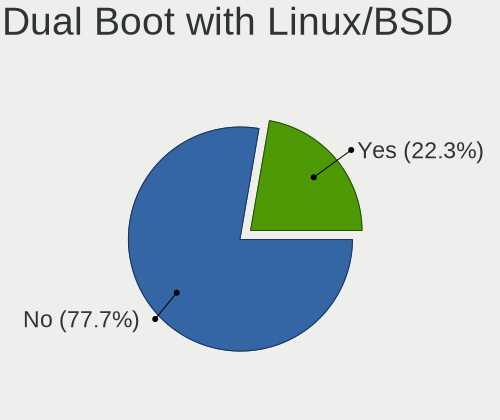
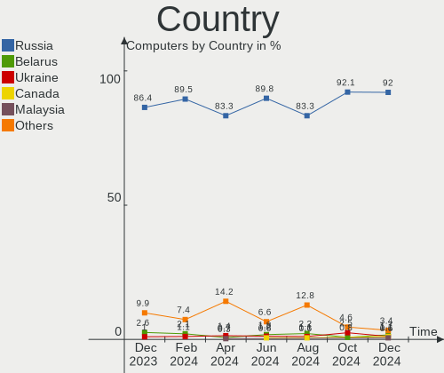
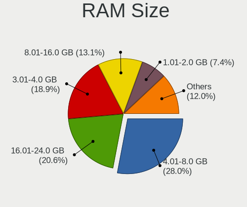
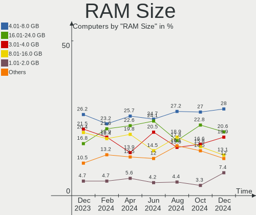
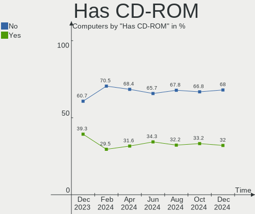
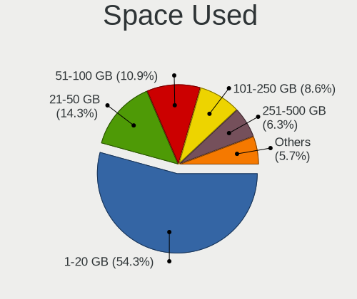
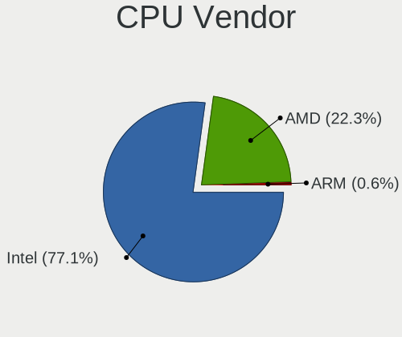
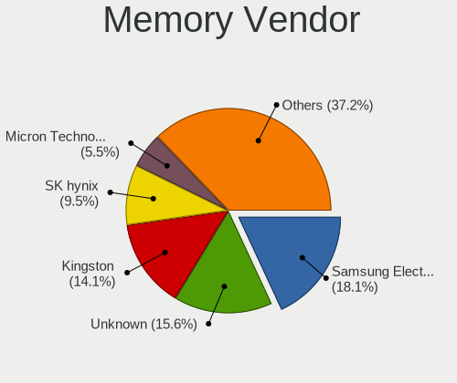
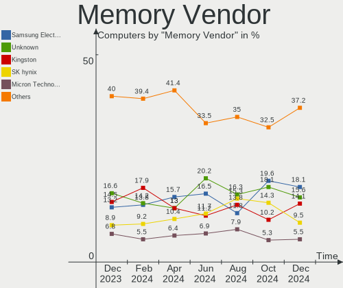

ROSA Hardware Trends
--------------------

A project to identify most popular hardware characteristics and track their change
over time based on data collected by ROSA users at https://Linux-Hardware.org.

Anyone can contribute to the study by uploading probes of their computers by
the [hw-probe](https://github.com/linuxhw/hw-probe) tool:

    sudo -E hw-probe -all -upload

This is a report for all computer types. See also reports for [desktops](/Dist/ROSA/Desktop/README.md) and [notebooks](/Dist/ROSA/Notebook/README.md).

Full-feature report is available here: https://linux-hardware.org/?view=trends

Period: May, 2021.

Contents
--------

- [ OS                       ](#os)
- [ OS Family                ](#os-family)
- [ Kernel                   ](#kernel)
- [ Kernel Family            ](#kernel-family)
- [ Kernel Major Ver.        ](#kernel-major-ver)
- [ Arch                     ](#arch)
- [ DE                       ](#de)
- [ Display Server           ](#display-server)
- [ Display Manager          ](#display-manager)
- [ OS Lang                  ](#os-lang)
- [ Boot Mode                ](#boot-mode)
- [ Filesystem               ](#filesystem)
- [ Part. scheme             ](#part-scheme)
- [ Dual Boot with Linux/BSD ](#dual-boot-with-linux/bsd)
- [ Dual Boot (Win)          ](#dual-boot-win)
- [ Country                  ](#country)
- [ City                     ](#city)
- [ Vendor                   ](#vendor)
- [ Model                    ](#model)
- [ Model Family             ](#model-family)
- [ MFG Year                 ](#mfg-year)
- [ Form Factor              ](#form-factor)
- [ Secure Boot              ](#secure-boot)
- [ Coreboot                 ](#coreboot)
- [ RAM Size                 ](#ram-size)
- [ RAM Used                 ](#ram-used)
- [ Has CD-ROM               ](#has-cd-rom)
- [ Total Drives             ](#total-drives)
- [ Has Ethernet             ](#has-ethernet)
- [ Has WiFi                 ](#has-wifi)
- [ Has Bluetooth            ](#has-bluetooth)
- [ Drive Vendor             ](#drive-vendor)
- [ Drive Model              ](#drive-model)
- [ HDD Vendor               ](#hdd-vendor)
- [ SSD Vendor               ](#ssd-vendor)
- [ Drive Kind               ](#drive-kind)
- [ Drive Connector          ](#drive-connector)
- [ Drive Size               ](#drive-size)
- [ Space Total              ](#space-total)
- [ Space Used               ](#space-used)
- [ Malfunc. Drives          ](#malfunc-drives)
- [ Malfunc. Drive Vendor    ](#malfunc-drive-vendor)
- [ Malfunc. HDD Vendor      ](#malfunc-hdd-vendor)
- [ Malfunc. Drive Kind      ](#malfunc-drive-kind)
- [ Failed Drives            ](#failed-drives)
- [ Failed Drive Vendor      ](#failed-drive-vendor)
- [ Drive Status             ](#drive-status)
- [ Storage Vendor           ](#storage-vendor)
- [ Storage Model            ](#storage-model)
- [ Storage Kind             ](#storage-kind)
- [ CPU Vendor               ](#cpu-vendor)
- [ CPU Model                ](#cpu-model)
- [ CPU Model Family         ](#cpu-model-family)
- [ CPU Cores                ](#cpu-cores)
- [ CPU Sockets              ](#cpu-sockets)
- [ CPU Threads              ](#cpu-threads)
- [ CPU Op-Modes             ](#cpu-op-modes)
- [ CPU Microcode            ](#cpu-microcode)
- [ CPU Microarch            ](#cpu-microarch)
- [ GPU Vendor               ](#gpu-vendor)
- [ GPU Model                ](#gpu-model)
- [ GPU Combo                ](#gpu-combo)
- [ GPU Driver               ](#gpu-driver)
- [ GPU Memory               ](#gpu-memory)
- [ Monitor Vendor           ](#monitor-vendor)
- [ Monitor Model            ](#monitor-model)
- [ Monitor Resolution       ](#monitor-resolution)
- [ Monitor Diagonal         ](#monitor-diagonal)
- [ Monitor Width            ](#monitor-width)
- [ Aspect Ratio             ](#aspect-ratio)
- [ Monitor Area             ](#monitor-area)
- [ Pixel Density            ](#pixel-density)
- [ Multiple Monitors        ](#multiple-monitors)
- [ Net Controller Vendor    ](#net-controller-vendor)
- [ Net Controller Model     ](#net-controller-model)
- [ Wireless Vendor          ](#wireless-vendor)
- [ Wireless Model           ](#wireless-model)
- [ Ethernet Vendor          ](#ethernet-vendor)
- [ Ethernet Model           ](#ethernet-model)
- [ Net Controller Kind      ](#net-controller-kind)
- [ Used Controller          ](#used-controller)
- [ NICs                     ](#nics)
- [ IPv6                     ](#ipv6)
- [ Memory Vendor            ](#memory-vendor)
- [ Memory Model             ](#memory-model)
- [ Memory Kind              ](#memory-kind)
- [ Memory Form Factor       ](#memory-form-factor)
- [ Memory Size              ](#memory-size)
- [ Memory Speed             ](#memory-speed)
- [ Sound Vendor             ](#sound-vendor)
- [ Sound Model              ](#sound-model)
- [ Camera Vendor            ](#camera-vendor)
- [ Camera Model             ](#camera-model)
- [ Fingerprint Vendor       ](#fingerprint-vendor)
- [ Fingerprint Model        ](#fingerprint-model)
- [ Chipcard Vendor          ](#chipcard-vendor)
- [ Chipcard Model           ](#chipcard-model)
- [ Printer Vendor           ](#printer-vendor)
- [ Printer Model            ](#printer-model)
- [ Scanner Vendor           ](#scanner-vendor)
- [ Scanner Model            ](#scanner-model)
- [ Bluetooth Vendor         ](#bluetooth-vendor)
- [ Bluetooth Model          ](#bluetooth-model)
- [ Unsupported Devices      ](#unsupported-devices)
- [ Unsupported Device Types ](#unsupported-device-types)

OS
--

Installed operating systems

| Name         | Computers | Percent |
|--------------|-----------|---------|
| ROSA R11.1   | 127       | 82.47%  |
| ROSA R11     | 11        | 7.14%   |
| ROSA R12     | 10        | 6.49%   |
| ROSA R8.1    | 3         | 1.95%   |
| ROSA R9      | 1         | 0.65%   |
| ROSA R10     | 1         | 0.65%   |
| ROSA 2019.05 | 1         | 0.65%   |

OS Family
---------

OS without a version

| Name | Computers | Percent |
|------|-----------|---------|
| ROSA | 154       | 100%    |

Kernel
------

Version of the Linux kernel

| Version                             | Computers | Percent |
|-------------------------------------|-----------|---------|
| 5.4.32-generic-2rosa-x86_64         | 44        | 28.57%  |
| 5.4.83-generic-2rosa-x86_64         | 34        | 22.08%  |
| 4.15.0-desktop-122.124.1rosa-x86_64 | 18        | 11.69%  |
| 5.4.83-generic-2rosa-i586           | 11        | 7.14%   |
| 5.4.32-generic-2rosa-i586           | 11        | 7.14%   |
| 4.15.0-desktop-45.1rosa-x86_64      | 8         | 5.19%   |
| 5.10.35-generic-2rosa2019.1-x86_64  | 4         | 2.6%    |
| 4.9.155-nrj-desktop-1rosa-x86_64    | 4         | 2.6%    |
| 5.10.34-generic-1rosa2019.1-x86_64  | 3         | 1.95%   |
| 5.10.33-generic-3rosa2019.1-x86_64  | 2         | 1.3%    |
| 5.10.31-generic-1rosa-x86_64        | 2         | 1.3%    |
| 4.15.0-desktop-122.124.1rosa-i586   | 2         | 1.3%    |
| 5.5.19-generic-1rosa-i586           | 1         | 0.65%   |
| 5.4.60-nickel-5rosa2019.05-x86_64   | 1         | 0.65%   |
| 5.4.112-nrj-desktop-1rosa-i586      | 1         | 0.65%   |
| 5.10.40-generic-1rosa2019.1-x86_64  | 1         | 0.65%   |
| 4.9.9-nrj-desktop-1rosa-x86_64      | 1         | 0.65%   |
| 4.9.60-nrj-desktop-1rosa-i586       | 1         | 0.65%   |
| 4.9.20-nrj-desktop-1rosa-i586       | 1         | 0.65%   |
| 4.15.0-desktop-68.5rosa-x86_64      | 1         | 0.65%   |
| 4.15.0-desktop-60.7rosa-i586        | 1         | 0.65%   |
| 4.15.0-desktop-45.1rosa-i586        | 1         | 0.65%   |
| 4.1.38-nrj-desktop-2rosa-i586       | 1         | 0.65%   |

Kernel Family
-------------

Linux kernel without a distro release

| Version | Computers | Percent |
|---------|-----------|---------|
| 5.4.32  | 55        | 35.71%  |
| 5.4.83  | 45        | 29.22%  |
| 4.15.0  | 31        | 20.13%  |
| 5.10.35 | 4         | 2.6%    |
| 4.9.155 | 4         | 2.6%    |
| 5.10.34 | 3         | 1.95%   |
| 5.10.33 | 2         | 1.3%    |
| 5.10.31 | 2         | 1.3%    |
| 5.5.19  | 1         | 0.65%   |
| 5.4.60  | 1         | 0.65%   |
| 5.4.112 | 1         | 0.65%   |
| 5.10.40 | 1         | 0.65%   |
| 4.9.9   | 1         | 0.65%   |
| 4.9.60  | 1         | 0.65%   |
| 4.9.20  | 1         | 0.65%   |
| 4.1.38  | 1         | 0.65%   |

Kernel Major Ver.
-----------------

Linux kernel major version

| Version | Computers | Percent |
|---------|-----------|---------|
| 5.4     | 102       | 66.23%  |
| 4.15    | 31        | 20.13%  |
| 5.10    | 12        | 7.79%   |
| 4.9     | 7         | 4.55%   |
| 5.5     | 1         | 0.65%   |
| 4.1     | 1         | 0.65%   |

Arch
----

OS architecture (x86_64, i586, etc.)

| Name   | Computers | Percent |
|--------|-----------|---------|
| x86_64 | 123       | 79.87%  |
| i686   | 31        | 20.13%  |

DE
--

Desktop Environment

| Name    | Computers | Percent |
|---------|-----------|---------|
| KDE4    | 87        | 56.49%  |
| KDE5    | 41        | 26.62%  |
| LXQt    | 14        | 9.09%   |
| XFCE    | 7         | 4.55%   |
| GNOME   | 4         | 2.6%    |
| Unknown | 1         | 0.65%   |

Display Server
--------------

X11 or Wayland

| Name    | Computers | Percent |
|---------|-----------|---------|
| X11     | 148       | 96.1%   |
| Wayland | 5         | 3.25%   |
| Tty     | 1         | 0.65%   |

Display Manager
---------------

SDDM, LightDM, etc.

| Name    | Computers | Percent |
|---------|-----------|---------|
| KDM     | 87        | 56.49%  |
| SDDM    | 61        | 39.61%  |
| GDM     | 4         | 2.6%    |
| TDM     | 1         | 0.65%   |
| LightDM | 1         | 0.65%   |

OS Lang
-------

Language

| Lang    | Computers | Percent |
|---------|-----------|---------|
| ru_RU   | 124       | 80.52%  |
| Unknown | 16        | 10.39%  |
| pl_PL   | 2         | 1.3%    |
| fr_FR   | 2         | 1.3%    |
| en_US   | 2         | 1.3%    |
| de_DE   | 2         | 1.3%    |
| ro_RO   | 1         | 0.65%   |
| pt_BR   | 1         | 0.65%   |
| it_IT   | 1         | 0.65%   |
| es_PE   | 1         | 0.65%   |
| es_ES   | 1         | 0.65%   |
| en_GB   | 1         | 0.65%   |

Boot Mode
---------

EFI or BIOS

| Mode | Computers | Percent |
|------|-----------|---------|
| BIOS | 109       | 70.78%  |
| EFI  | 45        | 29.22%  |

Filesystem
----------

Type of filesystem

| Type  | Computers | Percent |
|-------|-----------|---------|
| Ext4  | 150       | 97.4%   |
| Btrfs | 3         | 1.95%   |
| Ext3  | 1         | 0.65%   |

Part. scheme
------------

Scheme of partitioning

| Type    | Computers | Percent |
|---------|-----------|---------|
| MBR     | 97        | 62.99%  |
| GPT     | 55        | 35.71%  |
| Unknown | 2         | 1.3%    |

Dual Boot with Linux/BSD
------------------------

Hosting more than one Linux/BSD

| Dual boot | Computers | Percent |
|-----------|-----------|---------|
| No        | 114       | 74.03%  |
| Yes       | 40        | 25.97%  |

Dual Boot (Win)
---------------

Hosting Linux and Windows

| Dual boot | Computers | Percent |
|-----------|-----------|---------|
| Yes       | 81        | 52.6%   |
| No        | 73        | 47.4%   |

Country
-------

Geographic location (country)

| Country    | Computers | Percent |
|------------|-----------|---------|
| Russia     | 120       | 77.92%  |
| Ukraine    | 14        | 9.09%   |
| Italy      | 3         | 1.95%   |
| Poland     | 2         | 1.3%    |
| Germany    | 2         | 1.3%    |
| USA        | 1         | 0.65%   |
| Uruguay    | 1         | 0.65%   |
| Spain      | 1         | 0.65%   |
| Peru       | 1         | 0.65%   |
| Moldova    | 1         | 0.65%   |
| Kazakhstan | 1         | 0.65%   |
| Ireland    | 1         | 0.65%   |
| France     | 1         | 0.65%   |
| Finland    | 1         | 0.65%   |
| Canada     | 1         | 0.65%   |
| Brazil     | 1         | 0.65%   |
| Belarus    | 1         | 0.65%   |
| Australia  | 1         | 0.65%   |

City
----

Geographic location (city)

| City                | Computers | Percent |
|---------------------|-----------|---------|
| Moscow              | 22        | 14.29%  |
| St Petersburg       | 8         | 5.19%   |
| Novosibirsk         | 6         | 3.9%    |
| Srednyaya Akhtuba   | 4         | 2.6%    |
| Rostov-on-Don       | 4         | 2.6%    |
| Saratov             | 3         | 1.95%   |
| Yaroslavl           | 2         | 1.3%    |
| Voronezh            | 2         | 1.3%    |
| Vladikavkaz         | 2         | 1.3%    |
| Tyumen              | 2         | 1.3%    |
| Penza               | 2         | 1.3%    |
| Odessa              | 2         | 1.3%    |
| Novokuznetsk        | 2         | 1.3%    |
| Nizhniy Novgorod    | 2         | 1.3%    |
| Luhansk             | 2         | 1.3%    |
| Krasnodar           | 2         | 1.3%    |
| Ivanovo             | 2         | 1.3%    |
| Donetsk             | 2         | 1.3%    |
| Zelenodolsk         | 1         | 0.65%   |
| Zarinsk             | 1         | 0.65%   |
| Zarechnyy           | 1         | 0.65%   |
| Yuzhno-Sakhalinsk   | 1         | 0.65%   |
| Yoshkar-Ola         | 1         | 0.65%   |
| Yekaterinburg       | 1         | 0.65%   |
| Weinsberg           | 1         | 0.65%   |
| Volzhskiy           | 1         | 0.65%   |
| Volgograd           | 1         | 0.65%   |
| Vitebsk             | 1         | 0.65%   |
| Versailles          | 1         | 0.65%   |
| Tula                | 1         | 0.65%   |
| Tomsk               | 1         | 0.65%   |
| Tiraspol            | 1         | 0.65%   |
| Sydney              | 1         | 0.65%   |
| Surgut              | 1         | 0.65%   |
| Sumy                | 1         | 0.65%   |
| Stavropol           | 1         | 0.65%   |
| Sorel-Tracy         | 1         | 0.65%   |
| Skoropuskovskiy     | 1         | 0.65%   |
| Shelekhov           | 1         | 0.65%   |
| Seversk             | 1         | 0.65%   |
| Scano di Montiferro | 1         | 0.65%   |
| Saransk             | 1         | 0.65%   |
| Samara              | 1         | 0.65%   |
| Saarbrücken        | 1         | 0.65%   |
| Ryazan              | 1         | 0.65%   |
| Ribeirão Preto     | 1         | 0.65%   |
| Ramenskoye          | 1         | 0.65%   |
| Pskov               | 1         | 0.65%   |
| Poznan              | 1         | 0.65%   |
| Pittsburgh          | 1         | 0.65%   |
| Petrozavodsk        | 1         | 0.65%   |
| Petropavl           | 1         | 0.65%   |
| Petergof            | 1         | 0.65%   |
| Pavlovskiy Posad    | 1         | 0.65%   |
| Oryol               | 1         | 0.65%   |
| Nyagan              | 1         | 0.65%   |
| Novokuybyshevsk     | 1         | 0.65%   |
| Naas                | 1         | 0.65%   |
| Mytishchi           | 1         | 0.65%   |
| Mykytyn Rog         | 1         | 0.65%   |

Vendor
------

Motherboard manufacturer

| Name                | Computers | Percent |
|---------------------|-----------|---------|
| ASUSTek Computer    | 42        | 27.27%  |
| Lenovo              | 16        | 10.39%  |
| Hewlett-Packard     | 16        | 10.39%  |
| MSI                 | 13        | 8.44%   |
| Acer                | 13        | 8.44%   |
| Gigabyte Technology | 12        | 7.79%   |
| Intel               | 6         | 3.9%    |
| Dell                | 6         | 3.9%    |
| ASRock              | 5         | 3.25%   |
| Samsung Electronics | 4         | 2.6%    |
| Toshiba             | 3         | 1.95%   |
| Biostar             | 3         | 1.95%   |
| Sony                | 2         | 1.3%    |
| ECS                 | 2         | 1.3%    |
| ZOTAC               | 1         | 0.65%   |
| Supermicro          | 1         | 0.65%   |
| Shuttle             | 1         | 0.65%   |
| Packard Bell        | 1         | 0.65%   |
| Notebook            | 1         | 0.65%   |
| ICL                 | 1         | 0.65%   |
| Foxconn             | 1         | 0.65%   |
| eMachines           | 1         | 0.65%   |
| Clevo               | 1         | 0.65%   |
| Apple               | 1         | 0.65%   |
| Alienware           | 1         | 0.65%   |

Model
-----

Motherboard model

| Name                                       | Computers | Percent |
|--------------------------------------------|-----------|---------|
| ASUS All Series                            | 3         | 1.95%   |
| MSI MS-7817                                | 2         | 1.3%    |
| Lenovo IdeaPad 5 15ARE05 81YQ              | 2         | 1.3%    |
| HP Pavilion g6                             | 2         | 1.3%    |
| ASUS M5A99X EVO R2.0                       | 2         | 1.3%    |
| ZOTAC NM10                                 | 1         | 0.65%   |
| Toshiba Satellite Pro U300                 | 1         | 0.65%   |
| Toshiba Satellite L755D                    | 1         | 0.65%   |
| Toshiba Satellite L750                     | 1         | 0.65%   |
| Supermicro SYS-1019P-WTR                   | 1         | 0.65%   |
| Sony VPCEA47EC                             | 1         | 0.65%   |
| Sony VGN-FS415MR                           | 1         | 0.65%   |
| Shuttle SH61R4                             | 1         | 0.65%   |
| Samsung R540/SA41/E452                     | 1         | 0.65%   |
| Samsung R530/R730/R540                     | 1         | 0.65%   |
| Samsung R528/R728                          | 1         | 0.65%   |
| Samsung 300V3A/300V4A/300V5A/200A4B/200A5B | 1         | 0.65%   |
| Packard Bell EasyNote TJ65                 | 1         | 0.65%   |
| Notebook W65_67SR                          | 1         | 0.65%   |
| MSI X370                                   | 1         | 0.65%   |
| MSI PrimePC Solo30                         | 1         | 0.65%   |
| MSI MS-AC1511                              | 1         | 0.65%   |
| MSI MS-7C13                                | 1         | 0.65%   |
| MSI MS-7C02                                | 1         | 0.65%   |
| MSI MS-7900                                | 1         | 0.65%   |
| MSI MS-7529                                | 1         | 0.65%   |
| MSI MS-7519                                | 1         | 0.65%   |
| MSI MS-7376                                | 1         | 0.65%   |
| MSI MS-7270                                | 1         | 0.65%   |
| MSI GP60 2PE                               | 1         | 0.65%   |
| Lenovo ThinkPad W530 24382TG               | 1         | 0.65%   |
| Lenovo ThinkPad T60p 200793G               | 1         | 0.65%   |
| Lenovo ThinkPad T400 6475VAU               | 1         | 0.65%   |
| Lenovo ThinkCentre M78 Y                   | 1         | 0.65%   |
| Lenovo Lenovo                              | 1         | 0.65%   |
| Lenovo Legion Y7000 2019 81NS              | 1         | 0.65%   |
| Lenovo IdeaPad 300-15IBR 80M3              | 1         | 0.65%   |
| Lenovo IdeaCentre 300-20IBR 90DN0032RS     | 1         | 0.65%   |
| Lenovo G770 1037                           | 1         | 0.65%   |
| Lenovo G570 20079                          | 1         | 0.65%   |
| Lenovo G560 20042                          | 1         | 0.65%   |
| Lenovo G500 20236                          | 1         | 0.65%   |
| Lenovo E10-30 20424                        | 1         | 0.65%   |
| Lenovo B50-70 20384                        | 1         | 0.65%   |
| Intel X99 V1.0                             | 1         | 0.65%   |
| Intel X79                                  | 1         | 0.65%   |
| Intel Intel powered classmate PC           | 1         | 0.65%   |
| Intel H61M-S1                              | 1         | 0.65%   |
| Intel D945GCLF2 AAE46416-101               | 1         | 0.65%   |
| Intel D525MW AAE93082-301                  | 1         | 0.65%   |
| ICL RAYbook Bi1504                         | 1         | 0.65%   |
| HP ProDesk 400 G2 MINI                     | 1         | 0.65%   |
| HP ProBook 6570b                           | 1         | 0.65%   |
| HP Pavilion m6                             | 1         | 0.65%   |
| HP Pavilion 17                             | 1         | 0.65%   |
| HP Notebook                                | 1         | 0.65%   |
| HP Mini 210-1100                           | 1         | 0.65%   |
| HP Mini 210-1000                           | 1         | 0.65%   |
| HP Laptop 17-by3xxx                        | 1         | 0.65%   |
| HP Laptop 15-db1xxx                        | 1         | 0.65%   |

Model Family
------------

Motherboard model prefix

| Name                     | Computers | Percent |
|--------------------------|-----------|---------|
| Acer Aspire              | 8         | 5.19%   |
| HP Pavilion              | 4         | 2.6%    |
| Toshiba Satellite        | 3         | 1.95%   |
| Lenovo ThinkPad          | 3         | 1.95%   |
| Lenovo IdeaPad           | 3         | 1.95%   |
| HP Laptop                | 3         | 1.95%   |
| ASUS PRIME               | 3         | 1.95%   |
| ASUS All                 | 3         | 1.95%   |
| MSI MS-7817              | 2         | 1.3%    |
| HP Mini                  | 2         | 1.3%    |
| HP Compaq                | 2         | 1.3%    |
| Gigabyte A320M-S2H       | 2         | 1.3%    |
| Dell Vostro              | 2         | 1.3%    |
| Dell OptiPlex            | 2         | 1.3%    |
| Dell Inspiron            | 2         | 1.3%    |
| ASUS P5KPL-AM            | 2         | 1.3%    |
| ASUS M5A99X              | 2         | 1.3%    |
| ZOTAC NM10               | 1         | 0.65%   |
| Supermicro SYS-1019P-WTR | 1         | 0.65%   |
| Sony VPCEA47EC           | 1         | 0.65%   |
| Sony VGN-FS415MR         | 1         | 0.65%   |
| Shuttle SH61R4           | 1         | 0.65%   |
| Samsung R540             | 1         | 0.65%   |
| Samsung R530             | 1         | 0.65%   |
| Samsung R528             | 1         | 0.65%   |
| Samsung 300V3A           | 1         | 0.65%   |
| Packard Bell EasyNote    | 1         | 0.65%   |
| Notebook W65             | 1         | 0.65%   |
| MSI X370                 | 1         | 0.65%   |
| MSI PrimePC              | 1         | 0.65%   |
| MSI MS-AC1511            | 1         | 0.65%   |
| MSI MS-7C13              | 1         | 0.65%   |
| MSI MS-7C02              | 1         | 0.65%   |
| MSI MS-7900              | 1         | 0.65%   |
| MSI MS-7529              | 1         | 0.65%   |
| MSI MS-7519              | 1         | 0.65%   |
| MSI MS-7376              | 1         | 0.65%   |
| MSI MS-7270              | 1         | 0.65%   |
| MSI GP60                 | 1         | 0.65%   |
| Lenovo ThinkCentre       | 1         | 0.65%   |
| Lenovo Lenovo            | 1         | 0.65%   |
| Lenovo Legion            | 1         | 0.65%   |
| Lenovo IdeaCentre        | 1         | 0.65%   |
| Lenovo G770              | 1         | 0.65%   |
| Lenovo G570              | 1         | 0.65%   |
| Lenovo G560              | 1         | 0.65%   |
| Lenovo G500              | 1         | 0.65%   |
| Lenovo E10-30            | 1         | 0.65%   |
| Lenovo B50-70            | 1         | 0.65%   |
| Intel X99                | 1         | 0.65%   |
| Intel X79                | 1         | 0.65%   |
| Intel Intel              | 1         | 0.65%   |
| Intel H61M-S1            | 1         | 0.65%   |
| Intel D945GCLF2          | 1         | 0.65%   |
| Intel D525MW             | 1         | 0.65%   |
| ICL RAYbook              | 1         | 0.65%   |
| HP ProDesk               | 1         | 0.65%   |
| HP ProBook               | 1         | 0.65%   |
| HP Notebook              | 1         | 0.65%   |
| HP All-in-One            | 1         | 0.65%   |

MFG Year
--------

Motherboard manufacture year

| Year | Computers | Percent |
|------|-----------|---------|
| 2012 | 16        | 10.39%  |
| 2010 | 16        | 10.39%  |
| 2014 | 15        | 9.74%   |
| 2009 | 15        | 9.74%   |
| 2013 | 14        | 9.09%   |
| 2011 | 12        | 7.79%   |
| 2019 | 11        | 7.14%   |
| 2020 | 10        | 6.49%   |
| 2018 | 10        | 6.49%   |
| 2008 | 8         | 5.19%   |
| 2016 | 5         | 3.25%   |
| 2007 | 5         | 3.25%   |
| 2017 | 4         | 2.6%    |
| 2015 | 4         | 2.6%    |
| 2021 | 3         | 1.95%   |
| 2006 | 3         | 1.95%   |
| 2003 | 2         | 1.3%    |
| 2005 | 1         | 0.65%   |

Form Factor
-----------

Physical design of the computer

| Name       | Computers | Percent |
|------------|-----------|---------|
| Desktop    | 81        | 52.6%   |
| Notebook   | 70        | 45.45%  |
| All in one | 2         | 1.3%    |
| Server     | 1         | 0.65%   |

Secure Boot
-----------

Enabled or disabled

| State    | Computers | Percent |
|----------|-----------|---------|
| Disabled | 154       | 100%    |

Coreboot
--------

Have coreboot on board

| Used | Computers | Percent |
|------|-----------|---------|
| No   | 154       | 100%    |

RAM Size
--------

Total RAM memory

| Size in GB | Computers | Percent |
|------------|-----------|---------|
| 3.01-4.0   | 46        | 29.87%  |
| 4.01-8.0   | 29        | 18.83%  |
| 8.01-16.0  | 29        | 18.83%  |
| 1.01-2.0   | 22        | 14.29%  |
| 2.01-3.0   | 13        | 8.44%   |
| 16.01-24.0 | 11        | 7.14%   |
| 0.51-1.0   | 2         | 1.3%    |
| 32.01-64.0 | 1         | 0.65%   |
| 24.01-32.0 | 1         | 0.65%   |

RAM Used
--------

Used RAM memory

| Used GB  | Computers | Percent |
|----------|-----------|---------|
| 1.01-2.0 | 62        | 40.26%  |
| 0.51-1.0 | 61        | 39.61%  |
| 2.01-3.0 | 19        | 12.34%  |
| 3.01-4.0 | 6         | 3.9%    |
| 0.01-0.5 | 5         | 3.25%   |
| 4.01-8.0 | 1         | 0.65%   |

Has CD-ROM
----------

Has CD-ROM on board

| Presented | Computers | Percent |
|-----------|-----------|---------|
| No        | 78        | 50.65%  |
| Yes       | 76        | 49.35%  |

Total Drives
------------

Number of drives on board

| Drives | Computers | Percent |
|--------|-----------|---------|
| 1      | 95        | 61.69%  |
| 2      | 38        | 24.68%  |
| 3      | 11        | 7.14%   |
| 4      | 6         | 3.9%    |
| 5      | 2         | 1.3%    |
| 0      | 2         | 1.3%    |

Has Ethernet
------------

Has Ethernet on board

| Presented | Computers | Percent |
|-----------|-----------|---------|
| Yes       | 149       | 96.75%  |
| No        | 5         | 3.25%   |

Has WiFi
--------

Has WiFi module

| Presented | Computers | Percent |
|-----------|-----------|---------|
| Yes       | 86        | 55.84%  |
| No        | 68        | 44.16%  |

Has Bluetooth
-------------

Has Bluetooth module

| Presented | Computers | Percent |
|-----------|-----------|---------|
| No        | 105       | 68.18%  |
| Yes       | 49        | 31.82%  |

Drive Vendor
------------

Hard drive vendors

| Vendor              | Computers | Drives | Percent |
|---------------------|-----------|--------|---------|
| WDC                 | 56        | 66     | 25.57%  |
| Seagate             | 45        | 47     | 20.55%  |
| Hitachi             | 18        | 19     | 8.22%   |
| Toshiba             | 14        | 14     | 6.39%   |
| Samsung Electronics | 14        | 14     | 6.39%   |
| Kingston            | 8         | 8      | 3.65%   |
| Crucial             | 7         | 7      | 3.2%    |
| China               | 6         | 6      | 2.74%   |
| HGST                | 5         | 5      | 2.28%   |
| Unknown             | 4         | 4      | 1.83%   |
| SanDisk             | 3         | 3      | 1.37%   |
| OCZ                 | 3         | 3      | 1.37%   |
| Intel               | 3         | 4      | 1.37%   |
| Fujitsu             | 3         | 3      | 1.37%   |
| Apacer              | 3         | 3      | 1.37%   |
| SPCC                | 2         | 2      | 0.91%   |
| Solid State Storage | 2         | 2      | 0.91%   |
| Smartbuy            | 2         | 2      | 0.91%   |
| Silicon Motion      | 2         | 2      | 0.91%   |
| Apple               | 2         | 2      | 0.91%   |
| XrayDisk            | 1         | 1      | 0.46%   |
| XPG                 | 1         | 1      | 0.46%   |
| T-FORCE             | 1         | 1      | 0.46%   |
| SSSTC               | 1         | 1      | 0.46%   |
| SK Hynix            | 1         | 1      | 0.46%   |
| PLEXTOR             | 1         | 1      | 0.46%   |
| OCZ-VERTEX3         | 1         | 1      | 0.46%   |
| Netac               | 1         | 1      | 0.46%   |
| LITEONIT            | 1         | 1      | 0.46%   |
| LITEON              | 1         | 1      | 0.46%   |
| JMicron             | 1         | 1      | 0.46%   |
| HUAWEI              | 1         | 1      | 0.46%   |
| GOODRAM             | 1         | 1      | 0.46%   |
| Gigabyte Technology | 1         | 1      | 0.46%   |
| DeTech              | 1         | 1      | 0.46%   |
| AMD                 | 1         | 1      | 0.46%   |
| A-DATA Technology   | 1         | 1      | 0.46%   |

Drive Model
-----------

Hard drive models

| Model                            | Computers | Percent |
|----------------------------------|-----------|---------|
| Crucial CT240BX500SSD1 240GB     | 4         | 1.74%   |
| WDC WDS240G2G0A-00JH30 240GB SSD | 3         | 1.3%    |
| Toshiba DT01ACA100 1TB           | 3         | 1.3%    |
| Seagate ST9320325AS 320GB        | 3         | 1.3%    |
| Kingston SA400S37120G 120GB SSD  | 3         | 1.3%    |
| WDC WDS250G2B0A-00SM50 250GB SSD | 2         | 0.87%   |
| WDC WD7500BPVT-24HXZT1 752GB     | 2         | 0.87%   |
| WDC WD5000AZRX-00A8LB0 500GB     | 2         | 0.87%   |
| WDC WD5000AAKX-22ERMA0 500GB     | 2         | 0.87%   |
| WDC WD3200BPVT-24JJ5T0 320GB     | 2         | 0.87%   |
| WDC WD20EZRZ-00Z5HB0 2TB         | 2         | 0.87%   |
| WDC WD10EARS-00Y5B1 1TB          | 2         | 0.87%   |
| Toshiba HDWD110 1TB              | 2         | 0.87%   |
| Seagate ST9500325AS 500GB        | 2         | 0.87%   |
| Seagate ST9250315AS 250GB        | 2         | 0.87%   |
| Seagate ST500LT012-1DG142 500GB  | 2         | 0.87%   |
| Seagate ST500LM000-1EJ162 500GB  | 2         | 0.87%   |
| Seagate ST500DM002-1BD142 500GB  | 2         | 0.87%   |
| Seagate ST3500413AS 500GB        | 2         | 0.87%   |
| Seagate ST3500312CS 500GB        | 2         | 0.87%   |
| Kingston SUV400S37120G 120GB SSD | 2         | 0.87%   |
| Hitachi HTS547550A9E384 500GB    | 2         | 0.87%   |
| Hitachi HTS545050A7E380 500GB    | 2         | 0.87%   |
| Hitachi HTS545032B9A300 320GB    | 2         | 0.87%   |
| Hitachi HTS545025B9A300 250GB    | 2         | 0.87%   |
| Hitachi HDS721050CLA362 500GB    | 2         | 0.87%   |
| Crucial CT120BX500SSD1 120GB     | 2         | 0.87%   |
| China SSD 128GB                  | 2         | 0.87%   |
| Apacer AS350 128GB SSD           | 2         | 0.87%   |
| XrayDisk SSD 240GB               | 1         | 0.43%   |
| XPG SPECTRIX S40G 256GB          | 1         | 0.43%   |
| WDC WDS120G2G0A-00JH30 120GB SSD | 1         | 0.43%   |
| WDC WD800JD-60MSA1 80GB          | 1         | 0.43%   |
| WDC WD800JD-00LSA0 80GB          | 1         | 0.43%   |
| WDC WD7501AALS-00J7B0 752GB      | 1         | 0.43%   |
| WDC WD7500BPKX-75HPJT0 752GB     | 1         | 0.43%   |
| WDC WD5000LPVT-22G33T0 500GB     | 1         | 0.43%   |
| WDC WD5000LPCX-24C6HT0 500GB     | 1         | 0.43%   |
| WDC WD5000LPCX-22VHAT0 500GB     | 1         | 0.43%   |
| WDC WD5000BPKT-75PK4T0 500GB     | 1         | 0.43%   |
| WDC WD5000AZLX-22JKKA0 500GB     | 1         | 0.43%   |
| WDC WD5000AAVS-00ZTB0 500GB      | 1         | 0.43%   |
| WDC WD5000AAKX-75U6AA0 500GB     | 1         | 0.43%   |
| WDC WD5000AAKX-001CA0 500GB      | 1         | 0.43%   |
| WDC WD5000AADS-00S9B0 500GB      | 1         | 0.43%   |
| WDC WD40EZRZ-00GXCB0 4TB         | 1         | 0.43%   |
| WDC WD400ZB-00JYA0 40GB          | 1         | 0.43%   |
| WDC WD4003FRYZ-01F0DB0 4TB       | 1         | 0.43%   |
| WDC WD3200LPCX-24C6HT0 320GB     | 1         | 0.43%   |
| WDC WD3200BPVT-80JJ5T0 320GB     | 1         | 0.43%   |
| WDC WD3200BPVT-22JJ5T0 320GB     | 1         | 0.43%   |
| WDC WD3200BEVT-22ZCT0 320GB      | 1         | 0.43%   |
| WDC WD3200AAKX-001CA0 320GB      | 1         | 0.43%   |
| WDC WD3200AAKS-00L9A0 320GB      | 1         | 0.43%   |
| WDC WD3200AAJB-56R1A0 320GB      | 1         | 0.43%   |
| WDC WD2500AAJS-00VTA0 250GB      | 1         | 0.43%   |
| WDC WD2500AAJS-00B4A0 250GB      | 1         | 0.43%   |
| WDC WD2500AAJB-00J3A0 250GB      | 1         | 0.43%   |
| WDC WD20EARX-00PASB0 2TB         | 1         | 0.43%   |
| WDC WD20EARS-00J2GB0 2TB         | 1         | 0.43%   |

HDD Vendor
----------

Hard disk drive vendors

| Vendor              | Computers | Drives | Percent |
|---------------------|-----------|--------|---------|
| WDC                 | 50        | 59     | 35.21%  |
| Seagate             | 45        | 47     | 31.69%  |
| Hitachi             | 18        | 19     | 12.68%  |
| Toshiba             | 13        | 13     | 9.15%   |
| Samsung Electronics | 8         | 8      | 5.63%   |
| HGST                | 5         | 5      | 3.52%   |
| Fujitsu             | 3         | 3      | 2.11%   |

SSD Vendor
----------

Solid state drive vendors

| Vendor              | Computers | Drives | Percent |
|---------------------|-----------|--------|---------|
| Kingston            | 8         | 8      | 13.11%  |
| Crucial             | 7         | 7      | 11.48%  |
| WDC                 | 6         | 6      | 9.84%   |
| China               | 6         | 6      | 9.84%   |
| Samsung Electronics | 4         | 4      | 6.56%   |
| SanDisk             | 3         | 3      | 4.92%   |
| OCZ                 | 3         | 3      | 4.92%   |
| Apacer              | 3         | 3      | 4.92%   |
| SPCC                | 2         | 2      | 3.28%   |
| Smartbuy            | 2         | 2      | 3.28%   |
| Intel               | 2         | 3      | 3.28%   |
| XrayDisk            | 1         | 1      | 1.64%   |
| Unknown             | 1         | 1      | 1.64%   |
| Toshiba             | 1         | 1      | 1.64%   |
| T-FORCE             | 1         | 1      | 1.64%   |
| SSSTC               | 1         | 1      | 1.64%   |
| PLEXTOR             | 1         | 1      | 1.64%   |
| OCZ-VERTEX3         | 1         | 1      | 1.64%   |
| Netac               | 1         | 1      | 1.64%   |
| LITEONIT            | 1         | 1      | 1.64%   |
| LITEON              | 1         | 1      | 1.64%   |
| GOODRAM             | 1         | 1      | 1.64%   |
| Gigabyte Technology | 1         | 1      | 1.64%   |
| DeTech              | 1         | 1      | 1.64%   |
| Apple               | 1         | 1      | 1.64%   |
| AMD                 | 1         | 1      | 1.64%   |

Drive Kind
----------

HDD or SSD

| Kind    | Computers | Drives | Percent |
|---------|-----------|--------|---------|
| HDD     | 122       | 154    | 62.24%  |
| SSD     | 57        | 62     | 29.08%  |
| NVMe    | 13        | 13     | 6.63%   |
| Unknown | 3         | 3      | 1.53%   |
| MMC     | 1         | 1      | 0.51%   |

Drive Connector
---------------

SATA, SAS, NVMe, etc.

| Type | Computers | Drives | Percent |
|------|-----------|--------|---------|
| SATA | 146       | 213    | 87.95%  |
| NVMe | 13        | 13     | 7.83%   |
| SAS  | 6         | 6      | 3.61%   |
| MMC  | 1         | 1      | 0.6%    |

Drive Size
----------

Size of hard drive

| Size in TB | Computers | Drives | Percent |
|------------|-----------|--------|---------|
| 0.01-0.5   | 126       | 164    | 72.83%  |
| 0.51-1.0   | 34        | 37     | 19.65%  |
| 1.01-2.0   | 10        | 12     | 5.78%   |
| 3.01-4.0   | 2         | 2      | 1.16%   |
| 4.01-10.0  | 1         | 1      | 0.58%   |

Space Total
-----------

Amount of disk space available on the file system

| Size in GB     | Computers | Percent |
|----------------|-----------|---------|
| 101-250        | 37        | 24.03%  |
| 251-500        | 36        | 23.38%  |
| 1-20           | 22        | 14.29%  |
| 51-100         | 18        | 11.69%  |
| 21-50          | 17        | 11.04%  |
| 501-1000       | 13        | 8.44%   |
| More than 3000 | 5         | 3.25%   |
| 1001-2000      | 3         | 1.95%   |
| 2001-3000      | 2         | 1.3%    |
| Unknown        | 1         | 0.65%   |

Space Used
----------

Amount of used disk space

| Used GB        | Computers | Percent |
|----------------|-----------|---------|
| 1-20           | 111       | 72.08%  |
| 21-50          | 11        | 7.14%   |
| 51-100         | 11        | 7.14%   |
| 101-250        | 10        | 6.49%   |
| 2001-3000      | 3         | 1.95%   |
| More than 3000 | 2         | 1.3%    |
| 251-500        | 2         | 1.3%    |
| 501-1000       | 2         | 1.3%    |
| 1001-2000      | 1         | 0.65%   |
| Unknown        | 1         | 0.65%   |

Malfunc. Drives
---------------

Drive models with a malfunction

| Model                                   | Computers | Drives | Percent |
|-----------------------------------------|-----------|--------|---------|
| WDC WD5000AAKX-22ERMA0 500GB            | 2         | 2      | 2.82%   |
| WDC WD10EARS-00Y5B1 1TB                 | 2         | 2      | 2.82%   |
| Seagate ST9500325AS 500GB               | 2         | 2      | 2.82%   |
| Seagate ST9320325AS 320GB               | 2         | 2      | 2.82%   |
| Hitachi HTS547550A9E384 500GB           | 2         | 2      | 2.82%   |
| Hitachi HTS545032B9A300 320GB           | 2         | 2      | 2.82%   |
| WDC WDS240G2G0A-00JH30 240GB SSD        | 1         | 1      | 1.41%   |
| WDC WDS120G2G0A-00JH30 120GB SSD        | 1         | 1      | 1.41%   |
| WDC WD7500BPVT-24HXZT1 752GB            | 1         | 1      | 1.41%   |
| WDC WD5000AAKX-75U6AA0 500GB            | 1         | 1      | 1.41%   |
| WDC WD5000AAKX-001CA0 500GB             | 1         | 1      | 1.41%   |
| WDC WD400ZB-00JYA0 40GB                 | 1         | 1      | 1.41%   |
| WDC WD3200BPVT-24JJ5T0 320GB            | 1         | 1      | 1.41%   |
| WDC WD3200AAKX-001CA0 320GB             | 1         | 1      | 1.41%   |
| WDC WD3200AAKS-00L9A0 320GB             | 1         | 1      | 1.41%   |
| WDC WD2500AAJS-00VTA0 250GB             | 1         | 1      | 1.41%   |
| WDC WD2500AAJS-00B4A0 250GB             | 1         | 1      | 1.41%   |
| WDC WD20EARS-00J2GB0 2TB                | 1         | 1      | 1.41%   |
| WDC WD1600JD-55HBB0 160GB               | 1         | 1      | 1.41%   |
| WDC WD10EZEX-75WN4A1 1TB                | 1         | 1      | 1.41%   |
| WDC WD10EARX-00N0YB0 1TB                | 1         | 1      | 1.41%   |
| WDC WD10EALS-00Z8A0 1TB                 | 1         | 1      | 1.41%   |
| Unknown 69D03094-T 40GB SSD             | 1         | 1      | 1.41%   |
| Toshiba MQ01ABD050 500GB                | 1         | 1      | 1.41%   |
| Toshiba MK6475GSX 640GB                 | 1         | 1      | 1.41%   |
| Toshiba MK2556GSY 250GB                 | 1         | 1      | 1.41%   |
| SSSTC CVB-8D128-HP 128GB SSD            | 1         | 1      | 1.41%   |
| SK Hynix BC511 HFM256GDJTNI-82A0A 256GB | 1         | 1      | 1.41%   |
| Seagate STM31000528AS 1TB               | 1         | 1      | 1.41%   |
| Seagate ST9250410AS 250GB               | 1         | 1      | 1.41%   |
| Seagate ST9250315AS 250GB               | 1         | 1      | 1.41%   |
| Seagate ST9160821AS 160GB               | 1         | 1      | 1.41%   |
| Seagate ST500LT012-9WS142 500GB         | 1         | 1      | 1.41%   |
| Seagate ST500LT012-1DG142 500GB         | 1         | 1      | 1.41%   |
| Seagate ST500DM002-1BD142 500GB         | 1         | 1      | 1.41%   |
| Seagate ST3320418AS 320GB               | 1         | 1      | 1.41%   |
| Seagate ST3250310AS 250GB               | 1         | 1      | 1.41%   |
| Seagate ST320LT020-9YG142 320GB         | 1         | 1      | 1.41%   |
| Seagate ST3160023AS 160GB               | 1         | 1      | 1.41%   |
| Seagate ST3160023A 160GB                | 1         | 1      | 1.41%   |
| Seagate ST3120814A 120GB                | 1         | 1      | 1.41%   |
| Seagate ST31000524AS 1TB                | 1         | 1      | 1.41%   |
| Seagate ST1000LM024 HN-M101MBB 1TB      | 1         | 1      | 1.41%   |
| Samsung Electronics HD502HJ 500GB       | 1         | 1      | 1.41%   |
| Samsung Electronics HD300LJ 304GB       | 1         | 1      | 1.41%   |
| Samsung Electronics HD250HJ 250GB       | 1         | 1      | 1.41%   |
| PLEXTOR PX-256M6S 256GB SSD             | 1         | 1      | 1.41%   |
| OCZ-VERTEX3 MI 120GB SSD                | 1         | 1      | 1.41%   |
| OCZ SOLID3 64GB SSD                     | 1         | 1      | 1.41%   |
| LITEONIT LMN-256M3M mSATA 256GB SSD     | 1         | 1      | 1.41%   |
| Kingston SUV400S37120G 120GB SSD        | 1         | 1      | 1.41%   |
| Intel SSDPEKKW256G7 256GB               | 1         | 1      | 1.41%   |
| Hitachi HTS721010G9SA00 100GB           | 1         | 1      | 1.41%   |
| Hitachi HTS547575A9E384 752GB           | 1         | 1      | 1.41%   |
| Hitachi HTS547564A9E384 640GB           | 1         | 1      | 1.41%   |
| Hitachi HTS545050A7E380 500GB           | 1         | 1      | 1.41%   |
| Hitachi HTS545025B9A300 250GB           | 1         | 1      | 1.41%   |
| Hitachi HDT721016SLA380 160GB           | 1         | 1      | 1.41%   |
| Hitachi HDS721050CLA362 500GB           | 1         | 1      | 1.41%   |
| Hitachi HDP725050GLA360 500GB           | 1         | 1      | 1.41%   |

Malfunc. Drive Vendor
---------------------

Vendors of faulty drives

| Vendor              | Computers | Drives | Percent |
|---------------------|-----------|--------|---------|
| WDC                 | 20        | 20     | 28.57%  |
| Seagate             | 18        | 19     | 25.71%  |
| Hitachi             | 13        | 14     | 18.57%  |
| Toshiba             | 3         | 3      | 4.29%   |
| Samsung Electronics | 3         | 3      | 4.29%   |
| HGST                | 2         | 2      | 2.86%   |
| Fujitsu             | 2         | 2      | 2.86%   |
| Unknown             | 1         | 1      | 1.43%   |
| SSSTC               | 1         | 1      | 1.43%   |
| SK Hynix            | 1         | 1      | 1.43%   |
| PLEXTOR             | 1         | 1      | 1.43%   |
| OCZ-VERTEX3         | 1         | 1      | 1.43%   |
| OCZ                 | 1         | 1      | 1.43%   |
| LITEONIT            | 1         | 1      | 1.43%   |
| Kingston            | 1         | 1      | 1.43%   |
| Intel               | 1         | 1      | 1.43%   |

Malfunc. HDD Vendor
-------------------

Vendors of faulty HDD drives

| Vendor              | Computers | Drives | Percent |
|---------------------|-----------|--------|---------|
| WDC                 | 18        | 18     | 30.51%  |
| Seagate             | 18        | 19     | 30.51%  |
| Hitachi             | 13        | 14     | 22.03%  |
| Toshiba             | 3         | 3      | 5.08%   |
| Samsung Electronics | 3         | 3      | 5.08%   |
| HGST                | 2         | 2      | 3.39%   |
| Fujitsu             | 2         | 2      | 3.39%   |

Malfunc. Drive Kind
-------------------

Kinds of faulty drives

| Kind | Computers | Drives | Percent |
|------|-----------|--------|---------|
| HDD  | 56        | 61     | 83.58%  |
| SSD  | 9         | 9      | 13.43%  |
| NVMe | 2         | 2      | 2.99%   |

Failed Drives
-------------

Failed drive models

| Model                             | Computers | Drives | Percent |
|-----------------------------------|-----------|--------|---------|
| Toshiba MK2555GSX 250GB           | 1         | 1      | 20%     |
| Seagate ST9250315AS 250GB         | 1         | 1      | 20%     |
| Samsung Electronics HD322GJ 320GB | 1         | 1      | 20%     |
| Samsung Electronics HD204UI 2TB   | 1         | 1      | 20%     |
| Apple SSD TS064C 64GB             | 1         | 1      | 20%     |

Failed Drive Vendor
-------------------

Failed drive vendors

| Vendor              | Computers | Drives | Percent |
|---------------------|-----------|--------|---------|
| Samsung Electronics | 2         | 2      | 40%     |
| Toshiba             | 1         | 1      | 20%     |
| Seagate             | 1         | 1      | 20%     |
| Apple               | 1         | 1      | 20%     |

Drive Status
------------

Number of failed and malfunc. drives

| Status   | Computers | Drives | Percent |
|----------|-----------|--------|---------|
| Works    | 103       | 147    | 56.59%  |
| Malfunc  | 65        | 72     | 35.71%  |
| Detected | 9         | 9      | 4.95%   |
| Failed   | 5         | 5      | 2.75%   |

Storage Vendor
--------------

Storage controller vendors

| Vendor                           | Computers | Percent |
|----------------------------------|-----------|---------|
| Intel                            | 105       | 60.69%  |
| AMD                              | 39        | 22.54%  |
| Nvidia                           | 6         | 3.47%   |
| JMicron Technology               | 5         | 2.89%   |
| Solid State Storage Technology   | 2         | 1.16%   |
| Silicon Motion                   | 2         | 1.16%   |
| Silicon Integrated Systems [SiS] | 2         | 1.16%   |
| Sandisk                          | 2         | 1.16%   |
| Samsung Electronics              | 2         | 1.16%   |
| ASMedia Technology               | 2         | 1.16%   |
| VIA Technologies                 | 1         | 0.58%   |
| ULi Electronics                  | 1         | 0.58%   |
| SK Hynix                         | 1         | 0.58%   |
| Realtek Semiconductor            | 1         | 0.58%   |
| Marvell Technology Group         | 1         | 0.58%   |
| ADATA Technology                 | 1         | 0.58%   |

Storage Model
-------------

Storage controller models

| Model                                                                                   | Computers | Percent |
|-----------------------------------------------------------------------------------------|-----------|---------|
| AMD FCH SATA Controller [AHCI mode]                                                     | 26        | 11.5%   |
| Intel NM10/ICH7 Family SATA Controller [IDE mode]                                       | 15        | 6.64%   |
| Intel 82801G (ICH7 Family) IDE Controller                                               | 14        | 6.19%   |
| Intel 7 Series Chipset Family 6-port SATA Controller [AHCI mode]                        | 9         | 3.98%   |
| Intel 8 Series/C220 Series Chipset Family 6-port SATA Controller 1 [AHCI mode]          | 8         | 3.54%   |
| Intel 6 Series/C200 Series Chipset Family 6 port Mobile SATA AHCI Controller            | 8         | 3.54%   |
| AMD SB7x0/SB8x0/SB9x0 SATA Controller [AHCI mode]                                       | 7         | 3.1%    |
| Intel NM10/ICH7 Family SATA Controller [AHCI mode]                                      | 6         | 2.65%   |
| Intel 6 Series/C200 Series Chipset Family 6 port Desktop SATA AHCI Controller           | 6         | 2.65%   |
| Intel 5 Series/3400 Series Chipset 4 port SATA AHCI Controller                          | 6         | 2.65%   |
| AMD SB7x0/SB8x0/SB9x0 IDE Controller                                                    | 6         | 2.65%   |
| AMD SB7x0/SB8x0/SB9x0 SATA Controller [IDE mode]                                        | 5         | 2.21%   |
| JMicron JMB363 SATA/IDE Controller                                                      | 4         | 1.77%   |
| Intel 82801IBM/IEM (ICH9M/ICH9M-E) 4 port SATA Controller [AHCI mode]                   | 4         | 1.77%   |
| Intel 6 Series/C200 Series Chipset Family Desktop SATA Controller (IDE mode, ports 4-5) | 4         | 1.77%   |
| Intel 6 Series/C200 Series Chipset Family Desktop SATA Controller (IDE mode, ports 0-3) | 4         | 1.77%   |
| Intel Q170/Q150/B150/H170/H110/Z170/CM236 Chipset SATA Controller [AHCI Mode]           | 3         | 1.33%   |
| Intel Atom Processor E3800 Series SATA AHCI Controller                                  | 3         | 1.33%   |
| Intel 82801HM/HEM (ICH8M/ICH8M-E) IDE Controller                                        | 3         | 1.33%   |
| AMD 400 Series Chipset SATA Controller                                                  | 3         | 1.33%   |
| Solid State Storage Non-Volatile memory controller                                      | 2         | 0.88%   |
| Silicon Motion SM2263EN/SM2263XT SSD Controller                                         | 2         | 0.88%   |
| Silicon Integrated Systems [SiS] 5513 IDE Controller                                    | 2         | 0.88%   |
| Samsung NVMe SSD Controller SM981/PM981/PM983                                           | 2         | 0.88%   |
| Nvidia MCP61 SATA Controller                                                            | 2         | 0.88%   |
| Nvidia MCP61 IDE                                                                        | 2         | 0.88%   |
| Intel Sunrise Point-LP SATA Controller [AHCI mode]                                      | 2         | 0.88%   |
| Intel Celeron/Pentium Silver Processor SATA Controller                                  | 2         | 0.88%   |
| Intel Atom/Celeron/Pentium Processor x5-E8000/J3xxx/N3xxx Series SATA Controller        | 2         | 0.88%   |
| Intel 82801JI (ICH10 Family) 4 port SATA IDE Controller #1                              | 2         | 0.88%   |
| Intel 82801JI (ICH10 Family) 2 port SATA IDE Controller #2                              | 2         | 0.88%   |
| Intel 82801I (ICH9 Family) 2 port SATA Controller [IDE mode]                            | 2         | 0.88%   |
| Intel 82801HM/HEM (ICH8M/ICH8M-E) SATA Controller [AHCI mode]                           | 2         | 0.88%   |
| Intel 82801GBM/GHM (ICH7-M Family) SATA Controller [AHCI mode]                          | 2         | 0.88%   |
| Intel 82801 Mobile SATA Controller [RAID mode]                                          | 2         | 0.88%   |
| Intel 7 Series/C210 Series Chipset Family 6-port SATA Controller [AHCI mode]            | 2         | 0.88%   |
| Intel 200 Series PCH SATA controller [AHCI mode]                                        | 2         | 0.88%   |
| ASMedia ASM1062 Serial ATA Controller                                                   | 2         | 0.88%   |
| AMD 300 Series Chipset SATA Controller                                                  | 2         | 0.88%   |
| VIA VT6415 PATA IDE Host Controller                                                     | 1         | 0.44%   |
| ULi ULi M5288 SATA                                                                      | 1         | 0.44%   |
| ULi M5229 IDE                                                                           | 1         | 0.44%   |
| SK Hynix BC511                                                                          | 1         | 0.44%   |
| Silicon Integrated Systems [SiS] SATA Controller / IDE mode                             | 1         | 0.44%   |
| Sandisk WD Blue SN500 / PC SN520 NVMe SSD                                               | 1         | 0.44%   |
| Sandisk WD Black SN750 / PC SN730 NVMe SSD                                              | 1         | 0.44%   |
| Realtek RTS5763DL NVMe SSD Controller                                                   | 1         | 0.44%   |
| Nvidia MCP89 SATA Controller (AHCI mode)                                                | 1         | 0.44%   |
| Nvidia MCP65 SATA Controller                                                            | 1         | 0.44%   |
| Nvidia MCP65 IDE                                                                        | 1         | 0.44%   |
| Nvidia MCP55 SATA Controller                                                            | 1         | 0.44%   |
| Nvidia MCP55 IDE                                                                        | 1         | 0.44%   |
| Nvidia CK804 Serial ATA Controller                                                      | 1         | 0.44%   |
| Nvidia CK804 IDE                                                                        | 1         | 0.44%   |
| Marvell Group 88SE9125 PCIe SATA 6.0 Gb/s controller                                    | 1         | 0.44%   |
| JMicron JMB368 IDE controller                                                           | 1         | 0.44%   |
| Intel SSD 600P Series                                                                   | 1         | 0.44%   |
| Intel SATA Controller [RAID mode]                                                       | 1         | 0.44%   |
| Intel Mobile 4 Series Chipset PT IDER Controller                                        | 1         | 0.44%   |
| Intel HM170/QM170 Chipset SATA Controller [AHCI Mode]                                   | 1         | 0.44%   |

Storage Kind
------------

Kind of storage controller (IDE, SATA, NVMe, SAS, ...)

| Kind | Computers | Percent |
|------|-----------|---------|
| SATA | 114       | 62.3%   |
| IDE  | 53        | 28.96%  |
| NVMe | 12        | 6.56%   |
| RAID | 4         | 2.19%   |

CPU Vendor
----------

Processor vendors

| Vendor | Computers | Percent |
|--------|-----------|---------|
| Intel  | 108       | 70.13%  |
| AMD    | 46        | 29.87%  |

CPU Model
---------

Processor models

| Model                                       | Computers | Percent |
|---------------------------------------------|-----------|---------|
| Intel Core i5-2410M CPU @ 2.30GHz           | 3         | 1.95%   |
| Intel Core 2 Quad CPU Q8200 @ 2.33GHz       | 3         | 1.95%   |
| Intel Pentium CPU P6100 @ 2.00GHz           | 2         | 1.3%    |
| Intel Pentium CPU B960 @ 2.20GHz            | 2         | 1.3%    |
| Intel Pentium 4 CPU 2.40GHz                 | 2         | 1.3%    |
| Intel Core i5-2500 CPU @ 3.30GHz            | 2         | 1.3%    |
| Intel Core i3-2120 CPU @ 3.30GHz            | 2         | 1.3%    |
| Intel Core i3-2100 CPU @ 3.10GHz            | 2         | 1.3%    |
| Intel Core i3 CPU M 380 @ 2.53GHz           | 2         | 1.3%    |
| Intel Core 2 Duo CPU E8400 @ 3.00GHz        | 2         | 1.3%    |
| Intel Atom CPU N450 @ 1.66GHz               | 2         | 1.3%    |
| Intel Atom CPU N270 @ 1.60GHz               | 2         | 1.3%    |
| Intel Atom CPU D525 @ 1.80GHz               | 2         | 1.3%    |
| AMD FX-6300 Six-Core Processor              | 2         | 1.3%    |
| AMD E2-1800 APU with Radeon HD Graphics     | 2         | 1.3%    |
| AMD A8-4500M APU with Radeon HD Graphics    | 2         | 1.3%    |
| Intel Xeon Silver 4108 CPU @ 1.80GHz        | 1         | 0.65%   |
| Intel Xeon CPU X5450 @ 3.00GHz              | 1         | 0.65%   |
| Intel Xeon CPU E5-2620 v3 @ 2.40GHz         | 1         | 0.65%   |
| Intel Xeon CPU E5-2420 0 @ 1.90GHz          | 1         | 0.65%   |
| Intel Pentium M processor 1.73GHz           | 1         | 0.65%   |
| Intel Pentium Gold G5400 CPU @ 3.70GHz      | 1         | 0.65%   |
| Intel Pentium Dual-Core CPU T4400 @ 2.20GHz | 1         | 0.65%   |
| Intel Pentium Dual-Core CPU T4200 @ 2.00GHz | 1         | 0.65%   |
| Intel Pentium Dual-Core CPU E6300 @ 2.80GHz | 1         | 0.65%   |
| Intel Pentium Dual-Core CPU E5700 @ 3.00GHz | 1         | 0.65%   |
| Intel Pentium Dual-Core CPU E5300 @ 2.60GHz | 1         | 0.65%   |
| Intel Pentium Dual-Core CPU E5200 @ 2.50GHz | 1         | 0.65%   |
| Intel Pentium Dual CPU E2200 @ 2.20GHz      | 1         | 0.65%   |
| Intel Pentium D CPU 3.20GHz                 | 1         | 0.65%   |
| Intel Pentium CPU P6200 @ 2.13GHz           | 1         | 0.65%   |
| Intel Pentium CPU N3700 @ 1.60GHz           | 1         | 0.65%   |
| Intel Pentium CPU G4400 @ 3.30GHz           | 1         | 0.65%   |
| Intel Pentium CPU G3420 @ 3.20GHz           | 1         | 0.65%   |
| Intel Pentium CPU G3240 @ 3.10GHz           | 1         | 0.65%   |
| Intel Pentium CPU G3220 @ 3.00GHz           | 1         | 0.65%   |
| Intel Pentium CPU B980 @ 2.40GHz            | 1         | 0.65%   |
| Intel Genuine CPU T2600 @ 2.16GHz           | 1         | 0.65%   |
| Intel Genuine CPU 0000 @ 2.40GHz            | 1         | 0.65%   |
| Intel Core i7-7700HQ CPU @ 2.80GHz          | 1         | 0.65%   |
| Intel Core i7-4800MQ CPU @ 2.70GHz          | 1         | 0.65%   |
| Intel Core i7-3770S CPU @ 3.10GHz           | 1         | 0.65%   |
| Intel Core i7-3720QM CPU @ 2.60GHz          | 1         | 0.65%   |
| Intel Core i7-2640M CPU @ 2.80GHz           | 1         | 0.65%   |
| Intel Core i5-9400F CPU @ 2.90GHz           | 1         | 0.65%   |
| Intel Core i5-9300H CPU @ 2.40GHz           | 1         | 0.65%   |
| Intel Core i5-6200U CPU @ 2.30GHz           | 1         | 0.65%   |
| Intel Core i5-4460 CPU @ 3.20GHz            | 1         | 0.65%   |
| Intel Core i5-4430 CPU @ 3.00GHz            | 1         | 0.65%   |
| Intel Core i5-4210U CPU @ 1.70GHz           | 1         | 0.65%   |
| Intel Core i5-4210H CPU @ 2.90GHz           | 1         | 0.65%   |
| Intel Core i5-4200M CPU @ 2.50GHz           | 1         | 0.65%   |
| Intel Core i5-3340M CPU @ 2.70GHz           | 1         | 0.65%   |
| Intel Core i5-3210M CPU @ 2.50GHz           | 1         | 0.65%   |
| Intel Core i5-2400 CPU @ 3.10GHz            | 1         | 0.65%   |
| Intel Core i5 CPU 750 @ 2.67GHz             | 1         | 0.65%   |
| Intel Core i3-9100F CPU @ 3.60GHz           | 1         | 0.65%   |
| Intel Core i3-6100T CPU @ 3.20GHz           | 1         | 0.65%   |
| Intel Core i3-6006U CPU @ 2.00GHz           | 1         | 0.65%   |
| Intel Core i3-3250 CPU @ 3.50GHz            | 1         | 0.65%   |

CPU Model Family
----------------

Processor model prefix

| Model                   | Computers | Percent |
|-------------------------|-----------|---------|
| Intel Core i3           | 18        | 11.69%  |
| Intel Core i5           | 17        | 11.04%  |
| Intel Celeron           | 12        | 7.79%   |
| Intel Pentium           | 11        | 7.14%   |
| Intel Core 2 Duo        | 10        | 6.49%   |
| Intel Atom              | 10        | 6.49%   |
| AMD FX                  | 7         | 4.55%   |
| Intel Pentium Dual-Core | 6         | 3.9%    |
| AMD Athlon 64 X2        | 6         | 3.9%    |
| Intel Core i7           | 5         | 3.25%   |
| Intel Core 2 Quad       | 5         | 3.25%   |
| AMD Ryzen 5             | 5         | 3.25%   |
| Intel Xeon              | 3         | 1.95%   |
| AMD Ryzen 3             | 3         | 1.95%   |
| AMD E2                  | 3         | 1.95%   |
| AMD A8                  | 3         | 1.95%   |
| AMD A6                  | 3         | 1.95%   |
| Intel Pentium 4         | 2         | 1.3%    |
| Intel Genuine           | 2         | 1.3%    |
| AMD Athlon X4           | 2         | 1.3%    |
| AMD Athlon              | 2         | 1.3%    |
| AMD A4                  | 2         | 1.3%    |
| Intel Xeon Silver       | 1         | 0.65%   |
| Intel Pentium M         | 1         | 0.65%   |
| Intel Pentium Gold      | 1         | 0.65%   |
| Intel Pentium Dual      | 1         | 0.65%   |
| Intel Pentium D         | 1         | 0.65%   |
| Intel Core Duo          | 1         | 0.65%   |
| Intel Celeron Dual-Core | 1         | 0.65%   |
| AMD Ryzen 9             | 1         | 0.65%   |
| AMD Ryzen 7             | 1         | 0.65%   |
| AMD Ryzen 3 PRO         | 1         | 0.65%   |
| AMD E                   | 1         | 0.65%   |
| AMD C-70                | 1         | 0.65%   |
| AMD C-50                | 1         | 0.65%   |
| AMD Athlon X2           | 1         | 0.65%   |
| AMD Athlon II X2        | 1         | 0.65%   |
| AMD Athlon 64           | 1         | 0.65%   |
| AMD A10                 | 1         | 0.65%   |

CPU Cores
---------

Number of processor cores

| Number  | Computers | Percent |
|---------|-----------|---------|
| 2       | 96        | 62.34%  |
| 4       | 31        | 20.13%  |
| 1       | 14        | 9.09%   |
| 6       | 7         | 4.55%   |
| 8       | 2         | 1.3%    |
| 3       | 2         | 1.3%    |
| 12      | 1         | 0.65%   |
| Unknown | 1         | 0.65%   |

CPU Sockets
-----------

Number of sockets

| Number | Computers | Percent |
|--------|-----------|---------|
| 1      | 154       | 100%    |

CPU Threads
-----------

Threads per core (Hyper-Threading)

| Number  | Computers | Percent |
|---------|-----------|---------|
| 1       | 84        | 54.55%  |
| 2       | 69        | 44.81%  |
| Unknown | 1         | 0.65%   |

CPU Op-Modes
------------

CPU Operation Modes (32-bit, 64-bit)

| Op mode        | Computers | Percent |
|----------------|-----------|---------|
| 32-bit, 64-bit | 147       | 95.45%  |
| 32-bit         | 7         | 4.55%   |

CPU Microcode
-------------

Microcode number

| Number     | Computers | Percent |
|------------|-----------|---------|
| 0x206a7    | 17        | 11.04%  |
| 0x1067a    | 15        | 9.74%   |
| 0x306a9    | 11        | 7.14%   |
| 0x306c3    | 8         | 5.19%   |
| Unknown    | 7         | 4.55%   |
| 0x106ca    | 6         | 3.9%    |
| 0x06001119 | 6         | 3.9%    |
| 0x6fd      | 5         | 3.25%   |
| 0x20655    | 5         | 3.25%   |
| 0x906ea    | 4         | 2.6%    |
| 0x10676    | 4         | 2.6%    |
| 0x05000119 | 4         | 2.6%    |
| 0x106c2    | 3         | 1.95%   |
| 0x08108109 | 3         | 1.95%   |
| 0x0700010f | 3         | 1.95%   |
| 0x06000852 | 3         | 1.95%   |
| 0x0600063e | 3         | 1.95%   |
| 0x506e3    | 2         | 1.3%    |
| 0x406e3    | 2         | 1.3%    |
| 0x30678    | 2         | 1.3%    |
| 0x08600106 | 2         | 1.3%    |
| 0x0800820d | 2         | 1.3%    |
| 0x03000027 | 2         | 1.3%    |
| 0xf62      | 1         | 0.65%   |
| 0xf49      | 1         | 0.65%   |
| 0xf27      | 1         | 0.65%   |
| 0xf24      | 1         | 0.65%   |
| 0x906eb    | 1         | 0.65%   |
| 0x906e9    | 1         | 0.65%   |
| 0x706e5    | 1         | 0.65%   |
| 0x706a8    | 1         | 0.65%   |
| 0x706a1    | 1         | 0.65%   |
| 0x6ec      | 1         | 0.65%   |
| 0x6e8      | 1         | 0.65%   |
| 0x6d8      | 1         | 0.65%   |
| 0x50654    | 1         | 0.65%   |
| 0x406c4    | 1         | 0.65%   |
| 0x406c3    | 1         | 0.65%   |
| 0x40651    | 1         | 0.65%   |
| 0x306f2    | 1         | 0.65%   |
| 0x30679    | 1         | 0.65%   |
| 0x30661    | 1         | 0.65%   |
| 0x206d7    | 1         | 0.65%   |
| 0x20652    | 1         | 0.65%   |
| 0x106e5    | 1         | 0.65%   |
| 0x10677    | 1         | 0.65%   |
| 0x10661    | 1         | 0.65%   |
| 0x08701021 | 1         | 0.65%   |
| 0x08108102 | 1         | 0.65%   |
| 0x08101016 | 1         | 0.65%   |
| 0x08001138 | 1         | 0.65%   |
| 0x08001137 | 1         | 0.65%   |
| 0x06006705 | 1         | 0.65%   |
| 0x06003106 | 1         | 0.65%   |
| 0x0600084f | 1         | 0.65%   |
| 0x05000029 | 1         | 0.65%   |
| 0x02000032 | 1         | 0.65%   |
| 0x010000c8 | 1         | 0.65%   |

CPU Microarch
-------------

Microarchitecture

| Name            | Computers | Percent |
|-----------------|-----------|---------|
| Penryn          | 20        | 12.99%  |
| SandyBridge     | 18        | 11.69%  |
| IvyBridge       | 11        | 7.14%   |
| Piledriver      | 10        | 6.49%   |
| Haswell         | 10        | 6.49%   |
| Bonnell         | 10        | 6.49%   |
| K8 Hammer       | 7         | 4.55%   |
| Zen+            | 6         | 3.9%    |
| Westmere        | 6         | 3.9%    |
| KabyLake        | 6         | 3.9%    |
| Core            | 6         | 3.9%    |
| Skylake         | 5         | 3.25%   |
| Silvermont      | 5         | 3.25%   |
| Bobcat          | 5         | 3.25%   |
| NetBurst        | 4         | 2.6%    |
| Zen 2           | 3         | 1.95%   |
| Zen             | 3         | 1.95%   |
| P6              | 3         | 1.95%   |
| Jaguar          | 3         | 1.95%   |
| Bulldozer       | 3         | 1.95%   |
| K10 Llano       | 2         | 1.3%    |
| Goldmont plus   | 2         | 1.3%    |
| Steamroller     | 1         | 0.65%   |
| Nehalem         | 1         | 0.65%   |
| K8 & K10 hybrid | 1         | 0.65%   |
| K10             | 1         | 0.65%   |
| IceLake         | 1         | 0.65%   |
| Excavator       | 1         | 0.65%   |

GPU Vendor
----------

Vendors of graphics cards

| Vendor            | Computers | Percent |
|-------------------|-----------|---------|
| Intel             | 63        | 37.06%  |
| Nvidia            | 55        | 32.35%  |
| AMD               | 51        | 30%     |
| ASPEED Technology | 1         | 0.59%   |

GPU Model
---------

Graphics card models

| Model                                                                                    | Computers | Percent |
|------------------------------------------------------------------------------------------|-----------|---------|
| Intel 2nd Generation Core Processor Family Integrated Graphics Controller                | 11        | 6.15%   |
| Intel 3rd Gen Core processor Graphics Controller                                         | 7         | 3.91%   |
| Nvidia GT218 [GeForce 210]                                                               | 6         | 3.35%   |
| Intel Atom Processor D4xx/D5xx/N4xx/N5xx Integrated Graphics Controller                  | 6         | 3.35%   |
| Nvidia GK208B [GeForce GT 710]                                                           | 4         | 2.23%   |
| Nvidia GK208B [GeForce GT 730]                                                           | 3         | 1.68%   |
| Intel Mobile 4 Series Chipset Integrated Graphics Controller                             | 3         | 1.68%   |
| Intel Core Processor Integrated Graphics Controller                                      | 3         | 1.68%   |
| Intel Atom Processor Z36xxx/Z37xxx Series Graphics & Display                             | 3         | 1.68%   |
| AMD Thames [Radeon HD 7500M/7600M Series]                                                | 3         | 1.68%   |
| AMD Picasso                                                                              | 3         | 1.68%   |
| AMD Lexa PRO [Radeon 540/540X/550/550X / RX 540X/550/550X]                               | 3         | 1.68%   |
| Nvidia GP108 [GeForce GT 1030]                                                           | 2         | 1.12%   |
| Nvidia GP107 [GeForce GTX 1050 Ti]                                                       | 2         | 1.12%   |
| Nvidia GF119M [GeForce 610M]                                                             | 2         | 1.12%   |
| Nvidia GF119 [GeForce GT 610]                                                            | 2         | 1.12%   |
| Nvidia GF108M [GeForce GT 525M]                                                          | 2         | 1.12%   |
| Intel Xeon E3-1200 v2/3rd Gen Core processor Graphics Controller                         | 2         | 1.12%   |
| Intel Skylake GT2 [HD Graphics 520]                                                      | 2         | 1.12%   |
| Intel Mobile GM965/GL960 Integrated Graphics Controller (secondary)                      | 2         | 1.12%   |
| Intel Mobile GM965/GL960 Integrated Graphics Controller (primary)                        | 2         | 1.12%   |
| Intel Mobile 945GSE Express Integrated Graphics Controller                               | 2         | 1.12%   |
| Intel Mobile 945GM/GMS/GME, 943/940GML Express Integrated Graphics Controller            | 2         | 1.12%   |
| Intel GeminiLake [UHD Graphics 600]                                                      | 2         | 1.12%   |
| Intel Atom/Celeron/Pentium Processor x5-E8000/J3xxx/N3xxx Integrated Graphics Controller | 2         | 1.12%   |
| Intel 82G33/G31 Express Integrated Graphics Controller                                   | 2         | 1.12%   |
| Intel 82945G/GZ Integrated Graphics Controller                                           | 2         | 1.12%   |
| Intel 4th Gen Core Processor Integrated Graphics Controller                              | 2         | 1.12%   |
| Intel 4 Series Chipset Integrated Graphics Controller                                    | 2         | 1.12%   |
| AMD Wrestler [Radeon HD 7340]                                                            | 2         | 1.12%   |
| AMD Trinity [Radeon HD 7640G]                                                            | 2         | 1.12%   |
| AMD Topaz XT [Radeon R7 M260/M265 / M340/M360 / M440/M445 / 530/535 / 620/625 Mobile]    | 2         | 1.12%   |
| AMD Seymour [Radeon HD 6400M/7400M Series]                                               | 2         | 1.12%   |
| AMD RV710/M92 [Mobility Radeon HD 4530/4570/545v]                                        | 2         | 1.12%   |
| AMD Renoir                                                                               | 2         | 1.12%   |
| AMD Kabini [Radeon HD 8400 / R3 Series]                                                  | 2         | 1.12%   |
| AMD Juniper XT [Radeon HD 5770]                                                          | 2         | 1.12%   |
| AMD Caicos [Radeon HD 6450/7450/8450 / R5 230 OEM]                                       | 2         | 1.12%   |
| AMD Baffin [Radeon RX 550 640SP / RX 560/560X]                                           | 2         | 1.12%   |
| Nvidia TU117 [GeForce GTX 1650]                                                          | 1         | 0.56%   |
| Nvidia TU116M [GeForce GTX 1660 Ti Mobile]                                               | 1         | 0.56%   |
| Nvidia NV44M [GeForce Go 6400]                                                           | 1         | 0.56%   |
| Nvidia NV31 [GeForce FX 5600XT]                                                          | 1         | 0.56%   |
| Nvidia NV18 [GeForce4 MX 440 AGP 8x]                                                     | 1         | 0.56%   |
| Nvidia MCP89 [GeForce 320M]                                                              | 1         | 0.56%   |
| Nvidia GT218M [GeForce G210M]                                                            | 1         | 0.56%   |
| Nvidia GT216M [GeForce GT 320M]                                                          | 1         | 0.56%   |
| Nvidia GP107M [GeForce GTX 1050 Mobile]                                                  | 1         | 0.56%   |
| Nvidia GP107 [GeForce GTX 1050]                                                          | 1         | 0.56%   |
| Nvidia GP106 [GeForce GTX 1060 6GB]                                                      | 1         | 0.56%   |
| Nvidia GM206 [GeForce GTX 960]                                                           | 1         | 0.56%   |
| Nvidia GM206 [GeForce GTX 950]                                                           | 1         | 0.56%   |
| Nvidia GM108M [GeForce MX110]                                                            | 1         | 0.56%   |
| Nvidia GM108M [GeForce 840M]                                                             | 1         | 0.56%   |
| Nvidia GK208BM [GeForce 920M]                                                            | 1         | 0.56%   |
| Nvidia GK107M [GeForce GT 750M]                                                          | 1         | 0.56%   |
| Nvidia GK107GLM [Quadro K1000M]                                                          | 1         | 0.56%   |
| Nvidia GK107 [GeForce GTX 650]                                                           | 1         | 0.56%   |
| Nvidia GK107 [GeForce GT 740]                                                            | 1         | 0.56%   |
| Nvidia GK106M [GeForce GTX 770M]                                                         | 1         | 0.56%   |

GPU Combo
---------

Combinations of graphics cards

| Name           | Computers | Percent |
|----------------|-----------|---------|
| 1 x Intel      | 47        | 30.52%  |
| 1 x Nvidia     | 43        | 27.92%  |
| 1 x AMD        | 42        | 27.27%  |
| Intel + Nvidia | 12        | 7.79%   |
| 2 x AMD        | 5         | 3.25%   |
| Intel + AMD    | 4         | 2.6%    |
| 1 x ASPEED     | 1         | 0.65%   |

GPU Driver
----------

Free vs proprietary

| Driver      | Computers | Percent |
|-------------|-----------|---------|
| Free        | 130       | 84.42%  |
| Proprietary | 14        | 9.09%   |
| Unknown     | 10        | 6.49%   |

GPU Memory
----------

Total video memory

| Size in GB | Computers | Percent |
|------------|-----------|---------|
| Unknown    | 47        | 30.52%  |
| 0.01-0.5   | 37        | 24.03%  |
| 1.01-2.0   | 30        | 19.48%  |
| 0.51-1.0   | 26        | 16.88%  |
| 3.01-4.0   | 12        | 7.79%   |
| 2.01-3.0   | 2         | 1.3%    |

Monitor Vendor
--------------

Monitor vendors

| Vendor                  | Computers | Percent |
|-------------------------|-----------|---------|
| Samsung Electronics     | 29        | 19.21%  |
| AU Optronics            | 22        | 14.57%  |
| Goldstar                | 16        | 10.6%   |
| LG Display              | 14        | 9.27%   |
| Chi Mei Optoelectronics | 10        | 6.62%   |
| BenQ                    | 7         | 4.64%   |
| Acer                    | 6         | 3.97%   |
| BOE                     | 5         | 3.31%   |
| AOC                     | 5         | 3.31%   |
| ViewSonic               | 4         | 2.65%   |
| Dell                    | 4         | 2.65%   |
| Chimei Innolux          | 4         | 2.65%   |
| Lenovo                  | 3         | 1.99%   |
| Sony                    | 2         | 1.32%   |
| Philips                 | 2         | 1.32%   |
| InfoVision              | 2         | 1.32%   |
| Hewlett-Packard         | 2         | 1.32%   |
| CPT                     | 2         | 1.32%   |
| BBK                     | 2         | 1.32%   |
| Apple                   | 2         | 1.32%   |
| Ancor Communications    | 2         | 1.32%   |
| Sangyo                  | 1         | 0.66%   |
| OEM                     | 1         | 0.66%   |
| MSI                     | 1         | 0.66%   |
| FOS                     | 1         | 0.66%   |
| CND                     | 1         | 0.66%   |
| ASUSTek Computer        | 1         | 0.66%   |

Monitor Model
-------------

Monitor models

| Model                                                                    | Computers | Percent |
|--------------------------------------------------------------------------|-----------|---------|
| Chi Mei Optoelectronics LCD Monitor CMO15A7 1366x768 350x190mm 15.7-inch | 3         | 1.99%   |
| AU Optronics LCD Monitor AUO22EC 1366x768 344x193mm 15.5-inch            | 3         | 1.99%   |
| Samsung Electronics SyncMaster SAM03C2 1680x1050 459x296mm 21.5-inch     | 2         | 1.32%   |
| LG Display LCD Monitor LGD02DC 1366x768 344x194mm 15.5-inch              | 2         | 1.32%   |
| Dell 1909W DELA03D 1440x900 408x255mm 18.9-inch                          | 2         | 1.32%   |
| Chimei Innolux LCD Monitor CMN151E 1920x1080 344x193mm 15.5-inch         | 2         | 1.32%   |
| BBK TV BBK0B01 1920x540 708x398mm 32.0-inch                              | 2         | 1.32%   |
| AU Optronics LCD Monitor AUO38ED 1920x1080 340x190mm 15.3-inch           | 2         | 1.32%   |
| AOC 1970W AOC1970 1366x768 410x230mm 18.5-inch                           | 2         | 1.32%   |
| ViewSonic VA2719-2K VSC6B34 2560x1440 597x336mm 27.0-inch                | 1         | 0.66%   |
| ViewSonic VA2013wmSERIE VSCDB22 1600x900 443x249mm 20.0-inch             | 1         | 0.66%   |
| ViewSonic VA1913 series VSC1A22 1366x768 410x230mm 18.5-inch             | 1         | 0.66%   |
| ViewSonic VA1616wSERIES VSC0021 1366x768 348x197mm 15.7-inch             | 1         | 0.66%   |
| Sony TV SNYC901 1920x1080 1600x900mm 72.3-inch                           | 1         | 0.66%   |
| Sony Nvidia Defaul SNY05FA 1366x768 290x170mm 13.2-inch                  | 1         | 0.66%   |
| Sangyo LCD Monitor FF201H 1920x1080                                      | 1         | 0.66%   |
| Samsung Electronics U32J59x SAM0F52 3840x2160 697x392mm 31.5-inch        | 1         | 0.66%   |
| Samsung Electronics SyncMaster SAM0483 1440x900 408x255mm 18.9-inch      | 1         | 0.66%   |
| Samsung Electronics SyncMaster SAM0373 1680x1050 459x296mm 21.5-inch     | 1         | 0.66%   |
| Samsung Electronics SyncMaster SAM036E 1280x1024 376x301mm 19.0-inch     | 1         | 0.66%   |
| Samsung Electronics SyncMaster SAM0365 1280x1024 338x270mm 17.0-inch     | 1         | 0.66%   |
| Samsung Electronics SyncMaster SAM01D7 1280x1024 338x270mm 17.0-inch     | 1         | 0.66%   |
| Samsung Electronics SyncMaster SAM01B7 1280x1024 338x270mm 17.0-inch     | 1         | 0.66%   |
| Samsung Electronics SyncMaster SAM0168 1280x1024 338x270mm 17.0-inch     | 1         | 0.66%   |
| Samsung Electronics SyncMaster SAM0167 1280x1024 338x270mm 17.0-inch     | 1         | 0.66%   |
| Samsung Electronics SyncMaster SAM010B 1280x1024 338x270mm 17.0-inch     | 1         | 0.66%   |
| Samsung Electronics SyncMaster SAM00A3 1280x1024 338x270mm 17.0-inch     | 1         | 0.66%   |
| Samsung Electronics SyncMaster SAM001A 1024x768 304x228mm 15.0-inch      | 1         | 0.66%   |
| Samsung Electronics SMS23A350H SAM07D4 1920x1080 510x290mm 23.1-inch     | 1         | 0.66%   |
| Samsung Electronics SMS22A350H SAM07D2 1920x1080 480x270mm 21.7-inch     | 1         | 0.66%   |
| Samsung Electronics SMBX2235 SAM06FF 1920x1080 477x268mm 21.5-inch       | 1         | 0.66%   |
| Samsung Electronics S24C350 SAM0A37 1920x1080 521x293mm 23.5-inch        | 1         | 0.66%   |
| Samsung Electronics S22D300 SAM0B3B 1920x1080 477x268mm 21.5-inch        | 1         | 0.66%   |
| Samsung Electronics S20B300 SAM08A7 1600x900 443x249mm 20.0-inch         | 1         | 0.66%   |
| Samsung Electronics LCD Monitor SEC5441 1366x768 344x194mm 15.5-inch     | 1         | 0.66%   |
| Samsung Electronics LCD Monitor SEC325A 1366x768 344x194mm 15.5-inch     | 1         | 0.66%   |
| Samsung Electronics LCD Monitor SEC324A 1366x768 344x194mm 15.5-inch     | 1         | 0.66%   |
| Samsung Electronics LCD Monitor SEC314F 1600x900 382x215mm 17.3-inch     | 1         | 0.66%   |
| Samsung Electronics LCD Monitor SAM0C45 3840x2160 1050x590mm 47.4-inch   | 1         | 0.66%   |
| Samsung Electronics LCD Monitor SAM0902 1920x1080 1020x570mm 46.0-inch   | 1         | 0.66%   |
| Samsung Electronics LCD Monitor SAM04FB 1920x1080                        | 1         | 0.66%   |
| Samsung Electronics C27F390 SAM0D32 1920x1080 600x340mm 27.2-inch        | 1         | 0.66%   |
| Samsung Electronics 173HT02-T01 SEC5044 1920x1080 380x210mm 17.1-inch    | 1         | 0.66%   |
| Philips PHL 237E7 PHLC101 1920x1080 509x286mm 23.0-inch                  | 1         | 0.66%   |
| Philips 170S4 PHL0818 1280x1024 338x270mm 17.0-inch                      | 1         | 0.66%   |
| OEM 19_LCD_TV OEM3700 1920x540                                           | 1         | 0.66%   |
| MSI AIO PC MSID063 1920x1080 476x268mm 21.5-inch                         | 1         | 0.66%   |
| LG Display LP156WH2-TLE1 LGDCF01 1366x768 344x194mm 15.5-inch            | 1         | 0.66%   |
| LG Display LP156WH2-TLAA LGD0230 1366x768 344x194mm 15.5-inch            | 1         | 0.66%   |
| LG Display LP156WH1-TLA3 LGD01C2 1366x768 344x194mm 15.5-inch            | 1         | 0.66%   |
| LG Display LCD Monitor LGD046E 1920x1080 380x210mm 17.1-inch             | 1         | 0.66%   |
| LG Display LCD Monitor LGD0465 1366x768 344x194mm 15.5-inch              | 1         | 0.66%   |
| LG Display LCD Monitor LGD0395 1366x768 344x194mm 15.5-inch              | 1         | 0.66%   |
| LG Display LCD Monitor LGD034D 1366x768 344x194mm 15.5-inch              | 1         | 0.66%   |
| LG Display LCD Monitor LGD033A 1366x768 340x190mm 15.3-inch              | 1         | 0.66%   |
| LG Display LCD Monitor LGD02F2 1366x768 344x194mm 15.5-inch              | 1         | 0.66%   |
| LG Display LCD Monitor LGD02E3 1366x768 344x194mm 15.5-inch              | 1         | 0.66%   |
| LG Display LCD Monitor LGD0258 1600x900 345x194mm 15.6-inch              | 1         | 0.66%   |
| LG Display LCD Monitor LGD0250 1366x768 345x194mm 15.6-inch              | 1         | 0.66%   |
| Lenovo LCD Monitor LEN40B1 1600x900 344x194mm 15.5-inch                  | 1         | 0.66%   |

Monitor Resolution
------------------

Monitor screen resolution

| Resolution         | Computers | Percent |
|--------------------|-----------|---------|
| 1366x768 (WXGA)    | 48        | 32.21%  |
| 1920x1080 (FHD)    | 38        | 25.5%   |
| 1280x1024 (SXGA)   | 20        | 13.42%  |
| 1600x900 (HD+)     | 10        | 6.71%   |
| 1440x900 (WXGA+)   | 8         | 5.37%   |
| 1024x600           | 5         | 3.36%   |
| 3840x2160 (4K)     | 4         | 2.68%   |
| 1680x1050 (WSXGA+) | 4         | 2.68%   |
| 1920x540           | 3         | 2.01%   |
| 1280x800 (WXGA)    | 3         | 2.01%   |
| 2560x1440 (QHD)    | 2         | 1.34%   |
| 1920x1200 (WUXGA)  | 1         | 0.67%   |
| 1600x1200          | 1         | 0.67%   |
| 1152x864           | 1         | 0.67%   |
| 1024x768 (XGA)     | 1         | 0.67%   |

Monitor Diagonal
----------------

Diagonal size in inches

| Inches  | Computers | Percent |
|---------|-----------|---------|
| 15      | 51        | 33.77%  |
| 17      | 22        | 14.57%  |
| 21      | 14        | 9.27%   |
| 23      | 9         | 5.96%   |
| 19      | 9         | 5.96%   |
| 18      | 7         | 4.64%   |
| 10      | 6         | 3.97%   |
| 27      | 4         | 2.65%   |
| 20      | 4         | 2.65%   |
| 11      | 4         | 2.65%   |
| 32      | 3         | 1.99%   |
| Unknown | 3         | 1.99%   |
| 24      | 2         | 1.32%   |
| 22      | 2         | 1.32%   |
| 14      | 2         | 1.32%   |
| 13      | 2         | 1.32%   |
| 72      | 1         | 0.66%   |
| 47      | 1         | 0.66%   |
| 46      | 1         | 0.66%   |
| 31      | 1         | 0.66%   |
| 26      | 1         | 0.66%   |
| 25      | 1         | 0.66%   |
| 8       | 1         | 0.66%   |

Monitor Width
-------------

Physical width

| Width in mm | Computers | Percent |
|-------------|-----------|---------|
| 301-350     | 66        | 43.71%  |
| 401-500     | 32        | 21.19%  |
| 501-600     | 16        | 10.6%   |
| 201-300     | 13        | 8.61%   |
| 351-400     | 12        | 7.95%   |
| 701-800     | 3         | 1.99%   |
| Unknown     | 3         | 1.99%   |
| 601-700     | 2         | 1.32%   |
| 1001-1500   | 2         | 1.32%   |
| 1501-2000   | 1         | 0.66%   |
| 101-200     | 1         | 0.66%   |

Aspect Ratio
------------

Proportional relationship between the width and the height

| Ratio   | Computers | Percent |
|---------|-----------|---------|
| 16/9    | 107       | 72.79%  |
| 5/4     | 19        | 12.93%  |
| 16/10   | 16        | 10.88%  |
| 4/3     | 4         | 2.72%   |
| Unknown | 1         | 0.68%   |

Monitor Area
------------

Area in inch²

| Area in inch² | Computers | Percent |
|----------------|-----------|---------|
| 101-110        | 49        | 32.45%  |
| 201-250        | 23        | 15.23%  |
| 141-150        | 20        | 13.25%  |
| 151-200        | 19        | 12.58%  |
| 121-130        | 7         | 4.64%   |
| 41-50          | 6         | 3.97%   |
| 51-60          | 4         | 2.65%   |
| 351-500        | 4         | 2.65%   |
| 301-350        | 4         | 2.65%   |
| Unknown        | 3         | 1.99%   |
| 71-80          | 2         | 1.32%   |
| 251-300        | 2         | 1.32%   |
| 501-1000       | 2         | 1.32%   |
| 91-100         | 2         | 1.32%   |
| More than 1000 | 1         | 0.66%   |
| 81-90          | 1         | 0.66%   |
| 1-40           | 1         | 0.66%   |
| 111-120        | 1         | 0.66%   |

Pixel Density
-------------

Pixels per inch

| Density | Computers | Percent |
|---------|-----------|---------|
| 51-100  | 71        | 47.65%  |
| 101-120 | 53        | 35.57%  |
| 121-160 | 20        | 13.42%  |
| Unknown | 3         | 2.01%   |
| 1-50    | 2         | 1.34%   |

Multiple Monitors
-----------------

Total monitors connected

| Total | Computers | Percent |
|-------|-----------|---------|
| 1     | 144       | 93.51%  |
| 2     | 9         | 5.84%   |
| 0     | 1         | 0.65%   |

Net Controller Vendor
---------------------

Controller vendors

| Vendor                            | Computers | Percent |
|-----------------------------------|-----------|---------|
| Realtek Semiconductor             | 101       | 45.7%   |
| Qualcomm Atheros                  | 46        | 20.81%  |
| Intel                             | 21        | 9.5%    |
| Broadcom                          | 13        | 5.88%   |
| Ralink                            | 6         | 2.71%   |
| Ralink Technology                 | 5         | 2.26%   |
| Marvell Technology Group          | 5         | 2.26%   |
| Nvidia                            | 4         | 1.81%   |
| Broadcom Limited                  | 3         | 1.36%   |
| Samsung Electronics               | 2         | 0.9%    |
| MediaTek                          | 2         | 0.9%    |
| Vimtron Electronics               | 1         | 0.45%   |
| ULi Electronics                   | 1         | 0.45%   |
| TP-Link                           | 1         | 0.45%   |
| Spreadtrum Communications         | 1         | 0.45%   |
| Silicon Integrated Systems [SiS]  | 1         | 0.45%   |
| Linksys                           | 1         | 0.45%   |
| JMicron Technology                | 1         | 0.45%   |
| Huawei Technologies               | 1         | 0.45%   |
| Ericsson Business Mobile Networks | 1         | 0.45%   |
| D-Link                            | 1         | 0.45%   |
| Attansic Technology               | 1         | 0.45%   |
| ASUSTek Computer                  | 1         | 0.45%   |
| 3Com                              | 1         | 0.45%   |

Net Controller Model
--------------------

Controller models

| Model                                                                   | Computers | Percent |
|-------------------------------------------------------------------------|-----------|---------|
| Realtek RTL8111/8168/8411 PCI Express Gigabit Ethernet Controller       | 76        | 30.4%   |
| Realtek RTL810xE PCI Express Fast Ethernet controller                   | 17        | 6.8%    |
| Qualcomm Atheros AR9285 Wireless Network Adapter (PCI-Express)          | 13        | 5.2%    |
| Qualcomm Atheros AR9485 Wireless Network Adapter                        | 6         | 2.4%    |
| Broadcom BCM4313 802.11bgn Wireless Network Adapter                     | 5         | 2%      |
| Qualcomm Atheros QCA9565 / AR9565 Wireless Network Adapter              | 4         | 1.6%    |
| Qualcomm Atheros AR8152 v2.0 Fast Ethernet                              | 4         | 1.6%    |
| Qualcomm Atheros AR8132 Fast Ethernet                                   | 4         | 1.6%    |
| Realtek RTL8821CE 802.11ac PCIe Wireless Network Adapter                | 3         | 1.2%    |
| Ralink MT7601U Wireless Adapter                                         | 3         | 1.2%    |
| Qualcomm Atheros Killer E220x Gigabit Ethernet Controller               | 3         | 1.2%    |
| Qualcomm Atheros AR8151 v2.0 Gigabit Ethernet                           | 3         | 1.2%    |
| Marvell Group 88E8040 PCI-E Fast Ethernet Controller                    | 3         | 1.2%    |
| Intel 82579LM Gigabit Network Connection (Lewisville)                   | 3         | 1.2%    |
| Samsung Galaxy series, misc. (tethering mode)                           | 2         | 0.8%    |
| Realtek RTL8822CE 802.11ac PCIe Wireless Network Adapter                | 2         | 0.8%    |
| Realtek RTL8821AE 802.11ac PCIe Wireless Network Adapter                | 2         | 0.8%    |
| Realtek RTL8723DE Wireless Network Adapter                              | 2         | 0.8%    |
| Realtek RTL8723BE PCIe Wireless Network Adapter                         | 2         | 0.8%    |
| Realtek RTL8723AE PCIe Wireless Network Adapter                         | 2         | 0.8%    |
| Realtek RTL8188EUS 802.11n Wireless Network Adapter                     | 2         | 0.8%    |
| Realtek RTL8188CE 802.11b/g/n WiFi Adapter                              | 2         | 0.8%    |
| Ralink RT3290 Wireless 802.11n 1T/1R PCIe                               | 2         | 0.8%    |
| Qualcomm Atheros Attansic L2 Fast Ethernet                              | 2         | 0.8%    |
| Qualcomm Atheros AR9287 Wireless Network Adapter (PCI-Express)          | 2         | 0.8%    |
| Qualcomm Atheros AR9227 Wireless Network Adapter                        | 2         | 0.8%    |
| Nvidia MCP61 Ethernet                                                   | 2         | 0.8%    |
| Intel WiMAX/WiFi Link 5150                                              | 2         | 0.8%    |
| Intel WiMAX Connection 2400m                                            | 2         | 0.8%    |
| Intel PRO/Wireless 3945ABG [Golan] Network Connection                   | 2         | 0.8%    |
| Intel Centrino Advanced-N 6205 [Taylor Peak]                            | 2         | 0.8%    |
| Intel 82566DM-2 Gigabit Network Connection                              | 2         | 0.8%    |
| Vimtron Mobile Composite Device Bus                                     | 1         | 0.4%    |
| ULi ULi 1689,1573 integrated ethernet.                                  | 1         | 0.4%    |
| TP-Link 802.11ac WLAN Adapter                                           | 1         | 0.4%    |
| Spreadtrum Android                                                      | 1         | 0.4%    |
| Silicon Integrated Systems [SiS] SiS900 PCI Fast Ethernet               | 1         | 0.4%    |
| Realtek RTL88x2bu [AC1200 Techkey]                                      | 1         | 0.4%    |
| Realtek RTL8192CE PCIe Wireless Network Adapter                         | 1         | 0.4%    |
| Realtek RTL8188EE Wireless Network Adapter                              | 1         | 0.4%    |
| Realtek RTL-8100/8101L/8139 PCI Fast Ethernet Adapter                   | 1         | 0.4%    |
| Ralink RT5370 Wireless Adapter                                          | 1         | 0.4%    |
| Ralink RT2870/RT3070 Wireless Adapter                                   | 1         | 0.4%    |
| Ralink RT5392 PCIe Wireless Network Adapter                             | 1         | 0.4%    |
| Ralink RT3090 Wireless 802.11n 1T/1R PCIe                               | 1         | 0.4%    |
| Ralink RT3060 Wireless 802.11n 1T/1R                                    | 1         | 0.4%    |
| Ralink RT2561/RT61 802.11g PCI                                          | 1         | 0.4%    |
| Qualcomm Atheros QCA9377 802.11ac Wireless Network Adapter              | 1         | 0.4%    |
| Qualcomm Atheros QCA8172 Fast Ethernet                                  | 1         | 0.4%    |
| Qualcomm Atheros QCA8171 Gigabit Ethernet                               | 1         | 0.4%    |
| Qualcomm Atheros QCA6174 802.11ac Wireless Network Adapter              | 1         | 0.4%    |
| Qualcomm Atheros Attansic L1 Gigabit Ethernet                           | 1         | 0.4%    |
| Qualcomm Atheros AR9462 Wireless Network Adapter                        | 1         | 0.4%    |
| Qualcomm Atheros AR8162 Fast Ethernet                                   | 1         | 0.4%    |
| Qualcomm Atheros AR8161 Gigabit Ethernet                                | 1         | 0.4%    |
| Qualcomm Atheros AR8131 Gigabit Ethernet                                | 1         | 0.4%    |
| Qualcomm Atheros AR8121/AR8113/AR8114 Gigabit or Fast Ethernet          | 1         | 0.4%    |
| Qualcomm Atheros AR242x / AR542x Wireless Network Adapter (PCI-Express) | 1         | 0.4%    |
| Nvidia MCP55 Ethernet                                                   | 1         | 0.4%    |
| Nvidia CK804 Ethernet Controller                                        | 1         | 0.4%    |

Wireless Vendor
---------------

Wireless vendors

| Vendor                | Computers | Percent |
|-----------------------|-----------|---------|
| Qualcomm Atheros      | 31        | 34.44%  |
| Realtek Semiconductor | 19        | 21.11%  |
| Intel                 | 13        | 14.44%  |
| Broadcom              | 9         | 10%     |
| Ralink                | 6         | 6.67%   |
| Ralink Technology     | 5         | 5.56%   |
| Broadcom Limited      | 2         | 2.22%   |
| TP-Link               | 1         | 1.11%   |
| MEDIATEK              | 1         | 1.11%   |
| Linksys               | 1         | 1.11%   |
| D-Link                | 1         | 1.11%   |
| ASUSTek Computer      | 1         | 1.11%   |

Wireless Model
--------------

Wireless models

| Model                                                                   | Computers | Percent |
|-------------------------------------------------------------------------|-----------|---------|
| Qualcomm Atheros AR9285 Wireless Network Adapter (PCI-Express)          | 13        | 14.29%  |
| Qualcomm Atheros AR9485 Wireless Network Adapter                        | 6         | 6.59%   |
| Broadcom BCM4313 802.11bgn Wireless Network Adapter                     | 5         | 5.49%   |
| Qualcomm Atheros QCA9565 / AR9565 Wireless Network Adapter              | 4         | 4.4%    |
| Realtek RTL8821CE 802.11ac PCIe Wireless Network Adapter                | 3         | 3.3%    |
| Ralink MT7601U Wireless Adapter                                         | 3         | 3.3%    |
| Realtek RTL8822CE 802.11ac PCIe Wireless Network Adapter                | 2         | 2.2%    |
| Realtek RTL8821AE 802.11ac PCIe Wireless Network Adapter                | 2         | 2.2%    |
| Realtek RTL8723DE Wireless Network Adapter                              | 2         | 2.2%    |
| Realtek RTL8723BE PCIe Wireless Network Adapter                         | 2         | 2.2%    |
| Realtek RTL8723AE PCIe Wireless Network Adapter                         | 2         | 2.2%    |
| Realtek RTL8188EUS 802.11n Wireless Network Adapter                     | 2         | 2.2%    |
| Realtek RTL8188CE 802.11b/g/n WiFi Adapter                              | 2         | 2.2%    |
| Ralink RT3290 Wireless 802.11n 1T/1R PCIe                               | 2         | 2.2%    |
| Qualcomm Atheros AR9287 Wireless Network Adapter (PCI-Express)          | 2         | 2.2%    |
| Qualcomm Atheros AR9227 Wireless Network Adapter                        | 2         | 2.2%    |
| Intel WiMAX/WiFi Link 5150                                              | 2         | 2.2%    |
| Intel PRO/Wireless 3945ABG [Golan] Network Connection                   | 2         | 2.2%    |
| Intel Centrino Advanced-N 6205 [Taylor Peak]                            | 2         | 2.2%    |
| TP-Link 802.11ac WLAN Adapter                                           | 1         | 1.1%    |
| Realtek RTL88x2bu [AC1200 Techkey]                                      | 1         | 1.1%    |
| Realtek RTL8192CE PCIe Wireless Network Adapter                         | 1         | 1.1%    |
| Realtek RTL8188EE Wireless Network Adapter                              | 1         | 1.1%    |
| Ralink RT5370 Wireless Adapter                                          | 1         | 1.1%    |
| Ralink RT2870/RT3070 Wireless Adapter                                   | 1         | 1.1%    |
| Ralink RT5392 PCIe Wireless Network Adapter                             | 1         | 1.1%    |
| Ralink RT3090 Wireless 802.11n 1T/1R PCIe                               | 1         | 1.1%    |
| Ralink RT3060 Wireless 802.11n 1T/1R                                    | 1         | 1.1%    |
| Ralink RT2561/RT61 802.11g PCI                                          | 1         | 1.1%    |
| Qualcomm Atheros QCA9377 802.11ac Wireless Network Adapter              | 1         | 1.1%    |
| Qualcomm Atheros QCA6174 802.11ac Wireless Network Adapter              | 1         | 1.1%    |
| Qualcomm Atheros AR9462 Wireless Network Adapter                        | 1         | 1.1%    |
| Qualcomm Atheros AR242x / AR542x Wireless Network Adapter (PCI-Express) | 1         | 1.1%    |
| MEDIATEK MT7630e 802.11bgn Wireless Network Adapter                     | 1         | 1.1%    |
| Linksys AE2500 802.11abgn Wireless Adapter [Broadcom BCM43236]          | 1         | 1.1%    |
| Intel Wireless 7260                                                     | 1         | 1.1%    |
| Intel Wireless 3165                                                     | 1         | 1.1%    |
| Intel PRO/Wireless 4965 AG or AGN [Kedron] Network Connection           | 1         | 1.1%    |
| Intel PRO/Wireless 2200BG [Calexico2] Network Connection                | 1         | 1.1%    |
| Intel Gemini Lake PCH CNVi WiFi                                         | 1         | 1.1%    |
| Intel Centrino Wireless-N 130                                           | 1         | 1.1%    |
| Intel Cannon Lake PCH CNVi WiFi                                         | 1         | 1.1%    |
| D-Link DWA-125 11n Adapter                                              | 1         | 1.1%    |
| Broadcom Limited BCM43225 802.11b/g/n                                   | 1         | 1.1%    |
| Broadcom Limited BCM4321 802.11a/b/g/n                                  | 1         | 1.1%    |
| Broadcom BCM4352 802.11ac Wireless Network Adapter                      | 1         | 1.1%    |
| Broadcom BCM43224 802.11a/b/g/n                                         | 1         | 1.1%    |
| Broadcom BCM43142 802.11b/g/n                                           | 1         | 1.1%    |
| Broadcom BCM4312 802.11b/g LP-PHY                                       | 1         | 1.1%    |
| ASUS USB-N13 802.11n Network Adapter (rev. B1) [Realtek RTL8192CU]      | 1         | 1.1%    |

Ethernet Vendor
---------------

Ethernet vendors

| Vendor                           | Computers | Percent |
|----------------------------------|-----------|---------|
| Realtek Semiconductor            | 94        | 60.26%  |
| Qualcomm Atheros                 | 23        | 14.74%  |
| Intel                            | 14        | 8.97%   |
| Marvell Technology Group         | 5         | 3.21%   |
| Broadcom                         | 5         | 3.21%   |
| Nvidia                           | 4         | 2.56%   |
| Samsung Electronics              | 2         | 1.28%   |
| Vimtron Electronics              | 1         | 0.64%   |
| ULi Electronics                  | 1         | 0.64%   |
| Spreadtrum Communications        | 1         | 0.64%   |
| Silicon Integrated Systems [SiS] | 1         | 0.64%   |
| MediaTek                         | 1         | 0.64%   |
| JMicron Technology               | 1         | 0.64%   |
| Broadcom Limited                 | 1         | 0.64%   |
| Attansic Technology              | 1         | 0.64%   |
| 3Com                             | 1         | 0.64%   |

Ethernet Model
--------------

Ethernet models

| Model                                                                          | Computers | Percent |
|--------------------------------------------------------------------------------|-----------|---------|
| Realtek RTL8111/8168/8411 PCI Express Gigabit Ethernet Controller              | 76        | 48.41%  |
| Realtek RTL810xE PCI Express Fast Ethernet controller                          | 17        | 10.83%  |
| Qualcomm Atheros AR8152 v2.0 Fast Ethernet                                     | 4         | 2.55%   |
| Qualcomm Atheros AR8132 Fast Ethernet                                          | 4         | 2.55%   |
| Qualcomm Atheros Killer E220x Gigabit Ethernet Controller                      | 3         | 1.91%   |
| Qualcomm Atheros AR8151 v2.0 Gigabit Ethernet                                  | 3         | 1.91%   |
| Marvell Group 88E8040 PCI-E Fast Ethernet Controller                           | 3         | 1.91%   |
| Intel 82579LM Gigabit Network Connection (Lewisville)                          | 3         | 1.91%   |
| Samsung Galaxy series, misc. (tethering mode)                                  | 2         | 1.27%   |
| Qualcomm Atheros Attansic L2 Fast Ethernet                                     | 2         | 1.27%   |
| Nvidia MCP61 Ethernet                                                          | 2         | 1.27%   |
| Intel WiMAX Connection 2400m                                                   | 2         | 1.27%   |
| Intel 82566DM-2 Gigabit Network Connection                                     | 2         | 1.27%   |
| Vimtron Mobile Composite Device Bus                                            | 1         | 0.64%   |
| ULi ULi 1689,1573 integrated ethernet.                                         | 1         | 0.64%   |
| Spreadtrum Android                                                             | 1         | 0.64%   |
| Silicon Integrated Systems [SiS] SiS900 PCI Fast Ethernet                      | 1         | 0.64%   |
| Realtek RTL-8100/8101L/8139 PCI Fast Ethernet Adapter                          | 1         | 0.64%   |
| Qualcomm Atheros QCA8172 Fast Ethernet                                         | 1         | 0.64%   |
| Qualcomm Atheros QCA8171 Gigabit Ethernet                                      | 1         | 0.64%   |
| Qualcomm Atheros Attansic L1 Gigabit Ethernet                                  | 1         | 0.64%   |
| Qualcomm Atheros AR8162 Fast Ethernet                                          | 1         | 0.64%   |
| Qualcomm Atheros AR8161 Gigabit Ethernet                                       | 1         | 0.64%   |
| Qualcomm Atheros AR8131 Gigabit Ethernet                                       | 1         | 0.64%   |
| Qualcomm Atheros AR8121/AR8113/AR8114 Gigabit or Fast Ethernet                 | 1         | 0.64%   |
| Nvidia MCP55 Ethernet                                                          | 1         | 0.64%   |
| Nvidia CK804 Ethernet Controller                                               | 1         | 0.64%   |
| MediaTek A80Pro                                                                | 1         | 0.64%   |
| Marvell Group Yukon Optima 88E8059 [PCIe Gigabit Ethernet Controller with AVB] | 1         | 0.64%   |
| Marvell Group 88E8056 PCI-E Gigabit Ethernet Controller                        | 1         | 0.64%   |
| JMicron JMC260 PCI Express Fast Ethernet Controller                            | 1         | 0.64%   |
| Intel NM10/ICH7 Family LAN Controller                                          | 1         | 0.64%   |
| Intel I350 Gigabit Network Connection                                          | 1         | 0.64%   |
| Intel I211 Gigabit Network Connection                                          | 1         | 0.64%   |
| Intel Ethernet Connection X722 for 10GBASE-T                                   | 1         | 0.64%   |
| Intel 82573L Gigabit Ethernet Controller                                       | 1         | 0.64%   |
| Intel 82567LM-3 Gigabit Network Connection                                     | 1         | 0.64%   |
| Intel 82567LM Gigabit Network Connection                                       | 1         | 0.64%   |
| Intel 82562ET/EZ/GT/GZ - PRO/100 VE (LOM) Ethernet Controller Mobile           | 1         | 0.64%   |
| Broadcom NetLink BCM5906M Fast Ethernet PCI Express                            | 1         | 0.64%   |
| Broadcom NetLink BCM5787M Gigabit Ethernet PCI Express                         | 1         | 0.64%   |
| Broadcom NetLink BCM5784M Gigabit Ethernet PCIe                                | 1         | 0.64%   |
| Broadcom NetLink BCM57785 Gigabit Ethernet PCIe                                | 1         | 0.64%   |
| Broadcom NetLink BCM57780 Gigabit Ethernet PCIe                                | 1         | 0.64%   |
| Broadcom Limited NetLink BCM57780 Gigabit Ethernet PCIe                        | 1         | 0.64%   |
| Attansic AR8152 v2.0 Fast Ethernet                                             | 1         | 0.64%   |
| 3Com 3c940 10/100/1000Base-T [Marvell]                                         | 1         | 0.64%   |

Net Controller Kind
-------------------

Ethernet, WiFi or modem

| Kind     | Computers | Percent |
|----------|-----------|---------|
| Ethernet | 149       | 62.87%  |
| WiFi     | 86        | 36.29%  |
| Modem    | 2         | 0.84%   |

Used Controller
---------------

Currently used network controller

| Kind     | Computers | Percent |
|----------|-----------|---------|
| Ethernet | 93        | 59.24%  |
| WiFi     | 64        | 40.76%  |

NICs
----

Total network controllers on board

| Total | Computers | Percent |
|-------|-----------|---------|
| 1     | 77        | 50%     |
| 2     | 75        | 48.7%   |
| 4     | 1         | 0.65%   |
| 0     | 1         | 0.65%   |

IPv6
----

IPv6 vs IPv4

| Used | Computers | Percent |
|------|-----------|---------|
| No   | 149       | 96.75%  |
| Yes  | 5         | 3.25%   |

Memory Vendor
-------------

Memory module vendors

| Vendor              | Computers | Percent |
|---------------------|-----------|---------|
| Unknown             | 48        | 26.23%  |
| Samsung Electronics | 25        | 13.66%  |
| Kingston            | 25        | 13.66%  |
| SK Hynix            | 21        | 11.48%  |
| Micron Technology   | 17        | 9.29%   |
| Patriot             | 7         | 3.83%   |
| AMD                 | 7         | 3.83%   |
| Nanya Technology    | 6         | 3.28%   |
| Elpida              | 6         | 3.28%   |
| Crucial             | 4         | 2.19%   |
| Ramaxel Technology  | 3         | 1.64%   |
| A-DATA Technology   | 3         | 1.64%   |
| G.Skill             | 2         | 1.09%   |
| Team                | 1         | 0.55%   |
| Silicon Power       | 1         | 0.55%   |
| Reboto              | 1         | 0.55%   |
| Kingmax             | 1         | 0.55%   |
| KETECH              | 1         | 0.55%   |
| DeTech              | 1         | 0.55%   |
| Corsair             | 1         | 0.55%   |
| ASint Technology    | 1         | 0.55%   |
| Apacer              | 1         | 0.55%   |

Memory Model
------------

Memory module models

| Model                                                       | Computers | Percent |
|-------------------------------------------------------------|-----------|---------|
| Unknown RAM Module 2048MB DIMM SDRAM                        | 5         | 2.42%   |
| Unknown RAM Module 4096MB DIMM 1600MT/s                     | 3         | 1.45%   |
| Unknown RAM Module 2048MB DIMM DDR2 800MT/s                 | 3         | 1.45%   |
| Unknown RAM Module 2048MB DIMM 800MT/s                      | 3         | 1.45%   |
| Unknown RAM Module 1024MB DIMM SDRAM                        | 3         | 1.45%   |
| AMD RAM R534G1601S1S 4096MB SODIMM DDR3 1600MT/s            | 3         | 1.45%   |
| Unknown SODIMM 1024MB SODIMM DDR2 667MT/s                   | 2         | 0.97%   |
| Unknown RAM Module 2048MB DIMM DDR3 1333MT/s                | 2         | 0.97%   |
| Unknown RAM Module 1024MB DIMM DDR2 800MT/s                 | 2         | 0.97%   |
| SK Hynix RAM HMT351S6CFR8C-PB 4GB SODIMM DDR3 1600MT/s      | 2         | 0.97%   |
| SK Hynix RAM HMT325S6BFR8C-H9 2048MB SODIMM DDR3 1600MT/s   | 2         | 0.97%   |
| Samsung RAM M471B5273DH0-CH9 4GB SODIMM DDR3 1334MT/s       | 2         | 0.97%   |
| Samsung RAM M471B2873FHS-CH9 1024MB SODIMM DDR3 1334MT/s    | 2         | 0.97%   |
| Samsung RAM M378B5273DH0-CH9 4096MB DIMM DDR3 2133MT/s      | 2         | 0.97%   |
| Nanya RAM NT4GC64B8HB0NS-CG 4GB SODIMM DDR3 1334MT/s        | 2         | 0.97%   |
| Kingston RAM ACR256X64D3S1333C9 2048MB SODIMM DDR3 1334MT/s | 2         | 0.97%   |
| Elpida RAM EBJ41UF8BCS0-DJ-F 4096MB SODIMM DDR3 1334MT/s    | 2         | 0.97%   |
| Unknown SODIMM 4096MB SODIMM DDR2 800MT/s                   | 1         | 0.48%   |
| Unknown RAM Module 8192MB DIMM DDR3 1333MT/s                | 1         | 0.48%   |
| Unknown RAM Module 8192MB DIMM 1600MT/s                     | 1         | 0.48%   |
| Unknown RAM Module 512MB SODIMM DDR2 533MT/s                | 1         | 0.48%   |
| Unknown RAM Module 512MB DIMM SDRAM                         | 1         | 0.48%   |
| Unknown RAM Module 512MB DIMM DRAM                          | 1         | 0.48%   |
| Unknown RAM Module 512MB DIMM DDR 667MT/s                   | 1         | 0.48%   |
| Unknown RAM Module 512MB DIMM DDR                           | 1         | 0.48%   |
| Unknown RAM Module 4096MB SODIMM DDR3 1333MT/s              | 1         | 0.48%   |
| Unknown RAM Module 4096MB SODIMM DDR2 800MT/s               | 1         | 0.48%   |
| Unknown RAM Module 4096MB DIMM DDR3 1333MT/s                | 1         | 0.48%   |
| Unknown RAM Module 4096MB DIMM DDR 1333MT/s                 | 1         | 0.48%   |
| Unknown RAM Module 4096MB DIMM 1333MT/s                     | 1         | 0.48%   |
| Unknown RAM Module 256MB DIMM DDR                           | 1         | 0.48%   |
| Unknown RAM Module 256MB DIMM 266MT/s                       | 1         | 0.48%   |
| Unknown RAM Module 2048MB SODIMM SDRAM                      | 1         | 0.48%   |
| Unknown RAM Module 2048MB SODIMM DDR3                       | 1         | 0.48%   |
| Unknown RAM Module 2048MB SODIMM DDR2 533MT/s               | 1         | 0.48%   |
| Unknown RAM Module 2048MB SODIMM DDR2                       | 1         | 0.48%   |
| Unknown RAM Module 2048MB SODIMM DDR 533MT/s                | 1         | 0.48%   |
| Unknown RAM Module 2048MB DIMM SDRAM 533MT/s                | 1         | 0.48%   |
| Unknown RAM Module 2048MB DIMM DDR3 800MT/s                 | 1         | 0.48%   |
| Unknown RAM Module 2048MB DIMM DDR3 667MT/s                 | 1         | 0.48%   |
| Unknown RAM Module 2048MB DIMM DDR2 667MT/s                 | 1         | 0.48%   |
| Unknown RAM Module 2048MB DIMM DDR2 400MT/s                 | 1         | 0.48%   |
| Unknown RAM Module 2048MB DIMM DDR 667MT/s                  | 1         | 0.48%   |
| Unknown RAM Module 2048MB DIMM DDR 1333MT/s                 | 1         | 0.48%   |
| Unknown RAM Module 2048MB DIMM 1333MT/s                     | 1         | 0.48%   |
| Unknown RAM Module 2048MB DIMM                              | 1         | 0.48%   |
| Unknown RAM Module 128MB DIMM SDRAM                         | 1         | 0.48%   |
| Unknown RAM Module 1024MB SODIMM 667MT/s                    | 1         | 0.48%   |
| Unknown RAM Module 1024MB DIMM DRAM                         | 1         | 0.48%   |
| Unknown RAM Module 1024MB DIMM DDR2 333MT/s                 | 1         | 0.48%   |
| Unknown RAM Module 1024MB DIMM DDR 667MT/s                  | 1         | 0.48%   |
| Unknown RAM Module 1024MB DIMM DDR                          | 1         | 0.48%   |
| Unknown RAM Module 1024MB DIMM 266MT/s                      | 1         | 0.48%   |
| Unknown RAM Module 1024MB DIMM                              | 1         | 0.48%   |
| Team RAM TEAMGROUP-SD3-1600 4096MB SODIMM DDR3 1600MT/s     | 1         | 0.48%   |
| SK Hynix RAM HYMP125S64CP8-Y5 2GB SODIMM DDR2 667MT/s       | 1         | 0.48%   |
| SK Hynix RAM HYMP125S64CP8-Y5 2GB SODIMM DDR 667MT/s        | 1         | 0.48%   |
| SK Hynix RAM HYMP125S64CP8-S6 2GB SODIMM DDR2 975MT/s       | 1         | 0.48%   |
| SK Hynix RAM HYMP112S64CP6-Y5 1024MB SODIMM DDR2 667MT/s    | 1         | 0.48%   |
| SK Hynix RAM HMT451U6AFR8C-PB 4GB DIMM DDR3 1600MT/s        | 1         | 0.48%   |

Memory Kind
-----------

Memory module kinds

| Kind    | Computers | Percent |
|---------|-----------|---------|
| DDR3    | 73        | 46.79%  |
| DDR4    | 28        | 17.95%  |
| DDR2    | 22        | 14.1%   |
| SDRAM   | 14        | 8.97%   |
| Unknown | 12        | 7.69%   |
| DDR     | 5         | 3.21%   |
| LPDDR4  | 1         | 0.64%   |
| DRAM    | 1         | 0.64%   |

Memory Form Factor
------------------

Physical design of the memory module

| Name         | Computers | Percent |
|--------------|-----------|---------|
| DIMM         | 78        | 50.65%  |
| SODIMM       | 74        | 48.05%  |
| Row Of Chips | 2         | 1.3%    |

Memory Size
-----------

Memory module size

| Size  | Computers | Percent |
|-------|-----------|---------|
| 4096  | 67        | 35.64%  |
| 2048  | 61        | 32.45%  |
| 8192  | 28        | 14.89%  |
| 1024  | 23        | 12.23%  |
| 512   | 5         | 2.66%   |
| 256   | 2         | 1.06%   |
| 16384 | 1         | 0.53%   |
| 128   | 1         | 0.53%   |

Memory Speed
------------

Memory module speed

| Speed   | Computers | Percent |
|---------|-----------|---------|
| 1600    | 39        | 22.67%  |
| 1333    | 26        | 15.12%  |
| Unknown | 16        | 9.3%    |
| 1334    | 13        | 7.56%   |
| 667     | 13        | 7.56%   |
| 800     | 12        | 6.98%   |
| 2400    | 9         | 5.23%   |
| 2667    | 8         | 4.65%   |
| 3200    | 5         | 2.91%   |
| 2133    | 5         | 2.91%   |
| 533     | 5         | 2.91%   |
| 1067    | 3         | 1.74%   |
| 4199    | 2         | 1.16%   |
| 3000    | 2         | 1.16%   |
| 333     | 2         | 1.16%   |
| 3400    | 1         | 0.58%   |
| 3334    | 1         | 0.58%   |
| 2800    | 1         | 0.58%   |
| 2666    | 1         | 0.58%   |
| 2134    | 1         | 0.58%   |
| 2048    | 1         | 0.58%   |
| 2000    | 1         | 0.58%   |
| 1867    | 1         | 0.58%   |
| 1066    | 1         | 0.58%   |
| 975     | 1         | 0.58%   |
| 400     | 1         | 0.58%   |
| 266     | 1         | 0.58%   |

Sound Vendor
------------

Sound card vendors

| Vendor                           | Computers | Percent |
|----------------------------------|-----------|---------|
| Intel                            | 103       | 49.52%  |
| AMD                              | 51        | 24.52%  |
| Nvidia                           | 45        | 21.63%  |
| Silicon Integrated Systems [SiS] | 2         | 0.96%   |
| Creative Labs                    | 2         | 0.96%   |
| ULi Electronics                  | 1         | 0.48%   |
| SAVITECH                         | 1         | 0.48%   |
| JMTek                            | 1         | 0.48%   |
| C-Media Electronics              | 1         | 0.48%   |
| ASUSTek Computer                 | 1         | 0.48%   |

Sound Model
-----------

Sound card models

| Model                                                                                             | Computers | Percent |
|---------------------------------------------------------------------------------------------------|-----------|---------|
| Intel NM10/ICH7 Family High Definition Audio Controller                                           | 23        | 9.43%   |
| Intel 6 Series/C200 Series Chipset Family High Definition Audio Controller                        | 18        | 7.38%   |
| AMD FCH Azalia Controller                                                                         | 14        | 5.74%   |
| AMD SBx00 Azalia (Intel HDA)                                                                      | 13        | 5.33%   |
| Intel 7 Series/C216 Chipset Family High Definition Audio Controller                               | 11        | 4.51%   |
| Intel 8 Series/C220 Series Chipset High Definition Audio Controller                               | 9         | 3.69%   |
| Nvidia GK208 HDMI/DP Audio Controller                                                             | 8         | 3.28%   |
| Intel 82801I (ICH9 Family) HD Audio Controller                                                    | 7         | 2.87%   |
| Intel 5 Series/3400 Series Chipset High Definition Audio                                          | 7         | 2.87%   |
| AMD Family 17h (Models 10h-1fh) HD Audio Controller                                               | 7         | 2.87%   |
| Nvidia High Definition Audio Controller                                                           | 6         | 2.46%   |
| Nvidia GF108 High Definition Audio Controller                                                     | 5         | 2.05%   |
| AMD Wrestler HDMI Audio                                                                           | 5         | 2.05%   |
| AMD Baffin HDMI/DP Audio [Radeon RX 550 640SP / RX 560/560X]                                      | 5         | 2.05%   |
| Nvidia GF119 HDMI Audio Controller                                                                | 4         | 1.64%   |
| Intel 82801H (ICH8 Family) HD Audio Controller                                                    | 4         | 1.64%   |
| AMD Trinity HDMI Audio Controller                                                                 | 4         | 1.64%   |
| AMD Raven/Raven2/Fenghuang HDMI/DP Audio Controller                                               | 4         | 1.64%   |
| AMD Family 17h (Models 00h-0fh) HD Audio Controller                                               | 4         | 1.64%   |
| Nvidia GP107GL High Definition Audio Controller                                                   | 3         | 1.23%   |
| Nvidia GK107 HDMI Audio Controller                                                                | 3         | 1.23%   |
| Intel Atom Processor Z36xxx/Z37xxx Series High Definition Audio Controller                        | 3         | 1.23%   |
| Intel 100 Series/C230 Series Chipset Family HD Audio Controller                                   | 3         | 1.23%   |
| AMD Kabini HDMI/DP Audio                                                                          | 3         | 1.23%   |
| Nvidia MCP61 High Definition Audio                                                                | 2         | 0.82%   |
| Nvidia GP108 High Definition Audio Controller                                                     | 2         | 0.82%   |
| Nvidia GK106 HDMI Audio Controller                                                                | 2         | 0.82%   |
| Nvidia GF116 High Definition Audio Controller                                                     | 2         | 0.82%   |
| Intel Xeon E3-1200 v3/4th Gen Core Processor HD Audio Controller                                  | 2         | 0.82%   |
| Intel Sunrise Point-LP HD Audio                                                                   | 2         | 0.82%   |
| Intel Celeron/Pentium Silver Processor High Definition Audio                                      | 2         | 0.82%   |
| Intel Cannon Lake PCH cAVS                                                                        | 2         | 0.82%   |
| Intel Atom/Celeron/Pentium Processor x5-E8000/J3xxx/N3xxx Series High Definition Audio Controller | 2         | 0.82%   |
| Intel 82801JI (ICH10 Family) HD Audio Controller                                                  | 2         | 0.82%   |
| Intel 200 Series PCH HD Audio                                                                     | 2         | 0.82%   |
| AMD RV710/730 HDMI Audio [Radeon HD 4000 series]                                                  | 2         | 0.82%   |
| AMD RV610 HDMI Audio [Radeon HD 2350 PRO / 2400 PRO/XT / HD 3410]                                 | 2         | 0.82%   |
| AMD Renoir Radeon High Definition Audio Controller                                                | 2         | 0.82%   |
| AMD Redwood HDMI Audio [Radeon HD 5000 Series]                                                    | 2         | 0.82%   |
| AMD Juniper HDMI Audio [Radeon HD 5700 Series]                                                    | 2         | 0.82%   |
| AMD Caicos HDMI Audio [Radeon HD 6450 / 7450/8450/8490 OEM / R5 230/235/235X OEM]                 | 2         | 0.82%   |
| ULi Electronics HD Audio Controller                                                               | 1         | 0.41%   |
| Silicon Integrated Systems [SiS] SiS7012 AC'97 Sound Controller                                   | 1         | 0.41%   |
| Silicon Integrated Systems [SiS] Azalia Audio Controller                                          | 1         | 0.41%   |
| SAVITECH SA9023 audio controller                                                                  | 1         | 0.41%   |
| Nvidia TU116 High Definition Audio Controller                                                     | 1         | 0.41%   |
| Nvidia TU107 GeForce GTX 1650 High Definition Audio Controller                                    | 1         | 0.41%   |
| Nvidia stereo controller                                                                          | 1         | 0.41%   |
| Nvidia MCP89 High Definition Audio                                                                | 1         | 0.41%   |
| Nvidia MCP65 High Definition Audio                                                                | 1         | 0.41%   |
| Nvidia MCP55 High Definition Audio                                                                | 1         | 0.41%   |
| Nvidia GT216 HDMI Audio Controller                                                                | 1         | 0.41%   |
| Nvidia GP106 High Definition Audio Controller                                                     | 1         | 0.41%   |
| Nvidia GM206 High Definition Audio Controller                                                     | 1         | 0.41%   |
| Nvidia CK804 AC'97 Audio Controller                                                               | 1         | 0.41%   |
| JMTek USB Speaker                                                                                 | 1         | 0.41%   |
| Intel Ice Lake-LP Smart Sound Technology Audio Controller                                         | 1         | 0.41%   |
| Intel Haswell-ULT HD Audio Controller                                                             | 1         | 0.41%   |
| Intel CM238 HD Audio Controller                                                                   | 1         | 0.41%   |
| Intel 82801JD/DO (ICH10 Family) HD Audio Controller                                               | 1         | 0.41%   |

Camera Vendor
-------------

Camera device vendors

| Vendor                                 | Computers | Percent |
|----------------------------------------|-----------|---------|
| Chicony Electronics                    | 17        | 21.52%  |
| Acer                                   | 11        | 13.92%  |
| Microdia                               | 7         | 8.86%   |
| Logitech                               | 5         | 6.33%   |
| Suyin                                  | 4         | 5.06%   |
| Sunplus Innovation Technology          | 4         | 5.06%   |
| Microsoft                              | 4         | 5.06%   |
| Realtek Semiconductor                  | 3         | 3.8%    |
| IMC Networks                           | 3         | 3.8%    |
| DigiTech                               | 3         | 3.8%    |
| Syntek                                 | 2         | 2.53%   |
| Silicon Motion                         | 2         | 2.53%   |
| Quanta                                 | 2         | 2.53%   |
| Apple                                  | 2         | 2.53%   |
| ALi                                    | 2         | 2.53%   |
| Alcor Micro                            | 2         | 2.53%   |
| Pixart Imaging                         | 1         | 1.27%   |
| Lite-On Technology                     | 1         | 1.27%   |
| Lenovo                                 | 1         | 1.27%   |
| Generalplus Technology                 | 1         | 1.27%   |
| GEMBIRD                                | 1         | 1.27%   |
| Cheng Uei Precision Industry (Foxlink) | 1         | 1.27%   |

Camera Model
------------

Camera device models

| Model                                                   | Computers | Percent |
|---------------------------------------------------------|-----------|---------|
| Acer Lenovo EasyCamera                                  | 4         | 5.06%   |
| DigiTech USB 2.0 PC Camera                              | 3         | 3.8%    |
| Chicony HP Webcam                                       | 3         | 3.8%    |
| Acer BisonCam, NB Pro                                   | 3         | 3.8%    |
| Logitech Webcam C310                                    | 2         | 2.53%   |
| Logitech Webcam C270                                    | 2         | 2.53%   |
| Chicony TOSHIBA Web Camera - MP                         | 2         | 2.53%   |
| Chicony HP Truevision HD                                | 2         | 2.53%   |
| Chicony HD WebCam                                       | 2         | 2.53%   |
| Syntek Lenovo EasyCamera                                | 1         | 1.27%   |
| Syntek Integrated Camera                                | 1         | 1.27%   |
| Suyin WebCam                                            | 1         | 1.27%   |
| Suyin Integrated Webcam                                 | 1         | 1.27%   |
| Suyin HP TrueVision HD                                  | 1         | 1.27%   |
| Suyin Acer/HP Integrated Webcam [CN0314]                | 1         | 1.27%   |
| Sunplus HP Truevision HD                                | 1         | 1.27%   |
| Sunplus HP HD Webcam [Fixed]                            | 1         | 1.27%   |
| Sunplus HD WebCam                                       | 1         | 1.27%   |
| Sunplus ASUS USB2.0 Webcam                              | 1         | 1.27%   |
| Silicon Motion WebCam SCB-1100N                         | 1         | 1.27%   |
| Silicon Motion HP Webcam-50                             | 1         | 1.27%   |
| Realtek USB Camera                                      | 1         | 1.27%   |
| Realtek Lenovo EasyCamera                               | 1         | 1.27%   |
| Realtek Integrated_Webcam_HD                            | 1         | 1.27%   |
| Quanta VGA WebCam                                       | 1         | 1.27%   |
| Quanta HP Webcam-50                                     | 1         | 1.27%   |
| Pixart Imaging GE 1.3 MP MiniCam Pro                    | 1         | 1.27%   |
| Microsoft LifeCam VX-800                                | 1         | 1.27%   |
| Microsoft LifeCam VX-700                                | 1         | 1.27%   |
| Microsoft LifeCam VX-2000                               | 1         | 1.27%   |
| Microsoft LifeCam HD-3000                               | 1         | 1.27%   |
| Microdia Webcam                                         | 1         | 1.27%   |
| Microdia Sonix USB 2.0 Camera                           | 1         | 1.27%   |
| Microdia Sonix Integrated Webcam                        | 1         | 1.27%   |
| Microdia PC Microscope camera                           | 1         | 1.27%   |
| Microdia Laptop_Integrated_Webcam_HD                    | 1         | 1.27%   |
| Microdia Laptop_Integrated_Webcam_FHD                   | 1         | 1.27%   |
| Microdia Camera                                         | 1         | 1.27%   |
| Logitech QuickCam Pro 9000                              | 1         | 1.27%   |
| Lite-On Integrated Camera                               | 1         | 1.27%   |
| Lenovo Integrated Webcam                                | 1         | 1.27%   |
| IMC Networks USB2.0 UVC HD Webcam                       | 1         | 1.27%   |
| IMC Networks USB 2.0 UVC VGA WebCam                     | 1         | 1.27%   |
| IMC Networks HP TrueVision HD Camera                    | 1         | 1.27%   |
| Generalplus 808 Camera #9 (web-cam mode)                | 1         | 1.27%   |
| GEMBIRD USB2.0 PC CAMERA                                | 1         | 1.27%   |
| Chicony Webcam                                          | 1         | 1.27%   |
| Chicony USB2.0 VGA UVC WebCam                           | 1         | 1.27%   |
| Chicony USB2.0 HD UVC WebCam                            | 1         | 1.27%   |
| Chicony Integrated Camera [ThinkPad]                    | 1         | 1.27%   |
| Chicony HP Integrated Webcam                            | 1         | 1.27%   |
| Chicony HD WebCam (Acer)                                | 1         | 1.27%   |
| Chicony 2.0M UVC Webcam / CNF7129                       | 1         | 1.27%   |
| Chicony 1.3M HD WebCam                                  | 1         | 1.27%   |
| Cheng Uei Precision Industry (Foxlink) HP TrueVision HD | 1         | 1.27%   |
| Apple iPhone 5/5C/5S/6/SE                               | 1         | 1.27%   |
| Apple FaceTime Camera                                   | 1         | 1.27%   |
| ALi WebCam                                              | 1         | 1.27%   |
| ALi Gateway Webcam                                      | 1         | 1.27%   |
| Alcor Micro USB 2.0 WebCamera                           | 1         | 1.27%   |

Fingerprint Vendor
------------------

Fingerprint sensor vendors

| Vendor             | Computers | Percent |
|--------------------|-----------|---------|
| Validity Sensors   | 3         | 60%     |
| STMicroelectronics | 2         | 40%     |

Fingerprint Model
-----------------

Fingerprint sensor models

| Model                                       | Computers | Percent |
|---------------------------------------------|-----------|---------|
| STMicroelectronics Fingerprint Reader       | 2         | 40%     |
| Validity Sensors VFS5011 Fingerprint Reader | 1         | 20%     |
| Validity Sensors VFS471 Fingerprint Reader  | 1         | 20%     |
| Validity Sensors Fingerprint scanner        | 1         | 20%     |

Chipcard Vendor
---------------

Chipcard module vendors

| Vendor | Computers | Percent |
|--------|-----------|---------|
| Upek   | 1         | 33.33%  |
| Cherry | 1         | 33.33%  |
| Aktiv  | 1         | 33.33%  |

Chipcard Model
--------------

Chipcard module models

| Model                                                      | Computers | Percent |
|------------------------------------------------------------|-----------|---------|
| Upek TouchChip Fingerprint Coprocessor (WBF advanced mode) | 1         | 33.33%  |
| Cherry SmartCard Reader Keyboard KC 1000 SC                | 1         | 33.33%  |
| Aktiv Rutoken lite                                         | 1         | 33.33%  |

Printer Vendor
--------------

Printer device vendors

| Vendor             | Computers | Percent |
|--------------------|-----------|---------|
| Hewlett-Packard    | 3         | 42.86%  |
| Brother Industries | 2         | 28.57%  |
| Xerox              | 1         | 14.29%  |
| Seiko Epson        | 1         | 14.29%  |

Printer Model
-------------

Printer device models

| Model                         | Computers | Percent |
|-------------------------------|-----------|---------|
| HP LaserJet 1020              | 2         | 28.57%  |
| Xerox Phaser 3140 and 3155    | 1         | 14.29%  |
| Seiko Epson Printer           | 1         | 14.29%  |
| HP LaserJet P1005             | 1         | 14.29%  |
| Brother HL-5440D series       | 1         | 14.29%  |
| Brother HL-2030 Laser Printer | 1         | 14.29%  |

Scanner Vendor
--------------

Scanner device vendors

| Vendor         | Computers | Percent |
|----------------|-----------|---------|
| Canon          | 5         | 83.33%  |
| Mustek Systems | 1         | 16.67%  |

Scanner Model
-------------

Scanner device models

| Model                               | Computers | Percent |
|-------------------------------------|-----------|---------|
| Canon CanoScan LiDE 110             | 2         | 33.33%  |
| Mustek Systems BearPaw 2400 CU Plus | 1         | 16.67%  |
| Canon CanoScan LIDE 25              | 1         | 16.67%  |
| Canon CanoScan LiDE 120             | 1         | 16.67%  |
| Canon CanoScan 5600F                | 1         | 16.67%  |

Bluetooth Vendor
----------------

Controller vendors

| Vendor                          | Computers | Percent |
|---------------------------------|-----------|---------|
| Realtek Semiconductor           | 10        | 20.41%  |
| Lite-On Technology              | 5         | 10.2%   |
| Intel                           | 5         | 10.2%   |
| IMC Networks                    | 5         | 10.2%   |
| Broadcom                        | 5         | 10.2%   |
| Cambridge Silicon Radio         | 4         | 8.16%   |
| Qualcomm Atheros Communications | 3         | 6.12%   |
| Foxconn / Hon Hai               | 3         | 6.12%   |
| Ralink                          | 2         | 4.08%   |
| ASUSTek Computer                | 2         | 4.08%   |
| Toshiba                         | 1         | 2.04%   |
| Ralink Technology               | 1         | 2.04%   |
| Hewlett-Packard                 | 1         | 2.04%   |
| Foxconn International           | 1         | 2.04%   |
| Apple                           | 1         | 2.04%   |

Bluetooth Model
---------------

Controller models

| Model                                               | Computers | Percent |
|-----------------------------------------------------|-----------|---------|
| Realtek Bluetooth Radio                             | 6         | 12.24%  |
| Cambridge Silicon Radio Bluetooth Dongle (HCI mode) | 4         | 8.16%   |
| Realtek  Bluetooth 4.2 Adapter                      | 2         | 4.08%   |
| Ralink RT3290 Bluetooth                             | 2         | 4.08%   |
| Qualcomm Atheros AR3011 Bluetooth                   | 2         | 4.08%   |
| Lite-On Bluetooth Device                            | 2         | 4.08%   |
| Intel Bluetooth Device                              | 2         | 4.08%   |
| Intel Bluetooth 9460/9560 Jefferson Peak (JfP)      | 2         | 4.08%   |
| IMC Networks Bluetooth Radio                        | 2         | 4.08%   |
| IMC Networks Atheros AR3012 Bluetooth 4.0 Adapter   | 2         | 4.08%   |
| Foxconn / Hon Hai Bluetooth Device                  | 2         | 4.08%   |
| Broadcom HP Portable Valentine                      | 2         | 4.08%   |
| Toshiba Askey Bluetooth Module                      | 1         | 2.04%   |
| Realtek RTL8821A Bluetooth                          | 1         | 2.04%   |
| Realtek RTL8723A Bluetooth                          | 1         | 2.04%   |
| Ralink Motorola BC4 Bluetooth 3.0+HS Adapter        | 1         | 2.04%   |
| Qualcomm Atheros AR3012 Bluetooth 4.0               | 1         | 2.04%   |
| Lite-On Qualcomm Atheros QCA9377 Bluetooth          | 1         | 2.04%   |
| Lite-On Atheros Bluetooth                           | 1         | 2.04%   |
| Lite-On Atheros AR3012 Bluetooth                    | 1         | 2.04%   |
| Intel Bluetooth wireless interface                  | 1         | 2.04%   |
| IMC Networks BCM20702A0                             | 1         | 2.04%   |
| HP Broadcom 2070 Bluetooth Combo                    | 1         | 2.04%   |
| Foxconn International BCM43142A0 Bluetooth module   | 1         | 2.04%   |
| Foxconn / Hon Hai BT                                | 1         | 2.04%   |
| Broadcom BCM92045B3 ROM                             | 1         | 2.04%   |
| Broadcom BCM20702 Bluetooth 4.0 [ThinkPad]          | 1         | 2.04%   |
| Broadcom BCM2045B (BDC-2.1) [Bluetooth Controller]  | 1         | 2.04%   |
| ASUS Broadcom BCM20702A0 Bluetooth                  | 1         | 2.04%   |
| ASUS Bluetooth Radio                                | 1         | 2.04%   |
| Apple Bluetooth USB Host Controller                 | 1         | 2.04%   |

Unsupported Devices
-------------------

Total unsupported devices on board

| Total | Computers | Percent |
|-------|-----------|---------|
| 0     | 120       | 77.92%  |
| 1     | 28        | 18.18%  |
| 2     | 4         | 2.6%    |
| 4     | 2         | 1.3%    |

Unsupported Device Types
------------------------

Types of unsupported devices

| Type                     | Computers | Percent |
|--------------------------|-----------|---------|
| Graphics card            | 14        | 35.9%   |
| Net/wireless             | 9         | 23.08%  |
| Fingerprint reader       | 5         | 12.82%  |
| Communication controller | 3         | 7.69%   |
| Bluetooth                | 3         | 7.69%   |
| Chipcard                 | 2         | 5.13%   |
| Unassigned class         | 1         | 2.56%   |
| Storage                  | 1         | 2.56%   |
| Multimedia controller    | 1         | 2.56%   |

