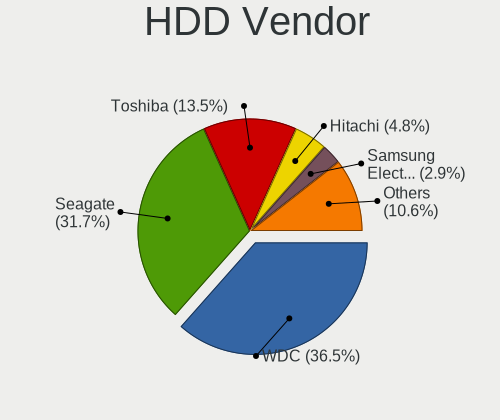
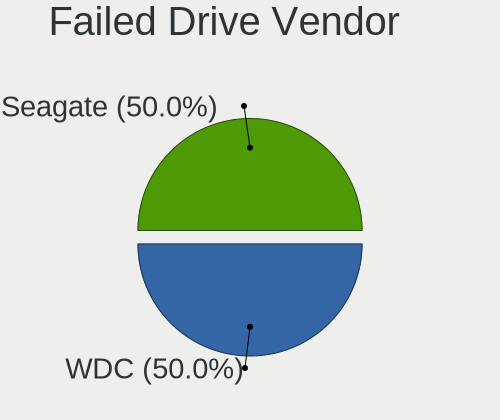
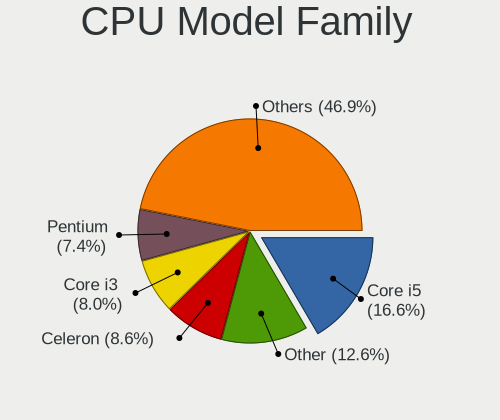
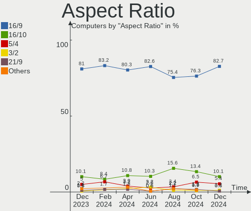
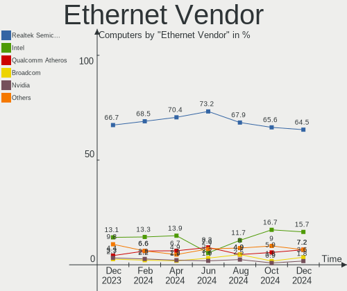
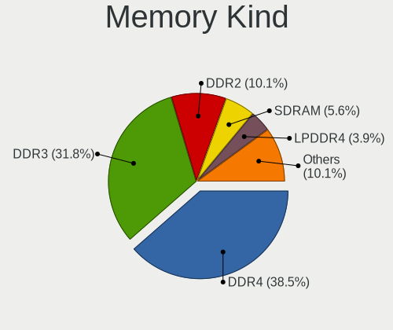
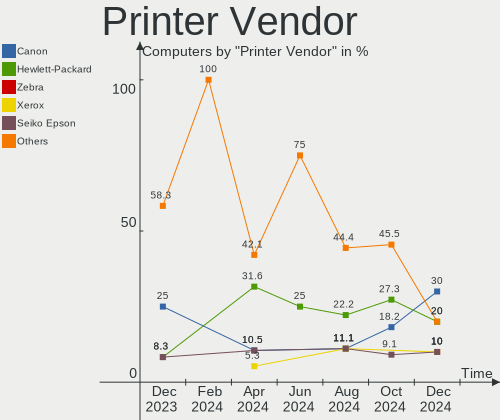
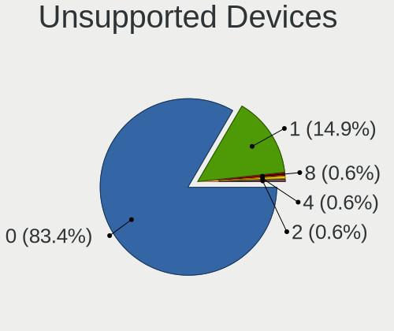

ROSA Hardware Trends
--------------------

A project to identify most popular hardware characteristics and track their change
over time based on data collected by ROSA users at https://Linux-Hardware.org.

Anyone can contribute to this report by the [hw-probe](https://github.com/linuxhw/hw-probe) tool:

    sudo -E hw-probe -all -upload

This is a report for all computer types. See also reports for [desktops](/Dist/ROSA/Desktop/README.md) and [notebooks](/Dist/ROSA/Notebook/README.md).

Full-feature report is available here: https://linux-hardware.org/?view=trends

Period: Nov, 2021.

Contents
--------

* [ System ](#system)
  - [ OS                       ](#os)
  - [ OS Family                ](#os-family)
  - [ Kernel                   ](#kernel)
  - [ Kernel Family            ](#kernel-family)
  - [ Kernel Major Ver.        ](#kernel-major-ver)
  - [ Arch                     ](#arch)
  - [ DE                       ](#de)
  - [ Display Server           ](#display-server)
  - [ Display Manager          ](#display-manager)
  - [ OS Lang                  ](#os-lang)
  - [ Boot Mode                ](#boot-mode)
  - [ Filesystem               ](#filesystem)
  - [ Part. scheme             ](#part-scheme)
  - [ Dual Boot with Linux/BSD ](#dual-boot-with-linuxbsd)
  - [ Dual Boot (Win)          ](#dual-boot-win)

* [ Board ](#board)
  - [ Vendor                   ](#vendor)
  - [ Model                    ](#model)
  - [ Model Family             ](#model-family)
  - [ MFG Year                 ](#mfg-year)
  - [ Form Factor              ](#form-factor)
  - [ Secure Boot              ](#secure-boot)
  - [ Coreboot                 ](#coreboot)
  - [ RAM Size                 ](#ram-size)
  - [ RAM Used                 ](#ram-used)
  - [ Total Drives             ](#total-drives)
  - [ Has CD-ROM               ](#has-cd-rom)
  - [ Has Ethernet             ](#has-ethernet)
  - [ Has WiFi                 ](#has-wifi)
  - [ Has Bluetooth            ](#has-bluetooth)

* [ Location ](#location)
  - [ Country                  ](#country)
  - [ City                     ](#city)

* [ Drives ](#drives)
  - [ Drive Vendor             ](#drive-vendor)
  - [ Drive Model              ](#drive-model)
  - [ HDD Vendor               ](#hdd-vendor)
  - [ SSD Vendor               ](#ssd-vendor)
  - [ Drive Kind               ](#drive-kind)
  - [ Drive Connector          ](#drive-connector)
  - [ Drive Size               ](#drive-size)
  - [ Space Total              ](#space-total)
  - [ Space Used               ](#space-used)
  - [ Malfunc. Drives          ](#malfunc-drives)
  - [ Malfunc. Drive Vendor    ](#malfunc-drive-vendor)
  - [ Malfunc. HDD Vendor      ](#malfunc-hdd-vendor)
  - [ Malfunc. Drive Kind      ](#malfunc-drive-kind)
  - [ Failed Drives            ](#failed-drives)
  - [ Failed Drive Vendor      ](#failed-drive-vendor)
  - [ Drive Status             ](#drive-status)

* [ Storage controller ](#storage-controller)
  - [ Storage Vendor           ](#storage-vendor)
  - [ Storage Model            ](#storage-model)
  - [ Storage Kind             ](#storage-kind)

* [ Processor ](#processor)
  - [ CPU Vendor               ](#cpu-vendor)
  - [ CPU Model                ](#cpu-model)
  - [ CPU Model Family         ](#cpu-model-family)
  - [ CPU Cores                ](#cpu-cores)
  - [ CPU Sockets              ](#cpu-sockets)
  - [ CPU Threads              ](#cpu-threads)
  - [ CPU Op-Modes             ](#cpu-op-modes)
  - [ CPU Microcode            ](#cpu-microcode)
  - [ CPU Microarch            ](#cpu-microarch)

* [ Graphics ](#graphics)
  - [ GPU Vendor               ](#gpu-vendor)
  - [ GPU Model                ](#gpu-model)
  - [ GPU Combo                ](#gpu-combo)
  - [ GPU Driver               ](#gpu-driver)
  - [ GPU Memory               ](#gpu-memory)

* [ Monitor ](#monitor)
  - [ Monitor Vendor           ](#monitor-vendor)
  - [ Monitor Model            ](#monitor-model)
  - [ Monitor Resolution       ](#monitor-resolution)
  - [ Monitor Diagonal         ](#monitor-diagonal)
  - [ Monitor Width            ](#monitor-width)
  - [ Aspect Ratio             ](#aspect-ratio)
  - [ Monitor Area             ](#monitor-area)
  - [ Pixel Density            ](#pixel-density)
  - [ Multiple Monitors        ](#multiple-monitors)

* [ Network ](#network)
  - [ Net Controller Vendor    ](#net-controller-vendor)
  - [ Net Controller Model     ](#net-controller-model)
  - [ Wireless Vendor          ](#wireless-vendor)
  - [ Wireless Model           ](#wireless-model)
  - [ Ethernet Vendor          ](#ethernet-vendor)
  - [ Ethernet Model           ](#ethernet-model)
  - [ Net Controller Kind      ](#net-controller-kind)
  - [ Used Controller          ](#used-controller)
  - [ NICs                     ](#nics)
  - [ IPv6                     ](#ipv6)

* [ Bluetooth ](#bluetooth)
  - [ Bluetooth Vendor         ](#bluetooth-vendor)
  - [ Bluetooth Model          ](#bluetooth-model)

* [ Sound ](#sound)
  - [ Sound Vendor             ](#sound-vendor)
  - [ Sound Model              ](#sound-model)

* [ Memory ](#memory)
  - [ Memory Vendor            ](#memory-vendor)
  - [ Memory Model             ](#memory-model)
  - [ Memory Kind              ](#memory-kind)
  - [ Memory Form Factor       ](#memory-form-factor)
  - [ Memory Size              ](#memory-size)
  - [ Memory Speed             ](#memory-speed)

* [ Printers & scanners ](#printers--scanners)
  - [ Printer Vendor           ](#printer-vendor)
  - [ Printer Model            ](#printer-model)
  - [ Scanner Vendor           ](#scanner-vendor)
  - [ Scanner Model            ](#scanner-model)

* [ Camera ](#camera)
  - [ Camera Vendor            ](#camera-vendor)
  - [ Camera Model             ](#camera-model)

* [ Security ](#security)
  - [ Fingerprint Vendor       ](#fingerprint-vendor)
  - [ Fingerprint Model        ](#fingerprint-model)
  - [ Chipcard Vendor          ](#chipcard-vendor)
  - [ Chipcard Model           ](#chipcard-model)

* [ Unsupported ](#unsupported)
  - [ Unsupported Devices      ](#unsupported-devices)
  - [ Unsupported Device Types ](#unsupported-device-types)

System
------

OS
--

Installed operating systems

| Name       | Computers | Percent |
|------------|-----------|---------|
| ROSA R11.1 | 72        | 41.62%  |
| ROSA 12.1  | 55        | 31.79%  |
| ROSA 12    | 45        | 26.01%  |
| ROSA R11   | 1         | 0.58%   |

OS Family
---------

OS without a version

| Name | Computers | Percent |
|------|-----------|---------|
| ROSA | 173       | 100%    |

Kernel
------

Version of the Linux kernel

| Version                             | Computers | Percent |
|-------------------------------------|-----------|---------|
| 5.10.74-generic-2rosa2021.1-x86_64  | 58        | 33.53%  |
| 5.10.71-generic-1rosa2021.1-x86_64  | 42        | 24.28%  |
| 5.4.83-generic-2rosa-x86_64         | 19        | 10.98%  |
| 4.15.0-desktop-122.124.1rosa-x86_64 | 17        | 9.83%   |
| 5.4.32-generic-2rosa-i586           | 10        | 5.78%   |
| 5.4.83-generic-2rosa-i586           | 6         | 3.47%   |
| 5.4.32-generic-2rosa-x86_64         | 5         | 2.89%   |
| 4.9.155-nrj-desktop-1rosa-x86_64    | 3         | 1.73%   |
| 4.9.155-nrj-desktop-1rosa-i586      | 3         | 1.73%   |
| 4.15.0-desktop-122.124.1rosa-i586   | 3         | 1.73%   |
| 5.5.19-generic-1rosa-x86_64         | 2         | 1.16%   |
| 5.4.112-nrj-desktop-1rosa-x86_64    | 1         | 0.58%   |
| 5.4.107-generic-0.1rosa-x86_64      | 1         | 0.58%   |
| 5.10.50-generic-1rosa-x86_64        | 1         | 0.58%   |
| 4.15.0-desktop-68.5rosa-x86_64      | 1         | 0.58%   |
| 4.15.0-desktop-45.1rosa-x86_64      | 1         | 0.58%   |

Kernel Family
-------------

Linux kernel without a distro release

| Version | Computers | Percent |
|---------|-----------|---------|
| 5.10.74 | 58        | 33.53%  |
| 5.10.71 | 42        | 24.28%  |
| 5.4.83  | 25        | 14.45%  |
| 4.15.0  | 22        | 12.72%  |
| 5.4.32  | 15        | 8.67%   |
| 4.9.155 | 6         | 3.47%   |
| 5.5.19  | 2         | 1.16%   |
| 5.4.112 | 1         | 0.58%   |
| 5.4.107 | 1         | 0.58%   |
| 5.10.50 | 1         | 0.58%   |

Kernel Major Ver.
-----------------

Linux kernel major version

| Version | Computers | Percent |
|---------|-----------|---------|
| 5.10    | 101       | 58.38%  |
| 5.4     | 42        | 24.28%  |
| 4.15    | 22        | 12.72%  |
| 4.9     | 6         | 3.47%   |
| 5.5     | 2         | 1.16%   |

Arch
----

OS architecture (x86_64, i586, etc.)

| Name   | Computers | Percent |
|--------|-----------|---------|
| x86_64 | 151       | 87.28%  |
| i686   | 22        | 12.72%  |

DE
--

Desktop Environment

| Name  | Computers | Percent |
|-------|-----------|---------|
| KDE5  | 102       | 58.96%  |
| KDE4  | 47        | 27.17%  |
| LXQt  | 14        | 8.09%   |
| GNOME | 8         | 4.62%   |
| XFCE  | 2         | 1.16%   |

Display Server
--------------

X11 or Wayland

| Name    | Computers | Percent |
|---------|-----------|---------|
| Wayland | 95        | 54.91%  |
| X11     | 78        | 45.09%  |

Display Manager
---------------

SDDM, LightDM, etc.

| Name | Computers | Percent |
|------|-----------|---------|
| GDM  | 97        | 56.07%  |
| KDM  | 47        | 27.17%  |
| SDDM | 29        | 16.76%  |

OS Lang
-------

Language

| Lang    | Computers | Percent |
|---------|-----------|---------|
| ru_RU   | 147       | 84.97%  |
| en_US   | 7         | 4.05%   |
| en_GB   | 3         | 1.73%   |
| de_DE   | 3         | 1.73%   |
| ru_UA   | 2         | 1.16%   |
| pt_BR   | 2         | 1.16%   |
| pl_PL   | 2         | 1.16%   |
| fr_FR   | 2         | 1.16%   |
| tr_TR   | 1         | 0.58%   |
| it_IT   | 1         | 0.58%   |
| es_ES   | 1         | 0.58%   |
| C       | 1         | 0.58%   |
| Unknown | 1         | 0.58%   |

Boot Mode
---------

EFI or BIOS

| Mode | Computers | Percent |
|------|-----------|---------|
| BIOS | 119       | 68.79%  |
| EFI  | 54        | 31.21%  |

Filesystem
----------

Type of filesystem

| Type  | Computers | Percent |
|-------|-----------|---------|
| Ext4  | 166       | 95.95%  |
| Btrfs | 3         | 1.73%   |
| Ext2  | 2         | 1.16%   |
| F2fs  | 1         | 0.58%   |
| Ext3  | 1         | 0.58%   |

Part. scheme
------------

Scheme of partitioning

| Type | Computers | Percent |
|------|-----------|---------|
| MBR  | 104       | 60.12%  |
| GPT  | 69        | 39.88%  |

Dual Boot with Linux/BSD
------------------------

Hosting more than one Linux/BSD

| Dual boot | Computers | Percent |
|-----------|-----------|---------|
| No        | 127       | 73.41%  |
| Yes       | 46        | 26.59%  |

Dual Boot (Win)
---------------

Hosting Linux and Windows

| Dual boot | Computers | Percent |
|-----------|-----------|---------|
| No        | 102       | 58.96%  |
| Yes       | 71        | 41.04%  |

Board
-----

Vendor
------

Motherboard manufacturer

| Name                | Computers | Percent |
|---------------------|-----------|---------|
| ASUSTek Computer    | 59        | 34.1%   |
| Gigabyte Technology | 20        | 11.56%  |
| Hewlett-Packard     | 17        | 9.83%   |
| MSI                 | 11        | 6.36%   |
| Lenovo              | 11        | 6.36%   |
| Acer                | 11        | 6.36%   |
| ASRock              | 10        | 5.78%   |
| Dell                | 7         | 4.05%   |
| Samsung Electronics | 6         | 3.47%   |
| Toshiba             | 4         | 2.31%   |
| Supermicro          | 1         | 0.58%   |
| Packard Bell        | 1         | 0.58%   |
| OEM                 | 1         | 0.58%   |
| Notebook            | 1         | 0.58%   |
| Intel               | 1         | 0.58%   |
| IBM                 | 1         | 0.58%   |
| Huanan              | 1         | 0.58%   |
| HASEE Computer      | 1         | 0.58%   |
| Google              | 1         | 0.58%   |
| Fujitsu Siemens     | 1         | 0.58%   |
| Foxconn             | 1         | 0.58%   |
| ECS                 | 1         | 0.58%   |
| DNS                 | 1         | 0.58%   |
| Digma               | 1         | 0.58%   |
| BenQ                | 1         | 0.58%   |
| Apple               | 1         | 0.58%   |
| Unknown             | 1         | 0.58%   |

Model
-----

Motherboard model

| Name                                       | Computers | Percent |
|--------------------------------------------|-----------|---------|
| HP Pavilion g6                             | 3         | 1.73%   |
| HP Notebook                                | 2         | 1.16%   |
| Gigabyte H81M-S1                           | 2         | 1.16%   |
| Gigabyte 970A-DS3P                         | 2         | 1.16%   |
| Dell Latitude E6420                        | 2         | 1.16%   |
| ASUS M5A78L-M LX3                          | 2         | 1.16%   |
| ASUS M2N                                   | 2         | 1.16%   |
| ASUS All Series                            | 2         | 1.16%   |
| ASRock G31M-S                              | 2         | 1.16%   |
| Toshiba Satellite Pro C50-A-154            | 1         | 0.58%   |
| Toshiba Satellite M100                     | 1         | 0.58%   |
| Toshiba Satellite L650D                    | 1         | 0.58%   |
| Toshiba Satellite A300                     | 1         | 0.58%   |
| Supermicro X9SCL/X9SCM                     | 1         | 0.58%   |
| Samsung RC410/RC510/RC710                  | 1         | 0.58%   |
| Samsung R59P/R60P/R61P                     | 1         | 0.58%   |
| Samsung R540/R580/R780/SA41/E452/E852      | 1         | 0.58%   |
| Samsung R519/R719                          | 1         | 0.58%   |
| Samsung R425/R525                          | 1         | 0.58%   |
| Samsung 350V5C/351V5C/3540VC/3440VC        | 1         | 0.58%   |
| Packard Bell EasyNote TE11HC               | 1         | 0.58%   |
| OEM Intel H81                              | 1         | 0.58%   |
| Notebook W65_W670SR                        | 1         | 0.58%   |
| MSI MS-7B36                                | 1         | 0.58%   |
| MSI MS-7A36                                | 1         | 0.58%   |
| MSI MS-7885                                | 1         | 0.58%   |
| MSI MS-7816                                | 1         | 0.58%   |
| MSI MS-7758                                | 1         | 0.58%   |
| MSI MS-7597                                | 1         | 0.58%   |
| MSI MS-7596                                | 1         | 0.58%   |
| MSI MS-7592                                | 1         | 0.58%   |
| MSI MS-7529                                | 1         | 0.58%   |
| MSI MS-7367                                | 1         | 0.58%   |
| MSI MS-7238                                | 1         | 0.58%   |
| Lenovo ThinkPad T430 2349S1N               | 1         | 0.58%   |
| Lenovo ThinkCentre M93z 10AES02G00         | 1         | 0.58%   |
| Lenovo Legion Y7000 2019 81NS              | 1         | 0.58%   |
| Lenovo IdeaPad S12 20021,2959              | 1         | 0.58%   |
| Lenovo IdeaPad 320-15AST 80XV              | 1         | 0.58%   |
| Lenovo IdeaPad 3 17ADA05 81W2              | 1         | 0.58%   |
| Lenovo IdeaPad 110-15ACL 80TJ              | 1         | 0.58%   |
| Lenovo IdeaCentre AIO 310-20IAP F0CL005CRK | 1         | 0.58%   |
| Lenovo G710 20252                          | 1         | 0.58%   |
| Lenovo G500 20236                          | 1         | 0.58%   |
| Lenovo B590 20206                          | 1         | 0.58%   |
| Intel powered classmate PC                 | 1         | 0.58%   |
| IBM 9210D7G                                | 1         | 0.58%   |
| Huanan X99 F8D V2.2                        | 1         | 0.58%   |
| HP ProBook x360 11 G1 EE                   | 1         | 0.58%   |
| HP Pavilion Notebook                       | 1         | 0.58%   |
| HP Pavilion m6                             | 1         | 0.58%   |
| HP Pavilion g7                             | 1         | 0.58%   |
| HP Pavilion dv7                            | 1         | 0.58%   |
| HP Pavilion dv6                            | 1         | 0.58%   |
| HP Pavilion Desktop PC 570-p0xx            | 1         | 0.58%   |
| HP OMEN by Laptop 15-dc0xxx                | 1         | 0.58%   |
| HP Laptop 14-bp0xx                         | 1         | 0.58%   |
| HP Compaq 4000 Pro SFF PC                  | 1         | 0.58%   |
| HP 620                                     | 1         | 0.58%   |
| HP 290 G1 MT                               | 1         | 0.58%   |

Model Family
------------

Motherboard model prefix

| Name                  | Computers | Percent |
|-----------------------|-----------|---------|
| HP Pavilion           | 9         | 5.2%    |
| Acer Aspire           | 7         | 4.05%   |
| Toshiba Satellite     | 4         | 2.31%   |
| Lenovo IdeaPad        | 4         | 2.31%   |
| Dell Inspiron         | 4         | 2.31%   |
| Dell Latitude         | 3         | 1.73%   |
| ASUS M5A97            | 3         | 1.73%   |
| ASUS M5A78L-M         | 3         | 1.73%   |
| HP Notebook           | 2         | 1.16%   |
| Gigabyte H81M-S1      | 2         | 1.16%   |
| Gigabyte 970A-DS3P    | 2         | 1.16%   |
| ASUS PRIME            | 2         | 1.16%   |
| ASUS P5KPL            | 2         | 1.16%   |
| ASUS P5G41T-M         | 2         | 1.16%   |
| ASUS M2N              | 2         | 1.16%   |
| ASUS ASUS             | 2         | 1.16%   |
| ASUS All              | 2         | 1.16%   |
| ASRock G31M-S         | 2         | 1.16%   |
| Acer Extensa          | 2         | 1.16%   |
| Supermicro X9SCL      | 1         | 0.58%   |
| Samsung RC410         | 1         | 0.58%   |
| Samsung R59P          | 1         | 0.58%   |
| Samsung R540          | 1         | 0.58%   |
| Samsung R519          | 1         | 0.58%   |
| Samsung R425          | 1         | 0.58%   |
| Samsung 350V5C        | 1         | 0.58%   |
| Packard Bell EasyNote | 1         | 0.58%   |
| OEM Intel             | 1         | 0.58%   |
| Notebook W65          | 1         | 0.58%   |
| MSI MS-7B36           | 1         | 0.58%   |
| MSI MS-7A36           | 1         | 0.58%   |
| MSI MS-7885           | 1         | 0.58%   |
| MSI MS-7816           | 1         | 0.58%   |
| MSI MS-7758           | 1         | 0.58%   |
| MSI MS-7597           | 1         | 0.58%   |
| MSI MS-7596           | 1         | 0.58%   |
| MSI MS-7592           | 1         | 0.58%   |
| MSI MS-7529           | 1         | 0.58%   |
| MSI MS-7367           | 1         | 0.58%   |
| MSI MS-7238           | 1         | 0.58%   |
| Lenovo ThinkPad       | 1         | 0.58%   |
| Lenovo ThinkCentre    | 1         | 0.58%   |
| Lenovo Legion         | 1         | 0.58%   |
| Lenovo IdeaCentre     | 1         | 0.58%   |
| Lenovo G710           | 1         | 0.58%   |
| Lenovo G500           | 1         | 0.58%   |
| Lenovo B590           | 1         | 0.58%   |
| Intel powered         | 1         | 0.58%   |
| IBM 9210D7G           | 1         | 0.58%   |
| Huanan X99            | 1         | 0.58%   |
| HP ProBook            | 1         | 0.58%   |
| HP OMEN               | 1         | 0.58%   |
| HP Laptop             | 1         | 0.58%   |
| HP Compaq             | 1         | 0.58%   |
| HP 620                | 1         | 0.58%   |
| HP 290                | 1         | 0.58%   |
| HASEE W65KJ1          | 1         | 0.58%   |
| Google Panther        | 1         | 0.58%   |
| Gigabyte Z170-HD3P-CF | 1         | 0.58%   |
| Gigabyte J1800N-D2H   | 1         | 0.58%   |

MFG Year
--------

Motherboard manufacture year

| Year | Computers | Percent |
|------|-----------|---------|
| 2013 | 19        | 10.98%  |
| 2010 | 19        | 10.98%  |
| 2009 | 14        | 8.09%   |
| 2016 | 13        | 7.51%   |
| 2011 | 13        | 7.51%   |
| 2015 | 12        | 6.94%   |
| 2012 | 11        | 6.36%   |
| 2021 | 10        | 5.78%   |
| 2017 | 10        | 5.78%   |
| 2007 | 9         | 5.2%    |
| 2019 | 8         | 4.62%   |
| 2014 | 8         | 4.62%   |
| 2008 | 8         | 4.62%   |
| 2020 | 7         | 4.05%   |
| 2006 | 5         | 2.89%   |
| 2018 | 4         | 2.31%   |
| 2005 | 2         | 1.16%   |
| 2004 | 1         | 0.58%   |

Form Factor
-----------

Physical design of the computer

| Name       | Computers | Percent |
|------------|-----------|---------|
| Desktop    | 96        | 55.49%  |
| Notebook   | 72        | 41.62%  |
| All in one | 4         | 2.31%   |
| Mini pc    | 1         | 0.58%   |

Secure Boot
-----------

Enabled or disabled

| State    | Computers | Percent |
|----------|-----------|---------|
| Disabled | 173       | 100%    |

Coreboot
--------

Have coreboot on board

| Used | Computers | Percent |
|------|-----------|---------|
| No   | 172       | 99.42%  |
| Yes  | 1         | 0.58%   |

RAM Size
--------

Total RAM memory

| Size in GB  | Computers | Percent |
|-------------|-----------|---------|
| 3.01-4.0    | 56        | 32.37%  |
| 4.01-8.0    | 37        | 21.39%  |
| 8.01-16.0   | 28        | 16.18%  |
| 1.01-2.0    | 17        | 9.83%   |
| 16.01-24.0  | 16        | 9.25%   |
| 2.01-3.0    | 9         | 5.2%    |
| 32.01-64.0  | 4         | 2.31%   |
| 0.51-1.0    | 4         | 2.31%   |
| 24.01-32.0  | 1         | 0.58%   |
| 64.01-256.0 | 1         | 0.58%   |

RAM Used
--------

Used RAM memory

| Used GB  | Computers | Percent |
|----------|-----------|---------|
| 1.01-2.0 | 82        | 47.4%   |
| 0.51-1.0 | 67        | 38.73%  |
| 4.01-8.0 | 7         | 4.05%   |
| 2.01-3.0 | 7         | 4.05%   |
| 3.01-4.0 | 6         | 3.47%   |
| 0.01-0.5 | 4         | 2.31%   |

Total Drives
------------

Number of drives on board

| Drives | Computers | Percent |
|--------|-----------|---------|
| 1      | 108       | 62.43%  |
| 2      | 39        | 22.54%  |
| 3      | 15        | 8.67%   |
| 4      | 9         | 5.2%    |
| 5      | 1         | 0.58%   |
| 0      | 1         | 0.58%   |

Has CD-ROM
----------

Has CD-ROM on board

| Presented | Computers | Percent |
|-----------|-----------|---------|
| Yes       | 103       | 59.54%  |
| No        | 70        | 40.46%  |

Has Ethernet
------------

Has Ethernet on board

| Presented | Computers | Percent |
|-----------|-----------|---------|
| Yes       | 169       | 97.69%  |
| No        | 4         | 2.31%   |

Has WiFi
--------

Has WiFi module

| Presented | Computers | Percent |
|-----------|-----------|---------|
| Yes       | 112       | 64.74%  |
| No        | 61        | 35.26%  |

Has Bluetooth
-------------

Has Bluetooth module

| Presented | Computers | Percent |
|-----------|-----------|---------|
| No        | 108       | 62.43%  |
| Yes       | 65        | 37.57%  |

Location
--------

Country
-------

Geographic location (country)

| Country   | Computers | Percent |
|-----------|-----------|---------|
| Russia    | 135       | 78.03%  |
| Ukraine   | 9         | 5.2%    |
| France    | 5         | 2.89%   |
| USA       | 4         | 2.31%   |
| Belarus   | 3         | 1.73%   |
| UK        | 2         | 1.16%   |
| Poland    | 2         | 1.16%   |
| Germany   | 2         | 1.16%   |
| Brazil    | 2         | 1.16%   |
| Austria   | 2         | 1.16%   |
| Turkey    | 1         | 0.58%   |
| Italy     | 1         | 0.58%   |
| Hungary   | 1         | 0.58%   |
| China     | 1         | 0.58%   |
| Canada    | 1         | 0.58%   |
| Australia | 1         | 0.58%   |
| Argentina | 1         | 0.58%   |

City
----

Geographic location (city)

| City                        | Computers | Percent |
|-----------------------------|-----------|---------|
| Moscow                      | 25        | 14.45%  |
| St Petersburg               | 13        | 7.51%   |
| Samara                      | 5         | 2.89%   |
| Les Vans                    | 5         | 2.89%   |
| Yekaterinburg               | 4         | 2.31%   |
| Kazan?ˆ™                    | 4         | 2.31%   |
| Novosibirsk                 | 3         | 1.73%   |
| Krasnodar                   | 3         | 1.73%   |
| Balashikha                  | 3         | 1.73%   |
| Yaroslavl                   | 2         | 1.16%   |
| Voronezh                    | 2         | 1.16%   |
| Volgograd                   | 2         | 1.16%   |
| Ufa                         | 2         | 1.16%   |
| Tomsk                       | 2         | 1.16%   |
| Tolyatti                    | 2         | 1.16%   |
| Severodvinsk                | 2         | 1.16%   |
| Perm                        | 2         | 1.16%   |
| Nizhniy Novgorod            | 2         | 1.16%   |
| Newark                      | 2         | 1.16%   |
| Kurgan                      | 2         | 1.16%   |
| Khabarovsk                  | 2         | 1.16%   |
| Kemerovo                    | 2         | 1.16%   |
| Cherepovets                 | 2         | 1.16%   |
| Chelyabinsk                 | 2         | 1.16%   |
| Belgorod                    | 2         | 1.16%   |
| Zaporizhzhia                | 1         | 0.58%   |
| Yeysk                       | 1         | 0.58%   |
| Xi'an                       | 1         | 0.58%   |
| Volgodonsk                  | 1         | 0.58%   |
| Vladivostok                 | 1         | 0.58%   |
| Vienna                      | 1         | 0.58%   |
| Veliky Novgorod             | 1         | 0.58%   |
| Ulyanovsk                   | 1         | 0.58%   |
| Ukhta                       | 1         | 0.58%   |
| Tuymazy                     | 1         | 0.58%   |
| Tula                        | 1         | 0.58%   |
| Syktyvkar                   | 1         | 0.58%   |
| Streatham                   | 1         | 0.58%   |
| Stavropol                   | 1         | 0.58%   |
| Sovetsk                     | 1         | 0.58%   |
| Smolenshchina               | 1         | 0.58%   |
| Sloviansk                   | 1         | 0.58%   |
| Simferopol                  | 1         | 0.58%   |
| Shilovo                     | 1         | 0.58%   |
| Shelekhov                   | 1         | 0.58%   |
| Shchyolkino                 | 1         | 0.58%   |
| Sergiyev Posad              | 1         | 0.58%   |
| Selidovo                    | 1         | 0.58%   |
| Saratov                     | 1         | 0.58%   |
| Sarapul                     | 1         | 0.58%   |
| Saransk                     | 1         | 0.58%   |
| Salekhard                   | 1         | 0.58%   |
| Rostov-on-Don               | 1         | 0.58%   |
| Purpe                       | 1         | 0.58%   |
| Prittriching                | 1         | 0.58%   |
| Potters Bar                 | 1         | 0.58%   |
| Posto Fiscal Rolim de Moura | 1         | 0.58%   |
| Pisochyn                    | 1         | 0.58%   |
| Petergof                    | 1         | 0.58%   |
| Oryol                       | 1         | 0.58%   |

Drives
------

Drive Vendor
------------

Hard drive vendors

| Vendor              | Computers | Drives | Percent |
|---------------------|-----------|--------|---------|
| Seagate             | 58        | 65     | 23.2%   |
| WDC                 | 53        | 57     | 21.2%   |
| Samsung Electronics | 26        | 30     | 10.4%   |
| Toshiba             | 21        | 22     | 8.4%    |
| Kingston            | 19        | 20     | 7.6%    |
| Hitachi             | 10        | 10     | 4%      |
| HGST                | 7         | 7      | 2.8%    |
| Apacer              | 5         | 5      | 2%      |
| Intel               | 4         | 4      | 1.6%    |
| Crucial             | 4         | 4      | 1.6%    |
| China               | 4         | 4      | 1.6%    |
| Unknown             | 3         | 3      | 1.2%    |
| SPCC                | 3         | 3      | 1.2%    |
| SanDisk             | 3         | 3      | 1.2%    |
| PLEXTOR             | 3         | 3      | 1.2%    |
| Smartbuy            | 2         | 2      | 0.8%    |
| Patriot             | 2         | 2      | 0.8%    |
| MAXTOR              | 2         | 2      | 0.8%    |
| GOODRAM             | 2         | 2      | 0.8%    |
| Fujitsu             | 2         | 2      | 0.8%    |
| XPG                 | 1         | 1      | 0.4%    |
| Transcend           | 1         | 1      | 0.4%    |
| TO Exter            | 1         | 1      | 0.4%    |
| Silicon Motion      | 1         | 1      | 0.4%    |
| Phison              | 1         | 1      | 0.4%    |
| Palit               | 1         | 1      | 0.4%    |
| OCZ                 | 1         | 1      | 0.4%    |
| NGFF                | 1         | 1      | 0.4%    |
| Netac               | 1         | 1      | 0.4%    |
| NE-1TB              | 1         | 1      | 0.4%    |
| LONDISK             | 1         | 1      | 0.4%    |
| LITEONIT            | 1         | 1      | 0.4%    |
| Kingmax             | 1         | 1      | 0.4%    |
| e2e4                | 1         | 1      | 0.4%    |
| CHN25SATAS1         | 1         | 2      | 0.4%    |
| AMD                 | 1         | 1      | 0.4%    |
| A-DATA Technology   | 1         | 1      | 0.4%    |

Drive Model
-----------

Hard drive models

| Model                            | Computers | Percent |
|----------------------------------|-----------|---------|
| Seagate ST9320325AS 320GB        | 5         | 1.91%   |
| Kingston SA400S37120G 120GB SSD  | 5         | 1.91%   |
| Toshiba DT01ACA050 500GB         | 4         | 1.53%   |
| Kingston SV300S37A120G 120GB SSD | 4         | 1.53%   |
| WDC WD5000AAKX-001CA0 500GB      | 3         | 1.15%   |
| Toshiba MQ01ABF050 500GB         | 3         | 1.15%   |
| Seagate ST4000DM004-2CV104 4TB   | 3         | 1.15%   |
| Seagate ST380815AS 80GB          | 3         | 1.15%   |
| Seagate ST3250310AS 250GB        | 3         | 1.15%   |
| Kingston SA400S37240G 240GB SSD  | 3         | 1.15%   |
| Apacer AS350 128GB SSD           | 3         | 1.15%   |
| WDC WDS250G2B0A-00SM50 250GB SSD | 2         | 0.76%   |
| WDC WD5001AALS-00L3B2 500GB      | 2         | 0.76%   |
| WDC WD5000AAKX-08U6AA0 500GB     | 2         | 0.76%   |
| WDC WD20EZRX-00DC0B0 2TB         | 2         | 0.76%   |
| WDC WD1600BEVT-22ZCT0 160GB      | 2         | 0.76%   |
| WDC WD10EZEX-00BBHA0 1TB         | 2         | 0.76%   |
| WDC WD10EALX-009BA0 1TB          | 2         | 0.76%   |
| Unknown SD/MMC/MS PRO 394GB      | 2         | 0.76%   |
| Toshiba MQ01ABD100 1TB           | 2         | 0.76%   |
| Toshiba HDWD110 1TB              | 2         | 0.76%   |
| Toshiba DT01ACA100 1TB           | 2         | 0.76%   |
| Smartbuy SSD 120GB               | 2         | 0.76%   |
| Seagate ST9500325AS 500GB        | 2         | 0.76%   |
| Seagate ST500LT012-1DG142 500GB  | 2         | 0.76%   |
| Seagate ST500DM002-1BD142 500GB  | 2         | 0.76%   |
| Seagate ST380011A 80GB           | 2         | 0.76%   |
| Seagate ST3320620AS 320GB        | 2         | 0.76%   |
| Seagate ST320LT020-9YG142 320GB  | 2         | 0.76%   |
| Seagate ST2000DM001-1ER164 2TB   | 2         | 0.76%   |
| Seagate ST1000DM003-9YN162 1TB   | 2         | 0.76%   |
| Samsung SSD 970 EVO Plus 250GB   | 2         | 0.76%   |
| Samsung SSD 860 EVO 250GB        | 2         | 0.76%   |
| Samsung SSD 850 EVO 120GB        | 2         | 0.76%   |
| HGST HTS721010A9E630 1TB         | 2         | 0.76%   |
| HGST HTS545050A7E680 500GB       | 2         | 0.76%   |
| Crucial CT240BX500SSD1 240GB     | 2         | 0.76%   |
| XPG GAMMIX S11 Pro 1TB           | 1         | 0.38%   |
| WDC WDS500G2B0A-00SM50 500GB SSD | 1         | 0.38%   |
| WDC WDS240G2G0B-00EPW0 240GB SSD | 1         | 0.38%   |
| WDC WDS240G2G0A-00JH30 240GB SSD | 1         | 0.38%   |
| WDC WDS120G2G0A-00JH30 120GB SSD | 1         | 0.38%   |
| WDC WDS100T3X0C-00SJG0 1TB       | 1         | 0.38%   |
| WDC WD800JD-08MSA1 80GB          | 1         | 0.38%   |
| WDC WD800BB-60JKA0 80GB          | 1         | 0.38%   |
| WDC WD6400AADS-00M2B0 640GB      | 1         | 0.38%   |
| WDC WD5002ABYS-01B1B0 500GB      | 1         | 0.38%   |
| WDC WD5000LPCX-24VHAT0 500GB     | 1         | 0.38%   |
| WDC WD5000LPCX-22VHAT0 500GB     | 1         | 0.38%   |
| WDC WD5000LPCX-21VHAT0 500GB     | 1         | 0.38%   |
| WDC WD5000LPCX-08VHA 500GB       | 1         | 0.38%   |
| WDC WD5000AAKX-083CA1 500GB      | 1         | 0.38%   |
| WDC WD5000AAKS-08V0A0 500GB      | 1         | 0.38%   |
| WDC WD40PURZ-85TTDY0 4TB         | 1         | 0.38%   |
| WDC WD40EFRX-68WT0N0 4TB         | 1         | 0.38%   |
| WDC WD4003FRYZ-01F0DB0 4TB       | 1         | 0.38%   |
| WDC WD3200BPVT-24JJ5T0 320GB     | 1         | 0.38%   |
| WDC WD3200BEVT-22ZCT0 320GB      | 1         | 0.38%   |
| WDC WD30EZRX-00DC0B0 3TB         | 1         | 0.38%   |
| WDC WD2500BEKT-75PVMT0 250GB     | 1         | 0.38%   |

HDD Vendor
----------

Hard disk drive vendors

| Vendor              | Computers | Drives | Percent |
|---------------------|-----------|--------|---------|
| Seagate             | 57        | 63     | 36.77%  |
| WDC                 | 45        | 47     | 29.03%  |
| Toshiba             | 20        | 21     | 12.9%   |
| Hitachi             | 10        | 10     | 6.45%   |
| Samsung Electronics | 9         | 10     | 5.81%   |
| HGST                | 7         | 7      | 4.52%   |
| Unknown             | 2         | 2      | 1.29%   |
| MAXTOR              | 2         | 2      | 1.29%   |
| Fujitsu             | 2         | 2      | 1.29%   |
| TO Exter            | 1         | 1      | 0.65%   |

SSD Vendor
----------

Solid state drive vendors

| Vendor              | Computers | Drives | Percent |
|---------------------|-----------|--------|---------|
| Kingston            | 18        | 19     | 23.08%  |
| Samsung Electronics | 9         | 12     | 11.54%  |
| WDC                 | 6         | 7      | 7.69%   |
| Apacer              | 5         | 5      | 6.41%   |
| Crucial             | 4         | 4      | 5.13%   |
| China               | 4         | 4      | 5.13%   |
| SPCC                | 3         | 3      | 3.85%   |
| SanDisk             | 3         | 3      | 3.85%   |
| PLEXTOR             | 3         | 3      | 3.85%   |
| Smartbuy            | 2         | 2      | 2.56%   |
| Patriot             | 2         | 2      | 2.56%   |
| Intel               | 2         | 2      | 2.56%   |
| GOODRAM             | 2         | 2      | 2.56%   |
| Transcend           | 1         | 1      | 1.28%   |
| Toshiba             | 1         | 1      | 1.28%   |
| Seagate             | 1         | 2      | 1.28%   |
| Phison              | 1         | 1      | 1.28%   |
| Palit               | 1         | 1      | 1.28%   |
| OCZ                 | 1         | 1      | 1.28%   |
| NGFF                | 1         | 1      | 1.28%   |
| Netac               | 1         | 1      | 1.28%   |
| LONDISK             | 1         | 1      | 1.28%   |
| LITEONIT            | 1         | 1      | 1.28%   |
| Kingmax             | 1         | 1      | 1.28%   |
| e2e4                | 1         | 1      | 1.28%   |
| CHN25SATAS1         | 1         | 2      | 1.28%   |
| AMD                 | 1         | 1      | 1.28%   |
| A-DATA Technology   | 1         | 1      | 1.28%   |

Drive Kind
----------

HDD or SSD

| Kind    | Computers | Drives | Percent |
|---------|-----------|--------|---------|
| HDD     | 135       | 165    | 61.93%  |
| SSD     | 67        | 85     | 30.73%  |
| NVMe    | 14        | 16     | 6.42%   |
| MMC     | 1         | 1      | 0.46%   |
| Unknown | 1         | 1      | 0.46%   |

Drive Connector
---------------

SATA, SAS, NVMe, etc.

| Type | Computers | Drives | Percent |
|------|-----------|--------|---------|
| SATA | 166       | 243    | 87.83%  |
| NVMe | 14        | 16     | 7.41%   |
| SAS  | 8         | 8      | 4.23%   |
| MMC  | 1         | 1      | 0.53%   |

Drive Size
----------

Size of hard drive

| Size in TB | Computers | Drives | Percent |
|------------|-----------|--------|---------|
| 0.01-0.5   | 146       | 184    | 71.92%  |
| 0.51-1.0   | 39        | 46     | 19.21%  |
| 1.01-2.0   | 8         | 9      | 3.94%   |
| 3.01-4.0   | 6         | 7      | 2.96%   |
| 2.01-3.0   | 3         | 3      | 1.48%   |
| 4.01-10.0  | 1         | 1      | 0.49%   |

Space Total
-----------

Amount of disk space available on the file system

| Size in GB     | Computers | Percent |
|----------------|-----------|---------|
| 251-500        | 45        | 26.01%  |
| 101-250        | 40        | 23.12%  |
| 501-1000       | 24        | 13.87%  |
| 1-20           | 20        | 11.56%  |
| 51-100         | 17        | 9.83%   |
| 21-50          | 15        | 8.67%   |
| More than 3000 | 4         | 2.31%   |
| 1001-2000      | 4         | 2.31%   |
| 2001-3000      | 3         | 1.73%   |
| Unknown        | 1         | 0.58%   |

Space Used
----------

Amount of used disk space

| Used GB        | Computers | Percent |
|----------------|-----------|---------|
| 1-20           | 116       | 67.05%  |
| 101-250        | 16        | 9.25%   |
| 251-500        | 12        | 6.94%   |
| 51-100         | 11        | 6.36%   |
| 21-50          | 9         | 5.2%    |
| 1001-2000      | 3         | 1.73%   |
| 501-1000       | 3         | 1.73%   |
| More than 3000 | 1         | 0.58%   |
| 2001-3000      | 1         | 0.58%   |
| Unknown        | 1         | 0.58%   |

Malfunc. Drives
---------------

Drive models with a malfunction

| Model                                 | Computers | Drives | Percent |
|---------------------------------------|-----------|--------|---------|
| Seagate ST9320325AS 320GB             | 3         | 3      | 4.92%   |
| Seagate ST3250310AS 250GB             | 3         | 3      | 4.92%   |
| Seagate ST9500325AS 500GB             | 2         | 2      | 3.28%   |
| WDC WD6400AADS-00M2B0 640GB           | 1         | 1      | 1.64%   |
| WDC WD5001AALS-00L3B2 500GB           | 1         | 1      | 1.64%   |
| WDC WD5000AAKX-08U6AA0 500GB          | 1         | 1      | 1.64%   |
| WDC WD5000AAKX-001CA0 500GB           | 1         | 1      | 1.64%   |
| WDC WD5000AAKS-08V0A0 500GB           | 1         | 1      | 1.64%   |
| WDC WD40EFRX-68WT0N0 4TB              | 1         | 1      | 1.64%   |
| WDC WD3200BEVT-22ZCT0 320GB           | 1         | 1      | 1.64%   |
| WDC WD1600BEVT-75ZCT0 160GB           | 1         | 1      | 1.64%   |
| WDC WD1600AAJB-00PVA0 160GB           | 1         | 1      | 1.64%   |
| WDC WD1200JB-00REA0 120GB             | 1         | 1      | 1.64%   |
| WDC WD10JPCX-24UE4T0 1TB              | 1         | 1      | 1.64%   |
| WDC WD10EALX-009BA0 1TB               | 1         | 1      | 1.64%   |
| WDC WD1003FBYX-01Y7B1 1TB             | 1         | 1      | 1.64%   |
| Toshiba MQ01ABF050 500GB              | 1         | 1      | 1.64%   |
| Toshiba MQ01ABD075 752GB              | 1         | 1      | 1.64%   |
| Toshiba MK4058GSX 400GB               | 1         | 1      | 1.64%   |
| Toshiba MK3261GSYN 320GB              | 1         | 1      | 1.64%   |
| Seagate ST9160821A 160GB              | 1         | 1      | 1.64%   |
| Seagate ST9160310AS 160GB             | 1         | 1      | 1.64%   |
| Seagate ST500DM002-1BD142 500GB       | 1         | 1      | 1.64%   |
| Seagate ST380215AS 80GB               | 1         | 1      | 1.64%   |
| Seagate ST3500412AS 500GB             | 1         | 1      | 1.64%   |
| Seagate ST340014A 40GB                | 1         | 1      | 1.64%   |
| Seagate ST3320620AS 320GB             | 1         | 1      | 1.64%   |
| Seagate ST3320413CS 320GB             | 1         | 1      | 1.64%   |
| Seagate ST3250318AS 250GB             | 1         | 1      | 1.64%   |
| Seagate ST320LT020-9YG142 320GB       | 1         | 1      | 1.64%   |
| Seagate ST3000VX010-2E3166 3TB        | 1         | 1      | 1.64%   |
| Seagate ST1000LM048-2E7172 1TB        | 1         | 1      | 1.64%   |
| Seagate ST1000DM003-9YN162 1TB        | 1         | 1      | 1.64%   |
| Seagate ST1000DM003-1CH162 1TB        | 1         | 1      | 1.64%   |
| SanDisk SSD PLUS 240GB                | 1         | 1      | 1.64%   |
| Samsung Electronics SSD 850 PRO 256GB | 1         | 1      | 1.64%   |
| Samsung Electronics SP2504C 250GB     | 1         | 1      | 1.64%   |
| Samsung Electronics HD080HJ 80GB      | 1         | 1      | 1.64%   |
| PLEXTOR PX-256M5S 256GB SSD           | 1         | 1      | 1.64%   |
| OCZ VERTEX3 120GB SSD                 | 1         | 1      | 1.64%   |
| MAXTOR STM3250310AS 250GB             | 1         | 1      | 1.64%   |
| MAXTOR 6E040L0 41GB                   | 1         | 1      | 1.64%   |
| LITEONIT LCT-256M3S 256GB SSD         | 1         | 1      | 1.64%   |
| Kingston SV300S37A60G 64GB SSD        | 1         | 1      | 1.64%   |
| Kingmax SSD 240GB                     | 1         | 1      | 1.64%   |
| Hitachi HTS547550A9E384 500GB         | 1         | 1      | 1.64%   |
| Hitachi HTS542512K9SA00 120GB         | 1         | 1      | 1.64%   |
| Hitachi HTS541612J9SA00 120GB         | 1         | 1      | 1.64%   |
| Hitachi HTS424040M9AT00 40GB          | 1         | 1      | 1.64%   |
| Hitachi HDS721616PLA380 160GB         | 1         | 1      | 1.64%   |
| Hitachi HDP725025GLA380 250GB         | 1         | 1      | 1.64%   |
| HGST TOURO S 1TB                      | 1         | 1      | 1.64%   |
| HGST HTS721010A9E630 1TB              | 1         | 1      | 1.64%   |
| HGST HTS545050A7E680 500GB            | 1         | 1      | 1.64%   |
| Fujitsu MHY2120BH 120GB               | 1         | 1      | 1.64%   |
| A-DATA Technology SU635 240GB SSD     | 1         | 1      | 1.64%   |

Malfunc. Drive Vendor
---------------------

Vendors of faulty drives

| Vendor              | Computers | Drives | Percent |
|---------------------|-----------|--------|---------|
| Seagate             | 22        | 22     | 36.07%  |
| WDC                 | 13        | 13     | 21.31%  |
| Hitachi             | 6         | 6      | 9.84%   |
| Toshiba             | 4         | 4      | 6.56%   |
| Samsung Electronics | 3         | 3      | 4.92%   |
| HGST                | 3         | 3      | 4.92%   |
| MAXTOR              | 2         | 2      | 3.28%   |
| SanDisk             | 1         | 1      | 1.64%   |
| PLEXTOR             | 1         | 1      | 1.64%   |
| OCZ                 | 1         | 1      | 1.64%   |
| LITEONIT            | 1         | 1      | 1.64%   |
| Kingston            | 1         | 1      | 1.64%   |
| Kingmax             | 1         | 1      | 1.64%   |
| Fujitsu             | 1         | 1      | 1.64%   |
| A-DATA Technology   | 1         | 1      | 1.64%   |

Malfunc. HDD Vendor
-------------------

Vendors of faulty HDD drives

| Vendor              | Computers | Drives | Percent |
|---------------------|-----------|--------|---------|
| Seagate             | 22        | 22     | 41.51%  |
| WDC                 | 13        | 13     | 24.53%  |
| Hitachi             | 6         | 6      | 11.32%  |
| Toshiba             | 4         | 4      | 7.55%   |
| HGST                | 3         | 3      | 5.66%   |
| Samsung Electronics | 2         | 2      | 3.77%   |
| MAXTOR              | 2         | 2      | 3.77%   |
| Fujitsu             | 1         | 1      | 1.89%   |

Malfunc. Drive Kind
-------------------

Kinds of faulty drives

| Kind | Computers | Drives | Percent |
|------|-----------|--------|---------|
| HDD  | 50        | 53     | 86.21%  |
| SSD  | 8         | 8      | 13.79%  |

Failed Drives
-------------

Failed drive models

| Model                             | Computers | Drives | Percent |
|-----------------------------------|-----------|--------|---------|
| Seagate ST500LT012-1DG142 500GB   | 1         | 1      | 25%     |
| Seagate ST31000524AS 1TB          | 1         | 1      | 25%     |
| Samsung Electronics HM501II 500GB | 1         | 1      | 25%     |
| Samsung Electronics HD252HJ 250GB | 1         | 1      | 25%     |

Failed Drive Vendor
-------------------

Failed drive vendors

| Vendor              | Computers | Drives | Percent |
|---------------------|-----------|--------|---------|
| Seagate             | 2         | 2      | 50%     |
| Samsung Electronics | 2         | 2      | 50%     |

Drive Status
------------

Number of failed and malfunc. drives

| Status   | Computers | Drives | Percent |
|----------|-----------|--------|---------|
| Works    | 128       | 194    | 64.65%  |
| Malfunc  | 57        | 61     | 28.79%  |
| Detected | 9         | 9      | 4.55%   |
| Failed   | 4         | 4      | 2.02%   |

Storage controller
------------------

Storage Vendor
--------------

Storage controller vendors

| Vendor                           | Computers | Percent |
|----------------------------------|-----------|---------|
| Intel                            | 116       | 58.29%  |
| AMD                              | 47        | 23.62%  |
| Samsung Electronics              | 8         | 4.02%   |
| JMicron Technology               | 7         | 3.52%   |
| Nvidia                           | 5         | 2.51%   |
| ASMedia Technology               | 5         | 2.51%   |
| Sandisk                          | 3         | 1.51%   |
| VIA Technologies                 | 2         | 1.01%   |
| Silicon Integrated Systems [SiS] | 2         | 1.01%   |
| Silicon Motion                   | 1         | 0.5%    |
| LSI Logic / Symbios Logic        | 1         | 0.5%    |
| Kingston Technology Company      | 1         | 0.5%    |
| ADATA Technology                 | 1         | 0.5%    |

Storage Model
-------------

Storage controller models

| Model                                                                                   | Computers | Percent |
|-----------------------------------------------------------------------------------------|-----------|---------|
| AMD FCH SATA Controller [AHCI mode]                                                     | 18        | 6.9%    |
| Intel NM10/ICH7 Family SATA Controller [IDE mode]                                       | 17        | 6.51%   |
| Intel 82801G (ICH7 Family) IDE Controller                                               | 17        | 6.51%   |
| AMD SB7x0/SB8x0/SB9x0 SATA Controller [AHCI mode]                                       | 16        | 6.13%   |
| AMD SB7x0/SB8x0/SB9x0 IDE Controller                                                    | 14        | 5.36%   |
| Intel 8 Series/C220 Series Chipset Family 6-port SATA Controller 1 [AHCI mode]          | 10        | 3.83%   |
| Intel 7 Series Chipset Family 6-port SATA Controller [AHCI mode]                        | 7         | 2.68%   |
| Intel Q170/Q150/B150/H170/H110/Z170/CM236 Chipset SATA Controller [AHCI Mode]           | 6         | 2.3%    |
| Intel 6 Series/C200 Series Chipset Family 6 port Mobile SATA AHCI Controller            | 6         | 2.3%    |
| AMD SB7x0/SB8x0/SB9x0 SATA Controller [IDE mode]                                        | 6         | 2.3%    |
| Intel 82801IBM/IEM (ICH9M/ICH9M-E) 4 port SATA Controller [AHCI mode]                   | 5         | 1.92%   |
| Intel 82801 Mobile SATA Controller [RAID mode]                                          | 5         | 1.92%   |
| Intel 7 Series/C210 Series Chipset Family 6-port SATA Controller [AHCI mode]            | 5         | 1.92%   |
| ASMedia ASM1062 Serial ATA Controller                                                   | 5         | 1.92%   |
| Samsung NVMe SSD Controller SM981/PM981/PM983                                           | 4         | 1.53%   |
| Nvidia MCP61 SATA Controller                                                            | 4         | 1.53%   |
| Nvidia MCP61 IDE                                                                        | 4         | 1.53%   |
| Intel Celeron N3350/Pentium N4200/Atom E3900 Series SATA AHCI Controller                | 4         | 1.53%   |
| Intel 6 Series/C200 Series Chipset Family Desktop SATA Controller (IDE mode, ports 4-5) | 4         | 1.53%   |
| Intel 6 Series/C200 Series Chipset Family Desktop SATA Controller (IDE mode, ports 0-3) | 4         | 1.53%   |
| Intel 5 Series/3400 Series Chipset 4 port SATA AHCI Controller                          | 4         | 1.53%   |
| Intel 200 Series PCH SATA controller [AHCI mode]                                        | 4         | 1.53%   |
| Samsung NVMe SSD Controller 980                                                         | 3         | 1.15%   |
| Intel Sunrise Point-LP SATA Controller [AHCI mode]                                      | 3         | 1.15%   |
| Intel NM10/ICH7 Family SATA Controller [AHCI mode]                                      | 3         | 1.15%   |
| Intel Atom/Celeron/Pentium Processor x5-E8000/J3xxx/N3xxx Series SATA Controller        | 3         | 1.15%   |
| AMD SB600 Non-Raid-5 SATA                                                               | 3         | 1.15%   |
| AMD SB600 IDE                                                                           | 3         | 1.15%   |
| AMD FCH SATA Controller D                                                               | 3         | 1.15%   |
| Silicon Integrated Systems [SiS] SATA Controller / IDE mode                             | 2         | 0.77%   |
| Silicon Integrated Systems [SiS] 5513 IDE Controller                                    | 2         | 0.77%   |
| Sandisk WD Black SN750 / PC SN730 NVMe SSD                                              | 2         | 0.77%   |
| JMicron JMB368 IDE controller                                                           | 2         | 0.77%   |
| JMicron JMB361 AHCI/IDE                                                                 | 2         | 0.77%   |
| Intel C610/X99 series chipset 6-Port SATA Controller [AHCI mode]                        | 2         | 0.77%   |
| Intel Atom Processor E3800 Series SATA AHCI Controller                                  | 2         | 0.77%   |
| Intel 82801JI (ICH10 Family) 4 port SATA IDE Controller #1                              | 2         | 0.77%   |
| Intel 82801JI (ICH10 Family) 2 port SATA IDE Controller #2                              | 2         | 0.77%   |
| Intel 82801I (ICH9 Family) 2 port SATA Controller [IDE mode]                            | 2         | 0.77%   |
| Intel 82801GBM/GHM (ICH7-M Family) SATA Controller [IDE mode]                           | 2         | 0.77%   |
| Intel 8 Series SATA Controller 1 [AHCI mode]                                            | 2         | 0.77%   |
| Intel 6 Series/C200 Series Chipset Family 6 port Desktop SATA AHCI Controller           | 2         | 0.77%   |
| Intel 500 Series Chipset Family SATA AHCI Controller                                    | 2         | 0.77%   |
| AMD Starship/Matisse Chipset SATA Controller [AHCI mode]                                | 2         | 0.77%   |
| VIA VT6415 PATA IDE Host Controller                                                     | 1         | 0.38%   |
| VIA CX700M2/VX700/VX800/820-Series Serial ATA & EIDE-Controller                         | 1         | 0.38%   |
| Silicon Motion SM2263EN/SM2263XT SSD Controller                                         | 1         | 0.38%   |
| Sandisk WD Blue SN550 NVMe SSD                                                          | 1         | 0.38%   |
| Samsung NVMe SSD Controller SM961/PM961/SM963                                           | 1         | 0.38%   |
| Nvidia CK804 Serial ATA Controller                                                      | 1         | 0.38%   |
| Nvidia CK804 IDE                                                                        | 1         | 0.38%   |
| LSI Logic / Symbios Logic SAS3008 PCI-Express Fusion-MPT SAS-3                          | 1         | 0.38%   |
| Kingston Company U-SNS8154P3 NVMe SSD                                                   | 1         | 0.38%   |
| JMicron JMB363 SATA/IDE Controller                                                      | 1         | 0.38%   |
| JMicron JMB362 SATA Controller                                                          | 1         | 0.38%   |
| JMicron JMB360 AHCI Controller                                                          | 1         | 0.38%   |
| Intel Wildcat Point-LP SATA Controller [AHCI Mode]                                      | 1         | 0.38%   |
| Intel US15W/US15X/US15L/UL11L SCH [Poulsbo] IDE Controller                              | 1         | 0.38%   |
| Intel SSD Pro 7600p/760p/E 6100p Series                                                 | 1         | 0.38%   |
| Intel Non-Volatile memory controller                                                    | 1         | 0.38%   |

Storage Kind
------------

Kind of storage controller (IDE, SATA, NVMe, SAS, ...)

| Kind | Computers | Percent |
|------|-----------|---------|
| SATA | 122       | 59.51%  |
| IDE  | 63        | 30.73%  |
| NVMe | 14        | 6.83%   |
| RAID | 5         | 2.44%   |
| SAS  | 1         | 0.49%   |

Processor
---------

CPU Vendor
----------

Processor vendors

| Vendor       | Computers | Percent |
|--------------|-----------|---------|
| Intel        | 119       | 68.79%  |
| AMD          | 53        | 30.64%  |
| CentaurHauls | 1         | 0.58%   |

CPU Model
---------

Processor models

| Model                                       | Computers | Percent |
|---------------------------------------------|-----------|---------|
| AMD FX-6300 Six-Core Processor              | 4         | 2.31%   |
| Intel Pentium 4 CPU 3.00GHz                 | 3         | 1.73%   |
| Intel Core i3-7100 CPU @ 3.90GHz            | 3         | 1.73%   |
| Intel Pentium CPU G3420 @ 3.20GHz           | 2         | 1.16%   |
| Intel Pentium CPU B970 @ 2.30GHz            | 2         | 1.16%   |
| Intel Core i5-7200U CPU @ 2.50GHz           | 2         | 1.16%   |
| Intel Core i5-5200U CPU @ 2.20GHz           | 2         | 1.16%   |
| Intel Core i5-2520M CPU @ 2.50GHz           | 2         | 1.16%   |
| Intel Core i5-2500K CPU @ 3.30GHz           | 2         | 1.16%   |
| Intel Core 2 Quad CPU Q9400 @ 2.66GHz       | 2         | 1.16%   |
| Intel Core 2 Duo CPU E8400 @ 3.00GHz        | 2         | 1.16%   |
| Intel Core 2 CPU T5500 @ 1.66GHz            | 2         | 1.16%   |
| Intel Celeron CPU N3450 @ 1.10GHz           | 2         | 1.16%   |
| AMD Ryzen 5 3600 6-Core Processor           | 2         | 1.16%   |
| AMD Athlon II X3 460 Processor              | 2         | 1.16%   |
| AMD Athlon 64 X2 Dual Core Processor 6000+  | 2         | 1.16%   |
| AMD Athlon 64 X2 Dual Core Processor 4400+  | 2         | 1.16%   |
| AMD A8-7410 APU with AMD Radeon R5 Graphics | 2         | 1.16%   |
| AMD A8-4500M APU with Radeon HD Graphics    | 2         | 1.16%   |
| Intel Xeon CPU E5450 @ 3.00GHz              | 1         | 0.58%   |
| Intel Xeon CPU E5-2678 v3 @ 2.50GHz         | 1         | 0.58%   |
| Intel Xeon CPU E3-1270 V2 @ 3.50GHz         | 1         | 0.58%   |
| Intel Pentium Gold G5420 CPU @ 3.80GHz      | 1         | 0.58%   |
| Intel Pentium Dual-Core CPU E6700 @ 3.20GHz | 1         | 0.58%   |
| Intel Pentium Dual-Core CPU E5300 @ 2.60GHz | 1         | 0.58%   |
| Intel Pentium Dual CPU E2180 @ 2.00GHz      | 1         | 0.58%   |
| Intel Pentium Dual CPU E2160 @ 1.80GHz      | 1         | 0.58%   |
| Intel Pentium D CPU 3.00GHz                 | 1         | 0.58%   |
| Intel Pentium CPU N3710 @ 1.60GHz           | 1         | 0.58%   |
| Intel Pentium CPU G630 @ 2.70GHz            | 1         | 0.58%   |
| Intel Pentium CPU G4560 @ 3.50GHz           | 1         | 0.58%   |
| Intel Pentium CPU G3220 @ 3.00GHz           | 1         | 0.58%   |
| Intel Pentium CPU G2130 @ 3.20GHz           | 1         | 0.58%   |
| Intel Pentium CPU 2117U @ 1.80GHz           | 1         | 0.58%   |
| Intel Pentium CPU 2030M @ 2.50GHz           | 1         | 0.58%   |
| Intel Pentium CPU 2020M @ 2.40GHz           | 1         | 0.58%   |
| Intel Pentium 4 CPU 3.40GHz                 | 1         | 0.58%   |
| Intel Core i7-5930K CPU @ 3.50GHz           | 1         | 0.58%   |
| Intel Core i7-4770K CPU @ 3.50GHz           | 1         | 0.58%   |
| Intel Core i7-4700MQ CPU @ 2.40GHz          | 1         | 0.58%   |
| Intel Core i7-4700HQ CPU @ 2.40GHz          | 1         | 0.58%   |
| Intel Core i7-4600U CPU @ 2.10GHz           | 1         | 0.58%   |
| Intel Core i7-2640M CPU @ 2.80GHz           | 1         | 0.58%   |
| Intel Core i5-9400F CPU @ 2.90GHz           | 1         | 0.58%   |
| Intel Core i5-9400 CPU @ 2.90GHz            | 1         | 0.58%   |
| Intel Core i5-9300H CPU @ 2.40GHz           | 1         | 0.58%   |
| Intel Core i5-8300H CPU @ 2.30GHz           | 1         | 0.58%   |
| Intel Core i5-8250U CPU @ 1.60GHz           | 1         | 0.58%   |
| Intel Core i5-7400 CPU @ 3.00GHz            | 1         | 0.58%   |
| Intel Core i5-6500 CPU @ 3.20GHz            | 1         | 0.58%   |
| Intel Core i5-6400 CPU @ 2.70GHz            | 1         | 0.58%   |
| Intel Core i5-6200U CPU @ 2.30GHz           | 1         | 0.58%   |
| Intel Core i5-4460 CPU @ 3.20GHz            | 1         | 0.58%   |
| Intel Core i5-4210U CPU @ 1.70GHz           | 1         | 0.58%   |
| Intel Core i5-3550 CPU @ 3.30GHz            | 1         | 0.58%   |
| Intel Core i5-3470 CPU @ 3.20GHz            | 1         | 0.58%   |
| Intel Core i5-3360M CPU @ 2.80GHz           | 1         | 0.58%   |
| Intel Core i5-3330 CPU @ 3.00GHz            | 1         | 0.58%   |
| Intel Core i5-3210M CPU @ 2.50GHz           | 1         | 0.58%   |
| Intel Core i5-2450M CPU @ 2.50GHz           | 1         | 0.58%   |

CPU Model Family
----------------

Processor model prefix

| Model                   | Computers | Percent |
|-------------------------|-----------|---------|
| Intel Core i5           | 28        | 16.18%  |
| Intel Core i3           | 17        | 9.83%   |
| Intel Celeron           | 14        | 8.09%   |
| Intel Pentium           | 12        | 6.94%   |
| Intel Core 2 Duo        | 12        | 6.94%   |
| AMD FX                  | 7         | 4.05%   |
| Intel Core i7           | 6         | 3.47%   |
| Intel Core 2 Quad       | 5         | 2.89%   |
| Intel Atom              | 5         | 2.89%   |
| AMD Ryzen 5             | 5         | 2.89%   |
| AMD Athlon 64 X2        | 5         | 2.89%   |
| AMD A8                  | 5         | 2.89%   |
| Intel Pentium 4         | 4         | 2.31%   |
| Intel Core 2            | 4         | 2.31%   |
| Intel Xeon              | 3         | 1.73%   |
| AMD Ryzen 3             | 3         | 1.73%   |
| Intel Pentium Dual-Core | 2         | 1.16%   |
| Intel Pentium Dual      | 2         | 1.16%   |
| AMD Turion II Dual-Core | 2         | 1.16%   |
| AMD Phenom II X4        | 2         | 1.16%   |
| AMD Phenom              | 2         | 1.16%   |
| AMD E1                  | 2         | 1.16%   |
| AMD Athlon X4           | 2         | 1.16%   |
| AMD Athlon II X4        | 2         | 1.16%   |
| AMD Athlon II X3        | 2         | 1.16%   |
| AMD Athlon II X2        | 2         | 1.16%   |
| AMD A4                  | 2         | 1.16%   |
| Intel Pentium Gold      | 1         | 0.58%   |
| Intel Pentium D         | 1         | 0.58%   |
| Intel Core Duo          | 1         | 0.58%   |
| Intel Celeron M         | 1         | 0.58%   |
| Intel Celeron D         | 1         | 0.58%   |
| CentaurHauls VIA Nano   | 1         | 0.58%   |
| AMD Turion 64 X2 Mobile | 1         | 0.58%   |
| AMD Ryzen 9             | 1         | 0.58%   |
| AMD Ryzen 7             | 1         | 0.58%   |
| AMD Phenom II X3        | 1         | 0.58%   |
| AMD Phenom II           | 1         | 0.58%   |
| AMD E2                  | 1         | 0.58%   |
| AMD Athlon II           | 1         | 0.58%   |
| AMD Athlon 64           | 1         | 0.58%   |
| AMD Athlon              | 1         | 0.58%   |
| AMD A10                 | 1         | 0.58%   |

CPU Cores
---------

Number of processor cores

| Number | Computers | Percent |
|--------|-----------|---------|
| 2      | 97        | 56.07%  |
| 4      | 44        | 25.43%  |
| 1      | 14        | 8.09%   |
| 3      | 8         | 4.62%   |
| 6      | 7         | 4.05%   |
| 8      | 2         | 1.16%   |
| 24     | 1         | 0.58%   |

CPU Sockets
-----------

Number of sockets

| Number | Computers | Percent |
|--------|-----------|---------|
| 1      | 172       | 99.42%  |
| 2      | 1         | 0.58%   |

CPU Threads
-----------

Threads per core (Hyper-Threading)

| Number | Computers | Percent |
|--------|-----------|---------|
| 1      | 99        | 57.23%  |
| 2      | 74        | 42.77%  |

CPU Op-Modes
------------

CPU Operation Modes (32-bit, 64-bit)

| Op mode        | Computers | Percent |
|----------------|-----------|---------|
| 32-bit, 64-bit | 168       | 97.11%  |
| 32-bit         | 5         | 2.89%   |

CPU Microcode
-------------

Microcode number

| Number     | Computers | Percent |
|------------|-----------|---------|
| 0x1067a    | 14        | 8.09%   |
| 0x306a9    | 13        | 7.51%   |
| 0x206a7    | 13        | 7.51%   |
| Unknown    | 12        | 6.94%   |
| 0x306c3    | 10        | 5.78%   |
| 0x010000c8 | 8         | 4.62%   |
| 0x06000852 | 6         | 3.47%   |
| 0x906ea    | 5         | 2.89%   |
| 0x906e9    | 5         | 2.89%   |
| 0x6fd      | 5         | 2.89%   |
| 0x06001119 | 5         | 2.89%   |
| 0x6f6      | 4         | 2.31%   |
| 0x506c9    | 4         | 2.31%   |
| 0x20655    | 4         | 2.31%   |
| 0x6fb      | 3         | 1.73%   |
| 0x07030105 | 3         | 1.73%   |
| 0xf43      | 2         | 1.16%   |
| 0xa0653    | 2         | 1.16%   |
| 0x806e9    | 2         | 1.16%   |
| 0x506e3    | 2         | 1.16%   |
| 0x406c4    | 2         | 1.16%   |
| 0x40651    | 2         | 1.16%   |
| 0x306f2    | 2         | 1.16%   |
| 0x306d4    | 2         | 1.16%   |
| 0x30678    | 2         | 1.16%   |
| 0x20652    | 2         | 1.16%   |
| 0x106ca    | 2         | 1.16%   |
| 0x106c2    | 2         | 1.16%   |
| 0x10676    | 2         | 1.16%   |
| 0x10661    | 2         | 1.16%   |
| 0x08701021 | 2         | 1.16%   |
| 0x08108109 | 2         | 1.16%   |
| 0x010000db | 2         | 1.16%   |
| 0xf62      | 1         | 0.58%   |
| 0xf49      | 1         | 0.58%   |
| 0xf29      | 1         | 0.58%   |
| 0x806ea    | 1         | 0.58%   |
| 0x6ec      | 1         | 0.58%   |
| 0x6d8      | 1         | 0.58%   |
| 0x406e3    | 1         | 0.58%   |
| 0x406c3    | 1         | 0.58%   |
| 0x30661    | 1         | 0.58%   |
| 0x10677    | 1         | 0.58%   |
| 0x0a50000c | 1         | 0.58%   |
| 0x08608103 | 1         | 0.58%   |
| 0x08101016 | 1         | 0.58%   |
| 0x0810100b | 1         | 0.58%   |
| 0x0800820d | 1         | 0.58%   |
| 0x07000110 | 1         | 0.58%   |
| 0x0700010f | 1         | 0.58%   |
| 0x06006704 | 1         | 0.58%   |
| 0x0600611a | 1         | 0.58%   |
| 0x06003106 | 1         | 0.58%   |
| 0x0600063e | 1         | 0.58%   |
| 0x03000027 | 1         | 0.58%   |
| 0x010000dc | 1         | 0.58%   |
| 0x01000095 | 1         | 0.58%   |
| 0x01000083 | 1         | 0.58%   |

CPU Microarch
-------------

Microarchitecture

| Name        | Computers | Percent |
|-------------|-----------|---------|
| Penryn      | 17        | 9.83%   |
| K10         | 15        | 8.67%   |
| SandyBridge | 14        | 8.09%   |
| Haswell     | 14        | 8.09%   |
| Core        | 14        | 8.09%   |
| KabyLake    | 13        | 7.51%   |
| IvyBridge   | 13        | 7.51%   |
| Piledriver  | 11        | 6.36%   |
| K8 Hammer   | 7         | 4.05%   |
| Westmere    | 6         | 3.47%   |
| Silvermont  | 5         | 2.89%   |
| NetBurst    | 5         | 2.89%   |
| Bonnell     | 5         | 2.89%   |
| Goldmont    | 4         | 2.31%   |
| Zen+        | 3         | 1.73%   |
| Zen 2       | 3         | 1.73%   |
| Skylake     | 3         | 1.73%   |
| Puma        | 3         | 1.73%   |
| Zen         | 2         | 1.16%   |
| P6          | 2         | 1.16%   |
| Jaguar      | 2         | 1.16%   |
| Excavator   | 2         | 1.16%   |
| CometLake   | 2         | 1.16%   |
| Broadwell   | 2         | 1.16%   |
| Unknown     | 2         | 1.16%   |
| Zen 3       | 1         | 0.58%   |
| Steamroller | 1         | 0.58%   |
| K10 Llano   | 1         | 0.58%   |
| Bulldozer   | 1         | 0.58%   |

Graphics
--------

GPU Vendor
----------

Vendors of graphics cards

| Vendor                           | Computers | Percent |
|----------------------------------|-----------|---------|
| Nvidia                           | 68        | 33.66%  |
| Intel                            | 66        | 32.67%  |
| AMD                              | 65        | 32.18%  |
| VIA Technologies                 | 1         | 0.5%    |
| Silicon Integrated Systems [SiS] | 1         | 0.5%    |
| Matrox Electronics Systems       | 1         | 0.5%    |

GPU Model
---------

Graphics card models

| Model                                                                                    | Computers | Percent |
|------------------------------------------------------------------------------------------|-----------|---------|
| Intel 2nd Generation Core Processor Family Integrated Graphics Controller                | 9         | 4.19%   |
| Intel 3rd Gen Core processor Graphics Controller                                         | 6         | 2.79%   |
| Nvidia GK208B [GeForce GT 710]                                                           | 5         | 2.33%   |
| Intel Xeon E3-1200 v3/4th Gen Core Processor Integrated Graphics Controller              | 4         | 1.86%   |
| Intel HD Graphics 500                                                                    | 4         | 1.86%   |
| AMD Thames [Radeon HD 7500M/7600M Series]                                                | 4         | 1.86%   |
| Nvidia GK208B [GeForce GT 730]                                                           | 3         | 1.4%    |
| Nvidia GK107 [GeForce GTX 650]                                                           | 3         | 1.4%    |
| Nvidia GF117M [GeForce 610M/710M/810M/820M / GT 620M/625M/630M/720M]                     | 3         | 1.4%    |
| Nvidia G92 [GeForce 9800 GT]                                                             | 3         | 1.4%    |
| Intel Mobile 945GM/GMS/GME, 943/940GML Express Integrated Graphics Controller            | 3         | 1.4%    |
| Intel Atom/Celeron/Pentium Processor x5-E8000/J3xxx/N3xxx Integrated Graphics Controller | 3         | 1.4%    |
| Intel 4th Gen Core Processor Integrated Graphics Controller                              | 3         | 1.4%    |
| AMD Park [Mobility Radeon HD 5430/5450/5470]                                             | 3         | 1.4%    |
| AMD Cedar [Radeon HD 5000/6000/7350/8350 Series]                                         | 3         | 1.4%    |
| Nvidia GT218 [GeForce 210]                                                               | 2         | 0.93%   |
| Nvidia GP108 [GeForce GT 1030]                                                           | 2         | 0.93%   |
| Nvidia GP107M [GeForce GTX 1050 Mobile]                                                  | 2         | 0.93%   |
| Nvidia GK208BM [GeForce 920M]                                                            | 2         | 0.93%   |
| Nvidia GF119 [GeForce GT 610]                                                            | 2         | 0.93%   |
| Nvidia GF116 [GeForce GTX 550 Ti]                                                        | 2         | 0.93%   |
| Nvidia GF108 [GeForce GT 730]                                                            | 2         | 0.93%   |
| Nvidia GF108 [GeForce GT 630]                                                            | 2         | 0.93%   |
| Nvidia G96C [GeForce 9500 GT]                                                            | 2         | 0.93%   |
| Nvidia G92 [GeForce GTS 250]                                                             | 2         | 0.93%   |
| Nvidia G84 [GeForce 8600 GT]                                                             | 2         | 0.93%   |
| Intel Xeon E3-1200 v2/3rd Gen Core processor Graphics Controller                         | 2         | 0.93%   |
| Intel Mobile 945GM/GMS, 943/940GML Express Integrated Graphics Controller                | 2         | 0.93%   |
| Intel Mobile 4 Series Chipset Integrated Graphics Controller                             | 2         | 0.93%   |
| Intel HD Graphics 630                                                                    | 2         | 0.93%   |
| Intel HD Graphics 620                                                                    | 2         | 0.93%   |
| Intel HD Graphics 5500                                                                   | 2         | 0.93%   |
| Intel Haswell-ULT Integrated Graphics Controller                                         | 2         | 0.93%   |
| Intel Core Processor Integrated Graphics Controller                                      | 2         | 0.93%   |
| Intel Atom Processor Z36xxx/Z37xxx Series Graphics & Display                             | 2         | 0.93%   |
| Intel Atom Processor D4xx/D5xx/N4xx/N5xx Integrated Graphics Controller                  | 2         | 0.93%   |
| Intel 82G33/G31 Express Integrated Graphics Controller                                   | 2         | 0.93%   |
| AMD Turks XT [Radeon HD 6670/7670]                                                       | 2         | 0.93%   |
| AMD Turks PRO [Radeon HD 6570/7570/8550 / R5 230]                                        | 2         | 0.93%   |
| AMD Trinity [Radeon HD 7640G]                                                            | 2         | 0.93%   |
| AMD Topaz XT [Radeon R7 M260/M265 / M340/M360 / M440/M445 / 530/535 / 620/625 Mobile]    | 2         | 0.93%   |
| AMD Seymour [Radeon HD 6400M/7400M Series]                                               | 2         | 0.93%   |
| AMD RV710/M92 [Mobility Radeon HD 4530/4570/545v]                                        | 2         | 0.93%   |
| AMD Raven Ridge [Radeon Vega Series / Radeon Vega Mobile Series]                         | 2         | 0.93%   |
| AMD Oland XT [Radeon HD 8670 / R5 340X OEM / R7 250/350/350X OEM]                        | 2         | 0.93%   |
| AMD Mullins [Radeon R4/R5 Graphics]                                                      | 2         | 0.93%   |
| AMD Lexa PRO [Radeon 540/540X/550/550X / RX 540X/550/550X]                               | 2         | 0.93%   |
| AMD Ellesmere [Radeon RX 470/480/570/570X/580/580X/590]                                  | 2         | 0.93%   |
| VIA Technologies VX800/VX820 Chrome 9 HC3 Integrated Graphics                            | 1         | 0.47%   |
| Silicon Integrated Systems [SiS] 771/671 PCIE VGA Display Adapter                        | 1         | 0.47%   |
| Nvidia TU116M [GeForce GTX 1660 Ti Mobile]                                               | 1         | 0.47%   |
| Nvidia TU106M [GeForce RTX 2060 Mobile]                                                  | 1         | 0.47%   |
| Nvidia TU104 [GeForce RTX 2070 SUPER]                                                    | 1         | 0.47%   |
| Nvidia GT218M [GeForce G 105M]                                                           | 1         | 0.47%   |
| Nvidia GT218M [GeForce 315M]                                                             | 1         | 0.47%   |
| Nvidia GP107 [GeForce GTX 1050]                                                          | 1         | 0.47%   |
| Nvidia GP107 [GeForce GTX 1050 Ti]                                                       | 1         | 0.47%   |
| Nvidia GP106 [GeForce GTX 1060 6GB]                                                      | 1         | 0.47%   |
| Nvidia GP104 [GeForce GTX 1070]                                                          | 1         | 0.47%   |
| Nvidia GM108M [GeForce 920MX]                                                            | 1         | 0.47%   |

GPU Combo
---------

Combinations of graphics cards

| Name           | Computers | Percent |
|----------------|-----------|---------|
| 1 x Nvidia     | 48        | 27.75%  |
| 1 x AMD        | 47        | 27.17%  |
| 1 x Intel      | 39        | 22.54%  |
| Intel + Nvidia | 18        | 10.4%   |
| 2 x AMD        | 9         | 5.2%    |
| Intel + AMD    | 8         | 4.62%   |
| 1 x VIA        | 1         | 0.58%   |
| 1 x SiS        | 1         | 0.58%   |
| 1 x Matrox     | 1         | 0.58%   |
| AMD + Nvidia   | 1         | 0.58%   |

GPU Driver
----------

Free vs proprietary

| Driver      | Computers | Percent |
|-------------|-----------|---------|
| Free        | 159       | 91.91%  |
| Proprietary | 10        | 5.78%   |
| Unknown     | 4         | 2.31%   |

GPU Memory
----------

Total video memory

| Size in GB | Computers | Percent |
|------------|-----------|---------|
| 0.01-0.5   | 50        | 28.9%   |
| Unknown    | 40        | 23.12%  |
| 1.01-2.0   | 35        | 20.23%  |
| 0.51-1.0   | 31        | 17.92%  |
| 3.01-4.0   | 11        | 6.36%   |
| 7.01-8.0   | 2         | 1.16%   |
| 5.01-6.0   | 2         | 1.16%   |
| 2.01-3.0   | 2         | 1.16%   |

Monitor
-------

Monitor Vendor
--------------

Monitor vendors

| Vendor                  | Computers | Percent |
|-------------------------|-----------|---------|
| Samsung Electronics     | 44        | 26.35%  |
| Goldstar                | 16        | 9.58%   |
| AU Optronics            | 14        | 8.38%   |
| LG Display              | 11        | 6.59%   |
| BenQ                    | 10        | 5.99%   |
| Acer                    | 10        | 5.99%   |
| BOE                     | 8         | 4.79%   |
| Hewlett-Packard         | 6         | 3.59%   |
| Chimei Innolux          | 6         | 3.59%   |
| Chi Mei Optoelectronics | 6         | 3.59%   |
| ViewSonic               | 5         | 2.99%   |
| Philips                 | 5         | 2.99%   |
| Dell                    | 5         | 2.99%   |
| AOC                     | 3         | 1.8%    |
| PANDA                   | 2         | 1.2%    |
| LG Philips              | 2         | 1.2%    |
| Lenovo                  | 2         | 1.2%    |
| Iiyama                  | 2         | 1.2%    |
| CPT                     | 2         | 1.2%    |
| Plain Tree Systems      | 1         | 0.6%    |
| NTS                     | 1         | 0.6%    |
| NEC Computers           | 1         | 0.6%    |
| Lacie                   | 1         | 0.6%    |
| InfoVision              | 1         | 0.6%    |
| Haier                   | 1         | 0.6%    |
| Fujitsu Siemens         | 1         | 0.6%    |
| Ancor Communications    | 1         | 0.6%    |

Monitor Model
-------------

Monitor models

| Model                                                                   | Computers | Percent |
|-------------------------------------------------------------------------|-----------|---------|
| Samsung Electronics LCD Monitor SEC3245 1366x768 344x194mm 15.5-inch    | 3         | 1.76%   |
| Samsung Electronics SyncMaster SAM036E 1280x1024 376x301mm 19.0-inch    | 2         | 1.18%   |
| Samsung Electronics SyncMaster SAM0285 1440x900 410x257mm 19.1-inch     | 2         | 1.18%   |
| Samsung Electronics LCD Monitor SEC3945 1280x800 331x207mm 15.4-inch    | 2         | 1.18%   |
| Hewlett-Packard 27w HPN3494 1920x1080 598x336mm 27.0-inch               | 2         | 1.18%   |
| Goldstar HDR 4K GSM7707 3840x2160 600x340mm 27.2-inch                   | 2         | 1.18%   |
| Chimei Innolux LCD Monitor CMN15C9 1366x768 344x193mm 15.5-inch         | 2         | 1.18%   |
| BenQ GW2270 BNQ78DB 1920x1080 476x268mm 21.5-inch                       | 2         | 1.18%   |
| AU Optronics LCD Monitor AUO139E 1600x900 382x214mm 17.2-inch           | 2         | 1.18%   |
| Acer AL1717 A ACRAD46 1280x1024 338x270mm 17.0-inch                     | 2         | 1.18%   |
| ViewSonic VX3276-FHD VSCE735 1920x1080 698x393mm 31.5-inch              | 1         | 0.59%   |
| ViewSonic VA2445 SERIES VSC712E 1920x1080 521x293mm 23.5-inch           | 1         | 0.59%   |
| ViewSonic VA2046 SERIES VSC6D2E 1600x900 432x240mm 19.5-inch            | 1         | 0.59%   |
| ViewSonic VA1716wSERIES VSCF81F 1440x900 367x230mm 17.1-inch            | 1         | 0.59%   |
| ViewSonic N1930w VSC6721 1024x768 410x256mm 19.0-inch                   | 1         | 0.59%   |
| Samsung Electronics U32J59x SAM0F52 3840x2160 697x392mm 31.5-inch       | 1         | 0.59%   |
| Samsung Electronics SyncMaster SAM0580 1280x1024 376x301mm 19.0-inch    | 1         | 0.59%   |
| Samsung Electronics SyncMaster SAM02AD 1440x900 410x257mm 19.1-inch     | 1         | 0.59%   |
| Samsung Electronics SyncMaster SAM0292 1280x1024 376x301mm 19.0-inch    | 1         | 0.59%   |
| Samsung Electronics SyncMaster SAM027F 1680x1050 474x296mm 22.0-inch    | 1         | 0.59%   |
| Samsung Electronics SyncMaster SAM0247 1280x1024 376x301mm 19.0-inch    | 1         | 0.59%   |
| Samsung Electronics SyncMaster SAM01E1 1280x1024 376x301mm 19.0-inch    | 1         | 0.59%   |
| Samsung Electronics SyncMaster SAM01B7 1280x1024 338x270mm 17.0-inch    | 1         | 0.59%   |
| Samsung Electronics SyncMaster SAM011F 1280x1024 376x301mm 19.0-inch    | 1         | 0.59%   |
| Samsung Electronics SyncMaster SAM011E 1280x1024 338x270mm 17.0-inch    | 1         | 0.59%   |
| Samsung Electronics SyncMaster SAM009D 1024x768 304x228mm 15.0-inch     | 1         | 0.59%   |
| Samsung Electronics SME2320 SAM06B2 1920x1080 510x287mm 23.0-inch       | 1         | 0.59%   |
| Samsung Electronics SMB2030N SAM0634 1440x900 440x250mm 19.9-inch       | 1         | 0.59%   |
| Samsung Electronics S24D300 SAM0B43 1920x1080 531x299mm 24.0-inch       | 1         | 0.59%   |
| Samsung Electronics S23B350 SAM08D5 1920x1080 510x287mm 23.0-inch       | 1         | 0.59%   |
| Samsung Electronics S23B300 SAM08AD 1920x1080 510x287mm 23.0-inch       | 1         | 0.59%   |
| Samsung Electronics S22B300 SAM08AC 1680x1050 480x270mm 21.7-inch       | 1         | 0.59%   |
| Samsung Electronics S19C300 SAM0A12 1366x768 410x230mm 18.5-inch        | 1         | 0.59%   |
| Samsung Electronics LCD Monitor SEC524D 1366x768 353x198mm 15.9-inch    | 1         | 0.59%   |
| Samsung Electronics LCD Monitor SEC4754 1280x800 261x163mm 12.1-inch    | 1         | 0.59%   |
| Samsung Electronics LCD Monitor SEC4542 1280x800 303x190mm 14.1-inch    | 1         | 0.59%   |
| Samsung Electronics LCD Monitor SEC4256 1600x900 382x215mm 17.3-inch    | 1         | 0.59%   |
| Samsung Electronics LCD Monitor SEC4242 1280x800 303x190mm 14.1-inch    | 1         | 0.59%   |
| Samsung Electronics LCD Monitor SEC364A 1366x768 344x194mm 15.5-inch    | 1         | 0.59%   |
| Samsung Electronics LCD Monitor SEC324A 1366x768 344x194mm 15.5-inch    | 1         | 0.59%   |
| Samsung Electronics LCD Monitor SDC4E51 1366x768 340x190mm 15.3-inch    | 1         | 0.59%   |
| Samsung Electronics LCD Monitor SDC4752 1366x768 340x190mm 15.3-inch    | 1         | 0.59%   |
| Samsung Electronics LCD Monitor SDC4447 1366x768 340x190mm 15.3-inch    | 1         | 0.59%   |
| Samsung Electronics LCD Monitor SDC3654 1600x900 382x215mm 17.3-inch    | 1         | 0.59%   |
| Samsung Electronics LCD Monitor SAM0F09 3840x2160 1872x1053mm 84.6-inch | 1         | 0.59%   |
| Samsung Electronics LCD Monitor SAM0B32 1920x1080 890x500mm 40.2-inch   | 1         | 0.59%   |
| Samsung Electronics LCD Monitor SAM0902 1920x1080 1020x570mm 46.0-inch  | 1         | 0.59%   |
| Samsung Electronics LCD Monitor SAM07D0 1920x1080 700x390mm 31.5-inch   | 1         | 0.59%   |
| Samsung Electronics LCD Monitor SAM067A 1360x768                        | 1         | 0.59%   |
| Samsung Electronics LCD Monitor SAM0659 1920x1080                       | 1         | 0.59%   |
| Samsung Electronics LCD Monitor SAM029D 1360x768                        | 1         | 0.59%   |
| Plain Tree Systems Monitor PTS06A5 1280x1024 337x270mm 17.0-inch        | 1         | 0.59%   |
| Philips PHL 237E7 PHLC101 1920x1080 509x286mm 23.0-inch                 | 1         | 0.59%   |
| Philips PHL 193V5 PHLC0CD 1366x768 410x230mm 18.5-inch                  | 1         | 0.59%   |
| Philips 234EL PHLC069 1920x1080 509x286mm 23.0-inch                     | 1         | 0.59%   |
| Philips 232E PHLC05D 1920x1080 510x287mm 23.0-inch                      | 1         | 0.59%   |
| Philips 192EL PHLC04E 1366x768 410x230mm 18.5-inch                      | 1         | 0.59%   |
| PANDA LM156LF1L03 NCP001C 1920x1080 344x194mm 15.5-inch                 | 1         | 0.59%   |
| PANDA LCD Monitor NCP004D 1920x1080 344x194mm 15.5-inch                 | 1         | 0.59%   |
| NTS MAW-SERIAL NTS0007 1680x1050 433x271mm 20.1-inch                    | 1         | 0.59%   |

Monitor Resolution
------------------

Monitor screen resolution

| Resolution         | Computers | Percent |
|--------------------|-----------|---------|
| 1920x1080 (FHD)    | 51        | 30.36%  |
| 1366x768 (WXGA)    | 42        | 25%     |
| 1280x1024 (SXGA)   | 19        | 11.31%  |
| 1600x900 (HD+)     | 15        | 8.93%   |
| 1440x900 (WXGA+)   | 9         | 5.36%   |
| 1280x800 (WXGA)    | 9         | 5.36%   |
| 1680x1050 (WSXGA+) | 7         | 4.17%   |
| 3840x2160 (4K)     | 5         | 2.98%   |
| 1360x768           | 3         | 1.79%   |
| 2560x1440 (QHD)    | 2         | 1.19%   |
| 1024x600           | 2         | 1.19%   |
| 1920x1200 (WUXGA)  | 1         | 0.6%    |
| 1600x1200          | 1         | 0.6%    |
| 1280x720 (HD)      | 1         | 0.6%    |
| 1024x768 (XGA)     | 1         | 0.6%    |

Monitor Diagonal
----------------

Diagonal size in inches

| Inches  | Computers | Percent |
|---------|-----------|---------|
| 15      | 47        | 27.81%  |
| 19      | 20        | 11.83%  |
| 21      | 17        | 10.06%  |
| 23      | 16        | 9.47%   |
| 17      | 15        | 8.88%   |
| 27      | 7         | 4.14%   |
| 24      | 7         | 4.14%   |
| 20      | 6         | 3.55%   |
| 18      | 5         | 2.96%   |
| 14      | 5         | 2.96%   |
| 22      | 4         | 2.37%   |
| 31      | 3         | 1.78%   |
| 13      | 3         | 1.78%   |
| 11      | 3         | 1.78%   |
| Unknown | 3         | 1.78%   |
| 10      | 2         | 1.18%   |
| 84      | 1         | 0.59%   |
| 52      | 1         | 0.59%   |
| 46      | 1         | 0.59%   |
| 40      | 1         | 0.59%   |
| 16      | 1         | 0.59%   |
| 8       | 1         | 0.59%   |

Monitor Width
-------------

Physical width

| Width in mm | Computers | Percent |
|-------------|-----------|---------|
| 301-350     | 62        | 36.9%   |
| 401-500     | 39        | 23.21%  |
| 501-600     | 30        | 17.86%  |
| 351-400     | 21        | 12.5%   |
| 201-300     | 5         | 2.98%   |
| 601-700     | 3         | 1.79%   |
| Unknown     | 3         | 1.79%   |
| 1001-1500   | 2         | 1.19%   |
| 801-900     | 1         | 0.6%    |
| 1501-2000   | 1         | 0.6%    |
| 101-200     | 1         | 0.6%    |

Aspect Ratio
------------

Proportional relationship between the width and the height

| Ratio | Computers | Percent |
|-------|-----------|---------|
| 16/9  | 115       | 70.99%  |
| 16/10 | 24        | 14.81%  |
| 5/4   | 19        | 11.73%  |
| 4/3   | 2         | 1.23%   |
| 6/5   | 1         | 0.62%   |
| 3/2   | 1         | 0.62%   |

Monitor Area
------------

Area in inch²

| Area in inch² | Computers | Percent |
|----------------|-----------|---------|
| 101-110        | 47        | 27.98%  |
| 201-250        | 39        | 23.21%  |
| 151-200        | 30        | 17.86%  |
| 141-150        | 11        | 6.55%   |
| 81-90          | 8         | 4.76%   |
| 301-350        | 7         | 4.17%   |
| 121-130        | 7         | 4.17%   |
| 51-60          | 3         | 1.79%   |
| 351-500        | 3         | 1.79%   |
| Unknown        | 3         | 1.79%   |
| More than 1000 | 2         | 1.19%   |
| 41-50          | 2         | 1.19%   |
| 131-140        | 2         | 1.19%   |
| 501-1000       | 2         | 1.19%   |
| 1-40           | 1         | 0.6%    |
| 251-300        | 1         | 0.6%    |

Pixel Density
-------------

Pixels per inch

| Density | Computers | Percent |
|---------|-----------|---------|
| 51-100  | 86        | 51.5%   |
| 101-120 | 56        | 33.53%  |
| 121-160 | 15        | 8.98%   |
| 1-50    | 4         | 2.4%    |
| 161-240 | 3         | 1.8%    |
| Unknown | 3         | 1.8%    |

Multiple Monitors
-----------------

Total monitors connected

| Total | Computers | Percent |
|-------|-----------|---------|
| 1     | 160       | 92.49%  |
| 2     | 8         | 4.62%   |
| 0     | 5         | 2.89%   |

Network
-------

Net Controller Vendor
---------------------

Controller vendors

| Vendor                          | Computers | Percent |
|---------------------------------|-----------|---------|
| Realtek Semiconductor           | 123       | 44.73%  |
| Qualcomm Atheros                | 46        | 16.73%  |
| Intel                           | 31        | 11.27%  |
| Broadcom                        | 23        | 8.36%   |
| Ralink Technology               | 10        | 3.64%   |
| Marvell Technology Group        | 7         | 2.55%   |
| Ralink                          | 5         | 1.82%   |
| Broadcom Limited                | 5         | 1.82%   |
| Nvidia                          | 4         | 1.45%   |
| Qualcomm Atheros Communications | 3         | 1.09%   |
| Microsoft                       | 2         | 0.73%   |
| Edimax Technology               | 2         | 0.73%   |
| D-Link                          | 2         | 0.73%   |
| Xiaomi                          | 1         | 0.36%   |
| VIA Technologies                | 1         | 0.36%   |
| TP-Link                         | 1         | 0.36%   |
| Samsung Electronics             | 1         | 0.36%   |
| Qualcomm                        | 1         | 0.36%   |
| MEDIATEK                        | 1         | 0.36%   |
| LG Electronics                  | 1         | 0.36%   |
| JMicron Technology              | 1         | 0.36%   |
| Huawei Technologies             | 1         | 0.36%   |
| D-Link System                   | 1         | 0.36%   |
| Attansic Technology             | 1         | 0.36%   |
| ASIX Electronics                | 1         | 0.36%   |

Net Controller Model
--------------------

Controller models

| Model                                                                   | Computers | Percent |
|-------------------------------------------------------------------------|-----------|---------|
| Realtek RTL8111/8168/8411 PCI Express Gigabit Ethernet Controller       | 84        | 27.45%  |
| Realtek RTL810xE PCI Express Fast Ethernet controller                   | 27        | 8.82%   |
| Realtek RTL-8100/8101L/8139 PCI Fast Ethernet Adapter                   | 12        | 3.92%   |
| Qualcomm Atheros AR9485 Wireless Network Adapter                        | 8         | 2.61%   |
| Qualcomm Atheros AR9285 Wireless Network Adapter (PCI-Express)          | 7         | 2.29%   |
| Broadcom BCM4313 802.11bgn Wireless Network Adapter                     | 7         | 2.29%   |
| Ralink MT7601U Wireless Adapter                                         | 6         | 1.96%   |
| Qualcomm Atheros QCA9377 802.11ac Wireless Network Adapter              | 5         | 1.63%   |
| Qualcomm Atheros Attansic L1 Gigabit Ethernet                           | 4         | 1.31%   |
| Intel Dual Band Wireless-AC 3168NGW [Stone Peak]                        | 4         | 1.31%   |
| Intel 82579LM Gigabit Network Connection (Lewisville)                   | 4         | 1.31%   |
| Broadcom BCM43142 802.11b/g/n                                           | 4         | 1.31%   |
| Realtek RTL8723BE PCIe Wireless Network Adapter                         | 3         | 0.98%   |
| Ralink RT5370 Wireless Adapter                                          | 3         | 0.98%   |
| Qualcomm Atheros QCA9565 / AR9565 Wireless Network Adapter              | 3         | 0.98%   |
| Qualcomm Atheros QCA8171 Gigabit Ethernet                               | 3         | 0.98%   |
| Qualcomm Atheros AR8151 v2.0 Gigabit Ethernet                           | 3         | 0.98%   |
| Qualcomm Atheros AR242x / AR542x Wireless Network Adapter (PCI-Express) | 3         | 0.98%   |
| Nvidia MCP61 Ethernet                                                   | 3         | 0.98%   |
| Marvell Group 88E8040 PCI-E Fast Ethernet Controller                    | 3         | 0.98%   |
| Intel Wireless 7265                                                     | 3         | 0.98%   |
| Intel Centrino Advanced-N 6205 [Taylor Peak]                            | 3         | 0.98%   |
| Realtek RTL8188CE 802.11b/g/n WiFi Adapter                              | 2         | 0.65%   |
| Realtek 802.11ac NIC                                                    | 2         | 0.65%   |
| Qualcomm Atheros QCA8172 Fast Ethernet                                  | 2         | 0.65%   |
| Qualcomm Atheros AR9271 802.11n                                         | 2         | 0.65%   |
| Qualcomm Atheros Attansic L2 Fast Ethernet                              | 2         | 0.65%   |
| Qualcomm Atheros AR9227 Wireless Network Adapter                        | 2         | 0.65%   |
| Qualcomm Atheros AR8131 Gigabit Ethernet                                | 2         | 0.65%   |
| Marvell Group 88E8056 PCI-E Gigabit Ethernet Controller                 | 2         | 0.65%   |
| Marvell Group 88E8001 Gigabit Ethernet Controller                       | 2         | 0.65%   |
| Intel PRO/Wireless 3945ABG [Golan] Network Connection                   | 2         | 0.65%   |
| Intel Ethernet Connection (2) I219-V                                    | 2         | 0.65%   |
| Intel Cannon Lake PCH CNVi WiFi                                         | 2         | 0.65%   |
| Broadcom Limited BCM4312 802.11b/g LP-PHY                               | 2         | 0.65%   |
| Broadcom BCM4352 802.11ac Wireless Network Adapter                      | 2         | 0.65%   |
| Broadcom BCM4312 802.11b/g LP-PHY                                       | 2         | 0.65%   |
| Broadcom BCM4311 802.11b/g WLAN                                         | 2         | 0.65%   |
| Xiaomi Mi/Redmi series (RNDIS)                                          | 1         | 0.33%   |
| VIA VT6105/VT6106S [Rhine-III]                                          | 1         | 0.33%   |
| TP-Link TL-WN722N v2/v3 [Realtek RTL8188EUS]                            | 1         | 0.33%   |
| Samsung Galaxy series, misc. (tethering mode)                           | 1         | 0.33%   |
| Realtek RTL8822CE 802.11ac PCIe Wireless Network Adapter                | 1         | 0.33%   |
| Realtek RTL8821CE 802.11ac PCIe Wireless Network Adapter                | 1         | 0.33%   |
| Realtek RTL8723DE Wireless Network Adapter                              | 1         | 0.33%   |
| Realtek RTL8723BU 802.11b/g/n WLAN Adapter                              | 1         | 0.33%   |
| Realtek RTL8723AE PCIe Wireless Network Adapter                         | 1         | 0.33%   |
| Realtek RTL8191SU 802.11n WLAN Adapter                                  | 1         | 0.33%   |
| Realtek RTL8188SU 802.11n WLAN Adapter                                  | 1         | 0.33%   |
| Realtek RTL8188EE Wireless Network Adapter                              | 1         | 0.33%   |
| Realtek RTL8152 Fast Ethernet Adapter                                   | 1         | 0.33%   |
| Realtek RTL8125 2.5GbE Controller                                       | 1         | 0.33%   |
| Realtek RTL-8110SC/8169SC Gigabit Ethernet                              | 1         | 0.33%   |
| Realtek 802.11ac WLAN Adapter                                           | 1         | 0.33%   |
| Ralink RT5372 Wireless Adapter                                          | 1         | 0.33%   |
| Ralink RT5592 PCIe Wireless Network Adapter                             | 1         | 0.33%   |
| Ralink RT3290 Wireless 802.11n 1T/1R PCIe                               | 1         | 0.33%   |
| Ralink RT3060 Wireless 802.11n 1T/1R                                    | 1         | 0.33%   |
| Ralink RT2800 802.11n PCI                                               | 1         | 0.33%   |
| Ralink RT2561/RT61 rev B 802.11g                                        | 1         | 0.33%   |

Wireless Vendor
---------------

Wireless vendors

| Vendor                          | Computers | Percent |
|---------------------------------|-----------|---------|
| Qualcomm Atheros                | 30        | 26.09%  |
| Intel                           | 20        | 17.39%  |
| Broadcom                        | 19        | 16.52%  |
| Realtek Semiconductor           | 16        | 13.91%  |
| Ralink Technology               | 10        | 8.7%    |
| Ralink                          | 5         | 4.35%   |
| Broadcom Limited                | 4         | 3.48%   |
| Qualcomm Atheros Communications | 3         | 2.61%   |
| Edimax Technology               | 2         | 1.74%   |
| D-Link                          | 2         | 1.74%   |
| TP-Link                         | 1         | 0.87%   |
| Microsoft                       | 1         | 0.87%   |
| MEDIATEK                        | 1         | 0.87%   |
| D-Link System                   | 1         | 0.87%   |

Wireless Model
--------------

Wireless models

| Model                                                                         | Computers | Percent |
|-------------------------------------------------------------------------------|-----------|---------|
| Qualcomm Atheros AR9485 Wireless Network Adapter                              | 8         | 6.96%   |
| Qualcomm Atheros AR9285 Wireless Network Adapter (PCI-Express)                | 7         | 6.09%   |
| Broadcom BCM4313 802.11bgn Wireless Network Adapter                           | 7         | 6.09%   |
| Ralink MT7601U Wireless Adapter                                               | 6         | 5.22%   |
| Qualcomm Atheros QCA9377 802.11ac Wireless Network Adapter                    | 5         | 4.35%   |
| Intel Dual Band Wireless-AC 3168NGW [Stone Peak]                              | 4         | 3.48%   |
| Broadcom BCM43142 802.11b/g/n                                                 | 4         | 3.48%   |
| Realtek RTL8723BE PCIe Wireless Network Adapter                               | 3         | 2.61%   |
| Ralink RT5370 Wireless Adapter                                                | 3         | 2.61%   |
| Qualcomm Atheros QCA9565 / AR9565 Wireless Network Adapter                    | 3         | 2.61%   |
| Qualcomm Atheros AR242x / AR542x Wireless Network Adapter (PCI-Express)       | 3         | 2.61%   |
| Intel Wireless 7265                                                           | 3         | 2.61%   |
| Intel Centrino Advanced-N 6205 [Taylor Peak]                                  | 3         | 2.61%   |
| Realtek RTL8188CE 802.11b/g/n WiFi Adapter                                    | 2         | 1.74%   |
| Realtek 802.11ac NIC                                                          | 2         | 1.74%   |
| Qualcomm Atheros AR9271 802.11n                                               | 2         | 1.74%   |
| Qualcomm Atheros AR9227 Wireless Network Adapter                              | 2         | 1.74%   |
| Intel PRO/Wireless 3945ABG [Golan] Network Connection                         | 2         | 1.74%   |
| Intel Cannon Lake PCH CNVi WiFi                                               | 2         | 1.74%   |
| Broadcom Limited BCM4312 802.11b/g LP-PHY                                     | 2         | 1.74%   |
| Broadcom BCM4352 802.11ac Wireless Network Adapter                            | 2         | 1.74%   |
| Broadcom BCM4312 802.11b/g LP-PHY                                             | 2         | 1.74%   |
| Broadcom BCM4311 802.11b/g WLAN                                               | 2         | 1.74%   |
| TP-Link TL-WN722N v2/v3 [Realtek RTL8188EUS]                                  | 1         | 0.87%   |
| Realtek RTL8822CE 802.11ac PCIe Wireless Network Adapter                      | 1         | 0.87%   |
| Realtek RTL8821CE 802.11ac PCIe Wireless Network Adapter                      | 1         | 0.87%   |
| Realtek RTL8723DE Wireless Network Adapter                                    | 1         | 0.87%   |
| Realtek RTL8723BU 802.11b/g/n WLAN Adapter                                    | 1         | 0.87%   |
| Realtek RTL8723AE PCIe Wireless Network Adapter                               | 1         | 0.87%   |
| Realtek RTL8191SU 802.11n WLAN Adapter                                        | 1         | 0.87%   |
| Realtek RTL8188SU 802.11n WLAN Adapter                                        | 1         | 0.87%   |
| Realtek RTL8188EE Wireless Network Adapter                                    | 1         | 0.87%   |
| Realtek 802.11ac WLAN Adapter                                                 | 1         | 0.87%   |
| Ralink RT5372 Wireless Adapter                                                | 1         | 0.87%   |
| Ralink RT5592 PCIe Wireless Network Adapter                                   | 1         | 0.87%   |
| Ralink RT3290 Wireless 802.11n 1T/1R PCIe                                     | 1         | 0.87%   |
| Ralink RT3060 Wireless 802.11n 1T/1R                                          | 1         | 0.87%   |
| Ralink RT2800 802.11n PCI                                                     | 1         | 0.87%   |
| Ralink RT2561/RT61 rev B 802.11g                                              | 1         | 0.87%   |
| Qualcomm Atheros QCA6174 802.11ac Wireless Network Adapter                    | 1         | 0.87%   |
| Qualcomm Atheros TP-Link TL-WN322G v3 / TL-WN422G v2 802.11g [Atheros AR9271] | 1         | 0.87%   |
| Qualcomm Atheros AR928X Wireless Network Adapter (PCI-Express)                | 1         | 0.87%   |
| Microsoft XBOX ACC                                                            | 1         | 0.87%   |
| MEDIATEK Network controller                                                   | 1         | 0.87%   |
| Intel Wireless 3165                                                           | 1         | 0.87%   |
| Intel WiFi Link 5100                                                          | 1         | 0.87%   |
| Intel Wi-Fi 6 AX210/AX211/AX411 160MHz                                        | 1         | 0.87%   |
| Intel Centrino Wireless-N 2230                                                | 1         | 0.87%   |
| Intel Centrino Wireless-N 135                                                 | 1         | 0.87%   |
| Intel Centrino Wireless-N 100                                                 | 1         | 0.87%   |
| Edimax EW-7811Un 802.11n Wireless Adapter [Realtek RTL8188CUS]                | 1         | 0.87%   |
| Edimax EW-7711UTn nLite Wireless Adapter [Ralink RT2870]                      | 1         | 0.87%   |
| D-Link System DWA-125 Wireless N 150 Adapter(rev.A2) [Ralink RT3070]          | 1         | 0.87%   |
| D-Link DWA-131 Wireless N Nano Adapter (Rev. E1) [Realtek RTL8192EU]          | 1         | 0.87%   |
| D-Link DWA-125 Wireless N 150 Adapter(rev.A3) [Ralink RT5370]                 | 1         | 0.87%   |
| Broadcom Limited BCM4331 802.11a/b/g/n                                        | 1         | 0.87%   |
| Broadcom Limited BCM4313 802.11bgn Wireless Network Adapter                   | 1         | 0.87%   |
| Broadcom BCM4360 802.11ac Wireless Network Adapter                            | 1         | 0.87%   |
| Broadcom BCM43228 802.11a/b/g/n                                               | 1         | 0.87%   |

Ethernet Vendor
---------------

Ethernet vendors

| Vendor                   | Computers | Percent |
|--------------------------|-----------|---------|
| Realtek Semiconductor    | 120       | 65.93%  |
| Qualcomm Atheros         | 20        | 10.99%  |
| Intel                    | 15        | 8.24%   |
| Marvell Technology Group | 7         | 3.85%   |
| Broadcom                 | 5         | 2.75%   |
| Nvidia                   | 4         | 2.2%    |
| Xiaomi                   | 1         | 0.55%   |
| VIA Technologies         | 1         | 0.55%   |
| Samsung Electronics      | 1         | 0.55%   |
| Qualcomm                 | 1         | 0.55%   |
| Microsoft                | 1         | 0.55%   |
| LG Electronics           | 1         | 0.55%   |
| JMicron Technology       | 1         | 0.55%   |
| Huawei Technologies      | 1         | 0.55%   |
| Broadcom Limited         | 1         | 0.55%   |
| Attansic Technology      | 1         | 0.55%   |
| ASIX Electronics         | 1         | 0.55%   |

Ethernet Model
--------------

Ethernet models

| Model                                                             | Computers | Percent |
|-------------------------------------------------------------------|-----------|---------|
| Realtek RTL8111/8168/8411 PCI Express Gigabit Ethernet Controller | 84        | 44.21%  |
| Realtek RTL810xE PCI Express Fast Ethernet controller             | 27        | 14.21%  |
| Realtek RTL-8100/8101L/8139 PCI Fast Ethernet Adapter             | 12        | 6.32%   |
| Qualcomm Atheros Attansic L1 Gigabit Ethernet                     | 4         | 2.11%   |
| Intel 82579LM Gigabit Network Connection (Lewisville)             | 4         | 2.11%   |
| Qualcomm Atheros QCA8171 Gigabit Ethernet                         | 3         | 1.58%   |
| Qualcomm Atheros AR8151 v2.0 Gigabit Ethernet                     | 3         | 1.58%   |
| Nvidia MCP61 Ethernet                                             | 3         | 1.58%   |
| Marvell Group 88E8040 PCI-E Fast Ethernet Controller              | 3         | 1.58%   |
| Qualcomm Atheros QCA8172 Fast Ethernet                            | 2         | 1.05%   |
| Qualcomm Atheros Attansic L2 Fast Ethernet                        | 2         | 1.05%   |
| Qualcomm Atheros AR8131 Gigabit Ethernet                          | 2         | 1.05%   |
| Marvell Group 88E8056 PCI-E Gigabit Ethernet Controller           | 2         | 1.05%   |
| Marvell Group 88E8001 Gigabit Ethernet Controller                 | 2         | 1.05%   |
| Intel Ethernet Connection (2) I219-V                              | 2         | 1.05%   |
| Xiaomi Mi/Redmi series (RNDIS)                                    | 1         | 0.53%   |
| VIA VT6105/VT6106S [Rhine-III]                                    | 1         | 0.53%   |
| Samsung Galaxy series, misc. (tethering mode)                     | 1         | 0.53%   |
| Realtek RTL8152 Fast Ethernet Adapter                             | 1         | 0.53%   |
| Realtek RTL8125 2.5GbE Controller                                 | 1         | 0.53%   |
| Realtek RTL-8110SC/8169SC Gigabit Ethernet                        | 1         | 0.53%   |
| Qualcomm BOLT!-JUNO                                               | 1         | 0.53%   |
| Qualcomm Atheros AR8152 v2.0 Fast Ethernet                        | 1         | 0.53%   |
| Qualcomm Atheros AR8152 v1.1 Fast Ethernet                        | 1         | 0.53%   |
| Qualcomm Atheros AR8151 v1.0 Gigabit Ethernet                     | 1         | 0.53%   |
| Qualcomm Atheros AR8121/AR8113/AR8114 Gigabit or Fast Ethernet    | 1         | 0.53%   |
| Nvidia CK804 Ethernet Controller                                  | 1         | 0.53%   |
| Microsoft RTL8153 GigE [Surface Ethernet Adapter]                 | 1         | 0.53%   |
| Marvell Group 88E8039 PCI-E Fast Ethernet Controller              | 1         | 0.53%   |
| LG G2 Android Phone [tethering mode]                              | 1         | 0.53%   |
| JMicron JMC250 PCI Express Gigabit Ethernet Controller            | 1         | 0.53%   |
| Intel PRO/100 VM Network Connection                               | 1         | 0.53%   |
| Intel Ethernet Connection I217-V                                  | 1         | 0.53%   |
| Intel Ethernet Connection I217-LM                                 | 1         | 0.53%   |
| Intel Ethernet Connection (3) I218-LM                             | 1         | 0.53%   |
| Intel Ethernet Connection (2) I218-V                              | 1         | 0.53%   |
| Intel 82579V Gigabit Network Connection                           | 1         | 0.53%   |
| Intel 82574L Gigabit Network Connection                           | 1         | 0.53%   |
| Intel 82573E Gigabit Ethernet Controller (Copper)                 | 1         | 0.53%   |
| Intel 82547EI Gigabit Ethernet Controller                         | 1         | 0.53%   |
| Intel 82541PI Gigabit Ethernet Controller                         | 1         | 0.53%   |
| Huawei DRA-L01                                                    | 1         | 0.53%   |
| Broadcom NetXtreme BCM57765 Gigabit Ethernet PCIe                 | 1         | 0.53%   |
| Broadcom NetXtreme BCM5764M Gigabit Ethernet PCIe                 | 1         | 0.53%   |
| Broadcom NetLink BCM5787M Gigabit Ethernet PCI Express            | 1         | 0.53%   |
| Broadcom NetLink BCM57785 Gigabit Ethernet PCIe                   | 1         | 0.53%   |
| Broadcom Limited NetLink BCM5906M Fast Ethernet PCI Express       | 1         | 0.53%   |
| Broadcom BCM4401-B0 100Base-TX                                    | 1         | 0.53%   |
| Attansic AR8152 v2.0 Fast Ethernet                                | 1         | 0.53%   |
| ASIX AX88772B Fast Ethernet Controller                            | 1         | 0.53%   |

Net Controller Kind
-------------------

Ethernet, WiFi or modem

| Kind     | Computers | Percent |
|----------|-----------|---------|
| Ethernet | 169       | 59.93%  |
| WiFi     | 112       | 39.72%  |
| Modem    | 1         | 0.35%   |

Used Controller
---------------

Currently used network controller

| Kind     | Computers | Percent |
|----------|-----------|---------|
| Ethernet | 90        | 52.02%  |
| WiFi     | 83        | 47.98%  |

NICs
----

Total network controllers on board

| Total | Computers | Percent |
|-------|-----------|---------|
| 2     | 97        | 56.07%  |
| 1     | 71        | 41.04%  |
| 3     | 3         | 1.73%   |
| 0     | 2         | 1.16%   |

IPv6
----

IPv6 vs IPv4

| Used | Computers | Percent |
|------|-----------|---------|
| No   | 155       | 89.6%   |
| Yes  | 18        | 10.4%   |

Bluetooth
---------

Bluetooth Vendor
----------------

Controller vendors

| Vendor                          | Computers | Percent |
|---------------------------------|-----------|---------|
| Intel                           | 13        | 20%     |
| Qualcomm Atheros Communications | 9         | 13.85%  |
| Broadcom                        | 9         | 13.85%  |
| IMC Networks                    | 7         | 10.77%  |
| Cambridge Silicon Radio         | 7         | 10.77%  |
| Realtek Semiconductor           | 5         | 7.69%   |
| Toshiba                         | 3         | 4.62%   |
| Lite-On Technology              | 2         | 3.08%   |
| Foxconn International           | 2         | 3.08%   |
| Dell                            | 2         | 3.08%   |
| ASUSTek Computer                | 2         | 3.08%   |
| Ralink                          | 1         | 1.54%   |
| Hewlett-Packard                 | 1         | 1.54%   |
| Foxconn / Hon Hai               | 1         | 1.54%   |
| Apple                           | 1         | 1.54%   |

Bluetooth Model
---------------

Controller models

| Model                                                 | Computers | Percent |
|-------------------------------------------------------|-----------|---------|
| Cambridge Silicon Radio Bluetooth Dongle (HCI mode)   | 7         | 10.77%  |
| Qualcomm Atheros  Bluetooth Device                    | 4         | 6.15%   |
| Intel Wireless-AC 3168 Bluetooth                      | 4         | 6.15%   |
| Intel Bluetooth wireless interface                    | 4         | 6.15%   |
| Realtek Bluetooth Radio                               | 3         | 4.62%   |
| Qualcomm Atheros Bluetooth                            | 2         | 3.08%   |
| Intel Bluetooth Device                                | 2         | 3.08%   |
| Intel Bluetooth 9460/9560 Jefferson Peak (JfP)        | 2         | 3.08%   |
| IMC Networks Bluetooth Device                         | 2         | 3.08%   |
| IMC Networks Atheros AR3012 Bluetooth 4.0 Adapter     | 2         | 3.08%   |
| Foxconn International BCM43142A0 Bluetooth module     | 2         | 3.08%   |
| Broadcom HP Portable Valentine                        | 2         | 3.08%   |
| Broadcom BCM2070 Bluetooth Device                     | 2         | 3.08%   |
| Broadcom BCM2070 Bluetooth 2.1 + EDR                  | 2         | 3.08%   |
| Toshiba Integrated Bluetooth HCI                      | 1         | 1.54%   |
| Toshiba Bluetooth Device                              | 1         | 1.54%   |
| Toshiba Askey Bluetooth Module                        | 1         | 1.54%   |
| Realtek RTL8723A Bluetooth                            | 1         | 1.54%   |
| Realtek 802.11n WLAN Adapter                          | 1         | 1.54%   |
| Ralink RT3290 Bluetooth                               | 1         | 1.54%   |
| Qualcomm Atheros QCA61x4 Bluetooth 4.0                | 1         | 1.54%   |
| Qualcomm Atheros AR3012 Bluetooth 4.0                 | 1         | 1.54%   |
| Qualcomm Atheros AR3011 Bluetooth                     | 1         | 1.54%   |
| Lite-On Broadcom BCM43142A0 Bluetooth Device          | 1         | 1.54%   |
| Lite-On Bluetooth Radio                               | 1         | 1.54%   |
| Intel AX210 Bluetooth                                 | 1         | 1.54%   |
| IMC Networks Wireless_Device                          | 1         | 1.54%   |
| IMC Networks Bluetooth Radio                          | 1         | 1.54%   |
| IMC Networks Bluetooth module                         | 1         | 1.54%   |
| HP Broadcom 2070 Bluetooth Combo                      | 1         | 1.54%   |
| Foxconn / Hon Hai Bluetooth Device                    | 1         | 1.54%   |
| Dell Wireless 365 Bluetooth                           | 1         | 1.54%   |
| Dell DW375 Bluetooth Module                           | 1         | 1.54%   |
| Broadcom Bluetooth 3.0 Dongle                         | 1         | 1.54%   |
| Broadcom BCM43142A0 Bluetooth 4.0                     | 1         | 1.54%   |
| Broadcom BCM2045 Bluetooth                            | 1         | 1.54%   |
| ASUS Broadcom BCM20702 Single-Chip Bluetooth 4.0 + LE | 1         | 1.54%   |
| ASUS BCM20702A0                                       | 1         | 1.54%   |
| Apple Bluetooth Host Controller                       | 1         | 1.54%   |

Sound
-----

Sound Vendor
------------

Sound card vendors

| Vendor                           | Computers | Percent |
|----------------------------------|-----------|---------|
| Intel                            | 113       | 47.28%  |
| AMD                              | 68        | 28.45%  |
| Nvidia                           | 48        | 20.08%  |
| Silicon Integrated Systems [SiS] | 2         | 0.84%   |
| Creative Labs                    | 2         | 0.84%   |
| VIA Technologies                 | 1         | 0.42%   |
| Tenx Technology                  | 1         | 0.42%   |
| JMTek                            | 1         | 0.42%   |
| Generalplus Technology           | 1         | 0.42%   |
| DigiTech                         | 1         | 0.42%   |
| C-Media Electronics              | 1         | 0.42%   |

Sound Model
-----------

Sound card models

| Model                                                                                             | Computers | Percent |
|---------------------------------------------------------------------------------------------------|-----------|---------|
| AMD SBx00 Azalia (Intel HDA)                                                                      | 25        | 8.83%   |
| Intel NM10/ICH7 Family High Definition Audio Controller                                           | 23        | 8.13%   |
| Intel 7 Series/C216 Chipset Family High Definition Audio Controller                               | 13        | 4.59%   |
| Intel 6 Series/C200 Series Chipset Family High Definition Audio Controller                        | 13        | 4.59%   |
| Nvidia GK208 HDMI/DP Audio Controller                                                             | 11        | 3.89%   |
| AMD FCH Azalia Controller                                                                         | 11        | 3.89%   |
| Intel 8 Series/C220 Series Chipset High Definition Audio Controller                               | 10        | 3.53%   |
| Nvidia GF108 High Definition Audio Controller                                                     | 7         | 2.47%   |
| Intel Xeon E3-1200 v3/4th Gen Core Processor HD Audio Controller                                  | 7         | 2.47%   |
| Intel 82801I (ICH9 Family) HD Audio Controller                                                    | 7         | 2.47%   |
| AMD Family 17h (Models 10h-1fh) HD Audio Controller                                               | 7         | 2.47%   |
| AMD Cedar HDMI Audio [Radeon HD 5400/6300/7300 Series]                                            | 7         | 2.47%   |
| Intel 5 Series/3400 Series Chipset High Definition Audio                                          | 6         | 2.12%   |
| Intel 100 Series/C230 Series Chipset Family HD Audio Controller                                   | 6         | 2.12%   |
| AMD Kabini HDMI/DP Audio                                                                          | 6         | 2.12%   |
| AMD Turks HDMI Audio [Radeon HD 6500/6600 / 6700M Series]                                         | 5         | 1.77%   |
| AMD RV710/730 HDMI Audio [Radeon HD 4000 series]                                                  | 5         | 1.77%   |
| AMD Baffin HDMI/DP Audio [Radeon RX 550 640SP / RX 560/560X]                                      | 5         | 1.77%   |
| Nvidia MCP61 High Definition Audio                                                                | 4         | 1.41%   |
| Nvidia High Definition Audio Controller                                                           | 4         | 1.41%   |
| Intel Sunrise Point-LP HD Audio                                                                   | 4         | 1.41%   |
| Intel Celeron N3350/Pentium N4200/Atom E3900 Series Audio Cluster                                 | 4         | 1.41%   |
| Intel 200 Series PCH HD Audio                                                                     | 4         | 1.41%   |
| Nvidia GP107GL High Definition Audio Controller                                                   | 3         | 1.06%   |
| Nvidia GK107 HDMI Audio Controller                                                                | 3         | 1.06%   |
| Nvidia GF119 HDMI Audio Controller                                                                | 3         | 1.06%   |
| Nvidia GF116 High Definition Audio Controller                                                     | 3         | 1.06%   |
| Intel Atom/Celeron/Pentium Processor x5-E8000/J3xxx/N3xxx Series High Definition Audio Controller | 3         | 1.06%   |
| Intel 82801H (ICH8 Family) HD Audio Controller                                                    | 3         | 1.06%   |
| AMD Trinity HDMI Audio Controller                                                                 | 3         | 1.06%   |
| AMD Renoir Radeon High Definition Audio Controller                                                | 3         | 1.06%   |
| AMD Raven/Raven2/Fenghuang HDMI/DP Audio Controller                                               | 3         | 1.06%   |
| Silicon Integrated Systems [SiS] Azalia Audio Controller                                          | 2         | 0.71%   |
| Nvidia GP108 High Definition Audio Controller                                                     | 2         | 0.71%   |
| Nvidia GM107 High Definition Audio Controller [GeForce 940MX]                                     | 2         | 0.71%   |
| Nvidia GK104 HDMI Audio Controller                                                                | 2         | 0.71%   |
| Intel Wildcat Point-LP High Definition Audio Controller                                           | 2         | 0.71%   |
| Intel Haswell-ULT HD Audio Controller                                                             | 2         | 0.71%   |
| Intel Cannon Lake PCH cAVS                                                                        | 2         | 0.71%   |
| Intel C610/X99 series chipset HD Audio Controller                                                 | 2         | 0.71%   |
| Intel Broadwell-U Audio Controller                                                                | 2         | 0.71%   |
| Intel Audio device                                                                                | 2         | 0.71%   |
| Intel Atom Processor Z36xxx/Z37xxx Series High Definition Audio Controller                        | 2         | 0.71%   |
| Intel 82801JI (ICH10 Family) HD Audio Controller                                                  | 2         | 0.71%   |
| Intel 8 Series HD Audio Controller                                                                | 2         | 0.71%   |
| AMD Starship/Matisse HD Audio Controller                                                          | 2         | 0.71%   |
| AMD Oland/Hainan/Cape Verde/Pitcairn HDMI Audio [Radeon HD 7000 Series]                           | 2         | 0.71%   |
| AMD Family 15h (Models 60h-6fh) Audio Controller                                                  | 2         | 0.71%   |
| AMD Ellesmere HDMI Audio [Radeon RX 470/480 / 570/580/590]                                        | 2         | 0.71%   |
| VIA Technologies VX900/VT8xxx High Definition Audio Controller                                    | 1         | 0.35%   |
| Tenx Technology USB AUDIO                                                                         | 1         | 0.35%   |
| Nvidia TU116 High Definition Audio Controller                                                     | 1         | 0.35%   |
| Nvidia TU106 High Definition Audio Controller                                                     | 1         | 0.35%   |
| Nvidia TU104 HD Audio Controller                                                                  | 1         | 0.35%   |
| Nvidia GP106 High Definition Audio Controller                                                     | 1         | 0.35%   |
| Nvidia GP104 High Definition Audio Controller                                                     | 1         | 0.35%   |
| Nvidia CK804 AC'97 Audio Controller                                                               | 1         | 0.35%   |
| JMTek USB PnP Audio Device                                                                        | 1         | 0.35%   |
| Intel US15W/US15X/US15L/UL11L SCH [Poulsbo] HD Audio Controller                                   | 1         | 0.35%   |
| Intel 82801FB/FBM/FR/FW/FRW (ICH6 Family) AC'97 Audio Controller                                  | 1         | 0.35%   |

Memory
------

Memory Vendor
-------------

Memory module vendors

| Vendor                | Computers | Percent |
|-----------------------|-----------|---------|
| Unknown               | 62        | 32.12%  |
| SK Hynix              | 25        | 12.95%  |
| Samsung Electronics   | 24        | 12.44%  |
| Kingston              | 21        | 10.88%  |
| AMD                   | 11        | 5.7%    |
| Micron Technology     | 9         | 4.66%   |
| Ramaxel Technology    | 5         | 2.59%   |
| A-DATA Technology     | 5         | 2.59%   |
| Nanya Technology      | 4         | 2.07%   |
| Corsair               | 4         | 2.07%   |
| Elpida                | 3         | 1.55%   |
| G.Skill               | 2         | 1.04%   |
| Crucial               | 2         | 1.04%   |
| ASint Technology      | 2         | 1.04%   |
| Unknown               | 2         | 1.04%   |
| Veineda               | 1         | 0.52%   |
| Unknown (ABCD)        | 1         | 0.52%   |
| Unknown (0x08AE)      | 1         | 0.52%   |
| Super Talent          | 1         | 0.52%   |
| Smart                 | 1         | 0.52%   |
| Reboto                | 1         | 0.52%   |
| Qumo                  | 1         | 0.52%   |
| Patriot               | 1         | 0.52%   |
| Kingmax Semiconductor | 1         | 0.52%   |
| GOODRAM               | 1         | 0.52%   |
| Goldkey               | 1         | 0.52%   |
| Atermiter             | 1         | 0.52%   |

Memory Model
------------

Memory module models

| Model                                                      | Computers | Percent |
|------------------------------------------------------------|-----------|---------|
| Unknown RAM Module 2GB DIMM SDRAM                          | 5         | 2.33%   |
| Unknown RAM Module 2048MB DIMM DDR2 800MT/s                | 5         | 2.33%   |
| SK Hynix RAM HMT451S6BFR8A-PB 4GB SODIMM DDR3 1600MT/s     | 4         | 1.86%   |
| Unknown RAM Module 2GB DIMM DDR2 800MT/s                   | 3         | 1.4%    |
| Unknown RAM Module 2048MB DIMM SDRAM                       | 3         | 1.4%    |
| Samsung RAM M471B5173QH0-YK0 4096MB SODIMM DDR3 1600MT/s   | 3         | 1.4%    |
| Unknown RAM Module 512MB SODIMM DDR2                       | 2         | 0.93%   |
| Unknown RAM Module 512MB DIMM DDR 400MT/s                  | 2         | 0.93%   |
| Unknown RAM Module 2GB DIMM 1600MT/s                       | 2         | 0.93%   |
| Unknown RAM Module 2048MB SODIMM DDR2                      | 2         | 0.93%   |
| Unknown RAM Module 1GB DIMM SDRAM                          | 2         | 0.93%   |
| Unknown RAM Module 1GB DIMM DDR2 667MT/s                   | 2         | 0.93%   |
| Unknown RAM Module 1024MB SODIMM SDRAM                     | 2         | 0.93%   |
| Unknown RAM Module 1024MB DIMM DDR2 800MT/s                | 2         | 0.93%   |
| Unknown RAM Module 1024MB DIMM                             | 2         | 0.93%   |
| Samsung RAM M471B5273DH0-CH9 4096MB SODIMM DDR3 1334MT/s   | 2         | 0.93%   |
| Ramaxel RAM RMT3170EB68F9W1600 4096MB SODIMM DDR3 1600MT/s | 2         | 0.93%   |
| Kingston RAM KHX1600C9D3/4GX 4096MB DIMM DDR3 2400MT/s     | 2         | 0.93%   |
| AMD RAM R748G2606U2S 8GB DIMM DDR4 3200MT/s                | 2         | 0.93%   |
| AMD RAM R534G1601S1S 4096MB SODIMM DDR3 1600MT/s           | 2         | 0.93%   |
| Unknown                                                    | 2         | 0.93%   |
| Veineda RAM Module 4096MB DIMM DDR3 1867MT/s               | 1         | 0.47%   |
| Unknown RAM Module 8GB SODIMM DDR3 1600MT/s                | 1         | 0.47%   |
| Unknown RAM Module 512MB SODIMM DDR2 533MT/s               | 1         | 0.47%   |
| Unknown RAM Module 512MB SODIMM DDR 266MT/s                | 1         | 0.47%   |
| Unknown RAM Module 512MB DIMM SDRAM                        | 1         | 0.47%   |
| Unknown RAM Module 4GB SODIMM DDR4 2133MT/s                | 1         | 0.47%   |
| Unknown RAM Module 4GB DIMM DDR3 1600MT/s                  | 1         | 0.47%   |
| Unknown RAM Module 4GB DIMM DDR3 1333MT/s                  | 1         | 0.47%   |
| Unknown RAM Module 4GB DIMM 1600MT/s                       | 1         | 0.47%   |
| Unknown RAM Module 4GB DIMM 1333MT/s                       | 1         | 0.47%   |
| Unknown RAM Module 4GB DIMM                                | 1         | 0.47%   |
| Unknown RAM Module 4096MB DIMM SDRAM 1333MT/s              | 1         | 0.47%   |
| Unknown RAM Module 4096MB DIMM DDR2 667MT/s                | 1         | 0.47%   |
| Unknown RAM Module 2GB SODIMM DDR2 800MT/s                 | 1         | 0.47%   |
| Unknown RAM Module 2GB SODIMM 667MT/s                      | 1         | 0.47%   |
| Unknown RAM Module 2GB DIMM SDRAM 800MT/s                  | 1         | 0.47%   |
| Unknown RAM Module 2GB DIMM DDR3 667MT/s                   | 1         | 0.47%   |
| Unknown RAM Module 2GB DIMM DDR2 533MT/s                   | 1         | 0.47%   |
| Unknown RAM Module 2GB DIMM DDR2                           | 1         | 0.47%   |
| Unknown RAM Module 2GB DIMM 800MT/s                        | 1         | 0.47%   |
| Unknown RAM Module 2GB DIMM 1333MT/s                       | 1         | 0.47%   |
| Unknown RAM Module 2048MB SODIMM SDRAM                     | 1         | 0.47%   |
| Unknown RAM Module 2048MB SODIMM DRAM                      | 1         | 0.47%   |
| Unknown RAM Module 2048MB SODIMM DDR2 800MT/s              | 1         | 0.47%   |
| Unknown RAM Module 2048MB SODIMM 667MT/s                   | 1         | 0.47%   |
| Unknown RAM Module 2048MB DIMM SDRAM 667MT/s               | 1         | 0.47%   |
| Unknown RAM Module 2048MB DIMM DDR2 667MT/s                | 1         | 0.47%   |
| Unknown RAM Module 2048MB DIMM DDR2 333MT/s                | 1         | 0.47%   |
| Unknown RAM Module 2048MB DIMM 800MT/s                     | 1         | 0.47%   |
| Unknown RAM Module 2048MB DIMM 1333MT/s                    | 1         | 0.47%   |
| Unknown RAM Module 2048MB DIMM                             | 1         | 0.47%   |
| Unknown RAM Module 1GB SODIMM DDR2 533MT/s                 | 1         | 0.47%   |
| Unknown RAM Module 1GB SODIMM DDR                          | 1         | 0.47%   |
| Unknown RAM Module 1GB DIMM DDR2 800MT/s                   | 1         | 0.47%   |
| Unknown RAM Module 1024MB SODIMM DRAM                      | 1         | 0.47%   |
| Unknown RAM Module 1024MB SODIMM DDR2 533MT/s              | 1         | 0.47%   |
| Unknown RAM Module 1024MB SODIMM DDR                       | 1         | 0.47%   |
| Unknown RAM Module 1024MB DIMM SDRAM 667MT/s               | 1         | 0.47%   |
| Unknown RAM Module 1024MB DIMM SDRAM                       | 1         | 0.47%   |

Memory Kind
-----------

Memory module kinds

| Kind    | Computers | Percent |
|---------|-----------|---------|
| DDR3    | 75        | 43.6%   |
| DDR4    | 31        | 18.02%  |
| DDR2    | 27        | 15.7%   |
| SDRAM   | 18        | 10.47%  |
| Unknown | 12        | 6.98%   |
| DDR     | 6         | 3.49%   |
| DRAM    | 2         | 1.16%   |
| LPDDR4  | 1         | 0.58%   |

Memory Form Factor
------------------

Physical design of the memory module

| Name         | Computers | Percent |
|--------------|-----------|---------|
| DIMM         | 92        | 53.49%  |
| SODIMM       | 78        | 45.35%  |
| Row Of Chips | 1         | 0.58%   |
| Unknown      | 1         | 0.58%   |

Memory Size
-----------

Memory module size

| Size  | Computers | Percent |
|-------|-----------|---------|
| 4096  | 69        | 34.5%   |
| 2048  | 62        | 31%     |
| 8192  | 33        | 16.5%   |
| 1024  | 22        | 11%     |
| 512   | 8         | 4%      |
| 16384 | 5         | 2.5%    |
| 32768 | 1         | 0.5%    |

Memory Speed
------------

Memory module speed

| Speed   | Computers | Percent |
|---------|-----------|---------|
| 1600    | 46        | 24.21%  |
| Unknown | 22        | 11.58%  |
| 1333    | 20        | 10.53%  |
| 800     | 18        | 9.47%   |
| 3200    | 11        | 5.79%   |
| 667     | 11        | 5.79%   |
| 2400    | 10        | 5.26%   |
| 1334    | 8         | 4.21%   |
| 2133    | 7         | 3.68%   |
| 2667    | 6         | 3.16%   |
| 1067    | 6         | 3.16%   |
| 1867    | 3         | 1.58%   |
| 533     | 3         | 1.58%   |
| 400     | 3         | 1.58%   |
| 3600    | 2         | 1.05%   |
| 1866    | 2         | 1.05%   |
| 4199    | 1         | 0.53%   |
| 3533    | 1         | 0.53%   |
| 3500    | 1         | 0.53%   |
| 3334    | 1         | 0.53%   |
| 3266    | 1         | 0.53%   |
| 3000    | 1         | 0.53%   |
| 2800    | 1         | 0.53%   |
| 2666    | 1         | 0.53%   |
| 2048    | 1         | 0.53%   |
| 1648    | 1         | 0.53%   |
| 333     | 1         | 0.53%   |
| 266     | 1         | 0.53%   |

Printers & scanners
-------------------

Printer Vendor
--------------

Printer device vendors

| Vendor             | Computers | Percent |
|--------------------|-----------|---------|
| Brother Industries | 2         | 66.67%  |
| Canon              | 1         | 33.33%  |

Printer Model
-------------

Printer device models

| Model                     | Computers | Percent |
|---------------------------|-----------|---------|
| Canon LBP6030/6030B/6018L | 1         | 33.33%  |
| Brother DCP-7057W         | 1         | 33.33%  |
| Brother DCP-1510          | 1         | 33.33%  |

Scanner Vendor
--------------

Scanner device vendors

| Vendor          | Computers | Percent |
|-----------------|-----------|---------|
| Canon           | 2         | 50%     |
| Hewlett-Packard | 1         | 25%     |
| Fujitsu         | 1         | 25%     |

Scanner Model
-------------

Scanner device models

| Model                   | Computers | Percent |
|-------------------------|-----------|---------|
| HP Scanjet N6010        | 1         | 25%     |
| Fujitsu ScanSnap SV600  | 1         | 25%     |
| Canon CanoScan LiDE 110 | 1         | 25%     |
| Canon CanoScan          | 1         | 25%     |

Camera
------

Camera Vendor
-------------

Camera device vendors

| Vendor                                 | Computers | Percent |
|----------------------------------------|-----------|---------|
| Chicony Electronics                    | 14        | 14.74%  |
| Logitech                               | 13        | 13.68%  |
| Acer                                   | 9         | 9.47%   |
| IMC Networks                           | 8         | 8.42%   |
| Sunplus Innovation Technology          | 5         | 5.26%   |
| Microdia                               | 5         | 5.26%   |
| Realtek Semiconductor                  | 3         | 3.16%   |
| DigiTech                               | 3         | 3.16%   |
| Cubeternet                             | 3         | 3.16%   |
| Cheng Uei Precision Industry (Foxlink) | 3         | 3.16%   |
| Z-Star Microelectronics                | 2         | 2.11%   |
| Suyin                                  | 2         | 2.11%   |
| Quanta                                 | 2         | 2.11%   |
| Primax Electronics                     | 2         | 2.11%   |
| Microsoft                              | 2         | 2.11%   |
| Lite-On Technology                     | 2         | 2.11%   |
| Aveo Technology                        | 2         | 2.11%   |
| ALi                                    | 2         | 2.11%   |
| Syntek                                 | 1         | 1.05%   |
| Silicon Motion                         | 1         | 1.05%   |
| Ricoh                                  | 1         | 1.05%   |
| iPassion Technology                    | 1         | 1.05%   |
| Importek                               | 1         | 1.05%   |
| Hewlett-Packard                        | 1         | 1.05%   |
| Google                                 | 1         | 1.05%   |
| Genesys Logic                          | 1         | 1.05%   |
| Generalplus Technology                 | 1         | 1.05%   |
| Fujitsu                                | 1         | 1.05%   |
| Creative Technology                    | 1         | 1.05%   |
| Arkmicro Technologies                  | 1         | 1.05%   |
| Alcor Micro                            | 1         | 1.05%   |

Camera Model
------------

Camera device models

| Model                                                   | Computers | Percent |
|---------------------------------------------------------|-----------|---------|
| Logitech Webcam C270                                    | 9         | 9.47%   |
| Acer Integrated Camera                                  | 4         | 4.21%   |
| Cubeternet GL-UPC822 UVC WebCam                         | 3         | 3.16%   |
| Chicony USB2.0 HD UVC WebCam                            | 3         | 3.16%   |
| Suyin HP TrueVision HD                                  | 2         | 2.11%   |
| Sunplus Integrated_Webcam_HD                            | 2         | 2.11%   |
| Sunplus HD WebCam                                       | 2         | 2.11%   |
| Microdia Sonix USB 2.0 Camera                           | 2         | 2.11%   |
| Logitech Webcam C210                                    | 2         | 2.11%   |
| IMC Networks UVC VGA Webcam                             | 2         | 2.11%   |
| DigiTech USB 2.0 PC Camera                              | 2         | 2.11%   |
| Chicony USB2.0 VGA UVC WebCam                           | 2         | 2.11%   |
| Chicony USB 2.0 Camera                                  | 2         | 2.11%   |
| Cheng Uei Precision Industry (Foxlink) HP TrueVision HD | 2         | 2.11%   |
| Acer BisonCam, NB Pro                                   | 2         | 2.11%   |
| Z-Star WebCam SCB-0320N                                 | 1         | 1.05%   |
| Z-Star A4 TECH USB2.0 PC Camera E                       | 1         | 1.05%   |
| Syntek Integrated Camera                                | 1         | 1.05%   |
| Sunplus Laptop_Integrated_Webcam_FHD                    | 1         | 1.05%   |
| Silicon Motion WebCam SC-13HDL11939N                    | 1         | 1.05%   |
| Ricoh Integrated Webcam                                 | 1         | 1.05%   |
| Realtek USB2.0 VGA UVC WebCam                           | 1         | 1.05%   |
| Realtek Integrated_Webcam_HD                            | 1         | 1.05%   |
| Realtek 2SF022                                          | 1         | 1.05%   |
| Quanta USB2.0 HD UVC WebCam                             | 1         | 1.05%   |
| Quanta HP Webcam                                        | 1         | 1.05%   |
| Primax webcam                                           | 1         | 1.05%   |
| Primax Villem                                           | 1         | 1.05%   |
| Microsoft LifeCam VX-700                                | 1         | 1.05%   |
| Microsoft LifeCam VX-2000                               | 1         | 1.05%   |
| Microdia HP Webcam                                      | 1         | 1.05%   |
| Microdia Defender G-Lens 2577 HD720p Camera             | 1         | 1.05%   |
| Microdia Camera                                         | 1         | 1.05%   |
| Logitech Webcam C310                                    | 1         | 1.05%   |
| Logitech HD Pro Webcam C920                             | 1         | 1.05%   |
| Lite-On Integrated Camera                               | 1         | 1.05%   |
| Lite-On HP Wide Vision HD Camera                        | 1         | 1.05%   |
| iPassion PC Camera/Webcam controller                    | 1         | 1.05%   |
| Importek Laptop Integrated Webcam                       | 1         | 1.05%   |
| IMC Networks USB2.0 UVC VGA WebCam                      | 1         | 1.05%   |
| IMC Networks USB2.0 HD UVC WebCam                       | 1         | 1.05%   |
| IMC Networks USB 2.0 UVC VGA WebCam                     | 1         | 1.05%   |
| IMC Networks TOSHIBA Web Camera - HD                    | 1         | 1.05%   |
| IMC Networks Integrated Webcam                          | 1         | 1.05%   |
| IMC Networks EasyCamera                                 | 1         | 1.05%   |
| HP Webcam HD 4310                                       | 1         | 1.05%   |
| Google Nexus/Pixel Device (MTP + debug)                 | 1         | 1.05%   |
| Genesys Logic Webcam                                    | 1         | 1.05%   |
| Generalplus GENERAL WEBCAM                              | 1         | 1.05%   |
| Fujitsu USB Camera                                      | 1         | 1.05%   |
| DigiTech WebCam SCB-1110M                               | 1         | 1.05%   |
| Creative Live! Cam Chat HD [VF0700]                     | 1         | 1.05%   |
| Chicony VGA WebCam                                      | 1         | 1.05%   |
| Chicony USB2.0 Camera                                   | 1         | 1.05%   |
| Chicony thinkpad t430s camera                           | 1         | 1.05%   |
| Chicony HP Wide Vision HD                               | 1         | 1.05%   |
| Chicony HP Webcam-50                                    | 1         | 1.05%   |
| Chicony CNFA257                                         | 1         | 1.05%   |
| Chicony 2.0M UVC Webcam / CNF7129                       | 1         | 1.05%   |
| Cheng Uei Precision Industry (Foxlink) HP Webcam-101    | 1         | 1.05%   |

Security
--------

Fingerprint Vendor
------------------

Fingerprint sensor vendors

| Vendor                     | Computers | Percent |
|----------------------------|-----------|---------|
| Validity Sensors           | 2         | 66.67%  |
| Shenzhen Goodix Technology | 1         | 33.33%  |

Fingerprint Model
-----------------

Fingerprint sensor models

| Model                                | Computers | Percent |
|--------------------------------------|-----------|---------|
| Validity Sensors Fingerprint scanner | 2         | 66.67%  |
| Shenzhen Goodix  FingerPrint Device  | 1         | 33.33%  |

Chipcard Vendor
---------------

Chipcard module vendors

| Vendor   | Computers | Percent |
|----------|-----------|---------|
| Broadcom | 2         | 100%    |

Chipcard Model
--------------

Chipcard module models

| Model                                                                        | Computers | Percent |
|------------------------------------------------------------------------------|-----------|---------|
| Broadcom BCM5880 Secure Applications Processor with fingerprint swipe sensor | 1         | 50%     |
| Broadcom BCM5880 Secure Applications Processor                               | 1         | 50%     |

Unsupported
-----------

Unsupported Devices
-------------------

Total unsupported devices on board

| Total | Computers | Percent |
|-------|-----------|---------|
| 0     | 150       | 86.71%  |
| 1     | 19        | 10.98%  |
| 2     | 4         | 2.31%   |

Unsupported Device Types
------------------------

Types of unsupported devices

| Type                     | Computers | Percent |
|--------------------------|-----------|---------|
| Graphics card            | 7         | 28%     |
| Net/wireless             | 4         | 16%     |
| Fingerprint reader       | 3         | 12%     |
| Unassigned class         | 2         | 8%      |
| Storage                  | 2         | 8%      |
| Chipcard                 | 2         | 8%      |
| Multimedia controller    | 1         | 4%      |
| Flash memory             | 1         | 4%      |
| Communication controller | 1         | 4%      |
| Camera                   | 1         | 4%      |
| Bluetooth                | 1         | 4%      |

