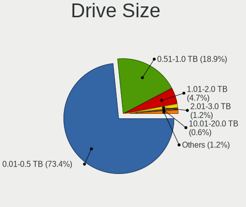
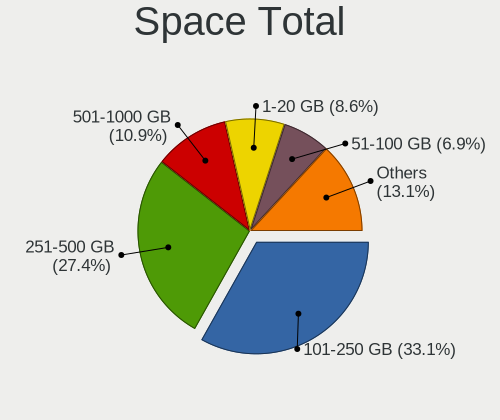
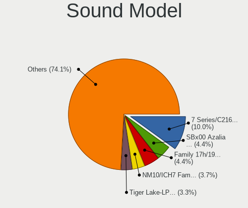

ROSA - Hardware Trends
----------------------

A project to identify most popular hardware characteristics and track their change
over time based on data collected by Linux users at https://Linux-Hardware.org.

Anyone can contribute to this report by the [hw-probe](https://github.com/linuxhw/hw-probe) tool:

    sudo -E hw-probe -all -upload

This is a report for all computer types. See also reports for [desktops](/Dist/ROSA/Desktop/README.md) and [notebooks](/Dist/ROSA/Notebook/README.md).

This report is for one last month. Overall report since the beginning of time: [TestDays](https://github.com/linuxhw/TestDays)

Period: May, 2023.

Contents
--------

* [ System ](#system)
  - [ OS                       ](#os)
  - [ OS Family                ](#os-family)
  - [ Kernel                   ](#kernel)
  - [ Kernel Family            ](#kernel-family)
  - [ Kernel Major Ver.        ](#kernel-major-ver)
  - [ Arch                     ](#arch)
  - [ DE                       ](#de)
  - [ Display Server           ](#display-server)
  - [ Display Manager          ](#display-manager)
  - [ OS Lang                  ](#os-lang)
  - [ Boot Mode                ](#boot-mode)
  - [ Filesystem               ](#filesystem)
  - [ Part. scheme             ](#part-scheme)
  - [ Dual Boot with Linux/BSD ](#dual-boot-with-linuxbsd)
  - [ Dual Boot (Win)          ](#dual-boot-win)

* [ Board ](#board)
  - [ Vendor                   ](#vendor)
  - [ Model                    ](#model)
  - [ Model Family             ](#model-family)
  - [ MFG Year                 ](#mfg-year)
  - [ Form Factor              ](#form-factor)
  - [ Secure Boot              ](#secure-boot)
  - [ Coreboot                 ](#coreboot)
  - [ RAM Size                 ](#ram-size)
  - [ RAM Used                 ](#ram-used)
  - [ Total Drives             ](#total-drives)
  - [ Has CD-ROM               ](#has-cd-rom)
  - [ Has Ethernet             ](#has-ethernet)
  - [ Has WiFi                 ](#has-wifi)
  - [ Has Bluetooth            ](#has-bluetooth)

* [ Location ](#location)
  - [ Country                  ](#country)
  - [ City                     ](#city)

* [ Drives ](#drives)
  - [ Drive Vendor             ](#drive-vendor)
  - [ Drive Model              ](#drive-model)
  - [ HDD Vendor               ](#hdd-vendor)
  - [ SSD Vendor               ](#ssd-vendor)
  - [ Drive Kind               ](#drive-kind)
  - [ Drive Connector          ](#drive-connector)
  - [ Drive Size               ](#drive-size)
  - [ Space Total              ](#space-total)
  - [ Space Used               ](#space-used)
  - [ Malfunc. Drives          ](#malfunc-drives)
  - [ Malfunc. Drive Vendor    ](#malfunc-drive-vendor)
  - [ Malfunc. HDD Vendor      ](#malfunc-hdd-vendor)
  - [ Malfunc. Drive Kind      ](#malfunc-drive-kind)
  - [ Failed Drives            ](#failed-drives)
  - [ Failed Drive Vendor      ](#failed-drive-vendor)
  - [ Drive Status             ](#drive-status)

* [ Storage controller ](#storage-controller)
  - [ Storage Vendor           ](#storage-vendor)
  - [ Storage Model            ](#storage-model)
  - [ Storage Kind             ](#storage-kind)

* [ Processor ](#processor)
  - [ CPU Vendor               ](#cpu-vendor)
  - [ CPU Model                ](#cpu-model)
  - [ CPU Model Family         ](#cpu-model-family)
  - [ CPU Cores                ](#cpu-cores)
  - [ CPU Sockets              ](#cpu-sockets)
  - [ CPU Threads              ](#cpu-threads)
  - [ CPU Op-Modes             ](#cpu-op-modes)
  - [ CPU Microcode            ](#cpu-microcode)
  - [ CPU Microarch            ](#cpu-microarch)

* [ Graphics ](#graphics)
  - [ GPU Vendor               ](#gpu-vendor)
  - [ GPU Model                ](#gpu-model)
  - [ GPU Combo                ](#gpu-combo)
  - [ GPU Driver               ](#gpu-driver)
  - [ GPU Memory               ](#gpu-memory)

* [ Monitor ](#monitor)
  - [ Monitor Vendor           ](#monitor-vendor)
  - [ Monitor Model            ](#monitor-model)
  - [ Monitor Resolution       ](#monitor-resolution)
  - [ Monitor Diagonal         ](#monitor-diagonal)
  - [ Monitor Width            ](#monitor-width)
  - [ Aspect Ratio             ](#aspect-ratio)
  - [ Monitor Area             ](#monitor-area)
  - [ Pixel Density            ](#pixel-density)
  - [ Multiple Monitors        ](#multiple-monitors)

* [ Network ](#network)
  - [ Net Controller Vendor    ](#net-controller-vendor)
  - [ Net Controller Model     ](#net-controller-model)
  - [ Wireless Vendor          ](#wireless-vendor)
  - [ Wireless Model           ](#wireless-model)
  - [ Ethernet Vendor          ](#ethernet-vendor)
  - [ Ethernet Model           ](#ethernet-model)
  - [ Net Controller Kind      ](#net-controller-kind)
  - [ Used Controller          ](#used-controller)
  - [ NICs                     ](#nics)
  - [ IPv6                     ](#ipv6)

* [ Bluetooth ](#bluetooth)
  - [ Bluetooth Vendor         ](#bluetooth-vendor)
  - [ Bluetooth Model          ](#bluetooth-model)

* [ Sound ](#sound)
  - [ Sound Vendor             ](#sound-vendor)
  - [ Sound Model              ](#sound-model)

* [ Memory ](#memory)
  - [ Memory Vendor            ](#memory-vendor)
  - [ Memory Model             ](#memory-model)
  - [ Memory Kind              ](#memory-kind)
  - [ Memory Form Factor       ](#memory-form-factor)
  - [ Memory Size              ](#memory-size)
  - [ Memory Speed             ](#memory-speed)

* [ Printers & scanners ](#printers--scanners)
  - [ Printer Vendor           ](#printer-vendor)
  - [ Printer Model            ](#printer-model)
  - [ Scanner Vendor           ](#scanner-vendor)
  - [ Scanner Model            ](#scanner-model)

* [ Camera ](#camera)
  - [ Camera Vendor            ](#camera-vendor)
  - [ Camera Model             ](#camera-model)

* [ Security ](#security)
  - [ Fingerprint Vendor       ](#fingerprint-vendor)
  - [ Fingerprint Model        ](#fingerprint-model)
  - [ Chipcard Vendor          ](#chipcard-vendor)
  - [ Chipcard Model           ](#chipcard-model)

* [ Unsupported ](#unsupported)
  - [ Unsupported Devices      ](#unsupported-devices)
  - [ Unsupported Device Types ](#unsupported-device-types)

System
------

OS
--

Installed operating systems

| Name        | Computers | Percent |
|-------------|-----------|---------|
| ROSA 12.4   | 170       | 79.07%  |
| ROSA 12.3   | 15        | 6.98%   |
| ROSA R11.1  | 9         | 4.19%   |
| ROSA 12     | 8         | 3.72%   |
| ROSA 12.1   | 4         | 1.86%   |
| ROSA R11    | 2         | 0.93%   |
| ROSA 2021.1 | 2         | 0.93%   |
| ROSA 13.0   | 2         | 0.93%   |
| ROSA R9     | 1         | 0.47%   |
| ROSA R10    | 1         | 0.47%   |
| ROSA 12.2   | 1         | 0.47%   |

OS Family
---------

OS without a version

| Name | Computers | Percent |
|------|-----------|---------|
| ROSA | 215       | 100%    |

Kernel
------

Version of the Linux kernel

| Version                                   | Computers | Percent |
|-------------------------------------------|-----------|---------|
| 6.1.20-generic-2rosa2021.1-x86_64         | 141       | 65.58%  |
| 5.15.103-generic-1rosa2021.1-x86_64       | 14        | 6.51%   |
| 5.10.176-generic-1rosa2021.1-x86_64       | 9         | 4.19%   |
| 5.15.75-generic-1rosa2021.1-x86_64        | 7         | 3.26%   |
| 5.10.74-generic-2rosa2021.1-x86_64        | 5         | 2.33%   |
| 5.15.103-generic-1rosa2021.1-i686         | 4         | 1.86%   |
| 4.15.0-desktop-122.124.1rosa-x86_64       | 3         | 1.4%    |
| 6.2.12.xm1-1.klp-xanmod-rosa2021.1-x86_64 | 2         | 0.93%   |
| 6.1.30.xm1-1.klp-xanmod-rosa2021.1-x86_64 | 2         | 0.93%   |
| 5.4.83-generic-2rosa-x86_64               | 2         | 0.93%   |
| 5.4.83-generic-2rosa-i586                 | 2         | 0.93%   |
| 5.17.11-generic-2rosa2021.1-x86_64        | 2         | 0.93%   |
| 5.15.79-generic-1rosa2021.1-x86_64        | 2         | 0.93%   |
| 5.15.77-generic-1rosa2021.1-x86_64        | 2         | 0.93%   |
| 5.15.75-generic-1rosa2021.1-i686          | 2         | 0.93%   |
| 5.10.155-generic-1rosa2021.1-x86_64       | 2         | 0.93%   |
| 6.3.1.xm1-1.klp-xanmod-rosa2021.1-x86_64  | 1         | 0.47%   |
| 6.3.1-generic-1rosa2021.1-x86_64          | 1         | 0.47%   |
| 6.1.29.xm1-1.klp-xanmod-rosa2021.1-x86_64 | 1         | 0.47%   |
| 6.1.29-generic-1rosa2023.1-x86_64         | 1         | 0.47%   |
| 6.1.27-generic-1rosa2023.1-x86_64         | 1         | 0.47%   |
| 6.0.12.xm1-1.klp-xanmod-rosa2021.1-x86_64 | 1         | 0.47%   |
| 5.10.71-generic-1rosa2021.1-x86_64        | 1         | 0.47%   |
| 5.10.176-generic-1rosa2021.1-i586         | 1         | 0.47%   |
| 5.0.0-desktop-38.1rosa-x86_64             | 1         | 0.47%   |
| 4.9.60-nrj-desktop-1rosa-x86_64           | 1         | 0.47%   |
| 4.9.20-nrj-desktop-1rosa-x86_64           | 1         | 0.47%   |
| 4.15.0-desktop-45.1rosa-x86_64            | 1         | 0.47%   |
| 4.15.0-desktop-45.1rosa-i586              | 1         | 0.47%   |
| 4.15.0-desktop-122.124.1rosa-i586         | 1         | 0.47%   |

Kernel Family
-------------

Linux kernel without a distro release

| Version  | Computers | Percent |
|----------|-----------|---------|
| 6.1.20   | 141       | 65.58%  |
| 5.15.103 | 18        | 8.37%   |
| 5.10.176 | 10        | 4.65%   |
| 5.15.75  | 9         | 4.19%   |
| 4.15.0   | 6         | 2.79%   |
| 5.10.74  | 5         | 2.33%   |
| 5.4.83   | 4         | 1.86%   |
| 6.3.1    | 2         | 0.93%   |
| 6.2.12   | 2         | 0.93%   |
| 6.1.30   | 2         | 0.93%   |
| 6.1.29   | 2         | 0.93%   |
| 5.17.11  | 2         | 0.93%   |
| 5.15.79  | 2         | 0.93%   |
| 5.15.77  | 2         | 0.93%   |
| 5.10.155 | 2         | 0.93%   |
| 6.1.27   | 1         | 0.47%   |
| 6.0.12   | 1         | 0.47%   |
| 5.10.71  | 1         | 0.47%   |
| 5.0.0    | 1         | 0.47%   |
| 4.9.60   | 1         | 0.47%   |
| 4.9.20   | 1         | 0.47%   |

Kernel Major Ver.
-----------------

Linux kernel major version

| Version | Computers | Percent |
|---------|-----------|---------|
| 6.1     | 146       | 67.91%  |
| 5.15    | 31        | 14.42%  |
| 5.10    | 18        | 8.37%   |
| 4.15    | 6         | 2.79%   |
| 5.4     | 4         | 1.86%   |
| 6.3     | 2         | 0.93%   |
| 6.2     | 2         | 0.93%   |
| 5.17    | 2         | 0.93%   |
| 4.9     | 2         | 0.93%   |
| 6.0     | 1         | 0.47%   |
| 5.0     | 1         | 0.47%   |

Arch
----

OS architecture (x86_64, i586, etc.)

| Name   | Computers | Percent |
|--------|-----------|---------|
| x86_64 | 204       | 94.88%  |
| i686   | 11        | 5.12%   |

DE
--

Desktop Environment

| Name  | Computers | Percent |
|-------|-----------|---------|
| KDE5  | 118       | 54.88%  |
| GNOME | 60        | 27.91%  |
| LXQt  | 24        | 11.16%  |
| KDE4  | 11        | 5.12%   |
| XFCE  | 1         | 0.47%   |
| i3    | 1         | 0.47%   |

Display Server
--------------

X11 or Wayland

| Name    | Computers | Percent |
|---------|-----------|---------|
| Wayland | 161       | 74.88%  |
| X11     | 52        | 24.19%  |
| Tty     | 2         | 0.93%   |

Display Manager
---------------

SDDM, LightDM, etc.

| Name    | Computers | Percent |
|---------|-----------|---------|
| SDDM    | 113       | 52.56%  |
| GDM     | 81        | 37.67%  |
| KDM     | 11        | 5.12%   |
| LightDM | 8         | 3.72%   |
| Unknown | 2         | 0.93%   |

OS Lang
-------

Language

| Lang    | Computers | Percent |
|---------|-----------|---------|
| ru_RU   | 188       | 87.44%  |
| en_US   | 8         | 3.72%   |
| de_DE   | 4         | 1.86%   |
| Unknown | 4         | 1.86%   |
| es_ES   | 2         | 0.93%   |
| en_GB   | 2         | 0.93%   |
| tr_TR   | 1         | 0.47%   |
| pt_PT   | 1         | 0.47%   |
| pt_BR   | 1         | 0.47%   |
| it_IT   | 1         | 0.47%   |
| es_PE   | 1         | 0.47%   |
| es_MX   | 1         | 0.47%   |
| es_CO   | 1         | 0.47%   |

Boot Mode
---------

EFI or BIOS

| Mode | Computers | Percent |
|------|-----------|---------|
| EFI  | 116       | 53.95%  |
| BIOS | 99        | 46.05%  |

Filesystem
----------

Type of filesystem

| Type    | Computers | Percent |
|---------|-----------|---------|
| Ext4    | 199       | 92.56%  |
| Btrfs   | 13        | 6.05%   |
| Overlay | 1         | 0.47%   |
| F2fs    | 1         | 0.47%   |
| Aufs    | 1         | 0.47%   |

Part. scheme
------------

Scheme of partitioning

| Type    | Computers | Percent |
|---------|-----------|---------|
| GPT     | 133       | 61.86%  |
| MBR     | 78        | 36.28%  |
| Unknown | 4         | 1.86%   |

Dual Boot with Linux/BSD
------------------------

Hosting more than one Linux/BSD

| Dual boot | Computers | Percent |
|-----------|-----------|---------|
| No        | 155       | 72.09%  |
| Yes       | 60        | 27.91%  |

Dual Boot (Win)
---------------

Hosting Linux and Windows

| Dual boot | Computers | Percent |
|-----------|-----------|---------|
| No        | 125       | 58.14%  |
| Yes       | 90        | 41.86%  |

Board
-----

Vendor
------

Motherboard manufacturer

| Name                     | Computers | Percent |
|--------------------------|-----------|---------|
| ASUSTek Computer         | 48        | 22.33%  |
| Gigabyte Technology      | 33        | 15.35%  |
| Hewlett-Packard          | 19        | 8.84%   |
| Acer                     | 19        | 8.84%   |
| Lenovo                   | 15        | 6.98%   |
| MSI                      | 13        | 6.05%   |
| ASRock                   | 13        | 6.05%   |
| Dell                     | 7         | 3.26%   |
| Samsung Electronics      | 6         | 2.79%   |
| Unknown                  | 4         | 1.86%   |
| Packard Bell             | 3         | 1.4%    |
| HONOR                    | 3         | 1.4%    |
| Clevo                    | 3         | 1.4%    |
| Toshiba                  | 2         | 0.93%   |
| THUNDEROBOT              | 2         | 0.93%   |
| OEM                      | 2         | 0.93%   |
| LTD Delovoy Office       | 2         | 0.93%   |
| Intel                    | 2         | 0.93%   |
| Biostar                  | 2         | 0.93%   |
| Timi                     | 1         | 0.47%   |
| Sony                     | 1         | 0.47%   |
| Notebook                 | 1         | 0.47%   |
| Maibenben                | 1         | 0.47%   |
| MACHINIST                | 1         | 0.47%   |
| Irbis                    | 1         | 0.47%   |
| Infinix                  | 1         | 0.47%   |
| ICL-KME CS               | 1         | 0.47%   |
| Huanan                   | 1         | 0.47%   |
| HIPER Technology Limited | 1         | 0.47%   |
| GX55                     | 1         | 0.47%   |
| eMachines                | 1         | 0.47%   |
| ECS                      | 1         | 0.47%   |
| Digma                    | 1         | 0.47%   |
| ATOPNUC                  | 1         | 0.47%   |
| Apple                    | 1         | 0.47%   |
| AMD                      | 1         | 0.47%   |

Model
-----

Motherboard model

| Name                                | Computers | Percent |
|-------------------------------------|-----------|---------|
| ASUS All Series                     | 5         | 2.33%   |
| Unknown                             | 4         | 1.86%   |
| ASRock B450 Gaming K4               | 3         | 1.4%    |
| Packard Bell DOT S                  | 2         | 0.93%   |
| HP 255 G8 Notebook PC               | 2         | 0.93%   |
| Gigabyte B550 AORUS PRO AC          | 2         | 0.93%   |
| Gigabyte B450M S2H                  | 2         | 0.93%   |
| Acer Aspire ES1-523                 | 2         | 0.93%   |
| Toshiba Satellite L850D-BNK         | 1         | 0.47%   |
| Toshiba Satellite L755              | 1         | 0.47%   |
| Timi Xiaomi Book Pro 14 2022        | 1         | 0.47%   |
| THUNDEROBOT IGER F1                 | 1         | 0.47%   |
| THUNDEROBOT 911AirXD                | 1         | 0.47%   |
| Sony VPCZ23Q9R                      | 1         | 0.47%   |
| Samsung RV410/RV510/S3510/E3510     | 1         | 0.47%   |
| Samsung R780                        | 1         | 0.47%   |
| Samsung R710                        | 1         | 0.47%   |
| Samsung N130                        | 1         | 0.47%   |
| Samsung 350V5C/351V5C/3540VC/3440VC | 1         | 0.47%   |
| Samsung 300V3A/300V4A/300V5A        | 1         | 0.47%   |
| Packard Bell EasyNote TK85          | 1         | 0.47%   |
| OEM X99-Turbo                       | 1         | 0.47%   |
| OEM X79G                            | 1         | 0.47%   |
| Notebook W250EGQ / W270EGQ          | 1         | 0.47%   |
| MSI MS-7D25                         | 1         | 0.47%   |
| MSI MS-7D18                         | 1         | 0.47%   |
| MSI MS-7C37                         | 1         | 0.47%   |
| MSI MS-7B17                         | 1         | 0.47%   |
| MSI MS-7A38                         | 1         | 0.47%   |
| MSI MS-7A33                         | 1         | 0.47%   |
| MSI MS-7A15                         | 1         | 0.47%   |
| MSI MS-7970                         | 1         | 0.47%   |
| MSI MS-7599                         | 1         | 0.47%   |
| MSI MS-7597                         | 1         | 0.47%   |
| MSI MS-7592                         | 1         | 0.47%   |
| MSI GP60 2OD                        | 1         | 0.47%   |
| MSI GE60 2PC                        | 1         | 0.47%   |
| Maibenben MaiBook M                 | 1         | 0.47%   |
| MACHINIST E5-RS9 V1.11              | 1         | 0.47%   |
| LTD Delovoy Office EVE 14 C414      | 1         | 0.47%   |

Model Family
------------

Motherboard model prefix

| Name                  | Computers | Percent |
|-----------------------|-----------|---------|
| Acer Aspire           | 13        | 6.05%   |
| ASUS TUF              | 6         | 2.79%   |
| ASUS PRIME            | 6         | 2.79%   |
| HP ProBook            | 5         | 2.33%   |
| Dell Inspiron         | 5         | 2.33%   |
| ASUS All              | 5         | 2.33%   |
| ASUS ROG              | 4         | 1.86%   |
| Unknown               | 4         | 1.86%   |
| HP Laptop             | 3         | 1.4%    |
| ASUS P8H61-M          | 3         | 1.4%    |
| ASRock B450           | 3         | 1.4%    |
| Toshiba Satellite     | 2         | 0.93%   |
| Packard Bell DOT      | 2         | 0.93%   |
| Lenovo ThinkPad       | 2         | 0.93%   |
| Lenovo Legion         | 2         | 0.93%   |
| Lenovo IdeaPad        | 2         | 0.93%   |
| HP Pavilion           | 2         | 0.93%   |
| HP 255                | 2         | 0.93%   |
| Gigabyte B550         | 2         | 0.93%   |
| Gigabyte B450M        | 2         | 0.93%   |
| ASUS VivoBook         | 2         | 0.93%   |
| ASUS Maximus          | 2         | 0.93%   |
| ASUS ASUS             | 2         | 0.93%   |
| Acer TravelMate       | 2         | 0.93%   |
| Timi Xiaomi           | 1         | 0.47%   |
| THUNDEROBOT IGER      | 1         | 0.47%   |
| THUNDEROBOT 911AirXD  | 1         | 0.47%   |
| Sony VPCZ23Q9R        | 1         | 0.47%   |
| Samsung RV410         | 1         | 0.47%   |
| Samsung R780          | 1         | 0.47%   |
| Samsung R710          | 1         | 0.47%   |
| Samsung N130          | 1         | 0.47%   |
| Samsung 350V5C        | 1         | 0.47%   |
| Samsung 300V3A        | 1         | 0.47%   |
| Packard Bell EasyNote | 1         | 0.47%   |
| OEM X99-Turbo         | 1         | 0.47%   |
| OEM X79G              | 1         | 0.47%   |
| Notebook W250EGQ      | 1         | 0.47%   |
| MSI MS-7D25           | 1         | 0.47%   |
| MSI MS-7D18           | 1         | 0.47%   |

MFG Year
--------

Motherboard manufacture year

| Year | Computers | Percent |
|------|-----------|---------|
| 2011 | 30        | 13.95%  |
| 2012 | 28        | 13.02%  |
| 2022 | 19        | 8.84%   |
| 2021 | 18        | 8.37%   |
| 2018 | 18        | 8.37%   |
| 2020 | 17        | 7.91%   |
| 2013 | 13        | 6.05%   |
| 2019 | 11        | 5.12%   |
| 2010 | 11        | 5.12%   |
| 2009 | 11        | 5.12%   |
| 2016 | 9         | 4.19%   |
| 2014 | 9         | 4.19%   |
| 2017 | 7         | 3.26%   |
| 2015 | 5         | 2.33%   |
| 2008 | 3         | 1.4%    |
| 2007 | 3         | 1.4%    |
| 2006 | 2         | 0.93%   |
| 2023 | 1         | 0.47%   |

Form Factor
-----------

Physical design of the computer

| Name        | Computers | Percent |
|-------------|-----------|---------|
| Desktop     | 111       | 51.63%  |
| Notebook    | 97        | 45.12%  |
| Mini pc     | 3         | 1.4%    |
| Server      | 2         | 0.93%   |
| Convertible | 1         | 0.47%   |
| All in one  | 1         | 0.47%   |

Secure Boot
-----------

Enabled or disabled

| State    | Computers | Percent |
|----------|-----------|---------|
| Disabled | 215       | 100%    |

Coreboot
--------

Have coreboot on board

| Used | Computers | Percent |
|------|-----------|---------|
| No   | 215       | 100%    |

RAM Size
--------

Total RAM memory

| Size in GB      | Computers | Percent |
|-----------------|-----------|---------|
| 8.01-16.0       | 53        | 24.65%  |
| 4.01-8.0        | 50        | 23.26%  |
| 16.01-24.0      | 39        | 18.14%  |
| 3.01-4.0        | 32        | 14.88%  |
| 32.01-64.0      | 17        | 7.91%   |
| 1.01-2.0        | 11        | 5.12%   |
| 2.01-3.0        | 6         | 2.79%   |
| 64.01-256.0     | 4         | 1.86%   |
| More than 256.0 | 1         | 0.47%   |
| 24.01-32.0      | 1         | 0.47%   |
| 0.51-1.0        | 1         | 0.47%   |

RAM Used
--------

Used RAM memory

| Used GB   | Computers | Percent |
|-----------|-----------|---------|
| 1.01-2.0  | 112       | 52.09%  |
| 2.01-3.0  | 39        | 18.14%  |
| 0.51-1.0  | 33        | 15.35%  |
| 4.01-8.0  | 15        | 6.98%   |
| 3.01-4.0  | 11        | 5.12%   |
| 8.01-16.0 | 3         | 1.4%    |
| 0.01-0.5  | 2         | 0.93%   |

Total Drives
------------

Number of drives on board

| Drives | Computers | Percent |
|--------|-----------|---------|
| 1      | 102       | 47.44%  |
| 2      | 72        | 33.49%  |
| 3      | 28        | 13.02%  |
| 4      | 7         | 3.26%   |
| 5      | 4         | 1.86%   |
| 19     | 1         | 0.47%   |
| 6      | 1         | 0.47%   |

Has CD-ROM
----------

Has CD-ROM on board

| Presented | Computers | Percent |
|-----------|-----------|---------|
| No        | 150       | 69.77%  |
| Yes       | 65        | 30.23%  |

Has Ethernet
------------

Has Ethernet on board

| Presented | Computers | Percent |
|-----------|-----------|---------|
| Yes       | 200       | 93.02%  |
| No        | 15        | 6.98%   |

Has WiFi
--------

Has WiFi module

| Presented | Computers | Percent |
|-----------|-----------|---------|
| Yes       | 136       | 63.26%  |
| No        | 79        | 36.74%  |

Has Bluetooth
-------------

Has Bluetooth module

| Presented | Computers | Percent |
|-----------|-----------|---------|
| No        | 117       | 54.42%  |
| Yes       | 98        | 45.58%  |

Location
--------

Country
-------

Geographic location (country)

| Country    | Computers | Percent |
|------------|-----------|---------|
| Russia     | 180       | 83.72%  |
| Germany    | 6         | 2.79%   |
| USA        | 5         | 2.33%   |
| Ukraine    | 5         | 2.33%   |
| Belarus    | 4         | 1.86%   |
| Brazil     | 3         | 1.4%    |
| Spain      | 2         | 0.93%   |
| Kazakhstan | 2         | 0.93%   |
| Turkey     | 1         | 0.47%   |
| Portugal   | 1         | 0.47%   |
| Peru       | 1         | 0.47%   |
| Mexico     | 1         | 0.47%   |
| Italy      | 1         | 0.47%   |
| Czechia    | 1         | 0.47%   |
| Costa Rica | 1         | 0.47%   |
| Colombia   | 1         | 0.47%   |

City
----

Geographic location (city)

| City             | Computers | Percent |
|------------------|-----------|---------|
| Moscow           | 40        | 18.6%   |
| St Petersburg    | 14        | 6.51%   |
| Yekaterinburg    | 9         | 4.19%   |
| Krasnodar        | 6         | 2.79%   |
| Novosibirsk      | 5         | 2.33%   |
| Khabarovsk       | 5         | 2.33%   |
| Saransk          | 4         | 1.86%   |
| Omsk             | 4         | 1.86%   |
| Volgograd        | 3         | 1.4%    |
| Tyumen           | 3         | 1.4%    |
| Samara           | 3         | 1.4%    |
| Orenburg         | 3         | 1.4%    |
| Krasnoyarsk      | 3         | 1.4%    |
| Kirov            | 3         | 1.4%    |
| Kanevskaya       | 3         | 1.4%    |
| Kaluga           | 3         | 1.4%    |
| Bryansk          | 3         | 1.4%    |
| Yaroslavl        | 2         | 0.93%   |
| Voronezh         | 2         | 0.93%   |
| Vladimir         | 2         | 0.93%   |
| Tomsk            | 2         | 0.93%   |
| Surgut           | 2         | 0.93%   |
| Rostov-on-Don    | 2         | 0.93%   |
| Perm             | 2         | 0.93%   |
| Nizhniy Novgorod | 2         | 0.93%   |
| Barnaul          | 2         | 0.93%   |
| Zlatoust         | 1         | 0.47%   |
| Zhabinka         | 1         | 0.47%   |
| Zelenodolsk      | 1         | 0.47%   |
| Witten           | 1         | 0.47%   |
| Vorkuta          | 1         | 0.47%   |
| Volgodonsk       | 1         | 0.47%   |
| Vladivostok      | 1         | 0.47%   |
| Valley Stream    | 1         | 0.47%   |
| Ust-Kamenogorsk  | 1         | 0.47%   |
| Ulyanovsk        | 1         | 0.47%   |
| Ufa              | 1         | 0.47%   |
| Tula             | 1         | 0.47%   |
| Tsarskoye Selo   | 1         | 0.47%   |
| Troitsk          | 1         | 0.47%   |

Drives
------

Drive Vendor
------------

Hard drive vendors

| Vendor                | Computers | Drives | Percent |
|-----------------------|-----------|--------|---------|
| WDC                   | 58        | 82     | 16.76%  |
| Seagate               | 48        | 55     | 13.87%  |
| Samsung Electronics   | 37        | 48     | 10.69%  |
| Kingston              | 21        | 21     | 6.07%   |
| Toshiba               | 19        | 20     | 5.49%   |
| Hitachi               | 19        | 19     | 5.49%   |
| SPCC                  | 8         | 9      | 2.31%   |
| Intel                 | 8         | 8      | 2.31%   |
| HGST                  | 8         | 8      | 2.31%   |
| Crucial               | 8         | 8      | 2.31%   |
| KingSpec              | 7         | 7      | 2.02%   |
| SK hynix              | 6         | 6      | 1.73%   |
| SanDisk               | 6         | 6      | 1.73%   |
| China                 | 6         | 6      | 1.73%   |
| Apacer                | 6         | 6      | 1.73%   |
| Unknown               | 6         | 6      | 1.73%   |
| Unknown               | 5         | 5      | 1.45%   |
| AMD                   | 5         | 5      | 1.45%   |
| A-DATA Technology     | 5         | 5      | 1.45%   |
| Transcend             | 3         | 3      | 0.87%   |
| Smartbuy              | 3         | 3      | 0.87%   |
| Silicon Motion        | 3         | 3      | 0.87%   |
| Patriot               | 3         | 3      | 0.87%   |
| Netac                 | 3         | 3      | 0.87%   |
| XrayDisk              | 2         | 2      | 0.58%   |
| XPG                   | 2         | 2      | 0.58%   |
| SSSTC                 | 2         | 2      | 0.58%   |
| Maxtor                | 2         | 2      | 0.58%   |
| Hewlett-Packard       | 2         | 3      | 0.58%   |
| Gigabyte Technology   | 2         | 2      | 0.58%   |
| Colorful              | 2         | 2      | 0.58%   |
| BIWIN                 | 2         | 2      | 0.58%   |
| ZM-SSD                | 1         | 1      | 0.29%   |
| ZHITAI                | 1         | 1      | 0.29%   |
| Wdxsky                | 1         | 1      | 0.29%   |
| StoreJet              | 1         | 1      | 0.29%   |
| SCY                   | 1         | 1      | 0.29%   |
| Realtek Semiconductor | 1         | 1      | 0.29%   |
| Qumo                  | 1         | 1      | 0.29%   |
| PNY                   | 1         | 1      | 0.29%   |

Drive Model
-----------

Hard drive models

| Model                               | Computers | Percent |
|-------------------------------------|-----------|---------|
| Unknown                             | 6         | 1.61%   |
| WDC WD10EZEX-08WN4A0 1TB            | 4         | 1.07%   |
| SPCC Solid State Disk 256GB         | 4         | 1.07%   |
| Seagate ST500DM002-1BD142 500GB     | 4         | 1.07%   |
| Seagate ST1000DM010-2EP102 1TB      | 4         | 1.07%   |
| Kingston SA400S37240G 240GB SSD     | 4         | 1.07%   |
| Kingston SA400S37120G 120GB SSD     | 4         | 1.07%   |
| Crucial CT240BX500SSD1 240GB        | 4         | 1.07%   |
| WDC WD5000AAKX-00ERMA0 500GB        | 3         | 0.8%    |
| WDC WD10EZEX-00BBHA0 1TB            | 3         | 0.8%    |
| Toshiba HDWD110 1TB                 | 3         | 0.8%    |
| Kingston SV300S37A120G 120GB SSD    | 3         | 0.8%    |
| KingSpec P3-128 128GB SSD           | 3         | 0.8%    |
| China SSD 128GB                     | 3         | 0.8%    |
| WDC WDS240G2G0A-00JH30 240GB SSD    | 2         | 0.54%   |
| WDC WDS100T2B0C-00PXH0 1TB          | 2         | 0.54%   |
| WDC WD5000LPCX-24VHAT0 500GB        | 2         | 0.54%   |
| WDC WD10EZEX-00RKKA0 1TB            | 2         | 0.54%   |
| Toshiba MQ01ABD032 320GB            | 2         | 0.54%   |
| Toshiba DT01ACA100 1TB              | 2         | 0.54%   |
| Toshiba DT01ACA050 500GB            | 2         | 0.54%   |
| Seagate ST9500325AS 500GB           | 2         | 0.54%   |
| Seagate ST3250310AS 250GB           | 2         | 0.54%   |
| Seagate ST2000DM005-2CW102 2TB      | 2         | 0.54%   |
| Seagate ST1000DM003-1CH162 1TB      | 2         | 0.54%   |
| SanDisk SD8SN8U-128G-1006 128GB SSD | 2         | 0.54%   |
| Samsung SSD 980 PRO 1TB             | 2         | 0.54%   |
| Samsung SSD 970 EVO Plus 500GB      | 2         | 0.54%   |
| Samsung SSD 870 EVO 2TB             | 2         | 0.54%   |
| Samsung SSD 870 EVO 250GB           | 2         | 0.54%   |
| Samsung HM321HI 320GB               | 2         | 0.54%   |
| Kingston SA400S37480G 480GB SSD     | 2         | 0.54%   |
| Kingston SA400M8240G 240GB SSD      | 2         | 0.54%   |
| KingSpec P3-512 512GB               | 2         | 0.54%   |
| Hitachi HTS543232A7A384 320GB       | 2         | 0.54%   |
| HGST HTS721010A9E630 1TB            | 2         | 0.54%   |
| HGST HTS545050A7E680 500GB          | 2         | 0.54%   |
| ZM-SSD SSD 256GB                    | 1         | 0.27%   |
| ZHITAI SC001 Active 256GB SSD       | 1         | 0.27%   |
| XrayDisk 512GB SSD                  | 1         | 0.27%   |

HDD Vendor
----------

Hard disk drive vendors

| Vendor              | Computers | Drives | Percent |
|---------------------|-----------|--------|---------|
| WDC                 | 51        | 71     | 33.33%  |
| Seagate             | 46        | 53     | 30.07%  |
| Hitachi             | 19        | 19     | 12.42%  |
| Toshiba             | 18        | 19     | 11.76%  |
| HGST                | 8         | 8      | 5.23%   |
| Samsung Electronics | 7         | 7      | 4.58%   |
| Maxtor              | 2         | 2      | 1.31%   |
| Unknown             | 1         | 1      | 0.65%   |
| HGST HTS            | 1         | 1      | 0.65%   |

SSD Vendor
----------

Solid state drive vendors

| Vendor              | Computers | Drives | Percent |
|---------------------|-----------|--------|---------|
| Kingston            | 18        | 18     | 13.95%  |
| Samsung Electronics | 15        | 21     | 11.63%  |
| Crucial             | 8         | 8      | 6.2%    |
| KingSpec            | 7         | 7      | 5.43%   |
| WDC                 | 6         | 6      | 4.65%   |
| SPCC                | 6         | 6      | 4.65%   |
| Intel               | 6         | 6      | 4.65%   |
| China               | 6         | 6      | 4.65%   |
| SanDisk             | 5         | 5      | 3.88%   |
| AMD                 | 5         | 5      | 3.88%   |
| Apacer              | 4         | 4      | 3.1%    |
| Smartbuy            | 3         | 3      | 2.33%   |
| Netac               | 3         | 3      | 2.33%   |
| XrayDisk            | 2         | 2      | 1.55%   |
| Transcend           | 2         | 2      | 1.55%   |
| Patriot             | 2         | 2      | 1.55%   |
| Hewlett-Packard     | 2         | 3      | 1.55%   |
| A-DATA Technology   | 2         | 2      | 1.55%   |
| Unknown             | 2         | 2      | 1.55%   |
| ZM-SSD              | 1         | 1      | 0.78%   |
| ZHITAI              | 1         | 1      | 0.78%   |
| Wdxsky              | 1         | 1      | 0.78%   |
| Unknown             | 1         | 1      | 0.78%   |
| StoreJet            | 1         | 1      | 0.78%   |
| Seagate             | 1         | 1      | 0.78%   |
| SCY                 | 1         | 1      | 0.78%   |
| Qumo                | 1         | 1      | 0.78%   |
| PNY                 | 1         | 1      | 0.78%   |
| Plextor             | 1         | 1      | 0.78%   |
| OCZ                 | 1         | 1      | 0.78%   |
| NGFF                | 1         | 1      | 0.78%   |
| KingDian            | 1         | 1      | 0.78%   |
| JAMESDONKEY         | 1         | 1      | 0.78%   |
| Intenso             | 1         | 2      | 0.78%   |
| Hoodisk             | 1         | 1      | 0.78%   |
| GOODRAM             | 1         | 1      | 0.78%   |
| Gigabyte Technology | 1         | 1      | 0.78%   |
| Foxline             | 1         | 1      | 0.78%   |
| Fanxiang            | 1         | 1      | 0.78%   |
| e2e4                | 1         | 1      | 0.78%   |

Drive Kind
----------

HDD or SSD

| Kind | Computers | Drives | Percent |
|------|-----------|--------|---------|
| HDD  | 130       | 181    | 42.35%  |
| SSD  | 112       | 137    | 36.48%  |
| NVMe | 58        | 67     | 18.89%  |
| MMC  | 7         | 7      | 2.28%   |

Drive Connector
---------------

SATA, SAS, NVMe, etc.

| Type | Computers | Drives | Percent |
|------|-----------|--------|---------|
| SATA | 182       | 312    | 71.94%  |
| NVMe | 58        | 67     | 22.92%  |
| MMC  | 7         | 7      | 2.77%   |
| SAS  | 6         | 6      | 2.37%   |

Drive Size
----------

Size of hard drive

| Size in TB | Computers | Drives | Percent |
|------------|-----------|--------|---------|
| 0.01-0.5   | 156       | 205    | 64.73%  |
| 0.51-1.0   | 63        | 75     | 26.14%  |
| 1.01-2.0   | 13        | 25     | 5.39%   |
| 3.01-4.0   | 5         | 9      | 2.07%   |
| 2.01-3.0   | 2         | 2      | 0.83%   |
| 4.01-10.0  | 2         | 2      | 0.83%   |

Space Total
-----------

Amount of disk space available on the file system

| Size in GB     | Computers | Percent |
|----------------|-----------|---------|
| 101-250        | 75        | 34.88%  |
| 251-500        | 36        | 16.74%  |
| 501-1000       | 29        | 13.49%  |
| 1-20           | 28        | 13.02%  |
| 51-100         | 15        | 6.98%   |
| More than 3000 | 8         | 3.72%   |
| 21-50          | 8         | 3.72%   |
| 2001-3000      | 8         | 3.72%   |
| 1001-2000      | 8         | 3.72%   |

Space Used
----------

Amount of used disk space

| Used GB   | Computers | Percent |
|-----------|-----------|---------|
| 1-20      | 125       | 58.14%  |
| 21-50     | 33        | 15.35%  |
| 101-250   | 17        | 7.91%   |
| 51-100    | 14        | 6.51%   |
| 251-500   | 9         | 4.19%   |
| 1001-2000 | 7         | 3.26%   |
| 501-1000  | 7         | 3.26%   |
| 2001-3000 | 3         | 1.4%    |

Malfunc. Drives
---------------

Drive models with a malfunction

| Model                             | Computers | Drives | Percent |
|-----------------------------------|-----------|--------|---------|
| WDC WD10EZEX-00RKKA0 1TB          | 2         | 2      | 2.56%   |
| Toshiba DT01ACA100 1TB            | 2         | 2      | 2.56%   |
| Seagate ST9500325AS 500GB         | 2         | 2      | 2.56%   |
| Seagate ST3250310AS 250GB         | 2         | 2      | 2.56%   |
| Samsung Electronics HM321HI 320GB | 2         | 2      | 2.56%   |
| Hitachi HTS543232A7A384 320GB     | 2         | 2      | 2.56%   |
| XrayDisk 512GB SSD                | 1         | 1      | 1.28%   |
| XPG GAMMIX S5 512GB               | 1         | 1      | 1.28%   |
| WDC WDS240G2G0B-00EPW0 240GB SSD  | 1         | 1      | 1.28%   |
| WDC WD800JD-00MSA1 80GB           | 1         | 1      | 1.28%   |
| WDC WD800JD-00HKA0 80GB           | 1         | 1      | 1.28%   |
| WDC WD7500BPVT-00HXZT3 752GB      | 1         | 1      | 1.28%   |
| WDC WD7500AADS-00M2B0 752GB       | 1         | 1      | 1.28%   |
| WDC WD5000BPVT-75HXZT3 500GB      | 1         | 1      | 1.28%   |
| WDC WD5000BPVT-22HXZT3 500GB      | 1         | 1      | 1.28%   |
| WDC WD5000AAKX-00ERMA0 500GB      | 1         | 1      | 1.28%   |
| WDC WD5000AAKX-001CA0 500GB       | 1         | 1      | 1.28%   |
| WDC WD5000AAKS-00V6A0 500GB       | 1         | 1      | 1.28%   |
| WDC WD3200BPVT-00JJ5T0 320GB      | 1         | 1      | 1.28%   |
| WDC WD3200AAJS-56B4A0 320GB       | 1         | 1      | 1.28%   |
| WDC WD3200AAJS-00YZCA0 320GB      | 1         | 1      | 1.28%   |
| WDC WD2500BEVT-60ZCT1 250GB       | 1         | 1      | 1.28%   |
| WDC WD2500AAKX-001CA0 250GB       | 1         | 1      | 1.28%   |
| WDC WD2500AAKS-00UU3A0 250GB      | 1         | 1      | 1.28%   |
| WDC WD2005FBYZ-01YCBB3 2TB        | 1         | 1      | 1.28%   |
| WDC WD10JPVX-60JC3T0 1TB          | 1         | 1      | 1.28%   |
| WDC WD10EFRX-68PJCN0 1TB          | 1         | 1      | 1.28%   |
| Toshiba MQ04ABF100 1TB            | 1         | 1      | 1.28%   |
| Toshiba MQ01ABD075 752GB          | 1         | 1      | 1.28%   |
| Toshiba MK6459GSXP 640GB          | 1         | 1      | 1.28%   |
| Toshiba MK3276GSX -63 320GB       | 1         | 1      | 1.28%   |
| Toshiba HDWD105 500GB             | 1         | 1      | 1.28%   |
| Toshiba DT01ACA050 500GB          | 1         | 1      | 1.28%   |
| SPCC SSD162 56GB                  | 1         | 1      | 1.28%   |
| Smartbuy SSD 240GB                | 1         | 1      | 1.28%   |
| Seagate ST9750420AS 752GB         | 1         | 1      | 1.28%   |
| Seagate ST9500423AS 500GB         | 1         | 1      | 1.28%   |
| Seagate ST9160314AS 160GB         | 1         | 1      | 1.28%   |
| Seagate ST9120822AS 120GB         | 1         | 1      | 1.28%   |
| Seagate ST500NM0011 500GB         | 1         | 1      | 1.28%   |

Malfunc. Drive Vendor
---------------------

Vendors of faulty drives

| Vendor              | Computers | Drives | Percent |
|---------------------|-----------|--------|---------|
| WDC                 | 17        | 21     | 23.29%  |
| Seagate             | 15        | 16     | 20.55%  |
| Toshiba             | 8         | 8      | 10.96%  |
| Hitachi             | 8         | 8      | 10.96%  |
| Samsung Electronics | 6         | 9      | 8.22%   |
| Intel               | 4         | 4      | 5.48%   |
| Netac               | 2         | 2      | 2.74%   |
| Kingston            | 2         | 2      | 2.74%   |
| HGST                | 2         | 2      | 2.74%   |
| AMD                 | 2         | 2      | 2.74%   |
| XrayDisk            | 1         | 1      | 1.37%   |
| XPG                 | 1         | 1      | 1.37%   |
| SPCC                | 1         | 1      | 1.37%   |
| Smartbuy            | 1         | 1      | 1.37%   |
| ORICO               | 1         | 1      | 1.37%   |
| Hewlett-Packard     | 1         | 1      | 1.37%   |
| Unknown             | 1         | 1      | 1.37%   |

Malfunc. HDD Vendor
-------------------

Vendors of faulty HDD drives

| Vendor              | Computers | Drives | Percent |
|---------------------|-----------|--------|---------|
| WDC                 | 17        | 20     | 31.48%  |
| Seagate             | 15        | 16     | 27.78%  |
| Toshiba             | 8         | 8      | 14.81%  |
| Hitachi             | 8         | 8      | 14.81%  |
| Samsung Electronics | 4         | 4      | 7.41%   |
| HGST                | 2         | 2      | 3.7%    |

Malfunc. Drive Kind
-------------------

Kinds of faulty drives

| Kind | Computers | Drives | Percent |
|------|-----------|--------|---------|
| HDD  | 52        | 58     | 72.22%  |
| SSD  | 17        | 20     | 23.61%  |
| NVMe | 3         | 3      | 4.17%   |

Failed Drives
-------------

Failed drive models

| Model                       | Computers | Drives | Percent |
|-----------------------------|-----------|--------|---------|
| WDC WD10EZEX-60WN4A0 1TB    | 1         | 1      | 33.33%  |
| Toshiba MK3265GSX 320GB     | 1         | 1      | 33.33%  |
| Hitachi HDS721010DLE630 1TB | 1         | 1      | 33.33%  |

Failed Drive Vendor
-------------------

Failed drive vendors

| Vendor  | Computers | Drives | Percent |
|---------|-----------|--------|---------|
| WDC     | 1         | 1      | 33.33%  |
| Toshiba | 1         | 1      | 33.33%  |
| Hitachi | 1         | 1      | 33.33%  |

Drive Status
------------

Number of failed and malfunc. drives

| Status   | Computers | Drives | Percent |
|----------|-----------|--------|---------|
| Works    | 167       | 290    | 66.53%  |
| Malfunc  | 65        | 81     | 25.9%   |
| Detected | 16        | 18     | 6.37%   |
| Failed   | 3         | 3      | 1.2%    |

Storage controller
------------------

Storage Vendor
--------------

Storage controller vendors

| Vendor                         | Computers | Percent |
|--------------------------------|-----------|---------|
| Intel                          | 139       | 49.47%  |
| AMD                            | 62        | 22.06%  |
| Samsung Electronics            | 18        | 6.41%   |
| Silicon Motion                 | 8         | 2.85%   |
| ASMedia Technology             | 7         | 2.49%   |
| SK hynix                       | 6         | 2.14%   |
| SanDisk                        | 6         | 2.14%   |
| Phison Electronics             | 6         | 2.14%   |
| JMicron Technology             | 5         | 1.78%   |
| ADATA Technology               | 5         | 1.78%   |
| Kingston Technology Company    | 3         | 1.07%   |
| Solid State Storage Technology | 2         | 0.71%   |
| Realtek Semiconductor          | 2         | 0.71%   |
| Marvell Technology Group       | 2         | 0.71%   |
| VIA Technologies               | 1         | 0.36%   |
| Toshiba America Info Systems   | 1         | 0.36%   |
| Shenzhen Longsys Electronics   | 1         | 0.36%   |
| Seagate Technology             | 1         | 0.36%   |
| Nvidia                         | 1         | 0.36%   |
| Micron Technology              | 1         | 0.36%   |
| KIOXIA                         | 1         | 0.36%   |
| INNOGRIT                       | 1         | 0.36%   |
| Hewlett-Packard                | 1         | 0.36%   |
| Biwin Storage Technology       | 1         | 0.36%   |

Storage Model
-------------

Storage controller models

| Model                                                                                   | Computers | Percent |
|-----------------------------------------------------------------------------------------|-----------|---------|
| AMD FCH SATA Controller [AHCI mode]                                                     | 32        | 9.85%   |
| AMD SB7x0/SB8x0/SB9x0 IDE Controller                                                    | 11        | 3.38%   |
| Intel 8 Series/C220 Series Chipset Family 6-port SATA Controller 1 [AHCI mode]          | 10        | 3.08%   |
| Intel 7 Series Chipset Family 6-port SATA Controller [AHCI mode]                        | 10        | 3.08%   |
| AMD SB7x0/SB8x0/SB9x0 SATA Controller [IDE mode]                                        | 10        | 3.08%   |
| Intel 6 Series/C200 Series Chipset Family 6 port Mobile SATA AHCI Controller            | 9         | 2.77%   |
| AMD SB7x0/SB8x0/SB9x0 SATA Controller [AHCI mode]                                       | 9         | 2.77%   |
| Samsung NVMe SSD Controller SM981/PM981/PM983                                           | 8         | 2.46%   |
| Intel NM10/ICH7 Family SATA Controller [IDE mode]                                       | 8         | 2.46%   |
| Intel 500 Series Chipset Family SATA AHCI Controller                                    | 8         | 2.46%   |
| AMD 400 Series Chipset SATA Controller                                                  | 8         | 2.46%   |
| Silicon Motion SM2263EN/SM2263XT SSD Controller                                         | 7         | 2.15%   |
| Intel 6 Series/C200 Series Chipset Family 6 port Desktop SATA AHCI Controller           | 7         | 2.15%   |
| ASMedia ASM1062 Serial ATA Controller                                                   | 7         | 2.15%   |
| Intel 82801IBM/IEM (ICH9M/ICH9M-E) 4 port SATA Controller [AHCI mode]                   | 6         | 1.85%   |
| Intel 6 Series/C200 Series Chipset Family Desktop SATA Controller (IDE mode, ports 4-5) | 6         | 1.85%   |
| Intel 6 Series/C200 Series Chipset Family Desktop SATA Controller (IDE mode, ports 0-3) | 6         | 1.85%   |
| AMD 500 Series Chipset SATA Controller                                                  | 6         | 1.85%   |
| Samsung NVMe SSD Controller PM9A1/PM9A3/980PRO                                          | 5         | 1.54%   |
| Intel Sunrise Point-LP SATA Controller [AHCI mode]                                      | 5         | 1.54%   |
| Intel Comet Lake SATA AHCI Controller                                                   | 5         | 1.54%   |
| Intel 7 Series/C210 Series Chipset Family 6-port SATA Controller [AHCI mode]            | 5         | 1.54%   |
| SK hynix Gold P31/PC711 NVMe Solid State Drive                                          | 4         | 1.23%   |
| Samsung NVMe SSD Controller 980                                                         | 4         | 1.23%   |
| Phison PS5013 E13 NVMe Controller                                                       | 4         | 1.23%   |
| Intel NM10/ICH7 Family SATA Controller [AHCI mode]                                      | 4         | 1.23%   |
| Intel Cannon Lake Mobile PCH SATA AHCI Controller                                       | 4         | 1.23%   |
| Intel 5 Series/3400 Series Chipset 4 port SATA AHCI Controller                          | 4         | 1.23%   |
| SanDisk WD Blue SN550 NVMe SSD                                                          | 3         | 0.92%   |
| Intel Volume Management Device NVMe RAID Controller                                     | 3         | 0.92%   |
| Intel Q170/Q150/B150/H170/H110/Z170/CM236 Chipset SATA Controller [AHCI Mode]           | 3         | 0.92%   |
| Intel Celeron/Pentium Silver Processor SATA Controller                                  | 3         | 0.92%   |
| Intel 9 Series Chipset Family SATA Controller [AHCI Mode]                               | 3         | 0.92%   |
| Intel 82801 Mobile SATA Controller [RAID mode]                                          | 3         | 0.92%   |
| Intel 5 Series/3400 Series Chipset 6 port SATA AHCI Controller                          | 3         | 0.92%   |
| Intel 200 Series PCH SATA controller [AHCI mode]                                        | 3         | 0.92%   |
| AMD FCH SATA Controller [IDE mode]                                                      | 3         | 0.92%   |
| AMD FCH SATA Controller D                                                               | 3         | 0.92%   |
| AMD FCH IDE Controller                                                                  | 3         | 0.92%   |
| ADATA XPG SX8200 Pro PCIe Gen3x4 M.2 2280 Solid State Drive                             | 3         | 0.92%   |

Storage Kind
------------

Kind of storage controller (IDE, SATA, NVMe, SAS, ...)

| Kind | Computers | Percent |
|------|-----------|---------|
| SATA | 173       | 62.01%  |
| NVMe | 58        | 20.79%  |
| IDE  | 38        | 13.62%  |
| RAID | 9         | 3.23%   |
| SAS  | 1         | 0.36%   |

Processor
---------

CPU Vendor
----------

Processor vendors

| Vendor | Computers | Percent |
|--------|-----------|---------|
| Intel  | 145       | 67.44%  |
| AMD    | 70        | 32.56%  |

CPU Model
---------

Processor models

| Model                                       | Computers | Percent |
|---------------------------------------------|-----------|---------|
| Intel Core i5-10210U CPU @ 1.60GHz          | 3         | 1.4%    |
| Intel Core i3-2120 CPU @ 3.30GHz            | 3         | 1.4%    |
| Intel 11th Gen Core i5-1135G7 @ 2.40GHz     | 3         | 1.4%    |
| AMD Ryzen 5 5600X 6-Core Processor          | 3         | 1.4%    |
| AMD Ryzen 5 3600 6-Core Processor           | 3         | 1.4%    |
| AMD FX-6300 Six-Core Processor              | 3         | 1.4%    |
| Intel Pentium Dual-Core CPU E5700 @ 3.00GHz | 2         | 0.93%   |
| Intel Pentium CPU P6200 @ 2.13GHz           | 2         | 0.93%   |
| Intel Core i5-8300H CPU @ 2.30GHz           | 2         | 0.93%   |
| Intel Core i5-8265U CPU @ 1.60GHz           | 2         | 0.93%   |
| Intel Core i5-4460 CPU @ 3.20GHz            | 2         | 0.93%   |
| Intel Core i5-3570 CPU @ 3.40GHz            | 2         | 0.93%   |
| Intel Core i5-1035G1 CPU @ 1.00GHz          | 2         | 0.93%   |
| Intel Core i3-3110M CPU @ 2.40GHz           | 2         | 0.93%   |
| Intel Core i3-2310M CPU @ 2.10GHz           | 2         | 0.93%   |
| Intel Core i3-10100 CPU @ 3.60GHz           | 2         | 0.93%   |
| Intel Atom x5-Z8350 CPU @ 1.44GHz           | 2         | 0.93%   |
| AMD Ryzen 7 4800H with Radeon Graphics      | 2         | 0.93%   |
| AMD Ryzen 5 5600H with Radeon Graphics      | 2         | 0.93%   |
| AMD Ryzen 5 2600 Six-Core Processor         | 2         | 0.93%   |
| AMD Ryzen 3 1200 Quad-Core Processor        | 2         | 0.93%   |
| AMD Athlon II X2 250 Processor              | 2         | 0.93%   |
| Intel Xeon CPU E5-2690 v3 @ 2.60GHz         | 1         | 0.47%   |
| Intel Xeon CPU E5-2678 v3 @ 2.50GHz         | 1         | 0.47%   |
| Intel Xeon CPU E5-2670 v3 @ 2.30GHz         | 1         | 0.47%   |
| Intel Xeon CPU E5-2670 v2 @ 2.50GHz         | 1         | 0.47%   |
| Intel Xeon CPU E5-2667 v4 @ 3.20GHz         | 1         | 0.47%   |
| Intel Xeon CPU E5-2640 0 @ 2.50GHz          | 1         | 0.47%   |
| Intel Xeon CPU E5-1603 0 @ 2.80GHz          | 1         | 0.47%   |
| Intel Xeon CPU E3-1240 V2 @ 3.40GHz         | 1         | 0.47%   |
| Intel Pentium Silver N6000 @ 1.10GHz        | 1         | 0.47%   |
| Intel Pentium Gold G6405 CPU @ 4.10GHz      | 1         | 0.47%   |
| Intel Pentium Dual-Core CPU T4500 @ 2.30GHz | 1         | 0.47%   |
| Intel Pentium Dual-Core CPU T4300 @ 2.10GHz | 1         | 0.47%   |
| Intel Pentium Dual-Core CPU E6600 @ 3.06GHz | 1         | 0.47%   |
| Intel Pentium Dual CPU T3200 @ 2.00GHz      | 1         | 0.47%   |
| Intel Pentium CPU P6100 @ 2.00GHz           | 1         | 0.47%   |
| Intel Pentium CPU G3260 @ 3.30GHz           | 1         | 0.47%   |
| Intel Pentium CPU G3240 @ 3.10GHz           | 1         | 0.47%   |
| Intel Pentium CPU G2030 @ 3.00GHz           | 1         | 0.47%   |

CPU Model Family
----------------

Processor model prefix

| Model                   | Computers | Percent |
|-------------------------|-----------|---------|
| Intel Core i5           | 43        | 20%     |
| Intel Core i3           | 23        | 10.7%   |
| AMD Ryzen 5             | 14        | 6.51%   |
| Other                   | 13        | 6.05%   |
| Intel Celeron           | 13        | 6.05%   |
| Intel Core i7           | 11        | 5.12%   |
| AMD Ryzen 7             | 9         | 4.19%   |
| Intel Xeon              | 8         | 3.72%   |
| Intel Pentium           | 8         | 3.72%   |
| Intel Atom              | 8         | 3.72%   |
| AMD FX                  | 6         | 2.79%   |
| Intel Pentium Dual-Core | 5         | 2.33%   |
| Intel Core 2 Quad       | 5         | 2.33%   |
| Intel Core 2 Duo        | 5         | 2.33%   |
| AMD Ryzen 3             | 5         | 2.33%   |
| AMD A4                  | 4         | 1.86%   |
| AMD E                   | 3         | 1.4%    |
| AMD A10                 | 3         | 1.4%    |
| AMD Phenom II X6        | 2         | 0.93%   |
| AMD Phenom II X4        | 2         | 0.93%   |
| AMD Opteron             | 2         | 0.93%   |
| AMD Athlon X4           | 2         | 0.93%   |
| AMD Athlon II X4        | 2         | 0.93%   |
| AMD Athlon II X2        | 2         | 0.93%   |
| AMD Athlon              | 2         | 0.93%   |
| AMD A8                  | 2         | 0.93%   |
| AMD A6                  | 2         | 0.93%   |
| Intel Pentium Silver    | 1         | 0.47%   |
| Intel Pentium Gold      | 1         | 0.47%   |
| Intel Pentium Dual      | 1         | 0.47%   |
| Intel Genuine           | 1         | 0.47%   |
| AMD Turion 64 Mobile    | 1         | 0.47%   |
| AMD Ryzen 9             | 1         | 0.47%   |
| AMD Ryzen 7 PRO         | 1         | 0.47%   |
| AMD Ryzen 3 PRO         | 1         | 0.47%   |
| AMD Phenom II           | 1         | 0.47%   |
| AMD E1                  | 1         | 0.47%   |
| AMD Athlon X2           | 1         | 0.47%   |

CPU Cores
---------

Number of processor cores

| Number | Computers | Percent |
|--------|-----------|---------|
| 2      | 88        | 40.93%  |
| 4      | 73        | 33.95%  |
| 6      | 25        | 11.63%  |
| 8      | 11        | 5.12%   |
| 1      | 7         | 3.26%   |
| 12     | 3         | 1.4%    |
| 3      | 3         | 1.4%    |
| 16     | 2         | 0.93%   |
| 10     | 2         | 0.93%   |
| 24     | 1         | 0.47%   |

CPU Sockets
-----------

Number of sockets

| Number | Computers | Percent |
|--------|-----------|---------|
| 1      | 213       | 99.07%  |
| 2      | 2         | 0.93%   |

CPU Threads
-----------

Threads per core (Hyper-Threading)

| Number | Computers | Percent |
|--------|-----------|---------|
| 2      | 126       | 58.6%   |
| 1      | 89        | 41.4%   |

CPU Op-Modes
------------

CPU Operation Modes (32-bit, 64-bit)

| Op mode        | Computers | Percent |
|----------------|-----------|---------|
| 32-bit, 64-bit | 214       | 99.53%  |
| 32-bit         | 1         | 0.47%   |

CPU Microcode
-------------

Microcode number

| Number     | Computers | Percent |
|------------|-----------|---------|
| 0x206a7    | 22        | 10.23%  |
| 0x306a9    | 14        | 6.51%   |
| 0x306c3    | 11        | 5.12%   |
| 0x1067a    | 10        | 4.65%   |
| Unknown    | 10        | 4.65%   |
| 0xa0653    | 5         | 2.33%   |
| 0x906ea    | 5         | 2.33%   |
| 0x08108109 | 5         | 2.33%   |
| 0x0800820d | 5         | 2.33%   |
| 0x806ec    | 4         | 1.86%   |
| 0x806c1    | 4         | 1.86%   |
| 0x20655    | 4         | 1.86%   |
| 0xa0671    | 3         | 1.4%    |
| 0x906e9    | 3         | 1.4%    |
| 0x906c0    | 3         | 1.4%    |
| 0x6fd      | 3         | 1.4%    |
| 0x406c4    | 3         | 1.4%    |
| 0x306f2    | 3         | 1.4%    |
| 0x206d7    | 3         | 1.4%    |
| 0x106ca    | 3         | 1.4%    |
| 0x0a50000c | 3         | 1.4%    |
| 0x08701021 | 3         | 1.4%    |
| 0x06006705 | 3         | 1.4%    |
| 0x06003106 | 3         | 1.4%    |
| 0x0600081c | 3         | 1.4%    |
| 0x03000014 | 3         | 1.4%    |
| 0x906a3    | 2         | 0.93%   |
| 0x806e9    | 2         | 0.93%   |
| 0x706e5    | 2         | 0.93%   |
| 0x706a1    | 2         | 0.93%   |
| 0x6fb      | 2         | 0.93%   |
| 0x506e3    | 2         | 0.93%   |
| 0x406e3    | 2         | 0.93%   |
| 0x40651    | 2         | 0.93%   |
| 0x30661    | 2         | 0.93%   |
| 0x20652    | 2         | 0.93%   |
| 0x106e5    | 2         | 0.93%   |
| 0x0a20120a | 2         | 0.93%   |
| 0x08701013 | 2         | 0.93%   |
| 0x08600104 | 2         | 0.93%   |

CPU Microarch
-------------

Microarchitecture

| Name             | Computers | Percent |
|------------------|-----------|---------|
| SandyBridge      | 26        | 12.09%  |
| KabyLake         | 20        | 9.3%    |
| IvyBridge        | 16        | 7.44%   |
| Haswell          | 16        | 7.44%   |
| Penryn           | 12        | 5.58%   |
| Zen+             | 11        | 5.12%   |
| Piledriver       | 11        | 5.12%   |
| Zen 3            | 10        | 4.65%   |
| Zen 2            | 9         | 4.19%   |
| K10              | 8         | 3.72%   |
| Westmere         | 6         | 2.79%   |
| Icelake          | 6         | 2.79%   |
| CometLake        | 6         | 2.79%   |
| Bonnell          | 6         | 2.79%   |
| Excavator        | 5         | 2.33%   |
| Core             | 5         | 2.33%   |
| TigerLake        | 4         | 1.86%   |
| Skylake          | 4         | 1.86%   |
| Silvermont       | 4         | 1.86%   |
| Alderlake Hybrid | 4         | 1.86%   |
| Tremont          | 3         | 1.4%    |
| Steamroller      | 3         | 1.4%    |
| K10 Llano        | 3         | 1.4%    |
| Goldmont plus    | 3         | 1.4%    |
| Bobcat           | 3         | 1.4%    |
| Puma             | 2         | 0.93%   |
| Nehalem          | 2         | 0.93%   |
| Broadwell        | 2         | 0.93%   |
| Unknown          | 2         | 0.93%   |
| Zen              | 1         | 0.47%   |
| K8 Hammer        | 1         | 0.47%   |
| Bulldozer        | 1         | 0.47%   |

Graphics
--------

GPU Vendor
----------

Vendors of graphics cards

| Vendor                     | Computers | Percent |
|----------------------------|-----------|---------|
| Nvidia                     | 92        | 37.25%  |
| Intel                      | 88        | 35.63%  |
| AMD                        | 66        | 26.72%  |
| Matrox Electronics Systems | 1         | 0.4%    |

GPU Model
---------

Graphics card models

| Model                                                                                    | Computers | Percent |
|------------------------------------------------------------------------------------------|-----------|---------|
| Intel 2nd Generation Core Processor Family Integrated Graphics Controller                | 15        | 5.91%   |
| AMD Ellesmere [Radeon RX 470/480/570/570X/580/580X/590]                                  | 7         | 2.76%   |
| Intel Xeon E3-1200 v2/3rd Gen Core processor Graphics Controller                         | 6         | 2.36%   |
| AMD Picasso/Raven 2 [Radeon Vega Series / Radeon Vega Mobile Series]                     | 6         | 2.36%   |
| Nvidia GP108 [GeForce GT 1030]                                                           | 5         | 1.97%   |
| Intel 3rd Gen Core processor Graphics Controller                                         | 5         | 1.97%   |
| Intel Xeon E3-1200 v3/4th Gen Core Processor Integrated Graphics Controller              | 4         | 1.57%   |
| Intel Core Processor Integrated Graphics Controller                                      | 4         | 1.57%   |
| Intel CometLake-U GT2 [UHD Graphics]                                                     | 4         | 1.57%   |
| Intel CoffeeLake-H GT2 [UHD Graphics 630]                                                | 4         | 1.57%   |
| AMD Renoir                                                                               | 4         | 1.57%   |
| AMD Cezanne [Radeon Vega Series / Radeon Vega Mobile Series]                             | 4         | 1.57%   |
| Nvidia TU106M [GeForce RTX 2060 Mobile]                                                  | 3         | 1.18%   |
| Nvidia GP107M [GeForce GTX 1050 Mobile]                                                  | 3         | 1.18%   |
| Nvidia GP107 [GeForce GTX 1050 Ti]                                                       | 3         | 1.18%   |
| Nvidia GK106 [GeForce GTX 660]                                                           | 3         | 1.18%   |
| Nvidia GF119 [GeForce GT 610]                                                            | 3         | 1.18%   |
| Intel TigerLake-LP GT2 [Iris Xe Graphics]                                                | 3         | 1.18%   |
| Intel JasperLake [UHD Graphics]                                                          | 3         | 1.18%   |
| Intel GeminiLake [UHD Graphics 600]                                                      | 3         | 1.18%   |
| Intel Atom/Celeron/Pentium Processor x5-E8000/J3xxx/N3xxx Integrated Graphics Controller | 3         | 1.18%   |
| Intel Atom Processor D4xx/D5xx/N4xx/N5xx Integrated Graphics Controller                  | 3         | 1.18%   |
| AMD Wrestler [Radeon HD 6310]                                                            | 3         | 1.18%   |
| AMD Stoney [Radeon R2/R3/R4/R5 Graphics]                                                 | 3         | 1.18%   |
| AMD Seymour [Radeon HD 6400M/7400M Series]                                               | 3         | 1.18%   |
| Nvidia TU117 [GeForce GTX 1650]                                                          | 2         | 0.79%   |
| Nvidia TU116 [GeForce GTX 1660]                                                          | 2         | 0.79%   |
| Nvidia GT218 [GeForce 210]                                                               | 2         | 0.79%   |
| Nvidia GP106 [GeForce GTX 1060 6GB]                                                      | 2         | 0.79%   |
| Nvidia GM107 [GeForce GTX 750 Ti]                                                        | 2         | 0.79%   |
| Nvidia GK208B [GeForce GT 710]                                                           | 2         | 0.79%   |
| Nvidia GK106 [GeForce GTX 650 Ti]                                                        | 2         | 0.79%   |
| Nvidia GF119M [GeForce GT 520MX]                                                         | 2         | 0.79%   |
| Nvidia GF116 [GeForce GTX 550 Ti]                                                        | 2         | 0.79%   |
| Nvidia GA107M [GeForce RTX 3050 Mobile]                                                  | 2         | 0.79%   |
| Nvidia GA106 [GeForce RTX 3060]                                                          | 2         | 0.79%   |
| Nvidia G94 [GeForce 9600 GT]                                                             | 2         | 0.79%   |
| Intel WhiskeyLake-U GT2 [UHD Graphics 620]                                               | 2         | 0.79%   |
| Intel Mobile 4 Series Chipset Integrated Graphics Controller                             | 2         | 0.79%   |
| Intel Iris Plus Graphics G1 (Ice Lake)                                                   | 2         | 0.79%   |

GPU Combo
---------

Combinations of graphics cards

| Name            | Computers | Percent |
|-----------------|-----------|---------|
| 1 x Nvidia      | 67        | 31.16%  |
| 1 x Intel       | 62        | 28.84%  |
| 1 x AMD         | 52        | 24.19%  |
| Intel + Nvidia  | 19        | 8.84%   |
| 2 x AMD         | 6         | 2.79%   |
| Intel + AMD     | 4         | 1.86%   |
| AMD + Nvidia    | 4         | 1.86%   |
| Nvidia + Matrox | 1         | 0.47%   |

GPU Driver
----------

Free vs proprietary

| Driver      | Computers | Percent |
|-------------|-----------|---------|
| Free        | 182       | 84.65%  |
| Proprietary | 32        | 14.88%  |
| Unknown     | 1         | 0.47%   |

GPU Memory
----------

Total video memory

| Size in GB | Computers | Percent |
|------------|-----------|---------|
| Unknown    | 82        | 38.14%  |
| 0.51-1.0   | 33        | 15.35%  |
| 0.01-0.5   | 33        | 15.35%  |
| 1.01-2.0   | 32        | 14.88%  |
| 3.01-4.0   | 11        | 5.12%   |
| 7.01-8.0   | 9         | 4.19%   |
| 8.01-16.0  | 8         | 3.72%   |
| 5.01-6.0   | 6         | 2.79%   |
| 16.01-24.0 | 1         | 0.47%   |

Monitor
-------

Monitor Vendor
--------------

Monitor vendors

| Vendor                  | Computers | Percent |
|-------------------------|-----------|---------|
| Samsung Electronics     | 30        | 13.51%  |
| AU Optronics            | 25        | 11.26%  |
| Goldstar                | 18        | 8.11%   |
| Acer                    | 18        | 8.11%   |
| LG Display              | 14        | 6.31%   |
| BOE                     | 14        | 6.31%   |
| Philips                 | 13        | 5.86%   |
| Chimei Innolux          | 11        | 4.95%   |
| AOC                     | 8         | 3.6%    |
| Chi Mei Optoelectronics | 6         | 2.7%    |
| BenQ                    | 6         | 2.7%    |
| ViewSonic               | 5         | 2.25%   |
| PANDA                   | 5         | 2.25%   |
| Iiyama                  | 5         | 2.25%   |
| Hewlett-Packard         | 5         | 2.25%   |
| ASUSTek Computer        | 5         | 2.25%   |
| Ancor Communications    | 5         | 2.25%   |
| Sony                    | 4         | 1.8%    |
| InfoVision              | 4         | 1.8%    |
| MSI                     | 2         | 0.9%    |
| Lenovo                  | 2         | 0.9%    |
| Xiaomi                  | 1         | 0.45%   |
| Sun                     | 1         | 0.45%   |
| Sharp                   | 1         | 0.45%   |
| SGT                     | 1         | 0.45%   |
| Panasonic               | 1         | 0.45%   |
| MStar                   | 1         | 0.45%   |
| HUAWEI                  | 1         | 0.45%   |
| HJC                     | 1         | 0.45%   |
| Gigabyte Technology     | 1         | 0.45%   |
| FOU                     | 1         | 0.45%   |
| ELSA                    | 1         | 0.45%   |
| Dell                    | 1         | 0.45%   |
| CTV                     | 1         | 0.45%   |
| CSO                     | 1         | 0.45%   |
| CHD                     | 1         | 0.45%   |
| Apple                   | 1         | 0.45%   |
| Unknown                 | 1         | 0.45%   |

Monitor Model
-------------

Monitor models

| Model                                                                    | Computers | Percent |
|--------------------------------------------------------------------------|-----------|---------|
| Philips PHL 243V7 PHLC155 1920x1080 527x296mm 23.8-inch                  | 3         | 1.35%   |
| LG Display LCD Monitor LGD02DC 1366x768 344x194mm 15.5-inch              | 3         | 1.35%   |
| Iiyama PL2792Q IVM6637 2560x1440 597x336mm 27.0-inch                     | 3         | 1.35%   |
| AU Optronics LCD Monitor AUO61D2 1024x600 222x125mm 10.0-inch            | 3         | 1.35%   |
| Samsung Electronics LCD Monitor SEC5441 1280x800 331x207mm 15.4-inch     | 2         | 0.9%    |
| PANDA LCD Monitor NCP004D 1920x1080 344x194mm 15.5-inch                  | 2         | 0.9%    |
| MSI MAG241C MSI3EA2 1920x1080 521x293mm 23.5-inch                        | 2         | 0.9%    |
| LG Display LCD Monitor LGD038E 1366x768 344x194mm 15.5-inch              | 2         | 0.9%    |
| InfoVision LCD Monitor IVO03FA 1366x768 223x125mm 10.1-inch              | 2         | 0.9%    |
| Goldstar MP59G GSM5B34 1920x1080 480x270mm 21.7-inch                     | 2         | 0.9%    |
| Goldstar FULL HD GSM5B55 1920x1080 480x270mm 21.7-inch                   | 2         | 0.9%    |
| Chimei Innolux LCD Monitor CMN14D4 1920x1080 309x173mm 13.9-inch         | 2         | 0.9%    |
| Chi Mei Optoelectronics LCD Monitor CMO15A7 1366x768 344x193mm 15.5-inch | 2         | 0.9%    |
| BOE LCD Monitor BOE0878 1920x1080 355x200mm 16.0-inch                    | 2         | 0.9%    |
| BOE LCD Monitor BOE07CB 1920x1080 344x193mm 15.5-inch                    | 2         | 0.9%    |
| AU Optronics LCD Monitor AUO61ED 1920x1080 344x193mm 15.5-inch           | 2         | 0.9%    |
| AOC 27P2DG5 AOC2702 1920x1080 598x336mm 27.0-inch                        | 2         | 0.9%    |
| Ancor Communications ASUS VP228 ACI22C3 1920x1080 476x268mm 21.5-inch    | 2         | 0.9%    |
| Xiaomi Mi TV XMD0076 3840x2160 800x450mm 36.1-inch                       | 1         | 0.45%   |
| ViewSonic VX2753 SERIES VSC7228 1920x1080 597x336mm 27.0-inch            | 1         | 0.45%   |
| ViewSonic VX1940w VSC6A20 1680x1050 410x260mm 19.1-inch                  | 1         | 0.45%   |
| ViewSonic VA703-3Series VSC631E 1280x1024 338x270mm 17.0-inch            | 1         | 0.45%   |
| ViewSonic VA2261 VSC0F30 1920x1080 477x268mm 21.5-inch                   | 1         | 0.45%   |
| ViewSonic VA1912 SERIES VSCBA2B 1366x768 410x230mm 18.5-inch             | 1         | 0.45%   |
| Sun 48FHD_LCD_TV SCE0301 1920x1080 1280x720mm 57.8-inch                  | 1         | 0.45%   |
| Sony TV SNYC901 1920x1080                                                | 1         | 0.45%   |
| Sony TV SNY9B01 1360x768                                                 | 1         | 0.45%   |
| Sony SDM-E76D SNYB300 1280x1024 338x270mm 17.0-inch                      | 1         | 0.45%   |
| Sony Nvidia Defaul t Flat Panel SNY06FA 1600x900 360x200mm 16.2-inch     | 1         | 0.45%   |
| Sharp HDMI SHP0FD0 1360x768                                              | 1         | 0.45%   |
| SGT XY238 SGT2386 1920x1080 530x290mm 23.8-inch                          | 1         | 0.45%   |
| Samsung Electronics U32J59x SAM0F52 3840x2160 697x392mm 31.5-inch        | 1         | 0.45%   |
| Samsung Electronics SyncMaster SAM0370 1680x1050 459x296mm 21.5-inch     | 1         | 0.45%   |
| Samsung Electronics SyncMaster SAM036E 1280x1024 376x301mm 19.0-inch     | 1         | 0.45%   |
| Samsung Electronics SyncMaster SAM021C 1400x1050 408x300mm 19.9-inch     | 1         | 0.45%   |
| Samsung Electronics SME1920N SAM06A3 1360x768 410x230mm 18.5-inch        | 1         | 0.45%   |
| Samsung Electronics SME1720NR SAM0696 1280x1024 338x270mm 17.0-inch      | 1         | 0.45%   |
| Samsung Electronics SMBX2250 SAM071B 1920x1080 480x270mm 21.7-inch       | 1         | 0.45%   |
| Samsung Electronics SMB2230HD SAM070B 1920x1080 476x268mm 21.5-inch      | 1         | 0.45%   |
| Samsung Electronics S24D332 SAM0F5E 1920x1080 531x299mm 24.0-inch        | 1         | 0.45%   |

Monitor Resolution
------------------

Monitor screen resolution

| Resolution         | Computers | Percent |
|--------------------|-----------|---------|
| 1920x1080 (FHD)    | 100       | 46.08%  |
| 1366x768 (WXGA)    | 46        | 21.2%   |
| 3840x2160 (4K)     | 11        | 5.07%   |
| 1280x1024 (SXGA)   | 11        | 5.07%   |
| 2560x1440 (QHD)    | 10        | 4.61%   |
| 1600x900 (HD+)     | 9         | 4.15%   |
| 1440x900 (WXGA+)   | 8         | 3.69%   |
| 1680x1050 (WSXGA+) | 5         | 2.3%    |
| 1360x768           | 4         | 1.84%   |
| 1280x800 (WXGA)    | 4         | 1.84%   |
| 1024x600           | 3         | 1.38%   |
| 2560x1080          | 2         | 0.92%   |
| 2880x1800          | 1         | 0.46%   |
| 2560x1600          | 1         | 0.46%   |
| 1920x1200 (WUXGA)  | 1         | 0.46%   |
| 1400x1050          | 1         | 0.46%   |

Monitor Diagonal
----------------

Diagonal size in inches

| Inches  | Computers | Percent |
|---------|-----------|---------|
| 15      | 61        | 27.73%  |
| 21      | 23        | 10.45%  |
| 24      | 17        | 7.73%   |
| 27      | 16        | 7.27%   |
| 17      | 13        | 5.91%   |
| 14      | 11        | 5%      |
| 23      | 10        | 4.55%   |
| 19      | 10        | 4.55%   |
| 18      | 9         | 4.09%   |
| 13      | 9         | 4.09%   |
| 31      | 7         | 3.18%   |
| 20      | 6         | 2.73%   |
| 10      | 6         | 2.73%   |
| 16      | 3         | 1.36%   |
| 72      | 2         | 0.91%   |
| 54      | 2         | 0.91%   |
| 40      | 2         | 0.91%   |
| 34      | 2         | 0.91%   |
| 32      | 2         | 0.91%   |
| 11      | 2         | 0.91%   |
| Unknown | 2         | 0.91%   |
| 57      | 1         | 0.45%   |
| 52      | 1         | 0.45%   |
| 43      | 1         | 0.45%   |
| 33      | 1         | 0.45%   |
| 22      | 1         | 0.45%   |

Monitor Width
-------------

Physical width

| Width in mm | Computers | Percent |
|-------------|-----------|---------|
| 301-350     | 81        | 36.82%  |
| 401-500     | 44        | 20%     |
| 501-600     | 42        | 19.09%  |
| 351-400     | 16        | 7.27%   |
| 201-300     | 13        | 5.91%   |
| 601-700     | 8         | 3.64%   |
| 701-800     | 5         | 2.27%   |
| 1001-1500   | 4         | 1.82%   |
| 801-900     | 2         | 0.91%   |
| 1501-2000   | 2         | 0.91%   |
| Unknown     | 2         | 0.91%   |
| 901-1000    | 1         | 0.45%   |

Aspect Ratio
------------

Proportional relationship between the width and the height

| Ratio   | Computers | Percent |
|---------|-----------|---------|
| 16/9    | 173       | 83.17%  |
| 16/10   | 19        | 9.13%   |
| 5/4     | 11        | 5.29%   |
| 4/3     | 2         | 0.96%   |
| 21/9    | 2         | 0.96%   |
| Unknown | 1         | 0.48%   |

Monitor Area
------------

Area in inch

| Area in inch | Computers | Percent |
|----------------|-----------|---------|
| 101-110        | 64        | 29.22%  |
| 201-250        | 44        | 20.09%  |
| 151-200        | 22        | 10.05%  |
| 301-350        | 16        | 7.31%   |
| 81-90          | 15        | 6.85%   |
| 141-150        | 13        | 5.94%   |
| 351-500        | 12        | 5.48%   |
| More than 1000 | 6         | 2.74%   |
| 41-50          | 6         | 2.74%   |
| 121-130        | 5         | 2.28%   |
| 71-80          | 4         | 1.83%   |
| 501-1000       | 3         | 1.37%   |
| 51-60          | 2         | 0.91%   |
| 251-300        | 2         | 0.91%   |
| 131-140        | 2         | 0.91%   |
| Unknown        | 2         | 0.91%   |
| 111-120        | 1         | 0.46%   |

Pixel Density
-------------

Pixels per inch

| Density       | Computers | Percent |
|---------------|-----------|---------|
| 51-100        | 85        | 39.53%  |
| 101-120       | 67        | 31.16%  |
| 121-160       | 50        | 23.26%  |
| 1-50          | 7         | 3.26%   |
| 161-240       | 3         | 1.4%    |
| Unknown       | 2         | 0.93%   |
| More than 240 | 1         | 0.47%   |

Multiple Monitors
-----------------

Total monitors connected

| Total | Computers | Percent |
|-------|-----------|---------|
| 1     | 195       | 90.7%   |
| 2     | 17        | 7.91%   |
| 0     | 3         | 1.4%    |

Network
-------

Net Controller Vendor
---------------------

Controller vendors

| Vendor                   | Computers | Percent |
|--------------------------|-----------|---------|
| Realtek Semiconductor    | 156       | 50.49%  |
| Intel                    | 55        | 17.8%   |
| Qualcomm Atheros         | 42        | 13.59%  |
| Broadcom                 | 13        | 4.21%   |
| TP-Link                  | 7         | 2.27%   |
| MediaTek                 | 7         | 2.27%   |
| Marvell Technology Group | 4         | 1.29%   |
| Ralink Technology        | 3         | 0.97%   |
| Ralink                   | 3         | 0.97%   |
| Broadcom Limited         | 3         | 0.97%   |
| VIA Technologies         | 2         | 0.65%   |
| Qualcomm                 | 2         | 0.65%   |
| NetGear                  | 2         | 0.65%   |
| Mercucys                 | 2         | 0.65%   |
| Youjie by Honeywell      | 1         | 0.32%   |
| Xiaomi                   | 1         | 0.32%   |
| Samsung Electronics      | 1         | 0.32%   |
| OPPO Electronics         | 1         | 0.32%   |
| JMicron Technology       | 1         | 0.32%   |
| Huawei Technologies      | 1         | 0.32%   |
| Hewlett-Packard          | 1         | 0.32%   |
| D-Link System            | 1         | 0.32%   |

Net Controller Model
--------------------

Controller models

| Model                                                                   | Computers | Percent |
|-------------------------------------------------------------------------|-----------|---------|
| Realtek RTL8111/8168/8411 PCI Express Gigabit Ethernet Controller       | 121       | 34.57%  |
| Realtek RTL810xE PCI Express Fast Ethernet controller                   | 15        | 4.29%   |
| Qualcomm Atheros AR9285 Wireless Network Adapter (PCI-Express)          | 13        | 3.71%   |
| Realtek RTL8821CE 802.11ac PCIe Wireless Network Adapter                | 7         | 2%      |
| Realtek RTL8125 2.5GbE Controller                                       | 7         | 2%      |
| Intel Wi-Fi 6 AX200                                                     | 7         | 2%      |
| Realtek RTL8822CE 802.11ac PCIe Wireless Network Adapter                | 6         | 1.71%   |
| Qualcomm Atheros QCA9377 802.11ac Wireless Network Adapter              | 6         | 1.71%   |
| Intel Ethernet Controller I225-V                                        | 5         | 1.43%   |
| Realtek RTL8723AE PCIe Wireless Network Adapter                         | 4         | 1.14%   |
| Qualcomm Atheros AR8151 v2.0 Gigabit Ethernet                           | 4         | 1.14%   |
| Intel 82579V Gigabit Network Connection                                 | 4         | 1.14%   |
| Realtek RTL8188EUS 802.11n Wireless Network Adapter                     | 3         | 0.86%   |
| Qualcomm Atheros QCA9565 / AR9565 Wireless Network Adapter              | 3         | 0.86%   |
| Qualcomm Atheros AR9485 Wireless Network Adapter                        | 3         | 0.86%   |
| Intel 82579LM Gigabit Network Connection (Lewisville)                   | 3         | 0.86%   |
| Broadcom BCM4313 802.11bgn Wireless Network Adapter                     | 3         | 0.86%   |
| VIA VT6105/VT6106S [Rhine-III]                                          | 2         | 0.57%   |
| TP-Link M7200                                                           | 2         | 0.57%   |
| Realtek RTL8723DE Wireless Network Adapter                              | 2         | 0.57%   |
| Realtek RTL8723BE PCIe Wireless Network Adapter                         | 2         | 0.57%   |
| Realtek RTL8192CU 802.11n WLAN Adapter                                  | 2         | 0.57%   |
| Realtek RTL8188FTV 802.11b/g/n 1T1R 2.4G WLAN Adapter                   | 2         | 0.57%   |
| Realtek 802.11n WLAN Adapter                                            | 2         | 0.57%   |
| Ralink MT7601U Wireless Adapter                                         | 2         | 0.57%   |
| Ralink RT3290 Wireless 802.11n 1T/1R PCIe                               | 2         | 0.57%   |
| Qualcomm Atheros Attansic L1 Gigabit Ethernet                           | 2         | 0.57%   |
| Qualcomm Atheros AR9462 Wireless Network Adapter                        | 2         | 0.57%   |
| Qualcomm Atheros AR8132 Fast Ethernet                                   | 2         | 0.57%   |
| Qualcomm Atheros AR242x / AR542x Wireless Network Adapter (PCI-Express) | 2         | 0.57%   |
| MediaTek MT7921K (RZ608) Wi-Fi 6E 80MHz                                 | 2         | 0.57%   |
| MediaTek MT7921 802.11ax PCI Express Wireless Network Adapter           | 2         | 0.57%   |
| Intel Wireless 8265 / 8275                                              | 2         | 0.57%   |
| Intel Wireless 3165                                                     | 2         | 0.57%   |
| Intel WiFi Link 5100                                                    | 2         | 0.57%   |
| Intel Wi-Fi 6 AX210/AX211/AX411 160MHz                                  | 2         | 0.57%   |
| Intel Wi-Fi 6 AX201                                                     | 2         | 0.57%   |
| Intel Ethernet Connection (7) I219-V                                    | 2         | 0.57%   |
| Intel Ethernet Connection (2) I219-V                                    | 2         | 0.57%   |
| Intel Ethernet Connection (2) I218-V                                    | 2         | 0.57%   |

Wireless Vendor
---------------

Wireless vendors

| Vendor                | Computers | Percent |
|-----------------------|-----------|---------|
| Realtek Semiconductor | 37        | 27.01%  |
| Intel                 | 37        | 27.01%  |
| Qualcomm Atheros      | 32        | 23.36%  |
| Broadcom              | 8         | 5.84%   |
| MediaTek              | 6         | 4.38%   |
| TP-Link               | 4         | 2.92%   |
| Ralink Technology     | 3         | 2.19%   |
| Ralink                | 3         | 2.19%   |
| NetGear               | 2         | 1.46%   |
| Mercucys              | 2         | 1.46%   |
| Broadcom Limited      | 2         | 1.46%   |
| Qualcomm              | 1         | 0.73%   |

Wireless Model
--------------

Wireless models

| Model                                                                   | Computers | Percent |
|-------------------------------------------------------------------------|-----------|---------|
| Qualcomm Atheros AR9285 Wireless Network Adapter (PCI-Express)          | 13        | 9.42%   |
| Realtek RTL8821CE 802.11ac PCIe Wireless Network Adapter                | 7         | 5.07%   |
| Intel Wi-Fi 6 AX200                                                     | 7         | 5.07%   |
| Realtek RTL8822CE 802.11ac PCIe Wireless Network Adapter                | 6         | 4.35%   |
| Qualcomm Atheros QCA9377 802.11ac Wireless Network Adapter              | 6         | 4.35%   |
| Realtek RTL8723AE PCIe Wireless Network Adapter                         | 4         | 2.9%    |
| Realtek RTL8188EUS 802.11n Wireless Network Adapter                     | 3         | 2.17%   |
| Qualcomm Atheros QCA9565 / AR9565 Wireless Network Adapter              | 3         | 2.17%   |
| Qualcomm Atheros AR9485 Wireless Network Adapter                        | 3         | 2.17%   |
| Broadcom BCM4313 802.11bgn Wireless Network Adapter                     | 3         | 2.17%   |
| Realtek RTL8723DE Wireless Network Adapter                              | 2         | 1.45%   |
| Realtek RTL8723BE PCIe Wireless Network Adapter                         | 2         | 1.45%   |
| Realtek RTL8192CU 802.11n WLAN Adapter                                  | 2         | 1.45%   |
| Realtek RTL8188FTV 802.11b/g/n 1T1R 2.4G WLAN Adapter                   | 2         | 1.45%   |
| Realtek 802.11n WLAN Adapter                                            | 2         | 1.45%   |
| Ralink MT7601U Wireless Adapter                                         | 2         | 1.45%   |
| Ralink RT3290 Wireless 802.11n 1T/1R PCIe                               | 2         | 1.45%   |
| Qualcomm Atheros AR9462 Wireless Network Adapter                        | 2         | 1.45%   |
| Qualcomm Atheros AR242x / AR542x Wireless Network Adapter (PCI-Express) | 2         | 1.45%   |
| MediaTek MT7921K (RZ608) Wi-Fi 6E 80MHz                                 | 2         | 1.45%   |
| MediaTek MT7921 802.11ax PCI Express Wireless Network Adapter           | 2         | 1.45%   |
| Intel Wireless 8265 / 8275                                              | 2         | 1.45%   |
| Intel Wireless 3165                                                     | 2         | 1.45%   |
| Intel WiFi Link 5100                                                    | 2         | 1.45%   |
| Intel Wi-Fi 6 AX210/AX211/AX411 160MHz                                  | 2         | 1.45%   |
| Intel Wi-Fi 6 AX201                                                     | 2         | 1.45%   |
| Intel Centrino Advanced-N 6205 [Taylor Peak]                            | 2         | 1.45%   |
| Intel Cannon Lake PCH CNVi WiFi                                         | 2         | 1.45%   |
| Intel Alder Lake-P PCH CNVi WiFi                                        | 2         | 1.45%   |
| Broadcom BCM43142 802.11b/g/n                                           | 2         | 1.45%   |
| TP-Link TL-WN822N Version 4 RTL8192EU                                   | 1         | 0.72%   |
| TP-Link TL-WN722N v2/v3 [Realtek RTL8188EUS]                            | 1         | 0.72%   |
| TP-Link Archer T3U [Realtek RTL8812BU]                                  | 1         | 0.72%   |
| TP-Link Archer T1U 802.11a/n/ac Wireless Adapter [MediaTek MT7610U]     | 1         | 0.72%   |
| Realtek RTL8852AE 802.11ax PCIe Wireless Network Adapter                | 1         | 0.72%   |
| Realtek RTL8822BE 802.11a/b/g/n/ac WiFi adapter                         | 1         | 0.72%   |
| Realtek RTL8192EU 802.11b/g/n WLAN Adapter                              | 1         | 0.72%   |
| Realtek RTL8192EE PCIe Wireless Network Adapter                         | 1         | 0.72%   |
| Realtek RTL8188SU 802.11n WLAN Adapter                                  | 1         | 0.72%   |
| Realtek RTL8188EE Wireless Network Adapter                              | 1         | 0.72%   |

Ethernet Vendor
---------------

Ethernet vendors

| Vendor                   | Computers | Percent |
|--------------------------|-----------|---------|
| Realtek Semiconductor    | 144       | 68.9%   |
| Intel                    | 27        | 12.92%  |
| Qualcomm Atheros         | 13        | 6.22%   |
| Broadcom                 | 6         | 2.87%   |
| Marvell Technology Group | 4         | 1.91%   |
| TP-Link                  | 3         | 1.44%   |
| VIA Technologies         | 2         | 0.96%   |
| Xiaomi                   | 1         | 0.48%   |
| Samsung Electronics      | 1         | 0.48%   |
| Qualcomm                 | 1         | 0.48%   |
| OPPO Electronics         | 1         | 0.48%   |
| MediaTek                 | 1         | 0.48%   |
| JMicron Technology       | 1         | 0.48%   |
| Huawei Technologies      | 1         | 0.48%   |
| Hewlett-Packard          | 1         | 0.48%   |
| D-Link System            | 1         | 0.48%   |
| Broadcom Limited         | 1         | 0.48%   |

Ethernet Model
--------------

Ethernet models

| Model                                                                          | Computers | Percent |
|--------------------------------------------------------------------------------|-----------|---------|
| Realtek RTL8111/8168/8411 PCI Express Gigabit Ethernet Controller              | 121       | 57.35%  |
| Realtek RTL810xE PCI Express Fast Ethernet controller                          | 15        | 7.11%   |
| Realtek RTL8125 2.5GbE Controller                                              | 7         | 3.32%   |
| Intel Ethernet Controller I225-V                                               | 5         | 2.37%   |
| Qualcomm Atheros AR8151 v2.0 Gigabit Ethernet                                  | 4         | 1.9%    |
| Intel 82579V Gigabit Network Connection                                        | 4         | 1.9%    |
| Intel 82579LM Gigabit Network Connection (Lewisville)                          | 3         | 1.42%   |
| VIA VT6105/VT6106S [Rhine-III]                                                 | 2         | 0.95%   |
| TP-Link M7200                                                                  | 2         | 0.95%   |
| Qualcomm Atheros Attansic L1 Gigabit Ethernet                                  | 2         | 0.95%   |
| Qualcomm Atheros AR8132 Fast Ethernet                                          | 2         | 0.95%   |
| Intel Ethernet Connection (7) I219-V                                           | 2         | 0.95%   |
| Intel Ethernet Connection (2) I219-V                                           | 2         | 0.95%   |
| Intel Ethernet Connection (2) I218-V                                           | 2         | 0.95%   |
| Intel Ethernet Connection (14) I219-V                                          | 2         | 0.95%   |
| Broadcom NetLink BCM57780 Gigabit Ethernet PCIe                                | 2         | 0.95%   |
| Xiaomi Mi/Redmi series (RNDIS)                                                 | 1         | 0.47%   |
| TP-Link UE300 10/100/1000 LAN (ethernet mode) [Realtek RTL8153]                | 1         | 0.47%   |
| Samsung Galaxy series, misc. (tethering mode)                                  | 1         | 0.47%   |
| Realtek RTL8152 Fast Ethernet Adapter                                          | 1         | 0.47%   |
| Realtek RTL-8100/8101L/8139 PCI Fast Ethernet Adapter                          | 1         | 0.47%   |
| Qualcomm MDM9207-MTP _SN:E06E7622                                              | 1         | 0.47%   |
| Qualcomm Atheros QCA8171 Gigabit Ethernet                                      | 1         | 0.47%   |
| Qualcomm Atheros Killer E220x Gigabit Ethernet Controller                      | 1         | 0.47%   |
| Qualcomm Atheros AR8161 Gigabit Ethernet                                       | 1         | 0.47%   |
| Qualcomm Atheros AR8151 v1.0 Gigabit Ethernet                                  | 1         | 0.47%   |
| Qualcomm Atheros AR8131 Gigabit Ethernet                                       | 1         | 0.47%   |
| OPPO SM8350-MTP _SN:1518BD09                                                   | 1         | 0.47%   |
| MediaTek TECNO SPARK 9T                                                        | 1         | 0.47%   |
| Marvell Group Yukon Optima 88E8059 [PCIe Gigabit Ethernet Controller with AVB] | 1         | 0.47%   |
| Marvell Group 88E8071 PCI-E Gigabit Ethernet Controller                        | 1         | 0.47%   |
| Marvell Group 88E8055 PCI-E Gigabit Ethernet Controller                        | 1         | 0.47%   |
| Marvell Group 88E8040 PCI-E Fast Ethernet Controller                           | 1         | 0.47%   |
| JMicron JMC260 PCI Express Fast Ethernet Controller                            | 1         | 0.47%   |
| Intel I211 Gigabit Network Connection                                          | 1         | 0.47%   |
| Intel Ethernet Connection I219-LM                                              | 1         | 0.47%   |
| Intel Ethernet Connection I217-LM                                              | 1         | 0.47%   |
| Intel Ethernet Connection (17) I219-V                                          | 1         | 0.47%   |
| Intel Ethernet Connection (13) I219-V                                          | 1         | 0.47%   |
| Intel Ethernet Connection (11) I219-V                                          | 1         | 0.47%   |

Net Controller Kind
-------------------

Ethernet, WiFi or modem

| Kind     | Computers | Percent |
|----------|-----------|---------|
| Ethernet | 200       | 59.35%  |
| WiFi     | 136       | 40.36%  |
| Modem    | 1         | 0.3%    |

Used Controller
---------------

Currently used network controller

| Kind     | Computers | Percent |
|----------|-----------|---------|
| Ethernet | 114       | 54.03%  |
| WiFi     | 97        | 45.97%  |

NICs
----

Total network controllers on board

| Total | Computers | Percent |
|-------|-----------|---------|
| 1     | 108       | 50.23%  |
| 2     | 99        | 46.05%  |
| 0     | 4         | 1.86%   |
| 3     | 3         | 1.4%    |
| 4     | 1         | 0.47%   |

IPv6
----

IPv6 vs IPv4

| Used | Computers | Percent |
|------|-----------|---------|
| No   | 199       | 92.56%  |
| Yes  | 16        | 7.44%   |

Bluetooth
---------

Bluetooth Vendor
----------------

Controller vendors

| Vendor                          | Computers | Percent |
|---------------------------------|-----------|---------|
| Intel                           | 30        | 30.3%   |
| Realtek Semiconductor           | 15        | 15.15%  |
| Qualcomm Atheros Communications | 12        | 12.12%  |
| IMC Networks                    | 9         | 9.09%   |
| Cambridge Silicon Radio         | 8         | 8.08%   |
| Foxconn / Hon Hai               | 5         | 5.05%   |
| Broadcom                        | 4         | 4.04%   |
| Lite-On Technology              | 3         | 3.03%   |
| Ralink                          | 2         | 2.02%   |
| MediaTek                        | 2         | 2.02%   |
| ASUSTek Computer                | 2         | 2.02%   |
| TP-Link                         | 1         | 1.01%   |
| Toshiba                         | 1         | 1.01%   |
| Realtek                         | 1         | 1.01%   |
| Hewlett-Packard                 | 1         | 1.01%   |
| Foxconn International           | 1         | 1.01%   |
| Apple                           | 1         | 1.01%   |
| Actions                         | 1         | 1.01%   |

Bluetooth Model
---------------

Controller models

| Model                                                  | Computers | Percent |
|--------------------------------------------------------|-----------|---------|
| Realtek Bluetooth Radio                                | 9         | 9.09%   |
| Cambridge Silicon Radio Bluetooth Dongle (HCI mode)    | 8         | 8.08%   |
| Intel AX200 Bluetooth                                  | 7         | 7.07%   |
| Intel Bluetooth wireless interface                     | 6         | 6.06%   |
| Intel Bluetooth 9460/9560 Jefferson Peak (JfP)         | 6         | 6.06%   |
| IMC Networks Bluetooth Radio                           | 6         | 6.06%   |
| Qualcomm Atheros AR3011 Bluetooth                      | 5         | 5.05%   |
| Intel AX201 Bluetooth                                  | 5         | 5.05%   |
| Realtek  Bluetooth 4.2 Adapter                         | 4         | 4.04%   |
| Qualcomm Atheros  Bluetooth Device                     | 3         | 3.03%   |
| Lite-On Qualcomm Atheros QCA9377 Bluetooth             | 3         | 3.03%   |
| Intel Bluetooth Device                                 | 3         | 3.03%   |
| Ralink RT3290 Bluetooth                                | 2         | 2.02%   |
| Qualcomm Atheros AR3012 Bluetooth 4.0                  | 2         | 2.02%   |
| MediaTek Wireless_Device                               | 2         | 2.02%   |
| Foxconn / Hon Hai Bluetooth USB Host Controller        | 2         | 2.02%   |
| TP-Link UB500 Adapter                                  | 1         | 1.01%   |
| Toshiba RT Bluetooth Radio                             | 1         | 1.01%   |
| Realtek RTL8822BE Bluetooth 4.2 Adapter                | 1         | 1.01%   |
| Realtek RTL8723A Bluetooth                             | 1         | 1.01%   |
| Realtek Bluetooth Radio                                | 1         | 1.01%   |
| Qualcomm Atheros AR9462 Bluetooth                      | 1         | 1.01%   |
| Qualcomm Atheros AR3012 Bluetooth                      | 1         | 1.01%   |
| Intel Wireless-AC 9260 Bluetooth Adapter               | 1         | 1.01%   |
| Intel Wireless-AC 3168 Bluetooth                       | 1         | 1.01%   |
| Intel AX210 Bluetooth                                  | 1         | 1.01%   |
| IMC Networks Wireless_Device                           | 1         | 1.01%   |
| IMC Networks Bluetooth                                 | 1         | 1.01%   |
| IMC Networks Asus Integrated Bluetooth module [AR3011] | 1         | 1.01%   |
| HP Broadcom 2070 Bluetooth Combo                       | 1         | 1.01%   |
| Foxconn International BCM43142A0 Bluetooth module      | 1         | 1.01%   |
| Foxconn / Hon Hai Wireless_Device                      | 1         | 1.01%   |
| Foxconn / Hon Hai MediaTek Bluetooth Adapter           | 1         | 1.01%   |
| Foxconn / Hon Hai Bluetooth Device                     | 1         | 1.01%   |
| Broadcom Bluetooth 2.1 Device                          | 1         | 1.01%   |
| Broadcom BCM43142 Bluetooth 4.0                        | 1         | 1.01%   |
| Broadcom BCM2045B (BDC-2) [Bluetooth Controller]       | 1         | 1.01%   |
| Broadcom BCM2045 Bluetooth                             | 1         | 1.01%   |
| ASUS BT-183 Bluetooth 2.0+EDR adapter                  | 1         | 1.01%   |
| ASUS ASUS USB-BT500                                    | 1         | 1.01%   |

Sound
-----

Sound Vendor
------------

Sound card vendors

| Vendor                                       | Computers | Percent |
|----------------------------------------------|-----------|---------|
| Intel                                        | 139       | 42.9%   |
| AMD                                          | 83        | 25.62%  |
| Nvidia                                       | 74        | 22.84%  |
| C-Media Electronics                          | 7         | 2.16%   |
| Generalplus Technology                       | 3         | 0.93%   |
| Logitech                                     | 2         | 0.62%   |
| JMTek                                        | 2         | 0.62%   |
| Creative Labs                                | 2         | 0.62%   |
| Zoran Co. Personal Media Division (Nogatech) | 1         | 0.31%   |
| Yamaha                                       | 1         | 0.31%   |
| VIA Technologies                             | 1         | 0.31%   |
| Sennheiser Communications                    | 1         | 0.31%   |
| Razer USA                                    | 1         | 0.31%   |
| Nordic Semiconductor ASA                     | 1         | 0.31%   |
| Kingston Technology                          | 1         | 0.31%   |
| Hewlett-Packard                              | 1         | 0.31%   |
| Creative Technology                          | 1         | 0.31%   |
| BEHRINGER International                      | 1         | 0.31%   |
| ASUSTek Computer                             | 1         | 0.31%   |
| A4Tech                                       | 1         | 0.31%   |

Sound Model
-----------

Sound card models

| Model                                                                      | Computers | Percent |
|----------------------------------------------------------------------------|-----------|---------|
| Intel 6 Series/C200 Series Chipset Family High Definition Audio Controller | 24        | 6.33%   |
| AMD SBx00 Azalia (Intel HDA)                                               | 18        | 4.75%   |
| AMD Family 17h/19h HD Audio Controller                                     | 17        | 4.49%   |
| Intel 7 Series/C216 Chipset Family High Definition Audio Controller        | 15        | 3.96%   |
| Intel NM10/ICH7 Family High Definition Audio Controller                    | 13        | 3.43%   |
| AMD FCH Azalia Controller                                                  | 12        | 3.17%   |
| AMD Starship/Matisse HD Audio Controller                                   | 11        | 2.9%    |
| Intel 8 Series/C220 Series Chipset High Definition Audio Controller        | 10        | 2.64%   |
| Intel 5 Series/3400 Series Chipset High Definition Audio                   | 8         | 2.11%   |
| Intel 82801I (ICH9 Family) HD Audio Controller                             | 7         | 1.85%   |
| AMD Renoir Radeon High Definition Audio Controller                         | 7         | 1.85%   |
| AMD Raven/Raven2/Fenghuang HDMI/DP Audio Controller                        | 7         | 1.85%   |
| AMD Ellesmere HDMI Audio [Radeon RX 470/480 / 570/580/590]                 | 7         | 1.85%   |
| Nvidia TU116 High Definition Audio Controller                              | 6         | 1.58%   |
| Intel Xeon E3-1200 v3/4th Gen Core Processor HD Audio Controller           | 6         | 1.58%   |
| Intel Smart Sound Technology (SST) Audio Controller                        | 6         | 1.58%   |
| Intel Cannon Lake PCH cAVS                                                 | 6         | 1.58%   |
| Nvidia TU106 High Definition Audio Controller                              | 5         | 1.32%   |
| Nvidia High Definition Audio Controller                                    | 5         | 1.32%   |
| Nvidia GP108 High Definition Audio Controller                              | 5         | 1.32%   |
| Nvidia GK106 HDMI Audio Controller                                         | 5         | 1.32%   |
| Nvidia GF108 High Definition Audio Controller                              | 5         | 1.32%   |
| Nvidia GA106 High Definition Audio Controller                              | 5         | 1.32%   |
| Intel Sunrise Point-LP HD Audio                                            | 5         | 1.32%   |
| AMD Navi 21/23 HDMI/DP Audio Controller                                    | 5         | 1.32%   |
| AMD Family 17h (Models 00h-0fh) HD Audio Controller                        | 5         | 1.32%   |
| AMD Family 15h (Models 60h-6fh) Audio Controller                           | 5         | 1.32%   |
| Nvidia GP107GL High Definition Audio Controller                            | 4         | 1.06%   |
| Nvidia GM107 High Definition Audio Controller [GeForce 940MX]              | 4         | 1.06%   |
| Nvidia GK208 HDMI/DP Audio Controller                                      | 4         | 1.06%   |
| Nvidia GF119 HDMI Audio Controller                                         | 4         | 1.06%   |
| Intel Tiger Lake-LP Smart Sound Technology Audio Controller                | 4         | 1.06%   |
| Intel Comet Lake PCH-LP cAVS                                               | 4         | 1.06%   |
| AMD RV710/730 HDMI Audio [Radeon HD 4000 series]                           | 4         | 1.06%   |
| Nvidia TU107 GeForce GTX 1650 High Definition Audio Controller             | 3         | 0.79%   |
| Nvidia GF116 High Definition Audio Controller                              | 3         | 0.79%   |
| Intel Tiger Lake-H HD Audio Controller                                     | 3         | 0.79%   |
| Intel Jasper Lake HD Audio                                                 | 3         | 0.79%   |
| Intel Celeron/Pentium Silver Processor High Definition Audio               | 3         | 0.79%   |
| Intel C600/X79 series chipset High Definition Audio Controller             | 3         | 0.79%   |

Memory
------

Memory Vendor
-------------

Memory module vendors

| Vendor                             | Computers | Percent |
|------------------------------------|-----------|---------|
| Samsung Electronics                | 47        | 19.18%  |
| Unknown                            | 38        | 15.51%  |
| Kingston                           | 30        | 12.24%  |
| SK hynix                           | 29        | 11.84%  |
| Crucial                            | 14        | 5.71%   |
| AMD                                | 10        | 4.08%   |
| Micron Technology                  | 9         | 3.67%   |
| Patriot                            | 7         | 2.86%   |
| A-DATA Technology                  | 7         | 2.86%   |
| Ramaxel Technology                 | 5         | 2.04%   |
| GOODRAM                            | 5         | 2.04%   |
| Corsair                            | 5         | 2.04%   |
| Nanya Technology                   | 4         | 1.63%   |
| G.Skill                            | 4         | 1.63%   |
| Elpida                             | 4         | 1.63%   |
| Unknown (ABCD)                     | 3         | 1.22%   |
| ASint Technology                   | 3         | 1.22%   |
| Team                               | 2         | 0.82%   |
| Kllisre                            | 2         | 0.82%   |
| Kingmax                            | 2         | 0.82%   |
| Atermiter                          | 2         | 0.82%   |
| Unknown                            | 2         | 0.82%   |
| Wodposit                           | 1         | 0.41%   |
| Unknown (0x0B45)                   | 1         | 0.41%   |
| Transcend                          | 1         | 0.41%   |
| Smart                              | 1         | 0.41%   |
| Silicon Power                      | 1         | 0.41%   |
| Ramos Technology                   | 1         | 0.41%   |
| Kimtigo Semiconductor (HK) Limited | 1         | 0.41%   |
| Gold Key                           | 1         | 0.41%   |
| e2e4                               | 1         | 0.41%   |
| Apacer                             | 1         | 0.41%   |
| ACPI Digital                       | 1         | 0.41%   |

Memory Model
------------

Memory module models

| Model                                                            | Computers | Percent |
|------------------------------------------------------------------|-----------|---------|
| Unknown RAM Module 4GB DIMM DDR3 1333MT/s                        | 4         | 1.5%    |
| Samsung RAM M471B5273DH0-CK0 4GB SODIMM DDR3 1600MT/s            | 4         | 1.5%    |
| Unknown RAM Module 2GB DIMM 800MT/s                              | 3         | 1.13%   |
| SK hynix RAM HMA81GS6CJR8N-VK 8GB SODIMM DDR4 2667MT/s           | 3         | 1.13%   |
| Samsung RAM M471B5773DH0-CK0 2048MB SODIMM DDR3 1600MT/s         | 3         | 1.13%   |
| Samsung RAM M471B5273DH0-CH9 4GB SODIMM DDR3 1334MT/s            | 3         | 1.13%   |
| Samsung RAM M471A1K43EB1-CWE 8GB SODIMM DDR4 3200MT/s            | 3         | 1.13%   |
| Unknown RAM Module 4GB DIMM 1600MT/s                             | 2         | 0.75%   |
| Unknown RAM Module 4GB DIMM 1333MT/s                             | 2         | 0.75%   |
| Unknown RAM Module 4096MB DIMM 1333MT/s                          | 2         | 0.75%   |
| Unknown RAM Module 2GB SODIMM DDR2 667MT/s                       | 2         | 0.75%   |
| Unknown RAM Module 2GB DIMM SDRAM                                | 2         | 0.75%   |
| Unknown RAM Module 2GB DIMM 1333MT/s                             | 2         | 0.75%   |
| Unknown (ABCD) RAM 123456789012345678 2GB SODIMM LPDDR4 2400MT/s | 2         | 0.75%   |
| SK hynix RAM HMT41GS6BFR8A-PB 8GB SODIMM DDR3 1600MT/s           | 2         | 0.75%   |
| SK hynix RAM HMA851S6CJR6N-VK 4GB SODIMM DDR4 2667MT/s           | 2         | 0.75%   |
| Samsung RAM M471B5773DH0-CH9 2GB SODIMM DDR3 1600MT/s            | 2         | 0.75%   |
| Samsung RAM M471B5673EH1-CF8 2GB SODIMM 4199MT/s                 | 2         | 0.75%   |
| Samsung RAM M471B5273CH0-CH9 4GB SODIMM DDR3 1334MT/s            | 2         | 0.75%   |
| Samsung RAM M471B5173EB0-YK0 4GB SODIMM DDR3 1600MT/s            | 2         | 0.75%   |
| Samsung RAM M471A5244CB0-CWE 4GB SODIMM DDR4 3200MT/s            | 2         | 0.75%   |
| Samsung RAM M471A5244CB0-CRC 4GB SODIMM DDR4 2667MT/s            | 2         | 0.75%   |
| Samsung RAM M471A1K43DB1-CWE 8GB SODIMM DDR4 3200MT/s            | 2         | 0.75%   |
| Micron RAM 4ATF1G64HZ-3G2E1 8GB Row Of Chips DDR4 3200MT/s       | 2         | 0.75%   |
| Kingston RAM KHX1600C9D3/4GX 4GB DIMM DDR3 1600MT/s              | 2         | 0.75%   |
| Kingston RAM KHX1600C10D3/4G 4GB DIMM DDR3 1866MT/s              | 2         | 0.75%   |
| AMD RAM R7S48G2606U2S 8192MB DIMM DDR4 2667MT/s                  | 2         | 0.75%   |
| Unknown                                                          | 2         | 0.75%   |
| Wodposit RAM WPBH26D408SWA-8G 8GB SODIMM DDR4 2400MT/s           | 1         | 0.38%   |
| Unknown RAM Module 8GB DIMM DDR4 2667MT/s                        | 1         | 0.38%   |
| Unknown RAM Module 8GB DIMM DDR3 1866MT/s                        | 1         | 0.38%   |
| Unknown RAM Module 8GB DIMM DDR3 1600MT/s                        | 1         | 0.38%   |
| Unknown RAM Module 8GB DIMM 1600MT/s                             | 1         | 0.38%   |
| Unknown RAM Module 8GB DIMM 1333MT/s                             | 1         | 0.38%   |
| Unknown RAM Module 8GB DIMM 1066MT/s                             | 1         | 0.38%   |
| Unknown RAM Module 8192MB DIMM DDR3 1333MT/s                     | 1         | 0.38%   |
| Unknown RAM Module 4GB SODIMM DDR2 667MT/s                       | 1         | 0.38%   |
| Unknown RAM Module 4GB DIMM SDRAM                                | 1         | 0.38%   |
| Unknown RAM Module 4GB DIMM DDR2 800MT/s                         | 1         | 0.38%   |
| Unknown RAM Module 4GB DIMM 400MT/s                              | 1         | 0.38%   |

Memory Kind
-----------

Memory module kinds

| Kind    | Computers | Percent |
|---------|-----------|---------|
| DDR3    | 84        | 40%     |
| DDR4    | 79        | 37.62%  |
| Unknown | 14        | 6.67%   |
| SDRAM   | 12        | 5.71%   |
| DDR2    | 10        | 4.76%   |
| LPDDR4  | 7         | 3.33%   |
| DDR5    | 2         | 0.95%   |
| LPDDR5  | 1         | 0.48%   |
| DRAM    | 1         | 0.48%   |

Memory Form Factor
------------------

Physical design of the memory module

| Name         | Computers | Percent |
|--------------|-----------|---------|
| DIMM         | 105       | 50.24%  |
| SODIMM       | 96        | 45.93%  |
| Row Of Chips | 8         | 3.83%   |

Memory Size
-----------

Memory module size

| Size  | Computers | Percent |
|-------|-----------|---------|
| 4096  | 86        | 36.29%  |
| 8192  | 75        | 31.65%  |
| 2048  | 43        | 18.14%  |
| 16384 | 19        | 8.02%   |
| 32768 | 7         | 2.95%   |
| 1024  | 7         | 2.95%   |

Memory Speed
------------

Memory module speed

| Speed   | Computers | Percent |
|---------|-----------|---------|
| 1600    | 47        | 20.26%  |
| 3200    | 29        | 12.5%   |
| 1333    | 29        | 12.5%   |
| 2667    | 21        | 9.05%   |
| 2400    | 14        | 6.03%   |
| 1334    | 11        | 4.74%   |
| 667     | 8         | 3.45%   |
| 2133    | 7         | 3.02%   |
| 1866    | 7         | 3.02%   |
| 800     | 7         | 3.02%   |
| 3600    | 6         | 2.59%   |
| 1066    | 5         | 2.16%   |
| Unknown | 5         | 2.16%   |
| 4199    | 3         | 1.29%   |
| 3333    | 3         | 1.29%   |
| 2800    | 3         | 1.29%   |
| 3400    | 2         | 0.86%   |
| 3266    | 2         | 0.86%   |
| 3000    | 2         | 0.86%   |
| 1800    | 2         | 0.86%   |
| 533     | 2         | 0.86%   |
| 6400    | 1         | 0.43%   |
| 6000    | 1         | 0.43%   |
| 4800    | 1         | 0.43%   |
| 4267    | 1         | 0.43%   |
| 4133    | 1         | 0.43%   |
| 4000    | 1         | 0.43%   |
| 3866    | 1         | 0.43%   |
| 3733    | 1         | 0.43%   |
| 3466    | 1         | 0.43%   |
| 3334    | 1         | 0.43%   |
| 2933    | 1         | 0.43%   |
| 2666    | 1         | 0.43%   |
| 1648    | 1         | 0.43%   |
| 1639    | 1         | 0.43%   |
| 1400    | 1         | 0.43%   |
| 1067    | 1         | 0.43%   |
| 400     | 1         | 0.43%   |

Printers & scanners
-------------------

Printer Vendor
--------------

Printer device vendors

| Vendor                 | Computers | Percent |
|------------------------|-----------|---------|
| Hewlett-Packard        | 6         | 54.55%  |
| Xerox                  | 1         | 9.09%   |
| Pantum                 | 1         | 9.09%   |
| iDPRT                  | 1         | 9.09%   |
| Custom Engineering SPA | 1         | 9.09%   |
| Brother Industries     | 1         | 9.09%   |

Printer Model
-------------

Printer device models

| Model                              | Computers | Percent |
|------------------------------------|-----------|---------|
| Xerox Phaser 3140 and 3155         | 1         | 9.09%   |
| Pantum M6550NW series              | 1         | 9.09%   |
| iDPRT iE4S2                        | 1         | 9.09%   |
| HP Officejet 4620 series           | 1         | 9.09%   |
| HP LaserJet P1102                  | 1         | 9.09%   |
| HP LaserJet P1006                  | 1         | 9.09%   |
| HP LaserJet P1005                  | 1         | 9.09%   |
| HP LaserJet 1022                   | 1         | 9.09%   |
| HP Laser 107a                      | 1         | 9.09%   |
| Custom Engineering SPA VKP80200dpi | 1         | 9.09%   |
| Brother HL-2240 series             | 1         | 9.09%   |

Scanner Vendor
--------------

Scanner device vendors

| Vendor          | Computers | Percent |
|-----------------|-----------|---------|
| Canon           | 2         | 40%     |
| Seiko Epson     | 1         | 20%     |
| Mustek Systems  | 1         | 20%     |
| Hewlett-Packard | 1         | 20%     |

Scanner Model
-------------

Scanner device models

| Model                                                       | Computers | Percent |
|-------------------------------------------------------------|-----------|---------|
| Seiko Epson GT-8200U/GT-8200UF [Perfection 1650/1650 PHOTO] | 1         | 20%     |
| Mustek Systems SNAPSCAN e22                                 | 1         | 20%     |
| HP ScanJet 3970c                                            | 1         | 20%     |
| Canon CanoScan N670U/N676U/LiDE 20                          | 1         | 20%     |
| Canon CanoScan LiDE 110                                     | 1         | 20%     |

Camera
------

Camera Vendor
-------------

Camera device vendors

| Vendor                                 | Computers | Percent |
|----------------------------------------|-----------|---------|
| Chicony Electronics                    | 17        | 14.78%  |
| IMC Networks                           | 10        | 8.7%    |
| Logitech                               | 8         | 6.96%   |
| Z-Star Microelectronics                | 6         | 5.22%   |
| Suyin                                  | 6         | 5.22%   |
| Bison Electronics                      | 6         | 5.22%   |
| Sunplus Innovation Technology          | 5         | 4.35%   |
| Realtek Semiconductor                  | 5         | 4.35%   |
| Quanta                                 | 5         | 4.35%   |
| Cheng Uei Precision Industry (Foxlink) | 4         | 3.48%   |
| Acer                                   | 4         | 3.48%   |
| Silicon Motion                         | 3         | 2.61%   |
| Microdia                               | 3         | 2.61%   |
| Lite-On Technology                     | 3         | 2.61%   |
| Y Media                                | 2         | 1.74%   |
| USB Camera CS                          | 2         | 1.74%   |
| Syntek                                 | 2         | 1.74%   |
| SunplusIT                              | 2         | 1.74%   |
| Microsoft                              | 2         | 1.74%   |
| Luxvisions Innotech Limited            | 2         | 1.74%   |
| Creative Technology                    | 2         | 1.74%   |
| ALi                                    | 2         | 1.74%   |
| Alcor Micro                            | 2         | 1.74%   |
| A4Tech                                 | 2         | 1.74%   |
| Sunplus Technology                     | 1         | 0.87%   |
| Sonix Technology                       | 1         | 0.87%   |
| Primax Electronics                     | 1         | 0.87%   |
| icSpring                               | 1         | 0.87%   |
| HRY                                    | 1         | 0.87%   |
| Guillemot                              | 1         | 0.87%   |
| Generalplus Technology                 | 1         | 0.87%   |
| GEMBIRD                                | 1         | 0.87%   |
| AVer Information                       | 1         | 0.87%   |
| Apple                                  | 1         | 0.87%   |

Camera Model
------------

Camera device models

| Model                                    | Computers | Percent |
|------------------------------------------|-----------|---------|
| IMC Networks USB2.0 HD UVC WebCam        | 6         | 5.22%   |
| Chicony HP HD Camera                     | 3         | 2.61%   |
| Z-Star Venus USB2.0 Camera               | 2         | 1.74%   |
| Y Media USB Camera                       | 2         | 1.74%   |
| USB Camera CS USB Camera CS              | 2         | 1.74%   |
| Suyin Acer/HP Integrated Webcam [CN0314] | 2         | 1.74%   |
| IMC Networks HD Camera                   | 2         | 1.74%   |
| Chicony Integrated Camera                | 2         | 1.74%   |
| Bison Integrated Camera                  | 2         | 1.74%   |
| Bison BisonCam, NB Pro                   | 2         | 1.74%   |
| ALi WebCam                               | 2         | 1.74%   |
| Acer BisonCam,NB Pro                     | 2         | 1.74%   |
| A4Tech FHD 1080P PC Camera               | 2         | 1.74%   |
| Z-Star WebCam SCB-1900N                  | 1         | 0.87%   |
| Z-Star Webcam                            | 1         | 0.87%   |
| Z-Star Vega USB 2.0 Camera               | 1         | 0.87%   |
| Z-Star A4 TECH USB2.0 PC Camera E        | 1         | 0.87%   |
| Syntek Lenovo EasyCamera                 | 1         | 0.87%   |
| Syntek Integrated Webcam                 | 1         | 0.87%   |
| Suyin WebCam                             | 1         | 0.87%   |
| Suyin Laptop_Integrated_Webcam_HD        | 1         | 0.87%   |
| Suyin HP TrueVision HD Integrated Webcam | 1         | 0.87%   |
| Suyin HD WebCam                          | 1         | 0.87%   |
| SunplusIT USB Camera                     | 1         | 0.87%   |
| SunplusIT HD Camera                      | 1         | 0.87%   |
| Sunplus 1.3M HD WebCam                   | 1         | 0.87%   |
| Sunplus XiaoMi WebCam                    | 1         | 0.87%   |
| Sunplus HP HD Webcam [Fixed]             | 1         | 0.87%   |
| Sunplus HD WebCam                        | 1         | 0.87%   |
| Sunplus Dell Integrated Webcam           | 1         | 0.87%   |
| Sunplus ASUS Webcam                      | 1         | 0.87%   |
| Sonix USB2.0 HD UVC WebCam               | 1         | 0.87%   |
| Silicon Motion WebCam SCB-1100N          | 1         | 0.87%   |
| Silicon Motion WebCam SCB-0355N          | 1         | 0.87%   |
| Silicon Motion WebCam SC-13HDL11939N     | 1         | 0.87%   |
| Realtek Integrated Webcam                | 1         | 0.87%   |
| Realtek HP Webcam                        | 1         | 0.87%   |
| Realtek FULL HD 1080P Webcam             | 1         | 0.87%   |
| Realtek EasyCamera                       | 1         | 0.87%   |
| Realtek Acer 640 x 480 laptop camera     | 1         | 0.87%   |

Security
--------

Fingerprint Vendor
------------------

Fingerprint sensor vendors

| Vendor                     | Computers | Percent |
|----------------------------|-----------|---------|
| Validity Sensors           | 4         | 36.36%  |
| Shenzhen Goodix Technology | 3         | 27.27%  |
| AuthenTec                  | 2         | 18.18%  |
| Upek                       | 1         | 9.09%   |
| Elan Microelectronics      | 1         | 9.09%   |

Fingerprint Model
-----------------

Fingerprint sensor models

| Model                                                  | Computers | Percent |
|--------------------------------------------------------|-----------|---------|
| Validity Sensors VFS495 Fingerprint Reader             | 3         | 27.27%  |
| Shenzhen Goodix Fingerprint Reader                     | 2         | 18.18%  |
| Validity Sensors VFS5011 Fingerprint Reader            | 1         | 9.09%   |
| Upek Biometric Touchchip/Touchstrip Fingerprint Sensor | 1         | 9.09%   |
| Shenzhen Goodix  Fingerprint Device                    | 1         | 9.09%   |
| Elan ELAN:Fingerprint                                  | 1         | 9.09%   |
| AuthenTec AES1660 Fingerprint Sensor                   | 1         | 9.09%   |
| AuthenTec AES1600                                      | 1         | 9.09%   |

Chipcard Vendor
---------------

Chipcard module vendors

Zero info for selected period =(

Chipcard Model
--------------

Chipcard module models

Zero info for selected period =(

Unsupported
-----------

Unsupported Devices
-------------------

Total unsupported devices on board

| Total | Computers | Percent |
|-------|-----------|---------|
| 0     | 185       | 86.05%  |
| 1     | 26        | 12.09%  |
| 2     | 4         | 1.86%   |

Unsupported Device Types
------------------------

Types of unsupported devices

| Type                  | Computers | Percent |
|-----------------------|-----------|---------|
| Fingerprint reader    | 11        | 34.38%  |
| Net/wireless          | 6         | 18.75%  |
| Graphics card         | 6         | 18.75%  |
| Unassigned class      | 2         | 6.25%   |
| Storage               | 2         | 6.25%   |
| Bluetooth             | 2         | 6.25%   |
| Net/ethernet          | 1         | 3.13%   |
| Multimedia controller | 1         | 3.13%   |
| Flash memory          | 1         | 3.13%   |

