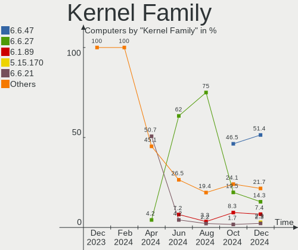
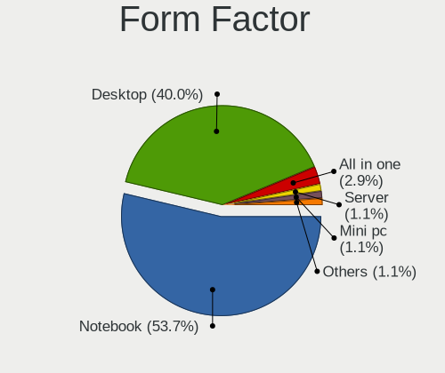
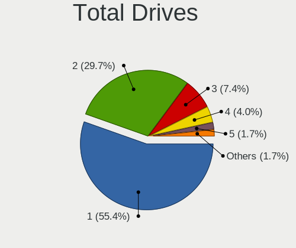
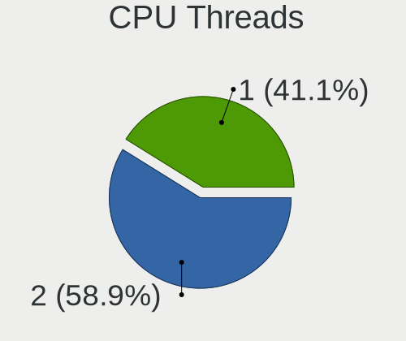
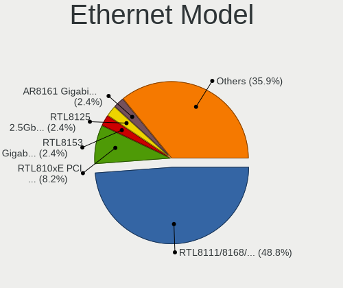

ROSA Hardware Trends
--------------------

A project to identify most popular hardware characteristics and track their change
over time based on data collected by ROSA users at https://Linux-Hardware.org.

Anyone can contribute to this report by the [hw-probe](https://github.com/linuxhw/hw-probe) tool:

    sudo -E hw-probe -all -upload

This is a report for all computer types. See also reports for [desktops](/Dist/ROSA/Desktop/README.md) and [notebooks](/Dist/ROSA/Notebook/README.md).

Full-feature report is available here: https://linux-hardware.org/?view=trends

Period: Jan, 2022.

Contents
--------

* [ System ](#system)
  - [ OS                       ](#os)
  - [ OS Family                ](#os-family)
  - [ Kernel                   ](#kernel)
  - [ Kernel Family            ](#kernel-family)
  - [ Kernel Major Ver.        ](#kernel-major-ver)
  - [ Arch                     ](#arch)
  - [ DE                       ](#de)
  - [ Display Server           ](#display-server)
  - [ Display Manager          ](#display-manager)
  - [ OS Lang                  ](#os-lang)
  - [ Boot Mode                ](#boot-mode)
  - [ Filesystem               ](#filesystem)
  - [ Part. scheme             ](#part-scheme)
  - [ Dual Boot with Linux/BSD ](#dual-boot-with-linuxbsd)
  - [ Dual Boot (Win)          ](#dual-boot-win)

* [ Board ](#board)
  - [ Vendor                   ](#vendor)
  - [ Model                    ](#model)
  - [ Model Family             ](#model-family)
  - [ MFG Year                 ](#mfg-year)
  - [ Form Factor              ](#form-factor)
  - [ Secure Boot              ](#secure-boot)
  - [ Coreboot                 ](#coreboot)
  - [ RAM Size                 ](#ram-size)
  - [ RAM Used                 ](#ram-used)
  - [ Total Drives             ](#total-drives)
  - [ Has CD-ROM               ](#has-cd-rom)
  - [ Has Ethernet             ](#has-ethernet)
  - [ Has WiFi                 ](#has-wifi)
  - [ Has Bluetooth            ](#has-bluetooth)

* [ Location ](#location)
  - [ Country                  ](#country)
  - [ City                     ](#city)

* [ Drives ](#drives)
  - [ Drive Vendor             ](#drive-vendor)
  - [ Drive Model              ](#drive-model)
  - [ HDD Vendor               ](#hdd-vendor)
  - [ SSD Vendor               ](#ssd-vendor)
  - [ Drive Kind               ](#drive-kind)
  - [ Drive Connector          ](#drive-connector)
  - [ Drive Size               ](#drive-size)
  - [ Space Total              ](#space-total)
  - [ Space Used               ](#space-used)
  - [ Malfunc. Drives          ](#malfunc-drives)
  - [ Malfunc. Drive Vendor    ](#malfunc-drive-vendor)
  - [ Malfunc. HDD Vendor      ](#malfunc-hdd-vendor)
  - [ Malfunc. Drive Kind      ](#malfunc-drive-kind)
  - [ Failed Drives            ](#failed-drives)
  - [ Failed Drive Vendor      ](#failed-drive-vendor)
  - [ Drive Status             ](#drive-status)

* [ Storage controller ](#storage-controller)
  - [ Storage Vendor           ](#storage-vendor)
  - [ Storage Model            ](#storage-model)
  - [ Storage Kind             ](#storage-kind)

* [ Processor ](#processor)
  - [ CPU Vendor               ](#cpu-vendor)
  - [ CPU Model                ](#cpu-model)
  - [ CPU Model Family         ](#cpu-model-family)
  - [ CPU Cores                ](#cpu-cores)
  - [ CPU Sockets              ](#cpu-sockets)
  - [ CPU Threads              ](#cpu-threads)
  - [ CPU Op-Modes             ](#cpu-op-modes)
  - [ CPU Microcode            ](#cpu-microcode)
  - [ CPU Microarch            ](#cpu-microarch)

* [ Graphics ](#graphics)
  - [ GPU Vendor               ](#gpu-vendor)
  - [ GPU Model                ](#gpu-model)
  - [ GPU Combo                ](#gpu-combo)
  - [ GPU Driver               ](#gpu-driver)
  - [ GPU Memory               ](#gpu-memory)

* [ Monitor ](#monitor)
  - [ Monitor Vendor           ](#monitor-vendor)
  - [ Monitor Model            ](#monitor-model)
  - [ Monitor Resolution       ](#monitor-resolution)
  - [ Monitor Diagonal         ](#monitor-diagonal)
  - [ Monitor Width            ](#monitor-width)
  - [ Aspect Ratio             ](#aspect-ratio)
  - [ Monitor Area             ](#monitor-area)
  - [ Pixel Density            ](#pixel-density)
  - [ Multiple Monitors        ](#multiple-monitors)

* [ Network ](#network)
  - [ Net Controller Vendor    ](#net-controller-vendor)
  - [ Net Controller Model     ](#net-controller-model)
  - [ Wireless Vendor          ](#wireless-vendor)
  - [ Wireless Model           ](#wireless-model)
  - [ Ethernet Vendor          ](#ethernet-vendor)
  - [ Ethernet Model           ](#ethernet-model)
  - [ Net Controller Kind      ](#net-controller-kind)
  - [ Used Controller          ](#used-controller)
  - [ NICs                     ](#nics)
  - [ IPv6                     ](#ipv6)

* [ Bluetooth ](#bluetooth)
  - [ Bluetooth Vendor         ](#bluetooth-vendor)
  - [ Bluetooth Model          ](#bluetooth-model)

* [ Sound ](#sound)
  - [ Sound Vendor             ](#sound-vendor)
  - [ Sound Model              ](#sound-model)

* [ Memory ](#memory)
  - [ Memory Vendor            ](#memory-vendor)
  - [ Memory Model             ](#memory-model)
  - [ Memory Kind              ](#memory-kind)
  - [ Memory Form Factor       ](#memory-form-factor)
  - [ Memory Size              ](#memory-size)
  - [ Memory Speed             ](#memory-speed)

* [ Printers & scanners ](#printers--scanners)
  - [ Printer Vendor           ](#printer-vendor)
  - [ Printer Model            ](#printer-model)
  - [ Scanner Vendor           ](#scanner-vendor)
  - [ Scanner Model            ](#scanner-model)

* [ Camera ](#camera)
  - [ Camera Vendor            ](#camera-vendor)
  - [ Camera Model             ](#camera-model)

* [ Security ](#security)
  - [ Fingerprint Vendor       ](#fingerprint-vendor)
  - [ Fingerprint Model        ](#fingerprint-model)
  - [ Chipcard Vendor          ](#chipcard-vendor)
  - [ Chipcard Model           ](#chipcard-model)

* [ Unsupported ](#unsupported)
  - [ Unsupported Devices      ](#unsupported-devices)
  - [ Unsupported Device Types ](#unsupported-device-types)

System
------

OS
--

Installed operating systems

| Name       | Computers | Percent |
|------------|-----------|---------|
| ROSA 12.1  | 79        | 51.3%   |
| ROSA R11.1 | 59        | 38.31%  |
| ROSA 12    | 9         | 5.84%   |
| ROSA R11   | 6         | 3.9%    |
| ROSA R10   | 1         | 0.65%   |

OS Family
---------

OS without a version

| Name | Computers | Percent |
|------|-----------|---------|
| ROSA | 154       | 100%    |

Kernel
------

Version of the Linux kernel

| Version                                   | Computers | Percent |
|-------------------------------------------|-----------|---------|
| 5.10.74-generic-2rosa2021.1-x86_64        | 79        | 51.3%   |
| 4.15.0-desktop-122.124.1rosa-x86_64       | 19        | 12.34%  |
| 5.4.83-generic-2rosa-x86_64               | 15        | 9.74%   |
| 5.4.32-generic-2rosa-x86_64               | 9         | 5.84%   |
| 5.10.71-generic-1rosa2021.1-x86_64        | 7         | 4.55%   |
| 5.4.32-generic-2rosa-i586                 | 4         | 2.6%    |
| 4.15.0-desktop-45.1rosa-x86_64            | 4         | 2.6%    |
| 5.4.83-generic-2rosa-i586                 | 3         | 1.95%   |
| 4.9.155-nrj-desktop-1rosa-x86_64          | 3         | 1.95%   |
| 4.9.155-nrj-desktop-1rosa-i586            | 2         | 1.3%    |
| 4.15.0-desktop-91.3rosa-x86_64            | 2         | 1.3%    |
| 5.16.3.xm1-1.klp-xanmod-rosa2021.1-x86_64 | 1         | 0.65%   |
| 5.13.9-generic-1rosa-x86_64               | 1         | 0.65%   |
| 5.10.74-generic-4rosa2021.1-x86_64        | 1         | 0.65%   |
| 5.10.50-generic-1rosa-x86_64              | 1         | 0.65%   |
| 4.9.60-nrj-desktop-1rosa-x86_64           | 1         | 0.65%   |
| 4.15.0-desktop-45.1rosa-i586              | 1         | 0.65%   |
| 4.15.0-desktop-122.124.1rosa-i586         | 1         | 0.65%   |

Kernel Family
-------------

Linux kernel without a distro release

| Version | Computers | Percent |
|---------|-----------|---------|
| 5.10.74 | 80        | 51.95%  |
| 4.15.0  | 27        | 17.53%  |
| 5.4.83  | 18        | 11.69%  |
| 5.4.32  | 13        | 8.44%   |
| 5.10.71 | 7         | 4.55%   |
| 4.9.155 | 5         | 3.25%   |
| 5.16.3  | 1         | 0.65%   |
| 5.13.9  | 1         | 0.65%   |
| 5.10.50 | 1         | 0.65%   |
| 4.9.60  | 1         | 0.65%   |

Kernel Major Ver.
-----------------

Linux kernel major version

| Version | Computers | Percent |
|---------|-----------|---------|
| 5.10    | 88        | 57.14%  |
| 5.4     | 31        | 20.13%  |
| 4.15    | 27        | 17.53%  |
| 4.9     | 6         | 3.9%    |
| 5.16    | 1         | 0.65%   |
| 5.13    | 1         | 0.65%   |

Arch
----

OS architecture (x86_64, i586, etc.)

| Name   | Computers | Percent |
|--------|-----------|---------|
| x86_64 | 143       | 92.86%  |
| i686   | 11        | 7.14%   |

DE
--

Desktop Environment

| Name  | Computers | Percent |
|-------|-----------|---------|
| KDE5  | 92        | 59.74%  |
| KDE4  | 41        | 26.62%  |
| LXQt  | 9         | 5.84%   |
| GNOME | 9         | 5.84%   |
| MATE  | 2         | 1.3%    |
| KDE   | 1         | 0.65%   |

Display Server
--------------

X11 or Wayland

| Name    | Computers | Percent |
|---------|-----------|---------|
| X11     | 77        | 50%     |
| Wayland | 77        | 50%     |

Display Manager
---------------

SDDM, LightDM, etc.

| Name    | Computers | Percent |
|---------|-----------|---------|
| SDDM    | 62        | 40.26%  |
| GDM     | 48        | 31.17%  |
| KDM     | 43        | 27.92%  |
| LightDM | 1         | 0.65%   |

OS Lang
-------

Language

| Lang    | Computers | Percent |
|---------|-----------|---------|
| ru_RU   | 129       | 83.77%  |
| pl_PL   | 5         | 3.25%   |
| Unknown | 5         | 3.25%   |
| en_US   | 3         | 1.95%   |
| de_DE   | 3         | 1.95%   |
| ru_UA   | 2         | 1.3%    |
| pt_BR   | 1         | 0.65%   |
| fr_FR   | 1         | 0.65%   |
| fr_BE   | 1         | 0.65%   |
| es_PE   | 1         | 0.65%   |
| es_ES   | 1         | 0.65%   |
| C       | 1         | 0.65%   |
| bg_BG   | 1         | 0.65%   |

Boot Mode
---------

EFI or BIOS

| Mode | Computers | Percent |
|------|-----------|---------|
| BIOS | 97        | 62.99%  |
| EFI  | 57        | 37.01%  |

Filesystem
----------

Type of filesystem

| Type  | Computers | Percent |
|-------|-----------|---------|
| Ext4  | 146       | 94.81%  |
| Btrfs | 6         | 3.9%    |
| Ext3  | 2         | 1.3%    |

Part. scheme
------------

Scheme of partitioning

| Type    | Computers | Percent |
|---------|-----------|---------|
| MBR     | 79        | 51.3%   |
| GPT     | 74        | 48.05%  |
| Unknown | 1         | 0.65%   |

Dual Boot with Linux/BSD
------------------------

Hosting more than one Linux/BSD

| Dual boot | Computers | Percent |
|-----------|-----------|---------|
| No        | 108       | 70.13%  |
| Yes       | 46        | 29.87%  |

Dual Boot (Win)
---------------

Hosting Linux and Windows

| Dual boot | Computers | Percent |
|-----------|-----------|---------|
| No        | 92        | 59.74%  |
| Yes       | 62        | 40.26%  |

Board
-----

Vendor
------

Motherboard manufacturer

| Name                | Computers | Percent |
|---------------------|-----------|---------|
| ASUSTek Computer    | 42        | 27.27%  |
| Gigabyte Technology | 18        | 11.69%  |
| Acer                | 15        | 9.74%   |
| Hewlett-Packard     | 12        | 7.79%   |
| MSI                 | 11        | 7.14%   |
| ASRock              | 11        | 7.14%   |
| Lenovo              | 8         | 5.19%   |
| Dell                | 8         | 5.19%   |
| Intel               | 4         | 2.6%    |
| Unknown             | 4         | 2.6%    |
| Toshiba             | 2         | 1.3%    |
| Samsung Electronics | 2         | 1.3%    |
| YJKC                | 1         | 0.65%   |
| Supermicro          | 1         | 0.65%   |
| Shuttle             | 1         | 0.65%   |
| Pegatron            | 1         | 0.65%   |
| Packard Bell        | 1         | 0.65%   |
| Medion              | 1         | 0.65%   |
| MB                  | 1         | 0.65%   |
| Irbis               | 1         | 0.65%   |
| IBM                 | 1         | 0.65%   |
| Huanan              | 1         | 0.65%   |
| Fujitsu             | 1         | 0.65%   |
| EVOO                | 1         | 0.65%   |
| eMachines           | 1         | 0.65%   |
| ECS                 | 1         | 0.65%   |
| Clevo               | 1         | 0.65%   |
| Biostar             | 1         | 0.65%   |
| Apple               | 1         | 0.65%   |

Model
-----

Motherboard model

| Name                                   | Computers | Percent |
|----------------------------------------|-----------|---------|
| ASUS All Series                        | 4         | 2.6%    |
| Unknown                                | 4         | 2.6%    |
| Acer TravelMate B118-M                 | 3         | 1.95%   |
| Lenovo IdeaPad Z580                    | 2         | 1.3%    |
| ASUS P5KPL-AM                          | 2         | 1.3%    |
| ASUS P5G41T-M LX                       | 2         | 1.3%    |
| ASRock 760GM-S3                        | 2         | 1.3%    |
| Acer AOD260                            | 2         | 1.3%    |
| YJKC vBOOK Plus                        | 1         | 0.65%   |
| Toshiba Satellite L670D                | 1         | 0.65%   |
| Toshiba Satellite A300                 | 1         | 0.65%   |
| Supermicro C7Q67                       | 1         | 0.65%   |
| Shuttle DS68U                          | 1         | 0.65%   |
| Samsung NC210/NC110                    | 1         | 0.65%   |
| Samsung 350V5C/351V5C/3540VC/3440VC    | 1         | 0.65%   |
| Pegatron IPPPV-D3G                     | 1         | 0.65%   |
| Packard Bell EasyNote TE11HC           | 1         | 0.65%   |
| MSI MS-AC1511                          | 1         | 0.65%   |
| MSI MS-7D18                            | 1         | 0.65%   |
| MSI MS-7C89                            | 1         | 0.65%   |
| MSI MS-7B89                            | 1         | 0.65%   |
| MSI MS-7B86                            | 1         | 0.65%   |
| MSI MS-7A38                            | 1         | 0.65%   |
| MSI MS-7A36                            | 1         | 0.65%   |
| MSI MS-7895                            | 1         | 0.65%   |
| MSI MS-7599                            | 1         | 0.65%   |
| MSI MS-7430                            | 1         | 0.65%   |
| MSI MPG B560 Trident A (MS-B926)       | 1         | 0.65%   |
| Medion V20                             | 1         | 0.65%   |
| MB A320-SF110                          | 1         | 0.65%   |
| Lenovo V110-15ISK 80TL                 | 1         | 0.65%   |
| Lenovo ThinkCentre Edge71 1583C5G      | 1         | 0.65%   |
| Lenovo IdeaPad 100-15IBD 80QQ          | 1         | 0.65%   |
| Lenovo G700 20251                      | 1         | 0.65%   |
| Lenovo G70-80 80FF                     | 1         | 0.65%   |
| Lenovo B50-70 20384                    | 1         | 0.65%   |
| Irbis NB248                            | 1         | 0.65%   |
| Intel X79                              | 1         | 0.65%   |
| Intel NUC7i3DNHE                       | 1         | 0.65%   |
| Intel HuronRiver Platform              | 1         | 0.65%   |
| Intel DG35EC AAE29266-203              | 1         | 0.65%   |
| IBM ThinkPad T43p 2668H9K              | 1         | 0.65%   |
| Huanan X99-BD4 V1.31                   | 1         | 0.65%   |
| HP ProBook 6560b                       | 1         | 0.65%   |
| HP ProBook 5310m                       | 1         | 0.65%   |
| HP ProBook 450 G7                      | 1         | 0.65%   |
| HP Presario CQ57                       | 1         | 0.65%   |
| HP Pippin2                             | 1         | 0.65%   |
| HP Pavilion x360 Convertible 14-cd0xxx | 1         | 0.65%   |
| HP Pavilion Laptop 15-cs2xxx           | 1         | 0.65%   |
| HP Pavilion g6                         | 1         | 0.65%   |
| HP Pavilion dv6                        | 1         | 0.65%   |
| HP Pavilion dv5                        | 1         | 0.65%   |
| HP Compaq dc7600 Small Form Factor     | 1         | 0.65%   |
| HP Compaq 6200 Pro SFF PC              | 1         | 0.65%   |
| Gigabyte Z97-HD3                       | 1         | 0.65%   |
| Gigabyte Z390 UD V2                    | 1         | 0.65%   |
| Gigabyte Pro, Std, Elt Series          | 1         | 0.65%   |
| Gigabyte P67A-D3-B3                    | 1         | 0.65%   |
| Gigabyte P31-DS3L                      | 1         | 0.65%   |

Model Family
------------

Motherboard model prefix

| Name                   | Computers | Percent |
|------------------------|-----------|---------|
| Acer Aspire            | 7         | 4.55%   |
| HP Pavilion            | 5         | 3.25%   |
| ASUS VivoBook          | 4         | 2.6%    |
| ASUS All               | 4         | 2.6%    |
| Unknown                | 4         | 2.6%    |
| Lenovo IdeaPad         | 3         | 1.95%   |
| HP ProBook             | 3         | 1.95%   |
| Dell Latitude          | 3         | 1.95%   |
| Dell Inspiron          | 3         | 1.95%   |
| ASUS P5G41T-M          | 3         | 1.95%   |
| Acer TravelMate        | 3         | 1.95%   |
| Toshiba Satellite      | 2         | 1.3%    |
| HP Compaq              | 2         | 1.3%    |
| Gigabyte B450          | 2         | 1.3%    |
| ASUS PRIME             | 2         | 1.3%    |
| ASUS P7H55-M           | 2         | 1.3%    |
| ASUS P5KPL-AM          | 2         | 1.3%    |
| ASRock 760GM-S3        | 2         | 1.3%    |
| Acer AOD260            | 2         | 1.3%    |
| YJKC vBOOK             | 1         | 0.65%   |
| Supermicro C7Q67       | 1         | 0.65%   |
| Shuttle DS68U          | 1         | 0.65%   |
| Samsung NC210          | 1         | 0.65%   |
| Samsung 350V5C         | 1         | 0.65%   |
| Pegatron IPPPV-D3G     | 1         | 0.65%   |
| Packard Bell EasyNote  | 1         | 0.65%   |
| MSI MS-AC1511          | 1         | 0.65%   |
| MSI MS-7D18            | 1         | 0.65%   |
| MSI MS-7C89            | 1         | 0.65%   |
| MSI MS-7B89            | 1         | 0.65%   |
| MSI MS-7B86            | 1         | 0.65%   |
| MSI MS-7A38            | 1         | 0.65%   |
| MSI MS-7A36            | 1         | 0.65%   |
| MSI MS-7895            | 1         | 0.65%   |
| MSI MS-7599            | 1         | 0.65%   |
| MSI MS-7430            | 1         | 0.65%   |
| MSI MPG                | 1         | 0.65%   |
| Medion V20             | 1         | 0.65%   |
| MB A320-SF110          | 1         | 0.65%   |
| Lenovo V110-15ISK      | 1         | 0.65%   |
| Lenovo ThinkCentre     | 1         | 0.65%   |
| Lenovo G700            | 1         | 0.65%   |
| Lenovo G70-80          | 1         | 0.65%   |
| Lenovo B50-70          | 1         | 0.65%   |
| Irbis NB248            | 1         | 0.65%   |
| Intel X79              | 1         | 0.65%   |
| Intel NUC7i3DNHE       | 1         | 0.65%   |
| Intel HuronRiver       | 1         | 0.65%   |
| Intel DG35EC           | 1         | 0.65%   |
| IBM ThinkPad           | 1         | 0.65%   |
| Huanan X99-BD4         | 1         | 0.65%   |
| HP Presario            | 1         | 0.65%   |
| HP Pippin2             | 1         | 0.65%   |
| Gigabyte Z97-HD3       | 1         | 0.65%   |
| Gigabyte Z390          | 1         | 0.65%   |
| Gigabyte Pro           | 1         | 0.65%   |
| Gigabyte P67A-D3-B3    | 1         | 0.65%   |
| Gigabyte P31-DS3L      | 1         | 0.65%   |
| Gigabyte H61M-S1       | 1         | 0.65%   |
| Gigabyte GA-78LMT-S2PV | 1         | 0.65%   |

MFG Year
--------

Motherboard manufacture year

| Year | Computers | Percent |
|------|-----------|---------|
| 2012 | 17        | 11.04%  |
| 2010 | 17        | 11.04%  |
| 2019 | 13        | 8.44%   |
| 2011 | 13        | 8.44%   |
| 2008 | 13        | 8.44%   |
| 2020 | 11        | 7.14%   |
| 2013 | 11        | 7.14%   |
| 2018 | 10        | 6.49%   |
| 2014 | 10        | 6.49%   |
| 2009 | 10        | 6.49%   |
| 2021 | 9         | 5.84%   |
| 2015 | 6         | 3.9%    |
| 2016 | 4         | 2.6%    |
| 2007 | 4         | 2.6%    |
| 2006 | 3         | 1.95%   |
| 2017 | 2         | 1.3%    |
| 2005 | 1         | 0.65%   |

Form Factor
-----------

Physical design of the computer

| Name        | Computers | Percent |
|-------------|-----------|---------|
| Desktop     | 88        | 57.14%  |
| Notebook    | 62        | 40.26%  |
| All in one  | 2         | 1.3%    |
| Convertible | 1         | 0.65%   |
| Mini pc     | 1         | 0.65%   |

Secure Boot
-----------

Enabled or disabled

| State    | Computers | Percent |
|----------|-----------|---------|
| Disabled | 154       | 100%    |

Coreboot
--------

Have coreboot on board

| Used | Computers | Percent |
|------|-----------|---------|
| No   | 154       | 100%    |

RAM Size
--------

Total RAM memory

| Size in GB  | Computers | Percent |
|-------------|-----------|---------|
| 3.01-4.0    | 49        | 31.82%  |
| 4.01-8.0    | 35        | 22.73%  |
| 8.01-16.0   | 25        | 16.23%  |
| 16.01-24.0  | 19        | 12.34%  |
| 1.01-2.0    | 16        | 10.39%  |
| 32.01-64.0  | 4         | 2.6%    |
| 24.01-32.0  | 2         | 1.3%    |
| 0.51-1.0    | 2         | 1.3%    |
| 2.01-3.0    | 1         | 0.65%   |
| 64.01-256.0 | 1         | 0.65%   |

RAM Used
--------

Used RAM memory

| Used GB  | Computers | Percent |
|----------|-----------|---------|
| 1.01-2.0 | 70        | 45.45%  |
| 0.51-1.0 | 47        | 30.52%  |
| 2.01-3.0 | 22        | 14.29%  |
| 4.01-8.0 | 9         | 5.84%   |
| 3.01-4.0 | 3         | 1.95%   |
| 0.01-0.5 | 3         | 1.95%   |

Total Drives
------------

Number of drives on board

| Drives | Computers | Percent |
|--------|-----------|---------|
| 1      | 91        | 59.09%  |
| 2      | 38        | 24.68%  |
| 3      | 11        | 7.14%   |
| 4      | 6         | 3.9%    |
| 5      | 3         | 1.95%   |
| 0      | 3         | 1.95%   |
| 6      | 2         | 1.3%    |

Has CD-ROM
----------

Has CD-ROM on board

| Presented | Computers | Percent |
|-----------|-----------|---------|
| No        | 85        | 55.19%  |
| Yes       | 69        | 44.81%  |

Has Ethernet
------------

Has Ethernet on board

| Presented | Computers | Percent |
|-----------|-----------|---------|
| Yes       | 142       | 92.21%  |
| No        | 12        | 7.79%   |

Has WiFi
--------

Has WiFi module

| Presented | Computers | Percent |
|-----------|-----------|---------|
| Yes       | 93        | 60.39%  |
| No        | 61        | 39.61%  |

Has Bluetooth
-------------

Has Bluetooth module

| Presented | Computers | Percent |
|-----------|-----------|---------|
| No        | 101       | 65.58%  |
| Yes       | 53        | 34.42%  |

Location
--------

Country
-------

Geographic location (country)

| Country    | Computers | Percent |
|------------|-----------|---------|
| Russia     | 117       | 75.97%  |
| Ukraine    | 9         | 5.84%   |
| Poland     | 7         | 4.55%   |
| Germany    | 3         | 1.95%   |
| Uzbekistan | 2         | 1.3%    |
| USA        | 2         | 1.3%    |
| France     | 2         | 1.3%    |
| Belarus    | 2         | 1.3%    |
| Spain      | 1         | 0.65%   |
| Peru       | 1         | 0.65%   |
| Latvia     | 1         | 0.65%   |
| Kazakhstan | 1         | 0.65%   |
| Finland    | 1         | 0.65%   |
| Canada     | 1         | 0.65%   |
| Bulgaria   | 1         | 0.65%   |
| Brazil     | 1         | 0.65%   |
| Belgium    | 1         | 0.65%   |
| Austria    | 1         | 0.65%   |

City
----

Geographic location (city)

| City              | Computers | Percent |
|-------------------|-----------|---------|
| Moscow            | 28        | 18.18%  |
| St Petersburg     | 6         | 3.9%    |
| Krasnodar         | 5         | 3.25%   |
| Yekaterinburg     | 4         | 2.6%    |
| Novosibirsk       | 4         | 2.6%    |
| Yaroslavl         | 3         | 1.95%   |
| Samara            | 3         | 1.95%   |
| Rostov-on-Don     | 3         | 1.95%   |
| Nizhniy Novgorod  | 3         | 1.95%   |
| Kazan?ˆ™          | 3         | 1.95%   |
| Chelyabinsk       | 3         | 1.95%   |
| Tomsk             | 2         | 1.3%    |
| Tashkent          | 2         | 1.3%    |
| Kremenchug        | 2         | 1.3%    |
| Kaliningrad       | 2         | 1.3%    |
| Donetsk           | 2         | 1.3%    |
| Yuzhno-Sakhalinsk | 1         | 0.65%   |
| Wroclaw           | 1         | 0.65%   |
| Wisla             | 1         | 0.65%   |
| Voronezh          | 1         | 0.65%   |
| Volzhskiy         | 1         | 0.65%   |
| Volgograd         | 1         | 0.65%   |
| Vogue             | 1         | 0.65%   |
| Vladimir          | 1         | 0.65%   |
| Vladikavkaz       | 1         | 0.65%   |
| Vikhorevka        | 1         | 0.65%   |
| Vienna            | 1         | 0.65%   |
| Valley Stream     | 1         | 0.65%   |
| Ust'-Kut          | 1         | 0.65%   |
| Usinsk            | 1         | 0.65%   |
| Ulyanovsk         | 1         | 0.65%   |
| Tyumen            | 1         | 0.65%   |
| Tver              | 1         | 0.65%   |
| Tolyatti          | 1         | 0.65%   |
| Temriuk           | 1         | 0.65%   |
| Tambov            | 1         | 0.65%   |
| Syktyvkar         | 1         | 0.65%   |
| Surrey            | 1         | 0.65%   |
| Surgut            | 1         | 0.65%   |
| Sosnovyy Bor      | 1         | 0.65%   |
| Sofia             | 1         | 0.65%   |
| Simferopol        | 1         | 0.65%   |
| Severodvinsk      | 1         | 0.65%   |
| Sevastopol        | 1         | 0.65%   |
| Sein?¤joki        | 1         | 0.65%   |
| Schw?¤bisch Hall  | 1         | 0.65%   |
| Saratov           | 1         | 0.65%   |
| Riga              | 1         | 0.65%   |
| Pyt-Yakh          | 1         | 0.65%   |
| Perm              | 1         | 0.65%   |
| Pavlovsk          | 1         | 0.65%   |
| Osipenko          | 1         | 0.65%   |
| Oryol             | 1         | 0.65%   |
| Orekhovo-Zuyevo   | 1         | 0.65%   |
| Omsk              | 1         | 0.65%   |
| Odintsovo         | 1         | 0.65%   |
| Nyagan            | 1         | 0.65%   |
| Novoul'yanovsk    | 1         | 0.65%   |
| Noril'sk          | 1         | 0.65%   |
| New York          | 1         | 0.65%   |

Drives
------

Drive Vendor
------------

Hard drive vendors

| Vendor              | Computers | Drives | Percent |
|---------------------|-----------|--------|---------|
| WDC                 | 46        | 48     | 19.33%  |
| Seagate             | 46        | 54     | 19.33%  |
| Toshiba             | 21        | 22     | 8.82%   |
| Hitachi             | 17        | 17     | 7.14%   |
| Samsung Electronics | 14        | 15     | 5.88%   |
| Kingston            | 14        | 15     | 5.88%   |
| Crucial             | 8         | 8      | 3.36%   |
| GOODRAM             | 7         | 7      | 2.94%   |
| Apacer              | 6         | 6      | 2.52%   |
| A-DATA Technology   | 6         | 7      | 2.52%   |
| Unknown             | 5         | 5      | 2.1%    |
| SPCC                | 5         | 5      | 2.1%    |
| Patriot             | 5         | 5      | 2.1%    |
| SanDisk             | 4         | 4      | 1.68%   |
| Intel               | 4         | 5      | 1.68%   |
| KingSpec            | 3         | 3      | 1.26%   |
| JMicron             | 3         | 3      | 1.26%   |
| HGST                | 3         | 3      | 1.26%   |
| XrayDisk            | 2         | 2      | 0.84%   |
| Smartbuy            | 2         | 2      | 0.84%   |
| MAXTOR              | 2         | 2      | 0.84%   |
| Fujitsu             | 2         | 2      | 0.84%   |
| China               | 2         | 2      | 0.84%   |
| XPG                 | 1         | 1      | 0.42%   |
| Verbatim            | 1         | 1      | 0.42%   |
| Transcend           | 1         | 1      | 0.42%   |
| Team                | 1         | 1      | 0.42%   |
| Silicon Motion      | 1         | 1      | 0.42%   |
| OCZ                 | 1         | 1      | 0.42%   |
| KingFast            | 1         | 1      | 0.42%   |
| Intenso             | 1         | 1      | 0.42%   |
| Gigabyte Technology | 1         | 1      | 0.42%   |
| AMD                 | 1         | 1      | 0.42%   |
| Unknown             | 1         | 1      | 0.42%   |

Drive Model
-----------

Hard drive models

| Model                              | Computers | Percent |
|------------------------------------|-----------|---------|
| Seagate ST500LT012-1DG142 500GB    | 5         | 2%      |
| Kingston SA400S37120G 120GB SSD    | 5         | 2%      |
| Crucial CT240BX500SSD1 240GB       | 5         | 2%      |
| Toshiba HDWD110 1TB                | 4         | 1.6%    |
| Seagate ST500DM002-1BD142 500GB    | 4         | 1.6%    |
| Toshiba MQ01ABF050 500GB           | 3         | 1.2%    |
| Seagate ST9500325AS 500GB          | 3         | 1.2%    |
| Seagate ST500DM009-2F110A 500GB    | 3         | 1.2%    |
| Seagate ST2000DM008-2FR102 2TB     | 3         | 1.2%    |
| Seagate ST1000LM024 HN-M101MBB 1TB | 3         | 1.2%    |
| JMicron Generic 128GB              | 3         | 1.2%    |
| GOODRAM SSD 120GB                  | 3         | 1.2%    |
| XrayDisk SSD 256GB                 | 2         | 0.8%    |
| WDC WD5000LPCX-24VHAT0 500GB       | 2         | 0.8%    |
| Unknown DA4064  64GB               | 2         | 0.8%    |
| Toshiba DT01ACA050 500GB           | 2         | 0.8%    |
| SPCC Solid State Disk 128GB        | 2         | 0.8%    |
| Seagate ST4000DM004-2CV104 4TB     | 2         | 0.8%    |
| Seagate BUP Slim BK 1TB            | 2         | 0.8%    |
| Patriot Burst Elite 120GB SSD      | 2         | 0.8%    |
| Kingston SA400S37240G 240GB SSD    | 2         | 0.8%    |
| Kingston SA2000M8250G 250GB        | 2         | 0.8%    |
| Hitachi HTS547575A9E384 752GB      | 2         | 0.8%    |
| Hitachi HTS543232A7A384 320GB      | 2         | 0.8%    |
| Crucial CT120BX500SSD1 120GB       | 2         | 0.8%    |
| Apacer AS350 120GB SSD             | 2         | 0.8%    |
| A-DATA SU630 240GB SSD             | 2         | 0.8%    |
| XPG GAMMIX S7 512GB                | 1         | 0.4%    |
| WDC WDS500G1B0A-00H9H0 500GB SSD   | 1         | 0.4%    |
| WDC WDS250G2B0A-00SM50 250GB SSD   | 1         | 0.4%    |
| WDC WDS240G2G0A-00JH30 240GB SSD   | 1         | 0.4%    |
| WDC WDS100T3X0C-00SJG0 1TB         | 1         | 0.4%    |
| WDC WDS100T2B0C-00PXH0 1TB         | 1         | 0.4%    |
| WDC WD800BEVS-22RST0 80GB          | 1         | 0.4%    |
| WDC WD7500BPVX-75JC3T0 752GB       | 1         | 0.4%    |
| WDC WD6400BPVT-22HXZT3 640GB       | 1         | 0.4%    |
| WDC WD6000HLHX-01JJPV0 600GB       | 1         | 0.4%    |
| WDC WD5002AALX-00J37A0 500GB       | 1         | 0.4%    |
| WDC WD5000LPVX-22V0TT0 500GB       | 1         | 0.4%    |
| WDC WD5000LPSX-00A6WT0 500GB       | 1         | 0.4%    |
| WDC WD5000AZRZ-00HTKB0 500GB       | 1         | 0.4%    |
| WDC WD5000AAKX-22ERMA0 500GB       | 1         | 0.4%    |
| WDC WD5000AAKX-001CA0 500GB        | 1         | 0.4%    |
| WDC WD5000AADS-00S9B0 500GB        | 1         | 0.4%    |
| WDC WD5000AADS-00M2B0 500GB        | 1         | 0.4%    |
| WDC WD4000LPCX-24C6HT0 400GB       | 1         | 0.4%    |
| WDC WD3200BPVT-00JJ5T0 320GB       | 1         | 0.4%    |
| WDC WD3200BEVT-80A0RT0 320GB       | 1         | 0.4%    |
| WDC WD3200AAJS-56M0A0 320GB        | 1         | 0.4%    |
| WDC WD30EZRZ-00GXCB0 3TB           | 1         | 0.4%    |
| WDC WD30EFRX-68EUZN0 3TB           | 1         | 0.4%    |
| WDC WD2500AAJS-60M0A0 250GB        | 1         | 0.4%    |
| WDC WD2500AAJS-22VTA0 250GB        | 1         | 0.4%    |
| WDC WD20EURX-63T0FY0 2TB           | 1         | 0.4%    |
| WDC WD20EFRX-68EUZN0 2TB           | 1         | 0.4%    |
| WDC WD2003FYYS-02W0B0 2TB          | 1         | 0.4%    |
| WDC WD1600AAJS-75PSA0 160GB        | 1         | 0.4%    |
| WDC WD1600AAJS-08PSA0 160GB        | 1         | 0.4%    |
| WDC WD15EARS-00Z5B1 1TB            | 1         | 0.4%    |
| WDC WD10SPZX-21Z10T0 1TB           | 1         | 0.4%    |

HDD Vendor
----------

Hard disk drive vendors

| Vendor              | Computers | Drives | Percent |
|---------------------|-----------|--------|---------|
| Seagate             | 45        | 53     | 33.83%  |
| WDC                 | 38        | 40     | 28.57%  |
| Toshiba             | 18        | 19     | 13.53%  |
| Hitachi             | 17        | 17     | 12.78%  |
| Samsung Electronics | 8         | 8      | 6.02%   |
| HGST                | 3         | 3      | 2.26%   |
| Fujitsu             | 2         | 2      | 1.5%    |
| Unknown             | 1         | 1      | 0.75%   |
| MAXTOR              | 1         | 1      | 0.75%   |

SSD Vendor
----------

Solid state drive vendors

| Vendor              | Computers | Drives | Percent |
|---------------------|-----------|--------|---------|
| Kingston            | 10        | 11     | 13.7%   |
| Crucial             | 8         | 8      | 10.96%  |
| GOODRAM             | 7         | 7      | 9.59%   |
| Apacer              | 6         | 6      | 8.22%   |
| SPCC                | 5         | 5      | 6.85%   |
| SanDisk             | 4         | 4      | 5.48%   |
| Samsung Electronics | 4         | 5      | 5.48%   |
| WDC                 | 3         | 3      | 4.11%   |
| Patriot             | 3         | 3      | 4.11%   |
| KingSpec            | 3         | 3      | 4.11%   |
| A-DATA Technology   | 3         | 3      | 4.11%   |
| XrayDisk            | 2         | 2      | 2.74%   |
| Toshiba             | 2         | 2      | 2.74%   |
| China               | 2         | 2      | 2.74%   |
| Verbatim            | 1         | 1      | 1.37%   |
| Team                | 1         | 1      | 1.37%   |
| Smartbuy            | 1         | 1      | 1.37%   |
| Seagate             | 1         | 1      | 1.37%   |
| OCZ                 | 1         | 1      | 1.37%   |
| MAXTOR              | 1         | 1      | 1.37%   |
| KingFast            | 1         | 1      | 1.37%   |
| Intenso             | 1         | 1      | 1.37%   |
| Gigabyte Technology | 1         | 1      | 1.37%   |
| AMD                 | 1         | 1      | 1.37%   |
| Unknown             | 1         | 1      | 1.37%   |

Drive Kind
----------

HDD or SSD

| Kind | Computers | Drives | Percent |
|------|-----------|--------|---------|
| HDD  | 109       | 144    | 53.17%  |
| SSD  | 65        | 75     | 31.71%  |
| NVMe | 27        | 30     | 13.17%  |
| MMC  | 4         | 4      | 1.95%   |

Drive Connector
---------------

SATA, SAS, NVMe, etc.

| Type | Computers | Drives | Percent |
|------|-----------|--------|---------|
| SATA | 139       | 211    | 79.89%  |
| NVMe | 24        | 27     | 13.79%  |
| SAS  | 7         | 11     | 4.02%   |
| MMC  | 4         | 4      | 2.3%    |

Drive Size
----------

Size of hard drive

| Size in TB | Computers | Drives | Percent |
|------------|-----------|--------|---------|
| 0.01-0.5   | 123       | 154    | 68.72%  |
| 0.51-1.0   | 40        | 45     | 22.35%  |
| 1.01-2.0   | 10        | 11     | 5.59%   |
| 3.01-4.0   | 2         | 4      | 1.12%   |
| 2.01-3.0   | 2         | 2      | 1.12%   |
| 4.01-10.0  | 2         | 3      | 1.12%   |

Space Total
-----------

Amount of disk space available on the file system

| Size in GB     | Computers | Percent |
|----------------|-----------|---------|
| 251-500        | 36        | 23.38%  |
| 101-250        | 36        | 23.38%  |
| 1-20           | 23        | 14.94%  |
| 501-1000       | 21        | 13.64%  |
| 51-100         | 13        | 8.44%   |
| 1001-2000      | 9         | 5.84%   |
| 21-50          | 6         | 3.9%    |
| 2001-3000      | 5         | 3.25%   |
| More than 3000 | 4         | 2.6%    |
| Unknown        | 1         | 0.65%   |

Space Used
----------

Amount of used disk space

| Used GB        | Computers | Percent |
|----------------|-----------|---------|
| 1-20           | 91        | 59.09%  |
| 21-50          | 21        | 13.64%  |
| 101-250        | 11        | 7.14%   |
| 501-1000       | 10        | 6.49%   |
| 251-500        | 6         | 3.9%    |
| 1001-2000      | 6         | 3.9%    |
| 51-100         | 5         | 3.25%   |
| More than 3000 | 2         | 1.3%    |
| 2001-3000      | 1         | 0.65%   |
| Unknown        | 1         | 0.65%   |

Malfunc. Drives
---------------

Drive models with a malfunction

| Model                              | Computers | Drives | Percent |
|------------------------------------|-----------|--------|---------|
| Toshiba MQ01ABF050 500GB           | 2         | 2      | 3.23%   |
| Seagate ST9500325AS 500GB          | 2         | 2      | 3.23%   |
| Seagate ST500DM002-1BD142 500GB    | 2         | 2      | 3.23%   |
| WDC WD7500BPVX-75JC3T0 752GB       | 1         | 1      | 1.61%   |
| WDC WD6400BPVT-22HXZT3 640GB       | 1         | 1      | 1.61%   |
| WDC WD5000LPVX-22V0TT0 500GB       | 1         | 1      | 1.61%   |
| WDC WD5000AAKX-22ERMA0 500GB       | 1         | 1      | 1.61%   |
| WDC WD5000AADS-00M2B0 500GB        | 1         | 1      | 1.61%   |
| WDC WD3200BEVT-80A0RT0 320GB       | 1         | 1      | 1.61%   |
| WDC WD2500AAJS-60M0A0 250GB        | 1         | 1      | 1.61%   |
| WDC WD1600AAJS-08PSA0 160GB        | 1         | 1      | 1.61%   |
| WDC WD15EARS-00Z5B1 1TB            | 1         | 1      | 1.61%   |
| WDC WD10EARS-00MVWB0 1TB           | 1         | 1      | 1.61%   |
| WDC WD10EADS-22M2B0 1TB            | 1         | 1      | 1.61%   |
| WDC WD10EADS-11M2B2 1TB            | 1         | 1      | 1.61%   |
| Toshiba MK5065GSX 500GB            | 1         | 1      | 1.61%   |
| Toshiba MK4058GSX 400GB            | 1         | 1      | 1.61%   |
| Toshiba MK3259GSXP 320GB           | 1         | 1      | 1.61%   |
| Toshiba MK2552GSX 250GB            | 1         | 1      | 1.61%   |
| Toshiba DT01ACA100 1TB             | 1         | 1      | 1.61%   |
| SPCC SSD110 120GB                  | 1         | 1      | 1.61%   |
| Seagate ST9500423AS 500GB          | 1         | 1      | 1.61%   |
| Seagate ST9250410AS 250GB          | 1         | 1      | 1.61%   |
| Seagate ST9250315AS 250GB          | 1         | 1      | 1.61%   |
| Seagate ST9160821AS 160GB          | 1         | 1      | 1.61%   |
| Seagate ST500LT012-9WS142 500GB    | 1         | 1      | 1.61%   |
| Seagate ST500LT012-1DG142 500GB    | 1         | 1      | 1.61%   |
| Seagate ST3320613AS 320GB          | 1         | 1      | 1.61%   |
| Seagate ST3250318AS 250GB          | 1         | 1      | 1.61%   |
| Seagate ST3160215AS 160GB          | 1         | 1      | 1.61%   |
| Seagate ST31500341AS 1TB           | 1         | 1      | 1.61%   |
| Seagate ST3120813AS 120GB          | 1         | 1      | 1.61%   |
| Seagate ST1000LM024 HN-M101MBB 1TB | 1         | 1      | 1.61%   |
| SanDisk SD6SF1M128G1022I 128GB SSD | 1         | 1      | 1.61%   |
| Samsung Electronics HS12UHE 120GB  | 1         | 1      | 1.61%   |
| Samsung Electronics HM250HJ 250GB  | 1         | 1      | 1.61%   |
| Samsung Electronics HM160HI 160GB  | 1         | 1      | 1.61%   |
| Samsung Electronics HD160JJ 160GB  | 1         | 1      | 1.61%   |
| Samsung Electronics HD080HJ/ 80GB  | 1         | 1      | 1.61%   |
| MAXTOR 7B300S0 304GB               | 1         | 1      | 1.61%   |
| Kingston SHFS37A120G 120GB SSD     | 1         | 1      | 1.61%   |
| Kingston SA400S37120G 120GB SSD    | 1         | 1      | 1.61%   |
| KingFast SSD 120GB                 | 1         | 1      | 1.61%   |
| Intel SSDPEKKW256G7 256GB          | 1         | 1      | 1.61%   |
| Hitachi HTS545016B9A300 160GB      | 1         | 1      | 1.61%   |
| Hitachi HTS543232A7A384 320GB      | 1         | 1      | 1.61%   |
| Hitachi HTS542525K9SA00 250GB      | 1         | 1      | 1.61%   |
| Hitachi HDT722525DLAT80 250GB      | 1         | 1      | 1.61%   |
| Hitachi HDT721010SLA360 1TB        | 1         | 1      | 1.61%   |
| Hitachi HDS721616PLA380 164GB      | 1         | 1      | 1.61%   |
| Hitachi HDS721050CLA660 500GB      | 1         | 1      | 1.61%   |
| Hitachi HDS721050CLA362 500GB      | 1         | 1      | 1.61%   |
| Hitachi HDS721010CLA332 1TB        | 1         | 1      | 1.61%   |
| Hitachi HDP725025GLA380 250GB      | 1         | 1      | 1.61%   |
| HGST HTS725050A7E630 500GB         | 1         | 1      | 1.61%   |
| HGST HTS545050A7E380 500GB         | 1         | 1      | 1.61%   |
| Fujitsu MHY2160BH 160GB            | 1         | 1      | 1.61%   |
| Fujitsu MHV2080AH 80GB             | 1         | 1      | 1.61%   |
| Apacer AS350 120GB SSD             | 1         | 1      | 1.61%   |

Malfunc. Drive Vendor
---------------------

Vendors of faulty drives

| Vendor              | Computers | Drives | Percent |
|---------------------|-----------|--------|---------|
| Seagate             | 16        | 16     | 25.81%  |
| WDC                 | 12        | 12     | 19.35%  |
| Hitachi             | 10        | 10     | 16.13%  |
| Toshiba             | 7         | 7      | 11.29%  |
| Samsung Electronics | 5         | 5      | 8.06%   |
| Kingston            | 2         | 2      | 3.23%   |
| HGST                | 2         | 2      | 3.23%   |
| Fujitsu             | 2         | 2      | 3.23%   |
| SPCC                | 1         | 1      | 1.61%   |
| SanDisk             | 1         | 1      | 1.61%   |
| MAXTOR              | 1         | 1      | 1.61%   |
| KingFast            | 1         | 1      | 1.61%   |
| Intel               | 1         | 1      | 1.61%   |
| Apacer              | 1         | 1      | 1.61%   |

Malfunc. HDD Vendor
-------------------

Vendors of faulty HDD drives

| Vendor              | Computers | Drives | Percent |
|---------------------|-----------|--------|---------|
| Seagate             | 16        | 16     | 29.09%  |
| WDC                 | 12        | 12     | 21.82%  |
| Hitachi             | 10        | 10     | 18.18%  |
| Toshiba             | 7         | 7      | 12.73%  |
| Samsung Electronics | 5         | 5      | 9.09%   |
| HGST                | 2         | 2      | 3.64%   |
| Fujitsu             | 2         | 2      | 3.64%   |
| MAXTOR              | 1         | 1      | 1.82%   |

Malfunc. Drive Kind
-------------------

Kinds of faulty drives

| Kind | Computers | Drives | Percent |
|------|-----------|--------|---------|
| HDD  | 50        | 55     | 87.72%  |
| SSD  | 6         | 6      | 10.53%  |
| NVMe | 1         | 1      | 1.75%   |

Failed Drives
-------------

Failed drive models

| Model                           | Computers | Drives | Percent |
|---------------------------------|-----------|--------|---------|
| Seagate ST9500325AS 500GB       | 1         | 1      | 33.33%  |
| Seagate ST500LT012-1DG142 500GB | 1         | 1      | 33.33%  |
| Seagate ST31000528AS 1TB        | 1         | 1      | 33.33%  |

Failed Drive Vendor
-------------------

Failed drive vendors

| Vendor  | Computers | Drives | Percent |
|---------|-----------|--------|---------|
| Seagate | 3         | 3      | 100%    |

Drive Status
------------

Number of failed and malfunc. drives

| Status   | Computers | Drives | Percent |
|----------|-----------|--------|---------|
| Works    | 114       | 174    | 62.64%  |
| Malfunc  | 55        | 62     | 30.22%  |
| Detected | 10        | 14     | 5.49%   |
| Failed   | 3         | 3      | 1.65%   |

Storage controller
------------------

Storage Vendor
--------------

Storage controller vendors

| Vendor                           | Computers | Percent |
|----------------------------------|-----------|---------|
| Intel                            | 110       | 59.14%  |
| AMD                              | 41        | 22.04%  |
| JMicron Technology               | 6         | 3.23%   |
| Sandisk                          | 5         | 2.69%   |
| Realtek Semiconductor            | 4         | 2.15%   |
| Kingston Technology Company      | 4         | 2.15%   |
| Silicon Motion                   | 3         | 1.61%   |
| Samsung Electronics              | 2         | 1.08%   |
| Phison Electronics               | 2         | 1.08%   |
| Nvidia                           | 2         | 1.08%   |
| Marvell Technology Group         | 2         | 1.08%   |
| VIA Technologies                 | 1         | 0.54%   |
| Toshiba America Info Systems     | 1         | 0.54%   |
| Silicon Integrated Systems [SiS] | 1         | 0.54%   |
| ASMedia Technology               | 1         | 0.54%   |
| ADATA Technology                 | 1         | 0.54%   |

Storage Model
-------------

Storage controller models

| Model                                                                                   | Computers | Percent |
|-----------------------------------------------------------------------------------------|-----------|---------|
| AMD FCH SATA Controller [AHCI mode]                                                     | 18        | 7.35%   |
| Intel NM10/ICH7 Family SATA Controller [IDE mode]                                       | 13        | 5.31%   |
| Intel 82801G (ICH7 Family) IDE Controller                                               | 11        | 4.49%   |
| AMD SB7x0/SB8x0/SB9x0 IDE Controller                                                    | 10        | 4.08%   |
| Intel 7 Series Chipset Family 6-port SATA Controller [AHCI mode]                        | 9         | 3.67%   |
| AMD SB7x0/SB8x0/SB9x0 SATA Controller [AHCI mode]                                       | 8         | 3.27%   |
| AMD 400 Series Chipset SATA Controller                                                  | 8         | 3.27%   |
| Intel Sunrise Point-LP SATA Controller [AHCI mode]                                      | 7         | 2.86%   |
| AMD SB7x0/SB8x0/SB9x0 SATA Controller [IDE mode]                                        | 7         | 2.86%   |
| Intel 8 Series/C220 Series Chipset Family 6-port SATA Controller 1 [AHCI mode]          | 6         | 2.45%   |
| Intel NM10/ICH7 Family SATA Controller [AHCI mode]                                      | 5         | 2.04%   |
| Intel Celeron/Pentium Silver Processor SATA Controller                                  | 5         | 2.04%   |
| AMD FCH SATA Controller D                                                               | 5         | 2.04%   |
| Sandisk WD Blue SN550 NVMe SSD                                                          | 4         | 1.63%   |
| JMicron JMB368 IDE controller                                                           | 4         | 1.63%   |
| Intel C600/X79 series chipset 6-Port SATA AHCI Controller                               | 4         | 1.63%   |
| Intel 82801IBM/IEM (ICH9M/ICH9M-E) 4 port SATA Controller [AHCI mode]                   | 4         | 1.63%   |
| Intel 82801 Mobile SATA Controller [RAID mode]                                          | 4         | 1.63%   |
| Intel 8 Series SATA Controller 1 [AHCI mode]                                            | 4         | 1.63%   |
| Intel 6 Series/C200 Series Chipset Family Desktop SATA Controller (IDE mode, ports 4-5) | 4         | 1.63%   |
| Intel 6 Series/C200 Series Chipset Family Desktop SATA Controller (IDE mode, ports 0-3) | 4         | 1.63%   |
| Intel 6 Series/C200 Series Chipset Family 6 port Mobile SATA AHCI Controller            | 4         | 1.63%   |
| Intel 6 Series/C200 Series Chipset Family 6 port Desktop SATA AHCI Controller           | 4         | 1.63%   |
| Intel 200 Series PCH SATA controller [AHCI mode]                                        | 4         | 1.63%   |
| AMD FCH SATA Controller [IDE mode]                                                      | 4         | 1.63%   |
| Realtek Realtek Non-Volatile memory controller                                          | 3         | 1.22%   |
| Intel Q170/Q150/B150/H170/H110/Z170/CM236 Chipset SATA Controller [AHCI Mode]           | 3         | 1.22%   |
| Silicon Motion SM2263EN/SM2263XT SSD Controller                                         | 2         | 0.82%   |
| Phison PS5013 E13 NVMe Controller                                                       | 2         | 0.82%   |
| Kingston Company A2000 NVMe SSD                                                         | 2         | 0.82%   |
| JMicron JMB362 SATA Controller                                                          | 2         | 0.82%   |
| Intel Wildcat Point-LP SATA Controller [AHCI Mode]                                      | 2         | 0.82%   |
| Intel Atom Processor E3800 Series SATA AHCI Controller                                  | 2         | 0.82%   |
| Intel 82801JI (ICH10 Family) 4 port SATA IDE Controller #1                              | 2         | 0.82%   |
| Intel 82801JI (ICH10 Family) 2 port SATA IDE Controller #2                              | 2         | 0.82%   |
| Intel 500 Series Chipset Family SATA AHCI Controller                                    | 2         | 0.82%   |
| Intel 5 Series/3400 Series Chipset 6 port SATA AHCI Controller                          | 2         | 0.82%   |
| Intel 5 Series/3400 Series Chipset 4 port SATA IDE Controller                           | 2         | 0.82%   |
| Intel 5 Series/3400 Series Chipset 4 port SATA AHCI Controller                          | 2         | 0.82%   |
| Intel 5 Series/3400 Series Chipset 2 port SATA IDE Controller                           | 2         | 0.82%   |
| AMD SB600 Non-Raid-5 SATA                                                               | 2         | 0.82%   |
| AMD SB600 IDE                                                                           | 2         | 0.82%   |
| AMD FCH IDE Controller                                                                  | 2         | 0.82%   |
| VIA VT6415 PATA IDE Host Controller                                                     | 1         | 0.41%   |
| Toshiba America Info Systems BG3 NVMe SSD Controller                                    | 1         | 0.41%   |
| Silicon Motion SM2262/SM2262EN SSD Controller                                           | 1         | 0.41%   |
| Silicon Integrated Systems [SiS] SATA Controller / IDE mode                             | 1         | 0.41%   |
| Silicon Integrated Systems [SiS] 5513 IDE Controller                                    | 1         | 0.41%   |
| Sandisk WD Black SN750 / PC SN730 NVMe SSD                                              | 1         | 0.41%   |
| Samsung NVMe SSD Controller SM981/PM981/PM983                                           | 1         | 0.41%   |
| Samsung NVMe SSD Controller 980                                                         | 1         | 0.41%   |
| Realtek RTS5763DL NVMe SSD Controller                                                   | 1         | 0.41%   |
| Nvidia MCP79 AHCI Controller                                                            | 1         | 0.41%   |
| Nvidia MCP55 SATA Controller                                                            | 1         | 0.41%   |
| Nvidia MCP55 IDE                                                                        | 1         | 0.41%   |
| Marvell Group 88SE9128 PCIe SATA 6 Gb/s RAID controller with HyperDuo                   | 1         | 0.41%   |
| Marvell Group 88SE614x SATA II PCI-E controller                                         | 1         | 0.41%   |
| Kingston Company U-SNS8154P3 NVMe SSD                                                   | 1         | 0.41%   |
| Kingston Company Company Non-Volatile memory controller                                 | 1         | 0.41%   |
| Intel Volume Management Device NVMe RAID Controller                                     | 1         | 0.41%   |

Storage Kind
------------

Kind of storage controller (IDE, SATA, NVMe, SAS, ...)

| Kind | Computers | Percent |
|------|-----------|---------|
| SATA | 120       | 61.54%  |
| IDE  | 44        | 22.56%  |
| NVMe | 24        | 12.31%  |
| RAID | 7         | 3.59%   |

Processor
---------

CPU Vendor
----------

Processor vendors

| Vendor | Computers | Percent |
|--------|-----------|---------|
| Intel  | 111       | 72.08%  |
| AMD    | 43        | 27.92%  |

CPU Model
---------

Processor models

| Model                                       | Computers | Percent |
|---------------------------------------------|-----------|---------|
| Intel Core i5-3210M CPU @ 2.50GHz           | 3         | 1.95%   |
| Intel Celeron N4120 CPU @ 1.10GHz           | 3         | 1.95%   |
| AMD Ryzen 3 2200G with Radeon Vega Graphics | 3         | 1.95%   |
| Intel Xeon CPU E5-2640 0 @ 2.50GHz          | 2         | 1.3%    |
| Intel Pentium CPU G4400 @ 3.30GHz           | 2         | 1.3%    |
| Intel Core i5-5200U CPU @ 2.20GHz           | 2         | 1.3%    |
| Intel Core i5-4210U CPU @ 1.70GHz           | 2         | 1.3%    |
| Intel Core i3 CPU 540 @ 3.07GHz             | 2         | 1.3%    |
| Intel Atom CPU N455 @ 1.66GHz               | 2         | 1.3%    |
| Intel Atom CPU N450 @ 1.66GHz               | 2         | 1.3%    |
| AMD Ryzen 5 2600X Six-Core Processor        | 2         | 1.3%    |
| AMD Ryzen 5 2600 Six-Core Processor         | 2         | 1.3%    |
| AMD Athlon II X4 640 Processor              | 2         | 1.3%    |
| Intel Xeon CPU E5-2689 0 @ 2.60GHz          | 1         | 0.65%   |
| Intel Xeon CPU E5-2670 v3 @ 2.30GHz         | 1         | 0.65%   |
| Intel Xeon CPU E5-2650 v2 @ 2.60GHz         | 1         | 0.65%   |
| Intel Xeon CPU E31270 @ 3.40GHz             | 1         | 0.65%   |
| Intel Xeon CPU E3-1246 v3 @ 3.50GHz         | 1         | 0.65%   |
| Intel Pentium Silver N6000 @ 1.10GHz        | 1         | 0.65%   |
| Intel Pentium Silver N5000 CPU @ 1.10GHz    | 1         | 0.65%   |
| Intel Pentium M processor 2.13GHz           | 1         | 0.65%   |
| Intel Pentium Gold G5420 CPU @ 3.80GHz      | 1         | 0.65%   |
| Intel Pentium Dual-Core CPU E6800 @ 3.33GHz | 1         | 0.65%   |
| Intel Pentium Dual-Core CPU E6600 @ 3.06GHz | 1         | 0.65%   |
| Intel Pentium Dual-Core CPU E5700 @ 3.00GHz | 1         | 0.65%   |
| Intel Pentium Dual-Core CPU E5200 @ 2.50GHz | 1         | 0.65%   |
| Intel Pentium Dual CPU T2370 @ 1.73GHz      | 1         | 0.65%   |
| Intel Pentium D CPU 2.80GHz                 | 1         | 0.65%   |
| Intel Pentium CPU G630 @ 2.70GHz            | 1         | 0.65%   |
| Intel Pentium CPU G620 @ 2.60GHz            | 1         | 0.65%   |
| Intel Pentium CPU G3240 @ 3.10GHz           | 1         | 0.65%   |
| Intel Pentium CPU G3220 @ 3.00GHz           | 1         | 0.65%   |
| Intel Pentium CPU B960 @ 2.20GHz            | 1         | 0.65%   |
| Intel Genuine CPU U2300 @ 1.20GHz           | 1         | 0.65%   |
| Intel Core i7-8550U CPU @ 1.80GHz           | 1         | 0.65%   |
| Intel Core i7-7700K CPU @ 4.20GHz           | 1         | 0.65%   |
| Intel Core i7-7600U CPU @ 2.80GHz           | 1         | 0.65%   |
| Intel Core i7-6660U CPU @ 2.40GHz           | 1         | 0.65%   |
| Intel Core i7-4790 CPU @ 3.60GHz            | 1         | 0.65%   |
| Intel Core i7-4770 CPU @ 3.40GHz            | 1         | 0.65%   |
| Intel Core i7-3820 CPU @ 3.60GHz            | 1         | 0.65%   |
| Intel Core i7-3630QM CPU @ 2.40GHz          | 1         | 0.65%   |
| Intel Core i5-9600KF CPU @ 3.70GHz          | 1         | 0.65%   |
| Intel Core i5-8265U CPU @ 1.60GHz           | 1         | 0.65%   |
| Intel Core i5-6500 CPU @ 3.20GHz            | 1         | 0.65%   |
| Intel Core i5-4670 CPU @ 3.40GHz            | 1         | 0.65%   |
| Intel Core i5-4200U CPU @ 1.60GHz           | 1         | 0.65%   |
| Intel Core i5-3550 CPU @ 3.30GHz            | 1         | 0.65%   |
| Intel Core i5-3470 CPU @ 3.20GHz            | 1         | 0.65%   |
| Intel Core i5-3450 CPU @ 3.10GHz            | 1         | 0.65%   |
| Intel Core i5-3337U CPU @ 1.80GHz           | 1         | 0.65%   |
| Intel Core i5-3230M CPU @ 2.60GHz           | 1         | 0.65%   |
| Intel Core i5-2500K CPU @ 3.30GHz           | 1         | 0.65%   |
| Intel Core i5-2450M CPU @ 2.50GHz           | 1         | 0.65%   |
| Intel Core i5-10400 CPU @ 2.90GHz           | 1         | 0.65%   |
| Intel Core i5-10210U CPU @ 1.60GHz          | 1         | 0.65%   |
| Intel Core i5 CPU M 480 @ 2.67GHz           | 1         | 0.65%   |
| Intel Core i3-8145U CPU @ 2.10GHz           | 1         | 0.65%   |
| Intel Core i3-8100 CPU @ 3.60GHz            | 1         | 0.65%   |
| Intel Core i3-7100U CPU @ 2.40GHz           | 1         | 0.65%   |

CPU Model Family
----------------

Processor model prefix

| Model                                | Computers | Percent |
|--------------------------------------|-----------|---------|
| Intel Core i5                        | 22        | 14.29%  |
| Intel Core i3                        | 19        | 12.34%  |
| Intel Core 2 Duo                     | 11        | 7.14%   |
| Intel Celeron                        | 10        | 6.49%   |
| Intel Core i7                        | 8         | 5.19%   |
| Intel Xeon                           | 7         | 4.55%   |
| Intel Pentium                        | 7         | 4.55%   |
| AMD Ryzen 5                          | 7         | 4.55%   |
| Intel Core 2 Quad                    | 6         | 3.9%    |
| Intel Atom                           | 5         | 3.25%   |
| Intel Pentium Dual-Core              | 4         | 2.6%    |
| AMD Ryzen 3                          | 4         | 2.6%    |
| AMD FX                               | 4         | 2.6%    |
| Other                                | 3         | 1.95%   |
| AMD A4                               | 3         | 1.95%   |
| Intel Pentium Silver                 | 2         | 1.3%    |
| AMD Turion 64 X2 Mobile              | 2         | 1.3%    |
| AMD Phenom II                        | 2         | 1.3%    |
| AMD Athlon II X4                     | 2         | 1.3%    |
| AMD A10                              | 2         | 1.3%    |
| Intel Pentium M                      | 1         | 0.65%   |
| Intel Pentium Gold                   | 1         | 0.65%   |
| Intel Pentium Dual                   | 1         | 0.65%   |
| Intel Pentium D                      | 1         | 0.65%   |
| Intel Genuine                        | 1         | 0.65%   |
| Intel Core 2                         | 1         | 0.65%   |
| Intel Celeron Dual-Core              | 1         | 0.65%   |
| AMD Turion X2 Ultra Dual-Core Mobile | 1         | 0.65%   |
| AMD Turion II Dual-Core              | 1         | 0.65%   |
| AMD Ryzen 9                          | 1         | 0.65%   |
| AMD Ryzen 5 PRO                      | 1         | 0.65%   |
| AMD PRO A10                          | 1         | 0.65%   |
| AMD Phenom II X6                     | 1         | 0.65%   |
| AMD Phenom II X4                     | 1         | 0.65%   |
| AMD Phenom                           | 1         | 0.65%   |
| AMD E2                               | 1         | 0.65%   |
| AMD E1                               | 1         | 0.65%   |
| AMD E                                | 1         | 0.65%   |
| AMD Athlon X2                        | 1         | 0.65%   |
| AMD Athlon II X2                     | 1         | 0.65%   |
| AMD Athlon 64 X2                     | 1         | 0.65%   |
| AMD Athlon                           | 1         | 0.65%   |
| AMD A8                               | 1         | 0.65%   |
| AMD A6                               | 1         | 0.65%   |

CPU Cores
---------

Number of processor cores

| Number | Computers | Percent |
|--------|-----------|---------|
| 2      | 85        | 55.19%  |
| 4      | 45        | 29.22%  |
| 6      | 12        | 7.79%   |
| 1      | 6         | 3.9%    |
| 8      | 4         | 2.6%    |
| 12     | 1         | 0.65%   |
| 3      | 1         | 0.65%   |

CPU Sockets
-----------

Number of sockets

| Number | Computers | Percent |
|--------|-----------|---------|
| 1      | 154       | 100%    |

CPU Threads
-----------

Threads per core (Hyper-Threading)

| Number | Computers | Percent |
|--------|-----------|---------|
| 1      | 80        | 51.95%  |
| 2      | 74        | 48.05%  |

CPU Op-Modes
------------

CPU Operation Modes (32-bit, 64-bit)

| Op mode        | Computers | Percent |
|----------------|-----------|---------|
| 32-bit, 64-bit | 153       | 99.35%  |
| 32-bit         | 1         | 0.65%   |

CPU Microcode
-------------

Microcode number

| Number     | Computers | Percent |
|------------|-----------|---------|
| 0x1067a    | 18        | 11.69%  |
| 0x206a7    | 13        | 8.44%   |
| 0x306a9    | 10        | 6.49%   |
| 0x306c3    | 6         | 3.9%    |
| 0x010000c8 | 6         | 3.9%    |
| 0x6fd      | 5         | 3.25%   |
| 0x106ca    | 5         | 3.25%   |
| Unknown    | 5         | 3.25%   |
| 0x706a8    | 4         | 2.6%    |
| 0x506e3    | 4         | 2.6%    |
| 0x406e3    | 4         | 2.6%    |
| 0x206d7    | 4         | 2.6%    |
| 0x0800820d | 4         | 2.6%    |
| 0x40651    | 3         | 1.95%   |
| 0x306d4    | 3         | 1.95%   |
| 0x20655    | 3         | 1.95%   |
| 0x08101016 | 3         | 1.95%   |
| 0x06000852 | 3         | 1.95%   |
| 0xa0671    | 2         | 1.3%    |
| 0xa0653    | 2         | 1.3%    |
| 0x806eb    | 2         | 1.3%    |
| 0x806e9    | 2         | 1.3%    |
| 0x20652    | 2         | 1.3%    |
| 0x0700010f | 2         | 1.3%    |
| 0x0600611a | 2         | 1.3%    |
| 0x06001119 | 2         | 1.3%    |
| 0x03000027 | 2         | 1.3%    |
| 0x02000032 | 2         | 1.3%    |
| 0xf64      | 1         | 0.65%   |
| 0x906ed    | 1         | 0.65%   |
| 0x906eb    | 1         | 0.65%   |
| 0x906ea    | 1         | 0.65%   |
| 0x906e9    | 1         | 0.65%   |
| 0x906c0    | 1         | 0.65%   |
| 0x806ec    | 1         | 0.65%   |
| 0x806ea    | 1         | 0.65%   |
| 0x806c1    | 1         | 0.65%   |
| 0x706a1    | 1         | 0.65%   |
| 0x6fb      | 1         | 0.65%   |
| 0x6f6      | 1         | 0.65%   |
| 0x6d8      | 1         | 0.65%   |
| 0x306f2    | 1         | 0.65%   |
| 0x306e4    | 1         | 0.65%   |
| 0x30678    | 1         | 0.65%   |
| 0x30673    | 1         | 0.65%   |
| 0x10676    | 1         | 0.65%   |
| 0x0a50000c | 1         | 0.65%   |
| 0x08701021 | 1         | 0.65%   |
| 0x08600106 | 1         | 0.65%   |
| 0x0810100b | 1         | 0.65%   |
| 0x08101007 | 1         | 0.65%   |
| 0x08001138 | 1         | 0.65%   |
| 0x07030106 | 1         | 0.65%   |
| 0x07030105 | 1         | 0.65%   |
| 0x06003106 | 1         | 0.65%   |
| 0x0600063e | 1         | 0.65%   |
| 0x05000119 | 1         | 0.65%   |
| 0x010000dc | 1         | 0.65%   |
| 0x01000083 | 1         | 0.65%   |

CPU Microarch
-------------

Microarchitecture

| Name            | Computers | Percent |
|-----------------|-----------|---------|
| Penryn          | 19        | 12.34%  |
| SandyBridge     | 17        | 11.04%  |
| IvyBridge       | 11        | 7.14%   |
| Haswell         | 11        | 7.14%   |
| KabyLake        | 10        | 6.49%   |
| K10             | 9         | 5.84%   |
| Skylake         | 8         | 5.19%   |
| Core            | 7         | 4.55%   |
| Zen             | 6         | 3.9%    |
| Westmere        | 5         | 3.25%   |
| Piledriver      | 5         | 3.25%   |
| Goldmont plus   | 5         | 3.25%   |
| Bonnell         | 5         | 3.25%   |
| Zen+            | 4         | 2.6%    |
| K8 Hammer       | 3         | 1.95%   |
| Broadwell       | 3         | 1.95%   |
| Zen 2           | 2         | 1.3%    |
| Silvermont      | 2         | 1.3%    |
| Puma            | 2         | 1.3%    |
| K8 & K10 hybrid | 2         | 1.3%    |
| K10 Llano       | 2         | 1.3%    |
| Jaguar          | 2         | 1.3%    |
| Excavator       | 2         | 1.3%    |
| CometLake       | 2         | 1.3%    |
| Zen 3           | 1         | 0.65%   |
| Tremont         | 1         | 0.65%   |
| TigerLake       | 1         | 0.65%   |
| Steamroller     | 1         | 0.65%   |
| P6              | 1         | 0.65%   |
| NetBurst        | 1         | 0.65%   |
| Icelake         | 1         | 0.65%   |
| Bulldozer       | 1         | 0.65%   |
| Bobcat          | 1         | 0.65%   |
| Unknown         | 1         | 0.65%   |

Graphics
--------

GPU Vendor
----------

Vendors of graphics cards

| Vendor | Computers | Percent |
|--------|-----------|---------|
| Intel  | 68        | 38.2%   |
| Nvidia | 67        | 37.64%  |
| AMD    | 43        | 24.16%  |

GPU Model
---------

Graphics card models

| Model                                                                       | Computers | Percent |
|-----------------------------------------------------------------------------|-----------|---------|
| Intel 2nd Generation Core Processor Family Integrated Graphics Controller   | 9         | 4.89%   |
| Intel 3rd Gen Core processor Graphics Controller                            | 6         | 3.26%   |
| AMD Raven Ridge [Radeon Vega Series / Radeon Vega Mobile Series]            | 5         | 2.72%   |
| Intel Haswell-ULT Integrated Graphics Controller                            | 4         | 2.17%   |
| Intel GeminiLake [UHD Graphics 600]                                         | 4         | 2.17%   |
| Intel Core Processor Integrated Graphics Controller                         | 4         | 2.17%   |
| Intel Atom Processor D4xx/D5xx/N4xx/N5xx Integrated Graphics Controller     | 4         | 2.17%   |
| Intel 4 Series Chipset Integrated Graphics Controller                       | 4         | 2.17%   |
| AMD RS780L [Radeon 3000]                                                    | 4         | 2.17%   |
| Nvidia GM107 [GeForce GTX 750 Ti]                                           | 3         | 1.63%   |
| Nvidia GK208B [GeForce GT 730]                                              | 3         | 1.63%   |
| Nvidia GF119 [GeForce GT 610]                                               | 3         | 1.63%   |
| Nvidia GF117M [GeForce 610M/710M/810M/820M / GT 620M/625M/630M/720M]        | 3         | 1.63%   |
| Nvidia G94 [GeForce 9600 GT]                                                | 3         | 1.63%   |
| Intel Xeon E3-1200 v3/4th Gen Core Processor Integrated Graphics Controller | 3         | 1.63%   |
| Intel Mobile 4 Series Chipset Integrated Graphics Controller                | 3         | 1.63%   |
| Intel HD Graphics 5500                                                      | 3         | 1.63%   |
| Nvidia TU117 [GeForce GTX 1650]                                             | 2         | 1.09%   |
| Nvidia GT218 [GeForce 210]                                                  | 2         | 1.09%   |
| Nvidia GP107 [GeForce GTX 1050 Ti]                                          | 2         | 1.09%   |
| Nvidia GK208B [GeForce GT 710]                                              | 2         | 1.09%   |
| Nvidia GF116 [GeForce GTX 550 Ti]                                           | 2         | 1.09%   |
| Nvidia GF116 [GeForce GTS 450 Rev. 2]                                       | 2         | 1.09%   |
| Nvidia GF108M [GeForce GT 620M/630M/635M/640M LE]                           | 2         | 1.09%   |
| Intel WhiskeyLake-U GT2 [UHD Graphics 620]                                  | 2         | 1.09%   |
| Intel HD Graphics 620                                                       | 2         | 1.09%   |
| Intel HD Graphics 510                                                       | 2         | 1.09%   |
| Intel CometLake-S GT2 [UHD Graphics 630]                                    | 2         | 1.09%   |
| Intel Atom Processor Z36xxx/Z37xxx Series Graphics & Display                | 2         | 1.09%   |
| AMD Thames [Radeon HD 7500M/7600M Series]                                   | 2         | 1.09%   |
| AMD RV620/M82 [Mobility Radeon HD 3450/3470]                                | 2         | 1.09%   |
| AMD Curacao PRO [Radeon R7 370 / R9 270/370 OEM]                            | 2         | 1.09%   |
| Nvidia TU116 [GeForce GTX 1660]                                             | 1         | 0.54%   |
| Nvidia GT218M [GeForce 310M]                                                | 1         | 0.54%   |
| Nvidia GT218 [ION]                                                          | 1         | 0.54%   |
| Nvidia GT216 [GeForce GT 220]                                               | 1         | 0.54%   |
| Nvidia GP108M [GeForce MX250]                                               | 1         | 0.54%   |
| Nvidia GP108 [GeForce GT 1030]                                              | 1         | 0.54%   |
| Nvidia GP107M [GeForce GTX 1050 3 GB Max-Q]                                 | 1         | 0.54%   |
| Nvidia GP107 [GeForce GTX 1050]                                             | 1         | 0.54%   |
| Nvidia GP106 [GeForce GTX 1060 6GB]                                         | 1         | 0.54%   |
| Nvidia GP106 [GeForce GTX 1060 3GB]                                         | 1         | 0.54%   |
| Nvidia GP104 [GeForce GTX 1080]                                             | 1         | 0.54%   |
| Nvidia GM108M [GeForce MX130]                                               | 1         | 0.54%   |
| Nvidia GM108M [GeForce 840M]                                                | 1         | 0.54%   |
| Nvidia GM107GL [Quadro K2200]                                               | 1         | 0.54%   |
| Nvidia GK208BM [GeForce 920M]                                               | 1         | 0.54%   |
| Nvidia GK208B [GeForce GT 720]                                              | 1         | 0.54%   |
| Nvidia GK208 [GeForce GT 630 Rev. 2]                                        | 1         | 0.54%   |
| Nvidia GK107M [GeForce GT 750M]                                             | 1         | 0.54%   |
| Nvidia GK107M [GeForce GT 730M]                                             | 1         | 0.54%   |
| Nvidia GK107 [GeForce GT 740]                                               | 1         | 0.54%   |
| Nvidia GK106 [GeForce GTX 660]                                              | 1         | 0.54%   |
| Nvidia GK104 [GeForce GTX 760]                                              | 1         | 0.54%   |
| Nvidia GF119M [GeForce GT 520M]                                             | 1         | 0.54%   |
| Nvidia GF119 [GeForce GT 705]                                               | 1         | 0.54%   |
| Nvidia GF114 [GeForce GTX 560 Ti]                                           | 1         | 0.54%   |
| Nvidia GF108M [GeForce GT 520M]                                             | 1         | 0.54%   |
| Nvidia GF108 [GeForce GT 730]                                               | 1         | 0.54%   |
| Nvidia GF108 [GeForce GT 430]                                               | 1         | 0.54%   |

GPU Combo
---------

Combinations of graphics cards

| Name           | Computers | Percent |
|----------------|-----------|---------|
| 1 x Nvidia     | 49        | 31.82%  |
| 1 x Intel      | 45        | 29.22%  |
| 1 x AMD        | 34        | 22.08%  |
| Intel + Nvidia | 17        | 11.04%  |
| 2 x AMD        | 5         | 3.25%   |
| Intel + AMD    | 4         | 2.6%    |

GPU Driver
----------

Free vs proprietary

| Driver      | Computers | Percent |
|-------------|-----------|---------|
| Free        | 135       | 87.66%  |
| Proprietary | 14        | 9.09%   |
| Unknown     | 5         | 3.25%   |

GPU Memory
----------

Total video memory

| Size in GB | Computers | Percent |
|------------|-----------|---------|
| Unknown    | 44        | 28.57%  |
| 1.01-2.0   | 39        | 25.32%  |
| 0.01-0.5   | 34        | 22.08%  |
| 0.51-1.0   | 22        | 14.29%  |
| 3.01-4.0   | 11        | 7.14%   |
| 5.01-6.0   | 2         | 1.3%    |
| 7.01-8.0   | 1         | 0.65%   |
| 2.01-3.0   | 1         | 0.65%   |

Monitor
-------

Monitor Vendor
--------------

Monitor vendors

| Vendor                  | Computers | Percent |
|-------------------------|-----------|---------|
| Samsung Electronics     | 24        | 15.69%  |
| Goldstar                | 19        | 12.42%  |
| AU Optronics            | 15        | 9.8%    |
| Acer                    | 12        | 7.84%   |
| LG Display              | 9         | 5.88%   |
| BOE                     | 9         | 5.88%   |
| Chimei Innolux          | 7         | 4.58%   |
| Hewlett-Packard         | 6         | 3.92%   |
| Philips                 | 5         | 3.27%   |
| BenQ                    | 5         | 3.27%   |
| ViewSonic               | 4         | 2.61%   |
| NEC Computers           | 3         | 1.96%   |
| Dell                    | 3         | 1.96%   |
| Chi Mei Optoelectronics | 3         | 1.96%   |
| AOC                     | 3         | 1.96%   |
| Toshiba                 | 2         | 1.31%   |
| Sony                    | 2         | 1.31%   |
| LG Philips              | 2         | 1.31%   |
| Lenovo                  | 2         | 1.31%   |
| Iiyama                  | 2         | 1.31%   |
| RTK                     | 1         | 0.65%   |
| Quanta Display          | 1         | 0.65%   |
| PPP                     | 1         | 0.65%   |
| PANDA                   | 1         | 0.65%   |
| Packard Bell            | 1         | 0.65%   |
| Onkyo                   | 1         | 0.65%   |
| MSI                     | 1         | 0.65%   |
| Medion                  | 1         | 0.65%   |
| InnoLux Display         | 1         | 0.65%   |
| HKC                     | 1         | 0.65%   |
| HannStar                | 1         | 0.65%   |
| Fujitsu Siemens         | 1         | 0.65%   |
| ECS                     | 1         | 0.65%   |
| CPT                     | 1         | 0.65%   |
| Apple                   | 1         | 0.65%   |
| Ancor Communications    | 1         | 0.65%   |

Monitor Model
-------------

Monitor models

| Model                                                                  | Computers | Percent |
|------------------------------------------------------------------------|-----------|---------|
| Goldstar LG FULL HD GSM5B55 1920x1080 480x270mm 21.7-inch              | 3         | 1.95%   |
| BOE LCD Monitor BOE0731 1366x768 256x144mm 11.6-inch                   | 3         | 1.95%   |
| AU Optronics LCD Monitor AUO8174 1280x800 331x207mm 15.4-inch          | 3         | 1.95%   |
| AU Optronics LCD Monitor AUO61D2 1024x600 222x125mm 10.0-inch          | 3         | 1.95%   |
| ViewSonic VA2248 SERIES VSC0E28 1920x1080 477x268mm 21.5-inch          | 2         | 1.3%    |
| Philips PHL 237E7 PHLC101 1920x1080 510x290mm 23.1-inch                | 2         | 1.3%    |
| ViewSonic Q20wb VSCA81F 1680x1050 433x271mm 20.1-inch                  | 1         | 0.65%   |
| ViewSonic LCD Monitor VSC0A28 1920x1080 480x270mm 21.7-inch            | 1         | 0.65%   |
| Toshiba TV TSB0105 1920x1080 708x398mm 32.0-inch                       | 1         | 0.65%   |
| Toshiba LCD Monitor LCD2207 1280x800 287x180mm 13.3-inch               | 1         | 0.65%   |
| Sony TV SNYC901 1920x1080                                              | 1         | 0.65%   |
| Sony SDM-HS74 SNY2F70 1280x1024 338x270mm 17.0-inch                    | 1         | 0.65%   |
| Samsung Electronics SyncMaster SAM05C5 1920x1080                       | 1         | 0.65%   |
| Samsung Electronics SyncMaster SAM021E 1680x1050 433x271mm 20.1-inch   | 1         | 0.65%   |
| Samsung Electronics SyncMaster SAM018F 1280x1024 338x270mm 17.0-inch   | 1         | 0.65%   |
| Samsung Electronics SyncMaster SAM011F 1280x1024 380x300mm 19.1-inch   | 1         | 0.65%   |
| Samsung Electronics SyncMaster SAM011D 1024x768 304x228mm 15.0-inch    | 1         | 0.65%   |
| Samsung Electronics SME1920NR SAM06A4 1280x1024 376x301mm 19.0-inch    | 1         | 0.65%   |
| Samsung Electronics SMB2030N SAM0634 1600x900 440x250mm 19.9-inch      | 1         | 0.65%   |
| Samsung Electronics S27R35x SAM1054 1920x1080 598x336mm 27.0-inch      | 1         | 0.65%   |
| Samsung Electronics S27E391 SAM0C16 1920x1080 598x336mm 27.0-inch      | 1         | 0.65%   |
| Samsung Electronics S24F350 SAM0D21 1920x1080 521x293mm 23.5-inch      | 1         | 0.65%   |
| Samsung Electronics S24F350 SAM0D20 1920x1080 521x293mm 23.5-inch      | 1         | 0.65%   |
| Samsung Electronics S22C200 SAM09B7 1920x1080 477x268mm 21.5-inch      | 1         | 0.65%   |
| Samsung Electronics LCD Monitor SEC5441 1366x768 344x194mm 15.5-inch   | 1         | 0.65%   |
| Samsung Electronics LCD Monitor SEC524D 1366x768 350x200mm 15.9-inch   | 1         | 0.65%   |
| Samsung Electronics LCD Monitor SEC4542 1366x768 309x174mm 14.0-inch   | 1         | 0.65%   |
| Samsung Electronics LCD Monitor SEC4251 1366x768 344x194mm 15.5-inch   | 1         | 0.65%   |
| Samsung Electronics LCD Monitor SEC3945 1280x800 331x207mm 15.4-inch   | 1         | 0.65%   |
| Samsung Electronics LCD Monitor SEC3651 1366x768 344x194mm 15.5-inch   | 1         | 0.65%   |
| Samsung Electronics LCD Monitor SEC3046 1366x768 344x193mm 15.5-inch   | 1         | 0.65%   |
| Samsung Electronics LCD Monitor SAM0B60 1920x1080 1060x590mm 47.8-inch | 1         | 0.65%   |
| Samsung Electronics LCD Monitor SAM0658 1920x1080 886x498mm 40.0-inch  | 1         | 0.65%   |
| Samsung Electronics C27F390 SAM0D32 1920x1080 598x336mm 27.0-inch      | 1         | 0.65%   |
| Samsung Electronics C24F390 SAM0D2D 1920x1080 521x293mm 23.5-inch      | 1         | 0.65%   |
| Samsung Electronics C24F390 SAM0D2C 1920x1080 521x293mm 23.5-inch      | 1         | 0.65%   |
| RTK LCD Monitor RTK1D1A 1920x1080 1020x570mm 46.0-inch                 | 1         | 0.65%   |
| Quanta Display LCD Monitor QDS0041 1280x800 331x207mm 15.4-inch        | 1         | 0.65%   |
| PPP VGA PPP2150 1920x1080 426x239mm 19.2-inch                          | 1         | 0.65%   |
| PPP HDMI PPPF017 1920x1080 480x260mm 21.5-inch                         | 1         | 0.65%   |
| Philips PHL 325E1 PHLC20E 2560x1440 697x392mm 31.5-inch                | 1         | 0.65%   |
| Philips PHL 223V5 PHLC0CF 1920x1080 477x268mm 21.5-inch                | 1         | 0.65%   |
| Philips 227E4QH PHLC0AA 1920x1080 477x268mm 21.5-inch                  | 1         | 0.65%   |
| PANDA LCD Monitor NCP000D 1920x1080 344x194mm 15.5-inch                | 1         | 0.65%   |
| Packard Bell Viseo193DX PKB0375 1366x768 410x230mm 18.5-inch           | 1         | 0.65%   |
| Onkyo TX-SR875 ONK0798 1920x540                                        | 1         | 0.65%   |
| NEC Computers LCD73VM NEC66C3 1280x1024 338x270mm 17.0-inch            | 1         | 0.65%   |
| NEC Computers EX231Wp NEC684E 1920x1080 510x287mm 23.0-inch            | 1         | 0.65%   |
| NEC Computers EA243WM NEC6864 1920x1200 519x324mm 24.1-inch            | 1         | 0.65%   |
| MSI AIO PC MSID063 1920x1080 476x268mm 21.5-inch                       | 1         | 0.65%   |
| Medion MD 20120 MED3608 1920x1080 521x293mm 23.5-inch                  | 1         | 0.65%   |
| LG Philips LP154WX4-TLC8 LPL0120 1280x800 331x207mm 15.4-inch          | 1         | 0.65%   |
| LG Philips LCD Monitor LPL2E01 1280x800 331x207mm 15.4-inch            | 1         | 0.65%   |
| LG Display LCD Monitor LGD062E 1920x1080 344x194mm 15.5-inch           | 1         | 0.65%   |
| LG Display LCD Monitor LGD0465 1366x768 344x194mm 15.5-inch            | 1         | 0.65%   |
| LG Display LCD Monitor LGD043D 1366x768 344x194mm 15.5-inch            | 1         | 0.65%   |
| LG Display LCD Monitor LGD039F 1366x768 345x194mm 15.6-inch            | 1         | 0.65%   |
| LG Display LCD Monitor LGD0396 1600x900 382x215mm 17.3-inch            | 1         | 0.65%   |
| LG Display LCD Monitor LGD038E 1366x768 344x194mm 15.5-inch            | 1         | 0.65%   |
| LG Display LCD Monitor LGD033A 1366x768 344x194mm 15.5-inch            | 1         | 0.65%   |

Monitor Resolution
------------------

Monitor screen resolution

| Resolution         | Computers | Percent |
|--------------------|-----------|---------|
| 1920x1080 (FHD)    | 55        | 36.18%  |
| 1366x768 (WXGA)    | 36        | 23.68%  |
| 1280x1024 (SXGA)   | 14        | 9.21%   |
| 1280x800 (WXGA)    | 9         | 5.92%   |
| 3840x2160 (4K)     | 7         | 4.61%   |
| 1600x900 (HD+)     | 6         | 3.95%   |
| 2560x1440 (QHD)    | 5         | 3.29%   |
| 1440x900 (WXGA+)   | 5         | 3.29%   |
| 1024x600           | 4         | 2.63%   |
| 1680x1050 (WSXGA+) | 3         | 1.97%   |
| 1920x1200 (WUXGA)  | 2         | 1.32%   |
| 1360x768           | 2         | 1.32%   |
| 2880x1920          | 1         | 0.66%   |
| 2560x1080          | 1         | 0.66%   |
| 1920x540           | 1         | 0.66%   |
| 1024x768 (XGA)     | 1         | 0.66%   |

Monitor Diagonal
----------------

Diagonal size in inches

| Inches  | Computers | Percent |
|---------|-----------|---------|
| 15      | 39        | 25.49%  |
| 21      | 17        | 11.11%  |
| 23      | 16        | 10.46%  |
| 17      | 12        | 7.84%   |
| 27      | 10        | 6.54%   |
| 19      | 9         | 5.88%   |
| 18      | 8         | 5.23%   |
| 13      | 7         | 4.58%   |
| 20      | 6         | 3.92%   |
| 24      | 5         | 3.27%   |
| 11      | 4         | 2.61%   |
| 10      | 4         | 2.61%   |
| 72      | 2         | 1.31%   |
| 31      | 2         | 1.31%   |
| 14      | 2         | 1.31%   |
| Unknown | 2         | 1.31%   |
| 54      | 1         | 0.65%   |
| 46      | 1         | 0.65%   |
| 40      | 1         | 0.65%   |
| 34      | 1         | 0.65%   |
| 33      | 1         | 0.65%   |
| 32      | 1         | 0.65%   |
| 22      | 1         | 0.65%   |
| 12      | 1         | 0.65%   |

Monitor Width
-------------

Physical width

| Width in mm | Computers | Percent |
|-------------|-----------|---------|
| 301-350     | 52        | 34.44%  |
| 401-500     | 35        | 23.18%  |
| 501-600     | 31        | 20.53%  |
| 201-300     | 13        | 8.61%   |
| 351-400     | 8         | 5.3%    |
| 701-800     | 3         | 1.99%   |
| 601-700     | 2         | 1.32%   |
| 1501-2000   | 2         | 1.32%   |
| 1001-1500   | 2         | 1.32%   |
| Unknown     | 2         | 1.32%   |
| 801-900     | 1         | 0.66%   |

Aspect Ratio
------------

Proportional relationship between the width and the height

| Ratio | Computers | Percent |
|-------|-----------|---------|
| 16/9  | 109       | 72.67%  |
| 16/10 | 23        | 15.33%  |
| 5/4   | 13        | 8.67%   |
| 4/3   | 2         | 1.33%   |
| 32/9  | 1         | 0.67%   |
| 3/2   | 1         | 0.67%   |
| 21/9  | 1         | 0.67%   |

Monitor Area
------------

Area in inch²

| Area in inch² | Computers | Percent |
|----------------|-----------|---------|
| 101-110        | 39        | 25.66%  |
| 201-250        | 33        | 21.71%  |
| 151-200        | 20        | 13.16%  |
| 141-150        | 16        | 10.53%  |
| 301-350        | 10        | 6.58%   |
| 81-90          | 5         | 3.29%   |
| 71-80          | 5         | 3.29%   |
| 351-500        | 5         | 3.29%   |
| 51-60          | 4         | 2.63%   |
| 41-50          | 4         | 2.63%   |
| More than 1000 | 3         | 1.97%   |
| 251-300        | 2         | 1.32%   |
| 121-130        | 2         | 1.32%   |
| 501-1000       | 2         | 1.32%   |
| Unknown        | 2         | 1.32%   |

Pixel Density
-------------

Pixels per inch

| Density       | Computers | Percent |
|---------------|-----------|---------|
| 51-100        | 78        | 52%     |
| 101-120       | 49        | 32.67%  |
| 121-160       | 13        | 8.67%   |
| 1-50          | 4         | 2.67%   |
| 161-240       | 3         | 2%      |
| Unknown       | 2         | 1.33%   |
| More than 240 | 1         | 0.67%   |

Multiple Monitors
-----------------

Total monitors connected

| Total | Computers | Percent |
|-------|-----------|---------|
| 1     | 140       | 90.91%  |
| 2     | 12        | 7.79%   |
| 0     | 2         | 1.3%    |

Network
-------

Net Controller Vendor
---------------------

Controller vendors

| Vendor                           | Computers | Percent |
|----------------------------------|-----------|---------|
| Realtek Semiconductor            | 96        | 42.11%  |
| Intel                            | 42        | 18.42%  |
| Qualcomm Atheros                 | 39        | 17.11%  |
| Broadcom                         | 11        | 4.82%   |
| Ralink Technology                | 8         | 3.51%   |
| TP-Link                          | 4         | 1.75%   |
| Broadcom Limited                 | 4         | 1.75%   |
| ASUSTek Computer                 | 4         | 1.75%   |
| MEDIATEK                         | 3         | 1.32%   |
| Ralink                           | 2         | 0.88%   |
| Microsoft                        | 2         | 0.88%   |
| Huawei Technologies              | 2         | 0.88%   |
| ZyXEL Communications             | 1         | 0.44%   |
| ZTE WCDMA Technologies MSM       | 1         | 0.44%   |
| Silicon Integrated Systems [SiS] | 1         | 0.44%   |
| Qualcomm Atheros Communications  | 1         | 0.44%   |
| Nvidia                           | 1         | 0.44%   |
| Mercucys                         | 1         | 0.44%   |
| Marvell Technology Group         | 1         | 0.44%   |
| JMicron Technology               | 1         | 0.44%   |
| IMC Networks                     | 1         | 0.44%   |
| HTC (High Tech Computer)         | 1         | 0.44%   |
| Attansic Technology              | 1         | 0.44%   |

Net Controller Model
--------------------

Controller models

| Model                                                                   | Computers | Percent |
|-------------------------------------------------------------------------|-----------|---------|
| Realtek RTL8111/8168/8411 PCI Express Gigabit Ethernet Controller       | 74        | 29.48%  |
| Realtek RTL810xE PCI Express Fast Ethernet controller                   | 14        | 5.58%   |
| Qualcomm Atheros AR9285 Wireless Network Adapter (PCI-Express)          | 8         | 3.19%   |
| Qualcomm Atheros QCA9565 / AR9565 Wireless Network Adapter              | 4         | 1.59%   |
| Qualcomm Atheros AR9485 Wireless Network Adapter                        | 4         | 1.59%   |
| Qualcomm Atheros AR8151 v2.0 Gigabit Ethernet                           | 4         | 1.59%   |
| Qualcomm Atheros AR242x / AR542x Wireless Network Adapter (PCI-Express) | 4         | 1.59%   |
| TP-Link TL-WN823N v2/v3 [Realtek RTL8192EU]                             | 3         | 1.2%    |
| Realtek RTL8821CE 802.11ac PCIe Wireless Network Adapter                | 3         | 1.2%    |
| Realtek RTL8188EE Wireless Network Adapter                              | 3         | 1.2%    |
| Ralink MT7601U Wireless Adapter                                         | 3         | 1.2%    |
| Qualcomm Atheros AR9462 Wireless Network Adapter                        | 3         | 1.2%    |
| Qualcomm Atheros AR8132 Fast Ethernet                                   | 3         | 1.2%    |
| Qualcomm Atheros AR8131 Gigabit Ethernet                                | 3         | 1.2%    |
| Qualcomm Atheros AR8121/AR8113/AR8114 Gigabit or Fast Ethernet          | 3         | 1.2%    |
| Intel Wireless-AC 9260                                                  | 3         | 1.2%    |
| Intel WiFi Link 5100                                                    | 3         | 1.2%    |
| Intel 82579V Gigabit Network Connection                                 | 3         | 1.2%    |
| Intel 82579LM Gigabit Network Connection (Lewisville)                   | 3         | 1.2%    |
| Realtek RTL8188EUS 802.11n Wireless Network Adapter                     | 2         | 0.8%    |
| Realtek RTL8125 2.5GbE Controller                                       | 2         | 0.8%    |
| Ralink RT5370 Wireless Adapter                                          | 2         | 0.8%    |
| Ralink RT2870/RT3070 Wireless Adapter                                   | 2         | 0.8%    |
| Intel Wireless 7265                                                     | 2         | 0.8%    |
| Intel Wireless 3165                                                     | 2         | 0.8%    |
| Intel I211 Gigabit Network Connection                                   | 2         | 0.8%    |
| Intel Ethernet Connection I219-LM                                       | 2         | 0.8%    |
| Intel Ethernet Connection (2) I219-V                                    | 2         | 0.8%    |
| Intel Centrino Advanced-N 6205 [Taylor Peak]                            | 2         | 0.8%    |
| Broadcom NetLink BCM57785 Gigabit Ethernet PCIe                         | 2         | 0.8%    |
| Broadcom BCM4313 802.11bgn Wireless Network Adapter                     | 2         | 0.8%    |
| ASUS USB-N13 802.11n Network Adapter (rev. B1) [Realtek RTL8192CU]      | 2         | 0.8%    |
| ZyXEL ZyXEL Dual-Band Wireless AC USB Adapter                           | 1         | 0.4%    |
| ZTE WCDMA MSM Spreadtrum Phone                                          | 1         | 0.4%    |
| TP-Link 802.11ac WLAN Adapter                                           | 1         | 0.4%    |
| Silicon Integrated Systems [SiS] 191 Gigabit Ethernet Adapter           | 1         | 0.4%    |
| Realtek RTL8822CE 802.11ac PCIe Wireless Network Adapter                | 1         | 0.4%    |
| Realtek RTL8822BE 802.11a/b/g/n/ac WiFi adapter                         | 1         | 0.4%    |
| Realtek RTL8723BU 802.11b/g/n WLAN Adapter                              | 1         | 0.4%    |
| Realtek RTL8723BE PCIe Wireless Network Adapter                         | 1         | 0.4%    |
| Realtek RTL8723AE PCIe Wireless Network Adapter                         | 1         | 0.4%    |
| Realtek RTL8192EU 802.11b/g/n WLAN Adapter                              | 1         | 0.4%    |
| Realtek RTL8169 PCI Gigabit Ethernet Controller                         | 1         | 0.4%    |
| Realtek RTL-8100/8101L/8139 PCI Fast Ethernet Adapter                   | 1         | 0.4%    |
| Realtek 802.11ac NIC                                                    | 1         | 0.4%    |
| Ralink MT7610U ("Archer T2U" 2.4G+5G WLAN Adapter                       | 1         | 0.4%    |
| Ralink RT5360 Wireless 802.11n 1T/1R                                    | 1         | 0.4%    |
| Ralink RT3290 Wireless 802.11n 1T/1R PCIe                               | 1         | 0.4%    |
| Qualcomm Atheros QCA8172 Fast Ethernet                                  | 1         | 0.4%    |
| Qualcomm Atheros QCA8171 Gigabit Ethernet                               | 1         | 0.4%    |
| Qualcomm Atheros Killer E220x Gigabit Ethernet Controller               | 1         | 0.4%    |
| Qualcomm Atheros AR9271 802.11n                                         | 1         | 0.4%    |
| Qualcomm Atheros Attansic L2 Fast Ethernet                              | 1         | 0.4%    |
| Qualcomm Atheros AR8162 Fast Ethernet                                   | 1         | 0.4%    |
| Qualcomm Atheros AR8161 Gigabit Ethernet                                | 1         | 0.4%    |
| Qualcomm Atheros AR8151 v1.0 Gigabit Ethernet                           | 1         | 0.4%    |
| Qualcomm Atheros AR5212 802.11abg NIC                                   | 1         | 0.4%    |
| Nvidia MCP55 Ethernet                                                   | 1         | 0.4%    |
| Microsoft XBOX ACC                                                      | 1         | 0.4%    |
| Microsoft Xbox 360 Wireless Adapter                                     | 1         | 0.4%    |

Wireless Vendor
---------------

Wireless vendors

| Vendor                          | Computers | Percent |
|---------------------------------|-----------|---------|
| Qualcomm Atheros                | 24        | 25%     |
| Intel                           | 24        | 25%     |
| Realtek Semiconductor           | 14        | 14.58%  |
| Ralink Technology               | 8         | 8.33%   |
| Broadcom                        | 5         | 5.21%   |
| TP-Link                         | 4         | 4.17%   |
| ASUSTek Computer                | 4         | 4.17%   |
| Broadcom Limited                | 3         | 3.13%   |
| Ralink                          | 2         | 2.08%   |
| Microsoft                       | 2         | 2.08%   |
| MEDIATEK                        | 2         | 2.08%   |
| ZyXEL Communications            | 1         | 1.04%   |
| Qualcomm Atheros Communications | 1         | 1.04%   |
| Mercucys                        | 1         | 1.04%   |
| IMC Networks                    | 1         | 1.04%   |

Wireless Model
--------------

Wireless models

| Model                                                                   | Computers | Percent |
|-------------------------------------------------------------------------|-----------|---------|
| Qualcomm Atheros AR9285 Wireless Network Adapter (PCI-Express)          | 8         | 8.25%   |
| Qualcomm Atheros QCA9565 / AR9565 Wireless Network Adapter              | 4         | 4.12%   |
| Qualcomm Atheros AR9485 Wireless Network Adapter                        | 4         | 4.12%   |
| Qualcomm Atheros AR242x / AR542x Wireless Network Adapter (PCI-Express) | 4         | 4.12%   |
| TP-Link TL-WN823N v2/v3 [Realtek RTL8192EU]                             | 3         | 3.09%   |
| Realtek RTL8821CE 802.11ac PCIe Wireless Network Adapter                | 3         | 3.09%   |
| Realtek RTL8188EE Wireless Network Adapter                              | 3         | 3.09%   |
| Ralink MT7601U Wireless Adapter                                         | 3         | 3.09%   |
| Qualcomm Atheros AR9462 Wireless Network Adapter                        | 3         | 3.09%   |
| Intel Wireless-AC 9260                                                  | 3         | 3.09%   |
| Intel WiFi Link 5100                                                    | 3         | 3.09%   |
| Realtek RTL8188EUS 802.11n Wireless Network Adapter                     | 2         | 2.06%   |
| Ralink RT5370 Wireless Adapter                                          | 2         | 2.06%   |
| Ralink RT2870/RT3070 Wireless Adapter                                   | 2         | 2.06%   |
| Intel Wireless 7265                                                     | 2         | 2.06%   |
| Intel Wireless 3165                                                     | 2         | 2.06%   |
| Intel Centrino Advanced-N 6205 [Taylor Peak]                            | 2         | 2.06%   |
| Broadcom BCM4313 802.11bgn Wireless Network Adapter                     | 2         | 2.06%   |
| ASUS USB-N13 802.11n Network Adapter (rev. B1) [Realtek RTL8192CU]      | 2         | 2.06%   |
| ZyXEL ZyXEL Dual-Band Wireless AC USB Adapter                           | 1         | 1.03%   |
| TP-Link 802.11ac WLAN Adapter                                           | 1         | 1.03%   |
| Realtek RTL8822CE 802.11ac PCIe Wireless Network Adapter                | 1         | 1.03%   |
| Realtek RTL8822BE 802.11a/b/g/n/ac WiFi adapter                         | 1         | 1.03%   |
| Realtek RTL8723BU 802.11b/g/n WLAN Adapter                              | 1         | 1.03%   |
| Realtek RTL8723BE PCIe Wireless Network Adapter                         | 1         | 1.03%   |
| Realtek RTL8723AE PCIe Wireless Network Adapter                         | 1         | 1.03%   |
| Realtek RTL8192EU 802.11b/g/n WLAN Adapter                              | 1         | 1.03%   |
| Realtek 802.11ac NIC                                                    | 1         | 1.03%   |
| Ralink MT7610U ("Archer T2U" 2.4G+5G WLAN Adapter                       | 1         | 1.03%   |
| Ralink RT5360 Wireless 802.11n 1T/1R                                    | 1         | 1.03%   |
| Ralink RT3290 Wireless 802.11n 1T/1R PCIe                               | 1         | 1.03%   |
| Qualcomm Atheros AR9271 802.11n                                         | 1         | 1.03%   |
| Qualcomm Atheros AR5212 802.11abg NIC                                   | 1         | 1.03%   |
| Microsoft XBOX ACC                                                      | 1         | 1.03%   |
| Microsoft Xbox 360 Wireless Adapter                                     | 1         | 1.03%   |
| Mercucys 802.11n NIC                                                    | 1         | 1.03%   |
| MEDIATEK MT7921 802.11ax PCI Express Wireless Network Adapter           | 1         | 1.03%   |
| MEDIATEK MT7630e 802.11bgn Wireless Network Adapter                     | 1         | 1.03%   |
| Intel Wireless 8265 / 8275                                              | 1         | 1.03%   |
| Intel Wireless 7260                                                     | 1         | 1.03%   |
| Intel Wireless 3160                                                     | 1         | 1.03%   |
| Intel Wi-Fi 6 AX210/AX211/AX411 160MHz                                  | 1         | 1.03%   |
| Intel Wi-Fi 6 AX201 160MHz                                              | 1         | 1.03%   |
| Intel Wi-Fi 6 AX201                                                     | 1         | 1.03%   |
| Intel Wi-Fi 6 AX200                                                     | 1         | 1.03%   |
| Intel Dual Band Wireless-AC 3165 Plus Bluetooth                         | 1         | 1.03%   |
| Intel Centrino Wireless-N 2200                                          | 1         | 1.03%   |
| Intel Centrino Wireless-N 130                                           | 1         | 1.03%   |
| Intel Centrino Wireless-N 1030 [Rainbow Peak]                           | 1         | 1.03%   |
| Intel Cannon Point-LP CNVi [Wireless-AC]                                | 1         | 1.03%   |
| IMC Networks RTL8191S WLAN Adapter                                      | 1         | 1.03%   |
| Broadcom Limited BCM4321 802.11a/b/g/n                                  | 1         | 1.03%   |
| Broadcom Limited BCM4313 802.11bgn Wireless Network Adapter             | 1         | 1.03%   |
| Broadcom Limited BCM4312 802.11b/g LP-PHY                               | 1         | 1.03%   |
| Broadcom BCM43225 802.11b/g/n                                           | 1         | 1.03%   |
| Broadcom BCM43142 802.11b/g/n                                           | 1         | 1.03%   |
| Broadcom BCM4312 802.11b/g LP-PHY                                       | 1         | 1.03%   |
| ASUS WL-167G v3 802.11n Adapter [Realtek RTL8188SU]                     | 1         | 1.03%   |
| ASUS USB-AC56 802.11a/b/g/n/ac Wireless Adapter [Realtek RTL8812AU]     | 1         | 1.03%   |

Ethernet Vendor
---------------

Ethernet vendors

| Vendor                           | Computers | Percent |
|----------------------------------|-----------|---------|
| Realtek Semiconductor            | 91        | 61.49%  |
| Intel                            | 21        | 14.19%  |
| Qualcomm Atheros                 | 20        | 13.51%  |
| Broadcom                         | 7         | 4.73%   |
| ZTE WCDMA Technologies MSM       | 1         | 0.68%   |
| Silicon Integrated Systems [SiS] | 1         | 0.68%   |
| Nvidia                           | 1         | 0.68%   |
| MediaTek                         | 1         | 0.68%   |
| Marvell Technology Group         | 1         | 0.68%   |
| JMicron Technology               | 1         | 0.68%   |
| HTC (High Tech Computer)         | 1         | 0.68%   |
| Broadcom Limited                 | 1         | 0.68%   |
| Attansic Technology              | 1         | 0.68%   |

Ethernet Model
--------------

Ethernet models

| Model                                                             | Computers | Percent |
|-------------------------------------------------------------------|-----------|---------|
| Realtek RTL8111/8168/8411 PCI Express Gigabit Ethernet Controller | 74        | 49.01%  |
| Realtek RTL810xE PCI Express Fast Ethernet controller             | 14        | 9.27%   |
| Qualcomm Atheros AR8151 v2.0 Gigabit Ethernet                     | 4         | 2.65%   |
| Qualcomm Atheros AR8132 Fast Ethernet                             | 3         | 1.99%   |
| Qualcomm Atheros AR8131 Gigabit Ethernet                          | 3         | 1.99%   |
| Qualcomm Atheros AR8121/AR8113/AR8114 Gigabit or Fast Ethernet    | 3         | 1.99%   |
| Intel 82579V Gigabit Network Connection                           | 3         | 1.99%   |
| Intel 82579LM Gigabit Network Connection (Lewisville)             | 3         | 1.99%   |
| Realtek RTL8125 2.5GbE Controller                                 | 2         | 1.32%   |
| Intel I211 Gigabit Network Connection                             | 2         | 1.32%   |
| Intel Ethernet Connection I219-LM                                 | 2         | 1.32%   |
| Intel Ethernet Connection (2) I219-V                              | 2         | 1.32%   |
| Broadcom NetLink BCM57785 Gigabit Ethernet PCIe                   | 2         | 1.32%   |
| ZTE WCDMA MSM Spreadtrum Phone                                    | 1         | 0.66%   |
| Silicon Integrated Systems [SiS] 191 Gigabit Ethernet Adapter     | 1         | 0.66%   |
| Realtek RTL8169 PCI Gigabit Ethernet Controller                   | 1         | 0.66%   |
| Realtek RTL-8100/8101L/8139 PCI Fast Ethernet Adapter             | 1         | 0.66%   |
| Qualcomm Atheros QCA8172 Fast Ethernet                            | 1         | 0.66%   |
| Qualcomm Atheros QCA8171 Gigabit Ethernet                         | 1         | 0.66%   |
| Qualcomm Atheros Killer E220x Gigabit Ethernet Controller         | 1         | 0.66%   |
| Qualcomm Atheros Attansic L2 Fast Ethernet                        | 1         | 0.66%   |
| Qualcomm Atheros AR8162 Fast Ethernet                             | 1         | 0.66%   |
| Qualcomm Atheros AR8161 Gigabit Ethernet                          | 1         | 0.66%   |
| Qualcomm Atheros AR8151 v1.0 Gigabit Ethernet                     | 1         | 0.66%   |
| Nvidia MCP55 Ethernet                                             | 1         | 0.66%   |
| MediaTek Infinix HOT 10T                                          | 1         | 0.66%   |
| Marvell Group 88E8072 PCI-E Gigabit Ethernet Controller           | 1         | 0.66%   |
| JMicron JMC250 PCI Express Gigabit Ethernet Controller            | 1         | 0.66%   |
| Intel NM10/ICH7 Family LAN Controller                             | 1         | 0.66%   |
| Intel Ethernet Connection (3) I218-LM                             | 1         | 0.66%   |
| Intel Ethernet Connection (2) I219-LM                             | 1         | 0.66%   |
| Intel Ethernet Connection (14) I219-V                             | 1         | 0.66%   |
| Intel Ethernet Connection (12) I219-V                             | 1         | 0.66%   |
| Intel 82574L Gigabit Network Connection                           | 1         | 0.66%   |
| Intel 82573L Gigabit Ethernet Controller                          | 1         | 0.66%   |
| Intel 82567LM-3 Gigabit Network Connection                        | 1         | 0.66%   |
| Intel 82567LM Gigabit Network Connection                          | 1         | 0.66%   |
| Intel 82566DC Gigabit Network Connection                          | 1         | 0.66%   |
| Intel 82562V-2 10/100 Network Connection                          | 1         | 0.66%   |
| HTC (High Tech Computer) WEXLER.ZEN 4.7                           | 1         | 0.66%   |
| Broadcom NetXtreme BCM5788 Gigabit Ethernet                       | 1         | 0.66%   |
| Broadcom NetXtreme BCM5761 Gigabit Ethernet PCIe                  | 1         | 0.66%   |
| Broadcom NetXtreme BCM5751M Gigabit Ethernet PCI Express          | 1         | 0.66%   |
| Broadcom NetLink BCM5906M Fast Ethernet PCI Express               | 1         | 0.66%   |
| Broadcom NetLink BCM57780 Gigabit Ethernet PCIe                   | 1         | 0.66%   |
| Broadcom Limited NetXtreme BCM5752 Gigabit Ethernet PCI Express   | 1         | 0.66%   |
| Attansic AR8152 v2.0 Fast Ethernet                                | 1         | 0.66%   |

Net Controller Kind
-------------------

Ethernet, WiFi or modem

| Kind     | Computers | Percent |
|----------|-----------|---------|
| Ethernet | 142       | 59.66%  |
| WiFi     | 93        | 39.08%  |
| Modem    | 3         | 1.26%   |

Used Controller
---------------

Currently used network controller

| Kind     | Computers | Percent |
|----------|-----------|---------|
| Ethernet | 92        | 57.14%  |
| WiFi     | 69        | 42.86%  |

NICs
----

Total network controllers on board

| Total | Computers | Percent |
|-------|-----------|---------|
| 1     | 84        | 54.55%  |
| 2     | 66        | 42.86%  |
| 0     | 3         | 1.95%   |
| 3     | 1         | 0.65%   |

IPv6
----

IPv6 vs IPv4

| Used | Computers | Percent |
|------|-----------|---------|
| No   | 144       | 93.51%  |
| Yes  | 10        | 6.49%   |

Bluetooth
---------

Bluetooth Vendor
----------------

Controller vendors

| Vendor                          | Computers | Percent |
|---------------------------------|-----------|---------|
| Intel                           | 16        | 30.19%  |
| Qualcomm Atheros Communications | 6         | 11.32%  |
| Realtek Semiconductor           | 5         | 9.43%   |
| Foxconn / Hon Hai               | 5         | 9.43%   |
| Cambridge Silicon Radio         | 4         | 7.55%   |
| IMC Networks                    | 3         | 5.66%   |
| Lite-On Technology              | 2         | 3.77%   |
| Integrated System Solution      | 2         | 3.77%   |
| Hewlett-Packard                 | 2         | 3.77%   |
| Broadcom                        | 2         | 3.77%   |
| ASUSTek Computer                | 2         | 3.77%   |
| Ralink                          | 1         | 1.89%   |
| Foxconn International           | 1         | 1.89%   |
| Dell                            | 1         | 1.89%   |
| Apple                           | 1         | 1.89%   |

Bluetooth Model
---------------

Controller models

| Model                                                 | Computers | Percent |
|-------------------------------------------------------|-----------|---------|
| Intel Bluetooth Device                                | 8         | 15.09%  |
| Cambridge Silicon Radio Bluetooth Dongle (HCI mode)   | 4         | 7.55%   |
| Realtek Bluetooth Radio                               | 3         | 5.66%   |
| Intel Bluetooth 9460/9560 Jefferson Peak (JfP)        | 3         | 5.66%   |
| Qualcomm Atheros AR9462 Bluetooth                     | 2         | 3.77%   |
| Qualcomm Atheros AR3012 Bluetooth 4.0                 | 2         | 3.77%   |
| Intel Wireless-AC 9260 Bluetooth Adapter              | 2         | 3.77%   |
| IMC Networks Bluetooth Radio                          | 2         | 3.77%   |
| Foxconn / Hon Hai Bluetooth Device                    | 2         | 3.77%   |
| Realtek RT Bluetooth Radio                            | 1         | 1.89%   |
| Realtek  Bluetooth 4.2 Adapter                        | 1         | 1.89%   |
| Ralink RT3290 Bluetooth                               | 1         | 1.89%   |
| Qualcomm Atheros Bluetooth USB Host Controller        | 1         | 1.89%   |
| Qualcomm Atheros AR3011 Bluetooth                     | 1         | 1.89%   |
| Lite-On Atheros Bluetooth                             | 1         | 1.89%   |
| Lite-On Atheros AR3012 Bluetooth                      | 1         | 1.89%   |
| Intel Centrino Advanced-N 6230 Bluetooth adapter      | 1         | 1.89%   |
| Intel Bluetooth wireless interface                    | 1         | 1.89%   |
| Intel AX210 Bluetooth                                 | 1         | 1.89%   |
| Integrated System Solution KY-BT100 Bluetooth Adapter | 1         | 1.89%   |
| Integrated System Solution Bluetooth Device           | 1         | 1.89%   |
| IMC Networks Wireless_Device                          | 1         | 1.89%   |
| HP Broadcom 2070 Bluetooth Combo                      | 1         | 1.89%   |
| HP Bluetooth 2.0 Interface [Broadcom BCM2045]         | 1         | 1.89%   |
| Foxconn International BCM43142A0 Bluetooth module     | 1         | 1.89%   |
| Foxconn / Hon Hai BT                                  | 1         | 1.89%   |
| Foxconn / Hon Hai Broadcom BCM20702 Bluetooth         | 1         | 1.89%   |
| Foxconn / Hon Hai Acer Module                         | 1         | 1.89%   |
| Dell DW375 Bluetooth Module                           | 1         | 1.89%   |
| Broadcom IBM Integrated Bluetooth IV                  | 1         | 1.89%   |
| Broadcom HP Portable Valentine                        | 1         | 1.89%   |
| ASUS BT-270 Bluetooth Adapter                         | 1         | 1.89%   |
| ASUS BT-253 Bluetooth Adapter                         | 1         | 1.89%   |
| Apple Bluetooth USB Host Controller                   | 1         | 1.89%   |

Sound
-----

Sound Vendor
------------

Sound card vendors

| Vendor                           | Computers | Percent |
|----------------------------------|-----------|---------|
| Intel                            | 108       | 50%     |
| Nvidia                           | 49        | 22.69%  |
| AMD                              | 47        | 21.76%  |
| Creative Labs                    | 4         | 1.85%   |
| C-Media Electronics              | 4         | 1.85%   |
| Tenx Technology                  | 1         | 0.46%   |
| Silicon Integrated Systems [SiS] | 1         | 0.46%   |
| Shenzhen Riitek Technology       | 1         | 0.46%   |
| JMTek                            | 1         | 0.46%   |

Sound Model
-----------

Sound card models

| Model                                                                             | Computers | Percent |
|-----------------------------------------------------------------------------------|-----------|---------|
| Intel NM10/ICH7 Family High Definition Audio Controller                           | 18        | 7.14%   |
| AMD SBx00 Azalia (Intel HDA)                                                      | 16        | 6.35%   |
| Intel 7 Series/C216 Chipset Family High Definition Audio Controller               | 12        | 4.76%   |
| Intel 6 Series/C200 Series Chipset Family High Definition Audio Controller        | 12        | 4.76%   |
| AMD FCH Azalia Controller                                                         | 9         | 3.57%   |
| Nvidia GK208 HDMI/DP Audio Controller                                             | 8         | 3.17%   |
| Intel Sunrise Point-LP HD Audio                                                   | 7         | 2.78%   |
| AMD Family 17h (Models 10h-1fh) HD Audio Controller                               | 7         | 2.78%   |
| Intel 82801I (ICH9 Family) HD Audio Controller                                    | 6         | 2.38%   |
| Intel 8 Series/C220 Series Chipset High Definition Audio Controller               | 6         | 2.38%   |
| Nvidia GF119 HDMI Audio Controller                                                | 5         | 1.98%   |
| Intel Celeron/Pentium Silver Processor High Definition Audio                      | 5         | 1.98%   |
| Intel 5 Series/3400 Series Chipset High Definition Audio                          | 5         | 1.98%   |
| AMD Raven/Raven2/Fenghuang HDMI/DP Audio Controller                               | 5         | 1.98%   |
| AMD Kabini HDMI/DP Audio                                                          | 5         | 1.98%   |
| AMD Family 17h (Models 00h-0fh) HD Audio Controller                               | 5         | 1.98%   |
| Nvidia High Definition Audio Controller                                           | 4         | 1.59%   |
| Nvidia GP107GL High Definition Audio Controller                                   | 4         | 1.59%   |
| Nvidia GM107 High Definition Audio Controller [GeForce 940MX]                     | 4         | 1.59%   |
| Nvidia GF116 High Definition Audio Controller                                     | 4         | 1.59%   |
| Nvidia GF108 High Definition Audio Controller                                     | 4         | 1.59%   |
| Intel Haswell-ULT HD Audio Controller                                             | 4         | 1.59%   |
| Intel C600/X79 series chipset High Definition Audio Controller                    | 4         | 1.59%   |
| Intel 8 Series HD Audio Controller                                                | 4         | 1.59%   |
| Intel 200 Series PCH HD Audio                                                     | 4         | 1.59%   |
| Intel Xeon E3-1200 v3/4th Gen Core Processor HD Audio Controller                  | 3         | 1.19%   |
| Intel Wildcat Point-LP High Definition Audio Controller                           | 3         | 1.19%   |
| Intel Broadwell-U Audio Controller                                                | 3         | 1.19%   |
| Intel 82801JI (ICH10 Family) HD Audio Controller                                  | 3         | 1.19%   |
| Intel 100 Series/C230 Series Chipset Family HD Audio Controller                   | 3         | 1.19%   |
| AMD RV710/730 HDMI Audio [Radeon HD 4000 series]                                  | 3         | 1.19%   |
| Nvidia TU107 GeForce GTX 1650 High Definition Audio Controller                    | 2         | 0.79%   |
| Nvidia GP106 High Definition Audio Controller                                     | 2         | 0.79%   |
| Intel Cannon Point-LP High Definition Audio Controller                            | 2         | 0.79%   |
| Intel Atom Processor Z36xxx/Z37xxx Series High Definition Audio Controller        | 2         | 0.79%   |
| Intel 82801H (ICH8 Family) HD Audio Controller                                    | 2         | 0.79%   |
| Creative Labs Sound Core3D [Sound Blaster Recon3D / Z-Series]                     | 2         | 0.79%   |
| C-Media Electronics CMI8788 [Oxygen HD Audio]                                     | 2         | 0.79%   |
| AMD Renoir Radeon High Definition Audio Controller                                | 2         | 0.79%   |
| AMD Oland/Hainan/Cape Verde/Pitcairn HDMI Audio [Radeon HD 7000 Series]           | 2         | 0.79%   |
| AMD Family 15h (Models 60h-6fh) Audio Controller                                  | 2         | 0.79%   |
| AMD Cedar HDMI Audio [Radeon HD 5400/6300/7300 Series]                            | 2         | 0.79%   |
| AMD Caicos HDMI Audio [Radeon HD 6450 / 7450/8450/8490 OEM / R5 230/235/235X OEM] | 2         | 0.79%   |
| AMD BeaverCreek HDMI Audio [Radeon HD 6500D and 6400G-6600G series]               | 2         | 0.79%   |
| Tenx Technology TP6911 Audio Headset                                              | 1         | 0.4%    |
| Silicon Integrated Systems [SiS] Azalia Audio Controller                          | 1         | 0.4%    |
| Shenzhen Riitek Technology Multimedia Air Mouse Keyboard                          | 1         | 0.4%    |
| Nvidia TU116 High Definition Audio Controller                                     | 1         | 0.4%    |
| Nvidia MCP79 High Definition Audio                                                | 1         | 0.4%    |
| Nvidia MCP55 High Definition Audio                                                | 1         | 0.4%    |
| Nvidia GT216 HDMI Audio Controller                                                | 1         | 0.4%    |
| Nvidia GP108 High Definition Audio Controller                                     | 1         | 0.4%    |
| Nvidia GP104 High Definition Audio Controller                                     | 1         | 0.4%    |
| Nvidia GK107 HDMI Audio Controller                                                | 1         | 0.4%    |
| Nvidia GK106 HDMI Audio Controller                                                | 1         | 0.4%    |
| Nvidia GK104 HDMI Audio Controller                                                | 1         | 0.4%    |
| Nvidia GF114 HDMI Audio Controller                                                | 1         | 0.4%    |
| Nvidia GF104 High Definition Audio Controller                                     | 1         | 0.4%    |
| Nvidia Audio device                                                               | 1         | 0.4%    |
| JMTek USB PnP Audio Device                                                        | 1         | 0.4%    |

Memory
------

Memory Vendor
-------------

Memory module vendors

| Vendor              | Computers | Percent |
|---------------------|-----------|---------|
| Unknown             | 40        | 21.51%  |
| Kingston            | 36        | 19.35%  |
| Samsung Electronics | 20        | 10.75%  |
| SK Hynix            | 13        | 6.99%   |
| Micron Technology   | 11        | 5.91%   |
| Patriot             | 9         | 4.84%   |
| Crucial             | 7         | 3.76%   |
| Elpida              | 6         | 3.23%   |
| Nanya Technology    | 5         | 2.69%   |
| GOODRAM             | 5         | 2.69%   |
| Corsair             | 5         | 2.69%   |
| Ramaxel Technology  | 4         | 2.15%   |
| AMD                 | 4         | 2.15%   |
| Unknown (ABCD)      | 2         | 1.08%   |
| TOP MEDIA           | 2         | 1.08%   |
| Goldkey             | 2         | 1.08%   |
| Wilk                | 1         | 0.54%   |
| Transcend           | 1         | 0.54%   |
| SHARETRONIC         | 1         | 0.54%   |
| Reboto              | 1         | 0.54%   |
| Qimonda             | 1         | 0.54%   |
| PNY                 | 1         | 0.54%   |
| KingTiger           | 1         | 0.54%   |
| Kingmax             | 1         | 0.54%   |
| Huanan              | 1         | 0.54%   |
| GeIL                | 1         | 0.54%   |
| Exceleram           | 1         | 0.54%   |
| ASint Technology    | 1         | 0.54%   |
| Apacer              | 1         | 0.54%   |
| A-DATA Technology   | 1         | 0.54%   |
| 48spaces            | 1         | 0.54%   |

Memory Model
------------

Memory module models

| Model                                                                         | Computers | Percent |
|-------------------------------------------------------------------------------|-----------|---------|
| Unknown RAM Module 2GB DIMM 1333MT/s                                          | 4         | 1.96%   |
| Unknown RAM Module 2048MB DIMM DDR2 800MT/s                                   | 3         | 1.47%   |
| Patriot RAM PSD34G13332 ...... 4GB DIMM DDR3 1333MT/s                         | 3         | 1.47%   |
| Unknown RAM Module 4GB DIMM 667MT/s                                           | 2         | 0.98%   |
| Unknown RAM Module 4GB DIMM 1333MT/s                                          | 2         | 0.98%   |
| Unknown RAM Module 2GB DIMM DDR 1333MT/s                                      | 2         | 0.98%   |
| Unknown RAM Module 2048MB DIMM SDRAM                                          | 2         | 0.98%   |
| Unknown (ABCD) RAM 123456789012345678 4GB SODIMM LPDDR3 2400MT/s              | 2         | 0.98%   |
| TOP MEDIA RAM D4U8G1Rx8 8GB DIMM DDR4 2400MT/s                                | 2         | 0.98%   |
| SK Hynix RAM HMT451S6BFR8A-PB 4096MB SODIMM DDR3 1600MT/s                     | 2         | 0.98%   |
| Samsung RAM M471B5173QH0-YK0 4GB SODIMM DDR3 1600MT/s                         | 2         | 0.98%   |
| Samsung RAM M393B5170GB0 4GB DIMM DDR3 1866MT/s                               | 2         | 0.98%   |
| Samsung RAM M393B1K70DH0 8192MB DIMM DDR3 1866MT/s                            | 2         | 0.98%   |
| Patriot RAM PSD48G266681 8GB DIMM DDR4 2934MT/s                               | 2         | 0.98%   |
| Patriot RAM PSD34G16002S 4GB SODIMM DDR3 1600MT/s                             | 2         | 0.98%   |
| Nanya RAM NT2GC64B8HC0NS-CG 2GB SODIMM DDR3 1334MT/s                          | 2         | 0.98%   |
| Kingston RAM Module 4GB SODIMM DDR4 2400MT/s                                  | 2         | 0.98%   |
| Wilk RAM IR2400D464L15S/8G 8GB DIMM DDR4 2133MT/s                             | 1         | 0.49%   |
| Unknown RAM Module 8GB DIMM DDR3 1600MT/s                                     | 1         | 0.49%   |
| Unknown RAM Module 8GB DIMM DDR3 1333MT/s                                     | 1         | 0.49%   |
| Unknown RAM Module 8GB DIMM 1333MT/s                                          | 1         | 0.49%   |
| Unknown RAM Module 8192MB DIMM DDR3 1333MT/s                                  | 1         | 0.49%   |
| Unknown RAM Module 512MB SODIMM DDR                                           | 1         | 0.49%   |
| Unknown RAM Module 4GB DIMM DDR3 1333MT/s                                     | 1         | 0.49%   |
| Unknown RAM Module 4GB DIMM 800MT/s                                           | 1         | 0.49%   |
| Unknown RAM Module 4GB DIMM                                                   | 1         | 0.49%   |
| Unknown RAM Module 4096MB DIMM DDR3 1333MT/s                                  | 1         | 0.49%   |
| Unknown RAM Module 4096MB DIMM 667MT/s                                        | 1         | 0.49%   |
| Unknown RAM Module 2GB SODIMM DDR2 800MT/s                                    | 1         | 0.49%   |
| Unknown RAM Module 2GB DIMM SDRAM                                             | 1         | 0.49%   |
| Unknown RAM Module 2GB DIMM DDR3 667MT/s                                      | 1         | 0.49%   |
| Unknown RAM Module 2GB DIMM DDR2 800MT/s                                      | 1         | 0.49%   |
| Unknown RAM Module 2GB DIMM DDR2 667MT/s                                      | 1         | 0.49%   |
| Unknown RAM Module 2GB DIMM 800MT/s                                           | 1         | 0.49%   |
| Unknown RAM Module 2GB DIMM                                                   | 1         | 0.49%   |
| Unknown RAM Module 2048MB SODIMM DDR2 667MT/s                                 | 1         | 0.49%   |
| Unknown RAM Module 2048MB SODIMM DDR2 333MT/s                                 | 1         | 0.49%   |
| Unknown RAM Module 2048MB SODIMM DDR2                                         | 1         | 0.49%   |
| Unknown RAM Module 2048MB SODIMM DDR                                          | 1         | 0.49%   |
| Unknown RAM Module 2048MB DIMM 1333MT/s                                       | 1         | 0.49%   |
| Unknown RAM Module 1GB DIMM 800MT/s                                           | 1         | 0.49%   |
| Unknown RAM Module 1GB DIMM 400MT/s                                           | 1         | 0.49%   |
| Unknown RAM Module 1024MB SODIMM SDRAM                                        | 1         | 0.49%   |
| Unknown RAM Module 1024MB SODIMM DDR2 667MT/s                                 | 1         | 0.49%   |
| Unknown RAM Module 1024MB DIMM DDR3 800MT/s                                   | 1         | 0.49%   |
| Unknown RAM Module 1024MB DIMM DDR2 266MT/s                                   | 1         | 0.49%   |
| Unknown RAM Module 1024MB DIMM DDR2                                           | 1         | 0.49%   |
| Unknown RAM CL19-19-19 D4-2666 8192MB DIMM DDR4 2400MT/s                      | 1         | 0.49%   |
| Transcend RAM 54533235364D535136345636552020202020 2048MB SODIMM DDR2 667MT/s | 1         | 0.49%   |
| SK Hynix RAM HYMP125U64CP8-S6 2048MB DIMM DDR2 49926MT/s                      | 1         | 0.49%   |
| SK Hynix RAM HYMP125S64CP8-S6 2GB SODIMM DDR 975MT/s                          | 1         | 0.49%   |
| SK Hynix RAM HMT451S6AFR8C-PB 4096MB SODIMM DDR3 1600MT/s                     | 1         | 0.49%   |
| SK Hynix RAM HMT41GS6BFR8A-PB 8GB DIMM DDR3 1600MT/s                          | 1         | 0.49%   |
| SK Hynix RAM HMT351U6CFR8C-H9 4096MB DIMM DDR3 1333MT/s                       | 1         | 0.49%   |
| SK Hynix RAM HMT351S6CFR8C-PB 4GB SODIMM DDR3 1600MT/s                        | 1         | 0.49%   |
| SK Hynix RAM HMT351S6CFR8C-H9 4GB SODIMM DDR3 1334MT/s                        | 1         | 0.49%   |
| SK Hynix RAM HMA851S6JJR6N-VK 4GB SODIMM DDR4 2667MT/s                        | 1         | 0.49%   |
| SK Hynix RAM HMA81GU6CJR8N-XN 8GB DIMM DDR4 3200MT/s                          | 1         | 0.49%   |
| SK Hynix RAM 48594D503531325536344350382D59352020 1GB DIMM DDR2 667MT/s       | 1         | 0.49%   |
| SK Hynix RAM 464646464646464646464646464646464646 2048MB SODIMM DDR2 800MT/s  | 1         | 0.49%   |

Memory Kind
-----------

Memory module kinds

| Kind    | Computers | Percent |
|---------|-----------|---------|
| DDR3    | 67        | 42.95%  |
| DDR4    | 39        | 25%     |
| DDR2    | 22        | 14.1%   |
| Unknown | 14        | 8.97%   |
| SDRAM   | 7         | 4.49%   |
| DDR     | 3         | 1.92%   |
| LPDDR4  | 2         | 1.28%   |
| LPDDR3  | 2         | 1.28%   |

Memory Form Factor
------------------

Physical design of the memory module

| Name         | Computers | Percent |
|--------------|-----------|---------|
| DIMM         | 87        | 56.49%  |
| SODIMM       | 65        | 42.21%  |
| Row Of Chips | 2         | 1.3%    |

Memory Size
-----------

Memory module size

| Size  | Computers | Percent |
|-------|-----------|---------|
| 4096  | 65        | 38.01%  |
| 2048  | 47        | 27.49%  |
| 8192  | 40        | 23.39%  |
| 1024  | 14        | 8.19%   |
| 16384 | 4         | 2.34%   |
| 512   | 1         | 0.58%   |

Memory Speed
------------

Memory module speed

| Speed   | Computers | Percent |
|---------|-----------|---------|
| 1600    | 38        | 21.84%  |
| 1333    | 26        | 14.94%  |
| 2400    | 15        | 8.62%   |
| 667     | 14        | 8.05%   |
| 800     | 13        | 7.47%   |
| 2667    | 9         | 5.17%   |
| Unknown | 9         | 5.17%   |
| 3200    | 8         | 4.6%    |
| 1334    | 8         | 4.6%    |
| 2133    | 6         | 3.45%   |
| 1866    | 3         | 1.72%   |
| 1067    | 3         | 1.72%   |
| 4199    | 2         | 1.15%   |
| 2934    | 2         | 1.15%   |
| 2933    | 2         | 1.15%   |
| 2666    | 2         | 1.15%   |
| 1867    | 2         | 1.15%   |
| 49926   | 1         | 0.57%   |
| 4333    | 1         | 0.57%   |
| 3600    | 1         | 0.57%   |
| 3151    | 1         | 0.57%   |
| 3000    | 1         | 0.57%   |
| 2048    | 1         | 0.57%   |
| 2000    | 1         | 0.57%   |
| 975     | 1         | 0.57%   |
| 533     | 1         | 0.57%   |
| 400     | 1         | 0.57%   |
| 333     | 1         | 0.57%   |
| 266     | 1         | 0.57%   |

Printers & scanners
-------------------

Printer Vendor
--------------

Printer device vendors

| Vendor                 | Computers | Percent |
|------------------------|-----------|---------|
| Hewlett-Packard        | 3         | 50%     |
| Panasonic (Matsushita) | 1         | 16.67%  |
| Canon                  | 1         | 16.67%  |
| Brother Industries     | 1         | 16.67%  |

Printer Model
-------------

Printer device models

| Model                              | Computers | Percent |
|------------------------------------|-----------|---------|
| Panasonic (Matsushita) KX-MB1500RU | 1         | 16.67%  |
| HP LaserJet 1020                   | 1         | 16.67%  |
| HP LaserJet 1010                   | 1         | 16.67%  |
| HP DeskJet 2130 series             | 1         | 16.67%  |
| Canon PIXMA MP495                  | 1         | 16.67%  |
| Brother HL-1110 series             | 1         | 16.67%  |

Scanner Vendor
--------------

Scanner device vendors

| Vendor         | Computers | Percent |
|----------------|-----------|---------|
| Mustek Systems | 1         | 100%    |

Scanner Model
-------------

Scanner device models

| Model                               | Computers | Percent |
|-------------------------------------|-----------|---------|
| Mustek Systems BearPaw 2448 TA Plus | 1         | 100%    |

Camera
------

Camera Vendor
-------------

Camera device vendors

| Vendor                        | Computers | Percent |
|-------------------------------|-----------|---------|
| Chicony Electronics           | 14        | 20.9%   |
| IMC Networks                  | 7         | 10.45%  |
| Sunplus Innovation Technology | 6         | 8.96%   |
| Microdia                      | 6         | 8.96%   |
| Logitech                      | 6         | 8.96%   |
| Acer                          | 5         | 7.46%   |
| Silicon Motion                | 3         | 4.48%   |
| Quanta                        | 3         | 4.48%   |
| Syntek                        | 2         | 2.99%   |
| Suyin                         | 2         | 2.99%   |
| Realtek Semiconductor         | 2         | 2.99%   |
| KYE Systems (Mouse Systems)   | 2         | 2.99%   |
| Alcor Micro                   | 2         | 2.99%   |
| Z-Star Microelectronics       | 1         | 1.49%   |
| USB Camera CS                 | 1         | 1.49%   |
| Samsung Electronics           | 1         | 1.49%   |
| Ricoh                         | 1         | 1.49%   |
| Lite-On Technology            | 1         | 1.49%   |
| Apple                         | 1         | 1.49%   |
| Anchor Chips                  | 1         | 1.49%   |

Camera Model
------------

Camera device models

| Model                                     | Computers | Percent |
|-------------------------------------------|-----------|---------|
| Logitech Webcam C270                      | 4         | 5.97%   |
| Sunplus HD WebCam                         | 3         | 4.48%   |
| Sunplus Lenovo EasyCamera                 | 2         | 2.99%   |
| Microdia Camera                           | 2         | 2.99%   |
| IMC Networks USB2.0 VGA UVC WebCam        | 2         | 2.99%   |
| Chicony HD User Facing                    | 2         | 2.99%   |
| Chicony 2.0M UVC Webcam / CNF7129         | 2         | 2.99%   |
| Chicony 1.3M Webcam                       | 2         | 2.99%   |
| Z-Star Vimicro USB Camera (Altair)        | 1         | 1.49%   |
| USB Camera CS USB Camera CS               | 1         | 1.49%   |
| Syntek Sonix 1.3MPixel USB 2.0 Camera     | 1         | 1.49%   |
| Syntek Lenovo EasyCamera                  | 1         | 1.49%   |
| Suyin Laptop_Integrated_Webcam_HD         | 1         | 1.49%   |
| Suyin HD WebCam                           | 1         | 1.49%   |
| Sunplus Integrated_Webcam_HD              | 1         | 1.49%   |
| Silicon Motion WebCam SC-13HDL11939N      | 1         | 1.49%   |
| Silicon Motion WebCam SC-0311139N         | 1         | 1.49%   |
| Silicon Motion 300k Pixel Camera          | 1         | 1.49%   |
| Samsung Galaxy A5 (MTP)                   | 1         | 1.49%   |
| Ricoh Laptop_Integrated_Webcam_FHD        | 1         | 1.49%   |
| Realtek USB Camera                        | 1         | 1.49%   |
| Realtek Integrated_Webcam_HD              | 1         | 1.49%   |
| Quanta VGA WebCam                         | 1         | 1.49%   |
| Quanta HP Webcam                          | 1         | 1.49%   |
| Quanta HP HD Camera                       | 1         | 1.49%   |
| Microdia Sonix USB 2.0 Camera             | 1         | 1.49%   |
| Microdia Lenovo EasyCamera                | 1         | 1.49%   |
| Microdia Integrated_Webcam_2M             | 1         | 1.49%   |
| Microdia HP Integrated Webcam             | 1         | 1.49%   |
| Logitech HD Webcam C510                   | 1         | 1.49%   |
| Logitech HD Pro Webcam C920               | 1         | 1.49%   |
| Lite-On HP Wide Vision FHD Camera         | 1         | 1.49%   |
| KYE Systems (Mouse Systems) FaceCam 1000X | 1         | 1.49%   |
| KYE Systems (Mouse Systems) eFace 1300    | 1         | 1.49%   |
| IMC Networks VGA UVC WebCam               | 1         | 1.49%   |
| IMC Networks UVC VGA Webcam               | 1         | 1.49%   |
| IMC Networks USB2.0 UVC HD Webcam         | 1         | 1.49%   |
| IMC Networks USB2.0 HD UVC WebCam         | 1         | 1.49%   |
| IMC Networks Lenovo EasyCamera            | 1         | 1.49%   |
| Chicony VGA Webcam                        | 1         | 1.49%   |
| Chicony USB2.0 HD UVC WebCam              | 1         | 1.49%   |
| Chicony USB2.0 1.3M UVC WebCam            | 1         | 1.49%   |
| Chicony USB 2.0 Camera                    | 1         | 1.49%   |
| Chicony Integrated HP HD Webcam           | 1         | 1.49%   |
| Chicony HP Wide Vision HD Camera          | 1         | 1.49%   |
| Chicony EasyCamera                        | 1         | 1.49%   |
| Chicony CNF8243 Webcam                    | 1         | 1.49%   |
| Apple Built-in iSight                     | 1         | 1.49%   |
| Anchor Chips USB2.0 Camera                | 1         | 1.49%   |
| Alcor Micro HP Webcam-101                 | 1         | 1.49%   |
| Alcor Micro Acer Integrated Webcam        | 1         | 1.49%   |
| Acer USB HD Webcam                        | 1         | 1.49%   |
| Acer USB Camera                           | 1         | 1.49%   |
| Acer Lenovo EasyCamera                    | 1         | 1.49%   |
| Acer HP Webcam                            | 1         | 1.49%   |
| Acer BisonCam, NB Pro                     | 1         | 1.49%   |

Security
--------

Fingerprint Vendor
------------------

Fingerprint sensor vendors

| Vendor             | Computers | Percent |
|--------------------|-----------|---------|
| Validity Sensors   | 2         | 50%     |
| STMicroelectronics | 1         | 25%     |
| AuthenTec          | 1         | 25%     |

Fingerprint Model
-----------------

Fingerprint sensor models

| Model                                       | Computers | Percent |
|---------------------------------------------|-----------|---------|
| Validity Sensors VFS5011 Fingerprint Reader | 1         | 25%     |
| Validity Sensors VFS101 Fingerprint Reader  | 1         | 25%     |
| STMicroelectronics Fingerprint Reader       | 1         | 25%     |
| AuthenTec AES2810                           | 1         | 25%     |

Chipcard Vendor
---------------

Chipcard module vendors

| Vendor   | Computers | Percent |
|----------|-----------|---------|
| Broadcom | 1         | 100%    |

Chipcard Model
--------------

Chipcard module models

| Model                                          | Computers | Percent |
|------------------------------------------------|-----------|---------|
| Broadcom BCM5880 Secure Applications Processor | 1         | 100%    |

Unsupported
-----------

Unsupported Devices
-------------------

Total unsupported devices on board

| Total | Computers | Percent |
|-------|-----------|---------|
| 0     | 126       | 81.82%  |
| 1     | 27        | 17.53%  |
| 2     | 1         | 0.65%   |

Unsupported Device Types
------------------------

Types of unsupported devices

| Type                     | Computers | Percent |
|--------------------------|-----------|---------|
| Graphics card            | 12        | 41.38%  |
| Net/wireless             | 4         | 13.79%  |
| Fingerprint reader       | 4         | 13.79%  |
| Bluetooth                | 2         | 6.9%    |
| Storage/ata              | 1         | 3.45%   |
| Storage                  | 1         | 3.45%   |
| Multimedia controller    | 1         | 3.45%   |
| Dvb card                 | 1         | 3.45%   |
| Communication controller | 1         | 3.45%   |
| Chipcard                 | 1         | 3.45%   |
| Camera                   | 1         | 3.45%   |

