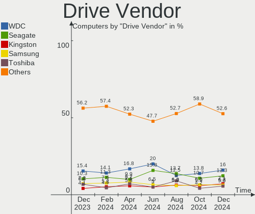
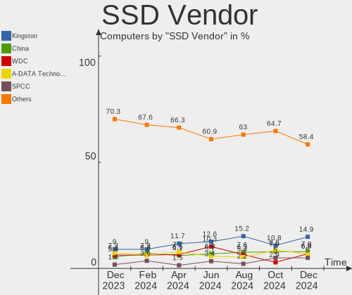
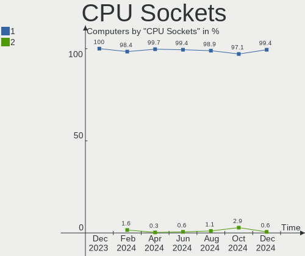
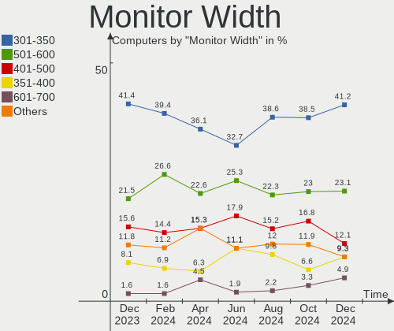
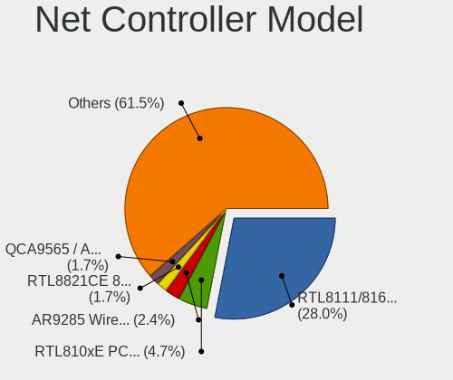
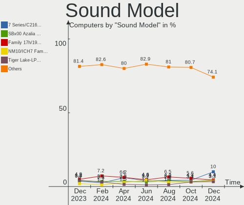
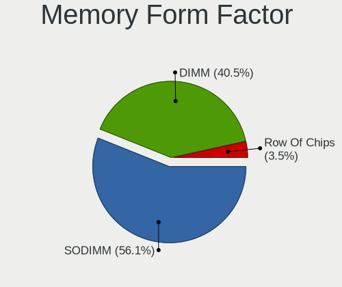

ROSA - Hardware Trends
----------------------

A project to identify most popular hardware characteristics and track their change
over time based on data collected by Linux users at https://Linux-Hardware.org.

Anyone can contribute to this report by the [hw-probe](https://github.com/linuxhw/hw-probe) tool:

    sudo -E hw-probe -all -upload

This is a report for all computer types. See also reports for [desktops](/Dist/ROSA/Desktop/README.md) and [notebooks](/Dist/ROSA/Notebook/README.md).

This report is for one last month. Overall report since the beginning of time: [TestDays](https://github.com/linuxhw/TestDays)

Period: Apr, 2024.

Contents
--------

* [ System ](#system)
  - [ OS                       ](#os)
  - [ OS Family                ](#os-family)
  - [ Kernel                   ](#kernel)
  - [ Kernel Family            ](#kernel-family)
  - [ Kernel Major Ver.        ](#kernel-major-ver)
  - [ Arch                     ](#arch)
  - [ DE                       ](#de)
  - [ Display Server           ](#display-server)
  - [ Display Manager          ](#display-manager)
  - [ OS Lang                  ](#os-lang)
  - [ Boot Mode                ](#boot-mode)
  - [ Filesystem               ](#filesystem)
  - [ Part. scheme             ](#part-scheme)
  - [ Dual Boot with Linux/BSD ](#dual-boot-with-linuxbsd)
  - [ Dual Boot (Win)          ](#dual-boot-win)

* [ Board ](#board)
  - [ Vendor                   ](#vendor)
  - [ Model                    ](#model)
  - [ Model Family             ](#model-family)
  - [ MFG Year                 ](#mfg-year)
  - [ Form Factor              ](#form-factor)
  - [ Secure Boot              ](#secure-boot)
  - [ Coreboot                 ](#coreboot)
  - [ RAM Size                 ](#ram-size)
  - [ RAM Used                 ](#ram-used)
  - [ Total Drives             ](#total-drives)
  - [ Has CD-ROM               ](#has-cd-rom)
  - [ Has Ethernet             ](#has-ethernet)
  - [ Has WiFi                 ](#has-wifi)
  - [ Has Bluetooth            ](#has-bluetooth)

* [ Location ](#location)
  - [ Country                  ](#country)
  - [ City                     ](#city)

* [ Drives ](#drives)
  - [ Drive Vendor             ](#drive-vendor)
  - [ Drive Model              ](#drive-model)
  - [ HDD Vendor               ](#hdd-vendor)
  - [ SSD Vendor               ](#ssd-vendor)
  - [ Drive Kind               ](#drive-kind)
  - [ Drive Connector          ](#drive-connector)
  - [ Drive Size               ](#drive-size)
  - [ Space Total              ](#space-total)
  - [ Space Used               ](#space-used)
  - [ Malfunc. Drives          ](#malfunc-drives)
  - [ Malfunc. Drive Vendor    ](#malfunc-drive-vendor)
  - [ Malfunc. HDD Vendor      ](#malfunc-hdd-vendor)
  - [ Malfunc. Drive Kind      ](#malfunc-drive-kind)
  - [ Failed Drives            ](#failed-drives)
  - [ Failed Drive Vendor      ](#failed-drive-vendor)
  - [ Drive Status             ](#drive-status)

* [ Storage controller ](#storage-controller)
  - [ Storage Vendor           ](#storage-vendor)
  - [ Storage Model            ](#storage-model)
  - [ Storage Kind             ](#storage-kind)

* [ Processor ](#processor)
  - [ CPU Vendor               ](#cpu-vendor)
  - [ CPU Model                ](#cpu-model)
  - [ CPU Model Family         ](#cpu-model-family)
  - [ CPU Cores                ](#cpu-cores)
  - [ CPU Sockets              ](#cpu-sockets)
  - [ CPU Threads              ](#cpu-threads)
  - [ CPU Op-Modes             ](#cpu-op-modes)
  - [ CPU Microcode            ](#cpu-microcode)
  - [ CPU Microarch            ](#cpu-microarch)

* [ Graphics ](#graphics)
  - [ GPU Vendor               ](#gpu-vendor)
  - [ GPU Model                ](#gpu-model)
  - [ GPU Combo                ](#gpu-combo)
  - [ GPU Driver               ](#gpu-driver)
  - [ GPU Memory               ](#gpu-memory)

* [ Monitor ](#monitor)
  - [ Monitor Vendor           ](#monitor-vendor)
  - [ Monitor Model            ](#monitor-model)
  - [ Monitor Resolution       ](#monitor-resolution)
  - [ Monitor Diagonal         ](#monitor-diagonal)
  - [ Monitor Width            ](#monitor-width)
  - [ Aspect Ratio             ](#aspect-ratio)
  - [ Monitor Area             ](#monitor-area)
  - [ Pixel Density            ](#pixel-density)
  - [ Multiple Monitors        ](#multiple-monitors)

* [ Network ](#network)
  - [ Net Controller Vendor    ](#net-controller-vendor)
  - [ Net Controller Model     ](#net-controller-model)
  - [ Wireless Vendor          ](#wireless-vendor)
  - [ Wireless Model           ](#wireless-model)
  - [ Ethernet Vendor          ](#ethernet-vendor)
  - [ Ethernet Model           ](#ethernet-model)
  - [ Net Controller Kind      ](#net-controller-kind)
  - [ Used Controller          ](#used-controller)
  - [ NICs                     ](#nics)
  - [ IPv6                     ](#ipv6)

* [ Bluetooth ](#bluetooth)
  - [ Bluetooth Vendor         ](#bluetooth-vendor)
  - [ Bluetooth Model          ](#bluetooth-model)

* [ Sound ](#sound)
  - [ Sound Vendor             ](#sound-vendor)
  - [ Sound Model              ](#sound-model)

* [ Memory ](#memory)
  - [ Memory Vendor            ](#memory-vendor)
  - [ Memory Model             ](#memory-model)
  - [ Memory Kind              ](#memory-kind)
  - [ Memory Form Factor       ](#memory-form-factor)
  - [ Memory Size              ](#memory-size)
  - [ Memory Speed             ](#memory-speed)

* [ Printers & scanners ](#printers--scanners)
  - [ Printer Vendor           ](#printer-vendor)
  - [ Printer Model            ](#printer-model)
  - [ Scanner Vendor           ](#scanner-vendor)
  - [ Scanner Model            ](#scanner-model)

* [ Camera ](#camera)
  - [ Camera Vendor            ](#camera-vendor)
  - [ Camera Model             ](#camera-model)

* [ Security ](#security)
  - [ Fingerprint Vendor       ](#fingerprint-vendor)
  - [ Fingerprint Model        ](#fingerprint-model)
  - [ Chipcard Vendor          ](#chipcard-vendor)
  - [ Chipcard Model           ](#chipcard-model)

* [ Unsupported ](#unsupported)
  - [ Unsupported Devices      ](#unsupported-devices)
  - [ Unsupported Device Types ](#unsupported-device-types)

System
------

OS
--

Installed operating systems

| Name        | Computers | Percent |
|-------------|-----------|---------|
| ROSA 12.5   | 227       | 78.82%  |
| ROSA 12     | 15        | 5.21%   |
| ROSA 13.0   | 13        | 4.51%   |
| ROSA R11.1  | 12        | 4.17%   |
| ROSA 12.4   | 12        | 4.17%   |
| ROSA R11    | 2         | 0.69%   |
| ROSA 2021.1 | 2         | 0.69%   |
| ROSA 12.3   | 2         | 0.69%   |
| ROSA R9     | 1         | 0.35%   |
| ROSA R8.1   | 1         | 0.35%   |
| ROSA 12.2   | 1         | 0.35%   |

OS Family
---------

OS without a version

| Name | Computers | Percent |
|------|-----------|---------|
| ROSA | 288       | 100%    |

Kernel
------

Version of the Linux kernel

| Version                                   | Computers | Percent |
|-------------------------------------------|-----------|---------|
| 6.6.21-generic-8rosa2021.1-x86_64         | 145       | 50.35%  |
| 6.1.81-generic-2rosa2021.1-x86_64         | 45        | 15.63%  |
| 6.1.20-generic-2rosa2021.1-x86_64         | 10        | 3.47%   |
| 6.1.86-generic-1rosa2021.1-x86_64         | 9         | 3.13%   |
| 6.1.58-generic-1rosa2021.1-x86_64         | 8         | 2.78%   |
| 5.15.127-generic-1rosa2021.1-i686         | 8         | 2.78%   |
| 5.10.184-generic-1rosa2021.1-x86_64       | 8         | 2.78%   |
| 6.6.27-generic-3rosa2021.1-x86_64         | 6         | 2.08%   |
| 6.6.27-generic-2rosa2021.1-x86_64         | 6         | 2.08%   |
| 6.6.22-generic-2rosa2023.1-x86_64         | 6         | 2.08%   |
| 5.15.127-generic-1rosa2021.1-x86_64       | 4         | 1.39%   |
| 4.15.0-desktop-122.124.1rosa-x86_64       | 4         | 1.39%   |
| 5.4.32-generic-2rosa-x86_64               | 2         | 0.69%   |
| 5.4.32-generic-2rosa-i586                 | 2         | 0.69%   |
| 5.10.74-generic-2rosa2021.1-x86_64        | 2         | 0.69%   |
| 4.15.0-desktop-45.1rosa-x86_64            | 2         | 0.69%   |
| 6.8.7.xm1-V2.k.1-xanmod-rosa2021.1-x86_64 | 1         | 0.35%   |
| 6.8.6-generic-1rosa2023.1-x86_64          | 1         | 0.35%   |
| 6.8.5-generic-1rosa2023.1-x86_64          | 1         | 0.35%   |
| 6.8.4.xm1-k.1-xanmod-rosa2021.1-x86_64    | 1         | 0.35%   |
| 6.8.3.xm1-1.k-xanmod-rosa2021.1-x86_64    | 1         | 0.35%   |
| 6.8.2-generic-2rosa2023.1-x86_64          | 1         | 0.35%   |
| 6.6.25-generic-1rosa2023.1-x86_64         | 1         | 0.35%   |
| 6.6.22.xm1-1.k-xanmod-rosa2021.1-x86_64   | 1         | 0.35%   |
| 6.6.21-generic-6rosa2023.1-x86_64         | 1         | 0.35%   |
| 6.1.80-generic-2rosa2023.1-x86_64         | 1         | 0.35%   |
| 5.4.83-generic-2rosa-x86_64               | 1         | 0.35%   |
| 5.4.83-generic-2rosa-i586                 | 1         | 0.35%   |
| 5.15.79-generic-1rosa2021.1-x86_64        | 1         | 0.35%   |
| 5.15.75-generic-1rosa2021.1-x86_64        | 1         | 0.35%   |
| 5.15.103-generic-1rosa2021.1-x86_64       | 1         | 0.35%   |
| 5.10.71-generic-1rosa2021.1-x86_64        | 1         | 0.35%   |
| 5.10.184-generic-1rosa2021.1-i586         | 1         | 0.35%   |
| 4.9.20-nrj-desktop-1rosa-x86_64           | 1         | 0.35%   |
| 4.9.155-nrj-desktop-1rosa-i586            | 1         | 0.35%   |
| 4.15.0-desktop-45.1rosa-i586              | 1         | 0.35%   |
| 4.15.0-desktop-122.124.1rosa-i586         | 1         | 0.35%   |

Kernel Family
-------------

Linux kernel without a distro release

| Version  | Computers | Percent |
|----------|-----------|---------|
| 6.6.21   | 146       | 50.69%  |
| 6.1.81   | 45        | 15.63%  |
| 6.6.27   | 12        | 4.17%   |
| 5.15.127 | 12        | 4.17%   |
| 6.1.20   | 10        | 3.47%   |
| 6.1.86   | 9         | 3.13%   |
| 5.10.184 | 9         | 3.13%   |
| 6.1.58   | 8         | 2.78%   |
| 4.15.0   | 8         | 2.78%   |
| 6.6.22   | 7         | 2.43%   |
| 5.4.32   | 4         | 1.39%   |
| 5.4.83   | 2         | 0.69%   |
| 5.10.74  | 2         | 0.69%   |
| 6.8.7    | 1         | 0.35%   |
| 6.8.6    | 1         | 0.35%   |
| 6.8.5    | 1         | 0.35%   |
| 6.8.4    | 1         | 0.35%   |
| 6.8.3    | 1         | 0.35%   |
| 6.8.2    | 1         | 0.35%   |
| 6.6.25   | 1         | 0.35%   |
| 6.1.80   | 1         | 0.35%   |
| 5.15.79  | 1         | 0.35%   |
| 5.15.75  | 1         | 0.35%   |
| 5.15.103 | 1         | 0.35%   |
| 5.10.71  | 1         | 0.35%   |
| 4.9.20   | 1         | 0.35%   |
| 4.9.155  | 1         | 0.35%   |

Kernel Major Ver.
-----------------

Linux kernel major version

| Version | Computers | Percent |
|---------|-----------|---------|
| 6.6     | 166       | 57.64%  |
| 6.1     | 73        | 25.35%  |
| 5.15    | 15        | 5.21%   |
| 5.10    | 12        | 4.17%   |
| 4.15    | 8         | 2.78%   |
| 6.8     | 6         | 2.08%   |
| 5.4     | 6         | 2.08%   |
| 4.9     | 2         | 0.69%   |

Arch
----

OS architecture (x86_64, i586, etc.)

| Name   | Computers | Percent |
|--------|-----------|---------|
| x86_64 | 273       | 94.79%  |
| i686   | 15        | 5.21%   |

DE
--

Desktop Environment

| Name    | Computers | Percent |
|---------|-----------|---------|
| KDE5    | 165       | 57.29%  |
| GNOME   | 74        | 25.69%  |
| LXQt    | 31        | 10.76%  |
| KDE4    | 11        | 3.82%   |
| Unknown | 4         | 1.39%   |
| MATE    | 2         | 0.69%   |
| KDE6    | 1         | 0.35%   |

Display Server
--------------

X11 or Wayland

| Name    | Computers | Percent |
|---------|-----------|---------|
| Wayland | 216       | 75%     |
| X11     | 71        | 24.65%  |
| Tty     | 1         | 0.35%   |

Display Manager
---------------

SDDM, LightDM, etc.

| Name    | Computers | Percent |
|---------|-----------|---------|
| SDDM    | 168       | 58.33%  |
| GDM     | 97        | 33.68%  |
| KDM     | 11        | 3.82%   |
| LightDM | 10        | 3.47%   |
| Unknown | 2         | 0.69%   |

OS Lang
-------

Language

| Lang    | Computers | Percent |
|---------|-----------|---------|
| ru_RU   | 244       | 84.72%  |
| en_US   | 11        | 3.82%   |
| it_IT   | 7         | 2.43%   |
| de_DE   | 6         | 2.08%   |
| Unknown | 4         | 1.39%   |
| pl_PL   | 3         | 1.04%   |
| es_ES   | 3         | 1.04%   |
| en_GB   | 2         | 0.69%   |
| sv_SE   | 1         | 0.35%   |
| ru_UA   | 1         | 0.35%   |
| hu_HU   | 1         | 0.35%   |
| hr_HR   | 1         | 0.35%   |
| fr_FR   | 1         | 0.35%   |
| fi_FI   | 1         | 0.35%   |
| es_VE   | 1         | 0.35%   |
| es_AR   | 1         | 0.35%   |

Boot Mode
---------

EFI or BIOS

| Mode | Computers | Percent |
|------|-----------|---------|
| EFI  | 179       | 62.15%  |
| BIOS | 109       | 37.85%  |

Filesystem
----------

Type of filesystem

| Type  | Computers | Percent |
|-------|-----------|---------|
| Ext4  | 252       | 87.5%   |
| Btrfs | 33        | 11.46%  |
| F2fs  | 2         | 0.69%   |
| Xfs   | 1         | 0.35%   |

Part. scheme
------------

Scheme of partitioning

| Type    | Computers | Percent |
|---------|-----------|---------|
| GPT     | 187       | 64.93%  |
| MBR     | 98        | 34.03%  |
| Unknown | 3         | 1.04%   |

Dual Boot with Linux/BSD
------------------------

Hosting more than one Linux/BSD

| Dual boot | Computers | Percent |
|-----------|-----------|---------|
| No        | 200       | 69.44%  |
| Yes       | 88        | 30.56%  |

Dual Boot (Win)
---------------

Hosting Linux and Windows

| Dual boot | Computers | Percent |
|-----------|-----------|---------|
| No        | 166       | 57.64%  |
| Yes       | 122       | 42.36%  |

Board
-----

Vendor
------

Motherboard manufacturer

| Name                     | Computers | Percent |
|--------------------------|-----------|---------|
| ASUSTek Computer         | 49        | 17.01%  |
| Gigabyte Technology      | 40        | 13.89%  |
| Lenovo                   | 29        | 10.07%  |
| MSI                      | 27        | 9.38%   |
| Hewlett-Packard          | 23        | 7.99%   |
| Acer                     | 19        | 6.6%    |
| ASRock                   | 17        | 5.9%    |
| Dell                     | 8         | 2.78%   |
| Intel                    | 7         | 2.43%   |
| Toshiba                  | 5         | 1.74%   |
| Unknown                  | 5         | 1.74%   |
| Samsung Electronics      | 4         | 1.39%   |
| Packard Bell             | 4         | 1.39%   |
| ICL                      | 4         | 1.39%   |
| Sony                     | 3         | 1.04%   |
| DEXP                     | 3         | 1.04%   |
| Timi                     | 2         | 0.69%   |
| Notebook                 | 2         | 0.69%   |
| HUAWEI                   | 2         | 0.69%   |
| Huanan                   | 2         | 0.69%   |
| Fujitsu                  | 2         | 0.69%   |
| ECS                      | 2         | 0.69%   |
| Clevo                    | 2         | 0.69%   |
| Biostar                  | 2         | 0.69%   |
| Aquarius                 | 2         | 0.69%   |
| Apple                    | 2         | 0.69%   |
| XIAOMI                   | 1         | 0.35%   |
| WeiBu                    | 1         | 0.35%   |
| TPS                      | 1         | 0.35%   |
| Standard                 | 1         | 0.35%   |
| Microtech                | 1         | 0.35%   |
| Medion                   | 1         | 0.35%   |
| MB                       | 1         | 0.35%   |
| Maibenben                | 1         | 0.35%   |
| MACHINIST                | 1         | 0.35%   |
| Infinix                  | 1         | 0.35%   |
| HONOR                    | 1         | 0.35%   |
| HIPER Technology Limited | 1         | 0.35%   |
| HIPER                    | 1         | 0.35%   |
| Haier                    | 1         | 0.35%   |

Model
-----

Motherboard model

| Name                                | Computers | Percent |
|-------------------------------------|-----------|---------|
| Unknown                             | 6         | 2.08%   |
| ICL RAY Si105.Mi                    | 3         | 1.04%   |
| ASUS All Series                     | 3         | 1.04%   |
| MSI MS-7C96                         | 2         | 0.69%   |
| Intel X99                           | 2         | 0.69%   |
| HP ProBook 450 G5                   | 2         | 0.69%   |
| HP Pavilion m6                      | 2         | 0.69%   |
| HP EliteBook 8440p                  | 2         | 0.69%   |
| Gigabyte B560 HD3                   | 2         | 0.69%   |
| Gigabyte AB350M-DS3H V2             | 2         | 0.69%   |
| Clevo NL41MU2                       | 2         | 0.69%   |
| ASUS M5A97 R2.0                     | 2         | 0.69%   |
| ASRock A520M Pro4                   | 2         | 0.69%   |
| XIAOMI Redmi Book 14 2024           | 1         | 0.35%   |
| WeiBu ADL-N                         | 1         | 0.35%   |
| TPS C48P                            | 1         | 0.35%   |
| Toshiba Satellite U300              | 1         | 0.35%   |
| Toshiba Satellite Pro L300          | 1         | 0.35%   |
| Toshiba Satellite C850-C1S          | 1         | 0.35%   |
| Toshiba Satellite C850-B1K          | 1         | 0.35%   |
| Toshiba Satellite A200              | 1         | 0.35%   |
| Timi Xiaomi Book Pro 14 2022        | 1         | 0.35%   |
| Timi TM1701                         | 1         | 0.35%   |
| Sony VGN-FW11ER                     | 1         | 0.35%   |
| Sony SVF14A15CLB                    | 1         | 0.35%   |
| Sony SVE1512G1RB                    | 1         | 0.35%   |
| Samsung RV415/RV515/E3415           | 1         | 0.35%   |
| Samsung RV413/RV513                 | 1         | 0.35%   |
| Samsung R510/P510                   | 1         | 0.35%   |
| Samsung 350V5C/351V5C/3540VC/3440VC | 1         | 0.35%   |
| Packard Bell IXTREME M5722          | 1         | 0.35%   |
| Packard Bell imax mini N3600        | 1         | 0.35%   |
| Packard Bell EasyNote TV11HC        | 1         | 0.35%   |
| Packard Bell EasyNote TE69KB        | 1         | 0.35%   |
| Notebook WA50SRQ                    | 1         | 0.35%   |
| Notebook Si155                      | 1         | 0.35%   |
| MSI OPTIMUS                         | 1         | 0.35%   |
| MSI MS-N014                         | 1         | 0.35%   |
| MSI MS-7E27                         | 1         | 0.35%   |
| MSI MS-7D89                         | 1         | 0.35%   |

Model Family
------------

Motherboard model prefix

| Name                  | Computers | Percent |
|-----------------------|-----------|---------|
| Acer Aspire           | 12        | 4.17%   |
| Lenovo ThinkPad       | 9         | 3.13%   |
| Lenovo IdeaPad        | 8         | 2.78%   |
| HP Pavilion           | 7         | 2.43%   |
| Unknown               | 6         | 2.08%   |
| Toshiba Satellite     | 5         | 1.74%   |
| ASUS PRIME            | 5         | 1.74%   |
| ICL RAY               | 3         | 1.04%   |
| HP ProBook            | 3         | 1.04%   |
| HP Laptop             | 3         | 1.04%   |
| HP EliteBook          | 3         | 1.04%   |
| Gigabyte B450M        | 3         | 1.04%   |
| DEXP Atlas            | 3         | 1.04%   |
| Dell OptiPlex         | 3         | 1.04%   |
| Dell Inspiron         | 3         | 1.04%   |
| ASUS ROG              | 3         | 1.04%   |
| ASUS M5A97            | 3         | 1.04%   |
| ASUS All              | 3         | 1.04%   |
| Packard Bell EasyNote | 2         | 0.69%   |
| MSI MS-7C96           | 2         | 0.69%   |
| Lenovo Yoga           | 2         | 0.69%   |
| Lenovo ThinkBook      | 2         | 0.69%   |
| Intel X99             | 2         | 0.69%   |
| Gigabyte H610M        | 2         | 0.69%   |
| Gigabyte B560         | 2         | 0.69%   |
| Gigabyte AB350M-DS3H  | 2         | 0.69%   |
| Gigabyte A520M        | 2         | 0.69%   |
| Fujitsu ESPRIMO       | 2         | 0.69%   |
| Dell Vostro           | 2         | 0.69%   |
| Clevo NL41MU2         | 2         | 0.69%   |
| ASUS VivoBook         | 2         | 0.69%   |
| ASUS TUF              | 2         | 0.69%   |
| ASUS STRIX            | 2         | 0.69%   |
| ASUS P5G41T-M         | 2         | 0.69%   |
| ASRock A520M          | 2         | 0.69%   |
| XIAOMI Redmi          | 1         | 0.35%   |
| WeiBu ADL-N           | 1         | 0.35%   |
| TPS C48P              | 1         | 0.35%   |
| Timi Xiaomi           | 1         | 0.35%   |
| Timi TM1701           | 1         | 0.35%   |

MFG Year
--------

Motherboard manufacture year

| Year | Computers | Percent |
|------|-----------|---------|
| 2012 | 37        | 12.85%  |
| 2021 | 27        | 9.38%   |
| 2020 | 24        | 8.33%   |
| 2018 | 23        | 7.99%   |
| 2009 | 18        | 6.25%   |
| 2011 | 17        | 5.9%    |
| 2010 | 17        | 5.9%    |
| 2022 | 15        | 5.21%   |
| 2013 | 15        | 5.21%   |
| 2023 | 14        | 4.86%   |
| 2017 | 14        | 4.86%   |
| 2019 | 13        | 4.51%   |
| 2016 | 13        | 4.51%   |
| 2014 | 10        | 3.47%   |
| 2008 | 10        | 3.47%   |
| 2015 | 8         | 2.78%   |
| 2007 | 6         | 2.08%   |
| 2006 | 3         | 1.04%   |
| 2024 | 2         | 0.69%   |
| 2005 | 1         | 0.35%   |
| 2003 | 1         | 0.35%   |

Form Factor
-----------

Physical design of the computer

| Name        | Computers | Percent |
|-------------|-----------|---------|
| Desktop     | 141       | 48.96%  |
| Notebook    | 135       | 46.88%  |
| All in one  | 7         | 2.43%   |
| Mini pc     | 4         | 1.39%   |
| Convertible | 1         | 0.35%   |

Secure Boot
-----------

Enabled or disabled

| State    | Computers | Percent |
|----------|-----------|---------|
| Disabled | 288       | 100%    |

Coreboot
--------

Have coreboot on board

| Used | Computers | Percent |
|------|-----------|---------|
| No   | 288       | 100%    |

RAM Size
--------

Total RAM memory

| Size in GB      | Computers | Percent |
|-----------------|-----------|---------|
| 4.01-8.0        | 74        | 25.69%  |
| 16.01-24.0      | 65        | 22.57%  |
| 8.01-16.0       | 57        | 19.79%  |
| 3.01-4.0        | 40        | 13.89%  |
| 32.01-64.0      | 18        | 6.25%   |
| 1.01-2.0        | 16        | 5.56%   |
| 64.01-256.0     | 6         | 2.08%   |
| 24.01-32.0      | 5         | 1.74%   |
| 2.01-3.0        | 4         | 1.39%   |
| 0.51-1.0        | 2         | 0.69%   |
| More than 256.0 | 1         | 0.35%   |

RAM Used
--------

Used RAM memory

| Used GB  | Computers | Percent |
|----------|-----------|---------|
| 1.01-2.0 | 146       | 50.69%  |
| 2.01-3.0 | 55        | 19.1%   |
| 0.51-1.0 | 43        | 14.93%  |
| 3.01-4.0 | 22        | 7.64%   |
| 4.01-8.0 | 18        | 6.25%   |
| 0.01-0.5 | 4         | 1.39%   |

Total Drives
------------

Number of drives on board

| Drives | Computers | Percent |
|--------|-----------|---------|
| 1      | 151       | 52.43%  |
| 2      | 88        | 30.56%  |
| 3      | 26        | 9.03%   |
| 4      | 13        | 4.51%   |
| 5      | 5         | 1.74%   |
| 6      | 4         | 1.39%   |
| 0      | 1         | 0.35%   |

Has CD-ROM
----------

Has CD-ROM on board

| Presented | Computers | Percent |
|-----------|-----------|---------|
| No        | 198       | 68.75%  |
| Yes       | 90        | 31.25%  |

Has Ethernet
------------

Has Ethernet on board

| Presented | Computers | Percent |
|-----------|-----------|---------|
| Yes       | 261       | 90.63%  |
| No        | 27        | 9.38%   |

Has WiFi
--------

Has WiFi module

| Presented | Computers | Percent |
|-----------|-----------|---------|
| Yes       | 193       | 67.01%  |
| No        | 95        | 32.99%  |

Has Bluetooth
-------------

Has Bluetooth module

| Presented | Computers | Percent |
|-----------|-----------|---------|
| Yes       | 153       | 53.13%  |
| No        | 135       | 46.88%  |

Location
--------

Country
-------

Geographic location (country)

| Country                | Computers | Percent |
|------------------------|-----------|---------|
| Russia                 | 240       | 83.33%  |
| Italy                  | 7         | 2.43%   |
| Germany                | 5         | 1.74%   |
| Ukraine                | 4         | 1.39%   |
| Poland                 | 3         | 1.04%   |
| Austria                | 3         | 1.04%   |
| France                 | 2         | 0.69%   |
| Finland                | 2         | 0.69%   |
| Czechia                | 2         | 0.69%   |
| Belarus                | 2         | 0.69%   |
| Argentina              | 2         | 0.69%   |
| Venezuela              | 1         | 0.35%   |
| USA                    | 1         | 0.35%   |
| Sweden                 | 1         | 0.35%   |
| Spain                  | 1         | 0.35%   |
| Portugal               | 1         | 0.35%   |
| Malaysia               | 1         | 0.35%   |
| Latvia                 | 1         | 0.35%   |
| Kazakhstan             | 1         | 0.35%   |
| Israel                 | 1         | 0.35%   |
| Ireland                | 1         | 0.35%   |
| Hungary                | 1         | 0.35%   |
| Ecuador                | 1         | 0.35%   |
| Dominican Republic     | 1         | 0.35%   |
| Brazil                 | 1         | 0.35%   |
| Bosnia and Herzegovina | 1         | 0.35%   |
| Australia              | 1         | 0.35%   |

City
----

Geographic location (city)

| City              | Computers | Percent |
|-------------------|-----------|---------|
| Moscow            | 69        | 23.96%  |
| St Petersburg     | 26        | 9.03%   |
| Novosibirsk       | 6         | 2.08%   |
| Krasnodar         | 6         | 2.08%   |
| Chelyabinsk       | 6         | 2.08%   |
| Yekaterinburg     | 4         | 1.39%   |
| Voronezh          | 4         | 1.39%   |
| Rostov-on-Don     | 4         | 1.39%   |
| Kemerovo          | 4         | 1.39%   |
| Kaliningrad       | 4         | 1.39%   |
| Zima              | 3         | 1.04%   |
| Yaroslavl         | 3         | 1.04%   |
| Vladivostok       | 3         | 1.04%   |
| Tambov            | 3         | 1.04%   |
| Stavropol         | 3         | 1.04%   |
| Saratov           | 3         | 1.04%   |
| Samara            | 3         | 1.04%   |
| Omsk              | 3         | 1.04%   |
| Nizhniy Novgorod  | 3         | 1.04%   |
| Kazan'            | 3         | 1.04%   |
| Izhevsk           | 3         | 1.04%   |
| Vladimir          | 2         | 0.69%   |
| Ufa               | 2         | 0.69%   |
| Tyumen            | 2         | 0.69%   |
| Surgut            | 2         | 0.69%   |
| Saransk           | 2         | 0.69%   |
| Prague            | 2         | 0.69%   |
| Pindushi          | 2         | 0.69%   |
| Perm              | 2         | 0.69%   |
| Minsk             | 2         | 0.69%   |
| Lipetsk           | 2         | 0.69%   |
| Kazan’          | 2         | 0.69%   |
| Innsbruck         | 2         | 0.69%   |
| Barnaul           | 2         | 0.69%   |
| Barcelona         | 2         | 0.69%   |
| Arkhangelsk       | 2         | 0.69%   |
| Zheleznodorozhnyy | 1         | 0.35%   |
| Yuzhno-Sakhalinsk | 1         | 0.35%   |
| Yoshkar-Ola       | 1         | 0.35%   |
| Yaya              | 1         | 0.35%   |

Drives
------

Drive Vendor
------------

Hard drive vendors

| Vendor                      | Computers | Drives | Percent |
|-----------------------------|-----------|--------|---------|
| WDC                         | 78        | 92     | 16.77%  |
| Seagate                     | 46        | 48     | 9.89%   |
| Samsung Electronics         | 38        | 43     | 8.17%   |
| Toshiba                     | 33        | 35     | 7.1%    |
| Kingston                    | 27        | 29     | 5.81%   |
| Hitachi                     | 23        | 25     | 4.95%   |
| A-DATA Technology           | 18        | 19     | 3.87%   |
| Crucial                     | 15        | 20     | 3.23%   |
| Apacer                      | 15        | 15     | 3.23%   |
| SanDisk                     | 13        | 15     | 2.8%    |
| China                       | 12        | 12     | 2.58%   |
| Intel                       | 8         | 9      | 1.72%   |
| HGST                        | 8         | 8      | 1.72%   |
| SK hynix                    | 7         | 7      | 1.51%   |
| Unknown                     | 6         | 6      | 1.29%   |
| Plextor                     | 6         | 7      | 1.29%   |
| Qumo                        | 5         | 5      | 1.08%   |
| Phison                      | 5         | 5      | 1.08%   |
| Micron Technology           | 5         | 5      | 1.08%   |
| AMD                         | 5         | 6      | 1.08%   |
| SPCC                        | 4         | 5      | 0.86%   |
| Smartbuy                    | 4         | 4      | 0.86%   |
| MAXIO Technology (Hangzhou) | 4         | 4      | 0.86%   |
| KingSpec                    | 4         | 5      | 0.86%   |
| Gigabyte Technology         | 4         | 4      | 0.86%   |
| DEXP                        | 4         | 4      | 0.86%   |
| BIWIN                       | 4         | 4      | 0.86%   |
| AGI                         | 4         | 4      | 0.86%   |
| Netac                       | 3         | 3      | 0.65%   |
| YMTC                        | 2         | 2      | 0.43%   |
| XrayDisk                    | 2         | 2      | 0.43%   |
| Transcend                   | 2         | 2      | 0.43%   |
| RTS                         | 2         | 2      | 0.43%   |
| OCZ                         | 2         | 2      | 0.43%   |
| KIOXIA                      | 2         | 2      | 0.43%   |
| Kingston Technology Company | 2         | 2      | 0.43%   |
| Kimtigo                     | 2         | 2      | 0.43%   |
| JMicron Technology          | 2         | 2      | 0.43%   |
| Hewlett-Packard             | 2         | 2      | 0.43%   |
| ADATA Technology            | 2         | 2      | 0.43%   |

Drive Model
-----------

Hard drive models

| Model                            | Computers | Percent |
|----------------------------------|-----------|---------|
| Toshiba HDWD110 1TB              | 7         | 1.42%   |
| Seagate ST1000DM010-2EP102 1TB   | 7         | 1.42%   |
| Seagate ST500DM002-1BD142 500GB  | 6         | 1.21%   |
| Crucial CT240BX500SSD1 240GB     | 6         | 1.21%   |
| A-DATA SU650 120GB SSD           | 5         | 1.01%   |
| WDC WD10EZEX-08WN4A0 1TB         | 4         | 0.81%   |
| Toshiba DT01ACA100 1TB           | 4         | 0.81%   |
| Kingston SA400S37240G 240GB SSD  | 4         | 0.81%   |
| Kingston SA400S37120G 120GB SSD  | 4         | 0.81%   |
| WDC WDS120G2G0A-00JH30 120GB SSD | 3         | 0.61%   |
| Seagate ST1000DM003-1CH162 1TB   | 3         | 0.61%   |
| Samsung HM500JI 500GB            | 3         | 0.61%   |
| Kingston SA400S37480G 480GB SSD  | 3         | 0.61%   |
| Hitachi HDS721010CLA332 1TB      | 3         | 0.61%   |
| Crucial CT250MX500SSD1 250GB     | 3         | 0.61%   |
| Apacer AS350 512GB SSD           | 3         | 0.61%   |
| Apacer AS350 256GB SSD           | 3         | 0.61%   |
| Apacer AS350 128GB SSD           | 3         | 0.61%   |
| Apacer AS2280P4 256GB            | 3         | 0.61%   |
| A-DATA SU650 480GB SSD           | 3         | 0.61%   |
| A-DATA SU650 240GB SSD           | 3         | 0.61%   |
| YMTC PC300-512GB-B               | 2         | 0.4%    |
| WDC WDS500G2B0A-00SM50 500GB SSD | 2         | 0.4%    |
| WDC WDS240G2G0A-00JH30 240GB SSD | 2         | 0.4%    |
| WDC WD5003AZEX-00MK2A0 500GB     | 2         | 0.4%    |
| WDC WD5000AZRX-00L4HB0 500GB     | 2         | 0.4%    |
| WDC WD3200BPVT-22JJ5T0 320GB     | 2         | 0.4%    |
| WDC WD10JPVX-75JC3T0 1TB         | 2         | 0.4%    |
| WDC WD10EZEX-00BN5A0 1TB         | 2         | 0.4%    |
| Toshiba MQ01ABF050 500GB         | 2         | 0.4%    |
| Toshiba MQ01ABD050 500GB         | 2         | 0.4%    |
| Toshiba MQ01ABD032 320GB         | 2         | 0.4%    |
| Toshiba MK6034GSX 64GB           | 2         | 0.4%    |
| Toshiba DT01ACA300 3TB           | 2         | 0.4%    |
| Toshiba DT01ACA050 500GB         | 2         | 0.4%    |
| Smartbuy SSD 120GB               | 2         | 0.4%    |
| Seagate ST1000LM035-1RK172 1TB   | 2         | 0.4%    |
| SanDisk SSD PLUS 120GB           | 2         | 0.4%    |
| SanDisk SDSSDA240G 240GB         | 2         | 0.4%    |
| Samsung SSD 980 250GB            | 2         | 0.4%    |

HDD Vendor
----------

Hard disk drive vendors

| Vendor              | Computers | Drives | Percent |
|---------------------|-----------|--------|---------|
| WDC                 | 63        | 74     | 34.43%  |
| Seagate             | 44        | 46     | 24.04%  |
| Toshiba             | 32        | 34     | 17.49%  |
| Hitachi             | 23        | 25     | 12.57%  |
| Samsung Electronics | 8         | 8      | 4.37%   |
| HGST                | 8         | 8      | 4.37%   |
| JMicron Technology  | 2         | 2      | 1.09%   |
| Unknown             | 1         | 1      | 0.55%   |
| Hewlett-Packard     | 1         | 1      | 0.55%   |
| Fujitsu             | 1         | 1      | 0.55%   |

SSD Vendor
----------

Solid state drive vendors

| Vendor              | Computers | Drives | Percent |
|---------------------|-----------|--------|---------|
| Kingston            | 23        | 24     | 11.73%  |
| Samsung Electronics | 15        | 15     | 7.65%   |
| A-DATA Technology   | 15        | 16     | 7.65%   |
| Crucial             | 14        | 17     | 7.14%   |
| WDC                 | 13        | 13     | 6.63%   |
| SanDisk             | 12        | 14     | 6.12%   |
| China               | 12        | 12     | 6.12%   |
| Apacer              | 11        | 11     | 5.61%   |
| Plextor             | 6         | 6      | 3.06%   |
| Qumo                | 5         | 5      | 2.55%   |
| AMD                 | 5         | 5      | 2.55%   |
| Smartbuy            | 4         | 4      | 2.04%   |
| KingSpec            | 4         | 5      | 2.04%   |
| DEXP                | 4         | 4      | 2.04%   |
| AGI                 | 4         | 4      | 2.04%   |
| SPCC                | 3         | 4      | 1.53%   |
| Gigabyte Technology | 3         | 3      | 1.53%   |
| XrayDisk            | 2         | 2      | 1.02%   |
| Transcend           | 2         | 2      | 1.02%   |
| Seagate             | 2         | 2      | 1.02%   |
| RTS                 | 2         | 2      | 1.02%   |
| OCZ                 | 2         | 2      | 1.02%   |
| Kimtigo             | 2         | 2      | 1.02%   |
| Zheino              | 1         | 1      | 0.51%   |
| walram              | 1         | 1      | 0.51%   |
| Toshiba             | 1         | 1      | 0.51%   |
| T-FORCE             | 1         | 1      | 0.51%   |
| SK hynix            | 1         | 1      | 0.51%   |
| Q600S               | 1         | 1      | 0.51%   |
| Phison              | 1         | 1      | 0.51%   |
| Patriot             | 1         | 1      | 0.51%   |
| OCZ-VERTEX3         | 1         | 1      | 0.51%   |
| Netac               | 1         | 1      | 0.51%   |
| Neo                 | 1         | 1      | 0.51%   |
| Micron Technology   | 1         | 1      | 0.51%   |
| MicroFrom           | 1         | 1      | 0.51%   |
| M500                | 1         | 1      | 0.51%   |
| LuminouTek          | 1         | 1      | 0.51%   |
| KingDian            | 1         | 1      | 0.51%   |
| Intel               | 1         | 1      | 0.51%   |

Drive Kind
----------

HDD or SSD

| Kind    | Computers | Drives | Percent |
|---------|-----------|--------|---------|
| SSD     | 165       | 206    | 40.34%  |
| HDD     | 155       | 200    | 37.9%   |
| NVMe    | 82        | 93     | 20.05%  |
| MMC     | 6         | 6      | 1.47%   |
| Unknown | 1         | 1      | 0.24%   |

Drive Connector
---------------

SATA, SAS, NVMe, etc.

| Type | Computers | Drives | Percent |
|------|-----------|--------|---------|
| SATA | 238       | 398    | 71.04%  |
| NVMe | 82        | 93     | 24.48%  |
| SAS  | 9         | 9      | 2.69%   |
| MMC  | 6         | 6      | 1.79%   |

Drive Size
----------

Size of hard drive

| Size in TB | Computers | Drives | Percent |
|------------|-----------|--------|---------|
| 0.01-0.5   | 201       | 267    | 64.63%  |
| 0.51-1.0   | 87        | 115    | 27.97%  |
| 1.01-2.0   | 18        | 19     | 5.79%   |
| 2.01-3.0   | 3         | 3      | 0.96%   |
| 3.01-4.0   | 1         | 1      | 0.32%   |
| 4.01-10.0  | 1         | 1      | 0.32%   |

Space Total
-----------

Amount of disk space available on the file system

| Size in GB     | Computers | Percent |
|----------------|-----------|---------|
| 101-250        | 82        | 28.47%  |
| 251-500        | 63        | 21.88%  |
| 1-20           | 38        | 13.19%  |
| 501-1000       | 34        | 11.81%  |
| 1001-2000      | 23        | 7.99%   |
| 51-100         | 20        | 6.94%   |
| 21-50          | 13        | 4.51%   |
| 2001-3000      | 8         | 2.78%   |
| More than 3000 | 6         | 2.08%   |
| Unknown        | 1         | 0.35%   |

Space Used
----------

Amount of used disk space

| Used GB        | Computers | Percent |
|----------------|-----------|---------|
| 1-20           | 159       | 55.21%  |
| 21-50          | 40        | 13.89%  |
| 101-250        | 29        | 10.07%  |
| 51-100         | 20        | 6.94%   |
| 501-1000       | 14        | 4.86%   |
| 251-500        | 13        | 4.51%   |
| 1001-2000      | 8         | 2.78%   |
| More than 3000 | 2         | 0.69%   |
| 2001-3000      | 2         | 0.69%   |
| Unknown        | 1         | 0.35%   |

Malfunc. Drives
---------------

Drive models with a malfunction

| Model                                | Computers | Drives | Percent |
|--------------------------------------|-----------|--------|---------|
| Toshiba MK6034GSX 64GB               | 2         | 2      | 2.44%   |
| Hitachi HTS545016B9A300 160GB        | 2         | 2      | 2.44%   |
| Hitachi HTS541612J9SA00 120GB        | 2         | 2      | 2.44%   |
| WDC WDS240G2G0A-00JH30 240GB SSD     | 1         | 1      | 1.22%   |
| WDC WD800JD-00MSA1 80GB              | 1         | 1      | 1.22%   |
| WDC WD800AAJS-00B4A0 80GB            | 1         | 1      | 1.22%   |
| WDC WD7500BPVX-60JC3T0 752GB         | 1         | 1      | 1.22%   |
| WDC WD600BEVS-07LAT0 64GB            | 1         | 1      | 1.22%   |
| WDC WD5000LPVX-80V0TT0 500GB         | 1         | 1      | 1.22%   |
| WDC WD5000LPVX-22V0TT0 500GB         | 1         | 1      | 1.22%   |
| WDC WD5000LPCX-24VHAT0 500GB         | 1         | 1      | 1.22%   |
| WDC WD5000AAKX-60U6AA0 500GB         | 1         | 1      | 1.22%   |
| WDC WD400BB-00DEA0 40GB              | 1         | 1      | 1.22%   |
| WDC WD3200BPVT-24ZEST0 320GB         | 1         | 1      | 1.22%   |
| WDC WD3200BEVT-80A0RT1 320GB         | 1         | 1      | 1.22%   |
| WDC WD30EFRX-68EUZN0 3TB             | 1         | 1      | 1.22%   |
| WDC WD1600BEVS-22RST0 160GB          | 1         | 1      | 1.22%   |
| WDC WD10PURX-64E5EY0 1TB             | 1         | 1      | 1.22%   |
| WDC WD10JPVT-60A1YT0 1TB             | 1         | 2      | 1.22%   |
| WDC WD10EZEX-00BN5A0 1TB             | 1         | 1      | 1.22%   |
| WDC WD10EALX-009BA0 1TB              | 1         | 1      | 1.22%   |
| WDC WD1003FZEX-00MK2A0 1TB           | 1         | 1      | 1.22%   |
| WDC WD1003FZEX-00K3CA0 1TB           | 1         | 1      | 1.22%   |
| WDC WD1003FBYX-01Y7B1 1TB            | 1         | 1      | 1.22%   |
| WDC WD1002FAEX-00Y9A0 1TB            | 1         | 1      | 1.22%   |
| walram SSD 120G                      | 1         | 1      | 1.22%   |
| Toshiba THNSNK128GCS8 SATA 128GB SSD | 1         | 1      | 1.22%   |
| Toshiba MQ01ABF050 500GB             | 1         | 1      | 1.22%   |
| Toshiba MQ01ABD100H 1TB              | 1         | 1      | 1.22%   |
| Toshiba MQ01ABD100 1TB               | 1         | 1      | 1.22%   |
| Toshiba MQ01ABD050 500GB             | 1         | 1      | 1.22%   |
| Toshiba MK6459GSXP 640GB             | 1         | 1      | 1.22%   |
| Toshiba MK3265GSX H 320GB            | 1         | 1      | 1.22%   |
| Toshiba MK1059GSMP 1TB               | 1         | 1      | 1.22%   |
| Toshiba HDWJ110 1TB                  | 1         | 1      | 1.22%   |
| Toshiba DT01ACA100 1TB               | 1         | 1      | 1.22%   |
| SPCC Solid State Disk 512GB          | 1         | 2      | 1.22%   |
| Smartbuy SSD 240GB                   | 1         | 1      | 1.22%   |
| Seagate ST9250315AS 250GB            | 1         | 1      | 1.22%   |
| Seagate ST9160310AS 160GB            | 1         | 1      | 1.22%   |

Malfunc. Drive Vendor
---------------------

Vendors of faulty drives

| Vendor              | Computers | Drives | Percent |
|---------------------|-----------|--------|---------|
| WDC                 | 22        | 23     | 27.16%  |
| Toshiba             | 12        | 12     | 14.81%  |
| Hitachi             | 12        | 13     | 14.81%  |
| Seagate             | 9         | 9      | 11.11%  |
| Kingston            | 6         | 6      | 7.41%   |
| Samsung Electronics | 4         | 4      | 4.94%   |
| Plextor             | 2         | 2      | 2.47%   |
| HGST                | 2         | 2      | 2.47%   |
| Apacer              | 2         | 2      | 2.47%   |
| walram              | 1         | 1      | 1.23%   |
| SPCC                | 1         | 2      | 1.23%   |
| Smartbuy            | 1         | 1      | 1.23%   |
| Qumo                | 1         | 1      | 1.23%   |
| OCZ                 | 1         | 1      | 1.23%   |
| Neo                 | 1         | 1      | 1.23%   |
| Fujitsu             | 1         | 1      | 1.23%   |
| DEXP                | 1         | 1      | 1.23%   |
| China               | 1         | 1      | 1.23%   |
| A-DATA Technology   | 1         | 1      | 1.23%   |

Malfunc. HDD Vendor
-------------------

Vendors of faulty HDD drives

| Vendor              | Computers | Drives | Percent |
|---------------------|-----------|--------|---------|
| WDC                 | 21        | 22     | 35.59%  |
| Hitachi             | 12        | 13     | 20.34%  |
| Toshiba             | 11        | 11     | 18.64%  |
| Seagate             | 9         | 9      | 15.25%  |
| Samsung Electronics | 3         | 3      | 5.08%   |
| HGST                | 2         | 2      | 3.39%   |
| Fujitsu             | 1         | 1      | 1.69%   |

Malfunc. Drive Kind
-------------------

Kinds of faulty drives

| Kind | Computers | Drives | Percent |
|------|-----------|--------|---------|
| HDD  | 56        | 61     | 71.79%  |
| SSD  | 20        | 21     | 25.64%  |
| NVMe | 2         | 2      | 2.56%   |

Failed Drives
-------------

Failed drive models

| Model                                   | Computers | Drives | Percent |
|-----------------------------------------|-----------|--------|---------|
| WDC WD10JPVX-75JC3T0 1TB                | 1         | 1      | 33.33%  |
| SK hynix BC501 HFM256GDJTNG-8310A 256GB | 1         | 1      | 33.33%  |
| Hitachi HDS721010CLA332 1TB             | 1         | 1      | 33.33%  |

Failed Drive Vendor
-------------------

Failed drive vendors

| Vendor   | Computers | Drives | Percent |
|----------|-----------|--------|---------|
| WDC      | 1         | 1      | 33.33%  |
| SK hynix | 1         | 1      | 33.33%  |
| Hitachi  | 1         | 1      | 33.33%  |

Drive Status
------------

Number of failed and malfunc. drives

| Status   | Computers | Drives | Percent |
|----------|-----------|--------|---------|
| Works    | 239       | 397    | 70.92%  |
| Malfunc  | 75        | 84     | 22.26%  |
| Detected | 20        | 22     | 5.93%   |
| Failed   | 3         | 3      | 0.89%   |

Storage controller
------------------

Storage Vendor
--------------

Storage controller vendors

| Vendor                           | Computers | Percent |
|----------------------------------|-----------|---------|
| Intel                            | 197       | 53.53%  |
| AMD                              | 70        | 19.02%  |
| Samsung Electronics              | 18        | 4.89%   |
| Phison Electronics               | 9         | 2.45%   |
| MAXIO Technology (Hangzhou)      | 7         | 1.9%    |
| ASMedia Technology               | 7         | 1.9%    |
| SK hynix                         | 6         | 1.63%   |
| Nvidia                           | 6         | 1.63%   |
| Kingston Technology Company      | 6         | 1.63%   |
| JMicron Technology               | 5         | 1.36%   |
| ADATA Technology                 | 5         | 1.36%   |
| Shenzhen Longsys Electronics     | 4         | 1.09%   |
| SanDisk                          | 4         | 1.09%   |
| Micron Technology                | 4         | 1.09%   |
| Silicon Motion                   | 3         | 0.82%   |
| Yangtze Memory Technologies      | 2         | 0.54%   |
| Silicon Integrated Systems [SiS] | 2         | 0.54%   |
| Micron/Crucial Technology        | 2         | 0.54%   |
| KIOXIA                           | 2         | 0.54%   |
| INNOGRIT                         | 2         | 0.54%   |
| Shenzhen Shichuangyi Electronics | 1         | 0.27%   |
| Netac Technology                 | 1         | 0.27%   |
| Marvell Technology Group         | 1         | 0.27%   |
| Lite-On Technology               | 1         | 0.27%   |
| Integrated Technology Express    | 1         | 0.27%   |
| Hosin Global Electronics         | 1         | 0.27%   |
| Unknown                          | 1         | 0.27%   |

Storage Model
-------------

Storage controller models

| Model                                                                                   | Computers | Percent |
|-----------------------------------------------------------------------------------------|-----------|---------|
| AMD FCH SATA Controller [AHCI mode]                                                     | 34        | 7.93%   |
| Intel 7 Series Chipset Family 6-port SATA Controller [AHCI mode]                        | 18        | 4.2%    |
| AMD 500 Series Chipset SATA Controller                                                  | 13        | 3.03%   |
| Intel 8 Series/C220 Series Chipset Family 6-port SATA Controller 1 [AHCI mode]          | 12        | 2.8%    |
| Intel 500 Series Chipset Family SATA AHCI Controller                                    | 10        | 2.33%   |
| AMD SB7x0/SB8x0/SB9x0 SATA Controller [AHCI mode]                                       | 10        | 2.33%   |
| Intel Sunrise Point-LP SATA Controller [AHCI mode]                                      | 9         | 2.1%    |
| AMD SB7x0/SB8x0/SB9x0 IDE Controller                                                    | 8         | 1.86%   |
| AMD 400 Series Chipset SATA Controller                                                  | 8         | 1.86%   |
| MAXIO (Hangzhou) NVMe SSD Controller MAP1202 (DRAM-less)                                | 7         | 1.63%   |
| Intel Q170/Q150/B150/H170/H110/Z170/CM236 Chipset SATA Controller [AHCI Mode]           | 7         | 1.63%   |
| Intel 200 Series PCH SATA controller [AHCI mode]                                        | 7         | 1.63%   |
| ASMedia ASM1061/ASM1062 Serial ATA Controller                                           | 7         | 1.63%   |
| Samsung NVMe SSD Controller 980 (DRAM-less)                                             | 6         | 1.4%    |
| Intel 6 Series/C200 Series Chipset Family Desktop SATA Controller (IDE mode, ports 4-5) | 6         | 1.4%    |
| Intel 6 Series/C200 Series Chipset Family Desktop SATA Controller (IDE mode, ports 0-3) | 6         | 1.4%    |
| Intel 6 Series/C200 Series Chipset Family 6 port Mobile SATA AHCI Controller            | 6         | 1.4%    |
| Intel 5 Series/3400 Series Chipset 6 port SATA AHCI Controller                          | 6         | 1.4%    |
| AMD SB7x0/SB8x0/SB9x0 SATA Controller [IDE mode]                                        | 6         | 1.4%    |
| AMD 300 Series Chipset SATA Controller                                                  | 6         | 1.4%    |
| Samsung NVMe SSD Controller PM9A1/PM9A3/980PRO                                          | 5         | 1.17%   |
| Intel Wildcat Point-LP SATA Controller [AHCI Mode]                                      | 5         | 1.17%   |
| Intel Tiger Lake-LP SATA Controller                                                     | 5         | 1.17%   |
| Intel Celeron/Pentium Silver Processor SATA Controller                                  | 5         | 1.17%   |
| Intel Alder Lake-S PCH SATA Controller [AHCI Mode]                                      | 5         | 1.17%   |
| Intel 82801IBM/IEM (ICH9M/ICH9M-E) 4 port SATA Controller [AHCI mode]                   | 5         | 1.17%   |
| Intel 82801HM/HEM (ICH8M/ICH8M-E) SATA Controller [AHCI mode]                           | 5         | 1.17%   |
| Intel 82801HM/HEM (ICH8M/ICH8M-E) IDE Controller                                        | 5         | 1.17%   |
| Intel 82801 Mobile SATA Controller [RAID mode]                                          | 5         | 1.17%   |
| Intel 7 Series/C210 Series Chipset Family 6-port SATA Controller [AHCI mode]            | 5         | 1.17%   |
| Intel 6 Series/C200 Series Chipset Family 6 port Desktop SATA AHCI Controller           | 5         | 1.17%   |
| Samsung NVMe SSD Controller SM981/PM981/PM983                                           | 4         | 0.93%   |
| Samsung NVMe SSD Controller SM961/PM961/SM963                                           | 4         | 0.93%   |
| Phison PS5013-E13 PCIe3 NVMe Controller (DRAM-less)                                     | 4         | 0.93%   |
| Intel NM10/ICH7 Family SATA Controller [AHCI mode]                                      | 4         | 0.93%   |
| Intel Comet Lake SATA AHCI Controller                                                   | 4         | 0.93%   |
| Intel Cannon Lake PCH SATA AHCI Controller                                              | 4         | 0.93%   |
| Intel 82801G (ICH7 Family) IDE Controller                                               | 4         | 0.93%   |
| Intel 5 Series/3400 Series Chipset 4 port SATA AHCI Controller                          | 4         | 0.93%   |
| SK hynix Gold P31/BC711/PC711 NVMe Solid State Drive                                    | 3         | 0.7%    |

Storage Kind
------------

Kind of storage controller (IDE, SATA, NVMe, SAS, ...)

| Kind | Computers | Percent |
|------|-----------|---------|
| SATA | 237       | 63.54%  |
| NVMe | 81        | 21.72%  |
| IDE  | 48        | 12.87%  |
| RAID | 7         | 1.88%   |

Processor
---------

CPU Vendor
----------

Processor vendors

| Vendor | Computers | Percent |
|--------|-----------|---------|
| Intel  | 205       | 71.18%  |
| AMD    | 83        | 28.82%  |

CPU Model
---------

Processor models

| Model                                       | Computers | Percent |
|---------------------------------------------|-----------|---------|
| Intel Core i5-10400 CPU @ 2.90GHz           | 5         | 1.74%   |
| Intel 11th Gen Core i5-1135G7 @ 2.40GHz     | 4         | 1.39%   |
| Intel Core i5-9400 CPU @ 2.90GHz            | 3         | 1.04%   |
| Intel Core i5-8250U CPU @ 1.60GHz           | 3         | 1.04%   |
| Intel Core i5-3230M CPU @ 2.60GHz           | 3         | 1.04%   |
| Intel Atom CPU N270 @ 1.60GHz               | 3         | 1.04%   |
| AMD Ryzen 7 4700U with Radeon Graphics      | 3         | 1.04%   |
| AMD Ryzen 5 5600X 6-Core Processor          | 3         | 1.04%   |
| AMD Ryzen 5 5600G with Radeon Graphics      | 3         | 1.04%   |
| AMD Ryzen 5 5600 6-Core Processor           | 3         | 1.04%   |
| AMD Ryzen 5 5500U with Radeon Graphics      | 3         | 1.04%   |
| AMD Ryzen 5 3600 6-Core Processor           | 3         | 1.04%   |
| AMD Ryzen 3 2200G with Radeon Vega Graphics | 3         | 1.04%   |
| AMD Ryzen 3 1200 Quad-Core Processor        | 3         | 1.04%   |
| Intel Core i7-7700K CPU @ 4.20GHz           | 2         | 0.69%   |
| Intel Core i7-4770K CPU @ 3.50GHz           | 2         | 0.69%   |
| Intel Core i7-3630QM CPU @ 2.40GHz          | 2         | 0.69%   |
| Intel Core i7-3610QM CPU @ 2.30GHz          | 2         | 0.69%   |
| Intel Core i7-2700K CPU @ 3.50GHz           | 2         | 0.69%   |
| Intel Core i7-2600K CPU @ 3.40GHz           | 2         | 0.69%   |
| Intel Core i5-5300U CPU @ 2.30GHz           | 2         | 0.69%   |
| Intel Core i5-4210U CPU @ 1.70GHz           | 2         | 0.69%   |
| Intel Core i5-3210M CPU @ 2.50GHz           | 2         | 0.69%   |
| Intel Core i5-2450M CPU @ 2.50GHz           | 2         | 0.69%   |
| Intel Core i5-2410M CPU @ 2.30GHz           | 2         | 0.69%   |
| Intel Core i5 CPU M 520 @ 2.40GHz           | 2         | 0.69%   |
| Intel Core i5 CPU 650 @ 3.20GHz             | 2         | 0.69%   |
| Intel Core i3-7100 CPU @ 3.90GHz            | 2         | 0.69%   |
| Intel Core i3-6100 CPU @ 3.70GHz            | 2         | 0.69%   |
| Intel Core i3-5005U CPU @ 2.00GHz           | 2         | 0.69%   |
| Intel Core i3-2370M CPU @ 2.40GHz           | 2         | 0.69%   |
| Intel Core i3-2120 CPU @ 3.30GHz            | 2         | 0.69%   |
| Intel Core 2 Duo CPU E8600 @ 3.33GHz        | 2         | 0.69%   |
| Intel Core 2 Duo CPU E8400 @ 3.00GHz        | 2         | 0.69%   |
| Intel Celeron N4020 CPU @ 1.10GHz           | 2         | 0.69%   |
| Intel Celeron CPU N3350 @ 1.10GHz           | 2         | 0.69%   |
| Intel 12th Gen Core i5-1240P                | 2         | 0.69%   |
| Intel 11th Gen Core i5-1155G7 @ 2.50GHz     | 2         | 0.69%   |
| Intel 11th Gen Core i5-11400F @ 2.60GHz     | 2         | 0.69%   |
| AMD Ryzen 9 5900X 12-Core Processor         | 2         | 0.69%   |

CPU Model Family
----------------

Processor model prefix

| Model                   | Computers | Percent |
|-------------------------|-----------|---------|
| Intel Core i5           | 62        | 21.53%  |
| Intel Core i3           | 28        | 9.72%   |
| AMD Ryzen 5             | 24        | 8.33%   |
| Other                   | 22        | 7.64%   |
| Intel Core i7           | 21        | 7.29%   |
| Intel Core 2 Duo        | 16        | 5.56%   |
| AMD Ryzen 7             | 15        | 5.21%   |
| Intel Celeron           | 12        | 4.17%   |
| AMD FX                  | 10        | 3.47%   |
| Intel Pentium           | 9         | 3.13%   |
| Intel Atom              | 9         | 3.13%   |
| Intel Xeon              | 7         | 2.43%   |
| AMD Ryzen 3             | 7         | 2.43%   |
| Intel Pentium Dual-Core | 5         | 1.74%   |
| AMD A6                  | 4         | 1.39%   |
| Intel Pentium Gold      | 3         | 1.04%   |
| Intel Genuine           | 3         | 1.04%   |
| Intel Pentium Silver    | 2         | 0.69%   |
| Intel Pentium Dual      | 2         | 0.69%   |
| AMD Ryzen 9             | 2         | 0.69%   |
| AMD Ryzen 5 PRO         | 2         | 0.69%   |
| AMD Ryzen 3 PRO         | 2         | 0.69%   |
| AMD Phenom II X4        | 2         | 0.69%   |
| AMD Phenom II X2        | 2         | 0.69%   |
| AMD E                   | 2         | 0.69%   |
| AMD A8                  | 2         | 0.69%   |
| Intel Pentium 4         | 1         | 0.35%   |
| Intel Core i9           | 1         | 0.35%   |
| Intel Core 2            | 1         | 0.35%   |
| Intel Celeron M         | 1         | 0.35%   |
| AMD Sempron             | 1         | 0.35%   |
| AMD E1                  | 1         | 0.35%   |
| AMD C-60                | 1         | 0.35%   |
| AMD Athlon II X3        | 1         | 0.35%   |
| AMD Athlon II Dual-Core | 1         | 0.35%   |
| AMD Athlon 64 X2        | 1         | 0.35%   |
| AMD Athlon              | 1         | 0.35%   |
| AMD A4                  | 1         | 0.35%   |
| AMD A10                 | 1         | 0.35%   |

CPU Cores
---------

Number of processor cores

| Number  | Computers | Percent |
|---------|-----------|---------|
| 2       | 111       | 38.54%  |
| 4       | 89        | 30.9%   |
| 6       | 42        | 14.58%  |
| 8       | 17        | 5.9%    |
| 1       | 13        | 4.51%   |
| 12      | 6         | 2.08%   |
| 3       | 4         | 1.39%   |
| 10      | 2         | 0.69%   |
| 24      | 1         | 0.35%   |
| 16      | 1         | 0.35%   |
| 14      | 1         | 0.35%   |
| Unknown | 1         | 0.35%   |

CPU Sockets
-----------

Number of sockets

| Number | Computers | Percent |
|--------|-----------|---------|
| 1      | 287       | 99.65%  |
| 2      | 1         | 0.35%   |

CPU Threads
-----------

Threads per core (Hyper-Threading)

| Number  | Computers | Percent |
|---------|-----------|---------|
| 2       | 185       | 64.24%  |
| 1       | 102       | 35.42%  |
| Unknown | 1         | 0.35%   |

CPU Op-Modes
------------

CPU Operation Modes (32-bit, 64-bit)

| Op mode        | Computers | Percent |
|----------------|-----------|---------|
| 32-bit, 64-bit | 281       | 97.57%  |
| 32-bit         | 7         | 2.43%   |

CPU Microcode
-------------

Microcode number

| Number     | Computers | Percent |
|------------|-----------|---------|
| Unknown    | 139       | 48.26%  |
| 0x306a9    | 11        | 3.82%   |
| 0x206a7    | 9         | 3.13%   |
| 0x806ea    | 4         | 1.39%   |
| 0x6fd      | 4         | 1.39%   |
| 0x106c2    | 4         | 1.39%   |
| 0x0a20120e | 4         | 1.39%   |
| 0x08701030 | 4         | 1.39%   |
| 0x08108109 | 4         | 1.39%   |
| 0x08101016 | 4         | 1.39%   |
| 0x08001138 | 4         | 1.39%   |
| 0x806c1    | 3         | 1.04%   |
| 0x106ca    | 3         | 1.04%   |
| 0x0a50000d | 3         | 1.04%   |
| 0x0a20120a | 3         | 1.04%   |
| 0x08608104 | 3         | 1.04%   |
| 0x08608103 | 3         | 1.04%   |
| 0x06006705 | 3         | 1.04%   |
| 0x06000822 | 3         | 1.04%   |
| 0x00000000 | 3         | 1.04%   |
| 0x906e9    | 2         | 0.69%   |
| 0x6fb      | 2         | 0.69%   |
| 0x506e3    | 2         | 0.69%   |
| 0x306d4    | 2         | 0.69%   |
| 0x306c3    | 2         | 0.69%   |
| 0x1067a    | 2         | 0.69%   |
| 0x0a50000c | 2         | 0.69%   |
| 0x08600106 | 2         | 0.69%   |
| 0x08600104 | 2         | 0.69%   |
| 0x0700010b | 2         | 0.69%   |
| 0x0600611a | 2         | 0.69%   |
| 0x0600081c | 2         | 0.69%   |
| 0x0500010d | 2         | 0.69%   |
| 0x05000101 | 2         | 0.69%   |
| 0xf27      | 1         | 0.35%   |
| 0xb06a2    | 1         | 0.35%   |
| 0xb0671    | 1         | 0.35%   |
| 0xa0671    | 1         | 0.35%   |
| 0xa0655    | 1         | 0.35%   |
| 0xa0653    | 1         | 0.35%   |

CPU Microarch
-------------

Microarchitecture

| Name             | Computers | Percent |
|------------------|-----------|---------|
| KabyLake         | 33        | 11.46%  |
| SandyBridge      | 23        | 7.99%   |
| IvyBridge        | 23        | 7.99%   |
| Haswell          | 17        | 5.9%    |
| Zen 3            | 16        | 5.56%   |
| Penryn           | 15        | 5.21%   |
| Zen 2            | 12        | 4.17%   |
| Alderlake Hybrid | 11        | 3.82%   |
| Core             | 10        | 3.47%   |
| CometLake        | 10        | 3.47%   |
| Zen              | 9         | 3.13%   |
| Westmere         | 9         | 3.13%   |
| Bonnell          | 9         | 3.13%   |
| Unknown          | 9         | 3.13%   |
| Piledriver       | 8         | 2.78%   |
| TigerLake        | 7         | 2.43%   |
| Skylake          | 7         | 2.43%   |
| Broadwell        | 7         | 2.43%   |
| Zen+             | 6         | 2.08%   |
| Silvermont       | 6         | 2.08%   |
| K10              | 6         | 2.08%   |
| Goldmont plus    | 5         | 1.74%   |
| Excavator        | 5         | 1.74%   |
| IceLake          | 4         | 1.39%   |
| Bobcat           | 4         | 1.39%   |
| K8 Hammer        | 3         | 1.04%   |
| Goldmont         | 3         | 1.04%   |
| P6               | 2         | 0.69%   |
| Nehalem          | 2         | 0.69%   |
| Jaguar           | 2         | 0.69%   |
| Bulldozer        | 2         | 0.69%   |
| Steamroller      | 1         | 0.35%   |
| NetBurst         | 1         | 0.35%   |
| Gracemont        | 1         | 0.35%   |

Graphics
--------

GPU Vendor
----------

Vendors of graphics cards

| Vendor | Computers | Percent |
|--------|-----------|---------|
| Intel  | 136       | 40.96%  |
| Nvidia | 107       | 32.23%  |
| AMD    | 89        | 26.81%  |

GPU Model
---------

Graphics card models

| Model                                                                                    | Computers | Percent |
|------------------------------------------------------------------------------------------|-----------|---------|
| Intel 3rd Gen Core processor Graphics Controller                                         | 15        | 4.36%   |
| Intel 2nd Generation Core Processor Family Integrated Graphics Controller                | 13        | 3.78%   |
| Intel TigerLake-LP GT2 [Iris Xe Graphics]                                                | 7         | 2.03%   |
| Nvidia GP107 [GeForce GTX 1050 Ti]                                                       | 6         | 1.74%   |
| Intel UHD Graphics 620                                                                   | 6         | 1.74%   |
| Intel Mobile 945GM/GMS/GME, 943/940GML Express Integrated Graphics Controller            | 6         | 1.74%   |
| AMD Renoir [Radeon RX Vega 6 (Ryzen 4000/5000 Mobile Series)]                            | 6         | 1.74%   |
| AMD Lucienne                                                                             | 6         | 1.74%   |
| AMD Ellesmere [Radeon RX 470/480/570/570X/580/580X/590]                                  | 6         | 1.74%   |
| AMD Cezanne [Radeon Vega Series / Radeon Vega Mobile Series]                             | 6         | 1.74%   |
| Nvidia GM107 [GeForce GTX 750 Ti]                                                        | 5         | 1.45%   |
| Nvidia GK208B [GeForce GT 710]                                                           | 5         | 1.45%   |
| Nvidia GF117M [GeForce 610M/710M/810M/820M / GT 620M/625M/630M/720M]                     | 5         | 1.45%   |
| Intel Xeon E3-1200 v3/4th Gen Core Processor Integrated Graphics Controller              | 5         | 1.45%   |
| Intel HD Graphics 5500                                                                   | 5         | 1.45%   |
| Intel CometLake-S GT2 [UHD Graphics 630]                                                 | 5         | 1.45%   |
| Intel 4 Series Chipset Integrated Graphics Controller                                    | 5         | 1.45%   |
| Intel HD Graphics 630                                                                    | 4         | 1.16%   |
| Intel Core Processor Integrated Graphics Controller                                      | 4         | 1.16%   |
| AMD Raven Ridge [Radeon Vega Series / Radeon Vega Mobile Series]                         | 4         | 1.16%   |
| Nvidia TU117 [GeForce GTX 1650]                                                          | 3         | 0.87%   |
| Nvidia GP107M [GeForce GTX 1050 Mobile]                                                  | 3         | 0.87%   |
| Nvidia GP106 [GeForce GTX 1060 6GB]                                                      | 3         | 0.87%   |
| Nvidia GM107 [GeForce GTX 750]                                                           | 3         | 0.87%   |
| Nvidia GK107 [GeForce GTX 650]                                                           | 3         | 0.87%   |
| Nvidia GF108M [GeForce GT 620M/630M/635M/640M LE]                                        | 3         | 0.87%   |
| Intel Mobile GM965/GL960 Integrated Graphics Controller (secondary)                      | 3         | 0.87%   |
| Intel Mobile GM965/GL960 Integrated Graphics Controller (primary)                        | 3         | 0.87%   |
| Intel Mobile 945GSE Express Integrated Graphics Controller                               | 3         | 0.87%   |
| Intel Mobile 945GM/GMS, 943/940GML Express Integrated Graphics Controller                | 3         | 0.87%   |
| Intel Mobile 4 Series Chipset Integrated Graphics Controller                             | 3         | 0.87%   |
| Intel HD Graphics 620                                                                    | 3         | 0.87%   |
| Intel Haswell-ULT Integrated Graphics Controller                                         | 3         | 0.87%   |
| Intel GeminiLake [UHD Graphics 600]                                                      | 3         | 0.87%   |
| Intel CoffeeLake-S GT2 [UHD Graphics 630]                                                | 3         | 0.87%   |
| Intel CoffeeLake-H GT2 [UHD Graphics 630]                                                | 3         | 0.87%   |
| Intel Atom/Celeron/Pentium Processor x5-E8000/J3xxx/N3xxx Integrated Graphics Controller | 3         | 0.87%   |
| Intel Atom Processor Z36xxx/Z37xxx Series Graphics & Display                             | 3         | 0.87%   |
| Intel Atom Processor D4xx/D5xx/N4xx/N5xx Integrated Graphics Controller                  | 3         | 0.87%   |
| AMD Thames [Radeon HD 7500M/7600M Series]                                                | 3         | 0.87%   |

GPU Combo
---------

Combinations of graphics cards

| Name           | Computers | Percent |
|----------------|-----------|---------|
| 1 x Intel      | 96        | 33.33%  |
| 1 x AMD        | 76        | 26.39%  |
| 1 x Nvidia     | 73        | 25.35%  |
| Intel + Nvidia | 31        | 10.76%  |
| Intel + AMD    | 7         | 2.43%   |
| 2 x AMD        | 3         | 1.04%   |
| AMD + Nvidia   | 2         | 0.69%   |

GPU Driver
----------

Free vs proprietary

| Driver      | Computers | Percent |
|-------------|-----------|---------|
| Free        | 245       | 85.07%  |
| Proprietary | 38        | 13.19%  |
| Unknown     | 5         | 1.74%   |

GPU Memory
----------

Total video memory

| Size in GB | Computers | Percent |
|------------|-----------|---------|
| Unknown    | 125       | 43.4%   |
| 1.01-2.0   | 51        | 17.71%  |
| 0.01-0.5   | 39        | 13.54%  |
| 0.51-1.0   | 24        | 8.33%   |
| 3.01-4.0   | 19        | 6.6%    |
| 7.01-8.0   | 18        | 6.25%   |
| 8.01-16.0  | 5         | 1.74%   |
| 5.01-6.0   | 4         | 1.39%   |
| 2.01-3.0   | 3         | 1.04%   |

Monitor
-------

Monitor Vendor
--------------

Monitor vendors

| Vendor                  | Computers | Percent |
|-------------------------|-----------|---------|
| Samsung Electronics     | 43        | 14.88%  |
| AU Optronics            | 33        | 11.42%  |
| BOE                     | 24        | 8.3%    |
| LG Display              | 16        | 5.54%   |
| Goldstar                | 16        | 5.54%   |
| Philips                 | 15        | 5.19%   |
| Chimei Innolux          | 13        | 4.5%    |
| BenQ                    | 11        | 3.81%   |
| Acer                    | 11        | 3.81%   |
| Dell                    | 10        | 3.46%   |
| Lenovo                  | 8         | 2.77%   |
| AOC                     | 8         | 2.77%   |
| ASUSTek Computer        | 7         | 2.42%   |
| Chi Mei Optoelectronics | 6         | 2.08%   |
| ViewSonic               | 4         | 1.38%   |
| Hewlett-Packard         | 4         | 1.38%   |
| HannStar                | 4         | 1.38%   |
| Sony                    | 3         | 1.04%   |
| Mi                      | 3         | 1.04%   |
| CHR                     | 3         | 1.04%   |
| Apple                   | 3         | 1.04%   |
| Ancor Communications    | 3         | 1.04%   |
| Unknown (XXX)           | 2         | 0.69%   |
| Sharp                   | 2         | 0.69%   |
| SAC                     | 2         | 0.69%   |
| NEC Computers           | 2         | 0.69%   |
| LG Philips              | 2         | 0.69%   |
| InfoVision              | 2         | 0.69%   |
| HKC                     | 2         | 0.69%   |
| HHT                     | 2         | 0.69%   |
| Denver                  | 2         | 0.69%   |
| CPT                     | 2         | 0.69%   |
| CHD                     | 2         | 0.69%   |
| XHS                     | 1         | 0.35%   |
| Unknown                 | 1         | 0.35%   |
| TSK                     | 1         | 0.35%   |
| TR_                     | 1         | 0.35%   |
| Toshiba                 | 1         | 0.35%   |
| TMX                     | 1         | 0.35%   |
| Syscom                  | 1         | 0.35%   |

Monitor Model
-------------

Monitor models

| Model                                                                | Computers | Percent |
|----------------------------------------------------------------------|-----------|---------|
| BOE LCD Monitor BOE0747 1920x1080 344x194mm 15.5-inch                | 4         | 1.38%   |
| CHR ET2031I CHR7511 1600x900 518x333mm 24.2-inch                     | 3         | 1.03%   |
| BOE LCD Monitor BOE0953 1920x1080 382x215mm 17.3-inch                | 3         | 1.03%   |
| Samsung Electronics LCD Monitor SEC364A 1366x768 344x194mm 15.5-inch | 2         | 0.69%   |
| Philips PHL 243V7 PHLC155 1920x1080 527x296mm 23.8-inch              | 2         | 0.69%   |
| LG Display LCD Monitor LGD02DC 1366x768 344x194mm 15.5-inch          | 2         | 0.69%   |
| Lenovo LCD Monitor LEN40A0 1366x768 309x174mm 14.0-inch              | 2         | 0.69%   |
| InfoVision LCD Monitor IVO04E3 1366x768 277x156mm 12.5-inch          | 2         | 0.69%   |
| HHT ActivPanel V6 HHT0030 3840x2160 944x398mm 40.3-inch              | 2         | 0.69%   |
| HannStar LCD Monitor HSD03E9 1024x600 220x129mm 10.0-inch            | 2         | 0.69%   |
| Goldstar MP59G GSM5B34 1920x1080 480x270mm 21.7-inch                 | 2         | 0.69%   |
| Denver LM27-E230C LHCFFFF 1920x1080 598x336mm 27.0-inch              | 2         | 0.69%   |
| Chimei Innolux LCD Monitor CMN15E7 1920x1080 344x193mm 15.5-inch     | 2         | 0.69%   |
| Chimei Innolux LCD Monitor CMN14D4 1920x1080 309x173mm 13.9-inch     | 2         | 0.69%   |
| BOE LCD Monitor BOE0877 1920x1080 309x173mm 13.9-inch                | 2         | 0.69%   |
| BOE LCD Monitor BOE0872 1920x1080 344x194mm 15.5-inch                | 2         | 0.69%   |
| AU Optronics LCD Monitor AUO71EC 1366x768 344x193mm 15.5-inch        | 2         | 0.69%   |
| AU Optronics LCD Monitor AUO38ED 1920x1080 344x193mm 15.5-inch       | 2         | 0.69%   |
| AU Optronics LCD Monitor AUO325C 1366x768 256x144mm 11.6-inch        | 2         | 0.69%   |
| AU Optronics LCD Monitor AUO22EC 1366x768 344x193mm 15.5-inch        | 2         | 0.69%   |
| AU Optronics LCD Monitor AUO21EC 1366x768 344x193mm 15.5-inch        | 2         | 0.69%   |
| AOC 2260WG5 AOC2260 1920x1080 477x268mm 21.5-inch                    | 2         | 0.69%   |
| Acer VA200HQ ACR0514 1366x768 434x236mm 19.4-inch                    | 2         | 0.69%   |
| Acer S230HL ACR0280 1920x1080 509x286mm 23.0-inch                    | 2         | 0.69%   |
| XHS N2488HZ XHS2380 1920x1080 522x293mm 23.6-inch                    | 1         | 0.34%   |
| ViewSonic VX3276-QHD VSCE635 2560x1440 698x393mm 31.5-inch           | 1         | 0.34%   |
| ViewSonic VE175 VSCEE08 1280x1024 338x270mm 17.0-inch                | 1         | 0.34%   |
| ViewSonic VA2432-FHD VSCB639 1920x1080 527x296mm 23.8-inch           | 1         | 0.34%   |
| ViewSonic VA2261 VSC0F30 1920x1080 480x270mm 21.7-inch               | 1         | 0.34%   |
| Unknown LCD Monitor FFFF 2288x1287 2550x2550mm 142.0-inch            | 1         | 0.34%   |
| Unknown (XXX) HDMI XXX0029 1920x1080 1152x648mm 52.0-inch            | 1         | 0.34%   |
| Unknown (XXX) Beyond TV XXX2851 3840x2160 1209x680mm 54.6-inch       | 1         | 0.34%   |
| TSK TS2400-N2 TSK2380 2560x1440 530x290mm 23.8-inch                  | 1         | 0.34%   |
| TR_ LCD Monitor TR_5511 1366x768 518x333mm 24.2-inch                 | 1         | 0.34%   |
| Toshiba LCD Monitor LCD58E1 1280x800 261x163mm 12.1-inch             | 1         | 0.34%   |
| TMX TL140ADXP20-0 TMX2006 2880x1800 302x188mm 14.0-inch              | 1         | 0.34%   |
| Syscom MSC-535 MSC0535 1152x870 304x228mm 15.0-inch                  | 1         | 0.34%   |
| Sony TV SNY0801 1360x768                                             | 1         | 0.34%   |
| Sony SDM-M81 SNY0380 1280x1024 359x287mm 18.1-inch                   | 1         | 0.34%   |
| Sony HDMI TV SNY0264 1920x540                                        | 1         | 0.34%   |

Monitor Resolution
------------------

Monitor screen resolution

| Resolution         | Computers | Percent |
|--------------------|-----------|---------|
| 1920x1080 (FHD)    | 136       | 47.72%  |
| 1366x768 (WXGA)    | 55        | 19.3%   |
| 3840x2160 (4K)     | 17        | 5.96%   |
| 1600x900 (HD+)     | 11        | 3.86%   |
| 1280x1024 (SXGA)   | 11        | 3.86%   |
| 2560x1440 (QHD)    | 10        | 3.51%   |
| 1280x800 (WXGA)    | 9         | 3.16%   |
| 1440x900 (WXGA+)   | 6         | 2.11%   |
| 1024x600           | 5         | 1.75%   |
| 1920x1200 (WUXGA)  | 4         | 1.4%    |
| 2880x1800          | 3         | 1.05%   |
| 1360x768           | 3         | 1.05%   |
| 1024x768 (XGA)     | 3         | 1.05%   |
| 2560x1080          | 2         | 0.7%    |
| 1920x540           | 2         | 0.7%    |
| 1680x1050 (WSXGA+) | 2         | 0.7%    |
| 3440x1440          | 1         | 0.35%   |
| 2560x1600          | 1         | 0.35%   |
| 2288x1287          | 1         | 0.35%   |
| 2240x1400          | 1         | 0.35%   |
| 1600x1200          | 1         | 0.35%   |
| 1280x720 (HD)      | 1         | 0.35%   |

Monitor Diagonal
----------------

Diagonal size in inches

| Inches  | Computers | Percent |
|---------|-----------|---------|
| 15      | 74        | 25.61%  |
| 24      | 26        | 9%      |
| 23      | 25        | 8.65%   |
| 27      | 20        | 6.92%   |
| 21      | 20        | 6.92%   |
| 13      | 16        | 5.54%   |
| 14      | 15        | 5.19%   |
| 17      | 14        | 4.84%   |
| 19      | 12        | 4.15%   |
| 18      | 9         | 3.11%   |
| 31      | 7         | 2.42%   |
| 20      | 6         | 2.08%   |
| 11      | 6         | 2.08%   |
| 10      | 6         | 2.08%   |
| 22      | 4         | 1.38%   |
| 12      | 4         | 1.38%   |
| Unknown | 4         | 1.38%   |
| 40      | 3         | 1.04%   |
| 34      | 3         | 1.04%   |
| 49      | 2         | 0.69%   |
| 32      | 2         | 0.69%   |
| 16      | 2         | 0.69%   |
| 142     | 1         | 0.35%   |
| 72      | 1         | 0.35%   |
| 54      | 1         | 0.35%   |
| 52      | 1         | 0.35%   |
| 47      | 1         | 0.35%   |
| 37      | 1         | 0.35%   |
| 36      | 1         | 0.35%   |
| 33      | 1         | 0.35%   |
| 26      | 1         | 0.35%   |

Monitor Width
-------------

Physical width

| Width in mm    | Computers | Percent |
|----------------|-----------|---------|
| 301-350        | 105       | 36.46%  |
| 501-600        | 66        | 22.92%  |
| 401-500        | 45        | 15.63%  |
| 201-300        | 21        | 7.29%   |
| 351-400        | 18        | 6.25%   |
| 601-700        | 11        | 3.82%   |
| 701-800        | 7         | 2.43%   |
| 1001-1500      | 5         | 1.74%   |
| Unknown        | 4         | 1.39%   |
| 801-900        | 2         | 0.69%   |
| 901-1000       | 2         | 0.69%   |
| More than 2000 | 1         | 0.35%   |
| 1501-2000      | 1         | 0.35%   |

Aspect Ratio
------------

Proportional relationship between the width and the height

| Ratio | Computers | Percent |
|-------|-----------|---------|
| 16/9  | 223       | 79.93%  |
| 16/10 | 31        | 11.11%  |
| 5/4   | 11        | 3.94%   |
| 4/3   | 5         | 1.79%   |
| 21/9  | 5         | 1.79%   |
| 32/9  | 3         | 1.08%   |
| 1.00  | 1         | 0.36%   |

Monitor Area
------------

Area in inch²

| Area in inch² | Computers | Percent |
|----------------|-----------|---------|
| 101-110        | 74        | 25.52%  |
| 201-250        | 62        | 21.38%  |
| 81-90          | 27        | 9.31%   |
| 151-200        | 27        | 9.31%   |
| 301-350        | 21        | 7.24%   |
| 351-500        | 13        | 4.48%   |
| 141-150        | 10        | 3.45%   |
| 121-130        | 10        | 3.45%   |
| 251-300        | 8         | 2.76%   |
| 501-1000       | 8         | 2.76%   |
| 51-60          | 6         | 2.07%   |
| 41-50          | 6         | 2.07%   |
| More than 1000 | 4         | 1.38%   |
| 61-70          | 4         | 1.38%   |
| Unknown        | 4         | 1.38%   |
| 71-80          | 3         | 1.03%   |
| 111-120        | 2         | 0.69%   |
| 91-100         | 1         | 0.34%   |

Pixel Density
-------------

Pixels per inch

| Density       | Computers | Percent |
|---------------|-----------|---------|
| 51-100        | 117       | 41.2%   |
| 101-120       | 77        | 27.11%  |
| 121-160       | 73        | 25.7%   |
| 161-240       | 6         | 2.11%   |
| 1-50          | 4         | 1.41%   |
| Unknown       | 4         | 1.41%   |
| More than 240 | 3         | 1.06%   |

Multiple Monitors
-----------------

Total monitors connected

| Total | Computers | Percent |
|-------|-----------|---------|
| 1     | 262       | 90.97%  |
| 2     | 18        | 6.25%   |
| 0     | 8         | 2.78%   |

Network
-------

Net Controller Vendor
---------------------

Controller vendors

| Vendor                           | Computers | Percent |
|----------------------------------|-----------|---------|
| Realtek Semiconductor            | 200       | 48.08%  |
| Intel                            | 90        | 21.63%  |
| Qualcomm Atheros                 | 56        | 13.46%  |
| Broadcom                         | 19        | 4.57%   |
| TP-Link                          | 11        | 2.64%   |
| Nvidia                           | 6         | 1.44%   |
| Ralink                           | 5         | 1.2%    |
| Ralink Technology                | 4         | 0.96%   |
| Marvell Technology Group         | 4         | 0.96%   |
| Broadcom Limited                 | 3         | 0.72%   |
| Silicon Integrated Systems [SiS] | 2         | 0.48%   |
| Mercucys                         | 2         | 0.48%   |
| MediaTek                         | 2         | 0.48%   |
| ZTE WCDMA Technologies MSM       | 1         | 0.24%   |
| vivo                             | 1         | 0.24%   |
| Vimtron Electronics              | 1         | 0.24%   |
| Sitecom Europe                   | 1         | 0.24%   |
| Qualcomm                         | 1         | 0.24%   |
| NetGear                          | 1         | 0.24%   |
| Huawei Technologies              | 1         | 0.24%   |
| Google                           | 1         | 0.24%   |
| Fujian Newland Computer          | 1         | 0.24%   |
| Edimax Technology                | 1         | 0.24%   |
| DisplayLink                      | 1         | 0.24%   |
| Attansic Technology              | 1         | 0.24%   |

Net Controller Model
--------------------

Controller models

| Model                                                                   | Computers | Percent |
|-------------------------------------------------------------------------|-----------|---------|
| Realtek RTL8111/8168/8211/8411 PCI Express Gigabit Ethernet Controller  | 155       | 33.05%  |
| Realtek RTL810xE PCI Express Fast Ethernet controller                   | 20        | 4.26%   |
| Qualcomm Atheros AR9485 Wireless Network Adapter                        | 10        | 2.13%   |
| Qualcomm Atheros AR9285 Wireless Network Adapter (PCI-Express)          | 10        | 2.13%   |
| Realtek RTL8821CE 802.11ac PCIe Wireless Network Adapter                | 9         | 1.92%   |
| Realtek RTL8125 2.5GbE Controller                                       | 9         | 1.92%   |
| Intel Wireless 8265 / 8275                                              | 8         | 1.71%   |
| Intel Wireless 3165                                                     | 7         | 1.49%   |
| Broadcom BCM4313 802.11bgn Wireless Network Adapter                     | 7         | 1.49%   |
| Qualcomm Atheros QCA9377 802.11ac Wireless Network Adapter              | 6         | 1.28%   |
| Intel Wi-Fi 6 AX200                                                     | 6         | 1.28%   |
| Intel Dual Band Wireless-AC 3168NGW [Stone Peak]                        | 6         | 1.28%   |
| Realtek RTL8822CE 802.11ac PCIe Wireless Network Adapter                | 5         | 1.07%   |
| Qualcomm Atheros QCA9565 / AR9565 Wireless Network Adapter              | 5         | 1.07%   |
| Qualcomm Atheros AR8161 Gigabit Ethernet                                | 5         | 1.07%   |
| Intel Wireless 7265                                                     | 5         | 1.07%   |
| Intel Wi-Fi 6 AX201                                                     | 5         | 1.07%   |
| Realtek RTL8723BE PCIe Wireless Network Adapter                         | 4         | 0.85%   |
| Ralink MT7601U Wireless Adapter                                         | 4         | 0.85%   |
| Qualcomm Atheros AR8151 v2.0 Gigabit Ethernet                           | 4         | 0.85%   |
| Qualcomm Atheros AR242x / AR542x Wireless Network Adapter (PCI-Express) | 4         | 0.85%   |
| Intel Ethernet Connection (2) I219-V                                    | 4         | 0.85%   |
| Intel Alder Lake-P PCH CNVi WiFi                                        | 4         | 0.85%   |
| TP-Link TL-WN722N v2/v3 [Realtek RTL8188EUS]                            | 3         | 0.64%   |
| Realtek RTL8192CU 802.11n WLAN Adapter                                  | 3         | 0.64%   |
| Marvell Group 88E8055 PCI-E Gigabit Ethernet Controller                 | 3         | 0.64%   |
| Intel Wireless 7260                                                     | 3         | 0.64%   |
| Intel PRO/Wireless 3945ABG [Golan] Network Connection                   | 3         | 0.64%   |
| Intel Ethernet Connection (13) I219-V                                   | 3         | 0.64%   |
| Intel 82567V-2 Gigabit Network Connection                               | 3         | 0.64%   |
| Intel 82567LM-3 Gigabit Network Connection                              | 3         | 0.64%   |
| TP-Link TL-WN823N v2/v3 [Realtek RTL8192EU]                             | 2         | 0.43%   |
| Silicon Integrated Systems [SiS] 191 Gigabit Ethernet Adapter           | 2         | 0.43%   |
| Realtek RTL8723DE Wireless Network Adapter                              | 2         | 0.43%   |
| Realtek RTL8192EU 802.11b/g/n WLAN Adapter                              | 2         | 0.43%   |
| Realtek RTL8188FTV 802.11b/g/n 1T1R 2.4G WLAN Adapter                   | 2         | 0.43%   |
| Realtek RTL8152 Fast Ethernet Adapter                                   | 2         | 0.43%   |
| Realtek 802.11ac NIC                                                    | 2         | 0.43%   |
| Ralink RT3290 Wireless 802.11n 1T/1R PCIe                               | 2         | 0.43%   |
| Ralink RT3090 Wireless 802.11n 1T/1R PCIe                               | 2         | 0.43%   |

Wireless Vendor
---------------

Wireless vendors

| Vendor                | Computers | Percent |
|-----------------------|-----------|---------|
| Intel                 | 70        | 35.35%  |
| Qualcomm Atheros      | 43        | 21.72%  |
| Realtek Semiconductor | 42        | 21.21%  |
| Broadcom              | 14        | 7.07%   |
| TP-Link               | 9         | 4.55%   |
| Ralink                | 5         | 2.53%   |
| Ralink Technology     | 4         | 2.02%   |
| Broadcom Limited      | 3         | 1.52%   |
| Mercucys              | 2         | 1.01%   |
| MediaTek              | 2         | 1.01%   |
| Sitecom Europe        | 1         | 0.51%   |
| Qualcomm              | 1         | 0.51%   |
| NetGear               | 1         | 0.51%   |
| Edimax Technology     | 1         | 0.51%   |

Wireless Model
--------------

Wireless models

| Model                                                                   | Computers | Percent |
|-------------------------------------------------------------------------|-----------|---------|
| Qualcomm Atheros AR9485 Wireless Network Adapter                        | 10        | 5.05%   |
| Qualcomm Atheros AR9285 Wireless Network Adapter (PCI-Express)          | 10        | 5.05%   |
| Realtek RTL8821CE 802.11ac PCIe Wireless Network Adapter                | 9         | 4.55%   |
| Intel Wireless 8265 / 8275                                              | 8         | 4.04%   |
| Intel Wireless 3165                                                     | 7         | 3.54%   |
| Broadcom BCM4313 802.11bgn Wireless Network Adapter                     | 7         | 3.54%   |
| Qualcomm Atheros QCA9377 802.11ac Wireless Network Adapter              | 6         | 3.03%   |
| Intel Wi-Fi 6 AX200                                                     | 6         | 3.03%   |
| Intel Dual Band Wireless-AC 3168NGW [Stone Peak]                        | 6         | 3.03%   |
| Realtek RTL8822CE 802.11ac PCIe Wireless Network Adapter                | 5         | 2.53%   |
| Qualcomm Atheros QCA9565 / AR9565 Wireless Network Adapter              | 5         | 2.53%   |
| Intel Wireless 7265                                                     | 5         | 2.53%   |
| Intel Wi-Fi 6 AX201                                                     | 5         | 2.53%   |
| Realtek RTL8723BE PCIe Wireless Network Adapter                         | 4         | 2.02%   |
| Ralink MT7601U Wireless Adapter                                         | 4         | 2.02%   |
| Qualcomm Atheros AR242x / AR542x Wireless Network Adapter (PCI-Express) | 4         | 2.02%   |
| Intel Alder Lake-P PCH CNVi WiFi                                        | 4         | 2.02%   |
| TP-Link TL-WN722N v2/v3 [Realtek RTL8188EUS]                            | 3         | 1.52%   |
| Realtek RTL8192CU 802.11n WLAN Adapter                                  | 3         | 1.52%   |
| Intel Wireless 7260                                                     | 3         | 1.52%   |
| Intel PRO/Wireless 3945ABG [Golan] Network Connection                   | 3         | 1.52%   |
| TP-Link TL-WN823N v2/v3 [Realtek RTL8192EU]                             | 2         | 1.01%   |
| Realtek RTL8723DE Wireless Network Adapter                              | 2         | 1.01%   |
| Realtek RTL8192EU 802.11b/g/n WLAN Adapter                              | 2         | 1.01%   |
| Realtek RTL8188FTV 802.11b/g/n 1T1R 2.4G WLAN Adapter                   | 2         | 1.01%   |
| Realtek 802.11ac NIC                                                    | 2         | 1.01%   |
| Ralink RT3290 Wireless 802.11n 1T/1R PCIe                               | 2         | 1.01%   |
| Ralink RT3090 Wireless 802.11n 1T/1R PCIe                               | 2         | 1.01%   |
| Qualcomm Atheros AR9462 Wireless Network Adapter                        | 2         | 1.01%   |
| Mercucys 802.11n NIC                                                    | 2         | 1.01%   |
| MediaTek MT7921 802.11ax PCI Express Wireless Network Adapter           | 2         | 1.01%   |
| Intel Wireless 3160                                                     | 2         | 1.01%   |
| Intel Wi-Fi 6E(802.11ax) AX210/AX1675* 2x2 [Typhoon Peak]               | 2         | 1.01%   |
| Intel PRO/Wireless 4965 AG or AGN [Kedron] Network Connection           | 2         | 1.01%   |
| Intel Centrino Wireless-N 2230                                          | 2         | 1.01%   |
| Intel Centrino Advanced-N 6200                                          | 2         | 1.01%   |
| Broadcom Limited BCM4312 802.11b/g LP-PHY                               | 2         | 1.01%   |
| Broadcom BCM4360 802.11ac Dual Band Wireless Network Adapter            | 2         | 1.01%   |
| Broadcom BCM43142 802.11b/g/n                                           | 2         | 1.01%   |
| TP-Link TL-WN822N Version 4 RTL8192EU                                   | 1         | 0.51%   |

Ethernet Vendor
---------------

Ethernet vendors

| Vendor                           | Computers | Percent |
|----------------------------------|-----------|---------|
| Realtek Semiconductor            | 188       | 70.15%  |
| Intel                            | 37        | 13.81%  |
| Qualcomm Atheros                 | 18        | 6.72%   |
| Nvidia                           | 6         | 2.24%   |
| Broadcom                         | 5         | 1.87%   |
| Marvell Technology Group         | 4         | 1.49%   |
| TP-Link                          | 2         | 0.75%   |
| Silicon Integrated Systems [SiS] | 2         | 0.75%   |
| ZTE WCDMA Technologies MSM       | 1         | 0.37%   |
| vivo                             | 1         | 0.37%   |
| Vimtron Electronics              | 1         | 0.37%   |
| Google                           | 1         | 0.37%   |
| DisplayLink                      | 1         | 0.37%   |
| Attansic Technology              | 1         | 0.37%   |

Ethernet Model
--------------

Ethernet models

| Model                                                                  | Computers | Percent |
|------------------------------------------------------------------------|-----------|---------|
| Realtek RTL8111/8168/8211/8411 PCI Express Gigabit Ethernet Controller | 155       | 57.62%  |
| Realtek RTL810xE PCI Express Fast Ethernet controller                  | 20        | 7.43%   |
| Realtek RTL8125 2.5GbE Controller                                      | 9         | 3.35%   |
| Qualcomm Atheros AR8161 Gigabit Ethernet                               | 5         | 1.86%   |
| Qualcomm Atheros AR8151 v2.0 Gigabit Ethernet                          | 4         | 1.49%   |
| Intel Ethernet Connection (2) I219-V                                   | 4         | 1.49%   |
| Marvell Group 88E8055 PCI-E Gigabit Ethernet Controller                | 3         | 1.12%   |
| Intel Ethernet Connection (13) I219-V                                  | 3         | 1.12%   |
| Intel 82567V-2 Gigabit Network Connection                              | 3         | 1.12%   |
| Intel 82567LM-3 Gigabit Network Connection                             | 3         | 1.12%   |
| Silicon Integrated Systems [SiS] 191 Gigabit Ethernet Adapter          | 2         | 0.74%   |
| Realtek RTL8152 Fast Ethernet Adapter                                  | 2         | 0.74%   |
| Qualcomm Atheros Attansic L1 Gigabit Ethernet                          | 2         | 0.74%   |
| Qualcomm Atheros AR8132 Fast Ethernet                                  | 2         | 0.74%   |
| Nvidia MCP79 Ethernet                                                  | 2         | 0.74%   |
| Nvidia MCP61 Ethernet                                                  | 2         | 0.74%   |
| Intel I211 Gigabit Network Connection                                  | 2         | 0.74%   |
| Intel Ethernet Connection I217-LM                                      | 2         | 0.74%   |
| Intel Ethernet Connection (6) I219-V                                   | 2         | 0.74%   |
| Intel Ethernet Connection (3) I218-LM                                  | 2         | 0.74%   |
| Intel Ethernet Connection (10) I219-V                                  | 2         | 0.74%   |
| Intel 82577LM Gigabit Network Connection                               | 2         | 0.74%   |
| Broadcom NetLink BCM57785 Gigabit Ethernet PCIe                        | 2         | 0.74%   |
| Broadcom NetLink BCM57780 Gigabit Ethernet PCIe                        | 2         | 0.74%   |
| ZTE WCDMA MSM DEMO Mobile Boardband                                    | 1         | 0.37%   |
| vivo V2027                                                             | 1         | 0.37%   |
| Vimtron Mobile Composite Device Bus                                    | 1         | 0.37%   |
| TP-Link UE300 10/100/1000 LAN (ethernet mode) [Realtek RTL8153]        | 1         | 0.37%   |
| TP-Link M7010                                                          | 1         | 0.37%   |
| Realtek RTL8169 PCI Gigabit Ethernet Controller                        | 1         | 0.37%   |
| Realtek RTL8111/8168/8411 PCI Express Gigabit Ethernet Controller      | 1         | 0.37%   |
| Realtek RTL-8100/8101L/8139 PCI Fast Ethernet Adapter                  | 1         | 0.37%   |
| Qualcomm Atheros QCA8172 Fast Ethernet                                 | 1         | 0.37%   |
| Qualcomm Atheros QCA8171 Gigabit Ethernet                              | 1         | 0.37%   |
| Qualcomm Atheros AR8152 v2.0 Fast Ethernet                             | 1         | 0.37%   |
| Qualcomm Atheros AR8131 Gigabit Ethernet                               | 1         | 0.37%   |
| Qualcomm Atheros AR8121/AR8113/AR8114 Gigabit or Fast Ethernet         | 1         | 0.37%   |
| Nvidia MCP65 Ethernet                                                  | 1         | 0.37%   |
| Nvidia CK8S Ethernet Controller                                        | 1         | 0.37%   |
| Marvell Group 88E8040 PCI-E Fast Ethernet Controller                   | 1         | 0.37%   |

Net Controller Kind
-------------------

Ethernet, WiFi or modem

| Kind     | Computers | Percent |
|----------|-----------|---------|
| Ethernet | 261       | 57.24%  |
| WiFi     | 193       | 42.32%  |
| Modem    | 2         | 0.44%   |

Used Controller
---------------

Currently used network controller

| Kind     | Computers | Percent |
|----------|-----------|---------|
| WiFi     | 151       | 51.71%  |
| Ethernet | 141       | 48.29%  |

NICs
----

Total network controllers on board

| Total | Computers | Percent |
|-------|-----------|---------|
| 1     | 145       | 50.35%  |
| 2     | 139       | 48.26%  |
| 0     | 3         | 1.04%   |
| 3     | 1         | 0.35%   |

IPv6
----

IPv6 vs IPv4

| Used | Computers | Percent |
|------|-----------|---------|
| No   | 261       | 90.63%  |
| Yes  | 27        | 9.38%   |

Bluetooth
---------

Bluetooth Vendor
----------------

Controller vendors

| Vendor                          | Computers | Percent |
|---------------------------------|-----------|---------|
| Intel                           | 54        | 34.62%  |
| Realtek Semiconductor           | 26        | 16.67%  |
| Cambridge Silicon Radio         | 19        | 12.18%  |
| Qualcomm Atheros Communications | 13        | 8.33%   |
| IMC Networks                    | 9         | 5.77%   |
| Broadcom                        | 9         | 5.77%   |
| Lite-On Technology              | 6         | 3.85%   |
| Foxconn / Hon Hai               | 4         | 2.56%   |
| ASUSTek Computer                | 4         | 2.56%   |
| Toshiba                         | 2         | 1.28%   |
| Ralink                          | 2         | 1.28%   |
| Apple                           | 2         | 1.28%   |
| TP-Link                         | 1         | 0.64%   |
| Realtek                         | 1         | 0.64%   |
| Hewlett-Packard                 | 1         | 0.64%   |
| Foxconn International           | 1         | 0.64%   |
| Alps Electric                   | 1         | 0.64%   |
| Actions                         | 1         | 0.64%   |

Bluetooth Model
---------------

Controller models

| Model                                               | Computers | Percent |
|-----------------------------------------------------|-----------|---------|
| Cambridge Silicon Radio Bluetooth Dongle (HCI mode) | 19        | 12.18%  |
| Realtek Bluetooth Radio                             | 18        | 11.54%  |
| Intel Bluetooth wireless interface                  | 15        | 9.62%   |
| Intel Bluetooth Device                              | 8         | 5.13%   |
| Intel Bluetooth 9460/9560 Jefferson Peak (JfP)      | 7         | 4.49%   |
| Intel AX201 Bluetooth                               | 6         | 3.85%   |
| Intel AX200 Bluetooth                               | 6         | 3.85%   |
| Qualcomm Atheros  Bluetooth Device                  | 5         | 3.21%   |
| Intel Wireless-AC 3168 Bluetooth                    | 5         | 3.21%   |
| Realtek  Bluetooth 4.2 Adapter                      | 4         | 2.56%   |
| Qualcomm Atheros AR3011 Bluetooth                   | 4         | 2.56%   |
| IMC Networks Atheros AR3012 Bluetooth 4.0 Adapter   | 4         | 2.56%   |
| Intel Centrino Bluetooth Wireless Transceiver       | 3         | 1.92%   |
| ASUS ASUS USB-BT500                                 | 3         | 1.92%   |
| Ralink RT3290 Bluetooth                             | 2         | 1.28%   |
| Qualcomm Atheros AR3012 Bluetooth 4.0               | 2         | 1.28%   |
| Lite-On Qualcomm Atheros QCA9377 Bluetooth          | 2         | 1.28%   |
| Intel AX211 Bluetooth                               | 2         | 1.28%   |
| Intel AX210 Bluetooth                               | 2         | 1.28%   |
| Foxconn / Hon Hai Bluetooth Device                  | 2         | 1.28%   |
| Broadcom HP Portable Valentine                      | 2         | 1.28%   |
| Broadcom BCM2045B (BDC-2) [Bluetooth Controller]    | 2         | 1.28%   |
| TP-Link UB500 Adapter                               | 1         | 0.64%   |
| Toshiba RT Bluetooth Radio                          | 1         | 0.64%   |
| Toshiba Integrated Bluetooth HCI                    | 1         | 0.64%   |
| Realtek RTL8822BE Bluetooth 4.2 Adapter             | 1         | 0.64%   |
| Realtek RTL8723B Bluetooth                          | 1         | 0.64%   |
| Realtek Bluetooth 5.3 Radio                         | 1         | 0.64%   |
| Realtek 802.11ac WLAN Adapter                       | 1         | 0.64%   |
| Realtek Bluetooth Radio                             | 1         | 0.64%   |
| Qualcomm Atheros Bluetooth                          | 1         | 0.64%   |
| Qualcomm Atheros AR9462 Bluetooth                   | 1         | 0.64%   |
| Lite-On Wireless_Device                             | 1         | 0.64%   |
| Lite-On Qualcomm Atheros Bluetooth                  | 1         | 0.64%   |
| Lite-On Bluetooth Radio                             | 1         | 0.64%   |
| Lite-On Atheros AR3012 Bluetooth                    | 1         | 0.64%   |
| IMC Networks Wireless_Device                        | 1         | 0.64%   |
| IMC Networks Mobile Composite Device Bus            | 1         | 0.64%   |
| IMC Networks Bluetooth Radio                        | 1         | 0.64%   |
| IMC Networks Bluetooth module                       | 1         | 0.64%   |

Sound
-----

Sound Vendor
------------

Sound card vendors

| Vendor                                       | Computers | Percent |
|----------------------------------------------|-----------|---------|
| Intel                                        | 200       | 48.9%   |
| AMD                                          | 95        | 23.23%  |
| Nvidia                                       | 86        | 21.03%  |
| Creative Labs                                | 8         | 1.96%   |
| C-Media Electronics                          | 4         | 0.98%   |
| Zoran Co. Personal Media Division (Nogatech) | 2         | 0.49%   |
| Silicon Integrated Systems [SiS]             | 2         | 0.49%   |
| PreSonus Audio Electronics                   | 1         | 0.24%   |
| Micro Star International                     | 1         | 0.24%   |
| JMTek                                        | 1         | 0.24%   |
| JBL                                          | 1         | 0.24%   |
| Hewlett-Packard                              | 1         | 0.24%   |
| fifine Microphone                            | 1         | 0.24%   |
| EGO SYStems                                  | 1         | 0.24%   |
| Edifier Technology                           | 1         | 0.24%   |
| Creative Technology                          | 1         | 0.24%   |
| BY EDIFIER                                   | 1         | 0.24%   |
| BR25                                         | 1         | 0.24%   |
| Altec Lansing Technologies                   | 1         | 0.24%   |

Sound Model
-----------

Sound card models

| Model                                                                      | Computers | Percent |
|----------------------------------------------------------------------------|-----------|---------|
| AMD Family 17h/19h HD Audio Controller                                     | 30        | 6.24%   |
| Intel 7 Series/C216 Chipset Family High Definition Audio Controller        | 29        | 6.03%   |
| AMD Renoir Radeon High Definition Audio Controller                         | 19        | 3.95%   |
| Intel 6 Series/C200 Series Chipset Family High Definition Audio Controller | 17        | 3.53%   |
| AMD SBx00 Azalia (Intel HDA)                                               | 17        | 3.53%   |
| Intel NM10/ICH7 Family High Definition Audio Controller                    | 13        | 2.7%    |
| Intel 8 Series/C220 Series Chipset High Definition Audio Controller        | 12        | 2.49%   |
| AMD Starship/Matisse HD Audio Controller                                   | 12        | 2.49%   |
| Intel Sunrise Point-LP HD Audio                                            | 11        | 2.29%   |
| Intel 5 Series/3400 Series Chipset High Definition Audio                   | 10        | 2.08%   |
| Nvidia GM107 High Definition Audio Controller [GeForce 940MX]              | 8         | 1.66%   |
| Nvidia GK208 HDMI/DP Audio Controller                                      | 8         | 1.66%   |
| Intel 200 Series PCH HD Audio                                              | 8         | 1.66%   |
| AMD Ellesmere HDMI Audio [Radeon RX 470/480 / 570/580/590]                 | 8         | 1.66%   |
| Nvidia GP107GL High Definition Audio Controller                            | 7         | 1.46%   |
| Nvidia GF108 High Definition Audio Controller                              | 7         | 1.46%   |
| Intel Xeon E3-1200 v3/4th Gen Core Processor HD Audio Controller           | 7         | 1.46%   |
| Intel Tiger Lake-LP Smart Sound Technology Audio Controller                | 7         | 1.46%   |
| Intel Smart Sound Technology (SST) Audio Controller                        | 7         | 1.46%   |
| Intel Cannon Lake PCH cAVS                                                 | 7         | 1.46%   |
| Intel 82801H (ICH8 Family) HD Audio Controller                             | 7         | 1.46%   |
| Intel 100 Series/C230 Series Chipset Family HD Audio Controller            | 7         | 1.46%   |
| AMD Raven/Raven2/Fenghuang HDMI/DP Audio Controller                        | 7         | 1.46%   |
| Nvidia TU107 GeForce GTX 1650 High Definition Audio Controller             | 6         | 1.25%   |
| Nvidia GP106 High Definition Audio Controller                              | 6         | 1.25%   |
| Nvidia GK107 HDMI Audio Controller                                         | 5         | 1.04%   |
| Intel Wildcat Point-LP High Definition Audio Controller                    | 5         | 1.04%   |
| Intel Celeron/Pentium Silver Processor High Definition Audio               | 5         | 1.04%   |
| Intel Broadwell-U Audio Controller                                         | 5         | 1.04%   |
| Intel Alder Lake-S HD Audio Controller                                     | 5         | 1.04%   |
| Intel 82801I (ICH9 Family) HD Audio Controller                             | 5         | 1.04%   |
| AMD Navi 21/23 HDMI/DP Audio Controller                                    | 5         | 1.04%   |
| AMD FCH Azalia Controller                                                  | 5         | 1.04%   |
| AMD Family 17h (Models 00h-0fh) HD Audio Controller                        | 5         | 1.04%   |
| AMD Family 15h (Models 60h-6fh) Audio Controller                           | 5         | 1.04%   |
| AMD Baffin HDMI/DP Audio [Radeon RX 550 640SP / RX 560/560X]               | 5         | 1.04%   |
| Nvidia High Definition Audio Controller                                    | 4         | 0.83%   |
| Nvidia GP104 High Definition Audio Controller                              | 4         | 0.83%   |
| Nvidia GK106 HDMI Audio Controller                                         | 4         | 0.83%   |
| Nvidia GA104 High Definition Audio Controller                              | 4         | 0.83%   |

Memory
------

Memory Vendor
-------------

Memory module vendors

| Vendor                       | Computers | Percent |
|------------------------------|-----------|---------|
| Samsung Electronics          | 54        | 15.65%  |
| Unknown                      | 45        | 13.04%  |
| Kingston                     | 45        | 13.04%  |
| SK hynix                     | 36        | 10.43%  |
| Micron Technology            | 22        | 6.38%   |
| AMD                          | 22        | 6.38%   |
| Crucial                      | 17        | 4.93%   |
| Unknown                      | 17        | 4.93%   |
| Elpida                       | 9         | 2.61%   |
| A-DATA Technology            | 9         | 2.61%   |
| Corsair                      | 6         | 1.74%   |
| Patriot                      | 5         | 1.45%   |
| Unknown (ABCD)               | 4         | 1.16%   |
| Kllisre                      | 4         | 1.16%   |
| GOODRAM                      | 4         | 1.16%   |
| Apacer                       | 4         | 1.16%   |
| Unknown (0x0BEC)             | 3         | 0.87%   |
| Ramaxel Technology           | 3         | 0.87%   |
| Nanya Technology             | 3         | 0.87%   |
| Goldkey                      | 3         | 0.87%   |
| GeIL                         | 3         | 0.87%   |
| ACPI Digital                 | 3         | 0.87%   |
| Transcend                    | 2         | 0.58%   |
| Patriot Memory (PDP Systems) | 2         | 0.58%   |
| Juhor                        | 2         | 0.58%   |
| G.Skill                      | 2         | 0.58%   |
| Atermiter                    | 2         | 0.58%   |
| Unknown (89F7)               | 1         | 0.29%   |
| Unknown (0x0CAB)             | 1         | 0.29%   |
| Unifosa                      | 1         | 0.29%   |
| TOP MEDIA                    | 1         | 0.29%   |
| Qimonda                      | 1         | 0.29%   |
| PUSKILL                      | 1         | 0.29%   |
| KingSpec                     | 1         | 0.29%   |
| Kingmax                      | 1         | 0.29%   |
| Heoriady                     | 1         | 0.29%   |
| Good Wealth                  | 1         | 0.29%   |
| GIGA-BYTE                    | 1         | 0.29%   |
| Foxline                      | 1         | 0.29%   |
| ChangXin Memory              | 1         | 0.29%   |

Memory Model
------------

Memory module models

| Model                                                            | Computers | Percent |
|------------------------------------------------------------------|-----------|---------|
| Unknown                                                          | 17        | 4.56%   |
| Unknown RAM Module 4GB DIMM 1333MT/s                             | 4         | 1.07%   |
| Unknown RAM Module 2GB SODIMM DDR2 667MT/s                       | 4         | 1.07%   |
| Samsung RAM M471A1K43CB1-CRC 8GB SODIMM DDR4 2667MT/s            | 4         | 1.07%   |
| Unknown RAM Module 2GB SODIMM DDR2                               | 3         | 0.8%    |
| Unknown (ABCD) RAM 123456789012345678 2GB SODIMM LPDDR4 2400MT/s | 3         | 0.8%    |
| Samsung RAM M471B5273DH0-CH9 4GB SODIMM DDR3 1334MT/s            | 3         | 0.8%    |
| Samsung RAM M471B5273CH0-CH9 4GB SODIMM DDR3 1334MT/s            | 3         | 0.8%    |
| Samsung RAM M471A1G44AB0-CWE 8192MB SODIMM DDR4 3200MT/s         | 3         | 0.8%    |
| Micron RAM 4ATF51264HZ-2G6E1 4GB SODIMM DDR4 2667MT/s            | 3         | 0.8%    |
| Kingston RAM KHX1600C9D3/4GX 4GB DIMM DDR3 1600MT/s              | 3         | 0.8%    |
| AMD RAM R538G1601S2SL 8GB SODIMM DDR3 1600MT/s                   | 3         | 0.8%    |
| ACPI Digital RAM CMB6-DHDA1BAR08D00 16GB SODIMM DDR4 3200MT/s    | 3         | 0.8%    |
| Unknown RAM Module 4GB DIMM SDRAM                                | 2         | 0.54%   |
| Unknown RAM Module 4GB DIMM DDR3 1600MT/s                        | 2         | 0.54%   |
| Unknown RAM Module 2GB DIMM SDRAM                                | 2         | 0.54%   |
| Unknown RAM Module 2GB DIMM 800MT/s                              | 2         | 0.54%   |
| Unknown RAM Module 2048MB DIMM DDR2 800MT/s                      | 2         | 0.54%   |
| Unknown RAM Module 1GB DIMM DDR2 800MT/s                         | 2         | 0.54%   |
| Unknown (0x0BEC) RAM SM4S510A8ADHC 16GB SODIMM DDR4 3200MT/s     | 2         | 0.54%   |
| SK hynix RAM HMT41GS6BFR8A-PB 8GB SODIMM DDR3 1600MT/s           | 2         | 0.54%   |
| SK hynix RAM HMT351S6CFR8C-PB 4GB SODIMM DDR3 1600MT/s           | 2         | 0.54%   |
| SK hynix RAM HMT325S6CFR8C-PB 2GB SODIMM DDR3 1600MT/s           | 2         | 0.54%   |
| Samsung RAM M471B5273DH0-CK0 4096MB SODIMM DDR3 1600MT/s         | 2         | 0.54%   |
| Samsung RAM M471B5173BH0-CK0 4GB SODIMM DDR3 1600MT/s            | 2         | 0.54%   |
| Samsung RAM M471A5244CB0-CTD 4GB SODIMM DDR4 3266MT/s            | 2         | 0.54%   |
| Samsung RAM M471A5244BB0-CRC 4GB SODIMM DDR4 2667MT/s            | 2         | 0.54%   |
| Samsung RAM M378A1K43CB2-CTD 8GB DIMM DDR4 3266MT/s              | 2         | 0.54%   |
| Patriot RAM PSD48G240081S 8GB SODIMM DDR4 2667MT/s               | 2         | 0.54%   |
| Micron RAM 4ATF1G64HZ-3G2E1 8GB Row Of Chips DDR4 3200MT/s       | 2         | 0.54%   |
| Kingston RAM Module 8GB SODIMM DDR4 2133MT/s                     | 2         | 0.54%   |
| Kingston RAM KHX3200C16D4/16GX 16GB DIMM DDR4 3600MT/s           | 2         | 0.54%   |
| Kingston RAM KHX2400C15/8G 8GB DIMM DDR4 3400MT/s                | 2         | 0.54%   |
| Kingston RAM KF3200C16D4/8GX 8192MB DIMM DDR4 3600MT/s           | 2         | 0.54%   |
| GOODRAM RAM GR2400D464L17S/8G 8GB DIMM DDR4 2400MT/s             | 2         | 0.54%   |
| Elpida RAM EBJ41UF8BCS0-DJ-F 4GB SODIMM DDR3 1334MT/s            | 2         | 0.54%   |
| Crucial RAM CT8G4DFS824A.C8FDD1 8GB DIMM DDR4 3200MT/s           | 2         | 0.54%   |
| Corsair RAM CMK16GX4M2B3200C16 8GB DIMM DDR4 3600MT/s            | 2         | 0.54%   |
| AMD RAM R9S48G3206U2S 8GB DIMM DDR4 3333MT/s                     | 2         | 0.54%   |
| AMD RAM R538G1601U2S 8GB DIMM DDR3 1600MT/s                      | 2         | 0.54%   |

Memory Kind
-----------

Memory module kinds

| Kind    | Computers | Percent |
|---------|-----------|---------|
| DDR4    | 125       | 43.86%  |
| DDR3    | 90        | 31.58%  |
| DDR2    | 22        | 7.72%   |
| Unknown | 18        | 6.32%   |
| SDRAM   | 10        | 3.51%   |
| LPDDR4  | 9         | 3.16%   |
| DDR5    | 4         | 1.4%    |
| LPDDR5  | 3         | 1.05%   |
| DDR     | 2         | 0.7%    |
| LPDDR3  | 1         | 0.35%   |
| DRAM    | 1         | 0.35%   |

Memory Form Factor
------------------

Physical design of the memory module

| Name         | Computers | Percent |
|--------------|-----------|---------|
| DIMM         | 137       | 48.41%  |
| SODIMM       | 136       | 48.06%  |
| Row Of Chips | 10        | 3.53%   |

Memory Size
-----------

Memory module size

| Size    | Computers | Percent |
|---------|-----------|---------|
| 8192    | 127       | 39.32%  |
| 4096    | 83        | 25.7%   |
| 2048    | 50        | 15.48%  |
| 16384   | 34        | 10.53%  |
| 1024    | 17        | 5.26%   |
| 32768   | 7         | 2.17%   |
| 512     | 2         | 0.62%   |
| 65536   | 1         | 0.31%   |
| 1536    | 1         | 0.31%   |
| Unknown | 1         | 0.31%   |

Memory Speed
------------

Memory module speed

| Speed   | Computers | Percent |
|---------|-----------|---------|
| 1600    | 59        | 18.5%   |
| 3200    | 46        | 14.42%  |
| 2667    | 36        | 11.29%  |
| 1333    | 25        | 7.84%   |
| 2400    | 19        | 5.96%   |
| 2133    | 14        | 4.39%   |
| 1334    | 13        | 4.08%   |
| Unknown | 13        | 4.08%   |
| 800     | 12        | 3.76%   |
| 667     | 12        | 3.76%   |
| 3600    | 10        | 3.13%   |
| 3400    | 5         | 1.57%   |
| 3266    | 5         | 1.57%   |
| 2666    | 5         | 1.57%   |
| 1867    | 5         | 1.57%   |
| 1067    | 4         | 1.25%   |
| 3733    | 3         | 0.94%   |
| 3000    | 3         | 0.94%   |
| 2048    | 3         | 0.94%   |
| 533     | 3         | 0.94%   |
| 6400    | 2         | 0.63%   |
| 3333    | 2         | 0.63%   |
| 1866    | 2         | 0.63%   |
| 7400    | 1         | 0.31%   |
| 6000    | 1         | 0.31%   |
| 5900    | 1         | 0.31%   |
| 5600    | 1         | 0.31%   |
| 4800    | 1         | 0.31%   |
| 4266    | 1         | 0.31%   |
| 4199    | 1         | 0.31%   |
| 3533    | 1         | 0.31%   |
| 3466    | 1         | 0.31%   |
| 3334    | 1         | 0.31%   |
| 3133    | 1         | 0.31%   |
| 2933    | 1         | 0.31%   |
| 2000    | 1         | 0.31%   |
| 1904    | 1         | 0.31%   |
| 1800    | 1         | 0.31%   |
| 400     | 1         | 0.31%   |
| 333     | 1         | 0.31%   |

Printers & scanners
-------------------

Printer Vendor
--------------

Printer device vendors

| Vendor                 | Computers | Percent |
|------------------------|-----------|---------|
| Hewlett-Packard        | 6         | 31.58%  |
| Samsung Electronics    | 3         | 15.79%  |
| Seiko Epson            | 2         | 10.53%  |
| Canon                  | 2         | 10.53%  |
| Brother Industries     | 2         | 10.53%  |
| Xerox                  | 1         | 5.26%   |
| Pantum                 | 1         | 5.26%   |
| Dell                   | 1         | 5.26%   |
| Custom Engineering SPA | 1         | 5.26%   |

Printer Model
-------------

Printer device models

| Model                           | Computers | Percent |
|---------------------------------|-----------|---------|
| Xerox Phaser 3010               | 1         | 5.26%   |
| Seiko Epson XP-15000 Series     | 1         | 5.26%   |
| Seiko Epson L210 Series         | 1         | 5.26%   |
| Samsung SCX-4200 series         | 1         | 5.26%   |
| Samsung M332x 382x 402x Series  | 1         | 5.26%   |
| Samsung M2070 Series            | 1         | 5.26%   |
| Pantum P2200 series             | 1         | 5.26%   |
| HP LaserJet P2055 series        | 1         | 5.26%   |
| HP LaserJet 1320                | 1         | 5.26%   |
| HP LaserJet 1010                | 1         | 5.26%   |
| HP DeskJet 3630 series          | 1         | 5.26%   |
| HP Deskjet 3520 series          | 1         | 5.26%   |
| HP DeskJet 2130 series          | 1         | 5.26%   |
| Dell C1760nw Color Printer      | 1         | 5.26%   |
| Custom Engineering SPA TG2480-H | 1         | 5.26%   |
| Canon MF210 Series              | 1         | 5.26%   |
| Canon CAPT USB Device           | 1         | 5.26%   |
| Brother HL-1210W series         | 1         | 5.26%   |
| Brother DCP-7057W               | 1         | 5.26%   |

Scanner Vendor
--------------

Scanner device vendors

| Vendor      | Computers | Percent |
|-------------|-----------|---------|
| Canon       | 2         | 66.67%  |
| Seiko Epson | 1         | 33.33%  |

Scanner Model
-------------

Scanner device models

| Model                                  | Computers | Percent |
|----------------------------------------|-----------|---------|
| Seiko Epson GT-7400U [Perfection 1270] | 1         | 33.33%  |
| Canon CanoScan LiDE 60                 | 1         | 33.33%  |
| Canon CanoScan LIDE 25                 | 1         | 33.33%  |

Camera
------

Camera Vendor
-------------

Camera device vendors

| Vendor                                 | Computers | Percent |
|----------------------------------------|-----------|---------|
| Chicony Electronics                    | 29        | 19.21%  |
| Logitech                               | 13        | 8.61%   |
| IMC Networks                           | 13        | 8.61%   |
| Sunplus Innovation Technology          | 11        | 7.28%   |
| Microdia                               | 11        | 7.28%   |
| Suyin                                  | 9         | 5.96%   |
| Realtek Semiconductor                  | 8         | 5.3%    |
| Acer                                   | 8         | 5.3%    |
| Silicon Motion                         | 5         | 3.31%   |
| Quanta                                 | 4         | 2.65%   |
| Syntek                                 | 3         | 1.99%   |
| Lite-On Technology                     | 3         | 1.99%   |
| Cheng Uei Precision Industry (Foxlink) | 3         | 1.99%   |
| Bison Electronics                      | 3         | 1.99%   |
| Samsung Electronics                    | 2         | 1.32%   |
| Microsoft                              | 2         | 1.32%   |
| Luxvisions Innotech Limited            | 2         | 1.32%   |
| Lenovo                                 | 2         | 1.32%   |
| GEMBIRD                                | 2         | 1.32%   |
| Apple                                  | 2         | 1.32%   |
| Alcor Micro                            | 2         | 1.32%   |
| Z-Star Microelectronics                | 1         | 0.66%   |
| USB Camera CS                          | 1         | 0.66%   |
| Trust                                  | 1         | 0.66%   |
| SunplusIT                              | 1         | 0.66%   |
| Sonix Technology                       | 1         | 0.66%   |
| Ricoh                                  | 1         | 0.66%   |
| lihappe8                               | 1         | 0.66%   |
| KYE Systems (Mouse Systems)            | 1         | 0.66%   |
| Hewlett-Packard                        | 1         | 0.66%   |
| Generalplus Technology                 | 1         | 0.66%   |
| Creative Technology                    | 1         | 0.66%   |
| ALi                                    | 1         | 0.66%   |
| A4Tech                                 | 1         | 0.66%   |
| Unknown                                | 1         | 0.66%   |

Camera Model
------------

Camera device models

| Model                                                       | Computers | Percent |
|-------------------------------------------------------------|-----------|---------|
| Logitech Webcam C270                                        | 6         | 3.97%   |
| IMC Networks UVC VGA Webcam                                 | 5         | 3.31%   |
| Suyin HD WebCam                                             | 4         | 2.65%   |
| Logitech Logitech Webcam C160                               | 4         | 2.65%   |
| Chicony Integrated Camera                                   | 4         | 2.65%   |
| Realtek USB Camera                                          | 3         | 1.99%   |
| Microdia USB 2.0 Camera                                     | 3         | 1.99%   |
| IMC Networks USB2.0 HD UVC WebCam                           | 3         | 1.99%   |
| Syntek Integrated Camera                                    | 2         | 1.32%   |
| Suyin HP Truevision HD                                      | 2         | 1.32%   |
| Suyin Acer/Lenovo Webcam [CN0316]                           | 2         | 1.32%   |
| Sunplus HesTongCamera                                       | 2         | 1.32%   |
| Sunplus HD WebCam                                           | 2         | 1.32%   |
| Samsung Galaxy series, misc. (MTP mode)                     | 2         | 1.32%   |
| Quanta ov9734_techfront_camera                              | 2         | 1.32%   |
| Lenovo Integrated Webcam [R5U877]                           | 2         | 1.32%   |
| GEMBIRD USB2.0 PC CAMERA                                    | 2         | 1.32%   |
| Chicony VGA WebCam                                          | 2         | 1.32%   |
| Chicony TOSHIBA Web Camera                                  | 2         | 1.32%   |
| Chicony Integrated Camera (1280x720@30)                     | 2         | 1.32%   |
| Chicony HP Webcam-50                                        | 2         | 1.32%   |
| Chicony HP HD Camera                                        | 2         | 1.32%   |
| Chicony HD Webcam                                           | 2         | 1.32%   |
| Chicony HD User Facing                                      | 2         | 1.32%   |
| Bison BisonCam,NB Pro                                       | 2         | 1.32%   |
| Acer Integrated Camera                                      | 2         | 1.32%   |
| Acer BisonCam, NB Pro                                       | 2         | 1.32%   |
| Z-Star Vega USB 2.0 Camera                                  | 1         | 0.66%   |
| USB Camera CS USB Camera CS                                 | 1         | 0.66%   |
| Trust 17676 Webcam                                          | 1         | 0.66%   |
| Syntek EasyCamera                                           | 1         | 0.66%   |
| Suyin 1.3M WebCam (notebook emachines E730, Acer sub-brand) | 1         | 0.66%   |
| SunplusIT USB 2.0 Camera                                    | 1         | 0.66%   |
| Sunplus XiaoMi WebCam                                       | 1         | 0.66%   |
| Sunplus XiaoMi USB 2.0 Webcam                               | 1         | 0.66%   |
| Sunplus USB2.0 camera                                       | 1         | 0.66%   |
| Sunplus SPCA2281 Web Camera                                 | 1         | 0.66%   |
| Sunplus Full HD webcam                                      | 1         | 0.66%   |
| Sunplus BKX Usb FHD Camera                                  | 1         | 0.66%   |
| Sunplus Asus Webcam                                         | 1         | 0.66%   |

Security
--------

Fingerprint Vendor
------------------

Fingerprint sensor vendors

| Vendor                     | Computers | Percent |
|----------------------------|-----------|---------|
| Validity Sensors           | 7         | 36.84%  |
| Shenzhen Goodix Technology | 3         | 15.79%  |
| Synaptics                  | 2         | 10.53%  |
| STMicroelectronics         | 2         | 10.53%  |
| FocalTech                  | 2         | 10.53%  |
| LighTuning Technology      | 1         | 5.26%   |
| GDMicroelectronics         | 1         | 5.26%   |
| Elan Microelectronics      | 1         | 5.26%   |

Fingerprint Model
-----------------

Fingerprint sensor models

| Model                                             | Computers | Percent |
|---------------------------------------------------|-----------|---------|
| Validity Sensors Fingerprint scanner              | 3         | 15.79%  |
| Shenzhen Goodix  FingerPrint Device               | 3         | 15.79%  |
| Validity Sensors VFS451 Fingerprint Reader        | 2         | 10.53%  |
| STMicroelectronics Fingerprint Reader             | 2         | 10.53%  |
| FocalTech Fingerprint Device                      | 2         | 10.53%  |
| Validity Sensors VFS5011 Fingerprint Reader       | 1         | 5.26%   |
| Validity Sensors VFS495 Fingerprint Reader        | 1         | 5.26%   |
| Synaptics  WBDI                                   | 1         | 5.26%   |
| Synaptics Prometheus MIS Touch Fingerprint Reader | 1         | 5.26%   |
| LighTuning Fingerprint Reader                     | 1         | 5.26%   |
| GDMicroelectronics Touch Fingerprint Sensor       | 1         | 5.26%   |
| Elan ELAN:Fingerprint                             | 1         | 5.26%   |

Chipcard Vendor
---------------

Chipcard module vendors

| Vendor                    | Computers | Percent |
|---------------------------|-----------|---------|
| Alcor Micro               | 3         | 75%     |
| Fujitsu Siemens Computers | 1         | 25%     |

Chipcard Model
--------------

Chipcard module models

| Model                                         | Computers | Percent |
|-----------------------------------------------|-----------|---------|
| Alcor Micro AU9540 Smartcard Reader           | 3         | 75%     |
| Fujitsu Siemens Computers SmartCard Reader 2A | 1         | 25%     |

Unsupported
-----------

Unsupported Devices
-------------------

Total unsupported devices on board

| Total | Computers | Percent |
|-------|-----------|---------|
| 0     | 247       | 85.76%  |
| 1     | 40        | 13.89%  |
| 2     | 1         | 0.35%   |

Unsupported Device Types
------------------------

Types of unsupported devices

| Type                  | Computers | Percent |
|-----------------------|-----------|---------|
| Fingerprint reader    | 19        | 45.24%  |
| Graphics card         | 12        | 28.57%  |
| Chipcard              | 4         | 9.52%   |
| Unassigned class      | 2         | 4.76%   |
| Net/wireless          | 2         | 4.76%   |
| Bluetooth             | 2         | 4.76%   |
| Multimedia controller | 1         | 2.38%   |

