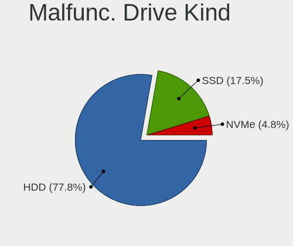
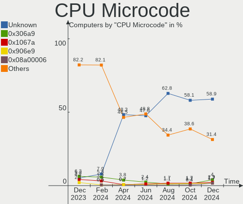
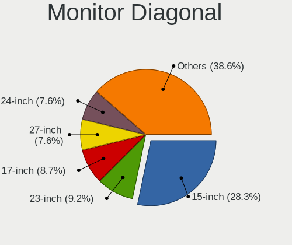
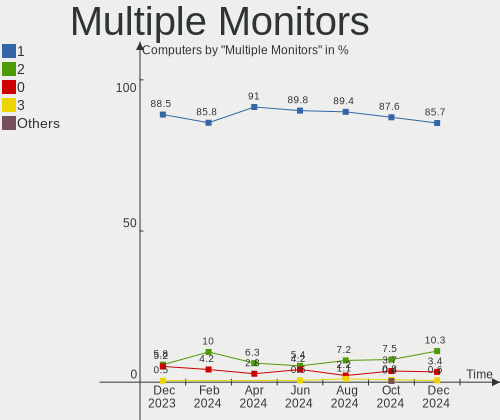
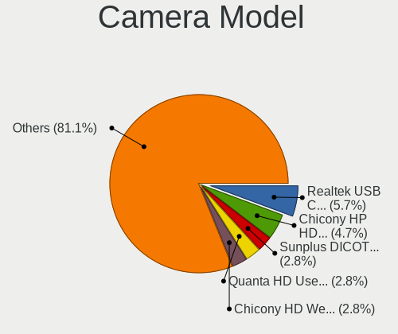

ROSA Hardware Trends
--------------------

A project to identify most popular hardware characteristics and track their change
over time based on data collected by ROSA users at https://Linux-Hardware.org.

Anyone can contribute to the study by uploading probes of their computers by
the [hw-probe](https://github.com/linuxhw/hw-probe) tool:

    sudo -E hw-probe -all -upload

This is a report for all computer types. See also reports for [desktops](/Dist/ROSA/Desktop/README.md) and [notebooks](/Dist/ROSA/Notebook/README.md).

Full-feature report is available here: https://linux-hardware.org/?view=trends

Period: Dec, 2020.

Contents
--------

- [ OS                       ](#os)
- [ OS Family                ](#os-family)
- [ Kernel                   ](#kernel)
- [ Kernel Family            ](#kernel-family)
- [ Kernel Major Ver.        ](#kernel-major-ver)
- [ Arch                     ](#arch)
- [ DE                       ](#de)
- [ Display Server           ](#display-server)
- [ Display Manager          ](#display-manager)
- [ OS Lang                  ](#os-lang)
- [ Boot Mode                ](#boot-mode)
- [ Filesystem               ](#filesystem)
- [ Part. scheme             ](#part-scheme)
- [ Dual Boot with Linux/BSD ](#dual-boot-with-linux/bsd)
- [ Dual Boot (Win)          ](#dual-boot-win)
- [ Country                  ](#country)
- [ City                     ](#city)
- [ Vendor                   ](#vendor)
- [ Model                    ](#model)
- [ Model Family             ](#model-family)
- [ MFG Year                 ](#mfg-year)
- [ Form Factor              ](#form-factor)
- [ Secure Boot              ](#secure-boot)
- [ Coreboot                 ](#coreboot)
- [ RAM Size                 ](#ram-size)
- [ RAM Used                 ](#ram-used)
- [ Has CD-ROM               ](#has-cd-rom)
- [ Total Drives             ](#total-drives)
- [ Has Ethernet             ](#has-ethernet)
- [ Drive Vendor             ](#drive-vendor)
- [ Drive Model              ](#drive-model)
- [ HDD Vendor               ](#hdd-vendor)
- [ SSD Vendor               ](#ssd-vendor)
- [ Drive Kind               ](#drive-kind)
- [ Drive Connector          ](#drive-connector)
- [ Drive Size               ](#drive-size)
- [ Space Total              ](#space-total)
- [ Space Used               ](#space-used)
- [ Malfunc. Drives          ](#malfunc-drives)
- [ Malfunc. Drive Vendor    ](#malfunc-drive-vendor)
- [ Malfunc. HDD Vendor      ](#malfunc-hdd-vendor)
- [ Malfunc. Drive Kind      ](#malfunc-drive-kind)
- [ Failed Drives            ](#failed-drives)
- [ Failed Drive Vendor      ](#failed-drive-vendor)
- [ Drive Status             ](#drive-status)
- [ Storage Vendor           ](#storage-vendor)
- [ Storage Model            ](#storage-model)
- [ Storage Kind             ](#storage-kind)
- [ CPU Vendor               ](#cpu-vendor)
- [ CPU Model                ](#cpu-model)
- [ CPU Model Family         ](#cpu-model-family)
- [ CPU Cores                ](#cpu-cores)
- [ CPU Sockets              ](#cpu-sockets)
- [ CPU Threads              ](#cpu-threads)
- [ CPU Op-Modes             ](#cpu-op-modes)
- [ CPU Microcode            ](#cpu-microcode)
- [ CPU Microarch            ](#cpu-microarch)
- [ GPU Vendor               ](#gpu-vendor)
- [ GPU Model                ](#gpu-model)
- [ GPU Combo                ](#gpu-combo)
- [ GPU Driver               ](#gpu-driver)
- [ GPU Memory               ](#gpu-memory)
- [ Monitor Vendor           ](#monitor-vendor)
- [ Monitor Model            ](#monitor-model)
- [ Monitor Resolution       ](#monitor-resolution)
- [ Monitor Diagonal         ](#monitor-diagonal)
- [ Monitor Width            ](#monitor-width)
- [ Aspect Ratio             ](#aspect-ratio)
- [ Monitor Area             ](#monitor-area)
- [ Pixel Density            ](#pixel-density)
- [ Multiple Monitors        ](#multiple-monitors)
- [ Net Controller Vendor    ](#net-controller-vendor)
- [ Net Controller Model     ](#net-controller-model)
- [ Wireless Vendor          ](#wireless-vendor)
- [ Wireless Model           ](#wireless-model)
- [ Ethernet Vendor          ](#ethernet-vendor)
- [ Ethernet Model           ](#ethernet-model)
- [ Net Controller Kind      ](#net-controller-kind)
- [ Used Controller          ](#used-controller)
- [ NICs                     ](#nics)
- [ Memory Vendor            ](#memory-vendor)
- [ Memory Model             ](#memory-model)
- [ Memory Kind              ](#memory-kind)
- [ Memory Form Factor       ](#memory-form-factor)
- [ Memory Size              ](#memory-size)
- [ Memory Speed             ](#memory-speed)
- [ Sound Vendor             ](#sound-vendor)
- [ Sound Model              ](#sound-model)
- [ Camera Vendor            ](#camera-vendor)
- [ Camera Model             ](#camera-model)
- [ Fingerprint Vendor       ](#fingerprint-vendor)
- [ Fingerprint Model        ](#fingerprint-model)
- [ Chipcard Vendor          ](#chipcard-vendor)
- [ Chipcard Model           ](#chipcard-model)
- [ Printer Vendor           ](#printer-vendor)
- [ Printer Model            ](#printer-model)
- [ Scanner Vendor           ](#scanner-vendor)
- [ Scanner Model            ](#scanner-model)
- [ Bluetooth Vendor         ](#bluetooth-vendor)
- [ Bluetooth Model          ](#bluetooth-model)
- [ Unsupported Devices      ](#unsupported-devices)
- [ Unsupported Device Types ](#unsupported-device-types)

OS
--

Installed operating systems

| Name         | Computers | Percent |
|--------------|-----------|---------|
| ROSA R11.1   | 125       | 58.41%  |
| ROSA R11     | 64        | 29.91%  |
| ROSA R8.1    | 11        | 5.14%   |
| ROSA R10     | 7         | 3.27%   |
| ROSA R12     | 5         | 2.34%   |
| ROSA 2019.05 | 1         | 0.47%   |
| RED X4       | 1         | 0.47%   |

OS Family
---------

OS without a version

| Name | Computers | Percent |
|------|-----------|---------|
| ROSA | 214       | 100%    |

Kernel
------

Version of the Linux kernel

| Version                             | Computers | Percent |
|-------------------------------------|-----------|---------|
| 4.15.0-desktop-122.124.1rosa-x86_64 | 60        | 28.04%  |
| 4.15.0-desktop-45.1rosa-x86_64      | 52        | 24.3%   |
| 4.9.155-nrj-desktop-1rosa-x86_64    | 18        | 8.41%   |
| 4.15.0-desktop-45.1rosa-i586        | 13        | 6.07%   |
| 5.4.72-generic-1rosa-x86_64         | 11        | 5.14%   |
| 5.4.83-generic-2rosa-x86_64         | 9         | 4.21%   |
| 5.4.32-generic-2rosa-x86_64         | 7         | 3.27%   |
| 4.9.155-nrj-desktop-1rosa-i586      | 4         | 1.87%   |
| 4.15.0-desktop-122.124.1rosa-i586   | 4         | 1.87%   |
| 5.4.81-generic-1rosa2019.1-x86_64   | 3         | 1.4%    |
| 5.4.32-generic-2rosa-i586           | 3         | 1.4%    |
| 4.9.60-nrj-desktop-1rosa-x86_64     | 3         | 1.4%    |
| 4.9.60-nrj-desktop-1rosa-i586       | 3         | 1.4%    |
| 4.9.155-nrj-laptop-1rosa-x86_64     | 3         | 1.4%    |
| 5.9.6-generic-1rosa-x86_64          | 2         | 0.93%   |
| 5.9.14-generic-1rosa-x86_64         | 2         | 0.93%   |
| 4.9.9-nrj-desktop-1rosa-i586        | 2         | 0.93%   |
| 4.15.0-desktop-94.1rosa-x86_64      | 2         | 0.93%   |
| 4.15.0-desktop-68.5rosa-x86_64      | 2         | 0.93%   |
| 5.4.83-generic-2rosa-i586           | 1         | 0.47%   |
| 5.4.77-generic-1rosa2019.1-x86_64   | 1         | 0.47%   |
| 5.4.72-generic-1rosa-i586           | 1         | 0.47%   |
| 5.4.60-nickel-2rosa2019.05-x86_64   | 1         | 0.47%   |
| 5.4.49-nrj-desktop-1rosa-x86_64     | 1         | 0.47%   |
| 5.4.40-generic-1rosa-x86_64         | 1         | 0.47%   |
| 5.10.2-generic-2rosa2019.1-x86_64   | 1         | 0.47%   |
| 4.9.20-nrj-desktop-1rosa-i586       | 1         | 0.47%   |
| 4.15.0-desktop-94.1rosa-i586        | 1         | 0.47%   |
| 4.15.0-desktop-47.2rosa-x86_64      | 1         | 0.47%   |
| 4.1.38-nrj-desktop-2rosa-x86_64     | 1         | 0.47%   |

Kernel Family
-------------

Linux kernel without a distro release

| Version | Computers | Percent |
|---------|-----------|---------|
| 4.15.0  | 135       | 63.08%  |
| 4.9.155 | 25        | 11.68%  |
| 5.4.72  | 12        | 5.61%   |
| 5.4.83  | 10        | 4.67%   |
| 5.4.32  | 10        | 4.67%   |
| 4.9.60  | 6         | 2.8%    |
| 5.4.81  | 3         | 1.4%    |
| 5.9.6   | 2         | 0.93%   |
| 5.9.14  | 2         | 0.93%   |
| 4.9.9   | 2         | 0.93%   |
| 5.4.77  | 1         | 0.47%   |
| 5.4.60  | 1         | 0.47%   |
| 5.4.49  | 1         | 0.47%   |
| 5.4.40  | 1         | 0.47%   |
| 5.10.2  | 1         | 0.47%   |
| 4.9.20  | 1         | 0.47%   |
| 4.1.38  | 1         | 0.47%   |

Kernel Major Ver.
-----------------

Linux kernel major version

| Version | Computers | Percent |
|---------|-----------|---------|
| 4.15    | 135       | 63.08%  |
| 5.4     | 39        | 18.22%  |
| 4.9     | 34        | 15.89%  |
| 5.9     | 4         | 1.87%   |
| 5.10    | 1         | 0.47%   |
| 4.1     | 1         | 0.47%   |

Arch
----

OS architecture (x86_64, i586, etc.)

| Name   | Computers | Percent |
|--------|-----------|---------|
| x86_64 | 181       | 84.58%  |
| i686   | 33        | 15.42%  |

DE
--

Desktop Environment

| Name    | Computers | Percent |
|---------|-----------|---------|
| KDE4    | 124       | 57.94%  |
| KDE5    | 67        | 31.31%  |
| LXQt    | 14        | 6.54%   |
| XFCE    | 5         | 2.34%   |
| LXDE    | 1         | 0.47%   |
| KDE     | 1         | 0.47%   |
| GNOME   | 1         | 0.47%   |
| Unknown | 1         | 0.47%   |

Display Server
--------------

X11 or Wayland

| Name | Computers | Percent |
|------|-----------|---------|
| X11  | 214       | 100%    |

Display Manager
---------------

SDDM, LightDM, etc.

| Name | Computers | Percent |
|------|-----------|---------|
| KDM  | 126       | 58.88%  |
| SDDM | 84        | 39.25%  |
| TDM  | 3         | 1.4%    |
| GDM  | 1         | 0.47%   |

OS Lang
-------

Language

| Lang       | Computers | Percent |
|------------|-----------|---------|
| ru_RU      | 111       | 51.87%  |
| Unknown    | 82        | 38.32%  |
| en_US      | 7         | 3.27%   |
| de_DE      | 5         | 2.34%   |
| ru_RU.utf8 | 2         | 0.93%   |
| it_IT      | 2         | 0.93%   |
| es_ES      | 2         | 0.93%   |
| ro_RO      | 1         | 0.47%   |
| pl_PL      | 1         | 0.47%   |
| en_GB      | 1         | 0.47%   |

Boot Mode
---------

EFI or BIOS

| Mode | Computers | Percent |
|------|-----------|---------|
| BIOS | 164       | 76.64%  |
| EFI  | 50        | 23.36%  |

Filesystem
----------

Type of filesystem

| Type  | Computers | Percent |
|-------|-----------|---------|
| Ext4  | 201       | 93.93%  |
| Btrfs | 9         | 4.21%   |
| Aufs  | 2         | 0.93%   |
| Xfs   | 1         | 0.47%   |
| Ext3  | 1         | 0.47%   |

Part. scheme
------------

Scheme of partitioning

| Type    | Computers | Percent |
|---------|-----------|---------|
| MBR     | 144       | 67.29%  |
| GPT     | 65        | 30.37%  |
| Unknown | 5         | 2.34%   |

Dual Boot with Linux/BSD
------------------------

Hosting more than one Linux/BSD

| Dual boot | Computers | Percent |
|-----------|-----------|---------|
| No        | 152       | 71.03%  |
| Yes       | 62        | 28.97%  |

Dual Boot (Win)
---------------

Hosting Linux and Windows

| Dual boot | Computers | Percent |
|-----------|-----------|---------|
| No        | 120       | 56.07%  |
| Yes       | 94        | 43.93%  |

Country
-------

Geographic location (country)

| Country        | Computers | Percent |
|----------------|-----------|---------|
| Russia         | 161       | 75.23%  |
| Ukraine        | 13        | 6.07%   |
| Belarus        | 7         | 3.27%   |
| Kazakhstan     | 5         | 2.34%   |
| Germany        | 5         | 2.34%   |
| Spain          | 3         | 1.4%    |
| USA            | 2         | 0.93%   |
| Poland         | 2         | 0.93%   |
| Latvia         | 2         | 0.93%   |
| Italy          | 2         | 0.93%   |
| Canada         | 2         | 0.93%   |
| Venezuela      | 1         | 0.47%   |
| South Africa   | 1         | 0.47%   |
| Saudi Arabia   | 1         | 0.47%   |
| Romania        | 1         | 0.47%   |
| Mexico         | 1         | 0.47%   |
| Lithuania      | 1         | 0.47%   |
| Greece         | 1         | 0.47%   |
| Czech Republic | 1         | 0.47%   |
| Brazil         | 1         | 0.47%   |
| Australia      | 1         | 0.47%   |

City
----

Geographic location (city)

| City                   | Computers | Percent |
|------------------------|-----------|---------|
| Moscow                 | 21        | 9.81%   |
| St Petersburg          | 16        | 7.48%   |
| Novosibirsk            | 11        | 5.14%   |
| Ekaterinburg           | 10        | 4.67%   |
| Kazan’               | 6         | 2.8%    |
| Nizhniy Novgorod       | 5         | 2.34%   |
| Voronezh               | 4         | 1.87%   |
| Rostov-on-Don          | 4         | 1.87%   |
| Krasnoyarsk            | 4         | 1.87%   |
| Chelyabinsk            | 4         | 1.87%   |
| Vitebsk                | 3         | 1.4%    |
| Perm                   | 3         | 1.4%    |
| Lipetsk                | 3         | 1.4%    |
| Kyiv                   | 3         | 1.4%    |
| Barnaul                | 3         | 1.4%    |
| Sochi                  | 2         | 0.93%   |
| Samara                 | 2         | 0.93%   |
| Riga                   | 2         | 0.93%   |
| Orenburg               | 2         | 0.93%   |
| Omsk                   | 2         | 0.93%   |
| Navapolatsk            | 2         | 0.93%   |
| Kaliningrad            | 2         | 0.93%   |
| Dnipro                 | 2         | 0.93%   |
| Bryansk                | 2         | 0.93%   |
| Zaporizhia             | 1         | 0.47%   |
| Yeysk                  | 1         | 0.47%   |
| Yessentuki             | 1         | 0.47%   |
| Yakutsk                | 1         | 0.47%   |
| Warsaw                 | 1         | 0.47%   |
| Volgograd              | 1         | 0.47%   |
| Vladivostok            | 1         | 0.47%   |
| Vilnius                | 1         | 0.47%   |
| Velikiy Ustyug         | 1         | 0.47%   |
| Ust-Kamenogorsk        | 1         | 0.47%   |
| Ust'-Ilimsk            | 1         | 0.47%   |
| Ulyanovsk              | 1         | 0.47%   |
| Tyumen                 | 1         | 0.47%   |
| Tula                   | 1         | 0.47%   |
| Tosno                  | 1         | 0.47%   |
| Taganrog               | 1         | 0.47%   |
| Stavropol              | 1         | 0.47%   |
| Staromar'yevka         | 1         | 0.47%   |
| Staraya Yurga          | 1         | 0.47%   |
| Snezhinsk              | 1         | 0.47%   |
| Sharypovo              | 1         | 0.47%   |
| Serpukhov              | 1         | 0.47%   |
| Saratov                | 1         | 0.47%   |
| Saransk                | 1         | 0.47%   |
| Santa Úrsula          | 1         | 0.47%   |
| Santa Cruz de Tenerife | 1         | 0.47%   |
| Salekhard              | 1         | 0.47%   |
| Saburovo               | 1         | 0.47%   |
| Ryazan                 | 1         | 0.47%   |
| Rozmital pod Tremsinem | 1         | 0.47%   |
| Rome                   | 1         | 0.47%   |
| Pyatigorsk             | 1         | 0.47%   |
| Prokhorovka            | 1         | 0.47%   |
| Pogeez                 | 1         | 0.47%   |
| Podolsk                | 1         | 0.47%   |
| Perth                  | 1         | 0.47%   |

Vendor
------

Motherboard manufacturer

| Name                | Computers | Percent |
|---------------------|-----------|---------|
| ASUSTek Computer    | 57        | 26.64%  |
| Gigabyte Technology | 27        | 12.62%  |
| Lenovo              | 21        | 9.81%   |
| Hewlett-Packard     | 19        | 8.88%   |
| Acer                | 17        | 7.94%   |
| MSI                 | 11        | 5.14%   |
| Dell                | 11        | 5.14%   |
| Samsung Electronics | 9         | 4.21%   |
| Intel               | 6         | 2.8%    |
| ASRock              | 6         | 2.8%    |
| ECS                 | 5         | 2.34%   |
| Toshiba             | 4         | 1.87%   |
| Sony                | 4         | 1.87%   |
| Pegatron            | 2         | 0.93%   |
| eMachines           | 2         | 0.93%   |
| Unknown             | 2         | 0.93%   |
| ZoomSmart           | 1         | 0.47%   |
| PCChips             | 1         | 0.47%   |
| Panasonic           | 1         | 0.47%   |
| Packard Bell        | 1         | 0.47%   |
| OEM                 | 1         | 0.47%   |
| LG Electronics      | 1         | 0.47%   |
| Insyde              | 1         | 0.47%   |
| Fujitsu             | 1         | 0.47%   |
| Digma               | 1         | 0.47%   |
| Biostar             | 1         | 0.47%   |
| Apple               | 1         | 0.47%   |

Model
-----

Motherboard model

| Name                                 | Computers | Percent |
|--------------------------------------|-----------|---------|
| HP Pavilion g6                       | 3         | 1.4%    |
| ASUS M5A78L-M LX3                    | 3         | 1.4%    |
| ASUS All Series                      | 3         | 1.4%    |
| Unknown                              | 3         | 1.4%    |
| MSI MS-7996                          | 2         | 0.93%   |
| Lenovo G50-30 80G0                   | 2         | 0.93%   |
| Lenovo B590 20206                    | 2         | 0.93%   |
| HP ProBook 4540s                     | 2         | 0.93%   |
| Gigabyte H81M-S1                     | 2         | 0.93%   |
| Gigabyte G31M-ES2L                   | 2         | 0.93%   |
| Gigabyte A320M-H                     | 2         | 0.93%   |
| ASUS P5Q SE2                         | 2         | 0.93%   |
| Acer Extensa 2519                    | 2         | 0.93%   |
| ZoomSmart A1002                      | 1         | 0.47%   |
| Toshiba Satellite U840-B7S           | 1         | 0.47%   |
| Toshiba Satellite L655               | 1         | 0.47%   |
| Toshiba Satellite C850-B6W           | 1         | 0.47%   |
| Toshiba Satellite A300               | 1         | 0.47%   |
| Sony VPCSA2S9R                       | 1         | 0.47%   |
| Sony VPCL22S1R                       | 1         | 0.47%   |
| Sony VGN-N11SR_W                     | 1         | 0.47%   |
| Sony SVE14A2V1RWI                    | 1         | 0.47%   |
| Samsung SQ45S70S                     | 1         | 0.47%   |
| Samsung RV408/RV508                  | 1         | 0.47%   |
| Samsung RC530/RC730                  | 1         | 0.47%   |
| Samsung R530/R730/P530               | 1         | 0.47%   |
| Samsung R530/R730                    | 1         | 0.47%   |
| Samsung Q310                         | 1         | 0.47%   |
| Samsung 530U4E/540U4E                | 1         | 0.47%   |
| Samsung 350V5C/351V5C/3540VC/3440VC  | 1         | 0.47%   |
| Samsung 305V4A/305V5A/3415VA         | 1         | 0.47%   |
| Pegatron IPXCR_VN1                   | 1         | 0.47%   |
| Pegatron IPM41-D3                    | 1         | 0.47%   |
| PCChips P17G                         | 1         | 0.47%   |
| Panasonic CF-LX3GDHCS                | 1         | 0.47%   |
| Packard Bell EasyNote TS11HR         | 1         | 0.47%   |
| OEM B250                             | 1         | 0.47%   |
| MSI MS-AE6311                        | 1         | 0.47%   |
| MSI MS-7C52                          | 1         | 0.47%   |
| MSI MS-7B87                          | 1         | 0.47%   |
| MSI MS-7A33                          | 1         | 0.47%   |
| MSI MS-7865                          | 1         | 0.47%   |
| MSI MS-7817                          | 1         | 0.47%   |
| MSI MS-7808                          | 1         | 0.47%   |
| MSI MS-7376                          | 1         | 0.47%   |
| MSI MS-7346                          | 1         | 0.47%   |
| LG F1-2A85R                          | 1         | 0.47%   |
| Lenovo V110-15IAP 80TG               | 1         | 0.47%   |
| Lenovo ThinkPad T510 43145GG         | 1         | 0.47%   |
| Lenovo ThinkCentre M90p 5852A34      | 1         | 0.47%   |
| Lenovo ThinkCentre M57 6072HDU       | 1         | 0.47%   |
| Lenovo IdeaPad Z565 20066            | 1         | 0.47%   |
| Lenovo IdeaPad S205 Brazos           | 1         | 0.47%   |
| Lenovo IdeaPad S110 20126            | 1         | 0.47%   |
| Lenovo IdeaPad Gaming 3 15IMH05 81Y4 | 1         | 0.47%   |
| Lenovo IdeaPad 300-15IBR 80M3        | 1         | 0.47%   |
| Lenovo IdeaPad 110-17ACL 80UM        | 1         | 0.47%   |
| Lenovo IdeaCentre B505 10039         | 1         | 0.47%   |
| Lenovo G770 1037                     | 1         | 0.47%   |
| Lenovo G70-80 80FF                   | 1         | 0.47%   |

Model Family
------------

Motherboard model prefix

| Name                  | Computers | Percent |
|-----------------------|-----------|---------|
| Acer Aspire           | 9         | 4.21%   |
| Lenovo IdeaPad        | 6         | 2.8%    |
| Dell Inspiron         | 6         | 2.8%    |
| HP ProBook            | 5         | 2.34%   |
| Acer Extensa          | 5         | 2.34%   |
| Toshiba Satellite     | 4         | 1.87%   |
| HP Pavilion           | 4         | 1.87%   |
| ASUS PRIME            | 4         | 1.87%   |
| ASUS M5A78L-M         | 4         | 1.87%   |
| ASUS P5Q              | 3         | 1.4%    |
| ASUS All              | 3         | 1.4%    |
| Unknown               | 3         | 1.4%    |
| Samsung R530          | 2         | 0.93%   |
| MSI MS-7996           | 2         | 0.93%   |
| Lenovo ThinkCentre    | 2         | 0.93%   |
| Lenovo G50-30         | 2         | 0.93%   |
| Lenovo B590           | 2         | 0.93%   |
| Gigabyte H81M-S1      | 2         | 0.93%   |
| Gigabyte G31M-ES2L    | 2         | 0.93%   |
| Gigabyte A320M-H      | 2         | 0.93%   |
| Dell OptiPlex         | 2         | 0.93%   |
| ASUS P8H61-M          | 2         | 0.93%   |
| ASUS M5A97            | 2         | 0.93%   |
| ASUS M2N-MX           | 2         | 0.93%   |
| ZoomSmart A1002       | 1         | 0.47%   |
| Sony VPCSA2S9R        | 1         | 0.47%   |
| Sony VPCL22S1R        | 1         | 0.47%   |
| Sony VGN-N11SR        | 1         | 0.47%   |
| Sony SVE14A2V1RWI     | 1         | 0.47%   |
| Samsung SQ45S70S      | 1         | 0.47%   |
| Samsung RV408         | 1         | 0.47%   |
| Samsung RC530         | 1         | 0.47%   |
| Samsung Q310          | 1         | 0.47%   |
| Samsung 530U4E        | 1         | 0.47%   |
| Samsung 350V5C        | 1         | 0.47%   |
| Samsung 305V4A        | 1         | 0.47%   |
| Pegatron IPXCR        | 1         | 0.47%   |
| Pegatron IPM41-D3     | 1         | 0.47%   |
| PCChips P17G          | 1         | 0.47%   |
| Panasonic CF-LX3GDHCS | 1         | 0.47%   |
| Packard Bell EasyNote | 1         | 0.47%   |
| OEM B250              | 1         | 0.47%   |
| MSI MS-AE6311         | 1         | 0.47%   |
| MSI MS-7C52           | 1         | 0.47%   |
| MSI MS-7B87           | 1         | 0.47%   |
| MSI MS-7A33           | 1         | 0.47%   |
| MSI MS-7865           | 1         | 0.47%   |
| MSI MS-7817           | 1         | 0.47%   |
| MSI MS-7808           | 1         | 0.47%   |
| MSI MS-7376           | 1         | 0.47%   |
| MSI MS-7346           | 1         | 0.47%   |
| LG F1-2A85R           | 1         | 0.47%   |
| Lenovo V110-15IAP     | 1         | 0.47%   |
| Lenovo ThinkPad       | 1         | 0.47%   |
| Lenovo IdeaCentre     | 1         | 0.47%   |
| Lenovo G770           | 1         | 0.47%   |
| Lenovo G70-80         | 1         | 0.47%   |
| Lenovo G500           | 1         | 0.47%   |
| Lenovo G50-45         | 1         | 0.47%   |
| Lenovo C240           | 1         | 0.47%   |

MFG Year
--------

Motherboard manufacture year

| Year    | Computers | Percent |
|---------|-----------|---------|
| 2012    | 21        | 9.81%   |
| 2010    | 20        | 9.35%   |
| 2009    | 20        | 9.35%   |
| 2016    | 18        | 8.41%   |
| 2011    | 18        | 8.41%   |
| 2019    | 17        | 7.94%   |
| 2013    | 17        | 7.94%   |
| 2015    | 16        | 7.48%   |
| 2007    | 13        | 6.07%   |
| 2014    | 11        | 5.14%   |
| 2018    | 9         | 4.21%   |
| 2020    | 8         | 3.74%   |
| 2017    | 8         | 3.74%   |
| 2008    | 8         | 3.74%   |
| 2006    | 7         | 3.27%   |
| 2005    | 1         | 0.47%   |
| 2004    | 1         | 0.47%   |
| Unknown | 1         | 0.47%   |

Form Factor
-----------

Physical design of the computer

| Name        | Computers | Percent |
|-------------|-----------|---------|
| Desktop     | 112       | 52.34%  |
| Notebook    | 94        | 43.93%  |
| All in one  | 5         | 2.34%   |
| Tablet      | 1         | 0.47%   |
| Convertible | 1         | 0.47%   |
| Server      | 1         | 0.47%   |

Secure Boot
-----------

Enabled or disabled

| State    | Computers | Percent |
|----------|-----------|---------|
| Disabled | 214       | 100%    |

Coreboot
--------

Have coreboot on board

| Used | Computers | Percent |
|------|-----------|---------|
| No   | 214       | 100%    |

RAM Size
--------

Total RAM memory

| Size in GB | Computers | Percent |
|------------|-----------|---------|
| 3.01-4.0   | 75        | 35.05%  |
| 4.01-8.0   | 45        | 21.03%  |
| 8.01-16.0  | 40        | 18.69%  |
| 16.01-24.0 | 20        | 9.35%   |
| 1.01-2.0   | 18        | 8.41%   |
| 2.01-3.0   | 13        | 6.07%   |
| 0.51-1.0   | 2         | 0.93%   |
| 24.01-32.0 | 1         | 0.47%   |

RAM Used
--------

Used RAM memory

| Used GB   | Computers | Percent |
|-----------|-----------|---------|
| 1.01-2.0  | 94        | 43.93%  |
| 0.51-1.0  | 86        | 40.19%  |
| 2.01-3.0  | 21        | 9.81%   |
| 4.01-8.0  | 6         | 2.8%    |
| 3.01-4.0  | 4         | 1.87%   |
| 0.01-0.5  | 2         | 0.93%   |
| 8.01-16.0 | 1         | 0.47%   |

Has CD-ROM
----------

Has CD-ROM on board

| Presented | Computers | Percent |
|-----------|-----------|---------|
| Yes       | 116       | 54.21%  |
| No        | 98        | 45.79%  |

Total Drives
------------

Number of drives on board

| Drives | Computers | Percent |
|--------|-----------|---------|
| 1      | 137       | 64.02%  |
| 2      | 57        | 26.64%  |
| 3      | 12        | 5.61%   |
| 4      | 3         | 1.4%    |
| 5      | 2         | 0.93%   |
| 0      | 2         | 0.93%   |
| 6      | 1         | 0.47%   |

Has Ethernet
------------

Has Ethernet on board

| Presented | Computers | Percent |
|-----------|-----------|---------|
| Yes       | 206       | 96.26%  |
| No        | 8         | 3.74%   |

Drive Vendor
------------

Hard drive vendors

| Vendor              | Computers | Drives | Percent |
|---------------------|-----------|--------|---------|
| Seagate             | 66        | 71     | 22.76%  |
| WDC                 | 55        | 60     | 18.97%  |
| Toshiba             | 27        | 30     | 9.31%   |
| Hitachi             | 27        | 27     | 9.31%   |
| Samsung Electronics | 23        | 23     | 7.93%   |
| Kingston            | 20        | 21     | 6.9%    |
| Unknown             | 8         | 10     | 2.76%   |
| SanDisk             | 8         | 8      | 2.76%   |
| HGST                | 7         | 7      | 2.41%   |
| SPCC                | 4         | 4      | 1.38%   |
| Intel               | 4         | 4      | 1.38%   |
| Fujitsu             | 4         | 4      | 1.38%   |
| Apacer              | 4         | 4      | 1.38%   |
| MAXTOR              | 3         | 3      | 1.03%   |
| JMicron             | 3         | 3      | 1.03%   |
| GOODRAM             | 3         | 3      | 1.03%   |
| Silicon Motion      | 2         | 2      | 0.69%   |
| Crucial             | 2         | 2      | 0.69%   |
| A-DATA Technology   | 2         | 2      | 0.69%   |
| XrayDisk            | 1         | 1      | 0.34%   |
| Team                | 1         | 1      | 0.34%   |
| Solid State Storage | 1         | 1      | 0.34%   |
| PNY                 | 1         | 1      | 0.34%   |
| PLEXTOR             | 1         | 1      | 0.34%   |
| Patriot             | 1         | 1      | 0.34%   |
| Palit               | 1         | 1      | 0.34%   |
| OCZ                 | 1         | 1      | 0.34%   |
| Neo Forza           | 1         | 1      | 0.34%   |
| Micron Technology   | 1         | 1      | 0.34%   |
| LITEON              | 1         | 1      | 0.34%   |
| KingSpec            | 1         | 1      | 0.34%   |
| KingFast            | 1         | 1      | 0.34%   |
| IBM/Hitachi         | 1         | 1      | 0.34%   |
| Gigabyte Technology | 1         | 1      | 0.34%   |
| FOXLINE             | 1         | 1      | 0.34%   |
| ExcelStor           | 1         | 1      | 0.34%   |
| e2e4                | 1         | 1      | 0.34%   |

Drive Model
-----------

Hard drive models

| Model                              | Computers | Percent |
|------------------------------------|-----------|---------|
| Kingston SA400S37120G 120GB SSD    | 9         | 2.94%   |
| WDC WD10EZEX-08WN4A0 1TB           | 5         | 1.63%   |
| Seagate ST500LT012-1DG142 500GB    | 5         | 1.63%   |
| Toshiba MQ01ABD100 1TB             | 4         | 1.31%   |
| Samsung SSD 860 EVO 250GB          | 4         | 1.31%   |
| Kingston SA400S37240G 240GB SSD    | 4         | 1.31%   |
| Toshiba MQ01ABF050 500GB           | 3         | 0.98%   |
| Toshiba HDWD110 1TB                | 3         | 0.98%   |
| Toshiba DT01ACA050 500GB           | 3         | 0.98%   |
| Seagate ST380815AS 80GB            | 3         | 0.98%   |
| Seagate ST1000LM024 HN-M101MBB 1TB | 3         | 0.98%   |
| Seagate ST1000DM010-2EP102 1TB     | 3         | 0.98%   |
| Hitachi HTS545025B9A300 250GB      | 3         | 0.98%   |
| Hitachi HTS542516K9SA00 160GB      | 3         | 0.98%   |
| WDC WDS240G2G0A-00JH30 240GB SSD   | 2         | 0.65%   |
| WDC WDS120G2G0A-00JH30 120GB SSD   | 2         | 0.65%   |
| WDC WD5000LPCX-21VHAT0 500GB       | 2         | 0.65%   |
| WDC WD5000LPCX-00VHAT0 500GB       | 2         | 0.65%   |
| WDC WD20EZRZ-00Z5HB0 2TB           | 2         | 0.65%   |
| Unknown SD/MMC/MS PRO 128GB        | 2         | 0.65%   |
| Unknown NCard  32GB                | 2         | 0.65%   |
| Toshiba DT01ACA100 1TB             | 2         | 0.65%   |
| SPCC Solid State Disk 256GB        | 2         | 0.65%   |
| Seagate ST500LM021-1KJ152 500GB    | 2         | 0.65%   |
| Seagate ST500DM002-1BD142 500GB    | 2         | 0.65%   |
| Seagate ST3500418AS 500GB          | 2         | 0.65%   |
| Seagate ST3320613AS 320GB          | 2         | 0.65%   |
| Seagate ST320LT020-9YG142 320GB    | 2         | 0.65%   |
| Seagate ST31500341AS 1TB           | 2         | 0.65%   |
| Seagate ST2000DM008-2FR102 2TB     | 2         | 0.65%   |
| Seagate ST1000LM035-1RK172 1TB     | 2         | 0.65%   |
| Seagate ST1000DM003-1ER162 1TB     | 2         | 0.65%   |
| Seagate ST1000DM003-1CH162 1TB     | 2         | 0.65%   |
| SanDisk SSD PLUS 240GB             | 2         | 0.65%   |
| Kingston SV300S37A120G 120GB SSD   | 2         | 0.65%   |
| Kingston SKC600256G 256GB SSD      | 2         | 0.65%   |
| JMicron Generic 120GB              | 2         | 0.65%   |
| Hitachi HTS727550A9E364 500GB      | 2         | 0.65%   |
| Hitachi HTS547575A9E384 752GB      | 2         | 0.65%   |
| Hitachi HTS547550A9E384 500GB      | 2         | 0.65%   |
| Hitachi HDS721010CLA332 1TB        | 2         | 0.65%   |
| HGST HTS545050A7E680 500GB         | 2         | 0.65%   |
| HGST HTS545050A7E380 500GB         | 2         | 0.65%   |
| Apacer AS350 128GB SSD             | 2         | 0.65%   |
| XrayDisk SSD 256GB                 | 1         | 0.33%   |
| WDC WDS500G2B0A-00SM50 500GB SSD   | 1         | 0.33%   |
| WDC WDS480G2G0A-00JH30 480GB SSD   | 1         | 0.33%   |
| WDC WDS250G2B0B-00YS70 250GB SSD   | 1         | 0.33%   |
| WDC WD800JD-00MSA1 80GB            | 1         | 0.33%   |
| WDC WD740ADFD-00NLR1 74GB          | 1         | 0.33%   |
| WDC WD6400AAKS-22A7B0 640GB        | 1         | 0.33%   |
| WDC WD6400AACS-00G8B0 640GB        | 1         | 0.33%   |
| WDC WD5000LPVX-60V0TT0 500GB       | 1         | 0.33%   |
| WDC WD5000LPVX-00V0TT0 500GB       | 1         | 0.33%   |
| WDC WD5000LPCX-60VHAT0 500GB       | 1         | 0.33%   |
| WDC WD5000BPVT-22HXZT1 500GB       | 1         | 0.33%   |
| WDC WD5000AZRX-00A8LB0 500GB       | 1         | 0.33%   |
| WDC WD5000AZLX-22JKKA0 500GB       | 1         | 0.33%   |
| WDC WD5000AZLX-08K2TA0 500GB       | 1         | 0.33%   |
| WDC WD5000AZLX-00JKKA0 500GB       | 1         | 0.33%   |

HDD Vendor
----------

Hard disk drive vendors

| Vendor              | Computers | Drives | Percent |
|---------------------|-----------|--------|---------|
| Seagate             | 66        | 71     | 34.55%  |
| WDC                 | 49        | 53     | 25.65%  |
| Hitachi             | 27        | 27     | 14.14%  |
| Toshiba             | 23        | 26     | 12.04%  |
| Samsung Electronics | 10        | 10     | 5.24%   |
| HGST                | 7         | 7      | 3.66%   |
| Fujitsu             | 4         | 4      | 2.09%   |
| MAXTOR              | 3         | 3      | 1.57%   |
| IBM/Hitachi         | 1         | 1      | 0.52%   |
| ExcelStor           | 1         | 1      | 0.52%   |

SSD Vendor
----------

Solid state drive vendors

| Vendor              | Computers | Drives | Percent |
|---------------------|-----------|--------|---------|
| Kingston            | 20        | 21     | 23.81%  |
| Samsung Electronics | 10        | 10     | 11.9%   |
| SanDisk             | 8         | 8      | 9.52%   |
| WDC                 | 7         | 7      | 8.33%   |
| SPCC                | 4         | 4      | 4.76%   |
| Intel               | 4         | 4      | 4.76%   |
| Apacer              | 4         | 4      | 4.76%   |
| Toshiba             | 3         | 3      | 3.57%   |
| GOODRAM             | 3         | 3      | 3.57%   |
| JMicron             | 2         | 2      | 2.38%   |
| Crucial             | 2         | 2      | 2.38%   |
| A-DATA Technology   | 2         | 2      | 2.38%   |
| XrayDisk            | 1         | 1      | 1.19%   |
| Team                | 1         | 1      | 1.19%   |
| PNY                 | 1         | 1      | 1.19%   |
| PLEXTOR             | 1         | 1      | 1.19%   |
| Patriot             | 1         | 1      | 1.19%   |
| Palit               | 1         | 1      | 1.19%   |
| OCZ                 | 1         | 1      | 1.19%   |
| Neo Forza           | 1         | 1      | 1.19%   |
| Micron Technology   | 1         | 1      | 1.19%   |
| LITEON              | 1         | 1      | 1.19%   |
| KingSpec            | 1         | 1      | 1.19%   |
| KingFast            | 1         | 1      | 1.19%   |
| Gigabyte Technology | 1         | 1      | 1.19%   |
| FOXLINE             | 1         | 1      | 1.19%   |
| e2e4                | 1         | 1      | 1.19%   |

Drive Kind
----------

HDD or SSD

| Kind    | Computers | Drives | Percent |
|---------|-----------|--------|---------|
| HDD     | 165       | 203    | 63.95%  |
| SSD     | 77        | 85     | 29.84%  |
| NVMe    | 7         | 7      | 2.71%   |
| MMC     | 5         | 7      | 1.94%   |
| Unknown | 4         | 4      | 1.55%   |

Drive Connector
---------------

SATA, SAS, NVMe, etc.

| Type | Computers | Drives | Percent |
|------|-----------|--------|---------|
| SATA | 203       | 284    | 91.03%  |
| SAS  | 8         | 8      | 3.59%   |
| NVMe | 7         | 7      | 3.14%   |
| MMC  | 5         | 7      | 2.24%   |

Drive Size
----------

Size of hard drive

| Size in TB | Computers | Drives | Percent |
|------------|-----------|--------|---------|
| 0.01-0.5   | 179       | 223    | 74.58%  |
| 0.51-1.0   | 51        | 54     | 21.25%  |
| 1.01-2.0   | 8         | 9      | 3.33%   |
| 2.01-3.0   | 1         | 1      | 0.42%   |
| 4.01-10.0  | 1         | 1      | 0.42%   |

Space Total
-----------

Amount of disk space available on the file system

| Size in GB     | Computers | Percent |
|----------------|-----------|---------|
| 101-250        | 66        | 30.84%  |
| 251-500        | 46        | 21.5%   |
| 1-20           | 28        | 13.08%  |
| 501-1000       | 28        | 13.08%  |
| 51-100         | 16        | 7.48%   |
| 21-50          | 14        | 6.54%   |
| 1001-2000      | 11        | 5.14%   |
| More than 3000 | 2         | 0.93%   |
| Unknown        | 2         | 0.93%   |
| 2001-3000      | 1         | 0.47%   |

Space Used
----------

Amount of used disk space

| Used GB   | Computers | Percent |
|-----------|-----------|---------|
| 1-20      | 139       | 64.95%  |
| 101-250   | 21        | 9.81%   |
| 21-50     | 19        | 8.88%   |
| 51-100    | 15        | 7.01%   |
| 251-500   | 7         | 3.27%   |
| 501-1000  | 7         | 3.27%   |
| 2001-3000 | 3         | 1.4%    |
| Unknown   | 2         | 0.93%   |
| 1001-2000 | 1         | 0.47%   |

Malfunc. Drives
---------------

Drive models with a malfunction

| Model                              | Computers | Drives | Percent |
|------------------------------------|-----------|--------|---------|
| WDC WDS120G2G0A-00JH30 120GB SSD   | 2         | 2      | 2.08%   |
| Toshiba MQ01ABD100 1TB             | 2         | 2      | 2.08%   |
| Seagate ST500LT012-1DG142 500GB    | 2         | 2      | 2.08%   |
| Seagate ST500LM021-1KJ152 500GB    | 2         | 2      | 2.08%   |
| Seagate ST3320613AS 320GB          | 2         | 2      | 2.08%   |
| Seagate ST31500341AS 1TB           | 2         | 2      | 2.08%   |
| Hitachi HTS727550A9E364 500GB      | 2         | 2      | 2.08%   |
| Hitachi HTS545025B9A300 250GB      | 2         | 2      | 2.08%   |
| Hitachi HDS721010CLA332 1TB        | 2         | 2      | 2.08%   |
| HGST HTS545050A7E380 500GB         | 2         | 2      | 2.08%   |
| WDC WD800JD-00MSA1 80GB            | 1         | 1      | 1.04%   |
| WDC WD5000LPVX-60V0TT0 500GB       | 1         | 1      | 1.04%   |
| WDC WD5000LPVX-00V0TT0 500GB       | 1         | 1      | 1.04%   |
| WDC WD5000BPVT-22HXZT1 500GB       | 1         | 1      | 1.04%   |
| WDC WD5000AZLX-08K2TA0 500GB       | 1         | 1      | 1.04%   |
| WDC WD5000AZDX-00SC2B0 500GB       | 1         | 1      | 1.04%   |
| WDC WD5000AAKX-22ERMA0 500GB       | 1         | 1      | 1.04%   |
| WDC WD5000AAKS-00UU3A0 500GB       | 1         | 1      | 1.04%   |
| WDC WD5000AADS-00S9B0 500GB        | 1         | 1      | 1.04%   |
| WDC WD3200BPVT-22ZEST0 320GB       | 1         | 1      | 1.04%   |
| WDC WD3200AAJS-08L7A0 320GB        | 1         | 1      | 1.04%   |
| WDC WD3200AAJS-00L7A0 320GB        | 1         | 1      | 1.04%   |
| WDC WD20EZRZ-00Z5HB0 2TB           | 1         | 1      | 1.04%   |
| WDC WD20EARS-00MVWB0 2TB           | 1         | 1      | 1.04%   |
| WDC WD1600AAJS-00L7A0 160GB        | 1         | 1      | 1.04%   |
| WDC WD15EVDS-63V9B1 1TB            | 1         | 1      | 1.04%   |
| WDC WD10EZEX-75WN4A1 1TB           | 1         | 1      | 1.04%   |
| WDC WD10EARS-00MVWB0 1TB           | 1         | 1      | 1.04%   |
| WDC WD10EADS-65M2B0 1TB            | 1         | 1      | 1.04%   |
| Toshiba MQ01ABD050 500GB           | 1         | 1      | 1.04%   |
| Toshiba MK7575GSX 752GB            | 1         | 1      | 1.04%   |
| Toshiba MK3252GSX 320GB            | 1         | 1      | 1.04%   |
| Toshiba MK1059GSM 1TB              | 1         | 1      | 1.04%   |
| Seagate ST9500325AS 500GB          | 1         | 1      | 1.04%   |
| Seagate ST9320325AS 320GB          | 1         | 1      | 1.04%   |
| Seagate ST9250315AS 250GB          | 1         | 1      | 1.04%   |
| Seagate ST9160827AS 160GB          | 1         | 1      | 1.04%   |
| Seagate ST500LT012-9WS142 500GB    | 1         | 1      | 1.04%   |
| Seagate ST500DM002-1BD142 500GB    | 1         | 1      | 1.04%   |
| Seagate ST3802110A 80GB            | 1         | 1      | 1.04%   |
| Seagate ST380013AS 80GB            | 1         | 1      | 1.04%   |
| Seagate ST3500418AS 500GB          | 1         | 1      | 1.04%   |
| Seagate ST3500312CS 500GB          | 1         | 1      | 1.04%   |
| Seagate ST340016A 40GB             | 1         | 1      | 1.04%   |
| Seagate ST3320413CS 320GB          | 1         | 1      | 1.04%   |
| Seagate ST3250620AS 250GB          | 1         | 1      | 1.04%   |
| Seagate ST3250410AS 250GB          | 1         | 1      | 1.04%   |
| Seagate ST320LT020-9YG142 320GB    | 1         | 1      | 1.04%   |
| Seagate ST320410A 20GB             | 1         | 1      | 1.04%   |
| Seagate ST3200820AS 200GB          | 1         | 1      | 1.04%   |
| Seagate ST3160815AS 160GB          | 1         | 1      | 1.04%   |
| Seagate ST3120813AS 120GB          | 1         | 1      | 1.04%   |
| Seagate ST3120026AS 120GB          | 1         | 1      | 1.04%   |
| Seagate ST31000528AS 1TB           | 1         | 1      | 1.04%   |
| Seagate ST31000333AS 1TB           | 1         | 1      | 1.04%   |
| Seagate ST3000DM001-1CH166 3TB     | 1         | 1      | 1.04%   |
| Seagate ST250DM000-1BD141 250GB    | 1         | 1      | 1.04%   |
| Seagate ST2000DM001-1CH164 2TB     | 1         | 1      | 1.04%   |
| Seagate ST1000LM024 HN-M101MBB 1TB | 1         | 1      | 1.04%   |
| Seagate ST1000LM014-SSHD-8GB       | 1         | 1      | 1.04%   |

Malfunc. Drive Vendor
---------------------

Vendors of faulty drives

| Vendor              | Computers | Drives | Percent |
|---------------------|-----------|--------|---------|
| Seagate             | 34        | 35     | 36.17%  |
| WDC                 | 21        | 21     | 22.34%  |
| Hitachi             | 12        | 12     | 12.77%  |
| Toshiba             | 5         | 6      | 5.32%   |
| Samsung Electronics | 3         | 3      | 3.19%   |
| MAXTOR              | 3         | 3      | 3.19%   |
| Kingston            | 3         | 3      | 3.19%   |
| HGST                | 3         | 3      | 3.19%   |
| SanDisk             | 2         | 2      | 2.13%   |
| Intel               | 2         | 2      | 2.13%   |
| Fujitsu             | 2         | 2      | 2.13%   |
| OCZ                 | 1         | 1      | 1.06%   |
| KingSpec            | 1         | 1      | 1.06%   |
| IBM/Hitachi         | 1         | 1      | 1.06%   |
| ExcelStor           | 1         | 1      | 1.06%   |

Malfunc. HDD Vendor
-------------------

Vendors of faulty HDD drives

| Vendor              | Computers | Drives | Percent |
|---------------------|-----------|--------|---------|
| Seagate             | 34        | 35     | 40.96%  |
| WDC                 | 19        | 19     | 22.89%  |
| Hitachi             | 12        | 12     | 14.46%  |
| Toshiba             | 5         | 6      | 6.02%   |
| Samsung Electronics | 3         | 3      | 3.61%   |
| MAXTOR              | 3         | 3      | 3.61%   |
| HGST                | 3         | 3      | 3.61%   |
| Fujitsu             | 2         | 2      | 2.41%   |
| IBM/Hitachi         | 1         | 1      | 1.2%    |
| ExcelStor           | 1         | 1      | 1.2%    |

Malfunc. Drive Kind
-------------------

Kinds of faulty drives

| Kind | Computers | Drives | Percent |
|------|-----------|--------|---------|
| HDD  | 75        | 85     | 87.21%  |
| SSD  | 11        | 11     | 12.79%  |

Failed Drives
-------------

Failed drive models

| Model                             | Computers | Drives | Percent |
|-----------------------------------|-----------|--------|---------|
| WDC WD6400AACS-00G8B0 640GB       | 1         | 1      | 50%     |
| Samsung Electronics HM500JI 500GB | 1         | 1      | 50%     |

Failed Drive Vendor
-------------------

Failed drive vendors

| Vendor              | Computers | Drives | Percent |
|---------------------|-----------|--------|---------|
| WDC                 | 1         | 1      | 50%     |
| Samsung Electronics | 1         | 1      | 50%     |

Drive Status
------------

Number of failed and malfunc. drives

| Status   | Computers | Drives | Percent |
|----------|-----------|--------|---------|
| Works    | 149       | 194    | 60.57%  |
| Malfunc  | 84        | 96     | 34.15%  |
| Detected | 11        | 14     | 4.47%   |
| Failed   | 2         | 2      | 0.81%   |

Storage Vendor
--------------

Storage controller vendors

| Vendor                           | Computers | Percent |
|----------------------------------|-----------|---------|
| Intel                            | 150       | 62.76%  |
| AMD                              | 50        | 20.92%  |
| JMicron Technology               | 12        | 5.02%   |
| Nvidia                           | 7         | 2.93%   |
| Marvell Technology Group         | 4         | 1.67%   |
| Samsung Electronics              | 3         | 1.26%   |
| VIA Technologies                 | 2         | 0.84%   |
| Silicon Motion                   | 2         | 0.84%   |
| Silicon Integrated Systems [SiS] | 2         | 0.84%   |
| ASMedia Technology               | 2         | 0.84%   |
| Toshiba America Info Systems     | 1         | 0.42%   |
| Solid State Storage Technology   | 1         | 0.42%   |
| Hewlett-Packard                  | 1         | 0.42%   |
| Broadcom / LSI                   | 1         | 0.42%   |
| ATI Technologies                 | 1         | 0.42%   |

Storage Model
-------------

Storage controller models

| Model                                                                                   | Computers | Percent |
|-----------------------------------------------------------------------------------------|-----------|---------|
| AMD FCH SATA Controller [AHCI mode]                                                     | 25        | 7.91%   |
| Intel 7 Series Chipset Family 6-port SATA Controller [AHCI mode]                        | 17        | 5.38%   |
| Intel NM10/ICH7 Family SATA Controller [IDE mode]                                       | 15        | 4.75%   |
| AMD SB7x0/SB8x0/SB9x0 SATA Controller [AHCI mode]                                       | 14        | 4.43%   |
| AMD SB7x0/SB8x0/SB9x0 IDE Controller                                                    | 14        | 4.43%   |
| Intel 82801G (ICH7 Family) IDE Controller                                               | 9         | 2.85%   |
| Intel 6 Series/C200 Series Chipset Family 6 port Mobile SATA AHCI Controller            | 9         | 2.85%   |
| AMD SB7x0/SB8x0/SB9x0 SATA Controller [IDE mode]                                        | 8         | 2.53%   |
| Intel 8 Series/C220 Series Chipset Family 6-port SATA Controller 1 [AHCI mode]          | 7         | 2.22%   |
| Intel 82801IBM/IEM (ICH9M/ICH9M-E) 4 port SATA Controller [AHCI mode]                   | 6         | 1.9%    |
| Intel 8 Series SATA Controller 1 [AHCI mode]                                            | 6         | 1.9%    |
| AMD FCH SATA Controller D                                                               | 6         | 1.9%    |
| Nvidia MCP61 SATA Controller                                                            | 5         | 1.58%   |
| Nvidia MCP61 IDE                                                                        | 5         | 1.58%   |
| JMicron JMB363 SATA/IDE Controller                                                      | 5         | 1.58%   |
| Intel Atom/Celeron/Pentium Processor x5-E8000/J3xxx/N3xxx Series SATA Controller        | 5         | 1.58%   |
| Intel 82801I (ICH9 Family) 2 port SATA Controller [IDE mode]                            | 5         | 1.58%   |
| Intel 7 Series/C210 Series Chipset Family 6-port SATA Controller [AHCI mode]            | 5         | 1.58%   |
| JMicron JMB368 IDE controller                                                           | 4         | 1.27%   |
| Intel Sunrise Point-LP SATA Controller [AHCI mode]                                      | 4         | 1.27%   |
| Intel Q170/Q150/B150/H170/H110/Z170/CM236 Chipset SATA Controller [AHCI Mode]           | 4         | 1.27%   |
| Intel Atom Processor E3800 Series SATA AHCI Controller                                  | 4         | 1.27%   |
| Intel 82801JI (ICH10 Family) 4 port SATA IDE Controller #1                              | 4         | 1.27%   |
| Intel 82801JI (ICH10 Family) 2 port SATA IDE Controller #2                              | 4         | 1.27%   |
| Intel 82801HR/HO/HH (ICH8R/DO/DH) 2 port SATA Controller [IDE mode]                     | 4         | 1.27%   |
| Intel 82801H (ICH8 Family) 4 port SATA Controller [IDE mode]                            | 4         | 1.27%   |
| Intel 6 Series/C200 Series Chipset Family Desktop SATA Controller (IDE mode, ports 4-5) | 4         | 1.27%   |
| Intel 6 Series/C200 Series Chipset Family Desktop SATA Controller (IDE mode, ports 0-3) | 4         | 1.27%   |
| Intel 5 Series/3400 Series Chipset 6 port SATA AHCI Controller                          | 4         | 1.27%   |
| Intel 200 Series PCH SATA controller [AHCI mode]                                        | 4         | 1.27%   |
| Marvell Group 88SE6101/6102 single-port PATA133 interface                               | 3         | 0.95%   |
| JMicron JMB361 AHCI/IDE                                                                 | 3         | 0.95%   |
| Intel Wildcat Point-LP SATA Controller [AHCI Mode]                                      | 3         | 0.95%   |
| Intel 82801IR/IO/IH (ICH9R/DO/DH) 4 port SATA Controller [IDE mode]                     | 3         | 0.95%   |
| Intel 82801HM/HEM (ICH8M/ICH8M-E) SATA Controller [IDE mode]                            | 3         | 0.95%   |
| Intel 82801HM/HEM (ICH8M/ICH8M-E) IDE Controller                                        | 3         | 0.95%   |
| Intel 82801GBM/GHM (ICH7-M Family) SATA Controller [IDE mode]                           | 3         | 0.95%   |
| Intel 82801 Mobile SATA Controller [RAID mode]                                          | 3         | 0.95%   |
| Intel 5 Series/3400 Series Chipset 4 port SATA IDE Controller                           | 3         | 0.95%   |
| Intel 5 Series/3400 Series Chipset 4 port SATA AHCI Controller                          | 3         | 0.95%   |
| Intel 5 Series/3400 Series Chipset 2 port SATA IDE Controller                           | 3         | 0.95%   |
| AMD SB600 Non-Raid-5 SATA                                                               | 3         | 0.95%   |
| AMD SB600 IDE                                                                           | 3         | 0.95%   |
| VIA VT6415 PATA IDE Host Controller                                                     | 2         | 0.63%   |
| Silicon Motion SM2263EN/SM2263XT SSD Controller                                         | 2         | 0.63%   |
| Silicon Integrated Systems [SiS] 5513 IDE Controller                                    | 2         | 0.63%   |
| Samsung NVMe SSD Controller SM981/PM981/PM983                                           | 2         | 0.63%   |
| Intel NM10/ICH7 Family SATA Controller [AHCI mode]                                      | 2         | 0.63%   |
| Intel Celeron N3350/Pentium N4200/Atom E3900 Series SATA AHCI Controller                | 2         | 0.63%   |
| Intel 82801JI (ICH10 Family) SATA AHCI Controller                                       | 2         | 0.63%   |
| Intel 82801IBM/IEM (ICH9M/ICH9M-E) 2 port SATA Controller [IDE mode]                    | 2         | 0.63%   |
| Intel 82801IB (ICH9) 4 port SATA Controller [AHCI mode]                                 | 2         | 0.63%   |
| Intel 82801IB (ICH9) 2 port SATA Controller [IDE mode]                                  | 2         | 0.63%   |
| Intel 7 Series/C210 Series Chipset Family 4-port SATA Controller [IDE mode]             | 2         | 0.63%   |
| Intel 7 Series/C210 Series Chipset Family 2-port SATA Controller [IDE mode]             | 2         | 0.63%   |
| Intel 5 Series/3400 Series Chipset PT IDER Controller                                   | 2         | 0.63%   |
| Intel 400 Series Chipset Family SATA AHCI Controller                                    | 2         | 0.63%   |
| ASMedia ASM1062 Serial ATA Controller                                                   | 2         | 0.63%   |
| AMD 400 Series Chipset SATA Controller                                                  | 2         | 0.63%   |
| Toshiba America Info Systems Toshiba America Info Non-Volatile memory controller        | 1         | 0.32%   |

Storage Kind
------------

Kind of storage controller (IDE, SATA, NVMe, SAS, ...)

| Kind | Computers | Percent |
|------|-----------|---------|
| SATA | 150       | 61.48%  |
| IDE  | 81        | 33.2%   |
| NVMe | 7         | 2.87%   |
| RAID | 6         | 2.46%   |

CPU Vendor
----------

Processor vendors

| Vendor | Computers | Percent |
|--------|-----------|---------|
| Intel  | 158       | 73.83%  |
| AMD    | 56        | 26.17%  |

CPU Model
---------

Processor models

| Model                                       | Computers | Percent |
|---------------------------------------------|-----------|---------|
| Intel Pentium 4 CPU 3.00GHz                 | 3         | 1.4%    |
| Intel Core i5-2430M CPU @ 2.40GHz           | 3         | 1.4%    |
| Intel Core i3-3110M CPU @ 2.40GHz           | 3         | 1.4%    |
| Intel Pentium Dual-Core CPU E6500 @ 2.93GHz | 2         | 0.93%   |
| Intel Pentium CPU N3710 @ 1.60GHz           | 2         | 0.93%   |
| Intel Pentium CPU B960 @ 2.20GHz            | 2         | 0.93%   |
| Intel Pentium CPU 2020M @ 2.40GHz           | 2         | 0.93%   |
| Intel Core i5-8250U CPU @ 1.60GHz           | 2         | 0.93%   |
| Intel Core i5-6400 CPU @ 2.70GHz            | 2         | 0.93%   |
| Intel Core i5-3210M CPU @ 2.50GHz           | 2         | 0.93%   |
| Intel Core i5-2410M CPU @ 2.30GHz           | 2         | 0.93%   |
| Intel Core i5-2300 CPU @ 2.80GHz            | 2         | 0.93%   |
| Intel Core i3-3120M CPU @ 2.50GHz           | 2         | 0.93%   |
| Intel Core i3 CPU M 350 @ 2.27GHz           | 2         | 0.93%   |
| Intel Core i3 CPU 540 @ 3.07GHz             | 2         | 0.93%   |
| Intel Core 2 Quad CPU Q6700 @ 2.66GHz       | 2         | 0.93%   |
| Intel Core 2 Duo CPU P7450 @ 2.13GHz        | 2         | 0.93%   |
| Intel Core 2 Duo CPU P7350 @ 2.00GHz        | 2         | 0.93%   |
| Intel Core 2 Duo CPU E7400 @ 2.80GHz        | 2         | 0.93%   |
| Intel Core 2 Duo CPU E6750 @ 2.66GHz        | 2         | 0.93%   |
| Intel Core 2 Duo CPU E4600 @ 2.40GHz        | 2         | 0.93%   |
| Intel Celeron CPU N2840 @ 2.16GHz           | 2         | 0.93%   |
| Intel Celeron CPU G1820 @ 2.70GHz           | 2         | 0.93%   |
| Intel Celeron CPU 1017U @ 1.60GHz           | 2         | 0.93%   |
| AMD FX-4300 Quad-Core Processor             | 2         | 0.93%   |
| AMD Athlon II X2 4450e Processor            | 2         | 0.93%   |
| Intel Xeon CPU X5450 @ 3.00GHz              | 1         | 0.47%   |
| Intel Xeon CPU E5450 @ 3.00GHz              | 1         | 0.47%   |
| Intel Xeon CPU E5-2660 0 @ 2.20GHz          | 1         | 0.47%   |
| Intel Xeon CPU E5-2620 v3 @ 2.40GHz         | 1         | 0.47%   |
| Intel Pentium Gold G5400 CPU @ 3.70GHz      | 1         | 0.47%   |
| Intel Pentium Dual-Core CPU T4400 @ 2.20GHz | 1         | 0.47%   |
| Intel Pentium Dual-Core CPU T4300 @ 2.10GHz | 1         | 0.47%   |
| Intel Pentium Dual-Core CPU E6700 @ 3.20GHz | 1         | 0.47%   |
| Intel Pentium Dual-Core CPU E5800 @ 3.20GHz | 1         | 0.47%   |
| Intel Pentium Dual-Core CPU E5500 @ 2.80GHz | 1         | 0.47%   |
| Intel Pentium Dual-Core CPU E5400 @ 2.70GHz | 1         | 0.47%   |
| Intel Pentium Dual-Core CPU E5300 @ 2.60GHz | 1         | 0.47%   |
| Intel Pentium Dual-Core CPU E5200 @ 2.50GHz | 1         | 0.47%   |
| Intel Pentium Dual CPU T2370 @ 1.73GHz      | 1         | 0.47%   |
| Intel Pentium Dual CPU E2200 @ 2.20GHz      | 1         | 0.47%   |
| Intel Pentium D CPU 2.80GHz                 | 1         | 0.47%   |
| Intel Pentium CPU J3710 @ 1.60GHz           | 1         | 0.47%   |
| Intel Pentium CPU G860 @ 3.00GHz            | 1         | 0.47%   |
| Intel Pentium CPU G630 @ 2.70GHz            | 1         | 0.47%   |
| Intel Pentium CPU G4400 @ 3.30GHz           | 1         | 0.47%   |
| Intel Pentium CPU G3420 @ 3.20GHz           | 1         | 0.47%   |
| Intel Pentium CPU G3260 @ 3.30GHz           | 1         | 0.47%   |
| Intel Pentium CPU G3220 @ 3.00GHz           | 1         | 0.47%   |
| Intel Pentium CPU G2020 @ 2.90GHz           | 1         | 0.47%   |
| Intel Pentium CPU B970 @ 2.30GHz            | 1         | 0.47%   |
| Intel Pentium CPU B950 @ 2.10GHz            | 1         | 0.47%   |
| Intel Pentium 4 CPU 2.80GHz                 | 1         | 0.47%   |
| Intel Pentium 3558U @ 1.70GHz               | 1         | 0.47%   |
| Intel Genuine CPU T2300 @ 1.66GHz           | 1         | 0.47%   |
| Intel Genuine CPU T2050 @ 1.60GHz           | 1         | 0.47%   |
| Intel Genuine CPU 2140 @ 1.60GHz            | 1         | 0.47%   |
| Intel Core i7-8565U CPU @ 1.80GHz           | 1         | 0.47%   |
| Intel Core i7-4770 CPU @ 3.40GHz            | 1         | 0.47%   |
| Intel Core i7-4500U CPU @ 1.80GHz           | 1         | 0.47%   |

CPU Model Family
----------------

Processor model prefix

| Model                   | Computers | Percent |
|-------------------------|-----------|---------|
| Intel Core i5           | 31        | 14.49%  |
| Intel Core i3           | 23        | 10.75%  |
| Intel Core 2 Duo        | 19        | 8.88%   |
| Intel Celeron           | 18        | 8.41%   |
| Intel Pentium           | 17        | 7.94%   |
| Intel Pentium Dual-Core | 10        | 4.67%   |
| Intel Core i7           | 9         | 4.21%   |
| AMD FX                  | 6         | 2.8%    |
| Intel Core 2 Quad       | 5         | 2.34%   |
| Intel Atom              | 5         | 2.34%   |
| AMD A6                  | 5         | 2.34%   |
| Intel Xeon              | 4         | 1.87%   |
| Intel Pentium 4         | 4         | 1.87%   |
| Intel Core 2            | 4         | 1.87%   |
| AMD Ryzen 5             | 4         | 1.87%   |
| AMD Phenom II X4        | 4         | 1.87%   |
| AMD Athlon II X4        | 4         | 1.87%   |
| AMD Athlon II X2        | 4         | 1.87%   |
| Intel Genuine           | 3         | 1.4%    |
| AMD E1                  | 3         | 1.4%    |
| Other                   | 2         | 0.93%   |
| Intel Pentium Dual      | 2         | 0.93%   |
| Intel Celeron Dual-Core | 2         | 0.93%   |
| AMD Turion 64 X2 Mobile | 2         | 0.93%   |
| AMD Ryzen 3             | 2         | 0.93%   |
| AMD Phenom II           | 2         | 0.93%   |
| AMD E2                  | 2         | 0.93%   |
| AMD E                   | 2         | 0.93%   |
| AMD Athlon 64 X2        | 2         | 0.93%   |
| AMD Athlon              | 2         | 0.93%   |
| Intel Pentium Gold      | 1         | 0.47%   |
| Intel Pentium D         | 1         | 0.47%   |
| AMD Sempron             | 1         | 0.47%   |
| AMD Ryzen 3 PRO         | 1         | 0.47%   |
| AMD Phenom II X3        | 1         | 0.47%   |
| AMD Athlon X4           | 1         | 0.47%   |
| AMD Athlon X2           | 1         | 0.47%   |
| AMD Athlon II           | 1         | 0.47%   |
| AMD Athlon 64           | 1         | 0.47%   |
| AMD A8                  | 1         | 0.47%   |
| AMD A4                  | 1         | 0.47%   |
| AMD A10                 | 1         | 0.47%   |

CPU Cores
---------

Number of processor cores

| Number | Computers | Percent |
|--------|-----------|---------|
| 2      | 139       | 64.95%  |
| 4      | 53        | 24.77%  |
| 1      | 9         | 4.21%   |
| 6      | 6         | 2.8%    |
| 3      | 4         | 1.87%   |
| 8      | 2         | 0.93%   |
| 12     | 1         | 0.47%   |

CPU Sockets
-----------

Number of sockets

| Number | Computers | Percent |
|--------|-----------|---------|
| 1      | 212       | 99.07%  |
| 2      | 2         | 0.93%   |

CPU Threads
-----------

Threads per core (Hyper-Threading)

| Number | Computers | Percent |
|--------|-----------|---------|
| 1      | 139       | 64.95%  |
| 2      | 75        | 35.05%  |

CPU Op-Modes
------------

CPU Operation Modes (32-bit, 64-bit)

| Op mode        | Computers | Percent |
|----------------|-----------|---------|
| 32-bit, 64-bit | 208       | 97.2%   |
| 32-bit         | 5         | 2.34%   |
| Unknown        | 1         | 0.47%   |

CPU Microcode
-------------

Microcode number

| Number     | Computers | Percent |
|------------|-----------|---------|
| 0x306a9    | 20        | 9.35%   |
| 0x206a7    | 18        | 8.41%   |
| 0x1067a    | 18        | 8.41%   |
| 0x010000c8 | 11        | 5.14%   |
| 0x10676    | 10        | 4.67%   |
| 0x306c3    | 8         | 3.74%   |
| Unknown    | 8         | 3.74%   |
| 0x6fd      | 6         | 2.8%    |
| 0x40651    | 6         | 2.8%    |
| 0x06000852 | 6         | 2.8%    |
| 0x6fb      | 5         | 2.34%   |
| 0x506e3    | 5         | 2.34%   |
| 0x406c4    | 5         | 2.34%   |
| 0x30678    | 5         | 2.34%   |
| 0x010000db | 5         | 2.34%   |
| 0x20655    | 4         | 1.87%   |
| 0x20652    | 4         | 1.87%   |
| 0x0700010f | 4         | 1.87%   |
| 0x906ea    | 3         | 1.4%    |
| 0x6f2      | 3         | 1.4%    |
| 0x306d4    | 3         | 1.4%    |
| 0x07030105 | 3         | 1.4%    |
| 0x03000027 | 3         | 1.4%    |
| 0x806ea    | 2         | 0.93%   |
| 0x6f6      | 2         | 0.93%   |
| 0x6e8      | 2         | 0.93%   |
| 0x506c9    | 2         | 0.93%   |
| 0x406e3    | 2         | 0.93%   |
| 0x106e5    | 2         | 0.93%   |
| 0x106ca    | 2         | 0.93%   |
| 0x08108109 | 2         | 0.93%   |
| 0x0800820d | 2         | 0.93%   |
| 0x06006705 | 2         | 0.93%   |
| 0x06001119 | 2         | 0.93%   |
| 0xf4a      | 1         | 0.47%   |
| 0xf47      | 1         | 0.47%   |
| 0xf43      | 1         | 0.47%   |
| 0xf34      | 1         | 0.47%   |
| 0xf29      | 1         | 0.47%   |
| 0xa0653    | 1         | 0.47%   |
| 0xa0652    | 1         | 0.47%   |
| 0x906ed    | 1         | 0.47%   |
| 0x906e9    | 1         | 0.47%   |
| 0x806eb    | 1         | 0.47%   |
| 0x806e9    | 1         | 0.47%   |
| 0x706a1    | 1         | 0.47%   |
| 0x6fa      | 1         | 0.47%   |
| 0x306f2    | 1         | 0.47%   |
| 0x30661    | 1         | 0.47%   |
| 0x206d7    | 1         | 0.47%   |
| 0x10677    | 1         | 0.47%   |
| 0x10661    | 1         | 0.47%   |
| 0x08600106 | 1         | 0.47%   |
| 0x08101016 | 1         | 0.47%   |
| 0x0810100b | 1         | 0.47%   |
| 0x08001138 | 1         | 0.47%   |
| 0x06006704 | 1         | 0.47%   |
| 0x0600611a | 1         | 0.47%   |
| 0x06006118 | 1         | 0.47%   |
| 0x05000119 | 1         | 0.47%   |

CPU Microarch
-------------

Microarchitecture

| Name          | Computers | Percent |
|---------------|-----------|---------|
| Penryn        | 29        | 13.55%  |
| IvyBridge     | 21        | 9.81%   |
| SandyBridge   | 20        | 9.35%   |
| K10           | 18        | 8.41%   |
| Core          | 18        | 8.41%   |
| Haswell       | 15        | 7.01%   |
| Silvermont    | 11        | 5.14%   |
| KabyLake      | 9         | 4.21%   |
| Westmere      | 8         | 3.74%   |
| Piledriver    | 8         | 3.74%   |
| Skylake       | 7         | 3.27%   |
| NetBurst      | 5         | 2.34%   |
| K8 Hammer     | 5         | 2.34%   |
| Excavator     | 5         | 2.34%   |
| Zen+          | 4         | 1.87%   |
| Jaguar        | 4         | 1.87%   |
| Zen           | 3         | 1.4%    |
| Puma          | 3         | 1.4%    |
| K10 Llano     | 3         | 1.4%    |
| Broadwell     | 3         | 1.4%    |
| Bonnell       | 3         | 1.4%    |
| P6            | 2         | 0.93%   |
| Nehalem       | 2         | 0.93%   |
| Goldmont      | 2         | 0.93%   |
| CometLake     | 2         | 0.93%   |
| Bobcat        | 2         | 0.93%   |
| Zen 2         | 1         | 0.47%   |
| Goldmont plus | 1         | 0.47%   |

GPU Vendor
----------

Vendors of graphics cards

| Vendor                     | Computers | Percent |
|----------------------------|-----------|---------|
| Intel                      | 97        | 40.25%  |
| Nvidia                     | 86        | 35.68%  |
| AMD                        | 56        | 23.24%  |
| Matrox Electronics Systems | 2         | 0.83%   |

GPU Model
---------

Graphics card models

| Model                                                                                    | Computers | Percent |
|------------------------------------------------------------------------------------------|-----------|---------|
| Intel 3rd Gen Core processor Graphics Controller                                         | 16        | 6.2%    |
| Intel 2nd Generation Core Processor Family Integrated Graphics Controller                | 13        | 5.04%   |
| Nvidia GK208B [GeForce GT 730]                                                           | 6         | 2.33%   |
| Intel Xeon E3-1200 v3/4th Gen Core Processor Integrated Graphics Controller              | 6         | 2.33%   |
| Intel Haswell-ULT Integrated Graphics Controller                                         | 6         | 2.33%   |
| Intel Atom/Celeron/Pentium Processor x5-E8000/J3xxx/N3xxx Integrated Graphics Controller | 6         | 2.33%   |
| AMD Seymour [Radeon HD 6400M/7400M Series]                                               | 6         | 2.33%   |
| Nvidia GT218 [GeForce 210]                                                               | 5         | 1.94%   |
| Nvidia GK208B [GeForce GT 710]                                                           | 5         | 1.94%   |
| Intel Atom Processor Z36xxx/Z37xxx Series Graphics & Display                             | 5         | 1.94%   |
| Nvidia GP107 [GeForce GTX 1050]                                                          | 4         | 1.55%   |
| Nvidia GP107 [GeForce GTX 1050 Ti]                                                       | 4         | 1.55%   |
| Nvidia GF108M [GeForce GT 540M]                                                          | 4         | 1.55%   |
| Intel Xeon E3-1200 v2/3rd Gen Core processor Graphics Controller                         | 4         | 1.55%   |
| Intel Mobile 4 Series Chipset Integrated Graphics Controller                             | 4         | 1.55%   |
| AMD Thames [Radeon HD 7500M/7600M Series]                                                | 4         | 1.55%   |
| Nvidia GT216 [GeForce GT 220]                                                            | 3         | 1.16%   |
| Nvidia GM107 [GeForce GTX 750 Ti]                                                        | 3         | 1.16%   |
| Nvidia GF117M [GeForce 610M/710M/810M/820M / GT 620M/625M/630M/720M]                     | 3         | 1.16%   |
| Intel Mobile GM965/GL960 Integrated Graphics Controller (secondary)                      | 3         | 1.16%   |
| Intel Mobile GM965/GL960 Integrated Graphics Controller (primary)                        | 3         | 1.16%   |
| Intel HD Graphics 5500                                                                   | 3         | 1.16%   |
| Intel Core Processor Integrated Graphics Controller                                      | 3         | 1.16%   |
| Intel 82945G/GZ Integrated Graphics Controller                                           | 3         | 1.16%   |
| Intel 4 Series Chipset Integrated Graphics Controller                                    | 3         | 1.16%   |
| AMD Stoney [Radeon R2/R3/R4/R5 Graphics]                                                 | 3         | 1.16%   |
| AMD Park [Mobility Radeon HD 5430/5450/5470]                                             | 3         | 1.16%   |
| Nvidia GT218M [GeForce 310M]                                                             | 2         | 0.78%   |
| Nvidia GP108 [GeForce GT 1030]                                                           | 2         | 0.78%   |
| Nvidia GK208BM [GeForce 920M]                                                            | 2         | 0.78%   |
| Nvidia GK107 [GeForce GT 740]                                                            | 2         | 0.78%   |
| Nvidia GK107 [GeForce GT 640]                                                            | 2         | 0.78%   |
| Nvidia GF119 [GeForce GT 520]                                                            | 2         | 0.78%   |
| Nvidia GF116 [GeForce GTX 550 Ti]                                                        | 2         | 0.78%   |
| Nvidia GF106 [GeForce GTS 450]                                                           | 2         | 0.78%   |
| Nvidia G98 [GeForce 8400 GS Rev. 2]                                                      | 2         | 0.78%   |
| Nvidia G86 [GeForce 8500 GT]                                                             | 2         | 0.78%   |
| Nvidia G84 [GeForce 8600 GT]                                                             | 2         | 0.78%   |
| Nvidia G73 [GeForce 7600 GS]                                                             | 2         | 0.78%   |
| Intel UHD Graphics 620                                                                   | 2         | 0.78%   |
| Intel Skylake GT2 [HD Graphics 520]                                                      | 2         | 0.78%   |
| Intel Mobile 945GM/GMS/GME, 943/940GML Express Integrated Graphics Controller            | 2         | 0.78%   |
| Intel Mobile 945GM/GMS, 943/940GML Express Integrated Graphics Controller                | 2         | 0.78%   |
| Intel HD Graphics 500                                                                    | 2         | 0.78%   |
| Intel Atom Processor D4xx/D5xx/N4xx/N5xx Integrated Graphics Controller                  | 2         | 0.78%   |
| AMD Thames [Radeon HD 7550M/7570M/7650M]                                                 | 2         | 0.78%   |
| AMD Sumo [Radeon HD 6520G]                                                               | 2         | 0.78%   |
| AMD RV730 XT [Radeon HD 4670]                                                            | 2         | 0.78%   |
| AMD RV620/M82 [Mobility Radeon HD 3450/3470]                                             | 2         | 0.78%   |
| AMD Raven Ridge [Radeon Vega Series / Radeon Vega Mobile Series]                         | 2         | 0.78%   |
| AMD Cape Verde XT [Radeon HD 7770/8760 / R7 250X]                                        | 2         | 0.78%   |
| Nvidia TU117M [GeForce GTX 1650 Ti Mobile]                                               | 1         | 0.39%   |
| Nvidia TU106 [GeForce RTX 2070]                                                          | 1         | 0.39%   |
| Nvidia TU106 [GeForce RTX 2060 Rev. A]                                                   | 1         | 0.39%   |
| Nvidia NV34 [GeForce FX 5200]                                                            | 1         | 0.39%   |
| Nvidia GT216M [GeForce GT 240M]                                                          | 1         | 0.39%   |
| Nvidia GT215 [GeForce GT 240]                                                            | 1         | 0.39%   |
| Nvidia GP106 [GeForce GTX 1060 3GB]                                                      | 1         | 0.39%   |
| Nvidia GM108M [GeForce 940M]                                                             | 1         | 0.39%   |
| Nvidia GM108M [GeForce 940MX]                                                            | 1         | 0.39%   |

GPU Combo
---------

Combinations of graphics cards

| Name           | Computers | Percent |
|----------------|-----------|---------|
| 1 x Intel      | 70        | 32.71%  |
| 1 x Nvidia     | 68        | 31.78%  |
| 1 x AMD        | 36        | 16.82%  |
| Intel + Nvidia | 18        | 8.41%   |
| 2 x AMD        | 12        | 5.61%   |
| Intel + AMD    | 8         | 3.74%   |
| 1 x Matrox     | 2         | 0.93%   |

GPU Driver
----------

Free vs proprietary

| Driver      | Computers | Percent |
|-------------|-----------|---------|
| Free        | 181       | 84.58%  |
| Proprietary | 17        | 7.94%   |
| Unknown     | 16        | 7.48%   |

GPU Memory
----------

Total video memory

| Size in GB | Computers | Percent |
|------------|-----------|---------|
| 1.01-2.0   | 76        | 35.51%  |
| 0.01-0.5   | 58        | 27.1%   |
| Unknown    | 39        | 18.22%  |
| 0.51-1.0   | 27        | 12.62%  |
| 3.01-4.0   | 13        | 6.07%   |
| 2.01-3.0   | 1         | 0.47%   |

Monitor Vendor
--------------

Monitor vendors

| Vendor                  | Computers | Percent |
|-------------------------|-----------|---------|
| Samsung Electronics     | 43        | 21.5%   |
| AU Optronics            | 20        | 10%     |
| LG Display              | 17        | 8.5%    |
| Goldstar                | 15        | 7.5%    |
| Chimei Innolux          | 14        | 7%      |
| Chi Mei Optoelectronics | 13        | 6.5%    |
| Acer                    | 12        | 6%      |
| BenQ                    | 10        | 5%      |
| Dell                    | 6         | 3%      |
| AOC                     | 6         | 3%      |
| Hewlett-Packard         | 5         | 2.5%    |
| BOE                     | 5         | 2.5%    |
| ViewSonic               | 4         | 2%      |
| Sony                    | 4         | 2%      |
| Philips                 | 4         | 2%      |
| LG Philips              | 3         | 1.5%    |
| InfoVision              | 3         | 1.5%    |
| Lenovo                  | 2         | 1%      |
| Ancor Communications    | 2         | 1%      |
| XYK                     | 1         | 0.5%    |
| XSP                     | 1         | 0.5%    |
| SKY                     | 1         | 0.5%    |
| Panasonic               | 1         | 0.5%    |
| NEC Computers           | 1         | 0.5%    |
| MiTAC                   | 1         | 0.5%    |
| Medion                  | 1         | 0.5%    |
| ITE                     | 1         | 0.5%    |
| IBM                     | 1         | 0.5%    |
| CPT                     | 1         | 0.5%    |
| ASUSTek Computer        | 1         | 0.5%    |
| Apple                   | 1         | 0.5%    |

Monitor Model
-------------

Monitor models

| Model                                                                    | Computers | Percent |
|--------------------------------------------------------------------------|-----------|---------|
| Sony SDM-HS75 SNY2400 1280x1024 338x270mm 17.0-inch                      | 3         | 1.47%   |
| InfoVision LCD Monitor IVO0535 1920x1080 294x165mm 13.3-inch             | 3         | 1.47%   |
| Chimei Innolux LCD Monitor CMN15BE 1366x768 340x190mm 15.3-inch          | 3         | 1.47%   |
| Samsung Electronics SyncMaster SAM022B 1280x1024 338x270mm 17.0-inch     | 2         | 0.98%   |
| Samsung Electronics LCD Monitor SEC3245 1366x768 344x194mm 15.5-inch     | 2         | 0.98%   |
| Philips PHL 223V5 PHLC0CF 1920x1080 480x270mm 21.7-inch                  | 2         | 0.98%   |
| LG Display LCD Monitor LGD0395 1366x768 344x194mm 15.5-inch              | 2         | 0.98%   |
| LG Display LCD Monitor LGD02DC 1366x768 344x194mm 15.5-inch              | 2         | 0.98%   |
| Dell SE2216H DELF071 1920x1080 476x268mm 21.5-inch                       | 2         | 0.98%   |
| Chimei Innolux LCD Monitor CMN1734 1600x900 382x214mm 17.2-inch          | 2         | 0.98%   |
| Chimei Innolux LCD Monitor CMN15B7 1366x768 340x190mm 15.3-inch          | 2         | 0.98%   |
| Chi Mei Optoelectronics LCD Monitor CMO15A1 1366x768 344x193mm 15.5-inch | 2         | 0.98%   |
| Chi Mei Optoelectronics LCD Monitor CMO1312 1280x800 286x179mm 13.3-inch | 2         | 0.98%   |
| BenQ G922HDL BNQ784D 1366x768 410x230mm 18.5-inch                        | 2         | 0.98%   |
| AU Optronics LCD Monitor AUO71EC 1366x768 340x190mm 15.3-inch            | 2         | 0.98%   |
| AU Optronics LCD Monitor AUO61D2 1024x600 220x130mm 10.1-inch            | 2         | 0.98%   |
| AU Optronics LCD Monitor AUO38ED 1920x1080 340x190mm 15.3-inch           | 2         | 0.98%   |
| AU Optronics LCD Monitor AUO229E 1600x900 382x214mm 17.2-inch            | 2         | 0.98%   |
| AU Optronics LCD Monitor AUO21EC 1366x768 340x190mm 15.3-inch            | 2         | 0.98%   |
| AOC 2470W AOC2470 1920x1080 521x293mm 23.5-inch                          | 2         | 0.98%   |
| Acer V226HQL ACR0335 1920x1080 477x268mm 21.5-inch                       | 2         | 0.98%   |
| XYK Monitor XYK2360 1920x1080 477x268mm 21.5-inch                        | 1         | 0.49%   |
| XSP Digital XSP2380 1920x1080 520x310mm 23.8-inch                        | 1         | 0.49%   |
| ViewSonic VG1930wm VSC9D1E 1440x900 410x260mm 19.1-inch                  | 1         | 0.49%   |
| ViewSonic VA2431 Series VSCD824 1920x1080 521x293mm 23.5-inch            | 1         | 0.49%   |
| ViewSonic VA2016w-2 VSC2820 1680x1050 433x271mm 20.1-inch                | 1         | 0.49%   |
| ViewSonic NX2240w VSC6F20 1680x1050 474x296mm 22.0-inch                  | 1         | 0.49%   |
| Sony Nvidia Defaul t Flat Panel MS_0025 1920x1080 531x299mm 24.0-inch    | 1         | 0.49%   |
| SKY TV-monitor SKY0401 1920x1080 885x498mm 40.0-inch                     | 1         | 0.49%   |
| Samsung Electronics SyncMaster SAM1156 1280x1024 312x234mm 15.4-inch     | 1         | 0.49%   |
| Samsung Electronics SyncMaster SAM0594 1680x1050 459x296mm 21.5-inch     | 1         | 0.49%   |
| Samsung Electronics SyncMaster SAM0524 1920x1080 477x268mm 21.5-inch     | 1         | 0.49%   |
| Samsung Electronics SyncMaster SAM03C2 1680x1050 459x296mm 21.5-inch     | 1         | 0.49%   |
| Samsung Electronics SyncMaster SAM0372 1680x1050 459x296mm 21.5-inch     | 1         | 0.49%   |
| Samsung Electronics SyncMaster SAM036E 1280x1024 376x301mm 19.0-inch     | 1         | 0.49%   |
| Samsung Electronics SyncMaster SAM02AD 1440x900 410x257mm 19.1-inch      | 1         | 0.49%   |
| Samsung Electronics SyncMaster SAM02A1 1280x1024 376x301mm 19.0-inch     | 1         | 0.49%   |
| Samsung Electronics SyncMaster SAM01B7 1280x1024 338x270mm 17.0-inch     | 1         | 0.49%   |
| Samsung Electronics SyncMaster SAM0044 1792x1344 312x234mm 15.4-inch     | 1         | 0.49%   |
| Samsung Electronics SyncMaster SAM0043 1024x768 312x234mm 15.4-inch      | 1         | 0.49%   |
| Samsung Electronics SMS24A450 SAM0839 1920x1200 518x324mm 24.1-inch      | 1         | 0.49%   |
| Samsung Electronics SMEX2220 SAM0686 1920x1080 477x268mm 21.5-inch       | 1         | 0.49%   |
| Samsung Electronics SME2220NW SAM0697 1680x1050 474x296mm 22.0-inch      | 1         | 0.49%   |
| Samsung Electronics SME1920NR SAM06A4 1280x1024 376x301mm 19.0-inch      | 1         | 0.49%   |
| Samsung Electronics SME1920 SAM06B7 1366x768 410x230mm 18.5-inch         | 1         | 0.49%   |
| Samsung Electronics SMBX2250 SAM071B 1920x1080 477x268mm 21.5-inch       | 1         | 0.49%   |
| Samsung Electronics S27D391 SAM0B89 1920x1080 598x336mm 27.0-inch        | 1         | 0.49%   |
| Samsung Electronics S24F350 SAM0D21 1680x1050 520x290mm 23.4-inch        | 1         | 0.49%   |
| Samsung Electronics S24F350 SAM0D20 1920x1080 521x293mm 23.5-inch        | 1         | 0.49%   |
| Samsung Electronics S24E310 SAM0C2F 1920x1080 521x293mm 23.5-inch        | 1         | 0.49%   |
| Samsung Electronics S24D300 SAM0B42 1920x1080 531x299mm 24.0-inch        | 1         | 0.49%   |
| Samsung Electronics S24B300 SAM08B4 1920x1080 521x293mm 23.5-inch        | 1         | 0.49%   |
| Samsung Electronics S20B300 SAM08A8 1600x900 443x249mm 20.0-inch         | 1         | 0.49%   |
| Samsung Electronics S19C300 SAM0A11 1366x768 410x230mm 18.5-inch         | 1         | 0.49%   |
| Samsung Electronics S/T 77E/76E STN0005 1280x1024 312x234mm 15.4-inch    | 1         | 0.49%   |
| Samsung Electronics LCD Monitor SEC5441 1366x768 344x194mm 15.5-inch     | 1         | 0.49%   |
| Samsung Electronics LCD Monitor SEC5341 1366x768 340x190mm 15.3-inch     | 1         | 0.49%   |
| Samsung Electronics LCD Monitor SEC524D 1366x768 353x198mm 15.9-inch     | 1         | 0.49%   |
| Samsung Electronics LCD Monitor SEC4345 1366x768 309x174mm 14.0-inch     | 1         | 0.49%   |
| Samsung Electronics LCD Monitor SEC4141 1366x768 344x193mm 15.5-inch     | 1         | 0.49%   |

Monitor Resolution
------------------

Monitor screen resolution

| Resolution         | Computers | Percent |
|--------------------|-----------|---------|
| 1920x1080 (FHD)    | 60        | 30.46%  |
| 1366x768 (WXGA)    | 57        | 28.93%  |
| 1280x1024 (SXGA)   | 22        | 11.17%  |
| 1600x900 (HD+)     | 16        | 8.12%   |
| 1280x800 (WXGA)    | 10        | 5.08%   |
| 1680x1050 (WSXGA+) | 9         | 4.57%   |
| 1440x900 (WXGA+)   | 5         | 2.54%   |
| 1920x1200 (WUXGA)  | 3         | 1.52%   |
| 1360x768           | 3         | 1.52%   |
| 1024x768 (XGA)     | 3         | 1.52%   |
| 1024x600           | 3         | 1.52%   |
| 3840x2160 (4K)     | 2         | 1.02%   |
| 2560x1440 (QHD)    | 1         | 0.51%   |
| 2560x1080          | 1         | 0.51%   |
| 1600x1200          | 1         | 0.51%   |
| 1280x720 (HD)      | 1         | 0.51%   |

Monitor Diagonal
----------------

Diagonal size in inches

| Inches  | Computers | Percent |
|---------|-----------|---------|
| 15      | 65        | 32.34%  |
| 17      | 24        | 11.94%  |
| 21      | 21        | 10.45%  |
| 23      | 19        | 9.45%   |
| 18      | 13        | 6.47%   |
| 19      | 12        | 5.97%   |
| 13      | 9         | 4.48%   |
| 24      | 8         | 3.98%   |
| 27      | 4         | 1.99%   |
| 20      | 4         | 1.99%   |
| Unknown | 4         | 1.99%   |
| 14      | 3         | 1.49%   |
| 10      | 3         | 1.49%   |
| 22      | 2         | 1%      |
| 11      | 2         | 1%      |
| 84      | 1         | 0.5%    |
| 52      | 1         | 0.5%    |
| 47      | 1         | 0.5%    |
| 46      | 1         | 0.5%    |
| 40      | 1         | 0.5%    |
| 34      | 1         | 0.5%    |
| 31      | 1         | 0.5%    |
| 25      | 1         | 0.5%    |

Monitor Width
-------------

Physical width

| Width in mm | Computers | Percent |
|-------------|-----------|---------|
| 301-350     | 79        | 39.3%   |
| 401-500     | 45        | 22.39%  |
| 501-600     | 31        | 15.42%  |
| 351-400     | 23        | 11.44%  |
| 201-300     | 12        | 5.97%   |
| Unknown     | 4         | 1.99%   |
| 1001-1500   | 3         | 1.49%   |
| 801-900     | 1         | 0.5%    |
| 701-800     | 1         | 0.5%    |
| 601-700     | 1         | 0.5%    |
| 1501-2000   | 1         | 0.5%    |

Aspect Ratio
------------

Proportional relationship between the width and the height

| Ratio   | Computers | Percent |
|---------|-----------|---------|
| 16/9    | 138       | 70.77%  |
| 16/10   | 26        | 13.33%  |
| 5/4     | 19        | 9.74%   |
| 4/3     | 8         | 4.1%    |
| 3/2     | 2         | 1.03%   |
| 21/9    | 1         | 0.51%   |
| Unknown | 1         | 0.51%   |

Monitor Area
------------

Area in inch²

| Area in inch² | Computers | Percent |
|----------------|-----------|---------|
| 101-110        | 60        | 29.85%  |
| 201-250        | 44        | 21.89%  |
| 141-150        | 22        | 10.95%  |
| 151-200        | 20        | 9.95%   |
| 121-130        | 11        | 5.47%   |
| 71-80          | 7         | 3.48%   |
| 81-90          | 5         | 2.49%   |
| 251-300        | 5         | 2.49%   |
| 111-120        | 5         | 2.49%   |
| 301-350        | 4         | 1.99%   |
| Unknown        | 4         | 1.99%   |
| 41-50          | 3         | 1.49%   |
| 501-1000       | 3         | 1.49%   |
| More than 1000 | 2         | 1%      |
| 51-60          | 2         | 1%      |
| 351-500        | 2         | 1%      |
| 131-140        | 2         | 1%      |

Pixel Density
-------------

Pixels per inch

| Density | Computers | Percent |
|---------|-----------|---------|
| 51-100  | 95        | 48.47%  |
| 101-120 | 75        | 38.27%  |
| 121-160 | 14        | 7.14%   |
| 1-50    | 4         | 2.04%   |
| 161-240 | 4         | 2.04%   |
| Unknown | 4         | 2.04%   |

Multiple Monitors
-----------------

Total monitors connected

| Total | Computers | Percent |
|-------|-----------|---------|
| 1     | 196       | 91.59%  |
| 2     | 13        | 6.07%   |
| 0     | 5         | 2.34%   |

Net Controller Vendor
---------------------

Controller vendors

| Vendor                           | Computers | Percent |
|----------------------------------|-----------|---------|
| Realtek Semiconductor            | 139       | 43.3%   |
| Qualcomm Atheros                 | 64        | 19.94%  |
| Intel                            | 36        | 11.21%  |
| Broadcom Inc. and subsidiaries   | 21        | 6.54%   |
| Marvell Technology Group         | 12        | 3.74%   |
| Ralink Technology                | 10        | 3.12%   |
| Ralink                           | 8         | 2.49%   |
| Nvidia                           | 5         | 1.56%   |
| Broadcom Limited                 | 5         | 1.56%   |
| MediaTek                         | 2         | 0.62%   |
| ICS Advent                       | 2         | 0.62%   |
| Huawei Technologies              | 2         | 0.62%   |
| ASUSTek Computer                 | 2         | 0.62%   |
| ZyXEL Communications             | 1         | 0.31%   |
| ZTE WCDMA Technologies MSM       | 1         | 0.31%   |
| Xiaomi                           | 1         | 0.31%   |
| Vimtron Electronics              | 1         | 0.31%   |
| U-Blox                           | 1         | 0.31%   |
| TP-Link                          | 1         | 0.31%   |
| Silicon Integrated Systems [SiS] | 1         | 0.31%   |
| Samsung Electronics              | 1         | 0.31%   |
| LSI                              | 1         | 0.31%   |
| JMicron Technology               | 1         | 0.31%   |
| D-Link                           | 1         | 0.31%   |
| Attansic Technology              | 1         | 0.31%   |
| Android                          | 1         | 0.31%   |

Net Controller Model
--------------------

Controller models

| Model                                                                   | Computers | Percent |
|-------------------------------------------------------------------------|-----------|---------|
| Realtek RTL8111/8168/8411 PCI Express Gigabit Ethernet Controller       | 105       | 30%     |
| Realtek RTL810xE PCI Express Fast Ethernet controller                   | 21        | 6%      |
| Qualcomm Atheros AR9285 Wireless Network Adapter (PCI-Express)          | 16        | 4.57%   |
| Qualcomm Atheros QCA9565 / AR9565 Wireless Network Adapter              | 10        | 2.86%   |
| Qualcomm Atheros AR9485 Wireless Network Adapter                        | 10        | 2.86%   |
| Realtek RTL-8100/8101L/8139 PCI Fast Ethernet Adapter                   | 7         | 2%      |
| Broadcom Inc. and subsidiaries BCM43142 802.11b/g/n                     | 6         | 1.71%   |
| Realtek RTL8723BE PCIe Wireless Network Adapter                         | 5         | 1.43%   |
| Realtek RTL8188EUS 802.11n Wireless Network Adapter                     | 5         | 1.43%   |
| Ralink MT7601U Wireless Adapter                                         | 5         | 1.43%   |
| Qualcomm Atheros AR242x / AR542x Wireless Network Adapter (PCI-Express) | 5         | 1.43%   |
| Broadcom Inc. and subsidiaries NetLink BCM57785 Gigabit Ethernet PCIe   | 5         | 1.43%   |
| Qualcomm Atheros AR8121/AR8113/AR8114 Gigabit or Fast Ethernet          | 4         | 1.14%   |
| Realtek RTL8188CE 802.11b/g/n WiFi Adapter                              | 3         | 0.86%   |
| Ralink RT2870/RT3070 Wireless Adapter                                   | 3         | 0.86%   |
| Ralink RT3290 Wireless 802.11n 1T/1R PCIe                               | 3         | 0.86%   |
| Qualcomm Atheros QCA9377 802.11ac Wireless Network Adapter              | 3         | 0.86%   |
| Qualcomm Atheros AR8161 Gigabit Ethernet                                | 3         | 0.86%   |
| Qualcomm Atheros AR8152 v2.0 Fast Ethernet                              | 3         | 0.86%   |
| Qualcomm Atheros AR8151 v2.0 Gigabit Ethernet                           | 3         | 0.86%   |
| Qualcomm Atheros AR8131 Gigabit Ethernet                                | 3         | 0.86%   |
| Nvidia MCP61 Ethernet                                                   | 3         | 0.86%   |
| Marvell Group 88E8040 PCI-E Fast Ethernet Controller                    | 3         | 0.86%   |
| Intel Wireless 3160                                                     | 3         | 0.86%   |
| Intel PRO/Wireless 3945ABG [Golan] Network Connection                   | 3         | 0.86%   |
| Realtek RTL8821AE 802.11ac PCIe Wireless Network Adapter                | 2         | 0.57%   |
| Realtek RTL8723AE PCIe Wireless Network Adapter                         | 2         | 0.57%   |
| Realtek RTL-8110SC/8169SC Gigabit Ethernet                              | 2         | 0.57%   |
| Ralink RT5370 Wireless Adapter                                          | 2         | 0.57%   |
| Ralink RT3090 Wireless 802.11n 1T/1R PCIe                               | 2         | 0.57%   |
| Qualcomm Atheros QCA8171 Gigabit Ethernet                               | 2         | 0.57%   |
| Qualcomm Atheros Attansic L1 Gigabit Ethernet                           | 2         | 0.57%   |
| Marvell Group 88E8056 PCI-E Gigabit Ethernet Controller                 | 2         | 0.57%   |
| Intel Wireless 8265 / 8275                                              | 2         | 0.57%   |
| Intel Wireless 3165                                                     | 2         | 0.57%   |
| Intel WiFi Link 5100                                                    | 2         | 0.57%   |
| Intel Ethernet Connection (2) I219-V                                    | 2         | 0.57%   |
| Intel 82579LM Gigabit Network Connection (Lewisville)                   | 2         | 0.57%   |
| Intel 82578DC Gigabit Network Connection                                | 2         | 0.57%   |
| ICS Advent DM9601 Fast Ethernet Adapter                                 | 2         | 0.57%   |
| Broadcom Inc. and subsidiaries BCM4312 802.11b/g LP-PHY                 | 2         | 0.57%   |
| ZyXEL ZyXEL Dual-Band Wireless AC USB Adapter                           | 1         | 0.29%   |
| ZTE WCDMA MSM MF192                                                     | 1         | 0.29%   |
| Xiaomi Mi/Redmi series (RNDIS)                                          | 1         | 0.29%   |
| Vimtron Mobile Composite Device Bus                                     | 1         | 0.29%   |
| U-Blox [u-blox 8]                                                       | 1         | 0.29%   |
| TP-Link TL-WN722N v2/v3 [Realtek RTL8188EUS]                            | 1         | 0.29%   |
| Silicon Integrated Systems [SiS] 191 Gigabit Ethernet Adapter           | 1         | 0.29%   |
| Samsung GT-I9070 (network tethering, USB debugging enabled)             | 1         | 0.29%   |
| Realtek RTL88x2bu [AC1200 Techkey]                                      | 1         | 0.29%   |
| Realtek RTL8821CE 802.11ac PCIe Wireless Network Adapter                | 1         | 0.29%   |
| Realtek RTL8723DE Wireless Network Adapter                              | 1         | 0.29%   |
| Realtek RTL8188EE Wireless Network Adapter                              | 1         | 0.29%   |
| Realtek RTL8169 PCI Gigabit Ethernet Controller                         | 1         | 0.29%   |
| Ralink RT5390 Wireless 802.11n 1T/1R PCIe                               | 1         | 0.29%   |
| Ralink RT3060 Wireless 802.11n 1T/1R                                    | 1         | 0.29%   |
| Ralink RT2561/RT61 rev B 802.11g                                        | 1         | 0.29%   |
| Qualcomm Atheros QCA8172 Fast Ethernet                                  | 1         | 0.29%   |
| Qualcomm Atheros Attansic L2 Fast Ethernet                              | 1         | 0.29%   |
| Qualcomm Atheros AR9462 Wireless Network Adapter                        | 1         | 0.29%   |

Wireless Vendor
---------------

Wireless vendors

| Vendor                         | Computers | Percent |
|--------------------------------|-----------|---------|
| Qualcomm Atheros               | 46        | 35.66%  |
| Intel                          | 23        | 17.83%  |
| Realtek Semiconductor          | 21        | 16.28%  |
| Broadcom Inc. and subsidiaries | 14        | 10.85%  |
| Ralink Technology              | 10        | 7.75%   |
| Ralink                         | 8         | 6.2%    |
| Broadcom Limited               | 2         | 1.55%   |
| ASUSTek Computer               | 2         | 1.55%   |
| ZyXEL Communications           | 1         | 0.78%   |
| TP-Link                        | 1         | 0.78%   |
| D-Link                         | 1         | 0.78%   |

Wireless Model
--------------

Wireless models

| Model                                                                        | Computers | Percent |
|------------------------------------------------------------------------------|-----------|---------|
| Qualcomm Atheros AR9285 Wireless Network Adapter (PCI-Express)               | 16        | 12.4%   |
| Qualcomm Atheros QCA9565 / AR9565 Wireless Network Adapter                   | 10        | 7.75%   |
| Qualcomm Atheros AR9485 Wireless Network Adapter                             | 10        | 7.75%   |
| Broadcom Inc. and subsidiaries BCM43142 802.11b/g/n                          | 6         | 4.65%   |
| Realtek RTL8723BE PCIe Wireless Network Adapter                              | 5         | 3.88%   |
| Realtek RTL8188EUS 802.11n Wireless Network Adapter                          | 5         | 3.88%   |
| Ralink MT7601U Wireless Adapter                                              | 5         | 3.88%   |
| Qualcomm Atheros AR242x / AR542x Wireless Network Adapter (PCI-Express)      | 5         | 3.88%   |
| Realtek RTL8188CE 802.11b/g/n WiFi Adapter                                   | 3         | 2.33%   |
| Ralink RT2870/RT3070 Wireless Adapter                                        | 3         | 2.33%   |
| Ralink RT3290 Wireless 802.11n 1T/1R PCIe                                    | 3         | 2.33%   |
| Qualcomm Atheros QCA9377 802.11ac Wireless Network Adapter                   | 3         | 2.33%   |
| Intel Wireless 3160                                                          | 3         | 2.33%   |
| Intel PRO/Wireless 3945ABG [Golan] Network Connection                        | 3         | 2.33%   |
| Realtek RTL8821AE 802.11ac PCIe Wireless Network Adapter                     | 2         | 1.55%   |
| Realtek RTL8723AE PCIe Wireless Network Adapter                              | 2         | 1.55%   |
| Ralink RT5370 Wireless Adapter                                               | 2         | 1.55%   |
| Ralink RT3090 Wireless 802.11n 1T/1R PCIe                                    | 2         | 1.55%   |
| Intel Wireless 8265 / 8275                                                   | 2         | 1.55%   |
| Intel Wireless 3165                                                          | 2         | 1.55%   |
| Intel WiFi Link 5100                                                         | 2         | 1.55%   |
| Broadcom Inc. and subsidiaries BCM4312 802.11b/g LP-PHY                      | 2         | 1.55%   |
| ZyXEL ZyXEL Dual-Band Wireless AC USB Adapter                                | 1         | 0.78%   |
| TP-Link TL-WN722N v2/v3 [Realtek RTL8188EUS]                                 | 1         | 0.78%   |
| Realtek RTL88x2bu [AC1200 Techkey]                                           | 1         | 0.78%   |
| Realtek RTL8821CE 802.11ac PCIe Wireless Network Adapter                     | 1         | 0.78%   |
| Realtek RTL8723DE Wireless Network Adapter                                   | 1         | 0.78%   |
| Realtek RTL8188EE Wireless Network Adapter                                   | 1         | 0.78%   |
| Ralink RT5390 Wireless 802.11n 1T/1R PCIe                                    | 1         | 0.78%   |
| Ralink RT3060 Wireless 802.11n 1T/1R                                         | 1         | 0.78%   |
| Ralink RT2561/RT61 rev B 802.11g                                             | 1         | 0.78%   |
| Qualcomm Atheros AR9462 Wireless Network Adapter                             | 1         | 0.78%   |
| Qualcomm Atheros AR9287 Wireless Network Adapter (PCI-Express)               | 1         | 0.78%   |
| Intel Wireless 7260                                                          | 1         | 0.78%   |
| Intel Wi-Fi 6 AX200                                                          | 1         | 0.78%   |
| Intel PRO/Wireless 4965 AG or AGN [Kedron] Network Connection                | 1         | 0.78%   |
| Intel Dual Band Wireless-AC 3165 Plus Bluetooth                              | 1         | 0.78%   |
| Intel Comet Lake PCH CNVi WiFi                                               | 1         | 0.78%   |
| Intel Centrino Wireless-N 2230                                               | 1         | 0.78%   |
| Intel Centrino Wireless-N 130                                                | 1         | 0.78%   |
| Intel Centrino Wireless-N 1000 [Condor Peak]                                 | 1         | 0.78%   |
| Intel Centrino Advanced-N 6235                                               | 1         | 0.78%   |
| Intel Centrino Advanced-N + WiMAX 6250 [Kilmer Peak]                         | 1         | 0.78%   |
| Intel Cannon Point-LP CNVi [Wireless-AC]                                     | 1         | 0.78%   |
| D-Link DWL-G132 [Atheros AR5523]                                             | 1         | 0.78%   |
| Broadcom Limited BCM43228 802.11a/b/g/n                                      | 1         | 0.78%   |
| Broadcom Limited BCM4312 802.11b/g LP-PHY                                    | 1         | 0.78%   |
| Broadcom Inc. and subsidiaries BCM4360 802.11ac Wireless Network Adapter     | 1         | 0.78%   |
| Broadcom Inc. and subsidiaries BCM43228 802.11a/b/g/n                        | 1         | 0.78%   |
| Broadcom Inc. and subsidiaries BCM43227 802.11b/g/n                          | 1         | 0.78%   |
| Broadcom Inc. and subsidiaries BCM4322 802.11a/b/g/n Wireless LAN Controller | 1         | 0.78%   |
| Broadcom Inc. and subsidiaries BCM4313 802.11bgn Wireless Network Adapter    | 1         | 0.78%   |
| Broadcom Inc. and subsidiaries BCM4311 802.11b/g WLAN                        | 1         | 0.78%   |
| ASUS N10 Nano 802.11n Network Adapter [Realtek RTL8192CU]                    | 1         | 0.78%   |
| ASUS 802.11n NIC                                                             | 1         | 0.78%   |

Ethernet Vendor
---------------

Ethernet vendors

| Vendor                           | Computers | Percent |
|----------------------------------|-----------|---------|
| Realtek Semiconductor            | 133       | 62.15%  |
| Qualcomm Atheros                 | 24        | 11.21%  |
| Intel                            | 16        | 7.48%   |
| Marvell Technology Group         | 12        | 5.61%   |
| Broadcom Inc. and subsidiaries   | 9         | 4.21%   |
| Nvidia                           | 5         | 2.34%   |
| Broadcom Limited                 | 3         | 1.4%    |
| MediaTek                         | 2         | 0.93%   |
| ICS Advent                       | 2         | 0.93%   |
| Xiaomi                           | 1         | 0.47%   |
| Vimtron Electronics              | 1         | 0.47%   |
| Silicon Integrated Systems [SiS] | 1         | 0.47%   |
| Samsung Electronics              | 1         | 0.47%   |
| JMicron Technology               | 1         | 0.47%   |
| Huawei Technologies              | 1         | 0.47%   |
| Attansic Technology              | 1         | 0.47%   |
| Android                          | 1         | 0.47%   |

Ethernet Model
--------------

Ethernet models

| Model                                                                          | Computers | Percent |
|--------------------------------------------------------------------------------|-----------|---------|
| Realtek RTL8111/8168/8411 PCI Express Gigabit Ethernet Controller              | 105       | 48.39%  |
| Realtek RTL810xE PCI Express Fast Ethernet controller                          | 21        | 9.68%   |
| Realtek RTL-8100/8101L/8139 PCI Fast Ethernet Adapter                          | 7         | 3.23%   |
| Broadcom Inc. and subsidiaries NetLink BCM57785 Gigabit Ethernet PCIe          | 5         | 2.3%    |
| Qualcomm Atheros AR8121/AR8113/AR8114 Gigabit or Fast Ethernet                 | 4         | 1.84%   |
| Qualcomm Atheros AR8161 Gigabit Ethernet                                       | 3         | 1.38%   |
| Qualcomm Atheros AR8152 v2.0 Fast Ethernet                                     | 3         | 1.38%   |
| Qualcomm Atheros AR8151 v2.0 Gigabit Ethernet                                  | 3         | 1.38%   |
| Qualcomm Atheros AR8131 Gigabit Ethernet                                       | 3         | 1.38%   |
| Nvidia MCP61 Ethernet                                                          | 3         | 1.38%   |
| Marvell Group 88E8040 PCI-E Fast Ethernet Controller                           | 3         | 1.38%   |
| Realtek RTL-8110SC/8169SC Gigabit Ethernet                                     | 2         | 0.92%   |
| Qualcomm Atheros QCA8171 Gigabit Ethernet                                      | 2         | 0.92%   |
| Qualcomm Atheros Attansic L1 Gigabit Ethernet                                  | 2         | 0.92%   |
| Marvell Group 88E8056 PCI-E Gigabit Ethernet Controller                        | 2         | 0.92%   |
| Intel Ethernet Connection (2) I219-V                                           | 2         | 0.92%   |
| Intel 82579LM Gigabit Network Connection (Lewisville)                          | 2         | 0.92%   |
| Intel 82578DC Gigabit Network Connection                                       | 2         | 0.92%   |
| ICS Advent DM9601 Fast Ethernet Adapter                                        | 2         | 0.92%   |
| Xiaomi Mi/Redmi series (RNDIS)                                                 | 1         | 0.46%   |
| Vimtron Mobile Composite Device Bus                                            | 1         | 0.46%   |
| Silicon Integrated Systems [SiS] 191 Gigabit Ethernet Adapter                  | 1         | 0.46%   |
| Samsung GT-I9070 (network tethering, USB debugging enabled)                    | 1         | 0.46%   |
| Realtek RTL8169 PCI Gigabit Ethernet Controller                                | 1         | 0.46%   |
| Qualcomm Atheros QCA8172 Fast Ethernet                                         | 1         | 0.46%   |
| Qualcomm Atheros Attansic L2 Fast Ethernet                                     | 1         | 0.46%   |
| Qualcomm Atheros AR8152 v1.1 Fast Ethernet                                     | 1         | 0.46%   |
| Qualcomm Atheros AR8151 v1.0 Gigabit Ethernet                                  | 1         | 0.46%   |
| Nvidia MCP79 Ethernet                                                          | 1         | 0.46%   |
| Nvidia MCP51 Ethernet Controller                                               | 1         | 0.46%   |
| MediaTek U304AA                                                                | 1         | 0.46%   |
| MediaTek Neffos_C7                                                             | 1         | 0.46%   |
| Marvell Group Yukon Optima 88E8059 [PCIe Gigabit Ethernet Controller with AVB] | 1         | 0.46%   |
| Marvell Group 88E8055 PCI-E Gigabit Ethernet Controller                        | 1         | 0.46%   |
| Marvell Group 88E8053 PCI-E Gigabit Ethernet Controller                        | 1         | 0.46%   |
| Marvell Group 88E8040T PCI-E Fast Ethernet Controller                          | 1         | 0.46%   |
| Marvell Group 88E8039 PCI-E Fast Ethernet Controller                           | 1         | 0.46%   |
| Marvell Group 88E8036 PCI-E Fast Ethernet Controller                           | 1         | 0.46%   |
| Marvell Group 88E8001 Gigabit Ethernet Controller                              | 1         | 0.46%   |
| JMicron JMC250 PCI Express Gigabit Ethernet Controller                         | 1         | 0.46%   |
| Intel WiMAX Connection 2400m                                                   | 1         | 0.46%   |
| Intel PRO/100 VM Network Connection                                            | 1         | 0.46%   |
| Intel I211 Gigabit Network Connection                                          | 1         | 0.46%   |
| Intel Ethernet Connection I218-LM                                              | 1         | 0.46%   |
| Intel Ethernet Connection (2) I218-V                                           | 1         | 0.46%   |
| Intel 82579V Gigabit Network Connection                                        | 1         | 0.46%   |
| Intel 82578DM Gigabit Network Connection                                       | 1         | 0.46%   |
| Intel 82577LM Gigabit Network Connection                                       | 1         | 0.46%   |
| Intel 82567LF-3 Gigabit Network Connection                                     | 1         | 0.46%   |
| Intel 82566DM-2 Gigabit Network Connection                                     | 1         | 0.46%   |
| Huawei TIT-L01                                                                 | 1         | 0.46%   |
| Broadcom Limited NetXtreme BCM5722 Gigabit Ethernet PCI Express                | 1         | 0.46%   |
| Broadcom Limited NetXtreme BCM5720 2-port Gigabit Ethernet PCIe                | 1         | 0.46%   |
| Broadcom Limited BCM4401-B0 100Base-TX                                         | 1         | 0.46%   |
| Broadcom Inc. and subsidiaries NetXtreme BCM57786 Gigabit Ethernet PCIe        | 1         | 0.46%   |
| Broadcom Inc. and subsidiaries NetXtreme BCM5751 Gigabit Ethernet PCI Express  | 1         | 0.46%   |
| Broadcom Inc. and subsidiaries NetLink BCM5787M Gigabit Ethernet PCI Express   | 1         | 0.46%   |
| Broadcom Inc. and subsidiaries NetLink BCM57780 Gigabit Ethernet PCIe          | 1         | 0.46%   |
| Attansic AR8152 v2.0 Fast Ethernet                                             | 1         | 0.46%   |
| Android Android                                                                | 1         | 0.46%   |

Net Controller Kind
-------------------

Ethernet, WiFi or modem

| Kind     | Computers | Percent |
|----------|-----------|---------|
| Ethernet | 205       | 61.19%  |
| WiFi     | 126       | 37.61%  |
| Modem    | 4         | 1.19%   |

Used Controller
---------------

Currently used network controller

| Kind     | Computers | Percent |
|----------|-----------|---------|
| Ethernet | 113       | 52.8%   |
| WiFi     | 101       | 47.2%   |

NICs
----

Total network controllers on board

| Total | Computers | Percent |
|-------|-----------|---------|
| 1     | 105       | 49.07%  |
| 2     | 102       | 47.66%  |
| 0     | 4         | 1.87%   |
| 3     | 2         | 0.93%   |
| 4     | 1         | 0.47%   |

Memory Vendor
-------------

Memory module vendors

| Vendor                       | Computers | Percent |
|------------------------------|-----------|---------|
| Unknown                      | 82        | 34.02%  |
| Samsung Electronics          | 32        | 13.28%  |
| Kingston                     | 32        | 13.28%  |
| SK Hynix                     | 27        | 11.2%   |
| Micron Technology            | 8         | 3.32%   |
| Crucial                      | 7         | 2.9%    |
| Ramaxel Technology           | 5         | 2.07%   |
| Patriot                      | 5         | 2.07%   |
| Nanya Technology             | 5         | 2.07%   |
| Corsair                      | 5         | 2.07%   |
| AMD                          | 4         | 1.66%   |
| Elpida                       | 3         | 1.24%   |
| ASint Technology             | 3         | 1.24%   |
| Transcend                    | 2         | 0.83%   |
| SHARETRONIC                  | 2         | 0.83%   |
| Goldkey                      | 2         | 0.83%   |
| Apacer                       | 2         | 0.83%   |
| Unknown (0x8001440000000000) | 1         | 0.41%   |
| Unifosa                      | 1         | 0.41%   |
| Toshiba                      | 1         | 0.41%   |
| Teikon                       | 1         | 0.41%   |
| Reboto                       | 1         | 0.41%   |
| Ramos Technology             | 1         | 0.41%   |
| Qimonda                      | 1         | 0.41%   |
| MLLSE                        | 1         | 0.41%   |
| Kllisre                      | 1         | 0.41%   |
| Kingmax Semiconductor        | 1         | 0.41%   |
| GOODRAM                      | 1         | 0.41%   |
| G.Skill                      | 1         | 0.41%   |
| Asgard                       | 1         | 0.41%   |
| aD00000000000000             | 1         | 0.41%   |
| A-DATA Technology            | 1         | 0.41%   |

Memory Model
------------

Memory module models

| Model                                                      | Computers | Percent |
|------------------------------------------------------------|-----------|---------|
| Unknown RAM Module 2048MB DIMM 800MT/s                     | 8         | 2.87%   |
| Unknown RAM Module 2048MB DIMM 1333MT/s                    | 6         | 2.15%   |
| Unknown RAM Module 2048MB DIMM SDRAM                       | 5         | 1.79%   |
| Unknown RAM Module 4096MB DIMM 1333MT/s                    | 4         | 1.43%   |
| Unknown RAM Module 2048MB SODIMM DDR2 800MT/s              | 4         | 1.43%   |
| Unknown RAM Module 2048MB DIMM DDR2 800MT/s                | 4         | 1.43%   |
| SK Hynix RAM HMT351S6CFR8C-PB 4096MB SODIMM DDR3 1600MT/s  | 4         | 1.43%   |
| Unknown SODIMM 2048MB SODIMM DDR2 667MT/s                  | 3         | 1.08%   |
| Unknown RAM Module 4096MB SODIMM DDR3                      | 3         | 1.08%   |
| Unknown RAM Module 2048MB DIMM DDR2 667MT/s                | 3         | 1.08%   |
| Unknown RAM Module 1024MB DIMM SDRAM                       | 3         | 1.08%   |
| SK Hynix RAM HMT451S6BFR8A-PB 4096MB SODIMM DDR3 1600MT/s  | 3         | 1.08%   |
| Unknown SODIMM 2048MB SODIMM DDR2 800MT/s                  | 2         | 0.72%   |
| Unknown SODIMM 1024MB SODIMM DDR2 667MT/s                  | 2         | 0.72%   |
| Unknown RAM Module 8192MB DIMM DDR3 1333MT/s               | 2         | 0.72%   |
| Unknown RAM Module 512MB DIMM 667MT/s                      | 2         | 0.72%   |
| Unknown RAM Module 2048MB DIMM DDR3 1333MT/s               | 2         | 0.72%   |
| Unknown RAM Module 2048MB DIMM 667MT/s                     | 2         | 0.72%   |
| Unknown RAM Module 1024MB SODIMM DDR2 800MT/s              | 2         | 0.72%   |
| Unknown RAM Module 1024MB DIMM DDR2 800MT/s                | 2         | 0.72%   |
| Unknown RAM Module 1024MB DIMM DDR2 667MT/s                | 2         | 0.72%   |
| Unknown RAM Module 1024MB DIMM 800MT/s                     | 2         | 0.72%   |
| Unknown RAM Module 1024MB DIMM 667MT/s                     | 2         | 0.72%   |
| SK Hynix RAM HMA81GS6AFR8N-UH 8GB SODIMM DDR4 2667MT/s     | 2         | 0.72%   |
| Samsung RAM M471B5773CHS-CH9 2048MB SODIMM DDR3 4199MT/s   | 2         | 0.72%   |
| Samsung RAM M471B5673FH0-CH9 2GB SODIMM 1333MT/s           | 2         | 0.72%   |
| Samsung RAM M471B5273DH0-CK0 4096MB SODIMM DDR3 1600MT/s   | 2         | 0.72%   |
| Samsung RAM M471B5273CH0-CH9 4096MB SODIMM DDR3 1334MT/s   | 2         | 0.72%   |
| Samsung RAM M471B2873FHS-CH9 1024MB SODIMM DDR3 1334MT/s   | 2         | 0.72%   |
| Patriot RAM PSD48G266681 8192MB DIMM DDR4 2934MT/s         | 2         | 0.72%   |
| Patriot RAM PSD34G13332S 4096MB SODIMM DDR3 1334MT/s       | 2         | 0.72%   |
| Nanya RAM NT4GC64B8HB0NS-CG 4096MB SODIMM DDR3 1334MT/s    | 2         | 0.72%   |
| Nanya RAM NT2GC64B88B0NS-CG 2GB SODIMM DDR3 1334MT/s       | 2         | 0.72%   |
| Kingston RAM KHX2666C16/16G 16GB DIMM DDR4 3200MT/s        | 2         | 0.72%   |
| Kingston RAM 99U5469-045.A00LF 4096MB SODIMM DDR3 1600MT/s | 2         | 0.72%   |
| Unknown SODIMM 512MB SODIMM DDR2 667MT/s                   | 1         | 0.36%   |
| Unknown SODIMM 2048MB SODIMM DDR2 533MT/s                  | 1         | 0.36%   |
| Unknown RAM Module 8192MB SODIMM DDR3                      | 1         | 0.36%   |
| Unknown RAM Module 8192MB DIMM SDRAM                       | 1         | 0.36%   |
| Unknown RAM Module 8192MB DIMM DDR4 2400MT/s               | 1         | 0.36%   |
| Unknown RAM Module 8192MB DIMM DDR3 800MT/s                | 1         | 0.36%   |
| Unknown RAM Module 8192MB DIMM 1333MT/s                    | 1         | 0.36%   |
| Unknown RAM Module 512MB SODIMM DDR2                       | 1         | 0.36%   |
| Unknown RAM Module 512MB DIMM SDRAM                        | 1         | 0.36%   |
| Unknown RAM Module 512MB DIMM DDR2 667MT/s                 | 1         | 0.36%   |
| Unknown RAM Module 512MB DIMM DDR                          | 1         | 0.36%   |
| Unknown RAM Module 512MB DIMM 533MT/s                      | 1         | 0.36%   |
| Unknown RAM Module 512MB DIMM 333MT/s                      | 1         | 0.36%   |
| Unknown RAM Module 4096MB DIMM SDRAM                       | 1         | 0.36%   |
| Unknown RAM Module 4096MB DIMM 667MT/s                     | 1         | 0.36%   |
| Unknown RAM Module 4096MB DIMM 400MT/s                     | 1         | 0.36%   |
| Unknown RAM Module 256MB DIMM DDR                          | 1         | 0.36%   |
| Unknown RAM Module 2048MB SODIMM SDRAM                     | 1         | 0.36%   |
| Unknown RAM Module 2048MB SODIMM DDR3 1333MT/s             | 1         | 0.36%   |
| Unknown RAM Module 2048MB SODIMM DDR2 667MT/s              | 1         | 0.36%   |
| Unknown RAM Module 2048MB SODIMM DDR2                      | 1         | 0.36%   |
| Unknown RAM Module 2048MB DIMM DDR3 667MT/s                | 1         | 0.36%   |
| Unknown RAM Module 2048MB DIMM DDR3 1600MT/s               | 1         | 0.36%   |
| Unknown RAM Module 2048MB DIMM DDR2 533MT/s                | 1         | 0.36%   |
| Unknown RAM Module 2048MB DIMM DDR2 400MT/s                | 1         | 0.36%   |

Memory Kind
-----------

Memory module kinds

| Kind    | Computers | Percent |
|---------|-----------|---------|
| DDR3    | 98        | 47.12%  |
| DDR4    | 32        | 15.38%  |
| DDR2    | 32        | 15.38%  |
| Unknown | 26        | 12.5%   |
| SDRAM   | 14        | 6.73%   |
| DDR     | 6         | 2.88%   |

Memory Form Factor
------------------

Physical design of the memory module

| Name   | Computers | Percent |
|--------|-----------|---------|
| DIMM   | 108       | 53.2%   |
| SODIMM | 95        | 46.8%   |

Memory Size
-----------

Memory module size

| Size  | Computers | Percent |
|-------|-----------|---------|
| 2048  | 87        | 34.25%  |
| 4096  | 83        | 32.68%  |
| 8192  | 37        | 14.57%  |
| 1024  | 32        | 12.6%   |
| 512   | 10        | 3.94%   |
| 16384 | 4         | 1.57%   |
| 256   | 1         | 0.39%   |

Memory Speed
------------

Memory module speed

| Speed   | Computers | Percent |
|---------|-----------|---------|
| 1600    | 56        | 24.56%  |
| 1333    | 32        | 14.04%  |
| 800     | 26        | 11.4%   |
| 667     | 22        | 9.65%   |
| Unknown | 18        | 7.89%   |
| 1334    | 14        | 6.14%   |
| 2667    | 10        | 4.39%   |
| 3200    | 8         | 3.51%   |
| 2133    | 7         | 3.07%   |
| 2400    | 6         | 2.63%   |
| 1067    | 4         | 1.75%   |
| 1066    | 4         | 1.75%   |
| 533     | 4         | 1.75%   |
| 4199    | 3         | 1.32%   |
| 333     | 3         | 1.32%   |
| 2934    | 2         | 0.88%   |
| 1866    | 2         | 0.88%   |
| 400     | 2         | 0.88%   |
| 55438   | 1         | 0.44%   |
| 3500    | 1         | 0.44%   |
| 2666    | 1         | 0.44%   |
| 1400    | 1         | 0.44%   |
| 975     | 1         | 0.44%   |

Sound Vendor
------------

Sound card vendors

| Vendor                           | Computers | Percent |
|----------------------------------|-----------|---------|
| Intel                            | 149       | 50.51%  |
| Nvidia                           | 65        | 22.03%  |
| AMD                              | 61        | 20.68%  |
| C-Media Electronics              | 5         | 1.69%   |
| Creative Labs                    | 3         | 1.02%   |
| Silicon Integrated Systems [SiS] | 2         | 0.68%   |
| JMTek                            | 2         | 0.68%   |
| VIA Technologies                 | 1         | 0.34%   |
| Pixart Imaging                   | 1         | 0.34%   |
| GN Netcom                        | 1         | 0.34%   |
| Generalplus Technology           | 1         | 0.34%   |
| Dell                             | 1         | 0.34%   |
| ATI Technologies                 | 1         | 0.34%   |
| ASUSTek Computer                 | 1         | 0.34%   |
| Alesis                           | 1         | 0.34%   |

Sound Model
-----------

Sound card models

| Model                                                                                             | Computers | Percent |
|---------------------------------------------------------------------------------------------------|-----------|---------|
| Intel 7 Series/C216 Chipset Family High Definition Audio Controller                               | 25        | 7.27%   |
| AMD SBx00 Azalia (Intel HDA)                                                                      | 25        | 7.27%   |
| Intel NM10/ICH7 Family High Definition Audio Controller                                           | 19        | 5.52%   |
| Intel 6 Series/C200 Series Chipset Family High Definition Audio Controller                        | 15        | 4.36%   |
| Intel 82801I (ICH9 Family) HD Audio Controller                                                    | 14        | 4.07%   |
| Nvidia GK208 HDMI/DP Audio Controller                                                             | 13        | 3.78%   |
| AMD FCH Azalia Controller                                                                         | 12        | 3.49%   |
| Intel 5 Series/3400 Series Chipset High Definition Audio                                          | 10        | 2.91%   |
| Nvidia High Definition Audio Controller                                                           | 8         | 2.33%   |
| Nvidia GP107GL High Definition Audio Controller                                                   | 8         | 2.33%   |
| Intel 82801H (ICH8 Family) HD Audio Controller                                                    | 8         | 2.33%   |
| AMD Kabini HDMI/DP Audio                                                                          | 8         | 2.33%   |
| Intel 8 Series/C220 Series Chipset High Definition Audio Controller                               | 7         | 2.03%   |
| Intel Haswell-ULT HD Audio Controller                                                             | 6         | 1.74%   |
| Intel 82801JI (ICH10 Family) HD Audio Controller                                                  | 6         | 1.74%   |
| Intel 8 Series HD Audio Controller                                                                | 6         | 1.74%   |
| Nvidia MCP61 High Definition Audio                                                                | 5         | 1.45%   |
| Nvidia GF108 High Definition Audio Controller                                                     | 5         | 1.45%   |
| Intel Xeon E3-1200 v3/4th Gen Core Processor HD Audio Controller                                  | 5         | 1.45%   |
| Intel Sunrise Point-LP HD Audio                                                                   | 5         | 1.45%   |
| Intel Atom/Celeron/Pentium Processor x5-E8000/J3xxx/N3xxx Series High Definition Audio Controller | 5         | 1.45%   |
| AMD Family 17h (Models 10h-1fh) HD Audio Controller                                               | 5         | 1.45%   |
| AMD Family 15h (Models 60h-6fh) Audio Controller                                                  | 5         | 1.45%   |
| Nvidia GT216 HDMI Audio Controller                                                                | 4         | 1.16%   |
| Nvidia GM107 High Definition Audio Controller [GeForce 940MX]                                     | 4         | 1.16%   |
| Nvidia GK107 HDMI Audio Controller                                                                | 4         | 1.16%   |
| Intel Atom Processor Z36xxx/Z37xxx Series High Definition Audio Controller                        | 4         | 1.16%   |
| Intel 200 Series PCH HD Audio                                                                     | 4         | 1.16%   |
| Intel 100 Series/C230 Series Chipset Family HD Audio Controller                                   | 4         | 1.16%   |
| AMD RV710/730 HDMI Audio [Radeon HD 4000 series]                                                  | 4         | 1.16%   |
| AMD Cedar HDMI Audio [Radeon HD 5400/6300/7300 Series]                                            | 4         | 1.16%   |
| Nvidia GF119 HDMI Audio Controller                                                                | 3         | 0.87%   |
| Nvidia GF116 High Definition Audio Controller                                                     | 3         | 0.87%   |
| Intel Wildcat Point-LP High Definition Audio Controller                                           | 3         | 0.87%   |
| Intel Broadwell-U Audio Controller                                                                | 3         | 0.87%   |
| C-Media Electronics CMI8738/CMI8768 PCI Audio                                                     | 3         | 0.87%   |
| AMD Oland/Hainan/Cape Verde/Pitcairn HDMI Audio [Radeon HD 7000 Series]                           | 3         | 0.87%   |
| AMD High Definition Audio Controller                                                              | 3         | 0.87%   |
| AMD Family 17h (Models 00h-0fh) HD Audio Controller                                               | 3         | 0.87%   |
| AMD BeaverCreek HDMI Audio [Radeon HD 6500D and 6400G-6600G series]                               | 3         | 0.87%   |
| Nvidia TU106 High Definition Audio Controller                                                     | 2         | 0.58%   |
| Nvidia GP108 High Definition Audio Controller                                                     | 2         | 0.58%   |
| Nvidia GF106 High Definition Audio Controller                                                     | 2         | 0.58%   |
| JMTek USB PnP Audio Device                                                                        | 2         | 0.58%   |
| Intel Celeron N3350/Pentium N4200/Atom E3900 Series Audio Cluster                                 | 2         | 0.58%   |
| Intel Cannon Lake PCH cAVS                                                                        | 2         | 0.58%   |
| AMD Wrestler HDMI Audio                                                                           | 2         | 0.58%   |
| AMD Trinity HDMI Audio Controller                                                                 | 2         | 0.58%   |
| AMD RS880 HDMI Audio [Radeon HD 4200 Series]                                                      | 2         | 0.58%   |
| AMD Raven/Raven2/Fenghuang HDMI/DP Audio Controller                                               | 2         | 0.58%   |
| AMD Caicos HDMI Audio [Radeon HD 6450 / 7450/8450/8490 OEM / R5 230/235/235X OEM]                 | 2         | 0.58%   |
| VIA Technologies VT1720/24 [Envy24PT/HT] PCI Multi-Channel Audio Controller                       | 1         | 0.29%   |
| Silicon Integrated Systems [SiS] SiS7012 AC'97 Sound Controller                                   | 1         | 0.29%   |
| Silicon Integrated Systems [SiS] Azalia Audio Controller                                          | 1         | 0.29%   |
| Pixart Imaging Multimedia audio controller                                                        | 1         | 0.29%   |
| Nvidia TU107 GeForce GTX 1650 High Definition Audio Controller                                    | 1         | 0.29%   |
| Nvidia MCP79 High Definition Audio                                                                | 1         | 0.29%   |
| Nvidia GP106 High Definition Audio Controller                                                     | 1         | 0.29%   |
| Nvidia GK106 HDMI Audio Controller                                                                | 1         | 0.29%   |
| Nvidia GF114 HDMI Audio Controller                                                                | 1         | 0.29%   |

Camera Vendor
-------------

Camera device vendors

| Vendor                                 | Computers | Percent |
|----------------------------------------|-----------|---------|
| Chicony Electronics                    | 21        | 16.54%  |
| Microdia                               | 11        | 8.66%   |
| Logitech                               | 11        | 8.66%   |
| Sunplus Innovation Technology          | 8         | 6.3%    |
| Z-Star Microelectronics                | 7         | 5.51%   |
| Suyin                                  | 6         | 4.72%   |
| Silicon Motion                         | 6         | 4.72%   |
| IMC Networks                           | 6         | 4.72%   |
| Acer                                   | 6         | 4.72%   |
| Realtek Semiconductor                  | 4         | 3.15%   |
| Alcor Micro                            | 4         | 3.15%   |
| Syntek                                 | 3         | 2.36%   |
| Quanta                                 | 3         | 2.36%   |
| Ricoh                                  | 2         | 1.57%   |
| Primax Electronics                     | 2         | 1.57%   |
| OmniVision Technologies                | 2         | 1.57%   |
| Lite-On Technology                     | 2         | 1.57%   |
| DigiTech                               | 2         | 1.57%   |
| Aveo Technology                        | 2         | 1.57%   |
| Apple                                  | 2         | 1.57%   |
| Unknown                                | 1         | 0.79%   |
| Sweex                                  | 1         | 0.79%   |
| Pixart Imaging                         | 1         | 0.79%   |
| Microsoft                              | 1         | 0.79%   |
| Magic Control Technology               | 1         | 0.79%   |
| MACROSIL                               | 1         | 0.79%   |
| lihappe8                               | 1         | 0.79%   |
| Lenovo                                 | 1         | 0.79%   |
| Importek                               | 1         | 0.79%   |
| HY_JUNmeng                             | 1         | 0.79%   |
| Generalplus Technology                 | 1         | 0.79%   |
| Cubeternet                             | 1         | 0.79%   |
| Creative Technology                    | 1         | 0.79%   |
| Cheng Uei Precision Industry (Foxlink) | 1         | 0.79%   |
| AVerMedia Technologies                 | 1         | 0.79%   |
| Arkmicro Technologies                  | 1         | 0.79%   |
| ALi                                    | 1         | 0.79%   |

Camera Model
------------

Camera device models

| Model                                                       | Computers | Percent |
|-------------------------------------------------------------|-----------|---------|
| Logitech Webcam C270                                        | 4         | 3.15%   |
| Realtek Lenovo EasyCamera                                   | 3         | 2.36%   |
| Microdia Camera                                             | 3         | 2.36%   |
| Chicony HD WebCam                                           | 3         | 2.36%   |
| Acer Lenovo EasyCamera                                      | 3         | 2.36%   |
| Z-Star Venus USB2.0 Camera                                  | 2         | 1.57%   |
| Suyin 1.3M HD WebCam                                        | 2         | 1.57%   |
| Sunplus HD WebCam                                           | 2         | 1.57%   |
| Silicon Motion WebCam SCB-1100N                             | 2         | 1.57%   |
| Ricoh USB2.0 Camera                                         | 2         | 1.57%   |
| OmniVision OV2640 Webcam                                    | 2         | 1.57%   |
| Microdia Integrated_Webcam_HD                               | 2         | 1.57%   |
| Logitech HD Webcam C525                                     | 2         | 1.57%   |
| IMC Networks EasyCamera                                     | 2         | 1.57%   |
| DigiTech USB 2.0 PC Camera                                  | 2         | 1.57%   |
| Chicony VGA Webcam                                          | 2         | 1.57%   |
| Chicony HP HD Webcam [Fixed]                                | 2         | 1.57%   |
| Chicony 2.0M UVC Webcam / CNF7129                           | 2         | 1.57%   |
| Z-Star Vimicro USB Camera (Altair)                          | 1         | 0.79%   |
| Z-Star Vega USB 2.0 Camera                                  | 1         | 0.79%   |
| Z-Star Lenovo USB 2.0 UVC Camera                            | 1         | 0.79%   |
| Z-Star Lenovo EasyCamera                                    | 1         | 0.79%   |
| Z-Star Integrated Camera                                    | 1         | 0.79%   |
| Unknown USB Camera                                          | 1         | 0.79%   |
| Syntek USB2.0 Camera                                        | 1         | 0.79%   |
| Syntek Sonix USB 2.0 Camera                                 | 1         | 0.79%   |
| Syntek Lenovo EasyCamera                                    | 1         | 0.79%   |
| Sweex USB keyboard                                          | 1         | 0.79%   |
| Suyin UVC 1.3MPixel WebCam                                  | 1         | 0.79%   |
| Suyin Integrated_Webcam_HD                                  | 1         | 0.79%   |
| Suyin HD Webcam                                             | 1         | 0.79%   |
| Suyin 1.3M WebCam (notebook emachines E730, Acer sub-brand) | 1         | 0.79%   |
| Sunplus Integrated_Webcam_HD                                | 1         | 0.79%   |
| Sunplus HP TrueVision HD Camera                             | 1         | 0.79%   |
| Sunplus HP Truevision HD                                    | 1         | 0.79%   |
| Sunplus FHD Camera Microphone                               | 1         | 0.79%   |
| Sunplus Asus Webcam                                         | 1         | 0.79%   |
| Sunplus 1.3M HD WebCam                                      | 1         | 0.79%   |
| Silicon Motion WebCam SCB-0355N                             | 1         | 0.79%   |
| Silicon Motion WebCam SC-13HDL11939N                        | 1         | 0.79%   |
| Silicon Motion WebCam SC-10HDP12631N                        | 1         | 0.79%   |
| Silicon Motion Lenovo EasyCamera                            | 1         | 0.79%   |
| Realtek HP Truevision HD                                    | 1         | 0.79%   |
| Quanta VGA WebCam                                           | 1         | 0.79%   |
| Quanta HP Wide Vision FHD Camera                            | 1         | 0.79%   |
| Quanta HP HD Camera                                         | 1         | 0.79%   |
| Primax Villem                                               | 1         | 0.79%   |
| Primax HP HD Webcam [Fixed]                                 | 1         | 0.79%   |
| Pixart Imaging USB2.0_Camera                                | 1         | 0.79%   |
| Microsoft LifeCam HD-3000                                   | 1         | 0.79%   |
| Microdia Sonix USB 2.0 Camera                               | 1         | 0.79%   |
| Microdia Lenovo EasyCamera                                  | 1         | 0.79%   |
| Microdia Integrated Webcam                                  | 1         | 0.79%   |
| Microdia HP Webcam-50                                       | 1         | 0.79%   |
| Microdia HP Webcam                                          | 1         | 0.79%   |
| Microdia Defender G-Lens 2577 HD720p Camera                 | 1         | 0.79%   |
| Magic Control j5 WebCam JVCU100                             | 1         | 0.79%   |
| MACROSIL AV TO USB2.0                                       | 1         | 0.79%   |
| Logitech Webcam C210                                        | 1         | 0.79%   |
| Logitech Webcam C110                                        | 1         | 0.79%   |

Fingerprint Vendor
------------------

Fingerprint sensor vendors

| Vendor           | Computers | Percent |
|------------------|-----------|---------|
| Validity Sensors | 2         | 28.57%  |
| Upek             | 2         | 28.57%  |
| AuthenTec        | 2         | 28.57%  |
| Synaptics        | 1         | 14.29%  |

Fingerprint Model
-----------------

Fingerprint sensor models

| Model                                                  | Computers | Percent |
|--------------------------------------------------------|-----------|---------|
| Upek Biometric Touchchip/Touchstrip Fingerprint Sensor | 2         | 28.57%  |
| Validity Sensors VFS495 Fingerprint Reader             | 1         | 14.29%  |
| Validity Sensors VFS471 Fingerprint Reader             | 1         | 14.29%  |
| AuthenTec AES1660 Fingerprint Sensor                   | 1         | 14.29%  |
| AuthenTec AES1600                                      | 1         | 14.29%  |
| Unknown                                                | 1         | 14.29%  |

Chipcard Vendor
---------------

Chipcard module vendors

| Vendor                | Computers | Percent |
|-----------------------|-----------|---------|
| Advanced Card Systems | 1         | 100%    |

Chipcard Model
--------------

Chipcard module models

| Model                                        | Computers | Percent |
|----------------------------------------------|-----------|---------|
| Advanced Card Systems ACR38 SmartCard Reader | 1         | 100%    |

Printer Vendor
--------------

Printer device vendors

| Vendor              | Computers | Percent |
|---------------------|-----------|---------|
| Hewlett-Packard     | 3         | 30%     |
| Seiko Epson         | 2         | 20%     |
| Samsung Electronics | 2         | 20%     |
| Canon               | 2         | 20%     |
| Brother Industries  | 1         | 10%     |

Printer Model
-------------

Printer device models

| Model                      | Computers | Percent |
|----------------------------|-----------|---------|
| Seiko Epson PX-049A Series | 1         | 10%     |
| Seiko Epson L312 Series    | 1         | 10%     |
| Samsung SCX-4200 series    | 1         | 10%     |
| Samsung ML-1865            | 1         | 10%     |
| HP Smart Tank 510 series   | 1         | 10%     |
| HP LaserJet P1102          | 1         | 10%     |
| HP Deskjet D4300 series    | 1         | 10%     |
| Canon PIXMA MP230          | 1         | 10%     |
| Canon LiDE 300             | 1         | 10%     |
| Brother HL-5440D series    | 1         | 10%     |

Scanner Vendor
--------------

Scanner device vendors

| Vendor         | Computers | Percent |
|----------------|-----------|---------|
| Canon          | 2         | 50%     |
| Seiko Epson    | 1         | 25%     |
| Mustek Systems | 1         | 25%     |

Scanner Model
-------------

Scanner device models

| Model                                             | Computers | Percent |
|---------------------------------------------------|-----------|---------|
| Seiko Epson GT-F650 [GT-S600/Perfection V10/V100] | 1         | 25%     |
| Mustek Systems BearPaw 2448 CU Pro                | 1         | 25%     |
| Canon CanoScan LiDE 120                           | 1         | 25%     |
| Canon CanoScan LiDE 110                           | 1         | 25%     |

Bluetooth Vendor
----------------

Controller vendors

| Vendor                          | Computers | Percent |
|---------------------------------|-----------|---------|
| Qualcomm Atheros Communications | 16        | 19.28%  |
| Intel                           | 15        | 18.07%  |
| Broadcom                        | 8         | 9.64%   |
| Realtek Semiconductor           | 7         | 8.43%   |
| Lite-On Technology              | 7         | 8.43%   |
| Cambridge Silicon Radio         | 6         | 7.23%   |
| Foxconn / Hon Hai               | 5         | 6.02%   |
| IMC Networks                    | 4         | 4.82%   |
| Ralink                          | 3         | 3.61%   |
| ASUSTek Computer                | 3         | 3.61%   |
| Toshiba                         | 2         | 2.41%   |
| Dell                            | 2         | 2.41%   |
| Roper                           | 1         | 1.2%    |
| Integrated System Solution      | 1         | 1.2%    |
| Hewlett-Packard                 | 1         | 1.2%    |
| Foxconn International           | 1         | 1.2%    |
| Apple                           | 1         | 1.2%    |

Bluetooth Model
---------------

Controller models

| Model                                                                               | Computers | Percent |
|-------------------------------------------------------------------------------------|-----------|---------|
| Intel Bluetooth wireless interface                                                  | 7         | 8.43%   |
| Cambridge Silicon Radio Bluetooth Dongle (HCI mode)                                 | 6         | 7.23%   |
| Qualcomm Atheros AR3011 Bluetooth                                                   | 5         | 6.02%   |
| Realtek Bluetooth Radio                                                             | 4         | 4.82%   |
| Qualcomm Atheros AR3012 Bluetooth 4.0                                               | 4         | 4.82%   |
| Lite-On Atheros AR3012 Bluetooth                                                    | 4         | 4.82%   |
| Intel Bluetooth Device                                                              | 4         | 4.82%   |
| Ralink RT3290 Bluetooth                                                             | 3         | 3.61%   |
| Qualcomm Atheros  Bluetooth Device                                                  | 3         | 3.61%   |
| Realtek RTL8723B Bluetooth                                                          | 2         | 2.41%   |
| Intel Centrino Bluetooth Wireless Transceiver                                       | 2         | 2.41%   |
| IMC Networks Bluetooth Radio                                                        | 2         | 2.41%   |
| Foxconn / Hon Hai Broadcom Bluetooth 2.1 Device                                     | 2         | 2.41%   |
| Foxconn / Hon Hai Bluetooth Device                                                  | 2         | 2.41%   |
| Dell Wireless 355 Bluetooth                                                         | 2         | 2.41%   |
| Broadcom BCM2045 Bluetooth                                                          | 2         | 2.41%   |
| ASUS BT-253 Bluetooth Adapter                                                       | 2         | 2.41%   |
| Toshiba Integrated Bluetooth HCI                                                    | 1         | 1.2%    |
| Toshiba Askey Bluetooth Module                                                      | 1         | 1.2%    |
| Roper Class 1 Bluetooth Dongle                                                      | 1         | 1.2%    |
| Realtek  Bluetooth 4.2 Adapter                                                      | 1         | 1.2%    |
| Qualcomm Atheros Bluetooth USB Host Controller                                      | 1         | 1.2%    |
| Qualcomm Atheros Bluetooth                                                          | 1         | 1.2%    |
| Qualcomm Atheros AR9462 Bluetooth                                                   | 1         | 1.2%    |
| Qualcomm Atheros AR3012 Bluetooth                                                   | 1         | 1.2%    |
| Lite-On Qualcomm Atheros QCA9377 Bluetooth                                          | 1         | 1.2%    |
| Lite-On Bluetooth Device                                                            | 1         | 1.2%    |
| Lite-On BCM43142A0                                                                  | 1         | 1.2%    |
| Intel Centrino Advanced-N 6230 Bluetooth adapter                                    | 1         | 1.2%    |
| Intel Bluetooth 9460/9560 Jefferson Peak (JfP)                                      | 1         | 1.2%    |
| Integrated System Solution Bluetooth Device                                         | 1         | 1.2%    |
| IMC Networks Bluetooth Device                                                       | 1         | 1.2%    |
| IMC Networks Atheros AR3012 Bluetooth 4.0 Adapter                                   | 1         | 1.2%    |
| HP Broadcom 2070 Bluetooth Combo                                                    | 1         | 1.2%    |
| Foxconn International BCM43142A0 Bluetooth module                                   | 1         | 1.2%    |
| Foxconn / Hon Hai Foxconn T77H114 BCM2070 [Single-Chip Bluetooth 2.1 + EDR Adapter] | 1         | 1.2%    |
| Broadcom HP Portable Bumble Bee                                                     | 1         | 1.2%    |
| Broadcom Bluetooth Device                                                           | 1         | 1.2%    |
| Broadcom Bluetooth 3.0 Dongle                                                       | 1         | 1.2%    |
| Broadcom BCM43142A0 Bluetooth 4.0                                                   | 1         | 1.2%    |
| Broadcom BCM43142 Bluetooth 4.0                                                     | 1         | 1.2%    |
| Broadcom BCM2045B (BDC-2.1)                                                         | 1         | 1.2%    |
| ASUS BT-183 Bluetooth 2.0+EDR adapter                                               | 1         | 1.2%    |
| Apple Bluetooth Host Controller                                                     | 1         | 1.2%    |

Unsupported Devices
-------------------

Total unsupported devices on board

| Total | Computers | Percent |
|-------|-----------|---------|
| 0     | 172       | 80.37%  |
| 1     | 38        | 17.76%  |
| 2     | 4         | 1.87%   |

Unsupported Device Types
------------------------

Types of unsupported devices

| Type                     | Computers | Percent |
|--------------------------|-----------|---------|
| Graphics card            | 25        | 55.56%  |
| Fingerprint reader       | 7         | 15.56%  |
| Bluetooth                | 3         | 6.67%   |
| Net/wireless             | 2         | 4.44%   |
| Multimedia controller    | 2         | 4.44%   |
| Communication controller | 2         | 4.44%   |
| Unassigned class         | 1         | 2.22%   |
| Storage                  | 1         | 2.22%   |
| Modem                    | 1         | 2.22%   |
| Dvb card                 | 1         | 2.22%   |

