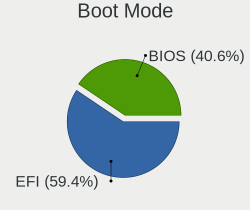
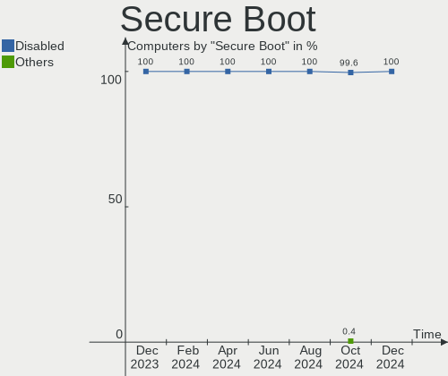
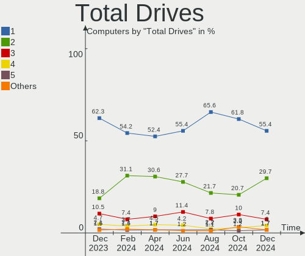
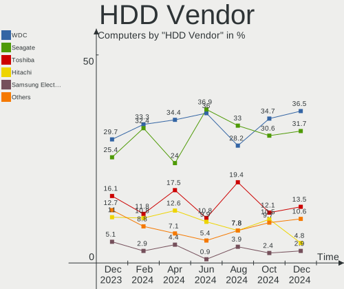
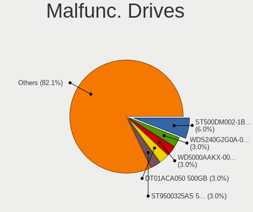
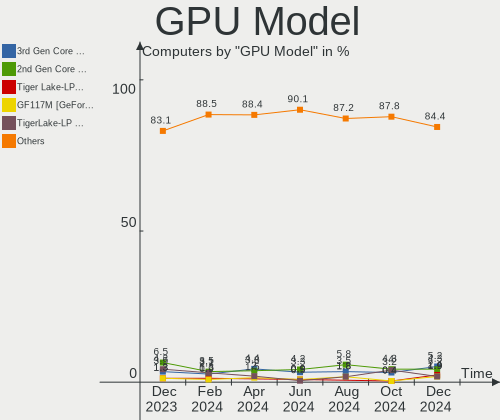
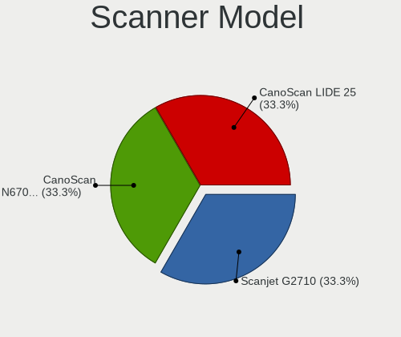

ROSA - Hardware Trends
----------------------

A project to identify most popular hardware characteristics and track their change
over time based on data collected by Linux users at https://Linux-Hardware.org.

Anyone can contribute to this report by the [hw-probe](https://github.com/linuxhw/hw-probe) tool:

    sudo -E hw-probe -all -upload

This is a report for all computer types. See also reports for [desktops](/Dist/ROSA/Desktop/README.md) and [notebooks](/Dist/ROSA/Notebook/README.md).

This report is for one last month. Overall report since the beginning of time: [TestCoverage](https://github.com/linuxhw/TestCoverage)

Period: Aug, 2022.

Contents
--------

* [ System ](#system)
  - [ OS                       ](#os)
  - [ OS Family                ](#os-family)
  - [ Kernel                   ](#kernel)
  - [ Kernel Family            ](#kernel-family)
  - [ Kernel Major Ver.        ](#kernel-major-ver)
  - [ Arch                     ](#arch)
  - [ DE                       ](#de)
  - [ Display Server           ](#display-server)
  - [ Display Manager          ](#display-manager)
  - [ OS Lang                  ](#os-lang)
  - [ Boot Mode                ](#boot-mode)
  - [ Filesystem               ](#filesystem)
  - [ Part. scheme             ](#part-scheme)
  - [ Dual Boot with Linux/BSD ](#dual-boot-with-linuxbsd)
  - [ Dual Boot (Win)          ](#dual-boot-win)

* [ Board ](#board)
  - [ Vendor                   ](#vendor)
  - [ Model                    ](#model)
  - [ Model Family             ](#model-family)
  - [ MFG Year                 ](#mfg-year)
  - [ Form Factor              ](#form-factor)
  - [ Secure Boot              ](#secure-boot)
  - [ Coreboot                 ](#coreboot)
  - [ RAM Size                 ](#ram-size)
  - [ RAM Used                 ](#ram-used)
  - [ Total Drives             ](#total-drives)
  - [ Has CD-ROM               ](#has-cd-rom)
  - [ Has Ethernet             ](#has-ethernet)
  - [ Has WiFi                 ](#has-wifi)
  - [ Has Bluetooth            ](#has-bluetooth)

* [ Location ](#location)
  - [ Country                  ](#country)
  - [ City                     ](#city)

* [ Drives ](#drives)
  - [ Drive Vendor             ](#drive-vendor)
  - [ Drive Model              ](#drive-model)
  - [ HDD Vendor               ](#hdd-vendor)
  - [ SSD Vendor               ](#ssd-vendor)
  - [ Drive Kind               ](#drive-kind)
  - [ Drive Connector          ](#drive-connector)
  - [ Drive Size               ](#drive-size)
  - [ Space Total              ](#space-total)
  - [ Space Used               ](#space-used)
  - [ Malfunc. Drives          ](#malfunc-drives)
  - [ Malfunc. Drive Vendor    ](#malfunc-drive-vendor)
  - [ Malfunc. HDD Vendor      ](#malfunc-hdd-vendor)
  - [ Malfunc. Drive Kind      ](#malfunc-drive-kind)
  - [ Failed Drives            ](#failed-drives)
  - [ Failed Drive Vendor      ](#failed-drive-vendor)
  - [ Drive Status             ](#drive-status)

* [ Storage controller ](#storage-controller)
  - [ Storage Vendor           ](#storage-vendor)
  - [ Storage Model            ](#storage-model)
  - [ Storage Kind             ](#storage-kind)

* [ Processor ](#processor)
  - [ CPU Vendor               ](#cpu-vendor)
  - [ CPU Model                ](#cpu-model)
  - [ CPU Model Family         ](#cpu-model-family)
  - [ CPU Cores                ](#cpu-cores)
  - [ CPU Sockets              ](#cpu-sockets)
  - [ CPU Threads              ](#cpu-threads)
  - [ CPU Op-Modes             ](#cpu-op-modes)
  - [ CPU Microcode            ](#cpu-microcode)
  - [ CPU Microarch            ](#cpu-microarch)

* [ Graphics ](#graphics)
  - [ GPU Vendor               ](#gpu-vendor)
  - [ GPU Model                ](#gpu-model)
  - [ GPU Combo                ](#gpu-combo)
  - [ GPU Driver               ](#gpu-driver)
  - [ GPU Memory               ](#gpu-memory)

* [ Monitor ](#monitor)
  - [ Monitor Vendor           ](#monitor-vendor)
  - [ Monitor Model            ](#monitor-model)
  - [ Monitor Resolution       ](#monitor-resolution)
  - [ Monitor Diagonal         ](#monitor-diagonal)
  - [ Monitor Width            ](#monitor-width)
  - [ Aspect Ratio             ](#aspect-ratio)
  - [ Monitor Area             ](#monitor-area)
  - [ Pixel Density            ](#pixel-density)
  - [ Multiple Monitors        ](#multiple-monitors)

* [ Network ](#network)
  - [ Net Controller Vendor    ](#net-controller-vendor)
  - [ Net Controller Model     ](#net-controller-model)
  - [ Wireless Vendor          ](#wireless-vendor)
  - [ Wireless Model           ](#wireless-model)
  - [ Ethernet Vendor          ](#ethernet-vendor)
  - [ Ethernet Model           ](#ethernet-model)
  - [ Net Controller Kind      ](#net-controller-kind)
  - [ Used Controller          ](#used-controller)
  - [ NICs                     ](#nics)
  - [ IPv6                     ](#ipv6)

* [ Bluetooth ](#bluetooth)
  - [ Bluetooth Vendor         ](#bluetooth-vendor)
  - [ Bluetooth Model          ](#bluetooth-model)

* [ Sound ](#sound)
  - [ Sound Vendor             ](#sound-vendor)
  - [ Sound Model              ](#sound-model)

* [ Memory ](#memory)
  - [ Memory Vendor            ](#memory-vendor)
  - [ Memory Model             ](#memory-model)
  - [ Memory Kind              ](#memory-kind)
  - [ Memory Form Factor       ](#memory-form-factor)
  - [ Memory Size              ](#memory-size)
  - [ Memory Speed             ](#memory-speed)

* [ Printers & scanners ](#printers--scanners)
  - [ Printer Vendor           ](#printer-vendor)
  - [ Printer Model            ](#printer-model)
  - [ Scanner Vendor           ](#scanner-vendor)
  - [ Scanner Model            ](#scanner-model)

* [ Camera ](#camera)
  - [ Camera Vendor            ](#camera-vendor)
  - [ Camera Model             ](#camera-model)

* [ Security ](#security)
  - [ Fingerprint Vendor       ](#fingerprint-vendor)
  - [ Fingerprint Model        ](#fingerprint-model)
  - [ Chipcard Vendor          ](#chipcard-vendor)
  - [ Chipcard Model           ](#chipcard-model)

* [ Unsupported ](#unsupported)
  - [ Unsupported Devices      ](#unsupported-devices)
  - [ Unsupported Device Types ](#unsupported-device-types)

System
------

OS
--

Installed operating systems

| Name       | Computers | Percent |
|------------|-----------|---------|
| ROSA 12.2  | 220       | 86.96%  |
| ROSA R11.1 | 24        | 9.49%   |
| ROSA 12.1  | 3         | 1.19%   |
| ROSA 12    | 3         | 1.19%   |
| ROSA R11   | 2         | 0.79%   |
| ROSA R12   | 1         | 0.4%    |

OS Family
---------

OS without a version

| Name | Computers | Percent |
|------|-----------|---------|
| ROSA | 253       | 100%    |

Kernel
------

Version of the Linux kernel

| Version                                        | Computers | Percent |
|------------------------------------------------|-----------|---------|
| 5.10.74-generic-2rosa2021.1-x86_64             | 103       | 40.71%  |
| 5.10.118-generic-2rosa2021.1-x86_64            | 78        | 30.83%  |
| 5.15.43-generic-2rosa2021.1-x86_64             | 10        | 3.95%   |
| 5.17.11-generic-2rosa2021.1-x86_64             | 8         | 3.16%   |
| 5.10.74-generic-2rosa2021.1-i586               | 7         | 2.77%   |
| 4.15.0-desktop-122.124.1rosa-x86_64            | 7         | 2.77%   |
| 5.4.83-generic-2rosa-x86_64                    | 4         | 1.58%   |
| 5.15.53.xm1-1.klp-xanmod-lts-rosa2021.1-x86_64 | 4         | 1.58%   |
| 5.4.32-generic-2rosa-x86_64                    | 3         | 1.19%   |
| 5.4.32-generic-2rosa-i586                      | 3         | 1.19%   |
| 5.18.18.xm1-1-xanmod-rosa2021.1-x86_64         | 3         | 1.19%   |
| 5.10.71-generic-1rosa2021.1-x86_64             | 3         | 1.19%   |
| 5.10.118-generic-2rosa2021.1-i586              | 3         | 1.19%   |
| 5.4.83-generic-2rosa-i586                      | 2         | 0.79%   |
| 4.9.155-nrj-desktop-1rosa-x86_64               | 2         | 0.79%   |
| 4.15.0-desktop-45.1rosa-x86_64                 | 2         | 0.79%   |
| 4.15.0-desktop-122.124.1rosa-i586              | 2         | 0.79%   |
| 5.4.182-generic-1rosa2021.1-e2kv4              | 1         | 0.4%    |
| 5.18.4-generic-2rosa2021.1-x86_64              | 1         | 0.4%    |
| 5.18.16.xm1-1-xanmod-rosa2021.1-x86_64         | 1         | 0.4%    |
| 5.18.15.xm1-1.klp-xanmod-rosa2021.1-x86_64     | 1         | 0.4%    |
| 5.16.20-generic-2rosa2021.1-x86_64             | 1         | 0.4%    |
| 5.15.58.xm1-1.klp-xanmod-lts-rosa2021.1-x86_64 | 1         | 0.4%    |
| 5.15.32-generic-6rosa2021.1-x86_64             | 1         | 0.4%    |
| 5.13.9-generic-1rosa-x86_64                    | 1         | 0.4%    |
| 5.10.56-generic-1rosa2021.1-x86_64             | 1         | 0.4%    |

Kernel Family
-------------

Linux kernel without a distro release

| Version  | Computers | Percent |
|----------|-----------|---------|
| 5.10.74  | 110       | 43.48%  |
| 5.10.118 | 81        | 32.02%  |
| 4.15.0   | 11        | 4.35%   |
| 5.15.43  | 10        | 3.95%   |
| 5.17.11  | 8         | 3.16%   |
| 5.4.83   | 6         | 2.37%   |
| 5.4.32   | 6         | 2.37%   |
| 5.15.53  | 4         | 1.58%   |
| 5.18.18  | 3         | 1.19%   |
| 5.10.71  | 3         | 1.19%   |
| 4.9.155  | 2         | 0.79%   |
| 5.4.182  | 1         | 0.4%    |
| 5.18.4   | 1         | 0.4%    |
| 5.18.16  | 1         | 0.4%    |
| 5.18.15  | 1         | 0.4%    |
| 5.16.20  | 1         | 0.4%    |
| 5.15.58  | 1         | 0.4%    |
| 5.15.32  | 1         | 0.4%    |
| 5.13.9   | 1         | 0.4%    |
| 5.10.56  | 1         | 0.4%    |

Kernel Major Ver.
-----------------

Linux kernel major version

| Version | Computers | Percent |
|---------|-----------|---------|
| 5.10    | 195       | 77.08%  |
| 5.15    | 16        | 6.32%   |
| 5.4     | 13        | 5.14%   |
| 4.15    | 11        | 4.35%   |
| 5.17    | 8         | 3.16%   |
| 5.18    | 6         | 2.37%   |
| 4.9     | 2         | 0.79%   |
| 5.16    | 1         | 0.4%    |
| 5.13    | 1         | 0.4%    |

Arch
----

OS architecture (x86_64, i586, etc.)

| Name   | Computers | Percent |
|--------|-----------|---------|
| x86_64 | 235       | 92.89%  |
| i686   | 17        | 6.72%   |
| e2k    | 1         | 0.4%    |

DE
--

Desktop Environment

| Name     | Computers | Percent |
|----------|-----------|---------|
| GNOME    | 114       | 45.06%  |
| KDE5     | 87        | 34.39%  |
| LXQt     | 31        | 12.25%  |
| KDE4     | 20        | 7.91%   |
| Cinnamon | 1         | 0.4%    |

Display Server
--------------

X11 or Wayland

| Name    | Computers | Percent |
|---------|-----------|---------|
| Wayland | 194       | 76.68%  |
| X11     | 59        | 23.32%  |

Display Manager
---------------

SDDM, LightDM, etc.

| Name    | Computers | Percent |
|---------|-----------|---------|
| GDM     | 136       | 53.75%  |
| SDDM    | 86        | 33.99%  |
| KDM     | 20        | 7.91%   |
| LightDM | 11        | 4.35%   |

OS Lang
-------

Language

| Lang    | Computers | Percent |
|---------|-----------|---------|
| ru_RU   | 231       | 91.3%   |
| en_US   | 8         | 3.16%   |
| pt_BR   | 4         | 1.58%   |
| es_PE   | 2         | 0.79%   |
| Unknown | 2         | 0.79%   |
| sk_SK   | 1         | 0.4%    |
| pl_PL   | 1         | 0.4%    |
| es_CO   | 1         | 0.4%    |
| Default | 1         | 0.4%    |
| be_BY   | 1         | 0.4%    |
| ba_RU   | 1         | 0.4%    |

Boot Mode
---------

EFI or BIOS

| Mode | Computers | Percent |
|------|-----------|---------|
| EFI  | 133       | 52.57%  |
| BIOS | 120       | 47.43%  |

Filesystem
----------

Type of filesystem

| Type  | Computers | Percent |
|-------|-----------|---------|
| Ext4  | 238       | 94.07%  |
| Btrfs | 14        | 5.53%   |
| F2fs  | 1         | 0.4%    |

Part. scheme
------------

Scheme of partitioning

| Type | Computers | Percent |
|------|-----------|---------|
| GPT  | 168       | 66.4%   |
| MBR  | 85        | 33.6%   |

Dual Boot with Linux/BSD
------------------------

Hosting more than one Linux/BSD

| Dual boot | Computers | Percent |
|-----------|-----------|---------|
| No        | 187       | 73.91%  |
| Yes       | 66        | 26.09%  |

Dual Boot (Win)
---------------

Hosting Linux and Windows

| Dual boot | Computers | Percent |
|-----------|-----------|---------|
| Yes       | 127       | 50.2%   |
| No        | 126       | 49.8%   |

Board
-----

Vendor
------

Motherboard manufacturer

| Name                                      | Computers | Percent |
|-------------------------------------------|-----------|---------|
| ASUSTek Computer                          | 66        | 26.09%  |
| Lenovo                                    | 38        | 15.02%  |
| Gigabyte Technology                       | 28        | 11.07%  |
| Acer                                      | 23        | 9.09%   |
| Hewlett-Packard                           | 17        | 6.72%   |
| Dell                                      | 14        | 5.53%   |
| ASRock                                    | 13        | 5.14%   |
| MSI                                       | 12        | 4.74%   |
| Samsung Electronics                       | 6         | 2.37%   |
| eMachines                                 | 4         | 1.58%   |
| Intel                                     | 3         | 1.19%   |
| Unknown                                   | 3         | 1.19%   |
| Pegatron                                  | 2         | 0.79%   |
| HUAWEI                                    | 2         | 0.79%   |
| Huanan                                    | 2         | 0.79%   |
| Foxconn                                   | 2         | 0.79%   |
| win element                               | 1         | 0.4%    |
| Soyo                                      | 1         | 0.4%    |
| Sony                                      | 1         | 0.4%    |
| Shenzhen Baohuazhong Science & Technology | 1         | 0.4%    |
| Positivo Bahia - VAIO                     | 1         | 0.4%    |
| PCWare                                    | 1         | 0.4%    |
| Packard Bell                              | 1         | 0.4%    |
| KupiDeshego Edition                       | 1         | 0.4%    |
| Koloe                                     | 1         | 0.4%    |
| iRU                                       | 1         | 0.4%    |
| Haier                                     | 1         | 0.4%    |
| Google                                    | 1         | 0.4%    |
| ECS                                       | 1         | 0.4%    |
| Chuwi                                     | 1         | 0.4%    |
| Biostar                                   | 1         | 0.4%    |
| BBEN                                      | 1         | 0.4%    |
| Apple                                     | 1         | 0.4%    |
| 3Logic Group                              | 1         | 0.4%    |

Model
-----

Motherboard model

| Name                                        | Computers | Percent |
|---------------------------------------------|-----------|---------|
| ASUS All Series                             | 4         | 1.58%   |
| Unknown                                     | 4         | 1.58%   |
| Lenovo IdeaPad Gaming 3 15IMH05 81Y4        | 2         | 0.79%   |
| Lenovo IdeaPad 330-15IKB 81DE               | 2         | 0.79%   |
| Lenovo B570e HuronRiver Platform            | 2         | 0.79%   |
| Intel X99                                   | 2         | 0.79%   |
| HP Pavilion g6                              | 2         | 0.79%   |
| Gigabyte H110M-S2V                          | 2         | 0.79%   |
| eMachines eME728                            | 2         | 0.79%   |
| ASUS SABERTOOTH 990FX R2.0                  | 2         | 0.79%   |
| ASUS F5N                                    | 2         | 0.79%   |
| ASRock 970 Pro3 R2.0                        | 2         | 0.79%   |
| win element M1K                             | 1         | 0.4%    |
| Soyo SY-Classic B660M                       | 1         | 0.4%    |
| Sony VPCSB1V9R                              | 1         | 0.4%    |
| Shenzhen Baohuazhong Science & XN1A         | 1         | 0.4%    |
| Samsung RV411/RV511/E3511/S3511/RV711/E3411 | 1         | 0.4%    |
| Samsung R580/R590                           | 1         | 0.4%    |
| Samsung R530/R730/R540                      | 1         | 0.4%    |
| Samsung R528/R728                           | 1         | 0.4%    |
| Samsung NC210/NC110                         | 1         | 0.4%    |
| Samsung 700Z3A/700Z4A/700Z5A/700Z5B         | 1         | 0.4%    |
| Positivo Bahia - VAIO VJFE52F11X-B0611H     | 1         | 0.4%    |
| Pegatron IPX41-D3                           | 1         | 0.4%    |
| Pegatron A17                                | 1         | 0.4%    |
| PCWare IPX3060E                             | 1         | 0.4%    |
| Packard Bell EasyNote LM85                  | 1         | 0.4%    |
| MSI MS-AA7211                               | 1         | 0.4%    |
| MSI MS-7D20                                 | 1         | 0.4%    |
| MSI MS-7C94                                 | 1         | 0.4%    |
| MSI MS-7C02                                 | 1         | 0.4%    |
| MSI MS-7B98                                 | 1         | 0.4%    |
| MSI MS-7B93                                 | 1         | 0.4%    |
| MSI MS-7B87                                 | 1         | 0.4%    |
| MSI MS-7A74                                 | 1         | 0.4%    |
| MSI MS-7971                                 | 1         | 0.4%    |
| MSI MS-7816                                 | 1         | 0.4%    |
| MSI MS-7599                                 | 1         | 0.4%    |
| MSI FX610                                   | 1         | 0.4%    |
| Lenovo Z710 20250                           | 1         | 0.4%    |
| Lenovo Y520-15IKBN 80WK                     | 1         | 0.4%    |
| Lenovo ThinkPad X220 4291B66                | 1         | 0.4%    |
| Lenovo ThinkPad T440p 20AWS0VB04            | 1         | 0.4%    |
| Lenovo ThinkPad SL500 2746AA3               | 1         | 0.4%    |
| Lenovo ThinkPad Helix 2nd 20CHS1L603        | 1         | 0.4%    |
| Lenovo ThinkPad Edge E545 20B2A00ERT        | 1         | 0.4%    |
| Lenovo ThinkPad 13 2nd Gen 20J1S0EW00       | 1         | 0.4%    |
| Lenovo ThinkCentre M715q 10VG001QRU         | 1         | 0.4%    |
| Lenovo S20-00 F0AY001SRK                    | 1         | 0.4%    |
| Lenovo Legion Y740-17IRHg 81UJ              | 1         | 0.4%    |
| Lenovo Legion 5 Pro 16ACH6H 82JQ            | 1         | 0.4%    |
| Lenovo Legion 5 17IMH05H 81Y8               | 1         | 0.4%    |
| Lenovo Legion 5 15IMH05H 81Y6               | 1         | 0.4%    |
| Lenovo IdeaPad Y580 20132                   | 1         | 0.4%    |
| Lenovo IdeaPad S340-14API 81NB              | 1         | 0.4%    |
| Lenovo IdeaPad S20-30                       | 1         | 0.4%    |
| Lenovo IdeaPad S145-15API 81UT              | 1         | 0.4%    |
| Lenovo IdeaPad Gaming 3 15ARH05 82EY        | 1         | 0.4%    |
| Lenovo IdeaPad Gaming 3 15ACH6 82K2         | 1         | 0.4%    |
| Lenovo IdeaPad 330-15IGM 81D1               | 1         | 0.4%    |

Model Family
------------

Motherboard model prefix

| Name                                    | Computers | Percent |
|-----------------------------------------|-----------|---------|
| Lenovo IdeaPad                          | 14        | 5.53%   |
| Acer Aspire                             | 10        | 3.95%   |
| ASUS PRIME                              | 7         | 2.77%   |
| Lenovo ThinkPad                         | 6         | 2.37%   |
| HP Pavilion                             | 6         | 2.37%   |
| ASUS VivoBook                           | 5         | 1.98%   |
| Lenovo Legion                           | 4         | 1.58%   |
| HP Compaq                               | 4         | 1.58%   |
| Dell Vostro                             | 4         | 1.58%   |
| ASUS TUF                                | 4         | 1.58%   |
| ASUS All                                | 4         | 1.58%   |
| Acer Extensa                            | 4         | 1.58%   |
| Unknown                                 | 4         | 1.58%   |
| Dell Inspiron                           | 3         | 1.19%   |
| Acer Nitro                              | 3         | 1.19%   |
| Lenovo B570e                            | 2         | 0.79%   |
| Intel X99                               | 2         | 0.79%   |
| HP Laptop                               | 2         | 0.79%   |
| Gigabyte H110M-S2V                      | 2         | 0.79%   |
| Gigabyte B450                           | 2         | 0.79%   |
| eMachines eME728                        | 2         | 0.79%   |
| Dell OptiPlex                           | 2         | 0.79%   |
| Dell Latitude                           | 2         | 0.79%   |
| ASUS SABERTOOTH                         | 2         | 0.79%   |
| ASUS P8Z77-V                            | 2         | 0.79%   |
| ASUS P8H61-MX                           | 2         | 0.79%   |
| ASUS M5A97                              | 2         | 0.79%   |
| ASUS F5N                                | 2         | 0.79%   |
| ASRock 970                              | 2         | 0.79%   |
| win element M1K                         | 1         | 0.4%    |
| Soyo SY-Classic                         | 1         | 0.4%    |
| Sony VPCSB1V9R                          | 1         | 0.4%    |
| Shenzhen Baohuazhong Science & XN1A     | 1         | 0.4%    |
| Samsung RV411                           | 1         | 0.4%    |
| Samsung R580                            | 1         | 0.4%    |
| Samsung R530                            | 1         | 0.4%    |
| Samsung R528                            | 1         | 0.4%    |
| Samsung NC210                           | 1         | 0.4%    |
| Samsung 700Z3A                          | 1         | 0.4%    |
| Positivo Bahia - VAIO VJFE52F11X-B0611H | 1         | 0.4%    |
| Pegatron IPX41-D3                       | 1         | 0.4%    |
| Pegatron A17                            | 1         | 0.4%    |
| PCWare IPX3060E                         | 1         | 0.4%    |
| Packard Bell EasyNote                   | 1         | 0.4%    |
| MSI MS-AA7211                           | 1         | 0.4%    |
| MSI MS-7D20                             | 1         | 0.4%    |
| MSI MS-7C94                             | 1         | 0.4%    |
| MSI MS-7C02                             | 1         | 0.4%    |
| MSI MS-7B98                             | 1         | 0.4%    |
| MSI MS-7B93                             | 1         | 0.4%    |
| MSI MS-7B87                             | 1         | 0.4%    |
| MSI MS-7A74                             | 1         | 0.4%    |
| MSI MS-7971                             | 1         | 0.4%    |
| MSI MS-7816                             | 1         | 0.4%    |
| MSI MS-7599                             | 1         | 0.4%    |
| MSI FX610                               | 1         | 0.4%    |
| Lenovo Z710                             | 1         | 0.4%    |
| Lenovo Y520-15IKBN                      | 1         | 0.4%    |
| Lenovo ThinkCentre                      | 1         | 0.4%    |
| Lenovo S20-00                           | 1         | 0.4%    |

MFG Year
--------

Motherboard manufacture year

| Year    | Computers | Percent |
|---------|-----------|---------|
| 2013    | 30        | 11.86%  |
| 2012    | 29        | 11.46%  |
| 2018    | 24        | 9.49%   |
| 2021    | 21        | 8.3%    |
| 2020    | 20        | 7.91%   |
| 2011    | 19        | 7.51%   |
| 2010    | 18        | 7.11%   |
| 2019    | 16        | 6.32%   |
| 2015    | 14        | 5.53%   |
| 2009    | 14        | 5.53%   |
| 2016    | 13        | 5.14%   |
| 2017    | 10        | 3.95%   |
| 2007    | 10        | 3.95%   |
| 2008    | 8         | 3.16%   |
| 2014    | 5         | 1.98%   |
| 2022    | 1         | 0.4%    |
| Unknown | 1         | 0.4%    |

Form Factor
-----------

Physical design of the computer

| Name       | Computers | Percent |
|------------|-----------|---------|
| Notebook   | 130       | 51.38%  |
| Desktop    | 116       | 45.85%  |
| All in one | 4         | 1.58%   |
| Tablet     | 2         | 0.79%   |
| Mini pc    | 1         | 0.4%    |

Secure Boot
-----------

Enabled or disabled

| State    | Computers | Percent |
|----------|-----------|---------|
| Disabled | 253       | 100%    |

Coreboot
--------

Have coreboot on board

| Used | Computers | Percent |
|------|-----------|---------|
| No   | 252       | 99.6%   |
| Yes  | 1         | 0.4%    |

RAM Size
--------

Total RAM memory

| Size in GB  | Computers | Percent |
|-------------|-----------|---------|
| 8.01-16.0   | 60        | 23.72%  |
| 3.01-4.0    | 54        | 21.34%  |
| 4.01-8.0    | 47        | 18.58%  |
| 16.01-24.0  | 43        | 17%     |
| 1.01-2.0    | 21        | 8.3%    |
| 32.01-64.0  | 17        | 6.72%   |
| 24.01-32.0  | 5         | 1.98%   |
| 2.01-3.0    | 4         | 1.58%   |
| 64.01-256.0 | 2         | 0.79%   |

RAM Used
--------

Used RAM memory

| Used GB   | Computers | Percent |
|-----------|-----------|---------|
| 1.01-2.0  | 144       | 56.92%  |
| 0.51-1.0  | 61        | 24.11%  |
| 2.01-3.0  | 30        | 11.86%  |
| 3.01-4.0  | 8         | 3.16%   |
| 4.01-8.0  | 6         | 2.37%   |
| 8.01-16.0 | 2         | 0.79%   |
| 0.01-0.5  | 2         | 0.79%   |

Total Drives
------------

Number of drives on board

| Drives | Computers | Percent |
|--------|-----------|---------|
| 1      | 138       | 54.55%  |
| 2      | 69        | 27.27%  |
| 3      | 26        | 10.28%  |
| 4      | 12        | 4.74%   |
| 5      | 5         | 1.98%   |
| 6      | 2         | 0.79%   |
| 7      | 1         | 0.4%    |

Has CD-ROM
----------

Has CD-ROM on board

| Presented | Computers | Percent |
|-----------|-----------|---------|
| No        | 171       | 67.59%  |
| Yes       | 82        | 32.41%  |

Has Ethernet
------------

Has Ethernet on board

| Presented | Computers | Percent |
|-----------|-----------|---------|
| Yes       | 236       | 93.28%  |
| No        | 17        | 6.72%   |

Has WiFi
--------

Has WiFi module

| Presented | Computers | Percent |
|-----------|-----------|---------|
| Yes       | 160       | 63.24%  |
| No        | 93        | 36.76%  |

Has Bluetooth
-------------

Has Bluetooth module

| Presented | Computers | Percent |
|-----------|-----------|---------|
| Yes       | 137       | 54.15%  |
| No        | 116       | 45.85%  |

Location
--------

Country
-------

Geographic location (country)

| Country   | Computers | Percent |
|-----------|-----------|---------|
| Russia    | 216       | 85.38%  |
| Ukraine   | 8         | 3.16%   |
| Belarus   | 5         | 1.98%   |
| Brazil    | 4         | 1.58%   |
| Poland    | 3         | 1.19%   |
| Slovakia  | 2         | 0.79%   |
| Peru      | 2         | 0.79%   |
| Indonesia | 2         | 0.79%   |
| USA       | 1         | 0.4%    |
| Sweden    | 1         | 0.4%    |
| Serbia    | 1         | 0.4%    |
| Portugal  | 1         | 0.4%    |
| Moldova   | 1         | 0.4%    |
| Latvia    | 1         | 0.4%    |
| Israel    | 1         | 0.4%    |
| Georgia   | 1         | 0.4%    |
| Estonia   | 1         | 0.4%    |
| Czechia   | 1         | 0.4%    |
| Colombia  | 1         | 0.4%    |

City
----

Geographic location (city)

| City                   | Computers | Percent |
|------------------------|-----------|---------|
| Moscow                 | 41        | 16.21%  |
| St Petersburg          | 13        | 5.14%   |
| Krasnodar              | 13        | 5.14%   |
| Rostov-on-Don          | 9         | 3.56%   |
| Yekaterinburg          | 8         | 3.16%   |
| Saratov                | 6         | 2.37%   |
| Perm                   | 6         | 2.37%   |
| Novosibirsk            | 5         | 1.98%   |
| Krasnoyarsk            | 5         | 1.98%   |
| Chelyabinsk            | 5         | 1.98%   |
| Omsk                   | 4         | 1.58%   |
| Nizhniy Novgorod       | 4         | 1.58%   |
| Kemerovo               | 4         | 1.58%   |
| Ufa                    | 3         | 1.19%   |
| Stavropol              | 3         | 1.19%   |
| Samara                 | 3         | 1.19%   |
| Belgorod               | 3         | 1.19%   |
| Zheleznogorsk          | 2         | 0.79%   |
| Yoshkar-Ola            | 2         | 0.79%   |
| Yaroslavl              | 2         | 0.79%   |
| Voronezh               | 2         | 0.79%   |
| Volgograd              | 2         | 0.79%   |
| Vladimir               | 2         | 0.79%   |
| Sochi                  | 2         | 0.79%   |
| Simferopol             | 2         | 0.79%   |
| Saransk                | 2         | 0.79%   |
| Ryazan                 | 2         | 0.79%   |
| Rio de Janeiro         | 2         | 0.79%   |
| Noril'sk               | 2         | 0.79%   |
| Kursk                  | 2         | 0.79%   |
| Kurgan                 | 2         | 0.79%   |
| Kamenetskiy            | 2         | 0.79%   |
| Blagoveshchensk        | 2         | 0.79%   |
| Astrakhan              | 2         | 0.79%   |
| Zlatoust               | 1         | 0.4%    |
| Zhirnovsk              | 1         | 0.4%    |
| Yevpatoriya            | 1         | 0.4%    |
| Yelets                 | 1         | 0.4%    |
| Yalta                  | 1         | 0.4%    |
| Warsaw                 | 1         | 0.4%    |
| Vorkuta                | 1         | 0.4%    |
| Vologda                | 1         | 0.4%    |
| Vidnoye                | 1         | 0.4%    |
| Ulan-Ude               | 1         | 0.4%    |
| Tomsk                  | 1         | 0.4%    |
| Tiraspol               | 1         | 0.4%    |
| Surgut                 | 1         | 0.4%    |
| Siemianowice Śląskie | 1         | 0.4%    |
| Shchelkovo             | 1         | 0.4%    |
| Severomorsk            | 1         | 0.4%    |
| Severodvinsk           | 1         | 0.4%    |
| Sevastopol             | 1         | 0.4%    |
| Serpukhov              | 1         | 0.4%    |
| Santiago de Cali       | 1         | 0.4%    |
| Salekhard              | 1         | 0.4%    |
| Rovenki                | 1         | 0.4%    |
| Rossosh'               | 1         | 0.4%    |
| Roslavl'               | 1         | 0.4%    |
| Rishon LeTsiyyon       | 1         | 0.4%    |
| Riga                   | 1         | 0.4%    |

Drives
------

Drive Vendor
------------

Hard drive vendors

| Vendor                         | Computers | Drives | Percent |
|--------------------------------|-----------|--------|---------|
| WDC                            | 79        | 94     | 19.75%  |
| Seagate                        | 65        | 75     | 16.25%  |
| Samsung Electronics            | 38        | 45     | 9.5%    |
| Kingston                       | 24        | 26     | 6%      |
| Toshiba                        | 20        | 22     | 5%      |
| Hitachi                        | 20        | 20     | 5%      |
| China                          | 17        | 18     | 4.25%   |
| Unknown                        | 11        | 12     | 2.75%   |
| SK hynix                       | 11        | 12     | 2.75%   |
| Apacer                         | 11        | 11     | 2.75%   |
| SPCC                           | 8         | 8      | 2%      |
| A-DATA Technology              | 7         | 10     | 1.75%   |
| SanDisk                        | 6         | 6      | 1.5%    |
| Netac                          | 6         | 6      | 1.5%    |
| Intel                          | 6         | 6      | 1.5%    |
| Crucial                        | 6         | 8      | 1.5%    |
| Gigabyte Technology            | 5         | 5      | 1.25%   |
| Unknown                        | 5         | 5      | 1.25%   |
| Plextor                        | 4         | 4      | 1%      |
| HGST                           | 4         | 4      | 1%      |
| GOODRAM                        | 4         | 4      | 1%      |
| AMD                            | 4         | 4      | 1%      |
| Transcend                      | 3         | 3      | 0.75%   |
| Smartbuy                       | 3         | 3      | 0.75%   |
| KingSpec                       | 3         | 3      | 0.75%   |
| UMIS                           | 2         | 2      | 0.5%    |
| Silicon Motion                 | 2         | 2      | 0.5%    |
| Patriot                        | 2         | 2      | 0.5%    |
| Micron Technology              | 2         | 2      | 0.5%    |
| Hewlett-Packard                | 2         | 2      | 0.5%    |
| XPG                            | 1         | 1      | 0.25%   |
| WALRAM                         | 1         | 1      | 0.25%   |
| V-GeN                          | 1         | 2      | 0.25%   |
| TO Exter                       | 1         | 1      | 0.25%   |
| Teclast                        | 1         | 1      | 0.25%   |
| Team                           | 1         | 1      | 0.25%   |
| Solid State Storage Technology | 1         | 1      | 0.25%   |
| ShanDianZhe                    | 1         | 1      | 0.25%   |
| SemsoTai                       | 1         | 1      | 0.25%   |
| Pioneer                        | 1         | 1      | 0.25%   |
| Phison                         | 1         | 1      | 0.25%   |
| Lexar                          | 1         | 1      | 0.25%   |
| Kllisre                        | 1         | 1      | 0.25%   |
| KIOXIA-EXCERIA                 | 1         | 1      | 0.25%   |
| Kimtigo                        | 1         | 1      | 0.25%   |
| JMicron Technology             | 1         | 1      | 0.25%   |
| HS-SSD-C100                    | 1         | 1      | 0.25%   |
| External                       | 1         | 1      | 0.25%   |
| Colorful                       | 1         | 1      | 0.25%   |
| Apple                          | 1         | 1      | 0.25%   |

Drive Model
-----------

Hard drive models

| Model                                | Computers | Percent |
|--------------------------------------|-----------|---------|
| Kingston SA400S37240G 240GB SSD      | 7         | 1.6%    |
| Apacer AS350 128GB SSD               | 7         | 1.6%    |
| WDC WDS240G2G0A-00JH30 240GB SSD     | 5         | 1.14%   |
| SPCC Solid State Disk 128GB          | 5         | 1.14%   |
| Seagate ST500DM002-1BD142 500GB      | 5         | 1.14%   |
| Kingston SA400S37120G 120GB SSD      | 5         | 1.14%   |
| China SSD 256GB                      | 5         | 1.14%   |
| Unknown                              | 5         | 1.14%   |
| WDC WD10EZEX-08WN4A0 1TB             | 4         | 0.92%   |
| Toshiba DT01ACA100 1TB               | 4         | 0.92%   |
| Seagate ST3160815AS 160GB            | 4         | 0.92%   |
| Seagate ST250DM000-1BD141 250GB      | 4         | 0.92%   |
| Seagate ST1000LM035-1RK172 1TB       | 4         | 0.92%   |
| Seagate ST1000LM024 HN-M101MBB 1TB   | 4         | 0.92%   |
| Samsung SSD 860 EVO 250GB            | 4         | 0.92%   |
| Hitachi HTS545025B9A300 250GB        | 4         | 0.92%   |
| WDC WDS500G2B0A-00SM50 500GB SSD     | 3         | 0.69%   |
| WDC WDS120G2G0A-00JH30 120GB SSD     | 3         | 0.69%   |
| Toshiba HDWD105 500GB                | 3         | 0.69%   |
| Toshiba DT01ACA050 500GB             | 3         | 0.69%   |
| Seagate ST1000DM003-1CH162 1TB       | 3         | 0.69%   |
| Samsung SSD 860 EVO 500GB            | 3         | 0.69%   |
| Samsung SSD 850 PRO 256GB            | 3         | 0.69%   |
| Kingston SV300S37A120G 120GB SSD     | 3         | 0.69%   |
| China SSD 120GB                      | 3         | 0.69%   |
| WDC WD5000LPCX-24VHAT0 500GB         | 2         | 0.46%   |
| WDC WD5000LPCX-21VHAT0 500GB         | 2         | 0.46%   |
| WDC WD5000AADS-00S9B0 500GB          | 2         | 0.46%   |
| WDC WD20EFRX-68EUZN0 2TB             | 2         | 0.46%   |
| WDC WD20EARS-00MVWB0 2TB             | 2         | 0.46%   |
| WDC WD10SPZX-35Z10T0 1TB             | 2         | 0.46%   |
| WDC WD10EZRZ-00HTKB0 1TB             | 2         | 0.46%   |
| WDC WD10EZEX-75M2NA0 1TB             | 2         | 0.46%   |
| WDC WD10EZEX-21M2NA0 1TB             | 2         | 0.46%   |
| Unknown SD/MMC/MS PRO 128GB          | 2         | 0.46%   |
| Toshiba HDWD110 1TB                  | 2         | 0.46%   |
| Seagate ST500LM030-2E717D 500GB      | 2         | 0.46%   |
| Seagate ST500LM021-1KJ152 500GB      | 2         | 0.46%   |
| Seagate ST3500418AS 500GB            | 2         | 0.46%   |
| Seagate ST1000LX015-1U7172 1TB       | 2         | 0.46%   |
| Seagate ST1000DM010-2EP102 1TB       | 2         | 0.46%   |
| Seagate ST1000DM003-1SB102 1TB       | 2         | 0.46%   |
| SanDisk SSD PLUS 240GB               | 2         | 0.46%   |
| SanDisk SD8SN8U-128G-1006 128GB SSD  | 2         | 0.46%   |
| Samsung SSD 870 EVO 1TB              | 2         | 0.46%   |
| Samsung SSD 850 PRO 128GB            | 2         | 0.46%   |
| Netac SSD 240GB                      | 2         | 0.46%   |
| Intel SSDPEKNU512GZ 512GB            | 2         | 0.46%   |
| Hitachi HTS545050B9A300 500GB        | 2         | 0.46%   |
| Hitachi HTS541680J9SA00 80GB         | 2         | 0.46%   |
| Gigabyte GP-GSTFS31120GNTD 120GB SSD | 2         | 0.46%   |
| China SATA SSD 240GB                 | 2         | 0.46%   |
| China 120GB SSD                      | 2         | 0.46%   |
| A-DATA SU650 120GB SSD               | 2         | 0.46%   |
| XPG GAMMIX S11 Pro 1TB               | 1         | 0.23%   |
| WDC WDS250G2B0C-00PXH0 250GB         | 1         | 0.23%   |
| WDC WDS240G2G0B-00EPW0 240GB SSD     | 1         | 0.23%   |
| WDC WDS120G2G0B-00EPW0 120GB SSD     | 1         | 0.23%   |
| WDC WDS100T2B0B-00YS70 1TB SSD       | 1         | 0.23%   |
| WDC WD82PURZ-85TEUY0 8TB             | 1         | 0.23%   |

HDD Vendor
----------

Hard disk drive vendors

| Vendor              | Computers | Drives | Percent |
|---------------------|-----------|--------|---------|
| WDC                 | 69        | 75     | 37.7%   |
| Seagate             | 65        | 75     | 35.52%  |
| Hitachi             | 20        | 20     | 10.93%  |
| Toshiba             | 18        | 19     | 9.84%   |
| Samsung Electronics | 4         | 4      | 2.19%   |
| HGST                | 4         | 4      | 2.19%   |
| Unknown             | 2         | 2      | 1.09%   |
| Unknown             | 1         | 1      | 0.55%   |

SSD Vendor
----------

Solid state drive vendors

| Vendor              | Computers | Drives | Percent |
|---------------------|-----------|--------|---------|
| Samsung Electronics | 23        | 26     | 13.69%  |
| Kingston            | 23        | 24     | 13.69%  |
| China               | 17        | 18     | 10.12%  |
| WDC                 | 13        | 15     | 7.74%   |
| Apacer              | 9         | 9      | 5.36%   |
| SPCC                | 8         | 8      | 4.76%   |
| A-DATA Technology   | 7         | 8      | 4.17%   |
| SanDisk             | 6         | 6      | 3.57%   |
| Netac               | 6         | 6      | 3.57%   |
| Crucial             | 5         | 7      | 2.98%   |
| SK hynix            | 4         | 4      | 2.38%   |
| GOODRAM             | 4         | 4      | 2.38%   |
| Gigabyte Technology | 4         | 4      | 2.38%   |
| Transcend           | 3         | 3      | 1.79%   |
| Smartbuy            | 3         | 3      | 1.79%   |
| Plextor             | 3         | 3      | 1.79%   |
| KingSpec            | 3         | 3      | 1.79%   |
| Intel               | 3         | 3      | 1.79%   |
| AMD                 | 3         | 3      | 1.79%   |
| Unknown             | 3         | 3      | 1.79%   |
| Toshiba             | 2         | 2      | 1.19%   |
| Patriot             | 2         | 2      | 1.19%   |
| WALRAM              | 1         | 1      | 0.6%    |
| V-GeN               | 1         | 2      | 0.6%    |
| TO Exter            | 1         | 1      | 0.6%    |
| ShanDianZhe         | 1         | 1      | 0.6%    |
| SemsoTai            | 1         | 1      | 0.6%    |
| Pioneer             | 1         | 1      | 0.6%    |
| Micron Technology   | 1         | 1      | 0.6%    |
| Lexar               | 1         | 1      | 0.6%    |
| KIOXIA-EXCERIA      | 1         | 1      | 0.6%    |
| JMicron Technology  | 1         | 1      | 0.6%    |
| HS-SSD-C100         | 1         | 1      | 0.6%    |
| Hewlett-Packard     | 1         | 1      | 0.6%    |
| Colorful            | 1         | 1      | 0.6%    |
| Apple               | 1         | 1      | 0.6%    |

Drive Kind
----------

HDD or SSD

| Kind    | Computers | Drives | Percent |
|---------|-----------|--------|---------|
| HDD     | 160       | 200    | 44.69%  |
| SSD     | 138       | 179    | 38.55%  |
| NVMe    | 50        | 55     | 13.97%  |
| MMC     | 9         | 9      | 2.51%   |
| Unknown | 1         | 2      | 0.28%   |

Drive Connector
---------------

SATA, SAS, NVMe, etc.

| Type | Computers | Drives | Percent |
|------|-----------|--------|---------|
| SATA | 229       | 373    | 77.63%  |
| NVMe | 49        | 54     | 16.61%  |
| MMC  | 9         | 9      | 3.05%   |
| SAS  | 8         | 9      | 2.71%   |

Drive Size
----------

Size of hard drive

| Size in TB      | Computers | Drives | Percent |
|-----------------|-----------|--------|---------|
| 0.01-0.5        | 192       | 268    | 66.9%   |
| 0.51-1.0        | 74        | 87     | 25.78%  |
| 1.01-2.0        | 11        | 13     | 3.83%   |
| 2.01-3.0        | 4         | 4      | 1.39%   |
| 3.01-4.0        | 3         | 4      | 1.05%   |
| 4.01-10.0       | 2         | 2      | 0.7%    |
| More than 100.0 | 1         | 1      | 0.35%   |

Space Total
-----------

Amount of disk space available on the file system

| Size in GB | Computers | Percent |
|------------|-----------|---------|
| 101-250    | 91        | 35.97%  |
| 251-500    | 53        | 20.95%  |
| 501-1000   | 35        | 13.83%  |
| 1-20       | 31        | 12.25%  |
| 51-100     | 17        | 6.72%   |
| 1001-2000  | 13        | 5.14%   |
| 21-50      | 7         | 2.77%   |
| 2001-3000  | 6         | 2.37%   |

Space Used
----------

Amount of used disk space

| Used GB   | Computers | Percent |
|-----------|-----------|---------|
| 1-20      | 168       | 66.4%   |
| 21-50     | 27        | 10.67%  |
| 101-250   | 21        | 8.3%    |
| 251-500   | 13        | 5.14%   |
| 51-100    | 12        | 4.74%   |
| 501-1000  | 10        | 3.95%   |
| 1001-2000 | 2         | 0.79%   |

Malfunc. Drives
---------------

Drive models with a malfunction

| Model                                       | Computers | Drives | Percent |
|---------------------------------------------|-----------|--------|---------|
| Hitachi HTS545025B9A300 250GB               | 3         | 3      | 3.49%   |
| WDC WDS240G2G0A-00JH30 240GB SSD            | 2         | 3      | 2.33%   |
| WDC WD5000AADS-00S9B0 500GB                 | 2         | 2      | 2.33%   |
| WDC WD20EARS-00MVWB0 2TB                    | 2         | 2      | 2.33%   |
| Seagate ST500DM002-1BD142 500GB             | 2         | 2      | 2.33%   |
| Seagate ST1000LX015-1U7172 1TB              | 2         | 2      | 2.33%   |
| Hitachi HTS541680J9SA00 80GB                | 2         | 2      | 2.33%   |
| WDC WDS120G2G0A-00JH30 120GB SSD            | 1         | 1      | 1.16%   |
| WDC WD800JD-60LSA5 80GB                     | 1         | 1      | 1.16%   |
| WDC WD8000AARS-00Y5B1 800GB                 | 1         | 1      | 1.16%   |
| WDC WD5000LPLX-00ZNTT0 500GB                | 1         | 1      | 1.16%   |
| WDC WD5000AAKS-00UU3A0 500GB                | 1         | 1      | 1.16%   |
| WDC WD4500HLHX-01JJPV0 450GB                | 1         | 1      | 1.16%   |
| WDC WD30EFRX-68EUZN0 3TB                    | 1         | 1      | 1.16%   |
| WDC WD2500BEKT-60A25T1 250GB                | 1         | 1      | 1.16%   |
| WDC WD1600BEVT-22A23T0 160GB                | 1         | 1      | 1.16%   |
| WDC WD1600BEVS-60RST0 160GB                 | 1         | 1      | 1.16%   |
| WDC WD10EZEX-75M2NA0 1TB                    | 1         | 1      | 1.16%   |
| WDC WD10EZEX-08M2NA0 1TB                    | 1         | 1      | 1.16%   |
| WDC WD10EARS-00Z5B1 1TB                     | 1         | 1      | 1.16%   |
| WDC WD10EARS-00MVWB0 1TB                    | 1         | 1      | 1.16%   |
| WDC WD10EADS-65L5B1 1TB                     | 1         | 1      | 1.16%   |
| Transcend TS32GMSA310 32GB SSD              | 1         | 1      | 1.16%   |
| Toshiba MK1237GSX 120GB                     | 1         | 1      | 1.16%   |
| Toshiba HDWD110 1TB                         | 1         | 1      | 1.16%   |
| Toshiba HDWD105 500GB                       | 1         | 1      | 1.16%   |
| Toshiba DT01ACA100 1TB                      | 1         | 1      | 1.16%   |
| Toshiba DT01ACA050 500GB                    | 1         | 2      | 1.16%   |
| SK hynix HFS256G39TND-N210A 256GB SSD       | 1         | 1      | 1.16%   |
| SemsoTai S200 2280 256GB SSD                | 1         | 1      | 1.16%   |
| Seagate ST9500325AS 500GB                   | 1         | 1      | 1.16%   |
| Seagate ST9320325AS 320GB                   | 1         | 1      | 1.16%   |
| Seagate ST9250410AS 250GB                   | 1         | 1      | 1.16%   |
| Seagate ST500LT012-9WS142 500GB             | 1         | 1      | 1.16%   |
| Seagate ST500LM000-SSHD-8GB                 | 1         | 1      | 1.16%   |
| Seagate ST3500413AS 500GB                   | 1         | 1      | 1.16%   |
| Seagate ST3400620A 400GB                    | 1         | 1      | 1.16%   |
| Seagate ST3320820AS 320GB                   | 1         | 1      | 1.16%   |
| Seagate ST3300831AS 304GB                   | 1         | 1      | 1.16%   |
| Seagate ST3250820AS 250GB                   | 1         | 1      | 1.16%   |
| Seagate ST3250310AS 250GB                   | 1         | 1      | 1.16%   |
| Seagate ST320LT022-1AE142 320GB             | 1         | 1      | 1.16%   |
| Seagate ST3170315A! ! ! 563TB               | 1         | 1      | 1.16%   |
| Seagate ST3160815AS 160GB                   | 1         | 1      | 1.16%   |
| Seagate ST3160215AS 160GB                   | 1         | 1      | 1.16%   |
| Seagate ST3120813AS 120GB                   | 1         | 1      | 1.16%   |
| Seagate ST31000528AS 1TB                    | 1         | 1      | 1.16%   |
| Seagate ST31000333AS 1TB                    | 1         | 1      | 1.16%   |
| Seagate ST250DM000-1BD141 250GB             | 1         | 1      | 1.16%   |
| Seagate ST2000VM003-1CT164 2TB              | 1         | 1      | 1.16%   |
| Seagate ST1000LM035-1RK172 1TB              | 1         | 1      | 1.16%   |
| Seagate ST1000LM024 HN-M101MBB 1TB          | 1         | 1      | 1.16%   |
| Seagate ST1000LM014-1EJ164 1TB              | 1         | 1      | 1.16%   |
| Seagate ST1000DM003-9YN162 1TB              | 1         | 1      | 1.16%   |
| Seagate ST1000DM003-1CH162 1TB              | 1         | 3      | 1.16%   |
| SanDisk iSSD P4 8GB                         | 1         | 1      | 1.16%   |
| Samsung Electronics SSD PM810 2.5 7mm 128GB | 1         | 1      | 1.16%   |
| Samsung Electronics SSD 970 EVO 500GB       | 1         | 1      | 1.16%   |
| Samsung Electronics SSD 870 EVO 1TB         | 1         | 1      | 1.16%   |
| Samsung Electronics SSD 860 EVO 500GB       | 1         | 1      | 1.16%   |

Malfunc. Drive Vendor
---------------------

Vendors of faulty drives

| Vendor              | Computers | Drives | Percent |
|---------------------|-----------|--------|---------|
| Seagate             | 26        | 31     | 32.1%   |
| WDC                 | 19        | 22     | 23.46%  |
| Hitachi             | 12        | 12     | 14.81%  |
| Samsung Electronics | 6         | 6      | 7.41%   |
| Toshiba             | 5         | 6      | 6.17%   |
| Netac               | 2         | 2      | 2.47%   |
| Kingston            | 2         | 2      | 2.47%   |
| Transcend           | 1         | 1      | 1.23%   |
| SK hynix            | 1         | 1      | 1.23%   |
| SemsoTai            | 1         | 1      | 1.23%   |
| SanDisk             | 1         | 1      | 1.23%   |
| Micron Technology   | 1         | 1      | 1.23%   |
| KingSpec            | 1         | 1      | 1.23%   |
| HGST                | 1         | 1      | 1.23%   |
| China               | 1         | 1      | 1.23%   |
| Unknown             | 1         | 1      | 1.23%   |

Malfunc. HDD Vendor
-------------------

Vendors of faulty HDD drives

| Vendor              | Computers | Drives | Percent |
|---------------------|-----------|--------|---------|
| Seagate             | 26        | 31     | 41.27%  |
| WDC                 | 17        | 18     | 26.98%  |
| Hitachi             | 12        | 12     | 19.05%  |
| Toshiba             | 5         | 6      | 7.94%   |
| Samsung Electronics | 2         | 2      | 3.17%   |
| HGST                | 1         | 1      | 1.59%   |

Malfunc. Drive Kind
-------------------

Kinds of faulty drives

| Kind | Computers | Drives | Percent |
|------|-----------|--------|---------|
| HDD  | 59        | 70     | 75.64%  |
| SSD  | 18        | 19     | 23.08%  |
| NVMe | 1         | 1      | 1.28%   |

Failed Drives
-------------

Failed drive models

| Model                           | Computers | Drives | Percent |
|---------------------------------|-----------|--------|---------|
| Seagate ST500DM002-1BD142 500GB | 1         | 1      | 100%    |

Failed Drive Vendor
-------------------

Failed drive vendors

| Vendor  | Computers | Drives | Percent |
|---------|-----------|--------|---------|
| Seagate | 1         | 1      | 100%    |

Drive Status
------------

Number of failed and malfunc. drives

| Status   | Computers | Drives | Percent |
|----------|-----------|--------|---------|
| Works    | 208       | 334    | 68.42%  |
| Malfunc  | 76        | 90     | 25%     |
| Detected | 19        | 20     | 6.25%   |
| Failed   | 1         | 1      | 0.33%   |

Storage controller
------------------

Storage Vendor
--------------

Storage controller vendors

| Vendor                         | Computers | Percent |
|--------------------------------|-----------|---------|
| Intel                          | 171       | 56.25%  |
| AMD                            | 67        | 22.04%  |
| Samsung Electronics            | 16        | 5.26%   |
| Silicon Motion                 | 7         | 2.3%    |
| SK hynix                       | 6         | 1.97%   |
| Nvidia                         | 6         | 1.97%   |
| ASMedia Technology             | 6         | 1.97%   |
| SanDisk                        | 4         | 1.32%   |
| Phison Electronics             | 4         | 1.32%   |
| JMicron Technology             | 4         | 1.32%   |
| Union Memory (Shenzhen)        | 2         | 0.66%   |
| Kingston Technology Company    | 2         | 0.66%   |
| ADATA Technology               | 2         | 0.66%   |
| Toshiba America Info Systems   | 1         | 0.33%   |
| Solid State Storage Technology | 1         | 0.33%   |
| Shenzhen Longsys Electronics   | 1         | 0.33%   |
| Micron/Crucial Technology      | 1         | 0.33%   |
| Micron Technology              | 1         | 0.33%   |
| MCST                           | 1         | 0.33%   |
| Lite-On Technology             | 1         | 0.33%   |

Storage Model
-------------

Storage controller models

| Model                                                                                   | Computers | Percent |
|-----------------------------------------------------------------------------------------|-----------|---------|
| AMD FCH SATA Controller [AHCI mode]                                                     | 40        | 11.3%   |
| AMD SB7x0/SB8x0/SB9x0 SATA Controller [AHCI mode]                                       | 15        | 4.24%   |
| Intel 8 Series/C220 Series Chipset Family 6-port SATA Controller 1 [AHCI mode]          | 13        | 3.67%   |
| AMD SB7x0/SB8x0/SB9x0 IDE Controller                                                    | 12        | 3.39%   |
| Intel Q170/Q150/B150/H170/H110/Z170/CM236 Chipset SATA Controller [AHCI Mode]           | 10        | 2.82%   |
| Intel 82801IBM/IEM (ICH9M/ICH9M-E) 4 port SATA Controller [AHCI mode]                   | 10        | 2.82%   |
| Intel 7 Series Chipset Family 6-port SATA Controller [AHCI mode]                        | 10        | 2.82%   |
| Samsung NVMe SSD Controller 980                                                         | 9         | 2.54%   |
| Intel NM10/ICH7 Family SATA Controller [IDE mode]                                       | 9         | 2.54%   |
| Intel Celeron/Pentium Silver Processor SATA Controller                                  | 9         | 2.54%   |
| Intel Sunrise Point-LP SATA Controller [AHCI mode]                                      | 7         | 1.98%   |
| Intel NM10/ICH7 Family SATA Controller [AHCI mode]                                      | 7         | 1.98%   |
| AMD 400 Series Chipset SATA Controller                                                  | 7         | 1.98%   |
| Silicon Motion SM2263EN/SM2263XT SSD Controller                                         | 6         | 1.69%   |
| Intel 82801G (ICH7 Family) IDE Controller                                               | 6         | 1.69%   |
| Intel 6 Series/C200 Series Chipset Family 6 port Mobile SATA AHCI Controller            | 6         | 1.69%   |
| Intel 200 Series PCH SATA controller [AHCI mode]                                        | 6         | 1.69%   |
| ASMedia ASM1062 Serial ATA Controller                                                   | 6         | 1.69%   |
| Samsung NVMe SSD Controller SM981/PM981/PM983                                           | 5         | 1.41%   |
| Intel 8 Series SATA Controller 1 [AHCI mode]                                            | 5         | 1.41%   |
| Intel 7 Series/C210 Series Chipset Family 6-port SATA Controller [AHCI mode]            | 5         | 1.41%   |
| Intel 5 Series/3400 Series Chipset 4 port SATA AHCI Controller                          | 5         | 1.41%   |
| Intel 400 Series Chipset Family SATA AHCI Controller                                    | 5         | 1.41%   |
| AMD SB7x0/SB8x0/SB9x0 SATA Controller [IDE mode]                                        | 5         | 1.41%   |
| SanDisk WD Blue SN550 NVMe SSD                                                          | 4         | 1.13%   |
| Phison PS5013 E13 NVMe Controller                                                       | 4         | 1.13%   |
| Intel Wildcat Point-LP SATA Controller [AHCI Mode]                                      | 4         | 1.13%   |
| Intel Volume Management Device NVMe RAID Controller                                     | 4         | 1.13%   |
| Intel C610/X99 series chipset 6-Port SATA Controller [AHCI mode]                        | 4         | 1.13%   |
| Intel Atom Processor E3800 Series SATA AHCI Controller                                  | 4         | 1.13%   |
| Intel 82801 Mobile SATA Controller [RAID mode]                                          | 4         | 1.13%   |
| Intel 6 Series/C200 Series Chipset Family 6 port Desktop SATA AHCI Controller           | 4         | 1.13%   |
| Intel 500 Series Chipset Family SATA AHCI Controller                                    | 4         | 1.13%   |
| SK hynix Gold P31 SSD                                                                   | 3         | 0.85%   |
| JMicron JMB363 SATA/IDE Controller                                                      | 3         | 0.85%   |
| Intel SATA Controller [RAID mode]                                                       | 3         | 0.85%   |
| Intel C600/X79 series chipset 6-Port SATA AHCI Controller                               | 3         | 0.85%   |
| Intel 82801HM/HEM (ICH8M/ICH8M-E) SATA Controller [AHCI mode]                           | 3         | 0.85%   |
| Intel 82801HM/HEM (ICH8M/ICH8M-E) IDE Controller                                        | 3         | 0.85%   |
| Intel 6 Series/C200 Series Chipset Family Desktop SATA Controller (IDE mode, ports 4-5) | 3         | 0.85%   |
| Intel 6 Series/C200 Series Chipset Family Desktop SATA Controller (IDE mode, ports 0-3) | 3         | 0.85%   |
| AMD FCH SATA Controller D                                                               | 3         | 0.85%   |
| AMD 500 Series Chipset SATA Controller                                                  | 3         | 0.85%   |
| Union Memory (Shenzhen) Non-Volatile memory controller                                  | 2         | 0.56%   |
| Nvidia MCP67 IDE Controller                                                             | 2         | 0.56%   |
| Nvidia MCP67 AHCI Controller                                                            | 2         | 0.56%   |
| Nvidia MCP61 SATA Controller                                                            | 2         | 0.56%   |
| Nvidia MCP61 IDE                                                                        | 2         | 0.56%   |
| Intel Non-Volatile memory controller                                                    | 2         | 0.56%   |
| Intel HM170/QM170 Chipset SATA Controller [AHCI Mode]                                   | 2         | 0.56%   |
| Intel Comet Lake SATA AHCI Controller                                                   | 2         | 0.56%   |
| Intel Cannon Lake Mobile PCH SATA AHCI Controller                                       | 2         | 0.56%   |
| Intel Atom/Celeron/Pentium Processor x5-E8000/J3xxx/N3xxx Series SATA Controller        | 2         | 0.56%   |
| Intel 5 Series/3400 Series Chipset 6 port SATA AHCI Controller                          | 2         | 0.56%   |
| Intel 5 Series/3400 Series Chipset 4 port SATA IDE Controller                           | 2         | 0.56%   |
| Intel 5 Series/3400 Series Chipset 2 port SATA IDE Controller                           | 2         | 0.56%   |
| AMD FCH IDE Controller                                                                  | 2         | 0.56%   |
| ADATA XPG SX8200 Pro PCIe Gen3x4 M.2 2280 Solid State Drive                             | 2         | 0.56%   |
| Toshiba America Info Systems XG4 NVMe SSD Controller                                    | 1         | 0.28%   |
| Solid State Storage Non-Volatile memory controller                                      | 1         | 0.28%   |

Storage Kind
------------

Kind of storage controller (IDE, SATA, NVMe, SAS, ...)

| Kind | Computers | Percent |
|------|-----------|---------|
| SATA | 210       | 66.88%  |
| NVMe | 48        | 15.29%  |
| IDE  | 44        | 14.01%  |
| RAID | 12        | 3.82%   |

Processor
---------

CPU Vendor
----------

Processor vendors

| Vendor   | Computers | Percent |
|----------|-----------|---------|
| Intel    | 177       | 69.96%  |
| AMD      | 75        | 29.64%  |
| MBE8C-PC | 1         | 0.4%    |

CPU Model
---------

Processor models

| Model                                         | Computers | Percent |
|-----------------------------------------------|-----------|---------|
| Intel Core i5-10300H CPU @ 2.50GHz            | 4         | 1.58%   |
| AMD FX-8350 Eight-Core Processor              | 4         | 1.58%   |
| Intel Pentium Silver N5000 CPU @ 1.10GHz      | 3         | 1.19%   |
| AMD FX-8320 Eight-Core Processor              | 3         | 1.19%   |
| AMD FX-6300 Six-Core Processor                | 3         | 1.19%   |
| AMD A10-5750M APU with Radeon HD Graphics     | 3         | 1.19%   |
| Intel Pentium Silver N6000 @ 1.10GHz          | 2         | 0.79%   |
| Intel Pentium Gold G5400 CPU @ 3.70GHz        | 2         | 0.79%   |
| Intel Pentium Dual-Core CPU T4500 @ 2.30GHz   | 2         | 0.79%   |
| Intel Pentium Dual-Core CPU E5700 @ 3.00GHz   | 2         | 0.79%   |
| Intel Pentium CPU G850 @ 2.90GHz              | 2         | 0.79%   |
| Intel Pentium CPU G620 @ 2.60GHz              | 2         | 0.79%   |
| Intel Pentium CPU G4600 @ 3.60GHz             | 2         | 0.79%   |
| Intel Genuine CPU 0000 @ 2.40GHz              | 2         | 0.79%   |
| Intel Core i7-4500U CPU @ 1.80GHz             | 2         | 0.79%   |
| Intel Core i5-7200U CPU @ 2.50GHz             | 2         | 0.79%   |
| Intel Core i5-4460 CPU @ 3.20GHz              | 2         | 0.79%   |
| Intel Core i5-3470 CPU @ 3.20GHz              | 2         | 0.79%   |
| Intel Core i5-3230M CPU @ 2.60GHz             | 2         | 0.79%   |
| Intel Core i5-3210M CPU @ 2.50GHz             | 2         | 0.79%   |
| Intel Core i5-2430M CPU @ 2.40GHz             | 2         | 0.79%   |
| Intel Core i5-10210U CPU @ 1.60GHz            | 2         | 0.79%   |
| Intel Core i5 CPU 760 @ 2.80GHz               | 2         | 0.79%   |
| Intel Celeron N4120 CPU @ 1.10GHz             | 2         | 0.79%   |
| Intel Celeron CPU 3867U @ 1.80GHz             | 2         | 0.79%   |
| Intel Atom CPU N570 @ 1.66GHz                 | 2         | 0.79%   |
| Intel Atom CPU N455 @ 1.66GHz                 | 2         | 0.79%   |
| Intel Atom CPU D525 @ 1.80GHz                 | 2         | 0.79%   |
| AMD Ryzen 7 5800H with Radeon Graphics        | 2         | 0.79%   |
| AMD Ryzen 5 PRO 4650G with Radeon Graphics    | 2         | 0.79%   |
| AMD Ryzen 5 3550H with Radeon Vega Mobile Gfx | 2         | 0.79%   |
| AMD Ryzen 3 3200U with Radeon Vega Mobile Gfx | 2         | 0.79%   |
| AMD Phenom II N830 Triple-Core Processor      | 2         | 0.79%   |
| AMD A10-4600M APU with Radeon HD Graphics     | 2         | 0.79%   |
| MBE8C-PC E8C                                  | 1         | 0.4%    |
| Intel Xeon CPU X5450 @ 3.00GHz                | 1         | 0.4%    |
| Intel Xeon CPU E5620 @ 2.40GHz                | 1         | 0.4%    |
| Intel Xeon CPU E5-2689 0 @ 2.60GHz            | 1         | 0.4%    |
| Intel Xeon CPU E5-2678 v3 @ 2.50GHz           | 1         | 0.4%    |
| Intel Xeon CPU E5-2666 v3 @ 2.90GHz           | 1         | 0.4%    |
| Intel Xeon CPU E5-2640 v3 @ 2.60GHz           | 1         | 0.4%    |
| Intel Xeon CPU E5-1650 v2 @ 3.50GHz           | 1         | 0.4%    |
| Intel Xeon CPU E3-1240 V2 @ 3.40GHz           | 1         | 0.4%    |
| Intel Xeon CPU E3-1230 v3 @ 3.30GHz           | 1         | 0.4%    |
| Intel Pentium Silver J5040 CPU @ 2.00GHz      | 1         | 0.4%    |
| Intel Pentium Gold G5420 CPU @ 3.80GHz        | 1         | 0.4%    |
| Intel Pentium Dual-Core CPU T4400 @ 2.20GHz   | 1         | 0.4%    |
| Intel Pentium Dual-Core CPU T4300 @ 2.10GHz   | 1         | 0.4%    |
| Intel Pentium Dual-Core CPU E5200 @ 2.50GHz   | 1         | 0.4%    |
| Intel Pentium Dual CPU T3200 @ 2.00GHz        | 1         | 0.4%    |
| Intel Pentium D CPU 2.80GHz                   | 1         | 0.4%    |
| Intel Pentium CPU P6200 @ 2.13GHz             | 1         | 0.4%    |
| Intel Pentium CPU P6100 @ 2.00GHz             | 1         | 0.4%    |
| Intel Pentium CPU N4200 @ 1.10GHz             | 1         | 0.4%    |
| Intel Pentium CPU N3540 @ 2.16GHz             | 1         | 0.4%    |
| Intel Pentium CPU N3530 @ 2.16GHz             | 1         | 0.4%    |
| Intel Pentium CPU G4400 @ 3.30GHz             | 1         | 0.4%    |
| Intel Pentium CPU G3240 @ 3.10GHz             | 1         | 0.4%    |
| Intel Pentium CPU G3220 @ 3.00GHz             | 1         | 0.4%    |
| Intel Pentium CPU G2030 @ 3.00GHz             | 1         | 0.4%    |

CPU Model Family
----------------

Processor model prefix

| Model                   | Computers | Percent |
|-------------------------|-----------|---------|
| Intel Core i5           | 42        | 16.6%   |
| Intel Core i7           | 20        | 7.91%   |
| Intel Core i3           | 19        | 7.51%   |
| Intel Pentium           | 18        | 7.11%   |
| Intel Celeron           | 16        | 6.32%   |
| AMD FX                  | 14        | 5.53%   |
| AMD Ryzen 5             | 12        | 4.74%   |
| Other                   | 11        | 4.35%   |
| Intel Atom              | 10        | 3.95%   |
| Intel Xeon              | 9         | 3.56%   |
| Intel Core 2 Duo        | 9         | 3.56%   |
| AMD Ryzen 7             | 9         | 3.56%   |
| Intel Pentium Dual-Core | 7         | 2.77%   |
| Intel Pentium Silver    | 6         | 2.37%   |
| AMD A10                 | 6         | 2.37%   |
| AMD Ryzen 3             | 4         | 1.58%   |
| Intel Pentium Gold      | 3         | 1.19%   |
| Intel Genuine           | 3         | 1.19%   |
| AMD Ryzen 5 PRO         | 3         | 1.19%   |
| AMD Phenom II           | 3         | 1.19%   |
| AMD A6                  | 3         | 1.19%   |
| AMD A4                  | 3         | 1.19%   |
| AMD Phenom II X4        | 2         | 0.79%   |
| AMD E1                  | 2         | 0.79%   |
| AMD Athlon X4           | 2         | 0.79%   |
| AMD Athlon II X2        | 2         | 0.79%   |
| AMD Athlon 64 X2        | 2         | 0.79%   |
| AMD Athlon              | 2         | 0.79%   |
| Intel Pentium Dual      | 1         | 0.4%    |
| Intel Pentium D         | 1         | 0.4%    |
| Intel Core m3           | 1         | 0.4%    |
| Intel Core M            | 1         | 0.4%    |
| Intel Core 2 Quad       | 1         | 0.4%    |
| Intel Core 2            | 1         | 0.4%    |
| Intel Celeron Dual-Core | 1         | 0.4%    |
| AMD Turion 64 X2 Mobile | 1         | 0.4%    |
| AMD Ryzen 7 PRO         | 1         | 0.4%    |
| AMD Athlon II X3        | 1         | 0.4%    |
| AMD A8                  | 1         | 0.4%    |

CPU Cores
---------

Number of processor cores

| Number | Computers | Percent |
|--------|-----------|---------|
| 2      | 122       | 48.22%  |
| 4      | 83        | 32.81%  |
| 6      | 19        | 7.51%   |
| 8      | 13        | 5.14%   |
| 3      | 7         | 2.77%   |
| 1      | 7         | 2.77%   |
| 24     | 1         | 0.4%    |
| 10     | 1         | 0.4%    |

CPU Sockets
-----------

Number of sockets

| Number | Computers | Percent |
|--------|-----------|---------|
| 1      | 252       | 99.6%   |
| 2      | 1         | 0.4%    |

CPU Threads
-----------

Threads per core (Hyper-Threading)

| Number | Computers | Percent |
|--------|-----------|---------|
| 2      | 150       | 59.29%  |
| 1      | 103       | 40.71%  |

CPU Op-Modes
------------

CPU Operation Modes (32-bit, 64-bit)

| Op mode        | Computers | Percent |
|----------------|-----------|---------|
| 32-bit, 64-bit | 250       | 98.81%  |
| 32-bit         | 2         | 0.79%   |
| Unknown        | 1         | 0.4%    |

CPU Microcode
-------------

Microcode number

| Number     | Computers | Percent |
|------------|-----------|---------|
| 0x306a9    | 18        | 7.11%   |
| 0x1067a    | 14        | 5.53%   |
| 0x306c3    | 13        | 5.14%   |
| 0x206a7    | 13        | 5.14%   |
| 0x06000852 | 11        | 4.35%   |
| 0x08108109 | 8         | 3.16%   |
| Unknown    | 8         | 3.16%   |
| 0x906ea    | 7         | 2.77%   |
| 0x506e3    | 7         | 2.77%   |
| 0x06001119 | 7         | 2.77%   |
| 0x906e9    | 6         | 2.37%   |
| 0x306d4    | 6         | 2.37%   |
| 0x106ca    | 6         | 2.37%   |
| 0x010000c8 | 6         | 2.37%   |
| 0x806e9    | 5         | 1.98%   |
| 0x706a8    | 5         | 1.98%   |
| 0x40651    | 5         | 1.98%   |
| 0xa0652    | 4         | 1.58%   |
| 0x806ea    | 4         | 1.58%   |
| 0x806c1    | 4         | 1.58%   |
| 0x706a1    | 4         | 1.58%   |
| 0x30678    | 4         | 1.58%   |
| 0x20655    | 4         | 1.58%   |
| 0x10676    | 4         | 1.58%   |
| 0x0a50000c | 4         | 1.58%   |
| 0x08701021 | 4         | 1.58%   |
| 0xa0653    | 3         | 1.19%   |
| 0x6fd      | 3         | 1.19%   |
| 0x406c4    | 3         | 1.19%   |
| 0x306f2    | 3         | 1.19%   |
| 0x106e5    | 3         | 1.19%   |
| 0x08600106 | 3         | 1.19%   |
| 0x06006705 | 3         | 1.19%   |
| 0x906c0    | 2         | 0.79%   |
| 0x806ec    | 2         | 0.79%   |
| 0x206d7    | 2         | 0.79%   |
| 0x20652    | 2         | 0.79%   |
| 0x0810100b | 2         | 0.79%   |
| 0x0800820d | 2         | 0.79%   |
| 0x08001138 | 2         | 0.79%   |
| 0x06003106 | 2         | 0.79%   |
| 0x03000027 | 2         | 0.79%   |
| 0xf65      | 1         | 0.4%    |
| 0xa0671    | 1         | 0.4%    |
| 0x906ed    | 1         | 0.4%    |
| 0x90672    | 1         | 0.4%    |
| 0x806d1    | 1         | 0.4%    |
| 0x6fb      | 1         | 0.4%    |
| 0x6f6      | 1         | 0.4%    |
| 0x6ec      | 1         | 0.4%    |
| 0x506e8    | 1         | 0.4%    |
| 0x506c9    | 1         | 0.4%    |
| 0x406f1    | 1         | 0.4%    |
| 0x406e3    | 1         | 0.4%    |
| 0x306e4    | 1         | 0.4%    |
| 0x30661    | 1         | 0.4%    |
| 0x206c2    | 1         | 0.4%    |
| 0x106c2    | 1         | 0.4%    |
| 0x10661    | 1         | 0.4%    |
| 0x0a201009 | 1         | 0.4%    |

CPU Microarch
-------------

Microarchitecture

| Name            | Computers | Percent |
|-----------------|-----------|---------|
| KabyLake        | 25        | 9.88%   |
| Piledriver      | 21        | 8.3%    |
| Haswell         | 21        | 8.3%    |
| IvyBridge       | 19        | 7.51%   |
| Penryn          | 18        | 7.11%   |
| SandyBridge     | 15        | 5.93%   |
| Zen+            | 11        | 4.35%   |
| Skylake         | 10        | 3.95%   |
| Zen 2           | 9         | 3.56%   |
| Goldmont plus   | 9         | 3.56%   |
| Bonnell         | 9         | 3.56%   |
| K10             | 8         | 3.16%   |
| CometLake       | 8         | 3.16%   |
| Westmere        | 7         | 2.77%   |
| Silvermont      | 7         | 2.77%   |
| Broadwell       | 7         | 2.77%   |
| Zen             | 6         | 2.37%   |
| Core            | 6         | 2.37%   |
| Zen 3           | 5         | 1.98%   |
| TigerLake       | 5         | 1.98%   |
| Nehalem         | 3         | 1.19%   |
| K8 Hammer       | 3         | 1.19%   |
| Excavator       | 3         | 1.19%   |
| Unknown         | 3         | 1.19%   |
| Tremont         | 2         | 0.79%   |
| Steamroller     | 2         | 0.79%   |
| Puma            | 2         | 0.79%   |
| K10 Llano       | 2         | 0.79%   |
| P6              | 1         | 0.4%    |
| NetBurst        | 1         | 0.4%    |
| K8 & K10 hybrid | 1         | 0.4%    |
| Jaguar          | 1         | 0.4%    |
| Icelake         | 1         | 0.4%    |
| Goldmont        | 1         | 0.4%    |
| Bulldozer       | 1         | 0.4%    |

Graphics
--------

GPU Vendor
----------

Vendors of graphics cards

| Vendor           | Computers | Percent |
|------------------|-----------|---------|
| Intel            | 115       | 38.46%  |
| Nvidia           | 110       | 36.79%  |
| AMD              | 73        | 24.41%  |
| ATI Technologies | 1         | 0.33%   |

GPU Model
---------

Graphics card models

| Model                                                                                    | Computers | Percent |
|------------------------------------------------------------------------------------------|-----------|---------|
| Intel 3rd Gen Core processor Graphics Controller                                         | 10        | 3.16%   |
| Intel 2nd Generation Core Processor Family Integrated Graphics Controller                | 10        | 3.16%   |
| AMD Picasso/Raven 2 [Radeon Vega Series / Radeon Vega Mobile Series]                     | 9         | 2.85%   |
| Intel Mobile 4 Series Chipset Integrated Graphics Controller                             | 8         | 2.53%   |
| Intel Atom Processor D4xx/D5xx/N4xx/N5xx Integrated Graphics Controller                  | 7         | 2.22%   |
| Nvidia GP107 [GeForce GTX 1050 Ti]                                                       | 6         | 1.9%    |
| AMD Ellesmere [Radeon RX 470/480/570/570X/580/580X/590]                                  | 6         | 1.9%    |
| Nvidia GP106 [GeForce GTX 1060 3GB]                                                      | 5         | 1.58%   |
| Intel Haswell-ULT Integrated Graphics Controller                                         | 5         | 1.58%   |
| Intel GeminiLake [UHD Graphics 600]                                                      | 5         | 1.58%   |
| AMD Baffin [Radeon RX 460/560D / Pro 450/455/460/555/555X/560/560X]                      | 5         | 1.58%   |
| Nvidia GP107 [GeForce GTX 1050]                                                          | 4         | 1.27%   |
| Nvidia GP106 [GeForce GTX 1060 6GB]                                                      | 4         | 1.27%   |
| Nvidia GK208B [GeForce GT 710]                                                           | 4         | 1.27%   |
| Intel HD Graphics 620                                                                    | 4         | 1.27%   |
| Intel HD Graphics 5500                                                                   | 4         | 1.27%   |
| Intel GeminiLake [UHD Graphics 605]                                                      | 4         | 1.27%   |
| Intel CometLake-H GT2 [UHD Graphics]                                                     | 4         | 1.27%   |
| Intel Atom Processor Z36xxx/Z37xxx Series Graphics & Display                             | 4         | 1.27%   |
| Nvidia GM204 [GeForce GTX 970]                                                           | 3         | 0.95%   |
| Nvidia GK107 [GeForce GTX 650]                                                           | 3         | 0.95%   |
| Nvidia GF119 [GeForce GT 610]                                                            | 3         | 0.95%   |
| Nvidia GA107M [GeForce RTX 3050 Mobile]                                                  | 3         | 0.95%   |
| Nvidia GA106M [GeForce RTX 3060 Mobile / Max-Q]                                          | 3         | 0.95%   |
| Intel Xeon E3-1200 v2/3rd Gen Core processor Graphics Controller                         | 3         | 0.95%   |
| Intel TigerLake-LP GT2 [Iris Xe Graphics]                                                | 3         | 0.95%   |
| Intel Kaby Lake-U GT1 Integrated Graphics Controller                                     | 3         | 0.95%   |
| Intel HD Graphics 630                                                                    | 3         | 0.95%   |
| Intel Core Processor Integrated Graphics Controller                                      | 3         | 0.95%   |
| Intel Atom/Celeron/Pentium Processor x5-E8000/J3xxx/N3xxx Integrated Graphics Controller | 3         | 0.95%   |
| Intel 4th Gen Core Processor Integrated Graphics Controller                              | 3         | 0.95%   |
| Intel 4 Series Chipset Integrated Graphics Controller                                    | 3         | 0.95%   |
| AMD Thames [Radeon HD 7500M/7600M Series]                                                | 3         | 0.95%   |
| AMD Stoney [Radeon R2/R3/R4/R5 Graphics]                                                 | 3         | 0.95%   |
| AMD Richland [Radeon HD 8650G]                                                           | 3         | 0.95%   |
| AMD Renoir                                                                               | 3         | 0.95%   |
| AMD Raven Ridge [Radeon Vega Series / Radeon Vega Mobile Series]                         | 3         | 0.95%   |
| AMD Cezanne                                                                              | 3         | 0.95%   |
| Nvidia TU117M                                                                            | 2         | 0.63%   |
| Nvidia TU106M [GeForce RTX 2060 Mobile]                                                  | 2         | 0.63%   |
| Nvidia GT218M [GeForce 310M]                                                             | 2         | 0.63%   |
| Nvidia GP108 [GeForce GT 1030]                                                           | 2         | 0.63%   |
| Nvidia GM107 [GeForce GTX 750]                                                           | 2         | 0.63%   |
| Nvidia GK208BM [GeForce 920M]                                                            | 2         | 0.63%   |
| Nvidia GK208B [GeForce GT 730]                                                           | 2         | 0.63%   |
| Nvidia GK106 [GeForce GTX 660]                                                           | 2         | 0.63%   |
| Nvidia GF119M [GeForce 410M]                                                             | 2         | 0.63%   |
| Nvidia GF117M [GeForce 610M/710M/810M/820M / GT 620M/625M/630M/720M]                     | 2         | 0.63%   |
| Nvidia GF116 [GeForce GTX 550 Ti]                                                        | 2         | 0.63%   |
| Nvidia GF108M [GeForce GT 620M/630M/635M/640M LE]                                        | 2         | 0.63%   |
| Nvidia GF108 [GeForce GT 430]                                                            | 2         | 0.63%   |
| Nvidia G92 [GeForce GTS 250]                                                             | 2         | 0.63%   |
| Nvidia G84 [GeForce 8600 GT]                                                             | 2         | 0.63%   |
| Nvidia C67 [GeForce 7000M / nForce 610M]                                                 | 2         | 0.63%   |
| Intel Xeon E3-1200 v3/4th Gen Core Processor Integrated Graphics Controller              | 2         | 0.63%   |
| Intel Tiger Lake UHD Graphics                                                            | 2         | 0.63%   |
| Intel Skylake GT2 [HD Graphics 520]                                                      | 2         | 0.63%   |
| Intel Mobile GME965/GLE960 Integrated Graphics Controller                                | 2         | 0.63%   |
| Intel Mobile GM965/GL960 Integrated Graphics Controller (secondary)                      | 2         | 0.63%   |
| Intel Mobile GM965/GL960 Integrated Graphics Controller (primary)                        | 2         | 0.63%   |

GPU Combo
---------

Combinations of graphics cards

| Name           | Computers | Percent |
|----------------|-----------|---------|
| 1 x Intel      | 76        | 30.04%  |
| 1 x Nvidia     | 74        | 29.25%  |
| 1 x AMD        | 47        | 18.58%  |
| Intel + Nvidia | 31        | 12.25%  |
| 2 x AMD        | 13        | 5.14%   |
| Intel + AMD    | 7         | 2.77%   |
| AMD + Nvidia   | 5         | 1.98%   |

GPU Driver
----------

Free vs proprietary

| Driver      | Computers | Percent |
|-------------|-----------|---------|
| Free        | 218       | 86.17%  |
| Proprietary | 26        | 10.28%  |
| Unknown     | 9         | 3.56%   |

GPU Memory
----------

Total video memory

| Size in GB | Computers | Percent |
|------------|-----------|---------|
| Unknown    | 97        | 38.34%  |
| 1.01-2.0   | 45        | 17.79%  |
| 0.01-0.5   | 35        | 13.83%  |
| 0.51-1.0   | 33        | 13.04%  |
| 3.01-4.0   | 23        | 9.09%   |
| 7.01-8.0   | 9         | 3.56%   |
| 5.01-6.0   | 7         | 2.77%   |
| 2.01-3.0   | 3         | 1.19%   |
| 8.01-16.0  | 1         | 0.4%    |

Monitor
-------

Monitor Vendor
--------------

Monitor vendors

| Vendor                  | Computers | Percent |
|-------------------------|-----------|---------|
| Samsung Electronics     | 45        | 17.86%  |
| AU Optronics            | 26        | 10.32%  |
| Chimei Innolux          | 24        | 9.52%   |
| Goldstar                | 22        | 8.73%   |
| LG Display              | 21        | 8.33%   |
| BOE                     | 14        | 5.56%   |
| Acer                    | 14        | 5.56%   |
| Chi Mei Optoelectronics | 12        | 4.76%   |
| BenQ                    | 9         | 3.57%   |
| Philips                 | 8         | 3.17%   |
| AOC                     | 8         | 3.17%   |
| Dell                    | 6         | 2.38%   |
| Hewlett-Packard         | 4         | 1.59%   |
| Lenovo                  | 3         | 1.19%   |
| Iiyama                  | 3         | 1.19%   |
| ViewSonic               | 2         | 0.79%   |
| Sharp                   | 2         | 0.79%   |
| PANDA                   | 2         | 0.79%   |
| NCS                     | 2         | 0.79%   |
| KTC                     | 2         | 0.79%   |
| InfoVision              | 2         | 0.79%   |
| HannStar                | 2         | 0.79%   |
| Ancor Communications    | 2         | 0.79%   |
| ZFO                     | 1         | 0.4%    |
| Xiaomi                  | 1         | 0.4%    |
| VIE                     | 1         | 0.4%    |
| Sony                    | 1         | 0.4%    |
| Positivo                | 1         | 0.4%    |
| Panasonic               | 1         | 0.4%    |
| NEC Computers           | 1         | 0.4%    |
| MSI                     | 1         | 0.4%    |
| Mi                      | 1         | 0.4%    |
| LG Philips              | 1         | 0.4%    |
| INX                     | 1         | 0.4%    |
| HUAWEI                  | 1         | 0.4%    |
| Hitachi                 | 1         | 0.4%    |
| Haier                   | 1         | 0.4%    |
| Belinea                 | 1         | 0.4%    |
| BBK                     | 1         | 0.4%    |
| Apple                   | 1         | 0.4%    |

Monitor Model
-------------

Monitor models

| Model                                                                     | Computers | Percent |
|---------------------------------------------------------------------------|-----------|---------|
| Chimei Innolux LCD Monitor CMN15DB 1366x768 344x193mm 15.5-inch           | 5         | 1.98%   |
| Chi Mei Optoelectronics LCD Monitor CMO15A7 1366x768 344x193mm 15.5-inch  | 3         | 1.19%   |
| AU Optronics LCD Monitor AUO61D2 1024x600 222x125mm 10.0-inch             | 3         | 1.19%   |
| AU Optronics LCD Monitor AUO21ED 1920x1080 344x193mm 15.5-inch            | 3         | 1.19%   |
| Samsung Electronics SyncMaster SAM01E1 1280x1024 376x301mm 19.0-inch      | 2         | 0.79%   |
| Samsung Electronics SyncMaster SAM011E 1280x1024 338x270mm 17.0-inch      | 2         | 0.79%   |
| Samsung Electronics SME1920NR SAM06A4 1280x1024 376x301mm 19.0-inch       | 2         | 0.79%   |
| Samsung Electronics LCD Monitor SDC4161 1920x1080 344x194mm 15.5-inch     | 2         | 0.79%   |
| NCS LCD Monitor NCS2275 1920x1080 256x192mm 12.6-inch                     | 2         | 0.79%   |
| Iiyama PL2492H IVM612F 1920x1080 527x296mm 23.8-inch                      | 2         | 0.79%   |
| Goldstar MP59G GSM5B34 1920x1080 480x270mm 21.7-inch                      | 2         | 0.79%   |
| Goldstar FULL HD GSM5B55 1920x1080 480x270mm 21.7-inch                    | 2         | 0.79%   |
| Chimei Innolux LCD Monitor CMN15F5 1920x1080 344x193mm 15.5-inch          | 2         | 0.79%   |
| Chimei Innolux LCD Monitor CMN15C9 1366x768 344x193mm 15.5-inch           | 2         | 0.79%   |
| Chi Mei Optoelectronics LCD Monitor CMO1726 1920x1080 381x214mm 17.2-inch | 2         | 0.79%   |
| Chi Mei Optoelectronics LCD Monitor CMO1554 1280x800 331x207mm 15.4-inch  | 2         | 0.79%   |
| BenQ GW2270 BNQ78DB 1920x1080 476x268mm 21.5-inch                         | 2         | 0.79%   |
| AU Optronics LCD Monitor AUO61ED 1920x1080 344x193mm 15.5-inch            | 2         | 0.79%   |
| AU Optronics LCD Monitor AUO22EC 1366x768 344x193mm 15.5-inch             | 2         | 0.79%   |
| AU Optronics LCD Monitor AUO10EC 1366x768 344x193mm 15.5-inch             | 2         | 0.79%   |
| Acer AL1916 ACRAD49 1280x1024 376x301mm 19.0-inch                         | 2         | 0.79%   |
| ZFO ZIFRO ZFO2380 1920x1080 527x296mm 23.8-inch                           | 1         | 0.4%    |
| Xiaomi Mi TV XMD00E2 1920x1080 708x398mm 32.0-inch                        | 1         | 0.4%    |
| ViewSonic VA2216w-2 VSC2920 1680x1050 495x291mm 22.6-inch                 | 1         | 0.4%    |
| ViewSonic VA1916w-6 VSCF91F 1440x900 410x256mm 19.0-inch                  | 1         | 0.4%    |
| VIE LED MONITOR VIE2302 1920x1080 473x296mm 22.0-inch                     | 1         | 0.4%    |
| Sony SDM-HS95P SNY2600 1280x1024 376x301mm 19.0-inch                      | 1         | 0.4%    |
| Sharp LQ125T1JW02 SHP142F 2560x1440 277x155mm 12.5-inch                   | 1         | 0.4%    |
| Sharp LCD Monitor SHP143E 3840x2160 346x194mm 15.6-inch                   | 1         | 0.4%    |
| Samsung Electronics U32J59x SAM0F52 3840x2160 697x392mm 31.5-inch         | 1         | 0.4%    |
| Samsung Electronics SyncMaster SAM0593 1920x1080 477x268mm 21.5-inch      | 1         | 0.4%    |
| Samsung Electronics SyncMaster SAM0576 1280x1024 338x270mm 17.0-inch      | 1         | 0.4%    |
| Samsung Electronics SyncMaster SAM02A1 1280x1024 376x301mm 19.0-inch      | 1         | 0.4%    |
| Samsung Electronics SyncMaster SAM022B 1280x1024 340x270mm 17.1-inch      | 1         | 0.4%    |
| Samsung Electronics SyncMaster SAM01B7 1280x1024 338x270mm 17.0-inch      | 1         | 0.4%    |
| Samsung Electronics SyncMaster SAM0029 2048x1536 312x234mm 15.4-inch      | 1         | 0.4%    |
| Samsung Electronics SyncMaster SAM001D 1280x1024 340x270mm 17.1-inch      | 1         | 0.4%    |
| Samsung Electronics SME1920N SAM06A3 1366x768 410x230mm 18.5-inch         | 1         | 0.4%    |
| Samsung Electronics SMBX2450 SAM0722 1920x1080 531x299mm 24.0-inch        | 1         | 0.4%    |
| Samsung Electronics S27D590 SAM0B49 1920x1080 598x336mm 27.0-inch         | 1         | 0.4%    |
| Samsung Electronics S24D390 SAM0B65 1920x1080 520x290mm 23.4-inch         | 1         | 0.4%    |
| Samsung Electronics S24D300 SAM0B43 1920x1080 531x299mm 24.0-inch         | 1         | 0.4%    |
| Samsung Electronics S24D300 SAM0B42 1920x1080 531x299mm 24.0-inch         | 1         | 0.4%    |
| Samsung Electronics S24C450 SAM09CB 1920x1080 531x299mm 24.0-inch         | 1         | 0.4%    |
| Samsung Electronics S22D390 SAM0B63 1920x1080 477x268mm 21.5-inch         | 1         | 0.4%    |
| Samsung Electronics S22B350 SAM08D4 1920x1080 480x270mm 21.7-inch         | 1         | 0.4%    |
| Samsung Electronics S22B300 SAM08AA 1920x1080 477x268mm 21.5-inch         | 1         | 0.4%    |
| Samsung Electronics LCD Monitor SEC5541 1366x768 344x193mm 15.5-inch      | 1         | 0.4%    |
| Samsung Electronics LCD Monitor SEC5441 1366x768 344x194mm 15.5-inch      | 1         | 0.4%    |
| Samsung Electronics LCD Monitor SEC4945 1280x800 331x207mm 15.4-inch      | 1         | 0.4%    |
| Samsung Electronics LCD Monitor SEC4845 1280x800 331x207mm 15.4-inch      | 1         | 0.4%    |
| Samsung Electronics LCD Monitor SEC4442 1280x800 303x190mm 14.1-inch      | 1         | 0.4%    |
| Samsung Electronics LCD Monitor SEC374E 1366x768 344x193mm 15.5-inch      | 1         | 0.4%    |
| Samsung Electronics LCD Monitor SEC354E 1366x768 344x193mm 15.5-inch      | 1         | 0.4%    |
| Samsung Electronics LCD Monitor SEC3245 1366x768 344x194mm 15.5-inch      | 1         | 0.4%    |
| Samsung Electronics LCD Monitor SEC315A 1366x768 344x194mm 15.5-inch      | 1         | 0.4%    |
| Samsung Electronics LCD Monitor SEC314C 1920x1080 344x194mm 15.5-inch     | 1         | 0.4%    |
| Samsung Electronics LCD Monitor SEC314B 1600x900 344x194mm 15.5-inch      | 1         | 0.4%    |
| Samsung Electronics LCD Monitor SDC5441 1366x768 344x194mm 15.5-inch      | 1         | 0.4%    |
| Samsung Electronics LCD Monitor SAM0FEE 3840x2160 1872x1053mm 84.6-inch   | 1         | 0.4%    |

Monitor Resolution
------------------

Monitor screen resolution

| Resolution         | Computers | Percent |
|--------------------|-----------|---------|
| 1920x1080 (FHD)    | 102       | 40.8%   |
| 1366x768 (WXGA)    | 58        | 23.2%   |
| 1280x1024 (SXGA)   | 24        | 9.6%    |
| 3840x2160 (4K)     | 10        | 4%      |
| 2560x1440 (QHD)    | 9         | 3.6%    |
| 1280x800 (WXGA)    | 9         | 3.6%    |
| 1600x900 (HD+)     | 8         | 3.2%    |
| 1680x1050 (WSXGA+) | 5         | 2%      |
| 1440x900 (WXGA+)   | 5         | 2%      |
| 1024x600           | 5         | 2%      |
| 3440x1440          | 3         | 1.2%    |
| 1920x1200 (WUXGA)  | 3         | 1.2%    |
| 2160x1440          | 2         | 0.8%    |
| 1360x768           | 2         | 0.8%    |
| 2560x1080          | 1         | 0.4%    |
| 1920x540           | 1         | 0.4%    |
| 1680x945           | 1         | 0.4%    |
| 1600x1200          | 1         | 0.4%    |
| 1024x768 (XGA)     | 1         | 0.4%    |

Monitor Diagonal
----------------

Diagonal size in inches

| Inches | Computers | Percent |
|--------|-----------|---------|
| 15     | 87        | 34.52%  |
| 21     | 25        | 9.92%   |
| 19     | 19        | 7.54%   |
| 17     | 19        | 7.54%   |
| 23     | 17        | 6.75%   |
| 24     | 12        | 4.76%   |
| 27     | 10        | 3.97%   |
| 18     | 9         | 3.57%   |
| 31     | 8         | 3.17%   |
| 14     | 7         | 2.78%   |
| 13     | 7         | 2.78%   |
| 12     | 6         | 2.38%   |
| 10     | 5         | 1.98%   |
| 22     | 4         | 1.59%   |
| 34     | 3         | 1.19%   |
| 11     | 3         | 1.19%   |
| 84     | 2         | 0.79%   |
| 32     | 2         | 0.79%   |
| 20     | 2         | 0.79%   |
| 52     | 1         | 0.4%    |
| 46     | 1         | 0.4%    |
| 41     | 1         | 0.4%    |
| 36     | 1         | 0.4%    |
| 26     | 1         | 0.4%    |

Monitor Width
-------------

Physical width

| Width in mm | Computers | Percent |
|-------------|-----------|---------|
| 301-350     | 101       | 40.4%   |
| 401-500     | 44        | 17.6%   |
| 501-600     | 39        | 15.6%   |
| 351-400     | 30        | 12%     |
| 201-300     | 17        | 6.8%    |
| 601-700     | 8         | 3.2%    |
| 701-800     | 6         | 2.4%    |
| 1501-2000   | 2         | 0.8%    |
| 1001-1500   | 2         | 0.8%    |
| 901-1000    | 1         | 0.4%    |

Aspect Ratio
------------

Proportional relationship between the width and the height

| Ratio | Computers | Percent |
|-------|-----------|---------|
| 16/9  | 192       | 78.37%  |
| 5/4   | 23        | 9.39%   |
| 16/10 | 21        | 8.57%   |
| 4/3   | 4         | 1.63%   |
| 21/9  | 3         | 1.22%   |
| 3/2   | 2         | 0.82%   |

Monitor Area
------------

Area in inch²

| Area in inch² | Computers | Percent |
|----------------|-----------|---------|
| 101-110        | 86        | 34.26%  |
| 201-250        | 53        | 21.12%  |
| 151-200        | 24        | 9.56%   |
| 141-150        | 15        | 5.98%   |
| 81-90          | 13        | 5.18%   |
| 351-500        | 13        | 5.18%   |
| 301-350        | 11        | 4.38%   |
| 121-130        | 11        | 4.38%   |
| 41-50          | 5         | 1.99%   |
| 61-70          | 4         | 1.59%   |
| More than 1000 | 3         | 1.2%    |
| 71-80          | 3         | 1.2%    |
| 51-60          | 3         | 1.2%    |
| 501-1000       | 3         | 1.2%    |
| 251-300        | 2         | 0.8%    |
| 131-140        | 1         | 0.4%    |
| 111-120        | 1         | 0.4%    |

Pixel Density
-------------

Pixels per inch

| Density       | Computers | Percent |
|---------------|-----------|---------|
| 51-100        | 101       | 40.56%  |
| 101-120       | 86        | 34.54%  |
| 121-160       | 50        | 20.08%  |
| 161-240       | 7         | 2.81%   |
| 1-50          | 4         | 1.61%   |
| More than 240 | 1         | 0.4%    |

Multiple Monitors
-----------------

Total monitors connected

| Total | Computers | Percent |
|-------|-----------|---------|
| 1     | 230       | 90.91%  |
| 2     | 15        | 5.93%   |
| 0     | 8         | 3.16%   |

Network
-------

Net Controller Vendor
---------------------

Controller vendors

| Vendor                            | Computers | Percent |
|-----------------------------------|-----------|---------|
| Realtek Semiconductor             | 171       | 45.72%  |
| Qualcomm Atheros                  | 72        | 19.25%  |
| Intel                             | 60        | 16.04%  |
| Broadcom                          | 19        | 5.08%   |
| Marvell Technology Group          | 7         | 1.87%   |
| Ralink                            | 5         | 1.34%   |
| MediaTek                          | 5         | 1.34%   |
| Nvidia                            | 4         | 1.07%   |
| TP-Link                           | 3         | 0.8%    |
| Huawei Technologies               | 3         | 0.8%    |
| Broadcom Limited                  | 3         | 0.8%    |
| Xiaomi                            | 2         | 0.53%   |
| Sundance Technology Inc / IC Plus | 2         | 0.53%   |
| Qualcomm                          | 2         | 0.53%   |
| D-Link System                     | 2         | 0.53%   |
| Attansic Technology               | 2         | 0.53%   |
| VIA Technologies                  | 1         | 0.27%   |
| T & A Mobile Phones               | 1         | 0.27%   |
| Spreadtrum Communications         | 1         | 0.27%   |
| Sierra Wireless                   | 1         | 0.27%   |
| Samsung Electronics               | 1         | 0.27%   |
| Realtek                           | 1         | 0.27%   |
| Ralink Technology                 | 1         | 0.27%   |
| NetGear                           | 1         | 0.27%   |
| Microsoft                         | 1         | 0.27%   |
| MCST                              | 1         | 0.27%   |
| JMicron Technology                | 1         | 0.27%   |
| ASUSTek Computer                  | 1         | 0.27%   |

Net Controller Model
--------------------

Controller models

| Model                                                                      | Computers | Percent |
|----------------------------------------------------------------------------|-----------|---------|
| Realtek RTL8111/8168/8411 PCI Express Gigabit Ethernet Controller          | 136       | 32.46%  |
| Realtek RTL810xE PCI Express Fast Ethernet controller                      | 19        | 4.53%   |
| Qualcomm Atheros AR9285 Wireless Network Adapter (PCI-Express)             | 18        | 4.3%    |
| Realtek RTL8821CE 802.11ac PCIe Wireless Network Adapter                   | 13        | 3.1%    |
| Qualcomm Atheros QCA9377 802.11ac Wireless Network Adapter                 | 9         | 2.15%   |
| Qualcomm Atheros QCA9565 / AR9565 Wireless Network Adapter                 | 8         | 1.91%   |
| Intel Wireless 7265                                                        | 7         | 1.67%   |
| Qualcomm Atheros AR9485 Wireless Network Adapter                           | 6         | 1.43%   |
| Qualcomm Atheros QCA6174 802.11ac Wireless Network Adapter                 | 5         | 1.19%   |
| Qualcomm Atheros AR8131 Gigabit Ethernet                                   | 5         | 1.19%   |
| Qualcomm Atheros AR242x / AR542x Wireless Network Adapter (PCI-Express)    | 5         | 1.19%   |
| Intel Comet Lake PCH CNVi WiFi                                             | 5         | 1.19%   |
| Broadcom BCM4313 802.11bgn Wireless Network Adapter                        | 5         | 1.19%   |
| Ralink RT3290 Wireless 802.11n 1T/1R PCIe                                  | 4         | 0.95%   |
| Qualcomm Atheros AR9462 Wireless Network Adapter                           | 4         | 0.95%   |
| MediaTek MT7921 802.11ax PCI Express Wireless Network Adapter              | 4         | 0.95%   |
| Broadcom BCM43142 802.11b/g/n                                              | 4         | 0.95%   |
| Realtek RTL8723BE PCIe Wireless Network Adapter                            | 3         | 0.72%   |
| Realtek RTL8125 2.5GbE Controller                                          | 3         | 0.72%   |
| Qualcomm Atheros AR8151 v2.0 Gigabit Ethernet                              | 3         | 0.72%   |
| Qualcomm Atheros AR8132 Fast Ethernet                                      | 3         | 0.72%   |
| Intel Wireless 7260                                                        | 3         | 0.72%   |
| Intel WiMAX Connection 2400m                                               | 3         | 0.72%   |
| Intel I211 Gigabit Network Connection                                      | 3         | 0.72%   |
| Intel Ethernet Connection I217-LM                                          | 3         | 0.72%   |
| Intel Ethernet Connection (2) I219-V                                       | 3         | 0.72%   |
| Broadcom BCM4312 802.11b/g LP-PHY                                          | 3         | 0.72%   |
| Xiaomi Mi/Redmi series (RNDIS)                                             | 2         | 0.48%   |
| Sundance Inc / IC Plus IC Plus IP100A Integrated 10/100 Ethernet MAC + PHY | 2         | 0.48%   |
| Realtek RTL8821AE 802.11ac PCIe Wireless Network Adapter                   | 2         | 0.48%   |
| Realtek RTL8812AE 802.11ac PCIe Wireless Network Adapter                   | 2         | 0.48%   |
| Realtek RTL8188EUS 802.11n Wireless Network Adapter                        | 2         | 0.48%   |
| Realtek RTL8153 Gigabit Ethernet Adapter                                   | 2         | 0.48%   |
| Realtek 802.11ac NIC                                                       | 2         | 0.48%   |
| Qualcomm Nokia X100                                                        | 2         | 0.48%   |
| Qualcomm Atheros QCA8172 Fast Ethernet                                     | 2         | 0.48%   |
| Qualcomm Atheros QCA8171 Gigabit Ethernet                                  | 2         | 0.48%   |
| Qualcomm Atheros AR8161 Gigabit Ethernet                                   | 2         | 0.48%   |
| Nvidia MCP67 Ethernet                                                      | 2         | 0.48%   |
| Marvell Group 88E8040 PCI-E Fast Ethernet Controller                       | 2         | 0.48%   |
| Intel Wireless 3160                                                        | 2         | 0.48%   |
| Intel Wi-Fi 6 AX201 160MHz                                                 | 2         | 0.48%   |
| Intel Wi-Fi 6 AX201                                                        | 2         | 0.48%   |
| Intel Wi-Fi 6 AX200                                                        | 2         | 0.48%   |
| Intel Tiger Lake PCH CNVi WiFi                                             | 2         | 0.48%   |
| Intel Ethernet Connection (14) I219-V                                      | 2         | 0.48%   |
| Intel Centrino Wireless-N 2230                                             | 2         | 0.48%   |
| Intel Centrino Advanced-N + WiMAX 6250 [Kilmer Peak]                       | 2         | 0.48%   |
| Intel Cannon Lake PCH CNVi WiFi                                            | 2         | 0.48%   |
| Intel 82579LM Gigabit Network Connection (Lewisville)                      | 2         | 0.48%   |
| Intel 82574L Gigabit Network Connection                                    | 2         | 0.48%   |
| Huawei JNY-LX1                                                             | 2         | 0.48%   |
| Attansic AR8152 v2.0 Fast Ethernet                                         | 2         | 0.48%   |
| VIA VT6105/VT6106S [Rhine-III]                                             | 1         | 0.24%   |
| TP-Link USB 10/100 LAN                                                     | 1         | 0.24%   |
| TP-Link TL-WN821N v5/v6 [RTL8192EU]                                        | 1         | 0.24%   |
| TP-Link 802.11n NIC                                                        | 1         | 0.24%   |
| T & A Mobile Phones ALCATEL ONETOUCH PIXI 3 (4)                            | 1         | 0.24%   |
| Spreadtrum Note 6                                                          | 1         | 0.24%   |
| Sierra Wireless EM7345 4G LTE                                              | 1         | 0.24%   |

Wireless Vendor
---------------

Wireless vendors

| Vendor                | Computers | Percent |
|-----------------------|-----------|---------|
| Qualcomm Atheros      | 59        | 36.2%   |
| Intel                 | 41        | 25.15%  |
| Realtek Semiconductor | 29        | 17.79%  |
| Broadcom              | 15        | 9.2%    |
| Ralink                | 5         | 3.07%   |
| MediaTek              | 4         | 2.45%   |
| TP-Link               | 2         | 1.23%   |
| Broadcom Limited      | 2         | 1.23%   |
| Realtek               | 1         | 0.61%   |
| Ralink Technology     | 1         | 0.61%   |
| NetGear               | 1         | 0.61%   |
| Microsoft             | 1         | 0.61%   |
| D-Link System         | 1         | 0.61%   |
| ASUSTek Computer      | 1         | 0.61%   |

Wireless Model
--------------

Wireless models

| Model                                                                          | Computers | Percent |
|--------------------------------------------------------------------------------|-----------|---------|
| Qualcomm Atheros AR9285 Wireless Network Adapter (PCI-Express)                 | 18        | 11.04%  |
| Realtek RTL8821CE 802.11ac PCIe Wireless Network Adapter                       | 13        | 7.98%   |
| Qualcomm Atheros QCA9377 802.11ac Wireless Network Adapter                     | 9         | 5.52%   |
| Qualcomm Atheros QCA9565 / AR9565 Wireless Network Adapter                     | 8         | 4.91%   |
| Intel Wireless 7265                                                            | 7         | 4.29%   |
| Qualcomm Atheros AR9485 Wireless Network Adapter                               | 6         | 3.68%   |
| Qualcomm Atheros QCA6174 802.11ac Wireless Network Adapter                     | 5         | 3.07%   |
| Qualcomm Atheros AR242x / AR542x Wireless Network Adapter (PCI-Express)        | 5         | 3.07%   |
| Intel Comet Lake PCH CNVi WiFi                                                 | 5         | 3.07%   |
| Broadcom BCM4313 802.11bgn Wireless Network Adapter                            | 5         | 3.07%   |
| Ralink RT3290 Wireless 802.11n 1T/1R PCIe                                      | 4         | 2.45%   |
| Qualcomm Atheros AR9462 Wireless Network Adapter                               | 4         | 2.45%   |
| MediaTek MT7921 802.11ax PCI Express Wireless Network Adapter                  | 4         | 2.45%   |
| Broadcom BCM43142 802.11b/g/n                                                  | 4         | 2.45%   |
| Realtek RTL8723BE PCIe Wireless Network Adapter                                | 3         | 1.84%   |
| Intel Wireless 7260                                                            | 3         | 1.84%   |
| Broadcom BCM4312 802.11b/g LP-PHY                                              | 3         | 1.84%   |
| Realtek RTL8821AE 802.11ac PCIe Wireless Network Adapter                       | 2         | 1.23%   |
| Realtek RTL8812AE 802.11ac PCIe Wireless Network Adapter                       | 2         | 1.23%   |
| Realtek RTL8188EUS 802.11n Wireless Network Adapter                            | 2         | 1.23%   |
| Realtek 802.11ac NIC                                                           | 2         | 1.23%   |
| Intel Wireless 3160                                                            | 2         | 1.23%   |
| Intel Wi-Fi 6 AX201 160MHz                                                     | 2         | 1.23%   |
| Intel Wi-Fi 6 AX201                                                            | 2         | 1.23%   |
| Intel Wi-Fi 6 AX200                                                            | 2         | 1.23%   |
| Intel Tiger Lake PCH CNVi WiFi                                                 | 2         | 1.23%   |
| Intel Centrino Wireless-N 2230                                                 | 2         | 1.23%   |
| Intel Centrino Advanced-N + WiMAX 6250 [Kilmer Peak]                           | 2         | 1.23%   |
| Intel Cannon Lake PCH CNVi WiFi                                                | 2         | 1.23%   |
| TP-Link TL-WN821N v5/v6 [RTL8192EU]                                            | 1         | 0.61%   |
| TP-Link 802.11n NIC                                                            | 1         | 0.61%   |
| Realtek RTL8852AE 802.11ax PCIe Wireless Network Adapter                       | 1         | 0.61%   |
| Realtek RTL8822CE 802.11ac PCIe Wireless Network Adapter                       | 1         | 0.61%   |
| Realtek RTL8822BE 802.11a/b/g/n/ac WiFi adapter                                | 1         | 0.61%   |
| Realtek RTL8188ETV Wireless LAN 802.11n Network Adapter                        | 1         | 0.61%   |
| Realtek RTL8188CUS 802.11n WLAN Adapter                                        | 1         | 0.61%   |
| Realtek 802.11ac NIC                                                           | 1         | 0.61%   |
| Ralink MT7601U Wireless Adapter                                                | 1         | 0.61%   |
| Ralink RT3090 Wireless 802.11n 1T/1R PCIe                                      | 1         | 0.61%   |
| Qualcomm Atheros AR93xx Wireless Network Adapter                               | 1         | 0.61%   |
| Qualcomm Atheros AR922x Wireless Network Adapter                               | 1         | 0.61%   |
| Qualcomm Atheros AR5413/AR5414 Wireless Network Adapter [AR5006X(S) 802.11abg] | 1         | 0.61%   |
| Qualcomm Atheros AR2413/AR2414 Wireless Network Adapter [AR5005G(S) 802.11bg]  | 1         | 0.61%   |
| NetGear WNA1100 Wireless-N 150 [Atheros AR9271]                                | 1         | 0.61%   |
| Microsoft Xbox 360 Wireless Adapter                                            | 1         | 0.61%   |
| Intel Wireless-AC 9260                                                         | 1         | 0.61%   |
| Intel Wireless 8265 / 8275                                                     | 1         | 0.61%   |
| Intel Wireless 3165                                                            | 1         | 0.61%   |
| Intel WiMAX/WiFi Link 5150                                                     | 1         | 0.61%   |
| Intel Wi-Fi 6 AX210/AX211/AX411 160MHz                                         | 1         | 0.61%   |
| Intel PRO/Wireless 3945ABG [Golan] Network Connection                          | 1         | 0.61%   |
| Intel Comet Lake PCH-LP CNVi WiFi                                              | 1         | 0.61%   |
| Intel Centrino Wireless-N 2200                                                 | 1         | 0.61%   |
| Intel Centrino Ultimate-N 6300                                                 | 1         | 0.61%   |
| Intel Centrino Advanced-N 6205 [Taylor Peak]                                   | 1         | 0.61%   |
| D-Link System DWA-125 Wireless N 150 Adapter(rev.A1) [Ralink RT3070]           | 1         | 0.61%   |
| Broadcom Limited BCM4360 802.11ac Wireless Network Adapter                     | 1         | 0.61%   |
| Broadcom Limited BCM4331 802.11a/b/g/n                                         | 1         | 0.61%   |
| Broadcom BCM4331 802.11a/b/g/n                                                 | 1         | 0.61%   |
| Broadcom BCM43225 802.11b/g/n                                                  | 1         | 0.61%   |

Ethernet Vendor
---------------

Ethernet vendors

| Vendor                            | Computers | Percent |
|-----------------------------------|-----------|---------|
| Realtek Semiconductor             | 160       | 62.99%  |
| Intel                             | 30        | 11.81%  |
| Qualcomm Atheros                  | 25        | 9.84%   |
| Marvell Technology Group          | 7         | 2.76%   |
| Broadcom                          | 6         | 2.36%   |
| Nvidia                            | 4         | 1.57%   |
| Huawei Technologies               | 3         | 1.18%   |
| Xiaomi                            | 2         | 0.79%   |
| Sundance Technology Inc / IC Plus | 2         | 0.79%   |
| Qualcomm                          | 2         | 0.79%   |
| Attansic Technology               | 2         | 0.79%   |
| VIA Technologies                  | 1         | 0.39%   |
| TP-Link                           | 1         | 0.39%   |
| T & A Mobile Phones               | 1         | 0.39%   |
| Spreadtrum Communications         | 1         | 0.39%   |
| Sierra Wireless                   | 1         | 0.39%   |
| Samsung Electronics               | 1         | 0.39%   |
| MediaTek                          | 1         | 0.39%   |
| MCST                              | 1         | 0.39%   |
| JMicron Technology                | 1         | 0.39%   |
| D-Link System                     | 1         | 0.39%   |
| Broadcom Limited                  | 1         | 0.39%   |

Ethernet Model
--------------

Ethernet models

| Model                                                                          | Computers | Percent |
|--------------------------------------------------------------------------------|-----------|---------|
| Realtek RTL8111/8168/8411 PCI Express Gigabit Ethernet Controller              | 136       | 53.13%  |
| Realtek RTL810xE PCI Express Fast Ethernet controller                          | 19        | 7.42%   |
| Qualcomm Atheros AR8131 Gigabit Ethernet                                       | 5         | 1.95%   |
| Realtek RTL8125 2.5GbE Controller                                              | 3         | 1.17%   |
| Qualcomm Atheros AR8151 v2.0 Gigabit Ethernet                                  | 3         | 1.17%   |
| Qualcomm Atheros AR8132 Fast Ethernet                                          | 3         | 1.17%   |
| Intel WiMAX Connection 2400m                                                   | 3         | 1.17%   |
| Intel I211 Gigabit Network Connection                                          | 3         | 1.17%   |
| Intel Ethernet Connection I217-LM                                              | 3         | 1.17%   |
| Intel Ethernet Connection (2) I219-V                                           | 3         | 1.17%   |
| Xiaomi Mi/Redmi series (RNDIS)                                                 | 2         | 0.78%   |
| Sundance Inc / IC Plus IC Plus IP100A Integrated 10/100 Ethernet MAC + PHY     | 2         | 0.78%   |
| Realtek RTL8153 Gigabit Ethernet Adapter                                       | 2         | 0.78%   |
| Qualcomm Nokia X100                                                            | 2         | 0.78%   |
| Qualcomm Atheros QCA8172 Fast Ethernet                                         | 2         | 0.78%   |
| Qualcomm Atheros QCA8171 Gigabit Ethernet                                      | 2         | 0.78%   |
| Qualcomm Atheros AR8161 Gigabit Ethernet                                       | 2         | 0.78%   |
| Nvidia MCP67 Ethernet                                                          | 2         | 0.78%   |
| Marvell Group 88E8040 PCI-E Fast Ethernet Controller                           | 2         | 0.78%   |
| Intel Ethernet Connection (14) I219-V                                          | 2         | 0.78%   |
| Intel 82579LM Gigabit Network Connection (Lewisville)                          | 2         | 0.78%   |
| Intel 82574L Gigabit Network Connection                                        | 2         | 0.78%   |
| Huawei JNY-LX1                                                                 | 2         | 0.78%   |
| Attansic AR8152 v2.0 Fast Ethernet                                             | 2         | 0.78%   |
| VIA VT6105/VT6106S [Rhine-III]                                                 | 1         | 0.39%   |
| TP-Link USB 10/100 LAN                                                         | 1         | 0.39%   |
| T & A Mobile Phones ALCATEL ONETOUCH PIXI 3 (4)                                | 1         | 0.39%   |
| Spreadtrum Note 6                                                              | 1         | 0.39%   |
| Sierra Wireless EM7345 4G LTE                                                  | 1         | 0.39%   |
| Samsung GT-I9070 (network tethering, USB debugging enabled)                    | 1         | 0.39%   |
| Realtek RTL-8100/8101L/8139 PCI Fast Ethernet Adapter                          | 1         | 0.39%   |
| Realtek Killer E2600 Gigabit Ethernet Controller                               | 1         | 0.39%   |
| Qualcomm Atheros Killer E2400 Gigabit Ethernet Controller                      | 1         | 0.39%   |
| Qualcomm Atheros Attansic L2 Fast Ethernet                                     | 1         | 0.39%   |
| Qualcomm Atheros Attansic L1 Gigabit Ethernet                                  | 1         | 0.39%   |
| Qualcomm Atheros AR8162 Fast Ethernet                                          | 1         | 0.39%   |
| Qualcomm Atheros AR8152 v2.0 Fast Ethernet                                     | 1         | 0.39%   |
| Qualcomm Atheros AR8152 v1.1 Fast Ethernet                                     | 1         | 0.39%   |
| Qualcomm Atheros AR8151 v1.0 Gigabit Ethernet                                  | 1         | 0.39%   |
| Qualcomm Atheros AR8121/AR8113/AR8114 Gigabit or Fast Ethernet                 | 1         | 0.39%   |
| Nvidia MCP77 Ethernet                                                          | 1         | 0.39%   |
| Nvidia MCP61 Ethernet                                                          | 1         | 0.39%   |
| MediaTek moto e6s                                                              | 1         | 0.39%   |
| MCST Gigabit Ethernet Controller                                               | 1         | 0.39%   |
| Marvell Group Yukon Optima 88E8059 [PCIe Gigabit Ethernet Controller with AVB] | 1         | 0.39%   |
| Marvell Group 88E8071 PCI-E Gigabit Ethernet Controller                        | 1         | 0.39%   |
| Marvell Group 88E8056 PCI-E Gigabit Ethernet Controller                        | 1         | 0.39%   |
| Marvell Group 88E8042 PCI-E Fast Ethernet Controller                           | 1         | 0.39%   |
| Marvell Group 88E8038 PCI-E Fast Ethernet Controller                           | 1         | 0.39%   |
| JMicron JMC250 PCI Express Gigabit Ethernet Controller                         | 1         | 0.39%   |
| Intel Ethernet Connection I217-V                                               | 1         | 0.39%   |
| Intel Ethernet Connection (7) I219-V                                           | 1         | 0.39%   |
| Intel Ethernet Connection (6) I219-V                                           | 1         | 0.39%   |
| Intel Ethernet Connection (4) I219-V                                           | 1         | 0.39%   |
| Intel Ethernet Connection (3) I218-LM                                          | 1         | 0.39%   |
| Intel Ethernet Connection (2) I218-V                                           | 1         | 0.39%   |
| Intel 82579V Gigabit Network Connection                                        | 1         | 0.39%   |
| Intel 82578DM Gigabit Network Connection                                       | 1         | 0.39%   |
| Intel 82562V-2 10/100 Network Connection                                       | 1         | 0.39%   |
| Intel 82562V 10/100 Network Connection                                         | 1         | 0.39%   |

Net Controller Kind
-------------------

Ethernet, WiFi or modem

| Kind     | Computers | Percent |
|----------|-----------|---------|
| Ethernet | 236       | 59.6%   |
| WiFi     | 160       | 40.4%   |

Used Controller
---------------

Currently used network controller

| Kind     | Computers | Percent |
|----------|-----------|---------|
| WiFi     | 131       | 52.19%  |
| Ethernet | 120       | 47.81%  |

NICs
----

Total network controllers on board

| Total | Computers | Percent |
|-------|-----------|---------|
| 2     | 133       | 52.57%  |
| 1     | 118       | 46.64%  |
| 3     | 2         | 0.79%   |

IPv6
----

IPv6 vs IPv4

| Used | Computers | Percent |
|------|-----------|---------|
| No   | 245       | 96.84%  |
| Yes  | 8         | 3.16%   |

Bluetooth
---------

Bluetooth Vendor
----------------

Controller vendors

| Vendor                          | Computers | Percent |
|---------------------------------|-----------|---------|
| Intel                           | 35        | 25.55%  |
| Realtek Semiconductor           | 22        | 16.06%  |
| Qualcomm Atheros Communications | 14        | 10.22%  |
| Cambridge Silicon Radio         | 13        | 9.49%   |
| IMC Networks                    | 11        | 8.03%   |
| Lite-On Technology              | 9         | 6.57%   |
| Broadcom                        | 8         | 5.84%   |
| Foxconn / Hon Hai               | 6         | 4.38%   |
| ASUSTek Computer                | 6         | 4.38%   |
| Ralink                          | 4         | 2.92%   |
| Foxconn International           | 4         | 2.92%   |
| Dell                            | 2         | 1.46%   |
| Hewlett-Packard                 | 1         | 0.73%   |
| Fujitsu                         | 1         | 0.73%   |
| Apple                           | 1         | 0.73%   |

Bluetooth Model
---------------

Controller models

| Model                                                                               | Computers | Percent |
|-------------------------------------------------------------------------------------|-----------|---------|
| Realtek Bluetooth Radio                                                             | 16        | 11.68%  |
| Intel Bluetooth wireless interface                                                  | 14        | 10.22%  |
| Cambridge Silicon Radio Bluetooth Dongle (HCI mode)                                 | 13        | 9.49%   |
| Intel AX201 Bluetooth                                                               | 8         | 5.84%   |
| Qualcomm Atheros  Bluetooth Device                                                  | 7         | 5.11%   |
| Intel Bluetooth 9460/9560 Jefferson Peak (JfP)                                      | 6         | 4.38%   |
| Ralink RT3290 Bluetooth                                                             | 4         | 2.92%   |
| Foxconn International BCM43142A0 Bluetooth module                                   | 4         | 2.92%   |
| Realtek  Bluetooth 4.2 Adapter                                                      | 3         | 2.19%   |
| Lite-On Bluetooth Device                                                            | 3         | 2.19%   |
| Lite-On Atheros AR3012 Bluetooth                                                    | 3         | 2.19%   |
| Intel AX200 Bluetooth                                                               | 3         | 2.19%   |
| IMC Networks Wireless_Device                                                        | 3         | 2.19%   |
| IMC Networks Bluetooth Radio                                                        | 3         | 2.19%   |
| IMC Networks Atheros AR3012 Bluetooth 4.0 Adapter                                   | 3         | 2.19%   |
| Foxconn / Hon Hai Bluetooth Device                                                  | 3         | 2.19%   |
| ASUS Broadcom BCM20702A0 Bluetooth                                                  | 3         | 2.19%   |
| Realtek RTL8821A Bluetooth                                                          | 2         | 1.46%   |
| Qualcomm Atheros QCA61x4 Bluetooth 4.0                                              | 2         | 1.46%   |
| Qualcomm Atheros AR3011 Bluetooth                                                   | 2         | 1.46%   |
| Lite-On Qualcomm Atheros QCA9377 Bluetooth                                          | 2         | 1.46%   |
| Intel Centrino Bluetooth Wireless Transceiver                                       | 2         | 1.46%   |
| Realtek RTL8723B Bluetooth                                                          | 1         | 0.73%   |
| Qualcomm Atheros Bluetooth USB Host Controller                                      | 1         | 0.73%   |
| Qualcomm Atheros AR9462 Bluetooth                                                   | 1         | 0.73%   |
| Qualcomm Atheros AR3012 Bluetooth 4.0                                               | 1         | 0.73%   |
| Lite-On BCM20702A0                                                                  | 1         | 0.73%   |
| Intel Wireless-AC 9260 Bluetooth Adapter                                            | 1         | 0.73%   |
| Intel AX210 Bluetooth                                                               | 1         | 0.73%   |
| IMC Networks Bluetooth Device                                                       | 1         | 0.73%   |
| IMC Networks Atheros AR3012 Bluetooth                                               | 1         | 0.73%   |
| HP Bluetooth 2.0 Interface [Broadcom BCM2045]                                       | 1         | 0.73%   |
| Fujitsu Bluetooth Device                                                            | 1         | 0.73%   |
| Foxconn / Hon Hai Wireless_Device                                                   | 1         | 0.73%   |
| Foxconn / Hon Hai Foxconn T77H114 BCM2070 [Single-Chip Bluetooth 2.1 + EDR Adapter] | 1         | 0.73%   |
| Foxconn / Hon Hai Broadcom Bluetooth 2.1 Device                                     | 1         | 0.73%   |
| Dell Wireless 360 Bluetooth                                                         | 1         | 0.73%   |
| Dell DW375 Bluetooth Module                                                         | 1         | 0.73%   |
| Broadcom HP Portable Valentine                                                      | 1         | 0.73%   |
| Broadcom Bluetooth Device                                                           | 1         | 0.73%   |
| Broadcom Bluetooth 3.0 Dongle                                                       | 1         | 0.73%   |
| Broadcom Bluetooth 2.1 Device                                                       | 1         | 0.73%   |
| Broadcom BCM2070 Bluetooth Device                                                   | 1         | 0.73%   |
| Broadcom BCM2070 Bluetooth 2.1 + EDR                                                | 1         | 0.73%   |
| Broadcom BCM2045B (BDC-2.1)                                                         | 1         | 0.73%   |
| Broadcom BCM2045 Bluetooth                                                          | 1         | 0.73%   |
| ASUS BT-270 Bluetooth Adapter                                                       | 1         | 0.73%   |
| ASUS BT-183 Bluetooth 2.0+EDR adapter                                               | 1         | 0.73%   |
| ASUS ASUS USB-BT500                                                                 | 1         | 0.73%   |
| Apple Bluetooth USB Host Controller                                                 | 1         | 0.73%   |

Sound
-----

Sound Vendor
------------

Sound card vendors

| Vendor                 | Computers | Percent |
|------------------------|-----------|---------|
| Intel                  | 175       | 47.3%   |
| Nvidia                 | 89        | 24.05%  |
| AMD                    | 84        | 22.7%   |
| Creative Labs          | 5         | 1.35%   |
| C-Media Electronics    | 4         | 1.08%   |
| Logitech               | 3         | 0.81%   |
| Texas Instruments      | 2         | 0.54%   |
| XMOS                   | 1         | 0.27%   |
| Realtek Semiconductor  | 1         | 0.27%   |
| MCST                   | 1         | 0.27%   |
| JMTek                  | 1         | 0.27%   |
| Generalplus Technology | 1         | 0.27%   |
| EGO SYStems            | 1         | 0.27%   |
| DigiTech               | 1         | 0.27%   |
| AlfaPlus Semiconductor | 1         | 0.27%   |

Sound Model
-----------

Sound card models

| Model                                                                      | Computers | Percent |
|----------------------------------------------------------------------------|-----------|---------|
| AMD Family 17h/19h HD Audio Controller                                     | 21        | 4.86%   |
| AMD SBx00 Azalia (Intel HDA)                                               | 19        | 4.4%    |
| Intel NM10/ICH7 Family High Definition Audio Controller                    | 17        | 3.94%   |
| Intel 7 Series/C216 Chipset Family High Definition Audio Controller        | 17        | 3.94%   |
| AMD FCH Azalia Controller                                                  | 15        | 3.47%   |
| Intel 6 Series/C200 Series Chipset Family High Definition Audio Controller | 14        | 3.24%   |
| Intel 8 Series/C220 Series Chipset High Definition Audio Controller        | 13        | 3.01%   |
| Intel 82801I (ICH9 Family) HD Audio Controller                             | 12        | 2.78%   |
| Intel 100 Series/C230 Series Chipset Family HD Audio Controller            | 12        | 2.78%   |
| AMD Raven/Raven2/Fenghuang HDMI/DP Audio Controller                        | 12        | 2.78%   |
| Nvidia GP107GL High Definition Audio Controller                            | 10        | 2.31%   |
| Intel Sunrise Point-LP HD Audio                                            | 10        | 2.31%   |
| Nvidia GP106 High Definition Audio Controller                              | 9         | 2.08%   |
| Intel Celeron/Pentium Silver Processor High Definition Audio               | 9         | 2.08%   |
| Intel 5 Series/3400 Series Chipset High Definition Audio                   | 9         | 2.08%   |
| Nvidia GK208 HDMI/DP Audio Controller                                      | 8         | 1.85%   |
| AMD Trinity HDMI Audio Controller                                          | 8         | 1.85%   |
| Nvidia GF108 High Definition Audio Controller                              | 7         | 1.62%   |
| Nvidia High Definition Audio Controller                                    | 6         | 1.39%   |
| Intel Broadwell-U Audio Controller                                         | 6         | 1.39%   |
| Intel 82801H (ICH8 Family) HD Audio Controller                             | 6         | 1.39%   |
| Intel 200 Series PCH HD Audio                                              | 6         | 1.39%   |
| AMD Starship/Matisse HD Audio Controller                                   | 6         | 1.39%   |
| AMD Renoir Radeon High Definition Audio Controller                         | 6         | 1.39%   |
| AMD Oland/Hainan/Cape Verde/Pitcairn HDMI Audio [Radeon HD 7000 Series]    | 6         | 1.39%   |
| AMD Ellesmere HDMI Audio [Radeon RX 470/480 / 570/580/590]                 | 6         | 1.39%   |
| Nvidia TU106 High Definition Audio Controller                              | 5         | 1.16%   |
| Nvidia GF119 HDMI Audio Controller                                         | 5         | 1.16%   |
| Intel Xeon E3-1200 v3/4th Gen Core Processor HD Audio Controller           | 5         | 1.16%   |
| Intel Wildcat Point-LP High Definition Audio Controller                    | 5         | 1.16%   |
| Intel Tiger Lake-LP Smart Sound Technology Audio Controller                | 5         | 1.16%   |
| Intel Haswell-ULT HD Audio Controller                                      | 5         | 1.16%   |
| Intel Comet Lake PCH cAVS                                                  | 5         | 1.16%   |
| Intel 8 Series HD Audio Controller                                         | 5         | 1.16%   |
| Nvidia TU107 GeForce GTX 1650 High Definition Audio Controller             | 4         | 0.93%   |
| Nvidia GM107 High Definition Audio Controller [GeForce 940MX]              | 4         | 0.93%   |
| Nvidia GA106 High Definition Audio Controller                              | 4         | 0.93%   |
| Intel C610/X99 series chipset HD Audio Controller                          | 4         | 0.93%   |
| Intel Atom Processor Z36xxx/Z37xxx Series High Definition Audio Controller | 4         | 0.93%   |
| AMD Family 17h (Models 00h-0fh) HD Audio Controller                        | 4         | 0.93%   |
| AMD Baffin HDMI/DP Audio [Radeon RX 550 640SP / RX 560/560X]               | 4         | 0.93%   |
| Nvidia GM204 High Definition Audio Controller                              | 3         | 0.69%   |
| Nvidia GK107 HDMI Audio Controller                                         | 3         | 0.69%   |
| Nvidia GF116 High Definition Audio Controller                              | 3         | 0.69%   |
| Intel C600/X79 series chipset High Definition Audio Controller             | 3         | 0.69%   |
| AMD Navi 10 HDMI Audio                                                     | 3         | 0.69%   |
| AMD High Definition Audio Controller                                       | 3         | 0.69%   |
| AMD Family 15h (Models 60h-6fh) Audio Controller                           | 3         | 0.69%   |
| Texas Instruments PCM2902 Audio Codec                                      | 2         | 0.46%   |
| Nvidia MCP67 High Definition Audio                                         | 2         | 0.46%   |
| Nvidia MCP61 High Definition Audio                                         | 2         | 0.46%   |
| Nvidia GT216 HDMI Audio Controller                                         | 2         | 0.46%   |
| Nvidia GP108 High Definition Audio Controller                              | 2         | 0.46%   |
| Nvidia GK106 HDMI Audio Controller                                         | 2         | 0.46%   |
| Logitech G430 Surround Sound Gaming Headset                                | 2         | 0.46%   |
| Intel Tiger Lake-H HD Audio Controller                                     | 2         | 0.46%   |
| Intel Jasper Lake HD Audio                                                 | 2         | 0.46%   |
| Intel Comet Lake PCH-LP cAVS                                               | 2         | 0.46%   |
| Intel Cannon Lake PCH cAVS                                                 | 2         | 0.46%   |
| Intel Audio device                                                         | 2         | 0.46%   |

Memory
------

Memory Vendor
-------------

Memory module vendors

| Vendor              | Computers | Percent |
|---------------------|-----------|---------|
| Kingston            | 70        | 23.1%   |
| Unknown             | 43        | 14.19%  |
| Samsung Electronics | 42        | 13.86%  |
| SK hynix            | 21        | 6.93%   |
| Micron Technology   | 18        | 5.94%   |
| Crucial             | 17        | 5.61%   |
| AMD                 | 13        | 4.29%   |
| Corsair             | 12        | 3.96%   |
| Patriot             | 9         | 2.97%   |
| Ramaxel Technology  | 8         | 2.64%   |
| A-DATA Technology   | 8         | 2.64%   |
| Nanya Technology    | 5         | 1.65%   |
| Unknown (ABCD)      | 4         | 1.32%   |
| Team                | 2         | 0.66%   |
| TakeMS              | 2         | 0.66%   |
| Kingmax             | 2         | 0.66%   |
| GOODRAM             | 2         | 0.66%   |
| Elpida              | 2         | 0.66%   |
| Atermiter           | 2         | 0.66%   |
| Unknown             | 2         | 0.66%   |
| Transcend           | 1         | 0.33%   |
| Smart               | 1         | 0.33%   |
| Silicon Power       | 1         | 0.33%   |
| SHARETRONIC         | 1         | 0.33%   |
| SGS/Thomson         | 1         | 0.33%   |
| SemsoTai            | 1         | 0.33%   |
| Qumo                | 1         | 0.33%   |
| Qimonda             | 1         | 0.33%   |
| Multilaser          | 1         | 0.33%   |
| MLLSE               | 1         | 0.33%   |
| Kllisre             | 1         | 0.33%   |
| KETECH              | 1         | 0.33%   |
| Hewlett-Packard     | 1         | 0.33%   |
| GeIL                | 1         | 0.33%   |
| G.Skill             | 1         | 0.33%   |
| Foxline             | 1         | 0.33%   |
| ChangXin Memory     | 1         | 0.33%   |
| Apacer              | 1         | 0.33%   |
| 48spaces            | 1         | 0.33%   |

Memory Model
------------

Memory module models

| Model                                                               | Computers | Percent |
|---------------------------------------------------------------------|-----------|---------|
| Samsung RAM M471A5244CB0-CTD 4096MB SODIMM DDR4 3266MT/s            | 5         | 1.51%   |
| Samsung RAM M471B5273DH0-CK0 4GB SODIMM DDR3 1600MT/s               | 4         | 1.2%    |
| Unknown RAM Module 2GB DIMM DDR2 800MT/s                            | 3         | 0.9%    |
| Unknown (ABCD) RAM 123456789012345678 2048MB SODIMM LPDDR4 2400MT/s | 3         | 0.9%    |
| Samsung RAM M471B5773DH0-CH9 2048MB SODIMM DDR3 1600MT/s            | 3         | 0.9%    |
| Samsung RAM M471B5173QH0-YK0 4GB SODIMM DDR3 1600MT/s               | 3         | 0.9%    |
| Samsung RAM M471B5173EB0-YK0 4GB SODIMM DDR3 1600MT/s               | 3         | 0.9%    |
| Ramaxel RAM RMT3170ME68F9F1600 4096MB SODIMM DDR3 1600MT/s          | 3         | 0.9%    |
| Micron RAM 4ATF51264HZ-3G2J1 4GB SODIMM DDR4 3200MT/s               | 3         | 0.9%    |
| Kingston RAM LV32D4S2S8HD-8 8GB SODIMM DDR4 3200MT/s                | 3         | 0.9%    |
| Kingston RAM KHX2666C16/8G 8GB DIMM DDR4 3466MT/s                   | 3         | 0.9%    |
| Unknown RAM Module 4GB DIMM 400MT/s                                 | 2         | 0.6%    |
| Unknown RAM Module 2GB SODIMM DDR2 667MT/s                          | 2         | 0.6%    |
| Unknown RAM Module 2GB SODIMM DDR2                                  | 2         | 0.6%    |
| Unknown RAM Module 2GB SODIMM 800MT/s                               | 2         | 0.6%    |
| Unknown RAM Module 2GB DIMM DDR3 800MT/s                            | 2         | 0.6%    |
| Unknown RAM Module 2GB DIMM 1333MT/s                                | 2         | 0.6%    |
| Unknown RAM Module 1GB SODIMM DDR2 667MT/s                          | 2         | 0.6%    |
| SK hynix RAM HMT451S6MFR8C-PB 4GB SODIMM DDR3 1600MT/s              | 2         | 0.6%    |
| SK hynix RAM HMT451S6BFR8A-PB 4GB SODIMM DDR3 1600MT/s              | 2         | 0.6%    |
| Samsung RAM M471B5674QH0-YK0 2GB SODIMM DDR3 1600MT/s               | 2         | 0.6%    |
| Samsung RAM M471A1K43CB1-CRC 8GB SODIMM DDR4 2667MT/s               | 2         | 0.6%    |
| Samsung RAM M471A1G44AB0-CWE 8GB SODIMM DDR4 3200MT/s               | 2         | 0.6%    |
| Ramaxel RAM RMSA3270ME86H9F-2666 4GB SODIMM DDR4 2667MT/s           | 2         | 0.6%    |
| Patriot RAM 3200 C16 Series 8GB DIMM DDR4 3200MT/s                  | 2         | 0.6%    |
| Micron RAM 4ATF51264HZ-2G6E1 4GB SODIMM DDR4 2667MT/s               | 2         | 0.6%    |
| Kingston RAM KHX3200C16D4/16GX 16GB DIMM DDR4 3600MT/s              | 2         | 0.6%    |
| Kingston RAM KHX1600C9D3/4GX 4GB DIMM DDR3 2400MT/s                 | 2         | 0.6%    |
| Kingston RAM KHX1600C9D3/2GX 2GB DIMM DDR3 1600MT/s                 | 2         | 0.6%    |
| Kingston RAM ACR16D3LS1KFG/4G 4GB SODIMM DDR3 1600MT/s              | 2         | 0.6%    |
| Crucial RAM CT51264BA160BJ.C8 4GB DIMM DDR3 1600MT/s                | 2         | 0.6%    |
| Corsair RAM CMZ8GX3M2A1600C9 4096MB DIMM DDR3 1600MT/s              | 2         | 0.6%    |
| Corsair RAM CMK8GX4M1D3000C16 8GB DIMM DDR4 3200MT/s                | 2         | 0.6%    |
| AMD RAM R948G3206S2S-U 8GB SODIMM DDR4 3200MT/s                     | 2         | 0.6%    |
| AMD RAM R5S38G1601U2S 8GB DIMM DDR3 1600MT/s                        | 2         | 0.6%    |
| Unknown                                                             | 2         | 0.6%    |
| Unknown RAM Module 8GB SODIMM DDR4 2400MT/s                         | 1         | 0.3%    |
| Unknown RAM Module 8GB DIMM DDR4 2667MT/s                           | 1         | 0.3%    |
| Unknown RAM Module 8GB DIMM DDR3 1866MT/s                           | 1         | 0.3%    |
| Unknown RAM Module 4GB SODIMM DDR3 1600MT/s                         | 1         | 0.3%    |
| Unknown RAM Module 4GB SODIMM DDR3                                  | 1         | 0.3%    |
| Unknown RAM Module 4GB DIMM DDR3 1333MT/s                           | 1         | 0.3%    |
| Unknown RAM Module 4GB DIMM DDR 1333MT/s                            | 1         | 0.3%    |
| Unknown RAM Module 4GB DIMM 1333MT/s                                | 1         | 0.3%    |
| Unknown RAM Module 4096MB DIMM 1333MT/s                             | 1         | 0.3%    |
| Unknown RAM Module 2GB SODIMM DRAM 667MT/s                          | 1         | 0.3%    |
| Unknown RAM Module 2GB SODIMM DDR3 667MT/s                          | 1         | 0.3%    |
| Unknown RAM Module 2GB SODIMM DDR2 333MT/s                          | 1         | 0.3%    |
| Unknown RAM Module 2GB SODIMM 667MT/s                               | 1         | 0.3%    |
| Unknown RAM Module 2GB DIMM SDRAM                                   | 1         | 0.3%    |
| Unknown RAM Module 2GB DIMM DDR3 1333MT/s                           | 1         | 0.3%    |
| Unknown RAM Module 2GB DIMM DDR2 667MT/s                            | 1         | 0.3%    |
| Unknown RAM Module 2GB DIMM DDR2 333MT/s                            | 1         | 0.3%    |
| Unknown RAM Module 2048MB SODIMM DDR3 1333MT/s                      | 1         | 0.3%    |
| Unknown RAM Module 2048MB SODIMM DDR2 667MT/s                       | 1         | 0.3%    |
| Unknown RAM Module 2048MB DIMM DDR3 800MT/s                         | 1         | 0.3%    |
| Unknown RAM Module 2048MB DIMM DDR2 800MT/s                         | 1         | 0.3%    |
| Unknown RAM Module 2048MB DIMM 50410MT/s                            | 1         | 0.3%    |
| Unknown RAM Module 2048MB DIMM 1333MT/s                             | 1         | 0.3%    |
| Unknown RAM Module 1GB SODIMM 800MT/s                               | 1         | 0.3%    |

Memory Kind
-----------

Memory module kinds

| Kind    | Computers | Percent |
|---------|-----------|---------|
| DDR3    | 106       | 42.4%   |
| DDR4    | 89        | 35.6%   |
| DDR2    | 21        | 8.4%    |
| Unknown | 17        | 6.8%    |
| LPDDR4  | 7         | 2.8%    |
| SDRAM   | 5         | 2%      |
| LPDDR3  | 3         | 1.2%    |
| DRAM    | 1         | 0.4%    |
| DDR     | 1         | 0.4%    |

Memory Form Factor
------------------

Physical design of the memory module

| Name         | Computers | Percent |
|--------------|-----------|---------|
| SODIMM       | 130       | 52.85%  |
| DIMM         | 110       | 44.72%  |
| Row Of Chips | 4         | 1.63%   |
| Chip         | 1         | 0.41%   |
| Unknown      | 1         | 0.41%   |

Memory Size
-----------

Memory module size

| Size  | Computers | Percent |
|-------|-----------|---------|
| 4096  | 104       | 37.14%  |
| 8192  | 85        | 30.36%  |
| 2048  | 58        | 20.71%  |
| 16384 | 18        | 6.43%   |
| 1024  | 11        | 3.93%   |
| 32768 | 4         | 1.43%   |

Memory Speed
------------

Memory module speed

| Speed   | Computers | Percent |
|---------|-----------|---------|
| 1600    | 78        | 27.27%  |
| 3200    | 26        | 9.09%   |
| 2667    | 26        | 9.09%   |
| 1333    | 25        | 8.74%   |
| 2400    | 23        | 8.04%   |
| 800     | 20        | 6.99%   |
| 667     | 12        | 4.2%    |
| 3600    | 7         | 2.45%   |
| 2133    | 7         | 2.45%   |
| 1334    | 6         | 2.1%    |
| 3266    | 5         | 1.75%   |
| 1867    | 5         | 1.75%   |
| Unknown | 5         | 1.75%   |
| 2933    | 4         | 1.4%    |
| 1067    | 4         | 1.4%    |
| 3466    | 3         | 1.05%   |
| 1866    | 3         | 1.05%   |
| 1066    | 3         | 1.05%   |
| 3733    | 2         | 0.7%    |
| 3000    | 2         | 0.7%    |
| 2048    | 2         | 0.7%    |
| 1800    | 2         | 0.7%    |
| 533     | 2         | 0.7%    |
| 400     | 2         | 0.7%    |
| 333     | 2         | 0.7%    |
| 50410   | 1         | 0.35%   |
| 4267    | 1         | 0.35%   |
| 4199    | 1         | 0.35%   |
| 4133    | 1         | 0.35%   |
| 3400    | 1         | 0.35%   |
| 3100    | 1         | 0.35%   |
| 2866    | 1         | 0.35%   |
| 2747    | 1         | 0.35%   |
| 2733    | 1         | 0.35%   |
| 2187    | 1         | 0.35%   |

Printers & scanners
-------------------

Printer Vendor
--------------

Printer device vendors

| Vendor                 | Computers | Percent |
|------------------------|-----------|---------|
| Canon                  | 4         | 44.44%  |
| Samsung Electronics    | 1         | 11.11%  |
| Prolific Technology    | 1         | 11.11%  |
| Panasonic (Matsushita) | 1         | 11.11%  |
| Hewlett-Packard        | 1         | 11.11%  |
| Brother Industries     | 1         | 11.11%  |

Printer Model
-------------

Printer device models

| Model                                 | Computers | Percent |
|---------------------------------------|-----------|---------|
| Samsung ML-191x/ML-252x Laser Printer | 1         | 11.11%  |
| Prolific PL2305 Parallel Port         | 1         | 11.11%  |
| Panasonic (Matsushita) KX-MB1500UC    | 1         | 11.11%  |
| HP LaserJet P1102                     | 1         | 11.11%  |
| Canon PIXMA MG3600 Series             | 1         | 11.11%  |
| Canon MF4410                          | 1         | 11.11%  |
| Canon LBP2900                         | 1         | 11.11%  |
| Canon CanoScan LiDE 300               | 1         | 11.11%  |
| Brother DCP-7057 scanner/printer      | 1         | 11.11%  |

Scanner Vendor
--------------

Scanner device vendors

| Vendor      | Computers | Percent |
|-------------|-----------|---------|
| Seiko Epson | 1         | 100%    |

Scanner Model
-------------

Scanner device models

| Model                      | Computers | Percent |
|----------------------------|-----------|---------|
| Seiko Epson Perfection 660 | 1         | 100%    |

Camera
------

Camera Vendor
-------------

Camera device vendors

| Vendor                                 | Computers | Percent |
|----------------------------------------|-----------|---------|
| Chicony Electronics                    | 33        | 23.74%  |
| IMC Networks                           | 16        | 11.51%  |
| Acer                                   | 14        | 10.07%  |
| Suyin                                  | 9         | 6.47%   |
| Sunplus Innovation Technology          | 9         | 6.47%   |
| Syntek                                 | 8         | 5.76%   |
| Microdia                               | 8         | 5.76%   |
| Realtek Semiconductor                  | 7         | 5.04%   |
| Logitech                               | 4         | 2.88%   |
| Cheng Uei Precision Industry (Foxlink) | 4         | 2.88%   |
| Quanta                                 | 3         | 2.16%   |
| Z-Star Microelectronics                | 2         | 1.44%   |
| Sonix Technology                       | 2         | 1.44%   |
| Silicon Motion                         | 2         | 1.44%   |
| Microsoft                              | 2         | 1.44%   |
| Lite-On Technology                     | 2         | 1.44%   |
| DigiTech                               | 2         | 1.44%   |
| ALi                                    | 2         | 1.44%   |
| Unknown                                | 1         | 0.72%   |
| Ricoh                                  | 1         | 0.72%   |
| Nebraska Furniture Mart                | 1         | 0.72%   |
| Luxvisions Innotech Limited            | 1         | 0.72%   |
| Lenovo                                 | 1         | 0.72%   |
| Hewlett-Packard                        | 1         | 0.72%   |
| GEMBIRD                                | 1         | 0.72%   |
| Alcor Micro                            | 1         | 0.72%   |
| A4Tech                                 | 1         | 0.72%   |
| Unknown                                | 1         | 0.72%   |

Camera Model
------------

Camera device models

| Model                                                       | Computers | Percent |
|-------------------------------------------------------------|-----------|---------|
| IMC Networks USB2.0 HD UVC WebCam                           | 4         | 2.86%   |
| Chicony Integrated Camera                                   | 4         | 2.86%   |
| Chicony HD User Facing                                      | 4         | 2.86%   |
| Syntek Integrated Camera                                    | 3         | 2.14%   |
| Suyin 1.3M WebCam (notebook emachines E730, Acer sub-brand) | 3         | 2.14%   |
| IMC Networks UVC VGA Webcam                                 | 3         | 2.14%   |
| Chicony USB2.0 VGA UVC WebCam                               | 3         | 2.14%   |
| Acer Lenovo Integrated Webcam                               | 3         | 2.14%   |
| Acer EasyCamera                                             | 3         | 2.14%   |
| Syntek Lenovo EasyCamera                                    | 2         | 1.43%   |
| Suyin HP TrueVision HD                                      | 2         | 1.43%   |
| Sunplus Integrated_Webcam_HD                                | 2         | 1.43%   |
| Sunplus HD WebCam                                           | 2         | 1.43%   |
| Sonix USB2.0 HD UVC WebCam                                  | 2         | 1.43%   |
| Quanta VGA WebCam                                           | 2         | 1.43%   |
| Microdia USB 2.0 Camera                                     | 2         | 1.43%   |
| Microdia Integrated_Webcam_HD                               | 2         | 1.43%   |
| IMC Networks USB Camera                                     | 2         | 1.43%   |
| IMC Networks EasyCamera                                     | 2         | 1.43%   |
| DigiTech USB 2.0 PC Camera                                  | 2         | 1.43%   |
| Chicony WebCam                                              | 2         | 1.43%   |
| Chicony VGA Webcam                                          | 2         | 1.43%   |
| Chicony USB2.0 Camera                                       | 2         | 1.43%   |
| Chicony Lenovo EasyCamera                                   | 2         | 1.43%   |
| Chicony HD WebCam                                           | 2         | 1.43%   |
| Chicony EasyCamera                                          | 2         | 1.43%   |
| ALi Gateway Webcam                                          | 2         | 1.43%   |
| Acer Lenovo EasyCamera                                      | 2         | 1.43%   |
| Acer Integrated Camera                                      | 2         | 1.43%   |
| Z-Star WebCam SCB-1900N                                     | 1         | 0.71%   |
| Z-Star A4 TECH USB2.0 PC Camera E                           | 1         | 0.71%   |
| Unknown HD camera                                           | 1         | 0.71%   |
| Syntek Web Cam - Asus A8J, F3S, F5R, VX2S, V1S              | 1         | 0.71%   |
| Syntek Sonix 1.3MPixel USB 2.0 Camera                       | 1         | 0.71%   |
| Syntek LENOVO LBG 720P CAM                                  | 1         | 0.71%   |
| Suyin Laptop_Integrated_Webcam_HD                           | 1         | 0.71%   |
| Suyin Integrated_Webcam_2M                                  | 1         | 0.71%   |
| Suyin HP TrueVision HD Integrated Webcam                    | 1         | 0.71%   |
| Suyin Acer/HP Integrated Webcam [CN0314]                    | 1         | 0.71%   |
| Sunplus Laptop Integrated WebCam HD                         | 1         | 0.71%   |
| Sunplus Full HD webcam                                      | 1         | 0.71%   |
| Sunplus Dell Integrated Webcam                              | 1         | 0.71%   |
| Sunplus Canyon CNS-CWC5 Webcam                              | 1         | 0.71%   |
| Sunplus ASUS USB2.0 Webcam                                  | 1         | 0.71%   |
| Silicon Motion WebCam SCB-0385N                             | 1         | 0.71%   |
| Silicon Motion WebCam SC-13HDL11431N                        | 1         | 0.71%   |
| Ricoh Laptop_Integrated_Webcam_FHD                          | 1         | 0.71%   |
| Realtek USB Camera                                          | 1         | 0.71%   |
| Realtek Lenovo EasyCamera                                   | 1         | 0.71%   |
| Realtek Integrated Webcam                                   | 1         | 0.71%   |
| Realtek HP Webcam                                           | 1         | 0.71%   |
| Realtek Front Camera                                        | 1         | 0.71%   |
| Realtek Back Camera                                         | 1         | 0.71%   |
| Realtek Asus laptop camera                                  | 1         | 0.71%   |
| Realtek Acer 640 x 480 laptop camera                        | 1         | 0.71%   |
| Quanta ov9734_techfront_camera                              | 1         | 0.71%   |
| Nebraska Furniture Mart USB 2.0 PC cam                      | 1         | 0.71%   |
| Microsoft LifeCam VX-800                                    | 1         | 0.71%   |
| Microsoft LifeCam VX-2000                                   | 1         | 0.71%   |
| Microdia Webcam Vitade AF                                   | 1         | 0.71%   |

Security
--------

Fingerprint Vendor
------------------

Fingerprint sensor vendors

| Vendor                     | Computers | Percent |
|----------------------------|-----------|---------|
| Validity Sensors           | 4         | 57.14%  |
| Shenzhen Goodix Technology | 1         | 14.29%  |
| LighTuning Technology      | 1         | 14.29%  |
| AuthenTec                  | 1         | 14.29%  |

Fingerprint Model
-----------------

Fingerprint sensor models

| Model                                       | Computers | Percent |
|---------------------------------------------|-----------|---------|
| Validity Sensors Fingerprint scanner        | 2         | 28.57%  |
| Validity Sensors VFS5011 Fingerprint Reader | 1         | 14.29%  |
| Validity Sensors VFS495 Fingerprint Reader  | 1         | 14.29%  |
| Shenzhen Goodix  Fingerprint Device         | 1         | 14.29%  |
| LighTuning Fingerprint Reader               | 1         | 14.29%  |
| AuthenTec AES1660 Fingerprint Sensor        | 1         | 14.29%  |

Chipcard Vendor
---------------

Chipcard module vendors

| Vendor   | Computers | Percent |
|----------|-----------|---------|
| Broadcom | 1         | 100%    |

Chipcard Model
--------------

Chipcard module models

| Model                                          | Computers | Percent |
|------------------------------------------------|-----------|---------|
| Broadcom BCM5880 Secure Applications Processor | 1         | 100%    |

Unsupported
-----------

Unsupported Devices
-------------------

Total unsupported devices on board

| Total | Computers | Percent |
|-------|-----------|---------|
| 0     | 205       | 81.03%  |
| 1     | 42        | 16.6%   |
| 2     | 6         | 2.37%   |

Unsupported Device Types
------------------------

Types of unsupported devices

| Type                     | Computers | Percent |
|--------------------------|-----------|---------|
| Graphics card            | 31        | 59.62%  |
| Fingerprint reader       | 7         | 13.46%  |
| Unassigned class         | 4         | 7.69%   |
| Bluetooth                | 4         | 7.69%   |
| Communication controller | 3         | 5.77%   |
| Net/wireless             | 1         | 1.92%   |
| Multimedia controller    | 1         | 1.92%   |
| Chipcard                 | 1         | 1.92%   |

