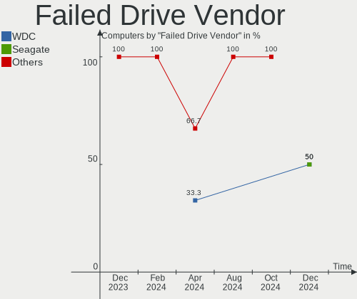
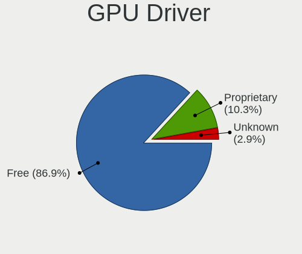
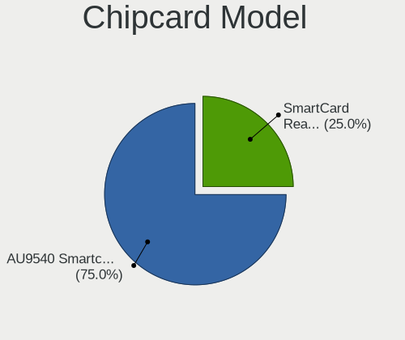

ROSA - Hardware Trends
----------------------

A project to identify most popular hardware characteristics and track their change
over time based on data collected by Linux users at https://Linux-Hardware.org.

Anyone can contribute to this report by the [hw-probe](https://github.com/linuxhw/hw-probe) tool:

    sudo -E hw-probe -all -upload

This is a report for all computer types. See also reports for [desktops](/Dist/ROSA/Desktop/README.md) and [notebooks](/Dist/ROSA/Notebook/README.md).

This report is for one last month. Overall report since the beginning of time: [TestCoverage](https://github.com/linuxhw/TestCoverage)

Period: Dec, 2022.

Contents
--------

* [ System ](#system)
  - [ OS                       ](#os)
  - [ OS Family                ](#os-family)
  - [ Kernel                   ](#kernel)
  - [ Kernel Family            ](#kernel-family)
  - [ Kernel Major Ver.        ](#kernel-major-ver)
  - [ Arch                     ](#arch)
  - [ DE                       ](#de)
  - [ Display Server           ](#display-server)
  - [ Display Manager          ](#display-manager)
  - [ OS Lang                  ](#os-lang)
  - [ Boot Mode                ](#boot-mode)
  - [ Filesystem               ](#filesystem)
  - [ Part. scheme             ](#part-scheme)
  - [ Dual Boot with Linux/BSD ](#dual-boot-with-linuxbsd)
  - [ Dual Boot (Win)          ](#dual-boot-win)

* [ Board ](#board)
  - [ Vendor                   ](#vendor)
  - [ Model                    ](#model)
  - [ Model Family             ](#model-family)
  - [ MFG Year                 ](#mfg-year)
  - [ Form Factor              ](#form-factor)
  - [ Secure Boot              ](#secure-boot)
  - [ Coreboot                 ](#coreboot)
  - [ RAM Size                 ](#ram-size)
  - [ RAM Used                 ](#ram-used)
  - [ Total Drives             ](#total-drives)
  - [ Has CD-ROM               ](#has-cd-rom)
  - [ Has Ethernet             ](#has-ethernet)
  - [ Has WiFi                 ](#has-wifi)
  - [ Has Bluetooth            ](#has-bluetooth)

* [ Location ](#location)
  - [ Country                  ](#country)
  - [ City                     ](#city)

* [ Drives ](#drives)
  - [ Drive Vendor             ](#drive-vendor)
  - [ Drive Model              ](#drive-model)
  - [ HDD Vendor               ](#hdd-vendor)
  - [ SSD Vendor               ](#ssd-vendor)
  - [ Drive Kind               ](#drive-kind)
  - [ Drive Connector          ](#drive-connector)
  - [ Drive Size               ](#drive-size)
  - [ Space Total              ](#space-total)
  - [ Space Used               ](#space-used)
  - [ Malfunc. Drives          ](#malfunc-drives)
  - [ Malfunc. Drive Vendor    ](#malfunc-drive-vendor)
  - [ Malfunc. HDD Vendor      ](#malfunc-hdd-vendor)
  - [ Malfunc. Drive Kind      ](#malfunc-drive-kind)
  - [ Failed Drives            ](#failed-drives)
  - [ Failed Drive Vendor      ](#failed-drive-vendor)
  - [ Drive Status             ](#drive-status)

* [ Storage controller ](#storage-controller)
  - [ Storage Vendor           ](#storage-vendor)
  - [ Storage Model            ](#storage-model)
  - [ Storage Kind             ](#storage-kind)

* [ Processor ](#processor)
  - [ CPU Vendor               ](#cpu-vendor)
  - [ CPU Model                ](#cpu-model)
  - [ CPU Model Family         ](#cpu-model-family)
  - [ CPU Cores                ](#cpu-cores)
  - [ CPU Sockets              ](#cpu-sockets)
  - [ CPU Threads              ](#cpu-threads)
  - [ CPU Op-Modes             ](#cpu-op-modes)
  - [ CPU Microcode            ](#cpu-microcode)
  - [ CPU Microarch            ](#cpu-microarch)

* [ Graphics ](#graphics)
  - [ GPU Vendor               ](#gpu-vendor)
  - [ GPU Model                ](#gpu-model)
  - [ GPU Combo                ](#gpu-combo)
  - [ GPU Driver               ](#gpu-driver)
  - [ GPU Memory               ](#gpu-memory)

* [ Monitor ](#monitor)
  - [ Monitor Vendor           ](#monitor-vendor)
  - [ Monitor Model            ](#monitor-model)
  - [ Monitor Resolution       ](#monitor-resolution)
  - [ Monitor Diagonal         ](#monitor-diagonal)
  - [ Monitor Width            ](#monitor-width)
  - [ Aspect Ratio             ](#aspect-ratio)
  - [ Monitor Area             ](#monitor-area)
  - [ Pixel Density            ](#pixel-density)
  - [ Multiple Monitors        ](#multiple-monitors)

* [ Network ](#network)
  - [ Net Controller Vendor    ](#net-controller-vendor)
  - [ Net Controller Model     ](#net-controller-model)
  - [ Wireless Vendor          ](#wireless-vendor)
  - [ Wireless Model           ](#wireless-model)
  - [ Ethernet Vendor          ](#ethernet-vendor)
  - [ Ethernet Model           ](#ethernet-model)
  - [ Net Controller Kind      ](#net-controller-kind)
  - [ Used Controller          ](#used-controller)
  - [ NICs                     ](#nics)
  - [ IPv6                     ](#ipv6)

* [ Bluetooth ](#bluetooth)
  - [ Bluetooth Vendor         ](#bluetooth-vendor)
  - [ Bluetooth Model          ](#bluetooth-model)

* [ Sound ](#sound)
  - [ Sound Vendor             ](#sound-vendor)
  - [ Sound Model              ](#sound-model)

* [ Memory ](#memory)
  - [ Memory Vendor            ](#memory-vendor)
  - [ Memory Model             ](#memory-model)
  - [ Memory Kind              ](#memory-kind)
  - [ Memory Form Factor       ](#memory-form-factor)
  - [ Memory Size              ](#memory-size)
  - [ Memory Speed             ](#memory-speed)

* [ Printers & scanners ](#printers--scanners)
  - [ Printer Vendor           ](#printer-vendor)
  - [ Printer Model            ](#printer-model)
  - [ Scanner Vendor           ](#scanner-vendor)
  - [ Scanner Model            ](#scanner-model)

* [ Camera ](#camera)
  - [ Camera Vendor            ](#camera-vendor)
  - [ Camera Model             ](#camera-model)

* [ Security ](#security)
  - [ Fingerprint Vendor       ](#fingerprint-vendor)
  - [ Fingerprint Model        ](#fingerprint-model)
  - [ Chipcard Vendor          ](#chipcard-vendor)
  - [ Chipcard Model           ](#chipcard-model)

* [ Unsupported ](#unsupported)
  - [ Unsupported Devices      ](#unsupported-devices)
  - [ Unsupported Device Types ](#unsupported-device-types)

System
------

OS
--

Installed operating systems

| Name        | Computers | Percent |
|-------------|-----------|---------|
| ROSA 12.3   | 230       | 84.87%  |
| ROSA R11.1  | 18        | 6.64%   |
| ROSA 12.2   | 15        | 5.54%   |
| ROSA 12.1   | 3         | 1.11%   |
| ROSA R11    | 2         | 0.74%   |
| ROSA R9-R11 | 1         | 0.37%   |
| ROSA 2021.1 | 1         | 0.37%   |
| ROSA 12     | 1         | 0.37%   |

OS Family
---------

OS without a version

| Name | Computers | Percent |
|------|-----------|---------|
| ROSA | 271       | 100%    |

Kernel
------

Version of the Linux kernel

| Version                                   | Computers | Percent |
|-------------------------------------------|-----------|---------|
| 5.15.79-generic-1rosa2021.1-x86_64        | 82        | 30.26%  |
| 5.15.75-generic-1rosa2021.1-x86_64        | 72        | 26.57%  |
| 5.10.155-generic-1rosa2021.1-x86_64       | 25        | 9.23%   |
| 5.17.11-generic-2rosa2021.1-x86_64        | 12        | 4.43%   |
| 5.10.74-generic-2rosa2021.1-x86_64        | 12        | 4.43%   |
| 5.15.77-generic-1rosa2021.1-x86_64        | 11        | 4.06%   |
| 5.15.75-generic-1rosa2021.1-i686          | 8         | 2.95%   |
| 5.10.118-generic-2rosa2021.1-x86_64       | 7         | 2.58%   |
| 4.15.0-desktop-122.124.1rosa-x86_64       | 6         | 2.21%   |
| 4.9.155-nrj-desktop-1rosa-x86_64          | 4         | 1.48%   |
| 5.4.32-generic-2rosa-x86_64               | 3         | 1.11%   |
| 6.1.0.xm1-1.klp-xanmod-rosa2021.1-x86_64  | 2         | 0.74%   |
| 6.1.0-generic-0.rc8.1rosa2021.1-x86_64    | 2         | 0.74%   |
| 6.0.7.xm1-1.klp-xanmod-rosa2021.1-x86_64  | 2         | 0.74%   |
| 6.0.12.xm1-1.klp-xanmod-rosa2021.1-x86_64 | 2         | 0.74%   |
| 5.18.19-generic-3rosa2021.1-x86_64        | 2         | 0.74%   |
| 5.18.18.xm1-1-xanmod-rosa2021.1-x86_64    | 2         | 0.74%   |
| 5.10.71-generic-1rosa2021.1-x86_64        | 2         | 0.74%   |
| 4.15.0-desktop-45.1rosa-x86_64            | 2         | 0.74%   |
| 4.15.0-desktop-122.124.1rosa-i586         | 2         | 0.74%   |
| 6.1.0-generic-2rosa2021.1-x86_64          | 1         | 0.37%   |
| 6.1.0-generic-0.rc7.1rosa2021.1-x86_64    | 1         | 0.37%   |
| 6.1.0-generic-0.rc6.1rosa2021.1-x86_64    | 1         | 0.37%   |
| 6.0.3.xm1-1.klp-xanmod-rosa2021.1-x86_64  | 1         | 0.37%   |
| 5.4.83-generic-2rosa-x86_64               | 1         | 0.37%   |
| 5.4.83-generic-2rosa-i586                 | 1         | 0.37%   |
| 5.4.32-generic-2rosa-i586                 | 1         | 0.37%   |
| 5.10.74-generic-2rosa2021.1-i586          | 1         | 0.37%   |
| 5.10.155-generic-1rosa2021.1-i586         | 1         | 0.37%   |
| 5.10.150-generic-1rosa2021.1-x86_64       | 1         | 0.37%   |
| 4.15.0-desktop-45.1rosa-i586              | 1         | 0.37%   |

Kernel Family
-------------

Linux kernel without a distro release

| Version  | Computers | Percent |
|----------|-----------|---------|
| 5.15.79  | 82        | 30.26%  |
| 5.15.75  | 80        | 29.52%  |
| 5.10.155 | 26        | 9.59%   |
| 5.10.74  | 13        | 4.8%    |
| 5.17.11  | 12        | 4.43%   |
| 5.15.77  | 11        | 4.06%   |
| 4.15.0   | 11        | 4.06%   |
| 6.1.0    | 7         | 2.58%   |
| 5.10.118 | 7         | 2.58%   |
| 5.4.32   | 4         | 1.48%   |
| 4.9.155  | 4         | 1.48%   |
| 6.0.7    | 2         | 0.74%   |
| 6.0.12   | 2         | 0.74%   |
| 5.4.83   | 2         | 0.74%   |
| 5.18.19  | 2         | 0.74%   |
| 5.18.18  | 2         | 0.74%   |
| 5.10.71  | 2         | 0.74%   |
| 6.0.3    | 1         | 0.37%   |
| 5.10.150 | 1         | 0.37%   |

Kernel Major Ver.
-----------------

Linux kernel major version

| Version | Computers | Percent |
|---------|-----------|---------|
| 5.15    | 173       | 63.84%  |
| 5.10    | 49        | 18.08%  |
| 5.17    | 12        | 4.43%   |
| 4.15    | 11        | 4.06%   |
| 6.1     | 7         | 2.58%   |
| 5.4     | 6         | 2.21%   |
| 6.0     | 5         | 1.85%   |
| 5.18    | 4         | 1.48%   |
| 4.9     | 4         | 1.48%   |

Arch
----

OS architecture (x86_64, i586, etc.)

| Name   | Computers | Percent |
|--------|-----------|---------|
| x86_64 | 256       | 94.46%  |
| i686   | 15        | 5.54%   |

DE
--

Desktop Environment

| Name  | Computers | Percent |
|-------|-----------|---------|
| KDE5  | 148       | 54.61%  |
| GNOME | 71        | 26.2%   |
| LXQt  | 35        | 12.92%  |
| KDE4  | 17        | 6.27%   |

Display Server
--------------

X11 or Wayland

| Name    | Computers | Percent |
|---------|-----------|---------|
| Wayland | 203       | 74.91%  |
| X11     | 68        | 25.09%  |

Display Manager
---------------

SDDM, LightDM, etc.

| Name    | Computers | Percent |
|---------|-----------|---------|
| SDDM    | 145       | 53.51%  |
| GDM     | 95        | 35.06%  |
| KDM     | 17        | 6.27%   |
| LightDM | 11        | 4.06%   |
| Unknown | 3         | 1.11%   |

OS Lang
-------

Language

| Lang    | Computers | Percent |
|---------|-----------|---------|
| ru_RU   | 246       | 90.77%  |
| en_US   | 8         | 2.95%   |
| pt_PT   | 2         | 0.74%   |
| pt_BR   | 2         | 0.74%   |
| fr_FR   | 2         | 0.74%   |
| de_DE   | 2         | 0.74%   |
| Unknown | 2         | 0.74%   |
| sk_SK   | 1         | 0.37%   |
| ro_RO   | 1         | 0.37%   |
| fr_BE   | 1         | 0.37%   |
| es_PE   | 1         | 0.37%   |
| es_ES   | 1         | 0.37%   |
| en_GB   | 1         | 0.37%   |
| en_CA   | 1         | 0.37%   |

Boot Mode
---------

EFI or BIOS

| Mode | Computers | Percent |
|------|-----------|---------|
| EFI  | 138       | 50.92%  |
| BIOS | 133       | 49.08%  |

Filesystem
----------

Type of filesystem

| Type  | Computers | Percent |
|-------|-----------|---------|
| Ext4  | 260       | 95.94%  |
| Btrfs | 9         | 3.32%   |
| F2fs  | 2         | 0.74%   |

Part. scheme
------------

Scheme of partitioning

| Type    | Computers | Percent |
|---------|-----------|---------|
| GPT     | 158       | 58.3%   |
| MBR     | 111       | 40.96%  |
| Unknown | 2         | 0.74%   |

Dual Boot with Linux/BSD
------------------------

Hosting more than one Linux/BSD

| Dual boot | Computers | Percent |
|-----------|-----------|---------|
| No        | 195       | 71.96%  |
| Yes       | 76        | 28.04%  |

Dual Boot (Win)
---------------

Hosting Linux and Windows

| Dual boot | Computers | Percent |
|-----------|-----------|---------|
| No        | 151       | 55.72%  |
| Yes       | 120       | 44.28%  |

Board
-----

Vendor
------

Motherboard manufacturer

| Name                | Computers | Percent |
|---------------------|-----------|---------|
| ASUSTek Computer    | 70        | 25.83%  |
| Gigabyte Technology | 46        | 16.97%  |
| Lenovo              | 23        | 8.49%   |
| Acer                | 21        | 7.75%   |
| MSI                 | 19        | 7.01%   |
| Hewlett-Packard     | 17        | 6.27%   |
| ASRock              | 17        | 6.27%   |
| Dell                | 12        | 4.43%   |
| Intel               | 9         | 3.32%   |
| Samsung Electronics | 6         | 2.21%   |
| Pegatron            | 3         | 1.11%   |
| Aquarius            | 3         | 1.11%   |
| Toshiba             | 2         | 0.74%   |
| Sony                | 2         | 0.74%   |
| Huanan              | 2         | 0.74%   |
| eMachines           | 2         | 0.74%   |
| 3Logic Group        | 2         | 0.74%   |
| Unknown             | 2         | 0.74%   |
| TUXEDO              | 1         | 0.37%   |
| Prestigio           | 1         | 0.37%   |
| Maibenben           | 1         | 0.37%   |
| ICL                 | 1         | 0.37%   |
| HONOR               | 1         | 0.37%   |
| Graviton            | 1         | 0.37%   |
| ECS                 | 1         | 0.37%   |
| Digma               | 1         | 0.37%   |
| Clevo               | 1         | 0.37%   |
| Biostar             | 1         | 0.37%   |
| AZW                 | 1         | 0.37%   |
| Apple               | 1         | 0.37%   |
| 3Q                  | 1         | 0.37%   |

Model
-----

Motherboard model

| Name                                  | Computers | Percent |
|---------------------------------------|-----------|---------|
| ASUS All Series                       | 5         | 1.85%   |
| Lenovo IdeaPad 330-15IKB 81DE         | 3         | 1.11%   |
| Gigabyte B450 GAMING X                | 3         | 1.11%   |
| MSI MS-7309                           | 2         | 0.74%   |
| Lenovo IdeaPad L340-17IRH Gaming 81LL | 2         | 0.74%   |
| Lenovo IdeaPad Gaming 3 15ARH05 82EY  | 2         | 0.74%   |
| Gigabyte F2A68HM-DS2                  | 2         | 0.74%   |
| Gigabyte A320M-H                      | 2         | 0.74%   |
| Gigabyte 970A-DS3P                    | 2         | 0.74%   |
| Dell Inspiron 15-3552                 | 2         | 0.74%   |
| ASUS PRIME B450M-A                    | 2         | 0.74%   |
| ASUS M2N-XE                           | 2         | 0.74%   |
| ASUS H110M-R                          | 2         | 0.74%   |
| Aquarius P30 K44 R53                  | 2         | 0.74%   |
| Unknown                               | 2         | 0.74%   |
| TUXEDO Pulse 15 Gen1                  | 1         | 0.37%   |
| Toshiba Satellite U300                | 1         | 0.37%   |
| Toshiba Satellite A300                | 1         | 0.37%   |
| Sony VPCEJ1L1R                        | 1         | 0.37%   |
| Sony SVE1111M1RW                      | 1         | 0.37%   |
| Samsung SQ45/Q70C/P200                | 1         | 0.37%   |
| Samsung RC530/RC730                   | 1         | 0.37%   |
| Samsung R410                          | 1         | 0.37%   |
| Samsung 350V5C/351V5C/3540VC/3440VC   | 1         | 0.37%   |
| Samsung 305V4A/305V5A/3415VA          | 1         | 0.37%   |
| Samsung 300V3A/300V4A/300V5A          | 1         | 0.37%   |
| Prestigio PSB141C04CGH                | 1         | 0.37%   |
| Pegatron C17A                         | 1         | 0.37%   |
| Pegatron C15B                         | 1         | 0.37%   |
| Pegatron A17                          | 1         | 0.37%   |
| MSI X460/X460DX                       | 1         | 0.37%   |
| MSI PRO H510 DP21 (MS-B0A4)           | 1         | 0.37%   |
| MSI MS-7D54                           | 1         | 0.37%   |
| MSI MS-7C95                           | 1         | 0.37%   |
| MSI MS-7C91                           | 1         | 0.37%   |
| MSI MS-7C37                           | 1         | 0.37%   |
| MSI MS-7B19                           | 1         | 0.37%   |
| MSI MS-7A34                           | 1         | 0.37%   |
| MSI MS-7850                           | 1         | 0.37%   |
| MSI MS-7817                           | 1         | 0.37%   |

Model Family
------------

Motherboard model prefix

| Name                  | Computers | Percent |
|-----------------------|-----------|---------|
| Acer Aspire           | 16        | 5.9%    |
| ASUS PRIME            | 15        | 5.54%   |
| Lenovo IdeaPad        | 12        | 4.43%   |
| Dell Inspiron         | 8         | 2.95%   |
| ASUS All              | 5         | 1.85%   |
| HP Pavilion           | 4         | 1.48%   |
| Gigabyte B450         | 4         | 1.48%   |
| Acer Nitro            | 4         | 1.48%   |
| HP Compaq             | 3         | 1.11%   |
| ASUS VivoBook         | 3         | 1.11%   |
| ASUS ROG              | 3         | 1.11%   |
| Toshiba Satellite     | 2         | 0.74%   |
| MSI MS-7309           | 2         | 0.74%   |
| MSI Modern            | 2         | 0.74%   |
| Intel D2500HN         | 2         | 0.74%   |
| HP ProBook            | 2         | 0.74%   |
| Gigabyte X470         | 2         | 0.74%   |
| Gigabyte F2A68HM-DS2  | 2         | 0.74%   |
| Gigabyte B550         | 2         | 0.74%   |
| Gigabyte A320M-H      | 2         | 0.74%   |
| Gigabyte 970A-DS3P    | 2         | 0.74%   |
| Dell OptiPlex         | 2         | 0.74%   |
| ASUS P8Z77-V          | 2         | 0.74%   |
| ASUS P8H61-M          | 2         | 0.74%   |
| ASUS P5KPL-AM         | 2         | 0.74%   |
| ASUS M2N-XE           | 2         | 0.74%   |
| ASUS H110M-R          | 2         | 0.74%   |
| ASRock P67            | 2         | 0.74%   |
| Aquarius P30          | 2         | 0.74%   |
| 3Logic Group Graviton | 2         | 0.74%   |
| Unknown               | 2         | 0.74%   |
| TUXEDO Pulse          | 1         | 0.37%   |
| Sony VPCEJ1L1R        | 1         | 0.37%   |
| Sony SVE1111M1RW      | 1         | 0.37%   |
| Samsung SQ45          | 1         | 0.37%   |
| Samsung RC530         | 1         | 0.37%   |
| Samsung R410          | 1         | 0.37%   |
| Samsung 350V5C        | 1         | 0.37%   |
| Samsung 305V4A        | 1         | 0.37%   |
| Samsung 300V3A        | 1         | 0.37%   |

MFG Year
--------

Motherboard manufacture year

| Year | Computers | Percent |
|------|-----------|---------|
| 2012 | 30        | 11.07%  |
| 2018 | 26        | 9.59%   |
| 2013 | 24        | 8.86%   |
| 2021 | 22        | 8.12%   |
| 2011 | 22        | 8.12%   |
| 2020 | 21        | 7.75%   |
| 2019 | 21        | 7.75%   |
| 2009 | 17        | 6.27%   |
| 2010 | 16        | 5.9%    |
| 2008 | 11        | 4.06%   |
| 2022 | 10        | 3.69%   |
| 2015 | 10        | 3.69%   |
| 2014 | 10        | 3.69%   |
| 2007 | 10        | 3.69%   |
| 2017 | 9         | 3.32%   |
| 2016 | 9         | 3.32%   |
| 2006 | 1         | 0.37%   |
| 2005 | 1         | 0.37%   |
| 2004 | 1         | 0.37%   |

Form Factor
-----------

Physical design of the computer

| Name        | Computers | Percent |
|-------------|-----------|---------|
| Desktop     | 155       | 57.2%   |
| Notebook    | 109       | 40.22%  |
| All in one  | 3         | 1.11%   |
| Convertible | 2         | 0.74%   |
| Tablet      | 1         | 0.37%   |
| Mini pc     | 1         | 0.37%   |

Secure Boot
-----------

Enabled or disabled

| State    | Computers | Percent |
|----------|-----------|---------|
| Disabled | 271       | 100%    |

Coreboot
--------

Have coreboot on board

| Used | Computers | Percent |
|------|-----------|---------|
| No   | 271       | 100%    |

RAM Size
--------

Total RAM memory

| Size in GB  | Computers | Percent |
|-------------|-----------|---------|
| 16.01-24.0  | 63        | 23.25%  |
| 3.01-4.0    | 57        | 21.03%  |
| 8.01-16.0   | 57        | 21.03%  |
| 4.01-8.0    | 52        | 19.19%  |
| 1.01-2.0    | 16        | 5.9%    |
| 32.01-64.0  | 12        | 4.43%   |
| 2.01-3.0    | 5         | 1.85%   |
| 24.01-32.0  | 3         | 1.11%   |
| 64.01-256.0 | 3         | 1.11%   |
| 0.51-1.0    | 3         | 1.11%   |

RAM Used
--------

Used RAM memory

| Used GB   | Computers | Percent |
|-----------|-----------|---------|
| 1.01-2.0  | 131       | 48.34%  |
| 0.51-1.0  | 59        | 21.77%  |
| 2.01-3.0  | 51        | 18.82%  |
| 3.01-4.0  | 14        | 5.17%   |
| 4.01-8.0  | 10        | 3.69%   |
| 0.01-0.5  | 5         | 1.85%   |
| 8.01-16.0 | 1         | 0.37%   |

Total Drives
------------

Number of drives on board

| Drives | Computers | Percent |
|--------|-----------|---------|
| 1      | 142       | 52.4%   |
| 2      | 84        | 31%     |
| 3      | 26        | 9.59%   |
| 4      | 13        | 4.8%    |
| 5      | 3         | 1.11%   |
| 9      | 1         | 0.37%   |
| 7      | 1         | 0.37%   |
| 0      | 1         | 0.37%   |

Has CD-ROM
----------

Has CD-ROM on board

| Presented | Computers | Percent |
|-----------|-----------|---------|
| No        | 166       | 61.25%  |
| Yes       | 105       | 38.75%  |

Has Ethernet
------------

Has Ethernet on board

| Presented | Computers | Percent |
|-----------|-----------|---------|
| Yes       | 252       | 92.99%  |
| No        | 19        | 7.01%   |

Has WiFi
--------

Has WiFi module

| Presented | Computers | Percent |
|-----------|-----------|---------|
| Yes       | 164       | 60.52%  |
| No        | 107       | 39.48%  |

Has Bluetooth
-------------

Has Bluetooth module

| Presented | Computers | Percent |
|-----------|-----------|---------|
| No        | 136       | 50.18%  |
| Yes       | 135       | 49.82%  |

Location
--------

Country
-------

Geographic location (country)

| Country    | Computers | Percent |
|------------|-----------|---------|
| Russia     | 237       | 87.45%  |
| Belarus    | 7         | 2.58%   |
| Ukraine    | 5         | 1.85%   |
| Czechia    | 3         | 1.11%   |
| Brazil     | 3         | 1.11%   |
| France     | 2         | 0.74%   |
| Belgium    | 2         | 0.74%   |
| USA        | 1         | 0.37%   |
| UK         | 1         | 0.37%   |
| Slovakia   | 1         | 0.37%   |
| Serbia     | 1         | 0.37%   |
| Romania    | 1         | 0.37%   |
| Portugal   | 1         | 0.37%   |
| Peru       | 1         | 0.37%   |
| Moldova    | 1         | 0.37%   |
| Latvia     | 1         | 0.37%   |
| Kazakhstan | 1         | 0.37%   |
| Germany    | 1         | 0.37%   |
| Canada     | 1         | 0.37%   |

City
----

Geographic location (city)

| City             | Computers | Percent |
|------------------|-----------|---------|
| Moscow           | 44        | 16.24%  |
| St Petersburg    | 17        | 6.27%   |
| Krasnodar        | 11        | 4.06%   |
| Yekaterinburg    | 10        | 3.69%   |
| Novosibirsk      | 7         | 2.58%   |
| Stavropol        | 6         | 2.21%   |
| Nizhniy Novgorod | 6         | 2.21%   |
| Voronezh         | 5         | 1.85%   |
| Rostov-on-Don    | 5         | 1.85%   |
| Chelyabinsk      | 5         | 1.85%   |
| Perm             | 4         | 1.48%   |
| Gomel            | 4         | 1.48%   |
| Volgograd        | 3         | 1.11%   |
| Ufa              | 3         | 1.11%   |
| Tambov           | 3         | 1.11%   |
| Smolensk         | 3         | 1.11%   |
| Saratov          | 3         | 1.11%   |
| Samara           | 3         | 1.11%   |
| Omsk             | 3         | 1.11%   |
| Khabarovsk       | 3         | 1.11%   |
| Irkutsk          | 3         | 1.11%   |
| Yakutsk          | 2         | 0.74%   |
| Vsevolozhsk      | 2         | 0.74%   |
| Simferopol       | 2         | 0.74%   |
| Seversk          | 2         | 0.74%   |
| Severodvinsk     | 2         | 0.74%   |
| Pskov            | 2         | 0.74%   |
| Prague           | 2         | 0.74%   |
| Petrozavodsk     | 2         | 0.74%   |
| Orenburg         | 2         | 0.74%   |
| Nivelles         | 2         | 0.74%   |
| Minsk            | 2         | 0.74%   |
| Kusa             | 2         | 0.74%   |
| Dzerzhinsk       | 2         | 0.74%   |
| Cheboksary       | 2         | 0.74%   |
| Zvenigorod       | 1         | 0.37%   |
| Yasnogorsk       | 1         | 0.37%   |
| Yaroslavl        | 1         | 0.37%   |
| Vorkuta          | 1         | 0.37%   |
| Volgodonsk       | 1         | 0.37%   |

Drives
------

Drive Vendor
------------

Hard drive vendors

| Vendor              | Computers | Drives | Percent |
|---------------------|-----------|--------|---------|
| WDC                 | 78        | 86     | 17.85%  |
| Seagate             | 69        | 82     | 15.79%  |
| Toshiba             | 38        | 39     | 8.7%    |
| Kingston            | 35        | 38     | 8.01%   |
| Samsung Electronics | 22        | 25     | 5.03%   |
| Hitachi             | 21        | 22     | 4.81%   |
| A-DATA Technology   | 18        | 18     | 4.12%   |
| China               | 11        | 11     | 2.52%   |
| Apacer              | 10        | 10     | 2.29%   |
| SanDisk             | 9         | 9      | 2.06%   |
| Intel               | 9         | 11     | 2.06%   |
| SK hynix            | 8         | 8      | 1.83%   |
| HGST                | 8         | 8      | 1.83%   |
| Unknown             | 7         | 7      | 1.6%    |
| SPCC                | 7         | 7      | 1.6%    |
| Gigabyte Technology | 7         | 7      | 1.6%    |
| Unknown             | 7         | 7      | 1.6%    |
| AMD                 | 6         | 6      | 1.37%   |
| Micron Technology   | 5         | 5      | 1.14%   |
| KingSpec            | 5         | 5      | 1.14%   |
| Crucial             | 4         | 4      | 0.92%   |
| XrayDisk            | 3         | 3      | 0.69%   |
| Smartbuy            | 3         | 3      | 0.69%   |
| Patriot             | 3         | 3      | 0.69%   |
| Netac               | 3         | 3      | 0.69%   |
| GOODRAM             | 3         | 3      | 0.69%   |
| XPG                 | 2         | 2      | 0.46%   |
| UMIS                | 2         | 2      | 0.46%   |
| Plextor             | 2         | 2      | 0.46%   |
| OCZ                 | 2         | 2      | 0.46%   |
| KIOXIA              | 2         | 2      | 0.46%   |
| WALRAM              | 1         | 1      | 0.23%   |
| V-32                | 1         | 1      | 0.23%   |
| USB30               | 1         | 1      | 0.23%   |
| Transcend           | 1         | 1      | 0.23%   |
| Team                | 1         | 1      | 0.23%   |
| TAMMUZ              | 1         | 1      | 0.23%   |
| Silicon Motion      | 1         | 1      | 0.23%   |
| ShiJi               | 1         | 1      | 0.23%   |
| SATAFIRM            | 1         | 1      | 0.23%   |

Drive Model
-----------

Hard drive models

| Model                             | Computers | Percent |
|-----------------------------------|-----------|---------|
| Kingston SA400S37240G 240GB SSD   | 9         | 1.95%   |
| Seagate ST1000DM010-2EP102 1TB    | 8         | 1.73%   |
| Unknown                           | 7         | 1.52%   |
| Toshiba MQ01ABF050 500GB          | 6         | 1.3%    |
| Toshiba DT01ACA100 1TB            | 6         | 1.3%    |
| WDC WDS120G2G0A-00JH30 120GB SSD  | 5         | 1.08%   |
| Toshiba DT01ACA050 500GB          | 5         | 1.08%   |
| Kingston SA400S37120G 120GB SSD   | 5         | 1.08%   |
| Apacer AS350 128GB SSD            | 5         | 1.08%   |
| WDC WD10EZEX-08WN4A0 1TB          | 4         | 0.87%   |
| Toshiba HDWD110 1TB               | 4         | 0.87%   |
| SPCC Solid State Disk 128GB       | 4         | 0.87%   |
| Seagate ST500DM002-1BD142 500GB   | 4         | 0.87%   |
| Seagate ST1000LM035-1RK172 1TB    | 4         | 0.87%   |
| WDC WD1003FZEX-00MK2A0 1TB        | 3         | 0.65%   |
| Seagate ST1000DM003-9YN162 1TB    | 3         | 0.65%   |
| Seagate ST1000DM003-1CH162 1TB    | 3         | 0.65%   |
| Samsung SSD 970 EVO Plus 250GB    | 3         | 0.65%   |
| Kingston SHFS37A120G 120GB SSD    | 3         | 0.65%   |
| Kingston SA400S37480G 480GB SSD   | 3         | 0.65%   |
| A-DATA SX6000PNP 256GB            | 3         | 0.65%   |
| A-DATA SU650 240GB SSD            | 3         | 0.65%   |
| WDC WD5000LPCX-21VHAT0 500GB      | 2         | 0.43%   |
| WDC WD5000BEVT-22A0RT0 500GB      | 2         | 0.43%   |
| WDC WD10EZEX-22MFCA0 1TB          | 2         | 0.43%   |
| WDC WD10EZEX-00BBHA0 1TB          | 2         | 0.43%   |
| Unknown DA4128  128GB             | 2         | 0.43%   |
| UMIS RPFTJ128PDD2EWX 128GB        | 2         | 0.43%   |
| Toshiba HDWL120 2TB               | 2         | 0.43%   |
| SPCC Solid State Disk 120GB       | 2         | 0.43%   |
| Smartbuy SSD 120GB                | 2         | 0.43%   |
| SK hynix HFM256GDJTNG-8310A 256GB | 2         | 0.43%   |
| Seagate ST500LT012-1DG142 500GB   | 2         | 0.43%   |
| Seagate ST3320620AS 320GB         | 2         | 0.43%   |
| Seagate ST3320613AS 320GB         | 2         | 0.43%   |
| Seagate ST2000DM001-1ER164 2TB    | 2         | 0.43%   |
| Seagate ST1000DM003-1ER162 1TB    | 2         | 0.43%   |
| SanDisk SDSSDA120G 120GB          | 2         | 0.43%   |
| SanDisk NVMe SSD Drive 500GB      | 2         | 0.43%   |
| Samsung SSD 860 EVO 500GB         | 2         | 0.43%   |

HDD Vendor
----------

Hard disk drive vendors

| Vendor              | Computers | Drives | Percent |
|---------------------|-----------|--------|---------|
| WDC                 | 69        | 72     | 33.82%  |
| Seagate             | 67        | 80     | 32.84%  |
| Toshiba             | 34        | 34     | 16.67%  |
| Hitachi             | 21        | 22     | 10.29%  |
| HGST                | 8         | 8      | 3.92%   |
| Samsung Electronics | 3         | 3      | 1.47%   |
| Maxtor              | 1         | 1      | 0.49%   |
| Fujitsu             | 1         | 1      | 0.49%   |

SSD Vendor
----------

Solid state drive vendors

| Vendor              | Computers | Drives | Percent |
|---------------------|-----------|--------|---------|
| Kingston            | 26        | 28     | 16.35%  |
| A-DATA Technology   | 14        | 14     | 8.81%   |
| China               | 11        | 11     | 6.92%   |
| WDC                 | 10        | 10     | 6.29%   |
| Samsung Electronics | 8         | 8      | 5.03%   |
| SPCC                | 7         | 7      | 4.4%    |
| Apacer              | 7         | 7      | 4.4%    |
| SanDisk             | 6         | 6      | 3.77%   |
| AMD                 | 6         | 6      | 3.77%   |
| Unknown             | 6         | 6      | 3.77%   |
| KingSpec            | 5         | 5      | 3.14%   |
| Gigabyte Technology | 5         | 5      | 3.14%   |
| Intel               | 4         | 5      | 2.52%   |
| Crucial             | 4         | 4      | 2.52%   |
| XrayDisk            | 3         | 3      | 1.89%   |
| Smartbuy            | 3         | 3      | 1.89%   |
| Patriot             | 3         | 3      | 1.89%   |
| GOODRAM             | 3         | 3      | 1.89%   |
| Toshiba             | 2         | 2      | 1.26%   |
| Plextor             | 2         | 2      | 1.26%   |
| OCZ                 | 2         | 2      | 1.26%   |
| Micron Technology   | 2         | 2      | 1.26%   |
| WALRAM              | 1         | 1      | 0.63%   |
| USB30               | 1         | 1      | 0.63%   |
| Unknown             | 1         | 1      | 0.63%   |
| Team                | 1         | 1      | 0.63%   |
| TAMMUZ              | 1         | 1      | 0.63%   |
| SK hynix            | 1         | 1      | 0.63%   |
| ShiJi               | 1         | 1      | 0.63%   |
| Seagate             | 1         | 1      | 0.63%   |
| SATAFIRM            | 1         | 1      | 0.63%   |
| RUN                 | 1         | 1      | 0.63%   |
| OCZ-VERTEX3         | 1         | 1      | 0.63%   |
| OCZ-VERTEX          | 1         | 1      | 0.63%   |
| Neo                 | 1         | 1      | 0.63%   |
| LDLC                | 1         | 1      | 0.63%   |
| KingFast            | 1         | 1      | 0.63%   |
| HS-SSD-C100         | 1         | 1      | 0.63%   |
| Hewlett-Packard     | 1         | 1      | 0.63%   |
| Espada              | 1         | 1      | 0.63%   |

Drive Kind
----------

HDD or SSD

| Kind    | Computers | Drives | Percent |
|---------|-----------|--------|---------|
| HDD     | 176       | 221    | 45.71%  |
| SSD     | 132       | 162    | 34.29%  |
| NVMe    | 69        | 78     | 17.92%  |
| MMC     | 6         | 6      | 1.56%   |
| Unknown | 2         | 1      | 0.52%   |

Drive Connector
---------------

SATA, SAS, NVMe, etc.

| Type | Computers | Drives | Percent |
|------|-----------|--------|---------|
| SATA | 236       | 380    | 74.68%  |
| NVMe | 69        | 78     | 21.84%  |
| MMC  | 6         | 6      | 1.9%    |
| SAS  | 5         | 4      | 1.58%   |

Drive Size
----------

Size of hard drive

| Size in TB | Computers | Drives | Percent |
|------------|-----------|--------|---------|
| 0.01-0.5   | 198       | 264    | 65.13%  |
| 0.51-1.0   | 77        | 86     | 25.33%  |
| 1.01-2.0   | 20        | 22     | 6.58%   |
| 3.01-4.0   | 5         | 5      | 1.64%   |
| 2.01-3.0   | 2         | 3      | 0.66%   |
| 4.01-10.0  | 2         | 3      | 0.66%   |

Space Total
-----------

Amount of disk space available on the file system

| Size in GB     | Computers | Percent |
|----------------|-----------|---------|
| 101-250        | 84        | 31%     |
| 251-500        | 56        | 20.66%  |
| 501-1000       | 36        | 13.28%  |
| 1001-2000      | 22        | 8.12%   |
| 51-100         | 22        | 8.12%   |
| 1-20           | 21        | 7.75%   |
| 21-50          | 18        | 6.64%   |
| More than 3000 | 6         | 2.21%   |
| 2001-3000      | 6         | 2.21%   |

Space Used
----------

Amount of used disk space

| Used GB        | Computers | Percent |
|----------------|-----------|---------|
| 1-20           | 165       | 60.89%  |
| 21-50          | 26        | 9.59%   |
| 101-250        | 26        | 9.59%   |
| 51-100         | 22        | 8.12%   |
| 251-500        | 16        | 5.9%    |
| 1001-2000      | 6         | 2.21%   |
| 501-1000       | 6         | 2.21%   |
| 2001-3000      | 3         | 1.11%   |
| More than 3000 | 1         | 0.37%   |

Malfunc. Drives
---------------

Drive models with a malfunction

| Model                                | Computers | Drives | Percent |
|--------------------------------------|-----------|--------|---------|
| WDC WD5000BEVT-22A0RT0 500GB         | 2         | 2      | 2.53%   |
| Seagate ST1000DM003-9YN162 1TB       | 2         | 2      | 2.53%   |
| Hitachi HDS721616PLA380 160GB        | 2         | 2      | 2.53%   |
| HGST HTS545050A7E680 500GB           | 2         | 2      | 2.53%   |
| WDC WDS240G2G0A-00JH30 240GB SSD     | 1         | 1      | 1.27%   |
| WDC WDS100T2B0A-00SM50 1TB SSD       | 1         | 1      | 1.27%   |
| WDC WD7500BPKT-75PK4T0 752GB         | 1         | 1      | 1.27%   |
| WDC WD6401AALS-00L3B2 640GB          | 1         | 1      | 1.27%   |
| WDC WD6401AALS-00J7B0 640GB          | 1         | 1      | 1.27%   |
| WDC WD5000LPCX-21VHAT0 500GB         | 1         | 1      | 1.27%   |
| WDC WD5000BPVT-22HXZT1 500GB         | 1         | 1      | 1.27%   |
| WDC WD5000AAKX-221CA0 500GB          | 1         | 1      | 1.27%   |
| WDC WD5000AAKS-08WWPA0 500GB         | 1         | 1      | 1.27%   |
| WDC WD3200BPVT-35ZEST0 320GB         | 1         | 1      | 1.27%   |
| WDC WD3200BEVT-60A23T0 320GB         | 1         | 1      | 1.27%   |
| WDC WD3200BEVT-00A0RT0 320GB         | 1         | 1      | 1.27%   |
| WDC WD3200AAKS-00L9A0 320GB          | 1         | 1      | 1.27%   |
| WDC WD2500JS-63MHB5 250GB            | 1         | 1      | 1.27%   |
| WDC WD2500BEVT-00ZCT0 250GB          | 1         | 1      | 1.27%   |
| WDC WD2500AAKX-00ERMA0 250GB         | 1         | 1      | 1.27%   |
| WDC WD1600BEVS-22RST0 160GB          | 1         | 1      | 1.27%   |
| WDC WD1600AAJB-00J3A0 160GB          | 1         | 1      | 1.27%   |
| WDC WD10EZEX-22MFCA0 1TB             | 1         | 1      | 1.27%   |
| WDC WD10EZEX-21WN4A0 1TB             | 1         | 1      | 1.27%   |
| WDC WD10EARS-00Z5B1 1TB              | 1         | 1      | 1.27%   |
| WDC WD1003FZEX-00MK2A0 1TB           | 1         | 1      | 1.27%   |
| WDC WD1003FBYX-01Y7B1 1TB            | 1         | 1      | 1.27%   |
| Toshiba MQ01ABD100 1TB               | 1         | 1      | 1.27%   |
| Toshiba MK4058GSX 400GB              | 1         | 1      | 1.27%   |
| Toshiba MK2565GSX 250GB              | 1         | 1      | 1.27%   |
| Toshiba MK2046GSX 200GB              | 1         | 1      | 1.27%   |
| SK hynix BC711 HFM256GD3JX013N 256GB | 1         | 1      | 1.27%   |
| Seagate ST9320325AS 320GB            | 1         | 1      | 1.27%   |
| Seagate ST9250827AS 250GB            | 1         | 1      | 1.27%   |
| Seagate ST9250410AS 250GB            | 1         | 1      | 1.27%   |
| Seagate ST500LT012-9WS142 500GB      | 1         | 1      | 1.27%   |
| Seagate ST500LT012-1DG142 500GB      | 1         | 1      | 1.27%   |
| Seagate ST500DM002-1BD142 500GB      | 1         | 1      | 1.27%   |
| Seagate ST3802110A 80GB              | 1         | 1      | 1.27%   |
| Seagate ST3320620AS 320GB            | 1         | 1      | 1.27%   |

Malfunc. Drive Vendor
---------------------

Vendors of faulty drives

| Vendor              | Computers | Drives | Percent |
|---------------------|-----------|--------|---------|
| WDC                 | 24        | 25     | 30.77%  |
| Seagate             | 21        | 21     | 26.92%  |
| Hitachi             | 10        | 10     | 12.82%  |
| Toshiba             | 4         | 4      | 5.13%   |
| HGST                | 3         | 3      | 3.85%   |
| A-DATA Technology   | 3         | 3      | 3.85%   |
| SanDisk             | 2         | 2      | 2.56%   |
| Samsung Electronics | 2         | 2      | 2.56%   |
| Kingston            | 2         | 2      | 2.56%   |
| SK hynix            | 1         | 1      | 1.28%   |
| OCZ-VERTEX3         | 1         | 1      | 1.28%   |
| Neo                 | 1         | 1      | 1.28%   |
| Espada              | 1         | 1      | 1.28%   |
| China               | 1         | 1      | 1.28%   |
| Apacer              | 1         | 1      | 1.28%   |
| Unknown             | 1         | 1      | 1.28%   |

Malfunc. HDD Vendor
-------------------

Vendors of faulty HDD drives

| Vendor  | Computers | Drives | Percent |
|---------|-----------|--------|---------|
| WDC     | 23        | 23     | 37.7%   |
| Seagate | 21        | 21     | 34.43%  |
| Hitachi | 10        | 10     | 16.39%  |
| Toshiba | 4         | 4      | 6.56%   |
| HGST    | 3         | 3      | 4.92%   |

Malfunc. Drive Kind
-------------------

Kinds of faulty drives

| Kind | Computers | Drives | Percent |
|------|-----------|--------|---------|
| HDD  | 61        | 61     | 77.22%  |
| SSD  | 16        | 16     | 20.25%  |
| NVMe | 2         | 2      | 2.53%   |

Failed Drives
-------------

Failed drive models

| Model                             | Computers | Drives | Percent |
|-----------------------------------|-----------|--------|---------|
| WDC WD800JB-00FMA0 80GB           | 1         | 1      | 33.33%  |
| Samsung Electronics HD503HI 500GB | 1         | 1      | 33.33%  |
| HGST HTS545050A7E380 500GB        | 1         | 1      | 33.33%  |

Failed Drive Vendor
-------------------

Failed drive vendors

| Vendor              | Computers | Drives | Percent |
|---------------------|-----------|--------|---------|
| WDC                 | 1         | 1      | 33.33%  |
| Samsung Electronics | 1         | 1      | 33.33%  |
| HGST                | 1         | 1      | 33.33%  |

Drive Status
------------

Number of failed and malfunc. drives

| Status   | Computers | Drives | Percent |
|----------|-----------|--------|---------|
| Works    | 231       | 366    | 70.86%  |
| Malfunc  | 75        | 79     | 23.01%  |
| Detected | 17        | 20     | 5.21%   |
| Failed   | 3         | 3      | 0.92%   |

Storage controller
------------------

Storage Vendor
--------------

Storage controller vendors

| Vendor                       | Computers | Percent |
|------------------------------|-----------|---------|
| Intel                        | 174       | 49.29%  |
| AMD                          | 75        | 21.25%  |
| Nvidia                       | 16        | 4.53%   |
| Samsung Electronics          | 12        | 3.4%    |
| Kingston Technology Company  | 9         | 2.55%   |
| JMicron Technology           | 9         | 2.55%   |
| SK hynix                     | 7         | 1.98%   |
| SanDisk                      | 7         | 1.98%   |
| ASMedia Technology           | 6         | 1.7%    |
| Realtek Semiconductor        | 5         | 1.42%   |
| Marvell Technology Group     | 5         | 1.42%   |
| Toshiba America Info Systems | 4         | 1.13%   |
| Silicon Motion               | 4         | 1.13%   |
| Phison Electronics           | 4         | 1.13%   |
| Netac Technology             | 3         | 0.85%   |
| Micron Technology            | 3         | 0.85%   |
| Union Memory (Shenzhen)      | 2         | 0.57%   |
| MAXIO Technology (Hangzhou)  | 2         | 0.57%   |
| KIOXIA                       | 2         | 0.57%   |
| Shenzhen Longsys Electronics | 1         | 0.28%   |
| Seagate Technology           | 1         | 0.28%   |
| INNOGRIT                     | 1         | 0.28%   |
| ADATA Technology             | 1         | 0.28%   |

Storage Model
-------------

Storage controller models

| Model                                                                                   | Computers | Percent |
|-----------------------------------------------------------------------------------------|-----------|---------|
| AMD FCH SATA Controller [AHCI mode]                                                     | 43        | 9.86%   |
| Intel 7 Series Chipset Family 6-port SATA Controller [AHCI mode]                        | 15        | 3.44%   |
| AMD 400 Series Chipset SATA Controller                                                  | 14        | 3.21%   |
| Intel 8 Series/C220 Series Chipset Family 6-port SATA Controller 1 [AHCI mode]          | 12        | 2.75%   |
| Intel 6 Series/C200 Series Chipset Family 6 port Mobile SATA AHCI Controller            | 11        | 2.52%   |
| AMD SB7x0/SB8x0/SB9x0 SATA Controller [AHCI mode]                                       | 10        | 2.29%   |
| Intel NM10/ICH7 Family SATA Controller [IDE mode]                                       | 8         | 1.83%   |
| AMD SB7x0/SB8x0/SB9x0 IDE Controller                                                    | 8         | 1.83%   |
| Nvidia MCP61 SATA Controller                                                            | 7         | 1.61%   |
| Nvidia MCP61 IDE                                                                        | 7         | 1.61%   |
| Intel Sunrise Point-LP SATA Controller [AHCI mode]                                      | 7         | 1.61%   |
| Intel Q170/Q150/B150/H170/H110/Z170/CM236 Chipset SATA Controller [AHCI Mode]           | 7         | 1.61%   |
| Intel 82801HM/HEM (ICH8M/ICH8M-E) IDE Controller                                        | 7         | 1.61%   |
| AMD 500 Series Chipset SATA Controller                                                  | 7         | 1.61%   |
| Samsung NVMe SSD Controller SM981/PM981/PM983                                           | 6         | 1.38%   |
| Samsung NVMe SSD Controller 980                                                         | 6         | 1.38%   |
| Kingston Company Company Non-Volatile memory controller                                 | 6         | 1.38%   |
| JMicron JMB363 SATA/IDE Controller                                                      | 6         | 1.38%   |
| Intel 82801HM/HEM (ICH8M/ICH8M-E) SATA Controller [AHCI mode]                           | 6         | 1.38%   |
| Intel 6 Series/C200 Series Chipset Family Desktop SATA Controller (IDE mode, ports 4-5) | 6         | 1.38%   |
| Intel 6 Series/C200 Series Chipset Family Desktop SATA Controller (IDE mode, ports 0-3) | 6         | 1.38%   |
| Intel 500 Series Chipset Family SATA AHCI Controller                                    | 6         | 1.38%   |
| Intel Atom/Celeron/Pentium Processor x5-E8000/J3xxx/N3xxx Series SATA Controller        | 5         | 1.15%   |
| Intel 9 Series Chipset Family SATA Controller [AHCI Mode]                               | 5         | 1.15%   |
| Intel 5 Series/3400 Series Chipset 4 port SATA IDE Controller                           | 5         | 1.15%   |
| Intel 5 Series/3400 Series Chipset 2 port SATA IDE Controller                           | 5         | 1.15%   |
| ASMedia ASM1062 Serial ATA Controller                                                   | 5         | 1.15%   |
| SanDisk WD Blue SN550 NVMe SSD                                                          | 4         | 0.92%   |
| Realtek Realtek Non-Volatile memory controller                                          | 4         | 0.92%   |
| Intel SATA Controller [RAID mode]                                                       | 4         | 0.92%   |
| Intel NM10/ICH7 Family SATA Controller [AHCI mode]                                      | 4         | 0.92%   |
| Intel Cannon Lake Mobile PCH SATA AHCI Controller                                       | 4         | 0.92%   |
| Intel 82801G (ICH7 Family) IDE Controller                                               | 4         | 0.92%   |
| Intel 8 Series SATA Controller 1 [AHCI mode]                                            | 4         | 0.92%   |
| Intel 7 Series/C210 Series Chipset Family 6-port SATA Controller [AHCI mode]            | 4         | 0.92%   |
| Intel 7 Series/C210 Series Chipset Family 4-port SATA Controller [IDE mode]             | 4         | 0.92%   |
| Intel 7 Series/C210 Series Chipset Family 2-port SATA Controller [IDE mode]             | 4         | 0.92%   |
| Intel 6 Series/C200 Series Chipset Family 6 port Desktop SATA AHCI Controller           | 4         | 0.92%   |
| Intel 5 Series/3400 Series Chipset 4 port SATA AHCI Controller                          | 4         | 0.92%   |
| AMD SB600 Non-Raid-5 SATA                                                               | 4         | 0.92%   |

Storage Kind
------------

Kind of storage controller (IDE, SATA, NVMe, SAS, ...)

| Kind | Computers | Percent |
|------|-----------|---------|
| SATA | 208       | 58.26%  |
| IDE  | 69        | 19.33%  |
| NVMe | 68        | 19.05%  |
| RAID | 11        | 3.08%   |
| SAS  | 1         | 0.28%   |

Processor
---------

CPU Vendor
----------

Processor vendors

| Vendor | Computers | Percent |
|--------|-----------|---------|
| Intel  | 179       | 66.05%  |
| AMD    | 92        | 33.95%  |

CPU Model
---------

Processor models

| Model                                         | Computers | Percent |
|-----------------------------------------------|-----------|---------|
| AMD Ryzen 5 2600 Six-Core Processor           | 6         | 2.21%   |
| Intel Core i5-2430M CPU @ 2.40GHz             | 4         | 1.48%   |
| AMD Ryzen 5 5600X 6-Core Processor            | 4         | 1.48%   |
| AMD Ryzen 5 3600 6-Core Processor             | 4         | 1.48%   |
| Intel Core i5-10210U CPU @ 1.60GHz            | 3         | 1.11%   |
| Intel Atom CPU D2500 @ 1.86GHz                | 3         | 1.11%   |
| AMD Ryzen 5 5600G with Radeon Graphics        | 3         | 1.11%   |
| AMD Athlon II X2 215 Processor                | 3         | 1.11%   |
| Intel Xeon CPU E5-2678 v3 @ 2.50GHz           | 2         | 0.74%   |
| Intel Pentium 3556U @ 1.70GHz                 | 2         | 0.74%   |
| Intel Core i7-9750H CPU @ 2.60GHz             | 2         | 0.74%   |
| Intel Core i7-3630QM CPU @ 2.40GHz            | 2         | 0.74%   |
| Intel Core i5-9400F CPU @ 2.90GHz             | 2         | 0.74%   |
| Intel Core i5-7400 CPU @ 3.00GHz              | 2         | 0.74%   |
| Intel Core i5-7200U CPU @ 2.50GHz             | 2         | 0.74%   |
| Intel Core i5-4690 CPU @ 3.50GHz              | 2         | 0.74%   |
| Intel Core i5-4570 CPU @ 3.20GHz              | 2         | 0.74%   |
| Intel Core i5-3570 CPU @ 3.40GHz              | 2         | 0.74%   |
| Intel Core i5-2410M CPU @ 2.30GHz             | 2         | 0.74%   |
| Intel Core i5 CPU 660 @ 3.33GHz               | 2         | 0.74%   |
| Intel Core i3-6006U CPU @ 2.00GHz             | 2         | 0.74%   |
| Intel Core i3-4170 CPU @ 3.70GHz              | 2         | 0.74%   |
| Intel Core i3-3240 CPU @ 3.40GHz              | 2         | 0.74%   |
| Intel Core i3-3220 CPU @ 3.30GHz              | 2         | 0.74%   |
| Intel Core i3-2350M CPU @ 2.30GHz             | 2         | 0.74%   |
| Intel Core i3-10105 CPU @ 3.70GHz             | 2         | 0.74%   |
| Intel Celeron N5105 @ 2.00GHz                 | 2         | 0.74%   |
| Intel Celeron N4020 CPU @ 1.10GHz             | 2         | 0.74%   |
| Intel Atom CPU 330 @ 1.60GHz                  | 2         | 0.74%   |
| AMD Ryzen 9 5900X 12-Core Processor           | 2         | 0.74%   |
| AMD Ryzen 9 5900HX with Radeon Graphics       | 2         | 0.74%   |
| AMD Ryzen 7 4800H with Radeon Graphics        | 2         | 0.74%   |
| AMD Ryzen 7 2700 Eight-Core Processor         | 2         | 0.74%   |
| AMD Ryzen 5 5600U with Radeon Graphics        | 2         | 0.74%   |
| AMD Ryzen 5 4500U with Radeon Graphics        | 2         | 0.74%   |
| AMD Ryzen 5 3500U with Radeon Vega Mobile Gfx | 2         | 0.74%   |
| AMD Ryzen 5 1600 Six-Core Processor           | 2         | 0.74%   |
| AMD Ryzen 3 2200G with Radeon Vega Graphics   | 2         | 0.74%   |
| AMD Ryzen 3 1200 Quad-Core Processor          | 2         | 0.74%   |
| AMD Phenom 8450 Triple-Core Processor         | 2         | 0.74%   |

CPU Model Family
----------------

Processor model prefix

| Model                   | Computers | Percent |
|-------------------------|-----------|---------|
| Intel Core i5           | 55        | 20.3%   |
| Intel Core i3           | 31        | 11.44%  |
| AMD Ryzen 5             | 31        | 11.44%  |
| Intel Celeron           | 16        | 5.9%    |
| Intel Pentium           | 15        | 5.54%   |
| Intel Core i7           | 12        | 4.43%   |
| Intel Core 2 Duo        | 10        | 3.69%   |
| AMD Ryzen 7             | 10        | 3.69%   |
| AMD FX                  | 9         | 3.32%   |
| Other                   | 8         | 2.95%   |
| Intel Xeon              | 8         | 2.95%   |
| Intel Atom              | 8         | 2.95%   |
| AMD Ryzen 3             | 7         | 2.58%   |
| AMD Athlon II X2        | 6         | 2.21%   |
| AMD Ryzen 9             | 4         | 1.48%   |
| AMD Athlon 64 X2        | 4         | 1.48%   |
| Intel Pentium Silver    | 3         | 1.11%   |
| Intel Pentium Dual-Core | 3         | 1.11%   |
| Intel Core 2 Quad       | 3         | 1.11%   |
| Intel Pentium Dual      | 2         | 0.74%   |
| Intel Genuine           | 2         | 0.74%   |
| AMD Phenom              | 2         | 0.74%   |
| AMD E2                  | 2         | 0.74%   |
| AMD Athlon X2           | 2         | 0.74%   |
| AMD A8                  | 2         | 0.74%   |
| AMD A6                  | 2         | 0.74%   |
| AMD A4                  | 2         | 0.74%   |
| Intel Pentium Gold      | 1         | 0.37%   |
| Intel Pentium D         | 1         | 0.37%   |
| Intel Core i9           | 1         | 0.37%   |
| AMD Sempron             | 1         | 0.37%   |
| AMD Ryzen 3 PRO         | 1         | 0.37%   |
| AMD Phenom II X4        | 1         | 0.37%   |
| AMD E1                  | 1         | 0.37%   |
| AMD E                   | 1         | 0.37%   |
| AMD Athlon X4           | 1         | 0.37%   |
| AMD Athlon II X3        | 1         | 0.37%   |
| AMD Athlon              | 1         | 0.37%   |
| AMD A10                 | 1         | 0.37%   |

CPU Cores
---------

Number of processor cores

| Number | Computers | Percent |
|--------|-----------|---------|
| 2      | 113       | 41.7%   |
| 4      | 82        | 30.26%  |
| 6      | 37        | 13.65%  |
| 8      | 15        | 5.54%   |
| 1      | 12        | 4.43%   |
| 3      | 6         | 2.21%   |
| 24     | 2         | 0.74%   |
| 12     | 2         | 0.74%   |
| 18     | 1         | 0.37%   |
| 10     | 1         | 0.37%   |

CPU Sockets
-----------

Number of sockets

| Number | Computers | Percent |
|--------|-----------|---------|
| 1      | 269       | 99.26%  |
| 2      | 2         | 0.74%   |

CPU Threads
-----------

Threads per core (Hyper-Threading)

| Number | Computers | Percent |
|--------|-----------|---------|
| 2      | 154       | 56.83%  |
| 1      | 117       | 43.17%  |

CPU Op-Modes
------------

CPU Operation Modes (32-bit, 64-bit)

| Op mode        | Computers | Percent |
|----------------|-----------|---------|
| 32-bit, 64-bit | 269       | 99.26%  |
| 32-bit         | 2         | 0.74%   |

CPU Microcode
-------------

Microcode number

| Number     | Computers | Percent |
|------------|-----------|---------|
| 0x306a9    | 23        | 8.49%   |
| 0x206a7    | 23        | 8.49%   |
| 0x306c3    | 16        | 5.9%    |
| Unknown    | 13        | 4.8%    |
| 0x1067a    | 9         | 3.32%   |
| 0x6fd      | 8         | 2.95%   |
| 0x0800820d | 8         | 2.95%   |
| 0x906ea    | 7         | 2.58%   |
| 0x08701021 | 6         | 2.21%   |
| 0xa0653    | 5         | 1.85%   |
| 0x506e3    | 5         | 1.85%   |
| 0x0a50000c | 5         | 1.85%   |
| 0x08600104 | 5         | 1.85%   |
| 0x06000822 | 5         | 1.85%   |
| 0x806ec    | 4         | 1.48%   |
| 0x806ea    | 4         | 1.48%   |
| 0x706a8    | 4         | 1.48%   |
| 0x406c4    | 4         | 1.48%   |
| 0x20652    | 4         | 1.48%   |
| 0x0a201205 | 4         | 1.48%   |
| 0x08108109 | 4         | 1.48%   |
| 0x06001119 | 4         | 1.48%   |
| 0xa0671    | 3         | 1.11%   |
| 0x906e9    | 3         | 1.11%   |
| 0x906c0    | 3         | 1.11%   |
| 0x40651    | 3         | 1.11%   |
| 0x306f2    | 3         | 1.11%   |
| 0x30661    | 3         | 1.11%   |
| 0x20655    | 3         | 1.11%   |
| 0x106c2    | 3         | 1.11%   |
| 0x0a50000d | 3         | 1.11%   |
| 0x0a20120a | 3         | 1.11%   |
| 0x08001138 | 3         | 1.11%   |
| 0x010000c8 | 3         | 1.11%   |
| 0xa0652    | 2         | 0.74%   |
| 0x906ed    | 2         | 0.74%   |
| 0x906eb    | 2         | 0.74%   |
| 0x806e9    | 2         | 0.74%   |
| 0x806c1    | 2         | 0.74%   |
| 0x6fb      | 2         | 0.74%   |

CPU Microarch
-------------

Microarchitecture

| Name             | Computers | Percent |
|------------------|-----------|---------|
| KabyLake         | 25        | 9.23%   |
| SandyBridge      | 24        | 8.86%   |
| IvyBridge        | 24        | 8.86%   |
| Haswell          | 24        | 8.86%   |
| Zen+             | 16        | 5.9%    |
| Zen 3            | 16        | 5.9%    |
| Zen 2            | 13        | 4.8%    |
| Piledriver       | 13        | 4.8%    |
| Core             | 13        | 4.8%    |
| Penryn           | 12        | 4.43%   |
| K10              | 10        | 3.69%   |
| Skylake          | 9         | 3.32%   |
| Westmere         | 8         | 2.95%   |
| Bonnell          | 8         | 2.95%   |
| Zen              | 7         | 2.58%   |
| CometLake        | 7         | 2.58%   |
| Silvermont       | 5         | 1.85%   |
| K8 Hammer        | 5         | 1.85%   |
| Icelake          | 5         | 1.85%   |
| Goldmont plus    | 4         | 1.48%   |
| Tremont          | 3         | 1.11%   |
| TigerLake        | 2         | 0.74%   |
| NetBurst         | 2         | 0.74%   |
| Nehalem          | 2         | 0.74%   |
| K8 & K10 hybrid  | 2         | 0.74%   |
| K10 Llano        | 2         | 0.74%   |
| Excavator        | 2         | 0.74%   |
| Bobcat           | 2         | 0.74%   |
| Alderlake Hybrid | 2         | 0.74%   |
| Steamroller      | 1         | 0.37%   |
| Puma             | 1         | 0.37%   |
| Bulldozer        | 1         | 0.37%   |
| Unknown          | 1         | 0.37%   |

Graphics
--------

GPU Vendor
----------

Vendors of graphics cards

| Vendor | Computers | Percent |
|--------|-----------|---------|
| Nvidia | 125       | 39.68%  |
| Intel  | 109       | 34.6%   |
| AMD    | 81        | 25.71%  |

GPU Model
---------

Graphics card models

| Model                                                                                    | Computers | Percent |
|------------------------------------------------------------------------------------------|-----------|---------|
| Intel 2nd Generation Core Processor Family Integrated Graphics Controller                | 16        | 4.85%   |
| Intel 3rd Gen Core processor Graphics Controller                                         | 12        | 3.64%   |
| AMD Navi 22 [Radeon RX 6700/6700 XT/6750 XT / 6800M]                                     | 8         | 2.42%   |
| AMD Renoir                                                                               | 7         | 2.12%   |
| AMD Ellesmere [Radeon RX 470/480/570/570X/580/580X/590]                                  | 7         | 2.12%   |
| AMD Picasso/Raven 2 [Radeon Vega Series / Radeon Vega Mobile Series]                     | 6         | 1.82%   |
| AMD Cezanne [Radeon Vega Series / Radeon Vega Mobile Series]                             | 6         | 1.82%   |
| Nvidia GK208B [GeForce GT 710]                                                           | 5         | 1.52%   |
| Intel Xeon E3-1200 v3/4th Gen Core Processor Integrated Graphics Controller              | 5         | 1.52%   |
| Intel Mobile GM965/GL960 Integrated Graphics Controller (secondary)                      | 5         | 1.52%   |
| Intel Mobile GM965/GL960 Integrated Graphics Controller (primary)                        | 5         | 1.52%   |
| Intel Atom/Celeron/Pentium Processor x5-E8000/J3xxx/N3xxx Integrated Graphics Controller | 5         | 1.52%   |
| Nvidia TU117M [GeForce GTX 1650 Mobile / Max-Q]                                          | 4         | 1.21%   |
| Nvidia GM107 [GeForce GTX 750 Ti]                                                        | 4         | 1.21%   |
| Nvidia GF108M [GeForce GT 540M]                                                          | 4         | 1.21%   |
| Intel CoffeeLake-H GT2 [UHD Graphics 630]                                                | 4         | 1.21%   |
| Nvidia TU117 [GeForce GTX 1650]                                                          | 3         | 0.91%   |
| Nvidia TU116 [GeForce GTX 1660]                                                          | 3         | 0.91%   |
| Nvidia GP108 [GeForce GT 1030]                                                           | 3         | 0.91%   |
| Nvidia GP107 [GeForce GTX 1050 Ti]                                                       | 3         | 0.91%   |
| Nvidia GM206 [GeForce GTX 960]                                                           | 3         | 0.91%   |
| Nvidia GK107 [GeForce GTX 650]                                                           | 3         | 0.91%   |
| Nvidia GA106 [GeForce RTX 3060 Lite Hash Rate]                                           | 3         | 0.91%   |
| Nvidia G84 [GeForce 8600 GT]                                                             | 3         | 0.91%   |
| Intel Xeon E3-1200 v2/3rd Gen Core processor Graphics Controller                         | 3         | 0.91%   |
| Intel Skylake GT2 [HD Graphics 520]                                                      | 3         | 0.91%   |
| Intel Mobile 4 Series Chipset Integrated Graphics Controller                             | 3         | 0.91%   |
| Intel JasperLake [UHD Graphics]                                                          | 3         | 0.91%   |
| Intel HD Graphics 620                                                                    | 3         | 0.91%   |
| Intel HD Graphics 530                                                                    | 3         | 0.91%   |
| Intel Haswell-ULT Integrated Graphics Controller                                         | 3         | 0.91%   |
| Intel Core Processor Integrated Graphics Controller                                      | 3         | 0.91%   |
| Intel CometLake-U GT2 [UHD Graphics]                                                     | 3         | 0.91%   |
| Intel CoffeeLake-S GT2 [UHD Graphics 630]                                                | 3         | 0.91%   |
| Intel Atom Processor D2xxx/N2xxx Integrated Graphics Controller                          | 3         | 0.91%   |
| AMD Park [Mobility Radeon HD 5430/5450/5470]                                             | 3         | 0.91%   |
| AMD Navi 23 [Radeon RX 6600/6600 XT/6600M]                                               | 3         | 0.91%   |
| Nvidia TU117M                                                                            | 2         | 0.61%   |
| Nvidia TU116 [GeForce GTX 1660 SUPER]                                                    | 2         | 0.61%   |
| Nvidia TU106M [GeForce RTX 2060 Mobile]                                                  | 2         | 0.61%   |

GPU Combo
---------

Combinations of graphics cards

| Name           | Computers | Percent |
|----------------|-----------|---------|
| 1 x Nvidia     | 86        | 31.73%  |
| 1 x Intel      | 70        | 25.83%  |
| 1 x AMD        | 64        | 23.62%  |
| Intel + Nvidia | 33        | 12.18%  |
| 2 x AMD        | 8         | 2.95%   |
| AMD + Nvidia   | 5         | 1.85%   |
| Intel + AMD    | 4         | 1.48%   |
| 2 x Nvidia     | 1         | 0.37%   |

GPU Driver
----------

Free vs proprietary

| Driver      | Computers | Percent |
|-------------|-----------|---------|
| Free        | 228       | 84.13%  |
| Proprietary | 37        | 13.65%  |
| Unknown     | 6         | 2.21%   |

GPU Memory
----------

Total video memory

| Size in GB | Computers | Percent |
|------------|-----------|---------|
| Unknown    | 106       | 39.11%  |
| 0.01-0.5   | 52        | 19.19%  |
| 1.01-2.0   | 41        | 15.13%  |
| 0.51-1.0   | 25        | 9.23%   |
| 3.01-4.0   | 19        | 7.01%   |
| 7.01-8.0   | 13        | 4.8%    |
| 5.01-6.0   | 7         | 2.58%   |
| 8.01-16.0  | 7         | 2.58%   |
| 2.01-3.0   | 1         | 0.37%   |

Monitor
-------

Monitor Vendor
--------------

Monitor vendors

| Vendor                  | Computers | Percent |
|-------------------------|-----------|---------|
| Samsung Electronics     | 44        | 16.42%  |
| AU Optronics            | 30        | 11.19%  |
| Chimei Innolux          | 19        | 7.09%   |
| BenQ                    | 18        | 6.72%   |
| BOE                     | 17        | 6.34%   |
| Goldstar                | 16        | 5.97%   |
| LG Display              | 13        | 4.85%   |
| Dell                    | 13        | 4.85%   |
| AOC                     | 13        | 4.85%   |
| Acer                    | 9         | 3.36%   |
| ViewSonic               | 8         | 2.99%   |
| Philips                 | 7         | 2.61%   |
| Chi Mei Optoelectronics | 7         | 2.61%   |
| Ancor Communications    | 6         | 2.24%   |
| Lenovo                  | 5         | 1.87%   |
| Hewlett-Packard         | 5         | 1.87%   |
| VIE                     | 3         | 1.12%   |
| Sharp                   | 2         | 0.75%   |
| NEC Computers           | 2         | 0.75%   |
| Mi                      | 2         | 0.75%   |
| LG Philips              | 2         | 0.75%   |
| Iiyama                  | 2         | 0.75%   |
| HannStar                | 2         | 0.75%   |
| Haier                   | 2         | 0.75%   |
| ASUSTek Computer        | 2         | 0.75%   |
| Apple                   | 2         | 0.75%   |
| XYK                     | 1         | 0.37%   |
| TRG                     | 1         | 0.37%   |
| STD                     | 1         | 0.37%   |
| Sony                    | 1         | 0.37%   |
| S2-Tek                  | 1         | 0.37%   |
| RTK                     | 1         | 0.37%   |
| Panasonic               | 1         | 0.37%   |
| MYS                     | 1         | 0.37%   |
| MSI                     | 1         | 0.37%   |
| Lite-On                 | 1         | 0.37%   |
| KTC                     | 1         | 0.37%   |
| JRY                     | 1         | 0.37%   |
| Gigabyte Technology     | 1         | 0.37%   |
| Fujitsu Siemens         | 1         | 0.37%   |

Monitor Model
-------------

Monitor models

| Model                                                                    | Computers | Percent |
|--------------------------------------------------------------------------|-----------|---------|
| Chimei Innolux LCD Monitor CMN15C9 1366x768 344x193mm 15.5-inch          | 4         | 1.49%   |
| Chi Mei Optoelectronics LCD Monitor CMO15A7 1366x768 344x193mm 15.5-inch | 3         | 1.12%   |
| BenQ GW2270 BNQ78DB 1920x1080 480x270mm 21.7-inch                        | 3         | 1.12%   |
| AOC 1970W AOC1970 1366x768 410x230mm 18.5-inch                           | 3         | 1.12%   |
| VIE H238 VIE2380 1920x1080 530x290mm 23.8-inch                           | 2         | 0.74%   |
| Samsung Electronics LCD Monitor SEC544B 1600x900 382x214mm 17.2-inch     | 2         | 0.74%   |
| Samsung Electronics C27F390 SAM0D32 1920x1080 598x336mm 27.0-inch        | 2         | 0.74%   |
| Samsung Electronics C24F390 SAM0D2C 1920x1080 521x293mm 23.5-inch        | 2         | 0.74%   |
| Philips PHL 243V7 PHLC155 1920x1080 527x296mm 23.8-inch                  | 2         | 0.74%   |
| LG Display LCD Monitor LGD02D1 1600x900 382x215mm 17.3-inch              | 2         | 0.74%   |
| LG Display LCD Monitor LGD02AC 1366x768 344x194mm 15.5-inch              | 2         | 0.74%   |
| Hewlett-Packard 22es HWP331B 1920x1080 476x268mm 21.5-inch               | 2         | 0.74%   |
| Goldstar FULL HD GSM5B55 1920x1080 480x270mm 21.7-inch                   | 2         | 0.74%   |
| Dell S2240L DELD054 1920x1080 476x267mm 21.5-inch                        | 2         | 0.74%   |
| Chimei Innolux LCD Monitor CMN1738 1920x1080 381x214mm 17.2-inch         | 2         | 0.74%   |
| Chi Mei Optoelectronics LCD Monitor CMO1453 1366x768 309x174mm 14.0-inch | 2         | 0.74%   |
| BOE LCD Monitor BOE09C5 1920x1080 345x194mm 15.6-inch                    | 2         | 0.74%   |
| BOE LCD Monitor BOE069C 1920x1080 344x193mm 15.5-inch                    | 2         | 0.74%   |
| BenQ GL2250H BNQ78A1 1920x1080 477x268mm 21.5-inch                       | 2         | 0.74%   |
| AU Optronics LCD Monitor AUOAF90 1920x1080 344x193mm 15.5-inch           | 2         | 0.74%   |
| AU Optronics LCD Monitor AUO61ED 1920x1080 344x194mm 15.5-inch           | 2         | 0.74%   |
| AU Optronics LCD Monitor AUO21EC 1366x768 344x193mm 15.5-inch            | 2         | 0.74%   |
| AOC 27V2G5 AOC2702 1920x1080 598x336mm 27.0-inch                         | 2         | 0.74%   |
| Ancor Communications ASUS VS228 ACI22FD 1920x1080 476x268mm 21.5-inch    | 2         | 0.74%   |
| XYK 21.5 XYK2150 1920x1080 477x268mm 21.5-inch                           | 1         | 0.37%   |
| ViewSonic VX2370 SERIES VSC342C 1920x1080 509x286mm 23.0-inch            | 1         | 0.37%   |
| ViewSonic VP920 Series VSCB01C 1280x1024 376x301mm 19.0-inch             | 1         | 0.37%   |
| ViewSonic VA2626wm VSC3321 1920x1200 550x344mm 25.5-inch                 | 1         | 0.37%   |
| ViewSonic VA2342 SERIES VSCFA2B 1920x1080 509x286mm 23.0-inch            | 1         | 0.37%   |
| ViewSonic VA2248 SERIES VSC0E28 1920x1080 477x268mm 21.5-inch            | 1         | 0.37%   |
| ViewSonic VA2238 SERIES VSC6E26 1920x1080 477x268mm 21.5-inch            | 1         | 0.37%   |
| ViewSonic VA2231 Series VSCBB25 1920x1080 477x268mm 21.5-inch            | 1         | 0.37%   |
| ViewSonic VA2231 Series VSC5C26 1920x1080 477x268mm 21.5-inch            | 1         | 0.37%   |
| VIE V185W VIE6651 1360x768 410x230mm 18.5-inch                           | 1         | 0.37%   |
| TRG F23H60 TRG24B0 1920x1080 534x307mm 24.3-inch                         | 1         | 0.37%   |
| STD APM-22110P010 STD5087 1920x1080 521x293mm 23.5-inch                  | 1         | 0.37%   |
| Sony SDM-M81 SNY0380 1280x1024 359x287mm 18.1-inch                       | 1         | 0.37%   |
| Sharp LQ156M1JW03 SHP155D 1920x1080 344x194mm 15.5-inch                  | 1         | 0.37%   |
| Sharp LQ156M1JW01 SHP14C3 1920x1080 344x194mm 15.5-inch                  | 1         | 0.37%   |
| Samsung Electronics U32J59x SAM0F52 3840x2160 697x392mm 31.5-inch        | 1         | 0.37%   |

Monitor Resolution
------------------

Monitor screen resolution

| Resolution         | Computers | Percent |
|--------------------|-----------|---------|
| 1920x1080 (FHD)    | 128       | 49.04%  |
| 1366x768 (WXGA)    | 51        | 19.54%  |
| 1280x1024 (SXGA)   | 17        | 6.51%   |
| 1600x900 (HD+)     | 12        | 4.6%    |
| 3840x2160 (4K)     | 9         | 3.45%   |
| 2560x1440 (QHD)    | 9         | 3.45%   |
| 1440x900 (WXGA+)   | 8         | 3.07%   |
| 1280x800 (WXGA)    | 7         | 2.68%   |
| 1920x1200 (WUXGA)  | 6         | 2.3%    |
| 1680x1050 (WSXGA+) | 4         | 1.53%   |
| 2560x1080          | 2         | 0.77%   |
| 1600x1200          | 2         | 0.77%   |
| 3440x1440          | 1         | 0.38%   |
| 2880x1800          | 1         | 0.38%   |
| 2560x1600          | 1         | 0.38%   |
| 1360x768           | 1         | 0.38%   |
| 1280x720 (HD)      | 1         | 0.38%   |
| 1024x600           | 1         | 0.38%   |

Monitor Diagonal
----------------

Diagonal size in inches

| Inches  | Computers | Percent |
|---------|-----------|---------|
| 15      | 65        | 24.62%  |
| 21      | 39        | 14.77%  |
| 23      | 26        | 9.85%   |
| 17      | 20        | 7.58%   |
| 24      | 18        | 6.82%   |
| 27      | 16        | 6.06%   |
| 19      | 15        | 5.68%   |
| 13      | 12        | 4.55%   |
| 18      | 9         | 3.41%   |
| 14      | 9         | 3.41%   |
| 20      | 7         | 2.65%   |
| 31      | 5         | 1.89%   |
| 11      | 5         | 1.89%   |
| 34      | 2         | 0.76%   |
| 26      | 2         | 0.76%   |
| 10      | 2         | 0.76%   |
| Unknown | 2         | 0.76%   |
| 84      | 1         | 0.38%   |
| 52      | 1         | 0.38%   |
| 47      | 1         | 0.38%   |
| 42      | 1         | 0.38%   |
| 41      | 1         | 0.38%   |
| 40      | 1         | 0.38%   |
| 36      | 1         | 0.38%   |
| 25      | 1         | 0.38%   |
| 16      | 1         | 0.38%   |
| 12      | 1         | 0.38%   |

Monitor Width
-------------

Physical width

| Width in mm | Computers | Percent |
|-------------|-----------|---------|
| 301-350     | 84        | 32.06%  |
| 401-500     | 61        | 23.28%  |
| 501-600     | 59        | 22.52%  |
| 351-400     | 28        | 10.69%  |
| 201-300     | 14        | 5.34%   |
| 601-700     | 5         | 1.91%   |
| 701-800     | 3         | 1.15%   |
| 1001-1500   | 2         | 0.76%   |
| 901-1000    | 2         | 0.76%   |
| Unknown     | 2         | 0.76%   |
| 801-900     | 1         | 0.38%   |
| 1501-2000   | 1         | 0.38%   |

Aspect Ratio
------------

Proportional relationship between the width and the height

| Ratio | Computers | Percent |
|-------|-----------|---------|
| 16/9  | 208       | 80.31%  |
| 16/10 | 28        | 10.81%  |
| 5/4   | 15        | 5.79%   |
| 4/3   | 5         | 1.93%   |
| 21/9  | 2         | 0.77%   |
| 3/2   | 1         | 0.39%   |

Monitor Area
------------

Area in inch

| Area in inch | Computers | Percent |
|----------------|-----------|---------|
| 201-250        | 65        | 24.62%  |
| 101-110        | 64        | 24.24%  |
| 151-200        | 34        | 12.88%  |
| 301-350        | 18        | 6.82%   |
| 81-90          | 17        | 6.44%   |
| 121-130        | 13        | 4.92%   |
| 141-150        | 11        | 4.17%   |
| 251-300        | 9         | 3.41%   |
| 351-500        | 7         | 2.65%   |
| 51-60          | 5         | 1.89%   |
| 501-1000       | 5         | 1.89%   |
| 71-80          | 4         | 1.52%   |
| 131-140        | 3         | 1.14%   |
| More than 1000 | 2         | 0.76%   |
| 41-50          | 2         | 0.76%   |
| 111-120        | 2         | 0.76%   |
| Unknown        | 2         | 0.76%   |
| 61-70          | 1         | 0.38%   |

Pixel Density
-------------

Pixels per inch

| Density       | Computers | Percent |
|---------------|-----------|---------|
| 51-100        | 109       | 41.92%  |
| 101-120       | 93        | 35.77%  |
| 121-160       | 47        | 18.08%  |
| 1-50          | 4         | 1.54%   |
| 161-240       | 4         | 1.54%   |
| Unknown       | 2         | 0.77%   |
| More than 240 | 1         | 0.38%   |

Multiple Monitors
-----------------

Total monitors connected

| Total | Computers | Percent |
|-------|-----------|---------|
| 1     | 238       | 87.82%  |
| 2     | 20        | 7.38%   |
| 0     | 13        | 4.8%    |

Network
-------

Net Controller Vendor
---------------------

Controller vendors

| Vendor                   | Computers | Percent |
|--------------------------|-----------|---------|
| Realtek Semiconductor    | 197       | 49.62%  |
| Qualcomm Atheros         | 67        | 16.88%  |
| Intel                    | 67        | 16.88%  |
| Broadcom                 | 16        | 4.03%   |
| Nvidia                   | 10        | 2.52%   |
| Ralink Technology        | 7         | 1.76%   |
| Ralink                   | 5         | 1.26%   |
| MediaTek                 | 5         | 1.26%   |
| Marvell Technology Group | 5         | 1.26%   |
| TP-Link                  | 4         | 1.01%   |
| Broadcom Limited         | 3         | 0.76%   |
| Xiaomi                   | 2         | 0.5%    |
| JMicron Technology       | 2         | 0.5%    |
| VIA Technologies         | 1         | 0.25%   |
| Samsung Electronics      | 1         | 0.25%   |
| Manta                    | 1         | 0.25%   |
| Huawei Technologies      | 1         | 0.25%   |
| ASUSTek Computer         | 1         | 0.25%   |
| ASIX Electronics         | 1         | 0.25%   |
| Accton Technology        | 1         | 0.25%   |

Net Controller Model
--------------------

Controller models

| Model                                                                   | Computers | Percent |
|-------------------------------------------------------------------------|-----------|---------|
| Realtek RTL8111/8168/8411 PCI Express Gigabit Ethernet Controller       | 154       | 35.65%  |
| Qualcomm Atheros AR9285 Wireless Network Adapter (PCI-Express)          | 16        | 3.7%    |
| Realtek RTL810xE PCI Express Fast Ethernet controller                   | 14        | 3.24%   |
| Qualcomm Atheros AR9485 Wireless Network Adapter                        | 10        | 2.31%   |
| Realtek RTL8822CE 802.11ac PCIe Wireless Network Adapter                | 9         | 2.08%   |
| Qualcomm Atheros QCA9377 802.11ac Wireless Network Adapter              | 9         | 2.08%   |
| Intel Wi-Fi 6 AX200                                                     | 7         | 1.62%   |
| Ralink MT7601U Wireless Adapter                                         | 6         | 1.39%   |
| Qualcomm Atheros QCA9565 / AR9565 Wireless Network Adapter              | 6         | 1.39%   |
| Intel Ethernet Connection (2) I219-V                                    | 6         | 1.39%   |
| Qualcomm Atheros AR8151 v2.0 Gigabit Ethernet                           | 5         | 1.16%   |
| Intel I211 Gigabit Network Connection                                   | 5         | 1.16%   |
| Realtek RTL8125 2.5GbE Controller                                       | 4         | 0.93%   |
| Qualcomm Atheros AR8132 Fast Ethernet                                   | 4         | 0.93%   |
| Nvidia MCP61 Ethernet                                                   | 4         | 0.93%   |
| MediaTek MT7921K (RZ608) Wi-Fi 6E 80MHz                                 | 4         | 0.93%   |
| Intel Wireless 7265                                                     | 4         | 0.93%   |
| Intel Wi-Fi 6 AX210/AX211/AX411 160MHz                                  | 4         | 0.93%   |
| Broadcom BCM4313 802.11bgn Wireless Network Adapter                     | 4         | 0.93%   |
| Realtek RTL8821CE 802.11ac PCIe Wireless Network Adapter                | 3         | 0.69%   |
| Realtek RTL8169 PCI Gigabit Ethernet Controller                         | 3         | 0.69%   |
| Realtek 802.11ac NIC                                                    | 3         | 0.69%   |
| Ralink RT3290 Wireless 802.11n 1T/1R PCIe                               | 3         | 0.69%   |
| Qualcomm Atheros AR9462 Wireless Network Adapter                        | 3         | 0.69%   |
| Qualcomm Atheros AR242x / AR542x Wireless Network Adapter (PCI-Express) | 3         | 0.69%   |
| Nvidia MCP77 Ethernet                                                   | 3         | 0.69%   |
| Intel PRO/Wireless 3945ABG [Golan] Network Connection                   | 3         | 0.69%   |
| Intel Ethernet Controller I225-V                                        | 3         | 0.69%   |
| Intel Centrino Wireless-N 130                                           | 3         | 0.69%   |
| Intel 82574L Gigabit Network Connection                                 | 3         | 0.69%   |
| Xiaomi Mi/Redmi series (RNDIS)                                          | 2         | 0.46%   |
| Realtek RTL8723BE PCIe Wireless Network Adapter                         | 2         | 0.46%   |
| Realtek RTL8192EE PCIe Wireless Network Adapter                         | 2         | 0.46%   |
| Realtek RTL8153 Gigabit Ethernet Adapter                                | 2         | 0.46%   |
| Realtek RTL-8110SC/8169SC Gigabit Ethernet                              | 2         | 0.46%   |
| Realtek 802.11n WLAN Adapter                                            | 2         | 0.46%   |
| Qualcomm Atheros QCA8172 Fast Ethernet                                  | 2         | 0.46%   |
| Qualcomm Atheros QCA6174 802.11ac Wireless Network Adapter              | 2         | 0.46%   |
| Qualcomm Atheros AR928X Wireless Network Adapter (PCI-Express)          | 2         | 0.46%   |
| Qualcomm Atheros AR8162 Fast Ethernet                                   | 2         | 0.46%   |

Wireless Vendor
---------------

Wireless vendors

| Vendor                | Computers | Percent |
|-----------------------|-----------|---------|
| Qualcomm Atheros      | 54        | 32.53%  |
| Intel                 | 46        | 27.71%  |
| Realtek Semiconductor | 29        | 17.47%  |
| Broadcom              | 12        | 7.23%   |
| Ralink Technology     | 7         | 4.22%   |
| Ralink                | 5         | 3.01%   |
| MediaTek              | 5         | 3.01%   |
| TP-Link               | 4         | 2.41%   |
| Broadcom Limited      | 2         | 1.2%    |
| ASUSTek Computer      | 1         | 0.6%    |
| Accton Technology     | 1         | 0.6%    |

Wireless Model
--------------

Wireless models

| Model                                                                   | Computers | Percent |
|-------------------------------------------------------------------------|-----------|---------|
| Qualcomm Atheros AR9285 Wireless Network Adapter (PCI-Express)          | 16        | 9.58%   |
| Qualcomm Atheros AR9485 Wireless Network Adapter                        | 10        | 5.99%   |
| Realtek RTL8822CE 802.11ac PCIe Wireless Network Adapter                | 9         | 5.39%   |
| Qualcomm Atheros QCA9377 802.11ac Wireless Network Adapter              | 9         | 5.39%   |
| Intel Wi-Fi 6 AX200                                                     | 7         | 4.19%   |
| Ralink MT7601U Wireless Adapter                                         | 6         | 3.59%   |
| Qualcomm Atheros QCA9565 / AR9565 Wireless Network Adapter              | 6         | 3.59%   |
| MediaTek MT7921K (RZ608) Wi-Fi 6E 80MHz                                 | 4         | 2.4%    |
| Intel Wireless 7265                                                     | 4         | 2.4%    |
| Intel Wi-Fi 6 AX210/AX211/AX411 160MHz                                  | 4         | 2.4%    |
| Broadcom BCM4313 802.11bgn Wireless Network Adapter                     | 4         | 2.4%    |
| Realtek RTL8821CE 802.11ac PCIe Wireless Network Adapter                | 3         | 1.8%    |
| Realtek 802.11ac NIC                                                    | 3         | 1.8%    |
| Ralink RT3290 Wireless 802.11n 1T/1R PCIe                               | 3         | 1.8%    |
| Qualcomm Atheros AR9462 Wireless Network Adapter                        | 3         | 1.8%    |
| Qualcomm Atheros AR242x / AR542x Wireless Network Adapter (PCI-Express) | 3         | 1.8%    |
| Intel PRO/Wireless 3945ABG [Golan] Network Connection                   | 3         | 1.8%    |
| Intel Centrino Wireless-N 130                                           | 3         | 1.8%    |
| Realtek RTL8723BE PCIe Wireless Network Adapter                         | 2         | 1.2%    |
| Realtek RTL8192EE PCIe Wireless Network Adapter                         | 2         | 1.2%    |
| Realtek 802.11n WLAN Adapter                                            | 2         | 1.2%    |
| Qualcomm Atheros QCA6174 802.11ac Wireless Network Adapter              | 2         | 1.2%    |
| Qualcomm Atheros AR928X Wireless Network Adapter (PCI-Express)          | 2         | 1.2%    |
| Intel Wireless-AC 9260                                                  | 2         | 1.2%    |
| Intel Wireless 3165                                                     | 2         | 1.2%    |
| Intel Wi-Fi 6 AX201                                                     | 2         | 1.2%    |
| Intel Dual Band Wireless-AC 3168NGW [Stone Peak]                        | 2         | 1.2%    |
| Intel Comet Lake PCH CNVi WiFi                                          | 2         | 1.2%    |
| Intel Centrino Wireless-N 2230                                          | 2         | 1.2%    |
| Intel Cannon Lake PCH CNVi WiFi                                         | 2         | 1.2%    |
| Broadcom BCM43142 802.11b/g/n                                           | 2         | 1.2%    |
| Broadcom BCM4312 802.11b/g LP-PHY                                       | 2         | 1.2%    |
| TP-Link Archer T4U ver.3                                                | 1         | 0.6%    |
| TP-Link Archer T3U [Realtek RTL8812BU]                                  | 1         | 0.6%    |
| TP-Link Archer T2U PLUS [RTL8821AU]                                     | 1         | 0.6%    |
| TP-Link 802.11ac WLAN Adapter                                           | 1         | 0.6%    |
| Realtek RTL8852AE 802.11ax PCIe Wireless Network Adapter                | 1         | 0.6%    |
| Realtek RTL8723AE PCIe Wireless Network Adapter                         | 1         | 0.6%    |
| Realtek RTL8192EU 802.11b/g/n WLAN Adapter                              | 1         | 0.6%    |
| Realtek RTL8191SEvB Wireless LAN Controller                             | 1         | 0.6%    |

Ethernet Vendor
---------------

Ethernet vendors

| Vendor                   | Computers | Percent |
|--------------------------|-----------|---------|
| Realtek Semiconductor    | 183       | 70.11%  |
| Intel                    | 29        | 11.11%  |
| Qualcomm Atheros         | 21        | 8.05%   |
| Nvidia                   | 10        | 3.83%   |
| Marvell Technology Group | 5         | 1.92%   |
| Broadcom                 | 5         | 1.92%   |
| Xiaomi                   | 2         | 0.77%   |
| JMicron Technology       | 2         | 0.77%   |
| VIA Technologies         | 1         | 0.38%   |
| Samsung Electronics      | 1         | 0.38%   |
| Broadcom Limited         | 1         | 0.38%   |
| ASIX Electronics         | 1         | 0.38%   |

Ethernet Model
--------------

Ethernet models

| Model                                                             | Computers | Percent |
|-------------------------------------------------------------------|-----------|---------|
| Realtek RTL8111/8168/8411 PCI Express Gigabit Ethernet Controller | 154       | 58.56%  |
| Realtek RTL810xE PCI Express Fast Ethernet controller             | 14        | 5.32%   |
| Intel Ethernet Connection (2) I219-V                              | 6         | 2.28%   |
| Qualcomm Atheros AR8151 v2.0 Gigabit Ethernet                     | 5         | 1.9%    |
| Intel I211 Gigabit Network Connection                             | 5         | 1.9%    |
| Realtek RTL8125 2.5GbE Controller                                 | 4         | 1.52%   |
| Qualcomm Atheros AR8132 Fast Ethernet                             | 4         | 1.52%   |
| Nvidia MCP61 Ethernet                                             | 4         | 1.52%   |
| Realtek RTL8169 PCI Gigabit Ethernet Controller                   | 3         | 1.14%   |
| Nvidia MCP77 Ethernet                                             | 3         | 1.14%   |
| Intel Ethernet Controller I225-V                                  | 3         | 1.14%   |
| Intel 82574L Gigabit Network Connection                           | 3         | 1.14%   |
| Xiaomi Mi/Redmi series (RNDIS)                                    | 2         | 0.76%   |
| Realtek RTL8153 Gigabit Ethernet Adapter                          | 2         | 0.76%   |
| Realtek RTL-8110SC/8169SC Gigabit Ethernet                        | 2         | 0.76%   |
| Qualcomm Atheros QCA8172 Fast Ethernet                            | 2         | 0.76%   |
| Qualcomm Atheros AR8162 Fast Ethernet                             | 2         | 0.76%   |
| Qualcomm Atheros AR8121/AR8113/AR8114 Gigabit or Fast Ethernet    | 2         | 0.76%   |
| Intel Ethernet Connection I217-LM                                 | 2         | 0.76%   |
| Intel Ethernet Connection (10) I219-V                             | 2         | 0.76%   |
| Broadcom NetLink BCM57780 Gigabit Ethernet PCIe                   | 2         | 0.76%   |
| VIA VT6105/VT6106S [Rhine-III]                                    | 1         | 0.38%   |
| Samsung Galaxy series, misc. (tethering mode)                     | 1         | 0.38%   |
| Realtek RTL8152 Fast Ethernet Adapter                             | 1         | 0.38%   |
| Realtek RTL-8100/8101L/8139 PCI Fast Ethernet Adapter             | 1         | 0.38%   |
| Realtek Realtek Ethernet controller                               | 1         | 0.38%   |
| Realtek Killer E2600 Gigabit Ethernet Controller                  | 1         | 0.38%   |
| Realtek Killer E2500 Gigabit Ethernet Controller                  | 1         | 0.38%   |
| Qualcomm Atheros QCA8171 Gigabit Ethernet                         | 1         | 0.38%   |
| Qualcomm Atheros Killer E2400 Gigabit Ethernet Controller         | 1         | 0.38%   |
| Qualcomm Atheros Attansic L1 Gigabit Ethernet                     | 1         | 0.38%   |
| Qualcomm Atheros AR8161 Gigabit Ethernet                          | 1         | 0.38%   |
| Qualcomm Atheros AR8152 v2.0 Fast Ethernet                        | 1         | 0.38%   |
| Qualcomm Atheros AR8152 v1.1 Fast Ethernet                        | 1         | 0.38%   |
| Nvidia MCP79 Ethernet                                             | 1         | 0.38%   |
| Nvidia MCP55 Ethernet                                             | 1         | 0.38%   |
| Nvidia CK804 Ethernet Controller                                  | 1         | 0.38%   |
| Marvell Group 88E8056 PCI-E Gigabit Ethernet Controller           | 1         | 0.38%   |
| Marvell Group 88E8055 PCI-E Gigabit Ethernet Controller           | 1         | 0.38%   |
| Marvell Group 88E8053 PCI-E Gigabit Ethernet Controller           | 1         | 0.38%   |

Net Controller Kind
-------------------

Ethernet, WiFi or modem

| Kind     | Computers | Percent |
|----------|-----------|---------|
| Ethernet | 252       | 60.29%  |
| WiFi     | 164       | 39.23%  |
| Modem    | 1         | 0.24%   |
| Unknown  | 1         | 0.24%   |

Used Controller
---------------

Currently used network controller

| Kind     | Computers | Percent |
|----------|-----------|---------|
| Ethernet | 147       | 53.85%  |
| WiFi     | 126       | 46.15%  |

NICs
----

Total network controllers on board

| Total | Computers | Percent |
|-------|-----------|---------|
| 1     | 134       | 49.45%  |
| 2     | 130       | 47.97%  |
| 0     | 4         | 1.48%   |
| 3     | 3         | 1.11%   |

IPv6
----

IPv6 vs IPv4

| Used | Computers | Percent |
|------|-----------|---------|
| No   | 252       | 92.99%  |
| Yes  | 19        | 7.01%   |

Bluetooth
---------

Bluetooth Vendor
----------------

Controller vendors

| Vendor                          | Computers | Percent |
|---------------------------------|-----------|---------|
| Intel                           | 39        | 28.89%  |
| Qualcomm Atheros Communications | 20        | 14.81%  |
| Cambridge Silicon Radio         | 19        | 14.07%  |
| Realtek Semiconductor           | 14        | 10.37%  |
| Lite-On Technology              | 6         | 4.44%   |
| IMC Networks                    | 6         | 4.44%   |
| Foxconn / Hon Hai               | 5         | 3.7%    |
| Broadcom                        | 5         | 3.7%    |
| MediaTek                        | 4         | 2.96%   |
| ASUSTek Computer                | 4         | 2.96%   |
| Ralink                          | 3         | 2.22%   |
| TP-Link                         | 2         | 1.48%   |
| Foxconn International           | 2         | 1.48%   |
| Apple                           | 2         | 1.48%   |
| Toshiba                         | 1         | 0.74%   |
| Realtek                         | 1         | 0.74%   |
| Dell                            | 1         | 0.74%   |
| Conwise Technology              | 1         | 0.74%   |

Bluetooth Model
---------------

Controller models

| Model                                               | Computers | Percent |
|-----------------------------------------------------|-----------|---------|
| Cambridge Silicon Radio Bluetooth Dongle (HCI mode) | 19        | 14.07%  |
| Realtek Bluetooth Radio                             | 14        | 10.37%  |
| Intel Bluetooth wireless interface                  | 9         | 6.67%   |
| Qualcomm Atheros  Bluetooth Device                  | 8         | 5.93%   |
| Intel Bluetooth 9460/9560 Jefferson Peak (JfP)      | 7         | 5.19%   |
| Intel AX200 Bluetooth                               | 7         | 5.19%   |
| Qualcomm Atheros AR3011 Bluetooth                   | 6         | 4.44%   |
| Intel AX201 Bluetooth                               | 5         | 3.7%    |
| MediaTek Wireless_Device                            | 4         | 2.96%   |
| Ralink RT3290 Bluetooth                             | 3         | 2.22%   |
| Lite-On Bluetooth Device                            | 3         | 2.22%   |
| Intel AX210 Bluetooth                               | 3         | 2.22%   |
| TP-Link UB500 Adapter                               | 2         | 1.48%   |
| Qualcomm Atheros AR9462 Bluetooth                   | 2         | 1.48%   |
| Qualcomm Atheros AR3012 Bluetooth 4.0               | 2         | 1.48%   |
| Lite-On Qualcomm Atheros QCA9377 Bluetooth          | 2         | 1.48%   |
| Intel Wireless-AC 9260 Bluetooth Adapter            | 2         | 1.48%   |
| Intel Wireless-AC 3168 Bluetooth                    | 2         | 1.48%   |
| Intel Centrino Bluetooth Wireless Transceiver       | 2         | 1.48%   |
| Intel Centrino Advanced-N 6230 Bluetooth adapter    | 2         | 1.48%   |
| IMC Networks Bluetooth Radio                        | 2         | 1.48%   |
| Foxconn International BCM43142A0 Bluetooth module   | 2         | 1.48%   |
| Broadcom BCM2045 Bluetooth                          | 2         | 1.48%   |
| ASUS BT-253 Bluetooth Adapter                       | 2         | 1.48%   |
| Apple Bluetooth Host Controller                     | 2         | 1.48%   |
| Toshiba Integrated Bluetooth HCI                    | 1         | 0.74%   |
| Realtek Bluetooth Radio                             | 1         | 0.74%   |
| Qualcomm Atheros QCA61x4 Bluetooth 4.0              | 1         | 0.74%   |
| Qualcomm Atheros Bluetooth USB Host Controller      | 1         | 0.74%   |
| Lite-On Atheros AR3012 Bluetooth                    | 1         | 0.74%   |
| IMC Networks Wireless_Device                        | 1         | 0.74%   |
| IMC Networks Broadcom Bluetooth 2.1                 | 1         | 0.74%   |
| IMC Networks Bluetooth                              | 1         | 0.74%   |
| IMC Networks Atheros AR3012 Bluetooth 4.0 Adapter   | 1         | 0.74%   |
| Foxconn / Hon Hai Broadcom BCM20702 Bluetooth       | 1         | 0.74%   |
| Foxconn / Hon Hai Bluetooth USB Host Controller     | 1         | 0.74%   |
| Foxconn / Hon Hai Bluetooth Device                  | 1         | 0.74%   |
| Foxconn / Hon Hai Acer Module                       | 1         | 0.74%   |
| Foxconn / Hon Hai Acer Bluetooth module             | 1         | 0.74%   |
| Dell Wireless 360 Bluetooth                         | 1         | 0.74%   |

Sound
-----

Sound Vendor
------------

Sound card vendors

| Vendor                      | Computers | Percent |
|-----------------------------|-----------|---------|
| Intel                       | 172       | 42.36%  |
| Nvidia                      | 106       | 26.11%  |
| AMD                         | 99        | 24.38%  |
| C-Media Electronics         | 7         | 1.72%   |
| Creative Labs               | 4         | 0.99%   |
| Logitech                    | 2         | 0.49%   |
| Creative Technology         | 2         | 0.49%   |
| VIA Technologies            | 1         | 0.25%   |
| Trust                       | 1         | 0.25%   |
| Texas Instruments           | 1         | 0.25%   |
| Pixart Imaging              | 1         | 0.25%   |
| Micro Star International    | 1         | 0.25%   |
| KTMicro                     | 1         | 0.25%   |
| Kingston Technology         | 1         | 0.25%   |
| JMTek                       | 1         | 0.25%   |
| JBL                         | 1         | 0.25%   |
| Harman International        | 1         | 0.25%   |
| FiiO Electronics Technology | 1         | 0.25%   |
| DEXP USB Lite               | 1         | 0.25%   |
| Anlya.cn                    | 1         | 0.25%   |
| Aisa Expert                 | 1         | 0.25%   |

Sound Model
-----------

Sound card models

| Model                                                                                             | Computers | Percent |
|---------------------------------------------------------------------------------------------------|-----------|---------|
| AMD Family 17h/19h HD Audio Controller                                                            | 26        | 5.46%   |
| Intel 7 Series/C216 Chipset Family High Definition Audio Controller                               | 24        | 5.04%   |
| Intel 6 Series/C200 Series Chipset Family High Definition Audio Controller                        | 22        | 4.62%   |
| AMD SBx00 Azalia (Intel HDA)                                                                      | 16        | 3.36%   |
| AMD Renoir Radeon High Definition Audio Controller                                                | 15        | 3.15%   |
| AMD Navi 21/23 HDMI/DP Audio Controller                                                           | 14        | 2.94%   |
| AMD Family 17h (Models 00h-0fh) HD Audio Controller                                               | 14        | 2.94%   |
| Intel NM10/ICH7 Family High Definition Audio Controller                                           | 13        | 2.73%   |
| AMD Starship/Matisse HD Audio Controller                                                          | 13        | 2.73%   |
| Intel 8 Series/C220 Series Chipset High Definition Audio Controller                               | 12        | 2.52%   |
| Nvidia GK208 HDMI/DP Audio Controller                                                             | 11        | 2.31%   |
| Nvidia GF108 High Definition Audio Controller                                                     | 11        | 2.31%   |
| AMD FCH Azalia Controller                                                                         | 10        | 2.1%    |
| Intel 5 Series/3400 Series Chipset High Definition Audio                                          | 9         | 1.89%   |
| Nvidia TU116 High Definition Audio Controller                                                     | 8         | 1.68%   |
| Nvidia TU107 GeForce GTX 1650 High Definition Audio Controller                                    | 8         | 1.68%   |
| Intel Sunrise Point-LP HD Audio                                                                   | 8         | 1.68%   |
| Intel Cannon Lake PCH cAVS                                                                        | 8         | 1.68%   |
| Intel 100 Series/C230 Series Chipset Family HD Audio Controller                                   | 8         | 1.68%   |
| AMD Raven/Raven2/Fenghuang HDMI/DP Audio Controller                                               | 8         | 1.68%   |
| Nvidia MCP61 High Definition Audio                                                                | 7         | 1.47%   |
| Nvidia GP107GL High Definition Audio Controller                                                   | 7         | 1.47%   |
| Intel 82801H (ICH8 Family) HD Audio Controller                                                    | 7         | 1.47%   |
| AMD Ellesmere HDMI Audio [Radeon RX 470/480 / 570/580/590]                                        | 7         | 1.47%   |
| Nvidia GM107 High Definition Audio Controller [GeForce 940MX]                                     | 6         | 1.26%   |
| Nvidia GA106 High Definition Audio Controller                                                     | 6         | 1.26%   |
| Intel Xeon E3-1200 v3/4th Gen Core Processor HD Audio Controller                                  | 6         | 1.26%   |
| Intel 82801I (ICH9 Family) HD Audio Controller                                                    | 6         | 1.26%   |
| Intel Atom/Celeron/Pentium Processor x5-E8000/J3xxx/N3xxx Series High Definition Audio Controller | 5         | 1.05%   |
| Intel 200 Series PCH HD Audio                                                                     | 5         | 1.05%   |
| Nvidia MCP79 High Definition Audio                                                                | 4         | 0.84%   |
| Nvidia GK107 HDMI Audio Controller                                                                | 4         | 0.84%   |
| Intel Tiger Lake-H HD Audio Controller                                                            | 4         | 0.84%   |
| Intel Haswell-ULT HD Audio Controller                                                             | 4         | 0.84%   |
| Intel Celeron/Pentium Silver Processor High Definition Audio                                      | 4         | 0.84%   |
| Intel Audio device                                                                                | 4         | 0.84%   |
| Intel 9 Series Chipset Family HD Audio Controller                                                 | 4         | 0.84%   |
| Intel 8 Series HD Audio Controller                                                                | 4         | 0.84%   |
| AMD Oland/Hainan/Cape Verde/Pitcairn HDMI Audio [Radeon HD 7000 Series]                           | 4         | 0.84%   |
| AMD Cedar HDMI Audio [Radeon HD 5400/6300/7300 Series]                                            | 4         | 0.84%   |

Memory
------

Memory Vendor
-------------

Memory module vendors

| Vendor              | Computers | Percent |
|---------------------|-----------|---------|
| Unknown             | 58        | 18.59%  |
| Samsung Electronics | 55        | 17.63%  |
| Kingston            | 54        | 17.31%  |
| SK hynix            | 32        | 10.26%  |
| Crucial             | 18        | 5.77%   |
| Corsair             | 11        | 3.53%   |
| AMD                 | 11        | 3.53%   |
| Micron Technology   | 9         | 2.88%   |
| A-DATA Technology   | 9         | 2.88%   |
| Unknown             | 9         | 2.88%   |
| Patriot             | 6         | 1.92%   |
| Foxline             | 6         | 1.92%   |
| Nanya Technology    | 5         | 1.6%    |
| Ramaxel Technology  | 4         | 1.28%   |
| Elpida              | 3         | 0.96%   |
| Qumo                | 2         | 0.64%   |
| Patriot Memory      | 2         | 0.64%   |
| GOODRAM             | 2         | 0.64%   |
| G.Skill             | 2         | 0.64%   |
| Atermiter           | 2         | 0.64%   |
| Apacer              | 2         | 0.64%   |
| Unknown (ABCD)      | 1         | 0.32%   |
| Unknown (89F7)      | 1         | 0.32%   |
| Unknown (0x0DD5)    | 1         | 0.32%   |
| Transcend           | 1         | 0.32%   |
| Smart               | 1         | 0.32%   |
| SHARETRONIC         | 1         | 0.32%   |
| Ramos Technology    | 1         | 0.32%   |
| Neo Forza           | 1         | 0.32%   |
| Kllisre             | 1         | 0.32%   |
| Golden Empire       | 1         | 0.32%   |

Memory Model
------------

Memory module models

| Model                                                     | Computers | Percent |
|-----------------------------------------------------------|-----------|---------|
| Unknown                                                   | 9         | 2.58%   |
| Kingston RAM KF3200C16D4/16GX 16GB DIMM DDR4 3200MT/s     | 4         | 1.15%   |
| Crucial RAM CT8G4DFS8266.M8FD 8GB DIMM DDR4 3200MT/s      | 4         | 1.15%   |
| Unknown RAM Module 4GB DIMM DDR3 1333MT/s                 | 3         | 0.86%   |
| Unknown RAM Module 4GB DIMM DDR3 1066MT/s                 | 3         | 0.86%   |
| Unknown RAM Module 2GB DIMM DDR2 800MT/s                  | 3         | 0.86%   |
| SK hynix RAM HMA81GS6DJR8N-XN 8GB SODIMM DDR4 3200MT/s    | 3         | 0.86%   |
| Samsung RAM M471B5773DH0-CK0 2048MB SODIMM DDR3 1600MT/s  | 3         | 0.86%   |
| Samsung RAM M471B5273DH0-CH9 4096MB SODIMM DDR3 1334MT/s  | 3         | 0.86%   |
| Samsung RAM M471A5244CB0-CTD 4GB SODIMM DDR4 3266MT/s     | 3         | 0.86%   |
| Kingston RAM LV32D4S2S8HD-8 8GB SODIMM DDR4 3200MT/s      | 3         | 0.86%   |
| Kingston RAM KHX1600C10D3/ 8GB DIMM DDR3 1600MT/s         | 3         | 0.86%   |
| Kingston RAM KF3200C16D4/8GX 8GB DIMM DDR4 3600MT/s       | 3         | 0.86%   |
| Foxline RAM FL2666D4S19-8G 8GB SODIMM DDR4 2667MT/s       | 3         | 0.86%   |
| Unknown RAM Module 8GB DIMM 1333MT/s                      | 2         | 0.57%   |
| Unknown RAM Module 4GB DIMM 1333MT/s                      | 2         | 0.57%   |
| Unknown RAM Module 2GB SODIMM DDR2 667MT/s                | 2         | 0.57%   |
| Unknown RAM Module 2GB SODIMM 800MT/s                     | 2         | 0.57%   |
| Unknown RAM Module 2GB DIMM 800MT/s                       | 2         | 0.57%   |
| Unknown RAM Module 256MB DIMM SDRAM                       | 2         | 0.57%   |
| Unknown RAM Module 1GB DIMM 800MT/s                       | 2         | 0.57%   |
| SK hynix RAM HMT451S6BFR8A-PB 4GB SODIMM DDR3 1600MT/s    | 2         | 0.57%   |
| SK hynix RAM HMT351U6CFR8C-H9 4GB DIMM DDR3 1600MT/s      | 2         | 0.57%   |
| SK hynix RAM HMT351S6EFR8C-PB 4GB SODIMM DDR3 1600MT/s    | 2         | 0.57%   |
| SK hynix RAM HMT325S6BFR8C-H9 2GB SODIMM DDR3 1333MT/s    | 2         | 0.57%   |
| Samsung RAM M471B5273CM0-CH9 4096MB SODIMM DDR3 1334MT/s  | 2         | 0.57%   |
| Samsung RAM M471B5273CH0-CH9 4GB SODIMM DDR3 1334MT/s     | 2         | 0.57%   |
| Samsung RAM M471B5173DB0-YK0 4GB SODIMM DDR3 1600MT/s     | 2         | 0.57%   |
| Samsung RAM M471A5244CB0-CRC 4GB SODIMM DDR4 2667MT/s     | 2         | 0.57%   |
| Samsung RAM M471A1K43EB1-CWE 8GB SODIMM DDR4 3200MT/s     | 2         | 0.57%   |
| Samsung RAM M393A2G40DB0-CPB 16GB DIMM DDR4 2133MT/s      | 2         | 0.57%   |
| Samsung RAM M378A1G43TB1-CTD 8GB DIMM DDR4 3400MT/s       | 2         | 0.57%   |
| Patriot RAM PSD48G266681 8192MB DIMM DDR4 2934MT/s        | 2         | 0.57%   |
| Patriot Memory RAM 3200 C16 Series 8GB DIMM DDR4 3200MT/s | 2         | 0.57%   |
| Nanya RAM NT4GC64B8HB0NS-CG 4GB SODIMM DDR3 1334MT/s      | 2         | 0.57%   |
| Micron RAM 4ATF51264HZ-2G6E1 4GB SODIMM DDR4 2667MT/s     | 2         | 0.57%   |
| Micron RAM 4ATF1G64HZ-3G2E1 8GB SODIMM DDR4 3200MT/s      | 2         | 0.57%   |
| Kingston RAM KHX1600C9D3/4GX 4GB DIMM DDR3 2400MT/s       | 2         | 0.57%   |
| Kingston RAM 99U5471-054.A00LF 8GB DIMM DDR3 1600MT/s     | 2         | 0.57%   |
| Kingston RAM 99U5471-037.A00LF 8GB DIMM DDR3 1600MT/s     | 2         | 0.57%   |

Memory Kind
-----------

Memory module kinds

| Kind    | Computers | Percent |
|---------|-----------|---------|
| DDR4    | 111       | 41.26%  |
| DDR3    | 101       | 37.55%  |
| DDR2    | 21        | 7.81%   |
| Unknown | 19        | 7.06%   |
| SDRAM   | 7         | 2.6%    |
| DDR     | 4         | 1.49%   |
| LPDDR4  | 3         | 1.12%   |
| DRAM    | 3         | 1.12%   |

Memory Form Factor
------------------

Physical design of the memory module

| Name         | Computers | Percent |
|--------------|-----------|---------|
| DIMM         | 143       | 53.16%  |
| SODIMM       | 120       | 44.61%  |
| Row Of Chips | 6         | 2.23%   |

Memory Size
-----------

Memory module size

| Size  | Computers | Percent |
|-------|-----------|---------|
| 4096  | 102       | 34.34%  |
| 8192  | 101       | 34.01%  |
| 2048  | 52        | 17.51%  |
| 16384 | 17        | 5.72%   |
| 1024  | 13        | 4.38%   |
| 32768 | 7         | 2.36%   |
| 256   | 3         | 1.01%   |
| 512   | 2         | 0.67%   |

Memory Speed
------------

Memory module speed

| Speed   | Computers | Percent |
|---------|-----------|---------|
| 1600    | 65        | 21.67%  |
| 3200    | 39        | 13%     |
| 2667    | 30        | 10%     |
| 1333    | 22        | 7.33%   |
| 2400    | 18        | 6%      |
| 800     | 18        | 6%      |
| 1334    | 14        | 4.67%   |
| 2133    | 10        | 3.33%   |
| 667     | 10        | 3.33%   |
| Unknown | 9         | 3%      |
| 1066    | 8         | 2.67%   |
| 3400    | 6         | 2%      |
| 3600    | 4         | 1.33%   |
| 2933    | 4         | 1.33%   |
| 1866    | 4         | 1.33%   |
| 400     | 4         | 1.33%   |
| 3266    | 3         | 1%      |
| 1867    | 3         | 1%      |
| 333     | 3         | 1%      |
| 4199    | 2         | 0.67%   |
| 3800    | 2         | 0.67%   |
| 3666    | 2         | 0.67%   |
| 3466    | 2         | 0.67%   |
| 3000    | 2         | 0.67%   |
| 2934    | 2         | 0.67%   |
| 2666    | 2         | 0.67%   |
| 2048    | 2         | 0.67%   |
| 1067    | 2         | 0.67%   |
| 533     | 2         | 0.67%   |
| 3733    | 1         | 0.33%   |
| 3333    | 1         | 0.33%   |
| 3066    | 1         | 0.33%   |
| 2866    | 1         | 0.33%   |
| 266     | 1         | 0.33%   |
| 200     | 1         | 0.33%   |

Printers & scanners
-------------------

Printer Vendor
--------------

Printer device vendors

| Vendor              | Computers | Percent |
|---------------------|-----------|---------|
| Samsung Electronics | 2         | 28.57%  |
| Canon               | 2         | 28.57%  |
| Pantum              | 1         | 14.29%  |
| Hewlett-Packard     | 1         | 14.29%  |
| Brother Industries  | 1         | 14.29%  |

Printer Model
-------------

Printer device models

| Model                            | Computers | Percent |
|----------------------------------|-----------|---------|
| Samsung SCX-472x Series          | 1         | 14.29%  |
| Samsung CLX-3180 Series          | 1         | 14.29%  |
| Pantum M6550NW series            | 1         | 14.29%  |
| HP DeskJet 5810 series           | 1         | 14.29%  |
| Canon MF4010 series              | 1         | 14.29%  |
| Canon LBP6000                    | 1         | 14.29%  |
| Brother DCP-7057 scanner/printer | 1         | 14.29%  |

Scanner Vendor
--------------

Scanner device vendors

| Vendor                      | Computers | Percent |
|-----------------------------|-----------|---------|
| Seiko Epson                 | 2         | 50%     |
| Canon                       | 1         | 25%     |
| Acer Peripherals (now BenQ) | 1         | 25%     |

Scanner Model
-------------

Scanner device models

| Model                                                    | Computers | Percent |
|----------------------------------------------------------|-----------|---------|
| Seiko Epson GT-F650 [GT-S600/Perfection V10/V100]        | 1         | 25%     |
| Seiko Epson GT-F500/GT-F550 [Perfection 2480/2580 PHOTO] | 1         | 25%     |
| Canon CanoScan LiDE 210                                  | 1         | 25%     |
| Acer Peripherals (now BenQ) Benq 5560                    | 1         | 25%     |

Camera
------

Camera Vendor
-------------

Camera device vendors

| Vendor                                 | Computers | Percent |
|----------------------------------------|-----------|---------|
| Chicony Electronics                    | 25        | 18.94%  |
| Microdia                               | 12        | 9.09%   |
| IMC Networks                           | 11        | 8.33%   |
| Acer                                   | 10        | 7.58%   |
| Realtek Semiconductor                  | 8         | 6.06%   |
| Logitech                               | 8         | 6.06%   |
| Quanta                                 | 7         | 5.3%    |
| Syntek                                 | 6         | 4.55%   |
| Suyin                                  | 6         | 4.55%   |
| Silicon Motion                         | 5         | 3.79%   |
| Sunplus Innovation Technology          | 4         | 3.03%   |
| Z-Star Microelectronics                | 3         | 2.27%   |
| KYE Systems (Mouse Systems)            | 3         | 2.27%   |
| Trust                                  | 2         | 1.52%   |
| Microsoft                              | 2         | 1.52%   |
| Apple                                  | 2         | 1.52%   |
| ALi                                    | 2         | 1.52%   |
| Alcor Micro                            | 2         | 1.52%   |
| Y Media                                | 1         | 0.76%   |
| SunplusIT                              | 1         | 0.76%   |
| Samsung Electronics                    | 1         | 0.76%   |
| Luxvisions Innotech Limited            | 1         | 0.76%   |
| Lite-On Technology                     | 1         | 0.76%   |
| lihappe8                               | 1         | 0.76%   |
| Importek                               | 1         | 0.76%   |
| Image Processor                        | 1         | 0.76%   |
| Hewlett-Packard                        | 1         | 0.76%   |
| Genesys Logic                          | 1         | 0.76%   |
| Creative Technology                    | 1         | 0.76%   |
| Cheng Uei Precision Industry (Foxlink) | 1         | 0.76%   |
| Aveo Technology                        | 1         | 0.76%   |
| Unknown                                | 1         | 0.76%   |

Camera Model
------------

Camera device models

| Model                                  | Computers | Percent |
|----------------------------------------|-----------|---------|
| Logitech Webcam C270                   | 5         | 3.73%   |
| Silicon Motion WebCam SCB-1100N        | 3         | 2.24%   |
| Microdia Sonix USB 2.0 Camera          | 3         | 2.24%   |
| IMC Networks Integrated Camera         | 3         | 2.24%   |
| Acer Lenovo Integrated Webcam          | 3         | 2.24%   |
| Acer HD Webcam                         | 3         | 2.24%   |
| Syntek Integrated Camera               | 2         | 1.49%   |
| Suyin Integrated_Webcam_HD             | 2         | 1.49%   |
| Realtek USB Camera                     | 2         | 1.49%   |
| Quanta VGA WebCam                      | 2         | 1.49%   |
| Quanta HD User Facing                  | 2         | 1.49%   |
| Microdia Integrated_Webcam_HD          | 2         | 1.49%   |
| Microdia Integrated Webcam             | 2         | 1.49%   |
| Microdia Camera                        | 2         | 1.49%   |
| IMC Networks USB2.0 VGA UVC WebCam     | 2         | 1.49%   |
| Chicony USB2.0 HD UVC WebCam           | 2         | 1.49%   |
| Chicony USB camera                     | 2         | 1.49%   |
| Chicony USB 2.0 Camera                 | 2         | 1.49%   |
| Chicony Integrated Camera              | 2         | 1.49%   |
| Chicony HD User Facing                 | 2         | 1.49%   |
| ALi Gateway Webcam                     | 2         | 1.49%   |
| Z-Star Venus USB2.0 Camera             | 1         | 0.75%   |
| Z-Star Vega USB 2.0 Camera             | 1         | 0.75%   |
| Z-Star Lenovo USB2.0 UVC Camera        | 1         | 0.75%   |
| Y Media USB Camera                     | 1         | 0.75%   |
| Trust Canyon CNS-CWC6 Webcam           | 1         | 0.75%   |
| Trust 17676 Webcam                     | 1         | 0.75%   |
| Syntek USB2.0 UVC PC Camera            | 1         | 0.75%   |
| Syntek Sonix 1.3MPixel USB 2.0 Camera  | 1         | 0.75%   |
| Syntek Lenovo EasyCamera               | 1         | 0.75%   |
| Syntek EasyCamera                      | 1         | 0.75%   |
| Suyin USB 2.0 UVC 1.3M WebCam          | 1         | 0.75%   |
| Suyin Sony Visual Communication Camera | 1         | 0.75%   |
| Suyin HD WebCam                        | 1         | 0.75%   |
| Suyin Acer CrystalEye Webcam           | 1         | 0.75%   |
| SunplusIT HP TrueVision HD Camera      | 1         | 0.75%   |
| Sunplus SPCA2087 PC Camera             | 1         | 0.75%   |
| Sunplus HD WebCam                      | 1         | 0.75%   |
| Sunplus Full HD webcam                 | 1         | 0.75%   |
| Sunplus Asus Webcam                    | 1         | 0.75%   |

Security
--------

Fingerprint Vendor
------------------

Fingerprint sensor vendors

| Vendor                     | Computers | Percent |
|----------------------------|-----------|---------|
| Synaptics                  | 2         | 50%     |
| Shenzhen Goodix Technology | 1         | 25%     |
| LighTuning Technology      | 1         | 25%     |

Fingerprint Model
-----------------

Fingerprint sensor models

| Model                               | Computers | Percent |
|-------------------------------------|-----------|---------|
| Unknown                             | 2         | 50%     |
| Shenzhen Goodix  Fingerprint Device | 1         | 25%     |
| LighTuning Fingerprint Reader       | 1         | 25%     |

Chipcard Vendor
---------------

Chipcard module vendors

| Vendor | Computers | Percent |
|--------|-----------|---------|
| Aktiv  | 1         | 100%    |

Chipcard Model
--------------

Chipcard module models

| Model              | Computers | Percent |
|--------------------|-----------|---------|
| Aktiv Rutoken lite | 1         | 100%    |

Unsupported
-----------

Unsupported Devices
-------------------

Total unsupported devices on board

| Total | Computers | Percent |
|-------|-----------|---------|
| 0     | 236       | 87.08%  |
| 1     | 35        | 12.92%  |

Unsupported Device Types
------------------------

Types of unsupported devices

| Type                     | Computers | Percent |
|--------------------------|-----------|---------|
| Graphics card            | 16        | 45.71%  |
| Unassigned class         | 4         | 11.43%  |
| Net/wireless             | 4         | 11.43%  |
| Fingerprint reader       | 4         | 11.43%  |
| Bluetooth                | 3         | 8.57%   |
| Storage                  | 2         | 5.71%   |
| Communication controller | 1         | 2.86%   |
| Chipcard                 | 1         | 2.86%   |

