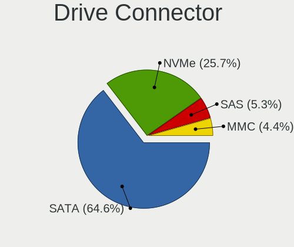
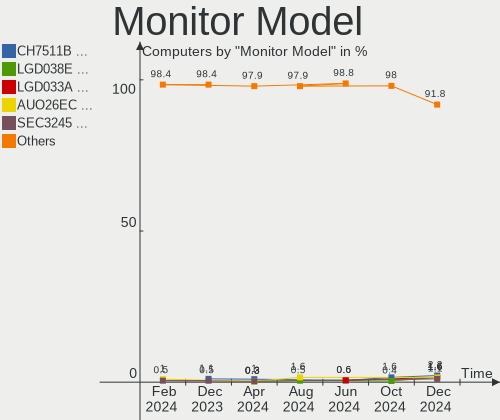

ROSA Hardware Trends
--------------------

A project to identify most popular hardware characteristics and track their change
over time based on data collected by ROSA users at https://Linux-Hardware.org.

Anyone can contribute to this report by the [hw-probe](https://github.com/linuxhw/hw-probe) tool:

    sudo -E hw-probe -all -upload

This is a report for all computer types. See also reports for [desktops](/Dist/ROSA/Desktop/README.md) and [notebooks](/Dist/ROSA/Notebook/README.md).

Full-feature report is available here: https://linux-hardware.org/?view=trends

Period: Aug, 2021.

Contents
--------

* [ System ](#system)
  - [ OS                       ](#os)
  - [ OS Family                ](#os-family)
  - [ Kernel                   ](#kernel)
  - [ Kernel Family            ](#kernel-family)
  - [ Kernel Major Ver.        ](#kernel-major-ver)
  - [ Arch                     ](#arch)
  - [ DE                       ](#de)
  - [ Display Server           ](#display-server)
  - [ Display Manager          ](#display-manager)
  - [ OS Lang                  ](#os-lang)
  - [ Boot Mode                ](#boot-mode)
  - [ Filesystem               ](#filesystem)
  - [ Part. scheme             ](#part-scheme)
  - [ Dual Boot with Linux/BSD ](#dual-boot-with-linuxbsd)
  - [ Dual Boot (Win)          ](#dual-boot-win)

* [ Board ](#board)
  - [ Vendor                   ](#vendor)
  - [ Model                    ](#model)
  - [ Model Family             ](#model-family)
  - [ MFG Year                 ](#mfg-year)
  - [ Form Factor              ](#form-factor)
  - [ Secure Boot              ](#secure-boot)
  - [ Coreboot                 ](#coreboot)
  - [ RAM Size                 ](#ram-size)
  - [ RAM Used                 ](#ram-used)
  - [ Total Drives             ](#total-drives)
  - [ Has CD-ROM               ](#has-cd-rom)
  - [ Has Ethernet             ](#has-ethernet)
  - [ Has WiFi                 ](#has-wifi)
  - [ Has Bluetooth            ](#has-bluetooth)

* [ Location ](#location)
  - [ Country                  ](#country)
  - [ City                     ](#city)

* [ Drives ](#drives)
  - [ Drive Vendor             ](#drive-vendor)
  - [ Drive Model              ](#drive-model)
  - [ HDD Vendor               ](#hdd-vendor)
  - [ SSD Vendor               ](#ssd-vendor)
  - [ Drive Kind               ](#drive-kind)
  - [ Drive Connector          ](#drive-connector)
  - [ Drive Size               ](#drive-size)
  - [ Space Total              ](#space-total)
  - [ Space Used               ](#space-used)
  - [ Malfunc. Drives          ](#malfunc-drives)
  - [ Malfunc. Drive Vendor    ](#malfunc-drive-vendor)
  - [ Malfunc. HDD Vendor      ](#malfunc-hdd-vendor)
  - [ Malfunc. Drive Kind      ](#malfunc-drive-kind)
  - [ Failed Drives            ](#failed-drives)
  - [ Failed Drive Vendor      ](#failed-drive-vendor)
  - [ Drive Status             ](#drive-status)

* [ Storage controller ](#storage-controller)
  - [ Storage Vendor           ](#storage-vendor)
  - [ Storage Model            ](#storage-model)
  - [ Storage Kind             ](#storage-kind)

* [ Processor ](#processor)
  - [ CPU Vendor               ](#cpu-vendor)
  - [ CPU Model                ](#cpu-model)
  - [ CPU Model Family         ](#cpu-model-family)
  - [ CPU Cores                ](#cpu-cores)
  - [ CPU Sockets              ](#cpu-sockets)
  - [ CPU Threads              ](#cpu-threads)
  - [ CPU Op-Modes             ](#cpu-op-modes)
  - [ CPU Microcode            ](#cpu-microcode)
  - [ CPU Microarch            ](#cpu-microarch)

* [ Graphics ](#graphics)
  - [ GPU Vendor               ](#gpu-vendor)
  - [ GPU Model                ](#gpu-model)
  - [ GPU Combo                ](#gpu-combo)
  - [ GPU Driver               ](#gpu-driver)
  - [ GPU Memory               ](#gpu-memory)

* [ Monitor ](#monitor)
  - [ Monitor Vendor           ](#monitor-vendor)
  - [ Monitor Model            ](#monitor-model)
  - [ Monitor Resolution       ](#monitor-resolution)
  - [ Monitor Diagonal         ](#monitor-diagonal)
  - [ Monitor Width            ](#monitor-width)
  - [ Aspect Ratio             ](#aspect-ratio)
  - [ Monitor Area             ](#monitor-area)
  - [ Pixel Density            ](#pixel-density)
  - [ Multiple Monitors        ](#multiple-monitors)

* [ Network ](#network)
  - [ Net Controller Vendor    ](#net-controller-vendor)
  - [ Net Controller Model     ](#net-controller-model)
  - [ Wireless Vendor          ](#wireless-vendor)
  - [ Wireless Model           ](#wireless-model)
  - [ Ethernet Vendor          ](#ethernet-vendor)
  - [ Ethernet Model           ](#ethernet-model)
  - [ Net Controller Kind      ](#net-controller-kind)
  - [ Used Controller          ](#used-controller)
  - [ NICs                     ](#nics)
  - [ IPv6                     ](#ipv6)

* [ Bluetooth ](#bluetooth)
  - [ Bluetooth Vendor         ](#bluetooth-vendor)
  - [ Bluetooth Model          ](#bluetooth-model)

* [ Sound ](#sound)
  - [ Sound Vendor             ](#sound-vendor)
  - [ Sound Model              ](#sound-model)

* [ Memory ](#memory)
  - [ Memory Vendor            ](#memory-vendor)
  - [ Memory Model             ](#memory-model)
  - [ Memory Kind              ](#memory-kind)
  - [ Memory Form Factor       ](#memory-form-factor)
  - [ Memory Size              ](#memory-size)
  - [ Memory Speed             ](#memory-speed)

* [ Printers & scanners ](#printers--scanners)
  - [ Printer Vendor           ](#printer-vendor)
  - [ Printer Model            ](#printer-model)
  - [ Scanner Vendor           ](#scanner-vendor)
  - [ Scanner Model            ](#scanner-model)

* [ Camera ](#camera)
  - [ Camera Vendor            ](#camera-vendor)
  - [ Camera Model             ](#camera-model)

* [ Security ](#security)
  - [ Fingerprint Vendor       ](#fingerprint-vendor)
  - [ Fingerprint Model        ](#fingerprint-model)
  - [ Chipcard Vendor          ](#chipcard-vendor)
  - [ Chipcard Model           ](#chipcard-model)

* [ Unsupported ](#unsupported)
  - [ Unsupported Devices      ](#unsupported-devices)
  - [ Unsupported Device Types ](#unsupported-device-types)

System
------

OS
--

Installed operating systems

| Name         | Computers | Percent |
|--------------|-----------|---------|
| ROSA R11.1   | 95        | 74.8%   |
| ROSA R11     | 14        | 11.02%  |
| ROSA R12     | 11        | 8.66%   |
| ROSA R8.1    | 3         | 2.36%   |
| ROSA R10     | 2         | 1.57%   |
| ROSA R9      | 1         | 0.79%   |
| ROSA 2019.05 | 1         | 0.79%   |

OS Family
---------

OS without a version

| Name | Computers | Percent |
|------|-----------|---------|
| ROSA | 127       | 100%    |

Kernel
------

Version of the Linux kernel

| Version                             | Computers | Percent |
|-------------------------------------|-----------|---------|
| 5.4.83-generic-2rosa-x86_64         | 34        | 26.77%  |
| 5.4.32-generic-2rosa-x86_64         | 21        | 16.54%  |
| 4.15.0-desktop-122.124.1rosa-x86_64 | 17        | 13.39%  |
| 4.15.0-desktop-45.1rosa-x86_64      | 11        | 8.66%   |
| 5.4.32-generic-2rosa-i586           | 10        | 7.87%   |
| 5.10.56-generic-1rosa2021.1-x86_64  | 9         | 7.09%   |
| 4.15.0-desktop-122.124.1rosa-i586   | 5         | 3.94%   |
| 5.4.83-generic-2rosa-i586           | 3         | 2.36%   |
| 5.10.50-generic-1rosa-x86_64        | 2         | 1.57%   |
| 5.10.0-desktop-14.15.1rosa-x86_64   | 2         | 1.57%   |
| 4.9.60-nrj-desktop-1rosa-x86_64     | 2         | 1.57%   |
| 4.9.155-nrj-desktop-1rosa-x86_64    | 2         | 1.57%   |
| 4.15.0-desktop-45.1rosa-i586        | 2         | 1.57%   |
| 5.4.136-nickel-1rosa2019.05-x86_64  | 1         | 0.79%   |
| 5.11.0-desktop-18.19.1rosa-x86_64   | 1         | 0.79%   |
| 5.10.52-generic-1rosa2021.1-x86_64  | 1         | 0.79%   |
| 5.10.35-generic-2rosa2019.1-x86_64  | 1         | 0.79%   |
| 4.9.20-nrj-desktop-1rosa-x86_64     | 1         | 0.79%   |
| 4.9.124-nrj-desktop-1rosa-i586      | 1         | 0.79%   |
| 4.1.38-nrj-desktop-2rosa-x86_64     | 1         | 0.79%   |

Kernel Family
-------------

Linux kernel without a distro release

| Version | Computers | Percent |
|---------|-----------|---------|
| 5.4.83  | 37        | 29.13%  |
| 4.15.0  | 35        | 27.56%  |
| 5.4.32  | 31        | 24.41%  |
| 5.10.56 | 9         | 7.09%   |
| 5.10.50 | 2         | 1.57%   |
| 5.10.0  | 2         | 1.57%   |
| 4.9.60  | 2         | 1.57%   |
| 4.9.155 | 2         | 1.57%   |
| 5.4.136 | 1         | 0.79%   |
| 5.11.0  | 1         | 0.79%   |
| 5.10.52 | 1         | 0.79%   |
| 5.10.35 | 1         | 0.79%   |
| 4.9.20  | 1         | 0.79%   |
| 4.9.124 | 1         | 0.79%   |
| 4.1.38  | 1         | 0.79%   |

Kernel Major Ver.
-----------------

Linux kernel major version

| Version | Computers | Percent |
|---------|-----------|---------|
| 5.4     | 69        | 54.33%  |
| 4.15    | 35        | 27.56%  |
| 5.10    | 15        | 11.81%  |
| 4.9     | 6         | 4.72%   |
| 5.11    | 1         | 0.79%   |
| 4.1     | 1         | 0.79%   |

Arch
----

OS architecture (x86_64, i586, etc.)

| Name   | Computers | Percent |
|--------|-----------|---------|
| x86_64 | 106       | 83.46%  |
| i686   | 21        | 16.54%  |

DE
--

Desktop Environment

| Name    | Computers | Percent |
|---------|-----------|---------|
| KDE4    | 69        | 54.33%  |
| KDE5    | 43        | 33.86%  |
| LXQt    | 9         | 7.09%   |
| XFCE    | 3         | 2.36%   |
| GNOME   | 2         | 1.57%   |
| Unknown | 1         | 0.79%   |

Display Server
--------------

X11 or Wayland

| Name    | Computers | Percent |
|---------|-----------|---------|
| X11     | 120       | 94.49%  |
| Wayland | 5         | 3.94%   |
| Tty     | 2         | 1.57%   |

Display Manager
---------------

SDDM, LightDM, etc.

| Name    | Computers | Percent |
|---------|-----------|---------|
| KDM     | 69        | 54.33%  |
| SDDM    | 51        | 40.16%  |
| GDM     | 5         | 3.94%   |
| LightDM | 1         | 0.79%   |
| Unknown | 1         | 0.79%   |

OS Lang
-------

Language

| Lang    | Computers | Percent |
|---------|-----------|---------|
| ru_RU   | 89        | 70.08%  |
| Unknown | 20        | 15.75%  |
| pl_PL   | 4         | 3.15%   |
| es_ES   | 3         | 2.36%   |
| de_DE   | 3         | 2.36%   |
| pt_BR   | 2         | 1.57%   |
| en_US   | 2         | 1.57%   |
| ru_BY   | 1         | 0.79%   |
| ro_RO   | 1         | 0.79%   |
| it_IT   | 1         | 0.79%   |
| en_GB   | 1         | 0.79%   |

Boot Mode
---------

EFI or BIOS

| Mode | Computers | Percent |
|------|-----------|---------|
| BIOS | 91        | 71.65%  |
| EFI  | 36        | 28.35%  |

Filesystem
----------

Type of filesystem

| Type  | Computers | Percent |
|-------|-----------|---------|
| Ext4  | 119       | 93.7%   |
| Btrfs | 6         | 4.72%   |
| Ext3  | 2         | 1.57%   |

Part. scheme
------------

Scheme of partitioning

| Type    | Computers | Percent |
|---------|-----------|---------|
| MBR     | 77        | 60.63%  |
| GPT     | 47        | 37.01%  |
| Unknown | 3         | 2.36%   |

Dual Boot with Linux/BSD
------------------------

Hosting more than one Linux/BSD

| Dual boot | Computers | Percent |
|-----------|-----------|---------|
| No        | 96        | 75.59%  |
| Yes       | 31        | 24.41%  |

Dual Boot (Win)
---------------

Hosting Linux and Windows

| Dual boot | Computers | Percent |
|-----------|-----------|---------|
| No        | 73        | 57.48%  |
| Yes       | 54        | 42.52%  |

Board
-----

Vendor
------

Motherboard manufacturer

| Name                | Computers | Percent |
|---------------------|-----------|---------|
| ASUSTek Computer    | 38        | 29.92%  |
| Gigabyte Technology | 15        | 11.81%  |
| Dell                | 9         | 7.09%   |
| Lenovo              | 8         | 6.3%    |
| Hewlett-Packard     | 8         | 6.3%    |
| Acer                | 8         | 6.3%    |
| MSI                 | 7         | 5.51%   |
| ASRock              | 5         | 3.94%   |
| Samsung Electronics | 3         | 2.36%   |
| Intel               | 3         | 2.36%   |
| Biostar             | 3         | 2.36%   |
| Unknown             | 3         | 2.36%   |
| Toshiba             | 2         | 1.57%   |
| Packard Bell        | 2         | 1.57%   |
| Apple               | 2         | 1.57%   |
| Supermicro          | 1         | 0.79%   |
| Sony                | 1         | 0.79%   |
| OEM                 | 1         | 0.79%   |
| Notebook            | 1         | 0.79%   |
| Huanan              | 1         | 0.79%   |
| Fujitsu Siemens     | 1         | 0.79%   |
| Fujitsu             | 1         | 0.79%   |
| eMachines           | 1         | 0.79%   |
| ECS                 | 1         | 0.79%   |
| Chuwi               | 1         | 0.79%   |
| Aquarius            | 1         | 0.79%   |

Model
-----

Motherboard model

| Name                                        | Computers | Percent |
|---------------------------------------------|-----------|---------|
| Unknown                                     | 3         | 2.36%   |
| HP Notebook                                 | 2         | 1.57%   |
| ASUS PRIME A320M-K                          | 2         | 1.57%   |
| ASUS M2N                                    | 2         | 1.57%   |
| ASUS H110M-R                                | 2         | 1.57%   |
| ASUS All Series                             | 2         | 1.57%   |
| Acer Aspire 5750G                           | 2         | 1.57%   |
| Toshiba Satellite M105                      | 1         | 0.79%   |
| Toshiba Satellite C650                      | 1         | 0.79%   |
| Supermicro SYS-5039MS-H12TRF                | 1         | 0.79%   |
| Sony VGN-FE11MR                             | 1         | 0.79%   |
| Samsung R425/R525                           | 1         | 0.79%   |
| Samsung QX310/QX410/QX510/SF310/SF410/SF510 | 1         | 0.79%   |
| Samsung 350V5C/351V5C/3540VC/3440VC         | 1         | 0.79%   |
| Packard Bell EasyNote TK85                  | 1         | 0.79%   |
| Packard Bell EasyNote LX                    | 1         | 0.79%   |
| OEM I41SI1                                  | 1         | 0.79%   |
| Notebook W65_67SB                           | 1         | 0.79%   |
| MSI OPTIMUS                                 | 1         | 0.79%   |
| MSI MS-7C51                                 | 1         | 0.79%   |
| MSI MS-7B86                                 | 1         | 0.79%   |
| MSI MS-7895                                 | 1         | 0.79%   |
| MSI MS-7599                                 | 1         | 0.79%   |
| MSI MS-7592                                 | 1         | 0.79%   |
| MSI Compaq dx2200 MT                        | 1         | 0.79%   |
| Lenovo V520-15IKL 10NKS05400                | 1         | 0.79%   |
| Lenovo ThinkPad W520 427637U                | 1         | 0.79%   |
| Lenovo IdeaCentre A340-22ICK F0ES002HRK     | 1         | 0.79%   |
| Lenovo H420                                 | 1         | 0.79%   |
| Lenovo G580 20150                           | 1         | 0.79%   |
| Lenovo G550 20023                           | 1         | 0.79%   |
| Lenovo G510 20238                           | 1         | 0.79%   |
| Lenovo B50-30 20382                         | 1         | 0.79%   |
| Intel H61M-S1                               | 1         | 0.79%   |
| Intel DP67BG AAG10491-306                   | 1         | 0.79%   |
| Intel DG31PR AAD97573-206                   | 1         | 0.79%   |
| Huanan X99 F8D V2.2                         | 1         | 0.79%   |
| HP ProLiant DL360 G5                        | 1         | 0.79%   |
| HP Pavilion g6                              | 1         | 0.79%   |
| HP Mini 110-3000                            | 1         | 0.79%   |
| HP Compaq Elite 8300 CMT                    | 1         | 0.79%   |
| HP All-in-One 22-c0xx                       | 1         | 0.79%   |
| HP 255 G3                                   | 1         | 0.79%   |
| Gigabyte Z170-HD3P-CF                       | 1         | 0.79%   |
| Gigabyte X570 AORUS ELITE                   | 1         | 0.79%   |
| Gigabyte P31-DS3L                           | 1         | 0.79%   |
| Gigabyte H270-HD3                           | 1         | 0.79%   |
| Gigabyte GB-A5DNK-RH                        | 1         | 0.79%   |
| Gigabyte GA-MA790FXT-UD5P                   | 1         | 0.79%   |
| Gigabyte GA-990XA-UD3                       | 1         | 0.79%   |
| Gigabyte GA-78LMT-S2                        | 1         | 0.79%   |
| Gigabyte GA-780T-D3L                        | 1         | 0.79%   |
| Gigabyte B450M DS3H V2                      | 1         | 0.79%   |
| Gigabyte B250M-D3H                          | 1         | 0.79%   |
| Gigabyte A320M-S2H V2                       | 1         | 0.79%   |
| Gigabyte A320M-H                            | 1         | 0.79%   |
| Gigabyte 945GCM-S2C                         | 1         | 0.79%   |
| Gigabyte 8IPE1000-G                         | 1         | 0.79%   |
| Fujitsu Siemens AMILO PRO V3515             | 1         | 0.79%   |
| Fujitsu CELSIUS M470-2                      | 1         | 0.79%   |

Model Family
------------

Motherboard model prefix

| Name                         | Computers | Percent |
|------------------------------|-----------|---------|
| Acer Aspire                  | 7         | 5.51%   |
| Dell Inspiron                | 4         | 3.15%   |
| ASUS PRIME                   | 4         | 3.15%   |
| Dell Latitude                | 3         | 2.36%   |
| Unknown                      | 3         | 2.36%   |
| Toshiba Satellite            | 2         | 1.57%   |
| Packard Bell EasyNote        | 2         | 1.57%   |
| HP Notebook                  | 2         | 1.57%   |
| Dell OptiPlex                | 2         | 1.57%   |
| ASUS P5K                     | 2         | 1.57%   |
| ASUS M2N                     | 2         | 1.57%   |
| ASUS H110M-R                 | 2         | 1.57%   |
| ASUS All                     | 2         | 1.57%   |
| Supermicro SYS-5039MS-H12TRF | 1         | 0.79%   |
| Sony VGN-FE11MR              | 1         | 0.79%   |
| Samsung R425                 | 1         | 0.79%   |
| Samsung QX310                | 1         | 0.79%   |
| Samsung 350V5C               | 1         | 0.79%   |
| OEM I41SI1                   | 1         | 0.79%   |
| Notebook W65                 | 1         | 0.79%   |
| MSI OPTIMUS                  | 1         | 0.79%   |
| MSI MS-7C51                  | 1         | 0.79%   |
| MSI MS-7B86                  | 1         | 0.79%   |
| MSI MS-7895                  | 1         | 0.79%   |
| MSI MS-7599                  | 1         | 0.79%   |
| MSI MS-7592                  | 1         | 0.79%   |
| MSI Compaq                   | 1         | 0.79%   |
| Lenovo V520-15IKL            | 1         | 0.79%   |
| Lenovo ThinkPad              | 1         | 0.79%   |
| Lenovo IdeaCentre            | 1         | 0.79%   |
| Lenovo H420                  | 1         | 0.79%   |
| Lenovo G580                  | 1         | 0.79%   |
| Lenovo G550                  | 1         | 0.79%   |
| Lenovo G510                  | 1         | 0.79%   |
| Lenovo B50-30                | 1         | 0.79%   |
| Intel H61M-S1                | 1         | 0.79%   |
| Intel DP67BG                 | 1         | 0.79%   |
| Intel DG31PR                 | 1         | 0.79%   |
| Huanan X99                   | 1         | 0.79%   |
| HP ProLiant                  | 1         | 0.79%   |
| HP Pavilion                  | 1         | 0.79%   |
| HP Mini                      | 1         | 0.79%   |
| HP Compaq                    | 1         | 0.79%   |
| HP All-in-One                | 1         | 0.79%   |
| HP 255                       | 1         | 0.79%   |
| Gigabyte Z170-HD3P-CF        | 1         | 0.79%   |
| Gigabyte X570                | 1         | 0.79%   |
| Gigabyte P31-DS3L            | 1         | 0.79%   |
| Gigabyte H270-HD3            | 1         | 0.79%   |
| Gigabyte GB-A5DNK-RH         | 1         | 0.79%   |
| Gigabyte GA-MA790FXT-UD5P    | 1         | 0.79%   |
| Gigabyte GA-990XA-UD3        | 1         | 0.79%   |
| Gigabyte GA-78LMT-S2         | 1         | 0.79%   |
| Gigabyte GA-780T-D3L         | 1         | 0.79%   |
| Gigabyte B450M               | 1         | 0.79%   |
| Gigabyte B250M-D3H           | 1         | 0.79%   |
| Gigabyte A320M-S2H           | 1         | 0.79%   |
| Gigabyte A320M-H             | 1         | 0.79%   |
| Gigabyte 945GCM-S2C          | 1         | 0.79%   |
| Gigabyte 8IPE1000-G          | 1         | 0.79%   |

MFG Year
--------

Motherboard manufacture year

| Year | Computers | Percent |
|------|-----------|---------|
| 2012 | 15        | 11.81%  |
| 2010 | 14        | 11.02%  |
| 2011 | 13        | 10.24%  |
| 2019 | 11        | 8.66%   |
| 2013 | 9         | 7.09%   |
| 2020 | 8         | 6.3%    |
| 2009 | 8         | 6.3%    |
| 2018 | 7         | 5.51%   |
| 2008 | 7         | 5.51%   |
| 2007 | 7         | 5.51%   |
| 2016 | 6         | 4.72%   |
| 2017 | 5         | 3.94%   |
| 2015 | 5         | 3.94%   |
| 2014 | 4         | 3.15%   |
| 2021 | 3         | 2.36%   |
| 2006 | 3         | 2.36%   |
| 2005 | 1         | 0.79%   |
| 2004 | 1         | 0.79%   |

Form Factor
-----------

Physical design of the computer

| Name       | Computers | Percent |
|------------|-----------|---------|
| Desktop    | 68        | 53.54%  |
| Notebook   | 54        | 42.52%  |
| All in one | 3         | 2.36%   |
| Mini pc    | 1         | 0.79%   |
| Server     | 1         | 0.79%   |

Secure Boot
-----------

Enabled or disabled

| State    | Computers | Percent |
|----------|-----------|---------|
| Disabled | 127       | 100%    |

Coreboot
--------

Have coreboot on board

| Used | Computers | Percent |
|------|-----------|---------|
| No   | 127       | 100%    |

RAM Size
--------

Total RAM memory

| Size in GB  | Computers | Percent |
|-------------|-----------|---------|
| 3.01-4.0    | 39        | 30.71%  |
| 8.01-16.0   | 30        | 23.62%  |
| 4.01-8.0    | 16        | 12.6%   |
| 16.01-24.0  | 12        | 9.45%   |
| 1.01-2.0    | 12        | 9.45%   |
| 2.01-3.0    | 9         | 7.09%   |
| 32.01-64.0  | 5         | 3.94%   |
| 0.51-1.0    | 2         | 1.57%   |
| 24.01-32.0  | 1         | 0.79%   |
| 64.01-256.0 | 1         | 0.79%   |

RAM Used
--------

Used RAM memory

| Used GB  | Computers | Percent |
|----------|-----------|---------|
| 1.01-2.0 | 57        | 44.88%  |
| 0.51-1.0 | 45        | 35.43%  |
| 2.01-3.0 | 15        | 11.81%  |
| 3.01-4.0 | 4         | 3.15%   |
| 4.01-8.0 | 3         | 2.36%   |
| 0.01-0.5 | 3         | 2.36%   |

Total Drives
------------

Number of drives on board

| Drives | Computers | Percent |
|--------|-----------|---------|
| 1      | 71        | 55.91%  |
| 2      | 40        | 31.5%   |
| 3      | 8         | 6.3%    |
| 4      | 7         | 5.51%   |
| 5      | 1         | 0.79%   |

Has CD-ROM
----------

Has CD-ROM on board

| Presented | Computers | Percent |
|-----------|-----------|---------|
| Yes       | 72        | 56.69%  |
| No        | 55        | 43.31%  |

Has Ethernet
------------

Has Ethernet on board

| Presented | Computers | Percent |
|-----------|-----------|---------|
| Yes       | 126       | 99.21%  |
| No        | 1         | 0.79%   |

Has WiFi
--------

Has WiFi module

| Presented | Computers | Percent |
|-----------|-----------|---------|
| Yes       | 69        | 54.33%  |
| No        | 58        | 45.67%  |

Has Bluetooth
-------------

Has Bluetooth module

| Presented | Computers | Percent |
|-----------|-----------|---------|
| No        | 81        | 63.78%  |
| Yes       | 46        | 36.22%  |

Location
--------

Country
-------

Geographic location (country)

| Country     | Computers | Percent |
|-------------|-----------|---------|
| Russia      | 95        | 74.8%   |
| Poland      | 5         | 3.94%   |
| Belarus     | 4         | 3.15%   |
| Ukraine     | 3         | 2.36%   |
| Germany     | 3         | 2.36%   |
| Spain       | 2         | 1.57%   |
| Italy       | 2         | 1.57%   |
| Brazil      | 2         | 1.57%   |
| UK          | 1         | 0.79%   |
| Romania     | 1         | 0.79%   |
| Moldova     | 1         | 0.79%   |
| Lithuania   | 1         | 0.79%   |
| Kyrgyzstan  | 1         | 0.79%   |
| Kazakhstan  | 1         | 0.79%   |
| Israel      | 1         | 0.79%   |
| France      | 1         | 0.79%   |
| El Salvador | 1         | 0.79%   |
| Egypt       | 1         | 0.79%   |
| Colombia    | 1         | 0.79%   |

City
----

Geographic location (city)

| City             | Computers | Percent |
|------------------|-----------|---------|
| Moscow           | 22        | 17.32%  |
| St Petersburg    | 7         | 5.51%   |
| Krasnodar        | 6         | 4.72%   |
| Rostov-on-Don    | 5         | 3.94%   |
| Yekaterinburg    | 2         | 1.57%   |
| Yaroslavl        | 2         | 1.57%   |
| Warsaw           | 2         | 1.57%   |
| Tomsk            | 2         | 1.57%   |
| Ryazan           | 2         | 1.57%   |
| Novosibirsk      | 2         | 1.57%   |
| Nizhniy Novgorod | 2         | 1.57%   |
| Murmansk         | 2         | 1.57%   |
| Krasnoyarsk      | 2         | 1.57%   |
| Elektrostal      | 2         | 1.57%   |
| Bryansk          | 2         | 1.57%   |
| Yakutsk          | 1         | 0.79%   |
| Voronezh         | 1         | 0.79%   |
| Vologda          | 1         | 0.79%   |
| Volgograd        | 1         | 0.79%   |
| Vladivostok      | 1         | 0.79%   |
| Vikhorevka       | 1         | 0.79%   |
| Usinsk           | 1         | 0.79%   |
| Ufa              | 1         | 0.79%   |
| Tula             | 1         | 0.79%   |
| Tepecoyo         | 1         | 0.79%   |
| Tel Aviv         | 1         | 0.79%   |
| Tambov           | 1         | 0.79%   |
| Taganrog         | 1         | 0.79%   |
| Surgut           | 1         | 0.79%   |
| Suez             | 1         | 0.79%   |
| Stralsund        | 1         | 0.79%   |
| Stavropol        | 1         | 0.79%   |
| Sosnowiec        | 1         | 0.79%   |
| Sochi            | 1         | 0.79%   |
| Severodvinsk     | 1         | 0.79%   |
| Sarov            | 1         | 0.79%   |
| Saratov          | 1         | 0.79%   |
| Saransk          | 1         | 0.79%   |
| Rozgarty         | 1         | 0.79%   |
| Rome             | 1         | 0.79%   |
| Pruzhany         | 1         | 0.79%   |
| Pervouralsk      | 1         | 0.79%   |
| Perm             | 1         | 0.79%   |
| Pantin           | 1         | 0.79%   |
| Omsk             | 1         | 0.79%   |
| Navapolatsk      | 1         | 0.79%   |
| Munich           | 1         | 0.79%   |
| Mosquera         | 1         | 0.79%   |
| Moncofa          | 1         | 0.79%   |
| Minsk            | 1         | 0.79%   |
| Mariupol         | 1         | 0.79%   |
| Lensk            | 1         | 0.79%   |
| Leninogorsk      | 1         | 0.79%   |
| Kushch?«vskaya   | 1         | 0.79%   |
| Kostroma         | 1         | 0.79%   |
| Kopeysk          | 1         | 0.79%   |
| Khabarovsk       | 1         | 0.79%   |
| Kazan?ˆ™         | 1         | 0.79%   |
| Kaunas           | 1         | 0.79%   |
| Karaganda        | 1         | 0.79%   |

Drives
------

Drive Vendor
------------

Hard drive vendors

| Vendor              | Computers | Drives | Percent |
|---------------------|-----------|--------|---------|
| WDC                 | 47        | 54     | 25.68%  |
| Seagate             | 40        | 47     | 21.86%  |
| Toshiba             | 18        | 20     | 9.84%   |
| Samsung Electronics | 16        | 19     | 8.74%   |
| Hitachi             | 8         | 9      | 4.37%   |
| Kingston            | 7         | 7      | 3.83%   |
| HGST                | 6         | 6      | 3.28%   |
| SPCC                | 5         | 5      | 2.73%   |
| GOODRAM             | 4         | 4      | 2.19%   |
| A-DATA Technology   | 4         | 4      | 2.19%   |
| Unknown             | 3         | 3      | 1.64%   |
| Crucial             | 3         | 4      | 1.64%   |
| Apacer              | 3         | 3      | 1.64%   |
| SanDisk             | 2         | 2      | 1.09%   |
| China               | 2         | 2      | 1.09%   |
| Union Memory        | 1         | 1      | 0.55%   |
| Transcend           | 1         | 1      | 0.55%   |
| Smartbuy            | 1         | 1      | 0.55%   |
| PLEXTOR             | 1         | 1      | 0.55%   |
| Palit               | 1         | 1      | 0.55%   |
| OCZ                 | 1         | 1      | 0.55%   |
| MAXTOR              | 1         | 1      | 0.55%   |
| LDLC                | 1         | 1      | 0.55%   |
| KingSpec            | 1         | 1      | 0.55%   |
| KingDian            | 1         | 1      | 0.55%   |
| Intenso             | 1         | 1      | 0.55%   |
| HUAWEI              | 1         | 1      | 0.55%   |
| Fujitsu             | 1         | 1      | 0.55%   |
| FOXLINE             | 1         | 1      | 0.55%   |
| Corsair             | 1         | 1      | 0.55%   |

Drive Model
-----------

Hard drive models

| Model                            | Computers | Percent |
|----------------------------------|-----------|---------|
| Seagate ST9320325AS 320GB        | 5         | 2.46%   |
| Seagate ST1000DM010-2EP102 1TB   | 5         | 2.46%   |
| WDC WD10EZEX-08WN4A0 1TB         | 3         | 1.48%   |
| Toshiba MQ01ABD032 320GB         | 3         | 1.48%   |
| Seagate ST9500325AS 500GB        | 3         | 1.48%   |
| Samsung SSD 860 EVO 250GB        | 3         | 1.48%   |
| Kingston SA400S37120G 120GB SSD  | 3         | 1.48%   |
| WDC WDS240G2G0A-00JH30 240GB SSD | 2         | 0.99%   |
| WDC WD3200BEKT-75PVMT1 320GB     | 2         | 0.99%   |
| WDC WD20EZAZ-00GGJB0 2TB         | 2         | 0.99%   |
| WDC WD10EZEX-00WN4A0 1TB         | 2         | 0.99%   |
| Toshiba MQ01ABD100 1TB           | 2         | 0.99%   |
| Toshiba MK1234GSX 120GB          | 2         | 0.99%   |
| Toshiba DT01ACA050 500GB         | 2         | 0.99%   |
| Seagate ST9500420AS 500GB        | 2         | 0.99%   |
| Seagate ST3250410AS 250GB        | 2         | 0.99%   |
| Seagate ST3160815AS 160GB        | 2         | 0.99%   |
| Seagate ST2000DM001-1ER164 2TB   | 2         | 0.99%   |
| Samsung SSD 850 EVO 120GB        | 2         | 0.99%   |
| Samsung SSD 750 EVO 250GB        | 2         | 0.99%   |
| Kingston SA400S37240G 240GB SSD  | 2         | 0.99%   |
| HGST HTS545050A7E380 500GB       | 2         | 0.99%   |
| Crucial CT240BX500SSD1 240GB     | 2         | 0.99%   |
| Apacer AS350 256GB SSD           | 2         | 0.99%   |
| WDC WDS250G2B0A-00SM50 250GB SSD | 1         | 0.49%   |
| WDC WDS120G2G0B-00EPW0 120GB SSD | 1         | 0.49%   |
| WDC WD800JD-60LSA0 80GB          | 1         | 0.49%   |
| WDC WD800BEVT-22ZCT0 80GB        | 1         | 0.49%   |
| WDC WD7500BPKT-00PK4T0 752GB     | 1         | 0.49%   |
| WDC WD6400BPVT-22HXZT1 640GB     | 1         | 0.49%   |
| WDC WD6400AAKS-65Z7B0 640GB      | 1         | 0.49%   |
| WDC WD600VE-00HDT0 64GB          | 1         | 0.49%   |
| WDC WD5000LPVX-22V0TT0 500GB     | 1         | 0.49%   |
| WDC WD5000LPVX-00V0TT0 500GB     | 1         | 0.49%   |
| WDC WD5000LPCX-24VHAT0 500GB     | 1         | 0.49%   |
| WDC WD5000BPKX-00HPJT0 500GB     | 1         | 0.49%   |
| WDC WD5000AZRZ-00HTKB0 500GB     | 1         | 0.49%   |
| WDC WD5000AZRX-00A8LB0 500GB     | 1         | 0.49%   |
| WDC WD5000AAKX-753CA1 500GB      | 1         | 0.49%   |
| WDC WD5000AAKX-083CA1 500GB      | 1         | 0.49%   |
| WDC WD5000AAKB-00H8A0 500GB      | 1         | 0.49%   |
| WDC WD5000AADS-56S9B0 500GB      | 1         | 0.49%   |
| WDC WD40EZRZ-22GXCB0 4TB         | 1         | 0.49%   |
| WDC WD4003FRYZ-01F0DB0 4TB       | 1         | 0.49%   |
| WDC WD3200BPVT-80ZEST0 320GB     | 1         | 0.49%   |
| WDC WD3200BPVT-22JJ5T0 320GB     | 1         | 0.49%   |
| WDC WD3200BEVT-80A0RT0 320GB     | 1         | 0.49%   |
| WDC WD3200BEVT-22ZCT0 320GB      | 1         | 0.49%   |
| WDC WD30EZRX-00DC0B0 3TB         | 1         | 0.49%   |
| WDC WD2500JS-00NCB1 250GB        | 1         | 0.49%   |
| WDC WD2500BEVT-22A23T0 250GB     | 1         | 0.49%   |
| WDC WD2500BEKT-00PVMT0 250GB     | 1         | 0.49%   |
| WDC WD2500AAKX-75U6AA0 250GB     | 1         | 0.49%   |
| WDC WD20EZRX-00DC0B0 2TB         | 1         | 0.49%   |
| WDC WD20EFRX-68EUZN0 2TB         | 1         | 0.49%   |
| WDC WD20EARX-00PASB0 2TB         | 1         | 0.49%   |
| WDC WD2000JS-60NCB1 200GB        | 1         | 0.49%   |
| WDC WD2000JS-22MHB0 200GB        | 1         | 0.49%   |
| WDC WD1600JB-00REA0 160GB        | 1         | 0.49%   |
| WDC WD1600AAJS-00L7A0 160GB      | 1         | 0.49%   |

HDD Vendor
----------

Hard disk drive vendors

| Vendor              | Computers | Drives | Percent |
|---------------------|-----------|--------|---------|
| WDC                 | 45        | 50     | 36.59%  |
| Seagate             | 39        | 46     | 31.71%  |
| Toshiba             | 16        | 17     | 13.01%  |
| Hitachi             | 8         | 9      | 6.5%    |
| Samsung Electronics | 7         | 7      | 5.69%   |
| HGST                | 6         | 6      | 4.88%   |
| MAXTOR              | 1         | 1      | 0.81%   |
| Fujitsu             | 1         | 1      | 0.81%   |

SSD Vendor
----------

Solid state drive vendors

| Vendor              | Computers | Drives | Percent |
|---------------------|-----------|--------|---------|
| Samsung Electronics | 8         | 11     | 15.09%  |
| Kingston            | 6         | 6      | 11.32%  |
| SPCC                | 5         | 5      | 9.43%   |
| WDC                 | 4         | 4      | 7.55%   |
| GOODRAM             | 4         | 4      | 7.55%   |
| Toshiba             | 3         | 3      | 5.66%   |
| Crucial             | 3         | 3      | 5.66%   |
| Apacer              | 3         | 3      | 5.66%   |
| A-DATA Technology   | 3         | 3      | 5.66%   |
| SanDisk             | 2         | 2      | 3.77%   |
| China               | 2         | 2      | 3.77%   |
| Smartbuy            | 1         | 1      | 1.89%   |
| PLEXTOR             | 1         | 1      | 1.89%   |
| Palit               | 1         | 1      | 1.89%   |
| OCZ                 | 1         | 1      | 1.89%   |
| LDLC                | 1         | 1      | 1.89%   |
| KingSpec            | 1         | 1      | 1.89%   |
| KingDian            | 1         | 1      | 1.89%   |
| Intenso             | 1         | 1      | 1.89%   |
| FOXLINE             | 1         | 1      | 1.89%   |
| Corsair             | 1         | 1      | 1.89%   |

Drive Kind
----------

HDD or SSD

| Kind    | Computers | Drives | Percent |
|---------|-----------|--------|---------|
| HDD     | 108       | 137    | 64.67%  |
| SSD     | 48        | 56     | 28.74%  |
| NVMe    | 6         | 6      | 3.59%   |
| Unknown | 3         | 3      | 1.8%    |
| MMC     | 2         | 2      | 1.2%    |

Drive Connector
---------------

SATA, SAS, NVMe, etc.

| Type | Computers | Drives | Percent |
|------|-----------|--------|---------|
| SATA | 125       | 192    | 91.91%  |
| NVMe | 6         | 6      | 4.41%   |
| SAS  | 3         | 4      | 2.21%   |
| MMC  | 2         | 2      | 1.47%   |

Drive Size
----------

Size of hard drive

| Size in TB | Computers | Drives | Percent |
|------------|-----------|--------|---------|
| 0.01-0.5   | 106       | 140    | 68.83%  |
| 0.51-1.0   | 35        | 39     | 22.73%  |
| 1.01-2.0   | 8         | 9      | 5.19%   |
| 3.01-4.0   | 2         | 2      | 1.3%    |
| 2.01-3.0   | 2         | 2      | 1.3%    |
| 4.01-10.0  | 1         | 1      | 0.65%   |

Space Total
-----------

Amount of disk space available on the file system

| Size in GB     | Computers | Percent |
|----------------|-----------|---------|
| 101-250        | 35        | 27.56%  |
| 251-500        | 29        | 22.83%  |
| 21-50          | 14        | 11.02%  |
| 51-100         | 14        | 11.02%  |
| 501-1000       | 13        | 10.24%  |
| 1-20           | 10        | 7.87%   |
| 1001-2000      | 8         | 6.3%    |
| More than 3000 | 3         | 2.36%   |
| Unknown        | 1         | 0.79%   |

Space Used
----------

Amount of used disk space

| Used GB   | Computers | Percent |
|-----------|-----------|---------|
| 1-20      | 84        | 66.14%  |
| 21-50     | 13        | 10.24%  |
| 101-250   | 11        | 8.66%   |
| 51-100    | 8         | 6.3%    |
| 501-1000  | 5         | 3.94%   |
| 251-500   | 4         | 3.15%   |
| 1001-2000 | 1         | 0.79%   |
| Unknown   | 1         | 0.79%   |

Malfunc. Drives
---------------

Drive models with a malfunction

| Model                                | Computers | Drives | Percent |
|--------------------------------------|-----------|--------|---------|
| Seagate ST9500325AS 500GB            | 3         | 3      | 5.77%   |
| Toshiba MK1234GSX 120GB              | 2         | 2      | 3.85%   |
| Seagate ST9500420AS 500GB            | 2         | 2      | 3.85%   |
| Seagate ST3250410AS 250GB            | 2         | 2      | 3.85%   |
| WDC WDS240G2G0A-00JH30 240GB SSD     | 1         | 1      | 1.92%   |
| WDC WDS120G2G0B-00EPW0 120GB SSD     | 1         | 1      | 1.92%   |
| WDC WD800JD-60LSA0 80GB              | 1         | 1      | 1.92%   |
| WDC WD6400BPVT-22HXZT1 640GB         | 1         | 1      | 1.92%   |
| WDC WD5000AAKX-083CA1 500GB          | 1         | 1      | 1.92%   |
| WDC WD5000AAKB-00H8A0 500GB          | 1         | 1      | 1.92%   |
| WDC WD5000AADS-56S9B0 500GB          | 1         | 1      | 1.92%   |
| WDC WD3200BEVT-80A0RT0 320GB         | 1         | 1      | 1.92%   |
| WDC WD3200BEVT-22ZCT0 320GB          | 1         | 1      | 1.92%   |
| WDC WD2500JS-00NCB1 250GB            | 1         | 1      | 1.92%   |
| WDC WD2500BEVT-22A23T0 250GB         | 1         | 1      | 1.92%   |
| WDC WD2000JS-22MHB0 200GB            | 1         | 1      | 1.92%   |
| WDC WD1600AAJS-00L7A0 160GB          | 1         | 1      | 1.92%   |
| WDC WD10EADS-65M2B0 1TB              | 1         | 1      | 1.92%   |
| WDC WD1002FAEX-00Y9A0 1TB            | 1         | 1      | 1.92%   |
| Toshiba THNSNK512GCS8 SATA 512GB SSD | 1         | 1      | 1.92%   |
| Toshiba MK3252GSX 320GB              | 1         | 1      | 1.92%   |
| Toshiba MK1656GSY 160GB              | 1         | 1      | 1.92%   |
| Toshiba DT01ACA050 500GB             | 1         | 1      | 1.92%   |
| SPCC Solid State Disk 56GB           | 1         | 1      | 1.92%   |
| Seagate ST9320325AS 320GB            | 1         | 1      | 1.92%   |
| Seagate ST9250827AS 250GB            | 1         | 1      | 1.92%   |
| Seagate ST9250315AS 250GB            | 1         | 1      | 1.92%   |
| Seagate ST9160314AS 160GB            | 1         | 1      | 1.92%   |
| Seagate ST500DM002-1BD142 500GB      | 1         | 1      | 1.92%   |
| Seagate ST380815AS 80GB              | 1         | 1      | 1.92%   |
| Seagate ST380215A 80GB               | 1         | 1      | 1.92%   |
| Seagate ST3320613AS 320GB            | 1         | 1      | 1.92%   |
| Seagate ST3160815AS 160GB            | 1         | 1      | 1.92%   |
| Seagate ST3160811AS 160GB            | 1         | 1      | 1.92%   |
| Seagate ST3160215A 160GB             | 1         | 1      | 1.92%   |
| Seagate ST1000DM003-1SB102 1TB       | 1         | 1      | 1.92%   |
| Samsung Electronics SP2504C 250GB    | 1         | 1      | 1.92%   |
| Samsung Electronics HD321KJ 320GB    | 1         | 1      | 1.92%   |
| Samsung Electronics HD160HJ 160GB    | 1         | 1      | 1.92%   |
| OCZ TRION100 120GB SSD               | 1         | 1      | 1.92%   |
| Hitachi HTS543212L9A300 120GB        | 1         | 1      | 1.92%   |
| Hitachi HDS721050CLA660 500GB        | 1         | 1      | 1.92%   |
| Hitachi HDS721010CLA330 1TB          | 1         | 1      | 1.92%   |
| Hitachi HDP725050GLA360 500GB        | 1         | 1      | 1.92%   |
| HGST HTS545050A7E660 500GB           | 1         | 1      | 1.92%   |
| HGST HTS545050A7E380 500GB           | 1         | 1      | 1.92%   |
| A-DATA Technology SX8200PNP 256GB    | 1         | 1      | 1.92%   |

Malfunc. Drive Vendor
---------------------

Vendors of faulty drives

| Vendor              | Computers | Drives | Percent |
|---------------------|-----------|--------|---------|
| Seagate             | 18        | 19     | 36.73%  |
| WDC                 | 13        | 15     | 26.53%  |
| Toshiba             | 6         | 6      | 12.24%  |
| Hitachi             | 4         | 4      | 8.16%   |
| Samsung Electronics | 3         | 3      | 6.12%   |
| HGST                | 2         | 2      | 4.08%   |
| SPCC                | 1         | 1      | 2.04%   |
| OCZ                 | 1         | 1      | 2.04%   |
| A-DATA Technology   | 1         | 1      | 2.04%   |

Malfunc. HDD Vendor
-------------------

Vendors of faulty HDD drives

| Vendor              | Computers | Drives | Percent |
|---------------------|-----------|--------|---------|
| Seagate             | 18        | 19     | 41.86%  |
| WDC                 | 11        | 13     | 25.58%  |
| Toshiba             | 5         | 5      | 11.63%  |
| Hitachi             | 4         | 4      | 9.3%    |
| Samsung Electronics | 3         | 3      | 6.98%   |
| HGST                | 2         | 2      | 4.65%   |

Malfunc. Drive Kind
-------------------

Kinds of faulty drives

| Kind | Computers | Drives | Percent |
|------|-----------|--------|---------|
| HDD  | 40        | 46     | 86.96%  |
| SSD  | 5         | 5      | 10.87%  |
| NVMe | 1         | 1      | 2.17%   |

Failed Drives
-------------

Failed drive models

| Model                             | Computers | Drives | Percent |
|-----------------------------------|-----------|--------|---------|
| WDC WD3200BPVT-80ZEST0 320GB      | 1         | 1      | 20%     |
| WDC WD3200BEKT-75PVMT1 320GB      | 1         | 1      | 20%     |
| WDC WD1600JB-00REA0 160GB         | 1         | 1      | 20%     |
| Samsung Electronics HD252HJ 250GB | 1         | 1      | 20%     |
| Hitachi HDS721010DLE630 1TB       | 1         | 1      | 20%     |

Failed Drive Vendor
-------------------

Failed drive vendors

| Vendor              | Computers | Drives | Percent |
|---------------------|-----------|--------|---------|
| WDC                 | 3         | 3      | 60%     |
| Samsung Electronics | 1         | 1      | 20%     |
| Hitachi             | 1         | 1      | 20%     |

Drive Status
------------

Number of failed and malfunc. drives

| Status   | Computers | Drives | Percent |
|----------|-----------|--------|---------|
| Works    | 93        | 140    | 62.84%  |
| Malfunc  | 44        | 52     | 29.73%  |
| Detected | 6         | 7      | 4.05%   |
| Failed   | 5         | 5      | 3.38%   |

Storage controller
------------------

Storage Vendor
--------------

Storage controller vendors

| Vendor                           | Computers | Percent |
|----------------------------------|-----------|---------|
| Intel                            | 86        | 60.99%  |
| AMD                              | 33        | 23.4%   |
| Nvidia                           | 6         | 4.26%   |
| JMicron Technology               | 4         | 2.84%   |
| Marvell Technology Group         | 2         | 1.42%   |
| VIA Technologies                 | 1         | 0.71%   |
| Union Memory (Shenzhen)          | 1         | 0.71%   |
| Silicon Motion                   | 1         | 0.71%   |
| Silicon Integrated Systems [SiS] | 1         | 0.71%   |
| Samsung Electronics              | 1         | 0.71%   |
| Micron/Crucial Technology        | 1         | 0.71%   |
| Kingston Technology Company      | 1         | 0.71%   |
| Hewlett-Packard                  | 1         | 0.71%   |
| ASMedia Technology               | 1         | 0.71%   |
| ADATA Technology                 | 1         | 0.71%   |

Storage Model
-------------

Storage controller models

| Model                                                                            | Computers | Percent |
|----------------------------------------------------------------------------------|-----------|---------|
| AMD FCH SATA Controller [AHCI mode]                                              | 16        | 8.51%   |
| AMD SB7x0/SB8x0/SB9x0 IDE Controller                                             | 12        | 6.38%   |
| Intel NM10/ICH7 Family SATA Controller [IDE mode]                                | 10        | 5.32%   |
| Intel 82801G (ICH7 Family) IDE Controller                                        | 9         | 4.79%   |
| AMD SB7x0/SB8x0/SB9x0 SATA Controller [IDE mode]                                 | 7         | 3.72%   |
| AMD SB7x0/SB8x0/SB9x0 SATA Controller [AHCI mode]                                | 7         | 3.72%   |
| Intel 82801IBM/IEM (ICH9M/ICH9M-E) 4 port SATA Controller [AHCI mode]            | 6         | 3.19%   |
| Intel 6 Series/C200 Series Chipset Family 6 port Mobile SATA AHCI Controller     | 6         | 3.19%   |
| Intel 6 Series/C200 Series Chipset Family 6 port Desktop SATA AHCI Controller    | 6         | 3.19%   |
| Intel 200 Series PCH SATA controller [AHCI mode]                                 | 6         | 3.19%   |
| Intel 5 Series/3400 Series Chipset 4 port SATA AHCI Controller                   | 5         | 2.66%   |
| Nvidia MCP61 SATA Controller                                                     | 4         | 2.13%   |
| Nvidia MCP61 IDE                                                                 | 4         | 2.13%   |
| Intel Q170/Q150/B150/H170/H110/Z170/CM236 Chipset SATA Controller [AHCI Mode]    | 4         | 2.13%   |
| Intel 8 Series/C220 Series Chipset Family 6-port SATA Controller 1 [AHCI mode]   | 4         | 2.13%   |
| AMD FCH SATA Controller D                                                        | 4         | 2.13%   |
| Intel Cannon Lake PCH SATA AHCI Controller                                       | 3         | 1.6%    |
| Intel 82801GBM/GHM (ICH7-M Family) SATA Controller [IDE mode]                    | 3         | 1.6%    |
| Intel 7 Series Chipset Family 6-port SATA Controller [AHCI mode]                 | 3         | 1.6%    |
| AMD FCH IDE Controller                                                           | 3         | 1.6%    |
| Marvell Group 88SE6111/6121 SATA II / PATA Controller                            | 2         | 1.06%   |
| JMicron JMB368 IDE controller                                                    | 2         | 1.06%   |
| JMicron JMB363 SATA/IDE Controller                                               | 2         | 1.06%   |
| Intel Sunrise Point-LP SATA Controller [AHCI mode]                               | 2         | 1.06%   |
| Intel NM10/ICH7 Family SATA Controller [AHCI mode]                               | 2         | 1.06%   |
| Intel 82801IB (ICH9) 2 port SATA Controller [IDE mode]                           | 2         | 1.06%   |
| Intel 82801I (ICH9 Family) 2 port SATA Controller [IDE mode]                     | 2         | 1.06%   |
| Intel 8 Series SATA Controller 1 [AHCI mode]                                     | 2         | 1.06%   |
| Intel 7 Series/C210 Series Chipset Family 6-port SATA Controller [AHCI mode]     | 2         | 1.06%   |
| AMD IXP SB4x0 IDE Controller                                                     | 2         | 1.06%   |
| AMD 400 Series Chipset SATA Controller                                           | 2         | 1.06%   |
| VIA VT82C586A/B/VT82C686/A/B/VT823x/A/C PIPC Bus Master IDE                      | 1         | 0.53%   |
| VIA VT8237A SATA 2-Port Controller                                               | 1         | 0.53%   |
| Union Memory (Shenzhen) Non-Volatile memory controller                           | 1         | 0.53%   |
| Silicon Motion SM2263EN/SM2263XT SSD Controller                                  | 1         | 0.53%   |
| Silicon Integrated Systems [SiS] SATA Controller / IDE mode                      | 1         | 0.53%   |
| Silicon Integrated Systems [SiS] 5513 IDE Controller                             | 1         | 0.53%   |
| Samsung NVMe SSD Controller SM981/PM981/PM983                                    | 1         | 0.53%   |
| Nvidia MCP79 AHCI Controller                                                     | 1         | 0.53%   |
| Nvidia CK804 Serial ATA Controller                                               | 1         | 0.53%   |
| Nvidia CK804 IDE                                                                 | 1         | 0.53%   |
| Micron/Crucial P1 NVMe PCIe SSD                                                  | 1         | 0.53%   |
| Kingston Company A2000 NVMe SSD                                                  | 1         | 0.53%   |
| Intel Wildcat Point-LP SATA Controller [AHCI Mode]                               | 1         | 0.53%   |
| Intel Comet Lake SATA AHCI Controller                                            | 1         | 0.53%   |
| Intel Celeron N3350/Pentium N4200/Atom E3900 Series SATA AHCI Controller         | 1         | 0.53%   |
| Intel C610/X99 series chipset 6-Port SATA Controller [AHCI mode]                 | 1         | 0.53%   |
| Intel C600/X79 series chipset 6-Port SATA AHCI Controller                        | 1         | 0.53%   |
| Intel Atom/Celeron/Pentium Processor x5-E8000/J3xxx/N3xxx Series SATA Controller | 1         | 0.53%   |
| Intel Atom Processor E3800 Series SATA AHCI Controller                           | 1         | 0.53%   |
| Intel 82801JI (ICH10 Family) SATA AHCI Controller                                | 1         | 0.53%   |
| Intel 82801JI (ICH10 Family) 4 port SATA IDE Controller #1                       | 1         | 0.53%   |
| Intel 82801JI (ICH10 Family) 2 port SATA IDE Controller #2                       | 1         | 0.53%   |
| Intel 82801IR/IO/IH (ICH9R/DO/DH) 6 port SATA Controller [AHCI mode]             | 1         | 0.53%   |
| Intel 82801GBM/GHM (ICH7-M Family) SATA Controller [AHCI mode]                   | 1         | 0.53%   |
| Intel 82801EB/ER (ICH5/ICH5R) IDE Controller                                     | 1         | 0.53%   |
| Intel 82801 Mobile SATA Controller [RAID mode]                                   | 1         | 0.53%   |
| Intel 7 Series/C210 Series Chipset Family 4-port SATA Controller [IDE mode]      | 1         | 0.53%   |
| Intel 7 Series/C210 Series Chipset Family 2-port SATA Controller [IDE mode]      | 1         | 0.53%   |
| Intel 7 Series Chipset Family 4-port SATA Controller [IDE mode]                  | 1         | 0.53%   |

Storage Kind
------------

Kind of storage controller (IDE, SATA, NVMe, SAS, ...)

| Kind | Computers | Percent |
|------|-----------|---------|
| SATA | 94        | 61.44%  |
| IDE  | 51        | 33.33%  |
| NVMe | 6         | 3.92%   |
| RAID | 2         | 1.31%   |

Processor
---------

CPU Vendor
----------

Processor vendors

| Vendor | Computers | Percent |
|--------|-----------|---------|
| Intel  | 90        | 70.87%  |
| AMD    | 37        | 29.13%  |

CPU Model
---------

Processor models

| Model                                       | Computers | Percent |
|---------------------------------------------|-----------|---------|
| Intel Pentium Dual-Core CPU T4500 @ 2.30GHz | 3         | 2.36%   |
| Intel Pentium CPU B970 @ 2.30GHz            | 2         | 1.57%   |
| Intel Genuine CPU T2300 @ 1.66GHz           | 2         | 1.57%   |
| Intel Core i5-3470 CPU @ 3.20GHz            | 2         | 1.57%   |
| Intel Core i5-3210M CPU @ 2.50GHz           | 2         | 1.57%   |
| Intel Core i3-3220 CPU @ 3.30GHz            | 2         | 1.57%   |
| Intel Core i3-2350M CPU @ 2.30GHz           | 2         | 1.57%   |
| Intel Core 2 Quad CPU Q9650 @ 3.00GHz       | 2         | 1.57%   |
| Intel Core 2 Duo CPU E6750 @ 2.66GHz        | 2         | 1.57%   |
| AMD Ryzen 5 2600X Six-Core Processor        | 2         | 1.57%   |
| AMD FX-4300 Quad-Core Processor             | 2         | 1.57%   |
| AMD E-450 APU with Radeon HD Graphics       | 2         | 1.57%   |
| AMD A10-5700 APU with Radeon HD Graphics    | 2         | 1.57%   |
| Intel Xeon CPU X5650 @ 2.67GHz              | 1         | 0.79%   |
| Intel Xeon CPU E5440 @ 2.83GHz              | 1         | 0.79%   |
| Intel Xeon CPU E5-2678 v3 @ 2.50GHz         | 1         | 0.79%   |
| Intel Xeon CPU E5-2640 0 @ 2.50GHz          | 1         | 0.79%   |
| Intel Xeon CPU E3-1230 v6 @ 3.50GHz         | 1         | 0.79%   |
| Intel Pentium Gold G5420T CPU @ 3.20GHz     | 1         | 0.79%   |
| Intel Pentium Gold G5420 CPU @ 3.80GHz      | 1         | 0.79%   |
| Intel Pentium Gold G5400 CPU @ 3.70GHz      | 1         | 0.79%   |
| Intel Pentium Dual-Core CPU T4300 @ 2.10GHz | 1         | 0.79%   |
| Intel Pentium Dual-Core CPU E6700 @ 3.20GHz | 1         | 0.79%   |
| Intel Pentium Dual-Core CPU E5700 @ 3.00GHz | 1         | 0.79%   |
| Intel Pentium Dual CPU E2200 @ 2.20GHz      | 1         | 0.79%   |
| Intel Pentium Dual CPU E2160 @ 1.80GHz      | 1         | 0.79%   |
| Intel Pentium Dual CPU E2140 @ 1.60GHz      | 1         | 0.79%   |
| Intel Pentium D CPU 3.40GHz                 | 1         | 0.79%   |
| Intel Pentium CPU N3530 @ 2.16GHz           | 1         | 0.79%   |
| Intel Pentium CPU G620 @ 2.60GHz            | 1         | 0.79%   |
| Intel Pentium CPU G4560 @ 3.50GHz           | 1         | 0.79%   |
| Intel Pentium CPU G4500 @ 3.50GHz           | 1         | 0.79%   |
| Intel Pentium CPU G2130 @ 3.20GHz           | 1         | 0.79%   |
| Intel Pentium CPU B960 @ 2.20GHz            | 1         | 0.79%   |
| Intel Pentium CPU 2020M @ 2.40GHz           | 1         | 0.79%   |
| Intel Pentium 4 CPU 3.00GHz                 | 1         | 0.79%   |
| Intel Core m3-6Y30 CPU @ 0.90GHz            | 1         | 0.79%   |
| Intel Core i7-7700K CPU @ 4.20GHz           | 1         | 0.79%   |
| Intel Core i7-4770K CPU @ 3.50GHz           | 1         | 0.79%   |
| Intel Core i7-4510U CPU @ 2.00GHz           | 1         | 0.79%   |
| Intel Core i7-2720QM CPU @ 2.20GHz          | 1         | 0.79%   |
| Intel Core i7-2600K CPU @ 3.40GHz           | 1         | 0.79%   |
| Intel Core i7-10510U CPU @ 1.80GHz          | 1         | 0.79%   |
| Intel Core i7 CPU Q 720 @ 1.60GHz           | 1         | 0.79%   |
| Intel Core i5-9400 CPU @ 2.90GHz            | 1         | 0.79%   |
| Intel Core i5-8400 CPU @ 2.80GHz            | 1         | 0.79%   |
| Intel Core i5-7400 CPU @ 3.00GHz            | 1         | 0.79%   |
| Intel Core i5-6500 CPU @ 3.20GHz            | 1         | 0.79%   |
| Intel Core i5-4590T CPU @ 2.00GHz           | 1         | 0.79%   |
| Intel Core i5-4210U CPU @ 1.70GHz           | 1         | 0.79%   |
| Intel Core i5-4200M CPU @ 2.50GHz           | 1         | 0.79%   |
| Intel Core i5-3450 CPU @ 3.10GHz            | 1         | 0.79%   |
| Intel Core i5-3340M CPU @ 2.70GHz           | 1         | 0.79%   |
| Intel Core i5-2430M CPU @ 2.40GHz           | 1         | 0.79%   |
| Intel Core i5-2410M CPU @ 2.30GHz           | 1         | 0.79%   |
| Intel Core i5-2320 CPU @ 3.00GHz            | 1         | 0.79%   |
| Intel Core i5 CPU M 560 @ 2.67GHz           | 1         | 0.79%   |
| Intel Core i5 CPU M 520 @ 2.40GHz           | 1         | 0.79%   |
| Intel Core i5 CPU M 430 @ 2.27GHz           | 1         | 0.79%   |
| Intel Core i3-8130U CPU @ 2.20GHz           | 1         | 0.79%   |

CPU Model Family
----------------

Processor model prefix

| Model                   | Computers | Percent |
|-------------------------|-----------|---------|
| Intel Core i5           | 19        | 14.96%  |
| Intel Core i3           | 12        | 9.45%   |
| Intel Pentium           | 9         | 7.09%   |
| Intel Core i7           | 7         | 5.51%   |
| Intel Pentium Dual-Core | 6         | 4.72%   |
| Intel Xeon              | 5         | 3.94%   |
| Intel Core 2 Duo        | 5         | 3.94%   |
| Intel Core 2 Quad       | 4         | 3.15%   |
| Intel Celeron           | 4         | 3.15%   |
| Intel Atom              | 4         | 3.15%   |
| AMD Ryzen 5             | 4         | 3.15%   |
| AMD FX                  | 4         | 3.15%   |
| Intel Pentium Gold      | 3         | 2.36%   |
| Intel Pentium Dual      | 3         | 2.36%   |
| AMD Phenom II X4        | 3         | 2.36%   |
| AMD Athlon II X2        | 3         | 2.36%   |
| Intel Genuine           | 2         | 1.57%   |
| Intel Celeron Dual-Core | 2         | 1.57%   |
| AMD Turion 64 X2 Mobile | 2         | 1.57%   |
| AMD Ryzen 7             | 2         | 1.57%   |
| AMD Ryzen 3             | 2         | 1.57%   |
| AMD E1                  | 2         | 1.57%   |
| AMD E                   | 2         | 1.57%   |
| AMD Athlon II X3        | 2         | 1.57%   |
| AMD Athlon 64 X2        | 2         | 1.57%   |
| AMD A10                 | 2         | 1.57%   |
| Other                   | 1         | 0.79%   |
| Intel Pentium D         | 1         | 0.79%   |
| Intel Pentium 4         | 1         | 0.79%   |
| Intel Core m3           | 1         | 0.79%   |
| Intel Core 2            | 1         | 0.79%   |
| Intel Celeron M         | 1         | 0.79%   |
| AMD PRO A10             | 1         | 0.79%   |
| AMD C-30                | 1         | 0.79%   |
| AMD Athlon 64           | 1         | 0.79%   |
| AMD Athlon              | 1         | 0.79%   |
| AMD A8                  | 1         | 0.79%   |
| AMD A4                  | 1         | 0.79%   |

CPU Cores
---------

Number of processor cores

| Number  | Computers | Percent |
|---------|-----------|---------|
| 2       | 78        | 61.42%  |
| 4       | 27        | 21.26%  |
| 1       | 7         | 5.51%   |
| 6       | 6         | 4.72%   |
| 3       | 4         | 3.15%   |
| 8       | 3         | 2.36%   |
| 24      | 1         | 0.79%   |
| Unknown | 1         | 0.79%   |

CPU Sockets
-----------

Number of sockets

| Number | Computers | Percent |
|--------|-----------|---------|
| 1      | 125       | 98.43%  |
| 2      | 2         | 1.57%   |

CPU Threads
-----------

Threads per core (Hyper-Threading)

| Number  | Computers | Percent |
|---------|-----------|---------|
| 1       | 69        | 54.33%  |
| 2       | 57        | 44.88%  |
| Unknown | 1         | 0.79%   |

CPU Op-Modes
------------

CPU Operation Modes (32-bit, 64-bit)

| Op mode        | Computers | Percent |
|----------------|-----------|---------|
| 32-bit, 64-bit | 122       | 96.06%  |
| 32-bit         | 4         | 3.15%   |
| 64-bit         | 1         | 0.79%   |

CPU Microcode
-------------

Microcode number

| Number     | Computers | Percent |
|------------|-----------|---------|
| 0x206a7    | 12        | 9.45%   |
| 0x1067a    | 11        | 8.66%   |
| 0x306a9    | 10        | 7.87%   |
| Unknown    | 9         | 7.09%   |
| 0x010000c8 | 7         | 5.51%   |
| 0x906ea    | 4         | 3.15%   |
| 0x906e9    | 4         | 3.15%   |
| 0x6fd      | 4         | 3.15%   |
| 0x306c3    | 4         | 3.15%   |
| 0x20655    | 4         | 3.15%   |
| 0x06000852 | 4         | 3.15%   |
| 0x506e3    | 3         | 2.36%   |
| 0x0800820d | 3         | 2.36%   |
| 0x0700010f | 3         | 2.36%   |
| 0x6fb      | 2         | 1.57%   |
| 0x6f6      | 2         | 1.57%   |
| 0x6e8      | 2         | 1.57%   |
| 0x40651    | 2         | 1.57%   |
| 0x106ca    | 2         | 1.57%   |
| 0x10676    | 2         | 1.57%   |
| 0x06001119 | 2         | 1.57%   |
| 0x05000119 | 2         | 1.57%   |
| 0x010000db | 2         | 1.57%   |
| 0xf65      | 1         | 0.79%   |
| 0xf43      | 1         | 0.79%   |
| 0xa0653    | 1         | 0.79%   |
| 0x906ec    | 1         | 0.79%   |
| 0x906eb    | 1         | 0.79%   |
| 0x806ec    | 1         | 0.79%   |
| 0x806ea    | 1         | 0.79%   |
| 0x506c9    | 1         | 0.79%   |
| 0x406e3    | 1         | 0.79%   |
| 0x406c4    | 1         | 0.79%   |
| 0x306f2    | 1         | 0.79%   |
| 0x306d4    | 1         | 0.79%   |
| 0x30678    | 1         | 0.79%   |
| 0x30661    | 1         | 0.79%   |
| 0x206d7    | 1         | 0.79%   |
| 0x206c2    | 1         | 0.79%   |
| 0x20652    | 1         | 0.79%   |
| 0x106e5    | 1         | 0.79%   |
| 0x106c2    | 1         | 0.79%   |
| 0x08108109 | 1         | 0.79%   |
| 0x08101016 | 1         | 0.79%   |
| 0x0810100b | 1         | 0.79%   |
| 0x08001137 | 1         | 0.79%   |
| 0x0600611a | 1         | 0.79%   |
| 0x06003106 | 1         | 0.79%   |
| 0x05000029 | 1         | 0.79%   |
| 0x03000027 | 1         | 0.79%   |

CPU Microarch
-------------

Microarchitecture

| Name        | Computers | Percent |
|-------------|-----------|---------|
| Penryn      | 15        | 11.81%  |
| SandyBridge | 13        | 10.24%  |
| KabyLake    | 12        | 9.45%   |
| IvyBridge   | 10        | 7.87%   |
| K10         | 9         | 7.09%   |
| Core        | 8         | 6.3%    |
| Haswell     | 7         | 5.51%   |
| Westmere    | 6         | 4.72%   |
| Piledriver  | 6         | 4.72%   |
| Zen+        | 5         | 3.94%   |
| K8 Hammer   | 5         | 3.94%   |
| Skylake     | 4         | 3.15%   |
| Bonnell     | 4         | 3.15%   |
| Zen         | 3         | 2.36%   |
| NetBurst    | 3         | 2.36%   |
| Jaguar      | 3         | 2.36%   |
| Bobcat      | 3         | 2.36%   |
| Silvermont  | 2         | 1.57%   |
| P6          | 2         | 1.57%   |
| Steamroller | 1         | 0.79%   |
| Nehalem     | 1         | 0.79%   |
| K10 Llano   | 1         | 0.79%   |
| Goldmont    | 1         | 0.79%   |
| Excavator   | 1         | 0.79%   |
| CometLake   | 1         | 0.79%   |
| Broadwell   | 1         | 0.79%   |

Graphics
--------

GPU Vendor
----------

Vendors of graphics cards

| Vendor                           | Computers | Percent |
|----------------------------------|-----------|---------|
| Nvidia                           | 53        | 37.32%  |
| Intel                            | 49        | 34.51%  |
| AMD                              | 37        | 26.06%  |
| VIA Technologies                 | 1         | 0.7%    |
| Silicon Integrated Systems [SiS] | 1         | 0.7%    |
| ASPEED Technology                | 1         | 0.7%    |

GPU Model
---------

Graphics card models

| Model                                                                         | Computers | Percent |
|-------------------------------------------------------------------------------|-----------|---------|
| Intel 2nd Generation Core Processor Family Integrated Graphics Controller     | 8         | 5.44%   |
| Nvidia GP107 [GeForce GTX 1050 Ti]                                            | 5         | 3.4%    |
| Nvidia GK208B [GeForce GT 710]                                                | 4         | 2.72%   |
| Intel Mobile 4 Series Chipset Integrated Graphics Controller                  | 4         | 2.72%   |
| Intel CoffeeLake-S GT1 [UHD Graphics 610]                                     | 4         | 2.72%   |
| Intel 3rd Gen Core processor Graphics Controller                              | 4         | 2.72%   |
| Intel Xeon E3-1200 v2/3rd Gen Core processor Graphics Controller              | 3         | 2.04%   |
| AMD Seymour [Radeon HD 6400M/7400M Series]                                    | 3         | 2.04%   |
| Nvidia GP108 [GeForce GT 1030]                                                | 2         | 1.36%   |
| Nvidia GP106 [GeForce GTX 1060 3GB]                                           | 2         | 1.36%   |
| Nvidia GM107 [GeForce GTX 750 Ti]                                             | 2         | 1.36%   |
| Intel Mobile 945GM/GMS/GME, 943/940GML Express Integrated Graphics Controller | 2         | 1.36%   |
| Intel Haswell-ULT Integrated Graphics Controller                              | 2         | 1.36%   |
| Intel Core Processor Integrated Graphics Controller                           | 2         | 1.36%   |
| Intel Atom Processor D4xx/D5xx/N4xx/N5xx Integrated Graphics Controller       | 2         | 1.36%   |
| Intel 82G33/G31 Express Integrated Graphics Controller                        | 2         | 1.36%   |
| Intel 82945G/GZ Integrated Graphics Controller                                | 2         | 1.36%   |
| Intel 4th Gen Core Processor Integrated Graphics Controller                   | 2         | 1.36%   |
| AMD Wrestler [Radeon HD 6320]                                                 | 2         | 1.36%   |
| AMD Trinity [Radeon HD 7660D]                                                 | 2         | 1.36%   |
| AMD Thames [Radeon HD 7500M/7600M Series]                                     | 2         | 1.36%   |
| AMD Park [Mobility Radeon HD 5430/5450/5470]                                  | 2         | 1.36%   |
| AMD Bonaire XTX [Radeon R7 260X/360]                                          | 2         | 1.36%   |
| VIA Technologies CN896/VN896/P4M900 [Chrome 9 HC]                             | 1         | 0.68%   |
| Silicon Integrated Systems [SiS] 771/671 PCIE VGA Display Adapter             | 1         | 0.68%   |
| Nvidia TU116 [GeForce GTX 1660 Ti]                                            | 1         | 0.68%   |
| Nvidia TU116 [GeForce GTX 1660 SUPER]                                         | 1         | 0.68%   |
| Nvidia NV43 [GeForce 6600]                                                    | 1         | 0.68%   |
| Nvidia NV18 [GeForce4 MX 440SE AGP 8x]                                        | 1         | 0.68%   |
| Nvidia GT218M [GeForce 310M]                                                  | 1         | 0.68%   |
| Nvidia GT216M [GeForce GT 330M]                                               | 1         | 0.68%   |
| Nvidia GP108M [GeForce MX230]                                                 | 1         | 0.68%   |
| Nvidia GP106 [GeForce GTX 1060 6GB]                                           | 1         | 0.68%   |
| Nvidia GM206 [GeForce GTX 750 v2]                                             | 1         | 0.68%   |
| Nvidia GM108M [GeForce 940M]                                                  | 1         | 0.68%   |
| Nvidia GM108M [GeForce 840M]                                                  | 1         | 0.68%   |
| Nvidia GM107 [GeForce GTX 745]                                                | 1         | 0.68%   |
| Nvidia GK208BM [GeForce 920M]                                                 | 1         | 0.68%   |
| Nvidia GK208 [GeForce GT 630 Rev. 2]                                          | 1         | 0.68%   |
| Nvidia GK107 [GeForce GTX 650]                                                | 1         | 0.68%   |
| Nvidia GK106 [GeForce GTX 660]                                                | 1         | 0.68%   |
| Nvidia GK104 [GeForce GTX 760]                                                | 1         | 0.68%   |
| Nvidia GF119M [GeForce 610M]                                                  | 1         | 0.68%   |
| Nvidia GF117M [GeForce 610M/710M/810M/820M / GT 620M/625M/630M/720M]          | 1         | 0.68%   |
| Nvidia GF110 [GeForce GTX 570 Rev. 2]                                         | 1         | 0.68%   |
| Nvidia GF108M [GeForce GT 540M]                                               | 1         | 0.68%   |
| Nvidia GF108M [GeForce GT 415M]                                               | 1         | 0.68%   |
| Nvidia GF108GLM [Quadro 1000M]                                                | 1         | 0.68%   |
| Nvidia GF108 [GeForce GT 730]                                                 | 1         | 0.68%   |
| Nvidia GF108 [GeForce GT 630]                                                 | 1         | 0.68%   |
| Nvidia GF108 [GeForce GT 430]                                                 | 1         | 0.68%   |
| Nvidia GF104 [GeForce GTX 460]                                                | 1         | 0.68%   |
| Nvidia G98M [GeForce G 105M]                                                  | 1         | 0.68%   |
| Nvidia G94 [GeForce 9600 GT]                                                  | 1         | 0.68%   |
| Nvidia G94 [GeForce 9600 GS]                                                  | 1         | 0.68%   |
| Nvidia G92 [GeForce GTS 250]                                                  | 1         | 0.68%   |
| Nvidia G86 [GeForce 8500 GT]                                                  | 1         | 0.68%   |
| Nvidia G84 [GeForce 8600 GT]                                                  | 1         | 0.68%   |
| Nvidia G73 [GeForce 7600 GS]                                                  | 1         | 0.68%   |
| Nvidia G73 [GeForce 7300 GT]                                                  | 1         | 0.68%   |

GPU Combo
---------

Combinations of graphics cards

| Name           | Computers | Percent |
|----------------|-----------|---------|
| 1 x Nvidia     | 43        | 33.86%  |
| 1 x Intel      | 34        | 26.77%  |
| 1 x AMD        | 31        | 24.41%  |
| Intel + Nvidia | 10        | 7.87%   |
| 2 x AMD        | 3         | 2.36%   |
| Intel + AMD    | 3         | 2.36%   |
| 1 x VIA        | 1         | 0.79%   |
| 1 x SiS        | 1         | 0.79%   |
| 1 x ASPEED     | 1         | 0.79%   |

GPU Driver
----------

Free vs proprietary

| Driver      | Computers | Percent |
|-------------|-----------|---------|
| Free        | 105       | 82.68%  |
| Proprietary | 18        | 14.17%  |
| Unknown     | 4         | 3.15%   |

GPU Memory
----------

Total video memory

| Size in GB | Computers | Percent |
|------------|-----------|---------|
| 0.01-0.5   | 36        | 28.35%  |
| Unknown    | 33        | 25.98%  |
| 1.01-2.0   | 28        | 22.05%  |
| 0.51-1.0   | 13        | 10.24%  |
| 3.01-4.0   | 11        | 8.66%   |
| 5.01-6.0   | 3         | 2.36%   |
| 2.01-3.0   | 3         | 2.36%   |

Monitor
-------

Monitor Vendor
--------------

Monitor vendors

| Vendor                  | Computers | Percent |
|-------------------------|-----------|---------|
| Samsung Electronics     | 24        | 20.34%  |
| Goldstar                | 12        | 10.17%  |
| AU Optronics            | 12        | 10.17%  |
| LG Display              | 9         | 7.63%   |
| AOC                     | 6         | 5.08%   |
| Chimei Innolux          | 5         | 4.24%   |
| BOE                     | 5         | 4.24%   |
| BenQ                    | 5         | 4.24%   |
| Acer                    | 5         | 4.24%   |
| Philips                 | 4         | 3.39%   |
| Chi Mei Optoelectronics | 4         | 3.39%   |
| ViewSonic               | 3         | 2.54%   |
| NEC Computers           | 3         | 2.54%   |
| HannStar                | 3         | 2.54%   |
| Lenovo                  | 2         | 1.69%   |
| Hewlett-Packard         | 2         | 1.69%   |
| Apple                   | 2         | 1.69%   |
| ___                     | 1         | 0.85%   |
| Unknown                 | 1         | 0.85%   |
| Sony                    | 1         | 0.85%   |
| Quanta Display          | 1         | 0.85%   |
| MTD                     | 1         | 0.85%   |
| Iiyama                  | 1         | 0.85%   |
| Haier                   | 1         | 0.85%   |
| Gigabyte Technology     | 1         | 0.85%   |
| Fujitsu Siemens         | 1         | 0.85%   |
| Daewoo                  | 1         | 0.85%   |
| CPT                     | 1         | 0.85%   |
| Ancor Communications    | 1         | 0.85%   |

Monitor Model
-------------

Monitor models

| Model                                                                    | Computers | Percent |
|--------------------------------------------------------------------------|-----------|---------|
| HannStar LCD Monitor HSD03E9 1024x600 220x129mm 10.0-inch                | 3         | 2.54%   |
| Chi Mei Optoelectronics LCD Monitor CMO15A7 1366x768 350x190mm 15.7-inch | 3         | 2.54%   |
| AU Optronics LCD Monitor AUO22EC 1366x768 344x193mm 15.5-inch            | 3         | 2.54%   |
| ViewSonic VX2253 Series VSC0A28 1920x1080 476x268mm 21.5-inch            | 2         | 1.69%   |
| Samsung Electronics LCD Monitor SEC3245 1366x768 344x194mm 15.5-inch     | 2         | 1.69%   |
| LG Display LCD Monitor LGD02DC 1366x768 344x194mm 15.5-inch              | 2         | 1.69%   |
| AU Optronics LCD Monitor AUO26EC 1366x768 344x193mm 15.5-inch            | 2         | 1.69%   |
| Apple LCD Monitor APP9CA3 1440x900 330x210mm 15.4-inch                   | 2         | 1.69%   |
| ___ LCDTV16 ___0101 1600x1200 1600x900mm 72.3-inch                       | 1         | 0.85%   |
| ViewSonic VA2419 Series VSC7B32 1920x1080 527x296mm 23.8-inch            | 1         | 0.85%   |
| Unknown LCD TV 0101 1920x1080 1600x900mm 72.3-inch                       | 1         | 0.85%   |
| Sony TV SNYC901 1920x1080 1600x900mm 72.3-inch                           | 1         | 0.85%   |
| Samsung Electronics U32J59x SAM0F52 3840x2160 697x392mm 31.5-inch        | 1         | 0.85%   |
| Samsung Electronics T24B300 SAM0930 1920x1080 521x293mm 23.5-inch        | 1         | 0.85%   |
| Samsung Electronics SyncMaster SAM0522 1600x900 443x249mm 20.0-inch      | 1         | 0.85%   |
| Samsung Electronics SyncMaster SAM036E 1280x1024 376x301mm 19.0-inch     | 1         | 0.85%   |
| Samsung Electronics SyncMaster SAM0285 1440x900 410x257mm 19.1-inch      | 1         | 0.85%   |
| Samsung Electronics SyncMaster SAM021B 1400x1050 408x300mm 19.9-inch     | 1         | 0.85%   |
| Samsung Electronics SyncMaster SAM0214 1680x1050 408x306mm 20.1-inch     | 1         | 0.85%   |
| Samsung Electronics SyncMaster SAM01F9 1280x1024 376x301mm 19.0-inch     | 1         | 0.85%   |
| Samsung Electronics SyncMaster SAM01E9 1280x1024 376x301mm 19.0-inch     | 1         | 0.85%   |
| Samsung Electronics SyncMaster SAM018F 1280x1024 338x270mm 17.0-inch     | 1         | 0.85%   |
| Samsung Electronics SyncMaster SAM011E 1280x1024 338x270mm 17.0-inch     | 1         | 0.85%   |
| Samsung Electronics SM2333T SAM0737 1920x1080 510x290mm 23.1-inch        | 1         | 0.85%   |
| Samsung Electronics S27E391 SAM0C16 1920x1080 600x340mm 27.2-inch        | 1         | 0.85%   |
| Samsung Electronics S24F350 SAM0D20 1920x1080 521x293mm 23.5-inch        | 1         | 0.85%   |
| Samsung Electronics S24D332 SAM0F5E 1920x1080 531x299mm 24.0-inch        | 1         | 0.85%   |
| Samsung Electronics LCD Monitor SEC5643 1280x800 303x190mm 14.1-inch     | 1         | 0.85%   |
| Samsung Electronics LCD Monitor SEC5541 1366x768 344x193mm 15.5-inch     | 1         | 0.85%   |
| Samsung Electronics LCD Monitor SEC3355 1366x768 293x165mm 13.2-inch     | 1         | 0.85%   |
| Samsung Electronics LCD Monitor SEC324A 1366x768 344x194mm 15.5-inch     | 1         | 0.85%   |
| Samsung Electronics LCD Monitor SEC3157 1280x800 300x190mm 14.0-inch     | 1         | 0.85%   |
| Samsung Electronics LCD Monitor SAM0E33 1920x1080 1210x680mm 54.6-inch   | 1         | 0.85%   |
| Samsung Electronics C27F390 SAM0D32 1920x1080 600x340mm 27.2-inch        | 1         | 0.85%   |
| Quanta Display LCD Monitor QDS0041 1280x800 331x207mm 15.4-inch          | 1         | 0.85%   |
| Philips PHL 328E1 PHLC204 3840x2160 697x392mm 31.5-inch                  | 1         | 0.85%   |
| Philips PHL 237E7 PHLC101 1920x1080 509x286mm 23.0-inch                  | 1         | 0.85%   |
| Philips 190S1 PHL087A 1440x900 408x255mm 18.9-inch                       | 1         | 0.85%   |
| Philips 190B PHL081A 1280x1024 376x301mm 19.0-inch                       | 1         | 0.85%   |
| NEC Computers LCD93V NEC66C4 1280x1024 376x301mm 19.0-inch               | 1         | 0.85%   |
| NEC Computers LCD225WXM NEC6711 1680x1050 433x270mm 20.1-inch            | 1         | 0.85%   |
| NEC Computers E224Wi NEC694F 1920x1080 476x267mm 21.5-inch               | 1         | 0.85%   |
| MTD LCD Monitor MTD0001 1280x800 303x190mm 14.1-inch                     | 1         | 0.85%   |
| LG Display LCD Monitor LGD05C8 1920x1080 344x194mm 15.5-inch             | 1         | 0.85%   |
| LG Display LCD Monitor LGD0493 1366x768 344x194mm 15.5-inch              | 1         | 0.85%   |
| LG Display LCD Monitor LGD046B 1366x768 340x190mm 15.3-inch              | 1         | 0.85%   |
| LG Display LCD Monitor LGD0390 1600x900 380x210mm 17.1-inch              | 1         | 0.85%   |
| LG Display LCD Monitor LGD033C 1366x768 309x174mm 14.0-inch              | 1         | 0.85%   |
| LG Display LCD Monitor LGD033A 1366x768 340x190mm 15.3-inch              | 1         | 0.85%   |
| LG Display LCD Monitor LGD0250 1366x768 345x194mm 15.6-inch              | 1         | 0.85%   |
| Lenovo LEN-A350-C-A LENF910 1920x1080 476x268mm 21.5-inch                | 1         | 0.85%   |
| Lenovo LCD Monitor LEN40B2 1920x1080 344x193mm 15.5-inch                 | 1         | 0.85%   |
| Iiyama PL2530H IVM6132 1920x1080 544x303mm 24.5-inch                     | 1         | 0.85%   |
| Hewlett-Packard ALL-in-One HPN401F 1920x1080 476x268mm 21.5-inch         | 1         | 0.85%   |
| Hewlett-Packard 27ea HPN3395 1920x1080 527x296mm 23.8-inch               | 1         | 0.85%   |
| Haier LED39C800F HAI17FC 1920x1080 1150x650mm 52.0-inch                  | 1         | 0.85%   |
| Goldstar W1943 GSM4BAD 1024x768 410x230mm 18.5-inch                      | 1         | 0.85%   |
| Goldstar LG FULL HD GSM5AB9 1680x1050 480x270mm 21.7-inch                | 1         | 0.85%   |
| Goldstar L1970HR GSM4AE9 1280x1024 376x301mm 19.0-inch                   | 1         | 0.85%   |
| Goldstar L1750SQ GSM43E8 1280x1024 338x270mm 17.0-inch                   | 1         | 0.85%   |

Monitor Resolution
------------------

Monitor screen resolution

| Resolution         | Computers | Percent |
|--------------------|-----------|---------|
| 1920x1080 (FHD)    | 39        | 33.91%  |
| 1366x768 (WXGA)    | 29        | 25.22%  |
| 1280x1024 (SXGA)   | 13        | 11.3%   |
| 1600x900 (HD+)     | 9         | 7.83%   |
| 1440x900 (WXGA+)   | 7         | 6.09%   |
| 1280x800 (WXGA)    | 5         | 4.35%   |
| 1024x600           | 4         | 3.48%   |
| 1680x1050 (WSXGA+) | 3         | 2.61%   |
| 3840x2160 (4K)     | 2         | 1.74%   |
| 2560x1080          | 1         | 0.87%   |
| 1920x1200 (WUXGA)  | 1         | 0.87%   |
| 1400x1050          | 1         | 0.87%   |
| 1360x768           | 1         | 0.87%   |

Monitor Diagonal
----------------

Diagonal size in inches

| Inches | Computers | Percent |
|--------|-----------|---------|
| 15     | 35        | 29.91%  |
| 21     | 15        | 12.82%  |
| 19     | 10        | 8.55%   |
| 17     | 8         | 6.84%   |
| 20     | 7         | 5.98%   |
| 24     | 6         | 5.13%   |
| 23     | 6         | 5.13%   |
| 27     | 5         | 4.27%   |
| 14     | 5         | 4.27%   |
| 13     | 4         | 3.42%   |
| 10     | 4         | 3.42%   |
| 18     | 3         | 2.56%   |
| 72     | 2         | 1.71%   |
| 31     | 2         | 1.71%   |
| 54     | 1         | 0.85%   |
| 52     | 1         | 0.85%   |
| 34     | 1         | 0.85%   |
| 22     | 1         | 0.85%   |
| 16     | 1         | 0.85%   |

Monitor Width
-------------

Physical width

| Width in mm | Computers | Percent |
|-------------|-----------|---------|
| 301-350     | 47        | 40.17%  |
| 401-500     | 29        | 24.79%  |
| 501-600     | 17        | 14.53%  |
| 351-400     | 11        | 9.4%    |
| 201-300     | 6         | 5.13%   |
| 601-700     | 2         | 1.71%   |
| 1501-2000   | 2         | 1.71%   |
| 1001-1500   | 2         | 1.71%   |
| 701-800     | 1         | 0.85%   |

Aspect Ratio
------------

Proportional relationship between the width and the height

| Ratio | Computers | Percent |
|-------|-----------|---------|
| 16/9  | 83        | 72.17%  |
| 16/10 | 16        | 13.91%  |
| 5/4   | 11        | 9.57%   |
| 4/3   | 3         | 2.61%   |
| 6/5   | 1         | 0.87%   |
| 21/9  | 1         | 0.87%   |

Monitor Area
------------

Area in inch²

| Area in inch² | Computers | Percent |
|----------------|-----------|---------|
| 101-110        | 34        | 29.06%  |
| 151-200        | 24        | 20.51%  |
| 201-250        | 21        | 17.95%  |
| 81-90          | 7         | 5.98%   |
| 141-150        | 6         | 5.13%   |
| 301-350        | 5         | 4.27%   |
| More than 1000 | 4         | 3.42%   |
| 41-50          | 4         | 3.42%   |
| 351-500        | 3         | 2.56%   |
| 121-130        | 3         | 2.56%   |
| 71-80          | 2         | 1.71%   |
| 131-140        | 2         | 1.71%   |
| 251-300        | 1         | 0.85%   |
| 111-120        | 1         | 0.85%   |

Pixel Density
-------------

Pixels per inch

| Density | Computers | Percent |
|---------|-----------|---------|
| 101-120 | 55        | 47.01%  |
| 51-100  | 51        | 43.59%  |
| 121-160 | 6         | 5.13%   |
| 1-50    | 4         | 3.42%   |
| 161-240 | 1         | 0.85%   |

Multiple Monitors
-----------------

Total monitors connected

| Total | Computers | Percent |
|-------|-----------|---------|
| 1     | 121       | 95.28%  |
| 2     | 5         | 3.94%   |
| 0     | 1         | 0.79%   |

Network
-------

Net Controller Vendor
---------------------

Controller vendors

| Vendor                           | Computers | Percent |
|----------------------------------|-----------|---------|
| Realtek Semiconductor            | 79        | 42.02%  |
| Qualcomm Atheros                 | 37        | 19.68%  |
| Intel                            | 21        | 11.17%  |
| Broadcom                         | 15        | 7.98%   |
| Nvidia                           | 6         | 3.19%   |
| Marvell Technology Group         | 4         | 2.13%   |
| Broadcom Limited                 | 4         | 2.13%   |
| Ralink Technology                | 3         | 1.6%    |
| Ralink                           | 3         | 1.6%    |
| TP-Link                          | 2         | 1.06%   |
| Huawei Technologies              | 2         | 1.06%   |
| ZyXEL Communications             | 1         | 0.53%   |
| Xiaomi                           | 1         | 0.53%   |
| VIA Technologies                 | 1         | 0.53%   |
| Silicon Integrated Systems [SiS] | 1         | 0.53%   |
| Motorola PCS                     | 1         | 0.53%   |
| Microsoft                        | 1         | 0.53%   |
| MediaTek                         | 1         | 0.53%   |
| JMicron Technology               | 1         | 0.53%   |
| D-Link                           | 1         | 0.53%   |
| BUFFALO                          | 1         | 0.53%   |
| Attansic Technology              | 1         | 0.53%   |
| ASUSTek Computer                 | 1         | 0.53%   |

Net Controller Model
--------------------

Controller models

| Model                                                                          | Computers | Percent |
|--------------------------------------------------------------------------------|-----------|---------|
| Realtek RTL8111/8168/8411 PCI Express Gigabit Ethernet Controller              | 56        | 26.79%  |
| Realtek RTL810xE PCI Express Fast Ethernet controller                          | 15        | 7.18%   |
| Qualcomm Atheros AR9285 Wireless Network Adapter (PCI-Express)                 | 7         | 3.35%   |
| Realtek RTL-8100/8101L/8139 PCI Fast Ethernet Adapter                          | 5         | 2.39%   |
| Qualcomm Atheros QCA9565 / AR9565 Wireless Network Adapter                     | 4         | 1.91%   |
| Nvidia MCP61 Ethernet                                                          | 4         | 1.91%   |
| Intel 82579LM Gigabit Network Connection (Lewisville)                          | 4         | 1.91%   |
| Broadcom BCM4313 802.11bgn Wireless Network Adapter                            | 4         | 1.91%   |
| Qualcomm Atheros QCA9377 802.11ac Wireless Network Adapter                     | 3         | 1.44%   |
| Qualcomm Atheros Attansic L1 Gigabit Ethernet                                  | 3         | 1.44%   |
| Qualcomm Atheros AR9485 Wireless Network Adapter                               | 3         | 1.44%   |
| Qualcomm Atheros AR8151 v2.0 Gigabit Ethernet                                  | 3         | 1.44%   |
| Qualcomm Atheros AR8131 Gigabit Ethernet                                       | 3         | 1.44%   |
| Intel PRO/Wireless 3945ABG [Golan] Network Connection                          | 3         | 1.44%   |
| Intel Centrino Advanced-N 6205 [Taylor Peak]                                   | 3         | 1.44%   |
| Broadcom BCM43142 802.11b/g/n                                                  | 3         | 1.44%   |
| Realtek RTL8821CE 802.11ac PCIe Wireless Network Adapter                       | 2         | 0.96%   |
| Ralink MT7601U Wireless Adapter                                                | 2         | 0.96%   |
| Qualcomm Atheros AR9287 Wireless Network Adapter (PCI-Express)                 | 2         | 0.96%   |
| Qualcomm Atheros AR8152 v2.0 Fast Ethernet                                     | 2         | 0.96%   |
| Qualcomm Atheros AR8121/AR8113/AR8114 Gigabit or Fast Ethernet                 | 2         | 0.96%   |
| Qualcomm Atheros AR242x / AR542x Wireless Network Adapter (PCI-Express)        | 2         | 0.96%   |
| Qualcomm Atheros AR2413/AR2414 Wireless Network Adapter [AR5005G(S) 802.11bg]  | 2         | 0.96%   |
| Intel Ethernet Connection (2) I219-V                                           | 2         | 0.96%   |
| Intel 82579V Gigabit Network Connection                                        | 2         | 0.96%   |
| Broadcom NetLink BCM57785 Gigabit Ethernet PCIe                                | 2         | 0.96%   |
| Broadcom Limited BCM4313 802.11bgn Wireless Network Adapter                    | 2         | 0.96%   |
| ZyXEL ADSL Modem Prestige 600 series                                           | 1         | 0.48%   |
| Xiaomi Mi/Redmi series (RNDIS)                                                 | 1         | 0.48%   |
| VIA VT6102/VT6103 [Rhine-II]                                                   | 1         | 0.48%   |
| TP-Link TL-WN722N v2/v3 [Realtek RTL8188EUS]                                   | 1         | 0.48%   |
| TP-Link Archer T1U 802.11a/n/ac Wireless Adapter [MediaTek MT7610U]            | 1         | 0.48%   |
| Silicon Integrated Systems [SiS] 191 Gigabit Ethernet Adapter                  | 1         | 0.48%   |
| Realtek RTL8723BE PCIe Wireless Network Adapter                                | 1         | 0.48%   |
| Realtek RTL8192EE PCIe Wireless Network Adapter                                | 1         | 0.48%   |
| Realtek RTL8188EUS 802.11n Wireless Network Adapter                            | 1         | 0.48%   |
| Realtek RTL8188EE Wireless Network Adapter                                     | 1         | 0.48%   |
| Realtek RTL8188CE 802.11b/g/n WiFi Adapter                                     | 1         | 0.48%   |
| Realtek RTL8187SE Wireless LAN Controller                                      | 1         | 0.48%   |
| Realtek RTL8169 PCI Gigabit Ethernet Controller                                | 1         | 0.48%   |
| Ralink RT5370 Wireless Adapter                                                 | 1         | 0.48%   |
| Ralink RT5390 Wireless 802.11n 1T/1R PCIe                                      | 1         | 0.48%   |
| Ralink RT3090 Wireless 802.11n 1T/1R PCIe                                      | 1         | 0.48%   |
| Ralink RT2561/RT61 802.11g PCI                                                 | 1         | 0.48%   |
| Qualcomm Atheros QCA8172 Fast Ethernet                                         | 1         | 0.48%   |
| Qualcomm Atheros Attansic L2 Fast Ethernet                                     | 1         | 0.48%   |
| Qualcomm Atheros AR928X Wireless Network Adapter (PCI-Express)                 | 1         | 0.48%   |
| Qualcomm Atheros AR8162 Fast Ethernet                                          | 1         | 0.48%   |
| Qualcomm Atheros AR8152 v1.1 Fast Ethernet                                     | 1         | 0.48%   |
| Qualcomm Atheros AR8151 v1.0 Gigabit Ethernet                                  | 1         | 0.48%   |
| Qualcomm Atheros AR8132 Fast Ethernet                                          | 1         | 0.48%   |
| Nvidia MCP79 Ethernet                                                          | 1         | 0.48%   |
| Nvidia CK804 Ethernet Controller                                               | 1         | 0.48%   |
| Motorola PCS moto g(30)                                                        | 1         | 0.48%   |
| Microsoft XBOX ACC                                                             | 1         | 0.48%   |
| MediaTek Armor X5                                                              | 1         | 0.48%   |
| Marvell Group Yukon Optima 88E8059 [PCIe Gigabit Ethernet Controller with AVB] | 1         | 0.48%   |
| Marvell Group 88E8056 PCI-E Gigabit Ethernet Controller                        | 1         | 0.48%   |
| Marvell Group 88E8040 PCI-E Fast Ethernet Controller                           | 1         | 0.48%   |
| Marvell Group 88E8001 Gigabit Ethernet Controller                              | 1         | 0.48%   |

Wireless Vendor
---------------

Wireless vendors

| Vendor                | Computers | Percent |
|-----------------------|-----------|---------|
| Qualcomm Atheros      | 24        | 33.33%  |
| Intel                 | 13        | 18.06%  |
| Broadcom              | 12        | 16.67%  |
| Realtek Semiconductor | 8         | 11.11%  |
| Ralink Technology     | 3         | 4.17%   |
| Ralink                | 3         | 4.17%   |
| Broadcom Limited      | 3         | 4.17%   |
| TP-Link               | 2         | 2.78%   |
| Microsoft             | 1         | 1.39%   |
| D-Link                | 1         | 1.39%   |
| BUFFALO               | 1         | 1.39%   |
| ASUSTek Computer      | 1         | 1.39%   |

Wireless Model
--------------

Wireless models

| Model                                                                         | Computers | Percent |
|-------------------------------------------------------------------------------|-----------|---------|
| Qualcomm Atheros AR9285 Wireless Network Adapter (PCI-Express)                | 7         | 9.72%   |
| Qualcomm Atheros QCA9565 / AR9565 Wireless Network Adapter                    | 4         | 5.56%   |
| Broadcom BCM4313 802.11bgn Wireless Network Adapter                           | 4         | 5.56%   |
| Qualcomm Atheros QCA9377 802.11ac Wireless Network Adapter                    | 3         | 4.17%   |
| Qualcomm Atheros AR9485 Wireless Network Adapter                              | 3         | 4.17%   |
| Intel PRO/Wireless 3945ABG [Golan] Network Connection                         | 3         | 4.17%   |
| Intel Centrino Advanced-N 6205 [Taylor Peak]                                  | 3         | 4.17%   |
| Broadcom BCM43142 802.11b/g/n                                                 | 3         | 4.17%   |
| Realtek RTL8821CE 802.11ac PCIe Wireless Network Adapter                      | 2         | 2.78%   |
| Ralink MT7601U Wireless Adapter                                               | 2         | 2.78%   |
| Qualcomm Atheros AR9287 Wireless Network Adapter (PCI-Express)                | 2         | 2.78%   |
| Qualcomm Atheros AR242x / AR542x Wireless Network Adapter (PCI-Express)       | 2         | 2.78%   |
| Qualcomm Atheros AR2413/AR2414 Wireless Network Adapter [AR5005G(S) 802.11bg] | 2         | 2.78%   |
| Broadcom Limited BCM4313 802.11bgn Wireless Network Adapter                   | 2         | 2.78%   |
| TP-Link TL-WN722N v2/v3 [Realtek RTL8188EUS]                                  | 1         | 1.39%   |
| TP-Link Archer T1U 802.11a/n/ac Wireless Adapter [MediaTek MT7610U]           | 1         | 1.39%   |
| Realtek RTL8723BE PCIe Wireless Network Adapter                               | 1         | 1.39%   |
| Realtek RTL8192EE PCIe Wireless Network Adapter                               | 1         | 1.39%   |
| Realtek RTL8188EUS 802.11n Wireless Network Adapter                           | 1         | 1.39%   |
| Realtek RTL8188EE Wireless Network Adapter                                    | 1         | 1.39%   |
| Realtek RTL8188CE 802.11b/g/n WiFi Adapter                                    | 1         | 1.39%   |
| Realtek RTL8187SE Wireless LAN Controller                                     | 1         | 1.39%   |
| Ralink RT5370 Wireless Adapter                                                | 1         | 1.39%   |
| Ralink RT5390 Wireless 802.11n 1T/1R PCIe                                     | 1         | 1.39%   |
| Ralink RT3090 Wireless 802.11n 1T/1R PCIe                                     | 1         | 1.39%   |
| Ralink RT2561/RT61 802.11g PCI                                                | 1         | 1.39%   |
| Qualcomm Atheros AR928X Wireless Network Adapter (PCI-Express)                | 1         | 1.39%   |
| Microsoft XBOX ACC                                                            | 1         | 1.39%   |
| Intel Wireless 3165                                                           | 1         | 1.39%   |
| Intel Wireless 3160                                                           | 1         | 1.39%   |
| Intel WiMAX/WiFi Link 5150                                                    | 1         | 1.39%   |
| Intel WiFi Link 5100                                                          | 1         | 1.39%   |
| Intel Wi-Fi 6 AX200                                                           | 1         | 1.39%   |
| Intel Centrino Wireless-N 100                                                 | 1         | 1.39%   |
| Intel Cannon Lake PCH CNVi WiFi                                               | 1         | 1.39%   |
| D-Link Wireless N Nano USB Adapter                                            | 1         | 1.39%   |
| BUFFALO Sony UWA-BR100 802.11abgn Wireless Adapter [Atheros AR7010+AR9280]    | 1         | 1.39%   |
| Broadcom Limited BCM4312 802.11b/g LP-PHY                                     | 1         | 1.39%   |
| Broadcom BCM4352 802.11ac Wireless Network Adapter                            | 1         | 1.39%   |
| Broadcom BCM43224 802.11a/b/g/n                                               | 1         | 1.39%   |
| Broadcom BCM4322 802.11a/b/g/n Wireless LAN Controller                        | 1         | 1.39%   |
| Broadcom BCM4312 802.11b/g LP-PHY                                             | 1         | 1.39%   |
| Broadcom BCM4311 802.11b/g WLAN                                               | 1         | 1.39%   |
| ASUS USB-N13 802.11n Network Adapter (rev. B1) [Realtek RTL8192CU]            | 1         | 1.39%   |

Ethernet Vendor
---------------

Ethernet vendors

| Vendor                           | Computers | Percent |
|----------------------------------|-----------|---------|
| Realtek Semiconductor            | 76        | 56.3%   |
| Qualcomm Atheros                 | 19        | 14.07%  |
| Intel                            | 14        | 10.37%  |
| Nvidia                           | 6         | 4.44%   |
| Broadcom                         | 6         | 4.44%   |
| Marvell Technology Group         | 4         | 2.96%   |
| ZyXEL Communications             | 1         | 0.74%   |
| Xiaomi                           | 1         | 0.74%   |
| VIA Technologies                 | 1         | 0.74%   |
| Silicon Integrated Systems [SiS] | 1         | 0.74%   |
| Motorola PCS                     | 1         | 0.74%   |
| MediaTek                         | 1         | 0.74%   |
| JMicron Technology               | 1         | 0.74%   |
| Huawei Technologies              | 1         | 0.74%   |
| Broadcom Limited                 | 1         | 0.74%   |
| Attansic Technology              | 1         | 0.74%   |

Ethernet Model
--------------

Ethernet models

| Model                                                                          | Computers | Percent |
|--------------------------------------------------------------------------------|-----------|---------|
| Realtek RTL8111/8168/8411 PCI Express Gigabit Ethernet Controller              | 56        | 41.18%  |
| Realtek RTL810xE PCI Express Fast Ethernet controller                          | 15        | 11.03%  |
| Realtek RTL-8100/8101L/8139 PCI Fast Ethernet Adapter                          | 5         | 3.68%   |
| Nvidia MCP61 Ethernet                                                          | 4         | 2.94%   |
| Intel 82579LM Gigabit Network Connection (Lewisville)                          | 4         | 2.94%   |
| Qualcomm Atheros Attansic L1 Gigabit Ethernet                                  | 3         | 2.21%   |
| Qualcomm Atheros AR8151 v2.0 Gigabit Ethernet                                  | 3         | 2.21%   |
| Qualcomm Atheros AR8131 Gigabit Ethernet                                       | 3         | 2.21%   |
| Qualcomm Atheros AR8152 v2.0 Fast Ethernet                                     | 2         | 1.47%   |
| Qualcomm Atheros AR8121/AR8113/AR8114 Gigabit or Fast Ethernet                 | 2         | 1.47%   |
| Intel Ethernet Connection (2) I219-V                                           | 2         | 1.47%   |
| Intel 82579V Gigabit Network Connection                                        | 2         | 1.47%   |
| Broadcom NetLink BCM57785 Gigabit Ethernet PCIe                                | 2         | 1.47%   |
| ZyXEL ADSL Modem Prestige 600 series                                           | 1         | 0.74%   |
| Xiaomi Mi/Redmi series (RNDIS)                                                 | 1         | 0.74%   |
| VIA VT6102/VT6103 [Rhine-II]                                                   | 1         | 0.74%   |
| Silicon Integrated Systems [SiS] 191 Gigabit Ethernet Adapter                  | 1         | 0.74%   |
| Realtek RTL8169 PCI Gigabit Ethernet Controller                                | 1         | 0.74%   |
| Qualcomm Atheros QCA8172 Fast Ethernet                                         | 1         | 0.74%   |
| Qualcomm Atheros Attansic L2 Fast Ethernet                                     | 1         | 0.74%   |
| Qualcomm Atheros AR8162 Fast Ethernet                                          | 1         | 0.74%   |
| Qualcomm Atheros AR8152 v1.1 Fast Ethernet                                     | 1         | 0.74%   |
| Qualcomm Atheros AR8151 v1.0 Gigabit Ethernet                                  | 1         | 0.74%   |
| Qualcomm Atheros AR8132 Fast Ethernet                                          | 1         | 0.74%   |
| Nvidia MCP79 Ethernet                                                          | 1         | 0.74%   |
| Nvidia CK804 Ethernet Controller                                               | 1         | 0.74%   |
| Motorola PCS moto g(30)                                                        | 1         | 0.74%   |
| MediaTek Armor X5                                                              | 1         | 0.74%   |
| Marvell Group Yukon Optima 88E8059 [PCIe Gigabit Ethernet Controller with AVB] | 1         | 0.74%   |
| Marvell Group 88E8056 PCI-E Gigabit Ethernet Controller                        | 1         | 0.74%   |
| Marvell Group 88E8040 PCI-E Fast Ethernet Controller                           | 1         | 0.74%   |
| Marvell Group 88E8001 Gigabit Ethernet Controller                              | 1         | 0.74%   |
| JMicron JMC250 PCI Express Gigabit Ethernet Controller                         | 1         | 0.74%   |
| Intel PRO/100 VE Network Connection                                            | 1         | 0.74%   |
| Intel I350 Gigabit Network Connection                                          | 1         | 0.74%   |
| Intel I211 Gigabit Network Connection                                          | 1         | 0.74%   |
| Intel Ethernet Connection I217-V                                               | 1         | 0.74%   |
| Intel Ethernet Connection I217-LM                                              | 1         | 0.74%   |
| Intel 82573L Gigabit Ethernet Controller                                       | 1         | 0.74%   |
| Huawei MYA-U29                                                                 | 1         | 0.74%   |
| Broadcom NetXtreme BCM5764M Gigabit Ethernet PCIe                              | 1         | 0.74%   |
| Broadcom NetXtreme BCM5755M Gigabit Ethernet PCI Express                       | 1         | 0.74%   |
| Broadcom NetLink BCM5906M Fast Ethernet PCI Express                            | 1         | 0.74%   |
| Broadcom NetLink BCM57780 Gigabit Ethernet PCIe                                | 1         | 0.74%   |
| Broadcom Limited NetXtreme II BCM5708 Gigabit Ethernet                         | 1         | 0.74%   |
| Attansic AR8152 v2.0 Fast Ethernet                                             | 1         | 0.74%   |

Net Controller Kind
-------------------

Ethernet, WiFi or modem

| Kind     | Computers | Percent |
|----------|-----------|---------|
| Ethernet | 126       | 64.29%  |
| WiFi     | 69        | 35.2%   |
| Modem    | 1         | 0.51%   |

Used Controller
---------------

Currently used network controller

| Kind     | Computers | Percent |
|----------|-----------|---------|
| Ethernet | 68        | 51.91%  |
| WiFi     | 63        | 48.09%  |

NICs
----

Total network controllers on board

| Total | Computers | Percent |
|-------|-----------|---------|
| 2     | 67        | 52.76%  |
| 1     | 58        | 45.67%  |
| 3     | 2         | 1.57%   |

IPv6
----

IPv6 vs IPv4

| Used | Computers | Percent |
|------|-----------|---------|
| No   | 121       | 95.28%  |
| Yes  | 6         | 4.72%   |

Bluetooth
---------

Bluetooth Vendor
----------------

Controller vendors

| Vendor                          | Computers | Percent |
|---------------------------------|-----------|---------|
| Cambridge Silicon Radio         | 9         | 19.15%  |
| Broadcom                        | 8         | 17.02%  |
| Qualcomm Atheros Communications | 6         | 12.77%  |
| Intel                           | 4         | 8.51%   |
| Realtek Semiconductor           | 3         | 6.38%   |
| Dell                            | 3         | 6.38%   |
| ASUSTek Computer                | 3         | 6.38%   |
| Lite-On Technology              | 2         | 4.26%   |
| Foxconn International           | 2         | 4.26%   |
| Foxconn / Hon Hai               | 2         | 4.26%   |
| Apple                           | 2         | 4.26%   |
| Integrated System Solution      | 1         | 2.13%   |
| IMC Networks                    | 1         | 2.13%   |
| Alps Electric                   | 1         | 2.13%   |

Bluetooth Model
---------------

Controller models

| Model                                               | Computers | Percent |
|-----------------------------------------------------|-----------|---------|
| Cambridge Silicon Radio Bluetooth Dongle (HCI mode) | 9         | 19.15%  |
| Realtek Bluetooth Radio                             | 3         | 6.38%   |
| Qualcomm Atheros  Bluetooth Device                  | 2         | 4.26%   |
| Qualcomm Atheros AR3012 Bluetooth 4.0               | 2         | 4.26%   |
| Qualcomm Atheros AR3011 Bluetooth                   | 2         | 4.26%   |
| Intel Bluetooth wireless interface                  | 2         | 4.26%   |
| Foxconn International BCM43142A0 Bluetooth module   | 2         | 4.26%   |
| Dell BCM20702A0 Bluetooth Module                    | 2         | 4.26%   |
| Broadcom HP Portable Valentine                      | 2         | 4.26%   |
| Broadcom BCM2070 Bluetooth 2.1 + EDR                | 2         | 4.26%   |
| Apple Bluetooth Host Controller                     | 2         | 4.26%   |
| Lite-On Qualcomm Atheros QCA9377 Bluetooth          | 1         | 2.13%   |
| Lite-On Bluetooth Device                            | 1         | 2.13%   |
| Intel Bluetooth 9460/9560 Jefferson Peak (JfP)      | 1         | 2.13%   |
| Intel AX200 Bluetooth                               | 1         | 2.13%   |
| Integrated System Solution Bluetooth Device         | 1         | 2.13%   |
| IMC Networks Bluetooth Device                       | 1         | 2.13%   |
| Foxconn / Hon Hai Bluetooth Device                  | 1         | 2.13%   |
| Foxconn / Hon Hai Acer Module                       | 1         | 2.13%   |
| Dell Wireless 360 Bluetooth                         | 1         | 2.13%   |
| Broadcom BCM43142A0 Bluetooth 4.0                   | 1         | 2.13%   |
| Broadcom BCM2070 Bluetooth Device                   | 1         | 2.13%   |
| Broadcom BCM2046 Bluetooth Device                   | 1         | 2.13%   |
| Broadcom BCM2045B (BDC-2.1)                         | 1         | 2.13%   |
| ASUS BT-253 Bluetooth Adapter                       | 1         | 2.13%   |
| ASUS BT-183 Bluetooth 2.0+EDR adapter               | 1         | 2.13%   |
| ASUS BCM20702A0                                     | 1         | 2.13%   |
| Alps Electric Bluetooth Controller (ALPS/UGPZ6)     | 1         | 2.13%   |

Sound
-----

Sound Vendor
------------

Sound card vendors

| Vendor                           | Computers | Percent |
|----------------------------------|-----------|---------|
| Intel                            | 84        | 48%     |
| AMD                              | 46        | 26.29%  |
| Nvidia                           | 38        | 21.71%  |
| VIA Technologies                 | 2         | 1.14%   |
| Creative Labs                    | 2         | 1.14%   |
| C-Media Electronics              | 2         | 1.14%   |
| Silicon Integrated Systems [SiS] | 1         | 0.57%   |

Sound Model
-----------

Sound card models

| Model                                                                                             | Computers | Percent |
|---------------------------------------------------------------------------------------------------|-----------|---------|
| Intel NM10/ICH7 Family High Definition Audio Controller                                           | 15        | 7.54%   |
| AMD SBx00 Azalia (Intel HDA)                                                                      | 15        | 7.54%   |
| Intel 6 Series/C200 Series Chipset Family High Definition Audio Controller                        | 14        | 7.04%   |
| Intel 82801I (ICH9 Family) HD Audio Controller                                                    | 9         | 4.52%   |
| Intel 7 Series/C216 Chipset Family High Definition Audio Controller                               | 8         | 4.02%   |
| AMD FCH Azalia Controller                                                                         | 7         | 3.52%   |
| Nvidia GK208 HDMI/DP Audio Controller                                                             | 6         | 3.02%   |
| Intel 5 Series/3400 Series Chipset High Definition Audio                                          | 6         | 3.02%   |
| Intel 200 Series PCH HD Audio                                                                     | 6         | 3.02%   |
| Nvidia GP107GL High Definition Audio Controller                                                   | 5         | 2.51%   |
| AMD Family 17h (Models 00h-0fh) HD Audio Controller                                               | 5         | 2.51%   |
| Nvidia MCP61 High Definition Audio                                                                | 4         | 2.01%   |
| Nvidia GF108 High Definition Audio Controller                                                     | 4         | 2.01%   |
| Intel 8 Series/C220 Series Chipset High Definition Audio Controller                               | 4         | 2.01%   |
| Nvidia GP106 High Definition Audio Controller                                                     | 3         | 1.51%   |
| Nvidia GM107 High Definition Audio Controller [GeForce 940MX]                                     | 3         | 1.51%   |
| Intel Xeon E3-1200 v3/4th Gen Core Processor HD Audio Controller                                  | 3         | 1.51%   |
| Intel Cannon Lake PCH cAVS                                                                        | 3         | 1.51%   |
| Intel 100 Series/C230 Series Chipset Family HD Audio Controller                                   | 3         | 1.51%   |
| AMD Wrestler HDMI Audio                                                                           | 3         | 1.51%   |
| AMD Kabini HDMI/DP Audio                                                                          | 3         | 1.51%   |
| AMD Family 17h (Models 10h-1fh) HD Audio Controller                                               | 3         | 1.51%   |
| AMD Cedar HDMI Audio [Radeon HD 5400/6300/7300 Series]                                            | 3         | 1.51%   |
| Nvidia TU116 High Definition Audio Controller                                                     | 2         | 1.01%   |
| Nvidia GP108 High Definition Audio Controller                                                     | 2         | 1.01%   |
| Intel Sunrise Point-LP HD Audio                                                                   | 2         | 1.01%   |
| Intel Haswell-ULT HD Audio Controller                                                             | 2         | 1.01%   |
| Intel 82801JI (ICH10 Family) HD Audio Controller                                                  | 2         | 1.01%   |
| Intel 8 Series HD Audio Controller                                                                | 2         | 1.01%   |
| Creative Labs Sound Core3D [Sound Blaster Recon3D / Z-Series]                                     | 2         | 1.01%   |
| AMD Trinity HDMI Audio Controller                                                                 | 2         | 1.01%   |
| AMD Tobago HDMI Audio [Radeon R7 360 / R9 360 OEM]                                                | 2         | 1.01%   |
| AMD RV620 HDMI Audio [Radeon HD 3450/3470/3550/3570]                                              | 2         | 1.01%   |
| AMD Raven/Raven2/Fenghuang HDMI/DP Audio Controller                                               | 2         | 1.01%   |
| AMD Oland/Hainan/Cape Verde/Pitcairn HDMI Audio [Radeon HD 7000 Series]                           | 2         | 1.01%   |
| AMD Juniper HDMI Audio [Radeon HD 5700 Series]                                                    | 2         | 1.01%   |
| AMD IXP SB4x0 High Definition Audio Controller                                                    | 2         | 1.01%   |
| VIA Technologies VX900/VT8xxx High Definition Audio Controller                                    | 1         | 0.5%    |
| VIA Technologies ICE1712 [Envy24] PCI Multi-Channel I/O Controller                                | 1         | 0.5%    |
| Silicon Integrated Systems [SiS] Azalia Audio Controller                                          | 1         | 0.5%    |
| Nvidia MCP79 High Definition Audio                                                                | 1         | 0.5%    |
| Nvidia High Definition Audio Controller                                                           | 1         | 0.5%    |
| Nvidia GT216 HDMI Audio Controller                                                                | 1         | 0.5%    |
| Nvidia GM206 High Definition Audio Controller                                                     | 1         | 0.5%    |
| Nvidia GK107 HDMI Audio Controller                                                                | 1         | 0.5%    |
| Nvidia GK106 HDMI Audio Controller                                                                | 1         | 0.5%    |
| Nvidia GK104 HDMI Audio Controller                                                                | 1         | 0.5%    |
| Nvidia GF110 High Definition Audio Controller                                                     | 1         | 0.5%    |
| Nvidia GF104 High Definition Audio Controller                                                     | 1         | 0.5%    |
| Nvidia CK804 AC'97 Audio Controller                                                               | 1         | 0.5%    |
| Intel Wildcat Point-LP High Definition Audio Controller                                           | 1         | 0.5%    |
| Intel USB PnP Sound Device                                                                        | 1         | 0.5%    |
| Intel Comet Lake PCH-V Smart Sound Technology Audio Controller                                    | 1         | 0.5%    |
| Intel Comet Lake PCH-LP cAVS                                                                      | 1         | 0.5%    |
| Intel Celeron N3350/Pentium N4200/Atom E3900 Series Audio Cluster                                 | 1         | 0.5%    |
| Intel C610/X99 series chipset HD Audio Controller                                                 | 1         | 0.5%    |
| Intel C600/X79 series chipset High Definition Audio Controller                                    | 1         | 0.5%    |
| Intel Broadwell-U Audio Controller                                                                | 1         | 0.5%    |
| Intel Atom/Celeron/Pentium Processor x5-E8000/J3xxx/N3xxx Series High Definition Audio Controller | 1         | 0.5%    |
| Intel Atom Processor Z36xxx/Z37xxx Series High Definition Audio Controller                        | 1         | 0.5%    |

Memory
------

Memory Vendor
-------------

Memory module vendors

| Vendor              | Computers | Percent |
|---------------------|-----------|---------|
| Unknown             | 45        | 31.69%  |
| Kingston            | 18        | 12.68%  |
| Samsung Electronics | 17        | 11.97%  |
| SK Hynix            | 14        | 9.86%   |
| Micron Technology   | 8         | 5.63%   |
| Crucial             | 8         | 5.63%   |
| Elpida              | 5         | 3.52%   |
| Ramaxel Technology  | 3         | 2.11%   |
| Patriot             | 3         | 2.11%   |
| AMD                 | 3         | 2.11%   |
| A-DATA Technology   | 3         | 2.11%   |
| Nanya Technology    | 2         | 1.41%   |
| Foxline             | 2         | 1.41%   |
| Silicon Power       | 1         | 0.7%    |
| Reboto              | 1         | 0.7%    |
| Ramos Technology    | 1         | 0.7%    |
| Kllisre             | 1         | 0.7%    |
| GOODRAM             | 1         | 0.7%    |
| Goldkey             | 1         | 0.7%    |
| G.Skill             | 1         | 0.7%    |
| Corsair             | 1         | 0.7%    |
| BINFUL              | 1         | 0.7%    |
| ASint Technology    | 1         | 0.7%    |
| Apacer              | 1         | 0.7%    |

Memory Model
------------

Memory module models

| Model                                                     | Computers | Percent |
|-----------------------------------------------------------|-----------|---------|
| Unknown RAM Module 2048MB DIMM DDR2 800MT/s               | 4         | 2.47%   |
| Unknown RAM Module 2048MB DIMM 1333MT/s                   | 4         | 2.47%   |
| Unknown RAM Module 1024MB DIMM DDR2 800MT/s               | 4         | 2.47%   |
| Unknown RAM Module 2048MB SODIMM DDR2 800MT/s             | 3         | 1.85%   |
| Samsung RAM M471B5773DH0-CH9 2048MB SODIMM DDR3 1600MT/s  | 3         | 1.85%   |
| Unknown RAM Module 8192MB DIMM DDR3 1600MT/s              | 2         | 1.23%   |
| Unknown RAM Module 512MB DIMM DDR2 800MT/s                | 2         | 1.23%   |
| Unknown RAM Module 1024MB DIMM DDR2 667MT/s               | 2         | 1.23%   |
| SK Hynix RAM HMT425S6AFR6A-PB 2GB SODIMM DDR3 1600MT/s    | 2         | 1.23%   |
| SK Hynix RAM HMA81GS6JJR8N-VK 8GB SODIMM DDR4 2667MT/s    | 2         | 1.23%   |
| Samsung RAM M471B5273DH0-CH9 4GB SODIMM DDR3 1334MT/s     | 2         | 1.23%   |
| Samsung RAM M471B5173DB0-YK0 4GB SODIMM DDR3 1600MT/s     | 2         | 1.23%   |
| Kingston RAM 9905702-120.A00G 8192MB DIMM DDR4 2667MT/s   | 2         | 1.23%   |
| ELPIDA RAM EBJ21UE8BDS0-DJ-F 2048MB SODIMM DDR3 1334MT/s  | 2         | 1.23%   |
| Crucial RAM CT51264BA160BJ.M8F 4096MB DIMM DDR3 1600MT/s  | 2         | 1.23%   |
| Unknown RAM Module 8192MB DIMM DDR3 1333MT/s              | 1         | 0.62%   |
| Unknown RAM Module 8192MB DIMM                            | 1         | 0.62%   |
| Unknown RAM Module 512MB SODIMM DRAM 533MT/s              | 1         | 0.62%   |
| Unknown RAM Module 512MB SODIMM DDR                       | 1         | 0.62%   |
| Unknown RAM Module 512MB DIMM DDR2                        | 1         | 0.62%   |
| Unknown RAM Module 512MB DIMM                             | 1         | 0.62%   |
| Unknown RAM Module 4GB DIMM 1333MT/s                      | 1         | 0.62%   |
| Unknown RAM Module 4096MB SODIMM DDR3 1600MT/s            | 1         | 0.62%   |
| Unknown RAM Module 4096MB DIMM SDRAM                      | 1         | 0.62%   |
| Unknown RAM Module 4096MB DIMM 800MT/s                    | 1         | 0.62%   |
| Unknown RAM Module 4096MB DIMM 1600MT/s                   | 1         | 0.62%   |
| Unknown RAM Module 4096MB DIMM 1333MT/s                   | 1         | 0.62%   |
| Unknown RAM Module 2GB DIMM DDR3 667MT/s                  | 1         | 0.62%   |
| Unknown RAM Module 2GB DIMM DDR 800MT/s                   | 1         | 0.62%   |
| Unknown RAM Module 256MB DIMM 266MT/s                     | 1         | 0.62%   |
| Unknown RAM Module 2048MB SODIMM SDRAM                    | 1         | 0.62%   |
| Unknown RAM Module 2048MB SODIMM DRAM 533MT/s             | 1         | 0.62%   |
| Unknown RAM Module 2048MB SODIMM DRAM                     | 1         | 0.62%   |
| Unknown RAM Module 2048MB SODIMM DDR2 667MT/s             | 1         | 0.62%   |
| Unknown RAM Module 2048MB SODIMM DDR2                     | 1         | 0.62%   |
| Unknown RAM Module 2048MB SODIMM DDR                      | 1         | 0.62%   |
| Unknown RAM Module 2048MB SODIMM 800MT/s                  | 1         | 0.62%   |
| Unknown RAM Module 2048MB FB-DIMM DDR2 667MT/s            | 1         | 0.62%   |
| Unknown RAM Module 2048MB DIMM SDRAM 800MT/s              | 1         | 0.62%   |
| Unknown RAM Module 2048MB DIMM SDRAM                      | 1         | 0.62%   |
| Unknown RAM Module 2048MB DIMM DDR3 1067MT/s              | 1         | 0.62%   |
| Unknown RAM Module 2048MB DIMM DDR2 667MT/s               | 1         | 0.62%   |
| Unknown RAM Module 2048MB DIMM DDR2 333MT/s               | 1         | 0.62%   |
| Unknown RAM Module 1024MB SODIMM SDRAM                    | 1         | 0.62%   |
| Unknown RAM Module 1024MB SODIMM DDR2 800MT/s             | 1         | 0.62%   |
| Unknown RAM Module 1024MB SODIMM DDR2                     | 1         | 0.62%   |
| Unknown RAM Module 1024MB DIMM DDR2 333MT/s               | 1         | 0.62%   |
| Unknown RAM Module 1024MB DIMM 667MT/s                    | 1         | 0.62%   |
| Unknown RAM Module 1024MB DIMM                            | 1         | 0.62%   |
| SK Hynix RAM Module 2048MB SODIMM DDR3 1067MT/s           | 1         | 0.62%   |
| SK Hynix RAM HYMP112S64CP6-Y5 1024MB SODIMM DDR2 667MT/s  | 1         | 0.62%   |
| SK Hynix RAM HMT451S6MFR8C-PB 4GB SODIMM DDR3 1600MT/s    | 1         | 0.62%   |
| SK Hynix RAM HMT451S6BFR8A-PB 4096MB SODIMM DDR3 1600MT/s | 1         | 0.62%   |
| SK Hynix RAM HMT451R7BFR8A-PB 4096MB DIMM DDR2 1333MT/s   | 1         | 0.62%   |
| SK Hynix RAM HMT41GS6BFR8A-PB 8GB SODIMM DDR3 1600MT/s    | 1         | 0.62%   |
| SK Hynix RAM HMT41GS6AFR8A-PB 8GB SODIMM DDR3 1600MT/s    | 1         | 0.62%   |
| SK Hynix RAM HMT351U6CFR8C-PB 4096MB DIMM DDR3 1800MT/s   | 1         | 0.62%   |
| SK Hynix RAM HMT351U6CFR8C-H9 4GB DIMM DDR3 1600MT/s      | 1         | 0.62%   |
| SK Hynix RAM HMT351S6CFR8C-H9 4096MB SODIMM DDR3 1334MT/s | 1         | 0.62%   |
| SK Hynix RAM HMA81GS6AFR8N-UH 8GB SODIMM DDR4 2667MT/s    | 1         | 0.62%   |

Memory Kind
-----------

Memory module kinds

| Kind    | Computers | Percent |
|---------|-----------|---------|
| DDR3    | 55        | 42.64%  |
| DDR4    | 26        | 20.16%  |
| DDR2    | 21        | 16.28%  |
| Unknown | 12        | 9.3%    |
| SDRAM   | 10        | 7.75%   |
| DRAM    | 2         | 1.55%   |
| DDR     | 2         | 1.55%   |
| LPDDR3  | 1         | 0.78%   |

Memory Form Factor
------------------

Physical design of the memory module

| Name         | Computers | Percent |
|--------------|-----------|---------|
| DIMM         | 67        | 53.6%   |
| SODIMM       | 56        | 44.8%   |
| Row Of Chips | 1         | 0.8%    |
| FB-DIMM      | 1         | 0.8%    |

Memory Size
-----------

Memory module size

| Size  | Computers | Percent |
|-------|-----------|---------|
| 4096  | 43        | 30.07%  |
| 2048  | 43        | 30.07%  |
| 8192  | 27        | 18.88%  |
| 1024  | 16        | 11.19%  |
| 16384 | 7         | 4.9%    |
| 512   | 6         | 4.2%    |
| 256   | 1         | 0.7%    |

Memory Speed
------------

Memory module speed

| Speed   | Computers | Percent |
|---------|-----------|---------|
| 1600    | 33        | 24.09%  |
| 800     | 15        | 10.95%  |
| 1334    | 12        | 8.76%   |
| 1333    | 12        | 8.76%   |
| Unknown | 11        | 8.03%   |
| 2667    | 9         | 6.57%   |
| 667     | 9         | 6.57%   |
| 2400    | 7         | 5.11%   |
| 1067    | 5         | 3.65%   |
| 2133    | 4         | 2.92%   |
| 4199    | 3         | 2.19%   |
| 3200    | 3         | 2.19%   |
| 3000    | 2         | 1.46%   |
| 3600    | 1         | 0.73%   |
| 3066    | 1         | 0.73%   |
| 2933    | 1         | 0.73%   |
| 2800    | 1         | 0.73%   |
| 2048    | 1         | 0.73%   |
| 2000    | 1         | 0.73%   |
| 1867    | 1         | 0.73%   |
| 1866    | 1         | 0.73%   |
| 1800    | 1         | 0.73%   |
| 533     | 1         | 0.73%   |
| 333     | 1         | 0.73%   |
| 266     | 1         | 0.73%   |

Printers & scanners
-------------------

Printer Vendor
--------------

Printer device vendors

| Vendor | Computers | Percent |
|--------|-----------|---------|
| Canon  | 3         | 75%     |
| Ricoh  | 1         | 25%     |

Printer Model
-------------

Printer device models

| Model               | Computers | Percent |
|---------------------|-----------|---------|
| Ricoh SP C260SFNw   | 1         | 25%     |
| Canon MF4010 series | 1         | 25%     |
| Canon LiDE 400      | 1         | 25%     |
| Canon LBP6000       | 1         | 25%     |

Scanner Vendor
--------------

Scanner device vendors

| Vendor | Computers | Percent |
|--------|-----------|---------|
| Canon  | 2         | 100%    |

Scanner Model
-------------

Scanner device models

| Model                         | Computers | Percent |
|-------------------------------|-----------|---------|
| Canon CanoScan N1240U/LiDE 30 | 1         | 50%     |
| Canon CanoScan LiDE 120       | 1         | 50%     |

Camera
------

Camera Vendor
-------------

Camera device vendors

| Vendor                                 | Computers | Percent |
|----------------------------------------|-----------|---------|
| Chicony Electronics                    | 9         | 14.75%  |
| IMC Networks                           | 8         | 13.11%  |
| Suyin                                  | 5         | 8.2%    |
| Microdia                               | 5         | 8.2%    |
| Logitech                               | 5         | 8.2%    |
| Realtek Semiconductor                  | 4         | 6.56%   |
| Sunplus Innovation Technology          | 3         | 4.92%   |
| Apple                                  | 3         | 4.92%   |
| Acer                                   | 3         | 4.92%   |
| Z-Star Microelectronics                | 2         | 3.28%   |
| Syntek                                 | 2         | 3.28%   |
| Silicon Motion                         | 2         | 3.28%   |
| Samsung Electronics                    | 1         | 1.64%   |
| Novatek Microelectronics               | 1         | 1.64%   |
| Microsoft                              | 1         | 1.64%   |
| Lite-On Technology                     | 1         | 1.64%   |
| KYE Systems (Mouse Systems)            | 1         | 1.64%   |
| Importek                               | 1         | 1.64%   |
| DigiTech                               | 1         | 1.64%   |
| Cheng Uei Precision Industry (Foxlink) | 1         | 1.64%   |
| Aveo Technology                        | 1         | 1.64%   |
| Alcor Micro                            | 1         | 1.64%   |

Camera Model
------------

Camera device models

| Model                                            | Computers | Percent |
|--------------------------------------------------|-----------|---------|
| Logitech Webcam C270                             | 4         | 6.56%   |
| Suyin 1.3M HD WebCam                             | 3         | 4.92%   |
| IMC Networks UVC VGA Webcam                      | 3         | 4.92%   |
| Realtek USB Camera                               | 2         | 3.28%   |
| Microdia USB 2.0 Camera                          | 2         | 3.28%   |
| Microdia Camera                                  | 2         | 3.28%   |
| Chicony CNFA078                                  | 2         | 3.28%   |
| Apple Built-in iSight                            | 2         | 3.28%   |
| Acer Lenovo EasyCamera                           | 2         | 3.28%   |
| Z-Star Vimicro USB Camera (Altair)               | 1         | 1.64%   |
| Z-Star Venus USB2.0 Camera                       | 1         | 1.64%   |
| Syntek Sonix USB 2.0 Camera                      | 1         | 1.64%   |
| Syntek Integrated Camera                         | 1         | 1.64%   |
| Suyin UVC 1.3MPixel WebCam                       | 1         | 1.64%   |
| Suyin HP Webcam                                  | 1         | 1.64%   |
| Sunplus Integrated_Webcam_HD                     | 1         | 1.64%   |
| Sunplus HD WebCam                                | 1         | 1.64%   |
| Sunplus Dell HD Webcam                           | 1         | 1.64%   |
| Silicon Motion WebCam SCB-0370N                  | 1         | 1.64%   |
| Silicon Motion WebCam SC-13HDL11939N             | 1         | 1.64%   |
| Samsung Galaxy series, misc. (MTP mode)          | 1         | 1.64%   |
| Realtek Lenovo EasyCamera                        | 1         | 1.64%   |
| Realtek Integrated_Webcam_HD                     | 1         | 1.64%   |
| Novatek AF HD 720P Webcam                        | 1         | 1.64%   |
| Microsoft LifeCam VX-2000                        | 1         | 1.64%   |
| Microdia Integrated Webcam                       | 1         | 1.64%   |
| Logitech HD Pro Webcam C920                      | 1         | 1.64%   |
| Lite-On HP TrueVision HD Camera                  | 1         | 1.64%   |
| KYE Systems (Mouse Systems) Genius Webcam        | 1         | 1.64%   |
| Importek Laptop Integrated Webcam                | 1         | 1.64%   |
| IMC Networks USB2.0 VGA UVC WebCam               | 1         | 1.64%   |
| IMC Networks USB2.0 UVC PC Camera                | 1         | 1.64%   |
| IMC Networks USB 2.0 UVC 1.3M WebCam             | 1         | 1.64%   |
| IMC Networks USB 2.0 Camera                      | 1         | 1.64%   |
| IMC Networks Integrated Webcam                   | 1         | 1.64%   |
| DigiTech USB 2.0 PC Camera                       | 1         | 1.64%   |
| Chicony WebCam                                   | 1         | 1.64%   |
| Chicony VGA WebCam                               | 1         | 1.64%   |
| Chicony USB 2.0 Camera                           | 1         | 1.64%   |
| Chicony Lenovo EasyCamera                        | 1         | 1.64%   |
| Chicony HP Webcam                                | 1         | 1.64%   |
| Chicony Acer CrystalEye Webcam                   | 1         | 1.64%   |
| Chicony 1.3M Webcam                              | 1         | 1.64%   |
| Cheng Uei Precision Industry (Foxlink) HP Webcam | 1         | 1.64%   |
| Aveo Camera                                      | 1         | 1.64%   |
| Apple iPhone 4S                                  | 1         | 1.64%   |
| Alcor Micro HP Webcam                            | 1         | 1.64%   |
| Acer BisonCam, NB Pro                            | 1         | 1.64%   |

Security
--------

Fingerprint Vendor
------------------

Fingerprint sensor vendors

| Vendor             | Computers | Percent |
|--------------------|-----------|---------|
| STMicroelectronics | 2         | 50%     |
| Validity Sensors   | 1         | 25%     |
| AuthenTec          | 1         | 25%     |

Fingerprint Model
-----------------

Fingerprint sensor models

| Model                                       | Computers | Percent |
|---------------------------------------------|-----------|---------|
| STMicroelectronics Fingerprint Reader       | 2         | 50%     |
| Validity Sensors VFS5011 Fingerprint Reader | 1         | 25%     |
| AuthenTec AES1600                           | 1         | 25%     |

Chipcard Vendor
---------------

Chipcard module vendors

| Vendor                | Computers | Percent |
|-----------------------|-----------|---------|
| O2 Micro              | 1         | 25%     |
| In Focus Systems      | 1         | 25%     |
| Broadcom              | 1         | 25%     |
| Advanced Card Systems | 1         | 25%     |

Chipcard Model
--------------

Chipcard module models

| Model                                                                        | Computers | Percent |
|------------------------------------------------------------------------------|-----------|---------|
| O2 Micro OZ776 CCID Smartcard Reader                                         | 1         | 25%     |
| In Focus Systems EMV Smartcard Reader                                        | 1         | 25%     |
| Broadcom BCM5880 Secure Applications Processor with fingerprint swipe sensor | 1         | 25%     |
| Advanced Card Systems ACR38 SmartCard Reader                                 | 1         | 25%     |

Unsupported
-----------

Unsupported Devices
-------------------

Total unsupported devices on board

| Total | Computers | Percent |
|-------|-----------|---------|
| 0     | 106       | 83.46%  |
| 1     | 18        | 14.17%  |
| 2     | 3         | 2.36%   |

Unsupported Device Types
------------------------

Types of unsupported devices

| Type                  | Computers | Percent |
|-----------------------|-----------|---------|
| Graphics card         | 8         | 34.78%  |
| Fingerprint reader    | 4         | 17.39%  |
| Chipcard              | 4         | 17.39%  |
| Net/wireless          | 3         | 13.04%  |
| Unassigned class      | 1         | 4.35%   |
| Multimedia controller | 1         | 4.35%   |
| Flash memory          | 1         | 4.35%   |
| Camera                | 1         | 4.35%   |

