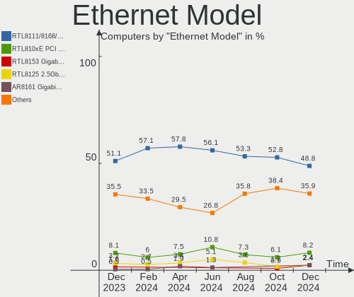
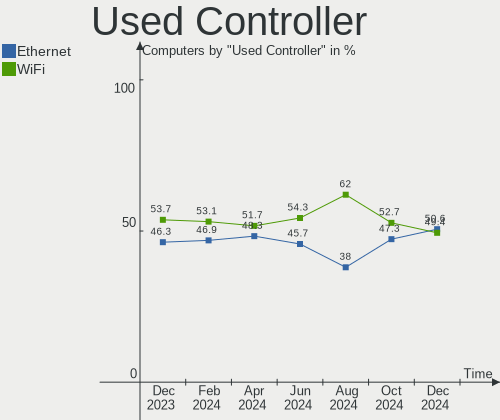
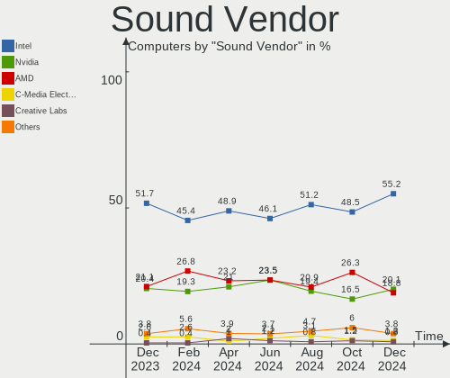
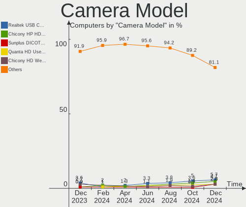
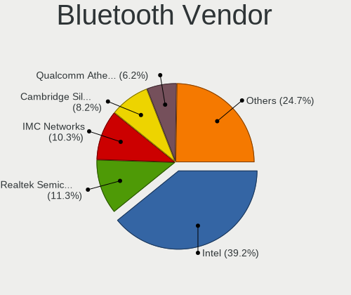

ROSA Hardware Trends
--------------------

A project to identify most popular hardware characteristics and track their change
over time based on data collected by ROSA users at https://Linux-Hardware.org.

Anyone can contribute to the study by uploading probes of their computers by
the [hw-probe](https://github.com/linuxhw/hw-probe) tool:

    sudo -E hw-probe -all -upload

This is a report for all computer types. See also reports for [desktops](/Dist/ROSA/Desktop/README.md) and [notebooks](/Dist/ROSA/Notebook/README.md).

Full-feature report is available here: https://linux-hardware.org/?view=trends

Period: Feb, 2021.

Contents
--------

- [ OS                       ](#os)
- [ OS Family                ](#os-family)
- [ Kernel                   ](#kernel)
- [ Kernel Family            ](#kernel-family)
- [ Kernel Major Ver.        ](#kernel-major-ver)
- [ Arch                     ](#arch)
- [ DE                       ](#de)
- [ Display Server           ](#display-server)
- [ Display Manager          ](#display-manager)
- [ OS Lang                  ](#os-lang)
- [ Boot Mode                ](#boot-mode)
- [ Filesystem               ](#filesystem)
- [ Part. scheme             ](#part-scheme)
- [ Dual Boot with Linux/BSD ](#dual-boot-with-linux/bsd)
- [ Dual Boot (Win)          ](#dual-boot-win)
- [ Country                  ](#country)
- [ City                     ](#city)
- [ Vendor                   ](#vendor)
- [ Model                    ](#model)
- [ Model Family             ](#model-family)
- [ MFG Year                 ](#mfg-year)
- [ Form Factor              ](#form-factor)
- [ Secure Boot              ](#secure-boot)
- [ Coreboot                 ](#coreboot)
- [ RAM Size                 ](#ram-size)
- [ RAM Used                 ](#ram-used)
- [ Has CD-ROM               ](#has-cd-rom)
- [ Total Drives             ](#total-drives)
- [ Has Ethernet             ](#has-ethernet)
- [ Drive Vendor             ](#drive-vendor)
- [ Drive Model              ](#drive-model)
- [ HDD Vendor               ](#hdd-vendor)
- [ SSD Vendor               ](#ssd-vendor)
- [ Drive Kind               ](#drive-kind)
- [ Drive Connector          ](#drive-connector)
- [ Drive Size               ](#drive-size)
- [ Space Total              ](#space-total)
- [ Space Used               ](#space-used)
- [ Malfunc. Drives          ](#malfunc-drives)
- [ Malfunc. Drive Vendor    ](#malfunc-drive-vendor)
- [ Malfunc. HDD Vendor      ](#malfunc-hdd-vendor)
- [ Malfunc. Drive Kind      ](#malfunc-drive-kind)
- [ Failed Drives            ](#failed-drives)
- [ Failed Drive Vendor      ](#failed-drive-vendor)
- [ Drive Status             ](#drive-status)
- [ Storage Vendor           ](#storage-vendor)
- [ Storage Model            ](#storage-model)
- [ Storage Kind             ](#storage-kind)
- [ CPU Vendor               ](#cpu-vendor)
- [ CPU Model                ](#cpu-model)
- [ CPU Model Family         ](#cpu-model-family)
- [ CPU Cores                ](#cpu-cores)
- [ CPU Sockets              ](#cpu-sockets)
- [ CPU Threads              ](#cpu-threads)
- [ CPU Op-Modes             ](#cpu-op-modes)
- [ CPU Microcode            ](#cpu-microcode)
- [ CPU Microarch            ](#cpu-microarch)
- [ GPU Vendor               ](#gpu-vendor)
- [ GPU Model                ](#gpu-model)
- [ GPU Combo                ](#gpu-combo)
- [ GPU Driver               ](#gpu-driver)
- [ GPU Memory               ](#gpu-memory)
- [ Monitor Vendor           ](#monitor-vendor)
- [ Monitor Model            ](#monitor-model)
- [ Monitor Resolution       ](#monitor-resolution)
- [ Monitor Diagonal         ](#monitor-diagonal)
- [ Monitor Width            ](#monitor-width)
- [ Aspect Ratio             ](#aspect-ratio)
- [ Monitor Area             ](#monitor-area)
- [ Pixel Density            ](#pixel-density)
- [ Multiple Monitors        ](#multiple-monitors)
- [ Net Controller Vendor    ](#net-controller-vendor)
- [ Net Controller Model     ](#net-controller-model)
- [ Wireless Vendor          ](#wireless-vendor)
- [ Wireless Model           ](#wireless-model)
- [ Ethernet Vendor          ](#ethernet-vendor)
- [ Ethernet Model           ](#ethernet-model)
- [ Net Controller Kind      ](#net-controller-kind)
- [ Used Controller          ](#used-controller)
- [ NICs                     ](#nics)
- [ Memory Vendor            ](#memory-vendor)
- [ Memory Model             ](#memory-model)
- [ Memory Kind              ](#memory-kind)
- [ Memory Form Factor       ](#memory-form-factor)
- [ Memory Size              ](#memory-size)
- [ Memory Speed             ](#memory-speed)
- [ Sound Vendor             ](#sound-vendor)
- [ Sound Model              ](#sound-model)
- [ Camera Vendor            ](#camera-vendor)
- [ Camera Model             ](#camera-model)
- [ Fingerprint Vendor       ](#fingerprint-vendor)
- [ Fingerprint Model        ](#fingerprint-model)
- [ Chipcard Vendor          ](#chipcard-vendor)
- [ Chipcard Model           ](#chipcard-model)
- [ Printer Vendor           ](#printer-vendor)
- [ Printer Model            ](#printer-model)
- [ Scanner Vendor           ](#scanner-vendor)
- [ Scanner Model            ](#scanner-model)
- [ Bluetooth Vendor         ](#bluetooth-vendor)
- [ Bluetooth Model          ](#bluetooth-model)
- [ Unsupported Devices      ](#unsupported-devices)
- [ Unsupported Device Types ](#unsupported-device-types)

OS
--

Installed operating systems

| Name         | Computers | Percent |
|--------------|-----------|---------|
| ROSA R11.1   | 110       | 63.58%  |
| ROSA R11     | 46        | 26.59%  |
| ROSA R10     | 7         | 4.05%   |
| ROSA R12     | 5         | 2.89%   |
| ROSA R8.1    | 3         | 1.73%   |
| ROSA 7.3     | 1         | 0.58%   |
| ROSA 2019.05 | 1         | 0.58%   |

OS Family
---------

OS without a version

| Name | Computers | Percent |
|------|-----------|---------|
| ROSA | 173       | 100%    |

Kernel
------

Version of the Linux kernel

| Version                             | Computers | Percent |
|-------------------------------------|-----------|---------|
| 4.15.0-desktop-122.124.1rosa-x86_64 | 50        | 28.9%   |
| 4.15.0-desktop-45.1rosa-x86_64      | 39        | 22.54%  |
| 5.4.83-generic-2rosa-x86_64         | 13        | 7.51%   |
| 4.15.0-desktop-45.1rosa-i586        | 11        | 6.36%   |
| 5.4.32-generic-2rosa-x86_64         | 10        | 5.78%   |
| 4.15.0-desktop-122.124.1rosa-i586   | 9         | 5.2%    |
| 4.9.155-nrj-desktop-1rosa-x86_64    | 8         | 4.62%   |
| 5.4.32-generic-2rosa-i586           | 4         | 2.31%   |
| 4.9.60-nrj-desktop-1rosa-i586       | 4         | 2.31%   |
| 5.5.19-generic-1rosa-x86_64         | 3         | 1.73%   |
| 5.4.83-generic-2rosa2019.1-x86_64   | 3         | 1.73%   |
| 4.9.60-nrj-desktop-1rosa-x86_64     | 3         | 1.73%   |
| 5.4.83-generic-2rosa-i586           | 2         | 1.16%   |
| 5.4.40-generic-1rosa-x86_64         | 2         | 1.16%   |
| 4.9.9-nrj-desktop-1rosa-x86_64      | 2         | 1.16%   |
| 4.9.155-nrj-desktop-1rosa-i586      | 2         | 1.16%   |
| 5.8.0-desktop-44.50.1rosa-x86_64    | 1         | 0.58%   |
| 5.4.60-nickel-2rosa2019.05-x86_64   | 1         | 0.58%   |
| 5.4.0-desktop-11.1rosa-x86_64       | 1         | 0.58%   |
| 5.10.4-generic-3rosa2019.1-x86_64   | 1         | 0.58%   |
| 5.10.4-generic-3rosa-x86_64         | 1         | 0.58%   |
| 5.10.11-generic-1rosa2019.1-x86_64  | 1         | 0.58%   |
| 5.10.0-desktop-12.13.2rosa-x86_64   | 1         | 0.58%   |
| 3.10.0-514.51.1.el7.x86_64          | 1         | 0.58%   |

Kernel Family
-------------

Linux kernel without a distro release

| Version | Computers | Percent |
|---------|-----------|---------|
| 4.15.0  | 109       | 63.01%  |
| 5.4.83  | 18        | 10.4%   |
| 5.4.32  | 14        | 8.09%   |
| 4.9.155 | 10        | 5.78%   |
| 4.9.60  | 7         | 4.05%   |
| 5.5.19  | 3         | 1.73%   |
| 5.4.40  | 2         | 1.16%   |
| 5.10.4  | 2         | 1.16%   |
| 4.9.9   | 2         | 1.16%   |
| 5.8.0   | 1         | 0.58%   |
| 5.4.60  | 1         | 0.58%   |
| 5.4.0   | 1         | 0.58%   |
| 5.10.11 | 1         | 0.58%   |
| 5.10.0  | 1         | 0.58%   |
| 3.10.0  | 1         | 0.58%   |

Kernel Major Ver.
-----------------

Linux kernel major version

| Version | Computers | Percent |
|---------|-----------|---------|
| 4.15    | 109       | 63.01%  |
| 5.4     | 36        | 20.81%  |
| 4.9     | 19        | 10.98%  |
| 5.10    | 4         | 2.31%   |
| 5.5     | 3         | 1.73%   |
| 5.8     | 1         | 0.58%   |
| 3.10    | 1         | 0.58%   |

Arch
----

OS architecture (x86_64, i586, etc.)

| Name   | Computers | Percent |
|--------|-----------|---------|
| x86_64 | 141       | 81.5%   |
| i686   | 32        | 18.5%   |

DE
--

Desktop Environment

| Name  | Computers | Percent |
|-------|-----------|---------|
| KDE4  | 104       | 60.12%  |
| KDE5  | 56        | 32.37%  |
| LXQt  | 10        | 5.78%   |
| GNOME | 2         | 1.16%   |
| MATE  | 1         | 0.58%   |

Display Server
--------------

X11 or Wayland

| Name    | Computers | Percent |
|---------|-----------|---------|
| X11     | 171       | 98.84%  |
| Wayland | 2         | 1.16%   |

Display Manager
---------------

SDDM, LightDM, etc.

| Name | Computers | Percent |
|------|-----------|---------|
| KDM  | 104       | 60.12%  |
| SDDM | 66        | 38.15%  |
| GDM  | 3         | 1.73%   |

OS Lang
-------

Language

| Lang    | Computers | Percent |
|---------|-----------|---------|
| ru_RU   | 93        | 53.76%  |
| Unknown | 56        | 32.37%  |
| pl_PL   | 6         | 3.47%   |
| it_IT   | 4         | 2.31%   |
| es_ES   | 4         | 2.31%   |
| en_US   | 3         | 1.73%   |
| de_DE   | 3         | 1.73%   |
| pt_BR   | 2         | 1.16%   |
| en_GB   | 2         | 1.16%   |

Boot Mode
---------

EFI or BIOS

| Mode | Computers | Percent |
|------|-----------|---------|
| BIOS | 140       | 80.92%  |
| EFI  | 33        | 19.08%  |

Filesystem
----------

Type of filesystem

| Type  | Computers | Percent |
|-------|-----------|---------|
| Ext4  | 164       | 94.8%   |
| Btrfs | 6         | 3.47%   |
| Ext3  | 3         | 1.73%   |

Part. scheme
------------

Scheme of partitioning

| Type    | Computers | Percent |
|---------|-----------|---------|
| MBR     | 119       | 68.79%  |
| GPT     | 46        | 26.59%  |
| Unknown | 8         | 4.62%   |

Dual Boot with Linux/BSD
------------------------

Hosting more than one Linux/BSD

| Dual boot | Computers | Percent |
|-----------|-----------|---------|
| No        | 130       | 75.14%  |
| Yes       | 43        | 24.86%  |

Dual Boot (Win)
---------------

Hosting Linux and Windows

| Dual boot | Computers | Percent |
|-----------|-----------|---------|
| No        | 92        | 53.18%  |
| Yes       | 81        | 46.82%  |

Country
-------

Geographic location (country)

| Country              | Computers | Percent |
|----------------------|-----------|---------|
| Russia               | 122       | 70.52%  |
| Ukraine              | 15        | 8.67%   |
| Poland               | 7         | 4.05%   |
| Belarus              | 5         | 2.89%   |
| Italy                | 4         | 2.31%   |
| Germany              | 4         | 2.31%   |
| Spain                | 2         | 1.16%   |
| Brazil               | 2         | 1.16%   |
| USA                  | 1         | 0.58%   |
| Uruguay              | 1         | 0.58%   |
| UK                   | 1         | 0.58%   |
| Switzerland          | 1         | 0.58%   |
| South Africa         | 1         | 0.58%   |
| Moldova, Republic of | 1         | 0.58%   |
| Mexico               | 1         | 0.58%   |
| Latvia               | 1         | 0.58%   |
| Kazakhstan           | 1         | 0.58%   |
| France               | 1         | 0.58%   |
| Finland              | 1         | 0.58%   |
| Bulgaria             | 1         | 0.58%   |

City
----

Geographic location (city)

| City            | Computers | Percent |
|-----------------|-----------|---------|
| Moscow          | 15        | 8.67%   |
| St Petersburg   | 8         | 4.62%   |
| Samara          | 6         | 3.47%   |
| Ekaterinburg    | 6         | 3.47%   |
| Barnaul         | 5         | 2.89%   |
| Ulyanovsk       | 3         | 1.73%   |
| Tambov          | 3         | 1.73%   |
| Sochi           | 3         | 1.73%   |
| Krasnoyarsk     | 3         | 1.73%   |
| Krasnodar       | 3         | 1.73%   |
| Yaroslavl       | 2         | 1.16%   |
| Volgograd       | 2         | 1.16%   |
| Tyumen          | 2         | 1.16%   |
| Sevastopol      | 2         | 1.16%   |
| Saratov         | 2         | 1.16%   |
| Ramenskoye      | 2         | 1.16%   |
| Omsk            | 2         | 1.16%   |
| Novosibirsk     | 2         | 1.16%   |
| Kingisepp       | 2         | 1.16%   |
| Kazan’        | 2         | 1.16%   |
| Biysk           | 2         | 1.16%   |
| Zmiyiv          | 1         | 0.58%   |
| Zhytomyr        | 1         | 0.58%   |
| Zaporizhia      | 1         | 0.58%   |
| Zamość        | 1         | 0.58%   |
| Yeysk           | 1         | 0.58%   |
| Yekaterinburg   | 1         | 0.58%   |
| Yasinovataya    | 1         | 0.58%   |
| Warsaw          | 1         | 0.58%   |
| Voronezh        | 1         | 0.58%   |
| Vicenza         | 1         | 0.58%   |
| Veliky Novgorod | 1         | 0.58%   |
| Valley Stream   | 1         | 0.58%   |
| Ulan-Ude        | 1         | 0.58%   |
| Ufa             | 1         | 0.58%   |
| Tiraspol        | 1         | 0.58%   |
| Taldykorgan     | 1         | 0.58%   |
| Stavropol       | 1         | 0.58%   |
| Stavishche      | 1         | 0.58%   |
| Sredneuralsk    | 1         | 0.58%   |
| Smolensk        | 1         | 0.58%   |
| Simferopol      | 1         | 0.58%   |
| Sibay           | 1         | 0.58%   |
| Serra           | 1         | 0.58%   |
| Schwarzenburg   | 1         | 0.58%   |
| Saransk         | 1         | 0.58%   |
| Saki            | 1         | 0.58%   |
| Ryazan          | 1         | 0.58%   |
| Rostov-on-Don   | 1         | 0.58%   |
| Rosenfeld       | 1         | 0.58%   |
| Rome            | 1         | 0.58%   |
| Riga            | 1         | 0.58%   |
| Ribeira         | 1         | 0.58%   |
| Pyatigorsk      | 1         | 0.58%   |
| Pustoshka       | 1         | 0.58%   |
| Pskov           | 1         | 0.58%   |
| Prokop'yevsk    | 1         | 0.58%   |
| Poznan          | 1         | 0.58%   |
| Poltava         | 1         | 0.58%   |
| Plovdiv         | 1         | 0.58%   |

Vendor
------

Motherboard manufacturer

| Name                | Computers | Percent |
|---------------------|-----------|---------|
| ASUSTek Computer    | 43        | 24.86%  |
| Gigabyte Technology | 31        | 17.92%  |
| Lenovo              | 14        | 8.09%   |
| ASRock              | 13        | 7.51%   |
| MSI                 | 12        | 6.94%   |
| Acer                | 11        | 6.36%   |
| Hewlett-Packard     | 9         | 5.2%    |
| ECS                 | 6         | 3.47%   |
| Dell                | 4         | 2.31%   |
| Sony                | 3         | 1.73%   |
| Samsung Electronics | 3         | 1.73%   |
| Biostar             | 3         | 1.73%   |
| Apple               | 3         | 1.73%   |
| Packard Bell        | 2         | 1.16%   |
| Foxconn             | 2         | 1.16%   |
| ZoomSmart           | 1         | 0.58%   |
| VIA Technologies    | 1         | 0.58%   |
| TONK                | 1         | 0.58%   |
| RoverComputers      | 1         | 0.58%   |
| RoverBook           | 1         | 0.58%   |
| Pegatron            | 1         | 0.58%   |
| Medion              | 1         | 0.58%   |
| Lite-On             | 1         | 0.58%   |
| Intel               | 1         | 0.58%   |
| Insyde              | 1         | 0.58%   |
| Huanan              | 1         | 0.58%   |
| Fujitsu             | 1         | 0.58%   |
| eMachines           | 1         | 0.58%   |
| Chuwi               | 1         | 0.58%   |

Model
-----

Motherboard model

| Name                                | Computers | Percent |
|-------------------------------------|-----------|---------|
| MSI MS-7267                         | 2         | 1.16%   |
| Lenovo B560                         | 2         | 1.16%   |
| HP Pavilion g6                      | 2         | 1.16%   |
| HP Pavilion 15                      | 2         | 1.16%   |
| Gigabyte G41M-Combo                 | 2         | 1.16%   |
| Gigabyte G31M-ES2L                  | 2         | 1.16%   |
| Acer TravelMate 5760                | 2         | 1.16%   |
| ZoomSmart A1002                     | 1         | 0.58%   |
| VIA P4M266A-8237                    | 1         | 0.58%   |
| TONK SB200                          | 1         | 0.58%   |
| Sony VPCS13S9R                      | 1         | 0.58%   |
| Sony VPCCW1S1R                      | 1         | 0.58%   |
| Sony VGN-NR430E                     | 1         | 0.58%   |
| Samsung RC410/RC510/RC710           | 1         | 0.58%   |
| Samsung 355V4C/356V4C/3445VC/3545VC | 1         | 0.58%   |
| Samsung 305U1A                      | 1         | 0.58%   |
| RoverComputers Neo U100             | 1         | 0.58%   |
| RoverBook Calistoga & ICH7M Chipset | 1         | 0.58%   |
| Pegatron Compaq dx2400 Microtower   | 1         | 0.58%   |
| Packard Bell EasyNote TJ65          | 1         | 0.58%   |
| Packard Bell EasyNote TE69CX        | 1         | 0.58%   |
| MSI S12T 3M/S12 3M                  | 1         | 0.58%   |
| MSI MS-7C13                         | 1         | 0.58%   |
| MSI MS-7B98                         | 1         | 0.58%   |
| MSI MS-7A38                         | 1         | 0.58%   |
| MSI MS-7A33                         | 1         | 0.58%   |
| MSI MS-7996                         | 1         | 0.58%   |
| MSI MS-7529                         | 1         | 0.58%   |
| MSI MS-7250                         | 1         | 0.58%   |
| MSI CR610                           | 1         | 0.58%   |
| MSI Compaq dx7400 Microtower        | 1         | 0.58%   |
| Medion P6624                        | 1         | 0.58%   |
| Lite-On dx2000 MT(PL091EA)          | 1         | 0.58%   |
| Lenovo ThinkPad X230 2320LFG        | 1         | 0.58%   |
| Lenovo ThinkPad X200 7459ZAZ        | 1         | 0.58%   |
| Lenovo ThinkPad T60p 200793G        | 1         | 0.58%   |
| Lenovo ThinkCentre M92p 3238BK7     | 1         | 0.58%   |
| Lenovo ThinkCentre M90p 5852A34     | 1         | 0.58%   |
| Lenovo ThinkCentre M72e 3598B44     | 1         | 0.58%   |
| Lenovo IdeaPad 330-15ARR 81D2       | 1         | 0.58%   |
| Lenovo IdeaPad 320-15IAP 80XR       | 1         | 0.58%   |
| Lenovo IdeaPad 310-15ISK 80SM       | 1         | 0.58%   |
| Lenovo IdeaPad 100-15IBY 80MJ       | 1         | 0.58%   |
| Lenovo H420                         | 1         | 0.58%   |
| Lenovo G560 20042                   | 1         | 0.58%   |
| Intel H55 INTEL                     | 1         | 0.58%   |
| Insyde i86C                         | 1         | 0.58%   |
| Huanan X99-TF                       | 1         | 0.58%   |
| HP ProBook 470 G5                   | 1         | 0.58%   |
| HP Pavilion g7                      | 1         | 0.58%   |
| HP Compaq 8200 Elite CMT PC         | 1         | 0.58%   |
| HP Compaq 6530b (NA407UC)           | 1         | 0.58%   |
| HP 255 G5                           | 1         | 0.58%   |
| Gigabyte X58A-UD7                   | 1         | 0.58%   |
| Gigabyte P67A-D3-B3                 | 1         | 0.58%   |
| Gigabyte P35-S3G                    | 1         | 0.58%   |
| Gigabyte P35-DS4                    | 1         | 0.58%   |
| Gigabyte M61SME-S2                  | 1         | 0.58%   |
| Gigabyte H61M-S1                    | 1         | 0.58%   |
| Gigabyte H55M-S2H                   | 1         | 0.58%   |

Model Family
------------

Motherboard model prefix

| Name                    | Computers | Percent |
|-------------------------|-----------|---------|
| HP Pavilion             | 5         | 2.89%   |
| Lenovo IdeaPad          | 4         | 2.31%   |
| Acer TravelMate         | 4         | 2.31%   |
| Lenovo ThinkPad         | 3         | 1.73%   |
| Lenovo ThinkCentre      | 3         | 1.73%   |
| Gigabyte H310M          | 3         | 1.73%   |
| Acer Aspire             | 3         | 1.73%   |
| Packard Bell EasyNote   | 2         | 1.16%   |
| MSI MS-7267             | 2         | 1.16%   |
| Lenovo B560             | 2         | 1.16%   |
| HP Compaq               | 2         | 1.16%   |
| Gigabyte G41M-Combo     | 2         | 1.16%   |
| Gigabyte G31M-ES2L      | 2         | 1.16%   |
| ASUS PRIME              | 2         | 1.16%   |
| ASUS P8Z77-V            | 2         | 1.16%   |
| ASUS P5K                | 2         | 1.16%   |
| ASUS P5G41T-M           | 2         | 1.16%   |
| Acer Extensa            | 2         | 1.16%   |
| ZoomSmart A1002         | 1         | 0.58%   |
| VIA P4M266A-8237        | 1         | 0.58%   |
| TONK SB200              | 1         | 0.58%   |
| Sony VPCS13S9R          | 1         | 0.58%   |
| Sony VPCCW1S1R          | 1         | 0.58%   |
| Sony VGN-NR430E         | 1         | 0.58%   |
| Samsung RC410           | 1         | 0.58%   |
| Samsung 355V4C          | 1         | 0.58%   |
| Samsung 305U1A          | 1         | 0.58%   |
| RoverComputers Neo      | 1         | 0.58%   |
| RoverBook Calistoga     | 1         | 0.58%   |
| Pegatron Compaq         | 1         | 0.58%   |
| MSI S12T                | 1         | 0.58%   |
| MSI MS-7C13             | 1         | 0.58%   |
| MSI MS-7B98             | 1         | 0.58%   |
| MSI MS-7A38             | 1         | 0.58%   |
| MSI MS-7A33             | 1         | 0.58%   |
| MSI MS-7996             | 1         | 0.58%   |
| MSI MS-7529             | 1         | 0.58%   |
| MSI MS-7250             | 1         | 0.58%   |
| MSI CR610               | 1         | 0.58%   |
| MSI Compaq              | 1         | 0.58%   |
| Medion P6624            | 1         | 0.58%   |
| Lite-On dx2000          | 1         | 0.58%   |
| Lenovo H420             | 1         | 0.58%   |
| Lenovo G560             | 1         | 0.58%   |
| Intel H55               | 1         | 0.58%   |
| Insyde i86C             | 1         | 0.58%   |
| Huanan X99-TF           | 1         | 0.58%   |
| HP ProBook              | 1         | 0.58%   |
| HP 255                  | 1         | 0.58%   |
| Gigabyte X58A-UD7       | 1         | 0.58%   |
| Gigabyte P67A-D3-B3     | 1         | 0.58%   |
| Gigabyte P35-S3G        | 1         | 0.58%   |
| Gigabyte P35-DS4        | 1         | 0.58%   |
| Gigabyte M61SME-S2      | 1         | 0.58%   |
| Gigabyte H61M-S1        | 1         | 0.58%   |
| Gigabyte H55M-S2H       | 1         | 0.58%   |
| Gigabyte H55M-D2H       | 1         | 0.58%   |
| Gigabyte GA-MA78GM-UD2H | 1         | 0.58%   |
| Gigabyte GA-MA770-DS3   | 1         | 0.58%   |
| Gigabyte GA-870A-USB3   | 1         | 0.58%   |

MFG Year
--------

Motherboard manufacture year

| Year | Computers | Percent |
|------|-----------|---------|
| 2010 | 21        | 12.14%  |
| 2009 | 21        | 12.14%  |
| 2019 | 17        | 9.83%   |
| 2011 | 17        | 9.83%   |
| 2012 | 16        | 9.25%   |
| 2013 | 14        | 8.09%   |
| 2008 | 12        | 6.94%   |
| 2018 | 10        | 5.78%   |
| 2007 | 8         | 4.62%   |
| 2020 | 7         | 4.05%   |
| 2016 | 7         | 4.05%   |
| 2017 | 5         | 2.89%   |
| 2014 | 4         | 2.31%   |
| 2006 | 4         | 2.31%   |
| 2005 | 4         | 2.31%   |
| 2015 | 3         | 1.73%   |
| 2021 | 2         | 1.16%   |
| 2004 | 1         | 0.58%   |

Form Factor
-----------

Physical design of the computer

| Name       | Computers | Percent |
|------------|-----------|---------|
| Desktop    | 111       | 64.16%  |
| Notebook   | 60        | 34.68%  |
| Tablet     | 1         | 0.58%   |
| All in one | 1         | 0.58%   |

Secure Boot
-----------

Enabled or disabled

| State    | Computers | Percent |
|----------|-----------|---------|
| Disabled | 172       | 99.42%  |
| Enabled  | 1         | 0.58%   |

Coreboot
--------

Have coreboot on board

| Used | Computers | Percent |
|------|-----------|---------|
| No   | 173       | 100%    |

RAM Size
--------

Total RAM memory

| Size in GB | Computers | Percent |
|------------|-----------|---------|
| 3.01-4.0   | 62        | 35.84%  |
| 4.01-8.0   | 28        | 16.18%  |
| 8.01-16.0  | 28        | 16.18%  |
| 2.01-3.0   | 15        | 8.67%   |
| 1.01-2.0   | 15        | 8.67%   |
| 16.01-24.0 | 13        | 7.51%   |
| 32.01-64.0 | 5         | 2.89%   |
| 0.51-1.0   | 5         | 2.89%   |
| 24.01-32.0 | 2         | 1.16%   |

RAM Used
--------

Used RAM memory

| Used GB  | Computers | Percent |
|----------|-----------|---------|
| 1.01-2.0 | 77        | 44.51%  |
| 0.51-1.0 | 69        | 39.88%  |
| 2.01-3.0 | 15        | 8.67%   |
| 3.01-4.0 | 6         | 3.47%   |
| 0.01-0.5 | 4         | 2.31%   |
| 4.01-8.0 | 2         | 1.16%   |

Has CD-ROM
----------

Has CD-ROM on board

| Presented | Computers | Percent |
|-----------|-----------|---------|
| Yes       | 87        | 50.29%  |
| No        | 86        | 49.71%  |

Total Drives
------------

Number of drives on board

| Drives | Computers | Percent |
|--------|-----------|---------|
| 1      | 105       | 60.69%  |
| 2      | 43        | 24.86%  |
| 3      | 18        | 10.4%   |
| 4      | 4         | 2.31%   |
| 5      | 2         | 1.16%   |
| 6      | 1         | 0.58%   |

Has Ethernet
------------

Has Ethernet on board

| Presented | Computers | Percent |
|-----------|-----------|---------|
| Yes       | 169       | 97.69%  |
| No        | 4         | 2.31%   |

Drive Vendor
------------

Hard drive vendors

| Vendor              | Computers | Drives | Percent |
|---------------------|-----------|--------|---------|
| Seagate             | 65        | 74     | 26.1%   |
| WDC                 | 51        | 64     | 20.48%  |
| Samsung Electronics | 23        | 24     | 9.24%   |
| Toshiba             | 14        | 14     | 5.62%   |
| Kingston            | 13        | 13     | 5.22%   |
| Hitachi             | 13        | 13     | 5.22%   |
| China               | 9         | 9      | 3.61%   |
| MAXTOR              | 7         | 7      | 2.81%   |
| GOODRAM             | 6         | 6      | 2.41%   |
| HGST                | 5         | 5      | 2.01%   |
| Unknown             | 4         | 4      | 1.61%   |
| SPCC                | 4         | 4      | 1.61%   |
| KingSpec            | 4         | 4      | 1.61%   |
| Apacer              | 4         | 4      | 1.61%   |
| Smartbuy            | 3         | 3      | 1.2%    |
| Crucial             | 3         | 3      | 1.2%    |
| A-DATA Technology   | 2         | 2      | 0.8%    |
| XrayDisk            | 1         | 1      | 0.4%    |
| Transcend           | 1         | 1      | 0.4%    |
| SanDisk             | 1         | 1      | 0.4%    |
| QUMO                | 1         | 1      | 0.4%    |
| PNY                 | 1         | 1      | 0.4%    |
| PLEXTOR             | 1         | 1      | 0.4%    |
| OCZ-VERTEX2         | 1         | 1      | 0.4%    |
| OCZ                 | 1         | 1      | 0.4%    |
| Micron Technology   | 1         | 1      | 0.4%    |
| LITEON              | 1         | 1      | 0.4%    |
| KingDian            | 1         | 1      | 0.4%    |
| Intenso             | 1         | 1      | 0.4%    |
| Intel               | 1         | 1      | 0.4%    |
| Hewlett-Packard     | 1         | 1      | 0.4%    |
| Gigabyte Technology | 1         | 1      | 0.4%    |
| Fujitsu             | 1         | 1      | 0.4%    |
| FC-1307             | 1         | 1      | 0.4%    |
| e2e4                | 1         | 1      | 0.4%    |
| Apple               | 1         | 1      | 0.4%    |

Drive Model
-----------

Hard drive models

| Model                            | Computers | Percent |
|----------------------------------|-----------|---------|
| Seagate ST3500418AS 500GB        | 5         | 1.85%   |
| Kingston SA400S37240G 240GB SSD  | 5         | 1.85%   |
| Seagate ST9320325AS 320GB        | 4         | 1.48%   |
| Seagate ST3320620AS 320GB        | 4         | 1.48%   |
| Seagate ST1000DM010-2EP102 1TB   | 4         | 1.48%   |
| Seagate ST500DM002-1BD142 500GB  | 3         | 1.11%   |
| Seagate ST3250410AS 250GB        | 3         | 1.11%   |
| Seagate ST1000LM035-1RK172 1TB   | 3         | 1.11%   |
| WDC WDS240G2G0B-00EPW0 240GB SSD | 2         | 0.74%   |
| WDC WD5000LPCX-24VHAT0 500GB     | 2         | 0.74%   |
| WDC WD10EADS-00M2B0 1TB          | 2         | 0.74%   |
| WDC WD1002FAEX-00Z3A0 1TB        | 2         | 0.74%   |
| Toshiba DT01ACA100 1TB           | 2         | 0.74%   |
| Toshiba DT01ACA050 500GB         | 2         | 0.74%   |
| Seagate ST9320328CS 320GB        | 2         | 0.74%   |
| Seagate ST9160310AS 160GB        | 2         | 0.74%   |
| Seagate ST3808110AS 80GB         | 2         | 0.74%   |
| Seagate ST340014A 40GB           | 2         | 0.74%   |
| Seagate ST3250312AS 250GB        | 2         | 0.74%   |
| Seagate ST250DM000-1BD141 250GB  | 2         | 0.74%   |
| Seagate ST1000DM003-1ER162 1TB   | 2         | 0.74%   |
| Samsung SSD 860 EVO 500GB        | 2         | 0.74%   |
| Samsung SSD 860 EVO 250GB        | 2         | 0.74%   |
| Samsung SSD 750 EVO 250GB        | 2         | 0.74%   |
| Samsung SP0411N 40GB             | 2         | 0.74%   |
| Kingston SUV500120G 120GB SSD    | 2         | 0.74%   |
| Kingston SA400S37120G 120GB SSD  | 2         | 0.74%   |
| Hitachi HTS542516K9SA00 160GB    | 2         | 0.74%   |
| GOODRAM SSDPR-CX300-120 120GB    | 2         | 0.74%   |
| China SSD 120GB                  | 2         | 0.74%   |
| Apacer AS350 128GB SSD           | 2         | 0.74%   |
| XrayDisk SSD 256GB               | 1         | 0.37%   |
| WDC WDS500G2B0C-00PXH0 500GB     | 1         | 0.37%   |
| WDC WDS250G2B0B 250GB SSD        | 1         | 0.37%   |
| WDC WDS250G2B0A 250GB SSD        | 1         | 0.37%   |
| WDC WDS250G1B0C-00S6U0 250GB     | 1         | 0.37%   |
| WDC WDS240G1G0A-00SS50 240GB SSD | 1         | 0.37%   |
| WDC WDS120G2G0A-00JH30 120GB SSD | 1         | 0.37%   |
| WDC WDS100T2B0B 1TB SSD          | 1         | 0.37%   |
| WDC WD800JD-22MSA1 80GB          | 1         | 0.37%   |
| WDC WD800BB-00FRA0 80GB          | 1         | 0.37%   |
| WDC WD800AAJS-00PSA0 80GB        | 1         | 0.37%   |
| WDC WD7501AALS-00J7B0 752GB      | 1         | 0.37%   |
| WDC WD5001AALS-00L3B2 500GB      | 1         | 0.37%   |
| WDC WD5000LPVX-28V0TT1 500GB     | 1         | 0.37%   |
| WDC WD5000LPVX-22V0TT0 500GB     | 1         | 0.37%   |
| WDC WD5000LPCX-21VHAT0 500GB     | 1         | 0.37%   |
| WDC WD5000BPVT-75HXZT3 500GB     | 1         | 0.37%   |
| WDC WD5000BPVT-22HXZT1 500GB     | 1         | 0.37%   |
| WDC WD5000AAKX-08U6AA0 500GB     | 1         | 0.37%   |
| WDC WD5000AAKX-00ERMA0 500GB     | 1         | 0.37%   |
| WDC WD5000AAKX-001CA0 500GB      | 1         | 0.37%   |
| WDC WD5000AAKS-00A7B2 500GB      | 1         | 0.37%   |
| WDC WD40EFRX-68WT0N0 4TB         | 1         | 0.37%   |
| WDC WD400BB-60JKA0 40GB          | 1         | 0.37%   |
| WDC WD400BB-60DGA0 40GB          | 1         | 0.37%   |
| WDC WD400BB-00JHC0 40GB          | 1         | 0.37%   |
| WDC WD4003FRYZ-01F0DB0 4TB       | 1         | 0.37%   |
| WDC WD3200BPVT-24ZEST0 320GB     | 1         | 0.37%   |
| WDC WD3200BPVT-22ZEST0 320GB     | 1         | 0.37%   |

HDD Vendor
----------

Hard disk drive vendors

| Vendor              | Computers | Drives | Percent |
|---------------------|-----------|--------|---------|
| Seagate             | 65        | 74     | 40.88%  |
| WDC                 | 45        | 55     | 28.3%   |
| Hitachi             | 13        | 13     | 8.18%   |
| Toshiba             | 12        | 12     | 7.55%   |
| Samsung Electronics | 10        | 10     | 6.29%   |
| Maxtor              | 7         | 7      | 4.4%    |
| HGST                | 5         | 5      | 3.14%   |
| Fujitsu             | 1         | 1      | 0.63%   |
| FC-1307             | 1         | 1      | 0.63%   |

SSD Vendor
----------

Solid state drive vendors

| Vendor              | Computers | Drives | Percent |
|---------------------|-----------|--------|---------|
| Kingston            | 12        | 12     | 15.38%  |
| Samsung Electronics | 10        | 11     | 12.82%  |
| China               | 9         | 9      | 11.54%  |
| WDC                 | 7         | 7      | 8.97%   |
| GOODRAM             | 6         | 6      | 7.69%   |
| SPCC                | 4         | 4      | 5.13%   |
| KingSpec            | 4         | 4      | 5.13%   |
| Crucial             | 3         | 3      | 3.85%   |
| Apacer              | 3         | 3      | 3.85%   |
| Smartbuy            | 2         | 2      | 2.56%   |
| A-DATA Technology   | 2         | 2      | 2.56%   |
| XrayDisk            | 1         | 1      | 1.28%   |
| Toshiba             | 1         | 1      | 1.28%   |
| QUMO                | 1         | 1      | 1.28%   |
| PNY                 | 1         | 1      | 1.28%   |
| PLEXTOR             | 1         | 1      | 1.28%   |
| OCZ-VERTEX2         | 1         | 1      | 1.28%   |
| OCZ                 | 1         | 1      | 1.28%   |
| Micron Technology   | 1         | 1      | 1.28%   |
| LITEON              | 1         | 1      | 1.28%   |
| KingDian            | 1         | 1      | 1.28%   |
| Intenso             | 1         | 1      | 1.28%   |
| Intel               | 1         | 1      | 1.28%   |
| Hewlett-Packard     | 1         | 1      | 1.28%   |
| Gigabyte Technology | 1         | 1      | 1.28%   |
| e2e4                | 1         | 1      | 1.28%   |
| Apple               | 1         | 1      | 1.28%   |

Drive Kind
----------

HDD or SSD

| Kind | Computers | Drives | Percent |
|------|-----------|--------|---------|
| HDD  | 132       | 178    | 60.55%  |
| SSD  | 72        | 79     | 33.03%  |
| NVMe | 10        | 10     | 4.59%   |
| MMC  | 4         | 5      | 1.83%   |

Drive Connector
---------------

SATA, SAS, NVMe, etc.

| Type | Computers | Drives | Percent |
|------|-----------|--------|---------|
| SATA | 167       | 255    | 91.26%  |
| NVMe | 10        | 10     | 5.46%   |
| MMC  | 4         | 5      | 2.19%   |
| SAS  | 2         | 2      | 1.09%   |

Drive Size
----------

Size of hard drive

| Size in TB | Computers | Drives | Percent |
|------------|-----------|--------|---------|
| 0.01-0.5   | 150       | 198    | 75%     |
| 0.51-1.0   | 40        | 49     | 20%     |
| 1.01-2.0   | 6         | 6      | 3%      |
| 3.01-4.0   | 2         | 2      | 1%      |
| 2.01-3.0   | 1         | 1      | 0.5%    |
| 4.01-10.0  | 1         | 1      | 0.5%    |

Space Total
-----------

Amount of disk space available on the file system

| Size in GB     | Computers | Percent |
|----------------|-----------|---------|
| 101-250        | 47        | 27.17%  |
| 251-500        | 45        | 26.01%  |
| 1-20           | 24        | 13.87%  |
| 51-100         | 19        | 10.98%  |
| 501-1000       | 18        | 10.4%   |
| 21-50          | 12        | 6.94%   |
| 1001-2000      | 5         | 2.89%   |
| 2001-3000      | 2         | 1.16%   |
| More than 3000 | 1         | 0.58%   |

Space Used
----------

Amount of used disk space

| Used GB   | Computers | Percent |
|-----------|-----------|---------|
| 1-20      | 115       | 66.47%  |
| 21-50     | 16        | 9.25%   |
| 101-250   | 16        | 9.25%   |
| 251-500   | 12        | 6.94%   |
| 51-100    | 7         | 4.05%   |
| 501-1000  | 5         | 2.89%   |
| 1001-2000 | 2         | 1.16%   |

Malfunc. Drives
---------------

Drive models with a malfunction

| Model                               | Computers | Drives | Percent |
|-------------------------------------|-----------|--------|---------|
| Seagate ST3500418AS 500GB           | 3         | 3      | 3.26%   |
| Seagate ST3320620AS 320GB           | 3         | 3      | 3.26%   |
| WDC WD1002FAEX-00Z3A0 1TB           | 2         | 2      | 2.17%   |
| Seagate ST9320328CS 320GB           | 2         | 2      | 2.17%   |
| Seagate ST9320325AS 320GB           | 2         | 2      | 2.17%   |
| Seagate ST500DM002-1BD142 500GB     | 2         | 2      | 2.17%   |
| Seagate ST3250410AS 250GB           | 2         | 2      | 2.17%   |
| WDC WDS240G2G0B-00EPW0 240GB SSD    | 1         | 1      | 1.09%   |
| WDC WD800JD-22MSA1 80GB             | 1         | 1      | 1.09%   |
| WDC WD800BB-00FRA0 80GB             | 1         | 1      | 1.09%   |
| WDC WD5001AALS-00L3B2 500GB         | 1         | 1      | 1.09%   |
| WDC WD5000LPVX-28V0TT1 500GB        | 1         | 1      | 1.09%   |
| WDC WD5000AAKX-00ERMA0 500GB        | 1         | 1      | 1.09%   |
| WDC WD5000AAKS-00A7B2 500GB         | 1         | 1      | 1.09%   |
| WDC WD40EFRX-68WT0N0 4TB            | 1         | 1      | 1.09%   |
| WDC WD400BB-60JKA0 40GB             | 1         | 2      | 1.09%   |
| WDC WD400BB-00JHC0 40GB             | 1         | 1      | 1.09%   |
| WDC WD3200BPVT-24ZEST0 320GB        | 1         | 1      | 1.09%   |
| WDC WD3200BPVT-22ZEST0 320GB        | 1         | 1      | 1.09%   |
| WDC WD3200BEVS-26VAT0 320GB         | 1         | 1      | 1.09%   |
| WDC WD3200AAJS-61B4A0 320GB         | 1         | 1      | 1.09%   |
| WDC WD3200AAJS-00B4A0 320GB         | 1         | 1      | 1.09%   |
| WDC WD2500JS-00MHB0 250GB           | 1         | 1      | 1.09%   |
| WDC WD10JPVT-00A1YT0 1TB            | 1         | 1      | 1.09%   |
| WDC WD10EZEX-08Y20A0 1TB            | 1         | 1      | 1.09%   |
| WDC WD10EARS-00Y5B1 1TB             | 1         | 1      | 1.09%   |
| WDC WD10EADS-00M2B0 1TB             | 1         | 1      | 1.09%   |
| Toshiba MQ01ABD050 500GB            | 1         | 1      | 1.09%   |
| Toshiba MK1059GSMP 1TB              | 1         | 1      | 1.09%   |
| Toshiba DT01ACA050 500GB            | 1         | 1      | 1.09%   |
| SPCC SSD162 120GB                   | 1         | 1      | 1.09%   |
| Seagate ST9640320AS 640GB           | 1         | 1      | 1.09%   |
| Seagate ST9250315AS 250GB           | 1         | 1      | 1.09%   |
| Seagate ST9160310AS 160GB           | 1         | 1      | 1.09%   |
| Seagate ST500VT000-1DK142 500GB     | 1         | 1      | 1.09%   |
| Seagate ST500LT012-9WS142 500GB     | 1         | 1      | 1.09%   |
| Seagate ST500LM012 HN-M500MBB 500GB | 1         | 1      | 1.09%   |
| Seagate ST3808110AS 80GB            | 1         | 1      | 1.09%   |
| Seagate ST380011A 80GB              | 1         | 1      | 1.09%   |
| Seagate ST3500820AS 500GB           | 1         | 1      | 1.09%   |
| Seagate ST340014A 40GB              | 1         | 1      | 1.09%   |
| Seagate ST3250824AS 250GB           | 1         | 1      | 1.09%   |
| Seagate ST3250312AS 250GB           | 1         | 1      | 1.09%   |
| Seagate ST3250310AS 250GB           | 1         | 1      | 1.09%   |
| Seagate ST3200827AS 200GB           | 1         | 1      | 1.09%   |
| Seagate ST320011A 20GB              | 1         | 1      | 1.09%   |
| Seagate ST3160812AS 160GB           | 1         | 1      | 1.09%   |
| Seagate ST3120814A 120GB            | 1         | 1      | 1.09%   |
| Seagate ST3120026A 120GB            | 1         | 1      | 1.09%   |
| Seagate ST31000528AS 1TB            | 1         | 1      | 1.09%   |
| Seagate ST31000524AS 1TB            | 1         | 1      | 1.09%   |
| Seagate ST31000333AS 1TB            | 1         | 1      | 1.09%   |
| Seagate ST250DM000-1BD141 250GB     | 1         | 1      | 1.09%   |
| Seagate ST2000LM007-1R8174 2TB      | 1         | 1      | 1.09%   |
| Seagate ST2000DX001-1CM164 2TB      | 1         | 1      | 1.09%   |
| Seagate ST1000DM003-9YN162 1TB      | 1         | 1      | 1.09%   |
| Seagate ST1000DM003-1CH162 1TB      | 1         | 1      | 1.09%   |
| Seagate ST1000DL002-9TT153 1TB      | 1         | 1      | 1.09%   |
| Samsung Electronics SP2504C 250GB   | 1         | 1      | 1.09%   |
| Samsung Electronics HD160JJ 160GB   | 1         | 1      | 1.09%   |

Malfunc. Drive Vendor
---------------------

Vendors of faulty drives

| Vendor              | Computers | Drives | Percent |
|---------------------|-----------|--------|---------|
| Seagate             | 36        | 41     | 41.38%  |
| WDC                 | 22        | 23     | 25.29%  |
| Hitachi             | 9         | 9      | 10.34%  |
| MAXTOR              | 6         | 6      | 6.9%    |
| Toshiba             | 3         | 3      | 3.45%   |
| Samsung Electronics | 3         | 3      | 3.45%   |
| HGST                | 3         | 3      | 3.45%   |
| KingSpec            | 2         | 2      | 2.3%    |
| SPCC                | 1         | 1      | 1.15%   |
| PNY                 | 1         | 1      | 1.15%   |
| OCZ                 | 1         | 1      | 1.15%   |

Malfunc. HDD Vendor
-------------------

Vendors of faulty HDD drives

| Vendor              | Computers | Drives | Percent |
|---------------------|-----------|--------|---------|
| Seagate             | 36        | 41     | 44.44%  |
| WDC                 | 21        | 22     | 25.93%  |
| Hitachi             | 9         | 9      | 11.11%  |
| Maxtor              | 6         | 6      | 7.41%   |
| Toshiba             | 3         | 3      | 3.7%    |
| Samsung Electronics | 3         | 3      | 3.7%    |
| HGST                | 3         | 3      | 3.7%    |

Malfunc. Drive Kind
-------------------

Kinds of faulty drives

| Kind | Computers | Drives | Percent |
|------|-----------|--------|---------|
| HDD  | 74        | 87     | 92.5%   |
| SSD  | 6         | 6      | 7.5%    |

Failed Drives
-------------

Failed drive models

| Model                            | Computers | Drives | Percent |
|----------------------------------|-----------|--------|---------|
| WDC WD2500JS-22NCB1 250GB        | 1         | 1      | 33.33%  |
| Seagate ST9320325AS 320GB        | 1         | 1      | 33.33%  |
| Samsung Electronics SV2001H 20GB | 1         | 1      | 33.33%  |

Failed Drive Vendor
-------------------

Failed drive vendors

| Vendor              | Computers | Drives | Percent |
|---------------------|-----------|--------|---------|
| WDC                 | 1         | 1      | 33.33%  |
| Seagate             | 1         | 1      | 33.33%  |
| Samsung Electronics | 1         | 1      | 33.33%  |

Drive Status
------------

Number of failed and malfunc. drives

| Status   | Computers | Drives | Percent |
|----------|-----------|--------|---------|
| Works    | 120       | 167    | 57.42%  |
| Malfunc  | 78        | 93     | 37.32%  |
| Detected | 8         | 9      | 3.83%   |
| Failed   | 3         | 3      | 1.44%   |

Storage Vendor
--------------

Storage controller vendors

| Vendor                           | Computers | Percent |
|----------------------------------|-----------|---------|
| Intel                            | 124       | 59.62%  |
| AMD                              | 38        | 18.27%  |
| JMicron Technology               | 15        | 7.21%   |
| Nvidia                           | 7         | 3.37%   |
| ASMedia Technology               | 7         | 3.37%   |
| Samsung Electronics              | 4         | 1.92%   |
| Marvell Technology Group         | 4         | 1.92%   |
| Silicon Motion                   | 2         | 0.96%   |
| Sandisk                          | 2         | 0.96%   |
| VIA Technologies                 | 1         | 0.48%   |
| Silicon Integrated Systems [SiS] | 1         | 0.48%   |
| Phison Electronics               | 1         | 0.48%   |
| OCZ Technology Group             | 1         | 0.48%   |
| Kingston Technology Company      | 1         | 0.48%   |

Storage Model
-------------

Storage controller models

| Model                                                                                   | Computers | Percent |
|-----------------------------------------------------------------------------------------|-----------|---------|
| AMD FCH SATA Controller [AHCI mode]                                                     | 22        | 7.83%   |
| Intel NM10/ICH7 Family SATA Controller [IDE mode]                                       | 18        | 6.41%   |
| Intel 82801G (ICH7 Family) IDE Controller                                               | 14        | 4.98%   |
| Intel 5 Series/3400 Series Chipset 4 port SATA AHCI Controller                          | 9         | 3.2%    |
| AMD SB7x0/SB8x0/SB9x0 SATA Controller [AHCI mode]                                       | 9         | 3.2%    |
| AMD SB7x0/SB8x0/SB9x0 IDE Controller                                                    | 8         | 2.85%   |
| JMicron JMB368 IDE controller                                                           | 7         | 2.49%   |
| Intel 200 Series PCH SATA controller [AHCI mode]                                        | 7         | 2.49%   |
| Intel 82801JI (ICH10 Family) 4 port SATA IDE Controller #1                              | 6         | 2.14%   |
| Intel 82801JI (ICH10 Family) 2 port SATA IDE Controller #2                              | 6         | 2.14%   |
| Intel 82801I (ICH9 Family) 2 port SATA Controller [IDE mode]                            | 6         | 2.14%   |
| ASMedia ASM1062 Serial ATA Controller                                                   | 6         | 2.14%   |
| Nvidia MCP61 SATA Controller                                                            | 5         | 1.78%   |
| Nvidia MCP61 IDE                                                                        | 5         | 1.78%   |
| JMicron JMB363 SATA/IDE Controller                                                      | 5         | 1.78%   |
| Intel 82801IBM/IEM (ICH9M/ICH9M-E) 4 port SATA Controller [AHCI mode]                   | 5         | 1.78%   |
| Intel 7 Series Chipset Family 6-port SATA Controller [AHCI mode]                        | 5         | 1.78%   |
| Intel 6 Series/C200 Series Chipset Family 6 port Desktop SATA AHCI Controller           | 5         | 1.78%   |
| Intel 82801HM/HEM (ICH8M/ICH8M-E) SATA Controller [AHCI mode]                           | 4         | 1.42%   |
| Intel 82801HM/HEM (ICH8M/ICH8M-E) IDE Controller                                        | 4         | 1.42%   |
| Intel 7 Series/C210 Series Chipset Family 6-port SATA Controller [AHCI mode]            | 4         | 1.42%   |
| Intel 6 Series/C200 Series Chipset Family Desktop SATA Controller (IDE mode, ports 4-5) | 4         | 1.42%   |
| Intel 6 Series/C200 Series Chipset Family Desktop SATA Controller (IDE mode, ports 0-3) | 4         | 1.42%   |
| Intel 6 Series/C200 Series Chipset Family 6 port Mobile SATA AHCI Controller            | 4         | 1.42%   |
| Intel 5 Series/3400 Series Chipset 4 port SATA IDE Controller                           | 4         | 1.42%   |
| AMD SB7x0/SB8x0/SB9x0 SATA Controller [IDE mode]                                        | 4         | 1.42%   |
| AMD 400 Series Chipset SATA Controller                                                  | 4         | 1.42%   |
| Samsung NVMe SSD Controller SM981/PM981/PM983                                           | 3         | 1.07%   |
| Intel Sunrise Point-LP SATA Controller [AHCI mode]                                      | 3         | 1.07%   |
| Intel Q170/Q150/B150/H170/H110/Z170/CM236 Chipset SATA Controller [AHCI Mode]           | 3         | 1.07%   |
| Intel Celeron N3350/Pentium N4200/Atom E3900 Series SATA AHCI Controller                | 3         | 1.07%   |
| Intel 82801IR/IO/IH (ICH9R/DO/DH) 4 port SATA Controller [IDE mode]                     | 3         | 1.07%   |
| Intel 82801IB (ICH9) 2 port SATA Controller [IDE mode]                                  | 3         | 1.07%   |
| Intel 82801GBM/GHM (ICH7-M Family) SATA Controller [IDE mode]                           | 3         | 1.07%   |
| Intel 5 Series/3400 Series Chipset 6 port SATA AHCI Controller                          | 3         | 1.07%   |
| Intel 5 Series/3400 Series Chipset 2 port SATA IDE Controller                           | 3         | 1.07%   |
| Silicon Motion SM2263EN/SM2263XT SSD Controller                                         | 2         | 0.71%   |
| Marvell Group 88SE6101/6102 single-port PATA133 interface                               | 2         | 0.71%   |
| JMicron JMB361 AHCI/IDE                                                                 | 2         | 0.71%   |
| Intel SATA Controller [RAID mode]                                                       | 2         | 0.71%   |
| Intel NM10/ICH7 Family SATA Controller [AHCI mode]                                      | 2         | 0.71%   |
| Intel Atom/Celeron/Pentium Processor x5-E8000/J3xxx/N3xxx Series SATA Controller        | 2         | 0.71%   |
| Intel Atom Processor E3800 Series SATA AHCI Controller                                  | 2         | 0.71%   |
| Intel 82801JI (ICH10 Family) SATA AHCI Controller                                       | 2         | 0.71%   |
| Intel 82801HR/HO/HH (ICH8R/DO/DH) 2 port SATA Controller [IDE mode]                     | 2         | 0.71%   |
| Intel 82801H (ICH8 Family) 4 port SATA Controller [IDE mode]                            | 2         | 0.71%   |
| Intel 82801GBM/GHM (ICH7-M Family) SATA Controller [AHCI mode]                          | 2         | 0.71%   |
| Intel 82801EB/ER (ICH5/ICH5R) IDE Controller                                            | 2         | 0.71%   |
| Intel 8 Series SATA Controller 1 [AHCI mode]                                            | 2         | 0.71%   |
| AMD X370 Series Chipset SATA Controller                                                 | 2         | 0.71%   |
| AMD SB600 Non-Raid-5 SATA                                                               | 2         | 0.71%   |
| AMD SB600 IDE                                                                           | 2         | 0.71%   |
| AMD FCH SATA Controller D                                                               | 2         | 0.71%   |
| AMD FCH IDE Controller                                                                  | 2         | 0.71%   |
| VIA VT82C586A/B/VT82C686/A/B/VT823x/A/C PIPC Bus Master IDE                             | 1         | 0.36%   |
| Silicon Integrated Systems [SiS] RAID bus controller 180 SATA/PATA  [SiS]               | 1         | 0.36%   |
| Silicon Integrated Systems [SiS] 5513 IDE Controller                                    | 1         | 0.36%   |
| Sandisk WD Blue SN550 NVMe SSD                                                          | 1         | 0.36%   |
| Sandisk WD Blue SN500 / PC SN520 NVMe SSD                                               | 1         | 0.36%   |
| Samsung Electronics SATA controller                                                     | 1         | 0.36%   |

Storage Kind
------------

Kind of storage controller (IDE, SATA, NVMe, SAS, ...)

| Kind | Computers | Percent |
|------|-----------|---------|
| SATA | 112       | 54.37%  |
| IDE  | 80        | 38.83%  |
| NVMe | 10        | 4.85%   |
| RAID | 4         | 1.94%   |

CPU Vendor
----------

Processor vendors

| Vendor | Computers | Percent |
|--------|-----------|---------|
| Intel  | 129       | 74.57%  |
| AMD    | 44        | 25.43%  |

CPU Model
---------

Processor models

| Model                                         | Computers | Percent |
|-----------------------------------------------|-----------|---------|
| Intel Pentium Dual-Core CPU E5700 @ 3.00GHz   | 3         | 1.73%   |
| Intel Core i3 CPU M 370 @ 2.40GHz             | 3         | 1.73%   |
| Intel Core 2 Quad CPU Q8200 @ 2.33GHz         | 3         | 1.73%   |
| Intel Core 2 Duo CPU E8400 @ 3.00GHz          | 3         | 1.73%   |
| Intel Atom CPU N270 @ 1.60GHz                 | 3         | 1.73%   |
| Intel Xeon CPU L5420 @ 2.50GHz                | 2         | 1.16%   |
| Intel Pentium Dual-Core CPU E5300 @ 2.60GHz   | 2         | 1.16%   |
| Intel Pentium Dual CPU E2160 @ 1.80GHz        | 2         | 1.16%   |
| Intel Pentium CPU G620 @ 2.60GHz              | 2         | 1.16%   |
| Intel Core i5-6500 CPU @ 3.20GHz              | 2         | 1.16%   |
| Intel Core i5 CPU M 430 @ 2.27GHz             | 2         | 1.16%   |
| Intel Core i3-8100 CPU @ 3.60GHz              | 2         | 1.16%   |
| Intel Core i3-6006U CPU @ 2.00GHz             | 2         | 1.16%   |
| Intel Core 2 Quad CPU Q9550 @ 2.83GHz         | 2         | 1.16%   |
| Intel Core 2 Duo CPU E7400 @ 2.80GHz          | 2         | 1.16%   |
| Intel Atom x5-E8000 CPU @ 1.04GHz             | 2         | 1.16%   |
| Intel Atom CPU D525 @ 1.80GHz                 | 2         | 1.16%   |
| AMD Ryzen 3 2200U with Radeon Vega Mobile Gfx | 2         | 1.16%   |
| AMD Ryzen 3 1200 Quad-Core Processor          | 2         | 1.16%   |
| AMD Athlon II X2 240 Processor                | 2         | 1.16%   |
| Intel Xeon CPU E5450 @ 3.00GHz                | 1         | 0.58%   |
| Intel Xeon CPU E5-2678 v3 @ 2.50GHz           | 1         | 0.58%   |
| Intel Pentium Gold G5420 CPU @ 3.80GHz        | 1         | 0.58%   |
| Intel Pentium Gold G5400 CPU @ 3.70GHz        | 1         | 0.58%   |
| Intel Pentium Dual-Core CPU T4500 @ 2.30GHz   | 1         | 0.58%   |
| Intel Pentium Dual-Core CPU T4400 @ 2.20GHz   | 1         | 0.58%   |
| Intel Pentium Dual-Core CPU E5500 @ 2.80GHz   | 1         | 0.58%   |
| Intel Pentium Dual-Core CPU E5400 @ 2.70GHz   | 1         | 0.58%   |
| Intel Pentium Dual CPU T2390 @ 1.86GHz        | 1         | 0.58%   |
| Intel Pentium D CPU 3.40GHz                   | 1         | 0.58%   |
| Intel Pentium CPU P6200 @ 2.13GHz             | 1         | 0.58%   |
| Intel Pentium CPU B980 @ 2.40GHz              | 1         | 0.58%   |
| Intel Pentium CPU B970 @ 2.30GHz              | 1         | 0.58%   |
| Intel Pentium 4 CPU 3.20GHz                   | 1         | 0.58%   |
| Intel Genuine CPU U7300 @ 1.30GHz             | 1         | 0.58%   |
| Intel Genuine CPU T2600 @ 2.16GHz             | 1         | 0.58%   |
| Intel Genuine CPU T2050 @ 1.60GHz             | 1         | 0.58%   |
| Intel Genuine CPU 2160 @ 1.80GHz              | 1         | 0.58%   |
| Intel Core i9-9900K CPU @ 3.60GHz             | 1         | 0.58%   |
| Intel Core i7-4770K CPU @ 3.50GHz             | 1         | 0.58%   |
| Intel Core i7-4500U CPU @ 1.80GHz             | 1         | 0.58%   |
| Intel Core i7-3770S CPU @ 3.10GHz             | 1         | 0.58%   |
| Intel Core i7-3770K CPU @ 3.50GHz             | 1         | 0.58%   |
| Intel Core i7-3770 CPU @ 3.40GHz              | 1         | 0.58%   |
| Intel Core i7-2670QM CPU @ 2.20GHz            | 1         | 0.58%   |
| Intel Core i7 CPU 930 @ 2.80GHz               | 1         | 0.58%   |
| Intel Core i7 CPU 920 @ 2.67GHz               | 1         | 0.58%   |
| Intel Core i5-8400 CPU @ 2.80GHz              | 1         | 0.58%   |
| Intel Core i5-8250U CPU @ 1.60GHz             | 1         | 0.58%   |
| Intel Core i5-5350U CPU @ 1.80GHz             | 1         | 0.58%   |
| Intel Core i5-4200U CPU @ 1.60GHz             | 1         | 0.58%   |
| Intel Core i5-3550 CPU @ 3.30GHz              | 1         | 0.58%   |
| Intel Core i5-3470T CPU @ 2.90GHz             | 1         | 0.58%   |
| Intel Core i5-3337U CPU @ 1.80GHz             | 1         | 0.58%   |
| Intel Core i5-3330 CPU @ 3.00GHz              | 1         | 0.58%   |
| Intel Core i5-3230M CPU @ 2.60GHz             | 1         | 0.58%   |
| Intel Core i5-2500K CPU @ 3.30GHz             | 1         | 0.58%   |
| Intel Core i5-2400 CPU @ 3.10GHz              | 1         | 0.58%   |
| Intel Core i5-2320 CPU @ 3.00GHz              | 1         | 0.58%   |
| Intel Core i5 CPU M 520 @ 2.40GHz             | 1         | 0.58%   |

CPU Model Family
----------------

Processor model prefix

| Model                   | Computers | Percent |
|-------------------------|-----------|---------|
| Intel Core i5           | 21        | 12.14%  |
| Intel Core i3           | 21        | 12.14%  |
| Intel Core 2 Duo        | 19        | 10.98%  |
| Intel Celeron           | 13        | 7.51%   |
| Intel Pentium Dual-Core | 9         | 5.2%    |
| Intel Atom              | 9         | 5.2%    |
| Intel Core i7           | 8         | 4.62%   |
| Intel Core 2 Quad       | 6         | 3.47%   |
| Intel Pentium           | 5         | 2.89%   |
| AMD Ryzen 5             | 5         | 2.89%   |
| AMD Ryzen 3             | 5         | 2.89%   |
| AMD Athlon II X2        | 5         | 2.89%   |
| Intel Xeon              | 4         | 2.31%   |
| Intel Genuine           | 4         | 2.31%   |
| Intel Pentium Dual      | 3         | 1.73%   |
| AMD FX                  | 3         | 1.73%   |
| AMD Athlon II X3        | 3         | 1.73%   |
| AMD A10                 | 3         | 1.73%   |
| Intel Pentium Gold      | 2         | 1.16%   |
| Intel Core 2            | 2         | 1.16%   |
| AMD E                   | 2         | 1.16%   |
| AMD Athlon X4           | 2         | 1.16%   |
| AMD Athlon 64 X2        | 2         | 1.16%   |
| AMD A4                  | 2         | 1.16%   |
| Intel Pentium D         | 1         | 0.58%   |
| Intel Pentium 4         | 1         | 0.58%   |
| Intel Core i9           | 1         | 0.58%   |
| AMD Turion II           | 1         | 0.58%   |
| AMD Sempron             | 1         | 0.58%   |
| AMD Ryzen 7 PRO         | 1         | 0.58%   |
| AMD Ryzen 7             | 1         | 0.58%   |
| AMD Phenom II X3        | 1         | 0.58%   |
| AMD Phenom              | 1         | 0.58%   |
| AMD E2                  | 1         | 0.58%   |
| AMD E1                  | 1         | 0.58%   |
| AMD Athlon II X4        | 1         | 0.58%   |
| AMD Athlon 64           | 1         | 0.58%   |
| AMD Athlon              | 1         | 0.58%   |
| AMD A8                  | 1         | 0.58%   |

CPU Cores
---------

Number of processor cores

| Number | Computers | Percent |
|--------|-----------|---------|
| 2      | 103       | 59.54%  |
| 4      | 42        | 24.28%  |
| 1      | 14        | 8.09%   |
| 6      | 6         | 3.47%   |
| 3      | 4         | 2.31%   |
| 8      | 3         | 1.73%   |
| 12     | 1         | 0.58%   |

CPU Sockets
-----------

Number of sockets

| Number | Computers | Percent |
|--------|-----------|---------|
| 1      | 173       | 100%    |

CPU Threads
-----------

Threads per core (Hyper-Threading)

| Number | Computers | Percent |
|--------|-----------|---------|
| 1      | 105       | 60.69%  |
| 2      | 68        | 39.31%  |

CPU Op-Modes
------------

CPU Operation Modes (32-bit, 64-bit)

| Op mode        | Computers | Percent |
|----------------|-----------|---------|
| 32-bit, 64-bit | 163       | 94.22%  |
| 32-bit         | 10        | 5.78%   |

CPU Microcode
-------------

Microcode number

| Number     | Computers | Percent |
|------------|-----------|---------|
| 0x1067a    | 20        | 11.56%  |
| 0x206a7    | 13        | 7.51%   |
| 0x20655    | 12        | 6.94%   |
| 0x306a9    | 10        | 5.78%   |
| 0x010000c8 | 8         | 4.62%   |
| 0x6fd      | 7         | 4.05%   |
| 0x10676    | 6         | 3.47%   |
| 0x06001119 | 6         | 3.47%   |
| Unknown    | 6         | 3.47%   |
| 0x906eb    | 4         | 2.31%   |
| 0x906ea    | 4         | 2.31%   |
| 0x106c2    | 4         | 2.31%   |
| 0x08001138 | 4         | 2.31%   |
| 0x6fb      | 3         | 1.73%   |
| 0x506c9    | 3         | 1.73%   |
| 0x20652    | 3         | 1.73%   |
| 0x10677    | 3         | 1.73%   |
| 0xf41      | 2         | 1.16%   |
| 0xf34      | 2         | 1.16%   |
| 0x6f2      | 2         | 1.16%   |
| 0x6e8      | 2         | 1.16%   |
| 0x506e3    | 2         | 1.16%   |
| 0x406e3    | 2         | 1.16%   |
| 0x406c4    | 2         | 1.16%   |
| 0x40651    | 2         | 1.16%   |
| 0x30678    | 2         | 1.16%   |
| 0x106ca    | 2         | 1.16%   |
| 0x106a5    | 2         | 1.16%   |
| 0x10661    | 2         | 1.16%   |
| 0x08701013 | 2         | 1.16%   |
| 0x0800820d | 2         | 1.16%   |
| 0x06000852 | 2         | 1.16%   |
| 0x05000119 | 2         | 1.16%   |
| 0x010000db | 2         | 1.16%   |
| 0xf64      | 1         | 0.58%   |
| 0xa0653    | 1         | 0.58%   |
| 0x906ec    | 1         | 0.58%   |
| 0x906e9    | 1         | 0.58%   |
| 0x806ea    | 1         | 0.58%   |
| 0x6fa      | 1         | 0.58%   |
| 0x6f6      | 1         | 0.58%   |
| 0x306f2    | 1         | 0.58%   |
| 0x306d4    | 1         | 0.58%   |
| 0x306c3    | 1         | 0.58%   |
| 0x30673    | 1         | 0.58%   |
| 0x0a201009 | 1         | 0.58%   |
| 0x08701021 | 1         | 0.58%   |
| 0x08101016 | 1         | 0.58%   |
| 0x0810100b | 1         | 0.58%   |
| 0x08101007 | 1         | 0.58%   |
| 0x07030106 | 1         | 0.58%   |
| 0x0700010f | 1         | 0.58%   |
| 0x0600611a | 1         | 0.58%   |
| 0x06003106 | 1         | 0.58%   |
| 0x0600063e | 1         | 0.58%   |
| 0x010000c9 | 1         | 0.58%   |
| 0x010000c7 | 1         | 0.58%   |

CPU Microarch
-------------

Microarchitecture

| Name        | Computers | Percent |
|-------------|-----------|---------|
| Penryn      | 30        | 17.34%  |
| Westmere    | 16        | 9.25%   |
| Core        | 16        | 9.25%   |
| SandyBridge | 13        | 7.51%   |
| K10         | 13        | 7.51%   |
| KabyLake    | 11        | 6.36%   |
| IvyBridge   | 10        | 5.78%   |
| Piledriver  | 8         | 4.62%   |
| Zen         | 7         | 4.05%   |
| Bonnell     | 6         | 3.47%   |
| Silvermont  | 5         | 2.89%   |
| NetBurst    | 5         | 2.89%   |
| Skylake     | 4         | 2.31%   |
| Haswell     | 4         | 2.31%   |
| Zen 2       | 3         | 1.73%   |
| K8 Hammer   | 3         | 1.73%   |
| Goldmont    | 3         | 1.73%   |
| Zen+        | 2         | 1.16%   |
| P6          | 2         | 1.16%   |
| Nehalem     | 2         | 1.16%   |
| Bobcat      | 2         | 1.16%   |
| Steamroller | 1         | 0.58%   |
| Puma        | 1         | 0.58%   |
| Jaguar      | 1         | 0.58%   |
| Excavator   | 1         | 0.58%   |
| CometLake   | 1         | 0.58%   |
| Bulldozer   | 1         | 0.58%   |
| Broadwell   | 1         | 0.58%   |
| Unknown     | 1         | 0.58%   |

GPU Vendor
----------

Vendors of graphics cards

| Vendor | Computers | Percent |
|--------|-----------|---------|
| Nvidia | 75        | 39.47%  |
| Intel  | 70        | 36.84%  |
| AMD    | 45        | 23.68%  |

GPU Model
---------

Graphics card models

| Model                                                                                    | Computers | Percent |
|------------------------------------------------------------------------------------------|-----------|---------|
| Intel Core Processor Integrated Graphics Controller                                      | 10        | 5%      |
| Intel 2nd Generation Core Processor Family Integrated Graphics Controller                | 7         | 3.5%    |
| Intel 82G33/G31 Express Integrated Graphics Controller                                   | 5         | 2.5%    |
| Intel 4 Series Chipset Integrated Graphics Controller                                    | 5         | 2.5%    |
| AMD Ellesmere [Radeon RX 470/480/570/570X/580/580X/590]                                  | 5         | 2.5%    |
| Nvidia GT218M [GeForce 310M]                                                             | 4         | 2%      |
| Intel Xeon E3-1200 v2/3rd Gen Core processor Graphics Controller                         | 4         | 2%      |
| Intel Mobile 4 Series Chipset Integrated Graphics Controller                             | 4         | 2%      |
| Intel 3rd Gen Core processor Graphics Controller                                         | 4         | 2%      |
| Nvidia GT218M [GeForce G210M]                                                            | 3         | 1.5%    |
| Nvidia GM107 [GeForce GTX 750 Ti]                                                        | 3         | 1.5%    |
| Nvidia GF116 [GeForce GTX 550 Ti]                                                        | 3         | 1.5%    |
| Intel Mobile 945GSE Express Integrated Graphics Controller                               | 3         | 1.5%    |
| Intel Mobile 945GM/GMS/GME, 943/940GML Express Integrated Graphics Controller            | 3         | 1.5%    |
| Intel HD Graphics 500                                                                    | 3         | 1.5%    |
| Intel CoffeeLake-S GT2 [UHD Graphics 630]                                                | 3         | 1.5%    |
| Intel CoffeeLake-S GT1 [UHD Graphics 610]                                                | 3         | 1.5%    |
| Intel 82945G/GZ Integrated Graphics Controller                                           | 3         | 1.5%    |
| AMD Raven Ridge [Radeon Vega Series / Radeon Vega Mobile Series]                         | 3         | 1.5%    |
| Nvidia GT216 [GeForce GT 220]                                                            | 2         | 1%      |
| Nvidia GP107 [GeForce GTX 1050]                                                          | 2         | 1%      |
| Nvidia GP106 [GeForce GTX 1060 6GB]                                                      | 2         | 1%      |
| Nvidia GP106 [GeForce GTX 1060 3GB]                                                      | 2         | 1%      |
| Nvidia GK208BM [GeForce 920M]                                                            | 2         | 1%      |
| Nvidia GK208B [GeForce GT 710]                                                           | 2         | 1%      |
| Nvidia GF108 [GeForce GT 630]                                                            | 2         | 1%      |
| Nvidia GF108 [GeForce GT 430]                                                            | 2         | 1%      |
| Nvidia G94 [GeForce 9600 GT]                                                             | 2         | 1%      |
| Nvidia G84 [GeForce 8600 GT]                                                             | 2         | 1%      |
| Intel Skylake GT2 [HD Graphics 520]                                                      | 2         | 1%      |
| Intel HD Graphics 530                                                                    | 2         | 1%      |
| Intel Haswell-ULT Integrated Graphics Controller                                         | 2         | 1%      |
| Intel Atom/Celeron/Pentium Processor x5-E8000/J3xxx/N3xxx Integrated Graphics Controller | 2         | 1%      |
| Intel Atom Processor Z36xxx/Z37xxx Series Graphics & Display                             | 2         | 1%      |
| AMD Turks XT [Radeon HD 6670/7670]                                                       | 2         | 1%      |
| AMD Thames [Radeon HD 7500M/7600M Series]                                                | 2         | 1%      |
| AMD Sun XT [Radeon HD 8670A/8670M/8690M / R5 M330 / M430 / Radeon 520 Mobile]            | 2         | 1%      |
| AMD Park [Mobility Radeon HD 5430/5450/5470]                                             | 2         | 1%      |
| AMD Navi 14 [Radeon RX 5500/5500M / Pro 5500M]                                           | 2         | 1%      |
| AMD Caicos [Radeon HD 6450/7450/8450 / R5 230 OEM]                                       | 2         | 1%      |
| Nvidia TU116 [GeForce GTX 1660]                                                          | 1         | 0.5%    |
| Nvidia TU116 [GeForce GTX 1660 Ti]                                                       | 1         | 0.5%    |
| Nvidia TU116 [GeForce GTX 1650]                                                          | 1         | 0.5%    |
| Nvidia TU104 [GeForce RTX 2080 SUPER]                                                    | 1         | 0.5%    |
| Nvidia NV44 [GeForce 7100 GS]                                                            | 1         | 0.5%    |
| Nvidia NV18 [GeForce4 MX 440 AGP 8x]                                                     | 1         | 0.5%    |
| Nvidia NV11 [GeForce2 MX/MX 400]                                                         | 1         | 0.5%    |
| Nvidia GT218M [ION 2]                                                                    | 1         | 0.5%    |
| Nvidia GT218M [GeForce 315M]                                                             | 1         | 0.5%    |
| Nvidia GT218 [ION]                                                                       | 1         | 0.5%    |
| Nvidia GT218 [GeForce 8400 GS Rev. 3]                                                    | 1         | 0.5%    |
| Nvidia GT218 [GeForce 210]                                                               | 1         | 0.5%    |
| Nvidia GT216M [GeForce GT 330M]                                                          | 1         | 0.5%    |
| Nvidia GP107 [GeForce GTX 1050 Ti]                                                       | 1         | 0.5%    |
| Nvidia GP104 [GeForce GTX 1070]                                                          | 1         | 0.5%    |
| Nvidia GM206 [GeForce GTX 960]                                                           | 1         | 0.5%    |
| Nvidia GM108M [GeForce 840M]                                                             | 1         | 0.5%    |
| Nvidia GK208M [GeForce GT 740M]                                                          | 1         | 0.5%    |
| Nvidia GK208B [GeForce GT 730]                                                           | 1         | 0.5%    |
| Nvidia GK107 [GeForce GTX 650]                                                           | 1         | 0.5%    |

GPU Combo
---------

Combinations of graphics cards

| Name           | Computers | Percent |
|----------------|-----------|---------|
| 1 x Nvidia     | 62        | 35.84%  |
| 1 x Intel      | 53        | 30.64%  |
| 1 x AMD        | 36        | 20.81%  |
| Intel + Nvidia | 13        | 7.51%   |
| 2 x AMD        | 6         | 3.47%   |
| Intel + AMD    | 3         | 1.73%   |

GPU Driver
----------

Free vs proprietary

| Driver      | Computers | Percent |
|-------------|-----------|---------|
| Free        | 146       | 84.39%  |
| Proprietary | 16        | 9.25%   |
| Unknown     | 11        | 6.36%   |

GPU Memory
----------

Total video memory

| Size in GB | Computers | Percent |
|------------|-----------|---------|
| 0.01-0.5   | 55        | 31.79%  |
| 1.01-2.0   | 41        | 23.7%   |
| Unknown    | 29        | 16.76%  |
| 3.01-4.0   | 19        | 10.98%  |
| 0.51-1.0   | 19        | 10.98%  |
| 5.01-6.0   | 4         | 2.31%   |
| 7.01-8.0   | 3         | 1.73%   |
| 2.01-3.0   | 3         | 1.73%   |

Monitor Vendor
--------------

Monitor vendors

| Vendor                  | Computers | Percent |
|-------------------------|-----------|---------|
| Samsung Electronics     | 33        | 20.89%  |
| Goldstar                | 12        | 7.59%   |
| AU Optronics            | 12        | 7.59%   |
| LG Display              | 10        | 6.33%   |
| Acer                    | 10        | 6.33%   |
| BOE                     | 6         | 3.8%    |
| ViewSonic               | 5         | 3.16%   |
| Philips                 | 5         | 3.16%   |
| Chi Mei Optoelectronics | 5         | 3.16%   |
| Lenovo                  | 4         | 2.53%   |
| HannStar                | 4         | 2.53%   |
| Dell                    | 4         | 2.53%   |
| Chimei Innolux          | 4         | 2.53%   |
| BenQ                    | 4         | 2.53%   |
| Apple                   | 4         | 2.53%   |
| Ancor Communications    | 4         | 2.53%   |
| Iiyama                  | 3         | 1.9%    |
| Hewlett-Packard         | 3         | 1.9%    |
| AOC                     | 3         | 1.9%    |
| Sony                    | 2         | 1.27%   |
| NEC Computers           | 2         | 1.27%   |
| LG Philips              | 2         | 1.27%   |
| ___                     | 1         | 0.63%   |
| Unknown                 | 1         | 0.63%   |
| Toshiba                 | 1         | 0.63%   |
| Sampo                   | 1         | 0.63%   |
| Plain Tree Systems      | 1         | 0.63%   |
| MStar                   | 1         | 0.63%   |
| Medion                  | 1         | 0.63%   |
| KTC                     | 1         | 0.63%   |
| IMR                     | 1         | 0.63%   |
| IBM                     | 1         | 0.63%   |
| HKC                     | 1         | 0.63%   |
| Haier                   | 1         | 0.63%   |
| Fujitsu Siemens         | 1         | 0.63%   |
| CTX                     | 1         | 0.63%   |
| CTV                     | 1         | 0.63%   |
| CPT                     | 1         | 0.63%   |
| AQU                     | 1         | 0.63%   |

Monitor Model
-------------

Monitor models

| Model                                                                    | Computers | Percent |
|--------------------------------------------------------------------------|-----------|---------|
| Samsung Electronics SyncMaster SAM0523 1920x1080 477x268mm 21.5-inch     | 2         | 1.27%   |
| Samsung Electronics SyncMaster SAM011E 1280x1024 338x270mm 17.0-inch     | 2         | 1.27%   |
| Samsung Electronics C32F391 SAM0D34 1920x1080 698x393mm 31.5-inch        | 2         | 1.27%   |
| Samsung Electronics C24F390 SAM0D2C 1920x1080 520x290mm 23.4-inch        | 2         | 1.27%   |
| Lenovo LCD Monitor LEN40B0 1366x768 344x194mm 15.5-inch                  | 2         | 1.27%   |
| HannStar LCD Monitor HSD03E9 1024x600 220x129mm 10.0-inch                | 2         | 1.27%   |
| Chi Mei Optoelectronics LCD Monitor CMO15A2 1366x768 344x193mm 15.5-inch | 2         | 1.27%   |
| AU Optronics LCD Monitor AUO23EC 1366x768 344x193mm 15.5-inch            | 2         | 1.27%   |
| Ancor Communications ASUS VP228 ACI22C3 1920x1080 480x270mm 21.7-inch    | 2         | 1.27%   |
| ___ LCDTV16 ___0101 1600x1200 1600x900mm 72.3-inch                       | 1         | 0.63%   |
| ViewSonic VX2476 Series VSCD332 1920x1080 527x296mm 23.8-inch            | 1         | 0.63%   |
| ViewSonic VX2433wm VSC3822 1920x1080 520x290mm 23.4-inch                 | 1         | 0.63%   |
| ViewSonic VG800b-2 VSCF411 1280x1024 357x286mm 18.0-inch                 | 1         | 0.63%   |
| ViewSonic VA703-3Series VSC631E 1280x1024 338x270mm 17.0-inch            | 1         | 0.63%   |
| ViewSonic VA1903a VSC8A31 1280x720 410x230mm 18.5-inch                   | 1         | 0.63%   |
| Unknown LCD TV 0101 1920x1080 1600x900mm 72.3-inch                       | 1         | 0.63%   |
| Toshiba Monitor LCD1366 1366x768 760x450mm 34.8-inch                     | 1         | 0.63%   |
| Sony TV SNY2C02 1920x1080 708x398mm 32.0-inch                            | 1         | 0.63%   |
| Sony Nvidia Defaul SNY05FA 1366x768 290x170mm 13.2-inch                  | 1         | 0.63%   |
| Samsung Electronics U32J59x SAM0F52 3840x2160 697x392mm 31.5-inch        | 1         | 0.63%   |
| Samsung Electronics SyncMaster SAM0564 1024x768 410x230mm 18.5-inch      | 1         | 0.63%   |
| Samsung Electronics SyncMaster SAM0521 1600x900 443x249mm 20.0-inch      | 1         | 0.63%   |
| Samsung Electronics SyncMaster SAM0304 1680x1050 494x320mm 23.2-inch     | 1         | 0.63%   |
| Samsung Electronics SyncMaster SAM0218 1280x1024 376x301mm 19.0-inch     | 1         | 0.63%   |
| Samsung Electronics SyncMaster SAM0217 1280x1024 376x301mm 19.0-inch     | 1         | 0.63%   |
| Samsung Electronics SyncMaster SAM01DF 1280x1024 376x301mm 19.0-inch     | 1         | 0.63%   |
| Samsung Electronics SyncMaster SAM01D0 1600x1200 432x324mm 21.3-inch     | 1         | 0.63%   |
| Samsung Electronics SyncMaster SAM018F 1280x1024 338x270mm 17.0-inch     | 1         | 0.63%   |
| Samsung Electronics SyncMaster SAM011D 1024x768 304x228mm 15.0-inch      | 1         | 0.63%   |
| Samsung Electronics SMS22A100 SAM0868 1920x1080 477x268mm 21.5-inch      | 1         | 0.63%   |
| Samsung Electronics SMBX2250 SAM071B 1920x1080 477x268mm 21.5-inch       | 1         | 0.63%   |
| Samsung Electronics S24F350 SAM0D21 1680x1050 520x290mm 23.4-inch        | 1         | 0.63%   |
| Samsung Electronics S24D300 SAM0B43 1920x1080 531x299mm 24.0-inch        | 1         | 0.63%   |
| Samsung Electronics S22B350 SAM08D4 1920x1080 480x270mm 21.7-inch        | 1         | 0.63%   |
| Samsung Electronics S19B150 SAM08A2 1366x768 410x230mm 18.5-inch         | 1         | 0.63%   |
| Samsung Electronics Monitor SAM1035 1024x768 267x200mm 13.1-inch         | 1         | 0.63%   |
| Samsung Electronics LCD Monitor SEC364A 1366x768 344x194mm 15.5-inch     | 1         | 0.63%   |
| Samsung Electronics LCD Monitor SEC3641 1366x768 353x198mm 15.9-inch     | 1         | 0.63%   |
| Samsung Electronics LCD Monitor SEC3346 1680x1050 331x207mm 15.4-inch    | 1         | 0.63%   |
| Samsung Electronics LCD Monitor SEC3052 1366x768 256x144mm 11.6-inch     | 1         | 0.63%   |
| Samsung Electronics LCD Monitor SDC4A52 1366x768 344x194mm 15.5-inch     | 1         | 0.63%   |
| Samsung Electronics LCD Monitor SAM0B30 1920x1080 890x500mm 40.2-inch    | 1         | 0.63%   |
| Samsung Electronics LCD Monitor SAM090B 1920x1080 1020x570mm 46.0-inch   | 1         | 0.63%   |
| Samsung Electronics LC32G5xT SAM7080 2560x1440 698x393mm 31.5-inch       | 1         | 0.63%   |
| Sampo Monitor STC1712 1280x1024                                          | 1         | 0.63%   |
| Plain Tree Systems Monitor PTS06A5 1280x1024 337x270mm 17.0-inch         | 1         | 0.63%   |
| Philips PHL 246V5 PHLC0C5 1920x1080 530x300mm 24.0-inch                  | 1         | 0.63%   |
| Philips PHL 243V7 PHLC155 1920x1080 530x300mm 24.0-inch                  | 1         | 0.63%   |
| Philips PHL 243V5 PHLC0D1 1920x1080 521x293mm 23.5-inch                  | 1         | 0.63%   |
| Philips PHL 221V8 PHLC211 1920x1080 477x268mm 21.5-inch                  | 1         | 0.63%   |
| Philips 237E4 PHLC0AD 1920x1080 509x286mm 23.0-inch                      | 1         | 0.63%   |
| NEC Computers LCD2190UXp NEC66BC 1600x1200 432x324mm 21.3-inch           | 1         | 0.63%   |
| NEC Computers LCD1970NX NEC6662 1280x1024 376x301mm 19.0-inch            | 1         | 0.63%   |
| MStar TV_MONITOR MST0030 1440x900 1150x650mm 52.0-inch                   | 1         | 0.63%   |
| Medion MD 20120 MED3608 1920x1080 521x293mm 23.5-inch                    | 1         | 0.63%   |
| LG Philips LCD Monitor LPLE300 1280x800 331x207mm 15.4-inch              | 1         | 0.63%   |
| LG Philips LCD Monitor LPLA106 1440x900 367x230mm 17.1-inch              | 1         | 0.63%   |
| LG Display LP156WH2-TLE1 LGDCF01 1366x768 344x194mm 15.5-inch            | 1         | 0.63%   |
| LG Display LP116WH1-TLA1 LGD021C 1366x768 256x144mm 11.6-inch            | 1         | 0.63%   |
| LG Display LCD Monitor LGD056D 1920x1080 380x210mm 17.1-inch             | 1         | 0.63%   |

Monitor Resolution
------------------

Monitor screen resolution

| Resolution         | Computers | Percent |
|--------------------|-----------|---------|
| 1920x1080 (FHD)    | 47        | 30.32%  |
| 1366x768 (WXGA)    | 44        | 28.39%  |
| 1280x1024 (SXGA)   | 24        | 15.48%  |
| 1440x900 (WXGA+)   | 9         | 5.81%   |
| 1680x1050 (WSXGA+) | 6         | 3.87%   |
| 3840x2160 (4K)     | 4         | 2.58%   |
| 1024x768 (XGA)     | 4         | 2.58%   |
| 2560x1440 (QHD)    | 3         | 1.94%   |
| 1600x900 (HD+)     | 3         | 1.94%   |
| 1600x1200          | 3         | 1.94%   |
| 1280x800 (WXGA)    | 3         | 1.94%   |
| 1024x600           | 3         | 1.94%   |
| 1360x768           | 2         | 1.29%   |

Monitor Diagonal
----------------

Diagonal size in inches

| Inches  | Computers | Percent |
|---------|-----------|---------|
| 15      | 43        | 27.22%  |
| 21      | 18        | 11.39%  |
| 17      | 17        | 10.76%  |
| 19      | 15        | 9.49%   |
| 23      | 14        | 8.86%   |
| 18      | 7         | 4.43%   |
| 24      | 6         | 3.8%    |
| 27      | 5         | 3.16%   |
| 31      | 4         | 2.53%   |
| 13      | 3         | 1.9%    |
| 12      | 3         | 1.9%    |
| 10      | 3         | 1.9%    |
| 72      | 2         | 1.27%   |
| 52      | 2         | 1.27%   |
| 40      | 2         | 1.27%   |
| 22      | 2         | 1.27%   |
| 20      | 2         | 1.27%   |
| 11      | 2         | 1.27%   |
| Unknown | 2         | 1.27%   |
| 55      | 1         | 0.63%   |
| 54      | 1         | 0.63%   |
| 34      | 1         | 0.63%   |
| 32      | 1         | 0.63%   |
| 25      | 1         | 0.63%   |
| 14      | 1         | 0.63%   |

Monitor Width
-------------

Physical width

| Width in mm | Computers | Percent |
|-------------|-----------|---------|
| 301-350     | 56        | 35.44%  |
| 401-500     | 33        | 20.89%  |
| 501-600     | 24        | 15.19%  |
| 351-400     | 19        | 12.03%  |
| 201-300     | 10        | 6.33%   |
| 601-700     | 4         | 2.53%   |
| 1001-1500   | 4         | 2.53%   |
| 801-900     | 2         | 1.27%   |
| 701-800     | 2         | 1.27%   |
| 1501-2000   | 2         | 1.27%   |
| Unknown     | 2         | 1.27%   |

Aspect Ratio
------------

Proportional relationship between the width and the height

| Ratio   | Computers | Percent |
|---------|-----------|---------|
| 16/9    | 103       | 66.88%  |
| 5/4     | 25        | 16.23%  |
| 16/10   | 16        | 10.39%  |
| 4/3     | 7         | 4.55%   |
| 3/2     | 2         | 1.3%    |
| Unknown | 1         | 0.65%   |

Monitor Area
------------

Area in inch²

| Area in inch² | Computers | Percent |
|----------------|-----------|---------|
| 101-110        | 40        | 25.32%  |
| 201-250        | 37        | 23.42%  |
| 151-200        | 21        | 13.29%  |
| 141-150        | 18        | 11.39%  |
| More than 1000 | 6         | 3.8%    |
| 351-500        | 5         | 3.16%   |
| 301-350        | 5         | 3.16%   |
| 81-90          | 4         | 2.53%   |
| 121-130        | 4         | 2.53%   |
| 61-70          | 3         | 1.9%    |
| 41-50          | 3         | 1.9%    |
| 501-1000       | 3         | 1.9%    |
| 51-60          | 2         | 1.27%   |
| 91-100         | 2         | 1.27%   |
| Unknown        | 2         | 1.27%   |
| 251-300        | 1         | 0.63%   |
| 131-140        | 1         | 0.63%   |
| 111-120        | 1         | 0.63%   |

Pixel Density
-------------

Pixels per inch

| Density | Computers | Percent |
|---------|-----------|---------|
| 51-100  | 79        | 51.97%  |
| 101-120 | 50        | 32.89%  |
| 121-160 | 13        | 8.55%   |
| 1-50    | 7         | 4.61%   |
| Unknown | 2         | 1.32%   |
| 161-240 | 1         | 0.66%   |

Multiple Monitors
-----------------

Total monitors connected

| Total | Computers | Percent |
|-------|-----------|---------|
| 1     | 161       | 93.06%  |
| 2     | 8         | 4.62%   |
| 0     | 4         | 2.31%   |

Net Controller Vendor
---------------------

Controller vendors

| Vendor                           | Computers | Percent |
|----------------------------------|-----------|---------|
| Realtek Semiconductor            | 104       | 41.6%   |
| Qualcomm Atheros                 | 45        | 18%     |
| Intel                            | 32        | 12.8%   |
| Broadcom Inc. and subsidiaries   | 17        | 6.8%    |
| Ralink                           | 8         | 3.2%    |
| Ralink Technology                | 7         | 2.8%    |
| Nvidia                           | 7         | 2.8%    |
| Marvell Technology Group         | 7         | 2.8%    |
| Broadcom Limited                 | 4         | 1.6%    |
| VIA Technologies                 | 2         | 0.8%    |
| Realtek                          | 2         | 0.8%    |
| Qualcomm Atheros Communications  | 2         | 0.8%    |
| ZyXEL Communications             | 1         | 0.4%    |
| U-Blox                           | 1         | 0.4%    |
| TP-Link                          | 1         | 0.4%    |
| Silicon Integrated Systems [SiS] | 1         | 0.4%    |
| Samsung Electronics              | 1         | 0.4%    |
| Microsoft                        | 1         | 0.4%    |
| MEDIATEK                         | 1         | 0.4%    |
| JMicron Technology               | 1         | 0.4%    |
| Huawei Technologies              | 1         | 0.4%    |
| Gemtek                           | 1         | 0.4%    |
| Attansic Technology              | 1         | 0.4%    |
| ASUSTek Computer                 | 1         | 0.4%    |
| 3Com                             | 1         | 0.4%    |

Net Controller Model
--------------------

Controller models

| Model                                                                     | Computers | Percent |
|---------------------------------------------------------------------------|-----------|---------|
| Realtek RTL8111/8168/8411 PCI Express Gigabit Ethernet Controller         | 76        | 28.46%  |
| Realtek RTL810xE PCI Express Fast Ethernet controller                     | 16        | 5.99%   |
| Qualcomm Atheros AR9285 Wireless Network Adapter (PCI-Express)            | 9         | 3.37%   |
| Qualcomm Atheros AR8131 Gigabit Ethernet                                  | 8         | 3%      |
| Qualcomm Atheros AR8151 v2.0 Gigabit Ethernet                             | 7         | 2.62%   |
| Realtek RTL-8100/8101L/8139 PCI Fast Ethernet Adapter                     | 6         | 2.25%   |
| Broadcom Inc. and subsidiaries BCM4313 802.11bgn Wireless Network Adapter | 6         | 2.25%   |
| Ralink MT7601U Wireless Adapter                                           | 5         | 1.87%   |
| Qualcomm Atheros AR8121/AR8113/AR8114 Gigabit or Fast Ethernet            | 5         | 1.87%   |
| Nvidia MCP61 Ethernet                                                     | 5         | 1.87%   |
| Ralink RT3290 Wireless 802.11n 1T/1R PCIe                                 | 4         | 1.5%    |
| Qualcomm Atheros AR9485 Wireless Network Adapter                          | 4         | 1.5%    |
| Intel 82579LM Gigabit Network Connection (Lewisville)                     | 4         | 1.5%    |
| Marvell Group 88E8056 PCI-E Gigabit Ethernet Controller                   | 3         | 1.12%   |
| Intel PRO/Wireless 3945ABG [Golan] Network Connection                     | 3         | 1.12%   |
| Broadcom Inc. and subsidiaries NetLink BCM57780 Gigabit Ethernet PCIe     | 3         | 1.12%   |
| Realtek RTL-8110SC/8169SC Gigabit Ethernet                                | 2         | 0.75%   |
| Realtek 802.11n NIC                                                       | 2         | 0.75%   |
| Qualcomm Atheros QCA9565 / AR9565 Wireless Network Adapter                | 2         | 0.75%   |
| Qualcomm Atheros AR9271 802.11n                                           | 2         | 0.75%   |
| Qualcomm Atheros Attansic L2 Fast Ethernet                                | 2         | 0.75%   |
| Qualcomm Atheros AR9287 Wireless Network Adapter (PCI-Express)            | 2         | 0.75%   |
| Qualcomm Atheros AR8161 Gigabit Ethernet                                  | 2         | 0.75%   |
| Qualcomm Atheros AR242x / AR542x Wireless Network Adapter (PCI-Express)   | 2         | 0.75%   |
| Intel Wireless 8265 / 8275                                                | 2         | 0.75%   |
| Intel Wireless 7265                                                       | 2         | 0.75%   |
| Intel Wireless 3165                                                       | 2         | 0.75%   |
| Intel I211 Gigabit Network Connection                                     | 2         | 0.75%   |
| Intel 82579V Gigabit Network Connection                                   | 2         | 0.75%   |
| Broadcom Inc. and subsidiaries NetXtreme BCM5764M Gigabit Ethernet PCIe   | 2         | 0.75%   |
| Broadcom Inc. and subsidiaries BCM43227 802.11b/g/n                       | 2         | 0.75%   |
| ZyXEL ZyXEL Dual-Band Wireless AC USB Adapter                             | 1         | 0.37%   |
| VIA VT6105/VT6106S [Rhine-III]                                            | 1         | 0.37%   |
| VIA VT6102/VT6103 [Rhine-II]                                              | 1         | 0.37%   |
| U-Blox [u-blox 8]                                                         | 1         | 0.37%   |
| TP-Link TL-WN722N v2/v3 [Realtek RTL8188EUS]                              | 1         | 0.37%   |
| Silicon Integrated Systems [SiS] SiS900 PCI Fast Ethernet                 | 1         | 0.37%   |
| Samsung GT-I9070 (network tethering, USB debugging enabled)               | 1         | 0.37%   |
| Realtek RTL8821AE 802.11ac PCIe Wireless Network Adapter                  | 1         | 0.37%   |
| Realtek RTL8723BU 802.11b/g/n WLAN Adapter                                | 1         | 0.37%   |
| Realtek RTL8723AE PCIe Wireless Network Adapter                           | 1         | 0.37%   |
| Realtek RTL8192CU 802.11n WLAN Adapter                                    | 1         | 0.37%   |
| Realtek RTL8191SU 802.11n WLAN Adapter                                    | 1         | 0.37%   |
| Realtek RTL8191SEvB Wireless LAN Controller                               | 1         | 0.37%   |
| Realtek RTL8188EUS 802.11n Wireless Network Adapter                       | 1         | 0.37%   |
| Realtek RTL8188EE Wireless Network Adapter                                | 1         | 0.37%   |
| Realtek RTL8188CUS 802.11n WLAN Adapter                                   | 1         | 0.37%   |
| Realtek RTL8187SE Wireless LAN Controller                                 | 1         | 0.37%   |
| Realtek RTL8187 Wireless Adapter                                          | 1         | 0.37%   |
| Ralink RT2501/RT2573 Wireless Adapter                                     | 1         | 0.37%   |
| Ralink MT7610U ("Archer T2U" 2.4G+5G WLAN Adapter                         | 1         | 0.37%   |
| Ralink RT5360 Wireless 802.11n 1T/1R                                      | 1         | 0.37%   |
| Ralink RT3090 Wireless 802.11n 1T/1R PCIe                                 | 1         | 0.37%   |
| Ralink RT2790 Wireless 802.11n 1T/2R PCIe                                 | 1         | 0.37%   |
| Ralink RT2561/RT61 rev B 802.11g                                          | 1         | 0.37%   |
| Qualcomm Atheros QCA8171 Gigabit Ethernet                                 | 1         | 0.37%   |
| Qualcomm Atheros Attansic L1 Gigabit Ethernet                             | 1         | 0.37%   |
| Qualcomm Atheros AR922X Wireless Network Adapter                          | 1         | 0.37%   |
| Qualcomm Atheros AR9227 Wireless Network Adapter                          | 1         | 0.37%   |
| Qualcomm Atheros AR8152 v2.0 Fast Ethernet                                | 1         | 0.37%   |

Wireless Vendor
---------------

Wireless vendors

| Vendor                          | Computers | Percent |
|---------------------------------|-----------|---------|
| Qualcomm Atheros                | 21        | 23.86%  |
| Intel                           | 19        | 21.59%  |
| Realtek Semiconductor           | 11        | 12.5%   |
| Broadcom Inc. and subsidiaries  | 11        | 12.5%   |
| Ralink                          | 8         | 9.09%   |
| Ralink Technology               | 7         | 7.95%   |
| Realtek                         | 2         | 2.27%   |
| Qualcomm Atheros Communications | 2         | 2.27%   |
| Broadcom Limited                | 2         | 2.27%   |
| ZyXEL Communications            | 1         | 1.14%   |
| TP-Link                         | 1         | 1.14%   |
| Microsoft                       | 1         | 1.14%   |
| MEDIATEK                        | 1         | 1.14%   |
| ASUSTek Computer                | 1         | 1.14%   |

Wireless Model
--------------

Wireless models

| Model                                                                     | Computers | Percent |
|---------------------------------------------------------------------------|-----------|---------|
| Qualcomm Atheros AR9285 Wireless Network Adapter (PCI-Express)            | 9         | 10.23%  |
| Broadcom Inc. and subsidiaries BCM4313 802.11bgn Wireless Network Adapter | 6         | 6.82%   |
| Ralink MT7601U Wireless Adapter                                           | 5         | 5.68%   |
| Ralink RT3290 Wireless 802.11n 1T/1R PCIe                                 | 4         | 4.55%   |
| Qualcomm Atheros AR9485 Wireless Network Adapter                          | 4         | 4.55%   |
| Intel PRO/Wireless 3945ABG [Golan] Network Connection                     | 3         | 3.41%   |
| Realtek 802.11n NIC                                                       | 2         | 2.27%   |
| Qualcomm Atheros QCA9565 / AR9565 Wireless Network Adapter                | 2         | 2.27%   |
| Qualcomm Atheros AR9271 802.11n                                           | 2         | 2.27%   |
| Qualcomm Atheros AR9287 Wireless Network Adapter (PCI-Express)            | 2         | 2.27%   |
| Qualcomm Atheros AR242x / AR542x Wireless Network Adapter (PCI-Express)   | 2         | 2.27%   |
| Intel Wireless 8265 / 8275                                                | 2         | 2.27%   |
| Intel Wireless 7265                                                       | 2         | 2.27%   |
| Intel Wireless 3165                                                       | 2         | 2.27%   |
| Broadcom Inc. and subsidiaries BCM43227 802.11b/g/n                       | 2         | 2.27%   |
| ZyXEL ZyXEL Dual-Band Wireless AC USB Adapter                             | 1         | 1.14%   |
| TP-Link TL-WN722N v2/v3 [Realtek RTL8188EUS]                              | 1         | 1.14%   |
| Realtek RTL8821AE 802.11ac PCIe Wireless Network Adapter                  | 1         | 1.14%   |
| Realtek RTL8723BU 802.11b/g/n WLAN Adapter                                | 1         | 1.14%   |
| Realtek RTL8723AE PCIe Wireless Network Adapter                           | 1         | 1.14%   |
| Realtek RTL8192CU 802.11n WLAN Adapter                                    | 1         | 1.14%   |
| Realtek RTL8191SU 802.11n WLAN Adapter                                    | 1         | 1.14%   |
| Realtek RTL8191SEvB Wireless LAN Controller                               | 1         | 1.14%   |
| Realtek RTL8188EUS 802.11n Wireless Network Adapter                       | 1         | 1.14%   |
| Realtek RTL8188EE Wireless Network Adapter                                | 1         | 1.14%   |
| Realtek RTL8188CUS 802.11n WLAN Adapter                                   | 1         | 1.14%   |
| Realtek RTL8187SE Wireless LAN Controller                                 | 1         | 1.14%   |
| Realtek RTL8187 Wireless Adapter                                          | 1         | 1.14%   |
| Ralink RT2501/RT2573 Wireless Adapter                                     | 1         | 1.14%   |
| Ralink MT7610U ("Archer T2U" 2.4G+5G WLAN Adapter                         | 1         | 1.14%   |
| Ralink RT5360 Wireless 802.11n 1T/1R                                      | 1         | 1.14%   |
| Ralink RT3090 Wireless 802.11n 1T/1R PCIe                                 | 1         | 1.14%   |
| Ralink RT2790 Wireless 802.11n 1T/2R PCIe                                 | 1         | 1.14%   |
| Ralink RT2561/RT61 rev B 802.11g                                          | 1         | 1.14%   |
| Qualcomm Atheros AR922X Wireless Network Adapter                          | 1         | 1.14%   |
| Qualcomm Atheros AR9227 Wireless Network Adapter                          | 1         | 1.14%   |
| Microsoft XBOX ACC                                                        | 1         | 1.14%   |
| MEDIATEK MT7630e 802.11bgn Wireless Network Adapter                       | 1         | 1.14%   |
| Intel Wireless 7260                                                       | 1         | 1.14%   |
| Intel WiFi Link 5100                                                      | 1         | 1.14%   |
| Intel Wi-Fi 6 AX200                                                       | 1         | 1.14%   |
| Intel PRO/Wireless 5100 AGN [Shiloh] Network Connection                   | 1         | 1.14%   |
| Intel PRO/Wireless 4965 AG or AGN [Kedron] Network Connection             | 1         | 1.14%   |
| Intel Dual Band Wireless-AC 3165 Plus Bluetooth                           | 1         | 1.14%   |
| Intel Centrino Wireless-N 1030 [Rainbow Peak]                             | 1         | 1.14%   |
| Intel Centrino Wireless-N 100                                             | 1         | 1.14%   |
| Intel Centrino Advanced-N 6205 [Taylor Peak]                              | 1         | 1.14%   |
| Intel Centrino Advanced-N + WiMAX 6250 [Kilmer Peak]                      | 1         | 1.14%   |
| Broadcom Limited BCM4360 802.11ac Wireless Network Adapter                | 1         | 1.14%   |
| Broadcom Limited BCM4312 802.11b/g LP-PHY                                 | 1         | 1.14%   |
| Broadcom Inc. and subsidiaries BCM4352 802.11ac Wireless Network Adapter  | 1         | 1.14%   |
| Broadcom Inc. and subsidiaries BCM43224 802.11a/b/g/n                     | 1         | 1.14%   |
| Broadcom Inc. and subsidiaries BCM4321 802.11a/b/g/n                      | 1         | 1.14%   |
| ASUS N10 Nano 802.11n Network Adapter [Realtek RTL8192CU]                 | 1         | 1.14%   |

Ethernet Vendor
---------------

Ethernet vendors

| Vendor                           | Computers | Percent |
|----------------------------------|-----------|---------|
| Realtek Semiconductor            | 100       | 56.18%  |
| Qualcomm Atheros                 | 28        | 15.73%  |
| Intel                            | 18        | 10.11%  |
| Nvidia                           | 7         | 3.93%   |
| Marvell Technology Group         | 7         | 3.93%   |
| Broadcom Inc. and subsidiaries   | 7         | 3.93%   |
| VIA Technologies                 | 2         | 1.12%   |
| Broadcom Limited                 | 2         | 1.12%   |
| Silicon Integrated Systems [SiS] | 1         | 0.56%   |
| Samsung Electronics              | 1         | 0.56%   |
| JMicron Technology               | 1         | 0.56%   |
| Huawei Technologies              | 1         | 0.56%   |
| Gemtek                           | 1         | 0.56%   |
| Attansic Technology              | 1         | 0.56%   |
| 3Com                             | 1         | 0.56%   |

Ethernet Model
--------------

Ethernet models

| Model                                                                   | Computers | Percent |
|-------------------------------------------------------------------------|-----------|---------|
| Realtek RTL8111/8168/8411 PCI Express Gigabit Ethernet Controller       | 76        | 42.7%   |
| Realtek RTL810xE PCI Express Fast Ethernet controller                   | 16        | 8.99%   |
| Qualcomm Atheros AR8131 Gigabit Ethernet                                | 8         | 4.49%   |
| Qualcomm Atheros AR8151 v2.0 Gigabit Ethernet                           | 7         | 3.93%   |
| Realtek RTL-8100/8101L/8139 PCI Fast Ethernet Adapter                   | 6         | 3.37%   |
| Qualcomm Atheros AR8121/AR8113/AR8114 Gigabit or Fast Ethernet          | 5         | 2.81%   |
| Nvidia MCP61 Ethernet                                                   | 5         | 2.81%   |
| Intel 82579LM Gigabit Network Connection (Lewisville)                   | 4         | 2.25%   |
| Marvell Group 88E8056 PCI-E Gigabit Ethernet Controller                 | 3         | 1.69%   |
| Broadcom Inc. and subsidiaries NetLink BCM57780 Gigabit Ethernet PCIe   | 3         | 1.69%   |
| Realtek RTL-8110SC/8169SC Gigabit Ethernet                              | 2         | 1.12%   |
| Qualcomm Atheros Attansic L2 Fast Ethernet                              | 2         | 1.12%   |
| Qualcomm Atheros AR8161 Gigabit Ethernet                                | 2         | 1.12%   |
| Intel I211 Gigabit Network Connection                                   | 2         | 1.12%   |
| Intel 82579V Gigabit Network Connection                                 | 2         | 1.12%   |
| Broadcom Inc. and subsidiaries NetXtreme BCM5764M Gigabit Ethernet PCIe | 2         | 1.12%   |
| VIA VT6105/VT6106S [Rhine-III]                                          | 1         | 0.56%   |
| VIA VT6102/VT6103 [Rhine-II]                                            | 1         | 0.56%   |
| Silicon Integrated Systems [SiS] SiS900 PCI Fast Ethernet               | 1         | 0.56%   |
| Samsung GT-I9070 (network tethering, USB debugging enabled)             | 1         | 0.56%   |
| Qualcomm Atheros QCA8171 Gigabit Ethernet                               | 1         | 0.56%   |
| Qualcomm Atheros Attansic L1 Gigabit Ethernet                           | 1         | 0.56%   |
| Qualcomm Atheros AR8152 v2.0 Fast Ethernet                              | 1         | 0.56%   |
| Qualcomm Atheros AR8151 v1.0 Gigabit Ethernet                           | 1         | 0.56%   |
| Nvidia MCP55 Ethernet                                                   | 1         | 0.56%   |
| Nvidia CK8S Ethernet Controller                                         | 1         | 0.56%   |
| Marvell Group 88E8058 PCI-E Gigabit Ethernet Controller                 | 1         | 0.56%   |
| Marvell Group 88E8057 PCI-E Gigabit Ethernet Controller                 | 1         | 0.56%   |
| Marvell Group 88E8055 PCI-E Gigabit Ethernet Controller                 | 1         | 0.56%   |
| Marvell Group 88E8039 PCI-E Fast Ethernet Controller                    | 1         | 0.56%   |
| JMicron JMC250 PCI Express Gigabit Ethernet Controller                  | 1         | 0.56%   |
| Intel WiMAX Connection 2400m                                            | 1         | 0.56%   |
| Intel Ethernet Connection I217-V                                        | 1         | 0.56%   |
| Intel Ethernet Connection (7) I219-V                                    | 1         | 0.56%   |
| Intel Ethernet Connection (12) I219-V                                   | 1         | 0.56%   |
| Intel 82578DM Gigabit Network Connection                                | 1         | 0.56%   |
| Intel 82573L Gigabit Ethernet Controller                                | 1         | 0.56%   |
| Intel 82567LM Gigabit Network Connection                                | 1         | 0.56%   |
| Intel 82567LF-3 Gigabit Network Connection                              | 1         | 0.56%   |
| Intel 82566DC-2 Gigabit Network Connection                              | 1         | 0.56%   |
| Intel 82562EZ 10/100 Ethernet Controller                                | 1         | 0.56%   |
| Huawei E353/E3131                                                       | 1         | 0.56%   |
| Gemtek WLTUBA-107 [Yota 4G LTE]                                         | 1         | 0.56%   |
| Broadcom Limited NetLink BCM5787M Gigabit Ethernet PCI Express          | 1         | 0.56%   |
| Broadcom Limited NetLink BCM57780 Gigabit Ethernet PCIe                 | 1         | 0.56%   |
| Broadcom Inc. and subsidiaries NetXtreme BCM57786 Gigabit Ethernet PCIe | 1         | 0.56%   |
| Broadcom Inc. and subsidiaries NetLink BCM5784M Gigabit Ethernet PCIe   | 1         | 0.56%   |
| Attansic AR8152 v2.0 Fast Ethernet                                      | 1         | 0.56%   |
| 3Com 3c905B 100BaseTX [Cyclone]                                         | 1         | 0.56%   |

Net Controller Kind
-------------------

Ethernet, WiFi or modem

| Kind     | Computers | Percent |
|----------|-----------|---------|
| Ethernet | 169       | 66.02%  |
| WiFi     | 86        | 33.59%  |
| Modem    | 1         | 0.39%   |

Used Controller
---------------

Currently used network controller

| Kind     | Computers | Percent |
|----------|-----------|---------|
| Ethernet | 109       | 62.29%  |
| WiFi     | 66        | 37.71%  |

NICs
----

Total network controllers on board

| Total | Computers | Percent |
|-------|-----------|---------|
| 1     | 95        | 54.91%  |
| 2     | 73        | 42.2%   |
| 0     | 3         | 1.73%   |
| 3     | 2         | 1.16%   |

Memory Vendor
-------------

Memory module vendors

| Vendor              | Computers | Percent |
|---------------------|-----------|---------|
| Unknown             | 83        | 43.23%  |
| Samsung Electronics | 21        | 10.94%  |
| Kingston            | 21        | 10.94%  |
| SK Hynix            | 12        | 6.25%   |
| Crucial             | 10        | 5.21%   |
| Micron Technology   | 9         | 4.69%   |
| Elpida              | 5         | 2.6%    |
| Corsair             | 5         | 2.6%    |
| AMD                 | 4         | 2.08%   |
| A-DATA Technology   | 4         | 2.08%   |
| Qumo                | 3         | 1.56%   |
| Patriot             | 2         | 1.04%   |
| Nanya Technology    | 2         | 1.04%   |
| Kllisre             | 2         | 1.04%   |
| Apacer              | 2         | 1.04%   |
| Ramaxel Technology  | 1         | 0.52%   |
| Neo Forza           | 1         | 0.52%   |
| MLLSE               | 1         | 0.52%   |
| Hyundai lnc         | 1         | 0.52%   |
| GOODRAM             | 1         | 0.52%   |
| Exceleram           | 1         | 0.52%   |
| Aeneon              | 1         | 0.52%   |

Memory Model
------------

Memory module models

| Model                                                     | Computers | Percent |
|-----------------------------------------------------------|-----------|---------|
| Unknown RAM Module 2048MB DIMM SDRAM                      | 6         | 2.75%   |
| Unknown RAM Module 2048MB DIMM 800MT/s                    | 6         | 2.75%   |
| Unknown RAM Module 2048MB DIMM DDR2 800MT/s               | 5         | 2.29%   |
| Unknown RAM Module 2048MB DIMM 1333MT/s                   | 5         | 2.29%   |
| Unknown RAM Module 1024MB DIMM SDRAM                      | 5         | 2.29%   |
| Unknown RAM Module 4096MB DIMM 1333MT/s                   | 4         | 1.83%   |
| Unknown RAM Module 2048MB DIMM 400MT/s                    | 3         | 1.38%   |
| Unknown RAM Module 512MB DIMM SDRAM                       | 2         | 0.92%   |
| Unknown RAM Module 4096MB DIMM 400MT/s                    | 2         | 0.92%   |
| Unknown RAM Module 256MB DIMM                             | 2         | 0.92%   |
| Unknown RAM Module 2048MB SODIMM DDR3                     | 2         | 0.92%   |
| Unknown RAM Module 2048MB DIMM DDR2 667MT/s               | 2         | 0.92%   |
| Unknown RAM Module 2048MB DIMM 1066MT/s                   | 2         | 0.92%   |
| Unknown RAM Module 1024MB SODIMM DDR2                     | 2         | 0.92%   |
| Unknown RAM Module 1024MB DIMM DDR2 800MT/s               | 2         | 0.92%   |
| Unknown RAM Module 1024MB DIMM 667MT/s                    | 2         | 0.92%   |
| Unknown RAM Module 1024MB DIMM 400MT/s                    | 2         | 0.92%   |
| SK Hynix RAM HMT325S6BFR8C-H9 2048MB SODIMM DDR3 1600MT/s | 2         | 0.92%   |
| Samsung RAM M471B5773CHS-CF8 2048MB SODIMM DDR3 1067MT/s  | 2         | 0.92%   |
| Nanya RAM NT2GC64B88B0NS-CG 2048MB SODIMM DDR3 1334MT/s   | 2         | 0.92%   |
| Kingston RAM KHX1866C10D3/8G 8GB DIMM DDR3 1600MT/s       | 2         | 0.92%   |
| Elpida RAM EBJ21UE8BDS0-AE-F 2048MB SODIMM 1067MT/s       | 2         | 0.92%   |
| Corsair RAM CMW16GX4M2C3000C15 8GB DIMM DDR4 3200MT/s     | 2         | 0.92%   |
| A-DATA RAM Module 8192MB DIMM DDR4 2666MT/s               | 2         | 0.92%   |
| Unknown SODIMM 2048MB SODIMM DDR2 800MT/s                 | 1         | 0.46%   |
| Unknown RAM Module DIMM DDR2                              | 1         | 0.46%   |
| Unknown RAM Module 8192MB DIMM DDR3 800MT/s               | 1         | 0.46%   |
| Unknown RAM Module 8192MB DIMM DDR3 1333MT/s              | 1         | 0.46%   |
| Unknown RAM Module 512MB DIMM DDR2 55438MT/s              | 1         | 0.46%   |
| Unknown RAM Module 512MB DIMM DDR 400MT/s                 | 1         | 0.46%   |
| Unknown RAM Module 512MB DIMM 667MT/s                     | 1         | 0.46%   |
| Unknown RAM Module 512MB DIMM                             | 1         | 0.46%   |
| Unknown RAM Module 4096MB SODIMM DDR3                     | 1         | 0.46%   |
| Unknown RAM Module 4096MB SODIMM DDR2 800MT/s             | 1         | 0.46%   |
| Unknown RAM Module 4096MB DIMM SDRAM                      | 1         | 0.46%   |
| Unknown RAM Module 4096MB DIMM DDR3 1333MT/s              | 1         | 0.46%   |
| Unknown RAM Module 4096MB DIMM DDR3 1067MT/s              | 1         | 0.46%   |
| Unknown RAM Module 4096MB DIMM DDR2                       | 1         | 0.46%   |
| Unknown RAM Module 4096MB DIMM 667MT/s                    | 1         | 0.46%   |
| Unknown RAM Module 256MB DIMM DDR 400MT/s                 | 1         | 0.46%   |
| Unknown RAM Module 2048MB SODIMM SDRAM                    | 1         | 0.46%   |
| Unknown RAM Module 2048MB SODIMM DDR3 800MT/s             | 1         | 0.46%   |
| Unknown RAM Module 2048MB SODIMM DDR3 1066MT/s            | 1         | 0.46%   |
| Unknown RAM Module 2048MB SODIMM DDR2 800MT/s             | 1         | 0.46%   |
| Unknown RAM Module 2048MB SODIMM DDR2 667MT/s             | 1         | 0.46%   |
| Unknown RAM Module 2048MB SODIMM DDR2 333MT/s             | 1         | 0.46%   |
| Unknown RAM Module 2048MB SODIMM DDR2                     | 1         | 0.46%   |
| Unknown RAM Module 2048MB DIMM DDR3 1333MT/s              | 1         | 0.46%   |
| Unknown RAM Module 2048MB DIMM DDR 800MT/s                | 1         | 0.46%   |
| Unknown RAM Module 2048MB DIMM DDR 667MT/s                | 1         | 0.46%   |
| Unknown RAM Module 2048MB DIMM 667MT/s                    | 1         | 0.46%   |
| Unknown RAM Module 2048MB DIMM                            | 1         | 0.46%   |
| Unknown RAM Module 16384MB SODIMM DDR4 2400MT/s           | 1         | 0.46%   |
| Unknown RAM Module 1024MB SODIMM SDRAM                    | 1         | 0.46%   |
| Unknown RAM Module 1024MB SODIMM DDR3 800MT/s             | 1         | 0.46%   |
| Unknown RAM Module 1024MB SODIMM DDR3 1600MT/s            | 1         | 0.46%   |
| Unknown RAM Module 1024MB SODIMM DDR3 1333MT/s            | 1         | 0.46%   |
| Unknown RAM Module 1024MB SODIMM DDR2 800MT/s             | 1         | 0.46%   |
| Unknown RAM Module 1024MB SODIMM DDR2 667MT/s             | 1         | 0.46%   |
| Unknown RAM Module 1024MB SODIMM DDR2 333MT/s             | 1         | 0.46%   |

Memory Kind
-----------

Memory module kinds

| Kind    | Computers | Percent |
|---------|-----------|---------|
| DDR3    | 68        | 39.77%  |
| Unknown | 33        | 19.3%   |
| DDR4    | 27        | 15.79%  |
| DDR2    | 24        | 14.04%  |
| SDRAM   | 14        | 8.19%   |
| DDR     | 5         | 2.92%   |

Memory Form Factor
------------------

Physical design of the memory module

| Name   | Computers | Percent |
|--------|-----------|---------|
| DIMM   | 107       | 62.94%  |
| SODIMM | 63        | 37.06%  |

Memory Size
-----------

Memory module size

| Size    | Computers | Percent |
|---------|-----------|---------|
| 2048    | 66        | 33.67%  |
| 4096    | 58        | 29.59%  |
| 1024    | 33        | 16.84%  |
| 8192    | 25        | 12.76%  |
| 512     | 6         | 3.06%   |
| 16384   | 4         | 2.04%   |
| 256     | 3         | 1.53%   |
| Unknown | 1         | 0.51%   |

Memory Speed
------------

Memory module speed

| Speed   | Computers | Percent |
|---------|-----------|---------|
| 1600    | 33        | 18.13%  |
| 1333    | 27        | 14.84%  |
| Unknown | 24        | 13.19%  |
| 800     | 21        | 11.54%  |
| 667     | 11        | 6.04%   |
| 2400    | 10        | 5.49%   |
| 1334    | 9         | 4.95%   |
| 400     | 8         | 4.4%    |
| 1067    | 7         | 3.85%   |
| 2666    | 5         | 2.75%   |
| 2133    | 4         | 2.2%    |
| 1066    | 4         | 2.2%    |
| 3200    | 3         | 1.65%   |
| 2667    | 3         | 1.65%   |
| 55438   | 1         | 0.55%   |
| 3600    | 1         | 0.55%   |
| 3533    | 1         | 0.55%   |
| 3467    | 1         | 0.55%   |
| 3000    | 1         | 0.55%   |
| 2800    | 1         | 0.55%   |
| 2048    | 1         | 0.55%   |
| 1867    | 1         | 0.55%   |
| 1866    | 1         | 0.55%   |
| 975     | 1         | 0.55%   |
| 533     | 1         | 0.55%   |
| 333     | 1         | 0.55%   |
| 266     | 1         | 0.55%   |

Sound Vendor
------------

Sound card vendors

| Vendor                           | Computers | Percent |
|----------------------------------|-----------|---------|
| Intel                            | 124       | 49.8%   |
| Nvidia                           | 56        | 22.49%  |
| AMD                              | 54        | 21.69%  |
| C-Media Electronics              | 6         | 2.41%   |
| Creative Labs                    | 4         | 1.61%   |
| Z-Star Microelectronics          | 1         | 0.4%    |
| VIA Technologies                 | 1         | 0.4%    |
| Silicon Integrated Systems [SiS] | 1         | 0.4%    |
| Creative Technology              | 1         | 0.4%    |
| Corsair                          | 1         | 0.4%    |

Sound Model
-----------

Sound card models

| Model                                                                                             | Computers | Percent |
|---------------------------------------------------------------------------------------------------|-----------|---------|
| Intel NM10/ICH7 Family High Definition Audio Controller                                           | 23        | 8.36%   |
| Intel 5 Series/3400 Series Chipset High Definition Audio                                          | 16        | 5.82%   |
| Intel 82801I (ICH9 Family) HD Audio Controller                                                    | 15        | 5.45%   |
| AMD SBx00 Azalia (Intel HDA)                                                                      | 15        | 5.45%   |
| Intel 6 Series/C200 Series Chipset Family High Definition Audio Controller                        | 14        | 5.09%   |
| Nvidia High Definition Audio Controller                                                           | 11        | 4%      |
| AMD FCH Azalia Controller                                                                         | 10        | 3.64%   |
| Nvidia GF108 High Definition Audio Controller                                                     | 9         | 3.27%   |
| Intel 7 Series/C216 Chipset Family High Definition Audio Controller                               | 9         | 3.27%   |
| Intel 82801JI (ICH10 Family) HD Audio Controller                                                  | 8         | 2.91%   |
| Intel 200 Series PCH HD Audio                                                                     | 7         | 2.55%   |
| Intel 82801H (ICH8 Family) HD Audio Controller                                                    | 6         | 2.18%   |
| Nvidia MCP61 High Definition Audio                                                                | 5         | 1.82%   |
| Nvidia GK208 HDMI/DP Audio Controller                                                             | 5         | 1.82%   |
| AMD Family 17h (Models 00h-0fh) HD Audio Controller                                               | 5         | 1.82%   |
| AMD Ellesmere HDMI Audio [Radeon RX 470/480 / 570/580/590]                                        | 5         | 1.82%   |
| Nvidia GP106 High Definition Audio Controller                                                     | 4         | 1.45%   |
| Nvidia GF116 High Definition Audio Controller                                                     | 4         | 1.45%   |
| AMD Trinity HDMI Audio Controller                                                                 | 4         | 1.45%   |
| AMD Starship/Matisse HD Audio Controller                                                          | 4         | 1.45%   |
| Nvidia TU116 High Definition Audio Controller                                                     | 3         | 1.09%   |
| Nvidia GT216 HDMI Audio Controller                                                                | 3         | 1.09%   |
| Nvidia GP107GL High Definition Audio Controller                                                   | 3         | 1.09%   |
| Nvidia GM107 High Definition Audio Controller [GeForce 940MX]                                     | 3         | 1.09%   |
| Intel Sunrise Point-LP HD Audio                                                                   | 3         | 1.09%   |
| Intel Celeron N3350/Pentium N4200/Atom E3900 Series Audio Cluster                                 | 3         | 1.09%   |
| Intel 100 Series/C230 Series Chipset Family HD Audio Controller                                   | 3         | 1.09%   |
| C-Media Electronics CMI8788 [Oxygen HD Audio]                                                     | 3         | 1.09%   |
| AMD Turks HDMI Audio [Radeon HD 6500/6600 / 6700M Series]                                         | 3         | 1.09%   |
| AMD Raven/Raven2/Fenghuang HDMI/DP Audio Controller                                               | 3         | 1.09%   |
| AMD Family 17h (Models 10h-1fh) HD Audio Controller                                               | 3         | 1.09%   |
| Nvidia GK107 HDMI Audio Controller                                                                | 2         | 0.73%   |
| Intel Haswell-ULT HD Audio Controller                                                             | 2         | 0.73%   |
| Intel Cannon Lake PCH cAVS                                                                        | 2         | 0.73%   |
| Intel Atom/Celeron/Pentium Processor x5-E8000/J3xxx/N3xxx Series High Definition Audio Controller | 2         | 0.73%   |
| Intel Atom Processor Z36xxx/Z37xxx Series High Definition Audio Controller                        | 2         | 0.73%   |
| Intel 82801EB/ER (ICH5/ICH5R) AC'97 Audio Controller                                              | 2         | 0.73%   |
| Intel 8 Series HD Audio Controller                                                                | 2         | 0.73%   |
| C-Media Electronics CMI8738/CMI8768 PCI Audio                                                     | 2         | 0.73%   |
| AMD Wrestler HDMI Audio                                                                           | 2         | 0.73%   |
| AMD RV770 HDMI Audio [Radeon HD 4850/4870]                                                        | 2         | 0.73%   |
| AMD Navi 10 HDMI Audio                                                                            | 2         | 0.73%   |
| AMD Kabini HDMI/DP Audio                                                                          | 2         | 0.73%   |
| AMD Cedar HDMI Audio [Radeon HD 5400/6300/7300 Series]                                            | 2         | 0.73%   |
| AMD Caicos HDMI Audio [Radeon HD 6450 / 7450/8450/8490 OEM / R5 230/235/235X OEM]                 | 2         | 0.73%   |
| AMD Baffin HDMI/DP Audio [Radeon RX 550 640SP / RX 560/560X]                                      | 2         | 0.73%   |
| Z-Star Microelectronics PC Camera                                                                 | 1         | 0.36%   |
| VIA Technologies VT8233/A/8235/8237 AC97 Audio Controller                                         | 1         | 0.36%   |
| Silicon Integrated Systems [SiS] SiS7012 AC'97 Sound Controller                                   | 1         | 0.36%   |
| Nvidia TU104 HD Audio Controller                                                                  | 1         | 0.36%   |
| Nvidia stereo controller                                                                          | 1         | 0.36%   |
| Nvidia nForce3 250Gb AC'97 Audio Controller                                                       | 1         | 0.36%   |
| Nvidia MCP55 High Definition Audio                                                                | 1         | 0.36%   |
| Nvidia GP104 High Definition Audio Controller                                                     | 1         | 0.36%   |
| Nvidia GM206 High Definition Audio Controller                                                     | 1         | 0.36%   |
| Nvidia GK104 HDMI Audio Controller                                                                | 1         | 0.36%   |
| Nvidia GF119 HDMI Audio Controller                                                                | 1         | 0.36%   |
| Intel Wildcat Point-LP High Definition Audio Controller                                           | 1         | 0.36%   |
| Intel US15W/US15X/US15L/UL11L SCH [Poulsbo] HD Audio Controller                                   | 1         | 0.36%   |
| Intel C610/X99 series chipset HD Audio Controller                                                 | 1         | 0.36%   |

Camera Vendor
-------------

Camera device vendors

| Vendor                        | Computers | Percent |
|-------------------------------|-----------|---------|
| Chicony Electronics           | 13        | 18.31%  |
| Logitech                      | 10        | 14.08%  |
| Microdia                      | 7         | 9.86%   |
| Realtek Semiconductor         | 5         | 7.04%   |
| Syntek                        | 3         | 4.23%   |
| Suyin                         | 3         | 4.23%   |
| Sunplus Innovation Technology | 3         | 4.23%   |
| IMC Networks                  | 3         | 4.23%   |
| Acer                          | 3         | 4.23%   |
| Z-Star Microelectronics       | 2         | 2.82%   |
| Silicon Motion                | 2         | 2.82%   |
| Ricoh                         | 2         | 2.82%   |
| Cubeternet                    | 2         | 2.82%   |
| Aveo Technology               | 2         | 2.82%   |
| Apple                         | 2         | 2.82%   |
| Alcor Micro                   | 2         | 2.82%   |
| Unknown                       | 1         | 1.41%   |
| Quanta                        | 1         | 1.41%   |
| Pixart Imaging                | 1         | 1.41%   |
| Microsoft                     | 1         | 1.41%   |
| HY_JUNmeng                    | 1         | 1.41%   |
| DigiTech                      | 1         | 1.41%   |
| ALi                           | 1         | 1.41%   |

Camera Model
------------

Camera device models

| Model                                    | Computers | Percent |
|------------------------------------------|-----------|---------|
| Logitech Webcam C270                     | 4         | 5.63%   |
| Microdia Sonix USB 2.0 Camera            | 3         | 4.23%   |
| Syntek Sonix 1.3MPixel USB 2.0 Camera    | 2         | 2.82%   |
| Logitech Webcam C310                     | 2         | 2.82%   |
| Logitech Webcam C110                     | 2         | 2.82%   |
| Cubeternet GL-UPC822 UVC WebCam          | 2         | 2.82%   |
| Chicony EasyCamera                       | 2         | 2.82%   |
| Chicony 2.0M UVC Webcam / CNF7129        | 2         | 2.82%   |
| Apple Built-in iSight                    | 2         | 2.82%   |
| Alcor Micro Acer Integrated Webcam       | 2         | 2.82%   |
| Acer Lenovo EasyCamera                   | 2         | 2.82%   |
| Z-Star Venus USB2.0 Camera               | 1         | 1.41%   |
| Z-Star A4 TECH USB2.0 PC Camera J        | 1         | 1.41%   |
| Unknown USB Camera                       | 1         | 1.41%   |
| Syntek Lenovo EasyCamera                 | 1         | 1.41%   |
| Suyin HP Truevision HD                   | 1         | 1.41%   |
| Suyin Asus Integrated Webcam [CN031B]    | 1         | 1.41%   |
| Suyin Acer/HP Integrated Webcam [CN0314] | 1         | 1.41%   |
| Sunplus FHD Camera Microphone            | 1         | 1.41%   |
| Sunplus Dell HD Webcam                   | 1         | 1.41%   |
| Sunplus ASUS USB2.0 Webcam               | 1         | 1.41%   |
| Silicon Motion WebCam SCB-1100N          | 1         | 1.41%   |
| Silicon Motion WebCam SC-13HDL11939N     | 1         | 1.41%   |
| Ricoh Sony Visual Communication Camera   | 1         | 1.41%   |
| Ricoh Sony Vaio Integrated Webcam        | 1         | 1.41%   |
| Realtek USB2.0 VGA UVC WebCam            | 1         | 1.41%   |
| Realtek USB Camera                       | 1         | 1.41%   |
| Realtek HP "Truevision HD" laptop camera | 1         | 1.41%   |
| Realtek HD WebCam                        | 1         | 1.41%   |
| Realtek EasyCamera                       | 1         | 1.41%   |
| Quanta Laptop_Integrated_Webcam_2HDM     | 1         | 1.41%   |
| Pixart Imaging USB2.0_Camera             | 1         | 1.41%   |
| Microsoft LifeCam VX-2000                | 1         | 1.41%   |
| Microdia USB Camera                      | 1         | 1.41%   |
| Microdia USB 2.0 Camera                  | 1         | 1.41%   |
| Microdia HP Webcam                       | 1         | 1.41%   |
| Microdia Camera                          | 1         | 1.41%   |
| Logitech HD Webcam C525                  | 1         | 1.41%   |
| Logitech HD Pro Webcam C920              | 1         | 1.41%   |
| IMC Networks UVC VGA Webcam              | 1         | 1.41%   |
| IMC Networks USB2.0 VGA UVC WebCam       | 1         | 1.41%   |
| IMC Networks USB2.0 UVC HD Webcam        | 1         | 1.41%   |
| HY_JUNmeng USB Camera                    | 1         | 1.41%   |
| DigiTech WebCam SCB-1110M                | 1         | 1.41%   |
| Chicony VGA Webcam                       | 1         | 1.41%   |
| Chicony Lenovo EasyCamera                | 1         | 1.41%   |
| Chicony HP Webcam-50                     | 1         | 1.41%   |
| Chicony HP Webcam-101                    | 1         | 1.41%   |
| Chicony HP Truevision HD                 | 1         | 1.41%   |
| Chicony HP HD Camera                     | 1         | 1.41%   |
| Chicony HD WebCam                        | 1         | 1.41%   |
| Chicony Acer CrystalEye Webcam           | 1         | 1.41%   |
| Chicony 1.3M Webcam                      | 1         | 1.41%   |
| Aveo UVC camera (Bresser microscope)     | 1         | 1.41%   |
| Aveo Camera                              | 1         | 1.41%   |
| ALi WebCam                               | 1         | 1.41%   |
| Acer Integrated Camera                   | 1         | 1.41%   |

Fingerprint Vendor
------------------

Fingerprint sensor vendors

| Vendor                | Computers | Percent |
|-----------------------|-----------|---------|
| LighTuning Technology | 2         | 50%     |
| Upek                  | 1         | 25%     |
| STMicroelectronics    | 1         | 25%     |

Fingerprint Model
-----------------

Fingerprint sensor models

| Model                                 | Computers | Percent |
|---------------------------------------|-----------|---------|
| LighTuning Fingerprint Reader         | 2         | 50%     |
| Upek TCS5B Fingerprint sensor         | 1         | 25%     |
| STMicroelectronics Fingerprint Reader | 1         | 25%     |

Chipcard Vendor
---------------

Chipcard module vendors

| Vendor                     | Computers | Percent |
|----------------------------|-----------|---------|
| Upek                       | 1         | 25%     |
| Avtor                      | 1         | 25%     |
| Athena Smartcard Solutions | 1         | 25%     |
| Advanced Card Systems      | 1         | 25%     |

Chipcard Model
--------------

Chipcard module models

| Model                                                      | Computers | Percent |
|------------------------------------------------------------|-----------|---------|
| Upek TouchChip Fingerprint Coprocessor (WBF advanced mode) | 1         | 25%     |
| Avtor SecureToken                                          | 1         | 25%     |
| Athena Smartcard Solutions ASEDrive V2C                    | 1         | 25%     |
| Advanced Card Systems ACR38 SmartCard Reader               | 1         | 25%     |

Printer Vendor
--------------

Printer device vendors

| Vendor              | Computers | Percent |
|---------------------|-----------|---------|
| Hewlett-Packard     | 4         | 33.33%  |
| Samsung Electronics | 3         | 25%     |
| Seiko Epson         | 2         | 16.67%  |
| Canon               | 2         | 16.67%  |
| Brother Industries  | 1         | 8.33%   |

Printer Model
-------------

Printer device models

| Model                                 | Computers | Percent |
|---------------------------------------|-----------|---------|
| Seiko Epson USB2.0 Printer (Hi-speed) | 1         | 8.33%   |
| Seiko Epson M3170 Series              | 1         | 8.33%   |
| Samsung SCX-4600 Series               | 1         | 8.33%   |
| Samsung ML-1610 Mono Laser Printer    | 1         | 8.33%   |
| Samsung ML-1210 Printer               | 1         | 8.33%   |
| HP LaserJet Professional P1102w       | 1         | 8.33%   |
| HP LaserJet 1020                      | 1         | 8.33%   |
| HP DeskJet 2300 series                | 1         | 8.33%   |
| HP DeskJet 2130 series                | 1         | 8.33%   |
| Canon iP7200 series                   | 1         | 8.33%   |
| Canon iP4900 series                   | 1         | 8.33%   |
| Brother DCP-7057W                     | 1         | 8.33%   |

Scanner Vendor
--------------

Scanner device vendors

| Vendor          | Computers | Percent |
|-----------------|-----------|---------|
| Canon           | 2         | 66.67%  |
| Hewlett-Packard | 1         | 33.33%  |

Scanner Model
-------------

Scanner device models

| Model                   | Computers | Percent |
|-------------------------|-----------|---------|
| HP ScanJet 4300c        | 1         | 33.33%  |
| Canon CanoScan LiDE 220 | 1         | 33.33%  |
| Canon CanoScan LiDE 120 | 1         | 33.33%  |

Bluetooth Vendor
----------------

Controller vendors

| Vendor                          | Computers | Percent |
|---------------------------------|-----------|---------|
| Intel                           | 10        | 22.73%  |
| ASUSTek Computer                | 6         | 13.64%  |
| Ralink                          | 4         | 9.09%   |
| Qualcomm Atheros Communications | 4         | 9.09%   |
| Cambridge Silicon Radio         | 3         | 6.82%   |
| Broadcom                        | 3         | 6.82%   |
| Apple                           | 3         | 6.82%   |
| Lite-On Technology              | 2         | 4.55%   |
| IMC Networks                    | 2         | 4.55%   |
| Foxconn / Hon Hai               | 2         | 4.55%   |
| Realtek Semiconductor           | 1         | 2.27%   |
| Micro Star International        | 1         | 2.27%   |
| Integrated System Solution      | 1         | 2.27%   |
| Hewlett-Packard                 | 1         | 2.27%   |
| Alps Electric                   | 1         | 2.27%   |

Bluetooth Model
---------------

Controller models

| Model                                               | Computers | Percent |
|-----------------------------------------------------|-----------|---------|
| Intel Bluetooth wireless interface                  | 8         | 18.18%  |
| Ralink RT3290 Bluetooth                             | 4         | 9.09%   |
| Cambridge Silicon Radio Bluetooth Dongle (HCI mode) | 3         | 6.82%   |
| Qualcomm Atheros AR3011 Bluetooth                   | 2         | 4.55%   |
| Lite-On Atheros AR3012 Bluetooth                    | 2         | 4.55%   |
| Broadcom BCM2070 Bluetooth Device                   | 2         | 4.55%   |
| ASUS BT-183 Bluetooth 2.0+EDR adapter               | 2         | 4.55%   |
| Realtek Bluetooth Radio                             | 1         | 2.27%   |
| Qualcomm Atheros Bluetooth                          | 1         | 2.27%   |
| Qualcomm Atheros AR3012 Bluetooth 4.0               | 1         | 2.27%   |
| Micro Star International Bluetooth EDR Device       | 1         | 2.27%   |
| Intel Bluetooth Device                              | 1         | 2.27%   |
| Intel AX200 Bluetooth                               | 1         | 2.27%   |
| Integrated System Solution Bluetooth Device         | 1         | 2.27%   |
| IMC Networks Bluetooth module                       | 1         | 2.27%   |
| IMC Networks Bluetooth                              | 1         | 2.27%   |
| HP Bluetooth 2.0 Interface [Broadcom BCM2045]       | 1         | 2.27%   |
| Foxconn / Hon Hai BT                                | 1         | 2.27%   |
| Foxconn / Hon Hai Broadcom Bluetooth 2.1 Device     | 1         | 2.27%   |
| Broadcom BCM2070 Bluetooth 2.1 + EDR                | 1         | 2.27%   |
| ASUS BT-270 Bluetooth Adapter                       | 1         | 2.27%   |
| ASUS BT-253 Bluetooth Adapter                       | 1         | 2.27%   |
| ASUS Broadcom Bluetooth 2.1                         | 1         | 2.27%   |
| ASUS BCM20702A0                                     | 1         | 2.27%   |
| Apple Bluetooth USB Host Controller                 | 1         | 2.27%   |
| Apple Bluetooth Host Controller                     | 1         | 2.27%   |
| Apple Bluetooth HCI                                 | 1         | 2.27%   |
| Alps Electric BCM2046 Bluetooth Device              | 1         | 2.27%   |

Unsupported Devices
-------------------

Total unsupported devices on board

| Total | Computers | Percent |
|-------|-----------|---------|
| 0     | 139       | 80.35%  |
| 1     | 28        | 16.18%  |
| 2     | 5         | 2.89%   |
| 3     | 1         | 0.58%   |

Unsupported Device Types
------------------------

Types of unsupported devices

| Type                     | Computers | Percent |
|--------------------------|-----------|---------|
| Graphics card            | 16        | 40%     |
| Net/wireless             | 5         | 12.5%   |
| Bluetooth                | 5         | 12.5%   |
| Fingerprint reader       | 4         | 10%     |
| Chipcard                 | 4         | 10%     |
| Communication controller | 2         | 5%      |
| Unassigned class         | 1         | 2.5%    |
| Storage/raid             | 1         | 2.5%    |
| Sound                    | 1         | 2.5%    |
| Multimedia controller    | 1         | 2.5%    |

