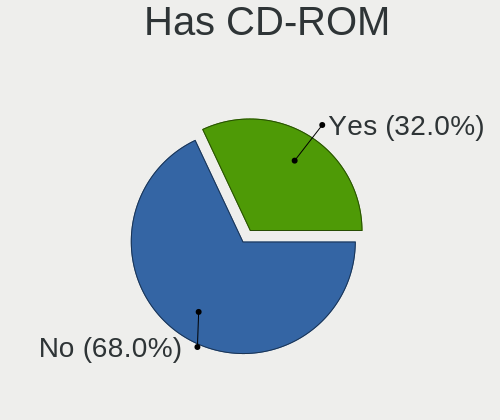
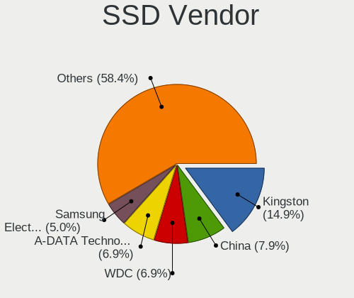
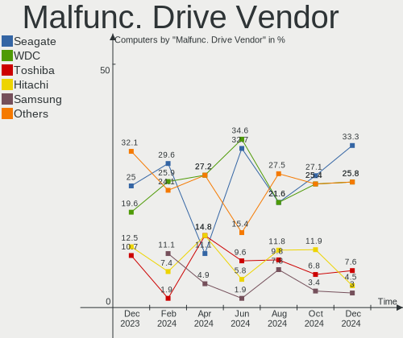
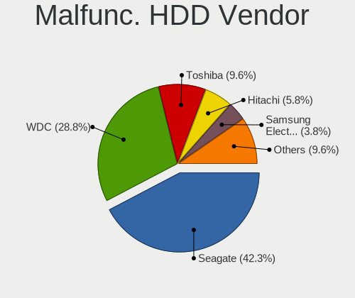
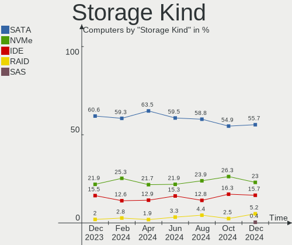
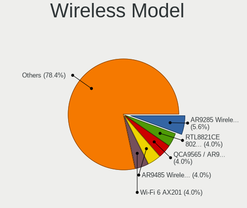

ROSA - Hardware Trends
----------------------

A project to identify most popular hardware characteristics and track their change
over time based on data collected by Linux users at https://Linux-Hardware.org.

Anyone can contribute to this report by the [hw-probe](https://github.com/linuxhw/hw-probe) tool:

    sudo -E hw-probe -all -upload

This is a report for all computer types. See also reports for [desktops](/Dist/ROSA/Desktop/README.md) and [notebooks](/Dist/ROSA/Notebook/README.md).

This report is for one last month. Overall report since the beginning of time: [TestCoverage](https://github.com/linuxhw/TestCoverage)

Period: Jan, 2023.

Contents
--------

* [ System ](#system)
  - [ OS                       ](#os)
  - [ OS Family                ](#os-family)
  - [ Kernel                   ](#kernel)
  - [ Kernel Family            ](#kernel-family)
  - [ Kernel Major Ver.        ](#kernel-major-ver)
  - [ Arch                     ](#arch)
  - [ DE                       ](#de)
  - [ Display Server           ](#display-server)
  - [ Display Manager          ](#display-manager)
  - [ OS Lang                  ](#os-lang)
  - [ Boot Mode                ](#boot-mode)
  - [ Filesystem               ](#filesystem)
  - [ Part. scheme             ](#part-scheme)
  - [ Dual Boot with Linux/BSD ](#dual-boot-with-linuxbsd)
  - [ Dual Boot (Win)          ](#dual-boot-win)

* [ Board ](#board)
  - [ Vendor                   ](#vendor)
  - [ Model                    ](#model)
  - [ Model Family             ](#model-family)
  - [ MFG Year                 ](#mfg-year)
  - [ Form Factor              ](#form-factor)
  - [ Secure Boot              ](#secure-boot)
  - [ Coreboot                 ](#coreboot)
  - [ RAM Size                 ](#ram-size)
  - [ RAM Used                 ](#ram-used)
  - [ Total Drives             ](#total-drives)
  - [ Has CD-ROM               ](#has-cd-rom)
  - [ Has Ethernet             ](#has-ethernet)
  - [ Has WiFi                 ](#has-wifi)
  - [ Has Bluetooth            ](#has-bluetooth)

* [ Location ](#location)
  - [ Country                  ](#country)
  - [ City                     ](#city)

* [ Drives ](#drives)
  - [ Drive Vendor             ](#drive-vendor)
  - [ Drive Model              ](#drive-model)
  - [ HDD Vendor               ](#hdd-vendor)
  - [ SSD Vendor               ](#ssd-vendor)
  - [ Drive Kind               ](#drive-kind)
  - [ Drive Connector          ](#drive-connector)
  - [ Drive Size               ](#drive-size)
  - [ Space Total              ](#space-total)
  - [ Space Used               ](#space-used)
  - [ Malfunc. Drives          ](#malfunc-drives)
  - [ Malfunc. Drive Vendor    ](#malfunc-drive-vendor)
  - [ Malfunc. HDD Vendor      ](#malfunc-hdd-vendor)
  - [ Malfunc. Drive Kind      ](#malfunc-drive-kind)
  - [ Failed Drives            ](#failed-drives)
  - [ Failed Drive Vendor      ](#failed-drive-vendor)
  - [ Drive Status             ](#drive-status)

* [ Storage controller ](#storage-controller)
  - [ Storage Vendor           ](#storage-vendor)
  - [ Storage Model            ](#storage-model)
  - [ Storage Kind             ](#storage-kind)

* [ Processor ](#processor)
  - [ CPU Vendor               ](#cpu-vendor)
  - [ CPU Model                ](#cpu-model)
  - [ CPU Model Family         ](#cpu-model-family)
  - [ CPU Cores                ](#cpu-cores)
  - [ CPU Sockets              ](#cpu-sockets)
  - [ CPU Threads              ](#cpu-threads)
  - [ CPU Op-Modes             ](#cpu-op-modes)
  - [ CPU Microcode            ](#cpu-microcode)
  - [ CPU Microarch            ](#cpu-microarch)

* [ Graphics ](#graphics)
  - [ GPU Vendor               ](#gpu-vendor)
  - [ GPU Model                ](#gpu-model)
  - [ GPU Combo                ](#gpu-combo)
  - [ GPU Driver               ](#gpu-driver)
  - [ GPU Memory               ](#gpu-memory)

* [ Monitor ](#monitor)
  - [ Monitor Vendor           ](#monitor-vendor)
  - [ Monitor Model            ](#monitor-model)
  - [ Monitor Resolution       ](#monitor-resolution)
  - [ Monitor Diagonal         ](#monitor-diagonal)
  - [ Monitor Width            ](#monitor-width)
  - [ Aspect Ratio             ](#aspect-ratio)
  - [ Monitor Area             ](#monitor-area)
  - [ Pixel Density            ](#pixel-density)
  - [ Multiple Monitors        ](#multiple-monitors)

* [ Network ](#network)
  - [ Net Controller Vendor    ](#net-controller-vendor)
  - [ Net Controller Model     ](#net-controller-model)
  - [ Wireless Vendor          ](#wireless-vendor)
  - [ Wireless Model           ](#wireless-model)
  - [ Ethernet Vendor          ](#ethernet-vendor)
  - [ Ethernet Model           ](#ethernet-model)
  - [ Net Controller Kind      ](#net-controller-kind)
  - [ Used Controller          ](#used-controller)
  - [ NICs                     ](#nics)
  - [ IPv6                     ](#ipv6)

* [ Bluetooth ](#bluetooth)
  - [ Bluetooth Vendor         ](#bluetooth-vendor)
  - [ Bluetooth Model          ](#bluetooth-model)

* [ Sound ](#sound)
  - [ Sound Vendor             ](#sound-vendor)
  - [ Sound Model              ](#sound-model)

* [ Memory ](#memory)
  - [ Memory Vendor            ](#memory-vendor)
  - [ Memory Model             ](#memory-model)
  - [ Memory Kind              ](#memory-kind)
  - [ Memory Form Factor       ](#memory-form-factor)
  - [ Memory Size              ](#memory-size)
  - [ Memory Speed             ](#memory-speed)

* [ Printers & scanners ](#printers--scanners)
  - [ Printer Vendor           ](#printer-vendor)
  - [ Printer Model            ](#printer-model)
  - [ Scanner Vendor           ](#scanner-vendor)
  - [ Scanner Model            ](#scanner-model)

* [ Camera ](#camera)
  - [ Camera Vendor            ](#camera-vendor)
  - [ Camera Model             ](#camera-model)

* [ Security ](#security)
  - [ Fingerprint Vendor       ](#fingerprint-vendor)
  - [ Fingerprint Model        ](#fingerprint-model)
  - [ Chipcard Vendor          ](#chipcard-vendor)
  - [ Chipcard Model           ](#chipcard-model)

* [ Unsupported ](#unsupported)
  - [ Unsupported Devices      ](#unsupported-devices)
  - [ Unsupported Device Types ](#unsupported-device-types)

System
------

OS
--

Installed operating systems

| Name       | Computers | Percent |
|------------|-----------|---------|
| ROSA 12.3  | 199       | 86.52%  |
| ROSA R11.1 | 15        | 6.52%   |
| ROSA 12.2  | 9         | 3.91%   |
| ROSA 12    | 3         | 1.3%    |
| ROSA 12.1  | 2         | 0.87%   |
| ROSA R11   | 1         | 0.43%   |
| ROSA 13.0  | 1         | 0.43%   |

OS Family
---------

OS without a version

| Name | Computers | Percent |
|------|-----------|---------|
| ROSA | 230       | 100%    |

Kernel
------

Version of the Linux kernel

| Version                                   | Computers | Percent |
|-------------------------------------------|-----------|---------|
| 5.15.79-generic-1rosa2021.1-x86_64        | 80        | 34.78%  |
| 5.15.75-generic-1rosa2021.1-x86_64        | 57        | 24.78%  |
| 5.10.155-generic-1rosa2021.1-x86_64       | 19        | 8.26%   |
| 5.10.74-generic-2rosa2021.1-x86_64        | 10        | 4.35%   |
| 5.15.75-generic-1rosa2021.1-i686          | 9         | 3.91%   |
| 5.17.11-generic-2rosa2021.1-x86_64        | 7         | 3.04%   |
| 5.4.83-generic-2rosa-x86_64               | 4         | 1.74%   |
| 6.0.12.xm1-1.klp-xanmod-rosa2021.1-x86_64 | 3         | 1.3%    |
| 5.4.32-generic-2rosa-x86_64               | 3         | 1.3%    |
| 5.4.32-generic-2rosa-i586                 | 3         | 1.3%    |
| 5.15.77-generic-1rosa2021.1-x86_64        | 3         | 1.3%    |
| 5.10.71-generic-1rosa2021.1-x86_64        | 3         | 1.3%    |
| 5.10.118-generic-2rosa2021.1-x86_64       | 3         | 1.3%    |
| 6.1.4-generic-1rosa2021.1-x86_64          | 2         | 0.87%   |
| 6.1.3.xm1-1.klp-xanmod-rosa2021.1-x86_64  | 2         | 0.87%   |
| 6.1.0-generic-3rosa2021.1-x86_64          | 2         | 0.87%   |
| 6.0.7.xm1-1.klp-xanmod-rosa2021.1-x86_64  | 2         | 0.87%   |
| 5.16.19-generic-2rosa2021.1-x86_64        | 2         | 0.87%   |
| 5.10.74-generic-2rosa2021.1-i586          | 2         | 0.87%   |
| 4.15.0-desktop-122.124.1rosa-i586         | 2         | 0.87%   |
| 6.1.7.xm1-1.klp-xanmod-rosa2021.1-x86_64  | 1         | 0.43%   |
| 6.1.3-generic-1rosa2021.1-x86_64          | 1         | 0.43%   |
| 6.1.0-generic-2rosa2021.1-x86_64          | 1         | 0.43%   |
| 6.0.3.xm1-1.klp-xanmod-rosa2021.1-x86_64  | 1         | 0.43%   |
| 5.4.83-generic-2rosa-i586                 | 1         | 0.43%   |
| 5.18.19-generic-3rosa2021.1-x86_64        | 1         | 0.43%   |
| 5.16.20-generic-2rosa2021.1-x86_64        | 1         | 0.43%   |
| 5.15.79-generic-1rosa2021.1-i686          | 1         | 0.43%   |
| 5.10.150-generic-1rosa2021.1-x86_64       | 1         | 0.43%   |
| 4.9.155-nrj-desktop-1rosa-x86_64          | 1         | 0.43%   |
| 4.15.0-desktop-45.1rosa-x86_64            | 1         | 0.43%   |
| 4.15.0-desktop-122.124.1rosa-x86_64       | 1         | 0.43%   |

Kernel Family
-------------

Linux kernel without a distro release

| Version  | Computers | Percent |
|----------|-----------|---------|
| 5.15.79  | 81        | 35.22%  |
| 5.15.75  | 66        | 28.7%   |
| 5.10.155 | 19        | 8.26%   |
| 5.10.74  | 12        | 5.22%   |
| 5.17.11  | 7         | 3.04%   |
| 5.4.32   | 6         | 2.61%   |
| 5.4.83   | 5         | 2.17%   |
| 4.15.0   | 4         | 1.74%   |
| 6.1.3    | 3         | 1.3%    |
| 6.1.0    | 3         | 1.3%    |
| 6.0.12   | 3         | 1.3%    |
| 5.15.77  | 3         | 1.3%    |
| 5.10.71  | 3         | 1.3%    |
| 5.10.118 | 3         | 1.3%    |
| 6.1.4    | 2         | 0.87%   |
| 6.0.7    | 2         | 0.87%   |
| 5.16.19  | 2         | 0.87%   |
| 6.1.7    | 1         | 0.43%   |
| 6.0.3    | 1         | 0.43%   |
| 5.18.19  | 1         | 0.43%   |
| 5.16.20  | 1         | 0.43%   |
| 5.10.150 | 1         | 0.43%   |
| 4.9.155  | 1         | 0.43%   |

Kernel Major Ver.
-----------------

Linux kernel major version

| Version | Computers | Percent |
|---------|-----------|---------|
| 5.15    | 150       | 65.22%  |
| 5.10    | 38        | 16.52%  |
| 5.4     | 11        | 4.78%   |
| 6.1     | 9         | 3.91%   |
| 5.17    | 7         | 3.04%   |
| 6.0     | 6         | 2.61%   |
| 4.15    | 4         | 1.74%   |
| 5.16    | 3         | 1.3%    |
| 5.18    | 1         | 0.43%   |
| 4.9     | 1         | 0.43%   |

Arch
----

OS architecture (x86_64, i586, etc.)

| Name   | Computers | Percent |
|--------|-----------|---------|
| x86_64 | 212       | 92.17%  |
| i686   | 18        | 7.83%   |

DE
--

Desktop Environment

| Name    | Computers | Percent |
|---------|-----------|---------|
| KDE5    | 113       | 49.13%  |
| GNOME   | 81        | 35.22%  |
| LXQt    | 25        | 10.87%  |
| KDE4    | 8         | 3.48%   |
| MATE    | 2         | 0.87%   |
| Unknown | 1         | 0.43%   |

Display Server
--------------

X11 or Wayland

| Name    | Computers | Percent |
|---------|-----------|---------|
| Wayland | 165       | 71.74%  |
| X11     | 63        | 27.39%  |
| Tty     | 1         | 0.43%   |
| Unknown | 1         | 0.43%   |

Display Manager
---------------

SDDM, LightDM, etc.

| Name    | Computers | Percent |
|---------|-----------|---------|
| SDDM    | 111       | 48.26%  |
| GDM     | 98        | 42.61%  |
| LightDM | 12        | 5.22%   |
| KDM     | 8         | 3.48%   |
| Unknown | 1         | 0.43%   |

OS Lang
-------

Language

| Lang    | Computers | Percent |
|---------|-----------|---------|
| ru_RU   | 210       | 91.3%   |
| en_US   | 4         | 1.74%   |
| pt_BR   | 3         | 1.3%    |
| de_DE   | 3         | 1.3%    |
| ru_UA   | 2         | 0.87%   |
| it_IT   | 2         | 0.87%   |
| tr_TR   | 1         | 0.43%   |
| ru_BY   | 1         | 0.43%   |
| pl_PL   | 1         | 0.43%   |
| es_ES   | 1         | 0.43%   |
| ar_EG   | 1         | 0.43%   |
| Unknown | 1         | 0.43%   |

Boot Mode
---------

EFI or BIOS

| Mode | Computers | Percent |
|------|-----------|---------|
| EFI  | 129       | 56.09%  |
| BIOS | 101       | 43.91%  |

Filesystem
----------

Type of filesystem

| Type  | Computers | Percent |
|-------|-----------|---------|
| Ext4  | 217       | 94.35%  |
| Btrfs | 12        | 5.22%   |
| F2fs  | 1         | 0.43%   |

Part. scheme
------------

Scheme of partitioning

| Type | Computers | Percent |
|------|-----------|---------|
| GPT  | 145       | 63.04%  |
| MBR  | 85        | 36.96%  |

Dual Boot with Linux/BSD
------------------------

Hosting more than one Linux/BSD

| Dual boot | Computers | Percent |
|-----------|-----------|---------|
| No        | 158       | 68.7%   |
| Yes       | 72        | 31.3%   |

Dual Boot (Win)
---------------

Hosting Linux and Windows

| Dual boot | Computers | Percent |
|-----------|-----------|---------|
| No        | 129       | 56.09%  |
| Yes       | 101       | 43.91%  |

Board
-----

Vendor
------

Motherboard manufacturer

| Name                     | Computers | Percent |
|--------------------------|-----------|---------|
| ASUSTek Computer         | 47        | 20.43%  |
| Gigabyte Technology      | 30        | 13.04%  |
| Lenovo                   | 27        | 11.74%  |
| ASRock                   | 19        | 8.26%   |
| Acer                     | 19        | 8.26%   |
| Hewlett-Packard          | 16        | 6.96%   |
| MSI                      | 15        | 6.52%   |
| Samsung Electronics      | 6         | 2.61%   |
| Dell                     | 6         | 2.61%   |
| Huanan                   | 5         | 2.17%   |
| Unknown                  | 5         | 2.17%   |
| Toshiba                  | 3         | 1.3%    |
| Intel                    | 3         | 1.3%    |
| Clevo                    | 3         | 1.3%    |
| Biostar                  | 3         | 1.3%    |
| ECS                      | 2         | 0.87%   |
| Chuwi                    | 2         | 0.87%   |
| ZoomSmart                | 1         | 0.43%   |
| Sony                     | 1         | 0.43%   |
| Positivo Bahia - VAIO    | 1         | 0.43%   |
| Pegatron                 | 1         | 0.43%   |
| Notebook                 | 1         | 0.43%   |
| MECHREVO                 | 1         | 0.43%   |
| MB                       | 1         | 0.43%   |
| Maibenben                | 1         | 0.43%   |
| Kraftway                 | 1         | 0.43%   |
| Jumper                   | 1         | 0.43%   |
| iRU                      | 1         | 0.43%   |
| Irbis                    | 1         | 0.43%   |
| Infinix                  | 1         | 0.43%   |
| HUAWEI                   | 1         | 0.43%   |
| HIPER Technology Limited | 1         | 0.43%   |
| Fujitsu                  | 1         | 0.43%   |
| Casper                   | 1         | 0.43%   |
| AZW                      | 1         | 0.43%   |
| Alienware                | 1         | 0.43%   |

Model
-----

Motherboard model

| Name                                              | Computers | Percent |
|---------------------------------------------------|-----------|---------|
| Unknown                                           | 5         | 2.17%   |
| HP Notebook                                       | 3         | 1.3%    |
| MSI MS-7B89                                       | 2         | 0.87%   |
| HP Laptop 15-db0xxx                               | 2         | 0.87%   |
| Gigabyte H61M-S1                                  | 2         | 0.87%   |
| Gigabyte AB350M-DS3H V2                           | 2         | 0.87%   |
| ASUS P7H55-M                                      | 2         | 0.87%   |
| ASUS P5KPL-AM SE                                  | 2         | 0.87%   |
| ASUS All Series                                   | 2         | 0.87%   |
| ZoomSmart A1002                                   | 1         | 0.43%   |
| Toshiba Satellite Pro C660                        | 1         | 0.43%   |
| Toshiba Satellite P200                            | 1         | 0.43%   |
| Toshiba Satellite L300                            | 1         | 0.43%   |
| Sony VGN-FJ3SR_B                                  | 1         | 0.43%   |
| Samsung RV420/RV520/RV720/E3530/S3530/E3420/E3520 | 1         | 0.43%   |
| Samsung RV420/RV520/RV720                         | 1         | 0.43%   |
| Samsung RV408/RV508                               | 1         | 0.43%   |
| Samsung NC10                                      | 1         | 0.43%   |
| Samsung N148P/N208P/N218P/NB28P                   | 1         | 0.43%   |
| Samsung 350V5C/351V5C/3540VC/3440VC               | 1         | 0.43%   |
| Positivo Bahia - VAIO VJFE52F11X-B0611H           | 1         | 0.43%   |
| Pegatron IPPPV-D3G                                | 1         | 0.43%   |
| Notebook P15SM-A/SM1-A                            | 1         | 0.43%   |
| MSI PRO H510 DP21 (MS-B0A4)                       | 1         | 0.43%   |
| MSI MS-7C75                                       | 1         | 0.43%   |
| MSI MS-7C52                                       | 1         | 0.43%   |
| MSI MS-7A39                                       | 1         | 0.43%   |
| MSI MS-7918                                       | 1         | 0.43%   |
| MSI MS-7808                                       | 1         | 0.43%   |
| MSI MS-7788                                       | 1         | 0.43%   |
| MSI MS-7693                                       | 1         | 0.43%   |
| MSI MS-7599                                       | 1         | 0.43%   |
| MSI GV72 8RD                                      | 1         | 0.43%   |
| MSI GP60 2OD                                      | 1         | 0.43%   |
| MSI GL75 Leopard 10SCSR                           | 1         | 0.43%   |
| MSI CR500                                         | 1         | 0.43%   |
| MECHREVO Jiaolong Series GM5ZG0O                  | 1         | 0.43%   |
| MB A320-SF110                                     | 1         | 0.43%   |
| Maibenben PC34                                    | 1         | 0.43%   |
| Lenovo Z50-70 20354                               | 1         | 0.43%   |

Model Family
------------

Motherboard model prefix

| Name                                    | Computers | Percent |
|-----------------------------------------|-----------|---------|
| Acer Aspire                             | 12        | 5.22%   |
| Lenovo IdeaPad                          | 10        | 4.35%   |
| Unknown                                 | 5         | 2.17%   |
| HP Laptop                               | 4         | 1.74%   |
| ASUS VivoBook                           | 4         | 1.74%   |
| Toshiba Satellite                       | 3         | 1.3%    |
| HP ProBook                              | 3         | 1.3%    |
| HP Notebook                             | 3         | 1.3%    |
| Dell Inspiron                           | 3         | 1.3%    |
| ASUS PRIME                              | 3         | 1.3%    |
| Acer Nitro                              | 3         | 1.3%    |
| Samsung RV420                           | 2         | 0.87%   |
| MSI MS-7B89                             | 2         | 0.87%   |
| Lenovo ThinkPad                         | 2         | 0.87%   |
| Lenovo ThinkCentre                      | 2         | 0.87%   |
| Huanan X99-F8                           | 2         | 0.87%   |
| HP Pavilion                             | 2         | 0.87%   |
| Gigabyte H61M-S1                        | 2         | 0.87%   |
| Gigabyte B450M                          | 2         | 0.87%   |
| Gigabyte AB350M-DS3H                    | 2         | 0.87%   |
| Gigabyte A320M-S2H                      | 2         | 0.87%   |
| ASUS ROG                                | 2         | 0.87%   |
| ASUS P7H55-M                            | 2         | 0.87%   |
| ASUS P5KPL-AM                           | 2         | 0.87%   |
| ASUS ASUS                               | 2         | 0.87%   |
| ASUS All                                | 2         | 0.87%   |
| Acer Extensa                            | 2         | 0.87%   |
| ZoomSmart A1002                         | 1         | 0.43%   |
| Sony VGN-FJ3SR                          | 1         | 0.43%   |
| Samsung RV408                           | 1         | 0.43%   |
| Samsung NC10                            | 1         | 0.43%   |
| Samsung N148P                           | 1         | 0.43%   |
| Samsung 350V5C                          | 1         | 0.43%   |
| Positivo Bahia - VAIO VJFE52F11X-B0611H | 1         | 0.43%   |
| Pegatron IPPPV-D3G                      | 1         | 0.43%   |
| Notebook P15SM-A                        | 1         | 0.43%   |
| MSI PRO                                 | 1         | 0.43%   |
| MSI MS-7C75                             | 1         | 0.43%   |
| MSI MS-7C52                             | 1         | 0.43%   |
| MSI MS-7A39                             | 1         | 0.43%   |

MFG Year
--------

Motherboard manufacture year

| Year | Computers | Percent |
|------|-----------|---------|
| 2012 | 26        | 11.3%   |
| 2018 | 22        | 9.57%   |
| 2021 | 18        | 7.83%   |
| 2010 | 18        | 7.83%   |
| 2020 | 17        | 7.39%   |
| 2022 | 16        | 6.96%   |
| 2019 | 16        | 6.96%   |
| 2011 | 15        | 6.52%   |
| 2009 | 15        | 6.52%   |
| 2013 | 14        | 6.09%   |
| 2014 | 12        | 5.22%   |
| 2008 | 10        | 4.35%   |
| 2017 | 9         | 3.91%   |
| 2015 | 8         | 3.48%   |
| 2016 | 6         | 2.61%   |
| 2007 | 3         | 1.3%    |
| 2006 | 2         | 0.87%   |
| 2005 | 2         | 0.87%   |
| 2003 | 1         | 0.43%   |

Form Factor
-----------

Physical design of the computer

| Name        | Computers | Percent |
|-------------|-----------|---------|
| Desktop     | 114       | 49.57%  |
| Notebook    | 108       | 46.96%  |
| All in one  | 3         | 1.3%    |
| Tablet      | 2         | 0.87%   |
| Convertible | 2         | 0.87%   |
| Server      | 1         | 0.43%   |

Secure Boot
-----------

Enabled or disabled

| State    | Computers | Percent |
|----------|-----------|---------|
| Disabled | 230       | 100%    |

Coreboot
--------

Have coreboot on board

| Used | Computers | Percent |
|------|-----------|---------|
| No   | 230       | 100%    |

RAM Size
--------

Total RAM memory

| Size in GB  | Computers | Percent |
|-------------|-----------|---------|
| 4.01-8.0    | 60        | 26.09%  |
| 3.01-4.0    | 46        | 20%     |
| 16.01-24.0  | 41        | 17.83%  |
| 8.01-16.0   | 37        | 16.09%  |
| 1.01-2.0    | 17        | 7.39%   |
| 32.01-64.0  | 14        | 6.09%   |
| 24.01-32.0  | 7         | 3.04%   |
| 2.01-3.0    | 5         | 2.17%   |
| 0.51-1.0    | 2         | 0.87%   |
| 64.01-256.0 | 1         | 0.43%   |

RAM Used
--------

Used RAM memory

| Used GB   | Computers | Percent |
|-----------|-----------|---------|
| 1.01-2.0  | 118       | 51.3%   |
| 0.51-1.0  | 49        | 21.3%   |
| 2.01-3.0  | 36        | 15.65%  |
| 4.01-8.0  | 13        | 5.65%   |
| 3.01-4.0  | 8         | 3.48%   |
| 0.01-0.5  | 5         | 2.17%   |
| 8.01-16.0 | 1         | 0.43%   |

Total Drives
------------

Number of drives on board

| Drives | Computers | Percent |
|--------|-----------|---------|
| 1      | 118       | 51.3%   |
| 2      | 71        | 30.87%  |
| 3      | 25        | 10.87%  |
| 4      | 10        | 4.35%   |
| 6      | 2         | 0.87%   |
| 5      | 2         | 0.87%   |
| 10     | 1         | 0.43%   |
| 7      | 1         | 0.43%   |

Has CD-ROM
----------

Has CD-ROM on board

| Presented | Computers | Percent |
|-----------|-----------|---------|
| No        | 154       | 66.96%  |
| Yes       | 76        | 33.04%  |

Has Ethernet
------------

Has Ethernet on board

| Presented | Computers | Percent |
|-----------|-----------|---------|
| Yes       | 209       | 90.87%  |
| No        | 21        | 9.13%   |

Has WiFi
--------

Has WiFi module

| Presented | Computers | Percent |
|-----------|-----------|---------|
| Yes       | 149       | 64.78%  |
| No        | 81        | 35.22%  |

Has Bluetooth
-------------

Has Bluetooth module

| Presented | Computers | Percent |
|-----------|-----------|---------|
| Yes       | 115       | 50%     |
| No        | 115       | 50%     |

Location
--------

Country
-------

Geographic location (country)

| Country               | Computers | Percent |
|-----------------------|-----------|---------|
| Russia                | 189       | 82.17%  |
| Ukraine               | 5         | 2.17%   |
| Germany               | 5         | 2.17%   |
| Latvia                | 4         | 1.74%   |
| Kazakhstan            | 4         | 1.74%   |
| USA                   | 3         | 1.3%    |
| Brazil                | 3         | 1.3%    |
| Poland                | 2         | 0.87%   |
| Italy                 | 2         | 0.87%   |
| Belarus               | 2         | 0.87%   |
| UK                    | 1         | 0.43%   |
| Turkey                | 1         | 0.43%   |
| Saudi Arabia          | 1         | 0.43%   |
| Palestinian Territory | 1         | 0.43%   |
| Moldova               | 1         | 0.43%   |
| Georgia               | 1         | 0.43%   |
| Czechia               | 1         | 0.43%   |
| Croatia               | 1         | 0.43%   |
| Costa Rica            | 1         | 0.43%   |
| Bulgaria              | 1         | 0.43%   |
| Azerbaijan            | 1         | 0.43%   |

City
----

Geographic location (city)

| City              | Computers | Percent |
|-------------------|-----------|---------|
| Moscow            | 26        | 11.3%   |
| St Petersburg     | 14        | 6.09%   |
| Krasnodar         | 9         | 3.91%   |
| Samara            | 7         | 3.04%   |
| Oryol             | 7         | 3.04%   |
| Voronezh          | 6         | 2.61%   |
| Volgograd         | 6         | 2.61%   |
| Novosibirsk       | 5         | 2.17%   |
| Tyumen            | 4         | 1.74%   |
| Tver              | 3         | 1.3%    |
| Stavropol         | 3         | 1.3%    |
| Perm              | 3         | 1.3%    |
| Murmansk          | 3         | 1.3%    |
| Zelenodolsk       | 2         | 0.87%   |
| Yekaterinburg     | 2         | 0.87%   |
| Warsaw            | 2         | 0.87%   |
| Vologda           | 2         | 0.87%   |
| Ufa               | 2         | 0.87%   |
| Tolyatti          | 2         | 0.87%   |
| Surgut            | 2         | 0.87%   |
| Rio de Janeiro    | 2         | 0.87%   |
| Rēzekne          | 2         | 0.87%   |
| Orenburg          | 2         | 0.87%   |
| Novorossiysk      | 2         | 0.87%   |
| Nizhniy Novgorod  | 2         | 0.87%   |
| Lipetsk           | 2         | 0.87%   |
| Krasnoyarsk       | 2         | 0.87%   |
| Khabarovsk        | 2         | 0.87%   |
| Karaganda         | 2         | 0.87%   |
| Irkutsk           | 2         | 0.87%   |
| Donetsk           | 2         | 0.87%   |
| Chita             | 2         | 0.87%   |
| Cheremkhovo       | 2         | 0.87%   |
| Chelyabinsk       | 2         | 0.87%   |
| Almaty            | 2         | 0.87%   |
| Zhigulevsk        | 1         | 0.43%   |
| Yuzhno-Sakhalinsk | 1         | 0.43%   |
| Yoshkar-Ola       | 1         | 0.43%   |
| Yaroslavl         | 1         | 0.43%   |
| Yakutsk           | 1         | 0.43%   |

Drives
------

Drive Vendor
------------

Hard drive vendors

| Vendor                         | Computers | Drives | Percent |
|--------------------------------|-----------|--------|---------|
| WDC                            | 77        | 88     | 20.7%   |
| Seagate                        | 66        | 77     | 17.74%  |
| Kingston                       | 28        | 29     | 7.53%   |
| Toshiba                        | 21        | 21     | 5.65%   |
| Samsung Electronics            | 21        | 23     | 5.65%   |
| Hitachi                        | 14        | 15     | 3.76%   |
| China                          | 14        | 14     | 3.76%   |
| HGST                           | 9         | 16     | 2.42%   |
| Crucial                        | 9         | 9      | 2.42%   |
| SPCC                           | 8         | 8      | 2.15%   |
| SanDisk                        | 8         | 8      | 2.15%   |
| Apacer                         | 8         | 8      | 2.15%   |
| Unknown                        | 7         | 7      | 1.88%   |
| Intel                          | 7         | 8      | 1.88%   |
| A-DATA Technology              | 7         | 9      | 1.88%   |
| Netac                          | 6         | 10     | 1.61%   |
| Patriot                        | 5         | 5      | 1.34%   |
| XrayDisk                       | 4         | 4      | 1.08%   |
| Micron Technology              | 4         | 4      | 1.08%   |
| Unknown                        | 4         | 4      | 1.08%   |
| Smartbuy                       | 3         | 3      | 0.81%   |
| SK hynix                       | 3         | 3      | 0.81%   |
| Silicon Motion                 | 3         | 3      | 0.81%   |
| Gigabyte Technology            | 3         | 3      | 0.81%   |
| AMD                            | 3         | 3      | 0.81%   |
| XPG                            | 2         | 2      | 0.54%   |
| Phison                         | 2         | 2      | 0.54%   |
| KingDian                       | 2         | 2      | 0.54%   |
| Fujitsu                        | 2         | 2      | 0.54%   |
| Vaseky                         | 1         | 1      | 0.27%   |
| Team                           | 1         | 1      | 0.27%   |
| Solid State Storage Technology | 1         | 1      | 0.27%   |
| Qumo                           | 1         | 1      | 0.27%   |
| PNY                            | 1         | 1      | 0.27%   |
| Palit                          | 1         | 1      | 0.27%   |
| OCZ                            | 1         | 1      | 0.27%   |
| NGFF                           | 1         | 1      | 0.27%   |
| MAXIO Technology (Hangzhou)    | 1         | 1      | 0.27%   |
| LITEONIT                       | 1         | 1      | 0.27%   |
| LITEON                         | 1         | 1      | 0.27%   |

Drive Model
-----------

Hard drive models

| Model                              | Computers | Percent |
|------------------------------------|-----------|---------|
| Kingston SA400S37240G 240GB SSD    | 8         | 2.01%   |
| WDC WD10EZEX-00BBHA0 1TB           | 7         | 1.76%   |
| Kingston SA400S37120G 120GB SSD    | 6         | 1.51%   |
| Toshiba MQ01ABF050 500GB           | 5         | 1.26%   |
| Seagate ST1000DM010-2EP102 1TB     | 5         | 1.26%   |
| Samsung SSD 860 EVO 250GB          | 4         | 1.01%   |
| Kingston SNVS500G 500GB            | 4         | 1.01%   |
| A-DATA SU650 240GB SSD             | 4         | 1.01%   |
| Unknown                            | 4         | 1.01%   |
| WDC WDS120G2G0A-00JH30 120GB SSD   | 3         | 0.75%   |
| WDC WD5000LPVX-22V0TT0 500GB       | 3         | 0.75%   |
| WDC WD2500AAJB-00J3A0 250GB        | 3         | 0.75%   |
| WDC WD10EZEX-08WN4A0 1TB           | 3         | 0.75%   |
| Seagate ST9500325AS 500GB          | 3         | 0.75%   |
| Seagate ST500LT012-1DG142 500GB    | 3         | 0.75%   |
| SanDisk SDSSDA120G 120GB           | 3         | 0.75%   |
| China SSD 120GB                    | 3         | 0.75%   |
| WDC WDS240G2G0A-00JH30 240GB SSD   | 2         | 0.5%    |
| WDC WD5000AAKX-08U6AA0 500GB       | 2         | 0.5%    |
| WDC WD5000AAKX-001CA0 500GB        | 2         | 0.5%    |
| WDC WD10JPCX-24UE4T0 1TB           | 2         | 0.5%    |
| Unknown S0J59X  128GB              | 2         | 0.5%    |
| Toshiba MQ01ABD100 1TB             | 2         | 0.5%    |
| Toshiba MK2565GSX 250GB            | 2         | 0.5%    |
| Toshiba HDWD120 2TB                | 2         | 0.5%    |
| Toshiba HDWD110 1TB                | 2         | 0.5%    |
| SPCC Solid State Disk 512GB        | 2         | 0.5%    |
| SPCC Solid State Disk 256GB        | 2         | 0.5%    |
| SPCC Solid State Disk 128GB        | 2         | 0.5%    |
| Seagate ST500LT012-9WS142 500GB    | 2         | 0.5%    |
| Seagate ST500DM002-1BD142 500GB    | 2         | 0.5%    |
| Seagate ST3320620AS 320GB          | 2         | 0.5%    |
| Seagate ST3320613AS 320GB          | 2         | 0.5%    |
| Seagate ST3320418AS 320GB          | 2         | 0.5%    |
| Seagate ST3160215A 160GB           | 2         | 0.5%    |
| Seagate ST3120022A 120GB           | 2         | 0.5%    |
| Seagate ST2000DM008-2FR102 2TB     | 2         | 0.5%    |
| Seagate ST1000LM048-2E7172 1TB     | 2         | 0.5%    |
| Seagate ST1000LM035-1RK172 1TB     | 2         | 0.5%    |
| Seagate ST1000LM024 HN-M101MBB 1TB | 2         | 0.5%    |

HDD Vendor
----------

Hard disk drive vendors

| Vendor  | Computers | Drives | Percent |
|---------|-----------|--------|---------|
| WDC     | 67        | 77     | 37.64%  |
| Seagate | 65        | 75     | 36.52%  |
| Toshiba | 20        | 20     | 11.24%  |
| Hitachi | 14        | 15     | 7.87%   |
| HGST    | 9         | 16     | 5.06%   |
| Fujitsu | 2         | 2      | 1.12%   |
| Unknown | 1         | 1      | 0.56%   |

SSD Vendor
----------

Solid state drive vendors

| Vendor              | Computers | Drives | Percent |
|---------------------|-----------|--------|---------|
| Kingston            | 21        | 22     | 14.79%  |
| Samsung Electronics | 17        | 18     | 11.97%  |
| China               | 14        | 14     | 9.86%   |
| WDC                 | 8         | 8      | 5.63%   |
| SPCC                | 8         | 8      | 5.63%   |
| Crucial             | 8         | 8      | 5.63%   |
| SanDisk             | 7         | 7      | 4.93%   |
| A-DATA Technology   | 7         | 8      | 4.93%   |
| Apacer              | 6         | 6      | 4.23%   |
| Patriot             | 5         | 5      | 3.52%   |
| Netac               | 5         | 8      | 3.52%   |
| XrayDisk            | 4         | 4      | 2.82%   |
| Intel               | 3         | 4      | 2.11%   |
| Unknown             | 3         | 3      | 2.11%   |
| Smartbuy            | 2         | 2      | 1.41%   |
| KingDian            | 2         | 2      | 1.41%   |
| AMD                 | 2         | 2      | 1.41%   |
| Vaseky              | 1         | 1      | 0.7%    |
| Unknown             | 1         | 1      | 0.7%    |
| Toshiba             | 1         | 1      | 0.7%    |
| Team                | 1         | 1      | 0.7%    |
| Qumo                | 1         | 1      | 0.7%    |
| PNY                 | 1         | 1      | 0.7%    |
| Palit               | 1         | 1      | 0.7%    |
| OCZ                 | 1         | 1      | 0.7%    |
| NGFF                | 1         | 1      | 0.7%    |
| Micron Technology   | 1         | 1      | 0.7%    |
| LITEONIT            | 1         | 1      | 0.7%    |
| LITEON              | 1         | 1      | 0.7%    |
| KODAK               | 1         | 1      | 0.7%    |
| Kllisre             | 1         | 1      | 0.7%    |
| KingSpec            | 1         | 1      | 0.7%    |
| GS                  | 1         | 1      | 0.7%    |
| GOODRAM             | 1         | 1      | 0.7%    |
| Gigabyte Technology | 1         | 1      | 0.7%    |
| Foxline             | 1         | 1      | 0.7%    |
| Fanxiang            | 1         | 1      | 0.7%    |

Drive Kind
----------

HDD or SSD

| Kind    | Computers | Drives | Percent |
|---------|-----------|--------|---------|
| HDD     | 155       | 206    | 47.11%  |
| SSD     | 119       | 149    | 36.17%  |
| NVMe    | 45        | 48     | 13.68%  |
| MMC     | 8         | 8      | 2.43%   |
| Unknown | 2         | 2      | 0.61%   |

Drive Connector
---------------

SATA, SAS, NVMe, etc.

| Type | Computers | Drives | Percent |
|------|-----------|--------|---------|
| SATA | 205       | 348    | 77.65%  |
| NVMe | 45        | 48     | 17.05%  |
| MMC  | 8         | 8      | 3.03%   |
| SAS  | 6         | 9      | 2.27%   |

Drive Size
----------

Size of hard drive

| Size in TB | Computers | Drives | Percent |
|------------|-----------|--------|---------|
| 0.01-0.5   | 172       | 238    | 64.66%  |
| 0.51-1.0   | 73        | 87     | 27.44%  |
| 1.01-2.0   | 11        | 12     | 4.14%   |
| 3.01-4.0   | 4         | 4      | 1.5%    |
| 4.01-10.0  | 4         | 12     | 1.5%    |
| 2.01-3.0   | 2         | 2      | 0.75%   |

Space Total
-----------

Amount of disk space available on the file system

| Size in GB     | Computers | Percent |
|----------------|-----------|---------|
| 101-250        | 81        | 35.22%  |
| 251-500        | 56        | 24.35%  |
| 501-1000       | 23        | 10%     |
| 51-100         | 16        | 6.96%   |
| 1-20           | 15        | 6.52%   |
| 21-50          | 13        | 5.65%   |
| 1001-2000      | 12        | 5.22%   |
| 2001-3000      | 7         | 3.04%   |
| More than 3000 | 6         | 2.61%   |
| Unknown        | 1         | 0.43%   |

Space Used
----------

Amount of used disk space

| Used GB        | Computers | Percent |
|----------------|-----------|---------|
| 1-20           | 133       | 57.83%  |
| 21-50          | 28        | 12.17%  |
| 101-250        | 22        | 9.57%   |
| 251-500        | 14        | 6.09%   |
| 51-100         | 14        | 6.09%   |
| 501-1000       | 8         | 3.48%   |
| 1001-2000      | 5         | 2.17%   |
| More than 3000 | 3         | 1.3%    |
| 2001-3000      | 2         | 0.87%   |
| Unknown        | 1         | 0.43%   |

Malfunc. Drives
---------------

Drive models with a malfunction

| Model                               | Computers | Drives | Percent |
|-------------------------------------|-----------|--------|---------|
| WDC WD5000AAKX-001CA0 500GB         | 2         | 2      | 2.53%   |
| Seagate ST500LT012-9WS142 500GB     | 2         | 2      | 2.53%   |
| Seagate ST500LT012-1DG142 500GB     | 2         | 2      | 2.53%   |
| Seagate ST3320620AS 320GB           | 2         | 2      | 2.53%   |
| Seagate ST3320613AS 320GB           | 2         | 2      | 2.53%   |
| Seagate ST3120022A 120GB            | 2         | 2      | 2.53%   |
| Seagate ST1000LM024 HN-M101MBB 1TB  | 2         | 2      | 2.53%   |
| XPG GAMMIX S5 256GB                 | 1         | 1      | 1.27%   |
| WDC WDS120G2G0A-00JH30 120GB SSD    | 1         | 1      | 1.27%   |
| WDC WD7500BPVT-24HXZT3 752GB        | 1         | 1      | 1.27%   |
| WDC WD5000LPCX-21VHAT0 500GB        | 1         | 1      | 1.27%   |
| WDC WD5000AZRX-00A8LB0 500GB        | 1         | 1      | 1.27%   |
| WDC WD5000AAKX-22ERMA0 500GB        | 1         | 1      | 1.27%   |
| WDC WD5000AAKX-08U6AA0 500GB        | 1         | 1      | 1.27%   |
| WDC WD5000AAKX-08ERMA0 500GB        | 1         | 1      | 1.27%   |
| WDC WD5000AAKS-22V1A0 500GB         | 1         | 1      | 1.27%   |
| WDC WD3200AAJS-60Z0A0 320GB         | 1         | 1      | 1.27%   |
| WDC WD2500BEVT-60ZCT1 250GB         | 1         | 1      | 1.27%   |
| WDC WD2500AAJB-00J3A0 250GB         | 1         | 1      | 1.27%   |
| WDC WD20EZRX-00DC0B0 2TB            | 1         | 1      | 1.27%   |
| WDC WD1600BEVT-22ZCT0 160GB         | 1         | 1      | 1.27%   |
| WDC WD10JPVX-22JC3T0 1TB            | 1         | 1      | 1.27%   |
| WDC WD10JPCX-24UE4T0 1TB            | 1         | 1      | 1.27%   |
| WDC WD10EZEX-08WN4A0 1TB            | 1         | 1      | 1.27%   |
| WDC WD10EALX-559BA0 1TB             | 1         | 1      | 1.27%   |
| Toshiba MQ01ABF050 500GB            | 1         | 1      | 1.27%   |
| Toshiba MQ01ABD100 1TB              | 1         | 1      | 1.27%   |
| Toshiba MK3276GSX -63 320GB         | 1         | 1      | 1.27%   |
| Toshiba MK2565GSX 250GB             | 1         | 1      | 1.27%   |
| Toshiba MK1637GSX 160GB             | 1         | 1      | 1.27%   |
| Toshiba MK1059GSMP 1TB              | 1         | 1      | 1.27%   |
| Seagate ST9500325AS 500GB           | 1         | 1      | 1.27%   |
| Seagate ST9320423AS 320GB           | 1         | 1      | 1.27%   |
| Seagate ST9250315AS 250GB           | 1         | 1      | 1.27%   |
| Seagate ST6000VX0003-1ZH110 6TB     | 1         | 1      | 1.27%   |
| Seagate ST500LM021-1KJ152 500GB     | 1         | 1      | 1.27%   |
| Seagate ST500LM012 HN-M500MBB 500GB | 1         | 1      | 1.27%   |
| Seagate ST3808110AS 80GB            | 1         | 1      | 1.27%   |
| Seagate ST3500418AS 500GB           | 1         | 1      | 1.27%   |
| Seagate ST3500413AS 500GB           | 1         | 1      | 1.27%   |

Malfunc. Drive Vendor
---------------------

Vendors of faulty drives

| Vendor              | Computers | Drives | Percent |
|---------------------|-----------|--------|---------|
| Seagate             | 30        | 32     | 39.47%  |
| WDC                 | 19        | 19     | 25%     |
| Toshiba             | 6         | 6      | 7.89%   |
| Hitachi             | 6         | 7      | 7.89%   |
| HGST                | 4         | 4      | 5.26%   |
| Fujitsu             | 2         | 2      | 2.63%   |
| XPG                 | 1         | 1      | 1.32%   |
| Samsung Electronics | 1         | 1      | 1.32%   |
| Patriot             | 1         | 1      | 1.32%   |
| Netac               | 1         | 1      | 1.32%   |
| LITEON              | 1         | 1      | 1.32%   |
| Kingston            | 1         | 1      | 1.32%   |
| China               | 1         | 1      | 1.32%   |
| A-DATA Technology   | 1         | 1      | 1.32%   |
| Unknown             | 1         | 1      | 1.32%   |

Malfunc. HDD Vendor
-------------------

Vendors of faulty HDD drives

| Vendor  | Computers | Drives | Percent |
|---------|-----------|--------|---------|
| Seagate | 30        | 32     | 45.45%  |
| WDC     | 18        | 18     | 27.27%  |
| Toshiba | 6         | 6      | 9.09%   |
| Hitachi | 6         | 7      | 9.09%   |
| HGST    | 4         | 4      | 6.06%   |
| Fujitsu | 2         | 2      | 3.03%   |

Malfunc. Drive Kind
-------------------

Kinds of faulty drives

| Kind | Computers | Drives | Percent |
|------|-----------|--------|---------|
| HDD  | 61        | 69     | 85.92%  |
| SSD  | 9         | 9      | 12.68%  |
| NVMe | 1         | 1      | 1.41%   |

Failed Drives
-------------

Failed drive models

| Model                         | Computers | Drives | Percent |
|-------------------------------|-----------|--------|---------|
| WDC WD7501AALS-00J7B0 752GB   | 1         | 1      | 33.33%  |
| Seagate ST9500325AS 500GB     | 1         | 1      | 33.33%  |
| Hitachi HTS545050A7E380 500GB | 1         | 1      | 33.33%  |

Failed Drive Vendor
-------------------

Failed drive vendors

| Vendor  | Computers | Drives | Percent |
|---------|-----------|--------|---------|
| WDC     | 1         | 1      | 33.33%  |
| Seagate | 1         | 1      | 33.33%  |
| Hitachi | 1         | 1      | 33.33%  |

Drive Status
------------

Number of failed and malfunc. drives

| Status   | Computers | Drives | Percent |
|----------|-----------|--------|---------|
| Works    | 188       | 312    | 68.12%  |
| Malfunc  | 69        | 79     | 25%     |
| Detected | 16        | 19     | 5.8%    |
| Failed   | 3         | 3      | 1.09%   |

Storage controller
------------------

Storage Vendor
--------------

Storage controller vendors

| Vendor                           | Computers | Percent |
|----------------------------------|-----------|---------|
| Intel                            | 162       | 57.24%  |
| AMD                              | 51        | 18.02%  |
| Silicon Motion                   | 8         | 2.83%   |
| Nvidia                           | 7         | 2.47%   |
| Kingston Technology Company      | 7         | 2.47%   |
| Phison Electronics               | 6         | 2.12%   |
| Samsung Electronics              | 5         | 1.77%   |
| JMicron Technology               | 5         | 1.77%   |
| VIA Technologies                 | 4         | 1.41%   |
| ASMedia Technology               | 4         | 1.41%   |
| SanDisk                          | 3         | 1.06%   |
| Micron Technology                | 3         | 1.06%   |
| Marvell Technology Group         | 3         | 1.06%   |
| ADATA Technology                 | 3         | 1.06%   |
| SK hynix                         | 2         | 0.71%   |
| MAXIO Technology (Hangzhou)      | 2         | 0.71%   |
| Solid State Storage Technology   | 1         | 0.35%   |
| Silicon Integrated Systems [SiS] | 1         | 0.35%   |
| Silicon Image                    | 1         | 0.35%   |
| Shenzhen Longsys Electronics     | 1         | 0.35%   |
| Seagate Technology               | 1         | 0.35%   |
| Netac Technology                 | 1         | 0.35%   |
| Micron/Crucial Technology        | 1         | 0.35%   |
| Broadcom / LSI                   | 1         | 0.35%   |

Storage Model
-------------

Storage controller models

| Model                                                                                   | Computers | Percent |
|-----------------------------------------------------------------------------------------|-----------|---------|
| AMD FCH SATA Controller [AHCI mode]                                                     | 24        | 7.16%   |
| Intel 7 Series Chipset Family 6-port SATA Controller [AHCI mode]                        | 12        | 3.58%   |
| Intel 8 Series/C220 Series Chipset Family 6-port SATA Controller 1 [AHCI mode]          | 10        | 2.99%   |
| AMD SB7x0/SB8x0/SB9x0 SATA Controller [AHCI mode]                                       | 9         | 2.69%   |
| AMD 400 Series Chipset SATA Controller                                                  | 9         | 2.69%   |
| Intel Sunrise Point-LP SATA Controller [AHCI mode]                                      | 8         | 2.39%   |
| Intel NM10/ICH7 Family SATA Controller [IDE mode]                                       | 8         | 2.39%   |
| Intel Celeron/Pentium Silver Processor SATA Controller                                  | 8         | 2.39%   |
| Intel 82801G (ICH7 Family) IDE Controller                                               | 8         | 2.39%   |
| AMD SB7x0/SB8x0/SB9x0 IDE Controller                                                    | 8         | 2.39%   |
| Silicon Motion SM2263EN/SM2263XT SSD Controller                                         | 7         | 2.09%   |
| Intel 500 Series Chipset Family SATA AHCI Controller                                    | 7         | 2.09%   |
| Intel 82801IBM/IEM (ICH9M/ICH9M-E) 4 port SATA Controller [AHCI mode]                   | 6         | 1.79%   |
| Intel 6 Series/C200 Series Chipset Family 6 port Mobile SATA AHCI Controller            | 6         | 1.79%   |
| AMD FCH SATA Controller D                                                               | 6         | 1.79%   |
| Intel NM10/ICH7 Family SATA Controller [AHCI mode]                                      | 5         | 1.49%   |
| Intel C610/X99 series chipset 6-Port SATA Controller [AHCI mode]                        | 5         | 1.49%   |
| Intel 6 Series/C200 Series Chipset Family Desktop SATA Controller (IDE mode, ports 4-5) | 5         | 1.49%   |
| Intel 6 Series/C200 Series Chipset Family Desktop SATA Controller (IDE mode, ports 0-3) | 5         | 1.49%   |
| Intel 200 Series PCH SATA controller [AHCI mode]                                        | 5         | 1.49%   |
| AMD SB7x0/SB8x0/SB9x0 SATA Controller [IDE mode]                                        | 5         | 1.49%   |
| Intel Comet Lake SATA AHCI Controller                                                   | 4         | 1.19%   |
| Intel Celeron N3350/Pentium N4200/Atom E3900 Series SATA AHCI Controller                | 4         | 1.19%   |
| Intel 9 Series Chipset Family SATA Controller [AHCI Mode]                               | 4         | 1.19%   |
| Intel 8 Series SATA Controller 1 [AHCI mode]                                            | 4         | 1.19%   |
| Intel 7 Series/C210 Series Chipset Family 6-port SATA Controller [AHCI mode]            | 4         | 1.19%   |
| Intel 5 Series/3400 Series Chipset 4 port SATA AHCI Controller                          | 4         | 1.19%   |
| ASMedia ASM1062 Serial ATA Controller                                                   | 4         | 1.19%   |
| VIA VT6415 PATA IDE Host Controller                                                     | 3         | 0.9%    |
| Samsung NVMe SSD Controller SM981/PM981/PM983                                           | 3         | 0.9%    |
| Phison E12 NVMe Controller                                                              | 3         | 0.9%    |
| Nvidia MCP61 SATA Controller                                                            | 3         | 0.9%    |
| Micron Non-Volatile memory controller                                                   | 3         | 0.9%    |
| Kingston Company Company Non-Volatile memory controller                                 | 3         | 0.9%    |
| Intel Wildcat Point-LP SATA Controller [AHCI Mode]                                      | 3         | 0.9%    |
| Intel Cannon Lake Mobile PCH SATA AHCI Controller                                       | 3         | 0.9%    |
| Intel Atom/Celeron/Pentium Processor x5-E8000/J3xxx/N3xxx Series SATA Controller        | 3         | 0.9%    |
| Intel Atom Processor E3800 Series SATA AHCI Controller                                  | 3         | 0.9%    |
| Intel 82801IB (ICH9) 2 port SATA Controller [IDE mode]                                  | 3         | 0.9%    |
| Intel 82801I (ICH9 Family) 2 port SATA Controller [IDE mode]                            | 3         | 0.9%    |

Storage Kind
------------

Kind of storage controller (IDE, SATA, NVMe, SAS, ...)

| Kind | Computers | Percent |
|------|-----------|---------|
| SATA | 180       | 64.06%  |
| IDE  | 48        | 17.08%  |
| NVMe | 45        | 16.01%  |
| RAID | 8         | 2.85%   |

Processor
---------

CPU Vendor
----------

Processor vendors

| Vendor | Computers | Percent |
|--------|-----------|---------|
| Intel  | 168       | 73.04%  |
| AMD    | 62        | 26.96%  |

CPU Model
---------

Processor models

| Model                                         | Computers | Percent |
|-----------------------------------------------|-----------|---------|
| Intel Core i5-4200M CPU @ 2.50GHz             | 4         | 1.74%   |
| Intel Core i5-3210M CPU @ 2.50GHz             | 3         | 1.3%    |
| AMD Phenom II X4 965 Processor                | 3         | 1.3%    |
| Intel Pentium Silver N5000 CPU @ 1.10GHz      | 2         | 0.87%   |
| Intel Pentium Dual-Core CPU T4400 @ 2.20GHz   | 2         | 0.87%   |
| Intel Pentium Dual CPU E2200 @ 2.20GHz        | 2         | 0.87%   |
| Intel Pentium CPU N3540 @ 2.16GHz             | 2         | 0.87%   |
| Intel Core i5-8400 CPU @ 2.80GHz              | 2         | 0.87%   |
| Intel Core i5-8300H CPU @ 2.30GHz             | 2         | 0.87%   |
| Intel Core i5-7200U CPU @ 2.50GHz             | 2         | 0.87%   |
| Intel Core i5-3230M CPU @ 2.60GHz             | 2         | 0.87%   |
| Intel Core i5-2320 CPU @ 3.00GHz              | 2         | 0.87%   |
| Intel Core i5 CPU 750 @ 2.67GHz               | 2         | 0.87%   |
| Intel Core i3-6006U CPU @ 2.00GHz             | 2         | 0.87%   |
| Intel Core i3-2100 CPU @ 3.10GHz              | 2         | 0.87%   |
| Intel Core 2 Quad CPU Q8400 @ 2.66GHz         | 2         | 0.87%   |
| Intel Celeron J4125 CPU @ 2.00GHz             | 2         | 0.87%   |
| Intel Celeron CPU N3050 @ 1.60GHz             | 2         | 0.87%   |
| Intel Celeron CPU B820 @ 1.70GHz              | 2         | 0.87%   |
| Intel Atom CPU N270 @ 1.60GHz                 | 2         | 0.87%   |
| Intel 11th Gen Core i5-11400H @ 2.70GHz       | 2         | 0.87%   |
| Intel 11th Gen Core i5-11400F @ 2.60GHz       | 2         | 0.87%   |
| AMD Ryzen 5 7600X 6-Core Processor            | 2         | 0.87%   |
| AMD Ryzen 5 4600H with Radeon Graphics        | 2         | 0.87%   |
| AMD Ryzen 5 3600 6-Core Processor             | 2         | 0.87%   |
| AMD Athlon 64 X2 Dual Core Processor 3800+    | 2         | 0.87%   |
| AMD A8-9600 RADEON R7, 10 COMPUTE CORES 4C+6G | 2         | 0.87%   |
| Intel Xeon E-2324G CPU @ 3.10GHz              | 1         | 0.43%   |
| Intel Xeon CPU E5450 @ 3.00GHz                | 1         | 0.43%   |
| Intel Xeon CPU E5420 @ 2.50GHz                | 1         | 0.43%   |
| Intel Xeon CPU E5-2690 v3 @ 2.60GHz           | 1         | 0.43%   |
| Intel Xeon CPU E5-2680 v4 @ 2.40GHz           | 1         | 0.43%   |
| Intel Xeon CPU E5-2678 v3 @ 2.50GHz           | 1         | 0.43%   |
| Intel Xeon CPU E5-2666 v3 @ 2.90GHz           | 1         | 0.43%   |
| Intel Xeon CPU E5-2650 v4 @ 2.20GHz           | 1         | 0.43%   |
| Intel Xeon CPU E5-2640 0 @ 2.50GHz            | 1         | 0.43%   |
| Intel Xeon CPU E31220 @ 3.10GHz               | 1         | 0.43%   |
| Intel Xeon CPU E3-1271 v3 @ 3.60GHz           | 1         | 0.43%   |
| Intel Xeon CPU E3-1270 v3 @ 3.50GHz           | 1         | 0.43%   |
| Intel Pentium Silver N6000 @ 1.10GHz          | 1         | 0.43%   |

CPU Model Family
----------------

Processor model prefix

| Model                   | Computers | Percent |
|-------------------------|-----------|---------|
| Intel Core i5           | 36        | 15.65%  |
| Intel Core i3           | 27        | 11.74%  |
| Intel Celeron           | 23        | 10%     |
| AMD Ryzen 5             | 16        | 6.96%   |
| Intel Xeon              | 12        | 5.22%   |
| Intel Core i7           | 12        | 5.22%   |
| Intel Pentium           | 11        | 4.78%   |
| Intel Core 2 Duo        | 8         | 3.48%   |
| Intel Atom              | 8         | 3.48%   |
| Other                   | 7         | 3.04%   |
| Intel Pentium Dual-Core | 6         | 2.61%   |
| AMD Ryzen 3             | 6         | 2.61%   |
| AMD FX                  | 4         | 1.74%   |
| AMD A8                  | 4         | 1.74%   |
| Intel Pentium Silver    | 3         | 1.3%    |
| Intel Pentium Dual      | 3         | 1.3%    |
| Intel Core 2 Quad       | 3         | 1.3%    |
| AMD Ryzen 7             | 3         | 1.3%    |
| AMD Phenom II X4        | 3         | 1.3%    |
| AMD Athlon II X2        | 3         | 1.3%    |
| AMD Athlon 64 X2        | 3         | 1.3%    |
| Intel Pentium M         | 2         | 0.87%   |
| AMD Ryzen 7 PRO         | 2         | 0.87%   |
| AMD Ryzen 5 PRO         | 2         | 0.87%   |
| AMD Ryzen 3 PRO         | 2         | 0.87%   |
| AMD Phenom II X6        | 2         | 0.87%   |
| AMD Athlon X2           | 2         | 0.87%   |
| AMD A6                  | 2         | 0.87%   |
| Intel Pentium Gold      | 1         | 0.43%   |
| Intel Pentium 4         | 1         | 0.43%   |
| Intel Genuine           | 1         | 0.43%   |
| Intel Core m3           | 1         | 0.43%   |
| Intel Core i9           | 1         | 0.43%   |
| Intel Core 2            | 1         | 0.43%   |
| Intel Celeron Dual-Core | 1         | 0.43%   |
| AMD Turion 64 X2 Mobile | 1         | 0.43%   |
| AMD Ryzen 9             | 1         | 0.43%   |
| AMD E2                  | 1         | 0.43%   |
| AMD Athlon X4           | 1         | 0.43%   |
| AMD Athlon 64           | 1         | 0.43%   |

CPU Cores
---------

Number of processor cores

| Number | Computers | Percent |
|--------|-----------|---------|
| 2      | 107       | 46.52%  |
| 4      | 71        | 30.87%  |
| 6      | 26        | 11.3%   |
| 1      | 13        | 5.65%   |
| 8      | 5         | 2.17%   |
| 24     | 2         | 0.87%   |
| 12     | 2         | 0.87%   |
| 10     | 2         | 0.87%   |
| 14     | 1         | 0.43%   |
| 3      | 1         | 0.43%   |

CPU Sockets
-----------

Number of sockets

| Number | Computers | Percent |
|--------|-----------|---------|
| 1      | 228       | 99.13%  |
| 2      | 2         | 0.87%   |

CPU Threads
-----------

Threads per core (Hyper-Threading)

| Number | Computers | Percent |
|--------|-----------|---------|
| 2      | 128       | 55.65%  |
| 1      | 102       | 44.35%  |

CPU Op-Modes
------------

CPU Operation Modes (32-bit, 64-bit)

| Op mode        | Computers | Percent |
|----------------|-----------|---------|
| 32-bit, 64-bit | 225       | 97.83%  |
| 32-bit         | 5         | 2.17%   |

CPU Microcode
-------------

Microcode number

| Number     | Computers | Percent |
|------------|-----------|---------|
| 0x206a7    | 18        | 7.83%   |
| 0x306c3    | 14        | 6.09%   |
| 0x306a9    | 13        | 5.65%   |
| 0x1067a    | 12        | 5.22%   |
| Unknown    | 11        | 4.78%   |
| 0xa0653    | 5         | 2.17%   |
| 0x906ea    | 5         | 2.17%   |
| 0x6fd      | 5         | 2.17%   |
| 0x806ea    | 4         | 1.74%   |
| 0x706a8    | 4         | 1.74%   |
| 0x706a1    | 4         | 1.74%   |
| 0x506c9    | 4         | 1.74%   |
| 0x406e3    | 4         | 1.74%   |
| 0x40651    | 4         | 1.74%   |
| 0x20655    | 4         | 1.74%   |
| 0x106ca    | 4         | 1.74%   |
| 0x10676    | 4         | 1.74%   |
| 0x08101016 | 4         | 1.74%   |
| 0x06001119 | 4         | 1.74%   |
| 0xa0671    | 3         | 1.3%    |
| 0x906e9    | 3         | 1.3%    |
| 0x906c0    | 3         | 1.3%    |
| 0x806e9    | 3         | 1.3%    |
| 0x306f2    | 3         | 1.3%    |
| 0x306d4    | 3         | 1.3%    |
| 0x30678    | 3         | 1.3%    |
| 0x106c2    | 3         | 1.3%    |
| 0x08108109 | 3         | 1.3%    |
| 0x0800820d | 3         | 1.3%    |
| 0x010000c8 | 3         | 1.3%    |
| 0xa0655    | 2         | 0.87%   |
| 0x906eb    | 2         | 0.87%   |
| 0x806ec    | 2         | 0.87%   |
| 0x6fb      | 2         | 0.87%   |
| 0x6d8      | 2         | 0.87%   |
| 0x406f1    | 2         | 0.87%   |
| 0x406c4    | 2         | 0.87%   |
| 0x406c3    | 2         | 0.87%   |
| 0x20652    | 2         | 0.87%   |
| 0x106e5    | 2         | 0.87%   |

CPU Microarch
-------------

Microarchitecture

| Name            | Computers | Percent |
|-----------------|-----------|---------|
| Haswell         | 22        | 9.57%   |
| KabyLake        | 20        | 8.7%    |
| SandyBridge     | 19        | 8.26%   |
| Penryn          | 16        | 6.96%   |
| IvyBridge       | 13        | 5.65%   |
| Core            | 10        | 4.35%   |
| Zen+            | 9         | 3.91%   |
| K10             | 8         | 3.48%   |
| Goldmont plus   | 8         | 3.48%   |
| CometLake       | 8         | 3.48%   |
| Bonnell         | 8         | 3.48%   |
| Unknown         | 8         | 3.48%   |
| Zen             | 7         | 3.04%   |
| Silvermont      | 7         | 3.04%   |
| Piledriver      | 7         | 3.04%   |
| Zen 3           | 6         | 2.61%   |
| Westmere        | 6         | 2.61%   |
| Zen 2           | 5         | 2.17%   |
| K8 Hammer       | 5         | 2.17%   |
| Icelake         | 5         | 2.17%   |
| Excavator       | 5         | 2.17%   |
| Broadwell       | 5         | 2.17%   |
| Skylake         | 4         | 1.74%   |
| Goldmont        | 4         | 1.74%   |
| Tremont         | 3         | 1.3%    |
| Nehalem         | 3         | 1.3%    |
| TigerLake       | 2         | 0.87%   |
| P6              | 2         | 0.87%   |
| Puma            | 1         | 0.43%   |
| NetBurst        | 1         | 0.43%   |
| K8 & K10 hybrid | 1         | 0.43%   |
| K10 Llano       | 1         | 0.43%   |
| Bulldozer       | 1         | 0.43%   |

Graphics
--------

GPU Vendor
----------

Vendors of graphics cards

| Vendor            | Computers | Percent |
|-------------------|-----------|---------|
| Intel             | 112       | 41.18%  |
| Nvidia            | 95        | 34.93%  |
| AMD               | 64        | 23.53%  |
| ASPEED Technology | 1         | 0.37%   |

GPU Model
---------

Graphics card models

| Model                                                                                    | Computers | Percent |
|------------------------------------------------------------------------------------------|-----------|---------|
| Intel 2nd Generation Core Processor Family Integrated Graphics Controller                | 11        | 3.9%    |
| Intel 3rd Gen Core processor Graphics Controller                                         | 8         | 2.84%   |
| Intel 4th Gen Core Processor Integrated Graphics Controller                              | 7         | 2.48%   |
| Nvidia GP107 [GeForce GTX 1050 Ti]                                                       | 6         | 2.13%   |
| Intel GeminiLake [UHD Graphics 600]                                                      | 6         | 2.13%   |
| Intel Mobile 4 Series Chipset Integrated Graphics Controller                             | 5         | 1.77%   |
| AMD Raven Ridge [Radeon Vega Series / Radeon Vega Mobile Series]                         | 5         | 1.77%   |
| Intel Haswell-ULT Integrated Graphics Controller                                         | 4         | 1.42%   |
| Intel Core Processor Integrated Graphics Controller                                      | 4         | 1.42%   |
| Intel Atom/Celeron/Pentium Processor x5-E8000/J3xxx/N3xxx Integrated Graphics Controller | 4         | 1.42%   |
| Intel Atom Processor D4xx/D5xx/N4xx/N5xx Integrated Graphics Controller                  | 4         | 1.42%   |
| AMD Picasso/Raven 2 [Radeon Vega Series / Radeon Vega Mobile Series]                     | 4         | 1.42%   |
| AMD Ellesmere [Radeon RX 470/480/570/570X/580/580X/590]                                  | 4         | 1.42%   |
| Nvidia GK208M [GeForce GT 740M]                                                          | 3         | 1.06%   |
| Nvidia GK208BM [GeForce 920M]                                                            | 3         | 1.06%   |
| Nvidia GK208B [GeForce GT 710]                                                           | 3         | 1.06%   |
| Nvidia GF117M [GeForce 610M/710M/810M/820M / GT 620M/625M/630M/720M]                     | 3         | 1.06%   |
| Nvidia GF108 [GeForce GT 630]                                                            | 3         | 1.06%   |
| Intel Xeon E3-1200 v2/3rd Gen Core processor Graphics Controller                         | 3         | 1.06%   |
| Intel Skylake GT2 [HD Graphics 520]                                                      | 3         | 1.06%   |
| Intel JasperLake [UHD Graphics]                                                          | 3         | 1.06%   |
| Intel HD Graphics 500                                                                    | 3         | 1.06%   |
| Intel CoffeeLake-S GT2 [UHD Graphics 630]                                                | 3         | 1.06%   |
| Intel CoffeeLake-H GT2 [UHD Graphics 630]                                                | 3         | 1.06%   |
| Intel Atom Processor Z36xxx/Z37xxx Series Graphics & Display                             | 3         | 1.06%   |
| Intel 4 Series Chipset Integrated Graphics Controller                                    | 3         | 1.06%   |
| AMD Topaz XT [Radeon R7 M260/M265 / M340/M360 / M440/M445 / 530/535 / 620/625 Mobile]    | 3         | 1.06%   |
| AMD Sun XT [Radeon HD 8670A/8670M/8690M / R5 M330 / M430 / Radeon 520 Mobile]            | 3         | 1.06%   |
| AMD Stoney [Radeon R2/R3/R4/R5 Graphics]                                                 | 3         | 1.06%   |
| AMD Renoir                                                                               | 3         | 1.06%   |
| AMD Cezanne [Radeon Vega Series / Radeon Vega Mobile Series]                             | 3         | 1.06%   |
| Nvidia TU117M [GeForce GTX 1650 Ti Mobile]                                               | 2         | 0.71%   |
| Nvidia TU117 [GeForce GTX 1650]                                                          | 2         | 0.71%   |
| Nvidia NV43 [GeForce 6600 GT]                                                            | 2         | 0.71%   |
| Nvidia GT218 [GeForce 210]                                                               | 2         | 0.71%   |
| Nvidia GP108 [GeForce GT 1030]                                                           | 2         | 0.71%   |
| Nvidia GP106 [GeForce GTX 1060 3GB]                                                      | 2         | 0.71%   |
| Nvidia GM108M [GeForce MX110]                                                            | 2         | 0.71%   |
| Nvidia GM107 [GeForce GTX 750 Ti]                                                        | 2         | 0.71%   |
| Nvidia GK107 [GeForce GTX 650]                                                           | 2         | 0.71%   |

GPU Combo
---------

Combinations of graphics cards

| Name           | Computers | Percent |
|----------------|-----------|---------|
| 1 x Intel      | 75        | 32.61%  |
| 1 x Nvidia     | 62        | 26.96%  |
| 1 x AMD        | 50        | 21.74%  |
| Intel + Nvidia | 29        | 12.61%  |
| 2 x AMD        | 6         | 2.61%   |
| AMD + Nvidia   | 4         | 1.74%   |
| Intel + AMD    | 3         | 1.3%    |
| Intel + ASPEED | 1         | 0.43%   |

GPU Driver
----------

Free vs proprietary

| Driver      | Computers | Percent |
|-------------|-----------|---------|
| Free        | 196       | 85.22%  |
| Proprietary | 28        | 12.17%  |
| Unknown     | 6         | 2.61%   |

GPU Memory
----------

Total video memory

| Size in GB | Computers | Percent |
|------------|-----------|---------|
| Unknown    | 98        | 42.61%  |
| 1.01-2.0   | 37        | 16.09%  |
| 0.01-0.5   | 32        | 13.91%  |
| 0.51-1.0   | 26        | 11.3%   |
| 3.01-4.0   | 23        | 10%     |
| 7.01-8.0   | 5         | 2.17%   |
| 2.01-3.0   | 4         | 1.74%   |
| 8.01-16.0  | 3         | 1.3%    |
| 5.01-6.0   | 2         | 0.87%   |

Monitor
-------

Monitor Vendor
--------------

Monitor vendors

| Vendor                  | Computers | Percent |
|-------------------------|-----------|---------|
| Samsung Electronics     | 29        | 12.66%  |
| BOE                     | 22        | 9.61%   |
| LG Display              | 20        | 8.73%   |
| Chimei Innolux          | 20        | 8.73%   |
| AU Optronics            | 19        | 8.3%    |
| Philips                 | 17        | 7.42%   |
| Goldstar                | 17        | 7.42%   |
| Acer                    | 12        | 5.24%   |
| BenQ                    | 9         | 3.93%   |
| Hewlett-Packard         | 6         | 2.62%   |
| Dell                    | 6         | 2.62%   |
| Chi Mei Optoelectronics | 6         | 2.62%   |
| ASUSTek Computer        | 5         | 2.18%   |
| Lenovo                  | 4         | 1.75%   |
| AOC                     | 4         | 1.75%   |
| MSI                     | 3         | 1.31%   |
| LG Philips              | 3         | 1.31%   |
| HannStar                | 3         | 1.31%   |
| ViewSonic               | 2         | 0.87%   |
| Sony                    | 2         | 0.87%   |
| NEC Computers           | 2         | 0.87%   |
| MStar                   | 2         | 0.87%   |
| InfoVision              | 2         | 0.87%   |
| CPT                     | 2         | 0.87%   |
| XYA                     | 1         | 0.44%   |
| Unknown                 | 1         | 0.44%   |
| TMX                     | 1         | 0.44%   |
| SAC                     | 1         | 0.44%   |
| MIL                     | 1         | 0.44%   |
| Iiyama                  | 1         | 0.44%   |
| HUAWEI                  | 1         | 0.44%   |
| HKC                     | 1         | 0.44%   |
| Gigabyte Technology     | 1         | 0.44%   |
| EXP                     | 1         | 0.44%   |
| CSO                     | 1         | 0.44%   |
| Ancor Communications    | 1         | 0.44%   |

Monitor Model
-------------

Monitor models

| Model                                                                    | Computers | Percent |
|--------------------------------------------------------------------------|-----------|---------|
| BOE LCD Monitor BOE0687 1920x1080 344x193mm 15.5-inch                    | 3         | 1.31%   |
| Samsung Electronics SyncMaster SAM0248 1280x1024 380x300mm 19.1-inch     | 2         | 0.87%   |
| Philips PHL 273V7 PHLC156 1920x1080 598x336mm 27.0-inch                  | 2         | 0.87%   |
| Philips PHL 243V7 PHLC155 1920x1080 527x296mm 23.8-inch                  | 2         | 0.87%   |
| Philips PHL 223V5 PHLC0CF 1920x1080 477x268mm 21.5-inch                  | 2         | 0.87%   |
| MStar Demo MST0030 1920x1080 708x398mm 32.0-inch                         | 2         | 0.87%   |
| LG Display LCD Monitor LGD0384 1366x768 344x194mm 15.5-inch              | 2         | 0.87%   |
| LG Display LCD Monitor LGD02E3 1366x768 344x194mm 15.5-inch              | 2         | 0.87%   |
| Chimei Innolux LCD Monitor CMN1735 1920x1080 382x215mm 17.3-inch         | 2         | 0.87%   |
| Chimei Innolux LCD Monitor CMN15E7 1920x1080 344x193mm 15.5-inch         | 2         | 0.87%   |
| Chimei Innolux LCD Monitor CMN15DB 1366x768 344x193mm 15.5-inch          | 2         | 0.87%   |
| Chimei Innolux LCD Monitor CMN1521 1920x1080 344x193mm 15.5-inch         | 2         | 0.87%   |
| Chi Mei Optoelectronics LCD Monitor CMO15A7 1366x768 344x193mm 15.5-inch | 2         | 0.87%   |
| AU Optronics LCD Monitor AUOAF90 1920x1080 344x193mm 15.5-inch           | 2         | 0.87%   |
| AU Optronics LCD Monitor AUO479D 1920x1080 382x215mm 17.3-inch           | 2         | 0.87%   |
| ASUSTek Computer VP249 AUS24AA 1920x1080 527x296mm 23.8-inch             | 2         | 0.87%   |
| XYA CF27AGB XYA2700 1920x1080 598x336mm 27.0-inch                        | 1         | 0.44%   |
| ViewSonic VA2419 Series VSC7B32 1920x1080 527x296mm 23.8-inch            | 1         | 0.44%   |
| ViewSonic VA2232 Series VSC8224 1680x1050 474x296mm 22.0-inch            | 1         | 0.44%   |
| Unknown LCD Monitor FFFF 2288x1287 2550x2550mm 142.0-inch                | 1         | 0.44%   |
| TMX TL140VDXP04-0 TMX1398 1920x1080 309x174mm 14.0-inch                  | 1         | 0.44%   |
| Sony TV SNYAB03 1920x1080                                                | 1         | 0.44%   |
| Sony HDMI TV SNY0264 1920x540                                            | 1         | 0.44%   |
| Samsung Electronics U32J59x SAM0F52 3840x2160 697x392mm 31.5-inch        | 1         | 0.44%   |
| Samsung Electronics U28E590 SAM0C4E 3840x2160 608x345mm 27.5-inch        | 1         | 0.44%   |
| Samsung Electronics SyncMaster SAM0572 1280x1024 376x301mm 19.0-inch     | 1         | 0.44%   |
| Samsung Electronics SyncMaster SAM03C2 1680x1050 459x296mm 21.5-inch     | 1         | 0.44%   |
| Samsung Electronics SyncMaster SAM036E 1280x1024 376x301mm 19.0-inch     | 1         | 0.44%   |
| Samsung Electronics SyncMaster SAM01B7 1280x1024 338x270mm 17.0-inch     | 1         | 0.44%   |
| Samsung Electronics SyncMaster SAM0192 1280x1024 338x270mm 17.0-inch     | 1         | 0.44%   |
| Samsung Electronics SME1920N SAM06A3 1366x768 410x230mm 18.5-inch        | 1         | 0.44%   |
| Samsung Electronics SMBX2250 SAM071B 1920x1080 477x268mm 21.5-inch       | 1         | 0.44%   |
| Samsung Electronics S27E390 SAM0C1C 1920x1080 598x336mm 27.0-inch        | 1         | 0.44%   |
| Samsung Electronics S23B370 SAM089B 1920x1080 510x287mm 23.0-inch        | 1         | 0.44%   |
| Samsung Electronics S22C300 SAM0A20 1920x1080 477x268mm 21.5-inch        | 1         | 0.44%   |
| Samsung Electronics S22C200 SAM09B7 1920x1080 477x268mm 21.5-inch        | 1         | 0.44%   |
| Samsung Electronics LCD Monitor SEC5541 1366x768 344x193mm 15.5-inch     | 1         | 0.44%   |
| Samsung Electronics LCD Monitor SEC5441 1366x768 344x194mm 15.5-inch     | 1         | 0.44%   |
| Samsung Electronics LCD Monitor SEC3651 1366x768 340x190mm 15.3-inch     | 1         | 0.44%   |
| Samsung Electronics LCD Monitor SEC3155 1366x768 293x165mm 13.2-inch     | 1         | 0.44%   |

Monitor Resolution
------------------

Monitor screen resolution

| Resolution         | Computers | Percent |
|--------------------|-----------|---------|
| 1920x1080 (FHD)    | 96        | 43.05%  |
| 1366x768 (WXGA)    | 54        | 24.22%  |
| 1280x1024 (SXGA)   | 21        | 9.42%   |
| 3840x2160 (4K)     | 9         | 4.04%   |
| 1600x900 (HD+)     | 7         | 3.14%   |
| 1440x900 (WXGA+)   | 7         | 3.14%   |
| 1920x1200 (WUXGA)  | 6         | 2.69%   |
| 1680x1050 (WSXGA+) | 5         | 2.24%   |
| 2560x1440 (QHD)    | 4         | 1.79%   |
| 1280x800 (WXGA)    | 4         | 1.79%   |
| 1024x600           | 3         | 1.35%   |
| 3440x1440          | 1         | 0.45%   |
| 2560x1600          | 1         | 0.45%   |
| 2288x1287          | 1         | 0.45%   |
| 2160x1440          | 1         | 0.45%   |
| 1920x540           | 1         | 0.45%   |
| 1360x768           | 1         | 0.45%   |
| 1280x720 (HD)      | 1         | 0.45%   |

Monitor Diagonal
----------------

Diagonal size in inches

| Inches  | Computers | Percent |
|---------|-----------|---------|
| 15      | 69        | 30.26%  |
| 17      | 21        | 9.21%   |
| 27      | 18        | 7.89%   |
| 24      | 18        | 7.89%   |
| 21      | 17        | 7.46%   |
| 19      | 15        | 6.58%   |
| 23      | 12        | 5.26%   |
| 14      | 12        | 5.26%   |
| 18      | 8         | 3.51%   |
| 22      | 6         | 2.63%   |
| 13      | 5         | 2.19%   |
| 31      | 4         | 1.75%   |
| 20      | 3         | 1.32%   |
| 16      | 3         | 1.32%   |
| 10      | 3         | 1.32%   |
| 54      | 2         | 0.88%   |
| 52      | 2         | 0.88%   |
| 11      | 2         | 0.88%   |
| 142     | 1         | 0.44%   |
| 72      | 1         | 0.44%   |
| 65      | 1         | 0.44%   |
| 46      | 1         | 0.44%   |
| 40      | 1         | 0.44%   |
| 34      | 1         | 0.44%   |
| 12      | 1         | 0.44%   |
| Unknown | 1         | 0.44%   |

Monitor Width
-------------

Physical width

| Width in mm    | Computers | Percent |
|----------------|-----------|---------|
| 301-350        | 93        | 41.15%  |
| 501-600        | 46        | 20.35%  |
| 401-500        | 36        | 15.93%  |
| 351-400        | 26        | 11.5%   |
| 201-300        | 8         | 3.54%   |
| 601-700        | 6         | 2.65%   |
| 1001-1500      | 6         | 2.65%   |
| More than 2000 | 1         | 0.44%   |
| 801-900        | 1         | 0.44%   |
| 701-800        | 1         | 0.44%   |
| 1501-2000      | 1         | 0.44%   |
| Unknown        | 1         | 0.44%   |

Aspect Ratio
------------

Proportional relationship between the width and the height

| Ratio | Computers | Percent |
|-------|-----------|---------|
| 16/9  | 166       | 75.8%   |
| 16/10 | 27        | 12.33%  |
| 5/4   | 20        | 9.13%   |
| 4/3   | 2         | 0.91%   |
| 32/9  | 1         | 0.46%   |
| 3/2   | 1         | 0.46%   |
| 21/9  | 1         | 0.46%   |
| 1.00  | 1         | 0.46%   |

Monitor Area
------------

Area in inch²

| Area in inch² | Computers | Percent |
|----------------|-----------|---------|
| 101-110        | 70        | 30.97%  |
| 201-250        | 45        | 19.91%  |
| 151-200        | 22        | 9.73%   |
| 301-350        | 18        | 7.96%   |
| 81-90          | 15        | 6.64%   |
| 141-150        | 15        | 6.64%   |
| 121-130        | 8         | 3.54%   |
| More than 1000 | 7         | 3.1%    |
| 351-500        | 5         | 2.21%   |
| 251-300        | 4         | 1.77%   |
| 131-140        | 4         | 1.77%   |
| 41-50          | 3         | 1.33%   |
| 51-60          | 2         | 0.88%   |
| 111-120        | 2         | 0.88%   |
| 501-1000       | 2         | 0.88%   |
| 71-80          | 1         | 0.44%   |
| 61-70          | 1         | 0.44%   |
| 91-100         | 1         | 0.44%   |
| Unknown        | 1         | 0.44%   |

Pixel Density
-------------

Pixels per inch

| Density | Computers | Percent |
|---------|-----------|---------|
| 51-100  | 103       | 45.58%  |
| 101-120 | 64        | 28.32%  |
| 121-160 | 48        | 21.24%  |
| 1-50    | 8         | 3.54%   |
| 161-240 | 2         | 0.88%   |
| Unknown | 1         | 0.44%   |

Multiple Monitors
-----------------

Total monitors connected

| Total | Computers | Percent |
|-------|-----------|---------|
| 1     | 206       | 89.57%  |
| 2     | 14        | 6.09%   |
| 0     | 9         | 3.91%   |
| 3     | 1         | 0.43%   |

Network
-------

Net Controller Vendor
---------------------

Controller vendors

| Vendor                           | Computers | Percent |
|----------------------------------|-----------|---------|
| Realtek Semiconductor            | 162       | 47.09%  |
| Intel                            | 56        | 16.28%  |
| Qualcomm Atheros                 | 47        | 13.66%  |
| Broadcom                         | 18        | 5.23%   |
| Ralink Technology                | 7         | 2.03%   |
| Marvell Technology Group         | 7         | 2.03%   |
| Broadcom Limited                 | 7         | 2.03%   |
| Xiaomi                           | 5         | 1.45%   |
| MediaTek                         | 5         | 1.45%   |
| Ralink                           | 4         | 1.16%   |
| Nvidia                           | 4         | 1.16%   |
| Samsung Electronics              | 3         | 0.87%   |
| D-Link System                    | 3         | 0.87%   |
| Qualcomm                         | 2         | 0.58%   |
| Mercucys                         | 2         | 0.58%   |
| VIA Technologies                 | 1         | 0.29%   |
| U-Blox                           | 1         | 0.29%   |
| TP-Link                          | 1         | 0.29%   |
| Silicon Integrated Systems [SiS] | 1         | 0.29%   |
| Qualcomm Atheros Communications  | 1         | 0.29%   |
| JMicron Technology               | 1         | 0.29%   |
| IMC Networks                     | 1         | 0.29%   |
| Huawei Technologies              | 1         | 0.29%   |
| Attansic Technology              | 1         | 0.29%   |
| ASUSTek Computer                 | 1         | 0.29%   |
| American Megatrends              | 1         | 0.29%   |
| 3Com                             | 1         | 0.29%   |

Net Controller Model
--------------------

Controller models

| Model                                                             | Computers | Percent |
|-------------------------------------------------------------------|-----------|---------|
| Realtek RTL8111/8168/8411 PCI Express Gigabit Ethernet Controller | 119       | 31.23%  |
| Realtek RTL810xE PCI Express Fast Ethernet controller             | 21        | 5.51%   |
| Qualcomm Atheros AR9285 Wireless Network Adapter (PCI-Express)    | 10        | 2.62%   |
| Qualcomm Atheros AR9485 Wireless Network Adapter                  | 8         | 2.1%    |
| Realtek RTL8821CE 802.11ac PCIe Wireless Network Adapter          | 7         | 1.84%   |
| Broadcom BCM4313 802.11bgn Wireless Network Adapter               | 7         | 1.84%   |
| Qualcomm Atheros QCA9377 802.11ac Wireless Network Adapter        | 6         | 1.57%   |
| Xiaomi Mi/Redmi series (RNDIS)                                    | 5         | 1.31%   |
| Realtek RTL8125 2.5GbE Controller                                 | 5         | 1.31%   |
| Intel Wireless 3165                                               | 5         | 1.31%   |
| Intel Wi-Fi 6 AX200                                               | 5         | 1.31%   |
| Realtek RTL8723BE PCIe Wireless Network Adapter                   | 4         | 1.05%   |
| Ralink MT7601U Wireless Adapter                                   | 4         | 1.05%   |
| Qualcomm Atheros QCA9565 / AR9565 Wireless Network Adapter        | 4         | 1.05%   |
| Qualcomm Atheros AR8162 Fast Ethernet                             | 4         | 1.05%   |
| Qualcomm Atheros AR8151 v2.0 Gigabit Ethernet                     | 4         | 1.05%   |
| Marvell Group 88E8040 PCI-E Fast Ethernet Controller              | 4         | 1.05%   |
| Broadcom BCM43142 802.11b/g/n                                     | 4         | 1.05%   |
| Realtek RTL8723BU 802.11b/g/n WLAN Adapter                        | 3         | 0.79%   |
| Realtek RTL-8100/8101L/8139 PCI Fast Ethernet Adapter             | 3         | 0.79%   |
| Intel Wireless 8265 / 8275                                        | 3         | 0.79%   |
| Intel Wireless 7260                                               | 3         | 0.79%   |
| Intel Dual Band Wireless-AC 3168NGW [Stone Peak]                  | 3         | 0.79%   |
| Samsung Galaxy series, misc. (tethering mode)                     | 2         | 0.52%   |
| Realtek RTL8822CE 802.11ac PCIe Wireless Network Adapter          | 2         | 0.52%   |
| Realtek RTL8811AU 802.11a/b/g/n/ac WLAN Adapter                   | 2         | 0.52%   |
| Realtek RTL8723AE PCIe Wireless Network Adapter                   | 2         | 0.52%   |
| Realtek 802.11ac NIC                                              | 2         | 0.52%   |
| Ralink RT3290 Wireless 802.11n 1T/1R PCIe                         | 2         | 0.52%   |
| Ralink RT3090 Wireless 802.11n 1T/1R PCIe                         | 2         | 0.52%   |
| Qualcomm Atheros QCA8171 Gigabit Ethernet                         | 2         | 0.52%   |
| Qualcomm Atheros Killer E220x Gigabit Ethernet Controller         | 2         | 0.52%   |
| Qualcomm Atheros Attansic L1 Gigabit Ethernet                     | 2         | 0.52%   |
| Qualcomm Atheros AR928X Wireless Network Adapter (PCI-Express)    | 2         | 0.52%   |
| Qualcomm Atheros AR8161 Gigabit Ethernet                          | 2         | 0.52%   |
| Qualcomm Atheros AR8132 Fast Ethernet                             | 2         | 0.52%   |
| Qualcomm Atheros AR8121/AR8113/AR8114 Gigabit or Fast Ethernet    | 2         | 0.52%   |
| Nvidia MCP61 Ethernet                                             | 2         | 0.52%   |
| Mercucys 802.11n NIC                                              | 2         | 0.52%   |
| MediaTek MT7921 802.11ax PCI Express Wireless Network Adapter     | 2         | 0.52%   |

Wireless Vendor
---------------

Wireless vendors

| Vendor                          | Computers | Percent |
|---------------------------------|-----------|---------|
| Intel                           | 46        | 30.46%  |
| Qualcomm Atheros                | 33        | 21.85%  |
| Realtek Semiconductor           | 31        | 20.53%  |
| Broadcom                        | 15        | 9.93%   |
| Ralink Technology               | 7         | 4.64%   |
| Ralink                          | 4         | 2.65%   |
| MediaTek                        | 4         | 2.65%   |
| Mercucys                        | 2         | 1.32%   |
| D-Link System                   | 2         | 1.32%   |
| Broadcom Limited                | 2         | 1.32%   |
| TP-Link                         | 1         | 0.66%   |
| Qualcomm Atheros Communications | 1         | 0.66%   |
| Qualcomm                        | 1         | 0.66%   |
| IMC Networks                    | 1         | 0.66%   |
| ASUSTek Computer                | 1         | 0.66%   |

Wireless Model
--------------

Wireless models

| Model                                                                | Computers | Percent |
|----------------------------------------------------------------------|-----------|---------|
| Qualcomm Atheros AR9285 Wireless Network Adapter (PCI-Express)       | 10        | 6.58%   |
| Qualcomm Atheros AR9485 Wireless Network Adapter                     | 8         | 5.26%   |
| Realtek RTL8821CE 802.11ac PCIe Wireless Network Adapter             | 7         | 4.61%   |
| Broadcom BCM4313 802.11bgn Wireless Network Adapter                  | 7         | 4.61%   |
| Qualcomm Atheros QCA9377 802.11ac Wireless Network Adapter           | 6         | 3.95%   |
| Intel Wireless 3165                                                  | 5         | 3.29%   |
| Intel Wi-Fi 6 AX200                                                  | 5         | 3.29%   |
| Realtek RTL8723BE PCIe Wireless Network Adapter                      | 4         | 2.63%   |
| Ralink MT7601U Wireless Adapter                                      | 4         | 2.63%   |
| Qualcomm Atheros QCA9565 / AR9565 Wireless Network Adapter           | 4         | 2.63%   |
| Broadcom BCM43142 802.11b/g/n                                        | 4         | 2.63%   |
| Realtek RTL8723BU 802.11b/g/n WLAN Adapter                           | 3         | 1.97%   |
| Intel Wireless 8265 / 8275                                           | 3         | 1.97%   |
| Intel Wireless 7260                                                  | 3         | 1.97%   |
| Intel Dual Band Wireless-AC 3168NGW [Stone Peak]                     | 3         | 1.97%   |
| Realtek RTL8822CE 802.11ac PCIe Wireless Network Adapter             | 2         | 1.32%   |
| Realtek RTL8811AU 802.11a/b/g/n/ac WLAN Adapter                      | 2         | 1.32%   |
| Realtek RTL8723AE PCIe Wireless Network Adapter                      | 2         | 1.32%   |
| Realtek 802.11ac NIC                                                 | 2         | 1.32%   |
| Ralink RT3290 Wireless 802.11n 1T/1R PCIe                            | 2         | 1.32%   |
| Ralink RT3090 Wireless 802.11n 1T/1R PCIe                            | 2         | 1.32%   |
| Qualcomm Atheros AR928X Wireless Network Adapter (PCI-Express)       | 2         | 1.32%   |
| Mercucys 802.11n NIC                                                 | 2         | 1.32%   |
| MediaTek MT7921 802.11ax PCI Express Wireless Network Adapter        | 2         | 1.32%   |
| Intel Wireless 3160                                                  | 2         | 1.32%   |
| Intel WiMAX/WiFi Link 5150                                           | 2         | 1.32%   |
| Intel WiFi Link 5100                                                 | 2         | 1.32%   |
| Intel Wi-Fi 6 AX201                                                  | 2         | 1.32%   |
| Intel Tiger Lake PCH CNVi WiFi                                       | 2         | 1.32%   |
| Intel Gemini Lake PCH CNVi WiFi                                      | 2         | 1.32%   |
| Intel Dual Band Wireless-AC 3165 Plus Bluetooth                      | 2         | 1.32%   |
| Intel Comet Lake PCH-LP CNVi WiFi                                    | 2         | 1.32%   |
| Intel Cannon Lake PCH CNVi WiFi                                      | 2         | 1.32%   |
| D-Link System DWA-125 Wireless N 150 Adapter(rev.A2) [Ralink RT3070] | 2         | 1.32%   |
| Broadcom BCM4312 802.11b/g LP-PHY                                    | 2         | 1.32%   |
| TP-Link TL-WN722N v2/v3 [Realtek RTL8188EUS]                         | 1         | 0.66%   |
| Realtek RTL88x2bu [AC1200 Techkey]                                   | 1         | 0.66%   |
| Realtek RTL8821AE 802.11ac PCIe Wireless Network Adapter             | 1         | 0.66%   |
| Realtek RTL8723DE Wireless Network Adapter                           | 1         | 0.66%   |
| Realtek RTL8192EE PCIe Wireless Network Adapter                      | 1         | 0.66%   |

Ethernet Vendor
---------------

Ethernet vendors

| Vendor                           | Computers | Percent |
|----------------------------------|-----------|---------|
| Realtek Semiconductor            | 148       | 65.2%   |
| Qualcomm Atheros                 | 22        | 9.69%   |
| Intel                            | 20        | 8.81%   |
| Marvell Technology Group         | 7         | 3.08%   |
| Xiaomi                           | 5         | 2.2%    |
| Broadcom Limited                 | 5         | 2.2%    |
| Nvidia                           | 4         | 1.76%   |
| Samsung Electronics              | 3         | 1.32%   |
| Broadcom                         | 3         | 1.32%   |
| VIA Technologies                 | 1         | 0.44%   |
| Silicon Integrated Systems [SiS] | 1         | 0.44%   |
| Qualcomm                         | 1         | 0.44%   |
| MediaTek                         | 1         | 0.44%   |
| JMicron Technology               | 1         | 0.44%   |
| Huawei Technologies              | 1         | 0.44%   |
| D-Link System                    | 1         | 0.44%   |
| Attansic Technology              | 1         | 0.44%   |
| American Megatrends              | 1         | 0.44%   |
| 3Com                             | 1         | 0.44%   |

Ethernet Model
--------------

Ethernet models

| Model                                                             | Computers | Percent |
|-------------------------------------------------------------------|-----------|---------|
| Realtek RTL8111/8168/8411 PCI Express Gigabit Ethernet Controller | 119       | 52.19%  |
| Realtek RTL810xE PCI Express Fast Ethernet controller             | 21        | 9.21%   |
| Xiaomi Mi/Redmi series (RNDIS)                                    | 5         | 2.19%   |
| Realtek RTL8125 2.5GbE Controller                                 | 5         | 2.19%   |
| Qualcomm Atheros AR8162 Fast Ethernet                             | 4         | 1.75%   |
| Qualcomm Atheros AR8151 v2.0 Gigabit Ethernet                     | 4         | 1.75%   |
| Marvell Group 88E8040 PCI-E Fast Ethernet Controller              | 4         | 1.75%   |
| Realtek RTL-8100/8101L/8139 PCI Fast Ethernet Adapter             | 3         | 1.32%   |
| Samsung Galaxy series, misc. (tethering mode)                     | 2         | 0.88%   |
| Qualcomm Atheros QCA8171 Gigabit Ethernet                         | 2         | 0.88%   |
| Qualcomm Atheros Killer E220x Gigabit Ethernet Controller         | 2         | 0.88%   |
| Qualcomm Atheros Attansic L1 Gigabit Ethernet                     | 2         | 0.88%   |
| Qualcomm Atheros AR8161 Gigabit Ethernet                          | 2         | 0.88%   |
| Qualcomm Atheros AR8132 Fast Ethernet                             | 2         | 0.88%   |
| Qualcomm Atheros AR8121/AR8113/AR8114 Gigabit or Fast Ethernet    | 2         | 0.88%   |
| Nvidia MCP61 Ethernet                                             | 2         | 0.88%   |
| Intel WiMAX Connection 2400m                                      | 2         | 0.88%   |
| Intel Ethernet Controller I225-V                                  | 2         | 0.88%   |
| Intel Ethernet Connection (14) I219-V                             | 2         | 0.88%   |
| Broadcom NetXtreme BCM5764M Gigabit Ethernet PCIe                 | 2         | 0.88%   |
| Broadcom Limited NetLink BCM57780 Gigabit Ethernet PCIe           | 2         | 0.88%   |
| VIA VT6105/VT6106S [Rhine-III]                                    | 1         | 0.44%   |
| Silicon Integrated Systems [SiS] 191 Gigabit Ethernet Adapter     | 1         | 0.44%   |
| Samsung GT-I9070 (network tethering, USB debugging enabled)       | 1         | 0.44%   |
| Realtek Killer E2600 Gigabit Ethernet Controller                  | 1         | 0.44%   |
| Qualcomm FP3                                                      | 1         | 0.44%   |
| Qualcomm Atheros QCA8172 Fast Ethernet                            | 1         | 0.44%   |
| Qualcomm Atheros AR8152 v2.0 Fast Ethernet                        | 1         | 0.44%   |
| Nvidia MCP79 Ethernet                                             | 1         | 0.44%   |
| Nvidia CK804 Ethernet Controller                                  | 1         | 0.44%   |
| MediaTek File-CD Gadget                                           | 1         | 0.44%   |
| Marvell Group 88E8056 PCI-E Gigabit Ethernet Controller           | 1         | 0.44%   |
| Marvell Group 88E8053 PCI-E Gigabit Ethernet Controller           | 1         | 0.44%   |
| Marvell Group 88E8042 PCI-E Fast Ethernet Controller              | 1         | 0.44%   |
| JMicron JMC250 PCI Express Gigabit Ethernet Controller            | 1         | 0.44%   |
| Intel I210 Gigabit Network Connection                             | 1         | 0.44%   |
| Intel Ethernet Controller I225-LM                                 | 1         | 0.44%   |
| Intel Ethernet Connection I219-LM                                 | 1         | 0.44%   |
| Intel Ethernet Connection I217-V                                  | 1         | 0.44%   |
| Intel Ethernet Connection (7) I219-V                              | 1         | 0.44%   |

Net Controller Kind
-------------------

Ethernet, WiFi or modem

| Kind     | Computers | Percent |
|----------|-----------|---------|
| Ethernet | 209       | 58.22%  |
| WiFi     | 149       | 41.5%   |
| Modem    | 1         | 0.28%   |

Used Controller
---------------

Currently used network controller

| Kind     | Computers | Percent |
|----------|-----------|---------|
| WiFi     | 119       | 51.29%  |
| Ethernet | 113       | 48.71%  |

NICs
----

Total network controllers on board

| Total | Computers | Percent |
|-------|-----------|---------|
| 2     | 117       | 50.87%  |
| 1     | 107       | 46.52%  |
| 0     | 5         | 2.17%   |
| 3     | 1         | 0.43%   |

IPv6
----

IPv6 vs IPv4

| Used | Computers | Percent |
|------|-----------|---------|
| No   | 215       | 93.48%  |
| Yes  | 15        | 6.52%   |

Bluetooth
---------

Bluetooth Vendor
----------------

Controller vendors

| Vendor                          | Computers | Percent |
|---------------------------------|-----------|---------|
| Intel                           | 37        | 32.17%  |
| Realtek Semiconductor           | 16        | 13.91%  |
| IMC Networks                    | 11        | 9.57%   |
| Qualcomm Atheros Communications | 9         | 7.83%   |
| Cambridge Silicon Radio         | 8         | 6.96%   |
| Broadcom                        | 8         | 6.96%   |
| Lite-On Technology              | 6         | 5.22%   |
| Foxconn / Hon Hai               | 3         | 2.61%   |
| ASUSTek Computer                | 3         | 2.61%   |
| TP-Link                         | 2         | 1.74%   |
| Ralink                          | 2         | 1.74%   |
| MediaTek                        | 2         | 1.74%   |
| Hewlett-Packard                 | 2         | 1.74%   |
| Foxconn International           | 2         | 1.74%   |
| USI                             | 1         | 0.87%   |
| Toshiba                         | 1         | 0.87%   |
| Realtek                         | 1         | 0.87%   |
| Askey Computer                  | 1         | 0.87%   |

Bluetooth Model
---------------

Controller models

| Model                                               | Computers | Percent |
|-----------------------------------------------------|-----------|---------|
| Intel Bluetooth wireless interface                  | 16        | 13.91%  |
| Realtek Bluetooth Radio                             | 11        | 9.57%   |
| Cambridge Silicon Radio Bluetooth Dongle (HCI mode) | 8         | 6.96%   |
| Intel Bluetooth 9460/9560 Jefferson Peak (JfP)      | 7         | 6.09%   |
| Qualcomm Atheros  Bluetooth Device                  | 5         | 4.35%   |
| Intel Bluetooth Device                              | 5         | 4.35%   |
| Intel AX200 Bluetooth                               | 5         | 4.35%   |
| IMC Networks Atheros AR3012 Bluetooth 4.0 Adapter   | 4         | 3.48%   |
| Intel Wireless-AC 3168 Bluetooth                    | 3         | 2.61%   |
| Broadcom BCM2045 Bluetooth                          | 3         | 2.61%   |
| TP-Link TPuLink UB500 Adapter                       | 2         | 1.74%   |
| Realtek  Bluetooth 4.2 Adapter                      | 2         | 1.74%   |
| Ralink RT3290 Bluetooth                             | 2         | 1.74%   |
| MediaTek Wireless_Device                            | 2         | 1.74%   |
| Lite-On Bluetooth Device                            | 2         | 1.74%   |
| Foxconn International BCM43142A0 Bluetooth module   | 2         | 1.74%   |
| Broadcom BCM2070 Bluetooth Device                   | 2         | 1.74%   |
| USI Bluetooth Device                                | 1         | 0.87%   |
| Toshiba Integrated Bluetooth HCI                    | 1         | 0.87%   |
| Realtek RTL8821A Bluetooth                          | 1         | 0.87%   |
| Realtek RTL8723B Bluetooth                          | 1         | 0.87%   |
| Realtek RTL8723A Bluetooth                          | 1         | 0.87%   |
| Realtek Bluetooth Radio                             | 1         | 0.87%   |
| Qualcomm Atheros QCA61x4 Bluetooth 4.0              | 1         | 0.87%   |
| Qualcomm Atheros Bluetooth USB Host Controller      | 1         | 0.87%   |
| Qualcomm Atheros AR3012 Bluetooth 4.0               | 1         | 0.87%   |
| Qualcomm Atheros AR3011 Bluetooth                   | 1         | 0.87%   |
| Lite-On Qualcomm Atheros Bluetooth                  | 1         | 0.87%   |
| Lite-On Broadcom BCM43142A0 Bluetooth Device        | 1         | 0.87%   |
| Lite-On Bluetooth Radio                             | 1         | 0.87%   |
| Lite-On Atheros AR3012 Bluetooth                    | 1         | 0.87%   |
| Intel Wireless-AC 9260 Bluetooth Adapter            | 1         | 0.87%   |
| IMC Networks Wireless_Device                        | 1         | 0.87%   |
| IMC Networks Bluetooth USB Host Controller          | 1         | 0.87%   |
| IMC Networks Bluetooth Radio                        | 1         | 0.87%   |
| IMC Networks Bluetooth module                       | 1         | 0.87%   |
| IMC Networks Bluetooth Device                       | 1         | 0.87%   |
| IMC Networks Bluetooth                              | 1         | 0.87%   |
| IMC Networks BCM20702A0                             | 1         | 0.87%   |
| HP Broadcom 2070 Bluetooth Combo                    | 1         | 0.87%   |

Sound
-----

Sound Vendor
------------

Sound card vendors

| Vendor                           | Computers | Percent |
|----------------------------------|-----------|---------|
| Intel                            | 159       | 47.89%  |
| AMD                              | 78        | 23.49%  |
| Nvidia                           | 70        | 21.08%  |
| Creative Labs                    | 5         | 1.51%   |
| Generalplus Technology           | 3         | 0.9%    |
| C-Media Electronics              | 3         | 0.9%    |
| JMTek                            | 2         | 0.6%    |
| GN Netcom                        | 2         | 0.6%    |
| Texas Instruments                | 1         | 0.3%    |
| Sony                             | 1         | 0.3%    |
| Silicon Integrated Systems [SiS] | 1         | 0.3%    |
| Razer USA                        | 1         | 0.3%    |
| Plantronics                      | 1         | 0.3%    |
| Pixart Imaging                   | 1         | 0.3%    |
| Emotiva                          | 1         | 0.3%    |
| Edifier Technology               | 1         | 0.3%    |
| Creative Technology              | 1         | 0.3%    |
| A4Tech                           | 1         | 0.3%    |

Sound Model
-----------

Sound card models

| Model                                                                                             | Computers | Percent |
|---------------------------------------------------------------------------------------------------|-----------|---------|
| AMD Family 17h/19h HD Audio Controller                                                            | 23        | 6.02%   |
| Intel 7 Series/C216 Chipset Family High Definition Audio Controller                               | 18        | 4.71%   |
| Intel NM10/ICH7 Family High Definition Audio Controller                                           | 15        | 3.93%   |
| Intel 6 Series/C200 Series Chipset Family High Definition Audio Controller                        | 14        | 3.66%   |
| AMD SBx00 Azalia (Intel HDA)                                                                      | 14        | 3.66%   |
| Intel 8 Series/C220 Series Chipset High Definition Audio Controller                               | 11        | 2.88%   |
| Intel Sunrise Point-LP HD Audio                                                                   | 10        | 2.62%   |
| Intel 82801I (ICH9 Family) HD Audio Controller                                                    | 10        | 2.62%   |
| Nvidia GF108 High Definition Audio Controller                                                     | 9         | 2.36%   |
| AMD Raven/Raven2/Fenghuang HDMI/DP Audio Controller                                               | 9         | 2.36%   |
| Nvidia GP107GL High Definition Audio Controller                                                   | 8         | 2.09%   |
| Intel Xeon E3-1200 v3/4th Gen Core Processor HD Audio Controller                                  | 8         | 2.09%   |
| Intel Celeron/Pentium Silver Processor High Definition Audio                                      | 8         | 2.09%   |
| Nvidia GK208 HDMI/DP Audio Controller                                                             | 7         | 1.83%   |
| Intel 5 Series/3400 Series Chipset High Definition Audio                                          | 7         | 1.83%   |
| AMD Renoir Radeon High Definition Audio Controller                                                | 6         | 1.57%   |
| AMD Ellesmere HDMI Audio [Radeon RX 470/480 / 570/580/590]                                        | 6         | 1.57%   |
| Nvidia TU107 GeForce GTX 1650 High Definition Audio Controller                                    | 5         | 1.31%   |
| Nvidia GF119 HDMI Audio Controller                                                                | 5         | 1.31%   |
| Nvidia GA106 High Definition Audio Controller                                                     | 5         | 1.31%   |
| Intel Cannon Lake PCH cAVS                                                                        | 5         | 1.31%   |
| AMD RV710/730 HDMI Audio [Radeon HD 4000 series]                                                  | 5         | 1.31%   |
| AMD Navi 21/23 HDMI/DP Audio Controller                                                           | 5         | 1.31%   |
| AMD FCH Azalia Controller                                                                         | 5         | 1.31%   |
| AMD Family 17h (Models 00h-0fh) HD Audio Controller                                               | 5         | 1.31%   |
| AMD Family 15h (Models 60h-6fh) Audio Controller                                                  | 5         | 1.31%   |
| Intel Tiger Lake-H HD Audio Controller                                                            | 4         | 1.05%   |
| Intel Haswell-ULT HD Audio Controller                                                             | 4         | 1.05%   |
| Intel Celeron N3350/Pentium N4200/Atom E3900 Series Audio Cluster                                 | 4         | 1.05%   |
| Intel C610/X99 series chipset HD Audio Controller                                                 | 4         | 1.05%   |
| Intel Atom/Celeron/Pentium Processor x5-E8000/J3xxx/N3xxx Series High Definition Audio Controller | 4         | 1.05%   |
| Intel 82801JI (ICH10 Family) HD Audio Controller                                                  | 4         | 1.05%   |
| Intel 8 Series HD Audio Controller                                                                | 4         | 1.05%   |
| Intel 200 Series PCH HD Audio                                                                     | 4         | 1.05%   |
| AMD Starship/Matisse HD Audio Controller                                                          | 4         | 1.05%   |
| AMD Rembrandt Radeon High Definition Audio Controller                                             | 4         | 1.05%   |
| Nvidia TU116 High Definition Audio Controller                                                     | 3         | 0.79%   |
| Nvidia MCP79 High Definition Audio                                                                | 3         | 0.79%   |
| Nvidia MCP61 High Definition Audio                                                                | 3         | 0.79%   |
| Nvidia GP106 High Definition Audio Controller                                                     | 3         | 0.79%   |

Memory
------

Memory Vendor
-------------

Memory module vendors

| Vendor                       | Computers | Percent |
|------------------------------|-----------|---------|
| Unknown                      | 46        | 16.79%  |
| Samsung Electronics          | 43        | 15.69%  |
| Kingston                     | 42        | 15.33%  |
| SK hynix                     | 29        | 10.58%  |
| Crucial                      | 14        | 5.11%   |
| Patriot                      | 11        | 4.01%   |
| AMD                          | 11        | 4.01%   |
| Corsair                      | 9         | 3.28%   |
| Micron Technology            | 8         | 2.92%   |
| Unknown (ABCD)               | 6         | 2.19%   |
| A-DATA Technology            | 6         | 2.19%   |
| Ramaxel Technology           | 5         | 1.82%   |
| Nanya Technology             | 5         | 1.82%   |
| GOODRAM                      | 5         | 1.82%   |
| Qumo                         | 3         | 1.09%   |
| G.Skill                      | 3         | 1.09%   |
| Apacer                       | 3         | 1.09%   |
| Patriot Memory               | 2         | 0.73%   |
| Elpida                       | 2         | 0.73%   |
| Unknown (8AF1)               | 1         | 0.36%   |
| Unknown (8AD6)               | 1         | 0.36%   |
| Unknown (0x5846)             | 1         | 0.36%   |
| Transcend                    | 1         | 0.36%   |
| Toshiba                      | 1         | 0.36%   |
| Ramos Technology             | 1         | 0.36%   |
| PUSKILL                      | 1         | 0.36%   |
| Patriot Memory (PDP Systems) | 1         | 0.36%   |
| Neo Forza                    | 1         | 0.36%   |
| MLLSE                        | 1         | 0.36%   |
| Kllisre                      | 1         | 0.36%   |
| KingTiger                    | 1         | 0.36%   |
| KingSpec                     | 1         | 0.36%   |
| Kingmax Semiconductor        | 1         | 0.36%   |
| Kingmax                      | 1         | 0.36%   |
| Juhor                        | 1         | 0.36%   |
| Goldkey                      | 1         | 0.36%   |
| Foxline                      | 1         | 0.36%   |
| Atermiter                    | 1         | 0.36%   |
| 48spaces                     | 1         | 0.36%   |
| Unknown                      | 1         | 0.36%   |

Memory Model
------------

Memory module models

| Model                                                            | Computers | Percent |
|------------------------------------------------------------------|-----------|---------|
| Unknown RAM Module 2GB DIMM DDR2 800MT/s                         | 4         | 1.36%   |
| Unknown RAM Module 1GB DIMM DDR2 800MT/s                         | 3         | 1.02%   |
| Unknown (ABCD) RAM 123456789012345678 4GB DIMM DDR4 2400MT/s     | 3         | 1.02%   |
| Unknown (ABCD) RAM 123456789012345678 2GB SODIMM LPDDR4 2400MT/s | 3         | 1.02%   |
| SK hynix RAM HMT451S6AFR8A-PB 4GB SODIMM DDR3 1600MT/s           | 3         | 1.02%   |
| Samsung RAM M471B5773DH0-CK0 2GB SODIMM DDR3 1600MT/s            | 3         | 1.02%   |
| Samsung RAM M471A5244CB0-CTD 4GB SODIMM DDR4 3266MT/s            | 3         | 1.02%   |
| Unknown RAM Module 4GB DIMM DDR 1333MT/s                         | 2         | 0.68%   |
| Unknown RAM Module 4GB DIMM 1333MT/s                             | 2         | 0.68%   |
| Unknown RAM Module 2GB DIMM SDRAM                                | 2         | 0.68%   |
| Unknown RAM Module 2GB DIMM DDR3 1333MT/s                        | 2         | 0.68%   |
| Unknown RAM Module 2GB DIMM 1333MT/s                             | 2         | 0.68%   |
| SK hynix RAM HMT351S6CFR8C-PB 4GB SODIMM DDR3 1600MT/s           | 2         | 0.68%   |
| SK hynix RAM HMA41GR7MFR4N-TF 8GB DIMM DDR4 2667MT/s             | 2         | 0.68%   |
| Samsung RAM M471B5173QH0-YK0 4GB SODIMM DDR3 1600MT/s            | 2         | 0.68%   |
| Samsung RAM M471B5173EB0-YK0 4GB SODIMM DDR3 1600MT/s            | 2         | 0.68%   |
| Samsung RAM M471A1K43EB1-CWE 8GB SODIMM DDR4 3200MT/s            | 2         | 0.68%   |
| Samsung RAM M471A1K43CB1-CTD 8GB SODIMM DDR4 2667MT/s            | 2         | 0.68%   |
| Samsung RAM M378A1K43CB2-CTD 8GB DIMM DDR4 3200MT/s              | 2         | 0.68%   |
| Patriot RAM PSD34G160081 4GB DIMM DDR3 1600MT/s                  | 2         | 0.68%   |
| Patriot Memory RAM 3200 C16 Series 8192MB DIMM DDR4 3200MT/s     | 2         | 0.68%   |
| Kingston RAM KF2666C15S4/8G 8GB SODIMM DDR4 2667MT/s             | 2         | 0.68%   |
| Kingston RAM ACR256X64D3S1333C9 2GB SODIMM DDR3 1334MT/s         | 2         | 0.68%   |
| Kingston RAM 99U5584-005.A00LF 4GB DIMM DDR3 1600MT/s            | 2         | 0.68%   |
| Unknown RAM Module 8GB DIMM DDR 1333MT/s                         | 1         | 0.34%   |
| Unknown RAM Module 512MB SODIMM DDR                              | 1         | 0.34%   |
| Unknown RAM Module 512MB DIMM SDRAM                              | 1         | 0.34%   |
| Unknown RAM Module 512MB DIMM DDR 400MT/s                        | 1         | 0.34%   |
| Unknown RAM Module 4GB SODIMM DDR4 2400MT/s                      | 1         | 0.34%   |
| Unknown RAM Module 4GB SODIMM DDR2 800MT/s                       | 1         | 0.34%   |
| Unknown RAM Module 4GB DIMM DDR4 2400MT/s                        | 1         | 0.34%   |
| Unknown RAM Module 4GB DIMM DDR3 1333MT/s                        | 1         | 0.34%   |
| Unknown RAM Module 4096MB DIMM SDRAM                             | 1         | 0.34%   |
| Unknown RAM Module 2GB SODIMM LPDDR4 2400MT/s                    | 1         | 0.34%   |
| Unknown RAM Module 2GB SODIMM DDR3 1600MT/s                      | 1         | 0.34%   |
| Unknown RAM Module 2GB SODIMM DDR2 667MT/s                       | 1         | 0.34%   |
| Unknown RAM Module 2GB SODIMM DDR                                | 1         | 0.34%   |
| Unknown RAM Module 2GB SODIMM 667MT/s                            | 1         | 0.34%   |
| Unknown RAM Module 2GB DIMM SDRAM 667MT/s                        | 1         | 0.34%   |
| Unknown RAM Module 2GB DIMM DDR3 800MT/s                         | 1         | 0.34%   |

Memory Kind
-----------

Memory module kinds

| Kind    | Computers | Percent |
|---------|-----------|---------|
| DDR3    | 85        | 36.96%  |
| DDR4    | 79        | 34.35%  |
| DDR2    | 19        | 8.26%   |
| SDRAM   | 12        | 5.22%   |
| LPDDR4  | 10        | 4.35%   |
| Unknown | 10        | 4.35%   |
| DDR     | 9         | 3.91%   |
| LPDDR5  | 2         | 0.87%   |
| DDR5    | 2         | 0.87%   |
| LPDDR3  | 1         | 0.43%   |
| DRAM    | 1         | 0.43%   |

Memory Form Factor
------------------

Physical design of the memory module

| Name         | Computers | Percent |
|--------------|-----------|---------|
| SODIMM       | 113       | 49.34%  |
| DIMM         | 109       | 47.6%   |
| Row Of Chips | 7         | 3.06%   |

Memory Size
-----------

Memory module size

| Size  | Computers | Percent |
|-------|-----------|---------|
| 4096  | 83        | 32.17%  |
| 8192  | 77        | 29.84%  |
| 2048  | 53        | 20.54%  |
| 1024  | 18        | 6.98%   |
| 16384 | 17        | 6.59%   |
| 32768 | 6         | 2.33%   |
| 512   | 3         | 1.16%   |
| 256   | 1         | 0.39%   |

Memory Speed
------------

Memory module speed

| Speed   | Computers | Percent |
|---------|-----------|---------|
| 1600    | 63        | 24.51%  |
| 1333    | 27        | 10.51%  |
| 2667    | 23        | 8.95%   |
| 3200    | 21        | 8.17%   |
| 2400    | 21        | 8.17%   |
| 667     | 14        | 5.45%   |
| 2133    | 11        | 4.28%   |
| 800     | 11        | 4.28%   |
| Unknown | 9         | 3.5%    |
| 1867    | 5         | 1.95%   |
| 1334    | 5         | 1.95%   |
| 3266    | 4         | 1.56%   |
| 2048    | 4         | 1.56%   |
| 6400    | 3         | 1.17%   |
| 3600    | 3         | 1.17%   |
| 3400    | 3         | 1.17%   |
| 2933    | 3         | 1.17%   |
| 2666    | 3         | 1.17%   |
| 533     | 3         | 1.17%   |
| 2866    | 2         | 0.78%   |
| 1866    | 2         | 0.78%   |
| 1648    | 2         | 0.78%   |
| 1067    | 2         | 0.78%   |
| 1066    | 2         | 0.78%   |
| 400     | 2         | 0.78%   |
| 5200    | 1         | 0.39%   |
| 4267    | 1         | 0.39%   |
| 3866    | 1         | 0.39%   |
| 3733    | 1         | 0.39%   |
| 3533    | 1         | 0.39%   |
| 3466    | 1         | 0.39%   |
| 2934    | 1         | 0.39%   |
| 1639    | 1         | 0.39%   |
| 266     | 1         | 0.39%   |

Printers & scanners
-------------------

Printer Vendor
--------------

Printer device vendors

| Vendor              | Computers | Percent |
|---------------------|-----------|---------|
| Hewlett-Packard     | 5         | 33.33%  |
| Canon               | 3         | 20%     |
| Seiko Epson         | 2         | 13.33%  |
| Brother Industries  | 2         | 13.33%  |
| STMicroelectronics  | 1         | 6.67%   |
| Samsung Electronics | 1         | 6.67%   |
| Kyocera             | 1         | 6.67%   |

Printer Model
-------------

Printer device models

| Model                                                     | Computers | Percent |
|-----------------------------------------------------------|-----------|---------|
| STMicroelectronics LED badge -- mini LED display -- 11x44 | 1         | 6.67%   |
| Seiko Epson XP-100 Series                                 | 1         | 6.67%   |
| Seiko Epson L132 Series                                   | 1         | 6.67%   |
| Samsung M2070 Series                                      | 1         | 6.67%   |
| Kyocera FS-1120MFP                                        | 1         | 6.67%   |
| HP LaserJet P1102                                         | 1         | 6.67%   |
| HP LaserJet P1005                                         | 1         | 6.67%   |
| HP Ink Tank Wireless 410 series                           | 1         | 6.67%   |
| HP DeskJet F2492 All-in-One                               | 1         | 6.67%   |
| HP DeskJet 4100 series                                    | 1         | 6.67%   |
| Canon PIXMA MG2500 Series                                 | 1         | 6.67%   |
| Canon MP160                                               | 1         | 6.67%   |
| Canon LBP6030w/6018w                                      | 1         | 6.67%   |
| Brother HL-2130 series                                    | 1         | 6.67%   |
| Brother DCP-1510                                          | 1         | 6.67%   |

Scanner Vendor
--------------

Scanner device vendors

| Vendor                      | Computers | Percent |
|-----------------------------|-----------|---------|
| Canon                       | 2         | 40%     |
| Seiko Epson                 | 1         | 20%     |
| Hewlett-Packard             | 1         | 20%     |
| Acer Peripherals (now BenQ) | 1         | 20%     |

Scanner Model
-------------

Scanner device models

| Model                                                    | Computers | Percent |
|----------------------------------------------------------|-----------|---------|
| Seiko Epson GT-F500/GT-F550 [Perfection 2480/2580 PHOTO] | 1         | 20%     |
| HP ScanJet 2400c                                         | 1         | 20%     |
| Canon CanoScan N670U/N676U/LiDE 20                       | 1         | 20%     |
| Canon CanoScan LiDE 110                                  | 1         | 20%     |
| Acer Peripherals (now BenQ) Benq 5560                    | 1         | 20%     |

Camera
------

Camera Vendor
-------------

Camera device vendors

| Vendor                                 | Computers | Percent |
|----------------------------------------|-----------|---------|
| Chicony Electronics                    | 20        | 17.09%  |
| IMC Networks                           | 12        | 10.26%  |
| Acer                                   | 12        | 10.26%  |
| Sunplus Innovation Technology          | 9         | 7.69%   |
| Microdia                               | 9         | 7.69%   |
| Suyin                                  | 6         | 5.13%   |
| Logitech                               | 6         | 5.13%   |
| Realtek Semiconductor                  | 5         | 4.27%   |
| Silicon Motion                         | 4         | 3.42%   |
| Quanta                                 | 4         | 3.42%   |
| Microsoft                              | 4         | 3.42%   |
| Z-Star Microelectronics                | 3         | 2.56%   |
| Cheng Uei Precision Industry (Foxlink) | 3         | 2.56%   |
| Alcor Micro                            | 3         | 2.56%   |
| USB Camera CS                          | 2         | 1.71%   |
| Syntek                                 | 2         | 1.71%   |
| Sonix Technology                       | 2         | 1.71%   |
| Luxvisions Innotech Limited            | 2         | 1.71%   |
| Aveo Technology                        | 2         | 1.71%   |
| Unknown                                | 1         | 0.85%   |
| SunplusIT                              | 1         | 0.85%   |
| Lite-On Technology                     | 1         | 0.85%   |
| HY_JUNmeng                             | 1         | 0.85%   |
| Cubeternet                             | 1         | 0.85%   |
| Apple                                  | 1         | 0.85%   |
| ALi                                    | 1         | 0.85%   |

Camera Model
------------

Camera device models

| Model                                    | Computers | Percent |
|------------------------------------------|-----------|---------|
| Logitech Webcam C270                     | 3         | 2.56%   |
| Acer Integrated Camera                   | 3         | 2.56%   |
| Acer BisonCam, NB Pro                    | 3         | 2.56%   |
| USB Camera CS USB Camera CS              | 2         | 1.71%   |
| Syntek Integrated Camera                 | 2         | 1.71%   |
| Suyin Acer/HP Integrated Webcam [CN0314] | 2         | 1.71%   |
| Sunplus HD WebCam                        | 2         | 1.71%   |
| Sunplus Asus Webcam                      | 2         | 1.71%   |
| Sonix USB2.0 HD UVC WebCam               | 2         | 1.71%   |
| Silicon Motion WebCam SCB-0385N          | 2         | 1.71%   |
| Realtek Acer 640 x 480 laptop camera     | 2         | 1.71%   |
| Microsoft LifeCam VX-2000                | 2         | 1.71%   |
| Microdia Lenovo EasyCamera               | 2         | 1.71%   |
| Microdia Camera                          | 2         | 1.71%   |
| IMC Networks USB2.0 VGA UVC WebCam       | 2         | 1.71%   |
| IMC Networks Integrated Camera           | 2         | 1.71%   |
| IMC Networks EasyCamera                  | 2         | 1.71%   |
| Chicony VGA Webcam                       | 2         | 1.71%   |
| Chicony USB2.0 VGA UVC WebCam            | 2         | 1.71%   |
| Chicony Lenovo EasyCamera                | 2         | 1.71%   |
| Chicony HD Webcam                        | 2         | 1.71%   |
| Aveo Camera                              | 2         | 1.71%   |
| Alcor Micro USB Camera                   | 2         | 1.71%   |
| Acer Lenovo EasyCamera                   | 2         | 1.71%   |
| Acer EasyCamera                          | 2         | 1.71%   |
| Z-Star Webcam                            | 1         | 0.85%   |
| Z-Star Namuga 1.3M Webcam                | 1         | 0.85%   |
| Z-Star A4 TECH USB2.0 PC Camera J        | 1         | 0.85%   |
| Unknown USB Camera                       | 1         | 0.85%   |
| Suyin UVC HD Webcam                      | 1         | 0.85%   |
| Suyin UVC 1.3MPixel WebCam               | 1         | 0.85%   |
| Suyin HP TrueVision HD Integrated Webcam | 1         | 0.85%   |
| Suyin HD Video WebCam                    | 1         | 0.85%   |
| SunplusIT USB 2.0 Camera                 | 1         | 0.85%   |
| Sunplus ZET USB WEBCAM                   | 1         | 0.85%   |
| Sunplus Lenovo EasyCamera                | 1         | 0.85%   |
| Sunplus Laptop_Integrated_Webcam_FHD     | 1         | 0.85%   |
| Sunplus HesTongCamera                    | 1         | 0.85%   |
| Sunplus HD User Facing                   | 1         | 0.85%   |
| Silicon Motion WebCam SCB-0355N          | 1         | 0.85%   |

Security
--------

Fingerprint Vendor
------------------

Fingerprint sensor vendors

| Vendor                     | Computers | Percent |
|----------------------------|-----------|---------|
| Validity Sensors           | 2         | 33.33%  |
| Shenzhen Goodix Technology | 2         | 33.33%  |
| LighTuning Technology      | 2         | 33.33%  |

Fingerprint Model
-----------------

Fingerprint sensor models

| Model                                       | Computers | Percent |
|---------------------------------------------|-----------|---------|
| Shenzhen Goodix  FingerPrint Device         | 2         | 33.33%  |
| Validity Sensors VFS5011 Fingerprint Reader | 1         | 16.67%  |
| Validity Sensors VFS471 Fingerprint Reader  | 1         | 16.67%  |
| LighTuning ES603 Swipe Fingerprint Sensor   | 1         | 16.67%  |
| LighTuning EgisTec Touch Fingerprint Sensor | 1         | 16.67%  |

Chipcard Vendor
---------------

Chipcard module vendors

| Vendor      | Computers | Percent |
|-------------|-----------|---------|
| Broadcom    | 2         | 66.67%  |
| Alcor Micro | 1         | 33.33%  |

Chipcard Model
--------------

Chipcard module models

| Model                                          | Computers | Percent |
|------------------------------------------------|-----------|---------|
| Broadcom BCM5880 Secure Applications Processor | 1         | 33.33%  |
| Broadcom 5880                                  | 1         | 33.33%  |
| Alcor Micro AU9540 Smartcard Reader            | 1         | 33.33%  |

Unsupported
-----------

Unsupported Devices
-------------------

Total unsupported devices on board

| Total | Computers | Percent |
|-------|-----------|---------|
| 0     | 187       | 81.3%   |
| 1     | 38        | 16.52%  |
| 2     | 5         | 2.17%   |

Unsupported Device Types
------------------------

Types of unsupported devices

| Type                     | Computers | Percent |
|--------------------------|-----------|---------|
| Graphics card            | 20        | 43.48%  |
| Fingerprint reader       | 6         | 13.04%  |
| Unassigned class         | 5         | 10.87%  |
| Communication controller | 5         | 10.87%  |
| Net/wireless             | 4         | 8.7%    |
| Chipcard                 | 2         | 4.35%   |
| Bluetooth                | 2         | 4.35%   |
| Storage                  | 1         | 2.17%   |
| Dvb card                 | 1         | 2.17%   |

