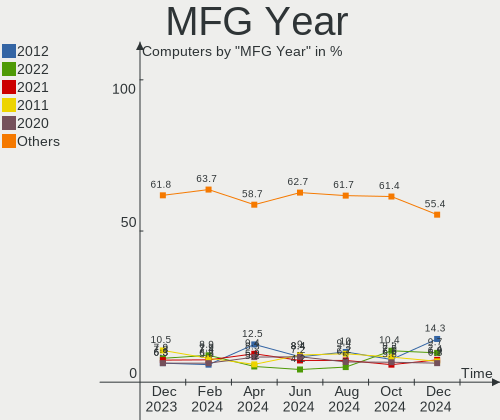
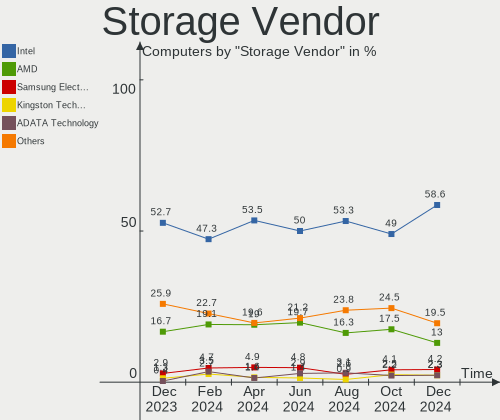
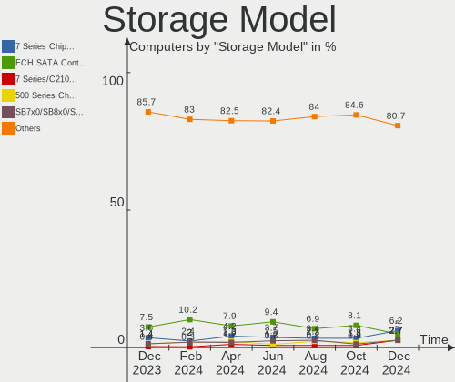
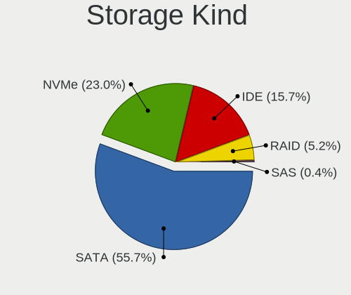
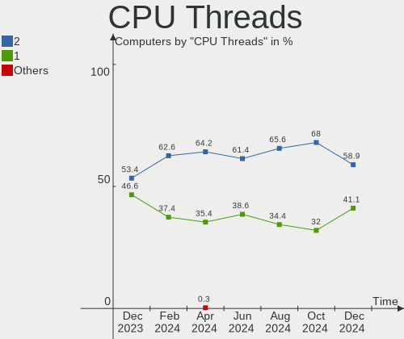
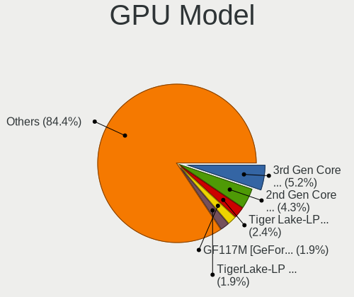

ROSA - Hardware Trends
----------------------

A project to identify most popular hardware characteristics and track their change
over time based on data collected by Linux users at https://Linux-Hardware.org.

Anyone can contribute to this report by the [hw-probe](https://github.com/linuxhw/hw-probe) tool:

    sudo -E hw-probe -all -upload

This is a report for all computer types. See also reports for [desktops](/Dist/ROSA/Desktop/README.md) and [notebooks](/Dist/ROSA/Notebook/README.md).

This report is for one last month. Overall report since the beginning of time: [TestDays](https://github.com/linuxhw/TestDays)

Period: Dec, 2023.

Contents
--------

* [ System ](#system)
  - [ OS                       ](#os)
  - [ OS Family                ](#os-family)
  - [ Kernel                   ](#kernel)
  - [ Kernel Family            ](#kernel-family)
  - [ Kernel Major Ver.        ](#kernel-major-ver)
  - [ Arch                     ](#arch)
  - [ DE                       ](#de)
  - [ Display Server           ](#display-server)
  - [ Display Manager          ](#display-manager)
  - [ OS Lang                  ](#os-lang)
  - [ Boot Mode                ](#boot-mode)
  - [ Filesystem               ](#filesystem)
  - [ Part. scheme             ](#part-scheme)
  - [ Dual Boot with Linux/BSD ](#dual-boot-with-linuxbsd)
  - [ Dual Boot (Win)          ](#dual-boot-win)

* [ Board ](#board)
  - [ Vendor                   ](#vendor)
  - [ Model                    ](#model)
  - [ Model Family             ](#model-family)
  - [ MFG Year                 ](#mfg-year)
  - [ Form Factor              ](#form-factor)
  - [ Secure Boot              ](#secure-boot)
  - [ Coreboot                 ](#coreboot)
  - [ RAM Size                 ](#ram-size)
  - [ RAM Used                 ](#ram-used)
  - [ Total Drives             ](#total-drives)
  - [ Has CD-ROM               ](#has-cd-rom)
  - [ Has Ethernet             ](#has-ethernet)
  - [ Has WiFi                 ](#has-wifi)
  - [ Has Bluetooth            ](#has-bluetooth)

* [ Location ](#location)
  - [ Country                  ](#country)
  - [ City                     ](#city)

* [ Drives ](#drives)
  - [ Drive Vendor             ](#drive-vendor)
  - [ Drive Model              ](#drive-model)
  - [ HDD Vendor               ](#hdd-vendor)
  - [ SSD Vendor               ](#ssd-vendor)
  - [ Drive Kind               ](#drive-kind)
  - [ Drive Connector          ](#drive-connector)
  - [ Drive Size               ](#drive-size)
  - [ Space Total              ](#space-total)
  - [ Space Used               ](#space-used)
  - [ Malfunc. Drives          ](#malfunc-drives)
  - [ Malfunc. Drive Vendor    ](#malfunc-drive-vendor)
  - [ Malfunc. HDD Vendor      ](#malfunc-hdd-vendor)
  - [ Malfunc. Drive Kind      ](#malfunc-drive-kind)
  - [ Failed Drives            ](#failed-drives)
  - [ Failed Drive Vendor      ](#failed-drive-vendor)
  - [ Drive Status             ](#drive-status)

* [ Storage controller ](#storage-controller)
  - [ Storage Vendor           ](#storage-vendor)
  - [ Storage Model            ](#storage-model)
  - [ Storage Kind             ](#storage-kind)

* [ Processor ](#processor)
  - [ CPU Vendor               ](#cpu-vendor)
  - [ CPU Model                ](#cpu-model)
  - [ CPU Model Family         ](#cpu-model-family)
  - [ CPU Cores                ](#cpu-cores)
  - [ CPU Sockets              ](#cpu-sockets)
  - [ CPU Threads              ](#cpu-threads)
  - [ CPU Op-Modes             ](#cpu-op-modes)
  - [ CPU Microcode            ](#cpu-microcode)
  - [ CPU Microarch            ](#cpu-microarch)

* [ Graphics ](#graphics)
  - [ GPU Vendor               ](#gpu-vendor)
  - [ GPU Model                ](#gpu-model)
  - [ GPU Combo                ](#gpu-combo)
  - [ GPU Driver               ](#gpu-driver)
  - [ GPU Memory               ](#gpu-memory)

* [ Monitor ](#monitor)
  - [ Monitor Vendor           ](#monitor-vendor)
  - [ Monitor Model            ](#monitor-model)
  - [ Monitor Resolution       ](#monitor-resolution)
  - [ Monitor Diagonal         ](#monitor-diagonal)
  - [ Monitor Width            ](#monitor-width)
  - [ Aspect Ratio             ](#aspect-ratio)
  - [ Monitor Area             ](#monitor-area)
  - [ Pixel Density            ](#pixel-density)
  - [ Multiple Monitors        ](#multiple-monitors)

* [ Network ](#network)
  - [ Net Controller Vendor    ](#net-controller-vendor)
  - [ Net Controller Model     ](#net-controller-model)
  - [ Wireless Vendor          ](#wireless-vendor)
  - [ Wireless Model           ](#wireless-model)
  - [ Ethernet Vendor          ](#ethernet-vendor)
  - [ Ethernet Model           ](#ethernet-model)
  - [ Net Controller Kind      ](#net-controller-kind)
  - [ Used Controller          ](#used-controller)
  - [ NICs                     ](#nics)
  - [ IPv6                     ](#ipv6)

* [ Bluetooth ](#bluetooth)
  - [ Bluetooth Vendor         ](#bluetooth-vendor)
  - [ Bluetooth Model          ](#bluetooth-model)

* [ Sound ](#sound)
  - [ Sound Vendor             ](#sound-vendor)
  - [ Sound Model              ](#sound-model)

* [ Memory ](#memory)
  - [ Memory Vendor            ](#memory-vendor)
  - [ Memory Model             ](#memory-model)
  - [ Memory Kind              ](#memory-kind)
  - [ Memory Form Factor       ](#memory-form-factor)
  - [ Memory Size              ](#memory-size)
  - [ Memory Speed             ](#memory-speed)

* [ Printers & scanners ](#printers--scanners)
  - [ Printer Vendor           ](#printer-vendor)
  - [ Printer Model            ](#printer-model)
  - [ Scanner Vendor           ](#scanner-vendor)
  - [ Scanner Model            ](#scanner-model)

* [ Camera ](#camera)
  - [ Camera Vendor            ](#camera-vendor)
  - [ Camera Model             ](#camera-model)

* [ Security ](#security)
  - [ Fingerprint Vendor       ](#fingerprint-vendor)
  - [ Fingerprint Model        ](#fingerprint-model)
  - [ Chipcard Vendor          ](#chipcard-vendor)
  - [ Chipcard Model           ](#chipcard-model)

* [ Unsupported ](#unsupported)
  - [ Unsupported Devices      ](#unsupported-devices)
  - [ Unsupported Device Types ](#unsupported-device-types)

System
------

OS
--

Installed operating systems

| Name        | Computers | Percent |
|-------------|-----------|---------|
| ROSA 12.4   | 158       | 82.72%  |
| ROSA 12     | 14        | 7.33%   |
| ROSA R11.1  | 10        | 5.24%   |
| ROSA 13.0   | 2         | 1.05%   |
| ROSA 12.2   | 2         | 1.05%   |
| ROSA R11    | 1         | 0.52%   |
| ROSA 2021.1 | 1         | 0.52%   |
| ROSA 12f.1  | 1         | 0.52%   |
| ROSA 12.3   | 1         | 0.52%   |
| ROSA 12.1   | 1         | 0.52%   |

OS Family
---------

OS without a version

| Name | Computers | Percent |
|------|-----------|---------|
| ROSA | 191       | 100%    |

Kernel
------

Version of the Linux kernel

| Version                                   | Computers | Percent |
|-------------------------------------------|-----------|---------|
| 6.1.58-generic-1rosa2021.1-x86_64         | 98        | 51.31%  |
| 6.1.20-generic-2rosa2021.1-x86_64         | 43        | 22.51%  |
| 5.10.184-generic-1rosa2021.1-x86_64       | 13        | 6.81%   |
| 5.15.127-generic-1rosa2021.1-x86_64       | 8         | 4.19%   |
| 5.10.74-generic-2rosa2021.1-x86_64        | 3         | 1.57%   |
| 4.15.0-desktop-122.124.1rosa-x86_64       | 3         | 1.57%   |
| 4.15.0-desktop-122.124.1rosa-i586         | 3         | 1.57%   |
| 6.1.46-generic-2rosa2021.1-x86_64         | 2         | 1.05%   |
| 6.1.38-generic-1rosa2021.1-x86_64         | 2         | 1.05%   |
| 5.15.127-generic-1rosa2021.1-i686         | 2         | 1.05%   |
| 4.9.155-nrj-desktop-1rosa-x86_64          | 2         | 1.05%   |
| 6.4.15.xm1-1.klp-xanmod-rosa2021.1-x86_64 | 1         | 0.52%   |
| 6.1.58-generic-4rosa2023.1-x86_64         | 1         | 0.52%   |
| 6.1.58-generic-3rosa2023.1-x86_64         | 1         | 0.52%   |
| 6.1.58-generic-1rosa2021.15-arm64         | 1         | 0.52%   |
| 6.1.58-generic-1rosa2021.1-i686           | 1         | 0.52%   |
| 5.4.83-generic-2rosa-x86_64               | 1         | 0.52%   |
| 5.4.32-generic-2rosa-i586                 | 1         | 0.52%   |
| 5.17.11-generic-2rosa2021.1-x86_64        | 1         | 0.52%   |
| 5.15.75-generic-1rosa2021.1-x86_64        | 1         | 0.52%   |
| 5.10.74-generic-2rosa2021.1-i586          | 1         | 0.52%   |
| 5.10.71-generic-1rosa2021.1-x86_64        | 1         | 0.52%   |
| 4.15.0-desktop-45.1rosa-x86_64            | 1         | 0.52%   |

Kernel Family
-------------

Linux kernel without a distro release

| Version  | Computers | Percent |
|----------|-----------|---------|
| 6.1.58   | 102       | 53.4%   |
| 6.1.20   | 43        | 22.51%  |
| 5.10.184 | 13        | 6.81%   |
| 5.15.127 | 10        | 5.24%   |
| 4.15.0   | 7         | 3.66%   |
| 5.10.74  | 4         | 2.09%   |
| 6.1.46   | 2         | 1.05%   |
| 6.1.38   | 2         | 1.05%   |
| 4.9.155  | 2         | 1.05%   |
| 6.4.15   | 1         | 0.52%   |
| 5.4.83   | 1         | 0.52%   |
| 5.4.32   | 1         | 0.52%   |
| 5.17.11  | 1         | 0.52%   |
| 5.15.75  | 1         | 0.52%   |
| 5.10.71  | 1         | 0.52%   |

Kernel Major Ver.
-----------------

Linux kernel major version

| Version | Computers | Percent |
|---------|-----------|---------|
| 6.1     | 149       | 78.01%  |
| 5.10    | 18        | 9.42%   |
| 5.15    | 11        | 5.76%   |
| 4.15    | 7         | 3.66%   |
| 5.4     | 2         | 1.05%   |
| 4.9     | 2         | 1.05%   |
| 6.4     | 1         | 0.52%   |
| 5.17    | 1         | 0.52%   |

Arch
----

OS architecture (x86_64, i586, etc.)

| Name    | Computers | Percent |
|---------|-----------|---------|
| x86_64  | 182       | 95.29%  |
| i686    | 8         | 4.19%   |
| aarch64 | 1         | 0.52%   |

DE
--

Desktop Environment

| Name    | Computers | Percent |
|---------|-----------|---------|
| KDE5    | 118       | 61.78%  |
| GNOME   | 42        | 21.99%  |
| LXQt    | 18        | 9.42%   |
| KDE4    | 8         | 4.19%   |
| XFCE    | 2         | 1.05%   |
| MATE    | 1         | 0.52%   |
| i3      | 1         | 0.52%   |
| Unknown | 1         | 0.52%   |

Display Server
--------------

X11 or Wayland

| Name    | Computers | Percent |
|---------|-----------|---------|
| Wayland | 140       | 73.3%   |
| X11     | 48        | 25.13%  |
| Tty     | 2         | 1.05%   |
| Unknown | 1         | 0.52%   |

Display Manager
---------------

SDDM, LightDM, etc.

| Name    | Computers | Percent |
|---------|-----------|---------|
| SDDM    | 118       | 61.78%  |
| GDM     | 57        | 29.84%  |
| KDM     | 8         | 4.19%   |
| LightDM | 6         | 3.14%   |
| Unknown | 2         | 1.05%   |

OS Lang
-------

Language

| Lang    | Computers | Percent |
|---------|-----------|---------|
| ru_RU   | 174       | 91.1%   |
| de_DE   | 5         | 2.62%   |
| pl_PL   | 3         | 1.57%   |
| it_IT   | 3         | 1.57%   |
| sk_SK   | 1         | 0.52%   |
| ru_BY   | 1         | 0.52%   |
| fr_FR   | 1         | 0.52%   |
| en_US   | 1         | 0.52%   |
| en_GB   | 1         | 0.52%   |
| Unknown | 1         | 0.52%   |

Boot Mode
---------

EFI or BIOS

| Mode | Computers | Percent |
|------|-----------|---------|
| EFI  | 102       | 53.4%   |
| BIOS | 89        | 46.6%   |

Filesystem
----------

Type of filesystem

| Type    | Computers | Percent |
|---------|-----------|---------|
| Ext4    | 169       | 88.48%  |
| Btrfs   | 20        | 10.47%  |
| Overlay | 1         | 0.52%   |
| F2fs    | 1         | 0.52%   |

Part. scheme
------------

Scheme of partitioning

| Type    | Computers | Percent |
|---------|-----------|---------|
| GPT     | 106       | 55.5%   |
| MBR     | 84        | 43.98%  |
| Unknown | 1         | 0.52%   |

Dual Boot with Linux/BSD
------------------------

Hosting more than one Linux/BSD

| Dual boot | Computers | Percent |
|-----------|-----------|---------|
| No        | 147       | 76.96%  |
| Yes       | 44        | 23.04%  |

Dual Boot (Win)
---------------

Hosting Linux and Windows

| Dual boot | Computers | Percent |
|-----------|-----------|---------|
| No        | 102       | 53.4%   |
| Yes       | 89        | 46.6%   |

Board
-----

Vendor
------

Motherboard manufacturer

| Name                     | Computers | Percent |
|--------------------------|-----------|---------|
| ASUSTek Computer         | 42        | 21.99%  |
| Gigabyte Technology      | 20        | 10.47%  |
| Lenovo                   | 19        | 9.95%   |
| MSI                      | 15        | 7.85%   |
| Hewlett-Packard          | 15        | 7.85%   |
| Acer                     | 14        | 7.33%   |
| Dell                     | 8         | 4.19%   |
| ASRock                   | 8         | 4.19%   |
| Intel                    | 5         | 2.62%   |
| Clevo                    | 5         | 2.62%   |
| Toshiba                  | 4         | 2.09%   |
| HUAWEI                   | 4         | 2.09%   |
| Samsung Electronics      | 3         | 1.57%   |
| AZW                      | 3         | 1.57%   |
| Sony                     | 2         | 1.05%   |
| ICL                      | 2         | 1.05%   |
| Packard Bell             | 1         | 0.52%   |
| OEM                      | 1         | 0.52%   |
| Notebook                 | 1         | 0.52%   |
| Maibenben                | 1         | 0.52%   |
| LTD Delovoy Office       | 1         | 0.52%   |
| LG Electronics           | 1         | 0.52%   |
| Irbis                    | 1         | 0.52%   |
| INTECH PRO               | 1         | 0.52%   |
| Infinix                  | 1         | 0.52%   |
| HJS                      | 1         | 0.52%   |
| HIPER Technology Limited | 1         | 0.52%   |
| Graviton                 | 1         | 0.52%   |
| Fujitsu Siemens          | 1         | 0.52%   |
| eMachines                | 1         | 0.52%   |
| Edelweiss                | 1         | 0.52%   |
| DNS                      | 1         | 0.52%   |
| Digma                    | 1         | 0.52%   |
| Biostar                  | 1         | 0.52%   |
| BESSTAR Tech             | 1         | 0.52%   |
| ARDOR GAMING             | 1         | 0.52%   |
| Apple                    | 1         | 0.52%   |
| Unknown                  | 1         | 0.52%   |

Model
-----

Motherboard model

| Name                                       | Computers | Percent |
|--------------------------------------------|-----------|---------|
| Clevo NL41MU2                              | 5         | 2.62%   |
| Lenovo B590 20206                          | 2         | 1.05%   |
| ICL RAY Si105.Mi                           | 2         | 1.05%   |
| HUAWEI BOD-WXX9                            | 2         | 1.05%   |
| Gigabyte B450M DS3H                        | 2         | 1.05%   |
| Gigabyte A320M-H                           | 2         | 1.05%   |
| AZW MINI S                                 | 2         | 1.05%   |
| ASUS P8H61-M LX                            | 2         | 1.05%   |
| ASUS All Series                            | 2         | 1.05%   |
| Toshiba Satellite U300                     | 1         | 0.52%   |
| Toshiba Satellite Pro C660                 | 1         | 0.52%   |
| Toshiba Satellite C660                     | 1         | 0.52%   |
| Toshiba Satellite A200                     | 1         | 0.52%   |
| Sony VGN-FW11ER                            | 1         | 0.52%   |
| Sony VGC-LT1SR                             | 1         | 0.52%   |
| Samsung R528/R728                          | 1         | 0.52%   |
| Samsung 350V5C/351V5C/3540VC/3440VC        | 1         | 0.52%   |
| Samsung 300V3A/300V4A/300V5A/200A4B/200A5B | 1         | 0.52%   |
| Packard Bell EasyNote TE11HC               | 1         | 0.52%   |
| OEM X79G                                   | 1         | 0.52%   |
| Notebook W65_67SJ                          | 1         | 0.52%   |
| MSI MS-7D22                                | 1         | 0.52%   |
| MSI MS-7C95                                | 1         | 0.52%   |
| MSI MS-7C83                                | 1         | 0.52%   |
| MSI MS-7C52                                | 1         | 0.52%   |
| MSI MS-7B22                                | 1         | 0.52%   |
| MSI MS-7996                                | 1         | 0.52%   |
| MSI MS-7895                                | 1         | 0.52%   |
| MSI MS-7641                                | 1         | 0.52%   |
| MSI MS-7640                                | 1         | 0.52%   |
| MSI MS-7599                                | 1         | 0.52%   |
| MSI MS-7592                                | 1         | 0.52%   |
| MSI MPG B560 Trident A (MS-B926)           | 1         | 0.52%   |
| MSI Katana GF76 12UC                       | 1         | 0.52%   |
| MSI GE70 0NC\0ND                           | 1         | 0.52%   |
| MSI Cubi N 8GL (MS-B171)                   | 1         | 0.52%   |
| Maibenben MaiBook P series                 | 1         | 0.52%   |
| LTD Delovoy Office EVE 14 C414 NA9144BXW01 | 1         | 0.52%   |
| LG F1-2A85R                                | 1         | 0.52%   |
| Lenovo XiaoXinPro 16 IRH8 83AQ             | 1         | 0.52%   |

Model Family
------------

Motherboard model prefix

| Name                  | Computers | Percent |
|-----------------------|-----------|---------|
| Acer Aspire           | 10        | 5.24%   |
| Lenovo IdeaPad        | 6         | 3.14%   |
| HP ProBook            | 5         | 2.62%   |
| Clevo NL41MU2         | 5         | 2.62%   |
| Toshiba Satellite     | 4         | 2.09%   |
| Lenovo ThinkPad       | 4         | 2.09%   |
| ASUS P8H61-M          | 4         | 2.09%   |
| HP Compaq             | 3         | 1.57%   |
| Lenovo ThinkCentre    | 2         | 1.05%   |
| Lenovo B590           | 2         | 1.05%   |
| ICL RAY               | 2         | 1.05%   |
| HUAWEI BOD-WXX9       | 2         | 1.05%   |
| HP Pavilion           | 2         | 1.05%   |
| Gigabyte B450M        | 2         | 1.05%   |
| Gigabyte A320M-H      | 2         | 1.05%   |
| Dell System           | 2         | 1.05%   |
| Dell Inspiron         | 2         | 1.05%   |
| AZW MINI              | 2         | 1.05%   |
| ASUS VivoBook         | 2         | 1.05%   |
| ASUS TUF              | 2         | 1.05%   |
| ASUS PRIME            | 2         | 1.05%   |
| ASUS All              | 2         | 1.05%   |
| Sony VGN-FW11ER       | 1         | 0.52%   |
| Sony VGC-LT1SR        | 1         | 0.52%   |
| Samsung R528          | 1         | 0.52%   |
| Samsung 350V5C        | 1         | 0.52%   |
| Samsung 300V3A        | 1         | 0.52%   |
| Packard Bell EasyNote | 1         | 0.52%   |
| OEM X79G              | 1         | 0.52%   |
| Notebook W65          | 1         | 0.52%   |
| MSI MS-7D22           | 1         | 0.52%   |
| MSI MS-7C95           | 1         | 0.52%   |
| MSI MS-7C83           | 1         | 0.52%   |
| MSI MS-7C52           | 1         | 0.52%   |
| MSI MS-7B22           | 1         | 0.52%   |
| MSI MS-7996           | 1         | 0.52%   |
| MSI MS-7895           | 1         | 0.52%   |
| MSI MS-7641           | 1         | 0.52%   |
| MSI MS-7640           | 1         | 0.52%   |
| MSI MS-7599           | 1         | 0.52%   |

MFG Year
--------

Motherboard manufacture year

| Year | Computers | Percent |
|------|-----------|---------|
| 2011 | 20        | 10.47%  |
| 2022 | 15        | 7.85%   |
| 2013 | 15        | 7.85%   |
| 2023 | 14        | 7.33%   |
| 2021 | 14        | 7.33%   |
| 2010 | 14        | 7.33%   |
| 2020 | 12        | 6.28%   |
| 2018 | 12        | 6.28%   |
| 2012 | 12        | 6.28%   |
| 2007 | 11        | 5.76%   |
| 2009 | 10        | 5.24%   |
| 2014 | 9         | 4.71%   |
| 2017 | 8         | 4.19%   |
| 2015 | 8         | 4.19%   |
| 2019 | 4         | 2.09%   |
| 2016 | 4         | 2.09%   |
| 2008 | 4         | 2.09%   |
| 2005 | 3         | 1.57%   |
| 2006 | 2         | 1.05%   |

Form Factor
-----------

Physical design of the computer

| Name           | Computers | Percent |
|----------------|-----------|---------|
| Notebook       | 102       | 53.4%   |
| Desktop        | 84        | 43.98%  |
| Mini pc        | 2         | 1.05%   |
| All in one     | 2         | 1.05%   |
| System on chip | 1         | 0.52%   |

Secure Boot
-----------

Enabled or disabled

| State    | Computers | Percent |
|----------|-----------|---------|
| Disabled | 191       | 100%    |

Coreboot
--------

Have coreboot on board

| Used | Computers | Percent |
|------|-----------|---------|
| No   | 191       | 100%    |

RAM Size
--------

Total RAM memory

| Size in GB  | Computers | Percent |
|-------------|-----------|---------|
| 4.01-8.0    | 50        | 26.18%  |
| 3.01-4.0    | 41        | 21.47%  |
| 8.01-16.0   | 39        | 20.42%  |
| 16.01-24.0  | 32        | 16.75%  |
| 1.01-2.0    | 9         | 4.71%   |
| 2.01-3.0    | 7         | 3.66%   |
| 32.01-64.0  | 5         | 2.62%   |
| 24.01-32.0  | 4         | 2.09%   |
| 64.01-256.0 | 3         | 1.57%   |
| 0.51-1.0    | 1         | 0.52%   |

RAM Used
--------

Used RAM memory

| Used GB  | Computers | Percent |
|----------|-----------|---------|
| 1.01-2.0 | 97        | 50.79%  |
| 2.01-3.0 | 38        | 19.9%   |
| 0.51-1.0 | 33        | 17.28%  |
| 4.01-8.0 | 12        | 6.28%   |
| 3.01-4.0 | 9         | 4.71%   |
| 0.01-0.5 | 2         | 1.05%   |

Total Drives
------------

Number of drives on board

| Drives | Computers | Percent |
|--------|-----------|---------|
| 1      | 119       | 62.3%   |
| 2      | 36        | 18.85%  |
| 3      | 20        | 10.47%  |
| 4      | 9         | 4.71%   |
| 5      | 4         | 2.09%   |
| 7      | 1         | 0.52%   |
| 6      | 1         | 0.52%   |
| 0      | 1         | 0.52%   |

Has CD-ROM
----------

Has CD-ROM on board

| Presented | Computers | Percent |
|-----------|-----------|---------|
| No        | 115       | 60.21%  |
| Yes       | 76        | 39.79%  |

Has Ethernet
------------

Has Ethernet on board

| Presented | Computers | Percent |
|-----------|-----------|---------|
| Yes       | 172       | 90.05%  |
| No        | 19        | 9.95%   |

Has WiFi
--------

Has WiFi module

| Presented | Computers | Percent |
|-----------|-----------|---------|
| Yes       | 135       | 70.68%  |
| No        | 56        | 29.32%  |

Has Bluetooth
-------------

Has Bluetooth module

| Presented | Computers | Percent |
|-----------|-----------|---------|
| Yes       | 111       | 58.12%  |
| No        | 80        | 41.88%  |

Location
--------

Country
-------

Geographic location (country)

| Country    | Computers | Percent |
|------------|-----------|---------|
| Russia     | 165       | 86.39%  |
| Germany    | 6         | 3.14%   |
| Belarus    | 5         | 2.62%   |
| Poland     | 3         | 1.57%   |
| Kazakhstan | 3         | 1.57%   |
| Italy      | 3         | 1.57%   |
| Ukraine    | 2         | 1.05%   |
| Slovakia   | 1         | 0.52%   |
| Latvia     | 1         | 0.52%   |
| France     | 1         | 0.52%   |
| Barbados   | 1         | 0.52%   |

City
----

Geographic location (city)

| City                | Computers | Percent |
|---------------------|-----------|---------|
| Moscow              | 45        | 23.56%  |
| St Petersburg       | 10        | 5.24%   |
| Novosibirsk         | 10        | 5.24%   |
| Krasnodar           | 6         | 3.14%   |
| Yekaterinburg       | 5         | 2.62%   |
| Tyumen              | 3         | 1.57%   |
| Samara              | 3         | 1.57%   |
| Chelyabinsk         | 3         | 1.57%   |
| Wroclaw             | 2         | 1.05%   |
| Voronezh            | 2         | 1.05%   |
| Vladivostok         | 2         | 1.05%   |
| Tver                | 2         | 1.05%   |
| Stavropol           | 2         | 1.05%   |
| Smolensk            | 2         | 1.05%   |
| Shchelkovo          | 2         | 1.05%   |
| Rome                | 2         | 1.05%   |
| Omsk                | 2         | 1.05%   |
| Minsk               | 2         | 1.05%   |
| Dubna               | 2         | 1.05%   |
| Chita               | 2         | 1.05%   |
| Bryansk             | 2         | 1.05%   |
| Belgorod            | 2         | 1.05%   |
| Zlatoust            | 1         | 0.52%   |
| Yakutsk             | 1         | 0.52%   |
| Vyksa               | 1         | 0.52%   |
| Vologda             | 1         | 0.52%   |
| Vitebsk             | 1         | 0.52%   |
| Tula                | 1         | 0.52%   |
| Tomsk               | 1         | 0.52%   |
| Tolyatti            | 1         | 0.52%   |
| Tambov              | 1         | 0.52%   |
| Szczecin            | 1         | 0.52%   |
| Surgut              | 1         | 0.52%   |
| Štúrovo           | 1         | 0.52%   |
| Stupino             | 1         | 0.52%   |
| Stary Oskol         | 1         | 0.52%   |
| Simferopol          | 1         | 0.52%   |
| Severin             | 1         | 0.52%   |
| Sergiyev Posad      | 1         | 0.52%   |
| San Gavino Monreale | 1         | 0.52%   |

Drives
------

Drive Vendor
------------

Hard drive vendors

| Vendor              | Computers | Drives | Percent |
|---------------------|-----------|--------|---------|
| WDC                 | 45        | 62     | 15.41%  |
| Seagate             | 30        | 32     | 10.27%  |
| Samsung Electronics | 21        | 23     | 7.19%   |
| Toshiba             | 20        | 21     | 6.85%   |
| Hitachi             | 13        | 14     | 4.45%   |
| Kingston            | 12        | 13     | 4.11%   |
| Crucial             | 12        | 13     | 4.11%   |
| Unknown             | 9         | 10     | 3.08%   |
| A-DATA Technology   | 9         | 9      | 3.08%   |
| SanDisk             | 7         | 7      | 2.4%    |
| China               | 6         | 6      | 2.05%   |
| Apacer              | 6         | 6      | 2.05%   |
| SK hynix            | 5         | 5      | 1.71%   |
| Intel               | 5         | 5      | 1.71%   |
| HGST                | 5         | 5      | 1.71%   |
| Fujitsu             | 5         | 5      | 1.71%   |
| BIWIN               | 5         | 5      | 1.71%   |
| AMD                 | 5         | 6      | 1.71%   |
| Patriot             | 4         | 4      | 1.37%   |
| XrayDisk            | 3         | 3      | 1.03%   |
| SPCC                | 3         | 3      | 1.03%   |
| Silicon Motion      | 3         | 3      | 1.03%   |
| Phison              | 3         | 3      | 1.03%   |
| Netac               | 3         | 3      | 1.03%   |
| Micron Technology   | 3         | 3      | 1.03%   |
| KingSpec            | 3         | 3      | 1.03%   |
| GOODRAM             | 3         | 4      | 1.03%   |
| WALRAM              | 2         | 2      | 0.68%   |
| Team                | 2         | 2      | 0.68%   |
| Smartbuy            | 2         | 2      | 0.68%   |
| Phison Electronics  | 2         | 2      | 0.68%   |
| OCZ                 | 2         | 2      | 0.68%   |
| Maxtor              | 2         | 2      | 0.68%   |
| Hewlett-Packard     | 2         | 2      | 0.68%   |
| Gigabyte Technology | 2         | 2      | 0.68%   |
| Digma               | 2         | 2      | 0.68%   |
| Unknown             | 2         | 2      | 0.68%   |
| XPG                 | 1         | 1      | 0.34%   |
| UMIS                | 1         | 1      | 0.34%   |
| Plextor             | 1         | 1      | 0.34%   |

Drive Model
-----------

Hard drive models

| Model                              | Computers | Percent |
|------------------------------------|-----------|---------|
| Kingston SA400S37240G 240GB SSD    | 5         | 1.58%   |
| BIWIN CE480T5D101-256 256GB        | 5         | 1.58%   |
| Toshiba MQ01ABF050 500GB           | 4         | 1.27%   |
| Toshiba HDWD105 500GB              | 4         | 1.27%   |
| Crucial CT480BX500SSD1 480GB       | 4         | 1.27%   |
| Crucial CT240BX500SSD1 240GB       | 4         | 1.27%   |
| WDC WDS240G2G0A-00JH30 240GB SSD   | 3         | 0.95%   |
| Seagate ST9500325AS 500GB          | 3         | 0.95%   |
| A-DATA SU650 240GB SSD             | 3         | 0.95%   |
| WDC WD5000AAKX-001CA0 500GB        | 2         | 0.63%   |
| WDC WD40EZAZ-00SF3B0 4TB           | 2         | 0.63%   |
| WDC WD10EZEX-08WN4A0 1TB           | 2         | 0.63%   |
| Unknown SD/MMC/MS PRO 512GB        | 2         | 0.63%   |
| Toshiba MQ01ABD032 320GB           | 2         | 0.63%   |
| Toshiba HDWD110 1TB                | 2         | 0.63%   |
| Toshiba DT01ACA050 500GB           | 2         | 0.63%   |
| Silicon Motion PCIe-4 SSD 256GB    | 2         | 0.63%   |
| Seagate ST500DM002-1BD142 500GB    | 2         | 0.63%   |
| Seagate ST380815AS 80GB            | 2         | 0.63%   |
| Seagate ST1000LM024 HN-M101MBB 1TB | 2         | 0.63%   |
| SanDisk SDSSDHII480G 480GB         | 2         | 0.63%   |
| SanDisk NVMe SSD Drive 512GB       | 2         | 0.63%   |
| Samsung SSD 870 EVO 500GB          | 2         | 0.63%   |
| Samsung SSD 870 EVO 250GB          | 2         | 0.63%   |
| Samsung SSD 860 EVO 250GB          | 2         | 0.63%   |
| Samsung HD154UI 1TB                | 2         | 0.63%   |
| Patriot P210 128GB SSD             | 2         | 0.63%   |
| Netac NVMe SSD 512GB               | 2         | 0.63%   |
| Kingston SA400S37480G 480GB SSD    | 2         | 0.63%   |
| Kingston SA400S37120G 120GB SSD    | 2         | 0.63%   |
| KingSpec P3-128 128GB SSD          | 2         | 0.63%   |
| Hitachi HTS723232A7A364 320GB      | 2         | 0.63%   |
| HGST HTS545032A7E680 320GB         | 2         | 0.63%   |
| HGST HTS541010A9E680 1TB           | 2         | 0.63%   |
| Crucial CT120BX500SSD1 120GB       | 2         | 0.63%   |
| China SSD 128GB                    | 2         | 0.63%   |
| Apacer AS340 120GB SSD             | 2         | 0.63%   |
| AMD R5SL120G 120GB SSD             | 2         | 0.63%   |
| AMD R5MP120G8 120GB                | 2         | 0.63%   |
| A-DATA SU650 120GB SSD             | 2         | 0.63%   |

HDD Vendor
----------

Hard disk drive vendors

| Vendor              | Computers | Drives | Percent |
|---------------------|-----------|--------|---------|
| WDC                 | 35        | 49     | 29.66%  |
| Seagate             | 30        | 32     | 25.42%  |
| Toshiba             | 19        | 20     | 16.1%   |
| Hitachi             | 13        | 14     | 11.02%  |
| Samsung Electronics | 6         | 6      | 5.08%   |
| HGST                | 5         | 5      | 4.24%   |
| Fujitsu             | 5         | 5      | 4.24%   |
| Unknown             | 2         | 2      | 1.69%   |
| Maxtor              | 2         | 2      | 1.69%   |
| External            | 1         | 1      | 0.85%   |

SSD Vendor
----------

Solid state drive vendors

| Vendor              | Computers | Drives | Percent |
|---------------------|-----------|--------|---------|
| Crucial             | 12        | 12     | 10.81%  |
| Kingston            | 10        | 11     | 9.01%   |
| Samsung Electronics | 8         | 10     | 7.21%   |
| A-DATA Technology   | 8         | 8      | 7.21%   |
| WDC                 | 7         | 8      | 6.31%   |
| China               | 6         | 6      | 5.41%   |
| Apacer              | 5         | 5      | 4.5%    |
| SanDisk             | 4         | 4      | 3.6%    |
| XrayDisk            | 3         | 3      | 2.7%    |
| Patriot             | 3         | 3      | 2.7%    |
| KingSpec            | 3         | 3      | 2.7%    |
| Intel               | 3         | 3      | 2.7%    |
| GOODRAM             | 3         | 4      | 2.7%    |
| AMD                 | 3         | 4      | 2.7%    |
| WALRAM              | 2         | 2      | 1.8%    |
| Team                | 2         | 2      | 1.8%    |
| SPCC                | 2         | 2      | 1.8%    |
| OCZ                 | 2         | 2      | 1.8%    |
| Micron Technology   | 2         | 2      | 1.8%    |
| Gigabyte Technology | 2         | 2      | 1.8%    |
| Digma               | 2         | 2      | 1.8%    |
| Toshiba             | 1         | 1      | 0.9%    |
| Smartbuy            | 1         | 1      | 0.9%    |
| SK hynix            | 1         | 1      | 0.9%    |
| Plextor             | 1         | 1      | 0.9%    |
| NT-2TB              | 1         | 1      | 0.9%    |
| Neo                 | 1         | 1      | 0.9%    |
| LITEON              | 1         | 1      | 0.9%    |
| Integral            | 1         | 1      | 0.9%    |
| Hewlett-Packard     | 1         | 1      | 0.9%    |
| GS                  | 1         | 1      | 0.9%    |
| Fanxiang            | 1         | 1      | 0.9%    |
| Emtec               | 1         | 1      | 0.9%    |
| DEXP                | 1         | 1      | 0.9%    |
| CT240BX3            | 1         | 1      | 0.9%    |
| CHN25SATAS1         | 1         | 1      | 0.9%    |
| BR                  | 1         | 1      | 0.9%    |
| AXIOMTEK            | 1         | 1      | 0.9%    |
| Apple               | 1         | 1      | 0.9%    |
| Unknown             | 1         | 1      | 0.9%    |

Drive Kind
----------

HDD or SSD

| Kind | Computers | Drives | Percent |
|------|-----------|--------|---------|
| HDD  | 99        | 136    | 38.08%  |
| SSD  | 98        | 117    | 37.69%  |
| NVMe | 55        | 58     | 21.15%  |
| MMC  | 8         | 9      | 3.08%   |

Drive Connector
---------------

SATA, SAS, NVMe, etc.

| Type | Computers | Drives | Percent |
|------|-----------|--------|---------|
| SATA | 153       | 249    | 69.55%  |
| NVMe | 55        | 58     | 25%     |
| MMC  | 8         | 9      | 3.64%   |
| SAS  | 4         | 4      | 1.82%   |

Drive Size
----------

Size of hard drive

| Size in TB | Computers | Drives | Percent |
|------------|-----------|--------|---------|
| 0.01-0.5   | 133       | 185    | 69.63%  |
| 0.51-1.0   | 37        | 46     | 19.37%  |
| 1.01-2.0   | 12        | 12     | 6.28%   |
| 3.01-4.0   | 4         | 5      | 2.09%   |
| 4.01-10.0  | 3         | 3      | 1.57%   |
| 2.01-3.0   | 2         | 2      | 1.05%   |

Space Total
-----------

Amount of disk space available on the file system

| Size in GB     | Computers | Percent |
|----------------|-----------|---------|
| 101-250        | 64        | 33.51%  |
| 251-500        | 42        | 21.99%  |
| 501-1000       | 20        | 10.47%  |
| 1-20           | 18        | 9.42%   |
| 51-100         | 13        | 6.81%   |
| 1001-2000      | 12        | 6.28%   |
| 21-50          | 10        | 5.24%   |
| 2001-3000      | 6         | 3.14%   |
| More than 3000 | 5         | 2.62%   |
| Unknown        | 1         | 0.52%   |

Space Used
----------

Amount of used disk space

| Used GB        | Computers | Percent |
|----------------|-----------|---------|
| 1-20           | 101       | 52.88%  |
| 21-50          | 35        | 18.32%  |
| 101-250        | 15        | 7.85%   |
| 251-500        | 13        | 6.81%   |
| 51-100         | 11        | 5.76%   |
| 501-1000       | 7         | 3.66%   |
| 1001-2000      | 6         | 3.14%   |
| More than 3000 | 2         | 1.05%   |
| Unknown        | 1         | 0.52%   |

Malfunc. Drives
---------------

Drive models with a malfunction

| Model                                               | Computers | Drives | Percent |
|-----------------------------------------------------|-----------|--------|---------|
| Toshiba MQ01ABF050 500GB                            | 3         | 3      | 5.26%   |
| Seagate ST9500325AS 500GB                           | 3         | 3      | 5.26%   |
| Seagate ST380815AS 80GB                             | 2         | 2      | 3.51%   |
| WDC WD800BB-00JHC0 80GB                             | 1         | 1      | 1.75%   |
| WDC WD5000AAKX-00ERMA0 500GB                        | 1         | 1      | 1.75%   |
| WDC WD5000AAKX-001CA0 500GB                         | 1         | 1      | 1.75%   |
| WDC WD5000AAKS-00V1A0 500GB                         | 1         | 1      | 1.75%   |
| WDC WD3200BPVT-24ZEST0 320GB                        | 1         | 1      | 1.75%   |
| WDC WD3200BEVT-80A0RT0 320GB                        | 1         | 1      | 1.75%   |
| WDC WD2500BEVT-22A23T0 250GB                        | 1         | 1      | 1.75%   |
| WDC WD1600BEKT-60F3T1 160GB                         | 1         | 1      | 1.75%   |
| WDC WD10EFRX-68JCSN0 1TB                            | 1         | 1      | 1.75%   |
| WDC WD10EARS-00Y5B1 1TB                             | 1         | 2      | 1.75%   |
| WDC WD10EALS-00Z8A0 1TB                             | 1         | 1      | 1.75%   |
| WDC WD Green 2.5 240GB SSD                          | 1         | 1      | 1.75%   |
| Toshiba MQ01ABD032 320GB                            | 1         | 1      | 1.75%   |
| Toshiba HDWD110 1TB                                 | 1         | 1      | 1.75%   |
| Toshiba DT01ACA050 500GB                            | 1         | 1      | 1.75%   |
| Seagate ST9320325AS 320GB                           | 1         | 1      | 1.75%   |
| Seagate ST500DM002-1BD142 500GB                     | 1         | 1      | 1.75%   |
| Seagate ST380011A 80GB                              | 1         | 1      | 1.75%   |
| Seagate ST3250310AS 250GB                           | 1         | 1      | 1.75%   |
| Seagate ST320LT020-9YG142 320GB                     | 1         | 1      | 1.75%   |
| Seagate ST3000VX010-2E3166 3TB                      | 1         | 1      | 1.75%   |
| Seagate ST2000DM006-2DM164 2TB                      | 1         | 1      | 1.75%   |
| Seagate ST2000DL003-9VT166 2TB                      | 1         | 1      | 1.75%   |
| Seagate ST1000LM024 HN-M101MBB 1TB                  | 1         | 1      | 1.75%   |
| Plextor PX-128M5Pro 128GB SSD                       | 1         | 1      | 1.75%   |
| OCZ VERTEX460A 120GB SSD                            | 1         | 1      | 1.75%   |
| OCZ VERTEX4 256GB SSD                               | 1         | 1      | 1.75%   |
| Neo Forza NFS121SA324-6007000 240GB SSD             | 1         | 1      | 1.75%   |
| Micron Technology MTFDDAK512MAY-1AE1ZABHA 512GB SSD | 1         | 1      | 1.75%   |
| Maxtor STM3250310AS 250GB                           | 1         | 1      | 1.75%   |
| Maxtor 6B250R0 256GB                                | 1         | 1      | 1.75%   |
| Intel SSDSC2BW240A4 240GB                           | 1         | 1      | 1.75%   |
| Intel SSDSC2BW120A4 120GB                           | 1         | 1      | 1.75%   |
| Intel SSDSA2M080G2GC 80GB                           | 1         | 1      | 1.75%   |
| Hitachi HTS723232A7A364 320GB                       | 1         | 1      | 1.75%   |
| Hitachi HTS547550A9E384 500GB                       | 1         | 1      | 1.75%   |
| Hitachi HTS542516K9SA00 160GB                       | 1         | 1      | 1.75%   |

Malfunc. Drive Vendor
---------------------

Vendors of faulty drives

| Vendor            | Computers | Drives | Percent |
|-------------------|-----------|--------|---------|
| Seagate           | 14        | 14     | 25%     |
| WDC               | 11        | 13     | 19.64%  |
| Hitachi           | 7         | 7      | 12.5%   |
| Toshiba           | 6         | 6      | 10.71%  |
| Intel             | 3         | 3      | 5.36%   |
| Fujitsu           | 3         | 3      | 5.36%   |
| OCZ               | 2         | 2      | 3.57%   |
| Maxtor            | 2         | 2      | 3.57%   |
| HGST              | 2         | 2      | 3.57%   |
| Plextor           | 1         | 1      | 1.79%   |
| Neo               | 1         | 1      | 1.79%   |
| Micron Technology | 1         | 1      | 1.79%   |
| CHN25SATAS1       | 1         | 1      | 1.79%   |
| China             | 1         | 1      | 1.79%   |
| A-DATA Technology | 1         | 1      | 1.79%   |

Malfunc. HDD Vendor
-------------------

Vendors of faulty HDD drives

| Vendor  | Computers | Drives | Percent |
|---------|-----------|--------|---------|
| Seagate | 14        | 14     | 31.82%  |
| WDC     | 10        | 12     | 22.73%  |
| Hitachi | 7         | 7      | 15.91%  |
| Toshiba | 6         | 6      | 13.64%  |
| Fujitsu | 3         | 3      | 6.82%   |
| Maxtor  | 2         | 2      | 4.55%   |
| HGST    | 2         | 2      | 4.55%   |

Malfunc. Drive Kind
-------------------

Kinds of faulty drives

| Kind | Computers | Drives | Percent |
|------|-----------|--------|---------|
| HDD  | 40        | 46     | 76.92%  |
| SSD  | 12        | 12     | 23.08%  |

Failed Drives
-------------

Failed drive models

| Model                            | Computers | Drives | Percent |
|----------------------------------|-----------|--------|---------|
| Samsung Electronics HD080HJ 80GB | 1         | 1      | 100%    |

Failed Drive Vendor
-------------------

Failed drive vendors

| Vendor              | Computers | Drives | Percent |
|---------------------|-----------|--------|---------|
| Samsung Electronics | 1         | 1      | 100%    |

Drive Status
------------

Number of failed and malfunc. drives

| Status   | Computers | Drives | Percent |
|----------|-----------|--------|---------|
| Works    | 161       | 240    | 70.31%  |
| Malfunc  | 49        | 58     | 21.4%   |
| Detected | 18        | 21     | 7.86%   |
| Failed   | 1         | 1      | 0.44%   |

Storage controller
------------------

Storage Vendor
--------------

Storage controller vendors

| Vendor                                  | Computers | Percent |
|-----------------------------------------|-----------|---------|
| Intel                                   | 126       | 52.72%  |
| AMD                                     | 40        | 16.74%  |
| Phison Electronics                      | 8         | 3.35%   |
| SanDisk                                 | 7         | 2.93%   |
| Samsung Electronics                     | 7         | 2.93%   |
| Nvidia                                  | 7         | 2.93%   |
| JMicron Technology                      | 7         | 2.93%   |
| INNOGRIT                                | 6         | 2.51%   |
| Silicon Motion                          | 5         | 2.09%   |
| SK hynix                                | 4         | 1.67%   |
| MAXIO Technology (Hangzhou)             | 3         | 1.26%   |
| Kingston Technology Company             | 3         | 1.26%   |
| Netac Technology                        | 2         | 0.84%   |
| Hosin Global Electronics                | 2         | 0.84%   |
| VIA Technologies                        | 1         | 0.42%   |
| Silicon Integrated Systems [SiS]        | 1         | 0.42%   |
| Silicon Image                           | 1         | 0.42%   |
| Shenzhen Unionmemory Information System | 1         | 0.42%   |
| Shenzhen Longsys Electronics            | 1         | 0.42%   |
| Realtek Semiconductor                   | 1         | 0.42%   |
| Micron/Crucial Technology               | 1         | 0.42%   |
| Micron Technology                       | 1         | 0.42%   |
| Marvell Technology Group                | 1         | 0.42%   |
| Lenovo                                  | 1         | 0.42%   |
| KIOXIA                                  | 1         | 0.42%   |
| ADATA Technology                        | 1         | 0.42%   |

Storage Model
-------------

Storage controller models

| Model                                                                                   | Computers | Percent |
|-----------------------------------------------------------------------------------------|-----------|---------|
| AMD FCH SATA Controller [AHCI mode]                                                     | 21        | 7.53%   |
| Intel 6 Series/C200 Series Chipset Family 6 port Mobile SATA AHCI Controller            | 13        | 4.66%   |
| Intel 7 Series Chipset Family 6-port SATA Controller [AHCI mode]                        | 10        | 3.58%   |
| AMD SB7x0/SB8x0/SB9x0 SATA Controller [AHCI mode]                                       | 9         | 3.23%   |
| Intel Tiger Lake-LP SATA Controller                                                     | 8         | 2.87%   |
| Intel 82801HM/HEM (ICH8M/ICH8M-E) SATA Controller [AHCI mode]                           | 7         | 2.51%   |
| Intel 82801HM/HEM (ICH8M/ICH8M-E) IDE Controller                                        | 7         | 2.51%   |
| Intel 8 Series/C220 Series Chipset Family 6-port SATA Controller 1 [AHCI mode]          | 6         | 2.15%   |
| Phison PS5013-E13 PCIe3 NVMe Controller (DRAM-less)                                     | 5         | 1.79%   |
| Intel Q170/Q150/B150/H170/H110/Z170/CM236 Chipset SATA Controller [AHCI Mode]           | 5         | 1.79%   |
| Intel 8 Series SATA Controller 1 [AHCI mode]                                            | 5         | 1.79%   |
| Intel 6 Series/C200 Series Chipset Family 6 port Desktop SATA AHCI Controller           | 5         | 1.79%   |
| INNOGRIT NVMe SSD Controller IG5216 (DRAM-less)                                         | 5         | 1.79%   |
| JMicron JMB363 SATA/IDE Controller                                                      | 4         | 1.43%   |
| Intel NM10/ICH7 Family SATA Controller [IDE mode]                                       | 4         | 1.43%   |
| Intel Celeron/Pentium Silver Processor SATA Controller                                  | 4         | 1.43%   |
| Intel Celeron N3350/Pentium N4200/Atom E3900 Series SATA AHCI Controller                | 4         | 1.43%   |
| Intel 82801IBM/IEM (ICH9M/ICH9M-E) 4 port SATA Controller [AHCI mode]                   | 4         | 1.43%   |
| Intel 6 Series/C200 Series Chipset Family Desktop SATA Controller (IDE mode, ports 4-5) | 4         | 1.43%   |
| Intel 6 Series/C200 Series Chipset Family Desktop SATA Controller (IDE mode, ports 0-3) | 4         | 1.43%   |
| Intel 500 Series Chipset Family SATA AHCI Controller                                    | 4         | 1.43%   |
| Intel 5 Series/3400 Series Chipset 4 port SATA AHCI Controller                          | 4         | 1.43%   |
| AMD SB7x0/SB8x0/SB9x0 IDE Controller                                                    | 4         | 1.43%   |
| AMD 500 Series Chipset SATA Controller                                                  | 4         | 1.43%   |
| Silicon Motion Non-Volatile memory controller                                           | 3         | 1.08%   |
| MAXIO (Hangzhou) NVMe SSD Controller MAP1202                                            | 3         | 1.08%   |
| Intel Alder Lake-P SATA AHCI Controller                                                 | 3         | 1.08%   |
| Intel 82801G (ICH7 Family) IDE Controller                                               | 3         | 1.08%   |
| AMD FCH SATA Controller D                                                               | 3         | 1.08%   |
| AMD 400 Series Chipset SATA Controller                                                  | 3         | 1.08%   |
| SK hynix Gold P31/BC711/PC711 NVMe Solid State Drive                                    | 2         | 0.72%   |
| Silicon Motion SM2263EN/SM2263XT (DRAM-less) NVMe SSD Controllers                       | 2         | 0.72%   |
| SanDisk Ultra 3D / WD Blue SN550 NVMe SSD                                               | 2         | 0.72%   |
| Samsung NVMe SSD Controller SM961/PM961/SM963                                           | 2         | 0.72%   |
| Samsung NVMe SSD Controller 980 (DRAM-less)                                             | 2         | 0.72%   |
| Phison E12 NVMe Controller                                                              | 2         | 0.72%   |
| Nvidia MCP61 SATA Controller                                                            | 2         | 0.72%   |
| Nvidia MCP61 IDE                                                                        | 2         | 0.72%   |
| JMicron JMB368 IDE controller                                                           | 2         | 0.72%   |
| Intel Volume Management Device NVMe RAID Controller                                     | 2         | 0.72%   |

Storage Kind
------------

Kind of storage controller (IDE, SATA, NVMe, SAS, ...)

| Kind | Computers | Percent |
|------|-----------|---------|
| SATA | 152       | 60.32%  |
| NVMe | 55        | 21.83%  |
| IDE  | 40        | 15.87%  |
| RAID | 5         | 1.98%   |

Processor
---------

CPU Vendor
----------

Processor vendors

| Vendor | Computers | Percent |
|--------|-----------|---------|
| Intel  | 139       | 72.77%  |
| AMD    | 51        | 26.7%   |
| ARM    | 1         | 0.52%   |

CPU Model
---------

Processor models

| Model                                       | Computers | Percent |
|---------------------------------------------|-----------|---------|
| Intel 11th Gen Core i5-1135G7 @ 2.40GHz     | 8         | 4.19%   |
| Intel Pentium CPU B950 @ 2.10GHz            | 3         | 1.57%   |
| Intel Pentium CPU 2020M @ 2.40GHz           | 3         | 1.57%   |
| Intel Core i5-2400 CPU @ 3.10GHz            | 3         | 1.57%   |
| Intel Core i3-2350M CPU @ 2.30GHz           | 3         | 1.57%   |
| Intel Core 2 Quad CPU Q9550 @ 2.83GHz       | 3         | 1.57%   |
| Intel Celeron CPU N3350 @ 1.10GHz           | 3         | 1.57%   |
| Intel Pentium CPU B960 @ 2.20GHz            | 2         | 1.05%   |
| Intel Core i5-3230M CPU @ 2.60GHz           | 2         | 1.05%   |
| Intel Core i5-2410M CPU @ 2.30GHz           | 2         | 1.05%   |
| Intel Core i5-10400 CPU @ 2.90GHz           | 2         | 1.05%   |
| Intel 12th Gen Core i5-12450H               | 2         | 1.05%   |
| Intel 11th Gen Core i3-1115G4 @ 3.00GHz     | 2         | 1.05%   |
| AMD Ryzen 3 3200G with Radeon Vega Graphics | 2         | 1.05%   |
| AMD FX-8320E Eight-Core Processor           | 2         | 1.05%   |
| AMD Athlon 64 X2 Dual Core Processor 4400+  | 2         | 1.05%   |
| Intel Xeon CPU E5-2670 v2 @ 2.50GHz         | 1         | 0.52%   |
| Intel Xeon CPU E3-1270 v3 @ 3.50GHz         | 1         | 0.52%   |
| Intel Pentium Silver N6000 @ 1.10GHz        | 1         | 0.52%   |
| Intel Pentium M processor 1.73GHz           | 1         | 0.52%   |
| Intel Pentium Gold G6405 CPU @ 4.10GHz      | 1         | 0.52%   |
| Intel Pentium Dual-Core CPU T4500 @ 2.30GHz | 1         | 0.52%   |
| Intel Pentium Dual CPU T3400 @ 2.16GHz      | 1         | 0.52%   |
| Intel Pentium Dual CPU T2310 @ 1.46GHz      | 1         | 0.52%   |
| Intel Pentium Dual CPU E2200 @ 2.20GHz      | 1         | 0.52%   |
| Intel Pentium CPU N4200 @ 1.10GHz           | 1         | 0.52%   |
| Intel Pentium CPU N3700 @ 1.60GHz           | 1         | 0.52%   |
| Intel Pentium CPU G860 @ 3.00GHz            | 1         | 0.52%   |
| Intel Pentium CPU G620 @ 2.60GHz            | 1         | 0.52%   |
| Intel Pentium CPU G4600 @ 3.60GHz           | 1         | 0.52%   |
| Intel Pentium CPU G2120 @ 3.10GHz           | 1         | 0.52%   |
| Intel Pentium CPU G2020 @ 2.90GHz           | 1         | 0.52%   |
| Intel Pentium 3558U @ 1.70GHz               | 1         | 0.52%   |
| Intel N95                                   | 1         | 0.52%   |
| Intel N200                                  | 1         | 0.52%   |
| Intel N100                                  | 1         | 0.52%   |
| Intel Core i7-9700F CPU @ 3.00GHz           | 1         | 0.52%   |
| Intel Core i7-8550U CPU @ 1.80GHz           | 1         | 0.52%   |
| Intel Core i7-7700HQ CPU @ 2.80GHz          | 1         | 0.52%   |
| Intel Core i7-5820K CPU @ 3.30GHz           | 1         | 0.52%   |

CPU Model Family
----------------

Processor model prefix

| Model                   | Computers | Percent |
|-------------------------|-----------|---------|
| Intel Core i5           | 32        | 16.75%  |
| Other                   | 26        | 13.61%  |
| Intel Pentium           | 16        | 8.38%   |
| Intel Core i3           | 16        | 8.38%   |
| Intel Celeron           | 14        | 7.33%   |
| Intel Core i7           | 11        | 5.76%   |
| Intel Core 2 Duo        | 6         | 3.14%   |
| AMD Ryzen 5             | 6         | 3.14%   |
| AMD Ryzen 3             | 6         | 3.14%   |
| AMD Ryzen 7             | 5         | 2.62%   |
| AMD FX                  | 5         | 2.62%   |
| Intel Core 2 Quad       | 4         | 2.09%   |
| AMD Athlon 64 X2        | 4         | 2.09%   |
| Intel Pentium Dual      | 3         | 1.57%   |
| AMD Athlon X4           | 3         | 1.57%   |
| Intel Xeon              | 2         | 1.05%   |
| Intel Core 2            | 2         | 1.05%   |
| Intel Celeron Dual-Core | 2         | 1.05%   |
| Intel Atom              | 2         | 1.05%   |
| AMD Ryzen 9             | 2         | 1.05%   |
| AMD Phenom II X4        | 2         | 1.05%   |
| AMD A6                  | 2         | 1.05%   |
| AMD A4                  | 2         | 1.05%   |
| AMD A10                 | 2         | 1.05%   |
| Intel Pentium Silver    | 1         | 0.52%   |
| Intel Pentium M         | 1         | 0.52%   |
| Intel Pentium Gold      | 1         | 0.52%   |
| Intel Pentium Dual-Core | 1         | 0.52%   |
| Intel Celeron D         | 1         | 0.52%   |
| AMD Turion 64 Mobile    | 1         | 0.52%   |
| AMD Ryzen 5 PRO         | 1         | 0.52%   |
| AMD Phenom II X6        | 1         | 0.52%   |
| AMD Phenom              | 1         | 0.52%   |
| AMD E1                  | 1         | 0.52%   |
| AMD E                   | 1         | 0.52%   |
| AMD Athlon II X3        | 1         | 0.52%   |
| AMD Athlon II X2        | 1         | 0.52%   |
| AMD Athlon II Neo       | 1         | 0.52%   |
| AMD Athlon              | 1         | 0.52%   |
| AMD A8                  | 1         | 0.52%   |

CPU Cores
---------

Number of processor cores

| Number | Computers | Percent |
|--------|-----------|---------|
| 2      | 92        | 48.17%  |
| 4      | 59        | 30.89%  |
| 8      | 11        | 5.76%   |
| 6      | 11        | 5.76%   |
| 1      | 9         | 4.71%   |
| 10     | 3         | 1.57%   |
| 3      | 3         | 1.57%   |
| 16     | 1         | 0.52%   |
| 14     | 1         | 0.52%   |
| 12     | 1         | 0.52%   |

CPU Sockets
-----------

Number of sockets

| Number | Computers | Percent |
|--------|-----------|---------|
| 1      | 191       | 100%    |

CPU Threads
-----------

Threads per core (Hyper-Threading)

| Number | Computers | Percent |
|--------|-----------|---------|
| 2      | 102       | 53.4%   |
| 1      | 89        | 46.6%   |

CPU Op-Modes
------------

CPU Operation Modes (32-bit, 64-bit)

| Op mode        | Computers | Percent |
|----------------|-----------|---------|
| 32-bit, 64-bit | 190       | 99.48%  |
| 32-bit         | 1         | 0.52%   |

CPU Microcode
-------------

Microcode number

| Number     | Computers | Percent |
|------------|-----------|---------|
| 0x206a7    | 21        | 10.99%  |
| 0x306a9    | 12        | 6.28%   |
| 0x806c1    | 11        | 5.76%   |
| Unknown    | 10        | 5.24%   |
| 0x306c3    | 8         | 4.19%   |
| 0x1067a    | 8         | 4.19%   |
| 0x6fd      | 6         | 3.14%   |
| 0xa0653    | 5         | 2.62%   |
| 0x20655    | 5         | 2.62%   |
| 0x906e9    | 4         | 2.09%   |
| 0x906a3    | 4         | 2.09%   |
| 0x40651    | 4         | 2.09%   |
| 0xb06e0    | 3         | 1.57%   |
| 0x706e5    | 3         | 1.57%   |
| 0x706a8    | 3         | 1.57%   |
| 0x506e3    | 3         | 1.57%   |
| 0x506c9    | 3         | 1.57%   |
| 0x08108109 | 3         | 1.57%   |
| 0x06003106 | 3         | 1.57%   |
| 0x06001119 | 3         | 1.57%   |
| 0x906ea    | 2         | 1.05%   |
| 0x806ea    | 2         | 1.05%   |
| 0x6fb      | 2         | 1.05%   |
| 0x6f6      | 2         | 1.05%   |
| 0x30678    | 2         | 1.05%   |
| 0x20652    | 2         | 1.05%   |
| 0x10661    | 2         | 1.05%   |
| 0x0a50000d | 2         | 1.05%   |
| 0x0a50000c | 2         | 1.05%   |
| 0x08600109 | 2         | 1.05%   |
| 0x08108102 | 2         | 1.05%   |
| 0x08101016 | 2         | 1.05%   |
| 0x08001138 | 2         | 1.05%   |
| 0x06000822 | 2         | 1.05%   |
| 0x010000c8 | 2         | 1.05%   |
| 0xf64      | 1         | 0.52%   |
| 0xa0671    | 1         | 0.52%   |
| 0x906ed    | 1         | 0.52%   |
| 0x906c0    | 1         | 0.52%   |
| 0x906a4    | 1         | 0.52%   |

CPU Microarch
-------------

Microarchitecture

| Name             | Computers | Percent |
|------------------|-----------|---------|
| SandyBridge      | 21        | 10.99%  |
| Haswell          | 14        | 7.33%   |
| TigerLake        | 13        | 6.81%   |
| IvyBridge        | 13        | 6.81%   |
| Core             | 12        | 6.28%   |
| KabyLake         | 10        | 5.24%   |
| Penryn           | 9         | 4.71%   |
| Westmere         | 7         | 3.66%   |
| Piledriver       | 7         | 3.66%   |
| K10              | 7         | 3.66%   |
| Zen+             | 6         | 3.14%   |
| Zen 3            | 6         | 3.14%   |
| Alderlake Hybrid | 6         | 3.14%   |
| Zen              | 5         | 2.62%   |
| K8 Hammer        | 5         | 2.62%   |
| CometLake        | 5         | 2.62%   |
| IceLake          | 4         | 2.09%   |
| Goldmont plus    | 4         | 2.09%   |
| Goldmont         | 4         | 2.09%   |
| Zen 2            | 3         | 1.57%   |
| Steamroller      | 3         | 1.57%   |
| Skylake          | 3         | 1.57%   |
| Silvermont       | 3         | 1.57%   |
| Gracemont        | 3         | 1.57%   |
| Excavator        | 3         | 1.57%   |
| Unknown          | 3         | 1.57%   |
| Bonnell          | 2         | 1.05%   |
| Tremont          | 1         | 0.52%   |
| Puma             | 1         | 0.52%   |
| P6               | 1         | 0.52%   |
| NetBurst         | 1         | 0.52%   |
| Nehalem          | 1         | 0.52%   |
| K10 Llano        | 1         | 0.52%   |
| Jaguar           | 1         | 0.52%   |
| Bulldozer        | 1         | 0.52%   |
| Broadwell        | 1         | 0.52%   |
| Bobcat           | 1         | 0.52%   |

Graphics
--------

GPU Vendor
----------

Vendors of graphics cards

| Vendor                           | Computers | Percent |
|----------------------------------|-----------|---------|
| Intel                            | 102       | 45.95%  |
| Nvidia                           | 68        | 30.63%  |
| AMD                              | 51        | 22.97%  |
| Silicon Integrated Systems [SiS] | 1         | 0.45%   |

GPU Model
---------

Graphics card models

| Model                                                                         | Computers | Percent |
|-------------------------------------------------------------------------------|-----------|---------|
| Intel 2nd Generation Core Processor Family Integrated Graphics Controller     | 15        | 6.49%   |
| Intel TigerLake-LP GT2 [Iris Xe Graphics]                                     | 10        | 4.33%   |
| Intel 3rd Gen Core processor Graphics Controller                              | 8         | 3.46%   |
| Nvidia GK208B [GeForce GT 710]                                                | 6         | 2.6%    |
| Intel Haswell-ULT Integrated Graphics Controller                              | 5         | 2.16%   |
| Nvidia GP107 [GeForce GTX 1050 Ti]                                            | 4         | 1.73%   |
| Intel Xeon E3-1200 v3/4th Gen Core Processor Integrated Graphics Controller   | 4         | 1.73%   |
| Intel Mobile GM965/GL960 Integrated Graphics Controller (secondary)           | 4         | 1.73%   |
| Intel Mobile GM965/GL960 Integrated Graphics Controller (primary)             | 4         | 1.73%   |
| Intel GeminiLake [UHD Graphics 600]                                           | 4         | 1.73%   |
| AMD Picasso/Raven 2 [Radeon Vega Series / Radeon Vega Mobile Series]          | 4         | 1.73%   |
| AMD Cezanne [Radeon Vega Series / Radeon Vega Mobile Series]                  | 4         | 1.73%   |
| Nvidia TU117M [GeForce GTX 1650 Mobile / Max-Q]                               | 3         | 1.3%    |
| Nvidia GP107 [GeForce GTX 1050]                                               | 3         | 1.3%    |
| Nvidia GF117M [GeForce 610M/710M/810M/820M / GT 620M/625M/630M/720M]          | 3         | 1.3%    |
| Intel Tiger Lake-LP GT2 [UHD Graphics G4]                                     | 3         | 1.3%    |
| Intel Mobile 4 Series Chipset Integrated Graphics Controller                  | 3         | 1.3%    |
| Intel HD Graphics 500                                                         | 3         | 1.3%    |
| Intel Core Processor Integrated Graphics Controller                           | 3         | 1.3%    |
| Intel Alder Lake-P GT1 [UHD Graphics]                                         | 3         | 1.3%    |
| Intel Alder Lake-N [UHD Graphics]                                             | 3         | 1.3%    |
| AMD Renoir [Radeon RX Vega 6 (Ryzen 4000/5000 Mobile Series)]                 | 3         | 1.3%    |
| AMD Raven Ridge [Radeon Vega Series / Radeon Vega Mobile Series]              | 3         | 1.3%    |
| Nvidia GT218 [GeForce 210]                                                    | 2         | 0.87%   |
| Nvidia GF116 [GeForce GTX 550 Ti]                                             | 2         | 0.87%   |
| Nvidia GF116 [GeForce GTS 450 Rev. 2]                                         | 2         | 0.87%   |
| Nvidia GF108 [GeForce GT 430]                                                 | 2         | 0.87%   |
| Nvidia GA107M [GeForce RTX 3050 Mobile]                                       | 2         | 0.87%   |
| Intel UHD Graphics 620                                                        | 2         | 0.87%   |
| Intel Mobile 945GM/GMS/GME, 943/940GML Express Integrated Graphics Controller | 2         | 0.87%   |
| Intel Mobile 945GM/GMS, 943/940GML Express Integrated Graphics Controller     | 2         | 0.87%   |
| Intel Iris Plus Graphics G1 (Ice Lake)                                        | 2         | 0.87%   |
| Intel HD Graphics 630                                                         | 2         | 0.87%   |
| Intel CometLake-S GT2 [UHD Graphics 630]                                      | 2         | 0.87%   |
| Intel Atom Processor Z36xxx/Z37xxx Series Graphics & Display                  | 2         | 0.87%   |
| Intel 4th Gen Core Processor Integrated Graphics Controller                   | 2         | 0.87%   |
| AMD Stoney [Radeon R2/R3/R4/R5 Graphics]                                      | 2         | 0.87%   |
| AMD RV620/M82 [Mobility Radeon HD 3450/3470]                                  | 2         | 0.87%   |
| AMD Lexa PRO [Radeon 540/540X/550/550X / RX 540X/550/550X]                    | 2         | 0.87%   |
| AMD Ellesmere [Radeon RX 470/480/570/570X/580/580X/590]                       | 2         | 0.87%   |

GPU Combo
---------

Combinations of graphics cards

| Name           | Computers | Percent |
|----------------|-----------|---------|
| 1 x Intel      | 75        | 39.27%  |
| 1 x Nvidia     | 43        | 22.51%  |
| 1 x AMD        | 39        | 20.42%  |
| Intel + Nvidia | 21        | 10.99%  |
| Intel + AMD    | 5         | 2.62%   |
| AMD + Nvidia   | 4         | 2.09%   |
| 2 x AMD        | 2         | 1.05%   |
| Other          | 1         | 0.52%   |
| 1 x SiS        | 1         | 0.52%   |

GPU Driver
----------

Free vs proprietary

| Driver      | Computers | Percent |
|-------------|-----------|---------|
| Free        | 162       | 84.82%  |
| Proprietary | 23        | 12.04%  |
| Unknown     | 6         | 3.14%   |

GPU Memory
----------

Total video memory

| Size in GB | Computers | Percent |
|------------|-----------|---------|
| Unknown    | 84        | 43.98%  |
| 0.01-0.5   | 32        | 16.75%  |
| 1.01-2.0   | 31        | 16.23%  |
| 0.51-1.0   | 23        | 12.04%  |
| 3.01-4.0   | 12        | 6.28%   |
| 7.01-8.0   | 3         | 1.57%   |
| 5.01-6.0   | 3         | 1.57%   |
| 2.01-3.0   | 2         | 1.05%   |
| 8.01-16.0  | 1         | 0.52%   |

Monitor
-------

Monitor Vendor
--------------

Monitor vendors

| Vendor                  | Computers | Percent |
|-------------------------|-----------|---------|
| Samsung Electronics     | 28        | 15.05%  |
| AU Optronics            | 21        | 11.29%  |
| BOE                     | 16        | 8.6%    |
| Chimei Innolux          | 14        | 7.53%   |
| LG Display              | 13        | 6.99%   |
| Dell                    | 11        | 5.91%   |
| Philips                 | 8         | 4.3%    |
| Goldstar                | 7         | 3.76%   |
| AOC                     | 7         | 3.76%   |
| Chi Mei Optoelectronics | 5         | 2.69%   |
| Acer                    | 5         | 2.69%   |
| ViewSonic               | 4         | 2.15%   |
| BenQ                    | 4         | 2.15%   |
| Iiyama                  | 3         | 1.61%   |
| Hewlett-Packard         | 3         | 1.61%   |
| Sharp                   | 2         | 1.08%   |
| PANDA                   | 2         | 1.08%   |
| NEC Computers           | 2         | 1.08%   |
| Mi                      | 2         | 1.08%   |
| Hitachi                 | 2         | 1.08%   |
| CHR                     | 2         | 1.08%   |
| Apple                   | 2         | 1.08%   |
| Yeyian                  | 1         | 0.54%   |
| XYM                     | 1         | 0.54%   |
| Toshiba                 | 1         | 0.54%   |
| TMX                     | 1         | 0.54%   |
| Thomson                 | 1         | 0.54%   |
| STD                     | 1         | 0.54%   |
| SAC                     | 1         | 0.54%   |
| PPP                     | 1         | 0.54%   |
| Panasonic               | 1         | 0.54%   |
| MiTAC                   | 1         | 0.54%   |
| LG Philips              | 1         | 0.54%   |
| Lenovo                  | 1         | 0.54%   |
| LED                     | 1         | 0.54%   |
| KDC                     | 1         | 0.54%   |
| IPS                     | 1         | 0.54%   |
| InnoLux Display         | 1         | 0.54%   |
| IBM                     | 1         | 0.54%   |
| HHT                     | 1         | 0.54%   |

Monitor Model
-------------

Monitor models

| Model                                                                    | Computers | Percent |
|--------------------------------------------------------------------------|-----------|---------|
| BOE LCD Monitor BOE0872 1920x1080 344x194mm 15.5-inch                    | 3         | 1.6%    |
| AU Optronics LCD Monitor AUO21EC 1366x768 344x193mm 15.5-inch            | 3         | 1.6%    |
| Sharp LCD Monitor SHP1540 1920x1080 309x174mm 14.0-inch                  | 2         | 1.06%   |
| Samsung Electronics SA300/SA350 SAM0788 1366x768 410x230mm 18.5-inch     | 2         | 1.06%   |
| Samsung Electronics S22C200 SAM09AF 1920x1080 477x268mm 21.5-inch        | 2         | 1.06%   |
| Samsung Electronics LCD Monitor SEC5441 1366x768 344x194mm 15.5-inch     | 2         | 1.06%   |
| Samsung Electronics LCD Monitor SEC3945 1280x800 331x207mm 15.4-inch     | 2         | 1.06%   |
| Mi Redmi Monitor XMI23C3 1920x1080 527x293mm 23.7-inch                   | 2         | 1.06%   |
| Dell SE2216H DELF071 1920x1080 476x268mm 21.5-inch                       | 2         | 1.06%   |
| CHR CH7511B CHR7511 1920x1080 519x324mm 24.1-inch                        | 2         | 1.06%   |
| Chimei Innolux LCD Monitor CMN14D4 1920x1080 309x173mm 13.9-inch         | 2         | 1.06%   |
| Chi Mei Optoelectronics LCD Monitor CMO15A7 1366x768 344x193mm 15.5-inch | 2         | 1.06%   |
| BOE LCD Monitor BOE0700 1920x1080 344x194mm 15.5-inch                    | 2         | 1.06%   |
| AU Optronics LCD Monitor AUO71EC 1366x768 344x193mm 15.5-inch            | 2         | 1.06%   |
| AU Optronics LCD Monitor AUO47EC 1366x768 344x193mm 15.5-inch            | 2         | 1.06%   |
| Yeyian YMG-4K27-01 YEY2700 3840x2160 600x330mm 27.0-inch                 | 1         | 0.53%   |
| XYM MF2401 XYM2403 1920x1080 530x290mm 23.8-inch                         | 1         | 0.53%   |
| ViewSonic VX2370 SERIES VSC342C 1920x1080 509x286mm 23.0-inch            | 1         | 0.53%   |
| ViewSonic VA916 Series VSC7C20 1280x1024 376x301mm 19.0-inch             | 1         | 0.53%   |
| ViewSonic VA2231 Series VSCBB25 1920x1080 477x268mm 21.5-inch            | 1         | 0.53%   |
| ViewSonic VA2046 SERIES VSC6D2E 1600x900 430x240mm 19.4-inch             | 1         | 0.53%   |
| Toshiba TV TSB0108 1280x1024 708x398mm 32.0-inch                         | 1         | 0.53%   |
| TMX TL140BDXP01-0 TMX1400 2560x1440 310x174mm 14.0-inch                  | 1         | 0.53%   |
| Thomson TCL SMART TV TMN5655 1920x1080 1209x680mm 54.6-inch              | 1         | 0.53%   |
| STD F2722DF STD27EA 2560x1440 597x336mm 27.0-inch                        | 1         | 0.53%   |
| Samsung Electronics SyncMaster SAM0594 1680x1050 459x296mm 21.5-inch     | 1         | 0.53%   |
| Samsung Electronics SyncMaster SAM047D 1360x768 410x230mm 18.5-inch      | 1         | 0.53%   |
| Samsung Electronics SyncMaster SAM01B7 1280x1024 340x270mm 17.1-inch     | 1         | 0.53%   |
| Samsung Electronics SyncMaster SAM017F 1280x1024 338x270mm 17.0-inch     | 1         | 0.53%   |
| Samsung Electronics SyncMaster SAM0115 1280x1024 380x300mm 19.1-inch     | 1         | 0.53%   |
| Samsung Electronics SMB1930N SAM0632 1366x768 410x230mm 18.5-inch        | 1         | 0.53%   |
| Samsung Electronics S24F350 SAM0D21 1920x1080 521x293mm 23.5-inch        | 1         | 0.53%   |
| Samsung Electronics S24F350 SAM0D20 1920x1080 521x293mm 23.5-inch        | 1         | 0.53%   |
| Samsung Electronics S24C31x SAM7311 1920x1080 521x293mm 23.5-inch        | 1         | 0.53%   |
| Samsung Electronics S22C450 SAM09C4 1920x1080 477x268mm 21.5-inch        | 1         | 0.53%   |
| Samsung Electronics S20B300 SAM08A8 1600x900 443x249mm 20.0-inch         | 1         | 0.53%   |
| Samsung Electronics LCD Monitor SEC5541 1366x768 344x193mm 15.5-inch     | 1         | 0.53%   |
| Samsung Electronics LCD Monitor SEC444E 1600x900 310x174mm 14.0-inch     | 1         | 0.53%   |
| Samsung Electronics LCD Monitor SEC3859 1366x768 293x165mm 13.2-inch     | 1         | 0.53%   |
| Samsung Electronics LCD Monitor SEC3645 1280x800 331x207mm 15.4-inch     | 1         | 0.53%   |

Monitor Resolution
------------------

Monitor screen resolution

| Resolution         | Computers | Percent |
|--------------------|-----------|---------|
| 1920x1080 (FHD)    | 88        | 47.83%  |
| 1366x768 (WXGA)    | 38        | 20.65%  |
| 3840x2160 (4K)     | 10        | 5.43%   |
| 1600x900 (HD+)     | 10        | 5.43%   |
| 1280x1024 (SXGA)   | 10        | 5.43%   |
| 1280x800 (WXGA)    | 5         | 2.72%   |
| 2560x1440 (QHD)    | 4         | 2.17%   |
| 1920x1200 (WUXGA)  | 3         | 1.63%   |
| 1440x900 (WXGA+)   | 3         | 1.63%   |
| 2560x1600          | 2         | 1.09%   |
| 1920x540           | 2         | 1.09%   |
| 1680x1050 (WSXGA+) | 2         | 1.09%   |
| 1024x768 (XGA)     | 2         | 1.09%   |
| 3440x1440          | 1         | 0.54%   |
| 2160x1440          | 1         | 0.54%   |
| 1360x768           | 1         | 0.54%   |
| 1280x768           | 1         | 0.54%   |
| 1024x600           | 1         | 0.54%   |

Monitor Diagonal
----------------

Diagonal size in inches

| Inches  | Computers | Percent |
|---------|-----------|---------|
| 15      | 54        | 29.03%  |
| 21      | 16        | 8.6%    |
| 23      | 15        | 8.06%   |
| 27      | 14        | 7.53%   |
| 17      | 14        | 7.53%   |
| 24      | 13        | 6.99%   |
| 13      | 13        | 6.99%   |
| 14      | 11        | 5.91%   |
| 18      | 7         | 3.76%   |
| 19      | 6         | 3.23%   |
| 84      | 3         | 1.61%   |
| 40      | 2         | 1.08%   |
| 22      | 2         | 1.08%   |
| 11      | 2         | 1.08%   |
| 72      | 1         | 0.54%   |
| 59      | 1         | 0.54%   |
| 54      | 1         | 0.54%   |
| 49      | 1         | 0.54%   |
| 42      | 1         | 0.54%   |
| 34      | 1         | 0.54%   |
| 32      | 1         | 0.54%   |
| 31      | 1         | 0.54%   |
| 29      | 1         | 0.54%   |
| 20      | 1         | 0.54%   |
| 16      | 1         | 0.54%   |
| 12      | 1         | 0.54%   |
| 10      | 1         | 0.54%   |
| Unknown | 1         | 0.54%   |

Monitor Width
-------------

Physical width

| Width in mm | Computers | Percent |
|-------------|-----------|---------|
| 301-350     | 77        | 41.4%   |
| 501-600     | 40        | 21.51%  |
| 401-500     | 29        | 15.59%  |
| 351-400     | 15        | 8.06%   |
| 201-300     | 9         | 4.84%   |
| 1501-2000   | 4         | 2.15%   |
| 601-700     | 3         | 1.61%   |
| 1001-1500   | 3         | 1.61%   |
| 701-800     | 2         | 1.08%   |
| 901-1000    | 2         | 1.08%   |
| 801-900     | 1         | 0.54%   |
| Unknown     | 1         | 0.54%   |

Aspect Ratio
------------

Proportional relationship between the width and the height

| Ratio | Computers | Percent |
|-------|-----------|---------|
| 16/9  | 145       | 81.01%  |
| 16/10 | 18        | 10.06%  |
| 5/4   | 9         | 5.03%   |
| 4/3   | 3         | 1.68%   |
| 21/9  | 2         | 1.12%   |
| 32/9  | 1         | 0.56%   |
| 3/2   | 1         | 0.56%   |

Monitor Area
------------

Area in inch²

| Area in inch² | Computers | Percent |
|----------------|-----------|---------|
| 101-110        | 54        | 29.03%  |
| 201-250        | 35        | 18.82%  |
| 81-90          | 22        | 11.83%  |
| 301-350        | 14        | 7.53%   |
| 151-200        | 14        | 7.53%   |
| 141-150        | 11        | 5.91%   |
| 121-130        | 7         | 3.76%   |
| More than 1000 | 6         | 3.23%   |
| 251-300        | 5         | 2.69%   |
| 351-500        | 4         | 2.15%   |
| 501-1000       | 4         | 2.15%   |
| 71-80          | 2         | 1.08%   |
| 51-60          | 2         | 1.08%   |
| 131-140        | 2         | 1.08%   |
| 61-70          | 1         | 0.54%   |
| 41-50          | 1         | 0.54%   |
| 111-120        | 1         | 0.54%   |
| Unknown        | 1         | 0.54%   |

Pixel Density
-------------

Pixels per inch

| Density | Computers | Percent |
|---------|-----------|---------|
| 51-100  | 79        | 42.7%   |
| 101-120 | 55        | 29.73%  |
| 121-160 | 42        | 22.7%   |
| 161-240 | 5         | 2.7%    |
| 1-50    | 3         | 1.62%   |
| Unknown | 1         | 0.54%   |

Multiple Monitors
-----------------

Total monitors connected

| Total | Computers | Percent |
|-------|-----------|---------|
| 1     | 169       | 88.48%  |
| 2     | 11        | 5.76%   |
| 0     | 10        | 5.24%   |
| 3     | 1         | 0.52%   |

Network
-------

Net Controller Vendor
---------------------

Controller vendors

| Vendor                           | Computers | Percent |
|----------------------------------|-----------|---------|
| Realtek Semiconductor            | 132       | 45.52%  |
| Intel                            | 63        | 21.72%  |
| Qualcomm Atheros                 | 36        | 12.41%  |
| Broadcom                         | 12        | 4.14%   |
| Marvell Technology Group         | 7         | 2.41%   |
| Ralink Technology                | 6         | 2.07%   |
| Nvidia                           | 6         | 2.07%   |
| MediaTek                         | 6         | 2.07%   |
| Broadcom Limited                 | 4         | 1.38%   |
| TP-Link                          | 3         | 1.03%   |
| Ralink                           | 2         | 0.69%   |
| Xiaomi                           | 1         | 0.34%   |
| VIA Technologies                 | 1         | 0.34%   |
| T & A Mobile Phones              | 1         | 0.34%   |
| Spreadtrum Communications        | 1         | 0.34%   |
| Silicon Integrated Systems [SiS] | 1         | 0.34%   |
| Qualcomm                         | 1         | 0.34%   |
| Mercucys                         | 1         | 0.34%   |
| JMicron Technology               | 1         | 0.34%   |
| Hisense                          | 1         | 0.34%   |
| Fibocom                          | 1         | 0.34%   |
| DisplayLink                      | 1         | 0.34%   |
| D-Link System                    | 1         | 0.34%   |
| ASUSTek Computer                 | 1         | 0.34%   |

Net Controller Model
--------------------

Controller models

| Model                                                             | Computers | Percent |
|-------------------------------------------------------------------|-----------|---------|
| Realtek RTL8111/8168/8411 PCI Express Gigabit Ethernet Controller | 95        | 29.32%  |
| Realtek RTL810xE PCI Express Fast Ethernet controller             | 15        | 4.63%   |
| Qualcomm Atheros AR9285 Wireless Network Adapter (PCI-Express)    | 12        | 3.7%    |
| Intel Wi-Fi 6 AX201                                               | 11        | 3.4%    |
| Realtek RTL8821CE 802.11ac PCIe Wireless Network Adapter          | 6         | 1.85%   |
| Realtek RTL8125 2.5GbE Controller                                 | 6         | 1.85%   |
| Qualcomm Atheros QCA9565 / AR9565 Wireless Network Adapter        | 6         | 1.85%   |
| Realtek RTL8822CE 802.11ac PCIe Wireless Network Adapter          | 5         | 1.54%   |
| Qualcomm Atheros AR9485 Wireless Network Adapter                  | 5         | 1.54%   |
| Intel Wireless 7265                                               | 5         | 1.54%   |
| Intel Ethernet Connection (13) I219-V                             | 5         | 1.54%   |
| Realtek RTL8723BE PCIe Wireless Network Adapter                   | 4         | 1.23%   |
| Intel Wireless 3165                                               | 4         | 1.23%   |
| Intel Alder Lake-P PCH CNVi WiFi                                  | 4         | 1.23%   |
| Realtek RTL8153 Gigabit Ethernet Adapter                          | 3         | 0.93%   |
| Ralink RT5370 Wireless Adapter                                    | 3         | 0.93%   |
| Ralink MT7601U Wireless Adapter                                   | 3         | 0.93%   |
| Qualcomm Atheros AR9462 Wireless Network Adapter                  | 3         | 0.93%   |
| MediaTek MT7921 802.11ax PCI Express Wireless Network Adapter     | 3         | 0.93%   |
| Marvell Group 88E8055 PCI-E Gigabit Ethernet Controller           | 3         | 0.93%   |
| Intel Wireless 8265 / 8275                                        | 3         | 0.93%   |
| Intel Wi-Fi 6 AX200                                               | 3         | 0.93%   |
| Intel 82579LM Gigabit Network Connection (Lewisville)             | 3         | 0.93%   |
| Broadcom BCM43142 802.11b/g/n                                     | 3         | 0.93%   |
| Broadcom BCM4313 802.11bgn Wireless Network Adapter               | 3         | 0.93%   |
| Realtek RTL8152 Fast Ethernet Adapter                             | 2         | 0.62%   |
| Realtek RTL-8100/8101L/8139 PCI Fast Ethernet Adapter             | 2         | 0.62%   |
| Ralink RT3290 Wireless 802.11n 1T/1R PCIe                         | 2         | 0.62%   |
| Qualcomm Atheros AR8131 Gigabit Ethernet                          | 2         | 0.62%   |
| Nvidia MCP61 Ethernet                                             | 2         | 0.62%   |
| MediaTek MT7921K (RZ608) Wi-Fi 6E 80MHz                           | 2         | 0.62%   |
| Intel Wireless-AC 9260                                            | 2         | 0.62%   |
| Intel Wi-Fi 6 AX210/AX211/AX411 160MHz                            | 2         | 0.62%   |
| Intel PRO/Wireless 3945ABG [Golan] Network Connection             | 2         | 0.62%   |
| Intel Ethernet Connection (4) I219-V                              | 2         | 0.62%   |
| Intel Ethernet Connection (2) I218-V                              | 2         | 0.62%   |
| Intel Dual Band Wireless-AC 3168NGW [Stone Peak]                  | 2         | 0.62%   |
| Intel CNVi: Wi-Fi                                                 | 2         | 0.62%   |
| Intel Centrino Wireless-N 1030 [Rainbow Peak]                     | 2         | 0.62%   |
| Intel 82579V Gigabit Network Connection                           | 2         | 0.62%   |

Wireless Vendor
---------------

Wireless vendors

| Vendor                | Computers | Percent |
|-----------------------|-----------|---------|
| Intel                 | 52        | 37.68%  |
| Qualcomm Atheros      | 32        | 23.19%  |
| Realtek Semiconductor | 24        | 17.39%  |
| Broadcom              | 8         | 5.8%    |
| Ralink Technology     | 6         | 4.35%   |
| MediaTek              | 5         | 3.62%   |
| TP-Link               | 3         | 2.17%   |
| Ralink                | 2         | 1.45%   |
| Broadcom Limited      | 2         | 1.45%   |
| Mercucys              | 1         | 0.72%   |
| Fibocom               | 1         | 0.72%   |
| D-Link System         | 1         | 0.72%   |
| ASUSTek Computer      | 1         | 0.72%   |

Wireless Model
--------------

Wireless models

| Model                                                          | Computers | Percent |
|----------------------------------------------------------------|-----------|---------|
| Qualcomm Atheros AR9285 Wireless Network Adapter (PCI-Express) | 12        | 8.7%    |
| Intel Wi-Fi 6 AX201                                            | 11        | 7.97%   |
| Realtek RTL8821CE 802.11ac PCIe Wireless Network Adapter       | 6         | 4.35%   |
| Qualcomm Atheros QCA9565 / AR9565 Wireless Network Adapter     | 6         | 4.35%   |
| Realtek RTL8822CE 802.11ac PCIe Wireless Network Adapter       | 5         | 3.62%   |
| Qualcomm Atheros AR9485 Wireless Network Adapter               | 5         | 3.62%   |
| Intel Wireless 7265                                            | 5         | 3.62%   |
| Realtek RTL8723BE PCIe Wireless Network Adapter                | 4         | 2.9%    |
| Intel Wireless 3165                                            | 4         | 2.9%    |
| Intel Alder Lake-P PCH CNVi WiFi                               | 4         | 2.9%    |
| Ralink RT5370 Wireless Adapter                                 | 3         | 2.17%   |
| Ralink MT7601U Wireless Adapter                                | 3         | 2.17%   |
| Qualcomm Atheros AR9462 Wireless Network Adapter               | 3         | 2.17%   |
| MediaTek MT7921 802.11ax PCI Express Wireless Network Adapter  | 3         | 2.17%   |
| Intel Wireless 8265 / 8275                                     | 3         | 2.17%   |
| Intel Wi-Fi 6 AX200                                            | 3         | 2.17%   |
| Broadcom BCM43142 802.11b/g/n                                  | 3         | 2.17%   |
| Broadcom BCM4313 802.11bgn Wireless Network Adapter            | 3         | 2.17%   |
| Ralink RT3290 Wireless 802.11n 1T/1R PCIe                      | 2         | 1.45%   |
| MediaTek MT7921K (RZ608) Wi-Fi 6E 80MHz                        | 2         | 1.45%   |
| Intel Wireless-AC 9260                                         | 2         | 1.45%   |
| Intel Wi-Fi 6 AX210/AX211/AX411 160MHz                         | 2         | 1.45%   |
| Intel PRO/Wireless 3945ABG [Golan] Network Connection          | 2         | 1.45%   |
| Intel Dual Band Wireless-AC 3168NGW [Stone Peak]               | 2         | 1.45%   |
| Intel CNVi: Wi-Fi                                              | 2         | 1.45%   |
| Intel Centrino Wireless-N 1030 [Rainbow Peak]                  | 2         | 1.45%   |
| Broadcom Limited BCM4312 802.11b/g LP-PHY                      | 2         | 1.45%   |
| TP-Link TL-WN821N Version 5 RTL8192EU                          | 1         | 0.72%   |
| TP-Link TL-WN722N v2/v3 [Realtek RTL8188EUS]                   | 1         | 0.72%   |
| TP-Link Archer T3U [Realtek RTL8812BU]                         | 1         | 0.72%   |
| Realtek RTL8852BE PCIe 802.11ax Wireless Network Controller    | 1         | 0.72%   |
| Realtek RTL8821AE 802.11ac PCIe Wireless Network Adapter       | 1         | 0.72%   |
| Realtek RTL8723BU 802.11b/g/n WLAN Adapter                     | 1         | 0.72%   |
| Realtek RTL8188FTV 802.11b/g/n 1T1R 2.4G WLAN Adapter          | 1         | 0.72%   |
| Realtek RTL8188EUS 802.11n Wireless Network Adapter            | 1         | 0.72%   |
| Realtek RTL8188CE 802.11b/g/n WiFi Adapter                     | 1         | 0.72%   |
| Realtek RTL8187B Wireless 802.11g 54Mbps Network Adapter       | 1         | 0.72%   |
| Realtek 802.11n WLAN Adapter                                   | 1         | 0.72%   |
| Realtek 802.11ac NIC                                           | 1         | 0.72%   |
| Qualcomm Atheros QCA9377 802.11ac Wireless Network Adapter     | 1         | 0.72%   |

Ethernet Vendor
---------------

Ethernet vendors

| Vendor                           | Computers | Percent |
|----------------------------------|-----------|---------|
| Realtek Semiconductor            | 122       | 67.03%  |
| Intel                            | 23        | 12.64%  |
| Qualcomm Atheros                 | 8         | 4.4%    |
| Marvell Technology Group         | 7         | 3.85%   |
| Nvidia                           | 6         | 3.3%    |
| Broadcom                         | 5         | 2.75%   |
| Broadcom Limited                 | 2         | 1.1%    |
| Xiaomi                           | 1         | 0.55%   |
| VIA Technologies                 | 1         | 0.55%   |
| Spreadtrum Communications        | 1         | 0.55%   |
| Silicon Integrated Systems [SiS] | 1         | 0.55%   |
| Qualcomm                         | 1         | 0.55%   |
| MediaTek                         | 1         | 0.55%   |
| JMicron Technology               | 1         | 0.55%   |
| Hisense                          | 1         | 0.55%   |
| DisplayLink                      | 1         | 0.55%   |

Ethernet Model
--------------

Ethernet models

| Model                                                             | Computers | Percent |
|-------------------------------------------------------------------|-----------|---------|
| Realtek RTL8111/8168/8411 PCI Express Gigabit Ethernet Controller | 95        | 51.35%  |
| Realtek RTL810xE PCI Express Fast Ethernet controller             | 15        | 8.11%   |
| Realtek RTL8125 2.5GbE Controller                                 | 6         | 3.24%   |
| Intel Ethernet Connection (13) I219-V                             | 5         | 2.7%    |
| Realtek RTL8153 Gigabit Ethernet Adapter                          | 3         | 1.62%   |
| Marvell Group 88E8055 PCI-E Gigabit Ethernet Controller           | 3         | 1.62%   |
| Intel 82579LM Gigabit Network Connection (Lewisville)             | 3         | 1.62%   |
| Realtek RTL8152 Fast Ethernet Adapter                             | 2         | 1.08%   |
| Realtek RTL-8100/8101L/8139 PCI Fast Ethernet Adapter             | 2         | 1.08%   |
| Qualcomm Atheros AR8131 Gigabit Ethernet                          | 2         | 1.08%   |
| Nvidia MCP61 Ethernet                                             | 2         | 1.08%   |
| Intel Ethernet Connection (4) I219-V                              | 2         | 1.08%   |
| Intel Ethernet Connection (2) I218-V                              | 2         | 1.08%   |
| Intel 82579V Gigabit Network Connection                           | 2         | 1.08%   |
| Broadcom NetLink BCM5787M Gigabit Ethernet PCI Express            | 2         | 1.08%   |
| Xiaomi Mi/Redmi series (RNDIS)                                    | 1         | 0.54%   |
| VIA VT6105/VT6106S [Rhine-III]                                    | 1         | 0.54%   |
| Spreadtrum Unisoc Phone                                           | 1         | 0.54%   |
| Silicon Integrated Systems [SiS] 191 Gigabit Ethernet Adapter     | 1         | 0.54%   |
| Realtek RTL-8110SC/8169SC Gigabit Ethernet                        | 1         | 0.54%   |
| Realtek Killer E2600 Gigabit Ethernet Controller                  | 1         | 0.54%   |
| Qualcomm FP3                                                      | 1         | 0.54%   |
| Qualcomm Atheros QCA8171 Gigabit Ethernet                         | 1         | 0.54%   |
| Qualcomm Atheros Attansic L1 Gigabit Ethernet                     | 1         | 0.54%   |
| Qualcomm Atheros AR8161 Gigabit Ethernet                          | 1         | 0.54%   |
| Qualcomm Atheros AR8152 v1.1 Fast Ethernet                        | 1         | 0.54%   |
| Qualcomm Atheros AR8151 v2.0 Gigabit Ethernet                     | 1         | 0.54%   |
| Qualcomm Atheros AR8132 Fast Ethernet                             | 1         | 0.54%   |
| Nvidia MCP77 Ethernet                                             | 1         | 0.54%   |
| Nvidia MCP67 Ethernet                                             | 1         | 0.54%   |
| Nvidia MCP51 Ethernet Controller                                  | 1         | 0.54%   |
| Nvidia CK804 Ethernet Controller                                  | 1         | 0.54%   |
| MediaTek M40Air_EEA                                               | 1         | 0.54%   |
| Marvell Group 88E8053 PCI-E Gigabit Ethernet Controller           | 1         | 0.54%   |
| Marvell Group 88E8042 PCI-E Fast Ethernet Controller              | 1         | 0.54%   |
| Marvell Group 88E8040 PCI-E Fast Ethernet Controller              | 1         | 0.54%   |
| Marvell Group 88E8001 Gigabit Ethernet Controller                 | 1         | 0.54%   |
| JMicron JMC250 PCI Express Gigabit Ethernet Controller            | 1         | 0.54%   |
| Intel I211 Gigabit Network Connection                             | 1         | 0.54%   |
| Intel Ethernet Controller I225-V                                  | 1         | 0.54%   |

Net Controller Kind
-------------------

Ethernet, WiFi or modem

| Kind     | Computers | Percent |
|----------|-----------|---------|
| Ethernet | 172       | 56.03%  |
| WiFi     | 134       | 43.65%  |
| Modem    | 1         | 0.33%   |

Used Controller
---------------

Currently used network controller

| Kind     | Computers | Percent |
|----------|-----------|---------|
| WiFi     | 102       | 53.68%  |
| Ethernet | 88        | 46.32%  |

NICs
----

Total network controllers on board

| Total | Computers | Percent |
|-------|-----------|---------|
| 2     | 106       | 55.5%   |
| 1     | 81        | 42.41%  |
| 0     | 3         | 1.57%   |
| 3     | 1         | 0.52%   |

IPv6
----

IPv6 vs IPv4

| Used | Computers | Percent |
|------|-----------|---------|
| No   | 177       | 92.67%  |
| Yes  | 14        | 7.33%   |

Bluetooth
---------

Bluetooth Vendor
----------------

Controller vendors

| Vendor                          | Computers | Percent |
|---------------------------------|-----------|---------|
| Intel                           | 42        | 37.84%  |
| Realtek Semiconductor           | 16        | 14.41%  |
| IMC Networks                    | 9         | 8.11%   |
| Cambridge Silicon Radio         | 8         | 7.21%   |
| Lite-On Technology              | 7         | 6.31%   |
| Qualcomm Atheros Communications | 5         | 4.5%    |
| Hewlett-Packard                 | 4         | 3.6%    |
| Foxconn / Hon Hai               | 3         | 2.7%    |
| Broadcom                        | 3         | 2.7%    |
| Toshiba                         | 2         | 1.8%    |
| Ralink                          | 2         | 1.8%    |
| MediaTek                        | 2         | 1.8%    |
| ASUSTek Computer                | 2         | 1.8%    |
| Taiyo Yuden                     | 1         | 0.9%    |
| Realtek                         | 1         | 0.9%    |
| Foxconn International           | 1         | 0.9%    |
| Dell                            | 1         | 0.9%    |
| Apple                           | 1         | 0.9%    |
| Alps Electric                   | 1         | 0.9%    |

Bluetooth Model
---------------

Controller models

| Model                                               | Computers | Percent |
|-----------------------------------------------------|-----------|---------|
| Intel Bluetooth Device                              | 17        | 15.32%  |
| Realtek Bluetooth Radio                             | 14        | 12.61%  |
| Intel Bluetooth wireless interface                  | 11        | 9.91%   |
| Cambridge Silicon Radio Bluetooth Dongle (HCI mode) | 8         | 7.21%   |
| Lite-On Atheros AR3012 Bluetooth                    | 4         | 3.6%    |
| HP Broadcom 2070 Bluetooth Combo                    | 4         | 3.6%    |
| Qualcomm Atheros AR3011 Bluetooth                   | 3         | 2.7%    |
| Intel Centrino Advanced-N 6230 Bluetooth adapter    | 3         | 2.7%    |
| Intel AX200 Bluetooth                               | 3         | 2.7%    |
| IMC Networks Wireless_Device                        | 3         | 2.7%    |
| IMC Networks Bluetooth Radio                        | 3         | 2.7%    |
| IMC Networks Atheros AR3012 Bluetooth 4.0 Adapter   | 3         | 2.7%    |
| Foxconn / Hon Hai Bluetooth Device                  | 3         | 2.7%    |
| Ralink RT3290 Bluetooth                             | 2         | 1.8%    |
| Qualcomm Atheros AR3012 Bluetooth 4.0               | 2         | 1.8%    |
| MediaTek Wireless_Device                            | 2         | 1.8%    |
| Intel Wireless-AC 3168 Bluetooth                    | 2         | 1.8%    |
| Intel Bluetooth 9460/9560 Jefferson Peak (JfP)      | 2         | 1.8%    |
| Intel AX210 Bluetooth                               | 2         | 1.8%    |
| Toshiba Integrated Bluetooth HCI                    | 1         | 0.9%    |
| Toshiba Bluetooth Device                            | 1         | 0.9%    |
| Taiyo Yuden Bluetooth Device (V2.0+EDR)             | 1         | 0.9%    |
| Realtek RTL8821A Bluetooth                          | 1         | 0.9%    |
| Realtek  Bluetooth 4.2 Adapter                      | 1         | 0.9%    |
| Realtek Bluetooth Radio                             | 1         | 0.9%    |
| Lite-On Qualcomm Atheros QCA9377 Bluetooth          | 1         | 0.9%    |
| Lite-On Broadcom BCM43142A0 Bluetooth Device        | 1         | 0.9%    |
| Lite-On Bluetooth Device                            | 1         | 0.9%    |
| Intel Wireless-AC 9260 Bluetooth Adapter            | 1         | 0.9%    |
| Intel Centrino Bluetooth Wireless Transceiver       | 1         | 0.9%    |
| Foxconn International BCM43142A0 Bluetooth module   | 1         | 0.9%    |
| Dell Wireless 360 Bluetooth                         | 1         | 0.9%    |
| Broadcom BCM20702 Bluetooth 4.0 [ThinkPad]          | 1         | 0.9%    |
| Broadcom BCM2045B (BDC-2.1)                         | 1         | 0.9%    |
| Broadcom BCM2045 Bluetooth                          | 1         | 0.9%    |
| ASUS Qualcomm Bluetooth 4.1                         | 1         | 0.9%    |
| ASUS BT-270 Bluetooth Adapter                       | 1         | 0.9%    |
| Apple Bluetooth USB Host Controller                 | 1         | 0.9%    |
| Alps Electric BCM2046 Bluetooth Device              | 1         | 0.9%    |

Sound
-----

Sound Vendor
------------

Sound card vendors

| Vendor                                       | Computers | Percent |
|----------------------------------------------|-----------|---------|
| Intel                                        | 137       | 51.7%   |
| AMD                                          | 56        | 21.13%  |
| Nvidia                                       | 54        | 20.38%  |
| C-Media Electronics                          | 7         | 2.64%   |
| Zoran Co. Personal Media Division (Nogatech) | 2         | 0.75%   |
| Silicon Integrated Systems [SiS]             | 1         | 0.38%   |
| Pixart Imaging                               | 1         | 0.38%   |
| Logitech                                     | 1         | 0.38%   |
| KTMicro                                      | 1         | 0.38%   |
| Ensoniq                                      | 1         | 0.38%   |
| DCMT Technology                              | 1         | 0.38%   |
| Creative Labs                                | 1         | 0.38%   |
| BR23                                         | 1         | 0.38%   |
| ASUSTek Computer                             | 1         | 0.38%   |

Sound Model
-----------

Sound card models

| Model                                                                      | Computers | Percent |
|----------------------------------------------------------------------------|-----------|---------|
| Intel 6 Series/C200 Series Chipset Family High Definition Audio Controller | 22        | 7.19%   |
| AMD Family 17h/19h HD Audio Controller                                     | 15        | 4.9%    |
| Intel Tiger Lake-LP Smart Sound Technology Audio Controller                | 13        | 4.25%   |
| AMD SBx00 Azalia (Intel HDA)                                               | 12        | 3.92%   |
| Intel 7 Series/C216 Chipset Family High Definition Audio Controller        | 11        | 3.59%   |
| Intel 82801H (ICH8 Family) HD Audio Controller                             | 9         | 2.94%   |
| AMD FCH Azalia Controller                                                  | 9         | 2.94%   |
| Nvidia GP107GL High Definition Audio Controller                            | 8         | 2.61%   |
| Intel 5 Series/3400 Series Chipset High Definition Audio                   | 8         | 2.61%   |
| AMD Renoir Radeon High Definition Audio Controller                         | 8         | 2.61%   |
| Nvidia GF108 High Definition Audio Controller                              | 7         | 2.29%   |
| Nvidia High Definition Audio Controller                                    | 6         | 1.96%   |
| Nvidia GK208 HDMI/DP Audio Controller                                      | 6         | 1.96%   |
| Intel NM10/ICH7 Family High Definition Audio Controller                    | 6         | 1.96%   |
| Intel 8 Series/C220 Series Chipset High Definition Audio Controller        | 6         | 1.96%   |
| AMD Raven/Raven2/Fenghuang HDMI/DP Audio Controller                        | 6         | 1.96%   |
| Nvidia TU107 GeForce GTX 1650 High Definition Audio Controller             | 5         | 1.63%   |
| Nvidia GF116 High Definition Audio Controller                              | 5         | 1.63%   |
| Intel Haswell-ULT HD Audio Controller                                      | 5         | 1.63%   |
| Intel Alder Lake PCH-P High Definition Audio Controller                    | 5         | 1.63%   |
| Intel 82801I (ICH9 Family) HD Audio Controller                             | 5         | 1.63%   |
| Intel 8 Series HD Audio Controller                                         | 5         | 1.63%   |
| Intel 100 Series/C230 Series Chipset Family HD Audio Controller            | 5         | 1.63%   |
| C-Media Electronics USB Advanced Audio Device                              | 5         | 1.63%   |
| Intel Xeon E3-1200 v3/4th Gen Core Processor HD Audio Controller           | 4         | 1.31%   |
| Intel Celeron/Pentium Silver Processor High Definition Audio               | 4         | 1.31%   |
| Intel Celeron N3350/Pentium N4200/Atom E3900 Series Audio Cluster          | 4         | 1.31%   |
| Intel Sunrise Point-LP HD Audio                                            | 3         | 0.98%   |
| Intel Smart Sound Technology (SST) Audio Controller                        | 3         | 0.98%   |
| Intel Ice Lake-LP Smart Sound Technology Audio Controller                  | 3         | 0.98%   |
| Intel Cannon Lake PCH cAVS                                                 | 3         | 0.98%   |
| Intel Alder Lake-N HD Graphics SGPC                                        | 3         | 0.98%   |
| AMD Kabini HDMI/DP Audio                                                   | 3         | 0.98%   |
| AMD Family 17h (Models 00h-0fh) HD Audio Controller                        | 3         | 0.98%   |
| AMD Family 15h (Models 60h-6fh) Audio Controller                           | 3         | 0.98%   |
| AMD Ellesmere HDMI Audio [Radeon RX 470/480 / 570/580/590]                 | 3         | 0.98%   |
| Zoran Co. Personal Media Division (Nogatech) USB Audio and HID             | 2         | 0.65%   |
| Nvidia TU116 High Definition Audio Controller                              | 2         | 0.65%   |
| Nvidia GK104 HDMI Audio Controller                                         | 2         | 0.65%   |
| Intel Atom Processor Z36xxx/Z37xxx Series High Definition Audio Controller | 2         | 0.65%   |

Memory
------

Memory Vendor
-------------

Memory module vendors

| Vendor                             | Computers | Percent |
|------------------------------------|-----------|---------|
| Unknown                            | 39        | 16.6%   |
| Kingston                           | 34        | 14.47%  |
| Samsung Electronics                | 31        | 13.19%  |
| SK hynix                           | 21        | 8.94%   |
| Micron Technology                  | 16        | 6.81%   |
| Unknown                            | 10        | 4.26%   |
| Elpida                             | 8         | 3.4%    |
| Patriot                            | 7         | 2.98%   |
| Nanya Technology                   | 7         | 2.98%   |
| Crucial                            | 7         | 2.98%   |
| A-DATA Technology                  | 7         | 2.98%   |
| AMD                                | 6         | 2.55%   |
| ACPI Digital                       | 5         | 2.13%   |
| GOODRAM                            | 4         | 1.7%    |
| Unknown (ABCD)                     | 3         | 1.28%   |
| Ramaxel Technology                 | 3         | 1.28%   |
| Kllisre                            | 3         | 1.28%   |
| Transcend                          | 2         | 0.85%   |
| Patriot Memory                     | 2         | 0.85%   |
| ChangXin Memory                    | 2         | 0.85%   |
| Apacer                             | 2         | 0.85%   |
| Unknown (89F7)                     | 1         | 0.43%   |
| Unknown (0x7FFF)                   | 1         | 0.43%   |
| Unknown (0B7A)                     | 1         | 0.43%   |
| Unifosa                            | 1         | 0.43%   |
| tigo                               | 1         | 0.43%   |
| Team                               | 1         | 0.43%   |
| SHARETRONIC                        | 1         | 0.43%   |
| Qimonda                            | 1         | 0.43%   |
| Kingmax                            | 1         | 0.43%   |
| King Tiger                         | 1         | 0.43%   |
| Kimtigo Semiconductor (HK) Limited | 1         | 0.43%   |
| Goldkey                            | 1         | 0.43%   |
| GeIL                               | 1         | 0.43%   |
| G.Skill                            | 1         | 0.43%   |
| Corsair                            | 1         | 0.43%   |
| Atermiter                          | 1         | 0.43%   |

Memory Model
------------

Memory module models

| Model                                                            | Computers | Percent |
|------------------------------------------------------------------|-----------|---------|
| Unknown                                                          | 10        | 3.91%   |
| ACPI Digital RAM CMB6-DHDA1BAR08D00 16GB SODIMM DDR4 3200MT/s    | 5         | 1.95%   |
| Samsung RAM M471A5244CB0-CTD 4GB SODIMM DDR4 3266MT/s            | 4         | 1.56%   |
| Unknown RAM Module 2GB SODIMM DDR2                               | 3         | 1.17%   |
| Unknown RAM Module 2GB DIMM DDR 1333MT/s                         | 3         | 1.17%   |
| Unknown RAM Module 1GB SODIMM DDR2 533MT/s                       | 3         | 1.17%   |
| Unknown RAM Module 8GB DIMM DDR3 1600MT/s                        | 2         | 0.78%   |
| Unknown RAM Module 4GB DIMM DDR3 1600MT/s                        | 2         | 0.78%   |
| Unknown RAM Module 4GB DIMM DDR3 1333MT/s                        | 2         | 0.78%   |
| Unknown RAM Module 4GB DIMM DDR 1333MT/s                         | 2         | 0.78%   |
| Unknown RAM Module 2GB DIMM DDR2 800MT/s                         | 2         | 0.78%   |
| Unknown RAM Module 2GB DIMM 800MT/s                              | 2         | 0.78%   |
| Unknown (ABCD) RAM 123456789012345678 2GB SODIMM LPDDR4 2400MT/s | 2         | 0.78%   |
| SK hynix RAM HMT351S6CFR8C-PB 4GB SODIMM DDR3 1600MT/s           | 2         | 0.78%   |
| Samsung RAM M471B5273CH0-CH9 4096MB SODIMM DDR3 1334MT/s         | 2         | 0.78%   |
| Samsung RAM M471A2G43AB2-CWE 16GB SODIMM DDR4 3200MT/s           | 2         | 0.78%   |
| Samsung RAM M471A1K43CB1-CRC 8GB SODIMM DDR4 2667MT/s            | 2         | 0.78%   |
| Patriot RAM PSD48G266681 8GB DIMM DDR4 2934MT/s                  | 2         | 0.78%   |
| Patriot RAM 3200 C16 Series 8GB DIMM DDR4 3600MT/s               | 2         | 0.78%   |
| Nanya RAM M2S4G64CB8HG4N-DI 4GB SODIMM DDR3 1600MT/s             | 2         | 0.78%   |
| Micron RAM 8ATF1G64HZ-3G2R1 8GB SODIMM DDR4 3200MT/s             | 2         | 0.78%   |
| Micron RAM 4ATF51264HZ-2G6E! 4GB SODIMM DDR4 2400MT/s            | 2         | 0.78%   |
| Kllisre RAM KRE-D3S1333M/4G 4GB SODIMM DDR3 1333MT/s             | 2         | 0.78%   |
| Kingston RAM KHX3000C15D4/8GX 8GB DIMM DDR4 3400MT/s             | 2         | 0.78%   |
| Kingston RAM 9905700-025.A00G 8GB SODIMM DDR4 2667MT/s           | 2         | 0.78%   |
| Elpida RAM EBJ40UG8EFU0 4GB SODIMM DDR3 1600MT/s                 | 2         | 0.78%   |
| ChangXin Memory RAM DB4ABAM-MK 1GB Row Of Chips LPDDR4 3733MT/s  | 2         | 0.78%   |
| A-DATA RAM Module 16GB SODIMM DDR4 3200MT/s                      | 2         | 0.78%   |
| Unknown RAM Module 8GB DIMM 1333MT/s                             | 1         | 0.39%   |
| Unknown RAM Module 512MB SODIMM SDRAM                            | 1         | 0.39%   |
| Unknown RAM Module 512MB SODIMM DDR2 533MT/s                     | 1         | 0.39%   |
| Unknown RAM Module 512MB DIMM SDRAM                              | 1         | 0.39%   |
| Unknown RAM Module 512MB DIMM DDR2 667MT/s                       | 1         | 0.39%   |
| Unknown RAM Module 4GB DIMM 1333MT/s                             | 1         | 0.39%   |
| Unknown RAM Module 2GB SODIMM SDRAM                              | 1         | 0.39%   |
| Unknown RAM Module 2GB SODIMM DDR3 1333MT/s                      | 1         | 0.39%   |
| Unknown RAM Module 2GB SODIMM DDR3 1066MT/s                      | 1         | 0.39%   |
| Unknown RAM Module 2GB SODIMM DDR2 800MT/s                       | 1         | 0.39%   |
| Unknown RAM Module 2GB SODIMM DDR2 667MT/s                       | 1         | 0.39%   |
| Unknown RAM Module 2GB SODIMM DDR2 533MT/s                       | 1         | 0.39%   |

Memory Kind
-----------

Memory module kinds

| Kind    | Computers | Percent |
|---------|-----------|---------|
| DDR3    | 74        | 38.14%  |
| DDR4    | 67        | 34.54%  |
| DDR2    | 20        | 10.31%  |
| Unknown | 12        | 6.19%   |
| LPDDR4  | 8         | 4.12%   |
| SDRAM   | 7         | 3.61%   |
| DDR     | 4         | 2.06%   |
| LPDDR5  | 1         | 0.52%   |
| DDR5    | 1         | 0.52%   |

Memory Form Factor
------------------

Physical design of the memory module

| Name         | Computers | Percent |
|--------------|-----------|---------|
| SODIMM       | 107       | 55.73%  |
| DIMM         | 75        | 39.06%  |
| Row Of Chips | 10        | 5.21%   |

Memory Size
-----------

Memory module size

| Size  | Computers | Percent |
|-------|-----------|---------|
| 4096  | 72        | 32.43%  |
| 8192  | 58        | 26.13%  |
| 2048  | 45        | 20.27%  |
| 16384 | 19        | 8.56%   |
| 1024  | 18        | 8.11%   |
| 32768 | 6         | 2.7%    |
| 512   | 4         | 1.8%    |

Memory Speed
------------

Memory module speed

| Speed   | Computers | Percent |
|---------|-----------|---------|
| 1600    | 46        | 21.4%   |
| 3200    | 33        | 15.35%  |
| 1333    | 28        | 13.02%  |
| 2400    | 17        | 7.91%   |
| 1334    | 11        | 5.12%   |
| 2667    | 8         | 3.72%   |
| 800     | 8         | 3.72%   |
| 667     | 7         | 3.26%   |
| Unknown | 6         | 2.79%   |
| 2133    | 5         | 2.33%   |
| 3266    | 4         | 1.86%   |
| 3600    | 3         | 1.4%    |
| 1067    | 3         | 1.4%    |
| 975     | 3         | 1.4%    |
| 533     | 3         | 1.4%    |
| 4267    | 2         | 0.93%   |
| 3733    | 2         | 0.93%   |
| 3400    | 2         | 0.93%   |
| 2934    | 2         | 0.93%   |
| 2048    | 2         | 0.93%   |
| 1867    | 2         | 0.93%   |
| 1066    | 2         | 0.93%   |
| 400     | 2         | 0.93%   |
| 333     | 2         | 0.93%   |
| 6400    | 1         | 0.47%   |
| 4800    | 1         | 0.47%   |
| 3933    | 1         | 0.47%   |
| 3666    | 1         | 0.47%   |
| 3533    | 1         | 0.47%   |
| 3151    | 1         | 0.47%   |
| 3066    | 1         | 0.47%   |
| 2933    | 1         | 0.47%   |
| 2866    | 1         | 0.47%   |
| 1800    | 1         | 0.47%   |
| 1648    | 1         | 0.47%   |
| 32      | 1         | 0.47%   |

Printers & scanners
-------------------

Printer Vendor
--------------

Printer device vendors

| Vendor                 | Computers | Percent |
|------------------------|-----------|---------|
| Canon                  | 3         | 25%     |
| Samsung Electronics    | 2         | 16.67%  |
| Seiko Epson            | 1         | 8.33%   |
| Pantum                 | 1         | 8.33%   |
| Panasonic (Matsushita) | 1         | 8.33%   |
| Oki Data               | 1         | 8.33%   |
| Lexmark International  | 1         | 8.33%   |
| Kyocera                | 1         | 8.33%   |
| Hewlett-Packard        | 1         | 8.33%   |

Printer Model
-------------

Printer device models

| Model                                                        | Computers | Percent |
|--------------------------------------------------------------|-----------|---------|
| Seiko Epson L3100 Series                                     | 1         | 8.33%   |
| Samsung ML-2010P Mono Laser Printer                          | 1         | 8.33%   |
| Samsung M2020 Series                                         | 1         | 8.33%   |
| Pantum M6500W-series                                         | 1         | 8.33%   |
| Panasonic (Matsushita) KX-MB2030 Multifunction Laser Printer | 1         | 8.33%   |
| Oki Data USB Device                                          | 1         | 8.33%   |
| Lexmark International MS421dn                                | 1         | 8.33%   |
| Kyocera FS-1125MFP                                           | 1         | 8.33%   |
| HP DeskJet 2700 series                                       | 1         | 8.33%   |
| Canon MF4010 series                                          | 1         | 8.33%   |
| Canon MF3200 series                                          | 1         | 8.33%   |
| Canon LBP3010/LBP3018/LBP3050                                | 1         | 8.33%   |

Scanner Vendor
--------------

Scanner device vendors

| Vendor          | Computers | Percent |
|-----------------|-----------|---------|
| Canon           | 3         | 60%     |
| Mustek Systems  | 1         | 20%     |
| Hewlett-Packard | 1         | 20%     |

Scanner Model
-------------

Scanner device models

| Model                               | Computers | Percent |
|-------------------------------------|-----------|---------|
| Canon CanoScan LIDE 25              | 2         | 40%     |
| Mustek Systems BearPaw 1200 CU Plus | 1         | 20%     |
| HP Scanjet 300                      | 1         | 20%     |
| Canon CanoScan LiDE 210             | 1         | 20%     |

Camera
------

Camera Vendor
-------------

Camera device vendors

| Vendor                                 | Computers | Percent |
|----------------------------------------|-----------|---------|
| Chicony Electronics                    | 25        | 22.52%  |
| Logitech                               | 9         | 8.11%   |
| Bison Electronics                      | 9         | 8.11%   |
| Realtek Semiconductor                  | 8         | 7.21%   |
| Quanta                                 | 8         | 7.21%   |
| IMC Networks                           | 8         | 7.21%   |
| Sunplus Innovation Technology          | 7         | 6.31%   |
| Microdia                               | 5         | 4.5%    |
| Z-Star Microelectronics                | 3         | 2.7%    |
| Syntek                                 | 3         | 2.7%    |
| Suyin                                  | 3         | 2.7%    |
| SunplusIT                              | 2         | 1.8%    |
| Silicon Motion                         | 2         | 1.8%    |
| Ricoh                                  | 2         | 1.8%    |
| Cheng Uei Precision Industry (Foxlink) | 2         | 1.8%    |
| Alcor Micro                            | 2         | 1.8%    |
| USB Camera CS                          | 1         | 0.9%    |
| Samsung Electronics                    | 1         | 0.9%    |
| Primax Electronics                     | 1         | 0.9%    |
| Pixart Imaging                         | 1         | 0.9%    |
| Microsoft                              | 1         | 0.9%    |
| Luxvisions Innotech Limited            | 1         | 0.9%    |
| Lite-On Technology                     | 1         | 0.9%    |
| icSpring                               | 1         | 0.9%    |
| Generalplus Technology                 | 1         | 0.9%    |
| DigiTech                               | 1         | 0.9%    |
| BT-TECH                                | 1         | 0.9%    |
| Apple                                  | 1         | 0.9%    |
| Acer                                   | 1         | 0.9%    |

Camera Model
------------

Camera device models

| Model                                               | Computers | Percent |
|-----------------------------------------------------|-----------|---------|
| Bison BisonCam,NB Pro                               | 5         | 4.5%    |
| Realtek USB Camera                                  | 4         | 3.6%    |
| Syntek Integrated Camera                            | 3         | 2.7%    |
| Quanta ov9734_techfront_camera                      | 3         | 2.7%    |
| Logitech Webcam C270                                | 3         | 2.7%    |
| Chicony USB 2.0 Camera                              | 3         | 2.7%    |
| Chicony HD WebCam                                   | 3         | 2.7%    |
| Z-Star Venus USB2.0 Camera                          | 2         | 1.8%    |
| Realtek USB2.0 HD UVC WebCam                        | 2         | 1.8%    |
| Quanta HP TrueVision HD Camera                      | 2         | 1.8%    |
| Logitech Webcam C310                                | 2         | 1.8%    |
| IMC Networks USB2.0 HD UVC WebCam                   | 2         | 1.8%    |
| IMC Networks 2M Integrated Webcam                   | 2         | 1.8%    |
| Chicony VGA Webcam                                  | 2         | 1.8%    |
| Chicony USB2.0 HD UVC WebCam                        | 2         | 1.8%    |
| Chicony HD User Facing                              | 2         | 1.8%    |
| Bison Lenovo Integrated Webcam                      | 2         | 1.8%    |
| Alcor Micro USB 2.0 Camera                          | 2         | 1.8%    |
| Z-Star A4 TECH USB2.0 PC Camera J                   | 1         | 0.9%    |
| USB Camera CS USB Camera CS                         | 1         | 0.9%    |
| Suyin HD WebCam                                     | 1         | 0.9%    |
| Suyin Acer/HP Integrated Webcam [CN0314]            | 1         | 0.9%    |
| Suyin 1.3M HD WebCam                                | 1         | 0.9%    |
| SunplusIT USB 2.0 Camera                            | 1         | 0.9%    |
| SunplusIT MTD camera                                | 1         | 0.9%    |
| Sunplus Laptop_Integrated_Webcam_HD                 | 1         | 0.9%    |
| Sunplus Integrated_Webcam_HD                        | 1         | 0.9%    |
| Sunplus HP HD Webcam [Fixed]                        | 1         | 0.9%    |
| Sunplus HD WebCam                                   | 1         | 0.9%    |
| Sunplus HD 720P webcam                              | 1         | 0.9%    |
| Sunplus ASUS USB2.0 Webcam                          | 1         | 0.9%    |
| Sunplus 2-USB 2.0 Camera                            | 1         | 0.9%    |
| Silicon Motion WebCam SCB-1100N                     | 1         | 0.9%    |
| Silicon Motion WebCam SC-13HDL11939N                | 1         | 0.9%    |
| Samsung Galaxy series, misc. (MTP mode)             | 1         | 0.9%    |
| Ricoh Visual Communication Camera VGP-VCC6 [R5U870] | 1         | 0.9%    |
| Ricoh Sony Vaio Integrated Webcam                   | 1         | 0.9%    |
| Realtek USB2.0 VGA UVC WebCam                       | 1         | 0.9%    |
| Realtek Integrated Webcam                           | 1         | 0.9%    |
| Quanta VGA WebCam                                   | 1         | 0.9%    |

Security
--------

Fingerprint Vendor
------------------

Fingerprint sensor vendors

| Vendor                     | Computers | Percent |
|----------------------------|-----------|---------|
| Validity Sensors           | 5         | 41.67%  |
| Shenzhen Goodix Technology | 4         | 33.33%  |
| Synaptics                  | 1         | 8.33%   |
| STMicroelectronics         | 1         | 8.33%   |
| AuthenTec                  | 1         | 8.33%   |

Fingerprint Model
-----------------

Fingerprint sensor models

| Model                                            | Computers | Percent |
|--------------------------------------------------|-----------|---------|
| Shenzhen Goodix  Fingerprint Device              | 4         | 33.33%  |
| Validity Sensors VFS495 Fingerprint Reader       | 2         | 16.67%  |
| Validity Sensors VFS471 Fingerprint Reader       | 2         | 16.67%  |
| Validity Sensors VFS301 Fingerprint Reader       | 1         | 8.33%   |
| Synaptics Metallica MIS Touch Fingerprint Reader | 1         | 8.33%   |
| STMicroelectronics Fingerprint Reader            | 1         | 8.33%   |
| AuthenTec AES2501 Fingerprint Sensor             | 1         | 8.33%   |

Chipcard Vendor
---------------

Chipcard module vendors

| Vendor      | Computers | Percent |
|-------------|-----------|---------|
| Upek        | 1         | 25%     |
| Lenovo      | 1         | 25%     |
| Broadcom    | 1         | 25%     |
| Alcor Micro | 1         | 25%     |

Chipcard Model
--------------

Chipcard module models

| Model                                                      | Computers | Percent |
|------------------------------------------------------------|-----------|---------|
| Upek TouchChip Fingerprint Coprocessor (WBF advanced mode) | 1         | 25%     |
| Lenovo Integrated Smart Card Reader                        | 1         | 25%     |
| Broadcom BCM5880 Secure Applications Processor             | 1         | 25%     |
| Alcor Micro AU9540 Smartcard Reader                        | 1         | 25%     |

Unsupported
-----------

Unsupported Devices
-------------------

Total unsupported devices on board

| Total | Computers | Percent |
|-------|-----------|---------|
| 0     | 159       | 83.25%  |
| 1     | 28        | 14.66%  |
| 2     | 4         | 2.09%   |

Unsupported Device Types
------------------------

Types of unsupported devices

| Type                     | Computers | Percent |
|--------------------------|-----------|---------|
| Fingerprint reader       | 12        | 35.29%  |
| Graphics card            | 9         | 26.47%  |
| Multimedia controller    | 2         | 5.88%   |
| Communication controller | 2         | 5.88%   |
| Chipcard                 | 2         | 5.88%   |
| Bluetooth                | 2         | 5.88%   |
| Unassigned class         | 1         | 2.94%   |
| Storage                  | 1         | 2.94%   |
| Net/wireless             | 1         | 2.94%   |
| Dvb card                 | 1         | 2.94%   |
| Camera                   | 1         | 2.94%   |

