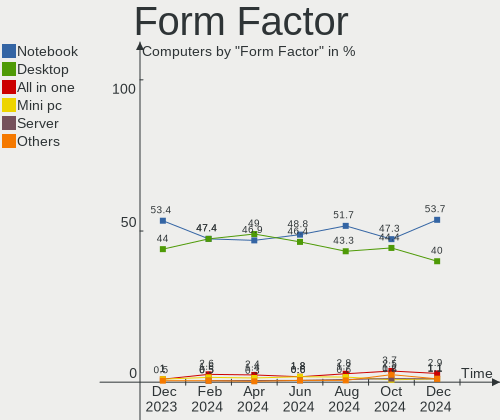
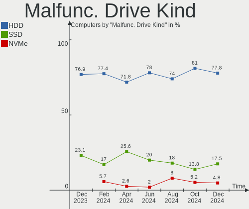
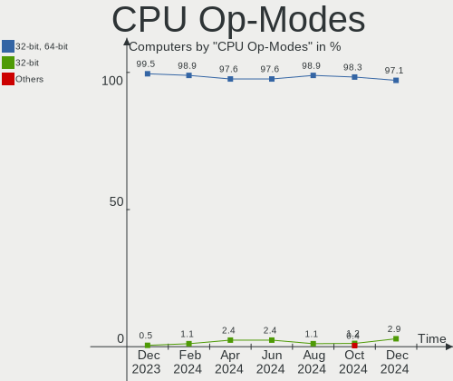
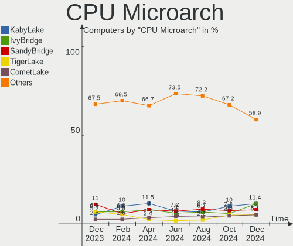
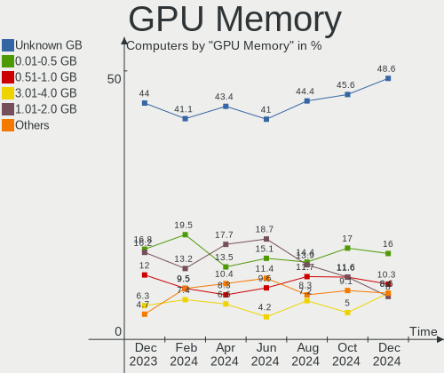
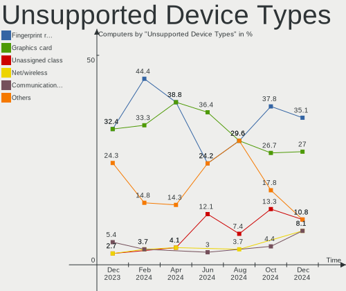

ROSA - Hardware Trends
----------------------

A project to identify most popular hardware characteristics and track their change
over time based on data collected by Linux users at https://Linux-Hardware.org.

Anyone can contribute to this report by the [hw-probe](https://github.com/linuxhw/hw-probe) tool:

    sudo -E hw-probe -all -upload

This is a report for all computer types. See also reports for [desktops](/Dist/ROSA/Desktop/README.md) and [notebooks](/Dist/ROSA/Notebook/README.md).

This report is for one last month. Overall report since the beginning of time: [TestDays](https://github.com/linuxhw/TestDays)

Period: Nov, 2023.

Contents
--------

* [ System ](#system)
  - [ OS                       ](#os)
  - [ OS Family                ](#os-family)
  - [ Kernel                   ](#kernel)
  - [ Kernel Family            ](#kernel-family)
  - [ Kernel Major Ver.        ](#kernel-major-ver)
  - [ Arch                     ](#arch)
  - [ DE                       ](#de)
  - [ Display Server           ](#display-server)
  - [ Display Manager          ](#display-manager)
  - [ OS Lang                  ](#os-lang)
  - [ Boot Mode                ](#boot-mode)
  - [ Filesystem               ](#filesystem)
  - [ Part. scheme             ](#part-scheme)
  - [ Dual Boot with Linux/BSD ](#dual-boot-with-linuxbsd)
  - [ Dual Boot (Win)          ](#dual-boot-win)

* [ Board ](#board)
  - [ Vendor                   ](#vendor)
  - [ Model                    ](#model)
  - [ Model Family             ](#model-family)
  - [ MFG Year                 ](#mfg-year)
  - [ Form Factor              ](#form-factor)
  - [ Secure Boot              ](#secure-boot)
  - [ Coreboot                 ](#coreboot)
  - [ RAM Size                 ](#ram-size)
  - [ RAM Used                 ](#ram-used)
  - [ Total Drives             ](#total-drives)
  - [ Has CD-ROM               ](#has-cd-rom)
  - [ Has Ethernet             ](#has-ethernet)
  - [ Has WiFi                 ](#has-wifi)
  - [ Has Bluetooth            ](#has-bluetooth)

* [ Location ](#location)
  - [ Country                  ](#country)
  - [ City                     ](#city)

* [ Drives ](#drives)
  - [ Drive Vendor             ](#drive-vendor)
  - [ Drive Model              ](#drive-model)
  - [ HDD Vendor               ](#hdd-vendor)
  - [ SSD Vendor               ](#ssd-vendor)
  - [ Drive Kind               ](#drive-kind)
  - [ Drive Connector          ](#drive-connector)
  - [ Drive Size               ](#drive-size)
  - [ Space Total              ](#space-total)
  - [ Space Used               ](#space-used)
  - [ Malfunc. Drives          ](#malfunc-drives)
  - [ Malfunc. Drive Vendor    ](#malfunc-drive-vendor)
  - [ Malfunc. HDD Vendor      ](#malfunc-hdd-vendor)
  - [ Malfunc. Drive Kind      ](#malfunc-drive-kind)
  - [ Failed Drives            ](#failed-drives)
  - [ Failed Drive Vendor      ](#failed-drive-vendor)
  - [ Drive Status             ](#drive-status)

* [ Storage controller ](#storage-controller)
  - [ Storage Vendor           ](#storage-vendor)
  - [ Storage Model            ](#storage-model)
  - [ Storage Kind             ](#storage-kind)

* [ Processor ](#processor)
  - [ CPU Vendor               ](#cpu-vendor)
  - [ CPU Model                ](#cpu-model)
  - [ CPU Model Family         ](#cpu-model-family)
  - [ CPU Cores                ](#cpu-cores)
  - [ CPU Sockets              ](#cpu-sockets)
  - [ CPU Threads              ](#cpu-threads)
  - [ CPU Op-Modes             ](#cpu-op-modes)
  - [ CPU Microcode            ](#cpu-microcode)
  - [ CPU Microarch            ](#cpu-microarch)

* [ Graphics ](#graphics)
  - [ GPU Vendor               ](#gpu-vendor)
  - [ GPU Model                ](#gpu-model)
  - [ GPU Combo                ](#gpu-combo)
  - [ GPU Driver               ](#gpu-driver)
  - [ GPU Memory               ](#gpu-memory)

* [ Monitor ](#monitor)
  - [ Monitor Vendor           ](#monitor-vendor)
  - [ Monitor Model            ](#monitor-model)
  - [ Monitor Resolution       ](#monitor-resolution)
  - [ Monitor Diagonal         ](#monitor-diagonal)
  - [ Monitor Width            ](#monitor-width)
  - [ Aspect Ratio             ](#aspect-ratio)
  - [ Monitor Area             ](#monitor-area)
  - [ Pixel Density            ](#pixel-density)
  - [ Multiple Monitors        ](#multiple-monitors)

* [ Network ](#network)
  - [ Net Controller Vendor    ](#net-controller-vendor)
  - [ Net Controller Model     ](#net-controller-model)
  - [ Wireless Vendor          ](#wireless-vendor)
  - [ Wireless Model           ](#wireless-model)
  - [ Ethernet Vendor          ](#ethernet-vendor)
  - [ Ethernet Model           ](#ethernet-model)
  - [ Net Controller Kind      ](#net-controller-kind)
  - [ Used Controller          ](#used-controller)
  - [ NICs                     ](#nics)
  - [ IPv6                     ](#ipv6)

* [ Bluetooth ](#bluetooth)
  - [ Bluetooth Vendor         ](#bluetooth-vendor)
  - [ Bluetooth Model          ](#bluetooth-model)

* [ Sound ](#sound)
  - [ Sound Vendor             ](#sound-vendor)
  - [ Sound Model              ](#sound-model)

* [ Memory ](#memory)
  - [ Memory Vendor            ](#memory-vendor)
  - [ Memory Model             ](#memory-model)
  - [ Memory Kind              ](#memory-kind)
  - [ Memory Form Factor       ](#memory-form-factor)
  - [ Memory Size              ](#memory-size)
  - [ Memory Speed             ](#memory-speed)

* [ Printers & scanners ](#printers--scanners)
  - [ Printer Vendor           ](#printer-vendor)
  - [ Printer Model            ](#printer-model)
  - [ Scanner Vendor           ](#scanner-vendor)
  - [ Scanner Model            ](#scanner-model)

* [ Camera ](#camera)
  - [ Camera Vendor            ](#camera-vendor)
  - [ Camera Model             ](#camera-model)

* [ Security ](#security)
  - [ Fingerprint Vendor       ](#fingerprint-vendor)
  - [ Fingerprint Model        ](#fingerprint-model)
  - [ Chipcard Vendor          ](#chipcard-vendor)
  - [ Chipcard Model           ](#chipcard-model)

* [ Unsupported ](#unsupported)
  - [ Unsupported Devices      ](#unsupported-devices)
  - [ Unsupported Device Types ](#unsupported-device-types)

System
------

OS
--

Installed operating systems

| Name       | Computers | Percent |
|------------|-----------|---------|
| ROSA 12.4  | 157       | 71.69%  |
| ROSA 12    | 33        | 15.07%  |
| ROSA R11.1 | 13        | 5.94%   |
| ROSA 12.3  | 6         | 2.74%   |
| ROSA 13.0  | 5         | 2.28%   |
| ROSA 12.2  | 4         | 1.83%   |
| ROSA 12.1  | 1         | 0.46%   |

OS Family
---------

OS without a version

| Name | Computers | Percent |
|------|-----------|---------|
| ROSA | 219       | 100%    |

Kernel
------

Version of the Linux kernel

| Version                                   | Computers | Percent |
|-------------------------------------------|-----------|---------|
| 6.1.58-generic-1rosa2021.1-x86_64         | 97        | 44.29%  |
| 6.1.20-generic-2rosa2021.1-x86_64         | 50        | 22.83%  |
| 6.1.46-generic-2rosa2021.1-x86_64         | 12        | 5.48%   |
| 5.15.103-generic-1rosa2021.1-i686         | 7         | 3.2%    |
| 5.10.74-generic-2rosa2021.1-x86_64        | 7         | 3.2%    |
| 5.10.184-generic-1rosa2021.1-x86_64       | 6         | 2.74%   |
| 5.15.75-generic-1rosa2021.1-x86_64        | 5         | 2.28%   |
| 4.15.0-desktop-122.124.1rosa-x86_64       | 5         | 2.28%   |
| 5.15.127-generic-1rosa2021.1-x86_64       | 4         | 1.83%   |
| 6.5.10.xm1-1.k-xanmod-rosa2021.1-x86_64   | 3         | 1.37%   |
| 6.1.58-generic-3rosa2023.1-x86_64         | 2         | 0.91%   |
| 6.1.57-generic-1rosa2023.1-x86_64         | 2         | 0.91%   |
| 5.4.83-generic-2rosa-x86_64               | 2         | 0.91%   |
| 5.4.32-generic-2rosa-i586                 | 2         | 0.91%   |
| 5.15.127-generic-1rosa2021.1-i686         | 2         | 0.91%   |
| 4.15.0-desktop-122.124.1rosa-i586         | 2         | 0.91%   |
| 6.6.0.xm1-4.k-xanmod-rosa2021.1-x86_64    | 1         | 0.46%   |
| 6.4.12.xm1-1.klp-xanmod-rosa2021.1-x86_64 | 1         | 0.46%   |
| 6.3.12-generic-1rosa2021.1-x86_64         | 1         | 0.46%   |
| 6.1.60.xm1-1.k-xanmod-rosa2021.1-x86_64   | 1         | 0.46%   |
| 6.1.58-generic-1rosa2023.1-x86_64         | 1         | 0.46%   |
| 5.4.83-generic-2rosa-i586                 | 1         | 0.46%   |
| 5.15.117-generic-1rosa2021.1-x86_64       | 1         | 0.46%   |
| 5.10.74-generic-2rosa2021.1-i586          | 1         | 0.46%   |
| 5.10.71-generic-1rosa2021.1-x86_64        | 1         | 0.46%   |
| 5.10.155-generic-1rosa2021.1-x86_64       | 1         | 0.46%   |
| 4.9.155-nrj-desktop-1rosa-x86_64          | 1         | 0.46%   |

Kernel Family
-------------

Linux kernel without a distro release

| Version  | Computers | Percent |
|----------|-----------|---------|
| 6.1.58   | 100       | 45.66%  |
| 6.1.20   | 50        | 22.83%  |
| 6.1.46   | 12        | 5.48%   |
| 5.10.74  | 8         | 3.65%   |
| 5.15.103 | 7         | 3.2%    |
| 4.15.0   | 7         | 3.2%    |
| 5.15.127 | 6         | 2.74%   |
| 5.10.184 | 6         | 2.74%   |
| 5.15.75  | 5         | 2.28%   |
| 6.5.10   | 3         | 1.37%   |
| 5.4.83   | 3         | 1.37%   |
| 6.1.57   | 2         | 0.91%   |
| 5.4.32   | 2         | 0.91%   |
| 6.6.0    | 1         | 0.46%   |
| 6.4.12   | 1         | 0.46%   |
| 6.3.12   | 1         | 0.46%   |
| 6.1.60   | 1         | 0.46%   |
| 5.15.117 | 1         | 0.46%   |
| 5.10.71  | 1         | 0.46%   |
| 5.10.155 | 1         | 0.46%   |
| 4.9.155  | 1         | 0.46%   |

Kernel Major Ver.
-----------------

Linux kernel major version

| Version | Computers | Percent |
|---------|-----------|---------|
| 6.1     | 165       | 75.34%  |
| 5.15    | 19        | 8.68%   |
| 5.10    | 16        | 7.31%   |
| 4.15    | 7         | 3.2%    |
| 5.4     | 5         | 2.28%   |
| 6.5     | 3         | 1.37%   |
| 6.6     | 1         | 0.46%   |
| 6.4     | 1         | 0.46%   |
| 6.3     | 1         | 0.46%   |
| 4.9     | 1         | 0.46%   |

Arch
----

OS architecture (x86_64, i586, etc.)

| Name   | Computers | Percent |
|--------|-----------|---------|
| x86_64 | 204       | 93.15%  |
| i686   | 15        | 6.85%   |

DE
--

Desktop Environment

| Name   | Computers | Percent |
|--------|-----------|---------|
| KDE5   | 131       | 59.82%  |
| GNOME  | 50        | 22.83%  |
| LXQt   | 26        | 11.87%  |
| KDE4   | 9         | 4.11%   |
| MATE   | 1         | 0.46%   |
| i3     | 1         | 0.46%   |
| Budgie | 1         | 0.46%   |

Display Server
--------------

X11 or Wayland

| Name    | Computers | Percent |
|---------|-----------|---------|
| Wayland | 144       | 65.75%  |
| X11     | 75        | 34.25%  |

Display Manager
---------------

SDDM, LightDM, etc.

| Name    | Computers | Percent |
|---------|-----------|---------|
| SDDM    | 127       | 57.99%  |
| GDM     | 71        | 32.42%  |
| LightDM | 12        | 5.48%   |
| KDM     | 9         | 4.11%   |

OS Lang
-------

Language

| Lang  | Computers | Percent |
|-------|-----------|---------|
| ru_RU | 202       | 92.24%  |
| en_US | 9         | 4.11%   |
| it_IT | 3         | 1.37%   |
| de_DE | 2         | 0.91%   |
| zh_TW | 1         | 0.46%   |
| sk_SK | 1         | 0.46%   |
| es_MX | 1         | 0.46%   |

Boot Mode
---------

EFI or BIOS

| Mode | Computers | Percent |
|------|-----------|---------|
| EFI  | 139       | 63.47%  |
| BIOS | 80        | 36.53%  |

Filesystem
----------

Type of filesystem

| Type    | Computers | Percent |
|---------|-----------|---------|
| Ext4    | 177       | 80.82%  |
| Btrfs   | 38        | 17.35%  |
| F2fs    | 2         | 0.91%   |
| Overlay | 1         | 0.46%   |
| Ext3    | 1         | 0.46%   |

Part. scheme
------------

Scheme of partitioning

| Type | Computers | Percent |
|------|-----------|---------|
| GPT  | 149       | 68.04%  |
| MBR  | 70        | 31.96%  |

Dual Boot with Linux/BSD
------------------------

Hosting more than one Linux/BSD

| Dual boot | Computers | Percent |
|-----------|-----------|---------|
| No        | 181       | 82.65%  |
| Yes       | 38        | 17.35%  |

Dual Boot (Win)
---------------

Hosting Linux and Windows

| Dual boot | Computers | Percent |
|-----------|-----------|---------|
| No        | 129       | 58.9%   |
| Yes       | 90        | 41.1%   |

Board
-----

Vendor
------

Motherboard manufacturer

| Name                                 | Computers | Percent |
|--------------------------------------|-----------|---------|
| ASUSTek Computer                     | 43        | 19.63%  |
| Gigabyte Technology                  | 22        | 10.05%  |
| Lenovo                               | 20        | 9.13%   |
| Hewlett-Packard                      | 18        | 8.22%   |
| MSI                                  | 16        | 7.31%   |
| Acer                                 | 11        | 5.02%   |
| ICL                                  | 10        | 4.57%   |
| ASRock                               | 10        | 4.57%   |
| Dell                                 | 9         | 4.11%   |
| Intel                                | 7         | 3.2%    |
| Unknown                              | 7         | 3.2%    |
| Samsung Electronics                  | 4         | 1.83%   |
| HUAWEI                               | 4         | 1.83%   |
| Sony                                 | 3         | 1.37%   |
| Clevo                                | 3         | 1.37%   |
| Toshiba                              | 2         | 0.91%   |
| Pegatron                             | 2         | 0.91%   |
| Huanan                               | 2         | 0.91%   |
| Fujitsu Siemens                      | 2         | 0.91%   |
| Apple                                | 2         | 0.91%   |
| Alienware                            | 2         | 0.91%   |
| Unchartevice                         | 1         | 0.46%   |
| Timi                                 | 1         | 0.46%   |
| Shenzhen Meigao Electronic Equipment | 1         | 0.46%   |
| Packard Bell                         | 1         | 0.46%   |
| MAINBRD                              | 1         | 0.46%   |
| LTD Delovoy Office                   | 1         | 0.46%   |
| KVADRA                               | 1         | 0.46%   |
| INTECH PRO                           | 1         | 0.46%   |
| HONOR                                | 1         | 0.46%   |
| HIPER Technology Limited             | 1         | 0.46%   |
| Haier                                | 1         | 0.46%   |
| ECS                                  | 1         | 0.46%   |
| Digma                                | 1         | 0.46%   |
| Biostar                              | 1         | 0.46%   |
| AZW                                  | 1         | 0.46%   |
| ARDOR GAMING                         | 1         | 0.46%   |
| Aquarius                             | 1         | 0.46%   |
| AOpen                                | 1         | 0.46%   |
| ANCOMP                               | 1         | 0.46%   |

Model
-----

Motherboard model

| Name                                            | Computers | Percent |
|-------------------------------------------------|-----------|---------|
| ICL RAY Si105.Mi                                | 10        | 4.57%   |
| Unknown                                         | 7         | 3.2%    |
| Intel SKYBAY                                    | 3         | 1.37%   |
| Clevo NL41MU2                                   | 3         | 1.37%   |
| MSI MS-7C95                                     | 2         | 0.91%   |
| MSI MS-7641                                     | 2         | 0.91%   |
| HUAWEI BOD-WXX9                                 | 2         | 0.91%   |
| HP Notebook                                     | 2         | 0.91%   |
| ASRock B450 Pro4                                | 2         | 0.91%   |
| Unchartevice 6540                               | 1         | 0.46%   |
| Toshiba Satellite U300                          | 1         | 0.46%   |
| Toshiba Satellite L735                          | 1         | 0.46%   |
| Timi TM1703                                     | 1         | 0.46%   |
| Sony VPCEL3S1R                                  | 1         | 0.46%   |
| Sony VPCCA2S1R                                  | 1         | 0.46%   |
| Sony VGN-NS11ER_S                               | 1         | 0.46%   |
| Shenzhen Meigao Electronic Equipment UM773 Lite | 1         | 0.46%   |
| Samsung P29/28/26                               | 1         | 0.46%   |
| Samsung G25/G26                                 | 1         | 0.46%   |
| Samsung 350V5C/351V5C/3540VC/3440VC             | 1         | 0.46%   |
| Samsung 300V3A/300V4A/300V5A/200A4B/200A5B      | 1         | 0.46%   |
| Pegatron VS257AA-ACB 600-1040ru                 | 1         | 0.46%   |
| Pegatron IPMIP-H55-GEN                          | 1         | 0.46%   |
| Packard Bell EasyNote TE11HC                    | 1         | 0.46%   |
| MSI PRO H610 AP242 13M (MS-AE06)                | 1         | 0.46%   |
| MSI PRO ADL-N Cubi N (MS-B0A9)                  | 1         | 0.46%   |
| MSI MS-AE6711                                   | 1         | 0.46%   |
| MSI MS-7D89                                     | 1         | 0.46%   |
| MSI MS-7C96                                     | 1         | 0.46%   |
| MSI MS-7C37                                     | 1         | 0.46%   |
| MSI MS-7B33                                     | 1         | 0.46%   |
| MSI MS-7996                                     | 1         | 0.46%   |
| MSI MS-7599                                     | 1         | 0.46%   |
| MSI Katana GF76 12UC                            | 1         | 0.46%   |
| MSI Katana GF76 11UD                            | 1         | 0.46%   |
| MSI CML-U PRO 16 10M (MS-A618)                  | 1         | 0.46%   |
| MAINBRD OPS62A-SHA                              | 1         | 0.46%   |
| LTD Delovoy Office 15Y                          | 1         | 0.46%   |
| Lenovo ThinkPad T430 23493V2                    | 1         | 0.46%   |
| Lenovo ThinkPad T430 23445PU                    | 1         | 0.46%   |

Model Family
------------

Motherboard model prefix

| Name                                       | Computers | Percent |
|--------------------------------------------|-----------|---------|
| ICL RAY                                    | 10        | 4.57%   |
| Acer Aspire                                | 10        | 4.57%   |
| Lenovo IdeaPad                             | 9         | 4.11%   |
| Unknown                                    | 7         | 3.2%    |
| ASUS PRIME                                 | 6         | 2.74%   |
| HP Pavilion                                | 5         | 2.28%   |
| Dell Inspiron                              | 4         | 1.83%   |
| Intel SKYBAY                               | 3         | 1.37%   |
| HP ProBook                                 | 3         | 1.37%   |
| Clevo NL41MU2                              | 3         | 1.37%   |
| ASUS VivoBook                              | 3         | 1.37%   |
| Toshiba Satellite                          | 2         | 0.91%   |
| MSI PRO                                    | 2         | 0.91%   |
| MSI MS-7C95                                | 2         | 0.91%   |
| MSI MS-7641                                | 2         | 0.91%   |
| MSI Katana                                 | 2         | 0.91%   |
| Lenovo ThinkPad                            | 2         | 0.91%   |
| Lenovo ThinkCentre                         | 2         | 0.91%   |
| HUAWEI BOD-WXX9                            | 2         | 0.91%   |
| HP Notebook                                | 2         | 0.91%   |
| HP Laptop                                  | 2         | 0.91%   |
| Gigabyte H410M                             | 2         | 0.91%   |
| Fujitsu Siemens AMILO                      | 2         | 0.91%   |
| Dell OptiPlex                              | 2         | 0.91%   |
| ASUS ROG                                   | 2         | 0.91%   |
| ASRock B450                                | 2         | 0.91%   |
| Unchartevice 6540                          | 1         | 0.46%   |
| Timi TM1703                                | 1         | 0.46%   |
| Sony VPCEL3S1R                             | 1         | 0.46%   |
| Sony VPCCA2S1R                             | 1         | 0.46%   |
| Sony VGN-NS11ER                            | 1         | 0.46%   |
| Shenzhen Meigao Electronic Equipment UM773 | 1         | 0.46%   |
| Samsung P29                                | 1         | 0.46%   |
| Samsung G25                                | 1         | 0.46%   |
| Samsung 350V5C                             | 1         | 0.46%   |
| Samsung 300V3A                             | 1         | 0.46%   |
| Pegatron VS257AA-ACB                       | 1         | 0.46%   |
| Pegatron IPMIP-H55-GEN                     | 1         | 0.46%   |
| Packard Bell EasyNote                      | 1         | 0.46%   |
| MSI MS-AE6711                              | 1         | 0.46%   |

MFG Year
--------

Motherboard manufacture year

| Year | Computers | Percent |
|------|-----------|---------|
| 2022 | 33        | 15.07%  |
| 2012 | 21        | 9.59%   |
| 2011 | 21        | 9.59%   |
| 2018 | 20        | 9.13%   |
| 2021 | 18        | 8.22%   |
| 2020 | 15        | 6.85%   |
| 2013 | 13        | 5.94%   |
| 2010 | 12        | 5.48%   |
| 2023 | 11        | 5.02%   |
| 2017 | 8         | 3.65%   |
| 2007 | 8         | 3.65%   |
| 2019 | 7         | 3.2%    |
| 2008 | 7         | 3.2%    |
| 2009 | 6         | 2.74%   |
| 2014 | 5         | 2.28%   |
| 2016 | 4         | 1.83%   |
| 2015 | 4         | 1.83%   |
| 2006 | 3         | 1.37%   |
| 2005 | 3         | 1.37%   |

Form Factor
-----------

Physical design of the computer

| Name       | Computers | Percent |
|------------|-----------|---------|
| Notebook   | 103       | 47.03%  |
| Desktop    | 96        | 43.84%  |
| All in one | 17        | 7.76%   |
| Mini pc    | 2         | 0.91%   |
| Tablet     | 1         | 0.46%   |

Secure Boot
-----------

Enabled or disabled

| State    | Computers | Percent |
|----------|-----------|---------|
| Disabled | 218       | 99.54%  |
| Enabled  | 1         | 0.46%   |

Coreboot
--------

Have coreboot on board

| Used | Computers | Percent |
|------|-----------|---------|
| No   | 219       | 100%    |

RAM Size
--------

Total RAM memory

| Size in GB      | Computers | Percent |
|-----------------|-----------|---------|
| 4.01-8.0        | 59        | 26.94%  |
| 8.01-16.0       | 50        | 22.83%  |
| 16.01-24.0      | 41        | 18.72%  |
| 3.01-4.0        | 34        | 15.53%  |
| 32.01-64.0      | 13        | 5.94%   |
| 2.01-3.0        | 8         | 3.65%   |
| 64.01-256.0     | 5         | 2.28%   |
| 1.01-2.0        | 5         | 2.28%   |
| 0.51-1.0        | 2         | 0.91%   |
| More than 256.0 | 1         | 0.46%   |
| 24.01-32.0      | 1         | 0.46%   |

RAM Used
--------

Used RAM memory

| Used GB   | Computers | Percent |
|-----------|-----------|---------|
| 1.01-2.0  | 119       | 54.34%  |
| 0.51-1.0  | 38        | 17.35%  |
| 2.01-3.0  | 29        | 13.24%  |
| 3.01-4.0  | 15        | 6.85%   |
| 4.01-8.0  | 13        | 5.94%   |
| 0.01-0.5  | 3         | 1.37%   |
| 8.01-16.0 | 2         | 0.91%   |

Total Drives
------------

Number of drives on board

| Drives | Computers | Percent |
|--------|-----------|---------|
| 1      | 139       | 63.47%  |
| 2      | 50        | 22.83%  |
| 3      | 18        | 8.22%   |
| 4      | 5         | 2.28%   |
| 5      | 3         | 1.37%   |
| 7      | 2         | 0.91%   |
| 6      | 2         | 0.91%   |

Has CD-ROM
----------

Has CD-ROM on board

| Presented | Computers | Percent |
|-----------|-----------|---------|
| No        | 147       | 67.12%  |
| Yes       | 72        | 32.88%  |

Has Ethernet
------------

Has Ethernet on board

| Presented | Computers | Percent |
|-----------|-----------|---------|
| Yes       | 202       | 92.24%  |
| No        | 17        | 7.76%   |

Has WiFi
--------

Has WiFi module

| Presented | Computers | Percent |
|-----------|-----------|---------|
| Yes       | 159       | 72.6%   |
| No        | 60        | 27.4%   |

Has Bluetooth
-------------

Has Bluetooth module

| Presented | Computers | Percent |
|-----------|-----------|---------|
| Yes       | 130       | 59.36%  |
| No        | 89        | 40.64%  |

Location
--------

Country
-------

Geographic location (country)

| Country    | Computers | Percent |
|------------|-----------|---------|
| Russia     | 193       | 88.13%  |
| Germany    | 4         | 1.83%   |
| Italy      | 3         | 1.37%   |
| Belarus    | 3         | 1.37%   |
| Ukraine    | 2         | 0.91%   |
| Nicaragua  | 2         | 0.91%   |
| Kazakhstan | 2         | 0.91%   |
| Uzbekistan | 1         | 0.46%   |
| Taiwan     | 1         | 0.46%   |
| Slovakia   | 1         | 0.46%   |
| Serbia     | 1         | 0.46%   |
| Portugal   | 1         | 0.46%   |
| Palestine  | 1         | 0.46%   |
| Mexico     | 1         | 0.46%   |
| Lithuania  | 1         | 0.46%   |
| Iran       | 1         | 0.46%   |
| Estonia    | 1         | 0.46%   |

City
----

Geographic location (city)

| City                | Computers | Percent |
|---------------------|-----------|---------|
| Moscow              | 68        | 31.05%  |
| St Petersburg       | 15        | 6.85%   |
| Krasnodar           | 8         | 3.65%   |
| Yekaterinburg       | 6         | 2.74%   |
| Voronezh            | 5         | 2.28%   |
| Novosibirsk         | 5         | 2.28%   |
| Volgograd           | 4         | 1.83%   |
| Khabarovsk          | 4         | 1.83%   |
| Yaroslavl           | 3         | 1.37%   |
| Samara              | 3         | 1.37%   |
| Perm                | 3         | 1.37%   |
| Cherepovets         | 3         | 1.37%   |
| Zlatoust            | 2         | 0.91%   |
| Vladivostok         | 2         | 0.91%   |
| Ufa                 | 2         | 0.91%   |
| Smolensk            | 2         | 0.91%   |
| Simferopol          | 2         | 0.91%   |
| Managua             | 2         | 0.91%   |
| Krasnoyarsk         | 2         | 0.91%   |
| Kavkazskaya         | 2         | 0.91%   |
| Engel's             | 2         | 0.91%   |
| Belgorod            | 2         | 0.91%   |
| Zheleznogorsk       | 1         | 0.46%   |
| Zelenograd          | 1         | 0.46%   |
| Vologda             | 1         | 0.46%   |
| Volgodonsk          | 1         | 0.46%   |
| Vladimir            | 1         | 0.46%   |
| Vitebsk             | 1         | 0.46%   |
| Ulyanovsk           | 1         | 0.46%   |
| Tyumen              | 1         | 0.46%   |
| Tver                | 1         | 0.46%   |
| Tula                | 1         | 0.46%   |
| Troitsk             | 1         | 0.46%   |
| Tomsk               | 1         | 0.46%   |
| Tehran              | 1         | 0.46%   |
| Tatishchevo         | 1         | 0.46%   |
| Tashkent            | 1         | 0.46%   |
| Tallinn             | 1         | 0.46%   |
| Sochi               | 1         | 0.46%   |
| Slavyansk-na-Kubani | 1         | 0.46%   |

Drives
------

Drive Vendor
------------

Hard drive vendors

| Vendor                      | Computers | Drives | Percent |
|-----------------------------|-----------|--------|---------|
| WDC                         | 43        | 56     | 13.48%  |
| Seagate                     | 35        | 42     | 10.97%  |
| Samsung Electronics         | 28        | 32     | 8.78%   |
| A-DATA Technology           | 22        | 25     | 6.9%    |
| Kingston                    | 19        | 21     | 5.96%   |
| Toshiba                     | 17        | 18     | 5.33%   |
| Intel                       | 9         | 9      | 2.82%   |
| Hitachi                     | 9         | 9      | 2.82%   |
| HGST                        | 9         | 9      | 2.82%   |
| China                       | 8         | 9      | 2.51%   |
| SPCC                        | 6         | 6      | 1.88%   |
| DEXP                        | 6         | 6      | 1.88%   |
| Apacer                      | 6         | 6      | 1.88%   |
| SK hynix                    | 5         | 6      | 1.57%   |
| SanDisk                     | 5         | 5      | 1.57%   |
| KingSpec                    | 5         | 5      | 1.57%   |
| Unknown                     | 4         | 4      | 1.25%   |
| Silicon Motion              | 4         | 4      | 1.25%   |
| Netac                       | 4         | 5      | 1.25%   |
| Fujitsu                     | 4         | 4      | 1.25%   |
| Crucial                     | 4         | 6      | 1.25%   |
| AMD                         | 4         | 4      | 1.25%   |
| XrayDisk                    | 3         | 3      | 0.94%   |
| XPG                         | 3         | 4      | 0.94%   |
| Patriot                     | 3         | 4      | 0.94%   |
| JMicron Technology          | 3         | 3      | 0.94%   |
| BIWIN                       | 3         | 3      | 0.94%   |
| Transcend                   | 2         | 2      | 0.63%   |
| Qumo                        | 2         | 2      | 0.63%   |
| Phison                      | 2         | 2      | 0.63%   |
| OCZ                         | 2         | 2      | 0.63%   |
| Neo                         | 2         | 2      | 0.63%   |
| Micron Technology           | 2         | 2      | 0.63%   |
| Kingston Technology Company | 2         | 2      | 0.63%   |
| KingFast                    | 2         | 2      | 0.63%   |
| AGI                         | 2         | 2      | 0.63%   |
| Unknown                     | 2         | 2      | 0.63%   |
| WDC WDS                     | 1         | 1      | 0.31%   |
| USB3.0                      | 1         | 1      | 0.31%   |
| StoreJet                    | 1         | 1      | 0.31%   |

Drive Model
-----------

Hard drive models

| Model                            | Computers | Percent |
|----------------------------------|-----------|---------|
| A-DATA SU650 240GB SSD           | 9         | 2.55%   |
| Kingston SA400S37240G 240GB SSD  | 5         | 1.42%   |
| WDC WDS120G2G0A-00JH30 120GB SSD | 4         | 1.13%   |
| WDC WD10EZEX-00BBHA0 1TB         | 3         | 0.85%   |
| Toshiba MQ01ABF050 500GB         | 3         | 0.85%   |
| Toshiba DT01ACA100 1TB           | 3         | 0.85%   |
| Seagate ST2000DM008-2FR102 2TB   | 3         | 0.85%   |
| Kingston SA400S37120G 120GB SSD  | 3         | 0.85%   |
| HGST HTS541010A9E680 1TB         | 3         | 0.85%   |
| DEXP SSD C100 256Gb              | 3         | 0.85%   |
| BIWIN CE480T5D101-256 256GB      | 3         | 0.85%   |
| WDC WD5000LPVX-22V0TT0 500GB     | 2         | 0.57%   |
| WDC WD10EZRX-00A8LB0 1TB         | 2         | 0.57%   |
| WDC WD10EZEX-22MFCA0 1TB         | 2         | 0.57%   |
| Toshiba DT01ACA050 500GB         | 2         | 0.57%   |
| SPCC Solid State Disk 128GB      | 2         | 0.57%   |
| Seagate ST320LT012-9WS14C 320GB  | 2         | 0.57%   |
| Seagate ST1000NM0011 1TB         | 2         | 0.57%   |
| Seagate ST1000DX001-1CM162 1TB   | 2         | 0.57%   |
| SanDisk SSD PLUS 240GB           | 2         | 0.57%   |
| Samsung SSD 970 EVO Plus 1TB     | 2         | 0.57%   |
| Samsung SSD 860 EVO 500GB        | 2         | 0.57%   |
| Samsung SSD 850 120GB            | 2         | 0.57%   |
| Samsung MZVLB256HAHQ-00000 256GB | 2         | 0.57%   |
| Samsung HD253GJ 250GB            | 2         | 0.57%   |
| Patriot P210 256GB SSD           | 2         | 0.57%   |
| Netac SSD 512GB                  | 2         | 0.57%   |
| Kingston Company SNV2S1000G 1TB  | 2         | 0.57%   |
| Kingston SA400S37480G 480GB SSD  | 2         | 0.57%   |
| KingSpec Z1-512 512GB            | 2         | 0.57%   |
| JMicron Generic 250GB            | 2         | 0.57%   |
| Hitachi HTS543232A7A384 320GB    | 2         | 0.57%   |
| HGST HTS721010A9E630 1TB         | 2         | 0.57%   |
| DEXP SSD C100 1024Gb 1TB         | 2         | 0.57%   |
| Crucial CT500P5PSSD8 500GB       | 2         | 0.57%   |
| Apacer AS2280P4 256GB            | 2         | 0.57%   |
| AGI AGI256G06AI138 256GB SSD     | 2         | 0.57%   |
| A-DATA SX8200PNP 256GB           | 2         | 0.57%   |
| Unknown                          | 2         | 0.57%   |
| XrayDisk SSD 120GB               | 1         | 0.28%   |

HDD Vendor
----------

Hard disk drive vendors

| Vendor              | Computers | Drives | Percent |
|---------------------|-----------|--------|---------|
| WDC                 | 36        | 44     | 30.25%  |
| Seagate             | 35        | 42     | 29.41%  |
| Toshiba             | 16        | 17     | 13.45%  |
| Hitachi             | 9         | 9      | 7.56%   |
| HGST                | 9         | 9      | 7.56%   |
| Samsung Electronics | 5         | 5      | 4.2%    |
| Fujitsu             | 4         | 4      | 3.36%   |
| USB3.0              | 1         | 1      | 0.84%   |
| Unknown             | 1         | 1      | 0.84%   |
| StoreJet            | 1         | 1      | 0.84%   |
| Maxtor              | 1         | 1      | 0.84%   |
| ExcelStor           | 1         | 1      | 0.84%   |

SSD Vendor
----------

Solid state drive vendors

| Vendor              | Computers | Drives | Percent |
|---------------------|-----------|--------|---------|
| A-DATA Technology   | 16        | 16     | 12.5%   |
| Kingston            | 15        | 16     | 11.72%  |
| Samsung Electronics | 12        | 14     | 9.38%   |
| China               | 8         | 9      | 6.25%   |
| WDC                 | 7         | 7      | 5.47%   |
| DEXP                | 6         | 6      | 4.69%   |
| SanDisk             | 5         | 5      | 3.91%   |
| Netac               | 4         | 4      | 3.13%   |
| XrayDisk            | 3         | 3      | 2.34%   |
| SPCC                | 3         | 3      | 2.34%   |
| Patriot             | 3         | 4      | 2.34%   |
| KingSpec            | 3         | 3      | 2.34%   |
| Apacer              | 3         | 3      | 2.34%   |
| AMD                 | 3         | 3      | 2.34%   |
| Transcend           | 2         | 2      | 1.56%   |
| OCZ                 | 2         | 2      | 1.56%   |
| Neo                 | 2         | 2      | 1.56%   |
| KingFast            | 2         | 2      | 1.56%   |
| JMicron Technology  | 2         | 2      | 1.56%   |
| Intel               | 2         | 2      | 1.56%   |
| Crucial             | 2         | 2      | 1.56%   |
| AGI                 | 2         | 2      | 1.56%   |
| WDC WDS             | 1         | 1      | 0.78%   |
| Smartbuy            | 1         | 1      | 0.78%   |
| SK hynix            | 1         | 1      | 0.78%   |
| RUN                 | 1         | 1      | 0.78%   |
| Reeinno             | 1         | 1      | 0.78%   |
| Realtek             | 1         | 1      | 0.78%   |
| RADIUM              | 1         | 1      | 0.78%   |
| Qumo                | 1         | 1      | 0.78%   |
| Micron Technology   | 1         | 1      | 0.78%   |
| LITEONIT            | 1         | 1      | 0.78%   |
| KingDian            | 1         | 1      | 0.78%   |
| HS-SSD-E100         | 1         | 1      | 0.78%   |
| Hewlett-Packard     | 1         | 1      | 0.78%   |
| GOODRAM             | 1         | 1      | 0.78%   |
| Fanxiang            | 1         | 1      | 0.78%   |
| Digma               | 1         | 1      | 0.78%   |
| Colorful            | 1         | 1      | 0.78%   |
| BR                  | 1         | 1      | 0.78%   |

Drive Kind
----------

HDD or SSD

| Kind    | Computers | Drives | Percent |
|---------|-----------|--------|---------|
| SSD     | 111       | 133    | 37.76%  |
| HDD     | 105       | 135    | 35.71%  |
| NVMe    | 69        | 79     | 23.47%  |
| Unknown | 6         | 6      | 2.04%   |
| MMC     | 3         | 3      | 1.02%   |

Drive Connector
---------------

SATA, SAS, NVMe, etc.

| Type | Computers | Drives | Percent |
|------|-----------|--------|---------|
| SATA | 174       | 262    | 67.44%  |
| NVMe | 69        | 79     | 26.74%  |
| SAS  | 12        | 12     | 4.65%   |
| MMC  | 3         | 3      | 1.16%   |

Drive Size
----------

Size of hard drive

| Size in TB | Computers | Drives | Percent |
|------------|-----------|--------|---------|
| 0.01-0.5   | 144       | 185    | 66.98%  |
| 0.51-1.0   | 54        | 63     | 25.12%  |
| 1.01-2.0   | 13        | 16     | 6.05%   |
| 3.01-4.0   | 2         | 2      | 0.93%   |
| 2.01-3.0   | 1         | 1      | 0.47%   |
| 4.01-10.0  | 1         | 1      | 0.47%   |

Space Total
-----------

Amount of disk space available on the file system

| Size in GB     | Computers | Percent |
|----------------|-----------|---------|
| 101-250        | 78        | 35.62%  |
| 251-500        | 51        | 23.29%  |
| 501-1000       | 25        | 11.42%  |
| 1001-2000      | 18        | 8.22%   |
| 1-20           | 18        | 8.22%   |
| 51-100         | 14        | 6.39%   |
| More than 3000 | 5         | 2.28%   |
| 21-50          | 5         | 2.28%   |
| 2001-3000      | 5         | 2.28%   |

Space Used
----------

Amount of used disk space

| Used GB        | Computers | Percent |
|----------------|-----------|---------|
| 1-20           | 119       | 54.34%  |
| 21-50          | 38        | 17.35%  |
| 101-250        | 18        | 8.22%   |
| 51-100         | 16        | 7.31%   |
| 251-500        | 10        | 4.57%   |
| 501-1000       | 10        | 4.57%   |
| 1001-2000      | 5         | 2.28%   |
| 2001-3000      | 2         | 0.91%   |
| More than 3000 | 1         | 0.46%   |

Malfunc. Drives
---------------

Drive models with a malfunction

| Model                                 | Computers | Drives | Percent |
|---------------------------------------|-----------|--------|---------|
| Seagate ST320LT012-9WS14C 320GB       | 2         | 2      | 3.33%   |
| Seagate ST1000NM0011 1TB              | 2         | 2      | 3.33%   |
| HGST HTS541010A9E680 1TB              | 2         | 2      | 3.33%   |
| WDC WD7502AAEX-00Y9A0 752GB           | 1         | 1      | 1.67%   |
| WDC WD5000LPVX-22V0TT0 500GB          | 1         | 1      | 1.67%   |
| WDC WD5000BEVT-22A0RT0 500GB          | 1         | 1      | 1.67%   |
| WDC WD3200BPVT-24ZEST0 320GB          | 1         | 1      | 1.67%   |
| WDC WD3200BEVT-80A0RT0 320GB          | 1         | 1      | 1.67%   |
| WDC WD2500LPCX-24C6HT0 250GB          | 1         | 1      | 1.67%   |
| WDC WD2500JS-00NCB1 250GB             | 1         | 1      | 1.67%   |
| WDC WD20EARS-00MVWB0 2TB              | 1         | 1      | 1.67%   |
| WDC WD1200BEVS-60UST0 120GB           | 1         | 1      | 1.67%   |
| WDC WD1200BEVS-07LAT0 120GB           | 1         | 1      | 1.67%   |
| WDC WD10JPVX-22JC3T0 1TB              | 1         | 1      | 1.67%   |
| WDC WD10EZRX-00A8LB0 1TB              | 1         | 1      | 1.67%   |
| WDC WD1003FZEX-00K3CA0 1TB            | 1         | 1      | 1.67%   |
| Toshiba MQ04ABF100 1TB                | 1         | 1      | 1.67%   |
| Toshiba MQ01ABD075 752GB              | 1         | 1      | 1.67%   |
| Toshiba MK8034GSX 80GB                | 1         | 1      | 1.67%   |
| Toshiba MK2565GSX 250GB               | 1         | 1      | 1.67%   |
| Toshiba MK1059GSMP 1TB                | 1         | 1      | 1.67%   |
| Toshiba DT01ACA100 1TB                | 1         | 1      | 1.67%   |
| SK hynix HFS128G39TND-N210A 128GB SSD | 1         | 1      | 1.67%   |
| Seagate ST9320325AS 320GB             | 1         | 1      | 1.67%   |
| Seagate ST9250315AS 250GB             | 1         | 1      | 1.67%   |
| Seagate ST500LM021-1KJ152 500GB       | 1         | 1      | 1.67%   |
| Seagate ST380815AS 80GB               | 1         | 1      | 1.67%   |
| Seagate ST3320613AS 320GB             | 1         | 1      | 1.67%   |
| Seagate ST3250624AS 250GB             | 1         | 1      | 1.67%   |
| Seagate ST3160815AS 160GB             | 1         | 1      | 1.67%   |
| Seagate ST31500541AS 1TB              | 1         | 1      | 1.67%   |
| Seagate ST31000524AS 1TB              | 1         | 1      | 1.67%   |
| Seagate ST250DM000-1BD141 250GB       | 1         | 1      | 1.67%   |
| Seagate ST2000DM008-2FR102 2TB        | 1         | 1      | 1.67%   |
| Seagate ST1000LM024 HN-M101MBB 1TB    | 1         | 1      | 1.67%   |
| Seagate ST1000LM014-1EJ164 1TB        | 1         | 1      | 1.67%   |
| Seagate ST1000DM010-2EP102 1TB        | 1         | 1      | 1.67%   |
| SanDisk SDSSDH120GG25 120GB           | 1         | 1      | 1.67%   |
| Samsung Electronics HD253GJ 250GB     | 1         | 1      | 1.67%   |
| RADIUM SATA 3.0 256GB SSD             | 1         | 1      | 1.67%   |

Malfunc. Drive Vendor
---------------------

Vendors of faulty drives

| Vendor              | Computers | Drives | Percent |
|---------------------|-----------|--------|---------|
| Seagate             | 16        | 18     | 27.59%  |
| WDC                 | 13        | 13     | 22.41%  |
| Toshiba             | 6         | 6      | 10.34%  |
| HGST                | 6         | 6      | 10.34%  |
| Hitachi             | 4         | 4      | 6.9%    |
| Fujitsu             | 3         | 3      | 5.17%   |
| Kingston            | 2         | 2      | 3.45%   |
| SK hynix            | 1         | 1      | 1.72%   |
| SanDisk             | 1         | 1      | 1.72%   |
| Samsung Electronics | 1         | 1      | 1.72%   |
| RADIUM              | 1         | 1      | 1.72%   |
| Netac               | 1         | 1      | 1.72%   |
| Neo                 | 1         | 1      | 1.72%   |
| Intel               | 1         | 1      | 1.72%   |
| ExcelStor           | 1         | 1      | 1.72%   |

Malfunc. HDD Vendor
-------------------

Vendors of faulty HDD drives

| Vendor              | Computers | Drives | Percent |
|---------------------|-----------|--------|---------|
| Seagate             | 16        | 18     | 32%     |
| WDC                 | 13        | 13     | 26%     |
| Toshiba             | 6         | 6      | 12%     |
| HGST                | 6         | 6      | 12%     |
| Hitachi             | 4         | 4      | 8%      |
| Fujitsu             | 3         | 3      | 6%      |
| Samsung Electronics | 1         | 1      | 2%      |
| ExcelStor           | 1         | 1      | 2%      |

Malfunc. Drive Kind
-------------------

Kinds of faulty drives

| Kind | Computers | Drives | Percent |
|------|-----------|--------|---------|
| HDD  | 47        | 52     | 85.45%  |
| SSD  | 8         | 8      | 14.55%  |

Failed Drives
-------------

Failed drive models

| Model                    | Computers | Drives | Percent |
|--------------------------|-----------|--------|---------|
| HGST HTS541010A9E680 1TB | 1         | 1      | 100%    |

Failed Drive Vendor
-------------------

Failed drive vendors

| Vendor | Computers | Drives | Percent |
|--------|-----------|--------|---------|
| HGST   | 1         | 1      | 100%    |

Drive Status
------------

Number of failed and malfunc. drives

| Status   | Computers | Drives | Percent |
|----------|-----------|--------|---------|
| Works    | 188       | 280    | 72.87%  |
| Malfunc  | 54        | 60     | 20.93%  |
| Detected | 15        | 15     | 5.81%   |
| Failed   | 1         | 1      | 0.39%   |

Storage controller
------------------

Storage Vendor
--------------

Storage controller vendors

| Vendor                           | Computers | Percent |
|----------------------------------|-----------|---------|
| Intel                            | 161       | 54.39%  |
| AMD                              | 49        | 16.55%  |
| Samsung Electronics              | 13        | 4.39%   |
| Phison Electronics               | 8         | 2.7%    |
| Kingston Technology Company      | 7         | 2.36%   |
| ADATA Technology                 | 7         | 2.36%   |
| Silicon Motion                   | 6         | 2.03%   |
| Realtek Semiconductor            | 6         | 2.03%   |
| JMicron Technology               | 5         | 1.69%   |
| ASMedia Technology               | 5         | 1.69%   |
| SK hynix                         | 4         | 1.35%   |
| SanDisk                          | 4         | 1.35%   |
| Nvidia                           | 3         | 1.01%   |
| Micron/Crucial Technology        | 3         | 1.01%   |
| Marvell Technology Group         | 3         | 1.01%   |
| INNOGRIT                         | 3         | 1.01%   |
| VIA Technologies                 | 2         | 0.68%   |
| Netac Technology                 | 2         | 0.68%   |
| MAXIO Technology (Hangzhou)      | 2         | 0.68%   |
| Shenzhen Shichuangyi Electronics | 1         | 0.34%   |
| Micron Technology                | 1         | 0.34%   |
| KIOXIA                           | 1         | 0.34%   |

Storage Model
-------------

Storage controller models

| Model                                                                          | Computers | Percent |
|--------------------------------------------------------------------------------|-----------|---------|
| AMD FCH SATA Controller [AHCI mode]                                            | 22        | 6.4%    |
| Intel 500 Series Chipset Family SATA AHCI Controller                           | 14        | 4.07%   |
| Intel 7 Series Chipset Family 6-port SATA Controller [AHCI mode]               | 13        | 3.78%   |
| Intel 8 Series/C220 Series Chipset Family 6-port SATA Controller 1 [AHCI mode] | 11        | 3.2%    |
| Intel Comet Lake SATA AHCI Controller                                          | 9         | 2.62%   |
| AMD SB7x0/SB8x0/SB9x0 IDE Controller                                           | 9         | 2.62%   |
| Intel 82801G (ICH7 Family) IDE Controller                                      | 8         | 2.33%   |
| Intel 6 Series/C200 Series Chipset Family 6 port Mobile SATA AHCI Controller   | 8         | 2.33%   |
| AMD SB7x0/SB8x0/SB9x0 SATA Controller [AHCI mode]                              | 8         | 2.33%   |
| Samsung NVMe SSD Controller SM981/PM981/PM983                                  | 7         | 2.03%   |
| Intel Sunrise Point-LP SATA Controller [AHCI mode]                             | 6         | 1.74%   |
| Intel Q170/Q150/B150/H170/H110/Z170/CM236 Chipset SATA Controller [AHCI Mode]  | 6         | 1.74%   |
| AMD 500 Series Chipset SATA Controller                                         | 6         | 1.74%   |
| AMD 400 Series Chipset SATA Controller                                         | 6         | 1.74%   |
| Intel Tiger Lake-LP SATA Controller                                            | 5         | 1.45%   |
| Intel NM10/ICH7 Family SATA Controller [IDE mode]                              | 5         | 1.45%   |
| Intel Celeron/Pentium Silver Processor SATA Controller                         | 5         | 1.45%   |
| Intel 82801GBM/GHM (ICH7-M Family) SATA Controller [AHCI mode]                 | 5         | 1.45%   |
| Intel 6 Series/C200 Series Chipset Family 6 port Desktop SATA AHCI Controller  | 5         | 1.45%   |
| ASMedia ASM1062 Serial ATA Controller                                          | 5         | 1.45%   |
| Intel SSD 660P Series                                                          | 4         | 1.16%   |
| Intel Cannon Lake PCH SATA AHCI Controller                                     | 4         | 1.16%   |
| Intel Alder Lake-P SATA AHCI Controller                                        | 4         | 1.16%   |
| AMD SB7x0/SB8x0/SB9x0 SATA Controller [IDE mode]                               | 4         | 1.16%   |
| Silicon Motion SM2263EN/SM2263XT (DRAM-less) NVMe SSD Controllers              | 3         | 0.87%   |
| Silicon Motion Non-Volatile memory controller                                  | 3         | 0.87%   |
| Realtek RTS5763DL NVMe SSD Controller (DRAM-less)                              | 3         | 0.87%   |
| Phison PS5013-E13 PCIe3 NVMe Controller (DRAM-less)                            | 3         | 0.87%   |
| Intel NM10/ICH7 Family SATA Controller [AHCI mode]                             | 3         | 0.87%   |
| Intel Alder Lake-S PCH SATA Controller [AHCI Mode]                             | 3         | 0.87%   |
| Intel 82801JI (ICH10 Family) 4 port SATA IDE Controller #1                     | 3         | 0.87%   |
| Intel 82801JI (ICH10 Family) 2 port SATA IDE Controller #2                     | 3         | 0.87%   |
| Intel 82801 Mobile SATA Controller [RAID mode]                                 | 3         | 0.87%   |
| Intel 700 Series Chipset Family SATA AHCI Controller                           | 3         | 0.87%   |
| Intel 7 Series/C210 Series Chipset Family 6-port SATA Controller [AHCI mode]   | 3         | 0.87%   |
| Intel 5 Series/3400 Series Chipset 4 port SATA IDE Controller                  | 3         | 0.87%   |
| Intel 5 Series/3400 Series Chipset 2 port SATA IDE Controller                  | 3         | 0.87%   |
| Intel 200 Series PCH SATA controller [AHCI mode]                               | 3         | 0.87%   |
| INNOGRIT NVMe SSD Controller IG5216 (DRAM-less)                                | 3         | 0.87%   |
| ADATA XPG SX8200 Pro PCIe Gen3x4 M.2 2280 Solid State Drive                    | 3         | 0.87%   |

Storage Kind
------------

Kind of storage controller (IDE, SATA, NVMe, SAS, ...)

| Kind | Computers | Percent |
|------|-----------|---------|
| SATA | 176       | 58.67%  |
| NVMe | 69        | 23%     |
| IDE  | 46        | 15.33%  |
| RAID | 9         | 3%      |

Processor
---------

CPU Vendor
----------

Processor vendors

| Vendor | Computers | Percent |
|--------|-----------|---------|
| Intel  | 162       | 73.97%  |
| AMD    | 57        | 26.03%  |

CPU Model
---------

Processor models

| Model                                    | Computers | Percent |
|------------------------------------------|-----------|---------|
| Intel Core i5-10400 CPU @ 2.90GHz        | 10        | 4.57%   |
| Intel 11th Gen Core i5-1135G7 @ 2.40GHz  | 6         | 2.74%   |
| AMD Ryzen 5 5600G with Radeon Graphics   | 4         | 1.83%   |
| Intel Core i5-10210U CPU @ 1.60GHz       | 3         | 1.37%   |
| Intel Core i3-6006U CPU @ 2.00GHz        | 3         | 1.37%   |
| AMD Ryzen 5 5600X 6-Core Processor       | 3         | 1.37%   |
| AMD Phenom II X4 965 Processor           | 3         | 1.37%   |
| Intel Pentium Silver N5000 CPU @ 1.10GHz | 2         | 0.91%   |
| Intel Core i5-3330 CPU @ 3.00GHz         | 2         | 0.91%   |
| Intel Core i5-3210M CPU @ 2.50GHz        | 2         | 0.91%   |
| Intel Core i5-2410M CPU @ 2.30GHz        | 2         | 0.91%   |
| Intel Core i5-1035G1 CPU @ 1.00GHz       | 2         | 0.91%   |
| Intel Core i3-6100TE CPU @ 2.70GHz       | 2         | 0.91%   |
| Intel Core i3-2310M CPU @ 2.10GHz        | 2         | 0.91%   |
| Intel Core i3-2120 CPU @ 3.30GHz         | 2         | 0.91%   |
| Intel Core 2 Duo CPU E6750 @ 2.66GHz     | 2         | 0.91%   |
| Intel Celeron N4020 CPU @ 1.10GHz        | 2         | 0.91%   |
| Intel 12th Gen Core i5-12450H            | 2         | 0.91%   |
| Intel 11th Gen Core i5-11400 @ 2.60GHz   | 2         | 0.91%   |
| Intel 11th Gen Core i3-1115G4 @ 3.00GHz  | 2         | 0.91%   |
| AMD Turion 64 X2 Mobile Technology TL-56 | 2         | 0.91%   |
| AMD Ryzen 7 7735HS with Radeon Graphics  | 2         | 0.91%   |
| AMD Ryzen 7 6800H with Radeon Graphics   | 2         | 0.91%   |
| AMD Ryzen 7 5700X 8-Core Processor       | 2         | 0.91%   |
| AMD Ryzen 7 4800H with Radeon Graphics   | 2         | 0.91%   |
| AMD Ryzen 5 5500U with Radeon Graphics   | 2         | 0.91%   |
| AMD Ryzen 5 3600 6-Core Processor        | 2         | 0.91%   |
| Intel Xeon CPU E5-2689 0 @ 2.60GHz       | 1         | 0.46%   |
| Intel Xeon CPU E5-2680 v4 @ 2.40GHz      | 1         | 0.46%   |
| Intel Xeon CPU E5-2678 v3 @ 2.50GHz      | 1         | 0.46%   |
| Intel Xeon CPU E5-2640 0 @ 2.50GHz       | 1         | 0.46%   |
| Intel Xeon CPU E5-2620 v3 @ 2.40GHz      | 1         | 0.46%   |
| Intel Xeon CPU E3-1220 v3 @ 3.10GHz      | 1         | 0.46%   |
| Intel Pentium M processor 2.13GHz        | 1         | 0.46%   |
| Intel Pentium Gold G5420 CPU @ 3.80GHz   | 1         | 0.46%   |
| Intel Pentium CPU N3530 @ 2.16GHz        | 1         | 0.46%   |
| Intel Pentium CPU G840 @ 2.80GHz         | 1         | 0.46%   |
| Intel Pentium CPU G620 @ 2.60GHz         | 1         | 0.46%   |
| Intel Pentium CPU G3220 @ 3.00GHz        | 1         | 0.46%   |
| Intel Pentium CPU G2120 @ 3.10GHz        | 1         | 0.46%   |

CPU Model Family
----------------

Processor model prefix

| Model                   | Computers | Percent |
|-------------------------|-----------|---------|
| Intel Core i5           | 44        | 20.09%  |
| Other                   | 28        | 12.79%  |
| Intel Core i3           | 24        | 10.96%  |
| AMD Ryzen 5             | 16        | 7.31%   |
| Intel Core i7           | 12        | 5.48%   |
| AMD Ryzen 7             | 12        | 5.48%   |
| Intel Celeron           | 11        | 5.02%   |
| Intel Core 2 Duo        | 10        | 4.57%   |
| Intel Pentium           | 8         | 3.65%   |
| Intel Xeon              | 6         | 2.74%   |
| Intel Core 2            | 4         | 1.83%   |
| Intel Atom              | 4         | 1.83%   |
| AMD Phenom II X4        | 4         | 1.83%   |
| AMD Ryzen 3             | 3         | 1.37%   |
| Intel Pentium Silver    | 2         | 0.91%   |
| Intel Genuine           | 2         | 0.91%   |
| Intel Core 2 Quad       | 2         | 0.91%   |
| AMD Turion 64 X2 Mobile | 2         | 0.91%   |
| AMD FX                  | 2         | 0.91%   |
| AMD Athlon II X4        | 2         | 0.91%   |
| AMD Athlon II X2        | 2         | 0.91%   |
| AMD A8                  | 2         | 0.91%   |
| AMD A6                  | 2         | 0.91%   |
| Intel Pentium M         | 1         | 0.46%   |
| Intel Pentium Gold      | 1         | 0.46%   |
| Intel Core i9           | 1         | 0.46%   |
| Intel Core Duo          | 1         | 0.46%   |
| Intel Celeron M         | 1         | 0.46%   |
| Intel Celeron D         | 1         | 0.46%   |
| AMD Turion 64 Mobile    | 1         | 0.46%   |
| AMD Ryzen 9             | 1         | 0.46%   |
| AMD Ryzen 3 PRO         | 1         | 0.46%   |
| AMD Phenom II X6        | 1         | 0.46%   |
| AMD E1                  | 1         | 0.46%   |
| AMD E                   | 1         | 0.46%   |
| AMD Athlon X4           | 1         | 0.46%   |
| AMD Athlon X2           | 1         | 0.46%   |
| AMD Athlon              | 1         | 0.46%   |

CPU Cores
---------

Number of processor cores

| Number | Computers | Percent |
|--------|-----------|---------|
| 2      | 87        | 39.73%  |
| 4      | 61        | 27.85%  |
| 6      | 37        | 16.89%  |
| 8      | 18        | 8.22%   |
| 1      | 6         | 2.74%   |
| 24     | 2         | 0.91%   |
| 14     | 2         | 0.91%   |
| 10     | 2         | 0.91%   |
| 18     | 1         | 0.46%   |
| 16     | 1         | 0.46%   |
| 12     | 1         | 0.46%   |
| 3      | 1         | 0.46%   |

CPU Sockets
-----------

Number of sockets

| Number | Computers | Percent |
|--------|-----------|---------|
| 1      | 218       | 99.54%  |
| 2      | 1         | 0.46%   |

CPU Threads
-----------

Threads per core (Hyper-Threading)

| Number | Computers | Percent |
|--------|-----------|---------|
| 2      | 138       | 63.01%  |
| 1      | 81        | 36.99%  |

CPU Op-Modes
------------

CPU Operation Modes (32-bit, 64-bit)

| Op mode        | Computers | Percent |
|----------------|-----------|---------|
| 32-bit, 64-bit | 213       | 97.26%  |
| 32-bit         | 6         | 2.74%   |

CPU Microcode
-------------

Microcode number

| Number     | Computers | Percent |
|------------|-----------|---------|
| 0x206a7    | 18        | 8.22%   |
| Unknown    | 17        | 7.76%   |
| 0x306a9    | 15        | 6.85%   |
| 0x306c3    | 11        | 5.02%   |
| 0x806c1    | 9         | 4.11%   |
| 0xa0653    | 8         | 3.65%   |
| 0x1067a    | 6         | 2.74%   |
| 0x806ec    | 5         | 2.28%   |
| 0x506e3    | 5         | 2.28%   |
| 0x010000c8 | 5         | 2.28%   |
| 0x6f6      | 4         | 1.83%   |
| 0x0a50000c | 4         | 1.83%   |
| 0x0a404102 | 4         | 1.83%   |
| 0x0a20120a | 4         | 1.83%   |
| 0xa0671    | 3         | 1.37%   |
| 0x906ea    | 3         | 1.37%   |
| 0x906e9    | 3         | 1.37%   |
| 0x906a3    | 3         | 1.37%   |
| 0x406e3    | 3         | 1.37%   |
| 0x20655    | 3         | 1.37%   |
| 0x106ca    | 3         | 1.37%   |
| 0x10676    | 3         | 1.37%   |
| 0xb0671    | 2         | 0.91%   |
| 0xa0655    | 2         | 0.91%   |
| 0x90675    | 2         | 0.91%   |
| 0x806ea    | 2         | 0.91%   |
| 0x706a8    | 2         | 0.91%   |
| 0x706a1    | 2         | 0.91%   |
| 0x6fb      | 2         | 0.91%   |
| 0x6e8      | 2         | 0.91%   |
| 0x6d8      | 2         | 0.91%   |
| 0x306f2    | 2         | 0.91%   |
| 0x30678    | 2         | 0.91%   |
| 0x0a50000f | 2         | 0.91%   |
| 0x0a50000d | 2         | 0.91%   |
| 0x08701030 | 2         | 0.91%   |
| 0x08608103 | 2         | 0.91%   |
| 0x08600104 | 2         | 0.91%   |
| 0x08108109 | 2         | 0.91%   |
| 0x0800820d | 2         | 0.91%   |

CPU Microarch
-------------

Microarchitecture

| Name             | Computers | Percent |
|------------------|-----------|---------|
| SandyBridge      | 20        | 9.13%   |
| CometLake        | 17        | 7.76%   |
| KabyLake         | 16        | 7.31%   |
| IvyBridge        | 15        | 6.85%   |
| Zen 3            | 14        | 6.39%   |
| Haswell          | 13        | 5.94%   |
| TigerLake        | 11        | 5.02%   |
| Alderlake Hybrid | 10        | 4.57%   |
| Skylake          | 9         | 4.11%   |
| Penryn           | 9         | 4.11%   |
| K10              | 9         | 4.11%   |
| Core             | 8         | 3.65%   |
| Zen 2            | 7         | 3.2%    |
| Unknown          | 7         | 3.2%    |
| Icelake          | 6         | 2.74%   |
| Zen+             | 5         | 2.28%   |
| P6               | 5         | 2.28%   |
| Goldmont plus    | 5         | 2.28%   |
| Bonnell          | 4         | 1.83%   |
| Westmere         | 3         | 1.37%   |
| Silvermont       | 3         | 1.37%   |
| K8 Hammer        | 3         | 1.37%   |
| Steamroller      | 2         | 0.91%   |
| Nehalem          | 2         | 0.91%   |
| K8 & K10 hybrid  | 2         | 0.91%   |
| Excavator        | 2         | 0.91%   |
| Broadwell        | 2         | 0.91%   |
| Zen              | 1         | 0.46%   |
| Tremont          | 1         | 0.46%   |
| Puma             | 1         | 0.46%   |
| Piledriver       | 1         | 0.46%   |
| NetBurst         | 1         | 0.46%   |
| K10 Llano        | 1         | 0.46%   |
| Jaguar           | 1         | 0.46%   |
| Gracemont        | 1         | 0.46%   |
| Bulldozer        | 1         | 0.46%   |
| Bobcat           | 1         | 0.46%   |

Graphics
--------

GPU Vendor
----------

Vendors of graphics cards

| Vendor      | Computers | Percent |
|-------------|-----------|---------|
| Intel       | 114       | 44.53%  |
| Nvidia      | 81        | 31.64%  |
| AMD         | 60        | 23.44%  |
| S3 Graphics | 1         | 0.39%   |

GPU Model
---------

Graphics card models

| Model                                                                         | Computers | Percent |
|-------------------------------------------------------------------------------|-----------|---------|
| Intel CometLake-S GT2 [UHD Graphics 630]                                      | 13        | 4.94%   |
| Intel 2nd Generation Core Processor Family Integrated Graphics Controller     | 13        | 4.94%   |
| Intel 3rd Gen Core processor Graphics Controller                              | 9         | 3.42%   |
| Intel TigerLake-LP GT2 [Iris Xe Graphics]                                     | 8         | 3.04%   |
| AMD Cezanne [Radeon Vega Series / Radeon Vega Mobile Series]                  | 6         | 2.28%   |
| Intel 4th Gen Core Processor Integrated Graphics Controller                   | 5         | 1.9%    |
| AMD Renoir [Radeon RX Vega 6 (Ryzen 4000/5000 Mobile Series)]                 | 5         | 1.9%    |
| Intel HD Graphics 530                                                         | 4         | 1.52%   |
| Intel CometLake-U GT2 [UHD Graphics]                                          | 4         | 1.52%   |
| AMD Rembrandt [Radeon 680M]                                                   | 4         | 1.52%   |
| AMD Ellesmere [Radeon RX 470/480/570/570X/580/580X/590]                       | 4         | 1.52%   |
| Nvidia GK208B [GeForce GT 710]                                                | 3         | 1.14%   |
| Nvidia GF117M [GeForce 610M/710M/810M/820M / GT 620M/625M/630M/720M]          | 3         | 1.14%   |
| Nvidia GA107M [GeForce RTX 3050 Mobile]                                       | 3         | 1.14%   |
| Nvidia GA106 [GeForce RTX 3060 Lite Hash Rate]                                | 3         | 1.14%   |
| Intel Xeon E3-1200 v3/4th Gen Core Processor Integrated Graphics Controller   | 3         | 1.14%   |
| Intel Skylake GT2 [HD Graphics 520]                                           | 3         | 1.14%   |
| Intel Mobile 945GM/GMS/GME, 943/940GML Express Integrated Graphics Controller | 3         | 1.14%   |
| Intel Mobile 945GM/GMS, 943/940GML Express Integrated Graphics Controller     | 3         | 1.14%   |
| Intel GeminiLake [UHD Graphics 600]                                           | 3         | 1.14%   |
| Intel Atom Processor D4xx/D5xx/N4xx/N5xx Integrated Graphics Controller       | 3         | 1.14%   |
| Intel Alder Lake-S GT1 [UHD Graphics 730]                                     | 3         | 1.14%   |
| AMD Navi 24 [Radeon RX 6400/6500 XT/6500M]                                    | 3         | 1.14%   |
| Nvidia TU117M [GeForce MX450]                                                 | 2         | 0.76%   |
| Nvidia TU117 [GeForce GTX 1650]                                               | 2         | 0.76%   |
| Nvidia TU116 [GeForce GTX 1660 SUPER]                                         | 2         | 0.76%   |
| Nvidia TU104 [GeForce RTX 2070 SUPER]                                         | 2         | 0.76%   |
| Nvidia NV43 [GeForce 6600]                                                    | 2         | 0.76%   |
| Nvidia GP107 [GeForce GTX 1050 Ti]                                            | 2         | 0.76%   |
| Nvidia GP106 [GeForce GTX 1060 6GB]                                           | 2         | 0.76%   |
| Nvidia GM108M [GeForce MX110]                                                 | 2         | 0.76%   |
| Nvidia GM107 [GeForce GTX 750]                                                | 2         | 0.76%   |
| Nvidia GK208M [GeForce GT 740M]                                               | 2         | 0.76%   |
| Nvidia GK107M [GeForce GT 750M]                                               | 2         | 0.76%   |
| Nvidia GK107 [GeForce GT 640]                                                 | 2         | 0.76%   |
| Nvidia GF108 [GeForce GT 430]                                                 | 2         | 0.76%   |
| Nvidia GA107M [GeForce RTX 3050 Ti Mobile]                                    | 2         | 0.76%   |
| Intel Xeon E3-1200 v2/3rd Gen Core processor Graphics Controller              | 2         | 0.76%   |
| Intel UHD Graphics 620                                                        | 2         | 0.76%   |
| Intel Tiger Lake-LP GT2 [UHD Graphics G4]                                     | 2         | 0.76%   |

GPU Combo
---------

Combinations of graphics cards

| Name                | Computers | Percent |
|---------------------|-----------|---------|
| 1 x Intel           | 83        | 37.9%   |
| 1 x Nvidia          | 51        | 23.29%  |
| 1 x AMD             | 47        | 21.46%  |
| Intel + Nvidia      | 24        | 10.96%  |
| AMD + Nvidia        | 6         | 2.74%   |
| Intel + AMD         | 4         | 1.83%   |
| 2 x AMD             | 3         | 1.37%   |
| Intel + S3 Graphics | 1         | 0.46%   |

GPU Driver
----------

Free vs proprietary

| Driver      | Computers | Percent |
|-------------|-----------|---------|
| Free        | 190       | 86.76%  |
| Proprietary | 20        | 9.13%   |
| Unknown     | 9         | 4.11%   |

GPU Memory
----------

Total video memory

| Size in GB | Computers | Percent |
|------------|-----------|---------|
| Unknown    | 102       | 46.58%  |
| 0.01-0.5   | 38        | 17.35%  |
| 1.01-2.0   | 30        | 13.7%   |
| 0.51-1.0   | 17        | 7.76%   |
| 3.01-4.0   | 16        | 7.31%   |
| 8.01-16.0  | 7         | 3.2%    |
| 7.01-8.0   | 5         | 2.28%   |
| 5.01-6.0   | 4         | 1.83%   |

Monitor
-------

Monitor Vendor
--------------

Monitor vendors

| Vendor                  | Computers | Percent |
|-------------------------|-----------|---------|
| Samsung Electronics     | 37        | 17.37%  |
| BOE                     | 22        | 10.33%  |
| AU Optronics            | 17        | 7.98%   |
| Acer                    | 14        | 6.57%   |
| Philips                 | 13        | 6.1%    |
| Chimei Innolux          | 13        | 6.1%    |
| CHR                     | 10        | 4.69%   |
| Goldstar                | 9         | 4.23%   |
| LG Display              | 8         | 3.76%   |
| PANDA                   | 5         | 2.35%   |
| Dell                    | 5         | 2.35%   |
| BenQ                    | 5         | 2.35%   |
| Chi Mei Optoelectronics | 4         | 1.88%   |
| HHT                     | 3         | 1.41%   |
| Apple                   | 3         | 1.41%   |
| AOC                     | 3         | 1.41%   |
| ViewSonic               | 2         | 0.94%   |
| Sharp                   | 2         | 0.94%   |
| Quanta Display          | 2         | 0.94%   |
| MSI                     | 2         | 0.94%   |
| Mi                      | 2         | 0.94%   |
| Lenovo                  | 2         | 0.94%   |
| Gigabyte Technology     | 2         | 0.94%   |
| ASUSTek Computer        | 2         | 0.94%   |
| Ancor Communications    | 2         | 0.94%   |
| VIE                     | 1         | 0.47%   |
| Toshiba                 | 1         | 0.47%   |
| Sony                    | 1         | 0.47%   |
| SGT                     | 1         | 0.47%   |
| SBI                     | 1         | 0.47%   |
| SAC                     | 1         | 0.47%   |
| Rubin                   | 1         | 0.47%   |
| RTK                     | 1         | 0.47%   |
| RoverScan               | 1         | 0.47%   |
| Packard Bell            | 1         | 0.47%   |
| Newline                 | 1         | 0.47%   |
| NEC Computers           | 1         | 0.47%   |
| MKD                     | 1         | 0.47%   |
| LG Philips              | 1         | 0.47%   |
| KGS                     | 1         | 0.47%   |

Monitor Model
-------------

Monitor models

| Model                                                                    | Computers | Percent |
|--------------------------------------------------------------------------|-----------|---------|
| CHR CH7511B CHR7511 1920x1080 519x324mm 24.1-inch                        | 10        | 4.67%   |
| HHT ActivPanel V6 HHT0030 3840x2160 944x398mm 40.3-inch                  | 3         | 1.4%    |
| BOE LCD Monitor BOE0872 1920x1080 344x194mm 15.5-inch                    | 3         | 1.4%    |
| Samsung Electronics C27F390 SAM0D32 1920x1080 598x336mm 27.0-inch        | 2         | 0.93%   |
| PANDA LCD Monitor NCP004A 1920x1080 309x174mm 14.0-inch                  | 2         | 0.93%   |
| LG Display LCD Monitor LGD033A 1366x768 344x194mm 15.5-inch              | 2         | 0.93%   |
| Chimei Innolux LCD Monitor CMN15D5 1920x1080 344x193mm 15.5-inch         | 2         | 0.93%   |
| Chi Mei Optoelectronics LCD Monitor CMO15A7 1366x768 344x193mm 15.5-inch | 2         | 0.93%   |
| AU Optronics LCD Monitor AUO978F 1920x1080 382x215mm 17.3-inch           | 2         | 0.93%   |
| AU Optronics LCD Monitor AUO45EC 1366x768 344x193mm 15.5-inch            | 2         | 0.93%   |
| AOC 27V2G5 AOC2702 1920x1080 598x336mm 27.0-inch                         | 2         | 0.93%   |
| Acer K272HUL ACR0524 2560x1440 598x336mm 27.0-inch                       | 2         | 0.93%   |
| ViewSonic VP920 Series VSCB01C 1280x1024 376x301mm 19.0-inch             | 1         | 0.47%   |
| ViewSonic VA916 Series VSC7C20 1280x1024 376x301mm 19.0-inch             | 1         | 0.47%   |
| VIE 2256 VIEE003 1920x1080 473x296mm 22.0-inch                           | 1         | 0.47%   |
| Toshiba ScreenXpert TSB8888 1080x2160                                    | 1         | 0.47%   |
| Sony TV *00 SNY9D03 1920x1080 1218x685mm 55.0-inch                       | 1         | 0.47%   |
| Sharp LCD Monitor SHP1556 1920x1080 344x194mm 15.5-inch                  | 1         | 0.47%   |
| Sharp LCD Monitor SHP1542 1920x1080 309x174mm 14.0-inch                  | 1         | 0.47%   |
| SGT XY238 SGT2386 1920x1080 530x290mm 23.8-inch                          | 1         | 0.47%   |
| SBI SMART U100w SBI0047 1280x1024                                        | 1         | 0.47%   |
| Samsung Electronics U32J59x SAM0F52 3840x2160 697x392mm 31.5-inch        | 1         | 0.47%   |
| Samsung Electronics U28E590 SAM0C4D 3840x2160 610x350mm 27.7-inch        | 1         | 0.47%   |
| Samsung Electronics SyncMaster SAM026E 1280x1024 376x301mm 19.0-inch     | 1         | 0.47%   |
| Samsung Electronics SyncMaster SAM011E 1280x1024 338x270mm 17.0-inch     | 1         | 0.47%   |
| Samsung Electronics SMEX2220 SAM0686 1920x1080 477x268mm 21.5-inch       | 1         | 0.47%   |
| Samsung Electronics SME2320 SAM06B1 1920x1080 510x287mm 23.0-inch        | 1         | 0.47%   |
| Samsung Electronics SMBX2035 SAM06FD 1600x900 443x249mm 20.0-inch        | 1         | 0.47%   |
| Samsung Electronics SMB1920NW SAM06A5 1440x900 408x255mm 18.9-inch       | 1         | 0.47%   |
| Samsung Electronics SA300/SA350 SAM084A 1920x1080 510x287mm 23.0-inch    | 1         | 0.47%   |
| Samsung Electronics S32D850 SAM0BCC 2560x1440 708x398mm 32.0-inch        | 1         | 0.47%   |
| Samsung Electronics S27R35x SAM1053 1920x1080 598x336mm 27.0-inch        | 1         | 0.47%   |
| Samsung Electronics S27E332 SAM0F60 1920x1080 598x336mm 27.0-inch        | 1         | 0.47%   |
| Samsung Electronics S24F350 SAM0D20 1920x1080 521x293mm 23.5-inch        | 1         | 0.47%   |
| Samsung Electronics S23C200 SAM09BB 1920x1080 510x287mm 23.0-inch        | 1         | 0.47%   |
| Samsung Electronics S22E200 SAM0C6D 1920x1080 477x268mm 21.5-inch        | 1         | 0.47%   |
| Samsung Electronics S20C300 SAM0A15 1600x900 432x240mm 19.5-inch         | 1         | 0.47%   |
| Samsung Electronics S20B300 SAM08A8 1600x900 443x249mm 20.0-inch         | 1         | 0.47%   |
| Samsung Electronics LCD Monitor SEC5441 1366x768 309x174mm 14.0-inch     | 1         | 0.47%   |
| Samsung Electronics LCD Monitor SEC4E45 1280x800 331x207mm 15.4-inch     | 1         | 0.47%   |

Monitor Resolution
------------------

Monitor screen resolution

| Resolution         | Computers | Percent |
|--------------------|-----------|---------|
| 1920x1080 (FHD)    | 101       | 48.33%  |
| 1366x768 (WXGA)    | 35        | 16.75%  |
| 1600x900 (HD+)     | 13        | 6.22%   |
| 1280x1024 (SXGA)   | 13        | 6.22%   |
| 3840x2160 (4K)     | 12        | 5.74%   |
| 1280x800 (WXGA)    | 10        | 4.78%   |
| 2560x1440 (QHD)    | 9         | 4.31%   |
| 1920x1200 (WUXGA)  | 3         | 1.44%   |
| 1680x1050 (WSXGA+) | 3         | 1.44%   |
| 1440x900 (WXGA+)   | 3         | 1.44%   |
| 2560x1080          | 2         | 0.96%   |
| 1024x600           | 2         | 0.96%   |
| 3440x1440          | 1         | 0.48%   |
| 2560x1600          | 1         | 0.48%   |
| 1024x768 (XGA)     | 1         | 0.48%   |

Monitor Diagonal
----------------

Diagonal size in inches

| Inches  | Computers | Percent |
|---------|-----------|---------|
| 15      | 63        | 29.72%  |
| 23      | 21        | 9.91%   |
| 17      | 16        | 7.55%   |
| 27      | 15        | 7.08%   |
| 24      | 15        | 7.08%   |
| 21      | 14        | 6.6%    |
| 14      | 11        | 5.19%   |
| 19      | 8         | 3.77%   |
| 13      | 7         | 3.3%    |
| 40      | 6         | 2.83%   |
| 18      | 6         | 2.83%   |
| 32      | 4         | 1.89%   |
| 22      | 4         | 1.89%   |
| 20      | 4         | 1.89%   |
| 34      | 3         | 1.42%   |
| 31      | 3         | 1.42%   |
| 16      | 3         | 1.42%   |
| 12      | 2         | 0.94%   |
| 10      | 2         | 0.94%   |
| 86      | 1         | 0.47%   |
| 55      | 1         | 0.47%   |
| 49      | 1         | 0.47%   |
| 46      | 1         | 0.47%   |
| Unknown | 1         | 0.47%   |

Monitor Width
-------------

Physical width

| Width in mm | Computers | Percent |
|-------------|-----------|---------|
| 301-350     | 84        | 39.25%  |
| 501-600     | 51        | 23.83%  |
| 401-500     | 31        | 14.49%  |
| 351-400     | 17        | 7.94%   |
| 201-300     | 9         | 4.21%   |
| 701-800     | 7         | 3.27%   |
| 601-700     | 4         | 1.87%   |
| 1001-1500   | 4         | 1.87%   |
| 901-1000    | 4         | 1.87%   |
| 801-900     | 2         | 0.93%   |
| Unknown     | 1         | 0.47%   |

Aspect Ratio
------------

Proportional relationship between the width and the height

| Ratio | Computers | Percent |
|-------|-----------|---------|
| 16/9  | 151       | 72.95%  |
| 16/10 | 32        | 15.46%  |
| 5/4   | 13        | 6.28%   |
| 21/9  | 7         | 3.38%   |
| 4/3   | 2         | 0.97%   |
| 32/9  | 1         | 0.48%   |
| 0.56  | 1         | 0.48%   |

Monitor Area
------------

Area in inch

| Area in inch | Computers | Percent |
|----------------|-----------|---------|
| 101-110        | 64        | 30.19%  |
| 201-250        | 39        | 18.4%   |
| 151-200        | 16        | 7.55%   |
| 301-350        | 15        | 7.08%   |
| 81-90          | 14        | 6.6%    |
| 141-150        | 13        | 6.13%   |
| 251-300        | 11        | 5.19%   |
| 351-500        | 10        | 4.72%   |
| 121-130        | 8         | 3.77%   |
| 501-1000       | 8         | 3.77%   |
| 71-80          | 3         | 1.42%   |
| More than 1000 | 2         | 0.94%   |
| 61-70          | 2         | 0.94%   |
| 41-50          | 2         | 0.94%   |
| 111-120        | 2         | 0.94%   |
| 131-140        | 1         | 0.47%   |
| 91-100         | 1         | 0.47%   |
| Unknown        | 1         | 0.47%   |

Pixel Density
-------------

Pixels per inch

| Density | Computers | Percent |
|---------|-----------|---------|
| 51-100  | 93        | 44.5%   |
| 101-120 | 59        | 28.23%  |
| 121-160 | 49        | 23.44%  |
| 161-240 | 4         | 1.91%   |
| 1-50    | 3         | 1.44%   |
| Unknown | 1         | 0.48%   |

Multiple Monitors
-----------------

Total monitors connected

| Total | Computers | Percent |
|-------|-----------|---------|
| 1     | 195       | 89.04%  |
| 2     | 16        | 7.31%   |
| 0     | 8         | 3.65%   |

Network
-------

Net Controller Vendor
---------------------

Controller vendors

| Vendor                   | Computers | Percent |
|--------------------------|-----------|---------|
| Realtek Semiconductor    | 152       | 45.78%  |
| Intel                    | 75        | 22.59%  |
| Qualcomm Atheros         | 41        | 12.35%  |
| Broadcom                 | 17        | 5.12%   |
| MediaTek                 | 9         | 2.71%   |
| Ralink Technology        | 8         | 2.41%   |
| Marvell Technology Group | 7         | 2.11%   |
| Ralink                   | 5         | 1.51%   |
| Broadcom Limited         | 5         | 1.51%   |
| TP-Link                  | 4         | 1.2%    |
| Nvidia                   | 3         | 0.9%    |
| Attansic Technology      | 2         | 0.6%    |
| Xiaomi                   | 1         | 0.3%    |
| Qualcomm                 | 1         | 0.3%    |
| Huawei Technologies      | 1         | 0.3%    |
| AMD                      | 1         | 0.3%    |

Net Controller Model
--------------------

Controller models

| Model                                                             | Computers | Percent |
|-------------------------------------------------------------------|-----------|---------|
| Realtek RTL8111/8168/8411 PCI Express Gigabit Ethernet Controller | 112       | 30.35%  |
| Realtek RTL810xE PCI Express Fast Ethernet controller             | 14        | 3.79%   |
| Intel Wireless 3165                                               | 12        | 3.25%   |
| Qualcomm Atheros AR9485 Wireless Network Adapter                  | 10        | 2.71%   |
| Intel Wi-Fi 6 AX201                                               | 8         | 2.17%   |
| Realtek RTL8125 2.5GbE Controller                                 | 7         | 1.9%    |
| Qualcomm Atheros AR9285 Wireless Network Adapter (PCI-Express)    | 7         | 1.9%    |
| Qualcomm Atheros QCA9377 802.11ac Wireless Network Adapter        | 6         | 1.63%   |
| Realtek RTL8822CE 802.11ac PCIe Wireless Network Adapter          | 5         | 1.36%   |
| Realtek RTL-8100/8101L/8139 PCI Fast Ethernet Adapter             | 5         | 1.36%   |
| Qualcomm Atheros QCA9565 / AR9565 Wireless Network Adapter        | 5         | 1.36%   |
| Intel Wireless 7265                                               | 5         | 1.36%   |
| Intel Wi-Fi 6 AX200                                               | 5         | 1.36%   |
| Intel PRO/Wireless 3945ABG [Golan] Network Connection             | 5         | 1.36%   |
| Intel 82579LM Gigabit Network Connection (Lewisville)             | 5         | 1.36%   |
| Broadcom BCM4313 802.11bgn Wireless Network Adapter               | 5         | 1.36%   |
| Realtek RTL8723BE PCIe Wireless Network Adapter                   | 4         | 1.08%   |
| Realtek RTL8152 Fast Ethernet Adapter                             | 4         | 1.08%   |
| Ralink RT5370 Wireless Adapter                                    | 4         | 1.08%   |
| Qualcomm Atheros AR8151 v2.0 Gigabit Ethernet                     | 4         | 1.08%   |
| MediaTek MT7921 802.11ax PCI Express Wireless Network Adapter     | 4         | 1.08%   |
| Intel Ethernet Connection (13) I219-V                             | 4         | 1.08%   |
| Intel Centrino Advanced-N 6205 [Taylor Peak]                      | 4         | 1.08%   |
| Intel Alder Lake-P PCH CNVi WiFi                                  | 4         | 1.08%   |
| Realtek RTL8821CE 802.11ac PCIe Wireless Network Adapter          | 3         | 0.81%   |
| MediaTek MT7921K (RZ608) Wi-Fi 6E 80MHz                           | 3         | 0.81%   |
| Marvell Group 88E8056 PCI-E Gigabit Ethernet Controller           | 3         | 0.81%   |
| Broadcom Limited BCM4401-B0 100Base-TX                            | 3         | 0.81%   |
| Broadcom BCM43142 802.11b/g/n                                     | 3         | 0.81%   |
| Realtek RTL8723DE Wireless Network Adapter                        | 2         | 0.54%   |
| Realtek RTL8153 Gigabit Ethernet Adapter                          | 2         | 0.54%   |
| Ralink MT7601U Wireless Adapter                                   | 2         | 0.54%   |
| Qualcomm Atheros QCA8172 Fast Ethernet                            | 2         | 0.54%   |
| Qualcomm Atheros Killer E220x Gigabit Ethernet Controller         | 2         | 0.54%   |
| Qualcomm Atheros AR928X Wireless Network Adapter (PCI-Express)    | 2         | 0.54%   |
| Qualcomm Atheros AR8152 v2.0 Fast Ethernet                        | 2         | 0.54%   |
| MediaTek MT7922 802.11ax PCI Express Wireless Network Adapter     | 2         | 0.54%   |
| Marvell Group 88E8055 PCI-E Gigabit Ethernet Controller           | 2         | 0.54%   |
| Marvell Group 88E8053 PCI-E Gigabit Ethernet Controller           | 2         | 0.54%   |
| Intel Wireless 8265 / 8275                                        | 2         | 0.54%   |

Wireless Vendor
---------------

Wireless vendors

| Vendor                | Computers | Percent |
|-----------------------|-----------|---------|
| Intel                 | 58        | 36.48%  |
| Qualcomm Atheros      | 34        | 21.38%  |
| Realtek Semiconductor | 24        | 15.09%  |
| Broadcom              | 14        | 8.81%   |
| MediaTek              | 9         | 5.66%   |
| Ralink Technology     | 8         | 5.03%   |
| Ralink                | 5         | 3.14%   |
| TP-Link               | 4         | 2.52%   |
| Broadcom Limited      | 2         | 1.26%   |
| Qualcomm              | 1         | 0.63%   |

Wireless Model
--------------

Wireless models

| Model                                                          | Computers | Percent |
|----------------------------------------------------------------|-----------|---------|
| Intel Wireless 3165                                            | 12        | 7.55%   |
| Qualcomm Atheros AR9485 Wireless Network Adapter               | 10        | 6.29%   |
| Intel Wi-Fi 6 AX201                                            | 8         | 5.03%   |
| Qualcomm Atheros AR9285 Wireless Network Adapter (PCI-Express) | 7         | 4.4%    |
| Qualcomm Atheros QCA9377 802.11ac Wireless Network Adapter     | 6         | 3.77%   |
| Realtek RTL8822CE 802.11ac PCIe Wireless Network Adapter       | 5         | 3.14%   |
| Qualcomm Atheros QCA9565 / AR9565 Wireless Network Adapter     | 5         | 3.14%   |
| Intel Wireless 7265                                            | 5         | 3.14%   |
| Intel Wi-Fi 6 AX200                                            | 5         | 3.14%   |
| Intel PRO/Wireless 3945ABG [Golan] Network Connection          | 5         | 3.14%   |
| Broadcom BCM4313 802.11bgn Wireless Network Adapter            | 5         | 3.14%   |
| Realtek RTL8723BE PCIe Wireless Network Adapter                | 4         | 2.52%   |
| Ralink RT5370 Wireless Adapter                                 | 4         | 2.52%   |
| MediaTek MT7921 802.11ax PCI Express Wireless Network Adapter  | 4         | 2.52%   |
| Intel Centrino Advanced-N 6205 [Taylor Peak]                   | 4         | 2.52%   |
| Intel Alder Lake-P PCH CNVi WiFi                               | 4         | 2.52%   |
| Realtek RTL8821CE 802.11ac PCIe Wireless Network Adapter       | 3         | 1.89%   |
| MediaTek MT7921K (RZ608) Wi-Fi 6E 80MHz                        | 3         | 1.89%   |
| Broadcom BCM43142 802.11b/g/n                                  | 3         | 1.89%   |
| Realtek RTL8723DE Wireless Network Adapter                     | 2         | 1.26%   |
| Ralink MT7601U Wireless Adapter                                | 2         | 1.26%   |
| Qualcomm Atheros AR928X Wireless Network Adapter (PCI-Express) | 2         | 1.26%   |
| MediaTek MT7922 802.11ax PCI Express Wireless Network Adapter  | 2         | 1.26%   |
| Intel Wireless 8265 / 8275                                     | 2         | 1.26%   |
| Intel Comet Lake PCH-LP CNVi WiFi                              | 2         | 1.26%   |
| Intel Centrino Wireless-N 2230                                 | 2         | 1.26%   |
| Intel 700 Series Chipset Family Wi-Fi                          | 2         | 1.26%   |
| Broadcom BCM4312 802.11b/g LP-PHY                              | 2         | 1.26%   |
| Broadcom BCM4311 802.11b/g WLAN                                | 2         | 1.26%   |
| TP-Link TL-WN821N v5/v6 [RTL8192EU]                            | 1         | 0.63%   |
| TP-Link TL-WN722N v2/v3 [Realtek RTL8188EUS]                   | 1         | 0.63%   |
| TP-Link Archer T3U [Realtek RTL8812BU]                         | 1         | 0.63%   |
| TP-Link 802.11n NIC                                            | 1         | 0.63%   |
| Realtek RTL88x2bu [AC1200 Techkey]                             | 1         | 0.63%   |
| Realtek RTL8852BE PCIe 802.11ax Wireless Network Controller    | 1         | 0.63%   |
| Realtek RTL8822BE 802.11a/b/g/n/ac WiFi adapter                | 1         | 0.63%   |
| Realtek RTL8812AE 802.11ac PCIe Wireless Network Adapter       | 1         | 0.63%   |
| Realtek RTL8811AU 802.11a/b/g/n/ac WLAN Adapter                | 1         | 0.63%   |
| Realtek RTL8188FTV 802.11b/g/n 1T1R 2.4G WLAN Adapter          | 1         | 0.63%   |
| Realtek RTL8188EUS 802.11n Wireless Network Adapter            | 1         | 0.63%   |

Ethernet Vendor
---------------

Ethernet vendors

| Vendor                   | Computers | Percent |
|--------------------------|-----------|---------|
| Realtek Semiconductor    | 145       | 69.71%  |
| Intel                    | 29        | 13.94%  |
| Qualcomm Atheros         | 14        | 6.73%   |
| Marvell Technology Group | 7         | 3.37%   |
| Nvidia                   | 3         | 1.44%   |
| Broadcom Limited         | 3         | 1.44%   |
| Broadcom                 | 3         | 1.44%   |
| Attansic Technology      | 2         | 0.96%   |
| Xiaomi                   | 1         | 0.48%   |
| Huawei Technologies      | 1         | 0.48%   |

Ethernet Model
--------------

Ethernet models

| Model                                                             | Computers | Percent |
|-------------------------------------------------------------------|-----------|---------|
| Realtek RTL8111/8168/8411 PCI Express Gigabit Ethernet Controller | 112       | 53.59%  |
| Realtek RTL810xE PCI Express Fast Ethernet controller             | 14        | 6.7%    |
| Realtek RTL8125 2.5GbE Controller                                 | 7         | 3.35%   |
| Realtek RTL-8100/8101L/8139 PCI Fast Ethernet Adapter             | 5         | 2.39%   |
| Intel 82579LM Gigabit Network Connection (Lewisville)             | 5         | 2.39%   |
| Realtek RTL8152 Fast Ethernet Adapter                             | 4         | 1.91%   |
| Qualcomm Atheros AR8151 v2.0 Gigabit Ethernet                     | 4         | 1.91%   |
| Intel Ethernet Connection (13) I219-V                             | 4         | 1.91%   |
| Marvell Group 88E8056 PCI-E Gigabit Ethernet Controller           | 3         | 1.44%   |
| Broadcom Limited BCM4401-B0 100Base-TX                            | 3         | 1.44%   |
| Realtek RTL8153 Gigabit Ethernet Adapter                          | 2         | 0.96%   |
| Qualcomm Atheros QCA8172 Fast Ethernet                            | 2         | 0.96%   |
| Qualcomm Atheros Killer E220x Gigabit Ethernet Controller         | 2         | 0.96%   |
| Qualcomm Atheros AR8152 v2.0 Fast Ethernet                        | 2         | 0.96%   |
| Marvell Group 88E8055 PCI-E Gigabit Ethernet Controller           | 2         | 0.96%   |
| Marvell Group 88E8053 PCI-E Gigabit Ethernet Controller           | 2         | 0.96%   |
| Intel Ethernet Controller I225-V                                  | 2         | 0.96%   |
| Intel Ethernet Connection I217-LM                                 | 2         | 0.96%   |
| Intel Ethernet Connection (2) I219-V                              | 2         | 0.96%   |
| Intel Ethernet Connection (2) I219-LM                             | 2         | 0.96%   |
| Intel 82579V Gigabit Network Connection                           | 2         | 0.96%   |
| Attansic AR8152 v2.0 Fast Ethernet                                | 2         | 0.96%   |
| Xiaomi Mi/Redmi series (RNDIS)                                    | 1         | 0.48%   |
| Realtek RTL-8110SC/8169SC Gigabit Ethernet                        | 1         | 0.48%   |
| Qualcomm Atheros AR8162 Fast Ethernet                             | 1         | 0.48%   |
| Qualcomm Atheros AR8132 Fast Ethernet                             | 1         | 0.48%   |
| Qualcomm Atheros AR8131 Gigabit Ethernet                          | 1         | 0.48%   |
| Qualcomm Atheros AR8121/AR8113/AR8114 Gigabit or Fast Ethernet    | 1         | 0.48%   |
| Nvidia MCP79 Ethernet                                             | 1         | 0.48%   |
| Nvidia MCP77 Ethernet                                             | 1         | 0.48%   |
| Nvidia MCP61 Ethernet                                             | 1         | 0.48%   |
| Marvell Group 88E8001 Gigabit Ethernet Controller                 | 1         | 0.48%   |
| Intel Ethernet Controller I226-V                                  | 1         | 0.48%   |
| Intel Ethernet Connection I219-LM                                 | 1         | 0.48%   |
| Intel Ethernet Connection (7) I219-V                              | 1         | 0.48%   |
| Intel Ethernet Connection (7) I219-LM                             | 1         | 0.48%   |
| Intel Ethernet Connection (23) I219-V                             | 1         | 0.48%   |
| Intel Ethernet Connection (10) I219-V                             | 1         | 0.48%   |
| Intel 82577LM Gigabit Network Connection                          | 1         | 0.48%   |
| Intel 82573L Gigabit Ethernet Controller                          | 1         | 0.48%   |

Net Controller Kind
-------------------

Ethernet, WiFi or modem

| Kind     | Computers | Percent |
|----------|-----------|---------|
| Ethernet | 202       | 55.96%  |
| WiFi     | 158       | 43.77%  |
| Modem    | 1         | 0.28%   |

Used Controller
---------------

Currently used network controller

| Kind     | Computers | Percent |
|----------|-----------|---------|
| Ethernet | 115       | 52.04%  |
| WiFi     | 106       | 47.96%  |

NICs
----

Total network controllers on board

| Total | Computers | Percent |
|-------|-----------|---------|
| 2     | 123       | 56.16%  |
| 1     | 92        | 42.01%  |
| 3     | 3         | 1.37%   |
| 0     | 1         | 0.46%   |

IPv6
----

IPv6 vs IPv4

| Used | Computers | Percent |
|------|-----------|---------|
| No   | 206       | 94.06%  |
| Yes  | 13        | 5.94%   |

Bluetooth
---------

Bluetooth Vendor
----------------

Controller vendors

| Vendor                          | Computers | Percent |
|---------------------------------|-----------|---------|
| Intel                           | 47        | 36.15%  |
| Realtek Semiconductor           | 14        | 10.77%  |
| Qualcomm Atheros Communications | 12        | 9.23%   |
| IMC Networks                    | 10        | 7.69%   |
| Cambridge Silicon Radio         | 8         | 6.15%   |
| Foxconn / Hon Hai               | 7         | 5.38%   |
| Broadcom                        | 6         | 4.62%   |
| Lite-On Technology              | 5         | 3.85%   |
| ASUSTek Computer                | 5         | 3.85%   |
| MediaTek                        | 4         | 3.08%   |
| TP-Link                         | 2         | 1.54%   |
| Dell                            | 2         | 1.54%   |
| Apple                           | 2         | 1.54%   |
| USI                             | 1         | 0.77%   |
| Toshiba                         | 1         | 0.77%   |
| Realtek                         | 1         | 0.77%   |
| Ralink                          | 1         | 0.77%   |
| Hewlett-Packard                 | 1         | 0.77%   |
| Foxconn International           | 1         | 0.77%   |

Bluetooth Model
---------------

Controller models

| Model                                               | Computers | Percent |
|-----------------------------------------------------|-----------|---------|
| Intel Bluetooth wireless interface                  | 20        | 15.38%  |
| Intel AX201 Bluetooth                               | 12        | 9.23%   |
| Realtek Bluetooth Radio                             | 9         | 6.92%   |
| Cambridge Silicon Radio Bluetooth Dongle (HCI mode) | 8         | 6.15%   |
| Intel AX200 Bluetooth                               | 5         | 3.85%   |
| Realtek  Bluetooth 4.2 Adapter                      | 4         | 3.08%   |
| Qualcomm Atheros AR3011 Bluetooth                   | 4         | 3.08%   |
| MediaTek Wireless_Device                            | 4         | 3.08%   |
| Intel Bluetooth Device                              | 4         | 3.08%   |
| Qualcomm Atheros AR3012 Bluetooth 4.0               | 3         | 2.31%   |
| IMC Networks Bluetooth Radio                        | 3         | 2.31%   |
| TP-Link TP-Cdj+ UB5A Adapter                        | 2         | 1.54%   |
| Qualcomm Atheros  Bluetooth Device                  | 2         | 1.54%   |
| Qualcomm Atheros AR3012 Bluetooth                   | 2         | 1.54%   |
| Lite-On Qualcomm Atheros QCA9377 Bluetooth          | 2         | 1.54%   |
| Lite-On Atheros AR3012 Bluetooth                    | 2         | 1.54%   |
| Intel Centrino Bluetooth Wireless Transceiver       | 2         | 1.54%   |
| Intel Bluetooth 9460/9560 Jefferson Peak (JfP)      | 2         | 1.54%   |
| IMC Networks Bluetooth Device                       | 2         | 1.54%   |
| IMC Networks Atheros AR3012 Bluetooth 4.0 Adapter   | 2         | 1.54%   |
| Foxconn / Hon Hai MediaTek Bluetooth Adapter        | 2         | 1.54%   |
| Foxconn / Hon Hai Bluetooth Device                  | 2         | 1.54%   |
| ASUS ASUS USB-BT500                                 | 2         | 1.54%   |
| USI Bluetooth Module BCM92070                       | 1         | 0.77%   |
| Toshiba Integrated Bluetooth HCI                    | 1         | 0.77%   |
| Realtek 802.11ac WLAN Adapter                       | 1         | 0.77%   |
| Realtek 802.11ac WLAN Adapter                       | 1         | 0.77%   |
| Ralink RT3290 Bluetooth                             | 1         | 0.77%   |
| Qualcomm Atheros Bluetooth                          | 1         | 0.77%   |
| Lite-On Broadcom BCM43142A0 Bluetooth Device        | 1         | 0.77%   |
| Intel Wireless-AC 3168 Bluetooth                    | 1         | 0.77%   |
| Intel Centrino Advanced-N 6230 Bluetooth adapter    | 1         | 0.77%   |
| IMC Networks Wireless_Device                        | 1         | 0.77%   |
| IMC Networks Bluetooth USB Host Controller          | 1         | 0.77%   |
| IMC Networks BCM20702A0                             | 1         | 0.77%   |
| HP Broadcom 2070 Bluetooth Combo                    | 1         | 0.77%   |
| Foxconn International BCM43142A0 Bluetooth module   | 1         | 0.77%   |
| Foxconn / Hon Hai Wireless_Device                   | 1         | 0.77%   |
| Foxconn / Hon Hai MediaTek MT7921 Bluetooth         | 1         | 0.77%   |
| Foxconn / Hon Hai Broadcom Bluetooth 2.1 Device     | 1         | 0.77%   |

Sound
-----

Sound Vendor
------------

Sound card vendors

| Vendor                                          | Computers | Percent |
|-------------------------------------------------|-----------|---------|
| Intel                                           | 157       | 52.68%  |
| AMD                                             | 67        | 22.48%  |
| Nvidia                                          | 52        | 17.45%  |
| C-Media Electronics                             | 5         | 1.68%   |
| Texas Instruments                               | 2         | 0.67%   |
| Razer USA                                       | 2         | 0.67%   |
| Generalplus Technology                          | 2         | 0.67%   |
| Creative Labs                                   | 2         | 0.67%   |
| BR25                                            | 2         | 0.67%   |
| Zoran Co. Personal Media Division (Nogatech)    | 1         | 0.34%   |
| SteelSeries ApS                                 | 1         | 0.34%   |
| Micro Star International                        | 1         | 0.34%   |
| Licensed by Sony Computer Entertainment America | 1         | 0.34%   |
| JMTek                                           | 1         | 0.34%   |
| DisplayLink                                     | 1         | 0.34%   |
| A4Tech                                          | 1         | 0.34%   |

Sound Model
-----------

Sound card models

| Model                                                                      | Computers | Percent |
|----------------------------------------------------------------------------|-----------|---------|
| AMD Family 17h/19h HD Audio Controller                                     | 22        | 6.36%   |
| Intel 7 Series/C216 Chipset Family High Definition Audio Controller        | 20        | 5.78%   |
| Intel 6 Series/C200 Series Chipset Family High Definition Audio Controller | 15        | 4.34%   |
| AMD SBx00 Azalia (Intel HDA)                                               | 14        | 4.05%   |
| AMD Renoir Radeon High Definition Audio Controller                         | 14        | 4.05%   |
| Intel NM10/ICH7 Family High Definition Audio Controller                    | 13        | 3.76%   |
| Intel Smart Sound Technology (SST) Audio Controller                        | 12        | 3.47%   |
| Intel 8 Series/C220 Series Chipset High Definition Audio Controller        | 12        | 3.47%   |
| Intel Tiger Lake-LP Smart Sound Technology Audio Controller                | 11        | 3.18%   |
| AMD Starship/Matisse HD Audio Controller                                   | 8         | 2.31%   |
| Intel Xeon E3-1200 v3/4th Gen Core Processor HD Audio Controller           | 7         | 2.02%   |
| AMD Navi 21/23 HDMI/DP Audio Controller                                    | 7         | 2.02%   |
| Intel Sunrise Point-LP HD Audio                                            | 6         | 1.73%   |
| Intel 100 Series/C230 Series Chipset Family HD Audio Controller            | 6         | 1.73%   |
| Nvidia Audio device                                                        | 5         | 1.45%   |
| Intel Comet Lake PCH-LP cAVS                                               | 5         | 1.45%   |
| Intel Celeron/Pentium Silver Processor High Definition Audio               | 5         | 1.45%   |
| Intel Cannon Lake PCH cAVS                                                 | 5         | 1.45%   |
| AMD FCH Azalia Controller                                                  | 5         | 1.45%   |
| Nvidia TU116 High Definition Audio Controller                              | 4         | 1.16%   |
| Nvidia GP107GL High Definition Audio Controller                            | 4         | 1.16%   |
| Nvidia GK208 HDMI/DP Audio Controller                                      | 4         | 1.16%   |
| Nvidia GA106 High Definition Audio Controller                              | 4         | 1.16%   |
| Intel Tiger Lake-H HD Audio Controller                                     | 4         | 1.16%   |
| Intel Alder Lake PCH-P High Definition Audio Controller                    | 4         | 1.16%   |
| Intel 82801I (ICH9 Family) HD Audio Controller                             | 4         | 1.16%   |
| Intel 700 Series Chipset Family Precise Touch and Stylus Port #1           | 4         | 1.16%   |
| Intel 5 Series/3400 Series Chipset High Definition Audio                   | 4         | 1.16%   |
| Intel 200 Series PCH HD Audio                                              | 4         | 1.16%   |
| AMD Rembrandt Radeon High Definition Audio Controller                      | 4         | 1.16%   |
| AMD Ellesmere HDMI Audio [Radeon RX 470/480 / 570/580/590]                 | 4         | 1.16%   |
| Nvidia TU107 GeForce GTX 1650 High Definition Audio Controller             | 3         | 0.87%   |
| Nvidia High Definition Audio Controller                                    | 3         | 0.87%   |
| Nvidia GP106 High Definition Audio Controller                              | 3         | 0.87%   |
| Nvidia GM107 High Definition Audio Controller [GeForce 940MX]              | 3         | 0.87%   |
| Nvidia GK107 HDMI Audio Controller                                         | 3         | 0.87%   |
| Nvidia GK104 HDMI Audio Controller                                         | 3         | 0.87%   |
| Nvidia GF108 High Definition Audio Controller                              | 3         | 0.87%   |
| Intel Comet Lake PCH cAVS                                                  | 3         | 0.87%   |
| Intel Alder Lake-S HD Audio Controller                                     | 3         | 0.87%   |

Memory
------

Memory Vendor
-------------

Memory module vendors

| Vendor                                  | Computers | Percent |
|-----------------------------------------|-----------|---------|
| Unknown                                 | 44        | 17.67%  |
| Samsung Electronics                     | 44        | 17.67%  |
| Kingston                                | 38        | 15.26%  |
| SK hynix                                | 22        | 8.84%   |
| A-DATA Technology                       | 14        | 5.62%   |
| Micron Technology                       | 13        | 5.22%   |
| Crucial                                 | 13        | 5.22%   |
| Patriot                                 | 8         | 3.21%   |
| Unknown                                 | 8         | 3.21%   |
| ACPI Digital                            | 5         | 2.01%   |
| Nanya Technology                        | 4         | 1.61%   |
| Elpida                                  | 4         | 1.61%   |
| Apacer                                  | 4         | 1.61%   |
| AMD                                     | 4         | 1.61%   |
| Ramaxel Technology                      | 3         | 1.2%    |
| Corsair                                 | 3         | 1.2%    |
| KingSpec                                | 2         | 0.8%    |
| Foxline                                 | 2         | 0.8%    |
| Unknown (ABCD)                          | 1         | 0.4%    |
| Unknown (0x0BEC)                        | 1         | 0.4%    |
| Unknown (0x00FFFFFFFFFFFFFF)            | 1         | 0.4%    |
| TakeMS                                  | 1         | 0.4%    |
| Silicon Power Computer & Communications | 1         | 0.4%    |
| Shenzhen Longsys                        | 1         | 0.4%    |
| Patriot Memory (PDP Systems)            | 1         | 0.4%    |
| MLLSE                                   | 1         | 0.4%    |
| Kimtigo                                 | 1         | 0.4%    |
| Hexon                                   | 1         | 0.4%    |
| GOODRAM                                 | 1         | 0.4%    |
| G.Skill                                 | 1         | 0.4%    |
| ChangXin Memory                         | 1         | 0.4%    |
| Atermiter                               | 1         | 0.4%    |

Memory Model
------------

Memory module models

| Model                                                         | Computers | Percent |
|---------------------------------------------------------------|-----------|---------|
| A-DATA RAM Module 16GB SODIMM DDR4 3200MT/s                   | 8         | 2.96%   |
| Unknown                                                       | 8         | 2.96%   |
| Samsung RAM M471A5244CB0-CTD 4GB SODIMM DDR4 3266MT/s         | 5         | 1.85%   |
| ACPI Digital RAM CMB6-DHDA1BAR08D00 16GB SODIMM DDR4 3200MT/s | 5         | 1.85%   |
| Unknown RAM Module 2GB SODIMM DDR2                            | 4         | 1.48%   |
| Unknown RAM Module 1GB SODIMM DDR2                            | 3         | 1.11%   |
| Samsung RAM M471B5273CH0-CH9 4GB SODIMM DDR3 1334MT/s         | 3         | 1.11%   |
| Samsung RAM M471A1K43EB1-CWE 8GB SODIMM DDR4 3200MT/s         | 3         | 1.11%   |
| Patriot RAM 3200 C16 Series 16GB DIMM DDR4 3600MT/s           | 3         | 1.11%   |
| Unknown RAM Module 2GB DIMM DDR2 800MT/s                      | 2         | 0.74%   |
| Unknown RAM Module 2GB DIMM 1333MT/s                          | 2         | 0.74%   |
| Unknown RAM Module 1GB DIMM 667MT/s                           | 2         | 0.74%   |
| SK hynix RAM HMT451S6BFR8A-PB 4GB SODIMM DDR3 1600MT/s        | 2         | 0.74%   |
| SK hynix RAM HMT41GS6BFR8A-PB 8GB SODIMM DDR3 1600MT/s        | 2         | 0.74%   |
| SK hynix RAM HMT41GS6AFR8A-PB 8GB SODIMM DDR3 1600MT/s        | 2         | 0.74%   |
| SK hynix RAM HMT351S6CFR8C-PB 4GB SODIMM DDR3 1600MT/s        | 2         | 0.74%   |
| Samsung RAM M471B5273DH0-CH9 4GB SODIMM DDR3 1334MT/s         | 2         | 0.74%   |
| Samsung RAM M471B5173QH0-YK0 4GB SODIMM DDR3 1600MT/s         | 2         | 0.74%   |
| Samsung RAM M471A1K43BB1-CRC 8192MB SODIMM DDR4 2667MT/s      | 2         | 0.74%   |
| Samsung RAM M471A1G44AB0-CWE 8GB SODIMM DDR4 3200MT/s         | 2         | 0.74%   |
| Micron RAM 4ATF1G64HZ-3G2E1 8GB Row Of Chips DDR4 3200MT/s    | 2         | 0.74%   |
| Kingston RAM KF3200C16D4/8GX 8GB DIMM DDR4 3600MT/s           | 2         | 0.74%   |
| Kingston RAM ACR16D3LS1NGG/4G 4GB SODIMM DDR3 1600MT/s        | 2         | 0.74%   |
| Kingston RAM 99U5584-007.A00LF 4GB DIMM DDR3 1333MT/s         | 2         | 0.74%   |
| A-DATA RAM DDR4 3600 16GB DIMM DDR4 3800MT/s                  | 2         | 0.74%   |
| Unknown RAM Module 8GB SODIMM DDR3 1600MT/s                   | 1         | 0.37%   |
| Unknown RAM Module 8GB DIMM DDR4 2400MT/s                     | 1         | 0.37%   |
| Unknown RAM Module 8GB DIMM DDR3 1866MT/s                     | 1         | 0.37%   |
| Unknown RAM Module 8GB DIMM DDR3 1600MT/s                     | 1         | 0.37%   |
| Unknown RAM Module 8192MB SODIMM DDR3 1600MT/s                | 1         | 0.37%   |
| Unknown RAM Module 512MB DIMM SDRAM                           | 1         | 0.37%   |
| Unknown RAM Module 4GB SODIMM DDR4 2133MT/s                   | 1         | 0.37%   |
| Unknown RAM Module 4GB SODIMM DDR3                            | 1         | 0.37%   |
| Unknown RAM Module 4GB DIMM DDR3 1600MT/s                     | 1         | 0.37%   |
| Unknown RAM Module 4GB DIMM DDR3 1333MT/s                     | 1         | 0.37%   |
| Unknown RAM Module 4GB DIMM DDR3 1067MT/s                     | 1         | 0.37%   |
| Unknown RAM Module 4GB DIMM DDR3 1066MT/s                     | 1         | 0.37%   |
| Unknown RAM Module 4GB DIMM 667MT/s                           | 1         | 0.37%   |
| Unknown RAM Module 4GB DIMM 400MT/s                           | 1         | 0.37%   |
| Unknown RAM Module 4GB DIMM 1600MT/s                          | 1         | 0.37%   |

Memory Kind
-----------

Memory module kinds

| Kind    | Computers | Percent |
|---------|-----------|---------|
| DDR4    | 96        | 45.07%  |
| DDR3    | 62        | 29.11%  |
| DDR2    | 20        | 9.39%   |
| Unknown | 10        | 4.69%   |
| DDR5    | 8         | 3.76%   |
| LPDDR4  | 7         | 3.29%   |
| SDRAM   | 4         | 1.88%   |
| DDR     | 4         | 1.88%   |
| DRAM    | 2         | 0.94%   |

Memory Form Factor
------------------

Physical design of the memory module

| Name         | Computers | Percent |
|--------------|-----------|---------|
| SODIMM       | 121       | 56.54%  |
| DIMM         | 83        | 38.79%  |
| Row Of Chips | 10        | 4.67%   |

Memory Size
-----------

Memory module size

| Size  | Computers | Percent |
|-------|-----------|---------|
| 8192  | 73        | 30.29%  |
| 4096  | 66        | 27.39%  |
| 2048  | 43        | 17.84%  |
| 16384 | 33        | 13.69%  |
| 1024  | 15        | 6.22%   |
| 32768 | 8         | 3.32%   |
| 65536 | 1         | 0.41%   |
| 512   | 1         | 0.41%   |
| 256   | 1         | 0.41%   |

Memory Speed
------------

Memory module speed

| Speed   | Computers | Percent |
|---------|-----------|---------|
| 3200    | 46        | 19.41%  |
| 1600    | 39        | 16.46%  |
| 2667    | 20        | 8.44%   |
| 1333    | 20        | 8.44%   |
| 667     | 13        | 5.49%   |
| 2400    | 11        | 4.64%   |
| Unknown | 11        | 4.64%   |
| 3600    | 8         | 3.38%   |
| 1334    | 8         | 3.38%   |
| 4800    | 7         | 2.95%   |
| 2133    | 6         | 2.53%   |
| 800     | 6         | 2.53%   |
| 3266    | 5         | 2.11%   |
| 4267    | 4         | 1.69%   |
| 1866    | 4         | 1.69%   |
| 1066    | 3         | 1.27%   |
| 400     | 3         | 1.27%   |
| 3800    | 2         | 0.84%   |
| 2933    | 2         | 0.84%   |
| 2866    | 2         | 0.84%   |
| 2800    | 2         | 0.84%   |
| 2666    | 2         | 0.84%   |
| 1067    | 2         | 0.84%   |
| 533     | 2         | 0.84%   |
| 6000    | 1         | 0.42%   |
| 3733    | 1         | 0.42%   |
| 3400    | 1         | 0.42%   |
| 3333    | 1         | 0.42%   |
| 2934    | 1         | 0.42%   |
| 1648    | 1         | 0.42%   |
| 1400    | 1         | 0.42%   |
| 975     | 1         | 0.42%   |
| 333     | 1         | 0.42%   |

Printers & scanners
-------------------

Printer Vendor
--------------

Printer device vendors

| Vendor             | Computers | Percent |
|--------------------|-----------|---------|
| Hewlett-Packard    | 3         | 37.5%   |
| Xerox              | 1         | 12.5%   |
| Seiko Epson        | 1         | 12.5%   |
| Pantum             | 1         | 12.5%   |
| Canon              | 1         | 12.5%   |
| Brother Industries | 1         | 12.5%   |

Printer Model
-------------

Printer device models

| Model                            | Computers | Percent |
|----------------------------------|-----------|---------|
| Xerox VersaLink B405             | 1         | 12.5%   |
| Seiko Epson L1300 Series         | 1         | 12.5%   |
| Pantum M6500 series              | 1         | 12.5%   |
| HP LaserJet Professional P 1102w | 1         | 12.5%   |
| HP LaserJet P1102                | 1         | 12.5%   |
| HP LaserJet M402d                | 1         | 12.5%   |
| Canon TS6000 series              | 1         | 12.5%   |
| Brother DCP-7010                 | 1         | 12.5%   |

Scanner Vendor
--------------

Scanner device vendors

Zero info for selected period =(

Scanner Model
-------------

Scanner device models

Zero info for selected period =(

Camera
------

Camera Vendor
-------------

Camera device vendors

| Vendor                                 | Computers | Percent |
|----------------------------------------|-----------|---------|
| Chicony Electronics                    | 23        | 19.33%  |
| Realtek Semiconductor                  | 15        | 12.61%  |
| IMC Networks                           | 10        | 8.4%    |
| Bison Electronics                      | 10        | 8.4%    |
| Syntek                                 | 8         | 6.72%   |
| Sunplus Innovation Technology          | 7         | 5.88%   |
| Microdia                               | 6         | 5.04%   |
| Suyin                                  | 4         | 3.36%   |
| Quanta                                 | 4         | 3.36%   |
| Acer                                   | 4         | 3.36%   |
| Logitech                               | 3         | 2.52%   |
| SunplusIT                              | 2         | 1.68%   |
| Silicon Motion                         | 2         | 1.68%   |
| Ricoh                                  | 2         | 1.68%   |
| Primax Electronics                     | 2         | 1.68%   |
| Alcor Micro                            | 2         | 1.68%   |
| Z-Star Microelectronics                | 1         | 0.84%   |
| USB Camera CS                          | 1         | 0.84%   |
| Sonix Technology                       | 1         | 0.84%   |
| Shine-optics                           | 1         | 0.84%   |
| OmniVision Technologies                | 1         | 0.84%   |
| Microsoft                              | 1         | 0.84%   |
| Lite-On Technology                     | 1         | 0.84%   |
| lihappe8                               | 1         | 0.84%   |
| Jieli Technology                       | 1         | 0.84%   |
| icSpring                               | 1         | 0.84%   |
| GEMBIRD                                | 1         | 0.84%   |
| Creative Technology                    | 1         | 0.84%   |
| Cheng Uei Precision Industry (Foxlink) | 1         | 0.84%   |
| Apple                                  | 1         | 0.84%   |
| Unknown                                | 1         | 0.84%   |

Camera Model
------------

Camera device models

| Model                                | Computers | Percent |
|--------------------------------------|-----------|---------|
| Realtek USB Camera                   | 13        | 10.92%  |
| Syntek Lenovo EasyCamera             | 3         | 2.52%   |
| Syntek Integrated Camera             | 3         | 2.52%   |
| IMC Networks USB2.0 HD UVC WebCam    | 3         | 2.52%   |
| Bison Integrated Camera              | 3         | 2.52%   |
| Bison BisonCam,NB Pro                | 3         | 2.52%   |
| Syntek EasyCamera                    | 2         | 1.68%   |
| Quanta ov9734_techfront_camera       | 2         | 1.68%   |
| Primax HP HD Webcam [Fixed]          | 2         | 1.68%   |
| Microdia Camera                      | 2         | 1.68%   |
| IMC Networks USB 2.0 UVC VGA WebCam  | 2         | 1.68%   |
| Chicony VGA Webcam                   | 2         | 1.68%   |
| Chicony Lenovo EasyCamera            | 2         | 1.68%   |
| Chicony HP Wide Vision HD Camera     | 2         | 1.68%   |
| Chicony HP TrueVision HD             | 2         | 1.68%   |
| Chicony HD WebCam                    | 2         | 1.68%   |
| Acer BisonCam,NB Pro                 | 2         | 1.68%   |
| Z-Star Venus USB2.0 Camera           | 1         | 0.84%   |
| USB Camera CS USB Camera CS          | 1         | 0.84%   |
| Suyin USB2.0 UVC 1.3M WebCam         | 1         | 0.84%   |
| Suyin HP Truevision HD               | 1         | 0.84%   |
| Suyin HD Video WebCam                | 1         | 0.84%   |
| Suyin 1.3M WebCam                    | 1         | 0.84%   |
| SunplusIT USB Camera                 | 1         | 0.84%   |
| SunplusIT HD Camera                  | 1         | 0.84%   |
| Sunplus SPCA2281 Web Camera          | 1         | 0.84%   |
| Sunplus Laptop_Integrated_Webcam_FHD | 1         | 0.84%   |
| Sunplus Integrated_Webcam_HD         | 1         | 0.84%   |
| Sunplus HesTongCamera                | 1         | 0.84%   |
| Sunplus FHD Camera Microphone        | 1         | 0.84%   |
| Sunplus Dell HD Webcam               | 1         | 0.84%   |
| Sunplus ASUS Webcam                  | 1         | 0.84%   |
| Sonix USB2.0 HD UVC WebCam           | 1         | 0.84%   |
| Silicon Motion WebCam SCB-1100N      | 1         | 0.84%   |
| Silicon Motion WebCam SC-13HDL11939N | 1         | 0.84%   |
| Shine-optics USB2.0 HD UVC WebCam    | 1         | 0.84%   |
| Ricoh USB2.0 Camera                  | 1         | 0.84%   |
| Ricoh Pavilion Webcam [R5U870]       | 1         | 0.84%   |
| Realtek USB2.0 HD UVC WebCam         | 1         | 0.84%   |
| Realtek Integrated_Webcam_HD         | 1         | 0.84%   |

Security
--------

Fingerprint Vendor
------------------

Fingerprint sensor vendors

| Vendor                     | Computers | Percent |
|----------------------------|-----------|---------|
| Shenzhen Goodix Technology | 6         | 40%     |
| Validity Sensors           | 4         | 26.67%  |
| LighTuning Technology      | 2         | 13.33%  |
| Elan Microelectronics      | 2         | 13.33%  |
| AuthenTec                  | 1         | 6.67%   |

Fingerprint Model
-----------------

Fingerprint sensor models

| Model                                      | Computers | Percent |
|--------------------------------------------|-----------|---------|
| Shenzhen Goodix  Fingerprint Device        | 6         | 40%     |
| Validity Sensors VFS471 Fingerprint Reader | 2         | 13.33%  |
| Validity Sensors VFS491                    | 1         | 6.67%   |
| Validity Sensors Swipe Fingerprint Sensor  | 1         | 6.67%   |
| LighTuning Fingerprint Sensor              | 1         | 6.67%   |
| LighTuning Fingerprint Reader              | 1         | 6.67%   |
| Elan ELAN:Fingerprint                      | 1         | 6.67%   |
| Elan ELAN:ARM-M4                           | 1         | 6.67%   |
| AuthenTec AES1600                          | 1         | 6.67%   |

Chipcard Vendor
---------------

Chipcard module vendors

| Vendor | Computers | Percent |
|--------|-----------|---------|
| Aktiv  | 1         | 100%    |

Chipcard Model
--------------

Chipcard module models

| Model              | Computers | Percent |
|--------------------|-----------|---------|
| Aktiv Rutoken lite | 1         | 100%    |

Unsupported
-----------

Unsupported Devices
-------------------

Total unsupported devices on board

| Total | Computers | Percent |
|-------|-----------|---------|
| 0     | 171       | 78.08%  |
| 1     | 43        | 19.63%  |
| 2     | 5         | 2.28%   |

Unsupported Device Types
------------------------

Types of unsupported devices

| Type                     | Computers | Percent |
|--------------------------|-----------|---------|
| Graphics card            | 23        | 45.1%   |
| Fingerprint reader       | 15        | 29.41%  |
| Flash memory             | 3         | 5.88%   |
| Unassigned class         | 2         | 3.92%   |
| Communication controller | 2         | 3.92%   |
| Storage/raid             | 1         | 1.96%   |
| Storage                  | 1         | 1.96%   |
| Multimedia controller    | 1         | 1.96%   |
| Card reader              | 1         | 1.96%   |
| Camera                   | 1         | 1.96%   |
| Bluetooth                | 1         | 1.96%   |

