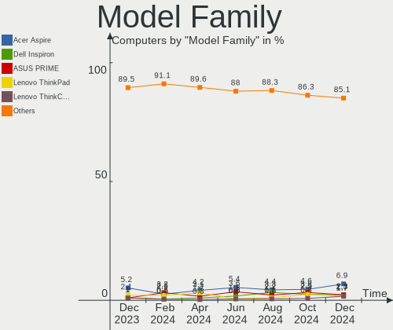
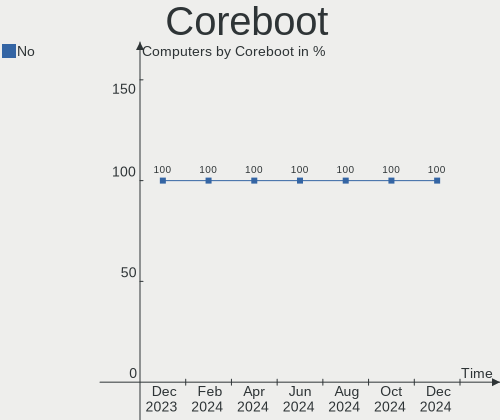

ROSA Hardware Trends
--------------------

A project to identify most popular hardware characteristics and track their change
over time based on data collected by ROSA users at https://Linux-Hardware.org.

Anyone can contribute to the study by uploading probes of their computers by
the [hw-probe](https://github.com/linuxhw/hw-probe) tool:

    sudo hw-probe -all -upload

This is a report for all computer types. See also reports for [desktops](/Dist/ROSA/Desktop/README.md) and [notebooks](/Dist/ROSA/Notebook/README.md).

Full-feature report is available here: https://linux-hardware.org/?view=trends

Period: Mar, 2020.

Contents
--------

- [ OS                       ](#os)
- [ OS Family                ](#os-family)
- [ Kernel                   ](#kernel)
- [ Kernel Family            ](#kernel-family)
- [ Kernel Major Ver.        ](#kernel-major-ver)
- [ Arch                     ](#arch)
- [ DE                       ](#de)
- [ Display Server           ](#display-server)
- [ OS Lang                  ](#os-lang)
- [ Boot Mode                ](#boot-mode)
- [ Filesystem               ](#filesystem)
- [ Dual Boot with Linux     ](#dual-boot-with-linux)
- [ Dual Boot (Win)          ](#dual-boot-win)
- [ Country                  ](#country)
- [ City                     ](#city)
- [ Vendor                   ](#vendor)
- [ Model                    ](#model)
- [ Model Family             ](#model-family)
- [ MFG Year                 ](#mfg-year)
- [ Form Factor              ](#form-factor)
- [ Secure Boot              ](#secure-boot)
- [ Coreboot                 ](#coreboot)
- [ RAM Size                 ](#ram-size)
- [ RAM Used                 ](#ram-used)
- [ Drive Vendor             ](#drive-vendor)
- [ Drive Model              ](#drive-model)
- [ Drive Kind               ](#drive-kind)
- [ Drive Connector          ](#drive-connector)
- [ Drive Size               ](#drive-size)
- [ Space Total              ](#space-total)
- [ Space Used               ](#space-used)
- [ Malfunc. Drives          ](#malfunc-drives)
- [ Malfunc. Drive Vendor    ](#malfunc-drive-vendor)
- [ Malfunc. Drive Kind      ](#malfunc-drive-kind)
- [ Failed Drives            ](#failed-drives)
- [ Failed Drive Vendor      ](#failed-drive-vendor)
- [ Drive Status             ](#drive-status)
- [ Storage Vendor           ](#storage-vendor)
- [ Storage Model            ](#storage-model)
- [ Storage Kind             ](#storage-kind)
- [ CPU Vendor               ](#cpu-vendor)
- [ CPU Model                ](#cpu-model)
- [ CPU Model Family         ](#cpu-model-family)
- [ CPU Cores                ](#cpu-cores)
- [ CPU Sockets              ](#cpu-sockets)
- [ CPU Threads              ](#cpu-threads)
- [ CPU Op-Modes             ](#cpu-op-modes)
- [ CPU Microarch            ](#cpu-microarch)
- [ CPU Microcode            ](#cpu-microcode)
- [ GPU Vendor               ](#gpu-vendor)
- [ GPU Model                ](#gpu-model)
- [ GPU Combo                ](#gpu-combo)
- [ GPU Driver               ](#gpu-driver)
- [ GPU Memory               ](#gpu-memory)
- [ Monitor Vendor           ](#monitor-vendor)
- [ Monitor Model            ](#monitor-model)
- [ Monitor Resolution       ](#monitor-resolution)
- [ Monitor Diagonal         ](#monitor-diagonal)
- [ Monitor Width            ](#monitor-width)
- [ Aspect Ratio             ](#aspect-ratio)
- [ Monitor Area             ](#monitor-area)
- [ Pixel Density            ](#pixel-density)
- [ Multiple Monitors        ](#multiple-monitors)
- [ Net Controller Vendor    ](#net-controller-vendor)
- [ Net Controller Model     ](#net-controller-model)
- [ Net Controller Kind      ](#net-controller-kind)
- [ Used Controller          ](#used-controller)
- [ NICs                     ](#nics)
- [ Unsupported Devices      ](#unsupported-devices)
- [ Unsupported Device Types ](#unsupported-device-types)

OS
--

Installed operating systems

| Name      | Computers | Percent |
|-----------|-----------|---------|
| ROSA R11  | 306       | 91.07%  |
| ROSA R10  | 16        | 4.76%   |
| ROSA R8.1 | 10        | 2.98%   |
| RED X3    | 2         | 0.6%    |
| ROSA R9   | 1         | 0.3%    |
| RED X4    | 1         | 0.3%    |

OS Family
---------

OS without a version

| Name | Computers | Percent |
|------|-----------|---------|
| ROSA | 336       | 100%    |

Kernel
------

Version of the Linux kernel

| Version                                  | Computers | Percent |
|------------------------------------------|-----------|---------|
| 4.15.0-desktop-68.5rosa-x86_64           | 120       | 35.71%  |
| 4.15.0-desktop-45.1rosa-x86_64           | 78        | 23.21%  |
| 4.15.0-desktop-45.1rosa-i586             | 28        | 8.33%   |
| 4.9.155-nrj-desktop-1rosa-x86_64         | 27        | 8.04%   |
| 4.15.0-desktop-68.5rosa-i586             | 20        | 5.95%   |
| 4.9.60-nrj-desktop-1rosa-x86_64          | 11        | 3.27%   |
| 4.9.155-nrj-desktop-1rosa-i586           | 7         | 2.08%   |
| 5.4.15-nrj-desktop-1rosa-x86_64          | 4         | 1.19%   |
| 5.4.0-desktop-17.1rosa-x86_64            | 4         | 1.19%   |
| 4.9.60-nrj-desktop-1rosa-i586            | 3         | 0.89%   |
| 4.9.124-nrj-desktop-1rosa-x86_64         | 3         | 0.89%   |
| 4.1.38-nrj-desktop-2rosa-x86_64          | 3         | 0.89%   |
| 5.4.27-nrj-desktop-1rosa-x86_64          | 2         | 0.6%    |
| 5.4.26-generic-3rosa-x86_64              | 2         | 0.6%    |
| 5.0.0-desktop-38.1rosa-x86_64            | 2         | 0.6%    |
| 4.9.9-nrj-desktop-1rosa-x86_64           | 2         | 0.6%    |
| 4.19.104-nrj-desktop-1rosa-x86_64        | 2         | 0.6%    |
| 5.5.7-linux-1-rosa-x86_64                | 1         | 0.3%    |
| 5.5.4-linux-xanmod-1-rosa-x86_64-xanmod3 | 1         | 0.3%    |
| 5.5.11-nrj-desktop-2rosa-x86_64          | 1         | 0.3%    |
| 5.4.27-desktop-1rosa-x86_64              | 1         | 0.3%    |
| 5.4.0-desktop-11.1rosa-x86_64            | 1         | 0.3%    |
| 5.3.18-nrj-desktop-1rosa-x86_64          | 1         | 0.3%    |
| 5.2.0-desktop-15.1rosa-x86_64            | 1         | 0.3%    |
| 4.9.9-nrj-desktop-1rosa-i586             | 1         | 0.3%    |
| 4.9.76-nrj-desktop-1rosa-x86_64          | 1         | 0.3%    |
| 4.9.41-nrj-desktop-1rosa-x86_64          | 1         | 0.3%    |
| 4.9.20-nrj-desktop-1rosa-x86_64          | 1         | 0.3%    |
| 4.9.20-nrj-desktop-1rosa-i586            | 1         | 0.3%    |
| 4.9.124-nrj-desktop-1rosa-i586           | 1         | 0.3%    |
| 4.19.0-desktop-13.1rosa-x86_64           | 1         | 0.3%    |
| 4.15.0-desktop-91.1rosa-x86_64           | 1         | 0.3%    |
| 4.15.0-desktop-91.1rosa-i586             | 1         | 0.3%    |
| 4.15.0-desktop-60.7rosa-i586             | 1         | 0.3%    |
| 4.15.0-desktop-54.1rosa-x86_64           | 1         | 0.3%    |

Kernel Family
-------------

Linux kernel without a distro release

| Version  | Computers | Percent |
|----------|-----------|---------|
| 4.15.0   | 250       | 74.4%   |
| 4.9.155  | 34        | 10.12%  |
| 4.9.60   | 14        | 4.17%   |
| 5.4.0    | 5         | 1.49%   |
| 5.4.15   | 4         | 1.19%   |
| 4.9.124  | 4         | 1.19%   |
| 5.4.27   | 3         | 0.89%   |
| 4.9.9    | 3         | 0.89%   |
| 4.1.38   | 3         | 0.89%   |
| 5.4.26   | 2         | 0.6%    |
| 5.0.0    | 2         | 0.6%    |
| 4.9.20   | 2         | 0.6%    |
| 4.19.104 | 2         | 0.6%    |
| 5.5.7    | 1         | 0.3%    |
| 5.5.4    | 1         | 0.3%    |
| 5.5.11   | 1         | 0.3%    |
| 5.3.18   | 1         | 0.3%    |
| 5.2.0    | 1         | 0.3%    |
| 4.9.76   | 1         | 0.3%    |
| 4.9.41   | 1         | 0.3%    |
| 4.19.0   | 1         | 0.3%    |

Kernel Major Ver.
-----------------

Linux kernel major version

| Version | Computers | Percent |
|---------|-----------|---------|
| 4.15    | 250       | 74.4%   |
| 4.9     | 59        | 17.56%  |
| 5.4     | 14        | 4.17%   |
| 5.5     | 3         | 0.89%   |
| 4.19    | 3         | 0.89%   |
| 4.1     | 3         | 0.89%   |
| 5.0     | 2         | 0.6%    |
| 5.3     | 1         | 0.3%    |
| 5.2     | 1         | 0.3%    |

Arch
----

OS architecture (x86_64, i586, etc.)

| Name   | Computers | Percent |
|--------|-----------|---------|
| x86_64 | 273       | 81.25%  |
| i686   | 63        | 18.75%  |

DE
--

Desktop Environment

| Name    | Computers | Percent |
|---------|-----------|---------|
| KDE4    | 199       | 59.23%  |
| KDE5    | 105       | 31.25%  |
| XFCE    | 14        | 4.17%   |
| LXQt    | 10        | 2.98%   |
| MATE    | 4         | 1.19%   |
| GNOME   | 2         | 0.6%    |
| LXDE    | 1         | 0.3%    |
| Unknown | 1         | 0.3%    |

Display Server
--------------

X11 or Wayland

| Name | Computers | Percent |
|------|-----------|---------|
| X11  | 334       | 99.4%   |
| Tty  | 2         | 0.6%    |

OS Lang
-------

Language

| Lang    | Computers | Percent |
|---------|-----------|---------|
| ru_RU   | 173       | 51.49%  |
| Unknown | 140       | 41.67%  |
| en_US   | 4         | 1.19%   |
| de_DE   | 4         | 1.19%   |
| pl_PL   | 3         | 0.89%   |
| it_IT   | 3         | 0.89%   |
| es_ES   | 2         | 0.6%    |
| en_GB   | 2         | 0.6%    |
| sv_SE   | 1         | 0.3%    |
| lv_LV   | 1         | 0.3%    |
| es_VE   | 1         | 0.3%    |
| cs_CZ   | 1         | 0.3%    |
| ar_DZ   | 1         | 0.3%    |

Boot Mode
---------

EFI or BIOS

| Mode | Computers | Percent |
|------|-----------|---------|
| BIOS | 255       | 75.89%  |
| EFI  | 81        | 24.11%  |

Filesystem
----------

Type of filesystem

| Type  | Computers | Percent |
|-------|-----------|---------|
| Ext4  | 316       | 94.05%  |
| Btrfs | 11        | 3.27%   |
| Xfs   | 3         | 0.89%   |
| Ext3  | 3         | 0.89%   |
| Aufs  | 2         | 0.6%    |
| Ext2  | 1         | 0.3%    |

Dual Boot with Linux
--------------------

Hosting more than one Linux

| Dual boot | Computers | Percent |
|-----------|-----------|---------|
| No        | 260       | 77.38%  |
| Yes       | 76        | 22.62%  |

Dual Boot (Win)
---------------

Hosting Linux and Windows

| Dual boot | Computers | Percent |
|-----------|-----------|---------|
| No        | 186       | 55.36%  |
| Yes       | 150       | 44.64%  |

Country
-------

Geographic location (country)

| Country              | Computers | Percent |
|----------------------|-----------|---------|
| Russia               | 259       | 77.08%  |
| Ukraine              | 23        | 6.85%   |
| Poland               | 7         | 2.08%   |
| Belarus              | 7         | 2.08%   |
| Spain                | 5         | 1.49%   |
| Italy                | 4         | 1.19%   |
| USA                  | 3         | 0.89%   |
| Moldova, Republic of | 3         | 0.89%   |
| Germany              | 3         | 0.89%   |
| Austria              | 3         | 0.89%   |
| Romania              | 2         | 0.6%    |
| Lithuania            | 2         | 0.6%    |
| Kazakhstan           | 2         | 0.6%    |
| Israel               | 2         | 0.6%    |
| Brazil               | 2         | 0.6%    |
| Venezuela            | 1         | 0.3%    |
| UK                   | 1         | 0.3%    |
| Sweden               | 1         | 0.3%    |
| Latvia               | 1         | 0.3%    |
| Ireland              | 1         | 0.3%    |
| Estonia              | 1         | 0.3%    |
| Czech Republic       | 1         | 0.3%    |
| Australia            | 1         | 0.3%    |
| Algeria              | 1         | 0.3%    |

City
----

Geographic location (city)

| City              | Computers | Percent |
|-------------------|-----------|---------|
| Moscow            | 43        | 12.8%   |
| St Petersburg     | 18        | 5.36%   |
| Novosibirsk       | 12        | 3.57%   |
| Krasnodar         | 12        | 3.57%   |
| Ekaterinburg      | 12        | 3.57%   |
| Samara            | 7         | 2.08%   |
| Nizhniy Novgorod  | 5         | 1.49%   |
| Penza             | 4         | 1.19%   |
| Kharkiv           | 4         | 1.19%   |
| Kazan’          | 4         | 1.19%   |
| Irkutsk           | 4         | 1.19%   |
| Ufa               | 3         | 0.89%   |
| Severodvinsk      | 3         | 0.89%   |
| Saratov           | 3         | 0.89%   |
| Rostov-on-Don     | 3         | 0.89%   |
| Kyiv              | 3         | 0.89%   |
| Kurgan            | 3         | 0.89%   |
| Kirov             | 3         | 0.89%   |
| Khabarovsk        | 3         | 0.89%   |
| Kemerovo          | 3         | 0.89%   |
| Kaliningrad       | 3         | 0.89%   |
| Izhevsk           | 3         | 0.89%   |
| Ivanovo           | 3         | 0.89%   |
| Granada           | 3         | 0.89%   |
| Chelyabinsk       | 3         | 0.89%   |
| Zlatoust          | 2         | 0.6%    |
| Yaroslavl         | 2         | 0.6%    |
| Voronezh          | 2         | 0.6%    |
| Volgograd         | 2         | 0.6%    |
| Vienna            | 2         | 0.6%    |
| Tiraspol          | 2         | 0.6%    |
| Stavropol         | 2         | 0.6%    |
| Simferopol        | 2         | 0.6%    |
| Shakhty           | 2         | 0.6%    |
| Sevastopol        | 2         | 0.6%    |
| Petrozavodsk      | 2         | 0.6%    |
| Perm              | 2         | 0.6%    |
| Odesa             | 2         | 0.6%    |
| Novokuznetsk      | 2         | 0.6%    |
| Nizhny Tagil      | 2         | 0.6%    |
| Lipetsk           | 2         | 0.6%    |
| Krasnoyarsk       | 2         | 0.6%    |
| Kaunas            | 2         | 0.6%    |
| Glazov            | 2         | 0.6%    |
| Belovo            | 2         | 0.6%    |
| Barnaul           | 2         | 0.6%    |
| Astrakhan         | 2         | 0.6%    |
| Örebro           | 1         | 0.3%    |
| Zvenigovo         | 1         | 0.3%    |
| Yuzhno-Sakhalinsk | 1         | 0.3%    |
| Yoshkar-Ola       | 1         | 0.3%    |
| Yeysk             | 1         | 0.3%    |
| Weinsberg         | 1         | 0.3%    |
| Warsaw            | 1         | 0.3%    |
| Volzhskiy         | 1         | 0.3%    |
| Vologda           | 1         | 0.3%    |
| Volgodonsk        | 1         | 0.3%    |
| Vladivostok       | 1         | 0.3%    |
| Vitebsk           | 1         | 0.3%    |
| Vinnytsia         | 1         | 0.3%    |

Vendor
------

Motherboard manufacturer

| Name                           | Computers | Percent |
|--------------------------------|-----------|---------|
| ASUSTek Computer               | 85        | 25.3%   |
| Gigabyte Technology            | 42        | 12.5%   |
| Acer                           | 30        | 8.93%   |
| Lenovo                         | 27        | 8.04%   |
| Hewlett-Packard                | 25        | 7.44%   |
| MSI                            | 22        | 6.55%   |
| ASRock                         | 21        | 6.25%   |
| Dell                           | 16        | 4.76%   |
| Samsung Electronics            | 15        | 4.46%   |
| Packard Bell                   | 8         | 2.38%   |
| Intel                          | 7         | 2.08%   |
| Toshiba                        | 3         | 0.89%   |
| Sony                           | 3         | 0.89%   |
| Fujitsu                        | 3         | 0.89%   |
| Biostar                        | 3         | 0.89%   |
| Apple                          | 3         | 0.89%   |
| Unknown                        | 3         | 0.89%   |
| Notebook                       | 2         | 0.6%    |
| Foxconn                        | 2         | 0.6%    |
| ECS                            | 2         | 0.6%    |
| VIT                            | 1         | 0.3%    |
| Prestigio                      | 1         | 0.3%    |
| Positivo                       | 1         | 0.3%    |
| MINIX                          | 1         | 0.3%    |
| MEGA                           | 1         | 0.3%    |
| Matsushita Electric Industrial | 1         | 0.3%    |
| iRU                            | 1         | 0.3%    |
| Huanan                         | 1         | 0.3%    |
| Fujitsu Siemens                | 1         | 0.3%    |
| eMachines                      | 1         | 0.3%    |
| DNS                            | 1         | 0.3%    |
| Digma                          | 1         | 0.3%    |
| Clevo                          | 1         | 0.3%    |
| AMD                            | 1         | 0.3%    |

Model
-----

Motherboard model

| Name                                                                                                 | Computers | Percent |
|------------------------------------------------------------------------------------------------------|-----------|---------|
| ASUS All Series                                                                                      | 5         | 1.49%   |
| Lenovo B570e HuronRiver Platform                                                                     | 4         | 1.19%   |
| Gigabyte G31M-ES2L                                                                                   | 4         | 1.19%   |
| ASUS M5A78L-M PLUS/USB3                                                                              | 4         | 1.19%   |
| Unknown                                                                                              | 4         | 1.19%   |
| Lenovo G500 20236                                                                                    | 3         | 0.89%   |
| HP Notebook                                                                                          | 3         | 0.89%   |
| ASUS M5A97 R2.0                                                                                      | 3         | 0.89%   |
| Samsung Electronics R520/R522/R620                                                                   | 2         | 0.6%    |
| Samsung Electronics NC110P/NC108P/NC111P                                                             | 2         | 0.6%    |
| Samsung Electronics 350V5C/351V5C/3540VC/3440VC                                                      | 2         | 0.6%    |
| MSI MS-7808                                                                                          | 2         | 0.6%    |
| MSI MS-7597                                                                                          | 2         | 0.6%    |
| MSI MS-7253                                                                                          | 2         | 0.6%    |
| Lenovo B590 20208                                                                                    | 2         | 0.6%    |
| HP Pavilion dv7                                                                                      | 2         | 0.6%    |
| Gigabyte Z77M-D3H                                                                                    | 2         | 0.6%    |
| Gigabyte B450 AORUS ELITE                                                                            | 2         | 0.6%    |
| Dell Inspiron 3521                                                                                   | 2         | 0.6%    |
| ASUS P8H61-M LX3 R2.0                                                                                | 2         | 0.6%    |
| ASUS K53SV                                                                                           | 2         | 0.6%    |
| ASUS H110M-K                                                                                         | 2         | 0.6%    |
| ASUS A68HM-K                                                                                         | 2         | 0.6%    |
| ASUS 1215B                                                                                           | 2         | 0.6%    |
| ASRock P4i65G                                                                                        | 2         | 0.6%    |
| Acer Extensa 2519                                                                                    | 2         | 0.6%    |
| VIT P2402                                                                                            | 1         | 0.3%    |
| Toshiba Satellite L850D-C8S                                                                          | 1         | 0.3%    |
| Toshiba Satellite L40                                                                                | 1         | 0.3%    |
| Toshiba Satellite A300                                                                               | 1         | 0.3%    |
| Sony VPCL22S1R                                                                                       | 1         | 0.3%    |
| Sony VGN-TZ1RXN_B                                                                                    | 1         | 0.3%    |
| Sony VGN-NW2SRF_S                                                                                    | 1         | 0.3%    |
| Samsung Electronics RV413/RV513                                                                      | 1         | 0.3%    |
| Samsung Electronics RC410/RC510/RC710                                                                | 1         | 0.3%    |
| Samsung Electronics R580/R590                                                                        | 1         | 0.3%    |
| Samsung Electronics R510/P510                                                                        | 1         | 0.3%    |
| Samsung Electronics R468/R418                                                                        | 1         | 0.3%    |
| Samsung Electronics NC210/NC110                                                                      | 1         | 0.3%    |
| Samsung Electronics 350V5C/350V5X/350V4C/350V4X/351V5C/351V5X/351V4C/351V4X/3540VC/3540VX/3440VC/344 | 1         | 0.3%    |
| Samsung Electronics 305V4A/305V5A/3415VA                                                             | 1         | 0.3%    |
| Samsung Electronics 300E4A/300E5A/300E7A/3430EA/3530EA                                               | 1         | 0.3%    |
| Prestigio PSB133S01ZFH                                                                               | 1         | 0.3%    |
| Positivo POS-MI945AA                                                                                 | 1         | 0.3%    |
| Packard Bell oneTwo S3230                                                                            | 1         | 0.3%    |
| Packard Bell ixtreme M5741                                                                           | 1         | 0.3%    |
| Packard Bell EasyNote TS11SB                                                                         | 1         | 0.3%    |
| Packard Bell EasyNote TJ71                                                                           | 1         | 0.3%    |
| Packard Bell EasyNote TE69CX                                                                         | 1         | 0.3%    |
| Packard Bell EasyNote ENLG71BM                                                                       | 1         | 0.3%    |
| Packard Bell DOTS                                                                                    | 1         | 0.3%    |
| Packard Bell DOT S                                                                                   | 1         | 0.3%    |
| Notebook W54_55SU1,SUW                                                                               | 1         | 0.3%    |
| Notebook RIM2510                                                                                     | 1         | 0.3%    |
| MSI OPTIMUS                                                                                          | 1         | 0.3%    |
| MSI MS-7C52                                                                                          | 1         | 0.3%    |
| MSI MS-7B79                                                                                          | 1         | 0.3%    |
| MSI MS-7B22                                                                                          | 1         | 0.3%    |
| MSI MS-7A74                                                                                          | 1         | 0.3%    |
| MSI MS-7A38                                                                                          | 1         | 0.3%    |

Model Family
------------

Motherboard model prefix

| Name                       | Computers | Percent |
|----------------------------|-----------|---------|
| Acer Aspire                | 20        | 5.95%   |
| Dell Inspiron              | 7         | 2.08%   |
| ASUS PRIME                 | 6         | 1.79%   |
| Lenovo ThinkPad            | 5         | 1.49%   |
| Lenovo IdeaPad             | 5         | 1.49%   |
| HP Pavilion                | 5         | 1.49%   |
| ASUS M5A78L-M              | 5         | 1.49%   |
| ASUS All                   | 5         | 1.49%   |
| Acer Extensa               | 5         | 1.49%   |
| Packard Bell EasyNote      | 4         | 1.19%   |
| Lenovo B570e               | 4         | 1.19%   |
| HP EliteBook               | 4         | 1.19%   |
| HP Compaq                  | 4         | 1.19%   |
| Gigabyte G31M-ES2L         | 4         | 1.19%   |
| ASUS P8H61-M               | 4         | 1.19%   |
| ASUS M5A97                 | 4         | 1.19%   |
| Unknown                    | 4         | 1.19%   |
| Toshiba Satellite          | 3         | 0.89%   |
| Samsung Electronics 350V5C | 3         | 0.89%   |
| Lenovo G500                | 3         | 0.89%   |
| Lenovo B590                | 3         | 0.89%   |
| HP Notebook                | 3         | 0.89%   |
| Gigabyte B450              | 3         | 0.89%   |
| Dell Latitude              | 3         | 0.89%   |
| Samsung Electronics R520   | 2         | 0.6%    |
| Samsung Electronics NC110P | 2         | 0.6%    |
| MSI MS-7808                | 2         | 0.6%    |
| MSI MS-7597                | 2         | 0.6%    |
| MSI MS-7253                | 2         | 0.6%    |
| MSI Compaq                 | 2         | 0.6%    |
| HP ProBook                 | 2         | 0.6%    |
| HP Laptop                  | 2         | 0.6%    |
| Gigabyte Z77M-D3H          | 2         | 0.6%    |
| Gigabyte Z370M             | 2         | 0.6%    |
| Fujitsu LIFEBOOK           | 2         | 0.6%    |
| Dell OptiPlex              | 2         | 0.6%    |
| ASUS K53SV                 | 2         | 0.6%    |
| ASUS H110M-K               | 2         | 0.6%    |
| ASUS A68HM-K               | 2         | 0.6%    |
| ASUS 1215B                 | 2         | 0.6%    |
| ASRock P4i65G              | 2         | 0.6%    |
| Acer TravelMate            | 2         | 0.6%    |
| VIT P2402                  | 1         | 0.3%    |
| Sony VPCL22S1R             | 1         | 0.3%    |
| Sony VGN-TZ1RXN            | 1         | 0.3%    |
| Sony VGN-NW2SRF            | 1         | 0.3%    |
| Samsung Electronics RV413  | 1         | 0.3%    |
| Samsung Electronics RC410  | 1         | 0.3%    |
| Samsung Electronics R580   | 1         | 0.3%    |
| Samsung Electronics R510   | 1         | 0.3%    |
| Samsung Electronics R468   | 1         | 0.3%    |
| Samsung Electronics NC210  | 1         | 0.3%    |
| Samsung Electronics 305V4A | 1         | 0.3%    |
| Samsung Electronics 300E4A | 1         | 0.3%    |
| Prestigio PSB133S01ZFH     | 1         | 0.3%    |
| Positivo POS-MI945AA       | 1         | 0.3%    |
| Packard Bell oneTwo        | 1         | 0.3%    |
| Packard Bell ixtreme       | 1         | 0.3%    |
| Packard Bell DOTS          | 1         | 0.3%    |
| Packard Bell DOT           | 1         | 0.3%    |

MFG Year
--------

Motherboard manufacture year

| Year    | Computers | Percent |
|---------|-----------|---------|
| 2011    | 42        | 12.5%   |
| 2012    | 40        | 11.9%   |
| 2010    | 39        | 11.61%  |
| 2013    | 30        | 8.93%   |
| 2009    | 25        | 7.44%   |
| 2018    | 24        | 7.14%   |
| 2008    | 23        | 6.85%   |
| 2019    | 22        | 6.55%   |
| 2015    | 19        | 5.65%   |
| 2007    | 17        | 5.06%   |
| 2017    | 16        | 4.76%   |
| 2014    | 14        | 4.17%   |
| 2016    | 13        | 3.87%   |
| 2006    | 6         | 1.79%   |
| 2005    | 4         | 1.19%   |
| 2004    | 1         | 0.3%    |
| Unknown | 1         | 0.3%    |

Form Factor
-----------

Physical design of the computer

| Name       | Computers | Percent |
|------------|-----------|---------|
| Desktop    | 182       | 54.17%  |
| Notebook   | 147       | 43.75%  |
| Mini pc    | 3         | 0.89%   |
| All in one | 3         | 0.89%   |
| Tablet     | 1         | 0.3%    |

Secure Boot
-----------

Enabled or disabled

| State    | Computers | Percent |
|----------|-----------|---------|
| Disabled | 336       | 100%    |

Coreboot
--------

Have coreboot on board

| Used | Computers | Percent |
|------|-----------|---------|
| No   | 336       | 100%    |

RAM Size
--------

Total RAM memory

| Size in GB  | Computers | Percent |
|-------------|-----------|---------|
| 3.01-4.0    | 104       | 30.95%  |
| 8.01-16.0   | 65        | 19.35%  |
| 4.01-8.0    | 62        | 18.45%  |
| 1.01-2.0    | 39        | 11.61%  |
| 2.01-3.0    | 26        | 7.74%   |
| 16.01-24.0  | 24        | 7.14%   |
| 0.01-1.0    | 7         | 2.08%   |
| 32.01-64.0  | 5         | 1.49%   |
| 24.01-32.0  | 3         | 0.89%   |
| 64.01-256.0 | 1         | 0.3%    |

RAM Used
--------

Used RAM memory

| Used GB   | Computers | Percent |
|-----------|-----------|---------|
| 0.01-1.0  | 154       | 45.83%  |
| 1.01-2.0  | 139       | 41.37%  |
| 2.01-3.0  | 27        | 8.04%   |
| 4.01-8.0  | 9         | 2.68%   |
| 3.01-4.0  | 6         | 1.79%   |
| 8.01-16.0 | 1         | 0.3%    |

Drive Vendor
------------

Hard drive vendors

| Vendor              | Computers | Drives  | Percent |
|---------------------|-----------|---------|---------|
| Seagate             | 116       | 130     | 25.16%  |
| WDC                 | 109       | 132     | 23.64%  |
| Toshiba             | 48        | 49      | 10.41%  |
| Samsung Electronics | 33        | 35      | 7.16%   |
| Hitachi             | 32        | 33      | 6.94%   |
| Kingston            | 19        | 20      | 4.12%   |
| SanDisk             | 10        | 10      | 2.17%   |
| SPCC                | 7         | 7       | 1.52%   |
| China               | 7         | 7       | 1.52%   |
| A-DATA Technology   | 7         | 7       | 1.52%   |
| Crucial             | 6         | 6       | 1.3%    |
| Unknown             | 5         | 6       | 1.08%   |
| OCZ                 | 5         | 5       | 1.08%   |
| Maxtor              | 5         | 6       | 1.08%   |
| PLEXTOR             | 4         | 5       | 0.87%   |
| HUAWEI              | 4         | 4       | 0.87%   |
| HGST                | 4         | 5       | 0.87%   |
| AMD                 | 4         | 4       | 0.87%   |
| Transcend           | 3         | 3       | 0.65%   |
| Intel               | 3         | 3       | 0.65%   |
| Zheino              | 2         | 2       | 0.43%   |
| Smartbuy            | 2         | 2       | 0.43%   |
| Patriot             | 2         | 2       | 0.43%   |
| KingDian            | 2         | 2       | 0.43%   |
| Hewlett-Packard     | 2         | 2       | 0.43%   |
| Fujitsu             | 2         | 2       | 0.43%   |
| ZTE                 | 1         | 1       | 0.22%   |
| Teclast             | 1         | 1       | 0.22%   |
| Team                | 1         | 1       | 0.22%   |
| T-FORCE             | 1         | 1       | 0.22%   |
| T-64                | 1         | 1       | 0.22%   |
| Silicon Motion      | 1         | 1       | 0.22%   |
| OCZ-VERTEX3         | 1         | 1       | 0.22%   |
| Micron Technology   | 1         | 1       | 0.22%   |
| LITEONIT            | 1         | 1       | 0.22%   |
| LITEON              | 1         | 1       | 0.22%   |
| IBM/Hitachi         | 1         | 1       | 0.22%   |
| HYPERDISK           | 1         | 1       | 0.22%   |
| HL-DT-ST            | 1         | Unknown | 0.22%   |
| Goldendisk          | 1         | 1       | 0.22%   |
| Generic             | 1         | 1       | 0.22%   |
| faspeed             | 1         | 1       | 0.22%   |
| Corsair             | 1         | 1       | 0.22%   |
| Apacer              | 1         | 1       | 0.22%   |

Drive Model
-----------

Hard drive models

| Model                        | Computers | Percent |
|------------------------------|-----------|---------|
| ST500DM002-1BD142 500GB      | 10        | 1.97%   |
| WDS240G2G0A-00JH30 240GB SSD | 8         | 1.58%   |
| WD10EZEX-08WN4A0 1TB         | 8         | 1.58%   |
| ST3500418AS 500GB            | 7         | 1.38%   |
| MQ01ABF050 500GB             | 6         | 1.18%   |
| ST1000DM010-2EP102 1TB       | 5         | 0.99%   |
| ST1000DM003-1CH162 1TB       | 5         | 0.99%   |
| SSD 860 EVO 250GB            | 5         | 0.99%   |
| SA400S37240G 240GB SSD       | 5         | 0.99%   |
| DT01ACA100 1TB               | 5         | 0.99%   |
| WDS120G2G0A-00JH30 120GB SSD | 4         | 0.79%   |
| ST500LT012-1DG142 500GB      | 4         | 0.79%   |
| ST380811AS 80GB              | 4         | 0.79%   |
| ST320LT020-9YG142 320GB      | 4         | 0.79%   |
| SHFS37A120G 120GB SSD        | 4         | 0.79%   |
| MQ01ABD050 500GB             | 4         | 0.79%   |
| HTS547575A9E384 752GB        | 4         | 0.79%   |
| HDWD110 1TB                  | 4         | 0.79%   |
| WD5000LPLX-00ZNTT0 500GB     | 3         | 0.59%   |
| WD3200BPVT-22ZEST0 320GB     | 3         | 0.59%   |
| WD20EARX-00PASB0 2TB         | 3         | 0.59%   |
| WD1600BEVT-22ZCT0 160GB      | 3         | 0.59%   |
| WD10EARS-00Y5B1 1TB          | 3         | 0.59%   |
| WD10EADS-00M2B0 1TB          | 3         | 0.59%   |
| ST9500325AS 500GB            | 3         | 0.59%   |
| ST9320325AS 320GB            | 3         | 0.59%   |
| ST3250310AS 250GB            | 3         | 0.59%   |
| ST3160815AS 160GB            | 3         | 0.59%   |
| ST31000528AS 1TB             | 3         | 0.59%   |
| ST1000DM003-9YN162 1TB       | 3         | 0.59%   |
| Solid State Disk 128GB       | 3         | 0.59%   |
| MQ01ABD100 1TB               | 3         | 0.59%   |
| WDS500G2B0A-00SM50 500GB SSD | 2         | 0.39%   |
| WD5000LPVX-22V0TT0 500GB     | 2         | 0.39%   |
| WD5000LPCX-21VHAT0 500GB     | 2         | 0.39%   |
| WD3200AAKX-221CA1 320GB      | 2         | 0.39%   |
| WD20PURZ-85GU6Y0 2TB         | 2         | 0.39%   |
| WD1600BEVT-22A23T0 160GB     | 2         | 0.39%   |
| WD10EZEX-22MFCA0 1TB         | 2         | 0.39%   |
| VERTEX3 120GB SSD            | 2         | 0.39%   |
| TS128GSSD370S 128GB          | 2         | 0.39%   |
| TF CARD Storage 8GB          | 2         | 0.39%   |
| SV300S37A60G 64GB SSD        | 2         | 0.39%   |
| SV300S37A120G 120GB SSD      | 2         | 0.39%   |
| ST9250315AS 250GB            | 2         | 0.39%   |
| ST500LM012 HN-M500MBB 500GB  | 2         | 0.39%   |
| ST380817AS 80GB              | 2         | 0.39%   |
| ST380815AS 80GB              | 2         | 0.39%   |
| ST3500413AS 500GB            | 2         | 0.39%   |
| ST340014A 40GB               | 2         | 0.39%   |
| ST3160318AS 160GB            | 2         | 0.39%   |
| ST3160023A 160GB             | 2         | 0.39%   |
| ST2000DM008-2FR102 2TB       | 2         | 0.39%   |
| ST2000DM001-1CH164 2TB       | 2         | 0.39%   |
| ST1000LM035-1RK172 1TB       | 2         | 0.39%   |
| ST1000DM003-1ER162 1TB       | 2         | 0.39%   |
| SSD 860 PRO 512GB            | 2         | 0.39%   |
| SSD 120GB                    | 2         | 0.39%   |
| SP900 256GB SSD              | 2         | 0.39%   |
| SP0812C 80GB                 | 2         | 0.39%   |

Drive Kind
----------

HDD or SSD

| Kind    | Computers | Drives | Percent |
|---------|-----------|--------|---------|
| HDD     | 286       | 361    | 68.59%  |
| SSD     | 112       | 126    | 26.86%  |
| Unknown | 8         | 7      | 1.92%   |
| MMC     | 6         | 7      | 1.44%   |
| NVMe    | 5         | 5      | 1.2%    |

Drive Connector
---------------

SATA, SAS, NVMe, etc.

| Type | Computers | Drives | Percent |
|------|-----------|--------|---------|
| SATA | 333       | 486    | 94.6%   |
| SAS  | 8         | 8      | 2.27%   |
| MMC  | 6         | 7      | 1.7%    |
| NVMe | 5         | 5      | 1.42%   |

Drive Size
----------

Size of hard drive

| Size in TB | Computers | Drives | Percent |
|------------|-----------|--------|---------|
| 0.01-0.5   | 281       | 366    | 70.25%  |
| 0.51-1.0   | 97        | 117    | 24.25%  |
| 1.01-2.0   | 19        | 20     | 4.75%   |
| 3.01-4.0   | 1         | 1      | 0.25%   |
| 2.01-3.0   | 1         | 1      | 0.25%   |
| 4.01-10.0  | 1         | 1      | 0.25%   |

Space Total
-----------

Amount of disk space available on the file system

| Size in GB     | Computers | Percent |
|----------------|-----------|---------|
| 101-250        | 80        | 23.81%  |
| 251-500        | 77        | 22.92%  |
| 501-1000       | 43        | 12.8%   |
| 1-20           | 39        | 11.61%  |
| 51-100         | 35        | 10.42%  |
| 21-50          | 32        | 9.52%   |
| 1001-2000      | 17        | 5.06%   |
| 2001-3000      | 7         | 2.08%   |
| More than 3000 | 6         | 1.79%   |

Space Used
----------

Amount of used disk space

| Used GB        | Computers | Percent |
|----------------|-----------|---------|
| 1-20           | 214       | 63.69%  |
| 21-50          | 37        | 11.01%  |
| 101-250        | 26        | 7.74%   |
| 251-500        | 21        | 6.25%   |
| 51-100         | 17        | 5.06%   |
| 1001-2000      | 10        | 2.98%   |
| 501-1000       | 7         | 2.08%   |
| 2001-3000      | 3         | 0.89%   |
| More than 3000 | 1         | 0.3%    |

Malfunc. Drives
---------------

Drive models with a malfunction

| Model                       | Computers | Drives | Percent |
|-----------------------------|-----------|--------|---------|
| ST500DM002-1BD142 500GB     | 6         | 6      | 3.77%   |
| ST320LT020-9YG142 320GB     | 4         | 4      | 2.52%   |
| ST9500325AS 500GB           | 3         | 3      | 1.89%   |
| ST3500418AS 500GB           | 3         | 3      | 1.89%   |
| ST3250310AS 250GB           | 3         | 3      | 1.89%   |
| MQ01ABD050 500GB            | 3         | 3      | 1.89%   |
| WD3200BPVT-22ZEST0 320GB    | 2         | 2      | 1.26%   |
| WD1600BEVT-22A23T0 160GB    | 2         | 2      | 1.26%   |
| ST9320325AS 320GB           | 2         | 2      | 1.26%   |
| ST500LT012-1DG142 500GB     | 2         | 2      | 1.26%   |
| ST380817AS 80GB             | 2         | 2      | 1.26%   |
| ST380811AS 80GB             | 2         | 2      | 1.26%   |
| ST1000DM003-1ER162 1TB      | 2         | 2      | 1.26%   |
| SP0812C 80GB                | 2         | 2      | 1.26%   |
| MQ01ABD100 1TB              | 2         | 2      | 1.26%   |
| MK1237GSX 120GB             | 2         | 2      | 1.26%   |
| WD6400BPVT-75HXZT1 640GB    | 1         | 1      | 0.63%   |
| WD6400AAKS-22A7B2 640GB     | 1         | 1      | 0.63%   |
| WD5000LPLX-21ZNTT0 500GB    | 1         | 1      | 0.63%   |
| WD5000LPCX-21VHAT0 500GB    | 1         | 1      | 0.63%   |
| WD5000BEVT-22A0RT0 500GB    | 1         | 1      | 0.63%   |
| WD5000AVDS-63U7B1 500GB     | 1         | 1      | 0.63%   |
| WD5000AAKX-08U6AA0 500GB    | 1         | 1      | 0.63%   |
| WD5000AAKX-083CA1 500GB     | 1         | 1      | 0.63%   |
| WD5000AAKX-003CA0 500GB     | 1         | 1      | 0.63%   |
| WD5000AAKX-001CA0 500GB     | 1         | 1      | 0.63%   |
| WD360GD-00FLA2 37GB         | 1         | 1      | 0.63%   |
| WD3200BPVT-22JJ5T0 320GB    | 1         | 1      | 0.63%   |
| WD3200BEVT-80A0RT0 320GB    | 1         | 1      | 0.63%   |
| WD3200BEVT-60A23T0 320GB    | 1         | 1      | 0.63%   |
| WD3200AAKS-75L9A0 320GB     | 1         | 1      | 0.63%   |
| WD3200AAKS-00L9A0 320GB     | 1         | 1      | 0.63%   |
| WD3200AAJS-00L7A0 320GB     | 1         | 1      | 0.63%   |
| WD3200AAJS-00B4A0 320GB     | 1         | 1      | 0.63%   |
| WD1600AAJB-00J3A0 160GB     | 1         | 1      | 0.63%   |
| WD15EVDS-63V9B1 1TB         | 1         | 1      | 0.63%   |
| WD1200JD-55HBB0 120GB       | 1         | 1      | 0.63%   |
| WD10PURX-64E5EY0 1TB        | 1         | 1      | 0.63%   |
| WD10EZEX-35WN4A0 1TB        | 1         | 1      | 0.63%   |
| WD10EZEX-00UD2A0 1TB        | 1         | 1      | 0.63%   |
| WD10EZEX-00RKKA0 1TB        | 1         | 1      | 0.63%   |
| WD10EARS-00Y5B1 1TB         | 1         | 1      | 0.63%   |
| WD10EARS-00MVWB0 1TB        | 1         | 1      | 0.63%   |
| WD10EADS-22M2B0 1TB         | 1         | 1      | 0.63%   |
| WD10EADS-00M2B0 1TB         | 1         | 1      | 0.63%   |
| VERTEX3 240GB SSD           | 1         | 1      | 0.63%   |
| VERTEX3 120GB SSD           | 1         | 1      | 0.63%   |
| T2535T120G 120GB SSD        | 1         | 1      | 0.63%   |
| STM3250310AS 250GB          | 1         | 1      | 0.63%   |
| STM3160815AS 160GB          | 1         | 1      | 0.63%   |
| ST9500423AS 500GB           | 1         | 1      | 0.63%   |
| ST9500420AS 500GB           | 1         | 1      | 0.63%   |
| ST9160827AS 160GB           | 1         | 1      | 0.63%   |
| ST9160310AS 160GB           | 1         | 1      | 0.63%   |
| ST9120821A 120GB            | 1         | 1      | 0.63%   |
| ST500LM021-1KJ152 500GB     | 1         | 1      | 0.63%   |
| ST500LM012 HN-M500MBB 500GB | 1         | 1      | 0.63%   |
| ST380815AS 80GB             | 1         | 1      | 0.63%   |
| ST380215A 80GB              | 1         | 1      | 0.63%   |
| ST3500413AS 500GB           | 1         | 1      | 0.63%   |

Malfunc. Drive Vendor
---------------------

Vendors of faulty drives

| Vendor              | Computers | Drives | Percent |
|---------------------|-----------|--------|---------|
| Seagate             | 54        | 59     | 35.53%  |
| WDC                 | 32        | 33     | 21.05%  |
| Toshiba             | 16        | 16     | 10.53%  |
| Hitachi             | 13        | 14     | 8.55%   |
| Samsung Electronics | 12        | 12     | 7.89%   |
| Maxtor              | 5         | 5      | 3.29%   |
| HGST                | 3         | 3      | 1.97%   |
| OCZ                 | 2         | 2      | 1.32%   |
| Kingston            | 2         | 2      | 1.32%   |
| Crucial             | 2         | 2      | 1.32%   |
| Team                | 1         | 1      | 0.66%   |
| SPCC                | 1         | 1      | 0.66%   |
| Silicon Motion      | 1         | 1      | 0.66%   |
| SanDisk             | 1         | 1      | 0.66%   |
| PLEXTOR             | 1         | 1      | 0.66%   |
| OCZ-VERTEX3         | 1         | 1      | 0.66%   |
| IBM/Hitachi         | 1         | 1      | 0.66%   |
| HYPERDISK           | 1         | 1      | 0.66%   |
| Corsair             | 1         | 1      | 0.66%   |
| China               | 1         | 1      | 0.66%   |
| AMD                 | 1         | 1      | 0.66%   |

Malfunc. Drive Kind
-------------------

Kinds of faulty drives

| Kind | Computers | Drives | Percent |
|------|-----------|--------|---------|
| HDD  | 126       | 143    | 88.73%  |
| SSD  | 15        | 15     | 10.56%  |
| NVMe | 1         | 1      | 0.7%    |

Failed Drives
-------------

Failed drive models

| Model                   | Computers | Drives | Percent |
|-------------------------|-----------|--------|---------|
| ST500DM002-1BD142 500GB | 1         | 1      | 50%     |
| GB1000EAFJL 1TB         | 1         | 1      | 50%     |

Failed Drive Vendor
-------------------

Failed drive vendors

| Vendor          | Computers | Drives | Percent |
|-----------------|-----------|--------|---------|
| Seagate         | 1         | 1      | 50%     |
| Hewlett-Packard | 1         | 1      | 50%     |

Drive Status
------------

Number of failed and malfunc. drives

| Status   | Computers | Drives | Percent |
|----------|-----------|--------|---------|
| Works    | 243       | 330    | 60.75%  |
| Malfunc  | 141       | 159    | 35.25%  |
| Detected | 14        | 15     | 3.5%    |
| Failed   | 2         | 2      | 0.5%    |

Storage Vendor
--------------

Storage controller vendors

| Vendor                           | Computers | Percent |
|----------------------------------|-----------|---------|
| Intel                            | 243       | 66.39%  |
| AMD                              | 68        | 18.58%  |
| Nvidia                           | 18        | 4.92%   |
| JMicron Technology               | 14        | 3.83%   |
| Marvell Technology Group         | 7         | 1.91%   |
| VIA Technologies                 | 4         | 1.09%   |
| ASMedia Technology               | 4         | 1.09%   |
| Silicon Integrated Systems [SiS] | 2         | 0.55%   |
| Toshiba America Info Systems     | 1         | 0.27%   |
| Silicon Motion                   | 1         | 0.27%   |
| Realtek Semiconductor            | 1         | 0.27%   |
| Lite-On Technology               | 1         | 0.27%   |
| KIOXIA                           | 1         | 0.27%   |
| ADATA Technology                 | 1         | 0.27%   |

Storage Model
-------------

Storage controller models

| Model                                                                             | Computers | Percent |
|-----------------------------------------------------------------------------------|-----------|---------|
| 7 Series Chipset Family 6-port SATA Controller [AHCI mode]                        | 25        | 5.22%   |
| FCH SATA Controller [AHCI mode]                                                   | 22        | 4.59%   |
| SB7x0/SB8x0/SB9x0 SATA Controller [AHCI mode]                                     | 21        | 4.38%   |
| NM10/ICH7 Family SATA Controller [IDE mode]                                       | 19        | 3.97%   |
| SB7x0/SB8x0/SB9x0 IDE Controller                                                  | 17        | 3.55%   |
| 82801G (ICH7 Family) IDE Controller                                               | 15        | 3.13%   |
| SB7x0/SB8x0/SB9x0 SATA Controller [IDE mode]                                      | 14        | 2.92%   |
| 6 Series/C200 Series Chipset Family 6 port Mobile SATA AHCI Controller            | 14        | 2.92%   |
| 5 Series/3400 Series Chipset 4 port SATA AHCI Controller                          | 13        | 2.71%   |
| 82801HM/HEM (ICH8M/ICH8M-E) IDE Controller                                        | 12        | 2.51%   |
| 200 Series PCH SATA controller [AHCI mode]                                        | 12        | 2.51%   |
| MCP61 SATA Controller                                                             | 11        | 2.3%    |
| 82801IBM/IEM (ICH9M/ICH9M-E) 4 port SATA Controller [AHCI mode]                   | 11        | 2.3%    |
| 6 Series/C200 Series Chipset Family Desktop SATA Controller (IDE mode, ports 4-5) | 11        | 2.3%    |
| 6 Series/C200 Series Chipset Family Desktop SATA Controller (IDE mode, ports 0-3) | 11        | 2.3%    |
| 6 Series/C200 Series Chipset Family 6 port Desktop SATA AHCI Controller           | 11        | 2.3%    |
| Q170/Q150/B150/H170/H110/Z170/CM236 Chipset SATA Controller [AHCI Mode]           | 9         | 1.88%   |
| NM10/ICH7 Family SATA Controller [AHCI mode]                                      | 9         | 1.88%   |
| MCP61 IDE                                                                         | 9         | 1.88%   |
| 82801JI (ICH10 Family) 4 port SATA IDE Controller #1                              | 9         | 1.88%   |
| 8 Series/C220 Series Chipset Family 6-port SATA Controller 1 [AHCI mode]          | 9         | 1.88%   |
| JMB363 SATA/IDE Controller                                                        | 8         | 1.67%   |
| 82801JI (ICH10 Family) 2 port SATA IDE Controller #2                              | 8         | 1.67%   |
| 82801HM/HEM (ICH8M/ICH8M-E) SATA Controller [AHCI mode]                           | 8         | 1.67%   |
| 7 Series/C210 Series Chipset Family 6-port SATA Controller [AHCI mode]            | 7         | 1.46%   |
| Cannon Lake PCH SATA AHCI Controller                                              | 6         | 1.25%   |
| Atom/Celeron/Pentium Processor x5-E8000/J3xxx/N3xxx Series SATA Controller        | 6         | 1.25%   |
| 82801GBM/GHM (ICH7-M Family) SATA Controller [IDE mode]                           | 6         | 1.25%   |
| Sunrise Point-LP SATA Controller [AHCI mode]                                      | 5         | 1.04%   |
| FCH SATA Controller [IDE mode]                                                    | 5         | 1.04%   |
| Atom Processor E3800 Series SATA AHCI Controller                                  | 5         | 1.04%   |
| 82801HM/HEM (ICH8M/ICH8M-E) SATA Controller [IDE mode]                            | 5         | 1.04%   |
| 5 Series/3400 Series Chipset 4 port SATA IDE Controller                           | 5         | 1.04%   |
| 400 Series Chipset SATA Controller                                                | 5         | 1.04%   |
| JMB368 IDE controller                                                             | 4         | 0.84%   |
| FCH IDE Controller                                                                | 4         | 0.84%   |
| ASM1062 Serial ATA Controller                                                     | 4         | 0.84%   |
| 82801JI (ICH10 Family) SATA AHCI Controller                                       | 4         | 0.84%   |
| 82801EB/ER (ICH5/ICH5R) IDE Controller                                            | 4         | 0.84%   |
| 5 Series/3400 Series Chipset 2 port SATA IDE Controller                           | 4         | 0.84%   |
| SB600 Non-Raid-5 SATA                                                             | 3         | 0.63%   |
| SB600 IDE                                                                         | 3         | 0.63%   |
| 82801IBM/IEM (ICH9M/ICH9M-E) 2 port SATA Controller [IDE mode]                    | 3         | 0.63%   |
| 82801IB (ICH9) 2 port SATA Controller [IDE mode]                                  | 3         | 0.63%   |
| 82801I (ICH9 Family) 2 port SATA Controller [IDE mode]                            | 3         | 0.63%   |
| VT82C586A/B/VT82C686/A/B/VT823x/A/C PIPC Bus Master IDE                           | 2         | 0.42%   |
| VT8237A SATA 2-Port Controller                                                    | 2         | 0.42%   |
| VT6415 PATA IDE Host Controller                                                   | 2         | 0.42%   |
| SATA Controller [RAID mode]                                                       | 2         | 0.42%   |
| Non-Volatile memory controller                                                    | 2         | 0.42%   |
| MCP78S [GeForce 8200] SATA Controller (non-AHCI mode)                             | 2         | 0.42%   |
| MCP78S [GeForce 8200] IDE                                                         | 2         | 0.42%   |
| IXP SB4x0 Serial ATA Controller                                                   | 2         | 0.42%   |
| IXP SB4x0 IDE Controller                                                          | 2         | 0.42%   |
| FCH SATA Controller D                                                             | 2         | 0.42%   |
| CK804 Serial ATA Controller                                                       | 2         | 0.42%   |
| CK804 IDE                                                                         | 2         | 0.42%   |
| 88SE91A3 SATA-600 Controller                                                      | 2         | 0.42%   |
| 88SE6101/6102 single-port PATA133 interface                                       | 2         | 0.42%   |
| 82801GBM/GHM (ICH7-M Family) SATA Controller [AHCI mode]                          | 2         | 0.42%   |

Storage Kind
------------

Kind of storage controller (IDE, SATA, NVMe, SAS, ...)

| Kind | Computers | Percent |
|------|-----------|---------|
| SATA | 234       | 61.58%  |
| IDE  | 137       | 36.05%  |
| NVMe | 6         | 1.58%   |
| RAID | 3         | 0.79%   |

CPU Vendor
----------

Processor vendors

| Vendor | Computers | Percent |
|--------|-----------|---------|
| Intel  | 251       | 74.7%   |
| AMD    | 85        | 25.3%   |

CPU Model
---------

Processor models

| Model                                       | Computers | Percent |
|---------------------------------------------|-----------|---------|
| Intel Pentium 4 CPU 2.80GHz                 | 4         | 1.19%   |
| Intel Core i5-8400 CPU @ 2.80GHz            | 4         | 1.19%   |
| Intel Core i5-3230M CPU @ 2.60GHz           | 4         | 1.19%   |
| Intel Core i5-3210M CPU @ 2.50GHz           | 4         | 1.19%   |
| Intel Core i3-8100 CPU @ 3.60GHz            | 4         | 1.19%   |
| Intel Core i3-3220 CPU @ 3.30GHz            | 4         | 1.19%   |
| Intel Core 2 Duo CPU E8400 @ 3.00GHz        | 4         | 1.19%   |
| Intel Atom CPU N2600 @ 1.60GHz              | 4         | 1.19%   |
| Intel Pentium CPU G4400 @ 3.30GHz           | 3         | 0.89%   |
| Intel Pentium CPU B960 @ 2.20GHz            | 3         | 0.89%   |
| Intel Core i3-3120M CPU @ 2.50GHz           | 3         | 0.89%   |
| Intel Core i3-3110M CPU @ 2.40GHz           | 3         | 0.89%   |
| Intel Core i3-2100 CPU @ 3.10GHz            | 3         | 0.89%   |
| Intel Core i3 CPU M 380 @ 2.53GHz           | 3         | 0.89%   |
| Intel Core 2 Duo CPU E7500 @ 2.93GHz        | 3         | 0.89%   |
| Intel Celeron CPU N3060 @ 1.60GHz           | 3         | 0.89%   |
| Intel Atom CPU D525 @ 1.80GHz               | 3         | 0.89%   |
| AMD Athlon 64 X2 Dual Core Processor 5200+  | 3         | 0.89%   |
| AMD Athlon 64 X2 Dual Core Processor 4400+  | 3         | 0.89%   |
| Intel Pentium Gold G5400 CPU @ 3.70GHz      | 2         | 0.6%    |
| Intel Pentium Dual-Core CPU T4300 @ 2.10GHz | 2         | 0.6%    |
| Intel Pentium Dual CPU T3400 @ 2.16GHz      | 2         | 0.6%    |
| Intel Pentium CPU G4620 @ 3.70GHz           | 2         | 0.6%    |
| Intel Pentium CPU B950 @ 2.10GHz            | 2         | 0.6%    |
| Intel Genuine CPU T2400 @ 1.83GHz           | 2         | 0.6%    |
| Intel Core i7-3610QM CPU @ 2.30GHz          | 2         | 0.6%    |
| Intel Core i7 CPU Q 720 @ 1.60GHz           | 2         | 0.6%    |
| Intel Core i7 CPU 930 @ 2.80GHz             | 2         | 0.6%    |
| Intel Core i5-3570K CPU @ 3.40GHz           | 2         | 0.6%    |
| Intel Core i5-3470 CPU @ 3.20GHz            | 2         | 0.6%    |
| Intel Core i5-2500 CPU @ 3.30GHz            | 2         | 0.6%    |
| Intel Core i5-2430M CPU @ 2.40GHz           | 2         | 0.6%    |
| Intel Core i5-2410M CPU @ 2.30GHz           | 2         | 0.6%    |
| Intel Core i5-2400 CPU @ 3.10GHz            | 2         | 0.6%    |
| Intel Core i5 CPU M 520 @ 2.40GHz           | 2         | 0.6%    |
| Intel Core i5 CPU M 480 @ 2.67GHz           | 2         | 0.6%    |
| Intel Core i3-7100U CPU @ 2.40GHz           | 2         | 0.6%    |
| Intel Core i3-7100 CPU @ 3.90GHz            | 2         | 0.6%    |
| Intel Core i3-2350M CPU @ 2.30GHz           | 2         | 0.6%    |
| Intel Core i3-2120 CPU @ 3.30GHz            | 2         | 0.6%    |
| Intel Core i3 CPU M 350 @ 2.27GHz           | 2         | 0.6%    |
| Intel Core i3 CPU 540 @ 3.07GHz             | 2         | 0.6%    |
| Intel Core 2 Quad CPU Q8300 @ 2.50GHz       | 2         | 0.6%    |
| Intel Core 2 Duo CPU T7300 @ 2.00GHz        | 2         | 0.6%    |
| Intel Core 2 Duo CPU T6600 @ 2.20GHz        | 2         | 0.6%    |
| Intel Core 2 Duo CPU T5750 @ 2.00GHz        | 2         | 0.6%    |
| Intel Core 2 Duo CPU P8700 @ 2.53GHz        | 2         | 0.6%    |
| Intel Celeron CPU N2840 @ 2.16GHz           | 2         | 0.6%    |
| Intel Celeron CPU 2.66GHz                   | 2         | 0.6%    |
| Intel Atom CPU N455 @ 1.66GHz               | 2         | 0.6%    |
| Intel Atom CPU N270 @ 1.60GHz               | 2         | 0.6%    |
| AMD Ryzen 5 1600 Six-Core Processor         | 2         | 0.6%    |
| AMD Ryzen 3 2200G with Radeon Vega Graphics | 2         | 0.6%    |
| AMD FX-8350 Eight-Core Processor            | 2         | 0.6%    |
| AMD FX-8300 Eight-Core Processor            | 2         | 0.6%    |
| AMD FX-6100 Six-Core Processor              | 2         | 0.6%    |
| AMD E1-6015 APU with Radeon R2 Graphics     | 2         | 0.6%    |
| AMD E-350 Processor                         | 2         | 0.6%    |
| AMD Athlon II X4 635 Processor              | 2         | 0.6%    |
| AMD Athlon II X2 250 Processor              | 2         | 0.6%    |

CPU Model Family
----------------

Processor model prefix

| Model                   | Computers | Percent |
|-------------------------|-----------|---------|
| Intel Core i3           | 45        | 13.39%  |
| Intel Core i5           | 44        | 13.1%   |
| Intel Celeron           | 27        | 8.04%   |
| Intel Pentium           | 26        | 7.74%   |
| Intel Core 2 Duo        | 26        | 7.74%   |
| Intel Core i7           | 18        | 5.36%   |
| Intel Atom              | 16        | 4.76%   |
| AMD FX                  | 12        | 3.57%   |
| AMD Athlon 64 X2        | 12        | 3.57%   |
| Intel Pentium Dual-Core | 8         | 2.38%   |
| Intel Core 2            | 6         | 1.79%   |
| AMD Athlon II X4        | 6         | 1.79%   |
| Intel Pentium Dual      | 5         | 1.49%   |
| Intel Pentium 4         | 5         | 1.49%   |
| Intel Genuine           | 5         | 1.49%   |
| Intel Core 2 Quad       | 5         | 1.49%   |
| AMD Ryzen 5             | 5         | 1.49%   |
| Intel Xeon              | 4         | 1.19%   |
| AMD E1                  | 4         | 1.19%   |
| AMD E                   | 4         | 1.19%   |
| AMD Athlon II X3        | 4         | 1.19%   |
| AMD Athlon II X2        | 4         | 1.19%   |
| AMD A8                  | 4         | 1.19%   |
| AMD A4                  | 4         | 1.19%   |
| AMD Ryzen 3             | 3         | 0.89%   |
| Intel Pentium M         | 2         | 0.6%    |
| Intel Pentium Gold      | 2         | 0.6%    |
| Intel Pentium D         | 2         | 0.6%    |
| AMD Phenom II X4        | 2         | 0.6%    |
| AMD Phenom II X2        | 2         | 0.6%    |
| AMD Phenom              | 2         | 0.6%    |
| AMD Athlon X4           | 2         | 0.6%    |
| AMD Athlon 64           | 2         | 0.6%    |
| AMD Athlon              | 2         | 0.6%    |
| AMD A6                  | 2         | 0.6%    |
| Intel Pentium Silver    | 1         | 0.3%    |
| Intel Core 2 Solo       | 1         | 0.3%    |
| Intel Celeron M         | 1         | 0.3%    |
| Intel Celeron Dual-Core | 1         | 0.3%    |
| Intel Celeron D         | 1         | 0.3%    |
| AMD V140                | 1         | 0.3%    |
| AMD Turion II Dual-Core | 1         | 0.3%    |
| AMD Phenom II X3        | 1         | 0.3%    |
| AMD Phenom II           | 1         | 0.3%    |
| AMD G                   | 1         | 0.3%    |
| AMD E2                  | 1         | 0.3%    |
| AMD C-50                | 1         | 0.3%    |
| AMD Athlon X2           | 1         | 0.3%    |
| AMD A10                 | 1         | 0.3%    |

CPU Cores
---------

Number of processor cores

| Number  | Computers | Percent |
|---------|-----------|---------|
| 2       | 211       | 62.8%   |
| 4       | 75        | 22.32%  |
| 1       | 29        | 8.63%   |
| 6       | 9         | 2.68%   |
| 3       | 9         | 2.68%   |
| 12      | 2         | 0.6%    |
| Unknown | 1         | 0.3%    |

CPU Sockets
-----------

Number of sockets

| Number  | Computers | Percent |
|---------|-----------|---------|
| 1       | 333       | 99.11%  |
| 2       | 2         | 0.6%    |
| Unknown | 1         | 0.3%    |

CPU Threads
-----------

Threads per core (Hyper-Threading)

| Number  | Computers | Percent |
|---------|-----------|---------|
| 1       | 201       | 59.82%  |
| 2       | 134       | 39.88%  |
| Unknown | 1         | 0.3%    |

CPU Op-Modes
------------

CPU Operation Modes (32-bit, 64-bit)

| Op mode        | Computers | Percent |
|----------------|-----------|---------|
| 32-bit, 64-bit | 316       | 94.05%  |
| 32-bit         | 19        | 5.65%   |
| Unknown        | 1         | 0.3%    |

CPU Microarch
-------------

Microarchitecture

| Name          | Computers | Percent |
|---------------|-----------|---------|
| Core          | 60        | 17.86%  |
| IvyBridge     | 38        | 11.31%  |
| Skylake       | 35        | 10.42%  |
| SandyBridge   | 34        | 10.12%  |
| K10           | 22        | 6.55%   |
| Westmere      | 18        | 5.36%   |
| Silvermont    | 13        | 3.87%   |
| Haswell       | 13        | 3.87%   |
| Bonnell       | 13        | 3.87%   |
| K8 Hammer     | 12        | 3.57%   |
| NetBurst      | 11        | 3.27%   |
| Piledriver    | 10        | 2.98%   |
| Bobcat        | 9         | 2.68%   |
| Zen           | 7         | 2.08%   |
| P6            | 6         | 1.79%   |
| Unknown       | 6         | 1.79%   |
| Nehalem       | 5         | 1.49%   |
| K10 Llano     | 5         | 1.49%   |
| Bulldozer     | 5         | 1.49%   |
| Steamroller   | 3         | 0.89%   |
| Excavator     | 3         | 0.89%   |
| Zen+          | 2         | 0.6%    |
| Jaguar        | 2         | 0.6%    |
| K6            | 1         | 0.3%    |
| Goldmont plus | 1         | 0.3%    |
| Goldmont      | 1         | 0.3%    |
| Broadwell     | 1         | 0.3%    |

CPU Microcode
-------------

Microcode number

| Number     | Computers | Percent |
|------------|-----------|---------|
| 0x306a9    | 36        | 10.71%  |
| 0x206a7    | 33        | 9.82%   |
| 0x1067a    | 29        | 8.63%   |
| Unknown    | 20        | 5.95%   |
| 0x20655    | 13        | 3.87%   |
| 0x010000c8 | 12        | 3.57%   |
| 0x306c3    | 10        | 2.98%   |
| 0x906ea    | 9         | 2.68%   |
| 0x6fd      | 9         | 2.68%   |
| 0x506e3    | 8         | 2.38%   |
| 0x906e9    | 7         | 2.08%   |
| 0x10676    | 7         | 2.08%   |
| 0x06000852 | 7         | 2.08%   |
| 0x010000db | 7         | 2.08%   |
| 0x30661    | 6         | 1.79%   |
| 0x106ca    | 6         | 1.79%   |
| 0x05000119 | 6         | 1.79%   |
| 0x6f6      | 5         | 1.49%   |
| 0x406c4    | 5         | 1.49%   |
| 0x30678    | 5         | 1.49%   |
| 0x03000027 | 5         | 1.49%   |
| 0xf41      | 4         | 1.19%   |
| 0x906eb    | 4         | 1.19%   |
| 0x6fb      | 4         | 1.19%   |
| 0x6e8      | 4         | 1.19%   |
| 0x20652    | 4         | 1.19%   |
| 0x10661    | 4         | 1.19%   |
| 0x06001119 | 4         | 1.19%   |
| 0x0600063e | 4         | 1.19%   |
| 0x806ea    | 3         | 0.89%   |
| 0x806e9    | 3         | 0.89%   |
| 0x406c3    | 3         | 0.89%   |
| 0x106e5    | 3         | 0.89%   |
| 0x06003106 | 3         | 0.89%   |
| 0x05000029 | 3         | 0.89%   |
| 0xf34      | 2         | 0.6%    |
| 0x6f2      | 2         | 0.6%    |
| 0x6d8      | 2         | 0.6%    |
| 0x40651    | 2         | 0.6%    |
| 0x106c2    | 2         | 0.6%    |
| 0x106a5    | 2         | 0.6%    |
| 0x08101016 | 2         | 0.6%    |
| 0x08001137 | 2         | 0.6%    |
| 0x01000083 | 2         | 0.6%    |
| 0xf65      | 1         | 0.3%    |
| 0xf49      | 1         | 0.3%    |
| 0xf47      | 1         | 0.3%    |
| 0xf33      | 1         | 0.3%    |
| 0xf29      | 1         | 0.3%    |
| 0x706a1    | 1         | 0.3%    |
| 0x6fa      | 1         | 0.3%    |
| 0x506c9    | 1         | 0.3%    |
| 0x406e3    | 1         | 0.3%    |
| 0x306f2    | 1         | 0.3%    |
| 0x306d4    | 1         | 0.3%    |
| 0x206c2    | 1         | 0.3%    |
| 0x08108109 | 1         | 0.3%    |
| 0x0810100b | 1         | 0.3%    |
| 0x08101007 | 1         | 0.3%    |
| 0x0800820d | 1         | 0.3%    |

GPU Vendor
----------

Vendors of graphics cards

| Vendor                           | Computers | Percent |
|----------------------------------|-----------|---------|
| Nvidia                           | 147       | 38.48%  |
| Intel                            | 141       | 36.91%  |
| AMD                              | 93        | 24.35%  |
| Silicon Integrated Systems [SiS] | 1         | 0.26%   |

GPU Model
---------

Graphics card models

| Model                                                                              | Computers | Percent |
|------------------------------------------------------------------------------------|-----------|---------|
| 3rd Gen Core processor Graphics Controller                                         | 23        | 5.71%   |
| 2nd Generation Core Processor Family Integrated Graphics Controller                | 20        | 4.96%   |
| Mobile GM965/GL960 Integrated Graphics Controller (secondary)                      | 11        | 2.73%   |
| Mobile GM965/GL960 Integrated Graphics Controller (primary)                        | 11        | 2.73%   |
| Core Processor Integrated Graphics Controller                                      | 10        | 2.48%   |
| Atom/Celeron/Pentium Processor x5-E8000/J3xxx/N3xxx Integrated Graphics Controller | 8         | 1.99%   |
| Mobile 4 Series Chipset Integrated Graphics Controller                             | 7         | 1.74%   |
| GP107 [GeForce GTX 1050 Ti]                                                        | 7         | 1.74%   |
| Xeon E3-1200 v2/3rd Gen Core processor Graphics Controller                         | 6         | 1.49%   |
| GK208B [GeForce GT 710]                                                            | 6         | 1.49%   |
| GF116 [GeForce GTX 550 Ti]                                                         | 6         | 1.49%   |
| Atom Processor D2xxx/N2xxx Integrated Graphics Controller                          | 6         | 1.49%   |
| Thames [Radeon HD 7500M/7600M Series]                                              | 5         | 1.24%   |
| RS780L [Radeon 3000]                                                               | 5         | 1.24%   |
| Mobile 945GM/GMS/GME, 943/940GML Express Integrated Graphics Controller            | 5         | 1.24%   |
| GP108 [GeForce GT 1030]                                                            | 5         | 1.24%   |
| GF108M [GeForce GT 540M]                                                           | 5         | 1.24%   |
| G94 [GeForce 9600 GT]                                                              | 5         | 1.24%   |
| Ellesmere [Radeon RX 470/480/570/570X/580/580X/590]                                | 5         | 1.24%   |
| Atom Processor Z36xxx/Z37xxx Series Graphics & Display                             | 5         | 1.24%   |
| Atom Processor D4xx/D5xx/N4xx/N5xx Integrated Graphics Controller                  | 5         | 1.24%   |
| Mobile 945GM/GMS, 943/940GML Express Integrated Graphics Controller                | 4         | 0.99%   |
| Madison [Mobility Radeon HD 5650/5750 / 6530M/6550M]                               | 4         | 0.99%   |
| HD Graphics 620                                                                    | 4         | 0.99%   |
| Xeon E3-1200 v3/4th Gen Core Processor Integrated Graphics Controller              | 3         | 0.74%   |
| Wrestler [Radeon HD 6310]                                                          | 3         | 0.74%   |
| RV710/M92 [Mobility Radeon HD 4530/4570/545v]                                      | 3         | 0.74%   |
| RV710/M92 [Mobility Radeon HD 4330/4350/4550]                                      | 3         | 0.74%   |
| Raven Ridge [Radeon Vega Series / Radeon Vega Mobile Series]                       | 3         | 0.74%   |
| HD Graphics 530                                                                    | 3         | 0.74%   |
| GT218 [GeForce 210]                                                                | 3         | 0.74%   |
| GT216M [GeForce GT 330M]                                                           | 3         | 0.74%   |
| GM107 [GeForce GTX 750 Ti]                                                         | 3         | 0.74%   |
| GK107 [GeForce GTX 650]                                                            | 3         | 0.74%   |
| GF119 [GeForce GT 610]                                                             | 3         | 0.74%   |
| GF117M [GeForce 610M/710M/810M/820M / GT 620M/625M/630M/720M]                      | 3         | 0.74%   |
| GF108 [GeForce GT 630]                                                             | 3         | 0.74%   |
| G92 [GeForce GTS 250]                                                              | 3         | 0.74%   |
| Caicos [Radeon HD 6450/7450/8450 / R5 230 OEM]                                     | 3         | 0.74%   |
| Wrestler [Radeon HD 7310]                                                          | 2         | 0.5%    |
| Wrestler [Radeon HD 6320]                                                          | 2         | 0.5%    |
| Turks XT [Radeon HD 6670/7670]                                                     | 2         | 0.5%    |
| Turks PRO [Radeon HD 6570/7570/8550]                                               | 2         | 0.5%    |
| Sun PRO [Radeon HD 8570A/8570M]                                                    | 2         | 0.5%    |
| Seymour [Radeon HD 6400M/7400M Series]                                             | 2         | 0.5%    |
| RS880M [Mobility Radeon HD 4225/4250]                                              | 2         | 0.5%    |
| Richland [Radeon HD 8370D]                                                         | 2         | 0.5%    |
| Redwood XT [Radeon HD 5670/5690/5730]                                              | 2         | 0.5%    |
| Oland PRO [Radeon R7 240/340]                                                      | 2         | 0.5%    |
| Mobile 945GSE Express Integrated Graphics Controller                               | 2         | 0.5%    |
| Mobile 915GM/GMS/910GML Express Graphics Controller                                | 2         | 0.5%    |
| Kaveri [Radeon R7 Graphics]                                                        | 2         | 0.5%    |
| Kabini [Radeon HD 8240 / R3 Series]                                                | 2         | 0.5%    |
| Haswell-ULT Integrated Graphics Controller                                         | 2         | 0.5%    |
| GT218 [GeForce 310]                                                                | 2         | 0.5%    |
| GT215 [GeForce GT 240]                                                             | 2         | 0.5%    |
| GT200 [GeForce GTX 260]                                                            | 2         | 0.5%    |
| GP107 [GeForce GTX 1050]                                                           | 2         | 0.5%    |
| GP106 [GeForce GTX 1060 6GB]                                                       | 2         | 0.5%    |
| GP106 [GeForce GTX 1060 3GB]                                                       | 2         | 0.5%    |

GPU Combo
---------

Combinations of graphics cards

| Name           | Computers | Percent |
|----------------|-----------|---------|
| 1 x Nvidia     | 121       | 36.01%  |
| 1 x Intel      | 96        | 28.57%  |
| 1 x AMD        | 73        | 21.73%  |
| Intel + Nvidia | 25        | 7.44%   |
| Intel + AMD    | 14        | 4.17%   |
| 2 x AMD        | 5         | 1.49%   |
| 1 x SiS        | 1         | 0.3%    |
| AMD + Nvidia   | 1         | 0.3%    |

GPU Driver
----------

Free vs proprietary

| Driver      | Computers | Percent |
|-------------|-----------|---------|
| Free        | 266       | 79.17%  |
| Proprietary | 52        | 15.48%  |
| Unknown     | 18        | 5.36%   |

GPU Memory
----------

Total video memory

| Size in GB | Computers | Percent |
|------------|-----------|---------|
| 1.01-2.0   | 115       | 34.23%  |
| 0.01-0.5   | 94        | 27.98%  |
| 0.51-1.0   | 52        | 15.48%  |
| Unknown    | 38        | 11.31%  |
| 3.01-4.0   | 28        | 8.33%   |
| 7.01-8.0   | 4         | 1.19%   |
| 2.01-3.0   | 3         | 0.89%   |
| 5.01-6.0   | 2         | 0.6%    |

Monitor Vendor
--------------

Monitor vendors

| Vendor                  | Computers | Percent |
|-------------------------|-----------|---------|
| Samsung Electronics     | 66        | 20.31%  |
| Acer                    | 35        | 10.77%  |
| AU Optronics            | 34        | 10.46%  |
| Goldstar                | 31        | 9.54%   |
| LG Display              | 22        | 6.77%   |
| BenQ                    | 19        | 5.85%   |
| Chimei Innolux          | 14        | 4.31%   |
| Chi Mei Optoelectronics | 14        | 4.31%   |
| ViewSonic               | 9         | 2.77%   |
| Dell                    | 9         | 2.77%   |
| BOE                     | 8         | 2.46%   |
| HannStar                | 7         | 2.15%   |
| Philips                 | 6         | 1.85%   |
| NEC Computers           | 6         | 1.85%   |
| Lenovo                  | 6         | 1.85%   |
| Ancor Communications    | 6         | 1.85%   |
| LG Philips              | 5         | 1.54%   |
| AOC                     | 5         | 1.54%   |
| Sony                    | 3         | 0.92%   |
| Hewlett-Packard         | 3         | 0.92%   |
| Panasonic               | 2         | 0.62%   |
| InfoVision              | 2         | 0.62%   |
| Iiyama                  | 2         | 0.62%   |
| Envision Peripherals    | 2         | 0.62%   |
| Apple                   | 2         | 0.62%   |
| Toshiba                 | 1         | 0.31%   |
| Syscom                  | 1         | 0.31%   |
| Sharp                   | 1         | 0.31%   |
| Rubin                   | 1         | 0.31%   |
| Packard Bell            | 1         | 0.31%   |
| LLL                     | 1         | 0.31%   |
| Hitachi                 | 1         | 0.31%   |

Monitor Model
-------------

Monitor models

| Model                                                            | Computers | Percent |
|------------------------------------------------------------------|-----------|---------|
| LCD Monitor SEC3245 1366x768 344x194mm 15.5-inch                 | 4         | 1.22%   |
| LCD Monitor AUO22EC 1366x768 344x193mm 15.5-inch                 | 4         | 1.22%   |
| LCD Monitor LGD02DC 1366x768 344x194mm 15.5-inch                 | 3         | 0.92%   |
| LCD Monitor AUO71EC 1366x768 340x190mm 15.3-inch                 | 3         | 0.92%   |
| LCD Monitor AUO26EC 1366x768 344x193mm 15.5-inch                 | 3         | 0.92%   |
| LCD Monitor AUO23EC 1366x768 344x193mm 15.5-inch                 | 3         | 0.92%   |
| LCD Monitor AUO21EC 1366x768 340x190mm 15.3-inch                 | 3         | 0.92%   |
| HSD121PHW1 HSD04B6 1366x768 270x150mm 12.2-inch                  | 3         | 0.92%   |
| W1942 GSM4B6F 1440x900 408x255mm 18.9-inch                       | 2         | 0.61%   |
| VA2231 Series VSC5C26 1920x1080 477x268mm 21.5-inch              | 2         | 0.61%   |
| V203H ACR00C7 1600x900 443x249mm 20.0-inch                       | 2         | 0.61%   |
| SyncMaster SAM0523 1920x1080 477x268mm 21.5-inch                 | 2         | 0.61%   |
| SyncMaster SAM036E 1280x1024 376x301mm 19.0-inch                 | 2         | 0.61%   |
| S24D300 SAM0B43 1920x1080 531x299mm 24.0-inch                    | 2         | 0.61%   |
| S19B220 SAM0970 1366x768 410x230mm 18.5-inch                     | 2         | 0.61%   |
| PHL 243V5 PHLC0D1 1920x1080 521x293mm 23.5-inch                  | 2         | 0.61%   |
| Nvidia Defaul t Flat Panel MS_0025 1920x1080 531x299mm 24.0-inch | 2         | 0.61%   |
| LCD Monitor SEC524D 1366x768 353x198mm 15.9-inch                 | 2         | 0.61%   |
| LCD Monitor SEC364A 1366x768 344x194mm 15.5-inch                 | 2         | 0.61%   |
| LCD Monitor SDC5441 1366x768 340x190mm 15.3-inch                 | 2         | 0.61%   |
| LCD Monitor SDC4752 1366x768 340x190mm 15.3-inch                 | 2         | 0.61%   |
| LCD Monitor SAM03D4 1920x1080                                    | 2         | 0.61%   |
| LCD Monitor LGD0384 1366x768 344x194mm 15.5-inch                 | 2         | 0.61%   |
| LCD Monitor LGD02AC 1366x768 344x194mm 15.5-inch                 | 2         | 0.61%   |
| LCD Monitor LGD01E8 1366x768 340x190mm 15.3-inch                 | 2         | 0.61%   |
| LCD Monitor CMO15A3 1366x768 344x193mm 15.5-inch                 | 2         | 0.61%   |
| LCD Monitor CMN15B6 1366x768 340x190mm 15.3-inch                 | 2         | 0.61%   |
| LCD Monitor BOE06A5 1366x768 344x194mm 15.5-inch                 | 2         | 0.61%   |
| LCD Monitor AUO8174 1280x800 331x207mm 15.4-inch                 | 2         | 0.61%   |
| LCD Monitor AUO61D2 1024x600 220x130mm 10.1-inch                 | 2         | 0.61%   |
| LCD Monitor AUO38ED 1920x1080 340x190mm 15.3-inch                | 2         | 0.61%   |
| L1730S GSM438D 1280x1024 338x270mm 17.0-inch                     | 2         | 0.61%   |
| K202HQL ACR040C 1600x900 432x240mm 19.5-inch                     | 2         | 0.61%   |
| IPS FULLHD GSM5AB8 1920x1080 480x270mm 21.7-inch                 | 2         | 0.61%   |
| HSD101PFW4A HSD03ED 1024x600 223x125mm 10.1-inch                 | 2         | 0.61%   |
| GW2270 BNQ78DB 1920x1080 476x268mm 21.5-inch                     | 2         | 0.61%   |
| G246HYL ACR035B 1920x1080 530x300mm 24.0-inch                    | 2         | 0.61%   |
| FULL HD GSM5B55 1920x1080 480x270mm 21.7-inch                    | 2         | 0.61%   |
| EW2775ZH BNQ7944 1920x1080 598x336mm 27.0-inch                   | 2         | 0.61%   |
| AL1716 ACR06B4 1280x1024 338x271mm 17.1-inch                     | 2         | 0.61%   |
| ZOWIE XL LCD BNQ7F3F 1920x1080 530x300mm 24.0-inch               | 1         | 0.31%   |
| xl2420t BNQ7F22 1920x1080 530x300mm 24.0-inch                    | 1         | 0.31%   |
| X222W ACRAD98 1680x1050 474x296mm 22.0-inch                      | 1         | 0.31%   |
| X193HQ ACR0064 1366x768 344x194mm 15.5-inch                      | 1         | 0.31%   |
| W2243 GSM56FE 1920x1080 477x269mm 21.6-inch                      | 1         | 0.31%   |
| W2234 GSM56B8 1680x1050 474x296mm 22.0-inch                      | 1         | 0.31%   |
| W2043 GSM4E9D 1600x900 443x249mm 20.0-inch                       | 1         | 0.31%   |
| W2042 GSM4E7E 1680x1050 434x270mm 20.1-inch                      | 1         | 0.31%   |
| w2007 HWP26A6 1680x1050 433x271mm 20.1-inch                      | 1         | 0.31%   |
| VX2433wm VSC3822 1920x1080 520x290mm 23.4-inch                   | 1         | 0.31%   |
| VX2370 SERIES VSC342C 1920x1080 509x286mm 23.0-inch              | 1         | 0.31%   |
| VX2253 Series VSC0A28 1920x1080 476x268mm 21.5-inch              | 1         | 0.31%   |
| Viseo223DX PKB0385 1920x1080 477x268mm 21.5-inch                 | 1         | 0.31%   |
| VG240Y ACR06BF 1920x1080 530x300mm 24.0-inch                     | 1         | 0.31%   |
| VG2230wm-EU VSCA21E 1680x1050 474x296mm 22.0-inch                | 1         | 0.31%   |
| VG220Q ACR0672 1920x1080 476x268mm 21.5-inch                     | 1         | 0.31%   |
| VG1930wm VSC9D1E 1440x900 410x260mm 19.1-inch                    | 1         | 0.31%   |
| VE228 ACI22FA 1920x1080 477x268mm 21.5-inch                      | 1         | 0.31%   |
| VA915 VSC331C 1280x1024 376x301mm 19.0-inch                      | 1         | 0.31%   |
| VA1931 Series VSCAC25 1366x768 410x230mm 18.5-inch               | 1         | 0.31%   |

Monitor Resolution
------------------

Monitor screen resolution

| Resolution         | Computers | Percent |
|--------------------|-----------|---------|
| 1920x1080 (FHD)    | 106       | 32.92%  |
| 1366x768 (WXGA)    | 98        | 30.43%  |
| 1280x1024 (SXGA)   | 44        | 13.66%  |
| 1280x800 (WXGA)    | 17        | 5.28%   |
| 1600x900 (HD+)     | 14        | 4.35%   |
| 1440x900 (WXGA+)   | 10        | 3.11%   |
| 1024x600           | 8         | 2.48%   |
| 1680x1050 (WSXGA+) | 7         | 2.17%   |
| 1360x768           | 5         | 1.55%   |
| 1920x1200 (WUXGA)  | 4         | 1.24%   |
| 1024x768 (XGA)     | 3         | 0.93%   |
| 2560x1440 (QHD)    | 2         | 0.62%   |
| 1600x1200          | 2         | 0.62%   |
| 3840x2160 (4K)     | 1         | 0.31%   |
| 1400x1050          | 1         | 0.31%   |

Monitor Diagonal
----------------

Diagonal size in inches

| Inches  | Computers | Percent |
|---------|-----------|---------|
| 15      | 97        | 29.75%  |
| 21      | 38        | 11.66%  |
| 19      | 30        | 9.2%    |
| 23      | 26        | 7.98%   |
| 17      | 25        | 7.67%   |
| 24      | 20        | 6.13%   |
| 18      | 18        | 5.52%   |
| 14      | 13        | 3.99%   |
| 27      | 10        | 3.07%   |
| 10      | 10        | 3.07%   |
| 20      | 8         | 2.45%   |
| 13      | 8         | 2.45%   |
| 12      | 6         | 1.84%   |
| 22      | 5         | 1.53%   |
| 32      | 2         | 0.61%   |
| 31      | 2         | 0.61%   |
| 11      | 2         | 0.61%   |
| Unknown | 2         | 0.61%   |
| 84      | 1         | 0.31%   |
| 54      | 1         | 0.31%   |
| 39      | 1         | 0.31%   |
| 26      | 1         | 0.31%   |

Monitor Width
-------------

Physical width

| Width in mm | Computers | Percent |
|-------------|-----------|---------|
| 301-350     | 127       | 39.2%   |
| 401-500     | 75        | 23.15%  |
| 501-600     | 55        | 16.98%  |
| 351-400     | 34        | 10.49%  |
| 201-300     | 24        | 7.41%   |
| 701-800     | 2         | 0.62%   |
| 601-700     | 2         | 0.62%   |
| Unknown     | 2         | 0.62%   |
| 801-900     | 1         | 0.31%   |
| 1501-2000   | 1         | 0.31%   |
| 1001-1500   | 1         | 0.31%   |

Aspect Ratio
------------

Proportional relationship between the width and the height

| Ratio | Computers | Percent |
|-------|-----------|---------|
| 16/9  | 229       | 72.01%  |
| 5/4   | 42        | 13.21%  |
| 16/10 | 39        | 12.26%  |
| 4/3   | 8         | 2.52%   |

Monitor Area
------------

Area in inch²

| Area in inch² | Computers | Percent |
|----------------|-----------|---------|
| 101-110        | 89        | 27.38%  |
| 151-200        | 74        | 22.77%  |
| 201-250        | 54        | 16.62%  |
| 141-150        | 30        | 9.23%   |
| 81-90          | 15        | 4.62%   |
| 41-50          | 10        | 3.08%   |
| 301-350        | 10        | 3.08%   |
| 91-100         | 9         | 2.77%   |
| 121-130        | 6         | 1.85%   |
| 71-80          | 5         | 1.54%   |
| 61-70          | 5         | 1.54%   |
| 251-300        | 5         | 1.54%   |
| 351-500        | 4         | 1.23%   |
| More than 1000 | 2         | 0.62%   |
| 51-60          | 2         | 0.62%   |
| Unknown        | 2         | 0.62%   |
| 131-140        | 1         | 0.31%   |
| 111-120        | 1         | 0.31%   |
| 501-1000       | 1         | 0.31%   |

Pixel Density
-------------

Pixels per inch

| Density | Computers | Percent |
|---------|-----------|---------|
| 51-100  | 151       | 47.19%  |
| 101-120 | 141       | 44.06%  |
| 121-160 | 21        | 6.56%   |
| 161-240 | 4         | 1.25%   |
| Unknown | 2         | 0.63%   |
| 1-50    | 1         | 0.31%   |

Multiple Monitors
-----------------

Total monitors connected

| Total | Computers | Percent |
|-------|-----------|---------|
| 1     | 319       | 94.94%  |
| 2     | 13        | 3.87%   |
| 0     | 3         | 0.89%   |
| 3     | 1         | 0.3%    |

Net Controller Vendor
---------------------

Controller vendors

| Vendor                                            | Computers | Percent |
|---------------------------------------------------|-----------|---------|
| Intel                                             | 19        | 33.33%  |
| Nvidia                                            | 12        | 21.05%  |
| Huawei Technologies                               | 8         | 14.04%  |
| Realtek Semiconductor                             | 4         | 7.02%   |
| Broadcom Inc. and subsidiaries                    | 4         | 7.02%   |
| ZTE WCDMA Technologies MSM                        | 3         | 5.26%   |
| VIA Technologies                                  | 2         | 3.51%   |
| Sony Ericsson Mobile Communications AB            | 1         | 1.75%   |
| MediaTek                                          | 1         | 1.75%   |
| Kontron (Industrial Computer Source / ICS Advent) | 1         | 1.75%   |
| Broadcom Limited                                  | 1         | 1.75%   |
| ASIX Electronics                                  | 1         | 1.75%   |

Net Controller Model
--------------------

Controller models

| Model                                           | Computers | Percent |
|-------------------------------------------------|-----------|---------|
| MCP61 Ethernet                                  | 9         | 14.29%  |
| E398 LTE/UMTS/GSM Modem/Networkcard             | 5         | 7.94%   |
| BCM4401-B0 100Base-TX                           | 5         | 7.94%   |
| 82579LM Gigabit Network Connection (Lewisville) | 5         | 7.94%   |
| Centrino Advanced-N 6205 [Taylor Peak]          | 4         | 6.35%   |
| 82567V-2 Gigabit Network Connection             | 3         | 4.76%   |
| 82566MM Gigabit Network Connection              | 3         | 4.76%   |
| ZTE Mobile Broadband Station                    | 2         | 3.17%   |
| VT6102/VT6103 [Rhine-II]                        | 2         | 3.17%   |
| RTL8723DE Wireless Network Adapter              | 2         | 3.17%   |
| DLI-TL20                                        | 2         | 3.17%   |
| CK804 Ethernet Controller                       | 2         | 3.17%   |
| Centrino Ultimate-N 6300                        | 2         | 3.17%   |
| Wireless 8265 / 8275                            | 1         | 1.59%   |
| RTL8723BU 802.11n WLAN Adapter                  | 1         | 1.59%   |
| RTL8152 Fast Ethernet Adapter                   | 1         | 1.59%   |
| Power Ice Evo                                   | 1         | 1.59%   |
| MT65xx Android Phone                            | 1         | 1.59%   |
| MCP55 Ethernet                                  | 1         | 1.59%   |
| G3112                                           | 1         | 1.59%   |
| E353/E3131 34GB                                 | 1         | 1.59%   |
| DM9601 Fast Ethernet Adapter                    | 1         | 1.59%   |
| Centrino Advanced-N 6200                        | 1         | 1.59%   |
| AX88772B                                        | 1         | 1.59%   |
| 82583V Gigabit Network Connection               | 1         | 1.59%   |
| 82579V Gigabit Network Connection               | 1         | 1.59%   |
| 82578DC Gigabit Network Connection              | 1         | 1.59%   |
| 82577LM Gigabit Network Connection              | 1         | 1.59%   |
| 82567LM Gigabit Network Connection              | 1         | 1.59%   |
| 82567LF Gigabit Network Connection              | 1         | 1.59%   |

Net Controller Kind
-------------------

Ethernet, WiFi or modem

| Kind     | Computers | Percent |
|----------|-----------|---------|
| Ethernet | 46        | 74.19%  |
| WiFi     | 11        | 17.74%  |
| Modem    | 5         | 8.06%   |

Used Controller
---------------

Currently used network controller

| Kind     | Computers | Percent |
|----------|-----------|---------|
| Ethernet | 23        | 74.19%  |
| WiFi     | 8         | 25.81%  |

NICs
----

Total network controllers on board

| Total | Computers | Percent |
|-------|-----------|---------|
| 2     | 176       | 52.38%  |
| 1     | 152       | 45.24%  |
| 0     | 5         | 1.49%   |
| 3     | 3         | 0.89%   |

Unsupported Devices
-------------------

Total unsupported devices on board

| Total | Computers | Percent |
|-------|-----------|---------|
| 0     | 275       | 81.85%  |
| 1     | 54        | 16.07%  |
| 2     | 6         | 1.79%   |
| 3     | 1         | 0.3%    |

Unsupported Device Types
------------------------

Types of unsupported devices

| Type                  | Computers | Percent |
|-----------------------|-----------|---------|
| Graphics card         | 33        | 49.25%  |
| Fingerprint reader    | 13        | 19.4%   |
| Net/wireless          | 6         | 8.96%   |
| Chipcard              | 4         | 5.97%   |
| Multimedia controller | 3         | 4.48%   |
| Bluetooth             | 3         | 4.48%   |
| Flash memory          | 2         | 2.99%   |
| Unassigned class      | 1         | 1.49%   |
| Network               | 1         | 1.49%   |
| Camera                | 1         | 1.49%   |

