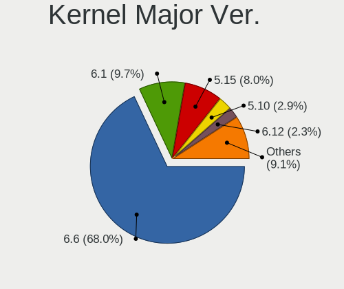
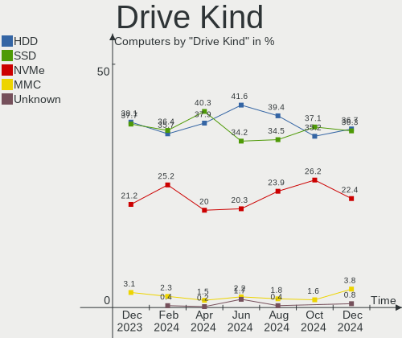
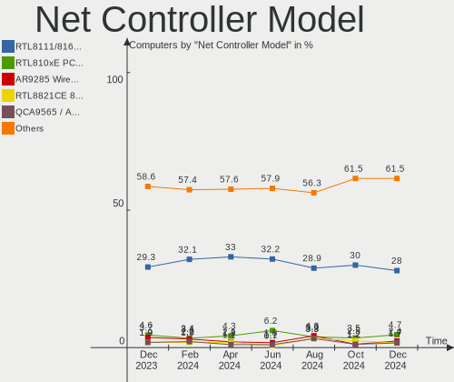
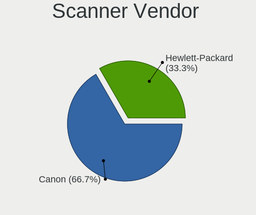
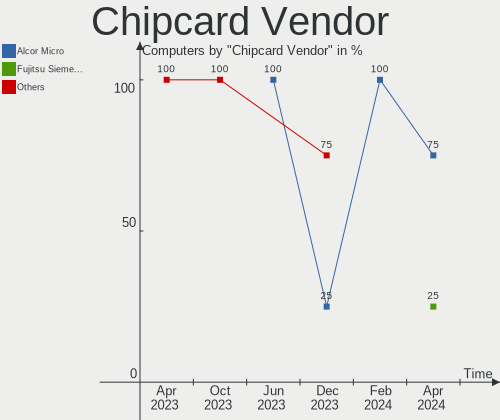

ROSA Hardware Trends
--------------------

A project to identify most popular hardware characteristics and track their change
over time based on data collected by ROSA users at https://Linux-Hardware.org.

Anyone can contribute to this report by the [hw-probe](https://github.com/linuxhw/hw-probe) tool:

    sudo -E hw-probe -all -upload

This is a report for all computer types. See also reports for [desktops](/Dist/ROSA/Desktop/README.md) and [notebooks](/Dist/ROSA/Notebook/README.md).

Full-feature report is available here: https://linux-hardware.org/?view=trends

Period: Mar, 2022.

Contents
--------

* [ System ](#system)
  - [ OS                       ](#os)
  - [ OS Family                ](#os-family)
  - [ Kernel                   ](#kernel)
  - [ Kernel Family            ](#kernel-family)
  - [ Kernel Major Ver.        ](#kernel-major-ver)
  - [ Arch                     ](#arch)
  - [ DE                       ](#de)
  - [ Display Server           ](#display-server)
  - [ Display Manager          ](#display-manager)
  - [ OS Lang                  ](#os-lang)
  - [ Boot Mode                ](#boot-mode)
  - [ Filesystem               ](#filesystem)
  - [ Part. scheme             ](#part-scheme)
  - [ Dual Boot with Linux/BSD ](#dual-boot-with-linuxbsd)
  - [ Dual Boot (Win)          ](#dual-boot-win)

* [ Board ](#board)
  - [ Vendor                   ](#vendor)
  - [ Model                    ](#model)
  - [ Model Family             ](#model-family)
  - [ MFG Year                 ](#mfg-year)
  - [ Form Factor              ](#form-factor)
  - [ Secure Boot              ](#secure-boot)
  - [ Coreboot                 ](#coreboot)
  - [ RAM Size                 ](#ram-size)
  - [ RAM Used                 ](#ram-used)
  - [ Total Drives             ](#total-drives)
  - [ Has CD-ROM               ](#has-cd-rom)
  - [ Has Ethernet             ](#has-ethernet)
  - [ Has WiFi                 ](#has-wifi)
  - [ Has Bluetooth            ](#has-bluetooth)

* [ Location ](#location)
  - [ Country                  ](#country)
  - [ City                     ](#city)

* [ Drives ](#drives)
  - [ Drive Vendor             ](#drive-vendor)
  - [ Drive Model              ](#drive-model)
  - [ HDD Vendor               ](#hdd-vendor)
  - [ SSD Vendor               ](#ssd-vendor)
  - [ Drive Kind               ](#drive-kind)
  - [ Drive Connector          ](#drive-connector)
  - [ Drive Size               ](#drive-size)
  - [ Space Total              ](#space-total)
  - [ Space Used               ](#space-used)
  - [ Malfunc. Drives          ](#malfunc-drives)
  - [ Malfunc. Drive Vendor    ](#malfunc-drive-vendor)
  - [ Malfunc. HDD Vendor      ](#malfunc-hdd-vendor)
  - [ Malfunc. Drive Kind      ](#malfunc-drive-kind)
  - [ Failed Drives            ](#failed-drives)
  - [ Failed Drive Vendor      ](#failed-drive-vendor)
  - [ Drive Status             ](#drive-status)

* [ Storage controller ](#storage-controller)
  - [ Storage Vendor           ](#storage-vendor)
  - [ Storage Model            ](#storage-model)
  - [ Storage Kind             ](#storage-kind)

* [ Processor ](#processor)
  - [ CPU Vendor               ](#cpu-vendor)
  - [ CPU Model                ](#cpu-model)
  - [ CPU Model Family         ](#cpu-model-family)
  - [ CPU Cores                ](#cpu-cores)
  - [ CPU Sockets              ](#cpu-sockets)
  - [ CPU Threads              ](#cpu-threads)
  - [ CPU Op-Modes             ](#cpu-op-modes)
  - [ CPU Microcode            ](#cpu-microcode)
  - [ CPU Microarch            ](#cpu-microarch)

* [ Graphics ](#graphics)
  - [ GPU Vendor               ](#gpu-vendor)
  - [ GPU Model                ](#gpu-model)
  - [ GPU Combo                ](#gpu-combo)
  - [ GPU Driver               ](#gpu-driver)
  - [ GPU Memory               ](#gpu-memory)

* [ Monitor ](#monitor)
  - [ Monitor Vendor           ](#monitor-vendor)
  - [ Monitor Model            ](#monitor-model)
  - [ Monitor Resolution       ](#monitor-resolution)
  - [ Monitor Diagonal         ](#monitor-diagonal)
  - [ Monitor Width            ](#monitor-width)
  - [ Aspect Ratio             ](#aspect-ratio)
  - [ Monitor Area             ](#monitor-area)
  - [ Pixel Density            ](#pixel-density)
  - [ Multiple Monitors        ](#multiple-monitors)

* [ Network ](#network)
  - [ Net Controller Vendor    ](#net-controller-vendor)
  - [ Net Controller Model     ](#net-controller-model)
  - [ Wireless Vendor          ](#wireless-vendor)
  - [ Wireless Model           ](#wireless-model)
  - [ Ethernet Vendor          ](#ethernet-vendor)
  - [ Ethernet Model           ](#ethernet-model)
  - [ Net Controller Kind      ](#net-controller-kind)
  - [ Used Controller          ](#used-controller)
  - [ NICs                     ](#nics)
  - [ IPv6                     ](#ipv6)

* [ Bluetooth ](#bluetooth)
  - [ Bluetooth Vendor         ](#bluetooth-vendor)
  - [ Bluetooth Model          ](#bluetooth-model)

* [ Sound ](#sound)
  - [ Sound Vendor             ](#sound-vendor)
  - [ Sound Model              ](#sound-model)

* [ Memory ](#memory)
  - [ Memory Vendor            ](#memory-vendor)
  - [ Memory Model             ](#memory-model)
  - [ Memory Kind              ](#memory-kind)
  - [ Memory Form Factor       ](#memory-form-factor)
  - [ Memory Size              ](#memory-size)
  - [ Memory Speed             ](#memory-speed)

* [ Printers & scanners ](#printers--scanners)
  - [ Printer Vendor           ](#printer-vendor)
  - [ Printer Model            ](#printer-model)
  - [ Scanner Vendor           ](#scanner-vendor)
  - [ Scanner Model            ](#scanner-model)

* [ Camera ](#camera)
  - [ Camera Vendor            ](#camera-vendor)
  - [ Camera Model             ](#camera-model)

* [ Security ](#security)
  - [ Fingerprint Vendor       ](#fingerprint-vendor)
  - [ Fingerprint Model        ](#fingerprint-model)
  - [ Chipcard Vendor          ](#chipcard-vendor)
  - [ Chipcard Model           ](#chipcard-model)

* [ Unsupported ](#unsupported)
  - [ Unsupported Devices      ](#unsupported-devices)
  - [ Unsupported Device Types ](#unsupported-device-types)

System
------

OS
--

Installed operating systems

| Name       | Computers | Percent |
|------------|-----------|---------|
| ROSA 12.2  | 346       | 75.38%  |
| ROSA R11.1 | 59        | 12.85%  |
| ROSA 12.1  | 41        | 8.93%   |
| ROSA 12    | 8         | 1.74%   |
| ROSA R11   | 4         | 0.87%   |
| ROSA R10   | 1         | 0.22%   |

OS Family
---------

OS without a version

| Name | Computers | Percent |
|------|-----------|---------|
| ROSA | 459       | 100%    |

Kernel
------

Version of the Linux kernel

| Version                                    | Computers | Percent |
|--------------------------------------------|-----------|---------|
| 5.10.74-generic-2rosa2021.1-x86_64         | 369       | 80.39%  |
| 5.4.83-generic-2rosa-x86_64                | 16        | 3.49%   |
| 5.4.32-generic-2rosa-x86_64                | 13        | 2.83%   |
| 4.15.0-desktop-122.124.1rosa-x86_64        | 11        | 2.4%    |
| 5.10.74-generic-2rosa2021.1-i586           | 9         | 1.96%   |
| 5.10.71-generic-1rosa2021.1-x86_64         | 9         | 1.96%   |
| 5.4.32-generic-2rosa-i586                  | 6         | 1.31%   |
| 5.4.83-generic-2rosa-i586                  | 5         | 1.09%   |
| 4.15.0-desktop-45.1rosa-x86_64             | 5         | 1.09%   |
| 4.9.155-nrj-desktop-1rosa-x86_64           | 3         | 0.65%   |
| 5.15.28-generic-1rosa2021.1-x86_64         | 2         | 0.44%   |
| 4.15.0-desktop-45.1rosa-i586               | 2         | 0.44%   |
| 4.15.0-desktop-122.124.1rosa-i586          | 2         | 0.44%   |
| 5.16.18-generic-1rosa2021.1-x86_64         | 1         | 0.22%   |
| 5.16.17-generic-1rosa2021.1-x86_64         | 1         | 0.22%   |
| 5.16.16.xm1-1.klp-xanmod-rosa2021.1-x86_64 | 1         | 0.22%   |
| 5.16.11.xm1-1.klp-xanmod-rosa2021.1-x86_64 | 1         | 0.22%   |
| 5.13.0-35-generic                          | 1         | 0.22%   |
| 5.10.101-desktop-2rosa2021-x86_64          | 1         | 0.22%   |
| 4.9.60-nrj-desktop-1rosa-x86_64            | 1         | 0.22%   |

Kernel Family
-------------

Linux kernel without a distro release

| Version  | Computers | Percent |
|----------|-----------|---------|
| 5.10.74  | 378       | 82.35%  |
| 5.4.83   | 21        | 4.58%   |
| 4.15.0   | 20        | 4.36%   |
| 5.4.32   | 19        | 4.14%   |
| 5.10.71  | 9         | 1.96%   |
| 4.9.155  | 3         | 0.65%   |
| 5.15.28  | 2         | 0.44%   |
| 5.16.18  | 1         | 0.22%   |
| 5.16.17  | 1         | 0.22%   |
| 5.16.16  | 1         | 0.22%   |
| 5.16.11  | 1         | 0.22%   |
| 5.13.0   | 1         | 0.22%   |
| 5.10.101 | 1         | 0.22%   |
| 4.9.60   | 1         | 0.22%   |

Kernel Major Ver.
-----------------

Linux kernel major version

| Version | Computers | Percent |
|---------|-----------|---------|
| 5.10    | 388       | 84.53%  |
| 5.4     | 40        | 8.71%   |
| 4.15    | 20        | 4.36%   |
| 5.16    | 4         | 0.87%   |
| 4.9     | 4         | 0.87%   |
| 5.15    | 2         | 0.44%   |
| 5.13    | 1         | 0.22%   |

Arch
----

OS architecture (x86_64, i586, etc.)

| Name   | Computers | Percent |
|--------|-----------|---------|
| x86_64 | 435       | 94.77%  |
| i686   | 24        | 5.23%   |

DE
--

Desktop Environment

| Name  | Computers | Percent |
|-------|-----------|---------|
| KDE5  | 210       | 45.75%  |
| GNOME | 162       | 35.29%  |
| KDE4  | 42        | 9.15%   |
| LXQt  | 39        | 8.5%    |
| XFCE  | 4         | 0.87%   |
| MATE  | 2         | 0.44%   |

Display Server
--------------

X11 or Wayland

| Name    | Computers | Percent |
|---------|-----------|---------|
| Wayland | 337       | 73.42%  |
| X11     | 122       | 26.58%  |

Display Manager
---------------

SDDM, LightDM, etc.

| Name    | Computers | Percent |
|---------|-----------|---------|
| GDM     | 230       | 50.11%  |
| SDDM    | 175       | 38.13%  |
| KDM     | 42        | 9.15%   |
| LightDM | 12        | 2.61%   |

OS Lang
-------

Language

| Lang    | Computers | Percent |
|---------|-----------|---------|
| ru_RU   | 429       | 93.46%  |
| en_US   | 10        | 2.18%   |
| Unknown | 7         | 1.53%   |
| ru_UA   | 2         | 0.44%   |
| en_GB   | 2         | 0.44%   |
| de_DE   | 2         | 0.44%   |
| pt_BR   | 1         | 0.22%   |
| pl_PL   | 1         | 0.22%   |
| fr_FR   | 1         | 0.22%   |
| es_ES   | 1         | 0.22%   |
| cs_CZ   | 1         | 0.22%   |
| C       | 1         | 0.22%   |
| bg_BG   | 1         | 0.22%   |

Boot Mode
---------

EFI or BIOS

| Mode | Computers | Percent |
|------|-----------|---------|
| EFI  | 230       | 50.11%  |
| BIOS | 229       | 49.89%  |

Filesystem
----------

Type of filesystem

| Type    | Computers | Percent |
|---------|-----------|---------|
| Ext4    | 440       | 95.86%  |
| Btrfs   | 16        | 3.49%   |
| Aufs    | 2         | 0.44%   |
| Overlay | 1         | 0.22%   |

Part. scheme
------------

Scheme of partitioning

| Type    | Computers | Percent |
|---------|-----------|---------|
| GPT     | 297       | 64.71%  |
| MBR     | 161       | 35.08%  |
| Unknown | 1         | 0.22%   |

Dual Boot with Linux/BSD
------------------------

Hosting more than one Linux/BSD

| Dual boot | Computers | Percent |
|-----------|-----------|---------|
| No        | 338       | 73.64%  |
| Yes       | 121       | 26.36%  |

Dual Boot (Win)
---------------

Hosting Linux and Windows

| Dual boot | Computers | Percent |
|-----------|-----------|---------|
| No        | 233       | 50.76%  |
| Yes       | 226       | 49.24%  |

Board
-----

Vendor
------

Motherboard manufacturer

| Name                                  | Computers | Percent |
|---------------------------------------|-----------|---------|
| ASUSTek Computer                      | 112       | 24.4%   |
| Gigabyte Technology                   | 73        | 15.9%   |
| ASRock                                | 43        | 9.37%   |
| Lenovo                                | 41        | 8.93%   |
| Acer                                  | 36        | 7.84%   |
| Hewlett-Packard                       | 35        | 7.63%   |
| MSI                                   | 30        | 6.54%   |
| Dell                                  | 22        | 4.79%   |
| Samsung Electronics                   | 11        | 2.4%    |
| Toshiba                               | 7         | 1.53%   |
| Unknown                               | 6         | 1.31%   |
| Sony                                  | 5         | 1.09%   |
| ECS                                   | 5         | 1.09%   |
| Packard Bell                          | 4         | 0.87%   |
| Apple                                 | 4         | 0.87%   |
| Intel                                 | 3         | 0.65%   |
| Fujitsu                               | 3         | 0.65%   |
| Biostar                               | 2         | 0.44%   |
| Q87IX-06 12/05/18 Vision Corvalent V4 | 1         | 0.22%   |
| Prestigio                             | 1         | 0.22%   |
| Pegatron                              | 1         | 0.22%   |
| Notebook                              | 1         | 0.22%   |
| JW Technology                         | 1         | 0.22%   |
| Irbis                                 | 1         | 0.22%   |
| Infomash                              | 1         | 0.22%   |
| HUAWEI                                | 1         | 0.22%   |
| GTZS                                  | 1         | 0.22%   |
| Gateway                               | 1         | 0.22%   |
| Fujitsu Siemens                       | 1         | 0.22%   |
| Foxconn                               | 1         | 0.22%   |
| eMachines                             | 1         | 0.22%   |
| Clevo                                 | 1         | 0.22%   |
| AZW                                   | 1         | 0.22%   |
| AMI                                   | 1         | 0.22%   |
| AIO                                   | 1         | 0.22%   |

Model
-----

Motherboard model

| Name                                                                                     | Computers | Percent |
|------------------------------------------------------------------------------------------|-----------|---------|
| Unknown                                                                                  | 8         | 1.74%   |
| ASUS All Series                                                                          | 7         | 1.53%   |
| Gigabyte 970A-DS3P                                                                       | 4         | 0.87%   |
| HP Notebook                                                                              | 3         | 0.65%   |
| Gigabyte B450 AORUS ELITE                                                                | 3         | 0.65%   |
| ASRock H110M-DGS R3.0                                                                    | 3         | 0.65%   |
| Apple MacBookAir7,2                                                                      | 3         | 0.65%   |
| Samsung N150P/N210P/N220P                                                                | 2         | 0.44%   |
| Packard Bell EasyNote TE11HC                                                             | 2         | 0.44%   |
| MSI MS-7A38                                                                              | 2         | 0.44%   |
| MSI MS-7A36                                                                              | 2         | 0.44%   |
| MSI MS-7817                                                                              | 2         | 0.44%   |
| Lenovo IdeaPad 330-15IKB 81DC                                                            | 2         | 0.44%   |
| Lenovo IdeaPad 330-15IGM 81D1                                                            | 2         | 0.44%   |
| Lenovo G505 20240                                                                        | 2         | 0.44%   |
| HP G62                                                                                   | 2         | 0.44%   |
| Gigabyte X470 AORUS GAMING 7 WIFI                                                        | 2         | 0.44%   |
| Gigabyte H110M-S2V                                                                       | 2         | 0.44%   |
| Gigabyte B560M H                                                                         | 2         | 0.44%   |
| Gigabyte B550M S2H                                                                       | 2         | 0.44%   |
| Gigabyte B450M DS3H                                                                      | 2         | 0.44%   |
| Gigabyte AB350M-DS3H                                                                     | 2         | 0.44%   |
| Dell Inspiron 3537                                                                       | 2         | 0.44%   |
| ASUS PRIME H310M-R R2.0                                                                  | 2         | 0.44%   |
| ASUS P8Z77-V LX                                                                          | 2         | 0.44%   |
| ASUS P8H61-M LE                                                                          | 2         | 0.44%   |
| ASUS P8B75-V                                                                             | 2         | 0.44%   |
| ASUS P5K                                                                                 | 2         | 0.44%   |
| ASUS M5A78L-M LX3                                                                        | 2         | 0.44%   |
| ASUS K53U                                                                                | 2         | 0.44%   |
| ASUS K50IJ                                                                               | 2         | 0.44%   |
| ASRock N68C-S UCC                                                                        | 2         | 0.44%   |
| ASRock H55M-LE                                                                           | 2         | 0.44%   |
| ASRock G41C-GS R2.0                                                                      | 2         | 0.44%   |
| Acer Aspire XC-885                                                                       | 2         | 0.44%   |
| Acer Aspire E5-573G                                                                      | 2         | 0.44%   |
| Acer Aspire A315-42G                                                                     | 2         | 0.44%   |
| Toshiba Satellite Pro L300                                                               | 1         | 0.22%   |
| Toshiba Satellite P500                                                                   | 1         | 0.22%   |
| Toshiba Satellite L40                                                                    | 1         | 0.22%   |
| Toshiba Satellite C660                                                                   | 1         | 0.22%   |
| Toshiba Satellite C650                                                                   | 1         | 0.22%   |
| Toshiba Satellite A660                                                                   | 1         | 0.22%   |
| Toshiba Satellite A300                                                                   | 1         | 0.22%   |
| Sony VPCSA3Z9R                                                                           | 1         | 0.22%   |
| Sony VPCF13E1R                                                                           | 1         | 0.22%   |
| Sony VPCEJ3L1R                                                                           | 1         | 0.22%   |
| Sony VPCEB2M1R                                                                           | 1         | 0.22%   |
| Sony SVS1512U1RW                                                                         | 1         | 0.22%   |
| Samsung R59P/R60P/R61P                                                                   | 1         | 0.22%   |
| Samsung R528/R728                                                                        | 1         | 0.22%   |
| Samsung R519/R719                                                                        | 1         | 0.22%   |
| Samsung R425D/R525D                                                                      | 1         | 0.22%   |
| Samsung 530U4E/540U4E                                                                    | 1         | 0.22%   |
| Samsung 530U3BI/530U4BI/530U4BH                                                          | 1         | 0.22%   |
| Samsung 350V5C/350V5X/350V4C/350V4X/351V5C/351V5X/351V4C/351V4X/3540VC/3540VX/3440VC/344 | 1         | 0.22%   |
| Samsung 300V3A/300V4A/300V5A/200A4B/200A5B                                               | 1         | 0.22%   |
| Samsung 300E4C/300E5C/300E7C                                                             | 1         | 0.22%   |
| Prestigio PSB133S01ZFH                                                                   | 1         | 0.22%   |
| Pegatron A15                                                                             | 1         | 0.22%   |

Model Family
------------

Motherboard model prefix

| Name                  | Computers | Percent |
|-----------------------|-----------|---------|
| Acer Aspire           | 23        | 5.01%   |
| ASUS PRIME            | 16        | 3.49%   |
| Lenovo IdeaPad        | 13        | 2.83%   |
| Dell Inspiron         | 8         | 1.74%   |
| Unknown               | 8         | 1.74%   |
| Toshiba Satellite     | 7         | 1.53%   |
| HP Pavilion           | 7         | 1.53%   |
| ASUS All              | 7         | 1.53%   |
| Lenovo ThinkPad       | 6         | 1.31%   |
| HP Laptop             | 6         | 1.31%   |
| Gigabyte B450         | 5         | 1.09%   |
| Dell Latitude         | 5         | 1.09%   |
| ASUS VivoBook         | 5         | 1.09%   |
| ASUS P8H61-M          | 5         | 1.09%   |
| Packard Bell EasyNote | 4         | 0.87%   |
| Gigabyte 970A-DS3P    | 4         | 0.87%   |
| Lenovo Legion         | 3         | 0.65%   |
| HP ProBook            | 3         | 0.65%   |
| HP Notebook           | 3         | 0.65%   |
| Gigabyte X470         | 3         | 0.65%   |
| Gigabyte B560M        | 3         | 0.65%   |
| Gigabyte B550M        | 3         | 0.65%   |
| Gigabyte B450M        | 3         | 0.65%   |
| Dell OptiPlex         | 3         | 0.65%   |
| ASUS P8Z77-V          | 3         | 0.65%   |
| ASUS M5A78L-M         | 3         | 0.65%   |
| ASRock H110M-DGS      | 3         | 0.65%   |
| ASRock G41C-GS        | 3         | 0.65%   |
| Apple MacBookAir7     | 3         | 0.65%   |
| Acer TravelMate       | 3         | 0.65%   |
| Samsung N150P         | 2         | 0.44%   |
| MSI MS-7A38           | 2         | 0.44%   |
| MSI MS-7A36           | 2         | 0.44%   |
| MSI MS-7817           | 2         | 0.44%   |
| Lenovo G505           | 2         | 0.44%   |
| Lenovo B590           | 2         | 0.44%   |
| Lenovo 3000           | 2         | 0.44%   |
| HP Presario           | 2         | 0.44%   |
| HP G62                | 2         | 0.44%   |
| HP EliteBook          | 2         | 0.44%   |
| HP Compaq             | 2         | 0.44%   |
| Gigabyte Z590         | 2         | 0.44%   |
| Gigabyte H110M-S2V    | 2         | 0.44%   |
| Gigabyte AB350M-DS3H  | 2         | 0.44%   |
| Fujitsu ESPRIMO       | 2         | 0.44%   |
| Dell Precision        | 2         | 0.44%   |
| ASUS TUF              | 2         | 0.44%   |
| ASUS ROG              | 2         | 0.44%   |
| ASUS P8B75-V          | 2         | 0.44%   |
| ASUS P8B75-M          | 2         | 0.44%   |
| ASUS P5Q              | 2         | 0.44%   |
| ASUS P5K              | 2         | 0.44%   |
| ASUS P5G41T-M         | 2         | 0.44%   |
| ASUS M5A97            | 2         | 0.44%   |
| ASUS M2N-MX           | 2         | 0.44%   |
| ASUS K53U             | 2         | 0.44%   |
| ASUS K50IJ            | 2         | 0.44%   |
| ASRock N68C-S         | 2         | 0.44%   |
| ASRock H55M-LE        | 2         | 0.44%   |
| ASRock B450M          | 2         | 0.44%   |

MFG Year
--------

Motherboard manufacture year

| Year | Computers | Percent |
|------|-----------|---------|
| 2012 | 54        | 11.76%  |
| 2018 | 52        | 11.33%  |
| 2011 | 47        | 10.24%  |
| 2013 | 39        | 8.5%    |
| 2009 | 29        | 6.32%   |
| 2010 | 28        | 6.1%    |
| 2017 | 27        | 5.88%   |
| 2019 | 26        | 5.66%   |
| 2016 | 26        | 5.66%   |
| 2021 | 25        | 5.45%   |
| 2020 | 25        | 5.45%   |
| 2008 | 25        | 5.45%   |
| 2015 | 16        | 3.49%   |
| 2014 | 16        | 3.49%   |
| 2007 | 15        | 3.27%   |
| 2006 | 7         | 1.53%   |
| 2022 | 1         | 0.22%   |
| 2005 | 1         | 0.22%   |

Form Factor
-----------

Physical design of the computer

| Name        | Computers | Percent |
|-------------|-----------|---------|
| Desktop     | 252       | 54.9%   |
| Notebook    | 200       | 43.57%  |
| All in one  | 5         | 1.09%   |
| Convertible | 1         | 0.22%   |
| Mini pc     | 1         | 0.22%   |

Secure Boot
-----------

Enabled or disabled

| State    | Computers | Percent |
|----------|-----------|---------|
| Disabled | 459       | 100%    |

Coreboot
--------

Have coreboot on board

| Used | Computers | Percent |
|------|-----------|---------|
| No   | 459       | 100%    |

RAM Size
--------

Total RAM memory

| Size in GB  | Computers | Percent |
|-------------|-----------|---------|
| 3.01-4.0    | 110       | 23.97%  |
| 4.01-8.0    | 104       | 22.66%  |
| 8.01-16.0   | 94        | 20.48%  |
| 16.01-24.0  | 76        | 16.56%  |
| 1.01-2.0    | 31        | 6.75%   |
| 32.01-64.0  | 23        | 5.01%   |
| 2.01-3.0    | 14        | 3.05%   |
| 24.01-32.0  | 3         | 0.65%   |
| 64.01-256.0 | 2         | 0.44%   |
| 0.51-1.0    | 2         | 0.44%   |

RAM Used
--------

Used RAM memory

| Used GB   | Computers | Percent |
|-----------|-----------|---------|
| 1.01-2.0  | 261       | 56.86%  |
| 0.51-1.0  | 118       | 25.71%  |
| 2.01-3.0  | 53        | 11.55%  |
| 3.01-4.0  | 10        | 2.18%   |
| 4.01-8.0  | 9         | 1.96%   |
| 0.01-0.5  | 6         | 1.31%   |
| 8.01-16.0 | 2         | 0.44%   |

Total Drives
------------

Number of drives on board

| Drives | Computers | Percent |
|--------|-----------|---------|
| 1      | 235       | 51.2%   |
| 2      | 116       | 25.27%  |
| 3      | 70        | 15.25%  |
| 4      | 23        | 5.01%   |
| 5      | 10        | 2.18%   |
| 6      | 2         | 0.44%   |
| 8      | 1         | 0.22%   |
| 7      | 1         | 0.22%   |
| 0      | 1         | 0.22%   |

Has CD-ROM
----------

Has CD-ROM on board

| Presented | Computers | Percent |
|-----------|-----------|---------|
| No        | 265       | 57.73%  |
| Yes       | 194       | 42.27%  |

Has Ethernet
------------

Has Ethernet on board

| Presented | Computers | Percent |
|-----------|-----------|---------|
| Yes       | 438       | 95.42%  |
| No        | 21        | 4.58%   |

Has WiFi
--------

Has WiFi module

| Presented | Computers | Percent |
|-----------|-----------|---------|
| Yes       | 273       | 59.48%  |
| No        | 186       | 40.52%  |

Has Bluetooth
-------------

Has Bluetooth module

| Presented | Computers | Percent |
|-----------|-----------|---------|
| No        | 261       | 56.86%  |
| Yes       | 198       | 43.14%  |

Location
--------

Country
-------

Geographic location (country)

| Country    | Computers | Percent |
|------------|-----------|---------|
| Russia     | 410       | 89.32%  |
| Belarus    | 9         | 1.96%   |
| Ukraine    | 8         | 1.74%   |
| Kazakhstan | 6         | 1.31%   |
| Poland     | 4         | 0.87%   |
| Germany    | 3         | 0.65%   |
| UK         | 2         | 0.44%   |
| Spain      | 2         | 0.44%   |
| Latvia     | 2         | 0.44%   |
| Czechia    | 2         | 0.44%   |
| USA        | 1         | 0.22%   |
| Sweden     | 1         | 0.22%   |
| Italy      | 1         | 0.22%   |
| Israel     | 1         | 0.22%   |
| Georgia    | 1         | 0.22%   |
| France     | 1         | 0.22%   |
| Finland    | 1         | 0.22%   |
| Egypt      | 1         | 0.22%   |
| Bulgaria   | 1         | 0.22%   |
| Brazil     | 1         | 0.22%   |
| Austria    | 1         | 0.22%   |

City
----

Geographic location (city)

| City              | Computers | Percent |
|-------------------|-----------|---------|
| Moscow            | 79        | 17.21%  |
| St Petersburg     | 33        | 7.19%   |
| Volgograd         | 13        | 2.83%   |
| Yekaterinburg     | 11        | 2.4%    |
| Rostov-on-Don     | 11        | 2.4%    |
| Novosibirsk       | 11        | 2.4%    |
| Chelyabinsk       | 8         | 1.74%   |
| Vladivostok       | 7         | 1.53%   |
| Samara            | 7         | 1.53%   |
| Perm              | 6         | 1.31%   |
| Novokuznetsk      | 6         | 1.31%   |
| Irkutsk           | 6         | 1.31%   |
| Tula              | 5         | 1.09%   |
| Saratov           | 5         | 1.09%   |
| Orenburg          | 5         | 1.09%   |
| Nizhniy Novgorod  | 5         | 1.09%   |
| Yaroslavl         | 4         | 0.87%   |
| Omsk              | 4         | 0.87%   |
| Minsk             | 4         | 0.87%   |
| Krasnodar         | 4         | 0.87%   |
| Kaliningrad       | 4         | 0.87%   |
| Bryansk           | 4         | 0.87%   |
| Yoshkar-Ola       | 3         | 0.65%   |
| Tyumen            | 3         | 0.65%   |
| Krasnoyarsk       | 3         | 0.65%   |
| Kamensk-Ural'skiy | 3         | 0.65%   |
| Belgorod          | 3         | 0.65%   |
| Astrakhan         | 3         | 0.65%   |
| Arzamas           | 3         | 0.65%   |
| Arkhangelsk       | 3         | 0.65%   |
| Zheleznogorsk     | 2         | 0.44%   |
| Voronezh          | 2         | 0.44%   |
| Vitebsk           | 2         | 0.44%   |
| Tver              | 2         | 0.44%   |
| Tsarskoye Selo    | 2         | 0.44%   |
| Trubchëvsk       | 2         | 0.44%   |
| Tolyatti          | 2         | 0.44%   |
| Tambov            | 2         | 0.44%   |
| Syktyvkar         | 2         | 0.44%   |
| Sochi             | 2         | 0.44%   |
| Shadrinsk         | 2         | 0.44%   |
| Sevastopol        | 2         | 0.44%   |
| Ryazan            | 2         | 0.44%   |
| Ramenskoye        | 2         | 0.44%   |
| Pskov             | 2         | 0.44%   |
| Pogar             | 2         | 0.44%   |
| Penza             | 2         | 0.44%   |
| Novy Urengoy      | 2         | 0.44%   |
| Nizhny Tagil      | 2         | 0.44%   |
| Lobnya            | 2         | 0.44%   |
| Lipetsk           | 2         | 0.44%   |
| Krasnogorsk       | 2         | 0.44%   |
| Kopeysk           | 2         | 0.44%   |
| Kizel             | 2         | 0.44%   |
| Kirov             | 2         | 0.44%   |
| Khabarovsk        | 2         | 0.44%   |
| Kemerovo          | 2         | 0.44%   |
| Elektrostal       | 2         | 0.44%   |
| Donetsk           | 2         | 0.44%   |
| Cheboksary        | 2         | 0.44%   |

Drives
------

Drive Vendor
------------

Hard drive vendors

| Vendor              | Computers | Drives  | Percent |
|---------------------|-----------|---------|---------|
| WDC                 | 148       | 179     | 19.84%  |
| Seagate             | 141       | 172     | 18.9%   |
| Samsung Electronics | 65        | 77      | 8.71%   |
| Toshiba             | 53        | 56      | 7.1%    |
| Kingston            | 43        | 47      | 5.76%   |
| Hitachi             | 29        | 31      | 3.89%   |
| China               | 25        | 25      | 3.35%   |
| A-DATA Technology   | 22        | 23      | 2.95%   |
| HGST                | 17        | 18      | 2.28%   |
| SPCC                | 16        | 16      | 2.14%   |
| AMD                 | 14        | 14      | 1.88%   |
| SanDisk             | 13        | 13      | 1.74%   |
| Unknown             | 10        | 10      | 1.34%   |
| SK Hynix            | 10        | 11      | 1.34%   |
| Intel               | 10        | 10      | 1.34%   |
| Crucial             | 10        | 12      | 1.34%   |
| Apacer              | 10        | 10      | 1.34%   |
| GOODRAM             | 7         | 8       | 0.94%   |
| Gigabyte Technology | 7         | 7       | 0.94%   |
| MAXTOR              | 6         | 7       | 0.8%    |
| XPG                 | 5         | 5       | 0.67%   |
| PLEXTOR             | 5         | 7       | 0.67%   |
| Netac               | 5         | 5       | 0.67%   |
| KIOXIA              | 4         | 4       | 0.54%   |
| KingSpec            | 4         | 4       | 0.54%   |
| Apple               | 4         | 4       | 0.54%   |
| Transcend           | 3         | 3       | 0.4%    |
| Smartbuy            | 3         | 3       | 0.4%    |
| KingFast            | 3         | 3       | 0.4%    |
| Hewlett-Packard     | 3         | 3       | 0.4%    |
| Corsair             | 3         | 3       | 0.4%    |
| UMIS                | 2         | 2       | 0.27%   |
| Team                | 2         | 2       | 0.27%   |
| SSSTC               | 2         | 2       | 0.27%   |
| Patriot             | 2         | 2       | 0.27%   |
| OCZ                 | 2         | 2       | 0.27%   |
| KingDian            | 2         | 2       | 0.27%   |
| JMicron             | 2         | 2       | 0.27%   |
| Fujitsu             | 2         | 2       | 0.27%   |
| FOXLINE             | 2         | 2       | 0.27%   |
| ASMedia             | 2         | 2       | 0.27%   |
| ZTE                 | 1         | 1       | 0.13%   |
| XrayDisk            | 1         | 1       | 0.13%   |
| Vaseky              | 1         | 1       | 0.13%   |
| USB3.0              | 1         | 1       | 0.13%   |
| TPH01204000GB       | 1         | 1       | 0.13%   |
| TO Exter            | 1         | 1       | 0.13%   |
| Teclast             | 1         | 1       | 0.13%   |
| T-FORCE             | 1         | 1       | 0.13%   |
| Silicon Motion      | 1         | 1       | 0.13%   |
| ShiJi               | 1         | 1       | 0.13%   |
| SETHRISE            | 1         | 1       | 0.13%   |
| PNY                 | 1         | 1       | 0.13%   |
| Phison              | 1         | 1       | 0.13%   |
| OCZ-VERTEX3         | 1         | 1       | 0.13%   |
| OCZ-VERTEX          | 1         | 1       | 0.13%   |
| Neo                 | 1         | 1       | 0.13%   |
| Mass                | 1         | Unknown | 0.13%   |
| KIOXIA-EXCERIA      | 1         | 1       | 0.13%   |
| Intenso             | 1         | 1       | 0.13%   |

Drive Model
-----------

Hard drive models

| Model                              | Computers | Percent |
|------------------------------------|-----------|---------|
| Seagate ST1000DM010-2EP102 1TB     | 13        | 1.59%   |
| WDC WDS240G2G0A-00JH30 240GB SSD   | 12        | 1.47%   |
| Samsung SSD 860 EVO 250GB          | 12        | 1.47%   |
| Kingston SA400S37240G 240GB SSD    | 11        | 1.34%   |
| WDC WDS120G2G0A-00JH30 120GB SSD   | 7         | 0.86%   |
| WDC WD10EZEX-08WN4A0 1TB           | 7         | 0.86%   |
| Toshiba HDWD110 1TB                | 7         | 0.86%   |
| Toshiba DT01ACA100 1TB             | 7         | 0.86%   |
| Seagate ST500LT012-1DG142 500GB    | 7         | 0.86%   |
| Seagate ST3500418AS 500GB          | 6         | 0.73%   |
| Kingston SA400S37120G 120GB SSD    | 6         | 0.73%   |
| AMD R5SL120G 120GB SSD             | 6         | 0.73%   |
| Toshiba DT01ACA050 500GB           | 5         | 0.61%   |
| SPCC Solid State Disk 128GB        | 5         | 0.61%   |
| Seagate ST500DM002-1BD142 500GB    | 5         | 0.61%   |
| Seagate ST1000LM024 HN-M101MBB 1TB | 5         | 0.61%   |
| Crucial CT240BX500SSD1 240GB       | 5         | 0.61%   |
| A-DATA SU650 120GB SSD             | 5         | 0.61%   |
| SPCC Solid State Disk 240GB        | 4         | 0.49%   |
| Seagate ST9320325AS 320GB          | 4         | 0.49%   |
| Seagate ST380011A 80GB             | 4         | 0.49%   |
| Seagate ST1000LM035-1RK172 1TB     | 4         | 0.49%   |
| Hitachi HDS721010CLA330 1TB        | 4         | 0.49%   |
| HGST HTS721010A9E630 1TB           | 4         | 0.49%   |
| HGST HTS545050A7E680 500GB         | 4         | 0.49%   |
| China SATA SSD 128GB               | 4         | 0.49%   |
| Apacer AS350 128GB SSD             | 4         | 0.49%   |
| XPG GAMMIX S5 256GB                | 3         | 0.37%   |
| WDC WDS500G2B0A-00SM50 500GB SSD   | 3         | 0.37%   |
| WDC WDS480G2G0A-00JH30 480GB SSD   | 3         | 0.37%   |
| WDC WDS100T2B0A-00SM50 1TB SSD     | 3         | 0.37%   |
| WDC WD5000LPCX-21VHAT0 500GB       | 3         | 0.37%   |
| WDC WD5000AAKX-001CA0 500GB        | 3         | 0.37%   |
| WDC WD10EZEX-08M2NA0 1TB           | 3         | 0.37%   |
| WDC WD10EZEX-00BN5A0 1TB           | 3         | 0.37%   |
| Unknown SD/MMC/MS PRO 32GB         | 3         | 0.37%   |
| Toshiba MQ04ABF100 1TB             | 3         | 0.37%   |
| Toshiba MQ01ABF050 500GB           | 3         | 0.37%   |
| Toshiba MQ01ABD050 500GB           | 3         | 0.37%   |
| SPCC Solid State Disk 120GB        | 3         | 0.37%   |
| Seagate ST380815AS 80GB            | 3         | 0.37%   |
| Seagate ST3250310AS 250GB          | 3         | 0.37%   |
| Seagate ST3160815AS 160GB          | 3         | 0.37%   |
| Seagate ST3160318AS 160GB          | 3         | 0.37%   |
| Seagate ST31000528AS 1TB           | 3         | 0.37%   |
| Seagate ST2000DM001-1CH164 2TB     | 3         | 0.37%   |
| Seagate Expansion 320GB            | 3         | 0.37%   |
| Samsung SSD 860 EVO 500GB          | 3         | 0.37%   |
| Samsung SSD 850 EVO 250GB          | 3         | 0.37%   |
| Samsung HD322HJ 320GB              | 3         | 0.37%   |
| KIOXIA KBG40ZNV256G 256GB          | 3         | 0.37%   |
| HGST HTS545050A7E380 500GB         | 3         | 0.37%   |
| GOODRAM SSDPR-CX400-128-G2 128GB   | 3         | 0.37%   |
| China SSD 256GB                    | 3         | 0.37%   |
| China SSD 128GB                    | 3         | 0.37%   |
| Apple SSD SM0128G 121GB            | 3         | 0.37%   |
| Apacer AS350 256GB SSD             | 3         | 0.37%   |
| AMD R5MP120G8 120GB                | 3         | 0.37%   |
| XPG GAMMIX S11 Pro 256GB           | 2         | 0.24%   |
| WDC WDS500G2B0C-00PXH0 500GB       | 2         | 0.24%   |

HDD Vendor
----------

Hard disk drive vendors

| Vendor              | Computers | Drives | Percent |
|---------------------|-----------|--------|---------|
| Seagate             | 141       | 172    | 36.72%  |
| WDC                 | 117       | 131    | 30.47%  |
| Toshiba             | 48        | 50     | 12.5%   |
| Hitachi             | 29        | 31     | 7.55%   |
| HGST                | 17        | 18     | 4.43%   |
| Samsung Electronics | 15        | 16     | 3.91%   |
| MAXTOR              | 6         | 7      | 1.56%   |
| Unknown             | 4         | 4      | 1.04%   |
| Fujitsu             | 2         | 2      | 0.52%   |
| ASMedia             | 2         | 2      | 0.52%   |
| TPH01204000GB       | 1         | 1      | 0.26%   |
| ExcelStor           | 1         | 2      | 0.26%   |
| Apple               | 1         | 1      | 0.26%   |

SSD Vendor
----------

Solid state drive vendors

| Vendor              | Computers | Drives | Percent |
|---------------------|-----------|--------|---------|
| Samsung Electronics | 36        | 40     | 12.63%  |
| Kingston            | 36        | 39     | 12.63%  |
| WDC                 | 33        | 35     | 11.58%  |
| China               | 25        | 25     | 8.77%   |
| SPCC                | 15        | 15     | 5.26%   |
| A-DATA Technology   | 15        | 15     | 5.26%   |
| SanDisk             | 11        | 11     | 3.86%   |
| Crucial             | 10        | 10     | 3.51%   |
| AMD                 | 10        | 10     | 3.51%   |
| Apacer              | 9         | 9      | 3.16%   |
| GOODRAM             | 7         | 8      | 2.46%   |
| Toshiba             | 5         | 5      | 1.75%   |
| Netac               | 5         | 5      | 1.75%   |
| Intel               | 5         | 5      | 1.75%   |
| KingSpec            | 4         | 4      | 1.4%    |
| Transcend           | 3         | 3      | 1.05%   |
| SK Hynix            | 3         | 4      | 1.05%   |
| PLEXTOR             | 3         | 3      | 1.05%   |
| KingFast            | 3         | 3      | 1.05%   |
| Hewlett-Packard     | 3         | 3      | 1.05%   |
| Gigabyte Technology | 3         | 3      | 1.05%   |
| Corsair             | 3         | 3      | 1.05%   |
| Apple               | 3         | 3      | 1.05%   |
| Team                | 2         | 2      | 0.7%    |
| Smartbuy            | 2         | 2      | 0.7%    |
| Patriot             | 2         | 2      | 0.7%    |
| OCZ                 | 2         | 2      | 0.7%    |
| KingDian            | 2         | 2      | 0.7%    |
| JMicron             | 2         | 2      | 0.7%    |
| FOXLINE             | 2         | 2      | 0.7%    |
| XrayDisk            | 1         | 1      | 0.35%   |
| Vaseky              | 1         | 1      | 0.35%   |
| USB3.0              | 1         | 1      | 0.35%   |
| TO Exter            | 1         | 1      | 0.35%   |
| Teclast             | 1         | 1      | 0.35%   |
| T-FORCE             | 1         | 1      | 0.35%   |
| SSSTC               | 1         | 1      | 0.35%   |
| ShiJi               | 1         | 1      | 0.35%   |
| PNY                 | 1         | 1      | 0.35%   |
| OCZ-VERTEX3         | 1         | 1      | 0.35%   |
| OCZ-VERTEX          | 1         | 1      | 0.35%   |
| Neo                 | 1         | 1      | 0.35%   |
| KIOXIA-EXCERIA      | 1         | 1      | 0.35%   |
| Intenso             | 1         | 1      | 0.35%   |
| Hoodisk             | 1         | 1      | 0.35%   |
| Hikvision           | 1         | 1      | 0.35%   |
| GSemi               | 1         | 1      | 0.35%   |
| GS                  | 1         | 2      | 0.35%   |
| Espada              | 1         | 1      | 0.35%   |
| AFOX                | 1         | 1      | 0.35%   |
| Unknown             | 1         | 1      | 0.35%   |

Drive Kind
----------

HDD or SSD

| Kind    | Computers | Drives | Percent |
|---------|-----------|--------|---------|
| HDD     | 326       | 437    | 50.08%  |
| SSD     | 234       | 297    | 35.94%  |
| NVMe    | 81        | 95     | 12.44%  |
| MMC     | 7         | 8      | 1.08%   |
| Unknown | 3         | 2      | 0.46%   |

Drive Connector
---------------

SATA, SAS, NVMe, etc.

| Type | Computers | Drives | Percent |
|------|-----------|--------|---------|
| SATA | 426       | 719    | 80.08%  |
| NVMe | 81        | 95     | 15.23%  |
| SAS  | 18        | 17     | 3.38%   |
| MMC  | 7         | 8      | 1.32%   |

Drive Size
----------

Size of hard drive

| Size in TB | Computers | Drives | Percent |
|------------|-----------|--------|---------|
| 0.01-0.5   | 371       | 530    | 68.7%   |
| 0.51-1.0   | 128       | 153    | 23.7%   |
| 1.01-2.0   | 30        | 38     | 5.56%   |
| 2.01-3.0   | 5         | 5      | 0.93%   |
| 3.01-4.0   | 4         | 6      | 0.74%   |
| 4.01-10.0  | 2         | 2      | 0.37%   |

Space Total
-----------

Amount of disk space available on the file system

| Size in GB     | Computers | Percent |
|----------------|-----------|---------|
| 101-250        | 159       | 34.64%  |
| 251-500        | 90        | 19.61%  |
| 1-20           | 56        | 12.2%   |
| 51-100         | 47        | 10.24%  |
| 501-1000       | 46        | 10.02%  |
| 1001-2000      | 31        | 6.75%   |
| 21-50          | 16        | 3.49%   |
| More than 3000 | 6         | 1.31%   |
| 2001-3000      | 5         | 1.09%   |
| Unknown        | 3         | 0.65%   |

Space Used
----------

Amount of used disk space

| Used GB        | Computers | Percent |
|----------------|-----------|---------|
| 1-20           | 320       | 69.72%  |
| 21-50          | 43        | 9.37%   |
| 101-250        | 25        | 5.45%   |
| 51-100         | 23        | 5.01%   |
| 251-500        | 17        | 3.7%    |
| 501-1000       | 17        | 3.7%    |
| 1001-2000      | 6         | 1.31%   |
| 2001-3000      | 4         | 0.87%   |
| Unknown        | 3         | 0.65%   |
| More than 3000 | 1         | 0.22%   |

Malfunc. Drives
---------------

Drive models with a malfunction

| Model                            | Computers | Drives | Percent |
|----------------------------------|-----------|--------|---------|
| WDC WDS240G2G0A-00JH30 240GB SSD | 5         | 5      | 2.72%   |
| Seagate ST500LT012-1DG142 500GB  | 4         | 4      | 2.17%   |
| Toshiba DT01ACA050 500GB         | 3         | 3      | 1.63%   |
| Hitachi HDS721010CLA330 1TB      | 3         | 3      | 1.63%   |
| WDC WDS480G2G0A-00JH30 480GB SSD | 2         | 2      | 1.09%   |
| WDC WD5000AAKX-60U6AA0 500GB     | 2         | 2      | 1.09%   |
| WDC WD3200AAKS-00UU3A0 320GB     | 2         | 2      | 1.09%   |
| WDC WD10EALX-009BA0 1TB          | 2         | 2      | 1.09%   |
| Toshiba MQ01ABF050 500GB         | 2         | 2      | 1.09%   |
| Toshiba MQ01ABD050 500GB         | 2         | 2      | 1.09%   |
| Seagate ST9320325AS 320GB        | 2         | 2      | 1.09%   |
| Seagate ST500LM000-SSHD-8GB      | 2         | 2      | 1.09%   |
| Seagate ST380815AS 80GB          | 2         | 2      | 1.09%   |
| Seagate ST3500418AS 500GB        | 2         | 2      | 1.09%   |
| Seagate ST3320613AS 320GB        | 2         | 2      | 1.09%   |
| Seagate ST3250310AS 250GB        | 2         | 2      | 1.09%   |
| Seagate ST320LT020-9YG142 320GB  | 2         | 2      | 1.09%   |
| Seagate ST3160815AS 160GB        | 2         | 2      | 1.09%   |
| Seagate ST3160318AS 160GB        | 2         | 2      | 1.09%   |
| Seagate ST3120811AS 120GB        | 2         | 2      | 1.09%   |
| Seagate ST31000528AS 1TB         | 2         | 2      | 1.09%   |
| Hitachi HTS543232A7A384 320GB    | 2         | 2      | 1.09%   |
| Hitachi HTS542525K9SA00 250GB    | 2         | 2      | 1.09%   |
| HGST HTS545050A7E680 500GB       | 2         | 2      | 1.09%   |
| WDC WDS480G2G0B-00EPW0 480GB SSD | 1         | 1      | 0.54%   |
| WDC WD6402AAEX-00Y9A0 640GB      | 1         | 1      | 0.54%   |
| WDC WD6400BEVT-24A0RT0 640GB     | 1         | 1      | 0.54%   |
| WDC WD5001AALS-00E3A0 500GB      | 1         | 1      | 0.54%   |
| WDC WD5000AZLX-60K2TA0 500GB     | 1         | 1      | 0.54%   |
| WDC WD5000AAKX-08U6AA0 500GB     | 1         | 1      | 0.54%   |
| WDC WD5000AAKX-083CA1 500GB      | 1         | 1      | 0.54%   |
| WDC WD5000AAKS-00D2B0 500GB      | 1         | 1      | 0.54%   |
| WDC WD5000AAKS-00A7B2 500GB      | 1         | 1      | 0.54%   |
| WDC WD5000AACS-00ZUB0 500GB      | 1         | 1      | 0.54%   |
| WDC WD3200BPVT-60JJ5T0 320GB     | 1         | 1      | 0.54%   |
| WDC WD3200BPVT-24ZEST0 320GB     | 1         | 1      | 0.54%   |
| WDC WD3200BPVT-22ZEST0 320GB     | 1         | 1      | 0.54%   |
| WDC WD3200BEKT-60V5T1 320GB      | 1         | 1      | 0.54%   |
| WDC WD3200AAKX-001CA0 320GB      | 1         | 1      | 0.54%   |
| WDC WD3200AAKS-00L6A0 320GB      | 1         | 1      | 0.54%   |
| WDC WD3200AAJS-65VWA0 320GB      | 1         | 1      | 0.54%   |
| WDC WD3200AAJS-65B4A0 320GB      | 1         | 1      | 0.54%   |
| WDC WD3200AAJS-22L7A0 320GB      | 1         | 1      | 0.54%   |
| WDC WD3200AAJS-07M0A0 320GB      | 1         | 1      | 0.54%   |
| WDC WD3200AAJS-00L7A0 320GB      | 1         | 1      | 0.54%   |
| WDC WD2500BEKT-60A25T1 250GB     | 1         | 1      | 0.54%   |
| WDC WD2500AAKX-001CA0 250GB      | 1         | 1      | 0.54%   |
| WDC WD20EARS-00S8B1 2TB          | 1         | 1      | 0.54%   |
| WDC WD2002FYPS-02W3B0 2TB        | 1         | 1      | 0.54%   |
| WDC WD1600BEVT-80A23T0 160GB     | 1         | 1      | 0.54%   |
| WDC WD1600AAJS-00L7A0 160GB      | 1         | 1      | 0.54%   |
| WDC WD15EARX-00ZUDB0 1TB         | 1         | 1      | 0.54%   |
| WDC WD10EZEX-00RKKA0 1TB         | 1         | 1      | 0.54%   |
| WDC WD10EARX-00N0YB0 1TB         | 1         | 1      | 0.54%   |
| WDC WD10EARS-00Z5B1 1TB          | 1         | 1      | 0.54%   |
| WDC WD10EARS-00Y5B1 1TB          | 1         | 1      | 0.54%   |
| WDC WD10EADS-00M2B0 1TB          | 1         | 1      | 0.54%   |
| WDC WD10EADS-00L5B1 1TB          | 1         | 1      | 0.54%   |
| WDC WD1003FBYZ-010FB0 1TB        | 1         | 1      | 0.54%   |
| Toshiba MQ04ABF100 1TB           | 1         | 1      | 0.54%   |

Malfunc. Drive Vendor
---------------------

Vendors of faulty drives

| Vendor              | Computers | Drives | Percent |
|---------------------|-----------|--------|---------|
| Seagate             | 61        | 66     | 34.86%  |
| WDC                 | 43        | 48     | 24.57%  |
| Hitachi             | 17        | 18     | 9.71%   |
| Toshiba             | 15        | 16     | 8.57%   |
| Samsung Electronics | 10        | 10     | 5.71%   |
| HGST                | 5         | 5      | 2.86%   |
| SanDisk             | 4         | 4      | 2.29%   |
| MAXTOR              | 3         | 3      | 1.71%   |
| Kingston            | 3         | 3      | 1.71%   |
| Intel               | 2         | 2      | 1.14%   |
| Team                | 1         | 1      | 0.57%   |
| SSSTC               | 1         | 1      | 0.57%   |
| SK Hynix            | 1         | 2      | 0.57%   |
| OCZ-VERTEX3         | 1         | 1      | 0.57%   |
| OCZ                 | 1         | 1      | 0.57%   |
| Netac               | 1         | 1      | 0.57%   |
| KingSpec            | 1         | 1      | 0.57%   |
| ExcelStor           | 1         | 2      | 0.57%   |
| Espada              | 1         | 1      | 0.57%   |
| China               | 1         | 1      | 0.57%   |
| AMD                 | 1         | 1      | 0.57%   |
| A-DATA Technology   | 1         | 1      | 0.57%   |

Malfunc. HDD Vendor
-------------------

Vendors of faulty HDD drives

| Vendor              | Computers | Drives | Percent |
|---------------------|-----------|--------|---------|
| Seagate             | 61        | 66     | 40.94%  |
| WDC                 | 37        | 40     | 24.83%  |
| Hitachi             | 17        | 18     | 11.41%  |
| Toshiba             | 15        | 16     | 10.07%  |
| Samsung Electronics | 10        | 10     | 6.71%   |
| HGST                | 5         | 5      | 3.36%   |
| MAXTOR              | 3         | 3      | 2.01%   |
| ExcelStor           | 1         | 2      | 0.67%   |

Malfunc. Drive Kind
-------------------

Kinds of faulty drives

| Kind | Computers | Drives | Percent |
|------|-----------|--------|---------|
| HDD  | 137       | 160    | 83.54%  |
| SSD  | 27        | 29     | 16.46%  |

Failed Drives
-------------

Failed drive models

| Model                           | Computers | Drives | Percent |
|---------------------------------|-----------|--------|---------|
| WDC WD1600BEVT-22ZCT0 160GB     | 1         | 1      | 25%     |
| Seagate ST31000528AS 1TB        | 1         | 1      | 25%     |
| Seagate ST250DM000-1BD141 250GB | 1         | 1      | 25%     |
| Seagate ST2000DM001-1CH164 2TB  | 1         | 1      | 25%     |

Failed Drive Vendor
-------------------

Failed drive vendors

| Vendor  | Computers | Drives | Percent |
|---------|-----------|--------|---------|
| Seagate | 3         | 3      | 75%     |
| WDC     | 1         | 1      | 25%     |

Drive Status
------------

Number of failed and malfunc. drives

| Status   | Computers | Drives | Percent |
|----------|-----------|--------|---------|
| Works    | 375       | 627    | 67.57%  |
| Malfunc  | 157       | 189    | 28.29%  |
| Detected | 19        | 19     | 3.42%   |
| Failed   | 4         | 4      | 0.72%   |

Storage controller
------------------

Storage Vendor
--------------

Storage controller vendors

| Vendor                           | Computers | Percent |
|----------------------------------|-----------|---------|
| Intel                            | 321       | 56.81%  |
| AMD                              | 114       | 20.18%  |
| Samsung Electronics              | 23        | 4.07%   |
| Nvidia                           | 14        | 2.48%   |
| Sandisk                          | 12        | 2.12%   |
| ADATA Technology                 | 9         | 1.59%   |
| Phison Electronics               | 8         | 1.42%   |
| Kingston Technology Company      | 8         | 1.42%   |
| Silicon Motion                   | 7         | 1.24%   |
| SK Hynix                         | 6         | 1.06%   |
| JMicron Technology               | 6         | 1.06%   |
| ASMedia Technology               | 6         | 1.06%   |
| Marvell Technology Group         | 5         | 0.88%   |
| KIOXIA                           | 4         | 0.71%   |
| VIA Technologies                 | 3         | 0.53%   |
| Realtek Semiconductor            | 3         | 0.53%   |
| Lite-On Technology               | 3         | 0.53%   |
| Union Memory (Shenzhen)          | 2         | 0.35%   |
| Silicon Integrated Systems [SiS] | 2         | 0.35%   |
| Silicon Image                    | 2         | 0.35%   |
| Micron/Crucial Technology        | 2         | 0.35%   |
| Toshiba America Info Systems     | 1         | 0.18%   |
| Solid State Storage Technology   | 1         | 0.18%   |
| Shenzhen Longsys Electronics     | 1         | 0.18%   |
| Micron Technology                | 1         | 0.18%   |
| Integrated Technology Express    | 1         | 0.18%   |

Storage Model
-------------

Storage controller models

| Model                                                                                   | Computers | Percent |
|-----------------------------------------------------------------------------------------|-----------|---------|
| AMD FCH SATA Controller [AHCI mode]                                                     | 62        | 8.76%   |
| Intel 7 Series Chipset Family 6-port SATA Controller [AHCI mode]                        | 31        | 4.38%   |
| AMD SB7x0/SB8x0/SB9x0 IDE Controller                                                    | 26        | 3.67%   |
| Intel NM10/ICH7 Family SATA Controller [IDE mode]                                       | 24        | 3.39%   |
| AMD 400 Series Chipset SATA Controller                                                  | 21        | 2.97%   |
| Intel Sunrise Point-LP SATA Controller [AHCI mode]                                      | 19        | 2.68%   |
| AMD SB7x0/SB8x0/SB9x0 SATA Controller [AHCI mode]                                       | 19        | 2.68%   |
| Intel 82801G (ICH7 Family) IDE Controller                                               | 18        | 2.54%   |
| Intel 6 Series/C200 Series Chipset Family Desktop SATA Controller (IDE mode, ports 4-5) | 17        | 2.4%    |
| Intel 6 Series/C200 Series Chipset Family Desktop SATA Controller (IDE mode, ports 0-3) | 17        | 2.4%    |
| AMD SB7x0/SB8x0/SB9x0 SATA Controller [IDE mode]                                        | 17        | 2.4%    |
| Intel Q170/Q150/B150/H170/H110/Z170/CM236 Chipset SATA Controller [AHCI Mode]           | 15        | 2.12%   |
| Intel 6 Series/C200 Series Chipset Family 6 port Mobile SATA AHCI Controller            | 14        | 1.98%   |
| Intel 200 Series PCH SATA controller [AHCI mode]                                        | 14        | 1.98%   |
| Intel 8 Series/C220 Series Chipset Family 6-port SATA Controller 1 [AHCI mode]          | 13        | 1.84%   |
| Samsung NVMe SSD Controller SM981/PM981/PM983                                           | 12        | 1.69%   |
| Intel 6 Series/C200 Series Chipset Family 6 port Desktop SATA AHCI Controller           | 12        | 1.69%   |
| Intel 500 Series Chipset Family SATA AHCI Controller                                    | 12        | 1.69%   |
| Intel Celeron/Pentium Silver Processor SATA Controller                                  | 11        | 1.55%   |
| Nvidia MCP61 SATA Controller                                                            | 10        | 1.41%   |
| Nvidia MCP61 IDE                                                                        | 10        | 1.41%   |
| Intel 82801IBM/IEM (ICH9M/ICH9M-E) 4 port SATA Controller [AHCI mode]                   | 10        | 1.41%   |
| Intel 7 Series/C210 Series Chipset Family 6-port SATA Controller [AHCI mode]            | 10        | 1.41%   |
| Intel 82801HM/HEM (ICH8M/ICH8M-E) IDE Controller                                        | 8         | 1.13%   |
| Intel 82801 Mobile SATA Controller [RAID mode]                                          | 8         | 1.13%   |
| Silicon Motion SM2263EN/SM2263XT SSD Controller                                         | 7         | 0.99%   |
| Intel Wildcat Point-LP SATA Controller [AHCI Mode]                                      | 7         | 0.99%   |
| Intel Cannon Lake PCH SATA AHCI Controller                                              | 7         | 0.99%   |
| Intel 8 Series SATA Controller 1 [AHCI mode]                                            | 7         | 0.99%   |
| Phison PS5013 E13 NVMe Controller                                                       | 6         | 0.85%   |
| JMicron JMB363 SATA/IDE Controller                                                      | 6         | 0.85%   |
| Intel NM10/ICH7 Family SATA Controller [AHCI mode]                                      | 6         | 0.85%   |
| Intel 82801HM/HEM (ICH8M/ICH8M-E) SATA Controller [AHCI mode]                           | 6         | 0.85%   |
| ASMedia ASM1062 Serial ATA Controller                                                   | 6         | 0.85%   |
| Intel SATA Controller [RAID mode]                                                       | 5         | 0.71%   |
| Intel Celeron N3350/Pentium N4200/Atom E3900 Series SATA AHCI Controller                | 5         | 0.71%   |
| Intel Cannon Lake Mobile PCH SATA AHCI Controller                                       | 5         | 0.71%   |
| Intel 5 Series/3400 Series Chipset 6 port SATA AHCI Controller                          | 5         | 0.71%   |
| Intel 5 Series/3400 Series Chipset 4 port SATA IDE Controller                           | 5         | 0.71%   |
| Intel 5 Series/3400 Series Chipset 2 port SATA IDE Controller                           | 5         | 0.71%   |
| AMD 500 Series Chipset SATA Controller                                                  | 5         | 0.71%   |
| ADATA XPG SX8200 Pro PCIe Gen3x4 M.2 2280 Solid State Drive                             | 5         | 0.71%   |
| Sandisk WD Blue SN500 / PC SN520 NVMe SSD                                               | 4         | 0.56%   |
| Samsung NVMe SSD Controller 980                                                         | 4         | 0.56%   |
| KIOXIA Non-Volatile memory controller                                                   | 4         | 0.56%   |
| Intel Atom/Celeron/Pentium Processor x5-E8000/J3xxx/N3xxx Series SATA Controller        | 4         | 0.56%   |
| Intel Atom Processor E3800 Series SATA AHCI Controller                                  | 4         | 0.56%   |
| Intel 82801JI (ICH10 Family) 4 port SATA IDE Controller #1                              | 4         | 0.56%   |
| Intel 82801JI (ICH10 Family) 2 port SATA IDE Controller #2                              | 4         | 0.56%   |
| Intel 7 Series/C210 Series Chipset Family 4-port SATA Controller [IDE mode]             | 4         | 0.56%   |
| Intel 7 Series/C210 Series Chipset Family 2-port SATA Controller [IDE mode]             | 4         | 0.56%   |
| Intel 5 Series/3400 Series Chipset 4 port SATA AHCI Controller                          | 4         | 0.56%   |
| AMD FCH SATA Controller D                                                               | 4         | 0.56%   |
| Sandisk WD Black SN750 / PC SN730 NVMe SSD                                              | 3         | 0.42%   |
| Samsung NVMe SSD Controller SM961/PM961/SM963                                           | 3         | 0.42%   |
| Samsung Electronics SATA controller                                                     | 3         | 0.42%   |
| Kingston Company A2000 NVMe SSD                                                         | 3         | 0.42%   |
| Intel 9 Series Chipset Family SATA Controller [AHCI Mode]                               | 3         | 0.42%   |
| Intel 82801I (ICH9 Family) 2 port SATA Controller [IDE mode]                            | 3         | 0.42%   |
| Intel 82801HM/HEM (ICH8M/ICH8M-E) SATA Controller [IDE mode]                            | 3         | 0.42%   |

Storage Kind
------------

Kind of storage controller (IDE, SATA, NVMe, SAS, ...)

| Kind | Computers | Percent |
|------|-----------|---------|
| SATA | 355       | 60.68%  |
| IDE  | 129       | 22.05%  |
| NVMe | 82        | 14.02%  |
| RAID | 18        | 3.08%   |
| SAS  | 1         | 0.17%   |

Processor
---------

CPU Vendor
----------

Processor vendors

| Vendor | Computers | Percent |
|--------|-----------|---------|
| Intel  | 331       | 72.11%  |
| AMD    | 128       | 27.89%  |

CPU Model
---------

Processor models

| Model                                         | Computers | Percent |
|-----------------------------------------------|-----------|---------|
| Intel Core i5-3470 CPU @ 3.20GHz              | 7         | 1.53%   |
| Intel Core i5-7200U CPU @ 2.50GHz             | 5         | 1.09%   |
| Intel Core i5-3210M CPU @ 2.50GHz             | 5         | 1.09%   |
| Intel Core i3-5005U CPU @ 2.00GHz             | 5         | 1.09%   |
| Intel Pentium Silver N5000 CPU @ 1.10GHz      | 4         | 0.87%   |
| Intel Pentium CPU G620 @ 2.60GHz              | 4         | 0.87%   |
| Intel Pentium CPU B960 @ 2.20GHz              | 4         | 0.87%   |
| Intel Core i5-2300 CPU @ 2.80GHz              | 4         | 0.87%   |
| Intel Core i3-6006U CPU @ 2.00GHz             | 4         | 0.87%   |
| Intel Core 2 Duo CPU E8400 @ 3.00GHz          | 4         | 0.87%   |
| Intel Atom CPU N450 @ 1.66GHz                 | 4         | 0.87%   |
| Intel Pentium Dual-Core CPU T4400 @ 2.20GHz   | 3         | 0.65%   |
| Intel Core i7-9750H CPU @ 2.60GHz             | 3         | 0.65%   |
| Intel Core i7-7700K CPU @ 4.20GHz             | 3         | 0.65%   |
| Intel Core i5-8250U CPU @ 1.60GHz             | 3         | 0.65%   |
| Intel Core i5-7400 CPU @ 3.00GHz              | 3         | 0.65%   |
| Intel Core i5-5350U CPU @ 1.80GHz             | 3         | 0.65%   |
| Intel Core i5-3230M CPU @ 2.60GHz             | 3         | 0.65%   |
| Intel Core i3-7020U CPU @ 2.30GHz             | 3         | 0.65%   |
| Intel Core i3-3220 CPU @ 3.30GHz              | 3         | 0.65%   |
| Intel Core i3-3110M CPU @ 2.40GHz             | 3         | 0.65%   |
| Intel Core i3-10105 CPU @ 3.70GHz             | 3         | 0.65%   |
| Intel Celeron N4020 CPU @ 1.10GHz             | 3         | 0.65%   |
| AMD Ryzen 5 5600G with Radeon Graphics        | 3         | 0.65%   |
| AMD Ryzen 5 3600 6-Core Processor             | 3         | 0.65%   |
| AMD Ryzen 5 3550H with Radeon Vega Mobile Gfx | 3         | 0.65%   |
| AMD Ryzen 5 2600 Six-Core Processor           | 3         | 0.65%   |
| AMD Ryzen 5 2400G with Radeon Vega Graphics   | 3         | 0.65%   |
| AMD FX-8300 Eight-Core Processor              | 3         | 0.65%   |
| AMD E1-6010 APU with AMD Radeon R2 Graphics   | 3         | 0.65%   |
| AMD A4-5000 APU with Radeon HD Graphics       | 3         | 0.65%   |
| Intel Xeon CPU E3-1240 V2 @ 3.40GHz           | 2         | 0.44%   |
| Intel Pentium Dual-Core CPU T4200 @ 2.00GHz   | 2         | 0.44%   |
| Intel Pentium Dual-Core CPU E5700 @ 3.00GHz   | 2         | 0.44%   |
| Intel Pentium Dual CPU T2390 @ 1.86GHz        | 2         | 0.44%   |
| Intel Pentium Dual CPU T2330 @ 1.60GHz        | 2         | 0.44%   |
| Intel Pentium CPU G4400 @ 3.30GHz             | 2         | 0.44%   |
| Intel Core i7-9700K CPU @ 3.60GHz             | 2         | 0.44%   |
| Intel Core i7-7700HQ CPU @ 2.80GHz            | 2         | 0.44%   |
| Intel Core i7-7700 CPU @ 3.60GHz              | 2         | 0.44%   |
| Intel Core i7-6700K CPU @ 4.00GHz             | 2         | 0.44%   |
| Intel Core i7-6700 CPU @ 3.40GHz              | 2         | 0.44%   |
| Intel Core i5-9400F CPU @ 2.90GHz             | 2         | 0.44%   |
| Intel Core i5-8400 CPU @ 2.80GHz              | 2         | 0.44%   |
| Intel Core i5-7500 CPU @ 3.40GHz              | 2         | 0.44%   |
| Intel Core i5-4210U CPU @ 1.70GHz             | 2         | 0.44%   |
| Intel Core i5-4200U CPU @ 1.60GHz             | 2         | 0.44%   |
| Intel Core i5-3450 CPU @ 3.10GHz              | 2         | 0.44%   |
| Intel Core i5-3337U CPU @ 1.80GHz             | 2         | 0.44%   |
| Intel Core i5-2500K CPU @ 3.30GHz             | 2         | 0.44%   |
| Intel Core i5-2450M CPU @ 2.50GHz             | 2         | 0.44%   |
| Intel Core i5-2400 CPU @ 3.10GHz              | 2         | 0.44%   |
| Intel Core i3-9100 CPU @ 3.60GHz              | 2         | 0.44%   |
| Intel Core i3-7100U CPU @ 2.40GHz             | 2         | 0.44%   |
| Intel Core i3-3217U CPU @ 1.80GHz             | 2         | 0.44%   |
| Intel Core i3-2330M CPU @ 2.20GHz             | 2         | 0.44%   |
| Intel Core i3-2120 CPU @ 3.30GHz              | 2         | 0.44%   |
| Intel Core i3-2100 CPU @ 3.10GHz              | 2         | 0.44%   |
| Intel Core i3 CPU M 350 @ 2.27GHz             | 2         | 0.44%   |
| Intel Core 2 Quad CPU Q9550 @ 2.83GHz         | 2         | 0.44%   |

CPU Model Family
----------------

Processor model prefix

| Model                   | Computers | Percent |
|-------------------------|-----------|---------|
| Intel Core i5           | 85        | 18.52%  |
| Intel Core i3           | 53        | 11.55%  |
| Intel Pentium           | 38        | 8.28%   |
| Intel Core i7           | 35        | 7.63%   |
| AMD Ryzen 5             | 35        | 7.63%   |
| Intel Celeron           | 31        | 6.75%   |
| Intel Core 2 Duo        | 22        | 4.79%   |
| AMD FX                  | 15        | 3.27%   |
| Intel Pentium Dual-Core | 12        | 2.61%   |
| Other                   | 11        | 2.4%    |
| Intel Xeon              | 10        | 2.18%   |
| Intel Atom              | 9         | 1.96%   |
| AMD Ryzen 7             | 9         | 1.96%   |
| AMD Athlon II X2        | 9         | 1.96%   |
| Intel Core 2            | 7         | 1.53%   |
| AMD Ryzen 3             | 7         | 1.53%   |
| AMD Athlon 64 X2        | 7         | 1.53%   |
| Intel Pentium Dual      | 6         | 1.31%   |
| AMD A4                  | 6         | 1.31%   |
| Intel Pentium Silver    | 5         | 1.09%   |
| Intel Core 2 Quad       | 5         | 1.09%   |
| AMD E1                  | 5         | 1.09%   |
| AMD E                   | 4         | 0.87%   |
| AMD Athlon II X4        | 3         | 0.65%   |
| AMD A8                  | 3         | 0.65%   |
| Intel Pentium Gold      | 2         | 0.44%   |
| AMD Phenom              | 2         | 0.44%   |
| AMD E2                  | 2         | 0.44%   |
| AMD Athlon X4           | 2         | 0.44%   |
| AMD Athlon II X3        | 2         | 0.44%   |
| AMD Athlon              | 2         | 0.44%   |
| Intel Pentium D         | 1         | 0.22%   |
| Intel Celeron M         | 1         | 0.22%   |
| Intel Celeron Dual-Core | 1         | 0.22%   |
| AMD Turion              | 1         | 0.22%   |
| AMD Ryzen 9             | 1         | 0.22%   |
| AMD Ryzen 5 PRO         | 1         | 0.22%   |
| AMD Ryzen 3 PRO         | 1         | 0.22%   |
| AMD Phenom II X6        | 1         | 0.22%   |
| AMD Phenom II           | 1         | 0.22%   |
| AMD C-60                | 1         | 0.22%   |
| AMD Athlon Neo          | 1         | 0.22%   |
| AMD Athlon II           | 1         | 0.22%   |
| AMD Athlon 64           | 1         | 0.22%   |
| AMD A6                  | 1         | 0.22%   |
| AMD A10                 | 1         | 0.22%   |

CPU Cores
---------

Number of processor cores

| Number  | Computers | Percent |
|---------|-----------|---------|
| 2       | 239       | 52.07%  |
| 4       | 136       | 29.63%  |
| 6       | 45        | 9.8%    |
| 1       | 16        | 3.49%   |
| 8       | 14        | 3.05%   |
| 3       | 5         | 1.09%   |
| 12      | 2         | 0.44%   |
| 16      | 1         | 0.22%   |
| Unknown | 1         | 0.22%   |

CPU Sockets
-----------

Number of sockets

| Number | Computers | Percent |
|--------|-----------|---------|
| 1      | 458       | 99.78%  |
| 2      | 1         | 0.22%   |

CPU Threads
-----------

Threads per core (Hyper-Threading)

| Number  | Computers | Percent |
|---------|-----------|---------|
| 1       | 232       | 50.54%  |
| 2       | 226       | 49.24%  |
| Unknown | 1         | 0.22%   |

CPU Op-Modes
------------

CPU Operation Modes (32-bit, 64-bit)

| Op mode        | Computers | Percent |
|----------------|-----------|---------|
| 32-bit, 64-bit | 457       | 99.56%  |
| 32-bit         | 2         | 0.44%   |

CPU Microcode
-------------

Microcode number

| Number     | Computers | Percent |
|------------|-----------|---------|
| 0x206a7    | 49        | 10.68%  |
| 0x306a9    | 43        | 9.37%   |
| 0x1067a    | 33        | 7.19%   |
| 0x306c3    | 17        | 3.7%    |
| 0x906e9    | 16        | 3.49%   |
| 0x906ea    | 14        | 3.05%   |
| 0x06000852 | 14        | 3.05%   |
| 0x6fd      | 13        | 2.83%   |
| 0x010000c8 | 13        | 2.83%   |
| Unknown    | 13        | 2.83%   |
| 0x506e3    | 11        | 2.4%    |
| 0x306d4    | 11        | 2.4%    |
| 0xa0653    | 9         | 1.96%   |
| 0x806e9    | 9         | 1.96%   |
| 0x406e3    | 8         | 1.74%   |
| 0x0800820d | 8         | 1.74%   |
| 0x40651    | 7         | 1.53%   |
| 0x20655    | 7         | 1.53%   |
| 0x0a50000c | 7         | 1.53%   |
| 0x08701021 | 7         | 1.53%   |
| 0x08108109 | 7         | 1.53%   |
| 0x706a8    | 6         | 1.31%   |
| 0x08600106 | 6         | 1.31%   |
| 0x0700010f | 6         | 1.31%   |
| 0x806ea    | 5         | 1.09%   |
| 0x706a1    | 5         | 1.09%   |
| 0x106ca    | 5         | 1.09%   |
| 0x08101016 | 5         | 1.09%   |
| 0x08001138 | 5         | 1.09%   |
| 0x6f2      | 4         | 0.87%   |
| 0x506c9    | 4         | 0.87%   |
| 0x30678    | 4         | 0.87%   |
| 0x106e5    | 4         | 0.87%   |
| 0x08108102 | 4         | 0.87%   |
| 0xa0671    | 3         | 0.65%   |
| 0xa0655    | 3         | 0.65%   |
| 0x906eb    | 3         | 0.65%   |
| 0x6f6      | 3         | 0.65%   |
| 0x406c4    | 3         | 0.65%   |
| 0x20652    | 3         | 0.65%   |
| 0x07030105 | 3         | 0.65%   |
| 0x06001119 | 3         | 0.65%   |
| 0x05000119 | 3         | 0.65%   |
| 0x906ec    | 2         | 0.44%   |
| 0x90672    | 2         | 0.44%   |
| 0x806c1    | 2         | 0.44%   |
| 0x6fb      | 2         | 0.44%   |
| 0x406c3    | 2         | 0.44%   |
| 0x206d7    | 2         | 0.44%   |
| 0x106c2    | 2         | 0.44%   |
| 0x10676    | 2         | 0.44%   |
| 0x06006705 | 2         | 0.44%   |
| 0x0600611a | 2         | 0.44%   |
| 0xf64      | 1         | 0.22%   |
| 0xf49      | 1         | 0.22%   |
| 0x906ed    | 1         | 0.22%   |
| 0x906c0    | 1         | 0.22%   |
| 0x806ec    | 1         | 0.22%   |
| 0x806d1    | 1         | 0.22%   |
| 0x6f7      | 1         | 0.22%   |

CPU Microarch
-------------

Microarchitecture

| Name            | Computers | Percent |
|-----------------|-----------|---------|
| SandyBridge     | 52        | 11.33%  |
| KabyLake        | 51        | 11.11%  |
| IvyBridge       | 43        | 9.37%   |
| Penryn          | 35        | 7.63%   |
| Haswell         | 24        | 5.23%   |
| Core            | 24        | 5.23%   |
| K10             | 20        | 4.36%   |
| Zen+            | 19        | 4.14%   |
| Skylake         | 19        | 4.14%   |
| Piledriver      | 18        | 3.92%   |
| Zen 2           | 15        | 3.27%   |
| Zen             | 14        | 3.05%   |
| CometLake       | 12        | 2.61%   |
| Goldmont plus   | 11        | 2.4%    |
| Broadwell       | 11        | 2.4%    |
| Westmere        | 10        | 2.18%   |
| Silvermont      | 10        | 2.18%   |
| K8 Hammer       | 9         | 1.96%   |
| Zen 3           | 8         | 1.74%   |
| Bonnell         | 8         | 1.74%   |
| Jaguar          | 6         | 1.31%   |
| Unknown         | 6         | 1.31%   |
| Goldmont        | 5         | 1.09%   |
| Bobcat          | 5         | 1.09%   |
| Puma            | 4         | 0.87%   |
| Nehalem         | 4         | 0.87%   |
| Excavator       | 4         | 0.87%   |
| TigerLake       | 2         | 0.44%   |
| Steamroller     | 2         | 0.44%   |
| NetBurst        | 2         | 0.44%   |
| Tremont         | 1         | 0.22%   |
| P6              | 1         | 0.22%   |
| K8 & K10 hybrid | 1         | 0.22%   |
| K10 Llano       | 1         | 0.22%   |
| Icelake         | 1         | 0.22%   |
| Bulldozer       | 1         | 0.22%   |

Graphics
--------

GPU Vendor
----------

Vendors of graphics cards

| Vendor           | Computers | Percent |
|------------------|-----------|---------|
| Intel            | 196       | 37.4%   |
| Nvidia           | 195       | 37.21%  |
| AMD              | 131       | 25%     |
| ATI Technologies | 2         | 0.38%   |

GPU Model
---------

Graphics card models

| Model                                                                                    | Computers | Percent |
|------------------------------------------------------------------------------------------|-----------|---------|
| Intel 2nd Generation Core Processor Family Integrated Graphics Controller                | 30        | 5.51%   |
| Intel 3rd Gen Core processor Graphics Controller                                         | 23        | 4.23%   |
| AMD Picasso/Raven 2 [Radeon Vega Series / Radeon Vega Mobile Series]                     | 11        | 2.02%   |
| Intel HD Graphics 620                                                                    | 10        | 1.84%   |
| Nvidia GP107 [GeForce GTX 1050 Ti]                                                       | 9         | 1.65%   |
| Nvidia GK208B [GeForce GT 710]                                                           | 9         | 1.65%   |
| AMD Ellesmere [Radeon RX 470/480/570/570X/580/580X/590]                                  | 8         | 1.47%   |
| Intel Mobile 4 Series Chipset Integrated Graphics Controller                             | 7         | 1.29%   |
| Intel HD Graphics 5500                                                                   | 7         | 1.29%   |
| Intel Haswell-ULT Integrated Graphics Controller                                         | 7         | 1.29%   |
| Intel GeminiLake [UHD Graphics 600]                                                      | 7         | 1.29%   |
| AMD Cezanne                                                                              | 7         | 1.29%   |
| Nvidia TU117 [GeForce GTX 1650]                                                          | 6         | 1.1%    |
| Nvidia GF117M [GeForce 610M/710M/810M/820M / GT 620M/625M/630M/720M]                     | 6         | 1.1%    |
| Intel Xeon E3-1200 v3/4th Gen Core Processor Integrated Graphics Controller              | 6         | 1.1%    |
| Intel Mobile GM965/GL960 Integrated Graphics Controller (secondary)                      | 6         | 1.1%    |
| Intel Mobile GM965/GL960 Integrated Graphics Controller (primary)                        | 6         | 1.1%    |
| AMD Renoir                                                                               | 6         | 1.1%    |
| Nvidia GT218 [GeForce 210]                                                               | 5         | 0.92%   |
| Intel HD Graphics 630                                                                    | 5         | 0.92%   |
| Intel CometLake-S GT2 [UHD Graphics 630]                                                 | 5         | 0.92%   |
| Intel CoffeeLake-S GT2 [UHD Graphics 630]                                                | 5         | 0.92%   |
| Intel CoffeeLake-H GT2 [UHD Graphics 630]                                                | 5         | 0.92%   |
| Intel Atom/Celeron/Pentium Processor x5-E8000/J3xxx/N3xxx Integrated Graphics Controller | 5         | 0.92%   |
| Intel Atom Processor Z36xxx/Z37xxx Series Graphics & Display                             | 5         | 0.92%   |
| Intel Atom Processor D4xx/D5xx/N4xx/N5xx Integrated Graphics Controller                  | 5         | 0.92%   |
| AMD Raven Ridge [Radeon Vega Series / Radeon Vega Mobile Series]                         | 5         | 0.92%   |
| AMD Baffin [Radeon RX 460/560D / Pro 450/455/460/555/555X/560/560X]                      | 5         | 0.92%   |
| Nvidia GP107 [GeForce GTX 1050]                                                          | 4         | 0.74%   |
| Nvidia GM107 [GeForce GTX 750 Ti]                                                        | 4         | 0.74%   |
| Nvidia GF116 [GeForce GTX 550 Ti]                                                        | 4         | 0.74%   |
| Nvidia G92 [GeForce GTS 250]                                                             | 4         | 0.74%   |
| Intel Xeon E3-1200 v2/3rd Gen Core processor Graphics Controller                         | 4         | 0.74%   |
| Intel Skylake GT2 [HD Graphics 520]                                                      | 4         | 0.74%   |
| Intel HD Graphics 510                                                                    | 4         | 0.74%   |
| Intel GeminiLake [UHD Graphics 605]                                                      | 4         | 0.74%   |
| Intel Core Processor Integrated Graphics Controller                                      | 4         | 0.74%   |
| Intel 4 Series Chipset Integrated Graphics Controller                                    | 4         | 0.74%   |
| Nvidia TU117M                                                                            | 3         | 0.55%   |
| Nvidia GT215 [GeForce GT 240]                                                            | 3         | 0.55%   |
| Nvidia GP107M [GeForce GTX 1050 Ti Mobile]                                               | 3         | 0.55%   |
| Nvidia GP106 [GeForce GTX 1060 6GB]                                                      | 3         | 0.55%   |
| Nvidia GP106 [GeForce GTX 1060 3GB]                                                      | 3         | 0.55%   |
| Nvidia GP104 [GeForce GTX 1070]                                                          | 3         | 0.55%   |
| Nvidia GM206 [GeForce GTX 960]                                                           | 3         | 0.55%   |
| Nvidia GM206 [GeForce GTX 950]                                                           | 3         | 0.55%   |
| Nvidia GM108M [GeForce MX110]                                                            | 3         | 0.55%   |
| Nvidia GK106 [GeForce GTX 660]                                                           | 3         | 0.55%   |
| Nvidia GF108M [GeForce GT 620M/630M/635M/640M LE]                                        | 3         | 0.55%   |
| Nvidia GF106 [GeForce GTS 450]                                                           | 3         | 0.55%   |
| Intel UHD Graphics 620                                                                   | 3         | 0.55%   |
| Intel HD Graphics 6000                                                                   | 3         | 0.55%   |
| Intel HD Graphics 500                                                                    | 3         | 0.55%   |
| Intel 82945G/GZ Integrated Graphics Controller                                           | 3         | 0.55%   |
| AMD Turks XT [Radeon HD 6670/7670]                                                       | 3         | 0.55%   |
| AMD Tahiti XT [Radeon HD 7970/8970 OEM / R9 280X]                                        | 3         | 0.55%   |
| AMD RS780L [Radeon 3000]                                                                 | 3         | 0.55%   |
| AMD Oland XT [Radeon HD 8670 / R5 340X OEM / R7 250/350/350X OEM]                        | 3         | 0.55%   |
| AMD Navi 10 [Radeon RX 5600 OEM/5600 XT / 5700/5700 XT]                                  | 3         | 0.55%   |
| AMD Mullins [Radeon R2 Graphics]                                                         | 3         | 0.55%   |

GPU Combo
---------

Combinations of graphics cards

| Name           | Computers | Percent |
|----------------|-----------|---------|
| 1 x Nvidia     | 142       | 30.94%  |
| 1 x Intel      | 136       | 29.63%  |
| 1 x AMD        | 107       | 23.31%  |
| Intel + Nvidia | 47        | 10.24%  |
| 2 x AMD        | 12        | 2.61%   |
| Intel + AMD    | 9         | 1.96%   |
| AMD + Nvidia   | 5         | 1.09%   |
| 2 x Nvidia     | 1         | 0.22%   |

GPU Driver
----------

Free vs proprietary

| Driver      | Computers | Percent |
|-------------|-----------|---------|
| Free        | 420       | 91.5%   |
| Proprietary | 29        | 6.32%   |
| Unknown     | 10        | 2.18%   |

GPU Memory
----------

Total video memory

| Size in GB | Computers | Percent |
|------------|-----------|---------|
| Unknown    | 146       | 31.81%  |
| 0.51-1.0   | 83        | 18.08%  |
| 1.01-2.0   | 78        | 16.99%  |
| 0.01-0.5   | 75        | 16.34%  |
| 3.01-4.0   | 41        | 8.93%   |
| 7.01-8.0   | 19        | 4.14%   |
| 5.01-6.0   | 11        | 2.4%    |
| 2.01-3.0   | 4         | 0.87%   |
| 8.01-16.0  | 2         | 0.44%   |

Monitor
-------

Monitor Vendor
--------------

Monitor vendors

| Vendor                  | Computers | Percent |
|-------------------------|-----------|---------|
| Samsung Electronics     | 100       | 22.17%  |
| AU Optronics            | 44        | 9.76%   |
| LG Display              | 37        | 8.2%    |
| Goldstar                | 32        | 7.1%    |
| Acer                    | 31        | 6.87%   |
| Chimei Innolux          | 26        | 5.76%   |
| AOC                     | 21        | 4.66%   |
| Philips                 | 18        | 3.99%   |
| BOE                     | 18        | 3.99%   |
| BenQ                    | 18        | 3.99%   |
| Chi Mei Optoelectronics | 16        | 3.55%   |
| Hewlett-Packard         | 11        | 2.44%   |
| Dell                    | 11        | 2.44%   |
| ViewSonic               | 7         | 1.55%   |
| LG Philips              | 6         | 1.33%   |
| Lenovo                  | 6         | 1.33%   |
| Sony                    | 4         | 0.89%   |
| PANDA                   | 4         | 0.89%   |
| NEC Computers           | 4         | 0.89%   |
| Iiyama                  | 4         | 0.89%   |
| Apple                   | 4         | 0.89%   |
| Mi                      | 3         | 0.67%   |
| CPT                     | 3         | 0.67%   |
| Ancor Communications    | 3         | 0.67%   |
| VIE                     | 2         | 0.44%   |
| InfoVision              | 2         | 0.44%   |
| Xiaomi                  | 1         | 0.22%   |
| Sunplus                 | 1         | 0.22%   |
| PPP                     | 1         | 0.22%   |
| Packard Bell            | 1         | 0.22%   |
| MSI                     | 1         | 0.22%   |
| JRY                     | 1         | 0.22%   |
| IBM                     | 1         | 0.22%   |
| HannStar                | 1         | 0.22%   |
| Haier                   | 1         | 0.22%   |
| Fujitsu Siemens         | 1         | 0.22%   |
| Envision Peripherals    | 1         | 0.22%   |
| CVT                     | 1         | 0.22%   |
| CSO                     | 1         | 0.22%   |
| CHR                     | 1         | 0.22%   |
| CHE                     | 1         | 0.22%   |
| ASUSTek Computer        | 1         | 0.22%   |

Monitor Model
-------------

Monitor models

| Model                                                                    | Computers | Percent |
|--------------------------------------------------------------------------|-----------|---------|
| Chi Mei Optoelectronics LCD Monitor CMO15A7 1366x768 344x193mm 15.5-inch | 6         | 1.32%   |
| Goldstar FULL HD GSM5B55 1920x1080 480x270mm 21.7-inch                   | 4         | 0.88%   |
| Chimei Innolux LCD Monitor CMN15DB 1366x768 344x193mm 15.5-inch          | 4         | 0.88%   |
| Chimei Innolux LCD Monitor CMN15C9 1366x768 344x193mm 15.5-inch          | 4         | 0.88%   |
| Chi Mei Optoelectronics LCD Monitor CMO1592 1366x768 344x193mm 15.5-inch | 4         | 0.88%   |
| AU Optronics LCD Monitor AUO38ED 1920x1080 344x193mm 15.5-inch           | 4         | 0.88%   |
| Samsung Electronics LCD Monitor SEC3245 1366x768 344x194mm 15.5-inch     | 3         | 0.66%   |
| Samsung Electronics C24F390 SAM0D2C 1920x1080 521x293mm 23.5-inch        | 3         | 0.66%   |
| LG Display LCD Monitor LGD02DC 1366x768 344x194mm 15.5-inch              | 3         | 0.66%   |
| BOE LCD Monitor BOE069C 1920x1080 344x193mm 15.5-inch                    | 3         | 0.66%   |
| Apple Color LCD APPA01B 1440x900 286x179mm 13.3-inch                     | 3         | 0.66%   |
| AOC Q27G2WG4 AOC2702 2560x1440 597x336mm 27.0-inch                       | 3         | 0.66%   |
| Acer AL1716A ACRAD46 1280x1024 338x270mm 17.0-inch                       | 3         | 0.66%   |
| VIE LED MONITOR VIE2302 1920x1080 473x296mm 22.0-inch                    | 2         | 0.44%   |
| Samsung Electronics SyncMaster SAM036F 1440x900 428x255mm 19.6-inch      | 2         | 0.44%   |
| Samsung Electronics SyncMaster SAM036E 1280x1024 376x301mm 19.0-inch     | 2         | 0.44%   |
| Samsung Electronics SyncMaster SAM01B7 1280x1024 338x270mm 17.0-inch     | 2         | 0.44%   |
| Samsung Electronics SyncMaster SAM0168 1280x1024 338x270mm 17.0-inch     | 2         | 0.44%   |
| Samsung Electronics SyncMaster SAM011E 1280x1024 338x270mm 17.0-inch     | 2         | 0.44%   |
| Samsung Electronics LCD Monitor SEC5541 1366x768 344x193mm 15.5-inch     | 2         | 0.44%   |
| Samsung Electronics LCD Monitor SEC5441 1366x768 256x144mm 11.6-inch     | 2         | 0.44%   |
| Samsung Electronics LCD Monitor SDC4E51 1366x768 344x194mm 15.5-inch     | 2         | 0.44%   |
| Philips PHL 273V7 PHLC156 1920x1080 598x336mm 27.0-inch                  | 2         | 0.44%   |
| Philips PHL 243V7 PHLC155 1920x1080 527x296mm 23.8-inch                  | 2         | 0.44%   |
| Mi Monitor XMI3444 3440x1440 797x334mm 34.0-inch                         | 2         | 0.44%   |
| LG Display LCD Monitor LGD0563 1920x1080 344x194mm 15.5-inch             | 2         | 0.44%   |
| LG Display LCD Monitor LGD038E 1366x768 344x194mm 15.5-inch              | 2         | 0.44%   |
| LG Display LCD Monitor LGD033A 1366x768 344x194mm 15.5-inch              | 2         | 0.44%   |
| LG Display LCD Monitor LGD02D1 1600x900 382x215mm 17.3-inch              | 2         | 0.44%   |
| Lenovo LEN L24e-20 LEN65DF 1920x1080 527x296mm 23.8-inch                 | 2         | 0.44%   |
| Goldstar W2242 GSM5677 1680x1050 490x320mm 23.0-inch                     | 2         | 0.44%   |
| Goldstar MP59G GSM5B35 1920x1080 600x340mm 27.2-inch                     | 2         | 0.44%   |
| Goldstar IPS FULLHD GSM5AB7 1920x1080 480x270mm 21.7-inch                | 2         | 0.44%   |
| Goldstar IPS FULLHD GSM5AB6 1920x1080 480x270mm 21.7-inch                | 2         | 0.44%   |
| Dell 2007FP DELA021 1600x1200 367x275mm 18.1-inch                        | 2         | 0.44%   |
| Chimei Innolux LCD Monitor CMN15D5 1920x1080 344x193mm 15.5-inch         | 2         | 0.44%   |
| BOE LCD Monitor BOE07A3 1920x1080 344x193mm 15.5-inch                    | 2         | 0.44%   |
| AU Optronics LCD Monitor AUO8174 1280x800 331x207mm 15.4-inch            | 2         | 0.44%   |
| AU Optronics LCD Monitor AUO61ED 1920x1080 344x193mm 15.5-inch           | 2         | 0.44%   |
| AU Optronics LCD Monitor AUO45EC 1366x768 344x193mm 15.5-inch            | 2         | 0.44%   |
| AU Optronics LCD Monitor AUO235C 1366x768 256x144mm 11.6-inch            | 2         | 0.44%   |
| AOC 2769M AOC2769 1920x1080 598x336mm 27.0-inch                          | 2         | 0.44%   |
| AOC 2470W AOC2470 1920x1080 521x293mm 23.5-inch                          | 2         | 0.44%   |
| AOC 2276W AOC2276 1920x1080 477x268mm 21.5-inch                          | 2         | 0.44%   |
| Acer V233H ACR0090 1920x1080 510x287mm 23.0-inch                         | 2         | 0.44%   |
| Xiaomi Mi TV XMD004A 1920x1080 708x398mm 32.0-inch                       | 1         | 0.22%   |
| ViewSonic VX2370 SERIES VSC342C 1920x1080 509x286mm 23.0-inch            | 1         | 0.22%   |
| ViewSonic VE710s VSCF518 1280x1024 338x270mm 17.0-inch                   | 1         | 0.22%   |
| ViewSonic VA2465 SERIES VSCB730 1920x1080 521x293mm 23.5-inch            | 1         | 0.22%   |
| ViewSonic VA2431 Series VSCD824 1920x1080 521x293mm 23.5-inch            | 1         | 0.22%   |
| ViewSonic VA1931 Series VSCAC25 1366x768 410x230mm 18.5-inch             | 1         | 0.22%   |
| ViewSonic VA1903a VSC8A31 1366x768 410x230mm 18.5-inch                   | 1         | 0.22%   |
| ViewSonic PJD5555LW VSC3A30 1920x1080                                    | 1         | 0.22%   |
| Sunplus Monitor TV SPVFFFF 1920x1080 376x301mm 19.0-inch                 | 1         | 0.22%   |
| Sony TV SNYEE01 1920x1080                                                | 1         | 0.22%   |
| Sony SDM-HS75P SNY2200 1280x1024 338x270mm 17.0-inch                     | 1         | 0.22%   |
| Sony Nvidia Defaul t Flat Panel SNY06FA 1600x900 360x200mm 16.2-inch     | 1         | 0.22%   |
| Sony LCD Monitor SNY05FA 1366x768 340x190mm 15.3-inch                    | 1         | 0.22%   |
| Samsung Electronics U28E590 SAM0C4E 3840x2160 608x345mm 27.5-inch        | 1         | 0.22%   |
| Samsung Electronics SyncMaster SAM0878 1920x1080 885x498mm 40.0-inch     | 1         | 0.22%   |

Monitor Resolution
------------------

Monitor screen resolution

| Resolution         | Computers | Percent |
|--------------------|-----------|---------|
| 1920x1080 (FHD)    | 181       | 40.86%  |
| 1366x768 (WXGA)    | 99        | 22.35%  |
| 1280x1024 (SXGA)   | 36        | 8.13%   |
| 1600x900 (HD+)     | 19        | 4.29%   |
| 1440x900 (WXGA+)   | 17        | 3.84%   |
| 1680x1050 (WSXGA+) | 16        | 3.61%   |
| 3840x2160 (4K)     | 15        | 3.39%   |
| 2560x1440 (QHD)    | 15        | 3.39%   |
| 1280x800 (WXGA)    | 15        | 3.39%   |
| 1920x1200 (WUXGA)  | 6         | 1.35%   |
| 1600x1200          | 5         | 1.13%   |
| 1024x600           | 4         | 0.9%    |
| 3440x1440          | 3         | 0.68%   |
| 1360x768           | 3         | 0.68%   |
| 2560x1080          | 2         | 0.45%   |
| 1024x768 (XGA)     | 2         | 0.45%   |
| 2880x1800          | 1         | 0.23%   |
| 2288x1287          | 1         | 0.23%   |
| 1680x945           | 1         | 0.23%   |
| 1280x768           | 1         | 0.23%   |
| 1152x864           | 1         | 0.23%   |

Monitor Diagonal
----------------

Diagonal size in inches

| Inches  | Computers | Percent |
|---------|-----------|---------|
| 15      | 140       | 30.91%  |
| 21      | 50        | 11.04%  |
| 23      | 40        | 8.83%   |
| 17      | 32        | 7.06%   |
| 27      | 30        | 6.62%   |
| 24      | 25        | 5.52%   |
| 19      | 25        | 5.52%   |
| 13      | 18        | 3.97%   |
| 20      | 15        | 3.31%   |
| 14      | 14        | 3.09%   |
| 18      | 11        | 2.43%   |
| 22      | 10        | 2.21%   |
| 31      | 9         | 1.99%   |
| 11      | 7         | 1.55%   |
| 34      | 6         | 1.32%   |
| 10      | 4         | 0.88%   |
| 54      | 3         | 0.66%   |
| Unknown | 3         | 0.66%   |
| 12      | 2         | 0.44%   |
| 74      | 1         | 0.22%   |
| 72      | 1         | 0.22%   |
| 65      | 1         | 0.22%   |
| 52      | 1         | 0.22%   |
| 41      | 1         | 0.22%   |
| 40      | 1         | 0.22%   |
| 26      | 1         | 0.22%   |
| 25      | 1         | 0.22%   |
| 16      | 1         | 0.22%   |

Monitor Width
-------------

Physical width

| Width in mm | Computers | Percent |
|-------------|-----------|---------|
| 301-350     | 183       | 40.94%  |
| 401-500     | 96        | 21.48%  |
| 501-600     | 91        | 20.36%  |
| 351-400     | 27        | 6.04%   |
| 201-300     | 22        | 4.92%   |
| 601-700     | 10        | 2.24%   |
| 701-800     | 6         | 1.34%   |
| 1001-1500   | 5         | 1.12%   |
| Unknown     | 3         | 0.67%   |
| 1501-2000   | 2         | 0.45%   |
| 801-900     | 1         | 0.22%   |
| 901-1000    | 1         | 0.22%   |

Aspect Ratio
------------

Proportional relationship between the width and the height

| Ratio | Computers | Percent |
|-------|-----------|---------|
| 16/9  | 325       | 74.71%  |
| 16/10 | 58        | 13.33%  |
| 5/4   | 34        | 7.82%   |
| 4/3   | 10        | 2.3%    |
| 21/9  | 5         | 1.15%   |
| 3/2   | 2         | 0.46%   |
| 6/5   | 1         | 0.23%   |

Monitor Area
------------

Area in inch²

| Area in inch² | Computers | Percent |
|----------------|-----------|---------|
| 101-110        | 137       | 30.44%  |
| 201-250        | 107       | 23.78%  |
| 151-200        | 51        | 11.33%  |
| 301-350        | 31        | 6.89%   |
| 141-150        | 31        | 6.89%   |
| 81-90          | 28        | 6.22%   |
| 351-500        | 14        | 3.11%   |
| 121-130        | 8         | 1.78%   |
| More than 1000 | 7         | 1.56%   |
| 51-60          | 7         | 1.56%   |
| 251-300        | 7         | 1.56%   |
| 71-80          | 4         | 0.89%   |
| 41-50          | 4         | 0.89%   |
| 131-140        | 3         | 0.67%   |
| 501-1000       | 3         | 0.67%   |
| Unknown        | 3         | 0.67%   |
| 61-70          | 2         | 0.44%   |
| 111-120        | 2         | 0.44%   |
| 91-100         | 1         | 0.22%   |

Pixel Density
-------------

Pixels per inch

| Density       | Computers | Percent |
|---------------|-----------|---------|
| 51-100        | 208       | 46.95%  |
| 101-120       | 140       | 31.6%   |
| 121-160       | 75        | 16.93%  |
| 1-50          | 9         | 2.03%   |
| 161-240       | 7         | 1.58%   |
| Unknown       | 3         | 0.68%   |
| More than 240 | 1         | 0.23%   |

Multiple Monitors
-----------------

Total monitors connected

| Total | Computers | Percent |
|-------|-----------|---------|
| 1     | 401       | 87.36%  |
| 2     | 31        | 6.75%   |
| 0     | 24        | 5.23%   |
| 3     | 3         | 0.65%   |

Network
-------

Net Controller Vendor
---------------------

Controller vendors

| Vendor                           | Computers | Percent |
|----------------------------------|-----------|---------|
| Realtek Semiconductor            | 327       | 48.73%  |
| Qualcomm Atheros                 | 118       | 17.59%  |
| Intel                            | 99        | 14.75%  |
| Broadcom                         | 28        | 4.17%   |
| Nvidia                           | 13        | 1.94%   |
| TP-Link                          | 12        | 1.79%   |
| Ralink                           | 12        | 1.79%   |
| Marvell Technology Group         | 12        | 1.79%   |
| Broadcom Limited                 | 10        | 1.49%   |
| Ralink Technology                | 9         | 1.34%   |
| MediaTek                         | 4         | 0.6%    |
| Xiaomi                           | 3         | 0.45%   |
| Huawei Technologies              | 3         | 0.45%   |
| VIA Technologies                 | 2         | 0.3%    |
| Silicon Integrated Systems [SiS] | 2         | 0.3%    |
| Qualcomm Atheros Communications  | 2         | 0.3%    |
| ZTE WCDMA Technologies MSM       | 1         | 0.15%   |
| Vimtron Electronics              | 1         | 0.15%   |
| T & A Mobile Phones              | 1         | 0.15%   |
| Samsung Electronics              | 1         | 0.15%   |
| OPPO Electronics                 | 1         | 0.15%   |
| NetGear                          | 1         | 0.15%   |
| Mercucys                         | 1         | 0.15%   |
| JMicron Technology               | 1         | 0.15%   |
| HTC (High Tech Computer)         | 1         | 0.15%   |
| Dell                             | 1         | 0.15%   |
| D-Link System                    | 1         | 0.15%   |
| Attansic Technology              | 1         | 0.15%   |
| ASUSTek Computer                 | 1         | 0.15%   |
| ASIX Electronics                 | 1         | 0.15%   |
| Accton Technology                | 1         | 0.15%   |

Net Controller Model
--------------------

Controller models

| Model                                                                         | Computers | Percent |
|-------------------------------------------------------------------------------|-----------|---------|
| Realtek RTL8111/8168/8411 PCI Express Gigabit Ethernet Controller             | 256       | 34.36%  |
| Realtek RTL810xE PCI Express Fast Ethernet controller                         | 38        | 5.1%    |
| Qualcomm Atheros AR9485 Wireless Network Adapter                              | 23        | 3.09%   |
| Qualcomm Atheros AR9285 Wireless Network Adapter (PCI-Express)                | 23        | 3.09%   |
| Realtek RTL8821CE 802.11ac PCIe Wireless Network Adapter                      | 13        | 1.74%   |
| Qualcomm Atheros QCA9377 802.11ac Wireless Network Adapter                    | 13        | 1.74%   |
| Intel Ethernet Connection (2) I219-V                                          | 13        | 1.74%   |
| Intel Wireless 7265                                                           | 11        | 1.48%   |
| Qualcomm Atheros QCA9565 / AR9565 Wireless Network Adapter                    | 9         | 1.21%   |
| Nvidia MCP61 Ethernet                                                         | 9         | 1.21%   |
| Qualcomm Atheros AR8151 v2.0 Gigabit Ethernet                                 | 7         | 0.94%   |
| Intel I211 Gigabit Network Connection                                         | 7         | 0.94%   |
| Intel 82579LM Gigabit Network Connection (Lewisville)                         | 7         | 0.94%   |
| Realtek RTL8723BE PCIe Wireless Network Adapter                               | 6         | 0.81%   |
| Realtek RTL8125 2.5GbE Controller                                             | 6         | 0.81%   |
| Realtek RTL-8100/8101L/8139 PCI Fast Ethernet Adapter                         | 6         | 0.81%   |
| Ralink MT7601U Wireless Adapter                                               | 6         | 0.81%   |
| Ralink RT3290 Wireless 802.11n 1T/1R PCIe                                     | 6         | 0.81%   |
| Qualcomm Atheros AR9462 Wireless Network Adapter                              | 6         | 0.81%   |
| Qualcomm Atheros AR8121/AR8113/AR8114 Gigabit or Fast Ethernet                | 6         | 0.81%   |
| Intel Dual Band Wireless-AC 3168NGW [Stone Peak]                              | 6         | 0.81%   |
| Qualcomm Atheros AR8132 Fast Ethernet                                         | 5         | 0.67%   |
| Qualcomm Atheros AR242x / AR542x Wireless Network Adapter (PCI-Express)       | 5         | 0.67%   |
| Marvell Group 88E8040 PCI-E Fast Ethernet Controller                          | 5         | 0.67%   |
| Intel Wi-Fi 6 AX200                                                           | 5         | 0.67%   |
| Intel Cannon Lake PCH CNVi WiFi                                               | 5         | 0.67%   |
| Broadcom NetLink BCM57785 Gigabit Ethernet PCIe                               | 5         | 0.67%   |
| Broadcom BCM43142 802.11b/g/n                                                 | 5         | 0.67%   |
| Broadcom BCM4313 802.11bgn Wireless Network Adapter                           | 5         | 0.67%   |
| Broadcom BCM4312 802.11b/g LP-PHY                                             | 5         | 0.67%   |
| Realtek RTL8822CE 802.11ac PCIe Wireless Network Adapter                      | 4         | 0.54%   |
| Qualcomm Atheros QCA6174 802.11ac Wireless Network Adapter                    | 4         | 0.54%   |
| Qualcomm Atheros AR8161 Gigabit Ethernet                                      | 4         | 0.54%   |
| Intel Wireless-AC 9260                                                        | 4         | 0.54%   |
| Intel PRO/Wireless 3945ABG [Golan] Network Connection                         | 4         | 0.54%   |
| Broadcom Limited BCM4360 802.11ac Wireless Network Adapter                    | 4         | 0.54%   |
| Xiaomi Mi/Redmi series (RNDIS)                                                | 3         | 0.4%    |
| TP-Link 802.11ac NIC                                                          | 3         | 0.4%    |
| Realtek RTL8188EE Wireless Network Adapter                                    | 3         | 0.4%    |
| Qualcomm Atheros QCA8171 Gigabit Ethernet                                     | 3         | 0.4%    |
| Qualcomm Atheros Attansic L1 Gigabit Ethernet                                 | 3         | 0.4%    |
| Qualcomm Atheros AR9287 Wireless Network Adapter (PCI-Express)                | 3         | 0.4%    |
| Qualcomm Atheros AR9227 Wireless Network Adapter                              | 3         | 0.4%    |
| Qualcomm Atheros AR2413/AR2414 Wireless Network Adapter [AR5005G(S) 802.11bg] | 3         | 0.4%    |
| MediaTek U FEEL                                                               | 3         | 0.4%    |
| Intel Wireless 8265 / 8275                                                    | 3         | 0.4%    |
| Intel Ethernet Controller I225-V                                              | 3         | 0.4%    |
| Intel 82579V Gigabit Network Connection                                       | 3         | 0.4%    |
| TP-Link TL-WN722N v2/v3 [Realtek RTL8188EUS]                                  | 2         | 0.27%   |
| TP-Link Archer T4U ver.3                                                      | 2         | 0.27%   |
| TP-Link Archer T3U [Realtek RTL8812BU]                                        | 2         | 0.27%   |
| Silicon Integrated Systems [SiS] 191 Gigabit Ethernet Adapter                 | 2         | 0.27%   |
| Realtek RTL8812AE 802.11ac PCIe Wireless Network Adapter                      | 2         | 0.27%   |
| Realtek RTL8723DE Wireless Network Adapter                                    | 2         | 0.27%   |
| Realtek RTL8723BU 802.11b/g/n WLAN Adapter                                    | 2         | 0.27%   |
| Realtek RTL8723AE PCIe Wireless Network Adapter                               | 2         | 0.27%   |
| Realtek RTL8192EE PCIe Wireless Network Adapter                               | 2         | 0.27%   |
| Realtek RTL8191SU 802.11n WLAN Adapter                                        | 2         | 0.27%   |
| Realtek RTL8188EUS 802.11n Wireless Network Adapter                           | 2         | 0.27%   |
| Realtek RTL8188CE 802.11b/g/n WiFi Adapter                                    | 2         | 0.27%   |

Wireless Vendor
---------------

Wireless vendors

| Vendor                          | Computers | Percent |
|---------------------------------|-----------|---------|
| Qualcomm Atheros                | 96        | 34.16%  |
| Intel                           | 64        | 22.78%  |
| Realtek Semiconductor           | 53        | 18.86%  |
| Broadcom                        | 20        | 7.12%   |
| TP-Link                         | 12        | 4.27%   |
| Ralink                          | 12        | 4.27%   |
| Ralink Technology               | 9         | 3.2%    |
| Broadcom Limited                | 7         | 2.49%   |
| Qualcomm Atheros Communications | 2         | 0.71%   |
| NetGear                         | 1         | 0.36%   |
| Mercucys                        | 1         | 0.36%   |
| MEDIATEK                        | 1         | 0.36%   |
| Dell                            | 1         | 0.36%   |
| ASUSTek Computer                | 1         | 0.36%   |
| Accton Technology               | 1         | 0.36%   |

Wireless Model
--------------

Wireless models

| Model                                                                         | Computers | Percent |
|-------------------------------------------------------------------------------|-----------|---------|
| Qualcomm Atheros AR9485 Wireless Network Adapter                              | 23        | 8.19%   |
| Qualcomm Atheros AR9285 Wireless Network Adapter (PCI-Express)                | 23        | 8.19%   |
| Realtek RTL8821CE 802.11ac PCIe Wireless Network Adapter                      | 13        | 4.63%   |
| Qualcomm Atheros QCA9377 802.11ac Wireless Network Adapter                    | 13        | 4.63%   |
| Intel Wireless 7265                                                           | 11        | 3.91%   |
| Qualcomm Atheros QCA9565 / AR9565 Wireless Network Adapter                    | 9         | 3.2%    |
| Realtek RTL8723BE PCIe Wireless Network Adapter                               | 6         | 2.14%   |
| Ralink MT7601U Wireless Adapter                                               | 6         | 2.14%   |
| Ralink RT3290 Wireless 802.11n 1T/1R PCIe                                     | 6         | 2.14%   |
| Qualcomm Atheros AR9462 Wireless Network Adapter                              | 6         | 2.14%   |
| Intel Dual Band Wireless-AC 3168NGW [Stone Peak]                              | 6         | 2.14%   |
| Qualcomm Atheros AR242x / AR542x Wireless Network Adapter (PCI-Express)       | 5         | 1.78%   |
| Intel Wi-Fi 6 AX200                                                           | 5         | 1.78%   |
| Intel Cannon Lake PCH CNVi WiFi                                               | 5         | 1.78%   |
| Broadcom BCM43142 802.11b/g/n                                                 | 5         | 1.78%   |
| Broadcom BCM4313 802.11bgn Wireless Network Adapter                           | 5         | 1.78%   |
| Broadcom BCM4312 802.11b/g LP-PHY                                             | 5         | 1.78%   |
| Realtek RTL8822CE 802.11ac PCIe Wireless Network Adapter                      | 4         | 1.42%   |
| Qualcomm Atheros QCA6174 802.11ac Wireless Network Adapter                    | 4         | 1.42%   |
| Intel Wireless-AC 9260                                                        | 4         | 1.42%   |
| Intel PRO/Wireless 3945ABG [Golan] Network Connection                         | 4         | 1.42%   |
| Broadcom Limited BCM4360 802.11ac Wireless Network Adapter                    | 4         | 1.42%   |
| TP-Link 802.11ac NIC                                                          | 3         | 1.07%   |
| Realtek RTL8188EE Wireless Network Adapter                                    | 3         | 1.07%   |
| Qualcomm Atheros AR9287 Wireless Network Adapter (PCI-Express)                | 3         | 1.07%   |
| Qualcomm Atheros AR9227 Wireless Network Adapter                              | 3         | 1.07%   |
| Qualcomm Atheros AR2413/AR2414 Wireless Network Adapter [AR5005G(S) 802.11bg] | 3         | 1.07%   |
| Intel Wireless 8265 / 8275                                                    | 3         | 1.07%   |
| TP-Link TL-WN722N v2/v3 [Realtek RTL8188EUS]                                  | 2         | 0.71%   |
| TP-Link Archer T4U ver.3                                                      | 2         | 0.71%   |
| TP-Link Archer T3U [Realtek RTL8812BU]                                        | 2         | 0.71%   |
| Realtek RTL8812AE 802.11ac PCIe Wireless Network Adapter                      | 2         | 0.71%   |
| Realtek RTL8723DE Wireless Network Adapter                                    | 2         | 0.71%   |
| Realtek RTL8723BU 802.11b/g/n WLAN Adapter                                    | 2         | 0.71%   |
| Realtek RTL8723AE PCIe Wireless Network Adapter                               | 2         | 0.71%   |
| Realtek RTL8192EE PCIe Wireless Network Adapter                               | 2         | 0.71%   |
| Realtek RTL8191SU 802.11n WLAN Adapter                                        | 2         | 0.71%   |
| Realtek RTL8188EUS 802.11n Wireless Network Adapter                           | 2         | 0.71%   |
| Realtek RTL8188CE 802.11b/g/n WiFi Adapter                                    | 2         | 0.71%   |
| Qualcomm Atheros AR9271 802.11n                                               | 2         | 0.71%   |
| Intel Wireless 8260                                                           | 2         | 0.71%   |
| Intel Wireless 3160                                                           | 2         | 0.71%   |
| Intel WiFi Link 5100                                                          | 2         | 0.71%   |
| Intel Dual Band Wireless-AC 3165 Plus Bluetooth                               | 2         | 0.71%   |
| Intel Centrino Wireless-N 2230                                                | 2         | 0.71%   |
| Intel Centrino Advanced-N 6235                                                | 2         | 0.71%   |
| Broadcom Limited BCM4313 802.11bgn Wireless Network Adapter                   | 2         | 0.71%   |
| TP-Link TL-WN823N v2/v3 [Realtek RTL8192EU]                                   | 1         | 0.36%   |
| TP-Link TL-WN821N v5/v6 [RTL8192EU]                                           | 1         | 0.36%   |
| TP-Link Archer T2U PLUS [RTL8821AU]                                           | 1         | 0.36%   |
| Realtek RTL8852AE 802.11ax PCIe Wireless Network Adapter                      | 1         | 0.36%   |
| Realtek RTL8822BE 802.11a/b/g/n/ac WiFi adapter                               | 1         | 0.36%   |
| Realtek RTL8821AE 802.11ac PCIe Wireless Network Adapter                      | 1         | 0.36%   |
| Realtek RTL8192EU 802.11b/g/n WLAN Adapter                                    | 1         | 0.36%   |
| Realtek RTL8192CU 802.11n WLAN Adapter                                        | 1         | 0.36%   |
| Realtek RTL8192CE PCIe Wireless Network Adapter                               | 1         | 0.36%   |
| Realtek RTL8191SEvB Wireless LAN Controller                                   | 1         | 0.36%   |
| Realtek RTL8188CUS 802.11n WLAN Adapter                                       | 1         | 0.36%   |
| Realtek RTL8187B Wireless Adapter                                             | 1         | 0.36%   |
| Realtek RTL8187B Wireless 802.11g 54Mbps Network Adapter                      | 1         | 0.36%   |

Ethernet Vendor
---------------

Ethernet vendors

| Vendor                           | Computers | Percent |
|----------------------------------|-----------|---------|
| Realtek Semiconductor            | 310       | 67.83%  |
| Intel                            | 50        | 10.94%  |
| Qualcomm Atheros                 | 39        | 8.53%   |
| Nvidia                           | 13        | 2.84%   |
| Marvell Technology Group         | 12        | 2.63%   |
| Broadcom                         | 11        | 2.41%   |
| Xiaomi                           | 3         | 0.66%   |
| MediaTek                         | 3         | 0.66%   |
| Broadcom Limited                 | 3         | 0.66%   |
| VIA Technologies                 | 2         | 0.44%   |
| Silicon Integrated Systems [SiS] | 2         | 0.44%   |
| Vimtron Electronics              | 1         | 0.22%   |
| T & A Mobile Phones              | 1         | 0.22%   |
| Samsung Electronics              | 1         | 0.22%   |
| OPPO Electronics                 | 1         | 0.22%   |
| JMicron Technology               | 1         | 0.22%   |
| HTC (High Tech Computer)         | 1         | 0.22%   |
| D-Link System                    | 1         | 0.22%   |
| Attansic Technology              | 1         | 0.22%   |
| ASIX Electronics                 | 1         | 0.22%   |

Ethernet Model
--------------

Ethernet models

| Model                                                                          | Computers | Percent |
|--------------------------------------------------------------------------------|-----------|---------|
| Realtek RTL8111/8168/8411 PCI Express Gigabit Ethernet Controller              | 256       | 55.65%  |
| Realtek RTL810xE PCI Express Fast Ethernet controller                          | 38        | 8.26%   |
| Intel Ethernet Connection (2) I219-V                                           | 13        | 2.83%   |
| Nvidia MCP61 Ethernet                                                          | 9         | 1.96%   |
| Qualcomm Atheros AR8151 v2.0 Gigabit Ethernet                                  | 7         | 1.52%   |
| Intel I211 Gigabit Network Connection                                          | 7         | 1.52%   |
| Intel 82579LM Gigabit Network Connection (Lewisville)                          | 7         | 1.52%   |
| Realtek RTL8125 2.5GbE Controller                                              | 6         | 1.3%    |
| Realtek RTL-8100/8101L/8139 PCI Fast Ethernet Adapter                          | 6         | 1.3%    |
| Qualcomm Atheros AR8121/AR8113/AR8114 Gigabit or Fast Ethernet                 | 6         | 1.3%    |
| Qualcomm Atheros AR8132 Fast Ethernet                                          | 5         | 1.09%   |
| Marvell Group 88E8040 PCI-E Fast Ethernet Controller                           | 5         | 1.09%   |
| Broadcom NetLink BCM57785 Gigabit Ethernet PCIe                                | 5         | 1.09%   |
| Qualcomm Atheros AR8161 Gigabit Ethernet                                       | 4         | 0.87%   |
| Xiaomi Mi/Redmi series (RNDIS)                                                 | 3         | 0.65%   |
| Qualcomm Atheros QCA8171 Gigabit Ethernet                                      | 3         | 0.65%   |
| Qualcomm Atheros Attansic L1 Gigabit Ethernet                                  | 3         | 0.65%   |
| MediaTek U FEEL                                                                | 3         | 0.65%   |
| Intel Ethernet Controller I225-V                                               | 3         | 0.65%   |
| Intel 82579V Gigabit Network Connection                                        | 3         | 0.65%   |
| Silicon Integrated Systems [SiS] 191 Gigabit Ethernet Adapter                  | 2         | 0.43%   |
| Realtek RTL8169 PCI Gigabit Ethernet Controller                                | 2         | 0.43%   |
| Realtek RTL8153 Gigabit Ethernet Adapter                                       | 2         | 0.43%   |
| Qualcomm Atheros QCA8172 Fast Ethernet                                         | 2         | 0.43%   |
| Qualcomm Atheros AR8152 v2.0 Fast Ethernet                                     | 2         | 0.43%   |
| Qualcomm Atheros AR8131 Gigabit Ethernet                                       | 2         | 0.43%   |
| Intel WiMAX Connection 2400m                                                   | 2         | 0.43%   |
| Intel Ethernet Connection (7) I219-V                                           | 2         | 0.43%   |
| Intel Ethernet Connection (3) I218-LM                                          | 2         | 0.43%   |
| Vimtron Mobile Composite Device Bus                                            | 1         | 0.22%   |
| VIA VT6105/VT6106S [Rhine-III]                                                 | 1         | 0.22%   |
| VIA VT6102/VT6103 [Rhine-II]                                                   | 1         | 0.22%   |
| T & A Mobile Phones Alcatel 3X                                                 | 1         | 0.22%   |
| Samsung Galaxy series, misc. (tethering mode)                                  | 1         | 0.22%   |
| Realtek RTL-8110SC/8169SC Gigabit Ethernet                                     | 1         | 0.22%   |
| Realtek Killer E2500 Gigabit Ethernet Controller                               | 1         | 0.22%   |
| Qualcomm Atheros Killer E2500 Gigabit Ethernet Controller                      | 1         | 0.22%   |
| Qualcomm Atheros Killer E220x Gigabit Ethernet Controller                      | 1         | 0.22%   |
| Qualcomm Atheros Attansic L2 Fast Ethernet                                     | 1         | 0.22%   |
| Qualcomm Atheros AR8162 Fast Ethernet                                          | 1         | 0.22%   |
| Qualcomm Atheros AR8152 v1.1 Fast Ethernet                                     | 1         | 0.22%   |
| OPPO RMX2001                                                                   | 1         | 0.22%   |
| Nvidia MCP79 Ethernet                                                          | 1         | 0.22%   |
| Nvidia MCP77 Ethernet                                                          | 1         | 0.22%   |
| Nvidia MCP55 Ethernet                                                          | 1         | 0.22%   |
| Nvidia MCP51 Ethernet Controller                                               | 1         | 0.22%   |
| Marvell Group Yukon Optima 88E8059 [PCIe Gigabit Ethernet Controller with AVB] | 1         | 0.22%   |
| Marvell Group 88E8071 PCI-E Gigabit Ethernet Controller                        | 1         | 0.22%   |
| Marvell Group 88E8057 PCI-E Gigabit Ethernet Controller                        | 1         | 0.22%   |
| Marvell Group 88E8056 PCI-E Gigabit Ethernet Controller                        | 1         | 0.22%   |
| Marvell Group 88E8042 PCI-E Fast Ethernet Controller                           | 1         | 0.22%   |
| Marvell Group 88E8039 PCI-E Fast Ethernet Controller                           | 1         | 0.22%   |
| Marvell Group 88E8001 Gigabit Ethernet Controller                              | 1         | 0.22%   |
| JMicron JMC250 PCI Express Gigabit Ethernet Controller                         | 1         | 0.22%   |
| Intel Ethernet Connection I217-LM                                              | 1         | 0.22%   |
| Intel Ethernet Connection (7) I219-LM                                          | 1         | 0.22%   |
| Intel Ethernet Connection (4) I219-V                                           | 1         | 0.22%   |
| Intel Ethernet Connection (3) I218-V                                           | 1         | 0.22%   |
| Intel Ethernet Connection (2) I219-LM                                          | 1         | 0.22%   |
| Intel Ethernet Connection (17) I219-V                                          | 1         | 0.22%   |

Net Controller Kind
-------------------

Ethernet, WiFi or modem

| Kind     | Computers | Percent |
|----------|-----------|---------|
| Ethernet | 438       | 61.26%  |
| WiFi     | 273       | 38.18%  |
| Modem    | 4         | 0.56%   |

Used Controller
---------------

Currently used network controller

| Kind     | Computers | Percent |
|----------|-----------|---------|
| Ethernet | 243       | 53.52%  |
| WiFi     | 211       | 46.48%  |

NICs
----

Total network controllers on board

| Total | Computers | Percent |
|-------|-----------|---------|
| 2     | 228       | 49.67%  |
| 1     | 227       | 49.46%  |
| 0     | 3         | 0.65%   |
| 3     | 1         | 0.22%   |

IPv6
----

IPv6 vs IPv4

| Used | Computers | Percent |
|------|-----------|---------|
| No   | 444       | 96.73%  |
| Yes  | 15        | 3.27%   |

Bluetooth
---------

Bluetooth Vendor
----------------

Controller vendors

| Vendor                          | Computers | Percent |
|---------------------------------|-----------|---------|
| Intel                           | 48        | 24.12%  |
| Realtek Semiconductor           | 25        | 12.56%  |
| Qualcomm Atheros Communications | 25        | 12.56%  |
| Cambridge Silicon Radio         | 23        | 11.56%  |
| IMC Networks                    | 14        | 7.04%   |
| Lite-On Technology              | 11        | 5.53%   |
| ASUSTek Computer                | 10        | 5.03%   |
| Foxconn / Hon Hai               | 9         | 4.52%   |
| Broadcom                        | 9         | 4.52%   |
| Ralink                          | 6         | 3.02%   |
| Apple                           | 6         | 3.02%   |
| Foxconn International           | 3         | 1.51%   |
| Dell                            | 3         | 1.51%   |
| Toshiba                         | 1         | 0.5%    |
| Roper                           | 1         | 0.5%    |
| Realtek                         | 1         | 0.5%    |
| Ralink Technology               | 1         | 0.5%    |
| Micro Star International        | 1         | 0.5%    |
| Integrated System Solution      | 1         | 0.5%    |
| Hewlett-Packard                 | 1         | 0.5%    |

Bluetooth Model
---------------

Controller models

| Model                                                                               | Computers | Percent |
|-------------------------------------------------------------------------------------|-----------|---------|
| Cambridge Silicon Radio Bluetooth Dongle (HCI mode)                                 | 23        | 11.56%  |
| Intel Bluetooth wireless interface                                                  | 20        | 10.05%  |
| Realtek Bluetooth Radio                                                             | 14        | 7.04%   |
| Qualcomm Atheros AR3011 Bluetooth                                                   | 7         | 3.52%   |
| Ralink RT3290 Bluetooth                                                             | 6         | 3.02%   |
| Qualcomm Atheros  Bluetooth Device                                                  | 6         | 3.02%   |
| Intel Wireless-AC 3168 Bluetooth                                                    | 6         | 3.02%   |
| IMC Networks Atheros AR3012 Bluetooth 4.0 Adapter                                   | 6         | 3.02%   |
| Realtek RTL8723B Bluetooth                                                          | 5         | 2.51%   |
| Realtek  Bluetooth 4.2 Adapter                                                      | 5         | 2.51%   |
| Qualcomm Atheros AR3012 Bluetooth 4.0                                               | 5         | 2.51%   |
| Intel Bluetooth 9460/9560 Jefferson Peak (JfP)                                      | 5         | 2.51%   |
| Intel AX200 Bluetooth                                                               | 5         | 2.51%   |
| Apple Bluetooth USB Host Controller                                                 | 5         | 2.51%   |
| Qualcomm Atheros Bluetooth USB Host Controller                                      | 4         | 2.01%   |
| Lite-On Qualcomm Atheros QCA9377 Bluetooth                                          | 4         | 2.01%   |
| Intel Bluetooth Device                                                              | 4         | 2.01%   |
| IMC Networks Bluetooth Radio                                                        | 4         | 2.01%   |
| Lite-On Bluetooth Device                                                            | 3         | 1.51%   |
| Lite-On Atheros AR3012 Bluetooth                                                    | 3         | 1.51%   |
| Intel Centrino Bluetooth Wireless Transceiver                                       | 3         | 1.51%   |
| IMC Networks Bluetooth Device                                                       | 3         | 1.51%   |
| Foxconn International BCM43142A0 Bluetooth module                                   | 3         | 1.51%   |
| Foxconn / Hon Hai Foxconn T77H114 BCM2070 [Single-Chip Bluetooth 2.1 + EDR Adapter] | 3         | 1.51%   |
| Foxconn / Hon Hai Bluetooth Device                                                  | 3         | 1.51%   |
| Broadcom BCM2070 Bluetooth Device                                                   | 3         | 1.51%   |
| ASUS Broadcom BCM20702A0 Bluetooth                                                  | 3         | 1.51%   |
| ASUS ASUS USB-BT500                                                                 | 3         | 1.51%   |
| Qualcomm Atheros AR9462 Bluetooth                                                   | 2         | 1.01%   |
| Intel Centrino Advanced-N 6230 Bluetooth adapter                                    | 2         | 1.01%   |
| Intel AX201 Bluetooth                                                               | 2         | 1.01%   |
| Dell BCM20702A0 Bluetooth Module                                                    | 2         | 1.01%   |
| ASUS Qualcomm Bluetooth 4.1                                                         | 2         | 1.01%   |
| Toshiba Integrated Bluetooth HCI                                                    | 1         | 0.5%    |
| Roper Class 1 Bluetooth Dongle                                                      | 1         | 0.5%    |
| Realtek RTL8821A Bluetooth                                                          | 1         | 0.5%    |
| Realtek Bluetooth Radio                                                             | 1         | 0.5%    |
| Ralink Motorola BC4 Bluetooth 3.0+HS Adapter                                        | 1         | 0.5%    |
| Qualcomm Atheros AR3012 Bluetooth                                                   | 1         | 0.5%    |
| Micro Star International Bluetooth EDR Device                                       | 1         | 0.5%    |
| Lite-On Bluetooth Radio                                                             | 1         | 0.5%    |
| Intel AX210 Bluetooth                                                               | 1         | 0.5%    |
| Integrated System Solution Bluetooth Device                                         | 1         | 0.5%    |
| IMC Networks Bluetooth                                                              | 1         | 0.5%    |
| HP Broadcom 2070 Bluetooth Combo                                                    | 1         | 0.5%    |
| Foxconn / Hon Hai BT                                                                | 1         | 0.5%    |
| Foxconn / Hon Hai Bluetooth USB Host Controller                                     | 1         | 0.5%    |
| Foxconn / Hon Hai BCM20702A0                                                        | 1         | 0.5%    |
| Dell Wireless 360 Bluetooth                                                         | 1         | 0.5%    |
| Broadcom Bluetooth 3.0 Dongle                                                       | 1         | 0.5%    |
| Broadcom BCM43142A0 Bluetooth 4.0                                                   | 1         | 0.5%    |
| Broadcom BCM20702A0 Bluetooth 4.0                                                   | 1         | 0.5%    |
| Broadcom BCM20702 Bluetooth 4.0 [ThinkPad]                                          | 1         | 0.5%    |
| Broadcom BCM2070 Bluetooth 2.1 + EDR                                                | 1         | 0.5%    |
| Broadcom BCM2045 Bluetooth                                                          | 1         | 0.5%    |
| ASUS BT-270 Bluetooth Adapter                                                       | 1         | 0.5%    |
| ASUS BT-183 Bluetooth 2.0+EDR adapter                                               | 1         | 0.5%    |
| Apple Bluetooth Host Controller                                                     | 1         | 0.5%    |

Sound
-----

Sound Vendor
------------

Sound card vendors

| Vendor                           | Computers | Percent |
|----------------------------------|-----------|---------|
| Intel                            | 314       | 46.94%  |
| Nvidia                           | 155       | 23.17%  |
| AMD                              | 153       | 22.87%  |
| C-Media Electronics              | 16        | 2.39%   |
| Creative Labs                    | 6         | 0.9%    |
| VIA Technologies                 | 3         | 0.45%   |
| Logitech                         | 3         | 0.45%   |
| Texas Instruments                | 2         | 0.3%    |
| Silicon Integrated Systems [SiS] | 2         | 0.3%    |
| Generalplus Technology           | 2         | 0.3%    |
| XMOS                             | 1         | 0.15%   |
| SAVITECH                         | 1         | 0.15%   |
| Samson Technologies              | 1         | 0.15%   |
| JMTek                            | 1         | 0.15%   |
| Giga-Byte Technology             | 1         | 0.15%   |
| Focusrite-Novation               | 1         | 0.15%   |
| DigiTech                         | 1         | 0.15%   |
| Dell                             | 1         | 0.15%   |
| Cypress Semiconductor            | 1         | 0.15%   |
| Creative Technology              | 1         | 0.15%   |
| ATI Technologies                 | 1         | 0.15%   |
| Asahi Kasei Microsystems         | 1         | 0.15%   |
| A4Tech                           | 1         | 0.15%   |

Sound Model
-----------

Sound card models

| Model                                                                                             | Computers | Percent |
|---------------------------------------------------------------------------------------------------|-----------|---------|
| Intel 7 Series/C216 Chipset Family High Definition Audio Controller                               | 50        | 6.47%   |
| Intel 6 Series/C200 Series Chipset Family High Definition Audio Controller                        | 43        | 5.56%   |
| AMD SBx00 Azalia (Intel HDA)                                                                      | 39        | 5.05%   |
| AMD Family 17h/19h HD Audio Controller                                                            | 34        | 4.4%    |
| Intel NM10/ICH7 Family High Definition Audio Controller                                           | 29        | 3.75%   |
| Intel Sunrise Point-LP HD Audio                                                                   | 22        | 2.85%   |
| AMD FCH Azalia Controller                                                                         | 18        | 2.33%   |
| Nvidia GP107GL High Definition Audio Controller                                                   | 16        | 2.07%   |
| Nvidia GK208 HDMI/DP Audio Controller                                                             | 15        | 1.94%   |
| Intel 82801I (ICH9 Family) HD Audio Controller                                                    | 15        | 1.94%   |
| Intel 200 Series PCH HD Audio                                                                     | 15        | 1.94%   |
| AMD Raven/Raven2/Fenghuang HDMI/DP Audio Controller                                               | 15        | 1.94%   |
| Nvidia GF108 High Definition Audio Controller                                                     | 14        | 1.81%   |
| Intel 8 Series/C220 Series Chipset High Definition Audio Controller                               | 14        | 1.81%   |
| Intel 5 Series/3400 Series Chipset High Definition Audio                                          | 14        | 1.81%   |
| AMD Family 17h (Models 00h-0fh) HD Audio Controller                                               | 13        | 1.68%   |
| Nvidia High Definition Audio Controller                                                           | 12        | 1.55%   |
| Intel 100 Series/C230 Series Chipset Family HD Audio Controller                                   | 12        | 1.55%   |
| AMD Renoir Radeon High Definition Audio Controller                                                | 12        | 1.55%   |
| Intel Wildcat Point-LP High Definition Audio Controller                                           | 11        | 1.42%   |
| Intel Celeron/Pentium Silver Processor High Definition Audio                                      | 11        | 1.42%   |
| Intel Cannon Lake PCH cAVS                                                                        | 11        | 1.42%   |
| Intel Broadwell-U Audio Controller                                                                | 11        | 1.42%   |
| AMD Kabini HDMI/DP Audio                                                                          | 11        | 1.42%   |
| Nvidia MCP61 High Definition Audio                                                                | 10        | 1.29%   |
| Intel 82801H (ICH8 Family) HD Audio Controller                                                    | 10        | 1.29%   |
| Nvidia TU107 GeForce GTX 1650 High Definition Audio Controller                                    | 9         | 1.16%   |
| Intel Audio device                                                                                | 9         | 1.16%   |
| AMD Starship/Matisse HD Audio Controller                                                          | 9         | 1.16%   |
| C-Media Electronics KLIM Mantis Audio 7.1                                                         | 8         | 1.03%   |
| AMD Ellesmere HDMI Audio [Radeon RX 470/480 / 570/580/590]                                        | 8         | 1.03%   |
| Nvidia TU116 High Definition Audio Controller                                                     | 7         | 0.91%   |
| Intel Xeon E3-1200 v3/4th Gen Core Processor HD Audio Controller                                  | 7         | 0.91%   |
| Intel Haswell-ULT HD Audio Controller                                                             | 7         | 0.91%   |
| Intel 8 Series HD Audio Controller                                                                | 7         | 0.91%   |
| AMD Oland/Hainan/Cape Verde/Pitcairn HDMI Audio [Radeon HD 7000 Series]                           | 7         | 0.91%   |
| Nvidia GP106 High Definition Audio Controller                                                     | 6         | 0.78%   |
| Nvidia GP104 High Definition Audio Controller                                                     | 6         | 0.78%   |
| Nvidia GM206 High Definition Audio Controller                                                     | 6         | 0.78%   |
| Nvidia GM107 High Definition Audio Controller [GeForce 940MX]                                     | 6         | 0.78%   |
| Nvidia GK106 HDMI Audio Controller                                                                | 6         | 0.78%   |
| AMD Baffin HDMI/DP Audio [Radeon RX 550 640SP / RX 560/560X]                                      | 6         | 0.78%   |
| Nvidia GT216 HDMI Audio Controller                                                                | 5         | 0.65%   |
| Nvidia GK107 HDMI Audio Controller                                                                | 5         | 0.65%   |
| Intel Celeron N3350/Pentium N4200/Atom E3900 Series Audio Cluster                                 | 5         | 0.65%   |
| Intel Atom/Celeron/Pentium Processor x5-E8000/J3xxx/N3xxx Series High Definition Audio Controller | 5         | 0.65%   |
| AMD Wrestler HDMI Audio                                                                           | 5         | 0.65%   |
| Nvidia GK104 HDMI Audio Controller                                                                | 4         | 0.52%   |
| Nvidia GF119 HDMI Audio Controller                                                                | 4         | 0.52%   |
| Nvidia GF116 High Definition Audio Controller                                                     | 4         | 0.52%   |
| Nvidia GF114 HDMI Audio Controller                                                                | 4         | 0.52%   |
| Intel Tiger Lake-H HD Audio Controller                                                            | 4         | 0.52%   |
| Intel Atom Processor Z36xxx/Z37xxx Series High Definition Audio Controller                        | 4         | 0.52%   |
| Intel 82801JI (ICH10 Family) HD Audio Controller                                                  | 4         | 0.52%   |
| AMD Juniper HDMI Audio [Radeon HD 5700 Series]                                                    | 4         | 0.52%   |
| Nvidia GM204 High Definition Audio Controller                                                     | 3         | 0.39%   |
| Nvidia GF106 High Definition Audio Controller                                                     | 3         | 0.39%   |
| Nvidia GF104 High Definition Audio Controller                                                     | 3         | 0.39%   |
| Intel USB PnP Sound Device                                                                        | 3         | 0.39%   |
| Intel CM238 HD Audio Controller                                                                   | 3         | 0.39%   |

Memory
------

Memory Vendor
-------------

Memory module vendors

| Vendor                       | Computers | Percent |
|------------------------------|-----------|---------|
| Unknown                      | 112       | 20.29%  |
| Kingston                     | 97        | 17.57%  |
| Samsung Electronics          | 80        | 14.49%  |
| SK Hynix                     | 60        | 10.87%  |
| Crucial                      | 32        | 5.8%    |
| Corsair                      | 27        | 4.89%   |
| Micron Technology            | 25        | 4.53%   |
| AMD                          | 17        | 3.08%   |
| A-DATA Technology            | 16        | 2.9%    |
| Patriot                      | 11        | 1.99%   |
| Ramaxel Technology           | 8         | 1.45%   |
| Elpida                       | 8         | 1.45%   |
| Nanya Technology             | 7         | 1.27%   |
| GOODRAM                      | 6         | 1.09%   |
| Transcend                    | 5         | 0.91%   |
| Unknown (ABCD)               | 4         | 0.72%   |
| G.Skill                      | 4         | 0.72%   |
| Silicon Power                | 3         | 0.54%   |
| ASint Technology             | 3         | 0.54%   |
| Unifosa                      | 2         | 0.36%   |
| Kllisre                      | 2         | 0.36%   |
| Kingmax                      | 2         | 0.36%   |
| Goldkey                      | 2         | 0.36%   |
| Apacer                       | 2         | 0.36%   |
| 48spaces                     | 2         | 0.36%   |
| Unknown                      | 2         | 0.36%   |
| Wilk                         | 1         | 0.18%   |
| Unknown (AB)                 | 1         | 0.18%   |
| Unknown (8A02)               | 1         | 0.18%   |
| TOP MEDIA                    | 1         | 0.18%   |
| SMART Brazil                 | 1         | 0.18%   |
| SHARETRONIC                  | 1         | 0.18%   |
| Ramos Technology             | 1         | 0.18%   |
| Qumo                         | 1         | 0.18%   |
| Qimonda                      | 1         | 0.18%   |
| Patriot Memory (PDP Systems) | 1         | 0.18%   |
| Neo Forza                    | 1         | 0.18%   |
| KETECH                       | 1         | 0.18%   |
| Hewlett-Packard              | 1         | 0.18%   |

Memory Model
------------

Memory module models

| Model                                                               | Computers | Percent |
|---------------------------------------------------------------------|-----------|---------|
| Unknown RAM Module 2GB DIMM SDRAM                                   | 10        | 1.64%   |
| Unknown RAM Module 2GB SODIMM DDR2 667MT/s                          | 6         | 0.98%   |
| Samsung RAM M471A5244CB0-CTD 4096MB SODIMM DDR4 3266MT/s            | 6         | 0.98%   |
| Unknown RAM Module 2GB DIMM DDR2 800MT/s                            | 5         | 0.82%   |
| Unknown RAM Module 2GB DIMM 800MT/s                                 | 5         | 0.82%   |
| Unknown RAM Module 2GB DIMM 1333MT/s                                | 5         | 0.82%   |
| Unknown RAM Module 4GB DIMM 1333MT/s                                | 4         | 0.66%   |
| SK Hynix RAM HMT425S6AFR6A-PB 2GB SODIMM DDR3 1600MT/s              | 4         | 0.66%   |
| Samsung RAM M471B5273DH0-CH9 4096MB SODIMM DDR3 1334MT/s            | 4         | 0.66%   |
| Samsung RAM M471B5173QH0-YK0 4096MB SODIMM DDR3 1600MT/s            | 4         | 0.66%   |
| Kingston RAM KHX3200C16D4/8GX 8GB DIMM DDR4 3533MT/s                | 4         | 0.66%   |
| Kingston RAM KHX1600C9D3/4GX 4GB DIMM DDR3 2400MT/s                 | 4         | 0.66%   |
| Unknown RAM Module 4GB SODIMM DDR3                                  | 3         | 0.49%   |
| Unknown RAM Module 2GB DIMM DDR3 1333MT/s                           | 3         | 0.49%   |
| Unknown RAM Module 2GB DIMM DDR2                                    | 3         | 0.49%   |
| Unknown RAM Module 2048MB DIMM 800MT/s                              | 3         | 0.49%   |
| SK Hynix RAM Module 4GB SODIMM DDR3 1600MT/s                        | 3         | 0.49%   |
| SK Hynix RAM Module 2GB SODIMM DDR3 1600MT/s                        | 3         | 0.49%   |
| SK Hynix RAM HMA81GS6CJR8N-VK 8192MB SODIMM DDR4 2667MT/s           | 3         | 0.49%   |
| Samsung RAM M471B5773DH0-CH9 2GB SODIMM DDR3 1600MT/s               | 3         | 0.49%   |
| Samsung RAM M471B5273DH0-CK0 4GB SODIMM DDR3 1600MT/s               | 3         | 0.49%   |
| Samsung RAM M471B5173DB0-YK0 4GB SODIMM DDR3 1600MT/s               | 3         | 0.49%   |
| Samsung RAM M471A5244CB0-CRC 4GB SODIMM DDR4 2667MT/s               | 3         | 0.49%   |
| Samsung RAM M378A1G43TB1-CTD 8GB DIMM DDR4 3400MT/s                 | 3         | 0.49%   |
| Kingston RAM KHX2666C16/8G 8GB DIMM DDR4 3200MT/s                   | 3         | 0.49%   |
| Unknown RAM Module 8GB DIMM DDR3 1333MT/s                           | 2         | 0.33%   |
| Unknown RAM Module 8GB DIMM 1333MT/s                                | 2         | 0.33%   |
| Unknown RAM Module 4GB DIMM SDRAM                                   | 2         | 0.33%   |
| Unknown RAM Module 4GB DIMM DDR3 1333MT/s                           | 2         | 0.33%   |
| Unknown RAM Module 4096MB DIMM 1333MT/s                             | 2         | 0.33%   |
| Unknown RAM Module 2GB SODIMM DDR3 1600MT/s                         | 2         | 0.33%   |
| Unknown RAM Module 2GB SODIMM DDR3                                  | 2         | 0.33%   |
| Unknown RAM Module 2GB DIMM DDR3 1600MT/s                           | 2         | 0.33%   |
| Unknown RAM Module 2048MB SODIMM DDR2 667MT/s                       | 2         | 0.33%   |
| Unknown RAM Module 2048MB DIMM DDR3 1333MT/s                        | 2         | 0.33%   |
| Unknown RAM Module 2048MB DIMM DDR2 800MT/s                         | 2         | 0.33%   |
| Unknown RAM Module 2048MB DIMM DDR2 667MT/s                         | 2         | 0.33%   |
| Unknown RAM Module 2048MB DIMM 1333MT/s                             | 2         | 0.33%   |
| Unknown RAM Module 1GB SODIMM DDR2 667MT/s                          | 2         | 0.33%   |
| Unknown RAM Module 1GB DIMM SDRAM                                   | 2         | 0.33%   |
| Unknown RAM Module 1GB DIMM DDR2 800MT/s                            | 2         | 0.33%   |
| Unknown RAM Module 1GB DIMM DDR2 667MT/s                            | 2         | 0.33%   |
| Unknown RAM Module 1024MB SODIMM DDR2 533MT/s                       | 2         | 0.33%   |
| Unknown (ABCD) RAM 123456789012345678 2GB DIMM LPDDR4 2400MT/s      | 2         | 0.33%   |
| Unknown (ABCD) RAM 123456789012345678 2048MB SODIMM LPDDR4 2400MT/s | 2         | 0.33%   |
| SK Hynix RAM HMT451S6MFR8C-PB 4GB SODIMM DDR3 1600MT/s              | 2         | 0.33%   |
| SK Hynix RAM HMT351S6CFR8C-PB 4GB SODIMM DDR3 1600MT/s              | 2         | 0.33%   |
| SK Hynix RAM HMT325S6CFR8C-H9 2048MB SODIMM DDR3 1333MT/s           | 2         | 0.33%   |
| SK Hynix RAM HMA81GS6AFR8N-UH 8GB SODIMM DDR4 2667MT/s              | 2         | 0.33%   |
| Samsung RAM M471B5773DH0-CK0 2GB SODIMM DDR3 1600MT/s               | 2         | 0.33%   |
| Samsung RAM M471B5273CH0-CH9 4096MB SODIMM DDR3 1334MT/s            | 2         | 0.33%   |
| Samsung RAM M471B5173EB0-YK0 4GB SODIMM DDR3 1600MT/s               | 2         | 0.33%   |
| Samsung RAM M471A5244CB0-CWE 4GB SODIMM DDR4 3200MT/s               | 2         | 0.33%   |
| Samsung RAM M471A1G44AB0-CWE 8GB SODIMM DDR4 3200MT/s               | 2         | 0.33%   |
| Samsung RAM M378B5273DH0-CH9 4GB DIMM DDR3 2133MT/s                 | 2         | 0.33%   |
| Samsung RAM M378A5244CB0-CTD 4GB DIMM DDR4 3334MT/s                 | 2         | 0.33%   |
| Samsung RAM M378A1K43CB2-CTD 8GB DIMM DDR4 3200MT/s                 | 2         | 0.33%   |
| Ramaxel RAM RMT3010EC58E8F1333 2GB SODIMM DDR3 1600MT/s             | 2         | 0.33%   |
| Patriot RAM PSD38G16002S 8GB SODIMM DDR3 1600MT/s                   | 2         | 0.33%   |
| Patriot RAM PSD34G13332S 4GB SODIMM DDR3 1334MT/s                   | 2         | 0.33%   |

Memory Kind
-----------

Memory module kinds

| Kind    | Computers | Percent |
|---------|-----------|---------|
| DDR3    | 193       | 41.77%  |
| DDR4    | 150       | 32.47%  |
| DDR2    | 50        | 10.82%  |
| Unknown | 29        | 6.28%   |
| SDRAM   | 27        | 5.84%   |
| LPDDR4  | 10        | 2.16%   |
| DRAM    | 2         | 0.43%   |
| DDR     | 1         | 0.22%   |

Memory Form Factor
------------------

Physical design of the memory module

| Name         | Computers | Percent |
|--------------|-----------|---------|
| DIMM         | 248       | 54.63%  |
| SODIMM       | 202       | 44.49%  |
| Row Of Chips | 4         | 0.88%   |

Memory Size
-----------

Memory module size

| Size  | Computers | Percent |
|-------|-----------|---------|
| 4096  | 180       | 34.35%  |
| 2048  | 139       | 26.53%  |
| 8192  | 129       | 24.62%  |
| 1024  | 40        | 7.63%   |
| 16384 | 27        | 5.15%   |
| 32768 | 6         | 1.15%   |
| 512   | 2         | 0.38%   |
| 32    | 1         | 0.19%   |

Memory Speed
------------

Memory module speed

| Speed   | Computers | Percent |
|---------|-----------|---------|
| 1600    | 126       | 24%     |
| 1333    | 64        | 12.19%  |
| 2400    | 48        | 9.14%   |
| 3200    | 40        | 7.62%   |
| 2667    | 37        | 7.05%   |
| 800     | 28        | 5.33%   |
| 667     | 28        | 5.33%   |
| Unknown | 26        | 4.95%   |
| 1334    | 21        | 4%      |
| 2133    | 17        | 3.24%   |
| 1067    | 8         | 1.52%   |
| 533     | 7         | 1.33%   |
| 3600    | 6         | 1.14%   |
| 3266    | 6         | 1.14%   |
| 3400    | 5         | 0.95%   |
| 2933    | 5         | 0.95%   |
| 400     | 5         | 0.95%   |
| 3533    | 4         | 0.76%   |
| 3334    | 3         | 0.57%   |
| 3000    | 3         | 0.57%   |
| 2666    | 3         | 0.57%   |
| 2048    | 3         | 0.57%   |
| 1867    | 3         | 0.57%   |
| 1639    | 3         | 0.57%   |
| 4266    | 2         | 0.38%   |
| 4199    | 2         | 0.38%   |
| 1066    | 2         | 0.38%   |
| 333     | 2         | 0.38%   |
| 52217   | 1         | 0.19%   |
| 4333    | 1         | 0.19%   |
| 4267    | 1         | 0.19%   |
| 3466    | 1         | 0.19%   |
| 3151    | 1         | 0.19%   |
| 3100    | 1         | 0.19%   |
| 3066    | 1         | 0.19%   |
| 3020    | 1         | 0.19%   |
| 3007    | 1         | 0.19%   |
| 2800    | 1         | 0.19%   |
| 2448    | 1         | 0.19%   |
| 2187    | 1         | 0.19%   |
| 2176    | 1         | 0.19%   |
| 2134    | 1         | 0.19%   |
| 1866    | 1         | 0.19%   |
| 1800    | 1         | 0.19%   |
| 1400    | 1         | 0.19%   |
| 266     | 1         | 0.19%   |

Printers & scanners
-------------------

Printer Vendor
--------------

Printer device vendors

| Vendor             | Computers | Percent |
|--------------------|-----------|---------|
| Hewlett-Packard    | 5         | 41.67%  |
| Canon              | 3         | 25%     |
| Pantum             | 2         | 16.67%  |
| NXP Semiconductors | 1         | 8.33%   |
| Brother Industries | 1         | 8.33%   |

Printer Model
-------------

Printer device models

| Model                         | Computers | Percent |
|-------------------------------|-----------|---------|
| HP LaserJet 1018              | 2         | 16.67%  |
| Pantum P2200 series           | 1         | 8.33%   |
| Pantum M6500W series          | 1         | 8.33%   |
| NXP Semiconductors Printer-80 | 1         | 8.33%   |
| HP LaserJet 1200              | 1         | 8.33%   |
| HP LaserJet 1010              | 1         | 8.33%   |
| HP DeskJet 2130 series        | 1         | 8.33%   |
| Canon MF4010 series           | 1         | 8.33%   |
| Canon LBP6000                 | 1         | 8.33%   |
| Canon LBP2900                 | 1         | 8.33%   |
| Brother DCP-L2500D            | 1         | 8.33%   |

Scanner Vendor
--------------

Scanner device vendors

| Vendor         | Computers | Percent |
|----------------|-----------|---------|
| Canon          | 4         | 66.67%  |
| Seiko Epson    | 1         | 16.67%  |
| Mustek Systems | 1         | 16.67%  |

Scanner Model
-------------

Scanner device models

| Model                                                    | Computers | Percent |
|----------------------------------------------------------|-----------|---------|
| Seiko Epson GT-F500/GT-F550 [Perfection 2480/2580 PHOTO] | 1         | 16.67%  |
| Mustek Systems BearPaw 1200 CU Plus                      | 1         | 16.67%  |
| Canon CanoScan LIDE 25                                   | 1         | 16.67%  |
| Canon CanoScan LiDE 120                                  | 1         | 16.67%  |
| Canon CanoScan LiDE 110                                  | 1         | 16.67%  |
| Canon CanoScan LiDE 100                                  | 1         | 16.67%  |

Camera
------

Camera Vendor
-------------

Camera device vendors

| Vendor                                 | Computers | Percent |
|----------------------------------------|-----------|---------|
| Chicony Electronics                    | 48        | 20.96%  |
| IMC Networks                           | 22        | 9.61%   |
| Logitech                               | 18        | 7.86%   |
| Microdia                               | 16        | 6.99%   |
| Realtek Semiconductor                  | 13        | 5.68%   |
| Z-Star Microelectronics                | 12        | 5.24%   |
| Acer                                   | 12        | 5.24%   |
| Suyin                                  | 11        | 4.8%    |
| Alcor Micro                            | 10        | 4.37%   |
| Sunplus Innovation Technology          | 9         | 3.93%   |
| Cheng Uei Precision Industry (Foxlink) | 8         | 3.49%   |
| Syntek                                 | 7         | 3.06%   |
| Quanta                                 | 7         | 3.06%   |
| Silicon Motion                         | 6         | 2.62%   |
| Luxvisions Innotech Limited            | 3         | 1.31%   |
| KYE Systems (Mouse Systems)            | 3         | 1.31%   |
| Samsung Electronics                    | 2         | 0.87%   |
| Lite-On Technology                     | 2         | 0.87%   |
| GEMBIRD                                | 2         | 0.87%   |
| Cubeternet                             | 2         | 0.87%   |
| USB Camera                             | 1         | 0.44%   |
| Sunplus IT                             | 1         | 0.44%   |
| Sony                                   | 1         | 0.44%   |
| Ricoh                                  | 1         | 0.44%   |
| Pixart Imaging                         | 1         | 0.44%   |
| Novatel Wireless                       | 1         | 0.44%   |
| Lenovo                                 | 1         | 0.44%   |
| Intel                                  | 1         | 0.44%   |
| Importek                               | 1         | 0.44%   |
| Genesys Logic                          | 1         | 0.44%   |
| Foxconn / Hon Hai                      | 1         | 0.44%   |
| DigiTech                               | 1         | 0.44%   |
| AVerMedia Technologies                 | 1         | 0.44%   |
| Aveo Technology                        | 1         | 0.44%   |
| Apple                                  | 1         | 0.44%   |
| A4Tech                                 | 1         | 0.44%   |

Camera Model
------------

Camera device models

| Model                                               | Computers | Percent |
|-----------------------------------------------------|-----------|---------|
| Logitech Webcam C270                                | 10        | 4.37%   |
| IMC Networks USB2.0 VGA UVC WebCam                  | 6         | 2.62%   |
| Acer Lenovo EasyCamera                              | 6         | 2.62%   |
| Z-Star Venus USB2.0 Camera                          | 5         | 2.18%   |
| Chicony HD WebCam                                   | 5         | 2.18%   |
| Sunplus HD WebCam                                   | 4         | 1.75%   |
| Realtek Integrated_Webcam_HD                        | 4         | 1.75%   |
| IMC Networks Integrated Webcam                      | 4         | 1.75%   |
| Chicony VGA Webcam                                  | 4         | 1.75%   |
| Chicony Integrated Camera                           | 4         | 1.75%   |
| Z-Star A4 TECH USB2.0 PC Camera J                   | 3         | 1.31%   |
| Syntek EasyCamera                                   | 3         | 1.31%   |
| Quanta VGA WebCam                                   | 3         | 1.31%   |
| Microdia Camera                                     | 3         | 1.31%   |
| Luxvisions Innotech Limited HP TrueVision HD Camera | 3         | 1.31%   |
| IMC Networks USB2.0 HD UVC WebCam                   | 3         | 1.31%   |
| IMC Networks Integrated Camera                      | 3         | 1.31%   |
| Chicony USB2.0 HD UVC WebCam                        | 3         | 1.31%   |
| Alcor Micro Asus Integrated Webcam                  | 3         | 1.31%   |
| Z-Star Webcam                                       | 2         | 0.87%   |
| Syntek HD WebCam                                    | 2         | 0.87%   |
| Suyin HD WebCam                                     | 2         | 0.87%   |
| Samsung Galaxy series, misc. (MTP mode)             | 2         | 0.87%   |
| Realtek USB2.0 HD UVC WebCam                        | 2         | 0.87%   |
| Realtek Lenovo EasyCamera                           | 2         | 0.87%   |
| Realtek HP Webcam                                   | 2         | 0.87%   |
| Quanta HD User Facing                               | 2         | 0.87%   |
| Microdia Sonix USB 2.0 Camera                       | 2         | 0.87%   |
| Microdia Laptop_Integrated_Webcam_HD                | 2         | 0.87%   |
| IMC Networks UVC VGA Webcam                         | 2         | 0.87%   |
| IMC Networks USB2.0 UVC HD Webcam                   | 2         | 0.87%   |
| Chicony HP Webcam                                   | 2         | 0.87%   |
| Chicony HD User Facing                              | 2         | 0.87%   |
| Chicony 2.0M UVC Webcam / CNF7129                   | 2         | 0.87%   |
| Chicony 1.3M Webcam                                 | 2         | 0.87%   |
| Alcor Micro USB 2.0 PC cam                          | 2         | 0.87%   |
| Alcor Micro HP Webcam-101                           | 2         | 0.87%   |
| Alcor Micro ASUS USB2.0 WebCam                      | 2         | 0.87%   |
| Acer EasyCamera                                     | 2         | 0.87%   |
| Z-Star WebCam SCB-0320N                             | 1         | 0.44%   |
| Z-Star Vimicro USB2.0 Camera                        | 1         | 0.44%   |
| USB Camera USB Camera                               | 1         | 0.44%   |
| Syntek Sonix 1.3MPixel USB 2.0 Camera               | 1         | 0.44%   |
| Syntek Lenovo EasyCamera                            | 1         | 0.44%   |
| Suyin UVC HD Webcam                                 | 1         | 0.44%   |
| Suyin Sony Visual Communication Camera              | 1         | 0.44%   |
| Suyin Laptop_Integrated_Webcam_HD                   | 1         | 0.44%   |
| Suyin Integrated Webcam                             | 1         | 0.44%   |
| Suyin HP Truevision HD                              | 1         | 0.44%   |
| Suyin Acer/HP Integrated Webcam [CN0314]            | 1         | 0.44%   |
| Suyin Acer HD Crystal Eye webcam                    | 1         | 0.44%   |
| Suyin Acer CrystalEye Webcam                        | 1         | 0.44%   |
| Suyin 2M WebCam                                     | 1         | 0.44%   |
| Sunplus IT Full HD webcam                           | 1         | 0.44%   |
| Sunplus Lenovo EasyCamera                           | 1         | 0.44%   |
| Sunplus Integrated_Webcam_HD                        | 1         | 0.44%   |
| Sunplus FULL HD webcam                              | 1         | 0.44%   |
| Sunplus Dell Integrated Webcam                      | 1         | 0.44%   |
| Sunplus Asus Webcam                                 | 1         | 0.44%   |
| Sony CEVCECM                                        | 1         | 0.44%   |

Security
--------

Fingerprint Vendor
------------------

Fingerprint sensor vendors

| Vendor                     | Computers | Percent |
|----------------------------|-----------|---------|
| Validity Sensors           | 6         | 42.86%  |
| Upek                       | 2         | 14.29%  |
| LighTuning Technology      | 2         | 14.29%  |
| Synaptics                  | 1         | 7.14%   |
| Shenzhen Goodix Technology | 1         | 7.14%   |
| Elan Microelectronics      | 1         | 7.14%   |
| AuthenTec                  | 1         | 7.14%   |

Fingerprint Model
-----------------

Fingerprint sensor models

| Model                                                  | Computers | Percent |
|--------------------------------------------------------|-----------|---------|
| Validity Sensors VFS5011 Fingerprint Reader            | 4         | 28.57%  |
| Upek Biometric Touchchip/Touchstrip Fingerprint Sensor | 2         | 14.29%  |
| Validity Sensors VFS495 Fingerprint Reader             | 1         | 7.14%   |
| Validity Sensors VFS491                                | 1         | 7.14%   |
| Shenzhen Goodix  Fingerprint Device                    | 1         | 7.14%   |
| LighTuning ES603 Swipe Fingerprint Sensor              | 1         | 7.14%   |
| LighTuning EgisTec Touch Fingerprint Sensor            | 1         | 7.14%   |
| Elan ELAN:Fingerprint                                  | 1         | 7.14%   |
| AuthenTec AES1660 Fingerprint Sensor                   | 1         | 7.14%   |
| Unknown                                                | 1         | 7.14%   |

Chipcard Vendor
---------------

Chipcard module vendors

| Vendor                | Computers | Percent |
|-----------------------|-----------|---------|
| Broadcom              | 3         | 42.86%  |
| O2 Micro              | 1         | 14.29%  |
| Lenovo                | 1         | 14.29%  |
| Alcor Micro           | 1         | 14.29%  |
| Advanced Card Systems | 1         | 14.29%  |

Chipcard Model
--------------

Chipcard module models

| Model                                                                        | Computers | Percent |
|------------------------------------------------------------------------------|-----------|---------|
| Broadcom BCM5880 Secure Applications Processor with fingerprint swipe sensor | 2         | 28.57%  |
| O2 Micro OZ776 CCID Smartcard Reader                                         | 1         | 14.29%  |
| Lenovo Integrated Smart Card Reader                                          | 1         | 14.29%  |
| Broadcom 5880                                                                | 1         | 14.29%  |
| Alcor Micro AU9540 Smartcard Reader                                          | 1         | 14.29%  |
| Advanced Card Systems ACR39U                                                 | 1         | 14.29%  |

Unsupported
-----------

Unsupported Devices
-------------------

Total unsupported devices on board

| Total | Computers | Percent |
|-------|-----------|---------|
| 0     | 386       | 84.1%   |
| 1     | 66        | 14.38%  |
| 2     | 6         | 1.31%   |
| 3     | 1         | 0.22%   |

Unsupported Device Types
------------------------

Types of unsupported devices

| Type                  | Computers | Percent |
|-----------------------|-----------|---------|
| Graphics card         | 33        | 41.77%  |
| Fingerprint reader    | 14        | 17.72%  |
| Net/wireless          | 8         | 10.13%  |
| Chipcard              | 7         | 8.86%   |
| Bluetooth             | 7         | 8.86%   |
| Multimedia controller | 5         | 6.33%   |
| Camera                | 2         | 2.53%   |
| Storage               | 1         | 1.27%   |
| Sound                 | 1         | 1.27%   |
| Dvb card              | 1         | 1.27%   |

