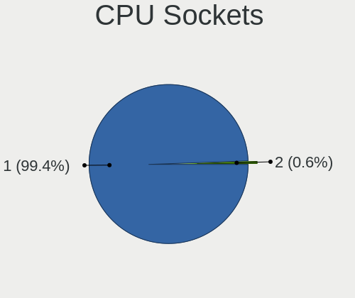

ROSA Hardware Trends
--------------------

A project to identify most popular hardware characteristics and track their change
over time based on data collected by ROSA users at https://Linux-Hardware.org.

Anyone can contribute to the study by uploading probes of their computers by
the [hw-probe](https://github.com/linuxhw/hw-probe) tool:

    sudo hw-probe -all -upload

This is a report for all computer types. See also reports for [desktops](/Dist/ROSA/Desktop/README.md) and [notebooks](/Dist/ROSA/Notebook/README.md).

Full-feature report is available here: https://linux-hardware.org/?view=trends

Period: Feb, 2020.

Contents
--------

- [ OS                       ](#os)
- [ OS Family                ](#os-family)
- [ Kernel                   ](#kernel)
- [ Kernel Family            ](#kernel-family)
- [ Kernel Major Ver.        ](#kernel-major-ver)
- [ Arch                     ](#arch)
- [ DE                       ](#de)
- [ Display Server           ](#display-server)
- [ OS Lang                  ](#os-lang)
- [ Boot Mode                ](#boot-mode)
- [ Filesystem               ](#filesystem)
- [ Dual Boot with Linux     ](#dual-boot-with-linux)
- [ Dual Boot (Win)          ](#dual-boot-win)
- [ Country                  ](#country)
- [ City                     ](#city)
- [ Vendor                   ](#vendor)
- [ Model                    ](#model)
- [ Model Family             ](#model-family)
- [ MFG Year                 ](#mfg-year)
- [ Form Factor              ](#form-factor)
- [ Secure Boot              ](#secure-boot)
- [ Coreboot                 ](#coreboot)
- [ RAM Size                 ](#ram-size)
- [ RAM Used                 ](#ram-used)
- [ Drive Vendor             ](#drive-vendor)
- [ Drive Model              ](#drive-model)
- [ Drive Kind               ](#drive-kind)
- [ Drive Connector          ](#drive-connector)
- [ Drive Size               ](#drive-size)
- [ Space Total              ](#space-total)
- [ Space Used               ](#space-used)
- [ Malfunc. Drives          ](#malfunc-drives)
- [ Malfunc. Drive Vendor    ](#malfunc-drive-vendor)
- [ Malfunc. Drive Kind      ](#malfunc-drive-kind)
- [ Failed Drives            ](#failed-drives)
- [ Failed Drive Vendor      ](#failed-drive-vendor)
- [ Drive Status             ](#drive-status)
- [ Storage Vendor           ](#storage-vendor)
- [ Storage Model            ](#storage-model)
- [ Storage Kind             ](#storage-kind)
- [ CPU Vendor               ](#cpu-vendor)
- [ CPU Model                ](#cpu-model)
- [ CPU Model Family         ](#cpu-model-family)
- [ CPU Cores                ](#cpu-cores)
- [ CPU Sockets              ](#cpu-sockets)
- [ CPU Threads              ](#cpu-threads)
- [ CPU Op-Modes             ](#cpu-op-modes)
- [ CPU Microarch            ](#cpu-microarch)
- [ CPU Microcode            ](#cpu-microcode)
- [ GPU Vendor               ](#gpu-vendor)
- [ GPU Model                ](#gpu-model)
- [ GPU Combo                ](#gpu-combo)
- [ GPU Driver               ](#gpu-driver)
- [ GPU Memory               ](#gpu-memory)
- [ Monitor Vendor           ](#monitor-vendor)
- [ Monitor Model            ](#monitor-model)
- [ Monitor Resolution       ](#monitor-resolution)
- [ Monitor Diagonal         ](#monitor-diagonal)
- [ Monitor Width            ](#monitor-width)
- [ Aspect Ratio             ](#aspect-ratio)
- [ Monitor Area             ](#monitor-area)
- [ Pixel Density            ](#pixel-density)
- [ Multiple Monitors        ](#multiple-monitors)
- [ Net Controller Vendor    ](#net-controller-vendor)
- [ Net Controller Model     ](#net-controller-model)
- [ Net Controller Kind      ](#net-controller-kind)
- [ Used Controller          ](#used-controller)
- [ NICs                     ](#nics)
- [ Unsupported Devices      ](#unsupported-devices)
- [ Unsupported Device Types ](#unsupported-device-types)

OS
--

Installed operating systems

| Name      | Computers | Percent |
|-----------|-----------|---------|
| ROSA R11  | 310       | 88.83%  |
| ROSA R8.1 | 19        | 5.44%   |
| ROSA R10  | 17        | 4.87%   |
| ROSA R9   | 1         | 0.29%   |
| ROSA R12  | 1         | 0.29%   |
| RED X4    | 1         | 0.29%   |

OS Family
---------

OS without a version

| Name | Computers | Percent |
|------|-----------|---------|
| ROSA | 349       | 100%    |

Kernel
------

Version of the Linux kernel

| Version                               | Computers | Percent |
|---------------------------------------|-----------|---------|
| 4.15.0-desktop-68.5rosa-x86_64        | 113       | 32.38%  |
| 4.15.0-desktop-45.1rosa-x86_64        | 106       | 30.37%  |
| 4.15.0-desktop-68.5rosa-i586          | 30        | 8.6%    |
| 4.9.155-nrj-desktop-1rosa-x86_64      | 22        | 6.3%    |
| 4.15.0-desktop-45.1rosa-i586          | 22        | 6.3%    |
| 4.9.60-nrj-desktop-1rosa-x86_64       | 9         | 2.58%   |
| 4.9.155-nrj-desktop-1rosa-i586        | 8         | 2.29%   |
| 4.9.60-nrj-desktop-1rosa-i586         | 6         | 1.72%   |
| 4.1.38-nrj-desktop-2rosa-x86_64       | 4         | 1.15%   |
| 5.4.15-nrj-desktop-1rosa-x86_64       | 3         | 0.86%   |
| 4.9.9-nrj-desktop-1rosa-i586          | 3         | 0.86%   |
| 4.1.38-nrj-desktop-2rosa-i586         | 3         | 0.86%   |
| 5.4.0-desktop-14.1rosa-x86_64         | 2         | 0.57%   |
| 5.0.0-desktop-38.1rosa-x86_64         | 2         | 0.57%   |
| 4.9.9-nrj-desktop-1rosa-x86_64        | 2         | 0.57%   |
| 5.6.0-linux-rc-rc2.build1-rosa-x86_64 | 1         | 0.29%   |
| 5.5.0-050500rc7-generic               | 1         | 0.29%   |
| 5.4.0-desktop-11.1rosa-x86_64         | 1         | 0.29%   |
| 5.3.0-desktop-17.1rosa-x86_64         | 1         | 0.29%   |
| 5.0.0-desktop-38.1rosa-i586           | 1         | 0.29%   |
| 4.9.20-nrj-desktop-1rosa-i586         | 1         | 0.29%   |
| 4.9.124-nrj-desktop-1rosa-i586        | 1         | 0.29%   |
| 4.4.74-nrj-desktop-1rosa-x86_64       | 1         | 0.29%   |
| 4.19.0-desktop-13.1rosa-x86_64        | 1         | 0.29%   |
| 4.18.0-desktop-26.2rosa-x86_64        | 1         | 0.29%   |
| 4.16.18-nrj-desktop-1rosa-i586        | 1         | 0.29%   |
| 4.15.0-desktop-47.2rosa-x86_64        | 1         | 0.29%   |
| 4.15.0-desktop-47.2rosa-i586          | 1         | 0.29%   |
| 4.1.25-nrj-desktop-1rosa-x86_64       | 1         | 0.29%   |

Kernel Family
-------------

Linux kernel without a distro release

| Version | Computers | Percent |
|---------|-----------|---------|
| 4.15.0  | 273       | 78.22%  |
| 4.9.155 | 30        | 8.6%    |
| 4.9.60  | 15        | 4.3%    |
| 4.1.38  | 7         | 2.01%   |
| 4.9.9   | 5         | 1.43%   |
| 5.4.15  | 3         | 0.86%   |
| 5.4.0   | 3         | 0.86%   |
| 5.0.0   | 3         | 0.86%   |
| 5.6.0   | 1         | 0.29%   |
| 5.5.0   | 1         | 0.29%   |
| 5.3.0   | 1         | 0.29%   |
| 4.9.20  | 1         | 0.29%   |
| 4.9.124 | 1         | 0.29%   |
| 4.4.74  | 1         | 0.29%   |
| 4.19.0  | 1         | 0.29%   |
| 4.18.0  | 1         | 0.29%   |
| 4.16.18 | 1         | 0.29%   |
| 4.1.25  | 1         | 0.29%   |

Kernel Major Ver.
-----------------

Linux kernel major version

| Version | Computers | Percent |
|---------|-----------|---------|
| 4.15    | 273       | 78.22%  |
| 4.9     | 52        | 14.9%   |
| 4.1     | 8         | 2.29%   |
| 5.4     | 6         | 1.72%   |
| 5.0     | 3         | 0.86%   |
| 5.6     | 1         | 0.29%   |
| 5.5     | 1         | 0.29%   |
| 5.3     | 1         | 0.29%   |
| 4.4     | 1         | 0.29%   |
| 4.19    | 1         | 0.29%   |
| 4.18    | 1         | 0.29%   |
| 4.16    | 1         | 0.29%   |

Arch
----

OS architecture (x86_64, i586, etc.)

| Name   | Computers | Percent |
|--------|-----------|---------|
| x86_64 | 272       | 77.94%  |
| i686   | 77        | 22.06%  |

DE
--

Desktop Environment

| Name    | Computers | Percent |
|---------|-----------|---------|
| KDE4    | 218       | 62.46%  |
| KDE5    | 114       | 32.66%  |
| XFCE    | 9         | 2.58%   |
| LXQt    | 5         | 1.43%   |
| Unknown | 3         | 0.86%   |

Display Server
--------------

X11 or Wayland

| Name    | Computers | Percent |
|---------|-----------|---------|
| X11     | 347       | 99.43%  |
| Wayland | 2         | 0.57%   |

OS Lang
-------

Language

| Lang    | Computers | Percent |
|---------|-----------|---------|
| Unknown | 333       | 95.42%  |
| ru_RU   | 16        | 4.58%   |

Boot Mode
---------

EFI or BIOS

| Mode | Computers | Percent |
|------|-----------|---------|
| BIOS | 252       | 72.21%  |
| EFI  | 97        | 27.79%  |

Filesystem
----------

Type of filesystem

| Type     | Computers | Percent |
|----------|-----------|---------|
| Ext4     | 329       | 94.27%  |
| Btrfs    | 10        | 2.87%   |
| Ext3     | 8         | 2.29%   |
| Reiserfs | 1         | 0.29%   |
| Ext2     | 1         | 0.29%   |

Dual Boot with Linux
--------------------

Hosting more than one Linux

| Dual boot | Computers | Percent |
|-----------|-----------|---------|
| No        | 278       | 79.66%  |
| Yes       | 71        | 20.34%  |

Dual Boot (Win)
---------------

Hosting Linux and Windows

| Dual boot | Computers | Percent |
|-----------|-----------|---------|
| No        | 197       | 56.45%  |
| Yes       | 152       | 43.55%  |

Country
-------

Geographic location (country)

| Country              | Computers | Percent |
|----------------------|-----------|---------|
| Russia               | 281       | 80.52%  |
| Ukraine              | 21        | 6.02%   |
| Kazakhstan           | 7         | 2.01%   |
| Belarus              | 6         | 1.72%   |
| Poland               | 5         | 1.43%   |
| Germany              | 3         | 0.86%   |
| Latvia               | 2         | 0.57%   |
| France               | 2         | 0.57%   |
| Colombia             | 2         | 0.57%   |
| Canada               | 2         | 0.57%   |
| Venezuela            | 1         | 0.29%   |
| Uzbekistan           | 1         | 0.29%   |
| USA                  | 1         | 0.29%   |
| UK                   | 1         | 0.29%   |
| Thailand             | 1         | 0.29%   |
| Slovakia             | 1         | 0.29%   |
| Romania              | 1         | 0.29%   |
| Moldova, Republic of | 1         | 0.29%   |
| Moldova              | 1         | 0.29%   |
| Kyrgyzstan           | 1         | 0.29%   |
| Korea, Republic of   | 1         | 0.29%   |
| Ireland              | 1         | 0.29%   |
| Egypt                | 1         | 0.29%   |
| Brazil               | 1         | 0.29%   |
| Belgium              | 1         | 0.29%   |
| Azerbaijan           | 1         | 0.29%   |
| Austria              | 1         | 0.29%   |
| Australia            | 1         | 0.29%   |

City
----

Geographic location (city)

| City              | Computers | Percent |
|-------------------|-----------|---------|
| Moscow            | 50        | 14.33%  |
| St Petersburg     | 24        | 6.88%   |
| Novosibirsk       | 13        | 3.72%   |
| Yekaterinburg     | 11        | 3.15%   |
| Krasnodar         | 8         | 2.29%   |
| Voronezh          | 7         | 2.01%   |
| Samara            | 7         | 2.01%   |
| Omsk              | 6         | 1.72%   |
| Kazan’          | 6         | 1.72%   |
| Kharkiv           | 5         | 1.43%   |
| Khabarovsk        | 5         | 1.43%   |
| Ufa               | 4         | 1.15%   |
| Rostov-on-Don     | 4         | 1.15%   |
| Tyumen            | 3         | 0.86%   |
| Tver              | 3         | 0.86%   |
| Saratov           | 3         | 0.86%   |
| Nizhniy Novgorod  | 3         | 0.86%   |
| Zapolyarnyy       | 2         | 0.57%   |
| Yoshkar-Ola       | 2         | 0.57%   |
| Volgograd         | 2         | 0.57%   |
| Veliky Novgorod   | 2         | 0.57%   |
| Tula              | 2         | 0.57%   |
| Surgut            | 2         | 0.57%   |
| Simferopol        | 2         | 0.57%   |
| Semey             | 2         | 0.57%   |
| Ryazan            | 2         | 0.57%   |
| Riga              | 2         | 0.57%   |
| Pskov             | 2         | 0.57%   |
| Perm              | 2         | 0.57%   |
| Ottawa            | 2         | 0.57%   |
| Nur-Sultan        | 2         | 0.57%   |
| Mykolayiv         | 2         | 0.57%   |
| Montpellier       | 2         | 0.57%   |
| Krasnoyarsk       | 2         | 0.57%   |
| Kamensk-Ural'skiy | 2         | 0.57%   |
| Ivanovo           | 2         | 0.57%   |
| Istra             | 2         | 0.57%   |
| Donetsk           | 2         | 0.57%   |
| Cherepovets       | 2         | 0.57%   |
| Bryansk           | 2         | 0.57%   |
| Blagoveshchensk   | 2         | 0.57%   |
| Biysk             | 2         | 0.57%   |
| Birsk             | 2         | 0.57%   |
| Belgorod          | 2         | 0.57%   |
| Barnaul           | 2         | 0.57%   |
| Arkhangelsk       | 2         | 0.57%   |
| Zheleznogorsk     | 1         | 0.29%   |
| Zavodoukovsk      | 1         | 0.29%   |
| Zaporizhia        | 1         | 0.29%   |
| Zaokskiy          | 1         | 0.29%   |
| Yakutsk           | 1         | 0.29%   |
| Wrocław          | 1         | 0.29%   |
| Weinsberg         | 1         | 0.29%   |
| Wehr              | 1         | 0.29%   |
| Warsaw            | 1         | 0.29%   |
| Vol'sk            | 1         | 0.29%   |
| Vladimir          | 1         | 0.29%   |
| Vladikavkaz       | 1         | 0.29%   |
| Vienna            | 1         | 0.29%   |
| Velikiye Luki     | 1         | 0.29%   |

Vendor
------

Motherboard manufacturer

| Name                | Computers | Percent |
|---------------------|-----------|---------|
| ASUSTek Computer    | 98        | 28.08%  |
| Gigabyte Technology | 39        | 11.17%  |
| Lenovo              | 38        | 10.89%  |
| Hewlett-Packard     | 32        | 9.17%   |
| MSI                 | 27        | 7.74%   |
| Acer                | 22        | 6.3%    |
| ASRock              | 19        | 5.44%   |
| Samsung Electronics | 13        | 3.72%   |
| Dell                | 13        | 3.72%   |
| Packard Bell        | 6         | 1.72%   |
| Apple               | 6         | 1.72%   |
| Toshiba             | 5         | 1.43%   |
| Intel               | 5         | 1.43%   |
| Biostar             | 4         | 1.15%   |
| Sony                | 3         | 0.86%   |
| ECS                 | 3         | 0.86%   |
| Pegatron            | 2         | 0.57%   |
| Unknown             | 2         | 0.57%   |
| Supermicro          | 1         | 0.29%   |
| Nvidia              | 1         | 0.29%   |
| Notebook            | 1         | 0.29%   |
| KupiDeshego Edition | 1         | 0.29%   |
| Infomash            | 1         | 0.29%   |
| Fujitsu Siemens     | 1         | 0.29%   |
| Foxconn             | 1         | 0.29%   |
| eMachines           | 1         | 0.29%   |
| DNS                 | 1         | 0.29%   |
| Digma               | 1         | 0.29%   |
| DEXP                | 1         | 0.29%   |
| Alienware           | 1         | 0.29%   |

Model
-----

Motherboard model

| Name                                                                                                 | Computers | Percent |
|------------------------------------------------------------------------------------------------------|-----------|---------|
| ASUS All Series                                                                                      | 8         | 2.29%   |
| ASUS K50IJ                                                                                           | 5         | 1.43%   |
| HP Notebook                                                                                          | 4         | 1.15%   |
| Packard Bell EasyNote TE11HC                                                                         | 3         | 0.86%   |
| Lenovo B570e HuronRiver Platform                                                                     | 3         | 0.86%   |
| HP Pavilion g6                                                                                       | 3         | 0.86%   |
| HP Laptop 15-bw0xx                                                                                   | 3         | 0.86%   |
| MSI MS-7895                                                                                          | 2         | 0.57%   |
| MSI MS-7529                                                                                          | 2         | 0.57%   |
| Lenovo IdeaPad Z570 HuronRiver Platform                                                              | 2         | 0.57%   |
| Lenovo G50-30 80G0                                                                                   | 2         | 0.57%   |
| HP Pavilion m6                                                                                       | 2         | 0.57%   |
| Gigabyte GEG                                                                                         | 2         | 0.57%   |
| Gigabyte GA-MA770T-UD3                                                                               | 2         | 0.57%   |
| Gigabyte GA-870A-UD3                                                                                 | 2         | 0.57%   |
| Gigabyte 8I915GMF                                                                                    | 2         | 0.57%   |
| Biostar B75MU3B                                                                                      | 2         | 0.57%   |
| ASUS PRIME H310M-R R2.0                                                                              | 2         | 0.57%   |
| ASUS P5QPL-AM                                                                                        | 2         | 0.57%   |
| ASUS K56CM                                                                                           | 2         | 0.57%   |
| ASUS K53SC                                                                                           | 2         | 0.57%   |
| ASUS E402SA                                                                                          | 2         | 0.57%   |
| Acer Aspire 5750ZG                                                                                   | 2         | 0.57%   |
| Unknown                                                                                              | 2         | 0.57%   |
| Toshiba TECRA S3                                                                                     | 1         | 0.29%   |
| Toshiba Satellite U300                                                                               | 1         | 0.29%   |
| Toshiba Satellite L850-B5K                                                                           | 1         | 0.29%   |
| Toshiba Satellite L655                                                                               | 1         | 0.29%   |
| Toshiba QOSMIO G30                                                                                   | 1         | 0.29%   |
| Supermicro C2SBA                                                                                     | 1         | 0.29%   |
| Sony VPCL22S1R                                                                                       | 1         | 0.29%   |
| Sony VGN-FZ31ZR                                                                                      | 1         | 0.29%   |
| Sony SVE1712V1RB                                                                                     | 1         | 0.29%   |
| Samsung Electronics SX20S                                                                            | 1         | 0.29%   |
| Samsung Electronics RV413/RV513/E3413                                                                | 1         | 0.29%   |
| Samsung Electronics RV408/RV508                                                                      | 1         | 0.29%   |
| Samsung Electronics R470/R420                                                                        | 1         | 0.29%   |
| Samsung Electronics R468/R418                                                                        | 1         | 0.29%   |
| Samsung Electronics P29/28/26                                                                        | 1         | 0.29%   |
| Samsung Electronics NC110P/NC108P/NC111P                                                             | 1         | 0.29%   |
| Samsung Electronics N150/N210/N220                                                                   | 1         | 0.29%   |
| Samsung Electronics N100                                                                             | 1         | 0.29%   |
| Samsung Electronics 700T1C                                                                           | 1         | 0.29%   |
| Samsung Electronics 355V4C/355V4X/355V5C/355V5X/356V4C/356V4X/356V5C/356V5X/3445VC/3445VX/3545VC/354 | 1         | 0.29%   |
| Samsung Electronics 350V5C/351V5C/3540VC/3440VC                                                      | 1         | 0.29%   |
| Samsung Electronics 300E4Z/300E5Z/300E7Z                                                             | 1         | 0.29%   |
| Pegatron A15W8                                                                                       | 1         | 0.29%   |
| Pegatron 520-1209er                                                                                  | 1         | 0.29%   |
| Packard Bell oneTwo S3380                                                                            | 1         | 0.29%   |
| Packard Bell EasyNote_BU45                                                                           | 1         | 0.29%   |
| Packard Bell EasyNote TS11SB                                                                         | 1         | 0.29%   |
| Nvidia MCP79                                                                                         | 1         | 0.29%   |
| Notebook W9x0LU                                                                                      | 1         | 0.29%   |
| MSI X460/X460DX                                                                                      | 1         | 0.29%   |
| MSI MS-7A36                                                                                          | 1         | 0.29%   |
| MSI MS-7A15                                                                                          | 1         | 0.29%   |
| MSI MS-7996                                                                                          | 1         | 0.29%   |
| MSI MS-7846                                                                                          | 1         | 0.29%   |
| MSI MS-7758                                                                                          | 1         | 0.29%   |
| MSI MS-7721                                                                                          | 1         | 0.29%   |

Model Family
------------

Motherboard model prefix

| Name                       | Computers | Percent |
|----------------------------|-----------|---------|
| Acer Aspire                | 13        | 3.72%   |
| Lenovo IdeaPad             | 11        | 3.15%   |
| HP Pavilion                | 10        | 2.87%   |
| ASUS All                   | 8         | 2.29%   |
| HP Laptop                  | 6         | 1.72%   |
| Dell Inspiron              | 6         | 1.72%   |
| Packard Bell EasyNote      | 5         | 1.43%   |
| ASUS PRIME                 | 5         | 1.43%   |
| ASUS K50IJ                 | 5         | 1.43%   |
| HP Notebook                | 4         | 1.15%   |
| Toshiba Satellite          | 3         | 0.86%   |
| Lenovo ThinkCentre         | 3         | 0.86%   |
| Lenovo IdeaCentre          | 3         | 0.86%   |
| Lenovo B570e               | 3         | 0.86%   |
| HP ProBook                 | 3         | 0.86%   |
| HP Compaq                  | 3         | 0.86%   |
| Dell OptiPlex              | 3         | 0.86%   |
| MSI MS-7895                | 2         | 0.57%   |
| MSI MS-7529                | 2         | 0.57%   |
| Lenovo G50-30              | 2         | 0.57%   |
| Gigabyte GEG               | 2         | 0.57%   |
| Gigabyte GA-MA770T-UD3     | 2         | 0.57%   |
| Gigabyte GA-870A-UD3       | 2         | 0.57%   |
| Gigabyte 8I915GMF          | 2         | 0.57%   |
| Biostar B75MU3B            | 2         | 0.57%   |
| ASUS VivoBook              | 2         | 0.57%   |
| ASUS P8Z77-V               | 2         | 0.57%   |
| ASUS P8Z68                 | 2         | 0.57%   |
| ASUS P5QPL-AM              | 2         | 0.57%   |
| ASUS P5K                   | 2         | 0.57%   |
| ASUS M5A97                 | 2         | 0.57%   |
| ASUS K56CM                 | 2         | 0.57%   |
| ASUS K53SC                 | 2         | 0.57%   |
| ASUS E402SA                | 2         | 0.57%   |
| ASRock N68C-GS             | 2         | 0.57%   |
| Acer TravelMate            | 2         | 0.57%   |
| Acer Nitro                 | 2         | 0.57%   |
| Acer Extensa               | 2         | 0.57%   |
| Unknown                    | 2         | 0.57%   |
| Toshiba TECRA              | 1         | 0.29%   |
| Toshiba QOSMIO             | 1         | 0.29%   |
| Supermicro C2SBA           | 1         | 0.29%   |
| Sony VPCL22S1R             | 1         | 0.29%   |
| Sony VGN-FZ31ZR            | 1         | 0.29%   |
| Sony SVE1712V1RB           | 1         | 0.29%   |
| Samsung Electronics SX20S  | 1         | 0.29%   |
| Samsung Electronics RV413  | 1         | 0.29%   |
| Samsung Electronics RV408  | 1         | 0.29%   |
| Samsung Electronics R470   | 1         | 0.29%   |
| Samsung Electronics R468   | 1         | 0.29%   |
| Samsung Electronics P29    | 1         | 0.29%   |
| Samsung Electronics NC110P | 1         | 0.29%   |
| Samsung Electronics N150   | 1         | 0.29%   |
| Samsung Electronics N100   | 1         | 0.29%   |
| Samsung Electronics 700T1C | 1         | 0.29%   |
| Samsung Electronics 355V4C | 1         | 0.29%   |
| Samsung Electronics 350V5C | 1         | 0.29%   |
| Samsung Electronics 300E4Z | 1         | 0.29%   |
| Pegatron A15W8             | 1         | 0.29%   |
| Pegatron 520-1209er        | 1         | 0.29%   |

MFG Year
--------

Motherboard manufacture year

| Year    | Computers | Percent |
|---------|-----------|---------|
| 2012    | 43        | 12.32%  |
| 2011    | 42        | 12.03%  |
| 2009    | 34        | 9.74%   |
| 2010    | 29        | 8.31%   |
| 2018    | 26        | 7.45%   |
| 2019    | 24        | 6.88%   |
| 2016    | 24        | 6.88%   |
| 2013    | 24        | 6.88%   |
| 2015    | 23        | 6.59%   |
| 2014    | 20        | 5.73%   |
| 2008    | 18        | 5.16%   |
| 2017    | 16        | 4.58%   |
| 2006    | 12        | 3.44%   |
| 2007    | 9         | 2.58%   |
| 2005    | 2         | 0.57%   |
| 2004    | 2         | 0.57%   |
| Unknown | 1         | 0.29%   |

Form Factor
-----------

Physical design of the computer

| Name       | Computers | Percent |
|------------|-----------|---------|
| Notebook   | 176       | 50.43%  |
| Desktop    | 163       | 46.7%   |
| All in one | 7         | 2.01%   |
| Mini pc    | 3         | 0.86%   |

Secure Boot
-----------

Enabled or disabled

| State    | Computers | Percent |
|----------|-----------|---------|
| Disabled | 348       | 99.71%  |
| Enabled  | 1         | 0.29%   |

Coreboot
--------

Have coreboot on board

| Used | Computers | Percent |
|------|-----------|---------|
| No   | 349       | 100%    |

RAM Size
--------

Total RAM memory

| Size in GB | Computers | Percent |
|------------|-----------|---------|
| 3.01-4.0   | 120       | 34.38%  |
| 4.01-8.0   | 66        | 18.91%  |
| 8.01-16.0  | 59        | 16.91%  |
| 1.01-2.0   | 51        | 14.61%  |
| 16.01-24.0 | 23        | 6.59%   |
| 2.01-3.0   | 19        | 5.44%   |
| 32.01-64.0 | 6         | 1.72%   |
| 0.01-1.0   | 5         | 1.43%   |

RAM Used
--------

Used RAM memory

| Used GB  | Computers | Percent |
|----------|-----------|---------|
| 0.01-1.0 | 170       | 48.71%  |
| 1.01-2.0 | 142       | 40.69%  |
| 2.01-3.0 | 24        | 6.88%   |
| 3.01-4.0 | 9         | 2.58%   |
| 4.01-8.0 | 4         | 1.15%   |

Drive Vendor
------------

Hard drive vendors

| Vendor                | Computers | Drives  | Percent |
|-----------------------|-----------|---------|---------|
| WDC                   | 125       | 144     | 26.82%  |
| Seagate               | 102       | 113     | 21.89%  |
| Toshiba               | 42        | 44      | 9.01%   |
| Hitachi               | 33        | 34      | 7.08%   |
| Samsung Electronics   | 31        | 34      | 6.65%   |
| Kingston              | 16        | 16      | 3.43%   |
| SanDisk               | 12        | 12      | 2.58%   |
| HGST                  | 12        | 13      | 2.58%   |
| China                 | 11        | 11      | 2.36%   |
| SPCC                  | 9         | 9       | 1.93%   |
| Unknown               | 8         | 8       | 1.72%   |
| Smartbuy              | 6         | 6       | 1.29%   |
| HUAWEI                | 5         | 5       | 1.07%   |
| A-DATA Technology     | 5         | 5       | 1.07%   |
| Maxtor                | 4         | 4       | 0.86%   |
| Intel                 | 4         | 4       | 0.86%   |
| Fujitsu               | 4         | 4       | 0.86%   |
| SK Hynix              | 3         | 3       | 0.64%   |
| LITEONIT              | 3         | 3       | 0.64%   |
| KingDian              | 3         | 3       | 0.64%   |
| Crucial               | 3         | 3       | 0.64%   |
| PNY                   | 2         | 2       | 0.43%   |
| Patriot               | 2         | 2       | 0.43%   |
| OCZ                   | 2         | 2       | 0.43%   |
| GOODRAM               | 2         | 2       | 0.43%   |
| Generic               | 2         | 2       | 0.43%   |
| Corsair               | 2         | 2       | 0.43%   |
| Apacer                | 2         | 2       | 0.43%   |
| Transcend             | 1         | 1       | 0.21%   |
| Team                  | 1         | 1       | 0.21%   |
| StoreJet              | 1         | 1       | 0.21%   |
| Realtek Semiconductor | 1         | 1       | 0.21%   |
| KingSpec              | 1         | 1       | 0.21%   |
| KINGRICH              | 1         | 1       | 0.21%   |
| KINGMAX               | 1         | 1       | 0.21%   |
| JMicron               | 1         | 1       | 0.21%   |
| IBM                   | 1         | 1       | 0.21%   |
| HL-DT-ST              | 1         | Unknown | 0.21%   |
| Apple                 | 1         | 1       | 0.21%   |

Drive Model
-----------

Hard drive models

| Model                        | Computers | Percent |
|------------------------------|-----------|---------|
| ST500DM002-1BD142 500GB      | 11        | 2.2%    |
| MQ01ABF050 500GB             | 8         | 1.6%    |
| HTS545025B9A300 250GB        | 8         | 1.6%    |
| WDS120G2G0A-00JH30 120GB SSD | 6         | 1.2%    |
| SA400S37120G 120GB SSD       | 6         | 1.2%    |
| DT01ACA050 500GB             | 6         | 1.2%    |
| ST3500418AS 500GB            | 5         | 1%      |
| ST1000LM024 HN-M101MBB 1TB   | 5         | 1%      |
| SSD 120GB                    | 5         | 1%      |
| Solid State Disk 120GB       | 5         | 1%      |
| HTS545050A7E680 500GB        | 5         | 1%      |
| WD10EZEX-08WN4A0 1TB         | 4         | 0.8%    |
| ST500LT012-1DG142 500GB      | 4         | 0.8%    |
| ST3250410AS 250GB            | 4         | 0.8%    |
| ST1000LM035-1RK172 1TB       | 4         | 0.8%    |
| ST1000DM010-2EP102 1TB       | 4         | 0.8%    |
| 120GB SSD                    | 4         | 0.8%    |
| WDS240G2G0A-00JH30 240GB SSD | 3         | 0.6%    |
| WD5000LPLX-00ZNTT0 500GB     | 3         | 0.6%    |
| WD5000BPVT-24HXZT3 500GB     | 3         | 0.6%    |
| WD3200BPVT-80ZEST0 320GB     | 3         | 0.6%    |
| WD3200BPVT-22ZEST0 320GB     | 3         | 0.6%    |
| WD3200BPVT-22JJ5T0 320GB     | 3         | 0.6%    |
| ST9500325AS 500GB            | 3         | 0.6%    |
| ST380011A 80GB               | 3         | 0.6%    |
| ST340014A 40GB               | 3         | 0.6%    |
| ST2000DM001-1CH164 2TB       | 3         | 0.6%    |
| SSD PLUS 240GB               | 3         | 0.6%    |
| SSD 860 EVO 250GB            | 3         | 0.6%    |
| SSD 240GB                    | 3         | 0.6%    |
| SD Storage 15GB              | 3         | 0.6%    |
| HTS545050A7E380 500GB        | 3         | 0.6%    |
| HTS543232A7A384 320GB        | 3         | 0.6%    |
| HDS721616PLA380 160GB        | 3         | 0.6%    |
| DT01ACA100 1TB               | 3         | 0.6%    |
| DF4032  32GB                 | 3         | 0.6%    |
| WDS120G1G0A-00SS50 120GB SSD | 2         | 0.4%    |
| WD5000LPVX-22V0TT0 500GB     | 2         | 0.4%    |
| WD5000LPCX-24VHAT0 500GB     | 2         | 0.4%    |
| WD5000BPKX-22HPJT0 500GB     | 2         | 0.4%    |
| WD5000AAKS-00UU3A0 500GB     | 2         | 0.4%    |
| WD5000AADS-00S9B0 500GB      | 2         | 0.4%    |
| WD3200BPVT-24JJ5T0 320GB     | 2         | 0.4%    |
| WD2500KS-00MJB0 250GB        | 2         | 0.4%    |
| WD20EZRZ-22Z5HB0 2TB         | 2         | 0.4%    |
| WD20EARX-00PASB0 2TB         | 2         | 0.4%    |
| WD1600JS-08NCB1 160GB        | 2         | 0.4%    |
| WD10SPZX-21Z10T0 1TB         | 2         | 0.4%    |
| WD10JPVX-22JC3T0 1TB         | 2         | 0.4%    |
| WD10JPLX-00MBPT0 1TB         | 2         | 0.4%    |
| WD10EZEX-60WN4A0 1TB         | 2         | 0.4%    |
| USD00  4GB                   | 2         | 0.4%    |
| TF CARD Storage 8GB          | 2         | 0.4%    |
| SU650 120GB SSD              | 2         | 0.4%    |
| ST9250315AS 250GB            | 2         | 0.4%    |
| ST500DM009-2F110A 500GB      | 2         | 0.4%    |
| ST500DM002-1BC142 500GB      | 2         | 0.4%    |
| ST380815AS 80GB              | 2         | 0.4%    |
| ST3320418AS 320GB            | 2         | 0.4%    |
| ST320LT012-9WS14C 320GB      | 2         | 0.4%    |

Drive Kind
----------

HDD or SSD

| Kind    | Computers | Drives | Percent |
|---------|-----------|--------|---------|
| HDD     | 286       | 354    | 67.77%  |
| SSD     | 111       | 124    | 26.3%   |
| Unknown | 10        | 9      | 2.37%   |
| MMC     | 9         | 9      | 2.13%   |
| NVMe    | 6         | 6      | 1.42%   |

Drive Connector
---------------

SATA, SAS, NVMe, etc.

| Type | Computers | Drives | Percent |
|------|-----------|--------|---------|
| SATA | 340       | 475    | 92.39%  |
| SAS  | 13        | 12     | 3.53%   |
| MMC  | 9         | 9      | 2.45%   |
| NVMe | 6         | 6      | 1.63%   |

Drive Size
----------

Size of hard drive

| Size in TB | Computers | Drives | Percent |
|------------|-----------|--------|---------|
| 0.01-0.5   | 294       | 382    | 72.41%  |
| 0.51-1.0   | 89        | 95     | 21.92%  |
| 1.01-2.0   | 20        | 21     | 4.93%   |
| 3.01-4.0   | 1         | 1      | 0.25%   |
| 2.01-3.0   | 1         | 2      | 0.25%   |
| 4.01-10.0  | 1         | 1      | 0.25%   |

Space Total
-----------

Amount of disk space available on the file system

| Size in GB     | Computers | Percent |
|----------------|-----------|---------|
| 101-250        | 97        | 27.79%  |
| 251-500        | 80        | 22.92%  |
| 501-1000       | 46        | 13.18%  |
| 51-100         | 42        | 12.03%  |
| 1-20           | 35        | 10.03%  |
| 21-50          | 28        | 8.02%   |
| 1001-2000      | 14        | 4.01%   |
| 2001-3000      | 4         | 1.15%   |
| More than 3000 | 3         | 0.86%   |

Space Used
----------

Amount of used disk space

| Used GB        | Computers | Percent |
|----------------|-----------|---------|
| 1-20           | 238       | 68.19%  |
| 21-50          | 27        | 7.74%   |
| 101-250        | 27        | 7.74%   |
| 251-500        | 19        | 5.44%   |
| 51-100         | 19        | 5.44%   |
| 501-1000       | 14        | 4.01%   |
| 1001-2000      | 3         | 0.86%   |
| More than 3000 | 2         | 0.57%   |

Malfunc. Drives
---------------

Drive models with a malfunction

| Model                        | Computers | Drives | Percent |
|------------------------------|-----------|--------|---------|
| ST500DM002-1BD142 500GB      | 7         | 7      | 5%      |
| HTS545025B9A300 250GB        | 6         | 6      | 4.29%   |
| HTS545050A7E680 500GB        | 3         | 3      | 2.14%   |
| HDS721616PLA380 160GB        | 3         | 3      | 2.14%   |
| WD5000AAKS-00UU3A0 500GB     | 2         | 2      | 1.43%   |
| WD5000AADS-00S9B0 500GB      | 2         | 2      | 1.43%   |
| WD3200BPVT-22ZEST0 320GB     | 2         | 2      | 1.43%   |
| ST9500325AS 500GB            | 2         | 2      | 1.43%   |
| ST3500418AS 500GB            | 2         | 2      | 1.43%   |
| ST3250410AS 250GB            | 2         | 2      | 1.43%   |
| ST320LT012-9WS14C 320GB      | 2         | 2      | 1.43%   |
| ST31000528AS 1TB             | 2         | 2      | 1.43%   |
| ST2000DM001-9YN164 2TB       | 2         | 2      | 1.43%   |
| ST1000DM003-9YN162 1TB       | 2         | 2      | 1.43%   |
| MQ01ABF050 500GB             | 2         | 2      | 1.43%   |
| MK2565GSX 250GB              | 2         | 2      | 1.43%   |
| MK1637GSX 160GB              | 2         | 3      | 1.43%   |
| HTS543232A7A384 320GB        | 2         | 2      | 1.43%   |
| WDS240G2G0A-00JH30 240GB SSD | 1         | 1      | 0.71%   |
| WD6400BEVT-24A0RT0 640GB     | 1         | 1      | 0.71%   |
| WD5003AZEX-00MK2A0 500GB     | 1         | 1      | 0.71%   |
| WD5000LPVX-00V0TT0 500GB     | 1         | 1      | 0.71%   |
| WD5000LPCX-24VHAT0 500GB     | 1         | 1      | 0.71%   |
| WD5000AAKX-22ERMA0 500GB     | 1         | 1      | 0.71%   |
| WD5000AAKX-08U6AA0 500GB     | 1         | 1      | 0.71%   |
| WD5000AAKX-07U6AA0 500GB     | 1         | 1      | 0.71%   |
| WD5000AAKS-60WWPA0 500GB     | 1         | 1      | 0.71%   |
| WD3200BPVT-80ZEST0 320GB     | 1         | 1      | 0.71%   |
| WD3200BEVT-22A23T0 320GB     | 1         | 1      | 0.71%   |
| WD3200BEKT-60F3T1 320GB      | 1         | 1      | 0.71%   |
| WD3200AAKX-00ERMA0 320GB     | 1         | 1      | 0.71%   |
| WD2500KS-00MJB0 250GB        | 1         | 1      | 0.71%   |
| WD2500JB-00REA0 250GB        | 1         | 1      | 0.71%   |
| WD2500BEVT-24A23T0 250GB     | 1         | 1      | 0.71%   |
| WD20EARS-00S8B1 2TB          | 1         | 1      | 0.71%   |
| WD1600AAJS-00WAA0 160GB      | 1         | 1      | 0.71%   |
| WD1600AAJS-00B4A0 160GB      | 1         | 1      | 0.71%   |
| WD15EVDS-63V9B1 1TB          | 1         | 1      | 0.71%   |
| WD10JPVX-75JC3T0 1TB         | 1         | 1      | 0.71%   |
| WD10JPVX-60JC3T0 1TB         | 1         | 1      | 0.71%   |
| WD10EZEX-60ZF5A0 1TB         | 1         | 1      | 0.71%   |
| WD10EZEX-08WN4A0 1TB         | 1         | 1      | 0.71%   |
| WD10EARS-00Y5B1 1TB          | 1         | 1      | 0.71%   |
| WD10EALX-009BA0 1TB          | 1         | 1      | 0.71%   |
| WD10EADS-22M2B0 1TB          | 1         | 1      | 0.71%   |
| WD1002FAEX-00Z3A0 1TB        | 1         | 1      | 0.71%   |
| TS32GPSD330 32GB SSD         | 1         | 1      | 0.71%   |
| STM3160815AS 160GB           | 1         | 1      | 0.71%   |
| ST980811AS 80GB              | 1         | 1      | 0.71%   |
| ST9250315AS 250GB            | 1         | 1      | 0.71%   |
| ST500NM0011 500GB            | 1         | 1      | 0.71%   |
| ST500LT012-1DG142 500GB      | 1         | 1      | 0.71%   |
| ST380815AS 80GB              | 1         | 1      | 0.71%   |
| ST380215AS 80GB              | 1         | 1      | 0.71%   |
| ST380011A 80GB               | 1         | 1      | 0.71%   |
| ST3400620A 400GB             | 1         | 1      | 0.71%   |
| ST340014A 40GB               | 1         | 1      | 0.71%   |
| ST3320418AS 320GB            | 1         | 1      | 0.71%   |
| ST3250624AS 250GB            | 1         | 1      | 0.71%   |
| ST3250620AS 250GB            | 1         | 1      | 0.71%   |

Malfunc. Drive Vendor
---------------------

Vendors of faulty drives

| Vendor                | Computers | Drives | Percent |
|-----------------------|-----------|--------|---------|
| Seagate               | 41        | 43     | 29.71%  |
| WDC                   | 34        | 34     | 24.64%  |
| Hitachi               | 20        | 20     | 14.49%  |
| Toshiba               | 14        | 15     | 10.14%  |
| Samsung Electronics   | 4         | 4      | 2.9%    |
| HGST                  | 4         | 4      | 2.9%    |
| Kingston              | 3         | 3      | 2.17%   |
| SanDisk               | 2         | 2      | 1.45%   |
| Maxtor                | 2         | 2      | 1.45%   |
| Corsair               | 2         | 2      | 1.45%   |
| Transcend             | 1         | 1      | 0.72%   |
| SPCC                  | 1         | 1      | 0.72%   |
| Smartbuy              | 1         | 1      | 0.72%   |
| SK Hynix              | 1         | 1      | 0.72%   |
| Realtek Semiconductor | 1         | 1      | 0.72%   |
| PNY                   | 1         | 1      | 0.72%   |
| LITEONIT              | 1         | 1      | 0.72%   |
| KINGMAX               | 1         | 1      | 0.72%   |
| Intel                 | 1         | 1      | 0.72%   |
| Fujitsu               | 1         | 1      | 0.72%   |
| Crucial               | 1         | 1      | 0.72%   |
| China                 | 1         | 1      | 0.72%   |

Malfunc. Drive Kind
-------------------

Kinds of faulty drives

| Kind | Computers | Drives | Percent |
|------|-----------|--------|---------|
| HDD  | 112       | 122    | 85.5%   |
| SSD  | 18        | 18     | 13.74%  |
| NVMe | 1         | 1      | 0.76%   |

Failed Drives
-------------

Failed drive models

| Model                | Computers | Drives | Percent |
|----------------------|-----------|--------|---------|
| WD15EARS-00MVWB0 1TB | 1         | 1      | 33.33%  |
| ST9250315AS 250GB    | 1         | 1      | 33.33%  |
| DT01ACA050 500GB     | 1         | 1      | 33.33%  |

Failed Drive Vendor
-------------------

Failed drive vendors

| Vendor  | Computers | Drives | Percent |
|---------|-----------|--------|---------|
| WDC     | 1         | 1      | 33.33%  |
| Toshiba | 1         | 1      | 33.33%  |
| Seagate | 1         | 1      | 33.33%  |

Drive Status
------------

Number of failed and malfunc. drives

| Status   | Computers | Drives | Percent |
|----------|-----------|--------|---------|
| Works    | 256       | 331    | 61.99%  |
| Malfunc  | 128       | 141    | 30.99%  |
| Detected | 26        | 27     | 6.3%    |
| Failed   | 3         | 3      | 0.73%   |

Storage Vendor
--------------

Storage controller vendors

| Vendor                           | Computers | Percent |
|----------------------------------|-----------|---------|
| Intel                            | 252       | 67.2%   |
| AMD                              | 79        | 21.07%  |
| Nvidia                           | 10        | 2.67%   |
| JMicron Technology               | 9         | 2.4%    |
| Marvell Technology Group         | 6         | 1.6%    |
| VIA Technologies                 | 5         | 1.33%   |
| ASMedia Technology               | 4         | 1.07%   |
| Samsung Electronics              | 2         | 0.53%   |
| Realtek Semiconductor            | 2         | 0.53%   |
| Kingston Technology Company      | 2         | 0.53%   |
| Silicon Integrated Systems [SiS] | 1         | 0.27%   |
| Silicon Image                    | 1         | 0.27%   |
| Sandisk                          | 1         | 0.27%   |
| Integrated Technology Express    | 1         | 0.27%   |

Storage Model
-------------

Storage controller models

| Model                                                                             | Computers | Percent |
|-----------------------------------------------------------------------------------|-----------|---------|
| FCH SATA Controller [AHCI mode]                                                   | 36        | 7.48%   |
| NM10/ICH7 Family SATA Controller [IDE mode]                                       | 31        | 6.44%   |
| 82801G (ICH7 Family) IDE Controller                                               | 24        | 4.99%   |
| 6 Series/C200 Series Chipset Family 6 port Mobile SATA AHCI Controller            | 22        | 4.57%   |
| 7 Series Chipset Family 6-port SATA Controller [AHCI mode]                        | 21        | 4.37%   |
| SB7x0/SB8x0/SB9x0 IDE Controller                                                  | 20        | 4.16%   |
| SB7x0/SB8x0/SB9x0 SATA Controller [IDE mode]                                      | 19        | 3.95%   |
| 82801IBM/IEM (ICH9M/ICH9M-E) 4 port SATA Controller [AHCI mode]                   | 16        | 3.33%   |
| SB7x0/SB8x0/SB9x0 SATA Controller [AHCI mode]                                     | 15        | 3.12%   |
| Q170/Q150/B150/H170/H110/Z170/CM236 Chipset SATA Controller [AHCI Mode]           | 13        | 2.7%    |
| 8 Series/C220 Series Chipset Family 6-port SATA Controller 1 [AHCI mode]          | 11        | 2.29%   |
| 82801HM/HEM (ICH8M/ICH8M-E) IDE Controller                                        | 8         | 1.66%   |
| 6 Series/C200 Series Chipset Family Desktop SATA Controller (IDE mode, ports 4-5) | 8         | 1.66%   |
| 6 Series/C200 Series Chipset Family Desktop SATA Controller (IDE mode, ports 0-3) | 8         | 1.66%   |
| 5 Series/3400 Series Chipset 4 port SATA AHCI Controller                          | 8         | 1.66%   |
| Sunrise Point-LP SATA Controller [AHCI mode]                                      | 7         | 1.46%   |
| 7 Series/C210 Series Chipset Family 6-port SATA Controller [AHCI mode]            | 7         | 1.46%   |
| 6 Series/C200 Series Chipset Family 6 port Desktop SATA AHCI Controller           | 7         | 1.46%   |
| JMB363 SATA/IDE Controller                                                        | 6         | 1.25%   |
| Atom/Celeron/Pentium Processor x5-E8000/J3xxx/N3xxx Series SATA Controller        | 6         | 1.25%   |
| Atom Processor E3800 Series SATA AHCI Controller                                  | 6         | 1.25%   |
| 8 Series SATA Controller 1 [AHCI mode]                                            | 6         | 1.25%   |
| 7 Series/C210 Series Chipset Family 4-port SATA Controller [IDE mode]             | 6         | 1.25%   |
| 7 Series/C210 Series Chipset Family 2-port SATA Controller [IDE mode]             | 6         | 1.25%   |
| NM10/ICH7 Family SATA Controller [AHCI mode]                                      | 5         | 1.04%   |
| MCP61 SATA Controller                                                             | 5         | 1.04%   |
| MCP61 IDE                                                                         | 5         | 1.04%   |
| 82801I (ICH9 Family) 2 port SATA Controller [IDE mode]                            | 5         | 1.04%   |
| 200 Series PCH SATA controller [AHCI mode]                                        | 5         | 1.04%   |
| SATA controller                                                                   | 4         | 0.83%   |
| ASM1062 Serial ATA Controller                                                     | 4         | 0.83%   |
| 88SE6111/6121 SATA II / PATA Controller                                           | 4         | 0.83%   |
| 82801JI (ICH10 Family) 4 port SATA IDE Controller #1                              | 4         | 0.83%   |
| 82801JI (ICH10 Family) 2 port SATA IDE Controller #2                              | 4         | 0.83%   |
| 82801IB (ICH9) 2 port SATA Controller [IDE mode]                                  | 4         | 0.83%   |
| 82801HM/HEM (ICH8M/ICH8M-E) SATA Controller [IDE mode]                            | 4         | 0.83%   |
| 82801HM/HEM (ICH8M/ICH8M-E) SATA Controller [AHCI mode]                           | 4         | 0.83%   |
| 82801 Mobile SATA Controller [RAID mode]                                          | 4         | 0.83%   |
| Wildcat Point-LP SATA Controller [AHCI Mode]                                      | 3         | 0.62%   |
| VT82C586A/B/VT82C686/A/B/VT823x/A/C PIPC Bus Master IDE                           | 3         | 0.62%   |
| JMB368 IDE controller                                                             | 3         | 0.62%   |
| Celeron N3350/Pentium N4200/Atom E3900 Series SATA AHCI Controller                | 3         | 0.62%   |
| 9 Series Chipset Family SATA Controller [AHCI Mode]                               | 3         | 0.62%   |
| 82801JI (ICH10 Family) SATA AHCI Controller                                       | 3         | 0.62%   |
| 82801GBM/GHM (ICH7-M Family) SATA Controller [AHCI mode]                          | 3         | 0.62%   |
| 7 Series Chipset Family 4-port SATA Controller [IDE mode]                         | 3         | 0.62%   |
| 7 Series Chipset Family 2-port SATA Controller [IDE mode]                         | 3         | 0.62%   |
| 5 Series/3400 Series Chipset 6 port SATA AHCI Controller                          | 3         | 0.62%   |
| SB600 Non-Raid-5 SATA                                                             | 2         | 0.42%   |
| SB600 IDE                                                                         | 2         | 0.42%   |
| Realtek Non-Volatile memory controller                                            | 2         | 0.42%   |
| Mobile PM965/GM965 PT IDER Controller                                             | 2         | 0.42%   |
| MCP79 AHCI Controller                                                             | 2         | 0.42%   |
| IXP SB4x0 Serial ATA Controller                                                   | 2         | 0.42%   |
| IXP SB4x0 IDE Controller                                                          | 2         | 0.42%   |
| HM170/QM170 Chipset SATA Controller [AHCI Mode]                                   | 2         | 0.42%   |
| FCH SATA Controller [IDE mode]                                                    | 2         | 0.42%   |
| FCH IDE Controller                                                                | 2         | 0.42%   |
| Cannon Lake PCH SATA AHCI Controller                                              | 2         | 0.42%   |
| C600/X79 series chipset 6-Port SATA AHCI Controller                               | 2         | 0.42%   |

Storage Kind
------------

Kind of storage controller (IDE, SATA, NVMe, SAS, ...)

| Kind | Computers | Percent |
|------|-----------|---------|
| SATA | 256       | 64.97%  |
| IDE  | 122       | 30.96%  |
| RAID | 10        | 2.54%   |
| NVMe | 6         | 1.52%   |

CPU Vendor
----------

Processor vendors

| Vendor | Computers | Percent |
|--------|-----------|---------|
| Intel  | 262       | 75.07%  |
| AMD    | 87        | 24.93%  |

CPU Model
---------

Processor models

| Model                                        | Computers | Percent |
|----------------------------------------------|-----------|---------|
| Intel Core i3-2120 CPU @ 3.30GHz             | 5         | 1.43%   |
| Intel Celeron Dual-Core CPU T3100 @ 1.90GHz  | 5         | 1.43%   |
| AMD Athlon II X2 250 Processor               | 5         | 1.43%   |
| Intel Pentium CPU B950 @ 2.10GHz             | 4         | 1.15%   |
| Intel Core i5-3210M CPU @ 2.50GHz            | 4         | 1.15%   |
| Intel Core i5-2450M CPU @ 2.50GHz            | 4         | 1.15%   |
| Intel Core i3-2350M CPU @ 2.30GHz            | 4         | 1.15%   |
| Intel Celeron CPU N3050 @ 1.60GHz            | 4         | 1.15%   |
| AMD A4-9120 RADEON R3, 4 COMPUTE CORES 2C+2G | 4         | 1.15%   |
| Intel Pentium CPU G4400 @ 3.30GHz            | 3         | 0.86%   |
| Intel Pentium CPU B960 @ 2.20GHz             | 3         | 0.86%   |
| Intel Pentium 4 CPU 3.00GHz                  | 3         | 0.86%   |
| Intel Core i7-2670QM CPU @ 2.20GHz           | 3         | 0.86%   |
| Intel Core i5-2430M CPU @ 2.40GHz            | 3         | 0.86%   |
| Intel Core 2 Duo CPU E8400 @ 3.00GHz         | 3         | 0.86%   |
| Intel Celeron CPU 2.66GHz                    | 3         | 0.86%   |
| Intel Pentium M processor 1.73GHz            | 2         | 0.57%   |
| Intel Pentium Dual-Core CPU T4400 @ 2.20GHz  | 2         | 0.57%   |
| Intel Pentium Dual-Core CPU T4300 @ 2.10GHz  | 2         | 0.57%   |
| Intel Pentium Dual-Core CPU E5700 @ 3.00GHz  | 2         | 0.57%   |
| Intel Pentium CPU P6200 @ 2.13GHz            | 2         | 0.57%   |
| Intel Pentium CPU G4560 @ 3.50GHz            | 2         | 0.57%   |
| Intel Core i7-3630QM CPU @ 2.40GHz           | 2         | 0.57%   |
| Intel Core i7-2600K CPU @ 3.40GHz            | 2         | 0.57%   |
| Intel Core i7 CPU Q 720 @ 1.60GHz            | 2         | 0.57%   |
| Intel Core i5-8400 CPU @ 2.80GHz             | 2         | 0.57%   |
| Intel Core i5-6400T CPU @ 2.20GHz            | 2         | 0.57%   |
| Intel Core i5-4210U CPU @ 1.70GHz            | 2         | 0.57%   |
| Intel Core i5-3570K CPU @ 3.40GHz            | 2         | 0.57%   |
| Intel Core i5-3317U CPU @ 1.70GHz            | 2         | 0.57%   |
| Intel Core i5-2400 CPU @ 3.10GHz             | 2         | 0.57%   |
| Intel Core i3-5005U CPU @ 2.00GHz            | 2         | 0.57%   |
| Intel Core i3-3240 CPU @ 3.40GHz             | 2         | 0.57%   |
| Intel Core i3-3220 CPU @ 3.30GHz             | 2         | 0.57%   |
| Intel Core i3-2330M CPU @ 2.20GHz            | 2         | 0.57%   |
| Intel Core i3-2310M CPU @ 2.10GHz            | 2         | 0.57%   |
| Intel Core 2 Quad CPU Q6600 @ 2.40GHz        | 2         | 0.57%   |
| Intel Core 2 Duo CPU T8300 @ 2.40GHz         | 2         | 0.57%   |
| Intel Core 2 Duo CPU E7600 @ 3.06GHz         | 2         | 0.57%   |
| Intel Core 2 Duo CPU E7500 @ 2.93GHz         | 2         | 0.57%   |
| Intel Core 2 Duo CPU E7200 @ 2.53GHz         | 2         | 0.57%   |
| Intel Celeron J4005 CPU @ 2.00GHz            | 2         | 0.57%   |
| Intel Celeron CPU N2840 @ 2.16GHz            | 2         | 0.57%   |
| Intel Celeron CPU N2830 @ 2.16GHz            | 2         | 0.57%   |
| Intel Celeron CPU E3300 @ 2.50GHz            | 2         | 0.57%   |
| Intel Celeron CPU B830 @ 1.80GHz             | 2         | 0.57%   |
| Intel Atom x5-Z8350 CPU @ 1.44GHz            | 2         | 0.57%   |
| Intel Atom CPU 230 @ 1.60GHz                 | 2         | 0.57%   |
| AMD Phenom II X4 965 Processor               | 2         | 0.57%   |
| AMD FX-8350 Eight-Core Processor             | 2         | 0.57%   |
| AMD FX-6300 Six-Core Processor               | 2         | 0.57%   |
| AMD E1-6015 APU with Radeon R2 Graphics      | 2         | 0.57%   |
| AMD E-450 APU with Radeon HD Graphics        | 2         | 0.57%   |
| AMD E-300 APU with Radeon HD Graphics        | 2         | 0.57%   |
| AMD Athlon X4 840 Quad Core Processor        | 2         | 0.57%   |
| AMD Athlon II X2 240 Processor               | 2         | 0.57%   |
| AMD Athlon 5350 APU with Radeon R3           | 2         | 0.57%   |
| AMD A6-9225 RADEON R4, 5 COMPUTE CORES 2C+3G | 2         | 0.57%   |
| AMD A10-5800K APU with Radeon HD Graphics    | 2         | 0.57%   |
| AMD A10-4600M APU with Radeon HD Graphics    | 2         | 0.57%   |

CPU Model Family
----------------

Processor model prefix

| Model                   | Computers | Percent |
|-------------------------|-----------|---------|
| Intel Core i5           | 51        | 14.61%  |
| Intel Core i3           | 37        | 10.6%   |
| Intel Celeron           | 31        | 8.88%   |
| Intel Pentium           | 30        | 8.6%    |
| Intel Core 2 Duo        | 27        | 7.74%   |
| Intel Core i7           | 22        | 6.3%    |
| Intel Atom              | 13        | 3.72%   |
| Intel Pentium Dual-Core | 11        | 3.15%   |
| AMD Athlon II X2        | 11        | 3.15%   |
| Intel Core 2 Quad       | 8         | 2.29%   |
| AMD FX                  | 8         | 2.29%   |
| AMD A4                  | 7         | 2.01%   |
| Intel Celeron Dual-Core | 6         | 1.72%   |
| AMD E                   | 6         | 1.72%   |
| AMD A6                  | 6         | 1.72%   |
| AMD A10                 | 6         | 1.72%   |
| Intel Pentium Dual      | 5         | 1.43%   |
| AMD Athlon              | 5         | 1.43%   |
| Intel Genuine           | 4         | 1.15%   |
| Intel Core 2            | 4         | 1.15%   |
| AMD E2                  | 4         | 1.15%   |
| AMD Athlon X4           | 4         | 1.15%   |
| Intel Xeon              | 3         | 0.86%   |
| Intel Pentium 4         | 3         | 0.86%   |
| AMD Phenom II X4        | 3         | 0.86%   |
| AMD E1                  | 3         | 0.86%   |
| AMD Athlon 64 X2        | 3         | 0.86%   |
| Intel Pentium M         | 2         | 0.57%   |
| Intel Pentium D         | 2         | 0.57%   |
| AMD Ryzen 5             | 2         | 0.57%   |
| AMD Athlon X2           | 2         | 0.57%   |
| AMD Athlon II X4        | 2         | 0.57%   |
| AMD Athlon 64           | 2         | 0.57%   |
| AMD A8                  | 2         | 0.57%   |
| Intel Pentium Silver    | 1         | 0.29%   |
| Intel Pentium Gold      | 1         | 0.29%   |
| Intel Celeron M         | 1         | 0.29%   |
| AMD Turion 64 X2 Mobile | 1         | 0.29%   |
| AMD Ryzen 3             | 1         | 0.29%   |
| AMD Phenom II X6        | 1         | 0.29%   |
| AMD Phenom II X3        | 1         | 0.29%   |
| AMD Phenom II X2        | 1         | 0.29%   |
| AMD C-30                | 1         | 0.29%   |
| AMD Athlon Neo          | 1         | 0.29%   |
| AMD Athlon II X3        | 1         | 0.29%   |
| AMD Athlon II Dual-Core | 1         | 0.29%   |
| AMD Athlon II           | 1         | 0.29%   |
| AMD A12                 | 1         | 0.29%   |

CPU Cores
---------

Number of processor cores

| Number | Computers | Percent |
|--------|-----------|---------|
| 2      | 230       | 65.9%   |
| 4      | 72        | 20.63%  |
| 1      | 32        | 9.17%   |
| 6      | 10        | 2.87%   |
| 3      | 4         | 1.15%   |
| 8      | 1         | 0.29%   |

CPU Sockets
-----------

Number of sockets

| Number | Computers | Percent |
|--------|-----------|---------|
| 1      | 349       | 100%    |

CPU Threads
-----------

Threads per core (Hyper-Threading)

| Number | Computers | Percent |
|--------|-----------|---------|
| 1      | 211       | 60.46%  |
| 2      | 138       | 39.54%  |

CPU Op-Modes
------------

CPU Operation Modes (32-bit, 64-bit)

| Op mode        | Computers | Percent |
|----------------|-----------|---------|
| 32-bit, 64-bit | 337       | 96.56%  |
| 32-bit         | 12        | 3.44%   |

CPU Microarch
-------------

Microarchitecture

| Name            | Computers | Percent |
|-----------------|-----------|---------|
| Core            | 66        | 18.91%  |
| SandyBridge     | 46        | 13.18%  |
| IvyBridge       | 33        | 9.46%   |
| Skylake         | 29        | 8.31%   |
| Haswell         | 21        | 6.02%   |
| K10             | 19        | 5.44%   |
| Silvermont      | 15        | 4.3%    |
| Piledriver      | 15        | 4.3%    |
| Bonnell         | 11        | 3.15%   |
| Westmere        | 9         | 2.58%   |
| NetBurst        | 9         | 2.58%   |
| Unknown         | 9         | 2.58%   |
| Excavator       | 8         | 2.29%   |
| K8 Hammer       | 7         | 2.01%   |
| Bobcat          | 7         | 2.01%   |
| Jaguar          | 5         | 1.43%   |
| Puma            | 4         | 1.15%   |
| P6              | 4         | 1.15%   |
| KabyLake        | 4         | 1.15%   |
| Goldmont plus   | 4         | 1.15%   |
| Broadwell       | 4         | 1.15%   |
| Zen             | 3         | 0.86%   |
| Steamroller     | 3         | 0.86%   |
| Goldmont        | 3         | 0.86%   |
| Nehalem         | 2         | 0.57%   |
| K8 & K10 hybrid | 2         | 0.57%   |
| K6              | 2         | 0.57%   |
| Bulldozer       | 2         | 0.57%   |
| Zen+            | 1         | 0.29%   |
| Penryn          | 1         | 0.29%   |
| K10 Llano       | 1         | 0.29%   |

CPU Microcode
-------------

Microcode number

| Number     | Computers | Percent |
|------------|-----------|---------|
| 0x206a7    | 44        | 12.61%  |
| 0x1067a    | 34        | 9.74%   |
| 0x306a9    | 30        | 8.6%    |
| Unknown    | 26        | 7.45%   |
| 0x306c3    | 15        | 4.3%    |
| 0x010000c8 | 11        | 3.15%   |
| 0x10676    | 10        | 2.87%   |
| 0x06001119 | 10        | 2.87%   |
| 0x6fd      | 9         | 2.58%   |
| 0x506e3    | 9         | 2.58%   |
| 0x906e9    | 7         | 2.01%   |
| 0x906ea    | 6         | 1.72%   |
| 0x6fb      | 6         | 1.72%   |
| 0x30678    | 6         | 1.72%   |
| 0x20655    | 6         | 1.72%   |
| 0x06000852 | 6         | 1.72%   |
| 0x406c3    | 5         | 1.43%   |
| 0x40651    | 5         | 1.43%   |
| 0x106c2    | 5         | 1.43%   |
| 0x06003106 | 5         | 1.43%   |
| 0x05000119 | 5         | 1.43%   |
| 0x706a1    | 4         | 1.15%   |
| 0x6f6      | 4         | 1.15%   |
| 0x306d4    | 4         | 1.15%   |
| 0x106ca    | 4         | 1.15%   |
| 0xf49      | 3         | 0.86%   |
| 0x6d8      | 3         | 0.86%   |
| 0x506c9    | 3         | 0.86%   |
| 0x406c4    | 3         | 0.86%   |
| 0x20652    | 3         | 0.86%   |
| 0x07030105 | 3         | 0.86%   |
| 0x0700010f | 3         | 0.86%   |
| 0x06006705 | 3         | 0.86%   |
| 0x06006704 | 3         | 0.86%   |
| 0x05000029 | 3         | 0.86%   |
| 0xf65      | 2         | 0.57%   |
| 0xf41      | 2         | 0.57%   |
| 0x806e9    | 2         | 0.57%   |
| 0x406e3    | 2         | 0.57%   |
| 0x30661    | 2         | 0.57%   |
| 0x106e5    | 2         | 0.57%   |
| 0x10677    | 2         | 0.57%   |
| 0x0600063e | 2         | 0.57%   |
| 0x03000027 | 2         | 0.57%   |
| 0x02000057 | 2         | 0.57%   |
| 0x010000db | 2         | 0.57%   |
| 0x010000c7 | 2         | 0.57%   |
| 0xf64      | 1         | 0.29%   |
| 0xf43      | 1         | 0.29%   |
| 0xf27      | 1         | 0.29%   |
| 0x906ed    | 1         | 0.29%   |
| 0x806ea    | 1         | 0.29%   |
| 0x6e8      | 1         | 0.29%   |
| 0x306e4    | 1         | 0.29%   |
| 0x306e2    | 1         | 0.29%   |
| 0x206d6    | 1         | 0.29%   |
| 0x10661    | 1         | 0.29%   |
| 0x08101013 | 1         | 0.29%   |
| 0x0810100b | 1         | 0.29%   |
| 0x08101007 | 1         | 0.29%   |

GPU Vendor
----------

Vendors of graphics cards

| Vendor           | Computers | Percent |
|------------------|-----------|---------|
| Intel            | 170       | 41.98%  |
| Nvidia           | 133       | 32.84%  |
| AMD              | 100       | 24.69%  |
| VIA Technologies | 1         | 0.25%   |
| ATI Technologies | 1         | 0.25%   |

GPU Model
---------

Graphics card models

| Model                                                                              | Computers | Percent |
|------------------------------------------------------------------------------------|-----------|---------|
| 2nd Generation Core Processor Family Integrated Graphics Controller                | 30        | 6.99%   |
| 3rd Gen Core processor Graphics Controller                                         | 17        | 3.96%   |
| Mobile 4 Series Chipset Integrated Graphics Controller                             | 11        | 2.56%   |
| Atom/Celeron/Pentium Processor x5-E8000/J3xxx/N3xxx Integrated Graphics Controller | 9         | 2.1%    |
| Xeon E3-1200 v2/3rd Gen Core processor Graphics Controller                         | 7         | 1.63%   |
| Stoney [Radeon R2/R3/R4/R5 Graphics]                                               | 7         | 1.63%   |
| Thames [Radeon HD 7500M/7600M Series]                                              | 6         | 1.4%    |
| Mobile GM965/GL960 Integrated Graphics Controller (secondary)                      | 6         | 1.4%    |
| Mobile GM965/GL960 Integrated Graphics Controller (primary)                        | 6         | 1.4%    |
| HD Graphics 530                                                                    | 6         | 1.4%    |
| Atom Processor Z36xxx/Z37xxx Series Graphics & Display                             | 6         | 1.4%    |
| Seymour [Radeon HD 6400M/7400M Series]                                             | 5         | 1.17%   |
| Mobile 945GM/GMS/GME, 943/940GML Express Integrated Graphics Controller            | 5         | 1.17%   |
| Haswell-ULT Integrated Graphics Controller                                         | 5         | 1.17%   |
| GT218 [GeForce 210]                                                                | 5         | 1.17%   |
| GF117M [GeForce 610M/710M/810M/820M / GT 620M/625M/630M/720M]                      | 5         | 1.17%   |
| Core Processor Integrated Graphics Controller                                      | 5         | 1.17%   |
| Cedar [Radeon HD 5000/6000/7350/8350 Series]                                       | 5         | 1.17%   |
| Xeon E3-1200 v3/4th Gen Core Processor Integrated Graphics Controller              | 4         | 0.93%   |
| Wrestler [Radeon HD 6310]                                                          | 4         | 0.93%   |
| UHD Graphics 605                                                                   | 4         | 0.93%   |
| HD Graphics 630                                                                    | 4         | 0.93%   |
| GK208B [GeForce GT 710]                                                            | 4         | 0.93%   |
| Ellesmere [Radeon RX 470/480/570/570X/580/580X/590]                                | 4         | 0.93%   |
| Atom Processor D4xx/D5xx/N4xx/N5xx Integrated Graphics Controller                  | 4         | 0.93%   |
| 82G33/G31 Express Integrated Graphics Controller                                   | 4         | 0.93%   |
| 82945G/GZ Integrated Graphics Controller                                           | 4         | 0.93%   |
| Skylake GT2 [HD Graphics 520]                                                      | 3         | 0.7%    |
| Raven Ridge [Radeon Vega Series / Radeon Vega Mobile Series]                       | 3         | 0.7%    |
| Mobile 945GM/GMS, 943/940GML Express Integrated Graphics Controller                | 3         | 0.7%    |
| HD Graphics 5500                                                                   | 3         | 0.7%    |
| HD Graphics 500                                                                    | 3         | 0.7%    |
| GT215 [GeForce GT 240]                                                             | 3         | 0.7%    |
| GP107 [GeForce GTX 1050 Ti]                                                        | 3         | 0.7%    |
| GP104 [GeForce GTX 1070]                                                           | 3         | 0.7%    |
| GM108M [GeForce 840M]                                                              | 3         | 0.7%    |
| GF119M [GeForce 410M]                                                              | 3         | 0.7%    |
| GF108M [GeForce GT 620M/630M/635M/640M LE]                                         | 3         | 0.7%    |
| GF108M [GeForce GT 540M]                                                           | 3         | 0.7%    |
| GF108 [GeForce GT 440]                                                             | 3         | 0.7%    |
| G94 [GeForce 9600 GT]                                                              | 3         | 0.7%    |
| G92 [GeForce GTS 250]                                                              | 3         | 0.7%    |
| 4th Gen Core Processor Integrated Graphics Controller                              | 3         | 0.7%    |
| 4 Series Chipset Integrated Graphics Controller                                    | 3         | 0.7%    |
| UHD Graphics 630 (Mobile)                                                          | 2         | 0.47%   |
| Trinity [Radeon HD 7660G]                                                          | 2         | 0.47%   |
| Topaz XT [Radeon R7 M260/M265 / M340/M360 / M440/M445 / 530/535 / 620/625 Mobile]  | 2         | 0.47%   |
| Thames [Radeon HD 7550M/7570M/7650M]                                               | 2         | 0.47%   |
| Sun XT [Radeon HD 8670A/8670M/8690M / R5 M330 / M430 / Radeon 520 Mobile]          | 2         | 0.47%   |
| RV710/M92 [Mobility Radeon HD 4530/4570/545v]                                      | 2         | 0.47%   |
| RV530 [Radeon X1600] (Secondary)                                                   | 2         | 0.47%   |
| RV530 [Radeon X1600 PRO]                                                           | 2         | 0.47%   |
| RS880M [Mobility Radeon HD 4225/4250]                                              | 2         | 0.47%   |
| RS780M [Mobility Radeon HD 3200]                                                   | 2         | 0.47%   |
| NV43 [GeForce 6600]                                                                | 2         | 0.47%   |
| Mullins [Radeon R4/R5 Graphics]                                                    | 2         | 0.47%   |
| Mobile 945GSE Express Integrated Graphics Controller                               | 2         | 0.47%   |
| Kaby Lake-U GT1 Integrated Graphics Controller                                     | 2         | 0.47%   |
| Kabini [Radeon HD 8240 / R3 Series]                                                | 2         | 0.47%   |
| HD Graphics 510                                                                    | 2         | 0.47%   |

GPU Combo
---------

Combinations of graphics cards

| Name           | Computers | Percent |
|----------------|-----------|---------|
| 1 x Intel      | 115       | 32.95%  |
| 1 x Nvidia     | 89        | 25.5%   |
| 1 x AMD        | 78        | 22.35%  |
| Intel + Nvidia | 43        | 12.32%  |
| 2 x AMD        | 13        | 3.72%   |
| Intel + AMD    | 10        | 2.87%   |
| 1 x VIA        | 1         | 0.29%   |

GPU Driver
----------

Free vs proprietary

| Driver      | Computers | Percent |
|-------------|-----------|---------|
| Free        | 292       | 83.67%  |
| Proprietary | 37        | 10.6%   |
| Unknown     | 20        | 5.73%   |

GPU Memory
----------

Total video memory

| Size in GB | Computers | Percent |
|------------|-----------|---------|
| 1.01-2.0   | 112       | 32.09%  |
| 0.01-0.5   | 100       | 28.65%  |
| 0.51-1.0   | 46        | 13.18%  |
| Unknown    | 46        | 13.18%  |
| 3.01-4.0   | 36        | 10.32%  |
| 7.01-8.0   | 5         | 1.43%   |
| 2.01-3.0   | 3         | 0.86%   |
| 5.01-6.0   | 1         | 0.29%   |

Monitor Vendor
--------------

Monitor vendors

| Vendor                  | Computers | Percent |
|-------------------------|-----------|---------|
| Samsung Electronics     | 60        | 17.54%  |
| AU Optronics            | 45        | 13.16%  |
| Goldstar                | 28        | 8.19%   |
| LG Display              | 23        | 6.73%   |
| Acer                    | 23        | 6.73%   |
| Chimei Innolux          | 22        | 6.43%   |
| BOE                     | 17        | 4.97%   |
| BenQ                    | 17        | 4.97%   |
| Chi Mei Optoelectronics | 13        | 3.8%    |
| Hewlett-Packard         | 10        | 2.92%   |
| ViewSonic               | 9         | 2.63%   |
| Lenovo                  | 9         | 2.63%   |
| AOC                     | 7         | 2.05%   |
| Philips                 | 6         | 1.75%   |
| HannStar                | 6         | 1.75%   |
| Apple                   | 6         | 1.75%   |
| Dell                    | 5         | 1.46%   |
| CPT                     | 5         | 1.46%   |
| Sony                    | 4         | 1.17%   |
| NEC Computers           | 4         | 1.17%   |
| LG Philips              | 4         | 1.17%   |
| Packard Bell            | 2         | 0.58%   |
| Mitac                   | 2         | 0.58%   |
| ___                     | 1         | 0.29%   |
| Toshiba                 | 1         | 0.29%   |
| Sharp                   | 1         | 0.29%   |
| Sanyo                   | 1         | 0.29%   |
| RTK                     | 1         | 0.29%   |
| Plain Tree Systems      | 1         | 0.29%   |
| Panasonic               | 1         | 0.29%   |
| OUT                     | 1         | 0.29%   |
| Nvidia                  | 1         | 0.29%   |
| Iiyama                  | 1         | 0.29%   |
| HKC                     | 1         | 0.29%   |
| Envision Peripherals    | 1         | 0.29%   |
| Envision                | 1         | 0.29%   |
| ASUSTek Computer        | 1         | 0.29%   |
| Ancor Communications    | 1         | 0.29%   |

Monitor Model
-------------

Monitor models

| Model                                               | Computers | Percent |
|-----------------------------------------------------|-----------|---------|
| LCD Monitor AUO22EC 1366x768 344x193mm 15.5-inch    | 8         | 2.33%   |
| LCD Monitor LGD01E8 1366x768 340x190mm 15.3-inch    | 6         | 1.74%   |
| LCD Monitor BOE06A5 1366x768 344x194mm 15.5-inch    | 5         | 1.45%   |
| LCD Monitor AUO26EC 1366x768 344x193mm 15.5-inch    | 5         | 1.45%   |
| LCD Monitor LEN40B0 1366x768 344x194mm 15.5-inch    | 4         | 1.16%   |
| LCD Monitor CMO15A7 1366x768 350x190mm 15.7-inch    | 4         | 1.16%   |
| LCD Monitor SEC334A 1366x768 340x190mm 15.3-inch    | 3         | 0.87%   |
| LCD Monitor HSD03E9 1024x600 220x129mm 10.0-inch    | 3         | 0.87%   |
| LCD Monitor AUO38ED 1920x1080 340x190mm 15.3-inch   | 3         | 0.87%   |
| LCD Monitor AUO21EC 1366x768 340x190mm 15.3-inch    | 3         | 0.87%   |
| W2243 GSM56FE 1920x1080 477x269mm 21.6-inch         | 2         | 0.58%   |
| W1942 GSM4B6F 1440x900 408x255mm 18.9-inch          | 2         | 0.58%   |
| VA2248 SERIES VSC0E28 1920x1080 477x268mm 21.5-inch | 2         | 0.58%   |
| VA2016w-2 VSC2820 1680x1050 433x271mm 20.1-inch     | 2         | 0.58%   |
| V223W ACR001B 1680x1050 474x296mm 22.0-inch         | 2         | 0.58%   |
| V203H ACR0095 1600x900 443x249mm 20.0-inch          | 2         | 0.58%   |
| SyncMaster SAM0580 1280x1024 376x301mm 19.0-inch    | 2         | 0.58%   |
| SyncMaster SAM0524 1920x1080 477x268mm 21.5-inch    | 2         | 0.58%   |
| SyncMaster SAM036E 1280x1024 376x301mm 19.0-inch    | 2         | 0.58%   |
| SyncMaster SAM01E1 1280x1024 376x301mm 19.0-inch    | 2         | 0.58%   |
| SyncMaster SAM011E 1280x1024 338x270mm 17.0-inch    | 2         | 0.58%   |
| SMB2430L SAM0644 1920x1080 521x293mm 23.5-inch      | 2         | 0.58%   |
| LCD Monitor SAM02A4 1360x768                        | 2         | 0.58%   |
| LCD Monitor PHLC081 1920x1080 480x270mm 21.7-inch   | 2         | 0.58%   |
| LCD Monitor LGD038E 1366x768 340x190mm 15.3-inch    | 2         | 0.58%   |
| LCD Monitor LGD02DC 1366x768 344x194mm 15.5-inch    | 2         | 0.58%   |
| LCD Monitor LEN40A0 1366x768 309x174mm 14.0-inch    | 2         | 0.58%   |
| LCD Monitor CPT14C7 1366x768 344x194mm 15.5-inch    | 2         | 0.58%   |
| LCD Monitor CMO1444 1366x768 309x174mm 14.0-inch    | 2         | 0.58%   |
| LCD Monitor CMN1728 1600x900 382x215mm 17.3-inch    | 2         | 0.58%   |
| LCD Monitor CMN15DB 1366x768 344x193mm 15.5-inch    | 2         | 0.58%   |
| LCD Monitor CMN15B7 1366x768 340x190mm 15.3-inch    | 2         | 0.58%   |
| LCD Monitor CMN1493 1366x768 310x170mm 13.9-inch    | 2         | 0.58%   |
| LCD Monitor AUO47EC 1366x768 344x193mm 15.5-inch    | 2         | 0.58%   |
| LCD Monitor AUO32EC 1366x768 344x193mm 15.5-inch    | 2         | 0.58%   |
| LCD Monitor AUO229E 1600x900 382x214mm 17.2-inch    | 2         | 0.58%   |
| L1740 HWP2648 1280x1024 337x270mm 17.0-inch         | 2         | 0.58%   |
| L1730S GSM438D 1280x1024 338x270mm 17.0-inch        | 2         | 0.58%   |
| IPS FULLHD GSM5AB7 1920x1080 480x270mm 21.7-inch    | 2         | 0.58%   |
| HSD121PHW1 HSD04B6 1366x768 270x150mm 12.2-inch     | 2         | 0.58%   |
| G925HDA BNQ7843 1152x720 410x230mm 18.5-inch        | 2         | 0.58%   |
| Compaq Q2022 HWP291A 1600x900 443x249mm 20.0-inch   | 2         | 0.58%   |
| B193 ACR001D 1280x1024 376x301mm 19.0-inch          | 2         | 0.58%   |
| ZOWIE XL LCD BNQ7F3F 1920x1080 530x300mm 24.0-inch  | 1         | 0.29%   |
| W2242 GSM5677 1680x1050 474x296mm 22.0-inch         | 1         | 0.29%   |
| W1943 GSM4BAD 1024x768 410x230mm 18.5-inch          | 1         | 0.29%   |
| VP247 AUS24CA 1920x1080 521x293mm 23.5-inch         | 1         | 0.29%   |
| Viseo223DX PKB0385 1920x1080 477x268mm 21.5-inch    | 1         | 0.29%   |
| VG2236 SERIES VSCE726 1920x1080 477x268mm 21.5-inch | 1         | 0.29%   |
| VE510s-4 VSC481C 1024x768 300x230mm 14.9-inch       | 1         | 0.29%   |
| VA2465 SERIES VSCB730 1920x1080 521x293mm 23.5-inch | 1         | 0.29%   |
| VA2232 Series VSC8224 1680x1050 474x296mm 22.0-inch | 1         | 0.29%   |
| VA1932 Series VSC8724 1440x900 408x255mm 18.9-inch  | 1         | 0.29%   |
| V226HQL ACR03F3 1920x1080 480x270mm 21.7-inch       | 1         | 0.29%   |
| V226HQL ACR0335 1920x1080 477x268mm 21.5-inch       | 1         | 0.29%   |
| V223HQ ACR0104 1920x1080 510x287mm 23.0-inch        | 1         | 0.29%   |
| V203H ACR00C7 1600x900 443x249mm 20.0-inch          | 1         | 0.29%   |
| V193 ACR004C 1280x1024 376x301mm 19.0-inch          | 1         | 0.29%   |
| V193 ACR0031 1280x1024 375x301mm 18.9-inch          | 1         | 0.29%   |
| V173 ACR0053 1280x1024 338x270mm 17.0-inch          | 1         | 0.29%   |

Monitor Resolution
------------------

Monitor screen resolution

| Resolution         | Computers | Percent |
|--------------------|-----------|---------|
| 1366x768 (WXGA)    | 111       | 32.94%  |
| 1920x1080 (FHD)    | 91        | 27%     |
| 1280x1024 (SXGA)   | 43        | 12.76%  |
| 1600x900 (HD+)     | 25        | 7.42%   |
| 1280x800 (WXGA)    | 14        | 4.15%   |
| 1680x1050 (WSXGA+) | 12        | 3.56%   |
| 1440x900 (WXGA+)   | 11        | 3.26%   |
| 1024x768 (XGA)     | 8         | 2.37%   |
| 1024x600           | 7         | 2.08%   |
| 1360x768           | 5         | 1.48%   |
| 3840x2160 (4K)     | 3         | 0.89%   |
| 1920x1200 (WUXGA)  | 3         | 0.89%   |
| 2560x1440 (QHD)    | 2         | 0.59%   |
| 2560x1080          | 1         | 0.3%    |
| 1920x540           | 1         | 0.3%    |

Monitor Diagonal
----------------

Diagonal size in inches

| Inches  | Computers | Percent |
|---------|-----------|---------|
| 15      | 117       | 34.51%  |
| 17      | 34        | 10.03%  |
| 21      | 31        | 9.14%   |
| 19      | 30        | 8.85%   |
| 23      | 23        | 6.78%   |
| 13      | 17        | 5.01%   |
| 20      | 16        | 4.72%   |
| 14      | 12        | 3.54%   |
| 18      | 9         | 2.65%   |
| 24      | 8         | 2.36%   |
| 22      | 8         | 2.36%   |
| 10      | 7         | 2.06%   |
| 27      | 6         | 1.77%   |
| 12      | 6         | 1.77%   |
| 31      | 4         | 1.18%   |
| Unknown | 4         | 1.18%   |
| 72      | 1         | 0.29%   |
| 42      | 1         | 0.29%   |
| 33      | 1         | 0.29%   |
| 29      | 1         | 0.29%   |
| 28      | 1         | 0.29%   |
| 26      | 1         | 0.29%   |
| 11      | 1         | 0.29%   |

Monitor Width
-------------

Physical width

| Width in mm | Computers | Percent |
|-------------|-----------|---------|
| 301-350     | 158       | 46.75%  |
| 401-500     | 73        | 21.6%   |
| 501-600     | 37        | 10.95%  |
| 351-400     | 35        | 10.36%  |
| 201-300     | 21        | 6.21%   |
| 601-700     | 7         | 2.07%   |
| Unknown     | 4         | 1.18%   |
| 701-800     | 1         | 0.3%    |
| 1501-2000   | 1         | 0.3%    |
| 901-1000    | 1         | 0.3%    |

Aspect Ratio
------------

Proportional relationship between the width and the height

| Ratio | Computers | Percent |
|-------|-----------|---------|
| 16/9  | 239       | 71.77%  |
| 5/4   | 40        | 12.01%  |
| 16/10 | 40        | 12.01%  |
| 4/3   | 12        | 3.6%    |
| 3/2   | 1         | 0.3%    |
| 21/9  | 1         | 0.3%    |

Monitor Area
------------

Area in inch²

| Area in inch² | Computers | Percent |
|----------------|-----------|---------|
| 101-110        | 114       | 33.53%  |
| 151-200        | 72        | 21.18%  |
| 201-250        | 46        | 13.53%  |
| 141-150        | 27        | 7.94%   |
| 81-90          | 22        | 6.47%   |
| 121-130        | 13        | 3.82%   |
| 301-350        | 8         | 2.35%   |
| 41-50          | 7         | 2.06%   |
| 61-70          | 6         | 1.76%   |
| 351-500        | 6         | 1.76%   |
| 71-80          | 5         | 1.47%   |
| Unknown        | 4         | 1.18%   |
| 111-120        | 3         | 0.88%   |
| 251-300        | 2         | 0.59%   |
| 91-100         | 2         | 0.59%   |
| More than 1000 | 1         | 0.29%   |
| 51-60          | 1         | 0.29%   |
| 501-1000       | 1         | 0.29%   |

Pixel Density
-------------

Pixels per inch

| Density | Computers | Percent |
|---------|-----------|---------|
| 101-120 | 161       | 48.2%   |
| 51-100  | 134       | 40.12%  |
| 121-160 | 32        | 9.58%   |
| Unknown | 4         | 1.2%    |
| 161-240 | 2         | 0.6%    |
| 1-50    | 1         | 0.3%    |

Multiple Monitors
-----------------

Total monitors connected

| Total | Computers | Percent |
|-------|-----------|---------|
| 1     | 330       | 94.56%  |
| 2     | 17        | 4.87%   |
| 0     | 2         | 0.57%   |

Net Controller Vendor
---------------------

Controller vendors

| Vendor                | Computers | Percent |
|-----------------------|-----------|---------|
| Intel                 | 19        | 32.2%   |
| Huawei Technologies   | 10        | 16.95%  |
| Realtek Semiconductor | 9         | 15.25%  |
| Nvidia                | 5         | 8.47%   |
| VIA Technologies      | 3         | 5.08%   |
| Android               | 3         | 5.08%   |
| Samsung Electronics   | 2         | 3.39%   |
| MediaTek              | 2         | 3.39%   |
| Broadcom Limited      | 2         | 3.39%   |
| Vimtron Electronics   | 1         | 1.69%   |
| D-Link                | 1         | 1.69%   |
| Clay Logic            | 1         | 1.69%   |
| AMD                   | 1         | 1.69%   |

Net Controller Model
--------------------

Controller models

| Model                                                              | Computers | Percent |
|--------------------------------------------------------------------|-----------|---------|
| 82579V Gigabit Network Connection                                  | 7         | 11.67%  |
| RTL8723DE Wireless Network Adapter                                 | 6         | 10%     |
| E398 LTE/UMTS/GSM Modem/Networkcard                                | 6         | 10%     |
| MCP61 Ethernet                                                     | 4         | 6.67%   |
| VT6102/VT6103 [Rhine-II]                                           | 2         | 3.33%   |
| SDM636-MTP _SN:5F93851E                                            | 2         | 3.33%   |
| Power Ice Evo                                                      | 2         | 3.33%   |
| BCM4401-B0 100Base-TX                                              | 2         | 3.33%   |
| 82566MM Gigabit Network Connection                                 | 2         | 3.33%   |
| Wi-Fi 6 AX200                                                      | 1         | 1.67%   |
| WDT-TD                                                             | 1         | 1.67%   |
| VT8662 Host Bridge                                                 | 1         | 1.67%   |
| SB200 AC97 Modem Controller                                        | 1         | 1.67%   |
| RTL8153 Gigabit Ethernet Adapter                                   | 1         | 1.67%   |
| RTL8152 Fast Ethernet Adapter                                      | 1         | 1.67%   |
| RTL810xE PCI Express Fast Ethernet controller                      | 1         | 1.67%   |
| Mobile Composite Device Bus                                        | 1         | 1.67%   |
| Mobile Broadband Module                                            | 1         | 1.67%   |
| GT-I9500 [Galaxy S4] / GT-I9250 [Galaxy Nexus] (network tethering) | 1         | 1.67%   |
| GT-I9070 (network tethering, USB debugging enabled)                | 1         | 1.67%   |
| E180v                                                              | 1         | 1.67%   |
| E173 3G Modem (modem-mode)                                         | 1         | 1.67%   |
| E161/E169/E620/E800 HSDPA Modem 125.960192MB                       | 1         | 1.67%   |
| DWA-160 Xtreme N Dual Band USB Adapter(rev.C1)                     | 1         | 1.67%   |
| DLI-TL20                                                           | 1         | 1.67%   |
| CK804 Ethernet Controller                                          | 1         | 1.67%   |
| Centrino Advanced-N 6235                                           | 1         | 1.67%   |
| Centrino Advanced-N 6230 [Rainbow Peak]                            | 1         | 1.67%   |
| Android                                                            | 1         | 1.67%   |
| 82801FB/FBM/FR/FW/FRW (ICH6 Family) AC'97 Modem Controller         | 1         | 1.67%   |
| 82579LM Gigabit Network Connection (Lewisville)                    | 1         | 1.67%   |
| 82577LC Gigabit Network Connection                                 | 1         | 1.67%   |
| 82574L Gigabit Network Connection                                  | 1         | 1.67%   |
| 82567LM-3 Gigabit Network Connection                               | 1         | 1.67%   |
| 82567LM Gigabit Network Connection                                 | 1         | 1.67%   |
| 82566DM-2 Gigabit Network Connection                               | 1         | 1.67%   |

Net Controller Kind
-------------------

Ethernet, WiFi or modem

| Kind     | Computers | Percent |
|----------|-----------|---------|
| Ethernet | 36        | 60%     |
| WiFi     | 12        | 20%     |
| Modem    | 11        | 18.33%  |
| Unknown  | 1         | 1.67%   |

Used Controller
---------------

Currently used network controller

| Kind     | Computers | Percent |
|----------|-----------|---------|
| Ethernet | 18        | 85.71%  |
| WiFi     | 3         | 14.29%  |

NICs
----

Total network controllers on board

| Total | Computers | Percent |
|-------|-----------|---------|
| 2     | 191       | 54.73%  |
| 1     | 155       | 44.41%  |
| 0     | 3         | 0.86%   |

Unsupported Devices
-------------------

Total unsupported devices on board

| Total | Computers | Percent |
|-------|-----------|---------|
| 0     | 275       | 78.8%   |
| 1     | 66        | 18.91%  |
| 2     | 8         | 2.29%   |

Unsupported Device Types
------------------------

Types of unsupported devices

| Type                     | Computers | Percent |
|--------------------------|-----------|---------|
| Graphics card            | 33        | 41.25%  |
| Fingerprint reader       | 16        | 20%     |
| Network                  | 8         | 10%     |
| Net/wireless             | 8         | 10%     |
| Bluetooth                | 4         | 5%      |
| Multimedia controller    | 3         | 3.75%   |
| Storage                  | 2         | 2.5%    |
| Communication controller | 2         | 2.5%    |
| Camera                   | 2         | 2.5%    |
| Flash memory             | 1         | 1.25%   |
| Chipcard                 | 1         | 1.25%   |

