Red OS - Hardware Trends
------------------------

A project to identify most popular hardware characteristics and track their change
over time based on data collected by Linux users at https://Linux-Hardware.org.

Anyone can contribute to this report by the [hw-probe](https://github.com/linuxhw/hw-probe) tool:

    sudo -E hw-probe -all -upload

This is a report for all computer types. See also reports for [desktops](/Dist/Red_OS/Desktop/README.md) and [notebooks](/Dist/Red_OS/Notebook/README.md).

This report is for one last month. Overall report since the beginning of time: [TestCoverage](https://github.com/linuxhw/TestCoverage)

Period: Dec, 2022.

Contents
--------

* [ System ](#system)
  - [ OS                       ](#os)
  - [ OS Family                ](#os-family)
  - [ Kernel                   ](#kernel)
  - [ Kernel Family            ](#kernel-family)
  - [ Kernel Major Ver.        ](#kernel-major-ver)
  - [ Arch                     ](#arch)
  - [ DE                       ](#de)
  - [ Display Server           ](#display-server)
  - [ Display Manager          ](#display-manager)
  - [ OS Lang                  ](#os-lang)
  - [ Boot Mode                ](#boot-mode)
  - [ Filesystem               ](#filesystem)
  - [ Part. scheme             ](#part-scheme)
  - [ Dual Boot with Linux/BSD ](#dual-boot-with-linuxbsd)
  - [ Dual Boot (Win)          ](#dual-boot-win)

* [ Board ](#board)
  - [ Vendor                   ](#vendor)
  - [ Model                    ](#model)
  - [ Model Family             ](#model-family)
  - [ MFG Year                 ](#mfg-year)
  - [ Form Factor              ](#form-factor)
  - [ Secure Boot              ](#secure-boot)
  - [ Coreboot                 ](#coreboot)
  - [ RAM Size                 ](#ram-size)
  - [ RAM Used                 ](#ram-used)
  - [ Total Drives             ](#total-drives)
  - [ Has CD-ROM               ](#has-cd-rom)
  - [ Has Ethernet             ](#has-ethernet)
  - [ Has WiFi                 ](#has-wifi)
  - [ Has Bluetooth            ](#has-bluetooth)

* [ Location ](#location)
  - [ Country                  ](#country)
  - [ City                     ](#city)

* [ Drives ](#drives)
  - [ Drive Vendor             ](#drive-vendor)
  - [ Drive Model              ](#drive-model)
  - [ HDD Vendor               ](#hdd-vendor)
  - [ SSD Vendor               ](#ssd-vendor)
  - [ Drive Kind               ](#drive-kind)
  - [ Drive Connector          ](#drive-connector)
  - [ Drive Size               ](#drive-size)
  - [ Space Total              ](#space-total)
  - [ Space Used               ](#space-used)
  - [ Malfunc. Drives          ](#malfunc-drives)
  - [ Malfunc. Drive Vendor    ](#malfunc-drive-vendor)
  - [ Malfunc. HDD Vendor      ](#malfunc-hdd-vendor)
  - [ Malfunc. Drive Kind      ](#malfunc-drive-kind)
  - [ Failed Drives            ](#failed-drives)
  - [ Failed Drive Vendor      ](#failed-drive-vendor)
  - [ Drive Status             ](#drive-status)

* [ Storage controller ](#storage-controller)
  - [ Storage Vendor           ](#storage-vendor)
  - [ Storage Model            ](#storage-model)
  - [ Storage Kind             ](#storage-kind)

* [ Processor ](#processor)
  - [ CPU Vendor               ](#cpu-vendor)
  - [ CPU Model                ](#cpu-model)
  - [ CPU Model Family         ](#cpu-model-family)
  - [ CPU Cores                ](#cpu-cores)
  - [ CPU Sockets              ](#cpu-sockets)
  - [ CPU Threads              ](#cpu-threads)
  - [ CPU Op-Modes             ](#cpu-op-modes)
  - [ CPU Microcode            ](#cpu-microcode)
  - [ CPU Microarch            ](#cpu-microarch)

* [ Graphics ](#graphics)
  - [ GPU Vendor               ](#gpu-vendor)
  - [ GPU Model                ](#gpu-model)
  - [ GPU Combo                ](#gpu-combo)
  - [ GPU Driver               ](#gpu-driver)
  - [ GPU Memory               ](#gpu-memory)

* [ Monitor ](#monitor)
  - [ Monitor Vendor           ](#monitor-vendor)
  - [ Monitor Model            ](#monitor-model)
  - [ Monitor Resolution       ](#monitor-resolution)
  - [ Monitor Diagonal         ](#monitor-diagonal)
  - [ Monitor Width            ](#monitor-width)
  - [ Aspect Ratio             ](#aspect-ratio)
  - [ Monitor Area             ](#monitor-area)
  - [ Pixel Density            ](#pixel-density)
  - [ Multiple Monitors        ](#multiple-monitors)

* [ Network ](#network)
  - [ Net Controller Vendor    ](#net-controller-vendor)
  - [ Net Controller Model     ](#net-controller-model)
  - [ Wireless Vendor          ](#wireless-vendor)
  - [ Wireless Model           ](#wireless-model)
  - [ Ethernet Vendor          ](#ethernet-vendor)
  - [ Ethernet Model           ](#ethernet-model)
  - [ Net Controller Kind      ](#net-controller-kind)
  - [ Used Controller          ](#used-controller)
  - [ NICs                     ](#nics)
  - [ IPv6                     ](#ipv6)

* [ Bluetooth ](#bluetooth)
  - [ Bluetooth Vendor         ](#bluetooth-vendor)
  - [ Bluetooth Model          ](#bluetooth-model)

* [ Sound ](#sound)
  - [ Sound Vendor             ](#sound-vendor)
  - [ Sound Model              ](#sound-model)

* [ Memory ](#memory)
  - [ Memory Vendor            ](#memory-vendor)
  - [ Memory Model             ](#memory-model)
  - [ Memory Kind              ](#memory-kind)
  - [ Memory Form Factor       ](#memory-form-factor)
  - [ Memory Size              ](#memory-size)
  - [ Memory Speed             ](#memory-speed)

* [ Printers & scanners ](#printers--scanners)
  - [ Printer Vendor           ](#printer-vendor)
  - [ Printer Model            ](#printer-model)
  - [ Scanner Vendor           ](#scanner-vendor)
  - [ Scanner Model            ](#scanner-model)

* [ Camera ](#camera)
  - [ Camera Vendor            ](#camera-vendor)
  - [ Camera Model             ](#camera-model)

* [ Security ](#security)
  - [ Fingerprint Vendor       ](#fingerprint-vendor)
  - [ Fingerprint Model        ](#fingerprint-model)
  - [ Chipcard Vendor          ](#chipcard-vendor)
  - [ Chipcard Model           ](#chipcard-model)

* [ Unsupported ](#unsupported)
  - [ Unsupported Devices      ](#unsupported-devices)
  - [ Unsupported Device Types ](#unsupported-device-types)

System
------

OS
--

Installed operating systems

| Name         | Computers | Percent |
|--------------|-----------|---------|
| Red OS 7.3.2 | 18        | 64.29%  |
| Red OS 7.3   | 7         | 25%     |
| Red OS 7.2   | 2         | 7.14%   |
| Red OS 7.3.1 | 1         | 3.57%   |

OS Family
---------

OS without a version

| Name   | Computers | Percent |
|--------|-----------|---------|
| Red OS | 28        | 100%    |

Kernel
------

Version of the Linux kernel

| Version                | Computers | Percent |
|------------------------|-----------|---------|
| 5.15.72-1.el7.3.x86_64 | 15        | 53.57%  |
| 5.15.10-1.el7.x86_64   | 3         | 10.71%  |
| 5.15.78-2.el7.3.x86_64 | 2         | 7.14%   |
| 5.15.35-5.el7.3.x86_64 | 2         | 7.14%   |
| 5.10.29-3.el7.x86_64   | 2         | 7.14%   |
| 5.10.29-1.el7.x86_64   | 2         | 7.14%   |
| 4.19.79-1.el7.x86_64   | 2         | 7.14%   |

Kernel Family
-------------

Linux kernel without a distro release

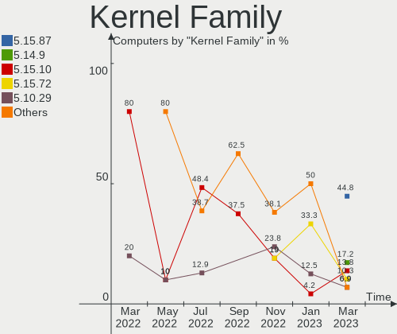

| Version | Computers | Percent |
|---------|-----------|---------|
| 5.15.72 | 15        | 53.57%  |
| 5.10.29 | 4         | 14.29%  |
| 5.15.10 | 3         | 10.71%  |
| 5.15.78 | 2         | 7.14%   |
| 5.15.35 | 2         | 7.14%   |
| 4.19.79 | 2         | 7.14%   |

Kernel Major Ver.
-----------------

Linux kernel major version

| Version | Computers | Percent |
|---------|-----------|---------|
| 5.15    | 22        | 78.57%  |
| 5.10    | 4         | 14.29%  |
| 4.19    | 2         | 7.14%   |

Arch
----

OS architecture (x86_64, i586, etc.)

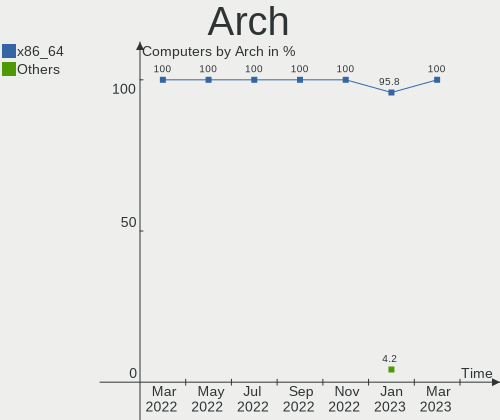

| Name   | Computers | Percent |
|--------|-----------|---------|
| x86_64 | 28        | 100%    |

DE
--

Desktop Environment

| Name     | Computers | Percent |
|----------|-----------|---------|
| MATE     | 24        | 85.71%  |
| Cinnamon | 4         | 14.29%  |

Display Server
--------------

X11 or Wayland

| Name | Computers | Percent |
|------|-----------|---------|
| X11  | 28        | 100%    |

Display Manager
---------------

SDDM, LightDM, etc.

| Name | Computers | Percent |
|------|-----------|---------|
| GDM  | 27        | 96.43%  |
| SDDM | 1         | 3.57%   |

OS Lang
-------

Language

| Lang    | Computers | Percent |
|---------|-----------|---------|
| Unknown | 27        | 96.43%  |
| ru_RU   | 1         | 3.57%   |

Boot Mode
---------

EFI or BIOS

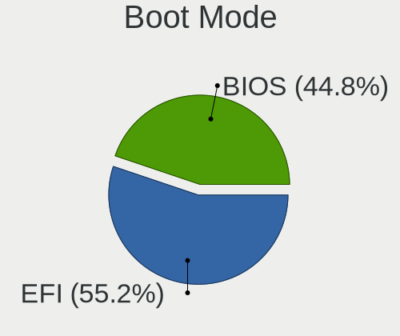

| Mode | Computers | Percent |
|------|-----------|---------|
| EFI  | 23        | 82.14%  |
| BIOS | 5         | 17.86%  |

Filesystem
----------

Type of filesystem

| Type  | Computers | Percent |
|-------|-----------|---------|
| Ext4  | 27        | 96.43%  |
| Btrfs | 1         | 3.57%   |

Part. scheme
------------

Scheme of partitioning

| Type | Computers | Percent |
|------|-----------|---------|
| GPT  | 23        | 82.14%  |
| MBR  | 5         | 17.86%  |

Dual Boot with Linux/BSD
------------------------

Hosting more than one Linux/BSD

| Dual boot | Computers | Percent |
|-----------|-----------|---------|
| No        | 23        | 82.14%  |
| Yes       | 5         | 17.86%  |

Dual Boot (Win)
---------------

Hosting Linux and Windows

| Dual boot | Computers | Percent |
|-----------|-----------|---------|
| No        | 19        | 67.86%  |
| Yes       | 9         | 32.14%  |

Board
-----

Vendor
------

Motherboard manufacturer

| Name                           | Computers | Percent |
|--------------------------------|-----------|---------|
| Hewlett-Packard                | 6         | 21.43%  |
| ASUSTek Computer               | 6         | 21.43%  |
| Lenovo                         | 3         | 10.71%  |
| Gigabyte Technology            | 3         | 10.71%  |
| MSI                            | 2         | 7.14%   |
| Shanghai Zhaoxin Semiconductor | 1         | 3.57%   |
| Kraftway                       | 1         | 3.57%   |
| ICL                            | 1         | 3.57%   |
| DEPO Computers                 | 1         | 3.57%   |
| Colorful Technology            | 1         | 3.57%   |
| ASRock                         | 1         | 3.57%   |
| Aquarius                       | 1         | 3.57%   |
| 3Logic Group                   | 1         | 3.57%   |

Model
-----

Motherboard model

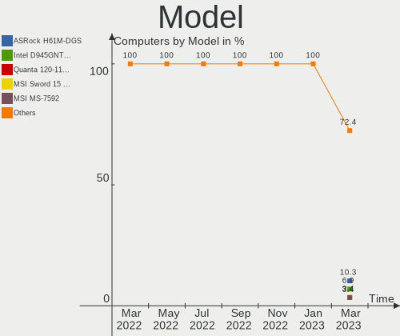

| Name                                             | Computers | Percent |
|--------------------------------------------------|-----------|---------|
| HP Laptop 15s-eq1xxx                             | 2         | 7.14%   |
| ASUS MINIPC PB62                                 | 2         | 7.14%   |
| Shanghai Zhaoxin ZXE CRB                         | 1         | 3.57%   |
| MSI Sword 15 A12UE                               | 1         | 3.57%   |
| MSI MS-7B86                                      | 1         | 3.57%   |
| Lenovo ThinkPad E15 Gen 4 21E6009UGP             | 1         | 3.57%   |
| Lenovo IdeaPad L340-15API 81LW                   | 1         | 3.57%   |
| Lenovo IdeaCentre B520e 10088                    | 1         | 3.57%   |
| Kraftway ACCORD                                  | 1         | 3.57%   |
| ICL RAYbook Si1512                               | 1         | 3.57%   |
| HP Pavilion All-in-One 24-xa0xxx                 | 1         | 3.57%   |
| HP Notebook                                      | 1         | 3.57%   |
| HP EliteOne 870 27 inch G9 All-in-One Desktop PC | 1         | 3.57%   |
| HP 440 G3 238 AiO                                | 1         | 3.57%   |
| Gigabyte M61SME-S2                               | 1         | 3.57%   |
| Gigabyte H110M-S2                                | 1         | 3.57%   |
| Gigabyte B365M DS3H                              | 1         | 3.57%   |
| DEPO Computers DPH410S                           | 1         | 3.57%   |
| Colorful H610M-K M.2                             | 1         | 3.57%   |
| ASUS PRIME H510T2/CSM                            | 1         | 3.57%   |
| ASUS P7H55-M                                     | 1         | 3.57%   |
| ASUS M5A78L-M LX V2                              | 1         | 3.57%   |
| ASUS HomeNet Model: HN-G700                      | 1         | 3.57%   |
| ASRock H510M-HVS R2.0                            | 1         | 3.57%   |
| Aquarius NS685U R11                              | 1         | 3.57%   |
| 3Logic Group Graviton N15i-K2                    | 1         | 3.57%   |

Model Family
------------

Motherboard model prefix

| Name                   | Computers | Percent |
|------------------------|-----------|---------|
| HP Laptop              | 2         | 7.14%   |
| ASUS MINIPC            | 2         | 7.14%   |
| Shanghai Zhaoxin ZXE   | 1         | 3.57%   |
| MSI Sword              | 1         | 3.57%   |
| MSI MS-7B86            | 1         | 3.57%   |
| Lenovo ThinkPad        | 1         | 3.57%   |
| Lenovo IdeaPad         | 1         | 3.57%   |
| Lenovo IdeaCentre      | 1         | 3.57%   |
| Kraftway ACCORD        | 1         | 3.57%   |
| ICL RAYbook            | 1         | 3.57%   |
| HP Pavilion            | 1         | 3.57%   |
| HP Notebook            | 1         | 3.57%   |
| HP EliteOne            | 1         | 3.57%   |
| HP 440                 | 1         | 3.57%   |
| Gigabyte M61SME-S2     | 1         | 3.57%   |
| Gigabyte H110M-S2      | 1         | 3.57%   |
| Gigabyte B365M         | 1         | 3.57%   |
| DEPO Computers DPH410S | 1         | 3.57%   |
| Colorful H610M-K       | 1         | 3.57%   |
| ASUS PRIME             | 1         | 3.57%   |
| ASUS P7H55-M           | 1         | 3.57%   |
| ASUS M5A78L-M          | 1         | 3.57%   |
| ASUS HomeNet           | 1         | 3.57%   |
| ASRock H510M-HVS       | 1         | 3.57%   |
| Aquarius NS685U        | 1         | 3.57%   |
| 3Logic Group Graviton  | 1         | 3.57%   |

MFG Year
--------

Motherboard manufacture year

| Year | Computers | Percent |
|------|-----------|---------|
| 2022 | 8         | 28.57%  |
| 2021 | 6         | 21.43%  |
| 2019 | 4         | 14.29%  |
| 2020 | 2         | 7.14%   |
| 2018 | 2         | 7.14%   |
| 2017 | 1         | 3.57%   |
| 2016 | 1         | 3.57%   |
| 2012 | 1         | 3.57%   |
| 2011 | 1         | 3.57%   |
| 2010 | 1         | 3.57%   |
| 2007 | 1         | 3.57%   |

Form Factor
-----------

Physical design of the computer

| Name       | Computers | Percent |
|------------|-----------|---------|
| Desktop    | 13        | 46.43%  |
| Notebook   | 11        | 39.29%  |
| All in one | 4         | 14.29%  |

Secure Boot
-----------

Enabled or disabled

| State    | Computers | Percent |
|----------|-----------|---------|
| Disabled | 28        | 100%    |

Coreboot
--------

Have coreboot on board

| Used | Computers | Percent |
|------|-----------|---------|
| No   | 28        | 100%    |

RAM Size
--------

Total RAM memory

| Size in GB | Computers | Percent |
|------------|-----------|---------|
| 4.01-8.0   | 14        | 50%     |
| 16.01-24.0 | 7         | 25%     |
| 8.01-16.0  | 5         | 17.86%  |
| 3.01-4.0   | 2         | 7.14%   |

RAM Used
--------

Used RAM memory

| Used GB  | Computers | Percent |
|----------|-----------|---------|
| 1.01-2.0 | 19        | 67.86%  |
| 2.01-3.0 | 7         | 25%     |
| 4.01-8.0 | 2         | 7.14%   |

Total Drives
------------

Number of drives on board

| Drives | Computers | Percent |
|--------|-----------|---------|
| 1      | 19        | 67.86%  |
| 2      | 8         | 28.57%  |
| 3      | 1         | 3.57%   |

Has CD-ROM
----------

Has CD-ROM on board

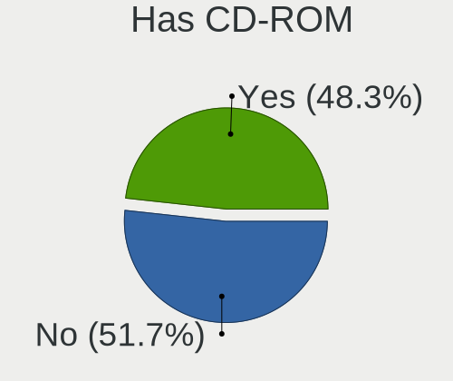

| Presented | Computers | Percent |
|-----------|-----------|---------|
| No        | 23        | 82.14%  |
| Yes       | 5         | 17.86%  |

Has Ethernet
------------

Has Ethernet on board

| Presented | Computers | Percent |
|-----------|-----------|---------|
| Yes       | 27        | 96.43%  |
| No        | 1         | 3.57%   |

Has WiFi
--------

Has WiFi module

| Presented | Computers | Percent |
|-----------|-----------|---------|
| Yes       | 20        | 71.43%  |
| No        | 8         | 28.57%  |

Has Bluetooth
-------------

Has Bluetooth module

| Presented | Computers | Percent |
|-----------|-----------|---------|
| Yes       | 19        | 67.86%  |
| No        | 9         | 32.14%  |

Location
--------

Country
-------

Geographic location (country)

| Country | Computers | Percent |
|---------|-----------|---------|
| Russia  | 28        | 100%    |

City
----

Geographic location (city)

| City            | Computers | Percent |
|-----------------|-----------|---------|
| Salekhard       | 5         | 17.86%  |
| Novy Urengoy    | 3         | 10.71%  |
| Murom           | 3         | 10.71%  |
| Moscow          | 3         | 10.71%  |
| Veliky Novgorod | 2         | 7.14%   |
| Baksan          | 2         | 7.14%   |
| Yekaterinburg   | 1         | 3.57%   |
| Yakutsk         | 1         | 3.57%   |
| Perm            | 1         | 3.57%   |
| Omsk            | 1         | 3.57%   |
| Noyabrsk        | 1         | 3.57%   |
| Nadym           | 1         | 3.57%   |
| Muromskiy       | 1         | 3.57%   |
| Labytnangi      | 1         | 3.57%   |
| Khabarovsk      | 1         | 3.57%   |
| Balashikha      | 1         | 3.57%   |

Drives
------

Drive Vendor
------------

Hard drive vendors

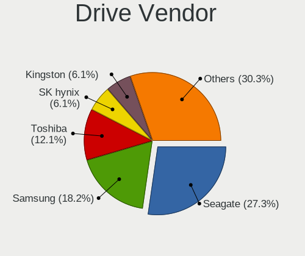

| Vendor              | Computers | Drives | Percent |
|---------------------|-----------|--------|---------|
| WDC                 | 4         | 5      | 11.11%  |
| Seagate             | 4         | 4      | 11.11%  |
| Samsung Electronics | 3         | 3      | 8.33%   |
| SK hynix            | 2         | 2      | 5.56%   |
| Foxline             | 2         | 2      | 5.56%   |
| AGI                 | 2         | 2      | 5.56%   |
| Unknown             | 1         | 1      | 2.78%   |
| UMIS                | 1         | 1      | 2.78%   |
| Transcend           | 1         | 1      | 2.78%   |
| Toshiba             | 1         | 1      | 2.78%   |
| SPCC Sol            | 1         | 1      | 2.78%   |
| Silicon Motion      | 1         | 1      | 2.78%   |
| SanDisk             | 1         | 1      | 2.78%   |
| Plextor             | 1         | 1      | 2.78%   |
| Micron Technology   | 1         | 1      | 2.78%   |
| Kingston            | 1         | 1      | 2.78%   |
| KingSpec            | 1         | 1      | 2.78%   |
| Intel               | 1         | 1      | 2.78%   |
| Hitachi             | 1         | 1      | 2.78%   |
| ExeGate             | 1         | 2      | 2.78%   |
| Crucial             | 1         | 1      | 2.78%   |
| China               | 1         | 1      | 2.78%   |
| Apacer              | 1         | 1      | 2.78%   |
| AMD                 | 1         | 1      | 2.78%   |
| A-DATA Technology   | 1         | 1      | 2.78%   |

Drive Model
-----------

Hard drive models

| Model                                  | Computers | Percent |
|----------------------------------------|-----------|---------|
| SK hynix PC711 HFS512GDE9X073N 512GB   | 2         | 5.41%   |
| Foxline FLSSD256M80E13TCX5 256GB       | 2         | 5.41%   |
| AGI AGI512G16AI198 512GB               | 2         | 5.41%   |
| WDC WD5000AZLX-60K2TA0 500GB           | 1         | 2.7%    |
| WDC WD25 00LPCX-24C6HT0 250GB          | 1         | 2.7%    |
| WDC WD10EZEX-75ZF5A0 1TB               | 1         | 2.7%    |
| WDC WD10EZEX-22MFCA0 1TB               | 1         | 2.7%    |
| WDC WD10EZEX-00WN4A0 1TB               | 1         | 2.7%    |
| Unknown NVMe SSD Drive 256GB           | 1         | 2.7%    |
| UMIS RPJTJ256MGE1QDQ 256GB             | 1         | 2.7%    |
| Transcend TS512GMTS430S 512GB SSD      | 1         | 2.7%    |
| Toshiba MQ01ABF050 500GB               | 1         | 2.7%    |
| SPCC Sol id State Disk 64GB SSD        | 1         | 2.7%    |
| Silicon Motion HomeNet HN M2 SSD 256GB | 1         | 2.7%    |
| Seagate ST500LT012-1DG142 500GB        | 1         | 2.7%    |
| Seagate ST500DM002-1BD142 500GB        | 1         | 2.7%    |
| Seagate ST1000LM049-2GH172 1TB         | 1         | 2.7%    |
| Seagate ST1000DM010-2EP102 1TB         | 1         | 2.7%    |
| SanDisk NVMe SSD Drive 500GB           | 1         | 2.7%    |
| Samsung MZVL2512HCJQ-00BH1 512GB       | 1         | 2.7%    |
| Samsung MZALQ512HALU-000L2 512GB       | 1         | 2.7%    |
| Samsung HD400LJ 400GB                  | 1         | 2.7%    |
| Plextor PX-128S3G 128GB SSD            | 1         | 2.7%    |
| Micron 2450_MTFDKBA512TFK 512GB        | 1         | 2.7%    |
| Kingston SA400S37120G 120GB SSD        | 1         | 2.7%    |
| KingSpec NT-256 256GB SSD              | 1         | 2.7%    |
| Intel SSDSC2KI512G8 512GB              | 1         | 2.7%    |
| Hitachi HDS721050CLA360 500GB          | 1         | 2.7%    |
| ExeGate EX276690RUS(960G 960GB SSD     | 1         | 2.7%    |
| Crucial CT240BX500SSD1 240GB           | 1         | 2.7%    |
| China 256GB SSD                        | 1         | 2.7%    |
| Apacer AS350 512GB SSD                 | 1         | 2.7%    |
| AMD R5SL256G 256GB SSD                 | 1         | 2.7%    |
| A-DATA SU800NS38 256GB SSD             | 1         | 2.7%    |

HDD Vendor
----------

Hard disk drive vendors

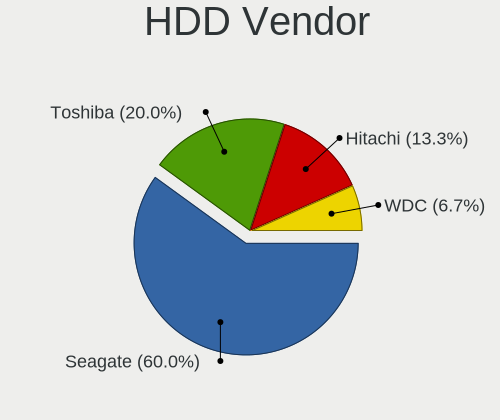

| Vendor              | Computers | Drives | Percent |
|---------------------|-----------|--------|---------|
| WDC                 | 4         | 5      | 36.36%  |
| Seagate             | 4         | 4      | 36.36%  |
| Toshiba             | 1         | 1      | 9.09%   |
| Samsung Electronics | 1         | 1      | 9.09%   |
| Hitachi             | 1         | 1      | 9.09%   |

SSD Vendor
----------

Solid state drive vendors

| Vendor            | Computers | Drives | Percent |
|-------------------|-----------|--------|---------|
| Transcend         | 1         | 1      | 8.33%   |
| SPCC Sol          | 1         | 1      | 8.33%   |
| Plextor           | 1         | 1      | 8.33%   |
| Kingston          | 1         | 1      | 8.33%   |
| KingSpec          | 1         | 1      | 8.33%   |
| Intel             | 1         | 1      | 8.33%   |
| ExeGate           | 1         | 2      | 8.33%   |
| Crucial           | 1         | 1      | 8.33%   |
| China             | 1         | 1      | 8.33%   |
| Apacer            | 1         | 1      | 8.33%   |
| AMD               | 1         | 1      | 8.33%   |
| A-DATA Technology | 1         | 1      | 8.33%   |

Drive Kind
----------

HDD or SSD

| Kind | Computers | Drives | Percent |
|------|-----------|--------|---------|
| NVMe | 13        | 13     | 37.14%  |
| SSD  | 12        | 13     | 34.29%  |
| HDD  | 10        | 12     | 28.57%  |

Drive Connector
---------------

SATA, SAS, NVMe, etc.

| Type | Computers | Drives | Percent |
|------|-----------|--------|---------|
| SATA | 16        | 23     | 51.61%  |
| NVMe | 13        | 13     | 41.94%  |
| SAS  | 2         | 2      | 6.45%   |

Drive Size
----------

Size of hard drive

| Size in TB | Computers | Drives | Percent |
|------------|-----------|--------|---------|
| 0.01-0.5   | 14        | 15     | 63.64%  |
| 0.51-1.0   | 8         | 10     | 36.36%  |

Space Total
-----------

Amount of disk space available on the file system

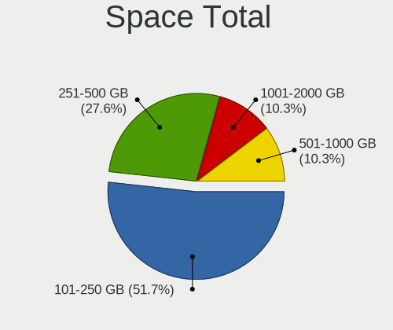

| Size in GB | Computers | Percent |
|------------|-----------|---------|
| 101-250    | 10        | 35.71%  |
| 251-500    | 7         | 25%     |
| 501-1000   | 4         | 14.29%  |
| 51-100     | 3         | 10.71%  |
| 1001-2000  | 2         | 7.14%   |
| 2001-3000  | 1         | 3.57%   |
| 1-20       | 1         | 3.57%   |

Space Used
----------

Amount of used disk space

| Used GB   | Computers | Percent |
|-----------|-----------|---------|
| 1-20      | 19        | 67.86%  |
| 21-50     | 4         | 14.29%  |
| 101-250   | 2         | 7.14%   |
| 501-1000  | 2         | 7.14%   |
| 2001-3000 | 1         | 3.57%   |

Malfunc. Drives
---------------

Drive models with a malfunction

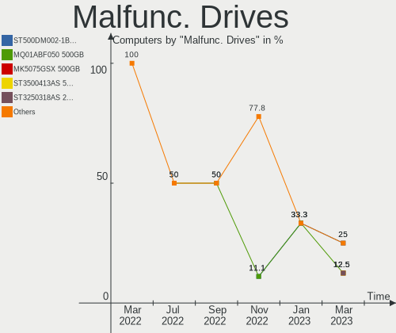

| Model                             | Computers | Drives | Percent |
|-----------------------------------|-----------|--------|---------|
| WDC WD10EZEX-75ZF5A0 1TB          | 1         | 1      | 14.29%  |
| WDC WD10EZEX-00WN4A0 1TB          | 1         | 1      | 14.29%  |
| Toshiba MQ01ABF050 500GB          | 1         | 1      | 14.29%  |
| Seagate ST500LT012-1DG142 500GB   | 1         | 1      | 14.29%  |
| Seagate ST500DM002-1BD142 500GB   | 1         | 1      | 14.29%  |
| Seagate ST1000DM010-2EP102 1TB    | 1         | 1      | 14.29%  |
| Samsung Electronics HD400LJ 400GB | 1         | 1      | 14.29%  |

Malfunc. Drive Vendor
---------------------

Vendors of faulty drives

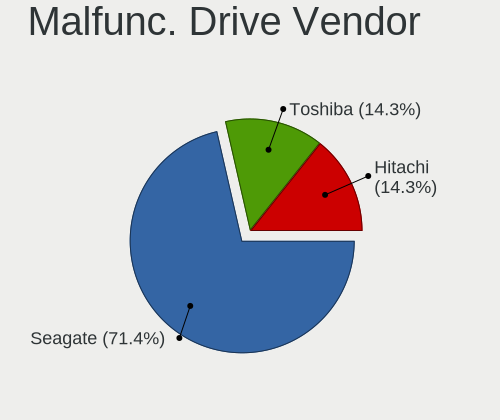

| Vendor              | Computers | Drives | Percent |
|---------------------|-----------|--------|---------|
| Seagate             | 3         | 3      | 42.86%  |
| WDC                 | 2         | 2      | 28.57%  |
| Toshiba             | 1         | 1      | 14.29%  |
| Samsung Electronics | 1         | 1      | 14.29%  |

Malfunc. HDD Vendor
-------------------

Vendors of faulty HDD drives

| Vendor              | Computers | Drives | Percent |
|---------------------|-----------|--------|---------|
| Seagate             | 3         | 3      | 42.86%  |
| WDC                 | 2         | 2      | 28.57%  |
| Toshiba             | 1         | 1      | 14.29%  |
| Samsung Electronics | 1         | 1      | 14.29%  |

Malfunc. Drive Kind
-------------------

Kinds of faulty drives

| Kind | Computers | Drives | Percent |
|------|-----------|--------|---------|
| HDD  | 6         | 7      | 100%    |

Failed Drives
-------------

Failed drive models

Zero info for selected period =(

Failed Drive Vendor
-------------------

Failed drive vendors

Zero info for selected period =(

Drive Status
------------

Number of failed and malfunc. drives

| Status   | Computers | Drives | Percent |
|----------|-----------|--------|---------|
| Works    | 24        | 28     | 72.73%  |
| Malfunc  | 6         | 7      | 18.18%  |
| Detected | 3         | 3      | 9.09%   |

Storage controller
------------------

Storage Vendor
--------------

Storage controller vendors

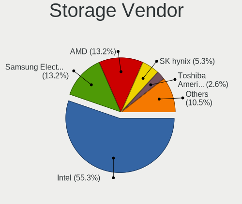

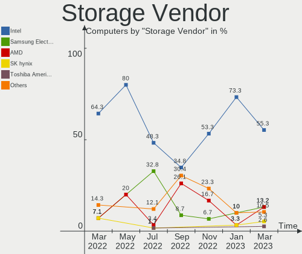

| Vendor                  | Computers | Percent |
|-------------------------|-----------|---------|
| Intel                   | 19        | 50%     |
| Silicon Motion          | 3         | 7.89%   |
| AMD                     | 3         | 7.89%   |
| SK hynix                | 2         | 5.26%   |
| Samsung Electronics     | 2         | 5.26%   |
| Phison Electronics      | 2         | 5.26%   |
| Zhaoxin                 | 1         | 2.63%   |
| VIA Technologies        | 1         | 2.63%   |
| Union Memory (Shenzhen) | 1         | 2.63%   |
| SanDisk                 | 1         | 2.63%   |
| Nvidia                  | 1         | 2.63%   |
| Micron Technology       | 1         | 2.63%   |
| Unknown                 | 1         | 2.63%   |

Storage Model
-------------

Storage controller models

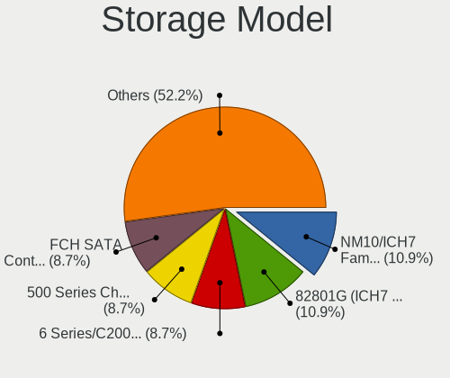

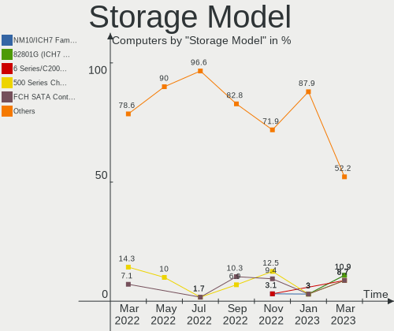

| Model                                                                         | Computers | Percent |
|-------------------------------------------------------------------------------|-----------|---------|
| Intel 500 Series Chipset Family SATA AHCI Controller                          | 5         | 12.2%   |
| Silicon Motion SM2263EN/SM2263XT SSD Controller                               | 3         | 7.32%   |
| Intel Cannon Point-LP SATA Controller [AHCI Mode]                             | 3         | 7.32%   |
| SK hynix Gold P31/PC711 NVMe Solid State Drive                                | 2         | 4.88%   |
| Phison PS5013 E13 NVMe Controller                                             | 2         | 4.88%   |
| Intel Q170/Q150/B150/H170/H110/Z170/CM236 Chipset SATA Controller [AHCI Mode] | 2         | 4.88%   |
| Zhaoxin ZX-100/ZX-200/ZX-E StorX AHCI Controller                              | 1         | 2.44%   |
| VIA VT6415 PATA IDE Host Controller                                           | 1         | 2.44%   |
| Union Memory (Shenzhen) Non-Volatile memory controller                        | 1         | 2.44%   |
| SanDisk WD Blue SN570 NVMe SSD                                                | 1         | 2.44%   |
| Samsung NVMe SSD Controller PM9A1/PM9A3/980PRO                                | 1         | 2.44%   |
| Samsung NVMe SSD Controller 980                                               | 1         | 2.44%   |
| Nvidia MCP61 SATA Controller                                                  | 1         | 2.44%   |
| Nvidia MCP61 IDE                                                              | 1         | 2.44%   |
| Micron Non-Volatile memory controller                                         | 1         | 2.44%   |
| Intel Comet Lake SATA AHCI Controller                                         | 1         | 2.44%   |
| Intel Cannon Lake PCH SATA AHCI Controller                                    | 1         | 2.44%   |
| Intel Alder Lake-S PCH SATA Controller [AHCI Mode]                            | 1         | 2.44%   |
| Intel Alder Lake-P SATA AHCI Controller                                       | 1         | 2.44%   |
| Intel 8 Series SATA Controller 1 [AHCI mode]                                  | 1         | 2.44%   |
| Intel 6 Series/C200 Series Chipset Family 6 port Desktop SATA AHCI Controller | 1         | 2.44%   |
| Intel 5 Series/3400 Series Chipset 4 port SATA IDE Controller                 | 1         | 2.44%   |
| Intel 5 Series/3400 Series Chipset 2 port SATA IDE Controller                 | 1         | 2.44%   |
| Intel 400 Series Chipset Family SATA AHCI Controller                          | 1         | 2.44%   |
| Intel 200 Series PCH SATA controller [AHCI mode]                              | 1         | 2.44%   |
| AMD SB7x0/SB8x0/SB9x0 SATA Controller [IDE mode]                              | 1         | 2.44%   |
| AMD SB7x0/SB8x0/SB9x0 IDE Controller                                          | 1         | 2.44%   |
| AMD FCH SATA Controller [AHCI mode]                                           | 1         | 2.44%   |
| AMD 400 Series Chipset SATA Controller                                        | 1         | 2.44%   |
| Unknown                                                                       | 1         | 2.44%   |

Storage Kind
------------

Kind of storage controller (IDE, SATA, NVMe, SAS, ...)

| Kind | Computers | Percent |
|------|-----------|---------|
| SATA | 22        | 57.89%  |
| NVMe | 13        | 34.21%  |
| IDE  | 3         | 7.89%   |

Processor
---------

CPU Vendor
----------

Processor vendors

| Vendor       | Computers | Percent |
|--------------|-----------|---------|
| Intel        | 21        | 75%     |
| AMD          | 6         | 21.43%  |
| CentaurHauls | 1         | 3.57%   |

CPU Model
---------

Processor models

| Model                                          | Computers | Percent |
|------------------------------------------------|-----------|---------|
| Intel Core i5-8259U CPU @ 2.30GHz              | 2         | 7.14%   |
| Intel 11th Gen Core i7-11700 @ 2.50GHz         | 2         | 7.14%   |
| AMD Ryzen 3 4300U with Radeon Graphics         | 2         | 7.14%   |
| Intel Pentium CPU G4500 @ 3.50GHz              | 1         | 3.57%   |
| Intel Core i7-10700K CPU @ 3.80GHz             | 1         | 3.57%   |
| Intel Core i5-9400 CPU @ 2.90GHz               | 1         | 3.57%   |
| Intel Core i5-8400T CPU @ 1.70GHz              | 1         | 3.57%   |
| Intel Core i5-8279U CPU @ 2.40GHz              | 1         | 3.57%   |
| Intel Core i5-7500T CPU @ 2.70GHz              | 1         | 3.57%   |
| Intel Core i5-2400S CPU @ 2.50GHz              | 1         | 3.57%   |
| Intel Core i5-10400 CPU @ 2.90GHz              | 1         | 3.57%   |
| Intel Core i5-10210U CPU @ 1.60GHz             | 1         | 3.57%   |
| Intel Core i5 CPU 750 @ 2.67GHz                | 1         | 3.57%   |
| Intel Core i3-4005U CPU @ 1.70GHz              | 1         | 3.57%   |
| Intel Core i3-10105 CPU @ 3.70GHz              | 1         | 3.57%   |
| Intel Core i3-10100 CPU @ 3.60GHz              | 1         | 3.57%   |
| Intel 12th Gen Core i7-12700H                  | 1         | 3.57%   |
| Intel 12th Gen Core i7-12700                   | 1         | 3.57%   |
| Intel 12th Gen Core i5-1235U                   | 1         | 3.57%   |
| Intel 12th Gen Core i3-12100                   | 1         | 3.57%   |
| CentaurHauls ZHAOXIN KaiXian KX-6640MA@2.2+GHz | 1         | 3.57%   |
| AMD Ryzen 5 3500U with Radeon Vega Mobile Gfx  | 1         | 3.57%   |
| AMD Phenom 9650 Quad-Core Processor            | 1         | 3.57%   |
| AMD Athlon II X2 260 Processor                 | 1         | 3.57%   |
| AMD Athlon 3000G with Radeon Vega Graphics     | 1         | 3.57%   |

CPU Model Family
----------------

Processor model prefix

| Model            | Computers | Percent |
|------------------|-----------|---------|
| Intel Core i5    | 10        | 35.71%  |
| Other            | 7         | 25%     |
| Intel Core i3    | 3         | 10.71%  |
| AMD Ryzen 3      | 2         | 7.14%   |
| Intel Pentium    | 1         | 3.57%   |
| Intel Core i7    | 1         | 3.57%   |
| AMD Ryzen 5      | 1         | 3.57%   |
| AMD Phenom       | 1         | 3.57%   |
| AMD Athlon II X2 | 1         | 3.57%   |
| AMD Athlon       | 1         | 3.57%   |

CPU Cores
---------

Number of processor cores

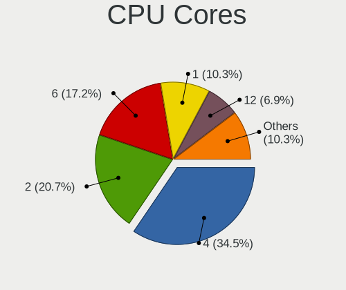

| Number | Computers | Percent |
|--------|-----------|---------|
| 4      | 15        | 53.57%  |
| 2      | 4         | 14.29%  |
| 8      | 3         | 10.71%  |
| 6      | 3         | 10.71%  |
| 14     | 1         | 3.57%   |
| 12     | 1         | 3.57%   |
| 10     | 1         | 3.57%   |

CPU Sockets
-----------

Number of sockets

| Number | Computers | Percent |
|--------|-----------|---------|
| 1      | 28        | 100%    |

CPU Threads
-----------

Threads per core (Hyper-Threading)

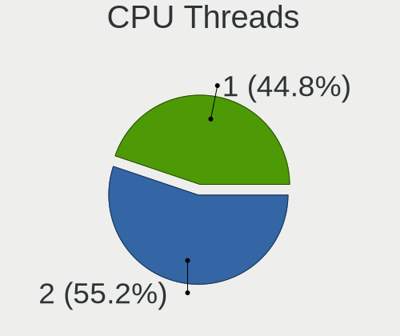

| Number | Computers | Percent |
|--------|-----------|---------|
| 2      | 17        | 60.71%  |
| 1      | 11        | 39.29%  |

CPU Op-Modes
------------

CPU Operation Modes (32-bit, 64-bit)

| Op mode        | Computers | Percent |
|----------------|-----------|---------|
| 32-bit, 64-bit | 28        | 100%    |

CPU Microcode
-------------

Microcode number

| Number     | Computers | Percent |
|------------|-----------|---------|
| 0xa0653    | 3         | 10.71%  |
| 0x806ea    | 3         | 10.71%  |
| 0xa0671    | 2         | 7.14%   |
| 0x08600106 | 2         | 7.14%   |
| 0xa0655    | 1         | 3.57%   |
| 0x906ed    | 1         | 3.57%   |
| 0x906ea    | 1         | 3.57%   |
| 0x906e9    | 1         | 3.57%   |
| 0x906a4    | 1         | 3.57%   |
| 0x906a3    | 1         | 3.57%   |
| 0x90675    | 1         | 3.57%   |
| 0x90672    | 1         | 3.57%   |
| 0x806ec    | 1         | 3.57%   |
| 0x506e3    | 1         | 3.57%   |
| 0x40651    | 1         | 3.57%   |
| 0x206a7    | 1         | 3.57%   |
| 0x106e5    | 1         | 3.57%   |
| 0x08108109 | 1         | 3.57%   |
| 0x08108102 | 1         | 3.57%   |
| 0x010000c8 | 1         | 3.57%   |
| 0x01000083 | 1         | 3.57%   |
| Unknown    | 1         | 3.57%   |

CPU Microarch
-------------

Microarchitecture

| Name             | Computers | Percent |
|------------------|-----------|---------|
| KabyLake         | 7         | 25%     |
| CometLake        | 4         | 14.29%  |
| Alderlake Hybrid | 4         | 14.29%  |
| Unknown          | 3         | 10.71%  |
| Zen+             | 2         | 7.14%   |
| Zen 2            | 2         | 7.14%   |
| K10              | 2         | 7.14%   |
| Skylake          | 1         | 3.57%   |
| SandyBridge      | 1         | 3.57%   |
| Nehalem          | 1         | 3.57%   |
| Haswell          | 1         | 3.57%   |

Graphics
--------

GPU Vendor
----------

Vendors of graphics cards

| Vendor  | Computers | Percent |
|---------|-----------|---------|
| Intel   | 19        | 59.38%  |
| Nvidia  | 6         | 18.75%  |
| AMD     | 6         | 18.75%  |
| Zhaoxin | 1         | 3.13%   |

GPU Model
---------

Graphics card models

| Model                                                                         | Computers | Percent |
|-------------------------------------------------------------------------------|-----------|---------|
| Intel CometLake-S GT2 [UHD Graphics 630]                                      | 4         | 12.5%   |
| Intel CoffeeLake-U GT3e [Iris Plus Graphics 655]                              | 3         | 9.38%   |
| Intel RocketLake-S GT1 [UHD Graphics 750]                                     | 2         | 6.25%   |
| Intel CoffeeLake-S GT2 [UHD Graphics 630]                                     | 2         | 6.25%   |
| AMD Renoir                                                                    | 2         | 6.25%   |
| AMD Picasso/Raven 2 [Radeon Vega Series / Radeon Vega Mobile Series]          | 2         | 6.25%   |
| Zhaoxin ZX-E C-960 GPU                                                        | 1         | 3.13%   |
| Nvidia TU117M [GeForce MX550]                                                 | 1         | 3.13%   |
| Nvidia GT218 [GeForce 210]                                                    | 1         | 3.13%   |
| Nvidia GM107 [GeForce GTX 750 Ti]                                             | 1         | 3.13%   |
| Nvidia GK208B [GeForce GT 710]                                                | 1         | 3.13%   |
| Nvidia GF119M [GeForce GT 520M]                                               | 1         | 3.13%   |
| Nvidia GA106M [GeForce RTX 3060 Mobile / Max-Q]                               | 1         | 3.13%   |
| Intel HD Graphics 630                                                         | 1         | 3.13%   |
| Intel HD Graphics 530                                                         | 1         | 3.13%   |
| Intel Haswell-ULT Integrated Graphics Controller                              | 1         | 3.13%   |
| Intel CometLake-U GT2 [UHD Graphics]                                          | 1         | 3.13%   |
| Intel AlderLake-S GT1                                                         | 1         | 3.13%   |
| Intel Alder Lake-UP3 GT2 [Iris Xe Graphics]                                   | 1         | 3.13%   |
| Intel Alder Lake-S GT1 [UHD Graphics 730]                                     | 1         | 3.13%   |
| Intel Alder Lake-P Integrated Graphics Controller                             | 1         | 3.13%   |
| AMD Sun XT [Radeon HD 8670A/8670M/8690M / R5 M330 / M430 / Radeon 520 Mobile] | 1         | 3.13%   |
| AMD RS780L [Radeon 3000]                                                      | 1         | 3.13%   |

GPU Combo
---------

Combinations of graphics cards

| Name           | Computers | Percent |
|----------------|-----------|---------|
| 1 x Intel      | 16        | 57.14%  |
| 1 x AMD        | 4         | 14.29%  |
| 1 x Nvidia     | 3         | 10.71%  |
| Intel + Nvidia | 2         | 7.14%   |
| 1 x Zhaoxin    | 1         | 3.57%   |
| Intel + AMD    | 1         | 3.57%   |
| AMD + Nvidia   | 1         | 3.57%   |

GPU Driver
----------

Free vs proprietary

| Driver      | Computers | Percent |
|-------------|-----------|---------|
| Free        | 18        | 64.29%  |
| Unknown     | 9         | 32.14%  |
| Proprietary | 1         | 3.57%   |

GPU Memory
----------

Total video memory

| Size in GB | Computers | Percent |
|------------|-----------|---------|
| Unknown    | 19        | 67.86%  |
| 1.01-2.0   | 4         | 14.29%  |
| 0.01-0.5   | 3         | 10.71%  |
| 0.51-1.0   | 2         | 7.14%   |

Monitor
-------

Monitor Vendor
--------------

Monitor vendors

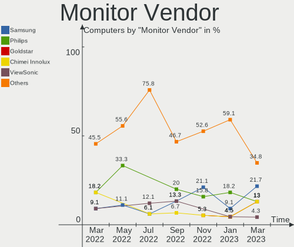

| Vendor              | Computers | Percent |
|---------------------|-----------|---------|
| Philips             | 4         | 17.39%  |
| BOE                 | 4         | 17.39%  |
| Samsung Electronics | 3         | 13.04%  |
| Hewlett-Packard     | 3         | 13.04%  |
| NLE                 | 2         | 8.7%    |
| LG Display          | 2         | 8.7%    |
| SGT                 | 1         | 4.35%   |
| Lenovo              | 1         | 4.35%   |
| Dell                | 1         | 4.35%   |
| Chimei Innolux      | 1         | 4.35%   |
| AOC                 | 1         | 4.35%   |

Monitor Model
-------------

Monitor models

| Model                                                                | Computers | Percent |
|----------------------------------------------------------------------|-----------|---------|
| BOE LCD Monitor BOE09C5 1920x1080 345x194mm 15.6-inch                | 3         | 12.5%   |
| NLE Newline NLE0032 3840x2160 944x398mm 40.3-inch                    | 2         | 8.33%   |
| LG Display LCD Monitor LGD062E 1920x1080 344x194mm 15.5-inch         | 2         | 8.33%   |
| SGT XY238 SGT2386 1920x1080 530x290mm 23.8-inch                      | 1         | 4.17%   |
| Samsung Electronics SyncMaster SAM0580 1280x1024 376x301mm 19.0-inch | 1         | 4.17%   |
| Samsung Electronics SMB2030N SAM0634 1600x900 443x249mm 20.0-inch    | 1         | 4.17%   |
| Samsung Electronics LCD Monitor SDC4E51 1366x768 344x194mm 15.5-inch | 1         | 4.17%   |
| Philips PHL 243V7 PHLC155 1920x1080 527x296mm 23.8-inch              | 1         | 4.17%   |
| Philips PHL 241E1 PHLC207 1920x1080 527x296mm 23.8-inch              | 1         | 4.17%   |
| Philips PHL 223V5 PHLC0CF 1920x1080 477x268mm 21.5-inch              | 1         | 4.17%   |
| Philips 226V4 PHLC0B1 1920x1080 477x268mm 21.5-inch                  | 1         | 4.17%   |
| Philips 206VL PHLC08C 1600x900 443x249mm 20.0-inch                   | 1         | 4.17%   |
| Lenovo AIO PC LEN0200 1920x1080 510x280mm 22.9-inch                  | 1         | 4.17%   |
| Hewlett-Packard ALL-in-One HWP425D 1920x1080 527x297mm 23.8-inch     | 1         | 4.17%   |
| Hewlett-Packard ALL-in-One HPN4024 1920x1080 527x296mm 23.8-inch     | 1         | 4.17%   |
| Hewlett-Packard 840 G9 AiO HPN4048 1920x1080 527x296mm 23.8-inch     | 1         | 4.17%   |
| Dell SE2416H DELD082 1920x1080 527x296mm 23.8-inch                   | 1         | 4.17%   |
| Chimei Innolux LCD Monitor CMN15F5 1920x1080 344x193mm 15.5-inch     | 1         | 4.17%   |
| BOE LCD Monitor BOE07D0 1920x1080 294x165mm 13.3-inch                | 1         | 4.17%   |
| AOC 2269WM AOC2269 1920x1080 480x270mm 21.7-inch                     | 1         | 4.17%   |

Monitor Resolution
------------------

Monitor screen resolution

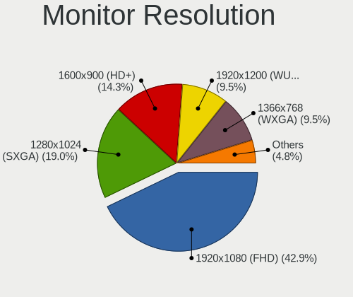

| Resolution       | Computers | Percent |
|------------------|-----------|---------|
| 1920x1080 (FHD)  | 17        | 73.91%  |
| 3840x2160 (4K)   | 2         | 8.7%    |
| 1600x900 (HD+)   | 2         | 8.7%    |
| 1366x768 (WXGA)  | 1         | 4.35%   |
| 1280x1024 (SXGA) | 1         | 4.35%   |

Monitor Diagonal
----------------

Diagonal size in inches

| Inches | Computers | Percent |
|--------|-----------|---------|
| 15     | 8         | 33.33%  |
| 23     | 4         | 16.67%  |
| 24     | 3         | 12.5%   |
| 21     | 3         | 12.5%   |
| 40     | 2         | 8.33%   |
| 20     | 2         | 8.33%   |
| 22     | 1         | 4.17%   |
| 19     | 1         | 4.17%   |

Monitor Width
-------------

Physical width

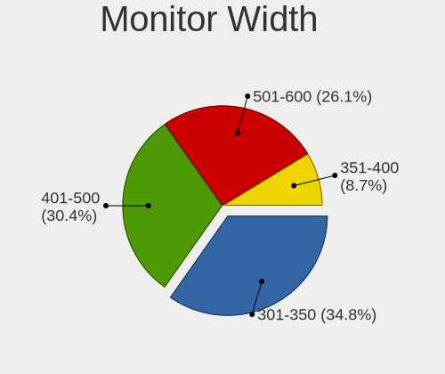

| Width in mm | Computers | Percent |
|-------------|-----------|---------|
| 501-600     | 8         | 33.33%  |
| 301-350     | 8         | 33.33%  |
| 401-500     | 5         | 20.83%  |
| 901-1000    | 2         | 8.33%   |
| 351-400     | 1         | 4.17%   |

Aspect Ratio
------------

Proportional relationship between the width and the height

| Ratio | Computers | Percent |
|-------|-----------|---------|
| 16/9  | 19        | 86.36%  |
| 21/9  | 2         | 9.09%   |
| 5/4   | 1         | 4.55%   |

Monitor Area
------------

Area in inch

| Area in inch | Computers | Percent |
|----------------|-----------|---------|
| 201-250        | 11        | 45.83%  |
| 101-110        | 8         | 33.33%  |
| 151-200        | 3         | 12.5%   |
| 501-1000       | 2         | 8.33%   |

Pixel Density
-------------

Pixels per inch

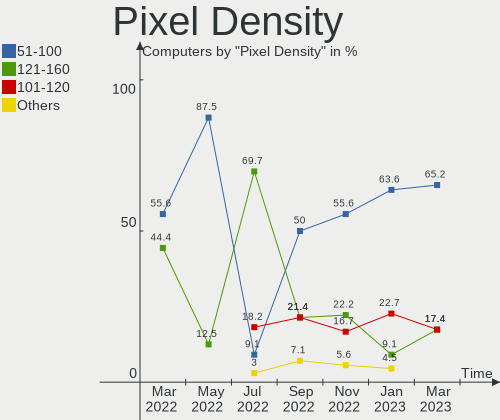

| Density | Computers | Percent |
|---------|-----------|---------|
| 51-100  | 9         | 42.86%  |
| 121-160 | 7         | 33.33%  |
| 101-120 | 5         | 23.81%  |

Multiple Monitors
-----------------

Total monitors connected

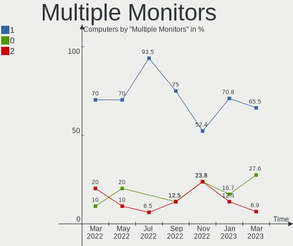

| Total | Computers | Percent |
|-------|-----------|---------|
| 1     | 15        | 53.57%  |
| 0     | 9         | 32.14%  |
| 2     | 4         | 14.29%  |

Network
-------

Net Controller Vendor
---------------------

Controller vendors

| Vendor                | Computers | Percent |
|-----------------------|-----------|---------|
| Realtek Semiconductor | 20        | 54.05%  |
| Intel                 | 13        | 35.14%  |
| OPPO Electronics      | 1         | 2.7%    |
| Nvidia                | 1         | 2.7%    |
| Mercucys              | 1         | 2.7%    |
| Broadcom              | 1         | 2.7%    |

Net Controller Model
--------------------

Controller models

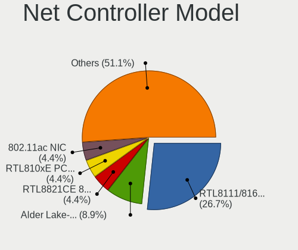

| Model                                                             | Computers | Percent |
|-------------------------------------------------------------------|-----------|---------|
| Realtek RTL8111/8168/8411 PCI Express Gigabit Ethernet Controller | 16        | 32%     |
| Intel Wireless 7265                                               | 6         | 12%     |
| Realtek RTL8821CE 802.11ac PCIe Wireless Network Adapter          | 3         | 6%      |
| Realtek RTL8153 Gigabit Ethernet Adapter                          | 2         | 4%      |
| Intel Tiger Lake PCH CNVi WiFi                                    | 2         | 4%      |
| Intel Ethernet Connection (6) I219-V                              | 2         | 4%      |
| Intel Ethernet Connection (14) I219-V                             | 2         | 4%      |
| Intel Alder Lake-P PCH CNVi WiFi                                  | 2         | 4%      |
| Realtek RTL8822BE 802.11a/b/g/n/ac WiFi adapter                   | 1         | 2%      |
| Realtek RTL8812AU 802.11a/b/g/n/ac 2T2R DB WLAN Adapter           | 1         | 2%      |
| Realtek RTL8723BE PCIe Wireless Network Adapter                   | 1         | 2%      |
| Realtek RTL8188CE 802.11b/g/n WiFi Adapter                        | 1         | 2%      |
| Realtek RTL8125 2.5GbE Controller                                 | 1         | 2%      |
| Realtek RTL810xE PCI Express Fast Ethernet controller             | 1         | 2%      |
| OPPO RMX3263                                                      | 1         | 2%      |
| Nvidia MCP61 Ethernet                                             | 1         | 2%      |
| Mercucys 802.11n NIC                                              | 1         | 2%      |
| Intel Ethernet Connection (17) I219-V                             | 1         | 2%      |
| Intel Ethernet Connection (17) I219-LM                            | 1         | 2%      |
| Intel Ethernet Connection (16) I219-V                             | 1         | 2%      |
| Intel Cannon Point-LP CNVi [Wireless-AC]                          | 1         | 2%      |
| Intel Alder Lake-S PCH CNVi WiFi                                  | 1         | 2%      |
| Broadcom BCM43142 802.11b/g/n                                     | 1         | 2%      |

Wireless Vendor
---------------

Wireless vendors

| Vendor                | Computers | Percent |
|-----------------------|-----------|---------|
| Intel                 | 12        | 57.14%  |
| Realtek Semiconductor | 7         | 33.33%  |
| Mercucys              | 1         | 4.76%   |
| Broadcom              | 1         | 4.76%   |

Wireless Model
--------------

Wireless models

| Model                                                    | Computers | Percent |
|----------------------------------------------------------|-----------|---------|
| Intel Wireless 7265                                      | 6         | 28.57%  |
| Realtek RTL8821CE 802.11ac PCIe Wireless Network Adapter | 3         | 14.29%  |
| Intel Tiger Lake PCH CNVi WiFi                           | 2         | 9.52%   |
| Intel Alder Lake-P PCH CNVi WiFi                         | 2         | 9.52%   |
| Realtek RTL8822BE 802.11a/b/g/n/ac WiFi adapter          | 1         | 4.76%   |
| Realtek RTL8812AU 802.11a/b/g/n/ac 2T2R DB WLAN Adapter  | 1         | 4.76%   |
| Realtek RTL8723BE PCIe Wireless Network Adapter          | 1         | 4.76%   |
| Realtek RTL8188CE 802.11b/g/n WiFi Adapter               | 1         | 4.76%   |
| Mercucys 802.11n NIC                                     | 1         | 4.76%   |
| Intel Cannon Point-LP CNVi [Wireless-AC]                 | 1         | 4.76%   |
| Intel Alder Lake-S PCH CNVi WiFi                         | 1         | 4.76%   |
| Broadcom BCM43142 802.11b/g/n                            | 1         | 4.76%   |

Ethernet Vendor
---------------

Ethernet vendors

| Vendor                | Computers | Percent |
|-----------------------|-----------|---------|
| Realtek Semiconductor | 19        | 67.86%  |
| Intel                 | 7         | 25%     |
| OPPO Electronics      | 1         | 3.57%   |
| Nvidia                | 1         | 3.57%   |

Ethernet Model
--------------

Ethernet models

| Model                                                             | Computers | Percent |
|-------------------------------------------------------------------|-----------|---------|
| Realtek RTL8111/8168/8411 PCI Express Gigabit Ethernet Controller | 16        | 55.17%  |
| Realtek RTL8153 Gigabit Ethernet Adapter                          | 2         | 6.9%    |
| Intel Ethernet Connection (6) I219-V                              | 2         | 6.9%    |
| Intel Ethernet Connection (14) I219-V                             | 2         | 6.9%    |
| Realtek RTL8125 2.5GbE Controller                                 | 1         | 3.45%   |
| Realtek RTL810xE PCI Express Fast Ethernet controller             | 1         | 3.45%   |
| OPPO RMX3263                                                      | 1         | 3.45%   |
| Nvidia MCP61 Ethernet                                             | 1         | 3.45%   |
| Intel Ethernet Connection (17) I219-V                             | 1         | 3.45%   |
| Intel Ethernet Connection (17) I219-LM                            | 1         | 3.45%   |
| Intel Ethernet Connection (16) I219-V                             | 1         | 3.45%   |

Net Controller Kind
-------------------

Ethernet, WiFi or modem

| Kind     | Computers | Percent |
|----------|-----------|---------|
| Ethernet | 27        | 57.45%  |
| WiFi     | 20        | 42.55%  |

Used Controller
---------------

Currently used network controller

| Kind     | Computers | Percent |
|----------|-----------|---------|
| Ethernet | 22        | 78.57%  |
| WiFi     | 6         | 21.43%  |

NICs
----

Total network controllers on board

| Total | Computers | Percent |
|-------|-----------|---------|
| 2     | 17        | 60.71%  |
| 1     | 11        | 39.29%  |

IPv6
----

IPv6 vs IPv4

| Used | Computers | Percent |
|------|-----------|---------|
| No   | 26        | 92.86%  |
| Yes  | 2         | 7.14%   |

Bluetooth
---------

Bluetooth Vendor
----------------

Controller vendors

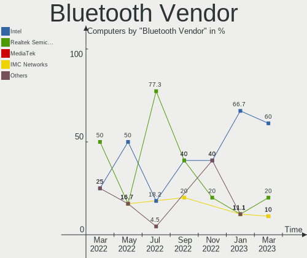

| Vendor                  | Computers | Percent |
|-------------------------|-----------|---------|
| Intel                   | 12        | 63.16%  |
| Realtek Semiconductor   | 4         | 21.05%  |
| Cambridge Silicon Radio | 2         | 10.53%  |
| Broadcom                | 1         | 5.26%   |

Bluetooth Model
---------------

Controller models

| Model                                               | Computers | Percent |
|-----------------------------------------------------|-----------|---------|
| Intel Bluetooth wireless interface                  | 6         | 31.58%  |
| Realtek  Bluetooth 4.2 Adapter                      | 3         | 15.79%  |
| Intel AX201 Bluetooth                               | 3         | 15.79%  |
| Intel Bluetooth Device                              | 2         | 10.53%  |
| Cambridge Silicon Radio Bluetooth Dongle (HCI mode) | 2         | 10.53%  |
| Realtek Bluetooth Radio                             | 1         | 5.26%   |
| Intel Bluetooth 9460/9560 Jefferson Peak (JfP)      | 1         | 5.26%   |
| Broadcom BCM43142A0 Bluetooth 4.0                   | 1         | 5.26%   |

Sound
-----

Sound Vendor
------------

Sound card vendors

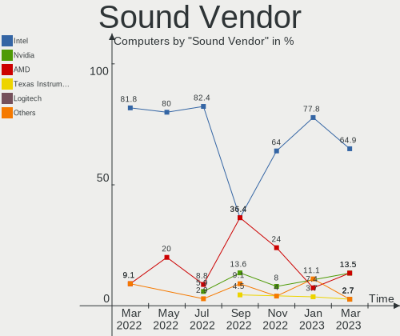

| Vendor  | Computers | Percent |
|---------|-----------|---------|
| Intel   | 21        | 65.63%  |
| Nvidia  | 5         | 15.63%  |
| AMD     | 5         | 15.63%  |
| Zhaoxin | 1         | 3.13%   |

Sound Model
-----------

Sound card models

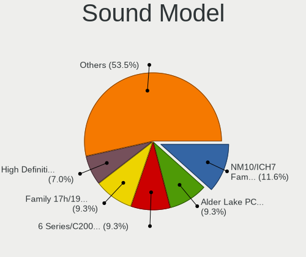

| Model                                                                      | Computers | Percent |
|----------------------------------------------------------------------------|-----------|---------|
| AMD Family 17h/19h HD Audio Controller                                     | 4         | 10.26%  |
| Intel Cannon Point-LP High Definition Audio Controller                     | 3         | 7.69%   |
| Intel Audio device                                                         | 3         | 7.69%   |
| Intel Tiger Lake-H HD Audio Controller                                     | 2         | 5.13%   |
| Intel Alder Lake-S HD Audio Controller                                     | 2         | 5.13%   |
| Intel Alder Lake PCH-P High Definition Audio Controller                    | 2         | 5.13%   |
| Intel 100 Series/C230 Series Chipset Family HD Audio Controller            | 2         | 5.13%   |
| AMD Renoir Radeon High Definition Audio Controller                         | 2         | 5.13%   |
| AMD Raven/Raven2/Fenghuang HDMI/DP Audio Controller                        | 2         | 5.13%   |
| Zhaoxin ZX-E High Definition Audio Controller                              | 1         | 2.56%   |
| Zhaoxin ZX-100/ZX-D/ZX-E High Definition Audio Controller                  | 1         | 2.56%   |
| Nvidia MCP61 High Definition Audio                                         | 1         | 2.56%   |
| Nvidia High Definition Audio Controller                                    | 1         | 2.56%   |
| Nvidia GM107 High Definition Audio Controller [GeForce 940MX]              | 1         | 2.56%   |
| Nvidia GK208 HDMI/DP Audio Controller                                      | 1         | 2.56%   |
| Nvidia GF119 HDMI Audio Controller                                         | 1         | 2.56%   |
| Nvidia GA106 High Definition Audio Controller                              | 1         | 2.56%   |
| Intel Haswell-ULT HD Audio Controller                                      | 1         | 2.56%   |
| Intel Comet Lake PCH-V cAVS                                                | 1         | 2.56%   |
| Intel Comet Lake PCH-LP cAVS                                               | 1         | 2.56%   |
| Intel Cannon Lake PCH cAVS                                                 | 1         | 2.56%   |
| Intel 8 Series HD Audio Controller                                         | 1         | 2.56%   |
| Intel 6 Series/C200 Series Chipset Family High Definition Audio Controller | 1         | 2.56%   |
| Intel 5 Series/3400 Series Chipset High Definition Audio                   | 1         | 2.56%   |
| Intel 200 Series PCH HD Audio                                              | 1         | 2.56%   |
| AMD SBx00 Azalia (Intel HDA)                                               | 1         | 2.56%   |

Memory
------

Memory Vendor
-------------

Memory module vendors

| Vendor              | Computers | Percent |
|---------------------|-----------|---------|
| SK hynix            | 5         | 16.67%  |
| Samsung Electronics | 5         | 16.67%  |
| Unknown             | 4         | 13.33%  |
| Foxline             | 4         | 13.33%  |
| Crucial             | 2         | 6.67%   |
| Unknown             | 2         | 6.67%   |
| Unknown (89F7)      | 1         | 3.33%   |
| Ramaxel Technology  | 1         | 3.33%   |
| Neo Forza           | 1         | 3.33%   |
| Micron Technology   | 1         | 3.33%   |
| Kingston            | 1         | 3.33%   |
| GOODRAM             | 1         | 3.33%   |
| Apacer              | 1         | 3.33%   |
| <Invalid>           | 1         | 3.33%   |

Memory Model
------------

Memory module models

| Model                                                        | Computers | Percent |
|--------------------------------------------------------------|-----------|---------|
| SK hynix RAM HMA851S6CJR6N-XN 4GB SODIMM DDR4 3200MT/s       | 2         | 6.45%   |
| SK hynix RAM HMA851S6CJR6N-VK 4GB SODIMM DDR4 2667MT/s       | 2         | 6.45%   |
| Foxline RAM FL2666D4S19-8G 8GB SODIMM DDR4 2667MT/s          | 2         | 6.45%   |
| Crucial RAM CT8G4SFRA32A.C16FG 8GB SODIMM DDR4 3200MT/s      | 2         | 6.45%   |
| Unknown                                                      | 2         | 6.45%   |
| Unknown RAM Module 8GB DIMM DDR4 2133MT/s                    | 1         | 3.23%   |
| Unknown RAM Module 4GB DIMM DDR 1066MT/s                     | 1         | 3.23%   |
| Unknown RAM Module 4GB DIMM 800MT/s                          | 1         | 3.23%   |
| Unknown RAM Module 2GB DIMM 1333MT/s                         | 1         | 3.23%   |
| Unknown (89F7) RAM Module 8192MB DIMM DDR4 2667MT/s          | 1         | 3.23%   |
| SK hynix RAM HMA81GU6CJR8N-XN 8GB DIMM DDR4 3200MT/s         | 1         | 3.23%   |
| Samsung RAM Module 16GB SODIMM 4800MT/s                      | 1         | 3.23%   |
| Samsung RAM M471B5173QH0-YK0 4GB SODIMM DDR3 1600MT/s        | 1         | 3.23%   |
| Samsung RAM M471A5244CB0-CTD 4GB SODIMM DDR4 3266MT/s        | 1         | 3.23%   |
| Samsung RAM M471A1K43DB1-CWE 8GB SODIMM DDR4 3200MT/s        | 1         | 3.23%   |
| Samsung RAM M471A1G44BB0-CWE 8GB SODIMM DDR4 3200MT/s        | 1         | 3.23%   |
| Samsung RAM M378A1K43EB2-CWE 8GB DIMM DDR4 3200MT/s          | 1         | 3.23%   |
| Ramaxel RAM RMSA3270ME86H9F-2666 4096MB SODIMM DDR4 2667MT/s | 1         | 3.23%   |
| Neo Forza RAM NMUD480E82-2666E 8GB DIMM DDR4 2667MT/s        | 1         | 3.23%   |
| Micron RAM 8ATF1G64HZ-3G2R1 8GB SODIMM DDR4 3200MT/s         | 1         | 3.23%   |
| Kingston RAM 99U5428-101.A00LF 8GB DIMM DDR3 1600MT/s        | 1         | 3.23%   |
| GOODRAM RAM GR2400S464L17S/8G 8GB SODIMM DDR4 2400MT/s       | 1         | 3.23%   |
| Foxline RAM FL3200D4S22-8G 8GB SODIMM DDR4 3200MT/s          | 1         | 3.23%   |
| Foxline RAM FL2400D4S17S-8G 8GB SODIMM DDR4 2400MT/s         | 1         | 3.23%   |
| Apacer RAM D12.2324CH.002 8GB DIMM DDR4 2667MT/s             | 1         | 3.23%   |
| <Invalid> RAM Module 8GB SODIMM DDR4 2666MT/s                | 1         | 3.23%   |

Memory Kind
-----------

Memory module kinds

| Kind    | Computers | Percent |
|---------|-----------|---------|
| DDR4    | 22        | 78.57%  |
| Unknown | 3         | 10.71%  |
| DDR3    | 2         | 7.14%   |
| DDR     | 1         | 3.57%   |

Memory Form Factor
------------------

Physical design of the memory module

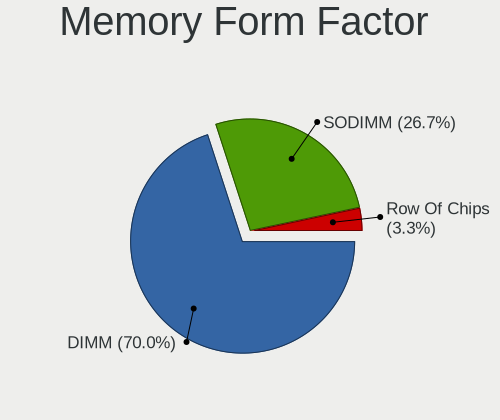

| Name   | Computers | Percent |
|--------|-----------|---------|
| SODIMM | 18        | 64.29%  |
| DIMM   | 10        | 35.71%  |

Memory Size
-----------

Memory module size

| Size  | Computers | Percent |
|-------|-----------|---------|
| 8192  | 20        | 71.43%  |
| 4096  | 6         | 21.43%  |
| 16384 | 1         | 3.57%   |
| 2048  | 1         | 3.57%   |

Memory Speed
------------

Memory module speed

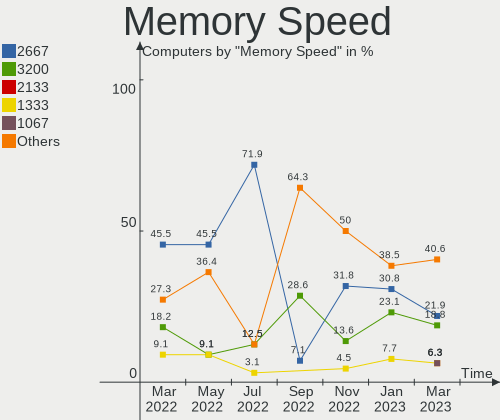

| Speed | Computers | Percent |
|-------|-----------|---------|
| 3200  | 11        | 36.67%  |
| 2667  | 8         | 26.67%  |
| 2400  | 2         | 6.67%   |
| 1600  | 2         | 6.67%   |
| 4800  | 1         | 3.33%   |
| 3266  | 1         | 3.33%   |
| 2666  | 1         | 3.33%   |
| 2133  | 1         | 3.33%   |
| 1333  | 1         | 3.33%   |
| 1066  | 1         | 3.33%   |
| 800   | 1         | 3.33%   |

Printers & scanners
-------------------

Printer Vendor
--------------

Printer device vendors

| Vendor | Computers | Percent |
|--------|-----------|---------|
| Pantum | 1         | 100%    |

Printer Model
-------------

Printer device models

| Model                   | Computers | Percent |
|-------------------------|-----------|---------|
| Pantum BM5100ADN series | 1         | 100%    |

Scanner Vendor
--------------

Scanner device vendors

Zero info for selected period =(

Scanner Model
-------------

Scanner device models

Zero info for selected period =(

Camera
------

Camera Vendor
-------------

Camera device vendors

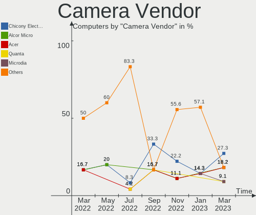

| Vendor                      | Computers | Percent |
|-----------------------------|-----------|---------|
| Quanta                      | 3         | 15.79%  |
| Chicony Electronics         | 3         | 15.79%  |
| SunplusIT                   | 2         | 10.53%  |
| Luxvisions Innotech Limited | 2         | 10.53%  |
| Z-Star Microelectronics     | 1         | 5.26%   |
| Suyin                       | 1         | 5.26%   |
| Sonix Technology            | 1         | 5.26%   |
| Realtek Semiconductor       | 1         | 5.26%   |
| Microdia                    | 1         | 5.26%   |
| Logitech                    | 1         | 5.26%   |
| Lite-On Technology          | 1         | 5.26%   |
| Acer                        | 1         | 5.26%   |
| Unknown                     | 1         | 5.26%   |

Camera Model
------------

Camera device models

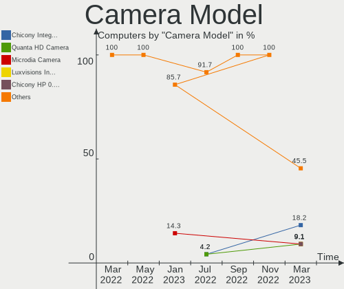

| Model                                         | Computers | Percent |
|-----------------------------------------------|-----------|---------|
| SunplusIT USB Camera                          | 2         | 10.53%  |
| Quanta HP TrueVision HD Camera                | 2         | 10.53%  |
| Luxvisions Innotech Limited Integrated Camera | 2         | 10.53%  |
| Chicony USB camera                            | 2         | 10.53%  |
| Z-Star Lenovo IdeaCentre Web Camera           | 1         | 5.26%   |
| Suyin HP Truevision HD                        | 1         | 5.26%   |
| Sonix USB 2.0 Camera                          | 1         | 5.26%   |
| Realtek 1080p Camera                          | 1         | 5.26%   |
| Quanta HP 5MP Camera                          | 1         | 5.26%   |
| Microdia Webcam Vitade AF                     | 1         | 5.26%   |
| Logitech HD Webcam C615                       | 1         | 5.26%   |
| Lite-On HP 2.0MP High Definition Webcam       | 1         | 5.26%   |
| Chicony HP High Definition 1MP Webcam         | 1         | 5.26%   |
| Acer Integrated Camera                        | 1         | 5.26%   |
| Unknown                                       | 1         | 5.26%   |

Security
--------

Fingerprint Vendor
------------------

Fingerprint sensor vendors

Zero info for selected period =(

Fingerprint Model
-----------------

Fingerprint sensor models

Zero info for selected period =(

Chipcard Vendor
---------------

Chipcard module vendors

Zero info for selected period =(

Chipcard Model
--------------

Chipcard module models

Zero info for selected period =(

Unsupported
-----------

Unsupported Devices
-------------------

Total unsupported devices on board

| Total | Computers | Percent |
|-------|-----------|---------|
| 0     | 17        | 60.71%  |
| 1     | 6         | 21.43%  |
| 2     | 4         | 14.29%  |
| 4     | 1         | 3.57%   |

Unsupported Device Types
------------------------

Types of unsupported devices

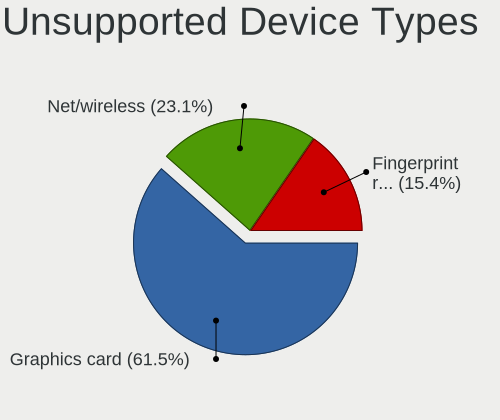

| Type                     | Computers | Percent |
|--------------------------|-----------|---------|
| Graphics card            | 10        | 62.5%   |
| Sound                    | 2         | 12.5%   |
| Communication controller | 2         | 12.5%   |
| Network                  | 1         | 6.25%   |
| Net/wireless             | 1         | 6.25%   |

