Red OS - Hardware Trends
------------------------

A project to identify most popular hardware characteristics and track their change
over time based on data collected by Linux users at https://Linux-Hardware.org.

Anyone can contribute to this report by the [hw-probe](https://github.com/linuxhw/hw-probe) tool:

    sudo -E hw-probe -all -upload

This is a report for all computer types. See also reports for [desktops](/Dist/Red_OS/Desktop/README.md) and [notebooks](/Dist/Red_OS/Notebook/README.md).

This report is for one last month. Overall report since the beginning of time: [TestCoverage](https://github.com/linuxhw/TestCoverage)

Period: Jan, 2023.

Contents
--------

* [ System ](#system)
  - [ OS                       ](#os)
  - [ OS Family                ](#os-family)
  - [ Kernel                   ](#kernel)
  - [ Kernel Family            ](#kernel-family)
  - [ Kernel Major Ver.        ](#kernel-major-ver)
  - [ Arch                     ](#arch)
  - [ DE                       ](#de)
  - [ Display Server           ](#display-server)
  - [ Display Manager          ](#display-manager)
  - [ OS Lang                  ](#os-lang)
  - [ Boot Mode                ](#boot-mode)
  - [ Filesystem               ](#filesystem)
  - [ Part. scheme             ](#part-scheme)
  - [ Dual Boot with Linux/BSD ](#dual-boot-with-linuxbsd)
  - [ Dual Boot (Win)          ](#dual-boot-win)

* [ Board ](#board)
  - [ Vendor                   ](#vendor)
  - [ Model                    ](#model)
  - [ Model Family             ](#model-family)
  - [ MFG Year                 ](#mfg-year)
  - [ Form Factor              ](#form-factor)
  - [ Secure Boot              ](#secure-boot)
  - [ Coreboot                 ](#coreboot)
  - [ RAM Size                 ](#ram-size)
  - [ RAM Used                 ](#ram-used)
  - [ Total Drives             ](#total-drives)
  - [ Has CD-ROM               ](#has-cd-rom)
  - [ Has Ethernet             ](#has-ethernet)
  - [ Has WiFi                 ](#has-wifi)
  - [ Has Bluetooth            ](#has-bluetooth)

* [ Location ](#location)
  - [ Country                  ](#country)
  - [ City                     ](#city)

* [ Drives ](#drives)
  - [ Drive Vendor             ](#drive-vendor)
  - [ Drive Model              ](#drive-model)
  - [ HDD Vendor               ](#hdd-vendor)
  - [ SSD Vendor               ](#ssd-vendor)
  - [ Drive Kind               ](#drive-kind)
  - [ Drive Connector          ](#drive-connector)
  - [ Drive Size               ](#drive-size)
  - [ Space Total              ](#space-total)
  - [ Space Used               ](#space-used)
  - [ Malfunc. Drives          ](#malfunc-drives)
  - [ Malfunc. Drive Vendor    ](#malfunc-drive-vendor)
  - [ Malfunc. HDD Vendor      ](#malfunc-hdd-vendor)
  - [ Malfunc. Drive Kind      ](#malfunc-drive-kind)
  - [ Failed Drives            ](#failed-drives)
  - [ Failed Drive Vendor      ](#failed-drive-vendor)
  - [ Drive Status             ](#drive-status)

* [ Storage controller ](#storage-controller)
  - [ Storage Vendor           ](#storage-vendor)
  - [ Storage Model            ](#storage-model)
  - [ Storage Kind             ](#storage-kind)

* [ Processor ](#processor)
  - [ CPU Vendor               ](#cpu-vendor)
  - [ CPU Model                ](#cpu-model)
  - [ CPU Model Family         ](#cpu-model-family)
  - [ CPU Cores                ](#cpu-cores)
  - [ CPU Sockets              ](#cpu-sockets)
  - [ CPU Threads              ](#cpu-threads)
  - [ CPU Op-Modes             ](#cpu-op-modes)
  - [ CPU Microcode            ](#cpu-microcode)
  - [ CPU Microarch            ](#cpu-microarch)

* [ Graphics ](#graphics)
  - [ GPU Vendor               ](#gpu-vendor)
  - [ GPU Model                ](#gpu-model)
  - [ GPU Combo                ](#gpu-combo)
  - [ GPU Driver               ](#gpu-driver)
  - [ GPU Memory               ](#gpu-memory)

* [ Monitor ](#monitor)
  - [ Monitor Vendor           ](#monitor-vendor)
  - [ Monitor Model            ](#monitor-model)
  - [ Monitor Resolution       ](#monitor-resolution)
  - [ Monitor Diagonal         ](#monitor-diagonal)
  - [ Monitor Width            ](#monitor-width)
  - [ Aspect Ratio             ](#aspect-ratio)
  - [ Monitor Area             ](#monitor-area)
  - [ Pixel Density            ](#pixel-density)
  - [ Multiple Monitors        ](#multiple-monitors)

* [ Network ](#network)
  - [ Net Controller Vendor    ](#net-controller-vendor)
  - [ Net Controller Model     ](#net-controller-model)
  - [ Wireless Vendor          ](#wireless-vendor)
  - [ Wireless Model           ](#wireless-model)
  - [ Ethernet Vendor          ](#ethernet-vendor)
  - [ Ethernet Model           ](#ethernet-model)
  - [ Net Controller Kind      ](#net-controller-kind)
  - [ Used Controller          ](#used-controller)
  - [ NICs                     ](#nics)
  - [ IPv6                     ](#ipv6)

* [ Bluetooth ](#bluetooth)
  - [ Bluetooth Vendor         ](#bluetooth-vendor)
  - [ Bluetooth Model          ](#bluetooth-model)

* [ Sound ](#sound)
  - [ Sound Vendor             ](#sound-vendor)
  - [ Sound Model              ](#sound-model)

* [ Memory ](#memory)
  - [ Memory Vendor            ](#memory-vendor)
  - [ Memory Model             ](#memory-model)
  - [ Memory Kind              ](#memory-kind)
  - [ Memory Form Factor       ](#memory-form-factor)
  - [ Memory Size              ](#memory-size)
  - [ Memory Speed             ](#memory-speed)

* [ Printers & scanners ](#printers--scanners)
  - [ Printer Vendor           ](#printer-vendor)
  - [ Printer Model            ](#printer-model)
  - [ Scanner Vendor           ](#scanner-vendor)
  - [ Scanner Model            ](#scanner-model)

* [ Camera ](#camera)
  - [ Camera Vendor            ](#camera-vendor)
  - [ Camera Model             ](#camera-model)

* [ Security ](#security)
  - [ Fingerprint Vendor       ](#fingerprint-vendor)
  - [ Fingerprint Model        ](#fingerprint-model)
  - [ Chipcard Vendor          ](#chipcard-vendor)
  - [ Chipcard Model           ](#chipcard-model)

* [ Unsupported ](#unsupported)
  - [ Unsupported Devices      ](#unsupported-devices)
  - [ Unsupported Device Types ](#unsupported-device-types)

System
------

OS
--

Installed operating systems

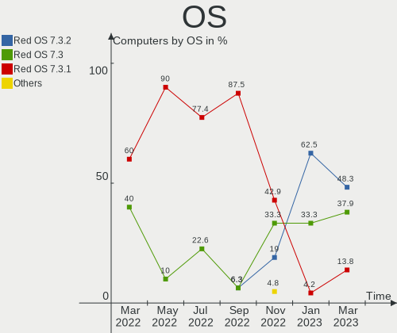

| Name         | Computers | Percent |
|--------------|-----------|---------|
| Red OS 7.3.2 | 15        | 62.5%   |
| Red OS 7.3   | 8         | 33.33%  |
| Red OS 7.3.1 | 1         | 4.17%   |

OS Family
---------

OS without a version

| Name   | Computers | Percent |
|--------|-----------|---------|
| Red OS | 24        | 100%    |

Kernel
------

Version of the Linux kernel

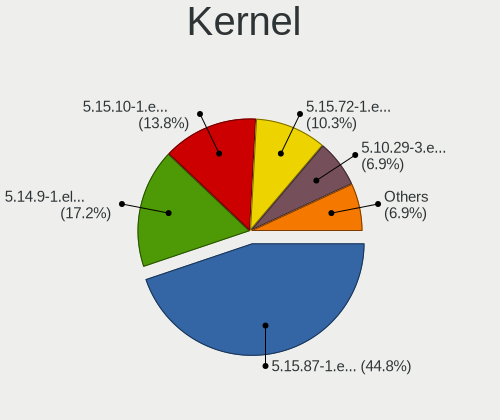

| Version                | Computers | Percent |
|------------------------|-----------|---------|
| 5.15.78-2.el7.3.x86_64 | 11        | 45.83%  |
| 5.15.72-1.el7.3.x86_64 | 8         | 33.33%  |
| 5.10.29-1.el7.x86_64   | 2         | 8.33%   |
| 5.4.197-1.el7.aarch64  | 1         | 4.17%   |
| 5.15.10-1.el7.x86_64   | 1         | 4.17%   |
| 5.10.29-3.el7.x86_64   | 1         | 4.17%   |

Kernel Family
-------------

Linux kernel without a distro release

| Version | Computers | Percent |
|---------|-----------|---------|
| 5.15.78 | 11        | 45.83%  |
| 5.15.72 | 8         | 33.33%  |
| 5.10.29 | 3         | 12.5%   |
| 5.4.197 | 1         | 4.17%   |
| 5.15.10 | 1         | 4.17%   |

Kernel Major Ver.
-----------------

Linux kernel major version

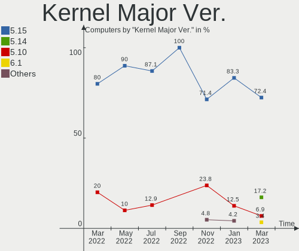

| Version | Computers | Percent |
|---------|-----------|---------|
| 5.15    | 20        | 83.33%  |
| 5.10    | 3         | 12.5%   |
| 5.4     | 1         | 4.17%   |

Arch
----

OS architecture (x86_64, i586, etc.)

| Name    | Computers | Percent |
|---------|-----------|---------|
| x86_64  | 23        | 95.83%  |
| aarch64 | 1         | 4.17%   |

DE
--

Desktop Environment

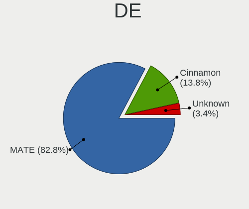

| Name     | Computers | Percent |
|----------|-----------|---------|
| MATE     | 22        | 91.67%  |
| Cinnamon | 2         | 8.33%   |

Display Server
--------------

X11 or Wayland

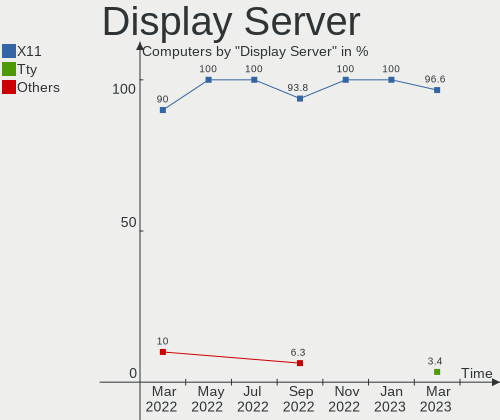

| Name | Computers | Percent |
|------|-----------|---------|
| X11  | 24        | 100%    |

Display Manager
---------------

SDDM, LightDM, etc.

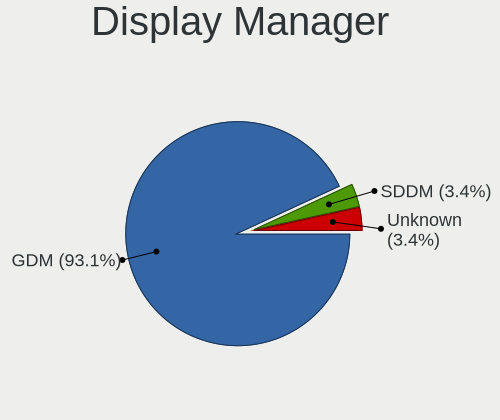

| Name | Computers | Percent |
|------|-----------|---------|
| GDM  | 23        | 95.83%  |
| SDDM | 1         | 4.17%   |

OS Lang
-------

Language

| Lang    | Computers | Percent |
|---------|-----------|---------|
| Unknown | 24        | 100%    |

Boot Mode
---------

EFI or BIOS

| Mode | Computers | Percent |
|------|-----------|---------|
| EFI  | 20        | 83.33%  |
| BIOS | 4         | 16.67%  |

Filesystem
----------

Type of filesystem

| Type | Computers | Percent |
|------|-----------|---------|
| Ext4 | 24        | 100%    |

Part. scheme
------------

Scheme of partitioning

| Type | Computers | Percent |
|------|-----------|---------|
| GPT  | 19        | 79.17%  |
| MBR  | 5         | 20.83%  |

Dual Boot with Linux/BSD
------------------------

Hosting more than one Linux/BSD

| Dual boot | Computers | Percent |
|-----------|-----------|---------|
| No        | 22        | 91.67%  |
| Yes       | 2         | 8.33%   |

Dual Boot (Win)
---------------

Hosting Linux and Windows

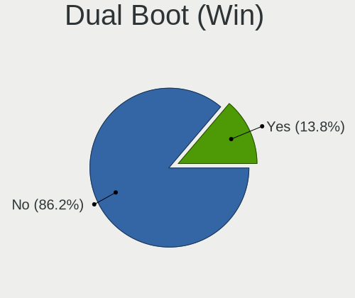

| Dual boot | Computers | Percent |
|-----------|-----------|---------|
| No        | 19        | 79.17%  |
| Yes       | 5         | 20.83%  |

Board
-----

Vendor
------

Motherboard manufacturer

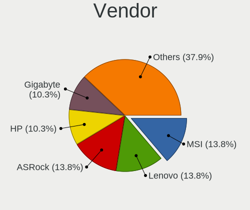

| Name                | Computers | Percent |
|---------------------|-----------|---------|
| ASUSTek Computer    | 6         | 25%     |
| Lenovo              | 5         | 20.83%  |
| Gigabyte Technology | 3         | 12.5%   |
| Hewlett-Packard     | 2         | 8.33%   |
| Graviton            | 2         | 8.33%   |
| NCI                 | 1         | 4.17%   |
| MSI                 | 1         | 4.17%   |
| Intel               | 1         | 4.17%   |
| DEPO Computers      | 1         | 4.17%   |
| Aquarius            | 1         | 4.17%   |
| Unknown             | 1         | 4.17%   |

Model
-----

Motherboard model

| Name                               | Computers | Percent |
|------------------------------------|-----------|---------|
| ASUS All Series                    | 2         | 8.33%   |
| NCI PC BLICK101                    | 1         | 4.17%   |
| MSI MS-7D48                        | 1         | 4.17%   |
| Lenovo V130-15IKB 81HN             | 1         | 4.17%   |
| Lenovo ThinkCentre M70q 11DT003RRU | 1         | 4.17%   |
| Lenovo ThinkCentre M70q 11DT003GRU | 1         | 4.17%   |
| Lenovo ThinkCentre M70e 0851RZ3    | 1         | 4.17%   |
| Lenovo IdeaPad L340-15API 81LW     | 1         | 4.17%   |
| Intel S2600WFT                     | 1         | 4.17%   |
| HP ProDesk 400 G6 MT               | 1         | 4.17%   |
| HP EliteDesk 800 G1 TWR            | 1         | 4.17%   |
| Graviton M52i                      | 1         | 4.17%   |
| Graviton DMB-H610-TMI01            | 1         | 4.17%   |
| Gigabyte H610M S2H DDR4            | 1         | 4.17%   |
| Gigabyte B365M H                   | 1         | 4.17%   |
| Gigabyte B360 HD3                  | 1         | 4.17%   |
| DEPO Computers DPH410S             | 1         | 4.17%   |
| ASUS Vivo AIO 24 V241FA_A6521FA    | 1         | 4.17%   |
| ASUS PRIME H610M-K D4              | 1         | 4.17%   |
| ASUS PRIME B460M-K                 | 1         | 4.17%   |
| ASUS PRIME B365M-A                 | 1         | 4.17%   |
| Aquarius P30 K44 R53               | 1         | 4.17%   |
| Unknown                            | 1         | 4.17%   |

Model Family
------------

Motherboard model prefix

| Name                    | Computers | Percent |
|-------------------------|-----------|---------|
| Lenovo ThinkCentre      | 3         | 12.5%   |
| ASUS PRIME              | 3         | 12.5%   |
| ASUS All                | 2         | 8.33%   |
| NCI PC                  | 1         | 4.17%   |
| MSI MS-7D48             | 1         | 4.17%   |
| Lenovo V130-15IKB       | 1         | 4.17%   |
| Lenovo IdeaPad          | 1         | 4.17%   |
| Intel S2600WFT          | 1         | 4.17%   |
| HP ProDesk              | 1         | 4.17%   |
| HP EliteDesk            | 1         | 4.17%   |
| Graviton M52i           | 1         | 4.17%   |
| Graviton DMB-H610-TMI01 | 1         | 4.17%   |
| Gigabyte H610M          | 1         | 4.17%   |
| Gigabyte B365M          | 1         | 4.17%   |
| Gigabyte B360           | 1         | 4.17%   |
| DEPO Computers DPH410S  | 1         | 4.17%   |
| ASUS Vivo               | 1         | 4.17%   |
| Aquarius P30            | 1         | 4.17%   |
| Unknown                 | 1         | 4.17%   |

MFG Year
--------

Motherboard manufacture year

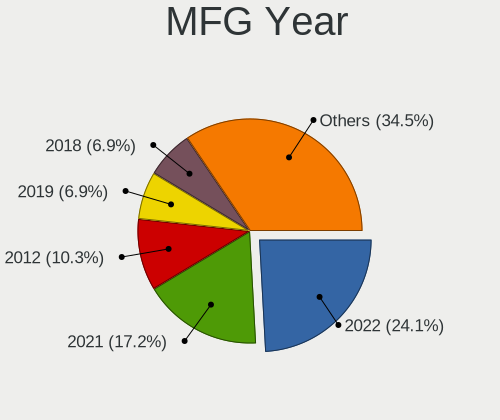

| Year | Computers | Percent |
|------|-----------|---------|
| 2019 | 7         | 29.17%  |
| 2022 | 5         | 20.83%  |
| 2021 | 3         | 12.5%   |
| 2020 | 3         | 12.5%   |
| 2013 | 3         | 12.5%   |
| 2018 | 2         | 8.33%   |
| 2010 | 1         | 4.17%   |

Form Factor
-----------

Physical design of the computer

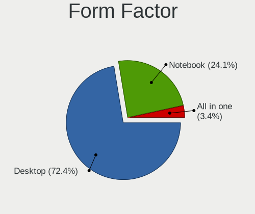

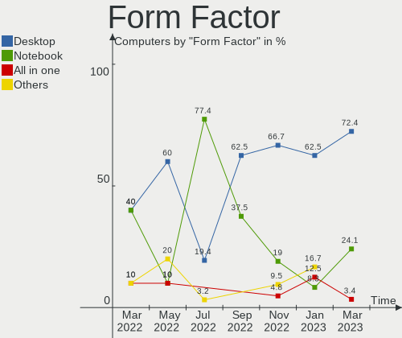

| Name           | Computers | Percent |
|----------------|-----------|---------|
| Desktop        | 15        | 62.5%   |
| All in one     | 3         | 12.5%   |
| Mini pc        | 2         | 8.33%   |
| Notebook       | 2         | 8.33%   |
| System on chip | 1         | 4.17%   |
| Server         | 1         | 4.17%   |

Secure Boot
-----------

Enabled or disabled

| State    | Computers | Percent |
|----------|-----------|---------|
| Disabled | 24        | 100%    |

Coreboot
--------

Have coreboot on board

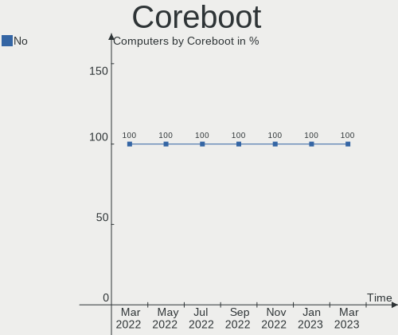

| Used | Computers | Percent |
|------|-----------|---------|
| No   | 24        | 100%    |

RAM Size
--------

Total RAM memory

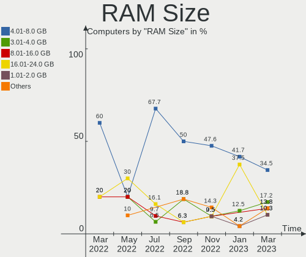

| Size in GB      | Computers | Percent |
|-----------------|-----------|---------|
| 4.01-8.0        | 10        | 41.67%  |
| 16.01-24.0      | 9         | 37.5%   |
| 3.01-4.0        | 3         | 12.5%   |
| More than 256.0 | 1         | 4.17%   |
| 1.01-2.0        | 1         | 4.17%   |

RAM Used
--------

Used RAM memory

| Used GB     | Computers | Percent |
|-------------|-----------|---------|
| 1.01-2.0    | 10        | 41.67%  |
| 3.01-4.0    | 4         | 16.67%  |
| 0.51-1.0    | 3         | 12.5%   |
| 4.01-8.0    | 2         | 8.33%   |
| 2.01-3.0    | 2         | 8.33%   |
| 8.01-16.0   | 2         | 8.33%   |
| 64.01-256.0 | 1         | 4.17%   |

Total Drives
------------

Number of drives on board

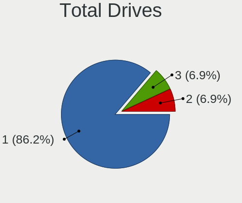

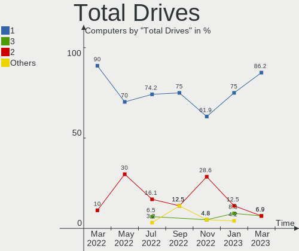

| Drives | Computers | Percent |
|--------|-----------|---------|
| 1      | 18        | 75%     |
| 2      | 3         | 12.5%   |
| 3      | 2         | 8.33%   |
| 11     | 1         | 4.17%   |

Has CD-ROM
----------

Has CD-ROM on board

| Presented | Computers | Percent |
|-----------|-----------|---------|
| No        | 16        | 66.67%  |
| Yes       | 8         | 33.33%  |

Has Ethernet
------------

Has Ethernet on board

| Presented | Computers | Percent |
|-----------|-----------|---------|
| Yes       | 23        | 95.83%  |
| No        | 1         | 4.17%   |

Has WiFi
--------

Has WiFi module

| Presented | Computers | Percent |
|-----------|-----------|---------|
| No        | 16        | 66.67%  |
| Yes       | 8         | 33.33%  |

Has Bluetooth
-------------

Has Bluetooth module

| Presented | Computers | Percent |
|-----------|-----------|---------|
| No        | 15        | 62.5%   |
| Yes       | 9         | 37.5%   |

Location
--------

Country
-------

Geographic location (country)

| Country | Computers | Percent |
|---------|-----------|---------|
| Russia  | 24        | 100%    |

City
----

Geographic location (city)

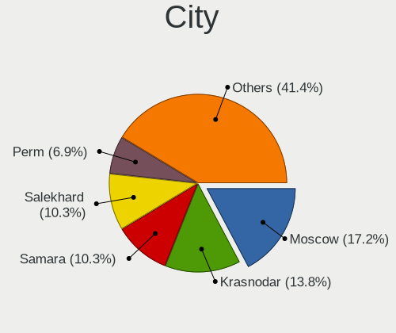

| City            | Computers | Percent |
|-----------------|-----------|---------|
| Murom           | 5         | 20.83%  |
| Shakhtersk      | 3         | 12.5%   |
| St Petersburg   | 2         | 8.33%   |
| Muromskiy       | 2         | 8.33%   |
| Moscow          | 2         | 8.33%   |
| Kurgan          | 2         | 8.33%   |
| Veliky Novgorod | 1         | 4.17%   |
| Svetlograd      | 1         | 4.17%   |
| Salekhard       | 1         | 4.17%   |
| Perm            | 1         | 4.17%   |
| Penza           | 1         | 4.17%   |
| Novy Urengoy    | 1         | 4.17%   |
| Novosibirsk     | 1         | 4.17%   |
| Barnaul         | 1         | 4.17%   |

Drives
------

Drive Vendor
------------

Hard drive vendors

| Vendor              | Computers | Drives | Percent |
|---------------------|-----------|--------|---------|
| Seagate             | 9         | 9      | 28.13%  |
| Samsung Electronics | 4         | 6      | 12.5%   |
| Toshiba             | 3         | 3      | 9.38%   |
| WDC                 | 2         | 3      | 6.25%   |
| SanDisk             | 2         | 2      | 6.25%   |
| Apacer              | 2         | 2      | 6.25%   |
| UMIS                | 1         | 1      | 3.13%   |
| SK hynix            | 1         | 1      | 3.13%   |
| Patriot             | 1         | 1      | 3.13%   |
| Lenovo              | 1         | 8      | 3.13%   |
| Kingston            | 1         | 1      | 3.13%   |
| KingSpec            | 1         | 1      | 3.13%   |
| Intel               | 1         | 1      | 3.13%   |
| Crucial             | 1         | 1      | 3.13%   |
| A-DATA Technology   | 1         | 1      | 3.13%   |
| Unknown             | 1         | 1      | 3.13%   |

Drive Model
-----------

Hard drive models

| Model                                        | Computers | Percent |
|----------------------------------------------|-----------|---------|
| Seagate ST1000DM010-2EP102 1TB               | 2         | 5.88%   |
| Apacer AS340 240GB SSD                       | 2         | 5.88%   |
| WDC WD5000AZLX-00K2TA0 500GB                 | 1         | 2.94%   |
| WDC WD10EARX-00N0YB0 1TB                     | 1         | 2.94%   |
| WDC WD Green 2.5 240GB                       | 1         | 2.94%   |
| UMIS RPIRJ256VME2MWD 256GB                   | 1         | 2.94%   |
| Toshiba MQ01ABF050 500GB                     | 1         | 2.94%   |
| Toshiba HDWD110 1TB                          | 1         | 2.94%   |
| Toshiba DT01ACA200 2TB                       | 1         | 2.94%   |
| SK hynix SKHynix_HFS256GD9TNI-L2B0B 256GB    | 1         | 2.94%   |
| Seagate ST500DM009-2F110A 500GB              | 1         | 2.94%   |
| Seagate ST500DM002-1BD142 500GB              | 1         | 2.94%   |
| Seagate ST320LM0 01 HN-M320MBB 320GB         | 1         | 2.94%   |
| Seagate ST3160812AS 160GB                    | 1         | 2.94%   |
| Seagate ST3160215AS 160GB                    | 1         | 2.94%   |
| Seagate ST1000DM003-1SB10C 1TB               | 1         | 2.94%   |
| Seagate BarraCuda 120 SSD ZA250CM10003 250GB | 1         | 2.94%   |
| SanDisk SDSSDH3500G 500GB                    | 1         | 2.94%   |
| SanDisk SD8SBAT256G1122 256GB SSD            | 1         | 2.94%   |
| Samsung SSD 870 QVO 8TB                      | 1         | 2.94%   |
| Samsung SSD 860 EVO 250GB                    | 1         | 2.94%   |
| Samsung MZVLQ256HAJD-000H1 256GB             | 1         | 2.94%   |
| Samsung MZALQ512HALU-000L2 512GB             | 1         | 2.94%   |
| Samsung MZALQ128HBHQ-000L2 128GB             | 1         | 2.94%   |
| Patriot Burst 240GB SSD                      | 1         | 2.94%   |
| Lenovo DS4200 1.7TB                          | 1         | 2.94%   |
| Kingston SA400S37240G 240GB SSD              | 1         | 2.94%   |
| KingSpec P3-128 128GB SSD                    | 1         | 2.94%   |
| Intel SSDSC2KW512G8 512GB                    | 1         | 2.94%   |
| Crucial CT250P2SSD8 250GB                    | 1         | 2.94%   |
| A-DATA SX6000PNP 256GB                       | 1         | 2.94%   |
| Unknown                                      | 1         | 2.94%   |

HDD Vendor
----------

Hard disk drive vendors

| Vendor  | Computers | Drives | Percent |
|---------|-----------|--------|---------|
| Seagate | 8         | 8      | 61.54%  |
| Toshiba | 3         | 3      | 23.08%  |
| WDC     | 1         | 2      | 7.69%   |
| Lenovo  | 1         | 8      | 7.69%   |

SSD Vendor
----------

Solid state drive vendors

| Vendor              | Computers | Drives | Percent |
|---------------------|-----------|--------|---------|
| SanDisk             | 2         | 2      | 16.67%  |
| Apacer              | 2         | 2      | 16.67%  |
| WDC                 | 1         | 1      | 8.33%   |
| Seagate             | 1         | 1      | 8.33%   |
| Samsung Electronics | 1         | 3      | 8.33%   |
| Patriot             | 1         | 1      | 8.33%   |
| Kingston            | 1         | 1      | 8.33%   |
| KingSpec            | 1         | 1      | 8.33%   |
| Intel               | 1         | 1      | 8.33%   |
| Unknown             | 1         | 1      | 8.33%   |

Drive Kind
----------

HDD or SSD

| Kind | Computers | Drives | Percent |
|------|-----------|--------|---------|
| HDD  | 12        | 21     | 41.38%  |
| SSD  | 10        | 14     | 34.48%  |
| NVMe | 7         | 7      | 24.14%  |

Drive Connector
---------------

SATA, SAS, NVMe, etc.

| Type | Computers | Drives | Percent |
|------|-----------|--------|---------|
| SATA | 19        | 34     | 70.37%  |
| NVMe | 7         | 7      | 25.93%  |
| SAS  | 1         | 1      | 3.7%    |

Drive Size
----------

Size of hard drive

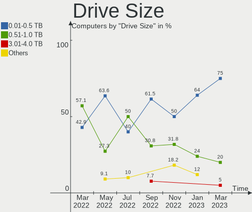

| Size in TB | Computers | Drives | Percent |
|------------|-----------|--------|---------|
| 0.01-0.5   | 16        | 18     | 64%     |
| 0.51-1.0   | 6         | 6      | 24%     |
| 1.01-2.0   | 2         | 9      | 8%      |
| 4.01-10.0  | 1         | 2      | 4%      |

Space Total
-----------

Amount of disk space available on the file system

| Size in GB     | Computers | Percent |
|----------------|-----------|---------|
| 101-250        | 13        | 54.17%  |
| 501-1000       | 4         | 16.67%  |
| 251-500        | 3         | 12.5%   |
| More than 3000 | 1         | 4.17%   |
| 21-50          | 1         | 4.17%   |
| 2001-3000      | 1         | 4.17%   |
| 1001-2000      | 1         | 4.17%   |

Space Used
----------

Amount of used disk space

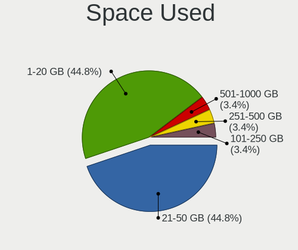

| Used GB        | Computers | Percent |
|----------------|-----------|---------|
| 1-20           | 12        | 50%     |
| 51-100         | 4         | 16.67%  |
| 21-50          | 3         | 12.5%   |
| 501-1000       | 3         | 12.5%   |
| More than 3000 | 1         | 4.17%   |
| 101-250        | 1         | 4.17%   |

Malfunc. Drives
---------------

Drive models with a malfunction

| Model                           | Computers | Drives | Percent |
|---------------------------------|-----------|--------|---------|
| Toshiba MQ01ABF050 500GB        | 1         | 1      | 33.33%  |
| Seagate ST500DM002-1BD142 500GB | 1         | 1      | 33.33%  |
| Unknown                         | 1         | 1      | 33.33%  |

Malfunc. Drive Vendor
---------------------

Vendors of faulty drives

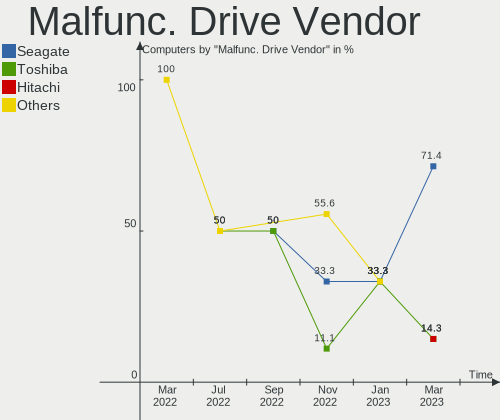

| Vendor  | Computers | Drives | Percent |
|---------|-----------|--------|---------|
| Toshiba | 1         | 1      | 33.33%  |
| Seagate | 1         | 1      | 33.33%  |
| Unknown | 1         | 1      | 33.33%  |

Malfunc. HDD Vendor
-------------------

Vendors of faulty HDD drives

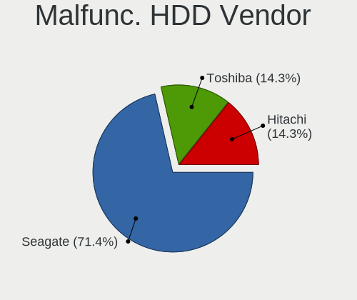

| Vendor  | Computers | Drives | Percent |
|---------|-----------|--------|---------|
| Toshiba | 1         | 1      | 50%     |
| Seagate | 1         | 1      | 50%     |

Malfunc. Drive Kind
-------------------

Kinds of faulty drives

| Kind | Computers | Drives | Percent |
|------|-----------|--------|---------|
| HDD  | 2         | 2      | 66.67%  |
| SSD  | 1         | 1      | 33.33%  |

Failed Drives
-------------

Failed drive models

Zero info for selected period =(

Failed Drive Vendor
-------------------

Failed drive vendors

Zero info for selected period =(

Drive Status
------------

Number of failed and malfunc. drives

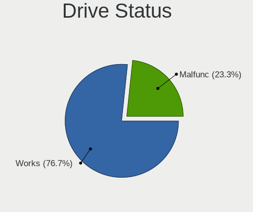

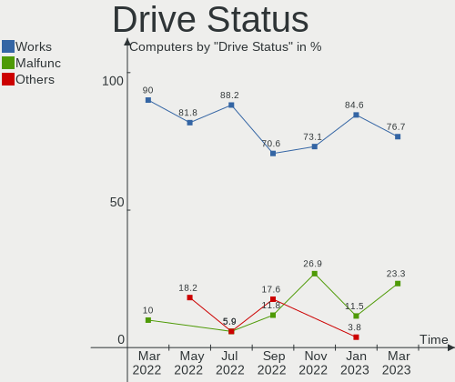

| Status   | Computers | Drives | Percent |
|----------|-----------|--------|---------|
| Works    | 22        | 38     | 84.62%  |
| Malfunc  | 3         | 3      | 11.54%  |
| Detected | 1         | 1      | 3.85%   |

Storage controller
------------------

Storage Vendor
--------------

Storage controller vendors

| Vendor                    | Computers | Percent |
|---------------------------|-----------|---------|
| Intel                     | 22        | 73.33%  |
| Samsung Electronics       | 3         | 10%     |
| Union Memory (Shenzhen)   | 1         | 3.33%   |
| SK hynix                  | 1         | 3.33%   |
| Realtek Semiconductor     | 1         | 3.33%   |
| Micron/Crucial Technology | 1         | 3.33%   |
| AMD                       | 1         | 3.33%   |

Storage Model
-------------

Storage controller models

| Model                                                                          | Computers | Percent |
|--------------------------------------------------------------------------------|-----------|---------|
| Intel Alder Lake-S PCH SATA Controller [AHCI Mode]                             | 5         | 15.15%  |
| Samsung NVMe SSD Controller 980                                                | 3         | 9.09%   |
| Intel Cannon Lake PCH SATA AHCI Controller                                     | 3         | 9.09%   |
| Intel Comet Lake SATA AHCI Controller                                          | 2         | 6.06%   |
| Intel 8 Series/C220 Series Chipset Family 6-port SATA Controller 1 [AHCI mode] | 2         | 6.06%   |
| Intel 400 Series Chipset Family SATA AHCI Controller                           | 2         | 6.06%   |
| Intel 200 Series PCH SATA controller [AHCI mode]                               | 2         | 6.06%   |
| Union Memory (Shenzhen) NVMe 256G SSD device                                   | 1         | 3.03%   |
| SK hynix Non-Volatile memory controller                                        | 1         | 3.03%   |
| Realtek Realtek Non-Volatile memory controller                                 | 1         | 3.03%   |
| Micron/Crucial P2 NVMe PCIe SSD                                                | 1         | 3.03%   |
| Intel Volume Management Device NVMe RAID Controller                            | 1         | 3.03%   |
| Intel Sunrise Point-LP SATA Controller [AHCI mode]                             | 1         | 3.03%   |
| Intel NM10/ICH7 Family SATA Controller [IDE mode]                              | 1         | 3.03%   |
| Intel C610/X99 series chipset sSATA Controller [RAID mode]                     | 1         | 3.03%   |
| Intel C600/X79 series chipset SATA RAID Controller                             | 1         | 3.03%   |
| Intel 82801G (ICH7 Family) IDE Controller                                      | 1         | 3.03%   |
| Intel 82801 Mobile SATA Controller [RAID mode]                                 | 1         | 3.03%   |
| Intel 8 Series/C220 Series Chipset Family 4-port SATA Controller 1 [IDE mode]  | 1         | 3.03%   |
| Intel 500 Series Chipset Family SATA AHCI Controller                           | 1         | 3.03%   |
| AMD FCH SATA Controller [AHCI mode]                                            | 1         | 3.03%   |

Storage Kind
------------

Kind of storage controller (IDE, SATA, NVMe, SAS, ...)

| Kind | Computers | Percent |
|------|-----------|---------|
| SATA | 19        | 61.29%  |
| NVMe | 7         | 22.58%  |
| RAID | 3         | 9.68%   |
| IDE  | 2         | 6.45%   |

Processor
---------

CPU Vendor
----------

Processor vendors

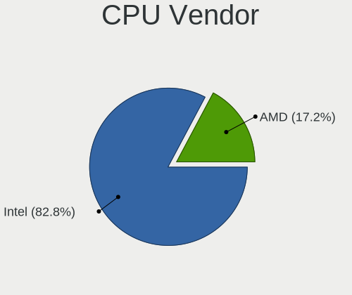

| Vendor | Computers | Percent |
|--------|-----------|---------|
| Intel  | 22        | 91.67%  |
| ARM    | 1         | 4.17%   |
| AMD    | 1         | 4.17%   |

CPU Model
---------

Processor models

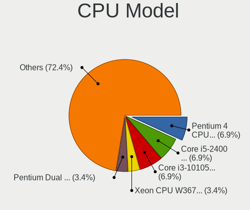

| Model                                         | Computers | Percent |
|-----------------------------------------------|-----------|---------|
| Intel 12th Gen Core i5-12400                  | 3         | 12.5%   |
| Intel Core i5-9400 CPU @ 2.90GHz              | 2         | 8.33%   |
| Intel Core i5-10400 CPU @ 2.90GHz             | 2         | 8.33%   |
| Intel Core i3-4160 CPU @ 3.60GHz              | 2         | 8.33%   |
| Intel Xeon Silver 4214 CPU @ 2.20GHz          | 1         | 4.17%   |
| Intel Pentium Gold G7400                      | 1         | 4.17%   |
| Intel Pentium Gold G5420 CPU @ 3.80GHz        | 1         | 4.17%   |
| Intel Core i7-4770 CPU @ 3.40GHz              | 1         | 4.17%   |
| Intel Core i5-9500 CPU @ 3.00GHz              | 1         | 4.17%   |
| Intel Core i5-10400T CPU @ 2.00GHz            | 1         | 4.17%   |
| Intel Core i3-8145U CPU @ 2.10GHz             | 1         | 4.17%   |
| Intel Core i3-8100 CPU @ 3.60GHz              | 1         | 4.17%   |
| Intel Core i3-7020U CPU @ 2.30GHz             | 1         | 4.17%   |
| Intel Core i3-10105 CPU @ 3.70GHz             | 1         | 4.17%   |
| Intel Core i3-10100T CPU @ 3.00GHz            | 1         | 4.17%   |
| Intel Core 2 Duo CPU E7500 @ 2.93GHz          | 1         | 4.17%   |
| Intel 12th Gen Core i3-12100                  | 1         | 4.17%   |
| ARM Processor                                 | 1         | 4.17%   |
| AMD Ryzen 5 3500U with Radeon Vega Mobile Gfx | 1         | 4.17%   |

CPU Model Family
----------------

Processor model prefix

| Model              | Computers | Percent |
|--------------------|-----------|---------|
| Intel Core i3      | 7         | 29.17%  |
| Intel Core i5      | 6         | 25%     |
| Other              | 5         | 20.83%  |
| Intel Pentium Gold | 2         | 8.33%   |
| Intel Xeon Silver  | 1         | 4.17%   |
| Intel Core i7      | 1         | 4.17%   |
| Intel Core 2 Duo   | 1         | 4.17%   |
| AMD Ryzen 5        | 1         | 4.17%   |

CPU Cores
---------

Number of processor cores

| Number | Computers | Percent |
|--------|-----------|---------|
| 6      | 9         | 37.5%   |
| 2      | 7         | 29.17%  |
| 4      | 6         | 25%     |
| 24     | 1         | 4.17%   |
| 8      | 1         | 4.17%   |

CPU Sockets
-----------

Number of sockets

| Number | Computers | Percent |
|--------|-----------|---------|
| 1      | 23        | 95.83%  |
| 2      | 1         | 4.17%   |

CPU Threads
-----------

Threads per core (Hyper-Threading)

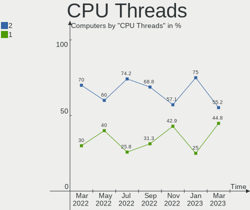

| Number | Computers | Percent |
|--------|-----------|---------|
| 2      | 18        | 75%     |
| 1      | 6         | 25%     |

CPU Op-Modes
------------

CPU Operation Modes (32-bit, 64-bit)

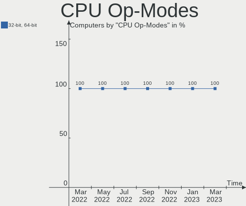

| Op mode        | Computers | Percent |
|----------------|-----------|---------|
| 32-bit, 64-bit | 24        | 100%    |

CPU Microcode
-------------

Microcode number

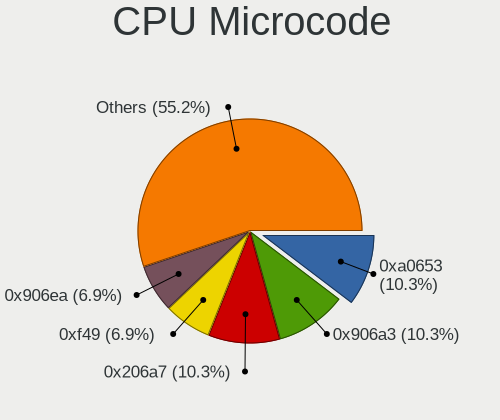

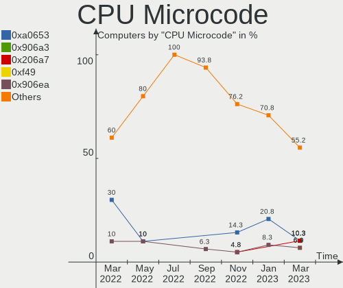

| Number     | Computers | Percent |
|------------|-----------|---------|
| 0xa0653    | 5         | 20.83%  |
| 0x90675    | 5         | 20.83%  |
| 0x306c3    | 3         | 12.5%   |
| 0x906ed    | 2         | 8.33%   |
| 0x906ea    | 2         | 8.33%   |
| Unknown    | 2         | 8.33%   |
| 0x906eb    | 1         | 4.17%   |
| 0x806eb    | 1         | 4.17%   |
| 0x50657    | 1         | 4.17%   |
| 0x1067a    | 1         | 4.17%   |
| 0x08108102 | 1         | 4.17%   |

CPU Microarch
-------------

Microarchitecture

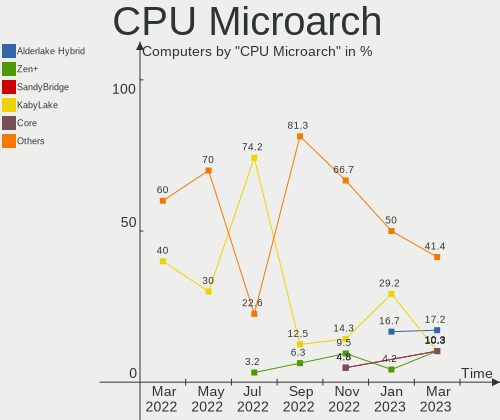

| Name             | Computers | Percent |
|------------------|-----------|---------|
| KabyLake         | 7         | 29.17%  |
| CometLake        | 5         | 20.83%  |
| Alderlake Hybrid | 4         | 16.67%  |
| Haswell          | 3         | 12.5%   |
| Unknown          | 2         | 8.33%   |
| Zen+             | 1         | 4.17%   |
| Skylake          | 1         | 4.17%   |
| Penryn           | 1         | 4.17%   |

Graphics
--------

GPU Vendor
----------

Vendors of graphics cards

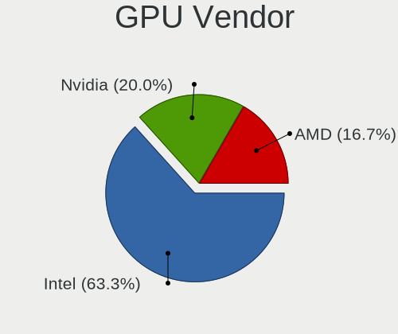

| Vendor            | Computers | Percent |
|-------------------|-----------|---------|
| Intel             | 20        | 86.96%  |
| AMD               | 2         | 8.7%    |
| ASPEED Technology | 1         | 4.35%   |

GPU Model
---------

Graphics card models

| Model                                                                       | Computers | Percent |
|-----------------------------------------------------------------------------|-----------|---------|
| Intel CometLake-S GT2 [UHD Graphics 630]                                    | 5         | 21.74%  |
| Intel CoffeeLake-S GT2 [UHD Graphics 630]                                   | 4         | 17.39%  |
| Intel Alder Lake-S GT1 [UHD Graphics 730]                                   | 4         | 17.39%  |
| Intel 4th Generation Core Processor Family Integrated Graphics Controller   | 2         | 8.7%    |
| Intel Xeon E3-1200 v3/4th Gen Core Processor Integrated Graphics Controller | 1         | 4.35%   |
| Intel WhiskeyLake-U GT2 [UHD Graphics 620]                                  | 1         | 4.35%   |
| Intel HD Graphics 620                                                       | 1         | 4.35%   |
| Intel Alder Lake-S GT1 [UHD Graphics 710]                                   | 1         | 4.35%   |
| Intel 4 Series Chipset Integrated Graphics Controller                       | 1         | 4.35%   |
| ASPEED Technology ASPEED Graphics Family                                    | 1         | 4.35%   |
| AMD Turks GL [FirePro V4900]                                                | 1         | 4.35%   |
| AMD Picasso/Raven 2 [Radeon Vega Series / Radeon Vega Mobile Series]        | 1         | 4.35%   |

GPU Combo
---------

Combinations of graphics cards

| Name       | Computers | Percent |
|------------|-----------|---------|
| 1 x Intel  | 20        | 83.33%  |
| 1 x AMD    | 2         | 8.33%   |
| Other      | 1         | 4.17%   |
| 1 x ASPEED | 1         | 4.17%   |

GPU Driver
----------

Free vs proprietary

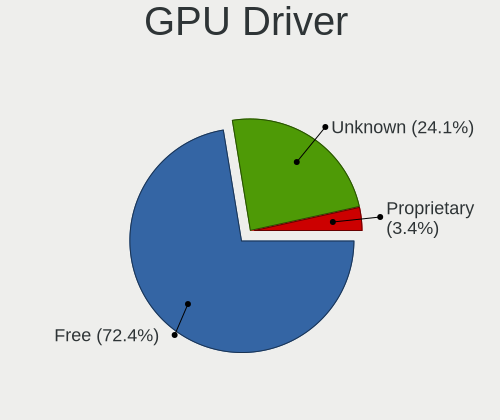

| Driver  | Computers | Percent |
|---------|-----------|---------|
| Free    | 20        | 83.33%  |
| Unknown | 4         | 16.67%  |

GPU Memory
----------

Total video memory

| Size in GB | Computers | Percent |
|------------|-----------|---------|
| Unknown    | 22        | 91.67%  |
| 1.01-2.0   | 1         | 4.17%   |
| 0.51-1.0   | 1         | 4.17%   |

Monitor
-------

Monitor Vendor
--------------

Monitor vendors

| Vendor              | Computers | Percent |
|---------------------|-----------|---------|
| Philips             | 4         | 18.18%  |
| Acer                | 4         | 18.18%  |
| Samsung Electronics | 2         | 9.09%   |
| Lenovo              | 2         | 9.09%   |
| ASUSTek Computer    | 2         | 9.09%   |
| ViewSonic           | 1         | 4.55%   |
| Goldstar            | 1         | 4.55%   |
| Daewoo              | 1         | 4.55%   |
| Chimei Innolux      | 1         | 4.55%   |
| CHD                 | 1         | 4.55%   |
| BOE                 | 1         | 4.55%   |
| BenQ                | 1         | 4.55%   |
| AU Optronics        | 1         | 4.55%   |

Monitor Model
-------------

Monitor models

| Model                                                                 | Computers | Percent |
|-----------------------------------------------------------------------|-----------|---------|
| Philips PHL 243V7 PHLC155 1920x1080 527x296mm 23.8-inch               | 3         | 13.64%  |
| Lenovo TIO22Gen4 LEN111A 1920x1080 476x268mm 21.5-inch                | 2         | 9.09%   |
| ViewSonic VA2465 SERIES VSCB730 1920x1080 521x293mm 23.5-inch         | 1         | 4.55%   |
| Samsung Electronics SyncMaster SAM02A0 1280x1024 376x301mm 19.0-inch  | 1         | 4.55%   |
| Samsung Electronics SA300/SA350 SAM0794 1920x1080 521x293mm 23.5-inch | 1         | 4.55%   |
| Philips 226V4 PHLC0B1 1920x1080 477x268mm 21.5-inch                   | 1         | 4.55%   |
| Goldstar D2342P GSM5842 1920x1080 510x290mm 23.1-inch                 | 1         | 4.55%   |
| Daewoo LM2100W DWE2100 1920x1080 476x268mm 21.5-inch                  | 1         | 4.55%   |
| Chimei Innolux LCD Monitor CMN15F5 1920x1080 344x193mm 15.5-inch      | 1         | 4.55%   |
| CHD DM-MONB2401 CHD2380 1920x1080 520x310mm 23.8-inch                 | 1         | 4.55%   |
| BOE LCD Monitor BOE07A3 1920x1080 344x193mm 15.5-inch                 | 1         | 4.55%   |
| BenQ GW2255 BNQ78CD 1920x1080 477x268mm 21.5-inch                     | 1         | 4.55%   |
| AU Optronics LCD Monitor AUO0100 1920x1080                            | 1         | 4.55%   |
| ASUSTek Computer VA27D AUS270A 1920x1080 600x340mm 27.2-inch          | 1         | 4.55%   |
| ASUSTek Computer V241FA ASU282C 1920x1080 527x296mm 23.8-inch         | 1         | 4.55%   |
| Acer SA241Y A ACR09BD 1920x1080 527x296mm 23.8-inch                   | 1         | 4.55%   |
| Acer K242HL ACR03E3 1920x1080 531x299mm 24.0-inch                     | 1         | 4.55%   |
| Acer K222HQL ACR03E1 1920x1080 477x268mm 21.5-inch                    | 1         | 4.55%   |
| Acer AL1716 ACR06B4 1280x1024 338x271mm 17.1-inch                     | 1         | 4.55%   |

Monitor Resolution
------------------

Monitor screen resolution

| Resolution       | Computers | Percent |
|------------------|-----------|---------|
| 1920x1080 (FHD)  | 17        | 89.47%  |
| 1280x1024 (SXGA) | 2         | 10.53%  |

Monitor Diagonal
----------------

Diagonal size in inches

| Inches  | Computers | Percent |
|---------|-----------|---------|
| 23      | 6         | 27.27%  |
| 21      | 6         | 27.27%  |
| 24      | 4         | 18.18%  |
| 15      | 2         | 9.09%   |
| 27      | 1         | 4.55%   |
| 19      | 1         | 4.55%   |
| 17      | 1         | 4.55%   |
| Unknown | 1         | 4.55%   |

Monitor Width
-------------

Physical width

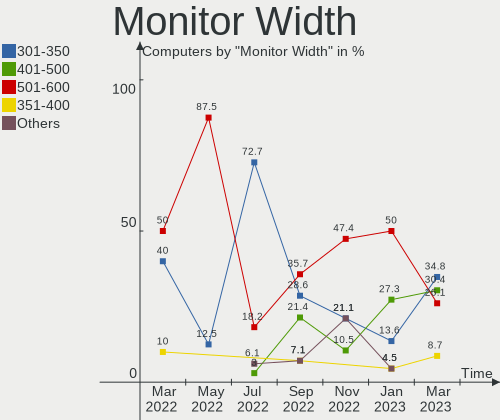

| Width in mm | Computers | Percent |
|-------------|-----------|---------|
| 501-600     | 11        | 50%     |
| 401-500     | 6         | 27.27%  |
| 301-350     | 3         | 13.64%  |
| 351-400     | 1         | 4.55%   |
| Unknown     | 1         | 4.55%   |

Aspect Ratio
------------

Proportional relationship between the width and the height

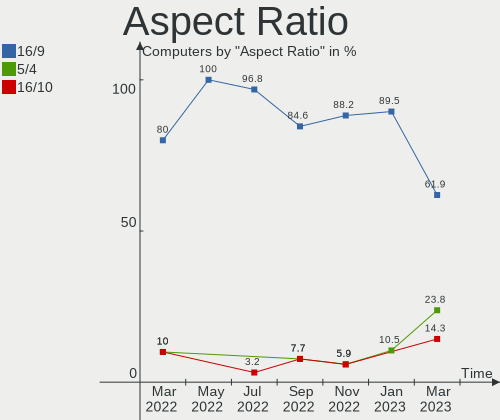

| Ratio | Computers | Percent |
|-------|-----------|---------|
| 16/9  | 17        | 89.47%  |
| 5/4   | 2         | 10.53%  |

Monitor Area
------------

Area in inch²

| Area in inch² | Computers | Percent |
|----------------|-----------|---------|
| 201-250        | 11        | 55%     |
| 151-200        | 4         | 20%     |
| 101-110        | 2         | 10%     |
| 301-350        | 1         | 5%      |
| 141-150        | 1         | 5%      |
| Unknown        | 1         | 5%      |

Pixel Density
-------------

Pixels per inch

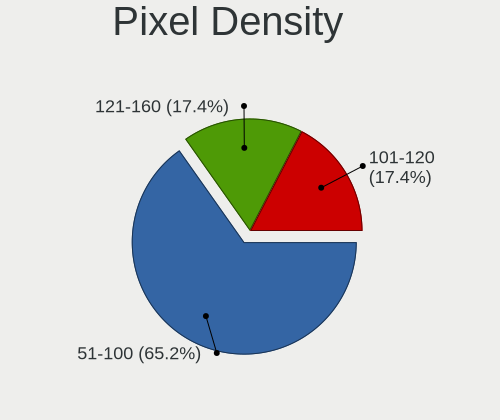

| Density | Computers | Percent |
|---------|-----------|---------|
| 51-100  | 14        | 63.64%  |
| 101-120 | 5         | 22.73%  |
| 121-160 | 2         | 9.09%   |
| Unknown | 1         | 4.55%   |

Multiple Monitors
-----------------

Total monitors connected

| Total | Computers | Percent |
|-------|-----------|---------|
| 1     | 17        | 70.83%  |
| 0     | 4         | 16.67%  |
| 2     | 3         | 12.5%   |

Network
-------

Net Controller Vendor
---------------------

Controller vendors

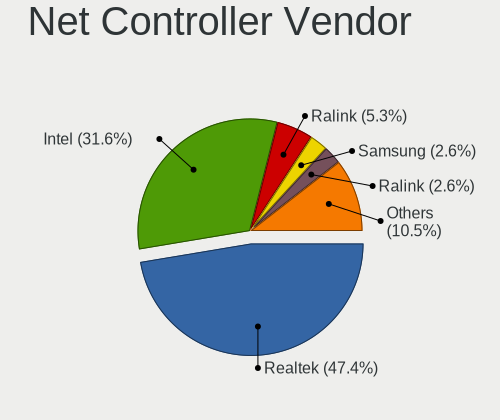

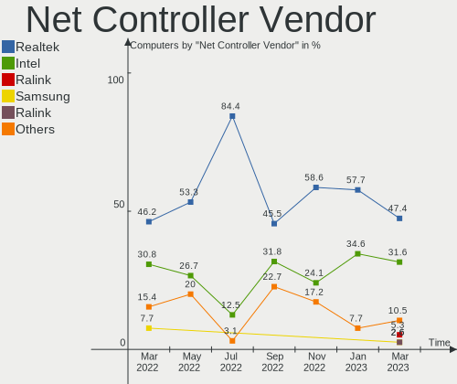

| Vendor                   | Computers | Percent |
|--------------------------|-----------|---------|
| Realtek Semiconductor    | 15        | 57.69%  |
| Intel                    | 9         | 34.62%  |
| Qualcomm Atheros         | 1         | 3.85%   |
| Marvell Technology Group | 1         | 3.85%   |

Net Controller Model
--------------------

Controller models

| Model                                                             | Computers | Percent |
|-------------------------------------------------------------------|-----------|---------|
| Realtek RTL8111/8168/8411 PCI Express Gigabit Ethernet Controller | 15        | 46.88%  |
| Intel Ethernet Connection (17) I219-V                             | 2         | 6.25%   |
| Intel Ethernet Connection (11) I219-V                             | 2         | 6.25%   |
| Intel Comet Lake PCH CNVi WiFi                                    | 2         | 6.25%   |
| Intel Alder Lake-S PCH CNVi WiFi                                  | 2         | 6.25%   |
| Realtek RTL8821CE 802.11ac PCIe Wireless Network Adapter          | 1         | 3.13%   |
| Qualcomm Atheros QCA9565 / AR9565 Wireless Network Adapter        | 1         | 3.13%   |
| Marvell Group 88E8057 PCI-E Gigabit Ethernet Controller           | 1         | 3.13%   |
| Intel Ethernet Controller X710 for 10GbE SFP+                     | 1         | 3.13%   |
| Intel Ethernet Controller I225-V                                  | 1         | 3.13%   |
| Intel Ethernet Connection X722 for 10GBASE-T                      | 1         | 3.13%   |
| Intel Ethernet Connection I217-LM                                 | 1         | 3.13%   |
| Intel Dual Band Wireless-AC 3168NGW [Stone Peak]                  | 1         | 3.13%   |
| Intel Dual Band Wireless-AC 3165 Plus Bluetooth                   | 1         | 3.13%   |

Wireless Vendor
---------------

Wireless vendors

| Vendor                | Computers | Percent |
|-----------------------|-----------|---------|
| Intel                 | 6         | 75%     |
| Realtek Semiconductor | 1         | 12.5%   |
| Qualcomm Atheros      | 1         | 12.5%   |

Wireless Model
--------------

Wireless models

| Model                                                      | Computers | Percent |
|------------------------------------------------------------|-----------|---------|
| Intel Comet Lake PCH CNVi WiFi                             | 2         | 25%     |
| Intel Alder Lake-S PCH CNVi WiFi                           | 2         | 25%     |
| Realtek RTL8821CE 802.11ac PCIe Wireless Network Adapter   | 1         | 12.5%   |
| Qualcomm Atheros QCA9565 / AR9565 Wireless Network Adapter | 1         | 12.5%   |
| Intel Dual Band Wireless-AC 3168NGW [Stone Peak]           | 1         | 12.5%   |
| Intel Dual Band Wireless-AC 3165 Plus Bluetooth            | 1         | 12.5%   |

Ethernet Vendor
---------------

Ethernet vendors

| Vendor                   | Computers | Percent |
|--------------------------|-----------|---------|
| Realtek Semiconductor    | 15        | 65.22%  |
| Intel                    | 7         | 30.43%  |
| Marvell Technology Group | 1         | 4.35%   |

Ethernet Model
--------------

Ethernet models

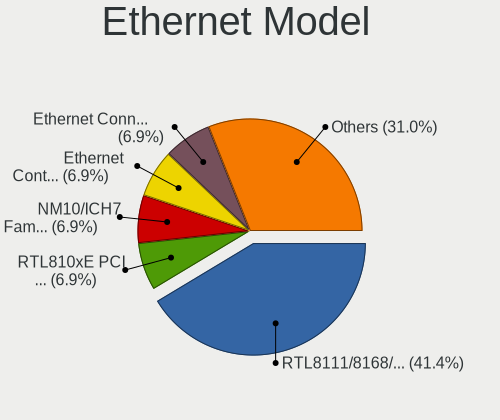

| Model                                                             | Computers | Percent |
|-------------------------------------------------------------------|-----------|---------|
| Realtek RTL8111/8168/8411 PCI Express Gigabit Ethernet Controller | 15        | 62.5%   |
| Intel Ethernet Connection (17) I219-V                             | 2         | 8.33%   |
| Intel Ethernet Connection (11) I219-V                             | 2         | 8.33%   |
| Marvell Group 88E8057 PCI-E Gigabit Ethernet Controller           | 1         | 4.17%   |
| Intel Ethernet Controller X710 for 10GbE SFP+                     | 1         | 4.17%   |
| Intel Ethernet Controller I225-V                                  | 1         | 4.17%   |
| Intel Ethernet Connection X722 for 10GBASE-T                      | 1         | 4.17%   |
| Intel Ethernet Connection I217-LM                                 | 1         | 4.17%   |

Net Controller Kind
-------------------

Ethernet, WiFi or modem

| Kind     | Computers | Percent |
|----------|-----------|---------|
| Ethernet | 23        | 74.19%  |
| WiFi     | 8         | 25.81%  |

Used Controller
---------------

Currently used network controller

| Kind     | Computers | Percent |
|----------|-----------|---------|
| Ethernet | 21        | 91.3%   |
| WiFi     | 2         | 8.7%    |

NICs
----

Total network controllers on board

| Total | Computers | Percent |
|-------|-----------|---------|
| 1     | 14        | 58.33%  |
| 2     | 8         | 33.33%  |
| 4     | 1         | 4.17%   |
| 0     | 1         | 4.17%   |

IPv6
----

IPv6 vs IPv4

| Used | Computers | Percent |
|------|-----------|---------|
| No   | 24        | 100%    |

Bluetooth
---------

Bluetooth Vendor
----------------

Controller vendors

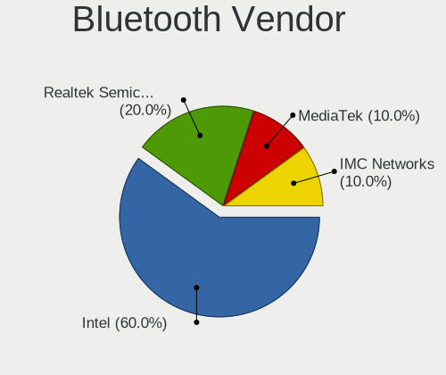

| Vendor                | Computers | Percent |
|-----------------------|-----------|---------|
| Intel                 | 6         | 66.67%  |
| Realtek Semiconductor | 1         | 11.11%  |
| IMC Networks          | 1         | 11.11%  |
| ASUSTek Computer      | 1         | 11.11%  |

Bluetooth Model
---------------

Controller models

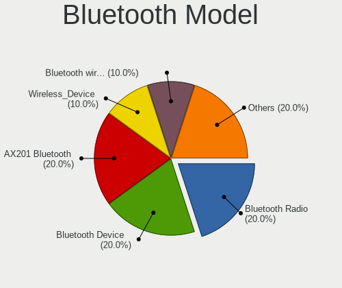

| Model                              | Computers | Percent |
|------------------------------------|-----------|---------|
| Intel Bluetooth Device             | 4         | 44.44%  |
| Realtek Bluetooth Radio            | 1         | 11.11%  |
| Intel Wireless-AC 3168 Bluetooth   | 1         | 11.11%  |
| Intel Bluetooth wireless interface | 1         | 11.11%  |
| IMC Networks Bluetooth Device      | 1         | 11.11%  |
| ASUS Broadcom BCM20702A0 Bluetooth | 1         | 11.11%  |

Sound
-----

Sound Vendor
------------

Sound card vendors

| Vendor              | Computers | Percent |
|---------------------|-----------|---------|
| Intel               | 21        | 77.78%  |
| Lenovo              | 2         | 7.41%   |
| AMD                 | 2         | 7.41%   |
| Texas Instruments   | 1         | 3.7%    |
| C-Media Electronics | 1         | 3.7%    |

Sound Model
-----------

Sound card models

| Model                                                               | Computers | Percent |
|---------------------------------------------------------------------|-----------|---------|
| Intel Alder Lake-S HD Audio Controller                              | 5         | 17.24%  |
| Intel Cannon Lake PCH cAVS                                          | 3         | 10.34%  |
| Intel 8 Series/C220 Series Chipset High Definition Audio Controller | 3         | 10.34%  |
| Lenovo ThinkCentre TIO22Gen4 for USB Audio                          | 2         | 6.9%    |
| Intel Comet Lake PCH-V cAVS                                         | 2         | 6.9%    |
| Intel Comet Lake PCH cAVS                                           | 2         | 6.9%    |
| Intel 200 Series PCH HD Audio                                       | 2         | 6.9%    |
| Texas Instruments PCM2902 Audio Codec                               | 1         | 3.45%   |
| Intel Xeon E3-1200 v3/4th Gen Core Processor HD Audio Controller    | 1         | 3.45%   |
| Intel Sunrise Point-LP HD Audio                                     | 1         | 3.45%   |
| Intel NM10/ICH7 Family High Definition Audio Controller             | 1         | 3.45%   |
| Intel Cannon Point-LP High Definition Audio Controller              | 1         | 3.45%   |
| Intel Audio device                                                  | 1         | 3.45%   |
| C-Media Electronics USB Audio Device                                | 1         | 3.45%   |
| AMD Turks HDMI Audio [Radeon HD 6500/6600 / 6700M Series]           | 1         | 3.45%   |
| AMD Raven/Raven2/Fenghuang HDMI/DP Audio Controller                 | 1         | 3.45%   |
| AMD Family 17h/19h HD Audio Controller                              | 1         | 3.45%   |

Memory
------

Memory Vendor
-------------

Memory module vendors

| Vendor              | Computers | Percent |
|---------------------|-----------|---------|
| Samsung Electronics | 6         | 24%     |
| Kingston            | 6         | 24%     |
| Crucial             | 5         | 20%     |
| Unknown             | 1         | 4%      |
| Ramaxel Technology  | 1         | 4%      |
| Foxline             | 1         | 4%      |
| Elpida              | 1         | 4%      |
| Corsair             | 1         | 4%      |
| Apacer              | 1         | 4%      |
| AMD                 | 1         | 4%      |
| A-DATA Technology   | 1         | 4%      |

Memory Model
------------

Memory module models

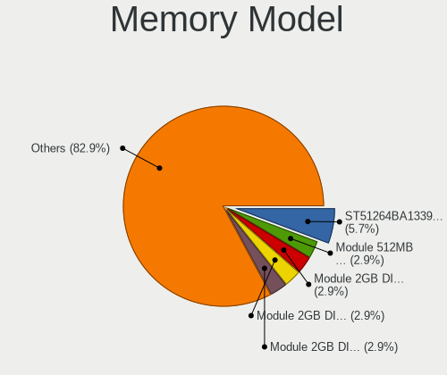

| Model                                                     | Computers | Percent |
|-----------------------------------------------------------|-----------|---------|
| Samsung RAM M471A5244CB0-CRC 4GB SODIMM DDR4 2667MT/s     | 2         | 7.69%   |
| Samsung RAM M471A1K43EB1-CWE 8GB SODIMM DDR4 3200MT/s     | 2         | 7.69%   |
| Crucial RAM CT8G4SFS832A.M8FR 8GB SODIMM DDR4 3200MT/s    | 2         | 7.69%   |
| Unknown RAM Module 1GB DIMM SDRAM 1066MT/s                | 1         | 3.85%   |
| Samsung RAM Module 8GB DIMM DDR4 2667MT/s                 | 1         | 3.85%   |
| Samsung RAM M471A5244CB0-CTD 4GB SODIMM DDR4 3266MT/s     | 1         | 3.85%   |
| Ramaxel RAM RMSA3270ME86H9F-2666 4GB SODIMM DDR4 2667MT/s | 1         | 3.85%   |
| Kingston RAM Module 32GB DIMM DDR4 2666MT/s               | 1         | 3.85%   |
| Kingston RAM 99U5702-101.A00G 8GB DIMM DDR4 2667MT/s      | 1         | 3.85%   |
| Kingston RAM 99U5471-060.A00LF 8GB DIMM DDR3 1333MT/s     | 1         | 3.85%   |
| Kingston RAM 9905743-152.A00G 8GB DIMM DDR4 2400MT/s      | 1         | 3.85%   |
| Kingston RAM 9905713-019.A00G 4GB DIMM DDR4 2666MT/s      | 1         | 3.85%   |
| Kingston RAM 9905702-204.A00G 8GB DIMM DDR4 2667MT/s      | 1         | 3.85%   |
| Kingston RAM 9905702-017.A00G 8GB DIMM DDR4 2933MT/s      | 1         | 3.85%   |
| Foxline RAM FL2666D4U19-8G 8GB DIMM DDR4 2667MT/s         | 1         | 3.85%   |
| Elpida RAM EBJ21UE8BDF0-DJ-F 2GB DIMM DDR3 1333MT/s       | 1         | 3.85%   |
| Crucial RAM CT8G4SFRA32A.C8FP 8GB SODIMM DDR4 3200MT/s    | 1         | 3.85%   |
| Crucial RAM CT8G4DFRA32A.M8FR 8GB DIMM DDR4 3533MT/s      | 1         | 3.85%   |
| Crucial RAM CT102464BA160B.C16 8GB DIMM DDR3 1600MT/s     | 1         | 3.85%   |
| Corsair RAM CMK8GX4M1A2666C16 8GB DIMM DDR4 3000MT/s      | 1         | 3.85%   |
| Apacer RAM D12.2324WS.001 8GB DIMM DDR4 2667MT/s          | 1         | 3.85%   |
| AMD RAM R948G3206U2S 8GB DIMM DDR4 3200MT/s               | 1         | 3.85%   |
| A-DATA RAM Module 8GB DIMM DDR4 2400MT/s                  | 1         | 3.85%   |

Memory Kind
-----------

Memory module kinds

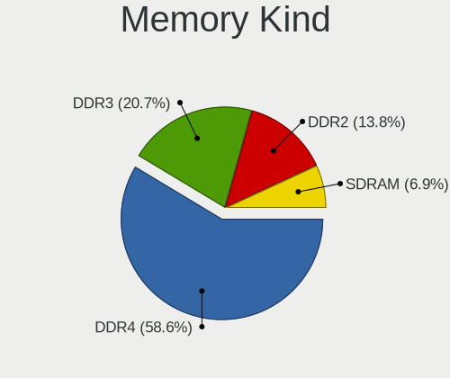

| Kind  | Computers | Percent |
|-------|-----------|---------|
| DDR4  | 20        | 83.33%  |
| SDRAM | 2         | 8.33%   |
| DDR3  | 2         | 8.33%   |

Memory Form Factor
------------------

Physical design of the memory module

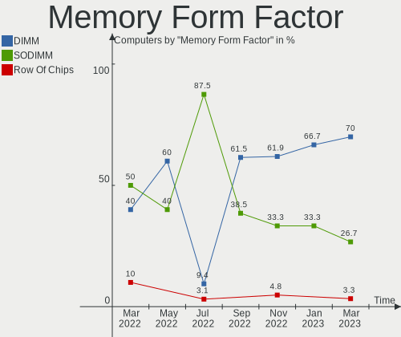

| Name   | Computers | Percent |
|--------|-----------|---------|
| DIMM   | 16        | 66.67%  |
| SODIMM | 8         | 33.33%  |

Memory Size
-----------

Memory module size

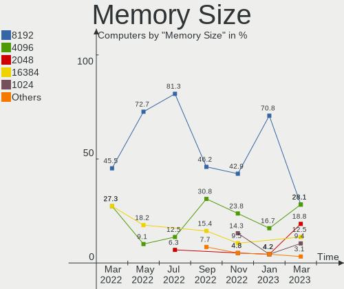

| Size  | Computers | Percent |
|-------|-----------|---------|
| 8192  | 17        | 70.83%  |
| 4096  | 4         | 16.67%  |
| 32768 | 1         | 4.17%   |
| 2048  | 1         | 4.17%   |
| 1024  | 1         | 4.17%   |

Memory Speed
------------

Memory module speed

| Speed | Computers | Percent |
|-------|-----------|---------|
| 2667  | 8         | 30.77%  |
| 3200  | 6         | 23.08%  |
| 2666  | 2         | 7.69%   |
| 2400  | 2         | 7.69%   |
| 1333  | 2         | 7.69%   |
| 3533  | 1         | 3.85%   |
| 3266  | 1         | 3.85%   |
| 3000  | 1         | 3.85%   |
| 2933  | 1         | 3.85%   |
| 1600  | 1         | 3.85%   |
| 1066  | 1         | 3.85%   |

Printers & scanners
-------------------

Printer Vendor
--------------

Printer device vendors

Zero info for selected period =(

Printer Model
-------------

Printer device models

Zero info for selected period =(

Scanner Vendor
--------------

Scanner device vendors

Zero info for selected period =(

Scanner Model
-------------

Scanner device models

Zero info for selected period =(

Camera
------

Camera Vendor
-------------

Camera device vendors

| Vendor                | Computers | Percent |
|-----------------------|-----------|---------|
| Unknown               | 2         | 28.57%  |
| Realtek Semiconductor | 1         | 14.29%  |
| Microdia              | 1         | 14.29%  |
| IMC Networks          | 1         | 14.29%  |
| Chicony Electronics   | 1         | 14.29%  |
| Acer                  | 1         | 14.29%  |

Camera Model
------------

Camera device models

| Model                                   | Computers | Percent |
|-----------------------------------------|-----------|---------|
| Unknown                                 | 2         | 28.57%  |
| Realtek USB Camera                      | 1         | 14.29%  |
| Microdia Camera                         | 1         | 14.29%  |
| IMC Networks USB2.0 HD UVC WebCam       | 1         | 14.29%  |
| Chicony Integrated Camera (1280x720@30) | 1         | 14.29%  |
| Acer Integrated Camera                  | 1         | 14.29%  |

Security
--------

Fingerprint Vendor
------------------

Fingerprint sensor vendors

Zero info for selected period =(

Fingerprint Model
-----------------

Fingerprint sensor models

Zero info for selected period =(

Chipcard Vendor
---------------

Chipcard module vendors

Zero info for selected period =(

Chipcard Model
--------------

Chipcard module models

Zero info for selected period =(

Unsupported
-----------

Unsupported Devices
-------------------

Total unsupported devices on board

| Total | Computers | Percent |
|-------|-----------|---------|
| 0     | 18        | 75%     |
| 1     | 5         | 20.83%  |
| 4     | 1         | 4.17%   |

Unsupported Device Types
------------------------

Types of unsupported devices

| Type                     | Computers | Percent |
|--------------------------|-----------|---------|
| Graphics card            | 4         | 50%     |
| Unassigned class         | 1         | 12.5%   |
| Net/wireless             | 1         | 12.5%   |
| Communication controller | 1         | 12.5%   |
| Camera                   | 1         | 12.5%   |

