Red OS - Hardware Trends (Desktops)
-----------------------------------

A project to identify most popular hardware characteristics and track their change
over time based on data collected by Linux users at https://Linux-Hardware.org.

Anyone can contribute to this report by the [hw-probe](https://github.com/linuxhw/hw-probe) tool:

    sudo -E hw-probe -all -upload

This report is for one last month. Overall report since the beginning of time: [TestDays](https://github.com/linuxhw/TestDays)

Period: Feb, 2023.

Contents
--------

* [ System ](#system)
  - [ OS                       ](#os)
  - [ OS Family                ](#os-family)
  - [ Kernel                   ](#kernel)
  - [ Kernel Family            ](#kernel-family)
  - [ Kernel Major Ver.        ](#kernel-major-ver)
  - [ Arch                     ](#arch)
  - [ DE                       ](#de)
  - [ Display Server           ](#display-server)
  - [ Display Manager          ](#display-manager)
  - [ OS Lang                  ](#os-lang)
  - [ Boot Mode                ](#boot-mode)
  - [ Filesystem               ](#filesystem)
  - [ Part. scheme             ](#part-scheme)
  - [ Dual Boot with Linux/BSD ](#dual-boot-with-linuxbsd)
  - [ Dual Boot (Win)          ](#dual-boot-win)

* [ Board ](#board)
  - [ Vendor                   ](#vendor)
  - [ Model                    ](#model)
  - [ Model Family             ](#model-family)
  - [ MFG Year                 ](#mfg-year)
  - [ Form Factor              ](#form-factor)
  - [ Secure Boot              ](#secure-boot)
  - [ Coreboot                 ](#coreboot)
  - [ RAM Size                 ](#ram-size)
  - [ RAM Used                 ](#ram-used)
  - [ Total Drives             ](#total-drives)
  - [ Has CD-ROM               ](#has-cd-rom)
  - [ Has Ethernet             ](#has-ethernet)
  - [ Has WiFi                 ](#has-wifi)
  - [ Has Bluetooth            ](#has-bluetooth)

* [ Location ](#location)
  - [ Country                  ](#country)
  - [ City                     ](#city)

* [ Drives ](#drives)
  - [ Drive Vendor             ](#drive-vendor)
  - [ Drive Model              ](#drive-model)
  - [ HDD Vendor               ](#hdd-vendor)
  - [ SSD Vendor               ](#ssd-vendor)
  - [ Drive Kind               ](#drive-kind)
  - [ Drive Connector          ](#drive-connector)
  - [ Drive Size               ](#drive-size)
  - [ Space Total              ](#space-total)
  - [ Space Used               ](#space-used)
  - [ Malfunc. Drives          ](#malfunc-drives)
  - [ Malfunc. Drive Vendor    ](#malfunc-drive-vendor)
  - [ Malfunc. HDD Vendor      ](#malfunc-hdd-vendor)
  - [ Malfunc. Drive Kind      ](#malfunc-drive-kind)
  - [ Failed Drives            ](#failed-drives)
  - [ Failed Drive Vendor      ](#failed-drive-vendor)
  - [ Drive Status             ](#drive-status)

* [ Storage controller ](#storage-controller)
  - [ Storage Vendor           ](#storage-vendor)
  - [ Storage Model            ](#storage-model)
  - [ Storage Kind             ](#storage-kind)

* [ Processor ](#processor)
  - [ CPU Vendor               ](#cpu-vendor)
  - [ CPU Model                ](#cpu-model)
  - [ CPU Model Family         ](#cpu-model-family)
  - [ CPU Cores                ](#cpu-cores)
  - [ CPU Sockets              ](#cpu-sockets)
  - [ CPU Threads              ](#cpu-threads)
  - [ CPU Op-Modes             ](#cpu-op-modes)
  - [ CPU Microcode            ](#cpu-microcode)
  - [ CPU Microarch            ](#cpu-microarch)

* [ Graphics ](#graphics)
  - [ GPU Vendor               ](#gpu-vendor)
  - [ GPU Model                ](#gpu-model)
  - [ GPU Combo                ](#gpu-combo)
  - [ GPU Driver               ](#gpu-driver)
  - [ GPU Memory               ](#gpu-memory)

* [ Monitor ](#monitor)
  - [ Monitor Vendor           ](#monitor-vendor)
  - [ Monitor Model            ](#monitor-model)
  - [ Monitor Resolution       ](#monitor-resolution)
  - [ Monitor Diagonal         ](#monitor-diagonal)
  - [ Monitor Width            ](#monitor-width)
  - [ Aspect Ratio             ](#aspect-ratio)
  - [ Monitor Area             ](#monitor-area)
  - [ Pixel Density            ](#pixel-density)
  - [ Multiple Monitors        ](#multiple-monitors)

* [ Network ](#network)
  - [ Net Controller Vendor    ](#net-controller-vendor)
  - [ Net Controller Model     ](#net-controller-model)
  - [ Wireless Vendor          ](#wireless-vendor)
  - [ Wireless Model           ](#wireless-model)
  - [ Ethernet Vendor          ](#ethernet-vendor)
  - [ Ethernet Model           ](#ethernet-model)
  - [ Net Controller Kind      ](#net-controller-kind)
  - [ Used Controller          ](#used-controller)
  - [ NICs                     ](#nics)
  - [ IPv6                     ](#ipv6)

* [ Bluetooth ](#bluetooth)
  - [ Bluetooth Vendor         ](#bluetooth-vendor)
  - [ Bluetooth Model          ](#bluetooth-model)

* [ Sound ](#sound)
  - [ Sound Vendor             ](#sound-vendor)
  - [ Sound Model              ](#sound-model)

* [ Memory ](#memory)
  - [ Memory Vendor            ](#memory-vendor)
  - [ Memory Model             ](#memory-model)
  - [ Memory Kind              ](#memory-kind)
  - [ Memory Form Factor       ](#memory-form-factor)
  - [ Memory Size              ](#memory-size)
  - [ Memory Speed             ](#memory-speed)

* [ Printers & scanners ](#printers--scanners)
  - [ Printer Vendor           ](#printer-vendor)
  - [ Printer Model            ](#printer-model)
  - [ Scanner Vendor           ](#scanner-vendor)
  - [ Scanner Model            ](#scanner-model)

* [ Camera ](#camera)
  - [ Camera Vendor            ](#camera-vendor)
  - [ Camera Model             ](#camera-model)

* [ Security ](#security)
  - [ Fingerprint Vendor       ](#fingerprint-vendor)
  - [ Fingerprint Model        ](#fingerprint-model)
  - [ Chipcard Vendor          ](#chipcard-vendor)
  - [ Chipcard Model           ](#chipcard-model)

* [ Unsupported ](#unsupported)
  - [ Unsupported Devices      ](#unsupported-devices)
  - [ Unsupported Device Types ](#unsupported-device-types)

System
------

OS
--

Installed operating systems

| Name         | Desktops | Percent |
|--------------|----------|---------|
| Red OS 7.3.2 | 9        | 56.25%  |
| Red OS 7.3   | 5        | 31.25%  |
| Red OS 7.3.1 | 2        | 12.5%   |

OS Family
---------

OS without a version

| Name   | Desktops | Percent |
|--------|----------|---------|
| Red OS | 16       | 100%    |

Kernel
------

Version of the Linux kernel

| Version                | Desktops | Percent |
|------------------------|----------|---------|
| 5.15.87-1.el7.3.x86_64 | 6        | 37.5%   |
| 5.15.72-1.el7.3.x86_64 | 3        | 18.75%  |
| 5.15.10-1.el7.x86_64   | 2        | 12.5%   |
| 5.10.29-1.el7.x86_64   | 2        | 12.5%   |
| 5.15.78-2.el7.3.x86_64 | 1        | 6.25%   |
| 5.15.35-5.el7.3.x86_64 | 1        | 6.25%   |
| 5.14.9-1.el7.x86_64    | 1        | 6.25%   |

Kernel Family
-------------

Linux kernel without a distro release

| Version | Desktops | Percent |
|---------|----------|---------|
| 5.15.87 | 6        | 37.5%   |
| 5.15.72 | 3        | 18.75%  |
| 5.15.10 | 2        | 12.5%   |
| 5.10.29 | 2        | 12.5%   |
| 5.15.78 | 1        | 6.25%   |
| 5.15.35 | 1        | 6.25%   |
| 5.14.9  | 1        | 6.25%   |

Kernel Major Ver.
-----------------

Linux kernel major version

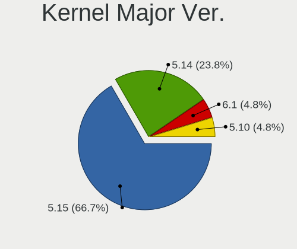

| Version | Desktops | Percent |
|---------|----------|---------|
| 5.15    | 13       | 81.25%  |
| 5.10    | 2        | 12.5%   |
| 5.14    | 1        | 6.25%   |

Arch
----

OS architecture (x86_64, i586, etc.)

| Name   | Desktops | Percent |
|--------|----------|---------|
| x86_64 | 16       | 100%    |

DE
--

Desktop Environment

| Name       | Desktops | Percent |
|------------|----------|---------|
| MATE       | 13       | 81.25%  |
| X-Cinnamon | 1        | 6.25%   |
| Cinnamon   | 1        | 6.25%   |
| Unknown    | 1        | 6.25%   |

Display Server
--------------

X11 or Wayland

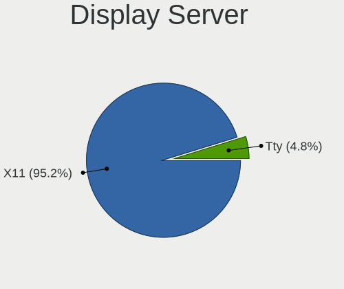

| Name | Desktops | Percent |
|------|----------|---------|
| X11  | 15       | 93.75%  |
| Tty  | 1        | 6.25%   |

Display Manager
---------------

SDDM, LightDM, etc.

| Name    | Desktops | Percent |
|---------|----------|---------|
| GDM     | 13       | 81.25%  |
| LightDM | 2        | 12.5%   |
| Unknown | 1        | 6.25%   |

OS Lang
-------

Language

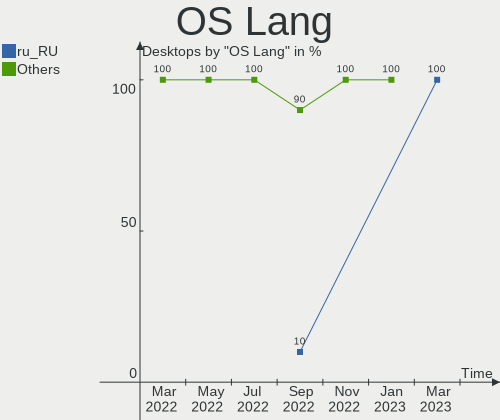

| Lang    | Desktops | Percent |
|---------|----------|---------|
| ru_RU   | 10       | 62.5%   |
| Unknown | 5        | 31.25%  |
| en_US   | 1        | 6.25%   |

Boot Mode
---------

EFI or BIOS

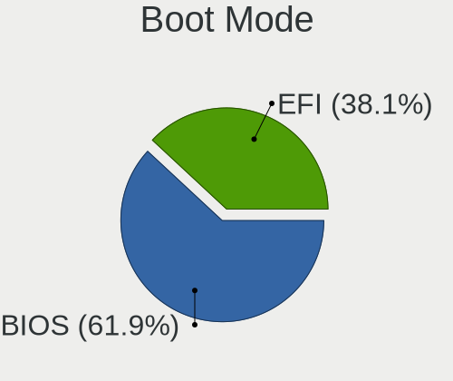

| Mode | Desktops | Percent |
|------|----------|---------|
| EFI  | 11       | 68.75%  |
| BIOS | 5        | 31.25%  |

Filesystem
----------

Type of filesystem

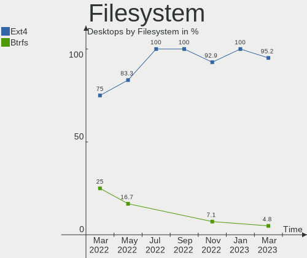

| Type | Desktops | Percent |
|------|----------|---------|
| Ext4 | 16       | 100%    |

Part. scheme
------------

Scheme of partitioning

| Type | Desktops | Percent |
|------|----------|---------|
| GPT  | 9        | 56.25%  |
| MBR  | 7        | 43.75%  |

Dual Boot with Linux/BSD
------------------------

Hosting more than one Linux/BSD

| Dual boot | Desktops | Percent |
|-----------|----------|---------|
| No        | 16       | 100%    |

Dual Boot (Win)
---------------

Hosting Linux and Windows

| Dual boot | Desktops | Percent |
|-----------|----------|---------|
| No        | 14       | 87.5%   |
| Yes       | 2        | 12.5%   |

Board
-----

Vendor
------

Motherboard manufacturer

| Name                | Desktops | Percent |
|---------------------|----------|---------|
| Gigabyte Technology | 4        | 25%     |
| MSI                 | 2        | 12.5%   |
| Lenovo              | 2        | 12.5%   |
| iRU                 | 1        | 6.25%   |
| Intel               | 1        | 6.25%   |
| ICL                 | 1        | 6.25%   |
| Hewlett-Packard     | 1        | 6.25%   |
| Foxconn             | 1        | 6.25%   |
| Compal              | 1        | 6.25%   |
| ASRock              | 1        | 6.25%   |
| Aquarius            | 1        | 6.25%   |

Model
-----

Motherboard model

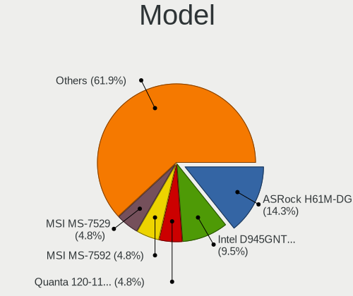

| Name                                   | Desktops | Percent |
|----------------------------------------|----------|---------|
| MSI MS-7D46                            | 1        | 6.25%   |
| MSI MS-7D22                            | 1        | 6.25%   |
| Lenovo ThinkCentre M91p 4524PL4        | 1        | 6.25%   |
| Lenovo IdeaCentre 3 07ADA05 90MV0059RS | 1        | 6.25%   |
| iRU 311                                | 1        | 6.25%   |
| Intel DH61CR AAG14064-204              | 1        | 6.25%   |
| ICL RAY B102                           | 1        | 6.25%   |
| HP ProDesk 600 G1 SFF                  | 1        | 6.25%   |
| Gigabyte M61SME-S2                     | 1        | 6.25%   |
| Gigabyte B560M DS3H V2                 | 1        | 6.25%   |
| Gigabyte B365M H                       | 1        | 6.25%   |
| Gigabyte B365M DS3H                    | 1        | 6.25%   |
| Foxconn Pro3500 Series                 | 1        | 6.25%   |
| Compal DIP00                           | 1        | 6.25%   |
| ASRock H61M-VG4                        | 1        | 6.25%   |
| Aquarius AQB560M                       | 1        | 6.25%   |

Model Family
------------

Motherboard model prefix

| Name               | Desktops | Percent |
|--------------------|----------|---------|
| Gigabyte B365M     | 2        | 12.5%   |
| MSI MS-7D46        | 1        | 6.25%   |
| MSI MS-7D22        | 1        | 6.25%   |
| Lenovo ThinkCentre | 1        | 6.25%   |
| Lenovo IdeaCentre  | 1        | 6.25%   |
| iRU 311            | 1        | 6.25%   |
| Intel DH61CR       | 1        | 6.25%   |
| ICL RAY            | 1        | 6.25%   |
| HP ProDesk         | 1        | 6.25%   |
| Gigabyte M61SME-S2 | 1        | 6.25%   |
| Gigabyte B560M     | 1        | 6.25%   |
| Foxconn Pro3500    | 1        | 6.25%   |
| Compal DIP00       | 1        | 6.25%   |
| ASRock H61M-VG4    | 1        | 6.25%   |
| Aquarius AQB560M   | 1        | 6.25%   |

MFG Year
--------

Motherboard manufacture year

| Year | Desktops | Percent |
|------|----------|---------|
| 2021 | 5        | 31.25%  |
| 2019 | 3        | 18.75%  |
| 2013 | 3        | 18.75%  |
| 2011 | 2        | 12.5%   |
| 2022 | 1        | 6.25%   |
| 2020 | 1        | 6.25%   |
| 2007 | 1        | 6.25%   |

Form Factor
-----------

Physical design of the computer

| Name    | Desktops | Percent |
|---------|----------|---------|
| Desktop | 16       | 100%    |

Secure Boot
-----------

Enabled or disabled

| State    | Desktops | Percent |
|----------|----------|---------|
| Disabled | 15       | 93.75%  |
| Enabled  | 1        | 6.25%   |

Coreboot
--------

Have coreboot on board

| Used | Desktops | Percent |
|------|----------|---------|
| No   | 16       | 100%    |

RAM Size
--------

Total RAM memory

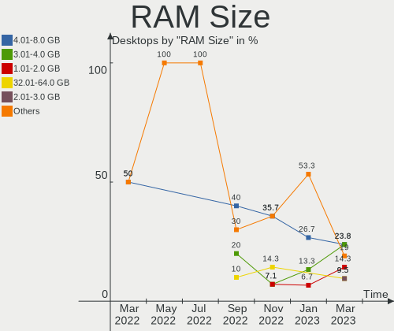

| Size in GB | Desktops | Percent |
|------------|----------|---------|
| 16.01-24.0 | 6        | 37.5%   |
| 4.01-8.0   | 5        | 31.25%  |
| 3.01-4.0   | 3        | 18.75%  |
| 8.01-16.0  | 1        | 6.25%   |
| 0.51-1.0   | 1        | 6.25%   |

RAM Used
--------

Used RAM memory

| Used GB   | Desktops | Percent |
|-----------|----------|---------|
| 1.01-2.0  | 6        | 37.5%   |
| 2.01-3.0  | 4        | 25%     |
| 3.01-4.0  | 2        | 12.5%   |
| 8.01-16.0 | 2        | 12.5%   |
| 4.01-8.0  | 1        | 6.25%   |
| 0.01-0.5  | 1        | 6.25%   |

Total Drives
------------

Number of drives on board

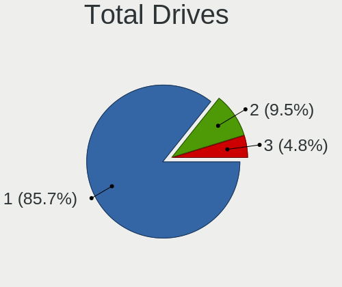

| Drives | Desktops | Percent |
|--------|----------|---------|
| 1      | 11       | 68.75%  |
| 2      | 5        | 31.25%  |

Has CD-ROM
----------

Has CD-ROM on board

| Presented | Desktops | Percent |
|-----------|----------|---------|
| No        | 10       | 62.5%   |
| Yes       | 6        | 37.5%   |

Has Ethernet
------------

Has Ethernet on board

| Presented | Desktops | Percent |
|-----------|----------|---------|
| Yes       | 16       | 100%    |

Has WiFi
--------

Has WiFi module

| Presented | Desktops | Percent |
|-----------|----------|---------|
| No        | 13       | 81.25%  |
| Yes       | 3        | 18.75%  |

Has Bluetooth
-------------

Has Bluetooth module

| Presented | Desktops | Percent |
|-----------|----------|---------|
| No        | 14       | 87.5%   |
| Yes       | 2        | 12.5%   |

Location
--------

Country
-------

Geographic location (country)

| Country | Desktops | Percent |
|---------|----------|---------|
| Russia  | 16       | 100%    |

City
----

Geographic location (city)

| City        | Desktops | Percent |
|-------------|----------|---------|
| Murom       | 4        | 25%     |
| Salekhard   | 3        | 18.75%  |
| Krasnodar   | 2        | 12.5%   |
| Volgograd   | 1        | 6.25%   |
| Svetlograd  | 1        | 6.25%   |
| Muromskiy   | 1        | 6.25%   |
| Moscow      | 1        | 6.25%   |
| Krasnoyarsk | 1        | 6.25%   |
| Balashikha  | 1        | 6.25%   |
| Baksan      | 1        | 6.25%   |

Drives
------

Drive Vendor
------------

Hard drive vendors

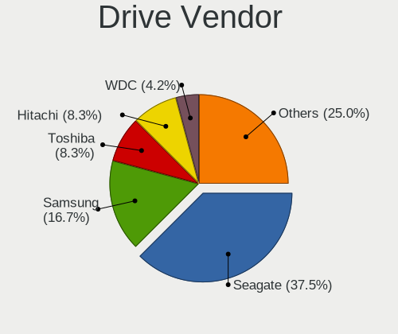

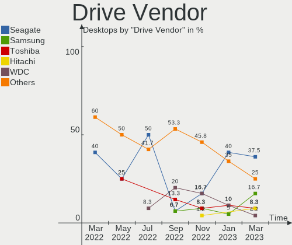

| Vendor            | Desktops | Drives | Percent |
|-------------------|----------|--------|---------|
| WDC               | 6        | 6      | 28.57%  |
| Toshiba           | 4        | 4      | 19.05%  |
| A-DATA Technology | 3        | 3      | 14.29%  |
| Seagate           | 2        | 2      | 9.52%   |
| Qumo              | 2        | 2      | 9.52%   |
| SanDisk           | 1        | 1      | 4.76%   |
| Kingston          | 1        | 1      | 4.76%   |
| Foxline           | 1        | 1      | 4.76%   |
| Unknown           | 1        | 1      | 4.76%   |

Drive Model
-----------

Hard drive models

| Model                                | Desktops | Percent |
|--------------------------------------|----------|---------|
| Toshiba HDWD110 1TB                  | 2        | 9.52%   |
| Seagate ST500DM002-1BD142 500GB      | 2        | 9.52%   |
| WDC WD5000AAKX-60U6AA0 500GB         | 1        | 4.76%   |
| WDC WD5000AAKX-083CA1 500GB          | 1        | 4.76%   |
| WDC WD5000AAKS-00V1A0 500GB          | 1        | 4.76%   |
| WDC WD40PURZ-85AKKY0 4TB             | 1        | 4.76%   |
| WDC WD10EZEX-75ZF5A0 1TB             | 1        | 4.76%   |
| WDC PC SN530 SDBPMPZ-256G-1001 256GB | 1        | 4.76%   |
| Toshiba DT01ACA200 2TB               | 1        | 4.76%   |
| Toshiba DT01ACA100 1TB               | 1        | 4.76%   |
| SanDisk SD8SBAT256G1122 256GB SSD    | 1        | 4.76%   |
| Qumo Q3DT-480GSCY 480GB SSD          | 1        | 4.76%   |
| Qumo Q3DT-256GMSY-M2 256GB SSD       | 1        | 4.76%   |
| Kingston SA400S37120G 120GB SSD      | 1        | 4.76%   |
| Foxline FLSSD512X5SE 512GB           | 1        | 4.76%   |
| A-DATA SX6000PNP 256GB               | 1        | 4.76%   |
| A-DATA SU800 256GB SSD               | 1        | 4.76%   |
| A-DATA SU650 240GB SSD               | 1        | 4.76%   |
| Unknown                              | 1        | 4.76%   |

HDD Vendor
----------

Hard disk drive vendors

| Vendor  | Desktops | Drives | Percent |
|---------|----------|--------|---------|
| WDC     | 5        | 5      | 45.45%  |
| Toshiba | 4        | 4      | 36.36%  |
| Seagate | 2        | 2      | 18.18%  |

SSD Vendor
----------

Solid state drive vendors

| Vendor            | Desktops | Drives | Percent |
|-------------------|----------|--------|---------|
| Qumo              | 2        | 2      | 28.57%  |
| A-DATA Technology | 2        | 2      | 28.57%  |
| SanDisk           | 1        | 1      | 14.29%  |
| Kingston          | 1        | 1      | 14.29%  |
| Foxline           | 1        | 1      | 14.29%  |

Drive Kind
----------

HDD or SSD

| Kind | Desktops | Drives | Percent |
|------|----------|--------|---------|
| HDD  | 10       | 11     | 50%     |
| SSD  | 7        | 7      | 35%     |
| NVMe | 2        | 2      | 10%     |
| MMC  | 1        | 1      | 5%      |

Drive Connector
---------------

SATA, SAS, NVMe, etc.

| Type | Desktops | Drives | Percent |
|------|----------|--------|---------|
| SATA | 13       | 18     | 81.25%  |
| NVMe | 2        | 2      | 12.5%   |
| MMC  | 1        | 1      | 6.25%   |

Drive Size
----------

Size of hard drive

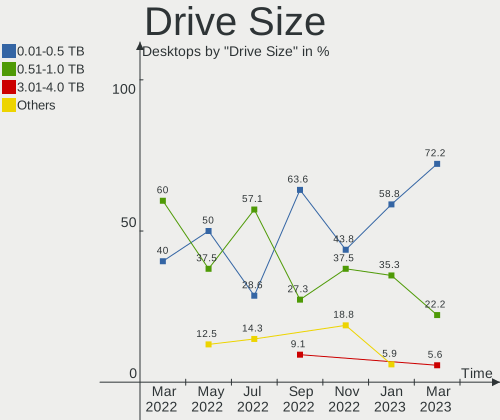

| Size in TB | Desktops | Drives | Percent |
|------------|----------|--------|---------|
| 0.01-0.5   | 10       | 11     | 58.82%  |
| 0.51-1.0   | 5        | 5      | 29.41%  |
| 3.01-4.0   | 1        | 1      | 5.88%   |
| 1.01-2.0   | 1        | 1      | 5.88%   |

Space Total
-----------

Amount of disk space available on the file system

| Size in GB | Desktops | Percent |
|------------|----------|---------|
| 251-500    | 6        | 37.5%   |
| 101-250    | 4        | 25%     |
| 501-1000   | 4        | 25%     |
| 2001-3000  | 1        | 6.25%   |
| 1001-2000  | 1        | 6.25%   |

Space Used
----------

Amount of used disk space

| Used GB  | Desktops | Percent |
|----------|----------|---------|
| 1-20     | 7        | 43.75%  |
| 101-250  | 4        | 25%     |
| 21-50    | 3        | 18.75%  |
| 501-1000 | 2        | 12.5%   |

Malfunc. Drives
---------------

Drive models with a malfunction

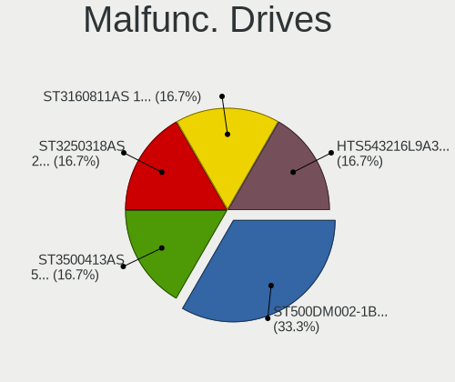

| Model                           | Desktops | Drives | Percent |
|---------------------------------|----------|--------|---------|
| Seagate ST500DM002-1BD142 500GB | 2        | 2      | 40%     |
| WDC WD5000AAKX-60U6AA0 500GB    | 1        | 1      | 20%     |
| WDC WD5000AAKS-00V1A0 500GB     | 1        | 1      | 20%     |
| WDC WD10EZEX-75ZF5A0 1TB        | 1        | 1      | 20%     |

Malfunc. Drive Vendor
---------------------

Vendors of faulty drives

| Vendor  | Desktops | Drives | Percent |
|---------|----------|--------|---------|
| WDC     | 3        | 3      | 60%     |
| Seagate | 2        | 2      | 40%     |

Malfunc. HDD Vendor
-------------------

Vendors of faulty HDD drives

| Vendor  | Desktops | Drives | Percent |
|---------|----------|--------|---------|
| WDC     | 3        | 3      | 60%     |
| Seagate | 2        | 2      | 40%     |

Malfunc. Drive Kind
-------------------

Kinds of faulty drives

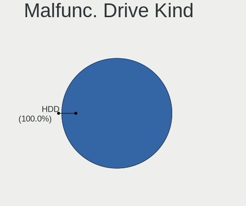

| Kind | Desktops | Drives | Percent |
|------|----------|--------|---------|
| HDD  | 4        | 5      | 100%    |

Failed Drives
-------------

Failed drive models

Zero info for selected period =(

Failed Drive Vendor
-------------------

Failed drive vendors

Zero info for selected period =(

Drive Status
------------

Number of failed and malfunc. drives

| Status   | Desktops | Drives | Percent |
|----------|----------|--------|---------|
| Works    | 12       | 15     | 70.59%  |
| Malfunc  | 4        | 5      | 23.53%  |
| Detected | 1        | 1      | 5.88%   |

Storage controller
------------------

Storage Vendor
--------------

Storage controller vendors

| Vendor                | Desktops | Percent |
|-----------------------|----------|---------|
| Intel                 | 14       | 77.78%  |
| SanDisk               | 1        | 5.56%   |
| Realtek Semiconductor | 1        | 5.56%   |
| Nvidia                | 1        | 5.56%   |
| AMD                   | 1        | 5.56%   |

Storage Model
-------------

Storage controller models

| Model                                                                                   | Desktops | Percent |
|-----------------------------------------------------------------------------------------|----------|---------|
| Intel 6 Series/C200 Series Chipset Family 6 port Desktop SATA AHCI Controller           | 3        | 15%     |
| Intel 500 Series Chipset Family SATA AHCI Controller                                    | 3        | 15%     |
| Intel 200 Series PCH SATA controller [AHCI mode]                                        | 2        | 10%     |
| SanDisk Non-Volatile memory controller                                                  | 1        | 5%      |
| Realtek Realtek Non-Volatile memory controller                                          | 1        | 5%      |
| Nvidia MCP61 SATA Controller                                                            | 1        | 5%      |
| Nvidia MCP61 IDE                                                                        | 1        | 5%      |
| Intel HM170/QM170 Chipset SATA Controller [AHCI Mode]                                   | 1        | 5%      |
| Intel Celeron/Pentium Silver Processor SATA Controller                                  | 1        | 5%      |
| Intel Alder Lake-S PCH SATA Controller [AHCI Mode]                                      | 1        | 5%      |
| Intel 8 Series/C220 Series Chipset Family 6-port SATA Controller 1 [AHCI mode]          | 1        | 5%      |
| Intel 6 Series/C200 Series Chipset Family Desktop SATA Controller (IDE mode, ports 4-5) | 1        | 5%      |
| Intel 6 Series/C200 Series Chipset Family Desktop SATA Controller (IDE mode, ports 0-3) | 1        | 5%      |
| Intel 400 Series Chipset Family SATA AHCI Controller                                    | 1        | 5%      |
| AMD FCH SATA Controller [AHCI mode]                                                     | 1        | 5%      |

Storage Kind
------------

Kind of storage controller (IDE, SATA, NVMe, SAS, ...)

| Kind | Desktops | Percent |
|------|----------|---------|
| SATA | 14       | 77.78%  |
| NVMe | 2        | 11.11%  |
| IDE  | 2        | 11.11%  |

Processor
---------

CPU Vendor
----------

Processor vendors

| Vendor | Desktops | Percent |
|--------|----------|---------|
| Intel  | 14       | 87.5%   |
| AMD    | 2        | 12.5%   |

CPU Model
---------

Processor models

| Model                                         | Desktops | Percent |
|-----------------------------------------------|----------|---------|
| Intel Core i5-9400 CPU @ 2.90GHz              | 2        | 12.5%   |
| Intel Core i5-2400 CPU @ 3.10GHz              | 2        | 12.5%   |
| Intel Core i3-10100 CPU @ 3.60GHz             | 2        | 12.5%   |
| Intel Core i5-7442EQ CPU @ 2.10GHz            | 1        | 6.25%   |
| Intel Core i5-4570 CPU @ 3.20GHz              | 1        | 6.25%   |
| Intel Core i5-10400 CPU @ 2.90GHz             | 1        | 6.25%   |
| Intel Core i3-3240 CPU @ 3.40GHz              | 1        | 6.25%   |
| Intel Core i3-10105 CPU @ 3.70GHz             | 1        | 6.25%   |
| Intel Celeron J4125 CPU @ 2.00GHz             | 1        | 6.25%   |
| Intel Celeron CPU G1610 @ 2.60GHz             | 1        | 6.25%   |
| Intel 12th Gen Core i5-12400F                 | 1        | 6.25%   |
| AMD Ryzen 5 3500U with Radeon Vega Mobile Gfx | 1        | 6.25%   |
| AMD Phenom 9650 Quad-Core Processor           | 1        | 6.25%   |

CPU Model Family
----------------

Processor model prefix

| Model         | Desktops | Percent |
|---------------|----------|---------|
| Intel Core i5 | 7        | 43.75%  |
| Intel Core i3 | 4        | 25%     |
| Intel Celeron | 2        | 12.5%   |
| Other         | 1        | 6.25%   |
| AMD Ryzen 5   | 1        | 6.25%   |
| AMD Phenom    | 1        | 6.25%   |

CPU Cores
---------

Number of processor cores

| Number | Desktops | Percent |
|--------|----------|---------|
| 4      | 10       | 62.5%   |
| 6      | 4        | 25%     |
| 2      | 2        | 12.5%   |

CPU Sockets
-----------

Number of sockets

| Number | Desktops | Percent |
|--------|----------|---------|
| 1      | 16       | 100%    |

CPU Threads
-----------

Threads per core (Hyper-Threading)

| Number | Desktops | Percent |
|--------|----------|---------|
| 1      | 9        | 56.25%  |
| 2      | 7        | 43.75%  |

CPU Op-Modes
------------

CPU Operation Modes (32-bit, 64-bit)

| Op mode        | Desktops | Percent |
|----------------|----------|---------|
| 32-bit, 64-bit | 16       | 100%    |

CPU Microcode
-------------

Microcode number

| Number     | Desktops | Percent |
|------------|----------|---------|
| 0xa0653    | 4        | 25%     |
| 0x906ed    | 2        | 12.5%   |
| 0x306a9    | 2        | 12.5%   |
| 0x206a7    | 2        | 12.5%   |
| 0x906e9    | 1        | 6.25%   |
| 0x90672    | 1        | 6.25%   |
| 0x706a8    | 1        | 6.25%   |
| 0x306c3    | 1        | 6.25%   |
| 0x08108109 | 1        | 6.25%   |
| 0x01000083 | 1        | 6.25%   |

CPU Microarch
-------------

Microarchitecture

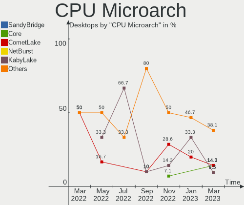

| Name             | Desktops | Percent |
|------------------|----------|---------|
| CometLake        | 4        | 25%     |
| KabyLake         | 3        | 18.75%  |
| SandyBridge      | 2        | 12.5%   |
| IvyBridge        | 2        | 12.5%   |
| Zen+             | 1        | 6.25%   |
| K10              | 1        | 6.25%   |
| Haswell          | 1        | 6.25%   |
| Goldmont plus    | 1        | 6.25%   |
| Alderlake Hybrid | 1        | 6.25%   |

Graphics
--------

GPU Vendor
----------

Vendors of graphics cards

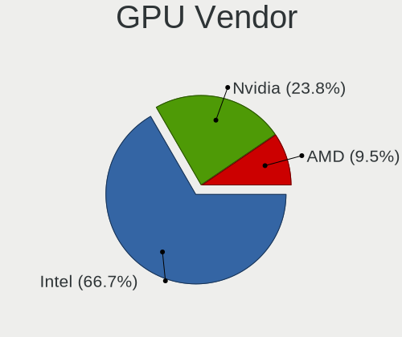

| Vendor | Desktops | Percent |
|--------|----------|---------|
| Intel  | 13       | 76.47%  |
| Nvidia | 2        | 11.76%  |
| AMD    | 2        | 11.76%  |

GPU Model
---------

Graphics card models

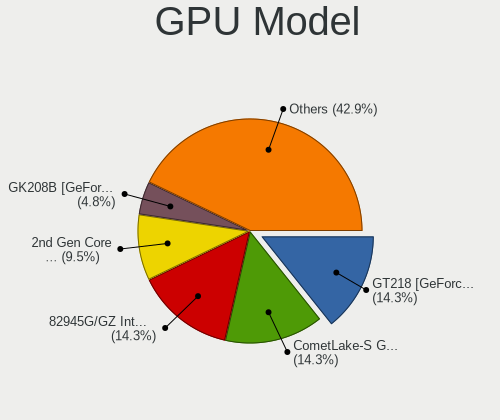

| Model                                                                       | Desktops | Percent |
|-----------------------------------------------------------------------------|----------|---------|
| Intel CometLake-S GT2 [UHD Graphics 630]                                    | 4        | 23.53%  |
| Intel Xeon E3-1200 v2/3rd Gen Core processor Graphics Controller            | 2        | 11.76%  |
| Intel CoffeeLake-S GT2 [UHD Graphics 630]                                   | 2        | 11.76%  |
| Intel 2nd Generation Core Processor Family Integrated Graphics Controller   | 2        | 11.76%  |
| Nvidia GM107 [GeForce GTX 750 Ti]                                           | 1        | 5.88%   |
| Nvidia GA106 [Geforce RTX 3050]                                             | 1        | 5.88%   |
| Intel Xeon E3-1200 v3/4th Gen Core Processor Integrated Graphics Controller | 1        | 5.88%   |
| Intel HD Graphics 630                                                       | 1        | 5.88%   |
| Intel GeminiLake [UHD Graphics 600]                                         | 1        | 5.88%   |
| AMD Picasso/Raven 2 [Radeon Vega Series / Radeon Vega Mobile Series]        | 1        | 5.88%   |
| AMD Caicos XTX [Radeon HD 8490 / R5 235X OEM]                               | 1        | 5.88%   |

GPU Combo
---------

Combinations of graphics cards

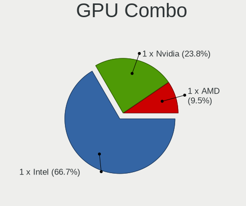

| Name       | Desktops | Percent |
|------------|----------|---------|
| 1 x Intel  | 12       | 75%     |
| 1 x Nvidia | 2        | 12.5%   |
| 1 x AMD    | 2        | 12.5%   |

GPU Driver
----------

Free vs proprietary

| Driver      | Desktops | Percent |
|-------------|----------|---------|
| Free        | 13       | 81.25%  |
| Unknown     | 2        | 12.5%   |
| Proprietary | 1        | 6.25%   |

GPU Memory
----------

Total video memory

| Size in GB | Desktops | Percent |
|------------|----------|---------|
| Unknown    | 13       | 81.25%  |
| 7.01-8.0   | 1        | 6.25%   |
| 1.01-2.0   | 1        | 6.25%   |
| 0.51-1.0   | 1        | 6.25%   |

Monitor
-------

Monitor Vendor
--------------

Monitor vendors

| Vendor              | Desktops | Percent |
|---------------------|----------|---------|
| Samsung Electronics | 2        | 15.38%  |
| Philips             | 2        | 15.38%  |
| Hewlett-Packard     | 2        | 15.38%  |
| ViewSonic           | 1        | 7.69%   |
| OOO                 | 1        | 7.69%   |
| HUAWEI              | 1        | 7.69%   |
| Dell                | 1        | 7.69%   |
| ASUSTek Computer    | 1        | 7.69%   |
| AOC                 | 1        | 7.69%   |
| Acer                | 1        | 7.69%   |

Monitor Model
-------------

Monitor models

| Model                                                             | Desktops | Percent |
|-------------------------------------------------------------------|----------|---------|
| Philips PHL 243V7 PHLC155 1920x1080 527x296mm 23.8-inch           | 2        | 15.38%  |
| ViewSonic VA2719-2K VSC6B34 2560x1440 597x336mm 27.0-inch         | 1        | 7.69%   |
| Samsung Electronics S24B300 SAM08B2 1920x1080 531x299mm 24.0-inch | 1        | 7.69%   |
| Samsung Electronics S20B300 SAM08A8 1600x900 443x249mm 20.0-inch  | 1        | 7.69%   |
| OOO HDMI OOO2700 1920x1080 698x392mm 31.5-inch                    | 1        | 7.69%   |
| HUAWEI SSN-24 HWV6E4E 1920x1080 527x296mm 23.8-inch               | 1        | 7.69%   |
| Hewlett-Packard W2072a HWP3000 1600x900 443x249mm 20.0-inch       | 1        | 7.69%   |
| Hewlett-Packard P240va HWP3306 1920x1080 527x296mm 23.8-inch      | 1        | 7.69%   |
| Dell U2722D DEL422D 2560x1440 597x336mm 27.0-inch                 | 1        | 7.69%   |
| ASUSTek Computer VA24E AUS24D1 1920x1080 527x296mm 23.8-inch      | 1        | 7.69%   |
| AOC 1970W AOC1970 1366x768 410x230mm 18.5-inch                    | 1        | 7.69%   |
| Acer V243HQ ACR00B0 1920x1080 521x293mm 23.5-inch                 | 1        | 7.69%   |

Monitor Resolution
------------------

Monitor screen resolution

| Resolution      | Desktops | Percent |
|-----------------|----------|---------|
| 1920x1080 (FHD) | 7        | 58.33%  |
| 2560x1440 (QHD) | 2        | 16.67%  |
| 1600x900 (HD+)  | 2        | 16.67%  |
| 1366x768 (WXGA) | 1        | 8.33%   |

Monitor Diagonal
----------------

Diagonal size in inches

| Inches | Desktops | Percent |
|--------|----------|---------|
| 24     | 5        | 38.46%  |
| 27     | 2        | 15.38%  |
| 23     | 2        | 15.38%  |
| 20     | 2        | 15.38%  |
| 31     | 1        | 7.69%   |
| 18     | 1        | 7.69%   |

Monitor Width
-------------

Physical width

| Width in mm | Desktops | Percent |
|-------------|----------|---------|
| 501-600     | 8        | 66.67%  |
| 401-500     | 3        | 25%     |
| 601-700     | 1        | 8.33%   |

Aspect Ratio
------------

Proportional relationship between the width and the height

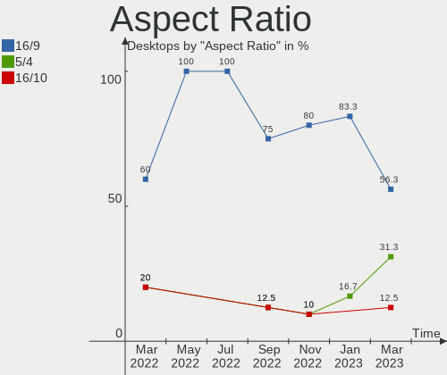

| Ratio | Desktops | Percent |
|-------|----------|---------|
| 16/9  | 12       | 100%    |

Monitor Area
------------

Area in inch²

| Area in inch² | Desktops | Percent |
|----------------|----------|---------|
| 201-250        | 6        | 50%     |
| 301-350        | 2        | 16.67%  |
| 151-200        | 2        | 16.67%  |
| 351-500        | 1        | 8.33%   |
| 141-150        | 1        | 8.33%   |

Pixel Density
-------------

Pixels per inch

| Density | Desktops | Percent |
|---------|----------|---------|
| 51-100  | 10       | 83.33%  |
| 101-120 | 2        | 16.67%  |

Multiple Monitors
-----------------

Total monitors connected

| Total | Desktops | Percent |
|-------|----------|---------|
| 1     | 11       | 68.75%  |
| 0     | 4        | 25%     |
| 2     | 1        | 6.25%   |

Network
-------

Net Controller Vendor
---------------------

Controller vendors

| Vendor                 | Desktops | Percent |
|------------------------|----------|---------|
| Intel                  | 9        | 47.37%  |
| Realtek Semiconductor  | 7        | 36.84%  |
| Nvidia                 | 1        | 5.26%   |
| Metrologic Instruments | 1        | 5.26%   |
| Huawei Technologies    | 1        | 5.26%   |

Net Controller Model
--------------------

Controller models

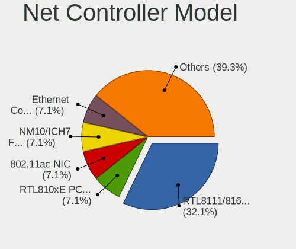

| Model                                                             | Desktops | Percent |
|-------------------------------------------------------------------|----------|---------|
| Realtek RTL8111/8168/8411 PCI Express Gigabit Ethernet Controller | 6        | 27.27%  |
| Realtek RTL8188EUS 802.11n Wireless Network Adapter               | 1        | 4.55%   |
| Realtek 802.11ac NIC                                              | 1        | 4.55%   |
| Nvidia MCP61 Ethernet                                             | 1        | 4.55%   |
| Metrologic Instruments 7580                                       | 1        | 4.55%   |
| Intel Wireless 3165                                               | 1        | 4.55%   |
| Intel I210 Gigabit Network Connection                             | 1        | 4.55%   |
| Intel Ethernet Controller I225-V                                  | 1        | 4.55%   |
| Intel Ethernet Controller I225-LM                                 | 1        | 4.55%   |
| Intel Ethernet Connection I217-LM                                 | 1        | 4.55%   |
| Intel Ethernet Connection (2) I219-LM                             | 1        | 4.55%   |
| Intel Ethernet Connection (17) I219-V                             | 1        | 4.55%   |
| Intel Ethernet Connection (12) I219-V                             | 1        | 4.55%   |
| Intel Ethernet Connection (10) I219-V                             | 1        | 4.55%   |
| Intel 82579V Gigabit Network Connection                           | 1        | 4.55%   |
| Intel 82579LM Gigabit Network Connection (Lewisville)             | 1        | 4.55%   |
| Huawei MLA-L11                                                    | 1        | 4.55%   |

Wireless Vendor
---------------

Wireless vendors

| Vendor                | Desktops | Percent |
|-----------------------|----------|---------|
| Realtek Semiconductor | 2        | 66.67%  |
| Intel                 | 1        | 33.33%  |

Wireless Model
--------------

Wireless models

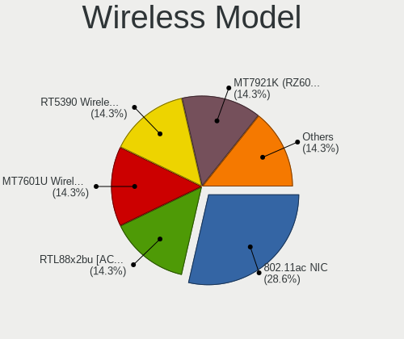

| Model                                               | Desktops | Percent |
|-----------------------------------------------------|----------|---------|
| Realtek RTL8188EUS 802.11n Wireless Network Adapter | 1        | 33.33%  |
| Realtek 802.11ac NIC                                | 1        | 33.33%  |
| Intel Wireless 3165                                 | 1        | 33.33%  |

Ethernet Vendor
---------------

Ethernet vendors

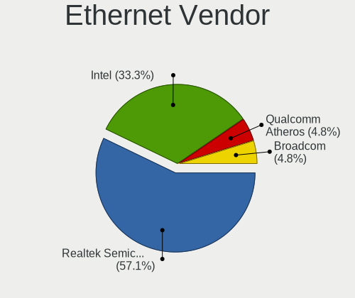

| Vendor                | Desktops | Percent |
|-----------------------|----------|---------|
| Intel                 | 9        | 52.94%  |
| Realtek Semiconductor | 6        | 35.29%  |
| Nvidia                | 1        | 5.88%   |
| Huawei Technologies   | 1        | 5.88%   |

Ethernet Model
--------------

Ethernet models

| Model                                                             | Desktops | Percent |
|-------------------------------------------------------------------|----------|---------|
| Realtek RTL8111/8168/8411 PCI Express Gigabit Ethernet Controller | 6        | 33.33%  |
| Nvidia MCP61 Ethernet                                             | 1        | 5.56%   |
| Intel I210 Gigabit Network Connection                             | 1        | 5.56%   |
| Intel Ethernet Controller I225-V                                  | 1        | 5.56%   |
| Intel Ethernet Controller I225-LM                                 | 1        | 5.56%   |
| Intel Ethernet Connection I217-LM                                 | 1        | 5.56%   |
| Intel Ethernet Connection (2) I219-LM                             | 1        | 5.56%   |
| Intel Ethernet Connection (17) I219-V                             | 1        | 5.56%   |
| Intel Ethernet Connection (12) I219-V                             | 1        | 5.56%   |
| Intel Ethernet Connection (10) I219-V                             | 1        | 5.56%   |
| Intel 82579V Gigabit Network Connection                           | 1        | 5.56%   |
| Intel 82579LM Gigabit Network Connection (Lewisville)             | 1        | 5.56%   |
| Huawei MLA-L11                                                    | 1        | 5.56%   |

Net Controller Kind
-------------------

Ethernet, WiFi or modem

| Kind     | Desktops | Percent |
|----------|----------|---------|
| Ethernet | 16       | 80%     |
| WiFi     | 3        | 15%     |
| Modem    | 1        | 5%      |

Used Controller
---------------

Currently used network controller

| Kind     | Desktops | Percent |
|----------|----------|---------|
| Ethernet | 14       | 100%    |

NICs
----

Total network controllers on board

| Total | Desktops | Percent |
|-------|----------|---------|
| 1     | 14       | 87.5%   |
| 4     | 1        | 6.25%   |
| 2     | 1        | 6.25%   |

IPv6
----

IPv6 vs IPv4

| Used | Desktops | Percent |
|------|----------|---------|
| No   | 16       | 100%    |

Bluetooth
---------

Bluetooth Vendor
----------------

Controller vendors

| Vendor                  | Desktops | Percent |
|-------------------------|----------|---------|
| Intel                   | 1        | 50%     |
| Cambridge Silicon Radio | 1        | 50%     |

Bluetooth Model
---------------

Controller models

| Model                                               | Desktops | Percent |
|-----------------------------------------------------|----------|---------|
| Intel Bluetooth wireless interface                  | 1        | 50%     |
| Cambridge Silicon Radio Bluetooth Dongle (HCI mode) | 1        | 50%     |

Sound
-----

Sound Vendor
------------

Sound card vendors

| Vendor | Desktops | Percent |
|--------|----------|---------|
| Intel  | 14       | 77.78%  |
| Nvidia | 2        | 11.11%  |
| AMD    | 2        | 11.11%  |

Sound Model
-----------

Sound card models

| Model                                                                             | Desktops | Percent |
|-----------------------------------------------------------------------------------|----------|---------|
| Intel 6 Series/C200 Series Chipset Family High Definition Audio Controller        | 4        | 19.05%  |
| Intel Audio device                                                                | 3        | 14.29%  |
| Intel 200 Series PCH HD Audio                                                     | 2        | 9.52%   |
| Nvidia MCP61 High Definition Audio                                                | 1        | 4.76%   |
| Nvidia GM107 High Definition Audio Controller [GeForce 940MX]                     | 1        | 4.76%   |
| Nvidia GA106 High Definition Audio Controller                                     | 1        | 4.76%   |
| Intel Xeon E3-1200 v3/4th Gen Core Processor HD Audio Controller                  | 1        | 4.76%   |
| Intel Comet Lake PCH-V cAVS                                                       | 1        | 4.76%   |
| Intel CM238 HD Audio Controller                                                   | 1        | 4.76%   |
| Intel Celeron/Pentium Silver Processor High Definition Audio                      | 1        | 4.76%   |
| Intel Alder Lake-S HD Audio Controller                                            | 1        | 4.76%   |
| Intel 8 Series/C220 Series Chipset High Definition Audio Controller               | 1        | 4.76%   |
| AMD Raven/Raven2/Fenghuang HDMI/DP Audio Controller                               | 1        | 4.76%   |
| AMD Family 17h/19h HD Audio Controller                                            | 1        | 4.76%   |
| AMD Caicos HDMI Audio [Radeon HD 6450 / 7450/8450/8490 OEM / R5 230/235/235X OEM] | 1        | 4.76%   |

Memory
------

Memory Vendor
-------------

Memory module vendors

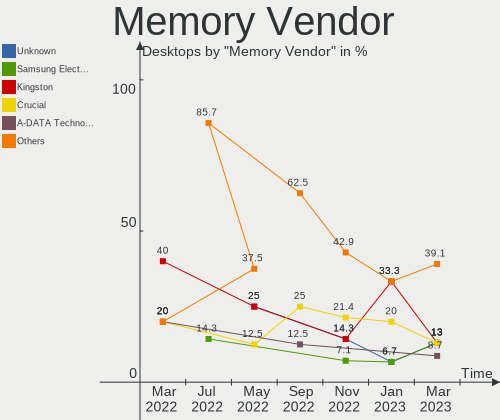

| Vendor                             | Desktops | Percent |
|------------------------------------|----------|---------|
| SK hynix                           | 3        | 18.75%  |
| Foxline                            | 3        | 18.75%  |
| Unknown                            | 2        | 12.5%   |
| Samsung Electronics                | 2        | 12.5%   |
| Unknown (ABCD)                     | 1        | 6.25%   |
| Shenzhen Micro Innovation Industry | 1        | 6.25%   |
| Innodisk                           | 1        | 6.25%   |
| Crucial                            | 1        | 6.25%   |
| Corsair                            | 1        | 6.25%   |
| Apacer                             | 1        | 6.25%   |

Memory Model
------------

Memory module models

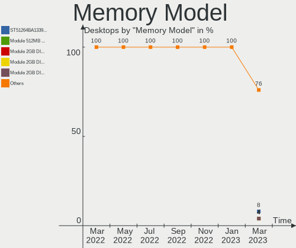

| Model                                                                     | Desktops | Percent |
|---------------------------------------------------------------------------|----------|---------|
| Unknown RAM Module 8GB DIMM DDR3 1333MT/s                                 | 1        | 6.25%   |
| Unknown RAM Module 4GB DIMM 800MT/s                                       | 1        | 6.25%   |
| Unknown (ABCD) RAM 123456789012345678 2GB DIMM LPDDR4 2400MT/s            | 1        | 6.25%   |
| SK hynix RAM HMT451U6BFR8A-PB 4GB DIMM DDR3 1648MT/s                      | 1        | 6.25%   |
| SK hynix RAM HMT351U6BFR8C-H9 4GB DIMM DDR3 1333MT/s                      | 1        | 6.25%   |
| SK hynix RAM HMT112U6TFR8C-H9 1GB DIMM DDR3 1333MT/s                      | 1        | 6.25%   |
| Shenzhen Micro Innovation Industry RAM KF2666DDCD4 8GB DIMM DDR4 2667MT/s | 1        | 6.25%   |
| Samsung RAM M471A5244CB0-CWE 4GB SODIMM DDR4 3200MT/s                     | 1        | 6.25%   |
| Samsung RAM M378B5173QH0-CK0 4GB DIMM DDR3 1600MT/s                       | 1        | 6.25%   |
| Innodisk RAM M4SS-4GSSN50J-E 4GB SODIMM DDR4 2400MT/s                     | 1        | 6.25%   |
| Foxline RAM FL3200D4U22-16G 16GB DIMM DDR4 3200MT/s                       | 1        | 6.25%   |
| Foxline RAM FL2666D4U19-8G 8GB DIMM DDR4 2667MT/s                         | 1        | 6.25%   |
| Foxline RAM FL2666D4U19-16G 16GB DIMM DDR4 2667MT/s                       | 1        | 6.25%   |
| Crucial RAM CT8G4DFRA266.C8FJ 8GB DIMM DDR4 2800MT/s                      | 1        | 6.25%   |
| Corsair RAM CMK8GX4M1A2666C16 8GB DIMM DDR4 3000MT/s                      | 1        | 6.25%   |
| Apacer RAM D12.2326BS.003 16GB DIMM DDR4 2666MT/s                         | 1        | 6.25%   |

Memory Kind
-----------

Memory module kinds

| Kind    | Desktops | Percent |
|---------|----------|---------|
| DDR4    | 9        | 56.25%  |
| DDR3    | 5        | 31.25%  |
| LPDDR4  | 1        | 6.25%   |
| Unknown | 1        | 6.25%   |

Memory Form Factor
------------------

Physical design of the memory module

| Name   | Desktops | Percent |
|--------|----------|---------|
| DIMM   | 14       | 87.5%   |
| SODIMM | 2        | 12.5%   |

Memory Size
-----------

Memory module size

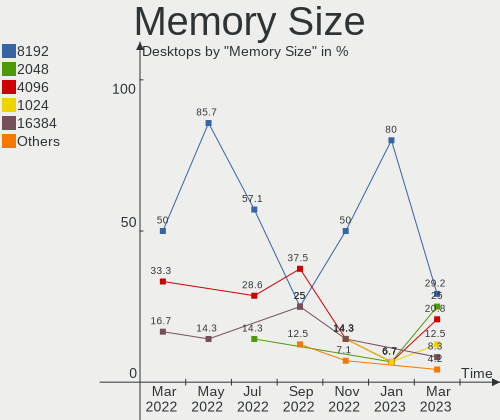

| Size  | Desktops | Percent |
|-------|----------|---------|
| 4096  | 6        | 37.5%   |
| 8192  | 5        | 31.25%  |
| 16384 | 4        | 25%     |
| 1024  | 1        | 6.25%   |

Memory Speed
------------

Memory module speed

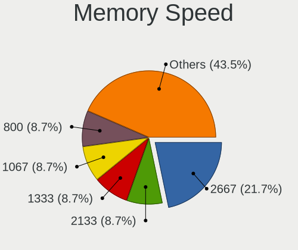

| Speed | Desktops | Percent |
|-------|----------|---------|
| 2667  | 3        | 18.75%  |
| 1333  | 3        | 18.75%  |
| 3200  | 2        | 12.5%   |
| 2400  | 2        | 12.5%   |
| 3000  | 1        | 6.25%   |
| 2800  | 1        | 6.25%   |
| 2666  | 1        | 6.25%   |
| 1866  | 1        | 6.25%   |
| 1648  | 1        | 6.25%   |
| 800   | 1        | 6.25%   |

Printers & scanners
-------------------

Printer Vendor
--------------

Printer device vendors

| Vendor  | Desktops | Percent |
|---------|----------|---------|
| Kyocera | 1        | 100%    |

Printer Model
-------------

Printer device models

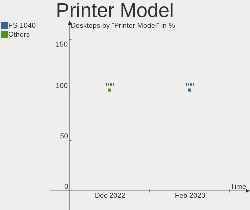

| Model           | Desktops | Percent |
|-----------------|----------|---------|
| Kyocera FS-1040 | 1        | 100%    |

Scanner Vendor
--------------

Scanner device vendors

Zero info for selected period =(

Scanner Model
-------------

Scanner device models

Zero info for selected period =(

Camera
------

Camera Vendor
-------------

Camera device vendors

| Vendor                      | Desktops | Percent |
|-----------------------------|----------|---------|
| KYE Systems (Mouse Systems) | 1        | 50%     |
| Alcor Micro                 | 1        | 50%     |

Camera Model
------------

Camera device models

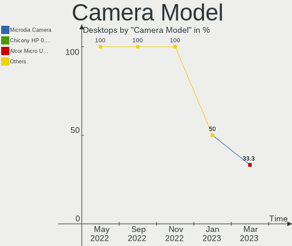

| Model                                     | Desktops | Percent |
|-------------------------------------------|----------|---------|
| KYE Systems (Mouse Systems) FaceCam 1000X | 1        | 50%     |
| Alcor Micro USB FHD Camera                | 1        | 50%     |

Security
--------

Fingerprint Vendor
------------------

Fingerprint sensor vendors

Zero info for selected period =(

Fingerprint Model
-----------------

Fingerprint sensor models

Zero info for selected period =(

Chipcard Vendor
---------------

Chipcard module vendors

| Vendor       | Desktops | Percent |
|--------------|----------|---------|
| Aladdin R.D. | 1        | 100%    |

Chipcard Model
--------------

Chipcard module models

| Model                                 | Desktops | Percent |
|---------------------------------------|----------|---------|
| Aladdin R.D. Smart card reader JCR721 | 1        | 100%    |

Unsupported
-----------

Unsupported Devices
-------------------

Total unsupported devices on board

| Total | Desktops | Percent |
|-------|----------|---------|
| 0     | 14       | 87.5%   |
| 1     | 2        | 12.5%   |

Unsupported Device Types
------------------------

Types of unsupported devices

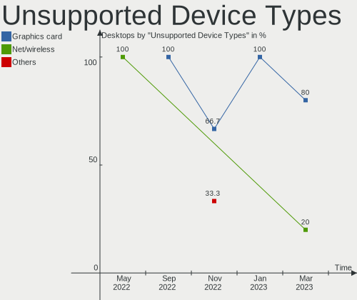

| Type          | Desktops | Percent |
|---------------|----------|---------|
| Graphics card | 2        | 100%    |

