Red OS - Hardware Trends (Desktops)
-----------------------------------

A project to identify most popular hardware characteristics and track their change
over time based on data collected by Linux users at https://Linux-Hardware.org.

Anyone can contribute to this report by the [hw-probe](https://github.com/linuxhw/hw-probe) tool:

    sudo -E hw-probe -all -upload

This report is for one last month. Overall report since the beginning of time: [TestCoverage](https://github.com/linuxhw/TestCoverage)

Period: Jan, 2023.

Contents
--------

* [ System ](#system)
  - [ OS                       ](#os)
  - [ OS Family                ](#os-family)
  - [ Kernel                   ](#kernel)
  - [ Kernel Family            ](#kernel-family)
  - [ Kernel Major Ver.        ](#kernel-major-ver)
  - [ Arch                     ](#arch)
  - [ DE                       ](#de)
  - [ Display Server           ](#display-server)
  - [ Display Manager          ](#display-manager)
  - [ OS Lang                  ](#os-lang)
  - [ Boot Mode                ](#boot-mode)
  - [ Filesystem               ](#filesystem)
  - [ Part. scheme             ](#part-scheme)
  - [ Dual Boot with Linux/BSD ](#dual-boot-with-linuxbsd)
  - [ Dual Boot (Win)          ](#dual-boot-win)

* [ Board ](#board)
  - [ Vendor                   ](#vendor)
  - [ Model                    ](#model)
  - [ Model Family             ](#model-family)
  - [ MFG Year                 ](#mfg-year)
  - [ Form Factor              ](#form-factor)
  - [ Secure Boot              ](#secure-boot)
  - [ Coreboot                 ](#coreboot)
  - [ RAM Size                 ](#ram-size)
  - [ RAM Used                 ](#ram-used)
  - [ Total Drives             ](#total-drives)
  - [ Has CD-ROM               ](#has-cd-rom)
  - [ Has Ethernet             ](#has-ethernet)
  - [ Has WiFi                 ](#has-wifi)
  - [ Has Bluetooth            ](#has-bluetooth)

* [ Location ](#location)
  - [ Country                  ](#country)
  - [ City                     ](#city)

* [ Drives ](#drives)
  - [ Drive Vendor             ](#drive-vendor)
  - [ Drive Model              ](#drive-model)
  - [ HDD Vendor               ](#hdd-vendor)
  - [ SSD Vendor               ](#ssd-vendor)
  - [ Drive Kind               ](#drive-kind)
  - [ Drive Connector          ](#drive-connector)
  - [ Drive Size               ](#drive-size)
  - [ Space Total              ](#space-total)
  - [ Space Used               ](#space-used)
  - [ Malfunc. Drives          ](#malfunc-drives)
  - [ Malfunc. Drive Vendor    ](#malfunc-drive-vendor)
  - [ Malfunc. HDD Vendor      ](#malfunc-hdd-vendor)
  - [ Malfunc. Drive Kind      ](#malfunc-drive-kind)
  - [ Failed Drives            ](#failed-drives)
  - [ Failed Drive Vendor      ](#failed-drive-vendor)
  - [ Drive Status             ](#drive-status)

* [ Storage controller ](#storage-controller)
  - [ Storage Vendor           ](#storage-vendor)
  - [ Storage Model            ](#storage-model)
  - [ Storage Kind             ](#storage-kind)

* [ Processor ](#processor)
  - [ CPU Vendor               ](#cpu-vendor)
  - [ CPU Model                ](#cpu-model)
  - [ CPU Model Family         ](#cpu-model-family)
  - [ CPU Cores                ](#cpu-cores)
  - [ CPU Sockets              ](#cpu-sockets)
  - [ CPU Threads              ](#cpu-threads)
  - [ CPU Op-Modes             ](#cpu-op-modes)
  - [ CPU Microcode            ](#cpu-microcode)
  - [ CPU Microarch            ](#cpu-microarch)

* [ Graphics ](#graphics)
  - [ GPU Vendor               ](#gpu-vendor)
  - [ GPU Model                ](#gpu-model)
  - [ GPU Combo                ](#gpu-combo)
  - [ GPU Driver               ](#gpu-driver)
  - [ GPU Memory               ](#gpu-memory)

* [ Monitor ](#monitor)
  - [ Monitor Vendor           ](#monitor-vendor)
  - [ Monitor Model            ](#monitor-model)
  - [ Monitor Resolution       ](#monitor-resolution)
  - [ Monitor Diagonal         ](#monitor-diagonal)
  - [ Monitor Width            ](#monitor-width)
  - [ Aspect Ratio             ](#aspect-ratio)
  - [ Monitor Area             ](#monitor-area)
  - [ Pixel Density            ](#pixel-density)
  - [ Multiple Monitors        ](#multiple-monitors)

* [ Network ](#network)
  - [ Net Controller Vendor    ](#net-controller-vendor)
  - [ Net Controller Model     ](#net-controller-model)
  - [ Wireless Vendor          ](#wireless-vendor)
  - [ Wireless Model           ](#wireless-model)
  - [ Ethernet Vendor          ](#ethernet-vendor)
  - [ Ethernet Model           ](#ethernet-model)
  - [ Net Controller Kind      ](#net-controller-kind)
  - [ Used Controller          ](#used-controller)
  - [ NICs                     ](#nics)
  - [ IPv6                     ](#ipv6)

* [ Bluetooth ](#bluetooth)
  - [ Bluetooth Vendor         ](#bluetooth-vendor)
  - [ Bluetooth Model          ](#bluetooth-model)

* [ Sound ](#sound)
  - [ Sound Vendor             ](#sound-vendor)
  - [ Sound Model              ](#sound-model)

* [ Memory ](#memory)
  - [ Memory Vendor            ](#memory-vendor)
  - [ Memory Model             ](#memory-model)
  - [ Memory Kind              ](#memory-kind)
  - [ Memory Form Factor       ](#memory-form-factor)
  - [ Memory Size              ](#memory-size)
  - [ Memory Speed             ](#memory-speed)

* [ Printers & scanners ](#printers--scanners)
  - [ Printer Vendor           ](#printer-vendor)
  - [ Printer Model            ](#printer-model)
  - [ Scanner Vendor           ](#scanner-vendor)
  - [ Scanner Model            ](#scanner-model)

* [ Camera ](#camera)
  - [ Camera Vendor            ](#camera-vendor)
  - [ Camera Model             ](#camera-model)

* [ Security ](#security)
  - [ Fingerprint Vendor       ](#fingerprint-vendor)
  - [ Fingerprint Model        ](#fingerprint-model)
  - [ Chipcard Vendor          ](#chipcard-vendor)
  - [ Chipcard Model           ](#chipcard-model)

* [ Unsupported ](#unsupported)
  - [ Unsupported Devices      ](#unsupported-devices)
  - [ Unsupported Device Types ](#unsupported-device-types)

System
------

OS
--

Installed operating systems

| Name         | Desktops | Percent |
|--------------|----------|---------|
| Red OS 7.3.2 | 9        | 60%     |
| Red OS 7.3   | 5        | 33.33%  |
| Red OS 7.3.1 | 1        | 6.67%   |

OS Family
---------

OS without a version

| Name   | Desktops | Percent |
|--------|----------|---------|
| Red OS | 15       | 100%    |

Kernel
------

Version of the Linux kernel

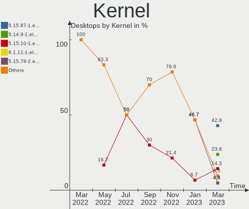

| Version                | Desktops | Percent |
|------------------------|----------|---------|
| 5.15.78-2.el7.3.x86_64 | 7        | 46.67%  |
| 5.15.72-1.el7.3.x86_64 | 4        | 26.67%  |
| 5.10.29-1.el7.x86_64   | 2        | 13.33%  |
| 5.15.10-1.el7.x86_64   | 1        | 6.67%   |
| 5.10.29-3.el7.x86_64   | 1        | 6.67%   |

Kernel Family
-------------

Linux kernel without a distro release

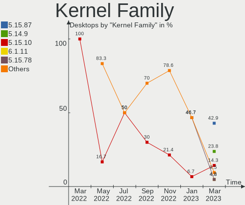

| Version | Desktops | Percent |
|---------|----------|---------|
| 5.15.78 | 7        | 46.67%  |
| 5.15.72 | 4        | 26.67%  |
| 5.10.29 | 3        | 20%     |
| 5.15.10 | 1        | 6.67%   |

Kernel Major Ver.
-----------------

Linux kernel major version

| Version | Desktops | Percent |
|---------|----------|---------|
| 5.15    | 12       | 80%     |
| 5.10    | 3        | 20%     |

Arch
----

OS architecture (x86_64, i586, etc.)

| Name   | Desktops | Percent |
|--------|----------|---------|
| x86_64 | 15       | 100%    |

DE
--

Desktop Environment

| Name     | Desktops | Percent |
|----------|----------|---------|
| MATE     | 14       | 93.33%  |
| Cinnamon | 1        | 6.67%   |

Display Server
--------------

X11 or Wayland

| Name | Desktops | Percent |
|------|----------|---------|
| X11  | 15       | 100%    |

Display Manager
---------------

SDDM, LightDM, etc.

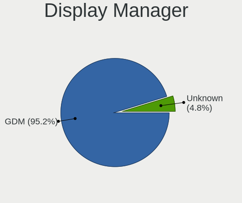

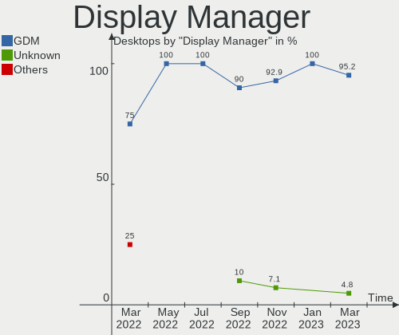

| Name | Desktops | Percent |
|------|----------|---------|
| GDM  | 15       | 100%    |

OS Lang
-------

Language

| Lang    | Desktops | Percent |
|---------|----------|---------|
| Unknown | 15       | 100%    |

Boot Mode
---------

EFI or BIOS

| Mode | Desktops | Percent |
|------|----------|---------|
| EFI  | 11       | 73.33%  |
| BIOS | 4        | 26.67%  |

Filesystem
----------

Type of filesystem

| Type | Desktops | Percent |
|------|----------|---------|
| Ext4 | 15       | 100%    |

Part. scheme
------------

Scheme of partitioning

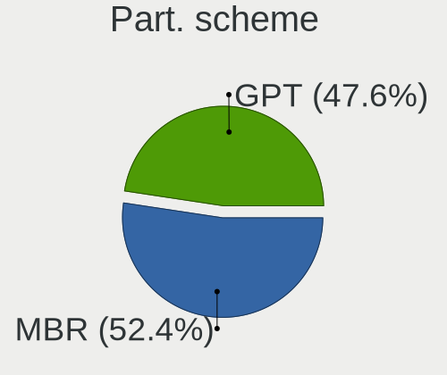

| Type | Desktops | Percent |
|------|----------|---------|
| GPT  | 10       | 66.67%  |
| MBR  | 5        | 33.33%  |

Dual Boot with Linux/BSD
------------------------

Hosting more than one Linux/BSD

| Dual boot | Desktops | Percent |
|-----------|----------|---------|
| No        | 14       | 93.33%  |
| Yes       | 1        | 6.67%   |

Dual Boot (Win)
---------------

Hosting Linux and Windows

| Dual boot | Desktops | Percent |
|-----------|----------|---------|
| No        | 12       | 80%     |
| Yes       | 3        | 20%     |

Board
-----

Vendor
------

Motherboard manufacturer

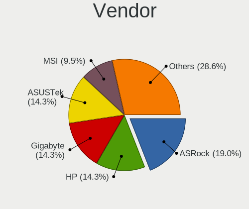

| Name                | Desktops | Percent |
|---------------------|----------|---------|
| ASUSTek Computer    | 5        | 33.33%  |
| Gigabyte Technology | 3        | 20%     |
| Hewlett-Packard     | 2        | 13.33%  |
| MSI                 | 1        | 6.67%   |
| Lenovo              | 1        | 6.67%   |
| DEPO Computers      | 1        | 6.67%   |
| Aquarius            | 1        | 6.67%   |
| Unknown             | 1        | 6.67%   |

Model
-----

Motherboard model

| Name                            | Desktops | Percent |
|---------------------------------|----------|---------|
| ASUS All Series                 | 2        | 13.33%  |
| MSI MS-7D48                     | 1        | 6.67%   |
| Lenovo ThinkCentre M70e 0851RZ3 | 1        | 6.67%   |
| HP ProDesk 400 G6 MT            | 1        | 6.67%   |
| HP EliteDesk 800 G1 TWR         | 1        | 6.67%   |
| Gigabyte H610M S2H DDR4         | 1        | 6.67%   |
| Gigabyte B365M H                | 1        | 6.67%   |
| Gigabyte B360 HD3               | 1        | 6.67%   |
| DEPO Computers DPH410S          | 1        | 6.67%   |
| ASUS PRIME H610M-K D4           | 1        | 6.67%   |
| ASUS PRIME B460M-K              | 1        | 6.67%   |
| ASUS PRIME B365M-A              | 1        | 6.67%   |
| Aquarius P30 K44 R53            | 1        | 6.67%   |
| Unknown                         | 1        | 6.67%   |

Model Family
------------

Motherboard model prefix

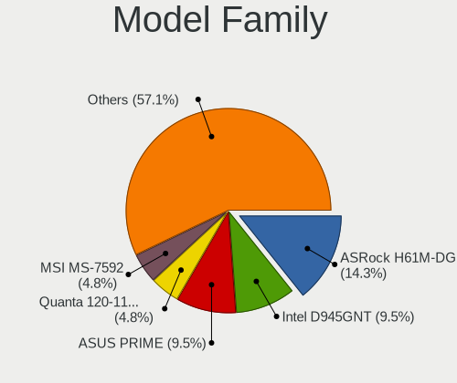

| Name                   | Desktops | Percent |
|------------------------|----------|---------|
| ASUS PRIME             | 3        | 20%     |
| ASUS All               | 2        | 13.33%  |
| MSI MS-7D48            | 1        | 6.67%   |
| Lenovo ThinkCentre     | 1        | 6.67%   |
| HP ProDesk             | 1        | 6.67%   |
| HP EliteDesk           | 1        | 6.67%   |
| Gigabyte H610M         | 1        | 6.67%   |
| Gigabyte B365M         | 1        | 6.67%   |
| Gigabyte B360          | 1        | 6.67%   |
| DEPO Computers DPH410S | 1        | 6.67%   |
| Aquarius P30           | 1        | 6.67%   |
| Unknown                | 1        | 6.67%   |

MFG Year
--------

Motherboard manufacture year

| Year | Desktops | Percent |
|------|----------|---------|
| 2019 | 4        | 26.67%  |
| 2021 | 3        | 20%     |
| 2013 | 3        | 20%     |
| 2022 | 2        | 13.33%  |
| 2020 | 1        | 6.67%   |
| 2018 | 1        | 6.67%   |
| 2010 | 1        | 6.67%   |

Form Factor
-----------

Physical design of the computer

| Name    | Desktops | Percent |
|---------|----------|---------|
| Desktop | 15       | 100%    |

Secure Boot
-----------

Enabled or disabled

| State    | Desktops | Percent |
|----------|----------|---------|
| Disabled | 15       | 100%    |

Coreboot
--------

Have coreboot on board

| Used | Desktops | Percent |
|------|----------|---------|
| No   | 15       | 100%    |

RAM Size
--------

Total RAM memory

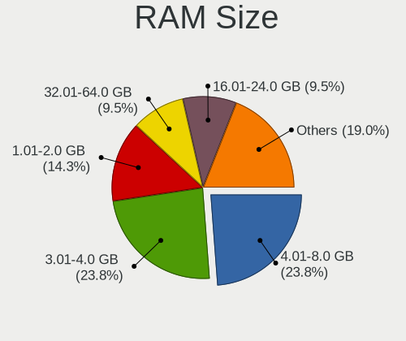

| Size in GB | Desktops | Percent |
|------------|----------|---------|
| 16.01-24.0 | 8        | 53.33%  |
| 4.01-8.0   | 4        | 26.67%  |
| 3.01-4.0   | 2        | 13.33%  |
| 1.01-2.0   | 1        | 6.67%   |

RAM Used
--------

Used RAM memory

| Used GB   | Desktops | Percent |
|-----------|----------|---------|
| 1.01-2.0  | 5        | 33.33%  |
| 3.01-4.0  | 3        | 20%     |
| 4.01-8.0  | 2        | 13.33%  |
| 8.01-16.0 | 2        | 13.33%  |
| 0.51-1.0  | 2        | 13.33%  |
| 2.01-3.0  | 1        | 6.67%   |

Total Drives
------------

Number of drives on board

| Drives | Desktops | Percent |
|--------|----------|---------|
| 1      | 11       | 73.33%  |
| 3      | 2        | 13.33%  |
| 2      | 2        | 13.33%  |

Has CD-ROM
----------

Has CD-ROM on board

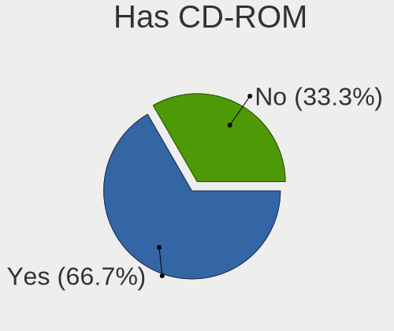

| Presented | Desktops | Percent |
|-----------|----------|---------|
| No        | 10       | 66.67%  |
| Yes       | 5        | 33.33%  |

Has Ethernet
------------

Has Ethernet on board

| Presented | Desktops | Percent |
|-----------|----------|---------|
| Yes       | 15       | 100%    |

Has WiFi
--------

Has WiFi module

| Presented | Desktops | Percent |
|-----------|----------|---------|
| No        | 14       | 93.33%  |
| Yes       | 1        | 6.67%   |

Has Bluetooth
-------------

Has Bluetooth module

| Presented | Desktops | Percent |
|-----------|----------|---------|
| No        | 13       | 86.67%  |
| Yes       | 2        | 13.33%  |

Location
--------

Country
-------

Geographic location (country)

| Country | Desktops | Percent |
|---------|----------|---------|
| Russia  | 15       | 100%    |

City
----

Geographic location (city)

| City         | Desktops | Percent |
|--------------|----------|---------|
| Murom        | 4        | 26.67%  |
| Kurgan       | 2        | 13.33%  |
| Svetlograd   | 1        | 6.67%   |
| Shakhtersk   | 1        | 6.67%   |
| Salekhard    | 1        | 6.67%   |
| Perm         | 1        | 6.67%   |
| Penza        | 1        | 6.67%   |
| Novy Urengoy | 1        | 6.67%   |
| Novosibirsk  | 1        | 6.67%   |
| Muromskiy    | 1        | 6.67%   |
| Moscow       | 1        | 6.67%   |

Drives
------

Drive Vendor
------------

Hard drive vendors

| Vendor              | Desktops | Drives | Percent |
|---------------------|----------|--------|---------|
| Seagate             | 8        | 8      | 40%     |
| WDC                 | 2        | 3      | 10%     |
| Toshiba             | 2        | 2      | 10%     |
| SanDisk             | 2        | 2      | 10%     |
| Samsung Electronics | 1        | 1      | 5%      |
| KingSpec            | 1        | 1      | 5%      |
| Intel               | 1        | 1      | 5%      |
| Crucial             | 1        | 1      | 5%      |
| Apacer              | 1        | 1      | 5%      |
| A-DATA Technology   | 1        | 1      | 5%      |

Drive Model
-----------

Hard drive models

| Model                                        | Desktops | Percent |
|----------------------------------------------|----------|---------|
| Seagate ST1000DM010-2EP102 1TB               | 2        | 9.52%   |
| WDC WD5000AZLX-00K2TA0 500GB                 | 1        | 4.76%   |
| WDC WD10EARX-00N0YB0 1TB                     | 1        | 4.76%   |
| WDC WD Green 2.5 240GB                       | 1        | 4.76%   |
| Toshiba HDWD110 1TB                          | 1        | 4.76%   |
| Toshiba DT01ACA200 2TB                       | 1        | 4.76%   |
| Seagate ST500DM009-2F110A 500GB              | 1        | 4.76%   |
| Seagate ST500DM002-1BD142 500GB              | 1        | 4.76%   |
| Seagate ST3160812AS 160GB                    | 1        | 4.76%   |
| Seagate ST3160215AS 160GB                    | 1        | 4.76%   |
| Seagate ST1000DM003-1SB10C 1TB               | 1        | 4.76%   |
| Seagate BarraCuda 120 SSD ZA250CM10003 250GB | 1        | 4.76%   |
| SanDisk SDSSDH3500G 500GB                    | 1        | 4.76%   |
| SanDisk SD8SBAT256G1122 256GB SSD            | 1        | 4.76%   |
| Samsung MZVLQ256HAJD-000H1 256GB             | 1        | 4.76%   |
| KingSpec P3-128 128GB SSD                    | 1        | 4.76%   |
| Intel SSDSC2KW512G8 512GB                    | 1        | 4.76%   |
| Crucial CT250P2SSD8 250GB                    | 1        | 4.76%   |
| Apacer AS340 240GB SSD                       | 1        | 4.76%   |
| A-DATA SX6000PNP 256GB                       | 1        | 4.76%   |

HDD Vendor
----------

Hard disk drive vendors

| Vendor  | Desktops | Drives | Percent |
|---------|----------|--------|---------|
| Seagate | 7        | 7      | 70%     |
| Toshiba | 2        | 2      | 20%     |
| WDC     | 1        | 2      | 10%     |

SSD Vendor
----------

Solid state drive vendors

| Vendor   | Desktops | Drives | Percent |
|----------|----------|--------|---------|
| SanDisk  | 2        | 2      | 28.57%  |
| WDC      | 1        | 1      | 14.29%  |
| Seagate  | 1        | 1      | 14.29%  |
| KingSpec | 1        | 1      | 14.29%  |
| Intel    | 1        | 1      | 14.29%  |
| Apacer   | 1        | 1      | 14.29%  |

Drive Kind
----------

HDD or SSD

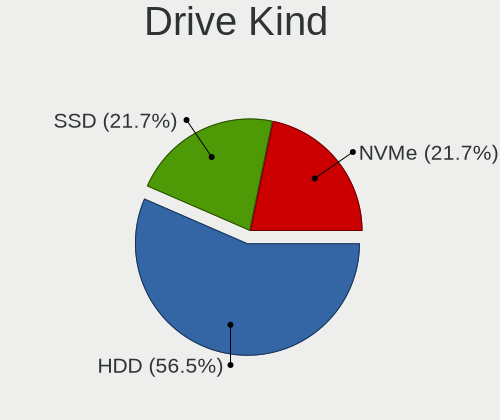

| Kind | Desktops | Drives | Percent |
|------|----------|--------|---------|
| HDD  | 10       | 11     | 55.56%  |
| SSD  | 5        | 7      | 27.78%  |
| NVMe | 3        | 3      | 16.67%  |

Drive Connector
---------------

SATA, SAS, NVMe, etc.

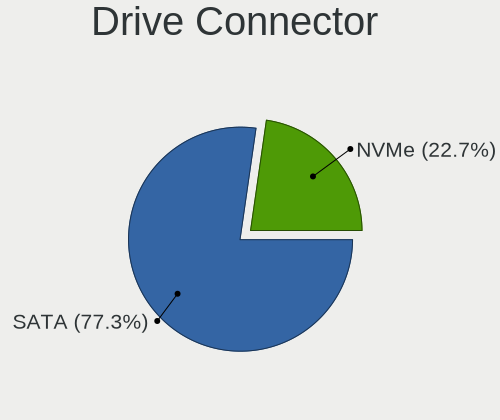

| Type | Desktops | Drives | Percent |
|------|----------|--------|---------|
| SATA | 13       | 18     | 81.25%  |
| NVMe | 3        | 3      | 18.75%  |

Drive Size
----------

Size of hard drive

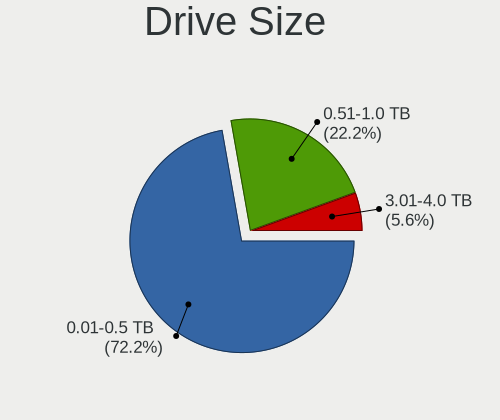

| Size in TB | Desktops | Drives | Percent |
|------------|----------|--------|---------|
| 0.01-0.5   | 10       | 11     | 58.82%  |
| 0.51-1.0   | 6        | 6      | 35.29%  |
| 1.01-2.0   | 1        | 1      | 5.88%   |

Space Total
-----------

Amount of disk space available on the file system

| Size in GB | Desktops | Percent |
|------------|----------|---------|
| 101-250    | 7        | 46.67%  |
| 501-1000   | 4        | 26.67%  |
| 251-500    | 3        | 20%     |
| 2001-3000  | 1        | 6.67%   |

Space Used
----------

Amount of used disk space

| Used GB  | Desktops | Percent |
|----------|----------|---------|
| 1-20     | 5        | 33.33%  |
| 51-100   | 4        | 26.67%  |
| 21-50    | 3        | 20%     |
| 501-1000 | 2        | 13.33%  |
| 101-250  | 1        | 6.67%   |

Malfunc. Drives
---------------

Drive models with a malfunction

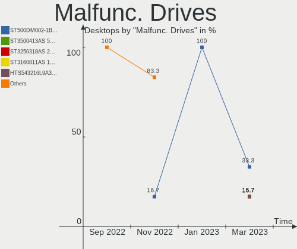

| Model                           | Desktops | Drives | Percent |
|---------------------------------|----------|--------|---------|
| Seagate ST500DM002-1BD142 500GB | 1        | 1      | 100%    |

Malfunc. Drive Vendor
---------------------

Vendors of faulty drives

| Vendor  | Desktops | Drives | Percent |
|---------|----------|--------|---------|
| Seagate | 1        | 1      | 100%    |

Malfunc. HDD Vendor
-------------------

Vendors of faulty HDD drives

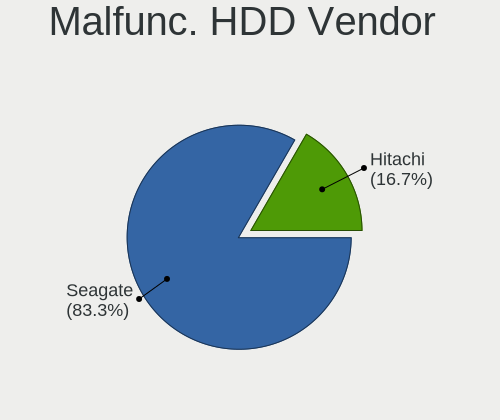

| Vendor  | Desktops | Drives | Percent |
|---------|----------|--------|---------|
| Seagate | 1        | 1      | 100%    |

Malfunc. Drive Kind
-------------------

Kinds of faulty drives

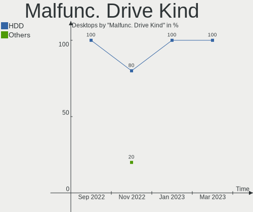

| Kind | Desktops | Drives | Percent |
|------|----------|--------|---------|
| HDD  | 1        | 1      | 100%    |

Failed Drives
-------------

Failed drive models

Zero info for selected period =(

Failed Drive Vendor
-------------------

Failed drive vendors

Zero info for selected period =(

Drive Status
------------

Number of failed and malfunc. drives

| Status  | Desktops | Drives | Percent |
|---------|----------|--------|---------|
| Works   | 14       | 20     | 93.33%  |
| Malfunc | 1        | 1      | 6.67%   |

Storage controller
------------------

Storage Vendor
--------------

Storage controller vendors

| Vendor                    | Desktops | Percent |
|---------------------------|----------|---------|
| Intel                     | 15       | 83.33%  |
| Samsung Electronics       | 1        | 5.56%   |
| Realtek Semiconductor     | 1        | 5.56%   |
| Micron/Crucial Technology | 1        | 5.56%   |

Storage Model
-------------

Storage controller models

| Model                                                                          | Desktops | Percent |
|--------------------------------------------------------------------------------|----------|---------|
| Intel Cannon Lake PCH SATA AHCI Controller                                     | 3        | 15%     |
| Intel Alder Lake-S PCH SATA Controller [AHCI Mode]                             | 3        | 15%     |
| Intel 8 Series/C220 Series Chipset Family 6-port SATA Controller 1 [AHCI mode] | 2        | 10%     |
| Intel 400 Series Chipset Family SATA AHCI Controller                           | 2        | 10%     |
| Intel 200 Series PCH SATA controller [AHCI mode]                               | 2        | 10%     |
| Samsung NVMe SSD Controller 980                                                | 1        | 5%      |
| Realtek Realtek Non-Volatile memory controller                                 | 1        | 5%      |
| Micron/Crucial P2 NVMe PCIe SSD                                                | 1        | 5%      |
| Intel Volume Management Device NVMe RAID Controller                            | 1        | 5%      |
| Intel NM10/ICH7 Family SATA Controller [IDE mode]                              | 1        | 5%      |
| Intel 82801G (ICH7 Family) IDE Controller                                      | 1        | 5%      |
| Intel 8 Series/C220 Series Chipset Family 4-port SATA Controller 1 [IDE mode]  | 1        | 5%      |
| Intel 500 Series Chipset Family SATA AHCI Controller                           | 1        | 5%      |

Storage Kind
------------

Kind of storage controller (IDE, SATA, NVMe, SAS, ...)

| Kind | Desktops | Percent |
|------|----------|---------|
| SATA | 13       | 68.42%  |
| NVMe | 3        | 15.79%  |
| IDE  | 2        | 10.53%  |
| RAID | 1        | 5.26%   |

Processor
---------

CPU Vendor
----------

Processor vendors

| Vendor | Desktops | Percent |
|--------|----------|---------|
| Intel  | 15       | 100%    |

CPU Model
---------

Processor models

| Model                                  | Desktops | Percent |
|----------------------------------------|----------|---------|
| Intel Core i5-9400 CPU @ 2.90GHz       | 2        | 13.33%  |
| Intel Core i5-10400 CPU @ 2.90GHz      | 2        | 13.33%  |
| Intel Core i3-4160 CPU @ 3.60GHz       | 2        | 13.33%  |
| Intel 12th Gen Core i5-12400           | 2        | 13.33%  |
| Intel Pentium Gold G7400               | 1        | 6.67%   |
| Intel Pentium Gold G5420 CPU @ 3.80GHz | 1        | 6.67%   |
| Intel Core i7-4770 CPU @ 3.40GHz       | 1        | 6.67%   |
| Intel Core i5-9500 CPU @ 3.00GHz       | 1        | 6.67%   |
| Intel Core i3-8100 CPU @ 3.60GHz       | 1        | 6.67%   |
| Intel Core i3-10105 CPU @ 3.70GHz      | 1        | 6.67%   |
| Intel Core 2 Duo CPU E7500 @ 2.93GHz   | 1        | 6.67%   |

CPU Model Family
----------------

Processor model prefix

| Model              | Desktops | Percent |
|--------------------|----------|---------|
| Intel Core i5      | 5        | 33.33%  |
| Intel Core i3      | 4        | 26.67%  |
| Other              | 2        | 13.33%  |
| Intel Pentium Gold | 2        | 13.33%  |
| Intel Core i7      | 1        | 6.67%   |
| Intel Core 2 Duo   | 1        | 6.67%   |

CPU Cores
---------

Number of processor cores

| Number | Desktops | Percent |
|--------|----------|---------|
| 6      | 7        | 46.67%  |
| 2      | 5        | 33.33%  |
| 4      | 3        | 20%     |

CPU Sockets
-----------

Number of sockets

| Number | Desktops | Percent |
|--------|----------|---------|
| 1      | 15       | 100%    |

CPU Threads
-----------

Threads per core (Hyper-Threading)

| Number | Desktops | Percent |
|--------|----------|---------|
| 2      | 10       | 66.67%  |
| 1      | 5        | 33.33%  |

CPU Op-Modes
------------

CPU Operation Modes (32-bit, 64-bit)

| Op mode        | Desktops | Percent |
|----------------|----------|---------|
| 32-bit, 64-bit | 15       | 100%    |

CPU Microcode
-------------

Microcode number

| Number  | Desktops | Percent |
|---------|----------|---------|
| 0xa0653 | 3        | 20%     |
| 0x90675 | 3        | 20%     |
| 0x306c3 | 3        | 20%     |
| 0x906ed | 2        | 13.33%  |
| 0x906ea | 2        | 13.33%  |
| 0x906eb | 1        | 6.67%   |
| 0x1067a | 1        | 6.67%   |

CPU Microarch
-------------

Microarchitecture

| Name             | Desktops | Percent |
|------------------|----------|---------|
| KabyLake         | 5        | 33.33%  |
| Haswell          | 3        | 20%     |
| CometLake        | 3        | 20%     |
| Alderlake Hybrid | 2        | 13.33%  |
| Penryn           | 1        | 6.67%   |
| Unknown          | 1        | 6.67%   |

Graphics
--------

GPU Vendor
----------

Vendors of graphics cards

| Vendor | Desktops | Percent |
|--------|----------|---------|
| Intel  | 14       | 93.33%  |
| AMD    | 1        | 6.67%   |

GPU Model
---------

Graphics card models

| Model                                                                       | Desktops | Percent |
|-----------------------------------------------------------------------------|----------|---------|
| Intel CoffeeLake-S GT2 [UHD Graphics 630]                                   | 4        | 26.67%  |
| Intel CometLake-S GT2 [UHD Graphics 630]                                    | 3        | 20%     |
| Intel Alder Lake-S GT1 [UHD Graphics 730]                                   | 2        | 13.33%  |
| Intel 4th Generation Core Processor Family Integrated Graphics Controller   | 2        | 13.33%  |
| Intel Xeon E3-1200 v3/4th Gen Core Processor Integrated Graphics Controller | 1        | 6.67%   |
| Intel Alder Lake-S GT1 [UHD Graphics 710]                                   | 1        | 6.67%   |
| Intel 4 Series Chipset Integrated Graphics Controller                       | 1        | 6.67%   |
| AMD Turks GL [FirePro V4900]                                                | 1        | 6.67%   |

GPU Combo
---------

Combinations of graphics cards

| Name      | Desktops | Percent |
|-----------|----------|---------|
| 1 x Intel | 14       | 93.33%  |
| 1 x AMD   | 1        | 6.67%   |

GPU Driver
----------

Free vs proprietary

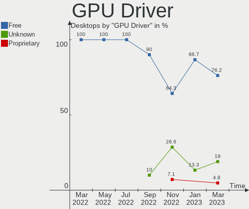

| Driver  | Desktops | Percent |
|---------|----------|---------|
| Free    | 13       | 86.67%  |
| Unknown | 2        | 13.33%  |

GPU Memory
----------

Total video memory

| Size in GB | Desktops | Percent |
|------------|----------|---------|
| Unknown    | 14       | 93.33%  |
| 0.51-1.0   | 1        | 6.67%   |

Monitor
-------

Monitor Vendor
--------------

Monitor vendors

| Vendor              | Desktops | Percent |
|---------------------|----------|---------|
| Acer                | 4        | 28.57%  |
| Samsung Electronics | 2        | 14.29%  |
| Philips             | 2        | 14.29%  |
| ViewSonic           | 1        | 7.14%   |
| Goldstar            | 1        | 7.14%   |
| Daewoo              | 1        | 7.14%   |
| CHD                 | 1        | 7.14%   |
| BenQ                | 1        | 7.14%   |
| ASUSTek Computer    | 1        | 7.14%   |

Monitor Model
-------------

Monitor models

| Model                                                                 | Desktops | Percent |
|-----------------------------------------------------------------------|----------|---------|
| Philips PHL 243V7 PHLC155 1920x1080 527x296mm 23.8-inch               | 2        | 14.29%  |
| ViewSonic VA2465 SERIES VSCB730 1920x1080 521x293mm 23.5-inch         | 1        | 7.14%   |
| Samsung Electronics SyncMaster SAM02A0 1280x1024 376x301mm 19.0-inch  | 1        | 7.14%   |
| Samsung Electronics SA300/SA350 SAM0794 1920x1080 521x293mm 23.5-inch | 1        | 7.14%   |
| Goldstar D2342P GSM5842 1920x1080 510x290mm 23.1-inch                 | 1        | 7.14%   |
| Daewoo LM2100W DWE2100 1920x1080 476x268mm 21.5-inch                  | 1        | 7.14%   |
| CHD DM-MONB2401 CHD2380 1920x1080 520x310mm 23.8-inch                 | 1        | 7.14%   |
| BenQ GW2255 BNQ78CD 1920x1080 477x268mm 21.5-inch                     | 1        | 7.14%   |
| ASUSTek Computer VA27D AUS270A 1920x1080 600x340mm 27.2-inch          | 1        | 7.14%   |
| Acer SA241Y A ACR09BD 1920x1080 527x296mm 23.8-inch                   | 1        | 7.14%   |
| Acer K242HL ACR03E3 1920x1080 531x299mm 24.0-inch                     | 1        | 7.14%   |
| Acer K222HQL ACR03E1 1920x1080 477x268mm 21.5-inch                    | 1        | 7.14%   |
| Acer AL1716 ACR06B4 1280x1024 338x271mm 17.1-inch                     | 1        | 7.14%   |

Monitor Resolution
------------------

Monitor screen resolution

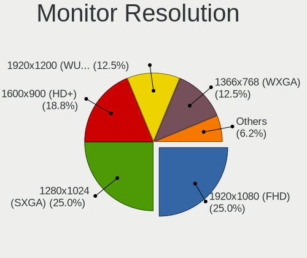

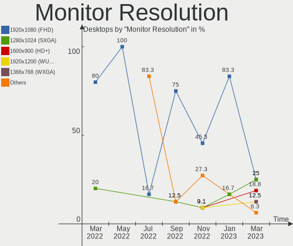

| Resolution       | Desktops | Percent |
|------------------|----------|---------|
| 1920x1080 (FHD)  | 10       | 83.33%  |
| 1280x1024 (SXGA) | 2        | 16.67%  |

Monitor Diagonal
----------------

Diagonal size in inches

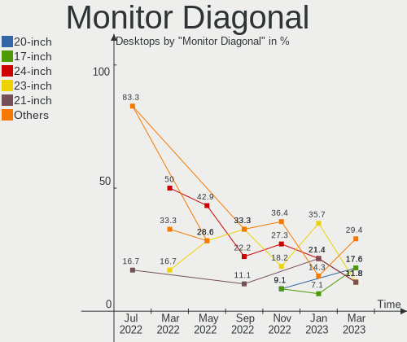

| Inches | Desktops | Percent |
|--------|----------|---------|
| 23     | 5        | 35.71%  |
| 24     | 3        | 21.43%  |
| 21     | 3        | 21.43%  |
| 27     | 1        | 7.14%   |
| 19     | 1        | 7.14%   |
| 17     | 1        | 7.14%   |

Monitor Width
-------------

Physical width

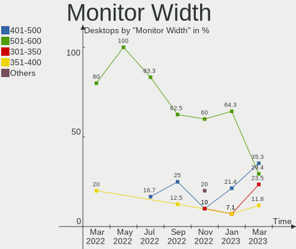

| Width in mm | Desktops | Percent |
|-------------|----------|---------|
| 501-600     | 9        | 64.29%  |
| 401-500     | 3        | 21.43%  |
| 351-400     | 1        | 7.14%   |
| 301-350     | 1        | 7.14%   |

Aspect Ratio
------------

Proportional relationship between the width and the height

| Ratio | Desktops | Percent |
|-------|----------|---------|
| 16/9  | 10       | 83.33%  |
| 5/4   | 2        | 16.67%  |

Monitor Area
------------

Area in inch²

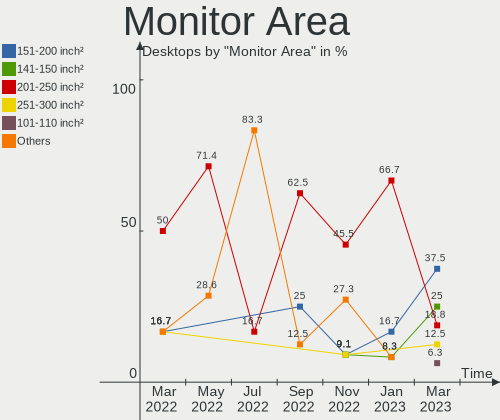

| Area in inch² | Desktops | Percent |
|----------------|----------|---------|
| 201-250        | 8        | 66.67%  |
| 151-200        | 2        | 16.67%  |
| 301-350        | 1        | 8.33%   |
| 141-150        | 1        | 8.33%   |

Pixel Density
-------------

Pixels per inch

| Density | Desktops | Percent |
|---------|----------|---------|
| 51-100  | 12       | 85.71%  |
| 101-120 | 2        | 14.29%  |

Multiple Monitors
-----------------

Total monitors connected

| Total | Desktops | Percent |
|-------|----------|---------|
| 1     | 11       | 73.33%  |
| 2     | 2        | 13.33%  |
| 0     | 2        | 13.33%  |

Network
-------

Net Controller Vendor
---------------------

Controller vendors

| Vendor                   | Desktops | Percent |
|--------------------------|----------|---------|
| Realtek Semiconductor    | 12       | 75%     |
| Intel                    | 3        | 18.75%  |
| Marvell Technology Group | 1        | 6.25%   |

Net Controller Model
--------------------

Controller models

| Model                                                             | Desktops | Percent |
|-------------------------------------------------------------------|----------|---------|
| Realtek RTL8111/8168/8411 PCI Express Gigabit Ethernet Controller | 12       | 75%     |
| Marvell Group 88E8057 PCI-E Gigabit Ethernet Controller           | 1        | 6.25%   |
| Intel Ethernet Controller I225-V                                  | 1        | 6.25%   |
| Intel Ethernet Connection I217-LM                                 | 1        | 6.25%   |
| Intel Dual Band Wireless-AC 3168NGW [Stone Peak]                  | 1        | 6.25%   |

Wireless Vendor
---------------

Wireless vendors

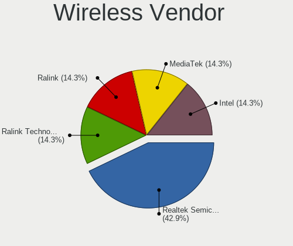

| Vendor | Desktops | Percent |
|--------|----------|---------|
| Intel  | 1        | 100%    |

Wireless Model
--------------

Wireless models

| Model                                            | Desktops | Percent |
|--------------------------------------------------|----------|---------|
| Intel Dual Band Wireless-AC 3168NGW [Stone Peak] | 1        | 100%    |

Ethernet Vendor
---------------

Ethernet vendors

| Vendor                   | Desktops | Percent |
|--------------------------|----------|---------|
| Realtek Semiconductor    | 12       | 80%     |
| Intel                    | 2        | 13.33%  |
| Marvell Technology Group | 1        | 6.67%   |

Ethernet Model
--------------

Ethernet models

| Model                                                             | Desktops | Percent |
|-------------------------------------------------------------------|----------|---------|
| Realtek RTL8111/8168/8411 PCI Express Gigabit Ethernet Controller | 12       | 80%     |
| Marvell Group 88E8057 PCI-E Gigabit Ethernet Controller           | 1        | 6.67%   |
| Intel Ethernet Controller I225-V                                  | 1        | 6.67%   |
| Intel Ethernet Connection I217-LM                                 | 1        | 6.67%   |

Net Controller Kind
-------------------

Ethernet, WiFi or modem

| Kind     | Desktops | Percent |
|----------|----------|---------|
| Ethernet | 15       | 93.75%  |
| WiFi     | 1        | 6.25%   |

Used Controller
---------------

Currently used network controller

| Kind     | Desktops | Percent |
|----------|----------|---------|
| Ethernet | 15       | 100%    |

NICs
----

Total network controllers on board

| Total | Desktops | Percent |
|-------|----------|---------|
| 1     | 14       | 93.33%  |
| 2     | 1        | 6.67%   |

IPv6
----

IPv6 vs IPv4

| Used | Desktops | Percent |
|------|----------|---------|
| No   | 15       | 100%    |

Bluetooth
---------

Bluetooth Vendor
----------------

Controller vendors

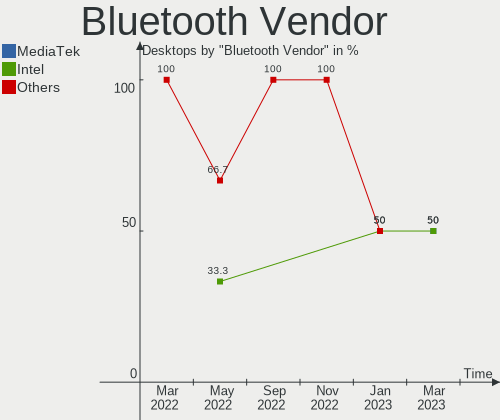

| Vendor           | Desktops | Percent |
|------------------|----------|---------|
| Intel            | 1        | 50%     |
| ASUSTek Computer | 1        | 50%     |

Bluetooth Model
---------------

Controller models

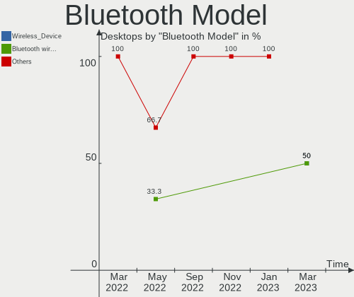

| Model                              | Desktops | Percent |
|------------------------------------|----------|---------|
| Intel Wireless-AC 3168 Bluetooth   | 1        | 50%     |
| ASUS Broadcom BCM20702A0 Bluetooth | 1        | 50%     |

Sound
-----

Sound Vendor
------------

Sound card vendors

| Vendor              | Desktops | Percent |
|---------------------|----------|---------|
| Intel               | 15       | 83.33%  |
| Texas Instruments   | 1        | 5.56%   |
| C-Media Electronics | 1        | 5.56%   |
| AMD                 | 1        | 5.56%   |

Sound Model
-----------

Sound card models

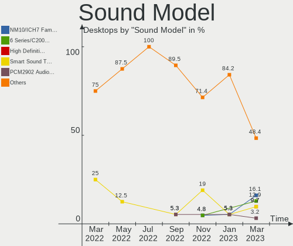

| Model                                                               | Desktops | Percent |
|---------------------------------------------------------------------|----------|---------|
| Intel Cannon Lake PCH cAVS                                          | 3        | 15.79%  |
| Intel Alder Lake-S HD Audio Controller                              | 3        | 15.79%  |
| Intel 8 Series/C220 Series Chipset High Definition Audio Controller | 3        | 15.79%  |
| Intel Comet Lake PCH-V cAVS                                         | 2        | 10.53%  |
| Intel 200 Series PCH HD Audio                                       | 2        | 10.53%  |
| Texas Instruments PCM2902 Audio Codec                               | 1        | 5.26%   |
| Intel Xeon E3-1200 v3/4th Gen Core Processor HD Audio Controller    | 1        | 5.26%   |
| Intel NM10/ICH7 Family High Definition Audio Controller             | 1        | 5.26%   |
| Intel Audio device                                                  | 1        | 5.26%   |
| C-Media Electronics USB Audio Device                                | 1        | 5.26%   |
| AMD Turks HDMI Audio [Radeon HD 6500/6600 / 6700M Series]           | 1        | 5.26%   |

Memory
------

Memory Vendor
-------------

Memory module vendors

| Vendor              | Desktops | Percent |
|---------------------|----------|---------|
| Kingston            | 5        | 33.33%  |
| Crucial             | 3        | 20%     |
| Unknown             | 1        | 6.67%   |
| Samsung Electronics | 1        | 6.67%   |
| Foxline             | 1        | 6.67%   |
| Elpida              | 1        | 6.67%   |
| Corsair             | 1        | 6.67%   |
| Apacer              | 1        | 6.67%   |
| AMD                 | 1        | 6.67%   |

Memory Model
------------

Memory module models

| Model                                                  | Desktops | Percent |
|--------------------------------------------------------|----------|---------|
| Unknown RAM Module 1GB DIMM SDRAM 1066MT/s             | 1        | 6.25%   |
| Samsung RAM Module 8GB DIMM DDR4 2667MT/s              | 1        | 6.25%   |
| Kingston RAM 99U5702-101.A00G 8GB DIMM DDR4 2667MT/s   | 1        | 6.25%   |
| Kingston RAM 99U5471-060.A00LF 8GB DIMM DDR3 1333MT/s  | 1        | 6.25%   |
| Kingston RAM 9905743-152.A00G 8GB DIMM DDR4 2400MT/s   | 1        | 6.25%   |
| Kingston RAM 9905713-019.A00G 4GB DIMM DDR4 2666MT/s   | 1        | 6.25%   |
| Kingston RAM 9905702-204.A00G 8GB DIMM DDR4 2667MT/s   | 1        | 6.25%   |
| Kingston RAM 9905702-017.A00G 8GB DIMM DDR4 2933MT/s   | 1        | 6.25%   |
| Foxline RAM FL2666D4U19-8G 8GB DIMM DDR4 2667MT/s      | 1        | 6.25%   |
| Elpida RAM EBJ21UE8BDF0-DJ-F 2GB DIMM DDR3 1333MT/s    | 1        | 6.25%   |
| Crucial RAM CT8G4SFRA32A.C8FP 8GB SODIMM DDR4 3200MT/s | 1        | 6.25%   |
| Crucial RAM CT8G4DFRA32A.M8FR 8GB DIMM DDR4 3533MT/s   | 1        | 6.25%   |
| Crucial RAM CT102464BA160B.C16 8GB DIMM DDR3 1600MT/s  | 1        | 6.25%   |
| Corsair RAM CMK8GX4M1A2666C16 8GB DIMM DDR4 3000MT/s   | 1        | 6.25%   |
| Apacer RAM D12.2324WS.001 8GB DIMM DDR4 2667MT/s       | 1        | 6.25%   |
| AMD RAM R948G3206U2S 8GB DIMM DDR4 3200MT/s            | 1        | 6.25%   |

Memory Kind
-----------

Memory module kinds

| Kind  | Desktops | Percent |
|-------|----------|---------|
| DDR4  | 11       | 73.33%  |
| SDRAM | 2        | 13.33%  |
| DDR3  | 2        | 13.33%  |

Memory Form Factor
------------------

Physical design of the memory module

| Name   | Desktops | Percent |
|--------|----------|---------|
| DIMM   | 14       | 93.33%  |
| SODIMM | 1        | 6.67%   |

Memory Size
-----------

Memory module size

| Size | Desktops | Percent |
|------|----------|---------|
| 8192 | 12       | 80%     |
| 4096 | 1        | 6.67%   |
| 2048 | 1        | 6.67%   |
| 1024 | 1        | 6.67%   |

Memory Speed
------------

Memory module speed

| Speed | Desktops | Percent |
|-------|----------|---------|
| 2667  | 5        | 31.25%  |
| 3200  | 2        | 12.5%   |
| 1333  | 2        | 12.5%   |
| 3533  | 1        | 6.25%   |
| 3000  | 1        | 6.25%   |
| 2933  | 1        | 6.25%   |
| 2666  | 1        | 6.25%   |
| 2400  | 1        | 6.25%   |
| 1600  | 1        | 6.25%   |
| 1066  | 1        | 6.25%   |

Printers & scanners
-------------------

Printer Vendor
--------------

Printer device vendors

Zero info for selected period =(

Printer Model
-------------

Printer device models

Zero info for selected period =(

Scanner Vendor
--------------

Scanner device vendors

Zero info for selected period =(

Scanner Model
-------------

Scanner device models

Zero info for selected period =(

Camera
------

Camera Vendor
-------------

Camera device vendors

| Vendor                | Desktops | Percent |
|-----------------------|----------|---------|
| Realtek Semiconductor | 1        | 50%     |
| Microdia              | 1        | 50%     |

Camera Model
------------

Camera device models

| Model              | Desktops | Percent |
|--------------------|----------|---------|
| Realtek USB Camera | 1        | 50%     |
| Microdia Camera    | 1        | 50%     |

Security
--------

Fingerprint Vendor
------------------

Fingerprint sensor vendors

Zero info for selected period =(

Fingerprint Model
-----------------

Fingerprint sensor models

Zero info for selected period =(

Chipcard Vendor
---------------

Chipcard module vendors

Zero info for selected period =(

Chipcard Model
--------------

Chipcard module models

Zero info for selected period =(

Unsupported
-----------

Unsupported Devices
-------------------

Total unsupported devices on board

| Total | Desktops | Percent |
|-------|----------|---------|
| 0     | 12       | 80%     |
| 1     | 3        | 20%     |

Unsupported Device Types
------------------------

Types of unsupported devices

| Type          | Desktops | Percent |
|---------------|----------|---------|
| Graphics card | 3        | 100%    |

