Red OS - Hardware Trends (Desktops)
-----------------------------------

A project to identify most popular hardware characteristics and track their change
over time based on data collected by Linux users at https://Linux-Hardware.org.

Anyone can contribute to this report by the [hw-probe](https://github.com/linuxhw/hw-probe) tool:

    sudo -E hw-probe -all -upload

This report is for one last month. Overall report since the beginning of time: [TestCoverage](https://github.com/linuxhw/TestCoverage)

Period: Dec, 2022.

Contents
--------

* [ System ](#system)
  - [ OS                       ](#os)
  - [ OS Family                ](#os-family)
  - [ Kernel                   ](#kernel)
  - [ Kernel Family            ](#kernel-family)
  - [ Kernel Major Ver.        ](#kernel-major-ver)
  - [ Arch                     ](#arch)
  - [ DE                       ](#de)
  - [ Display Server           ](#display-server)
  - [ Display Manager          ](#display-manager)
  - [ OS Lang                  ](#os-lang)
  - [ Boot Mode                ](#boot-mode)
  - [ Filesystem               ](#filesystem)
  - [ Part. scheme             ](#part-scheme)
  - [ Dual Boot with Linux/BSD ](#dual-boot-with-linuxbsd)
  - [ Dual Boot (Win)          ](#dual-boot-win)

* [ Board ](#board)
  - [ Vendor                   ](#vendor)
  - [ Model                    ](#model)
  - [ Model Family             ](#model-family)
  - [ MFG Year                 ](#mfg-year)
  - [ Form Factor              ](#form-factor)
  - [ Secure Boot              ](#secure-boot)
  - [ Coreboot                 ](#coreboot)
  - [ RAM Size                 ](#ram-size)
  - [ RAM Used                 ](#ram-used)
  - [ Total Drives             ](#total-drives)
  - [ Has CD-ROM               ](#has-cd-rom)
  - [ Has Ethernet             ](#has-ethernet)
  - [ Has WiFi                 ](#has-wifi)
  - [ Has Bluetooth            ](#has-bluetooth)

* [ Location ](#location)
  - [ Country                  ](#country)
  - [ City                     ](#city)

* [ Drives ](#drives)
  - [ Drive Vendor             ](#drive-vendor)
  - [ Drive Model              ](#drive-model)
  - [ HDD Vendor               ](#hdd-vendor)
  - [ SSD Vendor               ](#ssd-vendor)
  - [ Drive Kind               ](#drive-kind)
  - [ Drive Connector          ](#drive-connector)
  - [ Drive Size               ](#drive-size)
  - [ Space Total              ](#space-total)
  - [ Space Used               ](#space-used)
  - [ Malfunc. Drives          ](#malfunc-drives)
  - [ Malfunc. Drive Vendor    ](#malfunc-drive-vendor)
  - [ Malfunc. HDD Vendor      ](#malfunc-hdd-vendor)
  - [ Malfunc. Drive Kind      ](#malfunc-drive-kind)
  - [ Failed Drives            ](#failed-drives)
  - [ Failed Drive Vendor      ](#failed-drive-vendor)
  - [ Drive Status             ](#drive-status)

* [ Storage controller ](#storage-controller)
  - [ Storage Vendor           ](#storage-vendor)
  - [ Storage Model            ](#storage-model)
  - [ Storage Kind             ](#storage-kind)

* [ Processor ](#processor)
  - [ CPU Vendor               ](#cpu-vendor)
  - [ CPU Model                ](#cpu-model)
  - [ CPU Model Family         ](#cpu-model-family)
  - [ CPU Cores                ](#cpu-cores)
  - [ CPU Sockets              ](#cpu-sockets)
  - [ CPU Threads              ](#cpu-threads)
  - [ CPU Op-Modes             ](#cpu-op-modes)
  - [ CPU Microcode            ](#cpu-microcode)
  - [ CPU Microarch            ](#cpu-microarch)

* [ Graphics ](#graphics)
  - [ GPU Vendor               ](#gpu-vendor)
  - [ GPU Model                ](#gpu-model)
  - [ GPU Combo                ](#gpu-combo)
  - [ GPU Driver               ](#gpu-driver)
  - [ GPU Memory               ](#gpu-memory)

* [ Monitor ](#monitor)
  - [ Monitor Vendor           ](#monitor-vendor)
  - [ Monitor Model            ](#monitor-model)
  - [ Monitor Resolution       ](#monitor-resolution)
  - [ Monitor Diagonal         ](#monitor-diagonal)
  - [ Monitor Width            ](#monitor-width)
  - [ Aspect Ratio             ](#aspect-ratio)
  - [ Monitor Area             ](#monitor-area)
  - [ Pixel Density            ](#pixel-density)
  - [ Multiple Monitors        ](#multiple-monitors)

* [ Network ](#network)
  - [ Net Controller Vendor    ](#net-controller-vendor)
  - [ Net Controller Model     ](#net-controller-model)
  - [ Wireless Vendor          ](#wireless-vendor)
  - [ Wireless Model           ](#wireless-model)
  - [ Ethernet Vendor          ](#ethernet-vendor)
  - [ Ethernet Model           ](#ethernet-model)
  - [ Net Controller Kind      ](#net-controller-kind)
  - [ Used Controller          ](#used-controller)
  - [ NICs                     ](#nics)
  - [ IPv6                     ](#ipv6)

* [ Bluetooth ](#bluetooth)
  - [ Bluetooth Vendor         ](#bluetooth-vendor)
  - [ Bluetooth Model          ](#bluetooth-model)

* [ Sound ](#sound)
  - [ Sound Vendor             ](#sound-vendor)
  - [ Sound Model              ](#sound-model)

* [ Memory ](#memory)
  - [ Memory Vendor            ](#memory-vendor)
  - [ Memory Model             ](#memory-model)
  - [ Memory Kind              ](#memory-kind)
  - [ Memory Form Factor       ](#memory-form-factor)
  - [ Memory Size              ](#memory-size)
  - [ Memory Speed             ](#memory-speed)

* [ Printers & scanners ](#printers--scanners)
  - [ Printer Vendor           ](#printer-vendor)
  - [ Printer Model            ](#printer-model)
  - [ Scanner Vendor           ](#scanner-vendor)
  - [ Scanner Model            ](#scanner-model)

* [ Camera ](#camera)
  - [ Camera Vendor            ](#camera-vendor)
  - [ Camera Model             ](#camera-model)

* [ Security ](#security)
  - [ Fingerprint Vendor       ](#fingerprint-vendor)
  - [ Fingerprint Model        ](#fingerprint-model)
  - [ Chipcard Vendor          ](#chipcard-vendor)
  - [ Chipcard Model           ](#chipcard-model)

* [ Unsupported ](#unsupported)
  - [ Unsupported Devices      ](#unsupported-devices)
  - [ Unsupported Device Types ](#unsupported-device-types)

System
------

OS
--

Installed operating systems

| Name         | Desktops | Percent |
|--------------|----------|---------|
| Red OS 7.3.2 | 7        | 53.85%  |
| Red OS 7.3   | 4        | 30.77%  |
| Red OS 7.2   | 2        | 15.38%  |

OS Family
---------

OS without a version

| Name   | Desktops | Percent |
|--------|----------|---------|
| Red OS | 13       | 100%    |

Kernel
------

Version of the Linux kernel

| Version                | Desktops | Percent |
|------------------------|----------|---------|
| 5.15.72-1.el7.3.x86_64 | 5        | 38.46%  |
| 5.15.78-2.el7.3.x86_64 | 2        | 15.38%  |
| 5.15.35-5.el7.3.x86_64 | 2        | 15.38%  |
| 5.10.29-1.el7.x86_64   | 2        | 15.38%  |
| 4.19.79-1.el7.x86_64   | 2        | 15.38%  |

Kernel Family
-------------

Linux kernel without a distro release

| Version | Desktops | Percent |
|---------|----------|---------|
| 5.15.72 | 5        | 38.46%  |
| 5.15.78 | 2        | 15.38%  |
| 5.15.35 | 2        | 15.38%  |
| 5.10.29 | 2        | 15.38%  |
| 4.19.79 | 2        | 15.38%  |

Kernel Major Ver.
-----------------

Linux kernel major version

| Version | Desktops | Percent |
|---------|----------|---------|
| 5.15    | 9        | 69.23%  |
| 5.10    | 2        | 15.38%  |
| 4.19    | 2        | 15.38%  |

Arch
----

OS architecture (x86_64, i586, etc.)

| Name   | Desktops | Percent |
|--------|----------|---------|
| x86_64 | 13       | 100%    |

DE
--

Desktop Environment

| Name     | Desktops | Percent |
|----------|----------|---------|
| MATE     | 10       | 76.92%  |
| Cinnamon | 3        | 23.08%  |

Display Server
--------------

X11 or Wayland

| Name | Desktops | Percent |
|------|----------|---------|
| X11  | 13       | 100%    |

Display Manager
---------------

SDDM, LightDM, etc.

| Name | Desktops | Percent |
|------|----------|---------|
| GDM  | 13       | 100%    |

OS Lang
-------

Language

| Lang    | Desktops | Percent |
|---------|----------|---------|
| Unknown | 12       | 92.31%  |
| ru_RU   | 1        | 7.69%   |

Boot Mode
---------

EFI or BIOS

| Mode | Desktops | Percent |
|------|----------|---------|
| EFI  | 9        | 69.23%  |
| BIOS | 4        | 30.77%  |

Filesystem
----------

Type of filesystem

| Type  | Desktops | Percent |
|-------|----------|---------|
| Ext4  | 12       | 92.31%  |
| Btrfs | 1        | 7.69%   |

Part. scheme
------------

Scheme of partitioning

| Type | Desktops | Percent |
|------|----------|---------|
| GPT  | 10       | 76.92%  |
| MBR  | 3        | 23.08%  |

Dual Boot with Linux/BSD
------------------------

Hosting more than one Linux/BSD

| Dual boot | Desktops | Percent |
|-----------|----------|---------|
| No        | 12       | 92.31%  |
| Yes       | 1        | 7.69%   |

Dual Boot (Win)
---------------

Hosting Linux and Windows

| Dual boot | Desktops | Percent |
|-----------|----------|---------|
| No        | 10       | 76.92%  |
| Yes       | 3        | 23.08%  |

Board
-----

Vendor
------

Motherboard manufacturer

| Name                | Desktops | Percent |
|---------------------|----------|---------|
| ASUSTek Computer    | 6        | 46.15%  |
| Gigabyte Technology | 3        | 23.08%  |
| MSI                 | 1        | 7.69%   |
| DEPO Computers      | 1        | 7.69%   |
| Colorful Technology | 1        | 7.69%   |
| ASRock              | 1        | 7.69%   |

Model
-----

Motherboard model

| Name                        | Desktops | Percent |
|-----------------------------|----------|---------|
| ASUS MINIPC PB62            | 2        | 15.38%  |
| MSI MS-7B86                 | 1        | 7.69%   |
| Gigabyte M61SME-S2          | 1        | 7.69%   |
| Gigabyte H110M-S2           | 1        | 7.69%   |
| Gigabyte B365M DS3H         | 1        | 7.69%   |
| DEPO Computers DPH410S      | 1        | 7.69%   |
| Colorful H610M-K M.2        | 1        | 7.69%   |
| ASUS PRIME H510T2/CSM       | 1        | 7.69%   |
| ASUS P7H55-M                | 1        | 7.69%   |
| ASUS M5A78L-M LX V2         | 1        | 7.69%   |
| ASUS HomeNet Model: HN-G700 | 1        | 7.69%   |
| ASRock H510M-HVS R2.0       | 1        | 7.69%   |

Model Family
------------

Motherboard model prefix

| Name                   | Desktops | Percent |
|------------------------|----------|---------|
| ASUS MINIPC            | 2        | 15.38%  |
| MSI MS-7B86            | 1        | 7.69%   |
| Gigabyte M61SME-S2     | 1        | 7.69%   |
| Gigabyte H110M-S2      | 1        | 7.69%   |
| Gigabyte B365M         | 1        | 7.69%   |
| DEPO Computers DPH410S | 1        | 7.69%   |
| Colorful H610M-K       | 1        | 7.69%   |
| ASUS PRIME             | 1        | 7.69%   |
| ASUS P7H55-M           | 1        | 7.69%   |
| ASUS M5A78L-M          | 1        | 7.69%   |
| ASUS HomeNet           | 1        | 7.69%   |
| ASRock H510M-HVS       | 1        | 7.69%   |

MFG Year
--------

Motherboard manufacture year

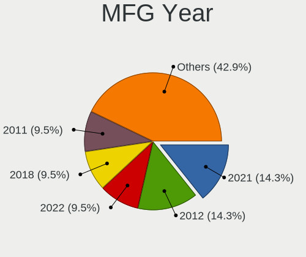

| Year | Desktops | Percent |
|------|----------|---------|
| 2022 | 4        | 30.77%  |
| 2021 | 3        | 23.08%  |
| 2019 | 2        | 15.38%  |
| 2016 | 1        | 7.69%   |
| 2011 | 1        | 7.69%   |
| 2010 | 1        | 7.69%   |
| 2007 | 1        | 7.69%   |

Form Factor
-----------

Physical design of the computer

| Name    | Desktops | Percent |
|---------|----------|---------|
| Desktop | 13       | 100%    |

Secure Boot
-----------

Enabled or disabled

| State    | Desktops | Percent |
|----------|----------|---------|
| Disabled | 13       | 100%    |

Coreboot
--------

Have coreboot on board

| Used | Desktops | Percent |
|------|----------|---------|
| No   | 13       | 100%    |

RAM Size
--------

Total RAM memory

| Size in GB | Desktops | Percent |
|------------|----------|---------|
| 4.01-8.0   | 5        | 38.46%  |
| 16.01-24.0 | 4        | 30.77%  |
| 8.01-16.0  | 3        | 23.08%  |
| 3.01-4.0   | 1        | 7.69%   |

RAM Used
--------

Used RAM memory

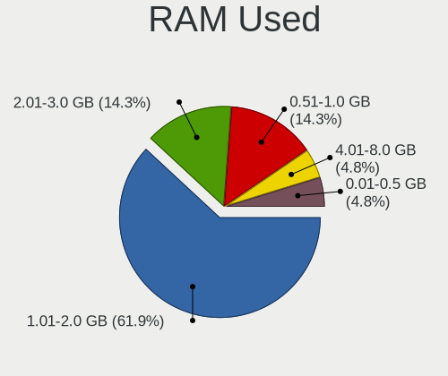

| Used GB  | Desktops | Percent |
|----------|----------|---------|
| 1.01-2.0 | 7        | 53.85%  |
| 2.01-3.0 | 4        | 30.77%  |
| 4.01-8.0 | 2        | 15.38%  |

Total Drives
------------

Number of drives on board

| Drives | Desktops | Percent |
|--------|----------|---------|
| 1      | 7        | 53.85%  |
| 2      | 6        | 46.15%  |

Has CD-ROM
----------

Has CD-ROM on board

| Presented | Desktops | Percent |
|-----------|----------|---------|
| No        | 11       | 84.62%  |
| Yes       | 2        | 15.38%  |

Has Ethernet
------------

Has Ethernet on board

| Presented | Desktops | Percent |
|-----------|----------|---------|
| Yes       | 13       | 100%    |

Has WiFi
--------

Has WiFi module

| Presented | Desktops | Percent |
|-----------|----------|---------|
| No        | 8        | 61.54%  |
| Yes       | 5        | 38.46%  |

Has Bluetooth
-------------

Has Bluetooth module

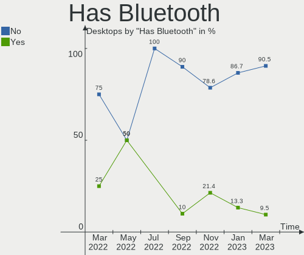

| Presented | Desktops | Percent |
|-----------|----------|---------|
| No        | 7        | 53.85%  |
| Yes       | 6        | 46.15%  |

Location
--------

Country
-------

Geographic location (country)

| Country | Desktops | Percent |
|---------|----------|---------|
| Russia  | 13       | 100%    |

City
----

Geographic location (city)

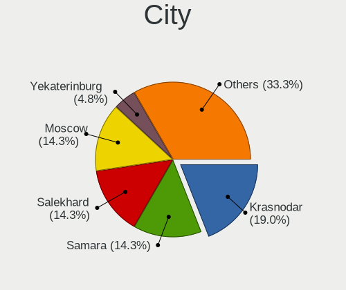

| City            | Desktops | Percent |
|-----------------|----------|---------|
| Salekhard       | 3        | 23.08%  |
| Veliky Novgorod | 2        | 15.38%  |
| Novy Urengoy    | 2        | 15.38%  |
| Murom           | 2        | 15.38%  |
| Baksan          | 2        | 15.38%  |
| Perm            | 1        | 7.69%   |
| Nadym           | 1        | 7.69%   |

Drives
------

Drive Vendor
------------

Hard drive vendors

| Vendor              | Desktops | Drives | Percent |
|---------------------|----------|--------|---------|
| WDC                 | 3        | 4      | 17.65%  |
| Seagate             | 2        | 2      | 11.76%  |
| AGI                 | 2        | 2      | 11.76%  |
| Unknown             | 1        | 1      | 5.88%   |
| Silicon Motion      | 1        | 1      | 5.88%   |
| SanDisk             | 1        | 1      | 5.88%   |
| Samsung Electronics | 1        | 1      | 5.88%   |
| Kingston            | 1        | 1      | 5.88%   |
| Hitachi             | 1        | 1      | 5.88%   |
| ExeGate             | 1        | 2      | 5.88%   |
| Crucial             | 1        | 1      | 5.88%   |
| Apacer              | 1        | 1      | 5.88%   |
| AMD                 | 1        | 1      | 5.88%   |

Drive Model
-----------

Hard drive models

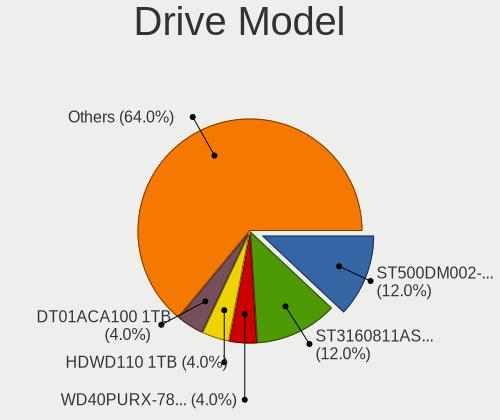

| Model                                  | Desktops | Percent |
|----------------------------------------|----------|---------|
| AGI AGI512G16AI198 512GB               | 2        | 11.11%  |
| WDC WD25 00LPCX-24C6HT0 250GB          | 1        | 5.56%   |
| WDC WD10EZEX-75ZF5A0 1TB               | 1        | 5.56%   |
| WDC WD10EZEX-22MFCA0 1TB               | 1        | 5.56%   |
| WDC WD10EZEX-00WN4A0 1TB               | 1        | 5.56%   |
| Unknown NVMe SSD Drive 256GB           | 1        | 5.56%   |
| Silicon Motion HomeNet HN M2 SSD 256GB | 1        | 5.56%   |
| Seagate ST500DM002-1BD142 500GB        | 1        | 5.56%   |
| Seagate ST1000DM010-2EP102 1TB         | 1        | 5.56%   |
| SanDisk NVMe SSD Drive 500GB           | 1        | 5.56%   |
| Samsung HD400LJ 400GB                  | 1        | 5.56%   |
| Kingston SA400S37120G 120GB SSD        | 1        | 5.56%   |
| Hitachi HDS721050CLA360 500GB          | 1        | 5.56%   |
| ExeGate EX276690RUS(960G 960GB SSD     | 1        | 5.56%   |
| Crucial CT240BX500SSD1 240GB           | 1        | 5.56%   |
| Apacer AS350 512GB SSD                 | 1        | 5.56%   |
| AMD R5SL256G 256GB SSD                 | 1        | 5.56%   |

HDD Vendor
----------

Hard disk drive vendors

| Vendor              | Desktops | Drives | Percent |
|---------------------|----------|--------|---------|
| WDC                 | 3        | 4      | 42.86%  |
| Seagate             | 2        | 2      | 28.57%  |
| Samsung Electronics | 1        | 1      | 14.29%  |
| Hitachi             | 1        | 1      | 14.29%  |

SSD Vendor
----------

Solid state drive vendors

| Vendor   | Desktops | Drives | Percent |
|----------|----------|--------|---------|
| Kingston | 1        | 1      | 20%     |
| ExeGate  | 1        | 2      | 20%     |
| Crucial  | 1        | 1      | 20%     |
| Apacer   | 1        | 1      | 20%     |
| AMD      | 1        | 1      | 20%     |

Drive Kind
----------

HDD or SSD

| Kind | Desktops | Drives | Percent |
|------|----------|--------|---------|
| HDD  | 6        | 8      | 37.5%   |
| NVMe | 5        | 5      | 31.25%  |
| SSD  | 5        | 6      | 31.25%  |

Drive Connector
---------------

SATA, SAS, NVMe, etc.

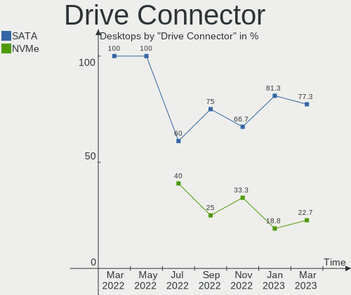

| Type | Desktops | Drives | Percent |
|------|----------|--------|---------|
| SATA | 8        | 13     | 57.14%  |
| NVMe | 5        | 5      | 35.71%  |
| SAS  | 1        | 1      | 7.14%   |

Drive Size
----------

Size of hard drive

| Size in TB | Desktops | Drives | Percent |
|------------|----------|--------|---------|
| 0.01-0.5   | 7        | 7      | 58.33%  |
| 0.51-1.0   | 5        | 7      | 41.67%  |

Space Total
-----------

Amount of disk space available on the file system

| Size in GB | Desktops | Percent |
|------------|----------|---------|
| 251-500    | 4        | 30.77%  |
| 101-250    | 4        | 30.77%  |
| 1001-2000  | 2        | 15.38%  |
| 501-1000   | 2        | 15.38%  |
| 2001-3000  | 1        | 7.69%   |

Space Used
----------

Amount of used disk space

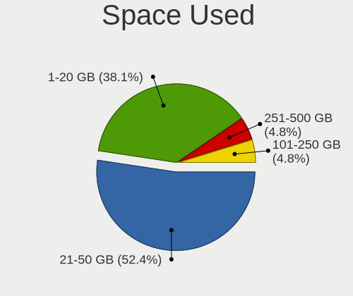

| Used GB   | Desktops | Percent |
|-----------|----------|---------|
| 1-20      | 7        | 53.85%  |
| 21-50     | 2        | 15.38%  |
| 101-250   | 2        | 15.38%  |
| 2001-3000 | 1        | 7.69%   |
| 501-1000  | 1        | 7.69%   |

Malfunc. Drives
---------------

Drive models with a malfunction

| Model                             | Desktops | Drives | Percent |
|-----------------------------------|----------|--------|---------|
| WDC WD10EZEX-75ZF5A0 1TB          | 1        | 1      | 20%     |
| WDC WD10EZEX-00WN4A0 1TB          | 1        | 1      | 20%     |
| Seagate ST500DM002-1BD142 500GB   | 1        | 1      | 20%     |
| Seagate ST1000DM010-2EP102 1TB    | 1        | 1      | 20%     |
| Samsung Electronics HD400LJ 400GB | 1        | 1      | 20%     |

Malfunc. Drive Vendor
---------------------

Vendors of faulty drives

| Vendor              | Desktops | Drives | Percent |
|---------------------|----------|--------|---------|
| WDC                 | 2        | 2      | 40%     |
| Seagate             | 2        | 2      | 40%     |
| Samsung Electronics | 1        | 1      | 20%     |

Malfunc. HDD Vendor
-------------------

Vendors of faulty HDD drives

| Vendor              | Desktops | Drives | Percent |
|---------------------|----------|--------|---------|
| WDC                 | 2        | 2      | 40%     |
| Seagate             | 2        | 2      | 40%     |
| Samsung Electronics | 1        | 1      | 20%     |

Malfunc. Drive Kind
-------------------

Kinds of faulty drives

| Kind | Desktops | Drives | Percent |
|------|----------|--------|---------|
| HDD  | 4        | 5      | 100%    |

Failed Drives
-------------

Failed drive models

Zero info for selected period =(

Failed Drive Vendor
-------------------

Failed drive vendors

Zero info for selected period =(

Drive Status
------------

Number of failed and malfunc. drives

| Status   | Desktops | Drives | Percent |
|----------|----------|--------|---------|
| Works    | 10       | 12     | 62.5%   |
| Malfunc  | 4        | 5      | 25%     |
| Detected | 2        | 2      | 12.5%   |

Storage controller
------------------

Storage Vendor
--------------

Storage controller vendors

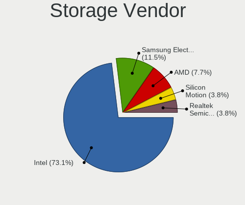

| Vendor           | Desktops | Percent |
|------------------|----------|---------|
| Intel            | 10       | 52.63%  |
| Silicon Motion   | 3        | 15.79%  |
| AMD              | 2        | 10.53%  |
| VIA Technologies | 1        | 5.26%   |
| SanDisk          | 1        | 5.26%   |
| Nvidia           | 1        | 5.26%   |
| Unknown          | 1        | 5.26%   |

Storage Model
-------------

Storage controller models

| Model                                                                         | Desktops | Percent |
|-------------------------------------------------------------------------------|----------|---------|
| Intel 500 Series Chipset Family SATA AHCI Controller                          | 5        | 22.73%  |
| Silicon Motion SM2263EN/SM2263XT SSD Controller                               | 3        | 13.64%  |
| VIA VT6415 PATA IDE Host Controller                                           | 1        | 4.55%   |
| SanDisk WD Blue SN570 NVMe SSD                                                | 1        | 4.55%   |
| Nvidia MCP61 SATA Controller                                                  | 1        | 4.55%   |
| Nvidia MCP61 IDE                                                              | 1        | 4.55%   |
| Intel Q170/Q150/B150/H170/H110/Z170/CM236 Chipset SATA Controller [AHCI Mode] | 1        | 4.55%   |
| Intel Alder Lake-S PCH SATA Controller [AHCI Mode]                            | 1        | 4.55%   |
| Intel 5 Series/3400 Series Chipset 4 port SATA IDE Controller                 | 1        | 4.55%   |
| Intel 5 Series/3400 Series Chipset 2 port SATA IDE Controller                 | 1        | 4.55%   |
| Intel 400 Series Chipset Family SATA AHCI Controller                          | 1        | 4.55%   |
| Intel 200 Series PCH SATA controller [AHCI mode]                              | 1        | 4.55%   |
| AMD SB7x0/SB8x0/SB9x0 SATA Controller [IDE mode]                              | 1        | 4.55%   |
| AMD SB7x0/SB8x0/SB9x0 IDE Controller                                          | 1        | 4.55%   |
| AMD 400 Series Chipset SATA Controller                                        | 1        | 4.55%   |
| Unknown                                                                       | 1        | 4.55%   |

Storage Kind
------------

Kind of storage controller (IDE, SATA, NVMe, SAS, ...)

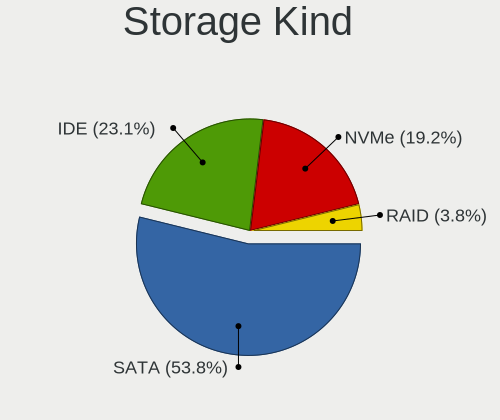

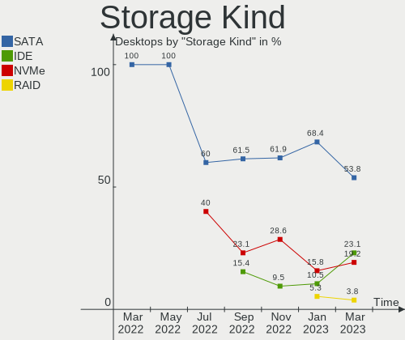

| Kind | Desktops | Percent |
|------|----------|---------|
| SATA | 11       | 57.89%  |
| NVMe | 5        | 26.32%  |
| IDE  | 3        | 15.79%  |

Processor
---------

CPU Vendor
----------

Processor vendors

| Vendor | Desktops | Percent |
|--------|----------|---------|
| Intel  | 10       | 76.92%  |
| AMD    | 3        | 23.08%  |

CPU Model
---------

Processor models

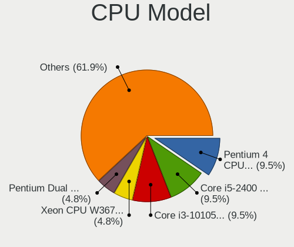

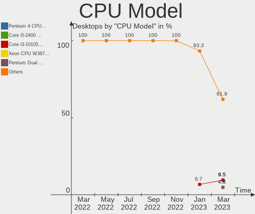

| Model                                      | Desktops | Percent |
|--------------------------------------------|----------|---------|
| Intel 11th Gen Core i7-11700 @ 2.50GHz     | 2        | 15.38%  |
| Intel Pentium CPU G4500 @ 3.50GHz          | 1        | 7.69%   |
| Intel Core i7-10700K CPU @ 3.80GHz         | 1        | 7.69%   |
| Intel Core i5-9400 CPU @ 2.90GHz           | 1        | 7.69%   |
| Intel Core i5-10400 CPU @ 2.90GHz          | 1        | 7.69%   |
| Intel Core i5 CPU 750 @ 2.67GHz            | 1        | 7.69%   |
| Intel Core i3-10105 CPU @ 3.70GHz          | 1        | 7.69%   |
| Intel Core i3-10100 CPU @ 3.60GHz          | 1        | 7.69%   |
| Intel 12th Gen Core i3-12100               | 1        | 7.69%   |
| AMD Phenom 9650 Quad-Core Processor        | 1        | 7.69%   |
| AMD Athlon II X2 260 Processor             | 1        | 7.69%   |
| AMD Athlon 3000G with Radeon Vega Graphics | 1        | 7.69%   |

CPU Model Family
----------------

Processor model prefix

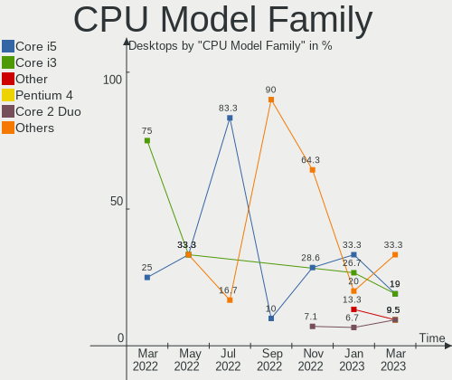

| Model            | Desktops | Percent |
|------------------|----------|---------|
| Other            | 3        | 23.08%  |
| Intel Core i5    | 3        | 23.08%  |
| Intel Core i3    | 2        | 15.38%  |
| Intel Pentium    | 1        | 7.69%   |
| Intel Core i7    | 1        | 7.69%   |
| AMD Phenom       | 1        | 7.69%   |
| AMD Athlon II X2 | 1        | 7.69%   |
| AMD Athlon       | 1        | 7.69%   |

CPU Cores
---------

Number of processor cores

| Number | Desktops | Percent |
|--------|----------|---------|
| 4      | 5        | 38.46%  |
| 8      | 3        | 23.08%  |
| 2      | 3        | 23.08%  |
| 6      | 2        | 15.38%  |

CPU Sockets
-----------

Number of sockets

| Number | Desktops | Percent |
|--------|----------|---------|
| 1      | 13       | 100%    |

CPU Threads
-----------

Threads per core (Hyper-Threading)

| Number | Desktops | Percent |
|--------|----------|---------|
| 2      | 8        | 61.54%  |
| 1      | 5        | 38.46%  |

CPU Op-Modes
------------

CPU Operation Modes (32-bit, 64-bit)

| Op mode        | Desktops | Percent |
|----------------|----------|---------|
| 32-bit, 64-bit | 13       | 100%    |

CPU Microcode
-------------

Microcode number

| Number     | Desktops | Percent |
|------------|----------|---------|
| 0xa0653    | 3        | 23.08%  |
| 0xa0671    | 2        | 15.38%  |
| 0xa0655    | 1        | 7.69%   |
| 0x906ed    | 1        | 7.69%   |
| 0x90675    | 1        | 7.69%   |
| 0x506e3    | 1        | 7.69%   |
| 0x106e5    | 1        | 7.69%   |
| 0x08108109 | 1        | 7.69%   |
| 0x010000c8 | 1        | 7.69%   |
| 0x01000083 | 1        | 7.69%   |

CPU Microarch
-------------

Microarchitecture

| Name             | Desktops | Percent |
|------------------|----------|---------|
| CometLake        | 4        | 30.77%  |
| K10              | 2        | 15.38%  |
| Unknown          | 2        | 15.38%  |
| Zen+             | 1        | 7.69%   |
| Skylake          | 1        | 7.69%   |
| Nehalem          | 1        | 7.69%   |
| KabyLake         | 1        | 7.69%   |
| Alderlake Hybrid | 1        | 7.69%   |

Graphics
--------

GPU Vendor
----------

Vendors of graphics cards

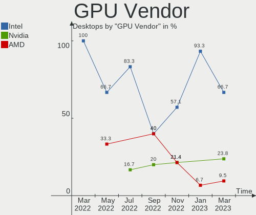

| Vendor | Desktops | Percent |
|--------|----------|---------|
| Intel  | 9        | 64.29%  |
| Nvidia | 3        | 21.43%  |
| AMD    | 2        | 14.29%  |

GPU Model
---------

Graphics card models

| Model                                                                | Desktops | Percent |
|----------------------------------------------------------------------|----------|---------|
| Intel CometLake-S GT2 [UHD Graphics 630]                             | 4        | 28.57%  |
| Intel RocketLake-S GT1 [UHD Graphics 750]                            | 2        | 14.29%  |
| Nvidia GT218 [GeForce 210]                                           | 1        | 7.14%   |
| Nvidia GM107 [GeForce GTX 750 Ti]                                    | 1        | 7.14%   |
| Nvidia GK208B [GeForce GT 710]                                       | 1        | 7.14%   |
| Intel HD Graphics 530                                                | 1        | 7.14%   |
| Intel CoffeeLake-S GT2 [UHD Graphics 630]                            | 1        | 7.14%   |
| Intel Alder Lake-S GT1 [UHD Graphics 730]                            | 1        | 7.14%   |
| AMD RS780L [Radeon 3000]                                             | 1        | 7.14%   |
| AMD Picasso/Raven 2 [Radeon Vega Series / Radeon Vega Mobile Series] | 1        | 7.14%   |

GPU Combo
---------

Combinations of graphics cards

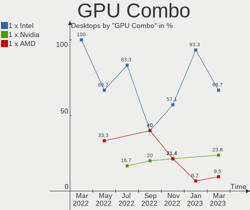

| Name         | Desktops | Percent |
|--------------|----------|---------|
| 1 x Intel    | 9        | 69.23%  |
| 1 x Nvidia   | 2        | 15.38%  |
| AMD + Nvidia | 1        | 7.69%   |
| 1 x AMD      | 1        | 7.69%   |

GPU Driver
----------

Free vs proprietary

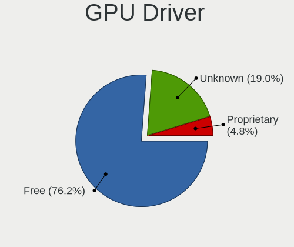

| Driver      | Desktops | Percent |
|-------------|----------|---------|
| Free        | 6        | 46.15%  |
| Unknown     | 6        | 46.15%  |
| Proprietary | 1        | 7.69%   |

GPU Memory
----------

Total video memory

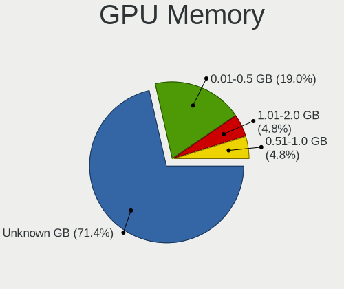

| Size in GB | Desktops | Percent |
|------------|----------|---------|
| Unknown    | 10       | 76.92%  |
| 1.01-2.0   | 1        | 7.69%   |
| 0.51-1.0   | 1        | 7.69%   |
| 0.01-0.5   | 1        | 7.69%   |

Monitor
-------

Monitor Vendor
--------------

Monitor vendors

| Vendor              | Desktops | Percent |
|---------------------|----------|---------|
| Philips             | 3        | 37.5%   |
| Samsung Electronics | 2        | 25%     |
| SGT                 | 1        | 12.5%   |
| Dell                | 1        | 12.5%   |
| AOC                 | 1        | 12.5%   |

Monitor Model
-------------

Monitor models

| Model                                                                | Desktops | Percent |
|----------------------------------------------------------------------|----------|---------|
| SGT XY238 SGT2386 1920x1080 530x290mm 23.8-inch                      | 1        | 11.11%  |
| Samsung Electronics SyncMaster SAM0580 1280x1024 376x301mm 19.0-inch | 1        | 11.11%  |
| Samsung Electronics SMB2030N SAM0634 1600x900 443x249mm 20.0-inch    | 1        | 11.11%  |
| Philips PHL 243V7 PHLC155 1920x1080 527x296mm 23.8-inch              | 1        | 11.11%  |
| Philips PHL 241E1 PHLC207 1920x1080 527x296mm 23.8-inch              | 1        | 11.11%  |
| Philips PHL 223V5 PHLC0CF 1920x1080 477x268mm 21.5-inch              | 1        | 11.11%  |
| Philips 206VL PHLC08C 1600x900 443x249mm 20.0-inch                   | 1        | 11.11%  |
| Dell SE2416H DELD082 1920x1080 527x296mm 23.8-inch                   | 1        | 11.11%  |
| AOC 2269WM AOC2269 1920x1080 480x270mm 21.7-inch                     | 1        | 11.11%  |

Monitor Resolution
------------------

Monitor screen resolution

| Resolution       | Desktops | Percent |
|------------------|----------|---------|
| 1920x1080 (FHD)  | 6        | 66.67%  |
| 1600x900 (HD+)   | 2        | 22.22%  |
| 1280x1024 (SXGA) | 1        | 11.11%  |

Monitor Diagonal
----------------

Diagonal size in inches

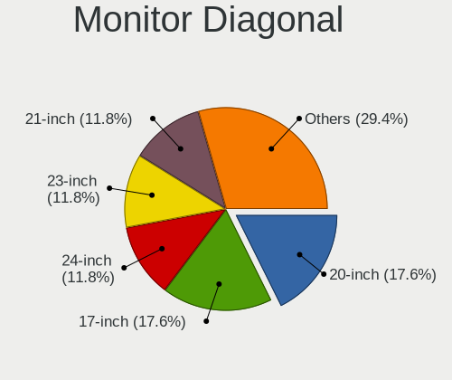

| Inches | Desktops | Percent |
|--------|----------|---------|
| 24     | 3        | 33.33%  |
| 21     | 2        | 22.22%  |
| 20     | 2        | 22.22%  |
| 23     | 1        | 11.11%  |
| 19     | 1        | 11.11%  |

Monitor Width
-------------

Physical width

| Width in mm | Desktops | Percent |
|-------------|----------|---------|
| 501-600     | 4        | 44.44%  |
| 401-500     | 4        | 44.44%  |
| 351-400     | 1        | 11.11%  |

Aspect Ratio
------------

Proportional relationship between the width and the height

| Ratio | Desktops | Percent |
|-------|----------|---------|
| 16/9  | 7        | 87.5%   |
| 5/4   | 1        | 12.5%   |

Monitor Area
------------

Area in inch²

| Area in inch² | Desktops | Percent |
|----------------|----------|---------|
| 201-250        | 6        | 66.67%  |
| 151-200        | 3        | 33.33%  |

Pixel Density
-------------

Pixels per inch

| Density | Desktops | Percent |
|---------|----------|---------|
| 51-100  | 5        | 71.43%  |
| 101-120 | 2        | 28.57%  |

Multiple Monitors
-----------------

Total monitors connected

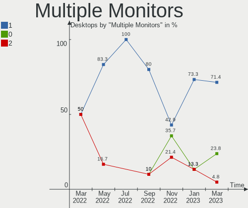

| Total | Desktops | Percent |
|-------|----------|---------|
| 0     | 6        | 46.15%  |
| 1     | 5        | 38.46%  |
| 2     | 2        | 15.38%  |

Network
-------

Net Controller Vendor
---------------------

Controller vendors

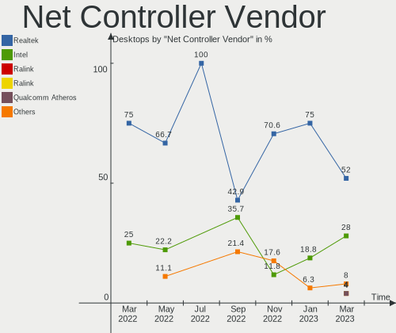

| Vendor                | Desktops | Percent |
|-----------------------|----------|---------|
| Realtek Semiconductor | 9        | 56.25%  |
| Intel                 | 5        | 31.25%  |
| Nvidia                | 1        | 6.25%   |
| Mercucys              | 1        | 6.25%   |

Net Controller Model
--------------------

Controller models

| Model                                                             | Desktops | Percent |
|-------------------------------------------------------------------|----------|---------|
| Realtek RTL8111/8168/8411 PCI Express Gigabit Ethernet Controller | 9        | 47.37%  |
| Intel Wireless 7265                                               | 2        | 10.53%  |
| Intel Tiger Lake PCH CNVi WiFi                                    | 2        | 10.53%  |
| Intel Ethernet Connection (14) I219-V                             | 2        | 10.53%  |
| Realtek RTL8125 2.5GbE Controller                                 | 1        | 5.26%   |
| Nvidia MCP61 Ethernet                                             | 1        | 5.26%   |
| Mercucys 802.11n NIC                                              | 1        | 5.26%   |
| Intel Ethernet Connection (17) I219-V                             | 1        | 5.26%   |

Wireless Vendor
---------------

Wireless vendors

| Vendor   | Desktops | Percent |
|----------|----------|---------|
| Intel    | 4        | 80%     |
| Mercucys | 1        | 20%     |

Wireless Model
--------------

Wireless models

| Model                          | Desktops | Percent |
|--------------------------------|----------|---------|
| Intel Wireless 7265            | 2        | 40%     |
| Intel Tiger Lake PCH CNVi WiFi | 2        | 40%     |
| Mercucys 802.11n NIC           | 1        | 20%     |

Ethernet Vendor
---------------

Ethernet vendors

| Vendor                | Desktops | Percent |
|-----------------------|----------|---------|
| Realtek Semiconductor | 9        | 69.23%  |
| Intel                 | 3        | 23.08%  |
| Nvidia                | 1        | 7.69%   |

Ethernet Model
--------------

Ethernet models

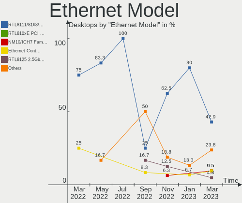

| Model                                                             | Desktops | Percent |
|-------------------------------------------------------------------|----------|---------|
| Realtek RTL8111/8168/8411 PCI Express Gigabit Ethernet Controller | 9        | 64.29%  |
| Intel Ethernet Connection (14) I219-V                             | 2        | 14.29%  |
| Realtek RTL8125 2.5GbE Controller                                 | 1        | 7.14%   |
| Nvidia MCP61 Ethernet                                             | 1        | 7.14%   |
| Intel Ethernet Connection (17) I219-V                             | 1        | 7.14%   |

Net Controller Kind
-------------------

Ethernet, WiFi or modem

| Kind     | Desktops | Percent |
|----------|----------|---------|
| Ethernet | 13       | 72.22%  |
| WiFi     | 5        | 27.78%  |

Used Controller
---------------

Currently used network controller

| Kind     | Desktops | Percent |
|----------|----------|---------|
| Ethernet | 13       | 100%    |

NICs
----

Total network controllers on board

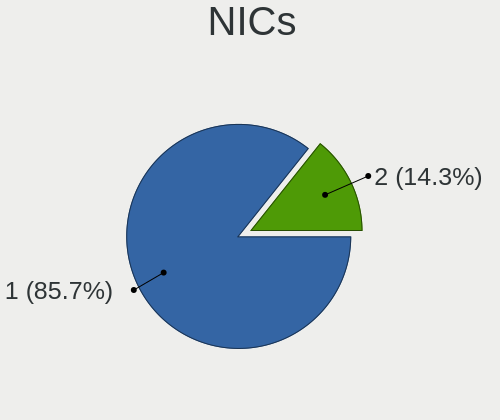

| Total | Desktops | Percent |
|-------|----------|---------|
| 1     | 8        | 61.54%  |
| 2     | 5        | 38.46%  |

IPv6
----

IPv6 vs IPv4

| Used | Desktops | Percent |
|------|----------|---------|
| No   | 13       | 100%    |

Bluetooth
---------

Bluetooth Vendor
----------------

Controller vendors

| Vendor                  | Desktops | Percent |
|-------------------------|----------|---------|
| Intel                   | 4        | 66.67%  |
| Cambridge Silicon Radio | 2        | 33.33%  |

Bluetooth Model
---------------

Controller models

| Model                                               | Desktops | Percent |
|-----------------------------------------------------|----------|---------|
| Intel Bluetooth wireless interface                  | 2        | 33.33%  |
| Intel AX201 Bluetooth                               | 2        | 33.33%  |
| Cambridge Silicon Radio Bluetooth Dongle (HCI mode) | 2        | 33.33%  |

Sound
-----

Sound Vendor
------------

Sound card vendors

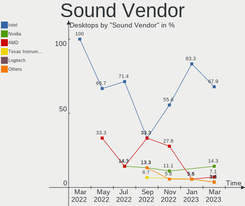

| Vendor | Desktops | Percent |
|--------|----------|---------|
| Intel  | 10       | 66.67%  |
| Nvidia | 3        | 20%     |
| AMD    | 2        | 13.33%  |

Sound Model
-----------

Sound card models

| Model                                                           | Desktops | Percent |
|-----------------------------------------------------------------|----------|---------|
| Intel Audio device                                              | 3        | 17.65%  |
| Intel Tiger Lake-H HD Audio Controller                          | 2        | 11.76%  |
| Nvidia MCP61 High Definition Audio                              | 1        | 5.88%   |
| Nvidia High Definition Audio Controller                         | 1        | 5.88%   |
| Nvidia GM107 High Definition Audio Controller [GeForce 940MX]   | 1        | 5.88%   |
| Nvidia GK208 HDMI/DP Audio Controller                           | 1        | 5.88%   |
| Intel Comet Lake PCH-V cAVS                                     | 1        | 5.88%   |
| Intel Alder Lake-S HD Audio Controller                          | 1        | 5.88%   |
| Intel 5 Series/3400 Series Chipset High Definition Audio        | 1        | 5.88%   |
| Intel 200 Series PCH HD Audio                                   | 1        | 5.88%   |
| Intel 100 Series/C230 Series Chipset Family HD Audio Controller | 1        | 5.88%   |
| AMD SBx00 Azalia (Intel HDA)                                    | 1        | 5.88%   |
| AMD Raven/Raven2/Fenghuang HDMI/DP Audio Controller             | 1        | 5.88%   |
| AMD Family 17h/19h HD Audio Controller                          | 1        | 5.88%   |

Memory
------

Memory Vendor
-------------

Memory module vendors

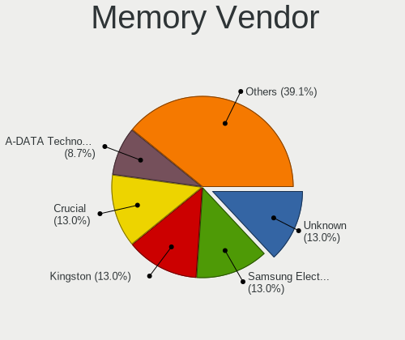

| Vendor              | Desktops | Percent |
|---------------------|----------|---------|
| Unknown             | 4        | 30.77%  |
| Crucial             | 2        | 15.38%  |
| Unknown             | 2        | 15.38%  |
| Unknown (89F7)      | 1        | 7.69%   |
| SK hynix            | 1        | 7.69%   |
| Samsung Electronics | 1        | 7.69%   |
| Neo Forza           | 1        | 7.69%   |
| Apacer              | 1        | 7.69%   |

Memory Model
------------

Memory module models

| Model                                                   | Desktops | Percent |
|---------------------------------------------------------|----------|---------|
| Crucial RAM CT8G4SFRA32A.C16FG 8GB SODIMM DDR4 3200MT/s | 2        | 15.38%  |
| Unknown                                                 | 2        | 15.38%  |
| Unknown RAM Module 8GB DIMM DDR4 2133MT/s               | 1        | 7.69%   |
| Unknown RAM Module 4GB DIMM DDR 1066MT/s                | 1        | 7.69%   |
| Unknown RAM Module 4GB DIMM 800MT/s                     | 1        | 7.69%   |
| Unknown RAM Module 2GB DIMM 1333MT/s                    | 1        | 7.69%   |
| Unknown (89F7) RAM Module 8192MB DIMM DDR4 2667MT/s     | 1        | 7.69%   |
| SK hynix RAM HMA81GU6CJR8N-XN 8GB DIMM DDR4 3200MT/s    | 1        | 7.69%   |
| Samsung RAM M378A1K43EB2-CWE 8GB DIMM DDR4 3200MT/s     | 1        | 7.69%   |
| Neo Forza RAM NMUD480E82-2666E 8GB DIMM DDR4 2667MT/s   | 1        | 7.69%   |
| Apacer RAM D12.2324CH.002 8GB DIMM DDR4 2667MT/s        | 1        | 7.69%   |

Memory Kind
-----------

Memory module kinds

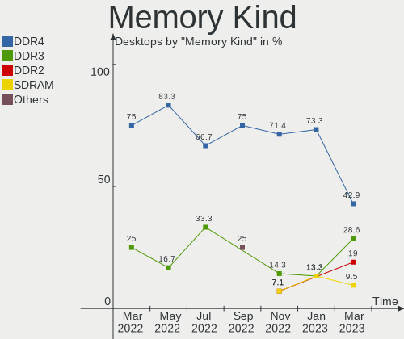

| Kind    | Desktops | Percent |
|---------|----------|---------|
| DDR4    | 10       | 76.92%  |
| Unknown | 2        | 15.38%  |
| DDR     | 1        | 7.69%   |

Memory Form Factor
------------------

Physical design of the memory module

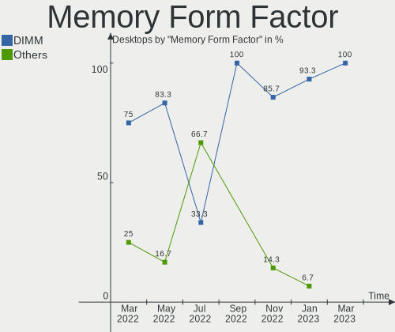

| Name   | Desktops | Percent |
|--------|----------|---------|
| DIMM   | 9        | 69.23%  |
| SODIMM | 4        | 30.77%  |

Memory Size
-----------

Memory module size

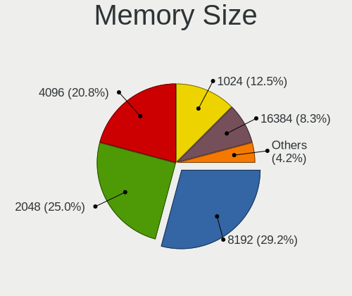

| Size | Desktops | Percent |
|------|----------|---------|
| 8192 | 10       | 76.92%  |
| 4096 | 2        | 15.38%  |
| 2048 | 1        | 7.69%   |

Memory Speed
------------

Memory module speed

| Speed | Desktops | Percent |
|-------|----------|---------|
| 3200  | 6        | 46.15%  |
| 2667  | 3        | 23.08%  |
| 2133  | 1        | 7.69%   |
| 1333  | 1        | 7.69%   |
| 1066  | 1        | 7.69%   |
| 800   | 1        | 7.69%   |

Printers & scanners
-------------------

Printer Vendor
--------------

Printer device vendors

| Vendor | Desktops | Percent |
|--------|----------|---------|
| Pantum | 1        | 100%    |

Printer Model
-------------

Printer device models

| Model                   | Desktops | Percent |
|-------------------------|----------|---------|
| Pantum BM5100ADN series | 1        | 100%    |

Scanner Vendor
--------------

Scanner device vendors

Zero info for selected period =(

Scanner Model
-------------

Scanner device models

Zero info for selected period =(

Camera
------

Camera Vendor
-------------

Camera device vendors

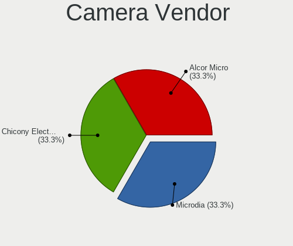

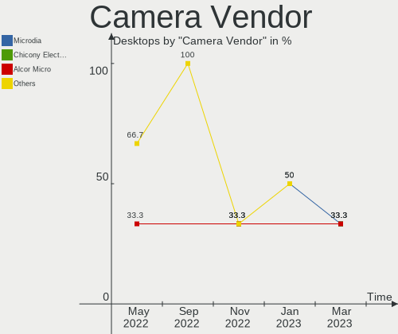

| Vendor                | Desktops | Percent |
|-----------------------|----------|---------|
| SunplusIT             | 2        | 50%     |
| Realtek Semiconductor | 1        | 25%     |
| Logitech              | 1        | 25%     |

Camera Model
------------

Camera device models

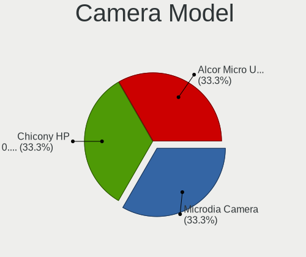

| Model                   | Desktops | Percent |
|-------------------------|----------|---------|
| SunplusIT USB Camera    | 2        | 50%     |
| Realtek 1080p Camera    | 1        | 25%     |
| Logitech HD Webcam C615 | 1        | 25%     |

Security
--------

Fingerprint Vendor
------------------

Fingerprint sensor vendors

Zero info for selected period =(

Fingerprint Model
-----------------

Fingerprint sensor models

Zero info for selected period =(

Chipcard Vendor
---------------

Chipcard module vendors

Zero info for selected period =(

Chipcard Model
--------------

Chipcard module models

Zero info for selected period =(

Unsupported
-----------

Unsupported Devices
-------------------

Total unsupported devices on board

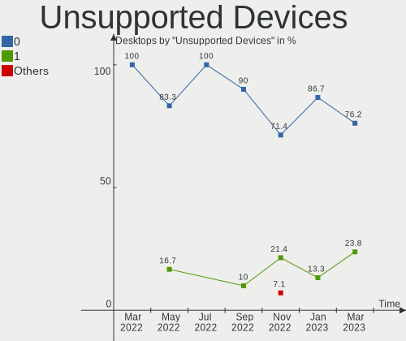

| Total | Desktops | Percent |
|-------|----------|---------|
| 0     | 7        | 53.85%  |
| 1     | 4        | 30.77%  |
| 4     | 1        | 7.69%   |
| 2     | 1        | 7.69%   |

Unsupported Device Types
------------------------

Types of unsupported devices

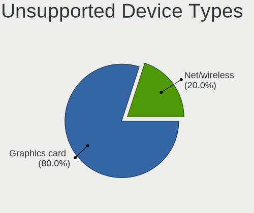

| Type                     | Desktops | Percent |
|--------------------------|----------|---------|
| Graphics card            | 6        | 60%     |
| Communication controller | 2        | 20%     |
| Sound                    | 1        | 10%     |
| Network                  | 1        | 10%     |

