Red OS - Hardware Trends (Notebooks)
------------------------------------

A project to identify most popular hardware characteristics and track their change
over time based on data collected by Linux users at https://Linux-Hardware.org.

Anyone can contribute to this report by the [hw-probe](https://github.com/linuxhw/hw-probe) tool:

    sudo -E hw-probe -all -upload

This report is for one last month. Overall report since the beginning of time: [TestDays](https://github.com/linuxhw/TestDays)

Period: Mar, 2023.

Contents
--------

* [ System ](#system)
  - [ OS                       ](#os)
  - [ OS Family                ](#os-family)
  - [ Kernel                   ](#kernel)
  - [ Kernel Family            ](#kernel-family)
  - [ Kernel Major Ver.        ](#kernel-major-ver)
  - [ Arch                     ](#arch)
  - [ DE                       ](#de)
  - [ Display Server           ](#display-server)
  - [ Display Manager          ](#display-manager)
  - [ OS Lang                  ](#os-lang)
  - [ Boot Mode                ](#boot-mode)
  - [ Filesystem               ](#filesystem)
  - [ Part. scheme             ](#part-scheme)
  - [ Dual Boot with Linux/BSD ](#dual-boot-with-linuxbsd)
  - [ Dual Boot (Win)          ](#dual-boot-win)

* [ Board ](#board)
  - [ Vendor                   ](#vendor)
  - [ Model                    ](#model)
  - [ Model Family             ](#model-family)
  - [ MFG Year                 ](#mfg-year)
  - [ Form Factor              ](#form-factor)
  - [ Secure Boot              ](#secure-boot)
  - [ Coreboot                 ](#coreboot)
  - [ RAM Size                 ](#ram-size)
  - [ RAM Used                 ](#ram-used)
  - [ Total Drives             ](#total-drives)
  - [ Has CD-ROM               ](#has-cd-rom)
  - [ Has Ethernet             ](#has-ethernet)
  - [ Has WiFi                 ](#has-wifi)
  - [ Has Bluetooth            ](#has-bluetooth)

* [ Location ](#location)
  - [ Country                  ](#country)
  - [ City                     ](#city)

* [ Drives ](#drives)
  - [ Drive Vendor             ](#drive-vendor)
  - [ Drive Model              ](#drive-model)
  - [ HDD Vendor               ](#hdd-vendor)
  - [ SSD Vendor               ](#ssd-vendor)
  - [ Drive Kind               ](#drive-kind)
  - [ Drive Connector          ](#drive-connector)
  - [ Drive Size               ](#drive-size)
  - [ Space Total              ](#space-total)
  - [ Space Used               ](#space-used)
  - [ Malfunc. Drives          ](#malfunc-drives)
  - [ Malfunc. Drive Vendor    ](#malfunc-drive-vendor)
  - [ Malfunc. HDD Vendor      ](#malfunc-hdd-vendor)
  - [ Malfunc. Drive Kind      ](#malfunc-drive-kind)
  - [ Failed Drives            ](#failed-drives)
  - [ Failed Drive Vendor      ](#failed-drive-vendor)
  - [ Drive Status             ](#drive-status)

* [ Storage controller ](#storage-controller)
  - [ Storage Vendor           ](#storage-vendor)
  - [ Storage Model            ](#storage-model)
  - [ Storage Kind             ](#storage-kind)

* [ Processor ](#processor)
  - [ CPU Vendor               ](#cpu-vendor)
  - [ CPU Model                ](#cpu-model)
  - [ CPU Model Family         ](#cpu-model-family)
  - [ CPU Cores                ](#cpu-cores)
  - [ CPU Sockets              ](#cpu-sockets)
  - [ CPU Threads              ](#cpu-threads)
  - [ CPU Op-Modes             ](#cpu-op-modes)
  - [ CPU Microcode            ](#cpu-microcode)
  - [ CPU Microarch            ](#cpu-microarch)

* [ Graphics ](#graphics)
  - [ GPU Vendor               ](#gpu-vendor)
  - [ GPU Model                ](#gpu-model)
  - [ GPU Combo                ](#gpu-combo)
  - [ GPU Driver               ](#gpu-driver)
  - [ GPU Memory               ](#gpu-memory)

* [ Monitor ](#monitor)
  - [ Monitor Vendor           ](#monitor-vendor)
  - [ Monitor Model            ](#monitor-model)
  - [ Monitor Resolution       ](#monitor-resolution)
  - [ Monitor Diagonal         ](#monitor-diagonal)
  - [ Monitor Width            ](#monitor-width)
  - [ Aspect Ratio             ](#aspect-ratio)
  - [ Monitor Area             ](#monitor-area)
  - [ Pixel Density            ](#pixel-density)
  - [ Multiple Monitors        ](#multiple-monitors)

* [ Network ](#network)
  - [ Net Controller Vendor    ](#net-controller-vendor)
  - [ Net Controller Model     ](#net-controller-model)
  - [ Wireless Vendor          ](#wireless-vendor)
  - [ Wireless Model           ](#wireless-model)
  - [ Ethernet Vendor          ](#ethernet-vendor)
  - [ Ethernet Model           ](#ethernet-model)
  - [ Net Controller Kind      ](#net-controller-kind)
  - [ Used Controller          ](#used-controller)
  - [ NICs                     ](#nics)
  - [ IPv6                     ](#ipv6)

* [ Bluetooth ](#bluetooth)
  - [ Bluetooth Vendor         ](#bluetooth-vendor)
  - [ Bluetooth Model          ](#bluetooth-model)

* [ Sound ](#sound)
  - [ Sound Vendor             ](#sound-vendor)
  - [ Sound Model              ](#sound-model)

* [ Memory ](#memory)
  - [ Memory Vendor            ](#memory-vendor)
  - [ Memory Model             ](#memory-model)
  - [ Memory Kind              ](#memory-kind)
  - [ Memory Form Factor       ](#memory-form-factor)
  - [ Memory Size              ](#memory-size)
  - [ Memory Speed             ](#memory-speed)

* [ Printers & scanners ](#printers--scanners)
  - [ Printer Vendor           ](#printer-vendor)
  - [ Printer Model            ](#printer-model)
  - [ Scanner Vendor           ](#scanner-vendor)
  - [ Scanner Model            ](#scanner-model)

* [ Camera ](#camera)
  - [ Camera Vendor            ](#camera-vendor)
  - [ Camera Model             ](#camera-model)

* [ Security ](#security)
  - [ Fingerprint Vendor       ](#fingerprint-vendor)
  - [ Fingerprint Model        ](#fingerprint-model)
  - [ Chipcard Vendor          ](#chipcard-vendor)
  - [ Chipcard Model           ](#chipcard-model)

* [ Unsupported ](#unsupported)
  - [ Unsupported Devices      ](#unsupported-devices)
  - [ Unsupported Device Types ](#unsupported-device-types)

System
------

OS
--

Installed operating systems

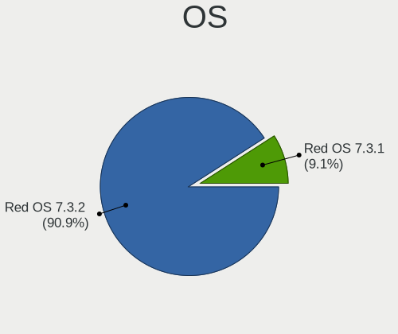

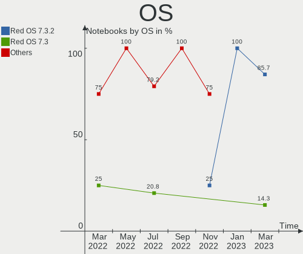

| Name         | Notebooks | Percent |
|--------------|-----------|---------|
| Red OS 7.3.2 | 6         | 85.71%  |
| Red OS 7.3   | 1         | 14.29%  |

OS Family
---------

OS without a version

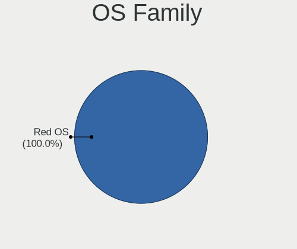

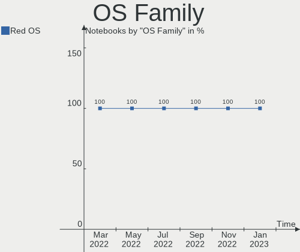

| Name   | Notebooks | Percent |
|--------|-----------|---------|
| Red OS | 7         | 100%    |

Kernel
------

Version of the Linux kernel

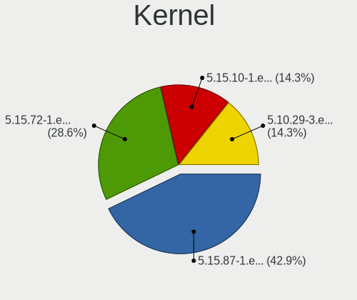

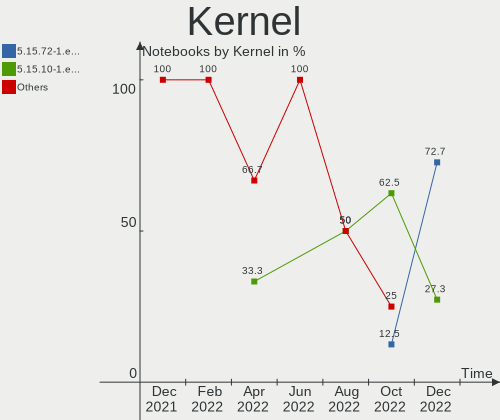

| Version                | Notebooks | Percent |
|------------------------|-----------|---------|
| 5.15.87-1.el7.3.x86_64 | 3         | 42.86%  |
| 5.15.72-1.el7.3.x86_64 | 2         | 28.57%  |
| 5.15.10-1.el7.x86_64   | 1         | 14.29%  |
| 5.10.29-3.el7.x86_64   | 1         | 14.29%  |

Kernel Family
-------------

Linux kernel without a distro release

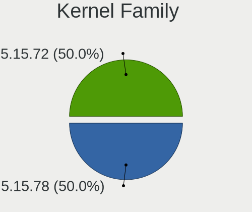

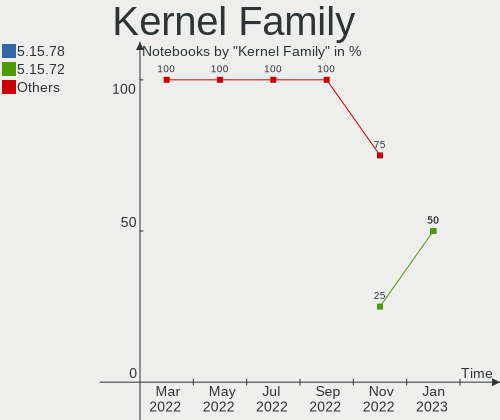

| Version | Notebooks | Percent |
|---------|-----------|---------|
| 5.15.87 | 3         | 42.86%  |
| 5.15.72 | 2         | 28.57%  |
| 5.15.10 | 1         | 14.29%  |
| 5.10.29 | 1         | 14.29%  |

Kernel Major Ver.
-----------------

Linux kernel major version

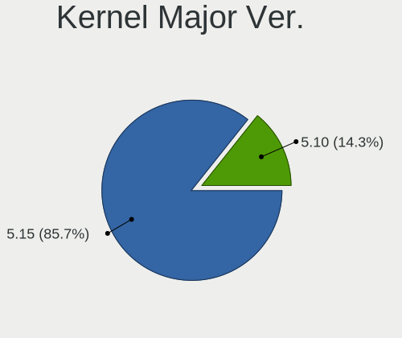

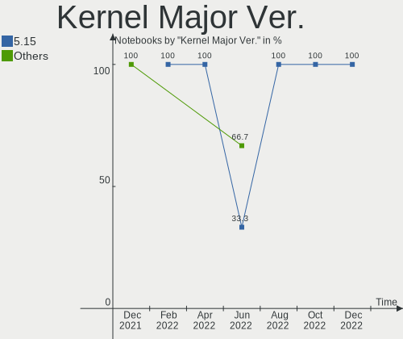

| Version | Notebooks | Percent |
|---------|-----------|---------|
| 5.15    | 6         | 85.71%  |
| 5.10    | 1         | 14.29%  |

Arch
----

OS architecture (x86_64, i586, etc.)

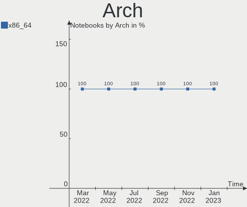

| Name   | Notebooks | Percent |
|--------|-----------|---------|
| x86_64 | 7         | 100%    |

DE
--

Desktop Environment

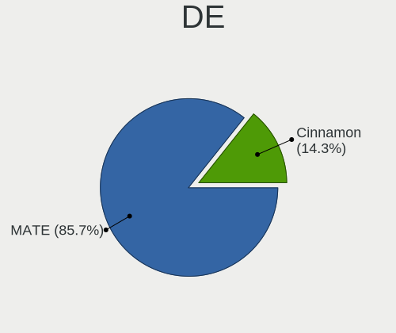

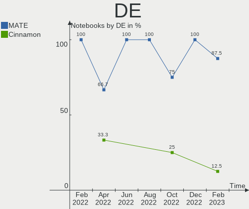

| Name     | Notebooks | Percent |
|----------|-----------|---------|
| MATE     | 6         | 85.71%  |
| Cinnamon | 1         | 14.29%  |

Display Server
--------------

X11 or Wayland

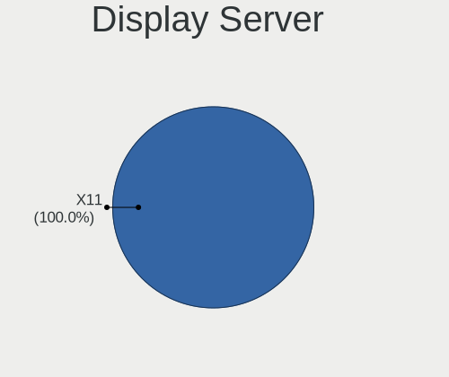

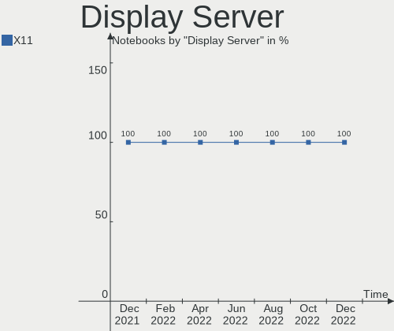

| Name | Notebooks | Percent |
|------|-----------|---------|
| X11  | 7         | 100%    |

Display Manager
---------------

SDDM, LightDM, etc.

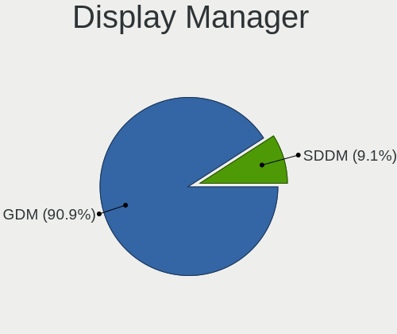

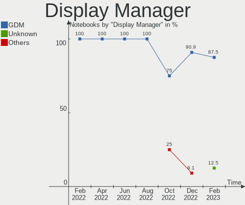

| Name | Notebooks | Percent |
|------|-----------|---------|
| GDM  | 6         | 85.71%  |
| SDDM | 1         | 14.29%  |

OS Lang
-------

Language

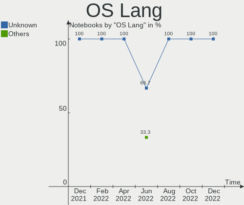

| Lang  | Notebooks | Percent |
|-------|-----------|---------|
| ru_RU | 7         | 100%    |

Boot Mode
---------

EFI or BIOS

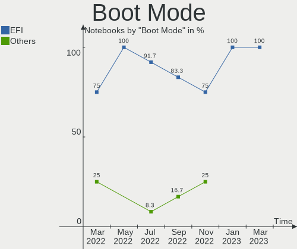

| Mode | Notebooks | Percent |
|------|-----------|---------|
| EFI  | 7         | 100%    |

Filesystem
----------

Type of filesystem

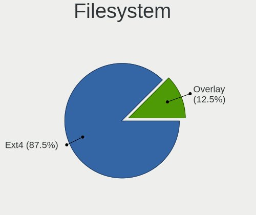

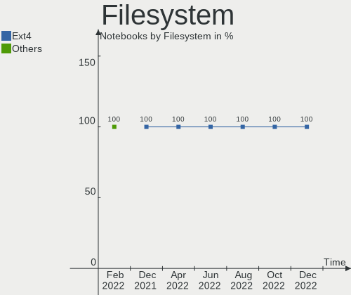

| Type | Notebooks | Percent |
|------|-----------|---------|
| Ext4 | 7         | 100%    |

Part. scheme
------------

Scheme of partitioning

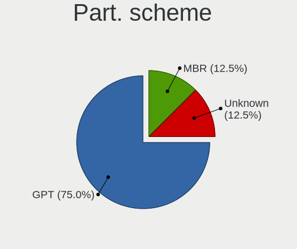

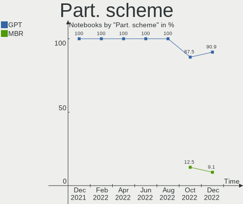

| Type | Notebooks | Percent |
|------|-----------|---------|
| GPT  | 7         | 100%    |

Dual Boot with Linux/BSD
------------------------

Hosting more than one Linux/BSD

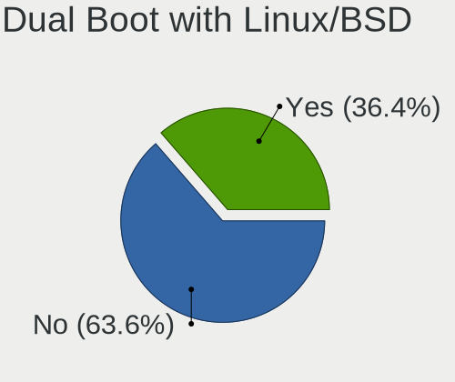

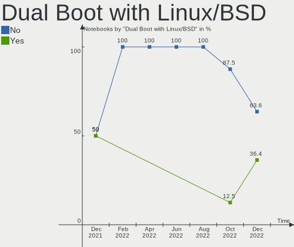

| Dual boot | Notebooks | Percent |
|-----------|-----------|---------|
| No        | 7         | 100%    |

Dual Boot (Win)
---------------

Hosting Linux and Windows

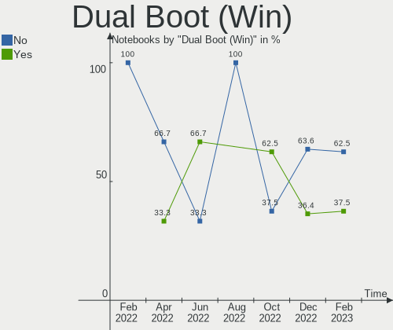

| Dual boot | Notebooks | Percent |
|-----------|-----------|---------|
| No        | 6         | 85.71%  |
| Yes       | 1         | 14.29%  |

Board
-----

Vendor
------

Motherboard manufacturer

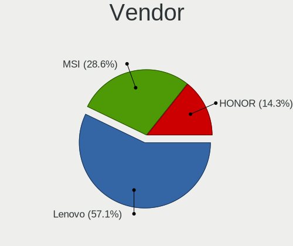

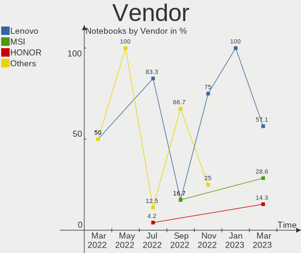

| Name   | Notebooks | Percent |
|--------|-----------|---------|
| Lenovo | 4         | 57.14%  |
| MSI    | 2         | 28.57%  |
| HONOR  | 1         | 14.29%  |

Model
-----

Motherboard model

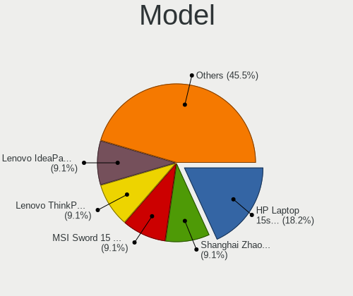

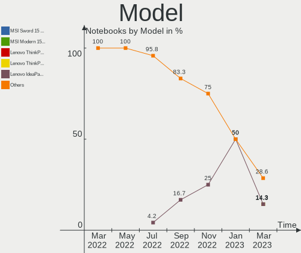

| Name                                 | Notebooks | Percent |
|--------------------------------------|-----------|---------|
| MSI Sword 15 A12UE                   | 1         | 14.29%  |
| MSI Modern 15 B12M                   | 1         | 14.29%  |
| Lenovo ThinkPad T14 Gen 3 21AJS2DE00 | 1         | 14.29%  |
| Lenovo ThinkPad T14 Gen 3 21AJS2DD00 | 1         | 14.29%  |
| Lenovo IdeaPad L340-15API 81LW       | 1         | 14.29%  |
| Lenovo IdeaPad 1 15ALC7 82R4         | 1         | 14.29%  |
| HONOR NBR-WAX9                       | 1         | 14.29%  |

Model Family
------------

Motherboard model prefix

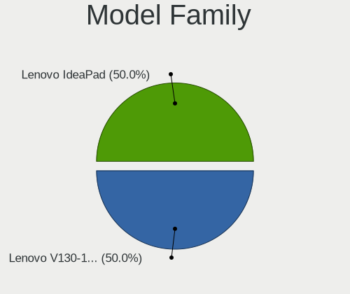

| Name            | Notebooks | Percent |
|-----------------|-----------|---------|
| Lenovo ThinkPad | 2         | 28.57%  |
| Lenovo IdeaPad  | 2         | 28.57%  |
| MSI Sword       | 1         | 14.29%  |
| MSI Modern      | 1         | 14.29%  |
| HONOR NBR-WAX9  | 1         | 14.29%  |

MFG Year
--------

Motherboard manufacture year

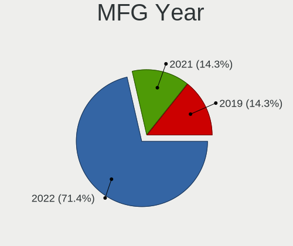

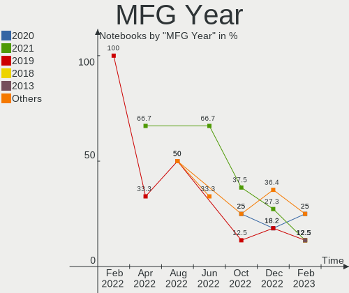

| Year | Notebooks | Percent |
|------|-----------|---------|
| 2022 | 5         | 71.43%  |
| 2021 | 1         | 14.29%  |
| 2019 | 1         | 14.29%  |

Form Factor
-----------

Physical design of the computer

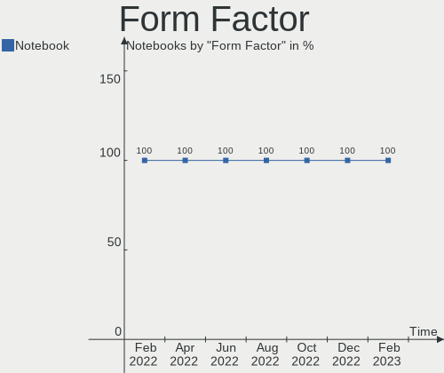

| Name     | Notebooks | Percent |
|----------|-----------|---------|
| Notebook | 7         | 100%    |

Secure Boot
-----------

Enabled or disabled

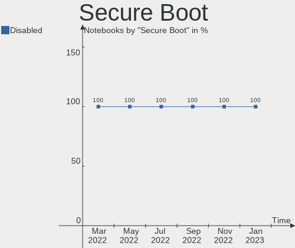

| State    | Notebooks | Percent |
|----------|-----------|---------|
| Disabled | 7         | 100%    |

Coreboot
--------

Have coreboot on board

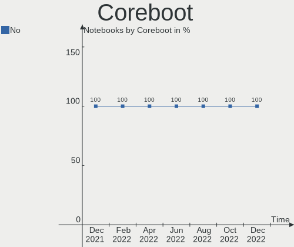

| Used | Notebooks | Percent |
|------|-----------|---------|
| No   | 7         | 100%    |

RAM Size
--------

Total RAM memory

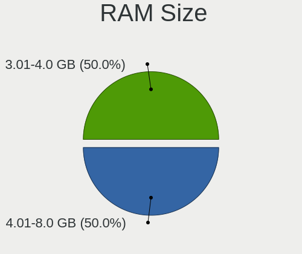

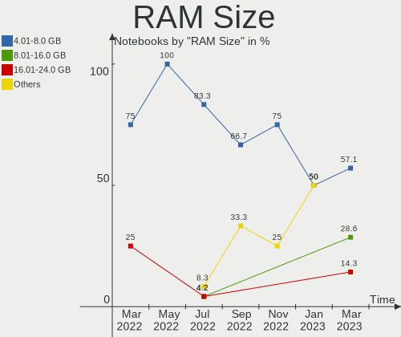

| Size in GB | Notebooks | Percent |
|------------|-----------|---------|
| 4.01-8.0   | 4         | 57.14%  |
| 8.01-16.0  | 2         | 28.57%  |
| 16.01-24.0 | 1         | 14.29%  |

RAM Used
--------

Used RAM memory

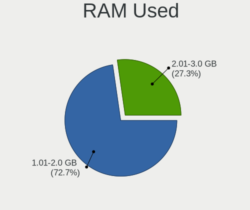

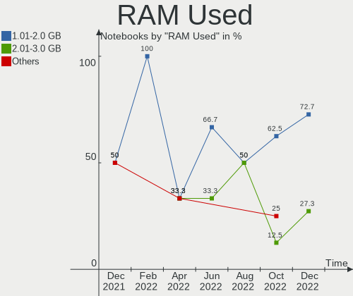

| Used GB  | Notebooks | Percent |
|----------|-----------|---------|
| 1.01-2.0 | 5         | 71.43%  |
| 3.01-4.0 | 1         | 14.29%  |
| 2.01-3.0 | 1         | 14.29%  |

Total Drives
------------

Number of drives on board

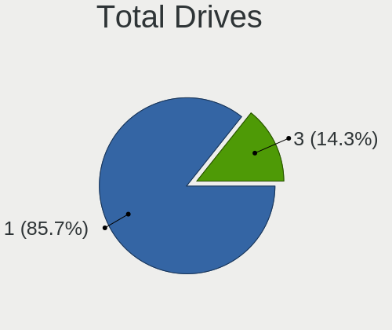

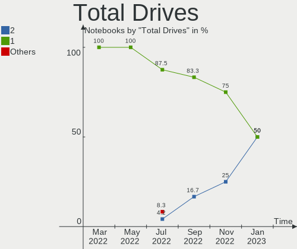

| Drives | Notebooks | Percent |
|--------|-----------|---------|
| 1      | 6         | 85.71%  |
| 3      | 1         | 14.29%  |

Has CD-ROM
----------

Has CD-ROM on board

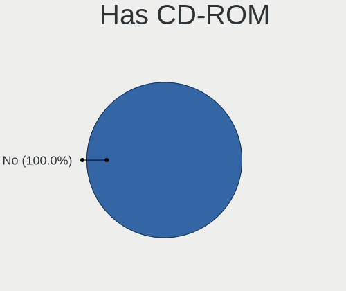

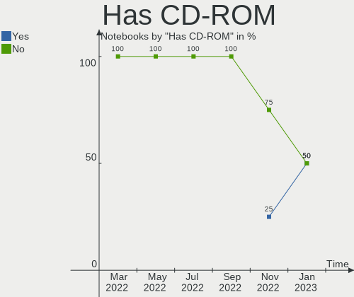

| Presented | Notebooks | Percent |
|-----------|-----------|---------|
| No        | 7         | 100%    |

Has Ethernet
------------

Has Ethernet on board

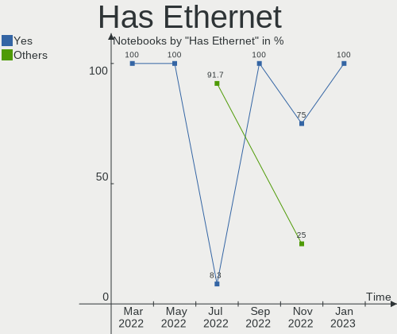

| Presented | Notebooks | Percent |
|-----------|-----------|---------|
| Yes       | 6         | 85.71%  |
| No        | 1         | 14.29%  |

Has WiFi
--------

Has WiFi module

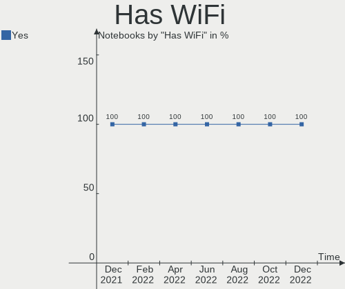

| Presented | Notebooks | Percent |
|-----------|-----------|---------|
| Yes       | 7         | 100%    |

Has Bluetooth
-------------

Has Bluetooth module

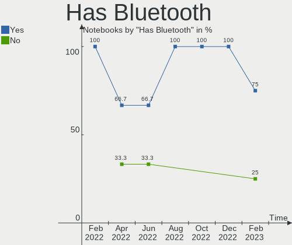

| Presented | Notebooks | Percent |
|-----------|-----------|---------|
| Yes       | 7         | 100%    |

Location
--------

Country
-------

Geographic location (country)

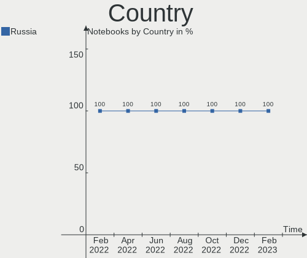

| Country | Notebooks | Percent |
|---------|-----------|---------|
| Russia  | 7         | 100%    |

City
----

Geographic location (city)

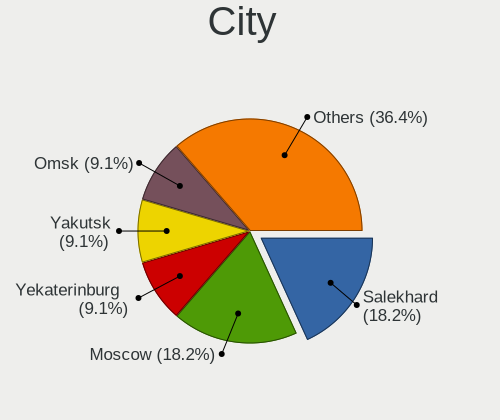

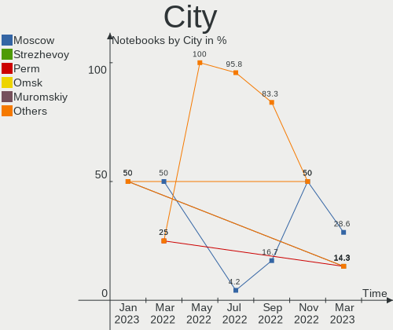

| City          | Notebooks | Percent |
|---------------|-----------|---------|
| Moscow        | 2         | 28.57%  |
| Strezhevoy    | 1         | 14.29%  |
| Perm          | 1         | 14.29%  |
| Omsk          | 1         | 14.29%  |
| Muromskiy     | 1         | 14.29%  |
| Konstantinovo | 1         | 14.29%  |

Drives
------

Drive Vendor
------------

Hard drive vendors

| Vendor              | Notebooks | Drives | Percent |
|---------------------|-----------|--------|---------|
| Toshiba             | 2         | 3      | 25%     |
| SK hynix            | 2         | 2      | 25%     |
| Samsung Electronics | 2         | 2      | 25%     |
| Phison              | 1         | 1      | 12.5%   |
| Micron Technology   | 1         | 1      | 12.5%   |

Drive Model
-----------

Hard drive models

| Model                                  | Notebooks | Percent |
|----------------------------------------|-----------|---------|
| Toshiba MQ01ABF050 500GB               | 1         | 11.11%  |
| Toshiba MK5075GSX 500GB                | 1         | 11.11%  |
| Toshiba KXG60ZNV256G 256GB             | 1         | 11.11%  |
| SK hynix SKHynix_HFS512GDE9X081N 512GB | 1         | 11.11%  |
| SK hynix SKHynix_HFS256GDE9X081N 256GB | 1         | 11.11%  |
| Samsung MZALQ512HALU-000L2 512GB       | 1         | 11.11%  |
| Samsung MZALQ256HBJD-00BL2 256GB       | 1         | 11.11%  |
| Phison 256GB EM280256GYTCTAS-E13T2MS   | 1         | 11.11%  |
| Micron 2450_MTFDKBA512TFK 512GB        | 1         | 11.11%  |

HDD Vendor
----------

Hard disk drive vendors

| Vendor  | Notebooks | Drives | Percent |
|---------|-----------|--------|---------|
| Toshiba | 1         | 2      | 100%    |

SSD Vendor
----------

Solid state drive vendors

Zero info for selected period =(

Drive Kind
----------

HDD or SSD

| Kind | Notebooks | Drives | Percent |
|------|-----------|--------|---------|
| NVMe | 7         | 7      | 87.5%   |
| HDD  | 1         | 2      | 12.5%   |

Drive Connector
---------------

SATA, SAS, NVMe, etc.

| Type | Notebooks | Drives | Percent |
|------|-----------|--------|---------|
| NVMe | 7         | 7      | 87.5%   |
| SATA | 1         | 2      | 12.5%   |

Drive Size
----------

Size of hard drive

| Size in TB | Notebooks | Drives | Percent |
|------------|-----------|--------|---------|
| 0.01-0.5   | 1         | 2      | 100%    |

Space Total
-----------

Amount of disk space available on the file system

| Size in GB | Notebooks | Percent |
|------------|-----------|---------|
| 101-250    | 4         | 57.14%  |
| 251-500    | 2         | 28.57%  |
| 1001-2000  | 1         | 14.29%  |

Space Used
----------

Amount of used disk space

| Used GB  | Notebooks | Percent |
|----------|-----------|---------|
| 1-20     | 4         | 57.14%  |
| 21-50    | 2         | 28.57%  |
| 501-1000 | 1         | 14.29%  |

Malfunc. Drives
---------------

Drive models with a malfunction

| Model                    | Notebooks | Drives | Percent |
|--------------------------|-----------|--------|---------|
| Toshiba MQ01ABF050 500GB | 1         | 1      | 50%     |
| Toshiba MK5075GSX 500GB  | 1         | 1      | 50%     |

Malfunc. Drive Vendor
---------------------

Vendors of faulty drives

| Vendor  | Notebooks | Drives | Percent |
|---------|-----------|--------|---------|
| Toshiba | 1         | 2      | 100%    |

Malfunc. HDD Vendor
-------------------

Vendors of faulty HDD drives

| Vendor  | Notebooks | Drives | Percent |
|---------|-----------|--------|---------|
| Toshiba | 1         | 2      | 100%    |

Malfunc. Drive Kind
-------------------

Kinds of faulty drives

| Kind | Notebooks | Drives | Percent |
|------|-----------|--------|---------|
| HDD  | 1         | 2      | 100%    |

Failed Drives
-------------

Failed drive models

Zero info for selected period =(

Failed Drive Vendor
-------------------

Failed drive vendors

Zero info for selected period =(

Drive Status
------------

Number of failed and malfunc. drives

| Status  | Notebooks | Drives | Percent |
|---------|-----------|--------|---------|
| Works   | 7         | 7      | 87.5%   |
| Malfunc | 1         | 2      | 12.5%   |

Storage controller
------------------

Storage Vendor
--------------

Storage controller vendors

| Vendor                       | Notebooks | Percent |
|------------------------------|-----------|---------|
| SK hynix                     | 2         | 18.18%  |
| Samsung Electronics          | 2         | 18.18%  |
| Intel                        | 2         | 18.18%  |
| AMD                          | 2         | 18.18%  |
| Toshiba America Info Systems | 1         | 9.09%   |
| Phison Electronics           | 1         | 9.09%   |
| Micron Technology            | 1         | 9.09%   |

Storage Model
-------------

Storage controller models

| Model                                                | Notebooks | Percent |
|------------------------------------------------------|-----------|---------|
| SK hynix Gold P31/PC711 NVMe Solid State Drive       | 2         | 18.18%  |
| Samsung NVMe SSD Controller 980                      | 2         | 18.18%  |
| AMD FCH SATA Controller [AHCI mode]                  | 2         | 18.18%  |
| Toshiba America Info Systems XG6 NVMe SSD Controller | 1         | 9.09%   |
| Phison PS5013 E13 NVMe Controller                    | 1         | 9.09%   |
| Micron NVMe Storage Controller                       | 1         | 9.09%   |
| Intel Comet Lake SATA AHCI Controller                | 1         | 9.09%   |
| Intel Alder Lake-P SATA AHCI Controller              | 1         | 9.09%   |

Storage Kind
------------

Kind of storage controller (IDE, SATA, NVMe, SAS, ...)

| Kind | Notebooks | Percent |
|------|-----------|---------|
| NVMe | 7         | 63.64%  |
| SATA | 4         | 36.36%  |

Processor
---------

CPU Vendor
----------

Processor vendors

| Vendor | Notebooks | Percent |
|--------|-----------|---------|
| Intel  | 5         | 71.43%  |
| AMD    | 2         | 28.57%  |

CPU Model
---------

Processor models

| Model                                         | Notebooks | Percent |
|-----------------------------------------------|-----------|---------|
| Intel Core i3-10110U CPU @ 2.10GHz            | 1         | 14.29%  |
| Intel 12th Gen Core i7-1270P                  | 1         | 14.29%  |
| Intel 12th Gen Core i7-12700H                 | 1         | 14.29%  |
| Intel 12th Gen Core i5-1250P                  | 1         | 14.29%  |
| Intel 12th Gen Core i3-1215U                  | 1         | 14.29%  |
| AMD Ryzen 5 3500U with Radeon Vega Mobile Gfx | 1         | 14.29%  |
| AMD Ryzen 3 5300U with Radeon Graphics        | 1         | 14.29%  |

CPU Model Family
----------------

Processor model prefix

| Model         | Notebooks | Percent |
|---------------|-----------|---------|
| Other         | 4         | 57.14%  |
| Intel Core i3 | 1         | 14.29%  |
| AMD Ryzen 5   | 1         | 14.29%  |
| AMD Ryzen 3   | 1         | 14.29%  |

CPU Cores
---------

Number of processor cores

| Number | Notebooks | Percent |
|--------|-----------|---------|
| 12     | 2         | 28.57%  |
| 4      | 2         | 28.57%  |
| 14     | 1         | 14.29%  |
| 6      | 1         | 14.29%  |
| 2      | 1         | 14.29%  |

CPU Sockets
-----------

Number of sockets

| Number | Notebooks | Percent |
|--------|-----------|---------|
| 1      | 7         | 100%    |

CPU Threads
-----------

Threads per core (Hyper-Threading)

| Number | Notebooks | Percent |
|--------|-----------|---------|
| 2      | 7         | 100%    |

CPU Op-Modes
------------

CPU Operation Modes (32-bit, 64-bit)

| Op mode        | Notebooks | Percent |
|----------------|-----------|---------|
| 32-bit, 64-bit | 7         | 100%    |

CPU Microcode
-------------

Microcode number

| Number     | Notebooks | Percent |
|------------|-----------|---------|
| 0x906a3    | 3         | 42.86%  |
| 0x906a4    | 1         | 14.29%  |
| 0x806ec    | 1         | 14.29%  |
| 0x08608103 | 1         | 14.29%  |
| 0x08108102 | 1         | 14.29%  |

CPU Microarch
-------------

Microarchitecture

| Name             | Notebooks | Percent |
|------------------|-----------|---------|
| Alderlake Hybrid | 4         | 57.14%  |
| Zen+             | 1         | 14.29%  |
| KabyLake         | 1         | 14.29%  |
| Unknown          | 1         | 14.29%  |

Graphics
--------

GPU Vendor
----------

Vendors of graphics cards

| Vendor | Notebooks | Percent |
|--------|-----------|---------|
| Intel  | 5         | 62.5%   |
| AMD    | 2         | 25%     |
| Nvidia | 1         | 12.5%   |

GPU Model
---------

Graphics card models

| Model                                                                | Notebooks | Percent |
|----------------------------------------------------------------------|-----------|---------|
| Intel Alder Lake-P Integrated Graphics Controller                    | 3         | 37.5%   |
| Nvidia GA106M [GeForce RTX 3060 Mobile / Max-Q]                      | 1         | 12.5%   |
| Intel CometLake-U GT2 [UHD Graphics]                                 | 1         | 12.5%   |
| Intel Alder Lake-UP3 GT1 [UHD Graphics]                              | 1         | 12.5%   |
| AMD Picasso/Raven 2 [Radeon Vega Series / Radeon Vega Mobile Series] | 1         | 12.5%   |
| AMD Lucienne                                                         | 1         | 12.5%   |

GPU Combo
---------

Combinations of graphics cards

| Name           | Notebooks | Percent |
|----------------|-----------|---------|
| 1 x Intel      | 4         | 57.14%  |
| 1 x AMD        | 2         | 28.57%  |
| Intel + Nvidia | 1         | 14.29%  |

GPU Driver
----------

Free vs proprietary

| Driver  | Notebooks | Percent |
|---------|-----------|---------|
| Free    | 4         | 57.14%  |
| Unknown | 3         | 42.86%  |

GPU Memory
----------

Total video memory

| Size in GB | Notebooks | Percent |
|------------|-----------|---------|
| Unknown    | 5         | 71.43%  |
| 1.01-2.0   | 2         | 28.57%  |

Monitor
-------

Monitor Vendor
--------------

Monitor vendors

| Vendor         | Notebooks | Percent |
|----------------|-----------|---------|
| Chimei Innolux | 3         | 60%     |
| Philips        | 1         | 20%     |
| BOE            | 1         | 20%     |

Monitor Model
-------------

Monitor models

| Model                                                            | Notebooks | Percent |
|------------------------------------------------------------------|-----------|---------|
| Chimei Innolux LCD Monitor CMN15E7 1920x1080 344x193mm 15.5-inch | 2         | 40%     |
| Philips 226V4 PHLC0B1 1920x1080 477x268mm 21.5-inch              | 1         | 20%     |
| Chimei Innolux LCD Monitor CMN15F5 1920x1080 344x193mm 15.5-inch | 1         | 20%     |
| BOE LCD Monitor BOE0877 1920x1080 309x173mm 13.9-inch            | 1         | 20%     |

Monitor Resolution
------------------

Monitor screen resolution

| Resolution      | Notebooks | Percent |
|-----------------|-----------|---------|
| 1920x1080 (FHD) | 4         | 100%    |

Monitor Diagonal
----------------

Diagonal size in inches

| Inches | Notebooks | Percent |
|--------|-----------|---------|
| 15     | 3         | 60%     |
| 21     | 1         | 20%     |
| 13     | 1         | 20%     |

Monitor Width
-------------

Physical width

| Width in mm | Notebooks | Percent |
|-------------|-----------|---------|
| 301-350     | 4         | 80%     |
| 401-500     | 1         | 20%     |

Aspect Ratio
------------

Proportional relationship between the width and the height

| Ratio | Notebooks | Percent |
|-------|-----------|---------|
| 16/9  | 4         | 100%    |

Monitor Area
------------

Area in inch²

| Area in inch² | Notebooks | Percent |
|----------------|-----------|---------|
| 101-110        | 3         | 60%     |
| 81-90          | 1         | 20%     |
| 201-250        | 1         | 20%     |

Pixel Density
-------------

Pixels per inch

| Density | Notebooks | Percent |
|---------|-----------|---------|
| 121-160 | 4         | 80%     |
| 101-120 | 1         | 20%     |

Multiple Monitors
-----------------

Total monitors connected

| Total | Notebooks | Percent |
|-------|-----------|---------|
| 1     | 3         | 42.86%  |
| 0     | 3         | 42.86%  |
| 2     | 1         | 14.29%  |

Network
-------

Net Controller Vendor
---------------------

Controller vendors

| Vendor                | Notebooks | Percent |
|-----------------------|-----------|---------|
| Intel                 | 5         | 41.67%  |
| Realtek Semiconductor | 4         | 33.33%  |
| Samsung Electronics   | 1         | 8.33%   |
| Ralink Technology     | 1         | 8.33%   |
| OPPO Electronics      | 1         | 8.33%   |

Net Controller Model
--------------------

Controller models

| Model                                                             | Notebooks | Percent |
|-------------------------------------------------------------------|-----------|---------|
| Intel Alder Lake-P PCH CNVi WiFi                                  | 4         | 26.67%  |
| Realtek RTL8111/8168/8411 PCI Express Gigabit Ethernet Controller | 2         | 13.33%  |
| Intel Ethernet Connection (16) I219-LM                            | 2         | 13.33%  |
| Samsung Galaxy series, misc. (tethering mode)                     | 1         | 6.67%   |
| Realtek RTL8852BE PCIe 802.11ax Wireless Network Controller       | 1         | 6.67%   |
| Realtek RTL8821CE 802.11ac PCIe Wireless Network Adapter          | 1         | 6.67%   |
| Realtek RTL8152 Fast Ethernet Adapter                             | 1         | 6.67%   |
| Ralink RT5370 Wireless Adapter                                    | 1         | 6.67%   |
| OPPO RMX3263                                                      | 1         | 6.67%   |
| Intel Comet Lake PCH-LP CNVi WiFi                                 | 1         | 6.67%   |

Wireless Vendor
---------------

Wireless vendors

| Vendor                | Notebooks | Percent |
|-----------------------|-----------|---------|
| Intel                 | 5         | 62.5%   |
| Realtek Semiconductor | 2         | 25%     |
| Ralink Technology     | 1         | 12.5%   |

Wireless Model
--------------

Wireless models

| Model                                                       | Notebooks | Percent |
|-------------------------------------------------------------|-----------|---------|
| Intel Alder Lake-P PCH CNVi WiFi                            | 4         | 50%     |
| Realtek RTL8852BE PCIe 802.11ax Wireless Network Controller | 1         | 12.5%   |
| Realtek RTL8821CE 802.11ac PCIe Wireless Network Adapter    | 1         | 12.5%   |
| Ralink RT5370 Wireless Adapter                              | 1         | 12.5%   |
| Intel Comet Lake PCH-LP CNVi WiFi                           | 1         | 12.5%   |

Ethernet Vendor
---------------

Ethernet vendors

| Vendor                | Notebooks | Percent |
|-----------------------|-----------|---------|
| Realtek Semiconductor | 3         | 42.86%  |
| Intel                 | 2         | 28.57%  |
| Samsung Electronics   | 1         | 14.29%  |
| OPPO Electronics      | 1         | 14.29%  |

Ethernet Model
--------------

Ethernet models

| Model                                                             | Notebooks | Percent |
|-------------------------------------------------------------------|-----------|---------|
| Realtek RTL8111/8168/8411 PCI Express Gigabit Ethernet Controller | 2         | 28.57%  |
| Intel Ethernet Connection (16) I219-LM                            | 2         | 28.57%  |
| Samsung Galaxy series, misc. (tethering mode)                     | 1         | 14.29%  |
| Realtek RTL8152 Fast Ethernet Adapter                             | 1         | 14.29%  |
| OPPO RMX3263                                                      | 1         | 14.29%  |

Net Controller Kind
-------------------

Ethernet, WiFi or modem

| Kind     | Notebooks | Percent |
|----------|-----------|---------|
| WiFi     | 7         | 53.85%  |
| Ethernet | 6         | 46.15%  |

Used Controller
---------------

Currently used network controller

| Kind     | Notebooks | Percent |
|----------|-----------|---------|
| WiFi     | 4         | 57.14%  |
| Ethernet | 3         | 42.86%  |

NICs
----

Total network controllers on board

| Total | Notebooks | Percent |
|-------|-----------|---------|
| 2     | 4         | 57.14%  |
| 1     | 3         | 42.86%  |

IPv6
----

IPv6 vs IPv4

| Used | Notebooks | Percent |
|------|-----------|---------|
| No   | 7         | 100%    |

Bluetooth
---------

Bluetooth Vendor
----------------

Controller vendors

| Vendor                | Notebooks | Percent |
|-----------------------|-----------|---------|
| Intel                 | 5         | 71.43%  |
| Realtek Semiconductor | 2         | 28.57%  |

Bluetooth Model
---------------

Controller models

| Model                                          | Notebooks | Percent |
|------------------------------------------------|-----------|---------|
| Realtek Bluetooth Radio                        | 2         | 28.57%  |
| Intel Bluetooth Device                         | 2         | 28.57%  |
| Intel AX201 Bluetooth                          | 2         | 28.57%  |
| Intel Bluetooth 9460/9560 Jefferson Peak (JfP) | 1         | 14.29%  |

Sound
-----

Sound Vendor
------------

Sound card vendors

| Vendor | Notebooks | Percent |
|--------|-----------|---------|
| Intel  | 5         | 62.5%   |
| AMD    | 2         | 25%     |
| Nvidia | 1         | 12.5%   |

Sound Model
-----------

Sound card models

| Model                                                   | Notebooks | Percent |
|---------------------------------------------------------|-----------|---------|
| Intel Alder Lake PCH-P High Definition Audio Controller | 4         | 40%     |
| AMD Family 17h/19h HD Audio Controller                  | 2         | 20%     |
| Nvidia GA106 High Definition Audio Controller           | 1         | 10%     |
| Intel Comet Lake PCH-LP cAVS                            | 1         | 10%     |
| AMD Renoir Radeon High Definition Audio Controller      | 1         | 10%     |
| AMD Raven/Raven2/Fenghuang HDMI/DP Audio Controller     | 1         | 10%     |

Memory
------

Memory Vendor
-------------

Memory module vendors

| Vendor              | Notebooks | Percent |
|---------------------|-----------|---------|
| Samsung Electronics | 3         | 37.5%   |
| Micron Technology   | 3         | 37.5%   |
| SK hynix            | 1         | 12.5%   |
| Ramaxel Technology  | 1         | 12.5%   |

Memory Model
------------

Memory module models

| Model                                                       | Notebooks | Percent |
|-------------------------------------------------------------|-----------|---------|
| SK hynix RAM HMAB2GS6CMR6N-XN 16GB SODIMM DDR4 3200MT/s     | 1         | 11.11%  |
| Samsung RAM M471A5244CB0-CWE 4GB SODIMM DDR4 3200MT/s       | 1         | 11.11%  |
| Samsung RAM M471A5244CB0-CWE 4GB Row Of Chips DDR4 3200MT/s | 1         | 11.11%  |
| Samsung RAM M471A5244CB0-CTD 4GB SODIMM DDR4 3266MT/s       | 1         | 11.11%  |
| Samsung RAM M471A5244BB0-CWE 4GB SODIMM DDR4 3200MT/s       | 1         | 11.11%  |
| Ramaxel RAM RMSA3270ME86H9F-2666 4GB SODIMM DDR4 2667MT/s   | 1         | 11.11%  |
| Micron RAM 8ATF1G64HZ-3G2R1 8GB SODIMM DDR4 3200MT/s        | 1         | 11.11%  |
| Micron RAM 4ATS2G64HZ-3G2B1 16GB SODIMM DDR4 3200MT/s       | 1         | 11.11%  |
| Micron RAM 4ATF51264HZ-3G2J1 4GB SODIMM DDR4 3200MT/s       | 1         | 11.11%  |

Memory Kind
-----------

Memory module kinds

| Kind | Notebooks | Percent |
|------|-----------|---------|
| DDR4 | 7         | 100%    |

Memory Form Factor
------------------

Physical design of the memory module

| Name         | Notebooks | Percent |
|--------------|-----------|---------|
| SODIMM       | 7         | 87.5%   |
| Row Of Chips | 1         | 12.5%   |

Memory Size
-----------

Memory module size

| Size  | Notebooks | Percent |
|-------|-----------|---------|
| 4096  | 3         | 42.86%  |
| 16384 | 2         | 28.57%  |
| 8192  | 2         | 28.57%  |

Memory Speed
------------

Memory module speed

| Speed | Notebooks | Percent |
|-------|-----------|---------|
| 3200  | 6         | 75%     |
| 3266  | 1         | 12.5%   |
| 2667  | 1         | 12.5%   |

Printers & scanners
-------------------

Printer Vendor
--------------

Printer device vendors

Zero info for selected period =(

Printer Model
-------------

Printer device models

Zero info for selected period =(

Scanner Vendor
--------------

Scanner device vendors

Zero info for selected period =(

Scanner Model
-------------

Scanner device models

Zero info for selected period =(

Camera
------

Camera Vendor
-------------

Camera device vendors

| Vendor                      | Notebooks | Percent |
|-----------------------------|-----------|---------|
| Chicony Electronics         | 2         | 28.57%  |
| Acer                        | 2         | 28.57%  |
| Quanta                      | 1         | 14.29%  |
| Luxvisions Innotech Limited | 1         | 14.29%  |
| Bison Electronics           | 1         | 14.29%  |

Camera Model
------------

Camera device models

| Model                                         | Notebooks | Percent |
|-----------------------------------------------|-----------|---------|
| Chicony Integrated Camera                     | 2         | 28.57%  |
| Quanta HD Camera                              | 1         | 14.29%  |
| Luxvisions Innotech Limited Integrated Camera | 1         | 14.29%  |
| Bison Integrated Camera                       | 1         | 14.29%  |
| Acer Integrated Camera                        | 1         | 14.29%  |
| Acer HD Webcam                                | 1         | 14.29%  |

Security
--------

Fingerprint Vendor
------------------

Fingerprint sensor vendors

| Vendor    | Notebooks | Percent |
|-----------|-----------|---------|
| Synaptics | 2         | 100%    |

Fingerprint Model
-----------------

Fingerprint sensor models

| Model                     | Notebooks | Percent |
|---------------------------|-----------|---------|
| Synaptics UWP WBDI Device | 2         | 100%    |

Chipcard Vendor
---------------

Chipcard module vendors

Zero info for selected period =(

Chipcard Model
--------------

Chipcard module models

Zero info for selected period =(

Unsupported
-----------

Unsupported Devices
-------------------

Total unsupported devices on board

| Total | Notebooks | Percent |
|-------|-----------|---------|
| 2     | 3         | 42.86%  |
| 1     | 2         | 28.57%  |
| 0     | 2         | 28.57%  |

Unsupported Device Types
------------------------

Types of unsupported devices

| Type               | Notebooks | Percent |
|--------------------|-----------|---------|
| Graphics card      | 4         | 57.14%  |
| Fingerprint reader | 2         | 28.57%  |
| Net/wireless       | 1         | 14.29%  |

