Red OS - Hardware Trends (Notebooks)
------------------------------------

A project to identify most popular hardware characteristics and track their change
over time based on data collected by Linux users at https://Linux-Hardware.org.

Anyone can contribute to this report by the [hw-probe](https://github.com/linuxhw/hw-probe) tool:

    sudo -E hw-probe -all -upload

This report is for one last month. Overall report since the beginning of time: [TestDays](https://github.com/linuxhw/TestDays)

Period: Feb, 2023.

Contents
--------

* [ System ](#system)
  - [ OS                       ](#os)
  - [ OS Family                ](#os-family)
  - [ Kernel                   ](#kernel)
  - [ Kernel Family            ](#kernel-family)
  - [ Kernel Major Ver.        ](#kernel-major-ver)
  - [ Arch                     ](#arch)
  - [ DE                       ](#de)
  - [ Display Server           ](#display-server)
  - [ Display Manager          ](#display-manager)
  - [ OS Lang                  ](#os-lang)
  - [ Boot Mode                ](#boot-mode)
  - [ Filesystem               ](#filesystem)
  - [ Part. scheme             ](#part-scheme)
  - [ Dual Boot with Linux/BSD ](#dual-boot-with-linuxbsd)
  - [ Dual Boot (Win)          ](#dual-boot-win)

* [ Board ](#board)
  - [ Vendor                   ](#vendor)
  - [ Model                    ](#model)
  - [ Model Family             ](#model-family)
  - [ MFG Year                 ](#mfg-year)
  - [ Form Factor              ](#form-factor)
  - [ Secure Boot              ](#secure-boot)
  - [ Coreboot                 ](#coreboot)
  - [ RAM Size                 ](#ram-size)
  - [ RAM Used                 ](#ram-used)
  - [ Total Drives             ](#total-drives)
  - [ Has CD-ROM               ](#has-cd-rom)
  - [ Has Ethernet             ](#has-ethernet)
  - [ Has WiFi                 ](#has-wifi)
  - [ Has Bluetooth            ](#has-bluetooth)

* [ Location ](#location)
  - [ Country                  ](#country)
  - [ City                     ](#city)

* [ Drives ](#drives)
  - [ Drive Vendor             ](#drive-vendor)
  - [ Drive Model              ](#drive-model)
  - [ HDD Vendor               ](#hdd-vendor)
  - [ SSD Vendor               ](#ssd-vendor)
  - [ Drive Kind               ](#drive-kind)
  - [ Drive Connector          ](#drive-connector)
  - [ Drive Size               ](#drive-size)
  - [ Space Total              ](#space-total)
  - [ Space Used               ](#space-used)
  - [ Malfunc. Drives          ](#malfunc-drives)
  - [ Malfunc. Drive Vendor    ](#malfunc-drive-vendor)
  - [ Malfunc. HDD Vendor      ](#malfunc-hdd-vendor)
  - [ Malfunc. Drive Kind      ](#malfunc-drive-kind)
  - [ Failed Drives            ](#failed-drives)
  - [ Failed Drive Vendor      ](#failed-drive-vendor)
  - [ Drive Status             ](#drive-status)

* [ Storage controller ](#storage-controller)
  - [ Storage Vendor           ](#storage-vendor)
  - [ Storage Model            ](#storage-model)
  - [ Storage Kind             ](#storage-kind)

* [ Processor ](#processor)
  - [ CPU Vendor               ](#cpu-vendor)
  - [ CPU Model                ](#cpu-model)
  - [ CPU Model Family         ](#cpu-model-family)
  - [ CPU Cores                ](#cpu-cores)
  - [ CPU Sockets              ](#cpu-sockets)
  - [ CPU Threads              ](#cpu-threads)
  - [ CPU Op-Modes             ](#cpu-op-modes)
  - [ CPU Microcode            ](#cpu-microcode)
  - [ CPU Microarch            ](#cpu-microarch)

* [ Graphics ](#graphics)
  - [ GPU Vendor               ](#gpu-vendor)
  - [ GPU Model                ](#gpu-model)
  - [ GPU Combo                ](#gpu-combo)
  - [ GPU Driver               ](#gpu-driver)
  - [ GPU Memory               ](#gpu-memory)

* [ Monitor ](#monitor)
  - [ Monitor Vendor           ](#monitor-vendor)
  - [ Monitor Model            ](#monitor-model)
  - [ Monitor Resolution       ](#monitor-resolution)
  - [ Monitor Diagonal         ](#monitor-diagonal)
  - [ Monitor Width            ](#monitor-width)
  - [ Aspect Ratio             ](#aspect-ratio)
  - [ Monitor Area             ](#monitor-area)
  - [ Pixel Density            ](#pixel-density)
  - [ Multiple Monitors        ](#multiple-monitors)

* [ Network ](#network)
  - [ Net Controller Vendor    ](#net-controller-vendor)
  - [ Net Controller Model     ](#net-controller-model)
  - [ Wireless Vendor          ](#wireless-vendor)
  - [ Wireless Model           ](#wireless-model)
  - [ Ethernet Vendor          ](#ethernet-vendor)
  - [ Ethernet Model           ](#ethernet-model)
  - [ Net Controller Kind      ](#net-controller-kind)
  - [ Used Controller          ](#used-controller)
  - [ NICs                     ](#nics)
  - [ IPv6                     ](#ipv6)

* [ Bluetooth ](#bluetooth)
  - [ Bluetooth Vendor         ](#bluetooth-vendor)
  - [ Bluetooth Model          ](#bluetooth-model)

* [ Sound ](#sound)
  - [ Sound Vendor             ](#sound-vendor)
  - [ Sound Model              ](#sound-model)

* [ Memory ](#memory)
  - [ Memory Vendor            ](#memory-vendor)
  - [ Memory Model             ](#memory-model)
  - [ Memory Kind              ](#memory-kind)
  - [ Memory Form Factor       ](#memory-form-factor)
  - [ Memory Size              ](#memory-size)
  - [ Memory Speed             ](#memory-speed)

* [ Printers & scanners ](#printers--scanners)
  - [ Printer Vendor           ](#printer-vendor)
  - [ Printer Model            ](#printer-model)
  - [ Scanner Vendor           ](#scanner-vendor)
  - [ Scanner Model            ](#scanner-model)

* [ Camera ](#camera)
  - [ Camera Vendor            ](#camera-vendor)
  - [ Camera Model             ](#camera-model)

* [ Security ](#security)
  - [ Fingerprint Vendor       ](#fingerprint-vendor)
  - [ Fingerprint Model        ](#fingerprint-model)
  - [ Chipcard Vendor          ](#chipcard-vendor)
  - [ Chipcard Model           ](#chipcard-model)

* [ Unsupported ](#unsupported)
  - [ Unsupported Devices      ](#unsupported-devices)
  - [ Unsupported Device Types ](#unsupported-device-types)

System
------

OS
--

Installed operating systems

| Name         | Notebooks | Percent |
|--------------|-----------|---------|
| Red OS 7.3.2 | 7         | 87.5%   |
| Red OS 7.3   | 1         | 12.5%   |

OS Family
---------

OS without a version

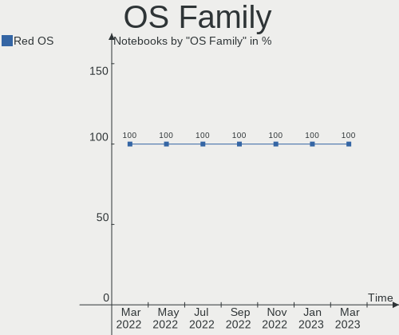

| Name   | Notebooks | Percent |
|--------|-----------|---------|
| Red OS | 8         | 100%    |

Kernel
------

Version of the Linux kernel

| Version                | Notebooks | Percent |
|------------------------|-----------|---------|
| 5.15.72-1.el7.3.x86_64 | 4         | 50%     |
| 5.15.87-1.el7.3.x86_64 | 2         | 25%     |
| 5.15.78-2.el7.3.x86_64 | 2         | 25%     |

Kernel Family
-------------

Linux kernel without a distro release

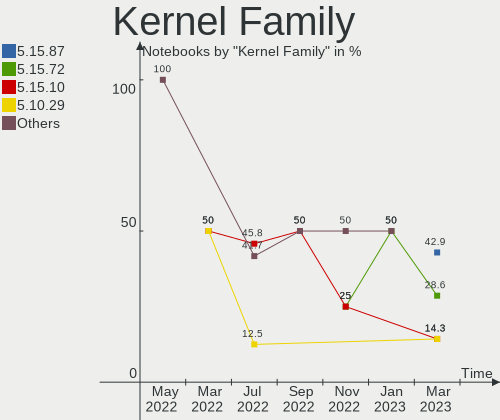

| Version | Notebooks | Percent |
|---------|-----------|---------|
| 5.15.72 | 4         | 50%     |
| 5.15.87 | 2         | 25%     |
| 5.15.78 | 2         | 25%     |

Kernel Major Ver.
-----------------

Linux kernel major version

| Version | Notebooks | Percent |
|---------|-----------|---------|
| 5.15    | 8         | 100%    |

Arch
----

OS architecture (x86_64, i586, etc.)

| Name   | Notebooks | Percent |
|--------|-----------|---------|
| x86_64 | 8         | 100%    |

DE
--

Desktop Environment

| Name     | Notebooks | Percent |
|----------|-----------|---------|
| MATE     | 7         | 87.5%   |
| Cinnamon | 1         | 12.5%   |

Display Server
--------------

X11 or Wayland

| Name    | Notebooks | Percent |
|---------|-----------|---------|
| X11     | 7         | 87.5%   |
| Wayland | 1         | 12.5%   |

Display Manager
---------------

SDDM, LightDM, etc.

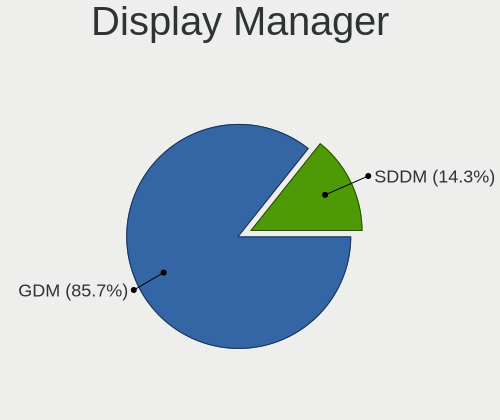

| Name    | Notebooks | Percent |
|---------|-----------|---------|
| GDM     | 7         | 87.5%   |
| Unknown | 1         | 12.5%   |

OS Lang
-------

Language

| Lang    | Notebooks | Percent |
|---------|-----------|---------|
| ru_RU   | 6         | 75%     |
| Unknown | 2         | 25%     |

Boot Mode
---------

EFI or BIOS

| Mode | Notebooks | Percent |
|------|-----------|---------|
| EFI  | 6         | 75%     |
| BIOS | 2         | 25%     |

Filesystem
----------

Type of filesystem

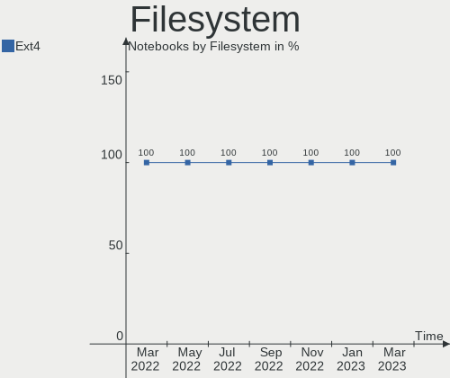

| Type    | Notebooks | Percent |
|---------|-----------|---------|
| Ext4    | 7         | 87.5%   |
| Overlay | 1         | 12.5%   |

Part. scheme
------------

Scheme of partitioning

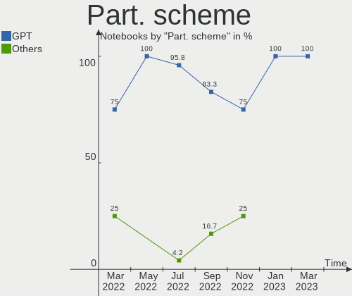

| Type    | Notebooks | Percent |
|---------|-----------|---------|
| GPT     | 6         | 75%     |
| MBR     | 1         | 12.5%   |
| Unknown | 1         | 12.5%   |

Dual Boot with Linux/BSD
------------------------

Hosting more than one Linux/BSD

| Dual boot | Notebooks | Percent |
|-----------|-----------|---------|
| No        | 7         | 87.5%   |
| Yes       | 1         | 12.5%   |

Dual Boot (Win)
---------------

Hosting Linux and Windows

| Dual boot | Notebooks | Percent |
|-----------|-----------|---------|
| No        | 5         | 62.5%   |
| Yes       | 3         | 37.5%   |

Board
-----

Vendor
------

Motherboard manufacturer

| Name            | Notebooks | Percent |
|-----------------|-----------|---------|
| Lenovo          | 5         | 62.5%   |
| Hewlett-Packard | 2         | 25%     |
| Kraftway        | 1         | 12.5%   |

Model
-----

Motherboard model

| Name                            | Notebooks | Percent |
|---------------------------------|-----------|---------|
| Lenovo ThinkBook 15 G2 ARE 20VG | 1         | 12.5%   |
| Lenovo IdeaPad L340-15API 81LW  | 1         | 12.5%   |
| Lenovo IdeaPad 5 15ARE05 81YQ   | 1         | 12.5%   |
| Lenovo IdeaPad 330-15ARR 81D2   | 1         | 12.5%   |
| Lenovo B590 20208               | 1         | 12.5%   |
| Kraftway ACCORD                 | 1         | 12.5%   |
| HP Pavilion 15                  | 1         | 12.5%   |
| HP G62                          | 1         | 12.5%   |

Model Family
------------

Motherboard model prefix

| Name             | Notebooks | Percent |
|------------------|-----------|---------|
| Lenovo IdeaPad   | 3         | 37.5%   |
| Lenovo ThinkBook | 1         | 12.5%   |
| Lenovo B590      | 1         | 12.5%   |
| Kraftway ACCORD  | 1         | 12.5%   |
| HP Pavilion      | 1         | 12.5%   |
| HP G62           | 1         | 12.5%   |

MFG Year
--------

Motherboard manufacture year

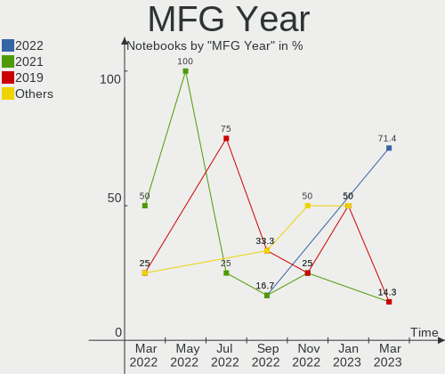

| Year | Notebooks | Percent |
|------|-----------|---------|
| 2020 | 2         | 25%     |
| 2021 | 1         | 12.5%   |
| 2019 | 1         | 12.5%   |
| 2018 | 1         | 12.5%   |
| 2013 | 1         | 12.5%   |
| 2012 | 1         | 12.5%   |
| 2010 | 1         | 12.5%   |

Form Factor
-----------

Physical design of the computer

| Name     | Notebooks | Percent |
|----------|-----------|---------|
| Notebook | 8         | 100%    |

Secure Boot
-----------

Enabled or disabled

| State    | Notebooks | Percent |
|----------|-----------|---------|
| Disabled | 8         | 100%    |

Coreboot
--------

Have coreboot on board

| Used | Notebooks | Percent |
|------|-----------|---------|
| No   | 8         | 100%    |

RAM Size
--------

Total RAM memory

| Size in GB | Notebooks | Percent |
|------------|-----------|---------|
| 4.01-8.0   | 5         | 62.5%   |
| 3.01-4.0   | 1         | 12.5%   |
| 2.01-3.0   | 1         | 12.5%   |
| 8.01-16.0  | 1         | 12.5%   |

RAM Used
--------

Used RAM memory

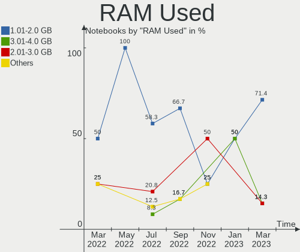

| Used GB  | Notebooks | Percent |
|----------|-----------|---------|
| 1.01-2.0 | 4         | 50%     |
| 4.01-8.0 | 1         | 12.5%   |
| 3.01-4.0 | 1         | 12.5%   |
| 2.01-3.0 | 1         | 12.5%   |
| 0.51-1.0 | 1         | 12.5%   |

Total Drives
------------

Number of drives on board

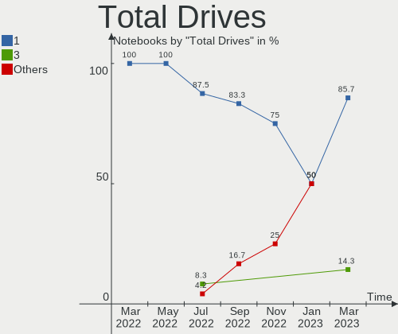

| Drives | Notebooks | Percent |
|--------|-----------|---------|
| 1      | 6         | 75%     |
| 2      | 2         | 25%     |

Has CD-ROM
----------

Has CD-ROM on board

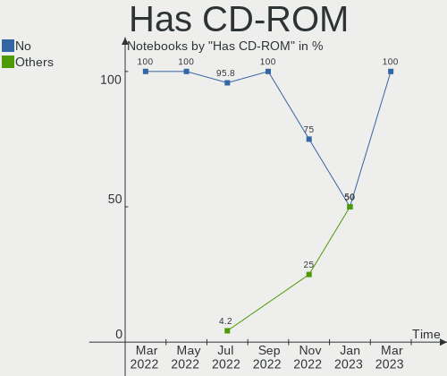

| Presented | Notebooks | Percent |
|-----------|-----------|---------|
| No        | 5         | 62.5%   |
| Yes       | 3         | 37.5%   |

Has Ethernet
------------

Has Ethernet on board

| Presented | Notebooks | Percent |
|-----------|-----------|---------|
| Yes       | 7         | 87.5%   |
| No        | 1         | 12.5%   |

Has WiFi
--------

Has WiFi module

| Presented | Notebooks | Percent |
|-----------|-----------|---------|
| Yes       | 8         | 100%    |

Has Bluetooth
-------------

Has Bluetooth module

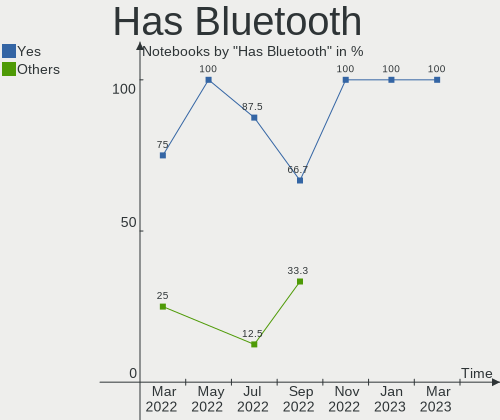

| Presented | Notebooks | Percent |
|-----------|-----------|---------|
| Yes       | 6         | 75%     |
| No        | 2         | 25%     |

Location
--------

Country
-------

Geographic location (country)

| Country | Notebooks | Percent |
|---------|-----------|---------|
| Russia  | 8         | 100%    |

City
----

Geographic location (city)

| City        | Notebooks | Percent |
|-------------|-----------|---------|
| Moscow      | 3         | 37.5%   |
| Tver        | 1         | 12.5%   |
| Salekhard   | 1         | 12.5%   |
| Muromskiy   | 1         | 12.5%   |
| Murom       | 1         | 12.5%   |
| Kol'chugino | 1         | 12.5%   |

Drives
------

Drive Vendor
------------

Hard drive vendors

| Vendor              | Notebooks | Drives | Percent |
|---------------------|-----------|--------|---------|
| Toshiba             | 2         | 2      | 20%     |
| Samsung Electronics | 2         | 2      | 20%     |
| HGST                | 2         | 2      | 20%     |
| SK hynix            | 1         | 2      | 10%     |
| Kingston            | 1         | 1      | 10%     |
| Gigabyte Technology | 1         | 1      | 10%     |
| Apacer              | 1         | 1      | 10%     |

Drive Model
-----------

Hard drive models

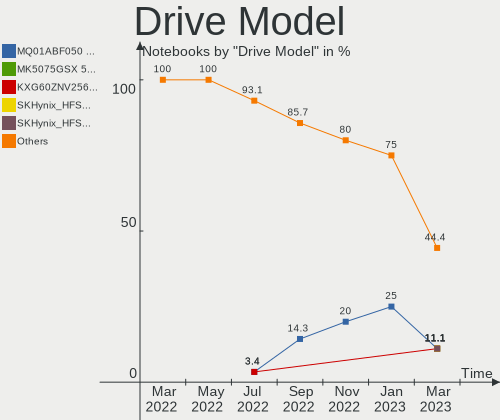

| Model                                     | Notebooks | Percent |
|-------------------------------------------|-----------|---------|
| Toshiba MQ01ABF050 500GB                  | 2         | 18.18%  |
| SK hynix SKHynix_HFM256GDHTNI-87A0B 256GB | 1         | 9.09%   |
| SK hynix BC511 512GB                      | 1         | 9.09%   |
| Samsung MZALQ512HALU-000L2 512GB          | 1         | 9.09%   |
| Samsung MZALQ256HAJD-000L2 256GB          | 1         | 9.09%   |
| Kingston SUV400S37120G 120GB SSD          | 1         | 9.09%   |
| HGST HTS545050A7E380 500GB                | 1         | 9.09%   |
| HGST HTS541075A9E680 752GB                | 1         | 9.09%   |
| Gigabyte GP-GSM2NE3256GNTD 256GB          | 1         | 9.09%   |
| Apacer AS350 256GB SSD                    | 1         | 9.09%   |

HDD Vendor
----------

Hard disk drive vendors

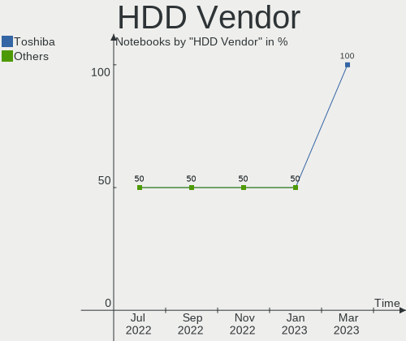

| Vendor  | Notebooks | Drives | Percent |
|---------|-----------|--------|---------|
| Toshiba | 2         | 2      | 50%     |
| HGST    | 2         | 2      | 50%     |

SSD Vendor
----------

Solid state drive vendors

| Vendor   | Notebooks | Drives | Percent |
|----------|-----------|--------|---------|
| Kingston | 1         | 1      | 50%     |
| Apacer   | 1         | 1      | 50%     |

Drive Kind
----------

HDD or SSD

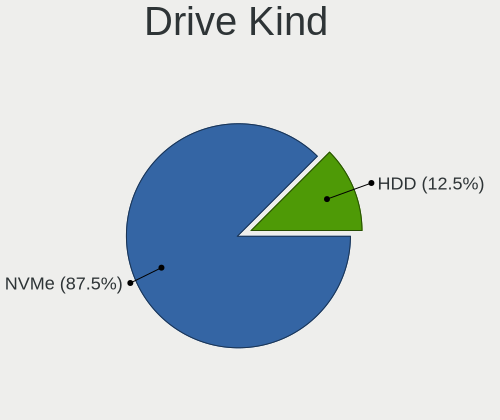

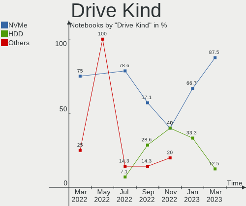

| Kind | Notebooks | Drives | Percent |
|------|-----------|--------|---------|
| NVMe | 4         | 5      | 40%     |
| HDD  | 4         | 4      | 40%     |
| SSD  | 2         | 2      | 20%     |

Drive Connector
---------------

SATA, SAS, NVMe, etc.

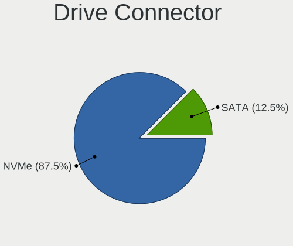

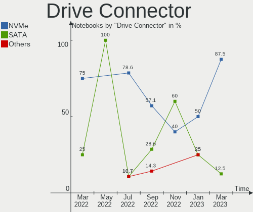

| Type | Notebooks | Drives | Percent |
|------|-----------|--------|---------|
| SATA | 6         | 6      | 60%     |
| NVMe | 4         | 5      | 40%     |

Drive Size
----------

Size of hard drive

| Size in TB | Notebooks | Drives | Percent |
|------------|-----------|--------|---------|
| 0.01-0.5   | 5         | 5      | 83.33%  |
| 0.51-1.0   | 1         | 1      | 16.67%  |

Space Total
-----------

Amount of disk space available on the file system

| Size in GB | Notebooks | Percent |
|------------|-----------|---------|
| 101-250    | 4         | 50%     |
| 501-1000   | 2         | 25%     |
| 251-500    | 1         | 12.5%   |
| 1-20       | 1         | 12.5%   |

Space Used
----------

Amount of used disk space

| Used GB  | Notebooks | Percent |
|----------|-----------|---------|
| 1-20     | 4         | 50%     |
| 21-50    | 2         | 25%     |
| 101-250  | 1         | 12.5%   |
| 501-1000 | 1         | 12.5%   |

Malfunc. Drives
---------------

Drive models with a malfunction

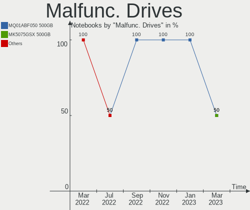

| Model                            | Notebooks | Drives | Percent |
|----------------------------------|-----------|--------|---------|
| Kingston SUV400S37120G 120GB SSD | 1         | 1      | 100%    |

Malfunc. Drive Vendor
---------------------

Vendors of faulty drives

| Vendor   | Notebooks | Drives | Percent |
|----------|-----------|--------|---------|
| Kingston | 1         | 1      | 100%    |

Malfunc. HDD Vendor
-------------------

Vendors of faulty HDD drives

Zero info for selected period =(

Malfunc. Drive Kind
-------------------

Kinds of faulty drives

| Kind | Notebooks | Drives | Percent |
|------|-----------|--------|---------|
| SSD  | 1         | 1      | 100%    |

Failed Drives
-------------

Failed drive models

Zero info for selected period =(

Failed Drive Vendor
-------------------

Failed drive vendors

Zero info for selected period =(

Drive Status
------------

Number of failed and malfunc. drives

| Status   | Notebooks | Drives | Percent |
|----------|-----------|--------|---------|
| Works    | 6         | 8      | 75%     |
| Detected | 1         | 2      | 12.5%   |
| Malfunc  | 1         | 1      | 12.5%   |

Storage controller
------------------

Storage Vendor
--------------

Storage controller vendors

| Vendor              | Notebooks | Percent |
|---------------------|-----------|---------|
| Intel               | 4         | 33.33%  |
| AMD                 | 4         | 33.33%  |
| Samsung Electronics | 2         | 16.67%  |
| SK hynix            | 1         | 8.33%   |
| Phison Electronics  | 1         | 8.33%   |

Storage Model
-------------

Storage controller models

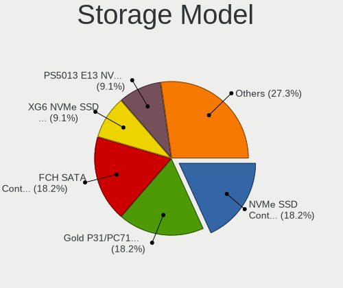

| Model                                                            | Notebooks | Percent |
|------------------------------------------------------------------|-----------|---------|
| AMD FCH SATA Controller [AHCI mode]                              | 4         | 33.33%  |
| Samsung NVMe SSD Controller 980                                  | 2         | 16.67%  |
| SK hynix BC511                                                   | 1         | 8.33%   |
| Phison PS5013 E13 NVMe Controller                                | 1         | 8.33%   |
| Intel Cannon Point-LP SATA Controller [AHCI Mode]                | 1         | 8.33%   |
| Intel 8 Series SATA Controller 1 [AHCI mode]                     | 1         | 8.33%   |
| Intel 7 Series Chipset Family 6-port SATA Controller [AHCI mode] | 1         | 8.33%   |
| Intel 5 Series/3400 Series Chipset 4 port SATA AHCI Controller   | 1         | 8.33%   |

Storage Kind
------------

Kind of storage controller (IDE, SATA, NVMe, SAS, ...)

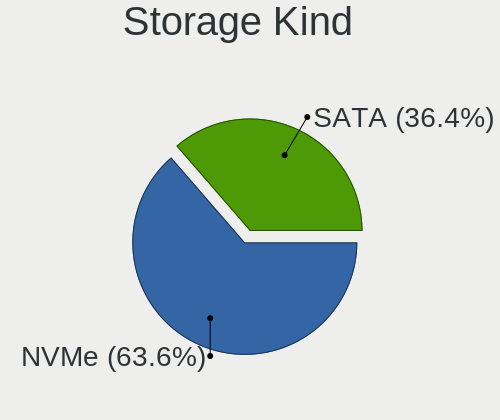

| Kind | Notebooks | Percent |
|------|-----------|---------|
| SATA | 8         | 66.67%  |
| NVMe | 4         | 33.33%  |

Processor
---------

CPU Vendor
----------

Processor vendors

| Vendor | Notebooks | Percent |
|--------|-----------|---------|
| Intel  | 4         | 50%     |
| AMD    | 4         | 50%     |

CPU Model
---------

Processor models

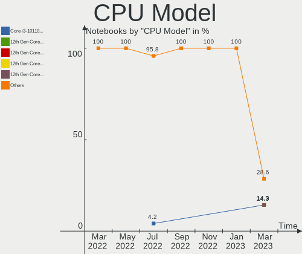

| Model                                         | Notebooks | Percent |
|-----------------------------------------------|-----------|---------|
| AMD Ryzen 5 4500U with Radeon Graphics        | 2         | 25%     |
| Intel Core i5-8259U CPU @ 2.30GHz             | 1         | 12.5%   |
| Intel Core i5-4200U CPU @ 1.60GHz             | 1         | 12.5%   |
| Intel Core i3-3110M CPU @ 2.40GHz             | 1         | 12.5%   |
| Intel Core i3 CPU M 330 @ 2.13GHz             | 1         | 12.5%   |
| AMD Ryzen 5 3500U with Radeon Vega Mobile Gfx | 1         | 12.5%   |
| AMD Ryzen 5 2500U with Radeon Vega Mobile Gfx | 1         | 12.5%   |

CPU Model Family
----------------

Processor model prefix

| Model         | Notebooks | Percent |
|---------------|-----------|---------|
| AMD Ryzen 5   | 4         | 50%     |
| Intel Core i5 | 2         | 25%     |
| Intel Core i3 | 2         | 25%     |

CPU Cores
---------

Number of processor cores

| Number | Notebooks | Percent |
|--------|-----------|---------|
| 4      | 3         | 37.5%   |
| 2      | 3         | 37.5%   |
| 6      | 2         | 25%     |

CPU Sockets
-----------

Number of sockets

| Number | Notebooks | Percent |
|--------|-----------|---------|
| 1      | 8         | 100%    |

CPU Threads
-----------

Threads per core (Hyper-Threading)

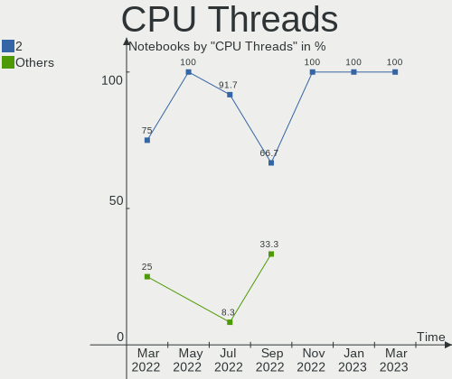

| Number | Notebooks | Percent |
|--------|-----------|---------|
| 2      | 6         | 75%     |
| 1      | 2         | 25%     |

CPU Op-Modes
------------

CPU Operation Modes (32-bit, 64-bit)

| Op mode        | Notebooks | Percent |
|----------------|-----------|---------|
| 32-bit, 64-bit | 8         | 100%    |

CPU Microcode
-------------

Microcode number

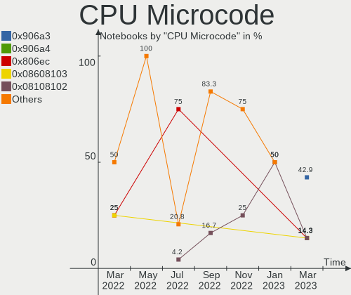

| Number     | Notebooks | Percent |
|------------|-----------|---------|
| 0x08600106 | 2         | 25%     |
| 0x806ea    | 1         | 12.5%   |
| 0x40651    | 1         | 12.5%   |
| 0x306a9    | 1         | 12.5%   |
| 0x20652    | 1         | 12.5%   |
| 0x08108102 | 1         | 12.5%   |
| 0x0810100b | 1         | 12.5%   |

CPU Microarch
-------------

Microarchitecture

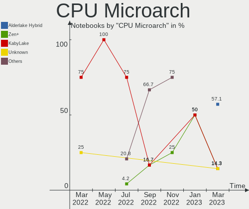

| Name      | Notebooks | Percent |
|-----------|-----------|---------|
| Zen 2     | 2         | 25%     |
| Zen+      | 1         | 12.5%   |
| Zen       | 1         | 12.5%   |
| Westmere  | 1         | 12.5%   |
| KabyLake  | 1         | 12.5%   |
| IvyBridge | 1         | 12.5%   |
| Haswell   | 1         | 12.5%   |

Graphics
--------

GPU Vendor
----------

Vendors of graphics cards

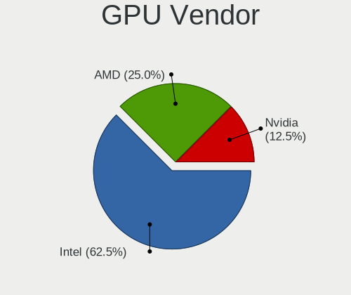

| Vendor | Notebooks | Percent |
|--------|-----------|---------|
| AMD    | 5         | 45.45%  |
| Intel  | 4         | 36.36%  |
| Nvidia | 2         | 18.18%  |

GPU Model
---------

Graphics card models

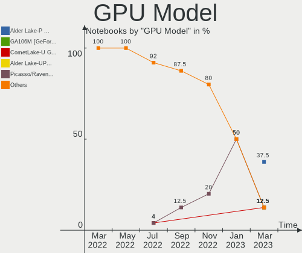

| Model                                                                | Notebooks | Percent |
|----------------------------------------------------------------------|-----------|---------|
| AMD Renoir                                                           | 2         | 16.67%  |
| Nvidia GK208M [GeForce GT 740M]                                      | 1         | 8.33%   |
| Nvidia GF117M [GeForce 610M/710M/810M/820M / GT 620M/625M/630M/720M] | 1         | 8.33%   |
| Intel Haswell-ULT Integrated Graphics Controller                     | 1         | 8.33%   |
| Intel Core Processor Integrated Graphics Controller                  | 1         | 8.33%   |
| Intel CoffeeLake-U GT3e [Iris Plus Graphics 655]                     | 1         | 8.33%   |
| Intel 3rd Gen Core processor Graphics Controller                     | 1         | 8.33%   |
| AMD Raven Ridge [Radeon Vega Series / Radeon Vega Mobile Series]     | 1         | 8.33%   |
| AMD Picasso/Raven 2 [Radeon Vega Series / Radeon Vega Mobile Series] | 1         | 8.33%   |
| AMD Park [Mobility Radeon HD 5430/5450/5470]                         | 1         | 8.33%   |
| AMD Lexa PRO [Radeon 540/540X/550/550X / RX 540X/550/550X]           | 1         | 8.33%   |

GPU Combo
---------

Combinations of graphics cards

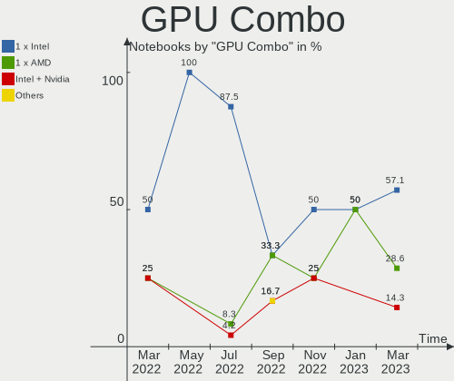

| Name           | Notebooks | Percent |
|----------------|-----------|---------|
| 1 x AMD        | 3         | 37.5%   |
| Intel + Nvidia | 2         | 25%     |
| 2 x AMD        | 1         | 12.5%   |
| Intel + AMD    | 1         | 12.5%   |
| 1 x Intel      | 1         | 12.5%   |

GPU Driver
----------

Free vs proprietary

| Driver | Notebooks | Percent |
|--------|-----------|---------|
| Free   | 8         | 100%    |

GPU Memory
----------

Total video memory

| Size in GB | Notebooks | Percent |
|------------|-----------|---------|
| 1.01-2.0   | 4         | 50%     |
| 0.51-1.0   | 2         | 25%     |
| 0.01-0.5   | 1         | 12.5%   |
| Unknown    | 1         | 12.5%   |

Monitor
-------

Monitor Vendor
--------------

Monitor vendors

| Vendor              | Notebooks | Percent |
|---------------------|-----------|---------|
| LG Display          | 2         | 22.22%  |
| Chimei Innolux      | 2         | 22.22%  |
| BOE                 | 2         | 22.22%  |
| Samsung Electronics | 1         | 11.11%  |
| Philips             | 1         | 11.11%  |
| AU Optronics        | 1         | 11.11%  |

Monitor Model
-------------

Monitor models

| Model                                                                | Notebooks | Percent |
|----------------------------------------------------------------------|-----------|---------|
| Samsung Electronics LCD Monitor SEC3152 1366x768 344x194mm 15.5-inch | 1         | 11.11%  |
| Philips 226V4 PHLC0B1 1920x1080 477x268mm 21.5-inch                  | 1         | 11.11%  |
| LG Display LCD Monitor LGD039F 1366x768 345x194mm 15.6-inch          | 1         | 11.11%  |
| LG Display LCD Monitor LGD02AC 1366x768 344x194mm 15.5-inch          | 1         | 11.11%  |
| Chimei Innolux LCD Monitor CMN15F5 1920x1080 344x193mm 15.5-inch     | 1         | 11.11%  |
| Chimei Innolux LCD Monitor CMN151E 1920x1080 344x193mm 15.5-inch     | 1         | 11.11%  |
| BOE LCD Monitor BOE09C5 1920x1080 345x194mm 15.6-inch                | 1         | 11.11%  |
| BOE LCD Monitor BOE0900 1920x1080 344x194mm 15.5-inch                | 1         | 11.11%  |
| AU Optronics LCD Monitor AUO38ED 1920x1080 344x193mm 15.5-inch       | 1         | 11.11%  |

Monitor Resolution
------------------

Monitor screen resolution

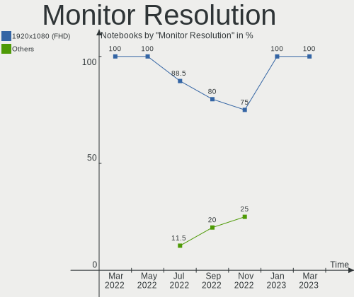

| Resolution      | Notebooks | Percent |
|-----------------|-----------|---------|
| 1920x1080 (FHD) | 5         | 62.5%   |
| 1366x768 (WXGA) | 3         | 37.5%   |

Monitor Diagonal
----------------

Diagonal size in inches

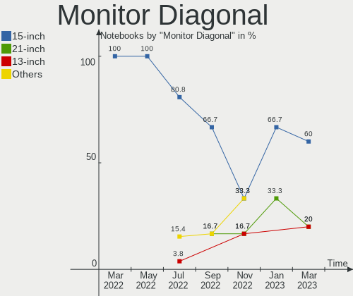

| Inches | Notebooks | Percent |
|--------|-----------|---------|
| 15     | 8         | 88.89%  |
| 21     | 1         | 11.11%  |

Monitor Width
-------------

Physical width

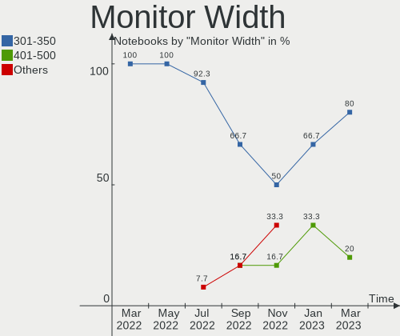

| Width in mm | Notebooks | Percent |
|-------------|-----------|---------|
| 301-350     | 8         | 88.89%  |
| 401-500     | 1         | 11.11%  |

Aspect Ratio
------------

Proportional relationship between the width and the height

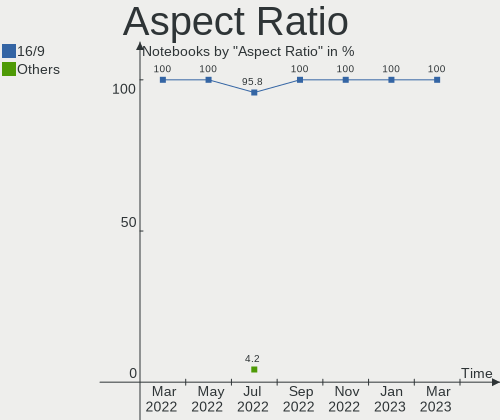

| Ratio | Notebooks | Percent |
|-------|-----------|---------|
| 16/9  | 8         | 100%    |

Monitor Area
------------

Area in inch²

| Area in inch² | Notebooks | Percent |
|----------------|-----------|---------|
| 101-110        | 8         | 88.89%  |
| 201-250        | 1         | 11.11%  |

Pixel Density
-------------

Pixels per inch

| Density | Notebooks | Percent |
|---------|-----------|---------|
| 121-160 | 5         | 55.56%  |
| 101-120 | 3         | 33.33%  |
| 51-100  | 1         | 11.11%  |

Multiple Monitors
-----------------

Total monitors connected

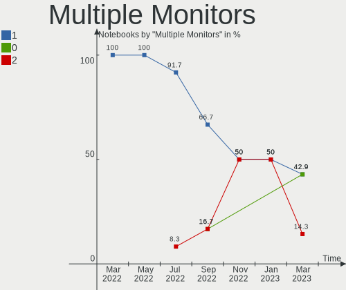

| Total | Notebooks | Percent |
|-------|-----------|---------|
| 1     | 7         | 87.5%   |
| 2     | 1         | 12.5%   |

Network
-------

Net Controller Vendor
---------------------

Controller vendors

| Vendor                | Notebooks | Percent |
|-----------------------|-----------|---------|
| Realtek Semiconductor | 8         | 66.67%  |
| Ralink                | 1         | 8.33%   |
| Qualcomm Atheros      | 1         | 8.33%   |
| Intel                 | 1         | 8.33%   |
| Broadcom              | 1         | 8.33%   |

Net Controller Model
--------------------

Controller models

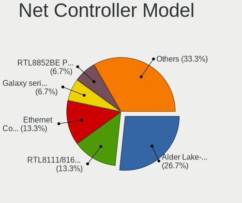

| Model                                                             | Notebooks | Percent |
|-------------------------------------------------------------------|-----------|---------|
| Realtek RTL8111/8168/8411 PCI Express Gigabit Ethernet Controller | 5         | 33.33%  |
| Realtek RTL8821CE 802.11ac PCIe Wireless Network Adapter          | 2         | 13.33%  |
| Realtek RTL810xE PCI Express Fast Ethernet controller             | 2         | 13.33%  |
| Realtek RTL8852AE 802.11ax PCIe Wireless Network Adapter          | 1         | 6.67%   |
| Realtek RTL8822CE 802.11ac PCIe Wireless Network Adapter          | 1         | 6.67%   |
| Ralink RT3290 Wireless 802.11n 1T/1R PCIe                         | 1         | 6.67%   |
| Qualcomm Atheros AR9285 Wireless Network Adapter (PCI-Express)    | 1         | 6.67%   |
| Intel Cannon Point-LP CNVi [Wireless-AC]                          | 1         | 6.67%   |
| Broadcom BCM43142 802.11b/g/n                                     | 1         | 6.67%   |

Wireless Vendor
---------------

Wireless vendors

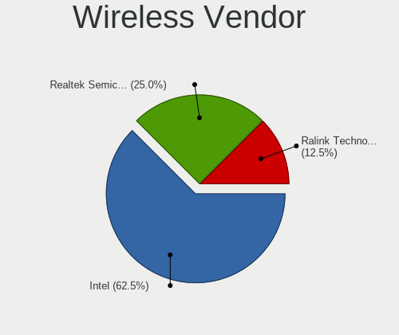

| Vendor                | Notebooks | Percent |
|-----------------------|-----------|---------|
| Realtek Semiconductor | 4         | 50%     |
| Ralink                | 1         | 12.5%   |
| Qualcomm Atheros      | 1         | 12.5%   |
| Intel                 | 1         | 12.5%   |
| Broadcom              | 1         | 12.5%   |

Wireless Model
--------------

Wireless models

| Model                                                          | Notebooks | Percent |
|----------------------------------------------------------------|-----------|---------|
| Realtek RTL8821CE 802.11ac PCIe Wireless Network Adapter       | 2         | 25%     |
| Realtek RTL8852AE 802.11ax PCIe Wireless Network Adapter       | 1         | 12.5%   |
| Realtek RTL8822CE 802.11ac PCIe Wireless Network Adapter       | 1         | 12.5%   |
| Ralink RT3290 Wireless 802.11n 1T/1R PCIe                      | 1         | 12.5%   |
| Qualcomm Atheros AR9285 Wireless Network Adapter (PCI-Express) | 1         | 12.5%   |
| Intel Cannon Point-LP CNVi [Wireless-AC]                       | 1         | 12.5%   |
| Broadcom BCM43142 802.11b/g/n                                  | 1         | 12.5%   |

Ethernet Vendor
---------------

Ethernet vendors

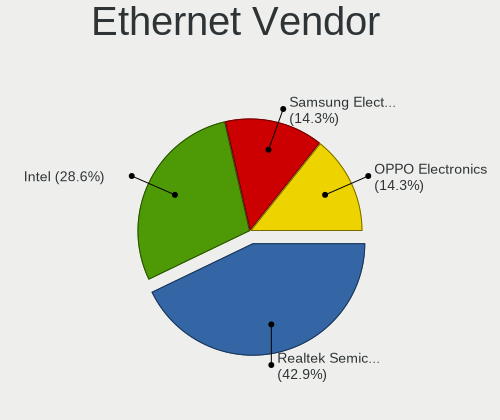

| Vendor                | Notebooks | Percent |
|-----------------------|-----------|---------|
| Realtek Semiconductor | 7         | 100%    |

Ethernet Model
--------------

Ethernet models

| Model                                                             | Notebooks | Percent |
|-------------------------------------------------------------------|-----------|---------|
| Realtek RTL8111/8168/8411 PCI Express Gigabit Ethernet Controller | 5         | 71.43%  |
| Realtek RTL810xE PCI Express Fast Ethernet controller             | 2         | 28.57%  |

Net Controller Kind
-------------------

Ethernet, WiFi or modem

| Kind     | Notebooks | Percent |
|----------|-----------|---------|
| WiFi     | 8         | 53.33%  |
| Ethernet | 7         | 46.67%  |

Used Controller
---------------

Currently used network controller

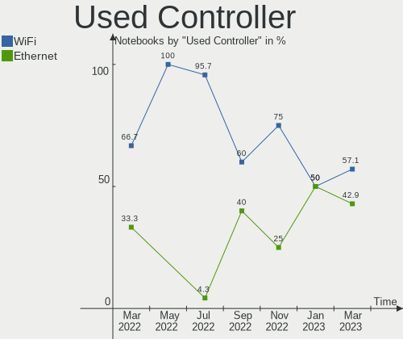

| Kind     | Notebooks | Percent |
|----------|-----------|---------|
| WiFi     | 5         | 62.5%   |
| Ethernet | 3         | 37.5%   |

NICs
----

Total network controllers on board

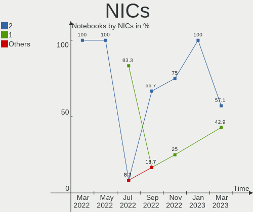

| Total | Notebooks | Percent |
|-------|-----------|---------|
| 2     | 7         | 87.5%   |
| 1     | 1         | 12.5%   |

IPv6
----

IPv6 vs IPv4

| Used | Notebooks | Percent |
|------|-----------|---------|
| No   | 6         | 75%     |
| Yes  | 2         | 25%     |

Bluetooth
---------

Bluetooth Vendor
----------------

Controller vendors

| Vendor                | Notebooks | Percent |
|-----------------------|-----------|---------|
| Realtek Semiconductor | 4         | 66.67%  |
| Ralink                | 1         | 16.67%  |
| Intel                 | 1         | 16.67%  |

Bluetooth Model
---------------

Controller models

| Model                                          | Notebooks | Percent |
|------------------------------------------------|-----------|---------|
| Realtek Bluetooth Radio                        | 4         | 66.67%  |
| Ralink RT3290 Bluetooth                        | 1         | 16.67%  |
| Intel Bluetooth 9460/9560 Jefferson Peak (JfP) | 1         | 16.67%  |

Sound
-----

Sound Vendor
------------

Sound card vendors

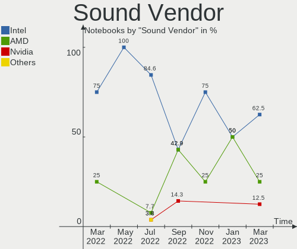

| Vendor | Notebooks | Percent |
|--------|-----------|---------|
| AMD    | 5         | 55.56%  |
| Intel  | 4         | 44.44%  |

Sound Model
-----------

Sound card models

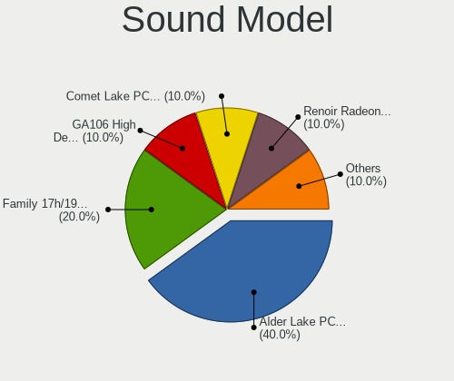

| Model                                                               | Notebooks | Percent |
|---------------------------------------------------------------------|-----------|---------|
| AMD Family 17h/19h HD Audio Controller                              | 4         | 28.57%  |
| AMD Renoir Radeon High Definition Audio Controller                  | 2         | 14.29%  |
| AMD Raven/Raven2/Fenghuang HDMI/DP Audio Controller                 | 2         | 14.29%  |
| Intel Haswell-ULT HD Audio Controller                               | 1         | 7.14%   |
| Intel Cannon Point-LP High Definition Audio Controller              | 1         | 7.14%   |
| Intel 8 Series HD Audio Controller                                  | 1         | 7.14%   |
| Intel 7 Series/C216 Chipset Family High Definition Audio Controller | 1         | 7.14%   |
| Intel 5 Series/3400 Series Chipset High Definition Audio            | 1         | 7.14%   |
| AMD Cedar HDMI Audio [Radeon HD 5400/6300/7300 Series]              | 1         | 7.14%   |

Memory
------

Memory Vendor
-------------

Memory module vendors

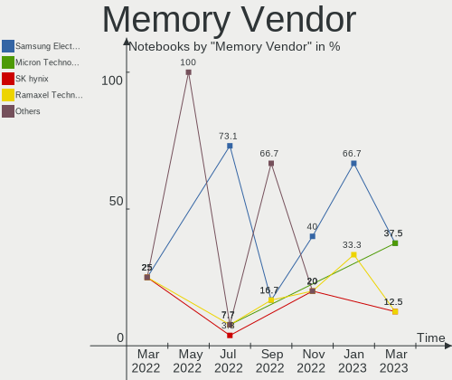

| Vendor              | Notebooks | Percent |
|---------------------|-----------|---------|
| Samsung Electronics | 5         | 50%     |
| SHARETRONIC         | 1         | 10%     |
| Ramaxel Technology  | 1         | 10%     |
| Micron Technology   | 1         | 10%     |
| Kingston            | 1         | 10%     |
| Foxline             | 1         | 10%     |

Memory Model
------------

Memory module models

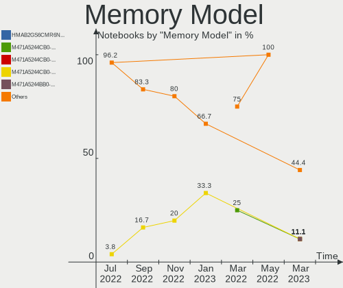

| Model                                                      | Notebooks | Percent |
|------------------------------------------------------------|-----------|---------|
| Samsung RAM M471A5244CB0-CTD 4GB SODIMM DDR4 3266MT/s      | 2         | 18.18%  |
| SHARETRONIC RAM Module 4GB SODIMM DDR3 1600MT/s            | 1         | 9.09%   |
| Samsung RAM M471B5673FH0-CH9 2GB SODIMM DDR3 1334MT/s      | 1         | 9.09%   |
| Samsung RAM M471B5173QH0-YK0 4GB SODIMM DDR3 1600MT/s      | 1         | 9.09%   |
| Samsung RAM M471B2873EH1-CH9 1GB SODIMM DDR3 1333MT/s      | 1         | 9.09%   |
| Samsung RAM M471A5244CB0-CWE 4GB SODIMM DDR4 3200MT/s      | 1         | 9.09%   |
| Ramaxel RAM RMSA3270ME86H9F-2666 4GB SODIMM DDR4 2667MT/s  | 1         | 9.09%   |
| Micron RAM 4ATF1G64HZ-3G2E1 8GB Row Of Chips DDR4 3200MT/s | 1         | 9.09%   |
| Kingston RAM 9905711-015.A00G 4GB SODIMM DDR4 2400MT/s     | 1         | 9.09%   |
| Foxline RAM FL2400D4S17S-8G 8GB SODIMM DDR4 2400MT/s       | 1         | 9.09%   |

Memory Kind
-----------

Memory module kinds

| Kind | Notebooks | Percent |
|------|-----------|---------|
| DDR4 | 5         | 62.5%   |
| DDR3 | 3         | 37.5%   |

Memory Form Factor
------------------

Physical design of the memory module

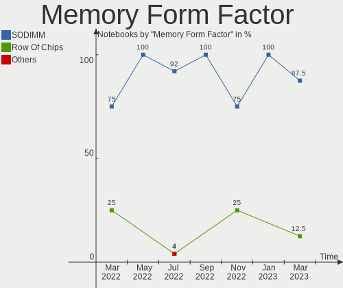

| Name         | Notebooks | Percent |
|--------------|-----------|---------|
| SODIMM       | 7         | 87.5%   |
| Row Of Chips | 1         | 12.5%   |

Memory Size
-----------

Memory module size

| Size | Notebooks | Percent |
|------|-----------|---------|
| 4096 | 5         | 55.56%  |
| 8192 | 2         | 22.22%  |
| 2048 | 1         | 11.11%  |
| 1024 | 1         | 11.11%  |

Memory Speed
------------

Memory module speed

| Speed | Notebooks | Percent |
|-------|-----------|---------|
| 3266  | 2         | 18.18%  |
| 3200  | 2         | 18.18%  |
| 2400  | 2         | 18.18%  |
| 1600  | 2         | 18.18%  |
| 2667  | 1         | 9.09%   |
| 1334  | 1         | 9.09%   |
| 1333  | 1         | 9.09%   |

Printers & scanners
-------------------

Printer Vendor
--------------

Printer device vendors

Zero info for selected period =(

Printer Model
-------------

Printer device models

Zero info for selected period =(

Scanner Vendor
--------------

Scanner device vendors

Zero info for selected period =(

Scanner Model
-------------

Scanner device models

Zero info for selected period =(

Camera
------

Camera Vendor
-------------

Camera device vendors

| Vendor                | Notebooks | Percent |
|-----------------------|-----------|---------|
| Acer                  | 5         | 62.5%   |
| Realtek Semiconductor | 2         | 25%     |
| Sonix Technology      | 1         | 12.5%   |

Camera Model
------------

Camera device models

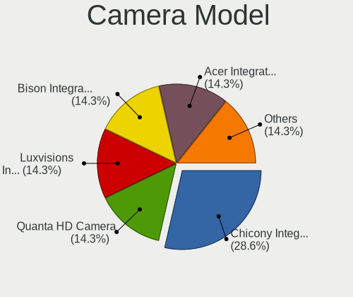

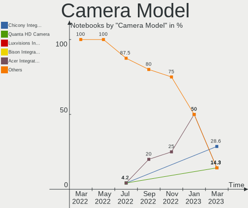

| Model                         | Notebooks | Percent |
|-------------------------------|-----------|---------|
| Acer Integrated Camera        | 3         | 37.5%   |
| Sonix USB 2.0 Camera          | 1         | 12.5%   |
| Realtek HP Truevision HD      | 1         | 12.5%   |
| Realtek 2SF022                | 1         | 12.5%   |
| Acer Lenovo Integrated Webcam | 1         | 12.5%   |
| Acer EasyCamera               | 1         | 12.5%   |

Security
--------

Fingerprint Vendor
------------------

Fingerprint sensor vendors

Zero info for selected period =(

Fingerprint Model
-----------------

Fingerprint sensor models

Zero info for selected period =(

Chipcard Vendor
---------------

Chipcard module vendors

Zero info for selected period =(

Chipcard Model
--------------

Chipcard module models

Zero info for selected period =(

Unsupported
-----------

Unsupported Devices
-------------------

Total unsupported devices on board

| Total | Notebooks | Percent |
|-------|-----------|---------|
| 1     | 4         | 50%     |
| 0     | 4         | 50%     |

Unsupported Device Types
------------------------

Types of unsupported devices

| Type         | Notebooks | Percent |
|--------------|-----------|---------|
| Net/wireless | 3         | 75%     |
| Bluetooth    | 1         | 25%     |

