Red OS - Hardware Trends (Notebooks)
------------------------------------

A project to identify most popular hardware characteristics and track their change
over time based on data collected by Linux users at https://Linux-Hardware.org.

Anyone can contribute to this report by the [hw-probe](https://github.com/linuxhw/hw-probe) tool:

    sudo -E hw-probe -all -upload

This report is for one last month. Overall report since the beginning of time: [TestCoverage](https://github.com/linuxhw/TestCoverage)

Period: Dec, 2022.

Contents
--------

* [ System ](#system)
  - [ OS                       ](#os)
  - [ OS Family                ](#os-family)
  - [ Kernel                   ](#kernel)
  - [ Kernel Family            ](#kernel-family)
  - [ Kernel Major Ver.        ](#kernel-major-ver)
  - [ Arch                     ](#arch)
  - [ DE                       ](#de)
  - [ Display Server           ](#display-server)
  - [ Display Manager          ](#display-manager)
  - [ OS Lang                  ](#os-lang)
  - [ Boot Mode                ](#boot-mode)
  - [ Filesystem               ](#filesystem)
  - [ Part. scheme             ](#part-scheme)
  - [ Dual Boot with Linux/BSD ](#dual-boot-with-linuxbsd)
  - [ Dual Boot (Win)          ](#dual-boot-win)

* [ Board ](#board)
  - [ Vendor                   ](#vendor)
  - [ Model                    ](#model)
  - [ Model Family             ](#model-family)
  - [ MFG Year                 ](#mfg-year)
  - [ Form Factor              ](#form-factor)
  - [ Secure Boot              ](#secure-boot)
  - [ Coreboot                 ](#coreboot)
  - [ RAM Size                 ](#ram-size)
  - [ RAM Used                 ](#ram-used)
  - [ Total Drives             ](#total-drives)
  - [ Has CD-ROM               ](#has-cd-rom)
  - [ Has Ethernet             ](#has-ethernet)
  - [ Has WiFi                 ](#has-wifi)
  - [ Has Bluetooth            ](#has-bluetooth)

* [ Location ](#location)
  - [ Country                  ](#country)
  - [ City                     ](#city)

* [ Drives ](#drives)
  - [ Drive Vendor             ](#drive-vendor)
  - [ Drive Model              ](#drive-model)
  - [ HDD Vendor               ](#hdd-vendor)
  - [ SSD Vendor               ](#ssd-vendor)
  - [ Drive Kind               ](#drive-kind)
  - [ Drive Connector          ](#drive-connector)
  - [ Drive Size               ](#drive-size)
  - [ Space Total              ](#space-total)
  - [ Space Used               ](#space-used)
  - [ Malfunc. Drives          ](#malfunc-drives)
  - [ Malfunc. Drive Vendor    ](#malfunc-drive-vendor)
  - [ Malfunc. HDD Vendor      ](#malfunc-hdd-vendor)
  - [ Malfunc. Drive Kind      ](#malfunc-drive-kind)
  - [ Failed Drives            ](#failed-drives)
  - [ Failed Drive Vendor      ](#failed-drive-vendor)
  - [ Drive Status             ](#drive-status)

* [ Storage controller ](#storage-controller)
  - [ Storage Vendor           ](#storage-vendor)
  - [ Storage Model            ](#storage-model)
  - [ Storage Kind             ](#storage-kind)

* [ Processor ](#processor)
  - [ CPU Vendor               ](#cpu-vendor)
  - [ CPU Model                ](#cpu-model)
  - [ CPU Model Family         ](#cpu-model-family)
  - [ CPU Cores                ](#cpu-cores)
  - [ CPU Sockets              ](#cpu-sockets)
  - [ CPU Threads              ](#cpu-threads)
  - [ CPU Op-Modes             ](#cpu-op-modes)
  - [ CPU Microcode            ](#cpu-microcode)
  - [ CPU Microarch            ](#cpu-microarch)

* [ Graphics ](#graphics)
  - [ GPU Vendor               ](#gpu-vendor)
  - [ GPU Model                ](#gpu-model)
  - [ GPU Combo                ](#gpu-combo)
  - [ GPU Driver               ](#gpu-driver)
  - [ GPU Memory               ](#gpu-memory)

* [ Monitor ](#monitor)
  - [ Monitor Vendor           ](#monitor-vendor)
  - [ Monitor Model            ](#monitor-model)
  - [ Monitor Resolution       ](#monitor-resolution)
  - [ Monitor Diagonal         ](#monitor-diagonal)
  - [ Monitor Width            ](#monitor-width)
  - [ Aspect Ratio             ](#aspect-ratio)
  - [ Monitor Area             ](#monitor-area)
  - [ Pixel Density            ](#pixel-density)
  - [ Multiple Monitors        ](#multiple-monitors)

* [ Network ](#network)
  - [ Net Controller Vendor    ](#net-controller-vendor)
  - [ Net Controller Model     ](#net-controller-model)
  - [ Wireless Vendor          ](#wireless-vendor)
  - [ Wireless Model           ](#wireless-model)
  - [ Ethernet Vendor          ](#ethernet-vendor)
  - [ Ethernet Model           ](#ethernet-model)
  - [ Net Controller Kind      ](#net-controller-kind)
  - [ Used Controller          ](#used-controller)
  - [ NICs                     ](#nics)
  - [ IPv6                     ](#ipv6)

* [ Bluetooth ](#bluetooth)
  - [ Bluetooth Vendor         ](#bluetooth-vendor)
  - [ Bluetooth Model          ](#bluetooth-model)

* [ Sound ](#sound)
  - [ Sound Vendor             ](#sound-vendor)
  - [ Sound Model              ](#sound-model)

* [ Memory ](#memory)
  - [ Memory Vendor            ](#memory-vendor)
  - [ Memory Model             ](#memory-model)
  - [ Memory Kind              ](#memory-kind)
  - [ Memory Form Factor       ](#memory-form-factor)
  - [ Memory Size              ](#memory-size)
  - [ Memory Speed             ](#memory-speed)

* [ Printers & scanners ](#printers--scanners)
  - [ Printer Vendor           ](#printer-vendor)
  - [ Printer Model            ](#printer-model)
  - [ Scanner Vendor           ](#scanner-vendor)
  - [ Scanner Model            ](#scanner-model)

* [ Camera ](#camera)
  - [ Camera Vendor            ](#camera-vendor)
  - [ Camera Model             ](#camera-model)

* [ Security ](#security)
  - [ Fingerprint Vendor       ](#fingerprint-vendor)
  - [ Fingerprint Model        ](#fingerprint-model)
  - [ Chipcard Vendor          ](#chipcard-vendor)
  - [ Chipcard Model           ](#chipcard-model)

* [ Unsupported ](#unsupported)
  - [ Unsupported Devices      ](#unsupported-devices)
  - [ Unsupported Device Types ](#unsupported-device-types)

System
------

OS
--

Installed operating systems

| Name         | Notebooks | Percent |
|--------------|-----------|---------|
| Red OS 7.3.2 | 10        | 90.91%  |
| Red OS 7.3.1 | 1         | 9.09%   |

OS Family
---------

OS without a version

| Name   | Notebooks | Percent |
|--------|-----------|---------|
| Red OS | 11        | 100%    |

Kernel
------

Version of the Linux kernel

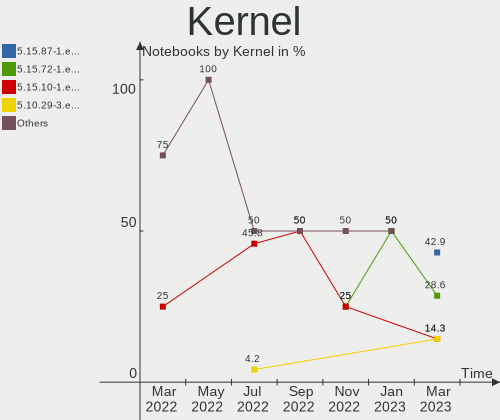

| Version                | Notebooks | Percent |
|------------------------|-----------|---------|
| 5.15.72-1.el7.3.x86_64 | 8         | 72.73%  |
| 5.15.10-1.el7.x86_64   | 3         | 27.27%  |

Kernel Family
-------------

Linux kernel without a distro release

| Version | Notebooks | Percent |
|---------|-----------|---------|
| 5.15.72 | 8         | 72.73%  |
| 5.15.10 | 3         | 27.27%  |

Kernel Major Ver.
-----------------

Linux kernel major version

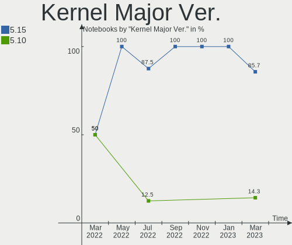

| Version | Notebooks | Percent |
|---------|-----------|---------|
| 5.15    | 11        | 100%    |

Arch
----

OS architecture (x86_64, i586, etc.)

| Name   | Notebooks | Percent |
|--------|-----------|---------|
| x86_64 | 11        | 100%    |

DE
--

Desktop Environment

| Name | Notebooks | Percent |
|------|-----------|---------|
| MATE | 11        | 100%    |

Display Server
--------------

X11 or Wayland

| Name | Notebooks | Percent |
|------|-----------|---------|
| X11  | 11        | 100%    |

Display Manager
---------------

SDDM, LightDM, etc.

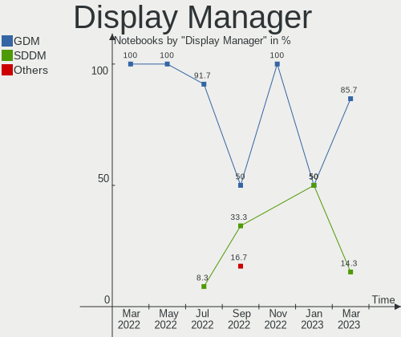

| Name | Notebooks | Percent |
|------|-----------|---------|
| GDM  | 10        | 90.91%  |
| SDDM | 1         | 9.09%   |

OS Lang
-------

Language

| Lang    | Notebooks | Percent |
|---------|-----------|---------|
| Unknown | 11        | 100%    |

Boot Mode
---------

EFI or BIOS

| Mode | Notebooks | Percent |
|------|-----------|---------|
| EFI  | 11        | 100%    |

Filesystem
----------

Type of filesystem

| Type | Notebooks | Percent |
|------|-----------|---------|
| Ext4 | 11        | 100%    |

Part. scheme
------------

Scheme of partitioning

| Type | Notebooks | Percent |
|------|-----------|---------|
| GPT  | 10        | 90.91%  |
| MBR  | 1         | 9.09%   |

Dual Boot with Linux/BSD
------------------------

Hosting more than one Linux/BSD

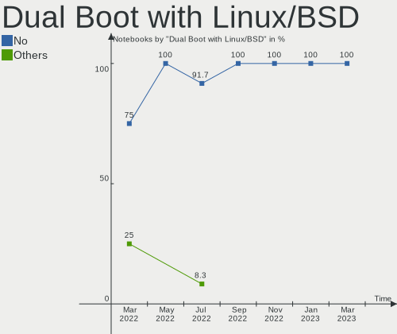

| Dual boot | Notebooks | Percent |
|-----------|-----------|---------|
| No        | 7         | 63.64%  |
| Yes       | 4         | 36.36%  |

Dual Boot (Win)
---------------

Hosting Linux and Windows

| Dual boot | Notebooks | Percent |
|-----------|-----------|---------|
| No        | 7         | 63.64%  |
| Yes       | 4         | 36.36%  |

Board
-----

Vendor
------

Motherboard manufacturer

| Name                           | Notebooks | Percent |
|--------------------------------|-----------|---------|
| Hewlett-Packard                | 3         | 27.27%  |
| Lenovo                         | 2         | 18.18%  |
| Shanghai Zhaoxin Semiconductor | 1         | 9.09%   |
| MSI                            | 1         | 9.09%   |
| Kraftway                       | 1         | 9.09%   |
| ICL                            | 1         | 9.09%   |
| Aquarius                       | 1         | 9.09%   |
| 3Logic Group                   | 1         | 9.09%   |

Model
-----

Motherboard model

| Name                                 | Notebooks | Percent |
|--------------------------------------|-----------|---------|
| HP Laptop 15s-eq1xxx                 | 2         | 18.18%  |
| Shanghai Zhaoxin ZXE CRB             | 1         | 9.09%   |
| MSI Sword 15 A12UE                   | 1         | 9.09%   |
| Lenovo ThinkPad E15 Gen 4 21E6009UGP | 1         | 9.09%   |
| Lenovo IdeaPad L340-15API 81LW       | 1         | 9.09%   |
| Kraftway ACCORD                      | 1         | 9.09%   |
| ICL RAYbook Si1512                   | 1         | 9.09%   |
| HP Notebook                          | 1         | 9.09%   |
| Aquarius NS685U R11                  | 1         | 9.09%   |
| 3Logic Group Graviton N15i-K2        | 1         | 9.09%   |

Model Family
------------

Motherboard model prefix

| Name                  | Notebooks | Percent |
|-----------------------|-----------|---------|
| HP Laptop             | 2         | 18.18%  |
| Shanghai Zhaoxin ZXE  | 1         | 9.09%   |
| MSI Sword             | 1         | 9.09%   |
| Lenovo ThinkPad       | 1         | 9.09%   |
| Lenovo IdeaPad        | 1         | 9.09%   |
| Kraftway ACCORD       | 1         | 9.09%   |
| ICL RAYbook           | 1         | 9.09%   |
| HP Notebook           | 1         | 9.09%   |
| Aquarius NS685U       | 1         | 9.09%   |
| 3Logic Group Graviton | 1         | 9.09%   |

MFG Year
--------

Motherboard manufacture year

| Year | Notebooks | Percent |
|------|-----------|---------|
| 2022 | 3         | 27.27%  |
| 2021 | 3         | 27.27%  |
| 2020 | 2         | 18.18%  |
| 2019 | 2         | 18.18%  |
| 2017 | 1         | 9.09%   |

Form Factor
-----------

Physical design of the computer

| Name     | Notebooks | Percent |
|----------|-----------|---------|
| Notebook | 11        | 100%    |

Secure Boot
-----------

Enabled or disabled

| State    | Notebooks | Percent |
|----------|-----------|---------|
| Disabled | 11        | 100%    |

Coreboot
--------

Have coreboot on board

| Used | Notebooks | Percent |
|------|-----------|---------|
| No   | 11        | 100%    |

RAM Size
--------

Total RAM memory

| Size in GB | Notebooks | Percent |
|------------|-----------|---------|
| 4.01-8.0   | 8         | 72.73%  |
| 16.01-24.0 | 2         | 18.18%  |
| 3.01-4.0   | 1         | 9.09%   |

RAM Used
--------

Used RAM memory

| Used GB  | Notebooks | Percent |
|----------|-----------|---------|
| 1.01-2.0 | 8         | 72.73%  |
| 2.01-3.0 | 3         | 27.27%  |

Total Drives
------------

Number of drives on board

| Drives | Notebooks | Percent |
|--------|-----------|---------|
| 1      | 10        | 90.91%  |
| 3      | 1         | 9.09%   |

Has CD-ROM
----------

Has CD-ROM on board

| Presented | Notebooks | Percent |
|-----------|-----------|---------|
| No        | 10        | 90.91%  |
| Yes       | 1         | 9.09%   |

Has Ethernet
------------

Has Ethernet on board

| Presented | Notebooks | Percent |
|-----------|-----------|---------|
| Yes       | 10        | 90.91%  |
| No        | 1         | 9.09%   |

Has WiFi
--------

Has WiFi module

| Presented | Notebooks | Percent |
|-----------|-----------|---------|
| Yes       | 11        | 100%    |

Has Bluetooth
-------------

Has Bluetooth module

| Presented | Notebooks | Percent |
|-----------|-----------|---------|
| Yes       | 11        | 100%    |

Location
--------

Country
-------

Geographic location (country)

| Country | Notebooks | Percent |
|---------|-----------|---------|
| Russia  | 11        | 100%    |

City
----

Geographic location (city)

| City          | Notebooks | Percent |
|---------------|-----------|---------|
| Salekhard     | 2         | 18.18%  |
| Moscow        | 2         | 18.18%  |
| Yekaterinburg | 1         | 9.09%   |
| Yakutsk       | 1         | 9.09%   |
| Omsk          | 1         | 9.09%   |
| Muromskiy     | 1         | 9.09%   |
| Murom         | 1         | 9.09%   |
| Khabarovsk    | 1         | 9.09%   |
| Balashikha    | 1         | 9.09%   |

Drives
------

Drive Vendor
------------

Hard drive vendors

| Vendor              | Notebooks | Drives | Percent |
|---------------------|-----------|--------|---------|
| SK hynix            | 2         | 2      | 15.38%  |
| Foxline             | 2         | 2      | 15.38%  |
| UMIS                | 1         | 1      | 7.69%   |
| Toshiba             | 1         | 1      | 7.69%   |
| SPCC Sol            | 1         | 1      | 7.69%   |
| Seagate             | 1         | 1      | 7.69%   |
| Samsung Electronics | 1         | 1      | 7.69%   |
| Micron Technology   | 1         | 1      | 7.69%   |
| KingSpec            | 1         | 1      | 7.69%   |
| China               | 1         | 1      | 7.69%   |
| A-DATA Technology   | 1         | 1      | 7.69%   |

Drive Model
-----------

Hard drive models

| Model                                | Notebooks | Percent |
|--------------------------------------|-----------|---------|
| SK hynix PC711 HFS512GDE9X073N 512GB | 2         | 15.38%  |
| Foxline FLSSD256M80E13TCX5 256GB     | 2         | 15.38%  |
| UMIS RPJTJ256MGE1QDQ 256GB           | 1         | 7.69%   |
| Toshiba MQ01ABF050 500GB             | 1         | 7.69%   |
| SPCC Sol id State Disk 64GB SSD      | 1         | 7.69%   |
| Seagate ST500LT012-1DG142 500GB      | 1         | 7.69%   |
| Samsung MZALQ512HALU-000L2 512GB     | 1         | 7.69%   |
| Micron 2450_MTFDKBA512TFK 512GB      | 1         | 7.69%   |
| KingSpec NT-256 256GB SSD            | 1         | 7.69%   |
| China 256GB SSD                      | 1         | 7.69%   |
| A-DATA SU800NS38 256GB SSD           | 1         | 7.69%   |

HDD Vendor
----------

Hard disk drive vendors

| Vendor  | Notebooks | Drives | Percent |
|---------|-----------|--------|---------|
| Toshiba | 1         | 1      | 50%     |
| Seagate | 1         | 1      | 50%     |

SSD Vendor
----------

Solid state drive vendors

| Vendor            | Notebooks | Drives | Percent |
|-------------------|-----------|--------|---------|
| SPCC Sol          | 1         | 1      | 25%     |
| KingSpec          | 1         | 1      | 25%     |
| China             | 1         | 1      | 25%     |
| A-DATA Technology | 1         | 1      | 25%     |

Drive Kind
----------

HDD or SSD

| Kind | Notebooks | Drives | Percent |
|------|-----------|--------|---------|
| NVMe | 7         | 7      | 53.85%  |
| SSD  | 4         | 4      | 30.77%  |
| HDD  | 2         | 2      | 15.38%  |

Drive Connector
---------------

SATA, SAS, NVMe, etc.

| Type | Notebooks | Drives | Percent |
|------|-----------|--------|---------|
| NVMe | 7         | 7      | 53.85%  |
| SATA | 5         | 5      | 38.46%  |
| SAS  | 1         | 1      | 7.69%   |

Drive Size
----------

Size of hard drive

| Size in TB | Notebooks | Drives | Percent |
|------------|-----------|--------|---------|
| 0.01-0.5   | 5         | 6      | 100%    |

Space Total
-----------

Amount of disk space available on the file system

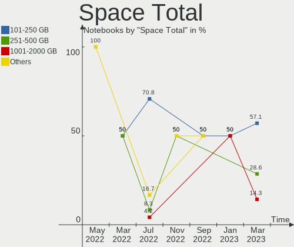

| Size in GB | Notebooks | Percent |
|------------|-----------|---------|
| 101-250    | 5         | 45.45%  |
| 51-100     | 3         | 27.27%  |
| 251-500    | 1         | 9.09%   |
| 1-20       | 1         | 9.09%   |
| 501-1000   | 1         | 9.09%   |

Space Used
----------

Amount of used disk space

| Used GB  | Notebooks | Percent |
|----------|-----------|---------|
| 1-20     | 10        | 90.91%  |
| 501-1000 | 1         | 9.09%   |

Malfunc. Drives
---------------

Drive models with a malfunction

| Model                           | Notebooks | Drives | Percent |
|---------------------------------|-----------|--------|---------|
| Toshiba MQ01ABF050 500GB        | 1         | 1      | 50%     |
| Seagate ST500LT012-1DG142 500GB | 1         | 1      | 50%     |

Malfunc. Drive Vendor
---------------------

Vendors of faulty drives

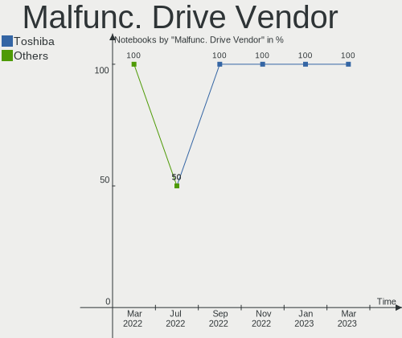

| Vendor  | Notebooks | Drives | Percent |
|---------|-----------|--------|---------|
| Toshiba | 1         | 1      | 50%     |
| Seagate | 1         | 1      | 50%     |

Malfunc. HDD Vendor
-------------------

Vendors of faulty HDD drives

| Vendor  | Notebooks | Drives | Percent |
|---------|-----------|--------|---------|
| Toshiba | 1         | 1      | 50%     |
| Seagate | 1         | 1      | 50%     |

Malfunc. Drive Kind
-------------------

Kinds of faulty drives

| Kind | Notebooks | Drives | Percent |
|------|-----------|--------|---------|
| HDD  | 2         | 2      | 100%    |

Failed Drives
-------------

Failed drive models

Zero info for selected period =(

Failed Drive Vendor
-------------------

Failed drive vendors

Zero info for selected period =(

Drive Status
------------

Number of failed and malfunc. drives

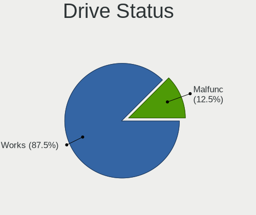

| Status   | Notebooks | Drives | Percent |
|----------|-----------|--------|---------|
| Works    | 10        | 10     | 76.92%  |
| Malfunc  | 2         | 2      | 15.38%  |
| Detected | 1         | 1      | 7.69%   |

Storage controller
------------------

Storage Vendor
--------------

Storage controller vendors

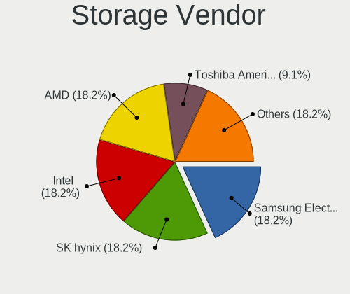

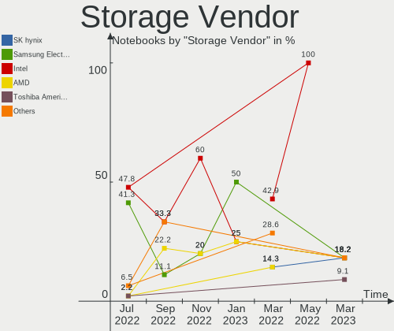

| Vendor                  | Notebooks | Percent |
|-------------------------|-----------|---------|
| Intel                   | 6         | 40%     |
| SK hynix                | 2         | 13.33%  |
| Phison Electronics      | 2         | 13.33%  |
| Zhaoxin                 | 1         | 6.67%   |
| Union Memory (Shenzhen) | 1         | 6.67%   |
| Samsung Electronics     | 1         | 6.67%   |
| Micron Technology       | 1         | 6.67%   |
| AMD                     | 1         | 6.67%   |

Storage Model
-------------

Storage controller models

| Model                                                  | Notebooks | Percent |
|--------------------------------------------------------|-----------|---------|
| Intel Cannon Point-LP SATA Controller [AHCI Mode]      | 3         | 20%     |
| SK hynix Gold P31/PC711 NVMe Solid State Drive         | 2         | 13.33%  |
| Phison PS5013 E13 NVMe Controller                      | 2         | 13.33%  |
| Zhaoxin ZX-100/ZX-200/ZX-E StorX AHCI Controller       | 1         | 6.67%   |
| Union Memory (Shenzhen) Non-Volatile memory controller | 1         | 6.67%   |
| Samsung NVMe SSD Controller 980                        | 1         | 6.67%   |
| Micron Non-Volatile memory controller                  | 1         | 6.67%   |
| Intel Comet Lake SATA AHCI Controller                  | 1         | 6.67%   |
| Intel Alder Lake-P SATA AHCI Controller                | 1         | 6.67%   |
| Intel 8 Series SATA Controller 1 [AHCI mode]           | 1         | 6.67%   |
| AMD FCH SATA Controller [AHCI mode]                    | 1         | 6.67%   |

Storage Kind
------------

Kind of storage controller (IDE, SATA, NVMe, SAS, ...)

| Kind | Notebooks | Percent |
|------|-----------|---------|
| SATA | 8         | 53.33%  |
| NVMe | 7         | 46.67%  |

Processor
---------

CPU Vendor
----------

Processor vendors

| Vendor       | Notebooks | Percent |
|--------------|-----------|---------|
| Intel        | 7         | 63.64%  |
| AMD          | 3         | 27.27%  |
| CentaurHauls | 1         | 9.09%   |

CPU Model
---------

Processor models

| Model                                          | Notebooks | Percent |
|------------------------------------------------|-----------|---------|
| Intel Core i5-8259U CPU @ 2.30GHz              | 2         | 18.18%  |
| AMD Ryzen 3 4300U with Radeon Graphics         | 2         | 18.18%  |
| Intel Core i5-8279U CPU @ 2.40GHz              | 1         | 9.09%   |
| Intel Core i5-10210U CPU @ 1.60GHz             | 1         | 9.09%   |
| Intel Core i3-4005U CPU @ 1.70GHz              | 1         | 9.09%   |
| Intel 12th Gen Core i7-12700H                  | 1         | 9.09%   |
| Intel 12th Gen Core i5-1235U                   | 1         | 9.09%   |
| CentaurHauls ZHAOXIN KaiXian KX-6640MA@2.2+GHz | 1         | 9.09%   |
| AMD Ryzen 5 3500U with Radeon Vega Mobile Gfx  | 1         | 9.09%   |

CPU Model Family
----------------

Processor model prefix

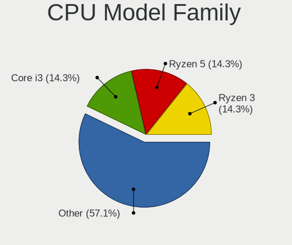

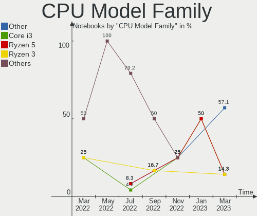

| Model         | Notebooks | Percent |
|---------------|-----------|---------|
| Intel Core i5 | 4         | 36.36%  |
| Other         | 3         | 27.27%  |
| AMD Ryzen 3   | 2         | 18.18%  |
| Intel Core i3 | 1         | 9.09%   |
| AMD Ryzen 5   | 1         | 9.09%   |

CPU Cores
---------

Number of processor cores

| Number | Notebooks | Percent |
|--------|-----------|---------|
| 4      | 8         | 72.73%  |
| 14     | 1         | 9.09%   |
| 10     | 1         | 9.09%   |
| 2      | 1         | 9.09%   |

CPU Sockets
-----------

Number of sockets

| Number | Notebooks | Percent |
|--------|-----------|---------|
| 1      | 11        | 100%    |

CPU Threads
-----------

Threads per core (Hyper-Threading)

| Number | Notebooks | Percent |
|--------|-----------|---------|
| 2      | 8         | 72.73%  |
| 1      | 3         | 27.27%  |

CPU Op-Modes
------------

CPU Operation Modes (32-bit, 64-bit)

| Op mode        | Notebooks | Percent |
|----------------|-----------|---------|
| 32-bit, 64-bit | 11        | 100%    |

CPU Microcode
-------------

Microcode number

| Number     | Notebooks | Percent |
|------------|-----------|---------|
| 0x806ea    | 3         | 27.27%  |
| 0x08600106 | 2         | 18.18%  |
| 0x906a4    | 1         | 9.09%   |
| 0x906a3    | 1         | 9.09%   |
| 0x806ec    | 1         | 9.09%   |
| 0x40651    | 1         | 9.09%   |
| 0x08108102 | 1         | 9.09%   |
| Unknown    | 1         | 9.09%   |

CPU Microarch
-------------

Microarchitecture

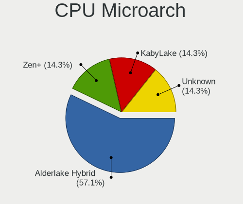

| Name             | Notebooks | Percent |
|------------------|-----------|---------|
| KabyLake         | 4         | 36.36%  |
| Zen 2            | 2         | 18.18%  |
| Alderlake Hybrid | 2         | 18.18%  |
| Zen+             | 1         | 9.09%   |
| Haswell          | 1         | 9.09%   |
| Unknown          | 1         | 9.09%   |

Graphics
--------

GPU Vendor
----------

Vendors of graphics cards

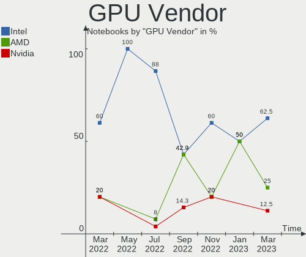

| Vendor  | Notebooks | Percent |
|---------|-----------|---------|
| Intel   | 7         | 50%     |
| AMD     | 4         | 28.57%  |
| Nvidia  | 2         | 14.29%  |
| Zhaoxin | 1         | 7.14%   |

GPU Model
---------

Graphics card models

| Model                                                                         | Notebooks | Percent |
|-------------------------------------------------------------------------------|-----------|---------|
| Intel CoffeeLake-U GT3e [Iris Plus Graphics 655]                              | 3         | 21.43%  |
| AMD Renoir                                                                    | 2         | 14.29%  |
| Zhaoxin ZX-E C-960 GPU                                                        | 1         | 7.14%   |
| Nvidia TU117M [GeForce MX550]                                                 | 1         | 7.14%   |
| Nvidia GA106M [GeForce RTX 3060 Mobile / Max-Q]                               | 1         | 7.14%   |
| Intel Haswell-ULT Integrated Graphics Controller                              | 1         | 7.14%   |
| Intel CometLake-U GT2 [UHD Graphics]                                          | 1         | 7.14%   |
| Intel Alder Lake-UP3 GT2 [Iris Xe Graphics]                                   | 1         | 7.14%   |
| Intel Alder Lake-P Integrated Graphics Controller                             | 1         | 7.14%   |
| AMD Sun XT [Radeon HD 8670A/8670M/8690M / R5 M330 / M430 / Radeon 520 Mobile] | 1         | 7.14%   |
| AMD Picasso/Raven 2 [Radeon Vega Series / Radeon Vega Mobile Series]          | 1         | 7.14%   |

GPU Combo
---------

Combinations of graphics cards

| Name           | Notebooks | Percent |
|----------------|-----------|---------|
| 1 x Intel      | 4         | 36.36%  |
| 1 x AMD        | 3         | 27.27%  |
| Intel + Nvidia | 2         | 18.18%  |
| 1 x Zhaoxin    | 1         | 9.09%   |
| Intel + AMD    | 1         | 9.09%   |

GPU Driver
----------

Free vs proprietary

| Driver  | Notebooks | Percent |
|---------|-----------|---------|
| Free    | 8         | 72.73%  |
| Unknown | 3         | 27.27%  |

GPU Memory
----------

Total video memory

| Size in GB | Notebooks | Percent |
|------------|-----------|---------|
| Unknown    | 6         | 54.55%  |
| 1.01-2.0   | 3         | 27.27%  |
| 0.01-0.5   | 2         | 18.18%  |

Monitor
-------

Monitor Vendor
--------------

Monitor vendors

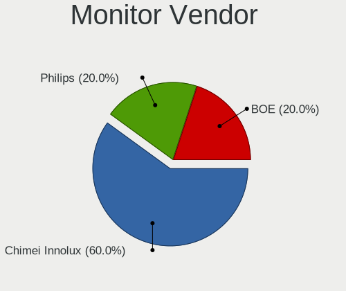

| Vendor              | Notebooks | Percent |
|---------------------|-----------|---------|
| BOE                 | 4         | 36.36%  |
| NLE                 | 2         | 18.18%  |
| LG Display          | 2         | 18.18%  |
| Samsung Electronics | 1         | 9.09%   |
| Philips             | 1         | 9.09%   |
| Chimei Innolux      | 1         | 9.09%   |

Monitor Model
-------------

Monitor models

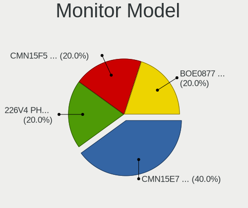

| Model                                                                | Notebooks | Percent |
|----------------------------------------------------------------------|-----------|---------|
| BOE LCD Monitor BOE09C5 1920x1080 345x194mm 15.6-inch                | 3         | 27.27%  |
| NLE Newline NLE0032 3840x2160 944x398mm 40.3-inch                    | 2         | 18.18%  |
| LG Display LCD Monitor LGD062E 1920x1080 344x194mm 15.5-inch         | 2         | 18.18%  |
| Samsung Electronics LCD Monitor SDC4E51 1366x768 344x194mm 15.5-inch | 1         | 9.09%   |
| Philips 226V4 PHLC0B1 1920x1080 477x268mm 21.5-inch                  | 1         | 9.09%   |
| Chimei Innolux LCD Monitor CMN15F5 1920x1080 344x193mm 15.5-inch     | 1         | 9.09%   |
| BOE LCD Monitor BOE07D0 1920x1080 294x165mm 13.3-inch                | 1         | 9.09%   |

Monitor Resolution
------------------

Monitor screen resolution

| Resolution      | Notebooks | Percent |
|-----------------|-----------|---------|
| 1920x1080 (FHD) | 7         | 70%     |
| 3840x2160 (4K)  | 2         | 20%     |
| 1366x768 (WXGA) | 1         | 10%     |

Monitor Diagonal
----------------

Diagonal size in inches

| Inches | Notebooks | Percent |
|--------|-----------|---------|
| 15     | 8         | 72.73%  |
| 40     | 2         | 18.18%  |
| 21     | 1         | 9.09%   |

Monitor Width
-------------

Physical width

| Width in mm | Notebooks | Percent |
|-------------|-----------|---------|
| 301-350     | 8         | 72.73%  |
| 901-1000    | 2         | 18.18%  |
| 401-500     | 1         | 9.09%   |

Aspect Ratio
------------

Proportional relationship between the width and the height

| Ratio | Notebooks | Percent |
|-------|-----------|---------|
| 16/9  | 8         | 80%     |
| 21/9  | 2         | 20%     |

Monitor Area
------------

Area in inch²

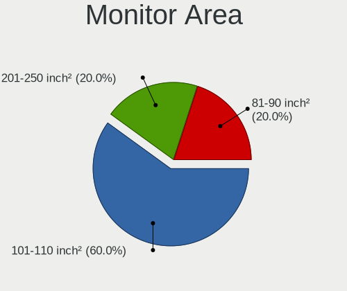

| Area in inch² | Notebooks | Percent |
|----------------|-----------|---------|
| 101-110        | 8         | 72.73%  |
| 501-1000       | 2         | 18.18%  |
| 201-250        | 1         | 9.09%   |

Pixel Density
-------------

Pixels per inch

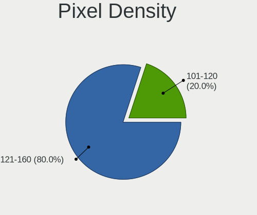

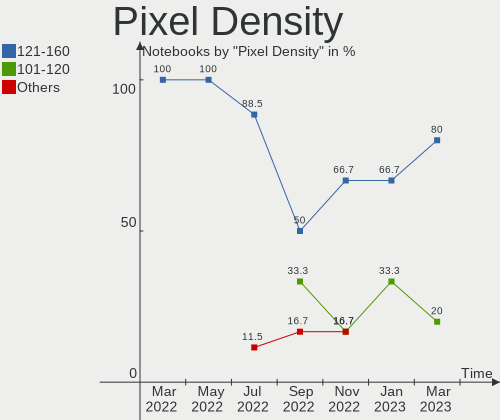

| Density | Notebooks | Percent |
|---------|-----------|---------|
| 121-160 | 7         | 70%     |
| 101-120 | 3         | 30%     |

Multiple Monitors
-----------------

Total monitors connected

| Total | Notebooks | Percent |
|-------|-----------|---------|
| 1     | 6         | 54.55%  |
| 0     | 3         | 27.27%  |
| 2     | 2         | 18.18%  |

Network
-------

Net Controller Vendor
---------------------

Controller vendors

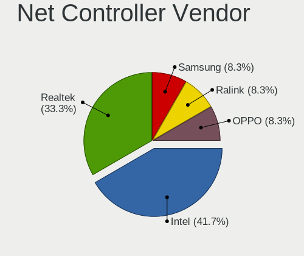

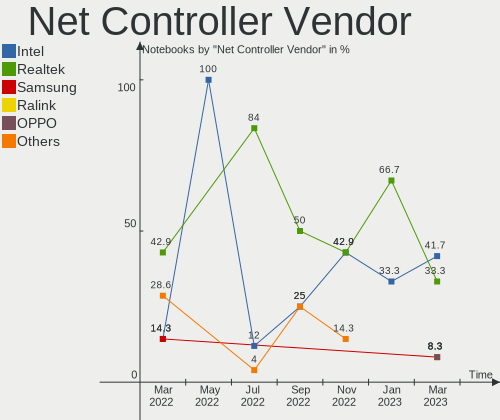

| Vendor                | Notebooks | Percent |
|-----------------------|-----------|---------|
| Realtek Semiconductor | 8         | 47.06%  |
| Intel                 | 7         | 41.18%  |
| OPPO Electronics      | 1         | 5.88%   |
| Broadcom              | 1         | 5.88%   |

Net Controller Model
--------------------

Controller models

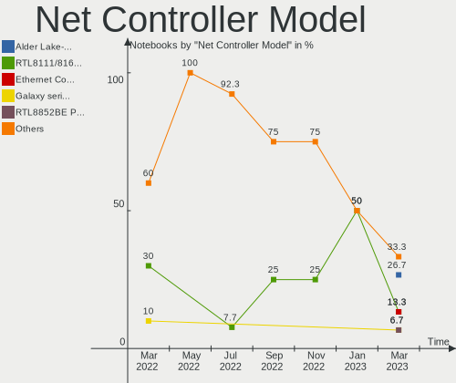

| Model                                                             | Notebooks | Percent |
|-------------------------------------------------------------------|-----------|---------|
| Realtek RTL8111/8168/8411 PCI Express Gigabit Ethernet Controller | 4         | 17.39%  |
| Intel Wireless 7265                                               | 4         | 17.39%  |
| Realtek RTL8821CE 802.11ac PCIe Wireless Network Adapter          | 3         | 13.04%  |
| Realtek RTL8153 Gigabit Ethernet Adapter                          | 2         | 8.7%    |
| Intel Ethernet Connection (6) I219-V                              | 2         | 8.7%    |
| Intel Alder Lake-P PCH CNVi WiFi                                  | 2         | 8.7%    |
| Realtek RTL8812AU 802.11a/b/g/n/ac 2T2R DB WLAN Adapter           | 1         | 4.35%   |
| Realtek RTL810xE PCI Express Fast Ethernet controller             | 1         | 4.35%   |
| OPPO RMX3263                                                      | 1         | 4.35%   |
| Intel Ethernet Connection (16) I219-V                             | 1         | 4.35%   |
| Intel Cannon Point-LP CNVi [Wireless-AC]                          | 1         | 4.35%   |
| Broadcom BCM43142 802.11b/g/n                                     | 1         | 4.35%   |

Wireless Vendor
---------------

Wireless vendors

| Vendor                | Notebooks | Percent |
|-----------------------|-----------|---------|
| Intel                 | 7         | 58.33%  |
| Realtek Semiconductor | 4         | 33.33%  |
| Broadcom              | 1         | 8.33%   |

Wireless Model
--------------

Wireless models

| Model                                                    | Notebooks | Percent |
|----------------------------------------------------------|-----------|---------|
| Intel Wireless 7265                                      | 4         | 33.33%  |
| Realtek RTL8821CE 802.11ac PCIe Wireless Network Adapter | 3         | 25%     |
| Intel Alder Lake-P PCH CNVi WiFi                         | 2         | 16.67%  |
| Realtek RTL8812AU 802.11a/b/g/n/ac 2T2R DB WLAN Adapter  | 1         | 8.33%   |
| Intel Cannon Point-LP CNVi [Wireless-AC]                 | 1         | 8.33%   |
| Broadcom BCM43142 802.11b/g/n                            | 1         | 8.33%   |

Ethernet Vendor
---------------

Ethernet vendors

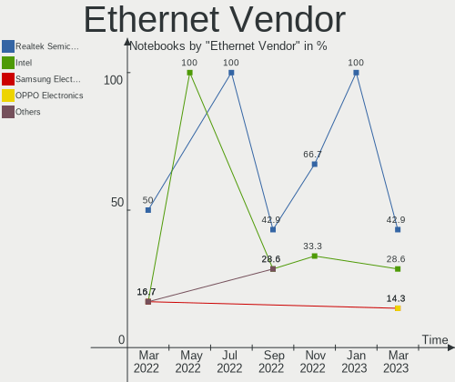

| Vendor                | Notebooks | Percent |
|-----------------------|-----------|---------|
| Realtek Semiconductor | 7         | 63.64%  |
| Intel                 | 3         | 27.27%  |
| OPPO Electronics      | 1         | 9.09%   |

Ethernet Model
--------------

Ethernet models

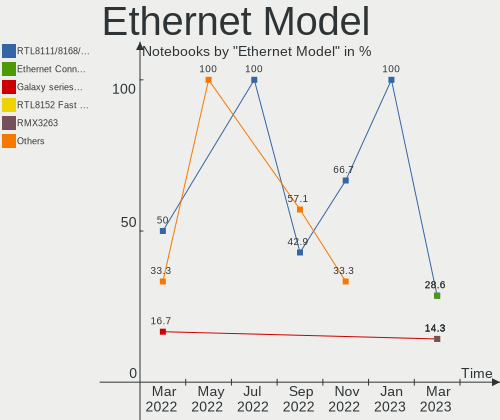

| Model                                                             | Notebooks | Percent |
|-------------------------------------------------------------------|-----------|---------|
| Realtek RTL8111/8168/8411 PCI Express Gigabit Ethernet Controller | 4         | 36.36%  |
| Realtek RTL8153 Gigabit Ethernet Adapter                          | 2         | 18.18%  |
| Intel Ethernet Connection (6) I219-V                              | 2         | 18.18%  |
| Realtek RTL810xE PCI Express Fast Ethernet controller             | 1         | 9.09%   |
| OPPO RMX3263                                                      | 1         | 9.09%   |
| Intel Ethernet Connection (16) I219-V                             | 1         | 9.09%   |

Net Controller Kind
-------------------

Ethernet, WiFi or modem

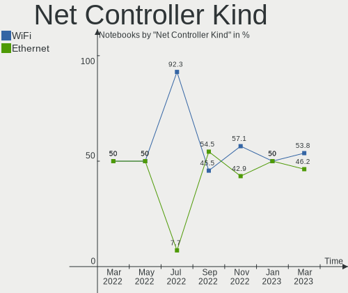

| Kind     | Notebooks | Percent |
|----------|-----------|---------|
| WiFi     | 11        | 52.38%  |
| Ethernet | 10        | 47.62%  |

Used Controller
---------------

Currently used network controller

| Kind     | Notebooks | Percent |
|----------|-----------|---------|
| Ethernet | 6         | 54.55%  |
| WiFi     | 5         | 45.45%  |

NICs
----

Total network controllers on board

| Total | Notebooks | Percent |
|-------|-----------|---------|
| 2     | 8         | 72.73%  |
| 1     | 3         | 27.27%  |

IPv6
----

IPv6 vs IPv4

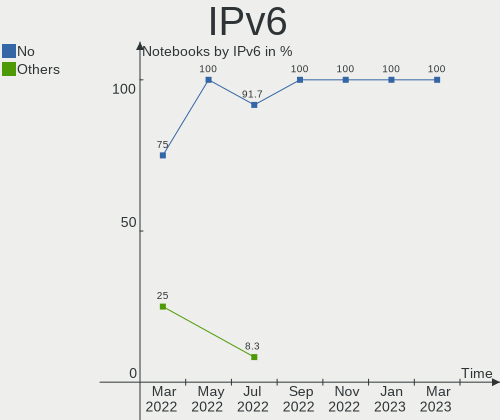

| Used | Notebooks | Percent |
|------|-----------|---------|
| No   | 9         | 81.82%  |
| Yes  | 2         | 18.18%  |

Bluetooth
---------

Bluetooth Vendor
----------------

Controller vendors

| Vendor                | Notebooks | Percent |
|-----------------------|-----------|---------|
| Intel                 | 7         | 63.64%  |
| Realtek Semiconductor | 3         | 27.27%  |
| Broadcom              | 1         | 9.09%   |

Bluetooth Model
---------------

Controller models

| Model                                          | Notebooks | Percent |
|------------------------------------------------|-----------|---------|
| Intel Bluetooth wireless interface             | 4         | 36.36%  |
| Realtek  Bluetooth 4.2 Adapter                 | 2         | 18.18%  |
| Realtek Bluetooth Radio                        | 1         | 9.09%   |
| Intel Bluetooth Device                         | 1         | 9.09%   |
| Intel Bluetooth 9460/9560 Jefferson Peak (JfP) | 1         | 9.09%   |
| Intel AX201 Bluetooth                          | 1         | 9.09%   |
| Broadcom BCM43142A0 Bluetooth 4.0              | 1         | 9.09%   |

Sound
-----

Sound Vendor
------------

Sound card vendors

| Vendor  | Notebooks | Percent |
|---------|-----------|---------|
| Intel   | 7         | 58.33%  |
| AMD     | 3         | 25%     |
| Zhaoxin | 1         | 8.33%   |
| Nvidia  | 1         | 8.33%   |

Sound Model
-----------

Sound card models

| Model                                                     | Notebooks | Percent |
|-----------------------------------------------------------|-----------|---------|
| Intel Cannon Point-LP High Definition Audio Controller    | 3         | 17.65%  |
| AMD Family 17h/19h HD Audio Controller                    | 3         | 17.65%  |
| Intel Alder Lake PCH-P High Definition Audio Controller   | 2         | 11.76%  |
| AMD Renoir Radeon High Definition Audio Controller        | 2         | 11.76%  |
| Zhaoxin ZX-E High Definition Audio Controller             | 1         | 5.88%   |
| Zhaoxin ZX-100/ZX-D/ZX-E High Definition Audio Controller | 1         | 5.88%   |
| Nvidia GA106 High Definition Audio Controller             | 1         | 5.88%   |
| Intel Haswell-ULT HD Audio Controller                     | 1         | 5.88%   |
| Intel Comet Lake PCH-LP cAVS                              | 1         | 5.88%   |
| Intel 8 Series HD Audio Controller                        | 1         | 5.88%   |
| AMD Raven/Raven2/Fenghuang HDMI/DP Audio Controller       | 1         | 5.88%   |

Memory
------

Memory Vendor
-------------

Memory module vendors

| Vendor              | Notebooks | Percent |
|---------------------|-----------|---------|
| Foxline             | 4         | 33.33%  |
| Samsung Electronics | 3         | 25%     |
| SK hynix            | 2         | 16.67%  |
| Ramaxel Technology  | 1         | 8.33%   |
| Micron Technology   | 1         | 8.33%   |
| <Invalid>           | 1         | 8.33%   |

Memory Model
------------

Memory module models

| Model                                                        | Notebooks | Percent |
|--------------------------------------------------------------|-----------|---------|
| SK hynix RAM HMA851S6CJR6N-XN 4GB SODIMM DDR4 3200MT/s       | 2         | 15.38%  |
| Foxline RAM FL2666D4S19-8G 8GB SODIMM DDR4 2667MT/s          | 2         | 15.38%  |
| Samsung RAM M471B5173QH0-YK0 4GB SODIMM DDR3 1600MT/s        | 1         | 7.69%   |
| Samsung RAM M471A5244CB0-CTD 4GB SODIMM DDR4 3266MT/s        | 1         | 7.69%   |
| Samsung RAM M471A1K43DB1-CWE 8GB SODIMM DDR4 3200MT/s        | 1         | 7.69%   |
| Samsung RAM M471A1G44BB0-CWE 8GB SODIMM DDR4 3200MT/s        | 1         | 7.69%   |
| Ramaxel RAM RMSA3270ME86H9F-2666 4096MB SODIMM DDR4 2667MT/s | 1         | 7.69%   |
| Micron RAM 8ATF1G64HZ-3G2R1 8GB SODIMM DDR4 3200MT/s         | 1         | 7.69%   |
| Foxline RAM FL3200D4S22-8G 8GB SODIMM DDR4 3200MT/s          | 1         | 7.69%   |
| Foxline RAM FL2400D4S17S-8G 8GB SODIMM DDR4 2400MT/s         | 1         | 7.69%   |
| <Invalid> RAM Module 8GB SODIMM DDR4 2666MT/s                | 1         | 7.69%   |

Memory Kind
-----------

Memory module kinds

| Kind | Notebooks | Percent |
|------|-----------|---------|
| DDR4 | 10        | 90.91%  |
| DDR3 | 1         | 9.09%   |

Memory Form Factor
------------------

Physical design of the memory module

| Name   | Notebooks | Percent |
|--------|-----------|---------|
| SODIMM | 11        | 100%    |

Memory Size
-----------

Memory module size

| Size | Notebooks | Percent |
|------|-----------|---------|
| 8192 | 7         | 63.64%  |
| 4096 | 4         | 36.36%  |

Memory Speed
------------

Memory module speed

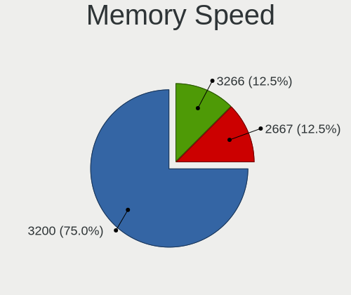

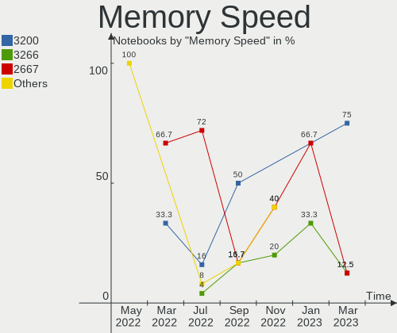

| Speed | Notebooks | Percent |
|-------|-----------|---------|
| 3200  | 5         | 41.67%  |
| 2667  | 3         | 25%     |
| 3266  | 1         | 8.33%   |
| 2666  | 1         | 8.33%   |
| 2400  | 1         | 8.33%   |
| 1600  | 1         | 8.33%   |

Printers & scanners
-------------------

Printer Vendor
--------------

Printer device vendors

Zero info for selected period =(

Printer Model
-------------

Printer device models

Zero info for selected period =(

Scanner Vendor
--------------

Scanner device vendors

Zero info for selected period =(

Scanner Model
-------------

Scanner device models

Zero info for selected period =(

Camera
------

Camera Vendor
-------------

Camera device vendors

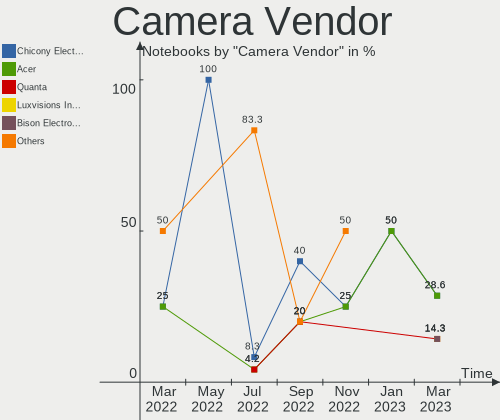

| Vendor                      | Notebooks | Percent |
|-----------------------------|-----------|---------|
| Quanta                      | 2         | 18.18%  |
| Luxvisions Innotech Limited | 2         | 18.18%  |
| Chicony Electronics         | 2         | 18.18%  |
| Suyin                       | 1         | 9.09%   |
| Sonix Technology            | 1         | 9.09%   |
| Microdia                    | 1         | 9.09%   |
| Acer                        | 1         | 9.09%   |
| Unknown                     | 1         | 9.09%   |

Camera Model
------------

Camera device models

| Model                                         | Notebooks | Percent |
|-----------------------------------------------|-----------|---------|
| Quanta HP TrueVision HD Camera                | 2         | 18.18%  |
| Luxvisions Innotech Limited Integrated Camera | 2         | 18.18%  |
| Chicony USB camera                            | 2         | 18.18%  |
| Suyin HP Truevision HD                        | 1         | 9.09%   |
| Sonix USB 2.0 Camera                          | 1         | 9.09%   |
| Microdia Webcam Vitade AF                     | 1         | 9.09%   |
| Acer Integrated Camera                        | 1         | 9.09%   |
| Unknown                                       | 1         | 9.09%   |

Security
--------

Fingerprint Vendor
------------------

Fingerprint sensor vendors

Zero info for selected period =(

Fingerprint Model
-----------------

Fingerprint sensor models

Zero info for selected period =(

Chipcard Vendor
---------------

Chipcard module vendors

Zero info for selected period =(

Chipcard Model
--------------

Chipcard module models

Zero info for selected period =(

Unsupported
-----------

Unsupported Devices
-------------------

Total unsupported devices on board

| Total | Notebooks | Percent |
|-------|-----------|---------|
| 0     | 7         | 63.64%  |
| 2     | 3         | 27.27%  |
| 1     | 1         | 9.09%   |

Unsupported Device Types
------------------------

Types of unsupported devices

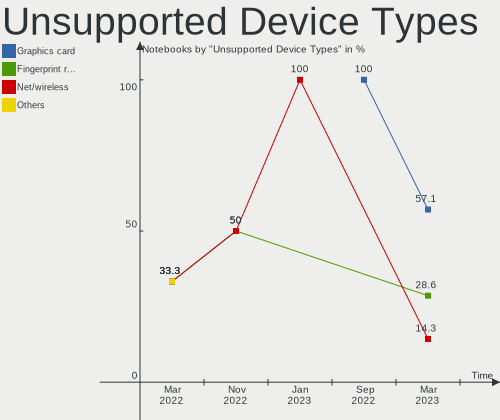

| Type          | Notebooks | Percent |
|---------------|-----------|---------|
| Graphics card | 3         | 60%     |
| Sound         | 1         | 20%     |
| Net/wireless  | 1         | 20%     |

