Red OS - Hardware Trends
------------------------

A project to identify most popular hardware characteristics and track their change
over time based on data collected by Linux users at https://Linux-Hardware.org.

Anyone can contribute to this report by the [hw-probe](https://github.com/linuxhw/hw-probe) tool:

    sudo -E hw-probe -all -upload

This is a report for all computer types. See also reports for [desktops](/Dist/Red_OS/Desktop/README.md) and [notebooks](/Dist/Red_OS/Notebook/README.md).

This report is for one last month. Overall report since the beginning of time: [TestDays](https://github.com/linuxhw/TestDays)

Period: Feb, 2023.

Contents
--------

* [ System ](#system)
  - [ OS                       ](#os)
  - [ OS Family                ](#os-family)
  - [ Kernel                   ](#kernel)
  - [ Kernel Family            ](#kernel-family)
  - [ Kernel Major Ver.        ](#kernel-major-ver)
  - [ Arch                     ](#arch)
  - [ DE                       ](#de)
  - [ Display Server           ](#display-server)
  - [ Display Manager          ](#display-manager)
  - [ OS Lang                  ](#os-lang)
  - [ Boot Mode                ](#boot-mode)
  - [ Filesystem               ](#filesystem)
  - [ Part. scheme             ](#part-scheme)
  - [ Dual Boot with Linux/BSD ](#dual-boot-with-linuxbsd)
  - [ Dual Boot (Win)          ](#dual-boot-win)

* [ Board ](#board)
  - [ Vendor                   ](#vendor)
  - [ Model                    ](#model)
  - [ Model Family             ](#model-family)
  - [ MFG Year                 ](#mfg-year)
  - [ Form Factor              ](#form-factor)
  - [ Secure Boot              ](#secure-boot)
  - [ Coreboot                 ](#coreboot)
  - [ RAM Size                 ](#ram-size)
  - [ RAM Used                 ](#ram-used)
  - [ Total Drives             ](#total-drives)
  - [ Has CD-ROM               ](#has-cd-rom)
  - [ Has Ethernet             ](#has-ethernet)
  - [ Has WiFi                 ](#has-wifi)
  - [ Has Bluetooth            ](#has-bluetooth)

* [ Location ](#location)
  - [ Country                  ](#country)
  - [ City                     ](#city)

* [ Drives ](#drives)
  - [ Drive Vendor             ](#drive-vendor)
  - [ Drive Model              ](#drive-model)
  - [ HDD Vendor               ](#hdd-vendor)
  - [ SSD Vendor               ](#ssd-vendor)
  - [ Drive Kind               ](#drive-kind)
  - [ Drive Connector          ](#drive-connector)
  - [ Drive Size               ](#drive-size)
  - [ Space Total              ](#space-total)
  - [ Space Used               ](#space-used)
  - [ Malfunc. Drives          ](#malfunc-drives)
  - [ Malfunc. Drive Vendor    ](#malfunc-drive-vendor)
  - [ Malfunc. HDD Vendor      ](#malfunc-hdd-vendor)
  - [ Malfunc. Drive Kind      ](#malfunc-drive-kind)
  - [ Failed Drives            ](#failed-drives)
  - [ Failed Drive Vendor      ](#failed-drive-vendor)
  - [ Drive Status             ](#drive-status)

* [ Storage controller ](#storage-controller)
  - [ Storage Vendor           ](#storage-vendor)
  - [ Storage Model            ](#storage-model)
  - [ Storage Kind             ](#storage-kind)

* [ Processor ](#processor)
  - [ CPU Vendor               ](#cpu-vendor)
  - [ CPU Model                ](#cpu-model)
  - [ CPU Model Family         ](#cpu-model-family)
  - [ CPU Cores                ](#cpu-cores)
  - [ CPU Sockets              ](#cpu-sockets)
  - [ CPU Threads              ](#cpu-threads)
  - [ CPU Op-Modes             ](#cpu-op-modes)
  - [ CPU Microcode            ](#cpu-microcode)
  - [ CPU Microarch            ](#cpu-microarch)

* [ Graphics ](#graphics)
  - [ GPU Vendor               ](#gpu-vendor)
  - [ GPU Model                ](#gpu-model)
  - [ GPU Combo                ](#gpu-combo)
  - [ GPU Driver               ](#gpu-driver)
  - [ GPU Memory               ](#gpu-memory)

* [ Monitor ](#monitor)
  - [ Monitor Vendor           ](#monitor-vendor)
  - [ Monitor Model            ](#monitor-model)
  - [ Monitor Resolution       ](#monitor-resolution)
  - [ Monitor Diagonal         ](#monitor-diagonal)
  - [ Monitor Width            ](#monitor-width)
  - [ Aspect Ratio             ](#aspect-ratio)
  - [ Monitor Area             ](#monitor-area)
  - [ Pixel Density            ](#pixel-density)
  - [ Multiple Monitors        ](#multiple-monitors)

* [ Network ](#network)
  - [ Net Controller Vendor    ](#net-controller-vendor)
  - [ Net Controller Model     ](#net-controller-model)
  - [ Wireless Vendor          ](#wireless-vendor)
  - [ Wireless Model           ](#wireless-model)
  - [ Ethernet Vendor          ](#ethernet-vendor)
  - [ Ethernet Model           ](#ethernet-model)
  - [ Net Controller Kind      ](#net-controller-kind)
  - [ Used Controller          ](#used-controller)
  - [ NICs                     ](#nics)
  - [ IPv6                     ](#ipv6)

* [ Bluetooth ](#bluetooth)
  - [ Bluetooth Vendor         ](#bluetooth-vendor)
  - [ Bluetooth Model          ](#bluetooth-model)

* [ Sound ](#sound)
  - [ Sound Vendor             ](#sound-vendor)
  - [ Sound Model              ](#sound-model)

* [ Memory ](#memory)
  - [ Memory Vendor            ](#memory-vendor)
  - [ Memory Model             ](#memory-model)
  - [ Memory Kind              ](#memory-kind)
  - [ Memory Form Factor       ](#memory-form-factor)
  - [ Memory Size              ](#memory-size)
  - [ Memory Speed             ](#memory-speed)

* [ Printers & scanners ](#printers--scanners)
  - [ Printer Vendor           ](#printer-vendor)
  - [ Printer Model            ](#printer-model)
  - [ Scanner Vendor           ](#scanner-vendor)
  - [ Scanner Model            ](#scanner-model)

* [ Camera ](#camera)
  - [ Camera Vendor            ](#camera-vendor)
  - [ Camera Model             ](#camera-model)

* [ Security ](#security)
  - [ Fingerprint Vendor       ](#fingerprint-vendor)
  - [ Fingerprint Model        ](#fingerprint-model)
  - [ Chipcard Vendor          ](#chipcard-vendor)
  - [ Chipcard Model           ](#chipcard-model)

* [ Unsupported ](#unsupported)
  - [ Unsupported Devices      ](#unsupported-devices)
  - [ Unsupported Device Types ](#unsupported-device-types)

System
------

OS
--

Installed operating systems

| Name         | Computers | Percent |
|--------------|-----------|---------|
| Red OS 7.3.2 | 22        | 70.97%  |
| Red OS 7.3   | 7         | 22.58%  |
| Red OS 7.3.1 | 2         | 6.45%   |

OS Family
---------

OS without a version

| Name   | Computers | Percent |
|--------|-----------|---------|
| Red OS | 31        | 100%    |

Kernel
------

Version of the Linux kernel

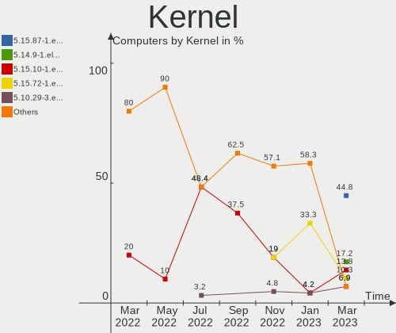

| Version                | Computers | Percent |
|------------------------|-----------|---------|
| 5.15.87-1.el7.3.x86_64 | 12        | 38.71%  |
| 5.15.72-1.el7.3.x86_64 | 8         | 25.81%  |
| 5.15.78-2.el7.3.x86_64 | 4         | 12.9%   |
| 5.15.10-1.el7.x86_64   | 2         | 6.45%   |
| 5.10.29-1.el7.x86_64   | 2         | 6.45%   |
| 6.1.11-1.el7.3.x86_64  | 1         | 3.23%   |
| 5.15.35-5.el7.3.x86_64 | 1         | 3.23%   |
| 5.14.9-1.el7.x86_64    | 1         | 3.23%   |

Kernel Family
-------------

Linux kernel without a distro release

| Version | Computers | Percent |
|---------|-----------|---------|
| 5.15.87 | 12        | 38.71%  |
| 5.15.72 | 8         | 25.81%  |
| 5.15.78 | 4         | 12.9%   |
| 5.15.10 | 2         | 6.45%   |
| 5.10.29 | 2         | 6.45%   |
| 6.1.11  | 1         | 3.23%   |
| 5.15.35 | 1         | 3.23%   |
| 5.14.9  | 1         | 3.23%   |

Kernel Major Ver.
-----------------

Linux kernel major version

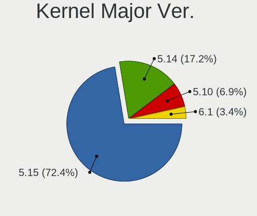

| Version | Computers | Percent |
|---------|-----------|---------|
| 5.15    | 27        | 87.1%   |
| 5.10    | 2         | 6.45%   |
| 6.1     | 1         | 3.23%   |
| 5.14    | 1         | 3.23%   |

Arch
----

OS architecture (x86_64, i586, etc.)

| Name   | Computers | Percent |
|--------|-----------|---------|
| x86_64 | 31        | 100%    |

DE
--

Desktop Environment

| Name       | Computers | Percent |
|------------|-----------|---------|
| MATE       | 27        | 87.1%   |
| Cinnamon   | 2         | 6.45%   |
| X-Cinnamon | 1         | 3.23%   |
| Unknown    | 1         | 3.23%   |

Display Server
--------------

X11 or Wayland

| Name    | Computers | Percent |
|---------|-----------|---------|
| X11     | 27        | 87.1%   |
| Tty     | 3         | 9.68%   |
| Wayland | 1         | 3.23%   |

Display Manager
---------------

SDDM, LightDM, etc.

| Name    | Computers | Percent |
|---------|-----------|---------|
| GDM     | 27        | 87.1%   |
| LightDM | 2         | 6.45%   |
| Unknown | 2         | 6.45%   |

OS Lang
-------

Language

| Lang    | Computers | Percent |
|---------|-----------|---------|
| ru_RU   | 23        | 74.19%  |
| Unknown | 7         | 22.58%  |
| en_US   | 1         | 3.23%   |

Boot Mode
---------

EFI or BIOS

| Mode | Computers | Percent |
|------|-----------|---------|
| EFI  | 24        | 77.42%  |
| BIOS | 7         | 22.58%  |

Filesystem
----------

Type of filesystem

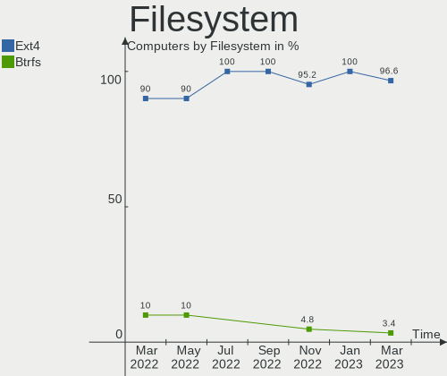

| Type    | Computers | Percent |
|---------|-----------|---------|
| Ext4    | 30        | 96.77%  |
| Overlay | 1         | 3.23%   |

Part. scheme
------------

Scheme of partitioning

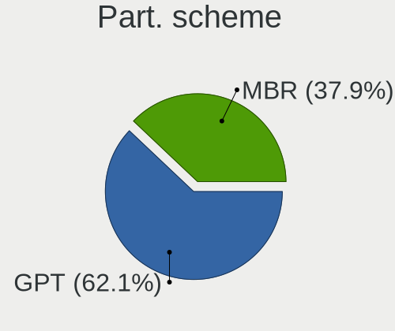

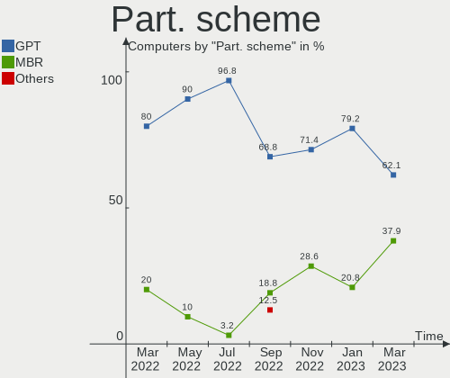

| Type    | Computers | Percent |
|---------|-----------|---------|
| GPT     | 22        | 70.97%  |
| MBR     | 8         | 25.81%  |
| Unknown | 1         | 3.23%   |

Dual Boot with Linux/BSD
------------------------

Hosting more than one Linux/BSD

| Dual boot | Computers | Percent |
|-----------|-----------|---------|
| No        | 30        | 96.77%  |
| Yes       | 1         | 3.23%   |

Dual Boot (Win)
---------------

Hosting Linux and Windows

| Dual boot | Computers | Percent |
|-----------|-----------|---------|
| No        | 25        | 80.65%  |
| Yes       | 6         | 19.35%  |

Board
-----

Vendor
------

Motherboard manufacturer

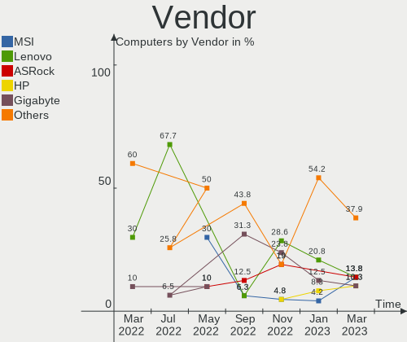

| Name                | Computers | Percent |
|---------------------|-----------|---------|
| Lenovo              | 8         | 25.81%  |
| Hewlett-Packard     | 4         | 12.9%   |
| Gigabyte Technology | 4         | 12.9%   |
| MSI                 | 2         | 6.45%   |
| iRU                 | 2         | 6.45%   |
| Graviton            | 2         | 6.45%   |
| Kraftway            | 1         | 3.23%   |
| Intel               | 1         | 3.23%   |
| ICL                 | 1         | 3.23%   |
| Foxconn             | 1         | 3.23%   |
| Compal              | 1         | 3.23%   |
| ASUSTek Computer    | 1         | 3.23%   |
| ASRock              | 1         | 3.23%   |
| Aquarius            | 1         | 3.23%   |
| Acer                | 1         | 3.23%   |

Model
-----

Motherboard model

| Name                                             | Computers | Percent |
|--------------------------------------------------|-----------|---------|
| Graviton M52i                                    | 2         | 6.45%   |
| MSI MS-7D46                                      | 1         | 3.23%   |
| MSI MS-7D22                                      | 1         | 3.23%   |
| Lenovo ThinkCentre M91p 4524PL4                  | 1         | 3.23%   |
| Lenovo ThinkCentre M70q Gen 2 11MY003MRU         | 1         | 3.23%   |
| Lenovo ThinkBook 15 G2 ARE 20VG                  | 1         | 3.23%   |
| Lenovo IdeaPad L340-15API 81LW                   | 1         | 3.23%   |
| Lenovo IdeaPad 5 15ARE05 81YQ                    | 1         | 3.23%   |
| Lenovo IdeaPad 330-15ARR 81D2                    | 1         | 3.23%   |
| Lenovo IdeaCentre 3 07ADA05 90MV0059RS           | 1         | 3.23%   |
| Lenovo B590 20208                                | 1         | 3.23%   |
| Kraftway ACCORD                                  | 1         | 3.23%   |
| iRU P2320P                                       | 1         | 3.23%   |
| iRU 311                                          | 1         | 3.23%   |
| Intel DH61CR AAG14064-204                        | 1         | 3.23%   |
| ICL RAY B102                                     | 1         | 3.23%   |
| HP ProDesk 600 G1 SFF                            | 1         | 3.23%   |
| HP Pavilion 15                                   | 1         | 3.23%   |
| HP G62                                           | 1         | 3.23%   |
| HP EliteOne 870 27 inch G9 All-in-One Desktop PC | 1         | 3.23%   |
| Gigabyte M61SME-S2                               | 1         | 3.23%   |
| Gigabyte B560M DS3H V2                           | 1         | 3.23%   |
| Gigabyte B365M H                                 | 1         | 3.23%   |
| Gigabyte B365M DS3H                              | 1         | 3.23%   |
| Foxconn Pro3500 Series                           | 1         | 3.23%   |
| Compal DIP00                                     | 1         | 3.23%   |
| ASUS ASUS Vivo AIO V241DA_M241DA                 | 1         | 3.23%   |
| ASRock H61M-VG4                                  | 1         | 3.23%   |
| Aquarius AQB560M                                 | 1         | 3.23%   |
| Acer Aspire C27-1655                             | 1         | 3.23%   |

Model Family
------------

Motherboard model prefix

| Name               | Computers | Percent |
|--------------------|-----------|---------|
| Lenovo IdeaPad     | 3         | 9.68%   |
| Lenovo ThinkCentre | 2         | 6.45%   |
| Graviton M52i      | 2         | 6.45%   |
| Gigabyte B365M     | 2         | 6.45%   |
| MSI MS-7D46        | 1         | 3.23%   |
| MSI MS-7D22        | 1         | 3.23%   |
| Lenovo ThinkBook   | 1         | 3.23%   |
| Lenovo IdeaCentre  | 1         | 3.23%   |
| Lenovo B590        | 1         | 3.23%   |
| Kraftway ACCORD    | 1         | 3.23%   |
| iRU P2320P         | 1         | 3.23%   |
| iRU 311            | 1         | 3.23%   |
| Intel DH61CR       | 1         | 3.23%   |
| ICL RAY            | 1         | 3.23%   |
| HP ProDesk         | 1         | 3.23%   |
| HP Pavilion        | 1         | 3.23%   |
| HP G62             | 1         | 3.23%   |
| HP EliteOne        | 1         | 3.23%   |
| Gigabyte M61SME-S2 | 1         | 3.23%   |
| Gigabyte B560M     | 1         | 3.23%   |
| Foxconn Pro3500    | 1         | 3.23%   |
| Compal DIP00       | 1         | 3.23%   |
| ASUS ASUS          | 1         | 3.23%   |
| ASRock H61M-VG4    | 1         | 3.23%   |
| Aquarius AQB560M   | 1         | 3.23%   |
| Acer Aspire        | 1         | 3.23%   |

MFG Year
--------

Motherboard manufacture year

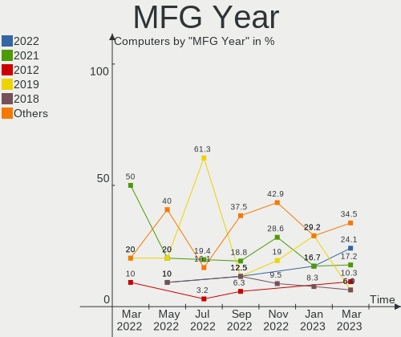

| Year | Computers | Percent |
|------|-----------|---------|
| 2021 | 8         | 25.81%  |
| 2022 | 5         | 16.13%  |
| 2020 | 4         | 12.9%   |
| 2019 | 4         | 12.9%   |
| 2013 | 4         | 12.9%   |
| 2011 | 2         | 6.45%   |
| 2018 | 1         | 3.23%   |
| 2012 | 1         | 3.23%   |
| 2010 | 1         | 3.23%   |
| 2007 | 1         | 3.23%   |

Form Factor
-----------

Physical design of the computer

| Name       | Computers | Percent |
|------------|-----------|---------|
| Desktop    | 16        | 51.61%  |
| Notebook   | 8         | 25.81%  |
| All in one | 6         | 19.35%  |
| Mini pc    | 1         | 3.23%   |

Secure Boot
-----------

Enabled or disabled

| State    | Computers | Percent |
|----------|-----------|---------|
| Disabled | 30        | 96.77%  |
| Enabled  | 1         | 3.23%   |

Coreboot
--------

Have coreboot on board

| Used | Computers | Percent |
|------|-----------|---------|
| No   | 31        | 100%    |

RAM Size
--------

Total RAM memory

| Size in GB | Computers | Percent |
|------------|-----------|---------|
| 4.01-8.0   | 13        | 41.94%  |
| 16.01-24.0 | 10        | 32.26%  |
| 3.01-4.0   | 4         | 12.9%   |
| 8.01-16.0  | 2         | 6.45%   |
| 2.01-3.0   | 1         | 3.23%   |
| 0.51-1.0   | 1         | 3.23%   |

RAM Used
--------

Used RAM memory

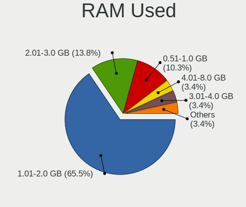

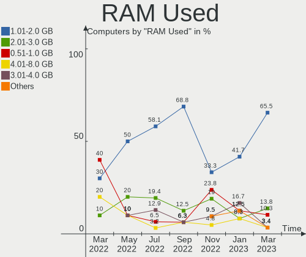

| Used GB   | Computers | Percent |
|-----------|-----------|---------|
| 1.01-2.0  | 15        | 48.39%  |
| 2.01-3.0  | 5         | 16.13%  |
| 4.01-8.0  | 3         | 9.68%   |
| 3.01-4.0  | 3         | 9.68%   |
| 8.01-16.0 | 2         | 6.45%   |
| 0.51-1.0  | 2         | 6.45%   |
| 0.01-0.5  | 1         | 3.23%   |

Total Drives
------------

Number of drives on board

| Drives | Computers | Percent |
|--------|-----------|---------|
| 1      | 23        | 74.19%  |
| 2      | 8         | 25.81%  |

Has CD-ROM
----------

Has CD-ROM on board

| Presented | Computers | Percent |
|-----------|-----------|---------|
| No        | 22        | 70.97%  |
| Yes       | 9         | 29.03%  |

Has Ethernet
------------

Has Ethernet on board

| Presented | Computers | Percent |
|-----------|-----------|---------|
| Yes       | 30        | 96.77%  |
| No        | 1         | 3.23%   |

Has WiFi
--------

Has WiFi module

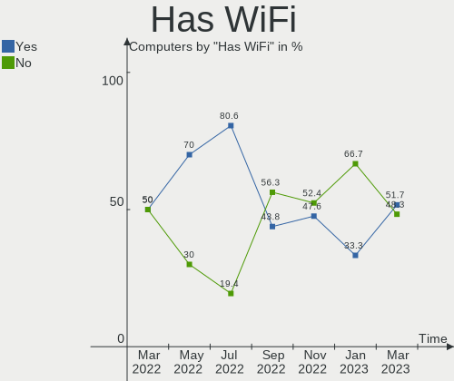

| Presented | Computers | Percent |
|-----------|-----------|---------|
| Yes       | 18        | 58.06%  |
| No        | 13        | 41.94%  |

Has Bluetooth
-------------

Has Bluetooth module

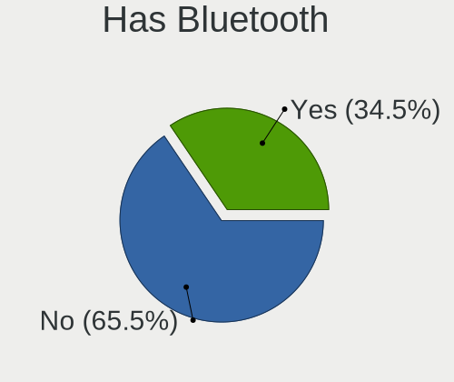

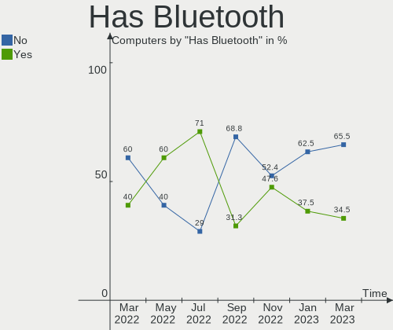

| Presented | Computers | Percent |
|-----------|-----------|---------|
| No        | 17        | 54.84%  |
| Yes       | 14        | 45.16%  |

Location
--------

Country
-------

Geographic location (country)

| Country | Computers | Percent |
|---------|-----------|---------|
| Russia  | 31        | 100%    |

City
----

Geographic location (city)

| City        | Computers | Percent |
|-------------|-----------|---------|
| Moscow      | 7         | 22.58%  |
| Murom       | 5         | 16.13%  |
| Salekhard   | 4         | 12.9%   |
| Muromskiy   | 2         | 6.45%   |
| Krasnodar   | 2         | 6.45%   |
| Baksan      | 2         | 6.45%   |
| Volgograd   | 1         | 3.23%   |
| Tver        | 1         | 3.23%   |
| Svetlograd  | 1         | 3.23%   |
| Shakhtersk  | 1         | 3.23%   |
| Ryazan      | 1         | 3.23%   |
| Labytnangi  | 1         | 3.23%   |
| Krasnoyarsk | 1         | 3.23%   |
| Kol'chugino | 1         | 3.23%   |
| Balashikha  | 1         | 3.23%   |

Drives
------

Drive Vendor
------------

Hard drive vendors

| Vendor              | Computers | Drives | Percent |
|---------------------|-----------|--------|---------|
| Toshiba             | 8         | 8      | 20.51%  |
| WDC                 | 6         | 6      | 15.38%  |
| Samsung Electronics | 3         | 3      | 7.69%   |
| Kingston            | 3         | 3      | 7.69%   |
| A-DATA Technology   | 3         | 3      | 7.69%   |
| SK hynix            | 2         | 3      | 5.13%   |
| Seagate             | 2         | 2      | 5.13%   |
| Qumo                | 2         | 2      | 5.13%   |
| HGST                | 2         | 2      | 5.13%   |
| AGI                 | 2         | 2      | 5.13%   |
| UMIS                | 1         | 1      | 2.56%   |
| SanDisk             | 1         | 1      | 2.56%   |
| Gigabyte Technology | 1         | 1      | 2.56%   |
| Foxline             | 1         | 1      | 2.56%   |
| Apacer              | 1         | 1      | 2.56%   |
| Unknown             | 1         | 1      | 2.56%   |

Drive Model
-----------

Hard drive models

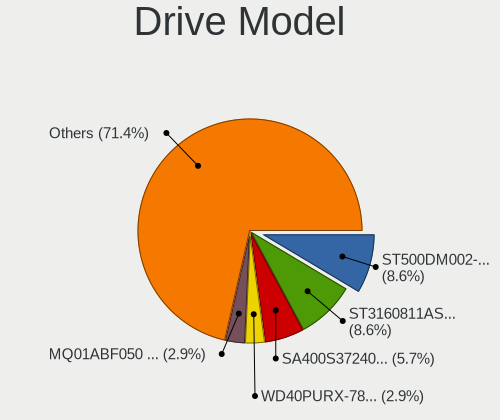

| Model                                     | Computers | Percent |
|-------------------------------------------|-----------|---------|
| Toshiba MQ01ABF050 500GB                  | 2         | 5%      |
| Toshiba HDWD110 1TB                       | 2         | 5%      |
| Seagate ST500DM002-1BD142 500GB           | 2         | 5%      |
| AGI AGI512G16AI198 512GB                  | 2         | 5%      |
| WDC WD5000AAKX-60U6AA0 500GB              | 1         | 2.5%    |
| WDC WD5000AAKX-083CA1 500GB               | 1         | 2.5%    |
| WDC WD5000AAKS-00V1A0 500GB               | 1         | 2.5%    |
| WDC WD40PURZ-85AKKY0 4TB                  | 1         | 2.5%    |
| WDC WD10EZEX-75ZF5A0 1TB                  | 1         | 2.5%    |
| WDC PC SN530 SDBPMPZ-256G-1001 256GB      | 1         | 2.5%    |
| UMIS RPIRJ256VME2MWD 256GB                | 1         | 2.5%    |
| Toshiba MQ04ABF100 1TB                    | 1         | 2.5%    |
| Toshiba KXG6AZNV256G 256GB                | 1         | 2.5%    |
| Toshiba DT01ACA200 2TB                    | 1         | 2.5%    |
| Toshiba DT01ACA100 1TB                    | 1         | 2.5%    |
| SK hynix SKHynix_HFM256GDHTNI-87A0B 256GB | 1         | 2.5%    |
| SK hynix HFM128GDJTNG-8310A 128GB         | 1         | 2.5%    |
| SK hynix BC511 512GB                      | 1         | 2.5%    |
| SanDisk SD8SBAT256G1122 256GB SSD         | 1         | 2.5%    |
| Samsung MZVL2512HCJQ-00BH1 512GB          | 1         | 2.5%    |
| Samsung MZALQ512HALU-000L2 512GB          | 1         | 2.5%    |
| Samsung MZALQ256HAJD-000L2 256GB          | 1         | 2.5%    |
| Qumo Q3DT-480GSCY 480GB SSD               | 1         | 2.5%    |
| Qumo Q3DT-256GMSY-M2 256GB SSD            | 1         | 2.5%    |
| Kingston SUV400S37120G 120GB SSD          | 1         | 2.5%    |
| Kingston SA400S37240G 240GB SSD           | 1         | 2.5%    |
| Kingston SA400S37120G 120GB SSD           | 1         | 2.5%    |
| HGST HTS545050A7E380 500GB                | 1         | 2.5%    |
| HGST HTS541075A9E680 752GB                | 1         | 2.5%    |
| Gigabyte GP-GSM2NE3256GNTD 256GB          | 1         | 2.5%    |
| Foxline FLSSD512X5SE 512GB                | 1         | 2.5%    |
| Apacer AS350 256GB SSD                    | 1         | 2.5%    |
| A-DATA SX6000PNP 256GB                    | 1         | 2.5%    |
| A-DATA SU800 256GB SSD                    | 1         | 2.5%    |
| A-DATA SU650 240GB SSD                    | 1         | 2.5%    |
| Unknown                                   | 1         | 2.5%    |

HDD Vendor
----------

Hard disk drive vendors

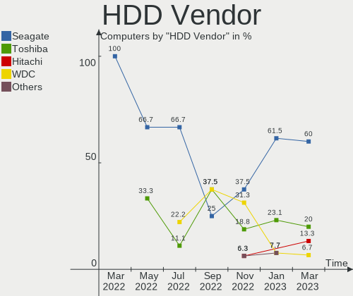

| Vendor  | Computers | Drives | Percent |
|---------|-----------|--------|---------|
| Toshiba | 7         | 7      | 43.75%  |
| WDC     | 5         | 5      | 31.25%  |
| Seagate | 2         | 2      | 12.5%   |
| HGST    | 2         | 2      | 12.5%   |

SSD Vendor
----------

Solid state drive vendors

| Vendor            | Computers | Drives | Percent |
|-------------------|-----------|--------|---------|
| Kingston          | 3         | 3      | 30%     |
| Qumo              | 2         | 2      | 20%     |
| A-DATA Technology | 2         | 2      | 20%     |
| SanDisk           | 1         | 1      | 10%     |
| Foxline           | 1         | 1      | 10%     |
| Apacer            | 1         | 1      | 10%     |

Drive Kind
----------

HDD or SSD

| Kind | Computers | Drives | Percent |
|------|-----------|--------|---------|
| HDD  | 15        | 16     | 39.47%  |
| NVMe | 12        | 13     | 31.58%  |
| SSD  | 10        | 10     | 26.32%  |
| MMC  | 1         | 1      | 2.63%   |

Drive Connector
---------------

SATA, SAS, NVMe, etc.

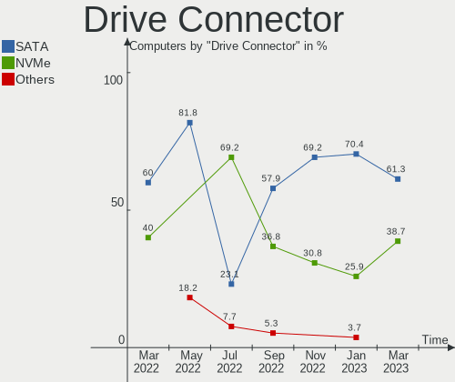

| Type | Computers | Drives | Percent |
|------|-----------|--------|---------|
| SATA | 21        | 26     | 61.76%  |
| NVMe | 12        | 13     | 35.29%  |
| MMC  | 1         | 1      | 2.94%   |

Drive Size
----------

Size of hard drive

| Size in TB | Computers | Drives | Percent |
|------------|-----------|--------|---------|
| 0.01-0.5   | 16        | 17     | 64%     |
| 0.51-1.0   | 7         | 7      | 28%     |
| 3.01-4.0   | 1         | 1      | 4%      |
| 1.01-2.0   | 1         | 1      | 4%      |

Space Total
-----------

Amount of disk space available on the file system

| Size in GB | Computers | Percent |
|------------|-----------|---------|
| 101-250    | 12        | 38.71%  |
| 251-500    | 10        | 32.26%  |
| 501-1000   | 6         | 19.35%  |
| 2001-3000  | 1         | 3.23%   |
| 1001-2000  | 1         | 3.23%   |
| 1-20       | 1         | 3.23%   |

Space Used
----------

Amount of used disk space

| Used GB  | Computers | Percent |
|----------|-----------|---------|
| 1-20     | 18        | 58.06%  |
| 21-50    | 5         | 16.13%  |
| 101-250  | 5         | 16.13%  |
| 501-1000 | 3         | 9.68%   |

Malfunc. Drives
---------------

Drive models with a malfunction

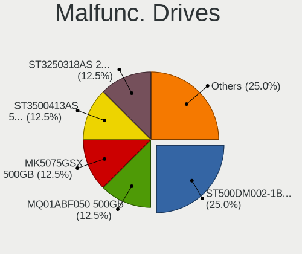

| Model                            | Computers | Drives | Percent |
|----------------------------------|-----------|--------|---------|
| Seagate ST500DM002-1BD142 500GB  | 2         | 2      | 33.33%  |
| WDC WD5000AAKX-60U6AA0 500GB     | 1         | 1      | 16.67%  |
| WDC WD5000AAKS-00V1A0 500GB      | 1         | 1      | 16.67%  |
| WDC WD10EZEX-75ZF5A0 1TB         | 1         | 1      | 16.67%  |
| Kingston SUV400S37120G 120GB SSD | 1         | 1      | 16.67%  |

Malfunc. Drive Vendor
---------------------

Vendors of faulty drives

| Vendor   | Computers | Drives | Percent |
|----------|-----------|--------|---------|
| WDC      | 3         | 3      | 50%     |
| Seagate  | 2         | 2      | 33.33%  |
| Kingston | 1         | 1      | 16.67%  |

Malfunc. HDD Vendor
-------------------

Vendors of faulty HDD drives

| Vendor  | Computers | Drives | Percent |
|---------|-----------|--------|---------|
| WDC     | 3         | 3      | 60%     |
| Seagate | 2         | 2      | 40%     |

Malfunc. Drive Kind
-------------------

Kinds of faulty drives

| Kind | Computers | Drives | Percent |
|------|-----------|--------|---------|
| HDD  | 4         | 5      | 80%     |
| SSD  | 1         | 1      | 20%     |

Failed Drives
-------------

Failed drive models

Zero info for selected period =(

Failed Drive Vendor
-------------------

Failed drive vendors

Zero info for selected period =(

Drive Status
------------

Number of failed and malfunc. drives

| Status   | Computers | Drives | Percent |
|----------|-----------|--------|---------|
| Works    | 25        | 31     | 78.13%  |
| Malfunc  | 5         | 6      | 15.63%  |
| Detected | 2         | 3      | 6.25%   |

Storage controller
------------------

Storage Vendor
--------------

Storage controller vendors

| Vendor                       | Computers | Percent |
|------------------------------|-----------|---------|
| Intel                        | 22        | 52.38%  |
| AMD                          | 7         | 16.67%  |
| Samsung Electronics          | 3         | 7.14%   |
| SK hynix                     | 2         | 4.76%   |
| Silicon Motion               | 2         | 4.76%   |
| Union Memory (Shenzhen)      | 1         | 2.38%   |
| Toshiba America Info Systems | 1         | 2.38%   |
| SanDisk                      | 1         | 2.38%   |
| Realtek Semiconductor        | 1         | 2.38%   |
| Phison Electronics           | 1         | 2.38%   |
| Nvidia                       | 1         | 2.38%   |

Storage Model
-------------

Storage controller models

| Model                                                                                   | Computers | Percent |
|-----------------------------------------------------------------------------------------|-----------|---------|
| AMD FCH SATA Controller [AHCI mode]                                                     | 7         | 15.91%  |
| Intel 500 Series Chipset Family SATA AHCI Controller                                    | 4         | 9.09%   |
| Intel Alder Lake-S PCH SATA Controller [AHCI Mode]                                      | 3         | 6.82%   |
| Intel 6 Series/C200 Series Chipset Family 6 port Desktop SATA AHCI Controller           | 3         | 6.82%   |
| Silicon Motion SM2263EN/SM2263XT SSD Controller                                         | 2         | 4.55%   |
| Samsung NVMe SSD Controller 980                                                         | 2         | 4.55%   |
| Intel 200 Series PCH SATA controller [AHCI mode]                                        | 2         | 4.55%   |
| Union Memory (Shenzhen) NVMe 256G SSD device                                            | 1         | 2.27%   |
| Toshiba America Info Systems XG6 NVMe SSD Controller                                    | 1         | 2.27%   |
| SK hynix BC511                                                                          | 1         | 2.27%   |
| SK hynix BC501 NVMe Solid State Drive                                                   | 1         | 2.27%   |
| SanDisk Non-Volatile memory controller                                                  | 1         | 2.27%   |
| Samsung NVMe SSD Controller PM9A1/PM9A3/980PRO                                          | 1         | 2.27%   |
| Realtek Realtek Non-Volatile memory controller                                          | 1         | 2.27%   |
| Phison PS5013 E13 NVMe Controller                                                       | 1         | 2.27%   |
| Nvidia MCP61 SATA Controller                                                            | 1         | 2.27%   |
| Nvidia MCP61 IDE                                                                        | 1         | 2.27%   |
| Intel Tiger Lake-LP SATA Controller                                                     | 1         | 2.27%   |
| Intel HM170/QM170 Chipset SATA Controller [AHCI Mode]                                   | 1         | 2.27%   |
| Intel Celeron/Pentium Silver Processor SATA Controller                                  | 1         | 2.27%   |
| Intel Cannon Point-LP SATA Controller [AHCI Mode]                                       | 1         | 2.27%   |
| Intel 8 Series/C220 Series Chipset Family 6-port SATA Controller 1 [AHCI mode]          | 1         | 2.27%   |
| Intel 8 Series SATA Controller 1 [AHCI mode]                                            | 1         | 2.27%   |
| Intel 7 Series Chipset Family 6-port SATA Controller [AHCI mode]                        | 1         | 2.27%   |
| Intel 6 Series/C200 Series Chipset Family Desktop SATA Controller (IDE mode, ports 4-5) | 1         | 2.27%   |
| Intel 6 Series/C200 Series Chipset Family Desktop SATA Controller (IDE mode, ports 0-3) | 1         | 2.27%   |
| Intel 5 Series/3400 Series Chipset 4 port SATA AHCI Controller                          | 1         | 2.27%   |
| Intel 400 Series Chipset Family SATA AHCI Controller                                    | 1         | 2.27%   |

Storage Kind
------------

Kind of storage controller (IDE, SATA, NVMe, SAS, ...)

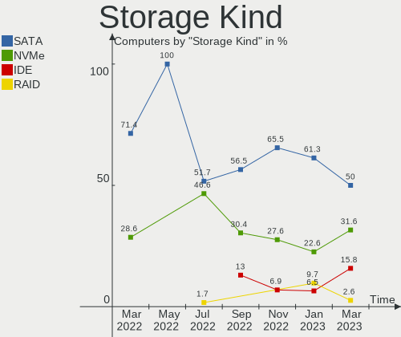

| Kind | Computers | Percent |
|------|-----------|---------|
| SATA | 28        | 66.67%  |
| NVMe | 12        | 28.57%  |
| IDE  | 2         | 4.76%   |

Processor
---------

CPU Vendor
----------

Processor vendors

| Vendor | Computers | Percent |
|--------|-----------|---------|
| Intel  | 23        | 74.19%  |
| AMD    | 8         | 25.81%  |

CPU Model
---------

Processor models

| Model                                         | Computers | Percent |
|-----------------------------------------------|-----------|---------|
| AMD Ryzen 5 3500U with Radeon Vega Mobile Gfx | 3         | 9.68%   |
| Intel Core i5-9400 CPU @ 2.90GHz              | 2         | 6.45%   |
| Intel Core i5-2400 CPU @ 3.10GHz              | 2         | 6.45%   |
| Intel Core i3-10100 CPU @ 3.60GHz             | 2         | 6.45%   |
| Intel 12th Gen Core i3-12100                  | 2         | 6.45%   |
| AMD Ryzen 5 4500U with Radeon Graphics        | 2         | 6.45%   |
| Intel Core i5-8259U CPU @ 2.30GHz             | 1         | 3.23%   |
| Intel Core i5-7442EQ CPU @ 2.10GHz            | 1         | 3.23%   |
| Intel Core i5-4570 CPU @ 3.20GHz              | 1         | 3.23%   |
| Intel Core i5-4200U CPU @ 1.60GHz             | 1         | 3.23%   |
| Intel Core i5-10400 CPU @ 2.90GHz             | 1         | 3.23%   |
| Intel Core i3-3240 CPU @ 3.40GHz              | 1         | 3.23%   |
| Intel Core i3-3110M CPU @ 2.40GHz             | 1         | 3.23%   |
| Intel Core i3-10105T CPU @ 3.00GHz            | 1         | 3.23%   |
| Intel Core i3-10105 CPU @ 3.70GHz             | 1         | 3.23%   |
| Intel Core i3 CPU M 330 @ 2.13GHz             | 1         | 3.23%   |
| Intel Celeron J4125 CPU @ 2.00GHz             | 1         | 3.23%   |
| Intel Celeron CPU G1610 @ 2.60GHz             | 1         | 3.23%   |
| Intel 12th Gen Core i7-12700                  | 1         | 3.23%   |
| Intel 12th Gen Core i5-12400F                 | 1         | 3.23%   |
| Intel 11th Gen Core i3-1115G4 @ 3.00GHz       | 1         | 3.23%   |
| AMD Ryzen 5 2500U with Radeon Vega Mobile Gfx | 1         | 3.23%   |
| AMD Ryzen 3 3200GE with Radeon Vega Graphics  | 1         | 3.23%   |
| AMD Phenom 9650 Quad-Core Processor           | 1         | 3.23%   |

CPU Model Family
----------------

Processor model prefix

| Model         | Computers | Percent |
|---------------|-----------|---------|
| Intel Core i5 | 9         | 29.03%  |
| Intel Core i3 | 7         | 22.58%  |
| AMD Ryzen 5   | 6         | 19.35%  |
| Other         | 5         | 16.13%  |
| Intel Celeron | 2         | 6.45%   |
| AMD Ryzen 3   | 1         | 3.23%   |
| AMD Phenom    | 1         | 3.23%   |

CPU Cores
---------

Number of processor cores

| Number | Computers | Percent |
|--------|-----------|---------|
| 4      | 18        | 58.06%  |
| 6      | 6         | 19.35%  |
| 2      | 6         | 19.35%  |
| 12     | 1         | 3.23%   |

CPU Sockets
-----------

Number of sockets

| Number | Computers | Percent |
|--------|-----------|---------|
| 1      | 31        | 100%    |

CPU Threads
-----------

Threads per core (Hyper-Threading)

| Number | Computers | Percent |
|--------|-----------|---------|
| 2      | 19        | 61.29%  |
| 1      | 12        | 38.71%  |

CPU Op-Modes
------------

CPU Operation Modes (32-bit, 64-bit)

| Op mode        | Computers | Percent |
|----------------|-----------|---------|
| 32-bit, 64-bit | 31        | 100%    |

CPU Microcode
-------------

Microcode number

| Number     | Computers | Percent |
|------------|-----------|---------|
| 0xa0653    | 5         | 16.13%  |
| 0x306a9    | 3         | 9.68%   |
| 0x08108109 | 3         | 9.68%   |
| 0x906ed    | 2         | 6.45%   |
| 0x90675    | 2         | 6.45%   |
| 0x90672    | 2         | 6.45%   |
| 0x206a7    | 2         | 6.45%   |
| 0x08600106 | 2         | 6.45%   |
| 0x906e9    | 1         | 3.23%   |
| 0x806ea    | 1         | 3.23%   |
| 0x806c1    | 1         | 3.23%   |
| 0x706a8    | 1         | 3.23%   |
| 0x40651    | 1         | 3.23%   |
| 0x306c3    | 1         | 3.23%   |
| 0x20652    | 1         | 3.23%   |
| 0x08108102 | 1         | 3.23%   |
| 0x0810100b | 1         | 3.23%   |
| 0x01000083 | 1         | 3.23%   |

CPU Microarch
-------------

Microarchitecture

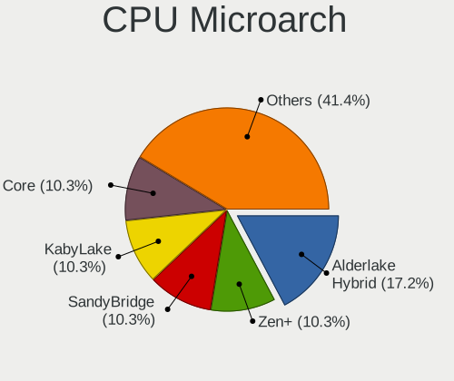

| Name             | Computers | Percent |
|------------------|-----------|---------|
| CometLake        | 5         | 16.13%  |
| Zen+             | 4         | 12.9%   |
| KabyLake         | 4         | 12.9%   |
| Alderlake Hybrid | 4         | 12.9%   |
| IvyBridge        | 3         | 9.68%   |
| Zen 2            | 2         | 6.45%   |
| SandyBridge      | 2         | 6.45%   |
| Haswell          | 2         | 6.45%   |
| Zen              | 1         | 3.23%   |
| Westmere         | 1         | 3.23%   |
| TigerLake        | 1         | 3.23%   |
| K10              | 1         | 3.23%   |
| Goldmont plus    | 1         | 3.23%   |

Graphics
--------

GPU Vendor
----------

Vendors of graphics cards

| Vendor | Computers | Percent |
|--------|-----------|---------|
| Intel  | 22        | 61.11%  |
| AMD    | 9         | 25%     |
| Nvidia | 5         | 13.89%  |

GPU Model
---------

Graphics card models

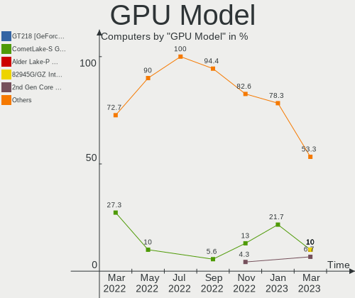

| Model                                                                       | Computers | Percent |
|-----------------------------------------------------------------------------|-----------|---------|
| Intel CometLake-S GT2 [UHD Graphics 630]                                    | 5         | 13.51%  |
| AMD Picasso/Raven 2 [Radeon Vega Series / Radeon Vega Mobile Series]        | 4         | 10.81%  |
| Intel Xeon E3-1200 v2/3rd Gen Core processor Graphics Controller            | 2         | 5.41%   |
| Intel CoffeeLake-S GT2 [UHD Graphics 630]                                   | 2         | 5.41%   |
| Intel Alder Lake-S GT1 [UHD Graphics 730]                                   | 2         | 5.41%   |
| Intel 2nd Generation Core Processor Family Integrated Graphics Controller   | 2         | 5.41%   |
| AMD Renoir                                                                  | 2         | 5.41%   |
| Nvidia GP108M [GeForce MX330]                                               | 1         | 2.7%    |
| Nvidia GM107 [GeForce GTX 750 Ti]                                           | 1         | 2.7%    |
| Nvidia GK208M [GeForce GT 740M]                                             | 1         | 2.7%    |
| Nvidia GF117M [GeForce 610M/710M/810M/820M / GT 620M/625M/630M/720M]        | 1         | 2.7%    |
| Nvidia GA106 [Geforce RTX 3050]                                             | 1         | 2.7%    |
| Intel Xeon E3-1200 v3/4th Gen Core Processor Integrated Graphics Controller | 1         | 2.7%    |
| Intel Tiger Lake-LP GT2 [UHD Graphics G4]                                   | 1         | 2.7%    |
| Intel HD Graphics 630                                                       | 1         | 2.7%    |
| Intel Haswell-ULT Integrated Graphics Controller                            | 1         | 2.7%    |
| Intel GeminiLake [UHD Graphics 600]                                         | 1         | 2.7%    |
| Intel Core Processor Integrated Graphics Controller                         | 1         | 2.7%    |
| Intel CoffeeLake-U GT3e [Iris Plus Graphics 655]                            | 1         | 2.7%    |
| Intel AlderLake-S GT1                                                       | 1         | 2.7%    |
| Intel 3rd Gen Core processor Graphics Controller                            | 1         | 2.7%    |
| AMD Raven Ridge [Radeon Vega Series / Radeon Vega Mobile Series]            | 1         | 2.7%    |
| AMD Park [Mobility Radeon HD 5430/5450/5470]                                | 1         | 2.7%    |
| AMD Lexa PRO [Radeon 540/540X/550/550X / RX 540X/550/550X]                  | 1         | 2.7%    |
| AMD Caicos XTX [Radeon HD 8490 / R5 235X OEM]                               | 1         | 2.7%    |

GPU Combo
---------

Combinations of graphics cards

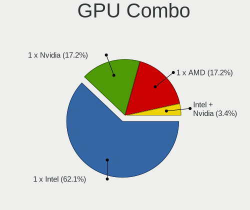

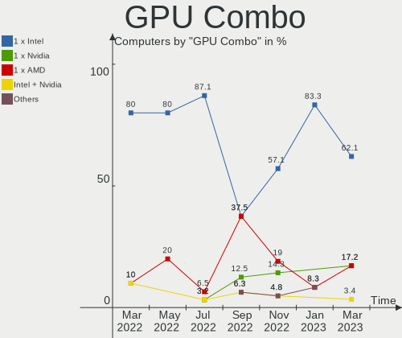

| Name           | Computers | Percent |
|----------------|-----------|---------|
| 1 x Intel      | 17        | 54.84%  |
| 1 x AMD        | 7         | 22.58%  |
| Intel + Nvidia | 3         | 9.68%   |
| 1 x Nvidia     | 2         | 6.45%   |
| 2 x AMD        | 1         | 3.23%   |
| Intel + AMD    | 1         | 3.23%   |

GPU Driver
----------

Free vs proprietary

| Driver      | Computers | Percent |
|-------------|-----------|---------|
| Free        | 27        | 87.1%   |
| Unknown     | 3         | 9.68%   |
| Proprietary | 1         | 3.23%   |

GPU Memory
----------

Total video memory

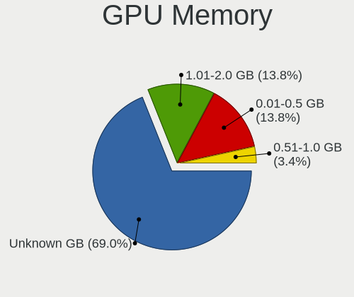

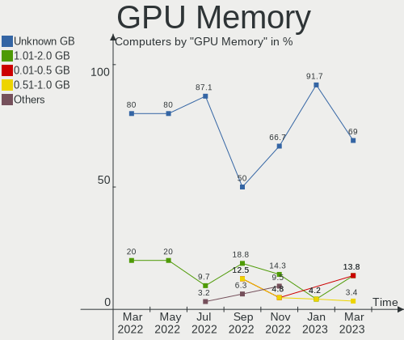

| Size in GB | Computers | Percent |
|------------|-----------|---------|
| Unknown    | 19        | 61.29%  |
| 1.01-2.0   | 7         | 22.58%  |
| 0.51-1.0   | 3         | 9.68%   |
| 7.01-8.0   | 1         | 3.23%   |
| 0.01-0.5   | 1         | 3.23%   |

Monitor
-------

Monitor Vendor
--------------

Monitor vendors

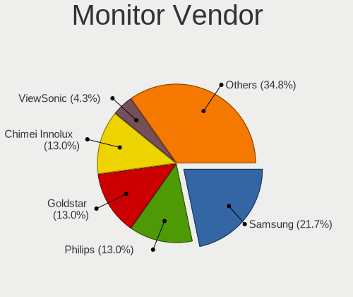

| Vendor              | Computers | Percent |
|---------------------|-----------|---------|
| Samsung Electronics | 3         | 10.71%  |
| Philips             | 3         | 10.71%  |
| Hewlett-Packard     | 3         | 10.71%  |
| AU Optronics        | 3         | 10.71%  |
| LG Display          | 2         | 7.14%   |
| Chimei Innolux      | 2         | 7.14%   |
| BOE                 | 2         | 7.14%   |
| ASUSTek Computer    | 2         | 7.14%   |
| ViewSonic           | 1         | 3.57%   |
| SKM                 | 1         | 3.57%   |
| OOO                 | 1         | 3.57%   |
| Iiyama              | 1         | 3.57%   |
| HUAWEI              | 1         | 3.57%   |
| Dell                | 1         | 3.57%   |
| AOC                 | 1         | 3.57%   |
| Acer                | 1         | 3.57%   |

Monitor Model
-------------

Monitor models

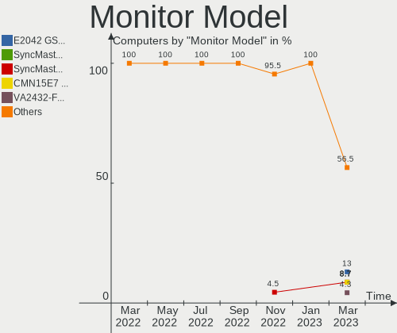

| Model                                                                | Computers | Percent |
|----------------------------------------------------------------------|-----------|---------|
| Philips PHL 243V7 PHLC155 1920x1080 527x296mm 23.8-inch              | 2         | 7.14%   |
| AU Optronics LCD Monitor AUO0100 1920x1080                           | 2         | 7.14%   |
| ViewSonic VA2719-2K VSC6B34 2560x1440 597x336mm 27.0-inch            | 1         | 3.57%   |
| SKM LCD Monitor SKM9322 1920x1080 527x296mm 23.8-inch                | 1         | 3.57%   |
| Samsung Electronics S24B300 SAM08B2 1920x1080 531x299mm 24.0-inch    | 1         | 3.57%   |
| Samsung Electronics S20B300 SAM08A8 1600x900 443x249mm 20.0-inch     | 1         | 3.57%   |
| Samsung Electronics LCD Monitor SEC3152 1366x768 344x194mm 15.5-inch | 1         | 3.57%   |
| Philips 226V4 PHLC0B1 1920x1080 477x268mm 21.5-inch                  | 1         | 3.57%   |
| OOO HDMI OOO2700 1920x1080 698x392mm 31.5-inch                       | 1         | 3.57%   |
| LG Display LCD Monitor LGD039F 1366x768 345x194mm 15.6-inch          | 1         | 3.57%   |
| LG Display LCD Monitor LGD02AC 1366x768 344x194mm 15.5-inch          | 1         | 3.57%   |
| Iiyama PLX2283H IVM5638 1920x1080 477x268mm 21.5-inch                | 1         | 3.57%   |
| HUAWEI SSN-24 HWV6E4E 1920x1080 527x296mm 23.8-inch                  | 1         | 3.57%   |
| Hewlett-Packard W2072a HWP3000 1600x900 443x249mm 20.0-inch          | 1         | 3.57%   |
| Hewlett-Packard P240va HWP3306 1920x1080 527x296mm 23.8-inch         | 1         | 3.57%   |
| Hewlett-Packard 840 G9 AiO HPN4048 1920x1080 527x296mm 23.8-inch     | 1         | 3.57%   |
| Dell U2722D DEL422D 2560x1440 597x336mm 27.0-inch                    | 1         | 3.57%   |
| Chimei Innolux LCD Monitor CMN15F5 1920x1080 344x193mm 15.5-inch     | 1         | 3.57%   |
| Chimei Innolux LCD Monitor CMN151E 1920x1080 344x193mm 15.5-inch     | 1         | 3.57%   |
| BOE LCD Monitor BOE09C5 1920x1080 345x194mm 15.6-inch                | 1         | 3.57%   |
| BOE LCD Monitor BOE0900 1920x1080 344x194mm 15.5-inch                | 1         | 3.57%   |
| AU Optronics LCD Monitor AUO38ED 1920x1080 344x193mm 15.5-inch       | 1         | 3.57%   |
| ASUSTek Computer VA24E AUS24D1 1920x1080 527x296mm 23.8-inch         | 1         | 3.57%   |
| ASUSTek Computer V241DA ASU238C 1920x1080 527x296mm 23.8-inch        | 1         | 3.57%   |
| AOC 1970W AOC1970 1366x768 410x230mm 18.5-inch                       | 1         | 3.57%   |
| Acer V243HQ ACR00B0 1920x1080 521x293mm 23.5-inch                    | 1         | 3.57%   |

Monitor Resolution
------------------

Monitor screen resolution

| Resolution      | Computers | Percent |
|-----------------|-----------|---------|
| 1920x1080 (FHD) | 18        | 69.23%  |
| 1366x768 (WXGA) | 4         | 15.38%  |
| 2560x1440 (QHD) | 2         | 7.69%   |
| 1600x900 (HD+)  | 2         | 7.69%   |

Monitor Diagonal
----------------

Diagonal size in inches

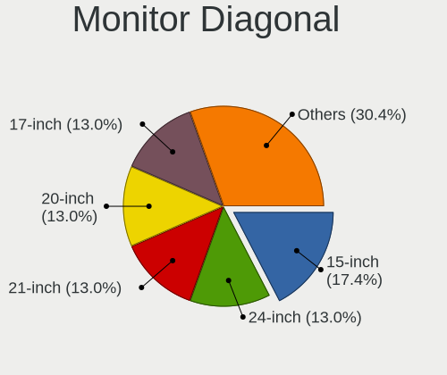

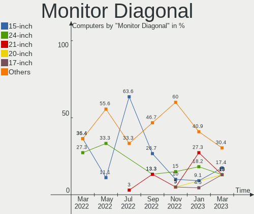

| Inches  | Computers | Percent |
|---------|-----------|---------|
| 15      | 8         | 28.57%  |
| 24      | 6         | 21.43%  |
| 23      | 4         | 14.29%  |
| 27      | 2         | 7.14%   |
| 21      | 2         | 7.14%   |
| 20      | 2         | 7.14%   |
| Unknown | 2         | 7.14%   |
| 31      | 1         | 3.57%   |
| 18      | 1         | 3.57%   |

Monitor Width
-------------

Physical width

| Width in mm | Computers | Percent |
|-------------|-----------|---------|
| 501-600     | 11        | 40.74%  |
| 301-350     | 8         | 29.63%  |
| 401-500     | 5         | 18.52%  |
| Unknown     | 2         | 7.41%   |
| 601-700     | 1         | 3.7%    |

Aspect Ratio
------------

Proportional relationship between the width and the height

| Ratio | Computers | Percent |
|-------|-----------|---------|
| 16/9  | 25        | 96.15%  |
| 16/10 | 1         | 3.85%   |

Monitor Area
------------

Area in inch

| Area in inch | Computers | Percent |
|----------------|-----------|---------|
| 201-250        | 10        | 37.04%  |
| 101-110        | 8         | 29.63%  |
| 301-350        | 2         | 7.41%   |
| 151-200        | 2         | 7.41%   |
| Unknown        | 2         | 7.41%   |
| 351-500        | 1         | 3.7%    |
| 251-300        | 1         | 3.7%    |
| 141-150        | 1         | 3.7%    |

Pixel Density
-------------

Pixels per inch

| Density | Computers | Percent |
|---------|-----------|---------|
| 51-100  | 14        | 51.85%  |
| 101-120 | 6         | 22.22%  |
| 121-160 | 5         | 18.52%  |
| Unknown | 2         | 7.41%   |

Multiple Monitors
-----------------

Total monitors connected

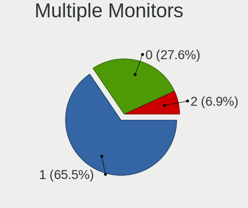

| Total | Computers | Percent |
|-------|-----------|---------|
| 1     | 24        | 77.42%  |
| 0     | 5         | 16.13%  |
| 2     | 2         | 6.45%   |

Network
-------

Net Controller Vendor
---------------------

Controller vendors

| Vendor                 | Computers | Percent |
|------------------------|-----------|---------|
| Realtek Semiconductor  | 19        | 47.5%   |
| Intel                  | 15        | 37.5%   |
| Ralink                 | 1         | 2.5%    |
| Qualcomm Atheros       | 1         | 2.5%    |
| Nvidia                 | 1         | 2.5%    |
| Metrologic Instruments | 1         | 2.5%    |
| Huawei Technologies    | 1         | 2.5%    |
| Broadcom               | 1         | 2.5%    |

Net Controller Model
--------------------

Controller models

| Model                                                             | Computers | Percent |
|-------------------------------------------------------------------|-----------|---------|
| Realtek RTL8111/8168/8411 PCI Express Gigabit Ethernet Controller | 14        | 27.45%  |
| Realtek RTL8821CE 802.11ac PCIe Wireless Network Adapter          | 4         | 7.84%   |
| Intel Ethernet Connection (17) I219-V                             | 3         | 5.88%   |
| Realtek RTL8822CE 802.11ac PCIe Wireless Network Adapter          | 2         | 3.92%   |
| Realtek RTL810xE PCI Express Fast Ethernet controller             | 2         | 3.92%   |
| Intel Wi-Fi 6 AX200                                               | 2         | 3.92%   |
| Realtek RTL8852AE 802.11ax PCIe Wireless Network Adapter          | 1         | 1.96%   |
| Realtek RTL8188EUS 802.11n Wireless Network Adapter               | 1         | 1.96%   |
| Realtek 802.11ac NIC                                              | 1         | 1.96%   |
| Ralink RT3290 Wireless 802.11n 1T/1R PCIe                         | 1         | 1.96%   |
| Qualcomm Atheros AR9285 Wireless Network Adapter (PCI-Express)    | 1         | 1.96%   |
| Nvidia MCP61 Ethernet                                             | 1         | 1.96%   |
| Metrologic Instruments 7580                                       | 1         | 1.96%   |
| Intel Wireless 3165                                               | 1         | 1.96%   |
| Intel Wi-Fi 6 AX201                                               | 1         | 1.96%   |
| Intel I210 Gigabit Network Connection                             | 1         | 1.96%   |
| Intel Ethernet Controller I225-V                                  | 1         | 1.96%   |
| Intel Ethernet Controller I225-LM                                 | 1         | 1.96%   |
| Intel Ethernet Connection I217-LM                                 | 1         | 1.96%   |
| Intel Ethernet Connection (2) I219-LM                             | 1         | 1.96%   |
| Intel Ethernet Connection (17) I219-LM                            | 1         | 1.96%   |
| Intel Ethernet Connection (14) I219-V                             | 1         | 1.96%   |
| Intel Ethernet Connection (12) I219-V                             | 1         | 1.96%   |
| Intel Ethernet Connection (10) I219-V                             | 1         | 1.96%   |
| Intel Cannon Point-LP CNVi [Wireless-AC]                          | 1         | 1.96%   |
| Intel Alder Lake-S PCH CNVi WiFi                                  | 1         | 1.96%   |
| Intel 82579V Gigabit Network Connection                           | 1         | 1.96%   |
| Intel 82579LM Gigabit Network Connection (Lewisville)             | 1         | 1.96%   |
| Huawei MLA-L11                                                    | 1         | 1.96%   |
| Broadcom BCM43142 802.11b/g/n                                     | 1         | 1.96%   |

Wireless Vendor
---------------

Wireless vendors

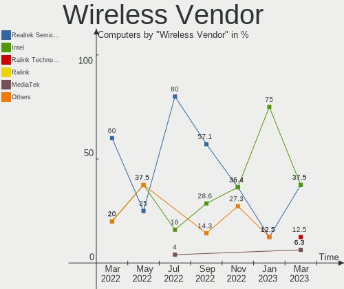

| Vendor                | Computers | Percent |
|-----------------------|-----------|---------|
| Realtek Semiconductor | 9         | 50%     |
| Intel                 | 6         | 33.33%  |
| Ralink                | 1         | 5.56%   |
| Qualcomm Atheros      | 1         | 5.56%   |
| Broadcom              | 1         | 5.56%   |

Wireless Model
--------------

Wireless models

| Model                                                          | Computers | Percent |
|----------------------------------------------------------------|-----------|---------|
| Realtek RTL8821CE 802.11ac PCIe Wireless Network Adapter       | 4         | 22.22%  |
| Realtek RTL8822CE 802.11ac PCIe Wireless Network Adapter       | 2         | 11.11%  |
| Intel Wi-Fi 6 AX200                                            | 2         | 11.11%  |
| Realtek RTL8852AE 802.11ax PCIe Wireless Network Adapter       | 1         | 5.56%   |
| Realtek RTL8188EUS 802.11n Wireless Network Adapter            | 1         | 5.56%   |
| Realtek 802.11ac NIC                                           | 1         | 5.56%   |
| Ralink RT3290 Wireless 802.11n 1T/1R PCIe                      | 1         | 5.56%   |
| Qualcomm Atheros AR9285 Wireless Network Adapter (PCI-Express) | 1         | 5.56%   |
| Intel Wireless 3165                                            | 1         | 5.56%   |
| Intel Wi-Fi 6 AX201                                            | 1         | 5.56%   |
| Intel Cannon Point-LP CNVi [Wireless-AC]                       | 1         | 5.56%   |
| Intel Alder Lake-S PCH CNVi WiFi                               | 1         | 5.56%   |
| Broadcom BCM43142 802.11b/g/n                                  | 1         | 5.56%   |

Ethernet Vendor
---------------

Ethernet vendors

| Vendor                | Computers | Percent |
|-----------------------|-----------|---------|
| Realtek Semiconductor | 16        | 51.61%  |
| Intel                 | 13        | 41.94%  |
| Nvidia                | 1         | 3.23%   |
| Huawei Technologies   | 1         | 3.23%   |

Ethernet Model
--------------

Ethernet models

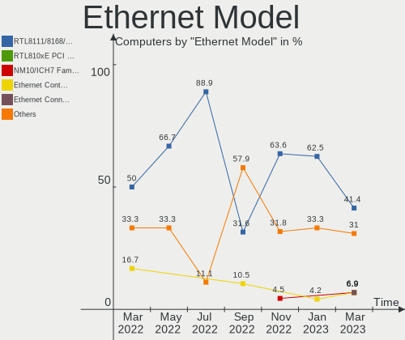

| Model                                                             | Computers | Percent |
|-------------------------------------------------------------------|-----------|---------|
| Realtek RTL8111/8168/8411 PCI Express Gigabit Ethernet Controller | 14        | 43.75%  |
| Intel Ethernet Connection (17) I219-V                             | 3         | 9.38%   |
| Realtek RTL810xE PCI Express Fast Ethernet controller             | 2         | 6.25%   |
| Nvidia MCP61 Ethernet                                             | 1         | 3.13%   |
| Intel I210 Gigabit Network Connection                             | 1         | 3.13%   |
| Intel Ethernet Controller I225-V                                  | 1         | 3.13%   |
| Intel Ethernet Controller I225-LM                                 | 1         | 3.13%   |
| Intel Ethernet Connection I217-LM                                 | 1         | 3.13%   |
| Intel Ethernet Connection (2) I219-LM                             | 1         | 3.13%   |
| Intel Ethernet Connection (17) I219-LM                            | 1         | 3.13%   |
| Intel Ethernet Connection (14) I219-V                             | 1         | 3.13%   |
| Intel Ethernet Connection (12) I219-V                             | 1         | 3.13%   |
| Intel Ethernet Connection (10) I219-V                             | 1         | 3.13%   |
| Intel 82579V Gigabit Network Connection                           | 1         | 3.13%   |
| Intel 82579LM Gigabit Network Connection (Lewisville)             | 1         | 3.13%   |
| Huawei MLA-L11                                                    | 1         | 3.13%   |

Net Controller Kind
-------------------

Ethernet, WiFi or modem

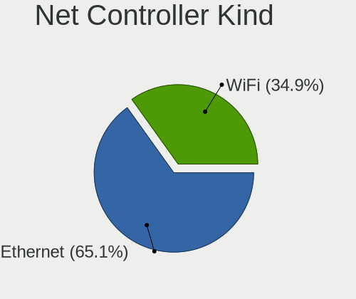

| Kind     | Computers | Percent |
|----------|-----------|---------|
| Ethernet | 30        | 61.22%  |
| WiFi     | 18        | 36.73%  |
| Modem    | 1         | 2.04%   |

Used Controller
---------------

Currently used network controller

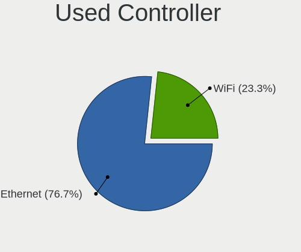

| Kind     | Computers | Percent |
|----------|-----------|---------|
| Ethernet | 24        | 82.76%  |
| WiFi     | 5         | 17.24%  |

NICs
----

Total network controllers on board

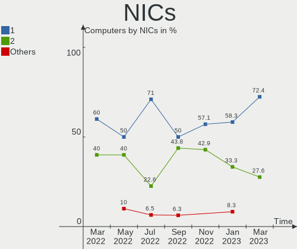

| Total | Computers | Percent |
|-------|-----------|---------|
| 2     | 15        | 48.39%  |
| 1     | 15        | 48.39%  |
| 4     | 1         | 3.23%   |

IPv6
----

IPv6 vs IPv4

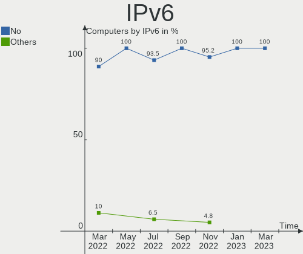

| Used | Computers | Percent |
|------|-----------|---------|
| No   | 29        | 93.55%  |
| Yes  | 2         | 6.45%   |

Bluetooth
---------

Bluetooth Vendor
----------------

Controller vendors

| Vendor                  | Computers | Percent |
|-------------------------|-----------|---------|
| Intel                   | 6         | 42.86%  |
| Realtek Semiconductor   | 5         | 35.71%  |
| Ralink                  | 1         | 7.14%   |
| IMC Networks            | 1         | 7.14%   |
| Cambridge Silicon Radio | 1         | 7.14%   |

Bluetooth Model
---------------

Controller models

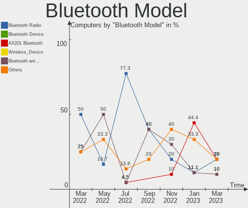

| Model                                               | Computers | Percent |
|-----------------------------------------------------|-----------|---------|
| Realtek Bluetooth Radio                             | 5         | 35.71%  |
| Intel AX200 Bluetooth                               | 2         | 14.29%  |
| Ralink RT3290 Bluetooth                             | 1         | 7.14%   |
| Intel Bluetooth wireless interface                  | 1         | 7.14%   |
| Intel Bluetooth Device                              | 1         | 7.14%   |
| Intel Bluetooth 9460/9560 Jefferson Peak (JfP)      | 1         | 7.14%   |
| Intel AX201 Bluetooth                               | 1         | 7.14%   |
| IMC Networks Bluetooth Radio                        | 1         | 7.14%   |
| Cambridge Silicon Radio Bluetooth Dongle (HCI mode) | 1         | 7.14%   |

Sound
-----

Sound Vendor
------------

Sound card vendors

| Vendor   | Computers | Percent |
|----------|-----------|---------|
| Intel    | 23        | 65.71%  |
| AMD      | 9         | 25.71%  |
| Nvidia   | 2         | 5.71%   |
| Logitech | 1         | 2.86%   |

Sound Model
-----------

Sound card models

| Model                                                                             | Computers | Percent |
|-----------------------------------------------------------------------------------|-----------|---------|
| AMD Family 17h/19h HD Audio Controller                                            | 7         | 15.56%  |
| AMD Raven/Raven2/Fenghuang HDMI/DP Audio Controller                               | 5         | 11.11%  |
| Intel Audio device                                                                | 4         | 8.89%   |
| Intel Alder Lake-S HD Audio Controller                                            | 4         | 8.89%   |
| Intel 6 Series/C200 Series Chipset Family High Definition Audio Controller        | 4         | 8.89%   |
| Intel 200 Series PCH HD Audio                                                     | 2         | 4.44%   |
| AMD Renoir Radeon High Definition Audio Controller                                | 2         | 4.44%   |
| Nvidia MCP61 High Definition Audio                                                | 1         | 2.22%   |
| Nvidia GM107 High Definition Audio Controller [GeForce 940MX]                     | 1         | 2.22%   |
| Nvidia GA106 High Definition Audio Controller                                     | 1         | 2.22%   |
| Logitech 960 Headset                                                              | 1         | 2.22%   |
| Intel Xeon E3-1200 v3/4th Gen Core Processor HD Audio Controller                  | 1         | 2.22%   |
| Intel Tiger Lake-LP Smart Sound Technology Audio Controller                       | 1         | 2.22%   |
| Intel Haswell-ULT HD Audio Controller                                             | 1         | 2.22%   |
| Intel Comet Lake PCH-V cAVS                                                       | 1         | 2.22%   |
| Intel CM238 HD Audio Controller                                                   | 1         | 2.22%   |
| Intel Celeron/Pentium Silver Processor High Definition Audio                      | 1         | 2.22%   |
| Intel Cannon Point-LP High Definition Audio Controller                            | 1         | 2.22%   |
| Intel 8 Series/C220 Series Chipset High Definition Audio Controller               | 1         | 2.22%   |
| Intel 8 Series HD Audio Controller                                                | 1         | 2.22%   |
| Intel 7 Series/C216 Chipset Family High Definition Audio Controller               | 1         | 2.22%   |
| Intel 5 Series/3400 Series Chipset High Definition Audio                          | 1         | 2.22%   |
| AMD Cedar HDMI Audio [Radeon HD 5400/6300/7300 Series]                            | 1         | 2.22%   |
| AMD Caicos HDMI Audio [Radeon HD 6450 / 7450/8450/8490 OEM / R5 230/235/235X OEM] | 1         | 2.22%   |

Memory
------

Memory Vendor
-------------

Memory module vendors

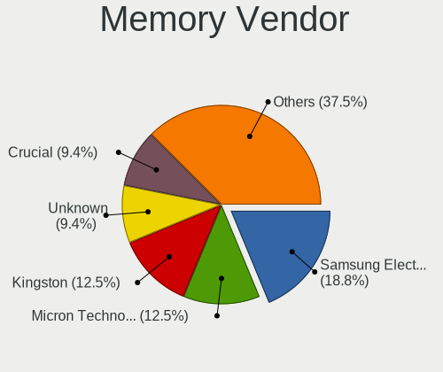

| Vendor                             | Computers | Percent |
|------------------------------------|-----------|---------|
| Samsung Electronics                | 9         | 27.27%  |
| Foxline                            | 4         | 12.12%  |
| SK hynix                           | 3         | 9.09%   |
| Kingston                           | 3         | 9.09%   |
| Crucial                            | 3         | 9.09%   |
| Unknown                            | 2         | 6.06%   |
| Ramaxel Technology                 | 2         | 6.06%   |
| Unknown (ABCD)                     | 1         | 3.03%   |
| Shenzhen Micro Innovation Industry | 1         | 3.03%   |
| SHARETRONIC                        | 1         | 3.03%   |
| Micron Technology                  | 1         | 3.03%   |
| Innodisk                           | 1         | 3.03%   |
| Corsair                            | 1         | 3.03%   |
| Apacer                             | 1         | 3.03%   |

Memory Model
------------

Memory module models

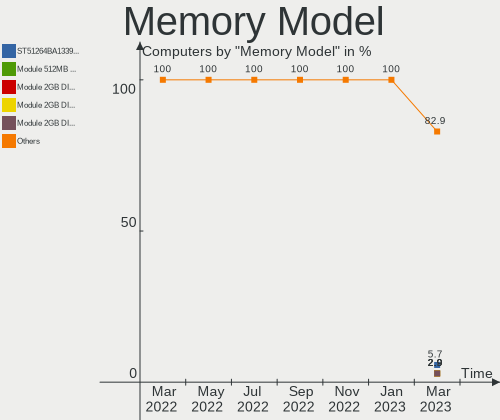

| Model                                                                     | Computers | Percent |
|---------------------------------------------------------------------------|-----------|---------|
| Samsung RAM M471A5244CB0-CWE 4GB SODIMM DDR4 3200MT/s                     | 3         | 8.82%   |
| Samsung RAM M471A5244CB0-CTD 4GB SODIMM DDR4 3266MT/s                     | 2         | 5.88%   |
| Crucial RAM CT16G4SFS832A.C8FE 16GB SODIMM DDR4 3200MT/s                  | 2         | 5.88%   |
| Unknown RAM Module 8GB DIMM DDR3 1333MT/s                                 | 1         | 2.94%   |
| Unknown RAM Module 4GB DIMM 800MT/s                                       | 1         | 2.94%   |
| Unknown (ABCD) RAM 123456789012345678 2GB DIMM LPDDR4 2400MT/s            | 1         | 2.94%   |
| SK hynix RAM HMT451U6BFR8A-PB 4GB DIMM DDR3 1648MT/s                      | 1         | 2.94%   |
| SK hynix RAM HMT351U6BFR8C-H9 4GB DIMM DDR3 1333MT/s                      | 1         | 2.94%   |
| SK hynix RAM HMT112U6TFR8C-H9 1GB DIMM DDR3 1333MT/s                      | 1         | 2.94%   |
| Shenzhen Micro Innovation Industry RAM KF2666DDCD4 8GB DIMM DDR4 2667MT/s | 1         | 2.94%   |
| SHARETRONIC RAM Module 4GB SODIMM DDR3 1600MT/s                           | 1         | 2.94%   |
| Samsung RAM Module 16GB SODIMM 4800MT/s                                   | 1         | 2.94%   |
| Samsung RAM M471B5673FH0-CH9 2GB SODIMM DDR3 1334MT/s                     | 1         | 2.94%   |
| Samsung RAM M471B5173QH0-YK0 4GB SODIMM DDR3 1600MT/s                     | 1         | 2.94%   |
| Samsung RAM M471B2873EH1-CH9 1GB SODIMM DDR3 1333MT/s                     | 1         | 2.94%   |
| Samsung RAM M378B5173QH0-CK0 4GB DIMM DDR3 1600MT/s                       | 1         | 2.94%   |
| Ramaxel RAM RMSA3320MR78HAF-3200 8GB SODIMM DDR4 3200MT/s                 | 1         | 2.94%   |
| Ramaxel RAM RMSA3270ME86H9F-2666 4GB SODIMM DDR4 2667MT/s                 | 1         | 2.94%   |
| Micron RAM 4ATF1G64HZ-3G2E1 8GB Row Of Chips DDR4 3200MT/s                | 1         | 2.94%   |
| Kingston RAM 9905795-003.A00G 8GB SODIMM DDR4 3200MT/s                    | 1         | 2.94%   |
| Kingston RAM 9905711-027.A00G 4GB SODIMM DDR4 2667MT/s                    | 1         | 2.94%   |
| Kingston RAM 9905711-015.A00G 4GB SODIMM DDR4 2400MT/s                    | 1         | 2.94%   |
| Innodisk RAM M4SS-4GSSN50J-E 4GB SODIMM DDR4 2400MT/s                     | 1         | 2.94%   |
| Foxline RAM FL3200D4U22-16G 16GB DIMM DDR4 3200MT/s                       | 1         | 2.94%   |
| Foxline RAM FL2666D4U19-8G 8GB DIMM DDR4 2667MT/s                         | 1         | 2.94%   |
| Foxline RAM FL2666D4U19-16G 16GB DIMM DDR4 2667MT/s                       | 1         | 2.94%   |
| Foxline RAM FL2400D4S17S-8G 8GB SODIMM DDR4 2400MT/s                      | 1         | 2.94%   |
| Crucial RAM CT8G4DFRA266.C8FJ 8GB DIMM DDR4 2800MT/s                      | 1         | 2.94%   |
| Corsair RAM CMK8GX4M1A2666C16 8GB DIMM DDR4 3000MT/s                      | 1         | 2.94%   |
| Apacer RAM D12.2326BS.003 16GB DIMM DDR4 2666MT/s                         | 1         | 2.94%   |

Memory Kind
-----------

Memory module kinds

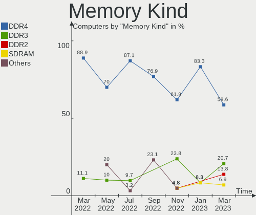

| Kind    | Computers | Percent |
|---------|-----------|---------|
| DDR4    | 20        | 64.52%  |
| DDR3    | 8         | 25.81%  |
| Unknown | 2         | 6.45%   |
| LPDDR4  | 1         | 3.23%   |

Memory Form Factor
------------------

Physical design of the memory module

| Name         | Computers | Percent |
|--------------|-----------|---------|
| SODIMM       | 16        | 51.61%  |
| DIMM         | 14        | 45.16%  |
| Row Of Chips | 1         | 3.23%   |

Memory Size
-----------

Memory module size

| Size  | Computers | Percent |
|-------|-----------|---------|
| 4096  | 13        | 40.63%  |
| 8192  | 9         | 28.13%  |
| 16384 | 7         | 21.88%  |
| 1024  | 2         | 6.25%   |
| 2048  | 1         | 3.13%   |

Memory Speed
------------

Memory module speed

| Speed | Computers | Percent |
|-------|-----------|---------|
| 3200  | 9         | 26.47%  |
| 2667  | 5         | 14.71%  |
| 2400  | 4         | 11.76%  |
| 1333  | 4         | 11.76%  |
| 3266  | 2         | 5.88%   |
| 1600  | 2         | 5.88%   |
| 4800  | 1         | 2.94%   |
| 3000  | 1         | 2.94%   |
| 2800  | 1         | 2.94%   |
| 2666  | 1         | 2.94%   |
| 1866  | 1         | 2.94%   |
| 1648  | 1         | 2.94%   |
| 1334  | 1         | 2.94%   |
| 800   | 1         | 2.94%   |

Printers & scanners
-------------------

Printer Vendor
--------------

Printer device vendors

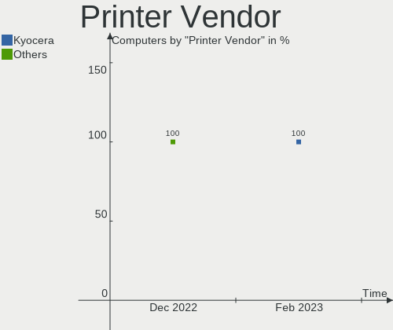

| Vendor  | Computers | Percent |
|---------|-----------|---------|
| Kyocera | 1         | 100%    |

Printer Model
-------------

Printer device models

| Model           | Computers | Percent |
|-----------------|-----------|---------|
| Kyocera FS-1040 | 1         | 100%    |

Scanner Vendor
--------------

Scanner device vendors

Zero info for selected period =(

Scanner Model
-------------

Scanner device models

Zero info for selected period =(

Camera
------

Camera Vendor
-------------

Camera device vendors

| Vendor                      | Computers | Percent |
|-----------------------------|-----------|---------|
| Acer                        | 5         | 35.71%  |
| Realtek Semiconductor       | 3         | 21.43%  |
| Quanta                      | 2         | 14.29%  |
| Alcor Micro                 | 2         | 14.29%  |
| Sonix Technology            | 1         | 7.14%   |
| KYE Systems (Mouse Systems) | 1         | 7.14%   |

Camera Model
------------

Camera device models

| Model                                     | Computers | Percent |
|-------------------------------------------|-----------|---------|
| Acer Integrated Camera                    | 3         | 21.43%  |
| Sonix USB 2.0 Camera                      | 1         | 7.14%   |
| Realtek MTD camera                        | 1         | 7.14%   |
| Realtek HP Truevision HD                  | 1         | 7.14%   |
| Realtek 2SF022                            | 1         | 7.14%   |
| Quanta USB2.0 HD UVC WebCam               | 1         | 7.14%   |
| Quanta HP 5MP Camera                      | 1         | 7.14%   |
| KYE Systems (Mouse Systems) FaceCam 1000X | 1         | 7.14%   |
| Alcor Micro USB FHD Camera                | 1         | 7.14%   |
| Alcor Micro USB 2.0 PC Camera             | 1         | 7.14%   |
| Acer Lenovo Integrated Webcam             | 1         | 7.14%   |
| Acer EasyCamera                           | 1         | 7.14%   |

Security
--------

Fingerprint Vendor
------------------

Fingerprint sensor vendors

Zero info for selected period =(

Fingerprint Model
-----------------

Fingerprint sensor models

Zero info for selected period =(

Chipcard Vendor
---------------

Chipcard module vendors

| Vendor       | Computers | Percent |
|--------------|-----------|---------|
| Aladdin R.D. | 1         | 100%    |

Chipcard Model
--------------

Chipcard module models

| Model                                 | Computers | Percent |
|---------------------------------------|-----------|---------|
| Aladdin R.D. Smart card reader JCR721 | 1         | 100%    |

Unsupported
-----------

Unsupported Devices
-------------------

Total unsupported devices on board

| Total | Computers | Percent |
|-------|-----------|---------|
| 0     | 24        | 77.42%  |
| 1     | 6         | 19.35%  |
| 2     | 1         | 3.23%   |

Unsupported Device Types
------------------------

Types of unsupported devices

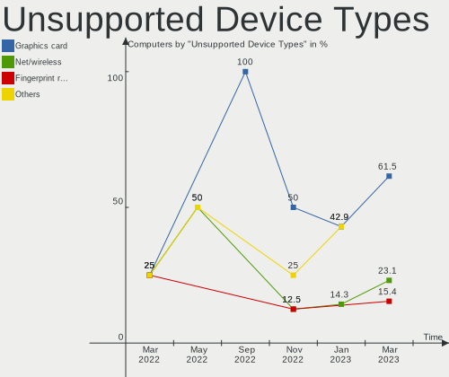

| Type          | Computers | Percent |
|---------------|-----------|---------|
| Net/wireless  | 3         | 42.86%  |
| Graphics card | 3         | 42.86%  |
| Bluetooth     | 1         | 14.29%  |

