Red OS - Hardware Trends
------------------------

A project to identify most popular hardware characteristics and track their change
over time based on data collected by Linux users at https://Linux-Hardware.org.

Anyone can contribute to this report by the [hw-probe](https://github.com/linuxhw/hw-probe) tool:

    sudo -E hw-probe -all -upload

This is a report for all computer types. See also reports for [desktops](/Dist/Red_OS/Desktop/README.md) and [notebooks](/Dist/Red_OS/Notebook/README.md).

This report is for one last month. Overall report since the beginning of time: [TestDays](https://github.com/linuxhw/TestDays)

Period: Mar, 2023.

Contents
--------

* [ System ](#system)
  - [ OS                       ](#os)
  - [ OS Family                ](#os-family)
  - [ Kernel                   ](#kernel)
  - [ Kernel Family            ](#kernel-family)
  - [ Kernel Major Ver.        ](#kernel-major-ver)
  - [ Arch                     ](#arch)
  - [ DE                       ](#de)
  - [ Display Server           ](#display-server)
  - [ Display Manager          ](#display-manager)
  - [ OS Lang                  ](#os-lang)
  - [ Boot Mode                ](#boot-mode)
  - [ Filesystem               ](#filesystem)
  - [ Part. scheme             ](#part-scheme)
  - [ Dual Boot with Linux/BSD ](#dual-boot-with-linuxbsd)
  - [ Dual Boot (Win)          ](#dual-boot-win)

* [ Board ](#board)
  - [ Vendor                   ](#vendor)
  - [ Model                    ](#model)
  - [ Model Family             ](#model-family)
  - [ MFG Year                 ](#mfg-year)
  - [ Form Factor              ](#form-factor)
  - [ Secure Boot              ](#secure-boot)
  - [ Coreboot                 ](#coreboot)
  - [ RAM Size                 ](#ram-size)
  - [ RAM Used                 ](#ram-used)
  - [ Total Drives             ](#total-drives)
  - [ Has CD-ROM               ](#has-cd-rom)
  - [ Has Ethernet             ](#has-ethernet)
  - [ Has WiFi                 ](#has-wifi)
  - [ Has Bluetooth            ](#has-bluetooth)

* [ Location ](#location)
  - [ Country                  ](#country)
  - [ City                     ](#city)

* [ Drives ](#drives)
  - [ Drive Vendor             ](#drive-vendor)
  - [ Drive Model              ](#drive-model)
  - [ HDD Vendor               ](#hdd-vendor)
  - [ SSD Vendor               ](#ssd-vendor)
  - [ Drive Kind               ](#drive-kind)
  - [ Drive Connector          ](#drive-connector)
  - [ Drive Size               ](#drive-size)
  - [ Space Total              ](#space-total)
  - [ Space Used               ](#space-used)
  - [ Malfunc. Drives          ](#malfunc-drives)
  - [ Malfunc. Drive Vendor    ](#malfunc-drive-vendor)
  - [ Malfunc. HDD Vendor      ](#malfunc-hdd-vendor)
  - [ Malfunc. Drive Kind      ](#malfunc-drive-kind)
  - [ Failed Drives            ](#failed-drives)
  - [ Failed Drive Vendor      ](#failed-drive-vendor)
  - [ Drive Status             ](#drive-status)

* [ Storage controller ](#storage-controller)
  - [ Storage Vendor           ](#storage-vendor)
  - [ Storage Model            ](#storage-model)
  - [ Storage Kind             ](#storage-kind)

* [ Processor ](#processor)
  - [ CPU Vendor               ](#cpu-vendor)
  - [ CPU Model                ](#cpu-model)
  - [ CPU Model Family         ](#cpu-model-family)
  - [ CPU Cores                ](#cpu-cores)
  - [ CPU Sockets              ](#cpu-sockets)
  - [ CPU Threads              ](#cpu-threads)
  - [ CPU Op-Modes             ](#cpu-op-modes)
  - [ CPU Microcode            ](#cpu-microcode)
  - [ CPU Microarch            ](#cpu-microarch)

* [ Graphics ](#graphics)
  - [ GPU Vendor               ](#gpu-vendor)
  - [ GPU Model                ](#gpu-model)
  - [ GPU Combo                ](#gpu-combo)
  - [ GPU Driver               ](#gpu-driver)
  - [ GPU Memory               ](#gpu-memory)

* [ Monitor ](#monitor)
  - [ Monitor Vendor           ](#monitor-vendor)
  - [ Monitor Model            ](#monitor-model)
  - [ Monitor Resolution       ](#monitor-resolution)
  - [ Monitor Diagonal         ](#monitor-diagonal)
  - [ Monitor Width            ](#monitor-width)
  - [ Aspect Ratio             ](#aspect-ratio)
  - [ Monitor Area             ](#monitor-area)
  - [ Pixel Density            ](#pixel-density)
  - [ Multiple Monitors        ](#multiple-monitors)

* [ Network ](#network)
  - [ Net Controller Vendor    ](#net-controller-vendor)
  - [ Net Controller Model     ](#net-controller-model)
  - [ Wireless Vendor          ](#wireless-vendor)
  - [ Wireless Model           ](#wireless-model)
  - [ Ethernet Vendor          ](#ethernet-vendor)
  - [ Ethernet Model           ](#ethernet-model)
  - [ Net Controller Kind      ](#net-controller-kind)
  - [ Used Controller          ](#used-controller)
  - [ NICs                     ](#nics)
  - [ IPv6                     ](#ipv6)

* [ Bluetooth ](#bluetooth)
  - [ Bluetooth Vendor         ](#bluetooth-vendor)
  - [ Bluetooth Model          ](#bluetooth-model)

* [ Sound ](#sound)
  - [ Sound Vendor             ](#sound-vendor)
  - [ Sound Model              ](#sound-model)

* [ Memory ](#memory)
  - [ Memory Vendor            ](#memory-vendor)
  - [ Memory Model             ](#memory-model)
  - [ Memory Kind              ](#memory-kind)
  - [ Memory Form Factor       ](#memory-form-factor)
  - [ Memory Size              ](#memory-size)
  - [ Memory Speed             ](#memory-speed)

* [ Printers & scanners ](#printers--scanners)
  - [ Printer Vendor           ](#printer-vendor)
  - [ Printer Model            ](#printer-model)
  - [ Scanner Vendor           ](#scanner-vendor)
  - [ Scanner Model            ](#scanner-model)

* [ Camera ](#camera)
  - [ Camera Vendor            ](#camera-vendor)
  - [ Camera Model             ](#camera-model)

* [ Security ](#security)
  - [ Fingerprint Vendor       ](#fingerprint-vendor)
  - [ Fingerprint Model        ](#fingerprint-model)
  - [ Chipcard Vendor          ](#chipcard-vendor)
  - [ Chipcard Model           ](#chipcard-model)

* [ Unsupported ](#unsupported)
  - [ Unsupported Devices      ](#unsupported-devices)
  - [ Unsupported Device Types ](#unsupported-device-types)

System
------

OS
--

Installed operating systems

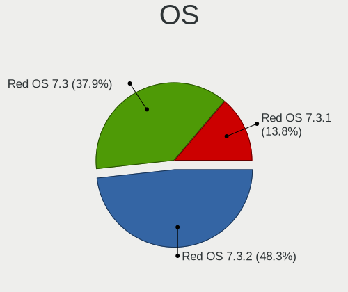

| Name         | Computers | Percent |
|--------------|-----------|---------|
| Red OS 7.3.2 | 14        | 48.28%  |
| Red OS 7.3   | 11        | 37.93%  |
| Red OS 7.3.1 | 4         | 13.79%  |

OS Family
---------

OS without a version

| Name   | Computers | Percent |
|--------|-----------|---------|
| Red OS | 29        | 100%    |

Kernel
------

Version of the Linux kernel

| Version                | Computers | Percent |
|------------------------|-----------|---------|
| 5.15.87-1.el7.3.x86_64 | 13        | 44.83%  |
| 5.14.9-1.el7.x86_64    | 5         | 17.24%  |
| 5.15.10-1.el7.x86_64   | 4         | 13.79%  |
| 5.15.72-1.el7.3.x86_64 | 3         | 10.34%  |
| 5.10.29-3.el7.x86_64   | 2         | 6.9%    |
| 6.1.11-1.el7.3.x86_64  | 1         | 3.45%   |
| 5.15.78-2.el7.3.x86_64 | 1         | 3.45%   |

Kernel Family
-------------

Linux kernel without a distro release

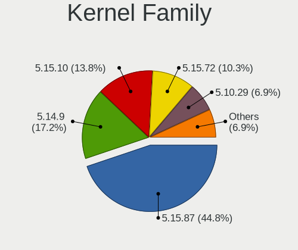

| Version | Computers | Percent |
|---------|-----------|---------|
| 5.15.87 | 13        | 44.83%  |
| 5.14.9  | 5         | 17.24%  |
| 5.15.10 | 4         | 13.79%  |
| 5.15.72 | 3         | 10.34%  |
| 5.10.29 | 2         | 6.9%    |
| 6.1.11  | 1         | 3.45%   |
| 5.15.78 | 1         | 3.45%   |

Kernel Major Ver.
-----------------

Linux kernel major version

| Version | Computers | Percent |
|---------|-----------|---------|
| 5.15    | 21        | 72.41%  |
| 5.14    | 5         | 17.24%  |
| 5.10    | 2         | 6.9%    |
| 6.1     | 1         | 3.45%   |

Arch
----

OS architecture (x86_64, i586, etc.)

| Name   | Computers | Percent |
|--------|-----------|---------|
| x86_64 | 29        | 100%    |

DE
--

Desktop Environment

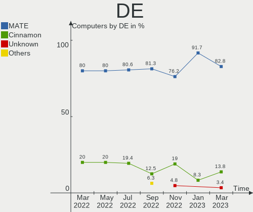

| Name     | Computers | Percent |
|----------|-----------|---------|
| MATE     | 24        | 82.76%  |
| Cinnamon | 4         | 13.79%  |
| Unknown  | 1         | 3.45%   |

Display Server
--------------

X11 or Wayland

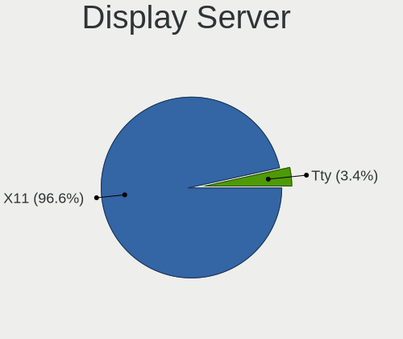

| Name | Computers | Percent |
|------|-----------|---------|
| X11  | 28        | 96.55%  |
| Tty  | 1         | 3.45%   |

Display Manager
---------------

SDDM, LightDM, etc.

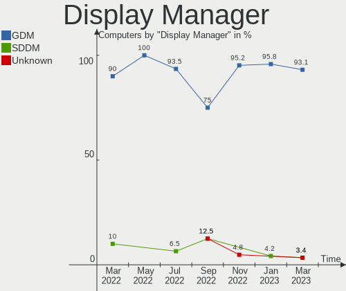

| Name    | Computers | Percent |
|---------|-----------|---------|
| GDM     | 27        | 93.1%   |
| SDDM    | 1         | 3.45%   |
| Unknown | 1         | 3.45%   |

OS Lang
-------

Language

| Lang  | Computers | Percent |
|-------|-----------|---------|
| ru_RU | 29        | 100%    |

Boot Mode
---------

EFI or BIOS

| Mode | Computers | Percent |
|------|-----------|---------|
| EFI  | 16        | 55.17%  |
| BIOS | 13        | 44.83%  |

Filesystem
----------

Type of filesystem

| Type  | Computers | Percent |
|-------|-----------|---------|
| Ext4  | 28        | 96.55%  |
| Btrfs | 1         | 3.45%   |

Part. scheme
------------

Scheme of partitioning

| Type | Computers | Percent |
|------|-----------|---------|
| GPT  | 18        | 62.07%  |
| MBR  | 11        | 37.93%  |

Dual Boot with Linux/BSD
------------------------

Hosting more than one Linux/BSD

| Dual boot | Computers | Percent |
|-----------|-----------|---------|
| No        | 28        | 96.55%  |
| Yes       | 1         | 3.45%   |

Dual Boot (Win)
---------------

Hosting Linux and Windows

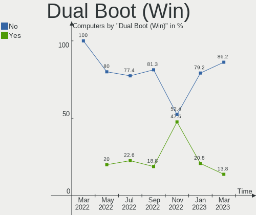

| Dual boot | Computers | Percent |
|-----------|-----------|---------|
| No        | 25        | 86.21%  |
| Yes       | 4         | 13.79%  |

Board
-----

Vendor
------

Motherboard manufacturer

| Name                | Computers | Percent |
|---------------------|-----------|---------|
| MSI                 | 4         | 13.79%  |
| Lenovo              | 4         | 13.79%  |
| ASRock              | 4         | 13.79%  |
| Hewlett-Packard     | 3         | 10.34%  |
| Gigabyte Technology | 3         | 10.34%  |
| ASUSTek Computer    | 3         | 10.34%  |
| Intel               | 2         | 6.9%    |
| Quanta              | 1         | 3.45%   |
| iRU                 | 1         | 3.45%   |
| HONOR               | 1         | 3.45%   |
| DEPO Computers      | 1         | 3.45%   |
| Biostar             | 1         | 3.45%   |
| Aquarius            | 1         | 3.45%   |

Model
-----

Motherboard model

| Name                                 | Computers | Percent |
|--------------------------------------|-----------|---------|
| ASRock H61M-DGS                      | 3         | 10.34%  |
| Intel D945GNT AAC96315-405           | 2         | 6.9%    |
| Quanta 120-1104er                    | 1         | 3.45%   |
| MSI Sword 15 A12UE                   | 1         | 3.45%   |
| MSI MS-7592                          | 1         | 3.45%   |
| MSI MS-7529                          | 1         | 3.45%   |
| MSI Modern 15 B12M                   | 1         | 3.45%   |
| Lenovo ThinkPad T14 Gen 3 21AJS2DE00 | 1         | 3.45%   |
| Lenovo ThinkPad T14 Gen 3 21AJS2DD00 | 1         | 3.45%   |
| Lenovo IdeaPad L340-15API 81LW       | 1         | 3.45%   |
| Lenovo IdeaPad 1 15ALC7 82R4         | 1         | 3.45%   |
| iRU P2320P                           | 1         | 3.45%   |
| HONOR NBR-WAX9                       | 1         | 3.45%   |
| HP Z400 Workstation                  | 1         | 3.45%   |
| HP ProDesk 400 G6 MT                 | 1         | 3.45%   |
| HP Compaq dc7800 Ultra-slim Desktop  | 1         | 3.45%   |
| Gigabyte B560M AORUS PRO             | 1         | 3.45%   |
| Gigabyte B550 AORUS ELITE AX V2      | 1         | 3.45%   |
| Gigabyte A320M-S2H V2                | 1         | 3.45%   |
| DEPO Computers MS-7846               | 1         | 3.45%   |
| Biostar H610MH                       | 1         | 3.45%   |
| ASUS PRIME H310M-R R2.0              | 1         | 3.45%   |
| ASUS PRIME B560M-K                   | 1         | 3.45%   |
| ASUS P5GC-MX/1333                    | 1         | 3.45%   |
| ASRock H510M-HVS R2.0                | 1         | 3.45%   |
| Aquarius AQB560M                     | 1         | 3.45%   |

Model Family
------------

Motherboard model prefix

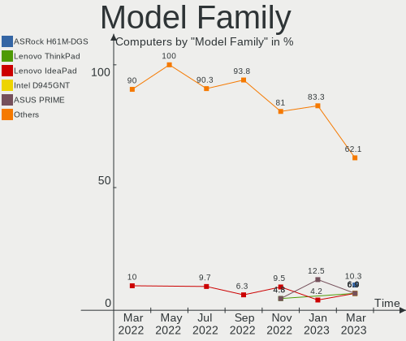

| Name                   | Computers | Percent |
|------------------------|-----------|---------|
| ASRock H61M-DGS        | 3         | 10.34%  |
| Lenovo ThinkPad        | 2         | 6.9%    |
| Lenovo IdeaPad         | 2         | 6.9%    |
| Intel D945GNT          | 2         | 6.9%    |
| ASUS PRIME             | 2         | 6.9%    |
| Quanta 120-1104er      | 1         | 3.45%   |
| MSI Sword              | 1         | 3.45%   |
| MSI MS-7592            | 1         | 3.45%   |
| MSI MS-7529            | 1         | 3.45%   |
| MSI Modern             | 1         | 3.45%   |
| iRU P2320P             | 1         | 3.45%   |
| HONOR NBR-WAX9         | 1         | 3.45%   |
| HP Z400                | 1         | 3.45%   |
| HP ProDesk             | 1         | 3.45%   |
| HP Compaq              | 1         | 3.45%   |
| Gigabyte B560M         | 1         | 3.45%   |
| Gigabyte B550          | 1         | 3.45%   |
| Gigabyte A320M-S2H     | 1         | 3.45%   |
| DEPO Computers MS-7846 | 1         | 3.45%   |
| Biostar H610MH         | 1         | 3.45%   |
| ASUS P5GC-MX           | 1         | 3.45%   |
| ASRock H510M-HVS       | 1         | 3.45%   |
| Aquarius AQB560M       | 1         | 3.45%   |

MFG Year
--------

Motherboard manufacture year

| Year | Computers | Percent |
|------|-----------|---------|
| 2022 | 7         | 24.14%  |
| 2021 | 5         | 17.24%  |
| 2012 | 3         | 10.34%  |
| 2019 | 2         | 6.9%    |
| 2018 | 2         | 6.9%    |
| 2011 | 2         | 6.9%    |
| 2007 | 2         | 6.9%    |
| 2006 | 2         | 6.9%    |
| 2020 | 1         | 3.45%   |
| 2015 | 1         | 3.45%   |
| 2010 | 1         | 3.45%   |
| 2009 | 1         | 3.45%   |

Form Factor
-----------

Physical design of the computer

| Name       | Computers | Percent |
|------------|-----------|---------|
| Desktop    | 21        | 72.41%  |
| Notebook   | 7         | 24.14%  |
| All in one | 1         | 3.45%   |

Secure Boot
-----------

Enabled or disabled

| State    | Computers | Percent |
|----------|-----------|---------|
| Disabled | 29        | 100%    |

Coreboot
--------

Have coreboot on board

| Used | Computers | Percent |
|------|-----------|---------|
| No   | 29        | 100%    |

RAM Size
--------

Total RAM memory

| Size in GB | Computers | Percent |
|------------|-----------|---------|
| 4.01-8.0   | 10        | 34.48%  |
| 3.01-4.0   | 5         | 17.24%  |
| 8.01-16.0  | 4         | 13.79%  |
| 16.01-24.0 | 3         | 10.34%  |
| 1.01-2.0   | 3         | 10.34%  |
| 32.01-64.0 | 2         | 6.9%    |
| 2.01-3.0   | 2         | 6.9%    |

RAM Used
--------

Used RAM memory

| Used GB  | Computers | Percent |
|----------|-----------|---------|
| 1.01-2.0 | 19        | 65.52%  |
| 2.01-3.0 | 4         | 13.79%  |
| 0.51-1.0 | 3         | 10.34%  |
| 4.01-8.0 | 1         | 3.45%   |
| 3.01-4.0 | 1         | 3.45%   |
| 0.01-0.5 | 1         | 3.45%   |

Total Drives
------------

Number of drives on board

| Drives | Computers | Percent |
|--------|-----------|---------|
| 1      | 25        | 86.21%  |
| 3      | 2         | 6.9%    |
| 2      | 2         | 6.9%    |

Has CD-ROM
----------

Has CD-ROM on board

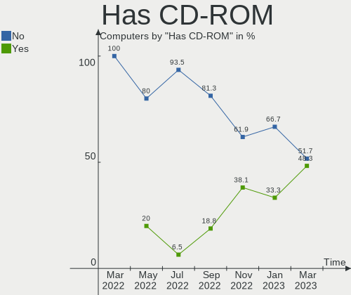

| Presented | Computers | Percent |
|-----------|-----------|---------|
| No        | 15        | 51.72%  |
| Yes       | 14        | 48.28%  |

Has Ethernet
------------

Has Ethernet on board

| Presented | Computers | Percent |
|-----------|-----------|---------|
| Yes       | 28        | 96.55%  |
| No        | 1         | 3.45%   |

Has WiFi
--------

Has WiFi module

| Presented | Computers | Percent |
|-----------|-----------|---------|
| Yes       | 15        | 51.72%  |
| No        | 14        | 48.28%  |

Has Bluetooth
-------------

Has Bluetooth module

| Presented | Computers | Percent |
|-----------|-----------|---------|
| No        | 19        | 65.52%  |
| Yes       | 10        | 34.48%  |

Location
--------

Country
-------

Geographic location (country)

| Country | Computers | Percent |
|---------|-----------|---------|
| Russia  | 29        | 100%    |

City
----

Geographic location (city)

| City          | Computers | Percent |
|---------------|-----------|---------|
| Moscow        | 5         | 17.24%  |
| Krasnodar     | 4         | 13.79%  |
| Samara        | 3         | 10.34%  |
| Salekhard     | 3         | 10.34%  |
| Perm          | 2         | 6.9%    |
| Yekaterinburg | 1         | 3.45%   |
| Vladimir      | 1         | 3.45%   |
| Strezhevoy    | 1         | 3.45%   |
| Shakhtersk    | 1         | 3.45%   |
| Seversk       | 1         | 3.45%   |
| Omsk          | 1         | 3.45%   |
| Nyagan        | 1         | 3.45%   |
| Nev'yansk     | 1         | 3.45%   |
| Muromskiy     | 1         | 3.45%   |
| Liski         | 1         | 3.45%   |
| Konstantinovo | 1         | 3.45%   |
| Baksan        | 1         | 3.45%   |

Drives
------

Drive Vendor
------------

Hard drive vendors

| Vendor              | Computers | Drives | Percent |
|---------------------|-----------|--------|---------|
| Seagate             | 9         | 9      | 27.27%  |
| Samsung Electronics | 6         | 6      | 18.18%  |
| Toshiba             | 4         | 6      | 12.12%  |
| SK hynix            | 2         | 2      | 6.06%   |
| Kingston            | 2         | 2      | 6.06%   |
| Hitachi             | 2         | 2      | 6.06%   |
| WDC                 | 1         | 1      | 3.03%   |
| Phison              | 1         | 1      | 3.03%   |
| Micron Technology   | 1         | 1      | 3.03%   |
| Intel               | 1         | 1      | 3.03%   |
| ExeGate             | 1         | 1      | 3.03%   |
| Dahua               | 1         | 1      | 3.03%   |
| AGI                 | 1         | 1      | 3.03%   |
| A-DATA Technology   | 1         | 1      | 3.03%   |

Drive Model
-----------

Hard drive models

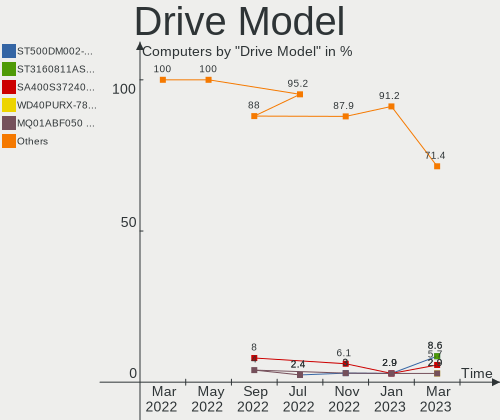

| Model                                  | Computers | Percent |
|----------------------------------------|-----------|---------|
| Seagate ST500DM002-1BD142 500GB        | 3         | 8.57%   |
| Seagate ST3160811AS 160GB              | 3         | 8.57%   |
| Kingston SA400S37240G 240GB SSD        | 2         | 5.71%   |
| WDC WD40PURX-78AKYY0 4TB               | 1         | 2.86%   |
| Toshiba MQ01ABF050 500GB               | 1         | 2.86%   |
| Toshiba MK5075GSX 500GB                | 1         | 2.86%   |
| Toshiba KXG60ZNV256G 256GB             | 1         | 2.86%   |
| Toshiba HDWD110 1TB                    | 1         | 2.86%   |
| Toshiba DT01ACA100 1TB                 | 1         | 2.86%   |
| Toshiba DT01ACA050 500GB               | 1         | 2.86%   |
| SK hynix SKHynix_HFS512GDE9X081N 512GB | 1         | 2.86%   |
| SK hynix SKHynix_HFS256GDE9X081N 256GB | 1         | 2.86%   |
| Seagate ST3500413AS 500GB              | 1         | 2.86%   |
| Seagate ST3250318AS 250GB              | 1         | 2.86%   |
| Seagate ST31000528AS 1TB               | 1         | 2.86%   |
| Samsung SSD 970 EVO Plus 2TB           | 1         | 2.86%   |
| Samsung SSD 970 EVO Plus 1TB           | 1         | 2.86%   |
| Samsung SSD 860 EVO 250GB              | 1         | 2.86%   |
| Samsung MZVLQ256HAJD-000H1 256GB       | 1         | 2.86%   |
| Samsung MZALQ512HALU-000L2 512GB       | 1         | 2.86%   |
| Samsung MZALQ256HBJD-00BL2 256GB       | 1         | 2.86%   |
| Phison 256GB EM280256GYTCTAS-E13T2MS   | 1         | 2.86%   |
| Micron 2450_MTFDKBA512TFK 512GB        | 1         | 2.86%   |
| Intel SSDSC2KI512G8 512GB              | 1         | 2.86%   |
| Hitachi HTS543216L9A300 160GB          | 1         | 2.86%   |
| Hitachi HDS721010CLA632 1TB            | 1         | 2.86%   |
| ExeGate EX280463RUS(512G 512GB SSD     | 1         | 2.86%   |
| Dahua C800 2.5 inch SATA 256GB SSD     | 1         | 2.86%   |
| AGI AGI512G16AI198 512GB               | 1         | 2.86%   |
| A-DATA SX6000PNP 256GB                 | 1         | 2.86%   |

HDD Vendor
----------

Hard disk drive vendors

| Vendor  | Computers | Drives | Percent |
|---------|-----------|--------|---------|
| Seagate | 9         | 9      | 60%     |
| Toshiba | 3         | 5      | 20%     |
| Hitachi | 2         | 2      | 13.33%  |
| WDC     | 1         | 1      | 6.67%   |

SSD Vendor
----------

Solid state drive vendors

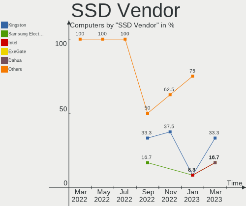

| Vendor              | Computers | Drives | Percent |
|---------------------|-----------|--------|---------|
| Kingston            | 2         | 2      | 33.33%  |
| Samsung Electronics | 1         | 1      | 16.67%  |
| Intel               | 1         | 1      | 16.67%  |
| ExeGate             | 1         | 1      | 16.67%  |
| Dahua               | 1         | 1      | 16.67%  |

Drive Kind
----------

HDD or SSD

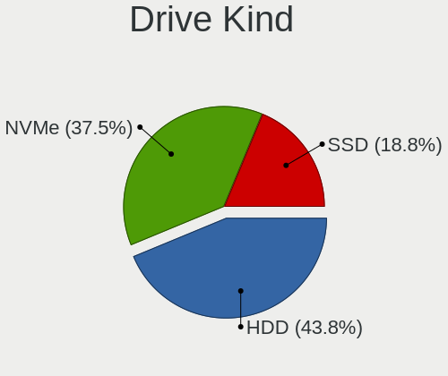

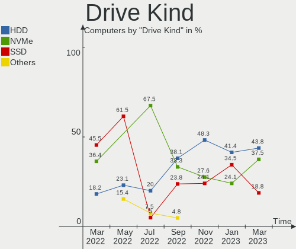

| Kind | Computers | Drives | Percent |
|------|-----------|--------|---------|
| HDD  | 14        | 17     | 43.75%  |
| NVMe | 12        | 12     | 37.5%   |
| SSD  | 6         | 6      | 18.75%  |

Drive Connector
---------------

SATA, SAS, NVMe, etc.

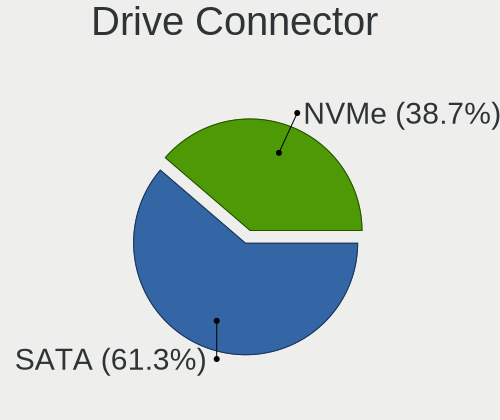

| Type | Computers | Drives | Percent |
|------|-----------|--------|---------|
| SATA | 19        | 23     | 61.29%  |
| NVMe | 12        | 12     | 38.71%  |

Drive Size
----------

Size of hard drive

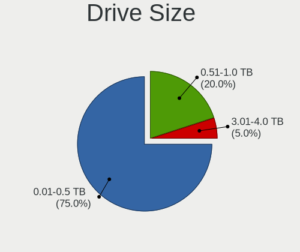

| Size in TB | Computers | Drives | Percent |
|------------|-----------|--------|---------|
| 0.01-0.5   | 15        | 16     | 75%     |
| 0.51-1.0   | 4         | 6      | 20%     |
| 3.01-4.0   | 1         | 1      | 5%      |

Space Total
-----------

Amount of disk space available on the file system

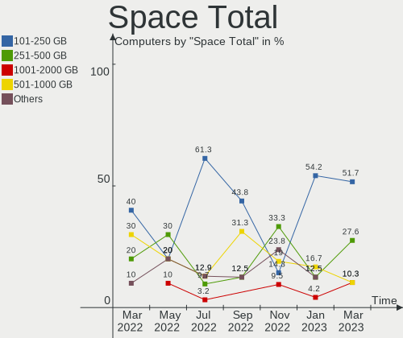

| Size in GB | Computers | Percent |
|------------|-----------|---------|
| 101-250    | 15        | 51.72%  |
| 251-500    | 8         | 27.59%  |
| 1001-2000  | 3         | 10.34%  |
| 501-1000   | 3         | 10.34%  |

Space Used
----------

Amount of used disk space

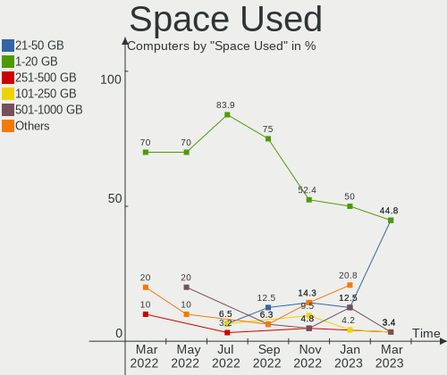

| Used GB  | Computers | Percent |
|----------|-----------|---------|
| 21-50    | 13        | 44.83%  |
| 1-20     | 13        | 44.83%  |
| 251-500  | 1         | 3.45%   |
| 101-250  | 1         | 3.45%   |
| 501-1000 | 1         | 3.45%   |

Malfunc. Drives
---------------

Drive models with a malfunction

| Model                           | Computers | Drives | Percent |
|---------------------------------|-----------|--------|---------|
| Seagate ST500DM002-1BD142 500GB | 2         | 2      | 25%     |
| Toshiba MQ01ABF050 500GB        | 1         | 1      | 12.5%   |
| Toshiba MK5075GSX 500GB         | 1         | 1      | 12.5%   |
| Seagate ST3500413AS 500GB       | 1         | 1      | 12.5%   |
| Seagate ST3250318AS 250GB       | 1         | 1      | 12.5%   |
| Seagate ST3160811AS 160GB       | 1         | 1      | 12.5%   |
| Hitachi HTS543216L9A300 160GB   | 1         | 1      | 12.5%   |

Malfunc. Drive Vendor
---------------------

Vendors of faulty drives

| Vendor  | Computers | Drives | Percent |
|---------|-----------|--------|---------|
| Seagate | 5         | 5      | 71.43%  |
| Toshiba | 1         | 2      | 14.29%  |
| Hitachi | 1         | 1      | 14.29%  |

Malfunc. HDD Vendor
-------------------

Vendors of faulty HDD drives

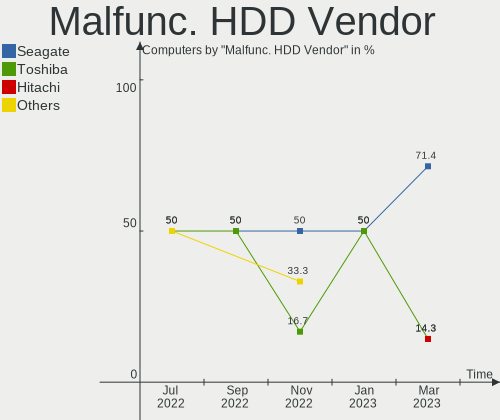

| Vendor  | Computers | Drives | Percent |
|---------|-----------|--------|---------|
| Seagate | 5         | 5      | 71.43%  |
| Toshiba | 1         | 2      | 14.29%  |
| Hitachi | 1         | 1      | 14.29%  |

Malfunc. Drive Kind
-------------------

Kinds of faulty drives

| Kind | Computers | Drives | Percent |
|------|-----------|--------|---------|
| HDD  | 7         | 8      | 100%    |

Failed Drives
-------------

Failed drive models

Zero info for selected period =(

Failed Drive Vendor
-------------------

Failed drive vendors

Zero info for selected period =(

Drive Status
------------

Number of failed and malfunc. drives

| Status  | Computers | Drives | Percent |
|---------|-----------|--------|---------|
| Works   | 23        | 27     | 76.67%  |
| Malfunc | 7         | 8      | 23.33%  |

Storage controller
------------------

Storage Vendor
--------------

Storage controller vendors

| Vendor                       | Computers | Percent |
|------------------------------|-----------|---------|
| Intel                        | 21        | 55.26%  |
| Samsung Electronics          | 5         | 13.16%  |
| AMD                          | 5         | 13.16%  |
| SK hynix                     | 2         | 5.26%   |
| Toshiba America Info Systems | 1         | 2.63%   |
| Silicon Motion               | 1         | 2.63%   |
| Realtek Semiconductor        | 1         | 2.63%   |
| Phison Electronics           | 1         | 2.63%   |
| Micron Technology            | 1         | 2.63%   |

Storage Model
-------------

Storage controller models

| Model                                                                          | Computers | Percent |
|--------------------------------------------------------------------------------|-----------|---------|
| Intel NM10/ICH7 Family SATA Controller [IDE mode]                              | 5         | 10.87%  |
| Intel 82801G (ICH7 Family) IDE Controller                                      | 5         | 10.87%  |
| Intel 6 Series/C200 Series Chipset Family 6 port Desktop SATA AHCI Controller  | 4         | 8.7%    |
| Intel 500 Series Chipset Family SATA AHCI Controller                           | 4         | 8.7%    |
| AMD FCH SATA Controller [AHCI mode]                                            | 4         | 8.7%    |
| Samsung NVMe SSD Controller 980                                                | 3         | 6.52%   |
| SK hynix Gold P31/PC711 NVMe Solid State Drive                                 | 2         | 4.35%   |
| Samsung NVMe SSD Controller SM981/PM981/PM983                                  | 2         | 4.35%   |
| Toshiba America Info Systems XG6 NVMe SSD Controller                           | 1         | 2.17%   |
| Silicon Motion SM2263EN/SM2263XT SSD Controller                                | 1         | 2.17%   |
| Realtek NVMe Controller                                                        | 1         | 2.17%   |
| Phison PS5013 E13 NVMe Controller                                              | 1         | 2.17%   |
| Micron NVMe Storage Controller                                                 | 1         | 2.17%   |
| Intel SATA Controller [RAID mode]                                              | 1         | 2.17%   |
| Intel Comet Lake SATA AHCI Controller                                          | 1         | 2.17%   |
| Intel Cannon Lake PCH SATA AHCI Controller                                     | 1         | 2.17%   |
| Intel Alder Lake-S PCH SATA Controller [AHCI Mode]                             | 1         | 2.17%   |
| Intel Alder Lake-P SATA AHCI Controller                                        | 1         | 2.17%   |
| Intel 82Q35 Express PT IDER Controller                                         | 1         | 2.17%   |
| Intel 82801IR/IO/IH (ICH9R/DO/DH) 4 port SATA Controller [IDE mode]            | 1         | 2.17%   |
| Intel 82801I (ICH9 Family) 2 port SATA Controller [IDE mode]                   | 1         | 2.17%   |
| Intel 8 Series/C220 Series Chipset Family 6-port SATA Controller 1 [AHCI mode] | 1         | 2.17%   |
| Intel 200 Series PCH SATA controller [AHCI mode]                               | 1         | 2.17%   |
| AMD 500 Series Chipset SATA Controller                                         | 1         | 2.17%   |
| AMD 300 Series Chipset SATA Controller                                         | 1         | 2.17%   |

Storage Kind
------------

Kind of storage controller (IDE, SATA, NVMe, SAS, ...)

| Kind | Computers | Percent |
|------|-----------|---------|
| SATA | 19        | 50%     |
| NVMe | 12        | 31.58%  |
| IDE  | 6         | 15.79%  |
| RAID | 1         | 2.63%   |

Processor
---------

CPU Vendor
----------

Processor vendors

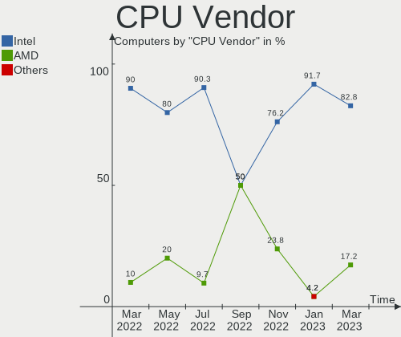

| Vendor | Computers | Percent |
|--------|-----------|---------|
| Intel  | 24        | 82.76%  |
| AMD    | 5         | 17.24%  |

CPU Model
---------

Processor models

| Model                                         | Computers | Percent |
|-----------------------------------------------|-----------|---------|
| Intel Pentium 4 CPU 3.06GHz                   | 2         | 6.9%    |
| Intel Core i5-2400 CPU @ 3.10GHz              | 2         | 6.9%    |
| Intel Core i3-10105 CPU @ 3.70GHz             | 2         | 6.9%    |
| Intel Xeon CPU W3670 @ 3.20GHz                | 1         | 3.45%   |
| Intel Pentium Dual CPU E2160 @ 1.80GHz        | 1         | 3.45%   |
| Intel Pentium CPU G630 @ 2.70GHz              | 1         | 3.45%   |
| Intel Core i5-9500 CPU @ 3.00GHz              | 1         | 3.45%   |
| Intel Core i5-4590 CPU @ 3.30GHz              | 1         | 3.45%   |
| Intel Core i3-9100F CPU @ 3.60GHz             | 1         | 3.45%   |
| Intel Core i3-10110U CPU @ 2.10GHz            | 1         | 3.45%   |
| Intel Core i3-10100 CPU @ 3.60GHz             | 1         | 3.45%   |
| Intel Core 2 Duo CPU E7400 @ 2.80GHz          | 1         | 3.45%   |
| Intel Core 2 Duo CPU E4500 @ 2.20GHz          | 1         | 3.45%   |
| Intel Celeron CPU G1620 @ 2.70GHz             | 1         | 3.45%   |
| Intel Celeron CPU 430 @ 1.80GHz               | 1         | 3.45%   |
| Intel 12th Gen Core i7-1270P                  | 1         | 3.45%   |
| Intel 12th Gen Core i7-12700H                 | 1         | 3.45%   |
| Intel 12th Gen Core i5-1250P                  | 1         | 3.45%   |
| Intel 12th Gen Core i5-12400                  | 1         | 3.45%   |
| Intel 12th Gen Core i3-1215U                  | 1         | 3.45%   |
| Intel 11th Gen Core i9-11900 @ 2.50GHz        | 1         | 3.45%   |
| AMD Ryzen 7 5700G with Radeon Graphics        | 1         | 3.45%   |
| AMD Ryzen 5 3500U with Radeon Vega Mobile Gfx | 1         | 3.45%   |
| AMD Ryzen 5 1600 Six-Core Processor           | 1         | 3.45%   |
| AMD Ryzen 3 5300U with Radeon Graphics        | 1         | 3.45%   |
| AMD Ryzen 3 3200GE with Radeon Vega Graphics  | 1         | 3.45%   |

CPU Model Family
----------------

Processor model prefix

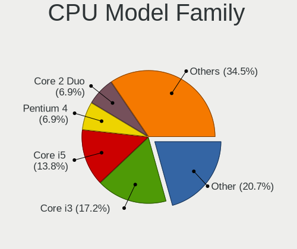

| Model              | Computers | Percent |
|--------------------|-----------|---------|
| Other              | 6         | 20.69%  |
| Intel Core i3      | 5         | 17.24%  |
| Intel Core i5      | 4         | 13.79%  |
| Intel Pentium 4    | 2         | 6.9%    |
| Intel Core 2 Duo   | 2         | 6.9%    |
| Intel Celeron      | 2         | 6.9%    |
| AMD Ryzen 5        | 2         | 6.9%    |
| AMD Ryzen 3        | 2         | 6.9%    |
| Intel Xeon         | 1         | 3.45%   |
| Intel Pentium Dual | 1         | 3.45%   |
| Intel Pentium      | 1         | 3.45%   |
| AMD Ryzen 7        | 1         | 3.45%   |

CPU Cores
---------

Number of processor cores

| Number | Computers | Percent |
|--------|-----------|---------|
| 4      | 10        | 34.48%  |
| 2      | 6         | 20.69%  |
| 6      | 5         | 17.24%  |
| 1      | 3         | 10.34%  |
| 12     | 2         | 6.9%    |
| 8      | 2         | 6.9%    |
| 14     | 1         | 3.45%   |

CPU Sockets
-----------

Number of sockets

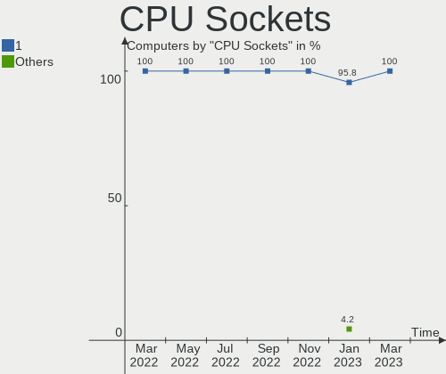

| Number | Computers | Percent |
|--------|-----------|---------|
| 1      | 29        | 100%    |

CPU Threads
-----------

Threads per core (Hyper-Threading)

| Number | Computers | Percent |
|--------|-----------|---------|
| 2      | 16        | 55.17%  |
| 1      | 13        | 44.83%  |

CPU Op-Modes
------------

CPU Operation Modes (32-bit, 64-bit)

| Op mode        | Computers | Percent |
|----------------|-----------|---------|
| 32-bit, 64-bit | 29        | 100%    |

CPU Microcode
-------------

Microcode number

| Number     | Computers | Percent |
|------------|-----------|---------|
| 0xa0653    | 3         | 10.34%  |
| 0x906a3    | 3         | 10.34%  |
| 0x206a7    | 3         | 10.34%  |
| 0xf49      | 2         | 6.9%    |
| 0x906ea    | 2         | 6.9%    |
| 0x6fd      | 2         | 6.9%    |
| 0xa0671    | 1         | 3.45%   |
| 0x906a4    | 1         | 3.45%   |
| 0x90675    | 1         | 3.45%   |
| 0x806ec    | 1         | 3.45%   |
| 0x306c3    | 1         | 3.45%   |
| 0x306a9    | 1         | 3.45%   |
| 0x206c2    | 1         | 3.45%   |
| 0x1067a    | 1         | 3.45%   |
| 0x10661    | 1         | 3.45%   |
| 0x0a50000c | 1         | 3.45%   |
| 0x08608103 | 1         | 3.45%   |
| 0x08108109 | 1         | 3.45%   |
| 0x08108102 | 1         | 3.45%   |
| Unknown    | 1         | 3.45%   |

CPU Microarch
-------------

Microarchitecture

| Name             | Computers | Percent |
|------------------|-----------|---------|
| Alderlake Hybrid | 5         | 17.24%  |
| Zen+             | 3         | 10.34%  |
| SandyBridge      | 3         | 10.34%  |
| KabyLake         | 3         | 10.34%  |
| Core             | 3         | 10.34%  |
| CometLake        | 3         | 10.34%  |
| NetBurst         | 2         | 6.9%    |
| Zen 3            | 1         | 3.45%   |
| Westmere         | 1         | 3.45%   |
| Penryn           | 1         | 3.45%   |
| IvyBridge        | 1         | 3.45%   |
| Icelake          | 1         | 3.45%   |
| Haswell          | 1         | 3.45%   |
| Unknown          | 1         | 3.45%   |

Graphics
--------

GPU Vendor
----------

Vendors of graphics cards

| Vendor | Computers | Percent |
|--------|-----------|---------|
| Intel  | 19        | 63.33%  |
| Nvidia | 6         | 20%     |
| AMD    | 5         | 16.67%  |

GPU Model
---------

Graphics card models

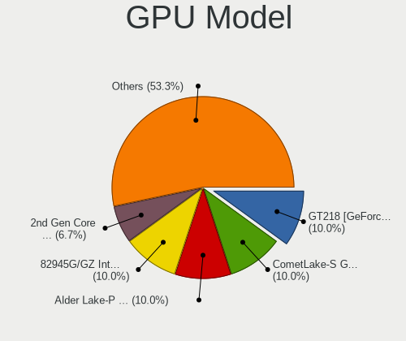

| Model                                                                       | Computers | Percent |
|-----------------------------------------------------------------------------|-----------|---------|
| Nvidia GT218 [GeForce 210]                                                  | 3         | 10%     |
| Intel CometLake-S GT2 [UHD Graphics 630]                                    | 3         | 10%     |
| Intel Alder Lake-P Integrated Graphics Controller                           | 3         | 10%     |
| Intel 82945G/GZ Integrated Graphics Controller                              | 3         | 10%     |
| Intel 2nd Generation Core Processor Family Integrated Graphics Controller   | 2         | 6.67%   |
| AMD Picasso/Raven 2 [Radeon Vega Series / Radeon Vega Mobile Series]        | 2         | 6.67%   |
| Nvidia GK208B [GeForce GT 710]                                              | 1         | 3.33%   |
| Nvidia GA106M [GeForce RTX 3060 Mobile / Max-Q]                             | 1         | 3.33%   |
| Nvidia G94GL [Quadro FX 1800]                                               | 1         | 3.33%   |
| Intel Xeon E3-1200 v3/4th Gen Core Processor Integrated Graphics Controller | 1         | 3.33%   |
| Intel CometLake-U GT2 [UHD Graphics]                                        | 1         | 3.33%   |
| Intel CoffeeLake-S GT2 [UHD Graphics 630]                                   | 1         | 3.33%   |
| Intel Alder Lake-UP3 GT1 [UHD Graphics]                                     | 1         | 3.33%   |
| Intel Alder Lake-S GT1 [UHD Graphics 730]                                   | 1         | 3.33%   |
| Intel 82Q35 Express Integrated Graphics Controller                          | 1         | 3.33%   |
| Intel 82G33/G31 Express Integrated Graphics Controller                      | 1         | 3.33%   |
| Intel 4 Series Chipset Integrated Graphics Controller                       | 1         | 3.33%   |
| AMD Oland PRO [Radeon R7 240/340 / Radeon 520]                              | 1         | 3.33%   |
| AMD Lucienne                                                                | 1         | 3.33%   |
| AMD Cezanne [Radeon Vega Series / Radeon Vega Mobile Series]                | 1         | 3.33%   |

GPU Combo
---------

Combinations of graphics cards

| Name           | Computers | Percent |
|----------------|-----------|---------|
| 1 x Intel      | 18        | 62.07%  |
| 1 x Nvidia     | 5         | 17.24%  |
| 1 x AMD        | 5         | 17.24%  |
| Intel + Nvidia | 1         | 3.45%   |

GPU Driver
----------

Free vs proprietary

| Driver      | Computers | Percent |
|-------------|-----------|---------|
| Free        | 21        | 72.41%  |
| Unknown     | 7         | 24.14%  |
| Proprietary | 1         | 3.45%   |

GPU Memory
----------

Total video memory

| Size in GB | Computers | Percent |
|------------|-----------|---------|
| Unknown    | 20        | 68.97%  |
| 1.01-2.0   | 4         | 13.79%  |
| 0.01-0.5   | 4         | 13.79%  |
| 0.51-1.0   | 1         | 3.45%   |

Monitor
-------

Monitor Vendor
--------------

Monitor vendors

| Vendor              | Computers | Percent |
|---------------------|-----------|---------|
| Samsung Electronics | 5         | 21.74%  |
| Philips             | 3         | 13.04%  |
| Goldstar            | 3         | 13.04%  |
| Chimei Innolux      | 3         | 13.04%  |
| ViewSonic           | 1         | 4.35%   |
| SKM                 | 1         | 4.35%   |
| Lenovo              | 1         | 4.35%   |
| JRY                 | 1         | 4.35%   |
| Hewlett-Packard     | 1         | 4.35%   |
| Dell                | 1         | 4.35%   |
| CHD                 | 1         | 4.35%   |
| BOE                 | 1         | 4.35%   |
| Acer                | 1         | 4.35%   |

Monitor Model
-------------

Monitor models

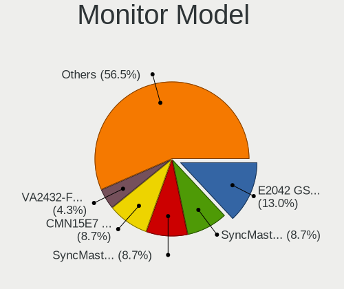

| Model                                                                | Computers | Percent |
|----------------------------------------------------------------------|-----------|---------|
| Goldstar E2042 GSM4ED7 1600x900 443x249mm 20.0-inch                  | 3         | 13.04%  |
| Samsung Electronics SyncMaster SAM036E 1280x1024 376x301mm 19.0-inch | 2         | 8.7%    |
| Samsung Electronics SyncMaster SAM01B7 1280x1024 338x270mm 17.0-inch | 2         | 8.7%    |
| Chimei Innolux LCD Monitor CMN15E7 1920x1080 344x193mm 15.5-inch     | 2         | 8.7%    |
| ViewSonic VA2432-FHD VSCB639 1920x1080 527x296mm 23.8-inch           | 1         | 4.35%   |
| SKM LCD Monitor SKM9322 1920x1080 527x296mm 23.8-inch                | 1         | 4.35%   |
| Samsung Electronics SME1920N SAM06A3 1366x768 410x230mm 18.5-inch    | 1         | 4.35%   |
| Philips PHL 252B9 PHL092C 1920x1080 535x339mm 24.9-inch              | 1         | 4.35%   |
| Philips 226V4 PHLC0B1 1920x1080 477x268mm 21.5-inch                  | 1         | 4.35%   |
| Philips 160E PHLC02D 1366x768 344x194mm 15.5-inch                    | 1         | 4.35%   |
| Lenovo C22-20 LEN62A7 1920x1080 477x268mm 21.5-inch                  | 1         | 4.35%   |
| JRY HDMI JRY2380 1920x1080 530x290mm 23.8-inch                       | 1         | 4.35%   |
| Hewlett-Packard LE1711 HWP2856 1280x960 340x270mm 17.1-inch          | 1         | 4.35%   |
| Dell U2412M DELA079 1920x1200 518x324mm 24.1-inch                    | 1         | 4.35%   |
| Chimei Innolux LCD Monitor CMN15F5 1920x1080 344x193mm 15.5-inch     | 1         | 4.35%   |
| CHD DM-MONB2401 CHD2380 1920x1080 520x310mm 23.8-inch                | 1         | 4.35%   |
| BOE LCD Monitor BOE0877 1920x1080 309x173mm 13.9-inch                | 1         | 4.35%   |
| Acer K222HQL ACR03E1 1920x1080 477x268mm 21.5-inch                   | 1         | 4.35%   |

Monitor Resolution
------------------

Monitor screen resolution

| Resolution        | Computers | Percent |
|-------------------|-----------|---------|
| 1920x1080 (FHD)   | 9         | 42.86%  |
| 1280x1024 (SXGA)  | 4         | 19.05%  |
| 1600x900 (HD+)    | 3         | 14.29%  |
| 1920x1200 (WUXGA) | 2         | 9.52%   |
| 1366x768 (WXGA)   | 2         | 9.52%   |
| 1280x960          | 1         | 4.76%   |

Monitor Diagonal
----------------

Diagonal size in inches

| Inches | Computers | Percent |
|--------|-----------|---------|
| 15     | 4         | 17.39%  |
| 24     | 3         | 13.04%  |
| 21     | 3         | 13.04%  |
| 20     | 3         | 13.04%  |
| 17     | 3         | 13.04%  |
| 23     | 2         | 8.7%    |
| 19     | 2         | 8.7%    |
| 25     | 1         | 4.35%   |
| 18     | 1         | 4.35%   |
| 13     | 1         | 4.35%   |

Monitor Width
-------------

Physical width

| Width in mm | Computers | Percent |
|-------------|-----------|---------|
| 301-350     | 8         | 34.78%  |
| 401-500     | 7         | 30.43%  |
| 501-600     | 6         | 26.09%  |
| 351-400     | 2         | 8.7%    |

Aspect Ratio
------------

Proportional relationship between the width and the height

| Ratio | Computers | Percent |
|-------|-----------|---------|
| 16/9  | 13        | 61.9%   |
| 5/4   | 5         | 23.81%  |
| 16/10 | 3         | 14.29%  |

Monitor Area
------------

Area in inch²

| Area in inch² | Computers | Percent |
|----------------|-----------|---------|
| 151-200        | 6         | 27.27%  |
| 201-250        | 4         | 18.18%  |
| 141-150        | 4         | 18.18%  |
| 101-110        | 4         | 18.18%  |
| 251-300        | 3         | 13.64%  |
| 81-90          | 1         | 4.55%   |

Pixel Density
-------------

Pixels per inch

| Density | Computers | Percent |
|---------|-----------|---------|
| 51-100  | 15        | 65.22%  |
| 121-160 | 4         | 17.39%  |
| 101-120 | 4         | 17.39%  |

Multiple Monitors
-----------------

Total monitors connected

| Total | Computers | Percent |
|-------|-----------|---------|
| 1     | 19        | 65.52%  |
| 0     | 8         | 27.59%  |
| 2     | 2         | 6.9%    |

Network
-------

Net Controller Vendor
---------------------

Controller vendors

| Vendor                | Computers | Percent |
|-----------------------|-----------|---------|
| Realtek Semiconductor | 18        | 47.37%  |
| Intel                 | 12        | 31.58%  |
| Ralink Technology     | 2         | 5.26%   |
| Samsung Electronics   | 1         | 2.63%   |
| Ralink                | 1         | 2.63%   |
| Qualcomm Atheros      | 1         | 2.63%   |
| OPPO Electronics      | 1         | 2.63%   |
| MediaTek              | 1         | 2.63%   |
| Broadcom              | 1         | 2.63%   |

Net Controller Model
--------------------

Controller models

| Model                                                             | Computers | Percent |
|-------------------------------------------------------------------|-----------|---------|
| Realtek RTL8111/8168/8411 PCI Express Gigabit Ethernet Controller | 12        | 26.67%  |
| Intel Alder Lake-P PCH CNVi WiFi                                  | 4         | 8.89%   |
| Realtek RTL8821CE 802.11ac PCIe Wireless Network Adapter          | 2         | 4.44%   |
| Realtek RTL810xE PCI Express Fast Ethernet controller             | 2         | 4.44%   |
| Realtek 802.11ac NIC                                              | 2         | 4.44%   |
| Intel NM10/ICH7 Family LAN Controller                             | 2         | 4.44%   |
| Intel Ethernet Controller I225-V                                  | 2         | 4.44%   |
| Intel Ethernet Connection (16) I219-LM                            | 2         | 4.44%   |
| Samsung Galaxy series, misc. (tethering mode)                     | 1         | 2.22%   |
| Realtek RTL88x2bu [AC1200 Techkey]                                | 1         | 2.22%   |
| Realtek RTL8852BE PCIe 802.11ax Wireless Network Controller       | 1         | 2.22%   |
| Realtek RTL8152 Fast Ethernet Adapter                             | 1         | 2.22%   |
| Realtek RTL8125 2.5GbE Controller                                 | 1         | 2.22%   |
| Ralink RT5370 Wireless Adapter                                    | 1         | 2.22%   |
| Ralink MT7601U Wireless Adapter                                   | 1         | 2.22%   |
| Ralink RT5390 Wireless 802.11n 1T/1R PCIe                         | 1         | 2.22%   |
| Qualcomm Atheros Attansic L2 Fast Ethernet                        | 1         | 2.22%   |
| OPPO RMX3263                                                      | 1         | 2.22%   |
| MediaTek MT7921K (RZ608) Wi-Fi 6E 80MHz                           | 1         | 2.22%   |
| Intel Wireless 7260                                               | 1         | 2.22%   |
| Intel Ethernet Connection (17) I219-V                             | 1         | 2.22%   |
| Intel Ethernet Connection (14) I219-V                             | 1         | 2.22%   |
| Intel Comet Lake PCH-LP CNVi WiFi                                 | 1         | 2.22%   |
| Intel 82566DM-2 Gigabit Network Connection                        | 1         | 2.22%   |
| Broadcom NetXtreme BCM5764M Gigabit Ethernet PCIe                 | 1         | 2.22%   |

Wireless Vendor
---------------

Wireless vendors

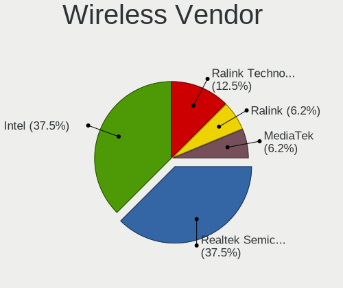

| Vendor                | Computers | Percent |
|-----------------------|-----------|---------|
| Realtek Semiconductor | 6         | 37.5%   |
| Intel                 | 6         | 37.5%   |
| Ralink Technology     | 2         | 12.5%   |
| Ralink                | 1         | 6.25%   |
| MediaTek              | 1         | 6.25%   |

Wireless Model
--------------

Wireless models

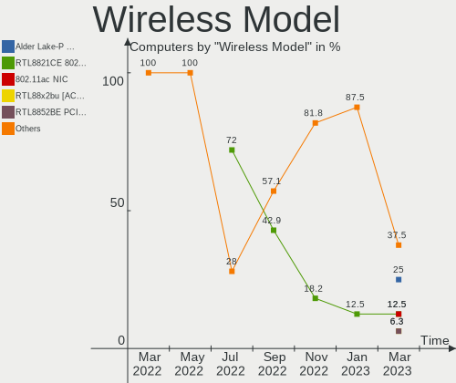

| Model                                                       | Computers | Percent |
|-------------------------------------------------------------|-----------|---------|
| Intel Alder Lake-P PCH CNVi WiFi                            | 4         | 25%     |
| Realtek RTL8821CE 802.11ac PCIe Wireless Network Adapter    | 2         | 12.5%   |
| Realtek 802.11ac NIC                                        | 2         | 12.5%   |
| Realtek RTL88x2bu [AC1200 Techkey]                          | 1         | 6.25%   |
| Realtek RTL8852BE PCIe 802.11ax Wireless Network Controller | 1         | 6.25%   |
| Ralink RT5370 Wireless Adapter                              | 1         | 6.25%   |
| Ralink MT7601U Wireless Adapter                             | 1         | 6.25%   |
| Ralink RT5390 Wireless 802.11n 1T/1R PCIe                   | 1         | 6.25%   |
| MediaTek MT7921K (RZ608) Wi-Fi 6E 80MHz                     | 1         | 6.25%   |
| Intel Wireless 7260                                         | 1         | 6.25%   |
| Intel Comet Lake PCH-LP CNVi WiFi                           | 1         | 6.25%   |

Ethernet Vendor
---------------

Ethernet vendors

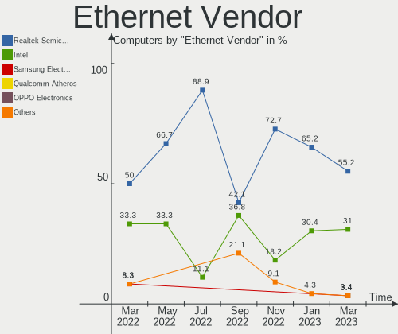

| Vendor                | Computers | Percent |
|-----------------------|-----------|---------|
| Realtek Semiconductor | 16        | 55.17%  |
| Intel                 | 9         | 31.03%  |
| Samsung Electronics   | 1         | 3.45%   |
| Qualcomm Atheros      | 1         | 3.45%   |
| OPPO Electronics      | 1         | 3.45%   |
| Broadcom              | 1         | 3.45%   |

Ethernet Model
--------------

Ethernet models

| Model                                                             | Computers | Percent |
|-------------------------------------------------------------------|-----------|---------|
| Realtek RTL8111/8168/8411 PCI Express Gigabit Ethernet Controller | 12        | 41.38%  |
| Realtek RTL810xE PCI Express Fast Ethernet controller             | 2         | 6.9%    |
| Intel NM10/ICH7 Family LAN Controller                             | 2         | 6.9%    |
| Intel Ethernet Controller I225-V                                  | 2         | 6.9%    |
| Intel Ethernet Connection (16) I219-LM                            | 2         | 6.9%    |
| Samsung Galaxy series, misc. (tethering mode)                     | 1         | 3.45%   |
| Realtek RTL8152 Fast Ethernet Adapter                             | 1         | 3.45%   |
| Realtek RTL8125 2.5GbE Controller                                 | 1         | 3.45%   |
| Qualcomm Atheros Attansic L2 Fast Ethernet                        | 1         | 3.45%   |
| OPPO RMX3263                                                      | 1         | 3.45%   |
| Intel Ethernet Connection (17) I219-V                             | 1         | 3.45%   |
| Intel Ethernet Connection (14) I219-V                             | 1         | 3.45%   |
| Intel 82566DM-2 Gigabit Network Connection                        | 1         | 3.45%   |
| Broadcom NetXtreme BCM5764M Gigabit Ethernet PCIe                 | 1         | 3.45%   |

Net Controller Kind
-------------------

Ethernet, WiFi or modem

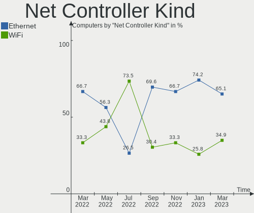

| Kind     | Computers | Percent |
|----------|-----------|---------|
| Ethernet | 28        | 65.12%  |
| WiFi     | 15        | 34.88%  |

Used Controller
---------------

Currently used network controller

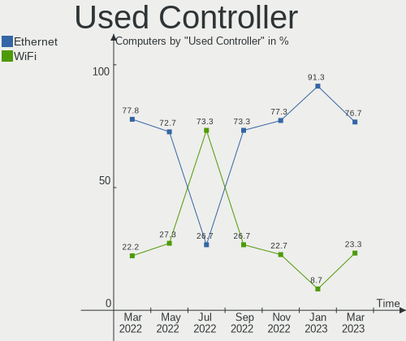

| Kind     | Computers | Percent |
|----------|-----------|---------|
| Ethernet | 23        | 76.67%  |
| WiFi     | 7         | 23.33%  |

NICs
----

Total network controllers on board

| Total | Computers | Percent |
|-------|-----------|---------|
| 1     | 21        | 72.41%  |
| 2     | 8         | 27.59%  |

IPv6
----

IPv6 vs IPv4

| Used | Computers | Percent |
|------|-----------|---------|
| No   | 29        | 100%    |

Bluetooth
---------

Bluetooth Vendor
----------------

Controller vendors

| Vendor                | Computers | Percent |
|-----------------------|-----------|---------|
| Intel                 | 6         | 60%     |
| Realtek Semiconductor | 2         | 20%     |
| MediaTek              | 1         | 10%     |
| IMC Networks          | 1         | 10%     |

Bluetooth Model
---------------

Controller models

| Model                                          | Computers | Percent |
|------------------------------------------------|-----------|---------|
| Realtek Bluetooth Radio                        | 2         | 20%     |
| Intel Bluetooth Device                         | 2         | 20%     |
| Intel AX201 Bluetooth                          | 2         | 20%     |
| MediaTek Wireless_Device                       | 1         | 10%     |
| Intel Bluetooth wireless interface             | 1         | 10%     |
| Intel Bluetooth 9460/9560 Jefferson Peak (JfP) | 1         | 10%     |
| IMC Networks Bluetooth Radio                   | 1         | 10%     |

Sound
-----

Sound Vendor
------------

Sound card vendors

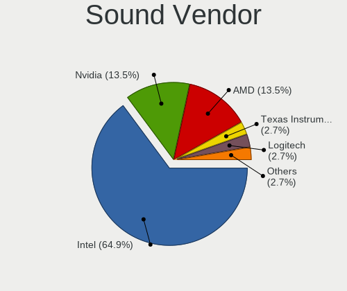

| Vendor              | Computers | Percent |
|---------------------|-----------|---------|
| Intel               | 24        | 64.86%  |
| Nvidia              | 5         | 13.51%  |
| AMD                 | 5         | 13.51%  |
| Texas Instruments   | 1         | 2.7%    |
| Logitech            | 1         | 2.7%    |
| C-Media Electronics | 1         | 2.7%    |

Sound Model
-----------

Sound card models

| Model                                                                      | Computers | Percent |
|----------------------------------------------------------------------------|-----------|---------|
| Intel NM10/ICH7 Family High Definition Audio Controller                    | 5         | 11.63%  |
| Intel Alder Lake PCH-P High Definition Audio Controller                    | 4         | 9.3%    |
| Intel 6 Series/C200 Series Chipset Family High Definition Audio Controller | 4         | 9.3%    |
| AMD Family 17h/19h HD Audio Controller                                     | 4         | 9.3%    |
| Nvidia High Definition Audio Controller                                    | 3         | 6.98%   |
| Intel Smart Sound Technology (SST) Audio Controller                        | 3         | 6.98%   |
| AMD Renoir Radeon High Definition Audio Controller                         | 2         | 4.65%   |
| AMD Raven/Raven2/Fenghuang HDMI/DP Audio Controller                        | 2         | 4.65%   |
| Texas Instruments PCM2902 Audio Codec                                      | 1         | 2.33%   |
| Nvidia GK208 HDMI/DP Audio Controller                                      | 1         | 2.33%   |
| Nvidia GA106 High Definition Audio Controller                              | 1         | 2.33%   |
| Logitech 960 Headset                                                       | 1         | 2.33%   |
| Intel Xeon E3-1200 v3/4th Gen Core Processor HD Audio Controller           | 1         | 2.33%   |
| Intel Tiger Lake-H HD Audio Controller                                     | 1         | 2.33%   |
| Intel Comet Lake PCH-LP cAVS                                               | 1         | 2.33%   |
| Intel Cannon Lake PCH cAVS                                                 | 1         | 2.33%   |
| Intel Alder Lake-S HD Audio Controller                                     | 1         | 2.33%   |
| Intel 82801JI (ICH10 Family) HD Audio Controller                           | 1         | 2.33%   |
| Intel 82801I (ICH9 Family) HD Audio Controller                             | 1         | 2.33%   |
| Intel 8 Series/C220 Series Chipset High Definition Audio Controller        | 1         | 2.33%   |
| Intel 200 Series PCH HD Audio                                              | 1         | 2.33%   |
| C-Media Electronics USB Audio Device                                       | 1         | 2.33%   |
| AMD Oland/Hainan/Cape Verde/Pitcairn HDMI Audio [Radeon HD 7000 Series]    | 1         | 2.33%   |
| AMD Family 17h (Models 00h-0fh) HD Audio Controller                        | 1         | 2.33%   |

Memory
------

Memory Vendor
-------------

Memory module vendors

| Vendor              | Computers | Percent |
|---------------------|-----------|---------|
| Samsung Electronics | 6         | 18.75%  |
| Micron Technology   | 4         | 12.5%   |
| Kingston            | 4         | 12.5%   |
| Unknown             | 3         | 9.38%   |
| Crucial             | 3         | 9.38%   |
| SK hynix            | 2         | 6.25%   |
| A-DATA Technology   | 2         | 6.25%   |
| Unknown (0x0080)    | 1         | 3.13%   |
| SHARETRONIC         | 1         | 3.13%   |
| Ramaxel Technology  | 1         | 3.13%   |
| Goldkey             | 1         | 3.13%   |
| Gold Key            | 1         | 3.13%   |
| Foxline             | 1         | 3.13%   |
| Elpida              | 1         | 3.13%   |
| Apacer              | 1         | 3.13%   |

Memory Model
------------

Memory module models

| Model                                                       | Computers | Percent |
|-------------------------------------------------------------|-----------|---------|
| Crucial RAM ST51264BA1339.16FK 4GB DIMM DDR3 1067MT/s       | 2         | 5.71%   |
| Unknown RAM Module 512MB DIMM SDRAM                         | 1         | 2.86%   |
| Unknown RAM Module 2GB DIMM SDRAM 800MT/s                   | 1         | 2.86%   |
| Unknown RAM Module 2GB DIMM SDRAM                           | 1         | 2.86%   |
| Unknown RAM Module 2GB DIMM DDR2 333MT/s                    | 1         | 2.86%   |
| Unknown RAM Module 1GB DIMM DDR2 333MT/s                    | 1         | 2.86%   |
| Unknown (0x0080) RAM EX283085RUS 8GB DIMM DDR4 2400MT/s     | 1         | 2.86%   |
| SK hynix RAM HMT125U7TFR8C-H9 2GB DIMM DDR3 1333MT/s        | 1         | 2.86%   |
| SK hynix RAM HMAB2GS6CMR6N-XN 16GB SODIMM DDR4 3200MT/s     | 1         | 2.86%   |
| SHARETRONIC RAM Module 1GB DIMM DDR2 667MT/s                | 1         | 2.86%   |
| Samsung RAM Module 8GB DIMM DDR4 2667MT/s                   | 1         | 2.86%   |
| Samsung RAM Module 1GB DIMM DDR2 533MT/s                    | 1         | 2.86%   |
| Samsung RAM M471A5244CB0-CWE 4GB SODIMM DDR4 3200MT/s       | 1         | 2.86%   |
| Samsung RAM M471A5244CB0-CWE 4GB Row Of Chips DDR4 3200MT/s | 1         | 2.86%   |
| Samsung RAM M471A5244CB0-CTD 4GB SODIMM DDR4 3266MT/s       | 1         | 2.86%   |
| Samsung RAM M471A5244BB0-CWE 4GB SODIMM DDR4 3200MT/s       | 1         | 2.86%   |
| Samsung RAM M378B5273DH0-CH9 4GB DIMM DDR3 2133MT/s         | 1         | 2.86%   |
| Ramaxel RAM RMSA3270ME86H9F-2666 4GB SODIMM DDR4 2667MT/s   | 1         | 2.86%   |
| Micron RAM 8ATF1G64HZ-3G2R1 8GB SODIMM DDR4 3200MT/s        | 1         | 2.86%   |
| Micron RAM 4ATS2G64HZ-3G2B1 16GB SODIMM DDR4 3200MT/s       | 1         | 2.86%   |
| Micron RAM 4ATF51264HZ-3G2J1 4GB SODIMM DDR4 3200MT/s       | 1         | 2.86%   |
| Micron RAM 16G2666MHz 16GB DIMM DDR4 2666MT/s               | 1         | 2.86%   |
| Kingston RAM Module 2GB DIMM DDR2 533MT/s                   | 1         | 2.86%   |
| Kingston RAM 99P5474-033.A00LF 2GB DIMM DDR3 1600MT/s       | 1         | 2.86%   |
| Kingston RAM 9905711-027.A00G 4GB SODIMM DDR4 2667MT/s      | 1         | 2.86%   |
| Kingston RAM 9905702-082.B00G 8GB DIMM DDR4 2667MT/s        | 1         | 2.86%   |
| Goldkey RAM GKH400UD51208-1600 4GB DIMM DDR3 2133MT/s       | 1         | 2.86%   |
| Gold Key RAM GKE800UD102408-2666A 8GB DIMM DDR4 2667MT/s    | 1         | 2.86%   |
| Foxline RAM FL2666D4U19-8G 8GB DIMM DDR4 2667MT/s           | 1         | 2.86%   |
| Elpida RAM EBJ41UF8BCS0-DJ-F 4GB DIMM DDR3 1333MT/s         | 1         | 2.86%   |
| Crucial RAM CT8G4DFRA266.C8FN 8GB DIMM DDR4 2866MT/s        | 1         | 2.86%   |
| Apacer RAM D12.2324CH.002 8GB DIMM DDR4 2667MT/s            | 1         | 2.86%   |
| A-DATA RAM DDR4 3600 16GB DIMM DDR4 3800MT/s                | 1         | 2.86%   |
| A-DATA RAM ADOVF1A083FE 1GB DIMM DDR2 800MT/s               | 1         | 2.86%   |

Memory Kind
-----------

Memory module kinds

| Kind  | Computers | Percent |
|-------|-----------|---------|
| DDR4  | 17        | 58.62%  |
| DDR3  | 6         | 20.69%  |
| DDR2  | 4         | 13.79%  |
| SDRAM | 2         | 6.9%    |

Memory Form Factor
------------------

Physical design of the memory module

| Name         | Computers | Percent |
|--------------|-----------|---------|
| DIMM         | 21        | 70%     |
| SODIMM       | 8         | 26.67%  |
| Row Of Chips | 1         | 3.33%   |

Memory Size
-----------

Memory module size

| Size  | Computers | Percent |
|-------|-----------|---------|
| 8192  | 9         | 28.13%  |
| 4096  | 9         | 28.13%  |
| 2048  | 6         | 18.75%  |
| 16384 | 4         | 12.5%   |
| 1024  | 3         | 9.38%   |
| 512   | 1         | 3.13%   |

Memory Speed
------------

Memory module speed

| Speed   | Computers | Percent |
|---------|-----------|---------|
| 2667    | 7         | 21.88%  |
| 3200    | 6         | 18.75%  |
| 2133    | 2         | 6.25%   |
| 1333    | 2         | 6.25%   |
| 1067    | 2         | 6.25%   |
| 800     | 2         | 6.25%   |
| 533     | 2         | 6.25%   |
| 3800    | 1         | 3.13%   |
| 3266    | 1         | 3.13%   |
| 2866    | 1         | 3.13%   |
| 2666    | 1         | 3.13%   |
| 2400    | 1         | 3.13%   |
| 1600    | 1         | 3.13%   |
| 667     | 1         | 3.13%   |
| 333     | 1         | 3.13%   |
| Unknown | 1         | 3.13%   |

Printers & scanners
-------------------

Printer Vendor
--------------

Printer device vendors

Zero info for selected period =(

Printer Model
-------------

Printer device models

Zero info for selected period =(

Scanner Vendor
--------------

Scanner device vendors

Zero info for selected period =(

Scanner Model
-------------

Scanner device models

Zero info for selected period =(

Camera
------

Camera Vendor
-------------

Camera device vendors

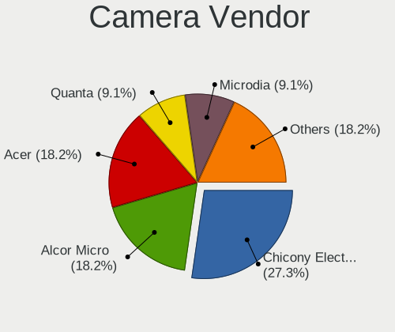

| Vendor                      | Computers | Percent |
|-----------------------------|-----------|---------|
| Chicony Electronics         | 3         | 27.27%  |
| Alcor Micro                 | 2         | 18.18%  |
| Acer                        | 2         | 18.18%  |
| Quanta                      | 1         | 9.09%   |
| Microdia                    | 1         | 9.09%   |
| Luxvisions Innotech Limited | 1         | 9.09%   |
| Bison Electronics           | 1         | 9.09%   |

Camera Model
------------

Camera device models

| Model                                         | Computers | Percent |
|-----------------------------------------------|-----------|---------|
| Chicony Integrated Camera                     | 2         | 18.18%  |
| Quanta HD Camera                              | 1         | 9.09%   |
| Microdia Camera                               | 1         | 9.09%   |
| Luxvisions Innotech Limited Integrated Camera | 1         | 9.09%   |
| Chicony HP 0.3MP Webcam                       | 1         | 9.09%   |
| Bison Integrated Camera                       | 1         | 9.09%   |
| Alcor Micro USB FHD Camera                    | 1         | 9.09%   |
| Alcor Micro USB 2.0 PC Camera                 | 1         | 9.09%   |
| Acer Integrated Camera                        | 1         | 9.09%   |
| Acer HD Webcam                                | 1         | 9.09%   |

Security
--------

Fingerprint Vendor
------------------

Fingerprint sensor vendors

| Vendor    | Computers | Percent |
|-----------|-----------|---------|
| Synaptics | 2         | 100%    |

Fingerprint Model
-----------------

Fingerprint sensor models

| Model                     | Computers | Percent |
|---------------------------|-----------|---------|
| Synaptics UWP WBDI Device | 2         | 100%    |

Chipcard Vendor
---------------

Chipcard module vendors

Zero info for selected period =(

Chipcard Model
--------------

Chipcard module models

Zero info for selected period =(

Unsupported
-----------

Unsupported Devices
-------------------

Total unsupported devices on board

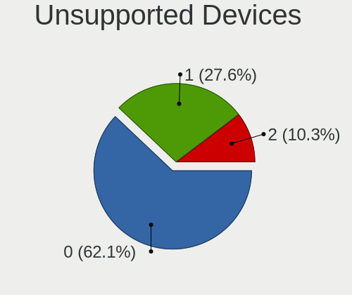

| Total | Computers | Percent |
|-------|-----------|---------|
| 0     | 18        | 62.07%  |
| 1     | 8         | 27.59%  |
| 2     | 3         | 10.34%  |

Unsupported Device Types
------------------------

Types of unsupported devices

| Type               | Computers | Percent |
|--------------------|-----------|---------|
| Graphics card      | 8         | 61.54%  |
| Net/wireless       | 3         | 23.08%  |
| Fingerprint reader | 2         | 15.38%  |

