SteamOS - Hardware Trends
-------------------------

A project to identify most popular hardware characteristics and track their change
over time based on data collected by Linux users at https://Linux-Hardware.org.

Anyone can contribute to this report by the [hw-probe](https://github.com/linuxhw/hw-probe) tool:

    sudo -E hw-probe -all -upload

This is a report for all computer types. See also reports for [desktops](/Dist/SteamOS/Desktop/README.md) and [notebooks](/Dist/SteamOS/Notebook/README.md).

This report is for one last month. Overall report since the beginning of time: [TestDays](https://github.com/linuxhw/TestDays)

Period: Dec, 2025.

Contents
--------

* [ System ](#system)
  - [ OS                       ](#os)
  - [ OS Family                ](#os-family)
  - [ Kernel                   ](#kernel)
  - [ Kernel Family            ](#kernel-family)
  - [ Kernel Major Ver.        ](#kernel-major-ver)
  - [ Arch                     ](#arch)
  - [ DE                       ](#de)
  - [ Display Server           ](#display-server)
  - [ Display Manager          ](#display-manager)
  - [ OS Lang                  ](#os-lang)
  - [ Boot Mode                ](#boot-mode)
  - [ Filesystem               ](#filesystem)
  - [ Part. scheme             ](#part-scheme)
  - [ Dual Boot with Linux/BSD ](#dual-boot-with-linuxbsd)
  - [ Dual Boot (Win)          ](#dual-boot-win)

* [ Board ](#board)
  - [ Vendor                   ](#vendor)
  - [ Model                    ](#model)
  - [ Model Family             ](#model-family)
  - [ MFG Year                 ](#mfg-year)
  - [ Form Factor              ](#form-factor)
  - [ Secure Boot              ](#secure-boot)
  - [ Coreboot                 ](#coreboot)
  - [ RAM Size                 ](#ram-size)
  - [ RAM Used                 ](#ram-used)
  - [ Total Drives             ](#total-drives)
  - [ Has CD-ROM               ](#has-cd-rom)
  - [ Has Ethernet             ](#has-ethernet)
  - [ Has WiFi                 ](#has-wifi)
  - [ Has Bluetooth            ](#has-bluetooth)

* [ Location ](#location)
  - [ Country                  ](#country)
  - [ City                     ](#city)

* [ Drives ](#drives)
  - [ Drive Vendor             ](#drive-vendor)
  - [ Drive Model              ](#drive-model)
  - [ HDD Vendor               ](#hdd-vendor)
  - [ SSD Vendor               ](#ssd-vendor)
  - [ Drive Kind               ](#drive-kind)
  - [ Drive Connector          ](#drive-connector)
  - [ Drive Size               ](#drive-size)
  - [ Space Total              ](#space-total)
  - [ Space Used               ](#space-used)
  - [ Malfunc. Drives          ](#malfunc-drives)
  - [ Malfunc. Drive Vendor    ](#malfunc-drive-vendor)
  - [ Malfunc. HDD Vendor      ](#malfunc-hdd-vendor)
  - [ Malfunc. Drive Kind      ](#malfunc-drive-kind)
  - [ Failed Drives            ](#failed-drives)
  - [ Failed Drive Vendor      ](#failed-drive-vendor)
  - [ Drive Status             ](#drive-status)

* [ Storage controller ](#storage-controller)
  - [ Storage Vendor           ](#storage-vendor)
  - [ Storage Model            ](#storage-model)
  - [ Storage Kind             ](#storage-kind)

* [ Processor ](#processor)
  - [ CPU Vendor               ](#cpu-vendor)
  - [ CPU Model                ](#cpu-model)
  - [ CPU Model Family         ](#cpu-model-family)
  - [ CPU Cores                ](#cpu-cores)
  - [ CPU Sockets              ](#cpu-sockets)
  - [ CPU Threads              ](#cpu-threads)
  - [ CPU Op-Modes             ](#cpu-op-modes)
  - [ CPU Microcode            ](#cpu-microcode)
  - [ CPU Microarch            ](#cpu-microarch)

* [ Graphics ](#graphics)
  - [ GPU Vendor               ](#gpu-vendor)
  - [ GPU Model                ](#gpu-model)
  - [ GPU Combo                ](#gpu-combo)
  - [ GPU Driver               ](#gpu-driver)
  - [ GPU Memory               ](#gpu-memory)

* [ Monitor ](#monitor)
  - [ Monitor Vendor           ](#monitor-vendor)
  - [ Monitor Model            ](#monitor-model)
  - [ Monitor Resolution       ](#monitor-resolution)
  - [ Monitor Diagonal         ](#monitor-diagonal)
  - [ Monitor Width            ](#monitor-width)
  - [ Aspect Ratio             ](#aspect-ratio)
  - [ Monitor Area             ](#monitor-area)
  - [ Pixel Density            ](#pixel-density)
  - [ Multiple Monitors        ](#multiple-monitors)

* [ Network ](#network)
  - [ Net Controller Vendor    ](#net-controller-vendor)
  - [ Net Controller Model     ](#net-controller-model)
  - [ Wireless Vendor          ](#wireless-vendor)
  - [ Wireless Model           ](#wireless-model)
  - [ Ethernet Vendor          ](#ethernet-vendor)
  - [ Ethernet Model           ](#ethernet-model)
  - [ Net Controller Kind      ](#net-controller-kind)
  - [ Used Controller          ](#used-controller)
  - [ NICs                     ](#nics)
  - [ IPv6                     ](#ipv6)

* [ Bluetooth ](#bluetooth)
  - [ Bluetooth Vendor         ](#bluetooth-vendor)
  - [ Bluetooth Model          ](#bluetooth-model)

* [ Sound ](#sound)
  - [ Sound Vendor             ](#sound-vendor)
  - [ Sound Model              ](#sound-model)

* [ Memory ](#memory)
  - [ Memory Vendor            ](#memory-vendor)
  - [ Memory Model             ](#memory-model)
  - [ Memory Kind              ](#memory-kind)
  - [ Memory Form Factor       ](#memory-form-factor)
  - [ Memory Size              ](#memory-size)
  - [ Memory Speed             ](#memory-speed)

* [ Printers & scanners ](#printers--scanners)
  - [ Printer Vendor           ](#printer-vendor)
  - [ Printer Model            ](#printer-model)
  - [ Scanner Vendor           ](#scanner-vendor)
  - [ Scanner Model            ](#scanner-model)

* [ Camera ](#camera)
  - [ Camera Vendor            ](#camera-vendor)
  - [ Camera Model             ](#camera-model)

* [ Security ](#security)
  - [ Fingerprint Vendor       ](#fingerprint-vendor)
  - [ Fingerprint Model        ](#fingerprint-model)
  - [ Chipcard Vendor          ](#chipcard-vendor)
  - [ Chipcard Model           ](#chipcard-model)

* [ Unsupported ](#unsupported)
  - [ Unsupported Devices      ](#unsupported-devices)
  - [ Unsupported Device Types ](#unsupported-device-types)

System
------

OS
--

Installed operating systems

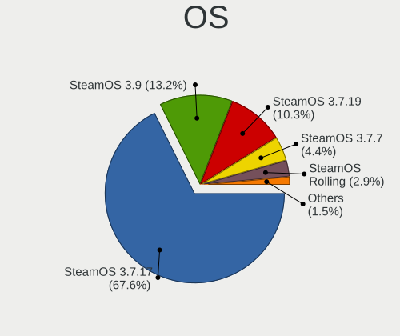

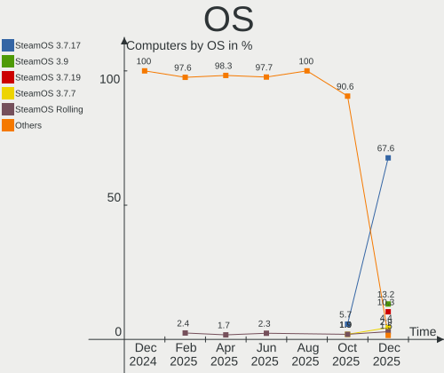

| Name            | Computers | Percent |
|-----------------|-----------|---------|
| SteamOS 3.7.17  | 46        | 67.65%  |
| SteamOS 3.9     | 9         | 13.24%  |
| SteamOS 3.7.19  | 7         | 10.29%  |
| SteamOS 3.7.7   | 3         | 4.41%   |
| SteamOS Rolling | 2         | 2.94%   |
| SteamOS 3.8     | 1         | 1.47%   |

OS Family
---------

OS without a version

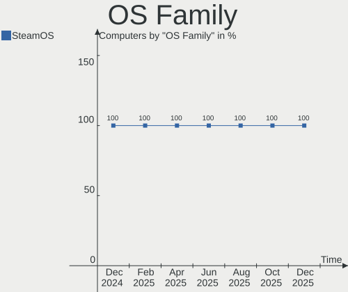

| Name    | Computers | Percent |
|---------|-----------|---------|
| SteamOS | 68        | 100%    |

Kernel
------

Version of the Linux kernel

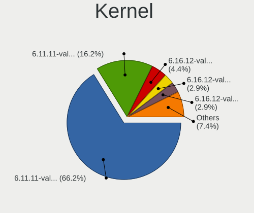

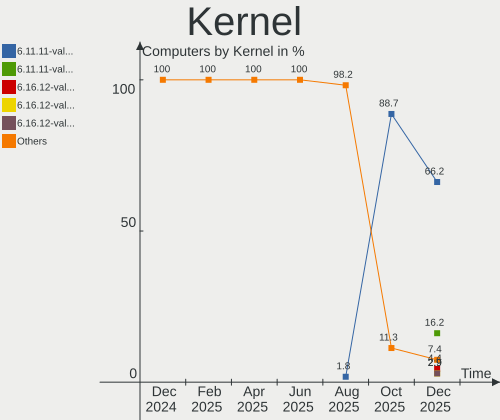

| Version                                     | Computers | Percent |
|---------------------------------------------|-----------|---------|
| 6.11.11-valve24-2-neptune-611-gfd0dd251480d | 45        | 66.18%  |
| 6.11.11-valve26-1-neptune-611-gb3afa9aa9ae7 | 11        | 16.18%  |
| 6.16.12-valve5-1-neptune-616-ga9fcc52b276a  | 3         | 4.41%   |
| 6.16.12-valve7-1-neptune-616-g499ac884388d  | 2         | 2.94%   |
| 6.16.12-valve6-1-neptune-616-g37101e112292  | 2         | 2.94%   |
| 6.16.12-valve4-1-neptune-616-g366ccd8ab040  | 2         | 2.94%   |
| 6.11.11-valve14-1-neptune-611-g96885212a919 | 2         | 2.94%   |
| 6.16.12-valve2-1-neptune-616-g8a732b312b58  | 1         | 1.47%   |

Kernel Family
-------------

Linux kernel without a distro release

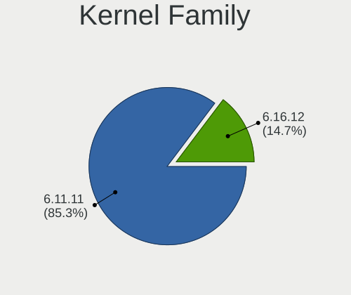

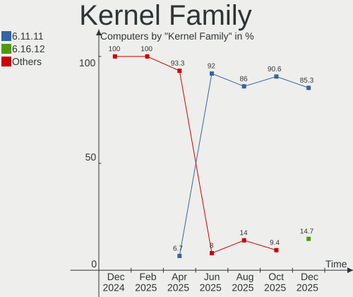

| Version | Computers | Percent |
|---------|-----------|---------|
| 6.11.11 | 58        | 85.29%  |
| 6.16.12 | 10        | 14.71%  |

Kernel Major Ver.
-----------------

Linux kernel major version

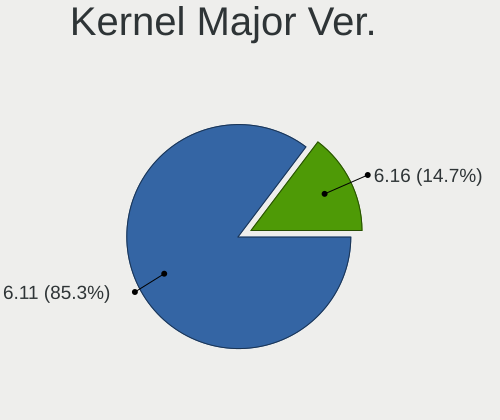

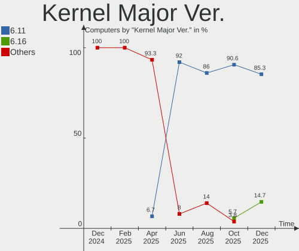

| Version | Computers | Percent |
|---------|-----------|---------|
| 6.11    | 58        | 85.29%  |
| 6.16    | 10        | 14.71%  |

Arch
----

OS architecture (x86_64, i586, etc.)

| Name   | Computers | Percent |
|--------|-----------|---------|
| x86_64 | 68        | 100%    |

DE
--

Desktop Environment

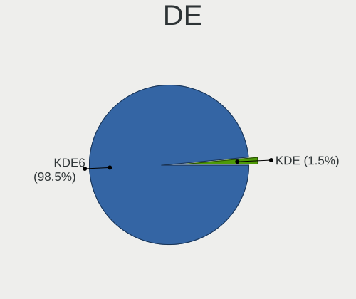

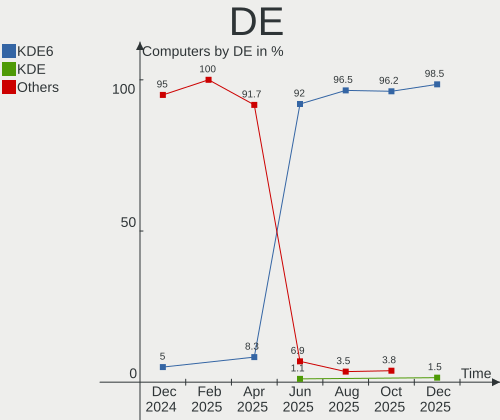

| Name | Computers | Percent |
|------|-----------|---------|
| KDE6 | 67        | 98.53%  |
| KDE  | 1         | 1.47%   |

Display Server
--------------

X11 or Wayland

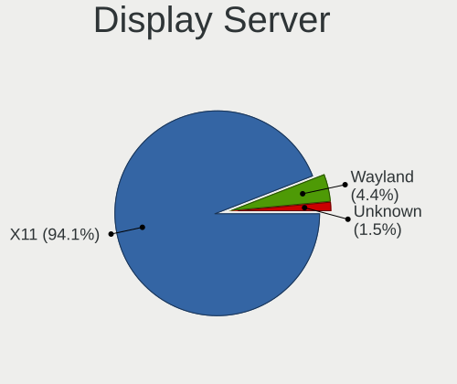

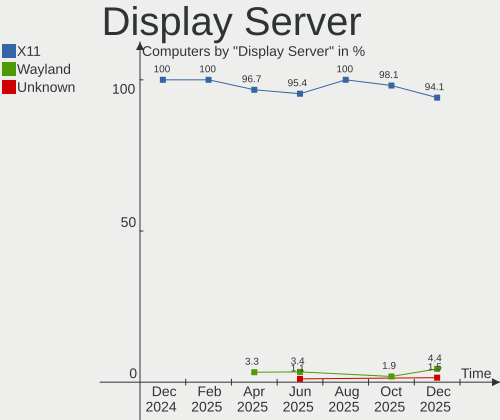

| Name    | Computers | Percent |
|---------|-----------|---------|
| X11     | 64        | 94.12%  |
| Wayland | 3         | 4.41%   |
| Unknown | 1         | 1.47%   |

Display Manager
---------------

SDDM, LightDM, etc.

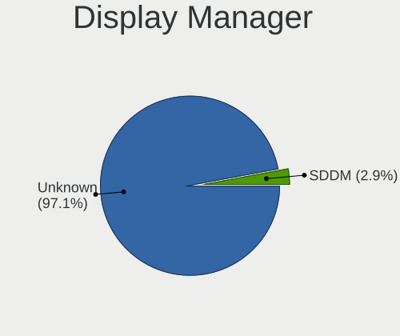

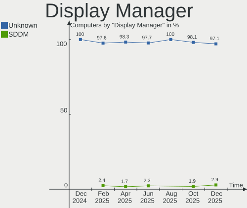

| Name    | Computers | Percent |
|---------|-----------|---------|
| Unknown | 66        | 97.06%  |
| SDDM    | 2         | 2.94%   |

OS Lang
-------

Language

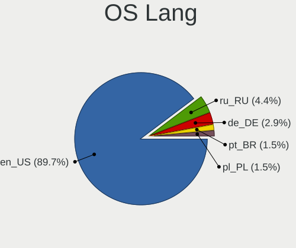

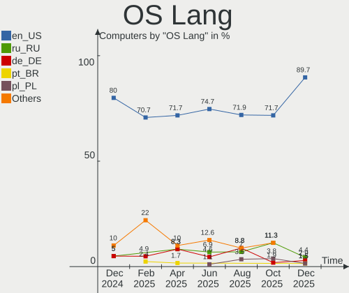

| Lang  | Computers | Percent |
|-------|-----------|---------|
| en_US | 61        | 89.71%  |
| ru_RU | 3         | 4.41%   |
| de_DE | 2         | 2.94%   |
| pt_BR | 1         | 1.47%   |
| pl_PL | 1         | 1.47%   |

Boot Mode
---------

EFI or BIOS

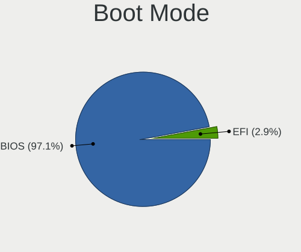

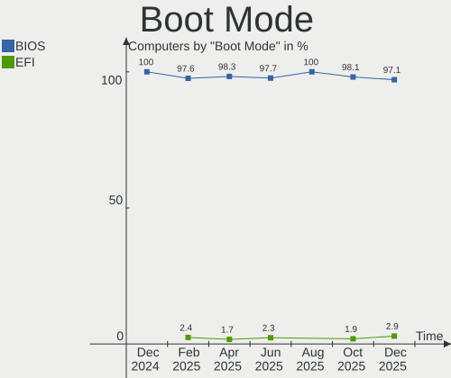

| Mode | Computers | Percent |
|------|-----------|---------|
| BIOS | 66        | 97.06%  |
| EFI  | 2         | 2.94%   |

Filesystem
----------

Type of filesystem

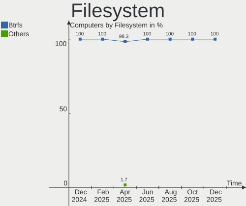

| Type  | Computers | Percent |
|-------|-----------|---------|
| Btrfs | 68        | 100%    |

Part. scheme
------------

Scheme of partitioning

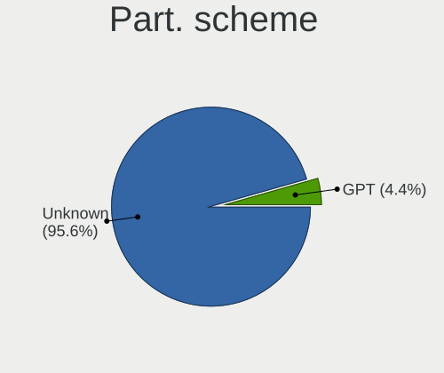

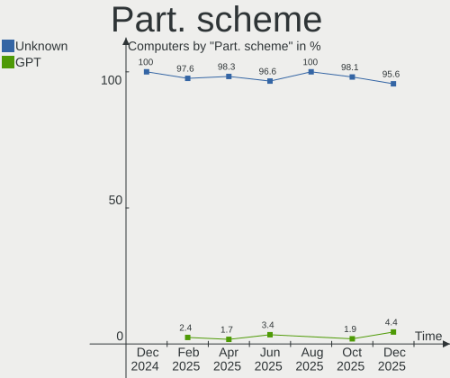

| Type    | Computers | Percent |
|---------|-----------|---------|
| Unknown | 65        | 95.59%  |
| GPT     | 3         | 4.41%   |

Dual Boot with Linux/BSD
------------------------

Hosting more than one Linux/BSD

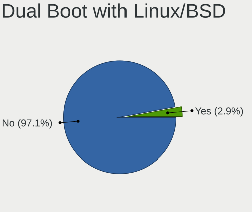

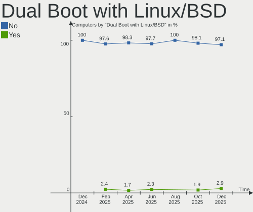

| Dual boot | Computers | Percent |
|-----------|-----------|---------|
| No        | 66        | 97.06%  |
| Yes       | 2         | 2.94%   |

Dual Boot (Win)
---------------

Hosting Linux and Windows

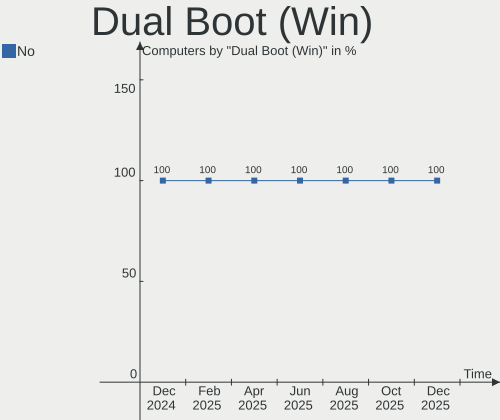

| Dual boot | Computers | Percent |
|-----------|-----------|---------|
| No        | 68        | 100%    |

Board
-----

Vendor
------

Motherboard manufacturer

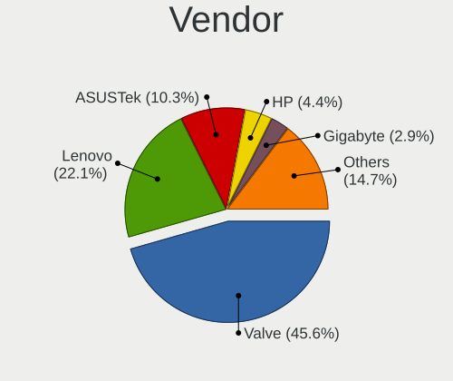

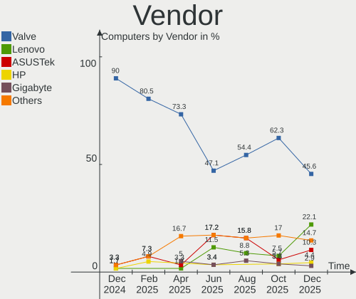

| Name                                 | Computers | Percent |
|--------------------------------------|-----------|---------|
| Valve                                | 31        | 45.59%  |
| Lenovo                               | 15        | 22.06%  |
| ASUSTek Computer                     | 7         | 10.29%  |
| Hewlett-Packard                      | 3         | 4.41%   |
| Gigabyte Technology                  | 2         | 2.94%   |
| AYANEO                               | 2         | 2.94%   |
| Shenzhen Meigao Electronic Equipment | 1         | 1.47%   |
| MSI                                  | 1         | 1.47%   |
| JGINYUE                              | 1         | 1.47%   |
| Intel                                | 1         | 1.47%   |
| GEEKOM                               | 1         | 1.47%   |
| Dell                                 | 1         | 1.47%   |
| ASRock                               | 1         | 1.47%   |
| Alienware                            | 1         | 1.47%   |

Model
-----

Motherboard model

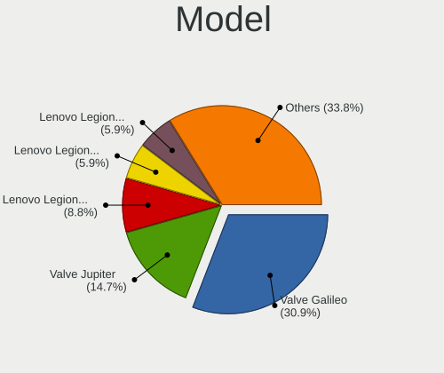

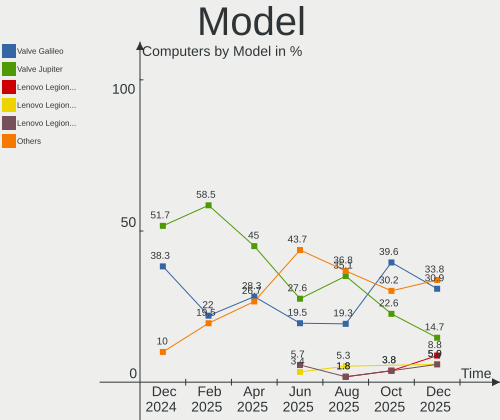

| Name                                                  | Computers | Percent |
|-------------------------------------------------------|-----------|---------|
| Valve Galileo                                         | 21        | 30.88%  |
| Valve Jupiter                                         | 10        | 14.71%  |
| Lenovo Legion Go S 8APU1 83N6                         | 6         | 8.82%   |
| Lenovo Legion Go S 8ARP1 83L3                         | 4         | 5.88%   |
| Lenovo Legion Go 8APU1 83E1                           | 4         | 5.88%   |
| Shenzhen Meigao Electronic Equipment EliteMini Series | 1         | 1.47%   |
| MSI MS-7D32                                           | 1         | 1.47%   |
| Lenovo ThinkCentre M710e 10UQS0NM00                   | 1         | 1.47%   |
| JGINYUE B650I Night Devil                             | 1         | 1.47%   |
| Intel X99                                             | 1         | 1.47%   |
| HP Victus by Gaming Laptop 15-fb0xxx                  | 1         | 1.47%   |
| HP ProBook 650 G2                                     | 1         | 1.47%   |
| HP Pavilion Gaming Laptop                             | 1         | 1.47%   |
| Gigabyte X870 AORUS ELITE WIFI7                       | 1         | 1.47%   |
| Gigabyte H110M-S2H                                    | 1         | 1.47%   |
| GEEKOM A8                                             | 1         | 1.47%   |
| Dell OptiPlex 3020                                    | 1         | 1.47%   |
| AYANEO NEXT Lite                                      | 1         | 1.47%   |
| AYANEO AIR 1S Limited                                 | 1         | 1.47%   |
| ASUS TUF Gaming B650M-PLUS                            | 1         | 1.47%   |
| ASUS ROG STRIX B850-I GAMING WIFI                     | 1         | 1.47%   |
| ASUS ROG STRIX B550-F GAMING WIFI II                  | 1         | 1.47%   |
| ASUS ROG Ally X RC72LA_RC72LA                         | 1         | 1.47%   |
| ASUS B650E MAX GAMING WIFI                            | 1         | 1.47%   |
| ASUS ASUS TUF Gaming A15 FA506IH_FA506IH              | 1         | 1.47%   |
| ASRock X870 Pro RS WiFi                               | 1         | 1.47%   |
| Alienware m17 R5 AMD                                  | 1         | 1.47%   |
| Unknown                                               | 1         | 1.47%   |

Model Family
------------

Motherboard model prefix

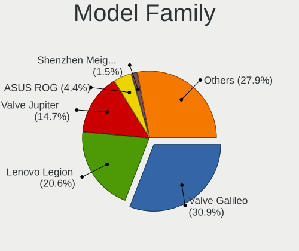

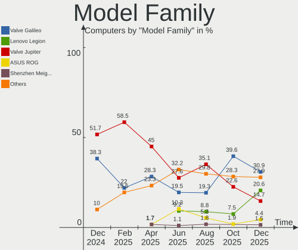

| Name                                           | Computers | Percent |
|------------------------------------------------|-----------|---------|
| Valve Galileo                                  | 21        | 30.88%  |
| Lenovo Legion                                  | 14        | 20.59%  |
| Valve Jupiter                                  | 10        | 14.71%  |
| ASUS ROG                                       | 3         | 4.41%   |
| Shenzhen Meigao Electronic Equipment EliteMini | 1         | 1.47%   |
| MSI MS-7D32                                    | 1         | 1.47%   |
| Lenovo ThinkCentre                             | 1         | 1.47%   |
| JGINYUE B650I                                  | 1         | 1.47%   |
| Intel X99                                      | 1         | 1.47%   |
| HP Victus                                      | 1         | 1.47%   |
| HP ProBook                                     | 1         | 1.47%   |
| HP Pavilion                                    | 1         | 1.47%   |
| Gigabyte X870                                  | 1         | 1.47%   |
| Gigabyte H110M-S2H                             | 1         | 1.47%   |
| GEEKOM A8                                      | 1         | 1.47%   |
| Dell OptiPlex                                  | 1         | 1.47%   |
| AYANEO NEXT                                    | 1         | 1.47%   |
| AYANEO AIR                                     | 1         | 1.47%   |
| ASUS TUF                                       | 1         | 1.47%   |
| ASUS B650E                                     | 1         | 1.47%   |
| ASUS ASUS                                      | 1         | 1.47%   |
| ASRock X870                                    | 1         | 1.47%   |
| Alienware m17                                  | 1         | 1.47%   |
| Unknown                                        | 1         | 1.47%   |

MFG Year
--------

Motherboard manufacture year

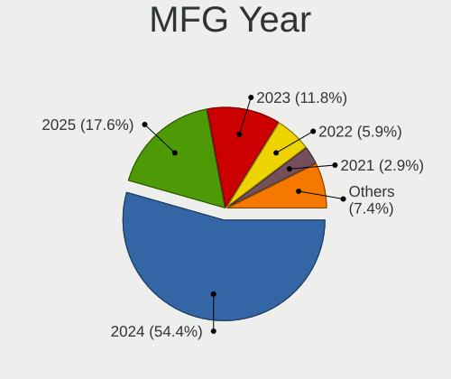

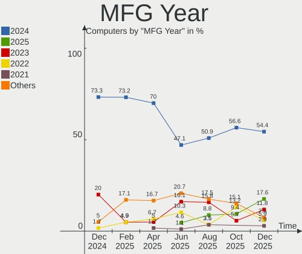

| Year | Computers | Percent |
|------|-----------|---------|
| 2024 | 37        | 54.41%  |
| 2025 | 12        | 17.65%  |
| 2023 | 8         | 11.76%  |
| 2022 | 4         | 5.88%   |
| 2021 | 2         | 2.94%   |
| 2016 | 2         | 2.94%   |
| 2020 | 1         | 1.47%   |
| 2019 | 1         | 1.47%   |
| 2014 | 1         | 1.47%   |

Form Factor
-----------

Physical design of the computer

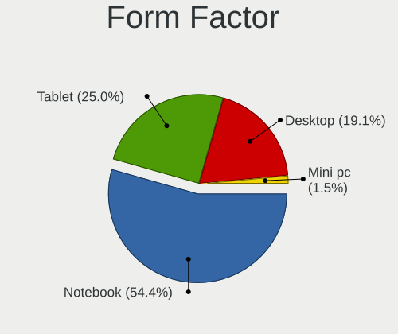

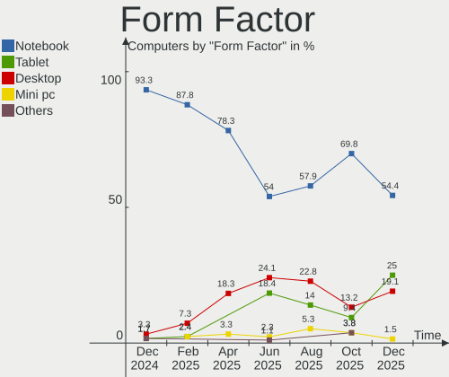

| Name     | Computers | Percent |
|----------|-----------|---------|
| Notebook | 37        | 54.41%  |
| Tablet   | 17        | 25%     |
| Desktop  | 13        | 19.12%  |
| Mini pc  | 1         | 1.47%   |

Secure Boot
-----------

Enabled or disabled

| State    | Computers | Percent |
|----------|-----------|---------|
| Disabled | 68        | 100%    |

Coreboot
--------

Have coreboot on board

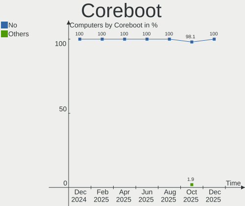

| Used | Computers | Percent |
|------|-----------|---------|
| No   | 68        | 100%    |

RAM Size
--------

Total RAM memory

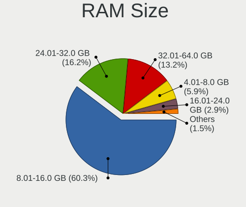

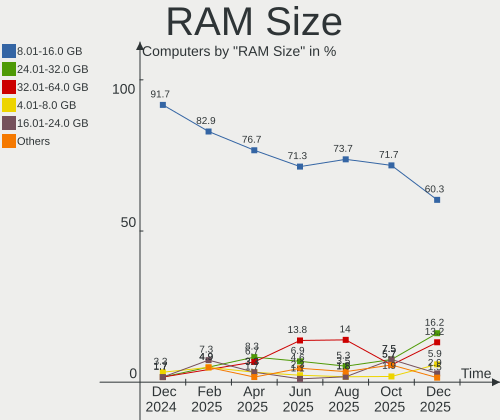

| Size in GB  | Computers | Percent |
|-------------|-----------|---------|
| 8.01-16.0   | 41        | 60.29%  |
| 24.01-32.0  | 11        | 16.18%  |
| 32.01-64.0  | 9         | 13.24%  |
| 4.01-8.0    | 4         | 5.88%   |
| 16.01-24.0  | 2         | 2.94%   |
| 64.01-256.0 | 1         | 1.47%   |

RAM Used
--------

Used RAM memory

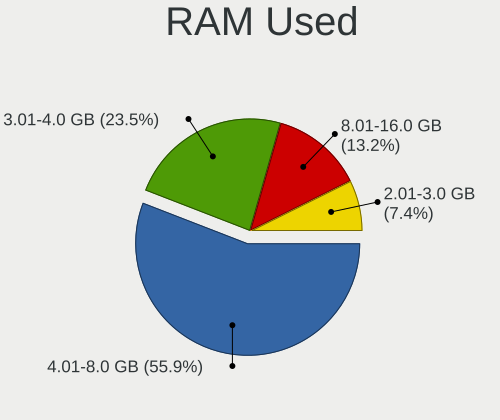

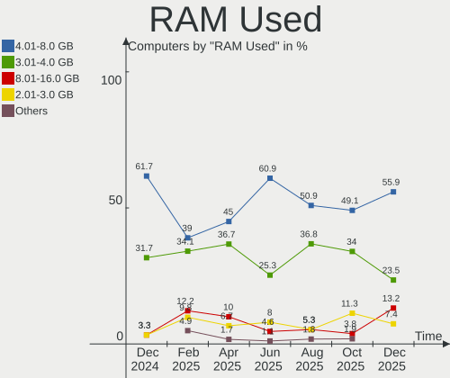

| Used GB   | Computers | Percent |
|-----------|-----------|---------|
| 4.01-8.0  | 38        | 55.88%  |
| 3.01-4.0  | 16        | 23.53%  |
| 8.01-16.0 | 9         | 13.24%  |
| 2.01-3.0  | 5         | 7.35%   |

Total Drives
------------

Number of drives on board

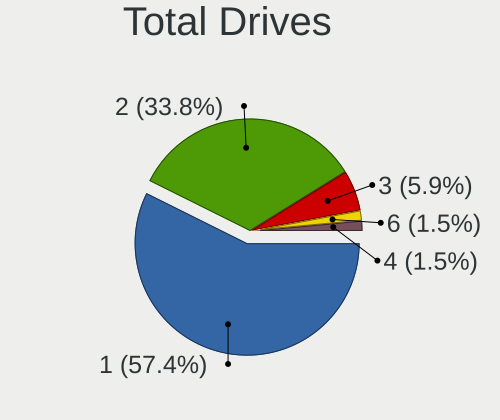

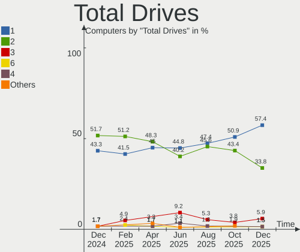

| Drives | Computers | Percent |
|--------|-----------|---------|
| 1      | 39        | 57.35%  |
| 2      | 23        | 33.82%  |
| 3      | 4         | 5.88%   |
| 6      | 1         | 1.47%   |
| 4      | 1         | 1.47%   |

Has CD-ROM
----------

Has CD-ROM on board

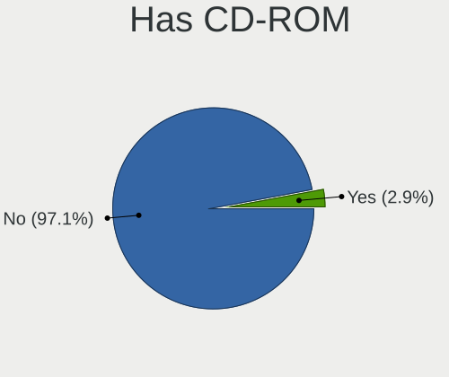

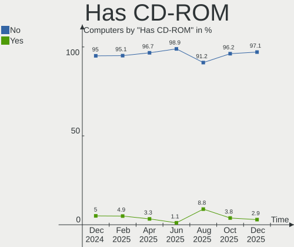

| Presented | Computers | Percent |
|-----------|-----------|---------|
| No        | 66        | 97.06%  |
| Yes       | 2         | 2.94%   |

Has Ethernet
------------

Has Ethernet on board

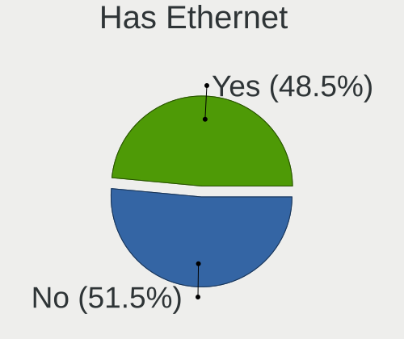

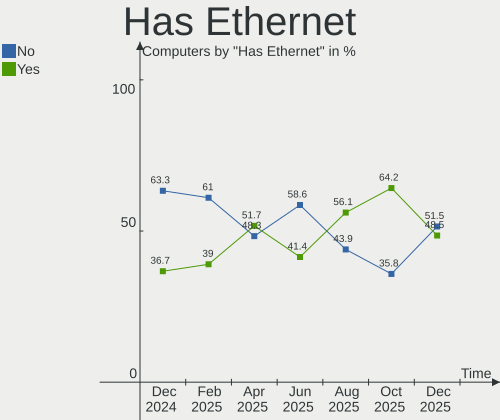

| Presented | Computers | Percent |
|-----------|-----------|---------|
| No        | 35        | 51.47%  |
| Yes       | 33        | 48.53%  |

Has WiFi
--------

Has WiFi module

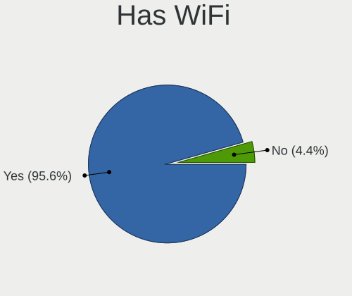

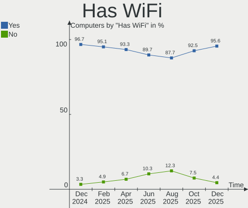

| Presented | Computers | Percent |
|-----------|-----------|---------|
| Yes       | 65        | 95.59%  |
| No        | 3         | 4.41%   |

Has Bluetooth
-------------

Has Bluetooth module

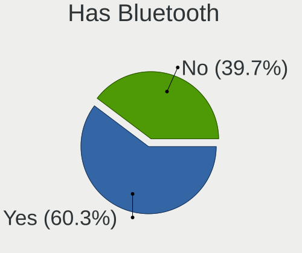

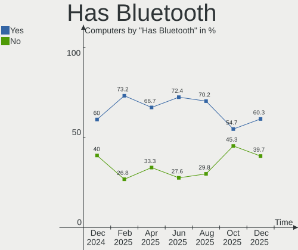

| Presented | Computers | Percent |
|-----------|-----------|---------|
| Yes       | 41        | 60.29%  |
| No        | 27        | 39.71%  |

Location
--------

Country
-------

Geographic location (country)

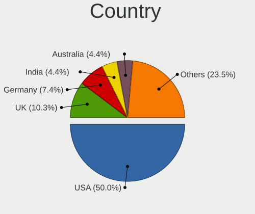

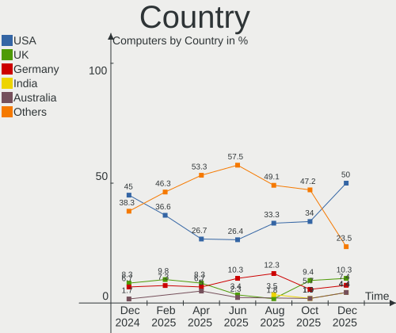

| Country      | Computers | Percent |
|--------------|-----------|---------|
| USA          | 34        | 50%     |
| UK           | 7         | 10.29%  |
| Germany      | 5         | 7.35%   |
| India        | 3         | 4.41%   |
| Australia    | 3         | 4.41%   |
| Poland       | 2         | 2.94%   |
| France       | 2         | 2.94%   |
| Canada       | 2         | 2.94%   |
| Vietnam      | 1         | 1.47%   |
| UAE          | 1         | 1.47%   |
| Switzerland  | 1         | 1.47%   |
| Saudi Arabia | 1         | 1.47%   |
| Russia       | 1         | 1.47%   |
| Norway       | 1         | 1.47%   |
| Mexico       | 1         | 1.47%   |
| Finland      | 1         | 1.47%   |
| Cambodia     | 1         | 1.47%   |
| Brazil       | 1         | 1.47%   |

City
----

Geographic location (city)

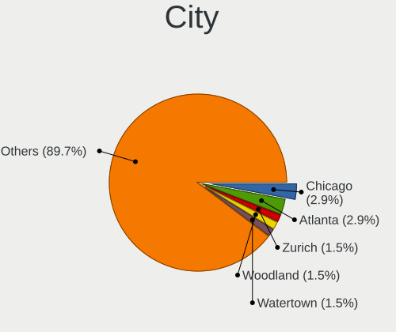

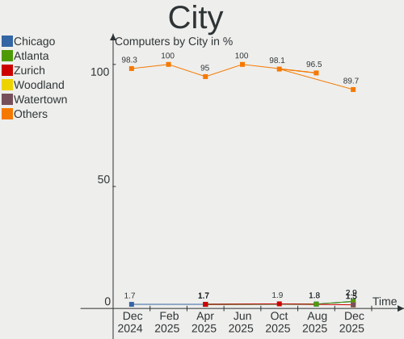

| City                     | Computers | Percent |
|--------------------------|-----------|---------|
| Chicago                  | 2         | 2.94%   |
| Atlanta                  | 2         | 2.94%   |
| Zurich                   | 1         | 1.47%   |
| Woodland                 | 1         | 1.47%   |
| Watertown                | 1         | 1.47%   |
| Waterford                | 1         | 1.47%   |
| Virieu                   | 1         | 1.47%   |
| Virginia Beach           | 1         | 1.47%   |
| Vienna                   | 1         | 1.47%   |
| Vaihingen an der Enz     | 1         | 1.47%   |
| Tra Vinh                 | 1         | 1.47%   |
| Torrington               | 1         | 1.47%   |
| Tlajomulco de Zuniga     | 1         | 1.47%   |
| Tampa                    | 1         | 1.47%   |
| Sydney                   | 1         | 1.47%   |
| Stafford                 | 1         | 1.47%   |
| Shawnee                  | 1         | 1.47%   |
| Scottsdale               | 1         | 1.47%   |
| Sao Paulo                | 1         | 1.47%   |
| San Jose                 | 1         | 1.47%   |
| San Antonio              | 1         | 1.47%   |
| Rong                     | 1         | 1.47%   |
| Rochester                | 1         | 1.47%   |
| Reading                  | 1         | 1.47%   |
| Pune                     | 1         | 1.47%   |
| Prince George            | 1         | 1.47%   |
| Phoenix                  | 1         | 1.47%   |
| Phnom Penh               | 1         | 1.47%   |
| Petropavlovsk-Kamchatsky | 1         | 1.47%   |
| Persan                   | 1         | 1.47%   |
| Pegnitz                  | 1         | 1.47%   |
| Papenburg                | 1         | 1.47%   |
| Oshawa                   | 1         | 1.47%   |
| Olympia                  | 1         | 1.47%   |
| O'Fallon                 | 1         | 1.47%   |
| Novi                     | 1         | 1.47%   |
| Norwich                  | 1         | 1.47%   |
| New York                 | 1         | 1.47%   |
| New Concord              | 1         | 1.47%   |
| Naperville               | 1         | 1.47%   |

Drives
------

Drive Vendor
------------

Hard drive vendors

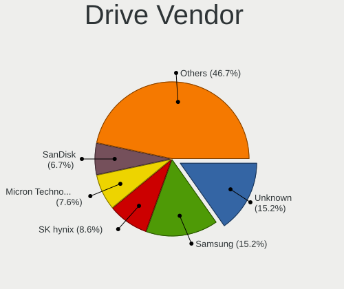

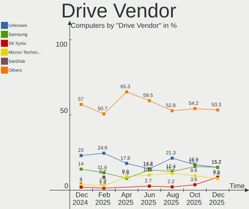

| Vendor                       | Computers | Drives | Percent |
|------------------------------|-----------|--------|---------|
| Unknown                      | 16        | 16     | 15.24%  |
| Samsung Electronics          | 16        | 16     | 15.24%  |
| SK hynix                     | 9         | 9      | 8.57%   |
| Micron Technology            | 8         | 8      | 7.62%   |
| SanDisk                      | 7         | 9      | 6.67%   |
| Phison Electronics           | 7         | 7      | 6.67%   |
| Kingston                     | 7         | 7      | 6.67%   |
| Unknown                      | 6         | 6      | 5.71%   |
| Micron/Crucial Technology    | 5         | 5      | 4.76%   |
| Kingston Technology Company  | 5         | 5      | 4.76%   |
| Seagate                      | 3         | 3      | 2.86%   |
| WDC                          | 2         | 2      | 1.9%    |
| Shenzhen Longsys Electronics | 2         | 3      | 1.9%    |
| KIOXIA                       | 2         | 2      | 1.9%    |
| JMicron Technology           | 2         | 2      | 1.9%    |
| Realtek Semiconductor        | 1         | 1      | 0.95%   |
| Phison                       | 1         | 1      | 0.95%   |
| Intenso                      | 1         | 1      | 0.95%   |
| External                     | 1         | 1      | 0.95%   |
| China                        | 1         | 1      | 0.95%   |
| ASMT                         | 1         | 1      | 0.95%   |
| AMD                          | 1         | 1      | 0.95%   |
| ADATA Technology             | 1         | 1      | 0.95%   |

Drive Model
-----------

Hard drive models

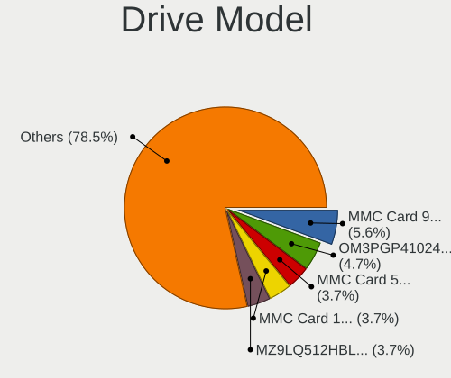

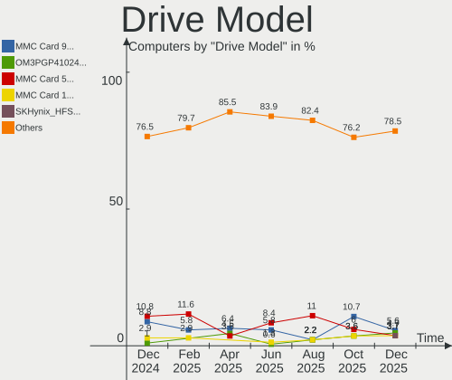

| Model                                                 | Computers | Percent |
|-------------------------------------------------------|-----------|---------|
| Unknown                                               | 6         | 5.61%   |
| Kingston OM3PGP41024P-A0 1TB                          | 5         | 4.67%   |
| Unknown MMC Card  512GB                               | 4         | 3.74%   |
| Unknown MMC Card  128GB                               | 4         | 3.74%   |
| SK hynix SKHynix_HFS001TEM4X182N 1TB                  | 4         | 3.74%   |
| Samsung MZ9LQ512HBLU-00BVL 512GB                      | 4         | 3.74%   |
| Unknown MMC Card  256GB                               | 3         | 2.8%    |
| Phison PS5013 E13 NVMe Controller 500GB               | 3         | 2.8%    |
| Micron/Crucial P2 NVMe PCIe SSD 2TB                   | 3         | 2.8%    |
| Kingston Company OM3PDP3 NVMe SSD 256GB               | 3         | 2.8%    |
| SK hynix SKHynix_HFS512GEM4X182N 512GB                | 2         | 1.87%   |
| Sandisk WD PC SN7100S SDFPMSL-1T00-1101 1024GB        | 2         | 1.87%   |
| Samsung MZAL81T0HDLB-00BL2 1024GB                     | 2         | 1.87%   |
| Micron 2500_MTFDKBK512QGN 512GB                       | 2         | 1.87%   |
| Kingston OM3PGP4512Q-A0 512GB                         | 2         | 1.87%   |
| JMicron Tech 250GB                                    | 2         | 1.87%   |
| WDC WD140EDGZ-11B1PA0 14TB                            | 1         | 0.93%   |
| WDC WD10EZEX-00ZF5A0 1TB                              | 1         | 0.93%   |
| Unknown NVMe SSD Drive 2TB                            | 1         | 0.93%   |
| Unknown MMC Card  8GB                                 | 1         | 0.93%   |
| Unknown MMC Card  3GB                                 | 1         | 0.93%   |
| Unknown MMC Card  32GB                                | 1         | 0.93%   |
| Unknown MMC Card  1TB                                 | 1         | 0.93%   |
| SK hynix SKHynix_HFS001TEJ4X112N 1024GB               | 1         | 0.93%   |
| SK hynix PC801 NVMe 1TB                               | 1         | 0.93%   |
| SK hynix BC711 NVMe 512GB                             | 1         | 0.93%   |
| Shenzhen Longsys Lexar SSD NQ7A1 2TB                  | 1         | 0.93%   |
| Shenzhen Longsys Lexar SSD EQ790 1TB                  | 1         | 0.93%   |
| Seagate ST2000DL003-9VT166 2TB                        | 1         | 0.93%   |
| Seagate BUP Slim BK 2TB                               | 1         | 0.93%   |
| Seagate BACKUP+ 256GB                                 | 1         | 0.93%   |
| Sandisk WD_BLACK SN850X 1000GB                        | 1         | 0.93%   |
| Sandisk WD_BLACK SN770 2TB                            | 1         | 0.93%   |
| Sandisk WD PC SN740 SDDPTQE-2T00 2TB                  | 1         | 0.93%   |
| Sandisk WD PC SN740 SDDPMQD-512G-1101 512GB           | 1         | 0.93%   |
| Sandisk WD Black 2018/SN750 / PC SN720 NVMe SSD 512GB | 1         | 0.93%   |
| SanDisk Ultra II 960GB SSD                            | 1         | 0.93%   |
| SanDisk Extreme SSD 1TB                               | 1         | 0.93%   |
| Samsung SSD 990 PRO 4TB                               | 1         | 0.93%   |
| Samsung SSD 990 PRO 2TB                               | 1         | 0.93%   |

HDD Vendor
----------

Hard disk drive vendors

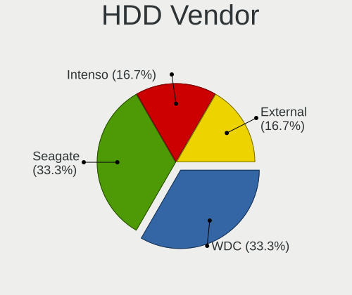

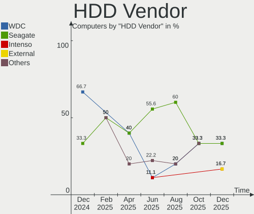

| Vendor   | Computers | Drives | Percent |
|----------|-----------|--------|---------|
| WDC      | 2         | 2      | 33.33%  |
| Seagate  | 2         | 2      | 33.33%  |
| Intenso  | 1         | 1      | 16.67%  |
| External | 1         | 1      | 16.67%  |

SSD Vendor
----------

Solid state drive vendors

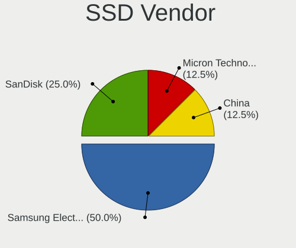

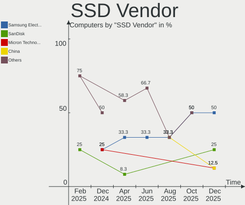

| Vendor              | Computers | Drives | Percent |
|---------------------|-----------|--------|---------|
| Samsung Electronics | 4         | 4      | 50%     |
| SanDisk             | 2         | 2      | 25%     |
| Micron Technology   | 1         | 1      | 12.5%   |
| China               | 1         | 1      | 12.5%   |

Drive Kind
----------

HDD or SSD

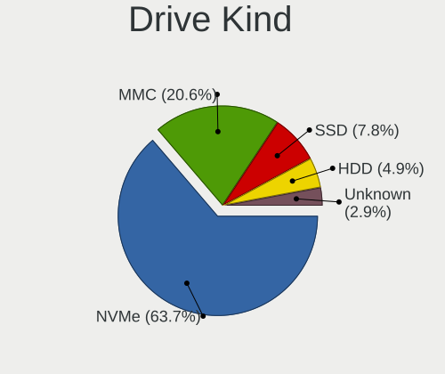

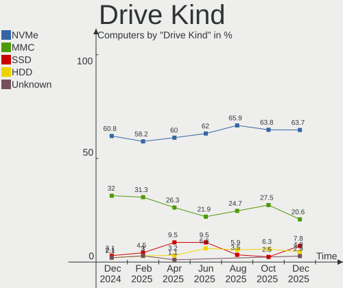

| Kind    | Computers | Drives | Percent |
|---------|-----------|--------|---------|
| NVMe    | 65        | 70     | 63.73%  |
| MMC     | 21        | 21     | 20.59%  |
| SSD     | 8         | 8      | 7.84%   |
| HDD     | 5         | 6      | 4.9%    |
| Unknown | 3         | 3      | 2.94%   |

Drive Connector
---------------

SATA, SAS, NVMe, etc.

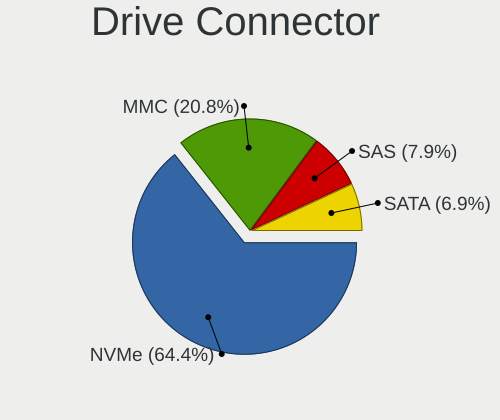

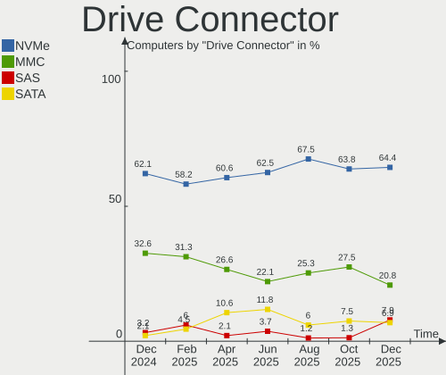

| Type | Computers | Drives | Percent |
|------|-----------|--------|---------|
| NVMe | 65        | 69     | 64.36%  |
| MMC  | 21        | 21     | 20.79%  |
| SAS  | 8         | 9      | 7.92%   |
| SATA | 7         | 9      | 6.93%   |

Drive Size
----------

Size of hard drive

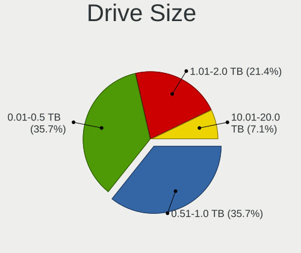

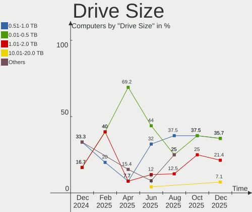

| Size in TB | Computers | Drives | Percent |
|------------|-----------|--------|---------|
| 0.51-1.0   | 5         | 5      | 35.71%  |
| 0.01-0.5   | 5         | 5      | 35.71%  |
| 1.01-2.0   | 3         | 3      | 21.43%  |
| 10.01-20.0 | 1         | 1      | 7.14%   |

Space Total
-----------

Amount of disk space available on the file system

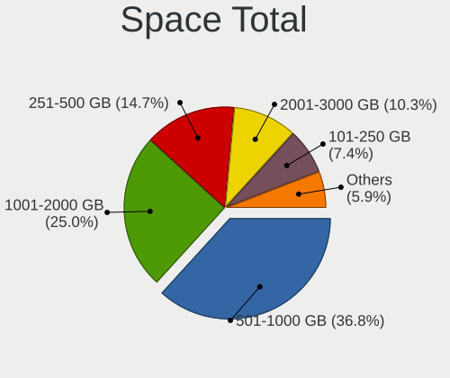

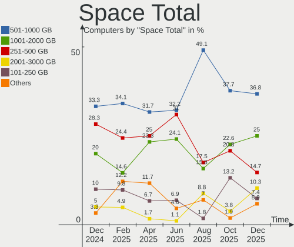

| Size in GB     | Computers | Percent |
|----------------|-----------|---------|
| 501-1000       | 25        | 36.76%  |
| 1001-2000      | 17        | 25%     |
| 251-500        | 10        | 14.71%  |
| 2001-3000      | 7         | 10.29%  |
| 101-250        | 5         | 7.35%   |
| More than 3000 | 3         | 4.41%   |
| 51-100         | 1         | 1.47%   |

Space Used
----------

Amount of used disk space

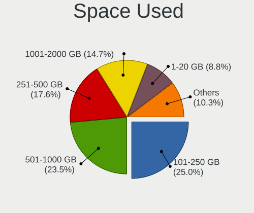

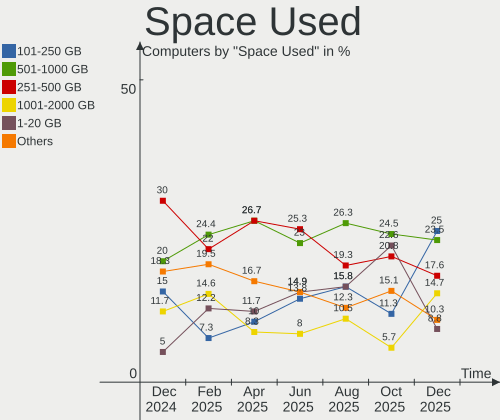

| Used GB        | Computers | Percent |
|----------------|-----------|---------|
| 101-250        | 17        | 25%     |
| 501-1000       | 16        | 23.53%  |
| 251-500        | 12        | 17.65%  |
| 1001-2000      | 10        | 14.71%  |
| 1-20           | 6         | 8.82%   |
| 21-50          | 3         | 4.41%   |
| More than 3000 | 2         | 2.94%   |
| 2001-3000      | 1         | 1.47%   |
| 51-100         | 1         | 1.47%   |

Malfunc. Drives
---------------

Drive models with a malfunction

Zero info for selected period =(

Malfunc. Drive Vendor
---------------------

Vendors of faulty drives

Zero info for selected period =(

Malfunc. HDD Vendor
-------------------

Vendors of faulty HDD drives

Zero info for selected period =(

Malfunc. Drive Kind
-------------------

Kinds of faulty drives

Zero info for selected period =(

Failed Drives
-------------

Failed drive models

Zero info for selected period =(

Failed Drive Vendor
-------------------

Failed drive vendors

Zero info for selected period =(

Drive Status
------------

Number of failed and malfunc. drives

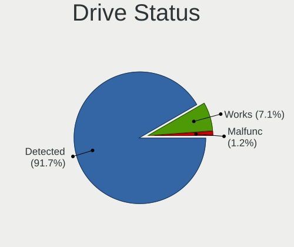

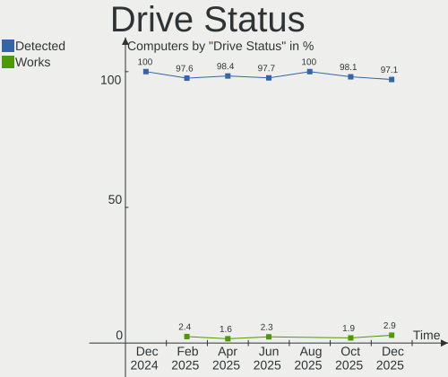

| Status   | Computers | Drives | Percent |
|----------|-----------|--------|---------|
| Detected | 67        | 106    | 97.1%   |
| Works    | 2         | 2      | 2.9%    |

Storage controller
------------------

Storage Vendor
--------------

Storage controller vendors

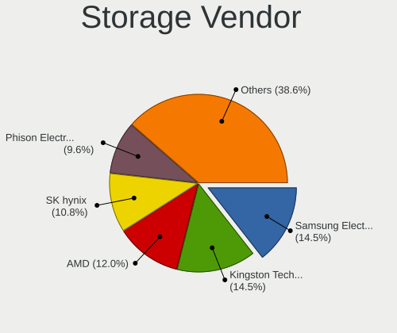

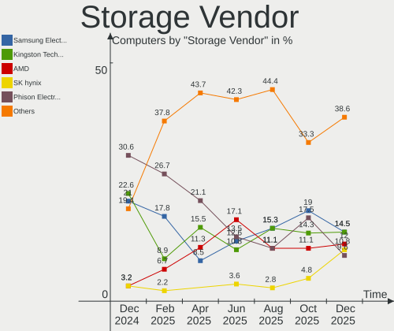

| Vendor                       | Computers | Percent |
|------------------------------|-----------|---------|
| Samsung Electronics          | 12        | 14.46%  |
| Kingston Technology Company  | 12        | 14.46%  |
| AMD                          | 10        | 12.05%  |
| SK hynix                     | 9         | 10.84%  |
| Phison Electronics           | 8         | 9.64%   |
| Micron Technology            | 7         | 8.43%   |
| Sandisk                      | 6         | 7.23%   |
| Intel                        | 6         | 7.23%   |
| Micron/Crucial Technology    | 5         | 6.02%   |
| Shenzhen Longsys Electronics | 2         | 2.41%   |
| KIOXIA                       | 2         | 2.41%   |
| Realtek Semiconductor        | 1         | 1.2%    |
| INNOGRIT                     | 1         | 1.2%    |
| ASMedia Technology           | 1         | 1.2%    |
| ADATA Technology             | 1         | 1.2%    |

Storage Model
-------------

Storage controller models

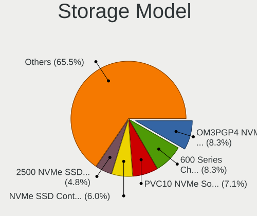

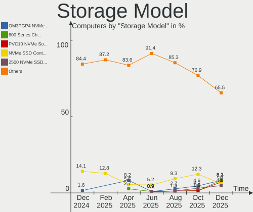

| Model                                                                          | Computers | Percent |
|--------------------------------------------------------------------------------|-----------|---------|
| Kingston Company OM3PGP4 NVMe SSD (DRAM-less)                                  | 7         | 8.33%   |
| AMD 600 Series Chipset SATA Controller                                         | 7         | 8.33%   |
| SK hynix PVC10 NVMe Solid State Drive (DRAM-less)                              | 6         | 7.14%   |
| Samsung NVMe SSD Controller 980 (DRAM-less)                                    | 5         | 5.95%   |
| Micron 2500 NVMe SSD (DRAM-less)                                               | 4         | 4.76%   |
| Phison PS5013-E13 PCIe3 NVMe Controller (DRAM-less)                            | 3         | 3.57%   |
| Micron/Crucial P2 [Nick P2] / P3 / P3 Plus NVMe PCIe SSD (DRAM-less)           | 3         | 3.57%   |
| Kingston Company OM3PDP3 NVMe SSD                                              | 3         | 3.57%   |
| Shenzhen Longsys Lexar NM790 / Patriot Viper VP4300 Lite NVMe SSD (DRAM-less)  | 2         | 2.38%   |
| Sandisk WD PC SN7100S M.2 2242 NVMe SSD (DRAM-less)                            | 2         | 2.38%   |
| Samsung NVMe SSD Controller S4LV008[Pascal]                                    | 2         | 2.38%   |
| Samsung NVMe SSD Controller PM9C1a (DRAM-less)                                 | 2         | 2.38%   |
| Phison PS5021-E21 PCIe4 NVMe Controller (DRAM-less)                            | 2         | 2.38%   |
| Phison PS5019-E19 PCIe4 NVMe Controller (DRAM-less)                            | 2         | 2.38%   |
| Micron 2400 NVMe SSD (DRAM-less)                                               | 2         | 2.38%   |
| SK hynix Platinum P41/PC801 NVMe Solid State Drive                             | 1         | 1.19%   |
| SK hynix Gold P31/BC711/PC711 NVMe Solid State Drive                           | 1         | 1.19%   |
| SK hynix BC901 NVMe Solid State Drive (DRAM-less)                              | 1         | 1.19%   |
| SanDisk WD SN560/SN740/SN770/SN5000 NVMe SSD                                   | 1         | 1.19%   |
| Sandisk WD PC SN740 NVMe SSD 512GB (DRAM-less)                                 | 1         | 1.19%   |
| Sandisk WD Black SN850X NVMe SSD                                               | 1         | 1.19%   |
| Sandisk PC SN740 NVMe SSD (DRAM-less)                                          | 1         | 1.19%   |
| SanDisk Extreme Pro / WD Black 2018/SN750/PC SN720 NVMe SSD                    | 1         | 1.19%   |
| Samsung NVMe SSD Controller PM9B1 (DRAM-less)                                  | 1         | 1.19%   |
| Samsung NVMe SSD Controller PM9A1/PM9A3/980PRO                                 | 1         | 1.19%   |
| Samsung BM9C1 QLC NVME SSD (DRAM-less)                                         | 1         | 1.19%   |
| Realtek RTS5762 NVMe SSD Controller                                            | 1         | 1.19%   |
| Phison PS5027-E27T PCIe4 NVMe Controller (DRAM-less)                           | 1         | 1.19%   |
| Micron/Crucial P310 NVMe PCIe SSD (DRAM-less)                                  | 1         | 1.19%   |
| Micron/Crucial P3 Plus NVMe PCIe SSD (DRAM-less)                               | 1         | 1.19%   |
| Micron 2550 NVMe SSD (DRAM-less)                                               | 1         | 1.19%   |
| KIOXIA NVMe SSD Controller XG8                                                 | 1         | 1.19%   |
| KIOXIA NVMe SSD Controller BG5 (DRAM-less)                                     | 1         | 1.19%   |
| Kingston Company Company Non-Volatile memory controller                        | 1         | 1.19%   |
| Kingston Company A1000/U-SNS8154P3 x2 NVMe SSD [E8]                            | 1         | 1.19%   |
| Intel Sunrise Point-LP SATA Controller [AHCI mode]                             | 1         | 1.19%   |
| Intel Q170/Q150/B150/H170/H110/Z170/CM236 Chipset SATA Controller [AHCI Mode]  | 1         | 1.19%   |
| Intel Alder Lake-S PCH SATA Controller [AHCI Mode]                             | 1         | 1.19%   |
| Intel 82801 Mobile SATA Controller [RAID mode]                                 | 1         | 1.19%   |
| Intel 8 Series/C220 Series Chipset Family 6-port SATA Controller 1 [AHCI mode] | 1         | 1.19%   |

Storage Kind
------------

Kind of storage controller (IDE, SATA, NVMe, SAS, ...)

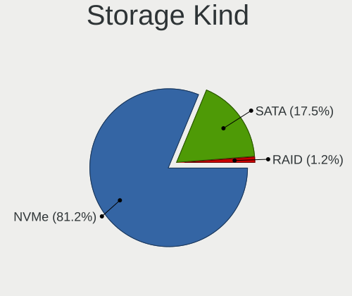

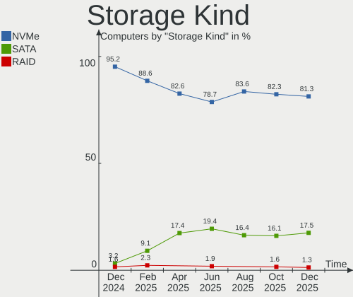

| Kind | Computers | Percent |
|------|-----------|---------|
| NVMe | 65        | 81.25%  |
| SATA | 14        | 17.5%   |
| RAID | 1         | 1.25%   |

Processor
---------

CPU Vendor
----------

Processor vendors

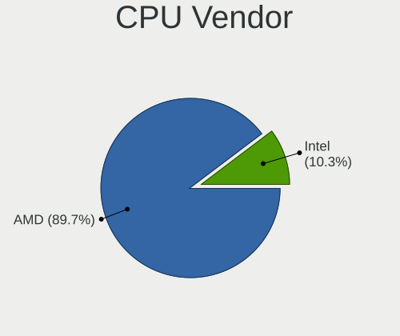

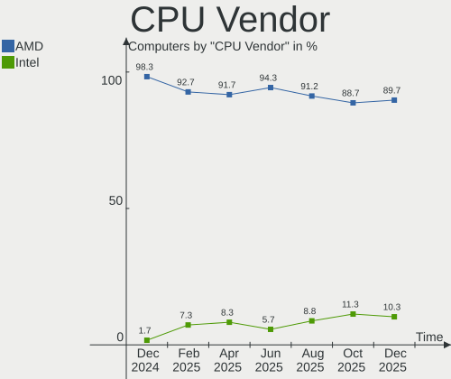

| Vendor | Computers | Percent |
|--------|-----------|---------|
| AMD    | 61        | 89.71%  |
| Intel  | 7         | 10.29%  |

CPU Model
---------

Processor models

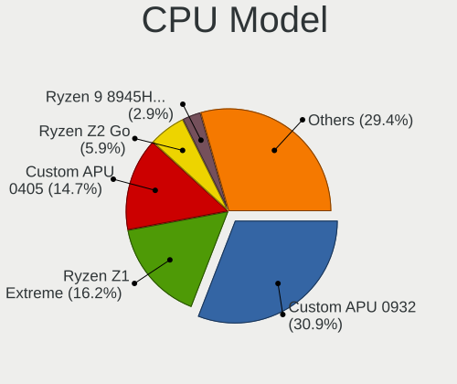

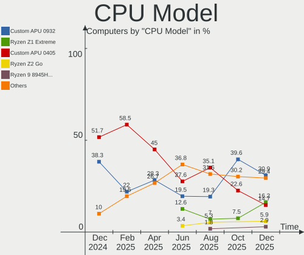

| Model                                      | Computers | Percent |
|--------------------------------------------|-----------|---------|
| AMD Custom APU 0932                        | 21        | 30.88%  |
| AMD Ryzen Z1 Extreme                       | 11        | 16.18%  |
| AMD Custom APU 0405                        | 10        | 14.71%  |
| AMD Ryzen Z2 Go                            | 4         | 5.88%   |
| AMD Ryzen 9 8945HS w/ Radeon 780M Graphics | 2         | 2.94%   |
| AMD Ryzen 7 9800X3D 8-Core Processor       | 2         | 2.94%   |
| AMD Ryzen 7 7800X3D 8-Core Processor       | 2         | 2.94%   |
| AMD Ryzen 5 9600X 6-Core Processor         | 2         | 2.94%   |
| Intel Xeon CPU E5-2620 v3 @ 2.40GHz        | 1         | 1.47%   |
| Intel Core i7-9750H CPU @ 2.60GHz          | 1         | 1.47%   |
| Intel Core i7-7700T CPU @ 2.90GHz          | 1         | 1.47%   |
| Intel Core i7-6700K CPU @ 4.00GHz          | 1         | 1.47%   |
| Intel Core i5-6300U CPU @ 2.40GHz          | 1         | 1.47%   |
| Intel Core i5-4590 CPU @ 3.30GHz           | 1         | 1.47%   |
| Intel 13th Gen Core i5-13600K              | 1         | 1.47%   |
| AMD Ryzen 9 6900HX with Radeon Graphics    | 1         | 1.47%   |
| AMD Ryzen 7 7840U w/ Radeon 780M Graphics  | 1         | 1.47%   |
| AMD Ryzen 7 5800X 8-Core Processor         | 1         | 1.47%   |
| AMD Ryzen 7 4800U with Radeon Graphics     | 1         | 1.47%   |
| AMD Ryzen 5 7600X 6-Core Processor         | 1         | 1.47%   |
| AMD Ryzen 5 5600H with Radeon Graphics     | 1         | 1.47%   |
| AMD Ryzen 5 4600H with Radeon Graphics     | 1         | 1.47%   |

CPU Model Family
----------------

Processor model prefix

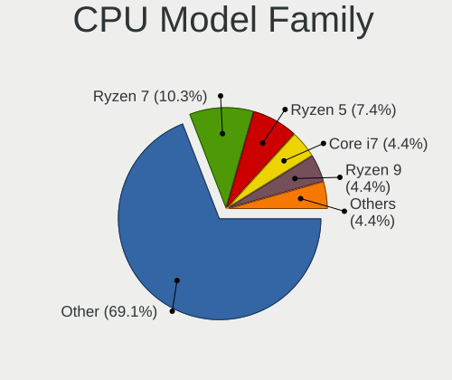

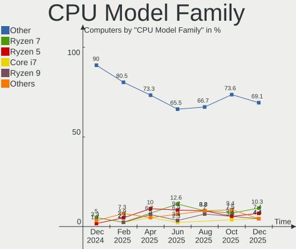

| Model         | Computers | Percent |
|---------------|-----------|---------|
| Other         | 47        | 69.12%  |
| AMD Ryzen 7   | 7         | 10.29%  |
| AMD Ryzen 5   | 5         | 7.35%   |
| Intel Core i7 | 3         | 4.41%   |
| AMD Ryzen 9   | 3         | 4.41%   |
| Intel Core i5 | 2         | 2.94%   |
| Intel Xeon    | 1         | 1.47%   |

CPU Cores
---------

Number of processor cores

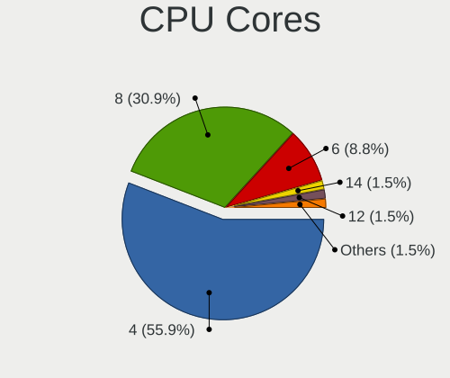

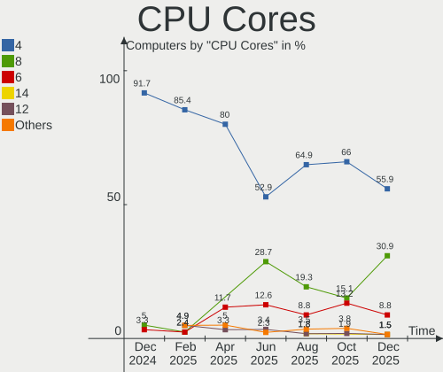

| Number | Computers | Percent |
|--------|-----------|---------|
| 4      | 38        | 55.88%  |
| 8      | 21        | 30.88%  |
| 6      | 6         | 8.82%   |
| 14     | 1         | 1.47%   |
| 12     | 1         | 1.47%   |
| 2      | 1         | 1.47%   |

CPU Sockets
-----------

Number of sockets

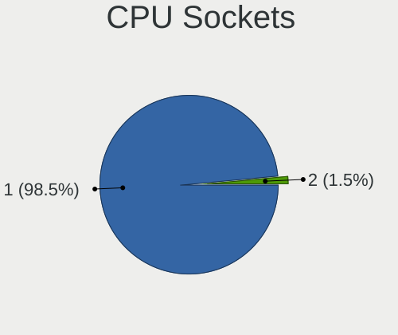

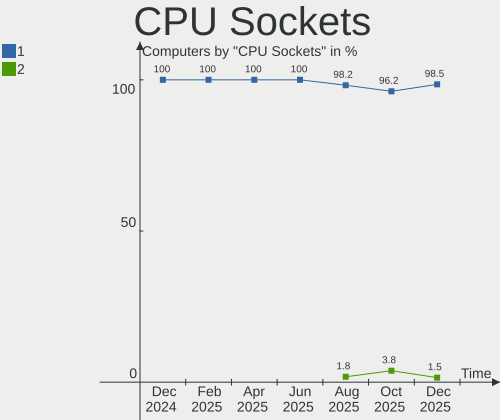

| Number | Computers | Percent |
|--------|-----------|---------|
| 1      | 67        | 98.53%  |
| 2      | 1         | 1.47%   |

CPU Threads
-----------

Threads per core (Hyper-Threading)

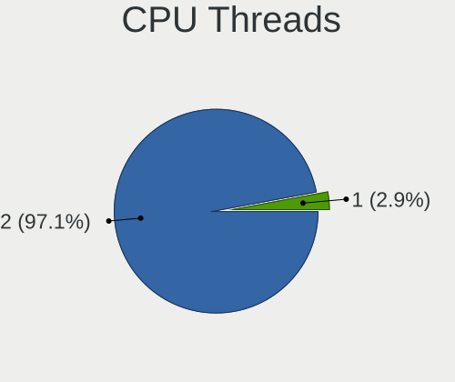

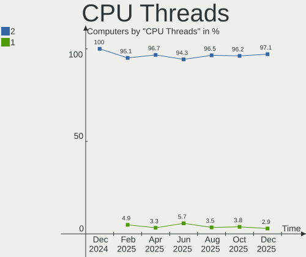

| Number | Computers | Percent |
|--------|-----------|---------|
| 2      | 66        | 97.06%  |
| 1      | 2         | 2.94%   |

CPU Op-Modes
------------

CPU Operation Modes (32-bit, 64-bit)

| Op mode        | Computers | Percent |
|----------------|-----------|---------|
| 32-bit, 64-bit | 68        | 100%    |

CPU Microcode
-------------

Microcode number

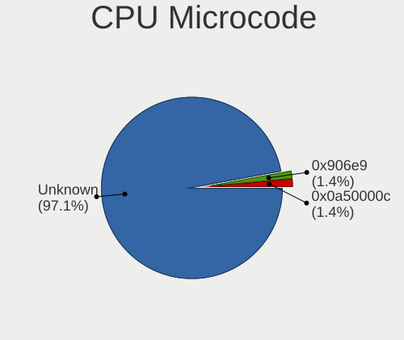

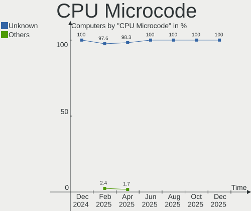

| Number  | Computers | Percent |
|---------|-----------|---------|
| Unknown | 68        | 100%    |

CPU Microarch
-------------

Microarchitecture

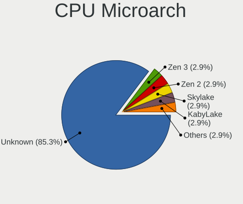

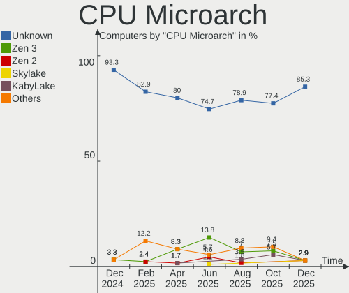

| Name     | Computers | Percent |
|----------|-----------|---------|
| Unknown  | 58        | 85.29%  |
| Zen 3    | 2         | 2.94%   |
| Zen 2    | 2         | 2.94%   |
| Skylake  | 2         | 2.94%   |
| KabyLake | 2         | 2.94%   |
| Haswell  | 2         | 2.94%   |

Graphics
--------

GPU Vendor
----------

Vendors of graphics cards

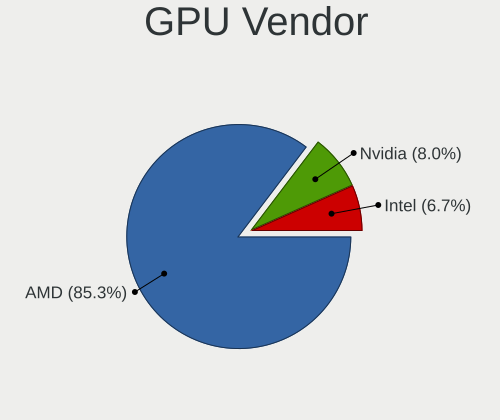

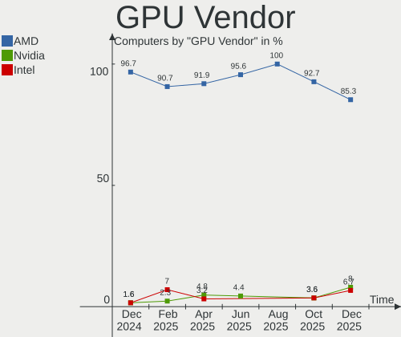

| Vendor | Computers | Percent |
|--------|-----------|---------|
| AMD    | 64        | 85.33%  |
| Nvidia | 6         | 8%      |
| Intel  | 5         | 6.67%   |

GPU Model
---------

Graphics card models

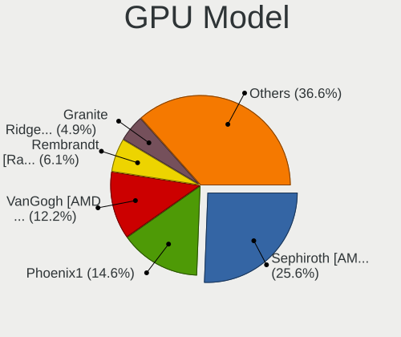

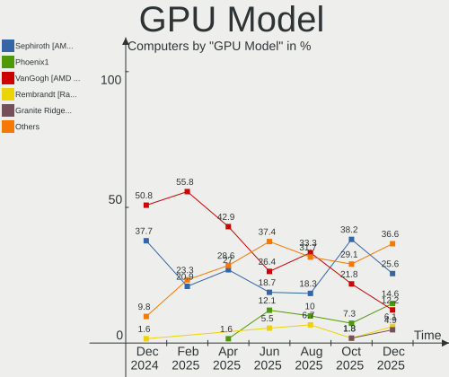

| Model                                                                       | Computers | Percent |
|-----------------------------------------------------------------------------|-----------|---------|
| AMD Sephiroth [AMD Custom GPU 0405]                                         | 21        | 25.61%  |
| AMD Phoenix1                                                                | 12        | 14.63%  |
| AMD VanGogh [AMD Custom GPU 0405]                                           | 10        | 12.2%   |
| AMD Rembrandt [Radeon 680M]                                                 | 5         | 6.1%    |
| AMD Granite Ridge [Radeon Graphics]                                         | 4         | 4.88%   |
| AMD Raphael                                                                 | 3         | 3.66%   |
| AMD Navi 48 [Radeon RX 9070/9070 XT/9070 GRE]                               | 3         | 3.66%   |
| AMD Navi 24 [Radeon RX 6400/6500 XT/6500M]                                  | 3         | 3.66%   |
| Nvidia TU117M [GeForce GTX 1650 Mobile / Max-Q]                             | 2         | 2.44%   |
| AMD Renoir [Radeon Vega Series / Radeon Vega Mobile Series]                 | 2         | 2.44%   |
| AMD HawkPoint1                                                              | 2         | 2.44%   |
| Nvidia GP104 [GeForce GTX 1080]                                             | 1         | 1.22%   |
| Nvidia GB206 [GeForce RTX 5060]                                             | 1         | 1.22%   |
| Nvidia GB205 [GeForce RTX 5070]                                             | 1         | 1.22%   |
| Nvidia GA104M [Geforce RTX 3070 Ti Laptop GPU]                              | 1         | 1.22%   |
| Intel Xeon E3-1200 v3/4th Gen Core Processor Integrated Graphics Controller | 1         | 1.22%   |
| Intel Skylake-U GT2 [HD Graphics 520]                                       | 1         | 1.22%   |
| Intel Skylake-S GT2 [HD Graphics 530]                                       | 1         | 1.22%   |
| Intel Raptor Lake-S GT1 [UHD Graphics 770]                                  | 1         | 1.22%   |
| Intel CoffeeLake-H GT2 [UHD Graphics 630]                                   | 1         | 1.22%   |
| AMD Navi 33 [Radeon RX 7600/7600 XT/7600M XT/7600S/7700S / PRO W7600]       | 1         | 1.22%   |
| AMD Navi 31 [Radeon RX 7900 XT/7900 XTX/7900 GRE/7900M]                     | 1         | 1.22%   |
| AMD Navi 23 [Radeon RX 6600/6600 XT/6600M]                                  | 1         | 1.22%   |
| AMD Navi 22 [Radeon RX 6700/6700 XT/6750 XT / 6800M/6850M XT]               | 1         | 1.22%   |
| AMD Navi 21 [Radeon RX 6800/6800 XT / 6900 XT]                              | 1         | 1.22%   |
| AMD Cezanne [Radeon Vega Series / Radeon Vega Mobile Series]                | 1         | 1.22%   |

GPU Combo
---------

Combinations of graphics cards

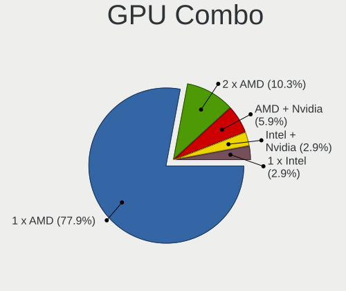

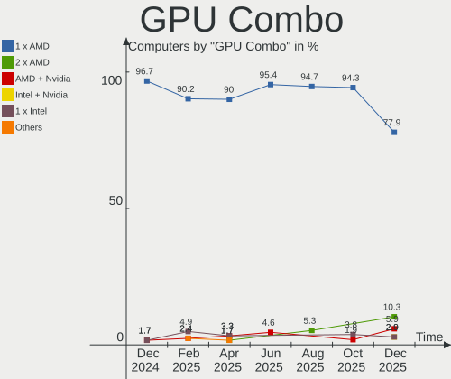

| Name           | Computers | Percent |
|----------------|-----------|---------|
| 1 x AMD        | 53        | 77.94%  |
| 2 x AMD        | 7         | 10.29%  |
| AMD + Nvidia   | 4         | 5.88%   |
| Intel + Nvidia | 2         | 2.94%   |
| 1 x Intel      | 2         | 2.94%   |

GPU Driver
----------

Free vs proprietary

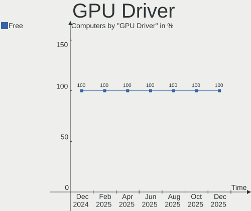

| Driver | Computers | Percent |
|--------|-----------|---------|
| Free   | 68        | 100%    |

GPU Memory
----------

Total video memory

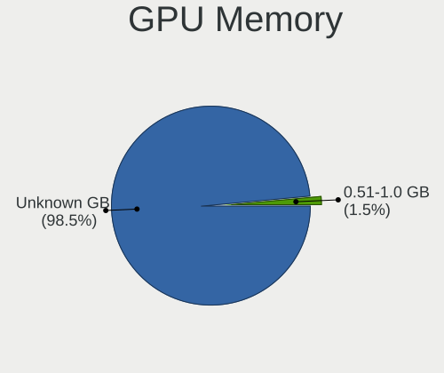

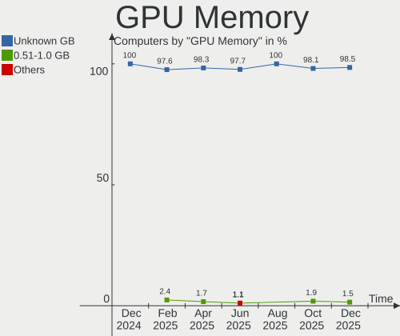

| Size in GB | Computers | Percent |
|------------|-----------|---------|
| Unknown    | 67        | 98.53%  |
| 0.51-1.0   | 1         | 1.47%   |

Monitor
-------

Monitor Vendor
--------------

Monitor vendors

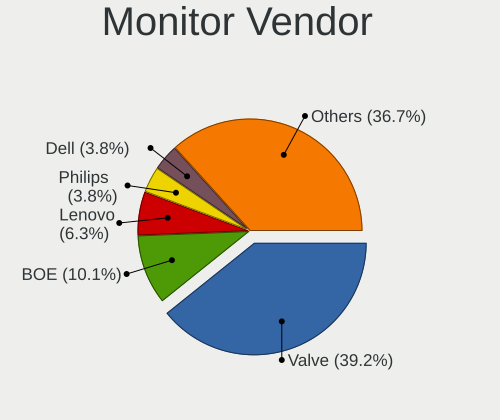

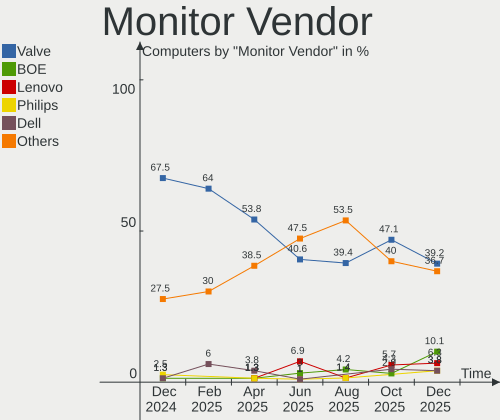

| Vendor              | Computers | Percent |
|---------------------|-----------|---------|
| Valve               | 31        | 39.24%  |
| BOE                 | 8         | 10.13%  |
| Lenovo              | 5         | 6.33%   |
| Philips             | 3         | 3.8%    |
| Dell                | 3         | 3.8%    |
| CSW                 | 3         | 3.8%    |
| MSI                 | 2         | 2.53%   |
| Goldstar            | 2         | 2.53%   |
| AU Optronics        | 2         | 2.53%   |
| ASUSTek Computer    | 2         | 2.53%   |
| UGD                 | 1         | 1.27%   |
| TMX                 | 1         | 1.27%   |
| TCL                 | 1         | 1.27%   |
| SANSUI              | 1         | 1.27%   |
| Samsung Electronics | 1         | 1.27%   |
| Roku                | 1         | 1.27%   |
| PANDA               | 1         | 1.27%   |
| NEC Computers       | 1         | 1.27%   |
| Mi                  | 1         | 1.27%   |
| HUAWEI              | 1         | 1.27%   |
| Hitachi             | 1         | 1.27%   |
| Hewlett-Packard     | 1         | 1.27%   |
| HannStar            | 1         | 1.27%   |
| Chimei Innolux      | 1         | 1.27%   |
| BenQ                | 1         | 1.27%   |
| AYANEO              | 1         | 1.27%   |
| AOpen               | 1         | 1.27%   |
| AOC                 | 1         | 1.27%   |

Monitor Model
-------------

Monitor models

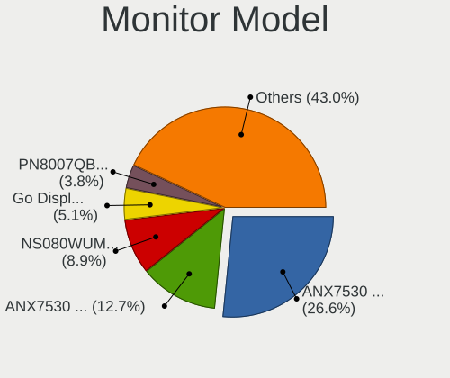

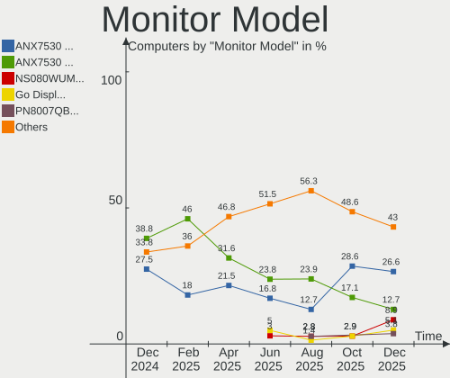

| Model                                                              | Computers | Percent |
|--------------------------------------------------------------------|-----------|---------|
| Valve ANX7530 U VLV3003 800x1280 100x160mm 7.4-inch                | 21        | 26.58%  |
| Valve ANX7530 U VLV3001 800x1280 100x150mm 7.1-inch                | 10        | 12.66%  |
| BOE NS080WUM-LX1 BOE0CFF 1920x1200 172x108mm 8.0-inch              | 7         | 8.86%   |
| Lenovo Go Display LEN0001 1600x2560 120x190mm 8.8-inch             | 4         | 5.06%   |
| CSW PN8007QB1-1 CSW0800 1920x1200 172x107mm 8.0-inch               | 3         | 3.8%    |
| UGD HDMI UGD1003 800x1280                                          | 1         | 1.27%   |
| TMX TL070FVXS01-0 TMX0002 1920x1080 160x100mm 7.4-inch             | 1         | 1.27%   |
| TCL Beyond TV TCL9653 3840x2160 1210x680mm 54.6-inch               | 1         | 1.27%   |
| SANSUI ES-G24F4M XEC2380 1920x1080 409x230mm 18.5-inch             | 1         | 1.27%   |
| Samsung Electronics LC27G7xT SAM105E 2560x1440 597x336mm 27.0-inch | 1         | 1.27%   |
| Roku TV RKU1506 1920x1080 698x392mm 31.5-inch                      | 1         | 1.27%   |
| Philips PHL32M1N5800A PHLC277 3840x2160 697x392mm 31.5-inch        | 1         | 1.27%   |
| Philips PHL 271V8 PHLC213 1920x1080 598x336mm 27.0-inch            | 1         | 1.27%   |
| Philips FTV PHL04C3 1920x1080 1440x810mm 65.0-inch                 | 1         | 1.27%   |
| PANDA LCD Monitor NCP004D 1920x1080 344x194mm 15.5-inch            | 1         | 1.27%   |
| NEC Computers EA234WMi NEC6921 1920x1080 509x286mm 23.0-inch       | 1         | 1.27%   |
| MSI MPG271QX OLED MSI3CD7 2560x1440 606x344mm 27.4-inch            | 1         | 1.27%   |
| MSI G32C4X MSI4DA6 1920x1080 698x393mm 31.5-inch                   | 1         | 1.27%   |
| Mi monitor XMI2001 3440x1440 797x334mm 34.0-inch                   | 1         | 1.27%   |
| Lenovo LEN LI2364d LEN65C8 1920x1080 509x286mm 23.0-inch           | 1         | 1.27%   |
| HUAWEI SSN-24 HWV6E4E 1920x1080 527x296mm 23.8-inch                | 1         | 1.27%   |
| Hitachi HISENSE HECB31D 3840x2160 1428x804mm 64.5-inch             | 1         | 1.27%   |
| Hewlett-Packard Z38c HPN3411 3840x1600 880x367mm 37.5-inch         | 1         | 1.27%   |
| HannStar HS271HPB HSD132F 1920x1080 597x336mm 27.0-inch            | 1         | 1.27%   |
| Goldstar ULTRAWIDE GSM9E85 3840x1080 1198x337mm 49.0-inch          | 1         | 1.27%   |
| Goldstar TV SSCR2 GSM8284 3840x2160                                | 1         | 1.27%   |
| Dell SE2216H DELF071 1920x1080 476x268mm 21.5-inch                 | 1         | 1.27%   |
| Dell S2721D DELA19A 2560x1440 597x336mm 27.0-inch                  | 1         | 1.27%   |
| Dell P2012H DEL4078 1600x900 443x249mm 20.0-inch                   | 1         | 1.27%   |
| Chimei Innolux LCD Monitor CMN1778 1920x1080 381x214mm 17.2-inch   | 1         | 1.27%   |
| BOE LCD Monitor BOE094A 1920x1080 344x194mm 15.5-inch              | 1         | 1.27%   |
| BenQ BL2706HT BNQ8029 1920x1080 598x336mm 27.0-inch                | 1         | 1.27%   |
| AYANEO OLED AYA0104 1080x1920                                      | 1         | 1.27%   |
| AU Optronics LCD Monitor AUO5799 1920x1080 344x194mm 15.5-inch     | 1         | 1.27%   |
| AU Optronics LCD Monitor AUO35ED 1920x1080 344x193mm 15.5-inch     | 1         | 1.27%   |
| ASUSTek Computer VG289 AUS28BA 3840x2160 621x341mm 27.9-inch       | 1         | 1.27%   |
| ASUSTek Computer VG27WQ AUS272B 2560x1440 597x336mm 27.0-inch      | 1         | 1.27%   |
| AOpen 27HC5R V AOP091C 1920x1080 597x336mm 27.0-inch               | 1         | 1.27%   |
| AOC Q24G2 AOCB205 2560x1440 526x296mm 23.8-inch                    | 1         | 1.27%   |

Monitor Resolution
------------------

Monitor screen resolution

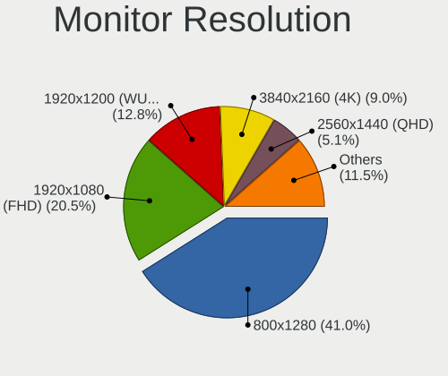

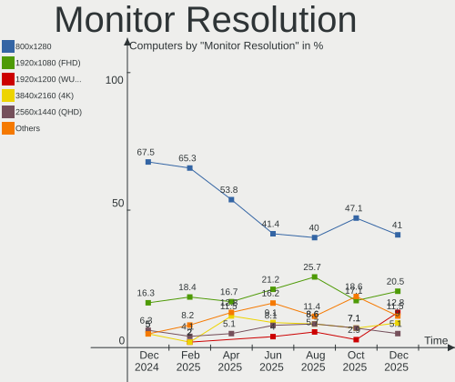

| Resolution        | Computers | Percent |
|-------------------|-----------|---------|
| 800x1280          | 32        | 41.03%  |
| 1920x1080 (FHD)   | 16        | 20.51%  |
| 1920x1200 (WUXGA) | 10        | 12.82%  |
| 3840x2160 (4K)    | 7         | 8.97%   |
| 2560x1440 (QHD)   | 4         | 5.13%   |
| Unknown           | 4         | 5.13%   |
| 3840x1600         | 1         | 1.28%   |
| 3840x1080         | 1         | 1.28%   |
| 3440x1440         | 1         | 1.28%   |
| 1600x900 (HD+)    | 1         | 1.28%   |
| 1080x1920         | 1         | 1.28%   |

Monitor Diagonal
----------------

Diagonal size in inches

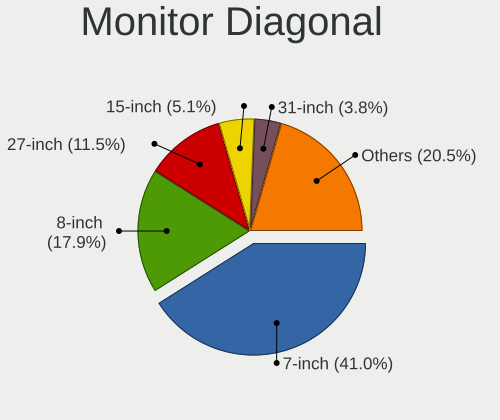

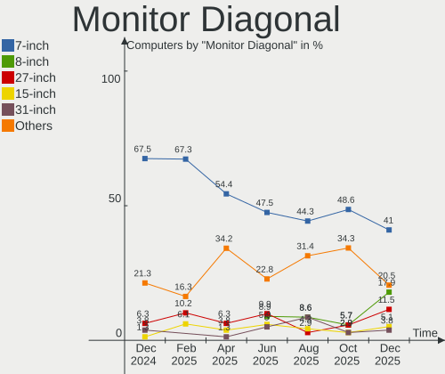

| Inches  | Computers | Percent |
|---------|-----------|---------|
| 7       | 32        | 41.03%  |
| 8       | 14        | 17.95%  |
| 27      | 9         | 11.54%  |
| 15      | 4         | 5.13%   |
| 31      | 3         | 3.85%   |
| 23      | 3         | 3.85%   |
| Unknown | 3         | 3.85%   |
| 65      | 1         | 1.28%   |
| 64      | 1         | 1.28%   |
| 54      | 1         | 1.28%   |
| 49      | 1         | 1.28%   |
| 37      | 1         | 1.28%   |
| 34      | 1         | 1.28%   |
| 24      | 1         | 1.28%   |
| 21      | 1         | 1.28%   |
| 20      | 1         | 1.28%   |
| 17      | 1         | 1.28%   |

Monitor Width
-------------

Physical width

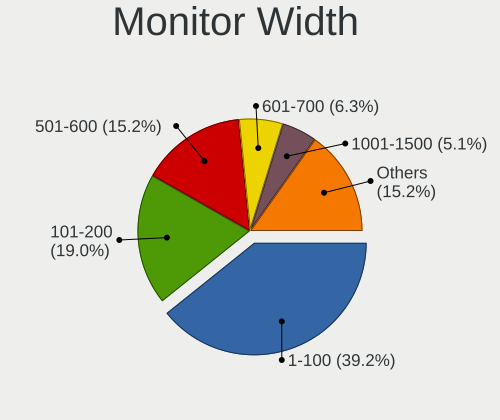

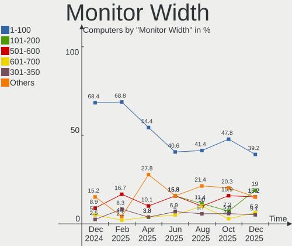

| Width in mm | Computers | Percent |
|-------------|-----------|---------|
| 1-100       | 31        | 39.24%  |
| 101-200     | 15        | 18.99%  |
| 501-600     | 12        | 15.19%  |
| 601-700     | 5         | 6.33%   |
| 301-350     | 4         | 5.06%   |
| 1001-1500   | 4         | 5.06%   |
| Unknown     | 3         | 3.8%    |
| 801-900     | 2         | 2.53%   |
| 401-500     | 2         | 2.53%   |
| 351-400     | 1         | 1.27%   |

Aspect Ratio
------------

Proportional relationship between the width and the height

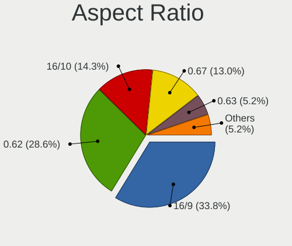

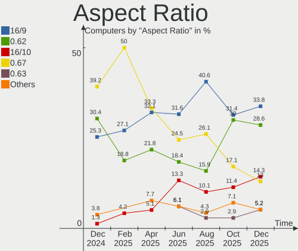

| Ratio | Computers | Percent |
|-------|-----------|---------|
| 16/9  | 26        | 33.77%  |
| 0.62  | 22        | 28.57%  |
| 16/10 | 11        | 14.29%  |
| 0.67  | 10        | 12.99%  |
| 0.63  | 4         | 5.19%   |
| 21/9  | 2         | 2.6%    |
| 32/9  | 1         | 1.3%    |
| 0.56  | 1         | 1.3%    |

Monitor Area
------------

Area in inch²

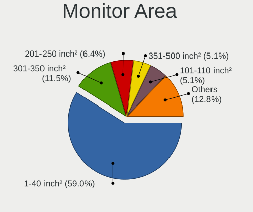

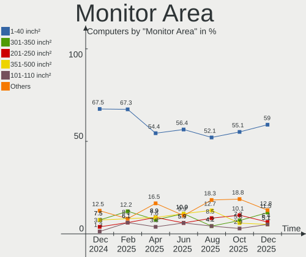

| Area in inch² | Computers | Percent |
|----------------|-----------|---------|
| 1-40           | 46        | 58.97%  |
| 301-350        | 9         | 11.54%  |
| 201-250        | 5         | 6.41%   |
| 351-500        | 4         | 5.13%   |
| 101-110        | 4         | 5.13%   |
| More than 1000 | 3         | 3.85%   |
| Unknown        | 3         | 3.85%   |
| 501-1000       | 2         | 2.56%   |
| 151-200        | 1         | 1.28%   |
| 121-130        | 1         | 1.28%   |

Pixel Density
-------------

Pixels per inch

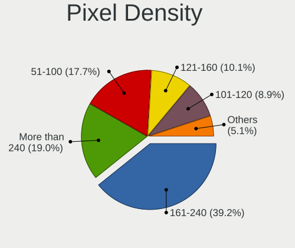

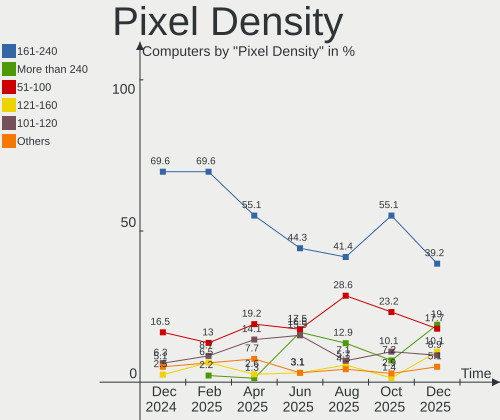

| Density       | Computers | Percent |
|---------------|-----------|---------|
| 161-240       | 31        | 39.24%  |
| More than 240 | 15        | 18.99%  |
| 51-100        | 14        | 17.72%  |
| 121-160       | 8         | 10.13%  |
| 101-120       | 7         | 8.86%   |
| Unknown       | 3         | 3.8%    |
| 1-50          | 1         | 1.27%   |

Multiple Monitors
-----------------

Total monitors connected

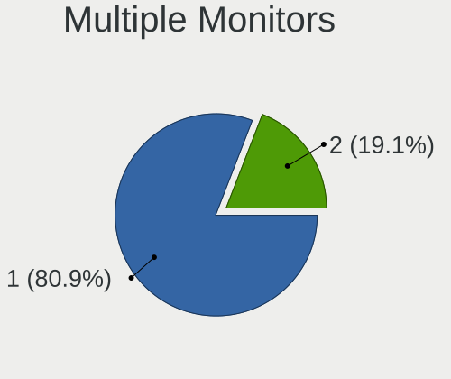

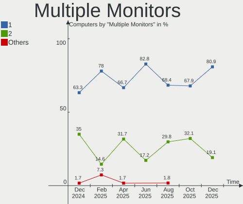

| Total | Computers | Percent |
|-------|-----------|---------|
| 1     | 55        | 80.88%  |
| 2     | 13        | 19.12%  |

Network
-------

Net Controller Vendor
---------------------

Controller vendors

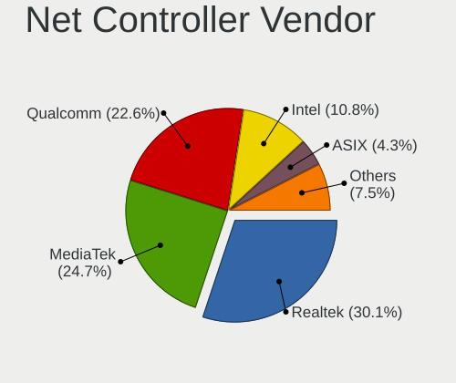

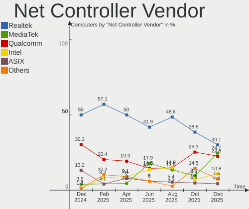

| Vendor                | Computers | Percent |
|-----------------------|-----------|---------|
| Realtek Semiconductor | 28        | 30.11%  |
| MediaTek              | 23        | 24.73%  |
| Qualcomm              | 21        | 22.58%  |
| Intel                 | 10        | 10.75%  |
| ASIX Electronics      | 4         | 4.3%    |
| TP-Link               | 2         | 2.15%   |
| Samsung Electronics   | 1         | 1.08%   |
| Realtek               | 1         | 1.08%   |
| QinHeng Electronics   | 1         | 1.08%   |
| DisplayLink           | 1         | 1.08%   |
| Broadcom              | 1         | 1.08%   |

Net Controller Model
--------------------

Controller models

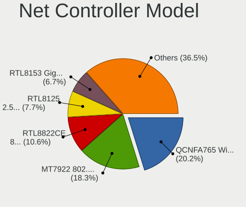

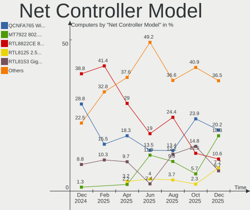

| Model                                                                           | Computers | Percent |
|---------------------------------------------------------------------------------|-----------|---------|
| Qualcomm QCNFA765 Wireless Network Adapter                                      | 21        | 20.19%  |
| MediaTek MT7922 802.11ax PCI Express Wireless Network Adapter                   | 19        | 18.27%  |
| Realtek RTL8822CE 802.11ac PCIe Wireless Network Adapter                        | 11        | 10.58%  |
| Realtek RTL8125 2.5GbE Controller                                               | 8         | 7.69%   |
| Realtek RTL8153 Gigabit Ethernet Adapter                                        | 7         | 6.73%   |
| Realtek RTL8111/8168/8211/8411 PCI Express Gigabit Ethernet Controller          | 7         | 6.73%   |
| ASIX AX88179 Gigabit Ethernet                                                   | 4         | 3.85%   |
| Intel Ethernet Controller I226-V                                                | 3         | 2.88%   |
| MediaTek MT7921 802.11ax PCIe Wireless Network Adapter [Filogic 330]            | 2         | 1.92%   |
| Intel Wi-Fi 6E(802.11ax) AX210/AX1675* 2x2 [Typhoon Peak]                       | 2         | 1.92%   |
| Intel Wi-Fi 6 AX200                                                             | 2         | 1.92%   |
| TP-Link TL-WN823N v2/v3 [Realtek RTL8192EU]                                     | 1         | 0.96%   |
| TP-Link Archer T2U PLUS [RTL8821AU]                                             | 1         | 0.96%   |
| Samsung Galaxy series, misc. (tethering mode)                                   | 1         | 0.96%   |
| Realtek RTL8922AE 802.11be PCIe Wireless Network Adapter                        | 1         | 0.96%   |
| Realtek RTL8188EUS 802.11n Wireless Network Adapter                             | 1         | 0.96%   |
| Realtek RTL8152 Fast Ethernet Adapter                                           | 1         | 0.96%   |
| Realtek 802.11ac NIC                                                            | 1         | 0.96%   |
| Realtek 802.11ax WLAN Adapter                                                   | 1         | 0.96%   |
| QinHeng JIGUANG ARGB V2                                                         | 1         | 0.96%   |
| MediaTek MT7925 802.11be 160MHz 2x2 PCIe Wireless Network Adapter [Filogic 360] | 1         | 0.96%   |
| MediaTek MT7925 (RZ717) Wi-Fi 7 160MHz                                          | 1         | 0.96%   |
| Intel Wireless 8260                                                             | 1         | 0.96%   |
| Intel Ethernet Controller I225-V                                                | 1         | 0.96%   |
| Intel Ethernet Connection I219-LM                                               | 1         | 0.96%   |
| Intel Cannon Lake PCH CNVi WiFi                                                 | 1         | 0.96%   |
| Intel Alder Lake-S PCH CNVi WiFi                                                | 1         | 0.96%   |
| DisplayLink Plugable UD-3900Z                                                   | 1         | 0.96%   |
| Broadcom BCM4352 802.11ac Dual Band Wireless Network Adapter                    | 1         | 0.96%   |

Wireless Vendor
---------------

Wireless vendors

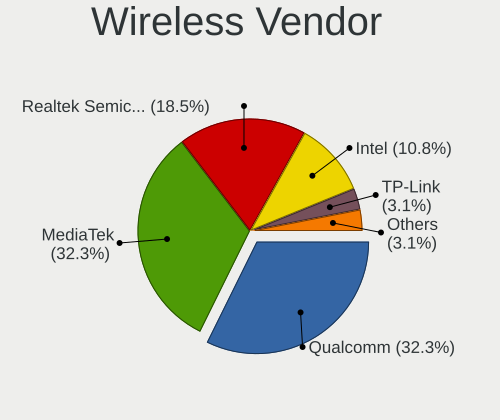

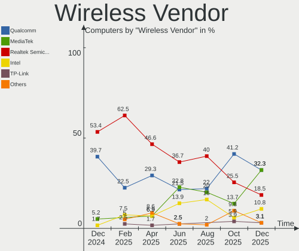

| Vendor                | Computers | Percent |
|-----------------------|-----------|---------|
| Qualcomm              | 21        | 32.31%  |
| MediaTek              | 21        | 32.31%  |
| Realtek Semiconductor | 12        | 18.46%  |
| Intel                 | 7         | 10.77%  |
| TP-Link               | 2         | 3.08%   |
| Realtek               | 1         | 1.54%   |
| Broadcom              | 1         | 1.54%   |

Wireless Model
--------------

Wireless models

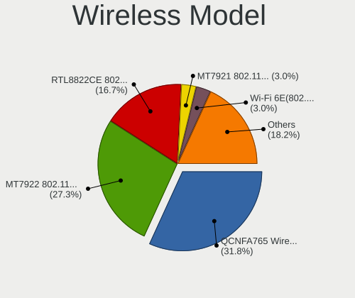

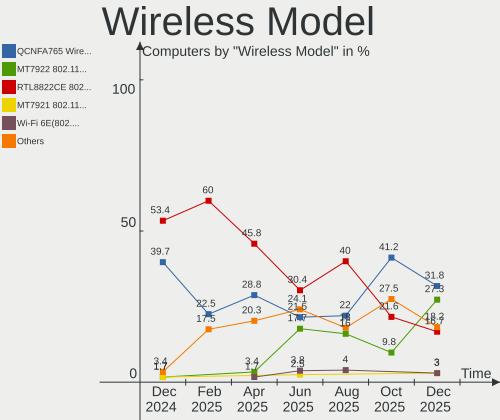

| Model                                                                | Computers | Percent |
|----------------------------------------------------------------------|-----------|---------|
| Qualcomm QCNFA765 Wireless Network Adapter                           | 21        | 31.82%  |
| MediaTek MT7922 802.11ax PCI Express Wireless Network Adapter        | 18        | 27.27%  |
| Realtek RTL8822CE 802.11ac PCIe Wireless Network Adapter             | 11        | 16.67%  |
| MediaTek MT7921 802.11ax PCIe Wireless Network Adapter [Filogic 330] | 2         | 3.03%   |
| Intel Wi-Fi 6E(802.11ax) AX210/AX1675* 2x2 [Typhoon Peak]            | 2         | 3.03%   |
| Intel Wi-Fi 6 AX200                                                  | 2         | 3.03%   |
| TP-Link TL-WN823N v2/v3 [Realtek RTL8192EU]                          | 1         | 1.52%   |
| TP-Link Archer T2U PLUS [RTL8821AU]                                  | 1         | 1.52%   |
| Realtek RTL8188EUS 802.11n Wireless Network Adapter                  | 1         | 1.52%   |
| Realtek 802.11ac NIC                                                 | 1         | 1.52%   |
| Realtek 802.11ax WLAN Adapter                                        | 1         | 1.52%   |
| MediaTek MT7925 (RZ717) Wi-Fi 7 160MHz                               | 1         | 1.52%   |
| Intel Wireless 8260                                                  | 1         | 1.52%   |
| Intel Cannon Lake PCH CNVi WiFi                                      | 1         | 1.52%   |
| Intel Alder Lake-S PCH CNVi WiFi                                     | 1         | 1.52%   |
| Broadcom BCM4352 802.11ac Dual Band Wireless Network Adapter         | 1         | 1.52%   |

Ethernet Vendor
---------------

Ethernet vendors

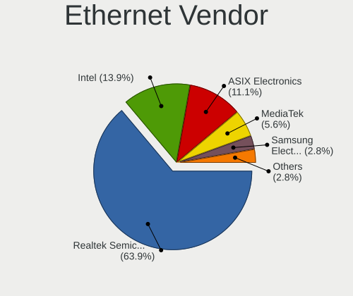

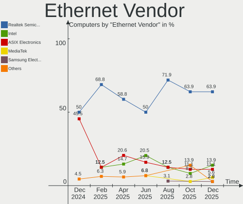

| Vendor                | Computers | Percent |
|-----------------------|-----------|---------|
| Realtek Semiconductor | 23        | 63.89%  |
| Intel                 | 5         | 13.89%  |
| ASIX Electronics      | 4         | 11.11%  |
| MediaTek              | 2         | 5.56%   |
| Samsung Electronics   | 1         | 2.78%   |
| DisplayLink           | 1         | 2.78%   |

Ethernet Model
--------------

Ethernet models

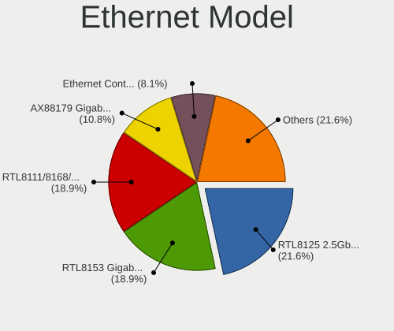

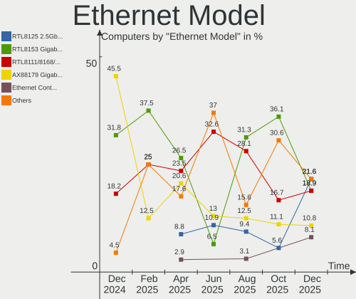

| Model                                                                           | Computers | Percent |
|---------------------------------------------------------------------------------|-----------|---------|
| Realtek RTL8125 2.5GbE Controller                                               | 8         | 21.62%  |
| Realtek RTL8153 Gigabit Ethernet Adapter                                        | 7         | 18.92%  |
| Realtek RTL8111/8168/8211/8411 PCI Express Gigabit Ethernet Controller          | 7         | 18.92%  |
| ASIX AX88179 Gigabit Ethernet                                                   | 4         | 10.81%  |
| Intel Ethernet Controller I226-V                                                | 3         | 8.11%   |
| Samsung Galaxy series, misc. (tethering mode)                                   | 1         | 2.7%    |
| Realtek RTL8922AE 802.11be PCIe Wireless Network Adapter                        | 1         | 2.7%    |
| Realtek RTL8152 Fast Ethernet Adapter                                           | 1         | 2.7%    |
| MediaTek MT7925 802.11be 160MHz 2x2 PCIe Wireless Network Adapter [Filogic 360] | 1         | 2.7%    |
| MediaTek MT7922 802.11ax PCI Express Wireless Network Adapter                   | 1         | 2.7%    |
| Intel Ethernet Controller I225-V                                                | 1         | 2.7%    |
| Intel Ethernet Connection I219-LM                                               | 1         | 2.7%    |
| DisplayLink Plugable UD-3900Z                                                   | 1         | 2.7%    |

Net Controller Kind
-------------------

Ethernet, WiFi or modem

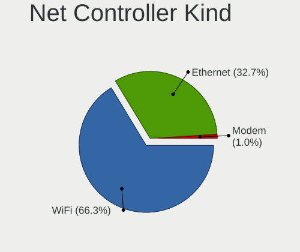

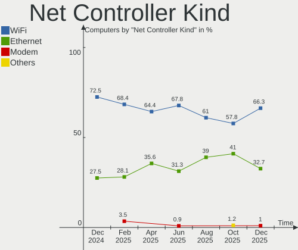

| Kind     | Computers | Percent |
|----------|-----------|---------|
| WiFi     | 65        | 66.33%  |
| Ethernet | 32        | 32.65%  |
| Modem    | 1         | 1.02%   |

Used Controller
---------------

Currently used network controller

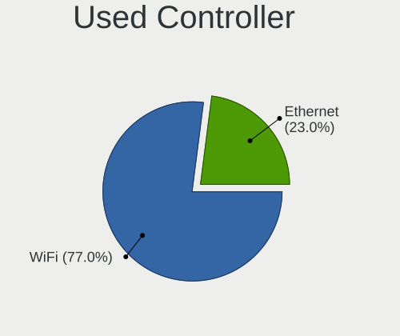

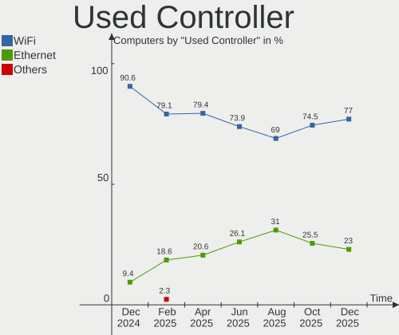

| Kind     | Computers | Percent |
|----------|-----------|---------|
| WiFi     | 57        | 77.03%  |
| Ethernet | 17        | 22.97%  |

NICs
----

Total network controllers on board

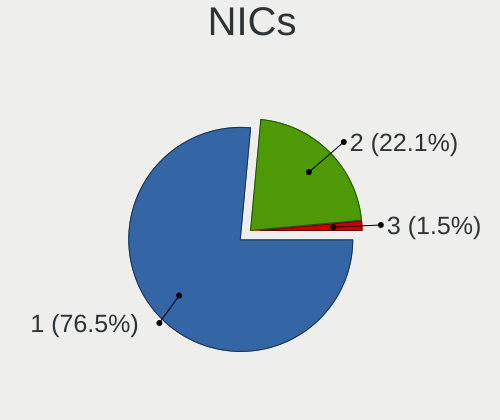

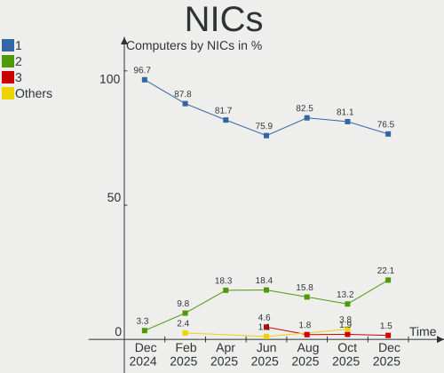

| Total | Computers | Percent |
|-------|-----------|---------|
| 1     | 52        | 76.47%  |
| 2     | 15        | 22.06%  |
| 3     | 1         | 1.47%   |

IPv6
----

IPv6 vs IPv4

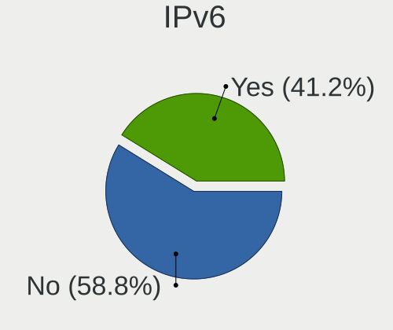

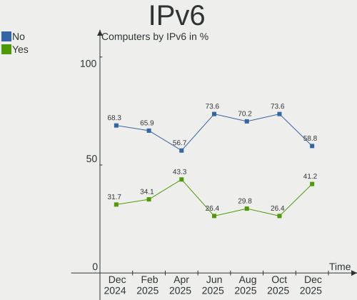

| Used | Computers | Percent |
|------|-----------|---------|
| No   | 40        | 58.82%  |
| Yes  | 28        | 41.18%  |

Bluetooth
---------

Bluetooth Vendor
----------------

Controller vendors

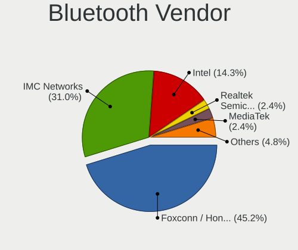

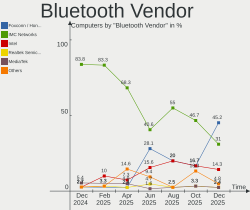

| Vendor                | Computers | Percent |
|-----------------------|-----------|---------|
| Foxconn / Hon Hai     | 19        | 45.24%  |
| IMC Networks          | 13        | 30.95%  |
| Intel                 | 6         | 14.29%  |
| Realtek Semiconductor | 1         | 2.38%   |
| MediaTek              | 1         | 2.38%   |
| Lite-On Technology    | 1         | 2.38%   |
| ASUSTek Computer      | 1         | 2.38%   |

Bluetooth Model
---------------

Controller models

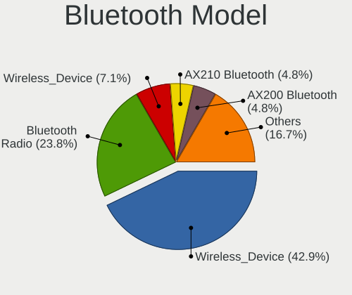

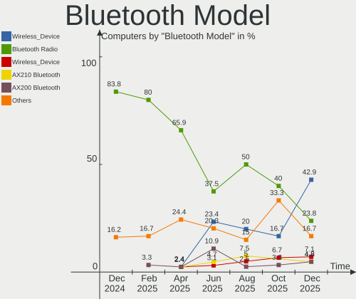

| Model                                       | Computers | Percent |
|---------------------------------------------|-----------|---------|
| Foxconn / Hon Hai Wireless_Device           | 18        | 42.86%  |
| IMC Networks Bluetooth Radio                | 10        | 23.81%  |
| IMC Networks Wireless_Device                | 3         | 7.14%   |
| Intel AX210 Bluetooth                       | 2         | 4.76%   |
| Intel AX200 Bluetooth                       | 2         | 4.76%   |
| Realtek Bluetooth Radio                     | 1         | 2.38%   |
| MediaTek Wireless_Device                    | 1         | 2.38%   |
| Lite-On Bluetooth Radio                     | 1         | 2.38%   |
| Intel Bluetooth wireless interface          | 1         | 2.38%   |
| Intel AX201 Bluetooth                       | 1         | 2.38%   |
| Foxconn / Hon Hai MediaTek MT7921 Bluetooth | 1         | 2.38%   |
| ASUS Broadcom BCM20702A0 Bluetooth          | 1         | 2.38%   |

Sound
-----

Sound Vendor
------------

Sound card vendors

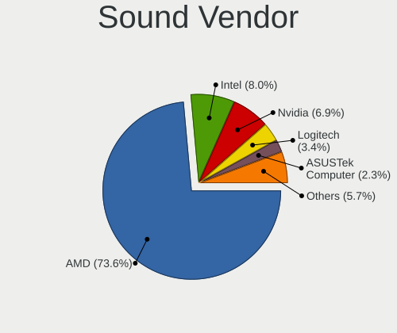

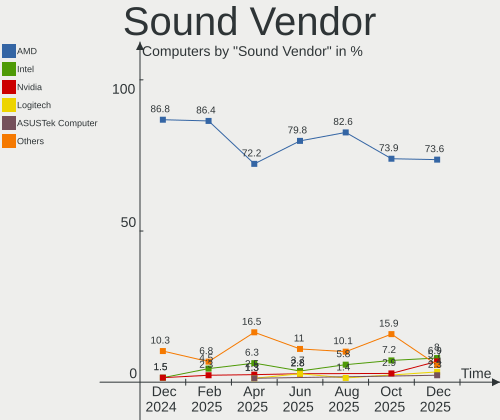

| Vendor                   | Computers | Percent |
|--------------------------|-----------|---------|
| AMD                      | 64        | 73.56%  |
| Intel                    | 7         | 8.05%   |
| Nvidia                   | 6         | 6.9%    |
| Logitech                 | 3         | 3.45%   |
| ASUSTek Computer         | 2         | 2.3%    |
| Silicon Motion           | 1         | 1.15%   |
| Realtek Semiconductor    | 1         | 1.15%   |
| Micro Star International | 1         | 1.15%   |
| Hewlett-Packard          | 1         | 1.15%   |
| C-Media Electronics      | 1         | 1.15%   |

Sound Model
-----------

Sound card models

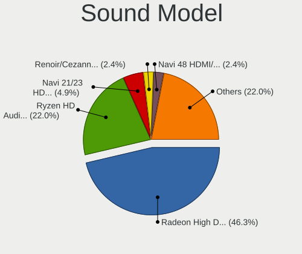

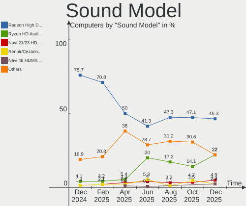

| Model                                                               | Computers | Percent |
|---------------------------------------------------------------------|-----------|---------|
| AMD Radeon High Definition Audio Controller                         | 57        | 46.34%  |
| AMD Ryzen HD Audio Controller                                       | 27        | 21.95%  |
| AMD Navi 21/23 HDMI/DP Audio Controller                             | 6         | 4.88%   |
| AMD Renoir/Cezanne HDMI/DP Audio Controller                         | 3         | 2.44%   |
| AMD Navi 48 HDMI/DP Audio Controller                                | 3         | 2.44%   |
| Nvidia TU107 GeForce GTX 1650 High Definition Audio Controller      | 2         | 1.63%   |
| ASUSTek Computer USB Audio                                          | 2         | 1.63%   |
| AMD Navi 31 HDMI/DP Audio                                           | 2         | 1.63%   |
| Silicon Motion SMI USB Display                                      | 1         | 0.81%   |
| Realtek Semiconductor USB Audio                                     | 1         | 0.81%   |
| Nvidia GP104 High Definition Audio Controller                       | 1         | 0.81%   |
| Nvidia GB206 High Definition Audio Controller                       | 1         | 0.81%   |
| Nvidia GB205 High Definition Audio Controller                       | 1         | 0.81%   |
| Nvidia GA104 High Definition Audio Controller                       | 1         | 0.81%   |
| Micro Star International USB Audio                                  | 1         | 0.81%   |
| Logitech USB Headset                                                | 1         | 0.81%   |
| Logitech G733 Gaming Headset                                        | 1         | 0.81%   |
| Logitech Blue Microphones                                           | 1         | 0.81%   |
| Intel Xeon E3-1200 v3/4th Gen Core Processor HD Audio Controller    | 1         | 0.81%   |
| Intel Sunrise Point-LP HD Audio                                     | 1         | 0.81%   |
| Intel Cannon Lake PCH cAVS                                          | 1         | 0.81%   |
| Intel C610/X99 series chipset HD Audio Controller                   | 1         | 0.81%   |
| Intel Alder Lake-S HD Audio Controller                              | 1         | 0.81%   |
| Intel 8 Series/C220 Series Chipset High Definition Audio Controller | 1         | 0.81%   |
| Intel 200 Series PCH HD Audio                                       | 1         | 0.81%   |
| Intel 100 Series/C230 Series Chipset Family HD Audio Controller     | 1         | 0.81%   |
| Hewlett-Packard USB Audio                                           | 1         | 0.81%   |
| C-Media Electronics Auna Mic CM900                                  | 1         | 0.81%   |
| AMD Starship/Matisse HD Audio Controller                            | 1         | 0.81%   |

Memory
------

Memory Vendor
-------------

Memory module vendors

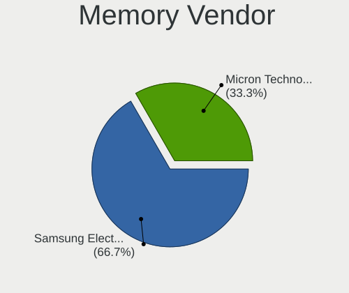

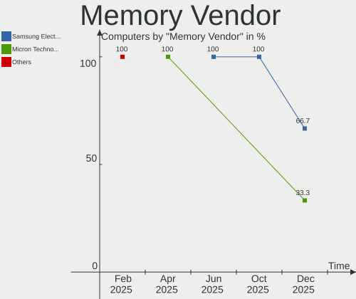

| Vendor              | Computers | Percent |
|---------------------|-----------|---------|
| Samsung Electronics | 2         | 66.67%  |
| Micron Technology   | 1         | 33.33%  |

Memory Model
------------

Memory module models

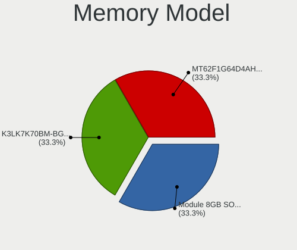

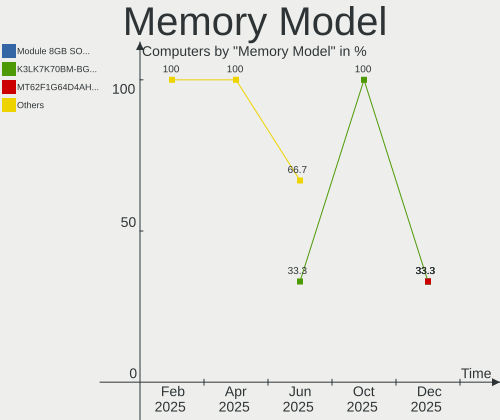

| Model                                                      | Computers | Percent |
|------------------------------------------------------------|-----------|---------|
| Samsung RAM Module 8GB SODIMM DDR4 2133MT/s                | 1         | 33.33%  |
| Samsung RAM K3LK7K70BM-BGCP000 4GiB SODIMM LPDDR5 4266MT/s | 1         | 33.33%  |
| Micron RAM MT62F1G64D4AH-023 WT 4GB SODIMM LPDDR5 4266MT/s | 1         | 33.33%  |

Memory Kind
-----------

Memory module kinds

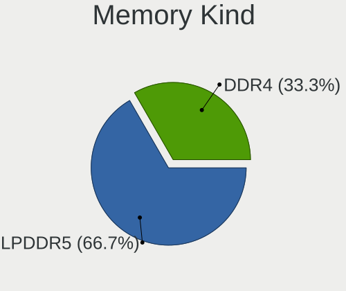

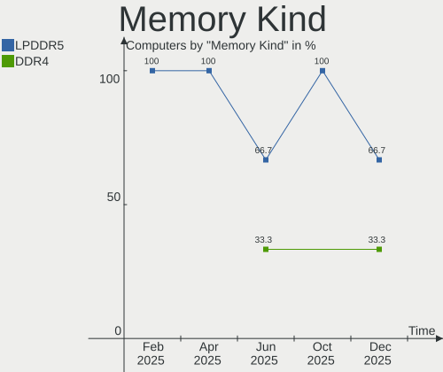

| Kind   | Computers | Percent |
|--------|-----------|---------|
| LPDDR5 | 2         | 66.67%  |
| DDR4   | 1         | 33.33%  |

Memory Form Factor
------------------

Physical design of the memory module

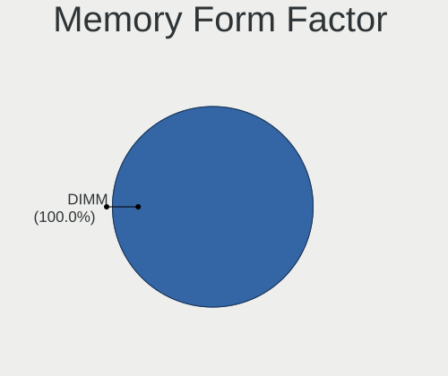

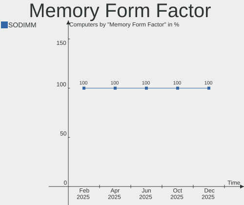

| Name   | Computers | Percent |
|--------|-----------|---------|
| SODIMM | 3         | 100%    |

Memory Size
-----------

Memory module size

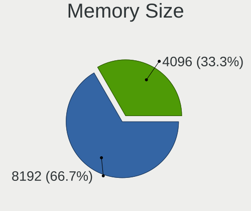

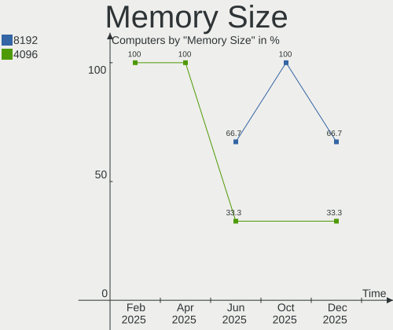

| Size | Computers | Percent |
|------|-----------|---------|
| 8192 | 2         | 66.67%  |
| 4096 | 1         | 33.33%  |

Memory Speed
------------

Memory module speed

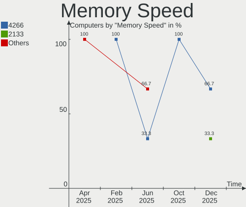

| Speed | Computers | Percent |
|-------|-----------|---------|
| 4266  | 2         | 66.67%  |
| 2133  | 1         | 33.33%  |

Printers & scanners
-------------------

Printer Vendor
--------------

Printer device vendors

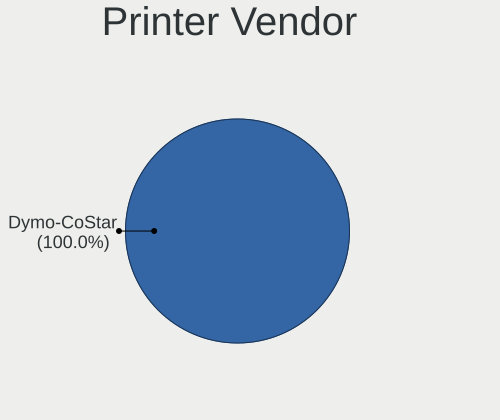

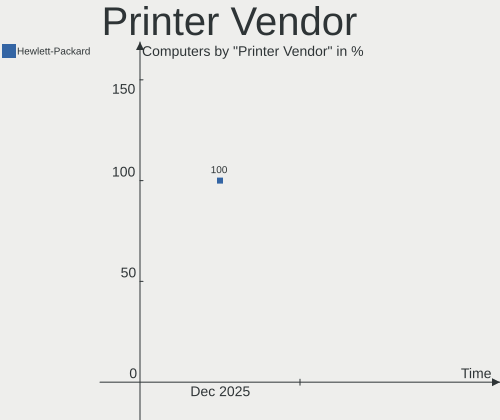

| Vendor          | Computers | Percent |
|-----------------|-----------|---------|
| Hewlett-Packard | 1         | 100%    |

Printer Model
-------------

Printer device models

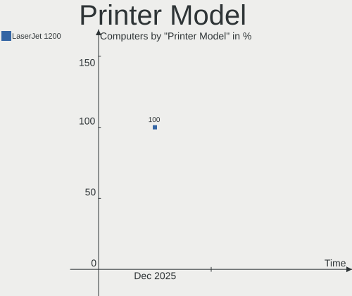

| Model            | Computers | Percent |
|------------------|-----------|---------|
| HP LaserJet 1200 | 1         | 100%    |

Scanner Vendor
--------------

Scanner device vendors

Zero info for selected period =(

Scanner Model
-------------

Scanner device models

Zero info for selected period =(

Camera
------

Camera Vendor
-------------

Camera device vendors

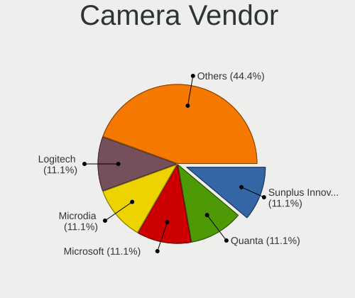

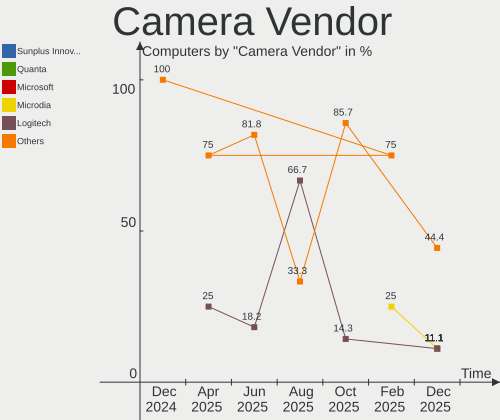

| Vendor                                 | Computers | Percent |
|----------------------------------------|-----------|---------|
| Sunplus Innovation Technology          | 1         | 11.11%  |
| Quanta                                 | 1         | 11.11%  |
| Microsoft                              | 1         | 11.11%  |
| Microdia                               | 1         | 11.11%  |
| Logitech                               | 1         | 11.11%  |
| IMC Networks                           | 1         | 11.11%  |
| Chicony Electronics                    | 1         | 11.11%  |
| Cheng Uei Precision Industry (Foxlink) | 1         | 11.11%  |
| Apple                                  | 1         | 11.11%  |

Camera Model
------------

Camera device models

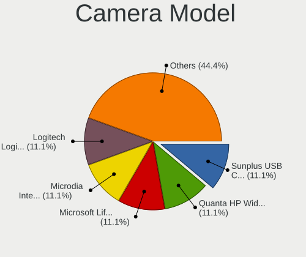

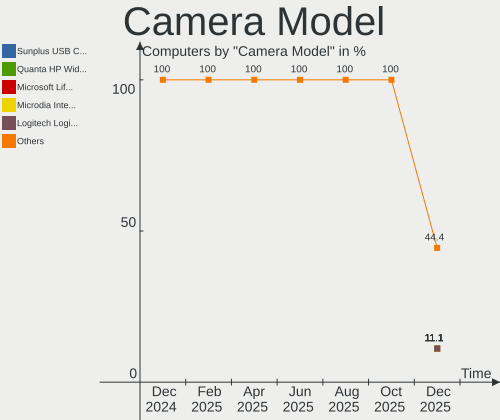

| Model                                               | Computers | Percent |
|-----------------------------------------------------|-----------|---------|
| Sunplus USB Camera                                  | 1         | 11.11%  |
| Quanta HP Wide Vision HD Camera                     | 1         | 11.11%  |
| Microsoft LifeCam Cinema                            | 1         | 11.11%  |
| Microdia Integrated_Webcam_HD                       | 1         | 11.11%  |
| Logitech Logitech Webcam C925e                      | 1         | 11.11%  |
| IMC Networks USB2.0 HD UVC WebCam                   | 1         | 11.11%  |
| Chicony HP Wide Vision HD Camera                    | 1         | 11.11%  |
| Cheng Uei Precision Industry (Foxlink) HP HD Camera | 1         | 11.11%  |
| Apple iPhone 5/5C/5S/6/SE/7/8/X                     | 1         | 11.11%  |

Security
--------

Fingerprint Vendor
------------------

Fingerprint sensor vendors

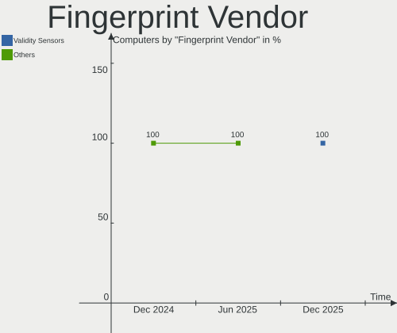

| Vendor           | Computers | Percent |
|------------------|-----------|---------|
| Validity Sensors | 1         | 100%    |

Fingerprint Model
-----------------

Fingerprint sensor models

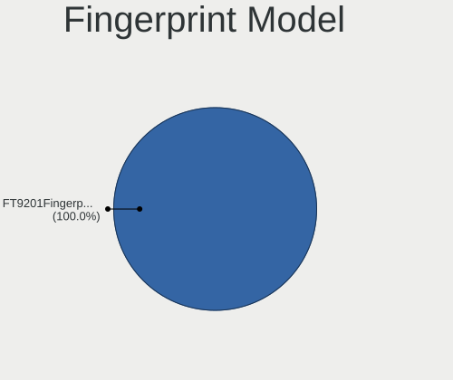

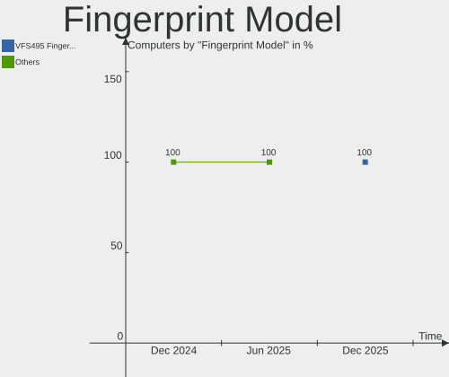

| Model                                      | Computers | Percent |
|--------------------------------------------|-----------|---------|
| Validity Sensors VFS495 Fingerprint Reader | 1         | 100%    |

Chipcard Vendor
---------------

Chipcard module vendors

Zero info for selected period =(

Chipcard Model
--------------

Chipcard module models

Zero info for selected period =(

Unsupported
-----------

Unsupported Devices
-------------------

Total unsupported devices on board

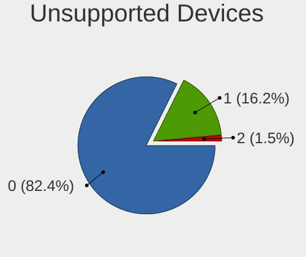

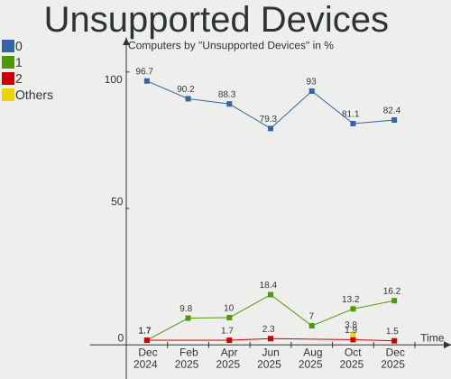

| Total | Computers | Percent |
|-------|-----------|---------|
| 0     | 56        | 82.35%  |
| 1     | 11        | 16.18%  |
| 2     | 1         | 1.47%   |

Unsupported Device Types
------------------------

Types of unsupported devices

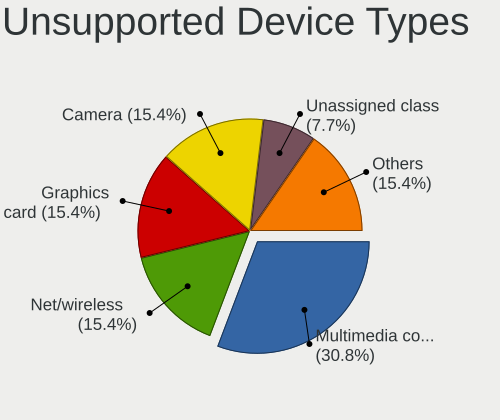

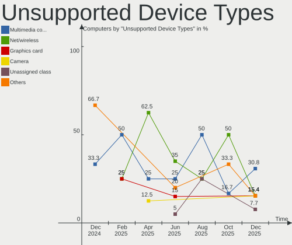

| Type                  | Computers | Percent |
|-----------------------|-----------|---------|
| Multimedia controller | 4         | 30.77%  |
| Net/wireless          | 2         | 15.38%  |
| Graphics card         | 2         | 15.38%  |
| Camera                | 2         | 15.38%  |
| Unassigned class      | 1         | 7.69%   |
| Network               | 1         | 7.69%   |
| Fingerprint reader    | 1         | 7.69%   |

