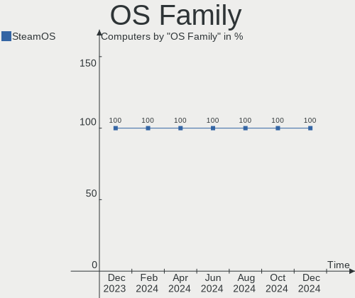
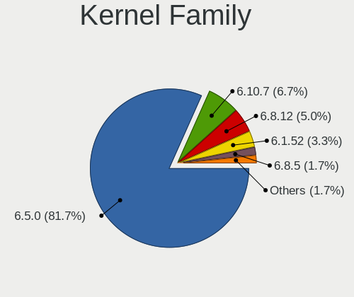
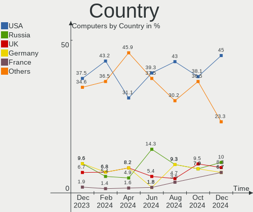
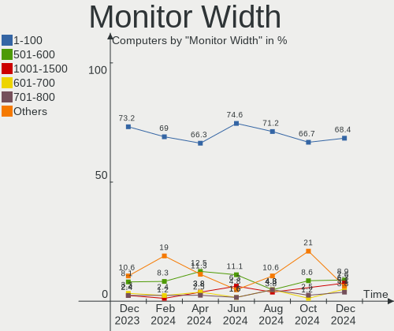
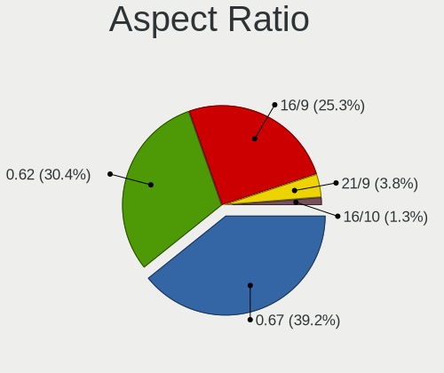
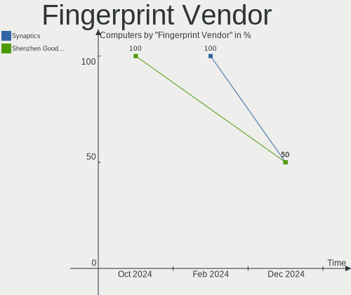
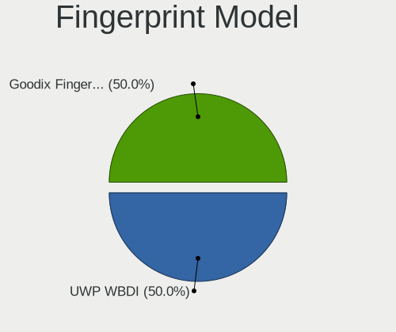
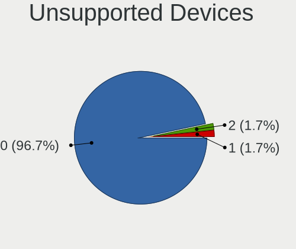

SteamOS - Hardware Trends
-------------------------

A project to identify most popular hardware characteristics and track their change
over time based on data collected by Linux users at https://Linux-Hardware.org.

Anyone can contribute to this report by the [hw-probe](https://github.com/linuxhw/hw-probe) tool:

    sudo -E hw-probe -all -upload

This is a report for all computer types. See also reports for [desktops](/Dist/SteamOS/Desktop/README.md) and [notebooks](/Dist/SteamOS/Notebook/README.md).

This report is for one last month. Overall report since the beginning of time: [TestDays](https://github.com/linuxhw/TestDays)

Period: Dec, 2024.

Contents
--------

* [ System ](#system)
  - [ OS                       ](#os)
  - [ OS Family                ](#os-family)
  - [ Kernel                   ](#kernel)
  - [ Kernel Family            ](#kernel-family)
  - [ Kernel Major Ver.        ](#kernel-major-ver)
  - [ Arch                     ](#arch)
  - [ DE                       ](#de)
  - [ Display Server           ](#display-server)
  - [ Display Manager          ](#display-manager)
  - [ OS Lang                  ](#os-lang)
  - [ Boot Mode                ](#boot-mode)
  - [ Filesystem               ](#filesystem)
  - [ Part. scheme             ](#part-scheme)
  - [ Dual Boot with Linux/BSD ](#dual-boot-with-linuxbsd)
  - [ Dual Boot (Win)          ](#dual-boot-win)

* [ Board ](#board)
  - [ Vendor                   ](#vendor)
  - [ Model                    ](#model)
  - [ Model Family             ](#model-family)
  - [ MFG Year                 ](#mfg-year)
  - [ Form Factor              ](#form-factor)
  - [ Secure Boot              ](#secure-boot)
  - [ Coreboot                 ](#coreboot)
  - [ RAM Size                 ](#ram-size)
  - [ RAM Used                 ](#ram-used)
  - [ Total Drives             ](#total-drives)
  - [ Has CD-ROM               ](#has-cd-rom)
  - [ Has Ethernet             ](#has-ethernet)
  - [ Has WiFi                 ](#has-wifi)
  - [ Has Bluetooth            ](#has-bluetooth)

* [ Location ](#location)
  - [ Country                  ](#country)
  - [ City                     ](#city)

* [ Drives ](#drives)
  - [ Drive Vendor             ](#drive-vendor)
  - [ Drive Model              ](#drive-model)
  - [ HDD Vendor               ](#hdd-vendor)
  - [ SSD Vendor               ](#ssd-vendor)
  - [ Drive Kind               ](#drive-kind)
  - [ Drive Connector          ](#drive-connector)
  - [ Drive Size               ](#drive-size)
  - [ Space Total              ](#space-total)
  - [ Space Used               ](#space-used)
  - [ Malfunc. Drives          ](#malfunc-drives)
  - [ Malfunc. Drive Vendor    ](#malfunc-drive-vendor)
  - [ Malfunc. HDD Vendor      ](#malfunc-hdd-vendor)
  - [ Malfunc. Drive Kind      ](#malfunc-drive-kind)
  - [ Failed Drives            ](#failed-drives)
  - [ Failed Drive Vendor      ](#failed-drive-vendor)
  - [ Drive Status             ](#drive-status)

* [ Storage controller ](#storage-controller)
  - [ Storage Vendor           ](#storage-vendor)
  - [ Storage Model            ](#storage-model)
  - [ Storage Kind             ](#storage-kind)

* [ Processor ](#processor)
  - [ CPU Vendor               ](#cpu-vendor)
  - [ CPU Model                ](#cpu-model)
  - [ CPU Model Family         ](#cpu-model-family)
  - [ CPU Cores                ](#cpu-cores)
  - [ CPU Sockets              ](#cpu-sockets)
  - [ CPU Threads              ](#cpu-threads)
  - [ CPU Op-Modes             ](#cpu-op-modes)
  - [ CPU Microcode            ](#cpu-microcode)
  - [ CPU Microarch            ](#cpu-microarch)

* [ Graphics ](#graphics)
  - [ GPU Vendor               ](#gpu-vendor)
  - [ GPU Model                ](#gpu-model)
  - [ GPU Combo                ](#gpu-combo)
  - [ GPU Driver               ](#gpu-driver)
  - [ GPU Memory               ](#gpu-memory)

* [ Monitor ](#monitor)
  - [ Monitor Vendor           ](#monitor-vendor)
  - [ Monitor Model            ](#monitor-model)
  - [ Monitor Resolution       ](#monitor-resolution)
  - [ Monitor Diagonal         ](#monitor-diagonal)
  - [ Monitor Width            ](#monitor-width)
  - [ Aspect Ratio             ](#aspect-ratio)
  - [ Monitor Area             ](#monitor-area)
  - [ Pixel Density            ](#pixel-density)
  - [ Multiple Monitors        ](#multiple-monitors)

* [ Network ](#network)
  - [ Net Controller Vendor    ](#net-controller-vendor)
  - [ Net Controller Model     ](#net-controller-model)
  - [ Wireless Vendor          ](#wireless-vendor)
  - [ Wireless Model           ](#wireless-model)
  - [ Ethernet Vendor          ](#ethernet-vendor)
  - [ Ethernet Model           ](#ethernet-model)
  - [ Net Controller Kind      ](#net-controller-kind)
  - [ Used Controller          ](#used-controller)
  - [ NICs                     ](#nics)
  - [ IPv6                     ](#ipv6)

* [ Bluetooth ](#bluetooth)
  - [ Bluetooth Vendor         ](#bluetooth-vendor)
  - [ Bluetooth Model          ](#bluetooth-model)

* [ Sound ](#sound)
  - [ Sound Vendor             ](#sound-vendor)
  - [ Sound Model              ](#sound-model)

* [ Memory ](#memory)
  - [ Memory Vendor            ](#memory-vendor)
  - [ Memory Model             ](#memory-model)
  - [ Memory Kind              ](#memory-kind)
  - [ Memory Form Factor       ](#memory-form-factor)
  - [ Memory Size              ](#memory-size)
  - [ Memory Speed             ](#memory-speed)

* [ Printers & scanners ](#printers--scanners)
  - [ Printer Vendor           ](#printer-vendor)
  - [ Printer Model            ](#printer-model)
  - [ Scanner Vendor           ](#scanner-vendor)
  - [ Scanner Model            ](#scanner-model)

* [ Camera ](#camera)
  - [ Camera Vendor            ](#camera-vendor)
  - [ Camera Model             ](#camera-model)

* [ Security ](#security)
  - [ Fingerprint Vendor       ](#fingerprint-vendor)
  - [ Fingerprint Model        ](#fingerprint-model)
  - [ Chipcard Vendor          ](#chipcard-vendor)
  - [ Chipcard Model           ](#chipcard-model)

* [ Unsupported ](#unsupported)
  - [ Unsupported Devices      ](#unsupported-devices)
  - [ Unsupported Device Types ](#unsupported-device-types)

System
------

OS
--

Installed operating systems

| Name                   | Computers | Percent |
|------------------------|-----------|---------|
| SteamOS 3.6.20         | 44        | 73.33%  |
| SteamOS 3.6.21         | 4         | 6.67%   |
| SteamOS 1.6-fixes      | 4         | 6.67%   |
| SteamOS 3.7            | 3         | 5%      |
| SteamOS 3.5.19         | 2         | 3.33%   |
| SteamOS 3.6.9          | 1         | 1.67%   |
| SteamOS 20241225.0928  | 1         | 1.67%   |
| SteamOS 1.5-next-fixes | 1         | 1.67%   |

OS Family
---------

OS without a version

| Name    | Computers | Percent |
|---------|-----------|---------|
| SteamOS | 60        | 100%    |

Kernel
------

Version of the Linux kernel

| Version                                  | Computers | Percent |
|------------------------------------------|-----------|---------|
| 6.5.0-valve22-1-neptune-65-g9a338ed8a75e | 43        | 71.67%  |
| 6.5.0-valve23-1-neptune-65-g385b5e207ae2 | 5         | 8.33%   |
| 6.10.7-1-lljy-g2fd7b345494a              | 4         | 6.67%   |
| 6.8.12-valve7-1-neptune-68-g8c3c3d4f5307 | 3         | 5%      |
| 6.1.52-valve16-1-neptune-61              | 2         | 3.33%   |
| 6.8.5-1-lljy-CFS-gcd11c870c00c           | 1         | 1.67%   |
| 6.5.0-valve16-2-neptune-65-gc9ad4106624e | 1         | 1.67%   |
| 6.12.6-2                                 | 1         | 1.67%   |

Kernel Family
-------------

Linux kernel without a distro release

| Version | Computers | Percent |
|---------|-----------|---------|
| 6.5.0   | 49        | 81.67%  |
| 6.10.7  | 4         | 6.67%   |
| 6.8.12  | 3         | 5%      |
| 6.1.52  | 2         | 3.33%   |
| 6.8.5   | 1         | 1.67%   |
| 6.12.6  | 1         | 1.67%   |

Kernel Major Ver.
-----------------

Linux kernel major version

| Version | Computers | Percent |
|---------|-----------|---------|
| 6.5     | 49        | 81.67%  |
| 6.8     | 4         | 6.67%   |
| 6.10    | 4         | 6.67%   |
| 6.1     | 2         | 3.33%   |
| 6.12    | 1         | 1.67%   |

Arch
----

OS architecture (x86_64, i586, etc.)

| Name   | Computers | Percent |
|--------|-----------|---------|
| x86_64 | 60        | 100%    |

DE
--

Desktop Environment

| Name | Computers | Percent |
|------|-----------|---------|
| KDE5 | 57        | 95%     |
| KDE6 | 3         | 5%      |

Display Server
--------------

X11 or Wayland

| Name | Computers | Percent |
|------|-----------|---------|
| X11  | 60        | 100%    |

Display Manager
---------------

SDDM, LightDM, etc.

| Name    | Computers | Percent |
|---------|-----------|---------|
| Unknown | 60        | 100%    |

OS Lang
-------

Language

| Lang  | Computers | Percent |
|-------|-----------|---------|
| en_US | 48        | 80%     |
| ru_RU | 3         | 5%      |
| de_DE | 3         | 5%      |
| C     | 3         | 5%      |
| fr_FR | 2         | 3.33%   |
| en_GB | 1         | 1.67%   |

Boot Mode
---------

EFI or BIOS

| Mode | Computers | Percent |
|------|-----------|---------|
| BIOS | 60        | 100%    |

Filesystem
----------

Type of filesystem

| Type  | Computers | Percent |
|-------|-----------|---------|
| Btrfs | 60        | 100%    |

Part. scheme
------------

Scheme of partitioning

| Type    | Computers | Percent |
|---------|-----------|---------|
| Unknown | 60        | 100%    |

Dual Boot with Linux/BSD
------------------------

Hosting more than one Linux/BSD

| Dual boot | Computers | Percent |
|-----------|-----------|---------|
| No        | 60        | 100%    |

Dual Boot (Win)
---------------

Hosting Linux and Windows

| Dual boot | Computers | Percent |
|-----------|-----------|---------|
| No        | 60        | 100%    |

Board
-----

Vendor
------

Motherboard manufacturer

| Name             | Computers | Percent |
|------------------|-----------|---------|
| Valve            | 54        | 90%     |
| ASUSTek Computer | 2         | 3.33%   |
| MSI              | 1         | 1.67%   |
| Lenovo           | 1         | 1.67%   |
| Hewlett-Packard  | 1         | 1.67%   |
| AYANEO           | 1         | 1.67%   |

Model
-----

Motherboard model

| Name                                  | Computers | Percent |
|---------------------------------------|-----------|---------|
| Valve Jupiter                         | 31        | 51.67%  |
| Valve Galileo                         | 23        | 38.33%  |
| MSI Katana A15 AI B8VE                | 1         | 1.67%   |
| Lenovo K14 Gen 1 21CUS0DF00           | 1         | 1.67%   |
| HP Spectre x360 Convertible 13-aw0xxx | 1         | 1.67%   |
| AYANEO 2                              | 1         | 1.67%   |
| ASUS PRIME B450-PLUS                  | 1         | 1.67%   |
| ASUS PRIME B350-PLUS                  | 1         | 1.67%   |

Model Family
------------

Motherboard model prefix

| Name          | Computers | Percent |
|---------------|-----------|---------|
| Valve Jupiter | 31        | 51.67%  |
| Valve Galileo | 23        | 38.33%  |
| ASUS PRIME    | 2         | 3.33%   |
| MSI Katana    | 1         | 1.67%   |
| Lenovo K14    | 1         | 1.67%   |
| HP Spectre    | 1         | 1.67%   |
| AYANEO 2      | 1         | 1.67%   |

MFG Year
--------

Motherboard manufacture year

| Year | Computers | Percent |
|------|-----------|---------|
| 2024 | 44        | 73.33%  |
| 2023 | 12        | 20%     |
| 2022 | 1         | 1.67%   |
| 2019 | 1         | 1.67%   |
| 2018 | 1         | 1.67%   |
| 2017 | 1         | 1.67%   |

Form Factor
-----------

Physical design of the computer

| Name        | Computers | Percent |
|-------------|-----------|---------|
| Notebook    | 56        | 93.33%  |
| Desktop     | 2         | 3.33%   |
| Tablet      | 1         | 1.67%   |
| Convertible | 1         | 1.67%   |

Secure Boot
-----------

Enabled or disabled

| State    | Computers | Percent |
|----------|-----------|---------|
| Disabled | 60        | 100%    |

Coreboot
--------

Have coreboot on board

| Used | Computers | Percent |
|------|-----------|---------|
| No   | 60        | 100%    |

RAM Size
--------

Total RAM memory

| Size in GB | Computers | Percent |
|------------|-----------|---------|
| 8.01-16.0  | 55        | 91.67%  |
| 4.01-8.0   | 2         | 3.33%   |
| 32.01-64.0 | 1         | 1.67%   |
| 24.01-32.0 | 1         | 1.67%   |
| 16.01-24.0 | 1         | 1.67%   |

RAM Used
--------

Used RAM memory

| Used GB   | Computers | Percent |
|-----------|-----------|---------|
| 4.01-8.0  | 37        | 61.67%  |
| 3.01-4.0  | 19        | 31.67%  |
| 2.01-3.0  | 2         | 3.33%   |
| 8.01-16.0 | 2         | 3.33%   |

Total Drives
------------

Number of drives on board

| Drives | Computers | Percent |
|--------|-----------|---------|
| 2      | 31        | 51.67%  |
| 1      | 26        | 43.33%  |
| 5      | 1         | 1.67%   |
| 4      | 1         | 1.67%   |
| 3      | 1         | 1.67%   |

Has CD-ROM
----------

Has CD-ROM on board

| Presented | Computers | Percent |
|-----------|-----------|---------|
| No        | 56        | 93.33%  |
| Yes       | 4         | 6.67%   |

Has Ethernet
------------

Has Ethernet on board

| Presented | Computers | Percent |
|-----------|-----------|---------|
| No        | 38        | 63.33%  |
| Yes       | 22        | 36.67%  |

Has WiFi
--------

Has WiFi module

| Presented | Computers | Percent |
|-----------|-----------|---------|
| Yes       | 58        | 96.67%  |
| No        | 2         | 3.33%   |

Has Bluetooth
-------------

Has Bluetooth module

| Presented | Computers | Percent |
|-----------|-----------|---------|
| Yes       | 36        | 60%     |
| No        | 24        | 40%     |

Location
--------

Country
-------

Geographic location (country)

| Country     | Computers | Percent |
|-------------|-----------|---------|
| USA         | 27        | 45%     |
| Russia      | 6         | 10%     |
| UK          | 5         | 8.33%   |
| Germany     | 4         | 6.67%   |
| France      | 4         | 6.67%   |
| Canada      | 3         | 5%      |
| Philippines | 2         | 3.33%   |
| Hungary     | 2         | 3.33%   |
| UAE         | 1         | 1.67%   |
| Netherlands | 1         | 1.67%   |
| Myanmar     | 1         | 1.67%   |
| Indonesia   | 1         | 1.67%   |
| Finland     | 1         | 1.67%   |
| Belarus     | 1         | 1.67%   |
| Australia   | 1         | 1.67%   |

City
----

Geographic location (city)

| City                  | Computers | Percent |
|-----------------------|-----------|---------|
| St Petersburg         | 2         | 3.33%   |
| Parkville             | 2         | 3.33%   |
| Yangon                | 1         | 1.67%   |
| Wasilla               | 1         | 1.67%   |
| Versailles            | 1         | 1.67%   |
| Twin Falls            | 1         | 1.67%   |
| Tula                  | 1         | 1.67%   |
| The Bronx             | 1         | 1.67%   |
| Sydney                | 1         | 1.67%   |
| St. Albert            | 1         | 1.67%   |
| South Holland         | 1         | 1.67%   |
| Sotteville-lès-Rouen | 1         | 1.67%   |
| Smolensk              | 1         | 1.67%   |
| Santa Fe              | 1         | 1.67%   |
| San Bruno             | 1         | 1.67%   |
| San Bernardino        | 1         | 1.67%   |
| Reading               | 1         | 1.67%   |
| Purley                | 1         | 1.67%   |
| Polgar                | 1         | 1.67%   |
| Pittsburgh            | 1         | 1.67%   |
| Oklahoma City         | 1         | 1.67%   |
| Nijmegen              | 1         | 1.67%   |
| New Port Richey       | 1         | 1.67%   |
| Moscow                | 1         | 1.67%   |
| Minsk                 | 1         | 1.67%   |
| Miami                 | 1         | 1.67%   |
| Manorville            | 1         | 1.67%   |
| Long Beach            | 1         | 1.67%   |
| Lobnya                | 1         | 1.67%   |
| Lisieux               | 1         | 1.67%   |
| Lima                  | 1         | 1.67%   |
| Las Vegas             | 1         | 1.67%   |
| La Wantzenau          | 1         | 1.67%   |
| Kingston              | 1         | 1.67%   |
| Hildesheim            | 1         | 1.67%   |
| Helsinki              | 1         | 1.67%   |
| Hackney               | 1         | 1.67%   |
| Frankfurt am Main     | 1         | 1.67%   |
| Escondido             | 1         | 1.67%   |
| Edmond                | 1         | 1.67%   |

Drives
------

Drive Vendor
------------

Hard drive vendors

| Vendor                       | Computers | Drives | Percent |
|------------------------------|-----------|--------|---------|
| Unknown                      | 23        | 23     | 23%     |
| Phison Electronics           | 19        | 19     | 19%     |
| Samsung Electronics          | 14        | 14     | 14%     |
| Kingston Technology Company  | 13        | 13     | 13%     |
| Unknown                      | 9         | 9      | 9%      |
| Sandisk                      | 5         | 5      | 5%      |
| Micron Technology            | 4         | 4      | 4%      |
| WDC                          | 2         | 4      | 2%      |
| SK hynix                     | 2         | 2      | 2%      |
| Seagate                      | 2         | 2      | 2%      |
| Kingston                     | 2         | 2      | 2%      |
| WD_BLACK                     | 1         | 1      | 1%      |
| Silicon Motion               | 1         | 1      | 1%      |
| Shenzhen Longsys Electronics | 1         | 1      | 1%      |
| Realtek                      | 1         | 1      | 1%      |
| O2 Micro                     | 1         | 1      | 1%      |

Drive Model
-----------

Hard drive models

| Model                                                 | Computers | Percent |
|-------------------------------------------------------|-----------|---------|
| Kingston Company OM3PDP3 NVMe SSD 512GB               | 13        | 12.75%  |
| Unknown MMC Card  512GB                               | 11        | 10.78%  |
| Unknown                                               | 9         | 8.82%   |
| Phison PS5013 E13 NVMe Controller 512GB               | 8         | 7.84%   |
| Samsung MZ9LQ256HBJD-00BVL 256GB                      | 5         | 4.9%    |
| Phison ESMP001TKB5C3-E19TS 1024GB                     | 5         | 4.9%    |
| Unknown MMC Card  128GB                               | 3         | 2.94%   |
| Samsung MZ9LQ512HBLU-00BVL 512GB                      | 3         | 2.94%   |
| Samsung MZ9L41T0HBLB-00AVL 1024GB                     | 3         | 2.94%   |
| Phison Sabrent SB-2130-1TB                            | 3         | 2.94%   |
| Unknown MMC Card  64GB                                | 2         | 1.96%   |
| Unknown MMC Card  32GB                                | 2         | 1.96%   |
| Unknown MMC Card  256GB                               | 2         | 1.96%   |
| Unknown MMC Card  1TB                                 | 2         | 1.96%   |
| Sandisk WD PC SN740 SDDPTQE-2T00 2TB                  | 2         | 1.96%   |
| Phison ESMP001TMN48C3-E21TS 1024GB                    | 2         | 1.96%   |
| Micron 2400_MTFDKBK1T0QFM 1024GB                      | 2         | 1.96%   |
| WD_BLACK SN750 SE 500GB                               | 1         | 0.98%   |
| WDC WDS200T2B0B 2TB SSD                               | 1         | 0.98%   |
| WDC WD2500BEVT-24A23T0 250GB                          | 1         | 0.98%   |
| WDC WD2000F9YZ-09N20L0 2TB                            | 1         | 0.98%   |
| WDC WD10JPCX-24UE4T0 1TB                              | 1         | 0.98%   |
| Unknown MMC Card  248GB                               | 1         | 0.98%   |
| SK hynix BC901 NVMe 256GB                             | 1         | 0.98%   |
| SK hynix BC511 512GB                                  | 1         | 0.98%   |
| Silicon Motion SPCC M.2 PCIe SSD 1TB                  | 1         | 0.98%   |
| Shenzhen Longsys Lexar SSD NM710 2TB                  | 1         | 0.98%   |
| Seagate ST5000NM0024-1HT170 5TB                       | 1         | 0.98%   |
| Seagate Game Drive Xbox 4TB                           | 1         | 0.98%   |
| Sandisk WD PC SN740 SDDPTQD-1T00 1024GB               | 1         | 0.98%   |
| Sandisk WD Black 2018/SN750 / PC SN720 NVMe SSD 512GB | 1         | 0.98%   |
| Sandisk PC SN740 NVMe WD 256GB                        | 1         | 0.98%   |
| Samsung SSD 860 EVO 1TB                               | 1         | 0.98%   |
| Samsung NVMe SSD Controller SM981/PM981/PM983 512GB   | 1         | 0.98%   |
| Samsung MZALQ128HBHQ-000L2 128GB                      | 1         | 0.98%   |
| Realtek RTL9210B-CG 500GB                             | 1         | 0.98%   |
| Phison ESMP512GHV7C3-E21TS 512GB                      | 1         | 0.98%   |
| O2 Micro E2M2 64GB                                    | 1         | 0.98%   |
| Micron CT4000X6SSD9 4TB                               | 1         | 0.98%   |
| Micron 2400_MTFDKBA512QFM 512GB                       | 1         | 0.98%   |

HDD Vendor
----------

Hard disk drive vendors

| Vendor  | Computers | Drives | Percent |
|---------|-----------|--------|---------|
| WDC     | 2         | 3      | 66.67%  |
| Seagate | 1         | 1      | 33.33%  |

SSD Vendor
----------

Solid state drive vendors

| Vendor              | Computers | Drives | Percent |
|---------------------|-----------|--------|---------|
| WDC                 | 1         | 1      | 33.33%  |
| Samsung Electronics | 1         | 1      | 33.33%  |
| Micron Technology   | 1         | 1      | 33.33%  |

Drive Kind
----------

HDD or SSD

| Kind    | Computers | Drives | Percent |
|---------|-----------|--------|---------|
| NVMe    | 59        | 61     | 61.46%  |
| MMC     | 31        | 32     | 32.29%  |
| SSD     | 2         | 3      | 2.08%   |
| HDD     | 2         | 4      | 2.08%   |
| Unknown | 2         | 2      | 2.08%   |

Drive Connector
---------------

SATA, SAS, NVMe, etc.

| Type | Computers | Drives | Percent |
|------|-----------|--------|---------|
| NVMe | 59        | 59     | 62.11%  |
| MMC  | 31        | 32     | 32.63%  |
| SAS  | 3         | 5      | 3.16%   |
| SATA | 2         | 6      | 2.11%   |

Drive Size
----------

Size of hard drive

| Size in TB | Computers | Drives | Percent |
|------------|-----------|--------|---------|
| 3.01-4.0   | 1         | 1      | 20%     |
| 1.01-2.0   | 1         | 2      | 20%     |
| 4.01-10.0  | 1         | 1      | 20%     |
| 0.51-1.0   | 1         | 2      | 20%     |
| 0.01-0.5   | 1         | 1      | 20%     |

Space Total
-----------

Amount of disk space available on the file system

| Size in GB     | Computers | Percent |
|----------------|-----------|---------|
| 501-1000       | 20        | 33.33%  |
| 251-500        | 17        | 28.33%  |
| 1001-2000      | 12        | 20%     |
| 101-250        | 6         | 10%     |
| 2001-3000      | 3         | 5%      |
| More than 3000 | 2         | 3.33%   |

Space Used
----------

Amount of used disk space

| Used GB   | Computers | Percent |
|-----------|-----------|---------|
| 251-500   | 18        | 30%     |
| 501-1000  | 12        | 20%     |
| 101-250   | 9         | 15%     |
| 1001-2000 | 7         | 11.67%  |
| 21-50     | 4         | 6.67%   |
| 51-100    | 4         | 6.67%   |
| 2001-3000 | 3         | 5%      |
| 1-20      | 3         | 5%      |

Malfunc. Drives
---------------

Drive models with a malfunction

Zero info for selected period =(

Malfunc. Drive Vendor
---------------------

Vendors of faulty drives

Zero info for selected period =(

Malfunc. HDD Vendor
-------------------

Vendors of faulty HDD drives

Zero info for selected period =(

Malfunc. Drive Kind
-------------------

Kinds of faulty drives

Zero info for selected period =(

Failed Drives
-------------

Failed drive models

Zero info for selected period =(

Failed Drive Vendor
-------------------

Failed drive vendors

Zero info for selected period =(

Drive Status
------------

Number of failed and malfunc. drives

| Status   | Computers | Drives | Percent |
|----------|-----------|--------|---------|
| Detected | 60        | 102    | 100%    |

Storage controller
------------------

Storage Vendor
--------------

Storage controller vendors

| Vendor                       | Computers | Percent |
|------------------------------|-----------|---------|
| Phison Electronics           | 19        | 30.65%  |
| Kingston Technology Company  | 14        | 22.58%  |
| Samsung Electronics          | 13        | 20.97%  |
| SanDisk                      | 5         | 8.06%   |
| Micron Technology            | 3         | 4.84%   |
| SK hynix                     | 2         | 3.23%   |
| AMD                          | 2         | 3.23%   |
| Silicon Motion               | 1         | 1.61%   |
| Shenzhen Longsys Electronics | 1         | 1.61%   |
| O2 Micro                     | 1         | 1.61%   |
| Intel                        | 1         | 1.61%   |

Storage Model
-------------

Storage controller models

| Model                                                       | Computers | Percent |
|-------------------------------------------------------------|-----------|---------|
| Kingston Company OM3PDP3 NVMe SSD                           | 13        | 20.31%  |
| Samsung NVMe SSD Controller 980 (DRAM-less)                 | 9         | 14.06%  |
| Phison PS5013-E13 PCIe3 NVMe Controller (DRAM-less)         | 8         | 12.5%   |
| Phison PS5021-E21 PCIe4 NVMe Controller (DRAM-less)         | 6         | 9.38%   |
| Phison PS5019-E19 PCIe4 NVMe Controller (DRAM-less)         | 5         | 7.81%   |
| Sandisk PC SN740 NVMe SSD (DRAM-less)                       | 4         | 6.25%   |
| Samsung NVMe SSD Controller PM9B1 (DRAM-less)               | 3         | 4.69%   |
| Micron 2400 NVMe SSD (DRAM-less)                            | 3         | 4.69%   |
| AMD FCH SATA Controller [AHCI mode]                         | 2         | 3.13%   |
| SK hynix BC901 NVMe Solid State Drive (DRAM-less)           | 1         | 1.56%   |
| SK hynix BC511 NVMe SSD                                     | 1         | 1.56%   |
| Silicon Motion SM2269XT (DRAM-less) NVMe SSD Controller     | 1         | 1.56%   |
| Shenzhen Longsys Lexar NM790 NVME SSD (DRAM-less)           | 1         | 1.56%   |
| SanDisk Extreme Pro / WD Black 2018/SN750/PC SN720 NVMe SSD | 1         | 1.56%   |
| Samsung NVMe SSD Controller SM981/PM981/PM983               | 1         | 1.56%   |
| O2 Micro FORESEE E2M2 NVMe SSD                              | 1         | 1.56%   |
| Kingston Company OM3PGP4 NVMe SSD                           | 1         | 1.56%   |
| Intel 82801 Mobile SATA Controller [RAID mode]              | 1         | 1.56%   |
| AMD 400 Series Chipset SATA Controller                      | 1         | 1.56%   |
| AMD 300 Series Chipset SATA Controller                      | 1         | 1.56%   |

Storage Kind
------------

Kind of storage controller (IDE, SATA, NVMe, SAS, ...)

| Kind | Computers | Percent |
|------|-----------|---------|
| NVMe | 59        | 95.16%  |
| SATA | 2         | 3.23%   |
| RAID | 1         | 1.61%   |

Processor
---------

CPU Vendor
----------

Processor vendors

| Vendor | Computers | Percent |
|--------|-----------|---------|
| AMD    | 59        | 98.33%  |
| Intel  | 1         | 1.67%   |

CPU Model
---------

Processor models

| Model                                      | Computers | Percent |
|--------------------------------------------|-----------|---------|
| AMD Custom APU 0405                        | 31        | 51.67%  |
| AMD Custom APU 0932                        | 23        | 38.33%  |
| Intel Core i5-1035G4 CPU @ 1.10GHz         | 1         | 1.67%   |
| AMD Ryzen 7 8845HS w/ Radeon 780M Graphics | 1         | 1.67%   |
| AMD Ryzen 7 6800U with Radeon Graphics     | 1         | 1.67%   |
| AMD Ryzen 7 5800X 8-Core Processor         | 1         | 1.67%   |
| AMD Ryzen 5 PRO 5650U with Radeon Graphics | 1         | 1.67%   |
| AMD Ryzen 5 1600 Six-Core Processor        | 1         | 1.67%   |

CPU Model Family
----------------

Processor model prefix

| Model           | Computers | Percent |
|-----------------|-----------|---------|
| Other           | 54        | 90%     |
| AMD Ryzen 7     | 3         | 5%      |
| Intel Core i5   | 1         | 1.67%   |
| AMD Ryzen 5 PRO | 1         | 1.67%   |
| AMD Ryzen 5     | 1         | 1.67%   |

CPU Cores
---------

Number of processor cores

| Number | Computers | Percent |
|--------|-----------|---------|
| 4      | 55        | 91.67%  |
| 8      | 3         | 5%      |
| 6      | 2         | 3.33%   |

CPU Sockets
-----------

Number of sockets

| Number | Computers | Percent |
|--------|-----------|---------|
| 1      | 60        | 100%    |

CPU Threads
-----------

Threads per core (Hyper-Threading)

| Number | Computers | Percent |
|--------|-----------|---------|
| 2      | 60        | 100%    |

CPU Op-Modes
------------

CPU Operation Modes (32-bit, 64-bit)

| Op mode        | Computers | Percent |
|----------------|-----------|---------|
| 32-bit, 64-bit | 60        | 100%    |

CPU Microcode
-------------

Microcode number

| Number  | Computers | Percent |
|---------|-----------|---------|
| Unknown | 60        | 100%    |

CPU Microarch
-------------

Microarchitecture

| Name    | Computers | Percent |
|---------|-----------|---------|
| Unknown | 56        | 93.33%  |
| Zen 3   | 2         | 3.33%   |
| Zen     | 1         | 1.67%   |
| IceLake | 1         | 1.67%   |

Graphics
--------

GPU Vendor
----------

Vendors of graphics cards

| Vendor | Computers | Percent |
|--------|-----------|---------|
| AMD    | 59        | 96.72%  |
| Nvidia | 1         | 1.64%   |
| Intel  | 1         | 1.64%   |

GPU Model
---------

Graphics card models

| Model                                                                 | Computers | Percent |
|-----------------------------------------------------------------------|-----------|---------|
| AMD VanGogh [AMD Custom GPU 0405]                                     | 31        | 50.82%  |
| AMD Sephiroth [AMD Custom GPU 0405]                                   | 23        | 37.7%   |
| Nvidia AD107M [GeForce RTX 4050 Max-Q / Mobile]                       | 1         | 1.64%   |
| Intel Iris Plus Graphics G4 (Ice Lake)                                | 1         | 1.64%   |
| AMD Rembrandt [Radeon 680M]                                           | 1         | 1.64%   |
| AMD Phoenix3                                                          | 1         | 1.64%   |
| AMD Navi 33 [Radeon RX 7600/7600 XT/7600M XT/7600S/7700S / PRO W7600] | 1         | 1.64%   |
| AMD Navi 10 [Radeon RX 5600 OEM/5600 XT / 5700/5700 XT]               | 1         | 1.64%   |
| AMD Cezanne [Radeon Vega Series / Radeon Vega Mobile Series]          | 1         | 1.64%   |

GPU Combo
---------

Combinations of graphics cards

| Name         | Computers | Percent |
|--------------|-----------|---------|
| 1 x AMD      | 58        | 96.67%  |
| 1 x Intel    | 1         | 1.67%   |
| AMD + Nvidia | 1         | 1.67%   |

GPU Driver
----------

Free vs proprietary

| Driver | Computers | Percent |
|--------|-----------|---------|
| Free   | 60        | 100%    |

GPU Memory
----------

Total video memory

| Size in GB | Computers | Percent |
|------------|-----------|---------|
| Unknown    | 60        | 100%    |

Monitor
-------

Monitor Vendor
--------------

Monitor vendors

| Vendor              | Computers | Percent |
|---------------------|-----------|---------|
| Valve               | 54        | 67.5%   |
| Samsung Electronics | 5         | 6.25%   |
| Goldstar            | 3         | 3.75%   |
| Philips             | 2         | 2.5%    |
| AU Optronics        | 2         | 2.5%    |
| Acer                | 2         | 2.5%    |
| ViewSonic           | 1         | 1.25%   |
| TCL                 | 1         | 1.25%   |
| Sceptre Tech        | 1         | 1.25%   |
| MStar               | 1         | 1.25%   |
| HKC                 | 1         | 1.25%   |
| Hewlett-Packard     | 1         | 1.25%   |
| Dell                | 1         | 1.25%   |
| BOE                 | 1         | 1.25%   |
| BenQ                | 1         | 1.25%   |
| AYANEO              | 1         | 1.25%   |
| AVX                 | 1         | 1.25%   |
| AOC                 | 1         | 1.25%   |

Monitor Model
-------------

Monitor models

| Model                                                                  | Computers | Percent |
|------------------------------------------------------------------------|-----------|---------|
| Valve ANX7530 U VLV3001 800x1280 100x150mm 7.1-inch                    | 31        | 38.75%  |
| Valve ANX7530 U VLV3003 800x1280 100x160mm 7.4-inch                    | 22        | 27.5%   |
| ViewSonic VX2781-2K-PRO VSCBB3E 2560x1440 597x336mm 27.0-inch          | 1         | 1.25%   |
| Valve ANX7530 U VLV3004 800x1280 100x160mm 7.4-inch                    | 1         | 1.25%   |
| TCL Beyond TV TCL2875 3840x2160 1210x680mm 54.6-inch                   | 1         | 1.25%   |
| Sceptre Tech Sceptre P30 SPT0BCC 2560x1080 690x291mm 29.5-inch         | 1         | 1.25%   |
| Samsung Electronics LS27AG30x SAM717A 1920x1080 597x336mm 27.0-inch    | 1         | 1.25%   |
| Samsung Electronics LCD Monitor SAM7018 3840x2160 1420x800mm 64.2-inch | 1         | 1.25%   |
| Samsung Electronics LCD Monitor SAM0C39 1920x1080 885x498mm 40.0-inch  | 1         | 1.25%   |
| Samsung Electronics LCD Monitor SAM0C26 1920x1080 1209x680mm 54.6-inch | 1         | 1.25%   |
| Samsung Electronics LC32G5xT SAM7088 2560x1440 698x393mm 31.5-inch     | 1         | 1.25%   |
| Philips PHL 275E1 PHLC20C 2560x1440 597x336mm 27.0-inch                | 1         | 1.25%   |
| Philips PHL 241E1 PHLC207 1920x1080 527x296mm 23.8-inch                | 1         | 1.25%   |
| MStar Demo MST0030 1920x1080 708x398mm 32.0-inch                       | 1         | 1.25%   |
| HKC 24E3 HKC2431 1920x1080 527x296mm 23.8-inch                         | 1         | 1.25%   |
| Hewlett-Packard S340c HWP3344 3440x1440 797x333mm 34.0-inch            | 1         | 1.25%   |
| Goldstar ULTRAGEAR GSM7765 2560x1440 697x392mm 31.5-inch               | 1         | 1.25%   |
| Goldstar TV SSCR2 GSM0002 3840x2160                                    | 1         | 1.25%   |
| Goldstar FHD GSM77F2 1920x1080 698x393mm 31.5-inch                     | 1         | 1.25%   |
| Dell AW3420DW DELA148 3440x1440 798x335mm 34.1-inch                    | 1         | 1.25%   |
| BOE LCD Monitor BOE09AE 1920x1080 309x174mm 14.0-inch                  | 1         | 1.25%   |
| BenQ ZOWIE RL LCD BNQ7F50 1920x1080 598x336mm 27.0-inch                | 1         | 1.25%   |
| AYANEO AYANEOWUXGA AYA0105 1200x1920                                   | 1         | 1.25%   |
| AVX AVT GC311 AVX0039 1920x1080                                        | 1         | 1.25%   |
| AU Optronics LCD Monitor AUOAF90 1920x1080 344x193mm 15.5-inch         | 1         | 1.25%   |
| AU Optronics LCD Monitor AUO5E2D 1920x1080 293x165mm 13.2-inch         | 1         | 1.25%   |
| AOC 2460G4 AOC246A 1920x1080 531x299mm 24.0-inch                       | 1         | 1.25%   |
| Acer XB271HU ACR0490 2560x1440 598x336mm 27.0-inch                     | 1         | 1.25%   |
| Acer SB220Q ACR06AB 1920x1080 476x268mm 21.5-inch                      | 1         | 1.25%   |

Monitor Resolution
------------------

Monitor screen resolution

| Resolution      | Computers | Percent |
|-----------------|-----------|---------|
| 800x1280        | 54        | 67.5%   |
| 1920x1080 (FHD) | 13        | 16.25%  |
| 2560x1440 (QHD) | 5         | 6.25%   |
| 3840x2160 (4K)  | 4         | 5%      |
| 3440x1440       | 2         | 2.5%    |
| 2560x1080       | 1         | 1.25%   |
| 1200x1920       | 1         | 1.25%   |

Monitor Diagonal
----------------

Diagonal size in inches

| Inches  | Computers | Percent |
|---------|-----------|---------|
| 7       | 54        | 67.5%   |
| 27      | 5         | 6.25%   |
| 54      | 3         | 3.75%   |
| 31      | 3         | 3.75%   |
| 34      | 2         | 2.5%    |
| 24      | 2         | 2.5%    |
| 64      | 1         | 1.25%   |
| 60      | 1         | 1.25%   |
| 52      | 1         | 1.25%   |
| 32      | 1         | 1.25%   |
| 29      | 1         | 1.25%   |
| 23      | 1         | 1.25%   |
| 21      | 1         | 1.25%   |
| 15      | 1         | 1.25%   |
| 14      | 1         | 1.25%   |
| 13      | 1         | 1.25%   |
| Unknown | 1         | 1.25%   |

Monitor Width
-------------

Physical width

| Width in mm | Computers | Percent |
|-------------|-----------|---------|
| 1-100       | 54        | 68.35%  |
| 501-600     | 7         | 8.86%   |
| 1001-1500   | 6         | 7.59%   |
| 601-700     | 4         | 5.06%   |
| 701-800     | 3         | 3.8%    |
| 301-350     | 2         | 2.53%   |
| 401-500     | 1         | 1.27%   |
| 201-300     | 1         | 1.27%   |
| Unknown     | 1         | 1.27%   |

Aspect Ratio
------------

Proportional relationship between the width and the height

| Ratio | Computers | Percent |
|-------|-----------|---------|
| 0.67  | 31        | 39.24%  |
| 0.62  | 24        | 30.38%  |
| 16/9  | 20        | 25.32%  |
| 21/9  | 3         | 3.8%    |
| 16/10 | 1         | 1.27%   |

Monitor Area
------------

Area in inch²

| Area in inch² | Computers | Percent |
|----------------|-----------|---------|
| 1-40           | 54        | 67.5%   |
| More than 1000 | 6         | 7.5%    |
| 351-500        | 6         | 7.5%    |
| 301-350        | 6         | 7.5%    |
| 201-250        | 3         | 3.75%   |
| 81-90          | 1         | 1.25%   |
| 71-80          | 1         | 1.25%   |
| 251-300        | 1         | 1.25%   |
| 101-110        | 1         | 1.25%   |
| Unknown        | 1         | 1.25%   |

Pixel Density
-------------

Pixels per inch

| Density | Computers | Percent |
|---------|-----------|---------|
| 161-240 | 55        | 69.62%  |
| 51-100  | 13        | 16.46%  |
| 101-120 | 5         | 6.33%   |
| 1-50    | 3         | 3.8%    |
| 121-160 | 2         | 2.53%   |
| Unknown | 1         | 1.27%   |

Multiple Monitors
-----------------

Total monitors connected

| Total | Computers | Percent |
|-------|-----------|---------|
| 1     | 38        | 63.33%  |
| 2     | 21        | 35%     |
| 3     | 1         | 1.67%   |

Network
-------

Net Controller Vendor
---------------------

Controller vendors

| Vendor                | Computers | Percent |
|-----------------------|-----------|---------|
| Realtek Semiconductor | 38        | 50%     |
| Qualcomm              | 23        | 30.26%  |
| ASIX Electronics      | 10        | 13.16%  |
| MediaTek              | 3         | 3.95%   |
| Intel                 | 1         | 1.32%   |
| DisplayLink           | 1         | 1.32%   |

Net Controller Model
--------------------

Controller models

| Model                                                                  | Computers | Percent |
|------------------------------------------------------------------------|-----------|---------|
| Realtek RTL8822CE 802.11ac PCIe Wireless Network Adapter               | 31        | 38.75%  |
| Qualcomm QCNFA765 Wireless Network Adapter                             | 23        | 28.75%  |
| ASIX AX88179 Gigabit Ethernet                                          | 10        | 12.5%   |
| Realtek RTL8153 Gigabit Ethernet Adapter                               | 7         | 8.75%   |
| Realtek RTL8111/8168/8211/8411 PCI Express Gigabit Ethernet Controller | 4         | 5%      |
| MediaTek MT7922 802.11ax PCI Express Wireless Network Adapter          | 1         | 1.25%   |
| MediaTek MT7921K (RZ608) Wi-Fi 6E 80MHz                                | 1         | 1.25%   |
| MediaTek MT7921 802.11ax PCI Express Wireless Network Adapter          | 1         | 1.25%   |
| Intel Ice Lake-LP PCH CNVi WiFi                                        | 1         | 1.25%   |
| DisplayLink Dell Universal Hybrid Video Dock                           | 1         | 1.25%   |

Wireless Vendor
---------------

Wireless vendors

| Vendor                | Computers | Percent |
|-----------------------|-----------|---------|
| Realtek Semiconductor | 31        | 53.45%  |
| Qualcomm              | 23        | 39.66%  |
| MediaTek              | 3         | 5.17%   |
| Intel                 | 1         | 1.72%   |

Wireless Model
--------------

Wireless models

| Model                                                         | Computers | Percent |
|---------------------------------------------------------------|-----------|---------|
| Realtek RTL8822CE 802.11ac PCIe Wireless Network Adapter      | 31        | 53.45%  |
| Qualcomm QCNFA765 Wireless Network Adapter                    | 23        | 39.66%  |
| MediaTek MT7922 802.11ax PCI Express Wireless Network Adapter | 1         | 1.72%   |
| MediaTek MT7921K (RZ608) Wi-Fi 6E 80MHz                       | 1         | 1.72%   |
| MediaTek MT7921 802.11ax PCI Express Wireless Network Adapter | 1         | 1.72%   |
| Intel Ice Lake-LP PCH CNVi WiFi                               | 1         | 1.72%   |

Ethernet Vendor
---------------

Ethernet vendors

| Vendor                | Computers | Percent |
|-----------------------|-----------|---------|
| Realtek Semiconductor | 11        | 50%     |
| ASIX Electronics      | 10        | 45.45%  |
| DisplayLink           | 1         | 4.55%   |

Ethernet Model
--------------

Ethernet models

| Model                                                                  | Computers | Percent |
|------------------------------------------------------------------------|-----------|---------|
| ASIX AX88179 Gigabit Ethernet                                          | 10        | 45.45%  |
| Realtek RTL8153 Gigabit Ethernet Adapter                               | 7         | 31.82%  |
| Realtek RTL8111/8168/8211/8411 PCI Express Gigabit Ethernet Controller | 4         | 18.18%  |
| DisplayLink Dell Universal Hybrid Video Dock                           | 1         | 4.55%   |

Net Controller Kind
-------------------

Ethernet, WiFi or modem

| Kind     | Computers | Percent |
|----------|-----------|---------|
| WiFi     | 58        | 72.5%   |
| Ethernet | 22        | 27.5%   |

Used Controller
---------------

Currently used network controller

| Kind     | Computers | Percent |
|----------|-----------|---------|
| WiFi     | 58        | 90.63%  |
| Ethernet | 6         | 9.38%   |

NICs
----

Total network controllers on board

| Total | Computers | Percent |
|-------|-----------|---------|
| 1     | 58        | 96.67%  |
| 2     | 2         | 3.33%   |

IPv6
----

IPv6 vs IPv4

| Used | Computers | Percent |
|------|-----------|---------|
| No   | 41        | 68.33%  |
| Yes  | 19        | 31.67%  |

Bluetooth
---------

Bluetooth Vendor
----------------

Controller vendors

| Vendor                | Computers | Percent |
|-----------------------|-----------|---------|
| IMC Networks          | 31        | 83.78%  |
| MediaTek              | 2         | 5.41%   |
| Realtek Semiconductor | 1         | 2.7%    |
| Intel                 | 1         | 2.7%    |
| Foxconn / Hon Hai     | 1         | 2.7%    |
| Broadcom              | 1         | 2.7%    |

Bluetooth Model
---------------

Controller models

| Model                                        | Computers | Percent |
|----------------------------------------------|-----------|---------|
| IMC Networks Bluetooth Radio                 | 31        | 83.78%  |
| MediaTek Wireless_Device                     | 2         | 5.41%   |
| Realtek Bluetooth Radio                      | 1         | 2.7%    |
| Intel AX201 Bluetooth                        | 1         | 2.7%    |
| Foxconn / Hon Hai MediaTek Bluetooth Adapter | 1         | 2.7%    |
| Broadcom BCM20702A0 Bluetooth 4.0            | 1         | 2.7%    |

Sound
-----

Sound Vendor
------------

Sound card vendors

| Vendor                  | Computers | Percent |
|-------------------------|-----------|---------|
| AMD                     | 59        | 86.76%  |
| Texas Instruments       | 1         | 1.47%   |
| SteelSeries ApS         | 1         | 1.47%   |
| Razer USA               | 1         | 1.47%   |
| Nvidia                  | 1         | 1.47%   |
| JMTek                   | 1         | 1.47%   |
| Intel                   | 1         | 1.47%   |
| Generalplus Technology  | 1         | 1.47%   |
| C-Media Electronics     | 1         | 1.47%   |
| BEHRINGER International | 1         | 1.47%   |

Sound Model
-----------

Sound card models

| Model                                                                      | Computers | Percent |
|----------------------------------------------------------------------------|-----------|---------|
| AMD Rembrandt Radeon High Definition Audio Controller                      | 56        | 75.68%  |
| AMD Family 17h/19h/1ah HD Audio Controller                                 | 3         | 4.05%   |
| Texas Instruments PCM2912A Audio Codec                                     | 1         | 1.35%   |
| SteelSeries ApS SteelSeries Arena 7                                        | 1         | 1.35%   |
| SteelSeries ApS Arctis Nova Pro Wireless                                   | 1         | 1.35%   |
| Razer USA RC30-026902, Gaming Headset [Nari Essential, Wireless, Receiver] | 1         | 1.35%   |
| Nvidia AD107 High Definition Audio Controller                              | 1         | 1.35%   |
| JMTek USB PnP Audio Device                                                 | 1         | 1.35%   |
| Intel Ice Lake-LP Smart Sound Technology Audio Controller                  | 1         | 1.35%   |
| Generalplus Technology USB Audio Device                                    | 1         | 1.35%   |
| C-Media Electronics Blue Snowball                                          | 1         | 1.35%   |
| BEHRINGER International UMC1820                                            | 1         | 1.35%   |
| AMD Starship/Matisse HD Audio Controller                                   | 1         | 1.35%   |
| AMD Renoir Radeon High Definition Audio Controller                         | 1         | 1.35%   |
| AMD Navi 31 HDMI/DP Audio                                                  | 1         | 1.35%   |
| AMD Navi 10 HDMI Audio                                                     | 1         | 1.35%   |
| AMD Family 17h (Models 00h-0fh) HD Audio Controller                        | 1         | 1.35%   |

Memory
------

Memory Vendor
-------------

Memory module vendors

Zero info for selected period =(

Memory Model
------------

Memory module models

Zero info for selected period =(

Memory Kind
-----------

Memory module kinds

Zero info for selected period =(

Memory Form Factor
------------------

Physical design of the memory module

Zero info for selected period =(

Memory Size
-----------

Memory module size

Zero info for selected period =(

Memory Speed
------------

Memory module speed

Zero info for selected period =(

Printers & scanners
-------------------

Printer Vendor
--------------

Printer device vendors

Zero info for selected period =(

Printer Model
-------------

Printer device models

Zero info for selected period =(

Scanner Vendor
--------------

Scanner device vendors

Zero info for selected period =(

Scanner Model
-------------

Scanner device models

Zero info for selected period =(

Camera
------

Camera Vendor
-------------

Camera device vendors

| Vendor                      | Computers | Percent |
|-----------------------------|-----------|---------|
| Syntek                      | 1         | 16.67%  |
| SunplusIT                   | 1         | 16.67%  |
| Samsung Electronics         | 1         | 16.67%  |
| Luxvisions Innotech Limited | 1         | 16.67%  |
| Jieli Technology            | 1         | 16.67%  |
| Chicony Electronics         | 1         | 16.67%  |

Camera Model
------------

Camera device models

| Model                                         | Computers | Percent |
|-----------------------------------------------|-----------|---------|
| Syntek Integrated Camera                      | 1         | 16.67%  |
| SunplusIT Depstech webcam                     | 1         | 16.67%  |
| Samsung Galaxy series, misc. (MTP mode)       | 1         | 16.67%  |
| Luxvisions Innotech Limited Integrated Camera | 1         | 16.67%  |
| Jieli USB PHY 2.0                             | 1         | 16.67%  |
| Chicony HP True Vision HD Camera              | 1         | 16.67%  |

Security
--------

Fingerprint Vendor
------------------

Fingerprint sensor vendors

| Vendor                     | Computers | Percent |
|----------------------------|-----------|---------|
| Synaptics                  | 1         | 50%     |
| Shenzhen Goodix Technology | 1         | 50%     |

Fingerprint Model
-----------------

Fingerprint sensor models

| Model                               | Computers | Percent |
|-------------------------------------|-----------|---------|
| Synaptics UWP WBDI                  | 1         | 50%     |
| Shenzhen Goodix  FingerPrint Device | 1         | 50%     |

Chipcard Vendor
---------------

Chipcard module vendors

Zero info for selected period =(

Chipcard Model
--------------

Chipcard module models

Zero info for selected period =(

Unsupported
-----------

Unsupported Devices
-------------------

Total unsupported devices on board

| Total | Computers | Percent |
|-------|-----------|---------|
| 0     | 58        | 96.67%  |
| 2     | 1         | 1.67%   |
| 1     | 1         | 1.67%   |

Unsupported Device Types
------------------------

Types of unsupported devices

| Type                  | Computers | Percent |
|-----------------------|-----------|---------|
| Fingerprint reader    | 2         | 66.67%  |
| Multimedia controller | 1         | 33.33%  |

