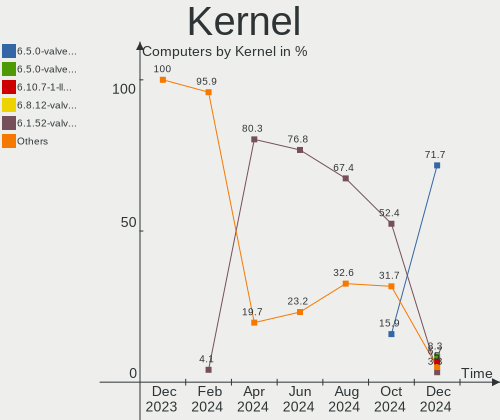
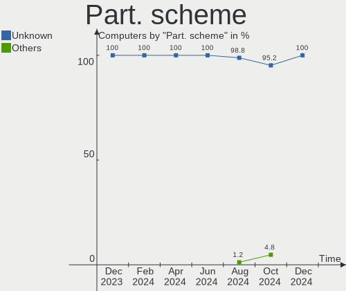
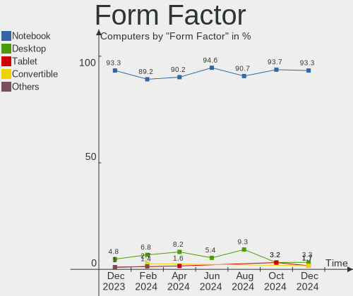
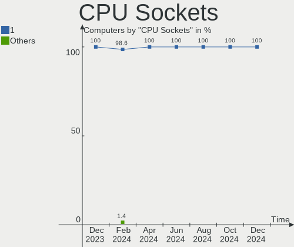
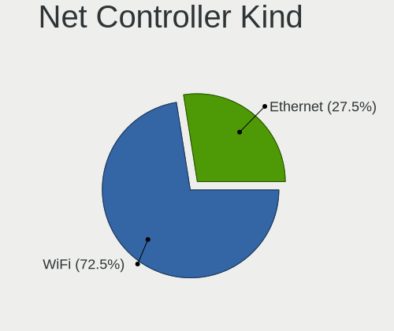
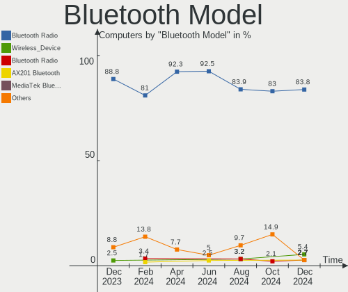

SteamOS - Hardware Trends
-------------------------

A project to identify most popular hardware characteristics and track their change
over time based on data collected by Linux users at https://Linux-Hardware.org.

Anyone can contribute to this report by the [hw-probe](https://github.com/linuxhw/hw-probe) tool:

    sudo -E hw-probe -all -upload

This is a report for all computer types. See also reports for [desktops](/Dist/SteamOS/Desktop/README.md) and [notebooks](/Dist/SteamOS/Notebook/README.md).

This report is for one last month. Overall report since the beginning of time: [TestDays](https://github.com/linuxhw/TestDays)

Period: Jan, 2024.

Contents
--------

* [ System ](#system)
  - [ OS                       ](#os)
  - [ OS Family                ](#os-family)
  - [ Kernel                   ](#kernel)
  - [ Kernel Family            ](#kernel-family)
  - [ Kernel Major Ver.        ](#kernel-major-ver)
  - [ Arch                     ](#arch)
  - [ DE                       ](#de)
  - [ Display Server           ](#display-server)
  - [ Display Manager          ](#display-manager)
  - [ OS Lang                  ](#os-lang)
  - [ Boot Mode                ](#boot-mode)
  - [ Filesystem               ](#filesystem)
  - [ Part. scheme             ](#part-scheme)
  - [ Dual Boot with Linux/BSD ](#dual-boot-with-linuxbsd)
  - [ Dual Boot (Win)          ](#dual-boot-win)

* [ Board ](#board)
  - [ Vendor                   ](#vendor)
  - [ Model                    ](#model)
  - [ Model Family             ](#model-family)
  - [ MFG Year                 ](#mfg-year)
  - [ Form Factor              ](#form-factor)
  - [ Secure Boot              ](#secure-boot)
  - [ Coreboot                 ](#coreboot)
  - [ RAM Size                 ](#ram-size)
  - [ RAM Used                 ](#ram-used)
  - [ Total Drives             ](#total-drives)
  - [ Has CD-ROM               ](#has-cd-rom)
  - [ Has Ethernet             ](#has-ethernet)
  - [ Has WiFi                 ](#has-wifi)
  - [ Has Bluetooth            ](#has-bluetooth)

* [ Location ](#location)
  - [ Country                  ](#country)
  - [ City                     ](#city)

* [ Drives ](#drives)
  - [ Drive Vendor             ](#drive-vendor)
  - [ Drive Model              ](#drive-model)
  - [ HDD Vendor               ](#hdd-vendor)
  - [ SSD Vendor               ](#ssd-vendor)
  - [ Drive Kind               ](#drive-kind)
  - [ Drive Connector          ](#drive-connector)
  - [ Drive Size               ](#drive-size)
  - [ Space Total              ](#space-total)
  - [ Space Used               ](#space-used)
  - [ Malfunc. Drives          ](#malfunc-drives)
  - [ Malfunc. Drive Vendor    ](#malfunc-drive-vendor)
  - [ Malfunc. HDD Vendor      ](#malfunc-hdd-vendor)
  - [ Malfunc. Drive Kind      ](#malfunc-drive-kind)
  - [ Failed Drives            ](#failed-drives)
  - [ Failed Drive Vendor      ](#failed-drive-vendor)
  - [ Drive Status             ](#drive-status)

* [ Storage controller ](#storage-controller)
  - [ Storage Vendor           ](#storage-vendor)
  - [ Storage Model            ](#storage-model)
  - [ Storage Kind             ](#storage-kind)

* [ Processor ](#processor)
  - [ CPU Vendor               ](#cpu-vendor)
  - [ CPU Model                ](#cpu-model)
  - [ CPU Model Family         ](#cpu-model-family)
  - [ CPU Cores                ](#cpu-cores)
  - [ CPU Sockets              ](#cpu-sockets)
  - [ CPU Threads              ](#cpu-threads)
  - [ CPU Op-Modes             ](#cpu-op-modes)
  - [ CPU Microcode            ](#cpu-microcode)
  - [ CPU Microarch            ](#cpu-microarch)

* [ Graphics ](#graphics)
  - [ GPU Vendor               ](#gpu-vendor)
  - [ GPU Model                ](#gpu-model)
  - [ GPU Combo                ](#gpu-combo)
  - [ GPU Driver               ](#gpu-driver)
  - [ GPU Memory               ](#gpu-memory)

* [ Monitor ](#monitor)
  - [ Monitor Vendor           ](#monitor-vendor)
  - [ Monitor Model            ](#monitor-model)
  - [ Monitor Resolution       ](#monitor-resolution)
  - [ Monitor Diagonal         ](#monitor-diagonal)
  - [ Monitor Width            ](#monitor-width)
  - [ Aspect Ratio             ](#aspect-ratio)
  - [ Monitor Area             ](#monitor-area)
  - [ Pixel Density            ](#pixel-density)
  - [ Multiple Monitors        ](#multiple-monitors)

* [ Network ](#network)
  - [ Net Controller Vendor    ](#net-controller-vendor)
  - [ Net Controller Model     ](#net-controller-model)
  - [ Wireless Vendor          ](#wireless-vendor)
  - [ Wireless Model           ](#wireless-model)
  - [ Ethernet Vendor          ](#ethernet-vendor)
  - [ Ethernet Model           ](#ethernet-model)
  - [ Net Controller Kind      ](#net-controller-kind)
  - [ Used Controller          ](#used-controller)
  - [ NICs                     ](#nics)
  - [ IPv6                     ](#ipv6)

* [ Bluetooth ](#bluetooth)
  - [ Bluetooth Vendor         ](#bluetooth-vendor)
  - [ Bluetooth Model          ](#bluetooth-model)

* [ Sound ](#sound)
  - [ Sound Vendor             ](#sound-vendor)
  - [ Sound Model              ](#sound-model)

* [ Memory ](#memory)
  - [ Memory Vendor            ](#memory-vendor)
  - [ Memory Model             ](#memory-model)
  - [ Memory Kind              ](#memory-kind)
  - [ Memory Form Factor       ](#memory-form-factor)
  - [ Memory Size              ](#memory-size)
  - [ Memory Speed             ](#memory-speed)

* [ Printers & scanners ](#printers--scanners)
  - [ Printer Vendor           ](#printer-vendor)
  - [ Printer Model            ](#printer-model)
  - [ Scanner Vendor           ](#scanner-vendor)
  - [ Scanner Model            ](#scanner-model)

* [ Camera ](#camera)
  - [ Camera Vendor            ](#camera-vendor)
  - [ Camera Model             ](#camera-model)

* [ Security ](#security)
  - [ Fingerprint Vendor       ](#fingerprint-vendor)
  - [ Fingerprint Model        ](#fingerprint-model)
  - [ Chipcard Vendor          ](#chipcard-vendor)
  - [ Chipcard Model           ](#chipcard-model)

* [ Unsupported ](#unsupported)
  - [ Unsupported Devices      ](#unsupported-devices)
  - [ Unsupported Device Types ](#unsupported-device-types)

System
------

OS
--

Installed operating systems

| Name                | Computers | Percent |
|---------------------|-----------|---------|
| SteamOS 3.5.7       | 58        | 69.88%  |
| SteamOS 4           | 9         | 10.84%  |
| SteamOS 3.5.13      | 8         | 9.64%   |
| SteamOS 3.6         | 3         | 3.61%   |
| SteamOS 3.5.12      | 2         | 2.41%   |
| SteamOS 3.5.1       | 1         | 1.2%    |
| SteamOS 1.1.2       | 1         | 1.2%    |
| SteamOS 1.01-dev_nv | 1         | 1.2%    |

OS Family
---------

OS without a version

| Name    | Computers | Percent |
|---------|-----------|---------|
| SteamOS | 83        | 100%    |

Kernel
------

Version of the Linux kernel

| Version                     | Computers | Percent |
|-----------------------------|-----------|---------|
| 6.1.52-valve9-1-neptune-61  | 58        | 69.88%  |
| 6.3.7-zen1-1-zen            | 8         | 9.64%   |
| 6.1.52-valve14-1-neptune-61 | 8         | 9.64%   |
| 6.4.12-zen1-1-zen           | 3         | 3.61%   |
| 6.1.52-valve15-4-neptune-61 | 2         | 2.41%   |
| 6.1.52-valve12-1-neptune-61 | 2         | 2.41%   |
| 6.1.52-valve3-1-neptune-61  | 1         | 1.2%    |
| 6.1.52-valve10-1-neptune-61 | 1         | 1.2%    |

Kernel Family
-------------

Linux kernel without a distro release

| Version | Computers | Percent |
|---------|-----------|---------|
| 6.1.52  | 72        | 86.75%  |
| 6.3.7   | 8         | 9.64%   |
| 6.4.12  | 3         | 3.61%   |

Kernel Major Ver.
-----------------

Linux kernel major version

| Version | Computers | Percent |
|---------|-----------|---------|
| 6.1     | 72        | 86.75%  |
| 6.3     | 8         | 9.64%   |
| 6.4     | 3         | 3.61%   |

Arch
----

OS architecture (x86_64, i586, etc.)

| Name   | Computers | Percent |
|--------|-----------|---------|
| x86_64 | 83        | 100%    |

DE
--

Desktop Environment

| Name | Computers | Percent |
|------|-----------|---------|
| KDE5 | 82        | 98.8%   |
| KDE  | 1         | 1.2%    |

Display Server
--------------

X11 or Wayland

| Name | Computers | Percent |
|------|-----------|---------|
| X11  | 83        | 100%    |

Display Manager
---------------

SDDM, LightDM, etc.

| Name    | Computers | Percent |
|---------|-----------|---------|
| Unknown | 83        | 100%    |

OS Lang
-------

Language

| Lang  | Computers | Percent |
|-------|-----------|---------|
| en_US | 67        | 80.72%  |
| ru_RU | 4         | 4.82%   |
| pt_BR | 3         | 3.61%   |
| C     | 2         | 2.41%   |
| zh_CN | 1         | 1.2%    |
| pl_PL | 1         | 1.2%    |
| it_IT | 1         | 1.2%    |
| fr_FR | 1         | 1.2%    |
| es_ES | 1         | 1.2%    |
| en_GB | 1         | 1.2%    |
| de_DE | 1         | 1.2%    |

Boot Mode
---------

EFI or BIOS

| Mode | Computers | Percent |
|------|-----------|---------|
| BIOS | 82        | 98.8%   |
| EFI  | 1         | 1.2%    |

Filesystem
----------

Type of filesystem

| Type  | Computers | Percent |
|-------|-----------|---------|
| Btrfs | 83        | 100%    |

Part. scheme
------------

Scheme of partitioning

| Type    | Computers | Percent |
|---------|-----------|---------|
| Unknown | 82        | 98.8%   |
| GPT     | 1         | 1.2%    |

Dual Boot with Linux/BSD
------------------------

Hosting more than one Linux/BSD

| Dual boot | Computers | Percent |
|-----------|-----------|---------|
| No        | 82        | 98.8%   |
| Yes       | 1         | 1.2%    |

Dual Boot (Win)
---------------

Hosting Linux and Windows

| Dual boot | Computers | Percent |
|-----------|-----------|---------|
| No        | 83        | 100%    |

Board
-----

Vendor
------

Motherboard manufacturer

| Name             | Computers | Percent |
|------------------|-----------|---------|
| Valve            | 70        | 84.34%  |
| MSI              | 3         | 3.61%   |
| ASUSTek Computer | 3         | 3.61%   |
| Hewlett-Packard  | 2         | 2.41%   |
| QIYIDA           | 1         | 1.2%    |
| Medion           | 1         | 1.2%    |
| Lenovo           | 1         | 1.2%    |
| ASRock           | 1         | 1.2%    |
| AMI              | 1         | 1.2%    |

Model
-----

Motherboard model

| Name                                | Computers | Percent |
|-------------------------------------|-----------|---------|
| Valve Jupiter                       | 57        | 68.67%  |
| Valve Galileo                       | 13        | 15.66%  |
| QIYIDA ED4 V1.1                     | 1         | 1.2%    |
| MSI MS-7C95                         | 1         | 1.2%    |
| MSI MS-7C02                         | 1         | 1.2%    |
| MSI MS-7B33                         | 1         | 1.2%    |
| Medion Deputy P50                   | 1         | 1.2%    |
| Lenovo IdeaPadFlex 5 14ALC05 82HU   | 1         | 1.2%    |
| HP Pavilion Gaming Laptop 15-dk2xxx | 1         | 1.2%    |
| HP 15 Notebook PC                   | 1         | 1.2%    |
| ASUS TUF Gaming FX705DT_FX705DT     | 1         | 1.2%    |
| ASUS SABERTOOTH Z170 S              | 1         | 1.2%    |
| ASUS PRIME A320M-K                  | 1         | 1.2%    |
| ASRock B450 Gaming-ITX/ac           | 1         | 1.2%    |
| AMI Cherry Trail CR                 | 1         | 1.2%    |

Model Family
------------

Motherboard model prefix

| Name               | Computers | Percent |
|--------------------|-----------|---------|
| Valve Jupiter      | 57        | 68.67%  |
| Valve Galileo      | 13        | 15.66%  |
| QIYIDA ED4         | 1         | 1.2%    |
| MSI MS-7C95        | 1         | 1.2%    |
| MSI MS-7C02        | 1         | 1.2%    |
| MSI MS-7B33        | 1         | 1.2%    |
| Medion Deputy      | 1         | 1.2%    |
| Lenovo IdeaPadFlex | 1         | 1.2%    |
| HP Pavilion        | 1         | 1.2%    |
| HP 15              | 1         | 1.2%    |
| ASUS TUF           | 1         | 1.2%    |
| ASUS SABERTOOTH    | 1         | 1.2%    |
| ASUS PRIME         | 1         | 1.2%    |
| ASRock B450        | 1         | 1.2%    |
| AMI Cherry         | 1         | 1.2%    |

MFG Year
--------

Motherboard manufacture year

| Year | Computers | Percent |
|------|-----------|---------|
| 2023 | 66        | 79.52%  |
| 2022 | 6         | 7.23%   |
| 2018 | 3         | 3.61%   |
| 2021 | 2         | 2.41%   |
| 2020 | 2         | 2.41%   |
| 2019 | 1         | 1.2%    |
| 2017 | 1         | 1.2%    |
| 2016 | 1         | 1.2%    |
| 2015 | 1         | 1.2%    |

Form Factor
-----------

Physical design of the computer

| Name        | Computers | Percent |
|-------------|-----------|---------|
| Notebook    | 75        | 90.36%  |
| Desktop     | 7         | 8.43%   |
| Convertible | 1         | 1.2%    |

Secure Boot
-----------

Enabled or disabled

| State    | Computers | Percent |
|----------|-----------|---------|
| Disabled | 83        | 100%    |

Coreboot
--------

Have coreboot on board

| Used | Computers | Percent |
|------|-----------|---------|
| No   | 83        | 100%    |

RAM Size
--------

Total RAM memory

| Size in GB | Computers | Percent |
|------------|-----------|---------|
| 8.01-16.0  | 73        | 87.95%  |
| 32.01-64.0 | 3         | 3.61%   |
| 16.01-24.0 | 3         | 3.61%   |
| 4.01-8.0   | 2         | 2.41%   |
| 3.01-4.0   | 2         | 2.41%   |

RAM Used
--------

Used RAM memory

| Used GB   | Computers | Percent |
|-----------|-----------|---------|
| 3.01-4.0  | 37        | 44.58%  |
| 4.01-8.0  | 36        | 43.37%  |
| 2.01-3.0  | 5         | 6.02%   |
| 1.01-2.0  | 3         | 3.61%   |
| 8.01-16.0 | 2         | 2.41%   |

Total Drives
------------

Number of drives on board

| Drives | Computers | Percent |
|--------|-----------|---------|
| 2      | 41        | 49.4%   |
| 1      | 37        | 44.58%  |
| 3      | 4         | 4.82%   |
| 4      | 1         | 1.2%    |

Has CD-ROM
----------

Has CD-ROM on board

| Presented | Computers | Percent |
|-----------|-----------|---------|
| No        | 80        | 96.39%  |
| Yes       | 3         | 3.61%   |

Has Ethernet
------------

Has Ethernet on board

| Presented | Computers | Percent |
|-----------|-----------|---------|
| No        | 44        | 53.01%  |
| Yes       | 39        | 46.99%  |

Has WiFi
--------

Has WiFi module

| Presented | Computers | Percent |
|-----------|-----------|---------|
| Yes       | 80        | 96.39%  |
| No        | 3         | 3.61%   |

Has Bluetooth
-------------

Has Bluetooth module

| Presented | Computers | Percent |
|-----------|-----------|---------|
| Yes       | 65        | 78.31%  |
| No        | 18        | 21.69%  |

Location
--------

Country
-------

Geographic location (country)

| Country      | Computers | Percent |
|--------------|-----------|---------|
| USA          | 31        | 37.35%  |
| UK           | 8         | 9.64%   |
| Germany      | 5         | 6.02%   |
| Brazil       | 5         | 6.02%   |
| Spain        | 4         | 4.82%   |
| Austria      | 3         | 3.61%   |
| Ukraine      | 2         | 2.41%   |
| South Africa | 2         | 2.41%   |
| Russia       | 2         | 2.41%   |
| Poland       | 2         | 2.41%   |
| Netherlands  | 2         | 2.41%   |
| Australia    | 2         | 2.41%   |
| Uzbekistan   | 1         | 1.2%    |
| Turkey       | 1         | 1.2%    |
| Sweden       | 1         | 1.2%    |
| Slovakia     | 1         | 1.2%    |
| Puerto Rico  | 1         | 1.2%    |
| Portugal     | 1         | 1.2%    |
| Philippines  | 1         | 1.2%    |
| Kazakhstan   | 1         | 1.2%    |
| Japan        | 1         | 1.2%    |
| Italy        | 1         | 1.2%    |
| India        | 1         | 1.2%    |
| Honduras     | 1         | 1.2%    |
| France       | 1         | 1.2%    |
| China        | 1         | 1.2%    |
| Chile        | 1         | 1.2%    |

City
----

Geographic location (city)

| City                | Computers | Percent |
|---------------------|-----------|---------|
| Vienna              | 2         | 2.41%   |
| Portland            | 2         | 2.41%   |
| Ealing              | 2         | 2.41%   |
| Berlin              | 2         | 2.41%   |
| Belo Horizonte      | 2         | 2.41%   |
| Woodway             | 1         | 1.2%    |
| Wilmington          | 1         | 1.2%    |
| White Plains        | 1         | 1.2%    |
| West Warwick        | 1         | 1.2%    |
| Västerås          | 1         | 1.2%    |
| Valencia            | 1         | 1.2%    |
| Teresa              | 1         | 1.2%    |
| Tempe               | 1         | 1.2%    |
| Tegucigalpa         | 1         | 1.2%    |
| Tashkent            | 1         | 1.2%    |
| Taizhou             | 1         | 1.2%    |
| St Louis            | 1         | 1.2%    |
| Spartanburg         | 1         | 1.2%    |
| Southampton         | 1         | 1.2%    |
| Simferopol          | 1         | 1.2%    |
| Schwanenstadt       | 1         | 1.2%    |
| Sarver              | 1         | 1.2%    |
| Sao Joao da Madeira | 1         | 1.2%    |
| Santiago            | 1         | 1.2%    |
| Santa Ana           | 1         | 1.2%    |
| San Bernardino      | 1         | 1.2%    |
| Reutlingen          | 1         | 1.2%    |
| Prenton             | 1         | 1.2%    |
| Petersfield         | 1         | 1.2%    |
| Ozasa               | 1         | 1.2%    |
| Orlando             | 1         | 1.2%    |
| Novosibirsk         | 1         | 1.2%    |
| Norristown          | 1         | 1.2%    |
| New York            | 1         | 1.2%    |
| Moana               | 1         | 1.2%    |
| Minneapolis         | 1         | 1.2%    |
| Melbourne           | 1         | 1.2%    |
| Magliano di Tenna   | 1         | 1.2%    |
| Lyons               | 1         | 1.2%    |
| Lynbrook            | 1         | 1.2%    |

Drives
------

Drive Vendor
------------

Hard drive vendors

| Vendor                         | Computers | Drives | Percent |
|--------------------------------|-----------|--------|---------|
| Unknown                        | 35        | 35     | 26.32%  |
| Phison Electronics             | 23        | 23     | 17.29%  |
| Samsung Electronics            | 16        | 17     | 12.03%  |
| Kingston Technology Company    | 13        | 13     | 9.77%   |
| O2 Micro                       | 10        | 10     | 7.52%   |
| Sandisk                        | 8         | 8      | 6.02%   |
| Unknown                        | 5         | 5      | 3.76%   |
| Seagate                        | 3         | 3      | 2.26%   |
| Micron Technology              | 3         | 3      | 2.26%   |
| WDC                            | 2         | 4      | 1.5%    |
| SK hynix                       | 2         | 2      | 1.5%    |
| Silicon Motion                 | 2         | 2      | 1.5%    |
| MAXIO Technology (Hangzhou)    | 2         | 2      | 1.5%    |
| Kingston                       | 2         | 2      | 1.5%    |
| Solid State Storage Technology | 1         | 1      | 0.75%   |
| SABRENT                        | 1         | 1      | 0.75%   |
| Micron/Crucial Technology      | 1         | 1      | 0.75%   |
| Lexar                          | 1         | 1      | 0.75%   |
| KIOXIA                         | 1         | 1      | 0.75%   |
| Crucial                        | 1         | 1      | 0.75%   |
| A-DATA Technology              | 1         | 1      | 0.75%   |

Drive Model
-----------

Hard drive models

| Model                                                 | Computers | Percent |
|-------------------------------------------------------|-----------|---------|
| Unknown MMC Card  512GB                               | 13        | 9.56%   |
| Phison PS5013 E13 NVMe Controller 256GB               | 13        | 9.56%   |
| Kingston Company OM3PDP3 NVMe SSD 256GB               | 13        | 9.56%   |
| O2 Micro E2M2 64GB                                    | 10        | 7.35%   |
| Unknown MMC Card  256GB                               | 9         | 6.62%   |
| Samsung MZ9LQ512HBLU-00BVL 512GB                      | 5         | 3.68%   |
| Unknown                                               | 5         | 3.68%   |
| Samsung MZ9LQ256HBJD-00BVL 256GB                      | 4         | 2.94%   |
| Phison ESMP001TKB5C3-E19TS 1024GB                     | 4         | 2.94%   |
| Unknown MMC Card  64GB                                | 2         | 1.47%   |
| Silicon Motion SM2263EN/SM2263XT SSD Controller 128GB | 2         | 1.47%   |
| Sandisk WD PC SN740 SDDPTQE-2T00 2TB                  | 2         | 1.47%   |
| Samsung PSSD T7 1TB                                   | 2         | 1.47%   |
| Phison Sabrent SB-2130-1TB                            | 2         | 1.47%   |
| Micron 2400_MTFDKBK1T0QFM 1024GB                      | 2         | 1.47%   |
| WDC WDS120G1G0A-00SS50 120GB SSD                      | 1         | 0.74%   |
| WDC WD5000AZRX-00A8LB0 500GB                          | 1         | 0.74%   |
| WDC WD10EZEX-08WN4A0 1TB                              | 1         | 0.74%   |
| WDC WD10EZEX-00WN4A0 1TB                              | 1         | 0.74%   |
| Unknown MMC Card  498GB                               | 1         | 0.74%   |
| Unknown MMC Card  393GB                               | 1         | 0.74%   |
| Unknown MMC Card  32GB                                | 1         | 0.74%   |
| Unknown MMC Card  30MB                                | 1         | 0.74%   |
| Unknown MMC Card  2TB                                 | 1         | 0.74%   |
| Unknown MMC Card  250GB                               | 1         | 0.74%   |
| Unknown MMC Card  249GB                               | 1         | 0.74%   |
| Unknown MMC Card  1TB                                 | 1         | 0.74%   |
| Unknown MMC Card  16GB                                | 1         | 0.74%   |
| Unknown MMC Card  128GB                               | 1         | 0.74%   |
| Unknown MMC Card  1073GB                              | 1         | 0.74%   |
| Solid State Storage SSSTC XA1-311024 930GB            | 1         | 0.74%   |
| SK hynix BC711 NVMe 256GB                             | 1         | 0.74%   |
| SK hynix BC711 HFM512GD3JX013N 512GB                  | 1         | 0.74%   |
| Seagate ST3500413AS 500GB                             | 1         | 0.74%   |
| Seagate ST1000DM003-9YN162 1TB                        | 1         | 0.74%   |
| Seagate BUP BK 5TB                                    | 1         | 0.74%   |
| Sandisk WD_BLACK SN770M 1TB                           | 1         | 0.74%   |
| Sandisk WD PC SN740 SDDPTQD-512G-1102 512GB           | 1         | 0.74%   |
| Sandisk WD PC SN740 SDDPTQD-1T00 1024GB               | 1         | 0.74%   |
| Sandisk WD Blue SN570 1TB                             | 1         | 0.74%   |

HDD Vendor
----------

Hard disk drive vendors

| Vendor              | Computers | Drives | Percent |
|---------------------|-----------|--------|---------|
| Seagate             | 3         | 3      | 50%     |
| WDC                 | 2         | 3      | 33.33%  |
| Samsung Electronics | 1         | 1      | 16.67%  |

SSD Vendor
----------

Solid state drive vendors

| Vendor              | Computers | Drives | Percent |
|---------------------|-----------|--------|---------|
| Samsung Electronics | 3         | 4      | 37.5%   |
| Kingston            | 2         | 2      | 25%     |
| WDC                 | 1         | 1      | 12.5%   |
| Crucial             | 1         | 1      | 12.5%   |
| A-DATA Technology   | 1         | 1      | 12.5%   |

Drive Kind
----------

HDD or SSD

| Kind    | Computers | Drives | Percent |
|---------|-----------|--------|---------|
| NVMe    | 77        | 78     | 59.23%  |
| MMC     | 40        | 40     | 30.77%  |
| SSD     | 7         | 9      | 5.38%   |
| HDD     | 4         | 7      | 3.08%   |
| Unknown | 2         | 2      | 1.54%   |

Drive Connector
---------------

SATA, SAS, NVMe, etc.

| Type | Computers | Drives | Percent |
|------|-----------|--------|---------|
| NVMe | 77        | 78     | 59.23%  |
| MMC  | 40        | 40     | 30.77%  |
| SATA | 7         | 11     | 5.38%   |
| SAS  | 6         | 7      | 4.62%   |

Drive Size
----------

Size of hard drive

| Size in TB | Computers | Drives | Percent |
|------------|-----------|--------|---------|
| 0.51-1.0   | 6         | 8      | 46.15%  |
| 0.01-0.5   | 6         | 7      | 46.15%  |
| 4.01-10.0  | 1         | 1      | 7.69%   |

Space Total
-----------

Amount of disk space available on the file system

| Size in GB     | Computers | Percent |
|----------------|-----------|---------|
| 501-1000       | 31        | 37.35%  |
| 251-500        | 17        | 20.48%  |
| 101-250        | 15        | 18.07%  |
| 1001-2000      | 11        | 13.25%  |
| 51-100         | 5         | 6.02%   |
| 2001-3000      | 2         | 2.41%   |
| More than 3000 | 1         | 1.2%    |
| 21-50          | 1         | 1.2%    |

Space Used
----------

Amount of used disk space

| Used GB   | Computers | Percent |
|-----------|-----------|---------|
| 251-500   | 18        | 21.69%  |
| 101-250   | 18        | 21.69%  |
| 501-1000  | 18        | 21.69%  |
| 1-20      | 9         | 10.84%  |
| 21-50     | 8         | 9.64%   |
| 51-100    | 6         | 7.23%   |
| 2001-3000 | 3         | 3.61%   |
| 1001-2000 | 3         | 3.61%   |

Malfunc. Drives
---------------

Drive models with a malfunction

Zero info for selected period =(

Malfunc. Drive Vendor
---------------------

Vendors of faulty drives

Zero info for selected period =(

Malfunc. HDD Vendor
-------------------

Vendors of faulty HDD drives

Zero info for selected period =(

Malfunc. Drive Kind
-------------------

Kinds of faulty drives

Zero info for selected period =(

Failed Drives
-------------

Failed drive models

Zero info for selected period =(

Failed Drive Vendor
-------------------

Failed drive vendors

Zero info for selected period =(

Drive Status
------------

Number of failed and malfunc. drives

| Status   | Computers | Drives | Percent |
|----------|-----------|--------|---------|
| Detected | 83        | 135    | 98.81%  |
| Works    | 1         | 1      | 1.19%   |

Storage controller
------------------

Storage Vendor
--------------

Storage controller vendors

| Vendor                         | Computers | Percent |
|--------------------------------|-----------|---------|
| Phison Electronics             | 23        | 26.14%  |
| Kingston Technology Company    | 13        | 14.77%  |
| Samsung Electronics            | 12        | 13.64%  |
| O2 Micro                       | 10        | 11.36%  |
| Sandisk                        | 8         | 9.09%   |
| Intel                          | 6         | 6.82%   |
| AMD                            | 4         | 4.55%   |
| Micron Technology              | 3         | 3.41%   |
| SK hynix                       | 2         | 2.27%   |
| Silicon Motion                 | 2         | 2.27%   |
| MAXIO Technology (Hangzhou)    | 2         | 2.27%   |
| Solid State Storage Technology | 1         | 1.14%   |
| Micron/Crucial Technology      | 1         | 1.14%   |
| KIOXIA                         | 1         | 1.14%   |

Storage Model
-------------

Storage controller models

| Model                                                                            | Computers | Percent |
|----------------------------------------------------------------------------------|-----------|---------|
| Phison PS5013-E13 PCIe3 NVMe Controller (DRAM-less)                              | 13        | 14.13%  |
| Kingston Company OM3PDP3 NVMe SSD                                                | 13        | 14.13%  |
| Samsung NVMe SSD Controller 980 (DRAM-less)                                      | 11        | 11.96%  |
| O2 Micro FORESEE E2M2 NVMe SSD                                                   | 10        | 10.87%  |
| Phison PS5021-E21 PCIe4 NVMe Controller (DRAM-less)                              | 6         | 6.52%   |
| Sandisk PC SN740 NVMe SSD (DRAM-less)                                            | 5         | 5.43%   |
| Phison PS5019-E19 PCIe4 NVMe Controller (DRAM-less)                              | 4         | 4.35%   |
| AMD FCH SATA Controller [AHCI mode]                                              | 3         | 3.26%   |
| SK hynix Gold P31/BC711/PC711 NVMe Solid State Drive                             | 2         | 2.17%   |
| Silicon Motion SM2263EN/SM2263XT (DRAM-less) NVMe SSD Controllers                | 2         | 2.17%   |
| Micron 2400 NVMe SSD (DRAM-less)                                                 | 2         | 2.17%   |
| Intel Volume Management Device NVMe RAID Controller                              | 2         | 2.17%   |
| AMD 400 Series Chipset SATA Controller                                           | 2         | 2.17%   |
| Solid State Storage XA1-311024 NVMe SSD M.2                                      | 1         | 1.09%   |
| Sandisk WD Black SN770M NVMe SSD (DRAM-less)                                     | 1         | 1.09%   |
| SanDisk Ultra 3D / WD Blue SN570 NVMe SSD (DRAM-less)                            | 1         | 1.09%   |
| SanDisk IX SN530 NVMe SSD (DRAM-less)                                            | 1         | 1.09%   |
| Samsung NVMe SSD Controller SM961/PM961/SM963                                    | 1         | 1.09%   |
| Micron/Crucial P5 Plus NVMe PCIe SSD                                             | 1         | 1.09%   |
| Micron 2200S NVMe SSD [Cassandra]                                                | 1         | 1.09%   |
| MAXIO (Hangzhou) NVMe SSD Controller MAP1602 (DRAM-less)                         | 1         | 1.09%   |
| MAXIO (Hangzhou) NVMe SSD Controller MAP1202 (DRAM-less)                         | 1         | 1.09%   |
| KIOXIA NVMe SSD Controller BG4 (DRAM-less)                                       | 1         | 1.09%   |
| Intel Tiger Lake-LP SATA Controller                                              | 1         | 1.09%   |
| Intel Q170/Q150/B150/H170/H110/Z170/CM236 Chipset SATA Controller [AHCI Mode]    | 1         | 1.09%   |
| Intel Cannon Lake PCH SATA AHCI Controller                                       | 1         | 1.09%   |
| Intel Atom/Celeron/Pentium Processor x5-E8000/J3xxx/N3xxx Series SATA Controller | 1         | 1.09%   |
| Intel 8 Series/C220 Series Chipset Family 6-port SATA Controller 1 [AHCI mode]   | 1         | 1.09%   |
| AMD FCH SATA Controller D                                                        | 1         | 1.09%   |
| AMD 500 Series Chipset SATA Controller                                           | 1         | 1.09%   |

Storage Kind
------------

Kind of storage controller (IDE, SATA, NVMe, SAS, ...)

| Kind | Computers | Percent |
|------|-----------|---------|
| NVMe | 77        | 87.5%   |
| SATA | 9         | 10.23%  |
| RAID | 2         | 2.27%   |

Processor
---------

CPU Vendor
----------

Processor vendors

| Vendor | Computers | Percent |
|--------|-----------|---------|
| AMD    | 76        | 91.57%  |
| Intel  | 7         | 8.43%   |

CPU Model
---------

Processor models

| Model                                         | Computers | Percent |
|-----------------------------------------------|-----------|---------|
| AMD Custom APU 0405                           | 69        | 83.13%  |
| Intel Xeon CPU E5-2670 v3 @ 2.30GHz           | 1         | 1.2%    |
| Intel Core i7-6700K CPU @ 4.00GHz             | 1         | 1.2%    |
| Intel Core i5-9400F CPU @ 2.90GHz             | 1         | 1.2%    |
| Intel Celeron CPU N3060 @ 1.60GHz             | 1         | 1.2%    |
| Intel Atom x5-Z8350 CPU @ 1.44GHz             | 1         | 1.2%    |
| Intel 13th Gen Core i7-13700HX                | 1         | 1.2%    |
| Intel 11th Gen Core i7-11370H @ 3.30GHz       | 1         | 1.2%    |
| AMD Ryzen 7 5700U with Radeon Graphics        | 1         | 1.2%    |
| AMD Ryzen 5 5600X 6-Core Processor            | 1         | 1.2%    |
| AMD Ryzen 5 5600G with Radeon Graphics        | 1         | 1.2%    |
| AMD Ryzen 5 3550H with Radeon Vega Mobile Gfx | 1         | 1.2%    |
| AMD Ryzen 5 1600 Six-Core Processor           | 1         | 1.2%    |
| AMD Ryzen 3 2200G with Radeon Vega Graphics   | 1         | 1.2%    |
| AMD Custom APU 0932                           | 1         | 1.2%    |

CPU Model Family
----------------

Processor model prefix

| Model         | Computers | Percent |
|---------------|-----------|---------|
| Other         | 72        | 86.75%  |
| AMD Ryzen 5   | 4         | 4.82%   |
| Intel Xeon    | 1         | 1.2%    |
| Intel Core i7 | 1         | 1.2%    |
| Intel Core i5 | 1         | 1.2%    |
| Intel Celeron | 1         | 1.2%    |
| Intel Atom    | 1         | 1.2%    |
| AMD Ryzen 7   | 1         | 1.2%    |
| AMD Ryzen 3   | 1         | 1.2%    |

CPU Cores
---------

Number of processor cores

| Number | Computers | Percent |
|--------|-----------|---------|
| 4      | 75        | 90.36%  |
| 6      | 4         | 4.82%   |
| 16     | 1         | 1.2%    |
| 12     | 1         | 1.2%    |
| 8      | 1         | 1.2%    |
| 2      | 1         | 1.2%    |

CPU Sockets
-----------

Number of sockets

| Number | Computers | Percent |
|--------|-----------|---------|
| 1      | 83        | 100%    |

CPU Threads
-----------

Threads per core (Hyper-Threading)

| Number | Computers | Percent |
|--------|-----------|---------|
| 2      | 79        | 95.18%  |
| 1      | 4         | 4.82%   |

CPU Op-Modes
------------

CPU Operation Modes (32-bit, 64-bit)

| Op mode        | Computers | Percent |
|----------------|-----------|---------|
| 32-bit, 64-bit | 83        | 100%    |

CPU Microcode
-------------

Microcode number

| Number     | Computers | Percent |
|------------|-----------|---------|
| Unknown    | 82        | 98.8%   |
| 0x08900201 | 1         | 1.2%    |

CPU Microarch
-------------

Microarchitecture

| Name       | Computers | Percent |
|------------|-----------|---------|
| Unknown    | 72        | 86.75%  |
| Zen+       | 2         | 2.41%   |
| Zen 3      | 2         | 2.41%   |
| Silvermont | 2         | 2.41%   |
| Zen        | 1         | 1.2%    |
| TigerLake  | 1         | 1.2%    |
| Skylake    | 1         | 1.2%    |
| KabyLake   | 1         | 1.2%    |
| Haswell    | 1         | 1.2%    |

Graphics
--------

GPU Vendor
----------

Vendors of graphics cards

| Vendor | Computers | Percent |
|--------|-----------|---------|
| AMD    | 78        | 91.76%  |
| Nvidia | 4         | 4.71%   |
| Intel  | 3         | 3.53%   |

GPU Model
---------

Graphics card models

| Model                                                                                    | Computers | Percent |
|------------------------------------------------------------------------------------------|-----------|---------|
| AMD VanGogh [AMD Custom GPU 0405]                                                        | 57        | 66.28%  |
| AMD Sephiroth [AMD Custom GPU 0405]                                                      | 13        | 15.12%  |
| AMD Ellesmere [Radeon RX 470/480/570/570X/580/580X/590]                                  | 3         | 3.49%   |
| Intel Atom/Celeron/Pentium Processor x5-E8000/J3xxx/N3xxx Integrated Graphics Controller | 2         | 2.33%   |
| Nvidia TU117M [GeForce GTX 1650 Mobile / Max-Q]                                          | 1         | 1.16%   |
| Nvidia GP104 [GeForce GTX 1080]                                                          | 1         | 1.16%   |
| Nvidia GA107M [GeForce RTX 3050 Mobile]                                                  | 1         | 1.16%   |
| Nvidia AD107M [GeForce RTX 4060 Max-Q / Mobile]                                          | 1         | 1.16%   |
| Intel TigerLake-LP GT2 [Iris Xe Graphics]                                                | 1         | 1.16%   |
| AMD Polaris 20 XL [Radeon RX 580 2048SP]                                                 | 1         | 1.16%   |
| AMD Picasso/Raven 2 [Radeon Vega Series / Radeon Vega Mobile Series]                     | 1         | 1.16%   |
| AMD Navi 32 [Radeon RX 7700 XT / 7800 XT]                                                | 1         | 1.16%   |
| AMD Navi 24 [Radeon RX 6400/6500 XT/6500M]                                               | 1         | 1.16%   |
| AMD Lucienne                                                                             | 1         | 1.16%   |
| AMD Cezanne [Radeon Vega Series / Radeon Vega Mobile Series]                             | 1         | 1.16%   |

GPU Combo
---------

Combinations of graphics cards

| Name           | Computers | Percent |
|----------------|-----------|---------|
| 1 x AMD        | 76        | 91.57%  |
| 1 x Nvidia     | 2         | 2.41%   |
| 1 x Intel      | 2         | 2.41%   |
| 2 x AMD        | 1         | 1.2%    |
| Intel + Nvidia | 1         | 1.2%    |
| AMD + Nvidia   | 1         | 1.2%    |

GPU Driver
----------

Free vs proprietary

| Driver      | Computers | Percent |
|-------------|-----------|---------|
| Free        | 81        | 97.59%  |
| Proprietary | 2         | 2.41%   |

GPU Memory
----------

Total video memory

| Size in GB | Computers | Percent |
|------------|-----------|---------|
| Unknown    | 81        | 97.59%  |
| 7.01-8.0   | 1         | 1.2%    |
| 0.51-1.0   | 1         | 1.2%    |

Monitor
-------

Monitor Vendor
--------------

Monitor vendors

| Vendor              | Computers | Percent |
|---------------------|-----------|---------|
| Valve               | 65        | 63.73%  |
| Samsung Electronics | 6         | 5.88%   |
| Sony                | 3         | 2.94%   |
| Goldstar            | 3         | 2.94%   |
| BOE                 | 3         | 2.94%   |
| Sceptre Tech        | 2         | 1.96%   |
| ASUSTek Computer    | 2         | 1.96%   |
| AOC                 | 2         | 1.96%   |
| Acer                | 2         | 1.96%   |
| ViewSonic           | 1         | 0.98%   |
| Unknown (XXX)       | 1         | 0.98%   |
| RTK                 | 1         | 0.98%   |
| Philips             | 1         | 0.98%   |
| Onkyo               | 1         | 0.98%   |
| Nreal Air           | 1         | 0.98%   |
| MDA                 | 1         | 0.98%   |
| LG Display          | 1         | 0.98%   |
| Hitachi             | 1         | 0.98%   |
| HGC                 | 1         | 0.98%   |
| Hewlett-Packard     | 1         | 0.98%   |
| Flipbook            | 1         | 0.98%   |
| BenQ                | 1         | 0.98%   |
| AU Optronics        | 1         | 0.98%   |

Monitor Model
-------------

Monitor models

| Model                                                                   | Computers | Percent |
|-------------------------------------------------------------------------|-----------|---------|
| Valve ANX7530 U VLV3001 800x1280 100x150mm 7.1-inch                     | 52        | 50.98%  |
| Valve ANX7530 U VLV3003 800x1280 100x160mm 7.4-inch                     | 12        | 11.76%  |
| ViewSonic VX2239 SERIES VSC5225 1920x1080 480x270mm 21.7-inch           | 1         | 0.98%   |
| Valve ANX7530 U VLV3004 800x1280 100x160mm 7.4-inch                     | 1         | 0.98%   |
| Unknown (XXX) Beyond TV XXX9221 1920x1080 1209x680mm 54.6-inch          | 1         | 0.98%   |
| Sony TV SNYAB03 1920x1080                                               | 1         | 0.98%   |
| Sony TV SNY0801 1360x768                                                | 1         | 0.98%   |
| Sony TV *30 SNY7905 3840x2160 1882x1058mm 85.0-inch                     | 1         | 0.98%   |
| Sceptre Tech Sceptre F22 SPT08E3 1920x1080 475x267mm 21.5-inch          | 1         | 0.98%   |
| Sceptre Tech Sceptre C35 SPT0DB7 3440x1440 819x346mm 35.0-inch          | 1         | 0.98%   |
| Samsung Electronics LCD Monitor SAM71FF 3840x2160 1872x1053mm 84.6-inch | 1         | 0.98%   |
| Samsung Electronics LCD Monitor SAM7017 3840x2160 1872x1053mm 84.6-inch | 1         | 0.98%   |
| Samsung Electronics LCD Monitor SAM08FE 1920x1080                       | 1         | 0.98%   |
| Samsung Electronics LCD Monitor SAM07C5 1920x1080 890x500mm 40.2-inch   | 1         | 0.98%   |
| Samsung Electronics LCD Monitor SAM050D 1920x1080                       | 1         | 0.98%   |
| Samsung Electronics LC32G5xT SAM7088 2560x1440 698x393mm 31.5-inch      | 1         | 0.98%   |
| RTK '' RTK1920 1920x1080 344x195mm 15.6-inch                            | 1         | 0.98%   |
| Philips FTV PHL01EA 1920x1080 1440x810mm 65.0-inch                      | 1         | 0.98%   |
| Onkyo AV Receiver ONK1170 1920x1080 708x398mm 32.0-inch                 | 1         | 0.98%   |
| Nreal Air nreal air MRG3132 1920x1080 1920x1080mm 86.7-inch             | 1         | 0.98%   |
| MDA HD27G MDA0270 1920x1080 597x336mm 27.0-inch                         | 1         | 0.98%   |
| LG Display LCD Monitor LGD40A9 1920x1080 309x174mm 14.0-inch            | 1         | 0.98%   |
| Hitachi HDMI HEC0029 1920x1080 580x330mm 26.3-inch                      | 1         | 0.98%   |
| HGC CR240DM HGC2400 1920x1080 530x290mm 23.8-inch                       | 1         | 0.98%   |
| Hewlett-Packard 27sv HWP3289 1920x1080 598x336mm 27.0-inch              | 1         | 0.98%   |
| Goldstar Ultra HD GSM5B09 3840x2160 600x340mm 27.2-inch                 | 1         | 0.98%   |
| Goldstar TV SSCR2 GSMC0C8 3840x2160                                     | 1         | 0.98%   |
| Goldstar FULL HD GSM5BDF 1920x1080 480x270mm 21.7-inch                  | 1         | 0.98%   |
| Flipbook uperfect YUK3313 1920x1080 293x165mm 13.2-inch                 | 1         | 0.98%   |
| BOE LCD Monitor BOE0A67 2560x1440 344x194mm 15.5-inch                   | 1         | 0.98%   |
| BOE LCD Monitor BOE08D3 1920x1080 382x215mm 17.3-inch                   | 1         | 0.98%   |
| BOE LCD Monitor BOE0662 1366x768 344x194mm 15.5-inch                    | 1         | 0.98%   |
| BenQ GW2760HS BNQ78CA 1920x1080 598x336mm 27.0-inch                     | 1         | 0.98%   |
| AU Optronics LCD Monitor AUO2992 1920x1080 344x193mm 15.5-inch          | 1         | 0.98%   |
| ASUSTek Computer XG16A AUS16E1 1920x1080 340x190mm 15.3-inch            | 1         | 0.98%   |
| ASUSTek Computer VG248 AUS24C2 1920x1080 531x299mm 24.0-inch            | 1         | 0.98%   |
| AOC G2490W1G4 AOC2490 1920x1080 527x296mm 23.8-inch                     | 1         | 0.98%   |
| AOC 2369M AOC2369 1920x1080 509x286mm 23.0-inch                         | 1         | 0.98%   |
| Acer XF270HU ACR0549 2560x1440 597x336mm 27.0-inch                      | 1         | 0.98%   |
| Acer G257HL ACR0415 1920x1080 553x309mm 24.9-inch                       | 1         | 0.98%   |

Monitor Resolution
------------------

Monitor screen resolution

| Resolution      | Computers | Percent |
|-----------------|-----------|---------|
| 800x1280        | 65        | 64.36%  |
| 1920x1080 (FHD) | 25        | 24.75%  |
| 3840x2160 (4K)  | 5         | 4.95%   |
| 2560x1440 (QHD) | 3         | 2.97%   |
| 3440x1440       | 1         | 0.99%   |
| 1366x768 (WXGA) | 1         | 0.99%   |
| 1360x768        | 1         | 0.99%   |

Monitor Diagonal
----------------

Diagonal size in inches

| Inches  | Computers | Percent |
|---------|-----------|---------|
| 7       | 65        | 63.73%  |
| 27      | 5         | 4.9%    |
| 15      | 4         | 3.92%   |
| 72      | 3         | 2.94%   |
| 23      | 3         | 2.94%   |
| 21      | 3         | 2.94%   |
| 84      | 2         | 1.96%   |
| 54      | 2         | 1.96%   |
| 31      | 2         | 1.96%   |
| 24      | 2         | 1.96%   |
| Unknown | 2         | 1.96%   |
| 86      | 1         | 0.98%   |
| 85      | 1         | 0.98%   |
| 65      | 1         | 0.98%   |
| 52      | 1         | 0.98%   |
| 35      | 1         | 0.98%   |
| 32      | 1         | 0.98%   |
| 17      | 1         | 0.98%   |
| 14      | 1         | 0.98%   |
| 13      | 1         | 0.98%   |

Monitor Width
-------------

Physical width

| Width in mm | Computers | Percent |
|-------------|-----------|---------|
| 1-100       | 65        | 63.73%  |
| 501-600     | 10        | 9.8%    |
| 1501-2000   | 7         | 6.86%   |
| 301-350     | 5         | 4.9%    |
| 1001-1500   | 4         | 3.92%   |
| 401-500     | 3         | 2.94%   |
| 601-700     | 2         | 1.96%   |
| Unknown     | 2         | 1.96%   |
| 801-900     | 1         | 0.98%   |
| 701-800     | 1         | 0.98%   |
| 351-400     | 1         | 0.98%   |
| 201-300     | 1         | 0.98%   |

Aspect Ratio
------------

Proportional relationship between the width and the height

| Ratio | Computers | Percent |
|-------|-----------|---------|
| 0.67  | 52        | 51.49%  |
| 16/9  | 34        | 33.66%  |
| 0.62  | 13        | 12.87%  |
| 21/9  | 1         | 0.99%   |
| 16/10 | 1         | 0.99%   |

Monitor Area
------------

Area in inch²

| Area in inch² | Computers | Percent |
|----------------|-----------|---------|
| 1-40           | 65        | 63.73%  |
| More than 1000 | 11        | 10.78%  |
| 201-250        | 6         | 5.88%   |
| 301-350        | 5         | 4.9%    |
| 351-500        | 4         | 3.92%   |
| 101-110        | 4         | 3.92%   |
| Unknown        | 2         | 1.96%   |
| 81-90          | 1         | 0.98%   |
| 71-80          | 1         | 0.98%   |
| 251-300        | 1         | 0.98%   |
| 151-200        | 1         | 0.98%   |
| 121-130        | 1         | 0.98%   |

Pixel Density
-------------

Pixels per inch

| Density | Computers | Percent |
|---------|-----------|---------|
| 161-240 | 66        | 65.35%  |
| 51-100  | 16        | 15.84%  |
| 1-50    | 7         | 6.93%   |
| 101-120 | 6         | 5.94%   |
| 121-160 | 4         | 3.96%   |
| Unknown | 2         | 1.98%   |

Multiple Monitors
-----------------

Total monitors connected

| Total | Computers | Percent |
|-------|-----------|---------|
| 1     | 61        | 73.49%  |
| 2     | 21        | 25.3%   |
| 3     | 1         | 1.2%    |

Network
-------

Net Controller Vendor
---------------------

Controller vendors

| Vendor                | Computers | Percent |
|-----------------------|-----------|---------|
| Realtek Semiconductor | 68        | 66.67%  |
| Qualcomm              | 13        | 12.75%  |
| ASIX Electronics      | 10        | 9.8%    |
| Intel                 | 4         | 3.92%   |
| MediaTek              | 2         | 1.96%   |
| TP-Link               | 1         | 0.98%   |
| Samsung Electronics   | 1         | 0.98%   |
| DisplayLink           | 1         | 0.98%   |
| Davicom Semiconductor | 1         | 0.98%   |
| Broadcom              | 1         | 0.98%   |

Net Controller Model
--------------------

Controller models

| Model                                                                  | Computers | Percent |
|------------------------------------------------------------------------|-----------|---------|
| Realtek RTL8822CE 802.11ac PCIe Wireless Network Adapter               | 57        | 47.11%  |
| Realtek RTL8153 Gigabit Ethernet Adapter                               | 15        | 12.4%   |
| Qualcomm QCNFA765 Wireless Network Adapter                             | 13        | 10.74%  |
| ASIX AX88179 Gigabit Ethernet                                          | 10        | 8.26%   |
| Realtek RTL8111/8168/8211/8411 PCI Express Gigabit Ethernet Controller | 7         | 5.79%   |
| TP-Link Archer T3U [Realtek RTL8812BU]                                 | 1         | 0.83%   |
| Samsung GT-I9070 (network tethering, USB debugging enabled)            | 1         | 0.83%   |
| Realtek RTL8821CE 802.11ac PCIe Wireless Network Adapter               | 1         | 0.83%   |
| Realtek RTL8192EU 802.11b/g/n WLAN Adapter                             | 1         | 0.83%   |
| Realtek RTL8188EUS 802.11n Wireless Network Adapter                    | 1         | 0.83%   |
| Realtek RTL8188EE Wireless Network Adapter                             | 1         | 0.83%   |
| Realtek RTL8152 Fast Ethernet Adapter                                  | 1         | 0.83%   |
| Realtek RTL810xE PCI Express Fast Ethernet controller                  | 1         | 0.83%   |
| MediaTek MT7921K (RZ608) Wi-Fi 6E 80MHz                                | 1         | 0.83%   |
| MediaTek MT7921 802.11ax PCI Express Wireless Network Adapter          | 1         | 0.83%   |
| Intel Wi-Fi 6 AX201                                                    | 1         | 0.83%   |
| Intel Raptor Lake-S PCH CNVi WiFi                                      | 1         | 0.83%   |
| Intel I211 Gigabit Network Connection                                  | 1         | 0.83%   |
| Intel Ethernet Controller I219-V                                       | 1         | 0.83%   |
| Intel Ethernet Connection (2) I219-V                                   | 1         | 0.83%   |
| Intel Dual Band Wireless-AC 3168NGW [Stone Peak]                       | 1         | 0.83%   |
| DisplayLink Plugable UD-ULTCDL                                         | 1         | 0.83%   |
| Davicom DM9621A USB To FastEther                                       | 1         | 0.83%   |
| Broadcom BCM4360 802.11ac Dual Band Wireless Network Adapter           | 1         | 0.83%   |

Wireless Vendor
---------------

Wireless vendors

| Vendor                | Computers | Percent |
|-----------------------|-----------|---------|
| Realtek Semiconductor | 61        | 75.31%  |
| Qualcomm              | 13        | 16.05%  |
| Intel                 | 3         | 3.7%    |
| MediaTek              | 2         | 2.47%   |
| TP-Link               | 1         | 1.23%   |
| Broadcom              | 1         | 1.23%   |

Wireless Model
--------------

Wireless models

| Model                                                         | Computers | Percent |
|---------------------------------------------------------------|-----------|---------|
| Realtek RTL8822CE 802.11ac PCIe Wireless Network Adapter      | 57        | 70.37%  |
| Qualcomm QCNFA765 Wireless Network Adapter                    | 13        | 16.05%  |
| TP-Link Archer T3U [Realtek RTL8812BU]                        | 1         | 1.23%   |
| Realtek RTL8821CE 802.11ac PCIe Wireless Network Adapter      | 1         | 1.23%   |
| Realtek RTL8192EU 802.11b/g/n WLAN Adapter                    | 1         | 1.23%   |
| Realtek RTL8188EUS 802.11n Wireless Network Adapter           | 1         | 1.23%   |
| Realtek RTL8188EE Wireless Network Adapter                    | 1         | 1.23%   |
| MediaTek MT7921K (RZ608) Wi-Fi 6E 80MHz                       | 1         | 1.23%   |
| MediaTek MT7921 802.11ax PCI Express Wireless Network Adapter | 1         | 1.23%   |
| Intel Wi-Fi 6 AX201                                           | 1         | 1.23%   |
| Intel Raptor Lake-S PCH CNVi WiFi                             | 1         | 1.23%   |
| Intel Dual Band Wireless-AC 3168NGW [Stone Peak]              | 1         | 1.23%   |
| Broadcom BCM4360 802.11ac Dual Band Wireless Network Adapter  | 1         | 1.23%   |

Ethernet Vendor
---------------

Ethernet vendors

| Vendor                | Computers | Percent |
|-----------------------|-----------|---------|
| Realtek Semiconductor | 24        | 60%     |
| ASIX Electronics      | 10        | 25%     |
| Intel                 | 3         | 7.5%    |
| Samsung Electronics   | 1         | 2.5%    |
| DisplayLink           | 1         | 2.5%    |
| Davicom Semiconductor | 1         | 2.5%    |

Ethernet Model
--------------

Ethernet models

| Model                                                                  | Computers | Percent |
|------------------------------------------------------------------------|-----------|---------|
| Realtek RTL8153 Gigabit Ethernet Adapter                               | 15        | 37.5%   |
| ASIX AX88179 Gigabit Ethernet                                          | 10        | 25%     |
| Realtek RTL8111/8168/8211/8411 PCI Express Gigabit Ethernet Controller | 7         | 17.5%   |
| Samsung GT-I9070 (network tethering, USB debugging enabled)            | 1         | 2.5%    |
| Realtek RTL8152 Fast Ethernet Adapter                                  | 1         | 2.5%    |
| Realtek RTL810xE PCI Express Fast Ethernet controller                  | 1         | 2.5%    |
| Intel I211 Gigabit Network Connection                                  | 1         | 2.5%    |
| Intel Ethernet Controller I219-V                                       | 1         | 2.5%    |
| Intel Ethernet Connection (2) I219-V                                   | 1         | 2.5%    |
| DisplayLink Plugable UD-ULTCDL                                         | 1         | 2.5%    |
| Davicom DM9621A USB To FastEther                                       | 1         | 2.5%    |

Net Controller Kind
-------------------

Ethernet, WiFi or modem

| Kind     | Computers | Percent |
|----------|-----------|---------|
| WiFi     | 80        | 67.23%  |
| Ethernet | 39        | 32.77%  |

Used Controller
---------------

Currently used network controller

| Kind     | Computers | Percent |
|----------|-----------|---------|
| WiFi     | 75        | 82.42%  |
| Ethernet | 16        | 17.58%  |

NICs
----

Total network controllers on board

| Total | Computers | Percent |
|-------|-----------|---------|
| 1     | 75        | 90.36%  |
| 2     | 7         | 8.43%   |
| 0     | 1         | 1.2%    |

IPv6
----

IPv6 vs IPv4

| Used | Computers | Percent |
|------|-----------|---------|
| No   | 51        | 61.45%  |
| Yes  | 32        | 38.55%  |

Bluetooth
---------

Bluetooth Vendor
----------------

Controller vendors

| Vendor                  | Computers | Percent |
|-------------------------|-----------|---------|
| IMC Networks            | 57        | 86.36%  |
| Intel                   | 3         | 4.55%   |
| Cambridge Silicon Radio | 3         | 4.55%   |
| TP-Link                 | 1         | 1.52%   |
| MediaTek                | 1         | 1.52%   |
| Foxconn / Hon Hai       | 1         | 1.52%   |

Bluetooth Model
---------------

Controller models

| Model                                               | Computers | Percent |
|-----------------------------------------------------|-----------|---------|
| IMC Networks Bluetooth Radio                        | 57        | 86.36%  |
| Cambridge Silicon Radio Bluetooth Dongle (HCI mode) | 3         | 4.55%   |
| TP-Link UB500 Adapter                               | 1         | 1.52%   |
| MediaTek Wireless_Device                            | 1         | 1.52%   |
| Intel Wireless-AC 3168 Bluetooth                    | 1         | 1.52%   |
| Intel Bluetooth Device                              | 1         | 1.52%   |
| Intel AX201 Bluetooth                               | 1         | 1.52%   |
| Foxconn / Hon Hai Wireless_Device                   | 1         | 1.52%   |

Sound
-----

Sound Vendor
------------

Sound card vendors

| Vendor                 | Computers | Percent |
|------------------------|-----------|---------|
| AMD                    | 79        | 83.16%  |
| Intel                  | 6         | 6.32%   |
| Nvidia                 | 3         | 3.16%   |
| Sony                   | 1         | 1.05%   |
| Razer USA              | 1         | 1.05%   |
| Nreal                  | 1         | 1.05%   |
| Medeli Electronics     | 1         | 1.05%   |
| JMTek                  | 1         | 1.05%   |
| Generalplus Technology | 1         | 1.05%   |
| Focusrite-Novation     | 1         | 1.05%   |

Sound Model
-----------

Sound card models

| Model                                                                                             | Computers | Percent |
|---------------------------------------------------------------------------------------------------|-----------|---------|
| AMD Rembrandt Radeon High Definition Audio Controller                                             | 70        | 70%     |
| AMD Family 17h/19h HD Audio Controller                                                            | 4         | 4%      |
| AMD Ellesmere HDMI Audio [Radeon RX 470/480 / 570/580/590]                                        | 4         | 4%      |
| AMD Renoir Radeon High Definition Audio Controller                                                | 2         | 2%      |
| Sony DualSense wireless controller (PS5)                                                          | 1         | 1%      |
| Razer USA Razer Seiren V2 X                                                                       | 1         | 1%      |
| Nvidia TU107 GeForce GTX 1650 High Definition Audio Controller                                    | 1         | 1%      |
| Nvidia GP104 High Definition Audio Controller                                                     | 1         | 1%      |
| Nvidia Audio device                                                                               | 1         | 1%      |
| Nreal Air                                                                                         | 1         | 1%      |
| Medeli Electronics JOUNIVO JV906                                                                  | 1         | 1%      |
| JMTek USB PnP Audio Device                                                                        | 1         | 1%      |
| Intel Tiger Lake-LP Smart Sound Technology Audio Controller                                       | 1         | 1%      |
| Intel Raptor Lake High Definition Audio Controller                                                | 1         | 1%      |
| Intel Cannon Lake PCH cAVS                                                                        | 1         | 1%      |
| Intel Atom/Celeron/Pentium Processor x5-E8000/J3xxx/N3xxx Series High Definition Audio Controller | 1         | 1%      |
| Intel 8 Series/C220 Series Chipset High Definition Audio Controller                               | 1         | 1%      |
| Intel 100 Series/C230 Series Chipset Family HD Audio Controller                                   | 1         | 1%      |
| Generalplus Technology USB Audio Device                                                           | 1         | 1%      |
| Focusrite-Novation Focusrite Scarlett 2i2 2nd Gen                                                 | 1         | 1%      |
| AMD Starship/Matisse HD Audio Controller                                                          | 1         | 1%      |
| AMD Navi 31 HDMI/DP Audio                                                                         | 1         | 1%      |
| AMD Navi 21/23 HDMI/DP Audio Controller                                                           | 1         | 1%      |
| AMD Family 17h (Models 00h-0fh) HD Audio Controller                                               | 1         | 1%      |

Memory
------

Memory Vendor
-------------

Memory module vendors

| Vendor              | Computers | Percent |
|---------------------|-----------|---------|
| Samsung Electronics | 1         | 100%    |

Memory Model
------------

Memory module models

| Model                                                     | Computers | Percent |
|-----------------------------------------------------------|-----------|---------|
| Samsung RAM K3LK7K70BM-BGCP000 4GB SODIMM LPDDR5 4266MT/s | 1         | 100%    |

Memory Kind
-----------

Memory module kinds

| Kind   | Computers | Percent |
|--------|-----------|---------|
| LPDDR5 | 1         | 100%    |

Memory Form Factor
------------------

Physical design of the memory module

| Name   | Computers | Percent |
|--------|-----------|---------|
| SODIMM | 1         | 100%    |

Memory Size
-----------

Memory module size

| Size | Computers | Percent |
|------|-----------|---------|
| 4096 | 1         | 100%    |

Memory Speed
------------

Memory module speed

| Speed | Computers | Percent |
|-------|-----------|---------|
| 4266  | 1         | 100%    |

Printers & scanners
-------------------

Printer Vendor
--------------

Printer device vendors

Zero info for selected period =(

Printer Model
-------------

Printer device models

Zero info for selected period =(

Scanner Vendor
--------------

Scanner device vendors

Zero info for selected period =(

Scanner Model
-------------

Scanner device models

Zero info for selected period =(

Camera
------

Camera Vendor
-------------

Camera device vendors

| Vendor              | Computers | Percent |
|---------------------|-----------|---------|
| Logitech            | 2         | 28.57%  |
| Syntek              | 1         | 14.29%  |
| Microdia            | 1         | 14.29%  |
| Lite-On Technology  | 1         | 14.29%  |
| IMC Networks        | 1         | 14.29%  |
| Chicony Electronics | 1         | 14.29%  |

Camera Model
------------

Camera device models

| Model                             | Computers | Percent |
|-----------------------------------|-----------|---------|
| Syntek Integrated Camera          | 1         | 14.29%  |
| Microdia HP Webcam                | 1         | 14.29%  |
| Logitech Logi Webcam C920e        | 1         | 14.29%  |
| Logitech C505 HD Webcam           | 1         | 14.29%  |
| Lite-On HP Wide Vision HD Camera  | 1         | 14.29%  |
| IMC Networks USB2.0 HD UVC WebCam | 1         | 14.29%  |
| Chicony USB2.0 Camera             | 1         | 14.29%  |

Security
--------

Fingerprint Vendor
------------------

Fingerprint sensor vendors

| Vendor                     | Computers | Percent |
|----------------------------|-----------|---------|
| Shenzhen Goodix Technology | 1         | 100%    |

Fingerprint Model
-----------------

Fingerprint sensor models

| Model                              | Computers | Percent |
|------------------------------------|-----------|---------|
| Shenzhen Goodix Fingerprint Reader | 1         | 100%    |

Chipcard Vendor
---------------

Chipcard module vendors

Zero info for selected period =(

Chipcard Model
--------------

Chipcard module models

Zero info for selected period =(

Unsupported
-----------

Unsupported Devices
-------------------

Total unsupported devices on board

| Total | Computers | Percent |
|-------|-----------|---------|
| 0     | 79        | 95.18%  |
| 1     | 3         | 3.61%   |
| 2     | 1         | 1.2%    |

Unsupported Device Types
------------------------

Types of unsupported devices

| Type                  | Computers | Percent |
|-----------------------|-----------|---------|
| Net/wireless          | 1         | 20%     |
| Multimedia controller | 1         | 20%     |
| Graphics card         | 1         | 20%     |
| Fingerprint reader    | 1         | 20%     |
| Bluetooth             | 1         | 20%     |

