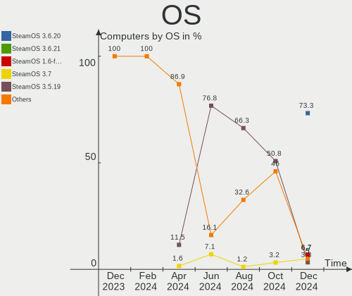
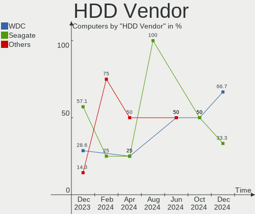
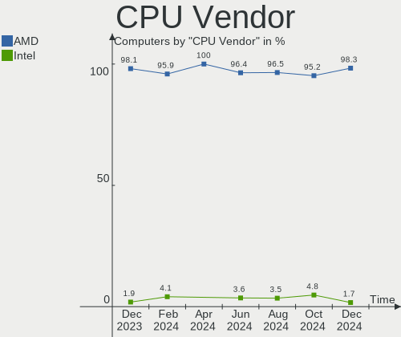
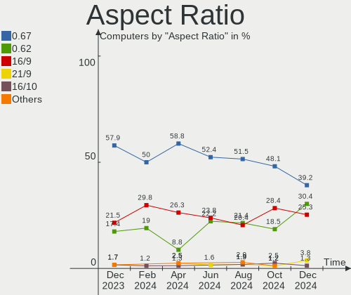
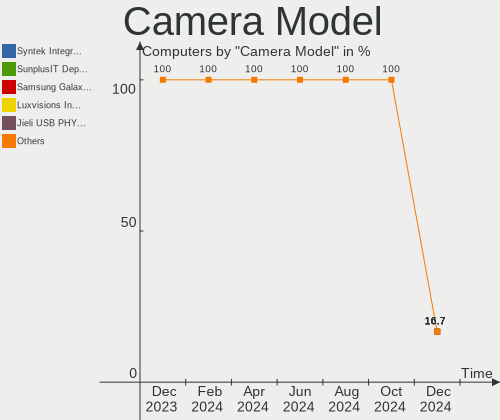

SteamOS - Hardware Trends
-------------------------

A project to identify most popular hardware characteristics and track their change
over time based on data collected by Linux users at https://Linux-Hardware.org.

Anyone can contribute to this report by the [hw-probe](https://github.com/linuxhw/hw-probe) tool:

    sudo -E hw-probe -all -upload

This is a report for all computer types. See also reports for [desktops](/Dist/SteamOS/Desktop/README.md) and [notebooks](/Dist/SteamOS/Notebook/README.md).

This report is for one last month. Overall report since the beginning of time: [TestCoverage](https://github.com/linuxhw/TestCoverage)

Period: Jul, 2022.

Contents
--------

* [ System ](#system)
  - [ OS                       ](#os)
  - [ OS Family                ](#os-family)
  - [ Kernel                   ](#kernel)
  - [ Kernel Family            ](#kernel-family)
  - [ Kernel Major Ver.        ](#kernel-major-ver)
  - [ Arch                     ](#arch)
  - [ DE                       ](#de)
  - [ Display Server           ](#display-server)
  - [ Display Manager          ](#display-manager)
  - [ OS Lang                  ](#os-lang)
  - [ Boot Mode                ](#boot-mode)
  - [ Filesystem               ](#filesystem)
  - [ Part. scheme             ](#part-scheme)
  - [ Dual Boot with Linux/BSD ](#dual-boot-with-linuxbsd)
  - [ Dual Boot (Win)          ](#dual-boot-win)

* [ Board ](#board)
  - [ Vendor                   ](#vendor)
  - [ Model                    ](#model)
  - [ Model Family             ](#model-family)
  - [ MFG Year                 ](#mfg-year)
  - [ Form Factor              ](#form-factor)
  - [ Secure Boot              ](#secure-boot)
  - [ Coreboot                 ](#coreboot)
  - [ RAM Size                 ](#ram-size)
  - [ RAM Used                 ](#ram-used)
  - [ Total Drives             ](#total-drives)
  - [ Has CD-ROM               ](#has-cd-rom)
  - [ Has Ethernet             ](#has-ethernet)
  - [ Has WiFi                 ](#has-wifi)
  - [ Has Bluetooth            ](#has-bluetooth)

* [ Location ](#location)
  - [ Country                  ](#country)
  - [ City                     ](#city)

* [ Drives ](#drives)
  - [ Drive Vendor             ](#drive-vendor)
  - [ Drive Model              ](#drive-model)
  - [ HDD Vendor               ](#hdd-vendor)
  - [ SSD Vendor               ](#ssd-vendor)
  - [ Drive Kind               ](#drive-kind)
  - [ Drive Connector          ](#drive-connector)
  - [ Drive Size               ](#drive-size)
  - [ Space Total              ](#space-total)
  - [ Space Used               ](#space-used)
  - [ Malfunc. Drives          ](#malfunc-drives)
  - [ Malfunc. Drive Vendor    ](#malfunc-drive-vendor)
  - [ Malfunc. HDD Vendor      ](#malfunc-hdd-vendor)
  - [ Malfunc. Drive Kind      ](#malfunc-drive-kind)
  - [ Failed Drives            ](#failed-drives)
  - [ Failed Drive Vendor      ](#failed-drive-vendor)
  - [ Drive Status             ](#drive-status)

* [ Storage controller ](#storage-controller)
  - [ Storage Vendor           ](#storage-vendor)
  - [ Storage Model            ](#storage-model)
  - [ Storage Kind             ](#storage-kind)

* [ Processor ](#processor)
  - [ CPU Vendor               ](#cpu-vendor)
  - [ CPU Model                ](#cpu-model)
  - [ CPU Model Family         ](#cpu-model-family)
  - [ CPU Cores                ](#cpu-cores)
  - [ CPU Sockets              ](#cpu-sockets)
  - [ CPU Threads              ](#cpu-threads)
  - [ CPU Op-Modes             ](#cpu-op-modes)
  - [ CPU Microcode            ](#cpu-microcode)
  - [ CPU Microarch            ](#cpu-microarch)

* [ Graphics ](#graphics)
  - [ GPU Vendor               ](#gpu-vendor)
  - [ GPU Model                ](#gpu-model)
  - [ GPU Combo                ](#gpu-combo)
  - [ GPU Driver               ](#gpu-driver)
  - [ GPU Memory               ](#gpu-memory)

* [ Monitor ](#monitor)
  - [ Monitor Vendor           ](#monitor-vendor)
  - [ Monitor Model            ](#monitor-model)
  - [ Monitor Resolution       ](#monitor-resolution)
  - [ Monitor Diagonal         ](#monitor-diagonal)
  - [ Monitor Width            ](#monitor-width)
  - [ Aspect Ratio             ](#aspect-ratio)
  - [ Monitor Area             ](#monitor-area)
  - [ Pixel Density            ](#pixel-density)
  - [ Multiple Monitors        ](#multiple-monitors)

* [ Network ](#network)
  - [ Net Controller Vendor    ](#net-controller-vendor)
  - [ Net Controller Model     ](#net-controller-model)
  - [ Wireless Vendor          ](#wireless-vendor)
  - [ Wireless Model           ](#wireless-model)
  - [ Ethernet Vendor          ](#ethernet-vendor)
  - [ Ethernet Model           ](#ethernet-model)
  - [ Net Controller Kind      ](#net-controller-kind)
  - [ Used Controller          ](#used-controller)
  - [ NICs                     ](#nics)
  - [ IPv6                     ](#ipv6)

* [ Bluetooth ](#bluetooth)
  - [ Bluetooth Vendor         ](#bluetooth-vendor)
  - [ Bluetooth Model          ](#bluetooth-model)

* [ Sound ](#sound)
  - [ Sound Vendor             ](#sound-vendor)
  - [ Sound Model              ](#sound-model)

* [ Memory ](#memory)
  - [ Memory Vendor            ](#memory-vendor)
  - [ Memory Model             ](#memory-model)
  - [ Memory Kind              ](#memory-kind)
  - [ Memory Form Factor       ](#memory-form-factor)
  - [ Memory Size              ](#memory-size)
  - [ Memory Speed             ](#memory-speed)

* [ Printers & scanners ](#printers--scanners)
  - [ Printer Vendor           ](#printer-vendor)
  - [ Printer Model            ](#printer-model)
  - [ Scanner Vendor           ](#scanner-vendor)
  - [ Scanner Model            ](#scanner-model)

* [ Camera ](#camera)
  - [ Camera Vendor            ](#camera-vendor)
  - [ Camera Model             ](#camera-model)

* [ Security ](#security)
  - [ Fingerprint Vendor       ](#fingerprint-vendor)
  - [ Fingerprint Model        ](#fingerprint-model)
  - [ Chipcard Vendor          ](#chipcard-vendor)
  - [ Chipcard Model           ](#chipcard-model)

* [ Unsupported ](#unsupported)
  - [ Unsupported Devices      ](#unsupported-devices)
  - [ Unsupported Device Types ](#unsupported-device-types)

System
------

OS
--

Installed operating systems

| Name                         | Computers | Percent |
|------------------------------|-----------|---------|
| SteamOS 3.2                  | 25        | 52.08%  |
| SteamOS 3.3                  | 15        | 31.25%  |
| SteamOS 3.2 (steamdeck-main) | 5         | 10.42%  |
| SteamOS                      | 2         | 4.17%   |
| SteamOS 3.1                  | 1         | 2.08%   |

OS Family
---------

OS without a version

| Name    | Computers | Percent |
|---------|-----------|---------|
| SteamOS | 48        | 100%    |

Kernel
------

Version of the Linux kernel

| Version                                            | Computers | Percent |
|----------------------------------------------------|-----------|---------|
| 5.13.0-valve15-1-neptune-02197-gf6ec7ad3762a       | 26        | 54.17%  |
| 5.13.0-valve10.1-2-neptune-dri-02144-g7fffaf925dfb | 5         | 10.42%  |
| 5.13.0-valve21-1-neptune-02209-g2a5bdc1102a0       | 4         | 8.33%   |
| 5.18.1-arch1_testHoloISO_20220606.1811             | 3         | 6.25%   |
| 5.13.0-valve22-1-neptune-02213-gb68995364335       | 3         | 6.25%   |
| 5.13.0-valve21-2-neptune-02209-g2a5bdc1102a0       | 3         | 6.25%   |
| 5.13.0-valve20-1-neptune-02207-gbd986a7e1c7f       | 3         | 6.25%   |
| 5.13.0-valve10.3-1-neptune-02176-g5fe416c4acd8     | 1         | 2.08%   |

Kernel Family
-------------

Linux kernel without a distro release

| Version | Computers | Percent |
|---------|-----------|---------|
| 5.13.0  | 45        | 93.75%  |
| 5.18.1  | 3         | 6.25%   |

Kernel Major Ver.
-----------------

Linux kernel major version

| Version | Computers | Percent |
|---------|-----------|---------|
| 5.13    | 45        | 93.75%  |
| 5.18    | 3         | 6.25%   |

Arch
----

OS architecture (x86_64, i586, etc.)

| Name   | Computers | Percent |
|--------|-----------|---------|
| x86_64 | 48        | 100%    |

DE
--

Desktop Environment

| Name    | Computers | Percent |
|---------|-----------|---------|
| KDE5    | 47        | 97.92%  |
| Unknown | 1         | 2.08%   |

Display Server
--------------

X11 or Wayland

| Name    | Computers | Percent |
|---------|-----------|---------|
| X11     | 47        | 97.92%  |
| Unknown | 1         | 2.08%   |

Display Manager
---------------

SDDM, LightDM, etc.

| Name    | Computers | Percent |
|---------|-----------|---------|
| Unknown | 48        | 100%    |

OS Lang
-------

Language

| Lang  | Computers | Percent |
|-------|-----------|---------|
| en_US | 41        | 85.42%  |
| en_GB | 2         | 4.17%   |
| an_ES | 2         | 4.17%   |
| pt_PT | 1         | 2.08%   |
| en_CA | 1         | 2.08%   |
| de_DE | 1         | 2.08%   |

Boot Mode
---------

EFI or BIOS

| Mode | Computers | Percent |
|------|-----------|---------|
| BIOS | 47        | 97.92%  |
| EFI  | 1         | 2.08%   |

Filesystem
----------

Type of filesystem

| Type  | Computers | Percent |
|-------|-----------|---------|
| Btrfs | 48        | 100%    |

Part. scheme
------------

Scheme of partitioning

| Type    | Computers | Percent |
|---------|-----------|---------|
| Unknown | 47        | 97.92%  |
| GPT     | 1         | 2.08%   |

Dual Boot with Linux/BSD
------------------------

Hosting more than one Linux/BSD

| Dual boot | Computers | Percent |
|-----------|-----------|---------|
| No        | 47        | 97.92%  |
| Yes       | 1         | 2.08%   |

Dual Boot (Win)
---------------

Hosting Linux and Windows

| Dual boot | Computers | Percent |
|-----------|-----------|---------|
| No        | 48        | 100%    |

Board
-----

Vendor
------

Motherboard manufacturer

| Name                   | Computers | Percent |
|------------------------|-----------|---------|
| Valve                  | 31        | 64.58%  |
| Gigabyte Technology    | 3         | 6.25%   |
| ASRock                 | 3         | 6.25%   |
| Lenovo                 | 2         | 4.17%   |
| ONE-NETBOOK TECHNOLOGY | 1         | 2.08%   |
| Hewlett-Packard        | 1         | 2.08%   |
| GPD                    | 1         | 2.08%   |
| Dell                   | 1         | 2.08%   |
| AYANEO                 | 1         | 2.08%   |
| ASUSTek Computer       | 1         | 2.08%   |
| Alienware              | 1         | 2.08%   |
| Acer                   | 1         | 2.08%   |
| Unknown                | 1         | 2.08%   |

Model
-----

Motherboard model

| Name                               | Computers | Percent |
|------------------------------------|-----------|---------|
| Valve Jupiter                      | 31        | 64.58%  |
| ONE-NETBOOK TECHNOLOGY ONE XPLAYER | 1         | 2.08%   |
| Lenovo ThinkBook 13s G3 ACN 20YA   | 1         | 2.08%   |
| Lenovo IdeaPadFlex 5 14ALC05 82HU  | 1         | 2.08%   |
| HP Pavilion 17                     | 1         | 2.08%   |
| GPD G1619-02                       | 1         | 2.08%   |
| Gigabyte X570 I AORUS PRO WIFI     | 1         | 2.08%   |
| Gigabyte H170N-WIFI                | 1         | 2.08%   |
| Gigabyte B550 GAMING X V2          | 1         | 2.08%   |
| Dell XPS 15 9570                   | 1         | 2.08%   |
| AYANEO NEXT Pro                    | 1         | 2.08%   |
| ASUS EX-A320M-GAMING               | 1         | 2.08%   |
| ASRock X570 Extreme4 WiFi ax       | 1         | 2.08%   |
| ASRock B450M-HDV R4.0              | 1         | 2.08%   |
| ASRock A520M-ITX/ac                | 1         | 2.08%   |
| Alienware m17                      | 1         | 2.08%   |
| Acer Aspire A514-54                | 1         | 2.08%   |
| Unknown                            | 1         | 2.08%   |

Model Family
------------

Motherboard model prefix

| Name                       | Computers | Percent |
|----------------------------|-----------|---------|
| Valve Jupiter              | 31        | 64.58%  |
| ONE-NETBOOK TECHNOLOGY ONE | 1         | 2.08%   |
| Lenovo ThinkBook           | 1         | 2.08%   |
| Lenovo IdeaPadFlex         | 1         | 2.08%   |
| HP Pavilion                | 1         | 2.08%   |
| GPD G1619-02               | 1         | 2.08%   |
| Gigabyte X570              | 1         | 2.08%   |
| Gigabyte H170N-WIFI        | 1         | 2.08%   |
| Gigabyte B550              | 1         | 2.08%   |
| Dell XPS                   | 1         | 2.08%   |
| AYANEO NEXT                | 1         | 2.08%   |
| ASUS EX-A320M-GAMING       | 1         | 2.08%   |
| ASRock X570                | 1         | 2.08%   |
| ASRock B450M-HDV           | 1         | 2.08%   |
| ASRock A520M-ITX           | 1         | 2.08%   |
| Alienware m17              | 1         | 2.08%   |
| Acer Aspire                | 1         | 2.08%   |
| Unknown                    | 1         | 2.08%   |

MFG Year
--------

Motherboard manufacture year

| Year | Computers | Percent |
|------|-----------|---------|
| 2022 | 32        | 66.67%  |
| 2021 | 6         | 12.5%   |
| 2018 | 4         | 8.33%   |
| 2020 | 3         | 6.25%   |
| 2019 | 2         | 4.17%   |
| 2013 | 1         | 2.08%   |

Form Factor
-----------

Physical design of the computer

| Name        | Computers | Percent |
|-------------|-----------|---------|
| Notebook    | 39        | 81.25%  |
| Desktop     | 6         | 12.5%   |
| Tablet      | 2         | 4.17%   |
| Convertible | 1         | 2.08%   |

Secure Boot
-----------

Enabled or disabled

| State    | Computers | Percent |
|----------|-----------|---------|
| Disabled | 48        | 100%    |

Coreboot
--------

Have coreboot on board

| Used | Computers | Percent |
|------|-----------|---------|
| No   | 48        | 100%    |

RAM Size
--------

Total RAM memory

| Size in GB  | Computers | Percent |
|-------------|-----------|---------|
| 8.01-16.0   | 36        | 75%     |
| 16.01-24.0  | 6         | 12.5%   |
| 4.01-8.0    | 2         | 4.17%   |
| 32.01-64.0  | 2         | 4.17%   |
| 24.01-32.0  | 1         | 2.08%   |
| 64.01-256.0 | 1         | 2.08%   |

RAM Used
--------

Used RAM memory

| Used GB  | Computers | Percent |
|----------|-----------|---------|
| 2.01-3.0 | 31        | 64.58%  |
| 4.01-8.0 | 7         | 14.58%  |
| 3.01-4.0 | 6         | 12.5%   |
| 1.01-2.0 | 4         | 8.33%   |

Total Drives
------------

Number of drives on board

| Drives | Computers | Percent |
|--------|-----------|---------|
| 2      | 22        | 45.83%  |
| 1      | 21        | 43.75%  |
| 3      | 4         | 8.33%   |
| 0      | 1         | 2.08%   |

Has CD-ROM
----------

Has CD-ROM on board

| Presented | Computers | Percent |
|-----------|-----------|---------|
| No        | 47        | 97.92%  |
| Yes       | 1         | 2.08%   |

Has Ethernet
------------

Has Ethernet on board

| Presented | Computers | Percent |
|-----------|-----------|---------|
| No        | 27        | 56.25%  |
| Yes       | 21        | 43.75%  |

Has WiFi
--------

Has WiFi module

| Presented | Computers | Percent |
|-----------|-----------|---------|
| Yes       | 46        | 95.83%  |
| No        | 2         | 4.17%   |

Has Bluetooth
-------------

Has Bluetooth module

| Presented | Computers | Percent |
|-----------|-----------|---------|
| Yes       | 47        | 97.92%  |
| No        | 1         | 2.08%   |

Location
--------

Country
-------

Geographic location (country)

| Country   | Computers | Percent |
|-----------|-----------|---------|
| USA       | 21        | 43.75%  |
| Germany   | 5         | 10.42%  |
| UK        | 4         | 8.33%   |
| Spain     | 3         | 6.25%   |
| Italy     | 2         | 4.17%   |
| Canada    | 2         | 4.17%   |
| Australia | 2         | 4.17%   |
| Sweden    | 1         | 2.08%   |
| Portugal  | 1         | 2.08%   |
| Malaysia  | 1         | 2.08%   |
| Japan     | 1         | 2.08%   |
| Hong Kong | 1         | 2.08%   |
| Honduras  | 1         | 2.08%   |
| France    | 1         | 2.08%   |
| Brazil    | 1         | 2.08%   |
| Belgium   | 1         | 2.08%   |

City
----

Geographic location (city)

| City                   | Computers | Percent |
|------------------------|-----------|---------|
| Walsall                | 1         | 2.08%   |
| Victoria               | 1         | 2.08%   |
| Tulsa                  | 1         | 2.08%   |
| Tegucigalpa            | 1         | 2.08%   |
| Talavera de la Reina   | 1         | 2.08%   |
| Sunnyvale              | 1         | 2.08%   |
| Stockholm              | 1         | 2.08%   |
| Southlake              | 1         | 2.08%   |
| Sindelfingen           | 1         | 2.08%   |
| Seri Kembangan         | 1         | 2.08%   |
| Schwerin               | 1         | 2.08%   |
| Santa Cruz de Tenerife | 1         | 2.08%   |
| Rome                   | 1         | 2.08%   |
| Roanoke                | 1         | 2.08%   |
| Portland               | 1         | 2.08%   |
| Portage                | 1         | 2.08%   |
| Philadelphia           | 1         | 2.08%   |
| Ooltewah               | 1         | 2.08%   |
| Norwich                | 1         | 2.08%   |
| Noble Park             | 1         | 2.08%   |
| New York               | 1         | 2.08%   |
| Mississauga            | 1         | 2.08%   |
| Midlothian             | 1         | 2.08%   |
| Middle Island          | 1         | 2.08%   |
| Miami                  | 1         | 2.08%   |
| McArthur               | 1         | 2.08%   |
| Mascot                 | 1         | 2.08%   |
| Lisbon                 | 1         | 2.08%   |
| Lansing                | 1         | 2.08%   |
| Kyle                   | 1         | 2.08%   |
| Iwakuni                | 1         | 2.08%   |
| Indianapolis           | 1         | 2.08%   |
| Heusden                | 1         | 2.08%   |
| Hanau                  | 1         | 2.08%   |
| Haan                   | 1         | 2.08%   |
| Guarulhos              | 1         | 2.08%   |
| Green Bay              | 1         | 2.08%   |
| Frankfurt am Main      | 1         | 2.08%   |
| Edinburgh              | 1         | 2.08%   |
| Chickasha              | 1         | 2.08%   |
| Central                | 1         | 2.08%   |
| Bologna                | 1         | 2.08%   |
| Barcelona              | 1         | 2.08%   |
| Avondale               | 1         | 2.08%   |
| Avignon                | 1         | 2.08%   |
| Austin                 | 1         | 2.08%   |
| Antioch                | 1         | 2.08%   |
| Aberdeen               | 1         | 2.08%   |

Drives
------

Drive Vendor
------------

Hard drive vendors

| Vendor                    | Computers | Drives | Percent |
|---------------------------|-----------|--------|---------|
| Phison                    | 15        | 15     | 19.74%  |
| Unknown                   | 14        | 14     | 18.42%  |
| Kingston                  | 12        | 12     | 15.79%  |
| Samsung Electronics       | 6         | 6      | 7.89%   |
| Silicon Motion            | 4         | 4      | 5.26%   |
| Seagate                   | 4         | 5      | 5.26%   |
| Crucial                   | 3         | 3      | 3.95%   |
| SanDisk                   | 2         | 2      | 2.63%   |
| Micron/Crucial Technology | 2         | 2      | 2.63%   |
| KIOXIA                    | 2         | 2      | 2.63%   |
| Unknown                   | 2         | 2      | 2.63%   |
| Toshiba                   | 1         | 1      | 1.32%   |
| Realtek Semiconductor     | 1         | 1      | 1.32%   |
| PNY                       | 1         | 1      | 1.32%   |
| O2 Micro                  | 1         | 1      | 1.32%   |
| JMicron Technology        | 1         | 1      | 1.32%   |
| Intel                     | 1         | 1      | 1.32%   |
| GALAX                     | 1         | 1      | 1.32%   |
| China                     | 1         | 1      | 1.32%   |
| ASMT                      | 1         | 1      | 1.32%   |
| ADATA Technology          | 1         | 1      | 1.32%   |

Drive Model
-----------

Hard drive models

| Model                               | Computers | Percent |
|-------------------------------------|-----------|---------|
| Phison NVMe SSD Drive 512GB         | 9         | 11.69%  |
| Kingston NVMe SSD Drive 512GB       | 6         | 7.79%   |
| Unknown MMC Card  512GB             | 5         | 6.49%   |
| Phison NVMe SSD Drive 256GB         | 5         | 6.49%   |
| Kingston NVMe SSD Drive 256GB       | 5         | 6.49%   |
| Unknown MMC Card  256GB             | 3         | 3.9%    |
| Unknown MMC Card  498GB             | 2         | 2.6%    |
| Silicon Motion NVMe SSD Drive 256GB | 2         | 2.6%    |
| Crucial CT1000BX500SSD1 1TB         | 2         | 2.6%    |
| Unknown                             | 2         | 2.6%    |
| Unknown MMC Card  64GB              | 1         | 1.3%    |
| Unknown MMC Card  500GB             | 1         | 1.3%    |
| Unknown MMC Card  393GB             | 1         | 1.3%    |
| Unknown MMC Card  128GB             | 1         | 1.3%    |
| Toshiba DT01ACA200 2TB              | 1         | 1.3%    |
| Silicon Motion NVMe SSD Drive 512GB | 1         | 1.3%    |
| Silicon Motion NVMe SSD Drive 2TB   | 1         | 1.3%    |
| Seagate ST9320325AS 320GB           | 1         | 1.3%    |
| Seagate ST6000DM003-2CY186 6TB      | 1         | 1.3%    |
| Seagate ST4000DX001-1CE168 4TB      | 1         | 1.3%    |
| Seagate ST1000LX015-1U7172 1TB      | 1         | 1.3%    |
| Seagate ST1000LM014-1EJ164 1TB      | 1         | 1.3%    |
| SanDisk NVMe SSD Drive 512GB        | 1         | 1.3%    |
| SanDisk NVMe SSD Drive 256GB        | 1         | 1.3%    |
| Samsung SSD CM871 2.5 7mm 128GB     | 1         | 1.3%    |
| Samsung SSD 860 EVO M.2 250GB       | 1         | 1.3%    |
| Samsung SSD 840 Series 120GB        | 1         | 1.3%    |
| Samsung NVMe SSD Drive 512GB        | 1         | 1.3%    |
| Samsung NVMe SSD Drive 500GB        | 1         | 1.3%    |
| Samsung MZ9LQ1T0HBLB-00B 1TB        | 1         | 1.3%    |
| Realtek NVMe SSD Drive 256GB        | 1         | 1.3%    |
| PNY CS900 120GB SSD                 | 1         | 1.3%    |
| Phison NVMe SSD Drive 1TB           | 1         | 1.3%    |
| O2 Micro NVMe SSD Drive 64GB        | 1         | 1.3%    |
| Micron/Crucial NVMe SSD Drive 500GB | 1         | 1.3%    |
| Micron/Crucial NVMe SSD Drive 2TB   | 1         | 1.3%    |
| KIOXIA NVMe SSD Drive 512GB         | 1         | 1.3%    |
| KIOXIA NVMe SSD Drive 256GB         | 1         | 1.3%    |
| Kingston SA400M8120G 120GB SSD      | 1         | 1.3%    |
| JMicron Generic 2TB                 | 1         | 1.3%    |
| Intel NVMe SSD Drive 512GB          | 1         | 1.3%    |
| GALAX TA1D0120N 120GB               | 1         | 1.3%    |
| Crucial CT525MX300SSD1 528GB        | 1         | 1.3%    |
| China SSD 120GB                     | 1         | 1.3%    |
| ASMT 2235 160GB                     | 1         | 1.3%    |
| ADATA NVMe SSD Drive 256GB          | 1         | 1.3%    |

HDD Vendor
----------

Hard disk drive vendors

| Vendor  | Computers | Drives | Percent |
|---------|-----------|--------|---------|
| Seagate | 4         | 5      | 66.67%  |
| Toshiba | 1         | 1      | 16.67%  |
| ASMT    | 1         | 1      | 16.67%  |

SSD Vendor
----------

Solid state drive vendors

| Vendor              | Computers | Drives | Percent |
|---------------------|-----------|--------|---------|
| Samsung Electronics | 3         | 3      | 33.33%  |
| Crucial             | 3         | 3      | 33.33%  |
| PNY                 | 1         | 1      | 11.11%  |
| Kingston            | 1         | 1      | 11.11%  |
| China               | 1         | 1      | 11.11%  |

Drive Kind
----------

HDD or SSD

| Kind    | Computers | Drives | Percent |
|---------|-----------|--------|---------|
| NVMe    | 41        | 44     | 56.94%  |
| MMC     | 16        | 16     | 22.22%  |
| SSD     | 8         | 9      | 11.11%  |
| HDD     | 6         | 7      | 8.33%   |
| Unknown | 1         | 1      | 1.39%   |

Drive Connector
---------------

SATA, SAS, NVMe, etc.

| Type | Computers | Drives | Percent |
|------|-----------|--------|---------|
| NVMe | 41        | 43     | 61.19%  |
| MMC  | 16        | 16     | 23.88%  |
| SATA | 8         | 16     | 11.94%  |
| SAS  | 2         | 2      | 2.99%   |

Drive Size
----------

Size of hard drive

| Size in TB | Computers | Drives | Percent |
|------------|-----------|--------|---------|
| 0.01-0.5   | 8         | 8      | 50%     |
| 0.51-1.0   | 5         | 5      | 31.25%  |
| 3.01-4.0   | 1         | 1      | 6.25%   |
| 1.01-2.0   | 1         | 1      | 6.25%   |
| 4.01-10.0  | 1         | 1      | 6.25%   |

Space Total
-----------

Amount of disk space available on the file system

| Size in GB     | Computers | Percent |
|----------------|-----------|---------|
| 251-500        | 20        | 41.67%  |
| 101-250        | 18        | 37.5%   |
| 501-1000       | 5         | 10.42%  |
| More than 3000 | 2         | 4.17%   |
| 1001-2000      | 2         | 4.17%   |
| 51-100         | 1         | 2.08%   |

Space Used
----------

Amount of used disk space

| Used GB   | Computers | Percent |
|-----------|-----------|---------|
| 101-250   | 19        | 39.58%  |
| 251-500   | 11        | 22.92%  |
| 21-50     | 6         | 12.5%   |
| 1-20      | 5         | 10.42%  |
| 51-100    | 5         | 10.42%  |
| 2001-3000 | 1         | 2.08%   |
| 501-1000  | 1         | 2.08%   |

Malfunc. Drives
---------------

Drive models with a malfunction

Zero info for selected period =(

Malfunc. Drive Vendor
---------------------

Vendors of faulty drives

Zero info for selected period =(

Malfunc. HDD Vendor
-------------------

Vendors of faulty HDD drives

Zero info for selected period =(

Malfunc. Drive Kind
-------------------

Kinds of faulty drives

Zero info for selected period =(

Failed Drives
-------------

Failed drive models

Zero info for selected period =(

Failed Drive Vendor
-------------------

Failed drive vendors

Zero info for selected period =(

Drive Status
------------

Number of failed and malfunc. drives

| Status   | Computers | Drives | Percent |
|----------|-----------|--------|---------|
| Detected | 47        | 76     | 97.92%  |
| Works    | 1         | 1      | 2.08%   |

Storage controller
------------------

Storage Vendor
--------------

Storage controller vendors

| Vendor                      | Computers | Percent |
|-----------------------------|-----------|---------|
| Phison Electronics          | 15        | 27.78%  |
| Kingston Technology Company | 11        | 20.37%  |
| AMD                         | 7         | 12.96%  |
| Intel                       | 5         | 9.26%   |
| Silicon Motion              | 4         | 7.41%   |
| Samsung Electronics         | 3         | 5.56%   |
| SanDisk                     | 2         | 3.7%    |
| Micron/Crucial Technology   | 2         | 3.7%    |
| KIOXIA                      | 2         | 3.7%    |
| Realtek Semiconductor       | 1         | 1.85%   |
| O2 Micro                    | 1         | 1.85%   |
| ADATA Technology            | 1         | 1.85%   |

Storage Model
-------------

Storage controller models

| Model                                                                         | Computers | Percent |
|-------------------------------------------------------------------------------|-----------|---------|
| Phison PS5013 E13 NVMe Controller                                             | 14        | 23.73%  |
| Kingston Company OM3PDP3 NVMe SSD                                             | 11        | 18.64%  |
| AMD FCH SATA Controller [AHCI mode]                                           | 6         | 10.17%  |
| Silicon Motion SM2263EN/SM2263XT SSD Controller                               | 3         | 5.08%   |
| SanDisk Non-Volatile memory controller                                        | 2         | 3.39%   |
| Samsung NVMe SSD Controller 980                                               | 2         | 3.39%   |
| Micron/Crucial P2 NVMe PCIe SSD                                               | 2         | 3.39%   |
| KIOXIA NVMe SSD Controller BG4                                                | 2         | 3.39%   |
| Intel 82801 Mobile SATA Controller [RAID mode]                                | 2         | 3.39%   |
| AMD 500 Series Chipset SATA Controller                                        | 2         | 3.39%   |
| Silicon Motion SM2262/SM2262EN SSD Controller                                 | 1         | 1.69%   |
| Samsung NVMe SSD Controller SM981/PM981/PM983                                 | 1         | 1.69%   |
| Realtek RTS5763DL NVMe SSD Controller                                         | 1         | 1.69%   |
| Phison E12 NVMe Controller                                                    | 1         | 1.69%   |
| O2 Micro Non-Volatile memory controller                                       | 1         | 1.69%   |
| Intel Volume Management Device NVMe RAID Controller                           | 1         | 1.69%   |
| Intel Tiger Lake-LP SATA Controller                                           | 1         | 1.69%   |
| Intel SSD 660P Series                                                         | 1         | 1.69%   |
| Intel Q170/Q150/B150/H170/H110/Z170/CM236 Chipset SATA Controller [AHCI Mode] | 1         | 1.69%   |
| AMD FCH SATA Controller D                                                     | 1         | 1.69%   |
| AMD FCH IDE Controller                                                        | 1         | 1.69%   |
| AMD 400 Series Chipset SATA Controller                                        | 1         | 1.69%   |
| ADATA Non-Volatile memory controller                                          | 1         | 1.69%   |

Storage Kind
------------

Kind of storage controller (IDE, SATA, NVMe, SAS, ...)

| Kind | Computers | Percent |
|------|-----------|---------|
| NVMe | 41        | 75.93%  |
| SATA | 9         | 16.67%  |
| RAID | 3         | 5.56%   |
| IDE  | 1         | 1.85%   |

Processor
---------

CPU Vendor
----------

Processor vendors

| Vendor | Computers | Percent |
|--------|-----------|---------|
| AMD    | 43        | 89.58%  |
| Intel  | 5         | 10.42%  |

CPU Model
---------

Processor models

| Model                                    | Computers | Percent |
|------------------------------------------|-----------|---------|
| AMD Custom APU 0405                      | 31        | 64.58%  |
| Intel Core i7-8750H CPU @ 2.20GHz        | 2         | 4.17%   |
| AMD Ryzen 7 4800U with Radeon Graphics   | 2         | 4.17%   |
| Intel Core i5-6600 CPU @ 3.30GHz         | 1         | 2.08%   |
| Intel 11th Gen Core i7-1160G7 @ 1.20GHz  | 1         | 2.08%   |
| Intel 11th Gen Core i3-1115G4 @ 3.00GHz  | 1         | 2.08%   |
| AMD Ryzen 9 3900X 12-Core Processor      | 1         | 2.08%   |
| AMD Ryzen 7 5825U with Radeon Graphics   | 1         | 2.08%   |
| AMD Ryzen 7 3700X 8-Core Processor       | 1         | 2.08%   |
| AMD Ryzen 5 5600X 6-Core Processor       | 1         | 2.08%   |
| AMD Ryzen 5 5600U with Radeon Graphics   | 1         | 2.08%   |
| AMD Ryzen 5 5500U with Radeon Graphics   | 1         | 2.08%   |
| AMD Ryzen 5 3600X 6-Core Processor       | 1         | 2.08%   |
| AMD Ryzen 5 2600X Six-Core Processor     | 1         | 2.08%   |
| AMD Ryzen 5 1600 Six-Core Processor      | 1         | 2.08%   |
| AMD A8-4500M APU with Radeon HD Graphics | 1         | 2.08%   |

CPU Model Family
----------------

Processor model prefix

| Model         | Computers | Percent |
|---------------|-----------|---------|
| Other         | 33        | 68.75%  |
| AMD Ryzen 5   | 6         | 12.5%   |
| AMD Ryzen 7   | 4         | 8.33%   |
| Intel Core i7 | 2         | 4.17%   |
| Intel Core i5 | 1         | 2.08%   |
| AMD Ryzen 9   | 1         | 2.08%   |
| AMD A8        | 1         | 2.08%   |

CPU Cores
---------

Number of processor cores

| Number | Computers | Percent |
|--------|-----------|---------|
| 4      | 33        | 68.75%  |
| 6      | 7         | 14.58%  |
| 8      | 4         | 8.33%   |
| 2      | 3         | 6.25%   |
| 12     | 1         | 2.08%   |

CPU Sockets
-----------

Number of sockets

| Number | Computers | Percent |
|--------|-----------|---------|
| 1      | 48        | 100%    |

CPU Threads
-----------

Threads per core (Hyper-Threading)

| Number | Computers | Percent |
|--------|-----------|---------|
| 2      | 47        | 97.92%  |
| 1      | 1         | 2.08%   |

CPU Op-Modes
------------

CPU Operation Modes (32-bit, 64-bit)

| Op mode        | Computers | Percent |
|----------------|-----------|---------|
| 32-bit, 64-bit | 48        | 100%    |

CPU Microcode
-------------

Microcode number

| Number     | Computers | Percent |
|------------|-----------|---------|
| Unknown    | 47        | 97.92%  |
| 0x08900201 | 1         | 2.08%   |

CPU Microarch
-------------

Microarchitecture

| Name       | Computers | Percent |
|------------|-----------|---------|
| Unknown    | 32        | 66.67%  |
| Zen 2      | 5         | 10.42%  |
| Zen 3      | 3         | 6.25%   |
| Zen+       | 2         | 4.17%   |
| TigerLake  | 2         | 4.17%   |
| KabyLake   | 2         | 4.17%   |
| Skylake    | 1         | 2.08%   |
| Piledriver | 1         | 2.08%   |

Graphics
--------

GPU Vendor
----------

Vendors of graphics cards

| Vendor | Computers | Percent |
|--------|-----------|---------|
| AMD    | 41        | 82%     |
| Nvidia | 5         | 10%     |
| Intel  | 4         | 8%      |

GPU Model
---------

Graphics card models

| Model                                                   | Computers | Percent |
|---------------------------------------------------------|-----------|---------|
| AMD VanGogh [AMD Custom GPU 0405]                       | 31        | 62%     |
| Intel CoffeeLake-H GT2 [UHD Graphics 630]               | 2         | 4%      |
| AMD Renoir                                              | 2         | 4%      |
| AMD Navi 23 [Radeon RX 6600/6600 XT/6600M]              | 2         | 4%      |
| Nvidia TU117 [GeForce GTX 1650]                         | 1         | 2%      |
| Nvidia TU116 [GeForce GTX 1660 SUPER]                   | 1         | 2%      |
| Nvidia TU106M [GeForce RTX 2060 Mobile]                 | 1         | 2%      |
| Nvidia GP107M [GeForce GTX 1050 Ti Mobile]              | 1         | 2%      |
| Nvidia GM204 [GeForce GTX 970]                          | 1         | 2%      |
| Intel Tiger Lake UHD Graphics                           | 1         | 2%      |
| Intel Tiger Lake Iris Xe Graphics                       | 1         | 2%      |
| AMD Trinity [Radeon HD 7640G]                           | 1         | 2%      |
| AMD Navi 10 [Radeon RX 5600 OEM/5600 XT / 5700/5700 XT] | 1         | 2%      |
| AMD Lucienne                                            | 1         | 2%      |
| AMD Ellesmere [Radeon RX 470/480/570/570X/580/580X/590] | 1         | 2%      |
| AMD Cezanne                                             | 1         | 2%      |
| AMD Barcelo                                             | 1         | 2%      |

GPU Combo
---------

Combinations of graphics cards

| Name           | Computers | Percent |
|----------------|-----------|---------|
| 1 x AMD        | 41        | 85.42%  |
| 1 x Nvidia     | 3         | 6.25%   |
| Intel + Nvidia | 2         | 4.17%   |
| 1 x Intel      | 2         | 4.17%   |

GPU Driver
----------

Free vs proprietary

| Driver      | Computers | Percent |
|-------------|-----------|---------|
| Free        | 44        | 91.67%  |
| Proprietary | 4         | 8.33%   |

GPU Memory
----------

Total video memory

| Size in GB | Computers | Percent |
|------------|-----------|---------|
| Unknown    | 44        | 91.67%  |
| 3.01-4.0   | 2         | 4.17%   |
| 5.01-6.0   | 1         | 2.08%   |
| 0.51-1.0   | 1         | 2.08%   |

Monitor
-------

Monitor Vendor
--------------

Monitor vendors

| Vendor              | Computers | Percent |
|---------------------|-----------|---------|
| ANX                 | 30        | 56.6%   |
| Sony                | 3         | 5.66%   |
| Chimei Innolux      | 3         | 5.66%   |
| Vizio               | 2         | 3.77%   |
| Samsung Electronics | 2         | 3.77%   |
| MSF                 | 2         | 3.77%   |
| LG Display          | 2         | 3.77%   |
| ViewSonic           | 1         | 1.89%   |
| Valve               | 1         | 1.89%   |
| Sun                 | 1         | 1.89%   |
| Sharp               | 1         | 1.89%   |
| Philips             | 1         | 1.89%   |
| LTM                 | 1         | 1.89%   |
| Goldstar            | 1         | 1.89%   |
| Dell                | 1         | 1.89%   |
| AOC                 | 1         | 1.89%   |

Monitor Model
-------------

Monitor models

| Model                                                                  | Computers | Percent |
|------------------------------------------------------------------------|-----------|---------|
| ANX ANX7530 U ANX7539 800x1280                                         | 30        | 56.6%   |
| MSF TV080WUM-NL0 MSF1003 1600x2560 113x181mm 8.4-inch                  | 2         | 3.77%   |
| Vizio D32x-D1 VIZ1005 1920x1080 700x390mm 31.5-inch                    | 1         | 1.89%   |
| Vizio D24f-J09 VIZ1044 1920x1080 521x293mm 23.5-inch                   | 1         | 1.89%   |
| ViewSonic VX3276-QHD VSCE635 2560x1440 698x393mm 31.5-inch             | 1         | 1.89%   |
| Valve ANX7530 U VLV3001 800x1280 100x150mm 7.1-inch                    | 1         | 1.89%   |
| Sun SCEI MONITOR SCE0301 1920x1080 522x294mm 23.6-inch                 | 1         | 1.89%   |
| Sony TV SNYEE01 1920x1080                                              | 1         | 1.89%   |
| Sony TV *00 SNY8204 3840x2160 1218x685mm 55.0-inch                     | 1         | 1.89%   |
| Sony BW8 MS_9001 1200x1920                                             | 1         | 1.89%   |
| Sharp LCD Monitor SHP149A 1920x1080 344x194mm 15.5-inch                | 1         | 1.89%   |
| Samsung Electronics LCD Monitor SAM0A7E 1920x1080 1060x626mm 48.5-inch | 1         | 1.89%   |
| Samsung Electronics LCD Monitor SAM0A7D 1920x1080 890x500mm 40.2-inch  | 1         | 1.89%   |
| Philips PHL 326M6V PHLC193 3840x2160 698x398mm 31.6-inch               | 1         | 1.89%   |
| LTM LT7911D LTM08E1 1024x768 140x140mm 7.8-inch                        | 1         | 1.89%   |
| LG Display LCD Monitor LGD40A9 1920x1080 309x174mm 14.0-inch           | 1         | 1.89%   |
| LG Display LCD Monitor LGD0372 1600x900 382x215mm 17.3-inch            | 1         | 1.89%   |
| Goldstar ULTRAWIDE GSM76F6 3440x1440 800x335mm 34.1-inch               | 1         | 1.89%   |
| Dell E2420H DELF11B 1920x1080 527x296mm 23.8-inch                      | 1         | 1.89%   |
| Chimei Innolux LCD Monitor CMN1738 1920x1080 381x214mm 17.2-inch       | 1         | 1.89%   |
| Chimei Innolux LCD Monitor CMN14D4 1920x1080 309x173mm 13.9-inch       | 1         | 1.89%   |
| Chimei Innolux LCD Monitor CMN13B0 2560x1600 286x178mm 13.3-inch       | 1         | 1.89%   |
| AOC 27G1G4 AOC2701 1920x1080 598x336mm 27.0-inch                       | 1         | 1.89%   |

Monitor Resolution
------------------

Monitor screen resolution

| Resolution      | Computers | Percent |
|-----------------|-----------|---------|
| 800x1280        | 31        | 58.49%  |
| 1920x1080 (FHD) | 11        | 20.75%  |
| 3840x2160 (4K)  | 2         | 3.77%   |
| 2560x1600       | 2         | 3.77%   |
| 2560x1440 (QHD) | 2         | 3.77%   |
| 1600x2560       | 2         | 3.77%   |
| 3440x1440       | 1         | 1.89%   |
| 1600x900 (HD+)  | 1         | 1.89%   |
| 1024x768 (XGA)  | 1         | 1.89%   |

Monitor Diagonal
----------------

Diagonal size in inches

| Inches  | Computers | Percent |
|---------|-----------|---------|
| Unknown | 30        | 56.6%   |
| 31      | 3         | 5.66%   |
| 8       | 3         | 5.66%   |
| 23      | 2         | 3.77%   |
| 17      | 2         | 3.77%   |
| 13      | 2         | 3.77%   |
| 7       | 2         | 3.77%   |
| 72      | 1         | 1.89%   |
| 65      | 1         | 1.89%   |
| 57      | 1         | 1.89%   |
| 54      | 1         | 1.89%   |
| 48      | 1         | 1.89%   |
| 40      | 1         | 1.89%   |
| 27      | 1         | 1.89%   |
| 15      | 1         | 1.89%   |
| 14      | 1         | 1.89%   |

Monitor Width
-------------

Physical width

| Width in mm | Computers | Percent |
|-------------|-----------|---------|
| Unknown     | 30        | 56.6%   |
| 101-200     | 4         | 7.55%   |
| 1001-1500   | 4         | 7.55%   |
| 601-700     | 3         | 5.66%   |
| 501-600     | 3         | 5.66%   |
| 301-350     | 3         | 5.66%   |
| 351-400     | 2         | 3.77%   |
| 801-900     | 1         | 1.89%   |
| 201-300     | 1         | 1.89%   |
| 1501-2000   | 1         | 1.89%   |
| 1-100       | 1         | 1.89%   |

Aspect Ratio
------------

Proportional relationship between the width and the height

| Ratio | Computers | Percent |
|-------|-----------|---------|
| 0.62  | 31        | 59.62%  |
| 16/9  | 16        | 30.77%  |
| 0.58  | 2         | 3.85%   |
| 16/10 | 1         | 1.92%   |
| 1.00  | 1         | 1.92%   |
| 0.67  | 1         | 1.92%   |

Monitor Area
------------

Area in inch²

| Area in inch² | Computers | Percent |
|----------------|-----------|---------|
| Unknown        | 30        | 56.6%   |
| More than 1000 | 5         | 9.43%   |
| 1-40           | 5         | 9.43%   |
| 351-500        | 3         | 5.66%   |
| 81-90          | 2         | 3.77%   |
| 201-250        | 2         | 3.77%   |
| 121-130        | 2         | 3.77%   |
| 71-80          | 1         | 1.89%   |
| 301-350        | 1         | 1.89%   |
| 101-110        | 1         | 1.89%   |
| 501-1000       | 1         | 1.89%   |

Pixel Density
-------------

Pixels per inch

| Density       | Computers | Percent |
|---------------|-----------|---------|
| Unknown       | 30        | 56.6%   |
| 51-100        | 7         | 13.21%  |
| 161-240       | 5         | 9.43%   |
| 121-160       | 5         | 9.43%   |
| 1-50          | 4         | 7.55%   |
| More than 240 | 1         | 1.89%   |
| 101-120       | 1         | 1.89%   |

Multiple Monitors
-----------------

Total monitors connected

| Total | Computers | Percent |
|-------|-----------|---------|
| 1     | 41        | 85.42%  |
| 2     | 7         | 14.58%  |

Network
-------

Net Controller Vendor
---------------------

Controller vendors

| Vendor                | Computers | Percent |
|-----------------------|-----------|---------|
| Realtek Semiconductor | 41        | 69.49%  |
| Intel                 | 9         | 15.25%  |
| Qualcomm Atheros      | 3         | 5.08%   |
| ASIX Electronics      | 3         | 5.08%   |
| MediaTek              | 2         | 3.39%   |
| TP-Link               | 1         | 1.69%   |

Net Controller Model
--------------------

Controller models

| Model                                                             | Computers | Percent |
|-------------------------------------------------------------------|-----------|---------|
| Realtek RTL8822CE 802.11ac PCIe Wireless Network Adapter          | 31        | 44.93%  |
| Realtek RTL8153 Gigabit Ethernet Adapter                          | 7         | 10.14%  |
| Realtek RTL8111/8168/8411 PCI Express Gigabit Ethernet Controller | 5         | 7.25%   |
| Qualcomm Atheros QCA6174 802.11ac Wireless Network Adapter        | 3         | 4.35%   |
| Intel Wi-Fi 6 AX200                                               | 3         | 4.35%   |
| Intel I211 Gigabit Network Connection                             | 3         | 4.35%   |
| ASIX AX88179 Gigabit Ethernet                                     | 3         | 4.35%   |
| MediaTek MT7921K (RZ608) Wi-Fi 6E 80MHz                           | 2         | 2.9%    |
| Intel Wi-Fi 6 AX201                                               | 2         | 2.9%    |
| TP-Link 802.11ac NIC                                              | 1         | 1.45%   |
| Realtek RTL88x2bu [AC1200 Techkey]                                | 1         | 1.45%   |
| Realtek RTL810xE PCI Express Fast Ethernet controller             | 1         | 1.45%   |
| Qualcomm Atheros Killer E2500 Gigabit Ethernet Controller         | 1         | 1.45%   |
| Intel Wireless 8260                                               | 1         | 1.45%   |
| Intel Wireless 7265                                               | 1         | 1.45%   |
| Intel Ethernet Controller I225-V                                  | 1         | 1.45%   |
| Intel Ethernet Connection (2) I219-V                              | 1         | 1.45%   |
| Intel Dual Band Wireless-AC 3168NGW [Stone Peak]                  | 1         | 1.45%   |
| Intel Centrino Advanced-N 6235                                    | 1         | 1.45%   |

Wireless Vendor
---------------

Wireless vendors

| Vendor                | Computers | Percent |
|-----------------------|-----------|---------|
| Realtek Semiconductor | 32        | 68.09%  |
| Intel                 | 9         | 19.15%  |
| Qualcomm Atheros      | 3         | 6.38%   |
| MediaTek              | 2         | 4.26%   |
| TP-Link               | 1         | 2.13%   |

Wireless Model
--------------

Wireless models

| Model                                                      | Computers | Percent |
|------------------------------------------------------------|-----------|---------|
| Realtek RTL8822CE 802.11ac PCIe Wireless Network Adapter   | 31        | 65.96%  |
| Qualcomm Atheros QCA6174 802.11ac Wireless Network Adapter | 3         | 6.38%   |
| Intel Wi-Fi 6 AX200                                        | 3         | 6.38%   |
| MediaTek MT7921K (RZ608) Wi-Fi 6E 80MHz                    | 2         | 4.26%   |
| Intel Wi-Fi 6 AX201                                        | 2         | 4.26%   |
| TP-Link 802.11ac NIC                                       | 1         | 2.13%   |
| Realtek RTL88x2bu [AC1200 Techkey]                         | 1         | 2.13%   |
| Intel Wireless 8260                                        | 1         | 2.13%   |
| Intel Wireless 7265                                        | 1         | 2.13%   |
| Intel Dual Band Wireless-AC 3168NGW [Stone Peak]           | 1         | 2.13%   |
| Intel Centrino Advanced-N 6235                             | 1         | 2.13%   |

Ethernet Vendor
---------------

Ethernet vendors

| Vendor                | Computers | Percent |
|-----------------------|-----------|---------|
| Realtek Semiconductor | 13        | 61.9%   |
| Intel                 | 4         | 19.05%  |
| ASIX Electronics      | 3         | 14.29%  |
| Qualcomm Atheros      | 1         | 4.76%   |

Ethernet Model
--------------

Ethernet models

| Model                                                             | Computers | Percent |
|-------------------------------------------------------------------|-----------|---------|
| Realtek RTL8153 Gigabit Ethernet Adapter                          | 7         | 31.82%  |
| Realtek RTL8111/8168/8411 PCI Express Gigabit Ethernet Controller | 5         | 22.73%  |
| Intel I211 Gigabit Network Connection                             | 3         | 13.64%  |
| ASIX AX88179 Gigabit Ethernet                                     | 3         | 13.64%  |
| Realtek RTL810xE PCI Express Fast Ethernet controller             | 1         | 4.55%   |
| Qualcomm Atheros Killer E2500 Gigabit Ethernet Controller         | 1         | 4.55%   |
| Intel Ethernet Controller I225-V                                  | 1         | 4.55%   |
| Intel Ethernet Connection (2) I219-V                              | 1         | 4.55%   |

Net Controller Kind
-------------------

Ethernet, WiFi or modem

| Kind     | Computers | Percent |
|----------|-----------|---------|
| WiFi     | 46        | 68.66%  |
| Ethernet | 21        | 31.34%  |

Used Controller
---------------

Currently used network controller

| Kind     | Computers | Percent |
|----------|-----------|---------|
| WiFi     | 37        | 75.51%  |
| Ethernet | 12        | 24.49%  |

NICs
----

Total network controllers on board

| Total | Computers | Percent |
|-------|-----------|---------|
| 1     | 40        | 83.33%  |
| 2     | 7         | 14.58%  |
| 3     | 1         | 2.08%   |

IPv6
----

IPv6 vs IPv4

| Used | Computers | Percent |
|------|-----------|---------|
| No   | 26        | 54.17%  |
| Yes  | 22        | 45.83%  |

Bluetooth
---------

Bluetooth Vendor
----------------

Controller vendors

| Vendor                          | Computers | Percent |
|---------------------------------|-----------|---------|
| IMC Networks                    | 31        | 65.96%  |
| Intel                           | 9         | 19.15%  |
| Qualcomm Atheros Communications | 3         | 6.38%   |
| MediaTek                        | 2         | 4.26%   |
| Cambridge Silicon Radio         | 1         | 2.13%   |
| Broadcom                        | 1         | 2.13%   |

Bluetooth Model
---------------

Controller models

| Model                                               | Computers | Percent |
|-----------------------------------------------------|-----------|---------|
| IMC Networks Bluetooth Radio                        | 31        | 65.96%  |
| Qualcomm Atheros  Bluetooth Device                  | 3         | 6.38%   |
| Intel AX200 Bluetooth                               | 3         | 6.38%   |
| MediaTek Wireless_Device                            | 2         | 4.26%   |
| Intel Bluetooth wireless interface                  | 2         | 4.26%   |
| Intel AX201 Bluetooth                               | 2         | 4.26%   |
| Intel Wireless-AC 3168 Bluetooth                    | 1         | 2.13%   |
| Intel Centrino Bluetooth Wireless Transceiver       | 1         | 2.13%   |
| Cambridge Silicon Radio Bluetooth Dongle (HCI mode) | 1         | 2.13%   |
| Broadcom BCM20702A0 Bluetooth 4.0                   | 1         | 2.13%   |

Sound
-----

Sound Vendor
------------

Sound card vendors

| Vendor               | Computers | Percent |
|----------------------|-----------|---------|
| AMD                  | 43        | 75.44%  |
| Intel                | 5         | 8.77%   |
| Nvidia               | 4         | 7.02%   |
| Sony                 | 1         | 1.75%   |
| Razer USA            | 1         | 1.75%   |
| MosArt Semiconductor | 1         | 1.75%   |
| Lenovo               | 1         | 1.75%   |
| Blue Microphones     | 1         | 1.75%   |

Sound Model
-----------

Sound card models

| Model                                                           | Computers | Percent |
|-----------------------------------------------------------------|-----------|---------|
| AMD Rembrandt Radeon High Definition Audio Controller           | 31        | 46.27%  |
| AMD Renoir Radeon High Definition Audio Controller              | 5         | 7.46%   |
| AMD Family 17h/19h HD Audio Controller                          | 5         | 7.46%   |
| AMD Starship/Matisse HD Audio Controller                        | 4         | 5.97%   |
| Intel Tiger Lake-LP Smart Sound Technology Audio Controller     | 2         | 2.99%   |
| Intel Cannon Lake PCH cAVS                                      | 2         | 2.99%   |
| AMD Navi 21/23 HDMI/DP Audio Controller                         | 2         | 2.99%   |
| AMD Family 17h (Models 00h-0fh) HD Audio Controller             | 2         | 2.99%   |
| Sony DualSense wireless controller (PS5)                        | 1         | 1.49%   |
| Razer USA Razer Barracuda Pro 2.4                               | 1         | 1.49%   |
| Nvidia TU116 High Definition Audio Controller                   | 1         | 1.49%   |
| Nvidia TU107 GeForce GTX 1650 High Definition Audio Controller  | 1         | 1.49%   |
| Nvidia TU106 High Definition Audio Controller                   | 1         | 1.49%   |
| Nvidia GM204 High Definition Audio Controller                   | 1         | 1.49%   |
| MosArt Semiconductor MosArt USB Audio Device                    | 1         | 1.49%   |
| Lenovo ThinkPad USB-C Dock Audio                                | 1         | 1.49%   |
| Intel 100 Series/C230 Series Chipset Family HD Audio Controller | 1         | 1.49%   |
| Blue Microphones Yeti Nano                                      | 1         | 1.49%   |
| AMD Trinity HDMI Audio Controller                               | 1         | 1.49%   |
| AMD Navi 10 HDMI Audio                                          | 1         | 1.49%   |
| AMD FCH Azalia Controller                                       | 1         | 1.49%   |
| AMD Ellesmere HDMI Audio [Radeon RX 470/480 / 570/580/590]      | 1         | 1.49%   |

Memory
------

Memory Vendor
-------------

Memory module vendors

| Vendor  | Computers | Percent |
|---------|-----------|---------|
| Unknown | 1         | 100%    |

Memory Model
------------

Memory module models

| Model   | Computers | Percent |
|---------|-----------|---------|
| Unknown | 1         | 100%    |

Memory Kind
-----------

Memory module kinds

| Kind    | Computers | Percent |
|---------|-----------|---------|
| Unknown | 1         | 100%    |

Memory Form Factor
------------------

Physical design of the memory module

| Name   | Computers | Percent |
|--------|-----------|---------|
| SODIMM | 1         | 100%    |

Memory Size
-----------

Memory module size

| Size | Computers | Percent |
|------|-----------|---------|
| 4096 | 1         | 100%    |

Memory Speed
------------

Memory module speed

| Speed | Computers | Percent |
|-------|-----------|---------|
| 4266  | 1         | 100%    |

Printers & scanners
-------------------

Printer Vendor
--------------

Printer device vendors

Zero info for selected period =(

Printer Model
-------------

Printer device models

Zero info for selected period =(

Scanner Vendor
--------------

Scanner device vendors

Zero info for selected period =(

Scanner Model
-------------

Scanner device models

Zero info for selected period =(

Camera
------

Camera Vendor
-------------

Camera device vendors

| Vendor                        | Computers | Percent |
|-------------------------------|-----------|---------|
| Syntek                        | 1         | 16.67%  |
| Suyin                         | 1         | 16.67%  |
| Sunplus Innovation Technology | 1         | 16.67%  |
| Microdia                      | 1         | 16.67%  |
| Chicony Electronics           | 1         | 16.67%  |
| Apple                         | 1         | 16.67%  |

Camera Model
------------

Camera device models

| Model                         | Computers | Percent |
|-------------------------------|-----------|---------|
| Syntek Integrated Camera      | 1         | 16.67%  |
| Suyin HP Truevision HD        | 1         | 16.67%  |
| Sunplus Integrated_Webcam_FHD | 1         | 16.67%  |
| Microdia Integrated_Webcam_HD | 1         | 16.67%  |
| Chicony HD User Facing        | 1         | 16.67%  |
| Apple iPhone 5/5C/5S/6/SE     | 1         | 16.67%  |

Security
--------

Fingerprint Vendor
------------------

Fingerprint sensor vendors

| Vendor                     | Computers | Percent |
|----------------------------|-----------|---------|
| Synaptics                  | 1         | 50%     |
| Shenzhen Goodix Technology | 1         | 50%     |

Fingerprint Model
-----------------

Fingerprint sensor models

| Model                               | Computers | Percent |
|-------------------------------------|-----------|---------|
| Shenzhen Goodix  FingerPrint Device | 1         | 50%     |
| Unknown                             | 1         | 50%     |

Chipcard Vendor
---------------

Chipcard module vendors

Zero info for selected period =(

Chipcard Model
--------------

Chipcard module models

Zero info for selected period =(

Unsupported
-----------

Unsupported Devices
-------------------

Total unsupported devices on board

| Total | Computers | Percent |
|-------|-----------|---------|
| 0     | 40        | 83.33%  |
| 1     | 5         | 10.42%  |
| 2     | 3         | 6.25%   |

Unsupported Device Types
------------------------

Types of unsupported devices

| Type                  | Computers | Percent |
|-----------------------|-----------|---------|
| Multimedia controller | 4         | 36.36%  |
| Net/wireless          | 3         | 27.27%  |
| Fingerprint reader    | 2         | 18.18%  |
| Modem                 | 1         | 9.09%   |
| Graphics card         | 1         | 9.09%   |

