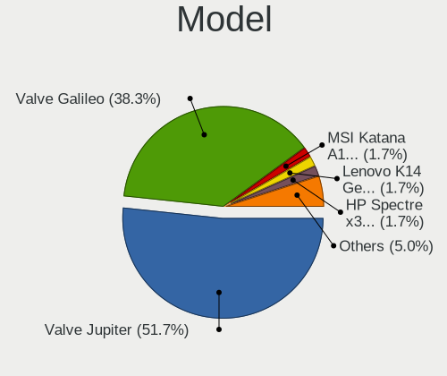
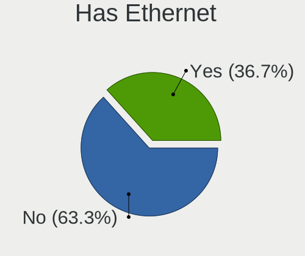
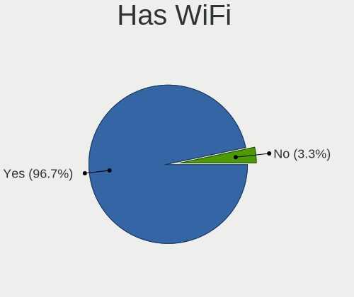
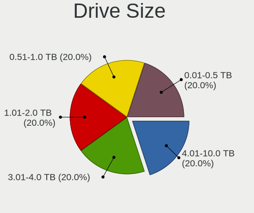
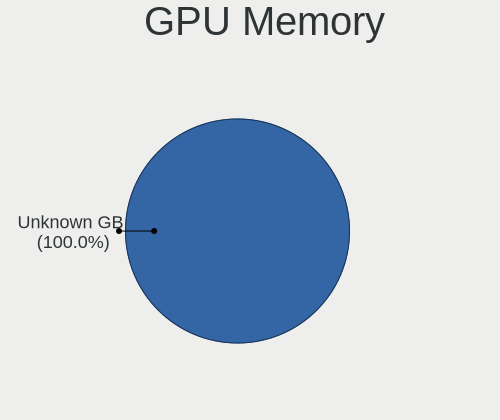
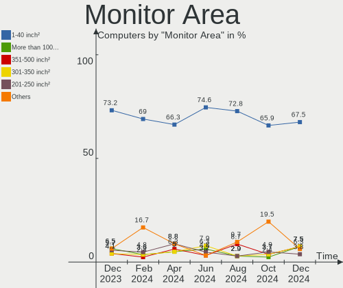
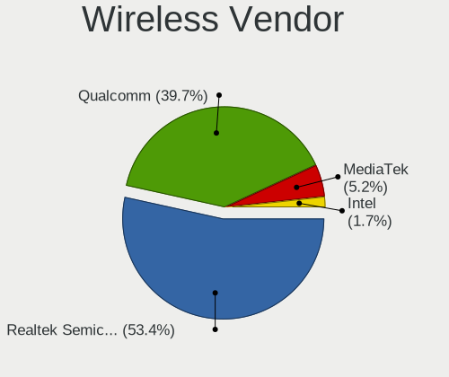
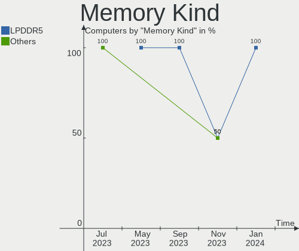

SteamOS - Hardware Trends
-------------------------

A project to identify most popular hardware characteristics and track their change
over time based on data collected by Linux users at https://Linux-Hardware.org.

Anyone can contribute to this report by the [hw-probe](https://github.com/linuxhw/hw-probe) tool:

    sudo -E hw-probe -all -upload

This is a report for all computer types. See also reports for [desktops](/Dist/SteamOS/Desktop/README.md) and [notebooks](/Dist/SteamOS/Notebook/README.md).

This report is for one last month. Overall report since the beginning of time: [TestDays](https://github.com/linuxhw/TestDays)

Period: Jul, 2023.

Contents
--------

* [ System ](#system)
  - [ OS                       ](#os)
  - [ OS Family                ](#os-family)
  - [ Kernel                   ](#kernel)
  - [ Kernel Family            ](#kernel-family)
  - [ Kernel Major Ver.        ](#kernel-major-ver)
  - [ Arch                     ](#arch)
  - [ DE                       ](#de)
  - [ Display Server           ](#display-server)
  - [ Display Manager          ](#display-manager)
  - [ OS Lang                  ](#os-lang)
  - [ Boot Mode                ](#boot-mode)
  - [ Filesystem               ](#filesystem)
  - [ Part. scheme             ](#part-scheme)
  - [ Dual Boot with Linux/BSD ](#dual-boot-with-linuxbsd)
  - [ Dual Boot (Win)          ](#dual-boot-win)

* [ Board ](#board)
  - [ Vendor                   ](#vendor)
  - [ Model                    ](#model)
  - [ Model Family             ](#model-family)
  - [ MFG Year                 ](#mfg-year)
  - [ Form Factor              ](#form-factor)
  - [ Secure Boot              ](#secure-boot)
  - [ Coreboot                 ](#coreboot)
  - [ RAM Size                 ](#ram-size)
  - [ RAM Used                 ](#ram-used)
  - [ Total Drives             ](#total-drives)
  - [ Has CD-ROM               ](#has-cd-rom)
  - [ Has Ethernet             ](#has-ethernet)
  - [ Has WiFi                 ](#has-wifi)
  - [ Has Bluetooth            ](#has-bluetooth)

* [ Location ](#location)
  - [ Country                  ](#country)
  - [ City                     ](#city)

* [ Drives ](#drives)
  - [ Drive Vendor             ](#drive-vendor)
  - [ Drive Model              ](#drive-model)
  - [ HDD Vendor               ](#hdd-vendor)
  - [ SSD Vendor               ](#ssd-vendor)
  - [ Drive Kind               ](#drive-kind)
  - [ Drive Connector          ](#drive-connector)
  - [ Drive Size               ](#drive-size)
  - [ Space Total              ](#space-total)
  - [ Space Used               ](#space-used)
  - [ Malfunc. Drives          ](#malfunc-drives)
  - [ Malfunc. Drive Vendor    ](#malfunc-drive-vendor)
  - [ Malfunc. HDD Vendor      ](#malfunc-hdd-vendor)
  - [ Malfunc. Drive Kind      ](#malfunc-drive-kind)
  - [ Failed Drives            ](#failed-drives)
  - [ Failed Drive Vendor      ](#failed-drive-vendor)
  - [ Drive Status             ](#drive-status)

* [ Storage controller ](#storage-controller)
  - [ Storage Vendor           ](#storage-vendor)
  - [ Storage Model            ](#storage-model)
  - [ Storage Kind             ](#storage-kind)

* [ Processor ](#processor)
  - [ CPU Vendor               ](#cpu-vendor)
  - [ CPU Model                ](#cpu-model)
  - [ CPU Model Family         ](#cpu-model-family)
  - [ CPU Cores                ](#cpu-cores)
  - [ CPU Sockets              ](#cpu-sockets)
  - [ CPU Threads              ](#cpu-threads)
  - [ CPU Op-Modes             ](#cpu-op-modes)
  - [ CPU Microcode            ](#cpu-microcode)
  - [ CPU Microarch            ](#cpu-microarch)

* [ Graphics ](#graphics)
  - [ GPU Vendor               ](#gpu-vendor)
  - [ GPU Model                ](#gpu-model)
  - [ GPU Combo                ](#gpu-combo)
  - [ GPU Driver               ](#gpu-driver)
  - [ GPU Memory               ](#gpu-memory)

* [ Monitor ](#monitor)
  - [ Monitor Vendor           ](#monitor-vendor)
  - [ Monitor Model            ](#monitor-model)
  - [ Monitor Resolution       ](#monitor-resolution)
  - [ Monitor Diagonal         ](#monitor-diagonal)
  - [ Monitor Width            ](#monitor-width)
  - [ Aspect Ratio             ](#aspect-ratio)
  - [ Monitor Area             ](#monitor-area)
  - [ Pixel Density            ](#pixel-density)
  - [ Multiple Monitors        ](#multiple-monitors)

* [ Network ](#network)
  - [ Net Controller Vendor    ](#net-controller-vendor)
  - [ Net Controller Model     ](#net-controller-model)
  - [ Wireless Vendor          ](#wireless-vendor)
  - [ Wireless Model           ](#wireless-model)
  - [ Ethernet Vendor          ](#ethernet-vendor)
  - [ Ethernet Model           ](#ethernet-model)
  - [ Net Controller Kind      ](#net-controller-kind)
  - [ Used Controller          ](#used-controller)
  - [ NICs                     ](#nics)
  - [ IPv6                     ](#ipv6)

* [ Bluetooth ](#bluetooth)
  - [ Bluetooth Vendor         ](#bluetooth-vendor)
  - [ Bluetooth Model          ](#bluetooth-model)

* [ Sound ](#sound)
  - [ Sound Vendor             ](#sound-vendor)
  - [ Sound Model              ](#sound-model)

* [ Memory ](#memory)
  - [ Memory Vendor            ](#memory-vendor)
  - [ Memory Model             ](#memory-model)
  - [ Memory Kind              ](#memory-kind)
  - [ Memory Form Factor       ](#memory-form-factor)
  - [ Memory Size              ](#memory-size)
  - [ Memory Speed             ](#memory-speed)

* [ Printers & scanners ](#printers--scanners)
  - [ Printer Vendor           ](#printer-vendor)
  - [ Printer Model            ](#printer-model)
  - [ Scanner Vendor           ](#scanner-vendor)
  - [ Scanner Model            ](#scanner-model)

* [ Camera ](#camera)
  - [ Camera Vendor            ](#camera-vendor)
  - [ Camera Model             ](#camera-model)

* [ Security ](#security)
  - [ Fingerprint Vendor       ](#fingerprint-vendor)
  - [ Fingerprint Model        ](#fingerprint-model)
  - [ Chipcard Vendor          ](#chipcard-vendor)
  - [ Chipcard Model           ](#chipcard-model)

* [ Unsupported ](#unsupported)
  - [ Unsupported Devices      ](#unsupported-devices)
  - [ Unsupported Device Types ](#unsupported-device-types)

System
------

OS
--

Installed operating systems

| Name          | Computers | Percent |
|---------------|-----------|---------|
| SteamOS 3.4.8 | 44        | 74.58%  |
| SteamOS 3.4   | 4         | 6.78%   |
| SteamOS 4     | 3         | 5.08%   |
| SteamOS       | 3         | 5.08%   |
| SteamOS 3.5   | 2         | 3.39%   |
| SteamOS 3.4.6 | 2         | 3.39%   |
| SteamOS 3.1   | 1         | 1.69%   |

OS Family
---------

OS without a version

| Name    | Computers | Percent |
|---------|-----------|---------|
| SteamOS | 59        | 100%    |

Kernel
------

Version of the Linux kernel

| Version                                        | Computers | Percent |
|------------------------------------------------|-----------|---------|
| 5.13.0-valve36-1-neptune                       | 46        | 77.97%  |
| 5.13.0-valve21.3-1-neptune                     | 2         | 3.39%   |
| 5.13.0-valve21-1-steamos-02209-g2a5bdc1102a0   | 2         | 3.39%   |
| 6.4.3-arch1-2                                  | 1         | 1.69%   |
| 6.3.9-arch1-1                                  | 1         | 1.69%   |
| 6.1.29-valve8-2-neptune-61                     | 1         | 1.69%   |
| 6.1.29-valve4-1-neptune-61                     | 1         | 1.69%   |
| 6.1.21-valve1-1-neptune-61                     | 1         | 1.69%   |
| 5.18.1-arch1_testHoloISO_20220606.1811         | 1         | 1.69%   |
| 5.15.93-1-lts                                  | 1         | 1.69%   |
| 5.13.0-valve37-1-neptune                       | 1         | 1.69%   |
| 5.13.0-valve10.3-1-neptune-02176-g5fe416c4acd8 | 1         | 1.69%   |

Kernel Family
-------------

Linux kernel without a distro release

| Version | Computers | Percent |
|---------|-----------|---------|
| 5.13.0  | 52        | 88.14%  |
| 6.1.29  | 2         | 3.39%   |
| 6.4.3   | 1         | 1.69%   |
| 6.3.9   | 1         | 1.69%   |
| 6.1.21  | 1         | 1.69%   |
| 5.18.1  | 1         | 1.69%   |
| 5.15.93 | 1         | 1.69%   |

Kernel Major Ver.
-----------------

Linux kernel major version

| Version | Computers | Percent |
|---------|-----------|---------|
| 5.13    | 52        | 88.14%  |
| 6.1     | 3         | 5.08%   |
| 6.4     | 1         | 1.69%   |
| 6.3     | 1         | 1.69%   |
| 5.18    | 1         | 1.69%   |
| 5.15    | 1         | 1.69%   |

Arch
----

OS architecture (x86_64, i586, etc.)

| Name   | Computers | Percent |
|--------|-----------|---------|
| x86_64 | 59        | 100%    |

DE
--

Desktop Environment

| Name      | Computers | Percent |
|-----------|-----------|---------|
| KDE5      | 58        | 98.31%  |
| gamescope | 1         | 1.69%   |

Display Server
--------------

X11 or Wayland

| Name | Computers | Percent |
|------|-----------|---------|
| X11  | 59        | 100%    |

Display Manager
---------------

SDDM, LightDM, etc.

| Name    | Computers | Percent |
|---------|-----------|---------|
| Unknown | 59        | 100%    |

OS Lang
-------

Language

| Lang  | Computers | Percent |
|-------|-----------|---------|
| en_US | 55        | 93.22%  |
| de_DE | 2         | 3.39%   |
| ru_RU | 1         | 1.69%   |
| ko_KR | 1         | 1.69%   |

Boot Mode
---------

EFI or BIOS

| Mode | Computers | Percent |
|------|-----------|---------|
| BIOS | 59        | 100%    |

Filesystem
----------

Type of filesystem

| Type  | Computers | Percent |
|-------|-----------|---------|
| Btrfs | 56        | 94.92%  |
| Tmpfs | 3         | 5.08%   |

Part. scheme
------------

Scheme of partitioning

| Type    | Computers | Percent |
|---------|-----------|---------|
| Unknown | 58        | 98.31%  |
| GPT     | 1         | 1.69%   |

Dual Boot with Linux/BSD
------------------------

Hosting more than one Linux/BSD

| Dual boot | Computers | Percent |
|-----------|-----------|---------|
| No        | 58        | 98.31%  |
| Yes       | 1         | 1.69%   |

Dual Boot (Win)
---------------

Hosting Linux and Windows

| Dual boot | Computers | Percent |
|-----------|-----------|---------|
| No        | 59        | 100%    |

Board
-----

Vendor
------

Motherboard manufacturer

| Name                | Computers | Percent |
|---------------------|-----------|---------|
| Valve               | 48        | 81.36%  |
| Lenovo              | 2         | 3.39%   |
| Gigabyte Technology | 2         | 3.39%   |
| Samsung Electronics | 1         | 1.69%   |
| MSI                 | 1         | 1.69%   |
| Monster             | 1         | 1.69%   |
| Hewlett-Packard     | 1         | 1.69%   |
| Dell                | 1         | 1.69%   |
| Apple               | 1         | 1.69%   |
| Acer                | 1         | 1.69%   |

Model
-----

Motherboard model

| Name                                 | Computers | Percent |
|--------------------------------------|-----------|---------|
| Valve Jupiter                        | 48        | 81.36%  |
| Samsung 300E4C/300E5C/300E7C         | 1         | 1.69%   |
| MSI MS-7C89                          | 1         | 1.69%   |
| Monster ABRA A5 V17.3                | 1         | 1.69%   |
| Lenovo IdeaPad Gaming 3 15ARH7 82SB  | 1         | 1.69%   |
| Lenovo IdeaPad 330-15IKB 81DE        | 1         | 1.69%   |
| HP ENVY x360 2-in-1 Laptop 15-ey0xxx | 1         | 1.69%   |
| Gigabyte X570 UD                     | 1         | 1.69%   |
| Gigabyte B550I AORUS PRO AX          | 1         | 1.69%   |
| Dell Inspiron 1545                   | 1         | 1.69%   |
| Apple MacBookPro8,1                  | 1         | 1.69%   |
| Acer Nitro AN515-53                  | 1         | 1.69%   |

Model Family
------------

Motherboard model prefix

| Name              | Computers | Percent |
|-------------------|-----------|---------|
| Valve Jupiter     | 48        | 81.36%  |
| Lenovo IdeaPad    | 2         | 3.39%   |
| Samsung 300E4C    | 1         | 1.69%   |
| MSI MS-7C89       | 1         | 1.69%   |
| Monster ABRA      | 1         | 1.69%   |
| HP ENVY           | 1         | 1.69%   |
| Gigabyte X570     | 1         | 1.69%   |
| Gigabyte B550I    | 1         | 1.69%   |
| Dell Inspiron     | 1         | 1.69%   |
| Apple MacBookPro8 | 1         | 1.69%   |
| Acer Nitro        | 1         | 1.69%   |

MFG Year
--------

Motherboard manufacture year

| Year | Computers | Percent |
|------|-----------|---------|
| 2022 | 45        | 76.27%  |
| 2023 | 6         | 10.17%  |
| 2018 | 2         | 3.39%   |
| 2021 | 1         | 1.69%   |
| 2020 | 1         | 1.69%   |
| 2019 | 1         | 1.69%   |
| 2012 | 1         | 1.69%   |
| 2011 | 1         | 1.69%   |
| 2008 | 1         | 1.69%   |

Form Factor
-----------

Physical design of the computer

| Name        | Computers | Percent |
|-------------|-----------|---------|
| Notebook    | 56        | 94.92%  |
| Desktop     | 2         | 3.39%   |
| Convertible | 1         | 1.69%   |

Secure Boot
-----------

Enabled or disabled

| State    | Computers | Percent |
|----------|-----------|---------|
| Disabled | 59        | 100%    |

Coreboot
--------

Have coreboot on board

| Used | Computers | Percent |
|------|-----------|---------|
| No   | 59        | 100%    |

RAM Size
--------

Total RAM memory

| Size in GB | Computers | Percent |
|------------|-----------|---------|
| 8.01-16.0  | 52        | 88.14%  |
| 16.01-24.0 | 3         | 5.08%   |
| 32.01-64.0 | 2         | 3.39%   |
| 4.01-8.0   | 1         | 1.69%   |
| 3.01-4.0   | 1         | 1.69%   |

RAM Used
--------

Used RAM memory

| Used GB   | Computers | Percent |
|-----------|-----------|---------|
| 3.01-4.0  | 22        | 37.29%  |
| 4.01-8.0  | 21        | 35.59%  |
| 2.01-3.0  | 11        | 18.64%  |
| 1.01-2.0  | 3         | 5.08%   |
| 8.01-16.0 | 2         | 3.39%   |

Total Drives
------------

Number of drives on board

| Drives | Computers | Percent |
|--------|-----------|---------|
| 2      | 37        | 62.71%  |
| 1      | 18        | 30.51%  |
| 3      | 3         | 5.08%   |
| 4      | 1         | 1.69%   |

Has CD-ROM
----------

Has CD-ROM on board

| Presented | Computers | Percent |
|-----------|-----------|---------|
| No        | 55        | 93.22%  |
| Yes       | 4         | 6.78%   |

Has Ethernet
------------

Has Ethernet on board

| Presented | Computers | Percent |
|-----------|-----------|---------|
| No        | 34        | 57.63%  |
| Yes       | 25        | 42.37%  |

Has WiFi
--------

Has WiFi module

| Presented | Computers | Percent |
|-----------|-----------|---------|
| Yes       | 59        | 100%    |

Has Bluetooth
-------------

Has Bluetooth module

| Presented | Computers | Percent |
|-----------|-----------|---------|
| Yes       | 57        | 96.61%  |
| No        | 2         | 3.39%   |

Location
--------

Country
-------

Geographic location (country)

| Country      | Computers | Percent |
|--------------|-----------|---------|
| USA          | 30        | 50.85%  |
| UK           | 8         | 13.56%  |
| Spain        | 2         | 3.39%   |
| Russia       | 2         | 3.39%   |
| Israel       | 2         | 3.39%   |
| France       | 2         | 3.39%   |
| Brazil       | 2         | 3.39%   |
| Vietnam      | 1         | 1.69%   |
| Turkey       | 1         | 1.69%   |
| Switzerland  | 1         | 1.69%   |
| Saudi Arabia | 1         | 1.69%   |
| Peru         | 1         | 1.69%   |
| Morocco      | 1         | 1.69%   |
| Lithuania    | 1         | 1.69%   |
| Germany      | 1         | 1.69%   |
| Chile        | 1         | 1.69%   |
| Belarus      | 1         | 1.69%   |
| Austria      | 1         | 1.69%   |

City
----

Geographic location (city)

| City            | Computers | Percent |
|-----------------|-----------|---------|
| Moscow          | 2         | 3.39%   |
| Wismar          | 1         | 1.69%   |
| Wigan           | 1         | 1.69%   |
| Westminster     | 1         | 1.69%   |
| West Jordan     | 1         | 1.69%   |
| Uberlândia     | 1         | 1.69%   |
| Thrapston       | 1         | 1.69%   |
| Tangier         | 1         | 1.69%   |
| Talca           | 1         | 1.69%   |
| Staten Island   | 1         | 1.69%   |
| Spotsylvania    | 1         | 1.69%   |
| Spokane         | 1         | 1.69%   |
| Slidell         | 1         | 1.69%   |
| Sherwood        | 1         | 1.69%   |
| San Luis Obispo | 1         | 1.69%   |
| Roswell         | 1         | 1.69%   |
| Portsmouth      | 1         | 1.69%   |
| Plymouth        | 1         | 1.69%   |
| Plainwell       | 1         | 1.69%   |
| Parla           | 1         | 1.69%   |
| Orono           | 1         | 1.69%   |
| Ormond Beach    | 1         | 1.69%   |
| Oceanside       | 1         | 1.69%   |
| Minsk           | 1         | 1.69%   |
| McDonough       | 1         | 1.69%   |
| Makkah          | 1         | 1.69%   |
| Los Angeles     | 1         | 1.69%   |
| Longview        | 1         | 1.69%   |
| Lima            | 1         | 1.69%   |
| Lebanon         | 1         | 1.69%   |
| Las Vegas       | 1         | 1.69%   |
| Lancaster       | 1         | 1.69%   |
| Klaipėda       | 1         | 1.69%   |
| Jerusalem       | 1         | 1.69%   |
| Istanbul        | 1         | 1.69%   |
| Immingham       | 1         | 1.69%   |
| Hanoi           | 1         | 1.69%   |
| Haifa           | 1         | 1.69%   |
| Gujan-Mestras   | 1         | 1.69%   |
| Graz            | 1         | 1.69%   |

Drives
------

Drive Vendor
------------

Hard drive vendors

| Vendor                      | Computers | Drives | Percent |
|-----------------------------|-----------|--------|---------|
| Unknown                     | 26        | 26     | 25.24%  |
| Samsung Electronics         | 11        | 12     | 10.68%  |
| O2 Micro                    | 10        | 10     | 9.71%   |
| Kingston Technology Company | 10        | 10     | 9.71%   |
| Sandisk                     | 8         | 8      | 7.77%   |
| Phison Electronics          | 8         | 8      | 7.77%   |
| Unknown                     | 8         | 9      | 7.77%   |
| Silicon Motion              | 3         | 3      | 2.91%   |
| Seagate                     | 3         | 3      | 2.91%   |
| KIOXIA                      | 3         | 3      | 2.91%   |
| WDC                         | 2         | 2      | 1.94%   |
| Phison                      | 2         | 2      | 1.94%   |
| Kingston                    | 2         | 2      | 1.94%   |
| T-FORCE                     | 1         | 1      | 0.97%   |
| Solid State Storage         | 1         | 1      | 0.97%   |
| SABRENT                     | 1         | 1      | 0.97%   |
| Realtek                     | 1         | 2      | 0.97%   |
| Micron Technology           | 1         | 1      | 0.97%   |
| Hitachi                     | 1         | 1      | 0.97%   |
| Biwin Storage Technology    | 1         | 1      | 0.97%   |

Drive Model
-----------

Hard drive models

| Model                                                 | Computers | Percent |
|-------------------------------------------------------|-----------|---------|
| O2 Micro E2M2 64GB                                    | 10        | 9.52%   |
| Unknown MMC Card  512GB                               | 9         | 8.57%   |
| Kingston Company OM3PDP3 NVMe SSD 512GB               | 9         | 8.57%   |
| Unknown                                               | 8         | 7.62%   |
| Unknown MMC Card  256GB                               | 7         | 6.67%   |
| Unknown MMC Card  128GB                               | 5         | 4.76%   |
| Samsung MZ9LQ512HBLU-00BVL 512GB                      | 5         | 4.76%   |
| Samsung MZ9LQ256HBJD-00BVL 256GB                      | 4         | 3.81%   |
| Phison PS5013 E13 NVMe Controller 256GB               | 4         | 3.81%   |
| Silicon Motion SM2263EN/SM2263XT SSD Controller 500GB | 3         | 2.86%   |
| Phison Sabrent SB-2130-1TB                            | 3         | 2.86%   |
| Unknown MMC Card  500GB                               | 2         | 1.9%    |
| Sandisk WDC PC SN530 SDBPTPZ-1T00 1024GB              | 2         | 1.9%    |
| Sandisk WD PC SN740 SDDPTQE-2T00 2TB                  | 2         | 1.9%    |
| Phison Sabrent Rocket Q4 2TB                          | 2         | 1.9%    |
| KIOXIA KBG40ZNV256G 256GB                             | 2         | 1.9%    |
| WDC WDS500G2B0A-00SM50 500GB SSD                      | 1         | 0.95%   |
| WDC WDS100T2B0B-00YS70 1TB SSD                        | 1         | 0.95%   |
| Unknown MMC Card  64GB                                | 1         | 0.95%   |
| Unknown MMC Card  536GB                               | 1         | 0.95%   |
| Unknown MMC Card  250GB                               | 1         | 0.95%   |
| T-FORCE 500GB                                         | 1         | 0.95%   |
| Solid State Storage CL1-3D128-Q11 NVMe SSSTC 128GB    | 1         | 0.95%   |
| Seagate ST2000DX002-2DV164 2TB                        | 1         | 0.95%   |
| Seagate ST1000DM003-1ER162 1TB                        | 1         | 0.95%   |
| Seagate BUP Slim Mac SL 1TB                           | 1         | 0.95%   |
| Sandisk WD_BLACK SN850X 2000GB                        | 1         | 0.95%   |
| Sandisk WD PC SN740 SDDPTQD-1T00 1024GB               | 1         | 0.95%   |
| Sandisk WD Blue SN550 NVMe SSD 250GB                  | 1         | 0.95%   |
| SanDisk SDSSDH3250G 250GB                             | 1         | 0.95%   |
| Samsung NVMe SSD Controller SM961/PM961/SM963 256GB   | 1         | 0.95%   |
| Samsung NVMe SSD Controller PM9A1/PM9A3/980PRO 1TB    | 1         | 0.95%   |
| Samsung MZ7TY256HDHP-00000 256GB SSD                  | 1         | 0.95%   |
| SABRENT Disk 1TB                                      | 1         | 0.95%   |
| Realtek RTL9210B-CG 256GB                             | 1         | 0.95%   |
| Realtek RTL9210 NVME 512GB                            | 1         | 0.95%   |
| Phison Corsair MP600 MINI 1TB                         | 1         | 0.95%   |
| Micron 2400_MTFDKBK2T0QFM 2TB                         | 1         | 0.95%   |
| KIOXIA KBG50ZNT256G LS 256GB                          | 1         | 0.95%   |
| Kingston Company U-SNS8154P3 NVMe SSD 480GB           | 1         | 0.95%   |

HDD Vendor
----------

Hard disk drive vendors

| Vendor  | Computers | Drives | Percent |
|---------|-----------|--------|---------|
| Seagate | 3         | 3      | 75%     |
| Hitachi | 1         | 1      | 25%     |

SSD Vendor
----------

Solid state drive vendors

| Vendor              | Computers | Drives | Percent |
|---------------------|-----------|--------|---------|
| WDC                 | 2         | 2      | 33.33%  |
| Kingston            | 2         | 2      | 33.33%  |
| SanDisk             | 1         | 1      | 16.67%  |
| Samsung Electronics | 1         | 1      | 16.67%  |

Drive Kind
----------

HDD or SSD

| Kind    | Computers | Drives | Percent |
|---------|-----------|--------|---------|
| NVMe    | 55        | 60     | 56.12%  |
| MMC     | 33        | 34     | 33.67%  |
| SSD     | 5         | 6      | 5.1%    |
| HDD     | 3         | 4      | 3.06%   |
| Unknown | 2         | 2      | 2.04%   |

Drive Connector
---------------

SATA, SAS, NVMe, etc.

| Type | Computers | Drives | Percent |
|------|-----------|--------|---------|
| NVMe | 55        | 57     | 55.56%  |
| MMC  | 33        | 34     | 33.33%  |
| SATA | 7         | 10     | 7.07%   |
| SAS  | 4         | 5      | 4.04%   |

Drive Size
----------

Size of hard drive

| Size in TB | Computers | Drives | Percent |
|------------|-----------|--------|---------|
| 0.01-0.5   | 5         | 6      | 55.56%  |
| 0.51-1.0   | 3         | 3      | 33.33%  |
| 1.01-2.0   | 1         | 1      | 11.11%  |

Space Total
-----------

Amount of disk space available on the file system

| Size in GB | Computers | Percent |
|------------|-----------|---------|
| 251-500    | 14        | 23.73%  |
| 101-250    | 13        | 22.03%  |
| 501-1000   | 11        | 18.64%  |
| 1001-2000  | 9         | 15.25%  |
| 51-100     | 8         | 13.56%  |
| Unknown    | 3         | 5.08%   |
| 2001-3000  | 1         | 1.69%   |

Space Used
----------

Amount of used disk space

| Used GB   | Computers | Percent |
|-----------|-----------|---------|
| 101-250   | 11        | 18.64%  |
| 251-500   | 10        | 16.95%  |
| 21-50     | 10        | 16.95%  |
| 501-1000  | 8         | 13.56%  |
| 51-100    | 8         | 13.56%  |
| 1-20      | 7         | 11.86%  |
| Unknown   | 3         | 5.08%   |
| 1001-2000 | 2         | 3.39%   |

Malfunc. Drives
---------------

Drive models with a malfunction

Zero info for selected period =(

Malfunc. Drive Vendor
---------------------

Vendors of faulty drives

Zero info for selected period =(

Malfunc. HDD Vendor
-------------------

Vendors of faulty HDD drives

Zero info for selected period =(

Malfunc. Drive Kind
-------------------

Kinds of faulty drives

Zero info for selected period =(

Failed Drives
-------------

Failed drive models

Zero info for selected period =(

Failed Drive Vendor
-------------------

Failed drive vendors

Zero info for selected period =(

Drive Status
------------

Number of failed and malfunc. drives

| Status   | Computers | Drives | Percent |
|----------|-----------|--------|---------|
| Detected | 58        | 105    | 98.31%  |
| Works    | 1         | 1      | 1.69%   |

Storage controller
------------------

Storage Vendor
--------------

Storage controller vendors

| Vendor                         | Computers | Percent |
|--------------------------------|-----------|---------|
| Samsung Electronics            | 11        | 16.42%  |
| Phison Electronics             | 10        | 14.93%  |
| O2 Micro                       | 10        | 14.93%  |
| Kingston Technology Company    | 10        | 14.93%  |
| SanDisk                        | 7         | 10.45%  |
| Intel                          | 7         | 10.45%  |
| Silicon Motion                 | 3         | 4.48%   |
| KIOXIA                         | 3         | 4.48%   |
| AMD                            | 3         | 4.48%   |
| Solid State Storage Technology | 1         | 1.49%   |
| Micron Technology              | 1         | 1.49%   |
| Biwin Storage Technology       | 1         | 1.49%   |

Storage Model
-------------

Storage controller models

| Model                                                                        | Computers | Percent |
|------------------------------------------------------------------------------|-----------|---------|
| O2 Micro FORESEE E2M2 NVMe SSD                                               | 10        | 14.93%  |
| Samsung NVMe SSD Controller 980                                              | 9         | 13.43%  |
| Kingston Company OM3PDP3 NVMe SSD                                            | 9         | 13.43%  |
| Phison PS5021-E21 PCIe4 NVMe Controller (DRAM-less)                          | 6         | 8.96%   |
| Phison PS5013 E13 NVMe Controller                                            | 4         | 5.97%   |
| Silicon Motion SM2263EN/SM2263XT (DRAM-less) NVMe SSD Controllers            | 3         | 4.48%   |
| Sandisk PC SN740 NVMe SSD (DRAM-less)                                        | 3         | 4.48%   |
| SanDisk IX SN530 NVMe SSD (DRAM-less)                                        | 2         | 2.99%   |
| KIOXIA NVMe SSD Controller BG4 (DRAM-less)                                   | 2         | 2.99%   |
| AMD FCH SATA Controller [AHCI mode]                                          | 2         | 2.99%   |
| Solid State Storage CL1-3D256-Q11 NVMe SSD M.2                               | 1         | 1.49%   |
| Sandisk Western Digital WD Black SN850X NVMe SSD                             | 1         | 1.49%   |
| SanDisk WD Blue SN550 NVMe SSD                                               | 1         | 1.49%   |
| Samsung NVMe SSD Controller SM961/PM961/SM963                                | 1         | 1.49%   |
| Samsung NVMe SSD Controller PM9A1/PM9A3/980PRO                               | 1         | 1.49%   |
| Micron 2400 NVMe SSD (DRAM-less)                                             | 1         | 1.49%   |
| KIOXIA NVMe SSD Controller BG5 (DRAM-less)                                   | 1         | 1.49%   |
| Kingston Company U-SNS8154P3 NVMe SSD                                        | 1         | 1.49%   |
| Intel Tiger Lake SATA AHCI Controller                                        | 1         | 1.49%   |
| Intel Sunrise Point-LP SATA Controller [AHCI mode]                           | 1         | 1.49%   |
| Intel Cannon Lake Mobile PCH SATA AHCI Controller                            | 1         | 1.49%   |
| Intel 82801IBM/IEM (ICH9M/ICH9M-E) 4 port SATA Controller [AHCI mode]        | 1         | 1.49%   |
| Intel 7 Series Chipset Family 6-port SATA Controller [AHCI mode]             | 1         | 1.49%   |
| Intel 6 Series/C200 Series Chipset Family 6 port Mobile SATA AHCI Controller | 1         | 1.49%   |
| Intel 400 Series Chipset Family SATA AHCI Controller                         | 1         | 1.49%   |
| Biwin Storage Non-Volatile memory controller                                 | 1         | 1.49%   |
| AMD 500 Series Chipset SATA Controller                                       | 1         | 1.49%   |

Storage Kind
------------

Kind of storage controller (IDE, SATA, NVMe, SAS, ...)

| Kind | Computers | Percent |
|------|-----------|---------|
| NVMe | 55        | 84.62%  |
| SATA | 10        | 15.38%  |

Processor
---------

CPU Vendor
----------

Processor vendors

| Vendor | Computers | Percent |
|--------|-----------|---------|
| AMD    | 52        | 88.14%  |
| Intel  | 7         | 11.86%  |

CPU Model
---------

Processor models

| Model                                   | Computers | Percent |
|-----------------------------------------|-----------|---------|
| AMD Custom APU 0405                     | 48        | 81.36%  |
| Intel Core i7-2670QM CPU @ 2.20GHz      | 1         | 1.69%   |
| Intel Core i5-8300H CPU @ 2.30GHz       | 1         | 1.69%   |
| Intel Core i5-2435M CPU @ 2.40GHz       | 1         | 1.69%   |
| Intel Core i5-10400F CPU @ 2.90GHz      | 1         | 1.69%   |
| Intel Core i3-8130U CPU @ 2.20GHz       | 1         | 1.69%   |
| Intel Core 2 Duo CPU P9600 @ 2.66GHz    | 1         | 1.69%   |
| Intel 11th Gen Core i7-11800H @ 2.30GHz | 1         | 1.69%   |
| AMD Ryzen 9 3900X 12-Core Processor     | 1         | 1.69%   |
| AMD Ryzen 7 5800X 8-Core Processor      | 1         | 1.69%   |
| AMD Ryzen 5 6600H with Radeon Graphics  | 1         | 1.69%   |
| AMD Ryzen 5 5625U with Radeon Graphics  | 1         | 1.69%   |

CPU Model Family
----------------

Processor model prefix

| Model            | Computers | Percent |
|------------------|-----------|---------|
| Other            | 49        | 83.05%  |
| Intel Core i5    | 3         | 5.08%   |
| AMD Ryzen 5      | 2         | 3.39%   |
| Intel Core i7    | 1         | 1.69%   |
| Intel Core i3    | 1         | 1.69%   |
| Intel Core 2 Duo | 1         | 1.69%   |
| AMD Ryzen 9      | 1         | 1.69%   |
| AMD Ryzen 7      | 1         | 1.69%   |

CPU Cores
---------

Number of processor cores

| Number | Computers | Percent |
|--------|-----------|---------|
| 4      | 50        | 84.75%  |
| 6      | 3         | 5.08%   |
| 2      | 3         | 5.08%   |
| 8      | 2         | 3.39%   |
| 12     | 1         | 1.69%   |

CPU Sockets
-----------

Number of sockets

| Number | Computers | Percent |
|--------|-----------|---------|
| 1      | 59        | 100%    |

CPU Threads
-----------

Threads per core (Hyper-Threading)

| Number | Computers | Percent |
|--------|-----------|---------|
| 2      | 57        | 96.61%  |
| 1      | 2         | 3.39%   |

CPU Op-Modes
------------

CPU Operation Modes (32-bit, 64-bit)

| Op mode        | Computers | Percent |
|----------------|-----------|---------|
| 32-bit, 64-bit | 59        | 100%    |

CPU Microcode
-------------

Microcode number

| Number  | Computers | Percent |
|---------|-----------|---------|
| Unknown | 58        | 98.31%  |
| 0x1067a | 1         | 1.69%   |

CPU Microarch
-------------

Microarchitecture

| Name        | Computers | Percent |
|-------------|-----------|---------|
| Unknown     | 50        | 84.75%  |
| Zen 3       | 2         | 3.39%   |
| SandyBridge | 2         | 3.39%   |
| KabyLake    | 2         | 3.39%   |
| Zen 2       | 1         | 1.69%   |
| Penryn      | 1         | 1.69%   |
| CometLake   | 1         | 1.69%   |

Graphics
--------

GPU Vendor
----------

Vendors of graphics cards

| Vendor | Computers | Percent |
|--------|-----------|---------|
| AMD    | 53        | 85.48%  |
| Intel  | 6         | 9.68%   |
| Nvidia | 3         | 4.84%   |

GPU Model
---------

Graphics card models

| Model                                                                     | Computers | Percent |
|---------------------------------------------------------------------------|-----------|---------|
| AMD VanGogh [AMD Custom GPU 0405]                                         | 48        | 77.42%  |
| Intel 2nd Generation Core Processor Family Integrated Graphics Controller | 2         | 3.23%   |
| Nvidia GP107M [GeForce GTX 1050 Mobile]                                   | 1         | 1.61%   |
| Nvidia GA107M [GeForce RTX 3050 Ti Mobile]                                | 1         | 1.61%   |
| Nvidia GA107M [GeForce RTX 3050 Mobile]                                   | 1         | 1.61%   |
| Intel UHD Graphics 620                                                    | 1         | 1.61%   |
| Intel TigerLake-H GT1 [UHD Graphics]                                      | 1         | 1.61%   |
| Intel Mobile 4 Series Chipset Integrated Graphics Controller              | 1         | 1.61%   |
| Intel CoffeeLake-H GT2 [UHD Graphics 630]                                 | 1         | 1.61%   |
| AMD Rembrandt [Radeon 680M]                                               | 1         | 1.61%   |
| AMD Navi 22 [Radeon RX 6700/6700 XT/6750 XT / 6800M/6850M XT]             | 1         | 1.61%   |
| AMD Navi 21 [Radeon RX 6800/6800 XT / 6900 XT]                            | 1         | 1.61%   |
| AMD Navi 14 [Radeon RX 5500/5500M / Pro 5500M]                            | 1         | 1.61%   |
| AMD Barcelo                                                               | 1         | 1.61%   |

GPU Combo
---------

Combinations of graphics cards

| Name           | Computers | Percent |
|----------------|-----------|---------|
| 1 x AMD        | 52        | 88.14%  |
| 1 x Intel      | 4         | 6.78%   |
| Intel + Nvidia | 2         | 3.39%   |
| AMD + Nvidia   | 1         | 1.69%   |

GPU Driver
----------

Free vs proprietary

| Driver | Computers | Percent |
|--------|-----------|---------|
| Free   | 59        | 100%    |

GPU Memory
----------

Total video memory

| Size in GB | Computers | Percent |
|------------|-----------|---------|
| Unknown    | 59        | 100%    |

Monitor
-------

Monitor Vendor
--------------

Monitor vendors

| Vendor               | Computers | Percent |
|----------------------|-----------|---------|
| Valve                | 46        | 60.53%  |
| Samsung Electronics  | 3         | 3.95%   |
| Sony                 | 2         | 2.63%   |
| LG Display           | 2         | 2.63%   |
| Goldstar             | 2         | 2.63%   |
| Dell                 | 2         | 2.63%   |
| Chimei Innolux       | 2         | 2.63%   |
| BOE                  | 2         | 2.63%   |
| ASUSTek Computer     | 2         | 2.63%   |
| Sceptre Tech         | 1         | 1.32%   |
| Panasonic            | 1         | 1.32%   |
| InnoView             | 1         | 1.32%   |
| InnoLux Display      | 1         | 1.32%   |
| Iiyama               | 1         | 1.32%   |
| Huion                | 1         | 1.32%   |
| Hewlett-Packard      | 1         | 1.32%   |
| Gigabyte Technology  | 1         | 1.32%   |
| BenQ                 | 1         | 1.32%   |
| Apple                | 1         | 1.32%   |
| Ancor Communications | 1         | 1.32%   |
| Analogix             | 1         | 1.32%   |
| Acer                 | 1         | 1.32%   |

Monitor Model
-------------

Monitor models

| Model                                                                   | Computers | Percent |
|-------------------------------------------------------------------------|-----------|---------|
| Valve ANX7530 U VLV3001 800x1280 100x150mm 7.1-inch                     | 46        | 60.53%  |
| Sony TV SNY7402 1920x1080 1018x573mm 46.0-inch                          | 1         | 1.32%   |
| Sony TV *30 SNYA405 3840x2160 1218x685mm 55.0-inch                      | 1         | 1.32%   |
| Sceptre Tech F27 SPT0ABF 1920x1080 409x230mm 18.5-inch                  | 1         | 1.32%   |
| Samsung Electronics LS27AG30x SAM717B 1920x1080 597x336mm 27.0-inch     | 1         | 1.32%   |
| Samsung Electronics LCD Monitor SAM03A3 1440x900                        | 1         | 1.32%   |
| Samsung Electronics C27F390 SAM0D32 1920x1080 598x336mm 27.0-inch       | 1         | 1.32%   |
| Panasonic TV MEIC312 1920x1080 698x392mm 31.5-inch                      | 1         | 1.32%   |
| LG Display LCD Monitor LGD071E 1920x1080 344x194mm 15.5-inch            | 1         | 1.32%   |
| LG Display LCD Monitor LGD0590 1920x1080 344x194mm 15.5-inch            | 1         | 1.32%   |
| InnoView InnoView YCT9CB5 1920x1080 348x201mm 15.8-inch                 | 1         | 1.32%   |
| InnoLux Display LCD Monitor INL0001 1366x768 344x194mm 15.5-inch        | 1         | 1.32%   |
| Iiyama PLX2380H IVM5621 1920x1080 509x286mm 23.0-inch                   | 1         | 1.32%   |
| Huion Kamvas 12 HAT1160 1920x1080 256x144mm 11.6-inch                   | 1         | 1.32%   |
| Hewlett-Packard V24 HPN36B7 1920x1080 531x299mm 24.0-inch               | 1         | 1.32%   |
| Goldstar Ultra HD GSM5B08 3840x2160 600x340mm 27.2-inch                 | 1         | 1.32%   |
| Goldstar E2360 GSM57E4 1920x1080 510x290mm 23.1-inch                    | 1         | 1.32%   |
| Gigabyte Technology M32UC GBT3209 3840x2160 697x392mm 31.5-inch         | 1         | 1.32%   |
| Dell S2721HGF DEL41E7 1920x1080 597x336mm 27.0-inch                     | 1         | 1.32%   |
| Dell P2417H DELA0DC 1920x1080 527x296mm 23.8-inch                       | 1         | 1.32%   |
| Chimei Innolux LCD Monitor CMN1521 1920x1080 344x193mm 15.5-inch        | 1         | 1.32%   |
| Chimei Innolux LCD Monitor CMN1469 1366x768 309x174mm 14.0-inch         | 1         | 1.32%   |
| BOE LCD Monitor BOE0A81 1920x1080 344x194mm 15.5-inch                   | 1         | 1.32%   |
| BOE LCD Monitor BOE07A3 1920x1080 344x193mm 15.5-inch                   | 1         | 1.32%   |
| BenQ GL2250H BNQ78A1 1920x1080 477x268mm 21.5-inch                      | 1         | 1.32%   |
| ASUSTek Computer VG289 AUS28BA 3840x2160 620x340mm 27.8-inch            | 1         | 1.32%   |
| ASUSTek Computer VG245 AUS24A3 1920x1080 530x300mm 24.0-inch            | 1         | 1.32%   |
| Apple Color LCD APP9CC7 1280x800 286x179mm 13.3-inch                    | 1         | 1.32%   |
| Ancor Communications ASUS VG278HV ACI2726 1920x1080 598x336mm 27.0-inch | 1         | 1.32%   |
| Analogix ANX7530 U ANX7539 800x1280                                     | 1         | 1.32%   |
| Acer H233H ACR00A0 1920x1080 510x287mm 23.0-inch                        | 1         | 1.32%   |

Monitor Resolution
------------------

Monitor screen resolution

| Resolution       | Computers | Percent |
|------------------|-----------|---------|
| 800x1280         | 47        | 63.51%  |
| 1920x1080 (FHD)  | 18        | 24.32%  |
| 3840x2160 (4K)   | 5         | 6.76%   |
| 1366x768 (WXGA)  | 2         | 2.7%    |
| 1440x900 (WXGA+) | 1         | 1.35%   |
| 1280x800 (WXGA)  | 1         | 1.35%   |

Monitor Diagonal
----------------

Diagonal size in inches

| Inches  | Computers | Percent |
|---------|-----------|---------|
| 7       | 46        | 61.33%  |
| 15      | 7         | 9.33%   |
| 27      | 5         | 6.67%   |
| 23      | 3         | 4%      |
| 55      | 2         | 2.67%   |
| 31      | 2         | 2.67%   |
| 24      | 2         | 2.67%   |
| 40      | 1         | 1.33%   |
| 32      | 1         | 1.33%   |
| 21      | 1         | 1.33%   |
| 14      | 1         | 1.33%   |
| 13      | 1         | 1.33%   |
| 11      | 1         | 1.33%   |
| 3       | 1         | 1.33%   |
| Unknown | 1         | 1.33%   |

Monitor Width
-------------

Physical width

| Width in mm | Computers | Percent |
|-------------|-----------|---------|
| 1-100       | 47        | 63.51%  |
| 501-600     | 8         | 10.81%  |
| 301-350     | 8         | 10.81%  |
| 601-700     | 3         | 4.05%   |
| 201-300     | 2         | 2.7%    |
| 1001-1500   | 2         | 2.7%    |
| 801-900     | 1         | 1.35%   |
| 701-800     | 1         | 1.35%   |
| 401-500     | 1         | 1.35%   |
| Unknown     | 1         | 1.35%   |

Aspect Ratio
------------

Proportional relationship between the width and the height

| Ratio | Computers | Percent |
|-------|-----------|---------|
| 0.67  | 46        | 62.16%  |
| 16/9  | 25        | 33.78%  |
| 16/10 | 2         | 2.7%    |
| 6/5   | 1         | 1.35%   |

Monitor Area
------------

Area in inch²

| Area in inch² | Computers | Percent |
|----------------|-----------|---------|
| 1-40           | 47        | 62.67%  |
| 101-110        | 7         | 9.33%   |
| 201-250        | 6         | 8%      |
| 301-350        | 5         | 6.67%   |
| 351-500        | 3         | 4%      |
| More than 1000 | 2         | 2.67%   |
| 81-90          | 2         | 2.67%   |
| 51-60          | 1         | 1.33%   |
| 501-1000       | 1         | 1.33%   |
| Unknown        | 1         | 1.33%   |

Pixel Density
-------------

Pixels per inch

| Density       | Computers | Percent |
|---------------|-----------|---------|
| 161-240       | 46        | 63.89%  |
| 51-100        | 10        | 13.89%  |
| 121-160       | 9         | 12.5%   |
| 101-120       | 4         | 5.56%   |
| More than 240 | 1         | 1.39%   |
| 1-50          | 1         | 1.39%   |
| Unknown       | 1         | 1.39%   |

Multiple Monitors
-----------------

Total monitors connected

| Total | Computers | Percent |
|-------|-----------|---------|
| 1     | 43        | 72.88%  |
| 2     | 16        | 27.12%  |

Network
-------

Net Controller Vendor
---------------------

Controller vendors

| Vendor                   | Computers | Percent |
|--------------------------|-----------|---------|
| Realtek Semiconductor    | 56        | 74.67%  |
| ASIX Electronics         | 7         | 9.33%   |
| Intel                    | 4         | 5.33%   |
| Qualcomm Atheros         | 2         | 2.67%   |
| MediaTek                 | 2         | 2.67%   |
| Ralink Technology        | 1         | 1.33%   |
| Microsoft                | 1         | 1.33%   |
| Marvell Technology Group | 1         | 1.33%   |
| Broadcom                 | 1         | 1.33%   |

Net Controller Model
--------------------

Controller models

| Model                                                             | Computers | Percent |
|-------------------------------------------------------------------|-----------|---------|
| Realtek RTL8822CE 802.11ac PCIe Wireless Network Adapter          | 48        | 56.47%  |
| Realtek RTL8153 Gigabit Ethernet Adapter                          | 8         | 9.41%   |
| ASIX AX88179 Gigabit Ethernet                                     | 7         | 8.24%   |
| Realtek RTL8111/8168/8411 PCI Express Gigabit Ethernet Controller | 6         | 7.06%   |
| Realtek RTL8852BE PCIe 802.11ax Wireless Network Controller       | 1         | 1.18%   |
| Realtek RTL8125 2.5GbE Controller                                 | 1         | 1.18%   |
| Ralink RT5370 Wireless Adapter                                    | 1         | 1.18%   |
| Qualcomm Atheros QCA9377 802.11ac Wireless Network Adapter        | 1         | 1.18%   |
| Qualcomm Atheros AR9485 Wireless Network Adapter                  | 1         | 1.18%   |
| Microsoft Xbox 360 Wireless Adapter                               | 1         | 1.18%   |
| MediaTek MT7922 802.11ax PCI Express Wireless Network Adapter     | 1         | 1.18%   |
| MediaTek MT7921K (RZ608) Wi-Fi 6E 80MHz                           | 1         | 1.18%   |
| Marvell Group 88E8040 PCI-E Fast Ethernet Controller              | 1         | 1.18%   |
| Intel Wireless 7260                                               | 1         | 1.18%   |
| Intel Wi-Fi 6 AX200                                               | 1         | 1.18%   |
| Intel Tiger Lake PCH CNVi WiFi                                    | 1         | 1.18%   |
| Intel Ethernet Connection (12) I219-V                             | 1         | 1.18%   |
| Intel Cannon Lake PCH CNVi WiFi                                   | 1         | 1.18%   |
| Broadcom NetXtreme BCM57765 Gigabit Ethernet PCIe                 | 1         | 1.18%   |
| Broadcom BCM4331 802.11a/b/g/n                                    | 1         | 1.18%   |

Wireless Vendor
---------------

Wireless vendors

| Vendor                | Computers | Percent |
|-----------------------|-----------|---------|
| Realtek Semiconductor | 49        | 81.67%  |
| Intel                 | 4         | 6.67%   |
| Qualcomm Atheros      | 2         | 3.33%   |
| MediaTek              | 2         | 3.33%   |
| Ralink Technology     | 1         | 1.67%   |
| Microsoft             | 1         | 1.67%   |
| Broadcom              | 1         | 1.67%   |

Wireless Model
--------------

Wireless models

| Model                                                         | Computers | Percent |
|---------------------------------------------------------------|-----------|---------|
| Realtek RTL8822CE 802.11ac PCIe Wireless Network Adapter      | 48        | 80%     |
| Realtek RTL8852BE PCIe 802.11ax Wireless Network Controller   | 1         | 1.67%   |
| Ralink RT5370 Wireless Adapter                                | 1         | 1.67%   |
| Qualcomm Atheros QCA9377 802.11ac Wireless Network Adapter    | 1         | 1.67%   |
| Qualcomm Atheros AR9485 Wireless Network Adapter              | 1         | 1.67%   |
| Microsoft Xbox 360 Wireless Adapter                           | 1         | 1.67%   |
| MediaTek MT7922 802.11ax PCI Express Wireless Network Adapter | 1         | 1.67%   |
| MediaTek MT7921K (RZ608) Wi-Fi 6E 80MHz                       | 1         | 1.67%   |
| Intel Wireless 7260                                           | 1         | 1.67%   |
| Intel Wi-Fi 6 AX200                                           | 1         | 1.67%   |
| Intel Tiger Lake PCH CNVi WiFi                                | 1         | 1.67%   |
| Intel Cannon Lake PCH CNVi WiFi                               | 1         | 1.67%   |
| Broadcom BCM4331 802.11a/b/g/n                                | 1         | 1.67%   |

Ethernet Vendor
---------------

Ethernet vendors

| Vendor                   | Computers | Percent |
|--------------------------|-----------|---------|
| Realtek Semiconductor    | 15        | 60%     |
| ASIX Electronics         | 7         | 28%     |
| Marvell Technology Group | 1         | 4%      |
| Intel                    | 1         | 4%      |
| Broadcom                 | 1         | 4%      |

Ethernet Model
--------------

Ethernet models

| Model                                                             | Computers | Percent |
|-------------------------------------------------------------------|-----------|---------|
| Realtek RTL8153 Gigabit Ethernet Adapter                          | 8         | 32%     |
| ASIX AX88179 Gigabit Ethernet                                     | 7         | 28%     |
| Realtek RTL8111/8168/8411 PCI Express Gigabit Ethernet Controller | 6         | 24%     |
| Realtek RTL8125 2.5GbE Controller                                 | 1         | 4%      |
| Marvell Group 88E8040 PCI-E Fast Ethernet Controller              | 1         | 4%      |
| Intel Ethernet Connection (12) I219-V                             | 1         | 4%      |
| Broadcom NetXtreme BCM57765 Gigabit Ethernet PCIe                 | 1         | 4%      |

Net Controller Kind
-------------------

Ethernet, WiFi or modem

| Kind     | Computers | Percent |
|----------|-----------|---------|
| WiFi     | 59        | 70.24%  |
| Ethernet | 25        | 29.76%  |

Used Controller
---------------

Currently used network controller

| Kind     | Computers | Percent |
|----------|-----------|---------|
| WiFi     | 54        | 87.1%   |
| Ethernet | 8         | 12.9%   |

NICs
----

Total network controllers on board

| Total | Computers | Percent |
|-------|-----------|---------|
| 1     | 49        | 83.05%  |
| 2     | 10        | 16.95%  |

IPv6
----

IPv6 vs IPv4

| Used | Computers | Percent |
|------|-----------|---------|
| No   | 31        | 52.54%  |
| Yes  | 28        | 47.46%  |

Bluetooth
---------

Bluetooth Vendor
----------------

Controller vendors

| Vendor                          | Computers | Percent |
|---------------------------------|-----------|---------|
| IMC Networks                    | 47        | 82.46%  |
| Intel                           | 4         | 7.02%   |
| Qualcomm Atheros Communications | 2         | 3.51%   |
| Realtek Semiconductor           | 1         | 1.75%   |
| MediaTek                        | 1         | 1.75%   |
| Foxconn / Hon Hai               | 1         | 1.75%   |
| Apple                           | 1         | 1.75%   |

Bluetooth Model
---------------

Controller models

| Model                                          | Computers | Percent |
|------------------------------------------------|-----------|---------|
| IMC Networks Bluetooth Radio                   | 47        | 82.46%  |
| Realtek Bluetooth Radio                        | 1         | 1.75%   |
| Qualcomm Atheros  Bluetooth Device             | 1         | 1.75%   |
| Qualcomm Atheros AR3012 Bluetooth 4.0          | 1         | 1.75%   |
| MediaTek Wireless_Device                       | 1         | 1.75%   |
| Intel Bluetooth wireless interface             | 1         | 1.75%   |
| Intel Bluetooth 9460/9560 Jefferson Peak (JfP) | 1         | 1.75%   |
| Intel AX201 Bluetooth                          | 1         | 1.75%   |
| Intel AX200 Bluetooth                          | 1         | 1.75%   |
| Foxconn / Hon Hai Wireless_Device              | 1         | 1.75%   |
| Apple Bluetooth Host Controller                | 1         | 1.75%   |

Sound
-----

Sound Vendor
------------

Sound card vendors

| Vendor              | Computers | Percent |
|---------------------|-----------|---------|
| AMD                 | 53        | 80.3%   |
| Intel               | 7         | 10.61%  |
| Nvidia              | 3         | 4.55%   |
| SteelSeries ApS     | 1         | 1.52%   |
| miniDSP             | 1         | 1.52%   |
| Kingston Technology | 1         | 1.52%   |

Sound Model
-----------

Sound card models

| Model                                                                      | Computers | Percent |
|----------------------------------------------------------------------------|-----------|---------|
| AMD Rembrandt Radeon High Definition Audio Controller                      | 49        | 70%     |
| Nvidia Audio device                                                        | 2         | 2.86%   |
| AMD Starship/Matisse HD Audio Controller                                   | 2         | 2.86%   |
| AMD Navi 21/23 HDMI/DP Audio Controller                                    | 2         | 2.86%   |
| AMD Family 17h/19h HD Audio Controller                                     | 2         | 2.86%   |
| SteelSeries ApS SteelSeries Arctis 1 Wireless                              | 1         | 1.43%   |
| Nvidia GP107GL High Definition Audio Controller                            | 1         | 1.43%   |
| miniDSP Umik-1 Gain: 18dB                                                  | 1         | 1.43%   |
| Kingston Technology HyperX Amp                                             | 1         | 1.43%   |
| Intel Tiger Lake-H HD Audio Controller                                     | 1         | 1.43%   |
| Intel Sunrise Point-LP HD Audio                                            | 1         | 1.43%   |
| Intel Comet Lake PCH-V cAVS                                                | 1         | 1.43%   |
| Intel Cannon Lake PCH cAVS                                                 | 1         | 1.43%   |
| Intel 82801I (ICH9 Family) HD Audio Controller                             | 1         | 1.43%   |
| Intel 7 Series/C216 Chipset Family High Definition Audio Controller        | 1         | 1.43%   |
| Intel 6 Series/C200 Series Chipset Family High Definition Audio Controller | 1         | 1.43%   |
| AMD Renoir Radeon High Definition Audio Controller                         | 1         | 1.43%   |
| AMD Navi 10 HDMI Audio                                                     | 1         | 1.43%   |

Memory
------

Memory Vendor
-------------

Memory module vendors

| Vendor              | Computers | Percent |
|---------------------|-----------|---------|
| Samsung Electronics | 1         | 50%     |
| Nanya Technology    | 1         | 50%     |

Memory Model
------------

Memory module models

| Model                                                 | Computers | Percent |
|-------------------------------------------------------|-----------|---------|
| Samsung RAM M4 70T5663QZ3-CF7 2GB SODIMM DDR 2048MT/s | 1         | 50%     |
| Nanya RAM NT2GT64U8HD0BN-AD 2GB SODIMM DDR2 800MT/s   | 1         | 50%     |

Memory Kind
-----------

Memory module kinds

| Kind  | Computers | Percent |
|-------|-----------|---------|
| SDRAM | 1         | 100%    |

Memory Form Factor
------------------

Physical design of the memory module

| Name   | Computers | Percent |
|--------|-----------|---------|
| SODIMM | 1         | 100%    |

Memory Size
-----------

Memory module size

| Size | Computers | Percent |
|------|-----------|---------|
| 2048 | 1         | 100%    |

Memory Speed
------------

Memory module speed

| Speed | Computers | Percent |
|-------|-----------|---------|
| 2048  | 1         | 100%    |

Printers & scanners
-------------------

Printer Vendor
--------------

Printer device vendors

Zero info for selected period =(

Printer Model
-------------

Printer device models

Zero info for selected period =(

Scanner Vendor
--------------

Scanner device vendors

Zero info for selected period =(

Scanner Model
-------------

Scanner device models

Zero info for selected period =(

Camera
------

Camera Vendor
-------------

Camera device vendors

| Vendor                | Computers | Percent |
|-----------------------|-----------|---------|
| Logitech              | 2         | 22.22%  |
| Silicon Motion        | 1         | 11.11%  |
| Realtek Semiconductor | 1         | 11.11%  |
| Quanta                | 1         | 11.11%  |
| Microsoft             | 1         | 11.11%  |
| Bison Electronics     | 1         | 11.11%  |
| Apple                 | 1         | 11.11%  |
| Acer                  | 1         | 11.11%  |

Camera Model
------------

Camera device models

| Model                                | Computers | Percent |
|--------------------------------------|-----------|---------|
| Silicon Motion WebCam SC-13HDL11939N | 1         | 11.11%  |
| Realtek EasyCamera                   | 1         | 11.11%  |
| Quanta HD Webcam                     | 1         | 11.11%  |
| Microsoft Microsoft LifeCam Studio | 1         | 11.11%  |
| Logitech HD Webcam C615              | 1         | 11.11%  |
| Logitech B525 HD Webcam              | 1         | 11.11%  |
| Bison Integrated Camera              | 1         | 11.11%  |
| Apple FaceTime HD Camera             | 1         | 11.11%  |
| Acer BisonCam,NB Pro                 | 1         | 11.11%  |

Security
--------

Fingerprint Vendor
------------------

Fingerprint sensor vendors

Zero info for selected period =(

Fingerprint Model
-----------------

Fingerprint sensor models

Zero info for selected period =(

Chipcard Vendor
---------------

Chipcard module vendors

Zero info for selected period =(

Chipcard Model
--------------

Chipcard module models

Zero info for selected period =(

Unsupported
-----------

Unsupported Devices
-------------------

Total unsupported devices on board

| Total | Computers | Percent |
|-------|-----------|---------|
| 0     | 53        | 89.83%  |
| 1     | 5         | 8.47%   |
| 2     | 1         | 1.69%   |

Unsupported Device Types
------------------------

Types of unsupported devices

| Type          | Computers | Percent |
|---------------|-----------|---------|
| Net/wireless  | 3         | 42.86%  |
| Graphics card | 3         | 42.86%  |
| Camera        | 1         | 14.29%  |

