SteamOS - Hardware Trends
-------------------------

A project to identify most popular hardware characteristics and track their change
over time based on data collected by Linux users at https://Linux-Hardware.org.

Anyone can contribute to this report by the [hw-probe](https://github.com/linuxhw/hw-probe) tool:

    sudo -E hw-probe -all -upload

This is a report for all computer types. See also reports for [desktops](/Dist/SteamOS/Desktop/README.md) and [notebooks](/Dist/SteamOS/Notebook/README.md).

This report is for one last month. Overall report since the beginning of time: [TestDays](https://github.com/linuxhw/TestDays)

Period: Sep, 2023.

Contents
--------

* [ System ](#system)
  - [ OS                       ](#os)
  - [ OS Family                ](#os-family)
  - [ Kernel                   ](#kernel)
  - [ Kernel Family            ](#kernel-family)
  - [ Kernel Major Ver.        ](#kernel-major-ver)
  - [ Arch                     ](#arch)
  - [ DE                       ](#de)
  - [ Display Server           ](#display-server)
  - [ Display Manager          ](#display-manager)
  - [ OS Lang                  ](#os-lang)
  - [ Boot Mode                ](#boot-mode)
  - [ Filesystem               ](#filesystem)
  - [ Part. scheme             ](#part-scheme)
  - [ Dual Boot with Linux/BSD ](#dual-boot-with-linuxbsd)
  - [ Dual Boot (Win)          ](#dual-boot-win)

* [ Board ](#board)
  - [ Vendor                   ](#vendor)
  - [ Model                    ](#model)
  - [ Model Family             ](#model-family)
  - [ MFG Year                 ](#mfg-year)
  - [ Form Factor              ](#form-factor)
  - [ Secure Boot              ](#secure-boot)
  - [ Coreboot                 ](#coreboot)
  - [ RAM Size                 ](#ram-size)
  - [ RAM Used                 ](#ram-used)
  - [ Total Drives             ](#total-drives)
  - [ Has CD-ROM               ](#has-cd-rom)
  - [ Has Ethernet             ](#has-ethernet)
  - [ Has WiFi                 ](#has-wifi)
  - [ Has Bluetooth            ](#has-bluetooth)

* [ Location ](#location)
  - [ Country                  ](#country)
  - [ City                     ](#city)

* [ Drives ](#drives)
  - [ Drive Vendor             ](#drive-vendor)
  - [ Drive Model              ](#drive-model)
  - [ HDD Vendor               ](#hdd-vendor)
  - [ SSD Vendor               ](#ssd-vendor)
  - [ Drive Kind               ](#drive-kind)
  - [ Drive Connector          ](#drive-connector)
  - [ Drive Size               ](#drive-size)
  - [ Space Total              ](#space-total)
  - [ Space Used               ](#space-used)
  - [ Malfunc. Drives          ](#malfunc-drives)
  - [ Malfunc. Drive Vendor    ](#malfunc-drive-vendor)
  - [ Malfunc. HDD Vendor      ](#malfunc-hdd-vendor)
  - [ Malfunc. Drive Kind      ](#malfunc-drive-kind)
  - [ Failed Drives            ](#failed-drives)
  - [ Failed Drive Vendor      ](#failed-drive-vendor)
  - [ Drive Status             ](#drive-status)

* [ Storage controller ](#storage-controller)
  - [ Storage Vendor           ](#storage-vendor)
  - [ Storage Model            ](#storage-model)
  - [ Storage Kind             ](#storage-kind)

* [ Processor ](#processor)
  - [ CPU Vendor               ](#cpu-vendor)
  - [ CPU Model                ](#cpu-model)
  - [ CPU Model Family         ](#cpu-model-family)
  - [ CPU Cores                ](#cpu-cores)
  - [ CPU Sockets              ](#cpu-sockets)
  - [ CPU Threads              ](#cpu-threads)
  - [ CPU Op-Modes             ](#cpu-op-modes)
  - [ CPU Microcode            ](#cpu-microcode)
  - [ CPU Microarch            ](#cpu-microarch)

* [ Graphics ](#graphics)
  - [ GPU Vendor               ](#gpu-vendor)
  - [ GPU Model                ](#gpu-model)
  - [ GPU Combo                ](#gpu-combo)
  - [ GPU Driver               ](#gpu-driver)
  - [ GPU Memory               ](#gpu-memory)

* [ Monitor ](#monitor)
  - [ Monitor Vendor           ](#monitor-vendor)
  - [ Monitor Model            ](#monitor-model)
  - [ Monitor Resolution       ](#monitor-resolution)
  - [ Monitor Diagonal         ](#monitor-diagonal)
  - [ Monitor Width            ](#monitor-width)
  - [ Aspect Ratio             ](#aspect-ratio)
  - [ Monitor Area             ](#monitor-area)
  - [ Pixel Density            ](#pixel-density)
  - [ Multiple Monitors        ](#multiple-monitors)

* [ Network ](#network)
  - [ Net Controller Vendor    ](#net-controller-vendor)
  - [ Net Controller Model     ](#net-controller-model)
  - [ Wireless Vendor          ](#wireless-vendor)
  - [ Wireless Model           ](#wireless-model)
  - [ Ethernet Vendor          ](#ethernet-vendor)
  - [ Ethernet Model           ](#ethernet-model)
  - [ Net Controller Kind      ](#net-controller-kind)
  - [ Used Controller          ](#used-controller)
  - [ NICs                     ](#nics)
  - [ IPv6                     ](#ipv6)

* [ Bluetooth ](#bluetooth)
  - [ Bluetooth Vendor         ](#bluetooth-vendor)
  - [ Bluetooth Model          ](#bluetooth-model)

* [ Sound ](#sound)
  - [ Sound Vendor             ](#sound-vendor)
  - [ Sound Model              ](#sound-model)

* [ Memory ](#memory)
  - [ Memory Vendor            ](#memory-vendor)
  - [ Memory Model             ](#memory-model)
  - [ Memory Kind              ](#memory-kind)
  - [ Memory Form Factor       ](#memory-form-factor)
  - [ Memory Size              ](#memory-size)
  - [ Memory Speed             ](#memory-speed)

* [ Printers & scanners ](#printers--scanners)
  - [ Printer Vendor           ](#printer-vendor)
  - [ Printer Model            ](#printer-model)
  - [ Scanner Vendor           ](#scanner-vendor)
  - [ Scanner Model            ](#scanner-model)

* [ Camera ](#camera)
  - [ Camera Vendor            ](#camera-vendor)
  - [ Camera Model             ](#camera-model)

* [ Security ](#security)
  - [ Fingerprint Vendor       ](#fingerprint-vendor)
  - [ Fingerprint Model        ](#fingerprint-model)
  - [ Chipcard Vendor          ](#chipcard-vendor)
  - [ Chipcard Model           ](#chipcard-model)

* [ Unsupported ](#unsupported)
  - [ Unsupported Devices      ](#unsupported-devices)
  - [ Unsupported Device Types ](#unsupported-device-types)

System
------

OS
--

Installed operating systems

| Name            | Computers | Percent |
|-----------------|-----------|---------|
| SteamOS 3.4.10  | 50        | 68.49%  |
| SteamOS 4       | 6         | 8.22%   |
| SteamOS 3.5     | 6         | 8.22%   |
| SteamOS 3.4.8   | 4         | 5.48%   |
| SteamOS Rolling | 3         | 4.11%   |
| SteamOS 3.6     | 2         | 2.74%   |
| SteamOS 3.4.6   | 1         | 1.37%   |
| SteamOS 3.4     | 1         | 1.37%   |

OS Family
---------

OS without a version

| Name    | Computers | Percent |
|---------|-----------|---------|
| SteamOS | 73        | 100%    |

Kernel
------

Version of the Linux kernel

| Version                    | Computers | Percent |
|----------------------------|-----------|---------|
| 5.13.0-valve37-1-neptune   | 51        | 69.86%  |
| 6.1.52-valve2-1-neptune-61 | 6         | 8.22%   |
| 5.13.0-valve36-1-neptune   | 5         | 6.85%   |
| 6.3.7-zen1-1-zen           | 4         | 5.48%   |
| 6.1.43-valve1-1-neptune-61 | 4         | 5.48%   |
| 6.4.12-zen1-1-zen          | 2         | 2.74%   |
| 5.13.0-valve21.3-1-neptune | 1         | 1.37%   |

Kernel Family
-------------

Linux kernel without a distro release

| Version | Computers | Percent |
|---------|-----------|---------|
| 5.13.0  | 57        | 78.08%  |
| 6.1.52  | 6         | 8.22%   |
| 6.3.7   | 4         | 5.48%   |
| 6.1.43  | 4         | 5.48%   |
| 6.4.12  | 2         | 2.74%   |

Kernel Major Ver.
-----------------

Linux kernel major version

| Version | Computers | Percent |
|---------|-----------|---------|
| 5.13    | 57        | 78.08%  |
| 6.1     | 10        | 13.7%   |
| 6.3     | 4         | 5.48%   |
| 6.4     | 2         | 2.74%   |

Arch
----

OS architecture (x86_64, i586, etc.)

| Name   | Computers | Percent |
|--------|-----------|---------|
| x86_64 | 73        | 100%    |

DE
--

Desktop Environment

| Name      | Computers | Percent |
|-----------|-----------|---------|
| KDE5      | 72        | 98.63%  |
| gamescope | 1         | 1.37%   |

Display Server
--------------

X11 or Wayland

| Name | Computers | Percent |
|------|-----------|---------|
| X11  | 73        | 100%    |

Display Manager
---------------

SDDM, LightDM, etc.

| Name    | Computers | Percent |
|---------|-----------|---------|
| Unknown | 70        | 95.89%  |
| SDDM    | 3         | 4.11%   |

OS Lang
-------

Language

| Lang  | Computers | Percent |
|-------|-----------|---------|
| en_US | 67        | 91.78%  |
| es_ES | 2         | 2.74%   |
| de_DE | 2         | 2.74%   |
| ru_RU | 1         | 1.37%   |
| pl_PL | 1         | 1.37%   |

Boot Mode
---------

EFI or BIOS

| Mode | Computers | Percent |
|------|-----------|---------|
| BIOS | 70        | 95.89%  |
| EFI  | 3         | 4.11%   |

Filesystem
----------

Type of filesystem

| Type  | Computers | Percent |
|-------|-----------|---------|
| Btrfs | 72        | 98.63%  |
| Tmpfs | 1         | 1.37%   |

Part. scheme
------------

Scheme of partitioning

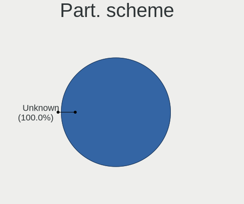

| Type    | Computers | Percent |
|---------|-----------|---------|
| Unknown | 70        | 95.89%  |
| GPT     | 3         | 4.11%   |

Dual Boot with Linux/BSD
------------------------

Hosting more than one Linux/BSD

| Dual boot | Computers | Percent |
|-----------|-----------|---------|
| No        | 70        | 95.89%  |
| Yes       | 3         | 4.11%   |

Dual Boot (Win)
---------------

Hosting Linux and Windows

| Dual boot | Computers | Percent |
|-----------|-----------|---------|
| No        | 73        | 100%    |

Board
-----

Vendor
------

Motherboard manufacturer

| Name             | Computers | Percent |
|------------------|-----------|---------|
| Valve            | 66        | 90.41%  |
| ASUSTek Computer | 3         | 4.11%   |
| Dell             | 2         | 2.74%   |
| MSI              | 1         | 1.37%   |
| Hewlett-Packard  | 1         | 1.37%   |

Model
-----

Motherboard model

| Name                         | Computers | Percent |
|------------------------------|-----------|---------|
| Valve Jupiter                | 66        | 90.41%  |
| MSI MS-7995                  | 1         | 1.37%   |
| HP Laptop 15-bw0xx           | 1         | 1.37%   |
| Dell Precision T5600         | 1         | 1.37%   |
| Dell OptiPlex 7010           | 1         | 1.37%   |
| ASUS ROG STRIX Z390-I GAMING | 1         | 1.37%   |
| ASUS ROG Ally RC71L_RC71L    | 1         | 1.37%   |
| ASUS PRIME H610M-A D4        | 1         | 1.37%   |

Model Family
------------

Motherboard model prefix

| Name           | Computers | Percent |
|----------------|-----------|---------|
| Valve Jupiter  | 66        | 90.41%  |
| ASUS ROG       | 2         | 2.74%   |
| MSI MS-7995    | 1         | 1.37%   |
| HP Laptop      | 1         | 1.37%   |
| Dell Precision | 1         | 1.37%   |
| Dell OptiPlex  | 1         | 1.37%   |
| ASUS PRIME     | 1         | 1.37%   |

MFG Year
--------

Motherboard manufacture year

| Year | Computers | Percent |
|------|-----------|---------|
| 2022 | 56        | 76.71%  |
| 2023 | 11        | 15.07%  |
| 2018 | 2         | 2.74%   |
| 2017 | 2         | 2.74%   |
| 2021 | 1         | 1.37%   |
| 2012 | 1         | 1.37%   |

Form Factor
-----------

Physical design of the computer

| Name     | Computers | Percent |
|----------|-----------|---------|
| Notebook | 68        | 93.15%  |
| Desktop  | 4         | 5.48%   |
| Tablet   | 1         | 1.37%   |

Secure Boot
-----------

Enabled or disabled

| State    | Computers | Percent |
|----------|-----------|---------|
| Disabled | 73        | 100%    |

Coreboot
--------

Have coreboot on board

| Used | Computers | Percent |
|------|-----------|---------|
| No   | 73        | 100%    |

RAM Size
--------

Total RAM memory

| Size in GB  | Computers | Percent |
|-------------|-----------|---------|
| 8.01-16.0   | 67        | 91.78%  |
| 16.01-24.0  | 4         | 5.48%   |
| 3.01-4.0    | 1         | 1.37%   |
| 64.01-256.0 | 1         | 1.37%   |

RAM Used
--------

Used RAM memory

| Used GB   | Computers | Percent |
|-----------|-----------|---------|
| 4.01-8.0  | 26        | 35.62%  |
| 3.01-4.0  | 24        | 32.88%  |
| 2.01-3.0  | 18        | 24.66%  |
| 8.01-16.0 | 4         | 5.48%   |
| 1.01-2.0  | 1         | 1.37%   |

Total Drives
------------

Number of drives on board

| Drives | Computers | Percent |
|--------|-----------|---------|
| 2      | 53        | 72.6%   |
| 1      | 18        | 24.66%  |
| 3      | 2         | 2.74%   |

Has CD-ROM
----------

Has CD-ROM on board

| Presented | Computers | Percent |
|-----------|-----------|---------|
| No        | 72        | 98.63%  |
| Yes       | 1         | 1.37%   |

Has Ethernet
------------

Has Ethernet on board

| Presented | Computers | Percent |
|-----------|-----------|---------|
| No        | 45        | 61.64%  |
| Yes       | 28        | 38.36%  |

Has WiFi
--------

Has WiFi module

| Presented | Computers | Percent |
|-----------|-----------|---------|
| Yes       | 72        | 98.63%  |
| No        | 1         | 1.37%   |

Has Bluetooth
-------------

Has Bluetooth module

| Presented | Computers | Percent |
|-----------|-----------|---------|
| Yes       | 69        | 94.52%  |
| No        | 4         | 5.48%   |

Location
--------

Country
-------

Geographic location (country)

| Country     | Computers | Percent |
|-------------|-----------|---------|
| USA         | 23        | 31.51%  |
| Germany     | 11        | 15.07%  |
| UK          | 6         | 8.22%   |
| Russia      | 5         | 6.85%   |
| Brazil      | 4         | 5.48%   |
| Spain       | 3         | 4.11%   |
| Canada      | 2         | 2.74%   |
| Austria     | 2         | 2.74%   |
| Vietnam     | 1         | 1.37%   |
| Ukraine     | 1         | 1.37%   |
| Sweden      | 1         | 1.37%   |
| Puerto Rico | 1         | 1.37%   |
| Poland      | 1         | 1.37%   |
| Philippines | 1         | 1.37%   |
| Netherlands | 1         | 1.37%   |
| Morocco     | 1         | 1.37%   |
| Mexico      | 1         | 1.37%   |
| Italy       | 1         | 1.37%   |
| Israel      | 1         | 1.37%   |
| Iraq        | 1         | 1.37%   |
| Indonesia   | 1         | 1.37%   |
| France      | 1         | 1.37%   |
| Ecuador     | 1         | 1.37%   |
| Denmark     | 1         | 1.37%   |
| Australia   | 1         | 1.37%   |

City
----

Geographic location (city)

| City                      | Computers | Percent |
|---------------------------|-----------|---------|
| Vienna                    | 2         | 2.74%   |
| Seattle                   | 2         | 2.74%   |
| Moscow                    | 2         | 2.74%   |
| Madrid                    | 2         | 2.74%   |
| Berlin                    | 2         | 2.74%   |
| Zapopan                   | 1         | 1.37%   |
| West Malling              | 1         | 1.37%   |
| Warsaw                    | 1         | 1.37%   |
| Wappingers Falls          | 1         | 1.37%   |
| Voronezh                  | 1         | 1.37%   |
| Voorhout                  | 1         | 1.37%   |
| Villeparisis              | 1         | 1.37%   |
| Valby                     | 1         | 1.37%   |
| Thetford                  | 1         | 1.37%   |
| Tel Aviv                  | 1         | 1.37%   |
| Sydney                    | 1         | 1.37%   |
| St Petersburg             | 1         | 1.37%   |
| Sparta                    | 1         | 1.37%   |
| Sao Paulo                 | 1         | 1.37%   |
| Sant Quirze del Valles    | 1         | 1.37%   |
| San Sebastiano al Vesuvio | 1         | 1.37%   |
| San Juan                  | 1         | 1.37%   |
| Sacramento                | 1         | 1.37%   |
| Ribeirao Preto            | 1         | 1.37%   |
| Reading                   | 1         | 1.37%   |
| Porto Alegre              | 1         | 1.37%   |
| Petrozavodsk              | 1         | 1.37%   |
| Munich                    | 1         | 1.37%   |
| Louisville                | 1         | 1.37%   |
| Los Angeles               | 1         | 1.37%   |
| Lincoln                   | 1         | 1.37%   |
| Leicester                 | 1         | 1.37%   |
| Lebanon                   | 1         | 1.37%   |
| Lawrenceville             | 1         | 1.37%   |
| Las Pinas                 | 1         | 1.37%   |
| La Concordia Numero Uno   | 1         | 1.37%   |
| Kyiv                      | 1         | 1.37%   |
| Kingsport                 | 1         | 1.37%   |
| Kingsland                 | 1         | 1.37%   |
| Ironwood                  | 1         | 1.37%   |

Drives
------

Drive Vendor
------------

Hard drive vendors

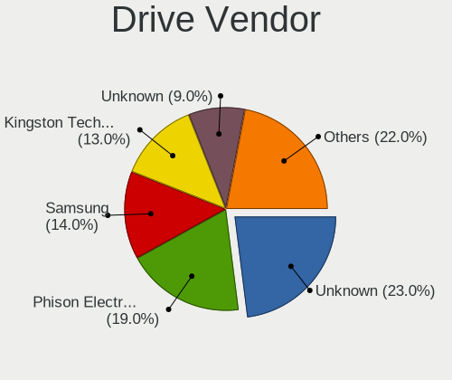

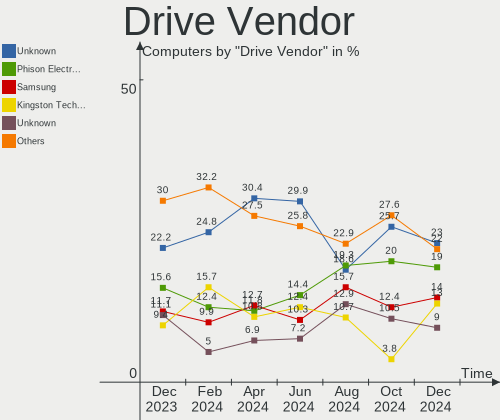

| Vendor                      | Computers | Drives | Percent |
|-----------------------------|-----------|--------|---------|
| Unknown                     | 42        | 43     | 32.31%  |
| Phison Electronics          | 18        | 18     | 13.85%  |
| Samsung Electronics         | 16        | 17     | 12.31%  |
| Kingston Technology Company | 13        | 13     | 10%     |
| O2 Micro                    | 12        | 12     | 9.23%   |
| Unknown                     | 7         | 7      | 5.38%   |
| KIOXIA                      | 4         | 4      | 3.08%   |
| Sandisk                     | 3         | 3      | 2.31%   |
| Toshiba                     | 2         | 2      | 1.54%   |
| Silicon Motion              | 2         | 2      | 1.54%   |
| Realtek                     | 2         | 2      | 1.54%   |
| WDC                         | 1         | 1      | 0.77%   |
| SPCC                        | 1         | 1      | 0.77%   |
| Micron Technology           | 1         | 1      | 0.77%   |
| MAXIO Technology (Hangzhou) | 1         | 1      | 0.77%   |
| JMicron Technology          | 1         | 1      | 0.77%   |
| Intenso                     | 1         | 1      | 0.77%   |
| Gigastone                   | 1         | 1      | 0.77%   |
| China                       | 1         | 1      | 0.77%   |
| Biwin Storage Technology    | 1         | 1      | 0.77%   |

Drive Model
-----------

Hard drive models

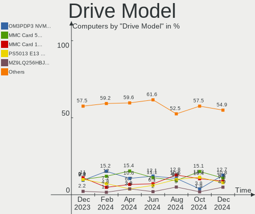

| Model                                                 | Computers | Percent |
|-------------------------------------------------------|-----------|---------|
| Unknown MMC Card  512GB                               | 19        | 14.39%  |
| Kingston Company OM3PDP3 NVMe SSD 512GB               | 13        | 9.85%   |
| Phison PS5013 E13 NVMe Controller 512GB               | 12        | 9.09%   |
| O2 Micro E2M2 64GB                                    | 12        | 9.09%   |
| Unknown MMC Card  256GB                               | 9         | 6.82%   |
| Samsung MZ9LQ512HBLU-00BVL 512GB                      | 8         | 6.06%   |
| Unknown                                               | 7         | 5.3%    |
| Unknown MMC Card  128GB                               | 4         | 3.03%   |
| Samsung MZ9LQ256HBJD-00BVL 256GB                      | 4         | 3.03%   |
| Unknown MMC Card  32GB                                | 3         | 2.27%   |
| Unknown MMC Card  64GB                                | 2         | 1.52%   |
| Silicon Motion SM2263EN/SM2263XT SSD Controller 512GB | 2         | 1.52%   |
| Sandisk WD PC SN740 SDDPTQD-1T00 1024GB               | 2         | 1.52%   |
| Phison Sabrent SB-2130-1TB                            | 2         | 1.52%   |
| KIOXIA KBG40ZNS512G NVMe 512GB                        | 2         | 1.52%   |
| WDC WD60EFRX-68L0BN1 6TB                              | 1         | 0.76%   |
| Unknown MMC Card  498GB                               | 1         | 0.76%   |
| Unknown MMC Card  393GB                               | 1         | 0.76%   |
| Unknown MMC Card  197GB                               | 1         | 0.76%   |
| Unknown MMC Card  196GB                               | 1         | 0.76%   |
| Unknown MMC Card  16GB                                | 1         | 0.76%   |
| Unknown MMC Card  1048GB                              | 1         | 0.76%   |
| Toshiba MQ01ABD050 500GB                              | 1         | 0.76%   |
| Toshiba HDWT840 4TB                                   | 1         | 0.76%   |
| SPCC Solid State Disk 512GB                           | 1         | 0.76%   |
| SanDisk 3.2 Gen 1 128GB SSD                           | 1         | 0.76%   |
| Samsung PM991a NVMe 512GB                             | 1         | 0.76%   |
| Samsung PM991a NVMe 256GB                             | 1         | 0.76%   |
| Samsung PM991 NVMe 512GB                              | 1         | 0.76%   |
| Samsung NVMe SSD Controller SM961/PM961/SM963 500GB   | 1         | 0.76%   |
| Samsung MZNLN512HMJP-000H1 512GB SSD                  | 1         | 0.76%   |
| Realtek RTL9210B-CG 2TB                               | 1         | 0.76%   |
| Realtek RTL9210 NVME 128GB                            | 1         | 0.76%   |
| Phison TEAM TM5FF3002T 2TB                            | 1         | 0.76%   |
| Phison TEAM TM5FF3001T 1TB                            | 1         | 0.76%   |
| Phison E12 NVMe Controller 2TB                        | 1         | 0.76%   |
| Phison Corsair MP600 MINI 1TB                         | 1         | 0.76%   |
| Micron 2400_MTFDKBK512QFM 512GB                       | 1         | 0.76%   |
| MAXIO (Hangzhou) NVMe SSD Controller MAP1202 512GB    | 1         | 0.76%   |
| KIOXIA KBG50ZNS512G 512GB                             | 1         | 0.76%   |

HDD Vendor
----------

Hard disk drive vendors

| Vendor  | Computers | Drives | Percent |
|---------|-----------|--------|---------|
| Toshiba | 2         | 2      | 66.67%  |
| WDC     | 1         | 1      | 33.33%  |

SSD Vendor
----------

Solid state drive vendors

| Vendor              | Computers | Drives | Percent |
|---------------------|-----------|--------|---------|
| SPCC                | 1         | 1      | 20%     |
| SanDisk             | 1         | 1      | 20%     |
| Samsung Electronics | 1         | 1      | 20%     |
| Gigastone           | 1         | 1      | 20%     |
| China               | 1         | 1      | 20%     |

Drive Kind
----------

HDD or SSD

| Kind    | Computers | Drives | Percent |
|---------|-----------|--------|---------|
| NVMe    | 69        | 72     | 54.33%  |
| MMC     | 49        | 50     | 38.58%  |
| SSD     | 4         | 5      | 3.15%   |
| HDD     | 3         | 3      | 2.36%   |
| Unknown | 2         | 2      | 1.57%   |

Drive Connector
---------------

SATA, SAS, NVMe, etc.

| Type | Computers | Drives | Percent |
|------|-----------|--------|---------|
| NVMe | 69        | 70     | 53.49%  |
| MMC  | 49        | 50     | 37.98%  |
| SATA | 6         | 7      | 4.65%   |
| SAS  | 5         | 5      | 3.88%   |

Drive Size
----------

Size of hard drive

| Size in TB | Computers | Drives | Percent |
|------------|-----------|--------|---------|
| 0.51-1.0   | 2         | 2      | 28.57%  |
| 0.01-0.5   | 2         | 3      | 28.57%  |
| 3.01-4.0   | 1         | 1      | 14.29%  |
| 1.01-2.0   | 1         | 1      | 14.29%  |
| 4.01-10.0  | 1         | 1      | 14.29%  |

Space Total
-----------

Amount of disk space available on the file system

| Size in GB     | Computers | Percent |
|----------------|-----------|---------|
| 251-500        | 35        | 47.95%  |
| 501-1000       | 13        | 17.81%  |
| 51-100         | 12        | 16.44%  |
| 101-250        | 9         | 12.33%  |
| More than 3000 | 1         | 1.37%   |
| 2001-3000      | 1         | 1.37%   |
| 1001-2000      | 1         | 1.37%   |
| Unknown        | 1         | 1.37%   |

Space Used
----------

Amount of used disk space

| Used GB   | Computers | Percent |
|-----------|-----------|---------|
| 251-500   | 20        | 27.4%   |
| 101-250   | 15        | 20.55%  |
| 21-50     | 13        | 17.81%  |
| 1-20      | 7         | 9.59%   |
| 501-1000  | 7         | 9.59%   |
| 51-100    | 7         | 9.59%   |
| 1001-2000 | 3         | 4.11%   |
| Unknown   | 1         | 1.37%   |

Malfunc. Drives
---------------

Drive models with a malfunction

Zero info for selected period =(

Malfunc. Drive Vendor
---------------------

Vendors of faulty drives

Zero info for selected period =(

Malfunc. HDD Vendor
-------------------

Vendors of faulty HDD drives

Zero info for selected period =(

Malfunc. Drive Kind
-------------------

Kinds of faulty drives

Zero info for selected period =(

Failed Drives
-------------

Failed drive models

Zero info for selected period =(

Failed Drive Vendor
-------------------

Failed drive vendors

Zero info for selected period =(

Drive Status
------------

Number of failed and malfunc. drives

| Status   | Computers | Drives | Percent |
|----------|-----------|--------|---------|
| Detected | 73        | 129    | 96.05%  |
| Works    | 3         | 3      | 3.95%   |

Storage controller
------------------

Storage Vendor
--------------

Storage controller vendors

| Vendor                      | Computers | Percent |
|-----------------------------|-----------|---------|
| Phison Electronics          | 18        | 23.68%  |
| Samsung Electronics         | 16        | 21.05%  |
| Kingston Technology Company | 13        | 17.11%  |
| O2 Micro                    | 12        | 15.79%  |
| Intel                       | 5         | 6.58%   |
| KIOXIA                      | 4         | 5.26%   |
| Silicon Motion              | 2         | 2.63%   |
| Sandisk                     | 2         | 2.63%   |
| Micron Technology           | 1         | 1.32%   |
| MAXIO Technology (Hangzhou) | 1         | 1.32%   |
| Biwin Storage Technology    | 1         | 1.32%   |
| AMD                         | 1         | 1.32%   |

Storage Model
-------------

Storage controller models

| Model                                                                         | Computers | Percent |
|-------------------------------------------------------------------------------|-----------|---------|
| Samsung NVMe SSD Controller 980                                               | 15        | 19.23%  |
| Kingston Company OM3PDP3 NVMe SSD                                             | 13        | 16.67%  |
| Phison PS5013 E13 NVMe Controller                                             | 12        | 15.38%  |
| O2 Micro FORESEE E2M2 NVMe SSD                                                | 12        | 15.38%  |
| Phison PS5021-E21 PCIe4 NVMe Controller (DRAM-less)                           | 5         | 6.41%   |
| Silicon Motion SM2263EN/SM2263XT (DRAM-less) NVMe SSD Controllers             | 2         | 2.56%   |
| Sandisk PC SN740 NVMe SSD (DRAM-less)                                         | 2         | 2.56%   |
| KIOXIA NVMe SSD Controller BG5 (DRAM-less)                                    | 2         | 2.56%   |
| KIOXIA NVMe SSD Controller BG4 (DRAM-less)                                    | 2         | 2.56%   |
| Samsung NVMe SSD Controller SM961/PM961/SM963                                 | 1         | 1.28%   |
| Phison E12 NVMe Controller                                                    | 1         | 1.28%   |
| Micron 2400 NVMe SSD (DRAM-less)                                              | 1         | 1.28%   |
| MAXIO (Hangzhou) NVMe SSD Controller MAP1202                                  | 1         | 1.28%   |
| Intel Volume Management Device NVMe RAID Controller                           | 1         | 1.28%   |
| Intel Q170/Q150/B150/H170/H110/Z170/CM236 Chipset SATA Controller [AHCI Mode] | 1         | 1.28%   |
| Intel Cannon Lake PCH SATA AHCI Controller                                    | 1         | 1.28%   |
| Intel C602 chipset 4-Port SATA Storage Control Unit                           | 1         | 1.28%   |
| Intel C600/X79 series chipset 6-Port SATA AHCI Controller                     | 1         | 1.28%   |
| Intel Alder Lake-S PCH SATA Controller [AHCI Mode]                            | 1         | 1.28%   |
| Intel 7 Series/C210 Series Chipset Family 6-port SATA Controller [AHCI mode]  | 1         | 1.28%   |
| Biwin Storage Non-Volatile memory controller                                  | 1         | 1.28%   |
| AMD FCH SATA Controller [AHCI mode]                                           | 1         | 1.28%   |

Storage Kind
------------

Kind of storage controller (IDE, SATA, NVMe, SAS, ...)

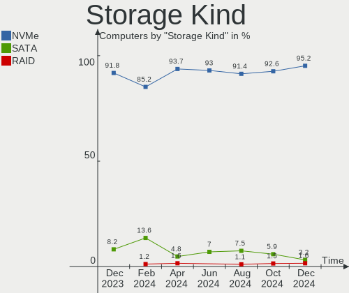

| Kind | Computers | Percent |
|------|-----------|---------|
| NVMe | 69        | 89.61%  |
| SATA | 6         | 7.79%   |
| RAID | 1         | 1.3%    |
| SAS  | 1         | 1.3%    |

Processor
---------

CPU Vendor
----------

Processor vendors

| Vendor | Computers | Percent |
|--------|-----------|---------|
| AMD    | 68        | 93.15%  |
| Intel  | 5         | 6.85%   |

CPU Model
---------

Processor models

| Model                                        | Computers | Percent |
|----------------------------------------------|-----------|---------|
| AMD Custom APU 0405                          | 66        | 90.41%  |
| Intel Xeon CPU E5-2690 0 @ 2.90GHz           | 1         | 1.37%   |
| Intel Core i7-3770 CPU @ 3.40GHz             | 1         | 1.37%   |
| Intel Core i5-9600K CPU @ 3.70GHz            | 1         | 1.37%   |
| Intel Core i3-6100 CPU @ 3.70GHz             | 1         | 1.37%   |
| Intel 12th Gen Core i3-12100F                | 1         | 1.37%   |
| AMD Ryzen Z1 Extreme                         | 1         | 1.37%   |
| AMD A6-9220 RADEON R4, 5 COMPUTE CORES 2C+3G | 1         | 1.37%   |

CPU Model Family
----------------

Processor model prefix

| Model         | Computers | Percent |
|---------------|-----------|---------|
| Other         | 68        | 93.15%  |
| Intel Xeon    | 1         | 1.37%   |
| Intel Core i7 | 1         | 1.37%   |
| Intel Core i5 | 1         | 1.37%   |
| Intel Core i3 | 1         | 1.37%   |
| AMD A6        | 1         | 1.37%   |

CPU Cores
---------

Number of processor cores

| Number | Computers | Percent |
|--------|-----------|---------|
| 4      | 68        | 93.15%  |
| 2      | 2         | 2.74%   |
| 16     | 1         | 1.37%   |
| 8      | 1         | 1.37%   |
| 6      | 1         | 1.37%   |

CPU Sockets
-----------

Number of sockets

| Number | Computers | Percent |
|--------|-----------|---------|
| 1      | 72        | 98.63%  |
| 2      | 1         | 1.37%   |

CPU Threads
-----------

Threads per core (Hyper-Threading)

| Number | Computers | Percent |
|--------|-----------|---------|
| 2      | 71        | 97.26%  |
| 1      | 2         | 2.74%   |

CPU Op-Modes
------------

CPU Operation Modes (32-bit, 64-bit)

| Op mode        | Computers | Percent |
|----------------|-----------|---------|
| 32-bit, 64-bit | 73        | 100%    |

CPU Microcode
-------------

Microcode number

| Number     | Computers | Percent |
|------------|-----------|---------|
| Unknown    | 70        | 95.89%  |
| 0x08900201 | 3         | 4.11%   |

CPU Microarch
-------------

Microarchitecture

| Name        | Computers | Percent |
|-------------|-----------|---------|
| Unknown     | 68        | 93.15%  |
| Skylake     | 1         | 1.37%   |
| SandyBridge | 1         | 1.37%   |
| KabyLake    | 1         | 1.37%   |
| IvyBridge   | 1         | 1.37%   |
| Excavator   | 1         | 1.37%   |

Graphics
--------

GPU Vendor
----------

Vendors of graphics cards

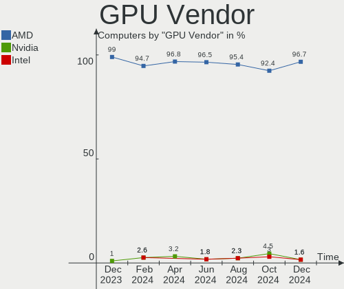

| Vendor | Computers | Percent |
|--------|-----------|---------|
| AMD    | 71        | 95.95%  |
| Intel  | 2         | 2.7%    |
| Nvidia | 1         | 1.35%   |

GPU Model
---------

Graphics card models

| Model                                          | Computers | Percent |
|------------------------------------------------|-----------|---------|
| AMD VanGogh [AMD Custom GPU 0405]              | 66        | 89.19%  |
| AMD Navi 14 [Radeon RX 5500/5500M / Pro 5500M] | 2         | 2.7%    |
| Nvidia GP104 [GeForce GTX 1070]                | 1         | 1.35%   |
| Intel IvyBridge GT2 [HD Graphics 4000]         | 1         | 1.35%   |
| Intel CoffeeLake-S GT2 [UHD Graphics 630]      | 1         | 1.35%   |
| AMD Stoney [Radeon R2/R3/R4/R5 Graphics]       | 1         | 1.35%   |
| AMD Phoenix1                                   | 1         | 1.35%   |
| AMD Navi 23 [Radeon RX 6600/6600 XT/6600M]     | 1         | 1.35%   |

GPU Combo
---------

Combinations of graphics cards

| Name        | Computers | Percent |
|-------------|-----------|---------|
| 1 x AMD     | 70        | 95.89%  |
| 1 x Nvidia  | 1         | 1.37%   |
| Intel + AMD | 1         | 1.37%   |
| 1 x Intel   | 1         | 1.37%   |

GPU Driver
----------

Free vs proprietary

| Driver | Computers | Percent |
|--------|-----------|---------|
| Free   | 73        | 100%    |

GPU Memory
----------

Total video memory

| Size in GB | Computers | Percent |
|------------|-----------|---------|
| Unknown    | 70        | 95.89%  |
| 0.51-1.0   | 2         | 2.74%   |
| 3.01-4.0   | 1         | 1.37%   |

Monitor
-------

Monitor Vendor
--------------

Monitor vendors

| Vendor               | Computers | Percent |
|----------------------|-----------|---------|
| Valve                | 66        | 71.74%  |
| Samsung Electronics  | 8         | 8.7%    |
| Goldstar             | 3         | 3.26%   |
| Dell                 | 3         | 3.26%   |
| Lenovo               | 2         | 2.17%   |
| Unknown (XXX)        | 1         | 1.09%   |
| Unknown (AAA)        | 1         | 1.09%   |
| TMX                  | 1         | 1.09%   |
| Sony                 | 1         | 1.09%   |
| MSI                  | 1         | 1.09%   |
| HannStar             | 1         | 1.09%   |
| Chimei Innolux       | 1         | 1.09%   |
| BenQ                 | 1         | 1.09%   |
| AOC                  | 1         | 1.09%   |
| Ancor Communications | 1         | 1.09%   |

Monitor Model
-------------

Monitor models

| Model                                                                   | Computers | Percent |
|-------------------------------------------------------------------------|-----------|---------|
| Valve ANX7530 U VLV3001 800x1280 100x150mm 7.1-inch                     | 66        | 71.74%  |
| Unknown (XXX) Beyond TV XXX2851 3840x2160 1209x680mm 54.6-inch          | 1         | 1.09%   |
| Unknown (AAA) HDMI AAA3201 1920x1080 698x392mm 31.5-inch                | 1         | 1.09%   |
| TMX TL070FVXS01-0 TMX0002 1920x1080 160x100mm 7.4-inch                  | 1         | 1.09%   |
| Sony TV SNYEB01 1360x768                                                | 1         | 1.09%   |
| Samsung Electronics U32J59x SAM0F35 3840x2160 697x392mm 31.5-inch       | 1         | 1.09%   |
| Samsung Electronics SyncMaster SAM05CD 1920x1080                        | 1         | 1.09%   |
| Samsung Electronics S23B550 SAM091A 1920x1080 510x287mm 23.0-inch       | 1         | 1.09%   |
| Samsung Electronics LCD Monitor SAM0FEF 3840x2160 1872x1053mm 84.6-inch | 1         | 1.09%   |
| Samsung Electronics LCD Monitor SAM0F14 3840x2160 1872x1053mm 84.6-inch | 1         | 1.09%   |
| Samsung Electronics LCD Monitor SAM0DFA 3840x2160 1210x680mm 54.6-inch  | 1         | 1.09%   |
| Samsung Electronics LCD Monitor SAM0C3C 1360x768 700x390mm 31.5-inch    | 1         | 1.09%   |
| Samsung Electronics C24F390 SAM0D2C 1920x1080 521x293mm 23.5-inch       | 1         | 1.09%   |
| MSI G2412 MSI9BA4 1920x1080 527x296mm 23.8-inch                         | 1         | 1.09%   |
| Lenovo LEN P27u-10 LEN61B0 3840x2160 597x336mm 27.0-inch                | 1         | 1.09%   |
| Lenovo LEN P24q-20 LEN61F5 2560x1440 527x296mm 23.8-inch                | 1         | 1.09%   |
| HannStar HSG1076 HSP0020 1920x1080 698x392mm 31.5-inch                  | 1         | 1.09%   |
| Goldstar ULTRAGEAR GSM5BB2 1920x1080 527x296mm 23.8-inch                | 1         | 1.09%   |
| Goldstar FULL HD GSM5B55 1920x1080 480x270mm 21.7-inch                  | 1         | 1.09%   |
| Goldstar 27GN7 GSM5B8D 1920x1080 600x303mm 26.5-inch                    | 1         | 1.09%   |
| Dell S2409W DELA039 1920x1080 531x298mm 24.0-inch                       | 1         | 1.09%   |
| Dell P2418HT DEL4113 1920x1080 527x296mm 23.8-inch                      | 1         | 1.09%   |
| Dell E157FP DELA022 1024x768 304x228mm 15.0-inch                        | 1         | 1.09%   |
| Chimei Innolux LCD Monitor CMN15DB 1366x768 344x193mm 15.5-inch         | 1         | 1.09%   |
| BenQ GL2480 BNQ78ED 1920x1080 531x298mm 24.0-inch                       | 1         | 1.09%   |
| AOC 2476W AOC2476 1920x1080 521x293mm 23.5-inch                         | 1         | 1.09%   |
| Ancor Communications ASUS VK278 ACI27F7 1920x1080 598x336mm 27.0-inch   | 1         | 1.09%   |

Monitor Resolution
------------------

Monitor screen resolution

| Resolution      | Computers | Percent |
|-----------------|-----------|---------|
| 800x1280        | 66        | 72.53%  |
| 1920x1080 (FHD) | 13        | 14.29%  |
| 3840x2160 (4K)  | 7         | 7.69%   |
| 1366x768 (WXGA) | 2         | 2.2%    |
| 2560x1440 (QHD) | 1         | 1.1%    |
| 1360x768        | 1         | 1.1%    |
| 1024x768 (XGA)  | 1         | 1.1%    |

Monitor Diagonal
----------------

Diagonal size in inches

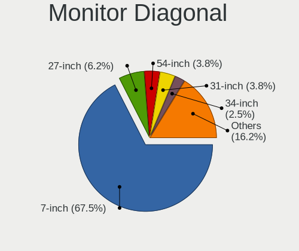

| Inches  | Computers | Percent |
|---------|-----------|---------|
| 7       | 67        | 72.83%  |
| 31      | 4         | 4.35%   |
| 27      | 4         | 4.35%   |
| 24      | 4         | 4.35%   |
| 23      | 4         | 4.35%   |
| 84      | 3         | 3.26%   |
| 15      | 2         | 2.17%   |
| 72      | 1         | 1.09%   |
| 54      | 1         | 1.09%   |
| 21      | 1         | 1.09%   |
| Unknown | 1         | 1.09%   |

Monitor Width
-------------

Physical width

| Width in mm | Computers | Percent |
|-------------|-----------|---------|
| 1-100       | 66        | 71.74%  |
| 501-600     | 11        | 11.96%  |
| 601-700     | 5         | 5.43%   |
| 1501-2000   | 4         | 4.35%   |
| 301-350     | 2         | 2.17%   |
| 401-500     | 1         | 1.09%   |
| 101-200     | 1         | 1.09%   |
| 1001-1500   | 1         | 1.09%   |
| Unknown     | 1         | 1.09%   |

Aspect Ratio
------------

Proportional relationship between the width and the height

| Ratio | Computers | Percent |
|-------|-----------|---------|
| 0.67  | 66        | 73.33%  |
| 16/9  | 22        | 24.44%  |
| 4/3   | 1         | 1.11%   |
| 16/10 | 1         | 1.11%   |

Monitor Area
------------

Area in inch²

| Area in inch² | Computers | Percent |
|----------------|-----------|---------|
| 1-40           | 67        | 72.83%  |
| 201-250        | 9         | 9.78%   |
| More than 1000 | 5         | 5.43%   |
| 351-500        | 4         | 4.35%   |
| 301-350        | 4         | 4.35%   |
| 101-110        | 2         | 2.17%   |
| Unknown        | 1         | 1.09%   |

Pixel Density
-------------

Pixels per inch

| Density       | Computers | Percent |
|---------------|-----------|---------|
| 161-240       | 66        | 74.16%  |
| 51-100        | 15        | 16.85%  |
| 1-50          | 2         | 2.25%   |
| 121-160       | 2         | 2.25%   |
| 101-120       | 2         | 2.25%   |
| More than 240 | 1         | 1.12%   |
| Unknown       | 1         | 1.12%   |

Multiple Monitors
-----------------

Total monitors connected

| Total | Computers | Percent |
|-------|-----------|---------|
| 1     | 56        | 76.71%  |
| 2     | 15        | 20.55%  |
| 3     | 2         | 2.74%   |

Network
-------

Net Controller Vendor
---------------------

Controller vendors

| Vendor                | Computers | Percent |
|-----------------------|-----------|---------|
| Realtek Semiconductor | 68        | 76.4%   |
| ASIX Electronics      | 10        | 11.24%  |
| Intel                 | 5         | 5.62%   |
| ZyXEL Communications  | 1         | 1.12%   |
| MediaTek              | 1         | 1.12%   |
| Linksys               | 1         | 1.12%   |
| DisplayLink           | 1         | 1.12%   |
| D-Link                | 1         | 1.12%   |
| Broadcom Limited      | 1         | 1.12%   |

Net Controller Model
--------------------

Controller models

| Model                                                                 | Computers | Percent |
|-----------------------------------------------------------------------|-----------|---------|
| Realtek RTL8822CE 802.11ac PCIe Wireless Network Adapter              | 66        | 64.08%  |
| ASIX AX88179 Gigabit Ethernet                                         | 10        | 9.71%   |
| Realtek RTL8153 Gigabit Ethernet Adapter                              | 9         | 8.74%   |
| Realtek RTL8111/8168/8411 PCI Express Gigabit Ethernet Controller     | 2         | 1.94%   |
| Intel 82579LM Gigabit Network Connection (Lewisville)                 | 2         | 1.94%   |
| ZyXEL 802.11ax WLAN Adapter                                           | 1         | 0.97%   |
| Realtek RTL8812AU 802.11a/b/g/n/ac 2T2R DB WLAN Adapter               | 1         | 0.97%   |
| Realtek RTL8723DE Wireless Network Adapter                            | 1         | 0.97%   |
| Realtek RTL8152 Fast Ethernet Adapter                                 | 1         | 0.97%   |
| MediaTek MT7922 802.11ax PCI Express Wireless Network Adapter         | 1         | 0.97%   |
| MediaTek Infinix HOT 11S NFC                                          | 1         | 0.97%   |
| Linksys WUSB300N 802.11bgn Wireless Adapter [Marvell 88W8362+88W8060] | 1         | 0.97%   |
| Intel Wireless 8260                                                   | 1         | 0.97%   |
| Intel Wireless 7265                                                   | 1         | 0.97%   |
| Intel Ethernet Connection (7) I219-V                                  | 1         | 0.97%   |
| Intel Ethernet Connection (17) I219-V                                 | 1         | 0.97%   |
| DisplayLink Dell Universal Dock D6000                                 | 1         | 0.97%   |
| D-Link AirPlus G DWL-G122 Wireless Adapter(rev.B1) [Ralink RT2571]    | 1         | 0.97%   |
| Broadcom Limited BCM4352 802.11ac Wireless Network Adapter            | 1         | 0.97%   |

Wireless Vendor
---------------

Wireless vendors

| Vendor                | Computers | Percent |
|-----------------------|-----------|---------|
| Realtek Semiconductor | 67        | 90.54%  |
| Intel                 | 2         | 2.7%    |
| ZyXEL Communications  | 1         | 1.35%   |
| MediaTek              | 1         | 1.35%   |
| Linksys               | 1         | 1.35%   |
| D-Link                | 1         | 1.35%   |
| Broadcom Limited      | 1         | 1.35%   |

Wireless Model
--------------

Wireless models

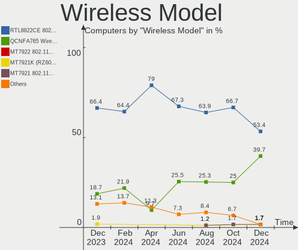

| Model                                                                 | Computers | Percent |
|-----------------------------------------------------------------------|-----------|---------|
| Realtek RTL8822CE 802.11ac PCIe Wireless Network Adapter              | 66        | 88%     |
| ZyXEL 802.11ax WLAN Adapter                                           | 1         | 1.33%   |
| Realtek RTL8812AU 802.11a/b/g/n/ac 2T2R DB WLAN Adapter               | 1         | 1.33%   |
| Realtek RTL8723DE Wireless Network Adapter                            | 1         | 1.33%   |
| MediaTek MT7922 802.11ax PCI Express Wireless Network Adapter         | 1         | 1.33%   |
| Linksys WUSB300N 802.11bgn Wireless Adapter [Marvell 88W8362+88W8060] | 1         | 1.33%   |
| Intel Wireless 8260                                                   | 1         | 1.33%   |
| Intel Wireless 7265                                                   | 1         | 1.33%   |
| D-Link AirPlus G DWL-G122 Wireless Adapter(rev.B1) [Ralink RT2571]    | 1         | 1.33%   |
| Broadcom Limited BCM4352 802.11ac Wireless Network Adapter            | 1         | 1.33%   |

Ethernet Vendor
---------------

Ethernet vendors

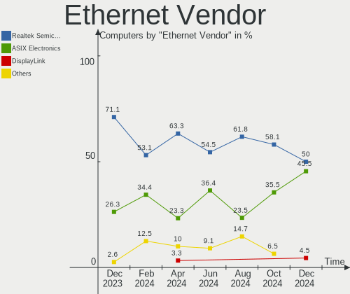

| Vendor                | Computers | Percent |
|-----------------------|-----------|---------|
| Realtek Semiconductor | 12        | 42.86%  |
| ASIX Electronics      | 10        | 35.71%  |
| Intel                 | 4         | 14.29%  |
| MediaTek              | 1         | 3.57%   |
| DisplayLink           | 1         | 3.57%   |

Ethernet Model
--------------

Ethernet models

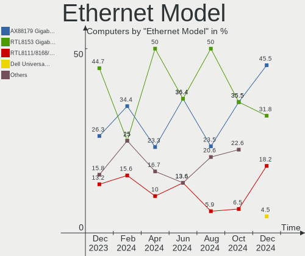

| Model                                                             | Computers | Percent |
|-------------------------------------------------------------------|-----------|---------|
| ASIX AX88179 Gigabit Ethernet                                     | 10        | 35.71%  |
| Realtek RTL8153 Gigabit Ethernet Adapter                          | 9         | 32.14%  |
| Realtek RTL8111/8168/8411 PCI Express Gigabit Ethernet Controller | 2         | 7.14%   |
| Intel 82579LM Gigabit Network Connection (Lewisville)             | 2         | 7.14%   |
| Realtek RTL8152 Fast Ethernet Adapter                             | 1         | 3.57%   |
| MediaTek Infinix HOT 11S NFC                                      | 1         | 3.57%   |
| Intel Ethernet Connection (7) I219-V                              | 1         | 3.57%   |
| Intel Ethernet Connection (17) I219-V                             | 1         | 3.57%   |
| DisplayLink Dell Universal Dock D6000                             | 1         | 3.57%   |

Net Controller Kind
-------------------

Ethernet, WiFi or modem

| Kind     | Computers | Percent |
|----------|-----------|---------|
| WiFi     | 72        | 72%     |
| Ethernet | 28        | 28%     |

Used Controller
---------------

Currently used network controller

| Kind     | Computers | Percent |
|----------|-----------|---------|
| WiFi     | 64        | 83.12%  |
| Ethernet | 13        | 16.88%  |

NICs
----

Total network controllers on board

| Total | Computers | Percent |
|-------|-----------|---------|
| 1     | 69        | 94.52%  |
| 2     | 4         | 5.48%   |

IPv6
----

IPv6 vs IPv4

| Used | Computers | Percent |
|------|-----------|---------|
| No   | 38        | 52.05%  |
| Yes  | 35        | 47.95%  |

Bluetooth
---------

Bluetooth Vendor
----------------

Controller vendors

| Vendor                | Computers | Percent |
|-----------------------|-----------|---------|
| IMC Networks          | 64        | 92.75%  |
| Intel                 | 2         | 2.9%    |
| Foxconn / Hon Hai     | 2         | 2.9%    |
| Realtek Semiconductor | 1         | 1.45%   |

Bluetooth Model
---------------

Controller models

| Model                                           | Computers | Percent |
|-------------------------------------------------|-----------|---------|
| IMC Networks Bluetooth Radio                    | 64        | 92.75%  |
| Intel Bluetooth wireless interface              | 2         | 2.9%    |
| Realtek  Bluetooth 4.2 Adapter                  | 1         | 1.45%   |
| Foxconn / Hon Hai Wireless_Device               | 1         | 1.45%   |
| Foxconn / Hon Hai Broadcom BCM20702A1 Bluetooth | 1         | 1.45%   |

Sound
-----

Sound Vendor
------------

Sound card vendors

| Vendor              | Computers | Percent |
|---------------------|-----------|---------|
| AMD                 | 71        | 83.53%  |
| Intel               | 5         | 5.88%   |
| Logitech            | 3         | 3.53%   |
| Razer USA           | 1         | 1.18%   |
| Nvidia              | 1         | 1.18%   |
| Kingston Technology | 1         | 1.18%   |
| Hewlett-Packard     | 1         | 1.18%   |
| GN Netcom           | 1         | 1.18%   |
| BR23                | 1         | 1.18%   |

Sound Model
-----------

Sound card models

| Model                                                               | Computers | Percent |
|---------------------------------------------------------------------|-----------|---------|
| AMD Rembrandt Radeon High Definition Audio Controller               | 67        | 77.01%  |
| AMD Navi 10 HDMI Audio                                              | 2         | 2.3%    |
| Razer USA Gaming Controller [Raiju 2 Tournament Edition (USB)]      | 1         | 1.15%   |
| Nvidia GP104 High Definition Audio Controller                       | 1         | 1.15%   |
| Logitech G733 Gaming Headset                                        | 1         | 1.15%   |
| Logitech G432 Gaming Headset                                        | 1         | 1.15%   |
| Logitech Blue Microphones                                           | 1         | 1.15%   |
| Kingston Technology HyperX 7.1 Audio                                | 1         | 1.15%   |
| Intel Cannon Lake PCH cAVS                                          | 1         | 1.15%   |
| Intel C600/X79 series chipset High Definition Audio Controller      | 1         | 1.15%   |
| Intel Alder Lake-S HD Audio Controller                              | 1         | 1.15%   |
| Intel 7 Series/C216 Chipset Family High Definition Audio Controller | 1         | 1.15%   |
| Intel 100 Series/C230 Series Chipset Family HD Audio Controller     | 1         | 1.15%   |
| Hewlett-Packard HyperX QuadCast S                                   | 1         | 1.15%   |
| GN Netcom Jabra Evolve2 40                                          | 1         | 1.15%   |
| BR23 USB Composite Device                                           | 1         | 1.15%   |
| AMD Navi 21/23 HDMI/DP Audio Controller                             | 1         | 1.15%   |
| AMD High Definition Audio Controller                                | 1         | 1.15%   |
| AMD Family 17h/19h HD Audio Controller                              | 1         | 1.15%   |
| AMD Family 15h (Models 60h-6fh) Audio Controller                    | 1         | 1.15%   |

Memory
------

Memory Vendor
-------------

Memory module vendors

| Vendor              | Computers | Percent |
|---------------------|-----------|---------|
| Samsung Electronics | 3         | 100%    |

Memory Model
------------

Memory module models

| Model                                                     | Computers | Percent |
|-----------------------------------------------------------|-----------|---------|
| Samsung RAM K3LK7K70BM-BGCP000 4GB SODIMM LPDDR5 4266MT/s | 3         | 100%    |

Memory Kind
-----------

Memory module kinds

| Kind   | Computers | Percent |
|--------|-----------|---------|
| LPDDR5 | 3         | 100%    |

Memory Form Factor
------------------

Physical design of the memory module

| Name   | Computers | Percent |
|--------|-----------|---------|
| SODIMM | 3         | 100%    |

Memory Size
-----------

Memory module size

| Size | Computers | Percent |
|------|-----------|---------|
| 4096 | 3         | 100%    |

Memory Speed
------------

Memory module speed

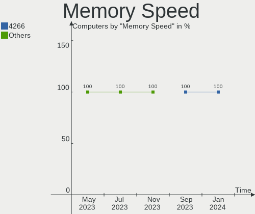

| Speed | Computers | Percent |
|-------|-----------|---------|
| 4266  | 3         | 100%    |

Printers & scanners
-------------------

Printer Vendor
--------------

Printer device vendors

Zero info for selected period =(

Printer Model
-------------

Printer device models

Zero info for selected period =(

Scanner Vendor
--------------

Scanner device vendors

Zero info for selected period =(

Scanner Model
-------------

Scanner device models

Zero info for selected period =(

Camera
------

Camera Vendor
-------------

Camera device vendors

| Vendor                                 | Computers | Percent |
|----------------------------------------|-----------|---------|
| Logitech                               | 1         | 50%     |
| Cheng Uei Precision Industry (Foxlink) | 1         | 50%     |

Camera Model
------------

Camera device models

| Model                                                          | Computers | Percent |
|----------------------------------------------------------------|-----------|---------|
| Logitech HD Pro Webcam C920                                    | 1         | 50%     |
| Cheng Uei Precision Industry (Foxlink) HP TrueVision HD Camera | 1         | 50%     |

Security
--------

Fingerprint Vendor
------------------

Fingerprint sensor vendors

Zero info for selected period =(

Fingerprint Model
-----------------

Fingerprint sensor models

Zero info for selected period =(

Chipcard Vendor
---------------

Chipcard module vendors

Zero info for selected period =(

Chipcard Model
--------------

Chipcard module models

Zero info for selected period =(

Unsupported
-----------

Unsupported Devices
-------------------

Total unsupported devices on board

| Total | Computers | Percent |
|-------|-----------|---------|
| 0     | 69        | 94.52%  |
| 1     | 4         | 5.48%   |

Unsupported Device Types
------------------------

Types of unsupported devices

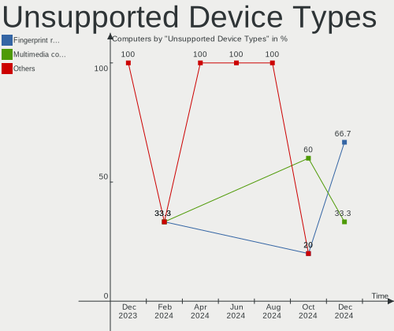

| Type         | Computers | Percent |
|--------------|-----------|---------|
| Net/wireless | 4         | 100%    |

