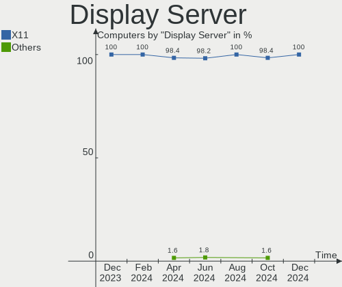
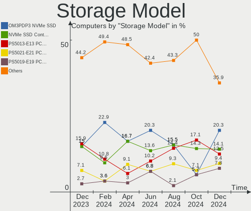
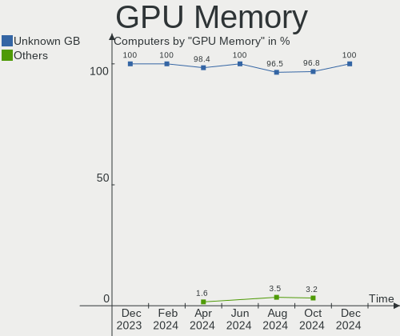
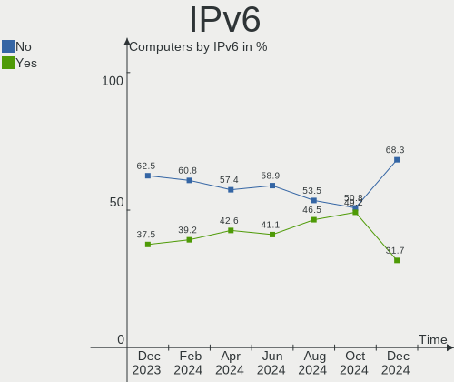
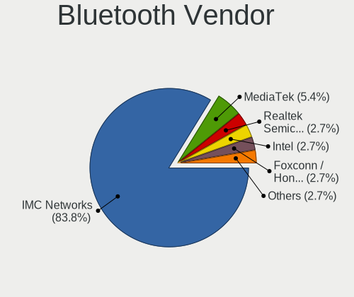
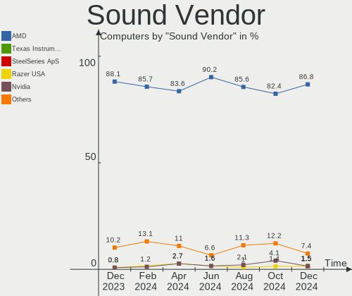

SteamOS - Hardware Trends
-------------------------

A project to identify most popular hardware characteristics and track their change
over time based on data collected by Linux users at https://Linux-Hardware.org.

Anyone can contribute to this report by the [hw-probe](https://github.com/linuxhw/hw-probe) tool:

    sudo -E hw-probe -all -upload

This is a report for all computer types. See also reports for [desktops](/Dist/SteamOS/Desktop/README.md) and [notebooks](/Dist/SteamOS/Notebook/README.md).

This report is for one last month. Overall report since the beginning of time: [TestCoverage](https://github.com/linuxhw/TestCoverage)

Period: Sep, 2022.

Contents
--------

* [ System ](#system)
  - [ OS                       ](#os)
  - [ OS Family                ](#os-family)
  - [ Kernel                   ](#kernel)
  - [ Kernel Family            ](#kernel-family)
  - [ Kernel Major Ver.        ](#kernel-major-ver)
  - [ Arch                     ](#arch)
  - [ DE                       ](#de)
  - [ Display Server           ](#display-server)
  - [ Display Manager          ](#display-manager)
  - [ OS Lang                  ](#os-lang)
  - [ Boot Mode                ](#boot-mode)
  - [ Filesystem               ](#filesystem)
  - [ Part. scheme             ](#part-scheme)
  - [ Dual Boot with Linux/BSD ](#dual-boot-with-linuxbsd)
  - [ Dual Boot (Win)          ](#dual-boot-win)

* [ Board ](#board)
  - [ Vendor                   ](#vendor)
  - [ Model                    ](#model)
  - [ Model Family             ](#model-family)
  - [ MFG Year                 ](#mfg-year)
  - [ Form Factor              ](#form-factor)
  - [ Secure Boot              ](#secure-boot)
  - [ Coreboot                 ](#coreboot)
  - [ RAM Size                 ](#ram-size)
  - [ RAM Used                 ](#ram-used)
  - [ Total Drives             ](#total-drives)
  - [ Has CD-ROM               ](#has-cd-rom)
  - [ Has Ethernet             ](#has-ethernet)
  - [ Has WiFi                 ](#has-wifi)
  - [ Has Bluetooth            ](#has-bluetooth)

* [ Location ](#location)
  - [ Country                  ](#country)
  - [ City                     ](#city)

* [ Drives ](#drives)
  - [ Drive Vendor             ](#drive-vendor)
  - [ Drive Model              ](#drive-model)
  - [ HDD Vendor               ](#hdd-vendor)
  - [ SSD Vendor               ](#ssd-vendor)
  - [ Drive Kind               ](#drive-kind)
  - [ Drive Connector          ](#drive-connector)
  - [ Drive Size               ](#drive-size)
  - [ Space Total              ](#space-total)
  - [ Space Used               ](#space-used)
  - [ Malfunc. Drives          ](#malfunc-drives)
  - [ Malfunc. Drive Vendor    ](#malfunc-drive-vendor)
  - [ Malfunc. HDD Vendor      ](#malfunc-hdd-vendor)
  - [ Malfunc. Drive Kind      ](#malfunc-drive-kind)
  - [ Failed Drives            ](#failed-drives)
  - [ Failed Drive Vendor      ](#failed-drive-vendor)
  - [ Drive Status             ](#drive-status)

* [ Storage controller ](#storage-controller)
  - [ Storage Vendor           ](#storage-vendor)
  - [ Storage Model            ](#storage-model)
  - [ Storage Kind             ](#storage-kind)

* [ Processor ](#processor)
  - [ CPU Vendor               ](#cpu-vendor)
  - [ CPU Model                ](#cpu-model)
  - [ CPU Model Family         ](#cpu-model-family)
  - [ CPU Cores                ](#cpu-cores)
  - [ CPU Sockets              ](#cpu-sockets)
  - [ CPU Threads              ](#cpu-threads)
  - [ CPU Op-Modes             ](#cpu-op-modes)
  - [ CPU Microcode            ](#cpu-microcode)
  - [ CPU Microarch            ](#cpu-microarch)

* [ Graphics ](#graphics)
  - [ GPU Vendor               ](#gpu-vendor)
  - [ GPU Model                ](#gpu-model)
  - [ GPU Combo                ](#gpu-combo)
  - [ GPU Driver               ](#gpu-driver)
  - [ GPU Memory               ](#gpu-memory)

* [ Monitor ](#monitor)
  - [ Monitor Vendor           ](#monitor-vendor)
  - [ Monitor Model            ](#monitor-model)
  - [ Monitor Resolution       ](#monitor-resolution)
  - [ Monitor Diagonal         ](#monitor-diagonal)
  - [ Monitor Width            ](#monitor-width)
  - [ Aspect Ratio             ](#aspect-ratio)
  - [ Monitor Area             ](#monitor-area)
  - [ Pixel Density            ](#pixel-density)
  - [ Multiple Monitors        ](#multiple-monitors)

* [ Network ](#network)
  - [ Net Controller Vendor    ](#net-controller-vendor)
  - [ Net Controller Model     ](#net-controller-model)
  - [ Wireless Vendor          ](#wireless-vendor)
  - [ Wireless Model           ](#wireless-model)
  - [ Ethernet Vendor          ](#ethernet-vendor)
  - [ Ethernet Model           ](#ethernet-model)
  - [ Net Controller Kind      ](#net-controller-kind)
  - [ Used Controller          ](#used-controller)
  - [ NICs                     ](#nics)
  - [ IPv6                     ](#ipv6)

* [ Bluetooth ](#bluetooth)
  - [ Bluetooth Vendor         ](#bluetooth-vendor)
  - [ Bluetooth Model          ](#bluetooth-model)

* [ Sound ](#sound)
  - [ Sound Vendor             ](#sound-vendor)
  - [ Sound Model              ](#sound-model)

* [ Memory ](#memory)
  - [ Memory Vendor            ](#memory-vendor)
  - [ Memory Model             ](#memory-model)
  - [ Memory Kind              ](#memory-kind)
  - [ Memory Form Factor       ](#memory-form-factor)
  - [ Memory Size              ](#memory-size)
  - [ Memory Speed             ](#memory-speed)

* [ Printers & scanners ](#printers--scanners)
  - [ Printer Vendor           ](#printer-vendor)
  - [ Printer Model            ](#printer-model)
  - [ Scanner Vendor           ](#scanner-vendor)
  - [ Scanner Model            ](#scanner-model)

* [ Camera ](#camera)
  - [ Camera Vendor            ](#camera-vendor)
  - [ Camera Model             ](#camera-model)

* [ Security ](#security)
  - [ Fingerprint Vendor       ](#fingerprint-vendor)
  - [ Fingerprint Model        ](#fingerprint-model)
  - [ Chipcard Vendor          ](#chipcard-vendor)
  - [ Chipcard Model           ](#chipcard-model)

* [ Unsupported ](#unsupported)
  - [ Unsupported Devices      ](#unsupported-devices)
  - [ Unsupported Device Types ](#unsupported-device-types)

System
------

OS
--

Installed operating systems

| Name            | Computers | Percent |
|-----------------|-----------|---------|
| SteamOS 3.3.1   | 63        | 70%     |
| SteamOS 3.3     | 11        | 12.22%  |
| SteamOS 3.4     | 6         | 6.67%   |
| SteamOS 3.3.2   | 5         | 5.56%   |
| SteamOS Rolling | 3         | 3.33%   |
| SteamOS         | 2         | 2.22%   |

OS Family
---------

OS without a version

| Name    | Computers | Percent |
|---------|-----------|---------|
| SteamOS | 90        | 100%    |

Kernel
------

Version of the Linux kernel

| Version                                        | Computers | Percent |
|------------------------------------------------|-----------|---------|
| 5.13.0-valve21.1-1-neptune-02211-gc54cda5a36f3 | 66        | 73.33%  |
| 5.13.0-valve24-1-neptune-02226-g5b8545e4c5a1   | 16        | 17.78%  |
| 5.13.0-valve21.2-1-neptune                     | 5         | 5.56%   |
| 5.18.1-arch1_testHoloISO_20220606.1811         | 1         | 1.11%   |
| 5.15.60-1-lts                                  | 1         | 1.11%   |
| 5.15.54-1-lts                                  | 1         | 1.11%   |

Kernel Family
-------------

Linux kernel without a distro release

| Version | Computers | Percent |
|---------|-----------|---------|
| 5.13.0  | 87        | 96.67%  |
| 5.18.1  | 1         | 1.11%   |
| 5.15.60 | 1         | 1.11%   |
| 5.15.54 | 1         | 1.11%   |

Kernel Major Ver.
-----------------

Linux kernel major version

| Version | Computers | Percent |
|---------|-----------|---------|
| 5.13    | 87        | 96.67%  |
| 5.15    | 2         | 2.22%   |
| 5.18    | 1         | 1.11%   |

Arch
----

OS architecture (x86_64, i586, etc.)

| Name   | Computers | Percent |
|--------|-----------|---------|
| x86_64 | 90        | 100%    |

DE
--

Desktop Environment

| Name | Computers | Percent |
|------|-----------|---------|
| KDE5 | 90        | 100%    |

Display Server
--------------

X11 or Wayland

| Name | Computers | Percent |
|------|-----------|---------|
| X11  | 90        | 100%    |

Display Manager
---------------

SDDM, LightDM, etc.

| Name    | Computers | Percent |
|---------|-----------|---------|
| Unknown | 87        | 96.67%  |
| SDDM    | 3         | 3.33%   |

OS Lang
-------

Language

| Lang  | Computers | Percent |
|-------|-----------|---------|
| en_US | 74        | 82.22%  |
| de_DE | 3         | 3.33%   |
| en_DE | 2         | 2.22%   |
| zh_CN | 1         | 1.11%   |
| sk_SK | 1         | 1.11%   |
| pl_PL | 1         | 1.11%   |
| nl_NL | 1         | 1.11%   |
| fr_FR | 1         | 1.11%   |
| es_ES | 1         | 1.11%   |
| en_NL | 1         | 1.11%   |
| en_GB | 1         | 1.11%   |
| en_CA | 1         | 1.11%   |
| ba_RU | 1         | 1.11%   |
| an_ES | 1         | 1.11%   |

Boot Mode
---------

EFI or BIOS

| Mode | Computers | Percent |
|------|-----------|---------|
| BIOS | 87        | 96.67%  |
| EFI  | 3         | 3.33%   |

Filesystem
----------

Type of filesystem

| Type  | Computers | Percent |
|-------|-----------|---------|
| Btrfs | 90        | 100%    |

Part. scheme
------------

Scheme of partitioning

| Type    | Computers | Percent |
|---------|-----------|---------|
| Unknown | 87        | 96.67%  |
| GPT     | 3         | 3.33%   |

Dual Boot with Linux/BSD
------------------------

Hosting more than one Linux/BSD

| Dual boot | Computers | Percent |
|-----------|-----------|---------|
| No        | 87        | 96.67%  |
| Yes       | 3         | 3.33%   |

Dual Boot (Win)
---------------

Hosting Linux and Windows

| Dual boot | Computers | Percent |
|-----------|-----------|---------|
| No        | 90        | 100%    |

Board
-----

Vendor
------

Motherboard manufacturer

| Name                | Computers | Percent |
|---------------------|-----------|---------|
| Valve               | 77        | 85.56%  |
| ASUSTek Computer    | 4         | 4.44%   |
| MSI                 | 3         | 3.33%   |
| Microsoft           | 1         | 1.11%   |
| Lenovo              | 1         | 1.11%   |
| GPD                 | 1         | 1.11%   |
| Gigabyte Technology | 1         | 1.11%   |
| Dell                | 1         | 1.11%   |
| ASRock              | 1         | 1.11%   |

Model
-----

Motherboard model

| Name                                   | Computers | Percent |
|----------------------------------------|-----------|---------|
| Valve Jupiter                          | 77        | 85.56%  |
| MSI MS-7B79                            | 1         | 1.11%   |
| MSI MS-7B09                            | 1         | 1.11%   |
| MSI MS-7693                            | 1         | 1.11%   |
| Microsoft Surface Pro 8                | 1         | 1.11%   |
| Lenovo ThinkCentre M720q 10T7002CUS    | 1         | 1.11%   |
| GPD G1619-04                           | 1         | 1.11%   |
| Gigabyte B450 AORUS M                  | 1         | 1.11%   |
| Dell Precision Tower 5810              | 1         | 1.11%   |
| ASUS ROG Zephyrus S17 GX703HSD_GX703HS | 1         | 1.11%   |
| ASUS PRIME A320M-K                     | 1         | 1.11%   |
| ASUS CROSSHAIR VI HERO                 | 1         | 1.11%   |
| ASUS All Series                        | 1         | 1.11%   |
| ASRock X570 Phantom Gaming-ITX/TB3     | 1         | 1.11%   |

Model Family
------------

Motherboard model prefix

| Name               | Computers | Percent |
|--------------------|-----------|---------|
| Valve Jupiter      | 77        | 85.56%  |
| MSI MS-7B79        | 1         | 1.11%   |
| MSI MS-7B09        | 1         | 1.11%   |
| MSI MS-7693        | 1         | 1.11%   |
| Microsoft Surface  | 1         | 1.11%   |
| Lenovo ThinkCentre | 1         | 1.11%   |
| GPD G1619-04       | 1         | 1.11%   |
| Gigabyte B450      | 1         | 1.11%   |
| Dell Precision     | 1         | 1.11%   |
| ASUS ROG           | 1         | 1.11%   |
| ASUS PRIME         | 1         | 1.11%   |
| ASUS CROSSHAIR     | 1         | 1.11%   |
| ASUS All           | 1         | 1.11%   |
| ASRock X570        | 1         | 1.11%   |

MFG Year
--------

Motherboard manufacture year

| Year | Computers | Percent |
|------|-----------|---------|
| 2022 | 79        | 87.78%  |
| 2021 | 3         | 3.33%   |
| 2018 | 2         | 2.22%   |
| 2017 | 2         | 2.22%   |
| 2019 | 1         | 1.11%   |
| 2016 | 1         | 1.11%   |
| 2013 | 1         | 1.11%   |
| 2012 | 1         | 1.11%   |

Form Factor
-----------

Physical design of the computer

| Name     | Computers | Percent |
|----------|-----------|---------|
| Notebook | 79        | 87.78%  |
| Desktop  | 9         | 10%     |
| Tablet   | 1         | 1.11%   |
| Mini pc  | 1         | 1.11%   |

Secure Boot
-----------

Enabled or disabled

| State    | Computers | Percent |
|----------|-----------|---------|
| Disabled | 90        | 100%    |

Coreboot
--------

Have coreboot on board

| Used | Computers | Percent |
|------|-----------|---------|
| No   | 90        | 100%    |

RAM Size
--------

Total RAM memory

| Size in GB | Computers | Percent |
|------------|-----------|---------|
| 8.01-16.0  | 78        | 86.67%  |
| 16.01-24.0 | 6         | 6.67%   |
| 32.01-64.0 | 4         | 4.44%   |
| 4.01-8.0   | 1         | 1.11%   |
| 24.01-32.0 | 1         | 1.11%   |

RAM Used
--------

Used RAM memory

| Used GB  | Computers | Percent |
|----------|-----------|---------|
| 2.01-3.0 | 48        | 53.33%  |
| 3.01-4.0 | 18        | 20%     |
| 1.01-2.0 | 13        | 14.44%  |
| 4.01-8.0 | 11        | 12.22%  |

Total Drives
------------

Number of drives on board

| Drives | Computers | Percent |
|--------|-----------|---------|
| 2      | 49        | 54.44%  |
| 1      | 32        | 35.56%  |
| 3      | 5         | 5.56%   |
| 5      | 2         | 2.22%   |
| 6      | 1         | 1.11%   |
| 4      | 1         | 1.11%   |

Has CD-ROM
----------

Has CD-ROM on board

| Presented | Computers | Percent |
|-----------|-----------|---------|
| No        | 87        | 96.67%  |
| Yes       | 3         | 3.33%   |

Has Ethernet
------------

Has Ethernet on board

| Presented | Computers | Percent |
|-----------|-----------|---------|
| No        | 61        | 67.78%  |
| Yes       | 29        | 32.22%  |

Has WiFi
--------

Has WiFi module

| Presented | Computers | Percent |
|-----------|-----------|---------|
| Yes       | 85        | 94.44%  |
| No        | 5         | 5.56%   |

Has Bluetooth
-------------

Has Bluetooth module

| Presented | Computers | Percent |
|-----------|-----------|---------|
| Yes       | 82        | 91.11%  |
| No        | 8         | 8.89%   |

Location
--------

Country
-------

Geographic location (country)

| Country     | Computers | Percent |
|-------------|-----------|---------|
| USA         | 39        | 43.33%  |
| UK          | 9         | 10%     |
| Germany     | 9         | 10%     |
| Canada      | 9         | 10%     |
| Spain       | 3         | 3.33%   |
| Poland      | 3         | 3.33%   |
| Netherlands | 3         | 3.33%   |
| France      | 3         | 3.33%   |
| Romania     | 2         | 2.22%   |
| Sweden      | 1         | 1.11%   |
| Slovakia    | 1         | 1.11%   |
| Latvia      | 1         | 1.11%   |
| Kuwait      | 1         | 1.11%   |
| Italy       | 1         | 1.11%   |
| Finland     | 1         | 1.11%   |
| Denmark     | 1         | 1.11%   |
| Czechia     | 1         | 1.11%   |
| Cyprus      | 1         | 1.11%   |
| Austria     | 1         | 1.11%   |

City
----

Geographic location (city)

| City                       | Computers | Percent |
|----------------------------|-----------|---------|
| Austin                     | 3         | 3.33%   |
| York                       | 1         | 1.11%   |
| Weaverville                | 1         | 1.11%   |
| Wasungen                   | 1         | 1.11%   |
| Washington                 | 1         | 1.11%   |
| Warren                     | 1         | 1.11%   |
| Waalre                     | 1         | 1.11%   |
| Victoria                   | 1         | 1.11%   |
| Targoviste                 | 1         | 1.11%   |
| Stouffville                | 1         | 1.11%   |
| Stockholm                  | 1         | 1.11%   |
| South Holland              | 1         | 1.11%   |
| Sobrance                   | 1         | 1.11%   |
| Santa Clara                | 1         | 1.11%   |
| San Bartolomé de Tirajana | 1         | 1.11%   |
| Riga                       | 1         | 1.11%   |
| Regina                     | 1         | 1.11%   |
| Radomsko                   | 1         | 1.11%   |
| Radolfzell                 | 1         | 1.11%   |
| Queens                     | 1         | 1.11%   |
| Prague                     | 1         | 1.11%   |
| Poznan                     | 1         | 1.11%   |
| Portland                   | 1         | 1.11%   |
| Phoenix                    | 1         | 1.11%   |
| Philadelphia               | 1         | 1.11%   |
| Peoria                     | 1         | 1.11%   |
| Pensacola                  | 1         | 1.11%   |
| Ottery St Mary             | 1         | 1.11%   |
| Oldham                     | 1         | 1.11%   |
| Oklahoma City              | 1         | 1.11%   |
| Odense                     | 1         | 1.11%   |
| Oakland                    | 1         | 1.11%   |
| North Bay                  | 1         | 1.11%   |
| Nicosia                    | 1         | 1.11%   |
| Newcastle-under-Lyme       | 1         | 1.11%   |
| Newcastle upon Tyne        | 1         | 1.11%   |
| New Westminster            | 1         | 1.11%   |
| New London                 | 1         | 1.11%   |
| Murfreesboro               | 1         | 1.11%   |
| Moyeuvre-Grande            | 1         | 1.11%   |

Drives
------

Drive Vendor
------------

Hard drive vendors

| Vendor                         | Computers | Drives | Percent |
|--------------------------------|-----------|--------|---------|
| Unknown                        | 46        | 47     | 28.22%  |
| Kingston                       | 27        | 27     | 16.56%  |
| Phison                         | 17        | 19     | 10.43%  |
| Samsung Electronics            | 11        | 13     | 6.75%   |
| Phison Electronics             | 11        | 11     | 6.75%   |
| Kingston Technology Company    | 9         | 9      | 5.52%   |
| Silicon Motion                 | 6         | 6      | 3.68%   |
| O2 Micro                       | 6         | 7      | 3.68%   |
| Unknown                        | 5         | 5      | 3.07%   |
| Seagate                        | 4         | 4      | 2.45%   |
| A-DATA Technology              | 3         | 3      | 1.84%   |
| SK hynix                       | 2         | 3      | 1.23%   |
| Sandisk                        | 2         | 4      | 1.23%   |
| Crucial                        | 2         | 2      | 1.23%   |
| WDC                            | 1         | 1      | 0.61%   |
| SPCC                           | 1         | 1      | 0.61%   |
| Solid State Storage Technology | 1         | 1      | 0.61%   |
| Realtek                        | 1         | 1      | 0.61%   |
| PNY                            | 1         | 1      | 0.61%   |
| Mushkin                        | 1         | 1      | 0.61%   |
| KIOXIA                         | 1         | 1      | 0.61%   |
| Intel                          | 1         | 1      | 0.61%   |
| Inateck                        | 1         | 1      | 0.61%   |
| China                          | 1         | 2      | 0.61%   |
| Biwin Storage Technology       | 1         | 1      | 0.61%   |
| Apple                          | 1         | 1      | 0.61%   |

Drive Model
-----------

Hard drive models

| Model                                                  | Computers | Percent |
|--------------------------------------------------------|-----------|---------|
| Unknown MMC Card  512GB                                | 20        | 11.63%  |
| Phison NVMe SSD Drive 512GB                            | 14        | 8.14%   |
| Kingston NVMe SSD Drive 512GB                          | 13        | 7.56%   |
| Phison PS5013 E13 NVMe Controller 512GB                | 10        | 5.81%   |
| Unknown MMC Card  128GB                                | 9         | 5.23%   |
| Kingston Company OM3PDP3 NVMe SSD 512GB                | 9         | 5.23%   |
| Kingston NVMe SSD Drive 256GB                          | 9         | 5.23%   |
| Unknown MMC Card  256GB                                | 7         | 4.07%   |
| Unknown                                                | 5         | 2.91%   |
| O2 Micro E2M2 64GB                                     | 4         | 2.33%   |
| Unknown MMC Card  393GB                                | 3         | 1.74%   |
| Silicon Motion NVMe SSD Drive 512GB                    | 3         | 1.74%   |
| O2 Micro NVMe SSD Drive 64GB                           | 3         | 1.74%   |
| Silicon Motion SM2263EN/SM2263XT SSD Controller 1024GB | 2         | 1.16%   |
| Samsung SSD 970 EVO Plus 1TB                           | 2         | 1.16%   |
| Samsung MZ9LQ512HBLU-00BVL 512GB                       | 2         | 1.16%   |
| Samsung MZ9LQ256HBJD-00BVL 256GB                       | 2         | 1.16%   |
| Phison NVMe SSD Drive 256GB                            | 2         | 1.16%   |
| Kingston OM3PDP3512B-A01 512GB                         | 2         | 1.16%   |
| A-DATA SU630 240GB SSD                                 | 2         | 1.16%   |
| WDC WDBNCE5000PNC 500GB SSD                            | 1         | 0.58%   |
| Unknown NVMe SSD Drive 512GB                           | 1         | 0.58%   |
| Unknown MMC Card  500GB                                | 1         | 0.58%   |
| Unknown MMC Card  32GB                                 | 1         | 0.58%   |
| Unknown MMC Card  196GB                                | 1         | 0.58%   |
| Unknown MMC Card  16GB                                 | 1         | 0.58%   |
| Unknown MMC Card  1073GB                               | 1         | 0.58%   |
| Unknown GF8S5  513GB                                   | 1         | 0.58%   |
| Unknown ED2S5  128GB                                   | 1         | 0.58%   |
| SPCC Solid State Disk 1024GB                           | 1         | 0.58%   |
| Solid State Storage NVMe SSD Drive 930GB               | 1         | 0.58%   |
| SK hynix NVMe SSD Drive 256GB                          | 1         | 0.58%   |
| SK hynix NVMe SSD Drive 1024GB                         | 1         | 0.58%   |
| SK hynix BC711 NVMe 1TB                                | 1         | 0.58%   |
| Silicon Motion NVMe SSD Drive 256GB                    | 1         | 0.58%   |
| Seagate ST3750640NS 752GB                              | 1         | 0.58%   |
| Seagate ST1000LM035-1RK172 1TB                         | 1         | 0.58%   |
| Seagate ST1000DX001-1CM162 1TB                         | 1         | 0.58%   |
| Seagate NVMe SSD Drive 2TB                             | 1         | 0.58%   |
| Sandisk WD Black SN750 / PC SN730 NVMe SSD 1024GB      | 1         | 0.58%   |

HDD Vendor
----------

Hard disk drive vendors

| Vendor  | Computers | Drives | Percent |
|---------|-----------|--------|---------|
| Seagate | 3         | 3      | 75%     |
| Apple   | 1         | 1      | 25%     |

SSD Vendor
----------

Solid state drive vendors

| Vendor              | Computers | Drives | Percent |
|---------------------|-----------|--------|---------|
| Samsung Electronics | 4         | 5      | 23.53%  |
| A-DATA Technology   | 3         | 3      | 17.65%  |
| Kingston            | 2         | 2      | 11.76%  |
| Crucial             | 2         | 2      | 11.76%  |
| WDC                 | 1         | 1      | 5.88%   |
| SPCC                | 1         | 1      | 5.88%   |
| SanDisk             | 1         | 2      | 5.88%   |
| PNY                 | 1         | 1      | 5.88%   |
| Mushkin             | 1         | 1      | 5.88%   |
| China               | 1         | 2      | 5.88%   |

Drive Kind
----------

HDD or SSD

| Kind | Computers | Drives | Percent |
|------|-----------|--------|---------|
| NVMe | 88        | 98     | 57.89%  |
| MMC  | 50        | 51     | 32.89%  |
| SSD  | 10        | 20     | 6.58%   |
| HDD  | 4         | 4      | 2.63%   |

Drive Connector
---------------

SATA, SAS, NVMe, etc.

| Type | Computers | Drives | Percent |
|------|-----------|--------|---------|
| NVMe | 88        | 96     | 58.28%  |
| MMC  | 50        | 51     | 33.11%  |
| SATA | 10        | 23     | 6.62%   |
| SAS  | 3         | 3      | 1.99%   |

Drive Size
----------

Size of hard drive

| Size in TB | Computers | Drives | Percent |
|------------|-----------|--------|---------|
| 0.51-1.0   | 7         | 9      | 46.67%  |
| 0.01-0.5   | 7         | 13     | 46.67%  |
| 1.01-2.0   | 1         | 2      | 6.67%   |

Space Total
-----------

Amount of disk space available on the file system

| Size in GB     | Computers | Percent |
|----------------|-----------|---------|
| 251-500        | 49        | 54.44%  |
| 101-250        | 25        | 27.78%  |
| 51-100         | 6         | 6.67%   |
| 1001-2000      | 4         | 4.44%   |
| 501-1000       | 4         | 4.44%   |
| More than 3000 | 1         | 1.11%   |
| 2001-3000      | 1         | 1.11%   |

Space Used
----------

Amount of used disk space

| Used GB   | Computers | Percent |
|-----------|-----------|---------|
| 101-250   | 30        | 33.33%  |
| 251-500   | 29        | 32.22%  |
| 21-50     | 12        | 13.33%  |
| 1-20      | 12        | 13.33%  |
| 51-100    | 5         | 5.56%   |
| 1001-2000 | 1         | 1.11%   |
| 501-1000  | 1         | 1.11%   |

Malfunc. Drives
---------------

Drive models with a malfunction

Zero info for selected period =(

Malfunc. Drive Vendor
---------------------

Vendors of faulty drives

Zero info for selected period =(

Malfunc. HDD Vendor
-------------------

Vendors of faulty HDD drives

Zero info for selected period =(

Malfunc. Drive Kind
-------------------

Kinds of faulty drives

Zero info for selected period =(

Failed Drives
-------------

Failed drive models

Zero info for selected period =(

Failed Drive Vendor
-------------------

Failed drive vendors

Zero info for selected period =(

Drive Status
------------

Number of failed and malfunc. drives

| Status   | Computers | Drives | Percent |
|----------|-----------|--------|---------|
| Detected | 89        | 167    | 95.7%   |
| Works    | 4         | 6      | 4.3%    |

Storage controller
------------------

Storage Vendor
--------------

Storage controller vendors

| Vendor                         | Computers | Percent |
|--------------------------------|-----------|---------|
| Kingston Technology Company    | 34        | 34%     |
| Phison Electronics             | 27        | 27%     |
| Samsung Electronics            | 7         | 7%      |
| AMD                            | 7         | 7%      |
| Silicon Motion                 | 6         | 6%      |
| O2 Micro                       | 6         | 6%      |
| Intel                          | 4         | 4%      |
| SK hynix                       | 2         | 2%      |
| SanDisk                        | 2         | 2%      |
| Unknown                        | 1         | 1%      |
| Solid State Storage Technology | 1         | 1%      |
| Seagate Technology             | 1         | 1%      |
| KIOXIA                         | 1         | 1%      |
| Biwin Storage Technology       | 1         | 1%      |

Storage Model
-------------

Storage controller models

| Model                                                                          | Computers | Percent |
|--------------------------------------------------------------------------------|-----------|---------|
| Kingston Company OM3PDP3 NVMe SSD                                              | 33        | 31.43%  |
| Phison PS5013 E13 NVMe Controller                                              | 24        | 22.86%  |
| Silicon Motion SM2263EN/SM2263XT SSD Controller                                | 6         | 5.71%   |
| O2 Micro Non-Volatile memory controller                                        | 6         | 5.71%   |
| Samsung NVMe SSD Controller 980                                                | 5         | 4.76%   |
| AMD FCH SATA Controller [AHCI mode]                                            | 5         | 4.76%   |
| SK hynix Gold P31 SSD                                                          | 2         | 1.9%    |
| Phison E12 NVMe Controller                                                     | 2         | 1.9%    |
| AMD 400 Series Chipset SATA Controller                                         | 2         | 1.9%    |
| Unknown Non-Volatile memory controller                                         | 1         | 0.95%   |
| Solid State Storage Non-Volatile memory controller                             | 1         | 0.95%   |
| Seagate FireCuda 510 SSD                                                       | 1         | 0.95%   |
| SanDisk WD PC SN810 / Black SN850 NVMe SSD                                     | 1         | 0.95%   |
| SanDisk WD Black SN750 / PC SN730 NVMe SSD                                     | 1         | 0.95%   |
| Samsung NVMe SSD Controller SM961/PM961/SM963                                  | 1         | 0.95%   |
| Samsung NVMe SSD Controller PM9A1/PM9A3/980PRO                                 | 1         | 0.95%   |
| Phison NVMe Storage Controller                                                 | 1         | 0.95%   |
| KIOXIA NVMe SSD Controller BG4                                                 | 1         | 0.95%   |
| Kingston Company Company Non-Volatile memory controller                        | 1         | 0.95%   |
| Intel Volume Management Device NVMe RAID Controller                            | 1         | 0.95%   |
| Intel Cannon Lake PCH SATA AHCI Controller                                     | 1         | 0.95%   |
| Intel C610/X99 series chipset sSATA Controller [AHCI mode]                     | 1         | 0.95%   |
| Intel C610/X99 series chipset 6-Port SATA Controller [AHCI mode]               | 1         | 0.95%   |
| Intel 8 Series/C220 Series Chipset Family 6-port SATA Controller 1 [AHCI mode] | 1         | 0.95%   |
| Biwin Storage Non-Volatile memory controller                                   | 1         | 0.95%   |
| AMD X399 Series Chipset SATA Controller                                        | 1         | 0.95%   |
| AMD X370 Series Chipset SATA Controller                                        | 1         | 0.95%   |
| AMD SB7x0/SB8x0/SB9x0 SATA Controller [AHCI mode]                              | 1         | 0.95%   |
| AMD FCH SATA Controller D                                                      | 1         | 0.95%   |

Storage Kind
------------

Kind of storage controller (IDE, SATA, NVMe, SAS, ...)

| Kind | Computers | Percent |
|------|-----------|---------|
| NVMe | 87        | 88.78%  |
| SATA | 10        | 10.2%   |
| RAID | 1         | 1.02%   |

Processor
---------

CPU Vendor
----------

Processor vendors

| Vendor | Computers | Percent |
|--------|-----------|---------|
| AMD    | 85        | 94.44%  |
| Intel  | 5         | 5.56%   |

CPU Model
---------

Processor models

| Model                                          | Computers | Percent |
|------------------------------------------------|-----------|---------|
| AMD Custom APU 0405                            | 77        | 85.56%  |
| Intel Xeon CPU E5-2630 v3 @ 2.40GHz            | 1         | 1.11%   |
| Intel Core i5-8400T CPU @ 1.70GHz              | 1         | 1.11%   |
| Intel Core i5-4440 CPU @ 3.10GHz               | 1         | 1.11%   |
| Intel 11th Gen Core i9-11900H @ 2.50GHz        | 1         | 1.11%   |
| Intel 11th Gen Core i5-1135G7 @ 2.40GHz        | 1         | 1.11%   |
| AMD Ryzen Threadripper 1950X 16-Core Processor | 1         | 1.11%   |
| AMD Ryzen 9 3900X 12-Core Processor            | 1         | 1.11%   |
| AMD Ryzen 7 6800U with Radeon Graphics         | 1         | 1.11%   |
| AMD Ryzen 5 5600G with Radeon Graphics         | 1         | 1.11%   |
| AMD Ryzen 5 3600X 6-Core Processor             | 1         | 1.11%   |
| AMD Ryzen 5 2600 Six-Core Processor            | 1         | 1.11%   |
| AMD FX-8370 Eight-Core Processor               | 1         | 1.11%   |
| AMD Athlon 3000G with Radeon Vega Graphics     | 1         | 1.11%   |

CPU Model Family
----------------

Processor model prefix

| Model                  | Computers | Percent |
|------------------------|-----------|---------|
| Other                  | 79        | 87.78%  |
| AMD Ryzen 5            | 3         | 3.33%   |
| Intel Core i5          | 2         | 2.22%   |
| Intel Xeon             | 1         | 1.11%   |
| AMD Ryzen Threadripper | 1         | 1.11%   |
| AMD Ryzen 9            | 1         | 1.11%   |
| AMD Ryzen 7            | 1         | 1.11%   |
| AMD FX                 | 1         | 1.11%   |
| AMD Athlon             | 1         | 1.11%   |

CPU Cores
---------

Number of processor cores

| Number | Computers | Percent |
|--------|-----------|---------|
| 4      | 80        | 88.89%  |
| 8      | 4         | 4.44%   |
| 6      | 4         | 4.44%   |
| 12     | 1         | 1.11%   |
| 2      | 1         | 1.11%   |

CPU Sockets
-----------

Number of sockets

| Number | Computers | Percent |
|--------|-----------|---------|
| 1      | 90        | 100%    |

CPU Threads
-----------

Threads per core (Hyper-Threading)

| Number | Computers | Percent |
|--------|-----------|---------|
| 2      | 88        | 97.78%  |
| 1      | 2         | 2.22%   |

CPU Op-Modes
------------

CPU Operation Modes (32-bit, 64-bit)

| Op mode        | Computers | Percent |
|----------------|-----------|---------|
| 32-bit, 64-bit | 90        | 100%    |

CPU Microcode
-------------

Microcode number

| Number     | Computers | Percent |
|------------|-----------|---------|
| Unknown    | 87        | 96.67%  |
| 0x08900201 | 3         | 3.33%   |

CPU Microarch
-------------

Microarchitecture

| Name       | Computers | Percent |
|------------|-----------|---------|
| Unknown    | 79        | 87.78%  |
| Zen+       | 2         | 2.22%   |
| Zen 2      | 2         | 2.22%   |
| Haswell    | 2         | 2.22%   |
| Zen 3      | 1         | 1.11%   |
| Zen        | 1         | 1.11%   |
| TigerLake  | 1         | 1.11%   |
| Piledriver | 1         | 1.11%   |
| KabyLake   | 1         | 1.11%   |

Graphics
--------

GPU Vendor
----------

Vendors of graphics cards

| Vendor | Computers | Percent |
|--------|-----------|---------|
| AMD    | 84        | 92.31%  |
| Nvidia | 4         | 4.4%    |
| Intel  | 3         | 3.3%    |

GPU Model
---------

Graphics card models

| Model                                                                | Computers | Percent |
|----------------------------------------------------------------------|-----------|---------|
| AMD VanGogh [AMD Custom GPU 0405]                                    | 77        | 84.62%  |
| AMD Navi 22 [Radeon RX 6700/6700 XT/6750 XT / 6800M]                 | 2         | 2.2%    |
| Nvidia GP104 [GeForce GTX 1070]                                      | 1         | 1.1%    |
| Nvidia GA104M [GeForce RTX 3080 Mobile / Max-Q 8GB/16GB]             | 1         | 1.1%    |
| Nvidia GA104 [GeForce RTX 3070]                                      | 1         | 1.1%    |
| Nvidia GA102 [GeForce RTX 3090]                                      | 1         | 1.1%    |
| Intel TigerLake-LP GT2 [Iris Xe Graphics]                            | 1         | 1.1%    |
| Intel TigerLake-H GT1 [UHD Graphics]                                 | 1         | 1.1%    |
| Intel CoffeeLake-S GT2 [UHD Graphics 630]                            | 1         | 1.1%    |
| AMD Rembrandt [Radeon 680M]                                          | 1         | 1.1%    |
| AMD Picasso/Raven 2 [Radeon Vega Series / Radeon Vega Mobile Series] | 1         | 1.1%    |
| AMD Navi 14 [Radeon RX 5500/5500M / Pro 5500M]                       | 1         | 1.1%    |
| AMD Navi 10 [Radeon RX 5600 OEM/5600 XT / 5700/5700 XT]              | 1         | 1.1%    |
| AMD Ellesmere [Radeon RX 470/480/570/570X/580/580X/590]              | 1         | 1.1%    |

GPU Combo
---------

Combinations of graphics cards

| Name           | Computers | Percent |
|----------------|-----------|---------|
| 1 x AMD        | 84        | 93.33%  |
| 1 x Nvidia     | 3         | 3.33%   |
| 1 x Intel      | 2         | 2.22%   |
| Intel + Nvidia | 1         | 1.11%   |

GPU Driver
----------

Free vs proprietary

| Driver      | Computers | Percent |
|-------------|-----------|---------|
| Free        | 87        | 96.67%  |
| Proprietary | 3         | 3.33%   |

GPU Memory
----------

Total video memory

| Size in GB | Computers | Percent |
|------------|-----------|---------|
| Unknown    | 84        | 93.33%  |
| 7.01-8.0   | 2         | 2.22%   |
| 0.51-1.0   | 2         | 2.22%   |
| 16.01-24.0 | 1         | 1.11%   |
| 1.01-2.0   | 1         | 1.11%   |

Monitor
-------

Monitor Vendor
--------------

Monitor vendors

| Vendor               | Computers | Percent |
|----------------------|-----------|---------|
| ANX                  | 56        | 50.45%  |
| Analogix             | 16        | 14.41%  |
| Valve                | 7         | 6.31%   |
| Goldstar             | 5         | 4.5%    |
| Vizio                | 2         | 1.8%    |
| Samsung Electronics  | 2         | 1.8%    |
| MSI                  | 2         | 1.8%    |
| Hewlett-Packard      | 2         | 1.8%    |
| AOC                  | 2         | 1.8%    |
| Ancor Communications | 2         | 1.8%    |
| Wacom                | 1         | 0.9%    |
| Toshiba              | 1         | 0.9%    |
| Sony                 | 1         | 0.9%    |
| RTK                  | 1         | 0.9%    |
| Pixio                | 1         | 0.9%    |
| LG Display           | 1         | 0.9%    |
| JDI                  | 1         | 0.9%    |
| GreenWood            | 1         | 0.9%    |
| GBR                  | 1         | 0.9%    |
| Dell                 | 1         | 0.9%    |
| CMS                  | 1         | 0.9%    |
| BOE                  | 1         | 0.9%    |
| BenQ                 | 1         | 0.9%    |
| ASUSTek Computer     | 1         | 0.9%    |
| Acer                 | 1         | 0.9%    |

Monitor Model
-------------

Monitor models

| Model                                                                 | Computers | Percent |
|-----------------------------------------------------------------------|-----------|---------|
| ANX ANX7530 U ANX7539 800x1280                                        | 56        | 50%     |
| Analogix ANX7530 U ANX7539 800x1280                                   | 16        | 14.29%  |
| Valve ANX7530 U VLV3001 800x1280 100x150mm 7.1-inch                   | 7         | 6.25%   |
| Goldstar TV SSCR2 GSMC0C8 3840x2160                                   | 2         | 1.79%   |
| Wacom CintiqPro24P WAC1063 3840x2160 522x293mm 23.6-inch              | 1         | 0.89%   |
| Vizio M58Q7-J01 VIZ1039 3840x2160 1212x682mm 54.8-inch                | 1         | 0.89%   |
| Vizio E500i-B1 VIZ1004 1920x1080 1095x616mm 49.5-inch                 | 1         | 0.89%   |
| Toshiba TV TSB010E 1920x1080 1014x573mm 45.9-inch                     | 1         | 0.89%   |
| Sony TV *00 SNY7A04 3840x2160 1218x685mm 55.0-inch                    | 1         | 0.89%   |
| Samsung Electronics S34J55x SAM0F71 3440x1440 797x333mm 34.0-inch     | 1         | 0.89%   |
| Samsung Electronics S27A750D SAM0798 1920x1080 598x336mm 27.0-inch    | 1         | 0.89%   |
| RTK UHD HDR RTK1B1A 3840x2160 609x355mm 27.8-inch                     | 1         | 0.89%   |
| Pixio XRGB27WQ WAM2700 2560x1440 530x280mm 23.6-inch                  | 1         | 0.89%   |
| MSI MPG341CQR MSI3DA0 3440x1440 797x334mm 34.0-inch                   | 1         | 0.89%   |
| MSI MAG272C MSI3CA5 1920x1080 598x336mm 27.0-inch                     | 1         | 0.89%   |
| LG Display LCD Monitor LGD06B1 2880x1920 274x183mm 13.0-inch          | 1         | 0.89%   |
| JDI GPD1001H JDI0031 2560x1600 890x500mm 40.2-inch                    | 1         | 0.89%   |
| Hewlett-Packard S230tm HWP3115 1920x1080 509x286mm 23.0-inch          | 1         | 0.89%   |
| Hewlett-Packard 24mh HPN366C 1920x1080 527x296mm 23.8-inch            | 1         | 0.89%   |
| GreenWood ARZOPA GWD1581 1920x1080 350x200mm 15.9-inch                | 1         | 0.89%   |
| Goldstar ULTRAWIDE GSM5AFB 2560x1080 798x334mm 34.1-inch              | 1         | 0.89%   |
| Goldstar ULTRAWIDE GSM59F1 2560x1080 673x284mm 28.8-inch              | 1         | 0.89%   |
| Goldstar HDR WFHD GSM7715 2560x1080 798x334mm 34.1-inch               | 1         | 0.89%   |
| Goldstar 27GN7 GSM5B8D 1920x1080 600x303mm 26.5-inch                  | 1         | 0.89%   |
| GBR ARZOPA GBR0156 1920x1080 345x194mm 15.6-inch                      | 1         | 0.89%   |
| Dell P2219H DELA114 1920x1080 476x267mm 21.5-inch                     | 1         | 0.89%   |
| CMS Cosmos CMS0030 3840x2160 800x450mm 36.1-inch                      | 1         | 0.89%   |
| BOE LCD Monitor BOE099D 2560x1440 381x214mm 17.2-inch                 | 1         | 0.89%   |
| BenQ LCD Monitor BNQ78CA 1920x1080 600x340mm 27.2-inch                | 1         | 0.89%   |
| ASUSTek Computer VP248 AUS24CB 1920x1080 531x299mm 24.0-inch          | 1         | 0.89%   |
| AOC LCD Monitor AOC1649 1366x768 340x190mm 15.3-inch                  | 1         | 0.89%   |
| AOC G2490W1G4 AOC2490 1920x1080 527x296mm 23.8-inch                   | 1         | 0.89%   |
| Ancor Communications VE249 ACI2495 1920x1080 531x299mm 24.0-inch      | 1         | 0.89%   |
| Ancor Communications ROG PG279Q ACI27EC 2560x1440 598x336mm 27.0-inch | 1         | 0.89%   |
| Acer X34 ACR0450 3440x1440 798x335mm 34.1-inch                        | 1         | 0.89%   |

Monitor Resolution
------------------

Monitor screen resolution

| Resolution      | Computers | Percent |
|-----------------|-----------|---------|
| 800x1280        | 77        | 70%     |
| 1920x1080 (FHD) | 14        | 12.73%  |
| 3840x2160 (4K)  | 8         | 7.27%   |
| 3440x1440       | 3         | 2.73%   |
| 2560x1080       | 3         | 2.73%   |
| 2560x1440 (QHD) | 2         | 1.82%   |
| 2880x1920       | 1         | 0.91%   |
| 2560x1600       | 1         | 0.91%   |
| 1366x768 (WXGA) | 1         | 0.91%   |

Monitor Diagonal
----------------

Diagonal size in inches

| Inches  | Computers | Percent |
|---------|-----------|---------|
| Unknown | 70        | 63.64%  |
| 27      | 7         | 6.36%   |
| 7       | 7         | 6.36%   |
| 34      | 6         | 5.45%   |
| 24      | 4         | 3.64%   |
| 15      | 3         | 2.73%   |
| 72      | 2         | 1.82%   |
| 23      | 2         | 1.82%   |
| 69      | 1         | 0.91%   |
| 55      | 1         | 0.91%   |
| 49      | 1         | 0.91%   |
| 46      | 1         | 0.91%   |
| 40      | 1         | 0.91%   |
| 36      | 1         | 0.91%   |
| 21      | 1         | 0.91%   |
| 17      | 1         | 0.91%   |
| 13      | 1         | 0.91%   |

Monitor Width
-------------

Physical width

| Width in mm | Computers | Percent |
|-------------|-----------|---------|
| Unknown     | 70        | 64.22%  |
| 501-600     | 10        | 9.17%   |
| 701-800     | 7         | 6.42%   |
| 1-100       | 7         | 6.42%   |
| 301-350     | 3         | 2.75%   |
| 1501-2000   | 3         | 2.75%   |
| 1001-1500   | 3         | 2.75%   |
| 601-700     | 2         | 1.83%   |
| 801-900     | 1         | 0.92%   |
| 401-500     | 1         | 0.92%   |
| 351-400     | 1         | 0.92%   |
| 201-300     | 1         | 0.92%   |

Aspect Ratio
------------

Proportional relationship between the width and the height

| Ratio | Computers | Percent |
|-------|-----------|---------|
| 0.62  | 70        | 64.22%  |
| 16/9  | 25        | 22.94%  |
| 0.67  | 7         | 6.42%   |
| 21/9  | 6         | 5.5%    |
| 3/2   | 1         | 0.92%   |

Monitor Area
------------

Area in inch²

| Area in inch² | Computers | Percent |
|----------------|-----------|---------|
| Unknown        | 70        | 63.64%  |
| 1-40           | 7         | 6.36%   |
| 301-350        | 7         | 6.36%   |
| 201-250        | 7         | 6.36%   |
| 351-500        | 6         | 5.45%   |
| More than 1000 | 5         | 4.55%   |
| 501-1000       | 3         | 2.73%   |
| 101-110        | 2         | 1.82%   |
| 71-80          | 1         | 0.91%   |
| 121-130        | 1         | 0.91%   |
| 91-100         | 1         | 0.91%   |

Pixel Density
-------------

Pixels per inch

| Density       | Computers | Percent |
|---------------|-----------|---------|
| Unknown       | 70        | 64.22%  |
| 51-100        | 16        | 14.68%  |
| 161-240       | 9         | 8.26%   |
| 101-120       | 7         | 6.42%   |
| 121-160       | 4         | 3.67%   |
| 1-50          | 2         | 1.83%   |
| More than 240 | 1         | 0.92%   |

Multiple Monitors
-----------------

Total monitors connected

| Total | Computers | Percent |
|-------|-----------|---------|
| 1     | 70        | 77.78%  |
| 2     | 20        | 22.22%  |

Network
-------

Net Controller Vendor
---------------------

Controller vendors

| Vendor                | Computers | Percent |
|-----------------------|-----------|---------|
| Realtek Semiconductor | 84        | 77.78%  |
| ASIX Electronics      | 11        | 10.19%  |
| Intel                 | 7         | 6.48%   |
| TP-Link               | 1         | 0.93%   |
| Microsoft             | 1         | 0.93%   |
| MediaTek              | 1         | 0.93%   |
| Google                | 1         | 0.93%   |
| DisplayLink           | 1         | 0.93%   |
| Broadcom              | 1         | 0.93%   |

Net Controller Model
--------------------

Controller models

| Model                                                             | Computers | Percent |
|-------------------------------------------------------------------|-----------|---------|
| Realtek RTL8822CE 802.11ac PCIe Wireless Network Adapter          | 77        | 65.81%  |
| ASIX AX88179 Gigabit Ethernet                                     | 11        | 9.4%    |
| Realtek RTL8111/8168/8411 PCI Express Gigabit Ethernet Controller | 6         | 5.13%   |
| Realtek RTL8153 Gigabit Ethernet Adapter                          | 5         | 4.27%   |
| Intel I211 Gigabit Network Connection                             | 3         | 2.56%   |
| Realtek RTL8152 Fast Ethernet Adapter                             | 2         | 1.71%   |
| Intel Wi-Fi 6 AX200                                               | 2         | 1.71%   |
| TP-Link TL-WN823N v2/v3 [Realtek RTL8192EU]                       | 1         | 0.85%   |
| Microsoft XBOX ACC                                                | 1         | 0.85%   |
| MediaTek MT7921 802.11ax PCI Express Wireless Network Adapter     | 1         | 0.85%   |
| Intel Wireless 8265 / 8275                                        | 1         | 0.85%   |
| Intel Wi-Fi 6 AX210/AX211/AX411 160MHz                            | 1         | 0.85%   |
| Intel Wi-Fi 6 AX201                                               | 1         | 0.85%   |
| Intel Ethernet Connection I217-LM                                 | 1         | 0.85%   |
| Intel Ethernet Connection (7) I219-V                              | 1         | 0.85%   |
| Google Nexus/Pixel Device (tether+ debug)                         | 1         | 0.85%   |
| DisplayLink Dell Universal Dock D6000                             | 1         | 0.85%   |
| Broadcom Network controller                                       | 1         | 0.85%   |

Wireless Vendor
---------------

Wireless vendors

| Vendor                | Computers | Percent |
|-----------------------|-----------|---------|
| Realtek Semiconductor | 77        | 89.53%  |
| Intel                 | 5         | 5.81%   |
| TP-Link               | 1         | 1.16%   |
| Microsoft             | 1         | 1.16%   |
| MediaTek              | 1         | 1.16%   |
| Broadcom              | 1         | 1.16%   |

Wireless Model
--------------

Wireless models

| Model                                                         | Computers | Percent |
|---------------------------------------------------------------|-----------|---------|
| Realtek RTL8822CE 802.11ac PCIe Wireless Network Adapter      | 77        | 89.53%  |
| Intel Wi-Fi 6 AX200                                           | 2         | 2.33%   |
| TP-Link TL-WN823N v2/v3 [Realtek RTL8192EU]                   | 1         | 1.16%   |
| Microsoft XBOX ACC                                            | 1         | 1.16%   |
| MediaTek MT7921 802.11ax PCI Express Wireless Network Adapter | 1         | 1.16%   |
| Intel Wireless 8265 / 8275                                    | 1         | 1.16%   |
| Intel Wi-Fi 6 AX210/AX211/AX411 160MHz                        | 1         | 1.16%   |
| Intel Wi-Fi 6 AX201                                           | 1         | 1.16%   |
| Broadcom Network controller                                   | 1         | 1.16%   |

Ethernet Vendor
---------------

Ethernet vendors

| Vendor                | Computers | Percent |
|-----------------------|-----------|---------|
| Realtek Semiconductor | 13        | 41.94%  |
| ASIX Electronics      | 11        | 35.48%  |
| Intel                 | 5         | 16.13%  |
| Google                | 1         | 3.23%   |
| DisplayLink           | 1         | 3.23%   |

Ethernet Model
--------------

Ethernet models

| Model                                                             | Computers | Percent |
|-------------------------------------------------------------------|-----------|---------|
| ASIX AX88179 Gigabit Ethernet                                     | 11        | 35.48%  |
| Realtek RTL8111/8168/8411 PCI Express Gigabit Ethernet Controller | 6         | 19.35%  |
| Realtek RTL8153 Gigabit Ethernet Adapter                          | 5         | 16.13%  |
| Intel I211 Gigabit Network Connection                             | 3         | 9.68%   |
| Realtek RTL8152 Fast Ethernet Adapter                             | 2         | 6.45%   |
| Intel Ethernet Connection I217-LM                                 | 1         | 3.23%   |
| Intel Ethernet Connection (7) I219-V                              | 1         | 3.23%   |
| Google Nexus/Pixel Device (tether+ debug)                         | 1         | 3.23%   |
| DisplayLink Dell Universal Dock D6000                             | 1         | 3.23%   |

Net Controller Kind
-------------------

Ethernet, WiFi or modem

| Kind     | Computers | Percent |
|----------|-----------|---------|
| WiFi     | 85        | 74.56%  |
| Ethernet | 29        | 25.44%  |

Used Controller
---------------

Currently used network controller

| Kind     | Computers | Percent |
|----------|-----------|---------|
| WiFi     | 83        | 87.37%  |
| Ethernet | 12        | 12.63%  |

NICs
----

Total network controllers on board

| Total | Computers | Percent |
|-------|-----------|---------|
| 1     | 85        | 94.44%  |
| 2     | 5         | 5.56%   |

IPv6
----

IPv6 vs IPv4

| Used | Computers | Percent |
|------|-----------|---------|
| No   | 62        | 68.89%  |
| Yes  | 28        | 31.11%  |

Bluetooth
---------

Bluetooth Vendor
----------------

Controller vendors

| Vendor           | Computers | Percent |
|------------------|-----------|---------|
| IMC Networks     | 77        | 93.9%   |
| Intel            | 4         | 4.88%   |
| ASUSTek Computer | 1         | 1.22%   |

Bluetooth Model
---------------

Controller models

| Model                              | Computers | Percent |
|------------------------------------|-----------|---------|
| IMC Networks 802.11ac WLAN Adapter | 77        | 93.9%   |
| Intel Bluetooth wireless interface | 1         | 1.22%   |
| Intel AX210 Bluetooth              | 1         | 1.22%   |
| Intel AX201 Bluetooth              | 1         | 1.22%   |
| Intel AX200 Bluetooth              | 1         | 1.22%   |
| ASUS Broadcom BCM20702A0 Bluetooth | 1         | 1.22%   |

Sound
-----

Sound Vendor
------------

Sound card vendors

| Vendor                | Computers | Percent |
|-----------------------|-----------|---------|
| AMD                   | 87        | 85.29%  |
| Intel                 | 5         | 4.9%    |
| Nvidia                | 4         | 3.92%   |
| Realtek Semiconductor | 2         | 1.96%   |
| Logitech              | 2         | 1.96%   |
| JMTek                 | 1         | 0.98%   |
| C-Media Electronics   | 1         | 0.98%   |

Sound Model
-----------

Sound card models

| Model                                                               | Computers | Percent |
|---------------------------------------------------------------------|-----------|---------|
| AMD Rembrandt Radeon High Definition Audio Controller               | 78        | 72.22%  |
| AMD Family 17h/19h HD Audio Controller                              | 3         | 2.78%   |
| Realtek Semiconductor USB Audio                                     | 2         | 1.85%   |
| Nvidia GA104 High Definition Audio Controller                       | 2         | 1.85%   |
| AMD Starship/Matisse HD Audio Controller                            | 2         | 1.85%   |
| AMD Navi 21/23 HDMI/DP Audio Controller                             | 2         | 1.85%   |
| AMD Navi 10 HDMI Audio                                              | 2         | 1.85%   |
| AMD Family 17h (Models 00h-0fh) HD Audio Controller                 | 2         | 1.85%   |
| Nvidia GP104 High Definition Audio Controller                       | 1         | 0.93%   |
| Nvidia GA102 High Definition Audio Controller                       | 1         | 0.93%   |
| Logitech G733 Gaming Headset                                        | 1         | 0.93%   |
| Logitech G430 Surround Sound Gaming Headset                         | 1         | 0.93%   |
| JMTek USB PnP Audio Device(EEPROM)                                  | 1         | 0.93%   |
| Intel Tiger Lake-LP Smart Sound Technology Audio Controller         | 1         | 0.93%   |
| Intel Tiger Lake-H HD Audio Controller                              | 1         | 0.93%   |
| Intel Cannon Lake PCH cAVS                                          | 1         | 0.93%   |
| Intel C610/X99 series chipset HD Audio Controller                   | 1         | 0.93%   |
| Intel 8 Series/C220 Series Chipset High Definition Audio Controller | 1         | 0.93%   |
| C-Media Electronics USB MICROPHONE                                  | 1         | 0.93%   |
| AMD SBx00 Azalia (Intel HDA)                                        | 1         | 0.93%   |
| AMD Renoir Radeon High Definition Audio Controller                  | 1         | 0.93%   |
| AMD Raven/Raven2/Fenghuang HDMI/DP Audio Controller                 | 1         | 0.93%   |
| AMD Ellesmere HDMI Audio [Radeon RX 470/480 / 570/580/590]          | 1         | 0.93%   |

Memory
------

Memory Vendor
-------------

Memory module vendors

| Vendor  | Computers | Percent |
|---------|-----------|---------|
| Unknown | 3         | 75%     |
| G.Skill | 1         | 25%     |

Memory Model
------------

Memory module models

| Model                                                  | Computers | Percent |
|--------------------------------------------------------|-----------|---------|
| Unknown                                                | 3         | 75%     |
| G.Skill RAM F4-2666C19-16GRS 16GB SODIMM DDR4 2667MT/s | 1         | 25%     |

Memory Kind
-----------

Memory module kinds

| Kind   | Computers | Percent |
|--------|-----------|---------|
| LPDDR5 | 3         | 75%     |
| DDR4   | 1         | 25%     |

Memory Form Factor
------------------

Physical design of the memory module

| Name   | Computers | Percent |
|--------|-----------|---------|
| SODIMM | 4         | 100%    |

Memory Size
-----------

Memory module size

| Size  | Computers | Percent |
|-------|-----------|---------|
| 4096  | 3         | 75%     |
| 16384 | 1         | 25%     |

Memory Speed
------------

Memory module speed

| Speed | Computers | Percent |
|-------|-----------|---------|
| 4266  | 3         | 75%     |
| 2667  | 1         | 25%     |

Printers & scanners
-------------------

Printer Vendor
--------------

Printer device vendors

Zero info for selected period =(

Printer Model
-------------

Printer device models

Zero info for selected period =(

Scanner Vendor
--------------

Scanner device vendors

Zero info for selected period =(

Scanner Model
-------------

Scanner device models

Zero info for selected period =(

Camera
------

Camera Vendor
-------------

Camera device vendors

| Vendor                 | Computers | Percent |
|------------------------|-----------|---------|
| Logitech               | 2         | 33.33%  |
| Tripath Technology     | 1         | 16.67%  |
| Samsung Electronics    | 1         | 16.67%  |
| IMC Networks           | 1         | 16.67%  |
| AVerMedia Technologies | 1         | 16.67%  |

Camera Model
------------

Camera device models

| Model                             | Computers | Percent |
|-----------------------------------|-----------|---------|
| Tripath USB Camera                | 1         | 16.67%  |
| Samsung Galaxy A5 (MTP)           | 1         | 16.67%  |
| Logitech HD Webcam C525           | 1         | 16.67%  |
| Logitech HD Pro Webcam C920       | 1         | 16.67%  |
| IMC Networks USB2.0 HD UVC WebCam | 1         | 16.67%  |
| AVerMedia Live Streamer CAM 313   | 1         | 16.67%  |

Security
--------

Fingerprint Vendor
------------------

Fingerprint sensor vendors

Zero info for selected period =(

Fingerprint Model
-----------------

Fingerprint sensor models

Zero info for selected period =(

Chipcard Vendor
---------------

Chipcard module vendors

Zero info for selected period =(

Chipcard Model
--------------

Chipcard module models

Zero info for selected period =(

Unsupported
-----------

Unsupported Devices
-------------------

Total unsupported devices on board

| Total | Computers | Percent |
|-------|-----------|---------|
| 0     | 86        | 95.56%  |
| 1     | 4         | 4.44%   |

Unsupported Device Types
------------------------

Types of unsupported devices

| Type                  | Computers | Percent |
|-----------------------|-----------|---------|
| Multimedia controller | 2         | 50%     |
| Unassigned class      | 1         | 25%     |
| Graphics card         | 1         | 25%     |

