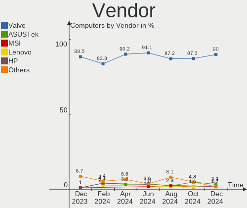
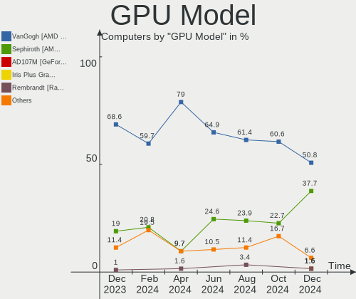
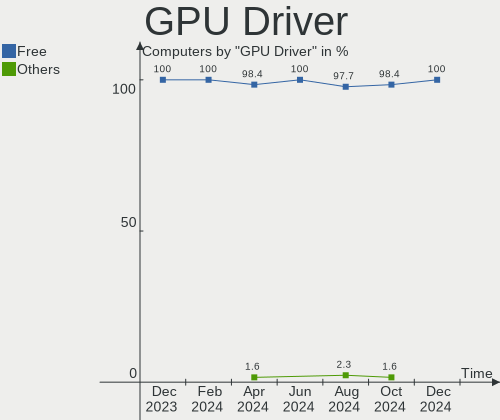
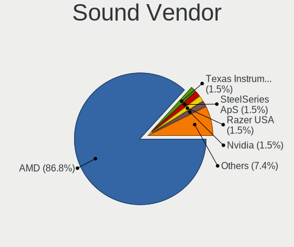

SteamOS - Hardware Trends
-------------------------

A project to identify most popular hardware characteristics and track their change
over time based on data collected by Linux users at https://Linux-Hardware.org.

Anyone can contribute to this report by the [hw-probe](https://github.com/linuxhw/hw-probe) tool:

    sudo -E hw-probe -all -upload

This is a report for all computer types. See also reports for [desktops](/Dist/SteamOS/Desktop/README.md) and [notebooks](/Dist/SteamOS/Notebook/README.md).

This report is for one last month. Overall report since the beginning of time: [TestCoverage](https://github.com/linuxhw/TestCoverage)

Period: Dec, 2022.

Contents
--------

* [ System ](#system)
  - [ OS                       ](#os)
  - [ OS Family                ](#os-family)
  - [ Kernel                   ](#kernel)
  - [ Kernel Family            ](#kernel-family)
  - [ Kernel Major Ver.        ](#kernel-major-ver)
  - [ Arch                     ](#arch)
  - [ DE                       ](#de)
  - [ Display Server           ](#display-server)
  - [ Display Manager          ](#display-manager)
  - [ OS Lang                  ](#os-lang)
  - [ Boot Mode                ](#boot-mode)
  - [ Filesystem               ](#filesystem)
  - [ Part. scheme             ](#part-scheme)
  - [ Dual Boot with Linux/BSD ](#dual-boot-with-linuxbsd)
  - [ Dual Boot (Win)          ](#dual-boot-win)

* [ Board ](#board)
  - [ Vendor                   ](#vendor)
  - [ Model                    ](#model)
  - [ Model Family             ](#model-family)
  - [ MFG Year                 ](#mfg-year)
  - [ Form Factor              ](#form-factor)
  - [ Secure Boot              ](#secure-boot)
  - [ Coreboot                 ](#coreboot)
  - [ RAM Size                 ](#ram-size)
  - [ RAM Used                 ](#ram-used)
  - [ Total Drives             ](#total-drives)
  - [ Has CD-ROM               ](#has-cd-rom)
  - [ Has Ethernet             ](#has-ethernet)
  - [ Has WiFi                 ](#has-wifi)
  - [ Has Bluetooth            ](#has-bluetooth)

* [ Location ](#location)
  - [ Country                  ](#country)
  - [ City                     ](#city)

* [ Drives ](#drives)
  - [ Drive Vendor             ](#drive-vendor)
  - [ Drive Model              ](#drive-model)
  - [ HDD Vendor               ](#hdd-vendor)
  - [ SSD Vendor               ](#ssd-vendor)
  - [ Drive Kind               ](#drive-kind)
  - [ Drive Connector          ](#drive-connector)
  - [ Drive Size               ](#drive-size)
  - [ Space Total              ](#space-total)
  - [ Space Used               ](#space-used)
  - [ Malfunc. Drives          ](#malfunc-drives)
  - [ Malfunc. Drive Vendor    ](#malfunc-drive-vendor)
  - [ Malfunc. HDD Vendor      ](#malfunc-hdd-vendor)
  - [ Malfunc. Drive Kind      ](#malfunc-drive-kind)
  - [ Failed Drives            ](#failed-drives)
  - [ Failed Drive Vendor      ](#failed-drive-vendor)
  - [ Drive Status             ](#drive-status)

* [ Storage controller ](#storage-controller)
  - [ Storage Vendor           ](#storage-vendor)
  - [ Storage Model            ](#storage-model)
  - [ Storage Kind             ](#storage-kind)

* [ Processor ](#processor)
  - [ CPU Vendor               ](#cpu-vendor)
  - [ CPU Model                ](#cpu-model)
  - [ CPU Model Family         ](#cpu-model-family)
  - [ CPU Cores                ](#cpu-cores)
  - [ CPU Sockets              ](#cpu-sockets)
  - [ CPU Threads              ](#cpu-threads)
  - [ CPU Op-Modes             ](#cpu-op-modes)
  - [ CPU Microcode            ](#cpu-microcode)
  - [ CPU Microarch            ](#cpu-microarch)

* [ Graphics ](#graphics)
  - [ GPU Vendor               ](#gpu-vendor)
  - [ GPU Model                ](#gpu-model)
  - [ GPU Combo                ](#gpu-combo)
  - [ GPU Driver               ](#gpu-driver)
  - [ GPU Memory               ](#gpu-memory)

* [ Monitor ](#monitor)
  - [ Monitor Vendor           ](#monitor-vendor)
  - [ Monitor Model            ](#monitor-model)
  - [ Monitor Resolution       ](#monitor-resolution)
  - [ Monitor Diagonal         ](#monitor-diagonal)
  - [ Monitor Width            ](#monitor-width)
  - [ Aspect Ratio             ](#aspect-ratio)
  - [ Monitor Area             ](#monitor-area)
  - [ Pixel Density            ](#pixel-density)
  - [ Multiple Monitors        ](#multiple-monitors)

* [ Network ](#network)
  - [ Net Controller Vendor    ](#net-controller-vendor)
  - [ Net Controller Model     ](#net-controller-model)
  - [ Wireless Vendor          ](#wireless-vendor)
  - [ Wireless Model           ](#wireless-model)
  - [ Ethernet Vendor          ](#ethernet-vendor)
  - [ Ethernet Model           ](#ethernet-model)
  - [ Net Controller Kind      ](#net-controller-kind)
  - [ Used Controller          ](#used-controller)
  - [ NICs                     ](#nics)
  - [ IPv6                     ](#ipv6)

* [ Bluetooth ](#bluetooth)
  - [ Bluetooth Vendor         ](#bluetooth-vendor)
  - [ Bluetooth Model          ](#bluetooth-model)

* [ Sound ](#sound)
  - [ Sound Vendor             ](#sound-vendor)
  - [ Sound Model              ](#sound-model)

* [ Memory ](#memory)
  - [ Memory Vendor            ](#memory-vendor)
  - [ Memory Model             ](#memory-model)
  - [ Memory Kind              ](#memory-kind)
  - [ Memory Form Factor       ](#memory-form-factor)
  - [ Memory Size              ](#memory-size)
  - [ Memory Speed             ](#memory-speed)

* [ Printers & scanners ](#printers--scanners)
  - [ Printer Vendor           ](#printer-vendor)
  - [ Printer Model            ](#printer-model)
  - [ Scanner Vendor           ](#scanner-vendor)
  - [ Scanner Model            ](#scanner-model)

* [ Camera ](#camera)
  - [ Camera Vendor            ](#camera-vendor)
  - [ Camera Model             ](#camera-model)

* [ Security ](#security)
  - [ Fingerprint Vendor       ](#fingerprint-vendor)
  - [ Fingerprint Model        ](#fingerprint-model)
  - [ Chipcard Vendor          ](#chipcard-vendor)
  - [ Chipcard Model           ](#chipcard-model)

* [ Unsupported ](#unsupported)
  - [ Unsupported Devices      ](#unsupported-devices)
  - [ Unsupported Device Types ](#unsupported-device-types)

System
------

OS
--

Installed operating systems

| Name            | Computers | Percent |
|-----------------|-----------|---------|
| SteamOS 3.3.2   | 26        | 26.26%  |
| SteamOS 3.4.2   | 21        | 21.21%  |
| SteamOS 3.4     | 14        | 14.14%  |
| SteamOS 3.3.3   | 14        | 14.14%  |
| SteamOS 3.4.4   | 10        | 10.1%   |
| SteamOS 3.4.3   | 7         | 7.07%   |
| SteamOS 3.5     | 2         | 2.02%   |
| SteamOS 3.1     | 2         | 2.02%   |
| SteamOS Rolling | 1         | 1.01%   |
| SteamOS 4       | 1         | 1.01%   |
| SteamOS         | 1         | 1.01%   |

OS Family
---------

OS without a version

| Name    | Computers | Percent |
|---------|-----------|---------|
| SteamOS | 99        | 100%    |

Kernel
------

Version of the Linux kernel

| Version                                        | Computers | Percent |
|------------------------------------------------|-----------|---------|
| 5.13.0-valve21.3-1-neptune                     | 49        | 49.49%  |
| 5.13.0-valve36-1-neptune                       | 38        | 38.38%  |
| 5.13.0-valve35-1-neptune                       | 9         | 9.09%   |
| 5.13.0-valve10.3-1-neptune-02176-g5fe416c4acd8 | 2         | 2.02%   |
| 5.15.79-1-lts                                  | 1         | 1.01%   |

Kernel Family
-------------

Linux kernel without a distro release

| Version | Computers | Percent |
|---------|-----------|---------|
| 5.13.0  | 98        | 98.99%  |
| 5.15.79 | 1         | 1.01%   |

Kernel Major Ver.
-----------------

Linux kernel major version

| Version | Computers | Percent |
|---------|-----------|---------|
| 5.13    | 98        | 98.99%  |
| 5.15    | 1         | 1.01%   |

Arch
----

OS architecture (x86_64, i586, etc.)

| Name   | Computers | Percent |
|--------|-----------|---------|
| x86_64 | 99        | 100%    |

DE
--

Desktop Environment

| Name | Computers | Percent |
|------|-----------|---------|
| KDE5 | 99        | 100%    |

Display Server
--------------

X11 or Wayland

| Name | Computers | Percent |
|------|-----------|---------|
| X11  | 99        | 100%    |

Display Manager
---------------

SDDM, LightDM, etc.

| Name    | Computers | Percent |
|---------|-----------|---------|
| Unknown | 98        | 98.99%  |
| SDDM    | 1         | 1.01%   |

OS Lang
-------

Language

| Lang   | Computers | Percent |
|--------|-----------|---------|
| en_US  | 82        | 82.83%  |
| de_DE  | 5         | 5.05%   |
| ru_RU  | 2         | 2.02%   |
| en_GB  | 2         | 2.02%   |
| nl_BE  | 1         | 1.01%   |
| ksh_DE | 1         | 1.01%   |
| it_IT  | 1         | 1.01%   |
| hr_HR  | 1         | 1.01%   |
| fr_FR  | 1         | 1.01%   |
| es_MX  | 1         | 1.01%   |
| es_ES  | 1         | 1.01%   |
| en_DE  | 1         | 1.01%   |

Boot Mode
---------

EFI or BIOS

| Mode | Computers | Percent |
|------|-----------|---------|
| BIOS | 98        | 98.99%  |
| EFI  | 1         | 1.01%   |

Filesystem
----------

Type of filesystem

| Type  | Computers | Percent |
|-------|-----------|---------|
| Btrfs | 99        | 100%    |

Part. scheme
------------

Scheme of partitioning

| Type    | Computers | Percent |
|---------|-----------|---------|
| Unknown | 98        | 98.99%  |
| GPT     | 1         | 1.01%   |

Dual Boot with Linux/BSD
------------------------

Hosting more than one Linux/BSD

| Dual boot | Computers | Percent |
|-----------|-----------|---------|
| No        | 98        | 98.99%  |
| Yes       | 1         | 1.01%   |

Dual Boot (Win)
---------------

Hosting Linux and Windows

| Dual boot | Computers | Percent |
|-----------|-----------|---------|
| No        | 99        | 100%    |

Board
-----

Vendor
------

Motherboard manufacturer

| Name             | Computers | Percent |
|------------------|-----------|---------|
| Valve            | 87        | 87.88%  |
| ASUSTek Computer | 6         | 6.06%   |
| Teclast          | 1         | 1.01%   |
| GPU Company      | 1         | 1.01%   |
| Dell             | 1         | 1.01%   |
| ASRock           | 1         | 1.01%   |
| Apple            | 1         | 1.01%   |
| Anbernic         | 1         | 1.01%   |

Model
-----

Motherboard model

| Name                               | Computers | Percent |
|------------------------------------|-----------|---------|
| Valve Jupiter                      | 87        | 87.88%  |
| Teclast TbooK 16 Power             | 1         | 1.01%   |
| GPU Company GWNR71517              | 1         | 1.01%   |
| Dell OptiPlex 9020                 | 1         | 1.01%   |
| ASUS Z170 PRO GAMING               | 1         | 1.01%   |
| ASUS TUF Gaming B550M-PLUS         | 1         | 1.01%   |
| ASUS ROG CROSSHAIR VIII HERO       | 1         | 1.01%   |
| ASUS PRIME B450M-A II              | 1         | 1.01%   |
| ASUS N56VB                         | 1         | 1.01%   |
| ASUS M80CJ-O                       | 1         | 1.01%   |
| ASRock X570 Phantom Gaming-ITX/TB3 | 1         | 1.01%   |
| Apple Macmini7,1                   | 1         | 1.01%   |
| Anbernic Win600                    | 1         | 1.01%   |

Model Family
------------

Motherboard model prefix

| Name                  | Computers | Percent |
|-----------------------|-----------|---------|
| Valve Jupiter         | 87        | 87.88%  |
| Teclast TbooK         | 1         | 1.01%   |
| GPU Company GWNR71517 | 1         | 1.01%   |
| Dell OptiPlex         | 1         | 1.01%   |
| ASUS Z170             | 1         | 1.01%   |
| ASUS TUF              | 1         | 1.01%   |
| ASUS ROG              | 1         | 1.01%   |
| ASUS PRIME            | 1         | 1.01%   |
| ASUS N56VB            | 1         | 1.01%   |
| ASUS M80CJ-O          | 1         | 1.01%   |
| ASRock X570           | 1         | 1.01%   |
| Apple Macmini7        | 1         | 1.01%   |
| Anbernic Win600       | 1         | 1.01%   |

MFG Year
--------

Motherboard manufacture year

| Year | Computers | Percent |
|------|-----------|---------|
| 2022 | 90        | 90.91%  |
| 2015 | 3         | 3.03%   |
| 2020 | 2         | 2.02%   |
| 2021 | 1         | 1.01%   |
| 2018 | 1         | 1.01%   |
| 2017 | 1         | 1.01%   |
| 2013 | 1         | 1.01%   |

Form Factor
-----------

Physical design of the computer

| Name     | Computers | Percent |
|----------|-----------|---------|
| Notebook | 91        | 91.92%  |
| Desktop  | 6         | 6.06%   |
| Tablet   | 1         | 1.01%   |
| Mini pc  | 1         | 1.01%   |

Secure Boot
-----------

Enabled or disabled

| State    | Computers | Percent |
|----------|-----------|---------|
| Disabled | 99        | 100%    |

Coreboot
--------

Have coreboot on board

| Used | Computers | Percent |
|------|-----------|---------|
| No   | 99        | 100%    |

RAM Size
--------

Total RAM memory

| Size in GB  | Computers | Percent |
|-------------|-----------|---------|
| 8.01-16.0   | 89        | 89.9%   |
| 4.01-8.0    | 4         | 4.04%   |
| 16.01-24.0  | 3         | 3.03%   |
| 32.01-64.0  | 2         | 2.02%   |
| 64.01-256.0 | 1         | 1.01%   |

RAM Used
--------

Used RAM memory

| Used GB   | Computers | Percent |
|-----------|-----------|---------|
| 2.01-3.0  | 48        | 48.48%  |
| 3.01-4.0  | 23        | 23.23%  |
| 4.01-8.0  | 16        | 16.16%  |
| 1.01-2.0  | 10        | 10.1%   |
| 8.01-16.0 | 2         | 2.02%   |

Total Drives
------------

Number of drives on board

| Drives | Computers | Percent |
|--------|-----------|---------|
| 2      | 53        | 53.54%  |
| 1      | 36        | 36.36%  |
| 3      | 9         | 9.09%   |
| 4      | 1         | 1.01%   |

Has CD-ROM
----------

Has CD-ROM on board

| Presented | Computers | Percent |
|-----------|-----------|---------|
| No        | 96        | 96.97%  |
| Yes       | 3         | 3.03%   |

Has Ethernet
------------

Has Ethernet on board

| Presented | Computers | Percent |
|-----------|-----------|---------|
| No        | 58        | 58.59%  |
| Yes       | 41        | 41.41%  |

Has WiFi
--------

Has WiFi module

| Presented | Computers | Percent |
|-----------|-----------|---------|
| Yes       | 96        | 96.97%  |
| No        | 3         | 3.03%   |

Has Bluetooth
-------------

Has Bluetooth module

| Presented | Computers | Percent |
|-----------|-----------|---------|
| Yes       | 96        | 96.97%  |
| No        | 3         | 3.03%   |

Location
--------

Country
-------

Geographic location (country)

| Country     | Computers | Percent |
|-------------|-----------|---------|
| USA         | 42        | 42.42%  |
| Germany     | 14        | 14.14%  |
| UK          | 9         | 9.09%   |
| Spain       | 4         | 4.04%   |
| France      | 4         | 4.04%   |
| Brazil      | 3         | 3.03%   |
| Sweden      | 2         | 2.02%   |
| Russia      | 2         | 2.02%   |
| Netherlands | 2         | 2.02%   |
| Mexico      | 2         | 2.02%   |
| Denmark     | 2         | 2.02%   |
| Bulgaria    | 2         | 2.02%   |
| Belgium     | 2         | 2.02%   |
| Vietnam     | 1         | 1.01%   |
| UAE         | 1         | 1.01%   |
| Switzerland | 1         | 1.01%   |
| South Korea | 1         | 1.01%   |
| Poland      | 1         | 1.01%   |
| Italy       | 1         | 1.01%   |
| Finland     | 1         | 1.01%   |
| Chile       | 1         | 1.01%   |
| Canada      | 1         | 1.01%   |

City
----

Geographic location (city)

| City              | Computers | Percent |
|-------------------|-----------|---------|
| Los Angeles       | 2         | 2.02%   |
| London            | 2         | 2.02%   |
| Kansas City       | 2         | 2.02%   |
| Cologne           | 2         | 2.02%   |
| Wyoming           | 1         | 1.01%   |
| Wyandotte         | 1         | 1.01%   |
| Wolverhampton     | 1         | 1.01%   |
| Watford           | 1         | 1.01%   |
| Villeurbanne      | 1         | 1.01%   |
| Varna             | 1         | 1.01%   |
| Vacaville         | 1         | 1.01%   |
| Troisdorf         | 1         | 1.01%   |
| Syracuse          | 1         | 1.01%   |
| Susanville        | 1         | 1.01%   |
| Straengnaes       | 1         | 1.01%   |
| Stockholm         | 1         | 1.01%   |
| St Petersburg     | 1         | 1.01%   |
| Sofia             | 1         | 1.01%   |
| Smyrna            | 1         | 1.01%   |
| Sint-Truiden      | 1         | 1.01%   |
| Seattle           | 1         | 1.01%   |
| Schoten           | 1         | 1.01%   |
| Sao Paulo         | 1         | 1.01%   |
| Santiago          | 1         | 1.01%   |
| San Antonio       | 1         | 1.01%   |
| Salem             | 1         | 1.01%   |
| Rotterdam         | 1         | 1.01%   |
| River Grove       | 1         | 1.01%   |
| Richmond          | 1         | 1.01%   |
| Reading           | 1         | 1.01%   |
| Queimados         | 1         | 1.01%   |
| Poway             | 1         | 1.01%   |
| Pierre            | 1         | 1.01%   |
| Perris            | 1         | 1.01%   |
| Oconomowoc        | 1         | 1.01%   |
| Novosibirsk       | 1         | 1.01%   |
| North Kingstown   | 1         | 1.01%   |
| Norfolk           | 1         | 1.01%   |
| Nispen            | 1         | 1.01%   |
| Neuilly-sur-Marne | 1         | 1.01%   |

Drives
------

Drive Vendor
------------

Hard drive vendors

| Vendor                         | Computers | Drives | Percent |
|--------------------------------|-----------|--------|---------|
| Unknown                        | 47        | 49     | 27.01%  |
| Kingston Technology Company    | 24        | 24     | 13.79%  |
| Samsung Electronics            | 22        | 23     | 12.64%  |
| Phison Electronics             | 19        | 19     | 10.92%  |
| O2 Micro                       | 16        | 16     | 9.2%    |
| Unknown                        | 14        | 14     | 8.05%   |
| Sandisk                        | 5         | 5      | 2.87%   |
| Seagate                        | 3         | 4      | 1.72%   |
| KIOXIA                         | 3         | 3      | 1.72%   |
| SK hynix                       | 2         | 2      | 1.15%   |
| Silicon Motion                 | 2         | 2      | 1.15%   |
| Kingston                       | 2         | 2      | 1.15%   |
| Crucial                        | 2         | 2      | 1.15%   |
| Apple                          | 2         | 2      | 1.15%   |
| A-DATA Technology              | 2         | 2      | 1.15%   |
| W800S                          | 1         | 1      | 0.57%   |
| Toshiba                        | 1         | 1      | 0.57%   |
| Solid State Storage Technology | 1         | 1      | 0.57%   |
| Realtek                        | 1         | 1      | 0.57%   |
| PNY                            | 1         | 1      | 0.57%   |
| MAXIO Technology (Hangzhou)    | 1         | 1      | 0.57%   |
| KingSpec                       | 1         | 1      | 0.57%   |
| JMicron Technology             | 1         | 1      | 0.57%   |
| Intenso                        | 1         | 1      | 0.57%   |

Drive Model
-----------

Hard drive models

| Model                                                  | Computers | Percent |
|--------------------------------------------------------|-----------|---------|
| Kingston Company OM3PDP3 NVMe SSD 512GB                | 23        | 12.99%  |
| Unknown MMC Card  512GB                                | 22        | 12.43%  |
| Phison PS5013 E13 NVMe Controller 512GB                | 18        | 10.17%  |
| O2 Micro E2M2 64GB                                     | 16        | 9.04%   |
| Unknown                                                | 14        | 7.91%   |
| Unknown MMC Card  256GB                                | 11        | 6.21%   |
| Samsung MZ9LQ512HBLU-00BVL 512GB                       | 9         | 5.08%   |
| Unknown MMC Card  128GB                                | 6         | 3.39%   |
| Samsung MZ9LQ256HBJD-00BVL 256GB                       | 6         | 3.39%   |
| Unknown MMC Card  393GB                                | 3         | 1.69%   |
| Unknown MMC Card  64GB                                 | 2         | 1.13%   |
| SK hynix BC711 NVMe 256GB                              | 2         | 1.13%   |
| Silicon Motion SM2263EN/SM2263XT SSD Controller 1024GB | 2         | 1.13%   |
| Sandisk WDC PC SN530 SDBPTPZ-1T00 1024GB               | 2         | 1.13%   |
| Crucial CT1000BX500SSD1 1TB                            | 2         | 1.13%   |
| Apple HDD HTS541010A9E662 1TB                          | 2         | 1.13%   |
| W800S 256GB                                            | 1         | 0.56%   |
| Unknown MMC Card  500GB                                | 1         | 0.56%   |
| Unknown MMC Card  32GB                                 | 1         | 0.56%   |
| Unknown MMC Card  30MB                                 | 1         | 0.56%   |
| Unknown MMC Card  249GB                                | 1         | 0.56%   |
| Unknown MMC Card  1073GB                               | 1         | 0.56%   |
| Toshiba MQ01ABD100 1TB                                 | 1         | 0.56%   |
| Solid State Storage SSSTC XA1-311024 930GB             | 1         | 0.56%   |
| Seagate ST1000LM048-2E7172 1TB                         | 1         | 0.56%   |
| Seagate ST1000DM010-2EP102 1TB                         | 1         | 0.56%   |
| Seagate BUP Slim 2TB                                   | 1         | 0.56%   |
| Sandisk WD_BLACK SN750 SE 1TB                          | 1         | 0.56%   |
| Sandisk PC SN530 NVMe WDC 256GB                        | 1         | 0.56%   |
| SanDisk Extreme Pro 55AF 2TB SSD                       | 1         | 0.56%   |
| Samsung SSD 970 EVO Plus 1TB                           | 1         | 0.56%   |
| Samsung SSD 860 EVO M.2 500GB                          | 1         | 0.56%   |
| Samsung PSSD T7 1TB                                    | 1         | 0.56%   |
| Samsung Portable SSD T5 500GB                          | 1         | 0.56%   |
| Samsung PM991a NVMe 512GB                              | 1         | 0.56%   |
| Samsung NVMe SSD Controller SM981/PM981/PM983 500GB    | 1         | 0.56%   |
| Samsung MZALQ128HBHQ-000L2 128GB                       | 1         | 0.56%   |
| Samsung MZ9LQ1T0HBLB-00B 1024GB                        | 1         | 0.56%   |
| Realtek RTL9210B-CG 1TB                                | 1         | 0.56%   |
| PNY ELITE PSSD 480GB                                   | 1         | 0.56%   |

HDD Vendor
----------

Hard disk drive vendors

| Vendor  | Computers | Drives | Percent |
|---------|-----------|--------|---------|
| Seagate | 3         | 4      | 50%     |
| Apple   | 2         | 2      | 33.33%  |
| Toshiba | 1         | 1      | 16.67%  |

SSD Vendor
----------

Solid state drive vendors

| Vendor              | Computers | Drives | Percent |
|---------------------|-----------|--------|---------|
| Samsung Electronics | 3         | 4      | 30%     |
| Crucial             | 2         | 2      | 20%     |
| SanDisk             | 1         | 1      | 10%     |
| PNY                 | 1         | 1      | 10%     |
| Kingston            | 1         | 1      | 10%     |
| KingSpec            | 1         | 1      | 10%     |
| Intenso             | 1         | 1      | 10%     |

Drive Kind
----------

HDD or SSD

| Kind    | Computers | Drives | Percent |
|---------|-----------|--------|---------|
| NVMe    | 91        | 95     | 53.53%  |
| MMC     | 61        | 63     | 35.88%  |
| SSD     | 10        | 11     | 5.88%   |
| HDD     | 6         | 7      | 3.53%   |
| Unknown | 2         | 2      | 1.18%   |

Drive Connector
---------------

SATA, SAS, NVMe, etc.

| Type | Computers | Drives | Percent |
|------|-----------|--------|---------|
| NVMe | 91        | 94     | 53.22%  |
| MMC  | 61        | 63     | 35.67%  |
| SATA | 11        | 13     | 6.43%   |
| SAS  | 8         | 8      | 4.68%   |

Drive Size
----------

Size of hard drive

| Size in TB | Computers | Drives | Percent |
|------------|-----------|--------|---------|
| 0.51-1.0   | 10        | 12     | 66.67%  |
| 0.01-0.5   | 3         | 4      | 20%     |
| 1.01-2.0   | 2         | 2      | 13.33%  |

Space Total
-----------

Amount of disk space available on the file system

| Size in GB     | Computers | Percent |
|----------------|-----------|---------|
| 251-500        | 39        | 39.39%  |
| 101-250        | 28        | 28.28%  |
| 51-100         | 14        | 14.14%  |
| 501-1000       | 10        | 10.1%   |
| 1001-2000      | 6         | 6.06%   |
| More than 3000 | 2         | 2.02%   |

Space Used
----------

Amount of used disk space

| Used GB        | Computers | Percent |
|----------------|-----------|---------|
| 101-250        | 31        | 31.31%  |
| 251-500        | 26        | 26.26%  |
| 21-50          | 18        | 18.18%  |
| 51-100         | 10        | 10.1%   |
| 1-20           | 8         | 8.08%   |
| 501-1000       | 5         | 5.05%   |
| More than 3000 | 1         | 1.01%   |

Malfunc. Drives
---------------

Drive models with a malfunction

Zero info for selected period =(

Malfunc. Drive Vendor
---------------------

Vendors of faulty drives

Zero info for selected period =(

Malfunc. HDD Vendor
-------------------

Vendors of faulty HDD drives

Zero info for selected period =(

Malfunc. Drive Kind
-------------------

Kinds of faulty drives

Zero info for selected period =(

Failed Drives
-------------

Failed drive models

Zero info for selected period =(

Failed Drive Vendor
-------------------

Failed drive vendors

Zero info for selected period =(

Drive Status
------------

Number of failed and malfunc. drives

| Status   | Computers | Drives | Percent |
|----------|-----------|--------|---------|
| Detected | 99        | 177    | 99%     |
| Works    | 1         | 1      | 1%      |

Storage controller
------------------

Storage Vendor
--------------

Storage controller vendors

| Vendor                         | Computers | Percent |
|--------------------------------|-----------|---------|
| Kingston Technology Company    | 25        | 23.81%  |
| Samsung Electronics            | 19        | 18.1%   |
| Phison Electronics             | 19        | 18.1%   |
| O2 Micro                       | 16        | 15.24%  |
| AMD                            | 6         | 5.71%   |
| Intel                          | 5         | 4.76%   |
| SanDisk                        | 4         | 3.81%   |
| KIOXIA                         | 3         | 2.86%   |
| SK hynix                       | 2         | 1.9%    |
| Silicon Motion                 | 2         | 1.9%    |
| ADATA Technology               | 2         | 1.9%    |
| Solid State Storage Technology | 1         | 0.95%   |
| MAXIO Technology (Hangzhou)    | 1         | 0.95%   |

Storage Model
-------------

Storage controller models

| Model                                                                          | Computers | Percent |
|--------------------------------------------------------------------------------|-----------|---------|
| Kingston Company OM3PDP3 NVMe SSD                                              | 23        | 21.7%   |
| Samsung NVMe SSD Controller 980                                                | 18        | 16.98%  |
| Phison PS5013 E13 NVMe Controller                                              | 18        | 16.98%  |
| O2 Micro Non-Volatile memory controller                                        | 16        | 15.09%  |
| SanDisk Non-Volatile memory controller                                         | 4         | 3.77%   |
| AMD FCH SATA Controller [AHCI mode]                                            | 4         | 3.77%   |
| SK hynix Gold P31/PC711 NVMe Solid State Drive                                 | 2         | 1.89%   |
| Silicon Motion SM2263EN/SM2263XT SSD Controller                                | 2         | 1.89%   |
| KIOXIA NVMe SSD Controller BG4                                                 | 2         | 1.89%   |
| ADATA Non-Volatile memory controller                                           | 2         | 1.89%   |
| Solid State Storage Non-Volatile memory controller                             | 1         | 0.94%   |
| Samsung NVMe SSD Controller SM981/PM981/PM983                                  | 1         | 0.94%   |
| Phison NVMe Storage Controller                                                 | 1         | 0.94%   |
| MAXIO (Hangzhou) NVMe SSD Controller MAP1202                                   | 1         | 0.94%   |
| KIOXIA Non-Volatile memory controller                                          | 1         | 0.94%   |
| Kingston Company Company Non-Volatile memory controller                        | 1         | 0.94%   |
| Kingston Company SNVS2000G [NV1 NVMe PCIe SSD 2TB]                             | 1         | 0.94%   |
| Intel Q170/Q150/B150/H170/H110/Z170/CM236 Chipset SATA Controller [AHCI Mode]  | 1         | 0.94%   |
| Intel HM170/QM170 Chipset SATA Controller [AHCI Mode]                          | 1         | 0.94%   |
| Intel 8 Series/C220 Series Chipset Family 6-port SATA Controller 1 [AHCI mode] | 1         | 0.94%   |
| Intel 8 Series SATA Controller 1 [AHCI mode]                                   | 1         | 0.94%   |
| Intel 7 Series Chipset Family 6-port SATA Controller [AHCI mode]               | 1         | 0.94%   |
| AMD RS690 PCI to PCI Bridge (PCI Express Port 2)                               | 1         | 0.94%   |
| AMD 500 Series Chipset SATA Controller                                         | 1         | 0.94%   |
| AMD 400 Series Chipset SATA Controller                                         | 1         | 0.94%   |

Storage Kind
------------

Kind of storage controller (IDE, SATA, NVMe, SAS, ...)

| Kind | Computers | Percent |
|------|-----------|---------|
| NVMe | 91        | 89.22%  |
| SATA | 10        | 9.8%    |
| RAID | 1         | 0.98%   |

Processor
---------

CPU Vendor
----------

Processor vendors

| Vendor | Computers | Percent |
|--------|-----------|---------|
| AMD    | 93        | 93.94%  |
| Intel  | 6         | 6.06%   |

CPU Model
---------

Processor models

| Model                                         | Computers | Percent |
|-----------------------------------------------|-----------|---------|
| AMD Custom APU 0405                           | 87        | 87.88%  |
| AMD Ryzen 9 5900X 12-Core Processor           | 2         | 2.02%   |
| Intel Core i7-6700K CPU @ 4.00GHz             | 1         | 1.01%   |
| Intel Core i5-7300HQ CPU @ 2.50GHz            | 1         | 1.01%   |
| Intel Core i5-4590S CPU @ 3.00GHz             | 1         | 1.01%   |
| Intel Core i5-4278U CPU @ 2.60GHz             | 1         | 1.01%   |
| Intel Core i5-3230M CPU @ 2.60GHz             | 1         | 1.01%   |
| Intel Atom x7-Z8750 CPU @ 1.60GHz             | 1         | 1.01%   |
| AMD Ryzen 7 PRO 5750G with Radeon Graphics    | 1         | 1.01%   |
| AMD Ryzen 7 3700U with Radeon Vega Mobile Gfx | 1         | 1.01%   |
| AMD Ryzen 5 5600G with Radeon Graphics        | 1         | 1.01%   |
| AMD Athlon Silver 3050e with Radeon Graphics  | 1         | 1.01%   |

CPU Model Family
----------------

Processor model prefix

| Model           | Computers | Percent |
|-----------------|-----------|---------|
| Other           | 87        | 87.88%  |
| Intel Core i5   | 4         | 4.04%   |
| AMD Ryzen 9     | 2         | 2.02%   |
| Intel Core i7   | 1         | 1.01%   |
| Intel Atom      | 1         | 1.01%   |
| AMD Ryzen 7 PRO | 1         | 1.01%   |
| AMD Ryzen 7     | 1         | 1.01%   |
| AMD Ryzen 5     | 1         | 1.01%   |
| AMD Athlon      | 1         | 1.01%   |

CPU Cores
---------

Number of processor cores

| Number | Computers | Percent |
|--------|-----------|---------|
| 4      | 92        | 92.93%  |
| 2      | 3         | 3.03%   |
| 12     | 2         | 2.02%   |
| 8      | 1         | 1.01%   |
| 6      | 1         | 1.01%   |

CPU Sockets
-----------

Number of sockets

| Number | Computers | Percent |
|--------|-----------|---------|
| 1      | 99        | 100%    |

CPU Threads
-----------

Threads per core (Hyper-Threading)

| Number | Computers | Percent |
|--------|-----------|---------|
| 2      | 95        | 95.96%  |
| 1      | 4         | 4.04%   |

CPU Op-Modes
------------

CPU Operation Modes (32-bit, 64-bit)

| Op mode        | Computers | Percent |
|----------------|-----------|---------|
| 32-bit, 64-bit | 99        | 100%    |

CPU Microcode
-------------

Microcode number

| Number     | Computers | Percent |
|------------|-----------|---------|
| Unknown    | 98        | 98.99%  |
| 0x08900201 | 1         | 1.01%   |

CPU Microarch
-------------

Microarchitecture

| Name       | Computers | Percent |
|------------|-----------|---------|
| Unknown    | 87        | 87.88%  |
| Zen 3      | 4         | 4.04%   |
| Haswell    | 2         | 2.02%   |
| Zen+       | 1         | 1.01%   |
| Zen        | 1         | 1.01%   |
| Skylake    | 1         | 1.01%   |
| Silvermont | 1         | 1.01%   |
| KabyLake   | 1         | 1.01%   |
| IvyBridge  | 1         | 1.01%   |

Graphics
--------

GPU Vendor
----------

Vendors of graphics cards

| Vendor | Computers | Percent |
|--------|-----------|---------|
| AMD    | 91        | 90.1%   |
| Nvidia | 5         | 4.95%   |
| Intel  | 5         | 4.95%   |

GPU Model
---------

Graphics card models

| Model                                                                                    | Computers | Percent |
|------------------------------------------------------------------------------------------|-----------|---------|
| AMD VanGogh [AMD Custom GPU 0405]                                                        | 87        | 86.14%  |
| AMD Picasso/Raven 2 [Radeon Vega Series / Radeon Vega Mobile Series]                     | 2         | 1.98%   |
| Nvidia GP106 [GeForce GTX 1060 3GB]                                                      | 1         | 0.99%   |
| Nvidia GK107M [GeForce GT 740M]                                                          | 1         | 0.99%   |
| Nvidia GA106 [GeForce RTX 3060 Lite Hash Rate]                                           | 1         | 0.99%   |
| Nvidia GA104 [GeForce RTX 3070 Ti]                                                       | 1         | 0.99%   |
| Nvidia GA104 [GeForce RTX 3060]                                                          | 1         | 0.99%   |
| Intel Xeon E3-1200 v3/4th Gen Core Processor Integrated Graphics Controller              | 1         | 0.99%   |
| Intel HD Graphics 530                                                                    | 1         | 0.99%   |
| Intel Haswell-ULT Integrated Graphics Controller                                         | 1         | 0.99%   |
| Intel Atom/Celeron/Pentium Processor x5-E8000/J3xxx/N3xxx Integrated Graphics Controller | 1         | 0.99%   |
| Intel 3rd Gen Core processor Graphics Controller                                         | 1         | 0.99%   |
| AMD Navi 23 [Radeon RX 6600/6600 XT/6600M]                                               | 1         | 0.99%   |
| AMD Navi 22 [Radeon RX 6700/6700 XT/6750 XT / 6800M]                                     | 1         | 0.99%   |

GPU Combo
---------

Combinations of graphics cards

| Name           | Computers | Percent |
|----------------|-----------|---------|
| 1 x AMD        | 91        | 91.92%  |
| 1 x Nvidia     | 4         | 4.04%   |
| 1 x Intel      | 3         | 3.03%   |
| Intel + Nvidia | 1         | 1.01%   |

GPU Driver
----------

Free vs proprietary

| Driver      | Computers | Percent |
|-------------|-----------|---------|
| Free        | 96        | 96.97%  |
| Proprietary | 3         | 3.03%   |

GPU Memory
----------

Total video memory

| Size in GB | Computers | Percent |
|------------|-----------|---------|
| Unknown    | 95        | 95.96%  |
| 7.01-8.0   | 1         | 1.01%   |
| 2.01-3.0   | 1         | 1.01%   |
| 8.01-16.0  | 1         | 1.01%   |
| 0.51-1.0   | 1         | 1.01%   |

Monitor
-------

Monitor Vendor
--------------

Monitor vendors

| Vendor               | Computers | Percent |
|----------------------|-----------|---------|
| Valve                | 48        | 37.21%  |
| Analogix             | 41        | 31.78%  |
| Samsung Electronics  | 6         | 4.65%   |
| Dell                 | 5         | 3.88%   |
| Hewlett-Packard      | 3         | 2.33%   |
| ViewSonic            | 2         | 1.55%   |
| Lenovo               | 2         | 1.55%   |
| Insignia             | 2         | 1.55%   |
| BenQ                 | 2         | 1.55%   |
| AOC                  | 2         | 1.55%   |
| Ancor Communications | 2         | 1.55%   |
| Acer                 | 2         | 1.55%   |
| SGT                  | 1         | 0.78%   |
| RTK                  | 1         | 0.78%   |
| Pixio                | 1         | 0.78%   |
| LG Display           | 1         | 0.78%   |
| INNOCN               | 1         | 0.78%   |
| Huion                | 1         | 0.78%   |
| Hitachi              | 1         | 0.78%   |
| Goldstar             | 1         | 0.78%   |
| Elgato               | 1         | 0.78%   |
| Element              | 1         | 0.78%   |
| ASUSTek Computer     | 1         | 0.78%   |
| Arzopa               | 1         | 0.78%   |

Monitor Model
-------------

Monitor models

| Model                                                                   | Computers | Percent |
|-------------------------------------------------------------------------|-----------|---------|
| Valve ANX7530 U VLV3001 800x1280 100x150mm 7.1-inch                     | 48        | 36.64%  |
| Analogix ANX7530 U ANX7539 800x1280                                     | 41        | 31.3%   |
| ViewSonic VX2758 Series VSC35DD 1920x1080 597x336mm 27.0-inch           | 1         | 0.76%   |
| ViewSonic VX2452 Series VSCDE2E 1920x1080 521x293mm 23.5-inch           | 1         | 0.76%   |
| SGT MDS-133F02 SGT6DB6 1920x1080 294x166mm 13.3-inch                    | 1         | 0.76%   |
| Samsung Electronics S34J55x SAM0F70 3440x1440 797x333mm 34.0-inch       | 1         | 0.76%   |
| Samsung Electronics LS27AG55x SAM71E0 2560x1440 597x336mm 27.0-inch     | 1         | 0.76%   |
| Samsung Electronics LCD Monitor SAM7017 3840x2160 1872x1053mm 84.6-inch | 1         | 0.76%   |
| Samsung Electronics LCD Monitor SAM0F9F 3840x2160 1872x1053mm 84.6-inch | 1         | 0.76%   |
| Samsung Electronics LCD Monitor SAM0F14 3840x2160 950x540mm 43.0-inch   | 1         | 0.76%   |
| Samsung Electronics LC24RG50 SAM0F90 1920x1080 532x304mm 24.1-inch      | 1         | 0.76%   |
| RTK 7911D RTK2A3B 720x1280 720x1280mm 57.8-inch                         | 1         | 0.76%   |
| Pixio UG30 WAM3000 2560x1080 597x336mm 27.0-inch                        | 1         | 0.76%   |
| LG Display LCD Monitor LGD02D9 1920x1080 344x194mm 15.5-inch            | 1         | 0.76%   |
| Lenovo LT1952p Wide LEN0990 1440x900 408x255mm 18.9-inch                | 1         | 0.76%   |
| Lenovo LEN T24d-10 LEN61B4 1920x1200 518x324mm 24.1-inch                | 1         | 0.76%   |
| Insignia TV BBY5813 3840x2160 800x450mm 36.1-inch                       | 1         | 0.76%   |
| Insignia 48DR420NA16 BBY3253 1920x1080 1054x591mm 47.6-inch             | 1         | 0.76%   |
| INNOCN 15A1F IOC1560 1920x1080 344x193mm 15.5-inch                      | 1         | 0.76%   |
| Huion Kamvas 13 HAT1330 1920x1080 294x165mm 13.3-inch                   | 1         | 0.76%   |
| Hitachi HISENSE HEC002F 3840x2160 1872x1053mm 84.6-inch                 | 1         | 0.76%   |
| Hewlett-Packard X27q HPN3725 2560x1440 597x336mm 27.0-inch              | 1         | 0.76%   |
| Hewlett-Packard vf15 HWP2608 1024x768 300x220mm 14.6-inch               | 1         | 0.76%   |
| Hewlett-Packard L1740 HWP2648 1280x1024 338x270mm 17.0-inch             | 1         | 0.76%   |
| Hewlett-Packard 24o HPN337C 1920x1080 531x299mm 24.0-inch               | 1         | 0.76%   |
| Goldstar 27GN7 GSM5B8D 1920x1080 600x303mm 26.5-inch                    | 1         | 0.76%   |
| Elgato Elgato EGA0001 1920x1080 708x398mm 32.0-inch                     | 1         | 0.76%   |
| Element E2SW3918 E2SW3918 ELE6308 1366x768 1365x768mm 61.7-inch         | 1         | 0.76%   |
| Dell U2211H DEL405F 1920x1080 475x267mm 21.5-inch                       | 1         | 0.76%   |
| Dell S2817Q DEL40EF 3840x2160 621x341mm 27.9-inch                       | 1         | 0.76%   |
| Dell S2721DS DELA19D 2560x1440 597x336mm 27.0-inch                      | 1         | 0.76%   |
| Dell S2721DGF DEL41DA 2560x1440 597x336mm 27.0-inch                     | 1         | 0.76%   |
| Dell S2417DG DELA0E6 2560x1440 527x296mm 23.8-inch                      | 1         | 0.76%   |
| BenQ GW2780 BNQ78E6 1920x1080 600x340mm 27.2-inch                       | 1         | 0.76%   |
| BenQ G2320HDBL BNQ78B3 1920x1080 510x287mm 23.0-inch                    | 1         | 0.76%   |
| ASUSTek Computer MB16AC AUS1641 1920x1080 344x194mm 15.5-inch           | 1         | 0.76%   |
| Arzopa ARZOPA GBR0156 1920x1080 345x194mm 15.6-inch                     | 1         | 0.76%   |
| AOC Q32G1WG4 AOC3201 2560x1440 697x393mm 31.5-inch                      | 1         | 0.76%   |
| AOC 27V2G5 AOC2702 1920x1080 598x336mm 27.0-inch                        | 1         | 0.76%   |
| AOC 2460G5 AOC246A 1920x1080 531x299mm 24.0-inch                        | 1         | 0.76%   |

Monitor Resolution
------------------

Monitor screen resolution

| Resolution       | Computers | Percent |
|------------------|-----------|---------|
| 800x1280         | 87        | 68.5%   |
| 1920x1080 (FHD)  | 21        | 16.54%  |
| 3840x2160 (4K)   | 9         | 7.09%   |
| 2560x1440 (QHD)  | 5         | 3.94%   |
| 3440x1440        | 1         | 0.79%   |
| 2560x1080        | 1         | 0.79%   |
| 1440x900 (WXGA+) | 1         | 0.79%   |
| 1280x1024 (SXGA) | 1         | 0.79%   |
| 1024x768 (XGA)   | 1         | 0.79%   |

Monitor Diagonal
----------------

Diagonal size in inches

| Inches  | Computers | Percent |
|---------|-----------|---------|
| 7       | 48        | 37.21%  |
| Unknown | 41        | 31.78%  |
| 27      | 9         | 6.98%   |
| 15      | 5         | 3.88%   |
| 84      | 4         | 3.1%    |
| 24      | 4         | 3.1%    |
| 21      | 4         | 3.1%    |
| 23      | 3         | 2.33%   |
| 61      | 1         | 0.78%   |
| 57      | 1         | 0.78%   |
| 47      | 1         | 0.78%   |
| 36      | 1         | 0.78%   |
| 34      | 1         | 0.78%   |
| 32      | 1         | 0.78%   |
| 31      | 1         | 0.78%   |
| 19      | 1         | 0.78%   |
| 17      | 1         | 0.78%   |
| 14      | 1         | 0.78%   |
| 13      | 1         | 0.78%   |

Monitor Width
-------------

Physical width

| Width in mm | Computers | Percent |
|-------------|-----------|---------|
| 1-100       | 48        | 37.5%   |
| Unknown     | 41        | 32.03%  |
| 501-600     | 13        | 10.16%  |
| 301-350     | 6         | 4.69%   |
| 401-500     | 5         | 3.91%   |
| 701-800     | 4         | 3.13%   |
| 1501-2000   | 4         | 3.13%   |
| 601-700     | 3         | 2.34%   |
| 201-300     | 2         | 1.56%   |
| 1001-1500   | 2         | 1.56%   |

Aspect Ratio
------------

Proportional relationship between the width and the height

| Ratio | Computers | Percent |
|-------|-----------|---------|
| 0.67  | 48        | 37.5%   |
| 0.62  | 41        | 32.03%  |
| 16/9  | 32        | 25%     |
| 16/10 | 3         | 2.34%   |
| 5/4   | 1         | 0.78%   |
| 4/3   | 1         | 0.78%   |
| 21/9  | 1         | 0.78%   |
| 0.56  | 1         | 0.78%   |

Monitor Area
------------

Area in inch

| Area in inch | Computers | Percent |
|----------------|-----------|---------|
| 1-40           | 48        | 36.92%  |
| Unknown        | 41        | 31.54%  |
| 301-350        | 9         | 6.92%   |
| 201-250        | 9         | 6.92%   |
| More than 1000 | 6         | 4.62%   |
| 101-110        | 5         | 3.85%   |
| 351-500        | 3         | 2.31%   |
| 251-300        | 3         | 2.31%   |
| 501-1000       | 2         | 1.54%   |
| 71-80          | 1         | 0.77%   |
| 151-200        | 1         | 0.77%   |
| 141-150        | 1         | 0.77%   |
| 91-100         | 1         | 0.77%   |

Pixel Density
-------------

Pixels per inch

| Density | Computers | Percent |
|---------|-----------|---------|
| 161-240 | 48        | 38.4%   |
| Unknown | 41        | 32.8%   |
| 51-100  | 15        | 12%     |
| 101-120 | 10        | 8%      |
| 121-160 | 8         | 6.4%    |
| 1-50    | 3         | 2.4%    |

Multiple Monitors
-----------------

Total monitors connected

| Total | Computers | Percent |
|-------|-----------|---------|
| 1     | 66        | 66.67%  |
| 2     | 31        | 31.31%  |
| 4     | 1         | 1.01%   |
| 3     | 1         | 1.01%   |

Network
-------

Net Controller Vendor
---------------------

Controller vendors

| Vendor                | Computers | Percent |
|-----------------------|-----------|---------|
| Realtek Semiconductor | 92        | 75.41%  |
| ASIX Electronics      | 16        | 13.11%  |
| Intel                 | 6         | 4.92%   |
| Ralink Technology     | 2         | 1.64%   |
| Qualcomm Atheros      | 2         | 1.64%   |
| DisplayLink           | 1         | 0.82%   |
| D-Link                | 1         | 0.82%   |
| Broadcom Limited      | 1         | 0.82%   |
| Broadcom              | 1         | 0.82%   |

Net Controller Model
--------------------

Controller models

| Model                                                             | Computers | Percent |
|-------------------------------------------------------------------|-----------|---------|
| Realtek RTL8822CE 802.11ac PCIe Wireless Network Adapter          | 87        | 61.7%   |
| Realtek RTL8153 Gigabit Ethernet Adapter                          | 16        | 11.35%  |
| ASIX AX88179 Gigabit Ethernet                                     | 16        | 11.35%  |
| Realtek RTL8125 2.5GbE Controller                                 | 2         | 1.42%   |
| Realtek RTL8111/8168/8411 PCI Express Gigabit Ethernet Controller | 2         | 1.42%   |
| Intel Wi-Fi 6 AX200                                               | 2         | 1.42%   |
| Intel I211 Gigabit Network Connection                             | 2         | 1.42%   |
| Realtek RTL8152 Fast Ethernet Adapter                             | 1         | 0.71%   |
| Realtek 802.11ac NIC                                              | 1         | 0.71%   |
| Ralink RT5372 Wireless Adapter                                    | 1         | 0.71%   |
| Ralink RT5370 Wireless Adapter                                    | 1         | 0.71%   |
| Qualcomm Atheros QCA9377 802.11ac Wireless Network Adapter        | 1         | 0.71%   |
| Qualcomm Atheros AR8161 Gigabit Ethernet                          | 1         | 0.71%   |
| Intel Wireless 3165                                               | 1         | 0.71%   |
| Intel Ethernet Connection I217-LM                                 | 1         | 0.71%   |
| Intel Ethernet Connection (2) I219-V                              | 1         | 0.71%   |
| Intel Centrino Wireless-N 2230                                    | 1         | 0.71%   |
| DisplayLink ThinkPad USB 3.0 Ultra Dock                           | 1         | 0.71%   |
| D-Link 802.11 n WLAN                                              | 1         | 0.71%   |
| Broadcom NetXtreme BCM57766 Gigabit Ethernet PCIe                 | 1         | 0.71%   |
| Broadcom Limited BCM4360 802.11ac Wireless Network Adapter        | 1         | 0.71%   |

Wireless Vendor
---------------

Wireless vendors

| Vendor                | Computers | Percent |
|-----------------------|-----------|---------|
| Realtek Semiconductor | 88        | 90.72%  |
| Intel                 | 4         | 4.12%   |
| Ralink Technology     | 2         | 2.06%   |
| Qualcomm Atheros      | 1         | 1.03%   |
| D-Link                | 1         | 1.03%   |
| Broadcom Limited      | 1         | 1.03%   |

Wireless Model
--------------

Wireless models

| Model                                                      | Computers | Percent |
|------------------------------------------------------------|-----------|---------|
| Realtek RTL8822CE 802.11ac PCIe Wireless Network Adapter   | 87        | 89.69%  |
| Intel Wi-Fi 6 AX200                                        | 2         | 2.06%   |
| Realtek 802.11ac NIC                                       | 1         | 1.03%   |
| Ralink RT5372 Wireless Adapter                             | 1         | 1.03%   |
| Ralink RT5370 Wireless Adapter                             | 1         | 1.03%   |
| Qualcomm Atheros QCA9377 802.11ac Wireless Network Adapter | 1         | 1.03%   |
| Intel Wireless 3165                                        | 1         | 1.03%   |
| Intel Centrino Wireless-N 2230                             | 1         | 1.03%   |
| D-Link 802.11 n WLAN                                       | 1         | 1.03%   |
| Broadcom Limited BCM4360 802.11ac Wireless Network Adapter | 1         | 1.03%   |

Ethernet Vendor
---------------

Ethernet vendors

| Vendor                | Computers | Percent |
|-----------------------|-----------|---------|
| Realtek Semiconductor | 21        | 47.73%  |
| ASIX Electronics      | 16        | 36.36%  |
| Intel                 | 4         | 9.09%   |
| Qualcomm Atheros      | 1         | 2.27%   |
| DisplayLink           | 1         | 2.27%   |
| Broadcom              | 1         | 2.27%   |

Ethernet Model
--------------

Ethernet models

| Model                                                             | Computers | Percent |
|-------------------------------------------------------------------|-----------|---------|
| Realtek RTL8153 Gigabit Ethernet Adapter                          | 16        | 36.36%  |
| ASIX AX88179 Gigabit Ethernet                                     | 16        | 36.36%  |
| Realtek RTL8125 2.5GbE Controller                                 | 2         | 4.55%   |
| Realtek RTL8111/8168/8411 PCI Express Gigabit Ethernet Controller | 2         | 4.55%   |
| Intel I211 Gigabit Network Connection                             | 2         | 4.55%   |
| Realtek RTL8152 Fast Ethernet Adapter                             | 1         | 2.27%   |
| Qualcomm Atheros AR8161 Gigabit Ethernet                          | 1         | 2.27%   |
| Intel Ethernet Connection I217-LM                                 | 1         | 2.27%   |
| Intel Ethernet Connection (2) I219-V                              | 1         | 2.27%   |
| DisplayLink ThinkPad USB 3.0 Ultra Dock                           | 1         | 2.27%   |
| Broadcom NetXtreme BCM57766 Gigabit Ethernet PCIe                 | 1         | 2.27%   |

Net Controller Kind
-------------------

Ethernet, WiFi or modem

| Kind     | Computers | Percent |
|----------|-----------|---------|
| WiFi     | 96        | 70.07%  |
| Ethernet | 41        | 29.93%  |

Used Controller
---------------

Currently used network controller

| Kind     | Computers | Percent |
|----------|-----------|---------|
| WiFi     | 91        | 86.67%  |
| Ethernet | 14        | 13.33%  |

NICs
----

Total network controllers on board

| Total | Computers | Percent |
|-------|-----------|---------|
| 1     | 92        | 92.93%  |
| 2     | 4         | 4.04%   |
| 0     | 2         | 2.02%   |
| 3     | 1         | 1.01%   |

IPv6
----

IPv6 vs IPv4

| Used | Computers | Percent |
|------|-----------|---------|
| No   | 68        | 68.69%  |
| Yes  | 31        | 31.31%  |

Bluetooth
---------

Bluetooth Vendor
----------------

Controller vendors

| Vendor                  | Computers | Percent |
|-------------------------|-----------|---------|
| IMC Networks            | 88        | 88.89%  |
| Intel                   | 4         | 4.04%   |
| ASUSTek Computer        | 3         | 3.03%   |
| Cambridge Silicon Radio | 2         | 2.02%   |
| SINO WEALTH             | 1         | 1.01%   |
| Apple                   | 1         | 1.01%   |

Bluetooth Model
---------------

Controller models

| Model                                               | Computers | Percent |
|-----------------------------------------------------|-----------|---------|
| IMC Networks Bluetooth Radio                        | 87        | 87.88%  |
| Intel AX200 Bluetooth                               | 2         | 2.02%   |
| Cambridge Silicon Radio Bluetooth Dongle (HCI mode) | 2         | 2.02%   |
| ASUS Bluetooth Device                               | 2         | 2.02%   |
| SINO WEALTH RK Bluetooth Keyboar                    | 1         | 1.01%   |
| Intel Centrino Bluetooth Wireless Transceiver       | 1         | 1.01%   |
| Intel Bluetooth wireless interface                  | 1         | 1.01%   |
| IMC Networks Bluetooth Device                       | 1         | 1.01%   |
| ASUS Broadcom BCM20702A0 Bluetooth                  | 1         | 1.01%   |
| Apple Bluetooth Host Controller                     | 1         | 1.01%   |

Sound
-----

Sound Vendor
------------

Sound card vendors

| Vendor                | Computers | Percent |
|-----------------------|-----------|---------|
| AMD                   | 93        | 81.58%  |
| Nvidia                | 5         | 4.39%   |
| Intel                 | 5         | 4.39%   |
| Realtek Semiconductor | 2         | 1.75%   |
| SteelSeries ApS       | 1         | 0.88%   |
| Sony                  | 1         | 0.88%   |
| Plantronics           | 1         | 0.88%   |
| Lenovo                | 1         | 0.88%   |
| Kingston Technology   | 1         | 0.88%   |
| JMTek                 | 1         | 0.88%   |
| Hewlett-Packard       | 1         | 0.88%   |
| GN Netcom             | 1         | 0.88%   |
| Corsair               | 1         | 0.88%   |

Sound Model
-----------

Sound card models

| Model                                                               | Computers | Percent |
|---------------------------------------------------------------------|-----------|---------|
| AMD Rembrandt Radeon High Definition Audio Controller               | 87        | 71.31%  |
| AMD Family 17h/19h HD Audio Controller                              | 4         | 3.28%   |
| Realtek Semiconductor USB Audio                                     | 2         | 1.64%   |
| Nvidia GA104 High Definition Audio Controller                       | 2         | 1.64%   |
| AMD Starship/Matisse HD Audio Controller                            | 2         | 1.64%   |
| AMD Renoir Radeon High Definition Audio Controller                  | 2         | 1.64%   |
| AMD Raven/Raven2/Fenghuang HDMI/DP Audio Controller                 | 2         | 1.64%   |
| AMD Navi 21/23 HDMI/DP Audio Controller                             | 2         | 1.64%   |
| SteelSeries ApS SteelSeries Arctis 7                                | 1         | 0.82%   |
| Sony DualSense wireless controller (PS5)                            | 1         | 0.82%   |
| Plantronics Savi 8200 Office Series                                 | 1         | 0.82%   |
| Nvidia GP106 High Definition Audio Controller                       | 1         | 0.82%   |
| Nvidia GK107 HDMI Audio Controller                                  | 1         | 0.82%   |
| Nvidia GA106 High Definition Audio Controller                       | 1         | 0.82%   |
| Lenovo ThinkPad Thunderbolt 4 Dock USB Audio                        | 1         | 0.82%   |
| Kingston Technology HyperX 7.1 Audio                                | 1         | 0.82%   |
| JMTek USB PnP Audio Device                                          | 1         | 0.82%   |
| Intel Xeon E3-1200 v3/4th Gen Core Processor HD Audio Controller    | 1         | 0.82%   |
| Intel Haswell-ULT HD Audio Controller                               | 1         | 0.82%   |
| Intel CM238 HD Audio Controller                                     | 1         | 0.82%   |
| Intel 8 Series/C220 Series Chipset High Definition Audio Controller | 1         | 0.82%   |
| Intel 8 Series HD Audio Controller                                  | 1         | 0.82%   |
| Intel 7 Series/C216 Chipset Family High Definition Audio Controller | 1         | 0.82%   |
| Intel 100 Series/C230 Series Chipset Family HD Audio Controller     | 1         | 0.82%   |
| Hewlett-Packard USB Audio                                           | 1         | 0.82%   |
| GN Netcom Jabra SPEAK 410                                           | 1         | 0.82%   |
| Corsair HS45 Surround USB Sound Adapter                             | 1         | 0.82%   |

Memory
------

Memory Vendor
-------------

Memory module vendors

| Vendor  | Computers | Percent |
|---------|-----------|---------|
| Unknown | 1         | 100%    |

Memory Model
------------

Memory module models

| Model   | Computers | Percent |
|---------|-----------|---------|
| Unknown | 1         | 100%    |

Memory Kind
-----------

Memory module kinds

| Kind   | Computers | Percent |
|--------|-----------|---------|
| LPDDR5 | 1         | 100%    |

Memory Form Factor
------------------

Physical design of the memory module

| Name   | Computers | Percent |
|--------|-----------|---------|
| SODIMM | 1         | 100%    |

Memory Size
-----------

Memory module size

| Size | Computers | Percent |
|------|-----------|---------|
| 4096 | 1         | 100%    |

Memory Speed
------------

Memory module speed

| Speed | Computers | Percent |
|-------|-----------|---------|
| 4266  | 1         | 100%    |

Printers & scanners
-------------------

Printer Vendor
--------------

Printer device vendors

| Vendor      | Computers | Percent |
|-------------|-----------|---------|
| Dymo-CoStar | 1         | 100%    |

Printer Model
-------------

Printer device models

| Model                       | Computers | Percent |
|-----------------------------|-----------|---------|
| Dymo-CoStar LabelWriter 400 | 1         | 100%    |

Scanner Vendor
--------------

Scanner device vendors

Zero info for selected period =(

Scanner Model
-------------

Scanner device models

Zero info for selected period =(

Camera
------

Camera Vendor
-------------

Camera device vendors

| Vendor                        | Computers | Percent |
|-------------------------------|-----------|---------|
| Tobii Technology AB           | 1         | 25%     |
| Sunplus Innovation Technology | 1         | 25%     |
| Logitech                      | 1         | 25%     |
| Generalplus Technology        | 1         | 25%     |

Camera Model
------------

Camera device models

| Model                       | Computers | Percent |
|-----------------------------|-----------|---------|
| Tobii AB EyeChip            | 1         | 25%     |
| Sunplus Asus Webcam         | 1         | 25%     |
| Logitech HD Pro Webcam C920 | 1         | 25%     |
| Generalplus GENERAL WEBCAM  | 1         | 25%     |

Security
--------

Fingerprint Vendor
------------------

Fingerprint sensor vendors

| Vendor             | Computers | Percent |
|--------------------|-----------|---------|
| Focal-systems.Corp | 1         | 100%    |

Fingerprint Model
-----------------

Fingerprint sensor models

| Model                                 | Computers | Percent |
|---------------------------------------|-----------|---------|
| Focal-systems.Corp FT9201Fingerprint. | 1         | 100%    |

Chipcard Vendor
---------------

Chipcard module vendors

Zero info for selected period =(

Chipcard Model
--------------

Chipcard module models

Zero info for selected period =(

Unsupported
-----------

Unsupported Devices
-------------------

Total unsupported devices on board

| Total | Computers | Percent |
|-------|-----------|---------|
| 0     | 97        | 97.98%  |
| 1     | 2         | 2.02%   |

Unsupported Device Types
------------------------

Types of unsupported devices

| Type                  | Computers | Percent |
|-----------------------|-----------|---------|
| Multimedia controller | 1         | 50%     |
| Fingerprint reader    | 1         | 50%     |

