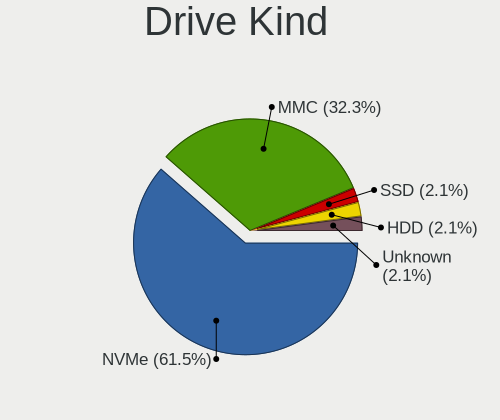
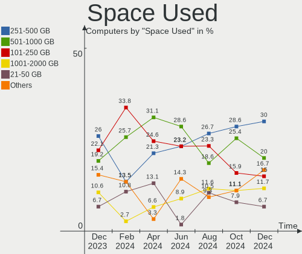
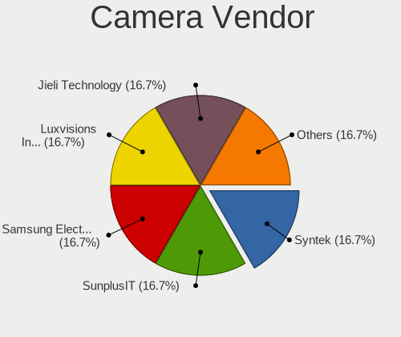

SteamOS - Hardware Trends
-------------------------

A project to identify most popular hardware characteristics and track their change
over time based on data collected by Linux users at https://Linux-Hardware.org.

Anyone can contribute to this report by the [hw-probe](https://github.com/linuxhw/hw-probe) tool:

    sudo -E hw-probe -all -upload

This is a report for all computer types. See also reports for [desktops](/Dist/SteamOS/Desktop/README.md) and [notebooks](/Dist/SteamOS/Notebook/README.md).

This report is for one last month. Overall report since the beginning of time: [TestCoverage](https://github.com/linuxhw/TestCoverage)

Period: Oct, 2022.

Contents
--------

* [ System ](#system)
  - [ OS                       ](#os)
  - [ OS Family                ](#os-family)
  - [ Kernel                   ](#kernel)
  - [ Kernel Family            ](#kernel-family)
  - [ Kernel Major Ver.        ](#kernel-major-ver)
  - [ Arch                     ](#arch)
  - [ DE                       ](#de)
  - [ Display Server           ](#display-server)
  - [ Display Manager          ](#display-manager)
  - [ OS Lang                  ](#os-lang)
  - [ Boot Mode                ](#boot-mode)
  - [ Filesystem               ](#filesystem)
  - [ Part. scheme             ](#part-scheme)
  - [ Dual Boot with Linux/BSD ](#dual-boot-with-linuxbsd)
  - [ Dual Boot (Win)          ](#dual-boot-win)

* [ Board ](#board)
  - [ Vendor                   ](#vendor)
  - [ Model                    ](#model)
  - [ Model Family             ](#model-family)
  - [ MFG Year                 ](#mfg-year)
  - [ Form Factor              ](#form-factor)
  - [ Secure Boot              ](#secure-boot)
  - [ Coreboot                 ](#coreboot)
  - [ RAM Size                 ](#ram-size)
  - [ RAM Used                 ](#ram-used)
  - [ Total Drives             ](#total-drives)
  - [ Has CD-ROM               ](#has-cd-rom)
  - [ Has Ethernet             ](#has-ethernet)
  - [ Has WiFi                 ](#has-wifi)
  - [ Has Bluetooth            ](#has-bluetooth)

* [ Location ](#location)
  - [ Country                  ](#country)
  - [ City                     ](#city)

* [ Drives ](#drives)
  - [ Drive Vendor             ](#drive-vendor)
  - [ Drive Model              ](#drive-model)
  - [ HDD Vendor               ](#hdd-vendor)
  - [ SSD Vendor               ](#ssd-vendor)
  - [ Drive Kind               ](#drive-kind)
  - [ Drive Connector          ](#drive-connector)
  - [ Drive Size               ](#drive-size)
  - [ Space Total              ](#space-total)
  - [ Space Used               ](#space-used)
  - [ Malfunc. Drives          ](#malfunc-drives)
  - [ Malfunc. Drive Vendor    ](#malfunc-drive-vendor)
  - [ Malfunc. HDD Vendor      ](#malfunc-hdd-vendor)
  - [ Malfunc. Drive Kind      ](#malfunc-drive-kind)
  - [ Failed Drives            ](#failed-drives)
  - [ Failed Drive Vendor      ](#failed-drive-vendor)
  - [ Drive Status             ](#drive-status)

* [ Storage controller ](#storage-controller)
  - [ Storage Vendor           ](#storage-vendor)
  - [ Storage Model            ](#storage-model)
  - [ Storage Kind             ](#storage-kind)

* [ Processor ](#processor)
  - [ CPU Vendor               ](#cpu-vendor)
  - [ CPU Model                ](#cpu-model)
  - [ CPU Model Family         ](#cpu-model-family)
  - [ CPU Cores                ](#cpu-cores)
  - [ CPU Sockets              ](#cpu-sockets)
  - [ CPU Threads              ](#cpu-threads)
  - [ CPU Op-Modes             ](#cpu-op-modes)
  - [ CPU Microcode            ](#cpu-microcode)
  - [ CPU Microarch            ](#cpu-microarch)

* [ Graphics ](#graphics)
  - [ GPU Vendor               ](#gpu-vendor)
  - [ GPU Model                ](#gpu-model)
  - [ GPU Combo                ](#gpu-combo)
  - [ GPU Driver               ](#gpu-driver)
  - [ GPU Memory               ](#gpu-memory)

* [ Monitor ](#monitor)
  - [ Monitor Vendor           ](#monitor-vendor)
  - [ Monitor Model            ](#monitor-model)
  - [ Monitor Resolution       ](#monitor-resolution)
  - [ Monitor Diagonal         ](#monitor-diagonal)
  - [ Monitor Width            ](#monitor-width)
  - [ Aspect Ratio             ](#aspect-ratio)
  - [ Monitor Area             ](#monitor-area)
  - [ Pixel Density            ](#pixel-density)
  - [ Multiple Monitors        ](#multiple-monitors)

* [ Network ](#network)
  - [ Net Controller Vendor    ](#net-controller-vendor)
  - [ Net Controller Model     ](#net-controller-model)
  - [ Wireless Vendor          ](#wireless-vendor)
  - [ Wireless Model           ](#wireless-model)
  - [ Ethernet Vendor          ](#ethernet-vendor)
  - [ Ethernet Model           ](#ethernet-model)
  - [ Net Controller Kind      ](#net-controller-kind)
  - [ Used Controller          ](#used-controller)
  - [ NICs                     ](#nics)
  - [ IPv6                     ](#ipv6)

* [ Bluetooth ](#bluetooth)
  - [ Bluetooth Vendor         ](#bluetooth-vendor)
  - [ Bluetooth Model          ](#bluetooth-model)

* [ Sound ](#sound)
  - [ Sound Vendor             ](#sound-vendor)
  - [ Sound Model              ](#sound-model)

* [ Memory ](#memory)
  - [ Memory Vendor            ](#memory-vendor)
  - [ Memory Model             ](#memory-model)
  - [ Memory Kind              ](#memory-kind)
  - [ Memory Form Factor       ](#memory-form-factor)
  - [ Memory Size              ](#memory-size)
  - [ Memory Speed             ](#memory-speed)

* [ Printers & scanners ](#printers--scanners)
  - [ Printer Vendor           ](#printer-vendor)
  - [ Printer Model            ](#printer-model)
  - [ Scanner Vendor           ](#scanner-vendor)
  - [ Scanner Model            ](#scanner-model)

* [ Camera ](#camera)
  - [ Camera Vendor            ](#camera-vendor)
  - [ Camera Model             ](#camera-model)

* [ Security ](#security)
  - [ Fingerprint Vendor       ](#fingerprint-vendor)
  - [ Fingerprint Model        ](#fingerprint-model)
  - [ Chipcard Vendor          ](#chipcard-vendor)
  - [ Chipcard Model           ](#chipcard-model)

* [ Unsupported ](#unsupported)
  - [ Unsupported Devices      ](#unsupported-devices)
  - [ Unsupported Device Types ](#unsupported-device-types)

System
------

OS
--

Installed operating systems

| Name            | Computers | Percent |
|-----------------|-----------|---------|
| SteamOS 3.3.2   | 52        | 55.91%  |
| SteamOS 3.3.1   | 17        | 18.28%  |
| SteamOS 3.3     | 13        | 13.98%  |
| SteamOS 3.4     | 5         | 5.38%   |
| SteamOS         | 3         | 3.23%   |
| SteamOS Rolling | 2         | 2.15%   |
| SteamOS 3.2     | 1         | 1.08%   |

OS Family
---------

OS without a version

| Name    | Computers | Percent |
|---------|-----------|---------|
| SteamOS | 93        | 100%    |

Kernel
------

Version of the Linux kernel

| Version                                        | Computers | Percent |
|------------------------------------------------|-----------|---------|
| 5.13.0-valve21.3-1-neptune                     | 51        | 54.84%  |
| 5.13.0-valve21.1-1-neptune-02211-gc54cda5a36f3 | 17        | 18.28%  |
| 5.13.0-valve24-1-neptune-02226-g5b8545e4c5a1   | 11        | 11.83%  |
| 5.13.0-valve24-1-neptune                       | 7         | 7.53%   |
| 5.18.1-arch1_testHoloISO_20220606.1811         | 3         | 3.23%   |
| 5.15.60-1-lts                                  | 1         | 1.08%   |
| 5.15.54-1-lts                                  | 1         | 1.08%   |
| 5.13.0-valve21.2-1-neptune                     | 1         | 1.08%   |
| 5.13.0-valve15-1-neptune-02197-gf6ec7ad3762a   | 1         | 1.08%   |

Kernel Family
-------------

Linux kernel without a distro release

| Version | Computers | Percent |
|---------|-----------|---------|
| 5.13.0  | 88        | 94.62%  |
| 5.18.1  | 3         | 3.23%   |
| 5.15.60 | 1         | 1.08%   |
| 5.15.54 | 1         | 1.08%   |

Kernel Major Ver.
-----------------

Linux kernel major version

| Version | Computers | Percent |
|---------|-----------|---------|
| 5.13    | 88        | 94.62%  |
| 5.18    | 3         | 3.23%   |
| 5.15    | 2         | 2.15%   |

Arch
----

OS architecture (x86_64, i586, etc.)

| Name   | Computers | Percent |
|--------|-----------|---------|
| x86_64 | 93        | 100%    |

DE
--

Desktop Environment

| Name  | Computers | Percent |
|-------|-----------|---------|
| KDE5  | 92        | 98.92%  |
| GNOME | 1         | 1.08%   |

Display Server
--------------

X11 or Wayland

| Name    | Computers | Percent |
|---------|-----------|---------|
| X11     | 91        | 97.85%  |
| Wayland | 1         | 1.08%   |
| Tty     | 1         | 1.08%   |

Display Manager
---------------

SDDM, LightDM, etc.

| Name    | Computers | Percent |
|---------|-----------|---------|
| Unknown | 92        | 98.92%  |
| SDDM    | 1         | 1.08%   |

OS Lang
-------

Language

| Lang  | Computers | Percent |
|-------|-----------|---------|
| en_US | 79        | 84.95%  |
| fr_FR | 4         | 4.3%    |
| de_DE | 3         | 3.23%   |
| en_GB | 2         | 2.15%   |
| fr_BE | 1         | 1.08%   |
| es_ES | 1         | 1.08%   |
| en_SE | 1         | 1.08%   |
| en_HK | 1         | 1.08%   |
| en_CA | 1         | 1.08%   |

Boot Mode
---------

EFI or BIOS

| Mode | Computers | Percent |
|------|-----------|---------|
| BIOS | 92        | 98.92%  |
| EFI  | 1         | 1.08%   |

Filesystem
----------

Type of filesystem

| Type  | Computers | Percent |
|-------|-----------|---------|
| Btrfs | 93        | 100%    |

Part. scheme
------------

Scheme of partitioning

| Type    | Computers | Percent |
|---------|-----------|---------|
| Unknown | 91        | 97.85%  |
| GPT     | 2         | 2.15%   |

Dual Boot with Linux/BSD
------------------------

Hosting more than one Linux/BSD

| Dual boot | Computers | Percent |
|-----------|-----------|---------|
| No        | 93        | 100%    |

Dual Boot (Win)
---------------

Hosting Linux and Windows

| Dual boot | Computers | Percent |
|-----------|-----------|---------|
| No        | 93        | 100%    |

Board
-----

Vendor
------

Motherboard manufacturer

| Name                | Computers | Percent |
|---------------------|-----------|---------|
| Valve               | 75        | 80.65%  |
| Lenovo              | 3         | 3.23%   |
| AOKZOE              | 3         | 3.23%   |
| Gigabyte Technology | 2         | 2.15%   |
| ASUSTek Computer    | 2         | 2.15%   |
| Apple               | 2         | 2.15%   |
| MSI                 | 1         | 1.08%   |
| Hewlett-Packard     | 1         | 1.08%   |
| Google              | 1         | 1.08%   |
| AZW                 | 1         | 1.08%   |
| ASRock              | 1         | 1.08%   |
| ADVANCE             | 1         | 1.08%   |

Model
-----

Motherboard model

| Name                                | Computers | Percent |
|-------------------------------------|-----------|---------|
| Valve Jupiter                       | 75        | 80.65%  |
| AOKZOE A1 AR07                      | 3         | 3.23%   |
| MSI GP66 Leopard 11UH               | 1         | 1.08%   |
| Lenovo ThinkCentre M720q 10T700A9UK | 1         | 1.08%   |
| Lenovo IdeaPad 3 15ITL6 82H8        | 1         | 1.08%   |
| Lenovo IdeaPad 1 14IAU7 82QC        | 1         | 1.08%   |
| HP Pavilion Gaming Desktop 690-00xx | 1         | 1.08%   |
| Google Droid                        | 1         | 1.08%   |
| Gigabyte B550 GAMING X V2           | 1         | 1.08%   |
| Gigabyte B450M DS3H                 | 1         | 1.08%   |
| AZW MINI S                          | 1         | 1.08%   |
| ASUS ROG STRIX B550-F GAMING        | 1         | 1.08%   |
| ASUS CROSSHAIR VI HERO              | 1         | 1.08%   |
| ASRock X570 Phantom Gaming-ITX/TB3  | 1         | 1.08%   |
| Apple MacPro7,1                     | 1         | 1.08%   |
| Apple MacBookAir6,1                 | 1         | 1.08%   |
| ADVANCE PS5077                      | 1         | 1.08%   |

Model Family
------------

Motherboard model prefix

| Name               | Computers | Percent |
|--------------------|-----------|---------|
| Valve Jupiter      | 75        | 80.65%  |
| AOKZOE A1          | 3         | 3.23%   |
| Lenovo IdeaPad     | 2         | 2.15%   |
| MSI GP66           | 1         | 1.08%   |
| Lenovo ThinkCentre | 1         | 1.08%   |
| HP Pavilion        | 1         | 1.08%   |
| Google Droid       | 1         | 1.08%   |
| Gigabyte B550      | 1         | 1.08%   |
| Gigabyte B450M     | 1         | 1.08%   |
| AZW MINI           | 1         | 1.08%   |
| ASUS ROG           | 1         | 1.08%   |
| ASUS CROSSHAIR     | 1         | 1.08%   |
| ASRock X570        | 1         | 1.08%   |
| Apple MacPro7      | 1         | 1.08%   |
| Apple MacBookAir6  | 1         | 1.08%   |
| ADVANCE PS5077     | 1         | 1.08%   |

MFG Year
--------

Motherboard manufacture year

| Year | Computers | Percent |
|------|-----------|---------|
| 2022 | 83        | 89.25%  |
| 2021 | 5         | 5.38%   |
| 2020 | 2         | 2.15%   |
| 2018 | 2         | 2.15%   |
| 2014 | 1         | 1.08%   |

Form Factor
-----------

Physical design of the computer

| Name     | Computers | Percent |
|----------|-----------|---------|
| Notebook | 82        | 88.17%  |
| Desktop  | 7         | 7.53%   |
| Tablet   | 3         | 3.23%   |
| Mini pc  | 1         | 1.08%   |

Secure Boot
-----------

Enabled or disabled

| State    | Computers | Percent |
|----------|-----------|---------|
| Disabled | 93        | 100%    |

Coreboot
--------

Have coreboot on board

| Used | Computers | Percent |
|------|-----------|---------|
| No   | 92        | 98.92%  |
| Yes  | 1         | 1.08%   |

RAM Size
--------

Total RAM memory

| Size in GB  | Computers | Percent |
|-------------|-----------|---------|
| 8.01-16.0   | 78        | 83.87%  |
| 4.01-8.0    | 5         | 5.38%   |
| 16.01-24.0  | 5         | 5.38%   |
| 32.01-64.0  | 2         | 2.15%   |
| 3.01-4.0    | 1         | 1.08%   |
| 24.01-32.0  | 1         | 1.08%   |
| 64.01-256.0 | 1         | 1.08%   |

RAM Used
--------

Used RAM memory

| Used GB  | Computers | Percent |
|----------|-----------|---------|
| 2.01-3.0 | 55        | 59.14%  |
| 3.01-4.0 | 22        | 23.66%  |
| 4.01-8.0 | 11        | 11.83%  |
| 1.01-2.0 | 5         | 5.38%   |

Total Drives
------------

Number of drives on board

| Drives | Computers | Percent |
|--------|-----------|---------|
| 2      | 52        | 55.91%  |
| 1      | 37        | 39.78%  |
| 11     | 1         | 1.08%   |
| 5      | 1         | 1.08%   |
| 4      | 1         | 1.08%   |
| 3      | 1         | 1.08%   |

Has CD-ROM
----------

Has CD-ROM on board

| Presented | Computers | Percent |
|-----------|-----------|---------|
| No        | 90        | 96.77%  |
| Yes       | 3         | 3.23%   |

Has Ethernet
------------

Has Ethernet on board

| Presented | Computers | Percent |
|-----------|-----------|---------|
| No        | 54        | 58.06%  |
| Yes       | 39        | 41.94%  |

Has WiFi
--------

Has WiFi module

| Presented | Computers | Percent |
|-----------|-----------|---------|
| Yes       | 91        | 97.85%  |
| No        | 2         | 2.15%   |

Has Bluetooth
-------------

Has Bluetooth module

| Presented | Computers | Percent |
|-----------|-----------|---------|
| Yes       | 86        | 92.47%  |
| No        | 7         | 7.53%   |

Location
--------

Country
-------

Geographic location (country)

| Country   | Computers | Percent |
|-----------|-----------|---------|
| USA       | 39        | 41.94%  |
| UK        | 16        | 17.2%   |
| Germany   | 10        | 10.75%  |
| France    | 6         | 6.45%   |
| Canada    | 4         | 4.3%    |
| China     | 3         | 3.23%   |
| Sweden    | 2         | 2.15%   |
| Russia    | 2         | 2.15%   |
| Austria   | 2         | 2.15%   |
| Spain     | 1         | 1.08%   |
| Romania   | 1         | 1.08%   |
| Poland    | 1         | 1.08%   |
| Peru      | 1         | 1.08%   |
| Palestine | 1         | 1.08%   |
| Moldova   | 1         | 1.08%   |
| Latvia    | 1         | 1.08%   |
| Hong Kong | 1         | 1.08%   |
| Belgium   | 1         | 1.08%   |

City
----

Geographic location (city)

| City                   | Computers | Percent |
|------------------------|-----------|---------|
| Norwich                | 2         | 2.15%   |
| Yaroslavl              | 1         | 1.08%   |
| Winter Park            | 1         | 1.08%   |
| Winnipeg               | 1         | 1.08%   |
| Wigan                  | 1         | 1.08%   |
| West Covina            | 1         | 1.08%   |
| Wasungen               | 1         | 1.08%   |
| Warsaw                 | 1         | 1.08%   |
| Walled Lake            | 1         | 1.08%   |
| Villingen-Schwenningen | 1         | 1.08%   |
| Vienna                 | 1         | 1.08%   |
| Victoria               | 1         | 1.08%   |
| Vernon                 | 1         | 1.08%   |
| Valencia               | 1         | 1.08%   |
| The Bronx              | 1         | 1.08%   |
| Targu Gangulesti       | 1         | 1.08%   |
| Suzhou                 | 1         | 1.08%   |
| Stuttgart              | 1         | 1.08%   |
| Spartanburg            | 1         | 1.08%   |
| South Holland          | 1         | 1.08%   |
| Sheffield              | 1         | 1.08%   |
| Sha Tin Wai            | 1         | 1.08%   |
| Seattle                | 1         | 1.08%   |
| Salach                 | 1         | 1.08%   |
| Riga                   | 1         | 1.08%   |
| Rietberg               | 1         | 1.08%   |
| Redon                  | 1         | 1.08%   |
| Portland               | 1         | 1.08%   |
| Poplar                 | 1         | 1.08%   |
| Philadelphia           | 1         | 1.08%   |
| Pawtucket              | 1         | 1.08%   |
| Parker                 | 1         | 1.08%   |
| Panama City            | 1         | 1.08%   |
| Palm Desert            | 1         | 1.08%   |
| Oxford                 | 1         | 1.08%   |
| North Shields          | 1         | 1.08%   |
| Norman                 | 1         | 1.08%   |
| Newcastle upon Tyne    | 1         | 1.08%   |
| Newark                 | 1         | 1.08%   |
| Nantes                 | 1         | 1.08%   |

Drives
------

Drive Vendor
------------

Hard drive vendors

| Vendor                         | Computers | Drives | Percent |
|--------------------------------|-----------|--------|---------|
| Unknown                        | 44        | 44     | 28.21%  |
| Kingston Technology Company    | 26        | 26     | 16.67%  |
| Samsung Electronics            | 20        | 23     | 12.82%  |
| Phison Electronics             | 19        | 20     | 12.18%  |
| SanDisk                        | 9         | 9      | 5.77%   |
| Unknown                        | 6         | 7      | 3.85%   |
| Seagate                        | 4         | 5      | 2.56%   |
| O2 Micro                       | 4         | 4      | 2.56%   |
| Silicon Motion                 | 3         | 3      | 1.92%   |
| PNY                            | 3         | 3      | 1.92%   |
| Apple                          | 3         | 3      | 1.92%   |
| Toshiba                        | 2         | 2      | 1.28%   |
| SK hynix                       | 2         | 2      | 1.28%   |
| Biwin Storage Technology       | 2         | 2      | 1.28%   |
| WDC                            | 1         | 3      | 0.64%   |
| SPCC                           | 1         | 1      | 0.64%   |
| Solid State Storage Technology | 1         | 1      | 0.64%   |
| NGFF                           | 1         | 1      | 0.64%   |
| Micron/Crucial Technology      | 1         | 1      | 0.64%   |
| Intel                          | 1         | 1      | 0.64%   |
| China                          | 1         | 1      | 0.64%   |
| BIWIN                          | 1         | 1      | 0.64%   |
| A-DATA Technology              | 1         | 1      | 0.64%   |

Drive Model
-----------

Hard drive models

| Model                                                 | Computers | Percent |
|-------------------------------------------------------|-----------|---------|
| Kingston Company OM3PDP3 NVMe SSD 512GB               | 26        | 16.15%  |
| Phison PS5013 E13 NVMe Controller 256GB               | 17        | 10.56%  |
| Unknown MMC Card  256GB                               | 16        | 9.94%   |
| Unknown MMC Card  512GB                               | 13        | 8.07%   |
| Samsung MZ9LQ256HBJD-00BVL 256GB                      | 7         | 4.35%   |
| Unknown MMC Card  128GB                               | 6         | 3.73%   |
| Samsung MZ9LQ512HBLU-00BVL 512GB                      | 6         | 3.73%   |
| Unknown                                               | 6         | 3.73%   |
| O2 Micro E2M2 64GB                                    | 4         | 2.48%   |
| Unknown MMC Card  32GB                                | 3         | 1.86%   |
| Silicon Motion SM2263EN/SM2263XT SSD Controller 256GB | 3         | 1.86%   |
| Unknown MMC Card  64GB                                | 2         | 1.24%   |
| Sandisk WDC PC SN530 SDBPTPZ-1T00 1024GB              | 2         | 1.24%   |
| Sandisk WDC PC SN530 SDBPMPZ-256G-1101 256GB          | 2         | 1.24%   |
| Sandisk PC SN530 NVMe WDC 256GB                       | 2         | 1.24%   |
| Samsung MZVLQ1T0HALB-00000 1024GB                     | 2         | 1.24%   |
| PNY CS900 120GB SSD                                   | 2         | 1.24%   |
| Biwin Storage AOKZOE A1 512GB                         | 2         | 1.24%   |
| WDC WDBNCE2500PNC 250GB SSD                           | 1         | 0.62%   |
| WDC WD10EURX-63FH1Y0 1TB                              | 1         | 0.62%   |
| WDC WD10EADS-00M2B0 1TB                               | 1         | 0.62%   |
| Unknown MMC Card  500GB                               | 1         | 0.62%   |
| Unknown MMC Card  393GB                               | 1         | 0.62%   |
| Unknown MMC Card  250GB                               | 1         | 0.62%   |
| Unknown MMC Card  16GB                                | 1         | 0.62%   |
| Toshiba MK1059GSM 1TB                                 | 1         | 0.62%   |
| Toshiba DT01ACA100 1TB                                | 1         | 0.62%   |
| SPCC Solid State Disk 1024GB                          | 1         | 0.62%   |
| Solid State Storage SSSTC XA1-31512 450GB             | 1         | 0.62%   |
| SK hynix BC711 NVMe 256GB                             | 1         | 0.62%   |
| SK hynix BC711 NVMe 1TB                               | 1         | 0.62%   |
| Seagate ST4000DX001-1CE168 4TB                        | 1         | 0.62%   |
| Seagate ST1000LM014-1EJ164 1TB                        | 1         | 0.62%   |
| Seagate Expansion SW 8TB                              | 1         | 0.62%   |
| Seagate BUP Portable 4TB                              | 1         | 0.62%   |
| Seagate BUP BL 5TB                                    | 1         | 0.62%   |
| Sandisk WD Black SN850 1TB                            | 1         | 0.62%   |
| SanDisk SD7SN6S-256G-1006 256GB SSD                   | 1         | 0.62%   |
| SanDisk Extreme SSD 500GB                             | 1         | 0.62%   |
| Samsung SSD 970 EVO Plus 1TB                          | 1         | 0.62%   |

HDD Vendor
----------

Hard disk drive vendors

| Vendor  | Computers | Drives | Percent |
|---------|-----------|--------|---------|
| Seagate | 4         | 5      | 50%     |
| Toshiba | 2         | 2      | 25%     |
| WDC     | 1         | 2      | 12.5%   |
| Apple   | 1         | 1      | 12.5%   |

SSD Vendor
----------

Solid state drive vendors

| Vendor              | Computers | Drives | Percent |
|---------------------|-----------|--------|---------|
| PNY                 | 3         | 3      | 23.08%  |
| SanDisk             | 2         | 2      | 15.38%  |
| Samsung Electronics | 2         | 4      | 15.38%  |
| WDC                 | 1         | 1      | 7.69%   |
| SPCC                | 1         | 1      | 7.69%   |
| NGFF                | 1         | 1      | 7.69%   |
| China               | 1         | 1      | 7.69%   |
| Apple               | 1         | 1      | 7.69%   |
| A-DATA Technology   | 1         | 1      | 7.69%   |

Drive Kind
----------

HDD or SSD

| Kind    | Computers | Drives | Percent |
|---------|-----------|--------|---------|
| NVMe    | 86        | 88     | 57.33%  |
| MMC     | 48        | 48     | 32%     |
| SSD     | 8         | 15     | 5.33%   |
| HDD     | 6         | 10     | 4%      |
| Unknown | 2         | 3      | 1.33%   |

Drive Connector
---------------

SATA, SAS, NVMe, etc.

| Type | Computers | Drives | Percent |
|------|-----------|--------|---------|
| NVMe | 86        | 88     | 58.5%   |
| MMC  | 48        | 48     | 32.65%  |
| SATA | 9         | 20     | 6.12%   |
| SAS  | 4         | 8      | 2.72%   |

Drive Size
----------

Size of hard drive

| Size in TB | Computers | Drives | Percent |
|------------|-----------|--------|---------|
| 0.51-1.0   | 5         | 8      | 31.25%  |
| 0.01-0.5   | 5         | 9      | 31.25%  |
| 3.01-4.0   | 2         | 2      | 12.5%   |
| 1.01-2.0   | 2         | 4      | 12.5%   |
| 4.01-10.0  | 2         | 2      | 12.5%   |

Space Total
-----------

Amount of disk space available on the file system

| Size in GB     | Computers | Percent |
|----------------|-----------|---------|
| 251-500        | 49        | 52.69%  |
| 101-250        | 23        | 24.73%  |
| 501-1000       | 10        | 10.75%  |
| 51-100         | 4         | 4.3%    |
| More than 3000 | 3         | 3.23%   |
| 1001-2000      | 3         | 3.23%   |
| 2001-3000      | 1         | 1.08%   |

Space Used
----------

Amount of used disk space

| Used GB        | Computers | Percent |
|----------------|-----------|---------|
| 101-250        | 32        | 34.41%  |
| 251-500        | 22        | 23.66%  |
| 51-100         | 16        | 17.2%   |
| 21-50          | 12        | 12.9%   |
| 1-20           | 8         | 8.6%    |
| More than 3000 | 1         | 1.08%   |
| 1001-2000      | 1         | 1.08%   |
| 501-1000       | 1         | 1.08%   |

Malfunc. Drives
---------------

Drive models with a malfunction

Zero info for selected period =(

Malfunc. Drive Vendor
---------------------

Vendors of faulty drives

Zero info for selected period =(

Malfunc. HDD Vendor
-------------------

Vendors of faulty HDD drives

Zero info for selected period =(

Malfunc. Drive Kind
-------------------

Kinds of faulty drives

Zero info for selected period =(

Failed Drives
-------------

Failed drive models

Zero info for selected period =(

Failed Drive Vendor
-------------------

Failed drive vendors

Zero info for selected period =(

Drive Status
------------

Number of failed and malfunc. drives

| Status   | Computers | Drives | Percent |
|----------|-----------|--------|---------|
| Detected | 93        | 164    | 100%    |

Storage controller
------------------

Storage Vendor
--------------

Storage controller vendors

| Vendor                         | Computers | Percent |
|--------------------------------|-----------|---------|
| Kingston Technology Company    | 26        | 26%     |
| Samsung Electronics            | 19        | 19%     |
| Phison Electronics             | 19        | 19%     |
| SanDisk                        | 7         | 7%      |
| Intel                          | 7         | 7%      |
| AMD                            | 6         | 6%      |
| O2 Micro                       | 4         | 4%      |
| Silicon Motion                 | 3         | 3%      |
| Biwin Storage Technology       | 3         | 3%      |
| SK hynix                       | 2         | 2%      |
| Toshiba America Info Systems   | 1         | 1%      |
| Solid State Storage Technology | 1         | 1%      |
| Micron/Crucial Technology      | 1         | 1%      |
| Apple                          | 1         | 1%      |

Storage Model
-------------

Storage controller models

| Model                                                             | Computers | Percent |
|-------------------------------------------------------------------|-----------|---------|
| Kingston Company OM3PDP3 NVMe SSD                                 | 26        | 25%     |
| Samsung NVMe SSD Controller 980                                   | 18        | 17.31%  |
| Phison PS5013 E13 NVMe Controller                                 | 17        | 16.35%  |
| SanDisk Non-Volatile memory controller                            | 6         | 5.77%   |
| O2 Micro Non-Volatile memory controller                           | 4         | 3.85%   |
| AMD FCH SATA Controller [AHCI mode]                               | 4         | 3.85%   |
| Silicon Motion SM2263EN/SM2263XT SSD Controller                   | 3         | 2.88%   |
| Biwin Storage Non-Volatile memory controller                      | 3         | 2.88%   |
| SK hynix Gold P31 SSD                                             | 2         | 1.92%   |
| AMD 500 Series Chipset SATA Controller                            | 2         | 1.92%   |
| Toshiba America Info Systems Toshiba America Info SATA controller | 1         | 0.96%   |
| Solid State Storage Non-Volatile memory controller                | 1         | 0.96%   |
| SanDisk WD PC SN810 / Black SN850 NVMe SSD                        | 1         | 0.96%   |
| Samsung NVMe SSD Controller SM961/PM961/SM963                     | 1         | 0.96%   |
| Phison NVMe Storage Controller                                    | 1         | 0.96%   |
| Phison E12 NVMe Controller                                        | 1         | 0.96%   |
| Micron/Crucial P2 NVMe PCIe SSD                                   | 1         | 0.96%   |
| Intel Volume Management Device NVMe RAID Controller               | 1         | 0.96%   |
| Intel Tiger Lake-LP SATA Controller                               | 1         | 0.96%   |
| Intel SSD 660P Series                                             | 1         | 0.96%   |
| Intel Jasper Lake SATA AHCI Controller                            | 1         | 0.96%   |
| Intel Cannon Point-LP SATA Controller [AHCI Mode]                 | 1         | 0.96%   |
| Intel Cannon Lake PCH SATA AHCI Controller                        | 1         | 0.96%   |
| Intel C620 Series Chipset Family SATA Controller [AHCI mode]      | 1         | 0.96%   |
| Intel Alder Lake-P SATA AHCI Controller                           | 1         | 0.96%   |
| Apple ANS2 NVMe Controller                                        | 1         | 0.96%   |
| AMD X370 Series Chipset SATA Controller                           | 1         | 0.96%   |
| AMD 400 Series Chipset SATA Controller                            | 1         | 0.96%   |
| AMD 300 Series Chipset SATA Controller                            | 1         | 0.96%   |

Storage Kind
------------

Kind of storage controller (IDE, SATA, NVMe, SAS, ...)

| Kind | Computers | Percent |
|------|-----------|---------|
| NVMe | 86        | 86%     |
| SATA | 13        | 13%     |
| RAID | 1         | 1%      |

Processor
---------

CPU Vendor
----------

Processor vendors

| Vendor | Computers | Percent |
|--------|-----------|---------|
| AMD    | 84        | 90.32%  |
| Intel  | 9         | 9.68%   |

CPU Model
---------

Processor models

| Model                                    | Computers | Percent |
|------------------------------------------|-----------|---------|
| AMD Custom APU 0405                      | 75        | 80.65%  |
| AMD Ryzen 7 6800U with Radeon Graphics   | 3         | 3.23%   |
| AMD Ryzen 5 5600G with Radeon Graphics   | 2         | 2.15%   |
| Intel Xeon W-3223 CPU @ 3.50GHz          | 1         | 1.08%   |
| Intel Pentium Silver N5030 CPU @ 1.10GHz | 1         | 1.08%   |
| Intel Core i5-8600T CPU @ 2.30GHz        | 1         | 1.08%   |
| Intel Core i5-8259U CPU @ 2.30GHz        | 1         | 1.08%   |
| Intel Core i5-4260U CPU @ 1.40GHz        | 1         | 1.08%   |
| Intel Celeron N5095 @ 2.00GHz            | 1         | 1.08%   |
| Intel 12th Gen Core i3-1215U             | 1         | 1.08%   |
| Intel 11th Gen Core i7-11800H @ 2.30GHz  | 1         | 1.08%   |
| Intel 11th Gen Core i3-1115G4 @ 3.00GHz  | 1         | 1.08%   |
| AMD Ryzen 9 3900X 12-Core Processor      | 1         | 1.08%   |
| AMD Ryzen 7 1700 Eight-Core Processor    | 1         | 1.08%   |
| AMD Ryzen 5 5600X 6-Core Processor       | 1         | 1.08%   |
| AMD Ryzen 5 3600 6-Core Processor        | 1         | 1.08%   |

CPU Model Family
----------------

Processor model prefix

| Model                | Computers | Percent |
|----------------------|-----------|---------|
| Other                | 78        | 83.87%  |
| AMD Ryzen 7          | 4         | 4.3%    |
| AMD Ryzen 5          | 4         | 4.3%    |
| Intel Core i5        | 3         | 3.23%   |
| Intel Xeon           | 1         | 1.08%   |
| Intel Pentium Silver | 1         | 1.08%   |
| Intel Celeron        | 1         | 1.08%   |
| AMD Ryzen 9          | 1         | 1.08%   |

CPU Cores
---------

Number of processor cores

| Number | Computers | Percent |
|--------|-----------|---------|
| 4      | 78        | 83.87%  |
| 8      | 6         | 6.45%   |
| 6      | 6         | 6.45%   |
| 2      | 2         | 2.15%   |
| 12     | 1         | 1.08%   |

CPU Sockets
-----------

Number of sockets

| Number | Computers | Percent |
|--------|-----------|---------|
| 1      | 93        | 100%    |

CPU Threads
-----------

Threads per core (Hyper-Threading)

| Number | Computers | Percent |
|--------|-----------|---------|
| 2      | 90        | 96.77%  |
| 1      | 3         | 3.23%   |

CPU Op-Modes
------------

CPU Operation Modes (32-bit, 64-bit)

| Op mode        | Computers | Percent |
|----------------|-----------|---------|
| 32-bit, 64-bit | 93        | 100%    |

CPU Microcode
-------------

Microcode number

| Number     | Computers | Percent |
|------------|-----------|---------|
| Unknown    | 92        | 98.92%  |
| 0x0a404102 | 1         | 1.08%   |

CPU Microarch
-------------

Microarchitecture

| Name          | Computers | Percent |
|---------------|-----------|---------|
| Unknown       | 81        | 87.1%   |
| Zen 3         | 3         | 3.23%   |
| Zen 2         | 2         | 2.15%   |
| KabyLake      | 2         | 2.15%   |
| Zen           | 1         | 1.08%   |
| TigerLake     | 1         | 1.08%   |
| Skylake       | 1         | 1.08%   |
| Haswell       | 1         | 1.08%   |
| Goldmont plus | 1         | 1.08%   |

Graphics
--------

GPU Vendor
----------

Vendors of graphics cards

| Vendor | Computers | Percent |
|--------|-----------|---------|
| AMD    | 84        | 89.36%  |
| Intel  | 7         | 7.45%   |
| Nvidia | 3         | 3.19%   |

GPU Model
---------

Graphics card models

| Model                                                      | Computers | Percent |
|------------------------------------------------------------|-----------|---------|
| AMD VanGogh [AMD Custom GPU 0405]                          | 75        | 79.79%  |
| AMD Rembrandt [Radeon 680M]                                | 3         | 3.19%   |
| Nvidia GA106 [GeForce RTX 3060 Lite Hash Rate]             | 1         | 1.06%   |
| Nvidia GA104M [GeForce RTX 3080 Mobile / Max-Q 8GB/16GB]   | 1         | 1.06%   |
| Nvidia GA102 [GeForce RTX 3090]                            | 1         | 1.06%   |
| Intel VGA compatible controller                            | 1         | 1.06%   |
| Intel Tiger Lake UHD Graphics                              | 1         | 1.06%   |
| Intel JasperLake [UHD Graphics]                            | 1         | 1.06%   |
| Intel Haswell-ULT Integrated Graphics Controller           | 1         | 1.06%   |
| Intel GeminiLake [UHD Graphics 605]                        | 1         | 1.06%   |
| Intel CoffeeLake-U GT3e [Iris Plus Graphics 655]           | 1         | 1.06%   |
| Intel CoffeeLake-S GT2 [UHD Graphics 630]                  | 1         | 1.06%   |
| AMD Navi 23 [Radeon RX 6600/6600 XT/6600M]                 | 1         | 1.06%   |
| AMD Navi 22 [Radeon RX 6700/6700 XT/6750 XT / 6800M]       | 1         | 1.06%   |
| AMD Navi 21 Pro-XTA [Radeon Pro W6900X]                    | 1         | 1.06%   |
| AMD Lexa PRO [Radeon 540/540X/550/550X / RX 540X/550/550X] | 1         | 1.06%   |
| AMD Ellesmere [Radeon RX 470/480/570/570X/580/580X/590]    | 1         | 1.06%   |
| AMD Cezanne                                                | 1         | 1.06%   |

GPU Combo
---------

Combinations of graphics cards

| Name         | Computers | Percent |
|--------------|-----------|---------|
| 1 x AMD      | 83        | 89.25%  |
| 1 x Intel    | 6         | 6.45%   |
| 1 x Nvidia   | 2         | 2.15%   |
| Other        | 1         | 1.08%   |
| AMD + Nvidia | 1         | 1.08%   |

GPU Driver
----------

Free vs proprietary

| Driver      | Computers | Percent |
|-------------|-----------|---------|
| Free        | 90        | 96.77%  |
| Proprietary | 3         | 3.23%   |

GPU Memory
----------

Total video memory

| Size in GB | Computers | Percent |
|------------|-----------|---------|
| Unknown    | 89        | 95.7%   |
| 7.01-8.0   | 1         | 1.08%   |
| 16.01-24.0 | 1         | 1.08%   |
| 1.01-2.0   | 1         | 1.08%   |
| 8.01-16.0  | 1         | 1.08%   |

Monitor
-------

Monitor Vendor
--------------

Monitor vendors

| Vendor               | Computers | Percent |
|----------------------|-----------|---------|
| Analogix             | 66        | 57.89%  |
| Valve                | 8         | 7.02%   |
| Goldstar             | 7         | 6.14%   |
| Samsung Electronics  | 6         | 5.26%   |
| RTK                  | 3         | 2.63%   |
| Dell                 | 2         | 1.75%   |
| ASUSTek Computer     | 2         | 1.75%   |
| Ancor Communications | 2         | 1.75%   |
| Acer                 | 2         | 1.75%   |
| Vizio                | 1         | 0.88%   |
| Sun                  | 1         | 0.88%   |
| Sony                 | 1         | 0.88%   |
| Sharp                | 1         | 0.88%   |
| Philips              | 1         | 0.88%   |
| PANDA                | 1         | 0.88%   |
| NEC Computers        | 1         | 0.88%   |
| Lenovo               | 1         | 0.88%   |
| InfoVision           | 1         | 0.88%   |
| Hewlett-Packard      | 1         | 0.88%   |
| GreenWood            | 1         | 0.88%   |
| Gigabyte Technology  | 1         | 0.88%   |
| Chimei Innolux       | 1         | 0.88%   |
| BOE                  | 1         | 0.88%   |
| BenQ                 | 1         | 0.88%   |
| Apple                | 1         | 0.88%   |

Monitor Model
-------------

Monitor models

| Model                                                                  | Computers | Percent |
|------------------------------------------------------------------------|-----------|---------|
| Analogix ANX7530 U ANX7539 800x1280                                    | 66        | 57.39%  |
| Valve ANX7530 U VLV3001 800x1280 100x150mm 7.1-inch                    | 8         | 6.96%   |
| RTK LCD Monitor RTK2A3B 1200x1920 114x184mm 8.5-inch                   | 3         | 2.61%   |
| Vizio VA26LHDTV10T VIZ0035 1360x768 576x324mm 26.0-inch                | 1         | 0.87%   |
| Sun SCEI MONITOR SCE0301 1920x1080 522x294mm 23.6-inch                 | 1         | 0.87%   |
| Sony TV *00 SNY8204 3840x2160 1218x685mm 55.0-inch                     | 1         | 0.87%   |
| Sharp LQ156M1JW03 SHP155D 1920x1080 344x194mm 15.5-inch                | 1         | 0.87%   |
| Samsung Electronics S24F350 SAM0D20 1920x1080 521x293mm 23.5-inch      | 1         | 0.87%   |
| Samsung Electronics LCD Monitor SAM71B5 3840x2160 1020x570mm 46.0-inch | 1         | 0.87%   |
| Samsung Electronics LCD Monitor SAM7017 3840x2160 950x540mm 43.0-inch  | 1         | 0.87%   |
| Samsung Electronics LC24RG50 SAM0F90 1920x1080 532x304mm 24.1-inch     | 1         | 0.87%   |
| Samsung Electronics C49HG9x SAM0E5D 3840x1080 1196x336mm 48.9-inch     | 1         | 0.87%   |
| Samsung Electronics C27R50x SAM0F9D 1920x1080 598x336mm 27.0-inch      | 1         | 0.87%   |
| Philips FTV PHL04C3 3840x2160 1440x810mm 65.0-inch                     | 1         | 0.87%   |
| PANDA LCD Monitor NCP002D 1920x1080 344x194mm 15.5-inch                | 1         | 0.87%   |
| NEC Computers EA271Q NEC2DDC 2560x1440 596x335mm 26.9-inch             | 1         | 0.87%   |
| Lenovo LEN T2224dA LEN60EB 1920x1080 476x268mm 21.5-inch               | 1         | 0.87%   |
| InfoVision LCD Monitor IVO057D 1920x1080 309x174mm 14.0-inch           | 1         | 0.87%   |
| Hewlett-Packard E233 HPN3460 1920x1080 509x286mm 23.0-inch             | 1         | 0.87%   |
| GreenWood ARZOPA GWD1580 1920x1080 350x200mm 15.9-inch                 | 1         | 0.87%   |
| Goldstar ULTRAWIDE GSM5AFB 2560x1080 798x334mm 34.1-inch               | 1         | 0.87%   |
| Goldstar QHD GSM778E 2560x1440 698x392mm 31.5-inch                     | 1         | 0.87%   |
| Goldstar MP59HT GSM5B44 1920x1080 480x270mm 21.7-inch                  | 1         | 0.87%   |
| Goldstar HDR WFHD GSM5B9F 2560x1080 798x334mm 34.1-inch                | 1         | 0.87%   |
| Goldstar 34GN850 GSM774A 3440x1440 800x335mm 34.1-inch                 | 1         | 0.87%   |
| Goldstar 27MP35 GSM5A5B 1920x1080 598x337mm 27.0-inch                  | 1         | 0.87%   |
| Goldstar 27GN7 GSM5B8D 1920x1080 600x303mm 26.5-inch                   | 1         | 0.87%   |
| Goldstar 27GL850 GSM5B7F 2560x1440 597x336mm 27.0-inch                 | 1         | 0.87%   |
| Gigabyte Technology G34WQC A GBT3403 3440x1440 797x334mm 34.0-inch     | 1         | 0.87%   |
| Dell S2721HGF DEL41E8 1920x1080 600x340mm 27.2-inch                    | 1         | 0.87%   |
| Dell S2721DS DELA19D 2560x1440 597x336mm 27.0-inch                     | 1         | 0.87%   |
| Chimei Innolux LCD Monitor CMN15F5 1920x1080 344x193mm 15.5-inch       | 1         | 0.87%   |
| BOE LCD Monitor BOE08F2 1920x1080 310x174mm 14.0-inch                  | 1         | 0.87%   |
| BenQ GL2450 BNQ78A5 1920x1080 531x298mm 24.0-inch                      | 1         | 0.87%   |
| ASUSTek Computer VZ229 AUS22CC 1920x1080 476x268mm 21.5-inch           | 1         | 0.87%   |
| ASUSTek Computer VP279 AUS27DF 1920x1080 598x336mm 27.0-inch           | 1         | 0.87%   |
| Apple Color LCD APP9CF3 1366x768 260x140mm 11.6-inch                   | 1         | 0.87%   |
| Ancor Communications VS248 ACI2498 1920x1080 531x299mm 24.0-inch       | 1         | 0.87%   |
| Ancor Communications ROG PG279Q ACI27EC 2560x1440 598x336mm 27.0-inch  | 1         | 0.87%   |
| Acer XB253Q ACR0741 1920x1080 543x302mm 24.5-inch                      | 1         | 0.87%   |

Monitor Resolution
------------------

Monitor screen resolution

| Resolution      | Computers | Percent |
|-----------------|-----------|---------|
| 800x1280        | 74        | 65.49%  |
| 1920x1080 (FHD) | 21        | 18.58%  |
| 3840x2160 (4K)  | 7         | 6.19%   |
| 2560x1440 (QHD) | 5         | 4.42%   |
| 3440x1440       | 2         | 1.77%   |
| 2560x1080       | 2         | 1.77%   |
| 3840x1080       | 1         | 0.88%   |
| 1366x768 (WXGA) | 1         | 0.88%   |

Monitor Diagonal
----------------

Diagonal size in inches

| Inches  | Computers | Percent |
|---------|-----------|---------|
| Unknown | 66        | 57.89%  |
| 7       | 8         | 7.02%   |
| 27      | 7         | 6.14%   |
| 24      | 5         | 4.39%   |
| 46      | 4         | 3.51%   |
| 34      | 4         | 3.51%   |
| 15      | 4         | 3.51%   |
| 21      | 3         | 2.63%   |
| 65      | 2         | 1.75%   |
| 23      | 2         | 1.75%   |
| 14      | 2         | 1.75%   |
| 84      | 1         | 0.88%   |
| 57      | 1         | 0.88%   |
| 49      | 1         | 0.88%   |
| 36      | 1         | 0.88%   |
| 31      | 1         | 0.88%   |
| 26      | 1         | 0.88%   |
| 11      | 1         | 0.88%   |

Monitor Width
-------------

Physical width

| Width in mm | Computers | Percent |
|-------------|-----------|---------|
| Unknown     | 66        | 57.89%  |
| 501-600     | 14        | 12.28%  |
| 1001-1500   | 8         | 7.02%   |
| 1-100       | 8         | 7.02%   |
| 301-350     | 6         | 5.26%   |
| 701-800     | 5         | 4.39%   |
| 401-500     | 3         | 2.63%   |
| 601-700     | 2         | 1.75%   |
| 201-300     | 1         | 0.88%   |
| 1501-2000   | 1         | 0.88%   |

Aspect Ratio
------------

Proportional relationship between the width and the height

| Ratio | Computers | Percent |
|-------|-----------|---------|
| 0.62  | 66        | 58.41%  |
| 16/9  | 32        | 28.32%  |
| 0.67  | 8         | 7.08%   |
| 21/9  | 4         | 3.54%   |
| 32/9  | 1         | 0.88%   |
| 3/2   | 1         | 0.88%   |
| 16/10 | 1         | 0.88%   |

Monitor Area
------------

Area in inch

| Area in inch | Computers | Percent |
|----------------|-----------|---------|
| Unknown        | 66        | 57.89%  |
| 1-40           | 8         | 7.02%   |
| 301-350        | 8         | 7.02%   |
| 201-250        | 7         | 6.14%   |
| 501-1000       | 6         | 5.26%   |
| 351-500        | 5         | 4.39%   |
| More than 1000 | 4         | 3.51%   |
| 101-110        | 4         | 3.51%   |
| 251-300        | 3         | 2.63%   |
| 81-90          | 2         | 1.75%   |
| 51-60          | 1         | 0.88%   |

Pixel Density
-------------

Pixels per inch

| Density | Computers | Percent |
|---------|-----------|---------|
| Unknown | 66        | 58.41%  |
| 51-100  | 17        | 15.04%  |
| 101-120 | 9         | 7.96%   |
| 161-240 | 8         | 7.08%   |
| 121-160 | 7         | 6.19%   |
| 1-50    | 6         | 5.31%   |

Multiple Monitors
-----------------

Total monitors connected

| Total | Computers | Percent |
|-------|-----------|---------|
| 1     | 72        | 77.42%  |
| 2     | 20        | 21.51%  |
| 3     | 1         | 1.08%   |

Network
-------

Net Controller Vendor
---------------------

Controller vendors

| Vendor                | Computers | Percent |
|-----------------------|-----------|---------|
| Realtek Semiconductor | 82        | 67.21%  |
| ASIX Electronics      | 15        | 12.3%   |
| Intel                 | 9         | 7.38%   |
| Microsoft             | 4         | 3.28%   |
| MediaTek              | 3         | 2.46%   |
| Broadcom              | 2         | 1.64%   |
| TP-Link               | 1         | 0.82%   |
| Samsung Electronics   | 1         | 0.82%   |
| Lenovo                | 1         | 0.82%   |
| Edimax Technology     | 1         | 0.82%   |
| Broadcom Limited      | 1         | 0.82%   |
| Aquantia              | 1         | 0.82%   |
| Apple                 | 1         | 0.82%   |

Net Controller Model
--------------------

Controller models

| Model                                                             | Computers | Percent |
|-------------------------------------------------------------------|-----------|---------|
| Realtek RTL8822CE 802.11ac PCIe Wireless Network Adapter          | 75        | 54.74%  |
| ASIX AX88179 Gigabit Ethernet                                     | 15        | 10.95%  |
| Realtek RTL8153 Gigabit Ethernet Adapter                          | 11        | 8.03%   |
| Realtek RTL8111/8168/8411 PCI Express Gigabit Ethernet Controller | 5         | 3.65%   |
| Microsoft XBOX ACC                                                | 3         | 2.19%   |
| MediaTek MT7921K (RZ608) Wi-Fi 6E 80MHz                           | 3         | 2.19%   |
| Intel I211 Gigabit Network Connection                             | 2         | 1.46%   |
| TP-Link 802.11ac NIC                                              | 1         | 0.73%   |
| Samsung Galaxy series, misc. (tethering mode)                     | 1         | 0.73%   |
| Realtek RTL8821CE 802.11ac PCIe Wireless Network Adapter          | 1         | 0.73%   |
| Realtek RTL8152 Fast Ethernet Adapter                             | 1         | 0.73%   |
| Realtek RTL8125 2.5GbE Controller                                 | 1         | 0.73%   |
| Realtek 802.11ac NIC                                              | 1         | 0.73%   |
| Microsoft Wireless XBox Controller Dongle                         | 1         | 0.73%   |
| Lenovo USB-C Dock Ethernet                                        | 1         | 0.73%   |
| Intel Wireless 3165                                               | 1         | 0.73%   |
| Intel Wi-Fi 6 AX210/AX211/AX411 160MHz                            | 1         | 0.73%   |
| Intel Wi-Fi 6 AX201                                               | 1         | 0.73%   |
| Intel Wi-Fi 6 AX200                                               | 1         | 0.73%   |
| Intel Gemini Lake PCH CNVi WiFi                                   | 1         | 0.73%   |
| Intel Ethernet Controller I225-V                                  | 1         | 0.73%   |
| Intel Ethernet Connection (7) I219-V                              | 1         | 0.73%   |
| Intel Dual Band Wireless-AC 3165 Plus Bluetooth                   | 1         | 0.73%   |
| Intel Alder Lake-P PCH CNVi WiFi                                  | 1         | 0.73%   |
| Edimax AC600 USB                                                  | 1         | 0.73%   |
| Broadcom Network controller                                       | 1         | 0.73%   |
| Broadcom Limited BCM4360 802.11ac Wireless Network Adapter        | 1         | 0.73%   |
| Broadcom BCM4364 802.11ac Wireless Network Adapter                | 1         | 0.73%   |
| Aquantia AQC107 NBase-T/IEEE 802.3bz Ethernet Controller [AQtion] | 1         | 0.73%   |
| Apple USB-Serial (0001)                                           | 1         | 0.73%   |

Wireless Vendor
---------------

Wireless vendors

| Vendor                | Computers | Percent |
|-----------------------|-----------|---------|
| Realtek Semiconductor | 77        | 80.21%  |
| Intel                 | 7         | 7.29%   |
| Microsoft             | 4         | 4.17%   |
| MediaTek              | 3         | 3.13%   |
| Broadcom              | 2         | 2.08%   |
| TP-Link               | 1         | 1.04%   |
| Edimax Technology     | 1         | 1.04%   |
| Broadcom Limited      | 1         | 1.04%   |

Wireless Model
--------------

Wireless models

| Model                                                      | Computers | Percent |
|------------------------------------------------------------|-----------|---------|
| Realtek RTL8822CE 802.11ac PCIe Wireless Network Adapter   | 75        | 78.13%  |
| Microsoft XBOX ACC                                         | 3         | 3.13%   |
| MediaTek MT7921K (RZ608) Wi-Fi 6E 80MHz                    | 3         | 3.13%   |
| TP-Link 802.11ac NIC                                       | 1         | 1.04%   |
| Realtek RTL8821CE 802.11ac PCIe Wireless Network Adapter   | 1         | 1.04%   |
| Realtek 802.11ac NIC                                       | 1         | 1.04%   |
| Microsoft Wireless XBox Controller Dongle                  | 1         | 1.04%   |
| Intel Wireless 3165                                        | 1         | 1.04%   |
| Intel Wi-Fi 6 AX210/AX211/AX411 160MHz                     | 1         | 1.04%   |
| Intel Wi-Fi 6 AX201                                        | 1         | 1.04%   |
| Intel Wi-Fi 6 AX200                                        | 1         | 1.04%   |
| Intel Gemini Lake PCH CNVi WiFi                            | 1         | 1.04%   |
| Intel Dual Band Wireless-AC 3165 Plus Bluetooth            | 1         | 1.04%   |
| Intel Alder Lake-P PCH CNVi WiFi                           | 1         | 1.04%   |
| Edimax AC600 USB                                           | 1         | 1.04%   |
| Broadcom Network controller                                | 1         | 1.04%   |
| Broadcom Limited BCM4360 802.11ac Wireless Network Adapter | 1         | 1.04%   |
| Broadcom BCM4364 802.11ac Wireless Network Adapter         | 1         | 1.04%   |

Ethernet Vendor
---------------

Ethernet vendors

| Vendor                | Computers | Percent |
|-----------------------|-----------|---------|
| Realtek Semiconductor | 18        | 45%     |
| ASIX Electronics      | 15        | 37.5%   |
| Intel                 | 4         | 10%     |
| Samsung Electronics   | 1         | 2.5%    |
| Lenovo                | 1         | 2.5%    |
| Aquantia              | 1         | 2.5%    |

Ethernet Model
--------------

Ethernet models

| Model                                                             | Computers | Percent |
|-------------------------------------------------------------------|-----------|---------|
| ASIX AX88179 Gigabit Ethernet                                     | 15        | 37.5%   |
| Realtek RTL8153 Gigabit Ethernet Adapter                          | 11        | 27.5%   |
| Realtek RTL8111/8168/8411 PCI Express Gigabit Ethernet Controller | 5         | 12.5%   |
| Intel I211 Gigabit Network Connection                             | 2         | 5%      |
| Samsung Galaxy series, misc. (tethering mode)                     | 1         | 2.5%    |
| Realtek RTL8152 Fast Ethernet Adapter                             | 1         | 2.5%    |
| Realtek RTL8125 2.5GbE Controller                                 | 1         | 2.5%    |
| Lenovo USB-C Dock Ethernet                                        | 1         | 2.5%    |
| Intel Ethernet Controller I225-V                                  | 1         | 2.5%    |
| Intel Ethernet Connection (7) I219-V                              | 1         | 2.5%    |
| Aquantia AQC107 NBase-T/IEEE 802.3bz Ethernet Controller [AQtion] | 1         | 2.5%    |

Net Controller Kind
-------------------

Ethernet, WiFi or modem

| Kind     | Computers | Percent |
|----------|-----------|---------|
| WiFi     | 91        | 69.47%  |
| Ethernet | 39        | 29.77%  |
| Modem    | 1         | 0.76%   |

Used Controller
---------------

Currently used network controller

| Kind     | Computers | Percent |
|----------|-----------|---------|
| WiFi     | 81        | 80.2%   |
| Ethernet | 20        | 19.8%   |

NICs
----

Total network controllers on board

| Total | Computers | Percent |
|-------|-----------|---------|
| 1     | 86        | 92.47%  |
| 2     | 6         | 6.45%   |
| 3     | 1         | 1.08%   |

IPv6
----

IPv6 vs IPv4

| Used | Computers | Percent |
|------|-----------|---------|
| No   | 56        | 60.22%  |
| Yes  | 37        | 39.78%  |

Bluetooth
---------

Bluetooth Vendor
----------------

Controller vendors

| Vendor                | Computers | Percent |
|-----------------------|-----------|---------|
| IMC Networks          | 75        | 87.21%  |
| Intel                 | 6         | 6.98%   |
| MediaTek              | 2         | 2.33%   |
| Realtek Semiconductor | 1         | 1.16%   |
| Broadcom              | 1         | 1.16%   |
| Apple                 | 1         | 1.16%   |

Bluetooth Model
---------------

Controller models

| Model                                          | Computers | Percent |
|------------------------------------------------|-----------|---------|
| IMC Networks Bluetooth Radio                   | 75        | 87.21%  |
| MediaTek Wireless_Device                       | 2         | 2.33%   |
| Intel Bluetooth wireless interface             | 2         | 2.33%   |
| Realtek  Bluetooth 4.2 Adapter                 | 1         | 1.16%   |
| Intel Bluetooth 9460/9560 Jefferson Peak (JfP) | 1         | 1.16%   |
| Intel AX210 Bluetooth                          | 1         | 1.16%   |
| Intel AX201 Bluetooth                          | 1         | 1.16%   |
| Intel AX200 Bluetooth                          | 1         | 1.16%   |
| Broadcom BCM20702A0 Bluetooth 4.0              | 1         | 1.16%   |
| Apple Bluetooth USB Host Controller            | 1         | 1.16%   |

Sound
-----

Sound Vendor
------------

Sound card vendors

| Vendor                      | Computers | Percent |
|-----------------------------|-----------|---------|
| AMD                         | 85        | 77.98%  |
| Intel                       | 8         | 7.34%   |
| Nvidia                      | 3         | 2.75%   |
| Generalplus Technology      | 2         | 1.83%   |
| Tenx Technology             | 1         | 0.92%   |
| Sony                        | 1         | 0.92%   |
| Realtek Semiconductor       | 1         | 0.92%   |
| Logitech                    | 1         | 0.92%   |
| Lenovo                      | 1         | 0.92%   |
| KTMicro                     | 1         | 0.92%   |
| JMTek                       | 1         | 0.92%   |
| FiiO Electronics Technology | 1         | 0.92%   |
| Corsair                     | 1         | 0.92%   |
| Apple                       | 1         | 0.92%   |
| Alesis                      | 1         | 0.92%   |

Sound Model
-----------

Sound card models

| Model                                                        | Computers | Percent |
|--------------------------------------------------------------|-----------|---------|
| AMD Rembrandt Radeon High Definition Audio Controller        | 78        | 65.55%  |
| AMD Family 17h/19h HD Audio Controller                       | 5         | 4.2%    |
| AMD Starship/Matisse HD Audio Controller                     | 3         | 2.52%   |
| AMD Navi 21/23 HDMI/DP Audio Controller                      | 3         | 2.52%   |
| Generalplus Technology USB Audio Device                      | 2         | 1.68%   |
| AMD Renoir Radeon High Definition Audio Controller           | 2         | 1.68%   |
| Tenx Technology USB AUDIO                                    | 1         | 0.84%   |
| Sony DualSense wireless controller (PS5)                     | 1         | 0.84%   |
| Realtek Semiconductor USB Audio                              | 1         | 0.84%   |
| Nvidia GA106 High Definition Audio Controller                | 1         | 0.84%   |
| Nvidia GA104 High Definition Audio Controller                | 1         | 0.84%   |
| Nvidia GA102 High Definition Audio Controller                | 1         | 0.84%   |
| Logitech G935 Gaming Headset                                 | 1         | 0.84%   |
| Lenovo ThinkPad USB-C Dock Gen2 USB Audio                    | 1         | 0.84%   |
| KTMicro KT USB Audio                                         | 1         | 0.84%   |
| JMTek USB PnP Audio Device                                   | 1         | 0.84%   |
| Intel Tiger Lake-LP Smart Sound Technology Audio Controller  | 1         | 0.84%   |
| Intel Tiger Lake-H HD Audio Controller                       | 1         | 0.84%   |
| Intel Jasper Lake HD Audio                                   | 1         | 0.84%   |
| Intel Haswell-ULT HD Audio Controller                        | 1         | 0.84%   |
| Intel Celeron/Pentium Silver Processor High Definition Audio | 1         | 0.84%   |
| Intel Cannon Point-LP High Definition Audio Controller       | 1         | 0.84%   |
| Intel Cannon Lake PCH cAVS                                   | 1         | 0.84%   |
| Intel Alder Lake PCH-P High Definition Audio Controller      | 1         | 0.84%   |
| Intel 8 Series HD Audio Controller                           | 1         | 0.84%   |
| FiiO Electronics Technology Q3                               | 1         | 0.84%   |
| Corsair HS45 Surround USB Sound Adapter                      | 1         | 0.84%   |
| Apple Audio Device                                           | 1         | 0.84%   |
| AMD Family 17h (Models 00h-0fh) HD Audio Controller          | 1         | 0.84%   |
| AMD Ellesmere HDMI Audio [Radeon RX 470/480 / 570/580/590]   | 1         | 0.84%   |
| AMD Baffin HDMI/DP Audio [Radeon RX 550 640SP / RX 560/560X] | 1         | 0.84%   |
| Alesis V49                                                   | 1         | 0.84%   |

Memory
------

Memory Vendor
-------------

Memory module vendors

| Vendor  | Computers | Percent |
|---------|-----------|---------|
| Unknown | 1         | 100%    |

Memory Model
------------

Memory module models

| Model   | Computers | Percent |
|---------|-----------|---------|
| Unknown | 1         | 100%    |

Memory Kind
-----------

Memory module kinds

| Kind    | Computers | Percent |
|---------|-----------|---------|
| Unknown | 1         | 100%    |

Memory Form Factor
------------------

Physical design of the memory module

| Name   | Computers | Percent |
|--------|-----------|---------|
| SODIMM | 1         | 100%    |

Memory Size
-----------

Memory module size

| Size | Computers | Percent |
|------|-----------|---------|
| 4096 | 1         | 100%    |

Memory Speed
------------

Memory module speed

| Speed | Computers | Percent |
|-------|-----------|---------|
| 6400  | 1         | 100%    |

Printers & scanners
-------------------

Printer Vendor
--------------

Printer device vendors

Zero info for selected period =(

Printer Model
-------------

Printer device models

Zero info for selected period =(

Scanner Vendor
--------------

Scanner device vendors

Zero info for selected period =(

Scanner Model
-------------

Scanner device models

Zero info for selected period =(

Camera
------

Camera Vendor
-------------

Camera device vendors

| Vendor                | Computers | Percent |
|-----------------------|-----------|---------|
| Logitech              | 3         | 33.33%  |
| Chicony Electronics   | 2         | 22.22%  |
| Acer                  | 2         | 22.22%  |
| Realtek Semiconductor | 1         | 11.11%  |
| Microdia              | 1         | 11.11%  |

Camera Model
------------

Camera device models

| Model                     | Computers | Percent |
|---------------------------|-----------|---------|
| Realtek MTD camera        | 1         | 11.11%  |
| Microdia Webcam Vitade AF | 1         | 11.11%  |
| Logitech Webcam C930e     | 1         | 11.11%  |
| Logitech HD Webcam C615   | 1         | 11.11%  |
| Logitech HD Webcam C525   | 1         | 11.11%  |
| Chicony Integrated Camera | 1         | 11.11%  |
| Chicony HD User Facing    | 1         | 11.11%  |
| Acer Integrated Camera    | 1         | 11.11%  |
| Acer HD Webcam            | 1         | 11.11%  |

Security
--------

Fingerprint Vendor
------------------

Fingerprint sensor vendors

| Vendor                | Computers | Percent |
|-----------------------|-----------|---------|
| Elan Microelectronics | 1         | 100%    |

Fingerprint Model
-----------------

Fingerprint sensor models

| Model                                       | Computers | Percent |
|---------------------------------------------|-----------|---------|
| Elan fingerprint sensor [FeinTech FPS00200] | 1         | 100%    |

Chipcard Vendor
---------------

Chipcard module vendors

Zero info for selected period =(

Chipcard Model
--------------

Chipcard module models

Zero info for selected period =(

Unsupported
-----------

Unsupported Devices
-------------------

Total unsupported devices on board

| Total | Computers | Percent |
|-------|-----------|---------|
| 0     | 85        | 91.4%   |
| 1     | 4         | 4.3%    |
| 2     | 3         | 3.23%   |
| 4     | 1         | 1.08%   |

Unsupported Device Types
------------------------

Types of unsupported devices

| Type                  | Computers | Percent |
|-----------------------|-----------|---------|
| Net/wireless          | 6         | 50%     |
| Multimedia controller | 3         | 25%     |
| Unassigned class      | 1         | 8.33%   |
| Sound                 | 1         | 8.33%   |
| Fingerprint reader    | 1         | 8.33%   |

