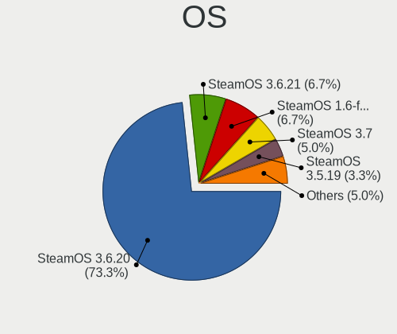
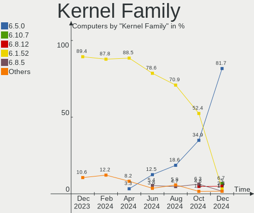
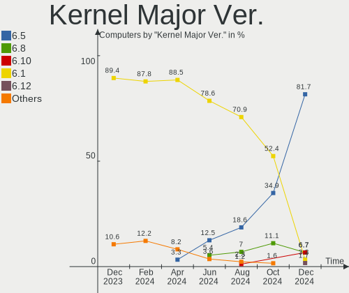
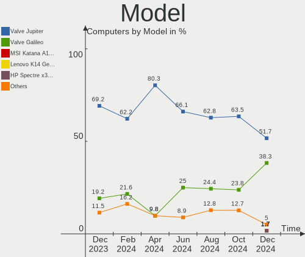
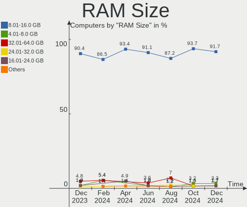
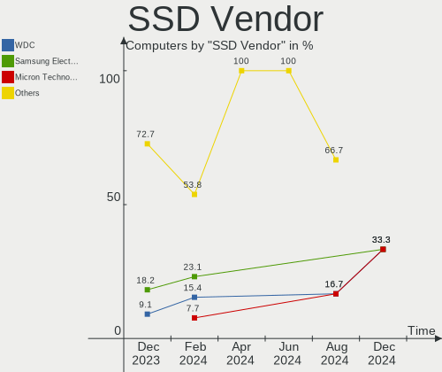
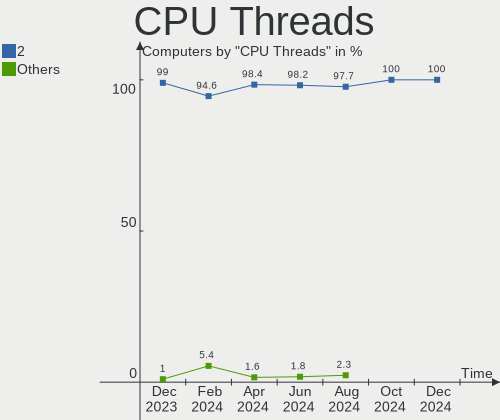
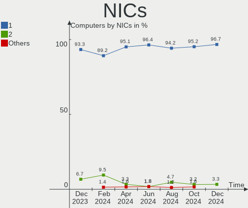
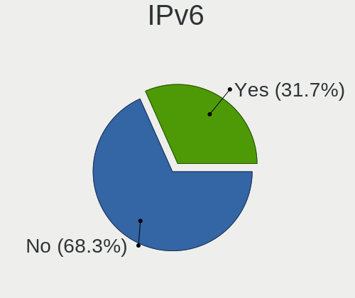
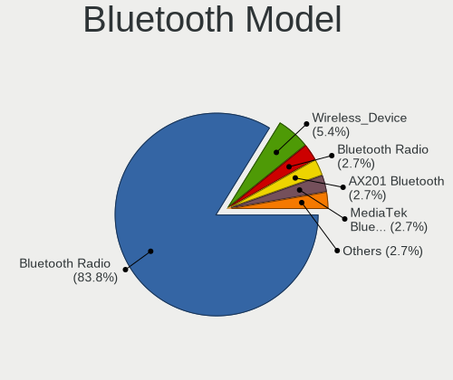

SteamOS - Hardware Trends
-------------------------

A project to identify most popular hardware characteristics and track their change
over time based on data collected by Linux users at https://Linux-Hardware.org.

Anyone can contribute to this report by the [hw-probe](https://github.com/linuxhw/hw-probe) tool:

    sudo -E hw-probe -all -upload

This is a report for all computer types. See also reports for [desktops](/Dist/SteamOS/Desktop/README.md) and [notebooks](/Dist/SteamOS/Notebook/README.md).

This report is for one last month. Overall report since the beginning of time: [TestCoverage](https://github.com/linuxhw/TestCoverage)

Period: Nov, 2022.

Contents
--------

* [ System ](#system)
  - [ OS                       ](#os)
  - [ OS Family                ](#os-family)
  - [ Kernel                   ](#kernel)
  - [ Kernel Family            ](#kernel-family)
  - [ Kernel Major Ver.        ](#kernel-major-ver)
  - [ Arch                     ](#arch)
  - [ DE                       ](#de)
  - [ Display Server           ](#display-server)
  - [ Display Manager          ](#display-manager)
  - [ OS Lang                  ](#os-lang)
  - [ Boot Mode                ](#boot-mode)
  - [ Filesystem               ](#filesystem)
  - [ Part. scheme             ](#part-scheme)
  - [ Dual Boot with Linux/BSD ](#dual-boot-with-linuxbsd)
  - [ Dual Boot (Win)          ](#dual-boot-win)

* [ Board ](#board)
  - [ Vendor                   ](#vendor)
  - [ Model                    ](#model)
  - [ Model Family             ](#model-family)
  - [ MFG Year                 ](#mfg-year)
  - [ Form Factor              ](#form-factor)
  - [ Secure Boot              ](#secure-boot)
  - [ Coreboot                 ](#coreboot)
  - [ RAM Size                 ](#ram-size)
  - [ RAM Used                 ](#ram-used)
  - [ Total Drives             ](#total-drives)
  - [ Has CD-ROM               ](#has-cd-rom)
  - [ Has Ethernet             ](#has-ethernet)
  - [ Has WiFi                 ](#has-wifi)
  - [ Has Bluetooth            ](#has-bluetooth)

* [ Location ](#location)
  - [ Country                  ](#country)
  - [ City                     ](#city)

* [ Drives ](#drives)
  - [ Drive Vendor             ](#drive-vendor)
  - [ Drive Model              ](#drive-model)
  - [ HDD Vendor               ](#hdd-vendor)
  - [ SSD Vendor               ](#ssd-vendor)
  - [ Drive Kind               ](#drive-kind)
  - [ Drive Connector          ](#drive-connector)
  - [ Drive Size               ](#drive-size)
  - [ Space Total              ](#space-total)
  - [ Space Used               ](#space-used)
  - [ Malfunc. Drives          ](#malfunc-drives)
  - [ Malfunc. Drive Vendor    ](#malfunc-drive-vendor)
  - [ Malfunc. HDD Vendor      ](#malfunc-hdd-vendor)
  - [ Malfunc. Drive Kind      ](#malfunc-drive-kind)
  - [ Failed Drives            ](#failed-drives)
  - [ Failed Drive Vendor      ](#failed-drive-vendor)
  - [ Drive Status             ](#drive-status)

* [ Storage controller ](#storage-controller)
  - [ Storage Vendor           ](#storage-vendor)
  - [ Storage Model            ](#storage-model)
  - [ Storage Kind             ](#storage-kind)

* [ Processor ](#processor)
  - [ CPU Vendor               ](#cpu-vendor)
  - [ CPU Model                ](#cpu-model)
  - [ CPU Model Family         ](#cpu-model-family)
  - [ CPU Cores                ](#cpu-cores)
  - [ CPU Sockets              ](#cpu-sockets)
  - [ CPU Threads              ](#cpu-threads)
  - [ CPU Op-Modes             ](#cpu-op-modes)
  - [ CPU Microcode            ](#cpu-microcode)
  - [ CPU Microarch            ](#cpu-microarch)

* [ Graphics ](#graphics)
  - [ GPU Vendor               ](#gpu-vendor)
  - [ GPU Model                ](#gpu-model)
  - [ GPU Combo                ](#gpu-combo)
  - [ GPU Driver               ](#gpu-driver)
  - [ GPU Memory               ](#gpu-memory)

* [ Monitor ](#monitor)
  - [ Monitor Vendor           ](#monitor-vendor)
  - [ Monitor Model            ](#monitor-model)
  - [ Monitor Resolution       ](#monitor-resolution)
  - [ Monitor Diagonal         ](#monitor-diagonal)
  - [ Monitor Width            ](#monitor-width)
  - [ Aspect Ratio             ](#aspect-ratio)
  - [ Monitor Area             ](#monitor-area)
  - [ Pixel Density            ](#pixel-density)
  - [ Multiple Monitors        ](#multiple-monitors)

* [ Network ](#network)
  - [ Net Controller Vendor    ](#net-controller-vendor)
  - [ Net Controller Model     ](#net-controller-model)
  - [ Wireless Vendor          ](#wireless-vendor)
  - [ Wireless Model           ](#wireless-model)
  - [ Ethernet Vendor          ](#ethernet-vendor)
  - [ Ethernet Model           ](#ethernet-model)
  - [ Net Controller Kind      ](#net-controller-kind)
  - [ Used Controller          ](#used-controller)
  - [ NICs                     ](#nics)
  - [ IPv6                     ](#ipv6)

* [ Bluetooth ](#bluetooth)
  - [ Bluetooth Vendor         ](#bluetooth-vendor)
  - [ Bluetooth Model          ](#bluetooth-model)

* [ Sound ](#sound)
  - [ Sound Vendor             ](#sound-vendor)
  - [ Sound Model              ](#sound-model)

* [ Memory ](#memory)
  - [ Memory Vendor            ](#memory-vendor)
  - [ Memory Model             ](#memory-model)
  - [ Memory Kind              ](#memory-kind)
  - [ Memory Form Factor       ](#memory-form-factor)
  - [ Memory Size              ](#memory-size)
  - [ Memory Speed             ](#memory-speed)

* [ Printers & scanners ](#printers--scanners)
  - [ Printer Vendor           ](#printer-vendor)
  - [ Printer Model            ](#printer-model)
  - [ Scanner Vendor           ](#scanner-vendor)
  - [ Scanner Model            ](#scanner-model)

* [ Camera ](#camera)
  - [ Camera Vendor            ](#camera-vendor)
  - [ Camera Model             ](#camera-model)

* [ Security ](#security)
  - [ Fingerprint Vendor       ](#fingerprint-vendor)
  - [ Fingerprint Model        ](#fingerprint-model)
  - [ Chipcard Vendor          ](#chipcard-vendor)
  - [ Chipcard Model           ](#chipcard-model)

* [ Unsupported ](#unsupported)
  - [ Unsupported Devices      ](#unsupported-devices)
  - [ Unsupported Device Types ](#unsupported-device-types)

System
------

OS
--

Installed operating systems

| Name            | Computers | Percent |
|-----------------|-----------|---------|
| SteamOS 3.3.2   | 37        | 53.62%  |
| SteamOS 3.4     | 23        | 33.33%  |
| SteamOS 3.3.1   | 3         | 4.35%   |
| SteamOS Rolling | 2         | 2.9%    |
| SteamOS 3.5     | 2         | 2.9%    |
| SteamOS 3.1     | 1         | 1.45%   |
| SteamOS         | 1         | 1.45%   |

OS Family
---------

OS without a version

| Name    | Computers | Percent |
|---------|-----------|---------|
| SteamOS | 69        | 100%    |

Kernel
------

Version of the Linux kernel

| Version                                        | Computers | Percent |
|------------------------------------------------|-----------|---------|
| 5.13.0-valve21.3-1-neptune                     | 49        | 71.01%  |
| 5.13.0-valve31-1-neptune                       | 11        | 15.94%  |
| 5.13.0-valve21.1-1-neptune-02211-gc54cda5a36f3 | 3         | 4.35%   |
| 5.18.1-arch1_testHoloISO_20220606.1811         | 2         | 2.9%    |
| 6.0.7-zen3-xanmod1-1                           | 1         | 1.45%   |
| 5.15.79-1-lts                                  | 1         | 1.45%   |
| 5.13.0-valve24-1-neptune-02226-g5b8545e4c5a1   | 1         | 1.45%   |
| 5.13.0-valve10.3-1-neptune-02176-g5fe416c4acd8 | 1         | 1.45%   |

Kernel Family
-------------

Linux kernel without a distro release

| Version | Computers | Percent |
|---------|-----------|---------|
| 5.13.0  | 65        | 94.2%   |
| 5.18.1  | 2         | 2.9%    |
| 6.0.7   | 1         | 1.45%   |
| 5.15.79 | 1         | 1.45%   |

Kernel Major Ver.
-----------------

Linux kernel major version

| Version | Computers | Percent |
|---------|-----------|---------|
| 5.13    | 65        | 94.2%   |
| 5.18    | 2         | 2.9%    |
| 6.0     | 1         | 1.45%   |
| 5.15    | 1         | 1.45%   |

Arch
----

OS architecture (x86_64, i586, etc.)

| Name   | Computers | Percent |
|--------|-----------|---------|
| x86_64 | 69        | 100%    |

DE
--

Desktop Environment

| Name    | Computers | Percent |
|---------|-----------|---------|
| KDE5    | 68        | 98.55%  |
| Unknown | 1         | 1.45%   |

Display Server
--------------

X11 or Wayland

| Name    | Computers | Percent |
|---------|-----------|---------|
| X11     | 67        | 97.1%   |
| Tty     | 1         | 1.45%   |
| Unknown | 1         | 1.45%   |

Display Manager
---------------

SDDM, LightDM, etc.

| Name    | Computers | Percent |
|---------|-----------|---------|
| Unknown | 68        | 98.55%  |
| SDDM    | 1         | 1.45%   |

OS Lang
-------

Language

| Lang         | Computers | Percent |
|--------------|-----------|---------|
| en_US        | 55        | 79.71%  |
| en_GB        | 2         | 2.9%    |
| en_DE        | 2         | 2.9%    |
| an_ES        | 2         | 2.9%    |
| zh_CN        | 1         | 1.45%   |
| ru_RU        | 1         | 1.45%   |
| hr_HR        | 1         | 1.45%   |
| fr_FR        | 1         | 1.45%   |
| en_NL        | 1         | 1.45%   |
| en_GB.UTF-12 | 1         | 1.45%   |
| de_DE        | 1         | 1.45%   |
| de_AT        | 1         | 1.45%   |

Boot Mode
---------

EFI or BIOS

| Mode | Computers | Percent |
|------|-----------|---------|
| BIOS | 67        | 97.1%   |
| EFI  | 2         | 2.9%    |

Filesystem
----------

Type of filesystem

| Type  | Computers | Percent |
|-------|-----------|---------|
| Btrfs | 69        | 100%    |

Part. scheme
------------

Scheme of partitioning

| Type    | Computers | Percent |
|---------|-----------|---------|
| Unknown | 66        | 95.65%  |
| GPT     | 3         | 4.35%   |

Dual Boot with Linux/BSD
------------------------

Hosting more than one Linux/BSD

| Dual boot | Computers | Percent |
|-----------|-----------|---------|
| No        | 69        | 100%    |

Dual Boot (Win)
---------------

Hosting Linux and Windows

| Dual boot | Computers | Percent |
|-----------|-----------|---------|
| No        | 68        | 98.55%  |
| Yes       | 1         | 1.45%   |

Board
-----

Vendor
------

Motherboard manufacturer

| Name                | Computers | Percent |
|---------------------|-----------|---------|
| Valve               | 52        | 75.36%  |
| Gigabyte Technology | 3         | 4.35%   |
| ASUSTek Computer    | 3         | 4.35%   |
| MSI                 | 2         | 2.9%    |
| Hewlett-Packard     | 2         | 2.9%    |
| GPD                 | 2         | 2.9%    |
| Apple               | 2         | 2.9%    |
| Lenovo              | 1         | 1.45%   |
| Intel               | 1         | 1.45%   |
| ASRock              | 1         | 1.45%   |

Model
-----

Motherboard model

| Name                                  | Computers | Percent |
|---------------------------------------|-----------|---------|
| Valve Jupiter                         | 52        | 75.36%  |
| GPD G1619-04                          | 2         | 2.9%    |
| MSI MS-7A33                           | 1         | 1.45%   |
| MSI MS-7693                           | 1         | 1.45%   |
| Lenovo ThinkCentre M920x 10S2S00V00   | 1         | 1.45%   |
| Intel NUC8i7HVK                       | 1         | 1.45%   |
| HP ProDesk 405 G4 Desktop Mini        | 1         | 1.45%   |
| HP Pavilion 17                        | 1         | 1.45%   |
| Gigabyte B450M DS3H V2                | 1         | 1.45%   |
| Gigabyte B450 AORUS M                 | 1         | 1.45%   |
| Gigabyte 970A-DS3P FX                 | 1         | 1.45%   |
| ASUS Z170 PRO GAMING                  | 1         | 1.45%   |
| ASUS ROG Zephyrus G15 GA503QR_GA503QR | 1         | 1.45%   |
| ASUS PRIME X570-PRO                   | 1         | 1.45%   |
| ASRock X570 Phantom Gaming-ITX/TB3    | 1         | 1.45%   |
| Apple MacBookPro8,1                   | 1         | 1.45%   |
| Apple MacBookAir6,2                   | 1         | 1.45%   |

Model Family
------------

Motherboard model prefix

| Name               | Computers | Percent |
|--------------------|-----------|---------|
| Valve Jupiter      | 52        | 75.36%  |
| GPD G1619-04       | 2         | 2.9%    |
| MSI MS-7A33        | 1         | 1.45%   |
| MSI MS-7693        | 1         | 1.45%   |
| Lenovo ThinkCentre | 1         | 1.45%   |
| Intel NUC8i7HVK    | 1         | 1.45%   |
| HP ProDesk         | 1         | 1.45%   |
| HP Pavilion        | 1         | 1.45%   |
| Gigabyte B450M     | 1         | 1.45%   |
| Gigabyte B450      | 1         | 1.45%   |
| Gigabyte 970A-DS3P | 1         | 1.45%   |
| ASUS Z170          | 1         | 1.45%   |
| ASUS ROG           | 1         | 1.45%   |
| ASUS PRIME         | 1         | 1.45%   |
| ASRock X570        | 1         | 1.45%   |
| Apple MacBookPro8  | 1         | 1.45%   |
| Apple MacBookAir6  | 1         | 1.45%   |

MFG Year
--------

Motherboard manufacture year

| Year | Computers | Percent |
|------|-----------|---------|
| 2022 | 55        | 79.71%  |
| 2021 | 2         | 2.9%    |
| 2019 | 2         | 2.9%    |
| 2018 | 2         | 2.9%    |
| 2017 | 2         | 2.9%    |
| 2013 | 2         | 2.9%    |
| 2020 | 1         | 1.45%   |
| 2015 | 1         | 1.45%   |
| 2012 | 1         | 1.45%   |
| 2011 | 1         | 1.45%   |

Form Factor
-----------

Physical design of the computer

| Name     | Computers | Percent |
|----------|-----------|---------|
| Notebook | 58        | 84.06%  |
| Desktop  | 9         | 13.04%  |
| Mini pc  | 2         | 2.9%    |

Secure Boot
-----------

Enabled or disabled

| State    | Computers | Percent |
|----------|-----------|---------|
| Disabled | 69        | 100%    |

Coreboot
--------

Have coreboot on board

| Used | Computers | Percent |
|------|-----------|---------|
| No   | 69        | 100%    |

RAM Size
--------

Total RAM memory

| Size in GB | Computers | Percent |
|------------|-----------|---------|
| 8.01-16.0  | 57        | 82.61%  |
| 16.01-24.0 | 7         | 10.14%  |
| 24.01-32.0 | 2         | 2.9%    |
| 4.01-8.0   | 1         | 1.45%   |
| 32.01-64.0 | 1         | 1.45%   |
| 3.01-4.0   | 1         | 1.45%   |

RAM Used
--------

Used RAM memory

| Used GB   | Computers | Percent |
|-----------|-----------|---------|
| 2.01-3.0  | 34        | 49.28%  |
| 3.01-4.0  | 13        | 18.84%  |
| 4.01-8.0  | 11        | 15.94%  |
| 1.01-2.0  | 10        | 14.49%  |
| 8.01-16.0 | 1         | 1.45%   |

Total Drives
------------

Number of drives on board

| Drives | Computers | Percent |
|--------|-----------|---------|
| 2      | 51        | 73.91%  |
| 1      | 14        | 20.29%  |
| 3      | 2         | 2.9%    |
| 5      | 1         | 1.45%   |
| 0      | 1         | 1.45%   |

Has CD-ROM
----------

Has CD-ROM on board

| Presented | Computers | Percent |
|-----------|-----------|---------|
| No        | 66        | 95.65%  |
| Yes       | 3         | 4.35%   |

Has Ethernet
------------

Has Ethernet on board

| Presented | Computers | Percent |
|-----------|-----------|---------|
| No        | 39        | 56.52%  |
| Yes       | 30        | 43.48%  |

Has WiFi
--------

Has WiFi module

| Presented | Computers | Percent |
|-----------|-----------|---------|
| Yes       | 66        | 95.65%  |
| No        | 3         | 4.35%   |

Has Bluetooth
-------------

Has Bluetooth module

| Presented | Computers | Percent |
|-----------|-----------|---------|
| Yes       | 63        | 91.3%   |
| No        | 6         | 8.7%    |

Location
--------

Country
-------

Geographic location (country)

| Country     | Computers | Percent |
|-------------|-----------|---------|
| USA         | 26        | 37.68%  |
| UK          | 9         | 13.04%  |
| Netherlands | 5         | 7.25%   |
| Germany     | 5         | 7.25%   |
| Spain       | 4         | 5.8%    |
| Romania     | 2         | 2.9%    |
| Poland      | 2         | 2.9%    |
| China       | 2         | 2.9%    |
| Austria     | 2         | 2.9%    |
| Russia      | 1         | 1.45%   |
| Moldova     | 1         | 1.45%   |
| Mexico      | 1         | 1.45%   |
| Ireland     | 1         | 1.45%   |
| Indonesia   | 1         | 1.45%   |
| Hungary     | 1         | 1.45%   |
| Hong Kong   | 1         | 1.45%   |
| France      | 1         | 1.45%   |
| Estonia     | 1         | 1.45%   |
| Denmark     | 1         | 1.45%   |
| Brazil      | 1         | 1.45%   |
| Australia   | 1         | 1.45%   |

City
----

Geographic location (city)

| City                   | Computers | Percent |
|------------------------|-----------|---------|
| Valencia               | 2         | 2.9%    |
| Nottingham             | 2         | 2.9%    |
| Madrid                 | 2         | 2.9%    |
| Winston-Salem          | 1         | 1.45%   |
| Wijdewormer            | 1         | 1.45%   |
| Virginia               | 1         | 1.45%   |
| Tvardița              | 1         | 1.45%   |
| Tijuana                | 1         | 1.45%   |
| Tallinn                | 1         | 1.45%   |
| Sydney                 | 1         | 1.45%   |
| Streatham              | 1         | 1.45%   |
| Stafford               | 1         | 1.45%   |
| South Holland          | 1         | 1.45%   |
| Slidell                | 1         | 1.45%   |
| Sint Pancras           | 1         | 1.45%   |
| Schwenksville          | 1         | 1.45%   |
| Sao Paulo              | 1         | 1.45%   |
| Salford                | 1         | 1.45%   |
| Royal Leamington Spa   | 1         | 1.45%   |
| Rotterdam              | 1         | 1.45%   |
| Risskov                | 1         | 1.45%   |
| Queens                 | 1         | 1.45%   |
| Puyallup               | 1         | 1.45%   |
| Puchberg am Schneeberg | 1         | 1.45%   |
| Paris                  | 1         | 1.45%   |
| Oxford                 | 1         | 1.45%   |
| Oklahoma City          | 1         | 1.45%   |
| Ogden                  | 1         | 1.45%   |
| Norfolk                | 1         | 1.45%   |
| Newcastle upon Tyne    | 1         | 1.45%   |
| Moscow                 | 1         | 1.45%   |
| Melrose                | 1         | 1.45%   |
| Maplewood              | 1         | 1.45%   |
| Loveland               | 1         | 1.45%   |
| London                 | 1         | 1.45%   |
| Lodz                   | 1         | 1.45%   |
| Leipzig                | 1         | 1.45%   |
| Lehi                   | 1         | 1.45%   |
| Kowloon                | 1         | 1.45%   |
| Johnstone              | 1         | 1.45%   |

Drives
------

Drive Vendor
------------

Hard drive vendors

| Vendor                         | Computers | Drives | Percent |
|--------------------------------|-----------|--------|---------|
| Unknown                        | 32        | 32     | 25.81%  |
| Phison Electronics             | 15        | 15     | 12.1%   |
| Kingston Technology Company    | 15        | 15     | 12.1%   |
| Unknown                        | 13        | 13     | 10.48%  |
| Samsung Electronics            | 8         | 8      | 6.45%   |
| O2 Micro                       | 8         | 8      | 6.45%   |
| Sandisk                        | 7         | 8      | 5.65%   |
| SK hynix                       | 6         | 6      | 4.84%   |
| Crucial                        | 4         | 4      | 3.23%   |
| KIOXIA                         | 2         | 2      | 1.61%   |
| Kingston                       | 2         | 2      | 1.61%   |
| Apple                          | 2         | 2      | 1.61%   |
| WDC                            | 1         | 1      | 0.81%   |
| Solid State Storage Technology | 1         | 1      | 0.81%   |
| Silicon Motion                 | 1         | 2      | 0.81%   |
| Seagate                        | 1         | 1      | 0.81%   |
| Phison                         | 1         | 1      | 0.81%   |
| KingSpec                       | 1         | 1      | 0.81%   |
| Intel                          | 1         | 1      | 0.81%   |
| Corsair                        | 1         | 1      | 0.81%   |
| China                          | 1         | 2      | 0.81%   |
| ADATA Technology               | 1         | 2      | 0.81%   |

Drive Model
-----------

Hard drive models

| Model                                                 | Computers | Percent |
|-------------------------------------------------------|-----------|---------|
| Unknown MMC Card  512GB                               | 15        | 11.9%   |
| Kingston Company OM3PDP3 NVMe SSD 256GB               | 15        | 11.9%   |
| Phison PS5013 E13 NVMe Controller 256GB               | 14        | 11.11%  |
| Unknown                                               | 13        | 10.32%  |
| O2 Micro E2M2 64GB                                    | 8         | 6.35%   |
| Unknown MMC Card  256GB                               | 7         | 5.56%   |
| Unknown MMC Card  128GB                               | 3         | 2.38%   |
| Samsung MZ9LQ256HBJD-00BVL 256GB                      | 3         | 2.38%   |
| Unknown MMC Card  500GB                               | 2         | 1.59%   |
| Unknown MMC Card  393GB                               | 2         | 1.59%   |
| SK hynix BC711 NVMe 256GB                             | 2         | 1.59%   |
| Sandisk PC SN530 NVMe WDC 256GB                       | 2         | 1.59%   |
| WDC WD10EZEX-08WN4A0 1TB                              | 1         | 0.79%   |
| Unknown MMC Card  997GB                               | 1         | 0.79%   |
| Unknown MMC Card  536GB                               | 1         | 0.79%   |
| Unknown MMC Card  498GB                               | 1         | 0.79%   |
| Solid State Storage SSSTC XA1-311024 930GB            | 1         | 0.79%   |
| SK hynix SKHynix_HFM001TD3HX015N 1024GB               | 1         | 0.79%   |
| SK hynix HFM001TD3JX013N 1024GB                       | 1         | 0.79%   |
| SK hynix BC711 NVMe 512GB                             | 1         | 0.79%   |
| SK hynix BC511 512GB                                  | 1         | 0.79%   |
| Silicon Motion SM2263EN/SM2263XT SSD Controller 128GB | 1         | 0.79%   |
| Silicon Motion SM2262/SM2262EN SSD Controller 1TB     | 1         | 0.79%   |
| Seagate ST500LM021-1KJ152 500GB                       | 1         | 0.79%   |
| Sandisk WD_BLACK SN770 2TB                            | 1         | 0.79%   |
| Sandisk WDC PC SN530 SDBPTPZ-1T00 1024GB              | 1         | 0.79%   |
| Sandisk WD PC SN740 SDDPTQE-2T00 2TB                  | 1         | 0.79%   |
| Sandisk WD Blue SN570 1TB                             | 1         | 0.79%   |
| Sandisk WD Blue SN550 NVMe SSD 1TB                    | 1         | 0.79%   |
| SanDisk SDSSDA240G 240GB                              | 1         | 0.79%   |
| Samsung SSD 970 EVO Plus 1TB                          | 1         | 0.79%   |
| Samsung SSD 850 EVO 250GB                             | 1         | 0.79%   |
| Samsung NVMe SSD Controller SM981/PM981/PM983 1TB     | 1         | 0.79%   |
| Samsung MZ9LQ512HBLU-00BVL 512GB                      | 1         | 0.79%   |
| Samsung MZ9LQ512HBLU-00B 512GB                        | 1         | 0.79%   |
| Phison NVMe SSD Drive 512GB                           | 1         | 0.79%   |
| Phison Force MP300 120GB                              | 1         | 0.79%   |
| KIOXIA KBG40ZNS512G NVMe 512GB                        | 1         | 0.79%   |
| KIOXIA KBG40ZNS256G NVMe 256GB                        | 1         | 0.79%   |
| Kingston SNVS1000G 1TB                                | 1         | 0.79%   |

HDD Vendor
----------

Hard disk drive vendors

| Vendor  | Computers | Drives | Percent |
|---------|-----------|--------|---------|
| WDC     | 1         | 1      | 33.33%  |
| Seagate | 1         | 1      | 33.33%  |
| Apple   | 1         | 1      | 33.33%  |

SSD Vendor
----------

Solid state drive vendors

| Vendor              | Computers | Drives | Percent |
|---------------------|-----------|--------|---------|
| Crucial             | 4         | 4      | 30.77%  |
| Samsung Electronics | 2         | 2      | 15.38%  |
| SanDisk             | 1         | 1      | 7.69%   |
| Kingston            | 1         | 1      | 7.69%   |
| KingSpec            | 1         | 1      | 7.69%   |
| Intel               | 1         | 1      | 7.69%   |
| Corsair             | 1         | 1      | 7.69%   |
| China               | 1         | 2      | 7.69%   |
| Apple               | 1         | 1      | 7.69%   |

Drive Kind
----------

HDD or SSD

| Kind | Computers | Drives | Percent |
|------|-----------|--------|---------|
| NVMe | 62        | 66     | 52.1%   |
| MMC  | 44        | 45     | 36.97%  |
| SSD  | 10        | 14     | 8.4%    |
| HDD  | 3         | 3      | 2.52%   |

Drive Connector
---------------

SATA, SAS, NVMe, etc.

| Type | Computers | Drives | Percent |
|------|-----------|--------|---------|
| NVMe | 62        | 66     | 52.54%  |
| MMC  | 44        | 45     | 37.29%  |
| SATA | 11        | 16     | 9.32%   |
| SAS  | 1         | 1      | 0.85%   |

Drive Size
----------

Size of hard drive

| Size in TB | Computers | Drives | Percent |
|------------|-----------|--------|---------|
| 0.01-0.5   | 8         | 12     | 66.67%  |
| 0.51-1.0   | 4         | 5      | 33.33%  |

Space Total
-----------

Amount of disk space available on the file system

| Size in GB     | Computers | Percent |
|----------------|-----------|---------|
| 101-250        | 25        | 36.23%  |
| 251-500        | 20        | 28.99%  |
| 501-1000       | 10        | 14.49%  |
| 51-100         | 8         | 11.59%  |
| 1001-2000      | 5         | 7.25%   |
| More than 3000 | 1         | 1.45%   |

Space Used
----------

Amount of used disk space

| Used GB        | Computers | Percent |
|----------------|-----------|---------|
| 101-250        | 19        | 27.54%  |
| 251-500        | 12        | 17.39%  |
| 21-50          | 10        | 14.49%  |
| 1-20           | 10        | 14.49%  |
| 501-1000       | 7         | 10.14%  |
| 51-100         | 7         | 10.14%  |
| 1001-2000      | 3         | 4.35%   |
| More than 3000 | 1         | 1.45%   |

Malfunc. Drives
---------------

Drive models with a malfunction

Zero info for selected period =(

Malfunc. Drive Vendor
---------------------

Vendors of faulty drives

Zero info for selected period =(

Malfunc. HDD Vendor
-------------------

Vendors of faulty HDD drives

Zero info for selected period =(

Malfunc. Drive Kind
-------------------

Kinds of faulty drives

Zero info for selected period =(

Failed Drives
-------------

Failed drive models

Zero info for selected period =(

Failed Drive Vendor
-------------------

Failed drive vendors

Zero info for selected period =(

Drive Status
------------

Number of failed and malfunc. drives

| Status   | Computers | Drives | Percent |
|----------|-----------|--------|---------|
| Detected | 67        | 125    | 97.1%   |
| Works    | 2         | 3      | 2.9%    |

Storage controller
------------------

Storage Vendor
--------------

Storage controller vendors

| Vendor                         | Computers | Percent |
|--------------------------------|-----------|---------|
| Phison Electronics             | 16        | 20.78%  |
| Kingston Technology Company    | 16        | 20.78%  |
| AMD                            | 9         | 11.69%  |
| O2 Micro                       | 8         | 10.39%  |
| Samsung Electronics            | 7         | 9.09%   |
| SK hynix                       | 6         | 7.79%   |
| SanDisk                        | 6         | 7.79%   |
| Intel                          | 3         | 3.9%    |
| KIOXIA                         | 2         | 2.6%    |
| Solid State Storage Technology | 1         | 1.3%    |
| Silicon Motion                 | 1         | 1.3%    |
| Marvell Technology Group       | 1         | 1.3%    |
| ADATA Technology               | 1         | 1.3%    |

Storage Model
-------------

Storage controller models

| Model                                                                         | Computers | Percent |
|-------------------------------------------------------------------------------|-----------|---------|
| Kingston Company OM3PDP3 NVMe SSD                                             | 15        | 18.75%  |
| Phison PS5013 E13 NVMe Controller                                             | 14        | 17.5%   |
| O2 Micro Non-Volatile memory controller                                       | 8         | 10%     |
| Samsung NVMe SSD Controller 980                                               | 6         | 7.5%    |
| SK hynix Gold P31/PC711 NVMe Solid State Drive                                | 5         | 6.25%   |
| AMD FCH SATA Controller [AHCI mode]                                           | 5         | 6.25%   |
| SanDisk Non-Volatile memory controller                                        | 4         | 5%      |
| KIOXIA NVMe SSD Controller BG4                                                | 2         | 2.5%    |
| AMD SB7x0/SB8x0/SB9x0 SATA Controller [AHCI mode]                             | 2         | 2.5%    |
| AMD 400 Series Chipset SATA Controller                                        | 2         | 2.5%    |
| Solid State Storage Non-Volatile memory controller                            | 1         | 1.25%   |
| SK hynix BC511                                                                | 1         | 1.25%   |
| Silicon Motion SM2263EN/SM2263XT SSD Controller                               | 1         | 1.25%   |
| Silicon Motion SM2262/SM2262EN SSD Controller                                 | 1         | 1.25%   |
| SanDisk WD Blue SN570 NVMe SSD                                                | 1         | 1.25%   |
| SanDisk WD Blue SN550 NVMe SSD                                                | 1         | 1.25%   |
| Samsung NVMe SSD Controller SM981/PM981/PM983                                 | 1         | 1.25%   |
| Phison NVMe Storage Controller                                                | 1         | 1.25%   |
| Phison E12 NVMe Controller                                                    | 1         | 1.25%   |
| Marvell Group 88SS9183 PCIe SSD Controller                                    | 1         | 1.25%   |
| Kingston Company SNVS2000G [NV1 NVMe PCIe SSD 2TB]                            | 1         | 1.25%   |
| Intel Q170/Q150/B150/H170/H110/Z170/CM236 Chipset SATA Controller [AHCI Mode] | 1         | 1.25%   |
| Intel Cannon Lake PCH SATA AHCI Controller                                    | 1         | 1.25%   |
| Intel 6 Series/C200 Series Chipset Family 6 port Mobile SATA AHCI Controller  | 1         | 1.25%   |
| AMD X370 Series Chipset SATA Controller                                       | 1         | 1.25%   |
| AMD 300 Series Chipset SATA Controller                                        | 1         | 1.25%   |
| ADATA XPG SX8200 Pro PCIe Gen3x4 M.2 2280 Solid State Drive                   | 1         | 1.25%   |

Storage Kind
------------

Kind of storage controller (IDE, SATA, NVMe, SAS, ...)

| Kind | Computers | Percent |
|------|-----------|---------|
| NVMe | 63        | 82.89%  |
| SATA | 13        | 17.11%  |

Processor
---------

CPU Vendor
----------

Processor vendors

| Vendor | Computers | Percent |
|--------|-----------|---------|
| AMD    | 64        | 92.75%  |
| Intel  | 5         | 7.25%   |

CPU Model
---------

Processor models

| Model                                          | Computers | Percent |
|------------------------------------------------|-----------|---------|
| AMD Custom APU 0405                            | 52        | 75.36%  |
| AMD Ryzen 7 6800U with Radeon Graphics         | 2         | 2.9%    |
| Intel Core i7-8809G CPU @ 3.10GHz              | 1         | 1.45%   |
| Intel Core i7-6700K CPU @ 4.00GHz              | 1         | 1.45%   |
| Intel Core i5-4260U CPU @ 1.40GHz              | 1         | 1.45%   |
| Intel Core i5-2435M CPU @ 2.40GHz              | 1         | 1.45%   |
| Intel Core i3-8100 CPU @ 3.60GHz               | 1         | 1.45%   |
| AMD Ryzen 9 5900HS with Radeon Graphics        | 1         | 1.45%   |
| AMD Ryzen 9 3900XT 12-Core Processor           | 1         | 1.45%   |
| AMD Ryzen 7 3700X 8-Core Processor             | 1         | 1.45%   |
| AMD Ryzen 5 PRO 2400GE w/ Radeon Vega Graphics | 1         | 1.45%   |
| AMD Ryzen 5 5600G with Radeon Graphics         | 1         | 1.45%   |
| AMD Ryzen 5 3400G with Radeon Vega Graphics    | 1         | 1.45%   |
| AMD Ryzen 5 2600 Six-Core Processor            | 1         | 1.45%   |
| AMD FX-8370 Eight-Core Processor               | 1         | 1.45%   |
| AMD FX-6300 Six-Core Processor                 | 1         | 1.45%   |
| AMD A10-5750M APU with Radeon HD Graphics      | 1         | 1.45%   |

CPU Model Family
----------------

Processor model prefix

| Model           | Computers | Percent |
|-----------------|-----------|---------|
| Other           | 52        | 75.36%  |
| AMD Ryzen 7     | 3         | 4.35%   |
| AMD Ryzen 5     | 3         | 4.35%   |
| Intel Core i7   | 2         | 2.9%    |
| Intel Core i5   | 2         | 2.9%    |
| AMD Ryzen 9     | 2         | 2.9%    |
| AMD FX          | 2         | 2.9%    |
| Intel Core i3   | 1         | 1.45%   |
| AMD Ryzen 5 PRO | 1         | 1.45%   |
| AMD A10         | 1         | 1.45%   |

CPU Cores
---------

Number of processor cores

| Number | Computers | Percent |
|--------|-----------|---------|
| 4      | 58        | 84.06%  |
| 8      | 4         | 5.8%    |
| 2      | 3         | 4.35%   |
| 6      | 2         | 2.9%    |
| 12     | 1         | 1.45%   |
| 3      | 1         | 1.45%   |

CPU Sockets
-----------

Number of sockets

| Number | Computers | Percent |
|--------|-----------|---------|
| 1      | 69        | 100%    |

CPU Threads
-----------

Threads per core (Hyper-Threading)

| Number | Computers | Percent |
|--------|-----------|---------|
| 2      | 67        | 97.1%   |
| 1      | 2         | 2.9%    |

CPU Op-Modes
------------

CPU Operation Modes (32-bit, 64-bit)

| Op mode        | Computers | Percent |
|----------------|-----------|---------|
| 32-bit, 64-bit | 69        | 100%    |

CPU Microcode
-------------

Microcode number

| Number     | Computers | Percent |
|------------|-----------|---------|
| Unknown    | 67        | 97.1%   |
| 0x906e9    | 1         | 1.45%   |
| 0x0a50000c | 1         | 1.45%   |

CPU Microarch
-------------

Microarchitecture

| Name        | Computers | Percent |
|-------------|-----------|---------|
| Unknown     | 54        | 78.26%  |
| Piledriver  | 3         | 4.35%   |
| Zen+        | 2         | 2.9%    |
| Zen 3       | 2         | 2.9%    |
| Zen 2       | 2         | 2.9%    |
| KabyLake    | 2         | 2.9%    |
| Zen         | 1         | 1.45%   |
| Skylake     | 1         | 1.45%   |
| SandyBridge | 1         | 1.45%   |
| Haswell     | 1         | 1.45%   |

Graphics
--------

GPU Vendor
----------

Vendors of graphics cards

| Vendor | Computers | Percent |
|--------|-----------|---------|
| AMD    | 62        | 86.11%  |
| Nvidia | 6         | 8.33%   |
| Intel  | 4         | 5.56%   |

GPU Model
---------

Graphics card models

| Model                                                                     | Computers | Percent |
|---------------------------------------------------------------------------|-----------|---------|
| AMD VanGogh [AMD Custom GPU 0405]                                         | 52        | 72.22%  |
| AMD Rembrandt [Radeon 680M]                                               | 2         | 2.78%   |
| Nvidia TU106 [GeForce RTX 2060 SUPER]                                     | 1         | 1.39%   |
| Nvidia TU104 [GeForce RTX 2080 Rev. A]                                    | 1         | 1.39%   |
| Nvidia GP108 [GeForce GT 1030]                                            | 1         | 1.39%   |
| Nvidia GP104 [GeForce GTX 1070]                                           | 1         | 1.39%   |
| Nvidia GA104M [GeForce RTX 3070 Mobile / Max-Q]                           | 1         | 1.39%   |
| Nvidia GA104 [GeForce RTX 3070 Ti]                                        | 1         | 1.39%   |
| Intel HD Graphics 530                                                     | 1         | 1.39%   |
| Intel Haswell-ULT Integrated Graphics Controller                          | 1         | 1.39%   |
| Intel CoffeeLake-S GT2 [UHD Graphics 630]                                 | 1         | 1.39%   |
| Intel 2nd Generation Core Processor Family Integrated Graphics Controller | 1         | 1.39%   |
| AMD Vega 10 XL/XT [Radeon RX Vega 56/64]                                  | 1         | 1.39%   |
| AMD Richland [Radeon HD 8650G]                                            | 1         | 1.39%   |
| AMD Raven Ridge [Radeon Vega Series / Radeon Vega Mobile Series]          | 1         | 1.39%   |
| AMD Polaris 22 XT [Radeon RX Vega M GH]                                   | 1         | 1.39%   |
| AMD Picasso/Raven 2 [Radeon Vega Series / Radeon Vega Mobile Series]      | 1         | 1.39%   |
| AMD Navi 22 [Radeon RX 6700/6700 XT/6750 XT / 6800M]                      | 1         | 1.39%   |
| AMD Cezanne [Radeon Vega Series / Radeon Vega Mobile Series]              | 1         | 1.39%   |
| AMD Baffin [Radeon RX 460/560D / Pro 450/455/460/555/555X/560/560X]       | 1         | 1.39%   |

GPU Combo
---------

Combinations of graphics cards

| Name           | Computers | Percent |
|----------------|-----------|---------|
| 1 x AMD        | 60        | 86.96%  |
| 1 x Nvidia     | 3         | 4.35%   |
| 1 x Intel      | 3         | 4.35%   |
| AMD + Nvidia   | 2         | 2.9%    |
| Intel + Nvidia | 1         | 1.45%   |

GPU Driver
----------

Free vs proprietary

| Driver      | Computers | Percent |
|-------------|-----------|---------|
| Free        | 64        | 92.75%  |
| Proprietary | 5         | 7.25%   |

GPU Memory
----------

Total video memory

| Size in GB | Computers | Percent |
|------------|-----------|---------|
| Unknown    | 64        | 92.75%  |
| 7.01-8.0   | 3         | 4.35%   |
| 3.01-4.0   | 1         | 1.45%   |
| 0.01-0.5   | 1         | 1.45%   |

Monitor
-------

Monitor Vendor
--------------

Monitor vendors

| Vendor               | Computers | Percent |
|----------------------|-----------|---------|
| Analogix             | 39        | 46.99%  |
| Valve                | 14        | 16.87%  |
| Goldstar             | 4         | 4.82%   |
| AOC                  | 3         | 3.61%   |
| ViewSonic            | 2         | 2.41%   |
| JDI                  | 2         | 2.41%   |
| Hitachi              | 2         | 2.41%   |
| Apple                | 2         | 2.41%   |
| Vizio                | 1         | 1.2%    |
| Sony                 | 1         | 1.2%    |
| SANYO                | 1         | 1.2%    |
| Samsung Electronics  | 1         | 1.2%    |
| RTK                  | 1         | 1.2%    |
| NRL                  | 1         | 1.2%    |
| INNOCN               | 1         | 1.2%    |
| HJW                  | 1         | 1.2%    |
| Gateway              | 1         | 1.2%    |
| Dell                 | 1         | 1.2%    |
| Chimei Innolux       | 1         | 1.2%    |
| BenQ                 | 1         | 1.2%    |
| AU Optronics         | 1         | 1.2%    |
| ASUSTek Computer     | 1         | 1.2%    |
| Ancor Communications | 1         | 1.2%    |

Monitor Model
-------------

Monitor models

| Model                                                                 | Computers | Percent |
|-----------------------------------------------------------------------|-----------|---------|
| Analogix ANX7530 U ANX7539 800x1280                                   | 39        | 46.43%  |
| Valve ANX7530 U VLV3001 800x1280 100x150mm 7.1-inch                   | 14        | 16.67%  |
| JDI GPD1001H JDI0031 2560x1600 890x500mm 40.2-inch                    | 2         | 2.38%   |
| Hitachi HISENSE HEC0030 3840x2160 1872x1053mm 84.6-inch               | 2         | 2.38%   |
| Vizio E50-C1 VIZ1004 1920x1080 1095x616mm 49.5-inch                   | 1         | 1.19%   |
| ViewSonic VX2858Sml VSCD02F 1920x1080 621x341mm 27.9-inch             | 1         | 1.19%   |
| ViewSonic VX2718-2KPC VSCB73A 2560x1440 598x336mm 27.0-inch           | 1         | 1.19%   |
| Sony TV *00 SNYF303 1920x1080 1218x685mm 55.0-inch                    | 1         | 1.19%   |
| SANYO LCD SAN0B75 1280x720                                            | 1         | 1.19%   |
| Samsung Electronics LCD Monitor SAM7103 3840x2160 700x390mm 31.5-inch | 1         | 1.19%   |
| RTK FHD RTK2A3B 1920x1080 597x336mm 27.0-inch                         | 1         | 1.19%   |
| NRL nreal air NRL3132 1920x1080 1920x1080mm 86.7-inch                 | 1         | 1.19%   |
| INNOCN 15A1F IOC1560 1920x1080 344x193mm 15.5-inch                    | 1         | 1.19%   |
| HJW MACROSILICON HJW1836 1680x1050 530x290mm 23.8-inch                | 1         | 1.19%   |
| Goldstar ULTRAWIDE GSM5AFB 2560x1080 798x334mm 34.1-inch              | 1         | 1.19%   |
| Goldstar HDR WFHD GSM7714 2560x1080 798x334mm 34.1-inch               | 1         | 1.19%   |
| Goldstar 38GN950 GSM7753 3840x1600 879x366mm 37.5-inch                | 1         | 1.19%   |
| Goldstar 27GN7 GSM5B8D 1920x1080 600x303mm 26.5-inch                  | 1         | 1.19%   |
| Goldstar 22M45 GSM5A36 1920x1080 480x270mm 21.7-inch                  | 1         | 1.19%   |
| Gateway GTW KX2303 GTW037D 1920x1080 509x286mm 23.0-inch              | 1         | 1.19%   |
| Dell U2719DC DEL417E 2560x1440 597x336mm 27.0-inch                    | 1         | 1.19%   |
| Chimei Innolux LCD Monitor CMN152A 2560x1440 344x193mm 15.5-inch      | 1         | 1.19%   |
| BenQ RL2755 BNQ7F41 1920x1080 598x336mm 27.0-inch                     | 1         | 1.19%   |
| AU Optronics LCD Monitor AUO159E 1600x900 382x214mm 17.2-inch         | 1         | 1.19%   |
| ASUSTek Computer ROG PG278QR AUS27B2 2560x1440 598x336mm 27.0-inch    | 1         | 1.19%   |
| Apple Color LCD APP9CDF 1440x900 286x179mm 13.3-inch                  | 1         | 1.19%   |
| Apple Color LCD APP9CC7 1280x800 286x179mm 13.3-inch                  | 1         | 1.19%   |
| AOC Q32G1WG4 AOC3201 2560x1440 697x393mm 31.5-inch                    | 1         | 1.19%   |
| AOC 931Wx AOC1931 1680x1050 440x325mm 21.5-inch                       | 1         | 1.19%   |
| AOC 24P1X AOC2401 1920x1200 518x324mm 24.1-inch                       | 1         | 1.19%   |
| Ancor Communications VE249 ACI2495 1920x1080 531x299mm 24.0-inch      | 1         | 1.19%   |

Monitor Resolution
------------------

Monitor screen resolution

| Resolution         | Computers | Percent |
|--------------------|-----------|---------|
| 800x1280           | 52        | 62.65%  |
| 1920x1080 (FHD)    | 10        | 12.05%  |
| 3840x2160 (4K)     | 5         | 6.02%   |
| 2560x1440 (QHD)    | 5         | 6.02%   |
| 2560x1600          | 2         | 2.41%   |
| 2560x1080          | 2         | 2.41%   |
| 3840x1600          | 1         | 1.2%    |
| 1920x540           | 1         | 1.2%    |
| 1680x1050 (WSXGA+) | 1         | 1.2%    |
| 1600x900 (HD+)     | 1         | 1.2%    |
| 1440x900 (WXGA+)   | 1         | 1.2%    |
| 1400x1050          | 1         | 1.2%    |
| 1280x800 (WXGA)    | 1         | 1.2%    |

Monitor Diagonal
----------------

Diagonal size in inches

| Inches  | Computers | Percent |
|---------|-----------|---------|
| Unknown | 40        | 47.62%  |
| 7       | 14        | 16.67%  |
| 27      | 6         | 7.14%   |
| 84      | 2         | 2.38%   |
| 40      | 2         | 2.38%   |
| 34      | 2         | 2.38%   |
| 24      | 2         | 2.38%   |
| 23      | 2         | 2.38%   |
| 15      | 2         | 2.38%   |
| 13      | 2         | 2.38%   |
| 86      | 1         | 1.19%   |
| 75      | 1         | 1.19%   |
| 49      | 1         | 1.19%   |
| 46      | 1         | 1.19%   |
| 43      | 1         | 1.19%   |
| 37      | 1         | 1.19%   |
| 32      | 1         | 1.19%   |
| 31      | 1         | 1.19%   |
| 21      | 1         | 1.19%   |
| 17      | 1         | 1.19%   |

Monitor Width
-------------

Physical width

| Width in mm | Computers | Percent |
|-------------|-----------|---------|
| Unknown     | 40        | 47.62%  |
| 1-100       | 14        | 16.67%  |
| 501-600     | 8         | 9.52%   |
| 1501-2000   | 4         | 4.76%   |
| 801-900     | 3         | 3.57%   |
| 701-800     | 3         | 3.57%   |
| 601-700     | 3         | 3.57%   |
| 301-350     | 2         | 2.38%   |
| 201-300     | 2         | 2.38%   |
| 1001-1500   | 2         | 2.38%   |
| 401-500     | 1         | 1.19%   |
| 351-400     | 1         | 1.19%   |
| 901-1000    | 1         | 1.19%   |

Aspect Ratio
------------

Proportional relationship between the width and the height

| Ratio | Computers | Percent |
|-------|-----------|---------|
| 0.62  | 39        | 46.43%  |
| 16/9  | 24        | 28.57%  |
| 0.67  | 14        | 16.67%  |
| 21/9  | 3         | 3.57%   |
| 16/10 | 3         | 3.57%   |
| 32/9  | 1         | 1.19%   |

Monitor Area
------------

Area in inch²

| Area in inch² | Computers | Percent |
|----------------|-----------|---------|
| Unknown        | 40        | 47.62%  |
| 1-40           | 14        | 16.67%  |
| 301-350        | 6         | 7.14%   |
| More than 1000 | 5         | 5.95%   |
| 351-500        | 5         | 5.95%   |
| 201-250        | 4         | 4.76%   |
| 501-1000       | 4         | 4.76%   |
| 101-110        | 2         | 2.38%   |
| 81-90          | 1         | 1.19%   |
| 71-80          | 1         | 1.19%   |
| 251-300        | 1         | 1.19%   |
| 121-130        | 1         | 1.19%   |

Pixel Density
-------------

Pixels per inch

| Density | Computers | Percent |
|---------|-----------|---------|
| Unknown | 40        | 48.19%  |
| 161-240 | 15        | 18.07%  |
| 51-100  | 14        | 16.87%  |
| 101-120 | 8         | 9.64%   |
| 1-50    | 4         | 4.82%   |
| 121-160 | 2         | 2.41%   |

Multiple Monitors
-----------------

Total monitors connected

| Total | Computers | Percent |
|-------|-----------|---------|
| 1     | 53        | 76.81%  |
| 2     | 16        | 23.19%  |

Network
-------

Net Controller Vendor
---------------------

Controller vendors

| Vendor                | Computers | Percent |
|-----------------------|-----------|---------|
| Realtek Semiconductor | 60        | 68.97%  |
| Intel                 | 10        | 11.49%  |
| ASIX Electronics      | 10        | 11.49%  |
| TP-Link               | 2         | 2.3%    |
| Ralink Technology     | 2         | 2.3%    |
| OPPO Electronics      | 1         | 1.15%   |
| Broadcom Limited      | 1         | 1.15%   |
| Broadcom              | 1         | 1.15%   |

Net Controller Model
--------------------

Controller models

| Model                                                                                         | Computers | Percent |
|-----------------------------------------------------------------------------------------------|-----------|---------|
| Realtek RTL8822CE 802.11ac PCIe Wireless Network Adapter                                      | 52        | 52.53%  |
| ASIX AX88179 Gigabit Ethernet                                                                 | 10        | 10.1%   |
| Realtek RTL8111/8168/8411 PCI Express Gigabit Ethernet Controller                             | 7         | 7.07%   |
| Realtek RTL8153 Gigabit Ethernet Adapter                                                      | 5         | 5.05%   |
| Intel Wi-Fi 6 AX210/AX211/AX411 160MHz                                                        | 3         | 3.03%   |
| Intel Wi-Fi 6 AX200                                                                           | 3         | 3.03%   |
| Intel I211 Gigabit Network Connection                                                         | 2         | 2.02%   |
| TP-Link Archer T9UH v1 [Realtek RTL8814AU]                                                    | 1         | 1.01%   |
| TP-Link 802.11ac WLAN Adapter                                                                 | 1         | 1.01%   |
| Realtek RTL88x2bu [AC1200 Techkey]                                                            | 1         | 1.01%   |
| Realtek RTL810xE PCI Express Fast Ethernet controller                                         | 1         | 1.01%   |
| Realtek Realtek 8812AU/8821AU 802.11ac WLAN Adapter [USB Wireless Dual-Band Adapter 2.4/5Ghz] | 1         | 1.01%   |
| Ralink RT5372 Wireless Adapter                                                                | 1         | 1.01%   |
| Ralink RT2870/RT3070 Wireless Adapter                                                         | 1         | 1.01%   |
| OPPO SDM665-IDP _SN:18689828                                                                  | 1         | 1.01%   |
| Intel WiFi Link 5100                                                                          | 1         | 1.01%   |
| Intel I210 Gigabit Network Connection                                                         | 1         | 1.01%   |
| Intel Ethernet Connection (7) I219-LM                                                         | 1         | 1.01%   |
| Intel Ethernet Connection (2) I219-V                                                          | 1         | 1.01%   |
| Intel Ethernet Connection (2) I219-LM                                                         | 1         | 1.01%   |
| Intel Dual Band Wireless-AC 3165 Plus Bluetooth                                               | 1         | 1.01%   |
| Broadcom NetXtreme BCM57765 Gigabit Ethernet PCIe                                             | 1         | 1.01%   |
| Broadcom Limited BCM4360 802.11ac Wireless Network Adapter                                    | 1         | 1.01%   |
| Broadcom BCM4331 802.11a/b/g/n                                                                | 1         | 1.01%   |

Wireless Vendor
---------------

Wireless vendors

| Vendor                | Computers | Percent |
|-----------------------|-----------|---------|
| Realtek Semiconductor | 54        | 79.41%  |
| Intel                 | 8         | 11.76%  |
| TP-Link               | 2         | 2.94%   |
| Ralink Technology     | 2         | 2.94%   |
| Broadcom Limited      | 1         | 1.47%   |
| Broadcom              | 1         | 1.47%   |

Wireless Model
--------------

Wireless models

| Model                                                                                         | Computers | Percent |
|-----------------------------------------------------------------------------------------------|-----------|---------|
| Realtek RTL8822CE 802.11ac PCIe Wireless Network Adapter                                      | 52        | 76.47%  |
| Intel Wi-Fi 6 AX210/AX211/AX411 160MHz                                                        | 3         | 4.41%   |
| Intel Wi-Fi 6 AX200                                                                           | 3         | 4.41%   |
| TP-Link Archer T9UH v1 [Realtek RTL8814AU]                                                    | 1         | 1.47%   |
| TP-Link 802.11ac WLAN Adapter                                                                 | 1         | 1.47%   |
| Realtek RTL88x2bu [AC1200 Techkey]                                                            | 1         | 1.47%   |
| Realtek Realtek 8812AU/8821AU 802.11ac WLAN Adapter [USB Wireless Dual-Band Adapter 2.4/5Ghz] | 1         | 1.47%   |
| Ralink RT5372 Wireless Adapter                                                                | 1         | 1.47%   |
| Ralink RT2870/RT3070 Wireless Adapter                                                         | 1         | 1.47%   |
| Intel WiFi Link 5100                                                                          | 1         | 1.47%   |
| Intel Dual Band Wireless-AC 3165 Plus Bluetooth                                               | 1         | 1.47%   |
| Broadcom Limited BCM4360 802.11ac Wireless Network Adapter                                    | 1         | 1.47%   |
| Broadcom BCM4331 802.11a/b/g/n                                                                | 1         | 1.47%   |

Ethernet Vendor
---------------

Ethernet vendors

| Vendor                | Computers | Percent |
|-----------------------|-----------|---------|
| Realtek Semiconductor | 13        | 43.33%  |
| ASIX Electronics      | 10        | 33.33%  |
| Intel                 | 5         | 16.67%  |
| OPPO Electronics      | 1         | 3.33%   |
| Broadcom              | 1         | 3.33%   |

Ethernet Model
--------------

Ethernet models

| Model                                                             | Computers | Percent |
|-------------------------------------------------------------------|-----------|---------|
| ASIX AX88179 Gigabit Ethernet                                     | 10        | 32.26%  |
| Realtek RTL8111/8168/8411 PCI Express Gigabit Ethernet Controller | 7         | 22.58%  |
| Realtek RTL8153 Gigabit Ethernet Adapter                          | 5         | 16.13%  |
| Intel I211 Gigabit Network Connection                             | 2         | 6.45%   |
| Realtek RTL810xE PCI Express Fast Ethernet controller             | 1         | 3.23%   |
| OPPO SDM665-IDP _SN:18689828                                      | 1         | 3.23%   |
| Intel I210 Gigabit Network Connection                             | 1         | 3.23%   |
| Intel Ethernet Connection (7) I219-LM                             | 1         | 3.23%   |
| Intel Ethernet Connection (2) I219-V                              | 1         | 3.23%   |
| Intel Ethernet Connection (2) I219-LM                             | 1         | 3.23%   |
| Broadcom NetXtreme BCM57765 Gigabit Ethernet PCIe                 | 1         | 3.23%   |

Net Controller Kind
-------------------

Ethernet, WiFi or modem

| Kind     | Computers | Percent |
|----------|-----------|---------|
| WiFi     | 66        | 69.47%  |
| Ethernet | 29        | 30.53%  |

Used Controller
---------------

Currently used network controller

| Kind     | Computers | Percent |
|----------|-----------|---------|
| WiFi     | 59        | 78.67%  |
| Ethernet | 16        | 21.33%  |

NICs
----

Total network controllers on board

| Total | Computers | Percent |
|-------|-----------|---------|
| 1     | 62        | 89.86%  |
| 2     | 6         | 8.7%    |
| 3     | 1         | 1.45%   |

IPv6
----

IPv6 vs IPv4

| Used | Computers | Percent |
|------|-----------|---------|
| No   | 45        | 65.22%  |
| Yes  | 24        | 34.78%  |

Bluetooth
---------

Bluetooth Vendor
----------------

Controller vendors

| Vendor                | Computers | Percent |
|-----------------------|-----------|---------|
| IMC Networks          | 52        | 81.25%  |
| Intel                 | 7         | 10.94%  |
| Realtek Semiconductor | 2         | 3.13%   |
| Apple                 | 2         | 3.13%   |
| ASUSTek Computer      | 1         | 1.56%   |

Bluetooth Model
---------------

Controller models

| Model                               | Computers | Percent |
|-------------------------------------|-----------|---------|
| IMC Networks Bluetooth Radio        | 52        | 81.25%  |
| Intel AX210 Bluetooth               | 3         | 4.69%   |
| Intel AX200 Bluetooth               | 3         | 4.69%   |
| Realtek Bluetooth Radio             | 1         | 1.56%   |
| Realtek Bluetooth 5.1 Radio         | 1         | 1.56%   |
| Intel Bluetooth wireless interface  | 1         | 1.56%   |
| ASUS Broadcom BCM20702A0 Bluetooth  | 1         | 1.56%   |
| Apple Bluetooth USB Host Controller | 1         | 1.56%   |
| Apple Bluetooth Host Controller     | 1         | 1.56%   |

Sound
-----

Sound Vendor
------------

Sound card vendors

| Vendor                      | Computers | Percent |
|-----------------------------|-----------|---------|
| AMD                         | 65        | 80.25%  |
| Nvidia                      | 5         | 6.17%   |
| Intel                       | 5         | 6.17%   |
| Logitech                    | 2         | 2.47%   |
| Valve Software              | 1         | 1.23%   |
| Nreal                       | 1         | 1.23%   |
| FiiO Electronics Technology | 1         | 1.23%   |
| Corsair                     | 1         | 1.23%   |

Sound Model
-----------

Sound card models

| Model                                                                      | Computers | Percent |
|----------------------------------------------------------------------------|-----------|---------|
| AMD Rembrandt Radeon High Definition Audio Controller                      | 54        | 58.7%   |
| AMD Family 17h/19h HD Audio Controller                                     | 6         | 6.52%   |
| AMD Starship/Matisse HD Audio Controller                                   | 2         | 2.17%   |
| AMD SBx00 Azalia (Intel HDA)                                               | 2         | 2.17%   |
| AMD Renoir Radeon High Definition Audio Controller                         | 2         | 2.17%   |
| AMD Raven/Raven2/Fenghuang HDMI/DP Audio Controller                        | 2         | 2.17%   |
| Valve Software Valve VR Radio & HMD Mic                                    | 1         | 1.09%   |
| Nvidia TU106 High Definition Audio Controller                              | 1         | 1.09%   |
| Nvidia TU104 HD Audio Controller                                           | 1         | 1.09%   |
| Nvidia GP108 High Definition Audio Controller                              | 1         | 1.09%   |
| Nvidia GP104 High Definition Audio Controller                              | 1         | 1.09%   |
| Nvidia GA104 High Definition Audio Controller                              | 1         | 1.09%   |
| Nreal Air                                                                  | 1         | 1.09%   |
| Logitech PRO X Wireless Gaming Headset                                     | 1         | 1.09%   |
| Logitech G430 Surround Sound Gaming Headset                                | 1         | 1.09%   |
| Intel Haswell-ULT HD Audio Controller                                      | 1         | 1.09%   |
| Intel CM238 HD Audio Controller                                            | 1         | 1.09%   |
| Intel Cannon Lake PCH cAVS                                                 | 1         | 1.09%   |
| Intel 8 Series HD Audio Controller                                         | 1         | 1.09%   |
| Intel 6 Series/C200 Series Chipset Family High Definition Audio Controller | 1         | 1.09%   |
| Intel 100 Series/C230 Series Chipset Family HD Audio Controller            | 1         | 1.09%   |
| FiiO Electronics Technology K3                                             | 1         | 1.09%   |
| Corsair HS70 Pro Wireless Gaming Headset                                   | 1         | 1.09%   |
| AMD Vega 10 HDMI Audio [Radeon Vega 56/64]                                 | 1         | 1.09%   |
| AMD Trinity HDMI Audio Controller                                          | 1         | 1.09%   |
| AMD Polaris 22 HDMI Audio                                                  | 1         | 1.09%   |
| AMD Navi 21/23 HDMI/DP Audio Controller                                    | 1         | 1.09%   |
| AMD FCH Azalia Controller                                                  | 1         | 1.09%   |
| AMD Family 17h (Models 00h-0fh) HD Audio Controller                        | 1         | 1.09%   |
| AMD Baffin HDMI/DP Audio [Radeon RX 550 640SP / RX 560/560X]               | 1         | 1.09%   |

Memory
------

Memory Vendor
-------------

Memory module vendors

| Vendor              | Computers | Percent |
|---------------------|-----------|---------|
| SK hynix            | 1         | 33.33%  |
| Samsung Electronics | 1         | 33.33%  |
| Micron Technology   | 1         | 33.33%  |

Memory Model
------------

Memory module models

| Model                                                  | Computers | Percent |
|--------------------------------------------------------|-----------|---------|
| SK hynix RAM HMA81GS6DJR8N-XN 8GB SODIMM DDR4 3200MT/s | 1         | 33.33%  |
| Samsung RAM M471A1G44AB0-CWE 8GB SODIMM DDR4 3200MT/s  | 1         | 33.33%  |
| Micron RAM 4ATF1G64HZ-3G2E1 8GB SODIMM DDR4 3200MT/s   | 1         | 33.33%  |

Memory Kind
-----------

Memory module kinds

| Kind | Computers | Percent |
|------|-----------|---------|
| DDR4 | 2         | 100%    |

Memory Form Factor
------------------

Physical design of the memory module

| Name   | Computers | Percent |
|--------|-----------|---------|
| SODIMM | 2         | 100%    |

Memory Size
-----------

Memory module size

| Size | Computers | Percent |
|------|-----------|---------|
| 8192 | 2         | 100%    |

Memory Speed
------------

Memory module speed

| Speed | Computers | Percent |
|-------|-----------|---------|
| 3200  | 2         | 100%    |

Printers & scanners
-------------------

Printer Vendor
--------------

Printer device vendors

Zero info for selected period =(

Printer Model
-------------

Printer device models

Zero info for selected period =(

Scanner Vendor
--------------

Scanner device vendors

Zero info for selected period =(

Scanner Model
-------------

Scanner device models

Zero info for selected period =(

Camera
------

Camera Vendor
-------------

Camera device vendors

| Vendor                                 | Computers | Percent |
|----------------------------------------|-----------|---------|
| Apple                                  | 3         | 33.33%  |
| Tripath Technology                     | 2         | 22.22%  |
| Valve Software                         | 1         | 11.11%  |
| Tobii Technology AB                    | 1         | 11.11%  |
| Microdia                               | 1         | 11.11%  |
| Cheng Uei Precision Industry (Foxlink) | 1         | 11.11%  |

Camera Model
------------

Camera device models

| Model                                                                         | Computers | Percent |
|-------------------------------------------------------------------------------|-----------|---------|
| Tripath USB Camera                                                            | 2         | 22.22%  |
| Apple iPhone 5/5C/5S/6/SE                                                     | 2         | 22.22%  |
| Valve Software 3D Camera                                                      | 1         | 11.11%  |
| Tobii AB EyeChip                                                              | 1         | 11.11%  |
| Microdia Webcam Vitade AF                                                     | 1         | 11.11%  |
| Cheng Uei Precision Industry (Foxlink) SunplusIT INC. HP Truevision HD Webcam | 1         | 11.11%  |
| Apple FaceTime HD Camera                                                      | 1         | 11.11%  |

Security
--------

Fingerprint Vendor
------------------

Fingerprint sensor vendors

Zero info for selected period =(

Fingerprint Model
-----------------

Fingerprint sensor models

Zero info for selected period =(

Chipcard Vendor
---------------

Chipcard module vendors

Zero info for selected period =(

Chipcard Model
--------------

Chipcard module models

Zero info for selected period =(

Unsupported
-----------

Unsupported Devices
-------------------

Total unsupported devices on board

| Total | Computers | Percent |
|-------|-----------|---------|
| 0     | 60        | 86.96%  |
| 1     | 7         | 10.14%  |
| 2     | 2         | 2.9%    |

Unsupported Device Types
------------------------

Types of unsupported devices

| Type                  | Computers | Percent |
|-----------------------|-----------|---------|
| Multimedia controller | 5         | 50%     |
| Net/wireless          | 3         | 30%     |
| Storage/nvme          | 1         | 10%     |
| Graphics card         | 1         | 10%     |

