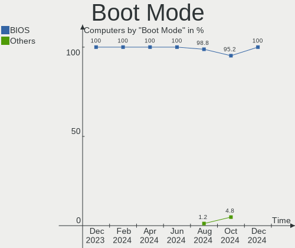
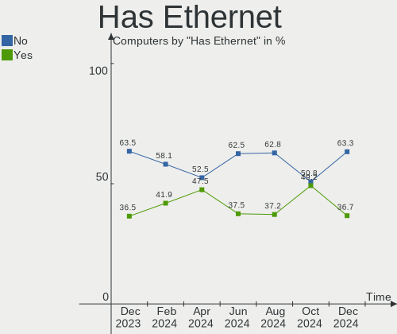
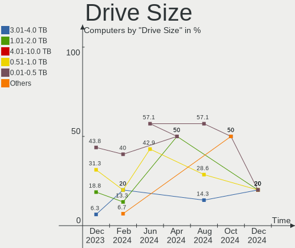
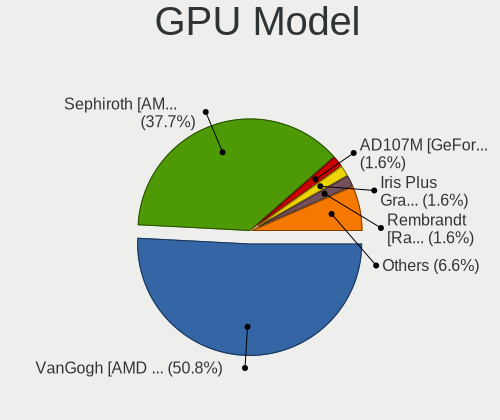

SteamOS - Hardware Trends
-------------------------

A project to identify most popular hardware characteristics and track their change
over time based on data collected by Linux users at https://Linux-Hardware.org.

Anyone can contribute to this report by the [hw-probe](https://github.com/linuxhw/hw-probe) tool:

    sudo -E hw-probe -all -upload

This is a report for all computer types. See also reports for [desktops](/Dist/SteamOS/Desktop/README.md) and [notebooks](/Dist/SteamOS/Notebook/README.md).

This report is for one last month. Overall report since the beginning of time: [TestDays](https://github.com/linuxhw/TestDays)

Period: Apr, 2024.

Contents
--------

* [ System ](#system)
  - [ OS                       ](#os)
  - [ OS Family                ](#os-family)
  - [ Kernel                   ](#kernel)
  - [ Kernel Family            ](#kernel-family)
  - [ Kernel Major Ver.        ](#kernel-major-ver)
  - [ Arch                     ](#arch)
  - [ DE                       ](#de)
  - [ Display Server           ](#display-server)
  - [ Display Manager          ](#display-manager)
  - [ OS Lang                  ](#os-lang)
  - [ Boot Mode                ](#boot-mode)
  - [ Filesystem               ](#filesystem)
  - [ Part. scheme             ](#part-scheme)
  - [ Dual Boot with Linux/BSD ](#dual-boot-with-linuxbsd)
  - [ Dual Boot (Win)          ](#dual-boot-win)

* [ Board ](#board)
  - [ Vendor                   ](#vendor)
  - [ Model                    ](#model)
  - [ Model Family             ](#model-family)
  - [ MFG Year                 ](#mfg-year)
  - [ Form Factor              ](#form-factor)
  - [ Secure Boot              ](#secure-boot)
  - [ Coreboot                 ](#coreboot)
  - [ RAM Size                 ](#ram-size)
  - [ RAM Used                 ](#ram-used)
  - [ Total Drives             ](#total-drives)
  - [ Has CD-ROM               ](#has-cd-rom)
  - [ Has Ethernet             ](#has-ethernet)
  - [ Has WiFi                 ](#has-wifi)
  - [ Has Bluetooth            ](#has-bluetooth)

* [ Location ](#location)
  - [ Country                  ](#country)
  - [ City                     ](#city)

* [ Drives ](#drives)
  - [ Drive Vendor             ](#drive-vendor)
  - [ Drive Model              ](#drive-model)
  - [ HDD Vendor               ](#hdd-vendor)
  - [ SSD Vendor               ](#ssd-vendor)
  - [ Drive Kind               ](#drive-kind)
  - [ Drive Connector          ](#drive-connector)
  - [ Drive Size               ](#drive-size)
  - [ Space Total              ](#space-total)
  - [ Space Used               ](#space-used)
  - [ Malfunc. Drives          ](#malfunc-drives)
  - [ Malfunc. Drive Vendor    ](#malfunc-drive-vendor)
  - [ Malfunc. HDD Vendor      ](#malfunc-hdd-vendor)
  - [ Malfunc. Drive Kind      ](#malfunc-drive-kind)
  - [ Failed Drives            ](#failed-drives)
  - [ Failed Drive Vendor      ](#failed-drive-vendor)
  - [ Drive Status             ](#drive-status)

* [ Storage controller ](#storage-controller)
  - [ Storage Vendor           ](#storage-vendor)
  - [ Storage Model            ](#storage-model)
  - [ Storage Kind             ](#storage-kind)

* [ Processor ](#processor)
  - [ CPU Vendor               ](#cpu-vendor)
  - [ CPU Model                ](#cpu-model)
  - [ CPU Model Family         ](#cpu-model-family)
  - [ CPU Cores                ](#cpu-cores)
  - [ CPU Sockets              ](#cpu-sockets)
  - [ CPU Threads              ](#cpu-threads)
  - [ CPU Op-Modes             ](#cpu-op-modes)
  - [ CPU Microcode            ](#cpu-microcode)
  - [ CPU Microarch            ](#cpu-microarch)

* [ Graphics ](#graphics)
  - [ GPU Vendor               ](#gpu-vendor)
  - [ GPU Model                ](#gpu-model)
  - [ GPU Combo                ](#gpu-combo)
  - [ GPU Driver               ](#gpu-driver)
  - [ GPU Memory               ](#gpu-memory)

* [ Monitor ](#monitor)
  - [ Monitor Vendor           ](#monitor-vendor)
  - [ Monitor Model            ](#monitor-model)
  - [ Monitor Resolution       ](#monitor-resolution)
  - [ Monitor Diagonal         ](#monitor-diagonal)
  - [ Monitor Width            ](#monitor-width)
  - [ Aspect Ratio             ](#aspect-ratio)
  - [ Monitor Area             ](#monitor-area)
  - [ Pixel Density            ](#pixel-density)
  - [ Multiple Monitors        ](#multiple-monitors)

* [ Network ](#network)
  - [ Net Controller Vendor    ](#net-controller-vendor)
  - [ Net Controller Model     ](#net-controller-model)
  - [ Wireless Vendor          ](#wireless-vendor)
  - [ Wireless Model           ](#wireless-model)
  - [ Ethernet Vendor          ](#ethernet-vendor)
  - [ Ethernet Model           ](#ethernet-model)
  - [ Net Controller Kind      ](#net-controller-kind)
  - [ Used Controller          ](#used-controller)
  - [ NICs                     ](#nics)
  - [ IPv6                     ](#ipv6)

* [ Bluetooth ](#bluetooth)
  - [ Bluetooth Vendor         ](#bluetooth-vendor)
  - [ Bluetooth Model          ](#bluetooth-model)

* [ Sound ](#sound)
  - [ Sound Vendor             ](#sound-vendor)
  - [ Sound Model              ](#sound-model)

* [ Memory ](#memory)
  - [ Memory Vendor            ](#memory-vendor)
  - [ Memory Model             ](#memory-model)
  - [ Memory Kind              ](#memory-kind)
  - [ Memory Form Factor       ](#memory-form-factor)
  - [ Memory Size              ](#memory-size)
  - [ Memory Speed             ](#memory-speed)

* [ Printers & scanners ](#printers--scanners)
  - [ Printer Vendor           ](#printer-vendor)
  - [ Printer Model            ](#printer-model)
  - [ Scanner Vendor           ](#scanner-vendor)
  - [ Scanner Model            ](#scanner-model)

* [ Camera ](#camera)
  - [ Camera Vendor            ](#camera-vendor)
  - [ Camera Model             ](#camera-model)

* [ Security ](#security)
  - [ Fingerprint Vendor       ](#fingerprint-vendor)
  - [ Fingerprint Model        ](#fingerprint-model)
  - [ Chipcard Vendor          ](#chipcard-vendor)
  - [ Chipcard Model           ](#chipcard-model)

* [ Unsupported ](#unsupported)
  - [ Unsupported Devices      ](#unsupported-devices)
  - [ Unsupported Device Types ](#unsupported-device-types)

System
------

OS
--

Installed operating systems

| Name                          | Computers | Percent |
|-------------------------------|-----------|---------|
| SteamOS 3.5.17                | 42        | 68.85%  |
| SteamOS 3.5.19                | 7         | 11.48%  |
| SteamOS 3.6                   | 5         | 8.2%    |
| SteamOS 3.7                   | 1         | 1.64%   |
| SteamOS 3.5.7                 | 1         | 1.64%   |
| SteamOS 1.1.9_beta-final      | 1         | 1.64%   |
| SteamOS 1.1.7_prerc-hotfix    | 1         | 1.64%   |
| SteamOS 1.1.6-prefinal_fixups | 1         | 1.64%   |
| SteamOS 1.1.4                 | 1         | 1.64%   |
| SteamOS 1.01-dev_nv           | 1         | 1.64%   |

OS Family
---------

OS without a version

| Name    | Computers | Percent |
|---------|-----------|---------|
| SteamOS | 61        | 100%    |

Kernel
------

Version of the Linux kernel

| Version                                           | Computers | Percent |
|---------------------------------------------------|-----------|---------|
| 6.1.52-valve16-1-neptune-61                       | 49        | 80.33%  |
| 6.1.52-valve19-1-neptune-61                       | 4         | 6.56%   |
| 6.7.4-holoiso-beta_lljy-kernel-lljy-g76a2d2abfbba | 3         | 4.92%   |
| 6.3.7-zen1-1-zen                                  | 2         | 3.28%   |
| 6.5.0-valve3-1-neptune-65-gf73fe24f1b3a           | 1         | 1.64%   |
| 6.5.0-valve1-3-neptune-65-g3b047419df39           | 1         | 1.64%   |
| 6.1.52-valve9-1-neptune-61                        | 1         | 1.64%   |

Kernel Family
-------------

Linux kernel without a distro release

| Version | Computers | Percent |
|---------|-----------|---------|
| 6.1.52  | 54        | 88.52%  |
| 6.7.4   | 3         | 4.92%   |
| 6.5.0   | 2         | 3.28%   |
| 6.3.7   | 2         | 3.28%   |

Kernel Major Ver.
-----------------

Linux kernel major version

| Version | Computers | Percent |
|---------|-----------|---------|
| 6.1     | 54        | 88.52%  |
| 6.7     | 3         | 4.92%   |
| 6.5     | 2         | 3.28%   |
| 6.3     | 2         | 3.28%   |

Arch
----

OS architecture (x86_64, i586, etc.)

| Name   | Computers | Percent |
|--------|-----------|---------|
| x86_64 | 61        | 100%    |

DE
--

Desktop Environment

| Name      | Computers | Percent |
|-----------|-----------|---------|
| KDE5      | 60        | 98.36%  |
| gamescope | 1         | 1.64%   |

Display Server
--------------

X11 or Wayland

| Name    | Computers | Percent |
|---------|-----------|---------|
| X11     | 60        | 98.36%  |
| Wayland | 1         | 1.64%   |

Display Manager
---------------

SDDM, LightDM, etc.

| Name    | Computers | Percent |
|---------|-----------|---------|
| Unknown | 61        | 100%    |

OS Lang
-------

Language

| Lang  | Computers | Percent |
|-------|-----------|---------|
| en_US | 44        | 72.13%  |
| C     | 4         | 6.56%   |
| ru_RU | 3         | 4.92%   |
| pt_BR | 3         | 4.92%   |
| en_GB | 2         | 3.28%   |
| pl    | 1         | 1.64%   |
| it_IT | 1         | 1.64%   |
| es_ES | 1         | 1.64%   |
| en_DE | 1         | 1.64%   |
| de_DE | 1         | 1.64%   |

Boot Mode
---------

EFI or BIOS

| Mode | Computers | Percent |
|------|-----------|---------|
| BIOS | 61        | 100%    |

Filesystem
----------

Type of filesystem

| Type  | Computers | Percent |
|-------|-----------|---------|
| Btrfs | 61        | 100%    |

Part. scheme
------------

Scheme of partitioning

| Type    | Computers | Percent |
|---------|-----------|---------|
| Unknown | 61        | 100%    |

Dual Boot with Linux/BSD
------------------------

Hosting more than one Linux/BSD

| Dual boot | Computers | Percent |
|-----------|-----------|---------|
| No        | 61        | 100%    |

Dual Boot (Win)
---------------

Hosting Linux and Windows

| Dual boot | Computers | Percent |
|-----------|-----------|---------|
| No        | 61        | 100%    |

Board
-----

Vendor
------

Motherboard manufacturer

| Name                | Computers | Percent |
|---------------------|-----------|---------|
| Valve               | 55        | 90.16%  |
| ASUSTek Computer    | 2         | 3.28%   |
| ASRock              | 2         | 3.28%   |
| ONE-NETBOOK         | 1         | 1.64%   |
| Gigabyte Technology | 1         | 1.64%   |

Model
-----

Motherboard model

| Name                              | Computers | Percent |
|-----------------------------------|-----------|---------|
| Valve Jupiter                     | 49        | 80.33%  |
| Valve Galileo                     | 6         | 9.84%   |
| ONE-NETBOOK ONEXPLAYER Mini Pro   | 1         | 1.64%   |
| Gigabyte B450M GAMING             | 1         | 1.64%   |
| ASUS ROG CROSSHAIR VIII DARK HERO | 1         | 1.64%   |
| ASUS PRIME A320M-K                | 1         | 1.64%   |
| ASRock B450 Gaming-ITX/ac         | 1         | 1.64%   |
| ASRock A0000001                   | 1         | 1.64%   |

Model Family
------------

Motherboard model prefix

| Name                   | Computers | Percent |
|------------------------|-----------|---------|
| Valve Jupiter          | 49        | 80.33%  |
| Valve Galileo          | 6         | 9.84%   |
| ONE-NETBOOK ONEXPLAYER | 1         | 1.64%   |
| Gigabyte B450M         | 1         | 1.64%   |
| ASUS ROG               | 1         | 1.64%   |
| ASUS PRIME             | 1         | 1.64%   |
| ASRock B450            | 1         | 1.64%   |
| ASRock A0000001        | 1         | 1.64%   |

MFG Year
--------

Motherboard manufacture year

| Year    | Computers | Percent |
|---------|-----------|---------|
| 2023    | 52        | 85.25%  |
| 2022    | 4         | 6.56%   |
| 2018    | 2         | 3.28%   |
| 2024    | 1         | 1.64%   |
| 2017    | 1         | 1.64%   |
| Unknown | 1         | 1.64%   |

Form Factor
-----------

Physical design of the computer

| Name     | Computers | Percent |
|----------|-----------|---------|
| Notebook | 55        | 90.16%  |
| Desktop  | 5         | 8.2%    |
| Tablet   | 1         | 1.64%   |

Secure Boot
-----------

Enabled or disabled

| State    | Computers | Percent |
|----------|-----------|---------|
| Disabled | 61        | 100%    |

Coreboot
--------

Have coreboot on board

| Used | Computers | Percent |
|------|-----------|---------|
| No   | 61        | 100%    |

RAM Size
--------

Total RAM memory

| Size in GB  | Computers | Percent |
|-------------|-----------|---------|
| 8.01-16.0   | 57        | 93.44%  |
| 16.01-24.0  | 3         | 4.92%   |
| 64.01-256.0 | 1         | 1.64%   |

RAM Used
--------

Used RAM memory

| Used GB   | Computers | Percent |
|-----------|-----------|---------|
| 4.01-8.0  | 30        | 49.18%  |
| 3.01-4.0  | 21        | 34.43%  |
| 2.01-3.0  | 7         | 11.48%  |
| 8.01-16.0 | 3         | 4.92%   |

Total Drives
------------

Number of drives on board

| Drives | Computers | Percent |
|--------|-----------|---------|
| 2      | 35        | 57.38%  |
| 1      | 22        | 36.07%  |
| 3      | 4         | 6.56%   |

Has CD-ROM
----------

Has CD-ROM on board

| Presented | Computers | Percent |
|-----------|-----------|---------|
| No        | 61        | 100%    |

Has Ethernet
------------

Has Ethernet on board

| Presented | Computers | Percent |
|-----------|-----------|---------|
| No        | 32        | 52.46%  |
| Yes       | 29        | 47.54%  |

Has WiFi
--------

Has WiFi module

| Presented | Computers | Percent |
|-----------|-----------|---------|
| Yes       | 59        | 96.72%  |
| No        | 2         | 3.28%   |

Has Bluetooth
-------------

Has Bluetooth module

| Presented | Computers | Percent |
|-----------|-----------|---------|
| Yes       | 52        | 85.25%  |
| No        | 9         | 14.75%  |

Location
--------

Country
-------

Geographic location (country)

| Country      | Computers | Percent |
|--------------|-----------|---------|
| USA          | 19        | 31.15%  |
| UK           | 5         | 8.2%    |
| Germany      | 5         | 8.2%    |
| Brazil       | 4         | 6.56%   |
| Russia       | 3         | 4.92%   |
| Netherlands  | 3         | 4.92%   |
| Mexico       | 2         | 3.28%   |
| Italy        | 2         | 3.28%   |
| Australia    | 2         | 3.28%   |
| UAE          | 1         | 1.64%   |
| Slovakia     | 1         | 1.64%   |
| Singapore    | 1         | 1.64%   |
| Saudi Arabia | 1         | 1.64%   |
| Poland       | 1         | 1.64%   |
| Kuwait       | 1         | 1.64%   |
| Israel       | 1         | 1.64%   |
| Ireland      | 1         | 1.64%   |
| Indonesia    | 1         | 1.64%   |
| India        | 1         | 1.64%   |
| Georgia      | 1         | 1.64%   |
| France       | 1         | 1.64%   |
| Finland      | 1         | 1.64%   |
| Canada       | 1         | 1.64%   |
| Bolivia      | 1         | 1.64%   |
| Austria      | 1         | 1.64%   |

City
----

Geographic location (city)

| City                  | Computers | Percent |
|-----------------------|-----------|---------|
| The Hague             | 2         | 3.28%   |
| Los Angeles           | 2         | 3.28%   |
| Flushing              | 2         | 3.28%   |
| Brisbane              | 2         | 3.28%   |
| Vyazniki              | 1         | 1.64%   |
| Turku                 | 1         | 1.64%   |
| Tower Hamlets         | 1         | 1.64%   |
| Toulouse              | 1         | 1.64%   |
| Tbilisi               | 1         | 1.64%   |
| Suzano                | 1         | 1.64%   |
| Sundern               | 1         | 1.64%   |
| St Petersburg         | 1         | 1.64%   |
| Southampton           | 1         | 1.64%   |
| Singapore             | 1         | 1.64%   |
| Saskatoon             | 1         | 1.64%   |
| Santa Rosa            | 1         | 1.64%   |
| Santa Barbara d'Oeste | 1         | 1.64%   |
| Sankt Pölten         | 1         | 1.64%   |
| Russellville          | 1         | 1.64%   |
| Rocky Mount           | 1         | 1.64%   |
| Rochester             | 1         | 1.64%   |
| Rishon LeTsiyyon      | 1         | 1.64%   |
| Ribeirao das Neves    | 1         | 1.64%   |
| Prešov               | 1         | 1.64%   |
| Poznan                | 1         | 1.64%   |
| Portsmouth            | 1         | 1.64%   |
| Philadelphia          | 1         | 1.64%   |
| Pekanbaru             | 1         | 1.64%   |
| Munich                | 1         | 1.64%   |
| Moscow                | 1         | 1.64%   |
| Monahans              | 1         | 1.64%   |
| Makkah                | 1         | 1.64%   |
| Las Vegas             | 1         | 1.64%   |
| La Paz                | 1         | 1.64%   |
| Kuwait City           | 1         | 1.64%   |
| Kirkland              | 1         | 1.64%   |
| Jaipur                | 1         | 1.64%   |
| Itapevi               | 1         | 1.64%   |
| Hohen Neuendorf       | 1         | 1.64%   |
| Goodmayes             | 1         | 1.64%   |

Drives
------

Drive Vendor
------------

Hard drive vendors

| Vendor                      | Computers | Drives | Percent |
|-----------------------------|-----------|--------|---------|
| Unknown                     | 31        | 32     | 30.39%  |
| Samsung Electronics         | 13        | 13     | 12.75%  |
| Phison Electronics          | 12        | 12     | 11.76%  |
| Kingston Technology Company | 11        | 11     | 10.78%  |
| O2 Micro                    | 9         | 9      | 8.82%   |
| Unknown                     | 7         | 7      | 6.86%   |
| Sandisk                     | 4         | 5      | 3.92%   |
| Silicon Motion              | 2         | 2      | 1.96%   |
| Micron Technology           | 2         | 2      | 1.96%   |
| WDC                         | 1         | 2      | 0.98%   |
| StoreJet                    | 1         | 1      | 0.98%   |
| SK hynix                    | 1         | 1      | 0.98%   |
| Seagate                     | 1         | 1      | 0.98%   |
| Patriot                     | 1         | 1      | 0.98%   |
| Micron/Crucial Technology   | 1         | 1      | 0.98%   |
| MAXIO Technology (Hangzhou) | 1         | 1      | 0.98%   |
| Kingston                    | 1         | 1      | 0.98%   |
| JMicron Technology          | 1         | 1      | 0.98%   |
| Biwin Storage Technology    | 1         | 1      | 0.98%   |
| A-DATA Technology           | 1         | 1      | 0.98%   |

Drive Model
-----------

Hard drive models

| Model                                                 | Computers | Percent |
|-------------------------------------------------------|-----------|---------|
| Unknown MMC Card  512GB                               | 16        | 15.38%  |
| Kingston Company OM3PDP3 NVMe SSD 512GB               | 11        | 10.58%  |
| O2 Micro E2M2 64GB                                    | 9         | 8.65%   |
| Unknown                                               | 7         | 6.73%   |
| Unknown MMC Card  256GB                               | 6         | 5.77%   |
| Unknown MMC Card  128GB                               | 6         | 5.77%   |
| Samsung MZ9LQ512HBLU-00BVL 512GB                      | 5         | 4.81%   |
| Samsung MZ9LQ256HBJD-00BVL 256GB                      | 4         | 3.85%   |
| Phison PS5013 E13 NVMe Controller 512GB               | 4         | 3.85%   |
| Silicon Motion SM2263EN/SM2263XT SSD Controller 256GB | 2         | 1.92%   |
| Samsung MZ9L41T0HBLB-00AVL 1024GB                     | 2         | 1.92%   |
| Phison Sabrent SB-2130-512 512GB                      | 2         | 1.92%   |
| Phison Sabrent SB-2130-1TB                            | 2         | 1.92%   |
| WDC WD5000AAKX-08U6AA0 500GB                          | 1         | 0.96%   |
| WDC WD2500BEKT-75PVMT0 250GB                          | 1         | 0.96%   |
| Unknown NVMe SSD Drive 1024GB                         | 1         | 0.96%   |
| Unknown MMC Card  997GB                               | 1         | 0.96%   |
| Unknown MMC Card  64GB                                | 1         | 0.96%   |
| Unknown MMC Card  2TB                                 | 1         | 0.96%   |
| StoreJet Disk 2TB                                     | 1         | 0.96%   |
| SK hynix BC711 NVMe 512GB                             | 1         | 0.96%   |
| Seagate ST3500414CS 500GB                             | 1         | 0.96%   |
| Sandisk Western Digital SN560E 1TB                    | 1         | 0.96%   |
| Sandisk WDC PC SN530 SDBPTPZ-1T00 1024GB              | 1         | 0.96%   |
| Sandisk WD PC SN740 SDDPTQE-2T00 2TB                  | 1         | 0.96%   |
| Sandisk WD PC SN740 SDDPTQD-1T00 1024GB               | 1         | 0.96%   |
| Samsung PM991 NVMe 256GB                              | 1         | 0.96%   |
| Samsung MZVLQ512HBLU-00BH1 512GB                      | 1         | 0.96%   |
| Phison PCIe SSD 2TB                                   | 1         | 0.96%   |
| Phison ESMP001TKB5C3-E19TS 1024GB                     | 1         | 0.96%   |
| Phison Corsair MP600 MINI 1TB                         | 1         | 0.96%   |
| Phison addlink M.2 PCIE G4x4 NVMe 2TB                 | 1         | 0.96%   |
| Patriot P210 2048GB SSD                               | 1         | 0.96%   |
| Micron/Crucial P2 NVMe PCIe SSD 4TB                   | 1         | 0.96%   |
| Micron 2400_MTFDKBK2T0QFM 2TB                         | 1         | 0.96%   |
| Micron 2400_MTFDKBK1T0QFM 1024GB                      | 1         | 0.96%   |
| MAXIO (Hangzhou) NVMe SSD Controller MAP1202 256GB    | 1         | 0.96%   |
| Kingston SNVS1000G 1TB                                | 1         | 0.96%   |
| JMicron Generic 320GB                                 | 1         | 0.96%   |
| Biwin Storage CNF30T5D100-512G                        | 1         | 0.96%   |

HDD Vendor
----------

Hard disk drive vendors

| Vendor             | Computers | Drives | Percent |
|--------------------|-----------|--------|---------|
| WDC                | 1         | 2      | 25%     |
| StoreJet           | 1         | 1      | 25%     |
| Seagate            | 1         | 1      | 25%     |
| JMicron Technology | 1         | 1      | 25%     |

SSD Vendor
----------

Solid state drive vendors

| Vendor  | Computers | Drives | Percent |
|---------|-----------|--------|---------|
| Patriot | 1         | 1      | 100%    |

Drive Kind
----------

HDD or SSD

| Kind | Computers | Drives | Percent |
|------|-----------|--------|---------|
| NVMe | 59        | 61     | 58.42%  |
| MMC  | 38        | 38     | 37.62%  |
| HDD  | 3         | 5      | 2.97%   |
| SSD  | 1         | 1      | 0.99%   |

Drive Connector
---------------

SATA, SAS, NVMe, etc.

| Type | Computers | Drives | Percent |
|------|-----------|--------|---------|
| NVMe | 59        | 61     | 58.42%  |
| MMC  | 38        | 38     | 37.62%  |
| SAS  | 2         | 2      | 1.98%   |
| SATA | 2         | 4      | 1.98%   |

Drive Size
----------

Size of hard drive

| Size in TB | Computers | Drives | Percent |
|------------|-----------|--------|---------|
| 1.01-2.0   | 2         | 2      | 50%     |
| 0.01-0.5   | 2         | 4      | 50%     |

Space Total
-----------

Amount of disk space available on the file system

| Size in GB | Computers | Percent |
|------------|-----------|---------|
| 501-1000   | 26        | 42.62%  |
| 1001-2000  | 12        | 19.67%  |
| 251-500    | 10        | 16.39%  |
| 101-250    | 7         | 11.48%  |
| 2001-3000  | 3         | 4.92%   |
| 51-100     | 3         | 4.92%   |

Space Used
----------

Amount of used disk space

| Used GB   | Computers | Percent |
|-----------|-----------|---------|
| 501-1000  | 19        | 31.15%  |
| 101-250   | 15        | 24.59%  |
| 251-500   | 13        | 21.31%  |
| 21-50     | 8         | 13.11%  |
| 1001-2000 | 4         | 6.56%   |
| 1-20      | 1         | 1.64%   |
| 51-100    | 1         | 1.64%   |

Malfunc. Drives
---------------

Drive models with a malfunction

Zero info for selected period =(

Malfunc. Drive Vendor
---------------------

Vendors of faulty drives

Zero info for selected period =(

Malfunc. HDD Vendor
-------------------

Vendors of faulty HDD drives

Zero info for selected period =(

Malfunc. Drive Kind
-------------------

Kinds of faulty drives

Zero info for selected period =(

Failed Drives
-------------

Failed drive models

Zero info for selected period =(

Failed Drive Vendor
-------------------

Failed drive vendors

Zero info for selected period =(

Drive Status
------------

Number of failed and malfunc. drives

| Status   | Computers | Drives | Percent |
|----------|-----------|--------|---------|
| Detected | 61        | 105    | 100%    |

Storage controller
------------------

Storage Vendor
--------------

Storage controller vendors

| Vendor                      | Computers | Percent |
|-----------------------------|-----------|---------|
| Samsung Electronics         | 13        | 20.31%  |
| Phison Electronics          | 12        | 18.75%  |
| Kingston Technology Company | 12        | 18.75%  |
| O2 Micro                    | 9         | 14.06%  |
| SanDisk                     | 4         | 6.25%   |
| AMD                         | 4         | 6.25%   |
| Silicon Motion              | 2         | 3.13%   |
| Micron Technology           | 2         | 3.13%   |
| SK hynix                    | 1         | 1.56%   |
| Micron/Crucial Technology   | 1         | 1.56%   |
| MAXIO Technology (Hangzhou) | 1         | 1.56%   |
| INNOGRIT                    | 1         | 1.56%   |
| Biwin Storage Technology    | 1         | 1.56%   |
| ADATA Technology            | 1         | 1.56%   |

Storage Model
-------------

Storage controller models

| Model                                                                | Computers | Percent |
|----------------------------------------------------------------------|-----------|---------|
| Samsung NVMe SSD Controller 980 (DRAM-less)                          | 11        | 16.67%  |
| Kingston Company OM3PDP3 NVMe SSD                                    | 11        | 16.67%  |
| O2 Micro FORESEE E2M2 NVMe SSD                                       | 9         | 13.64%  |
| Phison PS5021-E21 PCIe4 NVMe Controller (DRAM-less)                  | 6         | 9.09%   |
| Phison PS5013-E13 PCIe3 NVMe Controller (DRAM-less)                  | 4         | 6.06%   |
| Silicon Motion SM2263EN/SM2263XT (DRAM-less) NVMe SSD Controllers    | 2         | 3.03%   |
| Sandisk PC SN740 NVMe SSD (DRAM-less)                                | 2         | 3.03%   |
| Samsung NVMe SSD Controller PM9B1 (DRAM-less)                        | 2         | 3.03%   |
| Phison PS5019-E19 PCIe4 NVMe Controller (DRAM-less)                  | 2         | 3.03%   |
| Micron 2400 NVMe SSD (DRAM-less)                                     | 2         | 3.03%   |
| AMD FCH SATA Controller [AHCI mode]                                  | 2         | 3.03%   |
| AMD 400 Series Chipset SATA Controller                               | 2         | 3.03%   |
| SK hynix Gold P31/BC711/PC711 NVMe Solid State Drive                 | 1         | 1.52%   |
| SanDisk WD Green SN350 240GB (DRAM-less) / SN560E NVMe SSD           | 1         | 1.52%   |
| SanDisk IX SN530 NVMe SSD (DRAM-less)                                | 1         | 1.52%   |
| Micron/Crucial P2 [Nick P2] / P3 / P3 Plus NVMe PCIe SSD (DRAM-less) | 1         | 1.52%   |
| MAXIO (Hangzhou) NVMe SSD Controller MAP1202 (DRAM-less)             | 1         | 1.52%   |
| Kingston Company NV1 NVMe SSD SM2263XT (DRAM-less)                   | 1         | 1.52%   |
| INNOGRIT NVMe SSD Controller IG5220 (DRAM-less)                      | 1         | 1.52%   |
| Biwin Storage KingSpec NX series NVMe SSD (DRAM-less)                | 1         | 1.52%   |
| AMD RS690 PCI to PCI Bridge (PCI Express Port 2)                     | 1         | 1.52%   |
| AMD FCH SATA Controller D                                            | 1         | 1.52%   |
| ADATA IM2P33F3 NVMe SSD (DRAM-less)                                  | 1         | 1.52%   |

Storage Kind
------------

Kind of storage controller (IDE, SATA, NVMe, SAS, ...)

| Kind | Computers | Percent |
|------|-----------|---------|
| NVMe | 59        | 93.65%  |
| SATA | 3         | 4.76%   |
| RAID | 1         | 1.59%   |

Processor
---------

CPU Vendor
----------

Processor vendors

| Vendor | Computers | Percent |
|--------|-----------|---------|
| AMD    | 61        | 100%    |

CPU Model
---------

Processor models

| Model                                  | Computers | Percent |
|----------------------------------------|-----------|---------|
| AMD Custom APU 0405                    | 49        | 80.33%  |
| AMD Custom APU 0932                    | 6         | 9.84%   |
| AMD Ryzen 9 5950X 16-Core Processor    | 1         | 1.64%   |
| AMD Ryzen 7 6800U with Radeon Graphics | 1         | 1.64%   |
| AMD Ryzen 7 5700X 8-Core Processor     | 1         | 1.64%   |
| AMD Ryzen 7 3800X 8-Core Processor     | 1         | 1.64%   |
| AMD Ryzen 7 2700X Eight-Core Processor | 1         | 1.64%   |
| AMD Ryzen 5 4600G with Radeon Graphics | 1         | 1.64%   |

CPU Model Family
----------------

Processor model prefix

| Model       | Computers | Percent |
|-------------|-----------|---------|
| Other       | 55        | 90.16%  |
| AMD Ryzen 7 | 4         | 6.56%   |
| AMD Ryzen 9 | 1         | 1.64%   |
| AMD Ryzen 5 | 1         | 1.64%   |

CPU Cores
---------

Number of processor cores

| Number | Computers | Percent |
|--------|-----------|---------|
| 4      | 55        | 90.16%  |
| 8      | 4         | 6.56%   |
| 16     | 1         | 1.64%   |
| 6      | 1         | 1.64%   |

CPU Sockets
-----------

Number of sockets

| Number | Computers | Percent |
|--------|-----------|---------|
| 1      | 61        | 100%    |

CPU Threads
-----------

Threads per core (Hyper-Threading)

| Number | Computers | Percent |
|--------|-----------|---------|
| 2      | 60        | 98.36%  |
| 1      | 1         | 1.64%   |

CPU Op-Modes
------------

CPU Operation Modes (32-bit, 64-bit)

| Op mode        | Computers | Percent |
|----------------|-----------|---------|
| 32-bit, 64-bit | 61        | 100%    |

CPU Microcode
-------------

Microcode number

| Number  | Computers | Percent |
|---------|-----------|---------|
| Unknown | 61        | 100%    |

CPU Microarch
-------------

Microarchitecture

| Name    | Computers | Percent |
|---------|-----------|---------|
| Unknown | 56        | 91.8%   |
| Zen 3   | 2         | 3.28%   |
| Zen 2   | 2         | 3.28%   |
| Zen+    | 1         | 1.64%   |

Graphics
--------

GPU Vendor
----------

Vendors of graphics cards

| Vendor | Computers | Percent |
|--------|-----------|---------|
| AMD    | 60        | 96.77%  |
| Nvidia | 2         | 3.23%   |

GPU Model
---------

Graphics card models

| Model                                                         | Computers | Percent |
|---------------------------------------------------------------|-----------|---------|
| AMD VanGogh [AMD Custom GPU 0405]                             | 49        | 79.03%  |
| AMD Sephiroth [AMD Custom GPU 0405]                           | 6         | 9.68%   |
| Nvidia TU116 [GeForce GTX 1650]                               | 1         | 1.61%   |
| Nvidia AD107 [GeForce RTX 4060]                               | 1         | 1.61%   |
| AMD Renoir [Radeon RX Vega 6 (Ryzen 4000/5000 Mobile Series)] | 1         | 1.61%   |
| AMD Rembrandt [Radeon 680M]                                   | 1         | 1.61%   |
| AMD Navi 23 [Radeon RX 6650 XT / 6700S / 6800S]               | 1         | 1.61%   |
| AMD Navi 10 [Radeon RX 5600 OEM/5600 XT / 5700/5700 XT]       | 1         | 1.61%   |
| AMD Ellesmere [Radeon RX 470/480/570/570X/580/580X/590]       | 1         | 1.61%   |

GPU Combo
---------

Combinations of graphics cards

| Name         | Computers | Percent |
|--------------|-----------|---------|
| 1 x AMD      | 58        | 95.08%  |
| 2 x AMD      | 1         | 1.64%   |
| 1 x Nvidia   | 1         | 1.64%   |
| AMD + Nvidia | 1         | 1.64%   |

GPU Driver
----------

Free vs proprietary

| Driver      | Computers | Percent |
|-------------|-----------|---------|
| Free        | 60        | 98.36%  |
| Proprietary | 1         | 1.64%   |

GPU Memory
----------

Total video memory

| Size in GB | Computers | Percent |
|------------|-----------|---------|
| Unknown    | 60        | 98.36%  |
| 3.01-4.0   | 1         | 1.64%   |

Monitor
-------

Monitor Vendor
--------------

Monitor vendors

| Vendor              | Computers | Percent |
|---------------------|-----------|---------|
| Valve               | 52        | 63.41%  |
| Goldstar            | 5         | 6.1%    |
| Acer                | 4         | 4.88%   |
| Dell                | 3         | 3.66%   |
| Samsung Electronics | 2         | 2.44%   |
| DHD                 | 2         | 2.44%   |
| Vizio               | 1         | 1.22%   |
| ViewSonic           | 1         | 1.22%   |
| Vestel Elektronik   | 1         | 1.22%   |
| Pixio               | 1         | 1.22%   |
| Panasonic           | 1         | 1.22%   |
| MStar               | 1         | 1.22%   |
| INNOCN              | 1         | 1.22%   |
| GreenWood           | 1         | 1.22%   |
| Fujitsu Siemens     | 1         | 1.22%   |
| CHR                 | 1         | 1.22%   |
| BOE                 | 1         | 1.22%   |
| BenQ                | 1         | 1.22%   |
| ASUSTek Computer    | 1         | 1.22%   |
| AOC                 | 1         | 1.22%   |

Monitor Model
-------------

Monitor models

| Model                                                                   | Computers | Percent |
|-------------------------------------------------------------------------|-----------|---------|
| Valve ANX7530 U VLV3001 800x1280 100x150mm 7.1-inch                     | 45        | 54.88%  |
| Valve ANX7530 U VLV3003 800x1280 100x160mm 7.4-inch                     | 5         | 6.1%    |
| DHD DeckHD-1200p DHD4001 1200x1920 100x150mm 7.1-inch                   | 2         | 2.44%   |
| Vizio M550NV VIZ0063 1920x1080 1210x680mm 54.6-inch                     | 1         | 1.22%   |
| ViewSonic VX3276-FHD VSCE735 1920x1080 698x393mm 31.5-inch              | 1         | 1.22%   |
| Vestel Elektronik 22W_LCD_TV VES3700 1920x540                           | 1         | 1.22%   |
| Valve Index HMD VLV91A8 2880x1600                                       | 1         | 1.22%   |
| Valve ANX7530 U VLV3004 800x1280 100x160mm 7.4-inch                     | 1         | 1.22%   |
| Samsung Electronics LCD Monitor SAM734C 3840x2160 1872x1053mm 84.6-inch | 1         | 1.22%   |
| Samsung Electronics C24F390 SAM0D2C 1920x1080 521x293mm 23.5-inch       | 1         | 1.22%   |
| Pixio 0E-22VGHDMI2 WAM2150 1920x1080 480x260mm 21.5-inch                | 1         | 1.22%   |
| Panasonic TV MEIA296 1920x1080 698x392mm 31.5-inch                      | 1         | 1.22%   |
| MStar TV MST0030 1920x1080 708x398mm 32.0-inch                          | 1         | 1.22%   |
| INNOCN 28D1U IOCFFFF 3840x2160 621x341mm 27.9-inch                      | 1         | 1.22%   |
| GreenWood ARZOPA GWD1161 1920x1080 355x200mm 16.0-inch                  | 1         | 1.22%   |
| Goldstar ULTRAWIDE GSM7770 2560x1080 798x334mm 34.1-inch                | 1         | 1.22%   |
| Goldstar ULTRAWIDE GSM76F9 2560x1080 531x298mm 24.0-inch                | 1         | 1.22%   |
| Goldstar L206W GSM5669 1680x1050 434x270mm 20.1-inch                    | 1         | 1.22%   |
| Goldstar FULL HD GSM5BDE 1920x1080 480x270mm 21.7-inch                  | 1         | 1.22%   |
| Goldstar E2250 GSM578D 1920x1080 477x268mm 21.5-inch                    | 1         | 1.22%   |
| Fujitsu Siemens P23T-6 LED FUS0819 1920x1080 509x286mm 23.0-inch        | 1         | 1.22%   |
| Dell P2419H DELD0DA 1920x1080 527x296mm 23.8-inch                       | 1         | 1.22%   |
| Dell P2412H DELA07D 1920x1080 530x300mm 24.0-inch                       | 1         | 1.22%   |
| Dell E2724HS DELD168 1920x1080 596x335mm 26.9-inch                      | 1         | 1.22%   |
| CHR Wise Luck CHRBD1B 1920x1080 880x500mm 39.8-inch                     | 1         | 1.22%   |
| BOE LCD Monitor BOE0204 1200x1920                                       | 1         | 1.22%   |
| BenQ GW2760HS BNQ78CA 1920x1080 598x336mm 27.0-inch                     | 1         | 1.22%   |
| ASUSTek Computer PA278CGV AUS27ED 2560x1440 597x336mm 27.0-inch         | 1         | 1.22%   |
| AOC Q32G2WG3 AOC3202 2560x1440 697x392mm 31.5-inch                      | 1         | 1.22%   |
| Acer XZ321QU ACR0609 2560x1440 697x392mm 31.5-inch                      | 1         | 1.22%   |
| Acer X223W ACR000D 1680x1050 474x296mm 22.0-inch                        | 1         | 1.22%   |
| Acer VG272U V ACR083D 2560x1440 597x336mm 27.0-inch                     | 1         | 1.22%   |
| Acer CB242Y ACR0708 1920x1080 527x296mm 23.8-inch                       | 1         | 1.22%   |

Monitor Resolution
------------------

Monitor screen resolution

| Resolution         | Computers | Percent |
|--------------------|-----------|---------|
| 800x1280           | 51        | 63.75%  |
| 1920x1080 (FHD)    | 14        | 17.5%   |
| 3840x2160 (4K)     | 5         | 6.25%   |
| 2560x1440 (QHD)    | 3         | 3.75%   |
| 1200x1920          | 3         | 3.75%   |
| 2560x1080          | 2         | 2.5%    |
| 1680x1050 (WSXGA+) | 1         | 1.25%   |
| Unknown            | 1         | 1.25%   |

Monitor Diagonal
----------------

Diagonal size in inches

| Inches  | Computers | Percent |
|---------|-----------|---------|
| 7       | 53        | 65.43%  |
| 27      | 4         | 4.94%   |
| 31      | 3         | 3.7%    |
| 24      | 3         | 3.7%    |
| 23      | 3         | 3.7%    |
| 84      | 2         | 2.47%   |
| 34      | 2         | 2.47%   |
| 21      | 2         | 2.47%   |
| Unknown | 2         | 2.47%   |
| 54      | 1         | 1.23%   |
| 52      | 1         | 1.23%   |
| 39      | 1         | 1.23%   |
| 26      | 1         | 1.23%   |
| 22      | 1         | 1.23%   |
| 20      | 1         | 1.23%   |
| 16      | 1         | 1.23%   |

Monitor Width
-------------

Physical width

| Width in mm | Computers | Percent |
|-------------|-----------|---------|
| 1-100       | 53        | 66.25%  |
| 501-600     | 10        | 12.5%   |
| 601-700     | 4         | 5%      |
| 401-500     | 3         | 3.75%   |
| 701-800     | 2         | 2.5%    |
| 1501-2000   | 2         | 2.5%    |
| 1001-1500   | 2         | 2.5%    |
| Unknown     | 2         | 2.5%    |
| 801-900     | 1         | 1.25%   |
| 351-400     | 1         | 1.25%   |

Aspect Ratio
------------

Proportional relationship between the width and the height

| Ratio   | Computers | Percent |
|---------|-----------|---------|
| 0.67    | 47        | 58.75%  |
| 16/9    | 22        | 27.5%   |
| 0.62    | 7         | 8.75%   |
| 21/9    | 2         | 2.5%    |
| 16/10   | 1         | 1.25%   |
| Unknown | 1         | 1.25%   |

Monitor Area
------------

Area in inch²

| Area in inch² | Computers | Percent |
|----------------|-----------|---------|
| 1-40           | 53        | 66.25%  |
| 201-250        | 7         | 8.75%   |
| 351-500        | 5         | 6.25%   |
| 301-350        | 5         | 6.25%   |
| More than 1000 | 4         | 5%      |
| 151-200        | 2         | 2.5%    |
| Unknown        | 2         | 2.5%    |
| 111-120        | 1         | 1.25%   |
| 501-1000       | 1         | 1.25%   |

Pixel Density
-------------

Pixels per inch

| Density       | Computers | Percent |
|---------------|-----------|---------|
| 161-240       | 51        | 64.56%  |
| 51-100        | 16        | 20.25%  |
| 101-120       | 4         | 5.06%   |
| More than 240 | 2         | 2.53%   |
| 1-50          | 2         | 2.53%   |
| 121-160       | 2         | 2.53%   |
| Unknown       | 2         | 2.53%   |

Multiple Monitors
-----------------

Total monitors connected

| Total | Computers | Percent |
|-------|-----------|---------|
| 1     | 42        | 68.85%  |
| 2     | 18        | 29.51%  |
| 4     | 1         | 1.64%   |

Network
-------

Net Controller Vendor
---------------------

Controller vendors

| Vendor                | Computers | Percent |
|-----------------------|-----------|---------|
| Realtek Semiconductor | 56        | 73.68%  |
| ASIX Electronics      | 7         | 9.21%   |
| Qualcomm              | 6         | 7.89%   |
| Intel                 | 3         | 3.95%   |
| TP-Link               | 2         | 2.63%   |
| Lenovo                | 1         | 1.32%   |
| DisplayLink           | 1         | 1.32%   |

Net Controller Model
--------------------

Controller models

| Model                                                                  | Computers | Percent |
|------------------------------------------------------------------------|-----------|---------|
| Realtek RTL8822CE 802.11ac PCIe Wireless Network Adapter               | 49        | 53.26%  |
| Realtek RTL8153 Gigabit Ethernet Adapter                               | 15        | 16.3%   |
| ASIX AX88179 Gigabit Ethernet                                          | 7         | 7.61%   |
| Qualcomm QCNFA765 Wireless Network Adapter                             | 6         | 6.52%   |
| Realtek RTL8111/8168/8211/8411 PCI Express Gigabit Ethernet Controller | 3         | 3.26%   |
| Intel I211 Gigabit Network Connection                                  | 2         | 2.17%   |
| TP-Link TL-WN722N v2/v3 [Realtek RTL8188EUS]                           | 1         | 1.09%   |
| TP-Link Archer T9UH v1 [Realtek RTL8814AU]                             | 1         | 1.09%   |
| Realtek RTL8814AU 802.11a/b/g/n/ac Wireless Adapter                    | 1         | 1.09%   |
| Realtek RTL8188EUS 802.11n Wireless Network Adapter                    | 1         | 1.09%   |
| Realtek RTL8125 2.5GbE Controller                                      | 1         | 1.09%   |
| Lenovo USB-C Dock Ethernet                                             | 1         | 1.09%   |
| Intel Wi-Fi 6E(802.11ax) AX210/AX1675* 2x2 [Typhoon Peak]              | 1         | 1.09%   |
| Intel Wi-Fi 6 AX200                                                    | 1         | 1.09%   |
| Intel Dual Band Wireless-AC 3168NGW [Stone Peak]                       | 1         | 1.09%   |
| DisplayLink Targus USB3.0 DV2K Dock w Power                            | 1         | 1.09%   |

Wireless Vendor
---------------

Wireless vendors

| Vendor                | Computers | Percent |
|-----------------------|-----------|---------|
| Realtek Semiconductor | 50        | 81.97%  |
| Qualcomm              | 6         | 9.84%   |
| Intel                 | 3         | 4.92%   |
| TP-Link               | 2         | 3.28%   |

Wireless Model
--------------

Wireless models

| Model                                                     | Computers | Percent |
|-----------------------------------------------------------|-----------|---------|
| Realtek RTL8822CE 802.11ac PCIe Wireless Network Adapter  | 49        | 79.03%  |
| Qualcomm QCNFA765 Wireless Network Adapter                | 6         | 9.68%   |
| TP-Link TL-WN722N v2/v3 [Realtek RTL8188EUS]              | 1         | 1.61%   |
| TP-Link Archer T9UH v1 [Realtek RTL8814AU]                | 1         | 1.61%   |
| Realtek RTL8814AU 802.11a/b/g/n/ac Wireless Adapter       | 1         | 1.61%   |
| Realtek RTL8188EUS 802.11n Wireless Network Adapter       | 1         | 1.61%   |
| Intel Wi-Fi 6E(802.11ax) AX210/AX1675* 2x2 [Typhoon Peak] | 1         | 1.61%   |
| Intel Wi-Fi 6 AX200                                       | 1         | 1.61%   |
| Intel Dual Band Wireless-AC 3168NGW [Stone Peak]          | 1         | 1.61%   |

Ethernet Vendor
---------------

Ethernet vendors

| Vendor                | Computers | Percent |
|-----------------------|-----------|---------|
| Realtek Semiconductor | 19        | 63.33%  |
| ASIX Electronics      | 7         | 23.33%  |
| Intel                 | 2         | 6.67%   |
| Lenovo                | 1         | 3.33%   |
| DisplayLink           | 1         | 3.33%   |

Ethernet Model
--------------

Ethernet models

| Model                                                                  | Computers | Percent |
|------------------------------------------------------------------------|-----------|---------|
| Realtek RTL8153 Gigabit Ethernet Adapter                               | 15        | 50%     |
| ASIX AX88179 Gigabit Ethernet                                          | 7         | 23.33%  |
| Realtek RTL8111/8168/8211/8411 PCI Express Gigabit Ethernet Controller | 3         | 10%     |
| Intel I211 Gigabit Network Connection                                  | 2         | 6.67%   |
| Realtek RTL8125 2.5GbE Controller                                      | 1         | 3.33%   |
| Lenovo USB-C Dock Ethernet                                             | 1         | 3.33%   |
| DisplayLink Targus USB3.0 DV2K Dock w Power                            | 1         | 3.33%   |

Net Controller Kind
-------------------

Ethernet, WiFi or modem

| Kind     | Computers | Percent |
|----------|-----------|---------|
| WiFi     | 59        | 67.05%  |
| Ethernet | 29        | 32.95%  |

Used Controller
---------------

Currently used network controller

| Kind     | Computers | Percent |
|----------|-----------|---------|
| WiFi     | 56        | 84.85%  |
| Ethernet | 10        | 15.15%  |

NICs
----

Total network controllers on board

| Total | Computers | Percent |
|-------|-----------|---------|
| 1     | 58        | 95.08%  |
| 2     | 2         | 3.28%   |
| 3     | 1         | 1.64%   |

IPv6
----

IPv6 vs IPv4

| Used | Computers | Percent |
|------|-----------|---------|
| No   | 35        | 57.38%  |
| Yes  | 26        | 42.62%  |

Bluetooth
---------

Bluetooth Vendor
----------------

Controller vendors

| Vendor                  | Computers | Percent |
|-------------------------|-----------|---------|
| IMC Networks            | 48        | 92.31%  |
| Intel                   | 3         | 5.77%   |
| Cambridge Silicon Radio | 1         | 1.92%   |

Bluetooth Model
---------------

Controller models

| Model                                               | Computers | Percent |
|-----------------------------------------------------|-----------|---------|
| IMC Networks Bluetooth Radio                        | 48        | 92.31%  |
| Intel Wireless-AC 3168 Bluetooth                    | 1         | 1.92%   |
| Intel AX210 Bluetooth                               | 1         | 1.92%   |
| Intel AX200 Bluetooth                               | 1         | 1.92%   |
| Cambridge Silicon Radio Bluetooth Dongle (HCI mode) | 1         | 1.92%   |

Sound
-----

Sound Vendor
------------

Sound card vendors

| Vendor              | Computers | Percent |
|---------------------|-----------|---------|
| AMD                 | 61        | 83.56%  |
| Razer USA           | 2         | 2.74%   |
| Nvidia              | 2         | 2.74%   |
| Valve Software      | 1         | 1.37%   |
| Native Instruments  | 1         | 1.37%   |
| Lenovo              | 1         | 1.37%   |
| Kingston Technology | 1         | 1.37%   |
| Hewlett-Packard     | 1         | 1.37%   |
| Corsair             | 1         | 1.37%   |
| C-Media Electronics | 1         | 1.37%   |
| Blue Microphones    | 1         | 1.37%   |

Sound Model
-----------

Sound card models

| Model                                                      | Computers | Percent |
|------------------------------------------------------------|-----------|---------|
| AMD Rembrandt Radeon High Definition Audio Controller      | 56        | 71.79%  |
| AMD Starship/Matisse HD Audio Controller                   | 3         | 3.85%   |
| AMD Family 17h/19h HD Audio Controller                     | 2         | 2.56%   |
| Valve Software Valve VR Radio & HMD Mic                    | 1         | 1.28%   |
| Razer USA Razer Seiren Mini                                | 1         | 1.28%   |
| Razer USA Nommo Pro                                        | 1         | 1.28%   |
| Nvidia TU116 High Definition Audio Controller              | 1         | 1.28%   |
| Nvidia Audio device                                        | 1         | 1.28%   |
| Native Instruments KONTROL S88 MK3                         | 1         | 1.28%   |
| Lenovo ThinkPad USB-C Dock Gen2 USB Audio                  | 1         | 1.28%   |
| Kingston Technology HyperX Cloud Flight Wireless Headset   | 1         | 1.28%   |
| Hewlett-Packard HyperX Virtual Surround Sound              | 1         | 1.28%   |
| Corsair VOID ELITE Wireless Gaming Dongle                  | 1         | 1.28%   |
| C-Media Electronics CM108 Audio Controller                 | 1         | 1.28%   |
| Blue Microphones Yeti Stereo Microphone                    | 1         | 1.28%   |
| AMD Renoir Radeon High Definition Audio Controller         | 1         | 1.28%   |
| AMD Navi 21/23 HDMI/DP Audio Controller                    | 1         | 1.28%   |
| AMD Navi 10 HDMI Audio                                     | 1         | 1.28%   |
| AMD Family 17h (Models 00h-0fh) HD Audio Controller        | 1         | 1.28%   |
| AMD Ellesmere HDMI Audio [Radeon RX 470/480 / 570/580/590] | 1         | 1.28%   |

Memory
------

Memory Vendor
-------------

Memory module vendors

Zero info for selected period =(

Memory Model
------------

Memory module models

Zero info for selected period =(

Memory Kind
-----------

Memory module kinds

Zero info for selected period =(

Memory Form Factor
------------------

Physical design of the memory module

Zero info for selected period =(

Memory Size
-----------

Memory module size

Zero info for selected period =(

Memory Speed
------------

Memory module speed

Zero info for selected period =(

Printers & scanners
-------------------

Printer Vendor
--------------

Printer device vendors

Zero info for selected period =(

Printer Model
-------------

Printer device models

Zero info for selected period =(

Scanner Vendor
--------------

Scanner device vendors

Zero info for selected period =(

Scanner Model
-------------

Scanner device models

Zero info for selected period =(

Camera
------

Camera Vendor
-------------

Camera device vendors

| Vendor         | Computers | Percent |
|----------------|-----------|---------|
| Microdia       | 2         | 50%     |
| Valve Software | 1         | 25%     |
| Logitech       | 1         | 25%     |

Camera Model
------------

Camera device models

| Model                     | Computers | Percent |
|---------------------------|-----------|---------|
| Valve Software 3D Camera  | 1         | 25%     |
| Microdia Webcam Vitade AF | 1         | 25%     |
| Microdia USB 2.0 Camera   | 1         | 25%     |
| Logitech Webcam C270      | 1         | 25%     |

Security
--------

Fingerprint Vendor
------------------

Fingerprint sensor vendors

Zero info for selected period =(

Fingerprint Model
-----------------

Fingerprint sensor models

Zero info for selected period =(

Chipcard Vendor
---------------

Chipcard module vendors

| Vendor | Computers | Percent |
|--------|-----------|---------|
| Lenovo | 1         | 100%    |

Chipcard Model
--------------

Chipcard module models

| Model                     | Computers | Percent |
|---------------------------|-----------|---------|
| Lenovo Smartcard Keyboard | 1         | 100%    |

Unsupported
-----------

Unsupported Devices
-------------------

Total unsupported devices on board

| Total | Computers | Percent |
|-------|-----------|---------|
| 0     | 57        | 93.44%  |
| 1     | 4         | 6.56%   |

Unsupported Device Types
------------------------

Types of unsupported devices

| Type          | Computers | Percent |
|---------------|-----------|---------|
| Net/wireless  | 2         | 50%     |
| Graphics card | 1         | 25%     |
| Card reader   | 1         | 25%     |

