SteamOS - Hardware Trends (Desktops)
------------------------------------

A project to identify most popular hardware characteristics and track their change
over time based on data collected by Linux users at https://Linux-Hardware.org.

Anyone can contribute to this report by the [hw-probe](https://github.com/linuxhw/hw-probe) tool:

    sudo -E hw-probe -all -upload

This report is for one last month. Overall report since the beginning of time: [TestDays](https://github.com/linuxhw/TestDays)

Period: Dec, 2025.

Contents
--------

* [ System ](#system)
  - [ OS                       ](#os)
  - [ OS Family                ](#os-family)
  - [ Kernel                   ](#kernel)
  - [ Kernel Family            ](#kernel-family)
  - [ Kernel Major Ver.        ](#kernel-major-ver)
  - [ Arch                     ](#arch)
  - [ DE                       ](#de)
  - [ Display Server           ](#display-server)
  - [ Display Manager          ](#display-manager)
  - [ OS Lang                  ](#os-lang)
  - [ Boot Mode                ](#boot-mode)
  - [ Filesystem               ](#filesystem)
  - [ Part. scheme             ](#part-scheme)
  - [ Dual Boot with Linux/BSD ](#dual-boot-with-linuxbsd)
  - [ Dual Boot (Win)          ](#dual-boot-win)

* [ Board ](#board)
  - [ Vendor                   ](#vendor)
  - [ Model                    ](#model)
  - [ Model Family             ](#model-family)
  - [ MFG Year                 ](#mfg-year)
  - [ Form Factor              ](#form-factor)
  - [ Secure Boot              ](#secure-boot)
  - [ Coreboot                 ](#coreboot)
  - [ RAM Size                 ](#ram-size)
  - [ RAM Used                 ](#ram-used)
  - [ Total Drives             ](#total-drives)
  - [ Has CD-ROM               ](#has-cd-rom)
  - [ Has Ethernet             ](#has-ethernet)
  - [ Has WiFi                 ](#has-wifi)
  - [ Has Bluetooth            ](#has-bluetooth)

* [ Location ](#location)
  - [ Country                  ](#country)
  - [ City                     ](#city)

* [ Drives ](#drives)
  - [ Drive Vendor             ](#drive-vendor)
  - [ Drive Model              ](#drive-model)
  - [ HDD Vendor               ](#hdd-vendor)
  - [ SSD Vendor               ](#ssd-vendor)
  - [ Drive Kind               ](#drive-kind)
  - [ Drive Connector          ](#drive-connector)
  - [ Drive Size               ](#drive-size)
  - [ Space Total              ](#space-total)
  - [ Space Used               ](#space-used)
  - [ Malfunc. Drives          ](#malfunc-drives)
  - [ Malfunc. Drive Vendor    ](#malfunc-drive-vendor)
  - [ Malfunc. HDD Vendor      ](#malfunc-hdd-vendor)
  - [ Malfunc. Drive Kind      ](#malfunc-drive-kind)
  - [ Failed Drives            ](#failed-drives)
  - [ Failed Drive Vendor      ](#failed-drive-vendor)
  - [ Drive Status             ](#drive-status)

* [ Storage controller ](#storage-controller)
  - [ Storage Vendor           ](#storage-vendor)
  - [ Storage Model            ](#storage-model)
  - [ Storage Kind             ](#storage-kind)

* [ Processor ](#processor)
  - [ CPU Vendor               ](#cpu-vendor)
  - [ CPU Model                ](#cpu-model)
  - [ CPU Model Family         ](#cpu-model-family)
  - [ CPU Cores                ](#cpu-cores)
  - [ CPU Sockets              ](#cpu-sockets)
  - [ CPU Threads              ](#cpu-threads)
  - [ CPU Op-Modes             ](#cpu-op-modes)
  - [ CPU Microcode            ](#cpu-microcode)
  - [ CPU Microarch            ](#cpu-microarch)

* [ Graphics ](#graphics)
  - [ GPU Vendor               ](#gpu-vendor)
  - [ GPU Model                ](#gpu-model)
  - [ GPU Combo                ](#gpu-combo)
  - [ GPU Driver               ](#gpu-driver)
  - [ GPU Memory               ](#gpu-memory)

* [ Monitor ](#monitor)
  - [ Monitor Vendor           ](#monitor-vendor)
  - [ Monitor Model            ](#monitor-model)
  - [ Monitor Resolution       ](#monitor-resolution)
  - [ Monitor Diagonal         ](#monitor-diagonal)
  - [ Monitor Width            ](#monitor-width)
  - [ Aspect Ratio             ](#aspect-ratio)
  - [ Monitor Area             ](#monitor-area)
  - [ Pixel Density            ](#pixel-density)
  - [ Multiple Monitors        ](#multiple-monitors)

* [ Network ](#network)
  - [ Net Controller Vendor    ](#net-controller-vendor)
  - [ Net Controller Model     ](#net-controller-model)
  - [ Wireless Vendor          ](#wireless-vendor)
  - [ Wireless Model           ](#wireless-model)
  - [ Ethernet Vendor          ](#ethernet-vendor)
  - [ Ethernet Model           ](#ethernet-model)
  - [ Net Controller Kind      ](#net-controller-kind)
  - [ Used Controller          ](#used-controller)
  - [ NICs                     ](#nics)
  - [ IPv6                     ](#ipv6)

* [ Bluetooth ](#bluetooth)
  - [ Bluetooth Vendor         ](#bluetooth-vendor)
  - [ Bluetooth Model          ](#bluetooth-model)

* [ Sound ](#sound)
  - [ Sound Vendor             ](#sound-vendor)
  - [ Sound Model              ](#sound-model)

* [ Memory ](#memory)
  - [ Memory Vendor            ](#memory-vendor)
  - [ Memory Model             ](#memory-model)
  - [ Memory Kind              ](#memory-kind)
  - [ Memory Form Factor       ](#memory-form-factor)
  - [ Memory Size              ](#memory-size)
  - [ Memory Speed             ](#memory-speed)

* [ Printers & scanners ](#printers--scanners)
  - [ Printer Vendor           ](#printer-vendor)
  - [ Printer Model            ](#printer-model)
  - [ Scanner Vendor           ](#scanner-vendor)
  - [ Scanner Model            ](#scanner-model)

* [ Camera ](#camera)
  - [ Camera Vendor            ](#camera-vendor)
  - [ Camera Model             ](#camera-model)

* [ Security ](#security)
  - [ Fingerprint Vendor       ](#fingerprint-vendor)
  - [ Fingerprint Model        ](#fingerprint-model)
  - [ Chipcard Vendor          ](#chipcard-vendor)
  - [ Chipcard Model           ](#chipcard-model)

* [ Unsupported ](#unsupported)
  - [ Unsupported Devices      ](#unsupported-devices)
  - [ Unsupported Device Types ](#unsupported-device-types)

System
------

OS
--

Installed operating systems

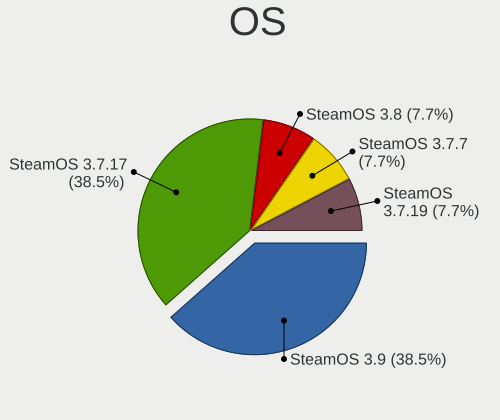

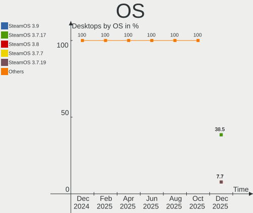

| Name           | Desktops | Percent |
|----------------|----------|---------|
| SteamOS 3.9    | 5        | 38.46%  |
| SteamOS 3.7.17 | 5        | 38.46%  |
| SteamOS 3.8    | 1        | 7.69%   |
| SteamOS 3.7.7  | 1        | 7.69%   |
| SteamOS 3.7.19 | 1        | 7.69%   |

OS Family
---------

OS without a version

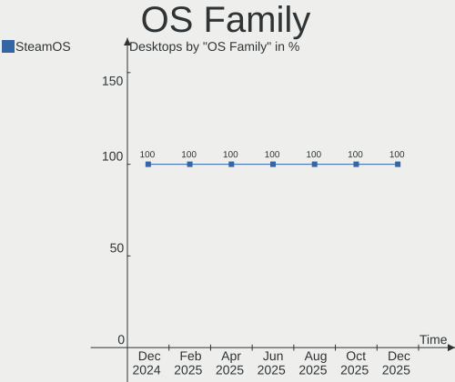

| Name    | Desktops | Percent |
|---------|----------|---------|
| SteamOS | 13       | 100%    |

Kernel
------

Version of the Linux kernel

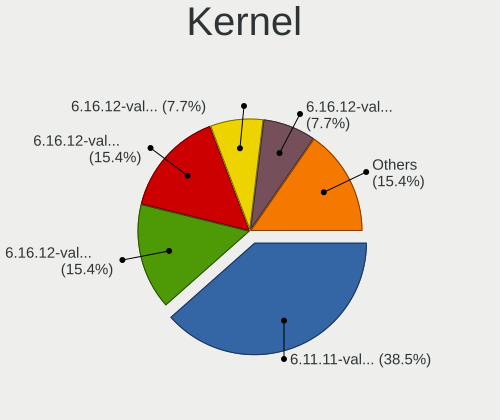

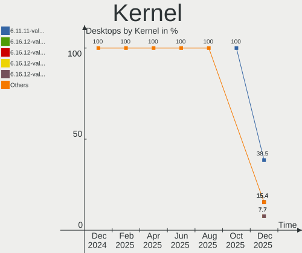

| Version                                     | Desktops | Percent |
|---------------------------------------------|----------|---------|
| 6.11.11-valve24-2-neptune-611-gfd0dd251480d | 5        | 38.46%  |
| 6.16.12-valve6-1-neptune-616-g37101e112292  | 2        | 15.38%  |
| 6.16.12-valve4-1-neptune-616-g366ccd8ab040  | 2        | 15.38%  |
| 6.16.12-valve5-1-neptune-616-ga9fcc52b276a  | 1        | 7.69%   |
| 6.16.12-valve2-1-neptune-616-g8a732b312b58  | 1        | 7.69%   |
| 6.11.11-valve26-1-neptune-611-gb3afa9aa9ae7 | 1        | 7.69%   |
| 6.11.11-valve14-1-neptune-611-g96885212a919 | 1        | 7.69%   |

Kernel Family
-------------

Linux kernel without a distro release

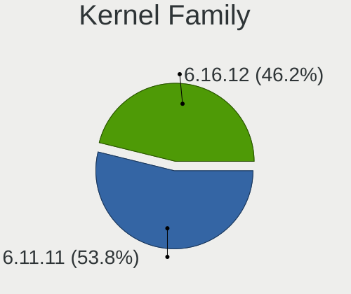

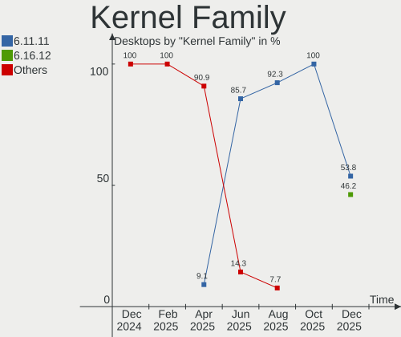

| Version | Desktops | Percent |
|---------|----------|---------|
| 6.11.11 | 7        | 53.85%  |
| 6.16.12 | 6        | 46.15%  |

Kernel Major Ver.
-----------------

Linux kernel major version

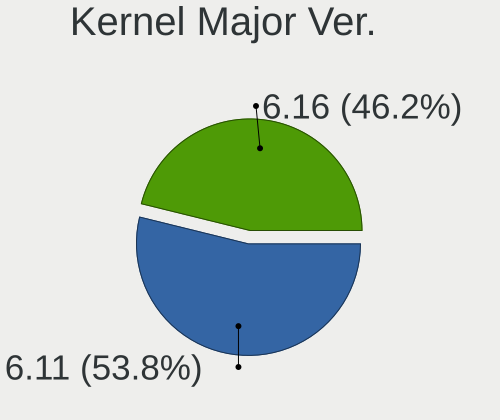

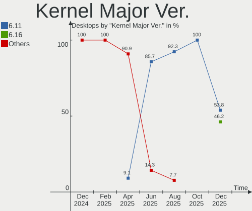

| Version | Desktops | Percent |
|---------|----------|---------|
| 6.11    | 7        | 53.85%  |
| 6.16    | 6        | 46.15%  |

Arch
----

OS architecture (x86_64, i586, etc.)

| Name   | Desktops | Percent |
|--------|----------|---------|
| x86_64 | 13       | 100%    |

DE
--

Desktop Environment

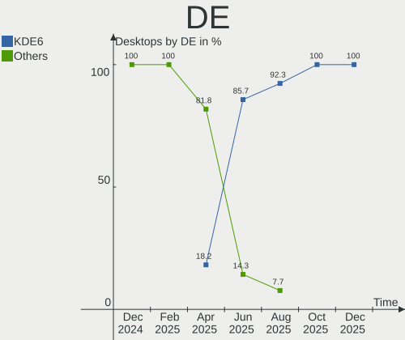

| Name | Desktops | Percent |
|------|----------|---------|
| KDE6 | 13       | 100%    |

Display Server
--------------

X11 or Wayland

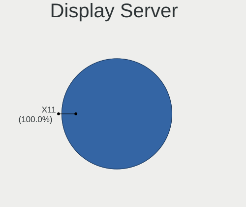

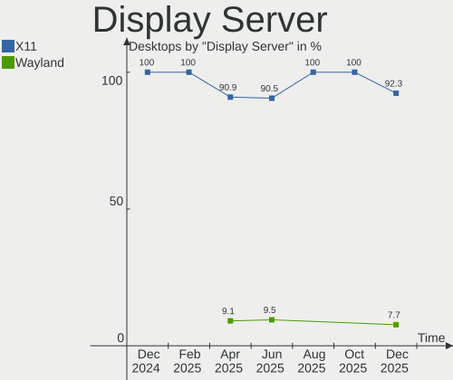

| Name    | Desktops | Percent |
|---------|----------|---------|
| X11     | 12       | 92.31%  |
| Wayland | 1        | 7.69%   |

Display Manager
---------------

SDDM, LightDM, etc.

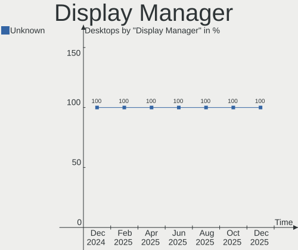

| Name    | Desktops | Percent |
|---------|----------|---------|
| Unknown | 13       | 100%    |

OS Lang
-------

Language

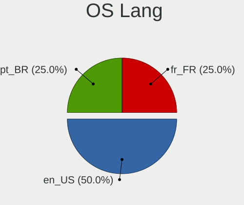

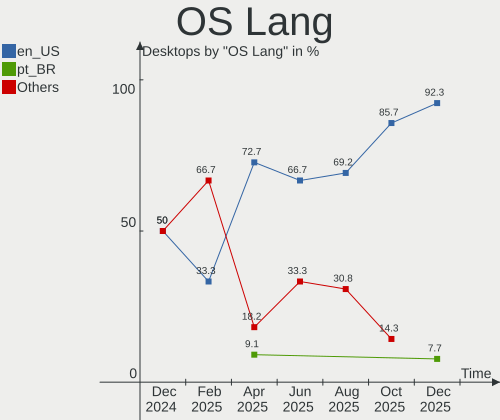

| Lang  | Desktops | Percent |
|-------|----------|---------|
| en_US | 12       | 92.31%  |
| pt_BR | 1        | 7.69%   |

Boot Mode
---------

EFI or BIOS

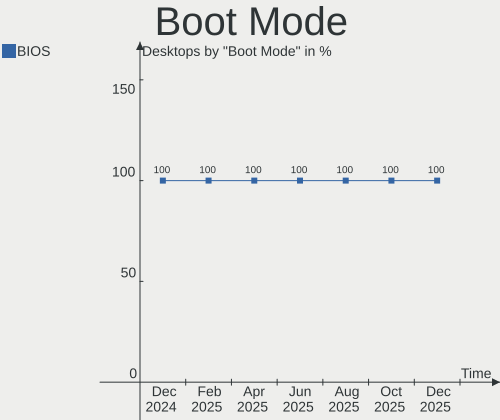

| Mode | Desktops | Percent |
|------|----------|---------|
| BIOS | 13       | 100%    |

Filesystem
----------

Type of filesystem

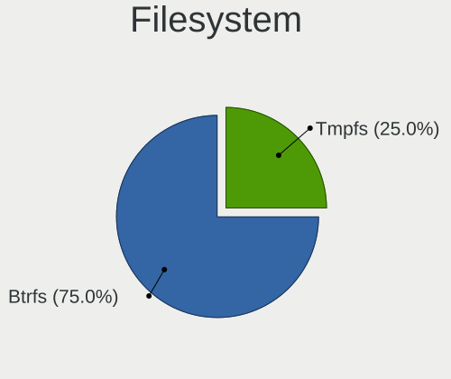

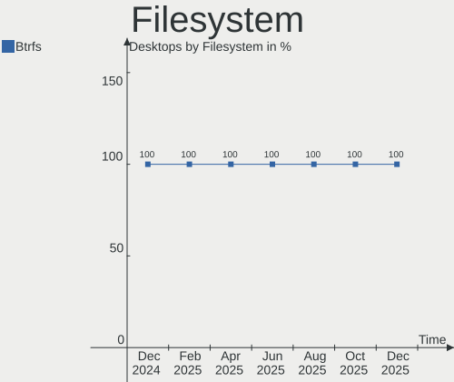

| Type  | Desktops | Percent |
|-------|----------|---------|
| Btrfs | 13       | 100%    |

Part. scheme
------------

Scheme of partitioning

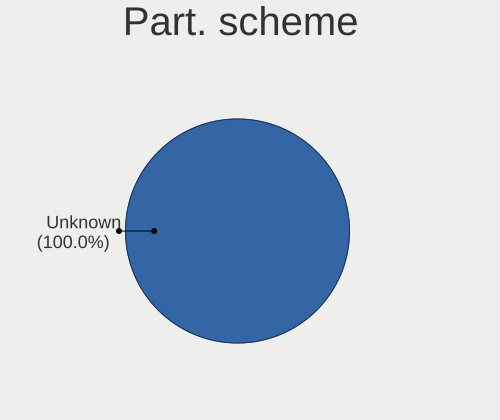

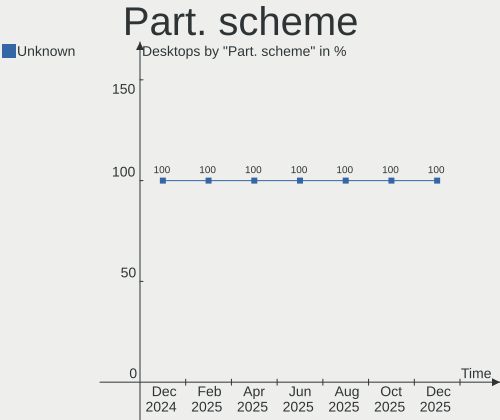

| Type    | Desktops | Percent |
|---------|----------|---------|
| Unknown | 13       | 100%    |

Dual Boot with Linux/BSD
------------------------

Hosting more than one Linux/BSD

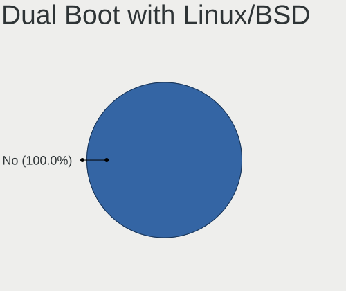

| Dual boot | Desktops | Percent |
|-----------|----------|---------|
| No        | 13       | 100%    |

Dual Boot (Win)
---------------

Hosting Linux and Windows

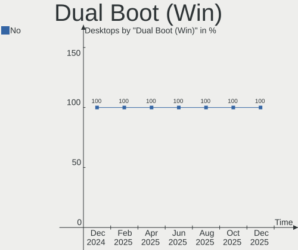

| Dual boot | Desktops | Percent |
|-----------|----------|---------|
| No        | 13       | 100%    |

Board
-----

Vendor
------

Motherboard manufacturer

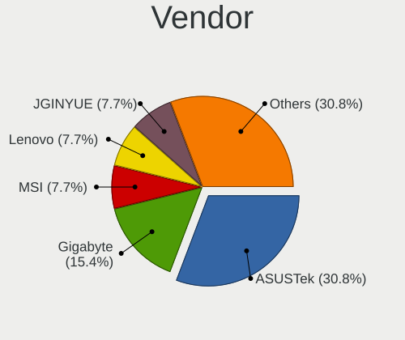

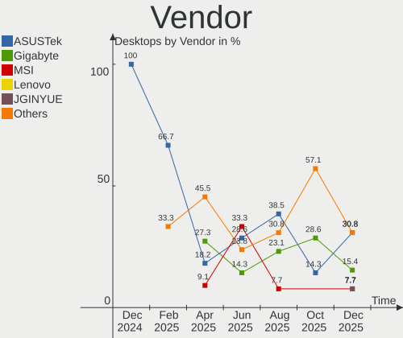

| Name                | Desktops | Percent |
|---------------------|----------|---------|
| ASUSTek Computer    | 4        | 30.77%  |
| Gigabyte Technology | 2        | 15.38%  |
| MSI                 | 1        | 7.69%   |
| Lenovo              | 1        | 7.69%   |
| JGINYUE             | 1        | 7.69%   |
| Intel               | 1        | 7.69%   |
| GEEKOM              | 1        | 7.69%   |
| Dell                | 1        | 7.69%   |
| ASRock              | 1        | 7.69%   |

Model
-----

Motherboard model

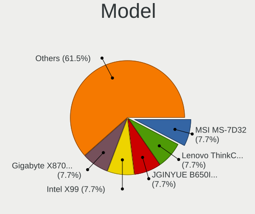

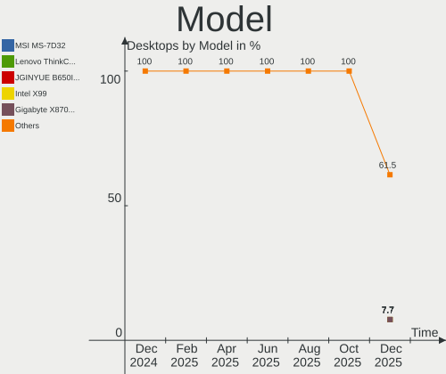

| Name                                 | Desktops | Percent |
|--------------------------------------|----------|---------|
| MSI MS-7D32                          | 1        | 7.69%   |
| Lenovo ThinkCentre M710e 10UQS0NM00  | 1        | 7.69%   |
| JGINYUE B650I Night Devil            | 1        | 7.69%   |
| Intel X99                            | 1        | 7.69%   |
| Gigabyte X870 AORUS ELITE WIFI7      | 1        | 7.69%   |
| Gigabyte H110M-S2H                   | 1        | 7.69%   |
| GEEKOM A8                            | 1        | 7.69%   |
| Dell OptiPlex 3020                   | 1        | 7.69%   |
| ASUS TUF Gaming B650M-PLUS           | 1        | 7.69%   |
| ASUS ROG STRIX B850-I GAMING WIFI    | 1        | 7.69%   |
| ASUS ROG STRIX B550-F GAMING WIFI II | 1        | 7.69%   |
| ASUS B650E MAX GAMING WIFI           | 1        | 7.69%   |
| ASRock X870 Pro RS WiFi              | 1        | 7.69%   |

Model Family
------------

Motherboard model prefix

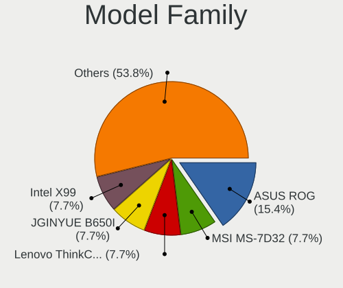

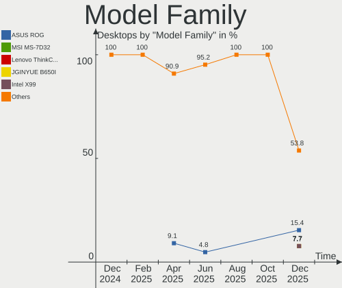

| Name               | Desktops | Percent |
|--------------------|----------|---------|
| ASUS ROG           | 2        | 15.38%  |
| MSI MS-7D32        | 1        | 7.69%   |
| Lenovo ThinkCentre | 1        | 7.69%   |
| JGINYUE B650I      | 1        | 7.69%   |
| Intel X99          | 1        | 7.69%   |
| Gigabyte X870      | 1        | 7.69%   |
| Gigabyte H110M-S2H | 1        | 7.69%   |
| GEEKOM A8          | 1        | 7.69%   |
| Dell OptiPlex      | 1        | 7.69%   |
| ASUS TUF           | 1        | 7.69%   |
| ASUS B650E         | 1        | 7.69%   |
| ASRock X870        | 1        | 7.69%   |

MFG Year
--------

Motherboard manufacture year

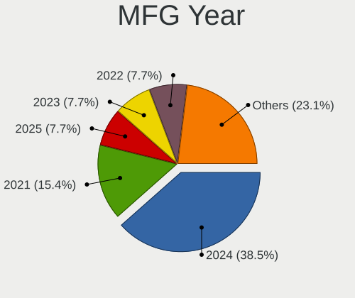

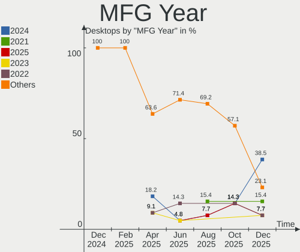

| Year | Desktops | Percent |
|------|----------|---------|
| 2024 | 5        | 38.46%  |
| 2021 | 2        | 15.38%  |
| 2025 | 1        | 7.69%   |
| 2023 | 1        | 7.69%   |
| 2022 | 1        | 7.69%   |
| 2019 | 1        | 7.69%   |
| 2016 | 1        | 7.69%   |
| 2014 | 1        | 7.69%   |

Form Factor
-----------

Physical design of the computer

| Name    | Desktops | Percent |
|---------|----------|---------|
| Desktop | 13       | 100%    |

Secure Boot
-----------

Enabled or disabled

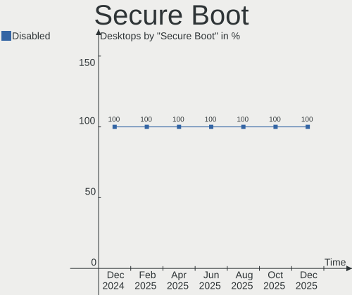

| State    | Desktops | Percent |
|----------|----------|---------|
| Disabled | 13       | 100%    |

Coreboot
--------

Have coreboot on board

| Used | Desktops | Percent |
|------|----------|---------|
| No   | 13       | 100%    |

RAM Size
--------

Total RAM memory

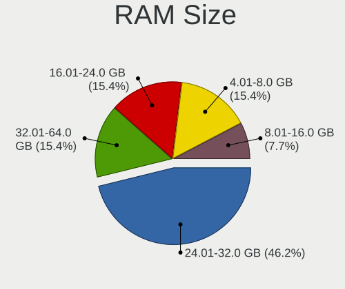

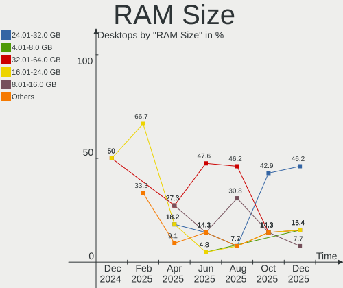

| Size in GB | Desktops | Percent |
|------------|----------|---------|
| 24.01-32.0 | 6        | 46.15%  |
| 4.01-8.0   | 2        | 15.38%  |
| 32.01-64.0 | 2        | 15.38%  |
| 16.01-24.0 | 2        | 15.38%  |
| 8.01-16.0  | 1        | 7.69%   |

RAM Used
--------

Used RAM memory

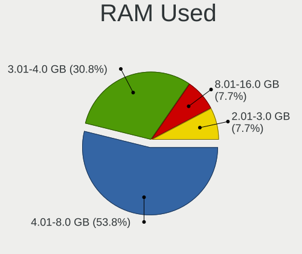

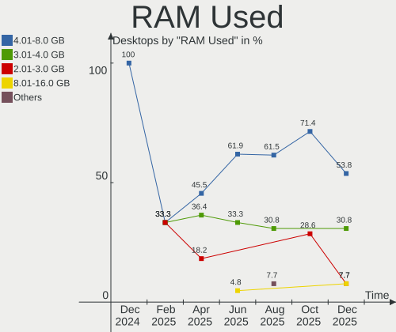

| Used GB   | Desktops | Percent |
|-----------|----------|---------|
| 4.01-8.0  | 7        | 53.85%  |
| 3.01-4.0  | 4        | 30.77%  |
| 2.01-3.0  | 1        | 7.69%   |
| 8.01-16.0 | 1        | 7.69%   |

Total Drives
------------

Number of drives on board

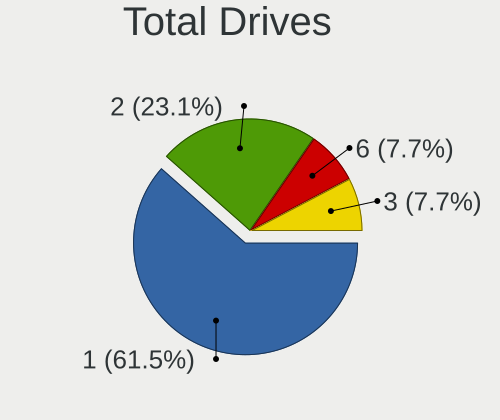

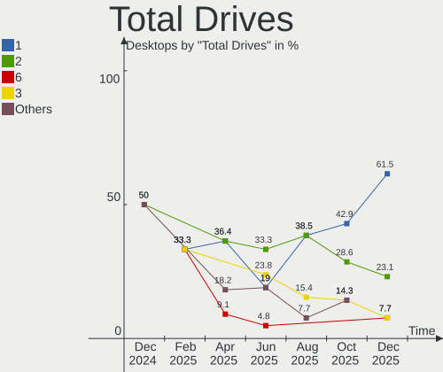

| Drives | Desktops | Percent |
|--------|----------|---------|
| 1      | 8        | 61.54%  |
| 2      | 3        | 23.08%  |
| 6      | 1        | 7.69%   |
| 3      | 1        | 7.69%   |

Has CD-ROM
----------

Has CD-ROM on board

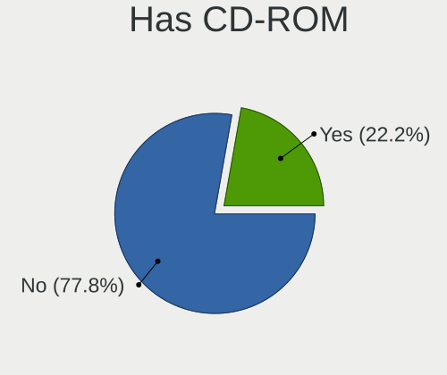

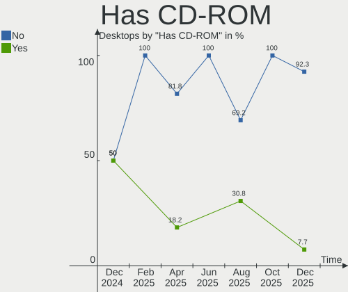

| Presented | Desktops | Percent |
|-----------|----------|---------|
| No        | 12       | 92.31%  |
| Yes       | 1        | 7.69%   |

Has Ethernet
------------

Has Ethernet on board

| Presented | Desktops | Percent |
|-----------|----------|---------|
| Yes       | 13       | 100%    |

Has WiFi
--------

Has WiFi module

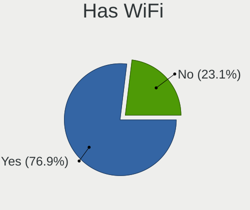

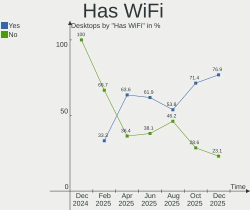

| Presented | Desktops | Percent |
|-----------|----------|---------|
| Yes       | 10       | 76.92%  |
| No        | 3        | 23.08%  |

Has Bluetooth
-------------

Has Bluetooth module

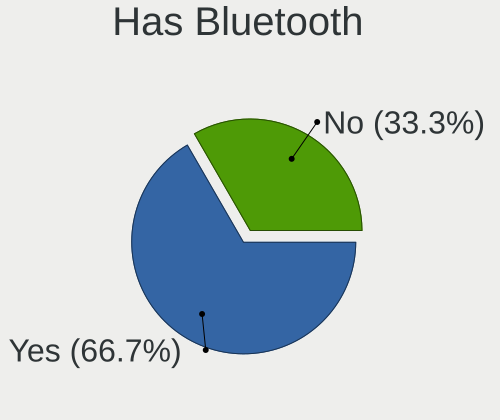

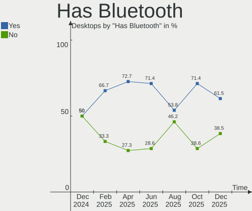

| Presented | Desktops | Percent |
|-----------|----------|---------|
| Yes       | 8        | 61.54%  |
| No        | 5        | 38.46%  |

Location
--------

Country
-------

Geographic location (country)

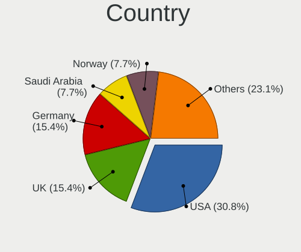

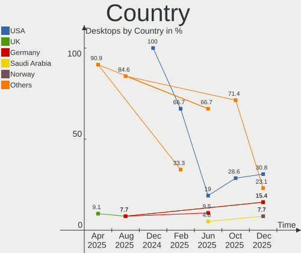

| Country      | Desktops | Percent |
|--------------|----------|---------|
| USA          | 4        | 30.77%  |
| UK           | 2        | 15.38%  |
| Germany      | 2        | 15.38%  |
| Saudi Arabia | 1        | 7.69%   |
| Norway       | 1        | 7.69%   |
| France       | 1        | 7.69%   |
| Cambodia     | 1        | 7.69%   |
| Brazil       | 1        | 7.69%   |

City
----

Geographic location (city)

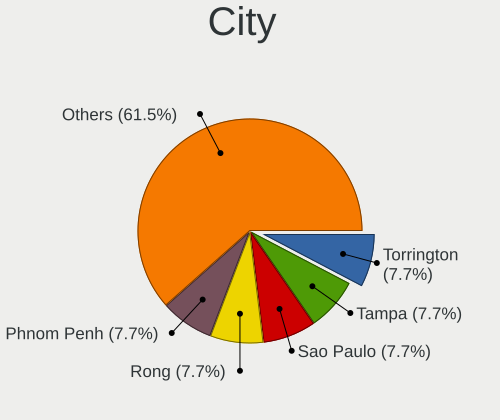

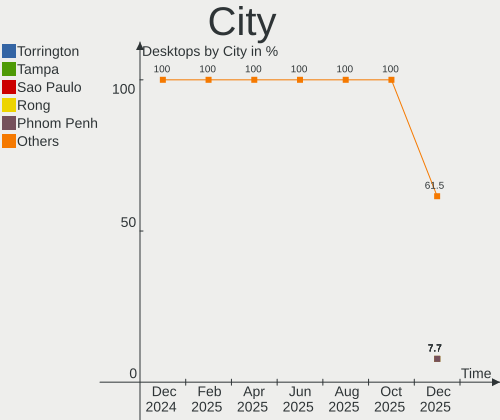

| City        | Desktops | Percent |
|-------------|----------|---------|
| Torrington  | 1        | 7.69%   |
| Tampa       | 1        | 7.69%   |
| Sao Paulo   | 1        | 7.69%   |
| Rong        | 1        | 7.69%   |
| Phnom Penh  | 1        | 7.69%   |
| Persan      | 1        | 7.69%   |
| Papenburg   | 1        | 7.69%   |
| Kansas City | 1        | 7.69%   |
| Jeddah      | 1        | 7.69%   |
| Decatur     | 1        | 7.69%   |
| Dasing      | 1        | 7.69%   |
| Cupar       | 1        | 7.69%   |
| Bristol     | 1        | 7.69%   |

Drives
------

Drive Vendor
------------

Hard drive vendors

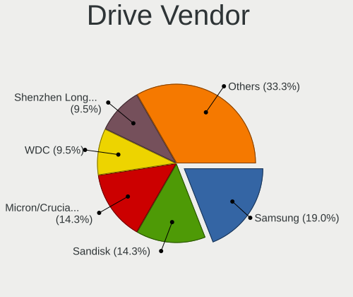

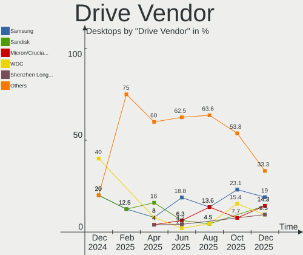

| Vendor                       | Desktops | Drives | Percent |
|------------------------------|----------|--------|---------|
| Samsung Electronics          | 4        | 4      | 19.05%  |
| Sandisk                      | 3        | 5      | 14.29%  |
| Micron/Crucial Technology    | 3        | 3      | 14.29%  |
| WDC                          | 2        | 2      | 9.52%   |
| Shenzhen Longsys Electronics | 2        | 3      | 9.52%   |
| Seagate                      | 1        | 1      | 4.76%   |
| Realtek Semiconductor        | 1        | 1      | 4.76%   |
| Micron Technology            | 1        | 1      | 4.76%   |
| KIOXIA                       | 1        | 1      | 4.76%   |
| China                        | 1        | 1      | 4.76%   |
| ASMT                         | 1        | 1      | 4.76%   |
| ADATA Technology             | 1        | 1      | 4.76%   |

Drive Model
-----------

Hard drive models

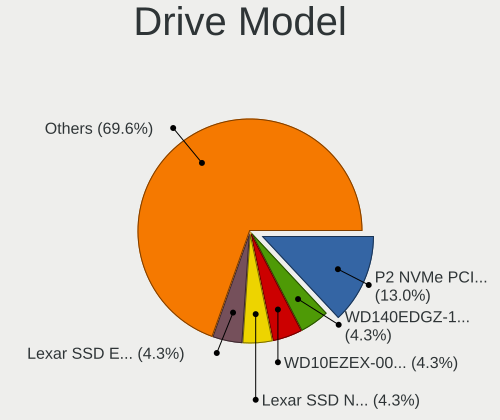

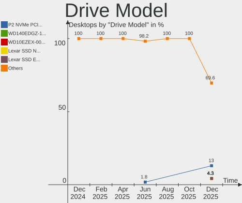

| Model                                                 | Desktops | Percent |
|-------------------------------------------------------|----------|---------|
| Micron/Crucial P2 NVMe PCIe SSD 2TB                   | 3        | 13.04%  |
| WDC WD140EDGZ-11B1PA0 14TB                            | 1        | 4.35%   |
| WDC WD10EZEX-00ZF5A0 1TB                              | 1        | 4.35%   |
| Shenzhen Longsys Lexar SSD NQ7A1 2TB                  | 1        | 4.35%   |
| Shenzhen Longsys Lexar SSD EQ790 1TB                  | 1        | 4.35%   |
| Seagate ST2000DL003-9VT166 2TB                        | 1        | 4.35%   |
| Sandisk WD_BLACK SN850X 1000GB                        | 1        | 4.35%   |
| Sandisk WD_BLACK SN770 2TB                            | 1        | 4.35%   |
| Sandisk WD Black 2018/SN750 / PC SN720 NVMe SSD 512GB | 1        | 4.35%   |
| SanDisk Ultra II 960GB SSD                            | 1        | 4.35%   |
| SanDisk Extreme SSD 1TB                               | 1        | 4.35%   |
| Samsung SSD 990 PRO 2TB                               | 1        | 4.35%   |
| Samsung SSD 840 Series 120GB                          | 1        | 4.35%   |
| Samsung SSD 840 PRO Series 128GB                      | 1        | 4.35%   |
| Samsung NVMe SSD Controller PM9A1/PM9A3/980PRO 1TB    | 1        | 4.35%   |
| Realtek RTS5763DL NVMe SSD Controller 512GB           | 1        | 4.35%   |
| Micron CT1000P3PSSD8 1TB                              | 1        | 4.35%   |
| KIOXIA KXG80ZNV1T02 LS 1TB                            | 1        | 4.35%   |
| China SATA SSD 2TB                                    | 1        | 4.35%   |
| ASMT ASM236X NVME 2TB                                 | 1        | 4.35%   |
| ADATA LEGEND 800 1TB                                  | 1        | 4.35%   |

HDD Vendor
----------

Hard disk drive vendors

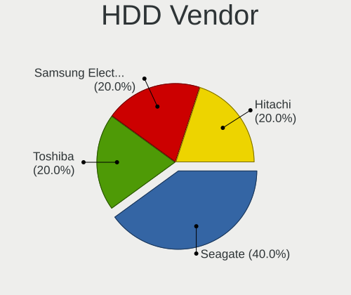

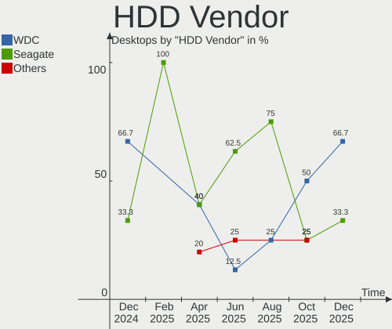

| Vendor  | Desktops | Drives | Percent |
|---------|----------|--------|---------|
| WDC     | 2        | 2      | 66.67%  |
| Seagate | 1        | 1      | 33.33%  |

SSD Vendor
----------

Solid state drive vendors

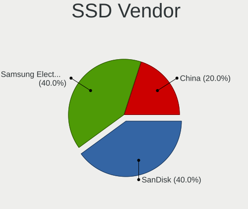

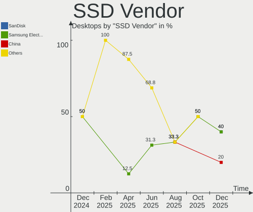

| Vendor              | Desktops | Drives | Percent |
|---------------------|----------|--------|---------|
| SanDisk             | 2        | 2      | 40%     |
| Samsung Electronics | 2        | 2      | 40%     |
| China               | 1        | 1      | 20%     |

Drive Kind
----------

HDD or SSD

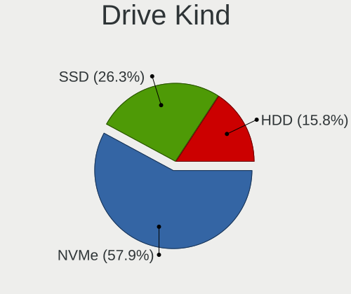

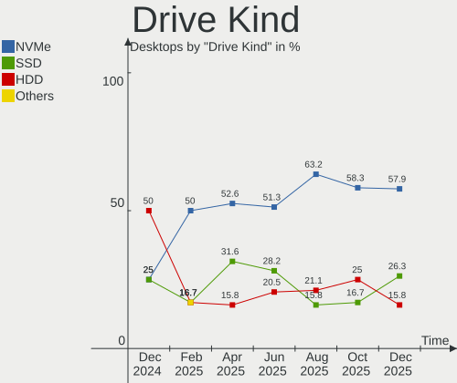

| Kind | Desktops | Drives | Percent |
|------|----------|--------|---------|
| NVMe | 11       | 16     | 57.89%  |
| SSD  | 5        | 5      | 26.32%  |
| HDD  | 3        | 3      | 15.79%  |

Drive Connector
---------------

SATA, SAS, NVMe, etc.

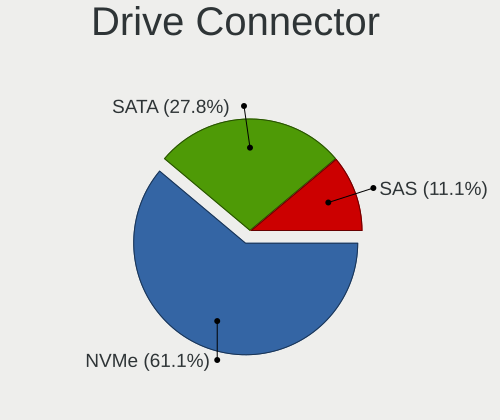

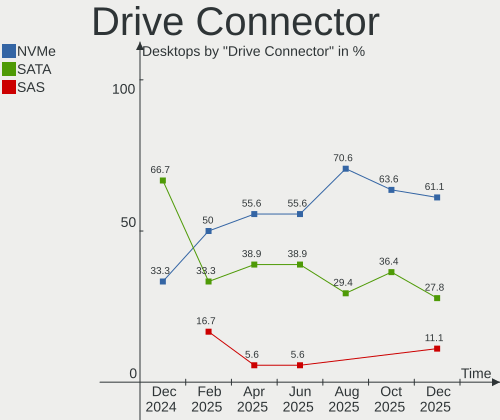

| Type | Desktops | Drives | Percent |
|------|----------|--------|---------|
| NVMe | 11       | 15     | 61.11%  |
| SATA | 5        | 7      | 27.78%  |
| SAS  | 2        | 2      | 11.11%  |

Drive Size
----------

Size of hard drive

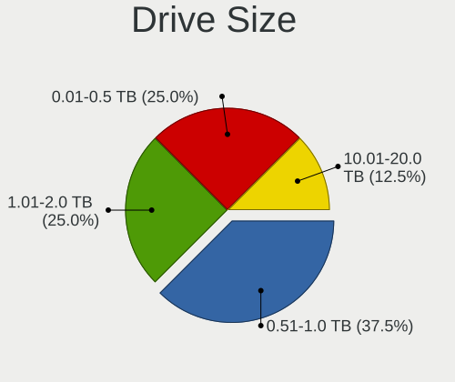

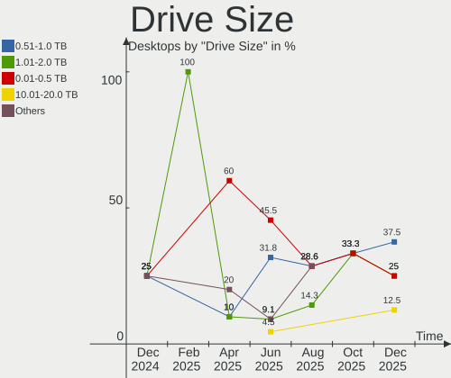

| Size in TB | Desktops | Drives | Percent |
|------------|----------|--------|---------|
| 0.51-1.0   | 3        | 3      | 37.5%   |
| 1.01-2.0   | 2        | 2      | 25%     |
| 0.01-0.5   | 2        | 2      | 25%     |
| 10.01-20.0 | 1        | 1      | 12.5%   |

Space Total
-----------

Amount of disk space available on the file system

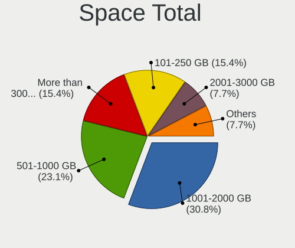

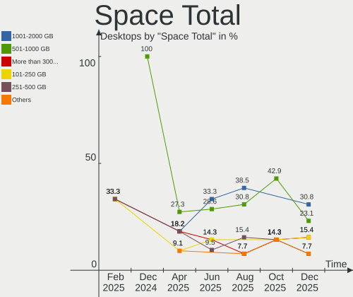

| Size in GB     | Desktops | Percent |
|----------------|----------|---------|
| 1001-2000      | 4        | 30.77%  |
| 501-1000       | 3        | 23.08%  |
| More than 3000 | 2        | 15.38%  |
| 101-250        | 2        | 15.38%  |
| 251-500        | 1        | 7.69%   |
| 2001-3000      | 1        | 7.69%   |

Space Used
----------

Amount of used disk space

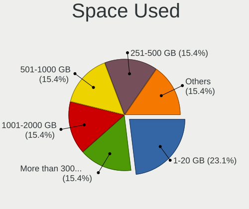

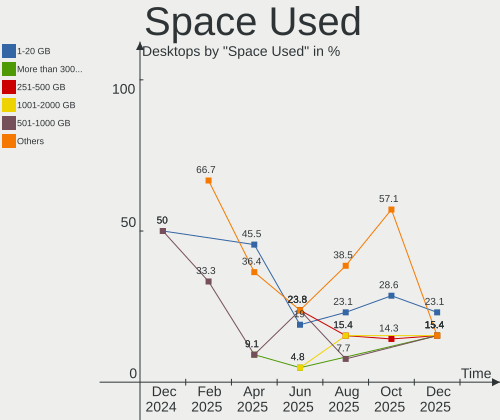

| Used GB        | Desktops | Percent |
|----------------|----------|---------|
| 1-20           | 3        | 23.08%  |
| More than 3000 | 2        | 15.38%  |
| 251-500        | 2        | 15.38%  |
| 1001-2000      | 2        | 15.38%  |
| 501-1000       | 2        | 15.38%  |
| 21-50          | 1        | 7.69%   |
| 101-250        | 1        | 7.69%   |

Malfunc. Drives
---------------

Drive models with a malfunction

Zero info for selected period =(

Malfunc. Drive Vendor
---------------------

Vendors of faulty drives

Zero info for selected period =(

Malfunc. HDD Vendor
-------------------

Vendors of faulty HDD drives

Zero info for selected period =(

Malfunc. Drive Kind
-------------------

Kinds of faulty drives

Zero info for selected period =(

Failed Drives
-------------

Failed drive models

Zero info for selected period =(

Failed Drive Vendor
-------------------

Failed drive vendors

Zero info for selected period =(

Drive Status
------------

Number of failed and malfunc. drives

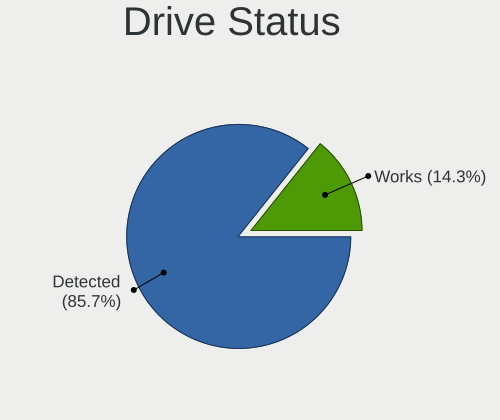

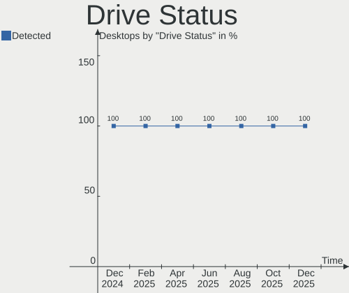

| Status   | Desktops | Drives | Percent |
|----------|----------|--------|---------|
| Detected | 13       | 24     | 100%    |

Storage controller
------------------

Storage Vendor
--------------

Storage controller vendors

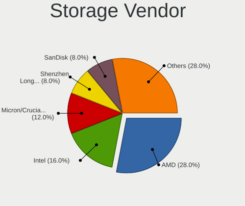

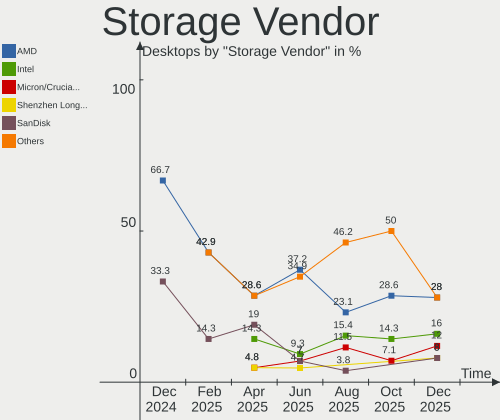

| Vendor                       | Desktops | Percent |
|------------------------------|----------|---------|
| AMD                          | 7        | 28%     |
| Intel                        | 4        | 16%     |
| Micron/Crucial Technology    | 3        | 12%     |
| Shenzhen Longsys Electronics | 2        | 8%      |
| SanDisk                      | 2        | 8%      |
| Samsung Electronics          | 2        | 8%      |
| Realtek Semiconductor        | 1        | 4%      |
| Micron Technology            | 1        | 4%      |
| KIOXIA                       | 1        | 4%      |
| ASMedia Technology           | 1        | 4%      |
| ADATA Technology             | 1        | 4%      |

Storage Model
-------------

Storage controller models

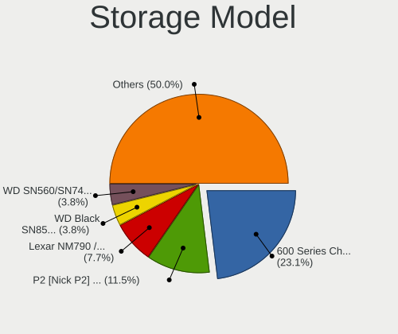

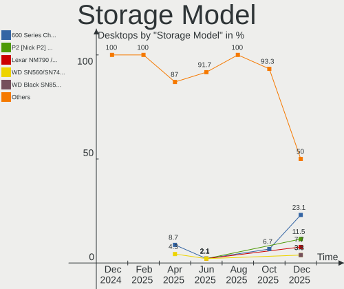

| Model                                                                          | Desktops | Percent |
|--------------------------------------------------------------------------------|----------|---------|
| AMD 600 Series Chipset SATA Controller                                         | 6        | 23.08%  |
| Micron/Crucial P2 [Nick P2] / P3 / P3 Plus NVMe PCIe SSD (DRAM-less)           | 3        | 11.54%  |
| Shenzhen Longsys Lexar NM790 / Patriot Viper VP4300 Lite NVMe SSD (DRAM-less)  | 2        | 7.69%   |
| SanDisk WD SN560/SN740/SN770/SN5000 NVMe SSD                                   | 1        | 3.85%   |
| Sandisk WD Black SN850X NVMe SSD                                               | 1        | 3.85%   |
| SanDisk Extreme Pro / WD Black 2018/SN750/PC SN720 NVMe SSD                    | 1        | 3.85%   |
| Samsung NVMe SSD Controller S4LV008[Pascal]                                    | 1        | 3.85%   |
| Samsung NVMe SSD Controller PM9A1/PM9A3/980PRO                                 | 1        | 3.85%   |
| Realtek RTS5762 NVMe SSD Controller                                            | 1        | 3.85%   |
| Micron 2550 NVMe SSD (DRAM-less)                                               | 1        | 3.85%   |
| KIOXIA NVMe SSD Controller XG8                                                 | 1        | 3.85%   |
| Intel Q170/Q150/B150/H170/H110/Z170/CM236 Chipset SATA Controller [AHCI Mode]  | 1        | 3.85%   |
| Intel Alder Lake-S PCH SATA Controller [AHCI Mode]                             | 1        | 3.85%   |
| Intel 8 Series/C220 Series Chipset Family 6-port SATA Controller 1 [AHCI mode] | 1        | 3.85%   |
| Intel 200 Series PCH SATA controller [AHCI mode]                               | 1        | 3.85%   |
| ASMedia ASM1061/ASM1062 Serial ATA Controller                                  | 1        | 3.85%   |
| AMD 500 Series Chipset SATA Controller                                         | 1        | 3.85%   |
| ADATA LEGEND 850 LITE NVMe SSD (DRAM-less)                                     | 1        | 3.85%   |

Storage Kind
------------

Kind of storage controller (IDE, SATA, NVMe, SAS, ...)

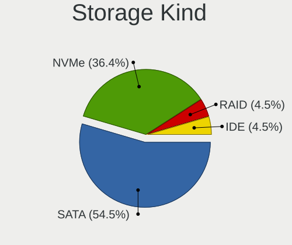

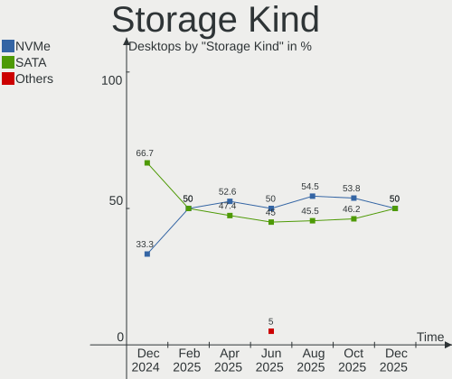

| Kind | Desktops | Percent |
|------|----------|---------|
| NVMe | 11       | 50%     |
| SATA | 11       | 50%     |

Processor
---------

CPU Vendor
----------

Processor vendors

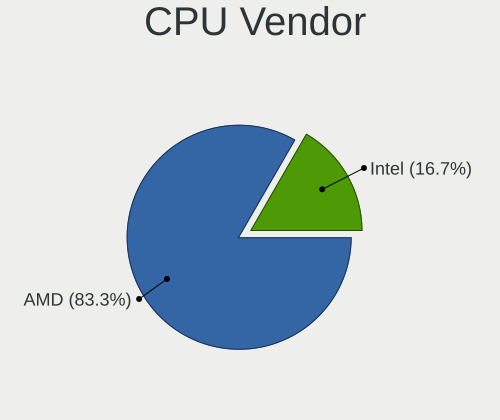

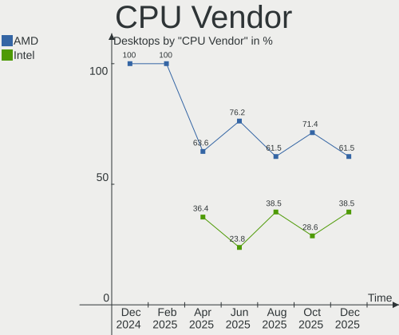

| Vendor | Desktops | Percent |
|--------|----------|---------|
| AMD    | 8        | 61.54%  |
| Intel  | 5        | 38.46%  |

CPU Model
---------

Processor models

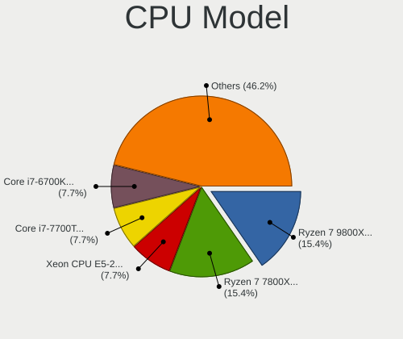

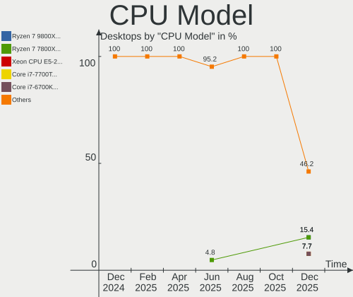

| Model                                      | Desktops | Percent |
|--------------------------------------------|----------|---------|
| AMD Ryzen 7 9800X3D 8-Core Processor       | 2        | 15.38%  |
| AMD Ryzen 7 7800X3D 8-Core Processor       | 2        | 15.38%  |
| Intel Xeon CPU E5-2620 v3 @ 2.40GHz        | 1        | 7.69%   |
| Intel Core i7-7700T CPU @ 2.90GHz          | 1        | 7.69%   |
| Intel Core i7-6700K CPU @ 4.00GHz          | 1        | 7.69%   |
| Intel Core i5-4590 CPU @ 3.30GHz           | 1        | 7.69%   |
| Intel 13th Gen Core i5-13600K              | 1        | 7.69%   |
| AMD Ryzen 9 8945HS w/ Radeon 780M Graphics | 1        | 7.69%   |
| AMD Ryzen 7 5800X 8-Core Processor         | 1        | 7.69%   |
| AMD Ryzen 5 9600X 6-Core Processor         | 1        | 7.69%   |
| AMD Ryzen 5 7600X 6-Core Processor         | 1        | 7.69%   |

CPU Model Family
----------------

Processor model prefix

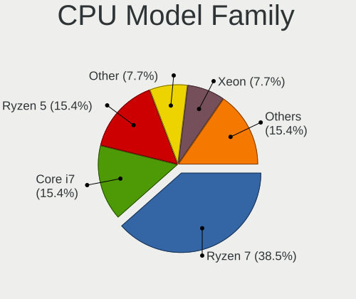

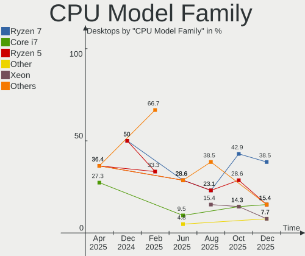

| Model         | Desktops | Percent |
|---------------|----------|---------|
| AMD Ryzen 7   | 5        | 38.46%  |
| Intel Core i7 | 2        | 15.38%  |
| AMD Ryzen 5   | 2        | 15.38%  |
| Other         | 1        | 7.69%   |
| Intel Xeon    | 1        | 7.69%   |
| Intel Core i5 | 1        | 7.69%   |
| AMD Ryzen 9   | 1        | 7.69%   |

CPU Cores
---------

Number of processor cores

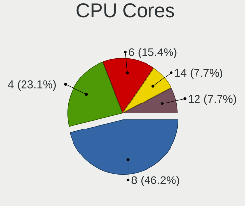

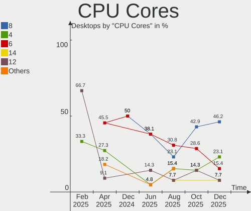

| Number | Desktops | Percent |
|--------|----------|---------|
| 8      | 6        | 46.15%  |
| 4      | 3        | 23.08%  |
| 6      | 2        | 15.38%  |
| 14     | 1        | 7.69%   |
| 12     | 1        | 7.69%   |

CPU Sockets
-----------

Number of sockets

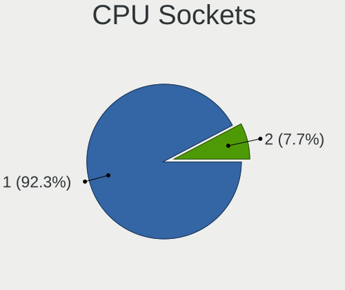

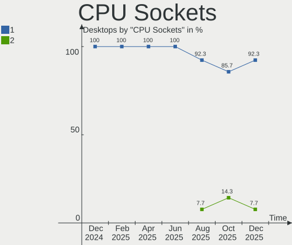

| Number | Desktops | Percent |
|--------|----------|---------|
| 1      | 12       | 92.31%  |
| 2      | 1        | 7.69%   |

CPU Threads
-----------

Threads per core (Hyper-Threading)

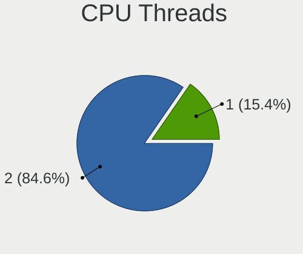

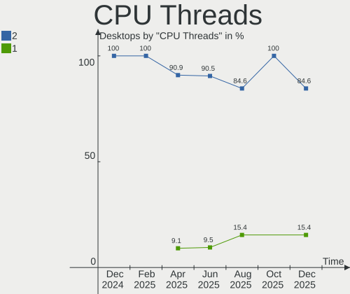

| Number | Desktops | Percent |
|--------|----------|---------|
| 2      | 11       | 84.62%  |
| 1      | 2        | 15.38%  |

CPU Op-Modes
------------

CPU Operation Modes (32-bit, 64-bit)

| Op mode        | Desktops | Percent |
|----------------|----------|---------|
| 32-bit, 64-bit | 13       | 100%    |

CPU Microcode
-------------

Microcode number

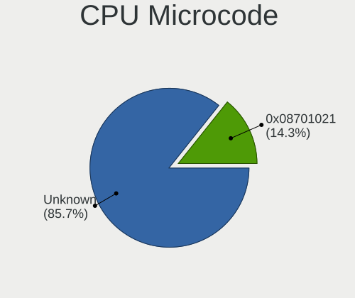

| Number  | Desktops | Percent |
|---------|----------|---------|
| Unknown | 13       | 100%    |

CPU Microarch
-------------

Microarchitecture

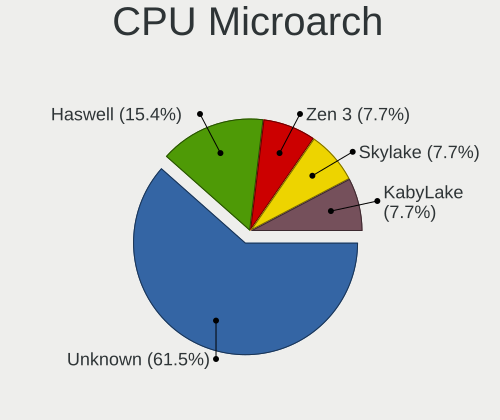

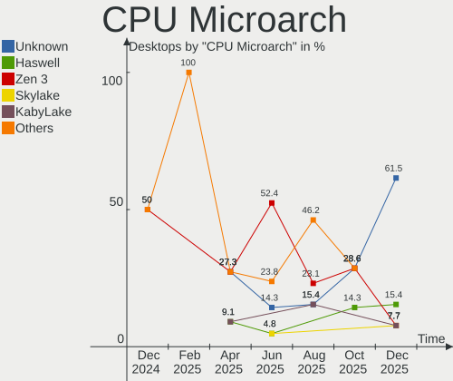

| Name     | Desktops | Percent |
|----------|----------|---------|
| Unknown  | 8        | 61.54%  |
| Haswell  | 2        | 15.38%  |
| Zen 3    | 1        | 7.69%   |
| Skylake  | 1        | 7.69%   |
| KabyLake | 1        | 7.69%   |

Graphics
--------

GPU Vendor
----------

Vendors of graphics cards

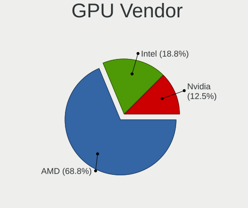

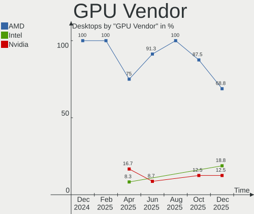

| Vendor | Desktops | Percent |
|--------|----------|---------|
| AMD    | 11       | 68.75%  |
| Intel  | 3        | 18.75%  |
| Nvidia | 2        | 12.5%   |

GPU Model
---------

Graphics card models

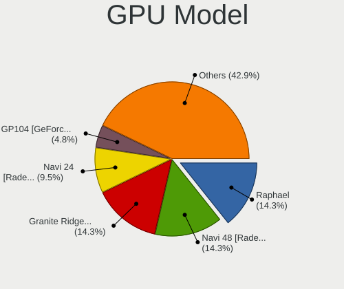

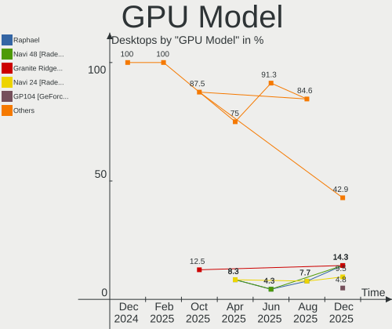

| Model                                                                       | Desktops | Percent |
|-----------------------------------------------------------------------------|----------|---------|
| AMD Raphael                                                                 | 3        | 14.29%  |
| AMD Navi 48 [Radeon RX 9070/9070 XT/9070 GRE]                               | 3        | 14.29%  |
| AMD Granite Ridge [Radeon Graphics]                                         | 3        | 14.29%  |
| AMD Navi 24 [Radeon RX 6400/6500 XT/6500M]                                  | 2        | 9.52%   |
| Nvidia GP104 [GeForce GTX 1080]                                             | 1        | 4.76%   |
| Nvidia GB205 [GeForce RTX 5070]                                             | 1        | 4.76%   |
| Intel Xeon E3-1200 v3/4th Gen Core Processor Integrated Graphics Controller | 1        | 4.76%   |
| Intel Skylake-S GT2 [HD Graphics 530]                                       | 1        | 4.76%   |
| Intel Raptor Lake-S GT1 [UHD Graphics 770]                                  | 1        | 4.76%   |
| AMD Navi 31 [Radeon RX 7900 XT/7900 XTX/7900 GRE/7900M]                     | 1        | 4.76%   |
| AMD Navi 23 [Radeon RX 6600/6600 XT/6600M]                                  | 1        | 4.76%   |
| AMD Navi 22 [Radeon RX 6700/6700 XT/6750 XT / 6800M/6850M XT]               | 1        | 4.76%   |
| AMD Navi 21 [Radeon RX 6800/6800 XT / 6900 XT]                              | 1        | 4.76%   |
| AMD HawkPoint1                                                              | 1        | 4.76%   |

GPU Combo
---------

Combinations of graphics cards

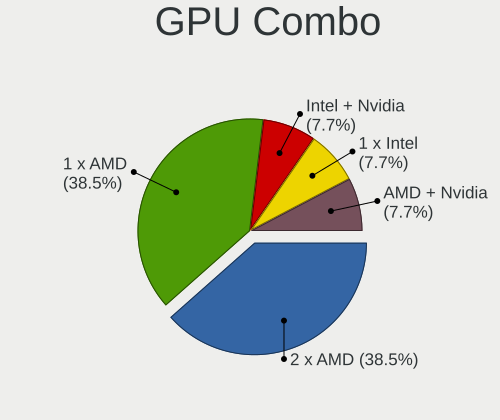

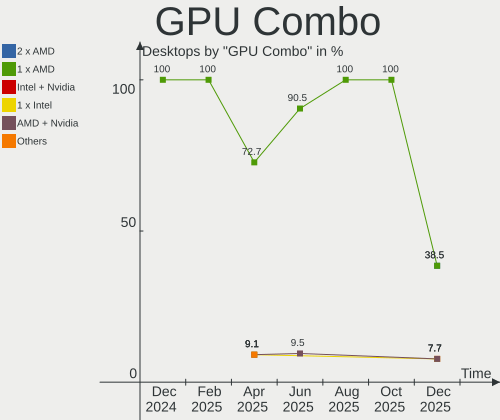

| Name           | Desktops | Percent |
|----------------|----------|---------|
| 2 x AMD        | 5        | 38.46%  |
| 1 x AMD        | 5        | 38.46%  |
| Intel + Nvidia | 1        | 7.69%   |
| 1 x Intel      | 1        | 7.69%   |
| AMD + Nvidia   | 1        | 7.69%   |

GPU Driver
----------

Free vs proprietary

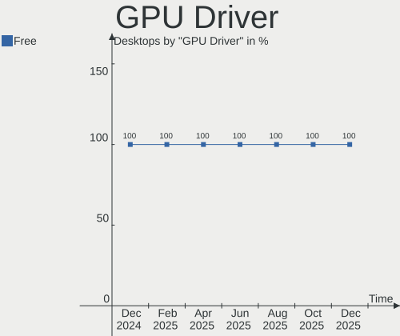

| Driver | Desktops | Percent |
|--------|----------|---------|
| Free   | 13       | 100%    |

GPU Memory
----------

Total video memory

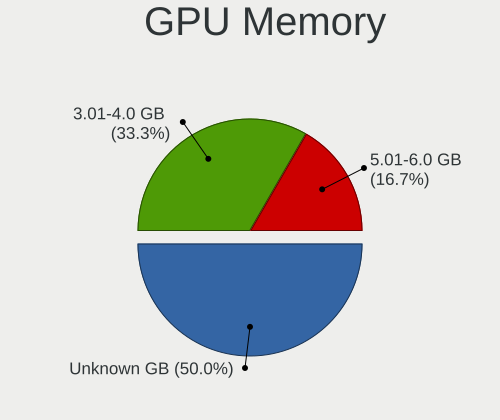

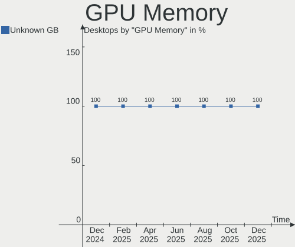

| Size in GB | Desktops | Percent |
|------------|----------|---------|
| Unknown    | 13       | 100%    |

Monitor
-------

Monitor Vendor
--------------

Monitor vendors

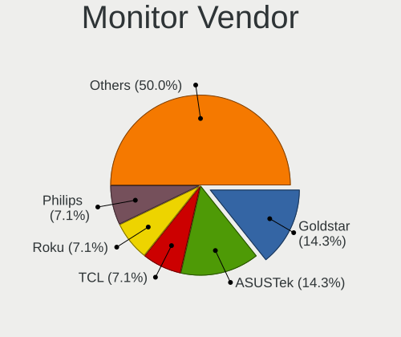

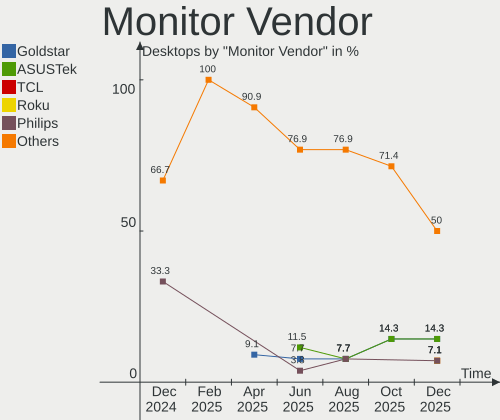

| Vendor           | Desktops | Percent |
|------------------|----------|---------|
| Goldstar         | 2        | 14.29%  |
| ASUSTek Computer | 2        | 14.29%  |
| TCL              | 1        | 7.14%   |
| Roku             | 1        | 7.14%   |
| Philips          | 1        | 7.14%   |
| MSI              | 1        | 7.14%   |
| Mi               | 1        | 7.14%   |
| Lenovo           | 1        | 7.14%   |
| Hitachi          | 1        | 7.14%   |
| HannStar         | 1        | 7.14%   |
| Dell             | 1        | 7.14%   |
| AOC              | 1        | 7.14%   |

Monitor Model
-------------

Monitor models

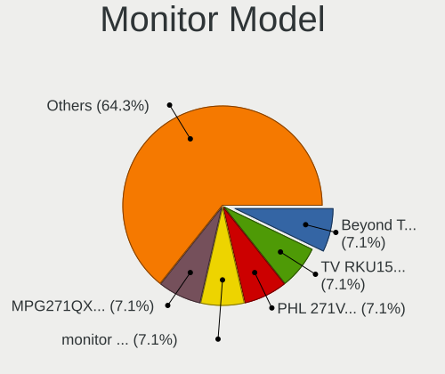

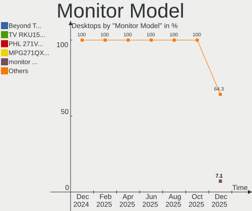

| Model                                                         | Desktops | Percent |
|---------------------------------------------------------------|----------|---------|
| TCL Beyond TV TCL9653 3840x2160 1210x680mm 54.6-inch          | 1        | 7.14%   |
| Roku TV RKU1506 1920x1080 698x392mm 31.5-inch                 | 1        | 7.14%   |
| Philips PHL 271V8 PHLC213 1920x1080 598x336mm 27.0-inch       | 1        | 7.14%   |
| MSI MPG271QX OLED MSI3CD7 2560x1440 606x344mm 27.4-inch       | 1        | 7.14%   |
| Mi monitor XMI2001 3440x1440 797x334mm 34.0-inch              | 1        | 7.14%   |
| Lenovo LEN LI2364d LEN65C8 1920x1080 509x286mm 23.0-inch      | 1        | 7.14%   |
| Hitachi HISENSE HECB31D 3840x2160 1428x804mm 64.5-inch        | 1        | 7.14%   |
| HannStar HS271HPB HSD132F 1920x1080 597x336mm 27.0-inch       | 1        | 7.14%   |
| Goldstar ULTRAWIDE GSM9E85 3840x1080 1198x337mm 49.0-inch     | 1        | 7.14%   |
| Goldstar TV SSCR2 GSM8284 3840x2160                           | 1        | 7.14%   |
| Dell SE2216H DELF071 1920x1080 476x268mm 21.5-inch            | 1        | 7.14%   |
| ASUSTek Computer VG289 AUS28BA 3840x2160 621x341mm 27.9-inch  | 1        | 7.14%   |
| ASUSTek Computer VG27WQ AUS272B 2560x1440 597x336mm 27.0-inch | 1        | 7.14%   |
| AOC Q24G2 AOCB205 2560x1440 526x296mm 23.8-inch               | 1        | 7.14%   |

Monitor Resolution
------------------

Monitor screen resolution

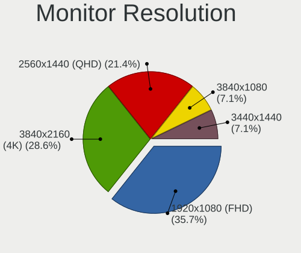

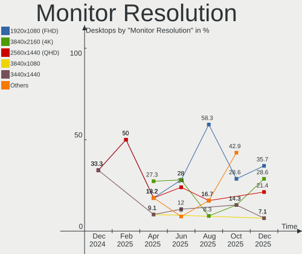

| Resolution      | Desktops | Percent |
|-----------------|----------|---------|
| 1920x1080 (FHD) | 5        | 35.71%  |
| 3840x2160 (4K)  | 4        | 28.57%  |
| 2560x1440 (QHD) | 3        | 21.43%  |
| 3840x1080       | 1        | 7.14%   |
| 3440x1440       | 1        | 7.14%   |

Monitor Diagonal
----------------

Diagonal size in inches

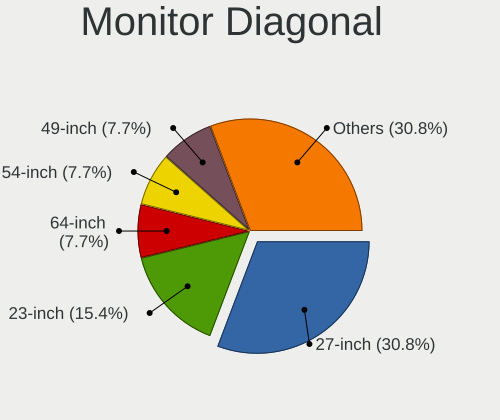

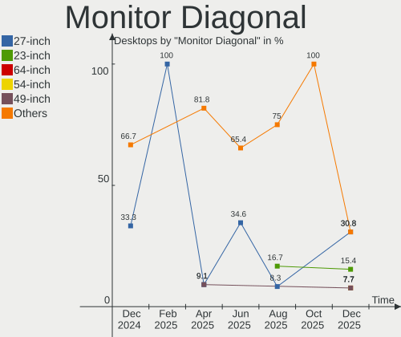

| Inches  | Desktops | Percent |
|---------|----------|---------|
| 27      | 4        | 30.77%  |
| 23      | 2        | 15.38%  |
| 64      | 1        | 7.69%   |
| 54      | 1        | 7.69%   |
| 49      | 1        | 7.69%   |
| 34      | 1        | 7.69%   |
| 31      | 1        | 7.69%   |
| 21      | 1        | 7.69%   |
| Unknown | 1        | 7.69%   |

Monitor Width
-------------

Physical width

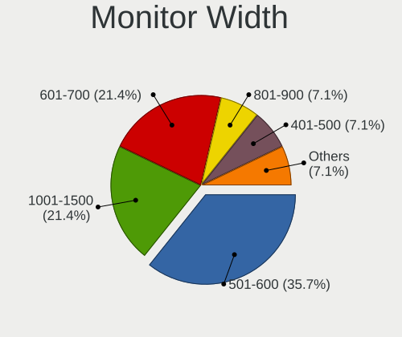

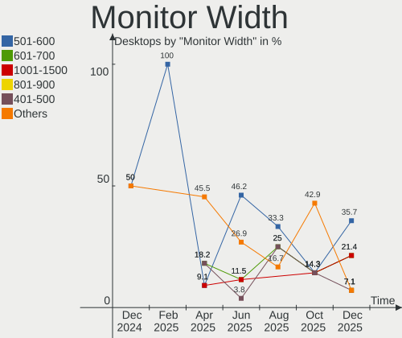

| Width in mm | Desktops | Percent |
|-------------|----------|---------|
| 501-600     | 5        | 35.71%  |
| 601-700     | 3        | 21.43%  |
| 1001-1500   | 3        | 21.43%  |
| 801-900     | 1        | 7.14%   |
| 401-500     | 1        | 7.14%   |
| Unknown     | 1        | 7.14%   |

Aspect Ratio
------------

Proportional relationship between the width and the height

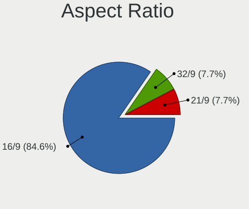

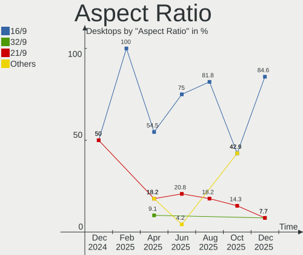

| Ratio | Desktops | Percent |
|-------|----------|---------|
| 16/9  | 11       | 84.62%  |
| 32/9  | 1        | 7.69%   |
| 21/9  | 1        | 7.69%   |

Monitor Area
------------

Area in inch²

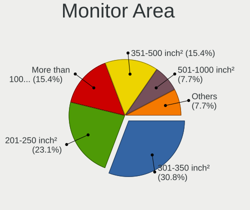

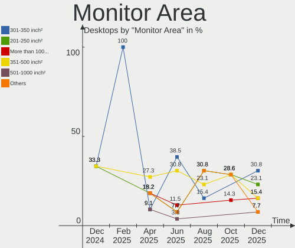

| Area in inch² | Desktops | Percent |
|----------------|----------|---------|
| 301-350        | 4        | 30.77%  |
| 201-250        | 3        | 23.08%  |
| More than 1000 | 2        | 15.38%  |
| 351-500        | 2        | 15.38%  |
| 501-1000       | 1        | 7.69%   |
| Unknown        | 1        | 7.69%   |

Pixel Density
-------------

Pixels per inch

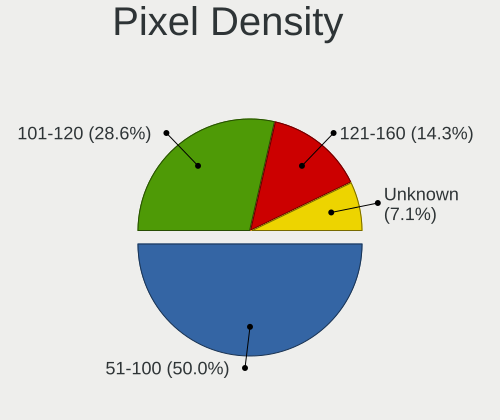

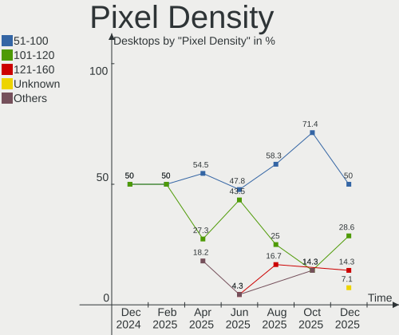

| Density | Desktops | Percent |
|---------|----------|---------|
| 51-100  | 7        | 50%     |
| 101-120 | 4        | 28.57%  |
| 121-160 | 2        | 14.29%  |
| Unknown | 1        | 7.14%   |

Multiple Monitors
-----------------

Total monitors connected

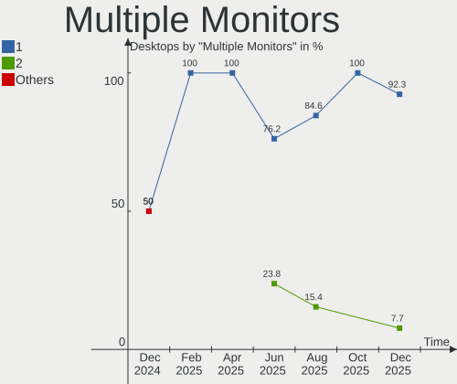

| Total | Desktops | Percent |
|-------|----------|---------|
| 1     | 12       | 92.31%  |
| 2     | 1        | 7.69%   |

Network
-------

Net Controller Vendor
---------------------

Controller vendors

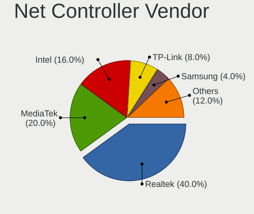

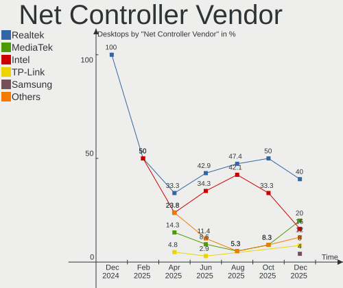

| Vendor                | Desktops | Percent |
|-----------------------|----------|---------|
| Realtek Semiconductor | 10       | 40%     |
| MediaTek              | 5        | 20%     |
| Intel                 | 4        | 16%     |
| TP-Link               | 2        | 8%      |
| Samsung Electronics   | 1        | 4%      |
| Realtek               | 1        | 4%      |
| QinHeng Electronics   | 1        | 4%      |
| Broadcom              | 1        | 4%      |

Net Controller Model
--------------------

Controller models

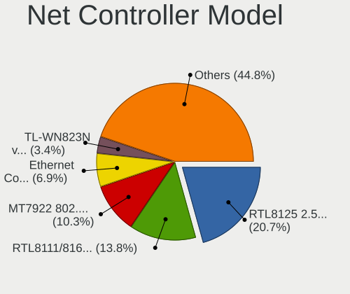

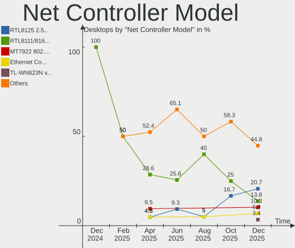

| Model                                                                           | Desktops | Percent |
|---------------------------------------------------------------------------------|----------|---------|
| Realtek RTL8125 2.5GbE Controller                                               | 6        | 20.69%  |
| Realtek RTL8111/8168/8211/8411 PCI Express Gigabit Ethernet Controller          | 4        | 13.79%  |
| MediaTek MT7922 802.11ax PCI Express Wireless Network Adapter                   | 3        | 10.34%  |
| Intel Ethernet Controller I226-V                                                | 2        | 6.9%    |
| TP-Link TL-WN823N v2/v3 [Realtek RTL8192EU]                                     | 1        | 3.45%   |
| TP-Link Archer T2U PLUS [RTL8821AU]                                             | 1        | 3.45%   |
| Samsung Galaxy series, misc. (tethering mode)                                   | 1        | 3.45%   |
| Realtek RTL8922AE 802.11be PCIe Wireless Network Adapter                        | 1        | 3.45%   |
| Realtek RTL8188EUS 802.11n Wireless Network Adapter                             | 1        | 3.45%   |
| Realtek 802.11ac NIC                                                            | 1        | 3.45%   |
| Realtek 802.11ax WLAN Adapter                                                   | 1        | 3.45%   |
| QinHeng JIGUANG ARGB V2                                                         | 1        | 3.45%   |
| MediaTek MT7925 802.11be 160MHz 2x2 PCIe Wireless Network Adapter [Filogic 360] | 1        | 3.45%   |
| MediaTek MT7925 (RZ717) Wi-Fi 7 160MHz                                          | 1        | 3.45%   |
| Intel Wi-Fi 6 AX200                                                             | 1        | 3.45%   |
| Intel Ethernet Controller I225-V                                                | 1        | 3.45%   |
| Intel Alder Lake-S PCH CNVi WiFi                                                | 1        | 3.45%   |
| Broadcom BCM4352 802.11ac Dual Band Wireless Network Adapter                    | 1        | 3.45%   |

Wireless Vendor
---------------

Wireless vendors

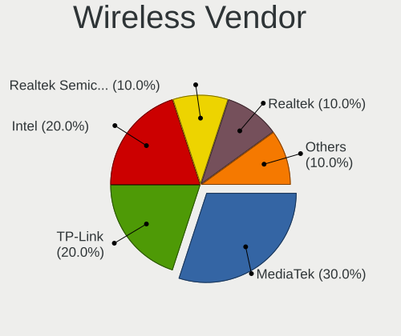

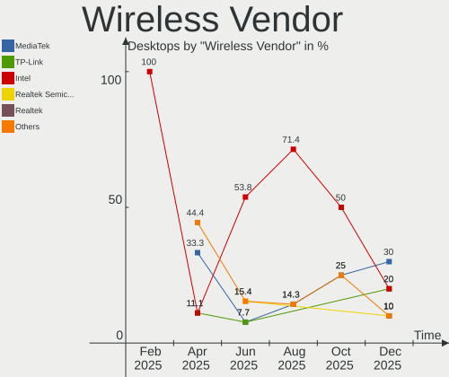

| Vendor                | Desktops | Percent |
|-----------------------|----------|---------|
| MediaTek              | 3        | 30%     |
| TP-Link               | 2        | 20%     |
| Intel                 | 2        | 20%     |
| Realtek Semiconductor | 1        | 10%     |
| Realtek               | 1        | 10%     |
| Broadcom              | 1        | 10%     |

Wireless Model
--------------

Wireless models

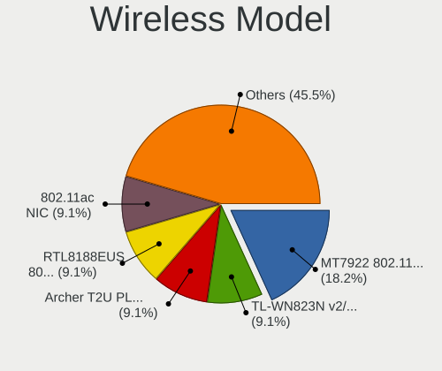

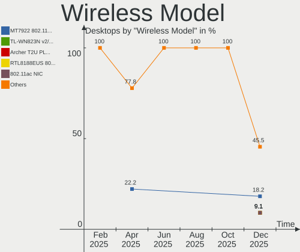

| Model                                                         | Desktops | Percent |
|---------------------------------------------------------------|----------|---------|
| MediaTek MT7922 802.11ax PCI Express Wireless Network Adapter | 2        | 18.18%  |
| TP-Link TL-WN823N v2/v3 [Realtek RTL8192EU]                   | 1        | 9.09%   |
| TP-Link Archer T2U PLUS [RTL8821AU]                           | 1        | 9.09%   |
| Realtek RTL8188EUS 802.11n Wireless Network Adapter           | 1        | 9.09%   |
| Realtek 802.11ac NIC                                          | 1        | 9.09%   |
| Realtek 802.11ax WLAN Adapter                                 | 1        | 9.09%   |
| MediaTek MT7925 (RZ717) Wi-Fi 7 160MHz                        | 1        | 9.09%   |
| Intel Wi-Fi 6 AX200                                           | 1        | 9.09%   |
| Intel Alder Lake-S PCH CNVi WiFi                              | 1        | 9.09%   |
| Broadcom BCM4352 802.11ac Dual Band Wireless Network Adapter  | 1        | 9.09%   |

Ethernet Vendor
---------------

Ethernet vendors

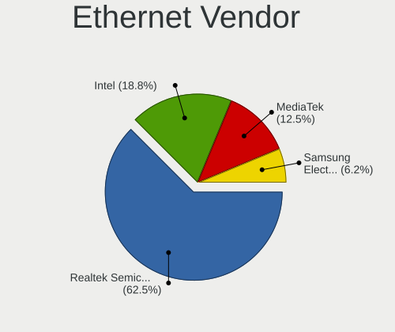

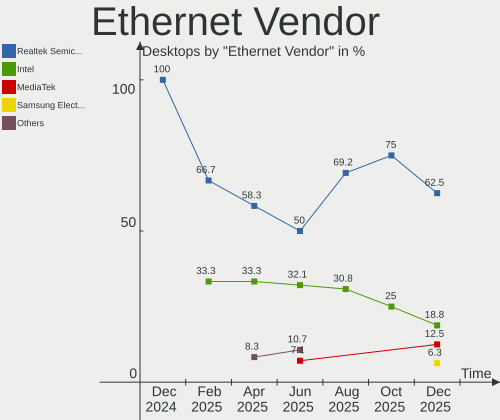

| Vendor                | Desktops | Percent |
|-----------------------|----------|---------|
| Realtek Semiconductor | 10       | 62.5%   |
| Intel                 | 3        | 18.75%  |
| MediaTek              | 2        | 12.5%   |
| Samsung Electronics   | 1        | 6.25%   |

Ethernet Model
--------------

Ethernet models

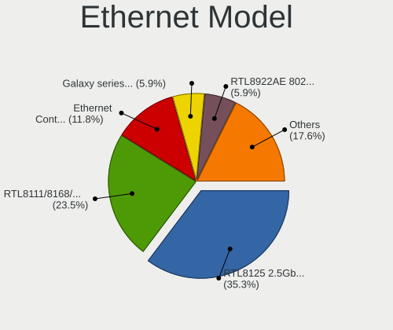

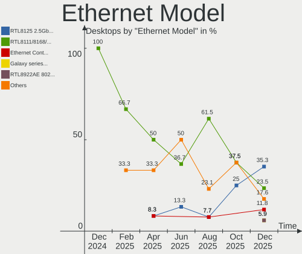

| Model                                                                           | Desktops | Percent |
|---------------------------------------------------------------------------------|----------|---------|
| Realtek RTL8125 2.5GbE Controller                                               | 6        | 35.29%  |
| Realtek RTL8111/8168/8211/8411 PCI Express Gigabit Ethernet Controller          | 4        | 23.53%  |
| Intel Ethernet Controller I226-V                                                | 2        | 11.76%  |
| Samsung Galaxy series, misc. (tethering mode)                                   | 1        | 5.88%   |
| Realtek RTL8922AE 802.11be PCIe Wireless Network Adapter                        | 1        | 5.88%   |
| MediaTek MT7925 802.11be 160MHz 2x2 PCIe Wireless Network Adapter [Filogic 360] | 1        | 5.88%   |
| MediaTek MT7922 802.11ax PCI Express Wireless Network Adapter                   | 1        | 5.88%   |
| Intel Ethernet Controller I225-V                                                | 1        | 5.88%   |

Net Controller Kind
-------------------

Ethernet, WiFi or modem

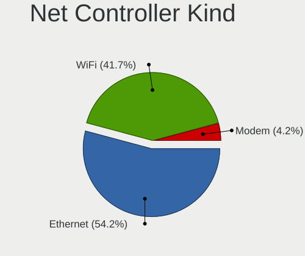

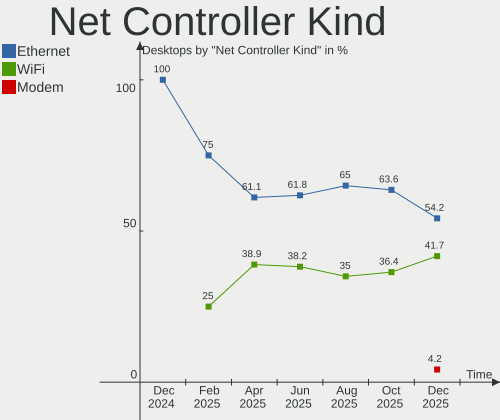

| Kind     | Desktops | Percent |
|----------|----------|---------|
| Ethernet | 13       | 54.17%  |
| WiFi     | 10       | 41.67%  |
| Modem    | 1        | 4.17%   |

Used Controller
---------------

Currently used network controller

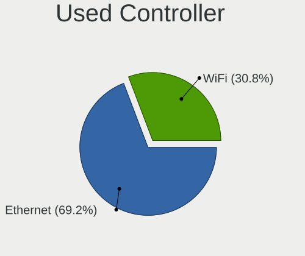

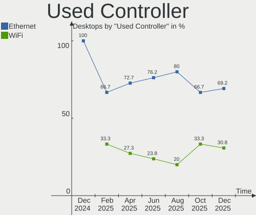

| Kind     | Desktops | Percent |
|----------|----------|---------|
| Ethernet | 9        | 69.23%  |
| WiFi     | 4        | 30.77%  |

NICs
----

Total network controllers on board

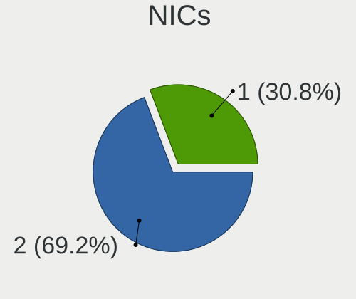

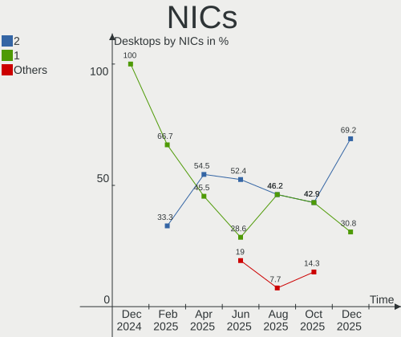

| Total | Desktops | Percent |
|-------|----------|---------|
| 2     | 9        | 69.23%  |
| 1     | 4        | 30.77%  |

IPv6
----

IPv6 vs IPv4

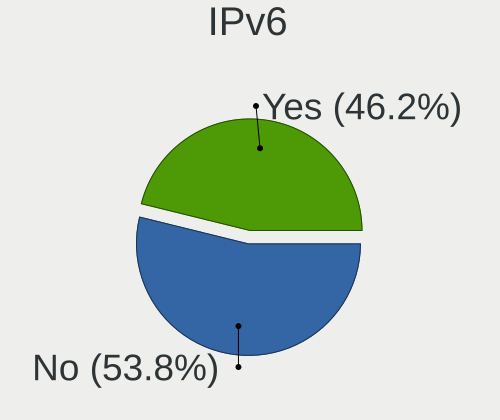

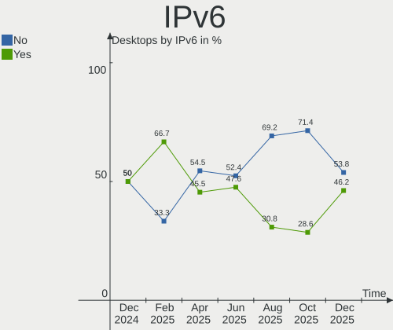

| Used | Desktops | Percent |
|------|----------|---------|
| No   | 7        | 53.85%  |
| Yes  | 6        | 46.15%  |

Bluetooth
---------

Bluetooth Vendor
----------------

Controller vendors

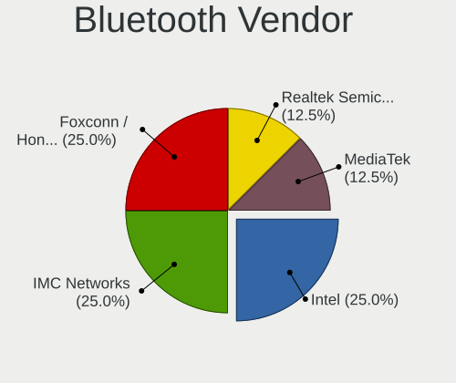

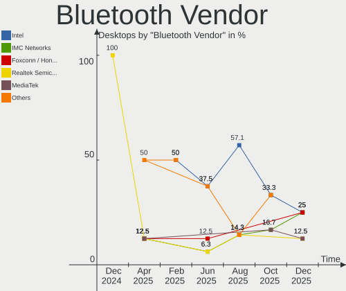

| Vendor                | Desktops | Percent |
|-----------------------|----------|---------|
| Intel                 | 2        | 25%     |
| IMC Networks          | 2        | 25%     |
| Foxconn / Hon Hai     | 2        | 25%     |
| Realtek Semiconductor | 1        | 12.5%   |
| MediaTek              | 1        | 12.5%   |

Bluetooth Model
---------------

Controller models

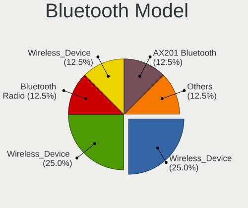

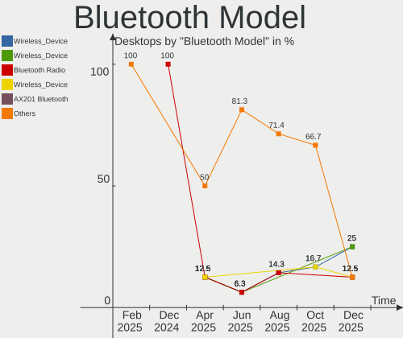

| Model                             | Desktops | Percent |
|-----------------------------------|----------|---------|
| IMC Networks Wireless_Device      | 2        | 25%     |
| Foxconn / Hon Hai Wireless_Device | 2        | 25%     |
| Realtek Bluetooth Radio           | 1        | 12.5%   |
| MediaTek Wireless_Device          | 1        | 12.5%   |
| Intel AX201 Bluetooth             | 1        | 12.5%   |
| Intel AX200 Bluetooth             | 1        | 12.5%   |

Sound
-----

Sound Vendor
------------

Sound card vendors

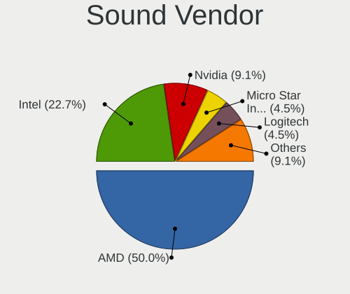

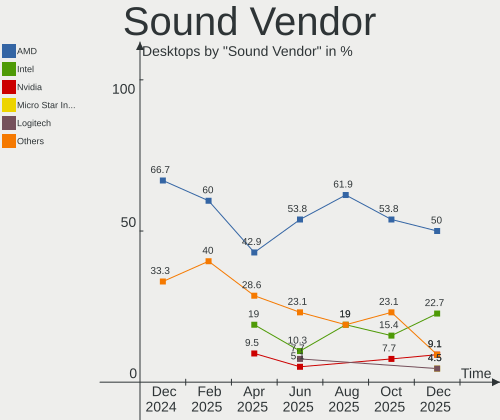

| Vendor                   | Desktops | Percent |
|--------------------------|----------|---------|
| AMD                      | 11       | 50%     |
| Intel                    | 5        | 22.73%  |
| Nvidia                   | 2        | 9.09%   |
| Micro Star International | 1        | 4.55%   |
| Logitech                 | 1        | 4.55%   |
| C-Media Electronics      | 1        | 4.55%   |
| ASUSTek Computer         | 1        | 4.55%   |

Sound Model
-----------

Sound card models

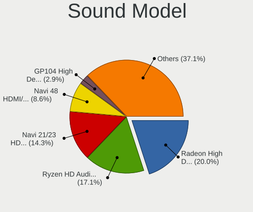

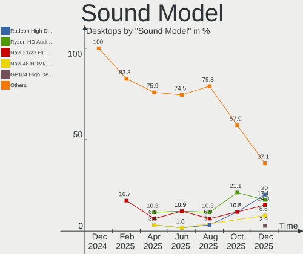

| Model                                                               | Desktops | Percent |
|---------------------------------------------------------------------|----------|---------|
| AMD Radeon High Definition Audio Controller                         | 7        | 20%     |
| AMD Ryzen HD Audio Controller                                       | 6        | 17.14%  |
| AMD Navi 21/23 HDMI/DP Audio Controller                             | 5        | 14.29%  |
| AMD Navi 48 HDMI/DP Audio Controller                                | 3        | 8.57%   |
| Nvidia GP104 High Definition Audio Controller                       | 1        | 2.86%   |
| Nvidia GB205 High Definition Audio Controller                       | 1        | 2.86%   |
| Micro Star International USB Audio                                  | 1        | 2.86%   |
| Logitech Blue Microphones                                           | 1        | 2.86%   |
| Intel Xeon E3-1200 v3/4th Gen Core Processor HD Audio Controller    | 1        | 2.86%   |
| Intel C610/X99 series chipset HD Audio Controller                   | 1        | 2.86%   |
| Intel Alder Lake-S HD Audio Controller                              | 1        | 2.86%   |
| Intel 8 Series/C220 Series Chipset High Definition Audio Controller | 1        | 2.86%   |
| Intel 200 Series PCH HD Audio                                       | 1        | 2.86%   |
| Intel 100 Series/C230 Series Chipset Family HD Audio Controller     | 1        | 2.86%   |
| C-Media Electronics Auna Mic CM900                                  | 1        | 2.86%   |
| ASUSTek Computer USB Audio                                          | 1        | 2.86%   |
| AMD Starship/Matisse HD Audio Controller                            | 1        | 2.86%   |
| AMD Navi 31 HDMI/DP Audio                                           | 1        | 2.86%   |

Memory
------

Memory Vendor
-------------

Memory module vendors

Zero info for selected period =(

Memory Model
------------

Memory module models

Zero info for selected period =(

Memory Kind
-----------

Memory module kinds

Zero info for selected period =(

Memory Form Factor
------------------

Physical design of the memory module

Zero info for selected period =(

Memory Size
-----------

Memory module size

Zero info for selected period =(

Memory Speed
------------

Memory module speed

Zero info for selected period =(

Printers & scanners
-------------------

Printer Vendor
--------------

Printer device vendors

Zero info for selected period =(

Printer Model
-------------

Printer device models

Zero info for selected period =(

Scanner Vendor
--------------

Scanner device vendors

Zero info for selected period =(

Scanner Model
-------------

Scanner device models

Zero info for selected period =(

Camera
------

Camera Vendor
-------------

Camera device vendors

Zero info for selected period =(

Camera Model
------------

Camera device models

Zero info for selected period =(

Security
--------

Fingerprint Vendor
------------------

Fingerprint sensor vendors

Zero info for selected period =(

Fingerprint Model
-----------------

Fingerprint sensor models

Zero info for selected period =(

Chipcard Vendor
---------------

Chipcard module vendors

Zero info for selected period =(

Chipcard Model
--------------

Chipcard module models

Zero info for selected period =(

Unsupported
-----------

Unsupported Devices
-------------------

Total unsupported devices on board

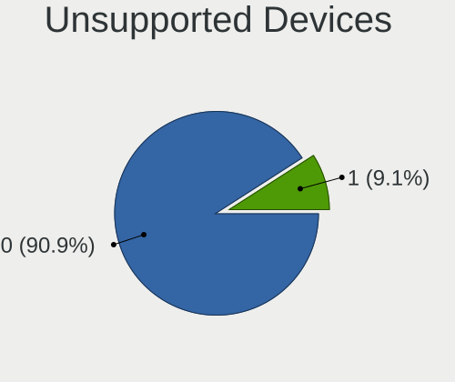

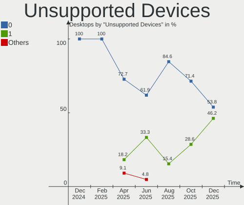

| Total | Desktops | Percent |
|-------|----------|---------|
| 0     | 7        | 53.85%  |
| 1     | 6        | 46.15%  |

Unsupported Device Types
------------------------

Types of unsupported devices

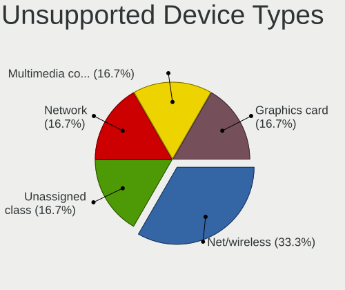

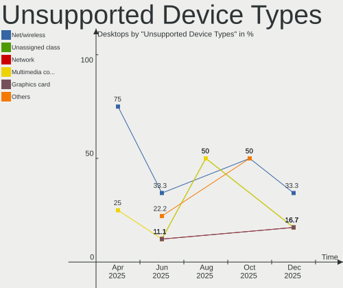

| Type                  | Desktops | Percent |
|-----------------------|----------|---------|
| Net/wireless          | 2        | 33.33%  |
| Unassigned class      | 1        | 16.67%  |
| Network               | 1        | 16.67%  |
| Multimedia controller | 1        | 16.67%  |
| Graphics card         | 1        | 16.67%  |

