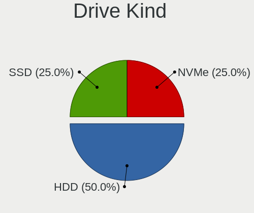
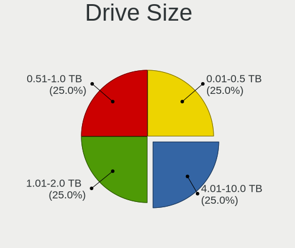
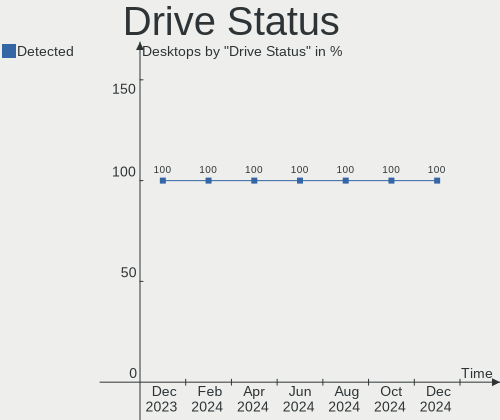
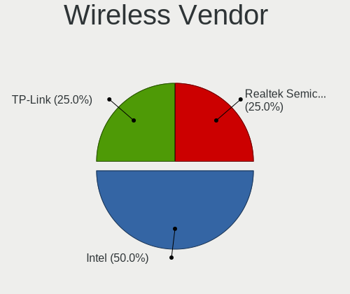

SteamOS - Hardware Trends (Desktops)
------------------------------------

A project to identify most popular hardware characteristics and track their change
over time based on data collected by Linux users at https://Linux-Hardware.org.

Anyone can contribute to this report by the [hw-probe](https://github.com/linuxhw/hw-probe) tool:

    sudo -E hw-probe -all -upload

This report is for one last month. Overall report since the beginning of time: [TestCoverage](https://github.com/linuxhw/TestCoverage)

Period: Jan, 2023.

Contents
--------

* [ System ](#system)
  - [ OS                       ](#os)
  - [ OS Family                ](#os-family)
  - [ Kernel                   ](#kernel)
  - [ Kernel Family            ](#kernel-family)
  - [ Kernel Major Ver.        ](#kernel-major-ver)
  - [ Arch                     ](#arch)
  - [ DE                       ](#de)
  - [ Display Server           ](#display-server)
  - [ Display Manager          ](#display-manager)
  - [ OS Lang                  ](#os-lang)
  - [ Boot Mode                ](#boot-mode)
  - [ Filesystem               ](#filesystem)
  - [ Part. scheme             ](#part-scheme)
  - [ Dual Boot with Linux/BSD ](#dual-boot-with-linuxbsd)
  - [ Dual Boot (Win)          ](#dual-boot-win)

* [ Board ](#board)
  - [ Vendor                   ](#vendor)
  - [ Model                    ](#model)
  - [ Model Family             ](#model-family)
  - [ MFG Year                 ](#mfg-year)
  - [ Form Factor              ](#form-factor)
  - [ Secure Boot              ](#secure-boot)
  - [ Coreboot                 ](#coreboot)
  - [ RAM Size                 ](#ram-size)
  - [ RAM Used                 ](#ram-used)
  - [ Total Drives             ](#total-drives)
  - [ Has CD-ROM               ](#has-cd-rom)
  - [ Has Ethernet             ](#has-ethernet)
  - [ Has WiFi                 ](#has-wifi)
  - [ Has Bluetooth            ](#has-bluetooth)

* [ Location ](#location)
  - [ Country                  ](#country)
  - [ City                     ](#city)

* [ Drives ](#drives)
  - [ Drive Vendor             ](#drive-vendor)
  - [ Drive Model              ](#drive-model)
  - [ HDD Vendor               ](#hdd-vendor)
  - [ SSD Vendor               ](#ssd-vendor)
  - [ Drive Kind               ](#drive-kind)
  - [ Drive Connector          ](#drive-connector)
  - [ Drive Size               ](#drive-size)
  - [ Space Total              ](#space-total)
  - [ Space Used               ](#space-used)
  - [ Malfunc. Drives          ](#malfunc-drives)
  - [ Malfunc. Drive Vendor    ](#malfunc-drive-vendor)
  - [ Malfunc. HDD Vendor      ](#malfunc-hdd-vendor)
  - [ Malfunc. Drive Kind      ](#malfunc-drive-kind)
  - [ Failed Drives            ](#failed-drives)
  - [ Failed Drive Vendor      ](#failed-drive-vendor)
  - [ Drive Status             ](#drive-status)

* [ Storage controller ](#storage-controller)
  - [ Storage Vendor           ](#storage-vendor)
  - [ Storage Model            ](#storage-model)
  - [ Storage Kind             ](#storage-kind)

* [ Processor ](#processor)
  - [ CPU Vendor               ](#cpu-vendor)
  - [ CPU Model                ](#cpu-model)
  - [ CPU Model Family         ](#cpu-model-family)
  - [ CPU Cores                ](#cpu-cores)
  - [ CPU Sockets              ](#cpu-sockets)
  - [ CPU Threads              ](#cpu-threads)
  - [ CPU Op-Modes             ](#cpu-op-modes)
  - [ CPU Microcode            ](#cpu-microcode)
  - [ CPU Microarch            ](#cpu-microarch)

* [ Graphics ](#graphics)
  - [ GPU Vendor               ](#gpu-vendor)
  - [ GPU Model                ](#gpu-model)
  - [ GPU Combo                ](#gpu-combo)
  - [ GPU Driver               ](#gpu-driver)
  - [ GPU Memory               ](#gpu-memory)

* [ Monitor ](#monitor)
  - [ Monitor Vendor           ](#monitor-vendor)
  - [ Monitor Model            ](#monitor-model)
  - [ Monitor Resolution       ](#monitor-resolution)
  - [ Monitor Diagonal         ](#monitor-diagonal)
  - [ Monitor Width            ](#monitor-width)
  - [ Aspect Ratio             ](#aspect-ratio)
  - [ Monitor Area             ](#monitor-area)
  - [ Pixel Density            ](#pixel-density)
  - [ Multiple Monitors        ](#multiple-monitors)

* [ Network ](#network)
  - [ Net Controller Vendor    ](#net-controller-vendor)
  - [ Net Controller Model     ](#net-controller-model)
  - [ Wireless Vendor          ](#wireless-vendor)
  - [ Wireless Model           ](#wireless-model)
  - [ Ethernet Vendor          ](#ethernet-vendor)
  - [ Ethernet Model           ](#ethernet-model)
  - [ Net Controller Kind      ](#net-controller-kind)
  - [ Used Controller          ](#used-controller)
  - [ NICs                     ](#nics)
  - [ IPv6                     ](#ipv6)

* [ Bluetooth ](#bluetooth)
  - [ Bluetooth Vendor         ](#bluetooth-vendor)
  - [ Bluetooth Model          ](#bluetooth-model)

* [ Sound ](#sound)
  - [ Sound Vendor             ](#sound-vendor)
  - [ Sound Model              ](#sound-model)

* [ Memory ](#memory)
  - [ Memory Vendor            ](#memory-vendor)
  - [ Memory Model             ](#memory-model)
  - [ Memory Kind              ](#memory-kind)
  - [ Memory Form Factor       ](#memory-form-factor)
  - [ Memory Size              ](#memory-size)
  - [ Memory Speed             ](#memory-speed)

* [ Printers & scanners ](#printers--scanners)
  - [ Printer Vendor           ](#printer-vendor)
  - [ Printer Model            ](#printer-model)
  - [ Scanner Vendor           ](#scanner-vendor)
  - [ Scanner Model            ](#scanner-model)

* [ Camera ](#camera)
  - [ Camera Vendor            ](#camera-vendor)
  - [ Camera Model             ](#camera-model)

* [ Security ](#security)
  - [ Fingerprint Vendor       ](#fingerprint-vendor)
  - [ Fingerprint Model        ](#fingerprint-model)
  - [ Chipcard Vendor          ](#chipcard-vendor)
  - [ Chipcard Model           ](#chipcard-model)

* [ Unsupported ](#unsupported)
  - [ Unsupported Devices      ](#unsupported-devices)
  - [ Unsupported Device Types ](#unsupported-device-types)

System
------

OS
--

Installed operating systems

| Name        | Desktops | Percent |
|-------------|----------|---------|
| SteamOS 3.4 | 6        | 100%    |

OS Family
---------

OS without a version

| Name    | Desktops | Percent |
|---------|----------|---------|
| SteamOS | 6        | 100%    |

Kernel
------

Version of the Linux kernel

| Version                                | Desktops | Percent |
|----------------------------------------|----------|---------|
| 5.13.0-valve21.3-1-neptune             | 3        | 50%     |
| 5.18.1-arch1_testHoloISO_20220606.1811 | 2        | 33.33%  |
| 5.13.0-valve36-1-neptune               | 1        | 16.67%  |

Kernel Family
-------------

Linux kernel without a distro release

| Version | Desktops | Percent |
|---------|----------|---------|
| 5.13.0  | 4        | 66.67%  |
| 5.18.1  | 2        | 33.33%  |

Kernel Major Ver.
-----------------

Linux kernel major version

| Version | Desktops | Percent |
|---------|----------|---------|
| 5.13    | 4        | 66.67%  |
| 5.18    | 2        | 33.33%  |

Arch
----

OS architecture (x86_64, i586, etc.)

| Name   | Desktops | Percent |
|--------|----------|---------|
| x86_64 | 6        | 100%    |

DE
--

Desktop Environment

| Name | Desktops | Percent |
|------|----------|---------|
| KDE5 | 6        | 100%    |

Display Server
--------------

X11 or Wayland

| Name | Desktops | Percent |
|------|----------|---------|
| X11  | 6        | 100%    |

Display Manager
---------------

SDDM, LightDM, etc.

| Name    | Desktops | Percent |
|---------|----------|---------|
| Unknown | 6        | 100%    |

OS Lang
-------

Language

| Lang  | Desktops | Percent |
|-------|----------|---------|
| en_US | 6        | 100%    |

Boot Mode
---------

EFI or BIOS

| Mode | Desktops | Percent |
|------|----------|---------|
| BIOS | 6        | 100%    |

Filesystem
----------

Type of filesystem

| Type  | Desktops | Percent |
|-------|----------|---------|
| Btrfs | 5        | 83.33%  |
| Tmpfs | 1        | 16.67%  |

Part. scheme
------------

Scheme of partitioning

| Type    | Desktops | Percent |
|---------|----------|---------|
| Unknown | 6        | 100%    |

Dual Boot with Linux/BSD
------------------------

Hosting more than one Linux/BSD

| Dual boot | Desktops | Percent |
|-----------|----------|---------|
| No        | 6        | 100%    |

Dual Boot (Win)
---------------

Hosting Linux and Windows

| Dual boot | Desktops | Percent |
|-----------|----------|---------|
| No        | 6        | 100%    |

Board
-----

Vendor
------

Motherboard manufacturer

| Name                | Desktops | Percent |
|---------------------|----------|---------|
| MSI                 | 2        | 33.33%  |
| Gigabyte Technology | 2        | 33.33%  |
| Hewlett-Packard     | 1        | 16.67%  |
| Dell                | 1        | 16.67%  |

Model
-----

Motherboard model

| Name                                 | Desktops | Percent |
|--------------------------------------|----------|---------|
| MSI MS-7C37                          | 1        | 16.67%  |
| MSI MS-7817                          | 1        | 16.67%  |
| HP Pavilion Gaming Desktop TG01-2xxx | 1        | 16.67%  |
| Gigabyte B550M DS3H                  | 1        | 16.67%  |
| Gigabyte B450 AORUS M                | 1        | 16.67%  |
| Dell OptiPlex 990                    | 1        | 16.67%  |

Model Family
------------

Motherboard model prefix

| Name           | Desktops | Percent |
|----------------|----------|---------|
| MSI MS-7C37    | 1        | 16.67%  |
| MSI MS-7817    | 1        | 16.67%  |
| HP Pavilion    | 1        | 16.67%  |
| Gigabyte B550M | 1        | 16.67%  |
| Gigabyte B450  | 1        | 16.67%  |
| Dell OptiPlex  | 1        | 16.67%  |

MFG Year
--------

Motherboard manufacture year

| Year | Desktops | Percent |
|------|----------|---------|
| 2021 | 1        | 16.67%  |
| 2020 | 1        | 16.67%  |
| 2019 | 1        | 16.67%  |
| 2018 | 1        | 16.67%  |
| 2013 | 1        | 16.67%  |
| 2011 | 1        | 16.67%  |

Form Factor
-----------

Physical design of the computer

| Name    | Desktops | Percent |
|---------|----------|---------|
| Desktop | 6        | 100%    |

Secure Boot
-----------

Enabled or disabled

| State    | Desktops | Percent |
|----------|----------|---------|
| Disabled | 6        | 100%    |

Coreboot
--------

Have coreboot on board

| Used | Desktops | Percent |
|------|----------|---------|
| No   | 6        | 100%    |

RAM Size
--------

Total RAM memory

| Size in GB | Desktops | Percent |
|------------|----------|---------|
| 16.01-24.0 | 2        | 33.33%  |
| 8.01-16.0  | 2        | 33.33%  |
| 4.01-8.0   | 1        | 16.67%  |
| 32.01-64.0 | 1        | 16.67%  |

RAM Used
--------

Used RAM memory

| Used GB   | Desktops | Percent |
|-----------|----------|---------|
| 3.01-4.0  | 2        | 33.33%  |
| 8.01-16.0 | 2        | 33.33%  |
| 4.01-8.0  | 1        | 16.67%  |
| 1.01-2.0  | 1        | 16.67%  |

Total Drives
------------

Number of drives on board

| Drives | Desktops | Percent |
|--------|----------|---------|
| 1      | 3        | 50%     |
| 2      | 2        | 33.33%  |
| 4      | 1        | 16.67%  |

Has CD-ROM
----------

Has CD-ROM on board

| Presented | Desktops | Percent |
|-----------|----------|---------|
| No        | 5        | 83.33%  |
| Yes       | 1        | 16.67%  |

Has Ethernet
------------

Has Ethernet on board

| Presented | Desktops | Percent |
|-----------|----------|---------|
| Yes       | 6        | 100%    |

Has WiFi
--------

Has WiFi module

| Presented | Desktops | Percent |
|-----------|----------|---------|
| Yes       | 3        | 50%     |
| No        | 3        | 50%     |

Has Bluetooth
-------------

Has Bluetooth module

| Presented | Desktops | Percent |
|-----------|----------|---------|
| No        | 4        | 66.67%  |
| Yes       | 2        | 33.33%  |

Location
--------

Country
-------

Geographic location (country)

| Country      | Desktops | Percent |
|--------------|----------|---------|
| USA          | 3        | 50%     |
| South Africa | 1        | 16.67%  |
| Brazil       | 1        | 16.67%  |
| Australia    | 1        | 16.67%  |

City
----

Geographic location (city)

| City           | Desktops | Percent |
|----------------|----------|---------|
| Sydney         | 1        | 16.67%  |
| Siloam Springs | 1        | 16.67%  |
| Sao Paulo      | 1        | 16.67%  |
| Kraaifontein   | 1        | 16.67%  |
| Holtsville     | 1        | 16.67%  |
| Cleveland      | 1        | 16.67%  |

Drives
------

Drive Vendor
------------

Hard drive vendors

| Vendor                    | Desktops | Drives | Percent |
|---------------------------|----------|--------|---------|
| Kingston                  | 3        | 3      | 33.33%  |
| WDC                       | 1        | 1      | 11.11%  |
| Seagate                   | 1        | 2      | 11.11%  |
| Samsung Electronics       | 1        | 1      | 11.11%  |
| Phison Electronics        | 1        | 2      | 11.11%  |
| Micron/Crucial Technology | 1        | 1      | 11.11%  |
| Crucial                   | 1        | 1      | 11.11%  |

Drive Model
-----------

Hard drive models

| Model                                               | Desktops | Percent |
|-----------------------------------------------------|----------|---------|
| WDC WD2500AAKX-753CA1 250GB                         | 1        | 9.09%   |
| Seagate ST6000NM0024-1HT17Z 6TB                     | 1        | 9.09%   |
| Seagate ST3000DM008-2DM166 3TB                      | 1        | 9.09%   |
| Samsung NVMe SSD Controller SM981/PM981/PM983 500GB | 1        | 9.09%   |
| Phison E16 PCIe4 NVMe Controller 2TB                | 1        | 9.09%   |
| Phison E12 NVMe Controller 1TB                      | 1        | 9.09%   |
| Micron/Crucial CT1000P1SSD8 1TB                     | 1        | 9.09%   |
| Kingston SNVS1000G 1TB                              | 1        | 9.09%   |
| Kingston SH103S3120G 120GB SSD                      | 1        | 9.09%   |
| Kingston SA400S37120G 120GB SSD                     | 1        | 9.09%   |
| Crucial CT480BX500SSD1 480GB                        | 1        | 9.09%   |

HDD Vendor
----------

Hard disk drive vendors

| Vendor  | Desktops | Drives | Percent |
|---------|----------|--------|---------|
| WDC     | 1        | 1      | 50%     |
| Seagate | 1        | 2      | 50%     |

SSD Vendor
----------

Solid state drive vendors

| Vendor   | Desktops | Drives | Percent |
|----------|----------|--------|---------|
| Kingston | 2        | 2      | 66.67%  |
| Crucial  | 1        | 1      | 33.33%  |

Drive Kind
----------

HDD or SSD

| Kind | Desktops | Drives | Percent |
|------|----------|--------|---------|
| NVMe | 4        | 5      | 44.44%  |
| SSD  | 3        | 3      | 33.33%  |
| HDD  | 2        | 3      | 22.22%  |

Drive Connector
---------------

SATA, SAS, NVMe, etc.

| Type | Desktops | Drives | Percent |
|------|----------|--------|---------|
| NVMe | 4        | 5      | 50%     |
| SATA | 4        | 6      | 50%     |

Drive Size
----------

Size of hard drive

| Size in TB | Desktops | Drives | Percent |
|------------|----------|--------|---------|
| 0.01-0.5   | 4        | 4      | 66.67%  |
| 2.01-3.0   | 1        | 1      | 16.67%  |
| 4.01-10.0  | 1        | 1      | 16.67%  |

Space Total
-----------

Amount of disk space available on the file system

| Size in GB     | Desktops | Percent |
|----------------|----------|---------|
| 101-250        | 4        | 66.67%  |
| More than 3000 | 1        | 16.67%  |
| 501-1000       | 1        | 16.67%  |

Space Used
----------

Amount of used disk space

| Used GB        | Desktops | Percent |
|----------------|----------|---------|
| 1-20           | 3        | 50%     |
| More than 3000 | 1        | 16.67%  |
| 21-50          | 1        | 16.67%  |
| 101-250        | 1        | 16.67%  |

Malfunc. Drives
---------------

Drive models with a malfunction

Zero info for selected period =(

Malfunc. Drive Vendor
---------------------

Vendors of faulty drives

Zero info for selected period =(

Malfunc. HDD Vendor
-------------------

Vendors of faulty HDD drives

Zero info for selected period =(

Malfunc. Drive Kind
-------------------

Kinds of faulty drives

Zero info for selected period =(

Failed Drives
-------------

Failed drive models

Zero info for selected period =(

Failed Drive Vendor
-------------------

Failed drive vendors

Zero info for selected period =(

Drive Status
------------

Number of failed and malfunc. drives

| Status   | Desktops | Drives | Percent |
|----------|----------|--------|---------|
| Detected | 6        | 11     | 100%    |

Storage controller
------------------

Storage Vendor
--------------

Storage controller vendors

| Vendor                      | Desktops | Percent |
|-----------------------------|----------|---------|
| AMD                         | 4        | 36.36%  |
| Intel                       | 2        | 18.18%  |
| Samsung Electronics         | 1        | 9.09%   |
| Phison Electronics          | 1        | 9.09%   |
| Micron/Crucial Technology   | 1        | 9.09%   |
| Kingston Technology Company | 1        | 9.09%   |
| ASMedia Technology          | 1        | 9.09%   |

Storage Model
-------------

Storage controller models

| Model                                                                          | Desktops | Percent |
|--------------------------------------------------------------------------------|----------|---------|
| AMD FCH SATA Controller [AHCI mode]                                            | 3        | 21.43%  |
| AMD 400 Series Chipset SATA Controller                                         | 2        | 14.29%  |
| Samsung NVMe SSD Controller SM981/PM981/PM983                                  | 1        | 7.14%   |
| Phison E16 PCIe4 NVMe Controller                                               | 1        | 7.14%   |
| Phison E12 NVMe Controller                                                     | 1        | 7.14%   |
| Micron/Crucial NVMe Controller                                                 | 1        | 7.14%   |
| Kingston Company SNVS2000G [NV1 NVMe PCIe SSD 2TB]                             | 1        | 7.14%   |
| Intel SATA Controller [RAID mode]                                              | 1        | 7.14%   |
| Intel 8 Series/C220 Series Chipset Family 6-port SATA Controller 1 [AHCI mode] | 1        | 7.14%   |
| ASMedia ASM1062 Serial ATA Controller                                          | 1        | 7.14%   |
| AMD 500 Series Chipset SATA Controller                                         | 1        | 7.14%   |

Storage Kind
------------

Kind of storage controller (IDE, SATA, NVMe, SAS, ...)

| Kind | Desktops | Percent |
|------|----------|---------|
| SATA | 5        | 50%     |
| NVMe | 4        | 40%     |
| RAID | 1        | 10%     |

Processor
---------

CPU Vendor
----------

Processor vendors

| Vendor | Desktops | Percent |
|--------|----------|---------|
| AMD    | 4        | 66.67%  |
| Intel  | 2        | 33.33%  |

CPU Model
---------

Processor models

| Model                                       | Desktops | Percent |
|---------------------------------------------|----------|---------|
| Intel Core i5-4570 CPU @ 3.20GHz            | 1        | 16.67%  |
| Intel Core i5-2400 CPU @ 3.10GHz            | 1        | 16.67%  |
| AMD Ryzen 9 5900X 12-Core Processor         | 1        | 16.67%  |
| AMD Ryzen 5 5600X 6-Core Processor          | 1        | 16.67%  |
| AMD Ryzen 5 5600G with Radeon Graphics      | 1        | 16.67%  |
| AMD Ryzen 5 3400G with Radeon Vega Graphics | 1        | 16.67%  |

CPU Model Family
----------------

Processor model prefix

| Model         | Desktops | Percent |
|---------------|----------|---------|
| AMD Ryzen 5   | 3        | 50%     |
| Intel Core i5 | 2        | 33.33%  |
| AMD Ryzen 9   | 1        | 16.67%  |

CPU Cores
---------

Number of processor cores

| Number | Desktops | Percent |
|--------|----------|---------|
| 4      | 3        | 50%     |
| 6      | 2        | 33.33%  |
| 12     | 1        | 16.67%  |

CPU Sockets
-----------

Number of sockets

| Number | Desktops | Percent |
|--------|----------|---------|
| 1      | 6        | 100%    |

CPU Threads
-----------

Threads per core (Hyper-Threading)

| Number | Desktops | Percent |
|--------|----------|---------|
| 2      | 4        | 66.67%  |
| 1      | 2        | 33.33%  |

CPU Op-Modes
------------

CPU Operation Modes (32-bit, 64-bit)

| Op mode        | Desktops | Percent |
|----------------|----------|---------|
| 32-bit, 64-bit | 6        | 100%    |

CPU Microcode
-------------

Microcode number

| Number  | Desktops | Percent |
|---------|----------|---------|
| Unknown | 6        | 100%    |

CPU Microarch
-------------

Microarchitecture

| Name        | Desktops | Percent |
|-------------|----------|---------|
| Zen 3       | 3        | 50%     |
| Zen+        | 1        | 16.67%  |
| SandyBridge | 1        | 16.67%  |
| Haswell     | 1        | 16.67%  |

Graphics
--------

GPU Vendor
----------

Vendors of graphics cards

| Vendor | Desktops | Percent |
|--------|----------|---------|
| AMD    | 6        | 85.71%  |
| Intel  | 1        | 14.29%  |

GPU Model
---------

Graphics card models

| Model                                                                       | Desktops | Percent |
|-----------------------------------------------------------------------------|----------|---------|
| Intel Xeon E3-1200 v3/4th Gen Core Processor Integrated Graphics Controller | 1        | 12.5%   |
| AMD Picasso/Raven 2 [Radeon Vega Series / Radeon Vega Mobile Series]        | 1        | 12.5%   |
| AMD Oland XT [Radeon HD 8670 / R5 340X OEM / R7 250/350/350X OEM]           | 1        | 12.5%   |
| AMD Navi 22 [Radeon RX 6700/6700 XT/6750 XT / 6800M]                        | 1        | 12.5%   |
| AMD Navi 21 [Radeon RX 6800/6800 XT / 6900 XT]                              | 1        | 12.5%   |
| AMD Navi 14 [Radeon RX 5500/5500M / Pro 5500M]                              | 1        | 12.5%   |
| AMD Cezanne [Radeon Vega Series / Radeon Vega Mobile Series]                | 1        | 12.5%   |
| AMD Baffin [Radeon RX 550 640SP / RX 560/560X]                              | 1        | 12.5%   |

GPU Combo
---------

Combinations of graphics cards

| Name    | Desktops | Percent |
|---------|----------|---------|
| 1 x AMD | 5        | 83.33%  |
| 2 x AMD | 1        | 16.67%  |

GPU Driver
----------

Free vs proprietary

| Driver | Desktops | Percent |
|--------|----------|---------|
| Free   | 6        | 100%    |

GPU Memory
----------

Total video memory

| Size in GB | Desktops | Percent |
|------------|----------|---------|
| Unknown    | 6        | 100%    |

Monitor
-------

Monitor Vendor
--------------

Monitor vendors

| Vendor   | Desktops | Percent |
|----------|----------|---------|
| AOC      | 2        | 33.33%  |
| Toshiba  | 1        | 16.67%  |
| Pixio    | 1        | 16.67%  |
| Goldstar | 1        | 16.67%  |
| Acer     | 1        | 16.67%  |

Monitor Model
-------------

Monitor models

| Model                                                 | Desktops | Percent |
|-------------------------------------------------------|----------|---------|
| Toshiba TV TSB0206 1920x1080 1600x1000mm 74.3-inch    | 1        | 14.29%  |
| Pixio PX275h WAM2700 2560x1440 600x330mm 27.0-inch    | 1        | 14.29%  |
| Goldstar 23MP55 GSM5A23 1920x1080 510x290mm 23.1-inch | 1        | 14.29%  |
| AOC U32E2WG6 AOC3202 3840x2160 697x392mm 31.5-inch    | 1        | 14.29%  |
| AOC 931Wx AOC1931 1680x1050 440x325mm 21.5-inch       | 1        | 14.29%  |
| AOC 24B1W1G5 AOC2401 1920x1080 527x296mm 23.8-inch    | 1        | 14.29%  |
| Acer ER320HQ ACR0495 1920x1080 698x393mm 31.5-inch    | 1        | 14.29%  |

Monitor Resolution
------------------

Monitor screen resolution

| Resolution         | Desktops | Percent |
|--------------------|----------|---------|
| 1920x1080 (FHD)    | 3        | 42.86%  |
| 3840x2160 (4K)     | 2        | 28.57%  |
| 2560x1440 (QHD)    | 1        | 14.29%  |
| 1680x1050 (WSXGA+) | 1        | 14.29%  |

Monitor Diagonal
----------------

Diagonal size in inches

| Inches | Desktops | Percent |
|--------|----------|---------|
| 31     | 2        | 28.57%  |
| 74     | 1        | 14.29%  |
| 32     | 1        | 14.29%  |
| 27     | 1        | 14.29%  |
| 24     | 1        | 14.29%  |
| 23     | 1        | 14.29%  |

Monitor Width
-------------

Physical width

| Width in mm | Desktops | Percent |
|-------------|----------|---------|
| 501-600     | 3        | 42.86%  |
| 601-700     | 2        | 28.57%  |
| 701-800     | 1        | 14.29%  |
| 1501-2000   | 1        | 14.29%  |

Aspect Ratio
------------

Proportional relationship between the width and the height

| Ratio | Desktops | Percent |
|-------|----------|---------|
| 16/9  | 5        | 71.43%  |
| 16/10 | 2        | 28.57%  |

Monitor Area
------------

Area in inch²

| Area in inch² | Desktops | Percent |
|----------------|----------|---------|
| 351-500        | 3        | 42.86%  |
| More than 1000 | 1        | 14.29%  |
| 301-350        | 1        | 14.29%  |
| 251-300        | 1        | 14.29%  |
| 201-250        | 1        | 14.29%  |

Pixel Density
-------------

Pixels per inch

| Density | Desktops | Percent |
|---------|----------|---------|
| 51-100  | 4        | 66.67%  |
| 1-50    | 1        | 16.67%  |
| 101-120 | 1        | 16.67%  |

Multiple Monitors
-----------------

Total monitors connected

| Total | Desktops | Percent |
|-------|----------|---------|
| 1     | 5        | 83.33%  |
| 2     | 1        | 16.67%  |

Network
-------

Net Controller Vendor
---------------------

Controller vendors

| Vendor                | Desktops | Percent |
|-----------------------|----------|---------|
| Realtek Semiconductor | 5        | 62.5%   |
| Intel                 | 3        | 37.5%   |

Net Controller Model
--------------------

Controller models

| Model                                                             | Desktops | Percent |
|-------------------------------------------------------------------|----------|---------|
| Realtek RTL8111/8168/8411 PCI Express Gigabit Ethernet Controller | 5        | 55.56%  |
| Intel Wi-Fi 6 AX210/AX211/AX411 160MHz                            | 2        | 22.22%  |
| Realtek RTL8821CE 802.11ac PCIe Wireless Network Adapter          | 1        | 11.11%  |
| Intel 82579LM Gigabit Network Connection (Lewisville)             | 1        | 11.11%  |

Wireless Vendor
---------------

Wireless vendors

| Vendor                | Desktops | Percent |
|-----------------------|----------|---------|
| Intel                 | 2        | 66.67%  |
| Realtek Semiconductor | 1        | 33.33%  |

Wireless Model
--------------

Wireless models

| Model                                                    | Desktops | Percent |
|----------------------------------------------------------|----------|---------|
| Intel Wi-Fi 6 AX210/AX211/AX411 160MHz                   | 2        | 66.67%  |
| Realtek RTL8821CE 802.11ac PCIe Wireless Network Adapter | 1        | 33.33%  |

Ethernet Vendor
---------------

Ethernet vendors

| Vendor                | Desktops | Percent |
|-----------------------|----------|---------|
| Realtek Semiconductor | 5        | 83.33%  |
| Intel                 | 1        | 16.67%  |

Ethernet Model
--------------

Ethernet models

| Model                                                             | Desktops | Percent |
|-------------------------------------------------------------------|----------|---------|
| Realtek RTL8111/8168/8411 PCI Express Gigabit Ethernet Controller | 5        | 83.33%  |
| Intel 82579LM Gigabit Network Connection (Lewisville)             | 1        | 16.67%  |

Net Controller Kind
-------------------

Ethernet, WiFi or modem

| Kind     | Desktops | Percent |
|----------|----------|---------|
| Ethernet | 6        | 66.67%  |
| WiFi     | 3        | 33.33%  |

Used Controller
---------------

Currently used network controller

| Kind     | Desktops | Percent |
|----------|----------|---------|
| Ethernet | 4        | 66.67%  |
| WiFi     | 2        | 33.33%  |

NICs
----

Total network controllers on board

| Total | Desktops | Percent |
|-------|----------|---------|
| 2     | 3        | 50%     |
| 1     | 3        | 50%     |

IPv6
----

IPv6 vs IPv4

| Used | Desktops | Percent |
|------|----------|---------|
| Yes  | 3        | 50%     |
| No   | 3        | 50%     |

Bluetooth
---------

Bluetooth Vendor
----------------

Controller vendors

| Vendor                | Desktops | Percent |
|-----------------------|----------|---------|
| Realtek Semiconductor | 1        | 50%     |
| Intel                 | 1        | 50%     |

Bluetooth Model
---------------

Controller models

| Model                   | Desktops | Percent |
|-------------------------|----------|---------|
| Realtek Bluetooth Radio | 1        | 50%     |
| Intel AX210 Bluetooth   | 1        | 50%     |

Sound
-----

Sound Vendor
------------

Sound card vendors

| Vendor              | Desktops | Percent |
|---------------------|----------|---------|
| AMD                 | 6        | 60%     |
| Intel               | 2        | 20%     |
| Medeli Electronics  | 1        | 10%     |
| C-Media Electronics | 1        | 10%     |

Sound Model
-----------

Sound card models

| Model                                                                      | Desktops | Percent |
|----------------------------------------------------------------------------|----------|---------|
| AMD Starship/Matisse HD Audio Controller                                   | 2        | 13.33%  |
| AMD Navi 21/23 HDMI/DP Audio Controller                                    | 2        | 13.33%  |
| AMD Family 17h/19h HD Audio Controller                                     | 2        | 13.33%  |
| Medeli Electronics AudioPro X5 Microphone                                  | 1        | 6.67%   |
| Intel 8 Series/C220 Series Chipset High Definition Audio Controller        | 1        | 6.67%   |
| Intel 6 Series/C200 Series Chipset Family High Definition Audio Controller | 1        | 6.67%   |
| C-Media Electronics USB Audio Device                                       | 1        | 6.67%   |
| AMD Renoir Radeon High Definition Audio Controller                         | 1        | 6.67%   |
| AMD Raven/Raven2/Fenghuang HDMI/DP Audio Controller                        | 1        | 6.67%   |
| AMD Oland/Hainan/Cape Verde/Pitcairn HDMI Audio [Radeon HD 7000 Series]    | 1        | 6.67%   |
| AMD Navi 10 HDMI Audio                                                     | 1        | 6.67%   |
| AMD Baffin HDMI/DP Audio [Radeon RX 550 640SP / RX 560/560X]               | 1        | 6.67%   |

Memory
------

Memory Vendor
-------------

Memory module vendors

Zero info for selected period =(

Memory Model
------------

Memory module models

Zero info for selected period =(

Memory Kind
-----------

Memory module kinds

Zero info for selected period =(

Memory Form Factor
------------------

Physical design of the memory module

Zero info for selected period =(

Memory Size
-----------

Memory module size

Zero info for selected period =(

Memory Speed
------------

Memory module speed

Zero info for selected period =(

Printers & scanners
-------------------

Printer Vendor
--------------

Printer device vendors

Zero info for selected period =(

Printer Model
-------------

Printer device models

Zero info for selected period =(

Scanner Vendor
--------------

Scanner device vendors

Zero info for selected period =(

Scanner Model
-------------

Scanner device models

Zero info for selected period =(

Camera
------

Camera Vendor
-------------

Camera device vendors

Zero info for selected period =(

Camera Model
------------

Camera device models

Zero info for selected period =(

Security
--------

Fingerprint Vendor
------------------

Fingerprint sensor vendors

Zero info for selected period =(

Fingerprint Model
-----------------

Fingerprint sensor models

Zero info for selected period =(

Chipcard Vendor
---------------

Chipcard module vendors

Zero info for selected period =(

Chipcard Model
--------------

Chipcard module models

Zero info for selected period =(

Unsupported
-----------

Unsupported Devices
-------------------

Total unsupported devices on board

| Total | Desktops | Percent |
|-------|----------|---------|
| 0     | 6        | 100%    |

Unsupported Device Types
------------------------

Types of unsupported devices

Zero info for selected period =(

